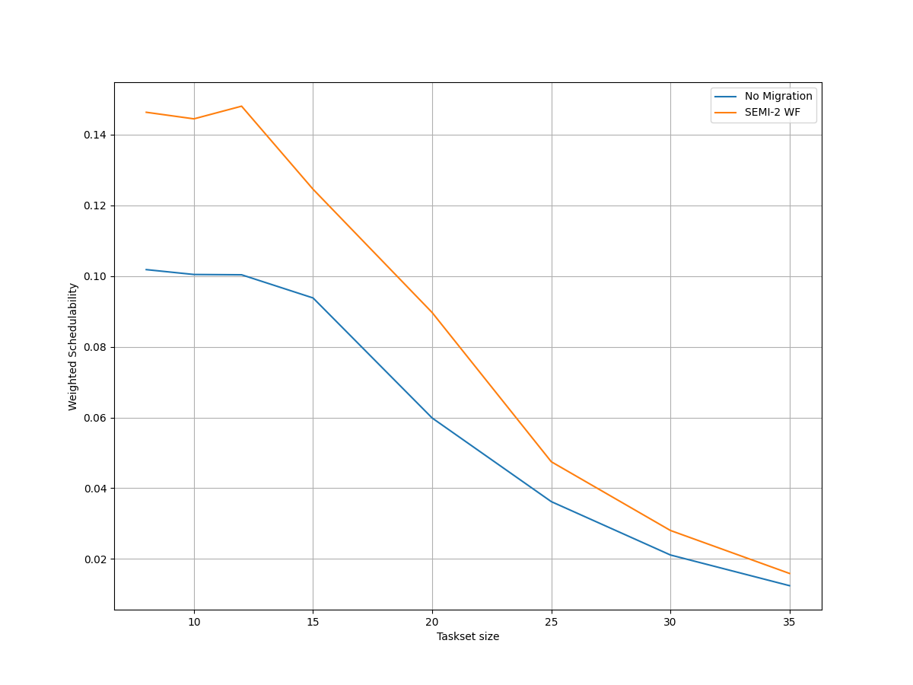
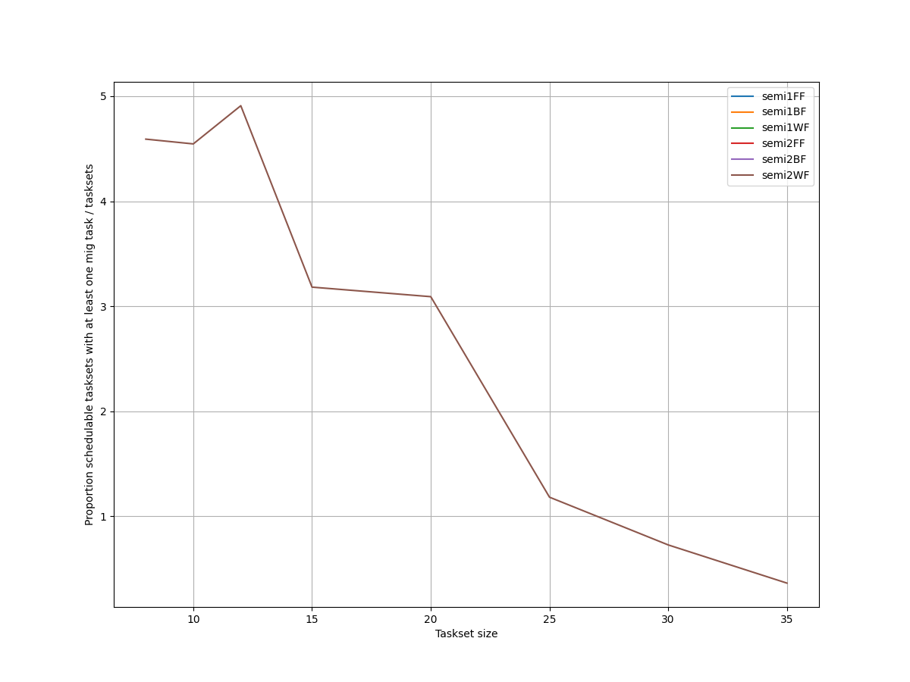
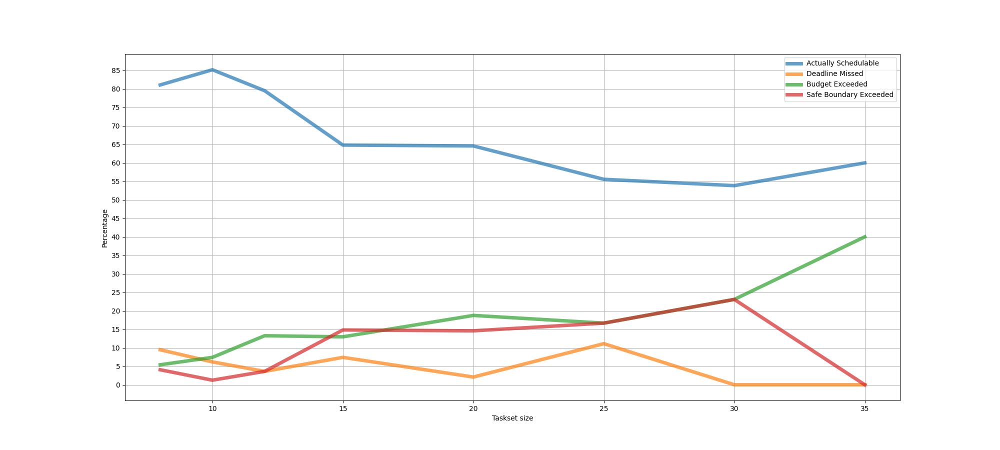
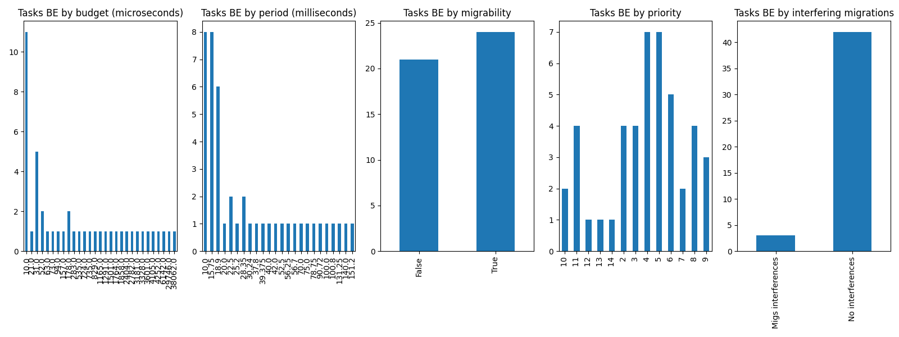
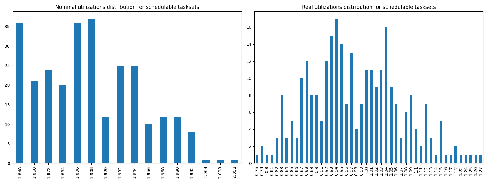

# Report on Experiment 4

## Overall data

   Utilization range = [1.848, 2.1] with step = 0.012

 Taskset sizes = [8, 10, 12, 15, 20, 25, 30, 35]

| Schedulable | Not schedulable | Budget Exceeded | Safe Boundary Exceeded |
| ------ | ------ | ------ | ------ |
| 74.73% | 5.85% | 11.97% | 7.45% |

Number of executions: 376

Schedulable executions: 281/376 = 74.7340425531915 %

_Not_ schedulable executions: 22/376 = 5.851063829787234 %

Budget Exceeded executions: 45/376 = 11.96808510638298 %

Safe Boundary Exceeded executions: 28/376 = 7.446808510638298 %

NS + BE executions: 67/376 = 17.819148936170212 %

### **Simulations**

#### **Weighted schedulability experiment 4 according to simulations.**

#### **Percentage of (schedulable tasksets with at least one migrating tasks / number of schedulable tasksets) of experiment 4 according to simulations.** 

 

### **Real Executions**

#### **Schedulability for each level**

#### **Tasksets, grouped by differents parameters, with a Budget_Exceeded task.**

#### **Tasksets, grouped by differents parameters, with at least one task missing one (or more) of its deadlines.**

### **Nominal utilizations VS Real utilizations about schedulable tasksets**

| Average real utilizations | Variance real utilizations | Min | Max |
| ------ | ------ | ------ | ------ |
| 0.979 | 0.009 | 0.750 | 1.270 |
## Bad tasksets

Click here to expand this section.

### **Not schedulable tasksets**

Click here to expand this section.

Ovvero quando almeno un task non completa entra almeno una sua deadline.

  1. Taskset **e4_semi2wf_t10099**

    Taskset execution params:
	 
    "id": "e4_semi2wf_t10099",
    "size": "20",
    "utilization": "1.992",
    "realutilization": 0.89,
    "criticality_factor": "2",
    "hicrit_proportion": "0.5"

   
 
Click here to see the deadlines missed tasks list.

   Time values are expressed as **micro-seconds**.

Task:  2

    
    "id": " 2",
    "basecpu": " 1",
    "priority": " 9",
    "period": 20000.0,
    "C(LO)": 472.0,
    "C(HI)": 472.0,
    "criticality": "LOW",
    "migrable": "True",
    "completedruns": " 5671",
    "preemptions": " 1",
    "minresponsejitter": " 0.000000000",
    "maxresponsejitter": " 0.000228766",
    "minreleasejitter": " 0.000000000",
    "maxreleasejitter": " 114.380006246",
    "avgresponsejitter": " 0.000212405",
    "deadlinesmissed": " 1",
    "deadlinemissedtargetcore": " 0",
    "deadlinemissedaftermigration": " 0",
    "budgetexceeded": " 0",
    "budgetexceededtargetcore": " 0",
    "budgetexceededaftermigration": " 0",
    "timesmigrated": " 10",
    "timesrestored": " 10",
    "timesonc1": " 5646",
    "timesonc2": " 24",
    "lockedtime": " 0.000087012"

   

   
 
Click here to see the CPUs log.

   Idle time is expressed as **seconds**.

   Util values are expressed as **percentage** %.

   CPU: 1

    
    "id": 1,
    "hyperperiod": 113400000,
    "lowtohigh": " 72",
    "hightolow": " 72",
    "idletime": 67482162,
    "util": 40.49192063492063

   CPU: 2

    
    "id": 2,
    "hyperperiod": 113400000,
    "lowtohigh": " 56",
    "hightolow": " 56",
    "idletime": 57663939,
    "util": 49.14996560846561

   Real Utilization: 0.89
   

   
 
Click here to see the whole tasksets.

   Time values are expressed as **micro-seconds**.

   Task:  19

    
    "id": " 19",
    "basecpu": " 1",
    "priority": " 0",
    "period": 648000.0,
    "C(LO)": 85114.0,
    "C(HI)": 170229.0,
    "criticality": "HIGH",
    "migrable": "False",
    "completedruns": " 176",
    "preemptions": " 1368",
    "minresponsejitter": " 0.000000000",
    "maxresponsejitter": " 0.104709105",
    "minreleasejitter": " 0.000000000",
    "maxreleasejitter": " 113.757442928",
    "avgresponsejitter": " 0.088542865",
    "deadlinesmissed": " 0",
    "deadlinemissedtargetcore": " 0",
    "deadlinemissedaftermigration": " 0",
    "budgetexceeded": " 0",
    "budgetexceededtargetcore": " 0",
    "budgetexceededaftermigration": " 0",
    "timesmigrated": " 0",
    "timesrestored": " 0",
    "timesonc1": " 1543",
    "timesonc2": " 0",
    "lockedtime": " 0.000130907"

   Task:  10

    
    "id": " 10",
    "basecpu": " 1",
    "priority": " 2",
    "period": 72000.0,
    "C(LO)": 6958.0,
    "C(HI)": 13917.0,
    "criticality": "HIGH",
    "migrable": "False",
    "completedruns": " 1576",
    "preemptions": " 629",
    "minresponsejitter": " 0.000000000",
    "maxresponsejitter": " 0.025012414",
    "minreleasejitter": " 0.000000000",
    "maxreleasejitter": " 114.328006333",
    "avgresponsejitter": " 0.006102048",
    "deadlinesmissed": " 0",
    "deadlinemissedtargetcore": " 0",
    "deadlinemissedaftermigration": " 0",
    "budgetexceeded": " 19",
    "budgetexceededtargetcore": " 0",
    "budgetexceededaftermigration": " 0",
    "timesmigrated": " 0",
    "timesrestored": " 0",
    "timesonc1": " 2223",
    "timesonc2": " 0",
    "lockedtime": " 0.000040126"

   Task:  7

    
    "id": " 7",
    "basecpu": " 1",
    "priority": " 3",
    "period": 45000.0,
    "C(LO)": 2239.0,
    "C(HI)": 4478.0,
    "criticality": "HIGH",
    "migrable": "False",
    "completedruns": " 2521",
    "preemptions": " 39",
    "minresponsejitter": " 0.000000000",
    "maxresponsejitter": " 0.007260102",
    "minreleasejitter": " 0.000000000",
    "maxreleasejitter": " 114.355006120",
    "avgresponsejitter": " 0.001726694",
    "deadlinesmissed": " 0",
    "deadlinemissedtargetcore": " 0",
    "deadlinemissedaftermigration": " 0",
    "budgetexceeded": " 16",
    "budgetexceededtargetcore": " 0",
    "budgetexceededaftermigration": " 0",
    "timesmigrated": " 0",
    "timesrestored": " 0",
    "timesonc1": " 2575",
    "timesonc2": " 0",
    "lockedtime": " 0.000112958"

   Task:  6

    
    "id": " 6",
    "basecpu": " 1",
    "priority": " 4",
    "period": 40000.0,
    "C(LO)": 1347.0,
    "C(HI)": 2694.0,
    "criticality": "HIGH",
    "migrable": "False",
    "completedruns": " 2836",
    "preemptions": " 60",
    "minresponsejitter": " 0.000000000",
    "maxresponsejitter": " 0.005195640",
    "minreleasejitter": " 0.000000000",
    "maxreleasejitter": " 114.360226030",
    "avgresponsejitter": " 0.001057456",
    "deadlinesmissed": " 0",
    "deadlinemissedtargetcore": " 0",
    "deadlinemissedaftermigration": " 0",
    "budgetexceeded": " 33",
    "budgetexceededtargetcore": " 0",
    "budgetexceededaftermigration": " 0",
    "timesmigrated": " 0",
    "timesrestored": " 0",
    "timesonc1": " 2928",
    "timesonc2": " 0",
    "lockedtime": " 0.000005616"

   Task:  17

    
    "id": " 17",
    "basecpu": " 1",
    "priority": " 1",
    "period": 181440.0,
    "C(LO)": 1438.0,
    "C(HI)": 2876.0,
    "criticality": "HIGH",
    "migrable": "False",
    "completedruns": " 626",
    "preemptions": " 68",
    "minresponsejitter": " 0.000000000",
    "maxresponsejitter": " 0.022770399",
    "minreleasejitter": " 0.000000000",
    "maxreleasejitter": " 114.218566480",
    "avgresponsejitter": " 0.001367502",
    "deadlinesmissed": " 0",
    "deadlinemissedtargetcore": " 0",
    "deadlinemissedaftermigration": " 0",
    "budgetexceeded": " 4",
    "budgetexceededtargetcore": " 0",
    "budgetexceededaftermigration": " 0",
    "timesmigrated": " 0",
    "timesrestored": " 0",
    "timesonc1": " 697",
    "timesonc2": " 0",
    "lockedtime": " 0.000004462"

   Task:  4

    
    "id": " 4",
    "basecpu": " 1",
    "priority": " 8",
    "period": 30240.0,
    "C(LO)": 4424.0,
    "C(HI)": 4424.0,
    "criticality": "LOW",
    "migrable": "True",
    "completedruns": " 263",
    "preemptions": " 24",
    "minresponsejitter": " 0.000000000",
    "maxresponsejitter": " 0.002232018",
    "minreleasejitter": " 0.000000000",
    "maxreleasejitter": " 8.892646192",
    "avgresponsejitter": " 0.001998583",
    "deadlinesmissed": " 0",
    "deadlinemissedtargetcore": " 0",
    "deadlinemissedaftermigration": " 0",
    "budgetexceeded": " 0",
    "budgetexceededtargetcore": " 0",
    "budgetexceededaftermigration": " 0",
    "timesmigrated": " 1",
    "timesrestored": " 0",
    "timesonc1": " 286",
    "timesonc2": " 0",
    "lockedtime": " 0.000004051"

   Task:  13

    
    "id": " 13",
    "basecpu": " 1",
    "priority": " 6",
    "period": 112500.0,
    "C(LO)": 15741.000000000002,
    "C(HI)": 15741.000000000002,
    "criticality": "LOW",
    "migrable": "False",
    "completedruns": " 1009",
    "preemptions": " 593",
    "minresponsejitter": " 0.000000000",
    "maxresponsejitter": " 0.014777195",
    "minreleasejitter": " 0.000000000",
    "maxreleasejitter": " 114.288221414",
    "avgresponsejitter": " 0.012030859",
    "deadlinesmissed": " 0",
    "deadlinemissedtargetcore": " 0",
    "deadlinemissedaftermigration": " 0",
    "budgetexceeded": " 0",
    "budgetexceededtargetcore": " 0",
    "budgetexceededaftermigration": " 0",
    "timesmigrated": " 0",
    "timesrestored": " 0",
    "timesonc1": " 1601",
    "timesonc2": " 0",
    "lockedtime": " 0.000047568"

   Task:  14

    
    "id": " 14",
    "basecpu": " 1",
    "priority": " 5",
    "period": 113400.0,
    "C(LO)": 4393.0,
    "C(HI)": 4393.0,
    "criticality": "LOW",
    "migrable": "False",
    "completedruns": " 1001",
    "preemptions": " 221",
    "minresponsejitter": " 0.000000000",
    "maxresponsejitter": " 0.016865952",
    "minreleasejitter": " 0.000000000",
    "maxreleasejitter": " 114.286606234",
    "avgresponsejitter": " 0.003666285",
    "deadlinesmissed": " 0",
    "deadlinemissedtargetcore": " 0",
    "deadlinemissedaftermigration": " 0",
    "budgetexceeded": " 0",
    "budgetexceededtargetcore": " 0",
    "budgetexceededaftermigration": " 0",
    "timesmigrated": " 0",
    "timesrestored": " 0",
    "timesonc1": " 1221",
    "timesonc2": " 0",
    "lockedtime": " 0.000044928"

   Task:  2

    
    "id": " 2",
    "basecpu": " 1",
    "priority": " 9",
    "period": 20000.0,
    "C(LO)": 472.0,
    "C(HI)": 472.0,
    "criticality": "LOW",
    "migrable": "True",
    "completedruns": " 5671",
    "preemptions": " 1",
    "minresponsejitter": " 0.000000000",
    "maxresponsejitter": " 0.000228766",
    "minreleasejitter": " 0.000000000",
    "maxreleasejitter": " 114.380006246",
    "avgresponsejitter": " 0.000212405",
    "deadlinesmissed": " 1",
    "deadlinemissedtargetcore": " 0",
    "deadlinemissedaftermigration": " 0",
    "budgetexceeded": " 0",
    "budgetexceededtargetcore": " 0",
    "budgetexceededaftermigration": " 0",
    "timesmigrated": " 10",
    "timesrestored": " 10",
    "timesonc1": " 5646",
    "timesonc2": " 24",
    "lockedtime": " 0.000087012"

   Task:  8

    
    "id": " 8",
    "basecpu": " 1",
    "priority": " 7",
    "period": 56250.0,
    "C(LO)": 971.0,
    "C(HI)": 971.0,
    "criticality": "LOW",
    "migrable": "False",
    "completedruns": " 2017",
    "preemptions": " 4",
    "minresponsejitter": " 0.000000000",
    "maxresponsejitter": " 0.002972093",
    "minreleasejitter": " 0.000000000",
    "maxreleasejitter": " 114.343756153",
    "avgresponsejitter": " 0.000726075",
    "deadlinesmissed": " 0",
    "deadlinemissedtargetcore": " 0",
    "deadlinemissedaftermigration": " 0",
    "budgetexceeded": " 0",
    "budgetexceededtargetcore": " 0",
    "budgetexceededaftermigration": " 0",
    "timesmigrated": " 0",
    "timesrestored": " 0",
    "timesonc1": " 2020",
    "timesonc2": " 0",
    "lockedtime": " 0.000066862"

   Task:  12

    
    "id": " 12",
    "basecpu": " 2",
    "priority": " 3",
    "period": 100800.0,
    "C(LO)": 18172.0,
    "C(HI)": 36345.0,
    "criticality": "HIGH",
    "migrable": "False",
    "completedruns": " 1126",
    "preemptions": " 1586",
    "minresponsejitter": " 0.000000000",
    "maxresponsejitter": " 0.041180955",
    "minreleasejitter": " 0.000000000",
    "maxreleasejitter": " 114.313453174",
    "avgresponsejitter": " 0.017981661",
    "deadlinesmissed": " 0",
    "deadlinemissedtargetcore": " 0",
    "deadlinemissedaftermigration": " 0",
    "budgetexceeded": " 13",
    "budgetexceededtargetcore": " 0",
    "budgetexceededaftermigration": " 0",
    "timesmigrated": " 0",
    "timesrestored": " 0",
    "timesonc1": " 0",
    "timesonc2": " 2724",
    "lockedtime": " 0.000111099"

   Task:  20

    
    "id": " 20",
    "basecpu": " 2",
    "priority": " 0",
    "period": 787500.0,
    "C(LO)": 47601.0,
    "C(HI)": 95203.0,
    "criticality": "HIGH",
    "migrable": "False",
    "completedruns": " 145",
    "preemptions": " 680",
    "minresponsejitter": " 0.000000000",
    "maxresponsejitter": " 0.099599099",
    "minreleasejitter": " 0.000000000",
    "maxreleasejitter": " 113.630230330",
    "avgresponsejitter": " 0.058747387",
    "deadlinesmissed": " 0",
    "deadlinemissedtargetcore": " 0",
    "deadlinemissedaftermigration": " 0",
    "budgetexceeded": " 2",
    "budgetexceededtargetcore": " 0",
    "budgetexceededaftermigration": " 0",
    "timesmigrated": " 0",
    "timesrestored": " 0",
    "timesonc1": " 0",
    "timesonc2": " 826",
    "lockedtime": " 0.000044763"

   Task:  18

    
    "id": " 18",
    "basecpu": " 2",
    "priority": " 1",
    "period": 196875.0,
    "C(LO)": 8543.0,
    "C(HI)": 17087.0,
    "criticality": "HIGH",
    "migrable": "False",
    "completedruns": " 577",
    "preemptions": " 413",
    "minresponsejitter": " 0.000000000",
    "maxresponsejitter": " 0.040269787",
    "minreleasejitter": " 0.000000000",
    "maxreleasejitter": " 114.228437667",
    "avgresponsejitter": " 0.009631541",
    "deadlinesmissed": " 0",
    "deadlinemissedtargetcore": " 0",
    "deadlinemissedaftermigration": " 0",
    "budgetexceeded": " 9",
    "budgetexceededtargetcore": " 0",
    "budgetexceededaftermigration": " 0",
    "timesmigrated": " 0",
    "timesrestored": " 0",
    "timesonc1": " 0",
    "timesonc2": " 998",
    "lockedtime": " 0.000020730"

   Task:  15

    
    "id": " 15",
    "basecpu": " 2",
    "priority": " 2",
    "period": 120000.0,
    "C(LO)": 2223.0,
    "C(HI)": 4446.0,
    "criticality": "HIGH",
    "migrable": "False",
    "completedruns": " 946",
    "preemptions": " 80",
    "minresponsejitter": " 0.000000000",
    "maxresponsejitter": " 0.021401345",
    "minreleasejitter": " 0.000000000",
    "maxreleasejitter": " 114.280006114",
    "avgresponsejitter": " 0.001865078",
    "deadlinesmissed": " 0",
    "deadlinemissedtargetcore": " 0",
    "deadlinemissedaftermigration": " 0",
    "budgetexceeded": " 10",
    "budgetexceededtargetcore": " 0",
    "budgetexceededaftermigration": " 0",
    "timesmigrated": " 0",
    "timesrestored": " 0",
    "timesonc1": " 0",
    "timesonc2": " 1035",
    "lockedtime": " 0.000016889"

   Task:  9

    
    "id": " 9",
    "basecpu": " 2",
    "priority": " 4",
    "period": 64800.0,
    "C(LO)": 1082.0,
    "C(HI)": 2164.0,
    "criticality": "HIGH",
    "migrable": "False",
    "completedruns": " 1751",
    "preemptions": " 37",
    "minresponsejitter": " 0.000000000",
    "maxresponsejitter": " 0.018960246",
    "minreleasejitter": " 0.000000000",
    "maxreleasejitter": " 114.335523871",
    "avgresponsejitter": " 0.000942505",
    "deadlinesmissed": " 0",
    "deadlinemissedtargetcore": " 0",
    "deadlinemissedaftermigration": " 0",
    "budgetexceeded": " 22",
    "budgetexceededtargetcore": " 0",
    "budgetexceededaftermigration": " 0",
    "timesmigrated": " 0",
    "timesrestored": " 0",
    "timesonc1": " 0",
    "timesonc2": " 1809",
    "lockedtime": " 0.000012823"

   Task:  11

    
    "id": " 11",
    "basecpu": " 2",
    "priority": " 6",
    "period": 100000.0,
    "C(LO)": 15852.000000000002,
    "C(HI)": 15852.000000000002,
    "criticality": "LOW",
    "migrable": "False",
    "completedruns": " 1135",
    "preemptions": " 949",
    "minresponsejitter": " 0.000000000",
    "maxresponsejitter": " 0.015933018",
    "minreleasejitter": " 0.000000000",
    "maxreleasejitter": " 114.300684084",
    "avgresponsejitter": " 0.013197381",
    "deadlinesmissed": " 0",
    "deadlinemissedtargetcore": " 0",
    "deadlinemissedaftermigration": " 0",
    "budgetexceeded": " 0",
    "budgetexceededtargetcore": " 0",
    "budgetexceededaftermigration": " 0",
    "timesmigrated": " 0",
    "timesrestored": " 0",
    "timesonc1": " 0",
    "timesonc2": " 2083",
    "lockedtime": " 0.000129132"

   Task:  5

    
    "id": " 5",
    "basecpu": " 2",
    "priority": " 7",
    "period": 33750.0,
    "C(LO)": 2490.0,
    "C(HI)": 2490.0,
    "criticality": "LOW",
    "migrable": "False",
    "completedruns": " 3361",
    "preemptions": " 129",
    "minresponsejitter": " 0.000000000",
    "maxresponsejitter": " 0.002203763",
    "minreleasejitter": " 0.000000000",
    "maxreleasejitter": " 114.366256090",
    "avgresponsejitter": " 0.001877826",
    "deadlinesmissed": " 0",
    "deadlinemissedtargetcore": " 0",
    "deadlinemissedaftermigration": " 0",
    "budgetexceeded": " 0",
    "budgetexceededtargetcore": " 0",
    "budgetexceededaftermigration": " 0",
    "timesmigrated": " 0",
    "timesrestored": " 0",
    "timesonc1": " 0",
    "timesonc2": " 3489",
    "lockedtime": " 0.000037327"

   Task:  3

    
    "id": " 3",
    "basecpu": " 2",
    "priority": " 8",
    "period": 22500.0,
    "C(LO)": 1560.0,
    "C(HI)": 1560.0,
    "criticality": "LOW",
    "migrable": "False",
    "completedruns": " 5041",
    "preemptions": " 65",
    "minresponsejitter": " 0.000000000",
    "maxresponsejitter": " 0.001462060",
    "minreleasejitter": " 0.000000000",
    "maxreleasejitter": " 114.377505961",
    "avgresponsejitter": " 0.001174300",
    "deadlinesmissed": " 0",
    "deadlinemissedtargetcore": " 0",
    "deadlinemissedaftermigration": " 0",
    "budgetexceeded": " 0",
    "budgetexceededtargetcore": " 0",
    "budgetexceededaftermigration": " 0",
    "timesmigrated": " 0",
    "timesrestored": " 0",
    "timesonc1": " 0",
    "timesonc2": " 5105",
    "lockedtime": " 0.000155195"

   Task:  1

    
    "id": " 1",
    "basecpu": " 2",
    "priority": " 9",
    "period": 18900.0,
    "C(LO)": 452.0,
    "C(HI)": 452.0,
    "criticality": "LOW",
    "migrable": "True",
    "completedruns": " 1629",
    "preemptions": " 0",
    "minresponsejitter": " 0.000000000",
    "maxresponsejitter": " 0.000216303",
    "minreleasejitter": " 0.000000000",
    "maxreleasejitter": " 31.750306390",
    "avgresponsejitter": " 0.000205610",
    "deadlinesmissed": " 0",
    "deadlinemissedtargetcore": " 0",
    "deadlinemissedaftermigration": " 0",
    "budgetexceeded": " 0",
    "budgetexceededtargetcore": " 0",
    "budgetexceededaftermigration": " 0",
    "timesmigrated": " 3",
    "timesrestored": " 2",
    "timesonc1": " 4",
    "timesonc2": " 1624",
    "lockedtime": " 0.000019856"

   Task:  16

    
    "id": " 16",
    "basecpu": " 2",
    "priority": " 5",
    "period": 141750.0,
    "C(LO)": 3266.0,
    "C(HI)": 3266.0,
    "criticality": "LOW",
    "migrable": "False",
    "completedruns": " 801",
    "preemptions": " 107",
    "minresponsejitter": " 0.000000000",
    "maxresponsejitter": " 0.018294682",
    "minreleasejitter": " 0.000000000",
    "maxreleasejitter": " 114.258255955",
    "avgresponsejitter": " 0.002927952",
    "deadlinesmissed": " 0",
    "deadlinemissedtargetcore": " 0",
    "deadlinemissedaftermigration": " 0",
    "budgetexceeded": " 0",
    "budgetexceededtargetcore": " 0",
    "budgetexceededaftermigration": " 0",
    "timesmigrated": " 0",
    "timesrestored": " 0",
    "timesonc1": " 0",
    "timesonc2": " 907",
    "lockedtime": " 0.000011634"

   

  2. Taskset **e4_semi2wf_t11266**

    Taskset execution params:
	 
    "id": "e4_semi2wf_t11266",
    "size": "25",
    "utilization": "1.872",
    "realutilization": 0.94,
    "criticality_factor": "2",
    "hicrit_proportion": "0.5"

   
 
Click here to see the deadlines missed tasks list.

   Time values are expressed as **micro-seconds**.

Task:  2

    
    "id": " 2",
    "basecpu": " 1",
    "priority": " 11",
    "period": 20000.0,
    "C(LO)": 1402.0,
    "C(HI)": 1402.0,
    "criticality": "LOW",
    "migrable": "True",
    "completedruns": " 1368",
    "preemptions": " 0",
    "minresponsejitter": " 0.000000000",
    "maxresponsejitter": " 0.000649402",
    "minreleasejitter": " 0.000000000",
    "maxreleasejitter": " 28.320006889",
    "avgresponsejitter": " 0.000632426",
    "deadlinesmissed": " 1",
    "deadlinemissedtargetcore": " 0",
    "deadlinemissedaftermigration": " 0",
    "budgetexceeded": " 0",
    "budgetexceededtargetcore": " 0",
    "budgetexceededaftermigration": " 0",
    "timesmigrated": " 3",
    "timesrestored": " 3",
    "timesonc1": " 1363",
    "timesonc2": " 3",
    "lockedtime": " 0.000026366"

   

   
 
Click here to see the CPUs log.

   Idle time is expressed as **seconds**.

   Util values are expressed as **percentage** %.

   CPU: 1

    
    "id": 1,
    "hyperperiod": 113400000,
    "lowtohigh": " 57",
    "hightolow": " 57",
    "idletime": 64994763,
    "util": 42.685394179894175

   CPU: 2

    
    "id": 2,
    "hyperperiod": 113400000,
    "lowtohigh": " 0",
    "hightolow": " 0",
    "idletime": 55134684,
    "util": 51.38034920634921

   Real Utilization: 0.94
   

   
 
Click here to see the whole tasksets.

   Time values are expressed as **micro-seconds**.

   Task:  21

    
    "id": " 21",
    "basecpu": " 1",
    "priority": " 2",
    "period": 175000.0,
    "C(LO)": 13167.0,
    "C(HI)": 26335.0,
    "criticality": "HIGH",
    "migrable": "False",
    "completedruns": " 649",
    "preemptions": " 488",
    "minresponsejitter": " 0.000000000",
    "maxresponsejitter": " 0.033287348",
    "minreleasejitter": " 0.000000000",
    "maxreleasejitter": " 114.243915042",
    "avgresponsejitter": " 0.012790535",
    "deadlinesmissed": " 0",
    "deadlinemissedtargetcore": " 0",
    "deadlinemissedaftermigration": " 0",
    "budgetexceeded": " 8",
    "budgetexceededtargetcore": " 0",
    "budgetexceededaftermigration": " 0",
    "timesmigrated": " 0",
    "timesrestored": " 0",
    "timesonc1": " 1144",
    "timesonc2": " 0",
    "lockedtime": " 0.000071862"

   Task:  12

    
    "id": " 12",
    "basecpu": " 1",
    "priority": " 5",
    "period": 84375.0,
    "C(LO)": 6030.0,
    "C(HI)": 12060.0,
    "criticality": "HIGH",
    "migrable": "False",
    "completedruns": " 1345",
    "preemptions": " 252",
    "minresponsejitter": " 0.000000000",
    "maxresponsejitter": " 0.021232814",
    "minreleasejitter": " 0.000000000",
    "maxreleasejitter": " 114.324743378",
    "avgresponsejitter": " 0.005171258",
    "deadlinesmissed": " 0",
    "deadlinemissedtargetcore": " 0",
    "deadlinemissedaftermigration": " 0",
    "budgetexceeded": " 16",
    "budgetexceededtargetcore": " 0",
    "budgetexceededaftermigration": " 0",
    "timesmigrated": " 0",
    "timesrestored": " 0",
    "timesonc1": " 1612",
    "timesonc2": " 0",
    "lockedtime": " 0.000044673"

   Task:  22

    
    "id": " 22",
    "basecpu": " 1",
    "priority": " 1",
    "period": 189000.0,
    "C(LO)": 10700.0,
    "C(HI)": 21401.0,
    "criticality": "HIGH",
    "migrable": "False",
    "completedruns": " 601",
    "preemptions": " 347",
    "minresponsejitter": " 0.000000000",
    "maxresponsejitter": " 0.052227210",
    "minreleasejitter": " 0.000000000",
    "maxreleasejitter": " 114.211006934",
    "avgresponsejitter": " 0.011348589",
    "deadlinesmissed": " 0",
    "deadlinemissedtargetcore": " 0",
    "deadlinemissedaftermigration": " 0",
    "budgetexceeded": " 9",
    "budgetexceededtargetcore": " 0",
    "budgetexceededaftermigration": " 0",
    "timesmigrated": " 0",
    "timesrestored": " 0",
    "timesonc1": " 956",
    "timesonc2": " 0",
    "lockedtime": " 0.000039820"

   Task:  20

    
    "id": " 20",
    "basecpu": " 1",
    "priority": " 3",
    "period": 162000.0,
    "C(LO)": 6894.0,
    "C(HI)": 13788.0,
    "criticality": "HIGH",
    "migrable": "False",
    "completedruns": " 701",
    "preemptions": " 211",
    "minresponsejitter": " 0.000000000",
    "maxresponsejitter": " 0.021570772",
    "minreleasejitter": " 0.000000000",
    "maxreleasejitter": " 114.238883622",
    "avgresponsejitter": " 0.006304240",
    "deadlinesmissed": " 0",
    "deadlinemissedtargetcore": " 0",
    "deadlinemissedaftermigration": " 0",
    "budgetexceeded": " 2",
    "budgetexceededtargetcore": " 0",
    "budgetexceededaftermigration": " 0",
    "timesmigrated": " 0",
    "timesrestored": " 0",
    "timesonc1": " 913",
    "timesonc2": " 0",
    "lockedtime": " 0.000028093"

   Task:  8

    
    "id": " 8",
    "basecpu": " 1",
    "priority": " 6",
    "period": 75000.0,
    "C(LO)": 2065.0,
    "C(HI)": 4130.0,
    "criticality": "HIGH",
    "migrable": "False",
    "completedruns": " 1513",
    "preemptions": " 2",
    "minresponsejitter": " 0.000000000",
    "maxresponsejitter": " 0.002879982",
    "minreleasejitter": " 0.000000000",
    "maxreleasejitter": " 114.325006709",
    "avgresponsejitter": " 0.001563039",
    "deadlinesmissed": " 0",
    "deadlinemissedtargetcore": " 0",
    "deadlinemissedaftermigration": " 0",
    "budgetexceeded": " 12",
    "budgetexceededtargetcore": " 0",
    "budgetexceededaftermigration": " 0",
    "timesmigrated": " 0",
    "timesrestored": " 0",
    "timesonc1": " 1526",
    "timesonc2": " 0",
    "lockedtime": " 0.000005718"

   Task:  18

    
    "id": " 18",
    "basecpu": " 1",
    "priority": " 4",
    "period": 150000.0,
    "C(LO)": 334.0,
    "C(HI)": 668.0,
    "criticality": "HIGH",
    "migrable": "False",
    "completedruns": " 757",
    "preemptions": " 2",
    "minresponsejitter": " 0.000000000",
    "maxresponsejitter": " 0.004715489",
    "minreleasejitter": " 0.000000000",
    "maxreleasejitter": " 114.251477462",
    "avgresponsejitter": " 0.000262039",
    "deadlinesmissed": " 0",
    "deadlinemissedtargetcore": " 0",
    "deadlinemissedaftermigration": " 0",
    "budgetexceeded": " 8",
    "budgetexceededtargetcore": " 0",
    "budgetexceededaftermigration": " 0",
    "timesmigrated": " 0",
    "timesrestored": " 0",
    "timesonc1": " 766",
    "timesonc2": " 0",
    "lockedtime": " 0.000000000"

   Task:  25

    
    "id": " 25",
    "basecpu": " 1",
    "priority": " 0",
    "period": 907200.0,
    "C(LO)": 789.0,
    "C(HI)": 1578.0,
    "criticality": "HIGH",
    "migrable": "False",
    "completedruns": " 126",
    "preemptions": " 1",
    "minresponsejitter": " 0.000000000",
    "maxresponsejitter": " 0.002461649",
    "minreleasejitter": " 0.000000000",
    "maxreleasejitter": " 113.492807718",
    "avgresponsejitter": " 0.000604312",
    "deadlinesmissed": " 0",
    "deadlinemissedtargetcore": " 0",
    "deadlinemissedaftermigration": " 0",
    "budgetexceeded": " 2",
    "budgetexceededtargetcore": " 0",
    "budgetexceededaftermigration": " 0",
    "timesmigrated": " 0",
    "timesrestored": " 0",
    "timesonc1": " 128",
    "timesonc2": " 0",
    "lockedtime": " 0.000002033"

   Task:  13

    
    "id": " 13",
    "basecpu": " 1",
    "priority": " 8",
    "period": 87500.0,
    "C(LO)": 10442.0,
    "C(HI)": 10442.0,
    "criticality": "LOW",
    "migrable": "False",
    "completedruns": " 1297",
    "preemptions": " 436",
    "minresponsejitter": " 0.000000000",
    "maxresponsejitter": " 0.012228847",
    "minreleasejitter": " 0.000000000",
    "maxreleasejitter": " 114.312506565",
    "avgresponsejitter": " 0.008405279",
    "deadlinesmissed": " 0",
    "deadlinemissedtargetcore": " 0",
    "deadlinemissedaftermigration": " 0",
    "budgetexceeded": " 0",
    "budgetexceededtargetcore": " 0",
    "budgetexceededaftermigration": " 0",
    "timesmigrated": " 0",
    "timesrestored": " 0",
    "timesonc1": " 1732",
    "timesonc2": " 0",
    "lockedtime": " 0.000083808"

   Task:  14

    
    "id": " 14",
    "basecpu": " 1",
    "priority": " 7",
    "period": 90000.0,
    "C(LO)": 6802.0,
    "C(HI)": 6802.0,
    "criticality": "LOW",
    "migrable": "False",
    "completedruns": " 1261",
    "preemptions": " 80",
    "minresponsejitter": " 0.000000000",
    "maxresponsejitter": " 0.014173868",
    "minreleasejitter": " 0.000000000",
    "maxreleasejitter": " 114.311838000",
    "avgresponsejitter": " 0.005571931",
    "deadlinesmissed": " 0",
    "deadlinemissedtargetcore": " 0",
    "deadlinemissedaftermigration": " 0",
    "budgetexceeded": " 0",
    "budgetexceededtargetcore": " 0",
    "budgetexceededaftermigration": " 0",
    "timesmigrated": " 0",
    "timesrestored": " 0",
    "timesonc1": " 1340",
    "timesonc2": " 0",
    "lockedtime": " 0.000003201"

   Task:  2

    
    "id": " 2",
    "basecpu": " 1",
    "priority": " 11",
    "period": 20000.0,
    "C(LO)": 1402.0,
    "C(HI)": 1402.0,
    "criticality": "LOW",
    "migrable": "True",
    "completedruns": " 1368",
    "preemptions": " 0",
    "minresponsejitter": " 0.000000000",
    "maxresponsejitter": " 0.000649402",
    "minreleasejitter": " 0.000000000",
    "maxreleasejitter": " 28.320006889",
    "avgresponsejitter": " 0.000632426",
    "deadlinesmissed": " 1",
    "deadlinemissedtargetcore": " 0",
    "deadlinemissedaftermigration": " 0",
    "budgetexceeded": " 0",
    "budgetexceededtargetcore": " 0",
    "budgetexceededaftermigration": " 0",
    "timesmigrated": " 3",
    "timesrestored": " 3",
    "timesonc1": " 1363",
    "timesonc2": " 3",
    "lockedtime": " 0.000026366"

   Task:  6

    
    "id": " 6",
    "basecpu": " 1",
    "priority": " 10",
    "period": 45000.0,
    "C(LO)": 2468.0,
    "C(HI)": 2468.0,
    "criticality": "LOW",
    "migrable": "False",
    "completedruns": " 2521",
    "preemptions": " 1",
    "minresponsejitter": " 0.000000000",
    "maxresponsejitter": " 0.001967351",
    "minreleasejitter": " 0.000000000",
    "maxreleasejitter": " 114.355006297",
    "avgresponsejitter": " 0.001853453",
    "deadlinesmissed": " 0",
    "deadlinemissedtargetcore": " 0",
    "deadlinemissedaftermigration": " 0",
    "budgetexceeded": " 0",
    "budgetexceededtargetcore": " 0",
    "budgetexceededaftermigration": " 0",
    "timesmigrated": " 0",
    "timesrestored": " 0",
    "timesonc1": " 2521",
    "timesonc2": " 0",
    "lockedtime": " 0.000059021"

   Task:  7

    
    "id": " 7",
    "basecpu": " 1",
    "priority": " 9",
    "period": 72000.0,
    "C(LO)": 1973.0,
    "C(HI)": 1973.0,
    "criticality": "LOW",
    "migrable": "False",
    "completedruns": " 1576",
    "preemptions": " 0",
    "minresponsejitter": " 0.000000000",
    "maxresponsejitter": " 0.001579453",
    "minreleasejitter": " 0.000000000",
    "maxreleasejitter": " 114.328006601",
    "avgresponsejitter": " 0.001485664",
    "deadlinesmissed": " 0",
    "deadlinemissedtargetcore": " 0",
    "deadlinemissedaftermigration": " 0",
    "budgetexceeded": " 0",
    "budgetexceededtargetcore": " 0",
    "budgetexceededaftermigration": " 0",
    "timesmigrated": " 0",
    "timesrestored": " 0",
    "timesonc1": " 1575",
    "timesonc2": " 0",
    "lockedtime": " 0.000006952"

   Task:  15

    
    "id": " 15",
    "basecpu": " 2",
    "priority": " 3",
    "period": 100800.0,
    "C(LO)": 14116.0,
    "C(HI)": 28233.0,
    "criticality": "HIGH",
    "migrable": "False",
    "completedruns": " 1126",
    "preemptions": " 2066",
    "minresponsejitter": " 0.000000000",
    "maxresponsejitter": " 0.023441535",
    "minreleasejitter": " 0.000000000",
    "maxreleasejitter": " 114.300594222",
    "avgresponsejitter": " 0.013642306",
    "deadlinesmissed": " 0",
    "deadlinemissedtargetcore": " 0",
    "deadlinemissedaftermigration": " 0",
    "budgetexceeded": " 0",
    "budgetexceededtargetcore": " 0",
    "budgetexceededaftermigration": " 0",
    "timesmigrated": " 0",
    "timesrestored": " 0",
    "timesonc1": " 0",
    "timesonc2": " 3191",
    "lockedtime": " 0.000024622"

   Task:  24

    
    "id": " 24",
    "basecpu": " 2",
    "priority": " 0",
    "period": 787500.0,
    "C(LO)": 56275.0,
    "C(HI)": 112550.0,
    "criticality": "HIGH",
    "migrable": "False",
    "completedruns": " 145",
    "preemptions": " 1286",
    "minresponsejitter": " 0.000000000",
    "maxresponsejitter": " 0.086068291",
    "minreleasejitter": " 0.000000000",
    "maxreleasejitter": " 113.625831958",
    "avgresponsejitter": " 0.071547529",
    "deadlinesmissed": " 0",
    "deadlinemissedtargetcore": " 0",
    "deadlinemissedaftermigration": " 0",
    "budgetexceeded": " 0",
    "budgetexceededtargetcore": " 0",
    "budgetexceededaftermigration": " 0",
    "timesmigrated": " 0",
    "timesrestored": " 0",
    "timesonc1": " 0",
    "timesonc2": " 1430",
    "lockedtime": " 0.000030474"

   Task:  19

    
    "id": " 19",
    "basecpu": " 2",
    "priority": " 2",
    "period": 157500.0,
    "C(LO)": 5627.0,
    "C(HI)": 11254.0,
    "criticality": "HIGH",
    "migrable": "False",
    "completedruns": " 721",
    "preemptions": " 549",
    "minresponsejitter": " 0.000000000",
    "maxresponsejitter": " 0.023210162",
    "minreleasejitter": " 0.000000000",
    "maxreleasejitter": " 114.245965120",
    "avgresponsejitter": " 0.006153874",
    "deadlinesmissed": " 0",
    "deadlinemissedtargetcore": " 0",
    "deadlinemissedaftermigration": " 0",
    "budgetexceeded": " 0",
    "budgetexceededtargetcore": " 0",
    "budgetexceededaftermigration": " 0",
    "timesmigrated": " 0",
    "timesrestored": " 0",
    "timesonc1": " 0",
    "timesonc2": " 1269",
    "lockedtime": " 0.000003468"

   Task:  23

    
    "id": " 23",
    "basecpu": " 2",
    "priority": " 1",
    "period": 196875.0,
    "C(LO)": 4414.0,
    "C(HI)": 8829.0,
    "criticality": "HIGH",
    "migrable": "False",
    "completedruns": " 577",
    "preemptions": " 270",
    "minresponsejitter": " 0.000000000",
    "maxresponsejitter": " 0.025097126",
    "minreleasejitter": " 0.000000000",
    "maxreleasejitter": " 114.212435294",
    "avgresponsejitter": " 0.004346688",
    "deadlinesmissed": " 0",
    "deadlinemissedtargetcore": " 0",
    "deadlinemissedaftermigration": " 0",
    "budgetexceeded": " 0",
    "budgetexceededtargetcore": " 0",
    "budgetexceededaftermigration": " 0",
    "timesmigrated": " 0",
    "timesrestored": " 0",
    "timesonc1": " 0",
    "timesonc2": " 846",
    "lockedtime": " 0.000007282"

   Task:  5

    
    "id": " 5",
    "basecpu": " 2",
    "priority": " 4",
    "period": 40000.0,
    "C(LO)": 893.0,
    "C(HI)": 1786.0,
    "criticality": "HIGH",
    "migrable": "False",
    "completedruns": " 2836",
    "preemptions": " 311",
    "minresponsejitter": " 0.000000000",
    "maxresponsejitter": " 0.003990081",
    "minreleasejitter": " 0.000000000",
    "maxreleasejitter": " 114.360006030",
    "avgresponsejitter": " 0.000780414",
    "deadlinesmissed": " 0",
    "deadlinemissedtargetcore": " 0",
    "deadlinemissedaftermigration": " 0",
    "budgetexceeded": " 0",
    "budgetexceededtargetcore": " 0",
    "budgetexceededaftermigration": " 0",
    "timesmigrated": " 0",
    "timesrestored": " 0",
    "timesonc1": " 0",
    "timesonc2": " 3146",
    "lockedtime": " 0.000043715"

   Task:  1

    
    "id": " 1",
    "basecpu": " 2",
    "priority": " 12",
    "period": 15750.0,
    "C(LO)": 1769.0,
    "C(HI)": 1769.0,
    "criticality": "LOW",
    "migrable": "False",
    "completedruns": " 7201",
    "preemptions": " 0",
    "minresponsejitter": " 0.000000000",
    "maxresponsejitter": " 0.001418096",
    "minreleasejitter": " 0.000000000",
    "maxreleasejitter": " 114.384255826",
    "avgresponsejitter": " 0.001328718",
    "deadlinesmissed": " 0",
    "deadlinemissedtargetcore": " 0",
    "deadlinemissedaftermigration": " 0",
    "budgetexceeded": " 0",
    "budgetexceededtargetcore": " 0",
    "budgetexceededaftermigration": " 0",
    "timesmigrated": " 0",
    "timesrestored": " 0",
    "timesonc1": " 0",
    "timesonc2": " 7200",
    "lockedtime": " 0.000036895"

   Task:  4

    
    "id": " 4",
    "basecpu": " 2",
    "priority": " 10",
    "period": 33750.0,
    "C(LO)": 2511.0,
    "C(HI)": 2511.0,
    "criticality": "LOW",
    "migrable": "False",
    "completedruns": " 3361",
    "preemptions": " 210",
    "minresponsejitter": " 0.000000000",
    "maxresponsejitter": " 0.002138601",
    "minreleasejitter": " 0.000000000",
    "maxreleasejitter": " 114.366255826",
    "avgresponsejitter": " 0.001897318",
    "deadlinesmissed": " 0",
    "deadlinemissedtargetcore": " 0",
    "deadlinemissedaftermigration": " 0",
    "budgetexceeded": " 0",
    "budgetexceededtargetcore": " 0",
    "budgetexceededaftermigration": " 0",
    "timesmigrated": " 0",
    "timesrestored": " 0",
    "timesonc1": " 0",
    "timesonc2": " 3570",
    "lockedtime": " 0.000058940"

   Task:  16

    
    "id": " 16",
    "basecpu": " 2",
    "priority": " 6",
    "period": 126000.0,
    "C(LO)": 7464.0,
    "C(HI)": 7464.0,
    "criticality": "LOW",
    "migrable": "False",
    "completedruns": " 901",
    "preemptions": " 411",
    "minresponsejitter": " 0.000000000",
    "maxresponsejitter": " 0.010216222",
    "minreleasejitter": " 0.000000000",
    "maxreleasejitter": " 114.275416048",
    "avgresponsejitter": " 0.006165171",
    "deadlinesmissed": " 0",
    "deadlinemissedtargetcore": " 0",
    "deadlinemissedaftermigration": " 0",
    "budgetexceeded": " 0",
    "budgetexceededtargetcore": " 0",
    "budgetexceededaftermigration": " 0",
    "timesmigrated": " 0",
    "timesrestored": " 0",
    "timesonc1": " 0",
    "timesonc2": " 1311",
    "lockedtime": " 0.000006595"

   Task:  11

    
    "id": " 11",
    "basecpu": " 2",
    "priority": " 7",
    "period": 84000.0,
    "C(LO)": 4355.0,
    "C(HI)": 4355.0,
    "criticality": "LOW",
    "migrable": "False",
    "completedruns": " 1351",
    "preemptions": " 293",
    "minresponsejitter": " 0.000000000",
    "maxresponsejitter": " 0.009203619",
    "minreleasejitter": " 0.000000000",
    "maxreleasejitter": " 114.316005940",
    "avgresponsejitter": " 0.003664724",
    "deadlinesmissed": " 0",
    "deadlinemissedtargetcore": " 0",
    "deadlinemissedaftermigration": " 0",
    "budgetexceeded": " 0",
    "budgetexceededtargetcore": " 0",
    "budgetexceededaftermigration": " 0",
    "timesmigrated": " 0",
    "timesrestored": " 0",
    "timesonc1": " 0",
    "timesonc2": " 1643",
    "lockedtime": " 0.000006357"

   Task:  10

    
    "id": " 10",
    "basecpu": " 2",
    "priority": " 8",
    "period": 81000.0,
    "C(LO)": 2978.0,
    "C(HI)": 2978.0,
    "criticality": "LOW",
    "migrable": "False",
    "completedruns": " 1401",
    "preemptions": " 246",
    "minresponsejitter": " 0.000000000",
    "maxresponsejitter": " 0.005972285",
    "minreleasejitter": " 0.000000000",
    "maxreleasejitter": " 114.319006348",
    "avgresponsejitter": " 0.002416213",
    "deadlinesmissed": " 0",
    "deadlinemissedtargetcore": " 0",
    "deadlinemissedaftermigration": " 0",
    "budgetexceeded": " 0",
    "budgetexceededtargetcore": " 0",
    "budgetexceededaftermigration": " 0",
    "timesmigrated": " 0",
    "timesrestored": " 0",
    "timesonc1": " 0",
    "timesonc2": " 1646",
    "lockedtime": " 0.000033838"

   Task:  9

    
    "id": " 9",
    "basecpu": " 2",
    "priority": " 9",
    "period": 78750.0,
    "C(LO)": 2893.0,
    "C(HI)": 2893.0,
    "criticality": "LOW",
    "migrable": "False",
    "completedruns": " 1441",
    "preemptions": " 90",
    "minresponsejitter": " 0.000000000",
    "maxresponsejitter": " 0.002434613",
    "minreleasejitter": " 0.000000000",
    "maxreleasejitter": " 114.322566408",
    "avgresponsejitter": " 0.002177084",
    "deadlinesmissed": " 0",
    "deadlinemissedtargetcore": " 0",
    "deadlinemissedaftermigration": " 0",
    "budgetexceeded": " 0",
    "budgetexceededtargetcore": " 0",
    "budgetexceededaftermigration": " 0",
    "timesmigrated": " 0",
    "timesrestored": " 0",
    "timesonc1": " 0",
    "timesonc2": " 1530",
    "lockedtime": " 0.000002535"

   Task:  17

    
    "id": " 17",
    "basecpu": " 2",
    "priority": " 5",
    "period": 140000.0,
    "C(LO)": 1552.0,
    "C(HI)": 1552.0,
    "criticality": "LOW",
    "migrable": "False",
    "completedruns": " 811",
    "preemptions": " 118",
    "minresponsejitter": " 0.000000000",
    "maxresponsejitter": " 0.003495048",
    "minreleasejitter": " 0.000000000",
    "maxreleasejitter": " 114.260005826",
    "avgresponsejitter": " 0.001307195",
    "deadlinesmissed": " 0",
    "deadlinemissedtargetcore": " 0",
    "deadlinemissedaftermigration": " 0",
    "budgetexceeded": " 0",
    "budgetexceededtargetcore": " 0",
    "budgetexceededaftermigration": " 0",
    "timesmigrated": " 0",
    "timesrestored": " 0",
    "timesonc1": " 0",
    "timesonc2": " 928",
    "lockedtime": " 0.000008616"

   Task:  3

    
    "id": " 3",
    "basecpu": " 2",
    "priority": " 11",
    "period": 30240.0,
    "C(LO)": 158.0,
    "C(HI)": 158.0,
    "criticality": "LOW",
    "migrable": "False",
    "completedruns": " 3751",
    "preemptions": " 0",
    "minresponsejitter": " 0.000000000",
    "maxresponsejitter": " 0.000125973",
    "minreleasejitter": " 0.000000000",
    "maxreleasejitter": " 114.369795790",
    "avgresponsejitter": " 0.000118399",
    "deadlinesmissed": " 0",
    "deadlinemissedtargetcore": " 0",
    "deadlinemissedaftermigration": " 0",
    "budgetexceeded": " 0",
    "budgetexceededtargetcore": " 0",
    "budgetexceededaftermigration": " 0",
    "timesmigrated": " 0",
    "timesrestored": " 0",
    "timesonc1": " 0",
    "timesonc2": " 3750",
    "lockedtime": " 0.000001952"

   

  3. Taskset **e4_semi2wf_t11488**

    Taskset execution params:
	 
    "id": "e4_semi2wf_t11488",
    "size": "25",
    "utilization": "1.896",
    "realutilization": 0.9,
    "criticality_factor": "2",
    "hicrit_proportion": "0.5"

   
 
Click here to see the deadlines missed tasks list.

   Time values are expressed as **micro-seconds**.

Task:  2

    
    "id": " 2",
    "basecpu": " 2",
    "priority": " 9",
    "period": 28350.0,
    "C(LO)": 1548.0,
    "C(HI)": 1548.0,
    "criticality": "LOW",
    "migrable": "True",
    "completedruns": " 443",
    "preemptions": " 0",
    "minresponsejitter": " 0.000000000",
    "maxresponsejitter": " 0.000710811",
    "minreleasejitter": " 0.000000000",
    "maxreleasejitter": " 13.510006402",
    "avgresponsejitter": " 0.000697267",
    "deadlinesmissed": " 1",
    "deadlinemissedtargetcore": " 1",
    "deadlinemissedaftermigration": " 0",
    "budgetexceeded": " 0",
    "budgetexceededtargetcore": " 0",
    "budgetexceededaftermigration": " 0",
    "timesmigrated": " 2",
    "timesrestored": " 2",
    "timesonc1": " 3",
    "timesonc2": " 438",
    "lockedtime": " 0.000006345"

   

   
 
Click here to see the CPUs log.

   Idle time is expressed as **seconds**.

   Util values are expressed as **percentage** %.

   CPU: 1

    
    "id": 1,
    "hyperperiod": 113400000,
    "lowtohigh": " 62",
    "hightolow": " 62",
    "idletime": 65252052,
    "util": 42.45850793650794

   CPU: 2

    
    "id": 2,
    "hyperperiod": 113400000,
    "lowtohigh": " 36",
    "hightolow": " 36",
    "idletime": 59249214,
    "util": 47.75201587301587

   Real Utilization: 0.8999999999999999
   

   
 
Click here to see the whole tasksets.

   Time values are expressed as **micro-seconds**.

   Task:  25

    
    "id": " 25",
    "basecpu": " 1",
    "priority": " 0",
    "period": 700000.0,
    "C(LO)": 49387.0,
    "C(HI)": 98775.0,
    "criticality": "HIGH",
    "migrable": "False",
    "completedruns": " 163",
    "preemptions": " 549",
    "minresponsejitter": " 0.000000000",
    "maxresponsejitter": " 0.116542601",
    "minreleasejitter": " 0.000000000",
    "maxreleasejitter": " 113.703636871",
    "avgresponsejitter": " 0.051767387",
    "deadlinesmissed": " 0",
    "deadlinemissedtargetcore": " 0",
    "deadlinemissedaftermigration": " 0",
    "budgetexceeded": " 3",
    "budgetexceededtargetcore": " 0",
    "budgetexceededaftermigration": " 0",
    "timesmigrated": " 0",
    "timesrestored": " 0",
    "timesonc1": " 714",
    "timesonc2": " 0",
    "lockedtime": " 0.000035159"

   Task:  23

    
    "id": " 23",
    "basecpu": " 1",
    "priority": " 1",
    "period": 200000.0,
    "C(LO)": 13953.0,
    "C(HI)": 27906.0,
    "criticality": "HIGH",
    "migrable": "False",
    "completedruns": " 568",
    "preemptions": " 433",
    "minresponsejitter": " 0.000000000",
    "maxresponsejitter": " 0.053300294",
    "minreleasejitter": " 0.000000000",
    "maxreleasejitter": " 114.200006913",
    "avgresponsejitter": " 0.013872384",
    "deadlinesmissed": " 0",
    "deadlinemissedtargetcore": " 0",
    "deadlinemissedaftermigration": " 0",
    "budgetexceeded": " 5",
    "budgetexceededtargetcore": " 0",
    "budgetexceededaftermigration": " 0",
    "timesmigrated": " 0",
    "timesrestored": " 0",
    "timesonc1": " 1005",
    "timesonc2": " 0",
    "lockedtime": " 0.000045015"

   Task:  18

    
    "id": " 18",
    "basecpu": " 1",
    "priority": " 3",
    "period": 140000.0,
    "C(LO)": 5106.0,
    "C(HI)": 10213.0,
    "criticality": "HIGH",
    "migrable": "False",
    "completedruns": " 811",
    "preemptions": " 151",
    "minresponsejitter": " 0.000000000",
    "maxresponsejitter": " 0.030909114",
    "minreleasejitter": " 0.000000000",
    "maxreleasejitter": " 114.260006132",
    "avgresponsejitter": " 0.004484829",
    "deadlinesmissed": " 0",
    "deadlinemissedtargetcore": " 0",
    "deadlinemissedaftermigration": " 0",
    "budgetexceeded": " 12",
    "budgetexceededtargetcore": " 0",
    "budgetexceededaftermigration": " 0",
    "timesmigrated": " 0",
    "timesrestored": " 0",
    "timesonc1": " 973",
    "timesonc2": " 0",
    "lockedtime": " 0.000011099"

   Task:  21

    
    "id": " 21",
    "basecpu": " 1",
    "priority": " 2",
    "period": 180000.0,
    "C(LO)": 6439.0,
    "C(HI)": 12878.0,
    "criticality": "HIGH",
    "migrable": "False",
    "completedruns": " 631",
    "preemptions": " 147",
    "minresponsejitter": " 0.000000000",
    "maxresponsejitter": " 0.028161462",
    "minreleasejitter": " 0.000000000",
    "maxreleasejitter": " 114.224930859",
    "avgresponsejitter": " 0.005770330",
    "deadlinesmissed": " 0",
    "deadlinemissedtargetcore": " 0",
    "deadlinemissedaftermigration": " 0",
    "budgetexceeded": " 7",
    "budgetexceededtargetcore": " 0",
    "budgetexceededaftermigration": " 0",
    "timesmigrated": " 0",
    "timesrestored": " 0",
    "timesonc1": " 784",
    "timesonc2": " 0",
    "lockedtime": " 0.000001432"

   Task:  8

    
    "id": " 8",
    "basecpu": " 1",
    "priority": " 6",
    "period": 75600.0,
    "C(LO)": 2282.0,
    "C(HI)": 4564.0,
    "criticality": "HIGH",
    "migrable": "False",
    "completedruns": " 1501",
    "preemptions": " 58",
    "minresponsejitter": " 0.000000000",
    "maxresponsejitter": " 0.025070712",
    "minreleasejitter": " 0.000000000",
    "maxreleasejitter": " 114.324406069",
    "avgresponsejitter": " 0.002016592",
    "deadlinesmissed": " 0",
    "deadlinemissedtargetcore": " 0",
    "deadlinemissedaftermigration": " 0",
    "budgetexceeded": " 13",
    "budgetexceededtargetcore": " 0",
    "budgetexceededaftermigration": " 0",
    "timesmigrated": " 0",
    "timesrestored": " 0",
    "timesonc1": " 1571",
    "timesonc2": " 0",
    "lockedtime": " 0.000022165"

   Task:  9

    
    "id": " 9",
    "basecpu": " 1",
    "priority": " 5",
    "period": 84000.0,
    "C(LO)": 1413.0,
    "C(HI)": 2827.0,
    "criticality": "HIGH",
    "migrable": "False",
    "completedruns": " 1351",
    "preemptions": " 23",
    "minresponsejitter": " 0.000000000",
    "maxresponsejitter": " 0.018421943",
    "minreleasejitter": " 0.000000000",
    "maxreleasejitter": " 114.316006042",
    "avgresponsejitter": " 0.001151541",
    "deadlinesmissed": " 0",
    "deadlinemissedtargetcore": " 0",
    "deadlinemissedaftermigration": " 0",
    "budgetexceeded": " 11",
    "budgetexceededtargetcore": " 0",
    "budgetexceededaftermigration": " 0",
    "timesmigrated": " 0",
    "timesrestored": " 0",
    "timesonc1": " 1384",
    "timesonc2": " 0",
    "lockedtime": " 0.000016057"

   Task:  13

    
    "id": " 13",
    "basecpu": " 1",
    "priority": " 4",
    "period": 101250.0,
    "C(LO)": 1230.0,
    "C(HI)": 2461.0,
    "criticality": "HIGH",
    "migrable": "False",
    "completedruns": " 1121",
    "preemptions": " 21",
    "minresponsejitter": " 0.000000000",
    "maxresponsejitter": " 0.003767610",
    "minreleasejitter": " 0.000000000",
    "maxreleasejitter": " 114.298756333",
    "avgresponsejitter": " 0.000955685",
    "deadlinesmissed": " 0",
    "deadlinemissedtargetcore": " 0",
    "deadlinemissedaftermigration": " 0",
    "budgetexceeded": " 11",
    "budgetexceededtargetcore": " 0",
    "budgetexceededaftermigration": " 0",
    "timesmigrated": " 0",
    "timesrestored": " 0",
    "timesonc1": " 1152",
    "timesonc2": " 0",
    "lockedtime": " 0.000002607"

   Task:  22

    
    "id": " 22",
    "basecpu": " 1",
    "priority": " 7",
    "period": 196875.0,
    "C(LO)": 23677.0,
    "C(HI)": 23677.0,
    "criticality": "LOW",
    "migrable": "False",
    "completedruns": " 577",
    "preemptions": " 360",
    "minresponsejitter": " 0.000000000",
    "maxresponsejitter": " 0.023266483",
    "minreleasejitter": " 0.000000000",
    "maxreleasejitter": " 114.203131565",
    "avgresponsejitter": " 0.018717712",
    "deadlinesmissed": " 0",
    "deadlinemissedtargetcore": " 0",
    "deadlinemissedaftermigration": " 0",
    "budgetexceeded": " 0",
    "budgetexceededtargetcore": " 0",
    "budgetexceededaftermigration": " 0",
    "timesmigrated": " 0",
    "timesrestored": " 0",
    "timesonc1": " 936",
    "timesonc2": " 0",
    "lockedtime": " 0.000060964"

   Task:  20

    
    "id": " 20",
    "basecpu": " 1",
    "priority": " 8",
    "period": 168750.0,
    "C(LO)": 16351.999999999998,
    "C(HI)": 16351.999999999998,
    "criticality": "LOW",
    "migrable": "False",
    "completedruns": " 673",
    "preemptions": " 260",
    "minresponsejitter": " 0.000000000",
    "maxresponsejitter": " 0.018202718",
    "minreleasejitter": " 0.000000000",
    "maxreleasejitter": " 114.231256601",
    "avgresponsejitter": " 0.012927883",
    "deadlinesmissed": " 0",
    "deadlinemissedtargetcore": " 0",
    "deadlinemissedaftermigration": " 0",
    "budgetexceeded": " 0",
    "budgetexceededtargetcore": " 0",
    "budgetexceededaftermigration": " 0",
    "timesmigrated": " 0",
    "timesrestored": " 0",
    "timesonc1": " 932",
    "timesonc2": " 0",
    "lockedtime": " 0.000037787"

   Task:  1

    
    "id": " 1",
    "basecpu": " 1",
    "priority": " 14",
    "period": 20000.0,
    "C(LO)": 1139.0,
    "C(HI)": 1139.0,
    "criticality": "LOW",
    "migrable": "True",
    "completedruns": " 422",
    "preemptions": " 0",
    "minresponsejitter": " 0.000000000",
    "maxresponsejitter": " 0.000528390",
    "minreleasejitter": " 0.000000000",
    "maxreleasejitter": " 9.400012138",
    "avgresponsejitter": " 0.000515571",
    "deadlinesmissed": " 0",
    "deadlinemissedtargetcore": " 0",
    "deadlinemissedaftermigration": " 0",
    "budgetexceeded": " 0",
    "budgetexceededtargetcore": " 0",
    "budgetexceededaftermigration": " 0",
    "timesmigrated": " 3",
    "timesrestored": " 2",
    "timesonc1": " 417",
    "timesonc2": " 4",
    "lockedtime": " 0.000005006"

   Task:  3

    
    "id": " 3",
    "basecpu": " 1",
    "priority": " 13",
    "period": 52500.0,
    "C(LO)": 2926.0,
    "C(HI)": 2926.0,
    "criticality": "LOW",
    "migrable": "True",
    "completedruns": " 122",
    "preemptions": " 0",
    "minresponsejitter": " 0.000000000",
    "maxresponsejitter": " 0.001323222",
    "minreleasejitter": " 0.000000000",
    "maxreleasejitter": " 7.300534808",
    "avgresponsejitter": " 0.001311613",
    "deadlinesmissed": " 0",
    "deadlinemissedtargetcore": " 0",
    "deadlinemissedaftermigration": " 0",
    "budgetexceeded": " 0",
    "budgetexceededtargetcore": " 0",
    "budgetexceededaftermigration": " 0",
    "timesmigrated": " 1",
    "timesrestored": " 0",
    "timesonc1": " 121",
    "timesonc2": " 0",
    "lockedtime": " 0.000001096"

   Task:  10

    
    "id": " 10",
    "basecpu": " 1",
    "priority": " 10",
    "period": 90000.0,
    "C(LO)": 4897.0,
    "C(HI)": 4897.0,
    "criticality": "LOW",
    "migrable": "False",
    "completedruns": " 1261",
    "preemptions": " 60",
    "minresponsejitter": " 0.000000000",
    "maxresponsejitter": " 0.004109955",
    "minreleasejitter": " 0.000000000",
    "maxreleasejitter": " 114.310006303",
    "avgresponsejitter": " 0.003696198",
    "deadlinesmissed": " 0",
    "deadlinemissedtargetcore": " 0",
    "deadlinemissedaftermigration": " 0",
    "budgetexceeded": " 0",
    "budgetexceededtargetcore": " 0",
    "budgetexceededaftermigration": " 0",
    "timesmigrated": " 0",
    "timesrestored": " 0",
    "timesonc1": " 1320",
    "timesonc2": " 0",
    "lockedtime": " 0.000030736"

   Task:  4

    
    "id": " 4",
    "basecpu": " 1",
    "priority": " 12",
    "period": 56250.0,
    "C(LO)": 638.0,
    "C(HI)": 638.0,
    "criticality": "LOW",
    "migrable": "True",
    "completedruns": " 915",
    "preemptions": " 0",
    "minresponsejitter": " 0.000000000",
    "maxresponsejitter": " 0.000286775",
    "minreleasejitter": " 0.000000000",
    "maxreleasejitter": " 52.356256303",
    "avgresponsejitter": " 0.000285468",
    "deadlinesmissed": " 0",
    "deadlinemissedtargetcore": " 0",
    "deadlinemissedaftermigration": " 0",
    "budgetexceeded": " 0",
    "budgetexceededtargetcore": " 0",
    "budgetexceededaftermigration": " 0",
    "timesmigrated": " 7",
    "timesrestored": " 6",
    "timesonc1": " 908",
    "timesonc2": " 6",
    "lockedtime": " 0.000002526"

   Task:  15

    
    "id": " 15",
    "basecpu": " 1",
    "priority": " 9",
    "period": 120000.0,
    "C(LO)": 710.0,
    "C(HI)": 710.0,
    "criticality": "LOW",
    "migrable": "False",
    "completedruns": " 946",
    "preemptions": " 6",
    "minresponsejitter": " 0.000000000",
    "maxresponsejitter": " 0.000772222",
    "minreleasejitter": " 0.000000000",
    "maxreleasejitter": " 114.280006186",
    "avgresponsejitter": " 0.000530526",
    "deadlinesmissed": " 0",
    "deadlinemissedtargetcore": " 0",
    "deadlinemissedaftermigration": " 0",
    "budgetexceeded": " 0",
    "budgetexceededtargetcore": " 0",
    "budgetexceededaftermigration": " 0",
    "timesmigrated": " 0",
    "timesrestored": " 0",
    "timesonc1": " 951",
    "timesonc2": " 0",
    "lockedtime": " 0.000003634"

   Task:  6

    
    "id": " 6",
    "basecpu": " 1",
    "priority": " 11",
    "period": 70875.0,
    "C(LO)": 263.0,
    "C(HI)": 263.0,
    "criticality": "LOW",
    "migrable": "False",
    "completedruns": " 1601",
    "preemptions": " 2",
    "minresponsejitter": " 0.000000000",
    "maxresponsejitter": " 0.000718670",
    "minreleasejitter": " 0.000000000",
    "maxreleasejitter": " 114.329131330",
    "avgresponsejitter": " 0.000200982",
    "deadlinesmissed": " 0",
    "deadlinemissedtargetcore": " 0",
    "deadlinemissedaftermigration": " 0",
    "budgetexceeded": " 0",
    "budgetexceededtargetcore": " 0",
    "budgetexceededaftermigration": " 0",
    "timesmigrated": " 0",
    "timesrestored": " 0",
    "timesonc1": " 1602",
    "timesonc2": " 0",
    "lockedtime": " 0.000016586"

   Task:  16

    
    "id": " 16",
    "basecpu": " 2",
    "priority": " 3",
    "period": 126000.0,
    "C(LO)": 9495.0,
    "C(HI)": 18990.0,
    "criticality": "HIGH",
    "migrable": "False",
    "completedruns": " 901",
    "preemptions": " 138",
    "minresponsejitter": " 0.000000000",
    "maxresponsejitter": " 0.024560985",
    "minreleasejitter": " 0.000000000",
    "maxreleasejitter": " 114.277729910",
    "avgresponsejitter": " 0.007495057",
    "deadlinesmissed": " 0",
    "deadlinemissedtargetcore": " 0",
    "deadlinemissedaftermigration": " 0",
    "budgetexceeded": " 11",
    "budgetexceededtargetcore": " 0",
    "budgetexceededaftermigration": " 0",
    "timesmigrated": " 0",
    "timesrestored": " 0",
    "timesonc1": " 0",
    "timesonc2": " 1049",
    "lockedtime": " 0.000014691"

   Task:  24

    
    "id": " 24",
    "basecpu": " 2",
    "priority": " 0",
    "period": 567000.0,
    "C(LO)": 32335.999999999996,
    "C(HI)": 64672.99999999999,
    "criticality": "HIGH",
    "migrable": "False",
    "completedruns": " 201",
    "preemptions": " 322",
    "minresponsejitter": " 0.000000000",
    "maxresponsejitter": " 0.070882787",
    "minreleasejitter": " 0.000000000",
    "maxreleasejitter": " 113.838578285",
    "avgresponsejitter": " 0.036170730",
    "deadlinesmissed": " 0",
    "deadlinemissedtargetcore": " 0",
    "deadlinemissedaftermigration": " 0",
    "budgetexceeded": " 3",
    "budgetexceededtargetcore": " 0",
    "budgetexceededaftermigration": " 0",
    "timesmigrated": " 0",
    "timesrestored": " 0",
    "timesonc1": " 0",
    "timesonc2": " 525",
    "lockedtime": " 0.000020814"

   Task:  14

    
    "id": " 14",
    "basecpu": " 2",
    "priority": " 4",
    "period": 113400.0,
    "C(LO)": 5324.0,
    "C(HI)": 10649.0,
    "criticality": "HIGH",
    "migrable": "False",
    "completedruns": " 1001",
    "preemptions": " 158",
    "minresponsejitter": " 0.000000000",
    "maxresponsejitter": " 0.025215126",
    "minreleasejitter": " 0.000000000",
    "maxreleasejitter": " 114.286606420",
    "avgresponsejitter": " 0.004955033",
    "deadlinesmissed": " 0",
    "deadlinemissedtargetcore": " 0",
    "deadlinemissedaftermigration": " 0",
    "budgetexceeded": " 6",
    "budgetexceededtargetcore": " 0",
    "budgetexceededaftermigration": " 0",
    "timesmigrated": " 0",
    "timesrestored": " 0",
    "timesonc1": " 0",
    "timesonc2": " 1164",
    "lockedtime": " 0.000023907"

   Task:  19

    
    "id": " 19",
    "basecpu": " 2",
    "priority": " 1",
    "period": 168000.0,
    "C(LO)": 5926.0,
    "C(HI)": 11853.0,
    "criticality": "HIGH",
    "migrable": "False",
    "completedruns": " 676",
    "preemptions": " 205",
    "minresponsejitter": " 0.000000000",
    "maxresponsejitter": " 0.029152760",
    "minreleasejitter": " 0.000000000",
    "maxreleasejitter": " 114.232007150",
    "avgresponsejitter": " 0.005943330",
    "deadlinesmissed": " 0",
    "deadlinemissedtargetcore": " 0",
    "deadlinemissedaftermigration": " 0",
    "budgetexceeded": " 6",
    "budgetexceededtargetcore": " 0",
    "budgetexceededaftermigration": " 0",
    "timesmigrated": " 0",
    "timesrestored": " 0",
    "timesonc1": " 0",
    "timesonc2": " 886",
    "lockedtime": " 0.000027901"

   Task:  17

    
    "id": " 17",
    "basecpu": " 2",
    "priority": " 2",
    "period": 135000.0,
    "C(LO)": 3652.0,
    "C(HI)": 7305.0,
    "criticality": "HIGH",
    "migrable": "False",
    "completedruns": " 841",
    "preemptions": " 36",
    "minresponsejitter": " 0.000000000",
    "maxresponsejitter": " 0.023904535",
    "minreleasejitter": " 0.000000000",
    "maxreleasejitter": " 114.284813291",
    "avgresponsejitter": " 0.002911997",
    "deadlinesmissed": " 0",
    "deadlinemissedtargetcore": " 0",
    "deadlinemissedaftermigration": " 0",
    "budgetexceeded": " 4",
    "budgetexceededtargetcore": " 0",
    "budgetexceededaftermigration": " 0",
    "timesmigrated": " 0",
    "timesrestored": " 0",
    "timesonc1": " 0",
    "timesonc2": " 880",
    "lockedtime": " 0.000013456"

   Task:  11

    
    "id": " 11",
    "basecpu": " 2",
    "priority": " 5",
    "period": 94500.0,
    "C(LO)": 2278.0,
    "C(HI)": 4556.0,
    "criticality": "HIGH",
    "migrable": "False",
    "completedruns": " 1201",
    "preemptions": " 37",
    "minresponsejitter": " 0.000000000",
    "maxresponsejitter": " 0.003390571",
    "minreleasejitter": " 0.000000000",
    "maxreleasejitter": " 114.305505850",
    "avgresponsejitter": " 0.001757613",
    "deadlinesmissed": " 0",
    "deadlinemissedtargetcore": " 0",
    "deadlinemissedaftermigration": " 0",
    "budgetexceeded": " 6",
    "budgetexceededtargetcore": " 0",
    "budgetexceededaftermigration": " 0",
    "timesmigrated": " 0",
    "timesrestored": " 0",
    "timesonc1": " 0",
    "timesonc2": " 1243",
    "lockedtime": " 0.000021057"

   Task:  5

    
    "id": " 5",
    "basecpu": " 2",
    "priority": " 8",
    "period": 70000.0,
    "C(LO)": 22468.0,
    "C(HI)": 22468.0,
    "criticality": "LOW",
    "migrable": "False",
    "completedruns": " 1621",
    "preemptions": " 104",
    "minresponsejitter": " 0.000000000",
    "maxresponsejitter": " 0.018642577",
    "minreleasejitter": " 0.000000000",
    "maxreleasejitter": " 114.330006045",
    "avgresponsejitter": " 0.016990574",
    "deadlinesmissed": " 0",
    "deadlinemissedtargetcore": " 0",
    "deadlinemissedaftermigration": " 0",
    "budgetexceeded": " 0",
    "budgetexceededtargetcore": " 0",
    "budgetexceededaftermigration": " 0",
    "timesmigrated": " 0",
    "timesrestored": " 0",
    "timesonc1": " 0",
    "timesonc2": " 1724",
    "lockedtime": " 0.000173928"

   Task:  2

    
    "id": " 2",
    "basecpu": " 2",
    "priority": " 9",
    "period": 28350.0,
    "C(LO)": 1548.0,
    "C(HI)": 1548.0,
    "criticality": "LOW",
    "migrable": "True",
    "completedruns": " 443",
    "preemptions": " 0",
    "minresponsejitter": " 0.000000000",
    "maxresponsejitter": " 0.000710811",
    "minreleasejitter": " 0.000000000",
    "maxreleasejitter": " 13.510006402",
    "avgresponsejitter": " 0.000697267",
    "deadlinesmissed": " 1",
    "deadlinemissedtargetcore": " 1",
    "deadlinemissedaftermigration": " 0",
    "budgetexceeded": " 0",
    "budgetexceededtargetcore": " 0",
    "budgetexceededaftermigration": " 0",
    "timesmigrated": " 2",
    "timesrestored": " 2",
    "timesonc1": " 3",
    "timesonc2": " 438",
    "lockedtime": " 0.000006345"

   Task:  12

    
    "id": " 12",
    "basecpu": " 2",
    "priority": " 6",
    "period": 100000.0,
    "C(LO)": 2004.9999999999998,
    "C(HI)": 2004.9999999999998,
    "criticality": "LOW",
    "migrable": "False",
    "completedruns": " 1135",
    "preemptions": " 11",
    "minresponsejitter": " 0.000000000",
    "maxresponsejitter": " 0.002667535",
    "minreleasejitter": " 0.000000000",
    "maxreleasejitter": " 114.300006045",
    "avgresponsejitter": " 0.001516192",
    "deadlinesmissed": " 0",
    "deadlinemissedtargetcore": " 0",
    "deadlinemissedaftermigration": " 0",
    "budgetexceeded": " 0",
    "budgetexceededtargetcore": " 0",
    "budgetexceededaftermigration": " 0",
    "timesmigrated": " 0",
    "timesrestored": " 0",
    "timesonc1": " 0",
    "timesonc2": " 1145",
    "lockedtime": " 0.000018405"

   Task:  7

    
    "id": " 7",
    "basecpu": " 2",
    "priority": " 7",
    "period": 72000.0,
    "C(LO)": 1441.0,
    "C(HI)": 1441.0,
    "criticality": "LOW",
    "migrable": "False",
    "completedruns": " 1576",
    "preemptions": " 4",
    "minresponsejitter": " 0.000000000",
    "maxresponsejitter": " 0.001855604",
    "minreleasejitter": " 0.000000000",
    "maxreleasejitter": " 114.328006063",
    "avgresponsejitter": " 0.001088093",
    "deadlinesmissed": " 0",
    "deadlinemissedtargetcore": " 0",
    "deadlinemissedaftermigration": " 0",
    "budgetexceeded": " 0",
    "budgetexceededtargetcore": " 0",
    "budgetexceededaftermigration": " 0",
    "timesmigrated": " 0",
    "timesrestored": " 0",
    "timesonc1": " 0",
    "timesonc2": " 1579",
    "lockedtime": " 0.000008006"

   

  4. Taskset **e4_semi2wf_t140**

    Taskset execution params:
	 
    "id": "e4_semi2wf_t140",
    "size": "8",
    "utilization": "1.860",
    "realutilization": 0.89,
    "criticality_factor": "2",
    "hicrit_proportion": "0.5"

   
 
Click here to see the deadlines missed tasks list.

   Time values are expressed as **micro-seconds**.

Task:  1

    
    "id": " 1",
    "basecpu": " 2",
    "priority": " 4",
    "period": 10000.0,
    "C(LO)": 888.0,
    "C(HI)": 888.0,
    "criticality": "LOW",
    "migrable": "True",
    "completedruns": " 1891",
    "preemptions": " 0",
    "minresponsejitter": " 0.000000000",
    "maxresponsejitter": " 0.000410760",
    "minreleasejitter": " 0.000000000",
    "maxreleasejitter": " 19.890006081",
    "avgresponsejitter": " 0.000395447",
    "deadlinesmissed": " 2",
    "deadlinemissedtargetcore": " 1",
    "deadlinemissedaftermigration": " 0",
    "budgetexceeded": " 0",
    "budgetexceededtargetcore": " 0",
    "budgetexceededaftermigration": " 0",
    "timesmigrated": " 2",
    "timesrestored": " 2",
    "timesonc1": " 17",
    "timesonc2": " 1871",
    "lockedtime": " 0.000044961"

   

   
 
Click here to see the CPUs log.

   Idle time is expressed as **seconds**.

   Util values are expressed as **percentage** %.

   CPU: 1

    
    "id": 1,
    "hyperperiod": 1800000,
    "lowtohigh": " 0",
    "hightolow": " 0",
    "idletime": 11042183,
    "util": 41.57575132275132

   CPU: 2

    
    "id": 2,
    "hyperperiod": 18900000,
    "lowtohigh": " 4",
    "hightolow": " 4",
    "idletime": 10025923,
    "util": 46.95278835978836

   Real Utilization: 0.8899999999999999
   

   
 
Click here to see the whole tasksets.

   Time values are expressed as **micro-seconds**.

   Task:  7

    
    "id": " 7",
    "basecpu": " 1",
    "priority": " 0",
    "period": 90000.0,
    "C(LO)": 23451.0,
    "C(HI)": 46902.0,
    "criticality": "HIGH",
    "migrable": "False",
    "completedruns": " 211",
    "preemptions": " 118",
    "minresponsejitter": " 0.000000000",
    "maxresponsejitter": " 0.028366003",
    "minreleasejitter": " 0.000000000",
    "maxreleasejitter": " 19.810006450",
    "avgresponsejitter": " 0.020503060",
    "deadlinesmissed": " 0",
    "deadlinemissedtargetcore": " 0",
    "deadlinemissedaftermigration": " 0",
    "budgetexceeded": " 0",
    "budgetexceededtargetcore": " 0",
    "budgetexceededaftermigration": " 0",
    "timesmigrated": " 0",
    "timesrestored": " 0",
    "timesonc1": " 328",
    "timesonc2": " 0",
    "lockedtime": " 0.000017934"

   Task:  5

    
    "id": " 5",
    "basecpu": " 1",
    "priority": " 1",
    "period": 56250.0,
    "C(LO)": 3310.0,
    "C(HI)": 6621.0,
    "criticality": "HIGH",
    "migrable": "False",
    "completedruns": " 337",
    "preemptions": " 18",
    "minresponsejitter": " 0.000000000",
    "maxresponsejitter": " 0.009656871",
    "minreleasejitter": " 0.000000000",
    "maxreleasejitter": " 19.846804162",
    "avgresponsejitter": " 0.002806781",
    "deadlinesmissed": " 0",
    "deadlinemissedtargetcore": " 0",
    "deadlinemissedaftermigration": " 0",
    "budgetexceeded": " 0",
    "budgetexceededtargetcore": " 0",
    "budgetexceededaftermigration": " 0",
    "timesmigrated": " 0",
    "timesrestored": " 0",
    "timesonc1": " 354",
    "timesonc2": " 0",
    "lockedtime": " 0.000002742"

   Task:  3

    
    "id": " 3",
    "basecpu": " 1",
    "priority": " 2",
    "period": 40000.0,
    "C(LO)": 9152.0,
    "C(HI)": 9152.0,
    "criticality": "LOW",
    "migrable": "False",
    "completedruns": " 474",
    "preemptions": " 0",
    "minresponsejitter": " 0.000000000",
    "maxresponsejitter": " 0.007283868",
    "minreleasejitter": " 0.000000000",
    "maxreleasejitter": " 19.880007147",
    "avgresponsejitter": " 0.006883075",
    "deadlinesmissed": " 0",
    "deadlinemissedtargetcore": " 0",
    "deadlinemissedaftermigration": " 0",
    "budgetexceeded": " 0",
    "budgetexceededtargetcore": " 0",
    "budgetexceededaftermigration": " 0",
    "timesmigrated": " 0",
    "timesrestored": " 0",
    "timesonc1": " 473",
    "timesonc2": " 0",
    "lockedtime": " 0.000021868"

   Task:  8

    
    "id": " 8",
    "basecpu": " 2",
    "priority": " 0",
    "period": 675000.0,
    "C(LO)": 197867.0,
    "C(HI)": 395734.0,
    "criticality": "HIGH",
    "migrable": "False",
    "completedruns": " 29",
    "preemptions": " 634",
    "minresponsejitter": " 0.000000000",
    "maxresponsejitter": " 0.291708532",
    "minreleasejitter": " 0.000000000",
    "maxreleasejitter": " 19.225491583",
    "avgresponsejitter": " 0.198348538",
    "deadlinesmissed": " 0",
    "deadlinemissedtargetcore": " 0",
    "deadlinemissedaftermigration": " 0",
    "budgetexceeded": " 1",
    "budgetexceededtargetcore": " 0",
    "budgetexceededaftermigration": " 0",
    "timesmigrated": " 0",
    "timesrestored": " 0",
    "timesonc1": " 0",
    "timesonc2": " 663",
    "lockedtime": " 0.000025126"

   Task:  6

    
    "id": " 6",
    "basecpu": " 2",
    "priority": " 1",
    "period": 60000.0,
    "C(LO)": 2793.0,
    "C(HI)": 5586.0,
    "criticality": "HIGH",
    "migrable": "False",
    "completedruns": " 316",
    "preemptions": " 18",
    "minresponsejitter": " 0.000000000",
    "maxresponsejitter": " 0.003827805",
    "minreleasejitter": " 0.000000000",
    "maxreleasejitter": " 19.840406736",
    "avgresponsejitter": " 0.002134213",
    "deadlinesmissed": " 0",
    "deadlinemissedtargetcore": " 0",
    "deadlinemissedaftermigration": " 0",
    "budgetexceeded": " 3",
    "budgetexceededtargetcore": " 0",
    "budgetexceededaftermigration": " 0",
    "timesmigrated": " 0",
    "timesrestored": " 0",
    "timesonc1": " 0",
    "timesonc2": " 336",
    "lockedtime": " 0.000000279"

   Task:  4

    
    "id": " 4",
    "basecpu": " 2",
    "priority": " 2",
    "period": 52500.0,
    "C(LO)": 7749.0,
    "C(HI)": 7749.0,
    "criticality": "LOW",
    "migrable": "False",
    "completedruns": " 361",
    "preemptions": " 199",
    "minresponsejitter": " 0.000000000",
    "maxresponsejitter": " 0.006567946",
    "minreleasejitter": " 0.000000000",
    "maxreleasejitter": " 19.849083168",
    "avgresponsejitter": " 0.006053544",
    "deadlinesmissed": " 0",
    "deadlinemissedtargetcore": " 0",
    "deadlinemissedaftermigration": " 0",
    "budgetexceeded": " 0",
    "budgetexceededtargetcore": " 0",
    "budgetexceededaftermigration": " 0",
    "timesmigrated": " 0",
    "timesrestored": " 0",
    "timesonc1": " 0",
    "timesonc2": " 559",
    "lockedtime": " 0.000006688"

   Task:  1

    
    "id": " 1",
    "basecpu": " 2",
    "priority": " 4",
    "period": 10000.0,
    "C(LO)": 888.0,
    "C(HI)": 888.0,
    "criticality": "LOW",
    "migrable": "True",
    "completedruns": " 1891",
    "preemptions": " 0",
    "minresponsejitter": " 0.000000000",
    "maxresponsejitter": " 0.000410760",
    "minreleasejitter": " 0.000000000",
    "maxreleasejitter": " 19.890006081",
    "avgresponsejitter": " 0.000395447",
    "deadlinesmissed": " 2",
    "deadlinemissedtargetcore": " 1",
    "deadlinemissedaftermigration": " 0",
    "budgetexceeded": " 0",
    "budgetexceededtargetcore": " 0",
    "budgetexceededaftermigration": " 0",
    "timesmigrated": " 2",
    "timesrestored": " 2",
    "timesonc1": " 17",
    "timesonc2": " 1871",
    "lockedtime": " 0.000044961"

   Task:  2

    
    "id": " 2",
    "basecpu": " 2",
    "priority": " 3",
    "period": 26250.0,
    "C(LO)": 2007.0,
    "C(HI)": 2007.0,
    "criticality": "LOW",
    "migrable": "False",
    "completedruns": " 721",
    "preemptions": " 89",
    "minresponsejitter": " 0.000000000",
    "maxresponsejitter": " 0.002010387",
    "minreleasejitter": " 0.000000000",
    "maxreleasejitter": " 19.873755931",
    "avgresponsejitter": " 0.001558450",
    "deadlinesmissed": " 0",
    "deadlinemissedtargetcore": " 0",
    "deadlinemissedaftermigration": " 0",
    "budgetexceeded": " 0",
    "budgetexceededtargetcore": " 0",
    "budgetexceededaftermigration": " 0",
    "timesmigrated": " 0",
    "timesrestored": " 0",
    "timesonc1": " 0",
    "timesonc2": " 809",
    "lockedtime": " 0.000005372"

   

  5. Taskset **e4_semi2wf_t2291**

    Taskset execution params:
	 
    "id": "e4_semi2wf_t2291",
    "size": "10",
    "utilization": "1.848",
    "realutilization": 0.87,
    "criticality_factor": "2",
    "hicrit_proportion": "0.5"

   
 
Click here to see the deadlines missed tasks list.

   Time values are expressed as **micro-seconds**.

Task:  1

    
    "id": " 1",
    "basecpu": " 2",
    "priority": " 4",
    "period": 20000.0,
    "C(LO)": 1593.0,
    "C(HI)": 1593.0,
    "criticality": "LOW",
    "migrable": "True",
    "completedruns": " 4779",
    "preemptions": " 0",
    "minresponsejitter": " 0.000000000",
    "maxresponsejitter": " 0.000736465",
    "minreleasejitter": " 0.000000000",
    "maxreleasejitter": " 96.540006042",
    "avgresponsejitter": " 0.000714135",
    "deadlinesmissed": " 1",
    "deadlinemissedtargetcore": " 0",
    "deadlinemissedaftermigration": " 0",
    "budgetexceeded": " 0",
    "budgetexceededtargetcore": " 0",
    "budgetexceededaftermigration": " 0",
    "timesmigrated": " 2",
    "timesrestored": " 2",
    "timesonc1": " 8",
    "timesonc2": " 4769",
    "lockedtime": " 0.000052489"

   

   
 
Click here to see the CPUs log.

   Idle time is expressed as **seconds**.

   Util values are expressed as **percentage** %.

   CPU: 1

    
    "id": 1,
    "hyperperiod": 113400000,
    "lowtohigh": " 0",
    "hightolow": " 0",
    "idletime": 61666305,
    "util": 45.620542328042326

   CPU: 2

    
    "id": 2,
    "hyperperiod": 113400000,
    "lowtohigh": " 3",
    "hightolow": " 3",
    "idletime": 66584975,
    "util": 41.28309082892416

   Real Utilization: 0.87
   

   
 
Click here to see the whole tasksets.

   Time values are expressed as **micro-seconds**.

   Task:  6

    
    "id": " 6",
    "basecpu": " 1",
    "priority": " 1",
    "period": 113400.0,
    "C(LO)": 21997.0,
    "C(HI)": 43995.0,
    "criticality": "HIGH",
    "migrable": "False",
    "completedruns": " 1001",
    "preemptions": " 1191",
    "minresponsejitter": " 0.000000000",
    "maxresponsejitter": " 0.035012703",
    "minreleasejitter": " 0.000000000",
    "maxreleasejitter": " 114.286606156",
    "avgresponsejitter": " 0.022541015",
    "deadlinesmissed": " 0",
    "deadlinemissedtargetcore": " 0",
    "deadlinemissedaftermigration": " 0",
    "budgetexceeded": " 0",
    "budgetexceededtargetcore": " 0",
    "budgetexceededaftermigration": " 0",
    "timesmigrated": " 0",
    "timesrestored": " 0",
    "timesonc1": " 2191",
    "timesonc2": " 0",
    "lockedtime": " 0.000017384"

   Task:  3

    
    "id": " 3",
    "basecpu": " 1",
    "priority": " 2",
    "period": 60480.0,
    "C(LO)": 7368.0,
    "C(HI)": 14737.0,
    "criticality": "HIGH",
    "migrable": "False",
    "completedruns": " 1876",
    "preemptions": " 559",
    "minresponsejitter": " 0.000000000",
    "maxresponsejitter": " 0.013406138",
    "minreleasejitter": " 0.000000000",
    "maxreleasejitter": " 114.339526165",
    "avgresponsejitter": " 0.006769712",
    "deadlinesmissed": " 0",
    "deadlinemissedtargetcore": " 0",
    "deadlinemissedaftermigration": " 0",
    "budgetexceeded": " 0",
    "budgetexceededtargetcore": " 0",
    "budgetexceededaftermigration": " 0",
    "timesmigrated": " 0",
    "timesrestored": " 0",
    "timesonc1": " 2434",
    "timesonc2": " 0",
    "lockedtime": " 0.000025069"

   Task:  7

    
    "id": " 7",
    "basecpu": " 1",
    "priority": " 0",
    "period": 131250.0,
    "C(LO)": 528.0,
    "C(HI)": 1056.0,
    "criticality": "HIGH",
    "migrable": "False",
    "completedruns": " 865",
    "preemptions": " 10",
    "minresponsejitter": " 0.000000000",
    "maxresponsejitter": " 0.010180270",
    "minreleasejitter": " 0.000000000",
    "maxreleasejitter": " 114.269427411",
    "avgresponsejitter": " 0.000450294",
    "deadlinesmissed": " 0",
    "deadlinemissedtargetcore": " 0",
    "deadlinemissedaftermigration": " 0",
    "budgetexceeded": " 0",
    "budgetexceededtargetcore": " 0",
    "budgetexceededaftermigration": " 0",
    "timesmigrated": " 0",
    "timesrestored": " 0",
    "timesonc1": " 874",
    "timesonc2": " 0",
    "lockedtime": " 0.000000000"

   Task:  2

    
    "id": " 2",
    "basecpu": " 1",
    "priority": " 4",
    "period": 22500.0,
    "C(LO)": 5560.0,
    "C(HI)": 5560.0,
    "criticality": "LOW",
    "migrable": "False",
    "completedruns": " 5041",
    "preemptions": " 1",
    "minresponsejitter": " 0.000000000",
    "maxresponsejitter": " 0.004437378",
    "minreleasejitter": " 0.000000000",
    "maxreleasejitter": " 114.377506042",
    "avgresponsejitter": " 0.004170559",
    "deadlinesmissed": " 0",
    "deadlinemissedtargetcore": " 0",
    "deadlinemissedaftermigration": " 0",
    "budgetexceeded": " 0",
    "budgetexceededtargetcore": " 0",
    "budgetexceededaftermigration": " 0",
    "timesmigrated": " 0",
    "timesrestored": " 0",
    "timesonc1": " 5041",
    "timesonc2": " 0",
    "lockedtime": " 0.000041853"

   Task:  5

    
    "id": " 5",
    "basecpu": " 1",
    "priority": " 3",
    "period": 105000.0,
    "C(LO)": 4073.0000000000005,
    "C(HI)": 4073.0000000000005,
    "criticality": "LOW",
    "migrable": "False",
    "completedruns": " 1081",
    "preemptions": " 0",
    "minresponsejitter": " 0.000000000",
    "maxresponsejitter": " 0.003241679",
    "minreleasejitter": " 0.000000000",
    "maxreleasejitter": " 114.295006796",
    "avgresponsejitter": " 0.003061192",
    "deadlinesmissed": " 0",
    "deadlinemissedtargetcore": " 0",
    "deadlinemissedaftermigration": " 0",
    "budgetexceeded": " 0",
    "budgetexceededtargetcore": " 0",
    "budgetexceededaftermigration": " 0",
    "timesmigrated": " 0",
    "timesrestored": " 0",
    "timesonc1": " 1080",
    "timesonc2": " 0",
    "lockedtime": " 0.000009210"

   Task:  10

    
    "id": " 10",
    "basecpu": " 2",
    "priority": " 0",
    "period": 648000.0,
    "C(LO)": 146355.0,
    "C(HI)": 292710.0,
    "criticality": "HIGH",
    "migrable": "False",
    "completedruns": " 176",
    "preemptions": " 1220",
    "minresponsejitter": " 0.000000000",
    "maxresponsejitter": " 0.280758616",
    "minreleasejitter": " 0.000000000",
    "maxreleasejitter": " 113.752006108",
    "avgresponsejitter": " 0.143157294",
    "deadlinesmissed": " 0",
    "deadlinemissedtargetcore": " 0",
    "deadlinemissedaftermigration": " 0",
    "budgetexceeded": " 2",
    "budgetexceededtargetcore": " 0",
    "budgetexceededaftermigration": " 0",
    "timesmigrated": " 0",
    "timesrestored": " 0",
    "timesonc1": " 0",
    "timesonc2": " 1397",
    "lockedtime": " 0.000060997"

   Task:  9

    
    "id": " 9",
    "basecpu": " 2",
    "priority": " 1",
    "period": 450000.0,
    "C(LO)": 50890.0,
    "C(HI)": 101781.0,
    "criticality": "HIGH",
    "migrable": "False",
    "completedruns": " 253",
    "preemptions": " 518",
    "minresponsejitter": " 0.000000000",
    "maxresponsejitter": " 0.063221700",
    "minreleasejitter": " 0.000000000",
    "maxreleasejitter": " 113.952715123",
    "avgresponsejitter": " 0.043838661",
    "deadlinesmissed": " 0",
    "deadlinemissedtargetcore": " 0",
    "deadlinemissedaftermigration": " 0",
    "budgetexceeded": " 1",
    "budgetexceededtargetcore": " 0",
    "budgetexceededaftermigration": " 0",
    "timesmigrated": " 0",
    "timesrestored": " 0",
    "timesonc1": " 0",
    "timesonc2": " 771",
    "lockedtime": " 0.000025700"

   Task:  4

    
    "id": " 4",
    "basecpu": " 2",
    "priority": " 3",
    "period": 90720.0,
    "C(LO)": 8139.0,
    "C(HI)": 8139.0,
    "criticality": "LOW",
    "migrable": "False",
    "completedruns": " 1251",
    "preemptions": " 316",
    "minresponsejitter": " 0.000000000",
    "maxresponsejitter": " 0.007208520",
    "minreleasejitter": " 0.000000000",
    "maxreleasejitter": " 114.309286051",
    "avgresponsejitter": " 0.006293514",
    "deadlinesmissed": " 0",
    "deadlinemissedtargetcore": " 0",
    "deadlinemissedaftermigration": " 0",
    "budgetexceeded": " 0",
    "budgetexceededtargetcore": " 0",
    "budgetexceededaftermigration": " 0",
    "timesmigrated": " 0",
    "timesrestored": " 0",
    "timesonc1": " 0",
    "timesonc2": " 1566",
    "lockedtime": " 0.000045126"

   Task:  1

    
    "id": " 1",
    "basecpu": " 2",
    "priority": " 4",
    "period": 20000.0,
    "C(LO)": 1593.0,
    "C(HI)": 1593.0,
    "criticality": "LOW",
    "migrable": "True",
    "completedruns": " 4779",
    "preemptions": " 0",
    "minresponsejitter": " 0.000000000",
    "maxresponsejitter": " 0.000736465",
    "minreleasejitter": " 0.000000000",
    "maxreleasejitter": " 96.540006042",
    "avgresponsejitter": " 0.000714135",
    "deadlinesmissed": " 1",
    "deadlinemissedtargetcore": " 0",
    "deadlinemissedaftermigration": " 0",
    "budgetexceeded": " 0",
    "budgetexceededtargetcore": " 0",
    "budgetexceededaftermigration": " 0",
    "timesmigrated": " 2",
    "timesrestored": " 2",
    "timesonc1": " 8",
    "timesonc2": " 4769",
    "lockedtime": " 0.000052489"

   Task:  8

    
    "id": " 8",
    "basecpu": " 2",
    "priority": " 2",
    "period": 175000.0,
    "C(LO)": 13139.0,
    "C(HI)": 13139.0,
    "criticality": "LOW",
    "migrable": "False",
    "completedruns": " 649",
    "preemptions": " 277",
    "minresponsejitter": " 0.000000000",
    "maxresponsejitter": " 0.017487444",
    "minreleasejitter": " 0.000000000",
    "maxreleasejitter": " 114.225005982",
    "avgresponsejitter": " 0.010839426",
    "deadlinesmissed": " 0",
    "deadlinemissedtargetcore": " 0",
    "deadlinemissedaftermigration": " 0",
    "budgetexceeded": " 0",
    "budgetexceededtargetcore": " 0",
    "budgetexceededaftermigration": " 0",
    "timesmigrated": " 0",
    "timesrestored": " 0",
    "timesonc1": " 0",
    "timesonc2": " 925",
    "lockedtime": " 0.000016072"

   

  6. Taskset **e4_semi2wf_t2365**

    Taskset execution params:
	 
    "id": "e4_semi2wf_t2365",
    "size": "10",
    "utilization": "1.860",
    "realutilization": 0.95,
    "criticality_factor": "2",
    "hicrit_proportion": "0.5"

   
 
Click here to see the deadlines missed tasks list.

   Time values are expressed as **micro-seconds**.

Task:  1

    
    "id": " 1",
    "basecpu": " 2",
    "priority": " 3",
    "period": 15750.0,
    "C(LO)": 2634.0,
    "C(HI)": 2634.0,
    "criticality": "LOW",
    "migrable": "True",
    "completedruns": " 2232",
    "preemptions": " 0",
    "minresponsejitter": " 0.000000000",
    "maxresponsejitter": " 0.001200180",
    "minreleasejitter": " 0.000000000",
    "maxreleasejitter": " 36.122506483",
    "avgresponsejitter": " 0.001179000",
    "deadlinesmissed": " 1",
    "deadlinemissedtargetcore": " 0",
    "deadlinemissedaftermigration": " 0",
    "budgetexceeded": " 0",
    "budgetexceededtargetcore": " 0",
    "budgetexceededaftermigration": " 0",
    "timesmigrated": " 7",
    "timesrestored": " 6",
    "timesonc1": " 2",
    "timesonc2": " 2228",
    "lockedtime": " 0.000012078"

   

   
 
Click here to see the CPUs log.

   Idle time is expressed as **seconds**.

   Util values are expressed as **percentage** %.

   CPU: 1

    
    "id": 1,
    "hyperperiod": 113400000,
    "lowtohigh": " 0",
    "hightolow": " 0",
    "idletime": 49388016,
    "util": 56.447957671957674

   CPU: 2

    
    "id": 2,
    "hyperperiod": 4536000,
    "lowtohigh": " 14",
    "hightolow": " 14",
    "idletime": 68909296,
    "util": 39.23342504409171

   Real Utilization: 0.9500000000000001
   

   
 
Click here to see the whole tasksets.

   Time values are expressed as **micro-seconds**.

   Task:  8

    
    "id": " 8",
    "basecpu": " 1",
    "priority": " 2",
    "period": 135000.0,
    "C(LO)": 14492.0,
    "C(HI)": 28984.0,
    "criticality": "HIGH",
    "migrable": "False",
    "completedruns": " 841",
    "preemptions": " 490",
    "minresponsejitter": " 0.000000000",
    "maxresponsejitter": " 0.039401402",
    "minreleasejitter": " 0.000000000",
    "maxreleasejitter": " 114.268560874",
    "avgresponsejitter": " 0.015698589",
    "deadlinesmissed": " 0",
    "deadlinemissedtargetcore": " 0",
    "deadlinemissedaftermigration": " 0",
    "budgetexceeded": " 0",
    "budgetexceededtargetcore": " 0",
    "budgetexceededaftermigration": " 0",
    "timesmigrated": " 0",
    "timesrestored": " 0",
    "timesonc1": " 1330",
    "timesonc2": " 0",
    "lockedtime": " 0.000031387"

   Task:  9

    
    "id": " 9",
    "basecpu": " 1",
    "priority": " 1",
    "period": 189000.0,
    "C(LO)": 10202.0,
    "C(HI)": 20404.0,
    "criticality": "HIGH",
    "migrable": "False",
    "completedruns": " 601",
    "preemptions": " 288",
    "minresponsejitter": " 0.000000000",
    "maxresponsejitter": " 0.046073988",
    "minreleasejitter": " 0.000000000",
    "maxreleasejitter": " 114.232261243",
    "avgresponsejitter": " 0.011557180",
    "deadlinesmissed": " 0",
    "deadlinemissedtargetcore": " 0",
    "deadlinemissedaftermigration": " 0",
    "budgetexceeded": " 0",
    "budgetexceededtargetcore": " 0",
    "budgetexceededaftermigration": " 0",
    "timesmigrated": " 0",
    "timesrestored": " 0",
    "timesonc1": " 888",
    "timesonc2": " 0",
    "lockedtime": " 0.000021913"

   Task:  4

    
    "id": " 4",
    "basecpu": " 1",
    "priority": " 3",
    "period": 50000.0,
    "C(LO)": 257.0,
    "C(HI)": 515.0,
    "criticality": "HIGH",
    "migrable": "False",
    "completedruns": " 2269",
    "preemptions": " 4",
    "minresponsejitter": " 0.000000000",
    "maxresponsejitter": " 0.004886691",
    "minreleasejitter": " 0.000000000",
    "maxreleasejitter": " 114.361580438",
    "avgresponsejitter": " 0.000201282",
    "deadlinesmissed": " 0",
    "deadlinemissedtargetcore": " 0",
    "deadlinemissedaftermigration": " 0",
    "budgetexceeded": " 0",
    "budgetexceededtargetcore": " 0",
    "budgetexceededaftermigration": " 0",
    "timesmigrated": " 0",
    "timesrestored": " 0",
    "timesonc1": " 2272",
    "timesonc2": " 0",
    "lockedtime": " 0.000001144"

   Task:  10

    
    "id": " 10",
    "basecpu": " 1",
    "priority": " 0",
    "period": 840000.0,
    "C(LO)": 3773.0,
    "C(HI)": 7547.0,
    "criticality": "HIGH",
    "migrable": "False",
    "completedruns": " 136",
    "preemptions": " 14",
    "minresponsejitter": " 0.000000000",
    "maxresponsejitter": " 0.033179201",
    "minreleasejitter": " 0.000000000",
    "maxreleasejitter": " 113.580363670",
    "avgresponsejitter": " 0.004980727",
    "deadlinesmissed": " 0",
    "deadlinemissedtargetcore": " 0",
    "deadlinemissedaftermigration": " 0",
    "budgetexceeded": " 0",
    "budgetexceededtargetcore": " 0",
    "budgetexceededaftermigration": " 0",
    "timesmigrated": " 0",
    "timesrestored": " 0",
    "timesonc1": " 149",
    "timesonc2": " 0",
    "lockedtime": " 0.000000252"

   Task:  6

    
    "id": " 6",
    "basecpu": " 1",
    "priority": " 4",
    "period": 64800.0,
    "C(LO)": 28511.0,
    "C(HI)": 28511.0,
    "criticality": "LOW",
    "migrable": "False",
    "completedruns": " 1751",
    "preemptions": " 750",
    "minresponsejitter": " 0.000000000",
    "maxresponsejitter": " 0.027624778",
    "minreleasejitter": " 0.000000000",
    "maxreleasejitter": " 114.335206480",
    "avgresponsejitter": " 0.023504141",
    "deadlinesmissed": " 0",
    "deadlinemissedtargetcore": " 0",
    "deadlinemissedaftermigration": " 0",
    "budgetexceeded": " 0",
    "budgetexceededtargetcore": " 0",
    "budgetexceededaftermigration": " 0",
    "timesmigrated": " 0",
    "timesrestored": " 0",
    "timesonc1": " 2500",
    "timesonc2": " 0",
    "lockedtime": " 0.000061760"

   Task:  3

    
    "id": " 3",
    "basecpu": " 1",
    "priority": " 5",
    "period": 45360.0,
    "C(LO)": 6230.0,
    "C(HI)": 6230.0,
    "criticality": "LOW",
    "migrable": "False",
    "completedruns": " 2501",
    "preemptions": " 1",
    "minresponsejitter": " 0.000000000",
    "maxresponsejitter": " 0.004963733",
    "minreleasejitter": " 0.000000000",
    "maxreleasejitter": " 114.354646853",
    "avgresponsejitter": " 0.004677502",
    "deadlinesmissed": " 0",
    "deadlinemissedtargetcore": " 0",
    "deadlinemissedaftermigration": " 0",
    "budgetexceeded": " 0",
    "budgetexceededtargetcore": " 0",
    "budgetexceededaftermigration": " 0",
    "timesmigrated": " 0",
    "timesrestored": " 0",
    "timesonc1": " 2501",
    "timesonc2": " 0",
    "lockedtime": " 0.000064378"

   Task:  7

    
    "id": " 7",
    "basecpu": " 2",
    "priority": " 0",
    "period": 90720.0,
    "C(LO)": 25901.0,
    "C(HI)": 51803.0,
    "criticality": "HIGH",
    "migrable": "False",
    "completedruns": " 1251",
    "preemptions": " 1294",
    "minresponsejitter": " 0.000000000",
    "maxresponsejitter": " 0.043781003",
    "minreleasejitter": " 0.000000000",
    "maxreleasejitter": " 114.309286138",
    "avgresponsejitter": " 0.020934880",
    "deadlinesmissed": " 0",
    "deadlinemissedtargetcore": " 0",
    "deadlinemissedaftermigration": " 0",
    "budgetexceeded": " 14",
    "budgetexceededtargetcore": " 0",
    "budgetexceededaftermigration": " 0",
    "timesmigrated": " 0",
    "timesrestored": " 0",
    "timesonc1": " 0",
    "timesonc2": " 2558",
    "lockedtime": " 0.000057643"

   Task:  1

    
    "id": " 1",
    "basecpu": " 2",
    "priority": " 3",
    "period": 15750.0,
    "C(LO)": 2634.0,
    "C(HI)": 2634.0,
    "criticality": "LOW",
    "migrable": "True",
    "completedruns": " 2232",
    "preemptions": " 0",
    "minresponsejitter": " 0.000000000",
    "maxresponsejitter": " 0.001200180",
    "minreleasejitter": " 0.000000000",
    "maxreleasejitter": " 36.122506483",
    "avgresponsejitter": " 0.001179000",
    "deadlinesmissed": " 1",
    "deadlinemissedtargetcore": " 0",
    "deadlinemissedaftermigration": " 0",
    "budgetexceeded": " 0",
    "budgetexceededtargetcore": " 0",
    "budgetexceededaftermigration": " 0",
    "timesmigrated": " 7",
    "timesrestored": " 6",
    "timesonc1": " 2",
    "timesonc2": " 2228",
    "lockedtime": " 0.000012078"

   Task:  5

    
    "id": " 5",
    "basecpu": " 2",
    "priority": " 1",
    "period": 60480.0,
    "C(LO)": 8737.0,
    "C(HI)": 8737.0,
    "criticality": "LOW",
    "migrable": "False",
    "completedruns": " 1876",
    "preemptions": " 599",
    "minresponsejitter": " 0.000000000",
    "maxresponsejitter": " 0.009419592",
    "minreleasejitter": " 0.000000000",
    "maxreleasejitter": " 114.339526051",
    "avgresponsejitter": " 0.006971387",
    "deadlinesmissed": " 0",
    "deadlinemissedtargetcore": " 0",
    "deadlinemissedaftermigration": " 0",
    "budgetexceeded": " 0",
    "budgetexceededtargetcore": " 0",
    "budgetexceededaftermigration": " 0",
    "timesmigrated": " 0",
    "timesrestored": " 0",
    "timesonc1": " 0",
    "timesonc2": " 2474",
    "lockedtime": " 0.000027093"

   Task:  2

    
    "id": " 2",
    "basecpu": " 2",
    "priority": " 2",
    "period": 28350.0,
    "C(LO)": 1642.0,
    "C(HI)": 1642.0,
    "criticality": "LOW",
    "migrable": "False",
    "completedruns": " 4001",
    "preemptions": " 0",
    "minresponsejitter": " 0.000000000",
    "maxresponsejitter": " 0.001310505",
    "minreleasejitter": " 0.000000000",
    "maxreleasejitter": " 114.371656225",
    "avgresponsejitter": " 0.001233252",
    "deadlinesmissed": " 0",
    "deadlinemissedtargetcore": " 0",
    "deadlinemissedaftermigration": " 0",
    "budgetexceeded": " 0",
    "budgetexceededtargetcore": " 0",
    "budgetexceededaftermigration": " 0",
    "timesmigrated": " 0",
    "timesrestored": " 0",
    "timesonc1": " 0",
    "timesonc2": " 4000",
    "lockedtime": " 0.000036568"

   

  7. Taskset **e4_semi2wf_t250**

    Taskset execution params:
	 
    "id": "e4_semi2wf_t250",
    "size": "8",
    "utilization": "1.872",
    "realutilization": 0.93,
    "criticality_factor": "2",
    "hicrit_proportion": "0.5"

   
 
Click here to see the deadlines missed tasks list.

   Time values are expressed as **micro-seconds**.

Task:  1

    
    "id": " 1",
    "basecpu": " 1",
    "priority": " 5",
    "period": 10000.0,
    "C(LO)": 825.0,
    "C(HI)": 825.0,
    "criticality": "LOW",
    "migrable": "True",
    "completedruns": " 11341",
    "preemptions": " 1",
    "minresponsejitter": " 0.000000000",
    "maxresponsejitter": " 0.000376583",
    "minreleasejitter": " 0.000000000",
    "maxreleasejitter": " 114.390006279",
    "avgresponsejitter": " 0.000366054",
    "deadlinesmissed": " 4",
    "deadlinemissedtargetcore": " 1",
    "deadlinemissedaftermigration": " 0",
    "budgetexceeded": " 0",
    "budgetexceededtargetcore": " 0",
    "budgetexceededaftermigration": " 0",
    "timesmigrated": " 8",
    "timesrestored": " 8",
    "timesonc1": " 11331",
    "timesonc2": " 6",
    "lockedtime": " 0.000001955"

   

   
 
Click here to see the CPUs log.

   Idle time is expressed as **seconds**.

   Util values are expressed as **percentage** %.

   CPU: 1

    
    "id": 1,
    "hyperperiod": 113400000,
    "lowtohigh": " 35",
    "hightolow": " 35",
    "idletime": 65118923,
    "util": 42.57590564373898

   CPU: 2

    
    "id": 2,
    "hyperperiod": 5670000,
    "lowtohigh": " 0",
    "hightolow": " 0",
    "idletime": 56925159,
    "util": 49.80144708994709

   Real Utilization: 0.9299999999999999
   

   
 
Click here to see the whole tasksets.

   Time values are expressed as **micro-seconds**.

   Task:  7

    
    "id": " 7",
    "basecpu": " 1",
    "priority": " 0",
    "period": 129600.0,
    "C(LO)": 23267.0,
    "C(HI)": 46535.0,
    "criticality": "HIGH",
    "migrable": "False",
    "completedruns": " 876",
    "preemptions": " 2739",
    "minresponsejitter": " 0.000000000",
    "maxresponsejitter": " 0.046957733",
    "minreleasejitter": " 0.000000000",
    "maxreleasejitter": " 114.276400384",
    "avgresponsejitter": " 0.023862321",
    "deadlinesmissed": " 0",
    "deadlinemissedtargetcore": " 0",
    "deadlinemissedaftermigration": " 0",
    "budgetexceeded": " 10",
    "budgetexceededtargetcore": " 0",
    "budgetexceededaftermigration": " 0",
    "timesmigrated": " 0",
    "timesrestored": " 0",
    "timesonc1": " 3624",
    "timesonc2": " 0",
    "lockedtime": " 0.000004063"

   Task:  6

    
    "id": " 6",
    "basecpu": " 1",
    "priority": " 1",
    "period": 105000.0,
    "C(LO)": 7102.0,
    "C(HI)": 14204.0,
    "criticality": "HIGH",
    "migrable": "False",
    "completedruns": " 1081",
    "preemptions": " 550",
    "minresponsejitter": " 0.000000000",
    "maxresponsejitter": " 0.012924778",
    "minreleasejitter": " 0.000000000",
    "maxreleasejitter": " 114.295006970",
    "avgresponsejitter": " 0.005748177",
    "deadlinesmissed": " 0",
    "deadlinemissedtargetcore": " 0",
    "deadlinemissedaftermigration": " 0",
    "budgetexceeded": " 11",
    "budgetexceededtargetcore": " 0",
    "budgetexceededaftermigration": " 0",
    "timesmigrated": " 0",
    "timesrestored": " 0",
    "timesonc1": " 1641",
    "timesonc2": " 0",
    "lockedtime": " 0.000001252"

   Task:  5

    
    "id": " 5",
    "basecpu": " 1",
    "priority": " 2",
    "period": 75600.0,
    "C(LO)": 4102.0,
    "C(HI)": 8205.0,
    "criticality": "HIGH",
    "migrable": "False",
    "completedruns": " 1501",
    "preemptions": " 684",
    "minresponsejitter": " 0.000000000",
    "maxresponsejitter": " 0.012862396",
    "minreleasejitter": " 0.000000000",
    "maxreleasejitter": " 114.324406282",
    "avgresponsejitter": " 0.003741273",
    "deadlinesmissed": " 0",
    "deadlinemissedtargetcore": " 0",
    "deadlinemissedaftermigration": " 0",
    "budgetexceeded": " 14",
    "budgetexceededtargetcore": " 0",
    "budgetexceededaftermigration": " 0",
    "timesmigrated": " 0",
    "timesrestored": " 0",
    "timesonc1": " 2198",
    "timesonc2": " 0",
    "lockedtime": " 0.000040096"

   Task:  4

    
    "id": " 4",
    "basecpu": " 1",
    "priority": " 3",
    "period": 65625.0,
    "C(LO)": 10090.0,
    "C(HI)": 10090.0,
    "criticality": "LOW",
    "migrable": "False",
    "completedruns": " 1729",
    "preemptions": " 1741",
    "minresponsejitter": " 0.000000000",
    "maxresponsejitter": " 0.009460784",
    "minreleasejitter": " 0.000000000",
    "maxreleasejitter": " 114.334381156",
    "avgresponsejitter": " 0.008208147",
    "deadlinesmissed": " 0",
    "deadlinemissedtargetcore": " 0",
    "deadlinemissedaftermigration": " 0",
    "budgetexceeded": " 0",
    "budgetexceededtargetcore": " 0",
    "budgetexceededaftermigration": " 0",
    "timesmigrated": " 0",
    "timesrestored": " 0",
    "timesonc1": " 3469",
    "timesonc2": " 0",
    "lockedtime": " 0.000005381"

   Task:  1

    
    "id": " 1",
    "basecpu": " 1",
    "priority": " 5",
    "period": 10000.0,
    "C(LO)": 825.0,
    "C(HI)": 825.0,
    "criticality": "LOW",
    "migrable": "True",
    "completedruns": " 11341",
    "preemptions": " 1",
    "minresponsejitter": " 0.000000000",
    "maxresponsejitter": " 0.000376583",
    "minreleasejitter": " 0.000000000",
    "maxreleasejitter": " 114.390006279",
    "avgresponsejitter": " 0.000366054",
    "deadlinesmissed": " 4",
    "deadlinemissedtargetcore": " 1",
    "deadlinemissedaftermigration": " 0",
    "budgetexceeded": " 0",
    "budgetexceededtargetcore": " 0",
    "budgetexceededaftermigration": " 0",
    "timesmigrated": " 8",
    "timesrestored": " 8",
    "timesonc1": " 11331",
    "timesonc2": " 6",
    "lockedtime": " 0.000001955"

   Task:  3

    
    "id": " 3",
    "basecpu": " 1",
    "priority": " 4",
    "period": 22500.0,
    "C(LO)": 1273.0,
    "C(HI)": 1273.0,
    "criticality": "LOW",
    "migrable": "False",
    "completedruns": " 5041",
    "preemptions": " 0",
    "minresponsejitter": " 0.000000000",
    "maxresponsejitter": " 0.001024363",
    "minreleasejitter": " 0.000000000",
    "maxreleasejitter": " 114.377506282",
    "avgresponsejitter": " 0.000959192",
    "deadlinesmissed": " 0",
    "deadlinemissedtargetcore": " 0",
    "deadlinemissedaftermigration": " 0",
    "budgetexceeded": " 0",
    "budgetexceededtargetcore": " 0",
    "budgetexceededaftermigration": " 0",
    "timesmigrated": " 0",
    "timesrestored": " 0",
    "timesonc1": " 5040",
    "timesonc2": " 0",
    "lockedtime": " 0.000009730"

   Task:  8

    
    "id": " 8",
    "basecpu": " 2",
    "priority": " 0",
    "period": 708750.0,
    "C(LO)": 222751.0,
    "C(HI)": 445502.0,
    "criticality": "HIGH",
    "migrable": "False",
    "completedruns": " 161",
    "preemptions": " 1858",
    "minresponsejitter": " 0.000000000",
    "maxresponsejitter": " 0.241869985",
    "minreleasejitter": " 0.000000000",
    "maxreleasejitter": " 113.691256144",
    "avgresponsejitter": " 0.224746231",
    "deadlinesmissed": " 0",
    "deadlinemissedtargetcore": " 0",
    "deadlinemissedaftermigration": " 0",
    "budgetexceeded": " 0",
    "budgetexceededtargetcore": " 0",
    "budgetexceededaftermigration": " 0",
    "timesmigrated": " 0",
    "timesrestored": " 0",
    "timesonc1": " 0",
    "timesonc2": " 2018",
    "lockedtime": " 0.000119435"

   Task:  2

    
    "id": " 2",
    "basecpu": " 2",
    "priority": " 1",
    "period": 18900.0,
    "C(LO)": 6569.0,
    "C(HI)": 6569.0,
    "criticality": "LOW",
    "migrable": "False",
    "completedruns": " 6001",
    "preemptions": " 0",
    "minresponsejitter": " 0.000000000",
    "maxresponsejitter": " 0.005231099",
    "minreleasejitter": " 0.000000000",
    "maxreleasejitter": " 114.381106129",
    "avgresponsejitter": " 0.004933514",
    "deadlinesmissed": " 0",
    "deadlinemissedtargetcore": " 0",
    "deadlinemissedaftermigration": " 0",
    "budgetexceeded": " 0",
    "budgetexceededtargetcore": " 0",
    "budgetexceededaftermigration": " 0",
    "timesmigrated": " 0",
    "timesrestored": " 0",
    "timesonc1": " 0",
    "timesonc2": " 6000",
    "lockedtime": " 0.000109574"

   

  8. Taskset **e4_semi2wf_t252**

    Taskset execution params:
	 
    "id": "e4_semi2wf_t252",
    "size": "8",
    "utilization": "1.872",
    "realutilization": 0.98,
    "criticality_factor": "2",
    "hicrit_proportion": "0.5"

   
 
Click here to see the deadlines missed tasks list.

   Time values are expressed as **micro-seconds**.

Task:  1

    
    "id": " 1",
    "basecpu": " 1",
    "priority": " 4",
    "period": 22500.0,
    "C(LO)": 2164.0,
    "C(HI)": 2164.0,
    "criticality": "LOW",
    "migrable": "True",
    "completedruns": " 807",
    "preemptions": " 0",
    "minresponsejitter": " 0.000000000",
    "maxresponsejitter": " 0.000993117",
    "minreleasejitter": " 0.000000000",
    "maxreleasejitter": " 19.112507435",
    "avgresponsejitter": " 0.000971153",
    "deadlinesmissed": " 2",
    "deadlinemissedtargetcore": " 1",
    "deadlinemissedaftermigration": " 0",
    "budgetexceeded": " 0",
    "budgetexceededtargetcore": " 0",
    "budgetexceededaftermigration": " 0",
    "timesmigrated": " 3",
    "timesrestored": " 2",
    "timesonc1": " 778",
    "timesonc2": " 26",
    "lockedtime": " 0.000003874"

   

   
 
Click here to see the CPUs log.

   Idle time is expressed as **seconds**.

   Util values are expressed as **percentage** %.

   CPU: 1

    
    "id": 1,
    "hyperperiod": 56700000,
    "lowtohigh": " 19",
    "hightolow": " 19",
    "idletime": 25506046,
    "util": 55.01579188712522

   CPU: 2

    
    "id": 2,
    "hyperperiod": 18900000,
    "lowtohigh": " 7",
    "hightolow": " 7",
    "idletime": 32173695,
    "util": 43.25626984126985

   Real Utilization: 0.98
   

   
 
Click here to see the whole tasksets.

   Time values are expressed as **micro-seconds**.

   Task:  3

    
    "id": " 3",
    "basecpu": " 1",
    "priority": " 3",
    "period": 56700.0,
    "C(LO)": 4710.0,
    "C(HI)": 9421.0,
    "criticality": "HIGH",
    "migrable": "False",
    "completedruns": " 1001",
    "preemptions": " 42",
    "minresponsejitter": " 0.000000000",
    "maxresponsejitter": " 0.006626126",
    "minreleasejitter": " 0.000000000",
    "maxreleasejitter": " 57.643306348",
    "avgresponsejitter": " 0.003604793",
    "deadlinesmissed": " 0",
    "deadlinemissedtargetcore": " 0",
    "deadlinemissedaftermigration": " 0",
    "budgetexceeded": " 10",
    "budgetexceededtargetcore": " 0",
    "budgetexceededaftermigration": " 0",
    "timesmigrated": " 0",
    "timesrestored": " 0",
    "timesonc1": " 1052",
    "timesonc2": " 0",
    "lockedtime": " 0.000009862"

   Task:  6

    
    "id": " 6",
    "basecpu": " 1",
    "priority": " 1",
    "period": 118125.0,
    "C(LO)": 7880.0,
    "C(HI)": 15760.0,
    "criticality": "HIGH",
    "migrable": "False",
    "completedruns": " 481",
    "preemptions": " 63",
    "minresponsejitter": " 0.000000000",
    "maxresponsejitter": " 0.011071327",
    "minreleasejitter": " 0.000000000",
    "maxreleasejitter": " 57.581881381",
    "avgresponsejitter": " 0.006345456",
    "deadlinesmissed": " 0",
    "deadlinemissedtargetcore": " 0",
    "deadlinemissedaftermigration": " 0",
    "budgetexceeded": " 6",
    "budgetexceededtargetcore": " 0",
    "budgetexceededaftermigration": " 0",
    "timesmigrated": " 0",
    "timesrestored": " 0",
    "timesonc1": " 549",
    "timesonc2": " 0",
    "lockedtime": " 0.000008739"

   Task:  4

    
    "id": " 4",
    "basecpu": " 1",
    "priority": " 2",
    "period": 101250.0,
    "C(LO)": 3353.0,
    "C(HI)": 6706.0,
    "criticality": "HIGH",
    "migrable": "False",
    "completedruns": " 561",
    "preemptions": " 0",
    "minresponsejitter": " 0.000000000",
    "maxresponsejitter": " 0.004630102",
    "minreleasejitter": " 0.000000000",
    "maxreleasejitter": " 57.598756694",
    "avgresponsejitter": " 0.002533177",
    "deadlinesmissed": " 0",
    "deadlinemissedtargetcore": " 0",
    "deadlinemissedaftermigration": " 0",
    "budgetexceeded": " 3",
    "budgetexceededtargetcore": " 0",
    "budgetexceededaftermigration": " 0",
    "timesmigrated": " 0",
    "timesrestored": " 0",
    "timesonc1": " 563",
    "timesonc2": " 0",
    "lockedtime": " 0.000002769"

   Task:  8

    
    "id": " 8",
    "basecpu": " 1",
    "priority": " 0",
    "period": 900000.0,
    "C(LO)": 476326.0,
    "C(HI)": 476326.0,
    "criticality": "LOW",
    "migrable": "False",
    "completedruns": " 64",
    "preemptions": " 1142",
    "minresponsejitter": " 0.000000000",
    "maxresponsejitter": " 0.464945841",
    "minreleasejitter": " 0.000000000",
    "maxreleasejitter": " 56.800006090",
    "avgresponsejitter": " 0.422279550",
    "deadlinesmissed": " 0",
    "deadlinemissedtargetcore": " 0",
    "deadlinemissedaftermigration": " 0",
    "budgetexceeded": " 0",
    "budgetexceededtargetcore": " 0",
    "budgetexceededaftermigration": " 0",
    "timesmigrated": " 0",
    "timesrestored": " 0",
    "timesonc1": " 1205",
    "timesonc2": " 0",
    "lockedtime": " 0.000041051"

   Task:  1

    
    "id": " 1",
    "basecpu": " 1",
    "priority": " 4",
    "period": 22500.0,
    "C(LO)": 2164.0,
    "C(HI)": 2164.0,
    "criticality": "LOW",
    "migrable": "True",
    "completedruns": " 807",
    "preemptions": " 0",
    "minresponsejitter": " 0.000000000",
    "maxresponsejitter": " 0.000993117",
    "minreleasejitter": " 0.000000000",
    "maxreleasejitter": " 19.112507435",
    "avgresponsejitter": " 0.000971153",
    "deadlinesmissed": " 2",
    "deadlinemissedtargetcore": " 1",
    "deadlinemissedaftermigration": " 0",
    "budgetexceeded": " 0",
    "budgetexceededtargetcore": " 0",
    "budgetexceededaftermigration": " 0",
    "timesmigrated": " 3",
    "timesrestored": " 2",
    "timesonc1": " 778",
    "timesonc2": " 26",
    "lockedtime": " 0.000003874"

   Task:  7

    
    "id": " 7",
    "basecpu": " 2",
    "priority": " 0",
    "period": 131250.0,
    "C(LO)": 38094.0,
    "C(HI)": 76188.0,
    "criticality": "HIGH",
    "migrable": "False",
    "completedruns": " 433",
    "preemptions": " 373",
    "minresponsejitter": " 0.000000000",
    "maxresponsejitter": " 0.069431192",
    "minreleasejitter": " 0.000000000",
    "maxreleasejitter": " 57.568755883",
    "avgresponsejitter": " 0.035151604",
    "deadlinesmissed": " 0",
    "deadlinemissedtargetcore": " 0",
    "deadlinemissedaftermigration": " 0",
    "budgetexceeded": " 7",
    "budgetexceededtargetcore": " 0",
    "budgetexceededaftermigration": " 0",
    "timesmigrated": " 0",
    "timesrestored": " 0",
    "timesonc1": " 0",
    "timesonc2": " 812",
    "lockedtime": " 0.000014811"

   Task:  5

    
    "id": " 5",
    "basecpu": " 2",
    "priority": " 1",
    "period": 108000.0,
    "C(LO)": 25766.0,
    "C(HI)": 25766.0,
    "criticality": "LOW",
    "migrable": "False",
    "completedruns": " 526",
    "preemptions": " 166",
    "minresponsejitter": " 0.000000000",
    "maxresponsejitter": " 0.022090114",
    "minreleasejitter": " 0.000000000",
    "maxreleasejitter": " 57.592006928",
    "avgresponsejitter": " 0.019884447",
    "deadlinesmissed": " 0",
    "deadlinemissedtargetcore": " 0",
    "deadlinemissedaftermigration": " 0",
    "budgetexceeded": " 0",
    "budgetexceededtargetcore": " 0",
    "budgetexceededaftermigration": " 0",
    "timesmigrated": " 0",
    "timesrestored": " 0",
    "timesonc1": " 0",
    "timesonc2": " 691",
    "lockedtime": " 0.000008598"

   Task:  2

    
    "id": " 2",
    "basecpu": " 2",
    "priority": " 2",
    "period": 47250.0,
    "C(LO)": 2912.0,
    "C(HI)": 2912.0,
    "criticality": "LOW",
    "migrable": "True",
    "completedruns": " 1201",
    "preemptions": " 0",
    "minresponsejitter": " 0.000000000",
    "maxresponsejitter": " 0.001321222",
    "minreleasejitter": " 0.000000000",
    "maxreleasejitter": " 57.652756210",
    "avgresponsejitter": " 0.001305321",
    "deadlinesmissed": " 0",
    "deadlinemissedtargetcore": " 0",
    "deadlinemissedaftermigration": " 0",
    "budgetexceeded": " 0",
    "budgetexceededtargetcore": " 0",
    "budgetexceededaftermigration": " 0",
    "timesmigrated": " 4",
    "timesrestored": " 4",
    "timesonc1": " 0",
    "timesonc2": " 1200",
    "lockedtime": " 0.000028258"

   

  9. Taskset **e4_semi2wf_t2645**

    Taskset execution params:
	 
    "id": "e4_semi2wf_t2645",
    "size": "10",
    "utilization": "1.896",
    "realutilization": 0.94,
    "criticality_factor": "2",
    "hicrit_proportion": "0.5"

   
 
Click here to see the deadlines missed tasks list.

   Time values are expressed as **micro-seconds**.

Task:  3

    
    "id": " 3",
    "basecpu": " 2",
    "priority": " 3",
    "period": 30240.0,
    "C(LO)": 4769.0,
    "C(HI)": 4769.0,
    "criticality": "LOW",
    "migrable": "True",
    "completedruns": " 751",
    "preemptions": " 0",
    "minresponsejitter": " 0.000000000",
    "maxresponsejitter": " 0.002160973",
    "minreleasejitter": " 0.000000000",
    "maxreleasejitter": " 23.649766345",
    "avgresponsejitter": " 0.002133171",
    "deadlinesmissed": " 2",
    "deadlinemissedtargetcore": " 0",
    "deadlinemissedaftermigration": " 0",
    "budgetexceeded": " 0",
    "budgetexceededtargetcore": " 0",
    "budgetexceededaftermigration": " 0",
    "timesmigrated": " 3",
    "timesrestored": " 3",
    "timesonc1": " 3",
    "timesonc2": " 745",
    "lockedtime": " 0.000014562"

   

   
 
Click here to see the CPUs log.

   Idle time is expressed as **seconds**.

   Util values are expressed as **percentage** %.

   CPU: 1

    
    "id": 1,
    "hyperperiod": 22680000,
    "lowtohigh": " 0",
    "hightolow": " 0",
    "idletime": 10918382,
    "util": 51.85898589065256

   CPU: 2

    
    "id": 2,
    "hyperperiod": 18900000,
    "lowtohigh": " 4",
    "hightolow": " 4",
    "idletime": 13166506,
    "util": 41.9466225749559

   Real Utilization: 0.94
   

   
 
Click here to see the whole tasksets.

   Time values are expressed as **micro-seconds**.

   Task:  4

    
    "id": " 4",
    "basecpu": " 1",
    "priority": " 3",
    "period": 47250.0,
    "C(LO)": 6453.0,
    "C(HI)": 12906.0,
    "criticality": "HIGH",
    "migrable": "False",
    "completedruns": " 481",
    "preemptions": " 121",
    "minresponsejitter": " 0.000000000",
    "maxresponsejitter": " 0.011051715",
    "minreleasejitter": " 0.000000000",
    "maxreleasejitter": " 23.634823057",
    "avgresponsejitter": " 0.005565730",
    "deadlinesmissed": " 0",
    "deadlinemissedtargetcore": " 0",
    "deadlinemissedaftermigration": " 0",
    "budgetexceeded": " 0",
    "budgetexceededtargetcore": " 0",
    "budgetexceededaftermigration": " 0",
    "timesmigrated": " 0",
    "timesrestored": " 0",
    "timesonc1": " 601",
    "timesonc2": " 0",
    "lockedtime": " 0.000002589"

   Task:  5

    
    "id": " 5",
    "basecpu": " 1",
    "priority": " 2",
    "period": 105000.0,
    "C(LO)": 12246.0,
    "C(HI)": 24493.0,
    "criticality": "HIGH",
    "migrable": "False",
    "completedruns": " 217",
    "preemptions": " 228",
    "minresponsejitter": " 0.000000000",
    "maxresponsejitter": " 0.020322520",
    "minreleasejitter": " 0.000000000",
    "maxreleasejitter": " 23.575006240",
    "avgresponsejitter": " 0.012373447",
    "deadlinesmissed": " 0",
    "deadlinemissedtargetcore": " 0",
    "deadlinemissedaftermigration": " 0",
    "budgetexceeded": " 0",
    "budgetexceededtargetcore": " 0",
    "budgetexceededaftermigration": " 0",
    "timesmigrated": " 0",
    "timesrestored": " 0",
    "timesonc1": " 444",
    "timesonc2": " 0",
    "lockedtime": " 0.000005904"

   Task:  9

    
    "id": " 9",
    "basecpu": " 1",
    "priority": " 1",
    "period": 181440.0,
    "C(LO)": 3138.0,
    "C(HI)": 6277.0,
    "criticality": "HIGH",
    "migrable": "False",
    "completedruns": " 126",
    "preemptions": " 12",
    "minresponsejitter": " 0.000000000",
    "maxresponsejitter": " 0.022242523",
    "minreleasejitter": " 0.000000000",
    "maxreleasejitter": " 23.498566411",
    "avgresponsejitter": " 0.003068646",
    "deadlinesmissed": " 0",
    "deadlinemissedtargetcore": " 0",
    "deadlinemissedaftermigration": " 0",
    "budgetexceeded": " 0",
    "budgetexceededtargetcore": " 0",
    "budgetexceededaftermigration": " 0",
    "timesmigrated": " 0",
    "timesrestored": " 0",
    "timesonc1": " 137",
    "timesonc2": " 0",
    "lockedtime": " 0.000002330"

   Task:  2

    
    "id": " 2",
    "basecpu": " 1",
    "priority": " 4",
    "period": 25200.0,
    "C(LO)": 7070.0,
    "C(HI)": 7070.0,
    "criticality": "LOW",
    "migrable": "False",
    "completedruns": " 901",
    "preemptions": " 0",
    "minresponsejitter": " 0.000000000",
    "maxresponsejitter": " 0.005631495",
    "minreleasejitter": " 0.000000000",
    "maxreleasejitter": " 23.654806234",
    "avgresponsejitter": " 0.005315291",
    "deadlinesmissed": " 0",
    "deadlinemissedtargetcore": " 0",
    "deadlinemissedaftermigration": " 0",
    "budgetexceeded": " 0",
    "budgetexceededtargetcore": " 0",
    "budgetexceededaftermigration": " 0",
    "timesmigrated": " 0",
    "timesrestored": " 0",
    "timesonc1": " 900",
    "timesonc2": " 0",
    "lockedtime": " 0.000003982"

   Task:  10

    
    "id": " 10",
    "basecpu": " 1",
    "priority": " 0",
    "period": 630000.0,
    "C(LO)": 68974.0,
    "C(HI)": 68974.0,
    "criticality": "LOW",
    "migrable": "False",
    "completedruns": " 37",
    "preemptions": " 222",
    "minresponsejitter": " 0.000000000",
    "maxresponsejitter": " 0.097422814",
    "minreleasejitter": " 0.000000000",
    "maxreleasejitter": " 23.064975360",
    "avgresponsejitter": " 0.082434297",
    "deadlinesmissed": " 0",
    "deadlinemissedtargetcore": " 0",
    "deadlinemissedaftermigration": " 0",
    "budgetexceeded": " 0",
    "budgetexceededtargetcore": " 0",
    "budgetexceededaftermigration": " 0",
    "timesmigrated": " 0",
    "timesrestored": " 0",
    "timesonc1": " 258",
    "timesonc2": " 0",
    "lockedtime": " 0.000004811"

   Task:  1

    
    "id": " 1",
    "basecpu": " 1",
    "priority": " 5",
    "period": 18900.0,
    "C(LO)": 501.99999999999994,
    "C(HI)": 501.99999999999994,
    "criticality": "LOW",
    "migrable": "False",
    "completedruns": " 1202",
    "preemptions": " 0",
    "minresponsejitter": " 0.000000000",
    "maxresponsejitter": " 0.000400931",
    "minreleasejitter": " 0.000000000",
    "maxreleasejitter": " 23.680012649",
    "avgresponsejitter": " 0.000377312",
    "deadlinesmissed": " 0",
    "deadlinemissedtargetcore": " 0",
    "deadlinemissedaftermigration": " 0",
    "budgetexceeded": " 0",
    "budgetexceededtargetcore": " 0",
    "budgetexceededaftermigration": " 0",
    "timesmigrated": " 0",
    "timesrestored": " 0",
    "timesonc1": " 1201",
    "timesonc2": " 0",
    "lockedtime": " 0.000007898"

   Task:  7

    
    "id": " 7",
    "basecpu": " 2",
    "priority": " 1",
    "period": 140000.0,
    "C(LO)": 35144.0,
    "C(HI)": 70288.0,
    "criticality": "HIGH",
    "migrable": "False",
    "completedruns": " 163",
    "preemptions": " 186",
    "minresponsejitter": " 0.000000000",
    "maxresponsejitter": " 0.063706342",
    "minreleasejitter": " 0.000000000",
    "maxreleasejitter": " 23.540006084",
    "avgresponsejitter": " 0.031887312",
    "deadlinesmissed": " 0",
    "deadlinemissedtargetcore": " 0",
    "deadlinemissedaftermigration": " 0",
    "budgetexceeded": " 3",
    "budgetexceededtargetcore": " 0",
    "budgetexceededaftermigration": " 0",
    "timesmigrated": " 0",
    "timesrestored": " 0",
    "timesonc1": " 0",
    "timesonc2": " 351",
    "lockedtime": " 0.000014348"

   Task:  8

    
    "id": " 8",
    "basecpu": " 2",
    "priority": " 0",
    "period": 175000.0,
    "C(LO)": 12940.0,
    "C(HI)": 25881.0,
    "criticality": "HIGH",
    "migrable": "False",
    "completedruns": " 131",
    "preemptions": " 45",
    "minresponsejitter": " 0.000000000",
    "maxresponsejitter": " 0.023533327",
    "minreleasejitter": " 0.000000000",
    "maxreleasejitter": " 23.575006703",
    "avgresponsejitter": " 0.010802366",
    "deadlinesmissed": " 0",
    "deadlinemissedtargetcore": " 0",
    "deadlinemissedaftermigration": " 0",
    "budgetexceeded": " 1",
    "budgetexceededtargetcore": " 0",
    "budgetexceededaftermigration": " 0",
    "timesmigrated": " 0",
    "timesrestored": " 0",
    "timesonc1": " 0",
    "timesonc2": " 176",
    "lockedtime": " 0.000003384"

   Task:  3

    
    "id": " 3",
    "basecpu": " 2",
    "priority": " 3",
    "period": 30240.0,
    "C(LO)": 4769.0,
    "C(HI)": 4769.0,
    "criticality": "LOW",
    "migrable": "True",
    "completedruns": " 751",
    "preemptions": " 0",
    "minresponsejitter": " 0.000000000",
    "maxresponsejitter": " 0.002160973",
    "minreleasejitter": " 0.000000000",
    "maxreleasejitter": " 23.649766345",
    "avgresponsejitter": " 0.002133171",
    "deadlinesmissed": " 2",
    "deadlinemissedtargetcore": " 0",
    "deadlinemissedaftermigration": " 0",
    "budgetexceeded": " 0",
    "budgetexceededtargetcore": " 0",
    "budgetexceededaftermigration": " 0",
    "timesmigrated": " 3",
    "timesrestored": " 3",
    "timesonc1": " 3",
    "timesonc2": " 745",
    "lockedtime": " 0.000014562"

   Task:  6

    
    "id": " 6",
    "basecpu": " 2",
    "priority": " 2",
    "period": 112500.0,
    "C(LO)": 14703.0,
    "C(HI)": 14703.0,
    "criticality": "LOW",
    "migrable": "False",
    "completedruns": " 203",
    "preemptions": " 72",
    "minresponsejitter": " 0.000000000",
    "maxresponsejitter": " 0.013868303",
    "minreleasejitter": " 0.000000000",
    "maxreleasejitter": " 23.612506138",
    "avgresponsejitter": " 0.011883721",
    "deadlinesmissed": " 0",
    "deadlinemissedtargetcore": " 0",
    "deadlinemissedaftermigration": " 0",
    "budgetexceeded": " 0",
    "budgetexceededtargetcore": " 0",
    "budgetexceededaftermigration": " 0",
    "timesmigrated": " 0",
    "timesrestored": " 0",
    "timesonc1": " 0",
    "timesonc2": " 274",
    "lockedtime": " 0.000003273"

   

  10. Taskset **e4_semi2wf_t2773**

    Taskset execution params:
	 
    "id": "e4_semi2wf_t2773",
    "size": "10",
    "utilization": "1.908",
    "realutilization": 0.91,
    "criticality_factor": "2",
    "hicrit_proportion": "0.5"

   
 
Click here to see the deadlines missed tasks list.

   Time values are expressed as **micro-seconds**.

Task:  5

    
    "id": " 5",
    "basecpu": " 1",
    "priority": " 4",
    "period": 118125.0,
    "C(LO)": 19542.0,
    "C(HI)": 19542.0,
    "criticality": "LOW",
    "migrable": "True",
    "completedruns": " 961",
    "preemptions": " 2",
    "minresponsejitter": " 0.000000000",
    "maxresponsejitter": " 0.011394111",
    "minreleasejitter": " 0.000000000",
    "maxreleasejitter": " 114.281881348",
    "avgresponsejitter": " 0.008758568",
    "deadlinesmissed": " 1",
    "deadlinemissedtargetcore": " 0",
    "deadlinemissedaftermigration": " 0",
    "budgetexceeded": " 0",
    "budgetexceededtargetcore": " 0",
    "budgetexceededaftermigration": " 0",
    "timesmigrated": " 3",
    "timesrestored": " 3",
    "timesonc1": " 957",
    "timesonc2": " 4",
    "lockedtime": " 0.000018691"

   

   
 
Click here to see the CPUs log.

   Idle time is expressed as **seconds**.

   Util values are expressed as **percentage** %.

   CPU: 1

    
    "id": 1,
    "hyperperiod": 113400000,
    "lowtohigh": " 14",
    "hightolow": " 14",
    "idletime": 63558244,
    "util": 43.95216578483245

   CPU: 2

    
    "id": 2,
    "hyperperiod": 56700000,
    "lowtohigh": " 0",
    "hightolow": " 0",
    "idletime": 60666035,
    "util": 46.50261463844797

   Real Utilization: 0.9099999999999999
   

   
 
Click here to see the whole tasksets.

   Time values are expressed as **micro-seconds**.

   Task:  6

    
    "id": " 6",
    "basecpu": " 1",
    "priority": " 1",
    "period": 181440.0,
    "C(LO)": 32335.999999999996,
    "C(HI)": 64671.99999999999,
    "criticality": "HIGH",
    "migrable": "False",
    "completedruns": " 626",
    "preemptions": " 279",
    "minresponsejitter": " 0.000000000",
    "maxresponsejitter": " 0.062556937",
    "minreleasejitter": " 0.000000000",
    "maxreleasejitter": " 114.223488231",
    "avgresponsejitter": " 0.029717474",
    "deadlinesmissed": " 0",
    "deadlinemissedtargetcore": " 0",
    "deadlinemissedaftermigration": " 0",
    "budgetexceeded": " 13",
    "budgetexceededtargetcore": " 0",
    "budgetexceededaftermigration": " 0",
    "timesmigrated": " 0",
    "timesrestored": " 0",
    "timesonc1": " 917",
    "timesonc2": " 0",
    "lockedtime": " 0.000020372"

   Task:  9

    
    "id": " 9",
    "basecpu": " 1",
    "priority": " 0",
    "period": 600000.0,
    "C(LO)": 94180.0,
    "C(HI)": 188361.0,
    "criticality": "HIGH",
    "migrable": "False",
    "completedruns": " 190",
    "preemptions": " 265",
    "minresponsejitter": " 0.000000000",
    "maxresponsejitter": " 0.126126973",
    "minreleasejitter": " 0.000000000",
    "maxreleasejitter": " 113.808710129",
    "avgresponsejitter": " 0.094894514",
    "deadlinesmissed": " 0",
    "deadlinemissedtargetcore": " 0",
    "deadlinemissedaftermigration": " 0",
    "budgetexceeded": " 1",
    "budgetexceededtargetcore": " 0",
    "budgetexceededaftermigration": " 0",
    "timesmigrated": " 0",
    "timesrestored": " 0",
    "timesonc1": " 455",
    "timesonc2": " 0",
    "lockedtime": " 0.000024892"

   Task:  5

    
    "id": " 5",
    "basecpu": " 1",
    "priority": " 4",
    "period": 118125.0,
    "C(LO)": 19542.0,
    "C(HI)": 19542.0,
    "criticality": "LOW",
    "migrable": "True",
    "completedruns": " 961",
    "preemptions": " 2",
    "minresponsejitter": " 0.000000000",
    "maxresponsejitter": " 0.011394111",
    "minreleasejitter": " 0.000000000",
    "maxreleasejitter": " 114.281881348",
    "avgresponsejitter": " 0.008758568",
    "deadlinesmissed": " 1",
    "deadlinemissedtargetcore": " 0",
    "deadlinemissedaftermigration": " 0",
    "budgetexceeded": " 0",
    "budgetexceededtargetcore": " 0",
    "budgetexceededaftermigration": " 0",
    "timesmigrated": " 3",
    "timesrestored": " 3",
    "timesonc1": " 957",
    "timesonc2": " 4",
    "lockedtime": " 0.000018691"

   Task:  7

    
    "id": " 7",
    "basecpu": " 1",
    "priority": " 3",
    "period": 189000.0,
    "C(LO)": 15997.999999999998,
    "C(HI)": 15997.999999999998,
    "criticality": "LOW",
    "migrable": "False",
    "completedruns": " 601",
    "preemptions": " 0",
    "minresponsejitter": " 0.000000000",
    "maxresponsejitter": " 0.012761676",
    "minreleasejitter": " 0.000000000",
    "maxreleasejitter": " 114.211006072",
    "avgresponsejitter": " 0.012074453",
    "deadlinesmissed": " 0",
    "deadlinemissedtargetcore": " 0",
    "deadlinemissedaftermigration": " 0",
    "budgetexceeded": " 0",
    "budgetexceededtargetcore": " 0",
    "budgetexceededaftermigration": " 0",
    "timesmigrated": " 0",
    "timesrestored": " 0",
    "timesonc1": " 600",
    "timesonc2": " 0",
    "lockedtime": " 0.000011423"

   Task:  8

    
    "id": " 8",
    "basecpu": " 1",
    "priority": " 2",
    "period": 200000.0,
    "C(LO)": 12177.0,
    "C(HI)": 12177.0,
    "criticality": "LOW",
    "migrable": "False",
    "completedruns": " 568",
    "preemptions": " 66",
    "minresponsejitter": " 0.000000000",
    "maxresponsejitter": " 0.031008847",
    "minreleasejitter": " 0.000000000",
    "maxreleasejitter": " 114.200006324",
    "avgresponsejitter": " 0.010403462",
    "deadlinesmissed": " 0",
    "deadlinemissedtargetcore": " 0",
    "deadlinemissedaftermigration": " 0",
    "budgetexceeded": " 0",
    "budgetexceededtargetcore": " 0",
    "budgetexceededaftermigration": " 0",
    "timesmigrated": " 0",
    "timesrestored": " 0",
    "timesonc1": " 633",
    "timesonc2": " 0",
    "lockedtime": " 0.000005000"

   Task:  10

    
    "id": " 10",
    "basecpu": " 2",
    "priority": " 0",
    "period": 700000.0,
    "C(LO)": 147437.0,
    "C(HI)": 294875.0,
    "criticality": "HIGH",
    "migrable": "False",
    "completedruns": " 163",
    "preemptions": " 1399",
    "minresponsejitter": " 0.000000000",
    "maxresponsejitter": " 0.174087012",
    "minreleasejitter": " 0.000000000",
    "maxreleasejitter": " 113.700005826",
    "avgresponsejitter": " 0.157070772",
    "deadlinesmissed": " 0",
    "deadlinemissedtargetcore": " 0",
    "deadlinemissedaftermigration": " 0",
    "budgetexceeded": " 0",
    "budgetexceededtargetcore": " 0",
    "budgetexceededaftermigration": " 0",
    "timesmigrated": " 0",
    "timesrestored": " 0",
    "timesonc1": " 0",
    "timesonc2": " 1561",
    "lockedtime": " 0.000014760"

   Task:  4

    
    "id": " 4",
    "basecpu": " 2",
    "priority": " 1",
    "period": 112500.0,
    "C(LO)": 9450.0,
    "C(HI)": 18900.0,
    "criticality": "HIGH",
    "migrable": "False",
    "completedruns": " 1009",
    "preemptions": " 250",
    "minresponsejitter": " 0.000000000",
    "maxresponsejitter": " 0.010200709",
    "minreleasejitter": " 0.000000000",
    "maxreleasejitter": " 114.296702372",
    "avgresponsejitter": " 0.007745820",
    "deadlinesmissed": " 0",
    "deadlinemissedtargetcore": " 0",
    "deadlinemissedaftermigration": " 0",
    "budgetexceeded": " 0",
    "budgetexceededtargetcore": " 0",
    "budgetexceededaftermigration": " 0",
    "timesmigrated": " 0",
    "timesrestored": " 0",
    "timesonc1": " 0",
    "timesonc2": " 1258",
    "lockedtime": " 0.000001538"

   Task:  3

    
    "id": " 3",
    "basecpu": " 2",
    "priority": " 2",
    "period": 67500.0,
    "C(LO)": 1143.0,
    "C(HI)": 2287.0,
    "criticality": "HIGH",
    "migrable": "False",
    "completedruns": " 1681",
    "preemptions": " 14",
    "minresponsejitter": " 0.000000000",
    "maxresponsejitter": " 0.003652865",
    "minreleasejitter": " 0.000000000",
    "maxreleasejitter": " 114.332505940",
    "avgresponsejitter": " 0.000880078",
    "deadlinesmissed": " 0",
    "deadlinemissedtargetcore": " 0",
    "deadlinemissedaftermigration": " 0",
    "budgetexceeded": " 0",
    "budgetexceededtargetcore": " 0",
    "budgetexceededaftermigration": " 0",
    "timesmigrated": " 0",
    "timesrestored": " 0",
    "timesonc1": " 0",
    "timesonc2": " 1694",
    "lockedtime": " 0.000007483"

   Task:  2

    
    "id": " 2",
    "basecpu": " 2",
    "priority": " 3",
    "period": 56250.0,
    "C(LO)": 10244.0,
    "C(HI)": 10244.0,
    "criticality": "LOW",
    "migrable": "False",
    "completedruns": " 2017",
    "preemptions": " 537",
    "minresponsejitter": " 0.000000000",
    "maxresponsejitter": " 0.010921453",
    "minreleasejitter": " 0.000000000",
    "maxreleasejitter": " 114.345900967",
    "avgresponsejitter": " 0.008413039",
    "deadlinesmissed": " 0",
    "deadlinemissedtargetcore": " 0",
    "deadlinemissedaftermigration": " 0",
    "budgetexceeded": " 0",
    "budgetexceededtargetcore": " 0",
    "budgetexceededaftermigration": " 0",
    "timesmigrated": " 0",
    "timesrestored": " 0",
    "timesonc1": " 0",
    "timesonc2": " 2553",
    "lockedtime": " 0.000008973"

   Task:  1

    
    "id": " 1",
    "basecpu": " 2",
    "priority": " 4",
    "period": 28350.0,
    "C(LO)": 3441.0,
    "C(HI)": 3441.0,
    "criticality": "LOW",
    "migrable": "False",
    "completedruns": " 4001",
    "preemptions": " 0",
    "minresponsejitter": " 0.000000000",
    "maxresponsejitter": " 0.002750267",
    "minreleasejitter": " 0.000000000",
    "maxreleasejitter": " 114.371655826",
    "avgresponsejitter": " 0.002589309",
    "deadlinesmissed": " 0",
    "deadlinemissedtargetcore": " 0",
    "deadlinemissedaftermigration": " 0",
    "budgetexceeded": " 0",
    "budgetexceededtargetcore": " 0",
    "budgetexceededaftermigration": " 0",
    "timesmigrated": " 0",
    "timesrestored": " 0",
    "timesonc1": " 0",
    "timesonc2": " 4000",
    "lockedtime": " 0.000031619"

   

  11. Taskset **e4_semi2wf_t284**

    Taskset execution params:
	 
    "id": "e4_semi2wf_t284",
    "size": "8",
    "utilization": "1.872",
    "realutilization": 0.83,
    "criticality_factor": "2",
    "hicrit_proportion": "0.5"

   
 
Click here to see the deadlines missed tasks list.

   Time values are expressed as **micro-seconds**.

Task:  1

    
    "id": " 1",
    "basecpu": " 2",
    "priority": " 4",
    "period": 10000.0,
    "C(LO)": 777.0,
    "C(HI)": 777.0,
    "criticality": "LOW",
    "migrable": "True",
    "completedruns": " 2836",
    "preemptions": " 0",
    "minresponsejitter": " 0.000000000",
    "maxresponsejitter": " 0.000356688",
    "minreleasejitter": " 0.000000000",
    "maxreleasejitter": " 29.340005862",
    "avgresponsejitter": " 0.000346802",
    "deadlinesmissed": " 2",
    "deadlinemissedtargetcore": " 1",
    "deadlinemissedaftermigration": " 0",
    "budgetexceeded": " 0",
    "budgetexceededtargetcore": " 0",
    "budgetexceededaftermigration": " 0",
    "timesmigrated": " 2",
    "timesrestored": " 2",
    "timesonc1": " 4",
    "timesonc2": " 2829",
    "lockedtime": " 0.000008405"

   

   
 
Click here to see the CPUs log.

   Idle time is expressed as **seconds**.

   Util values are expressed as **percentage** %.

   CPU: 1

    
    "id": 1,
    "hyperperiod": 22680000,
    "lowtohigh": " 0",
    "hightolow": " 0",
    "idletime": 18655992,
    "util": 34.194031746031754

   CPU: 2

    
    "id": 2,
    "hyperperiod": 28350000,
    "lowtohigh": " 3",
    "hightolow": " 3",
    "idletime": 14507780,
    "util": 48.82617283950618

   Real Utilization: 0.8300000000000001
   

   
 
Click here to see the whole tasksets.

   Time values are expressed as **micro-seconds**.

   Task:  2

    
    "id": " 2",
    "basecpu": " 1",
    "priority": " 1",
    "period": 26250.0,
    "C(LO)": 5915.0,
    "C(HI)": 11831.0,
    "criticality": "HIGH",
    "migrable": "False",
    "completedruns": " 1081",
    "preemptions": " 46",
    "minresponsejitter": " 0.000000000",
    "maxresponsejitter": " 0.005042132",
    "minreleasejitter": " 0.000000000",
    "maxreleasejitter": " 29.323756243",
    "avgresponsejitter": " 0.004459727",
    "deadlinesmissed": " 0",
    "deadlinemissedtargetcore": " 0",
    "deadlinemissedaftermigration": " 0",
    "budgetexceeded": " 0",
    "budgetexceededtargetcore": " 0",
    "budgetexceededaftermigration": " 0",
    "timesmigrated": " 0",
    "timesrestored": " 0",
    "timesonc1": " 1126",
    "timesonc2": " 0",
    "lockedtime": " 0.000015441"

   Task:  6

    
    "id": " 6",
    "basecpu": " 1",
    "priority": " 0",
    "period": 113400.0,
    "C(LO)": 25400.0,
    "C(HI)": 50800.0,
    "criticality": "HIGH",
    "migrable": "False",
    "completedruns": " 251",
    "preemptions": " 202",
    "minresponsejitter": " 0.000000000",
    "maxresponsejitter": " 0.025112637",
    "minreleasejitter": " 0.000000000",
    "maxreleasejitter": " 29.236606372",
    "avgresponsejitter": " 0.022280351",
    "deadlinesmissed": " 0",
    "deadlinemissedtargetcore": " 0",
    "deadlinemissedaftermigration": " 0",
    "budgetexceeded": " 0",
    "budgetexceededtargetcore": " 0",
    "budgetexceededaftermigration": " 0",
    "timesmigrated": " 0",
    "timesrestored": " 0",
    "timesonc1": " 452",
    "timesonc2": " 0",
    "lockedtime": " 0.000006562"

   Task:  4

    
    "id": " 4",
    "basecpu": " 1",
    "priority": " 2",
    "period": 100800.0,
    "C(LO)": 425.0,
    "C(HI)": 425.0,
    "criticality": "LOW",
    "migrable": "False",
    "completedruns": " 283",
    "preemptions": " 0",
    "minresponsejitter": " 0.000000000",
    "maxresponsejitter": " 0.000340348",
    "minreleasejitter": " 0.000000000",
    "maxreleasejitter": " 29.324807042",
    "avgresponsejitter": " 0.000321733",
    "deadlinesmissed": " 0",
    "deadlinemissedtargetcore": " 0",
    "deadlinemissedaftermigration": " 0",
    "budgetexceeded": " 0",
    "budgetexceededtargetcore": " 0",
    "budgetexceededaftermigration": " 0",
    "timesmigrated": " 0",
    "timesrestored": " 0",
    "timesonc1": " 282",
    "timesonc2": " 0",
    "lockedtime": " 0.000000526"

   Task:  7

    
    "id": " 7",
    "basecpu": " 2",
    "priority": " 1",
    "period": 525000.0,
    "C(LO)": 148807.0,
    "C(HI)": 297614.0,
    "criticality": "HIGH",
    "migrable": "False",
    "completedruns": " 55",
    "preemptions": " 763",
    "minresponsejitter": " 0.000000000",
    "maxresponsejitter": " 0.236017841",
    "minreleasejitter": " 0.000000000",
    "maxreleasejitter": " 28.825006688",
    "avgresponsejitter": " 0.152191408",
    "deadlinesmissed": " 0",
    "deadlinemissedtargetcore": " 0",
    "deadlinemissedaftermigration": " 0",
    "budgetexceeded": " 1",
    "budgetexceededtargetcore": " 0",
    "budgetexceededaftermigration": " 0",
    "timesmigrated": " 0",
    "timesrestored": " 0",
    "timesonc1": " 0",
    "timesonc2": " 818",
    "lockedtime": " 0.000007916"

   Task:  8

    
    "id": " 8",
    "basecpu": " 2",
    "priority": " 0",
    "period": 787500.0,
    "C(LO)": 9257.0,
    "C(HI)": 18515.0,
    "criticality": "HIGH",
    "migrable": "False",
    "completedruns": " 37",
    "preemptions": " 27",
    "minresponsejitter": " 0.000000000",
    "maxresponsejitter": " 0.018848447",
    "minreleasejitter": " 0.000000000",
    "maxreleasejitter": " 28.562506345",
    "avgresponsejitter": " 0.008547940",
    "deadlinesmissed": " 0",
    "deadlinemissedtargetcore": " 0",
    "deadlinemissedaftermigration": " 0",
    "budgetexceeded": " 2",
    "budgetexceededtargetcore": " 0",
    "budgetexceededaftermigration": " 0",
    "timesmigrated": " 0",
    "timesrestored": " 0",
    "timesonc1": " 0",
    "timesonc2": " 65",
    "lockedtime": " 0.000001814"

   Task:  3

    
    "id": " 3",
    "basecpu": " 2",
    "priority": " 3",
    "period": 67500.0,
    "C(LO)": 13866.0,
    "C(HI)": 13866.0,
    "criticality": "LOW",
    "migrable": "False",
    "completedruns": " 421",
    "preemptions": " 419",
    "minresponsejitter": " 0.000000000",
    "maxresponsejitter": " 0.011428267",
    "minreleasejitter": " 0.000000000",
    "maxreleasejitter": " 29.282505886",
    "avgresponsejitter": " 0.010825114",
    "deadlinesmissed": " 0",
    "deadlinemissedtargetcore": " 0",
    "deadlinemissedaftermigration": " 0",
    "budgetexceeded": " 0",
    "budgetexceededtargetcore": " 0",
    "budgetexceededaftermigration": " 0",
    "timesmigrated": " 0",
    "timesrestored": " 0",
    "timesonc1": " 0",
    "timesonc2": " 839",
    "lockedtime": " 0.000006096"

   Task:  5

    
    "id": " 5",
    "basecpu": " 2",
    "priority": " 2",
    "period": 101250.0,
    "C(LO)": 9664.0,
    "C(HI)": 9664.0,
    "criticality": "LOW",
    "migrable": "False",
    "completedruns": " 281",
    "preemptions": " 206",
    "minresponsejitter": " 0.000000000",
    "maxresponsejitter": " 0.008052222",
    "minreleasejitter": " 0.000000000",
    "maxreleasejitter": " 29.248756282",
    "avgresponsejitter": " 0.007540177",
    "deadlinesmissed": " 0",
    "deadlinemissedtargetcore": " 0",
    "deadlinemissedaftermigration": " 0",
    "budgetexceeded": " 0",
    "budgetexceededtargetcore": " 0",
    "budgetexceededaftermigration": " 0",
    "timesmigrated": " 0",
    "timesrestored": " 0",
    "timesonc1": " 0",
    "timesonc2": " 486",
    "lockedtime": " 0.000002934"

   Task:  1

    
    "id": " 1",
    "basecpu": " 2",
    "priority": " 4",
    "period": 10000.0,
    "C(LO)": 777.0,
    "C(HI)": 777.0,
    "criticality": "LOW",
    "migrable": "True",
    "completedruns": " 2836",
    "preemptions": " 0",
    "minresponsejitter": " 0.000000000",
    "maxresponsejitter": " 0.000356688",
    "minreleasejitter": " 0.000000000",
    "maxreleasejitter": " 29.340005862",
    "avgresponsejitter": " 0.000346802",
    "deadlinesmissed": " 2",
    "deadlinemissedtargetcore": " 1",
    "deadlinemissedaftermigration": " 0",
    "budgetexceeded": " 0",
    "budgetexceededtargetcore": " 0",
    "budgetexceededaftermigration": " 0",
    "timesmigrated": " 2",
    "timesrestored": " 2",
    "timesonc1": " 4",
    "timesonc2": " 2829",
    "lockedtime": " 0.000008405"

   

  12. Taskset **e4_semi2wf_t3056**

    Taskset execution params:
	 
    "id": "e4_semi2wf_t3056",
    "size": "10",
    "utilization": "1.944",
    "realutilization": 1.06,
    "criticality_factor": "2",
    "hicrit_proportion": "0.5"

   
 
Click here to see the deadlines missed tasks list.

   Time values are expressed as **micro-seconds**.

Task:  1

    
    "id": " 1",
    "basecpu": " 2",
    "priority": " 5",
    "period": 20000.0,
    "C(LO)": 2693.0,
    "C(HI)": 2693.0,
    "criticality": "LOW",
    "migrable": "True",
    "completedruns": " 1892",
    "preemptions": " 0",
    "minresponsejitter": " 0.000000000",
    "maxresponsejitter": " 0.001224748",
    "minreleasejitter": " 0.000000000",
    "maxreleasejitter": " 38.800011006",
    "avgresponsejitter": " 0.001206066",
    "deadlinesmissed": " 2",
    "deadlinemissedtargetcore": " 0",
    "deadlinemissedaftermigration": " 0",
    "budgetexceeded": " 0",
    "budgetexceededtargetcore": " 0",
    "budgetexceededaftermigration": " 0",
    "timesmigrated": " 5",
    "timesrestored": " 4",
    "timesonc1": " 18",
    "timesonc2": " 1871",
    "lockedtime": " 0.000003027"

   

   
 
Click here to see the CPUs log.

   Idle time is expressed as **seconds**.

   Util values are expressed as **percentage** %.

   CPU: 1

    
    "id": 1,
    "hyperperiod": 113400000,
    "lowtohigh": " 0",
    "hightolow": " 0",
    "idletime": 56711014,
    "util": 49.99028747795414

   CPU: 2

    
    "id": 2,
    "hyperperiod": 16200000,
    "lowtohigh": " 31",
    "hightolow": " 31",
    "idletime": 50183039,
    "util": 55.74687918871252

   Real Utilization: 1.06
   

   
 
Click here to see the whole tasksets.

   Time values are expressed as **micro-seconds**.

   Task:  3

    
    "id": " 3",
    "basecpu": " 1",
    "priority": " 2",
    "period": 45360.0,
    "C(LO)": 6458.0,
    "C(HI)": 12916.0,
    "criticality": "HIGH",
    "migrable": "False",
    "completedruns": " 2501",
    "preemptions": " 138",
    "minresponsejitter": " 0.000000000",
    "maxresponsejitter": " 0.017071520",
    "minreleasejitter": " 0.000000000",
    "maxreleasejitter": " 114.354646258",
    "avgresponsejitter": " 0.005465754",
    "deadlinesmissed": " 0",
    "deadlinemissedtargetcore": " 0",
    "deadlinemissedaftermigration": " 0",
    "budgetexceeded": " 0",
    "budgetexceededtargetcore": " 0",
    "budgetexceededaftermigration": " 0",
    "timesmigrated": " 0",
    "timesrestored": " 0",
    "timesonc1": " 2638",
    "timesonc2": " 0",
    "lockedtime": " 0.000000634"

   Task:  8

    
    "id": " 8",
    "basecpu": " 1",
    "priority": " 1",
    "period": 196875.0,
    "C(LO)": 20329.0,
    "C(HI)": 40659.0,
    "criticality": "HIGH",
    "migrable": "False",
    "completedruns": " 577",
    "preemptions": " 193",
    "minresponsejitter": " 0.000000000",
    "maxresponsejitter": " 0.021342808",
    "minreleasejitter": " 0.000000000",
    "maxreleasejitter": " 114.203131195",
    "avgresponsejitter": " 0.016929147",
    "deadlinesmissed": " 0",
    "deadlinemissedtargetcore": " 0",
    "deadlinemissedaftermigration": " 0",
    "budgetexceeded": " 0",
    "budgetexceededtargetcore": " 0",
    "budgetexceededaftermigration": " 0",
    "timesmigrated": " 0",
    "timesrestored": " 0",
    "timesonc1": " 769",
    "timesonc2": " 0",
    "lockedtime": " 0.000000000"

   Task:  10

    
    "id": " 10",
    "basecpu": " 1",
    "priority": " 0",
    "period": 907200.0,
    "C(LO)": 222525.0,
    "C(HI)": 222525.0,
    "criticality": "LOW",
    "migrable": "False",
    "completedruns": " 126",
    "preemptions": " 894",
    "minresponsejitter": " 0.000000000",
    "maxresponsejitter": " 0.267518661",
    "minreleasejitter": " 0.000000000",
    "maxreleasejitter": " 113.497521556",
    "avgresponsejitter": " 0.240836153",
    "deadlinesmissed": " 0",
    "deadlinemissedtargetcore": " 0",
    "deadlinemissedaftermigration": " 0",
    "budgetexceeded": " 0",
    "budgetexceededtargetcore": " 0",
    "budgetexceededaftermigration": " 0",
    "timesmigrated": " 0",
    "timesrestored": " 0",
    "timesonc1": " 1019",
    "timesonc2": " 0",
    "lockedtime": " 0.000012054"

   Task:  5

    
    "id": " 5",
    "basecpu": " 1",
    "priority": " 3",
    "period": 87500.0,
    "C(LO)": 15070.0,
    "C(HI)": 15070.0,
    "criticality": "LOW",
    "migrable": "False",
    "completedruns": " 1297",
    "preemptions": " 4",
    "minresponsejitter": " 0.000000000",
    "maxresponsejitter": " 0.013084727",
    "minreleasejitter": " 0.000000000",
    "maxreleasejitter": " 114.312506799",
    "avgresponsejitter": " 0.011363694",
    "deadlinesmissed": " 0",
    "deadlinemissedtargetcore": " 0",
    "deadlinemissedaftermigration": " 0",
    "budgetexceeded": " 0",
    "budgetexceededtargetcore": " 0",
    "budgetexceededaftermigration": " 0",
    "timesmigrated": " 0",
    "timesrestored": " 0",
    "timesonc1": " 1300",
    "timesonc2": " 0",
    "lockedtime": " 0.000010913"

   Task:  6

    
    "id": " 6",
    "basecpu": " 2",
    "priority": " 2",
    "period": 120000.0,
    "C(LO)": 18906.0,
    "C(HI)": 37813.0,
    "criticality": "HIGH",
    "migrable": "False",
    "completedruns": " 946",
    "preemptions": " 524",
    "minresponsejitter": " 0.000000000",
    "maxresponsejitter": " 0.027067489",
    "minreleasejitter": " 0.000000000",
    "maxreleasejitter": " 114.290239336",
    "avgresponsejitter": " 0.014997766",
    "deadlinesmissed": " 0",
    "deadlinemissedtargetcore": " 0",
    "deadlinemissedaftermigration": " 0",
    "budgetexceeded": " 10",
    "budgetexceededtargetcore": " 0",
    "budgetexceededaftermigration": " 0",
    "timesmigrated": " 0",
    "timesrestored": " 0",
    "timesonc1": " 0",
    "timesonc2": " 1479",
    "lockedtime": " 0.000003069"

   Task:  4

    
    "id": " 4",
    "basecpu": " 2",
    "priority": " 3",
    "period": 67500.0,
    "C(LO)": 1559.0,
    "C(HI)": 3119.0,
    "criticality": "HIGH",
    "migrable": "False",
    "completedruns": " 1681",
    "preemptions": " 0",
    "minresponsejitter": " 0.000000000",
    "maxresponsejitter": " 0.002210709",
    "minreleasejitter": " 0.000000000",
    "maxreleasejitter": " 114.332506078",
    "avgresponsejitter": " 0.001175153",
    "deadlinesmissed": " 0",
    "deadlinemissedtargetcore": " 0",
    "deadlinemissedaftermigration": " 0",
    "budgetexceeded": " 12",
    "budgetexceededtargetcore": " 0",
    "budgetexceededaftermigration": " 0",
    "timesmigrated": " 0",
    "timesrestored": " 0",
    "timesonc1": " 0",
    "timesonc2": " 1692",
    "lockedtime": " 0.000002231"

   Task:  7

    
    "id": " 7",
    "basecpu": " 2",
    "priority": " 1",
    "period": 150000.0,
    "C(LO)": 1479.0,
    "C(HI)": 2958.0,
    "criticality": "HIGH",
    "migrable": "False",
    "completedruns": " 757",
    "preemptions": " 0",
    "minresponsejitter": " 0.000000000",
    "maxresponsejitter": " 0.002100709",
    "minreleasejitter": " 0.000000000",
    "maxreleasejitter": " 114.250814967",
    "avgresponsejitter": " 0.001123715",
    "deadlinesmissed": " 0",
    "deadlinemissedtargetcore": " 0",
    "deadlinemissedaftermigration": " 0",
    "budgetexceeded": " 9",
    "budgetexceededtargetcore": " 0",
    "budgetexceededaftermigration": " 0",
    "timesmigrated": " 0",
    "timesrestored": " 0",
    "timesonc1": " 0",
    "timesonc2": " 765",
    "lockedtime": " 0.000002261"

   Task:  2

    
    "id": " 2",
    "basecpu": " 2",
    "priority": " 4",
    "period": 40000.0,
    "C(LO)": 14389.0,
    "C(HI)": 14389.0,
    "criticality": "LOW",
    "migrable": "False",
    "completedruns": " 2836",
    "preemptions": " 0",
    "minresponsejitter": " 0.000000000",
    "maxresponsejitter": " 0.011489273",
    "minreleasejitter": " 0.000000000",
    "maxreleasejitter": " 114.360005988",
    "avgresponsejitter": " 0.010842682",
    "deadlinesmissed": " 0",
    "deadlinemissedtargetcore": " 0",
    "deadlinemissedaftermigration": " 0",
    "budgetexceeded": " 0",
    "budgetexceededtargetcore": " 0",
    "budgetexceededaftermigration": " 0",
    "timesmigrated": " 0",
    "timesrestored": " 0",
    "timesonc1": " 0",
    "timesonc2": " 2835",
    "lockedtime": " 0.000011538"

   Task:  9

    
    "id": " 9",
    "basecpu": " 2",
    "priority": " 0",
    "period": 648000.0,
    "C(LO)": 103501.0,
    "C(HI)": 103501.0,
    "criticality": "LOW",
    "migrable": "False",
    "completedruns": " 176",
    "preemptions": " 1053",
    "minresponsejitter": " 0.000000000",
    "maxresponsejitter": " 0.154317222",
    "minreleasejitter": " 0.000000000",
    "maxreleasejitter": " 113.752006084",
    "avgresponsejitter": " 0.134860219",
    "deadlinesmissed": " 0",
    "deadlinemissedtargetcore": " 0",
    "deadlinemissedaftermigration": " 0",
    "budgetexceeded": " 0",
    "budgetexceededtargetcore": " 0",
    "budgetexceededaftermigration": " 0",
    "timesmigrated": " 0",
    "timesrestored": " 0",
    "timesonc1": " 0",
    "timesonc2": " 1228",
    "lockedtime": " 0.000010072"

   Task:  1

    
    "id": " 1",
    "basecpu": " 2",
    "priority": " 5",
    "period": 20000.0,
    "C(LO)": 2693.0,
    "C(HI)": 2693.0,
    "criticality": "LOW",
    "migrable": "True",
    "completedruns": " 1892",
    "preemptions": " 0",
    "minresponsejitter": " 0.000000000",
    "maxresponsejitter": " 0.001224748",
    "minreleasejitter": " 0.000000000",
    "maxreleasejitter": " 38.800011006",
    "avgresponsejitter": " 0.001206066",
    "deadlinesmissed": " 2",
    "deadlinemissedtargetcore": " 0",
    "deadlinemissedaftermigration": " 0",
    "budgetexceeded": " 0",
    "budgetexceededtargetcore": " 0",
    "budgetexceededaftermigration": " 0",
    "timesmigrated": " 5",
    "timesrestored": " 4",
    "timesonc1": " 18",
    "timesonc2": " 1871",
    "lockedtime": " 0.000003027"

   

  13. Taskset **e4_semi2wf_t345**

    Taskset execution params:
	 
    "id": "e4_semi2wf_t345",
    "size": "8",
    "utilization": "1.884",
    "realutilization": 0.84,
    "criticality_factor": "2",
    "hicrit_proportion": "0.5"

   
 
Click here to see the deadlines missed tasks list.

   Time values are expressed as **micro-seconds**.

Task:  1

    
    "id": " 1",
    "basecpu": " 1",
    "priority": " 5",
    "period": 25200.0,
    "C(LO)": 2914.0,
    "C(HI)": 2914.0,
    "criticality": "LOW",
    "migrable": "True",
    "completedruns": " 519",
    "preemptions": " 0",
    "minresponsejitter": " 0.000000000",
    "maxresponsejitter": " 0.001319973",
    "minreleasejitter": " 0.000000000",
    "maxreleasejitter": " 14.028406766",
    "avgresponsejitter": " 0.001305102",
    "deadlinesmissed": " 1",
    "deadlinemissedtargetcore": " 0",
    "deadlinemissedaftermigration": " 1",
    "budgetexceeded": " 0",
    "budgetexceededtargetcore": " 0",
    "budgetexceededaftermigration": " 0",
    "timesmigrated": " 3",
    "timesrestored": " 2",
    "timesonc1": " 517",
    "timesonc2": " 0",
    "lockedtime": " 0.000001318"

   

   
 
Click here to see the CPUs log.

   Idle time is expressed as **seconds**.

   Util values are expressed as **percentage** %.

   CPU: 1

    
    "id": 1,
    "hyperperiod": 56700000,
    "lowtohigh": " 32",
    "hightolow": " 32",
    "idletime": 61595527,
    "util": 45.682956790123455

   CPU: 2

    
    "id": 2,
    "hyperperiod": 113400000,
    "lowtohigh": " 0",
    "hightolow": " 0",
    "idletime": 69778914,
    "util": 38.46656613756614

   Real Utilization: 0.8400000000000001
   

   
 
Click here to see the whole tasksets.

   Time values are expressed as **micro-seconds**.

   Task:  6

    
    "id": " 6",
    "basecpu": " 1",
    "priority": " 1",
    "period": 175000.0,
    "C(LO)": 34352.0,
    "C(HI)": 68705.0,
    "criticality": "HIGH",
    "migrable": "False",
    "completedruns": " 649",
    "preemptions": " 1137",
    "minresponsejitter": " 0.000000000",
    "maxresponsejitter": " 0.073204063",
    "minreleasejitter": " 0.000000000",
    "maxreleasejitter": " 114.225006207",
    "avgresponsejitter": " 0.033021336",
    "deadlinesmissed": " 0",
    "deadlinemissedtargetcore": " 0",
    "deadlinemissedaftermigration": " 0",
    "budgetexceeded": " 10",
    "budgetexceededtargetcore": " 0",
    "budgetexceededaftermigration": " 0",
    "timesmigrated": " 0",
    "timesrestored": " 0",
    "timesonc1": " 1795",
    "timesonc2": " 0",
    "lockedtime": " 0.000013787"

   Task:  8

    
    "id": " 8",
    "basecpu": " 1",
    "priority": " 0",
    "period": 810000.0,
    "C(LO)": 56053.0,
    "C(HI)": 112107.0,
    "criticality": "HIGH",
    "migrable": "False",
    "completedruns": " 141",
    "preemptions": " 442",
    "minresponsejitter": " 0.000000000",
    "maxresponsejitter": " 0.121713003",
    "minreleasejitter": " 0.000000000",
    "maxreleasejitter": " 113.590006291",
    "avgresponsejitter": " 0.065160132",
    "deadlinesmissed": " 0",
    "deadlinemissedtargetcore": " 0",
    "deadlinemissedaftermigration": " 0",
    "budgetexceeded": " 2",
    "budgetexceededtargetcore": " 0",
    "budgetexceededaftermigration": " 0",
    "timesmigrated": " 0",
    "timesrestored": " 0",
    "timesonc1": " 584",
    "timesonc2": " 0",
    "lockedtime": " 0.000008420"

   Task:  3

    
    "id": " 3",
    "basecpu": " 1",
    "priority": " 2",
    "period": 47250.0,
    "C(LO)": 660.0,
    "C(HI)": 1320.0,
    "criticality": "HIGH",
    "migrable": "False",
    "completedruns": " 2401",
    "preemptions": " 13",
    "minresponsejitter": " 0.000000000",
    "maxresponsejitter": " 0.004950321",
    "minreleasejitter": " 0.000000000",
    "maxreleasejitter": " 114.352756207",
    "avgresponsejitter": " 0.000510363",
    "deadlinesmissed": " 0",
    "deadlinemissedtargetcore": " 0",
    "deadlinemissedaftermigration": " 0",
    "budgetexceeded": " 20",
    "budgetexceededtargetcore": " 0",
    "budgetexceededaftermigration": " 0",
    "timesmigrated": " 0",
    "timesrestored": " 0",
    "timesonc1": " 2433",
    "timesonc2": " 0",
    "lockedtime": " 0.000000429"

   Task:  2

    
    "id": " 2",
    "basecpu": " 1",
    "priority": " 4",
    "period": 30240.0,
    "C(LO)": 5725.0,
    "C(HI)": 5725.0,
    "criticality": "LOW",
    "migrable": "False",
    "completedruns": " 3751",
    "preemptions": " 1",
    "minresponsejitter": " 0.000000000",
    "maxresponsejitter": " 0.004564616",
    "minreleasejitter": " 0.000000000",
    "maxreleasejitter": " 114.369766150",
    "avgresponsejitter": " 0.004297093",
    "deadlinesmissed": " 0",
    "deadlinemissedtargetcore": " 0",
    "deadlinemissedaftermigration": " 0",
    "budgetexceeded": " 0",
    "budgetexceededtargetcore": " 0",
    "budgetexceededaftermigration": " 0",
    "timesmigrated": " 0",
    "timesrestored": " 0",
    "timesonc1": " 3751",
    "timesonc2": " 0",
    "lockedtime": " 0.000023697"

   Task:  5

    
    "id": " 5",
    "basecpu": " 1",
    "priority": " 3",
    "period": 157500.0,
    "C(LO)": 19957.0,
    "C(HI)": 19957.0,
    "criticality": "LOW",
    "migrable": "False",
    "completedruns": " 721",
    "preemptions": " 388",
    "minresponsejitter": " 0.000000000",
    "maxresponsejitter": " 0.021654276",
    "minreleasejitter": " 0.000000000",
    "maxreleasejitter": " 114.242506871",
    "avgresponsejitter": " 0.017227919",
    "deadlinesmissed": " 0",
    "deadlinemissedtargetcore": " 0",
    "deadlinemissedaftermigration": " 0",
    "budgetexceeded": " 0",
    "budgetexceededtargetcore": " 0",
    "budgetexceededaftermigration": " 0",
    "timesmigrated": " 0",
    "timesrestored": " 0",
    "timesonc1": " 1108",
    "timesonc2": " 0",
    "lockedtime": " 0.000013952"

   Task:  1

    
    "id": " 1",
    "basecpu": " 1",
    "priority": " 5",
    "period": 25200.0,
    "C(LO)": 2914.0,
    "C(HI)": 2914.0,
    "criticality": "LOW",
    "migrable": "True",
    "completedruns": " 519",
    "preemptions": " 0",
    "minresponsejitter": " 0.000000000",
    "maxresponsejitter": " 0.001319973",
    "minreleasejitter": " 0.000000000",
    "maxreleasejitter": " 14.028406766",
    "avgresponsejitter": " 0.001305102",
    "deadlinesmissed": " 1",
    "deadlinemissedtargetcore": " 0",
    "deadlinemissedaftermigration": " 1",
    "budgetexceeded": " 0",
    "budgetexceededtargetcore": " 0",
    "budgetexceededaftermigration": " 0",
    "timesmigrated": " 3",
    "timesrestored": " 2",
    "timesonc1": " 517",
    "timesonc2": " 0",
    "lockedtime": " 0.000001318"

   Task:  7

    
    "id": " 7",
    "basecpu": " 2",
    "priority": " 0",
    "period": 181440.0,
    "C(LO)": 69691.0,
    "C(HI)": 139383.0,
    "criticality": "HIGH",
    "migrable": "False",
    "completedruns": " 626",
    "preemptions": " 292",
    "minresponsejitter": " 0.000000000",
    "maxresponsejitter": " 0.066743631",
    "minreleasejitter": " 0.000000000",
    "maxreleasejitter": " 114.218566652",
    "avgresponsejitter": " 0.057459820",
    "deadlinesmissed": " 0",
    "deadlinemissedtargetcore": " 0",
    "deadlinemissedaftermigration": " 0",
    "budgetexceeded": " 0",
    "budgetexceededtargetcore": " 0",
    "budgetexceededaftermigration": " 0",
    "timesmigrated": " 0",
    "timesrestored": " 0",
    "timesonc1": " 0",
    "timesonc2": " 917",
    "lockedtime": " 0.000060012"

   Task:  4

    
    "id": " 4",
    "basecpu": " 2",
    "priority": " 1",
    "period": 112500.0,
    "C(LO)": 14079.0,
    "C(HI)": 14079.0,
    "criticality": "LOW",
    "migrable": "False",
    "completedruns": " 1009",
    "preemptions": " 0",
    "minresponsejitter": " 0.000000000",
    "maxresponsejitter": " 0.011238700",
    "minreleasejitter": " 0.000000000",
    "maxreleasejitter": " 114.287506282",
    "avgresponsejitter": " 0.010606387",
    "deadlinesmissed": " 0",
    "deadlinemissedtargetcore": " 0",
    "deadlinemissedaftermigration": " 0",
    "budgetexceeded": " 0",
    "budgetexceededtargetcore": " 0",
    "budgetexceededaftermigration": " 0",
    "timesmigrated": " 0",
    "timesrestored": " 0",
    "timesonc1": " 0",
    "timesonc2": " 1008",
    "lockedtime": " 0.000014691"

   

  14. Taskset **e4_semi2wf_t4539**

    Taskset execution params:
	 
    "id": "e4_semi2wf_t4539",
    "size": "12",
    "utilization": "1.860",
    "realutilization": 0.75,
    "criticality_factor": "2",
    "hicrit_proportion": "0.5"

   
 
Click here to see the deadlines missed tasks list.

   Time values are expressed as **micro-seconds**.

Task:  1

    
    "id": " 1",
    "basecpu": " 2",
    "priority": " 5",
    "period": 20000.0,
    "C(LO)": 760.0,
    "C(HI)": 760.0,
    "criticality": "LOW",
    "migrable": "True",
    "completedruns": " 1773",
    "preemptions": " 0",
    "minresponsejitter": " 0.000000000",
    "maxresponsejitter": " 0.000350309",
    "minreleasejitter": " 0.000000000",
    "maxreleasejitter": " 36.420006829",
    "avgresponsejitter": " 0.000339192",
    "deadlinesmissed": " 1",
    "deadlinemissedtargetcore": " 0",
    "deadlinemissedaftermigration": " 0",
    "budgetexceeded": " 0",
    "budgetexceededtargetcore": " 0",
    "budgetexceededaftermigration": " 0",
    "timesmigrated": " 6",
    "timesrestored": " 5",
    "timesonc1": " 2",
    "timesonc2": " 1769",
    "lockedtime": " 0.000017943"

   

   
 
Click here to see the CPUs log.

   Idle time is expressed as **seconds**.

   Util values are expressed as **percentage** %.

   CPU: 1

    
    "id": 1,
    "hyperperiod": 56700000,
    "lowtohigh": " 22",
    "hightolow": " 22",
    "idletime": 33889754,
    "util": 40.22971075837742

   CPU: 2

    
    "id": 2,
    "hyperperiod": 37800000,
    "lowtohigh": " 19",
    "hightolow": " 19",
    "idletime": 37053725,
    "util": 34.64951499118166

   Real Utilization: 0.75
   

   
 
Click here to see the whole tasksets.

   Time values are expressed as **micro-seconds**.

   Task:  2

    
    "id": " 2",
    "basecpu": " 1",
    "priority": " 2",
    "period": 33750.0,
    "C(LO)": 4465.0,
    "C(HI)": 8930.0,
    "criticality": "HIGH",
    "migrable": "False",
    "completedruns": " 1681",
    "preemptions": " 65",
    "minresponsejitter": " 0.000000000",
    "maxresponsejitter": " 0.010664571",
    "minreleasejitter": " 0.000000000",
    "maxreleasejitter": " 57.666256396",
    "avgresponsejitter": " 0.003539141",
    "deadlinesmissed": " 0",
    "deadlinemissedtargetcore": " 0",
    "deadlinemissedaftermigration": " 0",
    "budgetexceeded": " 18",
    "budgetexceededtargetcore": " 0",
    "budgetexceededaftermigration": " 0",
    "timesmigrated": " 0",
    "timesrestored": " 0",
    "timesonc1": " 1763",
    "timesonc2": " 0",
    "lockedtime": " 0.000002631"

   Task:  12

    
    "id": " 12",
    "basecpu": " 1",
    "priority": " 0",
    "period": 810000.0,
    "C(LO)": 92272.0,
    "C(HI)": 184544.0,
    "criticality": "HIGH",
    "migrable": "False",
    "completedruns": " 71",
    "preemptions": " 349",
    "minresponsejitter": " 0.000000000",
    "maxresponsejitter": " 0.183510054",
    "minreleasejitter": " 0.000000000",
    "maxreleasejitter": " 56.893343066",
    "avgresponsejitter": " 0.098846102",
    "deadlinesmissed": " 0",
    "deadlinemissedtargetcore": " 0",
    "deadlinemissedaftermigration": " 0",
    "budgetexceeded": " 1",
    "budgetexceededtargetcore": " 0",
    "budgetexceededaftermigration": " 0",
    "timesmigrated": " 0",
    "timesrestored": " 0",
    "timesonc1": " 420",
    "timesonc2": " 0",
    "lockedtime": " 0.000023351"

   Task:  8

    
    "id": " 8",
    "basecpu": " 1",
    "priority": " 1",
    "period": 150000.0,
    "C(LO)": 14156.0,
    "C(HI)": 28312.0,
    "criticality": "HIGH",
    "migrable": "False",
    "completedruns": " 379",
    "preemptions": " 207",
    "minresponsejitter": " 0.000000000",
    "maxresponsejitter": " 0.022097354",
    "minreleasejitter": " 0.000000000",
    "maxreleasejitter": " 57.550006327",
    "avgresponsejitter": " 0.012693688",
    "deadlinesmissed": " 0",
    "deadlinemissedtargetcore": " 0",
    "deadlinemissedaftermigration": " 0",
    "budgetexceeded": " 3",
    "budgetexceededtargetcore": " 0",
    "budgetexceededaftermigration": " 0",
    "timesmigrated": " 0",
    "timesrestored": " 0",
    "timesonc1": " 588",
    "timesonc2": " 0",
    "lockedtime": " 0.000010177"

   Task:  3

    
    "id": " 3",
    "basecpu": " 1",
    "priority": " 5",
    "period": 39375.0,
    "C(LO)": 6053.0,
    "C(HI)": 6053.0,
    "criticality": "LOW",
    "migrable": "True",
    "completedruns": " 931",
    "preemptions": " 0",
    "minresponsejitter": " 0.000000000",
    "maxresponsejitter": " 0.002738030",
    "minreleasejitter": " 0.000000000",
    "maxreleasejitter": " 37.579381787",
    "avgresponsejitter": " 0.002702826",
    "deadlinesmissed": " 0",
    "deadlinemissedtargetcore": " 0",
    "deadlinemissedaftermigration": " 0",
    "budgetexceeded": " 0",
    "budgetexceededtargetcore": " 0",
    "budgetexceededaftermigration": " 0",
    "timesmigrated": " 3",
    "timesrestored": " 2",
    "timesonc1": " 929",
    "timesonc2": " 1",
    "lockedtime": " 0.000008210"

   Task:  6

    
    "id": " 6",
    "basecpu": " 1",
    "priority": " 4",
    "period": 87500.0,
    "C(LO)": 5677.0,
    "C(HI)": 5677.0,
    "criticality": "LOW",
    "migrable": "False",
    "completedruns": " 649",
    "preemptions": " 12",
    "minresponsejitter": " 0.000000000",
    "maxresponsejitter": " 0.007221483",
    "minreleasejitter": " 0.000000000",
    "maxreleasejitter": " 57.612506189",
    "avgresponsejitter": " 0.004317012",
    "deadlinesmissed": " 0",
    "deadlinemissedtargetcore": " 0",
    "deadlinemissedaftermigration": " 0",
    "budgetexceeded": " 0",
    "budgetexceededtargetcore": " 0",
    "budgetexceededaftermigration": " 0",
    "timesmigrated": " 0",
    "timesrestored": " 0",
    "timesonc1": " 660",
    "timesonc2": " 0",
    "lockedtime": " 0.000016207"

   Task:  10

    
    "id": " 10",
    "basecpu": " 1",
    "priority": " 3",
    "period": 180000.0,
    "C(LO)": 11659.0,
    "C(HI)": 11659.0,
    "criticality": "LOW",
    "migrable": "False",
    "completedruns": " 316",
    "preemptions": " 67",
    "minresponsejitter": " 0.000000000",
    "maxresponsejitter": " 0.016342520",
    "minreleasejitter": " 0.000000000",
    "maxreleasejitter": " 57.520007144",
    "avgresponsejitter": " 0.009501814",
    "deadlinesmissed": " 0",
    "deadlinemissedtargetcore": " 0",
    "deadlinemissedaftermigration": " 0",
    "budgetexceeded": " 0",
    "budgetexceededtargetcore": " 0",
    "budgetexceededaftermigration": " 0",
    "timesmigrated": " 0",
    "timesrestored": " 0",
    "timesonc1": " 382",
    "timesonc2": " 0",
    "lockedtime": " 0.000014691"

   Task:  11

    
    "id": " 11",
    "basecpu": " 2",
    "priority": " 0",
    "period": 200000.0,
    "C(LO)": 42168.0,
    "C(HI)": 84336.0,
    "criticality": "HIGH",
    "migrable": "False",
    "completedruns": " 285",
    "preemptions": " 544",
    "minresponsejitter": " 0.000000000",
    "maxresponsejitter": " 0.053514592",
    "minreleasejitter": " 0.000000000",
    "maxreleasejitter": " 57.600005982",
    "avgresponsejitter": " 0.038074634",
    "deadlinesmissed": " 0",
    "deadlinemissedtargetcore": " 0",
    "deadlinemissedaftermigration": " 0",
    "budgetexceeded": " 2",
    "budgetexceededtargetcore": " 0",
    "budgetexceededaftermigration": " 0",
    "timesmigrated": " 0",
    "timesrestored": " 0",
    "timesonc1": " 0",
    "timesonc2": " 830",
    "lockedtime": " 0.000020946"

   Task:  7

    
    "id": " 7",
    "basecpu": " 2",
    "priority": " 1",
    "period": 126000.0,
    "C(LO)": 13969.0,
    "C(HI)": 27938.0,
    "criticality": "HIGH",
    "migrable": "False",
    "completedruns": " 451",
    "preemptions": " 240",
    "minresponsejitter": " 0.000000000",
    "maxresponsejitter": " 0.021110508",
    "minreleasejitter": " 0.000000000",
    "maxreleasejitter": " 57.574006192",
    "avgresponsejitter": " 0.011134111",
    "deadlinesmissed": " 0",
    "deadlinemissedtargetcore": " 0",
    "deadlinemissedaftermigration": " 0",
    "budgetexceeded": " 8",
    "budgetexceededtargetcore": " 0",
    "budgetexceededaftermigration": " 0",
    "timesmigrated": " 0",
    "timesrestored": " 0",
    "timesonc1": " 0",
    "timesonc2": " 698",
    "lockedtime": " 0.000003649"

   Task:  4

    
    "id": " 4",
    "basecpu": " 2",
    "priority": " 2",
    "period": 52500.0,
    "C(LO)": 2405.0,
    "C(HI)": 4810.0,
    "criticality": "HIGH",
    "migrable": "False",
    "completedruns": " 1081",
    "preemptions": " 0",
    "minresponsejitter": " 0.000000000",
    "maxresponsejitter": " 0.003317024",
    "minreleasejitter": " 0.000000000",
    "maxreleasejitter": " 57.647505973",
    "avgresponsejitter": " 0.001815934",
    "deadlinesmissed": " 0",
    "deadlinemissedtargetcore": " 0",
    "deadlinemissedaftermigration": " 0",
    "budgetexceeded": " 9",
    "budgetexceededtargetcore": " 0",
    "budgetexceededaftermigration": " 0",
    "timesmigrated": " 0",
    "timesrestored": " 0",
    "timesonc1": " 0",
    "timesonc2": " 1089",
    "lockedtime": " 0.000026048"

   Task:  9

    
    "id": " 9",
    "basecpu": " 2",
    "priority": " 3",
    "period": 151200.0,
    "C(LO)": 14469.0,
    "C(HI)": 14469.0,
    "criticality": "LOW",
    "migrable": "True",
    "completedruns": " 376",
    "preemptions": " 87",
    "minresponsejitter": " 0.000000000",
    "maxresponsejitter": " 0.007631643",
    "minreleasejitter": " 0.000000000",
    "maxreleasejitter": " 57.548806111",
    "avgresponsejitter": " 0.006612039",
    "deadlinesmissed": " 0",
    "deadlinemissedtargetcore": " 0",
    "deadlinemissedaftermigration": " 0",
    "budgetexceeded": " 0",
    "budgetexceededtargetcore": " 0",
    "budgetexceededaftermigration": " 0",
    "timesmigrated": " 0",
    "timesrestored": " 0",
    "timesonc1": " 0",
    "timesonc2": " 462",
    "lockedtime": " 0.000003955"

   Task:  1

    
    "id": " 1",
    "basecpu": " 2",
    "priority": " 5",
    "period": 20000.0,
    "C(LO)": 760.0,
    "C(HI)": 760.0,
    "criticality": "LOW",
    "migrable": "True",
    "completedruns": " 1773",
    "preemptions": " 0",
    "minresponsejitter": " 0.000000000",
    "maxresponsejitter": " 0.000350309",
    "minreleasejitter": " 0.000000000",
    "maxreleasejitter": " 36.420006829",
    "avgresponsejitter": " 0.000339192",
    "deadlinesmissed": " 1",
    "deadlinemissedtargetcore": " 0",
    "deadlinemissedaftermigration": " 0",
    "budgetexceeded": " 0",
    "budgetexceededtargetcore": " 0",
    "budgetexceededaftermigration": " 0",
    "timesmigrated": " 6",
    "timesrestored": " 5",
    "timesonc1": " 2",
    "timesonc2": " 1769",
    "lockedtime": " 0.000017943"

   Task:  5

    
    "id": " 5",
    "basecpu": " 2",
    "priority": " 4",
    "period": 60000.0,
    "C(LO)": 1599.0,
    "C(HI)": 1599.0,
    "criticality": "LOW",
    "migrable": "True",
    "completedruns": " 946",
    "preemptions": " 0",
    "minresponsejitter": " 0.000000000",
    "maxresponsejitter": " 0.000728736",
    "minreleasejitter": " 0.000000000",
    "maxreleasejitter": " 57.640006261",
    "avgresponsejitter": " 0.000718450",
    "deadlinesmissed": " 0",
    "deadlinemissedtargetcore": " 0",
    "deadlinemissedaftermigration": " 0",
    "budgetexceeded": " 0",
    "budgetexceededtargetcore": " 0",
    "budgetexceededaftermigration": " 0",
    "timesmigrated": " 4",
    "timesrestored": " 4",
    "timesonc1": " 2",
    "timesonc2": " 943",
    "lockedtime": " 0.000010985"

   

  15. Taskset **e4_semi2wf_t4760**

    Taskset execution params:
	 
    "id": "e4_semi2wf_t4760",
    "size": "12",
    "utilization": "1.884",
    "realutilization": 0.9,
    "criticality_factor": "2",
    "hicrit_proportion": "0.5"

   
 
Click here to see the deadlines missed tasks list.

   Time values are expressed as **micro-seconds**.

Task:  1

    
    "id": " 1",
    "basecpu": " 2",
    "priority": " 5",
    "period": 15750.0,
    "C(LO)": 2292.0,
    "C(HI)": 2292.0,
    "criticality": "LOW",
    "migrable": "True",
    "completedruns": " 2515",
    "preemptions": " 0",
    "minresponsejitter": " 0.000000000",
    "maxresponsejitter": " 0.001050658",
    "minreleasejitter": " 0.000000000",
    "maxreleasejitter": " 40.579756012",
    "avgresponsejitter": " 0.001027441",
    "deadlinesmissed": " 1",
    "deadlinemissedtargetcore": " 0",
    "deadlinemissedaftermigration": " 0",
    "budgetexceeded": " 0",
    "budgetexceededtargetcore": " 0",
    "budgetexceededaftermigration": " 0",
    "timesmigrated": " 4",
    "timesrestored": " 3",
    "timesonc1": " 2",
    "timesonc2": " 2511",
    "lockedtime": " 0.000056778"

   

   
 
Click here to see the CPUs log.

   Idle time is expressed as **seconds**.

   Util values are expressed as **percentage** %.

   CPU: 1

    
    "id": 1,
    "hyperperiod": 113400000,
    "lowtohigh": " 0",
    "hightolow": " 0",
    "idletime": 57916591,
    "util": 48.9271684303351

   CPU: 2

    
    "id": 2,
    "hyperperiod": 56700000,
    "lowtohigh": " 30",
    "hightolow": " 30",
    "idletime": 66856873,
    "util": 41.04332186948854

   Real Utilization: 0.8999999999999999
   

   
 
Click here to see the whole tasksets.

   Time values are expressed as **micro-seconds**.

   Task:  5

    
    "id": " 5",
    "basecpu": " 1",
    "priority": " 2",
    "period": 54000.0,
    "C(LO)": 9410.0,
    "C(HI)": 18821.0,
    "criticality": "HIGH",
    "migrable": "False",
    "completedruns": " 2101",
    "preemptions": " 929",
    "minresponsejitter": " 0.000000000",
    "maxresponsejitter": " 0.023397964",
    "minreleasejitter": " 0.000000000",
    "maxreleasejitter": " 114.358516613",
    "avgresponsejitter": " 0.008738390",
    "deadlinesmissed": " 0",
    "deadlinemissedtargetcore": " 0",
    "deadlinemissedaftermigration": " 0",
    "budgetexceeded": " 0",
    "budgetexceededtargetcore": " 0",
    "budgetexceededaftermigration": " 0",
    "timesmigrated": " 0",
    "timesrestored": " 0",
    "timesonc1": " 3029",
    "timesonc2": " 0",
    "lockedtime": " 0.000050679"

   Task:  9

    
    "id": " 9",
    "basecpu": " 1",
    "priority": " 1",
    "period": 100800.0,
    "C(LO)": 9166.0,
    "C(HI)": 18332.0,
    "criticality": "HIGH",
    "migrable": "False",
    "completedruns": " 1126",
    "preemptions": " 564",
    "minresponsejitter": " 0.000000000",
    "maxresponsejitter": " 0.030260838",
    "minreleasejitter": " 0.000000000",
    "maxreleasejitter": " 114.308897532",
    "avgresponsejitter": " 0.009551538",
    "deadlinesmissed": " 0",
    "deadlinemissedtargetcore": " 0",
    "deadlinemissedaftermigration": " 0",
    "budgetexceeded": " 0",
    "budgetexceededtargetcore": " 0",
    "budgetexceededaftermigration": " 0",
    "timesmigrated": " 0",
    "timesrestored": " 0",
    "timesonc1": " 1689",
    "timesonc2": " 0",
    "lockedtime": " 0.000017814"

   Task:  12

    
    "id": " 12",
    "basecpu": " 1",
    "priority": " 0",
    "period": 787500.0,
    "C(LO)": 12920.0,
    "C(HI)": 25840.0,
    "criticality": "HIGH",
    "migrable": "False",
    "completedruns": " 145",
    "preemptions": " 83",
    "minresponsejitter": " 0.000000000",
    "maxresponsejitter": " 0.039753997",
    "minreleasejitter": " 0.000000000",
    "maxreleasejitter": " 113.620198964",
    "avgresponsejitter": " 0.014493156",
    "deadlinesmissed": " 0",
    "deadlinemissedtargetcore": " 0",
    "deadlinemissedaftermigration": " 0",
    "budgetexceeded": " 0",
    "budgetexceededtargetcore": " 0",
    "budgetexceededaftermigration": " 0",
    "timesmigrated": " 0",
    "timesrestored": " 0",
    "timesonc1": " 227",
    "timesonc2": " 0",
    "lockedtime": " 0.000003511"

   Task:  6

    
    "id": " 6",
    "basecpu": " 1",
    "priority": " 4",
    "period": 56700.0,
    "C(LO)": 18748.0,
    "C(HI)": 18748.0,
    "criticality": "LOW",
    "migrable": "False",
    "completedruns": " 2001",
    "preemptions": " 1040",
    "minresponsejitter": " 0.000000000",
    "maxresponsejitter": " 0.015487240",
    "minreleasejitter": " 0.000000000",
    "maxreleasejitter": " 114.343306345",
    "avgresponsejitter": " 0.014393502",
    "deadlinesmissed": " 0",
    "deadlinemissedtargetcore": " 0",
    "deadlinemissedaftermigration": " 0",
    "budgetexceeded": " 0",
    "budgetexceededtargetcore": " 0",
    "budgetexceededaftermigration": " 0",
    "timesmigrated": " 0",
    "timesrestored": " 0",
    "timesonc1": " 3040",
    "timesonc2": " 0",
    "lockedtime": " 0.000114517"

   Task:  2

    
    "id": " 2",
    "basecpu": " 1",
    "priority": " 5",
    "period": 26250.0,
    "C(LO)": 642.0,
    "C(HI)": 642.0,
    "criticality": "LOW",
    "migrable": "False",
    "completedruns": " 4321",
    "preemptions": " 1",
    "minresponsejitter": " 0.000000000",
    "maxresponsejitter": " 0.000508198",
    "minreleasejitter": " 0.000000000",
    "maxreleasejitter": " 114.373756303",
    "avgresponsejitter": " 0.000477841",
    "deadlinesmissed": " 0",
    "deadlinemissedtargetcore": " 0",
    "deadlinemissedaftermigration": " 0",
    "budgetexceeded": " 0",
    "budgetexceededtargetcore": " 0",
    "budgetexceededaftermigration": " 0",
    "timesmigrated": " 0",
    "timesrestored": " 0",
    "timesonc1": " 4321",
    "timesonc2": " 0",
    "lockedtime": " 0.000025640"

   Task:  8

    
    "id": " 8",
    "basecpu": " 1",
    "priority": " 3",
    "period": 70000.0,
    "C(LO)": 861.0,
    "C(HI)": 861.0,
    "criticality": "LOW",
    "migrable": "False",
    "completedruns": " 1621",
    "preemptions": " 5",
    "minresponsejitter": " 0.000000000",
    "maxresponsejitter": " 0.001157411",
    "minreleasejitter": " 0.000000000",
    "maxreleasejitter": " 114.330006264",
    "avgresponsejitter": " 0.000638114",
    "deadlinesmissed": " 0",
    "deadlinemissedtargetcore": " 0",
    "deadlinemissedaftermigration": " 0",
    "budgetexceeded": " 0",
    "budgetexceededtargetcore": " 0",
    "budgetexceededaftermigration": " 0",
    "timesmigrated": " 0",
    "timesrestored": " 0",
    "timesonc1": " 1625",
    "timesonc2": " 0",
    "lockedtime": " 0.000007153"

   Task:  10

    
    "id": " 10",
    "basecpu": " 2",
    "priority": " 1",
    "period": 101250.0,
    "C(LO)": 19555.0,
    "C(HI)": 39110.0,
    "criticality": "HIGH",
    "migrable": "False",
    "completedruns": " 1121",
    "preemptions": " 1329",
    "minresponsejitter": " 0.000000000",
    "maxresponsejitter": " 0.034707829",
    "minreleasejitter": " 0.000000000",
    "maxreleasejitter": " 114.298756048",
    "avgresponsejitter": " 0.018254144",
    "deadlinesmissed": " 0",
    "deadlinemissedtargetcore": " 0",
    "deadlinemissedaftermigration": " 0",
    "budgetexceeded": " 5",
    "budgetexceededtargetcore": " 0",
    "budgetexceededaftermigration": " 0",
    "timesmigrated": " 0",
    "timesrestored": " 0",
    "timesonc1": " 0",
    "timesonc2": " 2454",
    "lockedtime": " 0.000049592"

   Task:  11

    
    "id": " 11",
    "basecpu": " 2",
    "priority": " 0",
    "period": 126000.0,
    "C(LO)": 8535.0,
    "C(HI)": 17070.0,
    "criticality": "HIGH",
    "migrable": "False",
    "completedruns": " 901",
    "preemptions": " 338",
    "minresponsejitter": " 0.000000000",
    "maxresponsejitter": " 0.033232273",
    "minreleasejitter": " 0.000000000",
    "maxreleasejitter": " 114.274005937",
    "avgresponsejitter": " 0.008874541",
    "deadlinesmissed": " 0",
    "deadlinemissedtargetcore": " 0",
    "deadlinemissedaftermigration": " 0",
    "budgetexceeded": " 7",
    "budgetexceededtargetcore": " 0",
    "budgetexceededaftermigration": " 0",
    "timesmigrated": " 0",
    "timesrestored": " 0",
    "timesonc1": " 0",
    "timesonc2": " 1245",
    "lockedtime": " 0.000007078"

   Task:  7

    
    "id": " 7",
    "basecpu": " 2",
    "priority": " 2",
    "period": 64800.0,
    "C(LO)": 2204.0,
    "C(HI)": 4408.0,
    "criticality": "HIGH",
    "migrable": "False",
    "completedruns": " 1751",
    "preemptions": " 129",
    "minresponsejitter": " 0.000000000",
    "maxresponsejitter": " 0.010270892",
    "minreleasejitter": " 0.000000000",
    "maxreleasejitter": " 114.335206159",
    "avgresponsejitter": " 0.001900907",
    "deadlinesmissed": " 0",
    "deadlinemissedtargetcore": " 0",
    "deadlinemissedaftermigration": " 0",
    "budgetexceeded": " 18",
    "budgetexceededtargetcore": " 0",
    "budgetexceededaftermigration": " 0",
    "timesmigrated": " 0",
    "timesrestored": " 0",
    "timesonc1": " 0",
    "timesonc2": " 1897",
    "lockedtime": " 0.000018694"

   Task:  1

    
    "id": " 1",
    "basecpu": " 2",
    "priority": " 5",
    "period": 15750.0,
    "C(LO)": 2292.0,
    "C(HI)": 2292.0,
    "criticality": "LOW",
    "migrable": "True",
    "completedruns": " 2515",
    "preemptions": " 0",
    "minresponsejitter": " 0.000000000",
    "maxresponsejitter": " 0.001050658",
    "minreleasejitter": " 0.000000000",
    "maxreleasejitter": " 40.579756012",
    "avgresponsejitter": " 0.001027441",
    "deadlinesmissed": " 1",
    "deadlinemissedtargetcore": " 0",
    "deadlinemissedaftermigration": " 0",
    "budgetexceeded": " 0",
    "budgetexceededtargetcore": " 0",
    "budgetexceededaftermigration": " 0",
    "timesmigrated": " 4",
    "timesrestored": " 3",
    "timesonc1": " 2",
    "timesonc2": " 2511",
    "lockedtime": " 0.000056778"

   Task:  4

    
    "id": " 4",
    "basecpu": " 2",
    "priority": " 3",
    "period": 50000.0,
    "C(LO)": 7130.0,
    "C(HI)": 7130.0,
    "criticality": "LOW",
    "migrable": "False",
    "completedruns": " 2269",
    "preemptions": " 582",
    "minresponsejitter": " 0.000000000",
    "maxresponsejitter": " 0.008950327",
    "minreleasejitter": " 0.000000000",
    "maxreleasejitter": " 114.350005928",
    "avgresponsejitter": " 0.005791601",
    "deadlinesmissed": " 0",
    "deadlinemissedtargetcore": " 0",
    "deadlinemissedaftermigration": " 0",
    "budgetexceeded": " 0",
    "budgetexceededtargetcore": " 0",
    "budgetexceededaftermigration": " 0",
    "timesmigrated": " 0",
    "timesrestored": " 0",
    "timesonc1": " 0",
    "timesonc2": " 2850",
    "lockedtime": " 0.000043312"

   Task:  3

    
    "id": " 3",
    "basecpu": " 2",
    "priority": " 4",
    "period": 37800.0,
    "C(LO)": 2848.0,
    "C(HI)": 2848.0,
    "criticality": "LOW",
    "migrable": "False",
    "completedruns": " 3001",
    "preemptions": " 0",
    "minresponsejitter": " 0.000000000",
    "maxresponsejitter": " 0.002273985",
    "minreleasejitter": " 0.000000000",
    "maxreleasejitter": " 114.362206132",
    "avgresponsejitter": " 0.002137598",
    "deadlinesmissed": " 0",
    "deadlinemissedtargetcore": " 0",
    "deadlinemissedaftermigration": " 0",
    "budgetexceeded": " 0",
    "budgetexceededtargetcore": " 0",
    "budgetexceededaftermigration": " 0",
    "timesmigrated": " 0",
    "timesrestored": " 0",
    "timesonc1": " 0",
    "timesonc2": " 3000",
    "lockedtime": " 0.000095414"

   

  16. Taskset **e4_semi2wf_t5212**

    Taskset execution params:
	 
    "id": "e4_semi2wf_t5212",
    "size": "12",
    "utilization": "1.944",
    "realutilization": 1.05,
    "criticality_factor": "2",
    "hicrit_proportion": "0.5"

   
 
Click here to see the deadlines missed tasks list.

   Time values are expressed as **micro-seconds**.

Task:  2

    
    "id": " 2",
    "basecpu": " 2",
    "priority": " 3",
    "period": 30240.0,
    "C(LO)": 4039.0,
    "C(HI)": 4039.0,
    "criticality": "LOW",
    "migrable": "True",
    "completedruns": " 3638",
    "preemptions": " 0",
    "minresponsejitter": " 0.000000000",
    "maxresponsejitter": " 0.001833285",
    "minreleasejitter": " 0.000000000",
    "maxreleasejitter": " 110.952646492",
    "avgresponsejitter": " 0.001806201",
    "deadlinesmissed": " 1",
    "deadlinemissedtargetcore": " 0",
    "deadlinemissedaftermigration": " 0",
    "budgetexceeded": " 0",
    "budgetexceededtargetcore": " 0",
    "budgetexceededaftermigration": " 0",
    "timesmigrated": " 2",
    "timesrestored": " 2",
    "timesonc1": " 2",
    "timesonc2": " 3634",
    "lockedtime": " 0.000099225"

   

   
 
Click here to see the CPUs log.

   Idle time is expressed as **seconds**.

   Util values are expressed as **percentage** %.

   CPU: 1

    
    "id": 1,
    "hyperperiod": 113400000,
    "lowtohigh": " 0",
    "hightolow": " 0",
    "idletime": 50908400,
    "util": 55.10723104056437

   CPU: 2

    
    "id": 2,
    "hyperperiod": 18900000,
    "lowtohigh": " 8",
    "hightolow": " 8",
    "idletime": 56256480,
    "util": 50.39111111111111

   Real Utilization: 1.05
   

   
 
Click here to see the whole tasksets.

   Time values are expressed as **micro-seconds**.

   Task:  5

    
    "id": " 5",
    "basecpu": " 1",
    "priority": " 4",
    "period": 75600.0,
    "C(LO)": 5763.0,
    "C(HI)": 11527.0,
    "criticality": "HIGH",
    "migrable": "False",
    "completedruns": " 1501",
    "preemptions": " 125",
    "minresponsejitter": " 0.000000000",
    "maxresponsejitter": " 0.010932844",
    "minreleasejitter": " 0.000000000",
    "maxreleasejitter": " 114.324406237",
    "avgresponsejitter": " 0.004820471",
    "deadlinesmissed": " 0",
    "deadlinemissedtargetcore": " 0",
    "deadlinemissedaftermigration": " 0",
    "budgetexceeded": " 0",
    "budgetexceededtargetcore": " 0",
    "budgetexceededaftermigration": " 0",
    "timesmigrated": " 0",
    "timesrestored": " 0",
    "timesonc1": " 1625",
    "timesonc2": " 0",
    "lockedtime": " 0.000004363"

   Task:  11

    
    "id": " 11",
    "basecpu": " 1",
    "priority": " 0",
    "period": 840000.0,
    "C(LO)": 63251.0,
    "C(HI)": 126503.0,
    "criticality": "HIGH",
    "migrable": "False",
    "completedruns": " 136",
    "preemptions": " 755",
    "minresponsejitter": " 0.000000000",
    "maxresponsejitter": " 0.116188024",
    "minreleasejitter": " 0.000000000",
    "maxreleasejitter": " 113.562333751",
    "avgresponsejitter": " 0.088280489",
    "deadlinesmissed": " 0",
    "deadlinemissedtargetcore": " 0",
    "deadlinemissedaftermigration": " 0",
    "budgetexceeded": " 0",
    "budgetexceededtargetcore": " 0",
    "budgetexceededaftermigration": " 0",
    "timesmigrated": " 0",
    "timesrestored": " 0",
    "timesonc1": " 890",
    "timesonc2": " 0",
    "lockedtime": " 0.000032985"

   Task:  3

    
    "id": " 3",
    "basecpu": " 1",
    "priority": " 5",
    "period": 50400.0,
    "C(LO)": 2202.0,
    "C(HI)": 4404.0,
    "criticality": "HIGH",
    "migrable": "False",
    "completedruns": " 2251",
    "preemptions": " 0",
    "minresponsejitter": " 0.000000000",
    "maxresponsejitter": " 0.001752862",
    "minreleasejitter": " 0.000000000",
    "maxreleasejitter": " 114.352014360",
    "avgresponsejitter": " 0.001657054",
    "deadlinesmissed": " 0",
    "deadlinemissedtargetcore": " 0",
    "deadlinemissedaftermigration": " 0",
    "budgetexceeded": " 0",
    "budgetexceededtargetcore": " 0",
    "budgetexceededaftermigration": " 0",
    "timesmigrated": " 0",
    "timesrestored": " 0",
    "timesonc1": " 2250",
    "timesonc2": " 0",
    "lockedtime": " 0.000016865"

   Task:  9

    
    "id": " 9",
    "basecpu": " 1",
    "priority": " 1",
    "period": 180000.0,
    "C(LO)": 3800.0,
    "C(HI)": 7601.0,
    "criticality": "HIGH",
    "migrable": "False",
    "completedruns": " 631",
    "preemptions": " 125",
    "minresponsejitter": " 0.000000000",
    "maxresponsejitter": " 0.021618526",
    "minreleasejitter": " 0.000000000",
    "maxreleasejitter": " 114.225805492",
    "avgresponsejitter": " 0.003878862",
    "deadlinesmissed": " 0",
    "deadlinemissedtargetcore": " 0",
    "deadlinemissedaftermigration": " 0",
    "budgetexceeded": " 0",
    "budgetexceededtargetcore": " 0",
    "budgetexceededaftermigration": " 0",
    "timesmigrated": " 0",
    "timesrestored": " 0",
    "timesonc1": " 755",
    "timesonc2": " 0",
    "lockedtime": " 0.000025922"

   Task:  6

    
    "id": " 6",
    "basecpu": " 1",
    "priority": " 3",
    "period": 87500.0,
    "C(LO)": 103.0,
    "C(HI)": 206.0,
    "criticality": "HIGH",
    "migrable": "False",
    "completedruns": " 1297",
    "preemptions": " 0",
    "minresponsejitter": " 0.000000000",
    "maxresponsejitter": " 0.000086453",
    "minreleasejitter": " 0.000000000",
    "maxreleasejitter": " 114.312506264",
    "avgresponsejitter": " 0.000079766",
    "deadlinesmissed": " 0",
    "deadlinemissedtargetcore": " 0",
    "deadlinemissedaftermigration": " 0",
    "budgetexceeded": " 0",
    "budgetexceededtargetcore": " 0",
    "budgetexceededaftermigration": " 0",
    "timesmigrated": " 0",
    "timesrestored": " 0",
    "timesonc1": " 1296",
    "timesonc2": " 0",
    "lockedtime": " 0.000002387"

   Task:  1

    
    "id": " 1",
    "basecpu": " 1",
    "priority": " 7",
    "period": 28350.0,
    "C(LO)": 8078.999999999999,
    "C(HI)": 8078.999999999999,
    "criticality": "LOW",
    "migrable": "False",
    "completedruns": " 4002",
    "preemptions": " 0",
    "minresponsejitter": " 0.000000000",
    "maxresponsejitter": " 0.006444045",
    "minreleasejitter": " 0.000000000",
    "maxreleasejitter": " 114.400014784",
    "avgresponsejitter": " 0.006064474",
    "deadlinesmissed": " 0",
    "deadlinemissedtargetcore": " 0",
    "deadlinemissedaftermigration": " 0",
    "budgetexceeded": " 0",
    "budgetexceededtargetcore": " 0",
    "budgetexceededaftermigration": " 0",
    "timesmigrated": " 0",
    "timesrestored": " 0",
    "timesonc1": " 4001",
    "timesonc2": " 0",
    "lockedtime": " 0.000052958"

   Task:  4

    
    "id": " 4",
    "basecpu": " 1",
    "priority": " 6",
    "period": 60480.0,
    "C(LO)": 8886.0,
    "C(HI)": 8886.0,
    "criticality": "LOW",
    "migrable": "False",
    "completedruns": " 1876",
    "preemptions": " 375",
    "minresponsejitter": " 0.000000000",
    "maxresponsejitter": " 0.013452438",
    "minreleasejitter": " 0.000000000",
    "maxreleasejitter": " 114.339526156",
    "avgresponsejitter": " 0.007895069",
    "deadlinesmissed": " 0",
    "deadlinemissedtargetcore": " 0",
    "deadlinemissedaftermigration": " 0",
    "budgetexceeded": " 0",
    "budgetexceededtargetcore": " 0",
    "budgetexceededaftermigration": " 0",
    "timesmigrated": " 0",
    "timesrestored": " 0",
    "timesonc1": " 2250",
    "timesonc2": " 0",
    "lockedtime": " 0.000121048"

   Task:  10

    
    "id": " 10",
    "basecpu": " 1",
    "priority": " 2",
    "period": 200000.0,
    "C(LO)": 16556.0,
    "C(HI)": 16556.0,
    "criticality": "LOW",
    "migrable": "False",
    "completedruns": " 568",
    "preemptions": " 661",
    "minresponsejitter": " 0.000000000",
    "maxresponsejitter": " 0.037890237",
    "minreleasejitter": " 0.000000000",
    "maxreleasejitter": " 114.200158390",
    "avgresponsejitter": " 0.019429369",
    "deadlinesmissed": " 0",
    "deadlinemissedtargetcore": " 0",
    "deadlinemissedaftermigration": " 0",
    "budgetexceeded": " 0",
    "budgetexceededtargetcore": " 0",
    "budgetexceededaftermigration": " 0",
    "timesmigrated": " 0",
    "timesrestored": " 0",
    "timesonc1": " 1228",
    "timesonc2": " 0",
    "lockedtime": " 0.000018354"

   Task:  8

    
    "id": " 8",
    "basecpu": " 2",
    "priority": " 1",
    "period": 140000.0,
    "C(LO)": 38070.0,
    "C(HI)": 76141.0,
    "criticality": "HIGH",
    "migrable": "False",
    "completedruns": " 811",
    "preemptions": " 1050",
    "minresponsejitter": " 0.000000000",
    "maxresponsejitter": " 0.069335541",
    "minreleasejitter": " 0.000000000",
    "maxreleasejitter": " 114.260006039",
    "avgresponsejitter": " 0.035065360",
    "deadlinesmissed": " 0",
    "deadlinemissedtargetcore": " 0",
    "deadlinemissedaftermigration": " 0",
    "budgetexceeded": " 8",
    "budgetexceededtargetcore": " 0",
    "budgetexceededaftermigration": " 0",
    "timesmigrated": " 0",
    "timesrestored": " 0",
    "timesonc1": " 0",
    "timesonc2": " 1868",
    "lockedtime": " 0.000125898"

   Task:  7

    
    "id": " 7",
    "basecpu": " 2",
    "priority": " 2",
    "period": 90000.0,
    "C(LO)": 17771.0,
    "C(HI)": 17771.0,
    "criticality": "LOW",
    "migrable": "False",
    "completedruns": " 1261",
    "preemptions": " 526",
    "minresponsejitter": " 0.000000000",
    "maxresponsejitter": " 0.016020571",
    "minreleasejitter": " 0.000000000",
    "maxreleasejitter": " 114.310006105",
    "avgresponsejitter": " 0.014142673",
    "deadlinesmissed": " 0",
    "deadlinemissedtargetcore": " 0",
    "deadlinemissedaftermigration": " 0",
    "budgetexceeded": " 0",
    "budgetexceededtargetcore": " 0",
    "budgetexceededaftermigration": " 0",
    "timesmigrated": " 0",
    "timesrestored": " 0",
    "timesonc1": " 0",
    "timesonc2": " 1786",
    "lockedtime": " 0.000072754"

   Task:  2

    
    "id": " 2",
    "basecpu": " 2",
    "priority": " 3",
    "period": 30240.0,
    "C(LO)": 4039.0,
    "C(HI)": 4039.0,
    "criticality": "LOW",
    "migrable": "True",
    "completedruns": " 3638",
    "preemptions": " 0",
    "minresponsejitter": " 0.000000000",
    "maxresponsejitter": " 0.001833285",
    "minreleasejitter": " 0.000000000",
    "maxreleasejitter": " 110.952646492",
    "avgresponsejitter": " 0.001806201",
    "deadlinesmissed": " 1",
    "deadlinemissedtargetcore": " 0",
    "deadlinemissedaftermigration": " 0",
    "budgetexceeded": " 0",
    "budgetexceededtargetcore": " 0",
    "budgetexceededaftermigration": " 0",
    "timesmigrated": " 2",
    "timesrestored": " 2",
    "timesonc1": " 2",
    "timesonc2": " 3634",
    "lockedtime": " 0.000099225"

   Task:  12

    
    "id": " 12",
    "basecpu": " 2",
    "priority": " 0",
    "period": 900000.0,
    "C(LO)": 107416.0,
    "C(HI)": 107416.0,
    "criticality": "LOW",
    "migrable": "False",
    "completedruns": " 127",
    "preemptions": " 537",
    "minresponsejitter": " 0.000000000",
    "maxresponsejitter": " 0.150072547",
    "minreleasejitter": " 0.000000000",
    "maxreleasejitter": " 113.514116471",
    "avgresponsejitter": " 0.129398562",
    "deadlinesmissed": " 0",
    "deadlinemissedtargetcore": " 0",
    "deadlinemissedaftermigration": " 0",
    "budgetexceeded": " 0",
    "budgetexceededtargetcore": " 0",
    "budgetexceededaftermigration": " 0",
    "timesmigrated": " 0",
    "timesrestored": " 0",
    "timesonc1": " 0",
    "timesonc2": " 663",
    "lockedtime": " 0.000059853"

   

  17. Taskset **e4_semi2wf_t561**

    Taskset execution params:
	 
    "id": "e4_semi2wf_t561",
    "size": "8",
    "utilization": "1.908",
    "realutilization": 1.12,
    "criticality_factor": "2",
    "hicrit_proportion": "0.5"

   
 
Click here to see the deadlines missed tasks list.

   Time values are expressed as **micro-seconds**.

Task:  1

    
    "id": " 1",
    "basecpu": " 1",
    "priority": " 4",
    "period": 37800.0,
    "C(LO)": 1937.0,
    "C(HI)": 1937.0,
    "criticality": "LOW",
    "migrable": "True",
    "completedruns": " 1001",
    "preemptions": " 1",
    "minresponsejitter": " 0.000000000",
    "maxresponsejitter": " 0.000882360",
    "minreleasejitter": " 0.000000000",
    "maxreleasejitter": " 38.762206156",
    "avgresponsejitter": " 0.000869162",
    "deadlinesmissed": " 1",
    "deadlinemissedtargetcore": " 0",
    "deadlinemissedaftermigration": " 0",
    "budgetexceeded": " 0",
    "budgetexceededtargetcore": " 0",
    "budgetexceededaftermigration": " 0",
    "timesmigrated": " 3",
    "timesrestored": " 3",
    "timesonc1": " 995",
    "timesonc2": " 5",
    "lockedtime": " 0.000001102"

   

   
 
Click here to see the CPUs log.

   Idle time is expressed as **seconds**.

   Util values are expressed as **percentage** %.

   CPU: 1

    
    "id": 1,
    "hyperperiod": 37800000,
    "lowtohigh": " 3",
    "hightolow": " 3",
    "idletime": 17474210,
    "util": 53.771931216931215

   CPU: 2

    
    "id": 2,
    "hyperperiod": 14175000,
    "lowtohigh": " 0",
    "hightolow": " 0",
    "idletime": 15899834,
    "util": 57.93694708994709

   Real Utilization: 1.12
   

   
 
Click here to see the whole tasksets.

   Time values are expressed as **micro-seconds**.

   Task:  7

    
    "id": " 7",
    "basecpu": " 1",
    "priority": " 0",
    "period": 700000.0,
    "C(LO)": 99869.0,
    "C(HI)": 199739.0,
    "criticality": "HIGH",
    "migrable": "False",
    "completedruns": " 55",
    "preemptions": " 200",
    "minresponsejitter": " 0.000000000",
    "maxresponsejitter": " 0.133766580",
    "minreleasejitter": " 0.000000000",
    "maxreleasejitter": " 38.100006042",
    "avgresponsejitter": " 0.123188165",
    "deadlinesmissed": " 0",
    "deadlinemissedtargetcore": " 0",
    "deadlinemissedaftermigration": " 0",
    "budgetexceeded": " 0",
    "budgetexceededtargetcore": " 0",
    "budgetexceededaftermigration": " 0",
    "timesmigrated": " 0",
    "timesrestored": " 0",
    "timesonc1": " 254",
    "timesonc2": " 0",
    "lockedtime": " 0.000000246"

   Task:  6

    
    "id": " 6",
    "basecpu": " 1",
    "priority": " 1",
    "period": 151200.0,
    "C(LO)": 14500.0,
    "C(HI)": 29000.0,
    "criticality": "HIGH",
    "migrable": "False",
    "completedruns": " 251",
    "preemptions": " 59",
    "minresponsejitter": " 0.000000000",
    "maxresponsejitter": " 0.054599447",
    "minreleasejitter": " 0.000000000",
    "maxreleasejitter": " 38.649682105",
    "avgresponsejitter": " 0.014107760",
    "deadlinesmissed": " 0",
    "deadlinemissedtargetcore": " 0",
    "deadlinemissedaftermigration": " 0",
    "budgetexceeded": " 3",
    "budgetexceededtargetcore": " 0",
    "budgetexceededaftermigration": " 0",
    "timesmigrated": " 0",
    "timesrestored": " 0",
    "timesonc1": " 312",
    "timesonc2": " 0",
    "lockedtime": " 0.000000249"

   Task:  3

    
    "id": " 3",
    "basecpu": " 1",
    "priority": " 2",
    "period": 105000.0,
    "C(LO)": 39774.0,
    "C(HI)": 39774.0,
    "criticality": "LOW",
    "migrable": "False",
    "completedruns": " 361",
    "preemptions": " 349",
    "minresponsejitter": " 0.000000000",
    "maxresponsejitter": " 0.037509832",
    "minreleasejitter": " 0.000000000",
    "maxreleasejitter": " 38.695006327",
    "avgresponsejitter": " 0.032053375",
    "deadlinesmissed": " 0",
    "deadlinemissedtargetcore": " 0",
    "deadlinemissedaftermigration": " 0",
    "budgetexceeded": " 0",
    "budgetexceededtargetcore": " 0",
    "budgetexceededaftermigration": " 0",
    "timesmigrated": " 0",
    "timesrestored": " 0",
    "timesonc1": " 709",
    "timesonc2": " 0",
    "lockedtime": " 0.000003405"

   Task:  2

    
    "id": " 2",
    "basecpu": " 1",
    "priority": " 3",
    "period": 100800.0,
    "C(LO)": 6384.0,
    "C(HI)": 6384.0,
    "criticality": "LOW",
    "migrable": "False",
    "completedruns": " 376",
    "preemptions": " 0",
    "minresponsejitter": " 0.000000000",
    "maxresponsejitter": " 0.005079907",
    "minreleasejitter": " 0.000000000",
    "maxreleasejitter": " 38.699206673",
    "avgresponsejitter": " 0.004798760",
    "deadlinesmissed": " 0",
    "deadlinemissedtargetcore": " 0",
    "deadlinemissedaftermigration": " 0",
    "budgetexceeded": " 0",
    "budgetexceededtargetcore": " 0",
    "budgetexceededaftermigration": " 0",
    "timesmigrated": " 0",
    "timesrestored": " 0",
    "timesonc1": " 375",
    "timesonc2": " 0",
    "lockedtime": " 0.000000408"

   Task:  1

    
    "id": " 1",
    "basecpu": " 1",
    "priority": " 4",
    "period": 37800.0,
    "C(LO)": 1937.0,
    "C(HI)": 1937.0,
    "criticality": "LOW",
    "migrable": "True",
    "completedruns": " 1001",
    "preemptions": " 1",
    "minresponsejitter": " 0.000000000",
    "maxresponsejitter": " 0.000882360",
    "minreleasejitter": " 0.000000000",
    "maxreleasejitter": " 38.762206156",
    "avgresponsejitter": " 0.000869162",
    "deadlinesmissed": " 1",
    "deadlinemissedtargetcore": " 0",
    "deadlinemissedaftermigration": " 0",
    "budgetexceeded": " 0",
    "budgetexceededtargetcore": " 0",
    "budgetexceededaftermigration": " 0",
    "timesmigrated": " 3",
    "timesrestored": " 3",
    "timesonc1": " 995",
    "timesonc2": " 5",
    "lockedtime": " 0.000001102"

   Task:  8

    
    "id": " 8",
    "basecpu": " 2",
    "priority": " 0",
    "period": 708750.0,
    "C(LO)": 101558.0,
    "C(HI)": 203116.0,
    "criticality": "HIGH",
    "migrable": "False",
    "completedruns": " 55",
    "preemptions": " 81",
    "minresponsejitter": " 0.000000000",
    "maxresponsejitter": " 0.143852303",
    "minreleasejitter": " 0.000000000",
    "maxreleasejitter": " 38.596934724",
    "avgresponsejitter": " 0.137591952",
    "deadlinesmissed": " 0",
    "deadlinemissedtargetcore": " 0",
    "deadlinemissedaftermigration": " 0",
    "budgetexceeded": " 0",
    "budgetexceededtargetcore": " 0",
    "budgetexceededaftermigration": " 0",
    "timesmigrated": " 0",
    "timesrestored": " 0",
    "timesonc1": " 0",
    "timesonc2": " 135",
    "lockedtime": " 0.000004898"

   Task:  4

    
    "id": " 4",
    "basecpu": " 2",
    "priority": " 1",
    "period": 112500.0,
    "C(LO)": 3564.0,
    "C(HI)": 7129.0,
    "criticality": "HIGH",
    "migrable": "False",
    "completedruns": " 337",
    "preemptions": " 0",
    "minresponsejitter": " 0.000000000",
    "maxresponsejitter": " 0.002835408",
    "minreleasejitter": " 0.000000000",
    "maxreleasejitter": " 38.724690303",
    "avgresponsejitter": " 0.002683994",
    "deadlinesmissed": " 0",
    "deadlinemissedtargetcore": " 0",
    "deadlinemissedaftermigration": " 0",
    "budgetexceeded": " 0",
    "budgetexceededtargetcore": " 0",
    "budgetexceededaftermigration": " 0",
    "timesmigrated": " 0",
    "timesrestored": " 0",
    "timesonc1": " 0",
    "timesonc2": " 336",
    "lockedtime": " 0.000000000"

   Task:  5

    
    "id": " 5",
    "basecpu": " 2",
    "priority": " 2",
    "period": 131250.0,
    "C(LO)": 77109.0,
    "C(HI)": 77109.0,
    "criticality": "LOW",
    "migrable": "False",
    "completedruns": " 289",
    "preemptions": " 3",
    "minresponsejitter": " 0.000000000",
    "maxresponsejitter": " 0.061698994",
    "minreleasejitter": " 0.000000000",
    "maxreleasejitter": " 38.668756595",
    "avgresponsejitter": " 0.058153514",
    "deadlinesmissed": " 0",
    "deadlinemissedtargetcore": " 0",
    "deadlinemissedaftermigration": " 0",
    "budgetexceeded": " 0",
    "budgetexceededtargetcore": " 0",
    "budgetexceededaftermigration": " 0",
    "timesmigrated": " 0",
    "timesrestored": " 0",
    "timesonc1": " 0",
    "timesonc2": " 291",
    "lockedtime": " 0.000005336"

   

  18. Taskset **e4_semi2wf_t562**

    Taskset execution params:
	 
    "id": "e4_semi2wf_t562",
    "size": "8",
    "utilization": "1.908",
    "realutilization": 0.91,
    "criticality_factor": "2",
    "hicrit_proportion": "0.5"

   
 
Click here to see the deadlines missed tasks list.

   Time values are expressed as **micro-seconds**.

Task:  3

    
    "id": " 3",
    "basecpu": " 1",
    "priority": " 3",
    "period": 65625.0,
    "C(LO)": 20479.0,
    "C(HI)": 20479.0,
    "criticality": "LOW",
    "migrable": "True",
    "completedruns": " 1729",
    "preemptions": " 3",
    "minresponsejitter": " 0.000000000",
    "maxresponsejitter": " 0.014546961",
    "minreleasejitter": " 0.000000000",
    "maxreleasejitter": " 114.334381324",
    "avgresponsejitter": " 0.009175910",
    "deadlinesmissed": " 2",
    "deadlinemissedtargetcore": " 0",
    "deadlinemissedaftermigration": " 0",
    "budgetexceeded": " 0",
    "budgetexceededtargetcore": " 0",
    "budgetexceededaftermigration": " 0",
    "timesmigrated": " 5",
    "timesrestored": " 5",
    "timesonc1": " 1722",
    "timesonc2": " 7",
    "lockedtime": " 0.000042883"

   

   
 
Click here to see the CPUs log.

   Idle time is expressed as **seconds**.

   Util values are expressed as **percentage** %.

   CPU: 1

    
    "id": 1,
    "hyperperiod": 56700000,
    "lowtohigh": " 15",
    "hightolow": " 15",
    "idletime": 53210458,
    "util": 53.0771975308642

   CPU: 2

    
    "id": 2,
    "hyperperiod": 113400000,
    "lowtohigh": " 0",
    "hightolow": " 0",
    "idletime": 70086087,
    "util": 38.19569047619048

   Real Utilization: 0.91
   

   
 
Click here to see the whole tasksets.

   Time values are expressed as **micro-seconds**.

   Task:  4

    
    "id": " 4",
    "basecpu": " 1",
    "priority": " 2",
    "period": 90720.0,
    "C(LO)": 12971.0,
    "C(HI)": 25943.0,
    "criticality": "HIGH",
    "migrable": "False",
    "completedruns": " 1251",
    "preemptions": " 183",
    "minresponsejitter": " 0.000000000",
    "maxresponsejitter": " 0.026266760",
    "minreleasejitter": " 0.000000000",
    "maxreleasejitter": " 114.309286300",
    "avgresponsejitter": " 0.011179381",
    "deadlinesmissed": " 0",
    "deadlinemissedtargetcore": " 0",
    "deadlinemissedaftermigration": " 0",
    "budgetexceeded": " 9",
    "budgetexceededtargetcore": " 0",
    "budgetexceededaftermigration": " 0",
    "timesmigrated": " 0",
    "timesrestored": " 0",
    "timesonc1": " 1442",
    "timesonc2": " 0",
    "lockedtime": " 0.000081517"

   Task:  6

    
    "id": " 6",
    "basecpu": " 1",
    "priority": " 1",
    "period": 150000.0,
    "C(LO)": 17659.0,
    "C(HI)": 35319.0,
    "criticality": "HIGH",
    "migrable": "False",
    "completedruns": " 757",
    "preemptions": " 223",
    "minresponsejitter": " 0.000000000",
    "maxresponsejitter": " 0.034440168",
    "minreleasejitter": " 0.000000000",
    "maxreleasejitter": " 114.250006240",
    "avgresponsejitter": " 0.016478276",
    "deadlinesmissed": " 0",
    "deadlinemissedtargetcore": " 0",
    "deadlinemissedaftermigration": " 0",
    "budgetexceeded": " 6",
    "budgetexceededtargetcore": " 0",
    "budgetexceededaftermigration": " 0",
    "timesmigrated": " 0",
    "timesrestored": " 0",
    "timesonc1": " 985",
    "timesonc2": " 0",
    "lockedtime": " 0.000022529"

   Task:  3

    
    "id": " 3",
    "basecpu": " 1",
    "priority": " 3",
    "period": 65625.0,
    "C(LO)": 20479.0,
    "C(HI)": 20479.0,
    "criticality": "LOW",
    "migrable": "True",
    "completedruns": " 1729",
    "preemptions": " 3",
    "minresponsejitter": " 0.000000000",
    "maxresponsejitter": " 0.014546961",
    "minreleasejitter": " 0.000000000",
    "maxreleasejitter": " 114.334381324",
    "avgresponsejitter": " 0.009175910",
    "deadlinesmissed": " 2",
    "deadlinemissedtargetcore": " 0",
    "deadlinemissedaftermigration": " 0",
    "budgetexceeded": " 0",
    "budgetexceededtargetcore": " 0",
    "budgetexceededaftermigration": " 0",
    "timesmigrated": " 5",
    "timesrestored": " 5",
    "timesonc1": " 1722",
    "timesonc2": " 7",
    "lockedtime": " 0.000042883"

   Task:  8

    
    "id": " 8",
    "basecpu": " 1",
    "priority": " 0",
    "period": 810000.0,
    "C(LO)": 208280.0,
    "C(HI)": 208280.0,
    "criticality": "LOW",
    "migrable": "False",
    "completedruns": " 141",
    "preemptions": " 807",
    "minresponsejitter": " 0.000000000",
    "maxresponsejitter": " 0.258208480",
    "minreleasejitter": " 0.000000000",
    "maxreleasejitter": " 113.592789270",
    "avgresponsejitter": " 0.230748276",
    "deadlinesmissed": " 0",
    "deadlinemissedtargetcore": " 0",
    "deadlinemissedaftermigration": " 0",
    "budgetexceeded": " 0",
    "budgetexceededtargetcore": " 0",
    "budgetexceededaftermigration": " 0",
    "timesmigrated": " 0",
    "timesrestored": " 0",
    "timesonc1": " 947",
    "timesonc2": " 0",
    "lockedtime": " 0.000089598"

   Task:  7

    
    "id": " 7",
    "basecpu": " 2",
    "priority": " 0",
    "period": 506250.0,
    "C(LO)": 115214.0,
    "C(HI)": 230429.0,
    "criticality": "HIGH",
    "migrable": "False",
    "completedruns": " 225",
    "preemptions": " 1003",
    "minresponsejitter": " 0.000000000",
    "maxresponsejitter": " 0.127866907",
    "minreleasejitter": " 0.000000000",
    "maxreleasejitter": " 113.893756054",
    "avgresponsejitter": " 0.108681378",
    "deadlinesmissed": " 0",
    "deadlinemissedtargetcore": " 0",
    "deadlinemissedaftermigration": " 0",
    "budgetexceeded": " 0",
    "budgetexceededtargetcore": " 0",
    "budgetexceededaftermigration": " 0",
    "timesmigrated": " 0",
    "timesrestored": " 0",
    "timesonc1": " 0",
    "timesonc2": " 1227",
    "lockedtime": " 0.000048976"

   Task:  5

    
    "id": " 5",
    "basecpu": " 2",
    "priority": " 1",
    "period": 120000.0,
    "C(LO)": 10110.0,
    "C(HI)": 20220.0,
    "criticality": "HIGH",
    "migrable": "False",
    "completedruns": " 946",
    "preemptions": " 245",
    "minresponsejitter": " 0.000000000",
    "maxresponsejitter": " 0.018544132",
    "minreleasejitter": " 0.000000000",
    "maxreleasejitter": " 114.280006087",
    "avgresponsejitter": " 0.008714381",
    "deadlinesmissed": " 0",
    "deadlinemissedtargetcore": " 0",
    "deadlinemissedaftermigration": " 0",
    "budgetexceeded": " 0",
    "budgetexceededtargetcore": " 0",
    "budgetexceededaftermigration": " 0",
    "timesmigrated": " 0",
    "timesrestored": " 0",
    "timesonc1": " 0",
    "timesonc2": " 1190",
    "lockedtime": " 0.000021162"

   Task:  1

    
    "id": " 1",
    "basecpu": " 2",
    "priority": " 3",
    "period": 45360.0,
    "C(LO)": 7146.0,
    "C(HI)": 7146.0,
    "criticality": "LOW",
    "migrable": "False",
    "completedruns": " 2501",
    "preemptions": " 0",
    "minresponsejitter": " 0.000000000",
    "maxresponsejitter": " 0.005691559",
    "minreleasejitter": " 0.000000000",
    "maxreleasejitter": " 114.354645937",
    "avgresponsejitter": " 0.005368970",
    "deadlinesmissed": " 0",
    "deadlinemissedtargetcore": " 0",
    "deadlinemissedaftermigration": " 0",
    "budgetexceeded": " 0",
    "budgetexceededtargetcore": " 0",
    "budgetexceededaftermigration": " 0",
    "timesmigrated": " 0",
    "timesrestored": " 0",
    "timesonc1": " 0",
    "timesonc2": " 2500",
    "lockedtime": " 0.000106000"

   Task:  2

    
    "id": " 2",
    "basecpu": " 2",
    "priority": " 2",
    "period": 52500.0,
    "C(LO)": 1897.0,
    "C(HI)": 1897.0,
    "criticality": "LOW",
    "migrable": "False",
    "completedruns": " 2161",
    "preemptions": " 60",
    "minresponsejitter": " 0.000000000",
    "maxresponsejitter": " 0.007127387",
    "minreleasejitter": " 0.000000000",
    "maxreleasejitter": " 114.347506093",
    "avgresponsejitter": " 0.001577015",
    "deadlinesmissed": " 0",
    "deadlinemissedtargetcore": " 0",
    "deadlinemissedaftermigration": " 0",
    "budgetexceeded": " 0",
    "budgetexceededtargetcore": " 0",
    "budgetexceededaftermigration": " 0",
    "timesmigrated": " 0",
    "timesrestored": " 0",
    "timesonc1": " 0",
    "timesonc2": " 2220",
    "lockedtime": " 0.000034919"

   

  19. Taskset **e4_semi2wf_t6740**

    Taskset execution params:
	 
    "id": "e4_semi2wf_t6740",
    "size": "15",
    "utilization": "1.860",
    "realutilization": 1.11,
    "criticality_factor": "2",
    "hicrit_proportion": "0.5"

   
 
Click here to see the deadlines missed tasks list.

   Time values are expressed as **micro-seconds**.

Task:  2

    
    "id": " 2",
    "basecpu": " 1",
    "priority": " 8",
    "period": 25200.0,
    "C(LO)": 2826.0,
    "C(HI)": 2826.0,
    "criticality": "LOW",
    "migrable": "True",
    "completedruns": " 893",
    "preemptions": " 0",
    "minresponsejitter": " 0.000000000",
    "maxresponsejitter": " 0.001290982",
    "minreleasejitter": " 0.000000000",
    "maxreleasejitter": " 23.453207973",
    "avgresponsejitter": " 0.001267673",
    "deadlinesmissed": " 2",
    "deadlinemissedtargetcore": " 0",
    "deadlinemissedaftermigration": " 2",
    "budgetexceeded": " 0",
    "budgetexceededtargetcore": " 0",
    "budgetexceededaftermigration": " 0",
    "timesmigrated": " 6",
    "timesrestored": " 5",
    "timesonc1": " 887",
    "timesonc2": " 3",
    "lockedtime": " 0.000005898"

   

   
 
Click here to see the CPUs log.

   Idle time is expressed as **seconds**.

   Util values are expressed as **percentage** %.

   CPU: 1

    
    "id": 1,
    "hyperperiod": 56700000,
    "lowtohigh": " 135",
    "hightolow": " 135",
    "idletime": 51015381,
    "util": 55.012891534391535

   CPU: 2

    
    "id": 2,
    "hyperperiod": 113400000,
    "lowtohigh": " 0",
    "hightolow": " 0",
    "idletime": 50449416,
    "util": 55.51197883597884

   Real Utilization: 1.11
   

   
 
Click here to see the whole tasksets.

   Time values are expressed as **micro-seconds**.

   Task:  9

    
    "id": " 9",
    "basecpu": " 1",
    "priority": " 2",
    "period": 135000.0,
    "C(LO)": 7986.0,
    "C(HI)": 15973.000000000002,
    "criticality": "HIGH",
    "migrable": "False",
    "completedruns": " 841",
    "preemptions": " 728",
    "minresponsejitter": " 0.000000000",
    "maxresponsejitter": " 0.040055898",
    "minreleasejitter": " 0.000000000",
    "maxreleasejitter": " 114.265006228",
    "avgresponsejitter": " 0.007351859",
    "deadlinesmissed": " 0",
    "deadlinemissedtargetcore": " 0",
    "deadlinemissedaftermigration": " 0",
    "budgetexceeded": " 11",
    "budgetexceededtargetcore": " 0",
    "budgetexceededaftermigration": " 0",
    "timesmigrated": " 0",
    "timesrestored": " 0",
    "timesonc1": " 1579",
    "timesonc2": " 0",
    "lockedtime": " 0.000016850"

   Task:  1

    
    "id": " 1",
    "basecpu": " 1",
    "priority": " 7",
    "period": 15750.0,
    "C(LO)": 846.0,
    "C(HI)": 1693.0,
    "criticality": "HIGH",
    "migrable": "False",
    "completedruns": " 7201",
    "preemptions": " 1",
    "minresponsejitter": " 0.000000000",
    "maxresponsejitter": " 0.001188315",
    "minreleasejitter": " 0.000000000",
    "maxreleasejitter": " 114.384256156",
    "avgresponsejitter": " 0.000626787",
    "deadlinesmissed": " 0",
    "deadlinemissedtargetcore": " 0",
    "deadlinemissedaftermigration": " 0",
    "budgetexceeded": " 69",
    "budgetexceededtargetcore": " 0",
    "budgetexceededaftermigration": " 0",
    "timesmigrated": " 0",
    "timesrestored": " 0",
    "timesonc1": " 7270",
    "timesonc2": " 0",
    "lockedtime": " 0.000031598"

   Task:  3

    
    "id": " 3",
    "basecpu": " 1",
    "priority": " 5",
    "period": 30240.0,
    "C(LO)": 424.0,
    "C(HI)": 849.0,
    "criticality": "HIGH",
    "migrable": "False",
    "completedruns": " 3751",
    "preemptions": " 20",
    "minresponsejitter": " 0.000000000",
    "maxresponsejitter": " 0.002244123",
    "minreleasejitter": " 0.000000000",
    "maxreleasejitter": " 114.369766159",
    "avgresponsejitter": " 0.000323802",
    "deadlinesmissed": " 0",
    "deadlinemissedtargetcore": " 0",
    "deadlinemissedaftermigration": " 0",
    "budgetexceeded": " 33",
    "budgetexceededtargetcore": " 0",
    "budgetexceededaftermigration": " 0",
    "timesmigrated": " 0",
    "timesrestored": " 0",
    "timesonc1": " 3803",
    "timesonc2": " 0",
    "lockedtime": " 0.000006492"

   Task:  7

    
    "id": " 7",
    "basecpu": " 1",
    "priority": " 3",
    "period": 113400.0,
    "C(LO)": 1486.0,
    "C(HI)": 2972.0,
    "criticality": "HIGH",
    "migrable": "False",
    "completedruns": " 1001",
    "preemptions": " 90",
    "minresponsejitter": " 0.000000000",
    "maxresponsejitter": " 0.012944228",
    "minreleasejitter": " 0.000000000",
    "maxreleasejitter": " 114.294136156",
    "avgresponsejitter": " 0.001339231",
    "deadlinesmissed": " 0",
    "deadlinemissedtargetcore": " 0",
    "deadlinemissedaftermigration": " 0",
    "budgetexceeded": " 12",
    "budgetexceededtargetcore": " 0",
    "budgetexceededaftermigration": " 0",
    "timesmigrated": " 0",
    "timesrestored": " 0",
    "timesonc1": " 1102",
    "timesonc2": " 0",
    "lockedtime": " 0.000023258"

   Task:  11

    
    "id": " 11",
    "basecpu": " 1",
    "priority": " 1",
    "period": 157500.0,
    "C(LO)": 2000.0,
    "C(HI)": 4000.0,
    "criticality": "HIGH",
    "migrable": "False",
    "completedruns": " 721",
    "preemptions": " 63",
    "minresponsejitter": " 0.000000000",
    "maxresponsejitter": " 0.003772538",
    "minreleasejitter": " 0.000000000",
    "maxreleasejitter": " 114.252905087",
    "avgresponsejitter": " 0.001574417",
    "deadlinesmissed": " 0",
    "deadlinemissedtargetcore": " 0",
    "deadlinemissedaftermigration": " 0",
    "budgetexceeded": " 10",
    "budgetexceededtargetcore": " 0",
    "budgetexceededaftermigration": " 0",
    "timesmigrated": " 0",
    "timesrestored": " 0",
    "timesonc1": " 793",
    "timesonc2": " 0",
    "lockedtime": " 0.000001225"

   Task:  4

    
    "id": " 4",
    "basecpu": " 1",
    "priority": " 6",
    "period": 52500.0,
    "C(LO)": 12877.0,
    "C(HI)": 12877.0,
    "criticality": "LOW",
    "migrable": "False",
    "completedruns": " 2161",
    "preemptions": " 891",
    "minresponsejitter": " 0.000000000",
    "maxresponsejitter": " 0.012203916",
    "minreleasejitter": " 0.000000000",
    "maxreleasejitter": " 114.347506372",
    "avgresponsejitter": " 0.010011330",
    "deadlinesmissed": " 0",
    "deadlinemissedtargetcore": " 0",
    "deadlinemissedaftermigration": " 0",
    "budgetexceeded": " 0",
    "budgetexceededtargetcore": " 0",
    "budgetexceededaftermigration": " 0",
    "timesmigrated": " 0",
    "timesrestored": " 0",
    "timesonc1": " 3051",
    "timesonc2": " 0",
    "lockedtime": " 0.000035517"

   Task:  8

    
    "id": " 8",
    "basecpu": " 1",
    "priority": " 4",
    "period": 126000.0,
    "C(LO)": 23624.0,
    "C(HI)": 23624.0,
    "criticality": "LOW",
    "migrable": "False",
    "completedruns": " 901",
    "preemptions": " 1495",
    "minresponsejitter": " 0.000000000",
    "maxresponsejitter": " 0.031875865",
    "minreleasejitter": " 0.000000000",
    "maxreleasejitter": " 114.274673895",
    "avgresponsejitter": " 0.020825177",
    "deadlinesmissed": " 0",
    "deadlinemissedtargetcore": " 0",
    "deadlinemissedaftermigration": " 0",
    "budgetexceeded": " 0",
    "budgetexceededtargetcore": " 0",
    "budgetexceededaftermigration": " 0",
    "timesmigrated": " 0",
    "timesrestored": " 0",
    "timesonc1": " 2395",
    "timesonc2": " 0",
    "lockedtime": " 0.000020066"

   Task:  15

    
    "id": " 15",
    "basecpu": " 1",
    "priority": " 0",
    "period": 506250.0,
    "C(LO)": 65453.0,
    "C(HI)": 65453.0,
    "criticality": "LOW",
    "migrable": "False",
    "completedruns": " 225",
    "preemptions": " 1658",
    "minresponsejitter": " 0.000000000",
    "maxresponsejitter": " 0.110841324",
    "minreleasejitter": " 0.000000000",
    "maxreleasejitter": " 113.893756994",
    "avgresponsejitter": " 0.083354033",
    "deadlinesmissed": " 0",
    "deadlinemissedtargetcore": " 0",
    "deadlinemissedaftermigration": " 0",
    "budgetexceeded": " 0",
    "budgetexceededtargetcore": " 0",
    "budgetexceededaftermigration": " 0",
    "timesmigrated": " 0",
    "timesrestored": " 0",
    "timesonc1": " 1882",
    "timesonc2": " 0",
    "lockedtime": " 0.000029913"

   Task:  2

    
    "id": " 2",
    "basecpu": " 1",
    "priority": " 8",
    "period": 25200.0,
    "C(LO)": 2826.0,
    "C(HI)": 2826.0,
    "criticality": "LOW",
    "migrable": "True",
    "completedruns": " 893",
    "preemptions": " 0",
    "minresponsejitter": " 0.000000000",
    "maxresponsejitter": " 0.001290982",
    "minreleasejitter": " 0.000000000",
    "maxreleasejitter": " 23.453207973",
    "avgresponsejitter": " 0.001267673",
    "deadlinesmissed": " 2",
    "deadlinemissedtargetcore": " 0",
    "deadlinemissedaftermigration": " 2",
    "budgetexceeded": " 0",
    "budgetexceededtargetcore": " 0",
    "budgetexceededaftermigration": " 0",
    "timesmigrated": " 6",
    "timesrestored": " 5",
    "timesonc1": " 887",
    "timesonc2": " 3",
    "lockedtime": " 0.000005898"

   Task:  13

    
    "id": " 13",
    "basecpu": " 2",
    "priority": " 1",
    "period": 200000.0,
    "C(LO)": 15331.0,
    "C(HI)": 30663.0,
    "criticality": "HIGH",
    "migrable": "False",
    "completedruns": " 568",
    "preemptions": " 207",
    "minresponsejitter": " 0.000000000",
    "maxresponsejitter": " 0.022108958",
    "minreleasejitter": " 0.000000000",
    "maxreleasejitter": " 114.200127595",
    "avgresponsejitter": " 0.012728973",
    "deadlinesmissed": " 0",
    "deadlinemissedtargetcore": " 0",
    "deadlinemissedaftermigration": " 0",
    "budgetexceeded": " 0",
    "budgetexceededtargetcore": " 0",
    "budgetexceededaftermigration": " 0",
    "timesmigrated": " 0",
    "timesrestored": " 0",
    "timesonc1": " 0",
    "timesonc2": " 774",
    "lockedtime": " 0.000019709"

   Task:  12

    
    "id": " 12",
    "basecpu": " 2",
    "priority": " 2",
    "period": 189000.0,
    "C(LO)": 6461.0,
    "C(HI)": 12922.0,
    "criticality": "HIGH",
    "migrable": "False",
    "completedruns": " 601",
    "preemptions": " 47",
    "minresponsejitter": " 0.000000000",
    "maxresponsejitter": " 0.067200985",
    "minreleasejitter": " 0.000000000",
    "maxreleasejitter": " 114.211006580",
    "avgresponsejitter": " 0.006013655",
    "deadlinesmissed": " 0",
    "deadlinemissedtargetcore": " 0",
    "deadlinemissedaftermigration": " 0",
    "budgetexceeded": " 0",
    "budgetexceededtargetcore": " 0",
    "budgetexceededaftermigration": " 0",
    "timesmigrated": " 0",
    "timesrestored": " 0",
    "timesonc1": " 0",
    "timesonc2": " 647",
    "lockedtime": " 0.000014384"

   Task:  6

    
    "id": " 6",
    "basecpu": " 2",
    "priority": " 3",
    "period": 101250.0,
    "C(LO)": 3311.0,
    "C(HI)": 6623.0,
    "criticality": "HIGH",
    "migrable": "False",
    "completedruns": " 1121",
    "preemptions": " 54",
    "minresponsejitter": " 0.000000000",
    "maxresponsejitter": " 0.064705015",
    "minreleasejitter": " 0.000000000",
    "maxreleasejitter": " 114.316849030",
    "avgresponsejitter": " 0.003400381",
    "deadlinesmissed": " 0",
    "deadlinemissedtargetcore": " 0",
    "deadlinemissedaftermigration": " 0",
    "budgetexceeded": " 0",
    "budgetexceededtargetcore": " 0",
    "budgetexceededaftermigration": " 0",
    "timesmigrated": " 0",
    "timesrestored": " 0",
    "timesonc1": " 0",
    "timesonc2": " 1174",
    "lockedtime": " 0.000020063"

   Task:  10

    
    "id": " 10",
    "basecpu": " 2",
    "priority": " 4",
    "period": 140000.0,
    "C(LO)": 71404.0,
    "C(HI)": 71404.0,
    "criticality": "LOW",
    "migrable": "False",
    "completedruns": " 811",
    "preemptions": " 778",
    "minresponsejitter": " 0.000000000",
    "maxresponsejitter": " 0.062694486",
    "minreleasejitter": " 0.000000000",
    "maxreleasejitter": " 114.260006108",
    "avgresponsejitter": " 0.056510637",
    "deadlinesmissed": " 0",
    "deadlinemissedtargetcore": " 0",
    "deadlinemissedaftermigration": " 0",
    "budgetexceeded": " 0",
    "budgetexceededtargetcore": " 0",
    "budgetexceededaftermigration": " 0",
    "timesmigrated": " 0",
    "timesrestored": " 0",
    "timesonc1": " 0",
    "timesonc2": " 1588",
    "lockedtime": " 0.000224327"

   Task:  5

    
    "id": " 5",
    "basecpu": " 2",
    "priority": " 5",
    "period": 56700.0,
    "C(LO)": 3805.0,
    "C(HI)": 3805.0,
    "criticality": "LOW",
    "migrable": "False",
    "completedruns": " 2001",
    "preemptions": " 0",
    "minresponsejitter": " 0.000000000",
    "maxresponsejitter": " 0.003036883",
    "minreleasejitter": " 0.000000000",
    "maxreleasejitter": " 114.343306105",
    "avgresponsejitter": " 0.002859480",
    "deadlinesmissed": " 0",
    "deadlinemissedtargetcore": " 0",
    "deadlinemissedaftermigration": " 0",
    "budgetexceeded": " 0",
    "budgetexceededtargetcore": " 0",
    "budgetexceededaftermigration": " 0",
    "timesmigrated": " 0",
    "timesrestored": " 0",
    "timesonc1": " 0",
    "timesonc2": " 2000",
    "lockedtime": " 0.000067285"

   Task:  14

    
    "id": " 14",
    "basecpu": " 2",
    "priority": " 0",
    "period": 450000.0,
    "C(LO)": 7190.0,
    "C(HI)": 7190.0,
    "criticality": "LOW",
    "migrable": "False",
    "completedruns": " 253",
    "preemptions": " 40",
    "minresponsejitter": " 0.000000000",
    "maxresponsejitter": " 0.066062871",
    "minreleasejitter": " 0.000000000",
    "maxreleasejitter": " 113.950005961",
    "avgresponsejitter": " 0.006492763",
    "deadlinesmissed": " 0",
    "deadlinemissedtargetcore": " 0",
    "deadlinemissedaftermigration": " 0",
    "budgetexceeded": " 0",
    "budgetexceededtargetcore": " 0",
    "budgetexceededaftermigration": " 0",
    "timesmigrated": " 0",
    "timesrestored": " 0",
    "timesonc1": " 0",
    "timesonc2": " 292",
    "lockedtime": " 0.000003459"

   

  20. Taskset **e4_semi2wf_t6946**

    Taskset execution params:
	 
    "id": "e4_semi2wf_t6946",
    "size": "15",
    "utilization": "1.884",
    "realutilization": 0.9,
    "criticality_factor": "2",
    "hicrit_proportion": "0.5"

   
 
Click here to see the deadlines missed tasks list.

   Time values are expressed as **micro-seconds**.

Task:  1

    
    "id": " 1",
    "basecpu": " 2",
    "priority": " 7",
    "period": 15750.0,
    "C(LO)": 555.0,
    "C(HI)": 555.0,
    "criticality": "LOW",
    "migrable": "True",
    "completedruns": " 5594",
    "preemptions": " 0",
    "minresponsejitter": " 0.000000000",
    "maxresponsejitter": " 0.000265432",
    "minreleasejitter": " 0.000000000",
    "maxreleasejitter": " 89.074006114",
    "avgresponsejitter": " 0.000252171",
    "deadlinesmissed": " 2",
    "deadlinemissedtargetcore": " 1",
    "deadlinemissedaftermigration": " 0",
    "budgetexceeded": " 0",
    "budgetexceededtargetcore": " 0",
    "budgetexceededaftermigration": " 0",
    "timesmigrated": " 9",
    "timesrestored": " 9",
    "timesonc1": " 4",
    "timesonc2": " 5587",
    "lockedtime": " 0.000013408"

   

   
 
Click here to see the CPUs log.

   Idle time is expressed as **seconds**.

   Util values are expressed as **percentage** %.

   CPU: 1

    
    "id": 1,
    "hyperperiod": 113400000,
    "lowtohigh": " 0",
    "hightolow": " 0",
    "idletime": 56921169,
    "util": 49.804965608465615

   CPU: 2

    
    "id": 2,
    "hyperperiod": 113400000,
    "lowtohigh": " 20",
    "hightolow": " 20",
    "idletime": 68497589,
    "util": 39.5964823633157

   Real Utilization: 0.9
   

   
 
Click here to see the whole tasksets.

   Time values are expressed as **micro-seconds**.

   Task:  13

    
    "id": " 13",
    "basecpu": " 1",
    "priority": " 2",
    "period": 196875.0,
    "C(LO)": 24786.0,
    "C(HI)": 49572.0,
    "criticality": "HIGH",
    "migrable": "False",
    "completedruns": " 577",
    "preemptions": " 115",
    "minresponsejitter": " 0.000000000",
    "maxresponsejitter": " 0.030683069",
    "minreleasejitter": " 0.000000000",
    "maxreleasejitter": " 114.203973721",
    "avgresponsejitter": " 0.019415363",
    "deadlinesmissed": " 0",
    "deadlinemissedtargetcore": " 0",
    "deadlinemissedaftermigration": " 0",
    "budgetexceeded": " 0",
    "budgetexceededtargetcore": " 0",
    "budgetexceededaftermigration": " 0",
    "timesmigrated": " 0",
    "timesrestored": " 0",
    "timesonc1": " 691",
    "timesonc2": " 0",
    "lockedtime": " 0.000011745"

   Task:  5

    
    "id": " 5",
    "basecpu": " 1",
    "priority": " 3",
    "period": 87500.0,
    "C(LO)": 10200.0,
    "C(HI)": 20400.0,
    "criticality": "HIGH",
    "migrable": "False",
    "completedruns": " 1297",
    "preemptions": " 72",
    "minresponsejitter": " 0.000000000",
    "maxresponsejitter": " 0.011063336",
    "minreleasejitter": " 0.000000000",
    "maxreleasejitter": " 114.312506318",
    "avgresponsejitter": " 0.007839483",
    "deadlinesmissed": " 0",
    "deadlinemissedtargetcore": " 0",
    "deadlinemissedaftermigration": " 0",
    "budgetexceeded": " 0",
    "budgetexceededtargetcore": " 0",
    "budgetexceededaftermigration": " 0",
    "timesmigrated": " 0",
    "timesrestored": " 0",
    "timesonc1": " 1368",
    "timesonc2": " 0",
    "lockedtime": " 0.000009483"

   Task:  15

    
    "id": " 15",
    "basecpu": " 1",
    "priority": " 0",
    "period": 810000.0,
    "C(LO)": 52386.0,
    "C(HI)": 104772.0,
    "criticality": "HIGH",
    "migrable": "False",
    "completedruns": " 141",
    "preemptions": " 257",
    "minresponsejitter": " 0.000000000",
    "maxresponsejitter": " 0.104697186",
    "minreleasejitter": " 0.000000000",
    "maxreleasejitter": " 113.592835063",
    "avgresponsejitter": " 0.061418856",
    "deadlinesmissed": " 0",
    "deadlinemissedtargetcore": " 0",
    "deadlinemissedaftermigration": " 0",
    "budgetexceeded": " 0",
    "budgetexceededtargetcore": " 0",
    "budgetexceededaftermigration": " 0",
    "timesmigrated": " 0",
    "timesrestored": " 0",
    "timesonc1": " 397",
    "timesonc2": " 0",
    "lockedtime": " 0.000016366"

   Task:  14

    
    "id": " 14",
    "basecpu": " 1",
    "priority": " 1",
    "period": 200000.0,
    "C(LO)": 4278.0,
    "C(HI)": 8556.0,
    "criticality": "HIGH",
    "migrable": "False",
    "completedruns": " 568",
    "preemptions": " 53",
    "minresponsejitter": " 0.000000000",
    "maxresponsejitter": " 0.034816015",
    "minreleasejitter": " 0.000000000",
    "maxreleasejitter": " 114.200006072",
    "avgresponsejitter": " 0.004284003",
    "deadlinesmissed": " 0",
    "deadlinemissedtargetcore": " 0",
    "deadlinemissedaftermigration": " 0",
    "budgetexceeded": " 0",
    "budgetexceededtargetcore": " 0",
    "budgetexceededaftermigration": " 0",
    "timesmigrated": " 0",
    "timesrestored": " 0",
    "timesonc1": " 620",
    "timesonc2": " 0",
    "lockedtime": " 0.000005303"

   Task:  7

    
    "id": " 7",
    "basecpu": " 1",
    "priority": " 5",
    "period": 112500.0,
    "C(LO)": 32246.999999999996,
    "C(HI)": 32246.999999999996,
    "criticality": "LOW",
    "migrable": "False",
    "completedruns": " 1009",
    "preemptions": " 288",
    "minresponsejitter": " 0.000000000",
    "maxresponsejitter": " 0.026603273",
    "minreleasejitter": " 0.000000000",
    "maxreleasejitter": " 114.287506177",
    "avgresponsejitter": " 0.024555243",
    "deadlinesmissed": " 0",
    "deadlinemissedtargetcore": " 0",
    "deadlinemissedaftermigration": " 0",
    "budgetexceeded": " 0",
    "budgetexceededtargetcore": " 0",
    "budgetexceededaftermigration": " 0",
    "timesmigrated": " 0",
    "timesrestored": " 0",
    "timesonc1": " 1296",
    "timesonc2": " 0",
    "lockedtime": " 0.000041333"

   Task:  8

    
    "id": " 8",
    "basecpu": " 1",
    "priority": " 4",
    "period": 135000.0,
    "C(LO)": 3731.0,
    "C(HI)": 3731.0,
    "criticality": "LOW",
    "migrable": "False",
    "completedruns": " 841",
    "preemptions": " 28",
    "minresponsejitter": " 0.000000000",
    "maxresponsejitter": " 0.003790171",
    "minreleasejitter": " 0.000000000",
    "maxreleasejitter": " 114.265006132",
    "avgresponsejitter": " 0.002835766",
    "deadlinesmissed": " 0",
    "deadlinemissedtargetcore": " 0",
    "deadlinemissedaftermigration": " 0",
    "budgetexceeded": " 0",
    "budgetexceededtargetcore": " 0",
    "budgetexceededaftermigration": " 0",
    "timesmigrated": " 0",
    "timesrestored": " 0",
    "timesonc1": " 868",
    "timesonc2": " 0",
    "lockedtime": " 0.000005480"

   Task:  3

    
    "id": " 3",
    "basecpu": " 1",
    "priority": " 6",
    "period": 65625.0,
    "C(LO)": 1117.0,
    "C(HI)": 1117.0,
    "criticality": "LOW",
    "migrable": "False",
    "completedruns": " 1729",
    "preemptions": " 1",
    "minresponsejitter": " 0.000000000",
    "maxresponsejitter": " 0.000895760",
    "minreleasejitter": " 0.000000000",
    "maxreleasejitter": " 114.334381180",
    "avgresponsejitter": " 0.000843859",
    "deadlinesmissed": " 0",
    "deadlinemissedtargetcore": " 0",
    "deadlinemissedaftermigration": " 0",
    "budgetexceeded": " 0",
    "budgetexceededtargetcore": " 0",
    "budgetexceededaftermigration": " 0",
    "timesmigrated": " 0",
    "timesrestored": " 0",
    "timesonc1": " 1729",
    "timesonc2": " 0",
    "lockedtime": " 0.000009330"

   Task:  12

    
    "id": " 12",
    "basecpu": " 2",
    "priority": " 0",
    "period": 175000.0,
    "C(LO)": 23519.0,
    "C(HI)": 47038.0,
    "criticality": "HIGH",
    "migrable": "False",
    "completedruns": " 649",
    "preemptions": " 961",
    "minresponsejitter": " 0.000000000",
    "maxresponsejitter": " 0.060490069",
    "minreleasejitter": " 0.000000000",
    "maxreleasejitter": " 114.225006264",
    "avgresponsejitter": " 0.022603201",
    "deadlinesmissed": " 0",
    "deadlinemissedtargetcore": " 0",
    "deadlinemissedaftermigration": " 0",
    "budgetexceeded": " 10",
    "budgetexceededtargetcore": " 0",
    "budgetexceededaftermigration": " 0",
    "timesmigrated": " 0",
    "timesrestored": " 0",
    "timesonc1": " 0",
    "timesonc2": " 1619",
    "lockedtime": " 0.000018556"

   Task:  11

    
    "id": " 11",
    "basecpu": " 2",
    "priority": " 1",
    "period": 168000.0,
    "C(LO)": 16685.0,
    "C(HI)": 33370.0,
    "criticality": "HIGH",
    "migrable": "False",
    "completedruns": " 676",
    "preemptions": " 608",
    "minresponsejitter": " 0.000000000",
    "maxresponsejitter": " 0.027391018",
    "minreleasejitter": " 0.000000000",
    "maxreleasejitter": " 114.232006495",
    "avgresponsejitter": " 0.014319703",
    "deadlinesmissed": " 0",
    "deadlinemissedtargetcore": " 0",
    "deadlinemissedaftermigration": " 0",
    "budgetexceeded": " 3",
    "budgetexceededtargetcore": " 0",
    "budgetexceededaftermigration": " 0",
    "timesmigrated": " 0",
    "timesrestored": " 0",
    "timesonc1": " 0",
    "timesonc2": " 1286",
    "lockedtime": " 0.000012003"

   Task:  10

    
    "id": " 10",
    "basecpu": " 2",
    "priority": " 2",
    "period": 141750.0,
    "C(LO)": 13667.0,
    "C(HI)": 27334.0,
    "criticality": "HIGH",
    "migrable": "False",
    "completedruns": " 801",
    "preemptions": " 267",
    "minresponsejitter": " 0.000000000",
    "maxresponsejitter": " 0.029278495",
    "minreleasejitter": " 0.000000000",
    "maxreleasejitter": " 114.258255826",
    "avgresponsejitter": " 0.011712147",
    "deadlinesmissed": " 0",
    "deadlinemissedtargetcore": " 0",
    "deadlinemissedaftermigration": " 0",
    "budgetexceeded": " 7",
    "budgetexceededtargetcore": " 0",
    "budgetexceededaftermigration": " 0",
    "timesmigrated": " 0",
    "timesrestored": " 0",
    "timesonc1": " 0",
    "timesonc2": " 1074",
    "lockedtime": " 0.000008348"

   Task:  9

    
    "id": " 9",
    "basecpu": " 2",
    "priority": " 3",
    "period": 140000.0,
    "C(LO)": 14675.0,
    "C(HI)": 14675.0,
    "criticality": "LOW",
    "migrable": "False",
    "completedruns": " 811",
    "preemptions": " 623",
    "minresponsejitter": " 0.000000000",
    "maxresponsejitter": " 0.016592492",
    "minreleasejitter": " 0.000000000",
    "maxreleasejitter": " 114.260006483",
    "avgresponsejitter": " 0.011775661",
    "deadlinesmissed": " 0",
    "deadlinemissedtargetcore": " 0",
    "deadlinemissedaftermigration": " 0",
    "budgetexceeded": " 0",
    "budgetexceededtargetcore": " 0",
    "budgetexceededaftermigration": " 0",
    "timesmigrated": " 0",
    "timesrestored": " 0",
    "timesonc1": " 0",
    "timesonc2": " 1433",
    "lockedtime": " 0.000006715"

   Task:  4

    
    "id": " 4",
    "basecpu": " 2",
    "priority": " 5",
    "period": 75000.0,
    "C(LO)": 2652.0,
    "C(HI)": 2652.0,
    "criticality": "LOW",
    "migrable": "False",
    "completedruns": " 1513",
    "preemptions": " 114",
    "minresponsejitter": " 0.000000000",
    "maxresponsejitter": " 0.002380048",
    "minreleasejitter": " 0.000000000",
    "maxreleasejitter": " 114.325005991",
    "avgresponsejitter": " 0.002020321",
    "deadlinesmissed": " 0",
    "deadlinemissedtargetcore": " 0",
    "deadlinemissedaftermigration": " 0",
    "budgetexceeded": " 0",
    "budgetexceededtargetcore": " 0",
    "budgetexceededaftermigration": " 0",
    "timesmigrated": " 0",
    "timesrestored": " 0",
    "timesonc1": " 0",
    "timesonc2": " 1626",
    "lockedtime": " 0.000036108"

   Task:  1

    
    "id": " 1",
    "basecpu": " 2",
    "priority": " 7",
    "period": 15750.0,
    "C(LO)": 555.0,
    "C(HI)": 555.0,
    "criticality": "LOW",
    "migrable": "True",
    "completedruns": " 5594",
    "preemptions": " 0",
    "minresponsejitter": " 0.000000000",
    "maxresponsejitter": " 0.000265432",
    "minreleasejitter": " 0.000000000",
    "maxreleasejitter": " 89.074006114",
    "avgresponsejitter": " 0.000252171",
    "deadlinesmissed": " 2",
    "deadlinemissedtargetcore": " 1",
    "deadlinemissedaftermigration": " 0",
    "budgetexceeded": " 0",
    "budgetexceededtargetcore": " 0",
    "budgetexceededaftermigration": " 0",
    "timesmigrated": " 9",
    "timesrestored": " 9",
    "timesonc1": " 4",
    "timesonc2": " 5587",
    "lockedtime": " 0.000013408"

   Task:  6

    
    "id": " 6",
    "basecpu": " 2",
    "priority": " 4",
    "period": 90720.0,
    "C(LO)": 2963.0,
    "C(HI)": 2963.0,
    "criticality": "LOW",
    "migrable": "False",
    "completedruns": " 1251",
    "preemptions": " 155",
    "minresponsejitter": " 0.000000000",
    "maxresponsejitter": " 0.005012132",
    "minreleasejitter": " 0.000000000",
    "maxreleasejitter": " 114.309286045",
    "avgresponsejitter": " 0.002316273",
    "deadlinesmissed": " 0",
    "deadlinemissedtargetcore": " 0",
    "deadlinemissedaftermigration": " 0",
    "budgetexceeded": " 0",
    "budgetexceededtargetcore": " 0",
    "budgetexceededaftermigration": " 0",
    "timesmigrated": " 0",
    "timesrestored": " 0",
    "timesonc1": " 0",
    "timesonc2": " 1405",
    "lockedtime": " 0.000001790"

   Task:  2

    
    "id": " 2",
    "basecpu": " 2",
    "priority": " 6",
    "period": 50000.0,
    "C(LO)": 1359.0,
    "C(HI)": 1359.0,
    "criticality": "LOW",
    "migrable": "True",
    "completedruns": " 174",
    "preemptions": " 6",
    "minresponsejitter": " 0.000000000",
    "maxresponsejitter": " 0.000887027",
    "minreleasejitter": " 0.000000000",
    "maxreleasejitter": " 9.600266916",
    "avgresponsejitter": " 0.000621748",
    "deadlinesmissed": " 0",
    "deadlinemissedtargetcore": " 0",
    "deadlinemissedaftermigration": " 0",
    "budgetexceeded": " 0",
    "budgetexceededtargetcore": " 0",
    "budgetexceededaftermigration": " 0",
    "timesmigrated": " 1",
    "timesrestored": " 1",
    "timesonc1": " 1",
    "timesonc2": " 178",
    "lockedtime": " 0.000002219"

   

  21. Taskset **e4_semi2wf_t6971**

    Taskset execution params:
	 
    "id": "e4_semi2wf_t6971",
    "size": "15",
    "utilization": "1.884",
    "realutilization": 1.07,
    "criticality_factor": "2",
    "hicrit_proportion": "0.5"

   
 
Click here to see the deadlines missed tasks list.

   Time values are expressed as **micro-seconds**.

Task:  1

    
    "id": " 1",
    "basecpu": " 2",
    "priority": " 6",
    "period": 18900.0,
    "C(LO)": 2490.0,
    "C(HI)": 2490.0,
    "criticality": "LOW",
    "migrable": "True",
    "completedruns": " 6001",
    "preemptions": " 0",
    "minresponsejitter": " 0.000000000",
    "maxresponsejitter": " 0.001138048",
    "minreleasejitter": " 0.000000000",
    "maxreleasejitter": " 114.381106108",
    "avgresponsejitter": " 0.001112703",
    "deadlinesmissed": " 1",
    "deadlinemissedtargetcore": " 0",
    "deadlinemissedaftermigration": " 0",
    "budgetexceeded": " 0",
    "budgetexceededtargetcore": " 0",
    "budgetexceededaftermigration": " 0",
    "timesmigrated": " 6",
    "timesrestored": " 6",
    "timesonc1": " 4",
    "timesonc2": " 5995",
    "lockedtime": " 0.000177943"

   

   
 
Click here to see the CPUs log.

   Idle time is expressed as **seconds**.

   Util values are expressed as **percentage** %.

   CPU: 1

    
    "id": 1,
    "hyperperiod": 113400000,
    "lowtohigh": " 0",
    "hightolow": " 0",
    "idletime": 53739883,
    "util": 52.61033245149912

   CPU: 2

    
    "id": 2,
    "hyperperiod": 37800000,
    "lowtohigh": " 17",
    "hightolow": " 17",
    "idletime": 52643424,
    "util": 53.57722751322751

   Real Utilization: 1.07
   

   
 
Click here to see the whole tasksets.

   Time values are expressed as **micro-seconds**.

   Task:  7

    
    "id": " 7",
    "basecpu": " 1",
    "priority": " 3",
    "period": 84000.0,
    "C(LO)": 7372.0,
    "C(HI)": 14745.0,
    "criticality": "HIGH",
    "migrable": "False",
    "completedruns": " 1351",
    "preemptions": " 570",
    "minresponsejitter": " 0.000000000",
    "maxresponsejitter": " 0.013507000",
    "minreleasejitter": " 0.000000000",
    "maxreleasejitter": " 114.319537267",
    "avgresponsejitter": " 0.006761261",
    "deadlinesmissed": " 0",
    "deadlinemissedtargetcore": " 0",
    "deadlinemissedaftermigration": " 0",
    "budgetexceeded": " 0",
    "budgetexceededtargetcore": " 0",
    "budgetexceededaftermigration": " 0",
    "timesmigrated": " 0",
    "timesrestored": " 0",
    "timesonc1": " 1920",
    "timesonc2": " 0",
    "lockedtime": " 0.000011787"

   Task:  11

    
    "id": " 11",
    "basecpu": " 1",
    "priority": " 1",
    "period": 162000.0,
    "C(LO)": 11269.0,
    "C(HI)": 22539.0,
    "criticality": "HIGH",
    "migrable": "False",
    "completedruns": " 701",
    "preemptions": " 583",
    "minresponsejitter": " 0.000000000",
    "maxresponsejitter": " 0.021999348",
    "minreleasejitter": " 0.000000000",
    "maxreleasejitter": " 114.242330273",
    "avgresponsejitter": " 0.010901315",
    "deadlinesmissed": " 0",
    "deadlinemissedtargetcore": " 0",
    "deadlinemissedaftermigration": " 0",
    "budgetexceeded": " 0",
    "budgetexceededtargetcore": " 0",
    "budgetexceededaftermigration": " 0",
    "timesmigrated": " 0",
    "timesrestored": " 0",
    "timesonc1": " 1283",
    "timesonc2": " 0",
    "lockedtime": " 0.000012441"

   Task:  9

    
    "id": " 9",
    "basecpu": " 1",
    "priority": " 2",
    "period": 126000.0,
    "C(LO)": 3358.0,
    "C(HI)": 6716.0,
    "criticality": "HIGH",
    "migrable": "False",
    "completedruns": " 901",
    "preemptions": " 232",
    "minresponsejitter": " 0.000000000",
    "maxresponsejitter": " 0.010230583",
    "minreleasejitter": " 0.000000000",
    "maxreleasejitter": " 114.274006297",
    "avgresponsejitter": " 0.003087670",
    "deadlinesmissed": " 0",
    "deadlinemissedtargetcore": " 0",
    "deadlinemissedaftermigration": " 0",
    "budgetexceeded": " 0",
    "budgetexceededtargetcore": " 0",
    "budgetexceededaftermigration": " 0",
    "timesmigrated": " 0",
    "timesrestored": " 0",
    "timesonc1": " 1132",
    "timesonc2": " 0",
    "lockedtime": " 0.000006462"

   Task:  2

    
    "id": " 2",
    "basecpu": " 1",
    "priority": " 5",
    "period": 20000.0,
    "C(LO)": 368.0,
    "C(HI)": 736.0,
    "criticality": "HIGH",
    "migrable": "False",
    "completedruns": " 5671",
    "preemptions": " 54",
    "minresponsejitter": " 0.000000000",
    "maxresponsejitter": " 0.005101162",
    "minreleasejitter": " 0.000000000",
    "maxreleasejitter": " 114.380006276",
    "avgresponsejitter": " 0.000312565",
    "deadlinesmissed": " 0",
    "deadlinemissedtargetcore": " 0",
    "deadlinemissedaftermigration": " 0",
    "budgetexceeded": " 0",
    "budgetexceededtargetcore": " 0",
    "budgetexceededaftermigration": " 0",
    "timesmigrated": " 0",
    "timesrestored": " 0",
    "timesonc1": " 5724",
    "timesonc2": " 0",
    "lockedtime": " 0.000012261"

   Task:  5

    
    "id": " 5",
    "basecpu": " 1",
    "priority": " 4",
    "period": 52500.0,
    "C(LO)": 918.0,
    "C(HI)": 1836.0,
    "criticality": "HIGH",
    "migrable": "False",
    "completedruns": " 2161",
    "preemptions": " 16",
    "minresponsejitter": " 0.000000000",
    "maxresponsejitter": " 0.005062694",
    "minreleasejitter": " 0.000000000",
    "maxreleasejitter": " 114.347767333",
    "avgresponsejitter": " 0.000692396",
    "deadlinesmissed": " 0",
    "deadlinemissedtargetcore": " 0",
    "deadlinemissedaftermigration": " 0",
    "budgetexceeded": " 0",
    "budgetexceededtargetcore": " 0",
    "budgetexceededaftermigration": " 0",
    "timesmigrated": " 0",
    "timesrestored": " 0",
    "timesonc1": " 2176",
    "timesonc2": " 0",
    "lockedtime": " 0.000013724"

   Task:  3

    
    "id": " 3",
    "basecpu": " 1",
    "priority": " 7",
    "period": 28350.0,
    "C(LO)": 6033.0,
    "C(HI)": 6033.0,
    "criticality": "LOW",
    "migrable": "False",
    "completedruns": " 4001",
    "preemptions": " 1",
    "minresponsejitter": " 0.000000000",
    "maxresponsejitter": " 0.004812378",
    "minreleasejitter": " 0.000000000",
    "maxreleasejitter": " 114.371656291",
    "avgresponsejitter": " 0.004534538",
    "deadlinesmissed": " 0",
    "deadlinemissedtargetcore": " 0",
    "deadlinemissedaftermigration": " 0",
    "budgetexceeded": " 0",
    "budgetexceededtargetcore": " 0",
    "budgetexceededaftermigration": " 0",
    "timesmigrated": " 0",
    "timesrestored": " 0",
    "timesonc1": " 4001",
    "timesonc2": " 0",
    "lockedtime": " 0.000129898"

   Task:  15

    
    "id": " 15",
    "basecpu": " 1",
    "priority": " 0",
    "period": 590625.0,
    "C(LO)": 118927.0,
    "C(HI)": 118927.0,
    "criticality": "LOW",
    "migrable": "False",
    "completedruns": " 193",
    "preemptions": " 2397",
    "minresponsejitter": " 0.000000000",
    "maxresponsejitter": " 0.158385961",
    "minreleasejitter": " 0.000000000",
    "maxreleasejitter": " 113.809381264",
    "avgresponsejitter": " 0.140404880",
    "deadlinesmissed": " 0",
    "deadlinemissedtargetcore": " 0",
    "deadlinemissedaftermigration": " 0",
    "budgetexceeded": " 0",
    "budgetexceededtargetcore": " 0",
    "budgetexceededaftermigration": " 0",
    "timesmigrated": " 0",
    "timesrestored": " 0",
    "timesonc1": " 2589",
    "timesonc2": " 0",
    "lockedtime": " 0.000133417"

   Task:  4

    
    "id": " 4",
    "basecpu": " 1",
    "priority": " 6",
    "period": 40000.0,
    "C(LO)": 2549.0,
    "C(HI)": 2549.0,
    "criticality": "LOW",
    "migrable": "False",
    "completedruns": " 2836",
    "preemptions": " 188",
    "minresponsejitter": " 0.000000000",
    "maxresponsejitter": " 0.006819144",
    "minreleasejitter": " 0.000000000",
    "maxreleasejitter": " 114.360007129",
    "avgresponsejitter": " 0.002217411",
    "deadlinesmissed": " 0",
    "deadlinemissedtargetcore": " 0",
    "deadlinemissedaftermigration": " 0",
    "budgetexceeded": " 0",
    "budgetexceededtargetcore": " 0",
    "budgetexceededaftermigration": " 0",
    "timesmigrated": " 0",
    "timesrestored": " 0",
    "timesonc1": " 3023",
    "timesonc2": " 0",
    "lockedtime": " 0.000009165"

   Task:  8

    
    "id": " 8",
    "basecpu": " 2",
    "priority": " 2",
    "period": 112500.0,
    "C(LO)": 12189.0,
    "C(HI)": 24379.0,
    "criticality": "HIGH",
    "migrable": "False",
    "completedruns": " 1009",
    "preemptions": " 650",
    "minresponsejitter": " 0.000000000",
    "maxresponsejitter": " 0.034930604",
    "minreleasejitter": " 0.000000000",
    "maxreleasejitter": " 114.292949577",
    "avgresponsejitter": " 0.012082514",
    "deadlinesmissed": " 0",
    "deadlinemissedtargetcore": " 0",
    "deadlinemissedaftermigration": " 0",
    "budgetexceeded": " 8",
    "budgetexceededtargetcore": " 0",
    "budgetexceededaftermigration": " 0",
    "timesmigrated": " 0",
    "timesrestored": " 0",
    "timesonc1": " 0",
    "timesonc2": " 1666",
    "lockedtime": " 0.000028426"

   Task:  12

    
    "id": " 12",
    "basecpu": " 2",
    "priority": " 1",
    "period": 180000.0,
    "C(LO)": 12464.0,
    "C(HI)": 24929.0,
    "criticality": "HIGH",
    "migrable": "False",
    "completedruns": " 631",
    "preemptions": " 474",
    "minresponsejitter": " 0.000000000",
    "maxresponsejitter": " 0.053187360",
    "minreleasejitter": " 0.000000000",
    "maxreleasejitter": " 114.231313994",
    "avgresponsejitter": " 0.014288153",
    "deadlinesmissed": " 0",
    "deadlinemissedtargetcore": " 0",
    "deadlinemissedaftermigration": " 0",
    "budgetexceeded": " 6",
    "budgetexceededtargetcore": " 0",
    "budgetexceededaftermigration": " 0",
    "timesmigrated": " 0",
    "timesrestored": " 0",
    "timesonc1": " 0",
    "timesonc2": " 1110",
    "lockedtime": " 0.000036784"

   Task:  14

    
    "id": " 14",
    "basecpu": " 2",
    "priority": " 0",
    "period": 540000.0,
    "C(LO)": 14350.0,
    "C(HI)": 28700.0,
    "criticality": "HIGH",
    "migrable": "False",
    "completedruns": " 211",
    "preemptions": " 212",
    "minresponsejitter": " 0.000000000",
    "maxresponsejitter": " 0.050499586",
    "minreleasejitter": " 0.000000000",
    "maxreleasejitter": " 113.888200429",
    "avgresponsejitter": " 0.016839288",
    "deadlinesmissed": " 0",
    "deadlinemissedtargetcore": " 0",
    "deadlinemissedaftermigration": " 0",
    "budgetexceeded": " 3",
    "budgetexceededtargetcore": " 0",
    "budgetexceededaftermigration": " 0",
    "timesmigrated": " 0",
    "timesrestored": " 0",
    "timesonc1": " 0",
    "timesonc2": " 425",
    "lockedtime": " 0.000006514"

   Task:  6

    
    "id": " 6",
    "basecpu": " 2",
    "priority": " 5",
    "period": 60480.0,
    "C(LO)": 15559.0,
    "C(HI)": 15559.0,
    "criticality": "LOW",
    "migrable": "False",
    "completedruns": " 1876",
    "preemptions": " 1037",
    "minresponsejitter": " 0.000000000",
    "maxresponsejitter": " 0.013564541",
    "minreleasejitter": " 0.000000000",
    "maxreleasejitter": " 114.339526054",
    "avgresponsejitter": " 0.012345351",
    "deadlinesmissed": " 0",
    "deadlinemissedtargetcore": " 0",
    "deadlinemissedaftermigration": " 0",
    "budgetexceeded": " 0",
    "budgetexceededtargetcore": " 0",
    "budgetexceededaftermigration": " 0",
    "timesmigrated": " 0",
    "timesrestored": " 0",
    "timesonc1": " 0",
    "timesonc2": " 2912",
    "lockedtime": " 0.000100919"

   Task:  1

    
    "id": " 1",
    "basecpu": " 2",
    "priority": " 6",
    "period": 18900.0,
    "C(LO)": 2490.0,
    "C(HI)": 2490.0,
    "criticality": "LOW",
    "migrable": "True",
    "completedruns": " 6001",
    "preemptions": " 0",
    "minresponsejitter": " 0.000000000",
    "maxresponsejitter": " 0.001138048",
    "minreleasejitter": " 0.000000000",
    "maxreleasejitter": " 114.381106108",
    "avgresponsejitter": " 0.001112703",
    "deadlinesmissed": " 1",
    "deadlinemissedtargetcore": " 0",
    "deadlinemissedaftermigration": " 0",
    "budgetexceeded": " 0",
    "budgetexceededtargetcore": " 0",
    "budgetexceededaftermigration": " 0",
    "timesmigrated": " 6",
    "timesrestored": " 6",
    "timesonc1": " 4",
    "timesonc2": " 5995",
    "lockedtime": " 0.000177943"

   Task:  10

    
    "id": " 10",
    "basecpu": " 2",
    "priority": " 4",
    "period": 131250.0,
    "C(LO)": 14258.0,
    "C(HI)": 14258.0,
    "criticality": "LOW",
    "migrable": "False",
    "completedruns": " 865",
    "preemptions": " 634",
    "minresponsejitter": " 0.000000000",
    "maxresponsejitter": " 0.025896715",
    "minreleasejitter": " 0.000000000",
    "maxreleasejitter": " 114.268835366",
    "avgresponsejitter": " 0.013707288",
    "deadlinesmissed": " 0",
    "deadlinemissedtargetcore": " 0",
    "deadlinemissedaftermigration": " 0",
    "budgetexceeded": " 0",
    "budgetexceededtargetcore": " 0",
    "budgetexceededaftermigration": " 0",
    "timesmigrated": " 0",
    "timesrestored": " 0",
    "timesonc1": " 0",
    "timesonc2": " 1498",
    "lockedtime": " 0.000057526"

   Task:  13

    
    "id": " 13",
    "basecpu": " 2",
    "priority": " 3",
    "period": 196875.0,
    "C(LO)": 11863.0,
    "C(HI)": 11863.0,
    "criticality": "LOW",
    "migrable": "False",
    "completedruns": " 577",
    "preemptions": " 355",
    "minresponsejitter": " 0.000000000",
    "maxresponsejitter": " 0.023472240",
    "minreleasejitter": " 0.000000000",
    "maxreleasejitter": " 114.203131048",
    "avgresponsejitter": " 0.011360459",
    "deadlinesmissed": " 0",
    "deadlinemissedtargetcore": " 0",
    "deadlinemissedaftermigration": " 0",
    "budgetexceeded": " 0",
    "budgetexceededtargetcore": " 0",
    "budgetexceededaftermigration": " 0",
    "timesmigrated": " 0",
    "timesrestored": " 0",
    "timesonc1": " 0",
    "timesonc2": " 931",
    "lockedtime": " 0.000023168"

   

  22. Taskset **e4_semi2wf_t7464**

    Taskset execution params:
	 
    "id": "e4_semi2wf_t7464",
    "size": "15",
    "utilization": "1.944",
    "realutilization": 1.1,
    "criticality_factor": "2",
    "hicrit_proportion": "0.5"

   
 
Click here to see the deadlines missed tasks list.

   Time values are expressed as **micro-seconds**.

Task:  1

    
    "id": " 1",
    "basecpu": " 1",
    "priority": " 7",
    "period": 22500.0,
    "C(LO)": 1561.0,
    "C(HI)": 1561.0,
    "criticality": "LOW",
    "migrable": "True",
    "completedruns": " 1730",
    "preemptions": " 0",
    "minresponsejitter": " 0.000000000",
    "maxresponsejitter": " 0.000719562",
    "minreleasejitter": " 0.000000000",
    "maxreleasejitter": " 39.880007832",
    "avgresponsejitter": " 0.000703793",
    "deadlinesmissed": " 1",
    "deadlinemissedtargetcore": " 0",
    "deadlinemissedaftermigration": " 0",
    "budgetexceeded": " 0",
    "budgetexceededtargetcore": " 0",
    "budgetexceededaftermigration": " 0",
    "timesmigrated": " 5",
    "timesrestored": " 4",
    "timesonc1": " 1709",
    "timesonc2": " 19",
    "lockedtime": " 0.000015997"

   

   
 
Click here to see the CPUs log.

   Idle time is expressed as **seconds**.

   Util values are expressed as **percentage** %.

   CPU: 1

    
    "id": 1,
    "hyperperiod": 113400000,
    "lowtohigh": " 64",
    "hightolow": " 64",
    "idletime": 52502176,
    "util": 53.7017848324515

   CPU: 2

    
    "id": 2,
    "hyperperiod": 113400000,
    "lowtohigh": " 0",
    "hightolow": " 0",
    "idletime": 50394589,
    "util": 55.56032716049383

   Real Utilization: 1.1
   

   
 
Click here to see the whole tasksets.

   Time values are expressed as **micro-seconds**.

   Task:  9

    
    "id": " 9",
    "basecpu": " 1",
    "priority": " 2",
    "period": 131250.0,
    "C(LO)": 11501.0,
    "C(HI)": 23002.0,
    "criticality": "HIGH",
    "migrable": "False",
    "completedruns": " 865",
    "preemptions": " 385",
    "minresponsejitter": " 0.000000000",
    "maxresponsejitter": " 0.046546694",
    "minreleasejitter": " 0.000000000",
    "maxreleasejitter": " 114.280483595",
    "avgresponsejitter": " 0.009584826",
    "deadlinesmissed": " 0",
    "deadlinemissedtargetcore": " 0",
    "deadlinemissedaftermigration": " 0",
    "budgetexceeded": " 7",
    "budgetexceededtargetcore": " 0",
    "budgetexceededaftermigration": " 0",
    "timesmigrated": " 0",
    "timesrestored": " 0",
    "timesonc1": " 1256",
    "timesonc2": " 0",
    "lockedtime": " 0.000015018"

   Task:  7

    
    "id": " 7",
    "basecpu": " 1",
    "priority": " 3",
    "period": 100800.0,
    "C(LO)": 7370.0,
    "C(HI)": 14740.0,
    "criticality": "HIGH",
    "migrable": "False",
    "completedruns": " 1126",
    "preemptions": " 301",
    "minresponsejitter": " 0.000000000",
    "maxresponsejitter": " 0.038678826",
    "minreleasejitter": " 0.000000000",
    "maxreleasejitter": " 114.299206405",
    "avgresponsejitter": " 0.006750042",
    "deadlinesmissed": " 0",
    "deadlinemissedtargetcore": " 0",
    "deadlinemissedaftermigration": " 0",
    "budgetexceeded": " 11",
    "budgetexceededtargetcore": " 0",
    "budgetexceededaftermigration": " 0",
    "timesmigrated": " 0",
    "timesrestored": " 0",
    "timesonc1": " 1437",
    "timesonc2": " 0",
    "lockedtime": " 0.000024219"

   Task:  4

    
    "id": " 4",
    "basecpu": " 1",
    "priority": " 4",
    "period": 56250.0,
    "C(LO)": 2298.0,
    "C(HI)": 4596.0,
    "criticality": "HIGH",
    "migrable": "False",
    "completedruns": " 2017",
    "preemptions": " 133",
    "minresponsejitter": " 0.000000000",
    "maxresponsejitter": " 0.003920880",
    "minreleasejitter": " 0.000000000",
    "maxreleasejitter": " 114.343756399",
    "avgresponsejitter": " 0.001770976",
    "deadlinesmissed": " 0",
    "deadlinemissedtargetcore": " 0",
    "deadlinemissedaftermigration": " 0",
    "budgetexceeded": " 16",
    "budgetexceededtargetcore": " 0",
    "budgetexceededaftermigration": " 0",
    "timesmigrated": " 0",
    "timesrestored": " 0",
    "timesonc1": " 2165",
    "timesonc2": " 0",
    "lockedtime": " 0.000027685"

   Task:  12

    
    "id": " 12",
    "basecpu": " 1",
    "priority": " 1",
    "period": 162000.0,
    "C(LO)": 1881.0,
    "C(HI)": 3762.0,
    "criticality": "HIGH",
    "migrable": "False",
    "completedruns": " 701",
    "preemptions": " 27",
    "minresponsejitter": " 0.000000000",
    "maxresponsejitter": " 0.031537300",
    "minreleasejitter": " 0.000000000",
    "maxreleasejitter": " 114.238006216",
    "avgresponsejitter": " 0.001596874",
    "deadlinesmissed": " 0",
    "deadlinemissedtargetcore": " 0",
    "deadlinemissedaftermigration": " 0",
    "budgetexceeded": " 10",
    "budgetexceededtargetcore": " 0",
    "budgetexceededaftermigration": " 0",
    "timesmigrated": " 0",
    "timesrestored": " 0",
    "timesonc1": " 737",
    "timesonc2": " 0",
    "lockedtime": " 0.000003270"

   Task:  3

    
    "id": " 3",
    "basecpu": " 1",
    "priority": " 5",
    "period": 45360.0,
    "C(LO)": 445.0,
    "C(HI)": 890.0,
    "criticality": "HIGH",
    "migrable": "False",
    "completedruns": " 2501",
    "preemptions": " 15",
    "minresponsejitter": " 0.000000000",
    "maxresponsejitter": " 0.031220204",
    "minreleasejitter": " 0.000000000",
    "maxreleasejitter": " 114.354646318",
    "avgresponsejitter": " 0.000380832",
    "deadlinesmissed": " 0",
    "deadlinemissedtargetcore": " 0",
    "deadlinemissedaftermigration": " 0",
    "budgetexceeded": " 20",
    "budgetexceededtargetcore": " 0",
    "budgetexceededaftermigration": " 0",
    "timesmigrated": " 0",
    "timesrestored": " 0",
    "timesonc1": " 2535",
    "timesonc2": " 0",
    "lockedtime": " 0.000026213"

   Task:  10

    
    "id": " 10",
    "basecpu": " 1",
    "priority": " 6",
    "period": 150000.0,
    "C(LO)": 37879.0,
    "C(HI)": 37879.0,
    "criticality": "LOW",
    "migrable": "False",
    "completedruns": " 757",
    "preemptions": " 280",
    "minresponsejitter": " 0.000000000",
    "maxresponsejitter": " 0.031666486",
    "minreleasejitter": " 0.000000000",
    "maxreleasejitter": " 114.250006390",
    "avgresponsejitter": " 0.028879081",
    "deadlinesmissed": " 0",
    "deadlinemissedtargetcore": " 0",
    "deadlinemissedaftermigration": " 0",
    "budgetexceeded": " 0",
    "budgetexceededtargetcore": " 0",
    "budgetexceededaftermigration": " 0",
    "timesmigrated": " 0",
    "timesrestored": " 0",
    "timesonc1": " 1036",
    "timesonc2": " 0",
    "lockedtime": " 0.000063718"

   Task:  15

    
    "id": " 15",
    "basecpu": " 1",
    "priority": " 0",
    "period": 945000.0,
    "C(LO)": 208664.0,
    "C(HI)": 208664.0,
    "criticality": "LOW",
    "migrable": "False",
    "completedruns": " 121",
    "preemptions": " 1517",
    "minresponsejitter": " 0.000000000",
    "maxresponsejitter": " 0.281038306",
    "minreleasejitter": " 0.000000000",
    "maxreleasejitter": " 113.455006934",
    "avgresponsejitter": " 0.240937420",
    "deadlinesmissed": " 0",
    "deadlinemissedtargetcore": " 0",
    "deadlinemissedaftermigration": " 0",
    "budgetexceeded": " 0",
    "budgetexceededtargetcore": " 0",
    "budgetexceededaftermigration": " 0",
    "timesmigrated": " 0",
    "timesrestored": " 0",
    "timesonc1": " 1637",
    "timesonc2": " 0",
    "lockedtime": " 0.000076625"

   Task:  1

    
    "id": " 1",
    "basecpu": " 1",
    "priority": " 7",
    "period": 22500.0,
    "C(LO)": 1561.0,
    "C(HI)": 1561.0,
    "criticality": "LOW",
    "migrable": "True",
    "completedruns": " 1730",
    "preemptions": " 0",
    "minresponsejitter": " 0.000000000",
    "maxresponsejitter": " 0.000719562",
    "minreleasejitter": " 0.000000000",
    "maxreleasejitter": " 39.880007832",
    "avgresponsejitter": " 0.000703793",
    "deadlinesmissed": " 1",
    "deadlinemissedtargetcore": " 0",
    "deadlinemissedaftermigration": " 0",
    "budgetexceeded": " 0",
    "budgetexceededtargetcore": " 0",
    "budgetexceededaftermigration": " 0",
    "timesmigrated": " 5",
    "timesrestored": " 4",
    "timesonc1": " 1709",
    "timesonc2": " 19",
    "lockedtime": " 0.000015997"

   Task:  8

    
    "id": " 8",
    "basecpu": " 2",
    "priority": " 2",
    "period": 101250.0,
    "C(LO)": 12885.0,
    "C(HI)": 25771.0,
    "criticality": "HIGH",
    "migrable": "False",
    "completedruns": " 1121",
    "preemptions": " 556",
    "minresponsejitter": " 0.000000000",
    "maxresponsejitter": " 0.031667817",
    "minreleasejitter": " 0.000000000",
    "maxreleasejitter": " 114.298756174",
    "avgresponsejitter": " 0.014051691",
    "deadlinesmissed": " 0",
    "deadlinemissedtargetcore": " 0",
    "deadlinemissedaftermigration": " 0",
    "budgetexceeded": " 0",
    "budgetexceededtargetcore": " 0",
    "budgetexceededaftermigration": " 0",
    "timesmigrated": " 0",
    "timesrestored": " 0",
    "timesonc1": " 0",
    "timesonc2": " 1676",
    "lockedtime": " 0.000028093"

   Task:  14

    
    "id": " 14",
    "basecpu": " 2",
    "priority": " 0",
    "period": 600000.0,
    "C(LO)": 33482.0,
    "C(HI)": 66965.0,
    "criticality": "HIGH",
    "migrable": "False",
    "completedruns": " 190",
    "preemptions": " 355",
    "minresponsejitter": " 0.000000000",
    "maxresponsejitter": " 0.061308201",
    "minreleasejitter": " 0.000000000",
    "maxreleasejitter": " 113.824498604",
    "avgresponsejitter": " 0.044231862",
    "deadlinesmissed": " 0",
    "deadlinemissedtargetcore": " 0",
    "deadlinemissedaftermigration": " 0",
    "budgetexceeded": " 0",
    "budgetexceededtargetcore": " 0",
    "budgetexceededaftermigration": " 0",
    "timesmigrated": " 0",
    "timesrestored": " 0",
    "timesonc1": " 0",
    "timesonc2": " 544",
    "lockedtime": " 0.000026033"

   Task:  11

    
    "id": " 11",
    "basecpu": " 2",
    "priority": " 1",
    "period": 151200.0,
    "C(LO)": 5509.0,
    "C(HI)": 11019.0,
    "criticality": "HIGH",
    "migrable": "False",
    "completedruns": " 751",
    "preemptions": " 164",
    "minresponsejitter": " 0.000000000",
    "maxresponsejitter": " 0.026088979",
    "minreleasejitter": " 0.000000000",
    "maxreleasejitter": " 114.248806057",
    "avgresponsejitter": " 0.005900039",
    "deadlinesmissed": " 0",
    "deadlinemissedtargetcore": " 0",
    "deadlinemissedaftermigration": " 0",
    "budgetexceeded": " 0",
    "budgetexceededtargetcore": " 0",
    "budgetexceededaftermigration": " 0",
    "timesmigrated": " 0",
    "timesrestored": " 0",
    "timesonc1": " 0",
    "timesonc2": " 914",
    "lockedtime": " 0.000010904"

   Task:  2

    
    "id": " 2",
    "basecpu": " 2",
    "priority": " 6",
    "period": 40000.0,
    "C(LO)": 11359.0,
    "C(HI)": 11359.0,
    "criticality": "LOW",
    "migrable": "False",
    "completedruns": " 2836",
    "preemptions": " 2",
    "minresponsejitter": " 0.000000000",
    "maxresponsejitter": " 0.009616685",
    "minreleasejitter": " 0.000000000",
    "maxreleasejitter": " 114.360006216",
    "avgresponsejitter": " 0.008567859",
    "deadlinesmissed": " 0",
    "deadlinemissedtargetcore": " 0",
    "deadlinemissedaftermigration": " 0",
    "budgetexceeded": " 0",
    "budgetexceededtargetcore": " 0",
    "budgetexceededaftermigration": " 0",
    "timesmigrated": " 0",
    "timesrestored": " 0",
    "timesonc1": " 0",
    "timesonc2": " 2837",
    "lockedtime": " 0.000075814"

   Task:  5

    
    "id": " 5",
    "basecpu": " 2",
    "priority": " 5",
    "period": 60480.0,
    "C(LO)": 12311.0,
    "C(HI)": 12311.0,
    "criticality": "LOW",
    "migrable": "False",
    "completedruns": " 1876",
    "preemptions": " 428",
    "minresponsejitter": " 0.000000000",
    "maxresponsejitter": " 0.018862964",
    "minreleasejitter": " 0.000000000",
    "maxreleasejitter": " 114.339526072",
    "avgresponsejitter": " 0.011231276",
    "deadlinesmissed": " 0",
    "deadlinemissedtargetcore": " 0",
    "deadlinemissedaftermigration": " 0",
    "budgetexceeded": " 0",
    "budgetexceededtargetcore": " 0",
    "budgetexceededaftermigration": " 0",
    "timesmigrated": " 0",
    "timesrestored": " 0",
    "timesonc1": " 0",
    "timesonc2": " 2303",
    "lockedtime": " 0.000073559"

   Task:  13

    
    "id": " 13",
    "basecpu": " 2",
    "priority": " 3",
    "period": 168000.0,
    "C(LO)": 3768.0,
    "C(HI)": 3768.0,
    "criticality": "LOW",
    "migrable": "False",
    "completedruns": " 676",
    "preemptions": " 29",
    "minresponsejitter": " 0.000000000",
    "maxresponsejitter": " 0.003384781",
    "minreleasejitter": " 0.000000000",
    "maxreleasejitter": " 114.232006273",
    "avgresponsejitter": " 0.002847769",
    "deadlinesmissed": " 0",
    "deadlinemissedtargetcore": " 0",
    "deadlinemissedaftermigration": " 0",
    "budgetexceeded": " 0",
    "budgetexceededtargetcore": " 0",
    "budgetexceededaftermigration": " 0",
    "timesmigrated": " 0",
    "timesrestored": " 0",
    "timesonc1": " 0",
    "timesonc2": " 704",
    "lockedtime": " 0.000008144"

   Task:  6

    
    "id": " 6",
    "basecpu": " 2",
    "priority": " 4",
    "period": 84375.0,
    "C(LO)": 522.0,
    "C(HI)": 522.0,
    "criticality": "LOW",
    "migrable": "False",
    "completedruns": " 1345",
    "preemptions": " 7",
    "minresponsejitter": " 0.000000000",
    "maxresponsejitter": " 0.010248817",
    "minreleasejitter": " 0.000000000",
    "maxreleasejitter": " 114.315631213",
    "avgresponsejitter": " 0.000435964",
    "deadlinesmissed": " 0",
    "deadlinemissedtargetcore": " 0",
    "deadlinemissedaftermigration": " 0",
    "budgetexceeded": " 0",
    "budgetexceededtargetcore": " 0",
    "budgetexceededaftermigration": " 0",
    "timesmigrated": " 0",
    "timesrestored": " 0",
    "timesonc1": " 0",
    "timesonc2": " 1351",
    "lockedtime": " 0.000025459"

   

### **Criticality Level Budget Exceeded**

Click here to expand this section.

Ovvero quando un task di un taskset ha ecceduto il suo criticality-level budget, cioè un LO-crit task che eccede il suo LO-crit budget, oppure un HI-crit task che eccede il suo HI-crit budget.

  2. Taskset **e4_semi2wf_t11259**

    Taskset execution params:
	 
    "id": "e4_semi2wf_t11259",
    "size": "25",
    "utilization": "1.872",
    "realutilization": 2.0,
    "criticality_factor": "2",
    "hicrit_proportion": "0.5"

   
 
Click here to see the guilty task.

   Time values are expressed as **micro-seconds**.

Task:  5

    
    "id": " 5",
    "basecpu": " 2",
    "priority": " 13",
    "period": 39375.0,
    "C(LO)": 12.0,
    "C(HI)": 12.0,
    "criticality": "LOW",
    "migrable": "False",
    "completedruns": " 1",
    "preemptions": " 1",
    "minresponsejitter": " 0.000000000",
    "maxresponsejitter": " 0.000000000",
    "minreleasejitter": " 0.000000000",
    "maxreleasejitter": " 0.000000000",
    "avgresponsejitter": " 0.000000000",
    "deadlinesmissed": " 0",
    "deadlinemissedtargetcore": " 0",
    "deadlinemissedaftermigration": " 0",
    "budgetexceeded": " 1",
    "budgetexceededtargetcore": " 0",
    "budgetexceededaftermigration": " 0",
    "timesmigrated": " 0",
    "timesrestored": " 0",
    "timesonc1": " 0",
    "timesonc2": " 1",
    "lockedtime": " 0.000000000"

   

   
 
Click here to see the CPUs log.

   Idle time is expressed as **seconds**.

   Util values are expressed as **percentage** %.

   CPU: 1

    
    "id": 1,
    "hyperperiod": 113400000,
    "lowtohigh": " 0",
    "hightolow": " 0",
    "idletime": 20,
    "util": 99.9999823633157

   CPU: 2

    
    "id": 2,
    "hyperperiod": 56700000,
    "lowtohigh": " 0",
    "hightolow": " 0",
    "idletime": 21,
    "util": 99.99998148148148

   Real Utilization: 2.0
   

   
 
Click here to see the whole tasksets.

   Time values are expressed as **micro-seconds**.

   Task:  21

    
    "id": " 21",
    "basecpu": " 1",
    "priority": " 2",
    "period": 150000.0,
    "C(LO)": 12031.0,
    "C(HI)": 24063.0,
    "criticality": "HIGH",
    "migrable": "False",
    "completedruns": " 1",
    "preemptions": " 0",
    "minresponsejitter": " 0.000000000",
    "maxresponsejitter": " 0.000000000",
    "minreleasejitter": " 0.000000000",
    "maxreleasejitter": " 0.000000000",
    "avgresponsejitter": " 0.000000000",
    "deadlinesmissed": " 0",
    "deadlinemissedtargetcore": " 0",
    "deadlinemissedaftermigration": " 0",
    "budgetexceeded": " 0",
    "budgetexceededtargetcore": " 0",
    "budgetexceededaftermigration": " 0",
    "timesmigrated": " 0",
    "timesrestored": " 0",
    "timesonc1": " 0",
    "timesonc2": " 0",
    "lockedtime": " 0.000000000"

   Task:  15

    
    "id": " 15",
    "basecpu": " 1",
    "priority": " 3",
    "period": 101250.0,
    "C(LO)": 8043.0,
    "C(HI)": 16086.0,
    "criticality": "HIGH",
    "migrable": "False",
    "completedruns": " 1",
    "preemptions": " 0",
    "minresponsejitter": " 0.000000000",
    "maxresponsejitter": " 0.000000000",
    "minreleasejitter": " 0.000000000",
    "maxreleasejitter": " 0.000000000",
    "avgresponsejitter": " 0.000000000",
    "deadlinesmissed": " 0",
    "deadlinemissedtargetcore": " 0",
    "deadlinemissedaftermigration": " 0",
    "budgetexceeded": " 0",
    "budgetexceededtargetcore": " 0",
    "budgetexceededaftermigration": " 0",
    "timesmigrated": " 0",
    "timesrestored": " 0",
    "timesonc1": " 0",
    "timesonc2": " 0",
    "lockedtime": " 0.000000000"

   Task:  1

    
    "id": " 1",
    "basecpu": " 1",
    "priority": " 7",
    "period": 10000.0,
    "C(LO)": 431.0,
    "C(HI)": 863.0,
    "criticality": "HIGH",
    "migrable": "False",
    "completedruns": " 1",
    "preemptions": " 0",
    "minresponsejitter": " 0.000000000",
    "maxresponsejitter": " 0.000000000",
    "minreleasejitter": " 0.000000000",
    "maxreleasejitter": " 0.000000000",
    "avgresponsejitter": " 0.000000000",
    "deadlinesmissed": " 0",
    "deadlinemissedtargetcore": " 0",
    "deadlinemissedaftermigration": " 0",
    "budgetexceeded": " 0",
    "budgetexceededtargetcore": " 0",
    "budgetexceededaftermigration": " 0",
    "timesmigrated": " 0",
    "timesrestored": " 0",
    "timesonc1": " 0",
    "timesonc2": " 0",
    "lockedtime": " 0.000000000"

   Task:  11

    
    "id": " 11",
    "basecpu": " 1",
    "priority": " 4",
    "period": 65625.0,
    "C(LO)": 2515.0,
    "C(HI)": 5031.0,
    "criticality": "HIGH",
    "migrable": "False",
    "completedruns": " 1",
    "preemptions": " 0",
    "minresponsejitter": " 0.000000000",
    "maxresponsejitter": " 0.000000000",
    "minreleasejitter": " 0.000000000",
    "maxreleasejitter": " 0.000000000",
    "avgresponsejitter": " 0.000000000",
    "deadlinesmissed": " 0",
    "deadlinemissedtargetcore": " 0",
    "deadlinemissedaftermigration": " 0",
    "budgetexceeded": " 0",
    "budgetexceededtargetcore": " 0",
    "budgetexceededaftermigration": " 0",
    "timesmigrated": " 0",
    "timesrestored": " 0",
    "timesonc1": " 0",
    "timesonc2": " 0",
    "lockedtime": " 0.000000000"

   Task:  24

    
    "id": " 24",
    "basecpu": " 1",
    "priority": " 0",
    "period": 648000.0,
    "C(LO)": 16287.0,
    "C(HI)": 32575.0,
    "criticality": "HIGH",
    "migrable": "False",
    "completedruns": " 1",
    "preemptions": " 0",
    "minresponsejitter": " 0.000000000",
    "maxresponsejitter": " 0.000000000",
    "minreleasejitter": " 0.000000000",
    "maxreleasejitter": " 0.000000000",
    "avgresponsejitter": " 0.000000000",
    "deadlinesmissed": " 0",
    "deadlinemissedtargetcore": " 0",
    "deadlinemissedaftermigration": " 0",
    "budgetexceeded": " 0",
    "budgetexceededtargetcore": " 0",
    "budgetexceededaftermigration": " 0",
    "timesmigrated": " 0",
    "timesrestored": " 0",
    "timesonc1": " 0",
    "timesonc2": " 0",
    "lockedtime": " 0.000000000"

   Task:  22

    
    "id": " 22",
    "basecpu": " 1",
    "priority": " 1",
    "period": 181440.0,
    "C(LO)": 3927.0,
    "C(HI)": 7854.0,
    "criticality": "HIGH",
    "migrable": "False",
    "completedruns": " 1",
    "preemptions": " 0",
    "minresponsejitter": " 0.000000000",
    "maxresponsejitter": " 0.000000000",
    "minreleasejitter": " 0.000000000",
    "maxreleasejitter": " 0.000000000",
    "avgresponsejitter": " 0.000000000",
    "deadlinesmissed": " 0",
    "deadlinemissedtargetcore": " 0",
    "deadlinemissedaftermigration": " 0",
    "budgetexceeded": " 0",
    "budgetexceededtargetcore": " 0",
    "budgetexceededaftermigration": " 0",
    "timesmigrated": " 0",
    "timesrestored": " 0",
    "timesonc1": " 0",
    "timesonc2": " 0",
    "lockedtime": " 0.000000000"

   Task:  3

    
    "id": " 3",
    "basecpu": " 1",
    "priority": " 10",
    "period": 20000.0,
    "C(LO)": 2958.0,
    "C(HI)": 2958.0,
    "criticality": "LOW",
    "migrable": "True",
    "completedruns": " 1",
    "preemptions": " 1",
    "minresponsejitter": " 0.000000000",
    "maxresponsejitter": " 0.000000000",
    "minreleasejitter": " 0.000000000",
    "maxreleasejitter": " 0.000000000",
    "avgresponsejitter": " 0.000000000",
    "deadlinesmissed": " 0",
    "deadlinemissedtargetcore": " 0",
    "deadlinemissedaftermigration": " 0",
    "budgetexceeded": " 0",
    "budgetexceededtargetcore": " 0",
    "budgetexceededaftermigration": " 0",
    "timesmigrated": " 0",
    "timesrestored": " 0",
    "timesonc1": " 1",
    "timesonc2": " 0",
    "lockedtime": " 0.000000246"

   Task:  6

    
    "id": " 6",
    "basecpu": " 1",
    "priority": " 8",
    "period": 45360.0,
    "C(LO)": 2896.0,
    "C(HI)": 2896.0,
    "criticality": "LOW",
    "migrable": "False",
    "completedruns": " 1",
    "preemptions": " 0",
    "minresponsejitter": " 0.000000000",
    "maxresponsejitter": " 0.000000000",
    "minreleasejitter": " 0.000000000",
    "maxreleasejitter": " 0.000000000",
    "avgresponsejitter": " 0.000000000",
    "deadlinesmissed": " 0",
    "deadlinemissedtargetcore": " 0",
    "deadlinemissedaftermigration": " 0",
    "budgetexceeded": " 0",
    "budgetexceededtargetcore": " 0",
    "budgetexceededaftermigration": " 0",
    "timesmigrated": " 0",
    "timesrestored": " 0",
    "timesonc1": " 0",
    "timesonc2": " 0",
    "lockedtime": " 0.000000000"

   Task:  19

    
    "id": " 19",
    "basecpu": " 1",
    "priority": " 5",
    "period": 129600.0,
    "C(LO)": 7779.0,
    "C(HI)": 7779.0,
    "criticality": "LOW",
    "migrable": "False",
    "completedruns": " 1",
    "preemptions": " 0",
    "minresponsejitter": " 0.000000000",
    "maxresponsejitter": " 0.000000000",
    "minreleasejitter": " 0.000000000",
    "maxreleasejitter": " 0.000000000",
    "avgresponsejitter": " 0.000000000",
    "deadlinesmissed": " 0",
    "deadlinemissedtargetcore": " 0",
    "deadlinemissedaftermigration": " 0",
    "budgetexceeded": " 0",
    "budgetexceededtargetcore": " 0",
    "budgetexceededaftermigration": " 0",
    "timesmigrated": " 0",
    "timesrestored": " 0",
    "timesonc1": " 0",
    "timesonc2": " 0",
    "lockedtime": " 0.000000000"

   Task:  16

    
    "id": " 16",
    "basecpu": " 1",
    "priority": " 6",
    "period": 105000.0,
    "C(LO)": 4992.0,
    "C(HI)": 4992.0,
    "criticality": "LOW",
    "migrable": "False",
    "completedruns": " 1",
    "preemptions": " 0",
    "minresponsejitter": " 0.000000000",
    "maxresponsejitter": " 0.000000000",
    "minreleasejitter": " 0.000000000",
    "maxreleasejitter": " 0.000000000",
    "avgresponsejitter": " 0.000000000",
    "deadlinesmissed": " 0",
    "deadlinemissedtargetcore": " 0",
    "deadlinemissedaftermigration": " 0",
    "budgetexceeded": " 0",
    "budgetexceededtargetcore": " 0",
    "budgetexceededaftermigration": " 0",
    "timesmigrated": " 0",
    "timesrestored": " 0",
    "timesonc1": " 0",
    "timesonc2": " 0",
    "lockedtime": " 0.000000000"

   Task:  4

    
    "id": " 4",
    "basecpu": " 1",
    "priority": " 9",
    "period": 26250.0,
    "C(LO)": 521.0,
    "C(HI)": 521.0,
    "criticality": "LOW",
    "migrable": "True",
    "completedruns": " 1",
    "preemptions": " 0",
    "minresponsejitter": " 0.000000000",
    "maxresponsejitter": " 0.000000000",
    "minreleasejitter": " 0.000000000",
    "maxreleasejitter": " 0.000000000",
    "avgresponsejitter": " 0.000000000",
    "deadlinesmissed": " 0",
    "deadlinemissedtargetcore": " 0",
    "deadlinemissedaftermigration": " 0",
    "budgetexceeded": " 0",
    "budgetexceededtargetcore": " 0",
    "budgetexceededaftermigration": " 0",
    "timesmigrated": " 0",
    "timesrestored": " 0",
    "timesonc1": " 0",
    "timesonc2": " 0",
    "lockedtime": " 0.000000000"

   Task:  25

    
    "id": " 25",
    "basecpu": " 2",
    "priority": " 0",
    "period": 675000.0,
    "C(LO)": 65138.0,
    "C(HI)": 130276.0,
    "criticality": "HIGH",
    "migrable": "False",
    "completedruns": " 1",
    "preemptions": " 0",
    "minresponsejitter": " 0.000000000",
    "maxresponsejitter": " 0.000000000",
    "minreleasejitter": " 0.000000000",
    "maxreleasejitter": " 0.000000000",
    "avgresponsejitter": " 0.000000000",
    "deadlinesmissed": " 0",
    "deadlinemissedtargetcore": " 0",
    "deadlinemissedaftermigration": " 0",
    "budgetexceeded": " 0",
    "budgetexceededtargetcore": " 0",
    "budgetexceededaftermigration": " 0",
    "timesmigrated": " 0",
    "timesrestored": " 0",
    "timesonc1": " 0",
    "timesonc2": " 0",
    "lockedtime": " 0.000000000"

   Task:  12

    
    "id": " 12",
    "basecpu": " 2",
    "priority": " 3",
    "period": 90000.0,
    "C(LO)": 5300.0,
    "C(HI)": 10600.0,
    "criticality": "HIGH",
    "migrable": "False",
    "completedruns": " 1",
    "preemptions": " 0",
    "minresponsejitter": " 0.000000000",
    "maxresponsejitter": " 0.000000000",
    "minreleasejitter": " 0.000000000",
    "maxreleasejitter": " 0.000000000",
    "avgresponsejitter": " 0.000000000",
    "deadlinesmissed": " 0",
    "deadlinemissedtargetcore": " 0",
    "deadlinemissedaftermigration": " 0",
    "budgetexceeded": " 0",
    "budgetexceededtargetcore": " 0",
    "budgetexceededaftermigration": " 0",
    "timesmigrated": " 0",
    "timesrestored": " 0",
    "timesonc1": " 0",
    "timesonc2": " 0",
    "lockedtime": " 0.000000000"

   Task:  20

    
    "id": " 20",
    "basecpu": " 2",
    "priority": " 2",
    "period": 141750.0,
    "C(LO)": 6381.0,
    "C(HI)": 12763.0,
    "criticality": "HIGH",
    "migrable": "False",
    "completedruns": " 1",
    "preemptions": " 0",
    "minresponsejitter": " 0.000000000",
    "maxresponsejitter": " 0.000000000",
    "minreleasejitter": " 0.000000000",
    "maxreleasejitter": " 0.000000000",
    "avgresponsejitter": " 0.000000000",
    "deadlinesmissed": " 0",
    "deadlinemissedtargetcore": " 0",
    "deadlinemissedaftermigration": " 0",
    "budgetexceeded": " 0",
    "budgetexceededtargetcore": " 0",
    "budgetexceededaftermigration": " 0",
    "timesmigrated": " 0",
    "timesrestored": " 0",
    "timesonc1": " 0",
    "timesonc2": " 0",
    "lockedtime": " 0.000000000"

   Task:  9

    
    "id": " 9",
    "basecpu": " 2",
    "priority": " 4",
    "period": 60000.0,
    "C(LO)": 2412.0,
    "C(HI)": 4824.0,
    "criticality": "HIGH",
    "migrable": "False",
    "completedruns": " 1",
    "preemptions": " 0",
    "minresponsejitter": " 0.000000000",
    "maxresponsejitter": " 0.000000000",
    "minreleasejitter": " 0.000000000",
    "maxreleasejitter": " 0.000000000",
    "avgresponsejitter": " 0.000000000",
    "deadlinesmissed": " 0",
    "deadlinemissedtargetcore": " 0",
    "deadlinemissedaftermigration": " 0",
    "budgetexceeded": " 0",
    "budgetexceededtargetcore": " 0",
    "budgetexceededaftermigration": " 0",
    "timesmigrated": " 0",
    "timesrestored": " 0",
    "timesonc1": " 0",
    "timesonc2": " 0",
    "lockedtime": " 0.000000000"

   Task:  2

    
    "id": " 2",
    "basecpu": " 2",
    "priority": " 9",
    "period": 15750.0,
    "C(LO)": 505.0,
    "C(HI)": 1011.0,
    "criticality": "HIGH",
    "migrable": "False",
    "completedruns": " 1",
    "preemptions": " 0",
    "minresponsejitter": " 0.000000000",
    "maxresponsejitter": " 0.000000000",
    "minreleasejitter": " 0.000000000",
    "maxreleasejitter": " 0.000000000",
    "avgresponsejitter": " 0.000000000",
    "deadlinesmissed": " 0",
    "deadlinemissedtargetcore": " 0",
    "deadlinemissedaftermigration": " 0",
    "budgetexceeded": " 0",
    "budgetexceededtargetcore": " 0",
    "budgetexceededaftermigration": " 0",
    "timesmigrated": " 0",
    "timesrestored": " 0",
    "timesonc1": " 0",
    "timesonc2": " 0",
    "lockedtime": " 0.000000000"

   Task:  23

    
    "id": " 23",
    "basecpu": " 2",
    "priority": " 1",
    "period": 189000.0,
    "C(LO)": 56.0,
    "C(HI)": 113.0,
    "criticality": "HIGH",
    "migrable": "False",
    "completedruns": " 1",
    "preemptions": " 0",
    "minresponsejitter": " 0.000000000",
    "maxresponsejitter": " 0.000000000",
    "minreleasejitter": " 0.000000000",
    "maxreleasejitter": " 0.000000000",
    "avgresponsejitter": " 0.000000000",
    "deadlinesmissed": " 0",
    "deadlinemissedtargetcore": " 0",
    "deadlinemissedaftermigration": " 0",
    "budgetexceeded": " 0",
    "budgetexceededtargetcore": " 0",
    "budgetexceededaftermigration": " 0",
    "timesmigrated": " 0",
    "timesrestored": " 0",
    "timesonc1": " 0",
    "timesonc2": " 0",
    "lockedtime": " 0.000000000"

   Task:  10

    
    "id": " 10",
    "basecpu": " 2",
    "priority": " 10",
    "period": 63000.0,
    "C(LO)": 10395.0,
    "C(HI)": 10395.0,
    "criticality": "LOW",
    "migrable": "False",
    "completedruns": " 1",
    "preemptions": " 0",
    "minresponsejitter": " 0.000000000",
    "maxresponsejitter": " 0.000000000",
    "minreleasejitter": " 0.000000000",
    "maxreleasejitter": " 0.000000000",
    "avgresponsejitter": " 0.000000000",
    "deadlinesmissed": " 0",
    "deadlinemissedtargetcore": " 0",
    "deadlinemissedaftermigration": " 0",
    "budgetexceeded": " 0",
    "budgetexceededtargetcore": " 0",
    "budgetexceededaftermigration": " 0",
    "timesmigrated": " 0",
    "timesrestored": " 0",
    "timesonc1": " 0",
    "timesonc2": " 0",
    "lockedtime": " 0.000000000"

   Task:  13

    
    "id": " 13",
    "basecpu": " 2",
    "priority": " 8",
    "period": 90720.0,
    "C(LO)": 10086.0,
    "C(HI)": 10086.0,
    "criticality": "LOW",
    "migrable": "False",
    "completedruns": " 1",
    "preemptions": " 0",
    "minresponsejitter": " 0.000000000",
    "maxresponsejitter": " 0.000000000",
    "minreleasejitter": " 0.000000000",
    "maxreleasejitter": " 0.000000000",
    "avgresponsejitter": " 0.000000000",
    "deadlinesmissed": " 0",
    "deadlinemissedtargetcore": " 0",
    "deadlinemissedaftermigration": " 0",
    "budgetexceeded": " 0",
    "budgetexceededtargetcore": " 0",
    "budgetexceededaftermigration": " 0",
    "timesmigrated": " 0",
    "timesrestored": " 0",
    "timesonc1": " 0",
    "timesonc2": " 0",
    "lockedtime": " 0.000000000"

   Task:  14

    
    "id": " 14",
    "basecpu": " 2",
    "priority": " 7",
    "period": 100000.0,
    "C(LO)": 5399.0,
    "C(HI)": 5399.0,
    "criticality": "LOW",
    "migrable": "False",
    "completedruns": " 1",
    "preemptions": " 0",
    "minresponsejitter": " 0.000000000",
    "maxresponsejitter": " 0.000000000",
    "minreleasejitter": " 0.000000000",
    "maxreleasejitter": " 0.000000000",
    "avgresponsejitter": " 0.000000000",
    "deadlinesmissed": " 0",
    "deadlinemissedtargetcore": " 0",
    "deadlinemissedaftermigration": " 0",
    "budgetexceeded": " 0",
    "budgetexceededtargetcore": " 0",
    "budgetexceededaftermigration": " 0",
    "timesmigrated": " 0",
    "timesrestored": " 0",
    "timesonc1": " 0",
    "timesonc2": " 0",
    "lockedtime": " 0.000000000"

   Task:  17

    
    "id": " 17",
    "basecpu": " 2",
    "priority": " 6",
    "period": 112500.0,
    "C(LO)": 5414.0,
    "C(HI)": 5414.0,
    "criticality": "LOW",
    "migrable": "False",
    "completedruns": " 1",
    "preemptions": " 0",
    "minresponsejitter": " 0.000000000",
    "maxresponsejitter": " 0.000000000",
    "minreleasejitter": " 0.000000000",
    "maxreleasejitter": " 0.000000000",
    "avgresponsejitter": " 0.000000000",
    "deadlinesmissed": " 0",
    "deadlinemissedtargetcore": " 0",
    "deadlinemissedaftermigration": " 0",
    "budgetexceeded": " 0",
    "budgetexceededtargetcore": " 0",
    "budgetexceededaftermigration": " 0",
    "timesmigrated": " 0",
    "timesrestored": " 0",
    "timesonc1": " 0",
    "timesonc2": " 0",
    "lockedtime": " 0.000000000"

   Task:  18

    
    "id": " 18",
    "basecpu": " 2",
    "priority": " 5",
    "period": 113400.0,
    "C(LO)": 3290.0,
    "C(HI)": 3290.0,
    "criticality": "LOW",
    "migrable": "False",
    "completedruns": " 1",
    "preemptions": " 0",
    "minresponsejitter": " 0.000000000",
    "maxresponsejitter": " 0.000000000",
    "minreleasejitter": " 0.000000000",
    "maxreleasejitter": " 0.000000000",
    "avgresponsejitter": " 0.000000000",
    "deadlinesmissed": " 0",
    "deadlinemissedtargetcore": " 0",
    "deadlinemissedaftermigration": " 0",
    "budgetexceeded": " 0",
    "budgetexceededtargetcore": " 0",
    "budgetexceededaftermigration": " 0",
    "timesmigrated": " 0",
    "timesrestored": " 0",
    "timesonc1": " 0",
    "timesonc2": " 0",
    "lockedtime": " 0.000000000"

   Task:  8

    
    "id": " 8",
    "basecpu": " 2",
    "priority": " 11",
    "period": 56700.0,
    "C(LO)": 123.00000000000001,
    "C(HI)": 123.00000000000001,
    "criticality": "LOW",
    "migrable": "False",
    "completedruns": " 1",
    "preemptions": " 0",
    "minresponsejitter": " 0.000000000",
    "maxresponsejitter": " 0.000000000",
    "minreleasejitter": " 0.000000000",
    "maxreleasejitter": " 0.000000000",
    "avgresponsejitter": " 0.000000000",
    "deadlinesmissed": " 0",
    "deadlinemissedtargetcore": " 0",
    "deadlinemissedaftermigration": " 0",
    "budgetexceeded": " 0",
    "budgetexceededtargetcore": " 0",
    "budgetexceededaftermigration": " 0",
    "timesmigrated": " 0",
    "timesrestored": " 0",
    "timesonc1": " 0",
    "timesonc2": " 0",
    "lockedtime": " 0.000000000"

   Task:  7

    
    "id": " 7",
    "basecpu": " 2",
    "priority": " 12",
    "period": 52500.0,
    "C(LO)": 52.0,
    "C(HI)": 52.0,
    "criticality": "LOW",
    "migrable": "False",
    "completedruns": " 1",
    "preemptions": " 0",
    "minresponsejitter": " 0.000000000",
    "maxresponsejitter": " 0.000000000",
    "minreleasejitter": " 0.000000000",
    "maxreleasejitter": " 0.000000000",
    "avgresponsejitter": " 0.000000000",
    "deadlinesmissed": " 0",
    "deadlinemissedtargetcore": " 0",
    "deadlinemissedaftermigration": " 0",
    "budgetexceeded": " 0",
    "budgetexceededtargetcore": " 0",
    "budgetexceededaftermigration": " 0",
    "timesmigrated": " 0",
    "timesrestored": " 0",
    "timesonc1": " 0",
    "timesonc2": " 0",
    "lockedtime": " 0.000000000"

   Task:  5

    
    "id": " 5",
    "basecpu": " 2",
    "priority": " 13",
    "period": 39375.0,
    "C(LO)": 12.0,
    "C(HI)": 12.0,
    "criticality": "LOW",
    "migrable": "False",
    "completedruns": " 1",
    "preemptions": " 1",
    "minresponsejitter": " 0.000000000",
    "maxresponsejitter": " 0.000000000",
    "minreleasejitter": " 0.000000000",
    "maxreleasejitter": " 0.000000000",
    "avgresponsejitter": " 0.000000000",
    "deadlinesmissed": " 0",
    "deadlinemissedtargetcore": " 0",
    "deadlinemissedaftermigration": " 0",
    "budgetexceeded": " 1",
    "budgetexceededtargetcore": " 0",
    "budgetexceededaftermigration": " 0",
    "timesmigrated": " 0",
    "timesrestored": " 0",
    "timesonc1": " 0",
    "timesonc2": " 1",
    "lockedtime": " 0.000000000"

   

  3. Taskset **e4_semi2wf_t11420**

    Taskset execution params:
	 
    "id": "e4_semi2wf_t11420",
    "size": "25",
    "utilization": "1.896",
    "realutilization": 2.0,
    "criticality_factor": "2",
    "hicrit_proportion": "0.5"

   
 
Click here to see the guilty task.

   Time values are expressed as **micro-seconds**.

Task:  1

    
    "id": " 1",
    "basecpu": " 1",
    "priority": " 10",
    "period": 15750.0,
    "C(LO)": 21.0,
    "C(HI)": 21.0,
    "criticality": "LOW",
    "migrable": "False",
    "completedruns": " 1",
    "preemptions": " 1",
    "minresponsejitter": " 0.000000000",
    "maxresponsejitter": " 0.000000000",
    "minreleasejitter": " 0.000000000",
    "maxreleasejitter": " 0.000000000",
    "avgresponsejitter": " 0.000000000",
    "deadlinesmissed": " 0",
    "deadlinemissedtargetcore": " 0",
    "deadlinemissedaftermigration": " 0",
    "budgetexceeded": " 1",
    "budgetexceededtargetcore": " 0",
    "budgetexceededaftermigration": " 0",
    "timesmigrated": " 0",
    "timesrestored": " 0",
    "timesonc1": " 1",
    "timesonc2": " 0",
    "lockedtime": " 0.000000000"

   

   
 
Click here to see the CPUs log.

   Idle time is expressed as **seconds**.

   Util values are expressed as **percentage** %.

   CPU: 1

    
    "id": 1,
    "hyperperiod": 113400000,
    "lowtohigh": " 0",
    "hightolow": " 0",
    "idletime": 19,
    "util": 99.9999832451499

   CPU: 2

    
    "id": 2,
    "hyperperiod": 113400000,
    "lowtohigh": " 0",
    "hightolow": " 0",
    "idletime": 22,
    "util": 99.99998059964727

   Real Utilization: 2.0
   

   
 
Click here to see the whole tasksets.

   Time values are expressed as **micro-seconds**.

   Task:  9

    
    "id": " 9",
    "basecpu": " 1",
    "priority": " 5",
    "period": 50400.0,
    "C(LO)": 3725.0,
    "C(HI)": 7451.0,
    "criticality": "HIGH",
    "migrable": "False",
    "completedruns": " 1",
    "preemptions": " 0",
    "minresponsejitter": " 0.000000000",
    "maxresponsejitter": " 0.000000000",
    "minreleasejitter": " 0.000000000",
    "maxreleasejitter": " 0.000000000",
    "avgresponsejitter": " 0.000000000",
    "deadlinesmissed": " 0",
    "deadlinemissedtargetcore": " 0",
    "deadlinemissedaftermigration": " 0",
    "budgetexceeded": " 0",
    "budgetexceededtargetcore": " 0",
    "budgetexceededaftermigration": " 0",
    "timesmigrated": " 0",
    "timesrestored": " 0",
    "timesonc1": " 0",
    "timesonc2": " 0",
    "lockedtime": " 0.000000000"

   Task:  4

    
    "id": " 4",
    "basecpu": " 1",
    "priority": " 6",
    "period": 26250.0,
    "C(LO)": 1761.0,
    "C(HI)": 3523.0,
    "criticality": "HIGH",
    "migrable": "False",
    "completedruns": " 1",
    "preemptions": " 0",
    "minresponsejitter": " 0.000000000",
    "maxresponsejitter": " 0.000000000",
    "minreleasejitter": " 0.000000000",
    "maxreleasejitter": " 0.000000000",
    "avgresponsejitter": " 0.000000000",
    "deadlinesmissed": " 0",
    "deadlinemissedtargetcore": " 0",
    "deadlinemissedaftermigration": " 0",
    "budgetexceeded": " 0",
    "budgetexceededtargetcore": " 0",
    "budgetexceededaftermigration": " 0",
    "timesmigrated": " 0",
    "timesrestored": " 0",
    "timesonc1": " 0",
    "timesonc2": " 0",
    "lockedtime": " 0.000000000"

   Task:  23

    
    "id": " 23",
    "basecpu": " 1",
    "priority": " 1",
    "period": 200000.0,
    "C(LO)": 6894.0,
    "C(HI)": 13788.0,
    "criticality": "HIGH",
    "migrable": "False",
    "completedruns": " 1",
    "preemptions": " 0",
    "minresponsejitter": " 0.000000000",
    "maxresponsejitter": " 0.000000000",
    "minreleasejitter": " 0.000000000",
    "maxreleasejitter": " 0.000000000",
    "avgresponsejitter": " 0.000000000",
    "deadlinesmissed": " 0",
    "deadlinemissedtargetcore": " 0",
    "deadlinemissedaftermigration": " 0",
    "budgetexceeded": " 0",
    "budgetexceededtargetcore": " 0",
    "budgetexceededaftermigration": " 0",
    "timesmigrated": " 0",
    "timesrestored": " 0",
    "timesonc1": " 0",
    "timesonc2": " 0",
    "lockedtime": " 0.000000000"

   Task:  3

    
    "id": " 3",
    "basecpu": " 1",
    "priority": " 7",
    "period": 25200.0,
    "C(LO)": 711.0,
    "C(HI)": 1422.0,
    "criticality": "HIGH",
    "migrable": "False",
    "completedruns": " 1",
    "preemptions": " 0",
    "minresponsejitter": " 0.000000000",
    "maxresponsejitter": " 0.000000000",
    "minreleasejitter": " 0.000000000",
    "maxreleasejitter": " 0.000000000",
    "avgresponsejitter": " 0.000000000",
    "deadlinesmissed": " 0",
    "deadlinemissedtargetcore": " 0",
    "deadlinemissedaftermigration": " 0",
    "budgetexceeded": " 0",
    "budgetexceededtargetcore": " 0",
    "budgetexceededaftermigration": " 0",
    "timesmigrated": " 0",
    "timesrestored": " 0",
    "timesonc1": " 0",
    "timesonc2": " 0",
    "lockedtime": " 0.000000000"

   Task:  20

    
    "id": " 20",
    "basecpu": " 1",
    "priority": " 2",
    "period": 168000.0,
    "C(LO)": 2455.0,
    "C(HI)": 4910.0,
    "criticality": "HIGH",
    "migrable": "False",
    "completedruns": " 1",
    "preemptions": " 0",
    "minresponsejitter": " 0.000000000",
    "maxresponsejitter": " 0.000000000",
    "minreleasejitter": " 0.000000000",
    "maxreleasejitter": " 0.000000000",
    "avgresponsejitter": " 0.000000000",
    "deadlinesmissed": " 0",
    "deadlinemissedtargetcore": " 0",
    "deadlinemissedaftermigration": " 0",
    "budgetexceeded": " 0",
    "budgetexceededtargetcore": " 0",
    "budgetexceededaftermigration": " 0",
    "timesmigrated": " 0",
    "timesrestored": " 0",
    "timesonc1": " 0",
    "timesonc2": " 0",
    "lockedtime": " 0.000000000"

   Task:  25

    
    "id": " 25",
    "basecpu": " 1",
    "priority": " 0",
    "period": 600000.0,
    "C(LO)": 2834.0,
    "C(HI)": 5668.0,
    "criticality": "HIGH",
    "migrable": "False",
    "completedruns": " 1",
    "preemptions": " 0",
    "minresponsejitter": " 0.000000000",
    "maxresponsejitter": " 0.000000000",
    "minreleasejitter": " 0.000000000",
    "maxreleasejitter": " 0.000000000",
    "avgresponsejitter": " 0.000000000",
    "deadlinesmissed": " 0",
    "deadlinemissedtargetcore": " 0",
    "deadlinemissedaftermigration": " 0",
    "budgetexceeded": " 0",
    "budgetexceededtargetcore": " 0",
    "budgetexceededaftermigration": " 0",
    "timesmigrated": " 0",
    "timesrestored": " 0",
    "timesonc1": " 0",
    "timesonc2": " 0",
    "lockedtime": " 0.000000000"

   Task:  7

    
    "id": " 7",
    "basecpu": " 1",
    "priority": " 9",
    "period": 33750.0,
    "C(LO)": 15666.0,
    "C(HI)": 15666.0,
    "criticality": "LOW",
    "migrable": "False",
    "completedruns": " 1",
    "preemptions": " 0",
    "minresponsejitter": " 0.000000000",
    "maxresponsejitter": " 0.000000000",
    "minreleasejitter": " 0.000000000",
    "maxreleasejitter": " 0.000000000",
    "avgresponsejitter": " 0.000000000",
    "deadlinesmissed": " 0",
    "deadlinemissedtargetcore": " 0",
    "deadlinemissedaftermigration": " 0",
    "budgetexceeded": " 0",
    "budgetexceededtargetcore": " 0",
    "budgetexceededaftermigration": " 0",
    "timesmigrated": " 0",
    "timesrestored": " 0",
    "timesonc1": " 0",
    "timesonc2": " 0",
    "lockedtime": " 0.000000000"

   Task:  10

    
    "id": " 10",
    "basecpu": " 1",
    "priority": " 8",
    "period": 60480.0,
    "C(LO)": 1562.0,
    "C(HI)": 1562.0,
    "criticality": "LOW",
    "migrable": "False",
    "completedruns": " 1",
    "preemptions": " 0",
    "minresponsejitter": " 0.000000000",
    "maxresponsejitter": " 0.000000000",
    "minreleasejitter": " 0.000000000",
    "maxreleasejitter": " 0.000000000",
    "avgresponsejitter": " 0.000000000",
    "deadlinesmissed": " 0",
    "deadlinemissedtargetcore": " 0",
    "deadlinemissedaftermigration": " 0",
    "budgetexceeded": " 0",
    "budgetexceededtargetcore": " 0",
    "budgetexceededaftermigration": " 0",
    "timesmigrated": " 0",
    "timesrestored": " 0",
    "timesonc1": " 0",
    "timesonc2": " 0",
    "lockedtime": " 0.000000000"

   Task:  11

    
    "id": " 11",
    "basecpu": " 1",
    "priority": " 4",
    "period": 64800.0,
    "C(LO)": 136.0,
    "C(HI)": 136.0,
    "criticality": "LOW",
    "migrable": "False",
    "completedruns": " 1",
    "preemptions": " 0",
    "minresponsejitter": " 0.000000000",
    "maxresponsejitter": " 0.000000000",
    "minreleasejitter": " 0.000000000",
    "maxreleasejitter": " 0.000000000",
    "avgresponsejitter": " 0.000000000",
    "deadlinesmissed": " 0",
    "deadlinemissedtargetcore": " 0",
    "deadlinemissedaftermigration": " 0",
    "budgetexceeded": " 0",
    "budgetexceededtargetcore": " 0",
    "budgetexceededaftermigration": " 0",
    "timesmigrated": " 0",
    "timesrestored": " 0",
    "timesonc1": " 0",
    "timesonc2": " 0",
    "lockedtime": " 0.000000000"

   Task:  1

    
    "id": " 1",
    "basecpu": " 1",
    "priority": " 10",
    "period": 15750.0,
    "C(LO)": 21.0,
    "C(HI)": 21.0,
    "criticality": "LOW",
    "migrable": "False",
    "completedruns": " 1",
    "preemptions": " 1",
    "minresponsejitter": " 0.000000000",
    "maxresponsejitter": " 0.000000000",
    "minreleasejitter": " 0.000000000",
    "maxreleasejitter": " 0.000000000",
    "avgresponsejitter": " 0.000000000",
    "deadlinesmissed": " 0",
    "deadlinemissedtargetcore": " 0",
    "deadlinemissedaftermigration": " 0",
    "budgetexceeded": " 1",
    "budgetexceededtargetcore": " 0",
    "budgetexceededaftermigration": " 0",
    "timesmigrated": " 0",
    "timesrestored": " 0",
    "timesonc1": " 1",
    "timesonc2": " 0",
    "lockedtime": " 0.000000000"

   Task:  19

    
    "id": " 19",
    "basecpu": " 1",
    "priority": " 3",
    "period": 157500.0,
    "C(LO)": 94.0,
    "C(HI)": 94.0,
    "criticality": "LOW",
    "migrable": "False",
    "completedruns": " 1",
    "preemptions": " 0",
    "minresponsejitter": " 0.000000000",
    "maxresponsejitter": " 0.000000000",
    "minreleasejitter": " 0.000000000",
    "maxreleasejitter": " 0.000000000",
    "avgresponsejitter": " 0.000000000",
    "deadlinesmissed": " 0",
    "deadlinemissedtargetcore": " 0",
    "deadlinemissedaftermigration": " 0",
    "budgetexceeded": " 0",
    "budgetexceededtargetcore": " 0",
    "budgetexceededaftermigration": " 0",
    "timesmigrated": " 0",
    "timesrestored": " 0",
    "timesonc1": " 0",
    "timesonc2": " 0",
    "lockedtime": " 0.000000000"

   Task:  24

    
    "id": " 24",
    "basecpu": " 2",
    "priority": " 0",
    "period": 450000.0,
    "C(LO)": 39924.0,
    "C(HI)": 79849.0,
    "criticality": "HIGH",
    "migrable": "False",
    "completedruns": " 1",
    "preemptions": " 0",
    "minresponsejitter": " 0.000000000",
    "maxresponsejitter": " 0.000000000",
    "minreleasejitter": " 0.000000000",
    "maxreleasejitter": " 0.000000000",
    "avgresponsejitter": " 0.000000000",
    "deadlinesmissed": " 0",
    "deadlinemissedtargetcore": " 0",
    "deadlinemissedaftermigration": " 0",
    "budgetexceeded": " 0",
    "budgetexceededtargetcore": " 0",
    "budgetexceededaftermigration": " 0",
    "timesmigrated": " 0",
    "timesrestored": " 0",
    "timesonc1": " 0",
    "timesonc2": " 0",
    "lockedtime": " 0.000000000"

   Task:  17

    
    "id": " 17",
    "basecpu": " 2",
    "priority": " 3",
    "period": 120000.0,
    "C(LO)": 4923.0,
    "C(HI)": 9846.0,
    "criticality": "HIGH",
    "migrable": "False",
    "completedruns": " 1",
    "preemptions": " 0",
    "minresponsejitter": " 0.000000000",
    "maxresponsejitter": " 0.000000000",
    "minreleasejitter": " 0.000000000",
    "maxreleasejitter": " 0.000000000",
    "avgresponsejitter": " 0.000000000",
    "deadlinesmissed": " 0",
    "deadlinemissedtargetcore": " 0",
    "deadlinemissedaftermigration": " 0",
    "budgetexceeded": " 0",
    "budgetexceededtargetcore": " 0",
    "budgetexceededaftermigration": " 0",
    "timesmigrated": " 0",
    "timesrestored": " 0",
    "timesonc1": " 0",
    "timesonc2": " 0",
    "lockedtime": " 0.000000000"

   Task:  22

    
    "id": " 22",
    "basecpu": " 2",
    "priority": " 1",
    "period": 175000.0,
    "C(LO)": 6799.0,
    "C(HI)": 13599.0,
    "criticality": "HIGH",
    "migrable": "False",
    "completedruns": " 1",
    "preemptions": " 0",
    "minresponsejitter": " 0.000000000",
    "maxresponsejitter": " 0.000000000",
    "minreleasejitter": " 0.000000000",
    "maxreleasejitter": " 0.000000000",
    "avgresponsejitter": " 0.000000000",
    "deadlinesmissed": " 0",
    "deadlinemissedtargetcore": " 0",
    "deadlinemissedaftermigration": " 0",
    "budgetexceeded": " 0",
    "budgetexceededtargetcore": " 0",
    "budgetexceededaftermigration": " 0",
    "timesmigrated": " 0",
    "timesrestored": " 0",
    "timesonc1": " 0",
    "timesonc2": " 0",
    "lockedtime": " 0.000000000"

   Task:  21

    
    "id": " 21",
    "basecpu": " 2",
    "priority": " 2",
    "period": 168750.0,
    "C(LO)": 5085.0,
    "C(HI)": 10171.0,
    "criticality": "HIGH",
    "migrable": "False",
    "completedruns": " 1",
    "preemptions": " 0",
    "minresponsejitter": " 0.000000000",
    "maxresponsejitter": " 0.000000000",
    "minreleasejitter": " 0.000000000",
    "maxreleasejitter": " 0.000000000",
    "avgresponsejitter": " 0.000000000",
    "deadlinesmissed": " 0",
    "deadlinemissedtargetcore": " 0",
    "deadlinemissedaftermigration": " 0",
    "budgetexceeded": " 0",
    "budgetexceededtargetcore": " 0",
    "budgetexceededaftermigration": " 0",
    "timesmigrated": " 0",
    "timesrestored": " 0",
    "timesonc1": " 0",
    "timesonc2": " 0",
    "lockedtime": " 0.000000000"

   Task:  15

    
    "id": " 15",
    "basecpu": " 2",
    "priority": " 4",
    "period": 90000.0,
    "C(LO)": 1331.0,
    "C(HI)": 2662.0,
    "criticality": "HIGH",
    "migrable": "False",
    "completedruns": " 1",
    "preemptions": " 0",
    "minresponsejitter": " 0.000000000",
    "maxresponsejitter": " 0.000000000",
    "minreleasejitter": " 0.000000000",
    "maxreleasejitter": " 0.000000000",
    "avgresponsejitter": " 0.000000000",
    "deadlinesmissed": " 0",
    "deadlinemissedtargetcore": " 0",
    "deadlinemissedaftermigration": " 0",
    "budgetexceeded": " 0",
    "budgetexceededtargetcore": " 0",
    "budgetexceededaftermigration": " 0",
    "timesmigrated": " 0",
    "timesrestored": " 0",
    "timesonc1": " 0",
    "timesonc2": " 0",
    "lockedtime": " 0.000000000"

   Task:  12

    
    "id": " 12",
    "basecpu": " 2",
    "priority": " 5",
    "period": 70875.0,
    "C(LO)": 829.0,
    "C(HI)": 1659.0,
    "criticality": "HIGH",
    "migrable": "False",
    "completedruns": " 1",
    "preemptions": " 0",
    "minresponsejitter": " 0.000000000",
    "maxresponsejitter": " 0.000000000",
    "minreleasejitter": " 0.000000000",
    "maxreleasejitter": " 0.000000000",
    "avgresponsejitter": " 0.000000000",
    "deadlinesmissed": " 0",
    "deadlinemissedtargetcore": " 0",
    "deadlinemissedaftermigration": " 0",
    "budgetexceeded": " 0",
    "budgetexceededtargetcore": " 0",
    "budgetexceededaftermigration": " 0",
    "timesmigrated": " 0",
    "timesrestored": " 0",
    "timesonc1": " 0",
    "timesonc2": " 0",
    "lockedtime": " 0.000000000"

   Task:  18

    
    "id": " 18",
    "basecpu": " 2",
    "priority": " 6",
    "period": 135000.0,
    "C(LO)": 18716.0,
    "C(HI)": 18716.0,
    "criticality": "LOW",
    "migrable": "False",
    "completedruns": " 1",
    "preemptions": " 0",
    "minresponsejitter": " 0.000000000",
    "maxresponsejitter": " 0.000000000",
    "minreleasejitter": " 0.000000000",
    "maxreleasejitter": " 0.000000000",
    "avgresponsejitter": " 0.000000000",
    "deadlinesmissed": " 0",
    "deadlinemissedtargetcore": " 0",
    "deadlinemissedaftermigration": " 0",
    "budgetexceeded": " 0",
    "budgetexceededtargetcore": " 0",
    "budgetexceededaftermigration": " 0",
    "timesmigrated": " 0",
    "timesrestored": " 0",
    "timesonc1": " 0",
    "timesonc2": " 0",
    "lockedtime": " 0.000000000"

   Task:  8

    
    "id": " 8",
    "basecpu": " 2",
    "priority": " 10",
    "period": 39375.0,
    "C(LO)": 3926.0,
    "C(HI)": 3926.0,
    "criticality": "LOW",
    "migrable": "False",
    "completedruns": " 1",
    "preemptions": " 0",
    "minresponsejitter": " 0.000000000",
    "maxresponsejitter": " 0.000000000",
    "minreleasejitter": " 0.000000000",
    "maxreleasejitter": " 0.000000000",
    "avgresponsejitter": " 0.000000000",
    "deadlinesmissed": " 0",
    "deadlinemissedtargetcore": " 0",
    "deadlinemissedaftermigration": " 0",
    "budgetexceeded": " 0",
    "budgetexceededtargetcore": " 0",
    "budgetexceededaftermigration": " 0",
    "timesmigrated": " 0",
    "timesrestored": " 0",
    "timesonc1": " 0",
    "timesonc2": " 0",
    "lockedtime": " 0.000000000"

   Task:  6

    
    "id": " 6",
    "basecpu": " 2",
    "priority": " 11",
    "period": 30240.0,
    "C(LO)": 2256.0,
    "C(HI)": 2256.0,
    "criticality": "LOW",
    "migrable": "False",
    "completedruns": " 1",
    "preemptions": " 0",
    "minresponsejitter": " 0.000000000",
    "maxresponsejitter": " 0.000000000",
    "minreleasejitter": " 0.000000000",
    "maxreleasejitter": " 0.000000000",
    "avgresponsejitter": " 0.000000000",
    "deadlinesmissed": " 0",
    "deadlinemissedtargetcore": " 0",
    "deadlinemissedaftermigration": " 0",
    "budgetexceeded": " 0",
    "budgetexceededtargetcore": " 0",
    "budgetexceededaftermigration": " 0",
    "timesmigrated": " 0",
    "timesrestored": " 0",
    "timesonc1": " 0",
    "timesonc2": " 0",
    "lockedtime": " 0.000000000"

   Task:  13

    
    "id": " 13",
    "basecpu": " 2",
    "priority": " 9",
    "period": 75600.0,
    "C(LO)": 5332.0,
    "C(HI)": 5332.0,
    "criticality": "LOW",
    "migrable": "False",
    "completedruns": " 1",
    "preemptions": " 0",
    "minresponsejitter": " 0.000000000",
    "maxresponsejitter": " 0.000000000",
    "minreleasejitter": " 0.000000000",
    "maxreleasejitter": " 0.000000000",
    "avgresponsejitter": " 0.000000000",
    "deadlinesmissed": " 0",
    "deadlinemissedtargetcore": " 0",
    "deadlinemissedaftermigration": " 0",
    "budgetexceeded": " 0",
    "budgetexceededtargetcore": " 0",
    "budgetexceededaftermigration": " 0",
    "timesmigrated": " 0",
    "timesrestored": " 0",
    "timesonc1": " 0",
    "timesonc2": " 0",
    "lockedtime": " 0.000000000"

   Task:  14

    
    "id": " 14",
    "basecpu": " 2",
    "priority": " 8",
    "period": 78750.0,
    "C(LO)": 3003.0,
    "C(HI)": 3003.0,
    "criticality": "LOW",
    "migrable": "False",
    "completedruns": " 1",
    "preemptions": " 0",
    "minresponsejitter": " 0.000000000",
    "maxresponsejitter": " 0.000000000",
    "minreleasejitter": " 0.000000000",
    "maxreleasejitter": " 0.000000000",
    "avgresponsejitter": " 0.000000000",
    "deadlinesmissed": " 0",
    "deadlinemissedtargetcore": " 0",
    "deadlinemissedaftermigration": " 0",
    "budgetexceeded": " 0",
    "budgetexceededtargetcore": " 0",
    "budgetexceededaftermigration": " 0",
    "timesmigrated": " 0",
    "timesrestored": " 0",
    "timesonc1": " 0",
    "timesonc2": " 0",
    "lockedtime": " 0.000000000"

   Task:  16

    
    "id": " 16",
    "basecpu": " 2",
    "priority": " 7",
    "period": 94500.0,
    "C(LO)": 2949.0,
    "C(HI)": 2949.0,
    "criticality": "LOW",
    "migrable": "False",
    "completedruns": " 1",
    "preemptions": " 0",
    "minresponsejitter": " 0.000000000",
    "maxresponsejitter": " 0.000000000",
    "minreleasejitter": " 0.000000000",
    "maxreleasejitter": " 0.000000000",
    "avgresponsejitter": " 0.000000000",
    "deadlinesmissed": " 0",
    "deadlinemissedtargetcore": " 0",
    "deadlinemissedaftermigration": " 0",
    "budgetexceeded": " 0",
    "budgetexceededtargetcore": " 0",
    "budgetexceededaftermigration": " 0",
    "timesmigrated": " 0",
    "timesrestored": " 0",
    "timesonc1": " 0",
    "timesonc2": " 0",
    "lockedtime": " 0.000000000"

   Task:  5

    
    "id": " 5",
    "basecpu": " 2",
    "priority": " 12",
    "period": 28350.0,
    "C(LO)": 775.0,
    "C(HI)": 775.0,
    "criticality": "LOW",
    "migrable": "True",
    "completedruns": " 1",
    "preemptions": " 0",
    "minresponsejitter": " 0.000000000",
    "maxresponsejitter": " 0.000000000",
    "minreleasejitter": " 0.000000000",
    "maxreleasejitter": " 0.000000000",
    "avgresponsejitter": " 0.000000000",
    "deadlinesmissed": " 0",
    "deadlinemissedtargetcore": " 0",
    "deadlinemissedaftermigration": " 0",
    "budgetexceeded": " 0",
    "budgetexceededtargetcore": " 0",
    "budgetexceededaftermigration": " 0",
    "timesmigrated": " 0",
    "timesrestored": " 0",
    "timesonc1": " 0",
    "timesonc2": " 0",
    "lockedtime": " 0.000000000"

   Task:  2

    
    "id": " 2",
    "basecpu": " 2",
    "priority": " 13",
    "period": 22500.0,
    "C(LO)": 563.0,
    "C(HI)": 563.0,
    "criticality": "LOW",
    "migrable": "True",
    "completedruns": " 1",
    "preemptions": " 1",
    "minresponsejitter": " 0.000000000",
    "maxresponsejitter": " 0.000000000",
    "minreleasejitter": " 0.000000000",
    "maxreleasejitter": " 0.000000000",
    "avgresponsejitter": " 0.000000000",
    "deadlinesmissed": " 0",
    "deadlinemissedtargetcore": " 0",
    "deadlinemissedaftermigration": " 0",
    "budgetexceeded": " 0",
    "budgetexceededtargetcore": " 0",
    "budgetexceededaftermigration": " 0",
    "timesmigrated": " 0",
    "timesrestored": " 0",
    "timesonc1": " 0",
    "timesonc2": " 1",
    "lockedtime": " 0.000000000"

   

  4. Taskset **e4_semi2wf_t1145**

    Taskset execution params:
	 
    "id": "e4_semi2wf_t1145",
    "size": "8",
    "utilization": "1.980",
    "realutilization": 1.7,
    "criticality_factor": "2",
    "hicrit_proportion": "0.5"

   
 
Click here to see the guilty task.

   Time values are expressed as **micro-seconds**.

Task:  1

    
    "id": " 1",
    "basecpu": " 1",
    "priority": " 4",
    "period": 18900.0,
    "C(LO)": 4108.0,
    "C(HI)": 4108.0,
    "criticality": "LOW",
    "migrable": "True",
    "completedruns": " 1721",
    "preemptions": " 1",
    "minresponsejitter": " 0.000000000",
    "maxresponsejitter": " 0.001866865",
    "minreleasejitter": " 0.000000000",
    "maxreleasejitter": " 33.509863117",
    "avgresponsejitter": " 0.001838474",
    "deadlinesmissed": " 3",
    "deadlinemissedtargetcore": " 0",
    "deadlinemissedaftermigration": " 0",
    "budgetexceeded": " 1",
    "budgetexceededtargetcore": " 0",
    "budgetexceededaftermigration": " 0",
    "timesmigrated": " 3",
    "timesrestored": " 3",
    "timesonc1": " 1712",
    "timesonc2": " 6",
    "lockedtime": " 0.000006276"

   

   
 
Click here to see the CPUs log.

   Idle time is expressed as **seconds**.

   Util values are expressed as **percentage** %.

   CPU: 1

    
    "id": 1,
    "hyperperiod": 113400000,
    "lowtohigh": " 5",
    "hightolow": " 5",
    "idletime": 17843463,
    "util": 84.26502380952381

   CPU: 2

    
    "id": 2,
    "hyperperiod": 7560000,
    "lowtohigh": " 5",
    "hightolow": " 5",
    "idletime": 15414456,
    "util": 86.40700529100529

   Real Utilization: 1.7
   

   
 
Click here to see the whole tasksets.

   Time values are expressed as **micro-seconds**.

   Task:  5

    
    "id": " 5",
    "basecpu": " 1",
    "priority": " 2",
    "period": 120000.0,
    "C(LO)": 15278.0,
    "C(HI)": 30557.0,
    "criticality": "HIGH",
    "migrable": "False",
    "completedruns": " 272",
    "preemptions": " 210",
    "minresponsejitter": " 0.000000000",
    "maxresponsejitter": " 0.031073276",
    "minreleasejitter": " 0.000000000",
    "maxreleasejitter": " 33.400007958",
    "avgresponsejitter": " 0.014283219",
    "deadlinesmissed": " 0",
    "deadlinemissedtargetcore": " 0",
    "deadlinemissedaftermigration": " 0",
    "budgetexceeded": " 4",
    "budgetexceededtargetcore": " 0",
    "budgetexceededaftermigration": " 0",
    "timesmigrated": " 0",
    "timesrestored": " 0",
    "timesonc1": " 485",
    "timesonc2": " 0",
    "lockedtime": " 0.000013228"

   Task:  8

    
    "id": " 8",
    "basecpu": " 1",
    "priority": " 0",
    "period": 787500.0,
    "C(LO)": 74396.0,
    "C(HI)": 148792.0,
    "criticality": "HIGH",
    "migrable": "False",
    "completedruns": " 43",
    "preemptions": " 198",
    "minresponsejitter": " 0.000000000",
    "maxresponsejitter": " 0.162127237",
    "minreleasejitter": " 0.000000000",
    "maxreleasejitter": " 33.293661613",
    "avgresponsejitter": " 0.086803312",
    "deadlinesmissed": " 0",
    "deadlinemissedtargetcore": " 0",
    "deadlinemissedaftermigration": " 0",
    "budgetexceeded": " 1",
    "budgetexceededtargetcore": " 0",
    "budgetexceededaftermigration": " 0",
    "timesmigrated": " 0",
    "timesrestored": " 0",
    "timesonc1": " 241",
    "timesonc2": " 0",
    "lockedtime": " 0.000006075"

   Task:  7

    
    "id": " 7",
    "basecpu": " 1",
    "priority": " 1",
    "period": 506250.0,
    "C(LO)": 40685.0,
    "C(HI)": 81370.0,
    "criticality": "HIGH",
    "migrable": "False",
    "completedruns": " 66",
    "preemptions": " 155",
    "minresponsejitter": " 0.000000000",
    "maxresponsejitter": " 0.057706447",
    "minreleasejitter": " 0.000000000",
    "maxreleasejitter": " 33.411395664",
    "avgresponsejitter": " 0.042001000",
    "deadlinesmissed": " 0",
    "deadlinemissedtargetcore": " 0",
    "deadlinemissedaftermigration": " 0",
    "budgetexceeded": " 0",
    "budgetexceededtargetcore": " 0",
    "budgetexceededaftermigration": " 0",
    "timesmigrated": " 0",
    "timesrestored": " 0",
    "timesonc1": " 220",
    "timesonc2": " 0",
    "lockedtime": " 0.000003673"

   Task:  1

    
    "id": " 1",
    "basecpu": " 1",
    "priority": " 4",
    "period": 18900.0,
    "C(LO)": 4108.0,
    "C(HI)": 4108.0,
    "criticality": "LOW",
    "migrable": "True",
    "completedruns": " 1721",
    "preemptions": " 1",
    "minresponsejitter": " 0.000000000",
    "maxresponsejitter": " 0.001866865",
    "minreleasejitter": " 0.000000000",
    "maxreleasejitter": " 33.509863117",
    "avgresponsejitter": " 0.001838474",
    "deadlinesmissed": " 3",
    "deadlinemissedtargetcore": " 0",
    "deadlinemissedaftermigration": " 0",
    "budgetexceeded": " 1",
    "budgetexceededtargetcore": " 0",
    "budgetexceededaftermigration": " 0",
    "timesmigrated": " 3",
    "timesrestored": " 3",
    "timesonc1": " 1712",
    "timesonc2": " 6",
    "lockedtime": " 0.000006276"

   Task:  4

    
    "id": " 4",
    "basecpu": " 1",
    "priority": " 3",
    "period": 63000.0,
    "C(LO)": 10204.0,
    "C(HI)": 10204.0,
    "criticality": "LOW",
    "migrable": "False",
    "completedruns": " 517",
    "preemptions": " 171",
    "minresponsejitter": " 0.000000000",
    "maxresponsejitter": " 0.009990568",
    "minreleasejitter": " 0.000000000",
    "maxreleasejitter": " 33.445006814",
    "avgresponsejitter": " 0.008305559",
    "deadlinesmissed": " 0",
    "deadlinemissedtargetcore": " 0",
    "deadlinemissedaftermigration": " 0",
    "budgetexceeded": " 0",
    "budgetexceededtargetcore": " 0",
    "budgetexceededaftermigration": " 0",
    "timesmigrated": " 0",
    "timesrestored": " 0",
    "timesonc1": " 687",
    "timesonc2": " 0",
    "lockedtime": " 0.000017462"

   Task:  3

    
    "id": " 3",
    "basecpu": " 2",
    "priority": " 1",
    "period": 42000.0,
    "C(LO)": 11224.0,
    "C(HI)": 22449.0,
    "criticality": "HIGH",
    "migrable": "False",
    "completedruns": " 775",
    "preemptions": " 150",
    "minresponsejitter": " 0.000000000",
    "maxresponsejitter": " 0.016357718",
    "minreleasejitter": " 0.000000000",
    "maxreleasejitter": " 33.466006811",
    "avgresponsejitter": " 0.008799943",
    "deadlinesmissed": " 0",
    "deadlinemissedtargetcore": " 0",
    "deadlinemissedaftermigration": " 0",
    "budgetexceeded": " 5",
    "budgetexceededtargetcore": " 0",
    "budgetexceededaftermigration": " 0",
    "timesmigrated": " 0",
    "timesrestored": " 0",
    "timesonc1": " 0",
    "timesonc2": " 929",
    "lockedtime": " 0.000021706"

   Task:  6

    
    "id": " 6",
    "basecpu": " 2",
    "priority": " 0",
    "period": 168000.0,
    "C(LO)": 62957.0,
    "C(HI)": 62957.0,
    "criticality": "LOW",
    "migrable": "False",
    "completedruns": " 195",
    "preemptions": " 425",
    "minresponsejitter": " 0.000000000",
    "maxresponsejitter": " 0.063395087",
    "minreleasejitter": " 0.000000000",
    "maxreleasejitter": " 33.432023456",
    "avgresponsejitter": " 0.058197505",
    "deadlinesmissed": " 0",
    "deadlinemissedtargetcore": " 0",
    "deadlinemissedaftermigration": " 0",
    "budgetexceeded": " 0",
    "budgetexceededtargetcore": " 0",
    "budgetexceededaftermigration": " 0",
    "timesmigrated": " 0",
    "timesrestored": " 0",
    "timesonc1": " 0",
    "timesonc2": " 619",
    "lockedtime": " 0.000027730"

   Task:  2

    
    "id": " 2",
    "basecpu": " 2",
    "priority": " 2",
    "period": 40000.0,
    "C(LO)": 3482.0,
    "C(HI)": 3482.0,
    "criticality": "LOW",
    "migrable": "True",
    "completedruns": " 814",
    "preemptions": " 0",
    "minresponsejitter": " 0.000000000",
    "maxresponsejitter": " 0.001577477",
    "minreleasejitter": " 0.000000000",
    "maxreleasejitter": " 33.480006601",
    "avgresponsejitter": " 0.001558544",
    "deadlinesmissed": " 0",
    "deadlinemissedtargetcore": " 0",
    "deadlinemissedaftermigration": " 0",
    "budgetexceeded": " 0",
    "budgetexceededtargetcore": " 0",
    "budgetexceededaftermigration": " 0",
    "timesmigrated": " 2",
    "timesrestored": " 2",
    "timesonc1": " 1",
    "timesonc2": " 812",
    "lockedtime": " 0.000020051"

   

  5. Taskset **e4_semi2wf_t11470**

    Taskset execution params:
	 
    "id": "e4_semi2wf_t11470",
    "size": "25",
    "utilization": "1.896",
    "realutilization": 2.0,
    "criticality_factor": "2",
    "hicrit_proportion": "0.5"

   
 
Click here to see the guilty task.

   Time values are expressed as **micro-seconds**.

Task:  2

    
    "id": " 2",
    "basecpu": " 2",
    "priority": " 8",
    "period": 15750.0,
    "C(LO)": 4.0,
    "C(HI)": 9.0,
    "criticality": "HIGH",
    "migrable": "False",
    "completedruns": " 1",
    "preemptions": " 1",
    "minresponsejitter": " 0.000000000",
    "maxresponsejitter": " 0.000000000",
    "minreleasejitter": " 0.000000000",
    "maxreleasejitter": " 0.000000000",
    "avgresponsejitter": " 0.000000000",
    "deadlinesmissed": " 0",
    "deadlinemissedtargetcore": " 0",
    "deadlinemissedaftermigration": " 0",
    "budgetexceeded": " 2",
    "budgetexceededtargetcore": " 0",
    "budgetexceededaftermigration": " 0",
    "timesmigrated": " 0",
    "timesrestored": " 0",
    "timesonc1": " 0",
    "timesonc2": " 2",
    "lockedtime": " 0.000000165"

   

   
 
Click here to see the CPUs log.

   Idle time is expressed as **seconds**.

   Util values are expressed as **percentage** %.

   CPU: 1

    
    "id": 1,
    "hyperperiod": 113400000,
    "lowtohigh": " 0",
    "hightolow": " 0",
    "idletime": 19,
    "util": 99.9999832451499

   CPU: 2

    
    "id": 2,
    "hyperperiod": 113400000,
    "lowtohigh": " 1",
    "hightolow": " 0",
    "idletime": 22,
    "util": 99.99998059964727

   Real Utilization: 2.0
   

   
 
Click here to see the whole tasksets.

   Time values are expressed as **micro-seconds**.

   Task:  3

    
    "id": " 3",
    "basecpu": " 1",
    "priority": " 7",
    "period": 22500.0,
    "C(LO)": 1675.0,
    "C(HI)": 3351.0,
    "criticality": "HIGH",
    "migrable": "False",
    "completedruns": " 2",
    "preemptions": " 0",
    "minresponsejitter": " 0.000000000",
    "maxresponsejitter": " 0.001206021",
    "minreleasejitter": " 0.000000000",
    "maxreleasejitter": " 1.003649856",
    "avgresponsejitter": " 0.001206021",
    "deadlinesmissed": " 0",
    "deadlinemissedtargetcore": " 0",
    "deadlinemissedaftermigration": " 0",
    "budgetexceeded": " 0",
    "budgetexceededtargetcore": " 0",
    "budgetexceededaftermigration": " 0",
    "timesmigrated": " 0",
    "timesrestored": " 0",
    "timesonc1": " 1",
    "timesonc2": " 0",
    "lockedtime": " 0.000000000"

   Task:  19

    
    "id": " 19",
    "basecpu": " 1",
    "priority": " 1",
    "period": 108000.0,
    "C(LO)": 7552.0,
    "C(HI)": 15105.0,
    "criticality": "HIGH",
    "migrable": "False",
    "completedruns": " 1",
    "preemptions": " 0",
    "minresponsejitter": " 0.000000000",
    "maxresponsejitter": " 0.000000000",
    "minreleasejitter": " 0.000000000",
    "maxreleasejitter": " 0.000000000",
    "avgresponsejitter": " 0.000000000",
    "deadlinesmissed": " 0",
    "deadlinemissedtargetcore": " 0",
    "deadlinemissedaftermigration": " 0",
    "budgetexceeded": " 0",
    "budgetexceededtargetcore": " 0",
    "budgetexceededaftermigration": " 0",
    "timesmigrated": " 0",
    "timesrestored": " 0",
    "timesonc1": " 0",
    "timesonc2": " 0",
    "lockedtime": " 0.000000000"

   Task:  6

    
    "id": " 6",
    "basecpu": " 1",
    "priority": " 4",
    "period": 52500.0,
    "C(LO)": 1853.0,
    "C(HI)": 3707.0,
    "criticality": "HIGH",
    "migrable": "False",
    "completedruns": " 1",
    "preemptions": " 0",
    "minresponsejitter": " 0.000000000",
    "maxresponsejitter": " 0.000000000",
    "minreleasejitter": " 0.000000000",
    "maxreleasejitter": " 0.000000000",
    "avgresponsejitter": " 0.000000000",
    "deadlinesmissed": " 0",
    "deadlinemissedtargetcore": " 0",
    "deadlinemissedaftermigration": " 0",
    "budgetexceeded": " 0",
    "budgetexceededtargetcore": " 0",
    "budgetexceededaftermigration": " 0",
    "timesmigrated": " 0",
    "timesrestored": " 0",
    "timesonc1": " 0",
    "timesonc2": " 0",
    "lockedtime": " 0.000000000"

   Task:  24

    
    "id": " 24",
    "basecpu": " 1",
    "priority": " 0",
    "period": 175000.0,
    "C(LO)": 5432.0,
    "C(HI)": 10864.0,
    "criticality": "HIGH",
    "migrable": "False",
    "completedruns": " 1",
    "preemptions": " 0",
    "minresponsejitter": " 0.000000000",
    "maxresponsejitter": " 0.000000000",
    "minreleasejitter": " 0.000000000",
    "maxreleasejitter": " 0.000000000",
    "avgresponsejitter": " 0.000000000",
    "deadlinesmissed": " 0",
    "deadlinemissedtargetcore": " 0",
    "deadlinemissedaftermigration": " 0",
    "budgetexceeded": " 0",
    "budgetexceededtargetcore": " 0",
    "budgetexceededaftermigration": " 0",
    "timesmigrated": " 0",
    "timesrestored": " 0",
    "timesonc1": " 0",
    "timesonc2": " 0",
    "lockedtime": " 0.000000000"

   Task:  16

    
    "id": " 16",
    "basecpu": " 1",
    "priority": " 2",
    "period": 94500.0,
    "C(LO)": 2515.0,
    "C(HI)": 5030.0,
    "criticality": "HIGH",
    "migrable": "False",
    "completedruns": " 1",
    "preemptions": " 0",
    "minresponsejitter": " 0.000000000",
    "maxresponsejitter": " 0.000000000",
    "minreleasejitter": " 0.000000000",
    "maxreleasejitter": " 0.000000000",
    "avgresponsejitter": " 0.000000000",
    "deadlinesmissed": " 0",
    "deadlinemissedtargetcore": " 0",
    "deadlinemissedaftermigration": " 0",
    "budgetexceeded": " 0",
    "budgetexceededtargetcore": " 0",
    "budgetexceededaftermigration": " 0",
    "timesmigrated": " 0",
    "timesrestored": " 0",
    "timesonc1": " 0",
    "timesonc2": " 0",
    "lockedtime": " 0.000000000"

   Task:  9

    
    "id": " 9",
    "basecpu": " 1",
    "priority": " 3",
    "period": 60480.0,
    "C(LO)": 1060.0,
    "C(HI)": 2120.0,
    "criticality": "HIGH",
    "migrable": "False",
    "completedruns": " 1",
    "preemptions": " 0",
    "minresponsejitter": " 0.000000000",
    "maxresponsejitter": " 0.000000000",
    "minreleasejitter": " 0.000000000",
    "maxreleasejitter": " 0.000000000",
    "avgresponsejitter": " 0.000000000",
    "deadlinesmissed": " 0",
    "deadlinemissedtargetcore": " 0",
    "deadlinemissedaftermigration": " 0",
    "budgetexceeded": " 0",
    "budgetexceededtargetcore": " 0",
    "budgetexceededaftermigration": " 0",
    "timesmigrated": " 0",
    "timesrestored": " 0",
    "timesonc1": " 0",
    "timesonc2": " 0",
    "lockedtime": " 0.000000000"

   Task:  1

    
    "id": " 1",
    "basecpu": " 1",
    "priority": " 8",
    "period": 10000.0,
    "C(LO)": 70.0,
    "C(HI)": 140.0,
    "criticality": "HIGH",
    "migrable": "False",
    "completedruns": " 3",
    "preemptions": " 0",
    "minresponsejitter": " 0.000000000",
    "maxresponsejitter": " 0.000059372",
    "minreleasejitter": " 0.000000000",
    "maxreleasejitter": " 1.010007904",
    "avgresponsejitter": " 0.000056982",
    "deadlinesmissed": " 0",
    "deadlinemissedtargetcore": " 0",
    "deadlinemissedaftermigration": " 0",
    "budgetexceeded": " 0",
    "budgetexceededtargetcore": " 0",
    "budgetexceededaftermigration": " 0",
    "timesmigrated": " 0",
    "timesrestored": " 0",
    "timesonc1": " 2",
    "timesonc2": " 0",
    "lockedtime": " 0.000000000"

   Task:  15

    
    "id": " 15",
    "basecpu": " 1",
    "priority": " 6",
    "period": 90720.0,
    "C(LO)": 26660.0,
    "C(HI)": 26660.0,
    "criticality": "LOW",
    "migrable": "False",
    "completedruns": " 1",
    "preemptions": " 2",
    "minresponsejitter": " 0.000000000",
    "maxresponsejitter": " 0.000000000",
    "minreleasejitter": " 0.000000000",
    "maxreleasejitter": " 0.000000000",
    "avgresponsejitter": " 0.000000000",
    "deadlinesmissed": " 0",
    "deadlinemissedtargetcore": " 0",
    "deadlinemissedaftermigration": " 0",
    "budgetexceeded": " 0",
    "budgetexceededtargetcore": " 0",
    "budgetexceededaftermigration": " 0",
    "timesmigrated": " 0",
    "timesrestored": " 0",
    "timesonc1": " 2",
    "timesonc2": " 0",
    "lockedtime": " 0.000000000"

   Task:  14

    
    "id": " 14",
    "basecpu": " 1",
    "priority": " 9",
    "period": 87500.0,
    "C(LO)": 4611.0,
    "C(HI)": 4611.0,
    "criticality": "LOW",
    "migrable": "False",
    "completedruns": " 2",
    "preemptions": " 0",
    "minresponsejitter": " 0.000000000",
    "maxresponsejitter": " 0.003395012",
    "minreleasejitter": " 0.000000000",
    "maxreleasejitter": " 1.000189715",
    "avgresponsejitter": " 0.003395012",
    "deadlinesmissed": " 0",
    "deadlinemissedtargetcore": " 0",
    "deadlinemissedaftermigration": " 0",
    "budgetexceeded": " 0",
    "budgetexceededtargetcore": " 0",
    "budgetexceededaftermigration": " 0",
    "timesmigrated": " 0",
    "timesrestored": " 0",
    "timesonc1": " 1",
    "timesonc2": " 0",
    "lockedtime": " 0.000000000"

   Task:  20

    
    "id": " 20",
    "basecpu": " 1",
    "priority": " 5",
    "period": 112500.0,
    "C(LO)": 4968.0,
    "C(HI)": 4968.0,
    "criticality": "LOW",
    "migrable": "False",
    "completedruns": " 1",
    "preemptions": " 0",
    "minresponsejitter": " 0.000000000",
    "maxresponsejitter": " 0.000000000",
    "minreleasejitter": " 0.000000000",
    "maxreleasejitter": " 0.000000000",
    "avgresponsejitter": " 0.000000000",
    "deadlinesmissed": " 0",
    "deadlinemissedtargetcore": " 0",
    "deadlinemissedaftermigration": " 0",
    "budgetexceeded": " 0",
    "budgetexceededtargetcore": " 0",
    "budgetexceededaftermigration": " 0",
    "timesmigrated": " 0",
    "timesrestored": " 0",
    "timesonc1": " 0",
    "timesonc2": " 0",
    "lockedtime": " 0.000000000"

   Task:  13

    
    "id": " 13",
    "basecpu": " 1",
    "priority": " 10",
    "period": 75600.0,
    "C(LO)": 327.0,
    "C(HI)": 327.0,
    "criticality": "LOW",
    "migrable": "True",
    "completedruns": " 2",
    "preemptions": " 0",
    "minresponsejitter": " 0.000000000",
    "maxresponsejitter": " 0.000162919",
    "minreleasejitter": " 0.000000000",
    "maxreleasejitter": " 1.000021255",
    "avgresponsejitter": " 0.000162919",
    "deadlinesmissed": " 0",
    "deadlinemissedtargetcore": " 0",
    "deadlinemissedaftermigration": " 0",
    "budgetexceeded": " 0",
    "budgetexceededtargetcore": " 0",
    "budgetexceededaftermigration": " 0",
    "timesmigrated": " 0",
    "timesrestored": " 0",
    "timesonc1": " 1",
    "timesonc2": " 0",
    "lockedtime": " 0.000000000"

   Task:  23

    
    "id": " 23",
    "basecpu": " 2",
    "priority": " 1",
    "period": 157500.0,
    "C(LO)": 22569.0,
    "C(HI)": 45138.0,
    "criticality": "HIGH",
    "migrable": "False",
    "completedruns": " 1",
    "preemptions": " 0",
    "minresponsejitter": " 0.000000000",
    "maxresponsejitter": " 0.000000000",
    "minreleasejitter": " 0.000000000",
    "maxreleasejitter": " 0.000000000",
    "avgresponsejitter": " 0.000000000",
    "deadlinesmissed": " 0",
    "deadlinemissedtargetcore": " 0",
    "deadlinemissedaftermigration": " 0",
    "budgetexceeded": " 0",
    "budgetexceededtargetcore": " 0",
    "budgetexceededaftermigration": " 0",
    "timesmigrated": " 0",
    "timesrestored": " 0",
    "timesonc1": " 0",
    "timesonc2": " 0",
    "lockedtime": " 0.000000000"

   Task:  10

    
    "id": " 10",
    "basecpu": " 2",
    "priority": " 3",
    "period": 70000.0,
    "C(LO)": 3546.0,
    "C(HI)": 7093.0,
    "criticality": "HIGH",
    "migrable": "False",
    "completedruns": " 1",
    "preemptions": " 0",
    "minresponsejitter": " 0.000000000",
    "maxresponsejitter": " 0.000000000",
    "minreleasejitter": " 0.000000000",
    "maxreleasejitter": " 0.000000000",
    "avgresponsejitter": " 0.000000000",
    "deadlinesmissed": " 0",
    "deadlinemissedtargetcore": " 0",
    "deadlinemissedaftermigration": " 0",
    "budgetexceeded": " 0",
    "budgetexceededtargetcore": " 0",
    "budgetexceededaftermigration": " 0",
    "timesmigrated": " 0",
    "timesrestored": " 0",
    "timesonc1": " 0",
    "timesonc2": " 0",
    "lockedtime": " 0.000000000"

   Task:  7

    
    "id": " 7",
    "basecpu": " 2",
    "priority": " 4",
    "period": 54000.0,
    "C(LO)": 1517.0,
    "C(HI)": 3035.0,
    "criticality": "HIGH",
    "migrable": "False",
    "completedruns": " 1",
    "preemptions": " 0",
    "minresponsejitter": " 0.000000000",
    "maxresponsejitter": " 0.000000000",
    "minreleasejitter": " 0.000000000",
    "maxreleasejitter": " 0.000000000",
    "avgresponsejitter": " 0.000000000",
    "deadlinesmissed": " 0",
    "deadlinemissedtargetcore": " 0",
    "deadlinemissedaftermigration": " 0",
    "budgetexceeded": " 0",
    "budgetexceededtargetcore": " 0",
    "budgetexceededaftermigration": " 0",
    "timesmigrated": " 0",
    "timesrestored": " 0",
    "timesonc1": " 0",
    "timesonc2": " 0",
    "lockedtime": " 0.000000000"

   Task:  12

    
    "id": " 12",
    "basecpu": " 2",
    "priority": " 2",
    "period": 75000.0,
    "C(LO)": 1817.0,
    "C(HI)": 3635.0,
    "criticality": "HIGH",
    "migrable": "False",
    "completedruns": " 1",
    "preemptions": " 0",
    "minresponsejitter": " 0.000000000",
    "maxresponsejitter": " 0.000000000",
    "minreleasejitter": " 0.000000000",
    "maxreleasejitter": " 0.000000000",
    "avgresponsejitter": " 0.000000000",
    "deadlinesmissed": " 0",
    "deadlinemissedtargetcore": " 0",
    "deadlinemissedaftermigration": " 0",
    "budgetexceeded": " 0",
    "budgetexceededtargetcore": " 0",
    "budgetexceededaftermigration": " 0",
    "timesmigrated": " 0",
    "timesrestored": " 0",
    "timesonc1": " 0",
    "timesonc2": " 0",
    "lockedtime": " 0.000000000"

   Task:  5

    
    "id": " 5",
    "basecpu": " 2",
    "priority": " 5",
    "period": 42000.0,
    "C(LO)": 647.0,
    "C(HI)": 1294.0,
    "criticality": "HIGH",
    "migrable": "False",
    "completedruns": " 1",
    "preemptions": " 0",
    "minresponsejitter": " 0.000000000",
    "maxresponsejitter": " 0.000000000",
    "minreleasejitter": " 0.000000000",
    "maxreleasejitter": " 0.000000000",
    "avgresponsejitter": " 0.000000000",
    "deadlinesmissed": " 0",
    "deadlinemissedtargetcore": " 0",
    "deadlinemissedaftermigration": " 0",
    "budgetexceeded": " 0",
    "budgetexceededtargetcore": " 0",
    "budgetexceededaftermigration": " 0",
    "timesmigrated": " 0",
    "timesrestored": " 0",
    "timesonc1": " 0",
    "timesonc2": " 0",
    "lockedtime": " 0.000000000"

   Task:  2

    
    "id": " 2",
    "basecpu": " 2",
    "priority": " 8",
    "period": 15750.0,
    "C(LO)": 4.0,
    "C(HI)": 9.0,
    "criticality": "HIGH",
    "migrable": "False",
    "completedruns": " 1",
    "preemptions": " 1",
    "minresponsejitter": " 0.000000000",
    "maxresponsejitter": " 0.000000000",
    "minreleasejitter": " 0.000000000",
    "maxreleasejitter": " 0.000000000",
    "avgresponsejitter": " 0.000000000",
    "deadlinesmissed": " 0",
    "deadlinemissedtargetcore": " 0",
    "deadlinemissedaftermigration": " 0",
    "budgetexceeded": " 2",
    "budgetexceededtargetcore": " 0",
    "budgetexceededaftermigration": " 0",
    "timesmigrated": " 0",
    "timesrestored": " 0",
    "timesonc1": " 0",
    "timesonc2": " 2",
    "lockedtime": " 0.000000165"

   Task:  25

    
    "id": " 25",
    "basecpu": " 2",
    "priority": " 0",
    "period": 810000.0,
    "C(LO)": 114991.0,
    "C(HI)": 114991.0,
    "criticality": "LOW",
    "migrable": "False",
    "completedruns": " 1",
    "preemptions": " 0",
    "minresponsejitter": " 0.000000000",
    "maxresponsejitter": " 0.000000000",
    "minreleasejitter": " 0.000000000",
    "maxreleasejitter": " 0.000000000",
    "avgresponsejitter": " 0.000000000",
    "deadlinesmissed": " 0",
    "deadlinemissedtargetcore": " 0",
    "deadlinemissedaftermigration": " 0",
    "budgetexceeded": " 0",
    "budgetexceededtargetcore": " 0",
    "budgetexceededaftermigration": " 0",
    "timesmigrated": " 0",
    "timesrestored": " 0",
    "timesonc1": " 0",
    "timesonc2": " 0",
    "lockedtime": " 0.000000000"

   Task:  8

    
    "id": " 8",
    "basecpu": " 2",
    "priority": " 12",
    "period": 56250.0,
    "C(LO)": 5724.0,
    "C(HI)": 5724.0,
    "criticality": "LOW",
    "migrable": "False",
    "completedruns": " 2",
    "preemptions": " 0",
    "minresponsejitter": " 0.000000000",
    "maxresponsejitter": " 0.004204246",
    "minreleasejitter": " 0.000000000",
    "maxreleasejitter": " 1.000524745",
    "avgresponsejitter": " 0.004204246",
    "deadlinesmissed": " 0",
    "deadlinemissedtargetcore": " 0",
    "deadlinemissedaftermigration": " 0",
    "budgetexceeded": " 0",
    "budgetexceededtargetcore": " 0",
    "budgetexceededaftermigration": " 0",
    "timesmigrated": " 0",
    "timesrestored": " 0",
    "timesonc1": " 0",
    "timesonc2": " 1",
    "lockedtime": " 0.000000000"

   Task:  17

    
    "id": " 17",
    "basecpu": " 2",
    "priority": " 10",
    "period": 100800.0,
    "C(LO)": 5625.0,
    "C(HI)": 5625.0,
    "criticality": "LOW",
    "migrable": "False",
    "completedruns": " 2",
    "preemptions": " 0",
    "minresponsejitter": " 0.000000000",
    "maxresponsejitter": " 0.004129450",
    "minreleasejitter": " 0.000000000",
    "maxreleasejitter": " 1.007007300",
    "avgresponsejitter": " 0.004129450",
    "deadlinesmissed": " 0",
    "deadlinemissedtargetcore": " 0",
    "deadlinemissedaftermigration": " 0",
    "budgetexceeded": " 0",
    "budgetexceededtargetcore": " 0",
    "budgetexceededaftermigration": " 0",
    "timesmigrated": " 0",
    "timesrestored": " 0",
    "timesonc1": " 0",
    "timesonc2": " 1",
    "lockedtime": " 0.000000000"

   Task:  21

    
    "id": " 21",
    "basecpu": " 2",
    "priority": " 7",
    "period": 118125.0,
    "C(LO)": 5898.0,
    "C(HI)": 5898.0,
    "criticality": "LOW",
    "migrable": "False",
    "completedruns": " 1",
    "preemptions": " 0",
    "minresponsejitter": " 0.000000000",
    "maxresponsejitter": " 0.000000000",
    "minreleasejitter": " 0.000000000",
    "maxreleasejitter": " 0.000000000",
    "avgresponsejitter": " 0.000000000",
    "deadlinesmissed": " 0",
    "deadlinemissedtargetcore": " 0",
    "deadlinemissedaftermigration": " 0",
    "budgetexceeded": " 0",
    "budgetexceededtargetcore": " 0",
    "budgetexceededaftermigration": " 0",
    "timesmigrated": " 0",
    "timesrestored": " 0",
    "timesonc1": " 0",
    "timesonc2": " 0",
    "lockedtime": " 0.000000000"

   Task:  11

    
    "id": " 11",
    "basecpu": " 2",
    "priority": " 11",
    "period": 72000.0,
    "C(LO)": 2969.0,
    "C(HI)": 2969.0,
    "criticality": "LOW",
    "migrable": "False",
    "completedruns": " 2",
    "preemptions": " 0",
    "minresponsejitter": " 0.000000000",
    "maxresponsejitter": " 0.002269826",
    "minreleasejitter": " 0.000000000",
    "maxreleasejitter": " 1.004733126",
    "avgresponsejitter": " 0.002269826",
    "deadlinesmissed": " 0",
    "deadlinemissedtargetcore": " 0",
    "deadlinemissedaftermigration": " 0",
    "budgetexceeded": " 0",
    "budgetexceededtargetcore": " 0",
    "budgetexceededaftermigration": " 0",
    "timesmigrated": " 0",
    "timesrestored": " 0",
    "timesonc1": " 0",
    "timesonc2": " 1",
    "lockedtime": " 0.000000000"

   Task:  22

    
    "id": " 22",
    "basecpu": " 2",
    "priority": " 6",
    "period": 135000.0,
    "C(LO)": 4815.0,
    "C(HI)": 4815.0,
    "criticality": "LOW",
    "migrable": "False",
    "completedruns": " 1",
    "preemptions": " 0",
    "minresponsejitter": " 0.000000000",
    "maxresponsejitter": " 0.000000000",
    "minreleasejitter": " 0.000000000",
    "maxreleasejitter": " 0.000000000",
    "avgresponsejitter": " 0.000000000",
    "deadlinesmissed": " 0",
    "deadlinemissedtargetcore": " 0",
    "deadlinemissedaftermigration": " 0",
    "budgetexceeded": " 0",
    "budgetexceededtargetcore": " 0",
    "budgetexceededaftermigration": " 0",
    "timesmigrated": " 0",
    "timesrestored": " 0",
    "timesonc1": " 0",
    "timesonc2": " 0",
    "lockedtime": " 0.000000000"

   Task:  4

    
    "id": " 4",
    "basecpu": " 2",
    "priority": " 13",
    "period": 26250.0,
    "C(LO)": 654.0,
    "C(HI)": 654.0,
    "criticality": "LOW",
    "migrable": "False",
    "completedruns": " 2",
    "preemptions": " 0",
    "minresponsejitter": " 0.000000000",
    "maxresponsejitter": " 0.000496066",
    "minreleasejitter": " 0.000000000",
    "maxreleasejitter": " 1.000024102",
    "avgresponsejitter": " 0.000496066",
    "deadlinesmissed": " 0",
    "deadlinemissedtargetcore": " 0",
    "deadlinemissedaftermigration": " 0",
    "budgetexceeded": " 0",
    "budgetexceededtargetcore": " 0",
    "budgetexceededaftermigration": " 0",
    "timesmigrated": " 0",
    "timesrestored": " 0",
    "timesonc1": " 0",
    "timesonc2": " 1",
    "lockedtime": " 0.000000000"

   Task:  18

    
    "id": " 18",
    "basecpu": " 2",
    "priority": " 9",
    "period": 105000.0,
    "C(LO)": 178.0,
    "C(HI)": 178.0,
    "criticality": "LOW",
    "migrable": "False",
    "completedruns": " 2",
    "preemptions": " 0",
    "minresponsejitter": " 0.000000000",
    "maxresponsejitter": " 0.000135676",
    "minreleasejitter": " 0.000000000",
    "maxreleasejitter": " 1.011140766",
    "avgresponsejitter": " 0.000135676",
    "deadlinesmissed": " 0",
    "deadlinemissedtargetcore": " 0",
    "deadlinemissedaftermigration": " 0",
    "budgetexceeded": " 0",
    "budgetexceededtargetcore": " 0",
    "budgetexceededaftermigration": " 0",
    "timesmigrated": " 0",
    "timesrestored": " 0",
    "timesonc1": " 0",
    "timesonc2": " 1",
    "lockedtime": " 0.000000000"

   

  6. Taskset **e4_semi2wf_t1310**

    Taskset execution params:
	 
    "id": "e4_semi2wf_t1310",
    "size": "8",
    "utilization": "2.004",
    "realutilization": 2.0,
    "criticality_factor": "2",
    "hicrit_proportion": "0.5"

   
 
Click here to see the guilty task.

   Time values are expressed as **micro-seconds**.

Task:  4

    
    "id": " 4",
    "basecpu": " 1",
    "priority": " 3",
    "period": 151200.0,
    "C(LO)": 4.0,
    "C(HI)": 4.0,
    "criticality": "LOW",
    "migrable": "False",
    "completedruns": " 1",
    "preemptions": " 1",
    "minresponsejitter": " 0.000000000",
    "maxresponsejitter": " 0.000000000",
    "minreleasejitter": " 0.000000000",
    "maxreleasejitter": " 0.000000000",
    "avgresponsejitter": " 0.000000000",
    "deadlinesmissed": " 0",
    "deadlinemissedtargetcore": " 0",
    "deadlinemissedaftermigration": " 0",
    "budgetexceeded": " 1",
    "budgetexceededtargetcore": " 0",
    "budgetexceededaftermigration": " 0",
    "timesmigrated": " 0",
    "timesrestored": " 0",
    "timesonc1": " 1",
    "timesonc2": " 0",
    "lockedtime": " 0.000000228"

   

   
 
Click here to see the CPUs log.

   Idle time is expressed as **seconds**.

   Util values are expressed as **percentage** %.

   CPU: 1

    
    "id": 1,
    "hyperperiod": 113400000,
    "lowtohigh": " 0",
    "hightolow": " 0",
    "idletime": 13,
    "util": 99.9999885361552

   CPU: 2

    
    "id": 2,
    "hyperperiod": 14175000,
    "lowtohigh": " 0",
    "hightolow": " 0",
    "idletime": 11,
    "util": 99.99999029982364

   Real Utilization: 2.0
   

   
 
Click here to see the whole tasksets.

   Time values are expressed as **micro-seconds**.

   Task:  5

    
    "id": " 5",
    "basecpu": " 1",
    "priority": " 1",
    "period": 181440.0,
    "C(LO)": 40516.0,
    "C(HI)": 81032.0,
    "criticality": "HIGH",
    "migrable": "False",
    "completedruns": " 1",
    "preemptions": " 0",
    "minresponsejitter": " 0.000000000",
    "maxresponsejitter": " 0.000000000",
    "minreleasejitter": " 0.000000000",
    "maxreleasejitter": " 0.000000000",
    "avgresponsejitter": " 0.000000000",
    "deadlinesmissed": " 0",
    "deadlinemissedtargetcore": " 0",
    "deadlinemissedaftermigration": " 0",
    "budgetexceeded": " 0",
    "budgetexceededtargetcore": " 0",
    "budgetexceededaftermigration": " 0",
    "timesmigrated": " 0",
    "timesrestored": " 0",
    "timesonc1": " 0",
    "timesonc2": " 0",
    "lockedtime": " 0.000000000"

   Task:  1

    
    "id": " 1",
    "basecpu": " 1",
    "priority": " 2",
    "period": 15750.0,
    "C(LO)": 2188.0,
    "C(HI)": 4376.0,
    "criticality": "HIGH",
    "migrable": "False",
    "completedruns": " 1",
    "preemptions": " 0",
    "minresponsejitter": " 0.000000000",
    "maxresponsejitter": " 0.000000000",
    "minreleasejitter": " 0.000000000",
    "maxreleasejitter": " 0.000000000",
    "avgresponsejitter": " 0.000000000",
    "deadlinesmissed": " 0",
    "deadlinemissedtargetcore": " 0",
    "deadlinemissedaftermigration": " 0",
    "budgetexceeded": " 0",
    "budgetexceededtargetcore": " 0",
    "budgetexceededaftermigration": " 0",
    "timesmigrated": " 0",
    "timesrestored": " 0",
    "timesonc1": " 0",
    "timesonc2": " 0",
    "lockedtime": " 0.000000000"

   Task:  8

    
    "id": " 8",
    "basecpu": " 1",
    "priority": " 0",
    "period": 525000.0,
    "C(LO)": 131540.0,
    "C(HI)": 131540.0,
    "criticality": "LOW",
    "migrable": "False",
    "completedruns": " 1",
    "preemptions": " 0",
    "minresponsejitter": " 0.000000000",
    "maxresponsejitter": " 0.000000000",
    "minreleasejitter": " 0.000000000",
    "maxreleasejitter": " 0.000000000",
    "avgresponsejitter": " 0.000000000",
    "deadlinesmissed": " 0",
    "deadlinemissedtargetcore": " 0",
    "deadlinemissedaftermigration": " 0",
    "budgetexceeded": " 0",
    "budgetexceededtargetcore": " 0",
    "budgetexceededaftermigration": " 0",
    "timesmigrated": " 0",
    "timesrestored": " 0",
    "timesonc1": " 0",
    "timesonc2": " 0",
    "lockedtime": " 0.000000000"

   Task:  4

    
    "id": " 4",
    "basecpu": " 1",
    "priority": " 3",
    "period": 151200.0,
    "C(LO)": 4.0,
    "C(HI)": 4.0,
    "criticality": "LOW",
    "migrable": "False",
    "completedruns": " 1",
    "preemptions": " 1",
    "minresponsejitter": " 0.000000000",
    "maxresponsejitter": " 0.000000000",
    "minreleasejitter": " 0.000000000",
    "maxreleasejitter": " 0.000000000",
    "avgresponsejitter": " 0.000000000",
    "deadlinesmissed": " 0",
    "deadlinemissedtargetcore": " 0",
    "deadlinemissedaftermigration": " 0",
    "budgetexceeded": " 1",
    "budgetexceededtargetcore": " 0",
    "budgetexceededaftermigration": " 0",
    "timesmigrated": " 0",
    "timesrestored": " 0",
    "timesonc1": " 1",
    "timesonc2": " 0",
    "lockedtime": " 0.000000228"

   Task:  6

    
    "id": " 6",
    "basecpu": " 2",
    "priority": " 1",
    "period": 189000.0,
    "C(LO)": 53815.0,
    "C(HI)": 107630.0,
    "criticality": "HIGH",
    "migrable": "False",
    "completedruns": " 1",
    "preemptions": " 0",
    "minresponsejitter": " 0.000000000",
    "maxresponsejitter": " 0.000000000",
    "minreleasejitter": " 0.000000000",
    "maxreleasejitter": " 0.000000000",
    "avgresponsejitter": " 0.000000000",
    "deadlinesmissed": " 0",
    "deadlinemissedtargetcore": " 0",
    "deadlinemissedaftermigration": " 0",
    "budgetexceeded": " 0",
    "budgetexceededtargetcore": " 0",
    "budgetexceededaftermigration": " 0",
    "timesmigrated": " 0",
    "timesrestored": " 0",
    "timesonc1": " 0",
    "timesonc2": " 0",
    "lockedtime": " 0.000000000"

   Task:  7

    
    "id": " 7",
    "basecpu": " 2",
    "priority": " 0",
    "period": 506250.0,
    "C(LO)": 23131.0,
    "C(HI)": 46263.0,
    "criticality": "HIGH",
    "migrable": "False",
    "completedruns": " 1",
    "preemptions": " 0",
    "minresponsejitter": " 0.000000000",
    "maxresponsejitter": " 0.000000000",
    "minreleasejitter": " 0.000000000",
    "maxreleasejitter": " 0.000000000",
    "avgresponsejitter": " 0.000000000",
    "deadlinesmissed": " 0",
    "deadlinemissedtargetcore": " 0",
    "deadlinemissedaftermigration": " 0",
    "budgetexceeded": " 0",
    "budgetexceededtargetcore": " 0",
    "budgetexceededaftermigration": " 0",
    "timesmigrated": " 0",
    "timesrestored": " 0",
    "timesonc1": " 0",
    "timesonc2": " 0",
    "lockedtime": " 0.000000000"

   Task:  2

    
    "id": " 2",
    "basecpu": " 2",
    "priority": " 3",
    "period": 18900.0,
    "C(LO)": 5418.0,
    "C(HI)": 5418.0,
    "criticality": "LOW",
    "migrable": "True",
    "completedruns": " 1",
    "preemptions": " 1",
    "minresponsejitter": " 0.000000000",
    "maxresponsejitter": " 0.000000000",
    "minreleasejitter": " 0.000000000",
    "maxreleasejitter": " 0.000000000",
    "avgresponsejitter": " 0.000000000",
    "deadlinesmissed": " 0",
    "deadlinemissedtargetcore": " 0",
    "deadlinemissedaftermigration": " 0",
    "budgetexceeded": " 0",
    "budgetexceededtargetcore": " 0",
    "budgetexceededaftermigration": " 0",
    "timesmigrated": " 0",
    "timesrestored": " 0",
    "timesonc1": " 0",
    "timesonc2": " 1",
    "lockedtime": " 0.000000000"

   Task:  3

    
    "id": " 3",
    "basecpu": " 2",
    "priority": " 2",
    "period": 105000.0,
    "C(LO)": 8543.0,
    "C(HI)": 8543.0,
    "criticality": "LOW",
    "migrable": "False",
    "completedruns": " 1",
    "preemptions": " 0",
    "minresponsejitter": " 0.000000000",
    "maxresponsejitter": " 0.000000000",
    "minreleasejitter": " 0.000000000",
    "maxreleasejitter": " 0.000000000",
    "avgresponsejitter": " 0.000000000",
    "deadlinesmissed": " 0",
    "deadlinemissedtargetcore": " 0",
    "deadlinemissedaftermigration": " 0",
    "budgetexceeded": " 0",
    "budgetexceededtargetcore": " 0",
    "budgetexceededaftermigration": " 0",
    "timesmigrated": " 0",
    "timesrestored": " 0",
    "timesonc1": " 0",
    "timesonc2": " 0",
    "lockedtime": " 0.000000000"

   

  7. Taskset **e4_semi2wf_t13221**

    Taskset execution params:
	 
    "id": "e4_semi2wf_t13221",
    "size": "30",
    "utilization": "1.848",
    "realutilization": 2.0,
    "criticality_factor": "2",
    "hicrit_proportion": "0.5"

   
 
Click here to see the guilty task.

   Time values are expressed as **micro-seconds**.

Task:  17

    
    "id": " 17",
    "basecpu": " 1",
    "priority": " 9",
    "period": 90720.0,
    "C(LO)": 24.0,
    "C(HI)": 24.0,
    "criticality": "LOW",
    "migrable": "False",
    "completedruns": " 3",
    "preemptions": " 1",
    "minresponsejitter": " 0.000000000",
    "maxresponsejitter": " 0.000022207",
    "minreleasejitter": " 0.000000000",
    "maxreleasejitter": " 1.092289471",
    "avgresponsejitter": " 0.000022084",
    "deadlinesmissed": " 0",
    "deadlinemissedtargetcore": " 0",
    "deadlinemissedaftermigration": " 0",
    "budgetexceeded": " 1",
    "budgetexceededtargetcore": " 0",
    "budgetexceededaftermigration": " 0",
    "timesmigrated": " 0",
    "timesrestored": " 0",
    "timesonc1": " 3",
    "timesonc2": " 0",
    "lockedtime": " 0.000000000"

   

   
 
Click here to see the CPUs log.

   Idle time is expressed as **seconds**.

   Util values are expressed as **percentage** %.

   CPU: 1

    
    "id": 1,
    "hyperperiod": 113400000,
    "lowtohigh": " 0",
    "hightolow": " 0",
    "idletime": 76065,
    "util": 99.93292328042328

   CPU: 2

    
    "id": 2,
    "hyperperiod": 113400000,
    "lowtohigh": " 0",
    "hightolow": " 0",
    "idletime": 73532,
    "util": 99.9351569664903

   Real Utilization: 2.0
   

   
 
Click here to see the whole tasksets.

   Time values are expressed as **micro-seconds**.

   Task:  26

    
    "id": " 26",
    "basecpu": " 1",
    "priority": " 0",
    "period": 168750.0,
    "C(LO)": 14249.0,
    "C(HI)": 28498.0,
    "criticality": "HIGH",
    "migrable": "False",
    "completedruns": " 2",
    "preemptions": " 1",
    "minresponsejitter": " 0.000000000",
    "maxresponsejitter": " 0.011606498",
    "minreleasejitter": " 0.000000000",
    "maxreleasejitter": " 1.024613126",
    "avgresponsejitter": " 0.011606498",
    "deadlinesmissed": " 0",
    "deadlinemissedtargetcore": " 0",
    "deadlinemissedaftermigration": " 0",
    "budgetexceeded": " 0",
    "budgetexceededtargetcore": " 0",
    "budgetexceededaftermigration": " 0",
    "timesmigrated": " 0",
    "timesrestored": " 0",
    "timesonc1": " 2",
    "timesonc2": " 0",
    "lockedtime": " 0.000000000"

   Task:  15

    
    "id": " 15",
    "basecpu": " 1",
    "priority": " 4",
    "period": 84375.0,
    "C(LO)": 4872.0,
    "C(HI)": 9745.0,
    "criticality": "HIGH",
    "migrable": "False",
    "completedruns": " 4",
    "preemptions": " 3",
    "minresponsejitter": " 0.000000000",
    "maxresponsejitter": " 0.004360874",
    "minreleasejitter": " 0.000000000",
    "maxreleasejitter": " 1.175241096",
    "avgresponsejitter": " 0.004122775",
    "deadlinesmissed": " 0",
    "deadlinemissedtargetcore": " 0",
    "deadlinemissedaftermigration": " 0",
    "budgetexceeded": " 0",
    "budgetexceededtargetcore": " 0",
    "budgetexceededaftermigration": " 0",
    "timesmigrated": " 0",
    "timesrestored": " 0",
    "timesonc1": " 6",
    "timesonc2": " 0",
    "lockedtime": " 0.000000000"

   Task:  11

    
    "id": " 11",
    "basecpu": " 1",
    "priority": " 6",
    "period": 63000.0,
    "C(LO)": 2801.0,
    "C(HI)": 5602.0,
    "criticality": "HIGH",
    "migrable": "False",
    "completedruns": " 4",
    "preemptions": " 1",
    "minresponsejitter": " 0.000000000",
    "maxresponsejitter": " 0.003545841",
    "minreleasejitter": " 0.000000000",
    "maxreleasejitter": " 1.133747006",
    "avgresponsejitter": " 0.002388769",
    "deadlinesmissed": " 0",
    "deadlinemissedtargetcore": " 0",
    "deadlinemissedaftermigration": " 0",
    "budgetexceeded": " 0",
    "budgetexceededtargetcore": " 0",
    "budgetexceededaftermigration": " 0",
    "timesmigrated": " 0",
    "timesrestored": " 0",
    "timesonc1": " 4",
    "timesonc2": " 0",
    "lockedtime": " 0.000000000"

   Task:  16

    
    "id": " 16",
    "basecpu": " 1",
    "priority": " 3",
    "period": 87500.0,
    "C(LO)": 2155.0,
    "C(HI)": 4310.0,
    "criticality": "HIGH",
    "migrable": "False",
    "completedruns": " 3",
    "preemptions": " 2",
    "minresponsejitter": " 0.000000000",
    "maxresponsejitter": " 0.001660303",
    "minreleasejitter": " 0.000000000",
    "maxreleasejitter": " 1.096556129",
    "avgresponsejitter": " 0.001624988",
    "deadlinesmissed": " 0",
    "deadlinemissedtargetcore": " 0",
    "deadlinemissedaftermigration": " 0",
    "budgetexceeded": " 0",
    "budgetexceededtargetcore": " 0",
    "budgetexceededaftermigration": " 0",
    "timesmigrated": " 0",
    "timesrestored": " 0",
    "timesonc1": " 4",
    "timesonc2": " 0",
    "lockedtime": " 0.000000000"

   Task:  19

    
    "id": " 19",
    "basecpu": " 1",
    "priority": " 2",
    "period": 100800.0,
    "C(LO)": 2329.0,
    "C(HI)": 4659.0,
    "criticality": "HIGH",
    "migrable": "False",
    "completedruns": " 3",
    "preemptions": " 0",
    "minresponsejitter": " 0.000000000",
    "maxresponsejitter": " 0.001847928",
    "minreleasejitter": " 0.000000000",
    "maxreleasejitter": " 1.104553916",
    "avgresponsejitter": " 0.001792063",
    "deadlinesmissed": " 0",
    "deadlinemissedtargetcore": " 0",
    "deadlinemissedaftermigration": " 0",
    "budgetexceeded": " 0",
    "budgetexceededtargetcore": " 0",
    "budgetexceededaftermigration": " 0",
    "timesmigrated": " 0",
    "timesrestored": " 0",
    "timesonc1": " 2",
    "timesonc2": " 0",
    "lockedtime": " 0.000000000"

   Task:  12

    
    "id": " 12",
    "basecpu": " 1",
    "priority": " 5",
    "period": 72000.0,
    "C(LO)": 724.0,
    "C(HI)": 1448.0,
    "criticality": "HIGH",
    "migrable": "False",
    "completedruns": " 4",
    "preemptions": " 0",
    "minresponsejitter": " 0.000000000",
    "maxresponsejitter": " 0.000566859",
    "minreleasejitter": " 0.000000000",
    "maxreleasejitter": " 1.144006171",
    "avgresponsejitter": " 0.000541895",
    "deadlinesmissed": " 0",
    "deadlinemissedtargetcore": " 0",
    "deadlinemissedaftermigration": " 0",
    "budgetexceeded": " 0",
    "budgetexceededtargetcore": " 0",
    "budgetexceededaftermigration": " 0",
    "timesmigrated": " 0",
    "timesrestored": " 0",
    "timesonc1": " 3",
    "timesonc2": " 0",
    "lockedtime": " 0.000000000"

   Task:  9

    
    "id": " 9",
    "basecpu": " 1",
    "priority": " 7",
    "period": 56700.0,
    "C(LO)": 333.0,
    "C(HI)": 666.0,
    "criticality": "HIGH",
    "migrable": "False",
    "completedruns": " 5",
    "preemptions": " 0",
    "minresponsejitter": " 0.000000000",
    "maxresponsejitter": " 0.000262811",
    "minreleasejitter": " 0.000000000",
    "maxreleasejitter": " 1.174990550",
    "avgresponsejitter": " 0.000248108",
    "deadlinesmissed": " 0",
    "deadlinemissedtargetcore": " 0",
    "deadlinemissedaftermigration": " 0",
    "budgetexceeded": " 0",
    "budgetexceededtargetcore": " 0",
    "budgetexceededaftermigration": " 0",
    "timesmigrated": " 0",
    "timesrestored": " 0",
    "timesonc1": " 4",
    "timesonc2": " 0",
    "lockedtime": " 0.000000000"

   Task:  22

    
    "id": " 22",
    "basecpu": " 1",
    "priority": " 1",
    "period": 131250.0,
    "C(LO)": 83.0,
    "C(HI)": 166.0,
    "criticality": "HIGH",
    "migrable": "False",
    "completedruns": " 3",
    "preemptions": " 0",
    "minresponsejitter": " 0.000000000",
    "maxresponsejitter": " 0.000062228",
    "minreleasejitter": " 0.000000000",
    "maxreleasejitter": " 1.137299739",
    "avgresponsejitter": " 0.000062135",
    "deadlinesmissed": " 0",
    "deadlinemissedtargetcore": " 0",
    "deadlinemissedaftermigration": " 0",
    "budgetexceeded": " 0",
    "budgetexceededtargetcore": " 0",
    "budgetexceededaftermigration": " 0",
    "timesmigrated": " 0",
    "timesrestored": " 0",
    "timesonc1": " 2",
    "timesonc2": " 0",
    "lockedtime": " 0.000000000"

   Task:  5

    
    "id": " 5",
    "basecpu": " 1",
    "priority": " 12",
    "period": 42000.0,
    "C(LO)": 9029.0,
    "C(HI)": 9029.0,
    "criticality": "LOW",
    "migrable": "False",
    "completedruns": " 6",
    "preemptions": " 2",
    "minresponsejitter": " 0.000000000",
    "maxresponsejitter": " 0.006976967",
    "minreleasejitter": " 0.000000000",
    "maxreleasejitter": " 1.168006901",
    "avgresponsejitter": " 0.006780366",
    "deadlinesmissed": " 0",
    "deadlinemissedtargetcore": " 0",
    "deadlinemissedaftermigration": " 0",
    "budgetexceeded": " 0",
    "budgetexceededtargetcore": " 0",
    "budgetexceededaftermigration": " 0",
    "timesmigrated": " 0",
    "timesrestored": " 0",
    "timesonc1": " 7",
    "timesonc2": " 0",
    "lockedtime": " 0.000000000"

   Task:  8

    
    "id": " 8",
    "basecpu": " 1",
    "priority": " 10",
    "period": 50400.0,
    "C(LO)": 3953.0,
    "C(HI)": 3953.0,
    "criticality": "LOW",
    "migrable": "False",
    "completedruns": " 5",
    "preemptions": " 0",
    "minresponsejitter": " 0.000000000",
    "maxresponsejitter": " 0.003119345",
    "minreleasejitter": " 0.000000000",
    "maxreleasejitter": " 1.152501625",
    "avgresponsejitter": " 0.002909351",
    "deadlinesmissed": " 0",
    "deadlinemissedtargetcore": " 0",
    "deadlinemissedaftermigration": " 0",
    "budgetexceeded": " 0",
    "budgetexceededtargetcore": " 0",
    "budgetexceededaftermigration": " 0",
    "timesmigrated": " 0",
    "timesrestored": " 0",
    "timesonc1": " 4",
    "timesonc2": " 0",
    "lockedtime": " 0.000000000"

   Task:  2

    
    "id": " 2",
    "basecpu": " 1",
    "priority": " 14",
    "period": 25200.0,
    "C(LO)": 1124.0,
    "C(HI)": 1124.0,
    "criticality": "LOW",
    "migrable": "False",
    "completedruns": " 9",
    "preemptions": " 0",
    "minresponsejitter": " 0.000000000",
    "maxresponsejitter": " 0.000887937",
    "minreleasejitter": " 0.000000000",
    "maxreleasejitter": " 1.176406589",
    "avgresponsejitter": " 0.000860000",
    "deadlinesmissed": " 0",
    "deadlinemissedtargetcore": " 0",
    "deadlinemissedaftermigration": " 0",
    "budgetexceeded": " 0",
    "budgetexceededtargetcore": " 0",
    "budgetexceededaftermigration": " 0",
    "timesmigrated": " 0",
    "timesrestored": " 0",
    "timesonc1": " 8",
    "timesonc2": " 0",
    "lockedtime": " 0.000000000"

   Task:  6

    
    "id": " 6",
    "basecpu": " 1",
    "priority": " 11",
    "period": 45000.0,
    "C(LO)": 1833.0,
    "C(HI)": 1833.0,
    "criticality": "LOW",
    "migrable": "False",
    "completedruns": " 6",
    "preemptions": " 0",
    "minresponsejitter": " 0.000000000",
    "maxresponsejitter": " 0.001427568",
    "minreleasejitter": " 0.000000000",
    "maxreleasejitter": " 1.180006742",
    "avgresponsejitter": " 0.001353423",
    "deadlinesmissed": " 0",
    "deadlinemissedtargetcore": " 0",
    "deadlinemissedaftermigration": " 0",
    "budgetexceeded": " 0",
    "budgetexceededtargetcore": " 0",
    "budgetexceededaftermigration": " 0",
    "timesmigrated": " 0",
    "timesrestored": " 0",
    "timesonc1": " 5",
    "timesonc2": " 0",
    "lockedtime": " 0.000000000"

   Task:  1

    
    "id": " 1",
    "basecpu": " 1",
    "priority": " 15",
    "period": 18900.0,
    "C(LO)": 521.0,
    "C(HI)": 521.0,
    "criticality": "LOW",
    "migrable": "False",
    "completedruns": " 11",
    "preemptions": " 0",
    "minresponsejitter": " 0.000000000",
    "maxresponsejitter": " 0.000406321",
    "minreleasejitter": " 0.000000000",
    "maxreleasejitter": " 1.170107622",
    "avgresponsejitter": " 0.000389360",
    "deadlinesmissed": " 0",
    "deadlinemissedtargetcore": " 0",
    "deadlinemissedaftermigration": " 0",
    "budgetexceeded": " 0",
    "budgetexceededtargetcore": " 0",
    "budgetexceededaftermigration": " 0",
    "timesmigrated": " 0",
    "timesrestored": " 0",
    "timesonc1": " 10",
    "timesonc2": " 0",
    "lockedtime": " 0.000000147"

   Task:  24

    
    "id": " 24",
    "basecpu": " 1",
    "priority": " 8",
    "period": 151200.0,
    "C(LO)": 2867.0,
    "C(HI)": 2867.0,
    "criticality": "LOW",
    "migrable": "False",
    "completedruns": " 3",
    "preemptions": " 0",
    "minresponsejitter": " 0.000000000",
    "maxresponsejitter": " 0.002263387",
    "minreleasejitter": " 0.000000000",
    "maxreleasejitter": " 1.155306462",
    "avgresponsejitter": " 0.002138511",
    "deadlinesmissed": " 0",
    "deadlinemissedtargetcore": " 0",
    "deadlinemissedaftermigration": " 0",
    "budgetexceeded": " 0",
    "budgetexceededtargetcore": " 0",
    "budgetexceededaftermigration": " 0",
    "timesmigrated": " 0",
    "timesrestored": " 0",
    "timesonc1": " 2",
    "timesonc2": " 0",
    "lockedtime": " 0.000000000"

   Task:  3

    
    "id": " 3",
    "basecpu": " 1",
    "priority": " 13",
    "period": 37800.0,
    "C(LO)": 67.0,
    "C(HI)": 67.0,
    "criticality": "LOW",
    "migrable": "False",
    "completedruns": " 6",
    "preemptions": " 0",
    "minresponsejitter": " 0.000000000",
    "maxresponsejitter": " 0.000054868",
    "minreleasejitter": " 0.000000000",
    "maxreleasejitter": " 1.152440297",
    "avgresponsejitter": " 0.000050679",
    "deadlinesmissed": " 0",
    "deadlinemissedtargetcore": " 0",
    "deadlinemissedaftermigration": " 0",
    "budgetexceeded": " 0",
    "budgetexceededtargetcore": " 0",
    "budgetexceededaftermigration": " 0",
    "timesmigrated": " 0",
    "timesrestored": " 0",
    "timesonc1": " 5",
    "timesonc2": " 0",
    "lockedtime": " 0.000000000"

   Task:  17

    
    "id": " 17",
    "basecpu": " 1",
    "priority": " 9",
    "period": 90720.0,
    "C(LO)": 24.0,
    "C(HI)": 24.0,
    "criticality": "LOW",
    "migrable": "False",
    "completedruns": " 3",
    "preemptions": " 1",
    "minresponsejitter": " 0.000000000",
    "maxresponsejitter": " 0.000022207",
    "minreleasejitter": " 0.000000000",
    "maxreleasejitter": " 1.092289471",
    "avgresponsejitter": " 0.000022084",
    "deadlinesmissed": " 0",
    "deadlinemissedtargetcore": " 0",
    "deadlinemissedaftermigration": " 0",
    "budgetexceeded": " 1",
    "budgetexceededtargetcore": " 0",
    "budgetexceededaftermigration": " 0",
    "timesmigrated": " 0",
    "timesrestored": " 0",
    "timesonc1": " 3",
    "timesonc2": " 0",
    "lockedtime": " 0.000000000"

   Task:  27

    
    "id": " 27",
    "basecpu": " 2",
    "priority": " 3",
    "period": 181440.0,
    "C(LO)": 18411.0,
    "C(HI)": 36823.0,
    "criticality": "HIGH",
    "migrable": "False",
    "completedruns": " 2",
    "preemptions": " 1",
    "minresponsejitter": " 0.000000000",
    "maxresponsejitter": " 0.016101847",
    "minreleasejitter": " 0.000000000",
    "maxreleasejitter": " 1.027910177",
    "avgresponsejitter": " 0.016101847",
    "deadlinesmissed": " 0",
    "deadlinemissedtargetcore": " 0",
    "deadlinemissedaftermigration": " 0",
    "budgetexceeded": " 0",
    "budgetexceededtargetcore": " 0",
    "budgetexceededaftermigration": " 0",
    "timesmigrated": " 0",
    "timesrestored": " 0",
    "timesonc1": " 0",
    "timesonc2": " 2",
    "lockedtime": " 0.000000000"

   Task:  29

    
    "id": " 29",
    "basecpu": " 2",
    "priority": " 1",
    "period": 196875.0,
    "C(LO)": 8992.0,
    "C(HI)": 17984.0,
    "criticality": "HIGH",
    "migrable": "False",
    "completedruns": " 2",
    "preemptions": " 0",
    "minresponsejitter": " 0.000000000",
    "maxresponsejitter": " 0.006610991",
    "minreleasejitter": " 0.000000000",
    "maxreleasejitter": " 1.046809610",
    "avgresponsejitter": " 0.006610991",
    "deadlinesmissed": " 0",
    "deadlinemissedtargetcore": " 0",
    "deadlinemissedaftermigration": " 0",
    "budgetexceeded": " 0",
    "budgetexceededtargetcore": " 0",
    "budgetexceededaftermigration": " 0",
    "timesmigrated": " 0",
    "timesrestored": " 0",
    "timesonc1": " 0",
    "timesonc2": " 1",
    "lockedtime": " 0.000000000"

   Task:  30

    
    "id": " 30",
    "basecpu": " 2",
    "priority": " 0",
    "period": 453600.0,
    "C(LO)": 19417.0,
    "C(HI)": 38835.0,
    "criticality": "HIGH",
    "migrable": "False",
    "completedruns": " 2",
    "preemptions": " 1",
    "minresponsejitter": " 0.000000000",
    "maxresponsejitter": " 0.017961562",
    "minreleasejitter": " 0.000000000",
    "maxreleasejitter": " 1.053424736",
    "avgresponsejitter": " 0.017961562",
    "deadlinesmissed": " 0",
    "deadlinemissedtargetcore": " 0",
    "deadlinemissedaftermigration": " 0",
    "budgetexceeded": " 0",
    "budgetexceededtargetcore": " 0",
    "budgetexceededaftermigration": " 0",
    "timesmigrated": " 0",
    "timesrestored": " 0",
    "timesonc1": " 0",
    "timesonc2": " 2",
    "lockedtime": " 0.000000000"

   Task:  13

    
    "id": " 13",
    "basecpu": " 2",
    "priority": " 5",
    "period": 81000.0,
    "C(LO)": 1922.0,
    "C(HI)": 3844.0,
    "criticality": "HIGH",
    "migrable": "False",
    "completedruns": " 4",
    "preemptions": " 0",
    "minresponsejitter": " 0.000000000",
    "maxresponsejitter": " 0.001483276",
    "minreleasejitter": " 0.000000000",
    "maxreleasejitter": " 1.162005850",
    "avgresponsejitter": " 0.001442306",
    "deadlinesmissed": " 0",
    "deadlinemissedtargetcore": " 0",
    "deadlinemissedaftermigration": " 0",
    "budgetexceeded": " 0",
    "budgetexceededtargetcore": " 0",
    "budgetexceededaftermigration": " 0",
    "timesmigrated": " 0",
    "timesrestored": " 0",
    "timesonc1": " 0",
    "timesonc2": " 3",
    "lockedtime": " 0.000000000"

   Task:  7

    
    "id": " 7",
    "basecpu": " 2",
    "priority": " 6",
    "period": 45360.0,
    "C(LO)": 750.0,
    "C(HI)": 1500.0,
    "criticality": "HIGH",
    "migrable": "False",
    "completedruns": " 5",
    "preemptions": " 0",
    "minresponsejitter": " 0.000000000",
    "maxresponsejitter": " 0.000583883",
    "minreleasejitter": " 0.000000000",
    "maxreleasejitter": " 1.136085955",
    "avgresponsejitter": " 0.000561580",
    "deadlinesmissed": " 0",
    "deadlinemissedtargetcore": " 0",
    "deadlinemissedaftermigration": " 0",
    "budgetexceeded": " 0",
    "budgetexceededtargetcore": " 0",
    "budgetexceededaftermigration": " 0",
    "timesmigrated": " 0",
    "timesrestored": " 0",
    "timesonc1": " 0",
    "timesonc2": " 4",
    "lockedtime": " 0.000000000"

   Task:  28

    
    "id": " 28",
    "basecpu": " 2",
    "priority": " 2",
    "period": 189000.0,
    "C(LO)": 3061.0,
    "C(HI)": 6123.0,
    "criticality": "HIGH",
    "migrable": "False",
    "completedruns": " 2",
    "preemptions": " 1",
    "minresponsejitter": " 0.000000000",
    "maxresponsejitter": " 0.002789117",
    "minreleasejitter": " 0.000000000",
    "maxreleasejitter": " 1.044016333",
    "avgresponsejitter": " 0.002789117",
    "deadlinesmissed": " 0",
    "deadlinemissedtargetcore": " 0",
    "deadlinemissedaftermigration": " 0",
    "budgetexceeded": " 0",
    "budgetexceededtargetcore": " 0",
    "budgetexceededaftermigration": " 0",
    "timesmigrated": " 0",
    "timesrestored": " 0",
    "timesonc1": " 0",
    "timesonc2": " 2",
    "lockedtime": " 0.000000000"

   Task:  25

    
    "id": " 25",
    "basecpu": " 2",
    "priority": " 4",
    "period": 168000.0,
    "C(LO)": 800.0,
    "C(HI)": 1601.0,
    "criticality": "HIGH",
    "migrable": "False",
    "completedruns": " 3",
    "preemptions": " 0",
    "minresponsejitter": " 0.000000000",
    "maxresponsejitter": " 0.000616805",
    "minreleasejitter": " 0.000000000",
    "maxreleasejitter": " 1.170005928",
    "avgresponsejitter": " 0.000603730",
    "deadlinesmissed": " 0",
    "deadlinemissedtargetcore": " 0",
    "deadlinemissedaftermigration": " 0",
    "budgetexceeded": " 0",
    "budgetexceededtargetcore": " 0",
    "budgetexceededaftermigration": " 0",
    "timesmigrated": " 0",
    "timesrestored": " 0",
    "timesonc1": " 0",
    "timesonc2": " 2",
    "lockedtime": " 0.000000000"

   Task:  4

    
    "id": " 4",
    "basecpu": " 2",
    "priority": " 13",
    "period": 40000.0,
    "C(LO)": 4382.0,
    "C(HI)": 4382.0,
    "criticality": "LOW",
    "migrable": "True",
    "completedruns": " 6",
    "preemptions": " 0",
    "minresponsejitter": " 0.000000000",
    "maxresponsejitter": " 0.001989012",
    "minreleasejitter": " 0.000000000",
    "maxreleasejitter": " 1.160006021",
    "avgresponsejitter": " 0.001969952",
    "deadlinesmissed": " 0",
    "deadlinemissedtargetcore": " 0",
    "deadlinemissedaftermigration": " 0",
    "budgetexceeded": " 0",
    "budgetexceededtargetcore": " 0",
    "budgetexceededaftermigration": " 0",
    "timesmigrated": " 0",
    "timesrestored": " 0",
    "timesonc1": " 0",
    "timesonc2": " 5",
    "lockedtime": " 0.000000000"

   Task:  10

    
    "id": " 10",
    "basecpu": " 2",
    "priority": " 12",
    "period": 60480.0,
    "C(LO)": 5283.0,
    "C(HI)": 5283.0,
    "criticality": "LOW",
    "migrable": "False",
    "completedruns": " 4",
    "preemptions": " 1",
    "minresponsejitter": " 0.000000000",
    "maxresponsejitter": " 0.004190991",
    "minreleasejitter": " 0.000000000",
    "maxreleasejitter": " 1.121972180",
    "avgresponsejitter": " 0.004055874",
    "deadlinesmissed": " 0",
    "deadlinemissedtargetcore": " 0",
    "deadlinemissedaftermigration": " 0",
    "budgetexceeded": " 0",
    "budgetexceededtargetcore": " 0",
    "budgetexceededaftermigration": " 0",
    "timesmigrated": " 0",
    "timesrestored": " 0",
    "timesonc1": " 0",
    "timesonc2": " 4",
    "lockedtime": " 0.000000000"

   Task:  23

    
    "id": " 23",
    "basecpu": " 2",
    "priority": " 7",
    "period": 140000.0,
    "C(LO)": 11196.0,
    "C(HI)": 11196.0,
    "criticality": "LOW",
    "migrable": "False",
    "completedruns": " 3",
    "preemptions": " 0",
    "minresponsejitter": " 0.000000000",
    "maxresponsejitter": " 0.008854658",
    "minreleasejitter": " 0.000000000",
    "maxreleasejitter": " 1.140005961",
    "avgresponsejitter": " 0.008473589",
    "deadlinesmissed": " 0",
    "deadlinemissedtargetcore": " 0",
    "deadlinemissedaftermigration": " 0",
    "budgetexceeded": " 0",
    "budgetexceededtargetcore": " 0",
    "budgetexceededaftermigration": " 0",
    "timesmigrated": " 0",
    "timesrestored": " 0",
    "timesonc1": " 0",
    "timesonc2": " 2",
    "lockedtime": " 0.000000000"

   Task:  21

    
    "id": " 21",
    "basecpu": " 2",
    "priority": " 8",
    "period": 118125.0,
    "C(LO)": 8334.0,
    "C(HI)": 8334.0,
    "criticality": "LOW",
    "migrable": "False",
    "completedruns": " 3",
    "preemptions": " 1",
    "minresponsejitter": " 0.000000000",
    "maxresponsejitter": " 0.012556547",
    "minreleasejitter": " 0.000000000",
    "maxreleasejitter": " 1.118131135",
    "avgresponsejitter": " 0.008232697",
    "deadlinesmissed": " 0",
    "deadlinemissedtargetcore": " 0",
    "deadlinemissedaftermigration": " 0",
    "budgetexceeded": " 0",
    "budgetexceededtargetcore": " 0",
    "budgetexceededaftermigration": " 0",
    "timesmigrated": " 0",
    "timesrestored": " 0",
    "timesonc1": " 0",
    "timesonc2": " 3",
    "lockedtime": " 0.000000000"

   Task:  14

    
    "id": " 14",
    "basecpu": " 2",
    "priority": " 11",
    "period": 84000.0,
    "C(LO)": 2783.0,
    "C(HI)": 2783.0,
    "criticality": "LOW",
    "migrable": "False",
    "completedruns": " 4",
    "preemptions": " 0",
    "minresponsejitter": " 0.000000000",
    "maxresponsejitter": " 0.002019018",
    "minreleasejitter": " 0.000000000",
    "maxreleasejitter": " 1.168007480",
    "avgresponsejitter": " 0.001997177",
    "deadlinesmissed": " 0",
    "deadlinemissedtargetcore": " 0",
    "deadlinemissedaftermigration": " 0",
    "budgetexceeded": " 0",
    "budgetexceededtargetcore": " 0",
    "budgetexceededaftermigration": " 0",
    "timesmigrated": " 0",
    "timesrestored": " 0",
    "timesonc1": " 0",
    "timesonc2": " 3",
    "lockedtime": " 0.000000162"

   Task:  18

    
    "id": " 18",
    "basecpu": " 2",
    "priority": " 10",
    "period": 94500.0,
    "C(LO)": 2477.0,
    "C(HI)": 2477.0,
    "criticality": "LOW",
    "migrable": "False",
    "completedruns": " 3",
    "preemptions": " 0",
    "minresponsejitter": " 0.000000000",
    "maxresponsejitter": " 0.001942628",
    "minreleasejitter": " 0.000000000",
    "maxreleasejitter": " 1.094507177",
    "avgresponsejitter": " 0.001879006",
    "deadlinesmissed": " 0",
    "deadlinemissedtargetcore": " 0",
    "deadlinemissedaftermigration": " 0",
    "budgetexceeded": " 0",
    "budgetexceededtargetcore": " 0",
    "budgetexceededaftermigration": " 0",
    "timesmigrated": " 0",
    "timesrestored": " 0",
    "timesonc1": " 0",
    "timesonc2": " 2",
    "lockedtime": " 0.000000141"

   Task:  20

    
    "id": " 20",
    "basecpu": " 2",
    "priority": " 9",
    "period": 108000.0,
    "C(LO)": 1021.0,
    "C(HI)": 1021.0,
    "criticality": "LOW",
    "migrable": "False",
    "completedruns": " 3",
    "preemptions": " 0",
    "minresponsejitter": " 0.000000000",
    "maxresponsejitter": " 0.000780772",
    "minreleasejitter": " 0.000000000",
    "maxreleasejitter": " 1.108006021",
    "avgresponsejitter": " 0.000752006",
    "deadlinesmissed": " 0",
    "deadlinemissedtargetcore": " 0",
    "deadlinemissedaftermigration": " 0",
    "budgetexceeded": " 0",
    "budgetexceededtargetcore": " 0",
    "budgetexceededaftermigration": " 0",
    "timesmigrated": " 0",
    "timesrestored": " 0",
    "timesonc1": " 0",
    "timesonc2": " 2",
    "lockedtime": " 0.000000000"

   

  8. Taskset **e4_semi2wf_t13271**

    Taskset execution params:
	 
    "id": "e4_semi2wf_t13271",
    "size": "30",
    "utilization": "1.848",
    "realutilization": 1.61,
    "criticality_factor": "2",
    "hicrit_proportion": "0.5"

   
 
Click here to see the guilty task.

   Time values are expressed as **micro-seconds**.

Task:  1

    
    "id": " 1",
    "basecpu": " 1",
    "priority": " 14",
    "period": 15750.0,
    "C(LO)": 172.0,
    "C(HI)": 172.0,
    "criticality": "LOW",
    "migrable": "True",
    "completedruns": " 2571",
    "preemptions": " 1",
    "minresponsejitter": " 0.000000000",
    "maxresponsejitter": " 0.000094141",
    "minreleasejitter": " 0.000000000",
    "maxreleasejitter": " 41.477507129",
    "avgresponsejitter": " 0.000085054",
    "deadlinesmissed": " 1",
    "deadlinemissedtargetcore": " 0",
    "deadlinemissedaftermigration": " 0",
    "budgetexceeded": " 1",
    "budgetexceededtargetcore": " 0",
    "budgetexceededaftermigration": " 0",
    "timesmigrated": " 9",
    "timesrestored": " 9",
    "timesonc1": " 2562",
    "timesonc2": " 8",
    "lockedtime": " 0.000050601"

   

   
 
Click here to see the CPUs log.

   Idle time is expressed as **seconds**.

   Util values are expressed as **percentage** %.

   CPU: 1

    
    "id": 1,
    "hyperperiod": 113400000,
    "lowtohigh": " 27",
    "hightolow": " 27",
    "idletime": 23846813,
    "util": 78.9710643738977

   CPU: 2

    
    "id": 2,
    "hyperperiod": 113400000,
    "lowtohigh": " 0",
    "hightolow": " 0",
    "idletime": 20775562,
    "util": 81.67939858906526

   Real Utilization: 1.6099999999999999
   

   
 
Click here to see the whole tasksets.

   Time values are expressed as **micro-seconds**.

   Task:  19

    
    "id": " 19",
    "basecpu": " 1",
    "priority": " 3",
    "period": 112500.0,
    "C(LO)": 10152.0,
    "C(HI)": 20304.0,
    "criticality": "HIGH",
    "migrable": "False",
    "completedruns": " 361",
    "preemptions": " 433",
    "minresponsejitter": " 0.000000000",
    "maxresponsejitter": " 0.027277120",
    "minreleasejitter": " 0.000000000",
    "maxreleasejitter": " 41.387506162",
    "avgresponsejitter": " 0.009629652",
    "deadlinesmissed": " 0",
    "deadlinemissedtargetcore": " 0",
    "deadlinemissedaftermigration": " 0",
    "budgetexceeded": " 4",
    "budgetexceededtargetcore": " 0",
    "budgetexceededaftermigration": " 0",
    "timesmigrated": " 0",
    "timesrestored": " 0",
    "timesonc1": " 797",
    "timesonc2": " 0",
    "lockedtime": " 0.000035381"

   Task:  23

    
    "id": " 23",
    "basecpu": " 1",
    "priority": " 2",
    "period": 135000.0,
    "C(LO)": 8908.0,
    "C(HI)": 17817.0,
    "criticality": "HIGH",
    "migrable": "False",
    "completedruns": " 301",
    "preemptions": " 323",
    "minresponsejitter": " 0.000000000",
    "maxresponsejitter": " 0.029015850",
    "minreleasejitter": " 0.000000000",
    "maxreleasejitter": " 41.365219351",
    "avgresponsejitter": " 0.008066021",
    "deadlinesmissed": " 0",
    "deadlinemissedtargetcore": " 0",
    "deadlinemissedaftermigration": " 0",
    "budgetexceeded": " 2",
    "budgetexceededtargetcore": " 0",
    "budgetexceededaftermigration": " 0",
    "timesmigrated": " 0",
    "timesrestored": " 0",
    "timesonc1": " 625",
    "timesonc2": " 0",
    "lockedtime": " 0.000022363"

   Task:  6

    
    "id": " 6",
    "basecpu": " 1",
    "priority": " 6",
    "period": 39375.0,
    "C(LO)": 1693.0,
    "C(HI)": 3386.0,
    "criticality": "HIGH",
    "migrable": "False",
    "completedruns": " 1029",
    "preemptions": " 9",
    "minresponsejitter": " 0.000000000",
    "maxresponsejitter": " 0.019439213",
    "minreleasejitter": " 0.000000000",
    "maxreleasejitter": " 41.438131042",
    "avgresponsejitter": " 0.001298715",
    "deadlinesmissed": " 0",
    "deadlinemissedtargetcore": " 0",
    "deadlinemissedaftermigration": " 0",
    "budgetexceeded": " 9",
    "budgetexceededtargetcore": " 0",
    "budgetexceededaftermigration": " 0",
    "timesmigrated": " 0",
    "timesrestored": " 0",
    "timesonc1": " 1046",
    "timesonc2": " 0",
    "lockedtime": " 0.000011553"

   Task:  28

    
    "id": " 28",
    "basecpu": " 1",
    "priority": " 1",
    "period": 200000.0,
    "C(LO)": 7971.000000000001,
    "C(HI)": 15942.000000000002,
    "criticality": "HIGH",
    "migrable": "False",
    "completedruns": " 204",
    "preemptions": " 195",
    "minresponsejitter": " 0.000000000",
    "maxresponsejitter": " 0.021008964",
    "minreleasejitter": " 0.000000000",
    "maxreleasejitter": " 41.401918024",
    "avgresponsejitter": " 0.007636150",
    "deadlinesmissed": " 0",
    "deadlinemissedtargetcore": " 0",
    "deadlinemissedaftermigration": " 0",
    "budgetexceeded": " 3",
    "budgetexceededtargetcore": " 0",
    "budgetexceededaftermigration": " 0",
    "timesmigrated": " 0",
    "timesrestored": " 0",
    "timesonc1": " 401",
    "timesonc2": " 0",
    "lockedtime": " 0.000015447"

   Task:  18

    
    "id": " 18",
    "basecpu": " 1",
    "priority": " 4",
    "period": 101250.0,
    "C(LO)": 2448.0,
    "C(HI)": 4897.0,
    "criticality": "HIGH",
    "migrable": "False",
    "completedruns": " 401",
    "preemptions": " 61",
    "minresponsejitter": " 0.000000000",
    "maxresponsejitter": " 0.016512877",
    "minreleasejitter": " 0.000000000",
    "maxreleasejitter": " 41.400164318",
    "avgresponsejitter": " 0.002078396",
    "deadlinesmissed": " 0",
    "deadlinemissedtargetcore": " 0",
    "deadlinemissedaftermigration": " 0",
    "budgetexceeded": " 6",
    "budgetexceededtargetcore": " 0",
    "budgetexceededaftermigration": " 0",
    "timesmigrated": " 0",
    "timesrestored": " 0",
    "timesonc1": " 467",
    "timesonc2": " 0",
    "lockedtime": " 0.000005868"

   Task:  7

    
    "id": " 7",
    "basecpu": " 1",
    "priority": " 5",
    "period": 45360.0,
    "C(LO)": 798.0,
    "C(HI)": 1596.0,
    "criticality": "HIGH",
    "migrable": "False",
    "completedruns": " 894",
    "preemptions": " 61",
    "minresponsejitter": " 0.000000000",
    "maxresponsejitter": " 0.012798222",
    "minreleasejitter": " 0.000000000",
    "maxreleasejitter": " 41.461126856",
    "avgresponsejitter": " 0.000700381",
    "deadlinesmissed": " 0",
    "deadlinemissedtargetcore": " 0",
    "deadlinemissedaftermigration": " 0",
    "budgetexceeded": " 3",
    "budgetexceededtargetcore": " 0",
    "budgetexceededaftermigration": " 0",
    "timesmigrated": " 0",
    "timesrestored": " 0",
    "timesonc1": " 957",
    "timesonc2": " 0",
    "lockedtime": " 0.000014468"

   Task:  29

    
    "id": " 29",
    "basecpu": " 1",
    "priority": " 0",
    "period": 450000.0,
    "C(LO)": 6191.0,
    "C(HI)": 12383.0,
    "criticality": "HIGH",
    "migrable": "False",
    "completedruns": " 91",
    "preemptions": " 59",
    "minresponsejitter": " 0.000000000",
    "maxresponsejitter": " 0.010352417",
    "minreleasejitter": " 0.000000000",
    "maxreleasejitter": " 41.058269159",
    "avgresponsejitter": " 0.005265102",
    "deadlinesmissed": " 0",
    "deadlinemissedtargetcore": " 0",
    "deadlinemissedaftermigration": " 0",
    "budgetexceeded": " 0",
    "budgetexceededtargetcore": " 0",
    "budgetexceededaftermigration": " 0",
    "timesmigrated": " 0",
    "timesrestored": " 0",
    "timesonc1": " 149",
    "timesonc2": " 0",
    "lockedtime": " 0.000004802"

   Task:  20

    
    "id": " 20",
    "basecpu": " 1",
    "priority": " 8",
    "period": 120000.0,
    "C(LO)": 12983.0,
    "C(HI)": 12983.0,
    "criticality": "LOW",
    "migrable": "False",
    "completedruns": " 339",
    "preemptions": " 367",
    "minresponsejitter": " 0.000000000",
    "maxresponsejitter": " 0.015386523",
    "minreleasejitter": " 0.000000000",
    "maxreleasejitter": " 41.440300078",
    "avgresponsejitter": " 0.010563348",
    "deadlinesmissed": " 0",
    "deadlinemissedtargetcore": " 0",
    "deadlinemissedaftermigration": " 0",
    "budgetexceeded": " 0",
    "budgetexceededtargetcore": " 0",
    "budgetexceededaftermigration": " 0",
    "timesmigrated": " 0",
    "timesrestored": " 0",
    "timesonc1": " 705",
    "timesonc2": " 0",
    "lockedtime": " 0.000026961"

   Task:  14

    
    "id": " 14",
    "basecpu": " 1",
    "priority": " 9",
    "period": 75600.0,
    "C(LO)": 5719.0,
    "C(HI)": 5719.0,
    "criticality": "LOW",
    "migrable": "False",
    "completedruns": " 537",
    "preemptions": " 218",
    "minresponsejitter": " 0.000000000",
    "maxresponsejitter": " 0.004998916",
    "minreleasejitter": " 0.000000000",
    "maxreleasejitter": " 41.446008793",
    "avgresponsejitter": " 0.004380919",
    "deadlinesmissed": " 0",
    "deadlinemissedtargetcore": " 0",
    "deadlinemissedaftermigration": " 0",
    "budgetexceeded": " 0",
    "budgetexceededtargetcore": " 0",
    "budgetexceededaftermigration": " 0",
    "timesmigrated": " 0",
    "timesrestored": " 0",
    "timesonc1": " 754",
    "timesonc2": " 0",
    "lockedtime": " 0.000030706"

   Task:  4

    
    "id": " 4",
    "basecpu": " 1",
    "priority": " 13",
    "period": 30240.0,
    "C(LO)": 1925.0,
    "C(HI)": 1925.0,
    "criticality": "LOW",
    "migrable": "True",
    "completedruns": " 74",
    "preemptions": " 3",
    "minresponsejitter": " 0.000000000",
    "maxresponsejitter": " 0.000967498",
    "minreleasejitter": " 0.000000000",
    "maxreleasejitter": " 3.177286240",
    "avgresponsejitter": " 0.000870003",
    "deadlinesmissed": " 0",
    "deadlinemissedtargetcore": " 0",
    "deadlinemissedaftermigration": " 0",
    "budgetexceeded": " 0",
    "budgetexceededtargetcore": " 0",
    "budgetexceededaftermigration": " 0",
    "timesmigrated": " 1",
    "timesrestored": " 1",
    "timesonc1": " 75",
    "timesonc2": " 1",
    "lockedtime": " 0.000000622"

   Task:  21

    
    "id": " 21",
    "basecpu": " 1",
    "priority": " 7",
    "period": 126000.0,
    "C(LO)": 3731.0,
    "C(HI)": 3731.0,
    "criticality": "LOW",
    "migrable": "False",
    "completedruns": " 323",
    "preemptions": " 35",
    "minresponsejitter": " 0.000000000",
    "maxresponsejitter": " 0.013399772",
    "minreleasejitter": " 0.000000000",
    "maxreleasejitter": " 41.454617889",
    "avgresponsejitter": " 0.002989610",
    "deadlinesmissed": " 0",
    "deadlinemissedtargetcore": " 0",
    "deadlinemissedaftermigration": " 0",
    "budgetexceeded": " 0",
    "budgetexceededtargetcore": " 0",
    "budgetexceededaftermigration": " 0",
    "timesmigrated": " 0",
    "timesrestored": " 0",
    "timesonc1": " 357",
    "timesonc2": " 0",
    "lockedtime": " 0.000001952"

   Task:  5

    
    "id": " 5",
    "basecpu": " 1",
    "priority": " 12",
    "period": 35000.0,
    "C(LO)": 766.0,
    "C(HI)": 766.0,
    "criticality": "LOW",
    "migrable": "True",
    "completedruns": " 1158",
    "preemptions": " 1",
    "minresponsejitter": " 0.000000000",
    "maxresponsejitter": " 0.001221072",
    "minreleasejitter": " 0.000000000",
    "maxreleasejitter": " 41.460006270",
    "avgresponsejitter": " 0.000342441",
    "deadlinesmissed": " 0",
    "deadlinemissedtargetcore": " 0",
    "deadlinemissedaftermigration": " 0",
    "budgetexceeded": " 0",
    "budgetexceededtargetcore": " 0",
    "budgetexceededaftermigration": " 0",
    "timesmigrated": " 5",
    "timesrestored": " 5",
    "timesonc1": " 1156",
    "timesonc2": " 2",
    "lockedtime": " 0.000019216"

   Task:  1

    
    "id": " 1",
    "basecpu": " 1",
    "priority": " 14",
    "period": 15750.0,
    "C(LO)": 172.0,
    "C(HI)": 172.0,
    "criticality": "LOW",
    "migrable": "True",
    "completedruns": " 2571",
    "preemptions": " 1",
    "minresponsejitter": " 0.000000000",
    "maxresponsejitter": " 0.000094141",
    "minreleasejitter": " 0.000000000",
    "maxreleasejitter": " 41.477507129",
    "avgresponsejitter": " 0.000085054",
    "deadlinesmissed": " 1",
    "deadlinemissedtargetcore": " 0",
    "deadlinemissedaftermigration": " 0",
    "budgetexceeded": " 1",
    "budgetexceededtargetcore": " 0",
    "budgetexceededaftermigration": " 0",
    "timesmigrated": " 9",
    "timesrestored": " 9",
    "timesonc1": " 2562",
    "timesonc2": " 8",
    "lockedtime": " 0.000050601"

   Task:  9

    
    "id": " 9",
    "basecpu": " 1",
    "priority": " 11",
    "period": 60000.0,
    "C(LO)": 396.0,
    "C(HI)": 396.0,
    "criticality": "LOW",
    "migrable": "False",
    "completedruns": " 676",
    "preemptions": " 0",
    "minresponsejitter": " 0.000000000",
    "maxresponsejitter": " 0.000321051",
    "minreleasejitter": " 0.000000000",
    "maxreleasejitter": " 41.440007721",
    "avgresponsejitter": " 0.000297156",
    "deadlinesmissed": " 0",
    "deadlinemissedtargetcore": " 0",
    "deadlinemissedaftermigration": " 0",
    "budgetexceeded": " 0",
    "budgetexceededtargetcore": " 0",
    "budgetexceededaftermigration": " 0",
    "timesmigrated": " 0",
    "timesrestored": " 0",
    "timesonc1": " 675",
    "timesonc2": " 0",
    "lockedtime": " 0.000016928"

   Task:  10

    
    "id": " 10",
    "basecpu": " 1",
    "priority": " 10",
    "period": 67500.0,
    "C(LO)": 267.0,
    "C(HI)": 267.0,
    "criticality": "LOW",
    "migrable": "False",
    "completedruns": " 601",
    "preemptions": " 0",
    "minresponsejitter": " 0.000000000",
    "maxresponsejitter": " 0.000213030",
    "minreleasejitter": " 0.000000000",
    "maxreleasejitter": " 41.432506042",
    "avgresponsejitter": " 0.000200868",
    "deadlinesmissed": " 0",
    "deadlinemissedtargetcore": " 0",
    "deadlinemissedaftermigration": " 0",
    "budgetexceeded": " 0",
    "budgetexceededtargetcore": " 0",
    "budgetexceededaftermigration": " 0",
    "timesmigrated": " 0",
    "timesrestored": " 0",
    "timesonc1": " 600",
    "timesonc2": " 0",
    "lockedtime": " 0.000001661"

   Task:  30

    
    "id": " 30",
    "basecpu": " 2",
    "priority": " 0",
    "period": 506250.0,
    "C(LO)": 60741.0,
    "C(HI)": 121483.0,
    "criticality": "HIGH",
    "migrable": "False",
    "completedruns": " 81",
    "preemptions": " 696",
    "minresponsejitter": " 0.000000000",
    "maxresponsejitter": " 0.087312183",
    "minreleasejitter": " 0.000000000",
    "maxreleasejitter": " 40.996786462",
    "avgresponsejitter": " 0.071360658",
    "deadlinesmissed": " 0",
    "deadlinemissedtargetcore": " 0",
    "deadlinemissedaftermigration": " 0",
    "budgetexceeded": " 0",
    "budgetexceededtargetcore": " 0",
    "budgetexceededaftermigration": " 0",
    "timesmigrated": " 0",
    "timesrestored": " 0",
    "timesonc1": " 0",
    "timesonc2": " 776",
    "lockedtime": " 0.000074165"

   Task:  24

    
    "id": " 24",
    "basecpu": " 2",
    "priority": " 4",
    "period": 140000.0,
    "C(LO)": 6044.0,
    "C(HI)": 12088.0,
    "criticality": "HIGH",
    "migrable": "False",
    "completedruns": " 291",
    "preemptions": " 193",
    "minresponsejitter": " 0.000000000",
    "maxresponsejitter": " 0.011950303",
    "minreleasejitter": " 0.000000000",
    "maxreleasejitter": " 41.465527595",
    "avgresponsejitter": " 0.005427048",
    "deadlinesmissed": " 0",
    "deadlinemissedtargetcore": " 0",
    "deadlinemissedaftermigration": " 0",
    "budgetexceeded": " 0",
    "budgetexceededtargetcore": " 0",
    "budgetexceededaftermigration": " 0",
    "timesmigrated": " 0",
    "timesrestored": " 0",
    "timesonc1": " 0",
    "timesonc2": " 483",
    "lockedtime": " 0.000010574"

   Task:  15

    
    "id": " 15",
    "basecpu": " 2",
    "priority": " 6",
    "period": 78750.0,
    "C(LO)": 3228.0,
    "C(HI)": 6456.0,
    "criticality": "HIGH",
    "migrable": "False",
    "completedruns": " 515",
    "preemptions": " 120",
    "minresponsejitter": " 0.000000000",
    "maxresponsejitter": " 0.007109553",
    "minreleasejitter": " 0.000000000",
    "maxreleasejitter": " 41.403632336",
    "avgresponsejitter": " 0.002847384",
    "deadlinesmissed": " 0",
    "deadlinemissedtargetcore": " 0",
    "deadlinemissedaftermigration": " 0",
    "budgetexceeded": " 0",
    "budgetexceededtargetcore": " 0",
    "budgetexceededaftermigration": " 0",
    "timesmigrated": " 0",
    "timesrestored": " 0",
    "timesonc1": " 0",
    "timesonc2": " 634",
    "lockedtime": " 0.000019871"

   Task:  26

    
    "id": " 26",
    "basecpu": " 2",
    "priority": " 2",
    "period": 157500.0,
    "C(LO)": 5030.0,
    "C(HI)": 10060.0,
    "criticality": "HIGH",
    "migrable": "False",
    "completedruns": " 258",
    "preemptions": " 194",
    "minresponsejitter": " 0.000000000",
    "maxresponsejitter": " 0.013310060",
    "minreleasejitter": " 0.000000000",
    "maxreleasejitter": " 41.336279141",
    "avgresponsejitter": " 0.005227078",
    "deadlinesmissed": " 0",
    "deadlinemissedtargetcore": " 0",
    "deadlinemissedaftermigration": " 0",
    "budgetexceeded": " 0",
    "budgetexceededtargetcore": " 0",
    "budgetexceededaftermigration": " 0",
    "timesmigrated": " 0",
    "timesrestored": " 0",
    "timesonc1": " 0",
    "timesonc2": " 451",
    "lockedtime": " 0.000006219"

   Task:  22

    
    "id": " 22",
    "basecpu": " 2",
    "priority": " 5",
    "period": 131250.0,
    "C(LO)": 3584.0,
    "C(HI)": 7168.0,
    "criticality": "HIGH",
    "migrable": "False",
    "completedruns": " 310",
    "preemptions": " 115",
    "minresponsejitter": " 0.000000000",
    "maxresponsejitter": " 0.009186904",
    "minreleasejitter": " 0.000000000",
    "maxreleasejitter": " 41.425139186",
    "avgresponsejitter": " 0.003428805",
    "deadlinesmissed": " 0",
    "deadlinemissedtargetcore": " 0",
    "deadlinemissedaftermigration": " 0",
    "budgetexceeded": " 0",
    "budgetexceededtargetcore": " 0",
    "budgetexceededaftermigration": " 0",
    "timesmigrated": " 0",
    "timesrestored": " 0",
    "timesonc1": " 0",
    "timesonc2": " 424",
    "lockedtime": " 0.000000718"

   Task:  25

    
    "id": " 25",
    "basecpu": " 2",
    "priority": " 3",
    "period": 150000.0,
    "C(LO)": 2200.0,
    "C(HI)": 4401.0,
    "criticality": "HIGH",
    "migrable": "False",
    "completedruns": " 271",
    "preemptions": " 40",
    "minresponsejitter": " 0.000000000",
    "maxresponsejitter": " 0.006565625",
    "minreleasejitter": " 0.000000000",
    "maxreleasejitter": " 41.350138189",
    "avgresponsejitter": " 0.001842781",
    "deadlinesmissed": " 0",
    "deadlinemissedtargetcore": " 0",
    "deadlinemissedaftermigration": " 0",
    "budgetexceeded": " 0",
    "budgetexceededtargetcore": " 0",
    "budgetexceededaftermigration": " 0",
    "timesmigrated": " 0",
    "timesrestored": " 0",
    "timesonc1": " 0",
    "timesonc2": " 310",
    "lockedtime": " 0.000002985"

   Task:  27

    
    "id": " 27",
    "basecpu": " 2",
    "priority": " 1",
    "period": 196875.0,
    "C(LO)": 2747.0,
    "C(HI)": 5494.0,
    "criticality": "HIGH",
    "migrable": "False",
    "completedruns": " 207",
    "preemptions": " 64",
    "minresponsejitter": " 0.000000000",
    "maxresponsejitter": " 0.011521048",
    "minreleasejitter": " 0.000000000",
    "maxreleasejitter": " 41.359381661",
    "avgresponsejitter": " 0.002698459",
    "deadlinesmissed": " 0",
    "deadlinemissedtargetcore": " 0",
    "deadlinemissedaftermigration": " 0",
    "budgetexceeded": " 0",
    "budgetexceededtargetcore": " 0",
    "budgetexceededaftermigration": " 0",
    "timesmigrated": " 0",
    "timesrestored": " 0",
    "timesonc1": " 0",
    "timesonc2": " 270",
    "lockedtime": " 0.000007078"

   Task:  13

    
    "id": " 13",
    "basecpu": " 2",
    "priority": " 7",
    "period": 75000.0,
    "C(LO)": 172.0,
    "C(HI)": 344.0,
    "criticality": "HIGH",
    "migrable": "False",
    "completedruns": " 541",
    "preemptions": " 2",
    "minresponsejitter": " 0.000000000",
    "maxresponsejitter": " 0.002236231",
    "minreleasejitter": " 0.000000000",
    "maxreleasejitter": " 41.425007574",
    "avgresponsejitter": " 0.000138826",
    "deadlinesmissed": " 0",
    "deadlinemissedtargetcore": " 0",
    "deadlinemissedaftermigration": " 0",
    "budgetexceeded": " 0",
    "budgetexceededtargetcore": " 0",
    "budgetexceededaftermigration": " 0",
    "timesmigrated": " 0",
    "timesrestored": " 0",
    "timesonc1": " 0",
    "timesonc2": " 542",
    "lockedtime": " 0.000007829"

   Task:  2

    
    "id": " 2",
    "basecpu": " 2",
    "priority": " 14",
    "period": 20000.0,
    "C(LO)": 3801.0,
    "C(HI)": 3801.0,
    "criticality": "LOW",
    "migrable": "False",
    "completedruns": " 2025",
    "preemptions": " 2",
    "minresponsejitter": " 0.000000000",
    "maxresponsejitter": " 0.003033066",
    "minreleasejitter": " 0.000000000",
    "maxreleasejitter": " 41.460007622",
    "avgresponsejitter": " 0.002858198",
    "deadlinesmissed": " 0",
    "deadlinemissedtargetcore": " 0",
    "deadlinemissedaftermigration": " 0",
    "budgetexceeded": " 0",
    "budgetexceededtargetcore": " 0",
    "budgetexceededaftermigration": " 0",
    "timesmigrated": " 0",
    "timesrestored": " 0",
    "timesonc1": " 0",
    "timesonc2": " 2026",
    "lockedtime": " 0.000118967"

   Task:  16

    
    "id": " 16",
    "basecpu": " 2",
    "priority": " 9",
    "period": 84375.0,
    "C(LO)": 3878.0,
    "C(HI)": 3878.0,
    "criticality": "LOW",
    "migrable": "False",
    "completedruns": " 481",
    "preemptions": " 149",
    "minresponsejitter": " 0.000000000",
    "maxresponsejitter": " 0.008567883",
    "minreleasejitter": " 0.000000000",
    "maxreleasejitter": " 41.415631012",
    "avgresponsejitter": " 0.003447393",
    "deadlinesmissed": " 0",
    "deadlinemissedtargetcore": " 0",
    "deadlinemissedaftermigration": " 0",
    "budgetexceeded": " 0",
    "budgetexceededtargetcore": " 0",
    "budgetexceededaftermigration": " 0",
    "timesmigrated": " 0",
    "timesrestored": " 0",
    "timesonc1": " 0",
    "timesonc2": " 629",
    "lockedtime": " 0.000016429"

   Task:  11

    
    "id": " 11",
    "basecpu": " 2",
    "priority": " 11",
    "period": 70875.0,
    "C(LO)": 2546.0,
    "C(HI)": 2546.0,
    "criticality": "LOW",
    "migrable": "False",
    "completedruns": " 573",
    "preemptions": " 99",
    "minresponsejitter": " 0.000000000",
    "maxresponsejitter": " 0.005541024",
    "minreleasejitter": " 0.000000000",
    "maxreleasejitter": " 41.469631444",
    "avgresponsejitter": " 0.002262216",
    "deadlinesmissed": " 0",
    "deadlinemissedtargetcore": " 0",
    "deadlinemissedaftermigration": " 0",
    "budgetexceeded": " 0",
    "budgetexceededtargetcore": " 0",
    "budgetexceededaftermigration": " 0",
    "timesmigrated": " 0",
    "timesrestored": " 0",
    "timesonc1": " 0",
    "timesonc2": " 671",
    "lockedtime": " 0.000005691"

   Task:  3

    
    "id": " 3",
    "basecpu": " 2",
    "priority": " 13",
    "period": 25200.0,
    "C(LO)": 742.0,
    "C(HI)": 742.0,
    "criticality": "LOW",
    "migrable": "False",
    "completedruns": " 1608",
    "preemptions": " 32",
    "minresponsejitter": " 0.000000000",
    "maxresponsejitter": " 0.003567967",
    "minreleasejitter": " 0.000000000",
    "maxreleasejitter": " 41.471206333",
    "avgresponsejitter": " 0.000610165",
    "deadlinesmissed": " 0",
    "deadlinemissedtargetcore": " 0",
    "deadlinemissedaftermigration": " 0",
    "budgetexceeded": " 0",
    "budgetexceededtargetcore": " 0",
    "budgetexceededaftermigration": " 0",
    "timesmigrated": " 0",
    "timesrestored": " 0",
    "timesonc1": " 0",
    "timesonc2": " 1639",
    "lockedtime": " 0.000053162"

   Task:  17

    
    "id": " 17",
    "basecpu": " 2",
    "priority": " 8",
    "period": 90720.0,
    "C(LO)": 2214.0,
    "C(HI)": 2214.0,
    "criticality": "LOW",
    "migrable": "False",
    "completedruns": " 448",
    "preemptions": " 64",
    "minresponsejitter": " 0.000000000",
    "maxresponsejitter": " 0.009315733",
    "minreleasejitter": " 0.000000000",
    "maxreleasejitter": " 41.462770997",
    "avgresponsejitter": " 0.002098477",
    "deadlinesmissed": " 0",
    "deadlinemissedtargetcore": " 0",
    "deadlinemissedaftermigration": " 0",
    "budgetexceeded": " 0",
    "budgetexceededtargetcore": " 0",
    "budgetexceededaftermigration": " 0",
    "timesmigrated": " 0",
    "timesrestored": " 0",
    "timesonc1": " 0",
    "timesonc2": " 511",
    "lockedtime": " 0.000031790"

   Task:  12

    
    "id": " 12",
    "basecpu": " 2",
    "priority": " 10",
    "period": 72000.0,
    "C(LO)": 1404.0,
    "C(HI)": 1404.0,
    "criticality": "LOW",
    "migrable": "False",
    "completedruns": " 564",
    "preemptions": " 17",
    "minresponsejitter": " 0.000000000",
    "maxresponsejitter": " 0.003136550",
    "minreleasejitter": " 0.000000000",
    "maxreleasejitter": " 41.464006757",
    "avgresponsejitter": " 0.001080246",
    "deadlinesmissed": " 0",
    "deadlinemissedtargetcore": " 0",
    "deadlinemissedaftermigration": " 0",
    "budgetexceeded": " 0",
    "budgetexceededtargetcore": " 0",
    "budgetexceededaftermigration": " 0",
    "timesmigrated": " 0",
    "timesrestored": " 0",
    "timesonc1": " 0",
    "timesonc2": " 580",
    "lockedtime": " 0.000000604"

   Task:  8

    
    "id": " 8",
    "basecpu": " 2",
    "priority": " 12",
    "period": 47250.0,
    "C(LO)": 196.0,
    "C(HI)": 196.0,
    "criticality": "LOW",
    "migrable": "False",
    "completedruns": " 858",
    "preemptions": " 0",
    "minresponsejitter": " 0.000000000",
    "maxresponsejitter": " 0.000159694",
    "minreleasejitter": " 0.000000000",
    "maxreleasejitter": " 41.446689480",
    "avgresponsejitter": " 0.000148994",
    "deadlinesmissed": " 0",
    "deadlinemissedtargetcore": " 0",
    "deadlinemissedaftermigration": " 0",
    "budgetexceeded": " 0",
    "budgetexceededtargetcore": " 0",
    "budgetexceededaftermigration": " 0",
    "timesmigrated": " 0",
    "timesrestored": " 0",
    "timesonc1": " 0",
    "timesonc2": " 857",
    "lockedtime": " 0.000050006"

   

  9. Taskset **e4_semi2wf_t1367**

    Taskset execution params:
	 
    "id": "e4_semi2wf_t1367",
    "size": "8",
    "utilization": "2.004",
    "realutilization": 1.6,
    "criticality_factor": "2",
    "hicrit_proportion": "0.5"

   
 
Click here to see the guilty task.

   Time values are expressed as **micro-seconds**.

Task:  1

    
    "id": " 1",
    "basecpu": " 1",
    "priority": " 4",
    "period": 10000.0,
    "C(LO)": 1495.0,
    "C(HI)": 1495.0,
    "criticality": "LOW",
    "migrable": "True",
    "completedruns": " 5158",
    "preemptions": " 1",
    "minresponsejitter": " 0.000000000",
    "maxresponsejitter": " 0.000689198",
    "minreleasejitter": " 0.000000000",
    "maxreleasejitter": " 52.570692724",
    "avgresponsejitter": " 0.000670949",
    "deadlinesmissed": " 2",
    "deadlinemissedtargetcore": " 0",
    "deadlinemissedaftermigration": " 0",
    "budgetexceeded": " 1",
    "budgetexceededtargetcore": " 0",
    "budgetexceededaftermigration": " 0",
    "timesmigrated": " 5",
    "timesrestored": " 5",
    "timesonc1": " 5153",
    "timesonc2": " 3",
    "lockedtime": " 0.000015931"

   

   
 
Click here to see the CPUs log.

   Idle time is expressed as **seconds**.

   Util values are expressed as **percentage** %.

   CPU: 1

    
    "id": 1,
    "hyperperiod": 28350000,
    "lowtohigh": " 12",
    "hightolow": " 12",
    "idletime": 22960709,
    "util": 79.75246119929453

   CPU: 2

    
    "id": 2,
    "hyperperiod": 113400000,
    "lowtohigh": " 0",
    "hightolow": " 0",
    "idletime": 22148371,
    "util": 80.4688086419753

   Real Utilization: 1.6
   

   
 
Click here to see the whole tasksets.

   Time values are expressed as **micro-seconds**.

   Task:  6

    
    "id": " 6",
    "basecpu": " 1",
    "priority": " 0",
    "period": 141750.0,
    "C(LO)": 24267.0,
    "C(HI)": 48534.0,
    "criticality": "HIGH",
    "migrable": "False",
    "completedruns": " 365",
    "preemptions": " 946",
    "minresponsejitter": " 0.000000000",
    "maxresponsejitter": " 0.062324426",
    "minreleasejitter": " 0.000000000",
    "maxreleasejitter": " 52.476581544",
    "avgresponsejitter": " 0.027563027",
    "deadlinesmissed": " 0",
    "deadlinemissedtargetcore": " 0",
    "deadlinemissedaftermigration": " 0",
    "budgetexceeded": " 5",
    "budgetexceededtargetcore": " 0",
    "budgetexceededaftermigration": " 0",
    "timesmigrated": " 0",
    "timesrestored": " 0",
    "timesonc1": " 1315",
    "timesonc2": " 0",
    "lockedtime": " 0.000007009"

   Task:  2

    
    "id": " 2",
    "basecpu": " 1",
    "priority": " 1",
    "period": 54000.0,
    "C(LO)": 3679.0,
    "C(HI)": 7358.0,
    "criticality": "HIGH",
    "migrable": "False",
    "completedruns": " 956",
    "preemptions": " 204",
    "minresponsejitter": " 0.000000000",
    "maxresponsejitter": " 0.026598051",
    "minreleasejitter": " 0.000000000",
    "maxreleasejitter": " 52.516006174",
    "avgresponsejitter": " 0.003588216",
    "deadlinesmissed": " 0",
    "deadlinemissedtargetcore": " 0",
    "deadlinemissedaftermigration": " 0",
    "budgetexceeded": " 7",
    "budgetexceededtargetcore": " 0",
    "budgetexceededaftermigration": " 0",
    "timesmigrated": " 0",
    "timesrestored": " 0",
    "timesonc1": " 1166",
    "timesonc2": " 0",
    "lockedtime": " 0.000003135"

   Task:  4

    
    "id": " 4",
    "basecpu": " 1",
    "priority": " 2",
    "period": 70000.0,
    "C(LO)": 25905.0,
    "C(HI)": 25905.0,
    "criticality": "LOW",
    "migrable": "False",
    "completedruns": " 738",
    "preemptions": " 1633",
    "minresponsejitter": " 0.000000000",
    "maxresponsejitter": " 0.023416640",
    "minreleasejitter": " 0.000000000",
    "maxreleasejitter": " 52.520007856",
    "avgresponsejitter": " 0.021352871",
    "deadlinesmissed": " 0",
    "deadlinemissedtargetcore": " 0",
    "deadlinemissedaftermigration": " 0",
    "budgetexceeded": " 0",
    "budgetexceededtargetcore": " 0",
    "budgetexceededaftermigration": " 0",
    "timesmigrated": " 0",
    "timesrestored": " 0",
    "timesonc1": " 2370",
    "timesonc2": " 0",
    "lockedtime": " 0.000003508"

   Task:  1

    
    "id": " 1",
    "basecpu": " 1",
    "priority": " 4",
    "period": 10000.0,
    "C(LO)": 1495.0,
    "C(HI)": 1495.0,
    "criticality": "LOW",
    "migrable": "True",
    "completedruns": " 5158",
    "preemptions": " 1",
    "minresponsejitter": " 0.000000000",
    "maxresponsejitter": " 0.000689198",
    "minreleasejitter": " 0.000000000",
    "maxreleasejitter": " 52.570692724",
    "avgresponsejitter": " 0.000670949",
    "deadlinesmissed": " 2",
    "deadlinemissedtargetcore": " 0",
    "deadlinemissedaftermigration": " 0",
    "budgetexceeded": " 1",
    "budgetexceededtargetcore": " 0",
    "budgetexceededaftermigration": " 0",
    "timesmigrated": " 5",
    "timesrestored": " 5",
    "timesonc1": " 5153",
    "timesonc2": " 3",
    "lockedtime": " 0.000015931"

   Task:  3

    
    "id": " 3",
    "basecpu": " 1",
    "priority": " 3",
    "period": 56250.0,
    "C(LO)": 3031.0,
    "C(HI)": 3031.0,
    "criticality": "LOW",
    "migrable": "True",
    "completedruns": " 918",
    "preemptions": " 115",
    "minresponsejitter": " 0.000000000",
    "maxresponsejitter": " 0.002066321",
    "minreleasejitter": " 0.000000000",
    "maxreleasejitter": " 52.530687273",
    "avgresponsejitter": " 0.001444979",
    "deadlinesmissed": " 0",
    "deadlinemissedtargetcore": " 0",
    "deadlinemissedaftermigration": " 0",
    "budgetexceeded": " 0",
    "budgetexceededtargetcore": " 0",
    "budgetexceededaftermigration": " 0",
    "timesmigrated": " 2",
    "timesrestored": " 2",
    "timesonc1": " 1031",
    "timesonc2": " 1",
    "lockedtime": " 0.000002378"

   Task:  5

    
    "id": " 5",
    "basecpu": " 2",
    "priority": " 2",
    "period": 140000.0,
    "C(LO)": 26929.0,
    "C(HI)": 53858.0,
    "criticality": "HIGH",
    "migrable": "False",
    "completedruns": " 370",
    "preemptions": " 2",
    "minresponsejitter": " 0.000000000",
    "maxresponsejitter": " 0.024041772",
    "minreleasejitter": " 0.000000000",
    "maxreleasejitter": " 52.520687856",
    "avgresponsejitter": " 0.020340988",
    "deadlinesmissed": " 0",
    "deadlinemissedtargetcore": " 0",
    "deadlinemissedaftermigration": " 0",
    "budgetexceeded": " 0",
    "budgetexceededtargetcore": " 0",
    "budgetexceededaftermigration": " 0",
    "timesmigrated": " 0",
    "timesrestored": " 0",
    "timesonc1": " 0",
    "timesonc2": " 371",
    "lockedtime": " 0.000019805"

   Task:  7

    
    "id": " 7",
    "basecpu": " 2",
    "priority": " 1",
    "period": 168000.0,
    "C(LO)": 588.0,
    "C(HI)": 1176.0,
    "criticality": "HIGH",
    "migrable": "False",
    "completedruns": " 308",
    "preemptions": " 0",
    "minresponsejitter": " 0.000000000",
    "maxresponsejitter": " 0.000467183",
    "minreleasejitter": " 0.000000000",
    "maxreleasejitter": " 52.408006300",
    "avgresponsejitter": " 0.000440048",
    "deadlinesmissed": " 0",
    "deadlinemissedtargetcore": " 0",
    "deadlinemissedaftermigration": " 0",
    "budgetexceeded": " 0",
    "budgetexceededtargetcore": " 0",
    "budgetexceededaftermigration": " 0",
    "timesmigrated": " 0",
    "timesrestored": " 0",
    "timesonc1": " 0",
    "timesonc2": " 307",
    "lockedtime": " 0.000001333"

   Task:  8

    
    "id": " 8",
    "basecpu": " 2",
    "priority": " 0",
    "period": 506250.0,
    "C(LO)": 283571.0,
    "C(HI)": 283571.0,
    "criticality": "LOW",
    "migrable": "False",
    "completedruns": " 103",
    "preemptions": " 280",
    "minresponsejitter": " 0.000000000",
    "maxresponsejitter": " 0.268466880",
    "minreleasejitter": " 0.000000000",
    "maxreleasejitter": " 52.131256159",
    "avgresponsejitter": " 0.247296486",
    "deadlinesmissed": " 0",
    "deadlinemissedtargetcore": " 0",
    "deadlinemissedaftermigration": " 0",
    "budgetexceeded": " 0",
    "budgetexceededtargetcore": " 0",
    "budgetexceededaftermigration": " 0",
    "timesmigrated": " 0",
    "timesrestored": " 0",
    "timesonc1": " 0",
    "timesonc2": " 382",
    "lockedtime": " 0.000036081"

   

  10. Taskset **e4_semi2wf_t14152**

    Taskset execution params:
	 
    "id": "e4_semi2wf_t14152",
    "size": "30",
    "utilization": "1.956",
    "realutilization": 2.0,
    "criticality_factor": "2",
    "hicrit_proportion": "0.5"

   
 
Click here to see the guilty task.

   Time values are expressed as **micro-seconds**.

Task:  10

    
    "id": " 10",
    "basecpu": " 2",
    "priority": " 11",
    "period": 70000.0,
    "C(LO)": 1.0,
    "C(HI)": 1.0,
    "criticality": "LOW",
    "migrable": "True",
    "completedruns": " 1",
    "preemptions": " 1",
    "minresponsejitter": " 0.000000000",
    "maxresponsejitter": " 0.000000000",
    "minreleasejitter": " 0.000000000",
    "maxreleasejitter": " 0.000000000",
    "avgresponsejitter": " 0.000000000",
    "deadlinesmissed": " 0",
    "deadlinemissedtargetcore": " 0",
    "deadlinemissedaftermigration": " 0",
    "budgetexceeded": " 1",
    "budgetexceededtargetcore": " 0",
    "budgetexceededaftermigration": " 0",
    "timesmigrated": " 0",
    "timesrestored": " 0",
    "timesonc1": " 0",
    "timesonc2": " 1",
    "lockedtime": " 0.000000000"

   

   
 
Click here to see the CPUs log.

   Idle time is expressed as **seconds**.

   Util values are expressed as **percentage** %.

   CPU: 1

    
    "id": 1,
    "hyperperiod": 113400000,
    "lowtohigh": " 0",
    "hightolow": " 0",
    "idletime": 25,
    "util": 99.99997795414463

   CPU: 2

    
    "id": 2,
    "hyperperiod": 113400000,
    "lowtohigh": " 0",
    "hightolow": " 0",
    "idletime": 21,
    "util": 99.99998148148148

   Real Utilization: 2.0
   

   
 
Click here to see the whole tasksets.

   Time values are expressed as **micro-seconds**.

   Task:  2

    
    "id": " 2",
    "basecpu": " 1",
    "priority": " 8",
    "period": 28350.0,
    "C(LO)": 2658.0,
    "C(HI)": 5316.0,
    "criticality": "HIGH",
    "migrable": "False",
    "completedruns": " 1",
    "preemptions": " 0",
    "minresponsejitter": " 0.000000000",
    "maxresponsejitter": " 0.000000000",
    "minreleasejitter": " 0.000000000",
    "maxreleasejitter": " 0.000000000",
    "avgresponsejitter": " 0.000000000",
    "deadlinesmissed": " 0",
    "deadlinemissedtargetcore": " 0",
    "deadlinemissedaftermigration": " 0",
    "budgetexceeded": " 0",
    "budgetexceededtargetcore": " 0",
    "budgetexceededaftermigration": " 0",
    "timesmigrated": " 0",
    "timesrestored": " 0",
    "timesonc1": " 0",
    "timesonc2": " 0",
    "lockedtime": " 0.000000000"

   Task:  25

    
    "id": " 25",
    "basecpu": " 1",
    "priority": " 3",
    "period": 168000.0,
    "C(LO)": 12745.0,
    "C(HI)": 25491.0,
    "criticality": "HIGH",
    "migrable": "False",
    "completedruns": " 1",
    "preemptions": " 0",
    "minresponsejitter": " 0.000000000",
    "maxresponsejitter": " 0.000000000",
    "minreleasejitter": " 0.000000000",
    "maxreleasejitter": " 0.000000000",
    "avgresponsejitter": " 0.000000000",
    "deadlinesmissed": " 0",
    "deadlinemissedtargetcore": " 0",
    "deadlinemissedaftermigration": " 0",
    "budgetexceeded": " 0",
    "budgetexceededtargetcore": " 0",
    "budgetexceededaftermigration": " 0",
    "timesmigrated": " 0",
    "timesrestored": " 0",
    "timesonc1": " 0",
    "timesonc2": " 0",
    "lockedtime": " 0.000000000"

   Task:  5

    
    "id": " 5",
    "basecpu": " 1",
    "priority": " 6",
    "period": 54000.0,
    "C(LO)": 2420.0,
    "C(HI)": 4841.0,
    "criticality": "HIGH",
    "migrable": "False",
    "completedruns": " 1",
    "preemptions": " 0",
    "minresponsejitter": " 0.000000000",
    "maxresponsejitter": " 0.000000000",
    "minreleasejitter": " 0.000000000",
    "maxreleasejitter": " 0.000000000",
    "avgresponsejitter": " 0.000000000",
    "deadlinesmissed": " 0",
    "deadlinemissedtargetcore": " 0",
    "deadlinemissedaftermigration": " 0",
    "budgetexceeded": " 0",
    "budgetexceededtargetcore": " 0",
    "budgetexceededaftermigration": " 0",
    "timesmigrated": " 0",
    "timesrestored": " 0",
    "timesonc1": " 0",
    "timesonc2": " 0",
    "lockedtime": " 0.000000000"

   Task:  27

    
    "id": " 27",
    "basecpu": " 1",
    "priority": " 1",
    "period": 175000.0,
    "C(LO)": 3151.0,
    "C(HI)": 6302.0,
    "criticality": "HIGH",
    "migrable": "False",
    "completedruns": " 1",
    "preemptions": " 0",
    "minresponsejitter": " 0.000000000",
    "maxresponsejitter": " 0.000000000",
    "minreleasejitter": " 0.000000000",
    "maxreleasejitter": " 0.000000000",
    "avgresponsejitter": " 0.000000000",
    "deadlinesmissed": " 0",
    "deadlinemissedtargetcore": " 0",
    "deadlinemissedaftermigration": " 0",
    "budgetexceeded": " 0",
    "budgetexceededtargetcore": " 0",
    "budgetexceededaftermigration": " 0",
    "timesmigrated": " 0",
    "timesrestored": " 0",
    "timesonc1": " 0",
    "timesonc2": " 0",
    "lockedtime": " 0.000000000"

   Task:  26

    
    "id": " 26",
    "basecpu": " 1",
    "priority": " 2",
    "period": 168750.0,
    "C(LO)": 2027.9999999999998,
    "C(HI)": 4055.9999999999995,
    "criticality": "HIGH",
    "migrable": "False",
    "completedruns": " 1",
    "preemptions": " 0",
    "minresponsejitter": " 0.000000000",
    "maxresponsejitter": " 0.000000000",
    "minreleasejitter": " 0.000000000",
    "maxreleasejitter": " 0.000000000",
    "avgresponsejitter": " 0.000000000",
    "deadlinesmissed": " 0",
    "deadlinemissedtargetcore": " 0",
    "deadlinemissedaftermigration": " 0",
    "budgetexceeded": " 0",
    "budgetexceededtargetcore": " 0",
    "budgetexceededaftermigration": " 0",
    "timesmigrated": " 0",
    "timesrestored": " 0",
    "timesonc1": " 0",
    "timesonc2": " 0",
    "lockedtime": " 0.000000000"

   Task:  1

    
    "id": " 1",
    "basecpu": " 1",
    "priority": " 11",
    "period": 10000.0,
    "C(LO)": 55.0,
    "C(HI)": 110.0,
    "criticality": "HIGH",
    "migrable": "False",
    "completedruns": " 1",
    "preemptions": " 0",
    "minresponsejitter": " 0.000000000",
    "maxresponsejitter": " 0.000000000",
    "minreleasejitter": " 0.000000000",
    "maxreleasejitter": " 0.000000000",
    "avgresponsejitter": " 0.000000000",
    "deadlinesmissed": " 0",
    "deadlinemissedtargetcore": " 0",
    "deadlinemissedaftermigration": " 0",
    "budgetexceeded": " 0",
    "budgetexceededtargetcore": " 0",
    "budgetexceededaftermigration": " 0",
    "timesmigrated": " 0",
    "timesrestored": " 0",
    "timesonc1": " 0",
    "timesonc2": " 0",
    "lockedtime": " 0.000000000"

   Task:  23

    
    "id": " 23",
    "basecpu": " 1",
    "priority": " 4",
    "period": 157500.0,
    "C(LO)": 597.0,
    "C(HI)": 1194.0,
    "criticality": "HIGH",
    "migrable": "False",
    "completedruns": " 1",
    "preemptions": " 0",
    "minresponsejitter": " 0.000000000",
    "maxresponsejitter": " 0.000000000",
    "minreleasejitter": " 0.000000000",
    "maxreleasejitter": " 0.000000000",
    "avgresponsejitter": " 0.000000000",
    "deadlinesmissed": " 0",
    "deadlinemissedtargetcore": " 0",
    "deadlinemissedaftermigration": " 0",
    "budgetexceeded": " 0",
    "budgetexceededtargetcore": " 0",
    "budgetexceededaftermigration": " 0",
    "timesmigrated": " 0",
    "timesrestored": " 0",
    "timesonc1": " 0",
    "timesonc2": " 0",
    "lockedtime": " 0.000000000"

   Task:  15

    
    "id": " 15",
    "basecpu": " 1",
    "priority": " 5",
    "period": 108000.0,
    "C(LO)": 98.0,
    "C(HI)": 197.0,
    "criticality": "HIGH",
    "migrable": "False",
    "completedruns": " 1",
    "preemptions": " 0",
    "minresponsejitter": " 0.000000000",
    "maxresponsejitter": " 0.000000000",
    "minreleasejitter": " 0.000000000",
    "maxreleasejitter": " 0.000000000",
    "avgresponsejitter": " 0.000000000",
    "deadlinesmissed": " 0",
    "deadlinemissedtargetcore": " 0",
    "deadlinemissedaftermigration": " 0",
    "budgetexceeded": " 0",
    "budgetexceededtargetcore": " 0",
    "budgetexceededaftermigration": " 0",
    "timesmigrated": " 0",
    "timesrestored": " 0",
    "timesonc1": " 0",
    "timesonc2": " 0",
    "lockedtime": " 0.000000000"

   Task:  3

    
    "id": " 3",
    "basecpu": " 1",
    "priority": " 7",
    "period": 37800.0,
    "C(LO)": 1.0,
    "C(HI)": 2.0,
    "criticality": "HIGH",
    "migrable": "False",
    "completedruns": " 1",
    "preemptions": " 0",
    "minresponsejitter": " 0.000000000",
    "maxresponsejitter": " 0.000000000",
    "minreleasejitter": " 0.000000000",
    "maxreleasejitter": " 0.000000000",
    "avgresponsejitter": " 0.000000000",
    "deadlinesmissed": " 0",
    "deadlinemissedtargetcore": " 0",
    "deadlinemissedaftermigration": " 0",
    "budgetexceeded": " 0",
    "budgetexceededtargetcore": " 0",
    "budgetexceededaftermigration": " 0",
    "timesmigrated": " 0",
    "timesrestored": " 0",
    "timesonc1": " 0",
    "timesonc2": " 0",
    "lockedtime": " 0.000000000"

   Task:  30

    
    "id": " 30",
    "basecpu": " 1",
    "priority": " 0",
    "period": 900000.0,
    "C(LO)": 298356.0,
    "C(HI)": 298356.0,
    "criticality": "LOW",
    "migrable": "False",
    "completedruns": " 1",
    "preemptions": " 0",
    "minresponsejitter": " 0.000000000",
    "maxresponsejitter": " 0.000000000",
    "minreleasejitter": " 0.000000000",
    "maxreleasejitter": " 0.000000000",
    "avgresponsejitter": " 0.000000000",
    "deadlinesmissed": " 0",
    "deadlinemissedtargetcore": " 0",
    "deadlinemissedaftermigration": " 0",
    "budgetexceeded": " 0",
    "budgetexceededtargetcore": " 0",
    "budgetexceededaftermigration": " 0",
    "timesmigrated": " 0",
    "timesrestored": " 0",
    "timesonc1": " 0",
    "timesonc2": " 0",
    "lockedtime": " 0.000000000"

   Task:  19

    
    "id": " 19",
    "basecpu": " 1",
    "priority": " 10",
    "period": 129600.0,
    "C(LO)": 8325.0,
    "C(HI)": 8325.0,
    "criticality": "LOW",
    "migrable": "False",
    "completedruns": " 1",
    "preemptions": " 0",
    "minresponsejitter": " 0.000000000",
    "maxresponsejitter": " 0.000000000",
    "minreleasejitter": " 0.000000000",
    "maxreleasejitter": " 0.000000000",
    "avgresponsejitter": " 0.000000000",
    "deadlinesmissed": " 0",
    "deadlinemissedtargetcore": " 0",
    "deadlinemissedaftermigration": " 0",
    "budgetexceeded": " 0",
    "budgetexceededtargetcore": " 0",
    "budgetexceededaftermigration": " 0",
    "timesmigrated": " 0",
    "timesrestored": " 0",
    "timesonc1": " 0",
    "timesonc2": " 0",
    "lockedtime": " 0.000000000"

   Task:  18

    
    "id": " 18",
    "basecpu": " 1",
    "priority": " 12",
    "period": 118125.0,
    "C(LO)": 4723.0,
    "C(HI)": 4723.0,
    "criticality": "LOW",
    "migrable": "True",
    "completedruns": " 1",
    "preemptions": " 1",
    "minresponsejitter": " 0.000000000",
    "maxresponsejitter": " 0.000000000",
    "minreleasejitter": " 0.000000000",
    "maxreleasejitter": " 0.000000000",
    "avgresponsejitter": " 0.000000000",
    "deadlinesmissed": " 0",
    "deadlinemissedtargetcore": " 0",
    "deadlinemissedaftermigration": " 0",
    "budgetexceeded": " 0",
    "budgetexceededtargetcore": " 0",
    "budgetexceededaftermigration": " 0",
    "timesmigrated": " 0",
    "timesrestored": " 0",
    "timesonc1": " 1",
    "timesonc2": " 0",
    "lockedtime": " 0.000000000"

   Task:  6

    
    "id": " 6",
    "basecpu": " 1",
    "priority": " 15",
    "period": 56700.0,
    "C(LO)": 709.0,
    "C(HI)": 709.0,
    "criticality": "LOW",
    "migrable": "True",
    "completedruns": " 2",
    "preemptions": " 0",
    "minresponsejitter": " 0.000000000",
    "maxresponsejitter": " 0.000328931",
    "minreleasejitter": " 0.000000000",
    "maxreleasejitter": " 1.000027835",
    "avgresponsejitter": " 0.000328931",
    "deadlinesmissed": " 0",
    "deadlinemissedtargetcore": " 0",
    "deadlinemissedaftermigration": " 0",
    "budgetexceeded": " 0",
    "budgetexceededtargetcore": " 0",
    "budgetexceededaftermigration": " 0",
    "timesmigrated": " 0",
    "timesrestored": " 0",
    "timesonc1": " 1",
    "timesonc2": " 0",
    "lockedtime": " 0.000000000"

   Task:  12

    
    "id": " 12",
    "basecpu": " 1",
    "priority": " 14",
    "period": 100000.0,
    "C(LO)": 1204.0,
    "C(HI)": 1204.0,
    "criticality": "LOW",
    "migrable": "True",
    "completedruns": " 2",
    "preemptions": " 0",
    "minresponsejitter": " 0.000000000",
    "maxresponsejitter": " 0.000538006",
    "minreleasejitter": " 0.000000000",
    "maxreleasejitter": " 1.000362784",
    "avgresponsejitter": " 0.000538006",
    "deadlinesmissed": " 0",
    "deadlinemissedtargetcore": " 0",
    "deadlinemissedaftermigration": " 0",
    "budgetexceeded": " 0",
    "budgetexceededtargetcore": " 0",
    "budgetexceededaftermigration": " 0",
    "timesmigrated": " 0",
    "timesrestored": " 0",
    "timesonc1": " 1",
    "timesonc2": " 0",
    "lockedtime": " 0.000000000"

   Task:  28

    
    "id": " 28",
    "basecpu": " 1",
    "priority": " 9",
    "period": 189000.0,
    "C(LO)": 1268.0,
    "C(HI)": 1268.0,
    "criticality": "LOW",
    "migrable": "False",
    "completedruns": " 1",
    "preemptions": " 0",
    "minresponsejitter": " 0.000000000",
    "maxresponsejitter": " 0.000000000",
    "minreleasejitter": " 0.000000000",
    "maxreleasejitter": " 0.000000000",
    "avgresponsejitter": " 0.000000000",
    "deadlinesmissed": " 0",
    "deadlinemissedtargetcore": " 0",
    "deadlinemissedaftermigration": " 0",
    "budgetexceeded": " 0",
    "budgetexceededtargetcore": " 0",
    "budgetexceededaftermigration": " 0",
    "timesmigrated": " 0",
    "timesrestored": " 0",
    "timesonc1": " 0",
    "timesonc2": " 0",
    "lockedtime": " 0.000000000"

   Task:  14

    
    "id": " 14",
    "basecpu": " 1",
    "priority": " 13",
    "period": 105000.0,
    "C(LO)": 232.0,
    "C(HI)": 232.0,
    "criticality": "LOW",
    "migrable": "True",
    "completedruns": " 2",
    "preemptions": " 0",
    "minresponsejitter": " 0.000000000",
    "maxresponsejitter": " 0.000109769",
    "minreleasejitter": " 0.000000000",
    "maxreleasejitter": " 1.000905240",
    "avgresponsejitter": " 0.000109769",
    "deadlinesmissed": " 0",
    "deadlinemissedtargetcore": " 0",
    "deadlinemissedaftermigration": " 0",
    "budgetexceeded": " 0",
    "budgetexceededtargetcore": " 0",
    "budgetexceededaftermigration": " 0",
    "timesmigrated": " 0",
    "timesrestored": " 0",
    "timesonc1": " 1",
    "timesonc2": " 0",
    "lockedtime": " 0.000000000"

   Task:  24

    
    "id": " 24",
    "basecpu": " 2",
    "priority": " 1",
    "period": 162000.0,
    "C(LO)": 29803.0,
    "C(HI)": 59607.0,
    "criticality": "HIGH",
    "migrable": "False",
    "completedruns": " 1",
    "preemptions": " 0",
    "minresponsejitter": " 0.000000000",
    "maxresponsejitter": " 0.000000000",
    "minreleasejitter": " 0.000000000",
    "maxreleasejitter": " 0.000000000",
    "avgresponsejitter": " 0.000000000",
    "deadlinesmissed": " 0",
    "deadlinemissedtargetcore": " 0",
    "deadlinemissedaftermigration": " 0",
    "budgetexceeded": " 0",
    "budgetexceededtargetcore": " 0",
    "budgetexceededaftermigration": " 0",
    "timesmigrated": " 0",
    "timesrestored": " 0",
    "timesonc1": " 0",
    "timesonc2": " 0",
    "lockedtime": " 0.000000000"

   Task:  4

    
    "id": " 4",
    "basecpu": " 2",
    "priority": " 6",
    "period": 52500.0,
    "C(LO)": 1354.0,
    "C(HI)": 2708.0,
    "criticality": "HIGH",
    "migrable": "False",
    "completedruns": " 1",
    "preemptions": " 0",
    "minresponsejitter": " 0.000000000",
    "maxresponsejitter": " 0.000000000",
    "minreleasejitter": " 0.000000000",
    "maxreleasejitter": " 0.000000000",
    "avgresponsejitter": " 0.000000000",
    "deadlinesmissed": " 0",
    "deadlinemissedtargetcore": " 0",
    "deadlinemissedaftermigration": " 0",
    "budgetexceeded": " 0",
    "budgetexceededtargetcore": " 0",
    "budgetexceededaftermigration": " 0",
    "timesmigrated": " 0",
    "timesrestored": " 0",
    "timesonc1": " 0",
    "timesonc2": " 0",
    "lockedtime": " 0.000000000"

   Task:  11

    
    "id": " 11",
    "basecpu": " 2",
    "priority": " 4",
    "period": 84000.0,
    "C(LO)": 1607.0,
    "C(HI)": 3214.0,
    "criticality": "HIGH",
    "migrable": "False",
    "completedruns": " 1",
    "preemptions": " 0",
    "minresponsejitter": " 0.000000000",
    "maxresponsejitter": " 0.000000000",
    "minreleasejitter": " 0.000000000",
    "maxreleasejitter": " 0.000000000",
    "avgresponsejitter": " 0.000000000",
    "deadlinesmissed": " 0",
    "deadlinemissedtargetcore": " 0",
    "deadlinemissedaftermigration": " 0",
    "budgetexceeded": " 0",
    "budgetexceededtargetcore": " 0",
    "budgetexceededaftermigration": " 0",
    "timesmigrated": " 0",
    "timesrestored": " 0",
    "timesonc1": " 0",
    "timesonc2": " 0",
    "lockedtime": " 0.000000000"

   Task:  20

    
    "id": " 20",
    "basecpu": " 2",
    "priority": " 2",
    "period": 131250.0,
    "C(LO)": 1915.0,
    "C(HI)": 3830.0,
    "criticality": "HIGH",
    "migrable": "False",
    "completedruns": " 1",
    "preemptions": " 0",
    "minresponsejitter": " 0.000000000",
    "maxresponsejitter": " 0.000000000",
    "minreleasejitter": " 0.000000000",
    "maxreleasejitter": " 0.000000000",
    "avgresponsejitter": " 0.000000000",
    "deadlinesmissed": " 0",
    "deadlinemissedtargetcore": " 0",
    "deadlinemissedaftermigration": " 0",
    "budgetexceeded": " 0",
    "budgetexceededtargetcore": " 0",
    "budgetexceededaftermigration": " 0",
    "timesmigrated": " 0",
    "timesrestored": " 0",
    "timesonc1": " 0",
    "timesonc2": " 0",
    "lockedtime": " 0.000000000"

   Task:  7

    
    "id": " 7",
    "basecpu": " 2",
    "priority": " 5",
    "period": 63000.0,
    "C(LO)": 539.0,
    "C(HI)": 1078.0,
    "criticality": "HIGH",
    "migrable": "False",
    "completedruns": " 1",
    "preemptions": " 0",
    "minresponsejitter": " 0.000000000",
    "maxresponsejitter": " 0.000000000",
    "minreleasejitter": " 0.000000000",
    "maxreleasejitter": " 0.000000000",
    "avgresponsejitter": " 0.000000000",
    "deadlinesmissed": " 0",
    "deadlinemissedtargetcore": " 0",
    "deadlinemissedaftermigration": " 0",
    "budgetexceeded": " 0",
    "budgetexceededtargetcore": " 0",
    "budgetexceededaftermigration": " 0",
    "timesmigrated": " 0",
    "timesrestored": " 0",
    "timesonc1": " 0",
    "timesonc2": " 0",
    "lockedtime": " 0.000000000"

   Task:  17

    
    "id": " 17",
    "basecpu": " 2",
    "priority": " 3",
    "period": 113400.0,
    "C(LO)": 330.0,
    "C(HI)": 661.0,
    "criticality": "HIGH",
    "migrable": "False",
    "completedruns": " 1",
    "preemptions": " 0",
    "minresponsejitter": " 0.000000000",
    "maxresponsejitter": " 0.000000000",
    "minreleasejitter": " 0.000000000",
    "maxreleasejitter": " 0.000000000",
    "avgresponsejitter": " 0.000000000",
    "deadlinesmissed": " 0",
    "deadlinemissedtargetcore": " 0",
    "deadlinemissedaftermigration": " 0",
    "budgetexceeded": " 0",
    "budgetexceededtargetcore": " 0",
    "budgetexceededaftermigration": " 0",
    "timesmigrated": " 0",
    "timesrestored": " 0",
    "timesonc1": " 0",
    "timesonc2": " 0",
    "lockedtime": " 0.000000000"

   Task:  22

    
    "id": " 22",
    "basecpu": " 2",
    "priority": " 7",
    "period": 151200.0,
    "C(LO)": 18630.0,
    "C(HI)": 18630.0,
    "criticality": "LOW",
    "migrable": "False",
    "completedruns": " 1",
    "preemptions": " 0",
    "minresponsejitter": " 0.000000000",
    "maxresponsejitter": " 0.000000000",
    "minreleasejitter": " 0.000000000",
    "maxreleasejitter": " 0.000000000",
    "avgresponsejitter": " 0.000000000",
    "deadlinesmissed": " 0",
    "deadlinemissedtargetcore": " 0",
    "deadlinemissedaftermigration": " 0",
    "budgetexceeded": " 0",
    "budgetexceededtargetcore": " 0",
    "budgetexceededaftermigration": " 0",
    "timesmigrated": " 0",
    "timesrestored": " 0",
    "timesonc1": " 0",
    "timesonc2": " 0",
    "lockedtime": " 0.000000000"

   Task:  29

    
    "id": " 29",
    "basecpu": " 2",
    "priority": " 0",
    "period": 648000.0,
    "C(LO)": 70755.0,
    "C(HI)": 70755.0,
    "criticality": "LOW",
    "migrable": "False",
    "completedruns": " 1",
    "preemptions": " 0",
    "minresponsejitter": " 0.000000000",
    "maxresponsejitter": " 0.000000000",
    "minreleasejitter": " 0.000000000",
    "maxreleasejitter": " 0.000000000",
    "avgresponsejitter": " 0.000000000",
    "deadlinesmissed": " 0",
    "deadlinemissedtargetcore": " 0",
    "deadlinemissedaftermigration": " 0",
    "budgetexceeded": " 0",
    "budgetexceededtargetcore": " 0",
    "budgetexceededaftermigration": " 0",
    "timesmigrated": " 0",
    "timesrestored": " 0",
    "timesonc1": " 0",
    "timesonc2": " 0",
    "lockedtime": " 0.000000000"

   Task:  8

    
    "id": " 8",
    "basecpu": " 2",
    "priority": " 13",
    "period": 65625.0,
    "C(LO)": 5160.0,
    "C(HI)": 5160.0,
    "criticality": "LOW",
    "migrable": "True",
    "completedruns": " 2",
    "preemptions": " 0",
    "minresponsejitter": " 0.000000000",
    "maxresponsejitter": " 0.002316150",
    "minreleasejitter": " 0.000000000",
    "maxreleasejitter": " 1.000023450",
    "avgresponsejitter": " 0.002316150",
    "deadlinesmissed": " 0",
    "deadlinemissedtargetcore": " 0",
    "deadlinemissedaftermigration": " 0",
    "budgetexceeded": " 0",
    "budgetexceededtargetcore": " 0",
    "budgetexceededaftermigration": " 0",
    "timesmigrated": " 0",
    "timesrestored": " 0",
    "timesonc1": " 0",
    "timesonc2": " 1",
    "lockedtime": " 0.000000000"

   Task:  13

    
    "id": " 13",
    "basecpu": " 2",
    "priority": " 10",
    "period": 100800.0,
    "C(LO)": 6489.0,
    "C(HI)": 6489.0,
    "criticality": "LOW",
    "migrable": "False",
    "completedruns": " 1",
    "preemptions": " 0",
    "minresponsejitter": " 0.000000000",
    "maxresponsejitter": " 0.000000000",
    "minreleasejitter": " 0.000000000",
    "maxreleasejitter": " 0.000000000",
    "avgresponsejitter": " 0.000000000",
    "deadlinesmissed": " 0",
    "deadlinemissedtargetcore": " 0",
    "deadlinemissedaftermigration": " 0",
    "budgetexceeded": " 0",
    "budgetexceededtargetcore": " 0",
    "budgetexceededaftermigration": " 0",
    "timesmigrated": " 0",
    "timesrestored": " 0",
    "timesonc1": " 0",
    "timesonc2": " 0",
    "lockedtime": " 0.000000000"

   Task:  16

    
    "id": " 16",
    "basecpu": " 2",
    "priority": " 9",
    "period": 112500.0,
    "C(LO)": 6687.0,
    "C(HI)": 6687.0,
    "criticality": "LOW",
    "migrable": "False",
    "completedruns": " 1",
    "preemptions": " 0",
    "minresponsejitter": " 0.000000000",
    "maxresponsejitter": " 0.000000000",
    "minreleasejitter": " 0.000000000",
    "maxreleasejitter": " 0.000000000",
    "avgresponsejitter": " 0.000000000",
    "deadlinesmissed": " 0",
    "deadlinemissedtargetcore": " 0",
    "deadlinemissedaftermigration": " 0",
    "budgetexceeded": " 0",
    "budgetexceededtargetcore": " 0",
    "budgetexceededaftermigration": " 0",
    "timesmigrated": " 0",
    "timesrestored": " 0",
    "timesonc1": " 0",
    "timesonc2": " 0",
    "lockedtime": " 0.000000000"

   Task:  21

    
    "id": " 21",
    "basecpu": " 2",
    "priority": " 8",
    "period": 140000.0,
    "C(LO)": 4115.0,
    "C(HI)": 4115.0,
    "criticality": "LOW",
    "migrable": "False",
    "completedruns": " 1",
    "preemptions": " 0",
    "minresponsejitter": " 0.000000000",
    "maxresponsejitter": " 0.000000000",
    "minreleasejitter": " 0.000000000",
    "maxreleasejitter": " 0.000000000",
    "avgresponsejitter": " 0.000000000",
    "deadlinesmissed": " 0",
    "deadlinemissedtargetcore": " 0",
    "deadlinemissedaftermigration": " 0",
    "budgetexceeded": " 0",
    "budgetexceededtargetcore": " 0",
    "budgetexceededaftermigration": " 0",
    "timesmigrated": " 0",
    "timesrestored": " 0",
    "timesonc1": " 0",
    "timesonc2": " 0",
    "lockedtime": " 0.000000000"

   Task:  9

    
    "id": " 9",
    "basecpu": " 2",
    "priority": " 12",
    "period": 67500.0,
    "C(LO)": 205.0,
    "C(HI)": 205.0,
    "criticality": "LOW",
    "migrable": "True",
    "completedruns": " 2",
    "preemptions": " 0",
    "minresponsejitter": " 0.000000000",
    "maxresponsejitter": " 0.000096087",
    "minreleasejitter": " 0.000000000",
    "maxreleasejitter": " 1.002344039",
    "avgresponsejitter": " 0.000096087",
    "deadlinesmissed": " 0",
    "deadlinemissedtargetcore": " 0",
    "deadlinemissedaftermigration": " 0",
    "budgetexceeded": " 0",
    "budgetexceededtargetcore": " 0",
    "budgetexceededaftermigration": " 0",
    "timesmigrated": " 0",
    "timesrestored": " 0",
    "timesonc1": " 0",
    "timesonc2": " 1",
    "lockedtime": " 0.000000000"

   Task:  10

    
    "id": " 10",
    "basecpu": " 2",
    "priority": " 11",
    "period": 70000.0,
    "C(LO)": 1.0,
    "C(HI)": 1.0,
    "criticality": "LOW",
    "migrable": "True",
    "completedruns": " 1",
    "preemptions": " 1",
    "minresponsejitter": " 0.000000000",
    "maxresponsejitter": " 0.000000000",
    "minreleasejitter": " 0.000000000",
    "maxreleasejitter": " 0.000000000",
    "avgresponsejitter": " 0.000000000",
    "deadlinesmissed": " 0",
    "deadlinemissedtargetcore": " 0",
    "deadlinemissedaftermigration": " 0",
    "budgetexceeded": " 1",
    "budgetexceededtargetcore": " 0",
    "budgetexceededaftermigration": " 0",
    "timesmigrated": " 0",
    "timesrestored": " 0",
    "timesonc1": " 0",
    "timesonc2": " 1",
    "lockedtime": " 0.000000000"

   

  11. Taskset **e4_semi2wf_t15575**

    Taskset execution params:
	 
    "id": "e4_semi2wf_t15575",
    "size": "35",
    "utilization": "1.860",
    "realutilization": 1.55,
    "criticality_factor": "2",
    "hicrit_proportion": "0.5"

   
 
Click here to see the guilty task.

   Time values are expressed as **micro-seconds**.

Task:  21

    
    "id": " 21",
    "basecpu": " 1",
    "priority": " 11",
    "period": 100800.0,
    "C(LO)": 14.0,
    "C(HI)": 14.0,
    "criticality": "LOW",
    "migrable": "False",
    "completedruns": " 728",
    "preemptions": " 2",
    "minresponsejitter": " 0.000000000",
    "maxresponsejitter": " 0.000013075",
    "minreleasejitter": " 0.000000000",
    "maxreleasejitter": " 74.183246309",
    "avgresponsejitter": " 0.000010255",
    "deadlinesmissed": " 0",
    "deadlinemissedtargetcore": " 0",
    "deadlinemissedaftermigration": " 0",
    "budgetexceeded": " 1",
    "budgetexceededtargetcore": " 0",
    "budgetexceededaftermigration": " 0",
    "timesmigrated": " 0",
    "timesrestored": " 0",
    "timesonc1": " 729",
    "timesonc2": " 0",
    "lockedtime": " 0.000009162"

   

   
 
Click here to see the CPUs log.

   Idle time is expressed as **seconds**.

   Util values are expressed as **percentage** %.

   CPU: 1

    
    "id": 1,
    "hyperperiod": 22680000,
    "lowtohigh": " 0",
    "hightolow": " 0",
    "idletime": 39517878,
    "util": 65.15178306878306

   CPU: 2

    
    "id": 2,
    "hyperperiod": 113400000,
    "lowtohigh": " 35",
    "hightolow": " 35",
    "idletime": 10938153,
    "util": 90.35436243386243

   Real Utilization: 1.55
   

   
 
Click here to see the whole tasksets.

   Time values are expressed as **micro-seconds**.

   Task:  11

    
    "id": " 11",
    "basecpu": " 1",
    "priority": " 6",
    "period": 60480.0,
    "C(LO)": 3812.0,
    "C(HI)": 7625.0,
    "criticality": "HIGH",
    "migrable": "False",
    "completedruns": " 1213",
    "preemptions": " 390",
    "minresponsejitter": " 0.000000000",
    "maxresponsejitter": " 0.010715492",
    "minreleasejitter": " 0.000000000",
    "maxreleasejitter": " 74.244697628",
    "avgresponsejitter": " 0.003652276",
    "deadlinesmissed": " 0",
    "deadlinemissedtargetcore": " 0",
    "deadlinemissedaftermigration": " 0",
    "budgetexceeded": " 0",
    "budgetexceededtargetcore": " 0",
    "budgetexceededaftermigration": " 0",
    "timesmigrated": " 0",
    "timesrestored": " 0",
    "timesonc1": " 1602",
    "timesonc2": " 0",
    "lockedtime": " 0.000008826"

   Task:  30

    
    "id": " 30",
    "basecpu": " 1",
    "priority": " 2",
    "period": 168000.0,
    "C(LO)": 9298.0,
    "C(HI)": 18596.0,
    "criticality": "HIGH",
    "migrable": "False",
    "completedruns": " 438",
    "preemptions": " 449",
    "minresponsejitter": " 0.000000000",
    "maxresponsejitter": " 0.020974165",
    "minreleasejitter": " 0.000000000",
    "maxreleasejitter": " 74.248006261",
    "avgresponsejitter": " 0.009540991",
    "deadlinesmissed": " 0",
    "deadlinemissedtargetcore": " 0",
    "deadlinemissedaftermigration": " 0",
    "budgetexceeded": " 0",
    "budgetexceededtargetcore": " 0",
    "budgetexceededaftermigration": " 0",
    "timesmigrated": " 0",
    "timesrestored": " 0",
    "timesonc1": " 886",
    "timesonc2": " 0",
    "lockedtime": " 0.000010264"

   Task:  24

    
    "id": " 24",
    "basecpu": " 1",
    "priority": " 3",
    "period": 126000.0,
    "C(LO)": 5444.0,
    "C(HI)": 10889.0,
    "criticality": "HIGH",
    "migrable": "False",
    "completedruns": " 583",
    "preemptions": " 210",
    "minresponsejitter": " 0.000000000",
    "maxresponsejitter": " 0.015339955",
    "minreleasejitter": " 0.000000000",
    "maxreleasejitter": " 74.206006156",
    "avgresponsejitter": " 0.005452141",
    "deadlinesmissed": " 0",
    "deadlinemissedtargetcore": " 0",
    "deadlinemissedaftermigration": " 0",
    "budgetexceeded": " 0",
    "budgetexceededtargetcore": " 0",
    "budgetexceededaftermigration": " 0",
    "timesmigrated": " 0",
    "timesrestored": " 0",
    "timesonc1": " 792",
    "timesonc2": " 0",
    "lockedtime": " 0.000003784"

   Task:  4

    
    "id": " 4",
    "basecpu": " 1",
    "priority": " 9",
    "period": 37800.0,
    "C(LO)": 868.0,
    "C(HI)": 1737.0,
    "criticality": "HIGH",
    "migrable": "False",
    "completedruns": " 1940",
    "preemptions": " 87",
    "minresponsejitter": " 0.000000000",
    "maxresponsejitter": " 0.010722468",
    "minreleasejitter": " 0.000000000",
    "maxreleasejitter": " 74.256407012",
    "avgresponsejitter": " 0.000816697",
    "deadlinesmissed": " 0",
    "deadlinemissedtargetcore": " 0",
    "deadlinemissedaftermigration": " 0",
    "budgetexceeded": " 0",
    "budgetexceededtargetcore": " 0",
    "budgetexceededaftermigration": " 0",
    "timesmigrated": " 0",
    "timesrestored": " 0",
    "timesonc1": " 2026",
    "timesonc2": " 0",
    "lockedtime": " 0.000006063"

   Task:  10

    
    "id": " 10",
    "basecpu": " 1",
    "priority": " 7",
    "period": 52500.0,
    "C(LO)": 1170.0,
    "C(HI)": 2340.0,
    "criticality": "HIGH",
    "migrable": "False",
    "completedruns": " 1397",
    "preemptions": " 43",
    "minresponsejitter": " 0.000000000",
    "maxresponsejitter": " 0.011174033",
    "minreleasejitter": " 0.000000000",
    "maxreleasejitter": " 74.238301583",
    "avgresponsejitter": " 0.000946643",
    "deadlinesmissed": " 0",
    "deadlinemissedtargetcore": " 0",
    "deadlinemissedaftermigration": " 0",
    "budgetexceeded": " 0",
    "budgetexceededtargetcore": " 0",
    "budgetexceededaftermigration": " 0",
    "timesmigrated": " 0",
    "timesrestored": " 0",
    "timesonc1": " 1439",
    "timesonc2": " 0",
    "lockedtime": " 0.000005216"

   Task:  15

    
    "id": " 15",
    "basecpu": " 1",
    "priority": " 5",
    "period": 75600.0,
    "C(LO)": 1502.0,
    "C(HI)": 3004.0,
    "criticality": "HIGH",
    "migrable": "False",
    "completedruns": " 971",
    "preemptions": " 100",
    "minresponsejitter": " 0.000000000",
    "maxresponsejitter": " 0.006136219",
    "minreleasejitter": " 0.000000000",
    "maxreleasejitter": " 74.257060694",
    "avgresponsejitter": " 0.001406580",
    "deadlinesmissed": " 0",
    "deadlinemissedtargetcore": " 0",
    "deadlinemissedaftermigration": " 0",
    "budgetexceeded": " 0",
    "budgetexceededtargetcore": " 0",
    "budgetexceededaftermigration": " 0",
    "timesmigrated": " 0",
    "timesrestored": " 0",
    "timesonc1": " 1070",
    "timesonc2": " 0",
    "lockedtime": " 0.000001706"

   Task:  18

    
    "id": " 18",
    "basecpu": " 1",
    "priority": " 4",
    "period": 90000.0,
    "C(LO)": 1630.0,
    "C(HI)": 3260.0,
    "criticality": "HIGH",
    "migrable": "False",
    "completedruns": " 816",
    "preemptions": " 61",
    "minresponsejitter": " 0.000000000",
    "maxresponsejitter": " 0.005084285",
    "minreleasejitter": " 0.000000000",
    "maxreleasejitter": " 74.263981688",
    "avgresponsejitter": " 0.001361820",
    "deadlinesmissed": " 0",
    "deadlinemissedtargetcore": " 0",
    "deadlinemissedaftermigration": " 0",
    "budgetexceeded": " 0",
    "budgetexceededtargetcore": " 0",
    "budgetexceededaftermigration": " 0",
    "timesmigrated": " 0",
    "timesrestored": " 0",
    "timesonc1": " 876",
    "timesonc2": " 0",
    "lockedtime": " 0.000001249"

   Task:  6

    
    "id": " 6",
    "basecpu": " 1",
    "priority": " 8",
    "period": 45000.0,
    "C(LO)": 581.0,
    "C(HI)": 1162.0,
    "criticality": "HIGH",
    "migrable": "False",
    "completedruns": " 1630",
    "preemptions": " 13",
    "minresponsejitter": " 0.000000000",
    "maxresponsejitter": " 0.001098168",
    "minreleasejitter": " 0.000000000",
    "maxreleasejitter": " 74.263525688",
    "avgresponsejitter": " 0.000436901",
    "deadlinesmissed": " 0",
    "deadlinemissedtargetcore": " 0",
    "deadlinemissedaftermigration": " 0",
    "budgetexceeded": " 0",
    "budgetexceededtargetcore": " 0",
    "budgetexceededaftermigration": " 0",
    "timesmigrated": " 0",
    "timesrestored": " 0",
    "timesonc1": " 1642",
    "timesonc2": " 0",
    "lockedtime": " 0.000011844"

   Task:  32

    
    "id": " 32",
    "basecpu": " 1",
    "priority": " 1",
    "period": 180000.0,
    "C(LO)": 840.0,
    "C(HI)": 1681.0,
    "criticality": "HIGH",
    "migrable": "False",
    "completedruns": " 409",
    "preemptions": " 48",
    "minresponsejitter": " 0.000000000",
    "maxresponsejitter": " 0.007000664",
    "minreleasejitter": " 0.000000000",
    "maxreleasejitter": " 74.265234033",
    "avgresponsejitter": " 0.000843249",
    "deadlinesmissed": " 0",
    "deadlinemissedtargetcore": " 0",
    "deadlinemissedaftermigration": " 0",
    "budgetexceeded": " 0",
    "budgetexceededtargetcore": " 0",
    "budgetexceededaftermigration": " 0",
    "timesmigrated": " 0",
    "timesrestored": " 0",
    "timesonc1": " 456",
    "timesonc2": " 0",
    "lockedtime": " 0.000000000"

   Task:  1

    
    "id": " 1",
    "basecpu": " 1",
    "priority": " 15",
    "period": 20000.0,
    "C(LO)": 4445.0,
    "C(HI)": 4445.0,
    "criticality": "LOW",
    "migrable": "False",
    "completedruns": " 3666",
    "preemptions": " 3",
    "minresponsejitter": " 0.000000000",
    "maxresponsejitter": " 0.004507084",
    "minreleasejitter": " 0.000000000",
    "maxreleasejitter": " 74.280007255",
    "avgresponsejitter": " 0.003342348",
    "deadlinesmissed": " 0",
    "deadlinemissedtargetcore": " 0",
    "deadlinemissedaftermigration": " 0",
    "budgetexceeded": " 0",
    "budgetexceededtargetcore": " 0",
    "budgetexceededaftermigration": " 0",
    "timesmigrated": " 0",
    "timesrestored": " 0",
    "timesonc1": " 3668",
    "timesonc2": " 0",
    "lockedtime": " 0.000045141"

   Task:  25

    
    "id": " 25",
    "basecpu": " 1",
    "priority": " 10",
    "period": 129600.0,
    "C(LO)": 6682.0,
    "C(HI)": 6682.0,
    "criticality": "LOW",
    "migrable": "False",
    "completedruns": " 567",
    "preemptions": " 206",
    "minresponsejitter": " 0.000000000",
    "maxresponsejitter": " 0.010972078",
    "minreleasejitter": " 0.000000000",
    "maxreleasejitter": " 74.224006333",
    "avgresponsejitter": " 0.006121613",
    "deadlinesmissed": " 0",
    "deadlinemissedtargetcore": " 0",
    "deadlinemissedaftermigration": " 0",
    "budgetexceeded": " 0",
    "budgetexceededtargetcore": " 0",
    "budgetexceededaftermigration": " 0",
    "timesmigrated": " 0",
    "timesrestored": " 0",
    "timesonc1": " 772",
    "timesonc2": " 0",
    "lockedtime": " 0.000015297"

   Task:  5

    
    "id": " 5",
    "basecpu": " 1",
    "priority": " 14",
    "period": 40000.0,
    "C(LO)": 1876.0,
    "C(HI)": 1876.0,
    "criticality": "LOW",
    "migrable": "False",
    "completedruns": " 1834",
    "preemptions": " 0",
    "minresponsejitter": " 0.000000000",
    "maxresponsejitter": " 0.001503916",
    "minreleasejitter": " 0.000000000",
    "maxreleasejitter": " 74.283284769",
    "avgresponsejitter": " 0.001407511",
    "deadlinesmissed": " 0",
    "deadlinemissedtargetcore": " 0",
    "deadlinemissedaftermigration": " 0",
    "budgetexceeded": " 0",
    "budgetexceededtargetcore": " 0",
    "budgetexceededaftermigration": " 0",
    "timesmigrated": " 0",
    "timesrestored": " 0",
    "timesonc1": " 1833",
    "timesonc2": " 0",
    "lockedtime": " 0.000007529"

   Task:  8

    
    "id": " 8",
    "basecpu": " 1",
    "priority": " 13",
    "period": 47250.0,
    "C(LO)": 1037.0,
    "C(HI)": 1037.0,
    "criticality": "LOW",
    "migrable": "False",
    "completedruns": " 1553",
    "preemptions": " 57",
    "minresponsejitter": " 0.000000000",
    "maxresponsejitter": " 0.005818937",
    "minreleasejitter": " 0.000000000",
    "maxreleasejitter": " 74.284756670",
    "avgresponsejitter": " 0.000930189",
    "deadlinesmissed": " 0",
    "deadlinemissedtargetcore": " 0",
    "deadlinemissedaftermigration": " 0",
    "budgetexceeded": " 0",
    "budgetexceededtargetcore": " 0",
    "budgetexceededaftermigration": " 0",
    "timesmigrated": " 0",
    "timesrestored": " 0",
    "timesonc1": " 1609",
    "timesonc2": " 0",
    "lockedtime": " 0.000012853"

   Task:  13

    
    "id": " 13",
    "basecpu": " 1",
    "priority": " 12",
    "period": 70000.0,
    "C(LO)": 250.0,
    "C(HI)": 250.0,
    "criticality": "LOW",
    "migrable": "False",
    "completedruns": " 1048",
    "preemptions": " 6",
    "minresponsejitter": " 0.000000000",
    "maxresponsejitter": " 0.000997135",
    "minreleasejitter": " 0.000000000",
    "maxreleasejitter": " 74.223436550",
    "avgresponsejitter": " 0.000192444",
    "deadlinesmissed": " 0",
    "deadlinemissedtargetcore": " 0",
    "deadlinemissedaftermigration": " 0",
    "budgetexceeded": " 0",
    "budgetexceededtargetcore": " 0",
    "budgetexceededaftermigration": " 0",
    "timesmigrated": " 0",
    "timesrestored": " 0",
    "timesonc1": " 1053",
    "timesonc2": " 0",
    "lockedtime": " 0.000003027"

   Task:  35

    
    "id": " 35",
    "basecpu": " 1",
    "priority": " 0",
    "period": 945000.0,
    "C(LO)": 1152.0,
    "C(HI)": 1152.0,
    "criticality": "LOW",
    "migrable": "False",
    "completedruns": " 79",
    "preemptions": " 21",
    "minresponsejitter": " 0.000000000",
    "maxresponsejitter": " 0.009356721",
    "minreleasejitter": " 0.000000000",
    "maxreleasejitter": " 73.768167378",
    "avgresponsejitter": " 0.002090024",
    "deadlinesmissed": " 0",
    "deadlinemissedtargetcore": " 0",
    "deadlinemissedaftermigration": " 0",
    "budgetexceeded": " 0",
    "budgetexceededtargetcore": " 0",
    "budgetexceededaftermigration": " 0",
    "timesmigrated": " 0",
    "timesrestored": " 0",
    "timesonc1": " 99",
    "timesonc2": " 0",
    "lockedtime": " 0.000000429"

   Task:  21

    
    "id": " 21",
    "basecpu": " 1",
    "priority": " 11",
    "period": 100800.0,
    "C(LO)": 14.0,
    "C(HI)": 14.0,
    "criticality": "LOW",
    "migrable": "False",
    "completedruns": " 728",
    "preemptions": " 2",
    "minresponsejitter": " 0.000000000",
    "maxresponsejitter": " 0.000013075",
    "minreleasejitter": " 0.000000000",
    "maxreleasejitter": " 74.183246309",
    "avgresponsejitter": " 0.000010255",
    "deadlinesmissed": " 0",
    "deadlinemissedtargetcore": " 0",
    "deadlinemissedaftermigration": " 0",
    "budgetexceeded": " 1",
    "budgetexceededtargetcore": " 0",
    "budgetexceededaftermigration": " 0",
    "timesmigrated": " 0",
    "timesrestored": " 0",
    "timesonc1": " 729",
    "timesonc2": " 0",
    "lockedtime": " 0.000009162"

   Task:  12

    
    "id": " 12",
    "basecpu": " 2",
    "priority": " 7",
    "period": 64800.0,
    "C(LO)": 4463.0,
    "C(HI)": 8926.0,
    "criticality": "HIGH",
    "migrable": "False",
    "completedruns": " 336",
    "preemptions": " 64",
    "minresponsejitter": " 0.000000000",
    "maxresponsejitter": " 0.021498769",
    "minreleasejitter": " 0.000000000",
    "maxreleasejitter": " 22.643207231",
    "avgresponsejitter": " 0.003706393",
    "deadlinesmissed": " 0",
    "deadlinemissedtargetcore": " 0",
    "deadlinemissedaftermigration": " 0",
    "budgetexceeded": " 3",
    "budgetexceededtargetcore": " 0",
    "budgetexceededaftermigration": " 0",
    "timesmigrated": " 0",
    "timesrestored": " 0",
    "timesonc1": " 0",
    "timesonc2": " 402",
    "lockedtime": " 0.000011589"

   Task:  16

    
    "id": " 16",
    "basecpu": " 2",
    "priority": " 5",
    "period": 81000.0,
    "C(LO)": 4080.0000000000005,
    "C(HI)": 8160.000000000001,
    "criticality": "HIGH",
    "migrable": "False",
    "completedruns": " 269",
    "preemptions": " 80",
    "minresponsejitter": " 0.000000000",
    "maxresponsejitter": " 0.015214039",
    "minreleasejitter": " 0.000000000",
    "maxreleasejitter": " 22.627006099",
    "avgresponsejitter": " 0.003612697",
    "deadlinesmissed": " 0",
    "deadlinemissedtargetcore": " 0",
    "deadlinemissedaftermigration": " 0",
    "budgetexceeded": " 4",
    "budgetexceededtargetcore": " 0",
    "budgetexceededaftermigration": " 0",
    "timesmigrated": " 0",
    "timesrestored": " 0",
    "timesonc1": " 0",
    "timesonc2": " 352",
    "lockedtime": " 0.000004913"

   Task:  26

    
    "id": " 26",
    "basecpu": " 2",
    "priority": " 2",
    "period": 135000.0,
    "C(LO)": 5545.0,
    "C(HI)": 11091.0,
    "criticality": "HIGH",
    "migrable": "False",
    "completedruns": " 162",
    "preemptions": " 73",
    "minresponsejitter": " 0.000000000",
    "maxresponsejitter": " 0.019321931",
    "minreleasejitter": " 0.000000000",
    "maxreleasejitter": " 22.612305270",
    "avgresponsejitter": " 0.005262949",
    "deadlinesmissed": " 0",
    "deadlinemissedtargetcore": " 0",
    "deadlinemissedaftermigration": " 0",
    "budgetexceeded": " 4",
    "budgetexceededtargetcore": " 0",
    "budgetexceededaftermigration": " 0",
    "timesmigrated": " 0",
    "timesrestored": " 0",
    "timesonc1": " 0",
    "timesonc2": " 238",
    "lockedtime": " 0.000003141"

   Task:  17

    
    "id": " 17",
    "basecpu": " 2",
    "priority": " 4",
    "period": 84375.0,
    "C(LO)": 3043.0,
    "C(HI)": 6087.0,
    "criticality": "HIGH",
    "migrable": "False",
    "completedruns": " 259",
    "preemptions": " 63",
    "minresponsejitter": " 0.000000000",
    "maxresponsejitter": " 0.018605841",
    "minreleasejitter": " 0.000000000",
    "maxreleasejitter": " 22.684380973",
    "avgresponsejitter": " 0.002843369",
    "deadlinesmissed": " 0",
    "deadlinemissedtargetcore": " 0",
    "deadlinemissedaftermigration": " 0",
    "budgetexceeded": " 5",
    "budgetexceededtargetcore": " 0",
    "budgetexceededaftermigration": " 0",
    "timesmigrated": " 0",
    "timesrestored": " 0",
    "timesonc1": " 0",
    "timesonc2": " 326",
    "lockedtime": " 0.000002682"

   Task:  29

    
    "id": " 29",
    "basecpu": " 2",
    "priority": " 1",
    "period": 162000.0,
    "C(LO)": 3369.0,
    "C(HI)": 6738.0,
    "criticality": "HIGH",
    "migrable": "False",
    "completedruns": " 135",
    "preemptions": " 50",
    "minresponsejitter": " 0.000000000",
    "maxresponsejitter": " 0.013840724",
    "minreleasejitter": " 0.000000000",
    "maxreleasejitter": " 22.558543303",
    "avgresponsejitter": " 0.003180637",
    "deadlinesmissed": " 0",
    "deadlinemissedtargetcore": " 0",
    "deadlinemissedaftermigration": " 0",
    "budgetexceeded": " 1",
    "budgetexceededtargetcore": " 0",
    "budgetexceededaftermigration": " 0",
    "timesmigrated": " 0",
    "timesrestored": " 0",
    "timesonc1": " 0",
    "timesonc2": " 185",
    "lockedtime": " 0.000004195"

   Task:  14

    
    "id": " 14",
    "basecpu": " 2",
    "priority": " 6",
    "period": 70875.0,
    "C(LO)": 1406.0,
    "C(HI)": 2813.0,
    "criticality": "HIGH",
    "migrable": "False",
    "completedruns": " 308",
    "preemptions": " 38",
    "minresponsejitter": " 0.000000000",
    "maxresponsejitter": " 0.011107093",
    "minreleasejitter": " 0.000000000",
    "maxreleasejitter": " 22.695607156",
    "avgresponsejitter": " 0.001307589",
    "deadlinesmissed": " 0",
    "deadlinemissedtargetcore": " 0",
    "deadlinemissedaftermigration": " 0",
    "budgetexceeded": " 2",
    "budgetexceededtargetcore": " 0",
    "budgetexceededaftermigration": " 0",
    "timesmigrated": " 0",
    "timesrestored": " 0",
    "timesonc1": " 0",
    "timesonc2": " 347",
    "lockedtime": " 0.000001631"

   Task:  2

    
    "id": " 2",
    "basecpu": " 2",
    "priority": " 12",
    "period": 22500.0,
    "C(LO)": 307.0,
    "C(HI)": 615.0,
    "criticality": "HIGH",
    "migrable": "False",
    "completedruns": " 966",
    "preemptions": " 4",
    "minresponsejitter": " 0.000000000",
    "maxresponsejitter": " 0.007689511",
    "minreleasejitter": " 0.000000000",
    "maxreleasejitter": " 22.695371868",
    "avgresponsejitter": " 0.000242219",
    "deadlinesmissed": " 0",
    "deadlinemissedtargetcore": " 0",
    "deadlinemissedaftermigration": " 0",
    "budgetexceeded": " 7",
    "budgetexceededtargetcore": " 0",
    "budgetexceededaftermigration": " 0",
    "timesmigrated": " 0",
    "timesrestored": " 0",
    "timesonc1": " 0",
    "timesonc2": " 976",
    "lockedtime": " 0.000027042"

   Task:  9

    
    "id": " 9",
    "basecpu": " 2",
    "priority": " 8",
    "period": 50400.0,
    "C(LO)": 555.0,
    "C(HI)": 1110.0,
    "criticality": "HIGH",
    "migrable": "False",
    "completedruns": " 432",
    "preemptions": " 10",
    "minresponsejitter": " 0.000000000",
    "maxresponsejitter": " 0.010574724",
    "minreleasejitter": " 0.000000000",
    "maxreleasejitter": " 22.673048832",
    "avgresponsejitter": " 0.000491450",
    "deadlinesmissed": " 0",
    "deadlinemissedtargetcore": " 0",
    "deadlinemissedaftermigration": " 0",
    "budgetexceeded": " 7",
    "budgetexceededtargetcore": " 0",
    "budgetexceededaftermigration": " 0",
    "timesmigrated": " 0",
    "timesrestored": " 0",
    "timesonc1": " 0",
    "timesonc2": " 448",
    "lockedtime": " 0.000000366"

   Task:  23

    
    "id": " 23",
    "basecpu": " 2",
    "priority": " 3",
    "period": 105000.0,
    "C(LO)": 386.0,
    "C(HI)": 773.0,
    "criticality": "HIGH",
    "migrable": "False",
    "completedruns": " 208",
    "preemptions": " 1",
    "minresponsejitter": " 0.000000000",
    "maxresponsejitter": " 0.001741009",
    "minreleasejitter": " 0.000000000",
    "maxreleasejitter": " 22.630036661",
    "avgresponsejitter": " 0.000299907",
    "deadlinesmissed": " 0",
    "deadlinemissedtargetcore": " 0",
    "deadlinemissedaftermigration": " 0",
    "budgetexceeded": " 2",
    "budgetexceededtargetcore": " 0",
    "budgetexceededaftermigration": " 0",
    "timesmigrated": " 0",
    "timesrestored": " 0",
    "timesonc1": " 0",
    "timesonc2": " 210",
    "lockedtime": " 0.000003775"

   Task:  34

    
    "id": " 34",
    "basecpu": " 2",
    "priority": " 0",
    "period": 907200.0,
    "C(LO)": 107090.0,
    "C(HI)": 107090.0,
    "criticality": "LOW",
    "migrable": "False",
    "completedruns": " 25",
    "preemptions": " 375",
    "minresponsejitter": " 0.000000000",
    "maxresponsejitter": " 0.147393426",
    "minreleasejitter": " 0.000000000",
    "maxreleasejitter": " 21.871554267",
    "avgresponsejitter": " 0.128639057",
    "deadlinesmissed": " 0",
    "deadlinemissedtargetcore": " 0",
    "deadlinemissedaftermigration": " 0",
    "budgetexceeded": " 0",
    "budgetexceededtargetcore": " 0",
    "budgetexceededaftermigration": " 0",
    "timesmigrated": " 0",
    "timesrestored": " 0",
    "timesonc1": " 0",
    "timesonc2": " 399",
    "lockedtime": " 0.000022571"

   Task:  3

    
    "id": " 3",
    "basecpu": " 2",
    "priority": " 18",
    "period": 25200.0,
    "C(LO)": 2309.0,
    "C(HI)": 2309.0,
    "criticality": "LOW",
    "migrable": "True",
    "completedruns": " 863",
    "preemptions": " 0",
    "minresponsejitter": " 0.000000000",
    "maxresponsejitter": " 0.001056961",
    "minreleasejitter": " 0.000000000",
    "maxreleasejitter": " 22.697208306",
    "avgresponsejitter": " 0.001035754",
    "deadlinesmissed": " 0",
    "deadlinemissedtargetcore": " 0",
    "deadlinemissedaftermigration": " 0",
    "budgetexceeded": " 0",
    "budgetexceededtargetcore": " 0",
    "budgetexceededaftermigration": " 0",
    "timesmigrated": " 9",
    "timesrestored": " 9",
    "timesonc1": " 17",
    "timesonc2": " 845",
    "lockedtime": " 0.000026811"

   Task:  27

    
    "id": " 27",
    "basecpu": " 2",
    "priority": " 13",
    "period": 141750.0,
    "C(LO)": 9832.0,
    "C(HI)": 9832.0,
    "criticality": "LOW",
    "migrable": "False",
    "completedruns": " 155",
    "preemptions": " 60",
    "minresponsejitter": " 0.000000000",
    "maxresponsejitter": " 0.012194628",
    "minreleasejitter": " 0.000000000",
    "maxreleasejitter": " 22.687757087",
    "avgresponsejitter": " 0.007962423",
    "deadlinesmissed": " 0",
    "deadlinemissedtargetcore": " 0",
    "deadlinemissedaftermigration": " 0",
    "budgetexceeded": " 0",
    "budgetexceededtargetcore": " 0",
    "budgetexceededaftermigration": " 0",
    "timesmigrated": " 0",
    "timesrestored": " 0",
    "timesonc1": " 0",
    "timesonc2": " 214",
    "lockedtime": " 0.000012267"

   Task:  7

    
    "id": " 7",
    "basecpu": " 2",
    "priority": " 17",
    "period": 45360.0,
    "C(LO)": 2121.0,
    "C(HI)": 2121.0,
    "criticality": "LOW",
    "migrable": "True",
    "completedruns": " 242",
    "preemptions": " 0",
    "minresponsejitter": " 0.000000000",
    "maxresponsejitter": " 0.000970574",
    "minreleasejitter": " 0.000000000",
    "maxreleasejitter": " 11.887446637",
    "avgresponsejitter": " 0.000951138",
    "deadlinesmissed": " 0",
    "deadlinemissedtargetcore": " 0",
    "deadlinemissedaftermigration": " 0",
    "budgetexceeded": " 0",
    "budgetexceededtargetcore": " 0",
    "budgetexceededaftermigration": " 0",
    "timesmigrated": " 3",
    "timesrestored": " 2",
    "timesonc1": " 5",
    "timesonc2": " 236",
    "lockedtime": " 0.000003468"

   Task:  33

    
    "id": " 33",
    "basecpu": " 2",
    "priority": " 9",
    "period": 200000.0,
    "C(LO)": 7285.0,
    "C(HI)": 7285.0,
    "criticality": "LOW",
    "migrable": "False",
    "completedruns": " 110",
    "preemptions": " 68",
    "minresponsejitter": " 0.000000000",
    "maxresponsejitter": " 0.016067378",
    "minreleasejitter": " 0.000000000",
    "maxreleasejitter": " 22.604541309",
    "avgresponsejitter": " 0.006274315",
    "deadlinesmissed": " 0",
    "deadlinemissedtargetcore": " 0",
    "deadlinemissedaftermigration": " 0",
    "budgetexceeded": " 0",
    "budgetexceededtargetcore": " 0",
    "budgetexceededaftermigration": " 0",
    "timesmigrated": " 0",
    "timesrestored": " 0",
    "timesonc1": " 0",
    "timesonc2": " 177",
    "lockedtime": " 0.000008706"

   Task:  20

    
    "id": " 20",
    "basecpu": " 2",
    "priority": " 15",
    "period": 100000.0,
    "C(LO)": 2956.0,
    "C(HI)": 2956.0,
    "criticality": "LOW",
    "migrable": "False",
    "completedruns": " 218",
    "preemptions": " 22",
    "minresponsejitter": " 0.000000000",
    "maxresponsejitter": " 0.004660261",
    "minreleasejitter": " 0.000000000",
    "maxreleasejitter": " 22.600011973",
    "avgresponsejitter": " 0.002357207",
    "deadlinesmissed": " 0",
    "deadlinemissedtargetcore": " 0",
    "deadlinemissedaftermigration": " 0",
    "budgetexceeded": " 0",
    "budgetexceededtargetcore": " 0",
    "budgetexceededaftermigration": " 0",
    "timesmigrated": " 0",
    "timesrestored": " 0",
    "timesonc1": " 0",
    "timesonc2": " 239",
    "lockedtime": " 0.000015270"

   Task:  19

    
    "id": " 19",
    "basecpu": " 2",
    "priority": " 16",
    "period": 90720.0,
    "C(LO)": 1604.0,
    "C(HI)": 1604.0,
    "criticality": "LOW",
    "migrable": "False",
    "completedruns": " 241",
    "preemptions": " 0",
    "minresponsejitter": " 0.000000000",
    "maxresponsejitter": " 0.001283763",
    "minreleasejitter": " 0.000000000",
    "maxreleasejitter": " 22.682086090",
    "avgresponsejitter": " 0.001205823",
    "deadlinesmissed": " 0",
    "deadlinemissedtargetcore": " 0",
    "deadlinemissedaftermigration": " 0",
    "budgetexceeded": " 0",
    "budgetexceededtargetcore": " 0",
    "budgetexceededaftermigration": " 0",
    "timesmigrated": " 0",
    "timesrestored": " 0",
    "timesonc1": " 0",
    "timesonc2": " 240",
    "lockedtime": " 0.000005625"

   Task:  28

    
    "id": " 28",
    "basecpu": " 2",
    "priority": " 11",
    "period": 150000.0,
    "C(LO)": 2626.0,
    "C(HI)": 2626.0,
    "criticality": "LOW",
    "migrable": "False",
    "completedruns": " 146",
    "preemptions": " 23",
    "minresponsejitter": " 0.000000000",
    "maxresponsejitter": " 0.009883282",
    "minreleasejitter": " 0.000000000",
    "maxreleasejitter": " 22.602593135",
    "avgresponsejitter": " 0.002295907",
    "deadlinesmissed": " 0",
    "deadlinemissedtargetcore": " 0",
    "deadlinemissedaftermigration": " 0",
    "budgetexceeded": " 0",
    "budgetexceededtargetcore": " 0",
    "budgetexceededaftermigration": " 0",
    "timesmigrated": " 0",
    "timesrestored": " 0",
    "timesonc1": " 0",
    "timesonc2": " 168",
    "lockedtime": " 0.000002033"

   Task:  22

    
    "id": " 22",
    "basecpu": " 2",
    "priority": " 14",
    "period": 101250.0,
    "C(LO)": 1559.0,
    "C(HI)": 1559.0,
    "criticality": "LOW",
    "migrable": "False",
    "completedruns": " 216",
    "preemptions": " 9",
    "minresponsejitter": " 0.000000000",
    "maxresponsejitter": " 0.003258958",
    "minreleasejitter": " 0.000000000",
    "maxreleasejitter": " 22.667507066",
    "avgresponsejitter": " 0.001218544",
    "deadlinesmissed": " 0",
    "deadlinemissedtargetcore": " 0",
    "deadlinemissedaftermigration": " 0",
    "budgetexceeded": " 0",
    "budgetexceededtargetcore": " 0",
    "budgetexceededaftermigration": " 0",
    "timesmigrated": " 0",
    "timesrestored": " 0",
    "timesonc1": " 0",
    "timesonc2": " 224",
    "lockedtime": " 0.000001520"

   Task:  31

    
    "id": " 31",
    "basecpu": " 2",
    "priority": " 10",
    "period": 175000.0,
    "C(LO)": 2490.0,
    "C(HI)": 2490.0,
    "criticality": "LOW",
    "migrable": "False",
    "completedruns": " 125",
    "preemptions": " 18",
    "minresponsejitter": " 0.000000000",
    "maxresponsejitter": " 0.009057952",
    "minreleasejitter": " 0.000000000",
    "maxreleasejitter": " 22.525007703",
    "avgresponsejitter": " 0.002083958",
    "deadlinesmissed": " 0",
    "deadlinemissedtargetcore": " 0",
    "deadlinemissedaftermigration": " 0",
    "budgetexceeded": " 0",
    "budgetexceededtargetcore": " 0",
    "budgetexceededaftermigration": " 0",
    "timesmigrated": " 0",
    "timesrestored": " 0",
    "timesonc1": " 0",
    "timesonc2": " 142",
    "lockedtime": " 0.000003712"

   

  12. Taskset **e4_semi2wf_t15587**

    Taskset execution params:
	 
    "id": "e4_semi2wf_t15587",
    "size": "35",
    "utilization": "1.860",
    "realutilization": 1.97,
    "criticality_factor": "2",
    "hicrit_proportion": "0.5"

   
 
Click here to see the guilty task.

   Time values are expressed as **micro-seconds**.

Task:  18

    
    "id": " 18",
    "basecpu": " 2",
    "priority": " 11",
    "period": 100000.0,
    "C(LO)": 33.0,
    "C(HI)": 33.0,
    "criticality": "LOW",
    "migrable": "False",
    "completedruns": " 38",
    "preemptions": " 1",
    "minresponsejitter": " 0.000000000",
    "maxresponsejitter": " 0.000032393",
    "minreleasejitter": " 0.000000000",
    "maxreleasejitter": " 4.608599018",
    "avgresponsejitter": " 0.000029862",
    "deadlinesmissed": " 0",
    "deadlinemissedtargetcore": " 0",
    "deadlinemissedaftermigration": " 0",
    "budgetexceeded": " 1",
    "budgetexceededtargetcore": " 0",
    "budgetexceededaftermigration": " 0",
    "timesmigrated": " 0",
    "timesrestored": " 0",
    "timesonc1": " 0",
    "timesonc2": " 38",
    "lockedtime": " 0.000000694"

   

   
 
Click here to see the CPUs log.

   Idle time is expressed as **seconds**.

   Util values are expressed as **percentage** %.

   CPU: 1

    
    "id": 1,
    "hyperperiod": 113400000,
    "lowtohigh": " 6",
    "hightolow": " 6",
    "idletime": 2029607,
    "util": 98.21022310405644

   CPU: 2

    
    "id": 2,
    "hyperperiod": 113400000,
    "lowtohigh": " 0",
    "hightolow": " 0",
    "idletime": 1615841,
    "util": 98.57509611992946

   Real Utilization: 1.97
   

   
 
Click here to see the whole tasksets.

   Time values are expressed as **micro-seconds**.

   Task:  27

    
    "id": " 27",
    "basecpu": " 1",
    "priority": " 3",
    "period": 131250.0,
    "C(LO)": 7431.0,
    "C(HI)": 14862.0,
    "criticality": "HIGH",
    "migrable": "False",
    "completedruns": " 30",
    "preemptions": " 33",
    "minresponsejitter": " 0.000000000",
    "maxresponsejitter": " 0.017580300",
    "minreleasejitter": " 0.000000000",
    "maxreleasejitter": " 4.676860769",
    "avgresponsejitter": " 0.007044562",
    "deadlinesmissed": " 0",
    "deadlinemissedtargetcore": " 0",
    "deadlinemissedaftermigration": " 0",
    "budgetexceeded": " 0",
    "budgetexceededtargetcore": " 0",
    "budgetexceededaftermigration": " 0",
    "timesmigrated": " 0",
    "timesrestored": " 0",
    "timesonc1": " 62",
    "timesonc2": " 0",
    "lockedtime": " 0.000002835"

   Task:  29

    
    "id": " 29",
    "basecpu": " 1",
    "priority": " 2",
    "period": 162000.0,
    "C(LO)": 7998.0,
    "C(HI)": 15996.0,
    "criticality": "HIGH",
    "migrable": "False",
    "completedruns": " 24",
    "preemptions": " 32",
    "minresponsejitter": " 0.000000000",
    "maxresponsejitter": " 0.018800063",
    "minreleasejitter": " 0.000000000",
    "maxreleasejitter": " 4.568461688",
    "avgresponsejitter": " 0.008763144",
    "deadlinesmissed": " 0",
    "deadlinemissedtargetcore": " 0",
    "deadlinemissedaftermigration": " 0",
    "budgetexceeded": " 0",
    "budgetexceededtargetcore": " 0",
    "budgetexceededaftermigration": " 0",
    "timesmigrated": " 0",
    "timesrestored": " 0",
    "timesonc1": " 55",
    "timesonc2": " 0",
    "lockedtime": " 0.000001898"

   Task:  32

    
    "id": " 32",
    "basecpu": " 1",
    "priority": " 1",
    "period": 175000.0,
    "C(LO)": 4876.0,
    "C(HI)": 9753.0,
    "criticality": "HIGH",
    "migrable": "False",
    "completedruns": " 23",
    "preemptions": " 18",
    "minresponsejitter": " 0.000000000",
    "maxresponsejitter": " 0.010686018",
    "minreleasejitter": " 0.000000000",
    "maxreleasejitter": " 4.684853916",
    "avgresponsejitter": " 0.005215802",
    "deadlinesmissed": " 0",
    "deadlinemissedtargetcore": " 0",
    "deadlinemissedaftermigration": " 0",
    "budgetexceeded": " 0",
    "budgetexceededtargetcore": " 0",
    "budgetexceededaftermigration": " 0",
    "timesmigrated": " 0",
    "timesrestored": " 0",
    "timesonc1": " 40",
    "timesonc2": " 0",
    "lockedtime": " 0.000000970"

   Task:  7

    
    "id": " 7",
    "basecpu": " 1",
    "priority": " 8",
    "period": 42000.0,
    "C(LO)": 1035.0,
    "C(HI)": 2070.0,
    "criticality": "HIGH",
    "migrable": "False",
    "completedruns": " 90",
    "preemptions": " 6",
    "minresponsejitter": " 0.000000000",
    "maxresponsejitter": " 0.005410796",
    "minreleasejitter": " 0.000000000",
    "maxreleasejitter": " 4.697331631",
    "avgresponsejitter": " 0.000931721",
    "deadlinesmissed": " 0",
    "deadlinemissedtargetcore": " 0",
    "deadlinemissedaftermigration": " 0",
    "budgetexceeded": " 4",
    "budgetexceededtargetcore": " 0",
    "budgetexceededaftermigration": " 0",
    "timesmigrated": " 0",
    "timesrestored": " 0",
    "timesonc1": " 99",
    "timesonc2": " 0",
    "lockedtime": " 0.000001757"

   Task:  15

    
    "id": " 15",
    "basecpu": " 1",
    "priority": " 6",
    "period": 84375.0,
    "C(LO)": 2027.0000000000002,
    "C(HI)": 4054.0000000000005,
    "criticality": "HIGH",
    "migrable": "False",
    "completedruns": " 45",
    "preemptions": " 11",
    "minresponsejitter": " 0.000000000",
    "maxresponsejitter": " 0.004485883",
    "minreleasejitter": " 0.000000000",
    "maxreleasejitter": " 4.628131559",
    "avgresponsejitter": " 0.001675393",
    "deadlinesmissed": " 0",
    "deadlinemissedtargetcore": " 0",
    "deadlinemissedaftermigration": " 0",
    "budgetexceeded": " 1",
    "budgetexceededtargetcore": " 0",
    "budgetexceededaftermigration": " 0",
    "timesmigrated": " 0",
    "timesrestored": " 0",
    "timesonc1": " 56",
    "timesonc2": " 0",
    "lockedtime": " 0.000001009"

   Task:  24

    
    "id": " 24",
    "basecpu": " 1",
    "priority": " 5",
    "period": 113400.0,
    "C(LO)": 2454.0,
    "C(HI)": 4909.0,
    "criticality": "HIGH",
    "migrable": "False",
    "completedruns": " 34",
    "preemptions": " 12",
    "minresponsejitter": " 0.000000000",
    "maxresponsejitter": " 0.009809925",
    "minreleasejitter": " 0.000000000",
    "maxreleasejitter": " 4.630388886",
    "avgresponsejitter": " 0.002596622",
    "deadlinesmissed": " 0",
    "deadlinemissedtargetcore": " 0",
    "deadlinemissedaftermigration": " 0",
    "budgetexceeded": " 1",
    "budgetexceededtargetcore": " 0",
    "budgetexceededaftermigration": " 0",
    "timesmigrated": " 0",
    "timesrestored": " 0",
    "timesonc1": " 46",
    "timesonc2": " 0",
    "lockedtime": " 0.000000000"

   Task:  8

    
    "id": " 8",
    "basecpu": " 1",
    "priority": " 7",
    "period": 50000.0,
    "C(LO)": 941.0,
    "C(HI)": 1883.0,
    "criticality": "HIGH",
    "migrable": "False",
    "completedruns": " 75",
    "preemptions": " 4",
    "minresponsejitter": " 0.000000000",
    "maxresponsejitter": " 0.004856375",
    "minreleasejitter": " 0.000000000",
    "maxreleasejitter": " 4.651395787",
    "avgresponsejitter": " 0.000803489",
    "deadlinesmissed": " 0",
    "deadlinemissedtargetcore": " 0",
    "deadlinemissedaftermigration": " 0",
    "budgetexceeded": " 0",
    "budgetexceededtargetcore": " 0",
    "budgetexceededaftermigration": " 0",
    "timesmigrated": " 0",
    "timesrestored": " 0",
    "timesonc1": " 78",
    "timesonc2": " 0",
    "lockedtime": " 0.000000408"

   Task:  35

    
    "id": " 35",
    "basecpu": " 1",
    "priority": " 0",
    "period": 540000.0,
    "C(LO)": 3144.0,
    "C(HI)": 6289.0,
    "criticality": "HIGH",
    "migrable": "False",
    "completedruns": " 8",
    "preemptions": " 3",
    "minresponsejitter": " 0.000000000",
    "maxresponsejitter": " 0.004431535",
    "minreleasejitter": " 0.000000000",
    "maxreleasejitter": " 4.262081631",
    "avgresponsejitter": " 0.002876000",
    "deadlinesmissed": " 0",
    "deadlinemissedtargetcore": " 0",
    "deadlinemissedaftermigration": " 0",
    "budgetexceeded": " 0",
    "budgetexceededtargetcore": " 0",
    "budgetexceededaftermigration": " 0",
    "timesmigrated": " 0",
    "timesrestored": " 0",
    "timesonc1": " 10",
    "timesonc2": " 0",
    "lockedtime": " 0.000000000"

   Task:  25

    
    "id": " 25",
    "basecpu": " 1",
    "priority": " 4",
    "period": 120000.0,
    "C(LO)": 488.0,
    "C(HI)": 976.0,
    "criticality": "HIGH",
    "migrable": "False",
    "completedruns": " 32",
    "preemptions": " 0",
    "minresponsejitter": " 0.000000000",
    "maxresponsejitter": " 0.000383345",
    "minreleasejitter": " 0.000000000",
    "maxreleasejitter": " 4.609535126",
    "avgresponsejitter": " 0.000363910",
    "deadlinesmissed": " 0",
    "deadlinemissedtargetcore": " 0",
    "deadlinemissedaftermigration": " 0",
    "budgetexceeded": " 0",
    "budgetexceededtargetcore": " 0",
    "budgetexceededaftermigration": " 0",
    "timesmigrated": " 0",
    "timesrestored": " 0",
    "timesonc1": " 31",
    "timesonc2": " 0",
    "lockedtime": " 0.000000000"

   Task:  16

    
    "id": " 16",
    "basecpu": " 1",
    "priority": " 10",
    "period": 90000.0,
    "C(LO)": 8793.0,
    "C(HI)": 8793.0,
    "criticality": "LOW",
    "migrable": "False",
    "completedruns": " 43",
    "preemptions": " 17",
    "minresponsejitter": " 0.000000000",
    "maxresponsejitter": " 0.008957054",
    "minreleasejitter": " 0.000000000",
    "maxreleasejitter": " 4.690172727",
    "avgresponsejitter": " 0.006948886",
    "deadlinesmissed": " 0",
    "deadlinemissedtargetcore": " 0",
    "deadlinemissedaftermigration": " 0",
    "budgetexceeded": " 0",
    "budgetexceededtargetcore": " 0",
    "budgetexceededaftermigration": " 0",
    "timesmigrated": " 0",
    "timesrestored": " 0",
    "timesonc1": " 59",
    "timesonc2": " 0",
    "lockedtime": " 0.000001198"

   Task:  4

    
    "id": " 4",
    "basecpu": " 1",
    "priority": " 14",
    "period": 33750.0,
    "C(LO)": 2540.0,
    "C(HI)": 2540.0,
    "criticality": "LOW",
    "migrable": "False",
    "completedruns": " 111",
    "preemptions": " 14",
    "minresponsejitter": " 0.000000000",
    "maxresponsejitter": " 0.002198369",
    "minreleasejitter": " 0.000000000",
    "maxreleasejitter": " 4.678756787",
    "avgresponsejitter": " 0.001929234",
    "deadlinesmissed": " 0",
    "deadlinemissedtargetcore": " 0",
    "deadlinemissedaftermigration": " 0",
    "budgetexceeded": " 0",
    "budgetexceededtargetcore": " 0",
    "budgetexceededaftermigration": " 0",
    "timesmigrated": " 0",
    "timesrestored": " 0",
    "timesonc1": " 124",
    "timesonc2": " 0",
    "lockedtime": " 0.000005051"

   Task:  13

    
    "id": " 13",
    "basecpu": " 1",
    "priority": " 12",
    "period": 81000.0,
    "C(LO)": 5822.0,
    "C(HI)": 5822.0,
    "criticality": "LOW",
    "migrable": "False",
    "completedruns": " 47",
    "preemptions": " 24",
    "minresponsejitter": " 0.000000000",
    "maxresponsejitter": " 0.006705372",
    "minreleasejitter": " 0.000000000",
    "maxreleasejitter": " 4.646893150",
    "avgresponsejitter": " 0.004727865",
    "deadlinesmissed": " 0",
    "deadlinemissedtargetcore": " 0",
    "deadlinemissedaftermigration": " 0",
    "budgetexceeded": " 0",
    "budgetexceededtargetcore": " 0",
    "budgetexceededaftermigration": " 0",
    "timesmigrated": " 0",
    "timesrestored": " 0",
    "timesonc1": " 70",
    "timesonc2": " 0",
    "lockedtime": " 0.000002820"

   Task:  5

    
    "id": " 5",
    "basecpu": " 1",
    "priority": " 13",
    "period": 35000.0,
    "C(LO)": 2476.0,
    "C(HI)": 2476.0,
    "criticality": "LOW",
    "migrable": "False",
    "completedruns": " 107",
    "preemptions": " 3",
    "minresponsejitter": " 0.000000000",
    "maxresponsejitter": " 0.003894601",
    "minreleasejitter": " 0.000000000",
    "maxreleasejitter": " 4.675009168",
    "avgresponsejitter": " 0.001919093",
    "deadlinesmissed": " 0",
    "deadlinemissedtargetcore": " 0",
    "deadlinemissedaftermigration": " 0",
    "budgetexceeded": " 0",
    "budgetexceededtargetcore": " 0",
    "budgetexceededaftermigration": " 0",
    "timesmigrated": " 0",
    "timesrestored": " 0",
    "timesonc1": " 109",
    "timesonc2": " 0",
    "lockedtime": " 0.000001565"

   Task:  3

    
    "id": " 3",
    "basecpu": " 1",
    "priority": " 15",
    "period": 30240.0,
    "C(LO)": 1446.0,
    "C(HI)": 1446.0,
    "criticality": "LOW",
    "migrable": "True",
    "completedruns": " 8",
    "preemptions": " 0",
    "minresponsejitter": " 0.000000000",
    "maxresponsejitter": " 0.000653958",
    "minreleasejitter": " 0.000000000",
    "maxreleasejitter": " 1.181446820",
    "avgresponsejitter": " 0.000647646",
    "deadlinesmissed": " 0",
    "deadlinemissedtargetcore": " 0",
    "deadlinemissedaftermigration": " 0",
    "budgetexceeded": " 0",
    "budgetexceededtargetcore": " 0",
    "budgetexceededaftermigration": " 0",
    "timesmigrated": " 1",
    "timesrestored": " 1",
    "timesonc1": " 6",
    "timesonc2": " 1",
    "lockedtime": " 0.000000360"

   Task:  1

    
    "id": " 1",
    "basecpu": " 1",
    "priority": " 17",
    "period": 10000.0,
    "C(LO)": 353.0,
    "C(HI)": 353.0,
    "criticality": "LOW",
    "migrable": "True",
    "completedruns": " 371",
    "preemptions": " 1",
    "minresponsejitter": " 0.000000000",
    "maxresponsejitter": " 0.000169111",
    "minreleasejitter": " 0.000000000",
    "maxreleasejitter": " 4.690007402",
    "avgresponsejitter": " 0.000158949",
    "deadlinesmissed": " 1",
    "deadlinemissedtargetcore": " 0",
    "deadlinemissedaftermigration": " 0",
    "budgetexceeded": " 0",
    "budgetexceededtargetcore": " 0",
    "budgetexceededaftermigration": " 0",
    "timesmigrated": " 3",
    "timesrestored": " 3",
    "timesonc1": " 368",
    "timesonc2": " 2",
    "lockedtime": " 0.000008075"

   Task:  2

    
    "id": " 2",
    "basecpu": " 1",
    "priority": " 16",
    "period": 26250.0,
    "C(LO)": 434.0,
    "C(HI)": 434.0,
    "criticality": "LOW",
    "migrable": "True",
    "completedruns": " 8",
    "preemptions": " 0",
    "minresponsejitter": " 0.000000000",
    "maxresponsejitter": " 0.000199964",
    "minreleasejitter": " 0.000000000",
    "maxreleasejitter": " 1.157506216",
    "avgresponsejitter": " 0.000198889",
    "deadlinesmissed": " 0",
    "deadlinemissedtargetcore": " 0",
    "deadlinemissedaftermigration": " 0",
    "budgetexceeded": " 0",
    "budgetexceededtargetcore": " 0",
    "budgetexceededaftermigration": " 0",
    "timesmigrated": " 1",
    "timesrestored": " 0",
    "timesonc1": " 7",
    "timesonc2": " 0",
    "lockedtime": " 0.000000432"

   Task:  14

    
    "id": " 14",
    "basecpu": " 1",
    "priority": " 11",
    "period": 84000.0,
    "C(LO)": 646.0,
    "C(HI)": 646.0,
    "criticality": "LOW",
    "migrable": "False",
    "completedruns": " 46",
    "preemptions": " 0",
    "minresponsejitter": " 0.000000000",
    "maxresponsejitter": " 0.000507348",
    "minreleasejitter": " 0.000000000",
    "maxreleasejitter": " 4.696007874",
    "avgresponsejitter": " 0.000480087",
    "deadlinesmissed": " 0",
    "deadlinemissedtargetcore": " 0",
    "deadlinemissedaftermigration": " 0",
    "budgetexceeded": " 0",
    "budgetexceededtargetcore": " 0",
    "budgetexceededaftermigration": " 0",
    "timesmigrated": " 0",
    "timesrestored": " 0",
    "timesonc1": " 45",
    "timesonc2": " 0",
    "lockedtime": " 0.000000613"

   Task:  19

    
    "id": " 19",
    "basecpu": " 1",
    "priority": " 9",
    "period": 100800.0,
    "C(LO)": 739.0,
    "C(HI)": 739.0,
    "criticality": "LOW",
    "migrable": "False",
    "completedruns": " 38",
    "preemptions": " 2",
    "minresponsejitter": " 0.000000000",
    "maxresponsejitter": " 0.002387595",
    "minreleasejitter": " 0.000000000",
    "maxreleasejitter": " 4.628807919",
    "avgresponsejitter": " 0.000604619",
    "deadlinesmissed": " 0",
    "deadlinemissedtargetcore": " 0",
    "deadlinemissedaftermigration": " 0",
    "budgetexceeded": " 0",
    "budgetexceededtargetcore": " 0",
    "budgetexceededaftermigration": " 0",
    "timesmigrated": " 0",
    "timesrestored": " 0",
    "timesonc1": " 39",
    "timesonc2": " 0",
    "lockedtime": " 0.000000273"

   Task:  34

    
    "id": " 34",
    "basecpu": " 2",
    "priority": " 0",
    "period": 506250.0,
    "C(LO)": 29017.0,
    "C(HI)": 58034.0,
    "criticality": "HIGH",
    "migrable": "False",
    "completedruns": " 9",
    "preemptions": " 25",
    "minresponsejitter": " 0.000000000",
    "maxresponsejitter": " 0.059948468",
    "minreleasejitter": " 0.000000000",
    "maxreleasejitter": " 4.552506126",
    "avgresponsejitter": " 0.037242682",
    "deadlinesmissed": " 0",
    "deadlinemissedtargetcore": " 0",
    "deadlinemissedaftermigration": " 0",
    "budgetexceeded": " 0",
    "budgetexceededtargetcore": " 0",
    "budgetexceededaftermigration": " 0",
    "timesmigrated": " 0",
    "timesrestored": " 0",
    "timesonc1": " 0",
    "timesonc2": " 33",
    "lockedtime": " 0.000002721"

   Task:  33

    
    "id": " 33",
    "basecpu": " 2",
    "priority": " 1",
    "period": 180000.0,
    "C(LO)": 8601.0,
    "C(HI)": 17202.0,
    "criticality": "HIGH",
    "migrable": "False",
    "completedruns": " 22",
    "preemptions": " 15",
    "minresponsejitter": " 0.000000000",
    "maxresponsejitter": " 0.016120835",
    "minreleasejitter": " 0.000000000",
    "maxreleasejitter": " 4.612360976",
    "avgresponsejitter": " 0.008300955",
    "deadlinesmissed": " 0",
    "deadlinemissedtargetcore": " 0",
    "deadlinemissedaftermigration": " 0",
    "budgetexceeded": " 0",
    "budgetexceededtargetcore": " 0",
    "budgetexceededaftermigration": " 0",
    "timesmigrated": " 0",
    "timesrestored": " 0",
    "timesonc1": " 0",
    "timesonc2": " 36",
    "lockedtime": " 0.000000649"

   Task:  31

    
    "id": " 31",
    "basecpu": " 2",
    "priority": " 2",
    "period": 168750.0,
    "C(LO)": 7110.0,
    "C(HI)": 14220.0,
    "criticality": "HIGH",
    "migrable": "False",
    "completedruns": " 23",
    "preemptions": " 11",
    "minresponsejitter": " 0.000000000",
    "maxresponsejitter": " 0.019898532",
    "minreleasejitter": " 0.000000000",
    "maxreleasejitter": " 4.547372637",
    "avgresponsejitter": " 0.006946712",
    "deadlinesmissed": " 0",
    "deadlinemissedtargetcore": " 0",
    "deadlinemissedaftermigration": " 0",
    "budgetexceeded": " 0",
    "budgetexceededtargetcore": " 0",
    "budgetexceededaftermigration": " 0",
    "timesmigrated": " 0",
    "timesrestored": " 0",
    "timesonc1": " 0",
    "timesonc2": " 33",
    "lockedtime": " 0.000000381"

   Task:  28

    
    "id": " 28",
    "basecpu": " 2",
    "priority": " 4",
    "period": 135000.0,
    "C(LO)": 3268.0,
    "C(HI)": 6536.0,
    "criticality": "HIGH",
    "migrable": "False",
    "completedruns": " 29",
    "preemptions": " 5",
    "minresponsejitter": " 0.000000000",
    "maxresponsejitter": " 0.007154471",
    "minreleasejitter": " 0.000000000",
    "maxreleasejitter": " 4.650935156",
    "avgresponsejitter": " 0.002738399",
    "deadlinesmissed": " 0",
    "deadlinemissedtargetcore": " 0",
    "deadlinemissedaftermigration": " 0",
    "budgetexceeded": " 0",
    "budgetexceededtargetcore": " 0",
    "budgetexceededaftermigration": " 0",
    "timesmigrated": " 0",
    "timesrestored": " 0",
    "timesonc1": " 0",
    "timesonc2": " 33",
    "lockedtime": " 0.000000387"

   Task:  26

    
    "id": " 26",
    "basecpu": " 2",
    "priority": " 5",
    "period": 126000.0,
    "C(LO)": 2863.0,
    "C(HI)": 5726.0,
    "criticality": "HIGH",
    "migrable": "False",
    "completedruns": " 31",
    "preemptions": " 10",
    "minresponsejitter": " 0.000000000",
    "maxresponsejitter": " 0.013863694",
    "minreleasejitter": " 0.000000000",
    "maxreleasejitter": " 4.655430706",
    "avgresponsejitter": " 0.003521147",
    "deadlinesmissed": " 0",
    "deadlinemissedtargetcore": " 0",
    "deadlinemissedaftermigration": " 0",
    "budgetexceeded": " 0",
    "budgetexceededtargetcore": " 0",
    "budgetexceededaftermigration": " 0",
    "timesmigrated": " 0",
    "timesrestored": " 0",
    "timesonc1": " 0",
    "timesonc2": " 40",
    "lockedtime": " 0.000000778"

   Task:  23

    
    "id": " 23",
    "basecpu": " 2",
    "priority": " 6",
    "period": 112500.0,
    "C(LO)": 2360.0,
    "C(HI)": 4720.0,
    "criticality": "HIGH",
    "migrable": "False",
    "completedruns": " 34",
    "preemptions": " 2",
    "minresponsejitter": " 0.000000000",
    "maxresponsejitter": " 0.015501015",
    "minreleasejitter": " 0.000000000",
    "maxreleasejitter": " 4.608634081",
    "avgresponsejitter": " 0.002245114",
    "deadlinesmissed": " 0",
    "deadlinemissedtargetcore": " 0",
    "deadlinemissedaftermigration": " 0",
    "budgetexceeded": " 0",
    "budgetexceededtargetcore": " 0",
    "budgetexceededaftermigration": " 0",
    "timesmigrated": " 0",
    "timesrestored": " 0",
    "timesonc1": " 0",
    "timesonc2": " 35",
    "lockedtime": " 0.000000474"

   Task:  30

    
    "id": " 30",
    "basecpu": " 2",
    "priority": " 3",
    "period": 168000.0,
    "C(LO)": 2450.0,
    "C(HI)": 4901.0,
    "criticality": "HIGH",
    "migrable": "False",
    "completedruns": " 24",
    "preemptions": " 5",
    "minresponsejitter": " 0.000000000",
    "maxresponsejitter": " 0.012443243",
    "minreleasejitter": " 0.000000000",
    "maxreleasejitter": " 4.696006985",
    "avgresponsejitter": " 0.002661294",
    "deadlinesmissed": " 0",
    "deadlinemissedtargetcore": " 0",
    "deadlinemissedaftermigration": " 0",
    "budgetexceeded": " 0",
    "budgetexceededtargetcore": " 0",
    "budgetexceededaftermigration": " 0",
    "timesmigrated": " 0",
    "timesrestored": " 0",
    "timesonc1": " 0",
    "timesonc2": " 28",
    "lockedtime": " 0.000000162"

   Task:  9

    
    "id": " 9",
    "basecpu": " 2",
    "priority": " 7",
    "period": 52500.0,
    "C(LO)": 142.0,
    "C(HI)": 284.0,
    "criticality": "HIGH",
    "migrable": "False",
    "completedruns": " 72",
    "preemptions": " 1",
    "minresponsejitter": " 0.000000000",
    "maxresponsejitter": " 0.002181141",
    "minreleasejitter": " 0.000000000",
    "maxreleasejitter": " 4.690783459",
    "avgresponsejitter": " 0.000136859",
    "deadlinesmissed": " 0",
    "deadlinemissedtargetcore": " 0",
    "deadlinemissedaftermigration": " 0",
    "budgetexceeded": " 0",
    "budgetexceededtargetcore": " 0",
    "budgetexceededaftermigration": " 0",
    "timesmigrated": " 0",
    "timesrestored": " 0",
    "timesonc1": " 0",
    "timesonc2": " 72",
    "lockedtime": " 0.000000553"

   Task:  6

    
    "id": " 6",
    "basecpu": " 2",
    "priority": " 16",
    "period": 40000.0,
    "C(LO)": 11919.0,
    "C(HI)": 11919.0,
    "criticality": "LOW",
    "migrable": "False",
    "completedruns": " 94",
    "preemptions": " 0",
    "minresponsejitter": " 0.000000000",
    "maxresponsejitter": " 0.009515997",
    "minreleasejitter": " 0.000000000",
    "maxreleasejitter": " 4.680007279",
    "avgresponsejitter": " 0.009043285",
    "deadlinesmissed": " 0",
    "deadlinemissedtargetcore": " 0",
    "deadlinemissedaftermigration": " 0",
    "budgetexceeded": " 0",
    "budgetexceededtargetcore": " 0",
    "budgetexceededaftermigration": " 0",
    "timesmigrated": " 0",
    "timesrestored": " 0",
    "timesonc1": " 0",
    "timesonc2": " 93",
    "lockedtime": " 0.000010159"

   Task:  21

    
    "id": " 21",
    "basecpu": " 2",
    "priority": " 9",
    "period": 105000.0,
    "C(LO)": 5743.0,
    "C(HI)": 5743.0,
    "criticality": "LOW",
    "migrable": "False",
    "completedruns": " 37",
    "preemptions": " 13",
    "minresponsejitter": " 0.000000000",
    "maxresponsejitter": " 0.016291589",
    "minreleasejitter": " 0.000000000",
    "maxreleasejitter": " 4.677134456",
    "avgresponsejitter": " 0.005612198",
    "deadlinesmissed": " 0",
    "deadlinemissedtargetcore": " 0",
    "deadlinemissedaftermigration": " 0",
    "budgetexceeded": " 0",
    "budgetexceededtargetcore": " 0",
    "budgetexceededaftermigration": " 0",
    "timesmigrated": " 0",
    "timesrestored": " 0",
    "timesonc1": " 0",
    "timesonc2": " 49",
    "lockedtime": " 0.000001441"

   Task:  12

    
    "id": " 12",
    "basecpu": " 2",
    "priority": " 13",
    "period": 65625.0,
    "C(LO)": 2693.0,
    "C(HI)": 2693.0,
    "criticality": "LOW",
    "migrable": "False",
    "completedruns": " 58",
    "preemptions": " 5",
    "minresponsejitter": " 0.000000000",
    "maxresponsejitter": " 0.010857375",
    "minreleasejitter": " 0.000000000",
    "maxreleasejitter": " 4.675007979",
    "avgresponsejitter": " 0.002501303",
    "deadlinesmissed": " 0",
    "deadlinemissedtargetcore": " 0",
    "deadlinemissedaftermigration": " 0",
    "budgetexceeded": " 0",
    "budgetexceededtargetcore": " 0",
    "budgetexceededaftermigration": " 0",
    "timesmigrated": " 0",
    "timesrestored": " 0",
    "timesonc1": " 0",
    "timesonc2": " 62",
    "lockedtime": " 0.000002126"

   Task:  11

    
    "id": " 11",
    "basecpu": " 2",
    "priority": " 14",
    "period": 63000.0,
    "C(LO)": 1782.0,
    "C(HI)": 1782.0,
    "criticality": "LOW",
    "migrable": "False",
    "completedruns": " 60",
    "preemptions": " 2",
    "minresponsejitter": " 0.000000000",
    "maxresponsejitter": " 0.010723282",
    "minreleasejitter": " 0.000000000",
    "maxreleasejitter": " 4.654007706",
    "avgresponsejitter": " 0.001525195",
    "deadlinesmissed": " 0",
    "deadlinemissedtargetcore": " 0",
    "deadlinemissedaftermigration": " 0",
    "budgetexceeded": " 0",
    "budgetexceededtargetcore": " 0",
    "budgetexceededaftermigration": " 0",
    "timesmigrated": " 0",
    "timesrestored": " 0",
    "timesonc1": " 0",
    "timesonc2": " 61",
    "lockedtime": " 0.000001865"

   Task:  10

    
    "id": " 10",
    "basecpu": " 2",
    "priority": " 15",
    "period": 54000.0,
    "C(LO)": 1199.0,
    "C(HI)": 1199.0,
    "criticality": "LOW",
    "migrable": "False",
    "completedruns": " 70",
    "preemptions": " 0",
    "minresponsejitter": " 0.000000000",
    "maxresponsejitter": " 0.000962156",
    "minreleasejitter": " 0.000000000",
    "maxreleasejitter": " 4.672007204",
    "avgresponsejitter": " 0.000905532",
    "deadlinesmissed": " 0",
    "deadlinemissedtargetcore": " 0",
    "deadlinemissedaftermigration": " 0",
    "budgetexceeded": " 0",
    "budgetexceededtargetcore": " 0",
    "budgetexceededaftermigration": " 0",
    "timesmigrated": " 0",
    "timesrestored": " 0",
    "timesonc1": " 0",
    "timesonc2": " 69",
    "lockedtime": " 0.000000465"

   Task:  20

    
    "id": " 20",
    "basecpu": " 2",
    "priority": " 10",
    "period": 101250.0,
    "C(LO)": 2177.0,
    "C(HI)": 2177.0,
    "criticality": "LOW",
    "migrable": "False",
    "completedruns": " 38",
    "preemptions": " 2",
    "minresponsejitter": " 0.000000000",
    "maxresponsejitter": " 0.010530616",
    "minreleasejitter": " 0.000000000",
    "maxreleasejitter": " 4.649274613",
    "avgresponsejitter": " 0.001902237",
    "deadlinesmissed": " 0",
    "deadlinemissedtargetcore": " 0",
    "deadlinemissedaftermigration": " 0",
    "budgetexceeded": " 0",
    "budgetexceededtargetcore": " 0",
    "budgetexceededaftermigration": " 0",
    "timesmigrated": " 0",
    "timesrestored": " 0",
    "timesonc1": " 0",
    "timesonc2": " 39",
    "lockedtime": " 0.000001042"

   Task:  22

    
    "id": " 22",
    "basecpu": " 2",
    "priority": " 8",
    "period": 108000.0,
    "C(LO)": 2321.0,
    "C(HI)": 2321.0,
    "criticality": "LOW",
    "migrable": "False",
    "completedruns": " 36",
    "preemptions": " 3",
    "minresponsejitter": " 0.000000000",
    "maxresponsejitter": " 0.012695619",
    "minreleasejitter": " 0.000000000",
    "maxreleasejitter": " 4.672968703",
    "avgresponsejitter": " 0.002170763",
    "deadlinesmissed": " 0",
    "deadlinemissedtargetcore": " 0",
    "deadlinemissedaftermigration": " 0",
    "budgetexceeded": " 0",
    "budgetexceededtargetcore": " 0",
    "budgetexceededaftermigration": " 0",
    "timesmigrated": " 0",
    "timesrestored": " 0",
    "timesonc1": " 0",
    "timesonc2": " 38",
    "lockedtime": " 0.000000952"

   Task:  17

    
    "id": " 17",
    "basecpu": " 2",
    "priority": " 12",
    "period": 90720.0,
    "C(LO)": 1021.0,
    "C(HI)": 1021.0,
    "criticality": "LOW",
    "migrable": "False",
    "completedruns": " 42",
    "preemptions": " 0",
    "minresponsejitter": " 0.000000000",
    "maxresponsejitter": " 0.000814823",
    "minreleasejitter": " 0.000000000",
    "maxreleasejitter": " 4.628806733",
    "avgresponsejitter": " 0.000771405",
    "deadlinesmissed": " 0",
    "deadlinemissedtargetcore": " 0",
    "deadlinemissedaftermigration": " 0",
    "budgetexceeded": " 0",
    "budgetexceededtargetcore": " 0",
    "budgetexceededaftermigration": " 0",
    "timesmigrated": " 0",
    "timesrestored": " 0",
    "timesonc1": " 0",
    "timesonc2": " 41",
    "lockedtime": " 0.000000937"

   Task:  18

    
    "id": " 18",
    "basecpu": " 2",
    "priority": " 11",
    "period": 100000.0,
    "C(LO)": 33.0,
    "C(HI)": 33.0,
    "criticality": "LOW",
    "migrable": "False",
    "completedruns": " 38",
    "preemptions": " 1",
    "minresponsejitter": " 0.000000000",
    "maxresponsejitter": " 0.000032393",
    "minreleasejitter": " 0.000000000",
    "maxreleasejitter": " 4.608599018",
    "avgresponsejitter": " 0.000029862",
    "deadlinesmissed": " 0",
    "deadlinemissedtargetcore": " 0",
    "deadlinemissedaftermigration": " 0",
    "budgetexceeded": " 1",
    "budgetexceededtargetcore": " 0",
    "budgetexceededaftermigration": " 0",
    "timesmigrated": " 0",
    "timesrestored": " 0",
    "timesonc1": " 0",
    "timesonc2": " 38",
    "lockedtime": " 0.000000694"

   

  13. Taskset **e4_semi2wf_t2231**

    Taskset execution params:
	 
    "id": "e4_semi2wf_t2231",
    "size": "10",
    "utilization": "1.848",
    "realutilization": 1.65,
    "criticality_factor": "2",
    "hicrit_proportion": "0.5"

   
 
Click here to see the guilty task.

   Time values are expressed as **micro-seconds**.

Task:  1

    
    "id": " 1",
    "basecpu": " 2",
    "priority": " 4",
    "period": 18900.0,
    "C(LO)": 3594.0,
    "C(HI)": 3594.0,
    "criticality": "LOW",
    "migrable": "True",
    "completedruns": " 728",
    "preemptions": " 1",
    "minresponsejitter": " 0.000000000",
    "maxresponsejitter": " 0.001632342",
    "minreleasejitter": " 0.000000000",
    "maxreleasejitter": " 14.754747162",
    "avgresponsejitter": " 0.001609270",
    "deadlinesmissed": " 2",
    "deadlinemissedtargetcore": " 0",
    "deadlinemissedaftermigration": " 0",
    "budgetexceeded": " 1",
    "budgetexceededtargetcore": " 0",
    "budgetexceededaftermigration": " 0",
    "timesmigrated": " 1",
    "timesrestored": " 1",
    "timesonc1": " 1",
    "timesonc2": " 725",
    "lockedtime": " 0.000019399"

   

   
 
Click here to see the CPUs log.

   Idle time is expressed as **seconds**.

   Util values are expressed as **percentage** %.

   CPU: 1

    
    "id": 1,
    "hyperperiod": 22680000,
    "lowtohigh": " 0",
    "hightolow": " 0",
    "idletime": 6455174,
    "util": 82.92282010582011

   CPU: 2

    
    "id": 2,
    "hyperperiod": 37800000,
    "lowtohigh": " 1",
    "hightolow": " 1",
    "idletime": 6869341,
    "util": 81.82714021164021

   Real Utilization: 1.65
   

   
 
Click here to see the whole tasksets.

   Time values are expressed as **micro-seconds**.

   Task:  7

    
    "id": " 7",
    "basecpu": " 1",
    "priority": " 0",
    "period": 129600.0,
    "C(LO)": 18309.0,
    "C(HI)": 36619.0,
    "criticality": "HIGH",
    "migrable": "False",
    "completedruns": " 107",
    "preemptions": " 199",
    "minresponsejitter": " 0.000000000",
    "maxresponsejitter": " 0.027362444",
    "minreleasejitter": " 0.000000000",
    "maxreleasejitter": " 14.618906562",
    "avgresponsejitter": " 0.021166727",
    "deadlinesmissed": " 0",
    "deadlinemissedtargetcore": " 0",
    "deadlinemissedaftermigration": " 0",
    "budgetexceeded": " 0",
    "budgetexceededtargetcore": " 0",
    "budgetexceededaftermigration": " 0",
    "timesmigrated": " 0",
    "timesrestored": " 0",
    "timesonc1": " 305",
    "timesonc2": " 0",
    "lockedtime": " 0.000007306"

   Task:  5

    
    "id": " 5",
    "basecpu": " 1",
    "priority": " 1",
    "period": 54000.0,
    "C(LO)": 3283.0,
    "C(HI)": 6566.0,
    "criticality": "HIGH",
    "migrable": "False",
    "completedruns": " 256",
    "preemptions": " 35",
    "minresponsejitter": " 0.000000000",
    "maxresponsejitter": " 0.011097982",
    "minreleasejitter": " 0.000000000",
    "maxreleasejitter": " 14.717334742",
    "avgresponsejitter": " 0.002752321",
    "deadlinesmissed": " 0",
    "deadlinemissedtargetcore": " 0",
    "deadlinemissedaftermigration": " 0",
    "budgetexceeded": " 0",
    "budgetexceededtargetcore": " 0",
    "budgetexceededaftermigration": " 0",
    "timesmigrated": " 0",
    "timesrestored": " 0",
    "timesonc1": " 290",
    "timesonc2": " 0",
    "lockedtime": " 0.000000387"

   Task:  2

    
    "id": " 2",
    "basecpu": " 1",
    "priority": " 4",
    "period": 25200.0,
    "C(LO)": 10910.0,
    "C(HI)": 10910.0,
    "criticality": "LOW",
    "migrable": "False",
    "completedruns": " 547",
    "preemptions": " 0",
    "minresponsejitter": " 0.000000000",
    "maxresponsejitter": " 0.008718453",
    "minreleasejitter": " 0.000000000",
    "maxreleasejitter": " 14.734006252",
    "avgresponsejitter": " 0.008227474",
    "deadlinesmissed": " 0",
    "deadlinemissedtargetcore": " 0",
    "deadlinemissedaftermigration": " 0",
    "budgetexceeded": " 0",
    "budgetexceededtargetcore": " 0",
    "budgetexceededaftermigration": " 0",
    "timesmigrated": " 0",
    "timesrestored": " 0",
    "timesonc1": " 546",
    "timesonc2": " 0",
    "lockedtime": " 0.000025480"

   Task:  4

    
    "id": " 4",
    "basecpu": " 1",
    "priority": " 2",
    "period": 33750.0,
    "C(LO)": 2052.0,
    "C(HI)": 2052.0,
    "criticality": "LOW",
    "migrable": "False",
    "completedruns": " 409",
    "preemptions": " 45",
    "minresponsejitter": " 0.000000000",
    "maxresponsejitter": " 0.010403502",
    "minreleasejitter": " 0.000000000",
    "maxreleasejitter": " 14.741867426",
    "avgresponsejitter": " 0.001980378",
    "deadlinesmissed": " 0",
    "deadlinemissedtargetcore": " 0",
    "deadlinemissedaftermigration": " 0",
    "budgetexceeded": " 0",
    "budgetexceededtargetcore": " 0",
    "budgetexceededaftermigration": " 0",
    "timesmigrated": " 0",
    "timesrestored": " 0",
    "timesonc1": " 453",
    "timesonc2": " 0",
    "lockedtime": " 0.000005030"

   Task:  3

    
    "id": " 3",
    "basecpu": " 1",
    "priority": " 3",
    "period": 28350.0,
    "C(LO)": 174.0,
    "C(HI)": 174.0,
    "criticality": "LOW",
    "migrable": "False",
    "completedruns": " 487",
    "preemptions": " 0",
    "minresponsejitter": " 0.000000000",
    "maxresponsejitter": " 0.000140502",
    "minreleasejitter": " 0.000000000",
    "maxreleasejitter": " 14.749756565",
    "avgresponsejitter": " 0.000131691",
    "deadlinesmissed": " 0",
    "deadlinemissedtargetcore": " 0",
    "deadlinemissedaftermigration": " 0",
    "budgetexceeded": " 0",
    "budgetexceededtargetcore": " 0",
    "budgetexceededaftermigration": " 0",
    "timesmigrated": " 0",
    "timesrestored": " 0",
    "timesonc1": " 486",
    "timesonc2": " 0",
    "lockedtime": " 0.000005598"

   Task:  9

    
    "id": " 9",
    "basecpu": " 2",
    "priority": " 1",
    "period": 200000.0,
    "C(LO)": 36557.0,
    "C(HI)": 73115.0,
    "criticality": "HIGH",
    "migrable": "False",
    "completedruns": " 70",
    "preemptions": " 144",
    "minresponsejitter": " 0.000000000",
    "maxresponsejitter": " 0.085649162",
    "minreleasejitter": " 0.000000000",
    "maxreleasejitter": " 14.600006012",
    "avgresponsejitter": " 0.039805700",
    "deadlinesmissed": " 0",
    "deadlinemissedtargetcore": " 0",
    "deadlinemissedaftermigration": " 0",
    "budgetexceeded": " 1",
    "budgetexceededtargetcore": " 0",
    "budgetexceededaftermigration": " 0",
    "timesmigrated": " 0",
    "timesrestored": " 0",
    "timesonc1": " 0",
    "timesonc2": " 214",
    "lockedtime": " 0.000017459"

   Task:  10

    
    "id": " 10",
    "basecpu": " 2",
    "priority": " 0",
    "period": 945000.0,
    "C(LO)": 14932.0,
    "C(HI)": 29865.0,
    "criticality": "HIGH",
    "migrable": "False",
    "completedruns": " 16",
    "preemptions": " 15",
    "minresponsejitter": " 0.000000000",
    "maxresponsejitter": " 0.045025721",
    "minreleasejitter": " 0.000000000",
    "maxreleasejitter": " 14.269495336",
    "avgresponsejitter": " 0.014652381",
    "deadlinesmissed": " 0",
    "deadlinemissedtargetcore": " 0",
    "deadlinemissedaftermigration": " 0",
    "budgetexceeded": " 0",
    "budgetexceededtargetcore": " 0",
    "budgetexceededaftermigration": " 0",
    "timesmigrated": " 0",
    "timesrestored": " 0",
    "timesonc1": " 0",
    "timesonc2": " 30",
    "lockedtime": " 0.000001763"

   Task:  6

    
    "id": " 6",
    "basecpu": " 2",
    "priority": " 2",
    "period": 84375.0,
    "C(LO)": 808.0,
    "C(HI)": 1617.0,
    "criticality": "HIGH",
    "migrable": "False",
    "completedruns": " 164",
    "preemptions": " 3",
    "minresponsejitter": " 0.000000000",
    "maxresponsejitter": " 0.002260784",
    "minreleasejitter": " 0.000000000",
    "maxreleasejitter": " 14.672543027",
    "avgresponsejitter": " 0.000634595",
    "deadlinesmissed": " 0",
    "deadlinemissedtargetcore": " 0",
    "deadlinemissedaftermigration": " 0",
    "budgetexceeded": " 0",
    "budgetexceededtargetcore": " 0",
    "budgetexceededaftermigration": " 0",
    "timesmigrated": " 0",
    "timesrestored": " 0",
    "timesonc1": " 0",
    "timesonc2": " 166",
    "lockedtime": " 0.000001877"

   Task:  8

    
    "id": " 8",
    "basecpu": " 2",
    "priority": " 3",
    "period": 135000.0,
    "C(LO)": 45547.0,
    "C(HI)": 45547.0,
    "criticality": "LOW",
    "migrable": "False",
    "completedruns": " 103",
    "preemptions": " 189",
    "minresponsejitter": " 0.000000000",
    "maxresponsejitter": " 0.039569802",
    "minreleasejitter": " 0.000000000",
    "maxreleasejitter": " 14.635007276",
    "avgresponsejitter": " 0.037427120",
    "deadlinesmissed": " 0",
    "deadlinemissedtargetcore": " 0",
    "deadlinemissedaftermigration": " 0",
    "budgetexceeded": " 0",
    "budgetexceededtargetcore": " 0",
    "budgetexceededaftermigration": " 0",
    "timesmigrated": " 0",
    "timesrestored": " 0",
    "timesonc1": " 0",
    "timesonc2": " 291",
    "lockedtime": " 0.000034378"

   Task:  1

    
    "id": " 1",
    "basecpu": " 2",
    "priority": " 4",
    "period": 18900.0,
    "C(LO)": 3594.0,
    "C(HI)": 3594.0,
    "criticality": "LOW",
    "migrable": "True",
    "completedruns": " 728",
    "preemptions": " 1",
    "minresponsejitter": " 0.000000000",
    "maxresponsejitter": " 0.001632342",
    "minreleasejitter": " 0.000000000",
    "maxreleasejitter": " 14.754747162",
    "avgresponsejitter": " 0.001609270",
    "deadlinesmissed": " 2",
    "deadlinemissedtargetcore": " 0",
    "deadlinemissedaftermigration": " 0",
    "budgetexceeded": " 1",
    "budgetexceededtargetcore": " 0",
    "budgetexceededaftermigration": " 0",
    "timesmigrated": " 1",
    "timesrestored": " 1",
    "timesonc1": " 1",
    "timesonc2": " 725",
    "lockedtime": " 0.000019399"

   

  14. Taskset **e4_semi2wf_t2439**

    Taskset execution params:
	 
    "id": "e4_semi2wf_t2439",
    "size": "10",
    "utilization": "1.872",
    "realutilization": 1.59,
    "criticality_factor": "2",
    "hicrit_proportion": "0.5"

   
 
Click here to see the guilty task.

   Time values are expressed as **micro-seconds**.

Task:  1

    
    "id": " 1",
    "basecpu": " 1",
    "priority": " 5",
    "period": 10000.0,
    "C(LO)": 2410.0,
    "C(HI)": 2410.0,
    "criticality": "LOW",
    "migrable": "True",
    "completedruns": " 2235",
    "preemptions": " 1",
    "minresponsejitter": " 0.000000000",
    "maxresponsejitter": " 0.001104045",
    "minreleasejitter": " 0.000000000",
    "maxreleasejitter": " 23.340906916",
    "avgresponsejitter": " 0.001081658",
    "deadlinesmissed": " 2",
    "deadlinemissedtargetcore": " 0",
    "deadlinemissedaftermigration": " 0",
    "budgetexceeded": " 1",
    "budgetexceededtargetcore": " 0",
    "budgetexceededaftermigration": " 0",
    "timesmigrated": " 1",
    "timesrestored": " 1",
    "timesonc1": " 2229",
    "timesonc2": " 4",
    "lockedtime": " 0.000027468"

   

   
 
Click here to see the CPUs log.

   Idle time is expressed as **seconds**.

   Util values are expressed as **percentage** %.

   CPU: 1

    
    "id": 1,
    "hyperperiod": 56700000,
    "lowtohigh": " 4",
    "hightolow": " 4",
    "idletime": 10867232,
    "util": 80.83380599647266

   CPU: 2

    
    "id": 2,
    "hyperperiod": 18900000,
    "lowtohigh": " 0",
    "hightolow": " 0",
    "idletime": 12292245,
    "util": 78.32055555555556

   Real Utilization: 1.59
   

   
 
Click here to see the whole tasksets.

   Time values are expressed as **micro-seconds**.

   Task:  9

    
    "id": " 9",
    "basecpu": " 1",
    "priority": " 1",
    "period": 472500.0,
    "C(LO)": 85995.0,
    "C(HI)": 171991.0,
    "criticality": "HIGH",
    "migrable": "False",
    "completedruns": " 49",
    "preemptions": " 435",
    "minresponsejitter": " 0.000000000",
    "maxresponsejitter": " 0.114419526",
    "minreleasejitter": " 0.000000000",
    "maxreleasejitter": " 23.207506129",
    "avgresponsejitter": " 0.095109459",
    "deadlinesmissed": " 0",
    "deadlinemissedtargetcore": " 0",
    "deadlinemissedaftermigration": " 0",
    "budgetexceeded": " 0",
    "budgetexceededtargetcore": " 0",
    "budgetexceededaftermigration": " 0",
    "timesmigrated": " 0",
    "timesrestored": " 0",
    "timesonc1": " 483",
    "timesonc2": " 0",
    "lockedtime": " 0.000018081"

   Task:  8

    
    "id": " 8",
    "basecpu": " 1",
    "priority": " 2",
    "period": 189000.0,
    "C(LO)": 10186.0,
    "C(HI)": 20372.0,
    "criticality": "HIGH",
    "migrable": "False",
    "completedruns": " 120",
    "preemptions": " 92",
    "minresponsejitter": " 0.000000000",
    "maxresponsejitter": " 0.009212994",
    "minreleasejitter": " 0.000000000",
    "maxreleasejitter": " 23.302006994",
    "avgresponsejitter": " 0.008528054",
    "deadlinesmissed": " 0",
    "deadlinemissedtargetcore": " 0",
    "deadlinemissedaftermigration": " 0",
    "budgetexceeded": " 0",
    "budgetexceededtargetcore": " 0",
    "budgetexceededaftermigration": " 0",
    "timesmigrated": " 0",
    "timesrestored": " 0",
    "timesonc1": " 211",
    "timesonc2": " 0",
    "lockedtime": " 0.000002559"

   Task:  4

    
    "id": " 4",
    "basecpu": " 1",
    "priority": " 3",
    "period": 81000.0,
    "C(LO)": 1087.0,
    "C(HI)": 2175.0,
    "criticality": "HIGH",
    "migrable": "False",
    "completedruns": " 277",
    "preemptions": " 9",
    "minresponsejitter": " 0.000000000",
    "maxresponsejitter": " 0.001953384",
    "minreleasejitter": " 0.000000000",
    "maxreleasejitter": " 23.275006832",
    "avgresponsejitter": " 0.000863444",
    "deadlinesmissed": " 0",
    "deadlinemissedtargetcore": " 0",
    "deadlinemissedaftermigration": " 0",
    "budgetexceeded": " 4",
    "budgetexceededtargetcore": " 0",
    "budgetexceededaftermigration": " 0",
    "timesmigrated": " 0",
    "timesrestored": " 0",
    "timesonc1": " 289",
    "timesonc2": " 0",
    "lockedtime": " 0.000000246"

   Task:  10

    
    "id": " 10",
    "basecpu": " 1",
    "priority": " 0",
    "period": 700000.0,
    "C(LO)": 1867.0,
    "C(HI)": 3735.0,
    "criticality": "HIGH",
    "migrable": "False",
    "completedruns": " 33",
    "preemptions": " 2",
    "minresponsejitter": " 0.000000000",
    "maxresponsejitter": " 0.002421838",
    "minreleasejitter": " 0.000000000",
    "maxreleasejitter": " 22.701102270",
    "avgresponsejitter": " 0.001469610",
    "deadlinesmissed": " 0",
    "deadlinemissedtargetcore": " 0",
    "deadlinemissedaftermigration": " 0",
    "budgetexceeded": " 0",
    "budgetexceededtargetcore": " 0",
    "budgetexceededaftermigration": " 0",
    "timesmigrated": " 0",
    "timesrestored": " 0",
    "timesonc1": " 34",
    "timesonc2": " 0",
    "lockedtime": " 0.000000000"

   Task:  6

    
    "id": " 6",
    "basecpu": " 1",
    "priority": " 4",
    "period": 113400.0,
    "C(LO)": 31947.999999999996,
    "C(HI)": 31947.999999999996,
    "criticality": "LOW",
    "migrable": "False",
    "completedruns": " 198",
    "preemptions": " 517",
    "minresponsejitter": " 0.000000000",
    "maxresponsejitter": " 0.028798871",
    "minreleasejitter": " 0.000000000",
    "maxreleasejitter": " 23.226407763",
    "avgresponsejitter": " 0.027012279",
    "deadlinesmissed": " 0",
    "deadlinemissedtargetcore": " 0",
    "deadlinemissedaftermigration": " 0",
    "budgetexceeded": " 0",
    "budgetexceededtargetcore": " 0",
    "budgetexceededaftermigration": " 0",
    "timesmigrated": " 0",
    "timesrestored": " 0",
    "timesonc1": " 714",
    "timesonc2": " 0",
    "lockedtime": " 0.000017559"

   Task:  1

    
    "id": " 1",
    "basecpu": " 1",
    "priority": " 5",
    "period": 10000.0,
    "C(LO)": 2410.0,
    "C(HI)": 2410.0,
    "criticality": "LOW",
    "migrable": "True",
    "completedruns": " 2235",
    "preemptions": " 1",
    "minresponsejitter": " 0.000000000",
    "maxresponsejitter": " 0.001104045",
    "minreleasejitter": " 0.000000000",
    "maxreleasejitter": " 23.340906916",
    "avgresponsejitter": " 0.001081658",
    "deadlinesmissed": " 2",
    "deadlinemissedtargetcore": " 0",
    "deadlinemissedaftermigration": " 0",
    "budgetexceeded": " 1",
    "budgetexceededtargetcore": " 0",
    "budgetexceededaftermigration": " 0",
    "timesmigrated": " 1",
    "timesrestored": " 1",
    "timesonc1": " 2229",
    "timesonc2": " 4",
    "lockedtime": " 0.000027468"

   Task:  7

    
    "id": " 7",
    "basecpu": " 2",
    "priority": " 0",
    "period": 151200.0,
    "C(LO)": 37747.0,
    "C(HI)": 75494.0,
    "criticality": "HIGH",
    "migrable": "False",
    "completedruns": " 149",
    "preemptions": " 331",
    "minresponsejitter": " 0.000000000",
    "maxresponsejitter": " 0.045955144",
    "minreleasejitter": " 0.000000000",
    "maxreleasejitter": " 23.226406099",
    "avgresponsejitter": " 0.037748997",
    "deadlinesmissed": " 0",
    "deadlinemissedtargetcore": " 0",
    "deadlinemissedaftermigration": " 0",
    "budgetexceeded": " 0",
    "budgetexceededtargetcore": " 0",
    "budgetexceededaftermigration": " 0",
    "timesmigrated": " 0",
    "timesrestored": " 0",
    "timesonc1": " 0",
    "timesonc2": " 479",
    "lockedtime": " 0.000023435"

   Task:  2

    
    "id": " 2",
    "basecpu": " 2",
    "priority": " 3",
    "period": 26250.0,
    "C(LO)": 7672.0,
    "C(HI)": 7672.0,
    "criticality": "LOW",
    "migrable": "False",
    "completedruns": " 852",
    "preemptions": " 2",
    "minresponsejitter": " 0.000000000",
    "maxresponsejitter": " 0.007119303",
    "minreleasejitter": " 0.000000000",
    "maxreleasejitter": " 23.312505961",
    "avgresponsejitter": " 0.005757399",
    "deadlinesmissed": " 0",
    "deadlinemissedtargetcore": " 0",
    "deadlinemissedaftermigration": " 0",
    "budgetexceeded": " 0",
    "budgetexceededtargetcore": " 0",
    "budgetexceededaftermigration": " 0",
    "timesmigrated": " 0",
    "timesrestored": " 0",
    "timesonc1": " 0",
    "timesonc2": " 853",
    "lockedtime": " 0.000014889"

   Task:  5

    
    "id": " 5",
    "basecpu": " 2",
    "priority": " 1",
    "period": 112500.0,
    "C(LO)": 5108.0,
    "C(HI)": 5108.0,
    "criticality": "LOW",
    "migrable": "False",
    "completedruns": " 200",
    "preemptions": " 48",
    "minresponsejitter": " 0.000000000",
    "maxresponsejitter": " 0.010132949",
    "minreleasejitter": " 0.000000000",
    "maxreleasejitter": " 23.275007189",
    "avgresponsejitter": " 0.004446850",
    "deadlinesmissed": " 0",
    "deadlinemissedtargetcore": " 0",
    "deadlinemissedaftermigration": " 0",
    "budgetexceeded": " 0",
    "budgetexceededtargetcore": " 0",
    "budgetexceededaftermigration": " 0",
    "timesmigrated": " 0",
    "timesrestored": " 0",
    "timesonc1": " 0",
    "timesonc2": " 247",
    "lockedtime": " 0.000004483"

   Task:  3

    
    "id": " 3",
    "basecpu": " 2",
    "priority": " 2",
    "period": 35000.0,
    "C(LO)": 286.0,
    "C(HI)": 286.0,
    "criticality": "LOW",
    "migrable": "False",
    "completedruns": " 640",
    "preemptions": " 0",
    "minresponsejitter": " 0.000000000",
    "maxresponsejitter": " 0.000233790",
    "minreleasejitter": " 0.000000000",
    "maxreleasejitter": " 23.330005859",
    "avgresponsejitter": " 0.000217168",
    "deadlinesmissed": " 0",
    "deadlinemissedtargetcore": " 0",
    "deadlinemissedaftermigration": " 0",
    "budgetexceeded": " 0",
    "budgetexceededtargetcore": " 0",
    "budgetexceededaftermigration": " 0",
    "timesmigrated": " 0",
    "timesrestored": " 0",
    "timesonc1": " 0",
    "timesonc2": " 639",
    "lockedtime": " 0.000014321"

   

  15. Taskset **e4_semi2wf_t25**

    Taskset execution params:
	 
    "id": "e4_semi2wf_t25",
    "size": "8",
    "utilization": "1.848",
    "realutilization": 1.94,
    "criticality_factor": "2",
    "hicrit_proportion": "0.5"

   
 
Click here to see the guilty task.

   Time values are expressed as **micro-seconds**.

Task:  5

    
    "id": " 5",
    "basecpu": " 2",
    "priority": " 2",
    "period": 131250.0,
    "C(LO)": 29747.0,
    "C(HI)": 29747.0,
    "criticality": "LOW",
    "migrable": "True",
    "completedruns": " 47",
    "preemptions": " 23",
    "minresponsejitter": " 0.000000000",
    "maxresponsejitter": " 0.015071724",
    "minreleasejitter": " 0.000000000",
    "maxreleasejitter": " 6.906257348",
    "avgresponsejitter": " 0.014001168",
    "deadlinesmissed": " 0",
    "deadlinemissedtargetcore": " 0",
    "deadlinemissedaftermigration": " 0",
    "budgetexceeded": " 1",
    "budgetexceededtargetcore": " 1",
    "budgetexceededaftermigration": " 1",
    "timesmigrated": " 1",
    "timesrestored": " 0",
    "timesonc1": " 2",
    "timesonc2": " 67",
    "lockedtime": " 0.000002748"

   

   
 
Click here to see the CPUs log.

   Idle time is expressed as **seconds**.

   Util values are expressed as **percentage** %.

   CPU: 1

    
    "id": 1,
    "hyperperiod": 18900000,
    "lowtohigh": " 0",
    "hightolow": " 0",
    "idletime": 3582655,
    "util": 96.84069223985891

   CPU: 2

    
    "id": 2,
    "hyperperiod": 113400000,
    "lowtohigh": " 1",
    "hightolow": " 0",
    "idletime": 3504934,
    "util": 96.90922927689594

   Real Utilization: 1.94
   

   
 
Click here to see the whole tasksets.

   Time values are expressed as **micro-seconds**.

   Task:  1

    
    "id": " 1",
    "basecpu": " 1",
    "priority": " 2",
    "period": 26250.0,
    "C(LO)": 4227.0,
    "C(HI)": 8454.0,
    "criticality": "HIGH",
    "migrable": "False",
    "completedruns": " 233",
    "preemptions": " 0",
    "minresponsejitter": " 0.000000000",
    "maxresponsejitter": " 0.003362429",
    "minreleasejitter": " 0.000000000",
    "maxreleasejitter": " 7.063756865",
    "avgresponsejitter": " 0.003171231",
    "deadlinesmissed": " 0",
    "deadlinemissedtargetcore": " 0",
    "deadlinemissedaftermigration": " 0",
    "budgetexceeded": " 0",
    "budgetexceededtargetcore": " 0",
    "budgetexceededaftermigration": " 0",
    "timesmigrated": " 0",
    "timesrestored": " 0",
    "timesonc1": " 232",
    "timesonc2": " 0",
    "lockedtime": " 0.000000655"

   Task:  3

    
    "id": " 3",
    "basecpu": " 1",
    "priority": " 1",
    "period": 63000.0,
    "C(LO)": 7605.0,
    "C(HI)": 15211.0,
    "criticality": "HIGH",
    "migrable": "False",
    "completedruns": " 98",
    "preemptions": " 30",
    "minresponsejitter": " 0.000000000",
    "maxresponsejitter": " 0.021000153",
    "minreleasejitter": " 0.000000000",
    "maxreleasejitter": " 7.051875571",
    "avgresponsejitter": " 0.007486598",
    "deadlinesmissed": " 0",
    "deadlinemissedtargetcore": " 0",
    "deadlinemissedaftermigration": " 0",
    "budgetexceeded": " 0",
    "budgetexceededtargetcore": " 0",
    "budgetexceededaftermigration": " 0",
    "timesmigrated": " 0",
    "timesrestored": " 0",
    "timesonc1": " 127",
    "timesonc2": " 0",
    "lockedtime": " 0.000000550"

   Task:  4

    
    "id": " 4",
    "basecpu": " 1",
    "priority": " 3",
    "period": 65625.0,
    "C(LO)": 15570.0,
    "C(HI)": 15570.0,
    "criticality": "LOW",
    "migrable": "False",
    "completedruns": " 94",
    "preemptions": " 0",
    "minresponsejitter": " 0.000000000",
    "maxresponsejitter": " 0.012417733",
    "minreleasejitter": " 0.000000000",
    "maxreleasejitter": " 7.037507841",
    "avgresponsejitter": " 0.011641727",
    "deadlinesmissed": " 0",
    "deadlinemissedtargetcore": " 0",
    "deadlinemissedaftermigration": " 0",
    "budgetexceeded": " 0",
    "budgetexceededtargetcore": " 0",
    "budgetexceededaftermigration": " 0",
    "timesmigrated": " 0",
    "timesrestored": " 0",
    "timesonc1": " 93",
    "timesonc2": " 0",
    "lockedtime": " 0.000001321"

   Task:  8

    
    "id": " 8",
    "basecpu": " 1",
    "priority": " 0",
    "period": 540000.0,
    "C(LO)": 12038.0,
    "C(HI)": 12038.0,
    "criticality": "LOW",
    "migrable": "False",
    "completedruns": " 13",
    "preemptions": " 7",
    "minresponsejitter": " 0.000000000",
    "maxresponsejitter": " 0.023083604",
    "minreleasejitter": " 0.000000000",
    "maxreleasejitter": " 6.940006174",
    "avgresponsejitter": " 0.011830619",
    "deadlinesmissed": " 0",
    "deadlinemissedtargetcore": " 0",
    "deadlinemissedaftermigration": " 0",
    "budgetexceeded": " 0",
    "budgetexceededtargetcore": " 0",
    "budgetexceededaftermigration": " 0",
    "timesmigrated": " 0",
    "timesrestored": " 0",
    "timesonc1": " 19",
    "timesonc2": " 0",
    "lockedtime": " 0.000000000"

   Task:  7

    
    "id": " 7",
    "basecpu": " 2",
    "priority": " 0",
    "period": 200000.0,
    "C(LO)": 49272.0,
    "C(HI)": 98545.0,
    "criticality": "HIGH",
    "migrable": "False",
    "completedruns": " 31",
    "preemptions": " 53",
    "minresponsejitter": " 0.000000000",
    "maxresponsejitter": " 0.066701676",
    "minreleasejitter": " 0.000000000",
    "maxreleasejitter": " 6.800006153",
    "avgresponsejitter": " 0.044709348",
    "deadlinesmissed": " 0",
    "deadlinemissedtargetcore": " 0",
    "deadlinemissedaftermigration": " 0",
    "budgetexceeded": " 0",
    "budgetexceededtargetcore": " 0",
    "budgetexceededaftermigration": " 0",
    "timesmigrated": " 0",
    "timesrestored": " 0",
    "timesonc1": " 0",
    "timesonc2": " 83",
    "lockedtime": " 0.000002826"

   Task:  2

    
    "id": " 2",
    "basecpu": " 2",
    "priority": " 3",
    "period": 28350.0,
    "C(LO)": 2088.0,
    "C(HI)": 4177.0,
    "criticality": "HIGH",
    "migrable": "False",
    "completedruns": " 215",
    "preemptions": " 0",
    "minresponsejitter": " 0.000000000",
    "maxresponsejitter": " 0.002520342",
    "minreleasejitter": " 0.000000000",
    "maxreleasejitter": " 7.038556610",
    "avgresponsejitter": " 0.001575015",
    "deadlinesmissed": " 0",
    "deadlinemissedtargetcore": " 0",
    "deadlinemissedaftermigration": " 0",
    "budgetexceeded": " 1",
    "budgetexceededtargetcore": " 0",
    "budgetexceededaftermigration": " 0",
    "timesmigrated": " 0",
    "timesrestored": " 0",
    "timesonc1": " 0",
    "timesonc2": " 215",
    "lockedtime": " 0.000001258"

   Task:  5

    
    "id": " 5",
    "basecpu": " 2",
    "priority": " 2",
    "period": 131250.0,
    "C(LO)": 29747.0,
    "C(HI)": 29747.0,
    "criticality": "LOW",
    "migrable": "True",
    "completedruns": " 47",
    "preemptions": " 23",
    "minresponsejitter": " 0.000000000",
    "maxresponsejitter": " 0.015071724",
    "minreleasejitter": " 0.000000000",
    "maxreleasejitter": " 6.906257348",
    "avgresponsejitter": " 0.014001168",
    "deadlinesmissed": " 0",
    "deadlinemissedtargetcore": " 0",
    "deadlinemissedaftermigration": " 0",
    "budgetexceeded": " 1",
    "budgetexceededtargetcore": " 1",
    "budgetexceededaftermigration": " 1",
    "timesmigrated": " 1",
    "timesrestored": " 0",
    "timesonc1": " 2",
    "timesonc2": " 67",
    "lockedtime": " 0.000002748"

   Task:  6

    
    "id": " 6",
    "basecpu": " 2",
    "priority": " 1",
    "period": 151200.0,
    "C(LO)": 23919.0,
    "C(HI)": 23919.0,
    "criticality": "LOW",
    "migrable": "True",
    "completedruns": " 41",
    "preemptions": " 17",
    "minresponsejitter": " 0.000000000",
    "maxresponsejitter": " 0.025625267",
    "minreleasejitter": " 0.000000000",
    "maxreleasejitter": " 6.898296372",
    "avgresponsejitter": " 0.012550084",
    "deadlinesmissed": " 0",
    "deadlinemissedtargetcore": " 0",
    "deadlinemissedaftermigration": " 0",
    "budgetexceeded": " 0",
    "budgetexceededtargetcore": " 0",
    "budgetexceededaftermigration": " 0",
    "timesmigrated": " 1",
    "timesrestored": " 0",
    "timesonc1": " 0",
    "timesonc2": " 57",
    "lockedtime": " 0.000001288"

   

  16. Taskset **e4_semi2wf_t2766**

    Taskset execution params:
	 
    "id": "e4_semi2wf_t2766",
    "size": "10",
    "utilization": "1.908",
    "realutilization": 1.69,
    "criticality_factor": "2",
    "hicrit_proportion": "0.5"

   
 
Click here to see the guilty task.

   Time values are expressed as **micro-seconds**.

Task:  1

    
    "id": " 1",
    "basecpu": " 2",
    "priority": " 3",
    "period": 15750.0,
    "C(LO)": 280.0,
    "C(HI)": 280.0,
    "criticality": "LOW",
    "migrable": "True",
    "completedruns": " 2251",
    "preemptions": " 1",
    "minresponsejitter": " 0.000000000",
    "maxresponsejitter": " 0.000142931",
    "minreleasejitter": " 0.000000000",
    "maxreleasejitter": " 36.448144763",
    "avgresponsejitter": " 0.000131889",
    "deadlinesmissed": " 2",
    "deadlinemissedtargetcore": " 0",
    "deadlinemissedaftermigration": " 0",
    "budgetexceeded": " 1",
    "budgetexceededtargetcore": " 0",
    "budgetexceededaftermigration": " 0",
    "timesmigrated": " 1",
    "timesrestored": " 1",
    "timesonc1": " 3",
    "timesonc2": " 2246",
    "lockedtime": " 0.000055595"

   

   
 
Click here to see the CPUs log.

   Idle time is expressed as **seconds**.

   Util values are expressed as **percentage** %.

   CPU: 1

    
    "id": 1,
    "hyperperiod": 113400000,
    "lowtohigh": " 0",
    "hightolow": " 0",
    "idletime": 17105312,
    "util": 84.91595061728395

   CPU: 2

    
    "id": 2,
    "hyperperiod": 22680000,
    "lowtohigh": " 1",
    "hightolow": " 1",
    "idletime": 18086586,
    "util": 84.05062962962963

   Real Utilization: 1.69
   

   
 
Click here to see the whole tasksets.

   Time values are expressed as **micro-seconds**.

   Task:  3

    
    "id": " 3",
    "basecpu": " 1",
    "priority": " 3",
    "period": 39375.0,
    "C(LO)": 5602.0,
    "C(HI)": 11204.0,
    "criticality": "HIGH",
    "migrable": "False",
    "completedruns": " 902",
    "preemptions": " 45",
    "minresponsejitter": " 0.000000000",
    "maxresponsejitter": " 0.016242300",
    "minreleasejitter": " 0.000000000",
    "maxreleasejitter": " 36.441675973",
    "avgresponsejitter": " 0.004587742",
    "deadlinesmissed": " 0",
    "deadlinemissedtargetcore": " 0",
    "deadlinemissedaftermigration": " 0",
    "budgetexceeded": " 0",
    "budgetexceededtargetcore": " 0",
    "budgetexceededaftermigration": " 0",
    "timesmigrated": " 0",
    "timesrestored": " 0",
    "timesonc1": " 946",
    "timesonc2": " 0",
    "lockedtime": " 0.000018850"

   Task:  10

    
    "id": " 10",
    "basecpu": " 1",
    "priority": " 0",
    "period": 907200.0,
    "C(LO)": 51338.0,
    "C(HI)": 102677.0,
    "criticality": "HIGH",
    "migrable": "False",
    "completedruns": " 40",
    "preemptions": " 165",
    "minresponsejitter": " 0.000000000",
    "maxresponsejitter": " 0.087211520",
    "minreleasejitter": " 0.000000000",
    "maxreleasejitter": " 35.482704760",
    "avgresponsejitter": " 0.069675763",
    "deadlinesmissed": " 0",
    "deadlinemissedtargetcore": " 0",
    "deadlinemissedaftermigration": " 0",
    "budgetexceeded": " 0",
    "budgetexceededtargetcore": " 0",
    "budgetexceededaftermigration": " 0",
    "timesmigrated": " 0",
    "timesrestored": " 0",
    "timesonc1": " 204",
    "timesonc2": " 0",
    "lockedtime": " 0.000013195"

   Task:  6

    
    "id": " 6",
    "basecpu": " 1",
    "priority": " 1",
    "period": 56700.0,
    "C(LO)": 2842.0,
    "C(HI)": 5684.0,
    "criticality": "HIGH",
    "migrable": "False",
    "completedruns": " 626",
    "preemptions": " 79",
    "minresponsejitter": " 0.000000000",
    "maxresponsejitter": " 0.022839988",
    "minreleasejitter": " 0.000000000",
    "maxreleasejitter": " 36.384931072",
    "avgresponsejitter": " 0.003088718",
    "deadlinesmissed": " 0",
    "deadlinemissedtargetcore": " 0",
    "deadlinemissedaftermigration": " 0",
    "budgetexceeded": " 0",
    "budgetexceededtargetcore": " 0",
    "budgetexceededaftermigration": " 0",
    "timesmigrated": " 0",
    "timesrestored": " 0",
    "timesonc1": " 704",
    "timesonc2": " 0",
    "lockedtime": " 0.000000000"

   Task:  5

    
    "id": " 5",
    "basecpu": " 1",
    "priority": " 2",
    "period": 47250.0,
    "C(LO)": 1047.0,
    "C(HI)": 2095.0,
    "criticality": "HIGH",
    "migrable": "False",
    "completedruns": " 752",
    "preemptions": " 0",
    "minresponsejitter": " 0.000000000",
    "maxresponsejitter": " 0.000841877",
    "minreleasejitter": " 0.000000000",
    "maxreleasejitter": " 36.445852357",
    "avgresponsejitter": " 0.000790580",
    "deadlinesmissed": " 0",
    "deadlinemissedtargetcore": " 0",
    "deadlinemissedaftermigration": " 0",
    "budgetexceeded": " 0",
    "budgetexceededtargetcore": " 0",
    "budgetexceededaftermigration": " 0",
    "timesmigrated": " 0",
    "timesrestored": " 0",
    "timesonc1": " 751",
    "timesonc2": " 0",
    "lockedtime": " 0.000018964"

   Task:  4

    
    "id": " 4",
    "basecpu": " 1",
    "priority": " 5",
    "period": 45000.0,
    "C(LO)": 14904.0,
    "C(HI)": 14904.0,
    "criticality": "LOW",
    "migrable": "False",
    "completedruns": " 789",
    "preemptions": " 0",
    "minresponsejitter": " 0.000000000",
    "maxresponsejitter": " 0.011909694",
    "minreleasejitter": " 0.000000000",
    "maxreleasejitter": " 36.415006751",
    "avgresponsejitter": " 0.011250003",
    "deadlinesmissed": " 0",
    "deadlinemissedtargetcore": " 0",
    "deadlinemissedaftermigration": " 0",
    "budgetexceeded": " 0",
    "budgetexceededtargetcore": " 0",
    "budgetexceededaftermigration": " 0",
    "timesmigrated": " 0",
    "timesrestored": " 0",
    "timesonc1": " 788",
    "timesonc2": " 0",
    "lockedtime": " 0.000039120"

   Task:  7

    
    "id": " 7",
    "basecpu": " 1",
    "priority": " 4",
    "period": 65625.0,
    "C(LO)": 5350.0,
    "C(HI)": 5350.0,
    "criticality": "LOW",
    "migrable": "False",
    "completedruns": " 542",
    "preemptions": " 45",
    "minresponsejitter": " 0.000000000",
    "maxresponsejitter": " 0.016092276",
    "minreleasejitter": " 0.000000000",
    "maxreleasejitter": " 36.437509685",
    "avgresponsejitter": " 0.004954138",
    "deadlinesmissed": " 0",
    "deadlinemissedtargetcore": " 0",
    "deadlinemissedaftermigration": " 0",
    "budgetexceeded": " 0",
    "budgetexceededtargetcore": " 0",
    "budgetexceededaftermigration": " 0",
    "timesmigrated": " 0",
    "timesrestored": " 0",
    "timesonc1": " 586",
    "timesonc2": " 0",
    "lockedtime": " 0.000006970"

   Task:  9

    
    "id": " 9",
    "basecpu": " 2",
    "priority": " 0",
    "period": 567000.0,
    "C(LO)": 155305.0,
    "C(HI)": 310611.0,
    "criticality": "HIGH",
    "migrable": "False",
    "completedruns": " 64",
    "preemptions": " 698",
    "minresponsejitter": " 0.000000000",
    "maxresponsejitter": " 0.234570012",
    "minreleasejitter": " 0.000000000",
    "maxreleasejitter": " 36.156664489",
    "avgresponsejitter": " 0.151942622",
    "deadlinesmissed": " 0",
    "deadlinemissedtargetcore": " 0",
    "deadlinemissedaftermigration": " 0",
    "budgetexceeded": " 1",
    "budgetexceededtargetcore": " 0",
    "budgetexceededaftermigration": " 0",
    "timesmigrated": " 0",
    "timesrestored": " 0",
    "timesonc1": " 0",
    "timesonc2": " 762",
    "lockedtime": " 0.000031796"

   Task:  8

    
    "id": " 8",
    "basecpu": " 2",
    "priority": " 1",
    "period": 168000.0,
    "C(LO)": 54218.0,
    "C(HI)": 54218.0,
    "criticality": "LOW",
    "migrable": "False",
    "completedruns": " 212",
    "preemptions": " 741",
    "minresponsejitter": " 0.000000000",
    "maxresponsejitter": " 0.045719108",
    "minreleasejitter": " 0.000000000",
    "maxreleasejitter": " 36.281172922",
    "avgresponsejitter": " 0.042211760",
    "deadlinesmissed": " 0",
    "deadlinemissedtargetcore": " 0",
    "deadlinemissedaftermigration": " 0",
    "budgetexceeded": " 0",
    "budgetexceededtargetcore": " 0",
    "budgetexceededaftermigration": " 0",
    "timesmigrated": " 0",
    "timesrestored": " 0",
    "timesonc1": " 0",
    "timesonc2": " 952",
    "lockedtime": " 0.000036042"

   Task:  2

    
    "id": " 2",
    "basecpu": " 2",
    "priority": " 2",
    "period": 35000.0,
    "C(LO)": 2259.0,
    "C(HI)": 2259.0,
    "criticality": "LOW",
    "migrable": "True",
    "completedruns": " 1012",
    "preemptions": " 0",
    "minresponsejitter": " 0.000000000",
    "maxresponsejitter": " 0.001023276",
    "minreleasejitter": " 0.000000000",
    "maxreleasejitter": " 36.350006444",
    "avgresponsejitter": " 0.001014511",
    "deadlinesmissed": " 0",
    "deadlinemissedtargetcore": " 0",
    "deadlinemissedaftermigration": " 0",
    "budgetexceeded": " 0",
    "budgetexceededtargetcore": " 0",
    "budgetexceededaftermigration": " 0",
    "timesmigrated": " 1",
    "timesrestored": " 0",
    "timesonc1": " 0",
    "timesonc2": " 1011",
    "lockedtime": " 0.000003237"

   Task:  1

    
    "id": " 1",
    "basecpu": " 2",
    "priority": " 3",
    "period": 15750.0,
    "C(LO)": 280.0,
    "C(HI)": 280.0,
    "criticality": "LOW",
    "migrable": "True",
    "completedruns": " 2251",
    "preemptions": " 1",
    "minresponsejitter": " 0.000000000",
    "maxresponsejitter": " 0.000142931",
    "minreleasejitter": " 0.000000000",
    "maxreleasejitter": " 36.448144763",
    "avgresponsejitter": " 0.000131889",
    "deadlinesmissed": " 2",
    "deadlinemissedtargetcore": " 0",
    "deadlinemissedaftermigration": " 0",
    "budgetexceeded": " 1",
    "budgetexceededtargetcore": " 0",
    "budgetexceededaftermigration": " 0",
    "timesmigrated": " 1",
    "timesrestored": " 1",
    "timesonc1": " 3",
    "timesonc2": " 2246",
    "lockedtime": " 0.000055595"

   

  17. Taskset **e4_semi2wf_t2815**

    Taskset execution params:
	 
    "id": "e4_semi2wf_t2815",
    "size": "10",
    "utilization": "1.920",
    "realutilization": 2.0,
    "criticality_factor": "2",
    "hicrit_proportion": "0.5"

   
 
Click here to see the guilty task.

   Time values are expressed as **micro-seconds**.

Task:  1

    
    "id": " 1",
    "basecpu": " 2",
    "priority": " 5",
    "period": 28350.0,
    "C(LO)": 30.0,
    "C(HI)": 30.0,
    "criticality": "LOW",
    "migrable": "False",
    "completedruns": " 1",
    "preemptions": " 1",
    "minresponsejitter": " 0.000000000",
    "maxresponsejitter": " 0.000000000",
    "minreleasejitter": " 0.000000000",
    "maxreleasejitter": " 0.000000000",
    "avgresponsejitter": " 0.000000000",
    "deadlinesmissed": " 0",
    "deadlinemissedtargetcore": " 0",
    "deadlinemissedaftermigration": " 0",
    "budgetexceeded": " 1",
    "budgetexceededtargetcore": " 0",
    "budgetexceededaftermigration": " 0",
    "timesmigrated": " 0",
    "timesrestored": " 0",
    "timesonc1": " 0",
    "timesonc2": " 1",
    "lockedtime": " 0.000000000"

   

   
 
Click here to see the CPUs log.

   Idle time is expressed as **seconds**.

   Util values are expressed as **percentage** %.

   CPU: 1

    
    "id": 1,
    "hyperperiod": 113400000,
    "lowtohigh": " 0",
    "hightolow": " 0",
    "idletime": 12,
    "util": 99.99998941798941

   CPU: 2

    
    "id": 2,
    "hyperperiod": 28350000,
    "lowtohigh": " 0",
    "hightolow": " 0",
    "idletime": 14,
    "util": 99.99998765432099

   Real Utilization: 2.0
   

   
 
Click here to see the whole tasksets.

   Time values are expressed as **micro-seconds**.

   Task:  7

    
    "id": " 7",
    "basecpu": " 1",
    "priority": " 0",
    "period": 129600.0,
    "C(LO)": 28697.0,
    "C(HI)": 57395.0,
    "criticality": "HIGH",
    "migrable": "False",
    "completedruns": " 1",
    "preemptions": " 0",
    "minresponsejitter": " 0.000000000",
    "maxresponsejitter": " 0.000000000",
    "minreleasejitter": " 0.000000000",
    "maxreleasejitter": " 0.000000000",
    "avgresponsejitter": " 0.000000000",
    "deadlinesmissed": " 0",
    "deadlinemissedtargetcore": " 0",
    "deadlinemissedaftermigration": " 0",
    "budgetexceeded": " 0",
    "budgetexceededtargetcore": " 0",
    "budgetexceededaftermigration": " 0",
    "timesmigrated": " 0",
    "timesrestored": " 0",
    "timesonc1": " 0",
    "timesonc2": " 0",
    "lockedtime": " 0.000000000"

   Task:  4

    
    "id": " 4",
    "basecpu": " 1",
    "priority": " 1",
    "period": 75000.0,
    "C(LO)": 11259.0,
    "C(HI)": 22518.0,
    "criticality": "HIGH",
    "migrable": "False",
    "completedruns": " 1",
    "preemptions": " 0",
    "minresponsejitter": " 0.000000000",
    "maxresponsejitter": " 0.000000000",
    "minreleasejitter": " 0.000000000",
    "maxreleasejitter": " 0.000000000",
    "avgresponsejitter": " 0.000000000",
    "deadlinesmissed": " 0",
    "deadlinemissedtargetcore": " 0",
    "deadlinemissedaftermigration": " 0",
    "budgetexceeded": " 0",
    "budgetexceededtargetcore": " 0",
    "budgetexceededaftermigration": " 0",
    "timesmigrated": " 0",
    "timesrestored": " 0",
    "timesonc1": " 0",
    "timesonc2": " 0",
    "lockedtime": " 0.000000000"

   Task:  5

    
    "id": " 5",
    "basecpu": " 1",
    "priority": " 2",
    "period": 78750.0,
    "C(LO)": 9188.0,
    "C(HI)": 9188.0,
    "criticality": "LOW",
    "migrable": "True",
    "completedruns": " 1",
    "preemptions": " 0",
    "minresponsejitter": " 0.000000000",
    "maxresponsejitter": " 0.000000000",
    "minreleasejitter": " 0.000000000",
    "maxreleasejitter": " 0.000000000",
    "avgresponsejitter": " 0.000000000",
    "deadlinesmissed": " 0",
    "deadlinemissedtargetcore": " 0",
    "deadlinemissedaftermigration": " 0",
    "budgetexceeded": " 0",
    "budgetexceededtargetcore": " 0",
    "budgetexceededaftermigration": " 0",
    "timesmigrated": " 0",
    "timesrestored": " 0",
    "timesonc1": " 0",
    "timesonc2": " 0",
    "lockedtime": " 0.000000000"

   Task:  2

    
    "id": " 2",
    "basecpu": " 1",
    "priority": " 3",
    "period": 45000.0,
    "C(LO)": 5164.0,
    "C(HI)": 5164.0,
    "criticality": "LOW",
    "migrable": "True",
    "completedruns": " 1",
    "preemptions": " 1",
    "minresponsejitter": " 0.000000000",
    "maxresponsejitter": " 0.000000000",
    "minreleasejitter": " 0.000000000",
    "maxreleasejitter": " 0.000000000",
    "avgresponsejitter": " 0.000000000",
    "deadlinesmissed": " 0",
    "deadlinemissedtargetcore": " 0",
    "deadlinemissedaftermigration": " 0",
    "budgetexceeded": " 0",
    "budgetexceededtargetcore": " 0",
    "budgetexceededaftermigration": " 0",
    "timesmigrated": " 0",
    "timesrestored": " 0",
    "timesonc1": " 1",
    "timesonc2": " 0",
    "lockedtime": " 0.000000000"

   Task:  8

    
    "id": " 8",
    "basecpu": " 2",
    "priority": " 2",
    "period": 168750.0,
    "C(LO)": 45181.0,
    "C(HI)": 90363.0,
    "criticality": "HIGH",
    "migrable": "False",
    "completedruns": " 1",
    "preemptions": " 0",
    "minresponsejitter": " 0.000000000",
    "maxresponsejitter": " 0.000000000",
    "minreleasejitter": " 0.000000000",
    "maxreleasejitter": " 0.000000000",
    "avgresponsejitter": " 0.000000000",
    "deadlinesmissed": " 0",
    "deadlinemissedtargetcore": " 0",
    "deadlinemissedaftermigration": " 0",
    "budgetexceeded": " 0",
    "budgetexceededtargetcore": " 0",
    "budgetexceededaftermigration": " 0",
    "timesmigrated": " 0",
    "timesrestored": " 0",
    "timesonc1": " 0",
    "timesonc2": " 0",
    "lockedtime": " 0.000000000"

   Task:  9

    
    "id": " 9",
    "basecpu": " 2",
    "priority": " 1",
    "period": 708750.0,
    "C(LO)": 51419.0,
    "C(HI)": 102839.0,
    "criticality": "HIGH",
    "migrable": "False",
    "completedruns": " 1",
    "preemptions": " 0",
    "minresponsejitter": " 0.000000000",
    "maxresponsejitter": " 0.000000000",
    "minreleasejitter": " 0.000000000",
    "maxreleasejitter": " 0.000000000",
    "avgresponsejitter": " 0.000000000",
    "deadlinesmissed": " 0",
    "deadlinemissedtargetcore": " 0",
    "deadlinemissedaftermigration": " 0",
    "budgetexceeded": " 0",
    "budgetexceededtargetcore": " 0",
    "budgetexceededaftermigration": " 0",
    "timesmigrated": " 0",
    "timesrestored": " 0",
    "timesonc1": " 0",
    "timesonc2": " 0",
    "lockedtime": " 0.000000000"

   Task:  10

    
    "id": " 10",
    "basecpu": " 2",
    "priority": " 0",
    "period": 945000.0,
    "C(LO)": 15640.999999999998,
    "C(HI)": 31281.999999999996,
    "criticality": "HIGH",
    "migrable": "False",
    "completedruns": " 1",
    "preemptions": " 0",
    "minresponsejitter": " 0.000000000",
    "maxresponsejitter": " 0.000000000",
    "minreleasejitter": " 0.000000000",
    "maxreleasejitter": " 0.000000000",
    "avgresponsejitter": " 0.000000000",
    "deadlinesmissed": " 0",
    "deadlinemissedtargetcore": " 0",
    "deadlinemissedaftermigration": " 0",
    "budgetexceeded": " 0",
    "budgetexceededtargetcore": " 0",
    "budgetexceededaftermigration": " 0",
    "timesmigrated": " 0",
    "timesrestored": " 0",
    "timesonc1": " 0",
    "timesonc2": " 0",
    "lockedtime": " 0.000000000"

   Task:  6

    
    "id": " 6",
    "basecpu": " 2",
    "priority": " 3",
    "period": 118125.0,
    "C(LO)": 24593.0,
    "C(HI)": 24593.0,
    "criticality": "LOW",
    "migrable": "False",
    "completedruns": " 1",
    "preemptions": " 0",
    "minresponsejitter": " 0.000000000",
    "maxresponsejitter": " 0.000000000",
    "minreleasejitter": " 0.000000000",
    "maxreleasejitter": " 0.000000000",
    "avgresponsejitter": " 0.000000000",
    "deadlinesmissed": " 0",
    "deadlinemissedtargetcore": " 0",
    "deadlinemissedaftermigration": " 0",
    "budgetexceeded": " 0",
    "budgetexceededtargetcore": " 0",
    "budgetexceededaftermigration": " 0",
    "timesmigrated": " 0",
    "timesrestored": " 0",
    "timesonc1": " 0",
    "timesonc2": " 0",
    "lockedtime": " 0.000000000"

   Task:  3

    
    "id": " 3",
    "basecpu": " 2",
    "priority": " 4",
    "period": 70000.0,
    "C(LO)": 1572.0,
    "C(HI)": 1572.0,
    "criticality": "LOW",
    "migrable": "False",
    "completedruns": " 1",
    "preemptions": " 0",
    "minresponsejitter": " 0.000000000",
    "maxresponsejitter": " 0.000000000",
    "minreleasejitter": " 0.000000000",
    "maxreleasejitter": " 0.000000000",
    "avgresponsejitter": " 0.000000000",
    "deadlinesmissed": " 0",
    "deadlinemissedtargetcore": " 0",
    "deadlinemissedaftermigration": " 0",
    "budgetexceeded": " 0",
    "budgetexceededtargetcore": " 0",
    "budgetexceededaftermigration": " 0",
    "timesmigrated": " 0",
    "timesrestored": " 0",
    "timesonc1": " 0",
    "timesonc2": " 0",
    "lockedtime": " 0.000000000"

   Task:  1

    
    "id": " 1",
    "basecpu": " 2",
    "priority": " 5",
    "period": 28350.0,
    "C(LO)": 30.0,
    "C(HI)": 30.0,
    "criticality": "LOW",
    "migrable": "False",
    "completedruns": " 1",
    "preemptions": " 1",
    "minresponsejitter": " 0.000000000",
    "maxresponsejitter": " 0.000000000",
    "minreleasejitter": " 0.000000000",
    "maxreleasejitter": " 0.000000000",
    "avgresponsejitter": " 0.000000000",
    "deadlinesmissed": " 0",
    "deadlinemissedtargetcore": " 0",
    "deadlinemissedaftermigration": " 0",
    "budgetexceeded": " 1",
    "budgetexceededtargetcore": " 0",
    "budgetexceededaftermigration": " 0",
    "timesmigrated": " 0",
    "timesrestored": " 0",
    "timesonc1": " 0",
    "timesonc2": " 1",
    "lockedtime": " 0.000000000"

   

  18. Taskset **e4_semi2wf_t2901**

    Taskset execution params:
	 
    "id": "e4_semi2wf_t2901",
    "size": "10",
    "utilization": "1.932",
    "realutilization": 1.59,
    "criticality_factor": "2",
    "hicrit_proportion": "0.5"

   
 
Click here to see the guilty task.

   Time values are expressed as **micro-seconds**.

Task:  1

    
    "id": " 1",
    "basecpu": " 2",
    "priority": " 4",
    "period": 18900.0,
    "C(LO)": 3184.0,
    "C(HI)": 3184.0,
    "criticality": "LOW",
    "migrable": "True",
    "completedruns": " 3001",
    "preemptions": " 1",
    "minresponsejitter": " 0.000000000",
    "maxresponsejitter": " 0.001453616",
    "minreleasejitter": " 0.000000000",
    "maxreleasejitter": " 57.701451946",
    "avgresponsejitter": " 0.001425432",
    "deadlinesmissed": " 6",
    "deadlinemissedtargetcore": " 0",
    "deadlinemissedaftermigration": " 1",
    "budgetexceeded": " 1",
    "budgetexceededtargetcore": " 0",
    "budgetexceededaftermigration": " 0",
    "timesmigrated": " 11",
    "timesrestored": " 11",
    "timesonc1": " 7",
    "timesonc2": " 2988",
    "lockedtime": " 0.000092664"

   

   
 
Click here to see the CPUs log.

   Idle time is expressed as **seconds**.

   Util values are expressed as **percentage** %.

   CPU: 1

    
    "id": 1,
    "hyperperiod": 113400000,
    "lowtohigh": " 0",
    "hightolow": " 0",
    "idletime": 21789638,
    "util": 80.78515167548501

   CPU: 2

    
    "id": 2,
    "hyperperiod": 28350000,
    "lowtohigh": " 25",
    "hightolow": " 25",
    "idletime": 24849045,
    "util": 78.0872619047619

   Real Utilization: 1.59
   

   
 
Click here to see the whole tasksets.

   Time values are expressed as **micro-seconds**.

   Task:  3

    
    "id": " 3",
    "basecpu": " 1",
    "priority": " 2",
    "period": 56700.0,
    "C(LO)": 5198.0,
    "C(HI)": 10397.0,
    "criticality": "HIGH",
    "migrable": "False",
    "completedruns": " 1001",
    "preemptions": " 119",
    "minresponsejitter": " 0.000000000",
    "maxresponsejitter": " 0.009506907",
    "minreleasejitter": " 0.000000000",
    "maxreleasejitter": " 57.644744279",
    "avgresponsejitter": " 0.004045423",
    "deadlinesmissed": " 0",
    "deadlinemissedtargetcore": " 0",
    "deadlinemissedaftermigration": " 0",
    "budgetexceeded": " 0",
    "budgetexceededtargetcore": " 0",
    "budgetexceededaftermigration": " 0",
    "timesmigrated": " 0",
    "timesrestored": " 0",
    "timesonc1": " 1119",
    "timesonc2": " 0",
    "lockedtime": " 0.000052384"

   Task:  4

    
    "id": " 4",
    "basecpu": " 1",
    "priority": " 1",
    "period": 65625.0,
    "C(LO)": 3269.0,
    "C(HI)": 6539.0,
    "criticality": "HIGH",
    "migrable": "False",
    "completedruns": " 865",
    "preemptions": " 35",
    "minresponsejitter": " 0.000000000",
    "maxresponsejitter": " 0.011810724",
    "minreleasejitter": " 0.000000000",
    "maxreleasejitter": " 57.634381042",
    "avgresponsejitter": " 0.002609835",
    "deadlinesmissed": " 0",
    "deadlinemissedtargetcore": " 0",
    "deadlinemissedaftermigration": " 0",
    "budgetexceeded": " 0",
    "budgetexceededtargetcore": " 0",
    "budgetexceededaftermigration": " 0",
    "timesmigrated": " 0",
    "timesrestored": " 0",
    "timesonc1": " 899",
    "timesonc2": " 0",
    "lockedtime": " 0.000007360"

   Task:  2

    
    "id": " 2",
    "basecpu": " 1",
    "priority": " 3",
    "period": 35000.0,
    "C(LO)": 434.0,
    "C(HI)": 868.0,
    "criticality": "HIGH",
    "migrable": "False",
    "completedruns": " 1622",
    "preemptions": " 0",
    "minresponsejitter": " 0.000000000",
    "maxresponsejitter": " 0.000347270",
    "minreleasejitter": " 0.000000000",
    "maxreleasejitter": " 57.700009453",
    "avgresponsejitter": " 0.000326081",
    "deadlinesmissed": " 0",
    "deadlinemissedtargetcore": " 0",
    "deadlinemissedaftermigration": " 0",
    "budgetexceeded": " 0",
    "budgetexceededtargetcore": " 0",
    "budgetexceededaftermigration": " 0",
    "timesmigrated": " 0",
    "timesrestored": " 0",
    "timesonc1": " 1621",
    "timesonc2": " 0",
    "lockedtime": " 0.000018087"

   Task:  10

    
    "id": " 10",
    "basecpu": " 1",
    "priority": " 0",
    "period": 453600.0,
    "C(LO)": 284080.0,
    "C(HI)": 284080.0,
    "criticality": "LOW",
    "migrable": "False",
    "completedruns": " 126",
    "preemptions": " 1784",
    "minresponsejitter": " 0.000000000",
    "maxresponsejitter": " 0.265017168",
    "minreleasejitter": " 0.000000000",
    "maxreleasejitter": " 57.250178919",
    "avgresponsejitter": " 0.248313300",
    "deadlinesmissed": " 0",
    "deadlinemissedtargetcore": " 0",
    "deadlinemissedaftermigration": " 0",
    "budgetexceeded": " 0",
    "budgetexceededtargetcore": " 0",
    "budgetexceededaftermigration": " 0",
    "timesmigrated": " 0",
    "timesrestored": " 0",
    "timesonc1": " 1909",
    "timesonc2": " 0",
    "lockedtime": " 0.000180180"

   Task:  9

    
    "id": " 9",
    "basecpu": " 1",
    "priority": " 4",
    "period": 200000.0,
    "C(LO)": 6845.0,
    "C(HI)": 6845.0,
    "criticality": "LOW",
    "migrable": "False",
    "completedruns": " 285",
    "preemptions": " 0",
    "minresponsejitter": " 0.000000000",
    "maxresponsejitter": " 0.005445291",
    "minreleasejitter": " 0.000000000",
    "maxreleasejitter": " 57.600006069",
    "avgresponsejitter": " 0.005134258",
    "deadlinesmissed": " 0",
    "deadlinemissedtargetcore": " 0",
    "deadlinemissedaftermigration": " 0",
    "budgetexceeded": " 0",
    "budgetexceededtargetcore": " 0",
    "budgetexceededaftermigration": " 0",
    "timesmigrated": " 0",
    "timesrestored": " 0",
    "timesonc1": " 284",
    "timesonc2": " 0",
    "lockedtime": " 0.000009646"

   Task:  6

    
    "id": " 6",
    "basecpu": " 2",
    "priority": " 1",
    "period": 81000.0,
    "C(LO)": 10251.0,
    "C(HI)": 20503.0,
    "criticality": "HIGH",
    "migrable": "False",
    "completedruns": " 701",
    "preemptions": " 365",
    "minresponsejitter": " 0.000000000",
    "maxresponsejitter": " 0.036723694",
    "minreleasejitter": " 0.000000000",
    "maxreleasejitter": " 57.637387892",
    "avgresponsejitter": " 0.010711183",
    "deadlinesmissed": " 0",
    "deadlinemissedtargetcore": " 0",
    "deadlinemissedaftermigration": " 0",
    "budgetexceeded": " 13",
    "budgetexceededtargetcore": " 0",
    "budgetexceededaftermigration": " 0",
    "timesmigrated": " 0",
    "timesrestored": " 0",
    "timesonc1": " 0",
    "timesonc2": " 1078",
    "lockedtime": " 0.000003219"

   Task:  5

    
    "id": " 5",
    "basecpu": " 2",
    "priority": " 2",
    "period": 75000.0,
    "C(LO)": 2103.0,
    "C(HI)": 4207.0,
    "criticality": "HIGH",
    "migrable": "False",
    "completedruns": " 757",
    "preemptions": " 68",
    "minresponsejitter": " 0.000000000",
    "maxresponsejitter": " 0.003121255",
    "minreleasejitter": " 0.000000000",
    "maxreleasejitter": " 57.634940378",
    "avgresponsejitter": " 0.001729916",
    "deadlinesmissed": " 0",
    "deadlinemissedtargetcore": " 0",
    "deadlinemissedaftermigration": " 0",
    "budgetexceeded": " 12",
    "budgetexceededtargetcore": " 0",
    "budgetexceededaftermigration": " 0",
    "timesmigrated": " 0",
    "timesrestored": " 0",
    "timesonc1": " 0",
    "timesonc2": " 836",
    "lockedtime": " 0.000007604"

   Task:  7

    
    "id": " 7",
    "basecpu": " 2",
    "priority": " 3",
    "period": 87500.0,
    "C(LO)": 28583.0,
    "C(HI)": 28583.0,
    "criticality": "LOW",
    "migrable": "False",
    "completedruns": " 649",
    "preemptions": " 773",
    "minresponsejitter": " 0.000000000",
    "maxresponsejitter": " 0.025690523",
    "minreleasejitter": " 0.000000000",
    "maxreleasejitter": " 57.612505826",
    "avgresponsejitter": " 0.023282613",
    "deadlinesmissed": " 0",
    "deadlinemissedtargetcore": " 0",
    "deadlinemissedaftermigration": " 0",
    "budgetexceeded": " 0",
    "budgetexceededtargetcore": " 0",
    "budgetexceededaftermigration": " 0",
    "timesmigrated": " 0",
    "timesrestored": " 0",
    "timesonc1": " 0",
    "timesonc2": " 1421",
    "lockedtime": " 0.000077628"

   Task:  1

    
    "id": " 1",
    "basecpu": " 2",
    "priority": " 4",
    "period": 18900.0,
    "C(LO)": 3184.0,
    "C(HI)": 3184.0,
    "criticality": "LOW",
    "migrable": "True",
    "completedruns": " 3001",
    "preemptions": " 1",
    "minresponsejitter": " 0.000000000",
    "maxresponsejitter": " 0.001453616",
    "minreleasejitter": " 0.000000000",
    "maxreleasejitter": " 57.701451946",
    "avgresponsejitter": " 0.001425432",
    "deadlinesmissed": " 6",
    "deadlinemissedtargetcore": " 0",
    "deadlinemissedaftermigration": " 1",
    "budgetexceeded": " 1",
    "budgetexceededtargetcore": " 0",
    "budgetexceededaftermigration": " 0",
    "timesmigrated": " 11",
    "timesrestored": " 11",
    "timesonc1": " 7",
    "timesonc2": " 2988",
    "lockedtime": " 0.000092664"

   Task:  8

    
    "id": " 8",
    "basecpu": " 2",
    "priority": " 0",
    "period": 162000.0,
    "C(LO)": 25795.0,
    "C(HI)": 25795.0,
    "criticality": "LOW",
    "migrable": "False",
    "completedruns": " 351",
    "preemptions": " 555",
    "minresponsejitter": " 0.000000000",
    "maxresponsejitter": " 0.048874760",
    "minreleasejitter": " 0.000000000",
    "maxreleasejitter": " 57.558916081",
    "avgresponsejitter": " 0.027404823",
    "deadlinesmissed": " 0",
    "deadlinemissedtargetcore": " 0",
    "deadlinemissedaftermigration": " 0",
    "budgetexceeded": " 0",
    "budgetexceededtargetcore": " 0",
    "budgetexceededaftermigration": " 0",
    "timesmigrated": " 0",
    "timesrestored": " 0",
    "timesonc1": " 0",
    "timesonc2": " 905",
    "lockedtime": " 0.000023874"

   

  19. Taskset **e4_semi2wf_t3152**

    Taskset execution params:
	 
    "id": "e4_semi2wf_t3152",
    "size": "10",
    "utilization": "1.956",
    "realutilization": 2.0,
    "criticality_factor": "2",
    "hicrit_proportion": "0.5"

   
 
Click here to see the guilty task.

   Time values are expressed as **micro-seconds**.

Task:  4

    
    "id": " 4",
    "basecpu": " 2",
    "priority": " 4",
    "period": 56250.0,
    "C(LO)": 56.0,
    "C(HI)": 56.0,
    "criticality": "LOW",
    "migrable": "False",
    "completedruns": " 1",
    "preemptions": " 1",
    "minresponsejitter": " 0.000000000",
    "maxresponsejitter": " 0.000000000",
    "minreleasejitter": " 0.000000000",
    "maxreleasejitter": " 0.000000000",
    "avgresponsejitter": " 0.000000000",
    "deadlinesmissed": " 0",
    "deadlinemissedtargetcore": " 0",
    "deadlinemissedaftermigration": " 0",
    "budgetexceeded": " 1",
    "budgetexceededtargetcore": " 0",
    "budgetexceededaftermigration": " 0",
    "timesmigrated": " 0",
    "timesrestored": " 0",
    "timesonc1": " 0",
    "timesonc2": " 1",
    "lockedtime": " 0.000000249"

   

   
 
Click here to see the CPUs log.

   Idle time is expressed as **seconds**.

   Util values are expressed as **percentage** %.

   CPU: 1

    
    "id": 1,
    "hyperperiod": 56700000,
    "lowtohigh": " 0",
    "hightolow": " 0",
    "idletime": 13,
    "util": 99.9999770723104

   CPU: 2

    
    "id": 2,
    "hyperperiod": 56700000,
    "lowtohigh": " 0",
    "hightolow": " 0",
    "idletime": 12,
    "util": 99.99997883597884

   Real Utilization: 2.0
   

   
 
Click here to see the whole tasksets.

   Time values are expressed as **micro-seconds**.

   Task:  10

    
    "id": " 10",
    "basecpu": " 1",
    "priority": " 0",
    "period": 590625.0,
    "C(LO)": 94134.0,
    "C(HI)": 188268.0,
    "criticality": "HIGH",
    "migrable": "False",
    "completedruns": " 1",
    "preemptions": " 0",
    "minresponsejitter": " 0.000000000",
    "maxresponsejitter": " 0.000000000",
    "minreleasejitter": " 0.000000000",
    "maxreleasejitter": " 0.000000000",
    "avgresponsejitter": " 0.000000000",
    "deadlinesmissed": " 0",
    "deadlinemissedtargetcore": " 0",
    "deadlinemissedaftermigration": " 0",
    "budgetexceeded": " 0",
    "budgetexceededtargetcore": " 0",
    "budgetexceededaftermigration": " 0",
    "timesmigrated": " 0",
    "timesrestored": " 0",
    "timesonc1": " 0",
    "timesonc2": " 0",
    "lockedtime": " 0.000000000"

   Task:  5

    
    "id": " 5",
    "basecpu": " 1",
    "priority": " 2",
    "period": 67500.0,
    "C(LO)": 6999.0,
    "C(HI)": 13999.0,
    "criticality": "HIGH",
    "migrable": "False",
    "completedruns": " 1",
    "preemptions": " 0",
    "minresponsejitter": " 0.000000000",
    "maxresponsejitter": " 0.000000000",
    "minreleasejitter": " 0.000000000",
    "maxreleasejitter": " 0.000000000",
    "avgresponsejitter": " 0.000000000",
    "deadlinesmissed": " 0",
    "deadlinemissedtargetcore": " 0",
    "deadlinemissedaftermigration": " 0",
    "budgetexceeded": " 0",
    "budgetexceededtargetcore": " 0",
    "budgetexceededaftermigration": " 0",
    "timesmigrated": " 0",
    "timesrestored": " 0",
    "timesonc1": " 0",
    "timesonc2": " 0",
    "lockedtime": " 0.000000000"

   Task:  1

    
    "id": " 1",
    "basecpu": " 1",
    "priority": " 3",
    "period": 30240.0,
    "C(LO)": 1274.0,
    "C(HI)": 2548.0,
    "criticality": "HIGH",
    "migrable": "False",
    "completedruns": " 1",
    "preemptions": " 0",
    "minresponsejitter": " 0.000000000",
    "maxresponsejitter": " 0.000000000",
    "minreleasejitter": " 0.000000000",
    "maxreleasejitter": " 0.000000000",
    "avgresponsejitter": " 0.000000000",
    "deadlinesmissed": " 0",
    "deadlinemissedtargetcore": " 0",
    "deadlinemissedaftermigration": " 0",
    "budgetexceeded": " 0",
    "budgetexceededtargetcore": " 0",
    "budgetexceededaftermigration": " 0",
    "timesmigrated": " 0",
    "timesrestored": " 0",
    "timesonc1": " 0",
    "timesonc2": " 0",
    "lockedtime": " 0.000000000"

   Task:  8

    
    "id": " 8",
    "basecpu": " 1",
    "priority": " 1",
    "period": 168750.0,
    "C(LO)": 39144.0,
    "C(HI)": 39144.0,
    "criticality": "LOW",
    "migrable": "False",
    "completedruns": " 1",
    "preemptions": " 0",
    "minresponsejitter": " 0.000000000",
    "maxresponsejitter": " 0.000000000",
    "minreleasejitter": " 0.000000000",
    "maxreleasejitter": " 0.000000000",
    "avgresponsejitter": " 0.000000000",
    "deadlinesmissed": " 0",
    "deadlinemissedtargetcore": " 0",
    "deadlinemissedaftermigration": " 0",
    "budgetexceeded": " 0",
    "budgetexceededtargetcore": " 0",
    "budgetexceededaftermigration": " 0",
    "timesmigrated": " 0",
    "timesrestored": " 0",
    "timesonc1": " 0",
    "timesonc2": " 0",
    "lockedtime": " 0.000000000"

   Task:  7

    
    "id": " 7",
    "basecpu": " 1",
    "priority": " 4",
    "period": 141750.0,
    "C(LO)": 23167.0,
    "C(HI)": 23167.0,
    "criticality": "LOW",
    "migrable": "True",
    "completedruns": " 1",
    "preemptions": " 1",
    "minresponsejitter": " 0.000000000",
    "maxresponsejitter": " 0.000000000",
    "minreleasejitter": " 0.000000000",
    "maxreleasejitter": " 0.000000000",
    "avgresponsejitter": " 0.000000000",
    "deadlinesmissed": " 0",
    "deadlinemissedtargetcore": " 0",
    "deadlinemissedaftermigration": " 0",
    "budgetexceeded": " 0",
    "budgetexceededtargetcore": " 0",
    "budgetexceededaftermigration": " 0",
    "timesmigrated": " 0",
    "timesrestored": " 0",
    "timesonc1": " 1",
    "timesonc2": " 0",
    "lockedtime": " 0.000000000"

   Task:  3

    
    "id": " 3",
    "basecpu": " 2",
    "priority": " 2",
    "period": 52500.0,
    "C(LO)": 11374.0,
    "C(HI)": 22748.0,
    "criticality": "HIGH",
    "migrable": "False",
    "completedruns": " 1",
    "preemptions": " 0",
    "minresponsejitter": " 0.000000000",
    "maxresponsejitter": " 0.000000000",
    "minreleasejitter": " 0.000000000",
    "maxreleasejitter": " 0.000000000",
    "avgresponsejitter": " 0.000000000",
    "deadlinesmissed": " 0",
    "deadlinemissedtargetcore": " 0",
    "deadlinemissedaftermigration": " 0",
    "budgetexceeded": " 0",
    "budgetexceededtargetcore": " 0",
    "budgetexceededaftermigration": " 0",
    "timesmigrated": " 0",
    "timesrestored": " 0",
    "timesonc1": " 0",
    "timesonc2": " 0",
    "lockedtime": " 0.000000000"

   Task:  2

    
    "id": " 2",
    "basecpu": " 2",
    "priority": " 3",
    "period": 39375.0,
    "C(LO)": 2979.0,
    "C(HI)": 5958.0,
    "criticality": "HIGH",
    "migrable": "False",
    "completedruns": " 1",
    "preemptions": " 0",
    "minresponsejitter": " 0.000000000",
    "maxresponsejitter": " 0.000000000",
    "minreleasejitter": " 0.000000000",
    "maxreleasejitter": " 0.000000000",
    "avgresponsejitter": " 0.000000000",
    "deadlinesmissed": " 0",
    "deadlinemissedtargetcore": " 0",
    "deadlinemissedaftermigration": " 0",
    "budgetexceeded": " 0",
    "budgetexceededtargetcore": " 0",
    "budgetexceededaftermigration": " 0",
    "timesmigrated": " 0",
    "timesrestored": " 0",
    "timesonc1": " 0",
    "timesonc2": " 0",
    "lockedtime": " 0.000000000"

   Task:  6

    
    "id": " 6",
    "basecpu": " 2",
    "priority": " 1",
    "period": 100000.0,
    "C(LO)": 35886.0,
    "C(HI)": 35886.0,
    "criticality": "LOW",
    "migrable": "False",
    "completedruns": " 1",
    "preemptions": " 0",
    "minresponsejitter": " 0.000000000",
    "maxresponsejitter": " 0.000000000",
    "minreleasejitter": " 0.000000000",
    "maxreleasejitter": " 0.000000000",
    "avgresponsejitter": " 0.000000000",
    "deadlinesmissed": " 0",
    "deadlinemissedtargetcore": " 0",
    "deadlinemissedaftermigration": " 0",
    "budgetexceeded": " 0",
    "budgetexceededtargetcore": " 0",
    "budgetexceededaftermigration": " 0",
    "timesmigrated": " 0",
    "timesrestored": " 0",
    "timesonc1": " 0",
    "timesonc2": " 0",
    "lockedtime": " 0.000000000"

   Task:  9

    
    "id": " 9",
    "basecpu": " 2",
    "priority": " 0",
    "period": 525000.0,
    "C(LO)": 2964.0,
    "C(HI)": 2964.0,
    "criticality": "LOW",
    "migrable": "False",
    "completedruns": " 1",
    "preemptions": " 0",
    "minresponsejitter": " 0.000000000",
    "maxresponsejitter": " 0.000000000",
    "minreleasejitter": " 0.000000000",
    "maxreleasejitter": " 0.000000000",
    "avgresponsejitter": " 0.000000000",
    "deadlinesmissed": " 0",
    "deadlinemissedtargetcore": " 0",
    "deadlinemissedaftermigration": " 0",
    "budgetexceeded": " 0",
    "budgetexceededtargetcore": " 0",
    "budgetexceededaftermigration": " 0",
    "timesmigrated": " 0",
    "timesrestored": " 0",
    "timesonc1": " 0",
    "timesonc2": " 0",
    "lockedtime": " 0.000000000"

   Task:  4

    
    "id": " 4",
    "basecpu": " 2",
    "priority": " 4",
    "period": 56250.0,
    "C(LO)": 56.0,
    "C(HI)": 56.0,
    "criticality": "LOW",
    "migrable": "False",
    "completedruns": " 1",
    "preemptions": " 1",
    "minresponsejitter": " 0.000000000",
    "maxresponsejitter": " 0.000000000",
    "minreleasejitter": " 0.000000000",
    "maxreleasejitter": " 0.000000000",
    "avgresponsejitter": " 0.000000000",
    "deadlinesmissed": " 0",
    "deadlinemissedtargetcore": " 0",
    "deadlinemissedaftermigration": " 0",
    "budgetexceeded": " 1",
    "budgetexceededtargetcore": " 0",
    "budgetexceededaftermigration": " 0",
    "timesmigrated": " 0",
    "timesrestored": " 0",
    "timesonc1": " 0",
    "timesonc2": " 1",
    "lockedtime": " 0.000000249"

   

  20. Taskset **e4_semi2wf_t4817**

    Taskset execution params:
	 
    "id": "e4_semi2wf_t4817",
    "size": "12",
    "utilization": "1.896",
    "realutilization": 2.0,
    "criticality_factor": "2",
    "hicrit_proportion": "0.5"

   
 
Click here to see the guilty task.

   Time values are expressed as **micro-seconds**.

Task:  1

    
    "id": " 1",
    "basecpu": " 2",
    "priority": " 5",
    "period": 18900.0,
    "C(LO)": 2779.0,
    "C(HI)": 2779.0,
    "criticality": "LOW",
    "migrable": "True",
    "completedruns": " 7",
    "preemptions": " 1",
    "minresponsejitter": " 0.000000000",
    "maxresponsejitter": " 0.001267715",
    "minreleasejitter": " 0.000000000",
    "maxreleasejitter": " 1.161266324",
    "avgresponsejitter": " 0.001253450",
    "deadlinesmissed": " 2",
    "deadlinemissedtargetcore": " 0",
    "deadlinemissedaftermigration": " 0",
    "budgetexceeded": " 1",
    "budgetexceededtargetcore": " 0",
    "budgetexceededaftermigration": " 0",
    "timesmigrated": " 0",
    "timesrestored": " 0",
    "timesonc1": " 0",
    "timesonc2": " 5",
    "lockedtime": " 0.000000000"

   

   
 
Click here to see the CPUs log.

   Idle time is expressed as **seconds**.

   Util values are expressed as **percentage** %.

   CPU: 1

    
    "id": 1,
    "hyperperiod": 37800000,
    "lowtohigh": " 2",
    "hightolow": " 2",
    "idletime": 30787,
    "util": 99.94570194003528

   CPU: 2

    
    "id": 2,
    "hyperperiod": 56700000,
    "lowtohigh": " 0",
    "hightolow": " 0",
    "idletime": 1520,
    "util": 99.9973192239859

   Real Utilization: 2.0
   

   
 
Click here to see the whole tasksets.

   Time values are expressed as **micro-seconds**.

   Task:  11

    
    "id": " 11",
    "basecpu": " 1",
    "priority": " 0",
    "period": 450000.0,
    "C(LO)": 49779.0,
    "C(HI)": 99558.0,
    "criticality": "HIGH",
    "migrable": "False",
    "completedruns": " 2",
    "preemptions": " 2",
    "minresponsejitter": " 0.000000000",
    "maxresponsejitter": " 0.040890138",
    "minreleasejitter": " 0.000000000",
    "maxreleasejitter": " 1.038538976",
    "avgresponsejitter": " 0.040890138",
    "deadlinesmissed": " 0",
    "deadlinemissedtargetcore": " 0",
    "deadlinemissedaftermigration": " 0",
    "budgetexceeded": " 0",
    "budgetexceededtargetcore": " 0",
    "budgetexceededaftermigration": " 0",
    "timesmigrated": " 0",
    "timesrestored": " 0",
    "timesonc1": " 3",
    "timesonc2": " 0",
    "lockedtime": " 0.000000000"

   Task:  8

    
    "id": " 8",
    "basecpu": " 1",
    "priority": " 1",
    "period": 90000.0,
    "C(LO)": 4486.0,
    "C(HI)": 8973.0,
    "criticality": "HIGH",
    "migrable": "False",
    "completedruns": " 3",
    "preemptions": " 0",
    "minresponsejitter": " 0.000000000",
    "maxresponsejitter": " 0.003266021",
    "minreleasejitter": " 0.000000000",
    "maxreleasejitter": " 1.120496465",
    "avgresponsejitter": " 0.003221505",
    "deadlinesmissed": " 0",
    "deadlinemissedtargetcore": " 0",
    "deadlinemissedaftermigration": " 0",
    "budgetexceeded": " 0",
    "budgetexceededtargetcore": " 0",
    "budgetexceededaftermigration": " 0",
    "timesmigrated": " 0",
    "timesrestored": " 0",
    "timesonc1": " 2",
    "timesonc2": " 0",
    "lockedtime": " 0.000000000"

   Task:  7

    
    "id": " 7",
    "basecpu": " 1",
    "priority": " 2",
    "period": 84375.0,
    "C(LO)": 1539.0,
    "C(HI)": 3078.0,
    "criticality": "HIGH",
    "migrable": "False",
    "completedruns": " 3",
    "preemptions": " 0",
    "minresponsejitter": " 0.000000000",
    "maxresponsejitter": " 0.001217096",
    "minreleasejitter": " 0.000000000",
    "maxreleasejitter": " 1.119297432",
    "avgresponsejitter": " 0.001208844",
    "deadlinesmissed": " 0",
    "deadlinemissedtargetcore": " 0",
    "deadlinemissedaftermigration": " 0",
    "budgetexceeded": " 0",
    "budgetexceededtargetcore": " 0",
    "budgetexceededaftermigration": " 0",
    "timesmigrated": " 0",
    "timesrestored": " 0",
    "timesonc1": " 2",
    "timesonc2": " 0",
    "lockedtime": " 0.000000000"

   Task:  5

    
    "id": " 5",
    "basecpu": " 1",
    "priority": " 3",
    "period": 72000.0,
    "C(LO)": 16.0,
    "C(HI)": 32.0,
    "criticality": "HIGH",
    "migrable": "False",
    "completedruns": " 4",
    "preemptions": " 0",
    "minresponsejitter": " 0.000000000",
    "maxresponsejitter": " 0.000033850",
    "minreleasejitter": " 0.000000000",
    "maxreleasejitter": " 1.144006468",
    "avgresponsejitter": " 0.000024078",
    "deadlinesmissed": " 0",
    "deadlinemissedtargetcore": " 0",
    "deadlinemissedaftermigration": " 0",
    "budgetexceeded": " 2",
    "budgetexceededtargetcore": " 0",
    "budgetexceededaftermigration": " 0",
    "timesmigrated": " 0",
    "timesrestored": " 0",
    "timesonc1": " 5",
    "timesonc2": " 0",
    "lockedtime": " 0.000000000"

   Task:  6

    
    "id": " 6",
    "basecpu": " 1",
    "priority": " 4",
    "period": 84000.0,
    "C(LO)": 40951.0,
    "C(HI)": 40951.0,
    "criticality": "LOW",
    "migrable": "False",
    "completedruns": " 3",
    "preemptions": " 1",
    "minresponsejitter": " 0.000000000",
    "maxresponsejitter": " 0.035283072",
    "minreleasejitter": " 0.000000000",
    "maxreleasejitter": " 1.084007712",
    "avgresponsejitter": " 0.032441574",
    "deadlinesmissed": " 0",
    "deadlinemissedtargetcore": " 0",
    "deadlinemissedaftermigration": " 0",
    "budgetexceeded": " 0",
    "budgetexceededtargetcore": " 0",
    "budgetexceededaftermigration": " 0",
    "timesmigrated": " 0",
    "timesrestored": " 0",
    "timesonc1": " 3",
    "timesonc2": " 0",
    "lockedtime": " 0.000000000"

   Task:  3

    
    "id": " 3",
    "basecpu": " 1",
    "priority": " 5",
    "period": 50000.0,
    "C(LO)": 4002.0000000000005,
    "C(HI)": 4002.0000000000005,
    "criticality": "LOW",
    "migrable": "False",
    "completedruns": " 5",
    "preemptions": " 0",
    "minresponsejitter": " 0.000000000",
    "maxresponsejitter": " 0.003046817",
    "minreleasejitter": " 0.000000000",
    "maxreleasejitter": " 1.150006372",
    "avgresponsejitter": " 0.002979156",
    "deadlinesmissed": " 0",
    "deadlinemissedtargetcore": " 0",
    "deadlinemissedaftermigration": " 0",
    "budgetexceeded": " 0",
    "budgetexceededtargetcore": " 0",
    "budgetexceededaftermigration": " 0",
    "timesmigrated": " 0",
    "timesrestored": " 0",
    "timesonc1": " 4",
    "timesonc2": " 0",
    "lockedtime": " 0.000000000"

   Task:  9

    
    "id": " 9",
    "basecpu": " 2",
    "priority": " 1",
    "period": 168750.0,
    "C(LO)": 24065.0,
    "C(HI)": 48130.0,
    "criticality": "HIGH",
    "migrable": "False",
    "completedruns": " 2",
    "preemptions": " 2",
    "minresponsejitter": " 0.000000000",
    "maxresponsejitter": " 0.023117177",
    "minreleasejitter": " 0.000000000",
    "maxreleasejitter": " 1.026265279",
    "avgresponsejitter": " 0.023117177",
    "deadlinesmissed": " 0",
    "deadlinemissedtargetcore": " 0",
    "deadlinemissedaftermigration": " 0",
    "budgetexceeded": " 0",
    "budgetexceededtargetcore": " 0",
    "budgetexceededaftermigration": " 0",
    "timesmigrated": " 0",
    "timesrestored": " 0",
    "timesonc1": " 0",
    "timesonc2": " 3",
    "lockedtime": " 0.000000000"

   Task:  4

    
    "id": " 4",
    "basecpu": " 2",
    "priority": " 2",
    "period": 70875.0,
    "C(LO)": 3088.0,
    "C(HI)": 6177.0,
    "criticality": "HIGH",
    "migrable": "False",
    "completedruns": " 4",
    "preemptions": " 0",
    "minresponsejitter": " 0.000000000",
    "maxresponsejitter": " 0.002436315",
    "minreleasejitter": " 0.000000000",
    "maxreleasejitter": " 1.142821928",
    "avgresponsejitter": " 0.002270234",
    "deadlinesmissed": " 0",
    "deadlinemissedtargetcore": " 0",
    "deadlinemissedaftermigration": " 0",
    "budgetexceeded": " 0",
    "budgetexceededtargetcore": " 0",
    "budgetexceededaftermigration": " 0",
    "timesmigrated": " 0",
    "timesrestored": " 0",
    "timesonc1": " 0",
    "timesonc2": " 3",
    "lockedtime": " 0.000000000"

   Task:  2

    
    "id": " 2",
    "basecpu": " 2",
    "priority": " 4",
    "period": 20000.0,
    "C(LO)": 3585.0,
    "C(HI)": 3585.0,
    "criticality": "LOW",
    "migrable": "False",
    "completedruns": " 9",
    "preemptions": " 0",
    "minresponsejitter": " 0.000000000",
    "maxresponsejitter": " 0.002827988",
    "minreleasejitter": " 0.000000000",
    "maxreleasejitter": " 1.140006465",
    "avgresponsejitter": " 0.002691988",
    "deadlinesmissed": " 0",
    "deadlinemissedtargetcore": " 0",
    "deadlinemissedaftermigration": " 0",
    "budgetexceeded": " 0",
    "budgetexceededtargetcore": " 0",
    "budgetexceededaftermigration": " 0",
    "timesmigrated": " 0",
    "timesrestored": " 0",
    "timesonc1": " 0",
    "timesonc2": " 8",
    "lockedtime": " 0.000000315"

   Task:  12

    
    "id": " 12",
    "basecpu": " 2",
    "priority": " 0",
    "period": 810000.0,
    "C(LO)": 121278.0,
    "C(HI)": 121278.0,
    "criticality": "LOW",
    "migrable": "False",
    "completedruns": " 2",
    "preemptions": " 7",
    "minresponsejitter": " 0.000000000",
    "maxresponsejitter": " 0.109107760",
    "minreleasejitter": " 0.000000000",
    "maxreleasejitter": " 1.049386399",
    "avgresponsejitter": " 0.109107760",
    "deadlinesmissed": " 0",
    "deadlinemissedtargetcore": " 0",
    "deadlinemissedaftermigration": " 0",
    "budgetexceeded": " 0",
    "budgetexceededtargetcore": " 0",
    "budgetexceededaftermigration": " 0",
    "timesmigrated": " 0",
    "timesrestored": " 0",
    "timesonc1": " 0",
    "timesonc2": " 8",
    "lockedtime": " 0.000000408"

   Task:  1

    
    "id": " 1",
    "basecpu": " 2",
    "priority": " 5",
    "period": 18900.0,
    "C(LO)": 2779.0,
    "C(HI)": 2779.0,
    "criticality": "LOW",
    "migrable": "True",
    "completedruns": " 7",
    "preemptions": " 1",
    "minresponsejitter": " 0.000000000",
    "maxresponsejitter": " 0.001267715",
    "minreleasejitter": " 0.000000000",
    "maxreleasejitter": " 1.161266324",
    "avgresponsejitter": " 0.001253450",
    "deadlinesmissed": " 2",
    "deadlinemissedtargetcore": " 0",
    "deadlinemissedaftermigration": " 0",
    "budgetexceeded": " 1",
    "budgetexceededtargetcore": " 0",
    "budgetexceededaftermigration": " 0",
    "timesmigrated": " 0",
    "timesrestored": " 0",
    "timesonc1": " 0",
    "timesonc2": " 5",
    "lockedtime": " 0.000000000"

   Task:  10

    
    "id": " 10",
    "basecpu": " 2",
    "priority": " 3",
    "period": 180000.0,
    "C(LO)": 21983.0,
    "C(HI)": 21983.0,
    "criticality": "LOW",
    "migrable": "False",
    "completedruns": " 2",
    "preemptions": " 1",
    "minresponsejitter": " 0.000000000",
    "maxresponsejitter": " 0.020164240",
    "minreleasejitter": " 0.000000000",
    "maxreleasejitter": " 1.003883646",
    "avgresponsejitter": " 0.020164240",
    "deadlinesmissed": " 0",
    "deadlinemissedtargetcore": " 0",
    "deadlinemissedaftermigration": " 0",
    "budgetexceeded": " 0",
    "budgetexceededtargetcore": " 0",
    "budgetexceededaftermigration": " 0",
    "timesmigrated": " 0",
    "timesrestored": " 0",
    "timesonc1": " 0",
    "timesonc2": " 2",
    "lockedtime": " 0.000000000"

   

  21. Taskset **e4_semi2wf_t4859**

    Taskset execution params:
	 
    "id": "e4_semi2wf_t4859",
    "size": "12",
    "utilization": "1.896",
    "realutilization": 1.81,
    "criticality_factor": "2",
    "hicrit_proportion": "0.5"

   
 
Click here to see the guilty task.

   Time values are expressed as **micro-seconds**.

Task:  1

    
    "id": " 1",
    "basecpu": " 1",
    "priority": " 5",
    "period": 15750.0,
    "C(LO)": 820.0,
    "C(HI)": 820.0,
    "criticality": "LOW",
    "migrable": "True",
    "completedruns": " 1758",
    "preemptions": " 1",
    "minresponsejitter": " 0.000000000",
    "maxresponsejitter": " 0.000377961",
    "minreleasejitter": " 0.000000000",
    "maxreleasejitter": " 28.675379613",
    "avgresponsejitter": " 0.000366252",
    "deadlinesmissed": " 3",
    "deadlinemissedtargetcore": " 0",
    "deadlinemissedaftermigration": " 0",
    "budgetexceeded": " 1",
    "budgetexceededtargetcore": " 0",
    "budgetexceededaftermigration": " 0",
    "timesmigrated": " 3",
    "timesrestored": " 3",
    "timesonc1": " 1742",
    "timesonc2": " 13",
    "lockedtime": " 0.000020916"

   

   
 
Click here to see the CPUs log.

   Idle time is expressed as **seconds**.

   Util values are expressed as **percentage** %.

   CPU: 1

    
    "id": 1,
    "hyperperiod": 18900000,
    "lowtohigh": " 5",
    "hightolow": " 5",
    "idletime": 10668262,
    "util": 90.59236155202822

   CPU: 2

    
    "id": 2,
    "hyperperiod": 113400000,
    "lowtohigh": " 0",
    "hightolow": " 0",
    "idletime": 11406439,
    "util": 89.94141181657848

   Real Utilization: 1.81
   

   
 
Click here to see the whole tasksets.

   Time values are expressed as **micro-seconds**.

   Task:  12

    
    "id": " 12",
    "basecpu": " 1",
    "priority": " 0",
    "period": 675000.0,
    "C(LO)": 44235.0,
    "C(HI)": 88470.0,
    "criticality": "HIGH",
    "migrable": "False",
    "completedruns": " 42",
    "preemptions": " 99",
    "minresponsejitter": " 0.000000000",
    "maxresponsejitter": " 0.037147003",
    "minreleasejitter": " 0.000000000",
    "maxreleasejitter": " 28.100564126",
    "avgresponsejitter": " 0.034465661",
    "deadlinesmissed": " 0",
    "deadlinemissedtargetcore": " 0",
    "deadlinemissedaftermigration": " 0",
    "budgetexceeded": " 0",
    "budgetexceededtargetcore": " 0",
    "budgetexceededaftermigration": " 0",
    "timesmigrated": " 0",
    "timesrestored": " 0",
    "timesonc1": " 140",
    "timesonc2": " 0",
    "lockedtime": " 0.000004973"

   Task:  9

    
    "id": " 9",
    "basecpu": " 1",
    "priority": " 2",
    "period": 135000.0,
    "C(LO)": 6543.0,
    "C(HI)": 13086.0,
    "criticality": "HIGH",
    "migrable": "False",
    "completedruns": " 206",
    "preemptions": " 59",
    "minresponsejitter": " 0.000000000",
    "maxresponsejitter": " 0.010369892",
    "minreleasejitter": " 0.000000000",
    "maxreleasejitter": " 28.540007580",
    "avgresponsejitter": " 0.005092156",
    "deadlinesmissed": " 0",
    "deadlinemissedtargetcore": " 0",
    "deadlinemissedaftermigration": " 0",
    "budgetexceeded": " 3",
    "budgetexceededtargetcore": " 0",
    "budgetexceededaftermigration": " 0",
    "timesmigrated": " 0",
    "timesrestored": " 0",
    "timesonc1": " 267",
    "timesonc2": " 0",
    "lockedtime": " 0.000000940"

   Task:  7

    
    "id": " 7",
    "basecpu": " 1",
    "priority": " 3",
    "period": 126000.0,
    "C(LO)": 1670.0,
    "C(HI)": 3340.0,
    "criticality": "HIGH",
    "migrable": "False",
    "completedruns": " 221",
    "preemptions": " 0",
    "minresponsejitter": " 0.000000000",
    "maxresponsejitter": " 0.001326288",
    "minreleasejitter": " 0.000000000",
    "maxreleasejitter": " 28.594007018",
    "avgresponsejitter": " 0.001255805",
    "deadlinesmissed": " 0",
    "deadlinemissedtargetcore": " 0",
    "deadlinemissedaftermigration": " 0",
    "budgetexceeded": " 0",
    "budgetexceededtargetcore": " 0",
    "budgetexceededaftermigration": " 0",
    "timesmigrated": " 0",
    "timesrestored": " 0",
    "timesonc1": " 220",
    "timesonc2": " 0",
    "lockedtime": " 0.000000000"

   Task:  4

    
    "id": " 4",
    "basecpu": " 1",
    "priority": " 4",
    "period": 56250.0,
    "C(LO)": 74.0,
    "C(HI)": 148.0,
    "criticality": "HIGH",
    "migrable": "False",
    "completedruns": " 493",
    "preemptions": " 0",
    "minresponsejitter": " 0.000000000",
    "maxresponsejitter": " 0.000106847",
    "minreleasejitter": " 0.000000000",
    "maxreleasejitter": " 28.618757066",
    "avgresponsejitter": " 0.000058787",
    "deadlinesmissed": " 0",
    "deadlinemissedtargetcore": " 0",
    "deadlinemissedaftermigration": " 0",
    "budgetexceeded": " 2",
    "budgetexceededtargetcore": " 0",
    "budgetexceededaftermigration": " 0",
    "timesmigrated": " 0",
    "timesrestored": " 0",
    "timesonc1": " 494",
    "timesonc2": " 0",
    "lockedtime": " 0.000001730"

   Task:  10

    
    "id": " 10",
    "basecpu": " 1",
    "priority": " 1",
    "period": 180000.0,
    "C(LO)": 117968.0,
    "C(HI)": 117968.0,
    "criticality": "LOW",
    "migrable": "False",
    "completedruns": " 155",
    "preemptions": " 1155",
    "minresponsejitter": " 0.000000000",
    "maxresponsejitter": " 0.102980649",
    "minreleasejitter": " 0.000000000",
    "maxreleasejitter": " 28.544875901",
    "avgresponsejitter": " 0.094399330",
    "deadlinesmissed": " 0",
    "deadlinemissedtargetcore": " 0",
    "deadlinemissedaftermigration": " 0",
    "budgetexceeded": " 0",
    "budgetexceededtargetcore": " 0",
    "budgetexceededaftermigration": " 0",
    "timesmigrated": " 0",
    "timesrestored": " 0",
    "timesonc1": " 1309",
    "timesonc2": " 0",
    "lockedtime": " 0.000041649"

   Task:  1

    
    "id": " 1",
    "basecpu": " 1",
    "priority": " 5",
    "period": 15750.0,
    "C(LO)": 820.0,
    "C(HI)": 820.0,
    "criticality": "LOW",
    "migrable": "True",
    "completedruns": " 1758",
    "preemptions": " 1",
    "minresponsejitter": " 0.000000000",
    "maxresponsejitter": " 0.000377961",
    "minreleasejitter": " 0.000000000",
    "maxreleasejitter": " 28.675379613",
    "avgresponsejitter": " 0.000366252",
    "deadlinesmissed": " 3",
    "deadlinemissedtargetcore": " 0",
    "deadlinemissedaftermigration": " 0",
    "budgetexceeded": " 1",
    "budgetexceededtargetcore": " 0",
    "budgetexceededaftermigration": " 0",
    "timesmigrated": " 3",
    "timesrestored": " 3",
    "timesonc1": " 1742",
    "timesonc2": " 13",
    "lockedtime": " 0.000020916"

   Task:  8

    
    "id": " 8",
    "basecpu": " 2",
    "priority": " 1",
    "period": 129600.0,
    "C(LO)": 14542.0,
    "C(HI)": 29084.0,
    "criticality": "HIGH",
    "migrable": "False",
    "completedruns": " 215",
    "preemptions": " 203",
    "minresponsejitter": " 0.000000000",
    "maxresponsejitter": " 0.033003943",
    "minreleasejitter": " 0.000000000",
    "maxreleasejitter": " 28.604806556",
    "avgresponsejitter": " 0.016066748",
    "deadlinesmissed": " 0",
    "deadlinemissedtargetcore": " 0",
    "deadlinemissedaftermigration": " 0",
    "budgetexceeded": " 0",
    "budgetexceededtargetcore": " 0",
    "budgetexceededaftermigration": " 0",
    "timesmigrated": " 0",
    "timesrestored": " 0",
    "timesonc1": " 0",
    "timesonc2": " 417",
    "lockedtime": " 0.000005036"

   Task:  2

    
    "id": " 2",
    "basecpu": " 2",
    "priority": " 2",
    "period": 42000.0,
    "C(LO)": 1778.0,
    "C(HI)": 3557.0,
    "criticality": "HIGH",
    "migrable": "False",
    "completedruns": " 660",
    "preemptions": " 0",
    "minresponsejitter": " 0.000000000",
    "maxresponsejitter": " 0.001417312",
    "minreleasejitter": " 0.000000000",
    "maxreleasejitter": " 28.636006565",
    "avgresponsejitter": " 0.001336943",
    "deadlinesmissed": " 0",
    "deadlinemissedtargetcore": " 0",
    "deadlinemissedaftermigration": " 0",
    "budgetexceeded": " 0",
    "budgetexceededtargetcore": " 0",
    "budgetexceededaftermigration": " 0",
    "timesmigrated": " 0",
    "timesrestored": " 0",
    "timesonc1": " 0",
    "timesonc2": " 659",
    "lockedtime": " 0.000005402"

   Task:  3

    
    "id": " 3",
    "basecpu": " 2",
    "priority": " 5",
    "period": 52500.0,
    "C(LO)": 11399.0,
    "C(HI)": 11399.0,
    "criticality": "LOW",
    "migrable": "False",
    "completedruns": " 529",
    "preemptions": " 0",
    "minresponsejitter": " 0.000000000",
    "maxresponsejitter": " 0.009105441",
    "minreleasejitter": " 0.000000000",
    "maxreleasejitter": " 28.667506559",
    "avgresponsejitter": " 0.008616571",
    "deadlinesmissed": " 0",
    "deadlinemissedtargetcore": " 0",
    "deadlinemissedaftermigration": " 0",
    "budgetexceeded": " 0",
    "budgetexceededtargetcore": " 0",
    "budgetexceededaftermigration": " 0",
    "timesmigrated": " 0",
    "timesrestored": " 0",
    "timesonc1": " 0",
    "timesonc2": " 528",
    "lockedtime": " 0.000017489"

   Task:  11

    
    "id": " 11",
    "basecpu": " 2",
    "priority": " 0",
    "period": 600000.0,
    "C(LO)": 114223.0,
    "C(HI)": 114223.0,
    "criticality": "LOW",
    "migrable": "False",
    "completedruns": " 47",
    "preemptions": " 394",
    "minresponsejitter": " 0.000000000",
    "maxresponsejitter": " 0.172247378",
    "minreleasejitter": " 0.000000000",
    "maxreleasejitter": " 28.003464886",
    "avgresponsejitter": " 0.150570703",
    "deadlinesmissed": " 0",
    "deadlinemissedtargetcore": " 0",
    "deadlinemissedaftermigration": " 0",
    "budgetexceeded": " 0",
    "budgetexceededtargetcore": " 0",
    "budgetexceededaftermigration": " 0",
    "timesmigrated": " 0",
    "timesrestored": " 0",
    "timesonc1": " 0",
    "timesonc2": " 440",
    "lockedtime": " 0.000014724"

   Task:  6

    
    "id": " 6",
    "basecpu": " 2",
    "priority": " 3",
    "period": 70000.0,
    "C(LO)": 9848.0,
    "C(HI)": 9848.0,
    "criticality": "LOW",
    "migrable": "False",
    "completedruns": " 397",
    "preemptions": " 1",
    "minresponsejitter": " 0.000000000",
    "maxresponsejitter": " 0.007968607",
    "minreleasejitter": " 0.000000000",
    "maxreleasejitter": " 28.650006568",
    "avgresponsejitter": " 0.007384988",
    "deadlinesmissed": " 0",
    "deadlinemissedtargetcore": " 0",
    "deadlinemissedaftermigration": " 0",
    "budgetexceeded": " 0",
    "budgetexceededtargetcore": " 0",
    "budgetexceededaftermigration": " 0",
    "timesmigrated": " 0",
    "timesrestored": " 0",
    "timesonc1": " 0",
    "timesonc2": " 397",
    "lockedtime": " 0.000000000"

   Task:  5

    
    "id": " 5",
    "basecpu": " 2",
    "priority": " 4",
    "period": 60000.0,
    "C(LO)": 4442.0,
    "C(HI)": 4442.0,
    "criticality": "LOW",
    "migrable": "False",
    "completedruns": " 463",
    "preemptions": " 0",
    "minresponsejitter": " 0.000000000",
    "maxresponsejitter": " 0.003534099",
    "minreleasejitter": " 0.000000000",
    "maxreleasejitter": " 28.660006643",
    "avgresponsejitter": " 0.003342087",
    "deadlinesmissed": " 0",
    "deadlinemissedtargetcore": " 0",
    "deadlinemissedaftermigration": " 0",
    "budgetexceeded": " 0",
    "budgetexceededtargetcore": " 0",
    "budgetexceededaftermigration": " 0",
    "timesmigrated": " 0",
    "timesrestored": " 0",
    "timesonc1": " 0",
    "timesonc2": " 462",
    "lockedtime": " 0.000005444"

   

  22. Taskset **e4_semi2wf_t4982**

    Taskset execution params:
	 
    "id": "e4_semi2wf_t4982",
    "size": "12",
    "utilization": "1.908",
    "realutilization": 1.96,
    "criticality_factor": "2",
    "hicrit_proportion": "0.5"

   
 
Click here to see the guilty task.

   Time values are expressed as **micro-seconds**.

Task:  1

    
    "id": " 1",
    "basecpu": " 1",
    "priority": " 6",
    "period": 10000.0,
    "C(LO)": 1764.0,
    "C(HI)": 1764.0,
    "criticality": "LOW",
    "migrable": "True",
    "completedruns": " 477",
    "preemptions": " 1",
    "minresponsejitter": " 0.000000000",
    "maxresponsejitter": " 0.000809826",
    "minreleasejitter": " 0.000000000",
    "maxreleasejitter": " 5.760799240",
    "avgresponsejitter": " 0.000792351",
    "deadlinesmissed": " 2",
    "deadlinemissedtargetcore": " 0",
    "deadlinemissedaftermigration": " 0",
    "budgetexceeded": " 1",
    "budgetexceededtargetcore": " 0",
    "budgetexceededaftermigration": " 0",
    "timesmigrated": " 1",
    "timesrestored": " 1",
    "timesonc1": " 474",
    "timesonc2": " 1",
    "lockedtime": " 0.000002273"

   

   
 
Click here to see the CPUs log.

   Idle time is expressed as **seconds**.

   Util values are expressed as **percentage** %.

   CPU: 1

    
    "id": 1,
    "hyperperiod": 56700000,
    "lowtohigh": " 4",
    "hightolow": " 4",
    "idletime": 2354655,
    "util": 97.92358465608466

   CPU: 2

    
    "id": 2,
    "hyperperiod": 113400000,
    "lowtohigh": " 0",
    "hightolow": " 0",
    "idletime": 2067869,
    "util": 98.1764823633157

   Real Utilization: 1.96
   

   
 
Click here to see the whole tasksets.

   Time values are expressed as **micro-seconds**.

   Task:  4

    
    "id": " 4",
    "basecpu": " 1",
    "priority": " 5",
    "period": 56700.0,
    "C(LO)": 7039.0,
    "C(HI)": 14078.0,
    "criticality": "HIGH",
    "migrable": "False",
    "completedruns": " 85",
    "preemptions": " 42",
    "minresponsejitter": " 0.000000000",
    "maxresponsejitter": " 0.006385706",
    "minreleasejitter": " 0.000000000",
    "maxreleasejitter": " 5.706106610",
    "avgresponsejitter": " 0.005697198",
    "deadlinesmissed": " 0",
    "deadlinemissedtargetcore": " 0",
    "deadlinemissedaftermigration": " 0",
    "budgetexceeded": " 0",
    "budgetexceededtargetcore": " 0",
    "budgetexceededaftermigration": " 0",
    "timesmigrated": " 0",
    "timesrestored": " 0",
    "timesonc1": " 126",
    "timesonc2": " 0",
    "lockedtime": " 0.000004177"

   Task:  7

    
    "id": " 7",
    "basecpu": " 1",
    "priority": " 3",
    "period": 70000.0,
    "C(LO)": 2686.0,
    "C(HI)": 5372.0,
    "criticality": "HIGH",
    "migrable": "False",
    "completedruns": " 69",
    "preemptions": " 3",
    "minresponsejitter": " 0.000000000",
    "maxresponsejitter": " 0.007517607",
    "minreleasejitter": " 0.000000000",
    "maxreleasejitter": " 5.690815417",
    "avgresponsejitter": " 0.002190799",
    "deadlinesmissed": " 0",
    "deadlinemissedtargetcore": " 0",
    "deadlinemissedaftermigration": " 0",
    "budgetexceeded": " 0",
    "budgetexceededtargetcore": " 0",
    "budgetexceededaftermigration": " 0",
    "timesmigrated": " 0",
    "timesrestored": " 0",
    "timesonc1": " 71",
    "timesonc2": " 0",
    "lockedtime": " 0.000000000"

   Task:  5

    
    "id": " 5",
    "basecpu": " 1",
    "priority": " 4",
    "period": 63000.0,
    "C(LO)": 1753.0,
    "C(HI)": 3506.0,
    "criticality": "HIGH",
    "migrable": "False",
    "completedruns": " 77",
    "preemptions": " 8",
    "minresponsejitter": " 0.000000000",
    "maxresponsejitter": " 0.002693706",
    "minreleasejitter": " 0.000000000",
    "maxreleasejitter": " 5.725007619",
    "avgresponsejitter": " 0.001426826",
    "deadlinesmissed": " 0",
    "deadlinemissedtargetcore": " 0",
    "deadlinemissedaftermigration": " 0",
    "budgetexceeded": " 4",
    "budgetexceededtargetcore": " 0",
    "budgetexceededaftermigration": " 0",
    "timesmigrated": " 0",
    "timesrestored": " 0",
    "timesonc1": " 88",
    "timesonc2": " 0",
    "lockedtime": " 0.000000715"

   Task:  8

    
    "id": " 8",
    "basecpu": " 1",
    "priority": " 2",
    "period": 90000.0,
    "C(LO)": 740.0,
    "C(HI)": 1481.0,
    "criticality": "HIGH",
    "migrable": "False",
    "completedruns": " 54",
    "preemptions": " 1",
    "minresponsejitter": " 0.000000000",
    "maxresponsejitter": " 0.005939288",
    "minreleasejitter": " 0.000000000",
    "maxreleasejitter": " 5.680801465",
    "avgresponsejitter": " 0.000653147",
    "deadlinesmissed": " 0",
    "deadlinemissedtargetcore": " 0",
    "deadlinemissedaftermigration": " 0",
    "budgetexceeded": " 0",
    "budgetexceededtargetcore": " 0",
    "budgetexceededaftermigration": " 0",
    "timesmigrated": " 0",
    "timesrestored": " 0",
    "timesonc1": " 54",
    "timesonc2": " 0",
    "lockedtime": " 0.000000000"

   Task:  10

    
    "id": " 10",
    "basecpu": " 1",
    "priority": " 1",
    "period": 151200.0,
    "C(LO)": 50817.0,
    "C(HI)": 50817.0,
    "criticality": "LOW",
    "migrable": "False",
    "completedruns": " 33",
    "preemptions": " 176",
    "minresponsejitter": " 0.000000000",
    "maxresponsejitter": " 0.053114216",
    "minreleasejitter": " 0.000000000",
    "maxreleasejitter": " 5.687206312",
    "avgresponsejitter": " 0.047478090",
    "deadlinesmissed": " 0",
    "deadlinemissedtargetcore": " 0",
    "deadlinemissedaftermigration": " 0",
    "budgetexceeded": " 0",
    "budgetexceededtargetcore": " 0",
    "budgetexceededaftermigration": " 0",
    "timesmigrated": " 0",
    "timesrestored": " 0",
    "timesonc1": " 208",
    "timesonc2": " 0",
    "lockedtime": " 0.000007156"

   Task:  1

    
    "id": " 1",
    "basecpu": " 1",
    "priority": " 6",
    "period": 10000.0,
    "C(LO)": 1764.0,
    "C(HI)": 1764.0,
    "criticality": "LOW",
    "migrable": "True",
    "completedruns": " 477",
    "preemptions": " 1",
    "minresponsejitter": " 0.000000000",
    "maxresponsejitter": " 0.000809826",
    "minreleasejitter": " 0.000000000",
    "maxreleasejitter": " 5.760799240",
    "avgresponsejitter": " 0.000792351",
    "deadlinesmissed": " 2",
    "deadlinemissedtargetcore": " 0",
    "deadlinemissedaftermigration": " 0",
    "budgetexceeded": " 1",
    "budgetexceededtargetcore": " 0",
    "budgetexceededaftermigration": " 0",
    "timesmigrated": " 1",
    "timesrestored": " 1",
    "timesonc1": " 474",
    "timesonc2": " 1",
    "lockedtime": " 0.000002273"

   Task:  11

    
    "id": " 11",
    "basecpu": " 1",
    "priority": " 0",
    "period": 168750.0,
    "C(LO)": 4438.0,
    "C(HI)": 4438.0,
    "criticality": "LOW",
    "migrable": "False",
    "completedruns": " 30",
    "preemptions": " 7",
    "minresponsejitter": " 0.000000000",
    "maxresponsejitter": " 0.053845691",
    "minreleasejitter": " 0.000000000",
    "maxreleasejitter": " 5.736576823",
    "avgresponsejitter": " 0.005381219",
    "deadlinesmissed": " 0",
    "deadlinemissedtargetcore": " 0",
    "deadlinemissedaftermigration": " 0",
    "budgetexceeded": " 0",
    "budgetexceededtargetcore": " 0",
    "budgetexceededaftermigration": " 0",
    "timesmigrated": " 0",
    "timesrestored": " 0",
    "timesonc1": " 36",
    "timesonc2": " 0",
    "lockedtime": " 0.000000000"

   Task:  9

    
    "id": " 9",
    "basecpu": " 2",
    "priority": " 1",
    "period": 100800.0,
    "C(LO)": 18279.0,
    "C(HI)": 36559.0,
    "criticality": "HIGH",
    "migrable": "False",
    "completedruns": " 49",
    "preemptions": " 38",
    "minresponsejitter": " 0.000000000",
    "maxresponsejitter": " 0.036401444",
    "minreleasejitter": " 0.000000000",
    "maxreleasejitter": " 5.747450384",
    "avgresponsejitter": " 0.021394592",
    "deadlinesmissed": " 0",
    "deadlinemissedtargetcore": " 0",
    "deadlinemissedaftermigration": " 0",
    "budgetexceeded": " 0",
    "budgetexceededtargetcore": " 0",
    "budgetexceededaftermigration": " 0",
    "timesmigrated": " 0",
    "timesrestored": " 0",
    "timesonc1": " 0",
    "timesonc2": " 86",
    "lockedtime": " 0.000008495"

   Task:  3

    
    "id": " 3",
    "basecpu": " 2",
    "priority": " 2",
    "period": 50000.0,
    "C(LO)": 664.0,
    "C(HI)": 1328.0,
    "criticality": "HIGH",
    "migrable": "False",
    "completedruns": " 97",
    "preemptions": " 0",
    "minresponsejitter": " 0.000000000",
    "maxresponsejitter": " 0.000527508",
    "minreleasejitter": " 0.000000000",
    "maxreleasejitter": " 5.750006480",
    "avgresponsejitter": " 0.000495369",
    "deadlinesmissed": " 0",
    "deadlinemissedtargetcore": " 0",
    "deadlinemissedaftermigration": " 0",
    "budgetexceeded": " 0",
    "budgetexceededtargetcore": " 0",
    "budgetexceededaftermigration": " 0",
    "timesmigrated": " 0",
    "timesrestored": " 0",
    "timesonc1": " 0",
    "timesonc2": " 96",
    "lockedtime": " 0.000004985"

   Task:  6

    
    "id": " 6",
    "basecpu": " 2",
    "priority": " 3",
    "period": 67500.0,
    "C(LO)": 25389.0,
    "C(HI)": 25389.0,
    "criticality": "LOW",
    "migrable": "False",
    "completedruns": " 72",
    "preemptions": " 34",
    "minresponsejitter": " 0.000000000",
    "maxresponsejitter": " 0.021979030",
    "minreleasejitter": " 0.000000000",
    "maxreleasejitter": " 5.726739186",
    "avgresponsejitter": " 0.019979381",
    "deadlinesmissed": " 0",
    "deadlinemissedtargetcore": " 0",
    "deadlinemissedaftermigration": " 0",
    "budgetexceeded": " 0",
    "budgetexceededtargetcore": " 0",
    "budgetexceededaftermigration": " 0",
    "timesmigrated": " 0",
    "timesrestored": " 0",
    "timesonc1": " 0",
    "timesonc2": " 105",
    "lockedtime": " 0.000015099"

   Task:  12

    
    "id": " 12",
    "basecpu": " 2",
    "priority": " 0",
    "period": 506250.0,
    "C(LO)": 53348.0,
    "C(HI)": 53348.0,
    "criticality": "LOW",
    "migrable": "False",
    "completedruns": " 11",
    "preemptions": " 25",
    "minresponsejitter": " 0.000000000",
    "maxresponsejitter": " 0.065805069",
    "minreleasejitter": " 0.000000000",
    "maxreleasejitter": " 5.558368204",
    "avgresponsejitter": " 0.057109324",
    "deadlinesmissed": " 0",
    "deadlinemissedtargetcore": " 0",
    "deadlinemissedaftermigration": " 0",
    "budgetexceeded": " 0",
    "budgetexceededtargetcore": " 0",
    "budgetexceededaftermigration": " 0",
    "timesmigrated": " 0",
    "timesrestored": " 0",
    "timesonc1": " 0",
    "timesonc2": " 35",
    "lockedtime": " 0.000004117"

   Task:  2

    
    "id": " 2",
    "basecpu": " 2",
    "priority": " 4",
    "period": 37800.0,
    "C(LO)": 3824.0,
    "C(HI)": 3824.0,
    "criticality": "LOW",
    "migrable": "True",
    "completedruns": " 127",
    "preemptions": " 0",
    "minresponsejitter": " 0.000000000",
    "maxresponsejitter": " 0.001732826",
    "minreleasejitter": " 0.000000000",
    "maxreleasejitter": " 5.725008177",
    "avgresponsejitter": " 0.001711793",
    "deadlinesmissed": " 0",
    "deadlinemissedtargetcore": " 0",
    "deadlinemissedaftermigration": " 0",
    "budgetexceeded": " 0",
    "budgetexceededtargetcore": " 0",
    "budgetexceededaftermigration": " 0",
    "timesmigrated": " 0",
    "timesrestored": " 0",
    "timesonc1": " 0",
    "timesonc2": " 126",
    "lockedtime": " 0.000005495"

   

  23. Taskset **e4_semi2wf_t5028**

    Taskset execution params:
	 
    "id": "e4_semi2wf_t5028",
    "size": "12",
    "utilization": "1.920",
    "realutilization": 2.0,
    "criticality_factor": "2",
    "hicrit_proportion": "0.5"

   
 
Click here to see the guilty task.

   Time values are expressed as **micro-seconds**.

Task:  4

    
    "id": " 4",
    "basecpu": " 2",
    "priority": " 2",
    "period": 75000.0,
    "C(LO)": 40.0,
    "C(HI)": 40.0,
    "criticality": "LOW",
    "migrable": "False",
    "completedruns": " 10",
    "preemptions": " 1",
    "minresponsejitter": " 0.000000000",
    "maxresponsejitter": " 0.000039345",
    "minreleasejitter": " 0.000000000",
    "maxreleasejitter": " 1.603123390",
    "avgresponsejitter": " 0.000037535",
    "deadlinesmissed": " 0",
    "deadlinemissedtargetcore": " 0",
    "deadlinemissedaftermigration": " 0",
    "budgetexceeded": " 1",
    "budgetexceededtargetcore": " 0",
    "budgetexceededaftermigration": " 0",
    "timesmigrated": " 0",
    "timesrestored": " 0",
    "timesonc1": " 0",
    "timesonc2": " 10",
    "lockedtime": " 0.000000000"

   

   
 
Click here to see the CPUs log.

   Idle time is expressed as **seconds**.

   Util values are expressed as **percentage** %.

   CPU: 1

    
    "id": 1,
    "hyperperiod": 113400000,
    "lowtohigh": " 0",
    "hightolow": " 0",
    "idletime": 353250,
    "util": 99.68849206349206

   CPU: 2

    
    "id": 2,
    "hyperperiod": 56700000,
    "lowtohigh": " 0",
    "hightolow": " 0",
    "idletime": 336654,
    "util": 99.70312698412698

   Real Utilization: 2.0
   

   
 
Click here to see the whole tasksets.

   Time values are expressed as **micro-seconds**.

   Task:  11

    
    "id": " 11",
    "basecpu": " 1",
    "priority": " 1",
    "period": 648000.0,
    "C(LO)": 126002.0,
    "C(HI)": 252004.99999999997,
    "criticality": "HIGH",
    "migrable": "False",
    "completedruns": " 2",
    "preemptions": " 10",
    "minresponsejitter": " 0.000000000",
    "maxresponsejitter": " 0.106581781",
    "minreleasejitter": " 0.000000000",
    "maxreleasejitter": " 1.018681093",
    "avgresponsejitter": " 0.106581781",
    "deadlinesmissed": " 0",
    "deadlinemissedtargetcore": " 0",
    "deadlinemissedaftermigration": " 0",
    "budgetexceeded": " 0",
    "budgetexceededtargetcore": " 0",
    "budgetexceededaftermigration": " 0",
    "timesmigrated": " 0",
    "timesrestored": " 0",
    "timesonc1": " 11",
    "timesonc2": " 0",
    "lockedtime": " 0.000000000"

   Task:  12

    
    "id": " 12",
    "basecpu": " 1",
    "priority": " 0",
    "period": 787500.0,
    "C(LO)": 103235.0,
    "C(HI)": 206470.0,
    "criticality": "HIGH",
    "migrable": "False",
    "completedruns": " 2",
    "preemptions": " 7",
    "minresponsejitter": " 0.000000000",
    "maxresponsejitter": " 0.097383883",
    "minreleasejitter": " 0.000000000",
    "maxreleasejitter": " 1.125267120",
    "avgresponsejitter": " 0.097383883",
    "deadlinesmissed": " 0",
    "deadlinemissedtargetcore": " 0",
    "deadlinemissedaftermigration": " 0",
    "budgetexceeded": " 0",
    "budgetexceededtargetcore": " 0",
    "budgetexceededaftermigration": " 0",
    "timesmigrated": " 0",
    "timesrestored": " 0",
    "timesonc1": " 8",
    "timesonc2": " 0",
    "lockedtime": " 0.000000246"

   Task:  3

    
    "id": " 3",
    "basecpu": " 1",
    "priority": " 4",
    "period": 47250.0,
    "C(LO)": 627.0,
    "C(HI)": 1255.0,
    "criticality": "HIGH",
    "migrable": "False",
    "completedruns": " 16",
    "preemptions": " 0",
    "minresponsejitter": " 0.000000000",
    "maxresponsejitter": " 0.000493652",
    "minreleasejitter": " 0.000000000",
    "maxreleasejitter": " 1.661506997",
    "avgresponsejitter": " 0.000464480",
    "deadlinesmissed": " 0",
    "deadlinemissedtargetcore": " 0",
    "deadlinemissedaftermigration": " 0",
    "budgetexceeded": " 0",
    "budgetexceededtargetcore": " 0",
    "budgetexceededaftermigration": " 0",
    "timesmigrated": " 0",
    "timesrestored": " 0",
    "timesonc1": " 15",
    "timesonc2": " 0",
    "lockedtime": " 0.000000000"

   Task:  6

    
    "id": " 6",
    "basecpu": " 1",
    "priority": " 3",
    "period": 100800.0,
    "C(LO)": 1278.0,
    "C(HI)": 2556.0,
    "criticality": "HIGH",
    "migrable": "False",
    "completedruns": " 8",
    "preemptions": " 0",
    "minresponsejitter": " 0.000000000",
    "maxresponsejitter": " 0.001018568",
    "minreleasejitter": " 0.000000000",
    "maxreleasejitter": " 1.619781907",
    "avgresponsejitter": " 0.000973426",
    "deadlinesmissed": " 0",
    "deadlinemissedtargetcore": " 0",
    "deadlinemissedaftermigration": " 0",
    "budgetexceeded": " 0",
    "budgetexceededtargetcore": " 0",
    "budgetexceededaftermigration": " 0",
    "timesmigrated": " 0",
    "timesrestored": " 0",
    "timesonc1": " 7",
    "timesonc2": " 0",
    "lockedtime": " 0.000000000"

   Task:  10

    
    "id": " 10",
    "basecpu": " 1",
    "priority": " 2",
    "period": 200000.0,
    "C(LO)": 1645.0,
    "C(HI)": 3291.0,
    "criticality": "HIGH",
    "migrable": "False",
    "completedruns": " 5",
    "preemptions": " 0",
    "minresponsejitter": " 0.000000000",
    "maxresponsejitter": " 0.001283748",
    "minreleasejitter": " 0.000000000",
    "maxreleasejitter": " 1.600006300",
    "avgresponsejitter": " 0.001254985",
    "deadlinesmissed": " 0",
    "deadlinemissedtargetcore": " 0",
    "deadlinemissedaftermigration": " 0",
    "budgetexceeded": " 0",
    "budgetexceededtargetcore": " 0",
    "budgetexceededaftermigration": " 0",
    "timesmigrated": " 0",
    "timesrestored": " 0",
    "timesonc1": " 4",
    "timesonc2": " 0",
    "lockedtime": " 0.000000000"

   Task:  8

    
    "id": " 8",
    "basecpu": " 1",
    "priority": " 5",
    "period": 151200.0,
    "C(LO)": 17611.0,
    "C(HI)": 17611.0,
    "criticality": "LOW",
    "migrable": "False",
    "completedruns": " 6",
    "preemptions": " 0",
    "minresponsejitter": " 0.000000000",
    "maxresponsejitter": " 0.013821495",
    "minreleasejitter": " 0.000000000",
    "maxreleasejitter": " 1.606077483",
    "avgresponsejitter": " 0.013266805",
    "deadlinesmissed": " 0",
    "deadlinemissedtargetcore": " 0",
    "deadlinemissedaftermigration": " 0",
    "budgetexceeded": " 0",
    "budgetexceededtargetcore": " 0",
    "budgetexceededaftermigration": " 0",
    "timesmigrated": " 0",
    "timesrestored": " 0",
    "timesonc1": " 5",
    "timesonc2": " 0",
    "lockedtime": " 0.000000000"

   Task:  2

    
    "id": " 2",
    "basecpu": " 1",
    "priority": " 7",
    "period": 30240.0,
    "C(LO)": 2811.0,
    "C(HI)": 2811.0,
    "criticality": "LOW",
    "migrable": "True",
    "completedruns": " 24",
    "preemptions": " 0",
    "minresponsejitter": " 0.000000000",
    "maxresponsejitter": " 0.001278931",
    "minreleasejitter": " 0.000000000",
    "maxreleasejitter": " 1.665286964",
    "avgresponsejitter": " 0.001265027",
    "deadlinesmissed": " 0",
    "deadlinemissedtargetcore": " 0",
    "deadlinemissedaftermigration": " 0",
    "budgetexceeded": " 0",
    "budgetexceededtargetcore": " 0",
    "budgetexceededaftermigration": " 0",
    "timesmigrated": " 0",
    "timesrestored": " 0",
    "timesonc1": " 23",
    "timesonc2": " 0",
    "lockedtime": " 0.000000000"

   Task:  7

    
    "id": " 7",
    "basecpu": " 1",
    "priority": " 6",
    "period": 141750.0,
    "C(LO)": 3204.0,
    "C(HI)": 3204.0,
    "criticality": "LOW",
    "migrable": "True",
    "completedruns": " 6",
    "preemptions": " 0",
    "minresponsejitter": " 0.000000000",
    "maxresponsejitter": " 0.001450565",
    "minreleasejitter": " 0.000000000",
    "maxreleasejitter": " 1.567007222",
    "avgresponsejitter": " 0.001437429",
    "deadlinesmissed": " 0",
    "deadlinemissedtargetcore": " 0",
    "deadlinemissedaftermigration": " 0",
    "budgetexceeded": " 0",
    "budgetexceededtargetcore": " 0",
    "budgetexceededaftermigration": " 0",
    "timesmigrated": " 0",
    "timesrestored": " 0",
    "timesonc1": " 5",
    "timesonc2": " 0",
    "lockedtime": " 0.000000000"

   Task:  9

    
    "id": " 9",
    "basecpu": " 2",
    "priority": " 0",
    "period": 196875.0,
    "C(LO)": 71670.0,
    "C(HI)": 143340.0,
    "criticality": "HIGH",
    "migrable": "False",
    "completedruns": " 5",
    "preemptions": " 16",
    "minresponsejitter": " 0.000000000",
    "maxresponsejitter": " 0.068685426",
    "minreleasejitter": " 0.000000000",
    "maxreleasejitter": " 1.592128393",
    "avgresponsejitter": " 0.065282634",
    "deadlinesmissed": " 0",
    "deadlinemissedtargetcore": " 0",
    "deadlinemissedaftermigration": " 0",
    "budgetexceeded": " 0",
    "budgetexceededtargetcore": " 0",
    "budgetexceededaftermigration": " 0",
    "timesmigrated": " 0",
    "timesrestored": " 0",
    "timesonc1": " 0",
    "timesonc2": " 20",
    "lockedtime": " 0.000000688"

   Task:  1

    
    "id": " 1",
    "basecpu": " 2",
    "priority": " 3",
    "period": 20000.0,
    "C(LO)": 4338.0,
    "C(HI)": 4338.0,
    "criticality": "LOW",
    "migrable": "False",
    "completedruns": " 35",
    "preemptions": " 0",
    "minresponsejitter": " 0.000000000",
    "maxresponsejitter": " 0.003442285",
    "minreleasejitter": " 0.000000000",
    "maxreleasejitter": " 1.660006066",
    "avgresponsejitter": " 0.003237910",
    "deadlinesmissed": " 0",
    "deadlinemissedtargetcore": " 0",
    "deadlinemissedaftermigration": " 0",
    "budgetexceeded": " 0",
    "budgetexceededtargetcore": " 0",
    "budgetexceededaftermigration": " 0",
    "timesmigrated": " 0",
    "timesrestored": " 0",
    "timesonc1": " 0",
    "timesonc2": " 34",
    "lockedtime": " 0.000000574"

   Task:  5

    
    "id": " 5",
    "basecpu": " 2",
    "priority": " 1",
    "period": 84375.0,
    "C(LO)": 1934.0,
    "C(HI)": 1934.0,
    "criticality": "LOW",
    "migrable": "False",
    "completedruns": " 9",
    "preemptions": " 0",
    "minresponsejitter": " 0.000000000",
    "maxresponsejitter": " 0.001527099",
    "minreleasejitter": " 0.000000000",
    "maxreleasejitter": " 1.590631835",
    "avgresponsejitter": " 0.001472748",
    "deadlinesmissed": " 0",
    "deadlinemissedtargetcore": " 0",
    "deadlinemissedaftermigration": " 0",
    "budgetexceeded": " 0",
    "budgetexceededtargetcore": " 0",
    "budgetexceededaftermigration": " 0",
    "timesmigrated": " 0",
    "timesrestored": " 0",
    "timesonc1": " 0",
    "timesonc2": " 8",
    "lockedtime": " 0.000000000"

   Task:  4

    
    "id": " 4",
    "basecpu": " 2",
    "priority": " 2",
    "period": 75000.0,
    "C(LO)": 40.0,
    "C(HI)": 40.0,
    "criticality": "LOW",
    "migrable": "False",
    "completedruns": " 10",
    "preemptions": " 1",
    "minresponsejitter": " 0.000000000",
    "maxresponsejitter": " 0.000039345",
    "minreleasejitter": " 0.000000000",
    "maxreleasejitter": " 1.603123390",
    "avgresponsejitter": " 0.000037535",
    "deadlinesmissed": " 0",
    "deadlinemissedtargetcore": " 0",
    "deadlinemissedaftermigration": " 0",
    "budgetexceeded": " 1",
    "budgetexceededtargetcore": " 0",
    "budgetexceededaftermigration": " 0",
    "timesmigrated": " 0",
    "timesrestored": " 0",
    "timesonc1": " 0",
    "timesonc2": " 10",
    "lockedtime": " 0.000000000"

   

  24. Taskset **e4_semi2wf_t5035**

    Taskset execution params:
	 
    "id": "e4_semi2wf_t5035",
    "size": "12",
    "utilization": "1.920",
    "realutilization": 1.59,
    "criticality_factor": "2",
    "hicrit_proportion": "0.5"

   
 
Click here to see the guilty task.

   Time values are expressed as **micro-seconds**.

Task:  1

    
    "id": " 1",
    "basecpu": " 2",
    "priority": " 5",
    "period": 10000.0,
    "C(LO)": 1853.0,
    "C(HI)": 1853.0,
    "criticality": "LOW",
    "migrable": "True",
    "completedruns": " 1560",
    "preemptions": " 1",
    "minresponsejitter": " 0.000000000",
    "maxresponsejitter": " 0.000850033",
    "minreleasejitter": " 0.000000000",
    "maxreleasejitter": " 16.593347216",
    "avgresponsejitter": " 0.000832177",
    "deadlinesmissed": " 2",
    "deadlinemissedtargetcore": " 0",
    "deadlinemissedaftermigration": " 0",
    "budgetexceeded": " 1",
    "budgetexceededtargetcore": " 0",
    "budgetexceededaftermigration": " 0",
    "timesmigrated": " 1",
    "timesrestored": " 1",
    "timesonc1": " 1",
    "timesonc2": " 1557",
    "lockedtime": " 0.000062066"

   

   
 
Click here to see the CPUs log.

   Idle time is expressed as **seconds**.

   Util values are expressed as **percentage** %.

   CPU: 1

    
    "id": 1,
    "hyperperiod": 37800000,
    "lowtohigh": " 0",
    "hightolow": " 0",
    "idletime": 7366152,
    "util": 80.51282539682539

   CPU: 2

    
    "id": 2,
    "hyperperiod": 22680000,
    "lowtohigh": " 6",
    "hightolow": " 6",
    "idletime": 8359749,
    "util": 77.8842619047619

   Real Utilization: 1.59
   

   
 
Click here to see the whole tasksets.

   Time values are expressed as **micro-seconds**.

   Task:  8

    
    "id": " 8",
    "basecpu": " 1",
    "priority": " 1",
    "period": 120000.0,
    "C(LO)": 15443.0,
    "C(HI)": 30886.0,
    "criticality": "HIGH",
    "migrable": "False",
    "completedruns": " 131",
    "preemptions": " 98",
    "minresponsejitter": " 0.000000000",
    "maxresponsejitter": " 0.023625601",
    "minreleasejitter": " 0.000000000",
    "maxreleasejitter": " 16.481639288",
    "avgresponsejitter": " 0.013822081",
    "deadlinesmissed": " 0",
    "deadlinemissedtargetcore": " 0",
    "deadlinemissedaftermigration": " 0",
    "budgetexceeded": " 0",
    "budgetexceededtargetcore": " 0",
    "budgetexceededaftermigration": " 0",
    "timesmigrated": " 0",
    "timesrestored": " 0",
    "timesonc1": " 228",
    "timesonc2": " 0",
    "lockedtime": " 0.000003760"

   Task:  2

    
    "id": " 2",
    "basecpu": " 1",
    "priority": " 3",
    "period": 20000.0,
    "C(LO)": 2213.0,
    "C(HI)": 4427.0,
    "criticality": "HIGH",
    "migrable": "False",
    "completedruns": " 781",
    "preemptions": " 29",
    "minresponsejitter": " 0.000000000",
    "maxresponsejitter": " 0.003505132",
    "minreleasejitter": " 0.000000000",
    "maxreleasejitter": " 16.580006168",
    "avgresponsejitter": " 0.001730751",
    "deadlinesmissed": " 0",
    "deadlinemissedtargetcore": " 0",
    "deadlinemissedaftermigration": " 0",
    "budgetexceeded": " 0",
    "budgetexceededtargetcore": " 0",
    "budgetexceededaftermigration": " 0",
    "timesmigrated": " 0",
    "timesrestored": " 0",
    "timesonc1": " 809",
    "timesonc2": " 0",
    "lockedtime": " 0.000027348"

   Task:  6

    
    "id": " 6",
    "basecpu": " 1",
    "priority": " 2",
    "period": 108000.0,
    "C(LO)": 2104.0,
    "C(HI)": 4208.0,
    "criticality": "HIGH",
    "migrable": "False",
    "completedruns": " 146",
    "preemptions": " 3",
    "minresponsejitter": " 0.000000000",
    "maxresponsejitter": " 0.005067213",
    "minreleasejitter": " 0.000000000",
    "maxreleasejitter": " 16.552006916",
    "avgresponsejitter": " 0.001654348",
    "deadlinesmissed": " 0",
    "deadlinemissedtargetcore": " 0",
    "deadlinemissedaftermigration": " 0",
    "budgetexceeded": " 0",
    "budgetexceededtargetcore": " 0",
    "budgetexceededaftermigration": " 0",
    "timesmigrated": " 0",
    "timesrestored": " 0",
    "timesonc1": " 148",
    "timesonc2": " 0",
    "lockedtime": " 0.000000000"

   Task:  12

    
    "id": " 12",
    "basecpu": " 1",
    "priority": " 0",
    "period": 900000.0,
    "C(LO)": 231086.0,
    "C(HI)": 231086.0,
    "criticality": "LOW",
    "migrable": "False",
    "completedruns": " 19",
    "preemptions": " 358",
    "minresponsejitter": " 0.000000000",
    "maxresponsejitter": " 0.264528198",
    "minreleasejitter": " 0.000000000",
    "maxreleasejitter": " 16.301657856",
    "avgresponsejitter": " 0.254262922",
    "deadlinesmissed": " 0",
    "deadlinemissedtargetcore": " 0",
    "deadlinemissedaftermigration": " 0",
    "budgetexceeded": " 0",
    "budgetexceededtargetcore": " 0",
    "budgetexceededaftermigration": " 0",
    "timesmigrated": " 0",
    "timesrestored": " 0",
    "timesonc1": " 376",
    "timesonc2": " 0",
    "lockedtime": " 0.000057844"

   Task:  5

    
    "id": " 5",
    "basecpu": " 1",
    "priority": " 4",
    "period": 84000.0,
    "C(LO)": 8793.0,
    "C(HI)": 8793.0,
    "criticality": "LOW",
    "migrable": "False",
    "completedruns": " 187",
    "preemptions": " 35",
    "minresponsejitter": " 0.000000000",
    "maxresponsejitter": " 0.008702306",
    "minreleasejitter": " 0.000000000",
    "maxreleasejitter": " 16.540008628",
    "avgresponsejitter": " 0.006934625",
    "deadlinesmissed": " 0",
    "deadlinemissedtargetcore": " 0",
    "deadlinemissedaftermigration": " 0",
    "budgetexceeded": " 0",
    "budgetexceededtargetcore": " 0",
    "budgetexceededaftermigration": " 0",
    "timesmigrated": " 0",
    "timesrestored": " 0",
    "timesonc1": " 221",
    "timesonc2": " 0",
    "lockedtime": " 0.000008222"

   Task:  3

    
    "id": " 3",
    "basecpu": " 1",
    "priority": " 5",
    "period": 33750.0,
    "C(LO)": 2265.0,
    "C(HI)": 2265.0,
    "criticality": "LOW",
    "migrable": "False",
    "completedruns": " 464",
    "preemptions": " 1",
    "minresponsejitter": " 0.000000000",
    "maxresponsejitter": " 0.002547303",
    "minreleasejitter": " 0.000000000",
    "maxreleasejitter": " 16.592506306",
    "avgresponsejitter": " 0.001701480",
    "deadlinesmissed": " 0",
    "deadlinemissedtargetcore": " 0",
    "deadlinemissedaftermigration": " 0",
    "budgetexceeded": " 0",
    "budgetexceededtargetcore": " 0",
    "budgetexceededaftermigration": " 0",
    "timesmigrated": " 0",
    "timesrestored": " 0",
    "timesonc1": " 464",
    "timesonc2": " 0",
    "lockedtime": " 0.000003006"

   Task:  11

    
    "id": " 11",
    "basecpu": " 2",
    "priority": " 0",
    "period": 472500.0,
    "C(LO)": 61392.0,
    "C(HI)": 122785.0,
    "criticality": "HIGH",
    "migrable": "False",
    "completedruns": " 34",
    "preemptions": " 200",
    "minresponsejitter": " 0.000000000",
    "maxresponsejitter": " 0.091573682",
    "minreleasejitter": " 0.000000000",
    "maxreleasejitter": " 16.154321276",
    "avgresponsejitter": " 0.067532733",
    "deadlinesmissed": " 0",
    "deadlinemissedtargetcore": " 0",
    "deadlinemissedaftermigration": " 0",
    "budgetexceeded": " 0",
    "budgetexceededtargetcore": " 0",
    "budgetexceededaftermigration": " 0",
    "timesmigrated": " 0",
    "timesrestored": " 0",
    "timesonc1": " 0",
    "timesonc2": " 233",
    "lockedtime": " 0.000020300"

   Task:  4

    
    "id": " 4",
    "basecpu": " 2",
    "priority": " 2",
    "period": 60000.0,
    "C(LO)": 6401.0,
    "C(HI)": 12803.0,
    "criticality": "HIGH",
    "migrable": "False",
    "completedruns": " 261",
    "preemptions": " 20",
    "minresponsejitter": " 0.000000000",
    "maxresponsejitter": " 0.008498811",
    "minreleasejitter": " 0.000000000",
    "maxreleasejitter": " 16.552417709",
    "avgresponsejitter": " 0.004918862",
    "deadlinesmissed": " 0",
    "deadlinemissedtargetcore": " 0",
    "deadlinemissedaftermigration": " 0",
    "budgetexceeded": " 4",
    "budgetexceededtargetcore": " 0",
    "budgetexceededaftermigration": " 0",
    "timesmigrated": " 0",
    "timesrestored": " 0",
    "timesonc1": " 0",
    "timesonc2": " 284",
    "lockedtime": " 0.000000697"

   Task:  7

    
    "id": " 7",
    "basecpu": " 2",
    "priority": " 1",
    "period": 113400.0,
    "C(LO)": 5456.0,
    "C(HI)": 10912.0,
    "criticality": "HIGH",
    "migrable": "False",
    "completedruns": " 139",
    "preemptions": " 53",
    "minresponsejitter": " 0.000000000",
    "maxresponsejitter": " 0.025264372",
    "minreleasejitter": " 0.000000000",
    "maxreleasejitter": " 16.535806051",
    "avgresponsejitter": " 0.005041183",
    "deadlinesmissed": " 0",
    "deadlinemissedtargetcore": " 0",
    "deadlinemissedaftermigration": " 0",
    "budgetexceeded": " 2",
    "budgetexceededtargetcore": " 0",
    "budgetexceededaftermigration": " 0",
    "timesmigrated": " 0",
    "timesrestored": " 0",
    "timesonc1": " 0",
    "timesonc2": " 193",
    "lockedtime": " 0.000001853"

   Task:  1

    
    "id": " 1",
    "basecpu": " 2",
    "priority": " 5",
    "period": 10000.0,
    "C(LO)": 1853.0,
    "C(HI)": 1853.0,
    "criticality": "LOW",
    "migrable": "True",
    "completedruns": " 1560",
    "preemptions": " 1",
    "minresponsejitter": " 0.000000000",
    "maxresponsejitter": " 0.000850033",
    "minreleasejitter": " 0.000000000",
    "maxreleasejitter": " 16.593347216",
    "avgresponsejitter": " 0.000832177",
    "deadlinesmissed": " 2",
    "deadlinemissedtargetcore": " 0",
    "deadlinemissedaftermigration": " 0",
    "budgetexceeded": " 1",
    "budgetexceededtargetcore": " 0",
    "budgetexceededaftermigration": " 0",
    "timesmigrated": " 1",
    "timesrestored": " 1",
    "timesonc1": " 1",
    "timesonc2": " 1557",
    "lockedtime": " 0.000062066"

   Task:  10

    
    "id": " 10",
    "basecpu": " 2",
    "priority": " 3",
    "period": 168000.0,
    "C(LO)": 19430.0,
    "C(HI)": 19430.0,
    "criticality": "LOW",
    "migrable": "False",
    "completedruns": " 94",
    "preemptions": " 137",
    "minresponsejitter": " 0.000000000",
    "maxresponsejitter": " 0.017200796",
    "minreleasejitter": " 0.000000000",
    "maxreleasejitter": " 16.456006105",
    "avgresponsejitter": " 0.015828745",
    "deadlinesmissed": " 0",
    "deadlinemissedtargetcore": " 0",
    "deadlinemissedaftermigration": " 0",
    "budgetexceeded": " 0",
    "budgetexceededtargetcore": " 0",
    "budgetexceededaftermigration": " 0",
    "timesmigrated": " 0",
    "timesrestored": " 0",
    "timesonc1": " 0",
    "timesonc2": " 230",
    "lockedtime": " 0.000026024"

   Task:  9

    
    "id": " 9",
    "basecpu": " 2",
    "priority": " 4",
    "period": 140000.0,
    "C(LO)": 14452.0,
    "C(HI)": 14452.0,
    "criticality": "LOW",
    "migrable": "False",
    "completedruns": " 113",
    "preemptions": " 112",
    "minresponsejitter": " 0.000000000",
    "maxresponsejitter": " 0.012364102",
    "minreleasejitter": " 0.000000000",
    "maxreleasejitter": " 16.540850102",
    "avgresponsejitter": " 0.011702426",
    "deadlinesmissed": " 0",
    "deadlinemissedtargetcore": " 0",
    "deadlinemissedaftermigration": " 0",
    "budgetexceeded": " 0",
    "budgetexceededtargetcore": " 0",
    "budgetexceededaftermigration": " 0",
    "timesmigrated": " 0",
    "timesrestored": " 0",
    "timesonc1": " 0",
    "timesonc2": " 224",
    "lockedtime": " 0.000000775"

   

  25. Taskset **e4_semi2wf_t5184**

    Taskset execution params:
	 
    "id": "e4_semi2wf_t5184",
    "size": "12",
    "utilization": "1.932",
    "realutilization": 2.0,
    "criticality_factor": "2",
    "hicrit_proportion": "0.5"

   
 
Click here to see the guilty task.

   Time values are expressed as **micro-seconds**.

Task:  5

    
    "id": " 5",
    "basecpu": " 1",
    "priority": " 4",
    "period": 52500.0,
    "C(LO)": 6.0,
    "C(HI)": 6.0,
    "criticality": "LOW",
    "migrable": "False",
    "completedruns": " 1",
    "preemptions": " 1",
    "minresponsejitter": " 0.000000000",
    "maxresponsejitter": " 0.000000000",
    "minreleasejitter": " 0.000000000",
    "maxreleasejitter": " 0.000000000",
    "avgresponsejitter": " 0.000000000",
    "deadlinesmissed": " 0",
    "deadlinemissedtargetcore": " 0",
    "deadlinemissedaftermigration": " 0",
    "budgetexceeded": " 1",
    "budgetexceededtargetcore": " 0",
    "budgetexceededaftermigration": " 0",
    "timesmigrated": " 0",
    "timesrestored": " 0",
    "timesonc1": " 1",
    "timesonc2": " 0",
    "lockedtime": " 0.000000000"

   

   
 
Click here to see the CPUs log.

   Idle time is expressed as **seconds**.

   Util values are expressed as **percentage** %.

   CPU: 1

    
    "id": 1,
    "hyperperiod": 22680000,
    "lowtohigh": " 0",
    "hightolow": " 0",
    "idletime": 15,
    "util": 99.99993386243386

   CPU: 2

    
    "id": 2,
    "hyperperiod": 22680000,
    "lowtohigh": " 0",
    "hightolow": " 0",
    "idletime": 12,
    "util": 99.99994708994709

   Real Utilization: 2.0
   

   
 
Click here to see the whole tasksets.

   Time values are expressed as **micro-seconds**.

   Task:  10

    
    "id": " 10",
    "basecpu": " 1",
    "priority": " 1",
    "period": 168000.0,
    "C(LO)": 14392.0,
    "C(HI)": 28785.0,
    "criticality": "HIGH",
    "migrable": "False",
    "completedruns": " 1",
    "preemptions": " 0",
    "minresponsejitter": " 0.000000000",
    "maxresponsejitter": " 0.000000000",
    "minreleasejitter": " 0.000000000",
    "maxreleasejitter": " 0.000000000",
    "avgresponsejitter": " 0.000000000",
    "deadlinesmissed": " 0",
    "deadlinemissedtargetcore": " 0",
    "deadlinemissedaftermigration": " 0",
    "budgetexceeded": " 0",
    "budgetexceededtargetcore": " 0",
    "budgetexceededaftermigration": " 0",
    "timesmigrated": " 0",
    "timesrestored": " 0",
    "timesonc1": " 0",
    "timesonc2": " 0",
    "lockedtime": " 0.000000000"

   Task:  11

    
    "id": " 11",
    "basecpu": " 1",
    "priority": " 0",
    "period": 181440.0,
    "C(LO)": 3637.0,
    "C(HI)": 7274.0,
    "criticality": "HIGH",
    "migrable": "False",
    "completedruns": " 1",
    "preemptions": " 0",
    "minresponsejitter": " 0.000000000",
    "maxresponsejitter": " 0.000000000",
    "minreleasejitter": " 0.000000000",
    "maxreleasejitter": " 0.000000000",
    "avgresponsejitter": " 0.000000000",
    "deadlinesmissed": " 0",
    "deadlinemissedtargetcore": " 0",
    "deadlinemissedaftermigration": " 0",
    "budgetexceeded": " 0",
    "budgetexceededtargetcore": " 0",
    "budgetexceededaftermigration": " 0",
    "timesmigrated": " 0",
    "timesrestored": " 0",
    "timesonc1": " 0",
    "timesonc2": " 0",
    "lockedtime": " 0.000000000"

   Task:  8

    
    "id": " 8",
    "basecpu": " 1",
    "priority": " 2",
    "period": 118125.0,
    "C(LO)": 2047.0000000000002,
    "C(HI)": 4094.9999999999995,
    "criticality": "HIGH",
    "migrable": "False",
    "completedruns": " 1",
    "preemptions": " 0",
    "minresponsejitter": " 0.000000000",
    "maxresponsejitter": " 0.000000000",
    "minreleasejitter": " 0.000000000",
    "maxreleasejitter": " 0.000000000",
    "avgresponsejitter": " 0.000000000",
    "deadlinesmissed": " 0",
    "deadlinemissedtargetcore": " 0",
    "deadlinemissedaftermigration": " 0",
    "budgetexceeded": " 0",
    "budgetexceededtargetcore": " 0",
    "budgetexceededaftermigration": " 0",
    "timesmigrated": " 0",
    "timesrestored": " 0",
    "timesonc1": " 0",
    "timesonc2": " 0",
    "lockedtime": " 0.000000000"

   Task:  2

    
    "id": " 2",
    "basecpu": " 1",
    "priority": " 6",
    "period": 20000.0,
    "C(LO)": 325.0,
    "C(HI)": 651.0,
    "criticality": "HIGH",
    "migrable": "False",
    "completedruns": " 2",
    "preemptions": " 0",
    "minresponsejitter": " 0.000000000",
    "maxresponsejitter": " 0.000230889",
    "minreleasejitter": " 0.000000000",
    "maxreleasejitter": " 1.000559865",
    "avgresponsejitter": " 0.000230889",
    "deadlinesmissed": " 0",
    "deadlinemissedtargetcore": " 0",
    "deadlinemissedaftermigration": " 0",
    "budgetexceeded": " 0",
    "budgetexceededtargetcore": " 0",
    "budgetexceededaftermigration": " 0",
    "timesmigrated": " 0",
    "timesrestored": " 0",
    "timesonc1": " 1",
    "timesonc2": " 0",
    "lockedtime": " 0.000000000"

   Task:  7

    
    "id": " 7",
    "basecpu": " 1",
    "priority": " 3",
    "period": 94500.0,
    "C(LO)": 799.0,
    "C(HI)": 1599.0,
    "criticality": "HIGH",
    "migrable": "False",
    "completedruns": " 1",
    "preemptions": " 0",
    "minresponsejitter": " 0.000000000",
    "maxresponsejitter": " 0.000000000",
    "minreleasejitter": " 0.000000000",
    "maxreleasejitter": " 0.000000000",
    "avgresponsejitter": " 0.000000000",
    "deadlinesmissed": " 0",
    "deadlinemissedtargetcore": " 0",
    "deadlinemissedaftermigration": " 0",
    "budgetexceeded": " 0",
    "budgetexceededtargetcore": " 0",
    "budgetexceededaftermigration": " 0",
    "timesmigrated": " 0",
    "timesrestored": " 0",
    "timesonc1": " 0",
    "timesonc2": " 0",
    "lockedtime": " 0.000000000"

   Task:  4

    
    "id": " 4",
    "basecpu": " 1",
    "priority": " 5",
    "period": 35000.0,
    "C(LO)": 20045.0,
    "C(HI)": 20045.0,
    "criticality": "LOW",
    "migrable": "False",
    "completedruns": " 2",
    "preemptions": " 1",
    "minresponsejitter": " 0.000000000",
    "maxresponsejitter": " 0.016253526",
    "minreleasejitter": " 0.000000000",
    "maxreleasejitter": " 1.000795712",
    "avgresponsejitter": " 0.016253526",
    "deadlinesmissed": " 0",
    "deadlinemissedtargetcore": " 0",
    "deadlinemissedaftermigration": " 0",
    "budgetexceeded": " 0",
    "budgetexceededtargetcore": " 0",
    "budgetexceededaftermigration": " 0",
    "timesmigrated": " 0",
    "timesrestored": " 0",
    "timesonc1": " 2",
    "timesonc2": " 0",
    "lockedtime": " 0.000000000"

   Task:  1

    
    "id": " 1",
    "basecpu": " 1",
    "priority": " 7",
    "period": 10000.0,
    "C(LO)": 700.0,
    "C(HI)": 700.0,
    "criticality": "LOW",
    "migrable": "False",
    "completedruns": " 3",
    "preemptions": " 0",
    "minresponsejitter": " 0.000000000",
    "maxresponsejitter": " 0.000536177",
    "minreleasejitter": " 0.000000000",
    "maxreleasejitter": " 1.010007925",
    "avgresponsejitter": " 0.000536051",
    "deadlinesmissed": " 0",
    "deadlinemissedtargetcore": " 0",
    "deadlinemissedaftermigration": " 0",
    "budgetexceeded": " 0",
    "budgetexceededtargetcore": " 0",
    "budgetexceededaftermigration": " 0",
    "timesmigrated": " 0",
    "timesrestored": " 0",
    "timesonc1": " 2",
    "timesonc2": " 0",
    "lockedtime": " 0.000000000"

   Task:  5

    
    "id": " 5",
    "basecpu": " 1",
    "priority": " 4",
    "period": 52500.0,
    "C(LO)": 6.0,
    "C(HI)": 6.0,
    "criticality": "LOW",
    "migrable": "False",
    "completedruns": " 1",
    "preemptions": " 1",
    "minresponsejitter": " 0.000000000",
    "maxresponsejitter": " 0.000000000",
    "minreleasejitter": " 0.000000000",
    "maxreleasejitter": " 0.000000000",
    "avgresponsejitter": " 0.000000000",
    "deadlinesmissed": " 0",
    "deadlinemissedtargetcore": " 0",
    "deadlinemissedaftermigration": " 0",
    "budgetexceeded": " 1",
    "budgetexceededtargetcore": " 0",
    "budgetexceededaftermigration": " 0",
    "timesmigrated": " 0",
    "timesrestored": " 0",
    "timesonc1": " 1",
    "timesonc2": " 0",
    "lockedtime": " 0.000000000"

   Task:  6

    
    "id": " 6",
    "basecpu": " 2",
    "priority": " 1",
    "period": 90000.0,
    "C(LO)": 25871.0,
    "C(HI)": 51743.0,
    "criticality": "HIGH",
    "migrable": "False",
    "completedruns": " 1",
    "preemptions": " 1",
    "minresponsejitter": " 0.000000000",
    "maxresponsejitter": " 0.000000000",
    "minreleasejitter": " 0.000000000",
    "maxreleasejitter": " 0.000000000",
    "avgresponsejitter": " 0.000000000",
    "deadlinesmissed": " 0",
    "deadlinemissedtargetcore": " 0",
    "deadlinemissedaftermigration": " 0",
    "budgetexceeded": " 0",
    "budgetexceededtargetcore": " 0",
    "budgetexceededaftermigration": " 0",
    "timesmigrated": " 0",
    "timesrestored": " 0",
    "timesonc1": " 0",
    "timesonc2": " 1",
    "lockedtime": " 0.000000000"

   Task:  12

    
    "id": " 12",
    "basecpu": " 2",
    "priority": " 0",
    "period": 648000.0,
    "C(LO)": 138600.0,
    "C(HI)": 138600.0,
    "criticality": "LOW",
    "migrable": "False",
    "completedruns": " 1",
    "preemptions": " 0",
    "minresponsejitter": " 0.000000000",
    "maxresponsejitter": " 0.000000000",
    "minreleasejitter": " 0.000000000",
    "maxreleasejitter": " 0.000000000",
    "avgresponsejitter": " 0.000000000",
    "deadlinesmissed": " 0",
    "deadlinemissedtargetcore": " 0",
    "deadlinemissedaftermigration": " 0",
    "budgetexceeded": " 0",
    "budgetexceededtargetcore": " 0",
    "budgetexceededaftermigration": " 0",
    "timesmigrated": " 0",
    "timesrestored": " 0",
    "timesonc1": " 0",
    "timesonc2": " 0",
    "lockedtime": " 0.000000000"

   Task:  3

    
    "id": " 3",
    "basecpu": " 2",
    "priority": " 3",
    "period": 33750.0,
    "C(LO)": 4257.0,
    "C(HI)": 4257.0,
    "criticality": "LOW",
    "migrable": "True",
    "completedruns": " 2",
    "preemptions": " 0",
    "minresponsejitter": " 0.000000000",
    "maxresponsejitter": " 0.001922360",
    "minreleasejitter": " 0.000000000",
    "maxreleasejitter": " 1.000014303",
    "avgresponsejitter": " 0.001922360",
    "deadlinesmissed": " 0",
    "deadlinemissedtargetcore": " 0",
    "deadlinemissedaftermigration": " 0",
    "budgetexceeded": " 0",
    "budgetexceededtargetcore": " 0",
    "budgetexceededaftermigration": " 0",
    "timesmigrated": " 0",
    "timesrestored": " 0",
    "timesonc1": " 0",
    "timesonc2": " 1",
    "lockedtime": " 0.000000000"

   Task:  9

    
    "id": " 9",
    "basecpu": " 2",
    "priority": " 2",
    "period": 151200.0,
    "C(LO)": 11876.0,
    "C(HI)": 11876.0,
    "criticality": "LOW",
    "migrable": "False",
    "completedruns": " 2",
    "preemptions": " 0",
    "minresponsejitter": " 0.000000000",
    "maxresponsejitter": " 0.009269604",
    "minreleasejitter": " 0.000000000",
    "maxreleasejitter": " 1.001941709",
    "avgresponsejitter": " 0.009269604",
    "deadlinesmissed": " 0",
    "deadlinemissedtargetcore": " 0",
    "deadlinemissedaftermigration": " 0",
    "budgetexceeded": " 0",
    "budgetexceededtargetcore": " 0",
    "budgetexceededaftermigration": " 0",
    "timesmigrated": " 0",
    "timesrestored": " 0",
    "timesonc1": " 0",
    "timesonc2": " 1",
    "lockedtime": " 0.000000000"

   

  26. Taskset **e4_semi2wf_t5246**

    Taskset execution params:
	 
    "id": "e4_semi2wf_t5246",
    "size": "12",
    "utilization": "1.944",
    "realutilization": 1.99,
    "criticality_factor": "2",
    "hicrit_proportion": "0.5"

   
 
Click here to see the guilty task.

   Time values are expressed as **micro-seconds**.

Task:  1

    
    "id": " 1",
    "basecpu": " 2",
    "priority": " 3",
    "period": 15750.0,
    "C(LO)": 729.0,
    "C(HI)": 729.0,
    "criticality": "LOW",
    "migrable": "True",
    "completedruns": " 21",
    "preemptions": " 1",
    "minresponsejitter": " 0.000000000",
    "maxresponsejitter": " 0.000338123",
    "minreleasejitter": " 0.000000000",
    "maxreleasejitter": " 1.317857514",
    "avgresponsejitter": " 0.000327132",
    "deadlinesmissed": " 3",
    "deadlinemissedtargetcore": " 1",
    "deadlinemissedaftermigration": " 0",
    "budgetexceeded": " 1",
    "budgetexceededtargetcore": " 0",
    "budgetexceededaftermigration": " 0",
    "timesmigrated": " 1",
    "timesrestored": " 1",
    "timesonc1": " 3",
    "timesonc2": " 15",
    "lockedtime": " 0.000000000"

   

   
 
Click here to see the CPUs log.

   Idle time is expressed as **seconds**.

   Util values are expressed as **percentage** %.

   CPU: 1

    
    "id": 1,
    "hyperperiod": 22680000,
    "lowtohigh": " 0",
    "hightolow": " 0",
    "idletime": 121784,
    "util": 99.46303350970018

   CPU: 2

    
    "id": 2,
    "hyperperiod": 11340000,
    "lowtohigh": " 1",
    "hightolow": " 1",
    "idletime": 36069,
    "util": 99.84096560846561

   Real Utilization: 1.99
   

   
 
Click here to see the whole tasksets.

   Time values are expressed as **micro-seconds**.

   Task:  7

    
    "id": " 7",
    "basecpu": " 1",
    "priority": " 3",
    "period": 84000.0,
    "C(LO)": 7573.0,
    "C(HI)": 15146.0,
    "criticality": "HIGH",
    "migrable": "False",
    "completedruns": " 5",
    "preemptions": " 0",
    "minresponsejitter": " 0.000000000",
    "maxresponsejitter": " 0.005846967",
    "minreleasejitter": " 0.000000000",
    "maxreleasejitter": " 1.252339535",
    "avgresponsejitter": " 0.005729264",
    "deadlinesmissed": " 0",
    "deadlinemissedtargetcore": " 0",
    "deadlinemissedaftermigration": " 0",
    "budgetexceeded": " 0",
    "budgetexceededtargetcore": " 0",
    "budgetexceededaftermigration": " 0",
    "timesmigrated": " 0",
    "timesrestored": " 0",
    "timesonc1": " 4",
    "timesonc2": " 0",
    "lockedtime": " 0.000000000"

   Task:  9

    
    "id": " 9",
    "basecpu": " 1",
    "priority": " 2",
    "period": 157500.0,
    "C(LO)": 13743.0,
    "C(HI)": 27487.0,
    "criticality": "HIGH",
    "migrable": "False",
    "completedruns": " 3",
    "preemptions": " 3",
    "minresponsejitter": " 0.000000000",
    "maxresponsejitter": " 0.017151468",
    "minreleasejitter": " 0.000000000",
    "maxreleasejitter": " 1.157506129",
    "avgresponsejitter": " 0.012566553",
    "deadlinesmissed": " 0",
    "deadlinemissedtargetcore": " 0",
    "deadlinemissedaftermigration": " 0",
    "budgetexceeded": " 0",
    "budgetexceededtargetcore": " 0",
    "budgetexceededaftermigration": " 0",
    "timesmigrated": " 0",
    "timesrestored": " 0",
    "timesonc1": " 5",
    "timesonc2": " 0",
    "lockedtime": " 0.000000228"

   Task:  12

    
    "id": " 12",
    "basecpu": " 1",
    "priority": " 0",
    "period": 907200.0,
    "C(LO)": 75529.0,
    "C(HI)": 151059.0,
    "criticality": "HIGH",
    "migrable": "False",
    "completedruns": " 2",
    "preemptions": " 6",
    "minresponsejitter": " 0.000000000",
    "maxresponsejitter": " 0.084246625",
    "minreleasejitter": " 0.000000000",
    "maxreleasejitter": " 1.033714042",
    "avgresponsejitter": " 0.084246625",
    "deadlinesmissed": " 0",
    "deadlinemissedtargetcore": " 0",
    "deadlinemissedaftermigration": " 0",
    "budgetexceeded": " 0",
    "budgetexceededtargetcore": " 0",
    "budgetexceededaftermigration": " 0",
    "timesmigrated": " 0",
    "timesrestored": " 0",
    "timesonc1": " 7",
    "timesonc2": " 0",
    "lockedtime": " 0.000000246"

   Task:  10

    
    "id": " 10",
    "basecpu": " 1",
    "priority": " 1",
    "period": 181440.0,
    "C(LO)": 5663.0,
    "C(HI)": 11327.0,
    "criticality": "HIGH",
    "migrable": "False",
    "completedruns": " 3",
    "preemptions": " 1",
    "minresponsejitter": " 0.000000000",
    "maxresponsejitter": " 0.005420700",
    "minreleasejitter": " 0.000000000",
    "maxreleasejitter": " 1.182853571",
    "avgresponsejitter": " 0.005009877",
    "deadlinesmissed": " 0",
    "deadlinemissedtargetcore": " 0",
    "deadlinemissedaftermigration": " 0",
    "budgetexceeded": " 0",
    "budgetexceededtargetcore": " 0",
    "budgetexceededaftermigration": " 0",
    "timesmigrated": " 0",
    "timesrestored": " 0",
    "timesonc1": " 3",
    "timesonc2": " 0",
    "lockedtime": " 0.000000000"

   Task:  6

    
    "id": " 6",
    "basecpu": " 1",
    "priority": " 4",
    "period": 81000.0,
    "C(LO)": 2222.0,
    "C(HI)": 4445.0,
    "criticality": "HIGH",
    "migrable": "False",
    "completedruns": " 5",
    "preemptions": " 0",
    "minresponsejitter": " 0.000000000",
    "maxresponsejitter": " 0.001760505",
    "minreleasejitter": " 0.000000000",
    "maxreleasejitter": " 1.247365018",
    "avgresponsejitter": " 0.001674081",
    "deadlinesmissed": " 0",
    "deadlinemissedtargetcore": " 0",
    "deadlinemissedaftermigration": " 0",
    "budgetexceeded": " 0",
    "budgetexceededtargetcore": " 0",
    "budgetexceededaftermigration": " 0",
    "timesmigrated": " 0",
    "timesrestored": " 0",
    "timesonc1": " 4",
    "timesonc2": " 0",
    "lockedtime": " 0.000000000"

   Task:  4

    
    "id": " 4",
    "basecpu": " 1",
    "priority": " 6",
    "period": 47250.0,
    "C(LO)": 12424.0,
    "C(HI)": 12424.0,
    "criticality": "LOW",
    "migrable": "False",
    "completedruns": " 8",
    "preemptions": " 1",
    "minresponsejitter": " 0.000000000",
    "maxresponsejitter": " 0.010441994",
    "minreleasejitter": " 0.000000000",
    "maxreleasejitter": " 1.283507180",
    "avgresponsejitter": " 0.009275447",
    "deadlinesmissed": " 0",
    "deadlinemissedtargetcore": " 0",
    "deadlinemissedaftermigration": " 0",
    "budgetexceeded": " 0",
    "budgetexceededtargetcore": " 0",
    "budgetexceededaftermigration": " 0",
    "timesmigrated": " 0",
    "timesrestored": " 0",
    "timesonc1": " 8",
    "timesonc2": " 0",
    "lockedtime": " 0.000000000"

   Task:  2

    
    "id": " 2",
    "basecpu": " 1",
    "priority": " 7",
    "period": 30240.0,
    "C(LO)": 1488.0,
    "C(HI)": 1488.0,
    "criticality": "LOW",
    "migrable": "False",
    "completedruns": " 12",
    "preemptions": " 0",
    "minresponsejitter": " 0.000000000",
    "maxresponsejitter": " 0.001175889",
    "minreleasejitter": " 0.000000000",
    "maxreleasejitter": " 1.302406150",
    "avgresponsejitter": " 0.001124541",
    "deadlinesmissed": " 0",
    "deadlinemissedtargetcore": " 0",
    "deadlinemissedaftermigration": " 0",
    "budgetexceeded": " 0",
    "budgetexceededtargetcore": " 0",
    "budgetexceededaftermigration": " 0",
    "timesmigrated": " 0",
    "timesrestored": " 0",
    "timesonc1": " 11",
    "timesonc2": " 0",
    "lockedtime": " 0.000000135"

   Task:  8

    
    "id": " 8",
    "basecpu": " 1",
    "priority": " 5",
    "period": 90720.0,
    "C(LO)": 365.0,
    "C(HI)": 365.0,
    "criticality": "LOW",
    "migrable": "False",
    "completedruns": " 5",
    "preemptions": " 0",
    "minresponsejitter": " 0.000000000",
    "maxresponsejitter": " 0.000282351",
    "minreleasejitter": " 0.000000000",
    "maxreleasejitter": " 1.273270450",
    "avgresponsejitter": " 0.000266796",
    "deadlinesmissed": " 0",
    "deadlinemissedtargetcore": " 0",
    "deadlinemissedaftermigration": " 0",
    "budgetexceeded": " 0",
    "budgetexceededtargetcore": " 0",
    "budgetexceededaftermigration": " 0",
    "timesmigrated": " 0",
    "timesrestored": " 0",
    "timesonc1": " 4",
    "timesonc2": " 0",
    "lockedtime": " 0.000000000"

   Task:  11

    
    "id": " 11",
    "basecpu": " 2",
    "priority": " 0",
    "period": 472500.0,
    "C(LO)": 164075.0,
    "C(HI)": 328151.0,
    "criticality": "HIGH",
    "migrable": "False",
    "completedruns": " 2",
    "preemptions": " 21",
    "minresponsejitter": " 0.000000000",
    "maxresponsejitter": " 0.271442324",
    "minreleasejitter": " 0.000000000",
    "maxreleasejitter": " 1.010022255",
    "avgresponsejitter": " 0.271442324",
    "deadlinesmissed": " 0",
    "deadlinemissedtargetcore": " 0",
    "deadlinemissedaftermigration": " 0",
    "budgetexceeded": " 1",
    "budgetexceededtargetcore": " 0",
    "budgetexceededaftermigration": " 0",
    "timesmigrated": " 0",
    "timesrestored": " 0",
    "timesonc1": " 0",
    "timesonc2": " 23",
    "lockedtime": " 0.000001489"

   Task:  3

    
    "id": " 3",
    "basecpu": " 2",
    "priority": " 2",
    "period": 45360.0,
    "C(LO)": 6897.0,
    "C(HI)": 6897.0,
    "criticality": "LOW",
    "migrable": "False",
    "completedruns": " 8",
    "preemptions": " 2",
    "minresponsejitter": " 0.000000000",
    "maxresponsejitter": " 0.005529751",
    "minreleasejitter": " 0.000000000",
    "maxreleasejitter": " 1.272167381",
    "avgresponsejitter": " 0.005220165",
    "deadlinesmissed": " 0",
    "deadlinemissedtargetcore": " 0",
    "deadlinemissedaftermigration": " 0",
    "budgetexceeded": " 0",
    "budgetexceededtargetcore": " 0",
    "budgetexceededaftermigration": " 0",
    "timesmigrated": " 0",
    "timesrestored": " 0",
    "timesonc1": " 0",
    "timesonc2": " 9",
    "lockedtime": " 0.000000426"

   Task:  5

    
    "id": " 5",
    "basecpu": " 2",
    "priority": " 1",
    "period": 64800.0,
    "C(LO)": 6239.0,
    "C(HI)": 6239.0,
    "criticality": "LOW",
    "migrable": "False",
    "completedruns": " 6",
    "preemptions": " 0",
    "minresponsejitter": " 0.000000000",
    "maxresponsejitter": " 0.004833520",
    "minreleasejitter": " 0.000000000",
    "maxreleasejitter": " 1.259206799",
    "avgresponsejitter": " 0.004687847",
    "deadlinesmissed": " 0",
    "deadlinemissedtargetcore": " 0",
    "deadlinemissedaftermigration": " 0",
    "budgetexceeded": " 0",
    "budgetexceededtargetcore": " 0",
    "budgetexceededaftermigration": " 0",
    "timesmigrated": " 0",
    "timesrestored": " 0",
    "timesonc1": " 0",
    "timesonc2": " 5",
    "lockedtime": " 0.000000000"

   Task:  1

    
    "id": " 1",
    "basecpu": " 2",
    "priority": " 3",
    "period": 15750.0,
    "C(LO)": 729.0,
    "C(HI)": 729.0,
    "criticality": "LOW",
    "migrable": "True",
    "completedruns": " 21",
    "preemptions": " 1",
    "minresponsejitter": " 0.000000000",
    "maxresponsejitter": " 0.000338123",
    "minreleasejitter": " 0.000000000",
    "maxreleasejitter": " 1.317857514",
    "avgresponsejitter": " 0.000327132",
    "deadlinesmissed": " 3",
    "deadlinemissedtargetcore": " 1",
    "deadlinemissedaftermigration": " 0",
    "budgetexceeded": " 1",
    "budgetexceededtargetcore": " 0",
    "budgetexceededaftermigration": " 0",
    "timesmigrated": " 1",
    "timesrestored": " 1",
    "timesonc1": " 3",
    "timesonc2": " 15",
    "lockedtime": " 0.000000000"

   

  27. Taskset **e4_semi2wf_t5363**

    Taskset execution params:
	 
    "id": "e4_semi2wf_t5363",
    "size": "12",
    "utilization": "1.956",
    "realutilization": 2.0,
    "criticality_factor": "2",
    "hicrit_proportion": "0.5"

   
 
Click here to see the guilty task.

   Time values are expressed as **micro-seconds**.

Task:  1

    
    "id": " 1",
    "basecpu": " 1",
    "priority": " 4",
    "period": 18900.0,
    "C(LO)": 8.0,
    "C(HI)": 17.0,
    "criticality": "HIGH",
    "migrable": "False",
    "completedruns": " 1",
    "preemptions": " 1",
    "minresponsejitter": " 0.000000000",
    "maxresponsejitter": " 0.000000000",
    "minreleasejitter": " 0.000000000",
    "maxreleasejitter": " 0.000000000",
    "avgresponsejitter": " 0.000000000",
    "deadlinesmissed": " 0",
    "deadlinemissedtargetcore": " 0",
    "deadlinemissedaftermigration": " 0",
    "budgetexceeded": " 2",
    "budgetexceededtargetcore": " 0",
    "budgetexceededaftermigration": " 0",
    "timesmigrated": " 0",
    "timesrestored": " 0",
    "timesonc1": " 2",
    "timesonc2": " 0",
    "lockedtime": " 0.000000000"

   

   
 
Click here to see the CPUs log.

   Idle time is expressed as **seconds**.

   Util values are expressed as **percentage** %.

   CPU: 1

    
    "id": 1,
    "hyperperiod": 22680000,
    "lowtohigh": " 1",
    "hightolow": " 0",
    "idletime": 15,
    "util": 99.99993386243386

   CPU: 2

    
    "id": 2,
    "hyperperiod": 22680000,
    "lowtohigh": " 0",
    "hightolow": " 0",
    "idletime": 13,
    "util": 99.99994268077602

   Real Utilization: 2.0
   

   
 
Click here to see the whole tasksets.

   Time values are expressed as **micro-seconds**.

   Task:  6

    
    "id": " 6",
    "basecpu": " 1",
    "priority": " 1",
    "period": 70000.0,
    "C(LO)": 8253.0,
    "C(HI)": 16506.0,
    "criticality": "HIGH",
    "migrable": "False",
    "completedruns": " 1",
    "preemptions": " 0",
    "minresponsejitter": " 0.000000000",
    "maxresponsejitter": " 0.000000000",
    "minreleasejitter": " 0.000000000",
    "maxreleasejitter": " 0.000000000",
    "avgresponsejitter": " 0.000000000",
    "deadlinesmissed": " 0",
    "deadlinemissedtargetcore": " 0",
    "deadlinemissedaftermigration": " 0",
    "budgetexceeded": " 0",
    "budgetexceededtargetcore": " 0",
    "budgetexceededaftermigration": " 0",
    "timesmigrated": " 0",
    "timesrestored": " 0",
    "timesonc1": " 0",
    "timesonc2": " 0",
    "lockedtime": " 0.000000000"

   Task:  5

    
    "id": " 5",
    "basecpu": " 1",
    "priority": " 2",
    "period": 67500.0,
    "C(LO)": 3455.0,
    "C(HI)": 6911.0,
    "criticality": "HIGH",
    "migrable": "False",
    "completedruns": " 1",
    "preemptions": " 0",
    "minresponsejitter": " 0.000000000",
    "maxresponsejitter": " 0.000000000",
    "minreleasejitter": " 0.000000000",
    "maxreleasejitter": " 0.000000000",
    "avgresponsejitter": " 0.000000000",
    "deadlinesmissed": " 0",
    "deadlinemissedtargetcore": " 0",
    "deadlinemissedaftermigration": " 0",
    "budgetexceeded": " 0",
    "budgetexceededtargetcore": " 0",
    "budgetexceededaftermigration": " 0",
    "timesmigrated": " 0",
    "timesrestored": " 0",
    "timesonc1": " 0",
    "timesonc2": " 0",
    "lockedtime": " 0.000000000"

   Task:  4

    
    "id": " 4",
    "basecpu": " 1",
    "priority": " 3",
    "period": 63000.0,
    "C(LO)": 496.0,
    "C(HI)": 992.0,
    "criticality": "HIGH",
    "migrable": "False",
    "completedruns": " 1",
    "preemptions": " 0",
    "minresponsejitter": " 0.000000000",
    "maxresponsejitter": " 0.000000000",
    "minreleasejitter": " 0.000000000",
    "maxreleasejitter": " 0.000000000",
    "avgresponsejitter": " 0.000000000",
    "deadlinesmissed": " 0",
    "deadlinemissedtargetcore": " 0",
    "deadlinemissedaftermigration": " 0",
    "budgetexceeded": " 0",
    "budgetexceededtargetcore": " 0",
    "budgetexceededaftermigration": " 0",
    "timesmigrated": " 0",
    "timesrestored": " 0",
    "timesonc1": " 0",
    "timesonc2": " 0",
    "lockedtime": " 0.000000000"

   Task:  1

    
    "id": " 1",
    "basecpu": " 1",
    "priority": " 4",
    "period": 18900.0,
    "C(LO)": 8.0,
    "C(HI)": 17.0,
    "criticality": "HIGH",
    "migrable": "False",
    "completedruns": " 1",
    "preemptions": " 1",
    "minresponsejitter": " 0.000000000",
    "maxresponsejitter": " 0.000000000",
    "minreleasejitter": " 0.000000000",
    "maxreleasejitter": " 0.000000000",
    "avgresponsejitter": " 0.000000000",
    "deadlinesmissed": " 0",
    "deadlinemissedtargetcore": " 0",
    "deadlinemissedaftermigration": " 0",
    "budgetexceeded": " 2",
    "budgetexceededtargetcore": " 0",
    "budgetexceededaftermigration": " 0",
    "timesmigrated": " 0",
    "timesrestored": " 0",
    "timesonc1": " 2",
    "timesonc2": " 0",
    "lockedtime": " 0.000000000"

   Task:  12

    
    "id": " 12",
    "basecpu": " 1",
    "priority": " 0",
    "period": 756000.0,
    "C(LO)": 415502.0,
    "C(HI)": 415502.0,
    "criticality": "LOW",
    "migrable": "False",
    "completedruns": " 1",
    "preemptions": " 0",
    "minresponsejitter": " 0.000000000",
    "maxresponsejitter": " 0.000000000",
    "minreleasejitter": " 0.000000000",
    "maxreleasejitter": " 0.000000000",
    "avgresponsejitter": " 0.000000000",
    "deadlinesmissed": " 0",
    "deadlinemissedtargetcore": " 0",
    "deadlinemissedaftermigration": " 0",
    "budgetexceeded": " 0",
    "budgetexceededtargetcore": " 0",
    "budgetexceededaftermigration": " 0",
    "timesmigrated": " 0",
    "timesrestored": " 0",
    "timesonc1": " 0",
    "timesonc2": " 0",
    "lockedtime": " 0.000000000"

   Task:  10

    
    "id": " 10",
    "basecpu": " 1",
    "priority": " 5",
    "period": 181440.0,
    "C(LO)": 11295.0,
    "C(HI)": 11295.0,
    "criticality": "LOW",
    "migrable": "False",
    "completedruns": " 2",
    "preemptions": " 0",
    "minresponsejitter": " 0.000000000",
    "maxresponsejitter": " 0.008181910",
    "minreleasejitter": " 0.000000000",
    "maxreleasejitter": " 1.000326790",
    "avgresponsejitter": " 0.008181910",
    "deadlinesmissed": " 0",
    "deadlinemissedtargetcore": " 0",
    "deadlinemissedaftermigration": " 0",
    "budgetexceeded": " 0",
    "budgetexceededtargetcore": " 0",
    "budgetexceededaftermigration": " 0",
    "timesmigrated": " 0",
    "timesrestored": " 0",
    "timesonc1": " 1",
    "timesonc2": " 0",
    "lockedtime": " 0.000000000"

   Task:  3

    
    "id": " 3",
    "basecpu": " 1",
    "priority": " 6",
    "period": 60000.0,
    "C(LO)": 660.0,
    "C(HI)": 660.0,
    "criticality": "LOW",
    "migrable": "True",
    "completedruns": " 2",
    "preemptions": " 0",
    "minresponsejitter": " 0.000000000",
    "maxresponsejitter": " 0.000303258",
    "minreleasejitter": " 0.000000000",
    "maxreleasejitter": " 1.000017396",
    "avgresponsejitter": " 0.000303258",
    "deadlinesmissed": " 0",
    "deadlinemissedtargetcore": " 0",
    "deadlinemissedaftermigration": " 0",
    "budgetexceeded": " 0",
    "budgetexceededtargetcore": " 0",
    "budgetexceededaftermigration": " 0",
    "timesmigrated": " 1",
    "timesrestored": " 0",
    "timesonc1": " 1",
    "timesonc2": " 0",
    "lockedtime": " 0.000000000"

   Task:  2

    
    "id": " 2",
    "basecpu": " 2",
    "priority": " 3",
    "period": 47250.0,
    "C(LO)": 7168.0,
    "C(HI)": 14336.0,
    "criticality": "HIGH",
    "migrable": "False",
    "completedruns": " 1",
    "preemptions": " 1",
    "minresponsejitter": " 0.000000000",
    "maxresponsejitter": " 0.000000000",
    "minreleasejitter": " 0.000000000",
    "maxreleasejitter": " 0.000000000",
    "avgresponsejitter": " 0.000000000",
    "deadlinesmissed": " 0",
    "deadlinemissedtargetcore": " 0",
    "deadlinemissedaftermigration": " 0",
    "budgetexceeded": " 0",
    "budgetexceededtargetcore": " 0",
    "budgetexceededaftermigration": " 0",
    "timesmigrated": " 0",
    "timesrestored": " 0",
    "timesonc1": " 0",
    "timesonc2": " 1",
    "lockedtime": " 0.000000000"

   Task:  8

    
    "id": " 8",
    "basecpu": " 2",
    "priority": " 1",
    "period": 129600.0,
    "C(LO)": 6161.0,
    "C(HI)": 12322.0,
    "criticality": "HIGH",
    "migrable": "False",
    "completedruns": " 1",
    "preemptions": " 0",
    "minresponsejitter": " 0.000000000",
    "maxresponsejitter": " 0.000000000",
    "minreleasejitter": " 0.000000000",
    "maxreleasejitter": " 0.000000000",
    "avgresponsejitter": " 0.000000000",
    "deadlinesmissed": " 0",
    "deadlinemissedtargetcore": " 0",
    "deadlinemissedaftermigration": " 0",
    "budgetexceeded": " 0",
    "budgetexceededtargetcore": " 0",
    "budgetexceededaftermigration": " 0",
    "timesmigrated": " 0",
    "timesrestored": " 0",
    "timesonc1": " 0",
    "timesonc2": " 0",
    "lockedtime": " 0.000000000"

   Task:  11

    
    "id": " 11",
    "basecpu": " 2",
    "priority": " 0",
    "period": 472500.0,
    "C(LO)": 129123.99999999999,
    "C(HI)": 129123.99999999999,
    "criticality": "LOW",
    "migrable": "False",
    "completedruns": " 1",
    "preemptions": " 0",
    "minresponsejitter": " 0.000000000",
    "maxresponsejitter": " 0.000000000",
    "minreleasejitter": " 0.000000000",
    "maxreleasejitter": " 0.000000000",
    "avgresponsejitter": " 0.000000000",
    "deadlinesmissed": " 0",
    "deadlinemissedtargetcore": " 0",
    "deadlinemissedaftermigration": " 0",
    "budgetexceeded": " 0",
    "budgetexceededtargetcore": " 0",
    "budgetexceededaftermigration": " 0",
    "timesmigrated": " 0",
    "timesrestored": " 0",
    "timesonc1": " 0",
    "timesonc2": " 0",
    "lockedtime": " 0.000000000"

   Task:  9

    
    "id": " 9",
    "basecpu": " 2",
    "priority": " 2",
    "period": 180000.0,
    "C(LO)": 32134.999999999996,
    "C(HI)": 32134.999999999996,
    "criticality": "LOW",
    "migrable": "False",
    "completedruns": " 1",
    "preemptions": " 0",
    "minresponsejitter": " 0.000000000",
    "maxresponsejitter": " 0.000000000",
    "minreleasejitter": " 0.000000000",
    "maxreleasejitter": " 0.000000000",
    "avgresponsejitter": " 0.000000000",
    "deadlinesmissed": " 0",
    "deadlinemissedtargetcore": " 0",
    "deadlinemissedaftermigration": " 0",
    "budgetexceeded": " 0",
    "budgetexceededtargetcore": " 0",
    "budgetexceededaftermigration": " 0",
    "timesmigrated": " 0",
    "timesrestored": " 0",
    "timesonc1": " 0",
    "timesonc2": " 0",
    "lockedtime": " 0.000000000"

   Task:  7

    
    "id": " 7",
    "basecpu": " 2",
    "priority": " 4",
    "period": 105000.0,
    "C(LO)": 13435.0,
    "C(HI)": 13435.0,
    "criticality": "LOW",
    "migrable": "True",
    "completedruns": " 2",
    "preemptions": " 0",
    "minresponsejitter": " 0.000000000",
    "maxresponsejitter": " 0.006021511",
    "minreleasejitter": " 0.000000000",
    "maxreleasejitter": " 1.000015108",
    "avgresponsejitter": " 0.006021511",
    "deadlinesmissed": " 0",
    "deadlinemissedtargetcore": " 0",
    "deadlinemissedaftermigration": " 0",
    "budgetexceeded": " 0",
    "budgetexceededtargetcore": " 0",
    "budgetexceededaftermigration": " 0",
    "timesmigrated": " 0",
    "timesrestored": " 0",
    "timesonc1": " 0",
    "timesonc2": " 1",
    "lockedtime": " 0.000000000"

   

  28. Taskset **e4_semi2wf_t5376**

    Taskset execution params:
	 
    "id": "e4_semi2wf_t5376",
    "size": "12",
    "utilization": "1.956",
    "realutilization": 1.51,
    "criticality_factor": "2",
    "hicrit_proportion": "0.5"

   
 
Click here to see the guilty task.

   Time values are expressed as **micro-seconds**.

Task:  7

    
    "id": " 7",
    "basecpu": " 2",
    "priority": " 2",
    "period": 78750.0,
    "C(LO)": 3323.0,
    "C(HI)": 3323.0,
    "criticality": "LOW",
    "migrable": "True",
    "completedruns": " 210",
    "preemptions": " 37",
    "minresponsejitter": " 0.000000000",
    "maxresponsejitter": " 0.004304123",
    "minreleasejitter": " 0.000000000",
    "maxreleasejitter": " 17.382574694",
    "avgresponsejitter": " 0.001929757",
    "deadlinesmissed": " 0",
    "deadlinemissedtargetcore": " 0",
    "deadlinemissedaftermigration": " 0",
    "budgetexceeded": " 1",
    "budgetexceededtargetcore": " 1",
    "budgetexceededaftermigration": " 1",
    "timesmigrated": " 1",
    "timesrestored": " 0",
    "timesonc1": " 1",
    "timesonc2": " 245",
    "lockedtime": " 0.000002102"

   

   
 
Click here to see the CPUs log.

   Idle time is expressed as **seconds**.

   Util values are expressed as **percentage** %.

   CPU: 1

    
    "id": 1,
    "hyperperiod": 37800000,
    "lowtohigh": " 6",
    "hightolow": " 6",
    "idletime": 9121403,
    "util": 75.86930423280424

   CPU: 2

    
    "id": 2,
    "hyperperiod": 37800000,
    "lowtohigh": " 17",
    "hightolow": " 16",
    "idletime": 9333461,
    "util": 75.30830423280423

   Real Utilization: 1.51
   

   
 
Click here to see the whole tasksets.

   Time values are expressed as **micro-seconds**.

   Task:  5

    
    "id": " 5",
    "basecpu": " 1",
    "priority": " 3",
    "period": 72000.0,
    "C(LO)": 7085.0,
    "C(HI)": 14171.0,
    "criticality": "HIGH",
    "migrable": "False",
    "completedruns": " 230",
    "preemptions": " 49",
    "minresponsejitter": " 0.000000000",
    "maxresponsejitter": " 0.021018351",
    "minreleasejitter": " 0.000000000",
    "maxreleasejitter": " 17.416006351",
    "avgresponsejitter": " 0.006333727",
    "deadlinesmissed": " 0",
    "deadlinemissedtargetcore": " 0",
    "deadlinemissedaftermigration": " 0",
    "budgetexceeded": " 1",
    "budgetexceededtargetcore": " 0",
    "budgetexceededaftermigration": " 0",
    "timesmigrated": " 0",
    "timesrestored": " 0",
    "timesonc1": " 279",
    "timesonc2": " 0",
    "lockedtime": " 0.000007123"

   Task:  12

    
    "id": " 12",
    "basecpu": " 1",
    "priority": " 0",
    "period": 756000.0,
    "C(LO)": 69324.0,
    "C(HI)": 138648.0,
    "criticality": "HIGH",
    "migrable": "False",
    "completedruns": " 23",
    "preemptions": " 94",
    "minresponsejitter": " 0.000000000",
    "maxresponsejitter": " 0.094600438",
    "minreleasejitter": " 0.000000000",
    "maxreleasejitter": " 16.876006541",
    "avgresponsejitter": " 0.079708532",
    "deadlinesmissed": " 0",
    "deadlinemissedtargetcore": " 0",
    "deadlinemissedaftermigration": " 0",
    "budgetexceeded": " 0",
    "budgetexceededtargetcore": " 0",
    "budgetexceededaftermigration": " 0",
    "timesmigrated": " 0",
    "timesrestored": " 0",
    "timesonc1": " 116",
    "timesonc2": " 0",
    "lockedtime": " 0.000017273"

   Task:  2

    
    "id": " 2",
    "basecpu": " 1",
    "priority": " 4",
    "period": 33750.0,
    "C(LO)": 2544.0,
    "C(HI)": 5089.0,
    "criticality": "HIGH",
    "migrable": "False",
    "completedruns": " 490",
    "preemptions": " 0",
    "minresponsejitter": " 0.000000000",
    "maxresponsejitter": " 0.003346084",
    "minreleasejitter": " 0.000000000",
    "maxreleasejitter": " 17.471317480",
    "avgresponsejitter": " 0.001923544",
    "deadlinesmissed": " 0",
    "deadlinemissedtargetcore": " 0",
    "deadlinemissedaftermigration": " 0",
    "budgetexceeded": " 4",
    "budgetexceededtargetcore": " 0",
    "budgetexceededaftermigration": " 0",
    "timesmigrated": " 0",
    "timesrestored": " 0",
    "timesonc1": " 493",
    "timesonc2": " 0",
    "lockedtime": " 0.000002252"

   Task:  8

    
    "id": " 8",
    "basecpu": " 1",
    "priority": " 2",
    "period": 112500.0,
    "C(LO)": 6193.0,
    "C(HI)": 12387.0,
    "criticality": "HIGH",
    "migrable": "False",
    "completedruns": " 148",
    "preemptions": " 20",
    "minresponsejitter": " 0.000000000",
    "maxresponsejitter": " 0.010439021",
    "minreleasejitter": " 0.000000000",
    "maxreleasejitter": " 17.440082502",
    "avgresponsejitter": " 0.005257111",
    "deadlinesmissed": " 0",
    "deadlinemissedtargetcore": " 0",
    "deadlinemissedaftermigration": " 0",
    "budgetexceeded": " 1",
    "budgetexceededtargetcore": " 0",
    "budgetexceededaftermigration": " 0",
    "timesmigrated": " 0",
    "timesrestored": " 0",
    "timesonc1": " 168",
    "timesonc2": " 0",
    "lockedtime": " 0.000002150"

   Task:  11

    
    "id": " 11",
    "basecpu": " 1",
    "priority": " 1",
    "period": 600000.0,
    "C(LO)": 13445.0,
    "C(HI)": 26891.0,
    "criticality": "HIGH",
    "migrable": "False",
    "completedruns": " 29",
    "preemptions": " 22",
    "minresponsejitter": " 0.000000000",
    "maxresponsejitter": " 0.019094456",
    "minreleasejitter": " 0.000000000",
    "maxreleasejitter": " 17.225863559",
    "avgresponsejitter": " 0.012413228",
    "deadlinesmissed": " 0",
    "deadlinemissedtargetcore": " 0",
    "deadlinemissedaftermigration": " 0",
    "budgetexceeded": " 0",
    "budgetexceededtargetcore": " 0",
    "budgetexceededaftermigration": " 0",
    "timesmigrated": " 0",
    "timesrestored": " 0",
    "timesonc1": " 50",
    "timesonc2": " 0",
    "lockedtime": " 0.000001312"

   Task:  6

    
    "id": " 6",
    "basecpu": " 1",
    "priority": " 5",
    "period": 75000.0,
    "C(LO)": 15534.0,
    "C(HI)": 15534.0,
    "criticality": "LOW",
    "migrable": "False",
    "completedruns": " 221",
    "preemptions": " 0",
    "minresponsejitter": " 0.000000000",
    "maxresponsejitter": " 0.012397462",
    "minreleasejitter": " 0.000000000",
    "maxreleasejitter": " 17.426324685",
    "avgresponsejitter": " 0.011685784",
    "deadlinesmissed": " 0",
    "deadlinemissedtargetcore": " 0",
    "deadlinemissedaftermigration": " 0",
    "budgetexceeded": " 0",
    "budgetexceededtargetcore": " 0",
    "budgetexceededaftermigration": " 0",
    "timesmigrated": " 0",
    "timesrestored": " 0",
    "timesonc1": " 220",
    "timesonc2": " 0",
    "lockedtime": " 0.000010354"

   Task:  3

    
    "id": " 3",
    "basecpu": " 1",
    "priority": " 6",
    "period": 45000.0,
    "C(LO)": 2923.0,
    "C(HI)": 2923.0,
    "criticality": "LOW",
    "migrable": "True",
    "completedruns": " 368",
    "preemptions": " 0",
    "minresponsejitter": " 0.000000000",
    "maxresponsejitter": " 0.001327048",
    "minreleasejitter": " 0.000000000",
    "maxreleasejitter": " 17.470007291",
    "avgresponsejitter": " 0.001309505",
    "deadlinesmissed": " 0",
    "deadlinemissedtargetcore": " 0",
    "deadlinemissedaftermigration": " 0",
    "budgetexceeded": " 0",
    "budgetexceededtargetcore": " 0",
    "budgetexceededaftermigration": " 0",
    "timesmigrated": " 0",
    "timesrestored": " 0",
    "timesonc1": " 367",
    "timesonc2": " 0",
    "lockedtime": " 0.000007664"

   Task:  1

    
    "id": " 1",
    "basecpu": " 2",
    "priority": " 4",
    "period": 10000.0,
    "C(LO)": 3524.0,
    "C(HI)": 7049.0,
    "criticality": "HIGH",
    "migrable": "False",
    "completedruns": " 1648",
    "preemptions": " 0",
    "minresponsejitter": " 0.000000000",
    "maxresponsejitter": " 0.004946243",
    "minreleasejitter": " 0.000000000",
    "maxreleasejitter": " 17.460006565",
    "avgresponsejitter": " 0.002670354",
    "deadlinesmissed": " 0",
    "deadlinemissedtargetcore": " 0",
    "deadlinemissedaftermigration": " 0",
    "budgetexceeded": " 17",
    "budgetexceededtargetcore": " 0",
    "budgetexceededaftermigration": " 0",
    "timesmigrated": " 0",
    "timesrestored": " 0",
    "timesonc1": " 0",
    "timesonc2": " 1664",
    "lockedtime": " 0.000021919"

   Task:  4

    
    "id": " 4",
    "basecpu": " 2",
    "priority": " 3",
    "period": 67500.0,
    "C(LO)": 9540.0,
    "C(HI)": 9540.0,
    "criticality": "LOW",
    "migrable": "True",
    "completedruns": " 245",
    "preemptions": " 61",
    "minresponsejitter": " 0.000000000",
    "maxresponsejitter": " 0.007087366",
    "minreleasejitter": " 0.000000000",
    "maxreleasejitter": " 17.402621796",
    "avgresponsejitter": " 0.004919547",
    "deadlinesmissed": " 0",
    "deadlinemissedtargetcore": " 0",
    "deadlinemissedaftermigration": " 0",
    "budgetexceeded": " 0",
    "budgetexceededtargetcore": " 0",
    "budgetexceededaftermigration": " 0",
    "timesmigrated": " 0",
    "timesrestored": " 0",
    "timesonc1": " 0",
    "timesonc2": " 305",
    "lockedtime": " 0.000004147"

   Task:  9

    
    "id": " 9",
    "basecpu": " 2",
    "priority": " 1",
    "period": 180000.0,
    "C(LO)": 17387.0,
    "C(HI)": 17387.0,
    "criticality": "LOW",
    "migrable": "False",
    "completedruns": " 93",
    "preemptions": " 129",
    "minresponsejitter": " 0.000000000",
    "maxresponsejitter": " 0.023369177",
    "minreleasejitter": " 0.000000000",
    "maxreleasejitter": " 17.384061177",
    "avgresponsejitter": " 0.017224565",
    "deadlinesmissed": " 0",
    "deadlinemissedtargetcore": " 0",
    "deadlinemissedaftermigration": " 0",
    "budgetexceeded": " 0",
    "budgetexceededtargetcore": " 0",
    "budgetexceededaftermigration": " 0",
    "timesmigrated": " 0",
    "timesrestored": " 0",
    "timesonc1": " 0",
    "timesonc2": " 221",
    "lockedtime": " 0.000000000"

   Task:  7

    
    "id": " 7",
    "basecpu": " 2",
    "priority": " 2",
    "period": 78750.0,
    "C(LO)": 3323.0,
    "C(HI)": 3323.0,
    "criticality": "LOW",
    "migrable": "True",
    "completedruns": " 210",
    "preemptions": " 37",
    "minresponsejitter": " 0.000000000",
    "maxresponsejitter": " 0.004304123",
    "minreleasejitter": " 0.000000000",
    "maxreleasejitter": " 17.382574694",
    "avgresponsejitter": " 0.001929757",
    "deadlinesmissed": " 0",
    "deadlinemissedtargetcore": " 0",
    "deadlinemissedaftermigration": " 0",
    "budgetexceeded": " 1",
    "budgetexceededtargetcore": " 1",
    "budgetexceededaftermigration": " 1",
    "timesmigrated": " 1",
    "timesrestored": " 0",
    "timesonc1": " 1",
    "timesonc2": " 245",
    "lockedtime": " 0.000002102"

   Task:  10

    
    "id": " 10",
    "basecpu": " 2",
    "priority": " 0",
    "period": 200000.0,
    "C(LO)": 2572.0,
    "C(HI)": 2572.0,
    "criticality": "LOW",
    "migrable": "False",
    "completedruns": " 84",
    "preemptions": " 3",
    "minresponsejitter": " 0.000000000",
    "maxresponsejitter": " 0.008940015",
    "minreleasejitter": " 0.000000000",
    "maxreleasejitter": " 17.407349979",
    "avgresponsejitter": " 0.002077441",
    "deadlinesmissed": " 0",
    "deadlinemissedtargetcore": " 0",
    "deadlinemissedaftermigration": " 0",
    "budgetexceeded": " 0",
    "budgetexceededtargetcore": " 0",
    "budgetexceededaftermigration": " 0",
    "timesmigrated": " 0",
    "timesrestored": " 0",
    "timesonc1": " 0",
    "timesonc2": " 86",
    "lockedtime": " 0.000000000"

   

  29. Taskset **e4_semi2wf_t5564**

    Taskset execution params:
	 
    "id": "e4_semi2wf_t5564",
    "size": "12",
    "utilization": "1.980",
    "realutilization": 1.94,
    "criticality_factor": "2",
    "hicrit_proportion": "0.5"

   
 
Click here to see the guilty task.

   Time values are expressed as **micro-seconds**.

Task:  8

    
    "id": " 8",
    "basecpu": " 2",
    "priority": " 3",
    "period": 140000.0,
    "C(LO)": 38068.0,
    "C(HI)": 38068.0,
    "criticality": "LOW",
    "migrable": "True",
    "completedruns": " 52",
    "preemptions": " 57",
    "minresponsejitter": " 0.000000000",
    "maxresponsejitter": " 0.017595012",
    "minreleasejitter": " 0.000000000",
    "maxreleasejitter": " 8.000381096",
    "avgresponsejitter": " 0.017446096",
    "deadlinesmissed": " 0",
    "deadlinemissedtargetcore": " 0",
    "deadlinemissedaftermigration": " 0",
    "budgetexceeded": " 1",
    "budgetexceededtargetcore": " 1",
    "budgetexceededaftermigration": " 1",
    "timesmigrated": " 1",
    "timesrestored": " 0",
    "timesonc1": " 5",
    "timesonc2": " 103",
    "lockedtime": " 0.000003354"

   

   
 
Click here to see the CPUs log.

   Idle time is expressed as **seconds**.

   Util values are expressed as **percentage** %.

   CPU: 1

    
    "id": 1,
    "hyperperiod": 113400000,
    "lowtohigh": " 0",
    "hightolow": " 0",
    "idletime": 3362551,
    "util": 97.03478747795414

   CPU: 2

    
    "id": 2,
    "hyperperiod": 18900000,
    "lowtohigh": " 7",
    "hightolow": " 6",
    "idletime": 3533393,
    "util": 96.88413315696648

   Real Utilization: 1.94
   

   
 
Click here to see the whole tasksets.

   Time values are expressed as **micro-seconds**.

   Task:  11

    
    "id": " 11",
    "basecpu": " 1",
    "priority": " 1",
    "period": 506250.0,
    "C(LO)": 53945.0,
    "C(HI)": 107890.0,
    "criticality": "HIGH",
    "migrable": "False",
    "completedruns": " 16",
    "preemptions": " 72",
    "minresponsejitter": " 0.000000000",
    "maxresponsejitter": " 0.056926649",
    "minreleasejitter": " 0.000000000",
    "maxreleasejitter": " 8.094522847",
    "avgresponsejitter": " 0.051314550",
    "deadlinesmissed": " 0",
    "deadlinemissedtargetcore": " 0",
    "deadlinemissedaftermigration": " 0",
    "budgetexceeded": " 0",
    "budgetexceededtargetcore": " 0",
    "budgetexceededaftermigration": " 0",
    "timesmigrated": " 0",
    "timesrestored": " 0",
    "timesonc1": " 87",
    "timesonc2": " 0",
    "lockedtime": " 0.000005204"

   Task:  2

    
    "id": " 2",
    "basecpu": " 1",
    "priority": " 3",
    "period": 22500.0,
    "C(LO)": 2259.0,
    "C(HI)": 4519.0,
    "criticality": "HIGH",
    "migrable": "False",
    "completedruns": " 321",
    "preemptions": " 20",
    "minresponsejitter": " 0.000000000",
    "maxresponsejitter": " 0.002856339",
    "minreleasejitter": " 0.000000000",
    "maxreleasejitter": " 8.177506697",
    "avgresponsejitter": " 0.001770471",
    "deadlinesmissed": " 0",
    "deadlinemissedtargetcore": " 0",
    "deadlinemissedaftermigration": " 0",
    "budgetexceeded": " 0",
    "budgetexceededtargetcore": " 0",
    "budgetexceededaftermigration": " 0",
    "timesmigrated": " 0",
    "timesrestored": " 0",
    "timesonc1": " 340",
    "timesonc2": " 0",
    "lockedtime": " 0.000002489"

   Task:  4

    
    "id": " 4",
    "basecpu": " 1",
    "priority": " 2",
    "period": 40000.0,
    "C(LO)": 2267.0,
    "C(HI)": 4535.0,
    "criticality": "HIGH",
    "migrable": "False",
    "completedruns": " 181",
    "preemptions": " 12",
    "minresponsejitter": " 0.000000000",
    "maxresponsejitter": " 0.006992207",
    "minreleasejitter": " 0.000000000",
    "maxreleasejitter": " 8.160008408",
    "avgresponsejitter": " 0.001829751",
    "deadlinesmissed": " 0",
    "deadlinemissedtargetcore": " 0",
    "deadlinemissedaftermigration": " 0",
    "budgetexceeded": " 0",
    "budgetexceededtargetcore": " 0",
    "budgetexceededaftermigration": " 0",
    "timesmigrated": " 0",
    "timesrestored": " 0",
    "timesonc1": " 192",
    "timesonc2": " 0",
    "lockedtime": " 0.000011429"

   Task:  12

    
    "id": " 12",
    "basecpu": " 1",
    "priority": " 0",
    "period": 840000.0,
    "C(LO)": 220205.0,
    "C(HI)": 220205.0,
    "criticality": "LOW",
    "migrable": "False",
    "completedruns": " 10",
    "preemptions": " 185",
    "minresponsejitter": " 0.000000000",
    "maxresponsejitter": " 0.277411616",
    "minreleasejitter": " 0.000000000",
    "maxreleasejitter": " 7.721738486",
    "avgresponsejitter": " 0.246162240",
    "deadlinesmissed": " 0",
    "deadlinemissedtargetcore": " 0",
    "deadlinemissedaftermigration": " 0",
    "budgetexceeded": " 0",
    "budgetexceededtargetcore": " 0",
    "budgetexceededaftermigration": " 0",
    "timesmigrated": " 0",
    "timesrestored": " 0",
    "timesonc1": " 194",
    "timesonc2": " 0",
    "lockedtime": " 0.000016934"

   Task:  7

    
    "id": " 7",
    "basecpu": " 1",
    "priority": " 4",
    "period": 78750.0,
    "C(LO)": 5803.0,
    "C(HI)": 5803.0,
    "criticality": "LOW",
    "migrable": "False",
    "completedruns": " 93",
    "preemptions": " 10",
    "minresponsejitter": " 0.000000000",
    "maxresponsejitter": " 0.005637312",
    "minreleasejitter": " 0.000000000",
    "maxreleasejitter": " 8.166256751",
    "avgresponsejitter": " 0.004448532",
    "deadlinesmissed": " 0",
    "deadlinemissedtargetcore": " 0",
    "deadlinemissedaftermigration": " 0",
    "budgetexceeded": " 0",
    "budgetexceededtargetcore": " 0",
    "budgetexceededaftermigration": " 0",
    "timesmigrated": " 0",
    "timesrestored": " 0",
    "timesonc1": " 102",
    "timesonc2": " 0",
    "lockedtime": " 0.000001865"

   Task:  3

    
    "id": " 3",
    "basecpu": " 1",
    "priority": " 6",
    "period": 28350.0,
    "C(LO)": 1366.0,
    "C(HI)": 1366.0,
    "criticality": "LOW",
    "migrable": "False",
    "completedruns": " 255",
    "preemptions": " 0",
    "minresponsejitter": " 0.000000000",
    "maxresponsejitter": " 0.001097006",
    "minreleasejitter": " 0.000000000",
    "maxreleasejitter": " 8.172556679",
    "avgresponsejitter": " 0.001032817",
    "deadlinesmissed": " 0",
    "deadlinemissedtargetcore": " 0",
    "deadlinemissedaftermigration": " 0",
    "budgetexceeded": " 0",
    "budgetexceededtargetcore": " 0",
    "budgetexceededaftermigration": " 0",
    "timesmigrated": " 0",
    "timesrestored": " 0",
    "timesonc1": " 254",
    "timesonc2": " 0",
    "lockedtime": " 0.000000225"

   Task:  5

    
    "id": " 5",
    "basecpu": " 1",
    "priority": " 5",
    "period": 45000.0,
    "C(LO)": 1419.0,
    "C(HI)": 1419.0,
    "criticality": "LOW",
    "migrable": "False",
    "completedruns": " 161",
    "preemptions": " 5",
    "minresponsejitter": " 0.000000000",
    "maxresponsejitter": " 0.002151943",
    "minreleasejitter": " 0.000000000",
    "maxreleasejitter": " 8.155008117",
    "avgresponsejitter": " 0.001105243",
    "deadlinesmissed": " 0",
    "deadlinemissedtargetcore": " 0",
    "deadlinemissedaftermigration": " 0",
    "budgetexceeded": " 0",
    "budgetexceededtargetcore": " 0",
    "budgetexceededaftermigration": " 0",
    "timesmigrated": " 0",
    "timesrestored": " 0",
    "timesonc1": " 165",
    "timesonc2": " 0",
    "lockedtime": " 0.000003838"

   Task:  6

    
    "id": " 6",
    "basecpu": " 2",
    "priority": " 2",
    "period": 67500.0,
    "C(LO)": 8308.0,
    "C(HI)": 16617.0,
    "criticality": "HIGH",
    "migrable": "False",
    "completedruns": " 108",
    "preemptions": " 64",
    "minresponsejitter": " 0.000000000",
    "maxresponsejitter": " 0.024726018",
    "minreleasejitter": " 0.000000000",
    "maxreleasejitter": " 8.155006399",
    "avgresponsejitter": " 0.007172505",
    "deadlinesmissed": " 0",
    "deadlinemissedtargetcore": " 0",
    "deadlinemissedaftermigration": " 0",
    "budgetexceeded": " 2",
    "budgetexceededtargetcore": " 0",
    "budgetexceededaftermigration": " 0",
    "timesmigrated": " 0",
    "timesrestored": " 0",
    "timesonc1": " 0",
    "timesonc2": " 173",
    "lockedtime": " 0.000008718"

   Task:  9

    
    "id": " 9",
    "basecpu": " 2",
    "priority": " 0",
    "period": 189000.0,
    "C(LO)": 17499.0,
    "C(HI)": 34998.0,
    "criticality": "HIGH",
    "migrable": "False",
    "completedruns": " 39",
    "preemptions": " 66",
    "minresponsejitter": " 0.000000000",
    "maxresponsejitter": " 0.058503604",
    "minreleasejitter": " 0.000000000",
    "maxreleasejitter": " 7.993005859",
    "avgresponsejitter": " 0.019982826",
    "deadlinesmissed": " 0",
    "deadlinemissedtargetcore": " 0",
    "deadlinemissedaftermigration": " 0",
    "budgetexceeded": " 0",
    "budgetexceededtargetcore": " 0",
    "budgetexceededaftermigration": " 0",
    "timesmigrated": " 0",
    "timesrestored": " 0",
    "timesonc1": " 0",
    "timesonc2": " 104",
    "lockedtime": " 0.000004129"

   Task:  1

    
    "id": " 1",
    "basecpu": " 2",
    "priority": " 4",
    "period": 10000.0,
    "C(LO)": 473.0,
    "C(HI)": 946.0,
    "criticality": "HIGH",
    "migrable": "False",
    "completedruns": " 718",
    "preemptions": " 0",
    "minresponsejitter": " 0.000000000",
    "maxresponsejitter": " 0.000605730",
    "minreleasejitter": " 0.000000000",
    "maxreleasejitter": " 8.160006853",
    "avgresponsejitter": " 0.000356051",
    "deadlinesmissed": " 0",
    "deadlinemissedtargetcore": " 0",
    "deadlinemissedaftermigration": " 0",
    "budgetexceeded": " 5",
    "budgetexceededtargetcore": " 0",
    "budgetexceededaftermigration": " 0",
    "timesmigrated": " 0",
    "timesrestored": " 0",
    "timesonc1": " 0",
    "timesonc2": " 722",
    "lockedtime": " 0.000015568"

   Task:  8

    
    "id": " 8",
    "basecpu": " 2",
    "priority": " 3",
    "period": 140000.0,
    "C(LO)": 38068.0,
    "C(HI)": 38068.0,
    "criticality": "LOW",
    "migrable": "True",
    "completedruns": " 52",
    "preemptions": " 57",
    "minresponsejitter": " 0.000000000",
    "maxresponsejitter": " 0.017595012",
    "minreleasejitter": " 0.000000000",
    "maxreleasejitter": " 8.000381096",
    "avgresponsejitter": " 0.017446096",
    "deadlinesmissed": " 0",
    "deadlinemissedtargetcore": " 0",
    "deadlinemissedaftermigration": " 0",
    "budgetexceeded": " 1",
    "budgetexceededtargetcore": " 1",
    "budgetexceededaftermigration": " 1",
    "timesmigrated": " 1",
    "timesrestored": " 0",
    "timesonc1": " 5",
    "timesonc2": " 103",
    "lockedtime": " 0.000003354"

   Task:  10

    
    "id": " 10",
    "basecpu": " 2",
    "priority": " 1",
    "period": 196875.0,
    "C(LO)": 47077.0,
    "C(HI)": 47077.0,
    "criticality": "LOW",
    "migrable": "False",
    "completedruns": " 38",
    "preemptions": " 155",
    "minresponsejitter": " 0.000000000",
    "maxresponsejitter": " 0.063049276",
    "minreleasejitter": " 0.000000000",
    "maxreleasejitter": " 8.094146417",
    "avgresponsejitter": " 0.044553405",
    "deadlinesmissed": " 0",
    "deadlinemissedtargetcore": " 0",
    "deadlinemissedaftermigration": " 0",
    "budgetexceeded": " 0",
    "budgetexceededtargetcore": " 0",
    "budgetexceededaftermigration": " 0",
    "timesmigrated": " 0",
    "timesrestored": " 0",
    "timesonc1": " 0",
    "timesonc2": " 192",
    "lockedtime": " 0.000012772"

   

  30. Taskset **e4_semi2wf_t5681**

    Taskset execution params:
	 
    "id": "e4_semi2wf_t5681",
    "size": "12",
    "utilization": "1.992",
    "realutilization": 2.0,
    "criticality_factor": "2",
    "hicrit_proportion": "0.5"

   
 
Click here to see the guilty task.

   Time values are expressed as **micro-seconds**.

Task:  3

    
    "id": " 3",
    "basecpu": " 2",
    "priority": " 5",
    "period": 37800.0,
    "C(LO)": 19.0,
    "C(HI)": 19.0,
    "criticality": "LOW",
    "migrable": "True",
    "completedruns": " 2",
    "preemptions": " 1",
    "minresponsejitter": " 0.000000000",
    "maxresponsejitter": " 0.000016048",
    "minreleasejitter": " 0.000000000",
    "maxreleasejitter": " 1.000546586",
    "avgresponsejitter": " 0.000016048",
    "deadlinesmissed": " 0",
    "deadlinemissedtargetcore": " 0",
    "deadlinemissedaftermigration": " 0",
    "budgetexceeded": " 1",
    "budgetexceededtargetcore": " 0",
    "budgetexceededaftermigration": " 0",
    "timesmigrated": " 0",
    "timesrestored": " 0",
    "timesonc1": " 0",
    "timesonc2": " 2",
    "lockedtime": " 0.000000000"

   

   
 
Click here to see the CPUs log.

   Idle time is expressed as **seconds**.

   Util values are expressed as **percentage** %.

   CPU: 1

    
    "id": 1,
    "hyperperiod": 37800000,
    "lowtohigh": " 0",
    "hightolow": " 0",
    "idletime": 13,
    "util": 99.99996560846562

   CPU: 2

    
    "id": 2,
    "hyperperiod": 37800000,
    "lowtohigh": " 0",
    "hightolow": " 0",
    "idletime": 15,
    "util": 99.99996031746032

   Real Utilization: 2.0
   

   
 
Click here to see the whole tasksets.

   Time values are expressed as **micro-seconds**.

   Task:  10

    
    "id": " 10",
    "basecpu": " 1",
    "priority": " 1",
    "period": 200000.0,
    "C(LO)": 26715.0,
    "C(HI)": 53431.0,
    "criticality": "HIGH",
    "migrable": "False",
    "completedruns": " 1",
    "preemptions": " 1",
    "minresponsejitter": " 0.000000000",
    "maxresponsejitter": " 0.000000000",
    "minreleasejitter": " 0.000000000",
    "maxreleasejitter": " 0.000000000",
    "avgresponsejitter": " 0.000000000",
    "deadlinesmissed": " 0",
    "deadlinemissedtargetcore": " 0",
    "deadlinemissedaftermigration": " 0",
    "budgetexceeded": " 0",
    "budgetexceededtargetcore": " 0",
    "budgetexceededaftermigration": " 0",
    "timesmigrated": " 0",
    "timesrestored": " 0",
    "timesonc1": " 1",
    "timesonc2": " 0",
    "lockedtime": " 0.000000000"

   Task:  4

    
    "id": " 4",
    "basecpu": " 1",
    "priority": " 2",
    "period": 75000.0,
    "C(LO)": 8949.0,
    "C(HI)": 17898.0,
    "criticality": "HIGH",
    "migrable": "False",
    "completedruns": " 2",
    "preemptions": " 0",
    "minresponsejitter": " 0.000000000",
    "maxresponsejitter": " 0.006940411",
    "minreleasejitter": " 0.000000000",
    "maxreleasejitter": " 1.029667117",
    "avgresponsejitter": " 0.006940411",
    "deadlinesmissed": " 0",
    "deadlinemissedtargetcore": " 0",
    "deadlinemissedaftermigration": " 0",
    "budgetexceeded": " 0",
    "budgetexceededtargetcore": " 0",
    "budgetexceededaftermigration": " 0",
    "timesmigrated": " 0",
    "timesrestored": " 0",
    "timesonc1": " 1",
    "timesonc2": " 0",
    "lockedtime": " 0.000000000"

   Task:  11

    
    "id": " 11",
    "basecpu": " 1",
    "priority": " 0",
    "period": 504000.0,
    "C(LO)": 23953.0,
    "C(HI)": 47907.0,
    "criticality": "HIGH",
    "migrable": "False",
    "completedruns": " 1",
    "preemptions": " 0",
    "minresponsejitter": " 0.000000000",
    "maxresponsejitter": " 0.000000000",
    "minreleasejitter": " 0.000000000",
    "maxreleasejitter": " 0.000000000",
    "avgresponsejitter": " 0.000000000",
    "deadlinesmissed": " 0",
    "deadlinemissedtargetcore": " 0",
    "deadlinemissedaftermigration": " 0",
    "budgetexceeded": " 0",
    "budgetexceededtargetcore": " 0",
    "budgetexceededaftermigration": " 0",
    "timesmigrated": " 0",
    "timesrestored": " 0",
    "timesonc1": " 0",
    "timesonc2": " 0",
    "lockedtime": " 0.000000000"

   Task:  9

    
    "id": " 9",
    "basecpu": " 1",
    "priority": " 3",
    "period": 151200.0,
    "C(LO)": 36258.0,
    "C(HI)": 36258.0,
    "criticality": "LOW",
    "migrable": "False",
    "completedruns": " 2",
    "preemptions": " 1",
    "minresponsejitter": " 0.000000000",
    "maxresponsejitter": " 0.027791643",
    "minreleasejitter": " 0.000000000",
    "maxreleasejitter": " 1.001871390",
    "avgresponsejitter": " 0.027791643",
    "deadlinesmissed": " 0",
    "deadlinemissedtargetcore": " 0",
    "deadlinemissedaftermigration": " 0",
    "budgetexceeded": " 0",
    "budgetexceededtargetcore": " 0",
    "budgetexceededaftermigration": " 0",
    "timesmigrated": " 0",
    "timesrestored": " 0",
    "timesonc1": " 2",
    "timesonc2": " 0",
    "lockedtime": " 0.000000000"

   Task:  2

    
    "id": " 2",
    "basecpu": " 1",
    "priority": " 4",
    "period": 25200.0,
    "C(LO)": 4084.0,
    "C(HI)": 4084.0,
    "criticality": "LOW",
    "migrable": "True",
    "completedruns": " 3",
    "preemptions": " 0",
    "minresponsejitter": " 0.000000000",
    "maxresponsejitter": " 0.001850132",
    "minreleasejitter": " 0.000000000",
    "maxreleasejitter": " 1.025208952",
    "avgresponsejitter": " 0.001846456",
    "deadlinesmissed": " 0",
    "deadlinemissedtargetcore": " 0",
    "deadlinemissedaftermigration": " 0",
    "budgetexceeded": " 0",
    "budgetexceededtargetcore": " 0",
    "budgetexceededaftermigration": " 0",
    "timesmigrated": " 0",
    "timesrestored": " 0",
    "timesonc1": " 2",
    "timesonc2": " 0",
    "lockedtime": " 0.000000000"

   Task:  12

    
    "id": " 12",
    "basecpu": " 2",
    "priority": " 0",
    "period": 675000.0,
    "C(LO)": 90976.0,
    "C(HI)": 181953.0,
    "criticality": "HIGH",
    "migrable": "False",
    "completedruns": " 1",
    "preemptions": " 1",
    "minresponsejitter": " 0.000000000",
    "maxresponsejitter": " 0.000000000",
    "minreleasejitter": " 0.000000000",
    "maxreleasejitter": " 0.000000000",
    "avgresponsejitter": " 0.000000000",
    "deadlinesmissed": " 0",
    "deadlinemissedtargetcore": " 0",
    "deadlinemissedaftermigration": " 0",
    "budgetexceeded": " 0",
    "budgetexceededtargetcore": " 0",
    "budgetexceededaftermigration": " 0",
    "timesmigrated": " 0",
    "timesrestored": " 0",
    "timesonc1": " 0",
    "timesonc2": " 1",
    "lockedtime": " 0.000000000"

   Task:  6

    
    "id": " 6",
    "basecpu": " 2",
    "priority": " 2",
    "period": 120000.0,
    "C(LO)": 8855.0,
    "C(HI)": 17711.0,
    "criticality": "HIGH",
    "migrable": "False",
    "completedruns": " 2",
    "preemptions": " 0",
    "minresponsejitter": " 0.000000000",
    "maxresponsejitter": " 0.006264784",
    "minreleasejitter": " 0.000000000",
    "maxreleasejitter": " 1.024579216",
    "avgresponsejitter": " 0.006264784",
    "deadlinesmissed": " 0",
    "deadlinemissedtargetcore": " 0",
    "deadlinemissedaftermigration": " 0",
    "budgetexceeded": " 0",
    "budgetexceededtargetcore": " 0",
    "budgetexceededaftermigration": " 0",
    "timesmigrated": " 0",
    "timesrestored": " 0",
    "timesonc1": " 0",
    "timesonc2": " 1",
    "lockedtime": " 0.000000000"

   Task:  8

    
    "id": " 8",
    "basecpu": " 2",
    "priority": " 1",
    "period": 131250.0,
    "C(LO)": 7969.0,
    "C(HI)": 15938.0,
    "criticality": "HIGH",
    "migrable": "False",
    "completedruns": " 2",
    "preemptions": " 1",
    "minresponsejitter": " 0.000000000",
    "maxresponsejitter": " 0.006582991",
    "minreleasejitter": " 0.000000000",
    "maxreleasejitter": " 1.030848153",
    "avgresponsejitter": " 0.006582991",
    "deadlinesmissed": " 0",
    "deadlinemissedtargetcore": " 0",
    "deadlinemissedaftermigration": " 0",
    "budgetexceeded": " 0",
    "budgetexceededtargetcore": " 0",
    "budgetexceededaftermigration": " 0",
    "timesmigrated": " 0",
    "timesrestored": " 0",
    "timesonc1": " 0",
    "timesonc2": " 2",
    "lockedtime": " 0.000000000"

   Task:  5

    
    "id": " 5",
    "basecpu": " 2",
    "priority": " 4",
    "period": 75600.0,
    "C(LO)": 25043.0,
    "C(HI)": 25043.0,
    "criticality": "LOW",
    "migrable": "False",
    "completedruns": " 2",
    "preemptions": " 1",
    "minresponsejitter": " 0.000000000",
    "maxresponsejitter": " 0.019679991",
    "minreleasejitter": " 0.000000000",
    "maxreleasejitter": " 1.000567180",
    "avgresponsejitter": " 0.019679991",
    "deadlinesmissed": " 0",
    "deadlinemissedtargetcore": " 0",
    "deadlinemissedaftermigration": " 0",
    "budgetexceeded": " 0",
    "budgetexceededtargetcore": " 0",
    "budgetexceededaftermigration": " 0",
    "timesmigrated": " 0",
    "timesrestored": " 0",
    "timesonc1": " 0",
    "timesonc2": " 2",
    "lockedtime": " 0.000000000"

   Task:  1

    
    "id": " 1",
    "basecpu": " 2",
    "priority": " 6",
    "period": 15750.0,
    "C(LO)": 1139.0,
    "C(HI)": 1139.0,
    "criticality": "LOW",
    "migrable": "True",
    "completedruns": " 4",
    "preemptions": " 0",
    "minresponsejitter": " 0.000000000",
    "maxresponsejitter": " 0.000524580",
    "minreleasejitter": " 0.000000000",
    "maxreleasejitter": " 1.031506601",
    "avgresponsejitter": " 0.000519186",
    "deadlinesmissed": " 0",
    "deadlinemissedtargetcore": " 0",
    "deadlinemissedaftermigration": " 0",
    "budgetexceeded": " 0",
    "budgetexceededtargetcore": " 0",
    "budgetexceededaftermigration": " 0",
    "timesmigrated": " 0",
    "timesrestored": " 0",
    "timesonc1": " 0",
    "timesonc2": " 3",
    "lockedtime": " 0.000000000"

   Task:  7

    
    "id": " 7",
    "basecpu": " 2",
    "priority": " 3",
    "period": 126000.0,
    "C(LO)": 5862.0,
    "C(HI)": 5862.0,
    "criticality": "LOW",
    "migrable": "False",
    "completedruns": " 2",
    "preemptions": " 0",
    "minresponsejitter": " 0.000000000",
    "maxresponsejitter": " 0.004324318",
    "minreleasejitter": " 0.000000000",
    "maxreleasejitter": " 1.020250955",
    "avgresponsejitter": " 0.004324318",
    "deadlinesmissed": " 0",
    "deadlinemissedtargetcore": " 0",
    "deadlinemissedaftermigration": " 0",
    "budgetexceeded": " 0",
    "budgetexceededtargetcore": " 0",
    "budgetexceededaftermigration": " 0",
    "timesmigrated": " 0",
    "timesrestored": " 0",
    "timesonc1": " 0",
    "timesonc2": " 1",
    "lockedtime": " 0.000000000"

   Task:  3

    
    "id": " 3",
    "basecpu": " 2",
    "priority": " 5",
    "period": 37800.0,
    "C(LO)": 19.0,
    "C(HI)": 19.0,
    "criticality": "LOW",
    "migrable": "True",
    "completedruns": " 2",
    "preemptions": " 1",
    "minresponsejitter": " 0.000000000",
    "maxresponsejitter": " 0.000016048",
    "minreleasejitter": " 0.000000000",
    "maxreleasejitter": " 1.000546586",
    "avgresponsejitter": " 0.000016048",
    "deadlinesmissed": " 0",
    "deadlinemissedtargetcore": " 0",
    "deadlinemissedaftermigration": " 0",
    "budgetexceeded": " 1",
    "budgetexceededtargetcore": " 0",
    "budgetexceededaftermigration": " 0",
    "timesmigrated": " 0",
    "timesrestored": " 0",
    "timesonc1": " 0",
    "timesonc2": " 2",
    "lockedtime": " 0.000000000"

   

  31. Taskset **e4_semi2wf_t6676**

    Taskset execution params:
	 
    "id": "e4_semi2wf_t6676",
    "size": "15",
    "utilization": "1.848",
    "realutilization": 1.71,
    "criticality_factor": "2",
    "hicrit_proportion": "0.5"

   
 
Click here to see the guilty task.

   Time values are expressed as **micro-seconds**.

Task:  1

    
    "id": " 1",
    "basecpu": " 1",
    "priority": " 7",
    "period": 18900.0,
    "C(LO)": 1172.0,
    "C(HI)": 1172.0,
    "criticality": "LOW",
    "migrable": "True",
    "completedruns": " 1450",
    "preemptions": " 1",
    "minresponsejitter": " 0.000000000",
    "maxresponsejitter": " 0.000538243",
    "minreleasejitter": " 0.000000000",
    "maxreleasejitter": " 28.397979141",
    "avgresponsejitter": " 0.000528718",
    "deadlinesmissed": " 2",
    "deadlinemissedtargetcore": " 0",
    "deadlinemissedaftermigration": " 0",
    "budgetexceeded": " 1",
    "budgetexceededtargetcore": " 0",
    "budgetexceededaftermigration": " 0",
    "timesmigrated": " 3",
    "timesrestored": " 3",
    "timesonc1": " 1446",
    "timesonc2": " 2",
    "lockedtime": " 0.000025435"

   

   
 
Click here to see the CPUs log.

   Idle time is expressed as **seconds**.

   Util values are expressed as **percentage** %.

   CPU: 1

    
    "id": 1,
    "hyperperiod": 113400000,
    "lowtohigh": " 13",
    "hightolow": " 13",
    "idletime": 16568298,
    "util": 85.38950793650794

   CPU: 2

    
    "id": 2,
    "hyperperiod": 113400000,
    "lowtohigh": " 11",
    "hightolow": " 11",
    "idletime": 15721740,
    "util": 86.13603174603175

   Real Utilization: 1.71
   

   
 
Click here to see the whole tasksets.

   Time values are expressed as **micro-seconds**.

   Task:  8

    
    "id": " 8",
    "basecpu": " 1",
    "priority": " 3",
    "period": 105000.0,
    "C(LO)": 10854.0,
    "C(HI)": 21709.0,
    "criticality": "HIGH",
    "migrable": "False",
    "completedruns": " 262",
    "preemptions": " 146",
    "minresponsejitter": " 0.000000000",
    "maxresponsejitter": " 0.024798640",
    "minreleasejitter": " 0.000000000",
    "maxreleasejitter": " 28.300008237",
    "avgresponsejitter": " 0.009794907",
    "deadlinesmissed": " 0",
    "deadlinemissedtargetcore": " 0",
    "deadlinemissedaftermigration": " 0",
    "budgetexceeded": " 4",
    "budgetexceededtargetcore": " 0",
    "budgetexceededaftermigration": " 0",
    "timesmigrated": " 0",
    "timesrestored": " 0",
    "timesonc1": " 411",
    "timesonc2": " 0",
    "lockedtime": " 0.000005285"

   Task:  11

    
    "id": " 11",
    "basecpu": " 1",
    "priority": " 2",
    "period": 150000.0,
    "C(LO)": 8323.0,
    "C(HI)": 16647.0,
    "criticality": "HIGH",
    "migrable": "False",
    "completedruns": " 184",
    "preemptions": " 97",
    "minresponsejitter": " 0.000000000",
    "maxresponsejitter": " 0.032834000",
    "minreleasejitter": " 0.000000000",
    "maxreleasejitter": " 28.316602850",
    "avgresponsejitter": " 0.007812964",
    "deadlinesmissed": " 0",
    "deadlinemissedtargetcore": " 0",
    "deadlinemissedaftermigration": " 0",
    "budgetexceeded": " 2",
    "budgetexceededtargetcore": " 0",
    "budgetexceededaftermigration": " 0",
    "timesmigrated": " 0",
    "timesrestored": " 0",
    "timesonc1": " 282",
    "timesonc2": " 0",
    "lockedtime": " 0.000004706"

   Task:  13

    
    "id": " 13",
    "basecpu": " 1",
    "priority": " 0",
    "period": 175000.0,
    "C(LO)": 8133.0,
    "C(HI)": 16266.0,
    "criticality": "HIGH",
    "migrable": "False",
    "completedruns": " 158",
    "preemptions": " 72",
    "minresponsejitter": " 0.000000000",
    "maxresponsejitter": " 0.029697628",
    "minreleasejitter": " 0.000000000",
    "maxreleasejitter": " 28.322800144",
    "avgresponsejitter": " 0.007663706",
    "deadlinesmissed": " 0",
    "deadlinemissedtargetcore": " 0",
    "deadlinemissedaftermigration": " 0",
    "budgetexceeded": " 4",
    "budgetexceededtargetcore": " 0",
    "budgetexceededaftermigration": " 0",
    "timesmigrated": " 0",
    "timesrestored": " 0",
    "timesonc1": " 233",
    "timesonc2": " 0",
    "lockedtime": " 0.000002607"

   Task:  12

    
    "id": " 12",
    "basecpu": " 1",
    "priority": " 1",
    "period": 157500.0,
    "C(LO)": 6528.0,
    "C(HI)": 13056.0,
    "criticality": "HIGH",
    "migrable": "False",
    "completedruns": " 175",
    "preemptions": " 59",
    "minresponsejitter": " 0.000000000",
    "maxresponsejitter": " 0.029106568",
    "minreleasejitter": " 0.000000000",
    "maxreleasejitter": " 28.247506075",
    "avgresponsejitter": " 0.006613745",
    "deadlinesmissed": " 0",
    "deadlinemissedtargetcore": " 0",
    "deadlinemissedaftermigration": " 0",
    "budgetexceeded": " 1",
    "budgetexceededtargetcore": " 0",
    "budgetexceededaftermigration": " 0",
    "timesmigrated": " 0",
    "timesrestored": " 0",
    "timesonc1": " 234",
    "timesonc2": " 0",
    "lockedtime": " 0.000002907"

   Task:  6

    
    "id": " 6",
    "basecpu": " 1",
    "priority": " 4",
    "period": 90720.0,
    "C(LO)": 2205.0,
    "C(HI)": 4410.0,
    "criticality": "HIGH",
    "migrable": "False",
    "completedruns": " 303",
    "preemptions": " 11",
    "minresponsejitter": " 0.000000000",
    "maxresponsejitter": " 0.005152105",
    "minreleasejitter": " 0.000000000",
    "maxreleasejitter": " 28.306726712",
    "avgresponsejitter": " 0.001729204",
    "deadlinesmissed": " 0",
    "deadlinemissedtargetcore": " 0",
    "deadlinemissedaftermigration": " 0",
    "budgetexceeded": " 2",
    "budgetexceededtargetcore": " 0",
    "budgetexceededaftermigration": " 0",
    "timesmigrated": " 0",
    "timesrestored": " 0",
    "timesonc1": " 315",
    "timesonc2": " 0",
    "lockedtime": " 0.000000000"

   Task:  9

    
    "id": " 9",
    "basecpu": " 1",
    "priority": " 5",
    "period": 108000.0,
    "C(LO)": 18190.0,
    "C(HI)": 18190.0,
    "criticality": "LOW",
    "migrable": "False",
    "completedruns": " 255",
    "preemptions": " 194",
    "minresponsejitter": " 0.000000000",
    "maxresponsejitter": " 0.018461658",
    "minreleasejitter": " 0.000000000",
    "maxreleasejitter": " 28.324006814",
    "avgresponsejitter": " 0.014375886",
    "deadlinesmissed": " 0",
    "deadlinemissedtargetcore": " 0",
    "deadlinemissedaftermigration": " 0",
    "budgetexceeded": " 0",
    "budgetexceededtargetcore": " 0",
    "budgetexceededaftermigration": " 0",
    "timesmigrated": " 0",
    "timesrestored": " 0",
    "timesonc1": " 448",
    "timesonc2": " 0",
    "lockedtime": " 0.000014225"

   Task:  7

    
    "id": " 7",
    "basecpu": " 1",
    "priority": " 6",
    "period": 100800.0,
    "C(LO)": 7534.0,
    "C(HI)": 7534.0,
    "criticality": "LOW",
    "migrable": "True",
    "completedruns": " 272",
    "preemptions": " 0",
    "minresponsejitter": " 0.000000000",
    "maxresponsejitter": " 0.003399228",
    "minreleasejitter": " 0.000000000",
    "maxreleasejitter": " 28.216543838",
    "avgresponsejitter": " 0.003366661",
    "deadlinesmissed": " 0",
    "deadlinemissedtargetcore": " 0",
    "deadlinemissedaftermigration": " 0",
    "budgetexceeded": " 0",
    "budgetexceededtargetcore": " 0",
    "budgetexceededaftermigration": " 0",
    "timesmigrated": " 2",
    "timesrestored": " 1",
    "timesonc1": " 271",
    "timesonc2": " 0",
    "lockedtime": " 0.000000000"

   Task:  1

    
    "id": " 1",
    "basecpu": " 1",
    "priority": " 7",
    "period": 18900.0,
    "C(LO)": 1172.0,
    "C(HI)": 1172.0,
    "criticality": "LOW",
    "migrable": "True",
    "completedruns": " 1450",
    "preemptions": " 1",
    "minresponsejitter": " 0.000000000",
    "maxresponsejitter": " 0.000538243",
    "minreleasejitter": " 0.000000000",
    "maxreleasejitter": " 28.397979141",
    "avgresponsejitter": " 0.000528718",
    "deadlinesmissed": " 2",
    "deadlinemissedtargetcore": " 0",
    "deadlinemissedaftermigration": " 0",
    "budgetexceeded": " 1",
    "budgetexceededtargetcore": " 0",
    "budgetexceededaftermigration": " 0",
    "timesmigrated": " 3",
    "timesrestored": " 3",
    "timesonc1": " 1446",
    "timesonc2": " 2",
    "lockedtime": " 0.000025435"

   Task:  14

    
    "id": " 14",
    "basecpu": " 2",
    "priority": " 1",
    "period": 196875.0,
    "C(LO)": 42080.0,
    "C(HI)": 84161.0,
    "criticality": "HIGH",
    "migrable": "False",
    "completedruns": " 140",
    "preemptions": " 221",
    "minresponsejitter": " 0.000000000",
    "maxresponsejitter": " 0.050913048",
    "minreleasejitter": " 0.000000000",
    "maxreleasejitter": " 28.168756258",
    "avgresponsejitter": " 0.034934568",
    "deadlinesmissed": " 0",
    "deadlinemissedtargetcore": " 0",
    "deadlinemissedaftermigration": " 0",
    "budgetexceeded": " 1",
    "budgetexceededtargetcore": " 0",
    "budgetexceededaftermigration": " 0",
    "timesmigrated": " 0",
    "timesrestored": " 0",
    "timesonc1": " 0",
    "timesonc2": " 361",
    "lockedtime": " 0.000024712"

   Task:  10

    
    "id": " 10",
    "basecpu": " 2",
    "priority": " 2",
    "period": 135000.0,
    "C(LO)": 3396.0,
    "C(HI)": 6793.0,
    "criticality": "HIGH",
    "migrable": "False",
    "completedruns": " 204",
    "preemptions": " 0",
    "minresponsejitter": " 0.000000000",
    "maxresponsejitter": " 0.004724766",
    "minreleasejitter": " 0.000000000",
    "maxreleasejitter": " 28.270006514",
    "avgresponsejitter": " 0.002599901",
    "deadlinesmissed": " 0",
    "deadlinemissedtargetcore": " 0",
    "deadlinemissedaftermigration": " 0",
    "budgetexceeded": " 6",
    "budgetexceededtargetcore": " 0",
    "budgetexceededaftermigration": " 0",
    "timesmigrated": " 0",
    "timesrestored": " 0",
    "timesonc1": " 0",
    "timesonc2": " 209",
    "lockedtime": " 0.000003697"

   Task:  5

    
    "id": " 5",
    "basecpu": " 2",
    "priority": " 3",
    "period": 64800.0,
    "C(LO)": 1623.0,
    "C(HI)": 3246.0,
    "criticality": "HIGH",
    "migrable": "False",
    "completedruns": " 424",
    "preemptions": " 0",
    "minresponsejitter": " 0.000000000",
    "maxresponsejitter": " 0.002271655",
    "minreleasejitter": " 0.000000000",
    "maxreleasejitter": " 28.345606297",
    "avgresponsejitter": " 0.001234715",
    "deadlinesmissed": " 0",
    "deadlinemissedtargetcore": " 0",
    "deadlinemissedaftermigration": " 0",
    "budgetexceeded": " 4",
    "budgetexceededtargetcore": " 0",
    "budgetexceededaftermigration": " 0",
    "timesmigrated": " 0",
    "timesrestored": " 0",
    "timesonc1": " 0",
    "timesonc2": " 427",
    "lockedtime": " 0.000005432"

   Task:  15

    
    "id": " 15",
    "basecpu": " 2",
    "priority": " 0",
    "period": 567000.0,
    "C(LO)": 124553.0,
    "C(HI)": 124553.0,
    "criticality": "LOW",
    "migrable": "False",
    "completedruns": " 50",
    "preemptions": " 236",
    "minresponsejitter": " 0.000000000",
    "maxresponsejitter": " 0.141149021",
    "minreleasejitter": " 0.000000000",
    "maxreleasejitter": " 28.219298712",
    "avgresponsejitter": " 0.119273333",
    "deadlinesmissed": " 0",
    "deadlinemissedtargetcore": " 0",
    "deadlinemissedaftermigration": " 0",
    "budgetexceeded": " 0",
    "budgetexceededtargetcore": " 0",
    "budgetexceededaftermigration": " 0",
    "timesmigrated": " 0",
    "timesrestored": " 0",
    "timesonc1": " 0",
    "timesonc2": " 285",
    "lockedtime": " 0.000031661"

   Task:  3

    
    "id": " 3",
    "basecpu": " 2",
    "priority": " 5",
    "period": 35000.0,
    "C(LO)": 4389.0,
    "C(HI)": 4389.0,
    "criticality": "LOW",
    "migrable": "True",
    "completedruns": " 14",
    "preemptions": " 0",
    "minresponsejitter": " 0.000000000",
    "maxresponsejitter": " 0.001979090",
    "minreleasejitter": " 0.000000000",
    "maxreleasejitter": " 1.420007267",
    "avgresponsejitter": " 0.001962964",
    "deadlinesmissed": " 0",
    "deadlinemissedtargetcore": " 0",
    "deadlinemissedaftermigration": " 0",
    "budgetexceeded": " 0",
    "budgetexceededtargetcore": " 0",
    "budgetexceededaftermigration": " 0",
    "timesmigrated": " 1",
    "timesrestored": " 1",
    "timesonc1": " 1",
    "timesonc2": " 12",
    "lockedtime": " 0.000000297"

   Task:  4

    
    "id": " 4",
    "basecpu": " 2",
    "priority": " 4",
    "period": 37800.0,
    "C(LO)": 2752.0,
    "C(HI)": 2752.0,
    "criticality": "LOW",
    "migrable": "False",
    "completedruns": " 726",
    "preemptions": " 0",
    "minresponsejitter": " 0.000000000",
    "maxresponsejitter": " 0.002193667",
    "minreleasejitter": " 0.000000000",
    "maxreleasejitter": " 28.367206841",
    "avgresponsejitter": " 0.002074192",
    "deadlinesmissed": " 0",
    "deadlinemissedtargetcore": " 0",
    "deadlinemissedaftermigration": " 0",
    "budgetexceeded": " 0",
    "budgetexceededtargetcore": " 0",
    "budgetexceededaftermigration": " 0",
    "timesmigrated": " 0",
    "timesrestored": " 0",
    "timesonc1": " 0",
    "timesonc2": " 725",
    "lockedtime": " 0.000053508"

   Task:  2

    
    "id": " 2",
    "basecpu": " 2",
    "priority": " 6",
    "period": 22500.0,
    "C(LO)": 1232.0,
    "C(HI)": 1232.0,
    "criticality": "LOW",
    "migrable": "True",
    "completedruns": " 20",
    "preemptions": " 0",
    "minresponsejitter": " 0.000000000",
    "maxresponsejitter": " 0.000565727",
    "minreleasejitter": " 0.000000000",
    "maxreleasejitter": " 1.405007685",
    "avgresponsejitter": " 0.000557805",
    "deadlinesmissed": " 0",
    "deadlinemissedtargetcore": " 0",
    "deadlinemissedaftermigration": " 0",
    "budgetexceeded": " 0",
    "budgetexceededtargetcore": " 0",
    "budgetexceededaftermigration": " 0",
    "timesmigrated": " 1",
    "timesrestored": " 0",
    "timesonc1": " 0",
    "timesonc2": " 19",
    "lockedtime": " 0.000000135"

   

  32. Taskset **e4_semi2wf_t6688**

    Taskset execution params:
	 
    "id": "e4_semi2wf_t6688",
    "size": "15",
    "utilization": "1.848",
    "realutilization": 2.0,
    "criticality_factor": "2",
    "hicrit_proportion": "0.5"

   
 
Click here to see the guilty task.

   Time values are expressed as **micro-seconds**.

Task:  3

    
    "id": " 3",
    "basecpu": " 2",
    "priority": " 7",
    "period": 56700.0,
    "C(LO)": 40.0,
    "C(HI)": 40.0,
    "criticality": "LOW",
    "migrable": "False",
    "completedruns": " 1",
    "preemptions": " 1",
    "minresponsejitter": " 0.000000000",
    "maxresponsejitter": " 0.000000000",
    "minreleasejitter": " 0.000000000",
    "maxreleasejitter": " 0.000000000",
    "avgresponsejitter": " 0.000000000",
    "deadlinesmissed": " 0",
    "deadlinemissedtargetcore": " 0",
    "deadlinemissedaftermigration": " 0",
    "budgetexceeded": " 1",
    "budgetexceededtargetcore": " 0",
    "budgetexceededaftermigration": " 0",
    "timesmigrated": " 0",
    "timesrestored": " 0",
    "timesonc1": " 0",
    "timesonc2": " 1",
    "lockedtime": " 0.000000141"

   

   
 
Click here to see the CPUs log.

   Idle time is expressed as **seconds**.

   Util values are expressed as **percentage** %.

   CPU: 1

    
    "id": 1,
    "hyperperiod": 28350000,
    "lowtohigh": " 0",
    "hightolow": " 0",
    "idletime": 16,
    "util": 99.99997178130512

   CPU: 2

    
    "id": 2,
    "hyperperiod": 56700000,
    "lowtohigh": " 0",
    "hightolow": " 0",
    "idletime": 15,
    "util": 99.99997354497354

   Real Utilization: 2.0
   

   
 
Click here to see the whole tasksets.

   Time values are expressed as **micro-seconds**.

   Task:  9

    
    "id": " 9",
    "basecpu": " 1",
    "priority": " 1",
    "period": 113400.0,
    "C(LO)": 8305.0,
    "C(HI)": 16610.0,
    "criticality": "HIGH",
    "migrable": "False",
    "completedruns": " 1",
    "preemptions": " 0",
    "minresponsejitter": " 0.000000000",
    "maxresponsejitter": " 0.000000000",
    "minreleasejitter": " 0.000000000",
    "maxreleasejitter": " 0.000000000",
    "avgresponsejitter": " 0.000000000",
    "deadlinesmissed": " 0",
    "deadlinemissedtargetcore": " 0",
    "deadlinemissedaftermigration": " 0",
    "budgetexceeded": " 0",
    "budgetexceededtargetcore": " 0",
    "budgetexceededaftermigration": " 0",
    "timesmigrated": " 0",
    "timesrestored": " 0",
    "timesonc1": " 0",
    "timesonc2": " 0",
    "lockedtime": " 0.000000000"

   Task:  1

    
    "id": " 1",
    "basecpu": " 1",
    "priority": " 4",
    "period": 28350.0,
    "C(LO)": 1686.0,
    "C(HI)": 3372.0,
    "criticality": "HIGH",
    "migrable": "False",
    "completedruns": " 1",
    "preemptions": " 0",
    "minresponsejitter": " 0.000000000",
    "maxresponsejitter": " 0.000000000",
    "minreleasejitter": " 0.000000000",
    "maxreleasejitter": " 0.000000000",
    "avgresponsejitter": " 0.000000000",
    "deadlinesmissed": " 0",
    "deadlinemissedtargetcore": " 0",
    "deadlinemissedaftermigration": " 0",
    "budgetexceeded": " 0",
    "budgetexceededtargetcore": " 0",
    "budgetexceededaftermigration": " 0",
    "timesmigrated": " 0",
    "timesrestored": " 0",
    "timesonc1": " 0",
    "timesonc2": " 0",
    "lockedtime": " 0.000000000"

   Task:  4

    
    "id": " 4",
    "basecpu": " 1",
    "priority": " 2",
    "period": 65625.0,
    "C(LO)": 3267.0,
    "C(HI)": 6534.0,
    "criticality": "HIGH",
    "migrable": "False",
    "completedruns": " 1",
    "preemptions": " 0",
    "minresponsejitter": " 0.000000000",
    "maxresponsejitter": " 0.000000000",
    "minreleasejitter": " 0.000000000",
    "maxreleasejitter": " 0.000000000",
    "avgresponsejitter": " 0.000000000",
    "deadlinesmissed": " 0",
    "deadlinemissedtargetcore": " 0",
    "deadlinemissedaftermigration": " 0",
    "budgetexceeded": " 0",
    "budgetexceededtargetcore": " 0",
    "budgetexceededaftermigration": " 0",
    "timesmigrated": " 0",
    "timesrestored": " 0",
    "timesonc1": " 0",
    "timesonc2": " 0",
    "lockedtime": " 0.000000000"

   Task:  2

    
    "id": " 2",
    "basecpu": " 1",
    "priority": " 3",
    "period": 54000.0,
    "C(LO)": 458.0,
    "C(HI)": 916.0,
    "criticality": "HIGH",
    "migrable": "False",
    "completedruns": " 1",
    "preemptions": " 0",
    "minresponsejitter": " 0.000000000",
    "maxresponsejitter": " 0.000000000",
    "minreleasejitter": " 0.000000000",
    "maxreleasejitter": " 0.000000000",
    "avgresponsejitter": " 0.000000000",
    "deadlinesmissed": " 0",
    "deadlinemissedtargetcore": " 0",
    "deadlinemissedaftermigration": " 0",
    "budgetexceeded": " 0",
    "budgetexceededtargetcore": " 0",
    "budgetexceededaftermigration": " 0",
    "timesmigrated": " 0",
    "timesrestored": " 0",
    "timesonc1": " 0",
    "timesonc2": " 0",
    "lockedtime": " 0.000000000"

   Task:  14

    
    "id": " 14",
    "basecpu": " 1",
    "priority": " 0",
    "period": 196875.0,
    "C(LO)": 73464.0,
    "C(HI)": 73464.0,
    "criticality": "LOW",
    "migrable": "False",
    "completedruns": " 1",
    "preemptions": " 0",
    "minresponsejitter": " 0.000000000",
    "maxresponsejitter": " 0.000000000",
    "minreleasejitter": " 0.000000000",
    "maxreleasejitter": " 0.000000000",
    "avgresponsejitter": " 0.000000000",
    "deadlinesmissed": " 0",
    "deadlinemissedtargetcore": " 0",
    "deadlinemissedaftermigration": " 0",
    "budgetexceeded": " 0",
    "budgetexceededtargetcore": " 0",
    "budgetexceededaftermigration": " 0",
    "timesmigrated": " 0",
    "timesrestored": " 0",
    "timesonc1": " 0",
    "timesonc2": " 0",
    "lockedtime": " 0.000000000"

   Task:  5

    
    "id": " 5",
    "basecpu": " 1",
    "priority": " 6",
    "period": 75000.0,
    "C(LO)": 8485.0,
    "C(HI)": 8485.0,
    "criticality": "LOW",
    "migrable": "True",
    "completedruns": " 1",
    "preemptions": " 1",
    "minresponsejitter": " 0.000000000",
    "maxresponsejitter": " 0.000000000",
    "minreleasejitter": " 0.000000000",
    "maxreleasejitter": " 0.000000000",
    "avgresponsejitter": " 0.000000000",
    "deadlinesmissed": " 0",
    "deadlinemissedtargetcore": " 0",
    "deadlinemissedaftermigration": " 0",
    "budgetexceeded": " 0",
    "budgetexceededtargetcore": " 0",
    "budgetexceededaftermigration": " 0",
    "timesmigrated": " 0",
    "timesrestored": " 0",
    "timesonc1": " 1",
    "timesonc2": " 0",
    "lockedtime": " 0.000000000"

   Task:  13

    
    "id": " 13",
    "basecpu": " 1",
    "priority": " 5",
    "period": 162000.0,
    "C(LO)": 13108.0,
    "C(HI)": 13108.0,
    "criticality": "LOW",
    "migrable": "False",
    "completedruns": " 1",
    "preemptions": " 0",
    "minresponsejitter": " 0.000000000",
    "maxresponsejitter": " 0.000000000",
    "minreleasejitter": " 0.000000000",
    "maxreleasejitter": " 0.000000000",
    "avgresponsejitter": " 0.000000000",
    "deadlinesmissed": " 0",
    "deadlinemissedtargetcore": " 0",
    "deadlinemissedaftermigration": " 0",
    "budgetexceeded": " 0",
    "budgetexceededtargetcore": " 0",
    "budgetexceededaftermigration": " 0",
    "timesmigrated": " 0",
    "timesrestored": " 0",
    "timesonc1": " 0",
    "timesonc2": " 0",
    "lockedtime": " 0.000000000"

   Task:  15

    
    "id": " 15",
    "basecpu": " 2",
    "priority": " 0",
    "period": 453600.0,
    "C(LO)": 49033.0,
    "C(HI)": 98067.0,
    "criticality": "HIGH",
    "migrable": "False",
    "completedruns": " 1",
    "preemptions": " 0",
    "minresponsejitter": " 0.000000000",
    "maxresponsejitter": " 0.000000000",
    "minreleasejitter": " 0.000000000",
    "maxreleasejitter": " 0.000000000",
    "avgresponsejitter": " 0.000000000",
    "deadlinesmissed": " 0",
    "deadlinemissedtargetcore": " 0",
    "deadlinemissedaftermigration": " 0",
    "budgetexceeded": " 0",
    "budgetexceededtargetcore": " 0",
    "budgetexceededaftermigration": " 0",
    "timesmigrated": " 0",
    "timesrestored": " 0",
    "timesonc1": " 0",
    "timesonc2": " 0",
    "lockedtime": " 0.000000000"

   Task:  11

    
    "id": " 11",
    "basecpu": " 2",
    "priority": " 1",
    "period": 150000.0,
    "C(LO)": 8550.0,
    "C(HI)": 17101.0,
    "criticality": "HIGH",
    "migrable": "False",
    "completedruns": " 1",
    "preemptions": " 0",
    "minresponsejitter": " 0.000000000",
    "maxresponsejitter": " 0.000000000",
    "minreleasejitter": " 0.000000000",
    "maxreleasejitter": " 0.000000000",
    "avgresponsejitter": " 0.000000000",
    "deadlinesmissed": " 0",
    "deadlinemissedtargetcore": " 0",
    "deadlinemissedaftermigration": " 0",
    "budgetexceeded": " 0",
    "budgetexceededtargetcore": " 0",
    "budgetexceededaftermigration": " 0",
    "timesmigrated": " 0",
    "timesrestored": " 0",
    "timesonc1": " 0",
    "timesonc2": " 0",
    "lockedtime": " 0.000000000"

   Task:  8

    
    "id": " 8",
    "basecpu": " 2",
    "priority": " 2",
    "period": 94500.0,
    "C(LO)": 4247.0,
    "C(HI)": 8495.0,
    "criticality": "HIGH",
    "migrable": "False",
    "completedruns": " 1",
    "preemptions": " 0",
    "minresponsejitter": " 0.000000000",
    "maxresponsejitter": " 0.000000000",
    "minreleasejitter": " 0.000000000",
    "maxreleasejitter": " 0.000000000",
    "avgresponsejitter": " 0.000000000",
    "deadlinesmissed": " 0",
    "deadlinemissedtargetcore": " 0",
    "deadlinemissedaftermigration": " 0",
    "budgetexceeded": " 0",
    "budgetexceededtargetcore": " 0",
    "budgetexceededaftermigration": " 0",
    "timesmigrated": " 0",
    "timesrestored": " 0",
    "timesonc1": " 0",
    "timesonc2": " 0",
    "lockedtime": " 0.000000000"

   Task:  12

    
    "id": " 12",
    "basecpu": " 2",
    "priority": " 3",
    "period": 151200.0,
    "C(LO)": 39734.0,
    "C(HI)": 39734.0,
    "criticality": "LOW",
    "migrable": "False",
    "completedruns": " 1",
    "preemptions": " 0",
    "minresponsejitter": " 0.000000000",
    "maxresponsejitter": " 0.000000000",
    "minreleasejitter": " 0.000000000",
    "maxreleasejitter": " 0.000000000",
    "avgresponsejitter": " 0.000000000",
    "deadlinesmissed": " 0",
    "deadlinemissedtargetcore": " 0",
    "deadlinemissedaftermigration": " 0",
    "budgetexceeded": " 0",
    "budgetexceededtargetcore": " 0",
    "budgetexceededaftermigration": " 0",
    "timesmigrated": " 0",
    "timesrestored": " 0",
    "timesonc1": " 0",
    "timesonc2": " 0",
    "lockedtime": " 0.000000000"

   Task:  10

    
    "id": " 10",
    "basecpu": " 2",
    "priority": " 4",
    "period": 126000.0,
    "C(LO)": 14998.0,
    "C(HI)": 14998.0,
    "criticality": "LOW",
    "migrable": "False",
    "completedruns": " 1",
    "preemptions": " 0",
    "minresponsejitter": " 0.000000000",
    "maxresponsejitter": " 0.000000000",
    "minreleasejitter": " 0.000000000",
    "maxreleasejitter": " 0.000000000",
    "avgresponsejitter": " 0.000000000",
    "deadlinesmissed": " 0",
    "deadlinemissedtargetcore": " 0",
    "deadlinemissedaftermigration": " 0",
    "budgetexceeded": " 0",
    "budgetexceededtargetcore": " 0",
    "budgetexceededaftermigration": " 0",
    "timesmigrated": " 0",
    "timesrestored": " 0",
    "timesonc1": " 0",
    "timesonc2": " 0",
    "lockedtime": " 0.000000000"

   Task:  6

    
    "id": " 6",
    "basecpu": " 2",
    "priority": " 6",
    "period": 84375.0,
    "C(LO)": 7197.0,
    "C(HI)": 7197.0,
    "criticality": "LOW",
    "migrable": "False",
    "completedruns": " 1",
    "preemptions": " 0",
    "minresponsejitter": " 0.000000000",
    "maxresponsejitter": " 0.000000000",
    "minreleasejitter": " 0.000000000",
    "maxreleasejitter": " 0.000000000",
    "avgresponsejitter": " 0.000000000",
    "deadlinesmissed": " 0",
    "deadlinemissedtargetcore": " 0",
    "deadlinemissedaftermigration": " 0",
    "budgetexceeded": " 0",
    "budgetexceededtargetcore": " 0",
    "budgetexceededaftermigration": " 0",
    "timesmigrated": " 0",
    "timesrestored": " 0",
    "timesonc1": " 0",
    "timesonc2": " 0",
    "lockedtime": " 0.000000000"

   Task:  7

    
    "id": " 7",
    "basecpu": " 2",
    "priority": " 5",
    "period": 90000.0,
    "C(LO)": 976.0,
    "C(HI)": 976.0,
    "criticality": "LOW",
    "migrable": "False",
    "completedruns": " 1",
    "preemptions": " 0",
    "minresponsejitter": " 0.000000000",
    "maxresponsejitter": " 0.000000000",
    "minreleasejitter": " 0.000000000",
    "maxreleasejitter": " 0.000000000",
    "avgresponsejitter": " 0.000000000",
    "deadlinesmissed": " 0",
    "deadlinemissedtargetcore": " 0",
    "deadlinemissedaftermigration": " 0",
    "budgetexceeded": " 0",
    "budgetexceededtargetcore": " 0",
    "budgetexceededaftermigration": " 0",
    "timesmigrated": " 0",
    "timesrestored": " 0",
    "timesonc1": " 0",
    "timesonc2": " 0",
    "lockedtime": " 0.000000000"

   Task:  3

    
    "id": " 3",
    "basecpu": " 2",
    "priority": " 7",
    "period": 56700.0,
    "C(LO)": 40.0,
    "C(HI)": 40.0,
    "criticality": "LOW",
    "migrable": "False",
    "completedruns": " 1",
    "preemptions": " 1",
    "minresponsejitter": " 0.000000000",
    "maxresponsejitter": " 0.000000000",
    "minreleasejitter": " 0.000000000",
    "maxreleasejitter": " 0.000000000",
    "avgresponsejitter": " 0.000000000",
    "deadlinesmissed": " 0",
    "deadlinemissedtargetcore": " 0",
    "deadlinemissedaftermigration": " 0",
    "budgetexceeded": " 1",
    "budgetexceededtargetcore": " 0",
    "budgetexceededaftermigration": " 0",
    "timesmigrated": " 0",
    "timesrestored": " 0",
    "timesonc1": " 0",
    "timesonc2": " 1",
    "lockedtime": " 0.000000141"

   

  33. Taskset **e4_semi2wf_t6786**

    Taskset execution params:
	 
    "id": "e4_semi2wf_t6786",
    "size": "15",
    "utilization": "1.860",
    "realutilization": 2.0,
    "criticality_factor": "2",
    "hicrit_proportion": "0.5"

   
 
Click here to see the guilty task.

   Time values are expressed as **micro-seconds**.

Task:  4

    
    "id": " 4",
    "basecpu": " 2",
    "priority": " 2",
    "period": 42000.0,
    "C(LO)": 3076.0,
    "C(HI)": 6152.0,
    "criticality": "HIGH",
    "migrable": "False",
    "completedruns": " 4",
    "preemptions": " 1",
    "minresponsejitter": " 0.000000000",
    "maxresponsejitter": " 0.002296688",
    "minreleasejitter": " 0.000000000",
    "maxreleasejitter": " 1.134832601",
    "avgresponsejitter": " 0.002276213",
    "deadlinesmissed": " 2",
    "deadlinemissedtargetcore": " 0",
    "deadlinemissedaftermigration": " 0",
    "budgetexceeded": " 2",
    "budgetexceededtargetcore": " 0",
    "budgetexceededaftermigration": " 0",
    "timesmigrated": " 0",
    "timesrestored": " 0",
    "timesonc1": " 0",
    "timesonc2": " 3",
    "lockedtime": " 0.000000168"

   

   
 
Click here to see the CPUs log.

   Idle time is expressed as **seconds**.

   Util values are expressed as **percentage** %.

   CPU: 1

    
    "id": 1,
    "hyperperiod": 56700000,
    "lowtohigh": " 2",
    "hightolow": " 2",
    "idletime": 55666,
    "util": 99.90182363315697

   CPU: 2

    
    "id": 2,
    "hyperperiod": 28350000,
    "lowtohigh": " 1",
    "hightolow": " 0",
    "idletime": 5064,
    "util": 99.99106878306878

   Real Utilization: 2.0
   

   
 
Click here to see the whole tasksets.

   Time values are expressed as **micro-seconds**.

   Task:  6

    
    "id": " 6",
    "basecpu": " 1",
    "priority": " 2",
    "period": 50400.0,
    "C(LO)": 5316.0,
    "C(HI)": 10632.0,
    "criticality": "HIGH",
    "migrable": "False",
    "completedruns": " 4",
    "preemptions": " 0",
    "minresponsejitter": " 0.000000000",
    "maxresponsejitter": " 0.004113532",
    "minreleasejitter": " 0.000000000",
    "maxreleasejitter": " 1.100806183",
    "avgresponsejitter": " 0.003958916",
    "deadlinesmissed": " 0",
    "deadlinemissedtargetcore": " 0",
    "deadlinemissedaftermigration": " 0",
    "budgetexceeded": " 0",
    "budgetexceededtargetcore": " 0",
    "budgetexceededaftermigration": " 0",
    "timesmigrated": " 0",
    "timesrestored": " 0",
    "timesonc1": " 3",
    "timesonc2": " 0",
    "lockedtime": " 0.000000000"

   Task:  13

    
    "id": " 13",
    "basecpu": " 1",
    "priority": " 0",
    "period": 196875.0,
    "C(LO)": 16237.000000000002,
    "C(HI)": 32474.000000000004,
    "criticality": "HIGH",
    "migrable": "False",
    "completedruns": " 2",
    "preemptions": " 1",
    "minresponsejitter": " 0.000000000",
    "maxresponsejitter": " 0.011802231",
    "minreleasejitter": " 0.000000000",
    "maxreleasejitter": " 1.032093583",
    "avgresponsejitter": " 0.011802231",
    "deadlinesmissed": " 0",
    "deadlinemissedtargetcore": " 0",
    "deadlinemissedaftermigration": " 0",
    "budgetexceeded": " 0",
    "budgetexceededtargetcore": " 0",
    "budgetexceededaftermigration": " 0",
    "timesmigrated": " 0",
    "timesrestored": " 0",
    "timesonc1": " 2",
    "timesonc2": " 0",
    "lockedtime": " 0.000000000"

   Task:  12

    
    "id": " 12",
    "basecpu": " 1",
    "priority": " 1",
    "period": 189000.0,
    "C(LO)": 10356.0,
    "C(HI)": 20713.0,
    "criticality": "HIGH",
    "migrable": "False",
    "completedruns": " 2",
    "preemptions": " 0",
    "minresponsejitter": " 0.000000000",
    "maxresponsejitter": " 0.007614492",
    "minreleasejitter": " 0.000000000",
    "maxreleasejitter": " 1.024474832",
    "avgresponsejitter": " 0.007614492",
    "deadlinesmissed": " 0",
    "deadlinemissedtargetcore": " 0",
    "deadlinemissedaftermigration": " 0",
    "budgetexceeded": " 0",
    "budgetexceededtargetcore": " 0",
    "budgetexceededaftermigration": " 0",
    "timesmigrated": " 0",
    "timesrestored": " 0",
    "timesonc1": " 1",
    "timesonc2": " 0",
    "lockedtime": " 0.000000000"

   Task:  3

    
    "id": " 3",
    "basecpu": " 1",
    "priority": " 3",
    "period": 39375.0,
    "C(LO)": 11.0,
    "C(HI)": 22.0,
    "criticality": "HIGH",
    "migrable": "False",
    "completedruns": " 5",
    "preemptions": " 0",
    "minresponsejitter": " 0.000000000",
    "maxresponsejitter": " 0.000027255",
    "minreleasejitter": " 0.000000000",
    "maxreleasejitter": " 1.118131348",
    "avgresponsejitter": " 0.000015541",
    "deadlinesmissed": " 0",
    "deadlinemissedtargetcore": " 0",
    "deadlinemissedaftermigration": " 0",
    "budgetexceeded": " 2",
    "budgetexceededtargetcore": " 0",
    "budgetexceededaftermigration": " 0",
    "timesmigrated": " 0",
    "timesrestored": " 0",
    "timesonc1": " 6",
    "timesonc2": " 0",
    "lockedtime": " 0.000000000"

   Task:  10

    
    "id": " 10",
    "basecpu": " 1",
    "priority": " 4",
    "period": 75600.0,
    "C(LO)": 12565.0,
    "C(HI)": 12565.0,
    "criticality": "LOW",
    "migrable": "False",
    "completedruns": " 3",
    "preemptions": " 0",
    "minresponsejitter": " 0.000000000",
    "maxresponsejitter": " 0.009846907",
    "minreleasejitter": " 0.000000000",
    "maxreleasejitter": " 1.075606078",
    "avgresponsejitter": " 0.009277712",
    "deadlinesmissed": " 0",
    "deadlinemissedtargetcore": " 0",
    "deadlinemissedaftermigration": " 0",
    "budgetexceeded": " 0",
    "budgetexceededtargetcore": " 0",
    "budgetexceededaftermigration": " 0",
    "timesmigrated": " 0",
    "timesrestored": " 0",
    "timesonc1": " 2",
    "timesonc2": " 0",
    "lockedtime": " 0.000000000"

   Task:  7

    
    "id": " 7",
    "basecpu": " 1",
    "priority": " 7",
    "period": 60000.0,
    "C(LO)": 8043.0,
    "C(HI)": 8043.0,
    "criticality": "LOW",
    "migrable": "False",
    "completedruns": " 4",
    "preemptions": " 0",
    "minresponsejitter": " 0.000000000",
    "maxresponsejitter": " 0.006219363",
    "minreleasejitter": " 0.000000000",
    "maxreleasejitter": " 1.120006279",
    "avgresponsejitter": " 0.006076907",
    "deadlinesmissed": " 0",
    "deadlinemissedtargetcore": " 0",
    "deadlinemissedaftermigration": " 0",
    "budgetexceeded": " 0",
    "budgetexceededtargetcore": " 0",
    "budgetexceededaftermigration": " 0",
    "timesmigrated": " 0",
    "timesrestored": " 0",
    "timesonc1": " 3",
    "timesonc2": " 0",
    "lockedtime": " 0.000000000"

   Task:  9

    
    "id": " 9",
    "basecpu": " 1",
    "priority": " 5",
    "period": 67500.0,
    "C(LO)": 6713.0,
    "C(HI)": 6713.0,
    "criticality": "LOW",
    "migrable": "False",
    "completedruns": " 3",
    "preemptions": " 1",
    "minresponsejitter": " 0.000000000",
    "maxresponsejitter": " 0.005193985",
    "minreleasejitter": " 0.000000000",
    "maxreleasejitter": " 1.067506264",
    "avgresponsejitter": " 0.005185802",
    "deadlinesmissed": " 0",
    "deadlinemissedtargetcore": " 0",
    "deadlinemissedaftermigration": " 0",
    "budgetexceeded": " 0",
    "budgetexceededtargetcore": " 0",
    "budgetexceededaftermigration": " 0",
    "timesmigrated": " 0",
    "timesrestored": " 0",
    "timesonc1": " 3",
    "timesonc2": " 0",
    "lockedtime": " 0.000000000"

   Task:  8

    
    "id": " 8",
    "basecpu": " 1",
    "priority": " 6",
    "period": 64800.0,
    "C(LO)": 207.0,
    "C(HI)": 207.0,
    "criticality": "LOW",
    "migrable": "False",
    "completedruns": " 4",
    "preemptions": " 0",
    "minresponsejitter": " 0.000000000",
    "maxresponsejitter": " 0.000166673",
    "minreleasejitter": " 0.000000000",
    "maxreleasejitter": " 1.129606483",
    "avgresponsejitter": " 0.000162541",
    "deadlinesmissed": " 0",
    "deadlinemissedtargetcore": " 0",
    "deadlinemissedaftermigration": " 0",
    "budgetexceeded": " 0",
    "budgetexceededtargetcore": " 0",
    "budgetexceededaftermigration": " 0",
    "timesmigrated": " 0",
    "timesrestored": " 0",
    "timesonc1": " 3",
    "timesonc2": " 0",
    "lockedtime": " 0.000000000"

   Task:  15

    
    "id": " 15",
    "basecpu": " 2",
    "priority": " 0",
    "period": 630000.0,
    "C(LO)": 80394.0,
    "C(HI)": 160788.0,
    "criticality": "HIGH",
    "migrable": "False",
    "completedruns": " 2",
    "preemptions": " 8",
    "minresponsejitter": " 0.000000000",
    "maxresponsejitter": " 0.086172132",
    "minreleasejitter": " 0.000000000",
    "maxreleasejitter": " 1.040029886",
    "avgresponsejitter": " 0.086172132",
    "deadlinesmissed": " 0",
    "deadlinemissedtargetcore": " 0",
    "deadlinemissedaftermigration": " 0",
    "budgetexceeded": " 0",
    "budgetexceededtargetcore": " 0",
    "budgetexceededaftermigration": " 0",
    "timesmigrated": " 0",
    "timesrestored": " 0",
    "timesonc1": " 0",
    "timesonc2": " 9",
    "lockedtime": " 0.000000228"

   Task:  4

    
    "id": " 4",
    "basecpu": " 2",
    "priority": " 2",
    "period": 42000.0,
    "C(LO)": 3076.0,
    "C(HI)": 6152.0,
    "criticality": "HIGH",
    "migrable": "False",
    "completedruns": " 4",
    "preemptions": " 1",
    "minresponsejitter": " 0.000000000",
    "maxresponsejitter": " 0.002296688",
    "minreleasejitter": " 0.000000000",
    "maxreleasejitter": " 1.134832601",
    "avgresponsejitter": " 0.002276213",
    "deadlinesmissed": " 2",
    "deadlinemissedtargetcore": " 0",
    "deadlinemissedaftermigration": " 0",
    "budgetexceeded": " 2",
    "budgetexceededtargetcore": " 0",
    "budgetexceededaftermigration": " 0",
    "timesmigrated": " 0",
    "timesrestored": " 0",
    "timesonc1": " 0",
    "timesonc2": " 3",
    "lockedtime": " 0.000000168"

   Task:  14

    
    "id": " 14",
    "basecpu": " 2",
    "priority": " 1",
    "period": 405000.0,
    "C(LO)": 18895.0,
    "C(HI)": 37790.0,
    "criticality": "HIGH",
    "migrable": "False",
    "completedruns": " 2",
    "preemptions": " 2",
    "minresponsejitter": " 0.000000000",
    "maxresponsejitter": " 0.019507571",
    "minreleasejitter": " 0.000000000",
    "maxreleasejitter": " 1.020518264",
    "avgresponsejitter": " 0.019507571",
    "deadlinesmissed": " 0",
    "deadlinemissedtargetcore": " 0",
    "deadlinemissedaftermigration": " 0",
    "budgetexceeded": " 0",
    "budgetexceededtargetcore": " 0",
    "budgetexceededaftermigration": " 0",
    "timesmigrated": " 0",
    "timesrestored": " 0",
    "timesonc1": " 0",
    "timesonc2": " 3",
    "lockedtime": " 0.000000000"

   Task:  2

    
    "id": " 2",
    "basecpu": " 2",
    "priority": " 5",
    "period": 28350.0,
    "C(LO)": 4601.0,
    "C(HI)": 4601.0,
    "criticality": "LOW",
    "migrable": "False",
    "completedruns": " 6",
    "preemptions": " 0",
    "minresponsejitter": " 0.000000000",
    "maxresponsejitter": " 0.003577652",
    "minreleasejitter": " 0.000000000",
    "maxreleasejitter": " 1.113406550",
    "avgresponsejitter": " 0.003411553",
    "deadlinesmissed": " 0",
    "deadlinemissedtargetcore": " 0",
    "deadlinemissedaftermigration": " 0",
    "budgetexceeded": " 0",
    "budgetexceededtargetcore": " 0",
    "budgetexceededaftermigration": " 0",
    "timesmigrated": " 0",
    "timesrestored": " 0",
    "timesonc1": " 0",
    "timesonc2": " 5",
    "lockedtime": " 0.000000000"

   Task:  5

    
    "id": " 5",
    "basecpu": " 2",
    "priority": " 4",
    "period": 47250.0,
    "C(LO)": 5529.0,
    "C(HI)": 5529.0,
    "criticality": "LOW",
    "migrable": "False",
    "completedruns": " 4",
    "preemptions": " 0",
    "minresponsejitter": " 0.000000000",
    "maxresponsejitter": " 0.004106390",
    "minreleasejitter": " 0.000000000",
    "maxreleasejitter": " 1.094506529",
    "avgresponsejitter": " 0.004011697",
    "deadlinesmissed": " 0",
    "deadlinemissedtargetcore": " 0",
    "deadlinemissedaftermigration": " 0",
    "budgetexceeded": " 0",
    "budgetexceededtargetcore": " 0",
    "budgetexceededaftermigration": " 0",
    "timesmigrated": " 0",
    "timesrestored": " 0",
    "timesonc1": " 0",
    "timesonc2": " 3",
    "lockedtime": " 0.000000000"

   Task:  1

    
    "id": " 1",
    "basecpu": " 2",
    "priority": " 6",
    "period": 26250.0,
    "C(LO)": 2909.0,
    "C(HI)": 2909.0,
    "criticality": "LOW",
    "migrable": "True",
    "completedruns": " 7",
    "preemptions": " 0",
    "minresponsejitter": " 0.000000000",
    "maxresponsejitter": " 0.001321186",
    "minreleasejitter": " 0.000000000",
    "maxreleasejitter": " 1.131256420",
    "avgresponsejitter": " 0.001303396",
    "deadlinesmissed": " 0",
    "deadlinemissedtargetcore": " 0",
    "deadlinemissedaftermigration": " 0",
    "budgetexceeded": " 0",
    "budgetexceededtargetcore": " 0",
    "budgetexceededaftermigration": " 0",
    "timesmigrated": " 1",
    "timesrestored": " 0",
    "timesonc1": " 0",
    "timesonc2": " 6",
    "lockedtime": " 0.000000000"

   Task:  11

    
    "id": " 11",
    "basecpu": " 2",
    "priority": " 3",
    "period": 150000.0,
    "C(LO)": 12870.0,
    "C(HI)": 12870.0,
    "criticality": "LOW",
    "migrable": "False",
    "completedruns": " 2",
    "preemptions": " 0",
    "minresponsejitter": " 0.000000000",
    "maxresponsejitter": " 0.009510294",
    "minreleasejitter": " 0.000000000",
    "maxreleasejitter": " 1.008702477",
    "avgresponsejitter": " 0.009510294",
    "deadlinesmissed": " 0",
    "deadlinemissedtargetcore": " 0",
    "deadlinemissedaftermigration": " 0",
    "budgetexceeded": " 0",
    "budgetexceededtargetcore": " 0",
    "budgetexceededaftermigration": " 0",
    "timesmigrated": " 0",
    "timesrestored": " 0",
    "timesonc1": " 0",
    "timesonc2": " 1",
    "lockedtime": " 0.000000000"

   

  34. Taskset **e4_semi2wf_t7006**

    Taskset execution params:
	 
    "id": "e4_semi2wf_t7006",
    "size": "15",
    "utilization": "1.896",
    "realutilization": 1.86,
    "criticality_factor": "2",
    "hicrit_proportion": "0.5"

   
 
Click here to see the guilty task.

   Time values are expressed as **micro-seconds**.

Task:  2

    
    "id": " 2",
    "basecpu": " 1",
    "priority": " 6",
    "period": 22500.0,
    "C(LO)": 270.0,
    "C(HI)": 540.0,
    "criticality": "HIGH",
    "migrable": "False",
    "completedruns": " 733",
    "preemptions": " 3",
    "minresponsejitter": " 0.000000000",
    "maxresponsejitter": " 0.001371550",
    "minreleasejitter": " 0.000000000",
    "maxreleasejitter": " 17.512993520",
    "avgresponsejitter": " 0.000212081",
    "deadlinesmissed": " 2",
    "deadlinemissedtargetcore": " 0",
    "deadlinemissedaftermigration": " 0",
    "budgetexceeded": " 10",
    "budgetexceededtargetcore": " 0",
    "budgetexceededaftermigration": " 0",
    "timesmigrated": " 0",
    "timesrestored": " 0",
    "timesonc1": " 742",
    "timesonc2": " 0",
    "lockedtime": " 0.000008913"

   

   
 
Click here to see the CPUs log.

   Idle time is expressed as **seconds**.

   Util values are expressed as **percentage** %.

   CPU: 1

    
    "id": 1,
    "hyperperiod": 37800000,
    "lowtohigh": " 17",
    "hightolow": " 16",
    "idletime": 8344109,
    "util": 92.64187918871252

   CPU: 2

    
    "id": 2,
    "hyperperiod": 113400000,
    "lowtohigh": " 1",
    "hightolow": " 1",
    "idletime": 7744326,
    "util": 93.17078835978836

   Real Utilization: 1.86
   

   
 
Click here to see the whole tasksets.

   Time values are expressed as **micro-seconds**.

   Task:  13

    
    "id": " 13",
    "basecpu": " 1",
    "priority": " 1",
    "period": 200000.0,
    "C(LO)": 18330.0,
    "C(HI)": 36661.0,
    "criticality": "HIGH",
    "migrable": "False",
    "completedruns": " 84",
    "preemptions": " 126",
    "minresponsejitter": " 0.000000000",
    "maxresponsejitter": " 0.043697384",
    "minreleasejitter": " 0.000000000",
    "maxreleasejitter": " 17.400007129",
    "avgresponsejitter": " 0.019014354",
    "deadlinesmissed": " 0",
    "deadlinemissedtargetcore": " 0",
    "deadlinemissedaftermigration": " 0",
    "budgetexceeded": " 2",
    "budgetexceededtargetcore": " 0",
    "budgetexceededaftermigration": " 0",
    "timesmigrated": " 0",
    "timesrestored": " 0",
    "timesonc1": " 211",
    "timesonc2": " 0",
    "lockedtime": " 0.000009802"

   Task:  8

    
    "id": " 8",
    "basecpu": " 1",
    "priority": " 3",
    "period": 118125.0,
    "C(LO)": 7796.0,
    "C(HI)": 15593.0,
    "criticality": "HIGH",
    "migrable": "False",
    "completedruns": " 141",
    "preemptions": " 103",
    "minresponsejitter": " 0.000000000",
    "maxresponsejitter": " 0.011015721",
    "minreleasejitter": " 0.000000000",
    "maxreleasejitter": " 17.506998465",
    "avgresponsejitter": " 0.006697435",
    "deadlinesmissed": " 0",
    "deadlinemissedtargetcore": " 0",
    "deadlinemissedaftermigration": " 0",
    "budgetexceeded": " 1",
    "budgetexceededtargetcore": " 0",
    "budgetexceededaftermigration": " 0",
    "timesmigrated": " 0",
    "timesrestored": " 0",
    "timesonc1": " 244",
    "timesonc2": " 0",
    "lockedtime": " 0.000005351"

   Task:  9

    
    "id": " 9",
    "basecpu": " 1",
    "priority": " 2",
    "period": 135000.0,
    "C(LO)": 6163.0,
    "C(HI)": 12326.0,
    "criticality": "HIGH",
    "migrable": "False",
    "completedruns": " 123",
    "preemptions": " 25",
    "minresponsejitter": " 0.000000000",
    "maxresponsejitter": " 0.009439691",
    "minreleasejitter": " 0.000000000",
    "maxreleasejitter": " 17.335221357",
    "avgresponsejitter": " 0.005035186",
    "deadlinesmissed": " 0",
    "deadlinemissedtargetcore": " 0",
    "deadlinemissedaftermigration": " 0",
    "budgetexceeded": " 1",
    "budgetexceededtargetcore": " 0",
    "budgetexceededaftermigration": " 0",
    "timesmigrated": " 0",
    "timesrestored": " 0",
    "timesonc1": " 148",
    "timesonc2": " 0",
    "lockedtime": " 0.000000676"

   Task:  7

    
    "id": " 7",
    "basecpu": " 1",
    "priority": " 4",
    "period": 108000.0,
    "C(LO)": 4695.0,
    "C(HI)": 9390.0,
    "criticality": "HIGH",
    "migrable": "False",
    "completedruns": " 154",
    "preemptions": " 27",
    "minresponsejitter": " 0.000000000",
    "maxresponsejitter": " 0.006643655",
    "minreleasejitter": " 0.000000000",
    "maxreleasejitter": " 17.503550847",
    "avgresponsejitter": " 0.003696324",
    "deadlinesmissed": " 0",
    "deadlinemissedtargetcore": " 0",
    "deadlinemissedaftermigration": " 0",
    "budgetexceeded": " 4",
    "budgetexceededtargetcore": " 0",
    "budgetexceededaftermigration": " 0",
    "timesmigrated": " 0",
    "timesrestored": " 0",
    "timesonc1": " 184",
    "timesonc2": " 0",
    "lockedtime": " 0.000000718"

   Task:  2

    
    "id": " 2",
    "basecpu": " 1",
    "priority": " 6",
    "period": 22500.0,
    "C(LO)": 270.0,
    "C(HI)": 540.0,
    "criticality": "HIGH",
    "migrable": "False",
    "completedruns": " 733",
    "preemptions": " 3",
    "minresponsejitter": " 0.000000000",
    "maxresponsejitter": " 0.001371550",
    "minreleasejitter": " 0.000000000",
    "maxreleasejitter": " 17.512993520",
    "avgresponsejitter": " 0.000212081",
    "deadlinesmissed": " 2",
    "deadlinemissedtargetcore": " 0",
    "deadlinemissedaftermigration": " 0",
    "budgetexceeded": " 10",
    "budgetexceededtargetcore": " 0",
    "budgetexceededaftermigration": " 0",
    "timesmigrated": " 0",
    "timesrestored": " 0",
    "timesonc1": " 742",
    "timesonc2": " 0",
    "lockedtime": " 0.000008913"

   Task:  11

    
    "id": " 11",
    "basecpu": " 1",
    "priority": " 5",
    "period": 157500.0,
    "C(LO)": 22959.0,
    "C(HI)": 22959.0,
    "criticality": "LOW",
    "migrable": "False",
    "completedruns": " 106",
    "preemptions": " 71",
    "minresponsejitter": " 0.000000000",
    "maxresponsejitter": " 0.023255249",
    "minreleasejitter": " 0.000000000",
    "maxreleasejitter": " 17.381379646",
    "avgresponsejitter": " 0.018386099",
    "deadlinesmissed": " 0",
    "deadlinemissedtargetcore": " 0",
    "deadlinemissedaftermigration": " 0",
    "budgetexceeded": " 0",
    "budgetexceededtargetcore": " 0",
    "budgetexceededaftermigration": " 0",
    "timesmigrated": " 0",
    "timesrestored": " 0",
    "timesonc1": " 176",
    "timesonc2": " 0",
    "lockedtime": " 0.000009901"

   Task:  14

    
    "id": " 14",
    "basecpu": " 1",
    "priority": " 0",
    "period": 700000.0,
    "C(LO)": 101637.0,
    "C(HI)": 101637.0,
    "criticality": "LOW",
    "migrable": "False",
    "completedruns": " 25",
    "preemptions": " 210",
    "minresponsejitter": " 0.000000000",
    "maxresponsejitter": " 0.139543553",
    "minreleasejitter": " 0.000000000",
    "maxreleasejitter": " 17.100006937",
    "avgresponsejitter": " 0.112602345",
    "deadlinesmissed": " 0",
    "deadlinemissedtargetcore": " 0",
    "deadlinemissedaftermigration": " 0",
    "budgetexceeded": " 0",
    "budgetexceededtargetcore": " 0",
    "budgetexceededaftermigration": " 0",
    "timesmigrated": " 0",
    "timesrestored": " 0",
    "timesonc1": " 234",
    "timesonc2": " 0",
    "lockedtime": " 0.000018162"

   Task:  3

    
    "id": " 3",
    "basecpu": " 1",
    "priority": " 8",
    "period": 25200.0,
    "C(LO)": 2566.0,
    "C(HI)": 2566.0,
    "criticality": "LOW",
    "migrable": "True",
    "completedruns": " 653",
    "preemptions": " 0",
    "minresponsejitter": " 0.000000000",
    "maxresponsejitter": " 0.001173216",
    "minreleasejitter": " 0.000000000",
    "maxreleasejitter": " 17.405207508",
    "avgresponsejitter": " 0.001150264",
    "deadlinesmissed": " 0",
    "deadlinemissedtargetcore": " 0",
    "deadlinemissedaftermigration": " 0",
    "budgetexceeded": " 0",
    "budgetexceededtargetcore": " 0",
    "budgetexceededaftermigration": " 0",
    "timesmigrated": " 6",
    "timesrestored": " 5",
    "timesonc1": " 646",
    "timesonc2": " 6",
    "lockedtime": " 0.000011556"

   Task:  10

    
    "id": " 10",
    "basecpu": " 1",
    "priority": " 7",
    "period": 150000.0,
    "C(LO)": 4859.0,
    "C(HI)": 4859.0,
    "criticality": "LOW",
    "migrable": "False",
    "completedruns": " 112",
    "preemptions": " 16",
    "minresponsejitter": " 0.000000000",
    "maxresponsejitter": " 0.005009508",
    "minreleasejitter": " 0.000000000",
    "maxreleasejitter": " 17.500006553",
    "avgresponsejitter": " 0.003837258",
    "deadlinesmissed": " 0",
    "deadlinemissedtargetcore": " 0",
    "deadlinemissedaftermigration": " 0",
    "budgetexceeded": " 0",
    "budgetexceededtargetcore": " 0",
    "budgetexceededaftermigration": " 0",
    "timesmigrated": " 0",
    "timesrestored": " 0",
    "timesonc1": " 127",
    "timesonc2": " 0",
    "lockedtime": " 0.000003910"

   Task:  12

    
    "id": " 12",
    "basecpu": " 2",
    "priority": " 1",
    "period": 168000.0,
    "C(LO)": 36106.0,
    "C(HI)": 72213.0,
    "criticality": "HIGH",
    "migrable": "False",
    "completedruns": " 100",
    "preemptions": " 323",
    "minresponsejitter": " 0.000000000",
    "maxresponsejitter": " 0.039399069",
    "minreleasejitter": " 0.000000000",
    "maxreleasejitter": " 17.464006577",
    "avgresponsejitter": " 0.034452399",
    "deadlinesmissed": " 0",
    "deadlinemissedtargetcore": " 0",
    "deadlinemissedaftermigration": " 0",
    "budgetexceeded": " 0",
    "budgetexceededtargetcore": " 0",
    "budgetexceededaftermigration": " 0",
    "timesmigrated": " 0",
    "timesrestored": " 0",
    "timesonc1": " 0",
    "timesonc2": " 422",
    "lockedtime": " 0.000018126"

   Task:  6

    
    "id": " 6",
    "basecpu": " 2",
    "priority": " 2",
    "period": 64800.0,
    "C(LO)": 2792.0,
    "C(HI)": 5585.0,
    "criticality": "HIGH",
    "migrable": "False",
    "completedruns": " 256",
    "preemptions": " 21",
    "minresponsejitter": " 0.000000000",
    "maxresponsejitter": " 0.009053174",
    "minreleasejitter": " 0.000000000",
    "maxreleasejitter": " 17.459206495",
    "avgresponsejitter": " 0.002358423",
    "deadlinesmissed": " 0",
    "deadlinemissedtargetcore": " 0",
    "deadlinemissedaftermigration": " 0",
    "budgetexceeded": " 0",
    "budgetexceededtargetcore": " 0",
    "budgetexceededaftermigration": " 0",
    "timesmigrated": " 0",
    "timesrestored": " 0",
    "timesonc1": " 0",
    "timesonc2": " 276",
    "lockedtime": " 0.000004778"

   Task:  4

    
    "id": " 4",
    "basecpu": " 2",
    "priority": " 3",
    "period": 33750.0,
    "C(LO)": 21.0,
    "C(HI)": 43.0,
    "criticality": "HIGH",
    "migrable": "False",
    "completedruns": " 491",
    "preemptions": " 1",
    "minresponsejitter": " 0.000000000",
    "maxresponsejitter": " 0.001853526",
    "minreleasejitter": " 0.000000000",
    "maxreleasejitter": " 17.506449568",
    "avgresponsejitter": " 0.000021225",
    "deadlinesmissed": " 0",
    "deadlinemissedtargetcore": " 0",
    "deadlinemissedaftermigration": " 0",
    "budgetexceeded": " 1",
    "budgetexceededtargetcore": " 0",
    "budgetexceededaftermigration": " 0",
    "timesmigrated": " 0",
    "timesrestored": " 0",
    "timesonc1": " 0",
    "timesonc2": " 492",
    "lockedtime": " 0.000016366"

   Task:  15

    
    "id": " 15",
    "basecpu": " 2",
    "priority": " 0",
    "period": 708750.0,
    "C(LO)": 125619.00000000001,
    "C(HI)": 125619.00000000001,
    "criticality": "LOW",
    "migrable": "False",
    "completedruns": " 25",
    "preemptions": " 297",
    "minresponsejitter": " 0.000000000",
    "maxresponsejitter": " 0.171054285",
    "minreleasejitter": " 0.000000000",
    "maxreleasejitter": " 17.335115372",
    "avgresponsejitter": " 0.146782925",
    "deadlinesmissed": " 0",
    "deadlinemissedtargetcore": " 0",
    "deadlinemissedaftermigration": " 0",
    "budgetexceeded": " 0",
    "budgetexceededtargetcore": " 0",
    "budgetexceededaftermigration": " 0",
    "timesmigrated": " 0",
    "timesrestored": " 0",
    "timesonc1": " 0",
    "timesonc2": " 321",
    "lockedtime": " 0.000011958"

   Task:  5

    
    "id": " 5",
    "basecpu": " 2",
    "priority": " 4",
    "period": 50000.0,
    "C(LO)": 6573.0,
    "C(HI)": 6573.0,
    "criticality": "LOW",
    "migrable": "False",
    "completedruns": " 332",
    "preemptions": " 85",
    "minresponsejitter": " 0.000000000",
    "maxresponsejitter": " 0.007103120",
    "minreleasejitter": " 0.000000000",
    "maxreleasejitter": " 17.501569363",
    "avgresponsejitter": " 0.005400871",
    "deadlinesmissed": " 0",
    "deadlinemissedtargetcore": " 0",
    "deadlinemissedaftermigration": " 0",
    "budgetexceeded": " 0",
    "budgetexceededtargetcore": " 0",
    "budgetexceededaftermigration": " 0",
    "timesmigrated": " 0",
    "timesrestored": " 0",
    "timesonc1": " 0",
    "timesonc2": " 416",
    "lockedtime": " 0.000019643"

   Task:  1

    
    "id": " 1",
    "basecpu": " 2",
    "priority": " 5",
    "period": 18900.0,
    "C(LO)": 2403.0,
    "C(HI)": 2403.0,
    "criticality": "LOW",
    "migrable": "False",
    "completedruns": " 875",
    "preemptions": " 0",
    "minresponsejitter": " 0.000000000",
    "maxresponsejitter": " 0.001927646",
    "minreleasejitter": " 0.000000000",
    "maxreleasejitter": " 17.499706420",
    "avgresponsejitter": " 0.001813285",
    "deadlinesmissed": " 0",
    "deadlinemissedtargetcore": " 0",
    "deadlinemissedaftermigration": " 0",
    "budgetexceeded": " 0",
    "budgetexceededtargetcore": " 0",
    "budgetexceededaftermigration": " 0",
    "timesmigrated": " 0",
    "timesrestored": " 0",
    "timesonc1": " 0",
    "timesonc2": " 874",
    "lockedtime": " 0.000019985"

   

  35. Taskset **e4_semi2wf_t7012**

    Taskset execution params:
	 
    "id": "e4_semi2wf_t7012",
    "size": "15",
    "utilization": "1.896",
    "realutilization": 1.98,
    "criticality_factor": "2",
    "hicrit_proportion": "0.5"

   
 
Click here to see the guilty task.

   Time values are expressed as **micro-seconds**.

Task:  1

    
    "id": " 1",
    "basecpu": " 2",
    "priority": " 5",
    "period": 10000.0,
    "C(LO)": 154.0,
    "C(HI)": 154.0,
    "criticality": "LOW",
    "migrable": "True",
    "completedruns": " 244",
    "preemptions": " 1",
    "minresponsejitter": " 0.000000000",
    "maxresponsejitter": " 0.000089523",
    "minreleasejitter": " 0.000000000",
    "maxreleasejitter": " 3.438106781",
    "avgresponsejitter": " 0.000078817",
    "deadlinesmissed": " 1",
    "deadlinemissedtargetcore": " 0",
    "deadlinemissedaftermigration": " 0",
    "budgetexceeded": " 1",
    "budgetexceededtargetcore": " 0",
    "budgetexceededaftermigration": " 0",
    "timesmigrated": " 1",
    "timesrestored": " 1",
    "timesonc1": " 3",
    "timesonc2": " 240",
    "lockedtime": " 0.000009538"

   

   
 
Click here to see the CPUs log.

   Idle time is expressed as **seconds**.

   Util values are expressed as **percentage** %.

   CPU: 1

    
    "id": 1,
    "hyperperiod": 113400000,
    "lowtohigh": " 4",
    "hightolow": " 4",
    "idletime": 1130272,
    "util": 99.00328747795415

   CPU: 2

    
    "id": 2,
    "hyperperiod": 56700000,
    "lowtohigh": " 2",
    "hightolow": " 2",
    "idletime": 1247494,
    "util": 98.89991710758378

   Real Utilization: 1.98
   

   
 
Click here to see the whole tasksets.

   Time values are expressed as **micro-seconds**.

   Task:  5

    
    "id": " 5",
    "basecpu": " 1",
    "priority": " 4",
    "period": 45000.0,
    "C(LO)": 5690.0,
    "C(HI)": 11381.0,
    "criticality": "HIGH",
    "migrable": "False",
    "completedruns": " 56",
    "preemptions": " 24",
    "minresponsejitter": " 0.000000000",
    "maxresponsejitter": " 0.009436489",
    "minreleasejitter": " 0.000000000",
    "maxreleasejitter": " 3.430007153",
    "avgresponsejitter": " 0.004985793",
    "deadlinesmissed": " 0",
    "deadlinemissedtargetcore": " 0",
    "deadlinemissedaftermigration": " 0",
    "budgetexceeded": " 1",
    "budgetexceededtargetcore": " 0",
    "budgetexceededaftermigration": " 0",
    "timesmigrated": " 0",
    "timesrestored": " 0",
    "timesonc1": " 80",
    "timesonc2": " 0",
    "lockedtime": " 0.000001910"

   Task:  9

    
    "id": " 9",
    "basecpu": " 1",
    "priority": " 3",
    "period": 72000.0,
    "C(LO)": 3375.0,
    "C(HI)": 6751.0,
    "criticality": "HIGH",
    "migrable": "False",
    "completedruns": " 35",
    "preemptions": " 8",
    "minresponsejitter": " 0.000000000",
    "maxresponsejitter": " 0.027200009",
    "minreleasejitter": " 0.000000000",
    "maxreleasejitter": " 3.376007027",
    "avgresponsejitter": " 0.003503135",
    "deadlinesmissed": " 0",
    "deadlinemissedtargetcore": " 0",
    "deadlinemissedaftermigration": " 0",
    "budgetexceeded": " 1",
    "budgetexceededtargetcore": " 0",
    "budgetexceededaftermigration": " 0",
    "timesmigrated": " 0",
    "timesrestored": " 0",
    "timesonc1": " 43",
    "timesonc2": " 0",
    "lockedtime": " 0.000000667"

   Task:  15

    
    "id": " 15",
    "basecpu": " 1",
    "priority": " 0",
    "period": 420000.0,
    "C(LO)": 18321.0,
    "C(HI)": 36642.0,
    "criticality": "HIGH",
    "migrable": "False",
    "completedruns": " 7",
    "preemptions": " 18",
    "minresponsejitter": " 0.000000000",
    "maxresponsejitter": " 0.039149799",
    "minreleasejitter": " 0.000000000",
    "maxreleasejitter": " 3.126075586",
    "avgresponsejitter": " 0.022811435",
    "deadlinesmissed": " 0",
    "deadlinemissedtargetcore": " 0",
    "deadlinemissedaftermigration": " 0",
    "budgetexceeded": " 0",
    "budgetexceededtargetcore": " 0",
    "budgetexceededaftermigration": " 0",
    "timesmigrated": " 0",
    "timesrestored": " 0",
    "timesonc1": " 24",
    "timesonc2": " 0",
    "lockedtime": " 0.000002456"

   Task:  11

    
    "id": " 11",
    "basecpu": " 1",
    "priority": " 2",
    "period": 81000.0,
    "C(LO)": 2145.0,
    "C(HI)": 4290.0,
    "criticality": "HIGH",
    "migrable": "False",
    "completedruns": " 32",
    "preemptions": " 5",
    "minresponsejitter": " 0.000000000",
    "maxresponsejitter": " 0.004797553",
    "minreleasejitter": " 0.000000000",
    "maxreleasejitter": " 3.434045799",
    "avgresponsejitter": " 0.001835817",
    "deadlinesmissed": " 0",
    "deadlinemissedtargetcore": " 0",
    "deadlinemissedaftermigration": " 0",
    "budgetexceeded": " 2",
    "budgetexceededtargetcore": " 0",
    "budgetexceededaftermigration": " 0",
    "timesmigrated": " 0",
    "timesrestored": " 0",
    "timesonc1": " 38",
    "timesonc2": " 0",
    "lockedtime": " 0.000000000"

   Task:  13

    
    "id": " 13",
    "basecpu": " 1",
    "priority": " 1",
    "period": 118125.0,
    "C(LO)": 417.0,
    "C(HI)": 834.0,
    "criticality": "HIGH",
    "migrable": "False",
    "completedruns": " 22",
    "preemptions": " 0",
    "minresponsejitter": " 0.000000000",
    "maxresponsejitter": " 0.000333177",
    "minreleasejitter": " 0.000000000",
    "maxreleasejitter": " 3.363389009",
    "avgresponsejitter": " 0.000310673",
    "deadlinesmissed": " 0",
    "deadlinemissedtargetcore": " 0",
    "deadlinemissedaftermigration": " 0",
    "budgetexceeded": " 0",
    "budgetexceededtargetcore": " 0",
    "budgetexceededaftermigration": " 0",
    "timesmigrated": " 0",
    "timesrestored": " 0",
    "timesonc1": " 21",
    "timesonc2": " 0",
    "lockedtime": " 0.000000000"

   Task:  10

    
    "id": " 10",
    "basecpu": " 1",
    "priority": " 5",
    "period": 75000.0,
    "C(LO)": 19911.0,
    "C(HI)": 19911.0,
    "criticality": "LOW",
    "migrable": "False",
    "completedruns": " 34",
    "preemptions": " 65",
    "minresponsejitter": " 0.000000000",
    "maxresponsejitter": " 0.019073066",
    "minreleasejitter": " 0.000000000",
    "maxreleasejitter": " 3.400670129",
    "avgresponsejitter": " 0.016959886",
    "deadlinesmissed": " 0",
    "deadlinemissedtargetcore": " 0",
    "deadlinemissedaftermigration": " 0",
    "budgetexceeded": " 0",
    "budgetexceededtargetcore": " 0",
    "budgetexceededaftermigration": " 0",
    "timesmigrated": " 0",
    "timesrestored": " 0",
    "timesonc1": " 98",
    "timesonc2": " 0",
    "lockedtime": " 0.000004556"

   Task:  2

    
    "id": " 2",
    "basecpu": " 1",
    "priority": " 8",
    "period": 15750.0,
    "C(LO)": 1954.0,
    "C(HI)": 1954.0,
    "criticality": "LOW",
    "migrable": "True",
    "completedruns": " 156",
    "preemptions": " 0",
    "minresponsejitter": " 0.000000000",
    "maxresponsejitter": " 0.000897571",
    "minreleasejitter": " 0.000000000",
    "maxreleasejitter": " 3.425506150",
    "avgresponsejitter": " 0.000878009",
    "deadlinesmissed": " 0",
    "deadlinemissedtargetcore": " 0",
    "deadlinemissedaftermigration": " 0",
    "budgetexceeded": " 0",
    "budgetexceededtargetcore": " 0",
    "budgetexceededaftermigration": " 0",
    "timesmigrated": " 2",
    "timesrestored": " 2",
    "timesonc1": " 155",
    "timesonc2": " 0",
    "lockedtime": " 0.000001835"

   Task:  3

    
    "id": " 3",
    "basecpu": " 1",
    "priority": " 7",
    "period": 20000.0,
    "C(LO)": 1272.0,
    "C(HI)": 1272.0,
    "criticality": "LOW",
    "migrable": "True",
    "completedruns": " 123",
    "preemptions": " 4",
    "minresponsejitter": " 0.000000000",
    "maxresponsejitter": " 0.001476255",
    "minreleasejitter": " 0.000000000",
    "maxreleasejitter": " 3.420007438",
    "avgresponsejitter": " 0.000601748",
    "deadlinesmissed": " 0",
    "deadlinemissedtargetcore": " 0",
    "deadlinemissedaftermigration": " 0",
    "budgetexceeded": " 0",
    "budgetexceededtargetcore": " 0",
    "budgetexceededaftermigration": " 0",
    "timesmigrated": " 0",
    "timesrestored": " 0",
    "timesonc1": " 126",
    "timesonc2": " 0",
    "lockedtime": " 0.000005165"

   Task:  8

    
    "id": " 8",
    "basecpu": " 1",
    "priority": " 6",
    "period": 60480.0,
    "C(LO)": 3723.0,
    "C(HI)": 3723.0,
    "criticality": "LOW",
    "migrable": "False",
    "completedruns": " 42",
    "preemptions": " 10",
    "minresponsejitter": " 0.000000000",
    "maxresponsejitter": " 0.004296177",
    "minreleasejitter": " 0.000000000",
    "maxreleasejitter": " 3.419206775",
    "avgresponsejitter": " 0.002999706",
    "deadlinesmissed": " 0",
    "deadlinemissedtargetcore": " 0",
    "deadlinemissedaftermigration": " 0",
    "budgetexceeded": " 0",
    "budgetexceededtargetcore": " 0",
    "budgetexceededaftermigration": " 0",
    "timesmigrated": " 0",
    "timesrestored": " 0",
    "timesonc1": " 51",
    "timesonc2": " 0",
    "lockedtime": " 0.000000733"

   Task:  14

    
    "id": " 14",
    "basecpu": " 2",
    "priority": " 0",
    "period": 131250.0,
    "C(LO)": 27435.0,
    "C(HI)": 54871.0,
    "criticality": "HIGH",
    "migrable": "False",
    "completedruns": " 20",
    "preemptions": " 62",
    "minresponsejitter": " 0.000000000",
    "maxresponsejitter": " 0.054060871",
    "minreleasejitter": " 0.000000000",
    "maxreleasejitter": " 3.362506748",
    "avgresponsejitter": " 0.028087105",
    "deadlinesmissed": " 0",
    "deadlinemissedtargetcore": " 0",
    "deadlinemissedaftermigration": " 0",
    "budgetexceeded": " 0",
    "budgetexceededtargetcore": " 0",
    "budgetexceededaftermigration": " 0",
    "timesmigrated": " 0",
    "timesrestored": " 0",
    "timesonc1": " 0",
    "timesonc2": " 81",
    "lockedtime": " 0.000005054"

   Task:  4

    
    "id": " 4",
    "basecpu": " 2",
    "priority": " 2",
    "period": 35000.0,
    "C(LO)": 1284.0,
    "C(HI)": 2568.0,
    "criticality": "HIGH",
    "migrable": "False",
    "completedruns": " 71",
    "preemptions": " 3",
    "minresponsejitter": " 0.000000000",
    "maxresponsejitter": " 0.003317231",
    "minreleasejitter": " 0.000000000",
    "maxreleasejitter": " 3.415006619",
    "avgresponsejitter": " 0.001044829",
    "deadlinesmissed": " 0",
    "deadlinemissedtargetcore": " 0",
    "deadlinemissedaftermigration": " 0",
    "budgetexceeded": " 2",
    "budgetexceededtargetcore": " 0",
    "budgetexceededaftermigration": " 0",
    "timesmigrated": " 0",
    "timesrestored": " 0",
    "timesonc1": " 0",
    "timesonc2": " 75",
    "lockedtime": " 0.000000595"

   Task:  12

    
    "id": " 12",
    "basecpu": " 2",
    "priority": " 1",
    "period": 108000.0,
    "C(LO)": 36687.0,
    "C(HI)": 36687.0,
    "criticality": "LOW",
    "migrable": "False",
    "completedruns": " 24",
    "preemptions": " 91",
    "minresponsejitter": " 0.000000000",
    "maxresponsejitter": " 0.032546817",
    "minreleasejitter": " 0.000000000",
    "maxreleasejitter": " 3.376006655",
    "avgresponsejitter": " 0.029339372",
    "deadlinesmissed": " 0",
    "deadlinemissedtargetcore": " 0",
    "deadlinemissedaftermigration": " 0",
    "budgetexceeded": " 0",
    "budgetexceededtargetcore": " 0",
    "budgetexceededaftermigration": " 0",
    "timesmigrated": " 0",
    "timesrestored": " 0",
    "timesonc1": " 0",
    "timesonc2": " 114",
    "lockedtime": " 0.000008444"

   Task:  7

    
    "id": " 7",
    "basecpu": " 2",
    "priority": " 3",
    "period": 56700.0,
    "C(LO)": 2158.0,
    "C(HI)": 2158.0,
    "criticality": "LOW",
    "migrable": "False",
    "completedruns": " 44",
    "preemptions": " 0",
    "minresponsejitter": " 0.000000000",
    "maxresponsejitter": " 0.001717850",
    "minreleasejitter": " 0.000000000",
    "maxreleasejitter": " 3.381406598",
    "avgresponsejitter": " 0.001625835",
    "deadlinesmissed": " 0",
    "deadlinemissedtargetcore": " 0",
    "deadlinemissedaftermigration": " 0",
    "budgetexceeded": " 0",
    "budgetexceededtargetcore": " 0",
    "budgetexceededaftermigration": " 0",
    "timesmigrated": " 0",
    "timesrestored": " 0",
    "timesonc1": " 0",
    "timesonc2": " 43",
    "lockedtime": " 0.000000135"

   Task:  1

    
    "id": " 1",
    "basecpu": " 2",
    "priority": " 5",
    "period": 10000.0,
    "C(LO)": 154.0,
    "C(HI)": 154.0,
    "criticality": "LOW",
    "migrable": "True",
    "completedruns": " 244",
    "preemptions": " 1",
    "minresponsejitter": " 0.000000000",
    "maxresponsejitter": " 0.000089523",
    "minreleasejitter": " 0.000000000",
    "maxreleasejitter": " 3.438106781",
    "avgresponsejitter": " 0.000078817",
    "deadlinesmissed": " 1",
    "deadlinemissedtargetcore": " 0",
    "deadlinemissedaftermigration": " 0",
    "budgetexceeded": " 1",
    "budgetexceededtargetcore": " 0",
    "budgetexceededaftermigration": " 0",
    "timesmigrated": " 1",
    "timesrestored": " 1",
    "timesonc1": " 3",
    "timesonc2": " 240",
    "lockedtime": " 0.000009538"

   Task:  6

    
    "id": " 6",
    "basecpu": " 2",
    "priority": " 4",
    "period": 45360.0,
    "C(LO)": 120.0,
    "C(HI)": 120.0,
    "criticality": "LOW",
    "migrable": "False",
    "completedruns": " 55",
    "preemptions": " 0",
    "minresponsejitter": " 0.000000000",
    "maxresponsejitter": " 0.000099315",
    "minreleasejitter": " 0.000000000",
    "maxreleasejitter": " 3.404086604",
    "avgresponsejitter": " 0.000094372",
    "deadlinesmissed": " 0",
    "deadlinemissedtargetcore": " 0",
    "deadlinemissedaftermigration": " 0",
    "budgetexceeded": " 0",
    "budgetexceededtargetcore": " 0",
    "budgetexceededaftermigration": " 0",
    "timesmigrated": " 0",
    "timesrestored": " 0",
    "timesonc1": " 0",
    "timesonc2": " 54",
    "lockedtime": " 0.000000144"

   

  36. Taskset **e4_semi2wf_t7679**

    Taskset execution params:
	 
    "id": "e4_semi2wf_t7679",
    "size": "15",
    "utilization": "1.968",
    "realutilization": 2.0,
    "criticality_factor": "2",
    "hicrit_proportion": "0.5"

   
 
Click here to see the guilty task.

   Time values are expressed as **micro-seconds**.

Task:  1

    
    "id": " 1",
    "basecpu": " 1",
    "priority": " 8",
    "period": 15750.0,
    "C(LO)": 76.0,
    "C(HI)": 76.0,
    "criticality": "LOW",
    "migrable": "False",
    "completedruns": " 1",
    "preemptions": " 1",
    "minresponsejitter": " 0.000000000",
    "maxresponsejitter": " 0.000000000",
    "minreleasejitter": " 0.000000000",
    "maxreleasejitter": " 0.000000000",
    "avgresponsejitter": " 0.000000000",
    "deadlinesmissed": " 0",
    "deadlinemissedtargetcore": " 0",
    "deadlinemissedaftermigration": " 0",
    "budgetexceeded": " 1",
    "budgetexceededtargetcore": " 0",
    "budgetexceededaftermigration": " 0",
    "timesmigrated": " 0",
    "timesrestored": " 0",
    "timesonc1": " 1",
    "timesonc2": " 0",
    "lockedtime": " 0.000000000"

   

   
 
Click here to see the CPUs log.

   Idle time is expressed as **seconds**.

   Util values are expressed as **percentage** %.

   CPU: 1

    
    "id": 1,
    "hyperperiod": 22680000,
    "lowtohigh": " 0",
    "hightolow": " 0",
    "idletime": 16,
    "util": 99.99998589065255

   CPU: 2

    
    "id": 2,
    "hyperperiod": 113400000,
    "lowtohigh": " 0",
    "hightolow": " 0",
    "idletime": 12,
    "util": 99.99998941798941

   Real Utilization: 2.0
   

   
 
Click here to see the whole tasksets.

   Time values are expressed as **micro-seconds**.

   Task:  14

    
    "id": " 14",
    "basecpu": " 1",
    "priority": " 0",
    "period": 630000.0,
    "C(LO)": 81263.0,
    "C(HI)": 162527.0,
    "criticality": "HIGH",
    "migrable": "False",
    "completedruns": " 1",
    "preemptions": " 0",
    "minresponsejitter": " 0.000000000",
    "maxresponsejitter": " 0.000000000",
    "minreleasejitter": " 0.000000000",
    "maxreleasejitter": " 0.000000000",
    "avgresponsejitter": " 0.000000000",
    "deadlinesmissed": " 0",
    "deadlinemissedtargetcore": " 0",
    "deadlinemissedaftermigration": " 0",
    "budgetexceeded": " 0",
    "budgetexceededtargetcore": " 0",
    "budgetexceededaftermigration": " 0",
    "timesmigrated": " 0",
    "timesrestored": " 0",
    "timesonc1": " 0",
    "timesonc2": " 0",
    "lockedtime": " 0.000000000"

   Task:  3

    
    "id": " 3",
    "basecpu": " 1",
    "priority": " 4",
    "period": 39375.0,
    "C(LO)": 2344.0,
    "C(HI)": 4689.0,
    "criticality": "HIGH",
    "migrable": "False",
    "completedruns": " 1",
    "preemptions": " 0",
    "minresponsejitter": " 0.000000000",
    "maxresponsejitter": " 0.000000000",
    "minreleasejitter": " 0.000000000",
    "maxreleasejitter": " 0.000000000",
    "avgresponsejitter": " 0.000000000",
    "deadlinesmissed": " 0",
    "deadlinemissedtargetcore": " 0",
    "deadlinemissedaftermigration": " 0",
    "budgetexceeded": " 0",
    "budgetexceededtargetcore": " 0",
    "budgetexceededaftermigration": " 0",
    "timesmigrated": " 0",
    "timesrestored": " 0",
    "timesonc1": " 0",
    "timesonc2": " 0",
    "lockedtime": " 0.000000000"

   Task:  13

    
    "id": " 13",
    "basecpu": " 1",
    "priority": " 1",
    "period": 162000.0,
    "C(LO)": 5569.0,
    "C(HI)": 11139.0,
    "criticality": "HIGH",
    "migrable": "False",
    "completedruns": " 1",
    "preemptions": " 0",
    "minresponsejitter": " 0.000000000",
    "maxresponsejitter": " 0.000000000",
    "minreleasejitter": " 0.000000000",
    "maxreleasejitter": " 0.000000000",
    "avgresponsejitter": " 0.000000000",
    "deadlinesmissed": " 0",
    "deadlinemissedtargetcore": " 0",
    "deadlinemissedaftermigration": " 0",
    "budgetexceeded": " 0",
    "budgetexceededtargetcore": " 0",
    "budgetexceededaftermigration": " 0",
    "timesmigrated": " 0",
    "timesrestored": " 0",
    "timesonc1": " 0",
    "timesonc2": " 0",
    "lockedtime": " 0.000000000"

   Task:  5

    
    "id": " 5",
    "basecpu": " 1",
    "priority": " 3",
    "period": 64800.0,
    "C(LO)": 1988.9999999999998,
    "C(HI)": 3977.9999999999995,
    "criticality": "HIGH",
    "migrable": "False",
    "completedruns": " 1",
    "preemptions": " 0",
    "minresponsejitter": " 0.000000000",
    "maxresponsejitter": " 0.000000000",
    "minreleasejitter": " 0.000000000",
    "maxreleasejitter": " 0.000000000",
    "avgresponsejitter": " 0.000000000",
    "deadlinesmissed": " 0",
    "deadlinemissedtargetcore": " 0",
    "deadlinemissedaftermigration": " 0",
    "budgetexceeded": " 0",
    "budgetexceededtargetcore": " 0",
    "budgetexceededaftermigration": " 0",
    "timesmigrated": " 0",
    "timesrestored": " 0",
    "timesonc1": " 0",
    "timesonc2": " 0",
    "lockedtime": " 0.000000000"

   Task:  9

    
    "id": " 9",
    "basecpu": " 1",
    "priority": " 2",
    "period": 100800.0,
    "C(LO)": 1994.0,
    "C(HI)": 3988.0,
    "criticality": "HIGH",
    "migrable": "False",
    "completedruns": " 1",
    "preemptions": " 0",
    "minresponsejitter": " 0.000000000",
    "maxresponsejitter": " 0.000000000",
    "minreleasejitter": " 0.000000000",
    "maxreleasejitter": " 0.000000000",
    "avgresponsejitter": " 0.000000000",
    "deadlinesmissed": " 0",
    "deadlinemissedtargetcore": " 0",
    "deadlinemissedaftermigration": " 0",
    "budgetexceeded": " 0",
    "budgetexceededtargetcore": " 0",
    "budgetexceededaftermigration": " 0",
    "timesmigrated": " 0",
    "timesrestored": " 0",
    "timesonc1": " 0",
    "timesonc2": " 0",
    "lockedtime": " 0.000000000"

   Task:  6

    
    "id": " 6",
    "basecpu": " 1",
    "priority": " 5",
    "period": 81000.0,
    "C(LO)": 14010.0,
    "C(HI)": 14010.0,
    "criticality": "LOW",
    "migrable": "False",
    "completedruns": " 1",
    "preemptions": " 0",
    "minresponsejitter": " 0.000000000",
    "maxresponsejitter": " 0.000000000",
    "minreleasejitter": " 0.000000000",
    "maxreleasejitter": " 0.000000000",
    "avgresponsejitter": " 0.000000000",
    "deadlinesmissed": " 0",
    "deadlinemissedtargetcore": " 0",
    "deadlinemissedaftermigration": " 0",
    "budgetexceeded": " 0",
    "budgetexceededtargetcore": " 0",
    "budgetexceededaftermigration": " 0",
    "timesmigrated": " 0",
    "timesrestored": " 0",
    "timesonc1": " 0",
    "timesonc2": " 0",
    "lockedtime": " 0.000000000"

   Task:  4

    
    "id": " 4",
    "basecpu": " 1",
    "priority": " 6",
    "period": 63000.0,
    "C(LO)": 8501.0,
    "C(HI)": 8501.0,
    "criticality": "LOW",
    "migrable": "False",
    "completedruns": " 1",
    "preemptions": " 0",
    "minresponsejitter": " 0.000000000",
    "maxresponsejitter": " 0.000000000",
    "minreleasejitter": " 0.000000000",
    "maxreleasejitter": " 0.000000000",
    "avgresponsejitter": " 0.000000000",
    "deadlinesmissed": " 0",
    "deadlinemissedtargetcore": " 0",
    "deadlinemissedaftermigration": " 0",
    "budgetexceeded": " 0",
    "budgetexceededtargetcore": " 0",
    "budgetexceededaftermigration": " 0",
    "timesmigrated": " 0",
    "timesrestored": " 0",
    "timesonc1": " 0",
    "timesonc2": " 0",
    "lockedtime": " 0.000000000"

   Task:  2

    
    "id": " 2",
    "basecpu": " 1",
    "priority": " 7",
    "period": 18900.0,
    "C(LO)": 2162.0,
    "C(HI)": 2162.0,
    "criticality": "LOW",
    "migrable": "False",
    "completedruns": " 1",
    "preemptions": " 0",
    "minresponsejitter": " 0.000000000",
    "maxresponsejitter": " 0.000000000",
    "minreleasejitter": " 0.000000000",
    "maxreleasejitter": " 0.000000000",
    "avgresponsejitter": " 0.000000000",
    "deadlinesmissed": " 0",
    "deadlinemissedtargetcore": " 0",
    "deadlinemissedaftermigration": " 0",
    "budgetexceeded": " 0",
    "budgetexceededtargetcore": " 0",
    "budgetexceededaftermigration": " 0",
    "timesmigrated": " 0",
    "timesrestored": " 0",
    "timesonc1": " 0",
    "timesonc2": " 0",
    "lockedtime": " 0.000000000"

   Task:  1

    
    "id": " 1",
    "basecpu": " 1",
    "priority": " 8",
    "period": 15750.0,
    "C(LO)": 76.0,
    "C(HI)": 76.0,
    "criticality": "LOW",
    "migrable": "False",
    "completedruns": " 1",
    "preemptions": " 1",
    "minresponsejitter": " 0.000000000",
    "maxresponsejitter": " 0.000000000",
    "minreleasejitter": " 0.000000000",
    "maxreleasejitter": " 0.000000000",
    "avgresponsejitter": " 0.000000000",
    "deadlinesmissed": " 0",
    "deadlinemissedtargetcore": " 0",
    "deadlinemissedaftermigration": " 0",
    "budgetexceeded": " 1",
    "budgetexceededtargetcore": " 0",
    "budgetexceededaftermigration": " 0",
    "timesmigrated": " 0",
    "timesrestored": " 0",
    "timesonc1": " 1",
    "timesonc2": " 0",
    "lockedtime": " 0.000000000"

   Task:  15

    
    "id": " 15",
    "basecpu": " 2",
    "priority": " 0",
    "period": 907200.0,
    "C(LO)": 237386.0,
    "C(HI)": 474773.0,
    "criticality": "HIGH",
    "migrable": "False",
    "completedruns": " 1",
    "preemptions": " 0",
    "minresponsejitter": " 0.000000000",
    "maxresponsejitter": " 0.000000000",
    "minreleasejitter": " 0.000000000",
    "maxreleasejitter": " 0.000000000",
    "avgresponsejitter": " 0.000000000",
    "deadlinesmissed": " 0",
    "deadlinemissedtargetcore": " 0",
    "deadlinemissedaftermigration": " 0",
    "budgetexceeded": " 0",
    "budgetexceededtargetcore": " 0",
    "budgetexceededaftermigration": " 0",
    "timesmigrated": " 0",
    "timesrestored": " 0",
    "timesonc1": " 0",
    "timesonc2": " 0",
    "lockedtime": " 0.000000000"

   Task:  12

    
    "id": " 12",
    "basecpu": " 2",
    "priority": " 1",
    "period": 157500.0,
    "C(LO)": 439.0,
    "C(HI)": 879.0,
    "criticality": "HIGH",
    "migrable": "False",
    "completedruns": " 1",
    "preemptions": " 0",
    "minresponsejitter": " 0.000000000",
    "maxresponsejitter": " 0.000000000",
    "minreleasejitter": " 0.000000000",
    "maxreleasejitter": " 0.000000000",
    "avgresponsejitter": " 0.000000000",
    "deadlinesmissed": " 0",
    "deadlinemissedtargetcore": " 0",
    "deadlinemissedaftermigration": " 0",
    "budgetexceeded": " 0",
    "budgetexceededtargetcore": " 0",
    "budgetexceededaftermigration": " 0",
    "timesmigrated": " 0",
    "timesrestored": " 0",
    "timesonc1": " 0",
    "timesonc2": " 0",
    "lockedtime": " 0.000000000"

   Task:  8

    
    "id": " 8",
    "basecpu": " 2",
    "priority": " 4",
    "period": 100000.0,
    "C(LO)": 24764.0,
    "C(HI)": 24764.0,
    "criticality": "LOW",
    "migrable": "False",
    "completedruns": " 1",
    "preemptions": " 0",
    "minresponsejitter": " 0.000000000",
    "maxresponsejitter": " 0.000000000",
    "minreleasejitter": " 0.000000000",
    "maxreleasejitter": " 0.000000000",
    "avgresponsejitter": " 0.000000000",
    "deadlinesmissed": " 0",
    "deadlinemissedtargetcore": " 0",
    "deadlinemissedaftermigration": " 0",
    "budgetexceeded": " 0",
    "budgetexceededtargetcore": " 0",
    "budgetexceededaftermigration": " 0",
    "timesmigrated": " 0",
    "timesrestored": " 0",
    "timesonc1": " 0",
    "timesonc2": " 0",
    "lockedtime": " 0.000000000"

   Task:  11

    
    "id": " 11",
    "basecpu": " 2",
    "priority": " 2",
    "period": 141750.0,
    "C(LO)": 17858.0,
    "C(HI)": 17858.0,
    "criticality": "LOW",
    "migrable": "False",
    "completedruns": " 1",
    "preemptions": " 0",
    "minresponsejitter": " 0.000000000",
    "maxresponsejitter": " 0.000000000",
    "minreleasejitter": " 0.000000000",
    "maxreleasejitter": " 0.000000000",
    "avgresponsejitter": " 0.000000000",
    "deadlinesmissed": " 0",
    "deadlinemissedtargetcore": " 0",
    "deadlinemissedaftermigration": " 0",
    "budgetexceeded": " 0",
    "budgetexceededtargetcore": " 0",
    "budgetexceededaftermigration": " 0",
    "timesmigrated": " 0",
    "timesrestored": " 0",
    "timesonc1": " 0",
    "timesonc2": " 0",
    "lockedtime": " 0.000000000"

   Task:  10

    
    "id": " 10",
    "basecpu": " 2",
    "priority": " 3",
    "period": 113400.0,
    "C(LO)": 5186.0,
    "C(HI)": 5186.0,
    "criticality": "LOW",
    "migrable": "False",
    "completedruns": " 1",
    "preemptions": " 0",
    "minresponsejitter": " 0.000000000",
    "maxresponsejitter": " 0.000000000",
    "minreleasejitter": " 0.000000000",
    "maxreleasejitter": " 0.000000000",
    "avgresponsejitter": " 0.000000000",
    "deadlinesmissed": " 0",
    "deadlinemissedtargetcore": " 0",
    "deadlinemissedaftermigration": " 0",
    "budgetexceeded": " 0",
    "budgetexceededtargetcore": " 0",
    "budgetexceededaftermigration": " 0",
    "timesmigrated": " 0",
    "timesrestored": " 0",
    "timesonc1": " 0",
    "timesonc2": " 0",
    "lockedtime": " 0.000000000"

   Task:  7

    
    "id": " 7",
    "basecpu": " 2",
    "priority": " 5",
    "period": 94500.0,
    "C(LO)": 4320.0,
    "C(HI)": 4320.0,
    "criticality": "LOW",
    "migrable": "True",
    "completedruns": " 1",
    "preemptions": " 1",
    "minresponsejitter": " 0.000000000",
    "maxresponsejitter": " 0.000000000",
    "minreleasejitter": " 0.000000000",
    "maxreleasejitter": " 0.000000000",
    "avgresponsejitter": " 0.000000000",
    "deadlinesmissed": " 0",
    "deadlinemissedtargetcore": " 0",
    "deadlinemissedaftermigration": " 0",
    "budgetexceeded": " 0",
    "budgetexceededtargetcore": " 0",
    "budgetexceededaftermigration": " 0",
    "timesmigrated": " 0",
    "timesrestored": " 0",
    "timesonc1": " 0",
    "timesonc2": " 1",
    "lockedtime": " 0.000000000"

   

  37. Taskset **e4_semi2wf_t7889**

    Taskset execution params:
	 
    "id": "e4_semi2wf_t7889",
    "size": "15",
    "utilization": "1.992",
    "realutilization": 1.44,
    "criticality_factor": "2",
    "hicrit_proportion": "0.5"

   
 
Click here to see the guilty task.

   Time values are expressed as **micro-seconds**.

Task:  1

    
    "id": " 1",
    "basecpu": " 1",
    "priority": " 6",
    "period": 10000.0,
    "C(LO)": 1292.0,
    "C(HI)": 1292.0,
    "criticality": "LOW",
    "migrable": "True",
    "completedruns": " 3092",
    "preemptions": " 1",
    "minresponsejitter": " 0.000000000",
    "maxresponsejitter": " 0.000597018",
    "minreleasejitter": " 0.000000000",
    "maxreleasejitter": " 31.909975276",
    "avgresponsejitter": " 0.000580279",
    "deadlinesmissed": " 3",
    "deadlinemissedtargetcore": " 1",
    "deadlinemissedaftermigration": " 0",
    "budgetexceeded": " 1",
    "budgetexceededtargetcore": " 0",
    "budgetexceededaftermigration": " 0",
    "timesmigrated": " 3",
    "timesrestored": " 3",
    "timesonc1": " 3086",
    "timesonc2": " 3",
    "lockedtime": " 0.000034823"

   

   
 
Click here to see the CPUs log.

   Idle time is expressed as **seconds**.

   Util values are expressed as **percentage** %.

   CPU: 1

    
    "id": 1,
    "hyperperiod": 22680000,
    "lowtohigh": " 9",
    "hightolow": " 9",
    "idletime": 16644931,
    "util": 70.643860670194

   CPU: 2

    
    "id": 2,
    "hyperperiod": 56700000,
    "lowtohigh": " 2",
    "hightolow": " 2",
    "idletime": 15399448,
    "util": 72.84047971781305

   Real Utilization: 1.44
   

   
 
Click here to see the whole tasksets.

   Time values are expressed as **micro-seconds**.

   Task:  3

    
    "id": " 3",
    "basecpu": " 1",
    "priority": " 2",
    "period": 40000.0,
    "C(LO)": 6395.0,
    "C(HI)": 12790.0,
    "criticality": "HIGH",
    "migrable": "False",
    "completedruns": " 774",
    "preemptions": " 251",
    "minresponsejitter": " 0.000000000",
    "maxresponsejitter": " 0.014082670",
    "minreleasejitter": " 0.000000000",
    "maxreleasejitter": " 31.880007532",
    "avgresponsejitter": " 0.005617769",
    "deadlinesmissed": " 0",
    "deadlinemissedtargetcore": " 0",
    "deadlinemissedaftermigration": " 0",
    "budgetexceeded": " 7",
    "budgetexceededtargetcore": " 0",
    "budgetexceededaftermigration": " 0",
    "timesmigrated": " 0",
    "timesrestored": " 0",
    "timesonc1": " 1031",
    "timesonc2": " 0",
    "lockedtime": " 0.000001595"

   Task:  13

    
    "id": " 13",
    "basecpu": " 1",
    "priority": " 1",
    "period": 181440.0,
    "C(LO)": 23514.0,
    "C(HI)": 47028.0,
    "criticality": "HIGH",
    "migrable": "False",
    "completedruns": " 172",
    "preemptions": " 529",
    "minresponsejitter": " 0.000000000",
    "maxresponsejitter": " 0.041174027",
    "minreleasejitter": " 0.000000000",
    "maxreleasejitter": " 31.847002057",
    "avgresponsejitter": " 0.024691318",
    "deadlinesmissed": " 0",
    "deadlinemissedtargetcore": " 0",
    "deadlinemissedaftermigration": " 0",
    "budgetexceeded": " 1",
    "budgetexceededtargetcore": " 0",
    "budgetexceededaftermigration": " 0",
    "timesmigrated": " 0",
    "timesrestored": " 0",
    "timesonc1": " 701",
    "timesonc2": " 0",
    "lockedtime": " 0.000013751"

   Task:  15

    
    "id": " 15",
    "basecpu": " 1",
    "priority": " 0",
    "period": 708750.0,
    "C(LO)": 40657.0,
    "C(HI)": 81314.0,
    "criticality": "HIGH",
    "migrable": "False",
    "completedruns": " 45",
    "preemptions": " 262",
    "minresponsejitter": " 0.000000000",
    "maxresponsejitter": " 0.105753742",
    "minreleasejitter": " 0.000000000",
    "maxreleasejitter": " 31.479366267",
    "avgresponsejitter": " 0.050626838",
    "deadlinesmissed": " 0",
    "deadlinemissedtargetcore": " 0",
    "deadlinemissedaftermigration": " 0",
    "budgetexceeded": " 1",
    "budgetexceededtargetcore": " 0",
    "budgetexceededaftermigration": " 0",
    "timesmigrated": " 0",
    "timesrestored": " 0",
    "timesonc1": " 307",
    "timesonc2": " 0",
    "lockedtime": " 0.000006589"

   Task:  1

    
    "id": " 1",
    "basecpu": " 1",
    "priority": " 6",
    "period": 10000.0,
    "C(LO)": 1292.0,
    "C(HI)": 1292.0,
    "criticality": "LOW",
    "migrable": "True",
    "completedruns": " 3092",
    "preemptions": " 1",
    "minresponsejitter": " 0.000000000",
    "maxresponsejitter": " 0.000597018",
    "minreleasejitter": " 0.000000000",
    "maxreleasejitter": " 31.909975276",
    "avgresponsejitter": " 0.000580279",
    "deadlinesmissed": " 3",
    "deadlinemissedtargetcore": " 1",
    "deadlinemissedaftermigration": " 0",
    "budgetexceeded": " 1",
    "budgetexceededtargetcore": " 0",
    "budgetexceededaftermigration": " 0",
    "timesmigrated": " 3",
    "timesrestored": " 3",
    "timesonc1": " 3086",
    "timesonc2": " 3",
    "lockedtime": " 0.000034823"

   Task:  2

    
    "id": " 2",
    "basecpu": " 1",
    "priority": " 5",
    "period": 39375.0,
    "C(LO)": 4260.0,
    "C(HI)": 4260.0,
    "criticality": "LOW",
    "migrable": "False",
    "completedruns": " 786",
    "preemptions": " 232",
    "minresponsejitter": " 0.000000000",
    "maxresponsejitter": " 0.003987853",
    "minreleasejitter": " 0.000000000",
    "maxreleasejitter": " 31.870594282",
    "avgresponsejitter": " 0.003376045",
    "deadlinesmissed": " 0",
    "deadlinemissedtargetcore": " 0",
    "deadlinemissedaftermigration": " 0",
    "budgetexceeded": " 0",
    "budgetexceededtargetcore": " 0",
    "budgetexceededaftermigration": " 0",
    "timesmigrated": " 0",
    "timesrestored": " 0",
    "timesonc1": " 1017",
    "timesonc2": " 0",
    "lockedtime": " 0.000007955"

   Task:  7

    
    "id": " 7",
    "basecpu": " 1",
    "priority": " 3",
    "period": 67500.0,
    "C(LO)": 2924.0,
    "C(HI)": 2924.0,
    "criticality": "LOW",
    "migrable": "False",
    "completedruns": " 459",
    "preemptions": " 16",
    "minresponsejitter": " 0.000000000",
    "maxresponsejitter": " 0.004450844",
    "minreleasejitter": " 0.000000000",
    "maxreleasejitter": " 31.847506565",
    "avgresponsejitter": " 0.002233141",
    "deadlinesmissed": " 0",
    "deadlinemissedtargetcore": " 0",
    "deadlinemissedaftermigration": " 0",
    "budgetexceeded": " 0",
    "budgetexceededtargetcore": " 0",
    "budgetexceededaftermigration": " 0",
    "timesmigrated": " 0",
    "timesrestored": " 0",
    "timesonc1": " 474",
    "timesonc2": " 0",
    "lockedtime": " 0.000000000"

   Task:  6

    
    "id": " 6",
    "basecpu": " 1",
    "priority": " 4",
    "period": 64800.0,
    "C(LO)": 2072.0,
    "C(HI)": 2072.0,
    "criticality": "LOW",
    "migrable": "False",
    "completedruns": " 478",
    "preemptions": " 78",
    "minresponsejitter": " 0.000000000",
    "maxresponsejitter": " 0.004974541",
    "minreleasejitter": " 0.000000000",
    "maxreleasejitter": " 31.844807601",
    "avgresponsejitter": " 0.001754901",
    "deadlinesmissed": " 0",
    "deadlinemissedtargetcore": " 0",
    "deadlinemissedaftermigration": " 0",
    "budgetexceeded": " 0",
    "budgetexceededtargetcore": " 0",
    "budgetexceededaftermigration": " 0",
    "timesmigrated": " 0",
    "timesrestored": " 0",
    "timesonc1": " 555",
    "timesonc2": " 0",
    "lockedtime": " 0.000004529"

   Task:  14

    
    "id": " 14",
    "basecpu": " 2",
    "priority": " 0",
    "period": 630000.0,
    "C(LO)": 106752.0,
    "C(HI)": 213504.0,
    "criticality": "HIGH",
    "migrable": "False",
    "completedruns": " 50",
    "preemptions": " 343",
    "minresponsejitter": " 0.000000000",
    "maxresponsejitter": " 0.142683105",
    "minreleasejitter": " 0.000000000",
    "maxreleasejitter": " 31.264097568",
    "avgresponsejitter": " 0.118282390",
    "deadlinesmissed": " 0",
    "deadlinemissedtargetcore": " 0",
    "deadlinemissedaftermigration": " 0",
    "budgetexceeded": " 0",
    "budgetexceededtargetcore": " 0",
    "budgetexceededaftermigration": " 0",
    "timesmigrated": " 0",
    "timesrestored": " 0",
    "timesonc1": " 0",
    "timesonc2": " 392",
    "lockedtime": " 0.000031691"

   Task:  11

    
    "id": " 11",
    "basecpu": " 2",
    "priority": " 2",
    "period": 151200.0,
    "C(LO)": 9893.0,
    "C(HI)": 19787.0,
    "criticality": "HIGH",
    "migrable": "False",
    "completedruns": " 206",
    "preemptions": " 57",
    "minresponsejitter": " 0.000000000",
    "maxresponsejitter": " 0.027276799",
    "minreleasejitter": " 0.000000000",
    "maxreleasejitter": " 31.844806733",
    "avgresponsejitter": " 0.008777712",
    "deadlinesmissed": " 0",
    "deadlinemissedtargetcore": " 0",
    "deadlinemissedaftermigration": " 0",
    "budgetexceeded": " 1",
    "budgetexceededtargetcore": " 0",
    "budgetexceededaftermigration": " 0",
    "timesmigrated": " 0",
    "timesrestored": " 0",
    "timesonc1": " 0",
    "timesonc2": " 263",
    "lockedtime": " 0.000007886"

   Task:  10

    
    "id": " 10",
    "basecpu": " 2",
    "priority": " 3",
    "period": 126000.0,
    "C(LO)": 7260.0,
    "C(HI)": 14520.0,
    "criticality": "HIGH",
    "migrable": "False",
    "completedruns": " 247",
    "preemptions": " 45",
    "minresponsejitter": " 0.000000000",
    "maxresponsejitter": " 0.017899417",
    "minreleasejitter": " 0.000000000",
    "maxreleasejitter": " 31.870008111",
    "avgresponsejitter": " 0.006291084",
    "deadlinesmissed": " 0",
    "deadlinemissedtargetcore": " 0",
    "deadlinemissedaftermigration": " 0",
    "budgetexceeded": " 0",
    "budgetexceededtargetcore": " 0",
    "budgetexceededaftermigration": " 0",
    "timesmigrated": " 0",
    "timesrestored": " 0",
    "timesonc1": " 0",
    "timesonc2": " 291",
    "lockedtime": " 0.000002832"

   Task:  12

    
    "id": " 12",
    "basecpu": " 2",
    "priority": " 1",
    "period": 162000.0,
    "C(LO)": 213.0,
    "C(HI)": 427.0,
    "criticality": "HIGH",
    "migrable": "False",
    "completedruns": " 192",
    "preemptions": " 0",
    "minresponsejitter": " 0.000000000",
    "maxresponsejitter": " 0.000306763",
    "minreleasejitter": " 0.000000000",
    "maxreleasejitter": " 31.780006757",
    "avgresponsejitter": " 0.000162027",
    "deadlinesmissed": " 0",
    "deadlinemissedtargetcore": " 0",
    "deadlinemissedaftermigration": " 0",
    "budgetexceeded": " 1",
    "budgetexceededtargetcore": " 0",
    "budgetexceededaftermigration": " 0",
    "timesmigrated": " 0",
    "timesrestored": " 0",
    "timesonc1": " 0",
    "timesonc2": " 192",
    "lockedtime": " 0.000004282"

   Task:  9

    
    "id": " 9",
    "basecpu": " 2",
    "priority": " 4",
    "period": 87500.0,
    "C(LO)": 12842.0,
    "C(HI)": 12842.0,
    "criticality": "LOW",
    "migrable": "False",
    "completedruns": " 355",
    "preemptions": " 107",
    "minresponsejitter": " 0.000000000",
    "maxresponsejitter": " 0.021189733",
    "minreleasejitter": " 0.000000000",
    "maxreleasejitter": " 31.888093547",
    "avgresponsejitter": " 0.010780108",
    "deadlinesmissed": " 0",
    "deadlinemissedtargetcore": " 0",
    "deadlinemissedaftermigration": " 0",
    "budgetexceeded": " 0",
    "budgetexceededtargetcore": " 0",
    "budgetexceededaftermigration": " 0",
    "timesmigrated": " 0",
    "timesrestored": " 0",
    "timesonc1": " 0",
    "timesonc2": " 461",
    "lockedtime": " 0.000011456"

   Task:  8

    
    "id": " 8",
    "basecpu": " 2",
    "priority": " 5",
    "period": 84000.0,
    "C(LO)": 10232.0,
    "C(HI)": 10232.0,
    "criticality": "LOW",
    "migrable": "False",
    "completedruns": " 369",
    "preemptions": " 89",
    "minresponsejitter": " 0.000000000",
    "maxresponsejitter": " 0.011969327",
    "minreleasejitter": " 0.000000000",
    "maxreleasejitter": " 31.828006069",
    "avgresponsejitter": " 0.008201505",
    "deadlinesmissed": " 0",
    "deadlinemissedtargetcore": " 0",
    "deadlinemissedaftermigration": " 0",
    "budgetexceeded": " 0",
    "budgetexceededtargetcore": " 0",
    "budgetexceededaftermigration": " 0",
    "timesmigrated": " 0",
    "timesrestored": " 0",
    "timesonc1": " 0",
    "timesonc2": " 457",
    "lockedtime": " 0.000008435"

   Task:  4

    
    "id": " 4",
    "basecpu": " 2",
    "priority": " 7",
    "period": 47250.0,
    "C(LO)": 3182.0,
    "C(HI)": 3182.0,
    "criticality": "LOW",
    "migrable": "True",
    "completedruns": " 656",
    "preemptions": " 0",
    "minresponsejitter": " 0.000000000",
    "maxresponsejitter": " 0.001451486",
    "minreleasejitter": " 0.000000000",
    "maxreleasejitter": " 31.901506372",
    "avgresponsejitter": " 0.001427108",
    "deadlinesmissed": " 0",
    "deadlinemissedtargetcore": " 0",
    "deadlinemissedaftermigration": " 0",
    "budgetexceeded": " 0",
    "budgetexceededtargetcore": " 0",
    "budgetexceededaftermigration": " 0",
    "timesmigrated": " 0",
    "timesrestored": " 0",
    "timesonc1": " 0",
    "timesonc2": " 655",
    "lockedtime": " 0.000007201"

   Task:  5

    
    "id": " 5",
    "basecpu": " 2",
    "priority": " 6",
    "period": 50000.0,
    "C(LO)": 3099.0,
    "C(HI)": 3099.0,
    "criticality": "LOW",
    "migrable": "False",
    "completedruns": " 620",
    "preemptions": " 30",
    "minresponsejitter": " 0.000000000",
    "maxresponsejitter": " 0.003924090",
    "minreleasejitter": " 0.000000000",
    "maxreleasejitter": " 31.900006514",
    "avgresponsejitter": " 0.002400817",
    "deadlinesmissed": " 0",
    "deadlinemissedtargetcore": " 0",
    "deadlinemissedaftermigration": " 0",
    "budgetexceeded": " 0",
    "budgetexceededtargetcore": " 0",
    "budgetexceededaftermigration": " 0",
    "timesmigrated": " 0",
    "timesrestored": " 0",
    "timesonc1": " 0",
    "timesonc2": " 649",
    "lockedtime": " 0.000040970"

   

  38. Taskset **e4_semi2wf_t8920**

    Taskset execution params:
	 
    "id": "e4_semi2wf_t8920",
    "size": "20",
    "utilization": "1.860",
    "realutilization": 1.87,
    "criticality_factor": "2",
    "hicrit_proportion": "0.5"

   
 
Click here to see the guilty task.

   Time values are expressed as **micro-seconds**.

Task:  1

    
    "id": " 1",
    "basecpu": " 1",
    "priority": " 8",
    "period": 10000.0,
    "C(LO)": 735.0,
    "C(HI)": 735.0,
    "criticality": "LOW",
    "migrable": "True",
    "completedruns": " 1573",
    "preemptions": " 1",
    "minresponsejitter": " 0.000000000",
    "maxresponsejitter": " 0.000343838",
    "minreleasejitter": " 0.000000000",
    "maxreleasejitter": " 16.725146396",
    "avgresponsejitter": " 0.000328922",
    "deadlinesmissed": " 2",
    "deadlinemissedtargetcore": " 0",
    "deadlinemissedaftermigration": " 0",
    "budgetexceeded": " 1",
    "budgetexceededtargetcore": " 0",
    "budgetexceededaftermigration": " 0",
    "timesmigrated": " 3",
    "timesrestored": " 3",
    "timesonc1": " 1569",
    "timesonc2": " 2",
    "lockedtime": " 0.000027778"

   

   
 
Click here to see the CPUs log.

   Idle time is expressed as **seconds**.

   Util values are expressed as **percentage** %.

   CPU: 1

    
    "id": 1,
    "hyperperiod": 28350000,
    "lowtohigh": " 9",
    "hightolow": " 9",
    "idletime": 8376300,
    "util": 92.61349206349206

   CPU: 2

    
    "id": 2,
    "hyperperiod": 113400000,
    "lowtohigh": " 0",
    "hightolow": " 0",
    "idletime": 7328203,
    "util": 93.53773985890652

   Real Utilization: 1.87
   

   
 
Click here to see the whole tasksets.

   Time values are expressed as **micro-seconds**.

   Task:  15

    
    "id": " 15",
    "basecpu": " 1",
    "priority": " 1",
    "period": 126000.0,
    "C(LO)": 11719.0,
    "C(HI)": 23438.0,
    "criticality": "HIGH",
    "migrable": "False",
    "completedruns": " 126",
    "preemptions": " 182",
    "minresponsejitter": " 0.000000000",
    "maxresponsejitter": " 0.035308465",
    "minreleasejitter": " 0.000000000",
    "maxreleasejitter": " 16.624268799",
    "avgresponsejitter": " 0.012217937",
    "deadlinesmissed": " 0",
    "deadlinemissedtargetcore": " 0",
    "deadlinemissedaftermigration": " 0",
    "budgetexceeded": " 1",
    "budgetexceededtargetcore": " 0",
    "budgetexceededaftermigration": " 0",
    "timesmigrated": " 0",
    "timesrestored": " 0",
    "timesonc1": " 308",
    "timesonc2": " 0",
    "lockedtime": " 0.000006378"

   Task:  8

    
    "id": " 8",
    "basecpu": " 1",
    "priority": " 3",
    "period": 70875.0,
    "C(LO)": 5900.0,
    "C(HI)": 11801.0,
    "criticality": "HIGH",
    "migrable": "False",
    "completedruns": " 223",
    "preemptions": " 165",
    "minresponsejitter": " 0.000000000",
    "maxresponsejitter": " 0.027482057",
    "minreleasejitter": " 0.000000000",
    "maxreleasejitter": " 16.681059432",
    "avgresponsejitter": " 0.005642189",
    "deadlinesmissed": " 0",
    "deadlinemissedtargetcore": " 0",
    "deadlinemissedaftermigration": " 0",
    "budgetexceeded": " 4",
    "budgetexceededtargetcore": " 0",
    "budgetexceededaftermigration": " 0",
    "timesmigrated": " 0",
    "timesrestored": " 0",
    "timesonc1": " 391",
    "timesonc2": " 0",
    "lockedtime": " 0.000006643"

   Task:  18

    
    "id": " 18",
    "basecpu": " 1",
    "priority": " 0",
    "period": 189000.0,
    "C(LO)": 7530.0,
    "C(HI)": 15060.0,
    "criticality": "HIGH",
    "migrable": "False",
    "completedruns": " 85",
    "preemptions": " 92",
    "minresponsejitter": " 0.000000000",
    "maxresponsejitter": " 0.029111306",
    "minreleasejitter": " 0.000000000",
    "maxreleasejitter": " 16.688728634",
    "avgresponsejitter": " 0.007443658",
    "deadlinesmissed": " 0",
    "deadlinemissedtargetcore": " 0",
    "deadlinemissedaftermigration": " 0",
    "budgetexceeded": " 0",
    "budgetexceededtargetcore": " 0",
    "budgetexceededaftermigration": " 0",
    "timesmigrated": " 0",
    "timesrestored": " 0",
    "timesonc1": " 176",
    "timesonc2": " 0",
    "lockedtime": " 0.000004363"

   Task:  9

    
    "id": " 9",
    "basecpu": " 1",
    "priority": " 2",
    "period": 75600.0,
    "C(LO)": 2393.0,
    "C(HI)": 4786.0,
    "criticality": "HIGH",
    "migrable": "False",
    "completedruns": " 209",
    "preemptions": " 49",
    "minresponsejitter": " 0.000000000",
    "maxresponsejitter": " 0.025274408",
    "minreleasejitter": " 0.000000000",
    "maxreleasejitter": " 16.649305414",
    "avgresponsejitter": " 0.002253330",
    "deadlinesmissed": " 0",
    "deadlinemissedtargetcore": " 0",
    "deadlinemissedaftermigration": " 0",
    "budgetexceeded": " 4",
    "budgetexceededtargetcore": " 0",
    "budgetexceededaftermigration": " 0",
    "timesmigrated": " 0",
    "timesrestored": " 0",
    "timesonc1": " 261",
    "timesonc2": " 0",
    "lockedtime": " 0.000001712"

   Task:  10

    
    "id": " 10",
    "basecpu": " 1",
    "priority": " 5",
    "period": 87500.0,
    "C(LO)": 23964.0,
    "C(HI)": 23964.0,
    "criticality": "LOW",
    "migrable": "False",
    "completedruns": " 181",
    "preemptions": " 617",
    "minresponsejitter": " 0.000000000",
    "maxresponsejitter": " 0.020221483",
    "minreleasejitter": " 0.000000000",
    "maxreleasejitter": " 16.662506195",
    "avgresponsejitter": " 0.018836405",
    "deadlinesmissed": " 0",
    "deadlinemissedtargetcore": " 0",
    "deadlinemissedaftermigration": " 0",
    "budgetexceeded": " 0",
    "budgetexceededtargetcore": " 0",
    "budgetexceededaftermigration": " 0",
    "timesmigrated": " 0",
    "timesrestored": " 0",
    "timesonc1": " 797",
    "timesonc2": " 0",
    "lockedtime": " 0.000028327"

   Task:  1

    
    "id": " 1",
    "basecpu": " 1",
    "priority": " 8",
    "period": 10000.0,
    "C(LO)": 735.0,
    "C(HI)": 735.0,
    "criticality": "LOW",
    "migrable": "True",
    "completedruns": " 1573",
    "preemptions": " 1",
    "minresponsejitter": " 0.000000000",
    "maxresponsejitter": " 0.000343838",
    "minreleasejitter": " 0.000000000",
    "maxreleasejitter": " 16.725146396",
    "avgresponsejitter": " 0.000328922",
    "deadlinesmissed": " 2",
    "deadlinemissedtargetcore": " 0",
    "deadlinemissedaftermigration": " 0",
    "budgetexceeded": " 1",
    "budgetexceededtargetcore": " 0",
    "budgetexceededaftermigration": " 0",
    "timesmigrated": " 3",
    "timesrestored": " 3",
    "timesonc1": " 1569",
    "timesonc2": " 2",
    "lockedtime": " 0.000027778"

   Task:  13

    
    "id": " 13",
    "basecpu": " 1",
    "priority": " 4",
    "period": 112500.0,
    "C(LO)": 3579.0,
    "C(HI)": 3579.0,
    "criticality": "LOW",
    "migrable": "False",
    "completedruns": " 141",
    "preemptions": " 86",
    "minresponsejitter": " 0.000000000",
    "maxresponsejitter": " 0.003349832",
    "minreleasejitter": " 0.000000000",
    "maxreleasejitter": " 16.637506183",
    "avgresponsejitter": " 0.002846727",
    "deadlinesmissed": " 0",
    "deadlinemissedtargetcore": " 0",
    "deadlinemissedaftermigration": " 0",
    "budgetexceeded": " 0",
    "budgetexceededtargetcore": " 0",
    "budgetexceededaftermigration": " 0",
    "timesmigrated": " 0",
    "timesrestored": " 0",
    "timesonc1": " 226",
    "timesonc2": " 0",
    "lockedtime": " 0.000001135"

   Task:  2

    
    "id": " 2",
    "basecpu": " 1",
    "priority": " 7",
    "period": 15750.0,
    "C(LO)": 351.0,
    "C(HI)": 351.0,
    "criticality": "LOW",
    "migrable": "True",
    "completedruns": " 998",
    "preemptions": " 0",
    "minresponsejitter": " 0.000000000",
    "maxresponsejitter": " 0.000160360",
    "minreleasejitter": " 0.000000000",
    "maxreleasejitter": " 16.687006883",
    "avgresponsejitter": " 0.000158679",
    "deadlinesmissed": " 0",
    "deadlinemissedtargetcore": " 0",
    "deadlinemissedaftermigration": " 0",
    "budgetexceeded": " 0",
    "budgetexceededtargetcore": " 0",
    "budgetexceededaftermigration": " 0",
    "timesmigrated": " 4",
    "timesrestored": " 4",
    "timesonc1": " 995",
    "timesonc2": " 2",
    "lockedtime": " 0.000018231"

   Task:  3

    
    "id": " 3",
    "basecpu": " 1",
    "priority": " 6",
    "period": 25200.0,
    "C(LO)": 186.0,
    "C(HI)": 186.0,
    "criticality": "LOW",
    "migrable": "True",
    "completedruns": " 625",
    "preemptions": " 0",
    "minresponsejitter": " 0.000000000",
    "maxresponsejitter": " 0.000093508",
    "minreleasejitter": " 0.000000000",
    "maxreleasejitter": " 16.699606396",
    "avgresponsejitter": " 0.000091105",
    "deadlinesmissed": " 0",
    "deadlinemissedtargetcore": " 0",
    "deadlinemissedaftermigration": " 0",
    "budgetexceeded": " 0",
    "budgetexceededtargetcore": " 0",
    "budgetexceededaftermigration": " 0",
    "timesmigrated": " 0",
    "timesrestored": " 0",
    "timesonc1": " 624",
    "timesonc2": " 0",
    "lockedtime": " 0.000013811"

   Task:  14

    
    "id": " 14",
    "basecpu": " 2",
    "priority": " 4",
    "period": 118125.0,
    "C(LO)": 11089.0,
    "C(HI)": 22179.0,
    "criticality": "HIGH",
    "migrable": "False",
    "completedruns": " 134",
    "preemptions": " 81",
    "minresponsejitter": " 0.000000000",
    "maxresponsejitter": " 0.030499450",
    "minreleasejitter": " 0.000000000",
    "maxreleasejitter": " 16.619662285",
    "avgresponsejitter": " 0.010818153",
    "deadlinesmissed": " 0",
    "deadlinemissedtargetcore": " 0",
    "deadlinemissedaftermigration": " 0",
    "budgetexceeded": " 0",
    "budgetexceededtargetcore": " 0",
    "budgetexceededaftermigration": " 0",
    "timesmigrated": " 0",
    "timesrestored": " 0",
    "timesonc1": " 0",
    "timesonc2": " 214",
    "lockedtime": " 0.000012511"

   Task:  6

    
    "id": " 6",
    "basecpu": " 2",
    "priority": " 5",
    "period": 60000.0,
    "C(LO)": 3654.0,
    "C(HI)": 7309.0,
    "criticality": "HIGH",
    "migrable": "False",
    "completedruns": " 264",
    "preemptions": " 43",
    "minresponsejitter": " 0.000000000",
    "maxresponsejitter": " 0.016175246",
    "minreleasejitter": " 0.000000000",
    "maxreleasejitter": " 16.720006703",
    "avgresponsejitter": " 0.003329486",
    "deadlinesmissed": " 0",
    "deadlinemissedtargetcore": " 0",
    "deadlinemissedaftermigration": " 0",
    "budgetexceeded": " 0",
    "budgetexceededtargetcore": " 0",
    "budgetexceededaftermigration": " 0",
    "timesmigrated": " 0",
    "timesrestored": " 0",
    "timesonc1": " 0",
    "timesonc2": " 306",
    "lockedtime": " 0.000015907"

   Task:  20

    
    "id": " 20",
    "basecpu": " 2",
    "priority": " 0",
    "period": 506250.0,
    "C(LO)": 21725.0,
    "C(HI)": 43450.0,
    "criticality": "HIGH",
    "migrable": "False",
    "completedruns": " 32",
    "preemptions": " 54",
    "minresponsejitter": " 0.000000000",
    "maxresponsejitter": " 0.052848291",
    "minreleasejitter": " 0.000000000",
    "maxreleasejitter": " 16.187506652",
    "avgresponsejitter": " 0.027342718",
    "deadlinesmissed": " 0",
    "deadlinemissedtargetcore": " 0",
    "deadlinemissedaftermigration": " 0",
    "budgetexceeded": " 0",
    "budgetexceededtargetcore": " 0",
    "budgetexceededaftermigration": " 0",
    "timesmigrated": " 0",
    "timesrestored": " 0",
    "timesonc1": " 0",
    "timesonc2": " 85",
    "lockedtime": " 0.000008907"

   Task:  17

    
    "id": " 17",
    "basecpu": " 2",
    "priority": " 2",
    "period": 180000.0,
    "C(LO)": 6762.0,
    "C(HI)": 13525.0,
    "criticality": "HIGH",
    "migrable": "False",
    "completedruns": " 89",
    "preemptions": " 29",
    "minresponsejitter": " 0.000000000",
    "maxresponsejitter": " 0.030014832",
    "minreleasejitter": " 0.000000000",
    "maxreleasejitter": " 16.662843459",
    "avgresponsejitter": " 0.007102874",
    "deadlinesmissed": " 0",
    "deadlinemissedtargetcore": " 0",
    "deadlinemissedaftermigration": " 0",
    "budgetexceeded": " 0",
    "budgetexceededtargetcore": " 0",
    "budgetexceededaftermigration": " 0",
    "timesmigrated": " 0",
    "timesrestored": " 0",
    "timesonc1": " 0",
    "timesonc2": " 117",
    "lockedtime": " 0.000001802"

   Task:  19

    
    "id": " 19",
    "basecpu": " 2",
    "priority": " 1",
    "period": 200000.0,
    "C(LO)": 2385.0,
    "C(HI)": 4771.0,
    "criticality": "HIGH",
    "migrable": "False",
    "completedruns": " 80",
    "preemptions": " 18",
    "minresponsejitter": " 0.000000000",
    "maxresponsejitter": " 0.024562153",
    "minreleasejitter": " 0.000000000",
    "maxreleasejitter": " 16.629651868",
    "avgresponsejitter": " 0.003372180",
    "deadlinesmissed": " 0",
    "deadlinemissedtargetcore": " 0",
    "deadlinemissedaftermigration": " 0",
    "budgetexceeded": " 0",
    "budgetexceededtargetcore": " 0",
    "budgetexceededaftermigration": " 0",
    "timesmigrated": " 0",
    "timesrestored": " 0",
    "timesonc1": " 0",
    "timesonc2": " 97",
    "lockedtime": " 0.000002336"

   Task:  16

    
    "id": " 16",
    "basecpu": " 2",
    "priority": " 3",
    "period": 140000.0,
    "C(LO)": 488.0,
    "C(HI)": 977.0,
    "criticality": "HIGH",
    "migrable": "False",
    "completedruns": " 114",
    "preemptions": " 3",
    "minresponsejitter": " 0.000000000",
    "maxresponsejitter": " 0.004030634",
    "minreleasejitter": " 0.000000000",
    "maxreleasejitter": " 16.680006006",
    "avgresponsejitter": " 0.000451643",
    "deadlinesmissed": " 0",
    "deadlinemissedtargetcore": " 0",
    "deadlinemissedaftermigration": " 0",
    "budgetexceeded": " 0",
    "budgetexceededtargetcore": " 0",
    "budgetexceededaftermigration": " 0",
    "timesmigrated": " 0",
    "timesrestored": " 0",
    "timesonc1": " 0",
    "timesonc2": " 116",
    "lockedtime": " 0.000003652"

   Task:  12

    
    "id": " 12",
    "basecpu": " 2",
    "priority": " 6",
    "period": 100000.0,
    "C(LO)": 14863.0,
    "C(HI)": 14863.0,
    "criticality": "LOW",
    "migrable": "False",
    "completedruns": " 159",
    "preemptions": " 118",
    "minresponsejitter": " 0.000000000",
    "maxresponsejitter": " 0.026762664",
    "minreleasejitter": " 0.000000000",
    "maxreleasejitter": " 16.700007748",
    "avgresponsejitter": " 0.014108760",
    "deadlinesmissed": " 0",
    "deadlinemissedtargetcore": " 0",
    "deadlinemissedaftermigration": " 0",
    "budgetexceeded": " 0",
    "budgetexceededtargetcore": " 0",
    "budgetexceededaftermigration": " 0",
    "timesmigrated": " 0",
    "timesrestored": " 0",
    "timesonc1": " 0",
    "timesonc2": " 276",
    "lockedtime": " 0.000018336"

   Task:  11

    
    "id": " 11",
    "basecpu": " 2",
    "priority": " 7",
    "period": 94500.0,
    "C(LO)": 10708.0,
    "C(HI)": 10708.0,
    "criticality": "LOW",
    "migrable": "False",
    "completedruns": " 168",
    "preemptions": " 68",
    "minresponsejitter": " 0.000000000",
    "maxresponsejitter": " 0.014745550",
    "minreleasejitter": " 0.000000000",
    "maxreleasejitter": " 16.687172595",
    "avgresponsejitter": " 0.009090619",
    "deadlinesmissed": " 0",
    "deadlinemissedtargetcore": " 0",
    "deadlinemissedaftermigration": " 0",
    "budgetexceeded": " 0",
    "budgetexceededtargetcore": " 0",
    "budgetexceededaftermigration": " 0",
    "timesmigrated": " 0",
    "timesrestored": " 0",
    "timesonc1": " 0",
    "timesonc2": " 235",
    "lockedtime": " 0.000017168"

   Task:  4

    
    "id": " 4",
    "basecpu": " 2",
    "priority": " 10",
    "period": 39375.0,
    "C(LO)": 4234.0,
    "C(HI)": 4234.0,
    "criticality": "LOW",
    "migrable": "False",
    "completedruns": " 401",
    "preemptions": " 0",
    "minresponsejitter": " 0.000000000",
    "maxresponsejitter": " 0.003373168",
    "minreleasejitter": " 0.000000000",
    "maxreleasejitter": " 16.710632640",
    "avgresponsejitter": " 0.003181712",
    "deadlinesmissed": " 0",
    "deadlinemissedtargetcore": " 0",
    "deadlinemissedaftermigration": " 0",
    "budgetexceeded": " 0",
    "budgetexceededtargetcore": " 0",
    "budgetexceededaftermigration": " 0",
    "timesmigrated": " 0",
    "timesrestored": " 0",
    "timesonc1": " 0",
    "timesonc2": " 400",
    "lockedtime": " 0.000018868"

   Task:  5

    
    "id": " 5",
    "basecpu": " 2",
    "priority": " 9",
    "period": 50400.0,
    "C(LO)": 2315.0,
    "C(HI)": 2315.0,
    "criticality": "LOW",
    "migrable": "False",
    "completedruns": " 313",
    "preemptions": " 14",
    "minresponsejitter": " 0.000000000",
    "maxresponsejitter": " 0.005109231",
    "minreleasejitter": " 0.000000000",
    "maxreleasejitter": " 16.674596285",
    "avgresponsejitter": " 0.001874444",
    "deadlinesmissed": " 0",
    "deadlinemissedtargetcore": " 0",
    "deadlinemissedaftermigration": " 0",
    "budgetexceeded": " 0",
    "budgetexceededtargetcore": " 0",
    "budgetexceededaftermigration": " 0",
    "timesmigrated": " 0",
    "timesrestored": " 0",
    "timesonc1": " 0",
    "timesonc2": " 326",
    "lockedtime": " 0.000019820"

   Task:  7

    
    "id": " 7",
    "basecpu": " 2",
    "priority": " 8",
    "period": 64800.0,
    "C(LO)": 2502.0,
    "C(HI)": 2502.0,
    "criticality": "LOW",
    "migrable": "False",
    "completedruns": " 244",
    "preemptions": " 12",
    "minresponsejitter": " 0.000000000",
    "maxresponsejitter": " 0.005302886",
    "minreleasejitter": " 0.000000000",
    "maxreleasejitter": " 16.681605937",
    "avgresponsejitter": " 0.002048712",
    "deadlinesmissed": " 0",
    "deadlinemissedtargetcore": " 0",
    "deadlinemissedaftermigration": " 0",
    "budgetexceeded": " 0",
    "budgetexceededtargetcore": " 0",
    "budgetexceededaftermigration": " 0",
    "timesmigrated": " 0",
    "timesrestored": " 0",
    "timesonc1": " 0",
    "timesonc2": " 255",
    "lockedtime": " 0.000002168"

   

  39. Taskset **e4_semi2wf_t9175**

    Taskset execution params:
	 
    "id": "e4_semi2wf_t9175",
    "size": "20",
    "utilization": "1.884",
    "realutilization": 1.81,
    "criticality_factor": "2",
    "hicrit_proportion": "0.5"

   
 
Click here to see the guilty task.

   Time values are expressed as **micro-seconds**.

Task:  1

    
    "id": " 1",
    "basecpu": " 2",
    "priority": " 11",
    "period": 10000.0,
    "C(LO)": 185.0,
    "C(HI)": 185.0,
    "criticality": "LOW",
    "migrable": "True",
    "completedruns": " 2370",
    "preemptions": " 1",
    "minresponsejitter": " 0.000000000",
    "maxresponsejitter": " 0.000101688",
    "minreleasejitter": " 0.000000000",
    "maxreleasejitter": " 24.700606868",
    "avgresponsejitter": " 0.000091775",
    "deadlinesmissed": " 1",
    "deadlinemissedtargetcore": " 0",
    "deadlinemissedaftermigration": " 0",
    "budgetexceeded": " 1",
    "budgetexceededtargetcore": " 0",
    "budgetexceededaftermigration": " 0",
    "timesmigrated": " 5",
    "timesrestored": " 5",
    "timesonc1": " 6",
    "timesonc2": " 2363",
    "lockedtime": " 0.000072757"

   

   
 
Click here to see the CPUs log.

   Idle time is expressed as **seconds**.

   Util values are expressed as **percentage** %.

   CPU: 1

    
    "id": 1,
    "hyperperiod": 37800000,
    "lowtohigh": " 0",
    "hightolow": " 0",
    "idletime": 11445630,
    "util": 89.90685185185185

   CPU: 2

    
    "id": 2,
    "hyperperiod": 113400000,
    "lowtohigh": " 18",
    "hightolow": " 18",
    "idletime": 10523751,
    "util": 90.7197962962963

   Real Utilization: 1.81
   

   
 
Click here to see the whole tasksets.

   Time values are expressed as **micro-seconds**.

   Task:  16

    
    "id": " 16",
    "basecpu": " 1",
    "priority": " 1",
    "period": 131250.0,
    "C(LO)": 12405.0,
    "C(HI)": 24811.0,
    "criticality": "HIGH",
    "migrable": "False",
    "completedruns": " 182",
    "preemptions": " 180",
    "minresponsejitter": " 0.000000000",
    "maxresponsejitter": " 0.031698492",
    "minreleasejitter": " 0.000000000",
    "maxreleasejitter": " 24.639552751",
    "avgresponsejitter": " 0.013460781",
    "deadlinesmissed": " 0",
    "deadlinemissedtargetcore": " 0",
    "deadlinemissedaftermigration": " 0",
    "budgetexceeded": " 0",
    "budgetexceededtargetcore": " 0",
    "budgetexceededaftermigration": " 0",
    "timesmigrated": " 0",
    "timesrestored": " 0",
    "timesonc1": " 361",
    "timesonc2": " 0",
    "lockedtime": " 0.000034087"

   Task:  14

    
    "id": " 14",
    "basecpu": " 1",
    "priority": " 2",
    "period": 118125.0,
    "C(LO)": 8859.0,
    "C(HI)": 17719.0,
    "criticality": "HIGH",
    "migrable": "False",
    "completedruns": " 202",
    "preemptions": " 124",
    "minresponsejitter": " 0.000000000",
    "maxresponsejitter": " 0.022240015",
    "minreleasejitter": " 0.000000000",
    "maxreleasejitter": " 24.632596099",
    "avgresponsejitter": " 0.009083402",
    "deadlinesmissed": " 0",
    "deadlinemissedtargetcore": " 0",
    "deadlinemissedaftermigration": " 0",
    "budgetexceeded": " 0",
    "budgetexceededtargetcore": " 0",
    "budgetexceededaftermigration": " 0",
    "timesmigrated": " 0",
    "timesrestored": " 0",
    "timesonc1": " 325",
    "timesonc2": " 0",
    "lockedtime": " 0.000022976"

   Task:  6

    
    "id": " 6",
    "basecpu": " 1",
    "priority": " 4",
    "period": 40000.0,
    "C(LO)": 936.0,
    "C(HI)": 1873.0,
    "criticality": "HIGH",
    "migrable": "False",
    "completedruns": " 594",
    "preemptions": " 19",
    "minresponsejitter": " 0.000000000",
    "maxresponsejitter": " 0.008312162",
    "minreleasejitter": " 0.000000000",
    "maxreleasejitter": " 24.680007144",
    "avgresponsejitter": " 0.000814318",
    "deadlinesmissed": " 0",
    "deadlinemissedtargetcore": " 0",
    "deadlinemissedaftermigration": " 0",
    "budgetexceeded": " 0",
    "budgetexceededtargetcore": " 0",
    "budgetexceededaftermigration": " 0",
    "timesmigrated": " 0",
    "timesrestored": " 0",
    "timesonc1": " 612",
    "timesonc2": " 0",
    "lockedtime": " 0.000020417"

   Task:  19

    
    "id": " 19",
    "basecpu": " 1",
    "priority": " 0",
    "period": 525000.0,
    "C(LO)": 6204.0,
    "C(HI)": 12408.0,
    "criticality": "HIGH",
    "migrable": "False",
    "completedruns": " 47",
    "preemptions": " 28",
    "minresponsejitter": " 0.000000000",
    "maxresponsejitter": " 0.015194913",
    "minreleasejitter": " 0.000000000",
    "maxreleasejitter": " 24.649723820",
    "avgresponsejitter": " 0.007158964",
    "deadlinesmissed": " 0",
    "deadlinemissedtargetcore": " 0",
    "deadlinemissedaftermigration": " 0",
    "budgetexceeded": " 0",
    "budgetexceededtargetcore": " 0",
    "budgetexceededaftermigration": " 0",
    "timesmigrated": " 0",
    "timesrestored": " 0",
    "timesonc1": " 74",
    "timesonc2": " 0",
    "lockedtime": " 0.000005195"

   Task:  7

    
    "id": " 7",
    "basecpu": " 1",
    "priority": " 3",
    "period": 42000.0,
    "C(LO)": 327.0,
    "C(HI)": 655.0,
    "criticality": "HIGH",
    "migrable": "False",
    "completedruns": " 566",
    "preemptions": " 6",
    "minresponsejitter": " 0.000000000",
    "maxresponsejitter": " 0.005146465",
    "minreleasejitter": " 0.000000000",
    "maxreleasejitter": " 24.688007024",
    "avgresponsejitter": " 0.000259826",
    "deadlinesmissed": " 0",
    "deadlinemissedtargetcore": " 0",
    "deadlinemissedaftermigration": " 0",
    "budgetexceeded": " 0",
    "budgetexceededtargetcore": " 0",
    "budgetexceededaftermigration": " 0",
    "timesmigrated": " 0",
    "timesrestored": " 0",
    "timesonc1": " 571",
    "timesonc2": " 0",
    "lockedtime": " 0.000008270"

   Task:  10

    
    "id": " 10",
    "basecpu": " 1",
    "priority": " 5",
    "period": 50000.0,
    "C(LO)": 12719.0,
    "C(HI)": 12719.0,
    "criticality": "LOW",
    "migrable": "False",
    "completedruns": " 475",
    "preemptions": " 158",
    "minresponsejitter": " 0.000000000",
    "maxresponsejitter": " 0.017875483",
    "minreleasejitter": " 0.000000000",
    "maxreleasejitter": " 24.650006970",
    "avgresponsejitter": " 0.010876778",
    "deadlinesmissed": " 0",
    "deadlinemissedtargetcore": " 0",
    "deadlinemissedaftermigration": " 0",
    "budgetexceeded": " 0",
    "budgetexceededtargetcore": " 0",
    "budgetexceededaftermigration": " 0",
    "timesmigrated": " 0",
    "timesrestored": " 0",
    "timesonc1": " 632",
    "timesonc2": " 0",
    "lockedtime": " 0.000079742"

   Task:  8

    
    "id": " 8",
    "basecpu": " 1",
    "priority": " 7",
    "period": 45000.0,
    "C(LO)": 5922.0,
    "C(HI)": 5922.0,
    "criticality": "LOW",
    "migrable": "False",
    "completedruns": " 528",
    "preemptions": " 1",
    "minresponsejitter": " 0.000000000",
    "maxresponsejitter": " 0.004764330",
    "minreleasejitter": " 0.000000000",
    "maxreleasejitter": " 24.670207850",
    "avgresponsejitter": " 0.004453423",
    "deadlinesmissed": " 0",
    "deadlinemissedtargetcore": " 0",
    "deadlinemissedaftermigration": " 0",
    "budgetexceeded": " 0",
    "budgetexceededtargetcore": " 0",
    "budgetexceededaftermigration": " 0",
    "timesmigrated": " 0",
    "timesrestored": " 0",
    "timesonc1": " 528",
    "timesonc2": " 0",
    "lockedtime": " 0.000016979"

   Task:  9

    
    "id": " 9",
    "basecpu": " 1",
    "priority": " 6",
    "period": 47250.0,
    "C(LO)": 4022.9999999999995,
    "C(HI)": 4022.9999999999995,
    "criticality": "LOW",
    "migrable": "False",
    "completedruns": " 503",
    "preemptions": " 27",
    "minresponsejitter": " 0.000000000",
    "maxresponsejitter": " 0.007823901",
    "minreleasejitter": " 0.000000000",
    "maxreleasejitter": " 24.674978685",
    "avgresponsejitter": " 0.003256420",
    "deadlinesmissed": " 0",
    "deadlinemissedtargetcore": " 0",
    "deadlinemissedaftermigration": " 0",
    "budgetexceeded": " 0",
    "budgetexceededtargetcore": " 0",
    "budgetexceededaftermigration": " 0",
    "timesmigrated": " 0",
    "timesrestored": " 0",
    "timesonc1": " 529",
    "timesonc2": " 0",
    "lockedtime": " 0.000042502"

   Task:  18

    
    "id": " 18",
    "basecpu": " 2",
    "priority": " 1",
    "period": 162000.0,
    "C(LO)": 19845.0,
    "C(HI)": 39690.0,
    "criticality": "HIGH",
    "migrable": "False",
    "completedruns": " 148",
    "preemptions": " 538",
    "minresponsejitter": " 0.000000000",
    "maxresponsejitter": " 0.053500595",
    "minreleasejitter": " 0.000000000",
    "maxreleasejitter": " 24.663272856",
    "avgresponsejitter": " 0.022931183",
    "deadlinesmissed": " 0",
    "deadlinemissedtargetcore": " 0",
    "deadlinemissedaftermigration": " 0",
    "budgetexceeded": " 0",
    "budgetexceededtargetcore": " 0",
    "budgetexceededaftermigration": " 0",
    "timesmigrated": " 0",
    "timesrestored": " 0",
    "timesonc1": " 0",
    "timesonc2": " 685",
    "lockedtime": " 0.000022429"

   Task:  4

    
    "id": " 4",
    "basecpu": " 2",
    "priority": " 7",
    "period": 28350.0,
    "C(LO)": 942.0,
    "C(HI)": 1884.0,
    "criticality": "HIGH",
    "migrable": "False",
    "completedruns": " 837",
    "preemptions": " 61",
    "minresponsejitter": " 0.000000000",
    "maxresponsejitter": " 0.001318769",
    "minreleasejitter": " 0.000000000",
    "maxreleasejitter": " 24.672258309",
    "avgresponsejitter": " 0.000714943",
    "deadlinesmissed": " 0",
    "deadlinemissedtargetcore": " 0",
    "deadlinemissedaftermigration": " 0",
    "budgetexceeded": " 12",
    "budgetexceededtargetcore": " 0",
    "budgetexceededaftermigration": " 0",
    "timesmigrated": " 0",
    "timesrestored": " 0",
    "timesonc1": " 0",
    "timesonc2": " 909",
    "lockedtime": " 0.000001661"

   Task:  17

    
    "id": " 17",
    "basecpu": " 2",
    "priority": " 2",
    "period": 135000.0,
    "C(LO)": 4073.0000000000005,
    "C(HI)": 8146.000000000001,
    "criticality": "HIGH",
    "migrable": "False",
    "completedruns": " 177",
    "preemptions": " 94",
    "minresponsejitter": " 0.000000000",
    "maxresponsejitter": " 0.007144411",
    "minreleasejitter": " 0.000000000",
    "maxreleasejitter": " 24.658371811",
    "avgresponsejitter": " 0.003349598",
    "deadlinesmissed": " 0",
    "deadlinemissedtargetcore": " 0",
    "deadlinemissedaftermigration": " 0",
    "budgetexceeded": " 4",
    "budgetexceededtargetcore": " 0",
    "budgetexceededaftermigration": " 0",
    "timesmigrated": " 0",
    "timesrestored": " 0",
    "timesonc1": " 0",
    "timesonc2": " 274",
    "lockedtime": " 0.000006625"

   Task:  20

    
    "id": " 20",
    "basecpu": " 2",
    "priority": " 0",
    "period": 840000.0,
    "C(LO)": 17072.0,
    "C(HI)": 34144.0,
    "criticality": "HIGH",
    "migrable": "False",
    "completedruns": " 30",
    "preemptions": " 90",
    "minresponsejitter": " 0.000000000",
    "maxresponsejitter": " 0.065591477",
    "minreleasejitter": " 0.000000000",
    "maxreleasejitter": " 24.521840667",
    "avgresponsejitter": " 0.025296177",
    "deadlinesmissed": " 0",
    "deadlinemissedtargetcore": " 0",
    "deadlinemissedaftermigration": " 0",
    "budgetexceeded": " 0",
    "budgetexceededtargetcore": " 0",
    "budgetexceededaftermigration": " 0",
    "timesmigrated": " 0",
    "timesrestored": " 0",
    "timesonc1": " 0",
    "timesonc2": " 119",
    "lockedtime": " 0.000004276"

   Task:  15

    
    "id": " 15",
    "basecpu": " 2",
    "priority": " 3",
    "period": 129600.0,
    "C(LO)": 64.0,
    "C(HI)": 128.0,
    "criticality": "HIGH",
    "migrable": "False",
    "completedruns": " 184",
    "preemptions": " 1",
    "minresponsejitter": " 0.000000000",
    "maxresponsejitter": " 0.000159892",
    "minreleasejitter": " 0.000000000",
    "maxreleasejitter": " 24.587887054",
    "avgresponsejitter": " 0.000052471",
    "deadlinesmissed": " 0",
    "deadlinemissedtargetcore": " 0",
    "deadlinemissedaftermigration": " 0",
    "budgetexceeded": " 2",
    "budgetexceededtargetcore": " 0",
    "budgetexceededaftermigration": " 0",
    "timesmigrated": " 0",
    "timesrestored": " 0",
    "timesonc1": " 0",
    "timesonc2": " 186",
    "lockedtime": " 0.000000381"

   Task:  11

    
    "id": " 11",
    "basecpu": " 2",
    "priority": " 6",
    "period": 84375.0,
    "C(LO)": 38054.0,
    "C(HI)": 38054.0,
    "criticality": "LOW",
    "migrable": "False",
    "completedruns": " 282",
    "preemptions": " 1699",
    "minresponsejitter": " 0.000000000",
    "maxresponsejitter": " 0.032921072",
    "minreleasejitter": " 0.000000000",
    "maxreleasejitter": " 24.625479297",
    "avgresponsejitter": " 0.030584426",
    "deadlinesmissed": " 0",
    "deadlinemissedtargetcore": " 0",
    "deadlinemissedaftermigration": " 0",
    "budgetexceeded": " 0",
    "budgetexceededtargetcore": " 0",
    "budgetexceededaftermigration": " 0",
    "timesmigrated": " 0",
    "timesrestored": " 0",
    "timesonc1": " 0",
    "timesonc2": " 1980",
    "lockedtime": " 0.000082781"

   Task:  2

    
    "id": " 2",
    "basecpu": " 2",
    "priority": " 10",
    "period": 15750.0,
    "C(LO)": 801.0,
    "C(HI)": 801.0,
    "criticality": "LOW",
    "migrable": "True",
    "completedruns": " 1505",
    "preemptions": " 37",
    "minresponsejitter": " 0.000000000",
    "maxresponsejitter": " 0.000471060",
    "minreleasejitter": " 0.000000000",
    "maxreleasejitter": " 24.672257207",
    "avgresponsejitter": " 0.000361438",
    "deadlinesmissed": " 0",
    "deadlinemissedtargetcore": " 0",
    "deadlinemissedaftermigration": " 0",
    "budgetexceeded": " 0",
    "budgetexceededtargetcore": " 0",
    "budgetexceededaftermigration": " 0",
    "timesmigrated": " 6",
    "timesrestored": " 6",
    "timesonc1": " 6",
    "timesonc2": " 1535",
    "lockedtime": " 0.000035357"

   Task:  13

    
    "id": " 13",
    "basecpu": " 2",
    "priority": " 4",
    "period": 105000.0,
    "C(LO)": 2256.0,
    "C(HI)": 2256.0,
    "criticality": "LOW",
    "migrable": "False",
    "completedruns": " 227",
    "preemptions": " 33",
    "minresponsejitter": " 0.000000000",
    "maxresponsejitter": " 0.034459282",
    "minreleasejitter": " 0.000000000",
    "maxreleasejitter": " 24.656224751",
    "avgresponsejitter": " 0.001886438",
    "deadlinesmissed": " 0",
    "deadlinemissedtargetcore": " 0",
    "deadlinemissedaftermigration": " 0",
    "budgetexceeded": " 0",
    "budgetexceededtargetcore": " 0",
    "budgetexceededaftermigration": " 0",
    "timesmigrated": " 0",
    "timesrestored": " 0",
    "timesonc1": " 0",
    "timesonc2": " 259",
    "lockedtime": " 0.000000592"

   Task:  3

    
    "id": " 3",
    "basecpu": " 2",
    "priority": " 9",
    "period": 26250.0,
    "C(LO)": 518.0,
    "C(HI)": 518.0,
    "criticality": "LOW",
    "migrable": "True",
    "completedruns": " 92",
    "preemptions": " 0",
    "minresponsejitter": " 0.000000000",
    "maxresponsejitter": " 0.000239270",
    "minreleasejitter": " 0.000000000",
    "maxreleasejitter": " 3.362875955",
    "avgresponsejitter": " 0.000232685",
    "deadlinesmissed": " 0",
    "deadlinemissedtargetcore": " 0",
    "deadlinemissedaftermigration": " 0",
    "budgetexceeded": " 0",
    "budgetexceededtargetcore": " 0",
    "budgetexceededaftermigration": " 0",
    "timesmigrated": " 1",
    "timesrestored": " 0",
    "timesonc1": " 0",
    "timesonc2": " 91",
    "lockedtime": " 0.000000832"

   Task:  1

    
    "id": " 1",
    "basecpu": " 2",
    "priority": " 11",
    "period": 10000.0,
    "C(LO)": 185.0,
    "C(HI)": 185.0,
    "criticality": "LOW",
    "migrable": "True",
    "completedruns": " 2370",
    "preemptions": " 1",
    "minresponsejitter": " 0.000000000",
    "maxresponsejitter": " 0.000101688",
    "minreleasejitter": " 0.000000000",
    "maxreleasejitter": " 24.700606868",
    "avgresponsejitter": " 0.000091775",
    "deadlinesmissed": " 1",
    "deadlinemissedtargetcore": " 0",
    "deadlinemissedaftermigration": " 0",
    "budgetexceeded": " 1",
    "budgetexceededtargetcore": " 0",
    "budgetexceededaftermigration": " 0",
    "timesmigrated": " 5",
    "timesrestored": " 5",
    "timesonc1": " 6",
    "timesonc2": " 2363",
    "lockedtime": " 0.000072757"

   Task:  12

    
    "id": " 12",
    "basecpu": " 2",
    "priority": " 5",
    "period": 87500.0,
    "C(LO)": 627.0,
    "C(HI)": 627.0,
    "criticality": "LOW",
    "migrable": "False",
    "completedruns": " 272",
    "preemptions": " 14",
    "minresponsejitter": " 0.000000000",
    "maxresponsejitter": " 0.001240288",
    "minreleasejitter": " 0.000000000",
    "maxreleasejitter": " 24.655755309",
    "avgresponsejitter": " 0.000493123",
    "deadlinesmissed": " 0",
    "deadlinemissedtargetcore": " 0",
    "deadlinemissedaftermigration": " 0",
    "budgetexceeded": " 0",
    "budgetexceededtargetcore": " 0",
    "budgetexceededaftermigration": " 0",
    "timesmigrated": " 0",
    "timesrestored": " 0",
    "timesonc1": " 0",
    "timesonc2": " 285",
    "lockedtime": " 0.000001718"

   Task:  5

    
    "id": " 5",
    "basecpu": " 2",
    "priority": " 8",
    "period": 39375.0,
    "C(LO)": 212.0,
    "C(HI)": 212.0,
    "criticality": "LOW",
    "migrable": "True",
    "completedruns": " 603",
    "preemptions": " 0",
    "minresponsejitter": " 0.000000000",
    "maxresponsejitter": " 0.000103300",
    "minreleasejitter": " 0.000000000",
    "maxreleasejitter": " 24.670106006",
    "avgresponsejitter": " 0.000096643",
    "deadlinesmissed": " 0",
    "deadlinemissedtargetcore": " 0",
    "deadlinemissedaftermigration": " 0",
    "budgetexceeded": " 0",
    "budgetexceededtargetcore": " 0",
    "budgetexceededaftermigration": " 0",
    "timesmigrated": " 1",
    "timesrestored": " 1",
    "timesonc1": " 1",
    "timesonc2": " 601",
    "lockedtime": " 0.000005147"

   

  40. Taskset **e4_semi2wf_t9195**

    Taskset execution params:
	 
    "id": "e4_semi2wf_t9195",
    "size": "20",
    "utilization": "1.884",
    "realutilization": 2.0,
    "criticality_factor": "2",
    "hicrit_proportion": "0.5"

   
 
Click here to see the guilty task.

   Time values are expressed as **micro-seconds**.

Task:  1

    
    "id": " 1",
    "basecpu": " 1",
    "priority": " 10",
    "period": 40000.0,
    "C(LO)": 61.0,
    "C(HI)": 61.0,
    "criticality": "LOW",
    "migrable": "False",
    "completedruns": " 1",
    "preemptions": " 1",
    "minresponsejitter": " 0.000000000",
    "maxresponsejitter": " 0.000000000",
    "minreleasejitter": " 0.000000000",
    "maxreleasejitter": " 0.000000000",
    "avgresponsejitter": " 0.000000000",
    "deadlinesmissed": " 0",
    "deadlinemissedtargetcore": " 0",
    "deadlinemissedaftermigration": " 0",
    "budgetexceeded": " 1",
    "budgetexceededtargetcore": " 0",
    "budgetexceededaftermigration": " 0",
    "timesmigrated": " 0",
    "timesrestored": " 0",
    "timesonc1": " 1",
    "timesonc2": " 0",
    "lockedtime": " 0.000000000"

   

   
 
Click here to see the CPUs log.

   Idle time is expressed as **seconds**.

   Util values are expressed as **percentage** %.

   CPU: 1

    
    "id": 1,
    "hyperperiod": 113400000,
    "lowtohigh": " 0",
    "hightolow": " 0",
    "idletime": 19,
    "util": 99.9999832451499

   CPU: 2

    
    "id": 2,
    "hyperperiod": 113400000,
    "lowtohigh": " 0",
    "hightolow": " 0",
    "idletime": 16,
    "util": 99.99998589065255

   Real Utilization: 2.0
   

   
 
Click here to see the whole tasksets.

   Time values are expressed as **micro-seconds**.

   Task:  19

    
    "id": " 19",
    "basecpu": " 1",
    "priority": " 0",
    "period": 453600.0,
    "C(LO)": 43806.0,
    "C(HI)": 87612.0,
    "criticality": "HIGH",
    "migrable": "False",
    "completedruns": " 1",
    "preemptions": " 0",
    "minresponsejitter": " 0.000000000",
    "maxresponsejitter": " 0.000000000",
    "minreleasejitter": " 0.000000000",
    "maxreleasejitter": " 0.000000000",
    "avgresponsejitter": " 0.000000000",
    "deadlinesmissed": " 0",
    "deadlinemissedtargetcore": " 0",
    "deadlinemissedaftermigration": " 0",
    "budgetexceeded": " 0",
    "budgetexceededtargetcore": " 0",
    "budgetexceededaftermigration": " 0",
    "timesmigrated": " 0",
    "timesrestored": " 0",
    "timesonc1": " 0",
    "timesonc2": " 0",
    "lockedtime": " 0.000000000"

   Task:  15

    
    "id": " 15",
    "basecpu": " 1",
    "priority": " 1",
    "period": 150000.0,
    "C(LO)": 10477.0,
    "C(HI)": 20955.0,
    "criticality": "HIGH",
    "migrable": "False",
    "completedruns": " 1",
    "preemptions": " 0",
    "minresponsejitter": " 0.000000000",
    "maxresponsejitter": " 0.000000000",
    "minreleasejitter": " 0.000000000",
    "maxreleasejitter": " 0.000000000",
    "avgresponsejitter": " 0.000000000",
    "deadlinesmissed": " 0",
    "deadlinemissedtargetcore": " 0",
    "deadlinemissedaftermigration": " 0",
    "budgetexceeded": " 0",
    "budgetexceededtargetcore": " 0",
    "budgetexceededaftermigration": " 0",
    "timesmigrated": " 0",
    "timesrestored": " 0",
    "timesonc1": " 0",
    "timesonc2": " 0",
    "lockedtime": " 0.000000000"

   Task:  14

    
    "id": " 14",
    "basecpu": " 1",
    "priority": " 2",
    "period": 131250.0,
    "C(LO)": 8173.0,
    "C(HI)": 16346.0,
    "criticality": "HIGH",
    "migrable": "False",
    "completedruns": " 1",
    "preemptions": " 0",
    "minresponsejitter": " 0.000000000",
    "maxresponsejitter": " 0.000000000",
    "minreleasejitter": " 0.000000000",
    "maxreleasejitter": " 0.000000000",
    "avgresponsejitter": " 0.000000000",
    "deadlinesmissed": " 0",
    "deadlinemissedtargetcore": " 0",
    "deadlinemissedaftermigration": " 0",
    "budgetexceeded": " 0",
    "budgetexceededtargetcore": " 0",
    "budgetexceededaftermigration": " 0",
    "timesmigrated": " 0",
    "timesrestored": " 0",
    "timesonc1": " 0",
    "timesonc2": " 0",
    "lockedtime": " 0.000000000"

   Task:  7

    
    "id": " 7",
    "basecpu": " 1",
    "priority": " 3",
    "period": 67500.0,
    "C(LO)": 3037.0,
    "C(HI)": 6075.0,
    "criticality": "HIGH",
    "migrable": "False",
    "completedruns": " 1",
    "preemptions": " 0",
    "minresponsejitter": " 0.000000000",
    "maxresponsejitter": " 0.000000000",
    "minreleasejitter": " 0.000000000",
    "maxreleasejitter": " 0.000000000",
    "avgresponsejitter": " 0.000000000",
    "deadlinesmissed": " 0",
    "deadlinemissedtargetcore": " 0",
    "deadlinemissedaftermigration": " 0",
    "budgetexceeded": " 0",
    "budgetexceededtargetcore": " 0",
    "budgetexceededaftermigration": " 0",
    "timesmigrated": " 0",
    "timesrestored": " 0",
    "timesonc1": " 0",
    "timesonc2": " 0",
    "lockedtime": " 0.000000000"

   Task:  2

    
    "id": " 2",
    "basecpu": " 1",
    "priority": " 4",
    "period": 42000.0,
    "C(LO)": 1516.0,
    "C(HI)": 3033.0,
    "criticality": "HIGH",
    "migrable": "False",
    "completedruns": " 1",
    "preemptions": " 0",
    "minresponsejitter": " 0.000000000",
    "maxresponsejitter": " 0.000000000",
    "minreleasejitter": " 0.000000000",
    "maxreleasejitter": " 0.000000000",
    "avgresponsejitter": " 0.000000000",
    "deadlinesmissed": " 0",
    "deadlinemissedtargetcore": " 0",
    "deadlinemissedaftermigration": " 0",
    "budgetexceeded": " 0",
    "budgetexceededtargetcore": " 0",
    "budgetexceededaftermigration": " 0",
    "timesmigrated": " 0",
    "timesrestored": " 0",
    "timesonc1": " 0",
    "timesonc2": " 0",
    "lockedtime": " 0.000000000"

   Task:  12

    
    "id": " 12",
    "basecpu": " 1",
    "priority": " 5",
    "period": 118125.0,
    "C(LO)": 19197.0,
    "C(HI)": 19197.0,
    "criticality": "LOW",
    "migrable": "False",
    "completedruns": " 1",
    "preemptions": " 0",
    "minresponsejitter": " 0.000000000",
    "maxresponsejitter": " 0.000000000",
    "minreleasejitter": " 0.000000000",
    "maxreleasejitter": " 0.000000000",
    "avgresponsejitter": " 0.000000000",
    "deadlinesmissed": " 0",
    "deadlinemissedtargetcore": " 0",
    "deadlinemissedaftermigration": " 0",
    "budgetexceeded": " 0",
    "budgetexceededtargetcore": " 0",
    "budgetexceededaftermigration": " 0",
    "timesmigrated": " 0",
    "timesrestored": " 0",
    "timesonc1": " 0",
    "timesonc2": " 0",
    "lockedtime": " 0.000000000"

   Task:  9

    
    "id": " 9",
    "basecpu": " 1",
    "priority": " 7",
    "period": 81000.0,
    "C(LO)": 8881.0,
    "C(HI)": 8881.0,
    "criticality": "LOW",
    "migrable": "False",
    "completedruns": " 1",
    "preemptions": " 0",
    "minresponsejitter": " 0.000000000",
    "maxresponsejitter": " 0.000000000",
    "minreleasejitter": " 0.000000000",
    "maxreleasejitter": " 0.000000000",
    "avgresponsejitter": " 0.000000000",
    "deadlinesmissed": " 0",
    "deadlinemissedtargetcore": " 0",
    "deadlinemissedaftermigration": " 0",
    "budgetexceeded": " 0",
    "budgetexceededtargetcore": " 0",
    "budgetexceededaftermigration": " 0",
    "timesmigrated": " 0",
    "timesrestored": " 0",
    "timesonc1": " 0",
    "timesonc2": " 0",
    "lockedtime": " 0.000000000"

   Task:  6

    
    "id": " 6",
    "basecpu": " 1",
    "priority": " 8",
    "period": 60000.0,
    "C(LO)": 2799.0,
    "C(HI)": 2799.0,
    "criticality": "LOW",
    "migrable": "False",
    "completedruns": " 1",
    "preemptions": " 0",
    "minresponsejitter": " 0.000000000",
    "maxresponsejitter": " 0.000000000",
    "minreleasejitter": " 0.000000000",
    "maxreleasejitter": " 0.000000000",
    "avgresponsejitter": " 0.000000000",
    "deadlinesmissed": " 0",
    "deadlinemissedtargetcore": " 0",
    "deadlinemissedaftermigration": " 0",
    "budgetexceeded": " 0",
    "budgetexceededtargetcore": " 0",
    "budgetexceededaftermigration": " 0",
    "timesmigrated": " 0",
    "timesrestored": " 0",
    "timesonc1": " 0",
    "timesonc2": " 0",
    "lockedtime": " 0.000000000"

   Task:  4

    
    "id": " 4",
    "basecpu": " 1",
    "priority": " 9",
    "period": 45360.0,
    "C(LO)": 371.0,
    "C(HI)": 371.0,
    "criticality": "LOW",
    "migrable": "False",
    "completedruns": " 1",
    "preemptions": " 0",
    "minresponsejitter": " 0.000000000",
    "maxresponsejitter": " 0.000000000",
    "minreleasejitter": " 0.000000000",
    "maxreleasejitter": " 0.000000000",
    "avgresponsejitter": " 0.000000000",
    "deadlinesmissed": " 0",
    "deadlinemissedtargetcore": " 0",
    "deadlinemissedaftermigration": " 0",
    "budgetexceeded": " 0",
    "budgetexceededtargetcore": " 0",
    "budgetexceededaftermigration": " 0",
    "timesmigrated": " 0",
    "timesrestored": " 0",
    "timesonc1": " 0",
    "timesonc2": " 0",
    "lockedtime": " 0.000000000"

   Task:  11

    
    "id": " 11",
    "basecpu": " 1",
    "priority": " 6",
    "period": 113400.0,
    "C(LO)": 250.0,
    "C(HI)": 250.0,
    "criticality": "LOW",
    "migrable": "False",
    "completedruns": " 1",
    "preemptions": " 0",
    "minresponsejitter": " 0.000000000",
    "maxresponsejitter": " 0.000000000",
    "minreleasejitter": " 0.000000000",
    "maxreleasejitter": " 0.000000000",
    "avgresponsejitter": " 0.000000000",
    "deadlinesmissed": " 0",
    "deadlinemissedtargetcore": " 0",
    "deadlinemissedaftermigration": " 0",
    "budgetexceeded": " 0",
    "budgetexceededtargetcore": " 0",
    "budgetexceededaftermigration": " 0",
    "timesmigrated": " 0",
    "timesrestored": " 0",
    "timesonc1": " 0",
    "timesonc2": " 0",
    "lockedtime": " 0.000000000"

   Task:  1

    
    "id": " 1",
    "basecpu": " 1",
    "priority": " 10",
    "period": 40000.0,
    "C(LO)": 61.0,
    "C(HI)": 61.0,
    "criticality": "LOW",
    "migrable": "False",
    "completedruns": " 1",
    "preemptions": " 1",
    "minresponsejitter": " 0.000000000",
    "maxresponsejitter": " 0.000000000",
    "minreleasejitter": " 0.000000000",
    "maxreleasejitter": " 0.000000000",
    "avgresponsejitter": " 0.000000000",
    "deadlinesmissed": " 0",
    "deadlinemissedtargetcore": " 0",
    "deadlinemissedaftermigration": " 0",
    "budgetexceeded": " 1",
    "budgetexceededtargetcore": " 0",
    "budgetexceededaftermigration": " 0",
    "timesmigrated": " 0",
    "timesrestored": " 0",
    "timesonc1": " 1",
    "timesonc2": " 0",
    "lockedtime": " 0.000000000"

   Task:  17

    
    "id": " 17",
    "basecpu": " 2",
    "priority": " 2",
    "period": 196875.0,
    "C(LO)": 31625.0,
    "C(HI)": 63250.0,
    "criticality": "HIGH",
    "migrable": "False",
    "completedruns": " 1",
    "preemptions": " 0",
    "minresponsejitter": " 0.000000000",
    "maxresponsejitter": " 0.000000000",
    "minreleasejitter": " 0.000000000",
    "maxreleasejitter": " 0.000000000",
    "avgresponsejitter": " 0.000000000",
    "deadlinesmissed": " 0",
    "deadlinemissedtargetcore": " 0",
    "deadlinemissedaftermigration": " 0",
    "budgetexceeded": " 0",
    "budgetexceededtargetcore": " 0",
    "budgetexceededaftermigration": " 0",
    "timesmigrated": " 0",
    "timesrestored": " 0",
    "timesonc1": " 0",
    "timesonc2": " 0",
    "lockedtime": " 0.000000000"

   Task:  3

    
    "id": " 3",
    "basecpu": " 2",
    "priority": " 4",
    "period": 45000.0,
    "C(LO)": 2871.0,
    "C(HI)": 5742.0,
    "criticality": "HIGH",
    "migrable": "False",
    "completedruns": " 1",
    "preemptions": " 0",
    "minresponsejitter": " 0.000000000",
    "maxresponsejitter": " 0.000000000",
    "minreleasejitter": " 0.000000000",
    "maxreleasejitter": " 0.000000000",
    "avgresponsejitter": " 0.000000000",
    "deadlinesmissed": " 0",
    "deadlinemissedtargetcore": " 0",
    "deadlinemissedaftermigration": " 0",
    "budgetexceeded": " 0",
    "budgetexceededtargetcore": " 0",
    "budgetexceededaftermigration": " 0",
    "timesmigrated": " 0",
    "timesrestored": " 0",
    "timesonc1": " 0",
    "timesonc2": " 0",
    "lockedtime": " 0.000000000"

   Task:  16

    
    "id": " 16",
    "basecpu": " 2",
    "priority": " 3",
    "period": 175000.0,
    "C(LO)": 9627.0,
    "C(HI)": 19254.0,
    "criticality": "HIGH",
    "migrable": "False",
    "completedruns": " 1",
    "preemptions": " 0",
    "minresponsejitter": " 0.000000000",
    "maxresponsejitter": " 0.000000000",
    "minreleasejitter": " 0.000000000",
    "maxreleasejitter": " 0.000000000",
    "avgresponsejitter": " 0.000000000",
    "deadlinesmissed": " 0",
    "deadlinemissedtargetcore": " 0",
    "deadlinemissedaftermigration": " 0",
    "budgetexceeded": " 0",
    "budgetexceededtargetcore": " 0",
    "budgetexceededaftermigration": " 0",
    "timesmigrated": " 0",
    "timesrestored": " 0",
    "timesonc1": " 0",
    "timesonc2": " 0",
    "lockedtime": " 0.000000000"

   Task:  18

    
    "id": " 18",
    "basecpu": " 2",
    "priority": " 1",
    "period": 200000.0,
    "C(LO)": 5437.0,
    "C(HI)": 10874.0,
    "criticality": "HIGH",
    "migrable": "False",
    "completedruns": " 1",
    "preemptions": " 0",
    "minresponsejitter": " 0.000000000",
    "maxresponsejitter": " 0.000000000",
    "minreleasejitter": " 0.000000000",
    "maxreleasejitter": " 0.000000000",
    "avgresponsejitter": " 0.000000000",
    "deadlinesmissed": " 0",
    "deadlinemissedtargetcore": " 0",
    "deadlinemissedaftermigration": " 0",
    "budgetexceeded": " 0",
    "budgetexceededtargetcore": " 0",
    "budgetexceededaftermigration": " 0",
    "timesmigrated": " 0",
    "timesrestored": " 0",
    "timesonc1": " 0",
    "timesonc2": " 0",
    "lockedtime": " 0.000000000"

   Task:  20

    
    "id": " 20",
    "basecpu": " 2",
    "priority": " 0",
    "period": 504000.0,
    "C(LO)": 8723.0,
    "C(HI)": 17447.0,
    "criticality": "HIGH",
    "migrable": "False",
    "completedruns": " 1",
    "preemptions": " 0",
    "minresponsejitter": " 0.000000000",
    "maxresponsejitter": " 0.000000000",
    "minreleasejitter": " 0.000000000",
    "maxreleasejitter": " 0.000000000",
    "avgresponsejitter": " 0.000000000",
    "deadlinesmissed": " 0",
    "deadlinemissedtargetcore": " 0",
    "deadlinemissedaftermigration": " 0",
    "budgetexceeded": " 0",
    "budgetexceededtargetcore": " 0",
    "budgetexceededaftermigration": " 0",
    "timesmigrated": " 0",
    "timesrestored": " 0",
    "timesonc1": " 0",
    "timesonc2": " 0",
    "lockedtime": " 0.000000000"

   Task:  13

    
    "id": " 13",
    "basecpu": " 2",
    "priority": " 5",
    "period": 120000.0,
    "C(LO)": 16398.0,
    "C(HI)": 16398.0,
    "criticality": "LOW",
    "migrable": "False",
    "completedruns": " 1",
    "preemptions": " 0",
    "minresponsejitter": " 0.000000000",
    "maxresponsejitter": " 0.000000000",
    "minreleasejitter": " 0.000000000",
    "maxreleasejitter": " 0.000000000",
    "avgresponsejitter": " 0.000000000",
    "deadlinesmissed": " 0",
    "deadlinemissedtargetcore": " 0",
    "deadlinemissedaftermigration": " 0",
    "budgetexceeded": " 0",
    "budgetexceededtargetcore": " 0",
    "budgetexceededaftermigration": " 0",
    "timesmigrated": " 0",
    "timesrestored": " 0",
    "timesonc1": " 0",
    "timesonc2": " 0",
    "lockedtime": " 0.000000000"

   Task:  10

    
    "id": " 10",
    "basecpu": " 2",
    "priority": " 6",
    "period": 112500.0,
    "C(LO)": 12106.0,
    "C(HI)": 12106.0,
    "criticality": "LOW",
    "migrable": "True",
    "completedruns": " 1",
    "preemptions": " 0",
    "minresponsejitter": " 0.000000000",
    "maxresponsejitter": " 0.000000000",
    "minreleasejitter": " 0.000000000",
    "maxreleasejitter": " 0.000000000",
    "avgresponsejitter": " 0.000000000",
    "deadlinesmissed": " 0",
    "deadlinemissedtargetcore": " 0",
    "deadlinemissedaftermigration": " 0",
    "budgetexceeded": " 0",
    "budgetexceededtargetcore": " 0",
    "budgetexceededaftermigration": " 0",
    "timesmigrated": " 0",
    "timesrestored": " 0",
    "timesonc1": " 0",
    "timesonc2": " 0",
    "lockedtime": " 0.000000000"

   Task:  5

    
    "id": " 5",
    "basecpu": " 2",
    "priority": " 8",
    "period": 56700.0,
    "C(LO)": 1472.0,
    "C(HI)": 1472.0,
    "criticality": "LOW",
    "migrable": "True",
    "completedruns": " 1",
    "preemptions": " 1",
    "minresponsejitter": " 0.000000000",
    "maxresponsejitter": " 0.000000000",
    "minreleasejitter": " 0.000000000",
    "maxreleasejitter": " 0.000000000",
    "avgresponsejitter": " 0.000000000",
    "deadlinesmissed": " 0",
    "deadlinemissedtargetcore": " 0",
    "deadlinemissedaftermigration": " 0",
    "budgetexceeded": " 0",
    "budgetexceededtargetcore": " 0",
    "budgetexceededaftermigration": " 0",
    "timesmigrated": " 0",
    "timesrestored": " 0",
    "timesonc1": " 0",
    "timesonc2": " 1",
    "lockedtime": " 0.000000000"

   Task:  8

    
    "id": " 8",
    "basecpu": " 2",
    "priority": " 7",
    "period": 70000.0,
    "C(LO)": 1080.0,
    "C(HI)": 1080.0,
    "criticality": "LOW",
    "migrable": "True",
    "completedruns": " 1",
    "preemptions": " 0",
    "minresponsejitter": " 0.000000000",
    "maxresponsejitter": " 0.000000000",
    "minreleasejitter": " 0.000000000",
    "maxreleasejitter": " 0.000000000",
    "avgresponsejitter": " 0.000000000",
    "deadlinesmissed": " 0",
    "deadlinemissedtargetcore": " 0",
    "deadlinemissedaftermigration": " 0",
    "budgetexceeded": " 0",
    "budgetexceededtargetcore": " 0",
    "budgetexceededaftermigration": " 0",
    "timesmigrated": " 0",
    "timesrestored": " 0",
    "timesonc1": " 0",
    "timesonc2": " 0",
    "lockedtime": " 0.000000000"

   

  41. Taskset **e4_semi2wf_t9364**

    Taskset execution params:
	 
    "id": "e4_semi2wf_t9364",
    "size": "20",
    "utilization": "1.908",
    "realutilization": 1.9,
    "criticality_factor": "2",
    "hicrit_proportion": "0.5"

   
 
Click here to see the guilty task.

   Time values are expressed as **micro-seconds**.

Task:  1

    
    "id": " 1",
    "basecpu": " 2",
    "priority": " 9",
    "period": 22500.0,
    "C(LO)": 99.0,
    "C(HI)": 99.0,
    "criticality": "LOW",
    "migrable": "True",
    "completedruns": " 501",
    "preemptions": " 1",
    "minresponsejitter": " 0.000000000",
    "maxresponsejitter": " 0.000063150",
    "minreleasejitter": " 0.000000000",
    "maxreleasejitter": " 12.250007670",
    "avgresponsejitter": " 0.000051856",
    "deadlinesmissed": " 1",
    "deadlinemissedtargetcore": " 1",
    "deadlinemissedaftermigration": " 0",
    "budgetexceeded": " 1",
    "budgetexceededtargetcore": " 1",
    "budgetexceededaftermigration": " 0",
    "timesmigrated": " 2",
    "timesrestored": " 2",
    "timesonc1": " 2",
    "timesonc2": " 498",
    "lockedtime": " 0.000004883"

   

   
 
Click here to see the CPUs log.

   Idle time is expressed as **seconds**.

   Util values are expressed as **percentage** %.

   CPU: 1

    
    "id": 1,
    "hyperperiod": 113400000,
    "lowtohigh": " 0",
    "hightolow": " 0",
    "idletime": 5365881,
    "util": 95.26818253968254

   CPU: 2

    
    "id": 2,
    "hyperperiod": 113400000,
    "lowtohigh": " 6",
    "hightolow": " 6",
    "idletime": 5892446,
    "util": 94.80383950617284

   Real Utilization: 1.9
   

   
 
Click here to see the whole tasksets.

   Time values are expressed as **micro-seconds**.

   Task:  14

    
    "id": " 14",
    "basecpu": " 1",
    "priority": " 2",
    "period": 126000.0,
    "C(LO)": 12304.0,
    "C(HI)": 24608.0,
    "criticality": "HIGH",
    "migrable": "False",
    "completedruns": " 91",
    "preemptions": " 64",
    "minresponsejitter": " 0.000000000",
    "maxresponsejitter": " 0.029187342",
    "minreleasejitter": " 0.000000000",
    "maxreleasejitter": " 12.214006228",
    "avgresponsejitter": " 0.011091294",
    "deadlinesmissed": " 0",
    "deadlinemissedtargetcore": " 0",
    "deadlinemissedaftermigration": " 0",
    "budgetexceeded": " 0",
    "budgetexceededtargetcore": " 0",
    "budgetexceededaftermigration": " 0",
    "timesmigrated": " 0",
    "timesrestored": " 0",
    "timesonc1": " 154",
    "timesonc2": " 0",
    "lockedtime": " 0.000003586"

   Task:  13

    
    "id": " 13",
    "basecpu": " 1",
    "priority": " 3",
    "period": 120000.0,
    "C(LO)": 9055.0,
    "C(HI)": 18110.0,
    "criticality": "HIGH",
    "migrable": "False",
    "completedruns": " 95",
    "preemptions": " 45",
    "minresponsejitter": " 0.000000000",
    "maxresponsejitter": " 0.021080658",
    "minreleasejitter": " 0.000000000",
    "maxreleasejitter": " 12.166749420",
    "avgresponsejitter": " 0.007839051",
    "deadlinesmissed": " 0",
    "deadlinemissedtargetcore": " 0",
    "deadlinemissedaftermigration": " 0",
    "budgetexceeded": " 0",
    "budgetexceededtargetcore": " 0",
    "budgetexceededaftermigration": " 0",
    "timesmigrated": " 0",
    "timesrestored": " 0",
    "timesonc1": " 139",
    "timesonc2": " 0",
    "lockedtime": " 0.000003273"

   Task:  9

    
    "id": " 9",
    "basecpu": " 1",
    "priority": " 4",
    "period": 81000.0,
    "C(LO)": 4539.0,
    "C(HI)": 9078.0,
    "criticality": "HIGH",
    "migrable": "False",
    "completedruns": " 140",
    "preemptions": " 14",
    "minresponsejitter": " 0.000000000",
    "maxresponsejitter": " 0.010941474",
    "minreleasejitter": " 0.000000000",
    "maxreleasejitter": " 12.180078219",
    "avgresponsejitter": " 0.003772099",
    "deadlinesmissed": " 0",
    "deadlinemissedtargetcore": " 0",
    "deadlinemissedaftermigration": " 0",
    "budgetexceeded": " 0",
    "budgetexceededtargetcore": " 0",
    "budgetexceededaftermigration": " 0",
    "timesmigrated": " 0",
    "timesrestored": " 0",
    "timesonc1": " 153",
    "timesonc2": " 0",
    "lockedtime": " 0.000003853"

   Task:  6

    
    "id": " 6",
    "basecpu": " 1",
    "priority": " 5",
    "period": 65625.0,
    "C(LO)": 2436.0,
    "C(HI)": 4873.0,
    "criticality": "HIGH",
    "migrable": "False",
    "completedruns": " 173",
    "preemptions": " 11",
    "minresponsejitter": " 0.000000000",
    "maxresponsejitter": " 0.002113859",
    "minreleasejitter": " 0.000000000",
    "maxreleasejitter": " 12.221882018",
    "avgresponsejitter": " 0.001849970",
    "deadlinesmissed": " 0",
    "deadlinemissedtargetcore": " 0",
    "deadlinemissedaftermigration": " 0",
    "budgetexceeded": " 0",
    "budgetexceededtargetcore": " 0",
    "budgetexceededaftermigration": " 0",
    "timesmigrated": " 0",
    "timesrestored": " 0",
    "timesonc1": " 183",
    "timesonc2": " 0",
    "lockedtime": " 0.000002616"

   Task:  16

    
    "id": " 16",
    "basecpu": " 1",
    "priority": " 1",
    "period": 162000.0,
    "C(LO)": 2160.0,
    "C(HI)": 4321.0,
    "criticality": "HIGH",
    "migrable": "False",
    "completedruns": " 71",
    "preemptions": " 12",
    "minresponsejitter": " 0.000000000",
    "maxresponsejitter": " 0.008620943",
    "minreleasejitter": " 0.000000000",
    "maxreleasejitter": " 12.183416910",
    "avgresponsejitter": " 0.001833964",
    "deadlinesmissed": " 0",
    "deadlinemissedtargetcore": " 0",
    "deadlinemissedaftermigration": " 0",
    "budgetexceeded": " 0",
    "budgetexceededtargetcore": " 0",
    "budgetexceededaftermigration": " 0",
    "timesmigrated": " 0",
    "timesrestored": " 0",
    "timesonc1": " 82",
    "timesonc2": " 0",
    "lockedtime": " 0.000000000"

   Task:  20

    
    "id": " 20",
    "basecpu": " 1",
    "priority": " 0",
    "period": 907200.0,
    "C(LO)": 168522.0,
    "C(HI)": 168522.0,
    "criticality": "LOW",
    "migrable": "False",
    "completedruns": " 14",
    "preemptions": " 162",
    "minresponsejitter": " 0.000000000",
    "maxresponsejitter": " 0.215209444",
    "minreleasejitter": " 0.000000000",
    "maxreleasejitter": " 11.886579682",
    "avgresponsejitter": " 0.193034604",
    "deadlinesmissed": " 0",
    "deadlinemissedtargetcore": " 0",
    "deadlinemissedaftermigration": " 0",
    "budgetexceeded": " 0",
    "budgetexceededtargetcore": " 0",
    "budgetexceededaftermigration": " 0",
    "timesmigrated": " 0",
    "timesrestored": " 0",
    "timesonc1": " 175",
    "timesonc2": " 0",
    "lockedtime": " 0.000011078"

   Task:  18

    
    "id": " 18",
    "basecpu": " 1",
    "priority": " 6",
    "period": 189000.0,
    "C(LO)": 19109.0,
    "C(HI)": 19109.0,
    "criticality": "LOW",
    "migrable": "False",
    "completedruns": " 61",
    "preemptions": " 29",
    "minresponsejitter": " 0.000000000",
    "maxresponsejitter": " 0.022272988",
    "minreleasejitter": " 0.000000000",
    "maxreleasejitter": " 12.151006529",
    "avgresponsejitter": " 0.015167246",
    "deadlinesmissed": " 0",
    "deadlinemissedtargetcore": " 0",
    "deadlinemissedaftermigration": " 0",
    "budgetexceeded": " 0",
    "budgetexceededtargetcore": " 0",
    "budgetexceededaftermigration": " 0",
    "timesmigrated": " 0",
    "timesrestored": " 0",
    "timesonc1": " 89",
    "timesonc2": " 0",
    "lockedtime": " 0.000002180"

   Task:  8

    
    "id": " 8",
    "basecpu": " 1",
    "priority": " 8",
    "period": 75000.0,
    "C(LO)": 6540.0,
    "C(HI)": 6540.0,
    "criticality": "LOW",
    "migrable": "False",
    "completedruns": " 151",
    "preemptions": " 26",
    "minresponsejitter": " 0.000000000",
    "maxresponsejitter": " 0.005367922",
    "minreleasejitter": " 0.000000000",
    "maxreleasejitter": " 12.175006186",
    "avgresponsejitter": " 0.004947264",
    "deadlinesmissed": " 0",
    "deadlinemissedtargetcore": " 0",
    "deadlinemissedaftermigration": " 0",
    "budgetexceeded": " 0",
    "budgetexceededtargetcore": " 0",
    "budgetexceededaftermigration": " 0",
    "timesmigrated": " 0",
    "timesrestored": " 0",
    "timesonc1": " 176",
    "timesonc2": " 0",
    "lockedtime": " 0.000006967"

   Task:  15

    
    "id": " 15",
    "basecpu": " 1",
    "priority": " 7",
    "period": 150000.0,
    "C(LO)": 3205.0,
    "C(HI)": 3205.0,
    "criticality": "LOW",
    "migrable": "False",
    "completedruns": " 76",
    "preemptions": " 6",
    "minresponsejitter": " 0.000000000",
    "maxresponsejitter": " 0.002716529",
    "minreleasejitter": " 0.000000000",
    "maxreleasejitter": " 12.104988775",
    "avgresponsejitter": " 0.002431856",
    "deadlinesmissed": " 0",
    "deadlinemissedtargetcore": " 0",
    "deadlinemissedaftermigration": " 0",
    "budgetexceeded": " 0",
    "budgetexceededtargetcore": " 0",
    "budgetexceededaftermigration": " 0",
    "timesmigrated": " 0",
    "timesrestored": " 0",
    "timesonc1": " 81",
    "timesonc2": " 0",
    "lockedtime": " 0.000001312"

   Task:  2

    
    "id": " 2",
    "basecpu": " 1",
    "priority": " 9",
    "period": 28350.0,
    "C(LO)": 218.0,
    "C(HI)": 218.0,
    "criticality": "LOW",
    "migrable": "False",
    "completedruns": " 398",
    "preemptions": " 0",
    "minresponsejitter": " 0.000000000",
    "maxresponsejitter": " 0.000181742",
    "minreleasejitter": " 0.000000000",
    "maxreleasejitter": " 12.226607090",
    "avgresponsejitter": " 0.000167637",
    "deadlinesmissed": " 0",
    "deadlinemissedtargetcore": " 0",
    "deadlinemissedaftermigration": " 0",
    "budgetexceeded": " 0",
    "budgetexceededtargetcore": " 0",
    "budgetexceededaftermigration": " 0",
    "timesmigrated": " 0",
    "timesrestored": " 0",
    "timesonc1": " 397",
    "timesonc2": " 0",
    "lockedtime": " 0.000004084"

   Task:  19

    
    "id": " 19",
    "basecpu": " 2",
    "priority": " 0",
    "period": 200000.0,
    "C(LO)": 39754.0,
    "C(HI)": 79508.0,
    "criticality": "HIGH",
    "migrable": "False",
    "completedruns": " 58",
    "preemptions": " 201",
    "minresponsejitter": " 0.000000000",
    "maxresponsejitter": " 0.045768333",
    "minreleasejitter": " 0.000000000",
    "maxreleasejitter": " 12.218749601",
    "avgresponsejitter": " 0.035086709",
    "deadlinesmissed": " 0",
    "deadlinemissedtargetcore": " 0",
    "deadlinemissedaftermigration": " 0",
    "budgetexceeded": " 0",
    "budgetexceededtargetcore": " 0",
    "budgetexceededaftermigration": " 0",
    "timesmigrated": " 0",
    "timesrestored": " 0",
    "timesonc1": " 0",
    "timesonc2": " 258",
    "lockedtime": " 0.000013417"

   Task:  3

    
    "id": " 3",
    "basecpu": " 2",
    "priority": " 5",
    "period": 39375.0,
    "C(LO)": 1514.0,
    "C(HI)": 3028.0,
    "criticality": "HIGH",
    "migrable": "False",
    "completedruns": " 287",
    "preemptions": " 4",
    "minresponsejitter": " 0.000000000",
    "maxresponsejitter": " 0.018761733",
    "minreleasejitter": " 0.000000000",
    "maxreleasejitter": " 12.221882568",
    "avgresponsejitter": " 0.001260297",
    "deadlinesmissed": " 0",
    "deadlinemissedtargetcore": " 0",
    "deadlinemissedaftermigration": " 0",
    "budgetexceeded": " 2",
    "budgetexceededtargetcore": " 0",
    "budgetexceededaftermigration": " 0",
    "timesmigrated": " 0",
    "timesrestored": " 0",
    "timesonc1": " 0",
    "timesonc2": " 292",
    "lockedtime": " 0.000004213"

   Task:  5

    
    "id": " 5",
    "basecpu": " 2",
    "priority": " 2",
    "period": 54000.0,
    "C(LO)": 895.0,
    "C(HI)": 1790.0,
    "criticality": "HIGH",
    "migrable": "False",
    "completedruns": " 210",
    "preemptions": " 4",
    "minresponsejitter": " 0.000000000",
    "maxresponsejitter": " 0.007694844",
    "minreleasejitter": " 0.000000000",
    "maxreleasejitter": " 12.232006372",
    "avgresponsejitter": " 0.000700423",
    "deadlinesmissed": " 0",
    "deadlinemissedtargetcore": " 0",
    "deadlinemissedaftermigration": " 0",
    "budgetexceeded": " 1",
    "budgetexceededtargetcore": " 0",
    "budgetexceededaftermigration": " 0",
    "timesmigrated": " 0",
    "timesrestored": " 0",
    "timesonc1": " 0",
    "timesonc2": " 214",
    "lockedtime": " 0.000001916"

   Task:  4

    
    "id": " 4",
    "basecpu": " 2",
    "priority": " 3",
    "period": 50400.0,
    "C(LO)": 798.0,
    "C(HI)": 1597.0,
    "criticality": "HIGH",
    "migrable": "False",
    "completedruns": " 225",
    "preemptions": " 3",
    "minresponsejitter": " 0.000000000",
    "maxresponsejitter": " 0.018536907",
    "minreleasejitter": " 0.000000000",
    "maxreleasejitter": " 12.239206339",
    "avgresponsejitter": " 0.000689291",
    "deadlinesmissed": " 0",
    "deadlinemissedtargetcore": " 0",
    "deadlinemissedaftermigration": " 0",
    "budgetexceeded": " 2",
    "budgetexceededtargetcore": " 0",
    "budgetexceededaftermigration": " 0",
    "timesmigrated": " 0",
    "timesrestored": " 0",
    "timesonc1": " 0",
    "timesonc2": " 229",
    "lockedtime": " 0.000000685"

   Task:  12

    
    "id": " 12",
    "basecpu": " 2",
    "priority": " 1",
    "period": 113400.0,
    "C(LO)": 530.0,
    "C(HI)": 1060.0,
    "criticality": "HIGH",
    "migrable": "False",
    "completedruns": " 101",
    "preemptions": " 1",
    "minresponsejitter": " 0.000000000",
    "maxresponsejitter": " 0.023436739",
    "minreleasejitter": " 0.000000000",
    "maxreleasejitter": " 12.226606601",
    "avgresponsejitter": " 0.000622435",
    "deadlinesmissed": " 0",
    "deadlinemissedtargetcore": " 0",
    "deadlinemissedaftermigration": " 0",
    "budgetexceeded": " 1",
    "budgetexceededtargetcore": " 0",
    "budgetexceededaftermigration": " 0",
    "timesmigrated": " 0",
    "timesrestored": " 0",
    "timesonc1": " 0",
    "timesonc2": " 102",
    "lockedtime": " 0.000005168"

   Task:  11

    
    "id": " 11",
    "basecpu": " 2",
    "priority": " 6",
    "period": 100000.0,
    "C(LO)": 23069.0,
    "C(HI)": 23069.0,
    "criticality": "LOW",
    "migrable": "False",
    "completedruns": " 114",
    "preemptions": " 103",
    "minresponsejitter": " 0.000000000",
    "maxresponsejitter": " 0.022352598",
    "minreleasejitter": " 0.000000000",
    "maxreleasejitter": " 12.200007063",
    "avgresponsejitter": " 0.018313483",
    "deadlinesmissed": " 0",
    "deadlinemissedtargetcore": " 0",
    "deadlinemissedaftermigration": " 0",
    "budgetexceeded": " 0",
    "budgetexceededtargetcore": " 0",
    "budgetexceededaftermigration": " 0",
    "timesmigrated": " 0",
    "timesrestored": " 0",
    "timesonc1": " 0",
    "timesonc2": " 216",
    "lockedtime": " 0.000006748"

   Task:  10

    
    "id": " 10",
    "basecpu": " 2",
    "priority": " 7",
    "period": 84000.0,
    "C(LO)": 8118.999999999999,
    "C(HI)": 8118.999999999999,
    "criticality": "LOW",
    "migrable": "True",
    "completedruns": " 135",
    "preemptions": " 18",
    "minresponsejitter": " 0.000000000",
    "maxresponsejitter": " 0.004152009",
    "minreleasejitter": " 0.000000000",
    "maxreleasejitter": " 12.172006297",
    "avgresponsejitter": " 0.003649147",
    "deadlinesmissed": " 0",
    "deadlinemissedtargetcore": " 0",
    "deadlinemissedaftermigration": " 0",
    "budgetexceeded": " 0",
    "budgetexceededtargetcore": " 0",
    "budgetexceededaftermigration": " 0",
    "timesmigrated": " 0",
    "timesrestored": " 0",
    "timesonc1": " 0",
    "timesonc2": " 152",
    "lockedtime": " 0.000004583"

   Task:  17

    
    "id": " 17",
    "basecpu": " 2",
    "priority": " 4",
    "period": 180000.0,
    "C(LO)": 9123.0,
    "C(HI)": 9123.0,
    "criticality": "LOW",
    "migrable": "False",
    "completedruns": " 64",
    "preemptions": " 21",
    "minresponsejitter": " 0.000000000",
    "maxresponsejitter": " 0.011143724",
    "minreleasejitter": " 0.000000000",
    "maxreleasejitter": " 12.160065480",
    "avgresponsejitter": " 0.007186291",
    "deadlinesmissed": " 0",
    "deadlinemissedtargetcore": " 0",
    "deadlinemissedaftermigration": " 0",
    "budgetexceeded": " 0",
    "budgetexceededtargetcore": " 0",
    "budgetexceededaftermigration": " 0",
    "timesmigrated": " 0",
    "timesrestored": " 0",
    "timesonc1": " 0",
    "timesonc2": " 84",
    "lockedtime": " 0.000000724"

   Task:  7

    
    "id": " 7",
    "basecpu": " 2",
    "priority": " 8",
    "period": 67500.0,
    "C(LO)": 977.0,
    "C(HI)": 977.0,
    "criticality": "LOW",
    "migrable": "True",
    "completedruns": " 168",
    "preemptions": " 0",
    "minresponsejitter": " 0.000000000",
    "maxresponsejitter": " 0.000437192",
    "minreleasejitter": " 0.000000000",
    "maxreleasejitter": " 12.205065661",
    "avgresponsejitter": " 0.000433703",
    "deadlinesmissed": " 0",
    "deadlinemissedtargetcore": " 0",
    "deadlinemissedaftermigration": " 0",
    "budgetexceeded": " 0",
    "budgetexceededtargetcore": " 0",
    "budgetexceededaftermigration": " 0",
    "timesmigrated": " 1",
    "timesrestored": " 1",
    "timesonc1": " 1",
    "timesonc2": " 166",
    "lockedtime": " 0.000000000"

   Task:  1

    
    "id": " 1",
    "basecpu": " 2",
    "priority": " 9",
    "period": 22500.0,
    "C(LO)": 99.0,
    "C(HI)": 99.0,
    "criticality": "LOW",
    "migrable": "True",
    "completedruns": " 501",
    "preemptions": " 1",
    "minresponsejitter": " 0.000000000",
    "maxresponsejitter": " 0.000063150",
    "minreleasejitter": " 0.000000000",
    "maxreleasejitter": " 12.250007670",
    "avgresponsejitter": " 0.000051856",
    "deadlinesmissed": " 1",
    "deadlinemissedtargetcore": " 1",
    "deadlinemissedaftermigration": " 0",
    "budgetexceeded": " 1",
    "budgetexceededtargetcore": " 1",
    "budgetexceededaftermigration": " 0",
    "timesmigrated": " 2",
    "timesrestored": " 2",
    "timesonc1": " 2",
    "timesonc2": " 498",
    "lockedtime": " 0.000004883"

   

  42. Taskset **e4_semi2wf_t9369**

    Taskset execution params:
	 
    "id": "e4_semi2wf_t9369",
    "size": "20",
    "utilization": "1.908",
    "realutilization": 2.0,
    "criticality_factor": "2",
    "hicrit_proportion": "0.5"

   
 
Click here to see the guilty task.

   Time values are expressed as **micro-seconds**.

Task:  4

    
    "id": " 4",
    "basecpu": " 1",
    "priority": " 8",
    "period": 28350.0,
    "C(LO)": 3.0,
    "C(HI)": 3.0,
    "criticality": "LOW",
    "migrable": "False",
    "completedruns": " 1",
    "preemptions": " 1",
    "minresponsejitter": " 0.000000000",
    "maxresponsejitter": " 0.000000000",
    "minreleasejitter": " 0.000000000",
    "maxreleasejitter": " 0.000000000",
    "avgresponsejitter": " 0.000000000",
    "deadlinesmissed": " 0",
    "deadlinemissedtargetcore": " 0",
    "deadlinemissedaftermigration": " 0",
    "budgetexceeded": " 1",
    "budgetexceededtargetcore": " 0",
    "budgetexceededaftermigration": " 0",
    "timesmigrated": " 0",
    "timesrestored": " 0",
    "timesonc1": " 1",
    "timesonc2": " 0",
    "lockedtime": " 0.000000000"

   

   
 
Click here to see the CPUs log.

   Idle time is expressed as **seconds**.

   Util values are expressed as **percentage** %.

   CPU: 1

    
    "id": 1,
    "hyperperiod": 113400000,
    "lowtohigh": " 0",
    "hightolow": " 0",
    "idletime": 19,
    "util": 99.9999832451499

   CPU: 2

    
    "id": 2,
    "hyperperiod": 11340000,
    "lowtohigh": " 0",
    "hightolow": " 0",
    "idletime": 17,
    "util": 99.99998500881834

   Real Utilization: 2.0
   

   
 
Click here to see the whole tasksets.

   Time values are expressed as **micro-seconds**.

   Task:  20

    
    "id": " 20",
    "basecpu": " 1",
    "priority": " 0",
    "period": 630000.0,
    "C(LO)": 54379.0,
    "C(HI)": 108758.0,
    "criticality": "HIGH",
    "migrable": "False",
    "completedruns": " 1",
    "preemptions": " 0",
    "minresponsejitter": " 0.000000000",
    "maxresponsejitter": " 0.000000000",
    "minreleasejitter": " 0.000000000",
    "maxreleasejitter": " 0.000000000",
    "avgresponsejitter": " 0.000000000",
    "deadlinesmissed": " 0",
    "deadlinemissedtargetcore": " 0",
    "deadlinemissedaftermigration": " 0",
    "budgetexceeded": " 0",
    "budgetexceededtargetcore": " 0",
    "budgetexceededaftermigration": " 0",
    "timesmigrated": " 0",
    "timesrestored": " 0",
    "timesonc1": " 0",
    "timesonc2": " 0",
    "lockedtime": " 0.000000000"

   Task:  11

    
    "id": " 11",
    "basecpu": " 1",
    "priority": " 2",
    "period": 90720.0,
    "C(LO)": 7384.0,
    "C(HI)": 14769.0,
    "criticality": "HIGH",
    "migrable": "False",
    "completedruns": " 1",
    "preemptions": " 0",
    "minresponsejitter": " 0.000000000",
    "maxresponsejitter": " 0.000000000",
    "minreleasejitter": " 0.000000000",
    "maxreleasejitter": " 0.000000000",
    "avgresponsejitter": " 0.000000000",
    "deadlinesmissed": " 0",
    "deadlinemissedtargetcore": " 0",
    "deadlinemissedaftermigration": " 0",
    "budgetexceeded": " 0",
    "budgetexceededtargetcore": " 0",
    "budgetexceededaftermigration": " 0",
    "timesmigrated": " 0",
    "timesrestored": " 0",
    "timesonc1": " 0",
    "timesonc2": " 0",
    "lockedtime": " 0.000000000"

   Task:  17

    
    "id": " 17",
    "basecpu": " 1",
    "priority": " 1",
    "period": 135000.0,
    "C(LO)": 2566.0,
    "C(HI)": 5133.0,
    "criticality": "HIGH",
    "migrable": "False",
    "completedruns": " 1",
    "preemptions": " 0",
    "minresponsejitter": " 0.000000000",
    "maxresponsejitter": " 0.000000000",
    "minreleasejitter": " 0.000000000",
    "maxreleasejitter": " 0.000000000",
    "avgresponsejitter": " 0.000000000",
    "deadlinesmissed": " 0",
    "deadlinemissedtargetcore": " 0",
    "deadlinemissedaftermigration": " 0",
    "budgetexceeded": " 0",
    "budgetexceededtargetcore": " 0",
    "budgetexceededaftermigration": " 0",
    "timesmigrated": " 0",
    "timesrestored": " 0",
    "timesonc1": " 0",
    "timesonc2": " 0",
    "lockedtime": " 0.000000000"

   Task:  6

    
    "id": " 6",
    "basecpu": " 1",
    "priority": " 3",
    "period": 40000.0,
    "C(LO)": 610.0,
    "C(HI)": 1220.0,
    "criticality": "HIGH",
    "migrable": "False",
    "completedruns": " 1",
    "preemptions": " 0",
    "minresponsejitter": " 0.000000000",
    "maxresponsejitter": " 0.000000000",
    "minreleasejitter": " 0.000000000",
    "maxreleasejitter": " 0.000000000",
    "avgresponsejitter": " 0.000000000",
    "deadlinesmissed": " 0",
    "deadlinemissedtargetcore": " 0",
    "deadlinemissedaftermigration": " 0",
    "budgetexceeded": " 0",
    "budgetexceededtargetcore": " 0",
    "budgetexceededaftermigration": " 0",
    "timesmigrated": " 0",
    "timesrestored": " 0",
    "timesonc1": " 0",
    "timesonc2": " 0",
    "lockedtime": " 0.000000000"

   Task:  1

    
    "id": " 1",
    "basecpu": " 1",
    "priority": " 9",
    "period": 22500.0,
    "C(LO)": 10308.0,
    "C(HI)": 10308.0,
    "criticality": "LOW",
    "migrable": "False",
    "completedruns": " 2",
    "preemptions": " 0",
    "minresponsejitter": " 0.000000000",
    "maxresponsejitter": " 0.007726631",
    "minreleasejitter": " 0.000000000",
    "maxreleasejitter": " 1.000021045",
    "avgresponsejitter": " 0.007726631",
    "deadlinesmissed": " 0",
    "deadlinemissedtargetcore": " 0",
    "deadlinemissedaftermigration": " 0",
    "budgetexceeded": " 0",
    "budgetexceededtargetcore": " 0",
    "budgetexceededaftermigration": " 0",
    "timesmigrated": " 0",
    "timesrestored": " 0",
    "timesonc1": " 1",
    "timesonc2": " 0",
    "lockedtime": " 0.000000000"

   Task:  15

    
    "id": " 15",
    "basecpu": " 1",
    "priority": " 6",
    "period": 118125.0,
    "C(LO)": 6230.0,
    "C(HI)": 6230.0,
    "criticality": "LOW",
    "migrable": "False",
    "completedruns": " 1",
    "preemptions": " 0",
    "minresponsejitter": " 0.000000000",
    "maxresponsejitter": " 0.000000000",
    "minreleasejitter": " 0.000000000",
    "maxreleasejitter": " 0.000000000",
    "avgresponsejitter": " 0.000000000",
    "deadlinesmissed": " 0",
    "deadlinemissedtargetcore": " 0",
    "deadlinemissedaftermigration": " 0",
    "budgetexceeded": " 0",
    "budgetexceededtargetcore": " 0",
    "budgetexceededaftermigration": " 0",
    "timesmigrated": " 0",
    "timesrestored": " 0",
    "timesonc1": " 0",
    "timesonc2": " 0",
    "lockedtime": " 0.000000000"

   Task:  18

    
    "id": " 18",
    "basecpu": " 1",
    "priority": " 4",
    "period": 168750.0,
    "C(LO)": 3928.0,
    "C(HI)": 3928.0,
    "criticality": "LOW",
    "migrable": "False",
    "completedruns": " 1",
    "preemptions": " 0",
    "minresponsejitter": " 0.000000000",
    "maxresponsejitter": " 0.000000000",
    "minreleasejitter": " 0.000000000",
    "maxreleasejitter": " 0.000000000",
    "avgresponsejitter": " 0.000000000",
    "deadlinesmissed": " 0",
    "deadlinemissedtargetcore": " 0",
    "deadlinemissedaftermigration": " 0",
    "budgetexceeded": " 0",
    "budgetexceededtargetcore": " 0",
    "budgetexceededaftermigration": " 0",
    "timesmigrated": " 0",
    "timesrestored": " 0",
    "timesonc1": " 0",
    "timesonc2": " 0",
    "lockedtime": " 0.000000000"

   Task:  16

    
    "id": " 16",
    "basecpu": " 1",
    "priority": " 5",
    "period": 131250.0,
    "C(LO)": 2887.0,
    "C(HI)": 2887.0,
    "criticality": "LOW",
    "migrable": "False",
    "completedruns": " 1",
    "preemptions": " 0",
    "minresponsejitter": " 0.000000000",
    "maxresponsejitter": " 0.000000000",
    "minreleasejitter": " 0.000000000",
    "maxreleasejitter": " 0.000000000",
    "avgresponsejitter": " 0.000000000",
    "deadlinesmissed": " 0",
    "deadlinemissedtargetcore": " 0",
    "deadlinemissedaftermigration": " 0",
    "budgetexceeded": " 0",
    "budgetexceededtargetcore": " 0",
    "budgetexceededaftermigration": " 0",
    "timesmigrated": " 0",
    "timesrestored": " 0",
    "timesonc1": " 0",
    "timesonc2": " 0",
    "lockedtime": " 0.000000000"

   Task:  13

    
    "id": " 13",
    "basecpu": " 1",
    "priority": " 7",
    "period": 101250.0,
    "C(LO)": 1674.0,
    "C(HI)": 1674.0,
    "criticality": "LOW",
    "migrable": "False",
    "completedruns": " 1",
    "preemptions": " 0",
    "minresponsejitter": " 0.000000000",
    "maxresponsejitter": " 0.000000000",
    "minreleasejitter": " 0.000000000",
    "maxreleasejitter": " 0.000000000",
    "avgresponsejitter": " 0.000000000",
    "deadlinesmissed": " 0",
    "deadlinemissedtargetcore": " 0",
    "deadlinemissedaftermigration": " 0",
    "budgetexceeded": " 0",
    "budgetexceededtargetcore": " 0",
    "budgetexceededaftermigration": " 0",
    "timesmigrated": " 0",
    "timesrestored": " 0",
    "timesonc1": " 0",
    "timesonc2": " 0",
    "lockedtime": " 0.000000000"

   Task:  4

    
    "id": " 4",
    "basecpu": " 1",
    "priority": " 8",
    "period": 28350.0,
    "C(LO)": 3.0,
    "C(HI)": 3.0,
    "criticality": "LOW",
    "migrable": "False",
    "completedruns": " 1",
    "preemptions": " 1",
    "minresponsejitter": " 0.000000000",
    "maxresponsejitter": " 0.000000000",
    "minreleasejitter": " 0.000000000",
    "maxreleasejitter": " 0.000000000",
    "avgresponsejitter": " 0.000000000",
    "deadlinesmissed": " 0",
    "deadlinemissedtargetcore": " 0",
    "deadlinemissedaftermigration": " 0",
    "budgetexceeded": " 1",
    "budgetexceededtargetcore": " 0",
    "budgetexceededaftermigration": " 0",
    "timesmigrated": " 0",
    "timesrestored": " 0",
    "timesonc1": " 1",
    "timesonc2": " 0",
    "lockedtime": " 0.000000000"

   Task:  9

    
    "id": " 9",
    "basecpu": " 2",
    "priority": " 3",
    "period": 70000.0,
    "C(LO)": 6652.0,
    "C(HI)": 13305.0,
    "criticality": "HIGH",
    "migrable": "False",
    "completedruns": " 1",
    "preemptions": " 0",
    "minresponsejitter": " 0.000000000",
    "maxresponsejitter": " 0.000000000",
    "minreleasejitter": " 0.000000000",
    "maxreleasejitter": " 0.000000000",
    "avgresponsejitter": " 0.000000000",
    "deadlinesmissed": " 0",
    "deadlinemissedtargetcore": " 0",
    "deadlinemissedaftermigration": " 0",
    "budgetexceeded": " 0",
    "budgetexceededtargetcore": " 0",
    "budgetexceededaftermigration": " 0",
    "timesmigrated": " 0",
    "timesrestored": " 0",
    "timesonc1": " 0",
    "timesonc2": " 0",
    "lockedtime": " 0.000000000"

   Task:  19

    
    "id": " 19",
    "basecpu": " 2",
    "priority": " 0",
    "period": 189000.0,
    "C(LO)": 10264.0,
    "C(HI)": 20529.0,
    "criticality": "HIGH",
    "migrable": "False",
    "completedruns": " 1",
    "preemptions": " 0",
    "minresponsejitter": " 0.000000000",
    "maxresponsejitter": " 0.000000000",
    "minreleasejitter": " 0.000000000",
    "maxreleasejitter": " 0.000000000",
    "avgresponsejitter": " 0.000000000",
    "deadlinesmissed": " 0",
    "deadlinemissedtargetcore": " 0",
    "deadlinemissedaftermigration": " 0",
    "budgetexceeded": " 0",
    "budgetexceededtargetcore": " 0",
    "budgetexceededaftermigration": " 0",
    "timesmigrated": " 0",
    "timesrestored": " 0",
    "timesonc1": " 0",
    "timesonc2": " 0",
    "lockedtime": " 0.000000000"

   Task:  2

    
    "id": " 2",
    "basecpu": " 2",
    "priority": " 6",
    "period": 25200.0,
    "C(LO)": 539.0,
    "C(HI)": 1079.0,
    "criticality": "HIGH",
    "migrable": "False",
    "completedruns": " 1",
    "preemptions": " 0",
    "minresponsejitter": " 0.000000000",
    "maxresponsejitter": " 0.000000000",
    "minreleasejitter": " 0.000000000",
    "maxreleasejitter": " 0.000000000",
    "avgresponsejitter": " 0.000000000",
    "deadlinesmissed": " 0",
    "deadlinemissedtargetcore": " 0",
    "deadlinemissedaftermigration": " 0",
    "budgetexceeded": " 0",
    "budgetexceededtargetcore": " 0",
    "budgetexceededaftermigration": " 0",
    "timesmigrated": " 0",
    "timesrestored": " 0",
    "timesonc1": " 0",
    "timesonc2": " 0",
    "lockedtime": " 0.000000000"

   Task:  12

    
    "id": " 12",
    "basecpu": " 2",
    "priority": " 2",
    "period": 94500.0,
    "C(LO)": 1765.0,
    "C(HI)": 3531.0,
    "criticality": "HIGH",
    "migrable": "False",
    "completedruns": " 1",
    "preemptions": " 0",
    "minresponsejitter": " 0.000000000",
    "maxresponsejitter": " 0.000000000",
    "minreleasejitter": " 0.000000000",
    "maxreleasejitter": " 0.000000000",
    "avgresponsejitter": " 0.000000000",
    "deadlinesmissed": " 0",
    "deadlinemissedtargetcore": " 0",
    "deadlinemissedaftermigration": " 0",
    "budgetexceeded": " 0",
    "budgetexceededtargetcore": " 0",
    "budgetexceededaftermigration": " 0",
    "timesmigrated": " 0",
    "timesrestored": " 0",
    "timesonc1": " 0",
    "timesonc2": " 0",
    "lockedtime": " 0.000000000"

   Task:  5

    
    "id": " 5",
    "basecpu": " 2",
    "priority": " 5",
    "period": 35000.0,
    "C(LO)": 278.0,
    "C(HI)": 556.0,
    "criticality": "HIGH",
    "migrable": "False",
    "completedruns": " 1",
    "preemptions": " 0",
    "minresponsejitter": " 0.000000000",
    "maxresponsejitter": " 0.000000000",
    "minreleasejitter": " 0.000000000",
    "maxreleasejitter": " 0.000000000",
    "avgresponsejitter": " 0.000000000",
    "deadlinesmissed": " 0",
    "deadlinemissedtargetcore": " 0",
    "deadlinemissedaftermigration": " 0",
    "budgetexceeded": " 0",
    "budgetexceededtargetcore": " 0",
    "budgetexceededaftermigration": " 0",
    "timesmigrated": " 0",
    "timesrestored": " 0",
    "timesonc1": " 0",
    "timesonc2": " 0",
    "lockedtime": " 0.000000000"

   Task:  14

    
    "id": " 14",
    "basecpu": " 2",
    "priority": " 1",
    "period": 113400.0,
    "C(LO)": 580.0,
    "C(HI)": 1161.0,
    "criticality": "HIGH",
    "migrable": "False",
    "completedruns": " 1",
    "preemptions": " 0",
    "minresponsejitter": " 0.000000000",
    "maxresponsejitter": " 0.000000000",
    "minreleasejitter": " 0.000000000",
    "maxreleasejitter": " 0.000000000",
    "avgresponsejitter": " 0.000000000",
    "deadlinesmissed": " 0",
    "deadlinemissedtargetcore": " 0",
    "deadlinemissedaftermigration": " 0",
    "budgetexceeded": " 0",
    "budgetexceededtargetcore": " 0",
    "budgetexceededaftermigration": " 0",
    "timesmigrated": " 0",
    "timesrestored": " 0",
    "timesonc1": " 0",
    "timesonc2": " 0",
    "lockedtime": " 0.000000000"

   Task:  10

    
    "id": " 10",
    "basecpu": " 2",
    "priority": " 4",
    "period": 75600.0,
    "C(LO)": 15073.0,
    "C(HI)": 15073.0,
    "criticality": "LOW",
    "migrable": "False",
    "completedruns": " 1",
    "preemptions": " 0",
    "minresponsejitter": " 0.000000000",
    "maxresponsejitter": " 0.000000000",
    "minreleasejitter": " 0.000000000",
    "maxreleasejitter": " 0.000000000",
    "avgresponsejitter": " 0.000000000",
    "deadlinesmissed": " 0",
    "deadlinemissedtargetcore": " 0",
    "deadlinemissedaftermigration": " 0",
    "budgetexceeded": " 0",
    "budgetexceededtargetcore": " 0",
    "budgetexceededaftermigration": " 0",
    "timesmigrated": " 0",
    "timesrestored": " 0",
    "timesonc1": " 0",
    "timesonc2": " 0",
    "lockedtime": " 0.000000000"

   Task:  8

    
    "id": " 8",
    "basecpu": " 2",
    "priority": " 7",
    "period": 64800.0,
    "C(LO)": 11837.0,
    "C(HI)": 11837.0,
    "criticality": "LOW",
    "migrable": "False",
    "completedruns": " 1",
    "preemptions": " 1",
    "minresponsejitter": " 0.000000000",
    "maxresponsejitter": " 0.000000000",
    "minreleasejitter": " 0.000000000",
    "maxreleasejitter": " 0.000000000",
    "avgresponsejitter": " 0.000000000",
    "deadlinesmissed": " 0",
    "deadlinemissedtargetcore": " 0",
    "deadlinemissedaftermigration": " 0",
    "budgetexceeded": " 0",
    "budgetexceededtargetcore": " 0",
    "budgetexceededaftermigration": " 0",
    "timesmigrated": " 0",
    "timesrestored": " 0",
    "timesonc1": " 0",
    "timesonc2": " 1",
    "lockedtime": " 0.000000000"

   Task:  7

    
    "id": " 7",
    "basecpu": " 2",
    "priority": " 8",
    "period": 50400.0,
    "C(LO)": 6589.0,
    "C(HI)": 6589.0,
    "criticality": "LOW",
    "migrable": "True",
    "completedruns": " 2",
    "preemptions": " 0",
    "minresponsejitter": " 0.000000000",
    "maxresponsejitter": " 0.002958952",
    "minreleasejitter": " 0.000000000",
    "maxreleasejitter": " 1.000193604",
    "avgresponsejitter": " 0.002958952",
    "deadlinesmissed": " 0",
    "deadlinemissedtargetcore": " 0",
    "deadlinemissedaftermigration": " 0",
    "budgetexceeded": " 0",
    "budgetexceededtargetcore": " 0",
    "budgetexceededaftermigration": " 0",
    "timesmigrated": " 0",
    "timesrestored": " 0",
    "timesonc1": " 0",
    "timesonc2": " 1",
    "lockedtime": " 0.000000000"

   Task:  3

    
    "id": " 3",
    "basecpu": " 2",
    "priority": " 9",
    "period": 26250.0,
    "C(LO)": 349.0,
    "C(HI)": 349.0,
    "criticality": "LOW",
    "migrable": "True",
    "completedruns": " 2",
    "preemptions": " 0",
    "minresponsejitter": " 0.000000000",
    "maxresponsejitter": " 0.000169240",
    "minreleasejitter": " 0.000000000",
    "maxreleasejitter": " 1.000019210",
    "avgresponsejitter": " 0.000169240",
    "deadlinesmissed": " 0",
    "deadlinemissedtargetcore": " 0",
    "deadlinemissedaftermigration": " 0",
    "budgetexceeded": " 0",
    "budgetexceededtargetcore": " 0",
    "budgetexceededaftermigration": " 0",
    "timesmigrated": " 0",
    "timesrestored": " 0",
    "timesonc1": " 0",
    "timesonc2": " 1",
    "lockedtime": " 0.000000000"

   

  43. Taskset **e4_semi2wf_t9442**

    Taskset execution params:
	 
    "id": "e4_semi2wf_t9442",
    "size": "20",
    "utilization": "1.920",
    "realutilization": 2.0,
    "criticality_factor": "2",
    "hicrit_proportion": "0.5"

   
 
Click here to see the guilty task.

   Time values are expressed as **micro-seconds**.

Task:  1

    
    "id": " 1",
    "basecpu": " 1",
    "priority": " 9",
    "period": 25200.0,
    "C(LO)": 63.0,
    "C(HI)": 63.0,
    "criticality": "LOW",
    "migrable": "False",
    "completedruns": " 1",
    "preemptions": " 1",
    "minresponsejitter": " 0.000000000",
    "maxresponsejitter": " 0.000000000",
    "minreleasejitter": " 0.000000000",
    "maxreleasejitter": " 0.000000000",
    "avgresponsejitter": " 0.000000000",
    "deadlinesmissed": " 0",
    "deadlinemissedtargetcore": " 0",
    "deadlinemissedaftermigration": " 0",
    "budgetexceeded": " 1",
    "budgetexceededtargetcore": " 0",
    "budgetexceededaftermigration": " 0",
    "timesmigrated": " 0",
    "timesrestored": " 0",
    "timesonc1": " 1",
    "timesonc2": " 0",
    "lockedtime": " 0.000000147"

   

   
 
Click here to see the CPUs log.

   Idle time is expressed as **seconds**.

   Util values are expressed as **percentage** %.

   CPU: 1

    
    "id": 1,
    "hyperperiod": 113400000,
    "lowtohigh": " 0",
    "hightolow": " 0",
    "idletime": 19,
    "util": 99.9999832451499

   CPU: 2

    
    "id": 2,
    "hyperperiod": 113400000,
    "lowtohigh": " 0",
    "hightolow": " 0",
    "idletime": 17,
    "util": 99.99998500881834

   Real Utilization: 2.0
   

   
 
Click here to see the whole tasksets.

   Time values are expressed as **micro-seconds**.

   Task:  20

    
    "id": " 20",
    "basecpu": " 1",
    "priority": " 0",
    "period": 840000.0,
    "C(LO)": 96702.0,
    "C(HI)": 193404.0,
    "criticality": "HIGH",
    "migrable": "False",
    "completedruns": " 1",
    "preemptions": " 0",
    "minresponsejitter": " 0.000000000",
    "maxresponsejitter": " 0.000000000",
    "minreleasejitter": " 0.000000000",
    "maxreleasejitter": " 0.000000000",
    "avgresponsejitter": " 0.000000000",
    "deadlinesmissed": " 0",
    "deadlinemissedtargetcore": " 0",
    "deadlinemissedaftermigration": " 0",
    "budgetexceeded": " 0",
    "budgetexceededtargetcore": " 0",
    "budgetexceededaftermigration": " 0",
    "timesmigrated": " 0",
    "timesrestored": " 0",
    "timesonc1": " 0",
    "timesonc2": " 0",
    "lockedtime": " 0.000000000"

   Task:  8

    
    "id": " 8",
    "basecpu": " 1",
    "priority": " 3",
    "period": 75000.0,
    "C(LO)": 7480.0,
    "C(HI)": 14960.0,
    "criticality": "HIGH",
    "migrable": "False",
    "completedruns": " 1",
    "preemptions": " 0",
    "minresponsejitter": " 0.000000000",
    "maxresponsejitter": " 0.000000000",
    "minreleasejitter": " 0.000000000",
    "maxreleasejitter": " 0.000000000",
    "avgresponsejitter": " 0.000000000",
    "deadlinesmissed": " 0",
    "deadlinemissedtargetcore": " 0",
    "deadlinemissedaftermigration": " 0",
    "budgetexceeded": " 0",
    "budgetexceededtargetcore": " 0",
    "budgetexceededaftermigration": " 0",
    "timesmigrated": " 0",
    "timesrestored": " 0",
    "timesonc1": " 0",
    "timesonc2": " 0",
    "lockedtime": " 0.000000000"

   Task:  16

    
    "id": " 16",
    "basecpu": " 1",
    "priority": " 1",
    "period": 129600.0,
    "C(LO)": 3418.0,
    "C(HI)": 6837.0,
    "criticality": "HIGH",
    "migrable": "False",
    "completedruns": " 1",
    "preemptions": " 0",
    "minresponsejitter": " 0.000000000",
    "maxresponsejitter": " 0.000000000",
    "minreleasejitter": " 0.000000000",
    "maxreleasejitter": " 0.000000000",
    "avgresponsejitter": " 0.000000000",
    "deadlinesmissed": " 0",
    "deadlinemissedtargetcore": " 0",
    "deadlinemissedaftermigration": " 0",
    "budgetexceeded": " 0",
    "budgetexceededtargetcore": " 0",
    "budgetexceededaftermigration": " 0",
    "timesmigrated": " 0",
    "timesrestored": " 0",
    "timesonc1": " 0",
    "timesonc2": " 0",
    "lockedtime": " 0.000000000"

   Task:  5

    
    "id": " 5",
    "basecpu": " 1",
    "priority": " 4",
    "period": 52500.0,
    "C(LO)": 651.0,
    "C(HI)": 1302.0,
    "criticality": "HIGH",
    "migrable": "False",
    "completedruns": " 1",
    "preemptions": " 0",
    "minresponsejitter": " 0.000000000",
    "maxresponsejitter": " 0.000000000",
    "minreleasejitter": " 0.000000000",
    "maxreleasejitter": " 0.000000000",
    "avgresponsejitter": " 0.000000000",
    "deadlinesmissed": " 0",
    "deadlinemissedtargetcore": " 0",
    "deadlinemissedaftermigration": " 0",
    "budgetexceeded": " 0",
    "budgetexceededtargetcore": " 0",
    "budgetexceededaftermigration": " 0",
    "timesmigrated": " 0",
    "timesrestored": " 0",
    "timesonc1": " 0",
    "timesonc2": " 0",
    "lockedtime": " 0.000000000"

   Task:  12

    
    "id": " 12",
    "basecpu": " 1",
    "priority": " 2",
    "period": 100000.0,
    "C(LO)": 665.0,
    "C(HI)": 1331.0,
    "criticality": "HIGH",
    "migrable": "False",
    "completedruns": " 1",
    "preemptions": " 0",
    "minresponsejitter": " 0.000000000",
    "maxresponsejitter": " 0.000000000",
    "minreleasejitter": " 0.000000000",
    "maxreleasejitter": " 0.000000000",
    "avgresponsejitter": " 0.000000000",
    "deadlinesmissed": " 0",
    "deadlinemissedtargetcore": " 0",
    "deadlinemissedaftermigration": " 0",
    "budgetexceeded": " 0",
    "budgetexceededtargetcore": " 0",
    "budgetexceededaftermigration": " 0",
    "timesmigrated": " 0",
    "timesrestored": " 0",
    "timesonc1": " 0",
    "timesonc2": " 0",
    "lockedtime": " 0.000000000"

   Task:  2

    
    "id": " 2",
    "basecpu": " 1",
    "priority": " 8",
    "period": 35000.0,
    "C(LO)": 6270.0,
    "C(HI)": 6270.0,
    "criticality": "LOW",
    "migrable": "False",
    "completedruns": " 1",
    "preemptions": " 0",
    "minresponsejitter": " 0.000000000",
    "maxresponsejitter": " 0.000000000",
    "minreleasejitter": " 0.000000000",
    "maxreleasejitter": " 0.000000000",
    "avgresponsejitter": " 0.000000000",
    "deadlinesmissed": " 0",
    "deadlinemissedtargetcore": " 0",
    "deadlinemissedaftermigration": " 0",
    "budgetexceeded": " 0",
    "budgetexceededtargetcore": " 0",
    "budgetexceededaftermigration": " 0",
    "timesmigrated": " 0",
    "timesrestored": " 0",
    "timesonc1": " 0",
    "timesonc2": " 0",
    "lockedtime": " 0.000000000"

   Task:  15

    
    "id": " 15",
    "basecpu": " 1",
    "priority": " 5",
    "period": 118125.0,
    "C(LO)": 13502.0,
    "C(HI)": 13502.0,
    "criticality": "LOW",
    "migrable": "False",
    "completedruns": " 1",
    "preemptions": " 0",
    "minresponsejitter": " 0.000000000",
    "maxresponsejitter": " 0.000000000",
    "minreleasejitter": " 0.000000000",
    "maxreleasejitter": " 0.000000000",
    "avgresponsejitter": " 0.000000000",
    "deadlinesmissed": " 0",
    "deadlinemissedtargetcore": " 0",
    "deadlinemissedaftermigration": " 0",
    "budgetexceeded": " 0",
    "budgetexceededtargetcore": " 0",
    "budgetexceededaftermigration": " 0",
    "timesmigrated": " 0",
    "timesrestored": " 0",
    "timesonc1": " 0",
    "timesonc2": " 0",
    "lockedtime": " 0.000000000"

   Task:  10

    
    "id": " 10",
    "basecpu": " 1",
    "priority": " 7",
    "period": 81000.0,
    "C(LO)": 5766.0,
    "C(HI)": 5766.0,
    "criticality": "LOW",
    "migrable": "False",
    "completedruns": " 1",
    "preemptions": " 0",
    "minresponsejitter": " 0.000000000",
    "maxresponsejitter": " 0.000000000",
    "minreleasejitter": " 0.000000000",
    "maxreleasejitter": " 0.000000000",
    "avgresponsejitter": " 0.000000000",
    "deadlinesmissed": " 0",
    "deadlinemissedtargetcore": " 0",
    "deadlinemissedaftermigration": " 0",
    "budgetexceeded": " 0",
    "budgetexceededtargetcore": " 0",
    "budgetexceededaftermigration": " 0",
    "timesmigrated": " 0",
    "timesrestored": " 0",
    "timesonc1": " 0",
    "timesonc2": " 0",
    "lockedtime": " 0.000000000"

   Task:  14

    
    "id": " 14",
    "basecpu": " 1",
    "priority": " 6",
    "period": 113400.0,
    "C(LO)": 7109.0,
    "C(HI)": 7109.0,
    "criticality": "LOW",
    "migrable": "False",
    "completedruns": " 1",
    "preemptions": " 0",
    "minresponsejitter": " 0.000000000",
    "maxresponsejitter": " 0.000000000",
    "minreleasejitter": " 0.000000000",
    "maxreleasejitter": " 0.000000000",
    "avgresponsejitter": " 0.000000000",
    "deadlinesmissed": " 0",
    "deadlinemissedtargetcore": " 0",
    "deadlinemissedaftermigration": " 0",
    "budgetexceeded": " 0",
    "budgetexceededtargetcore": " 0",
    "budgetexceededaftermigration": " 0",
    "timesmigrated": " 0",
    "timesrestored": " 0",
    "timesonc1": " 0",
    "timesonc2": " 0",
    "lockedtime": " 0.000000000"

   Task:  1

    
    "id": " 1",
    "basecpu": " 1",
    "priority": " 9",
    "period": 25200.0,
    "C(LO)": 63.0,
    "C(HI)": 63.0,
    "criticality": "LOW",
    "migrable": "False",
    "completedruns": " 1",
    "preemptions": " 1",
    "minresponsejitter": " 0.000000000",
    "maxresponsejitter": " 0.000000000",
    "minreleasejitter": " 0.000000000",
    "maxreleasejitter": " 0.000000000",
    "avgresponsejitter": " 0.000000000",
    "deadlinesmissed": " 0",
    "deadlinemissedtargetcore": " 0",
    "deadlinemissedaftermigration": " 0",
    "budgetexceeded": " 1",
    "budgetexceededtargetcore": " 0",
    "budgetexceededaftermigration": " 0",
    "timesmigrated": " 0",
    "timesrestored": " 0",
    "timesonc1": " 1",
    "timesonc2": " 0",
    "lockedtime": " 0.000000147"

   Task:  17

    
    "id": " 17",
    "basecpu": " 2",
    "priority": " 2",
    "period": 135000.0,
    "C(LO)": 24337.0,
    "C(HI)": 48674.0,
    "criticality": "HIGH",
    "migrable": "False",
    "completedruns": " 1",
    "preemptions": " 0",
    "minresponsejitter": " 0.000000000",
    "maxresponsejitter": " 0.000000000",
    "minreleasejitter": " 0.000000000",
    "maxreleasejitter": " 0.000000000",
    "avgresponsejitter": " 0.000000000",
    "deadlinesmissed": " 0",
    "deadlinemissedtargetcore": " 0",
    "deadlinemissedaftermigration": " 0",
    "budgetexceeded": " 0",
    "budgetexceededtargetcore": " 0",
    "budgetexceededaftermigration": " 0",
    "timesmigrated": " 0",
    "timesrestored": " 0",
    "timesonc1": " 0",
    "timesonc2": " 0",
    "lockedtime": " 0.000000000"

   Task:  13

    
    "id": " 13",
    "basecpu": " 2",
    "priority": " 3",
    "period": 105000.0,
    "C(LO)": 5278.0,
    "C(HI)": 10556.0,
    "criticality": "HIGH",
    "migrable": "False",
    "completedruns": " 1",
    "preemptions": " 0",
    "minresponsejitter": " 0.000000000",
    "maxresponsejitter": " 0.000000000",
    "minreleasejitter": " 0.000000000",
    "maxreleasejitter": " 0.000000000",
    "avgresponsejitter": " 0.000000000",
    "deadlinesmissed": " 0",
    "deadlinemissedtargetcore": " 0",
    "deadlinemissedaftermigration": " 0",
    "budgetexceeded": " 0",
    "budgetexceededtargetcore": " 0",
    "budgetexceededaftermigration": " 0",
    "timesmigrated": " 0",
    "timesrestored": " 0",
    "timesonc1": " 0",
    "timesonc2": " 0",
    "lockedtime": " 0.000000000"

   Task:  19

    
    "id": " 19",
    "basecpu": " 2",
    "priority": " 0",
    "period": 630000.0,
    "C(LO)": 13877.0,
    "C(HI)": 27755.0,
    "criticality": "HIGH",
    "migrable": "False",
    "completedruns": " 1",
    "preemptions": " 0",
    "minresponsejitter": " 0.000000000",
    "maxresponsejitter": " 0.000000000",
    "minreleasejitter": " 0.000000000",
    "maxreleasejitter": " 0.000000000",
    "avgresponsejitter": " 0.000000000",
    "deadlinesmissed": " 0",
    "deadlinemissedtargetcore": " 0",
    "deadlinemissedaftermigration": " 0",
    "budgetexceeded": " 0",
    "budgetexceededtargetcore": " 0",
    "budgetexceededaftermigration": " 0",
    "timesmigrated": " 0",
    "timesrestored": " 0",
    "timesonc1": " 0",
    "timesonc2": " 0",
    "lockedtime": " 0.000000000"

   Task:  9

    
    "id": " 9",
    "basecpu": " 2",
    "priority": " 4",
    "period": 78750.0,
    "C(LO)": 537.0,
    "C(HI)": 1074.0,
    "criticality": "HIGH",
    "migrable": "False",
    "completedruns": " 1",
    "preemptions": " 0",
    "minresponsejitter": " 0.000000000",
    "maxresponsejitter": " 0.000000000",
    "minreleasejitter": " 0.000000000",
    "maxreleasejitter": " 0.000000000",
    "avgresponsejitter": " 0.000000000",
    "deadlinesmissed": " 0",
    "deadlinemissedtargetcore": " 0",
    "deadlinemissedaftermigration": " 0",
    "budgetexceeded": " 0",
    "budgetexceededtargetcore": " 0",
    "budgetexceededaftermigration": " 0",
    "timesmigrated": " 0",
    "timesrestored": " 0",
    "timesonc1": " 0",
    "timesonc2": " 0",
    "lockedtime": " 0.000000000"

   Task:  18

    
    "id": " 18",
    "basecpu": " 2",
    "priority": " 1",
    "period": 168000.0,
    "C(LO)": 301.0,
    "C(HI)": 603.0,
    "criticality": "HIGH",
    "migrable": "False",
    "completedruns": " 1",
    "preemptions": " 0",
    "minresponsejitter": " 0.000000000",
    "maxresponsejitter": " 0.000000000",
    "minreleasejitter": " 0.000000000",
    "maxreleasejitter": " 0.000000000",
    "avgresponsejitter": " 0.000000000",
    "deadlinesmissed": " 0",
    "deadlinemissedtargetcore": " 0",
    "deadlinemissedaftermigration": " 0",
    "budgetexceeded": " 0",
    "budgetexceededtargetcore": " 0",
    "budgetexceededaftermigration": " 0",
    "timesmigrated": " 0",
    "timesrestored": " 0",
    "timesonc1": " 0",
    "timesonc2": " 0",
    "lockedtime": " 0.000000000"

   Task:  7

    
    "id": " 7",
    "basecpu": " 2",
    "priority": " 6",
    "period": 65625.0,
    "C(LO)": 9306.0,
    "C(HI)": 9306.0,
    "criticality": "LOW",
    "migrable": "False",
    "completedruns": " 1",
    "preemptions": " 0",
    "minresponsejitter": " 0.000000000",
    "maxresponsejitter": " 0.000000000",
    "minreleasejitter": " 0.000000000",
    "maxreleasejitter": " 0.000000000",
    "avgresponsejitter": " 0.000000000",
    "deadlinesmissed": " 0",
    "deadlinemissedtargetcore": " 0",
    "deadlinemissedaftermigration": " 0",
    "budgetexceeded": " 0",
    "budgetexceededtargetcore": " 0",
    "budgetexceededaftermigration": " 0",
    "timesmigrated": " 0",
    "timesrestored": " 0",
    "timesonc1": " 0",
    "timesonc2": " 0",
    "lockedtime": " 0.000000000"

   Task:  4

    
    "id": " 4",
    "basecpu": " 2",
    "priority": " 8",
    "period": 42000.0,
    "C(LO)": 5669.0,
    "C(HI)": 5669.0,
    "criticality": "LOW",
    "migrable": "True",
    "completedruns": " 1",
    "preemptions": " 0",
    "minresponsejitter": " 0.000000000",
    "maxresponsejitter": " 0.000000000",
    "minreleasejitter": " 0.000000000",
    "maxreleasejitter": " 0.000000000",
    "avgresponsejitter": " 0.000000000",
    "deadlinesmissed": " 0",
    "deadlinemissedtargetcore": " 0",
    "deadlinemissedaftermigration": " 0",
    "budgetexceeded": " 0",
    "budgetexceededtargetcore": " 0",
    "budgetexceededaftermigration": " 0",
    "timesmigrated": " 0",
    "timesrestored": " 0",
    "timesonc1": " 0",
    "timesonc2": " 0",
    "lockedtime": " 0.000000000"

   Task:  6

    
    "id": " 6",
    "basecpu": " 2",
    "priority": " 7",
    "period": 60480.0,
    "C(LO)": 5932.0,
    "C(HI)": 5932.0,
    "criticality": "LOW",
    "migrable": "False",
    "completedruns": " 1",
    "preemptions": " 0",
    "minresponsejitter": " 0.000000000",
    "maxresponsejitter": " 0.000000000",
    "minreleasejitter": " 0.000000000",
    "maxreleasejitter": " 0.000000000",
    "avgresponsejitter": " 0.000000000",
    "deadlinesmissed": " 0",
    "deadlinemissedtargetcore": " 0",
    "deadlinemissedaftermigration": " 0",
    "budgetexceeded": " 0",
    "budgetexceededtargetcore": " 0",
    "budgetexceededaftermigration": " 0",
    "timesmigrated": " 0",
    "timesrestored": " 0",
    "timesonc1": " 0",
    "timesonc2": " 0",
    "lockedtime": " 0.000000000"

   Task:  11

    
    "id": " 11",
    "basecpu": " 2",
    "priority": " 5",
    "period": 90720.0,
    "C(LO)": 3807.0,
    "C(HI)": 3807.0,
    "criticality": "LOW",
    "migrable": "False",
    "completedruns": " 1",
    "preemptions": " 0",
    "minresponsejitter": " 0.000000000",
    "maxresponsejitter": " 0.000000000",
    "minreleasejitter": " 0.000000000",
    "maxreleasejitter": " 0.000000000",
    "avgresponsejitter": " 0.000000000",
    "deadlinesmissed": " 0",
    "deadlinemissedtargetcore": " 0",
    "deadlinemissedaftermigration": " 0",
    "budgetexceeded": " 0",
    "budgetexceededtargetcore": " 0",
    "budgetexceededaftermigration": " 0",
    "timesmigrated": " 0",
    "timesrestored": " 0",
    "timesonc1": " 0",
    "timesonc2": " 0",
    "lockedtime": " 0.000000000"

   Task:  3

    
    "id": " 3",
    "basecpu": " 2",
    "priority": " 9",
    "period": 40000.0,
    "C(LO)": 1212.0,
    "C(HI)": 1212.0,
    "criticality": "LOW",
    "migrable": "True",
    "completedruns": " 1",
    "preemptions": " 1",
    "minresponsejitter": " 0.000000000",
    "maxresponsejitter": " 0.000000000",
    "minreleasejitter": " 0.000000000",
    "maxreleasejitter": " 0.000000000",
    "avgresponsejitter": " 0.000000000",
    "deadlinesmissed": " 0",
    "deadlinemissedtargetcore": " 0",
    "deadlinemissedaftermigration": " 0",
    "budgetexceeded": " 0",
    "budgetexceededtargetcore": " 0",
    "budgetexceededaftermigration": " 0",
    "timesmigrated": " 0",
    "timesrestored": " 0",
    "timesonc1": " 0",
    "timesonc2": " 1",
    "lockedtime": " 0.000000000"

   

  44. Taskset **e4_semi2wf_t9557**

    Taskset execution params:
	 
    "id": "e4_semi2wf_t9557",
    "size": "20",
    "utilization": "1.932",
    "realutilization": 2.0,
    "criticality_factor": "2",
    "hicrit_proportion": "0.5"

   
 
Click here to see the guilty task.

   Time values are expressed as **micro-seconds**.

Task:  3

    
    "id": " 3",
    "basecpu": " 1",
    "priority": " 6",
    "period": 20000.0,
    "C(LO)": 5.0,
    "C(HI)": 10.0,
    "criticality": "HIGH",
    "migrable": "False",
    "completedruns": " 1",
    "preemptions": " 1",
    "minresponsejitter": " 0.000000000",
    "maxresponsejitter": " 0.000000000",
    "minreleasejitter": " 0.000000000",
    "maxreleasejitter": " 0.000000000",
    "avgresponsejitter": " 0.000000000",
    "deadlinesmissed": " 0",
    "deadlinemissedtargetcore": " 0",
    "deadlinemissedaftermigration": " 0",
    "budgetexceeded": " 2",
    "budgetexceededtargetcore": " 0",
    "budgetexceededaftermigration": " 0",
    "timesmigrated": " 0",
    "timesrestored": " 0",
    "timesonc1": " 2",
    "timesonc2": " 0",
    "lockedtime": " 0.000000000"

   

   
 
Click here to see the CPUs log.

   Idle time is expressed as **seconds**.

   Util values are expressed as **percentage** %.

   CPU: 1

    
    "id": 1,
    "hyperperiod": 113400000,
    "lowtohigh": " 1",
    "hightolow": " 0",
    "idletime": 18,
    "util": 99.99998412698413

   CPU: 2

    
    "id": 2,
    "hyperperiod": 113400000,
    "lowtohigh": " 0",
    "hightolow": " 0",
    "idletime": 16,
    "util": 99.99998589065255

   Real Utilization: 2.0
   

   
 
Click here to see the whole tasksets.

   Time values are expressed as **micro-seconds**.

   Task:  18

    
    "id": " 18",
    "basecpu": " 1",
    "priority": " 1",
    "period": 200000.0,
    "C(LO)": 19456.0,
    "C(HI)": 38912.0,
    "criticality": "HIGH",
    "migrable": "False",
    "completedruns": " 1",
    "preemptions": " 0",
    "minresponsejitter": " 0.000000000",
    "maxresponsejitter": " 0.000000000",
    "minreleasejitter": " 0.000000000",
    "maxreleasejitter": " 0.000000000",
    "avgresponsejitter": " 0.000000000",
    "deadlinesmissed": " 0",
    "deadlinemissedtargetcore": " 0",
    "deadlinemissedaftermigration": " 0",
    "budgetexceeded": " 0",
    "budgetexceededtargetcore": " 0",
    "budgetexceededaftermigration": " 0",
    "timesmigrated": " 0",
    "timesrestored": " 0",
    "timesonc1": " 0",
    "timesonc2": " 0",
    "lockedtime": " 0.000000000"

   Task:  4

    
    "id": " 4",
    "basecpu": " 1",
    "priority": " 5",
    "period": 30240.0,
    "C(LO)": 2621.0,
    "C(HI)": 5242.0,
    "criticality": "HIGH",
    "migrable": "False",
    "completedruns": " 1",
    "preemptions": " 0",
    "minresponsejitter": " 0.000000000",
    "maxresponsejitter": " 0.000000000",
    "minreleasejitter": " 0.000000000",
    "maxreleasejitter": " 0.000000000",
    "avgresponsejitter": " 0.000000000",
    "deadlinesmissed": " 0",
    "deadlinemissedtargetcore": " 0",
    "deadlinemissedaftermigration": " 0",
    "budgetexceeded": " 0",
    "budgetexceededtargetcore": " 0",
    "budgetexceededaftermigration": " 0",
    "timesmigrated": " 0",
    "timesrestored": " 0",
    "timesonc1": " 0",
    "timesonc2": " 0",
    "lockedtime": " 0.000000000"

   Task:  20

    
    "id": " 20",
    "basecpu": " 1",
    "priority": " 0",
    "period": 600000.0,
    "C(LO)": 26627.0,
    "C(HI)": 53254.0,
    "criticality": "HIGH",
    "migrable": "False",
    "completedruns": " 1",
    "preemptions": " 0",
    "minresponsejitter": " 0.000000000",
    "maxresponsejitter": " 0.000000000",
    "minreleasejitter": " 0.000000000",
    "maxreleasejitter": " 0.000000000",
    "avgresponsejitter": " 0.000000000",
    "deadlinesmissed": " 0",
    "deadlinemissedtargetcore": " 0",
    "deadlinemissedaftermigration": " 0",
    "budgetexceeded": " 0",
    "budgetexceededtargetcore": " 0",
    "budgetexceededaftermigration": " 0",
    "timesmigrated": " 0",
    "timesrestored": " 0",
    "timesonc1": " 0",
    "timesonc2": " 0",
    "lockedtime": " 0.000000000"

   Task:  3

    
    "id": " 3",
    "basecpu": " 1",
    "priority": " 6",
    "period": 20000.0,
    "C(LO)": 5.0,
    "C(HI)": 10.0,
    "criticality": "HIGH",
    "migrable": "False",
    "completedruns": " 1",
    "preemptions": " 1",
    "minresponsejitter": " 0.000000000",
    "maxresponsejitter": " 0.000000000",
    "minreleasejitter": " 0.000000000",
    "maxreleasejitter": " 0.000000000",
    "avgresponsejitter": " 0.000000000",
    "deadlinesmissed": " 0",
    "deadlinemissedtargetcore": " 0",
    "deadlinemissedaftermigration": " 0",
    "budgetexceeded": " 2",
    "budgetexceededtargetcore": " 0",
    "budgetexceededaftermigration": " 0",
    "timesmigrated": " 0",
    "timesrestored": " 0",
    "timesonc1": " 2",
    "timesonc2": " 0",
    "lockedtime": " 0.000000000"

   Task:  16

    
    "id": " 16",
    "basecpu": " 1",
    "priority": " 2",
    "period": 168000.0,
    "C(LO)": 2.0,
    "C(HI)": 4.0,
    "criticality": "HIGH",
    "migrable": "False",
    "completedruns": " 1",
    "preemptions": " 0",
    "minresponsejitter": " 0.000000000",
    "maxresponsejitter": " 0.000000000",
    "minreleasejitter": " 0.000000000",
    "maxreleasejitter": " 0.000000000",
    "avgresponsejitter": " 0.000000000",
    "deadlinesmissed": " 0",
    "deadlinemissedtargetcore": " 0",
    "deadlinemissedaftermigration": " 0",
    "budgetexceeded": " 0",
    "budgetexceededtargetcore": " 0",
    "budgetexceededaftermigration": " 0",
    "timesmigrated": " 0",
    "timesrestored": " 0",
    "timesonc1": " 0",
    "timesonc2": " 0",
    "lockedtime": " 0.000000000"

   Task:  13

    
    "id": " 13",
    "basecpu": " 1",
    "priority": " 4",
    "period": 94500.0,
    "C(LO)": 24850.0,
    "C(HI)": 24850.0,
    "criticality": "LOW",
    "migrable": "False",
    "completedruns": " 1",
    "preemptions": " 0",
    "minresponsejitter": " 0.000000000",
    "maxresponsejitter": " 0.000000000",
    "minreleasejitter": " 0.000000000",
    "maxreleasejitter": " 0.000000000",
    "avgresponsejitter": " 0.000000000",
    "deadlinesmissed": " 0",
    "deadlinemissedtargetcore": " 0",
    "deadlinemissedaftermigration": " 0",
    "budgetexceeded": " 0",
    "budgetexceededtargetcore": " 0",
    "budgetexceededaftermigration": " 0",
    "timesmigrated": " 0",
    "timesrestored": " 0",
    "timesonc1": " 0",
    "timesonc2": " 0",
    "lockedtime": " 0.000000000"

   Task:  15

    
    "id": " 15",
    "basecpu": " 1",
    "priority": " 3",
    "period": 162000.0,
    "C(LO)": 20087.0,
    "C(HI)": 20087.0,
    "criticality": "LOW",
    "migrable": "False",
    "completedruns": " 1",
    "preemptions": " 0",
    "minresponsejitter": " 0.000000000",
    "maxresponsejitter": " 0.000000000",
    "minreleasejitter": " 0.000000000",
    "maxreleasejitter": " 0.000000000",
    "avgresponsejitter": " 0.000000000",
    "deadlinesmissed": " 0",
    "deadlinemissedtargetcore": " 0",
    "deadlinemissedaftermigration": " 0",
    "budgetexceeded": " 0",
    "budgetexceededtargetcore": " 0",
    "budgetexceededaftermigration": " 0",
    "timesmigrated": " 0",
    "timesrestored": " 0",
    "timesonc1": " 0",
    "timesonc2": " 0",
    "lockedtime": " 0.000000000"

   Task:  10

    
    "id": " 10",
    "basecpu": " 1",
    "priority": " 9",
    "period": 70000.0,
    "C(LO)": 5687.0,
    "C(HI)": 5687.0,
    "criticality": "LOW",
    "migrable": "True",
    "completedruns": " 2",
    "preemptions": " 0",
    "minresponsejitter": " 0.000000000",
    "maxresponsejitter": " 0.002551480",
    "minreleasejitter": " 0.000000000",
    "maxreleasejitter": " 1.000020417",
    "avgresponsejitter": " 0.002551480",
    "deadlinesmissed": " 0",
    "deadlinemissedtargetcore": " 0",
    "deadlinemissedaftermigration": " 0",
    "budgetexceeded": " 0",
    "budgetexceededtargetcore": " 0",
    "budgetexceededaftermigration": " 0",
    "timesmigrated": " 1",
    "timesrestored": " 0",
    "timesonc1": " 1",
    "timesonc2": " 0",
    "lockedtime": " 0.000000228"

   Task:  12

    
    "id": " 12",
    "basecpu": " 1",
    "priority": " 7",
    "period": 84000.0,
    "C(LO)": 2573.0,
    "C(HI)": 2573.0,
    "criticality": "LOW",
    "migrable": "False",
    "completedruns": " 2",
    "preemptions": " 0",
    "minresponsejitter": " 0.000000000",
    "maxresponsejitter": " 0.001934850",
    "minreleasejitter": " 0.000000000",
    "maxreleasejitter": " 1.002598652",
    "avgresponsejitter": " 0.001934850",
    "deadlinesmissed": " 0",
    "deadlinemissedtargetcore": " 0",
    "deadlinemissedaftermigration": " 0",
    "budgetexceeded": " 0",
    "budgetexceededtargetcore": " 0",
    "budgetexceededaftermigration": " 0",
    "timesmigrated": " 0",
    "timesrestored": " 0",
    "timesonc1": " 1",
    "timesonc2": " 0",
    "lockedtime": " 0.000000000"

   Task:  11

    
    "id": " 11",
    "basecpu": " 1",
    "priority": " 8",
    "period": 75000.0,
    "C(LO)": 25.0,
    "C(HI)": 25.0,
    "criticality": "LOW",
    "migrable": "True",
    "completedruns": " 2",
    "preemptions": " 0",
    "minresponsejitter": " 0.000000000",
    "maxresponsejitter": " 0.000016375",
    "minreleasejitter": " 0.000000000",
    "maxreleasejitter": " 1.002578039",
    "avgresponsejitter": " 0.000016375",
    "deadlinesmissed": " 0",
    "deadlinemissedtargetcore": " 0",
    "deadlinemissedaftermigration": " 0",
    "budgetexceeded": " 0",
    "budgetexceededtargetcore": " 0",
    "budgetexceededaftermigration": " 0",
    "timesmigrated": " 1",
    "timesrestored": " 0",
    "timesonc1": " 1",
    "timesonc2": " 0",
    "lockedtime": " 0.000000000"

   Task:  1

    
    "id": " 1",
    "basecpu": " 2",
    "priority": " 7",
    "period": 10000.0,
    "C(LO)": 1195.0,
    "C(HI)": 2391.0,
    "criticality": "HIGH",
    "migrable": "False",
    "completedruns": " 2",
    "preemptions": " 0",
    "minresponsejitter": " 0.000000000",
    "maxresponsejitter": " 0.000898616",
    "minreleasejitter": " 0.000000000",
    "maxreleasejitter": " 1.001451042",
    "avgresponsejitter": " 0.000898616",
    "deadlinesmissed": " 0",
    "deadlinemissedtargetcore": " 0",
    "deadlinemissedaftermigration": " 0",
    "budgetexceeded": " 0",
    "budgetexceededtargetcore": " 0",
    "budgetexceededaftermigration": " 0",
    "timesmigrated": " 0",
    "timesrestored": " 0",
    "timesonc1": " 0",
    "timesonc2": " 1",
    "lockedtime": " 0.000000000"

   Task:  7

    
    "id": " 7",
    "basecpu": " 2",
    "priority": " 4",
    "period": 52500.0,
    "C(LO)": 2574.0,
    "C(HI)": 5149.0,
    "criticality": "HIGH",
    "migrable": "False",
    "completedruns": " 1",
    "preemptions": " 0",
    "minresponsejitter": " 0.000000000",
    "maxresponsejitter": " 0.000000000",
    "minreleasejitter": " 0.000000000",
    "maxreleasejitter": " 0.000000000",
    "avgresponsejitter": " 0.000000000",
    "deadlinesmissed": " 0",
    "deadlinemissedtargetcore": " 0",
    "deadlinemissedaftermigration": " 0",
    "budgetexceeded": " 0",
    "budgetexceededtargetcore": " 0",
    "budgetexceededaftermigration": " 0",
    "timesmigrated": " 0",
    "timesrestored": " 0",
    "timesonc1": " 0",
    "timesonc2": " 0",
    "lockedtime": " 0.000000000"

   Task:  19

    
    "id": " 19",
    "basecpu": " 2",
    "priority": " 0",
    "period": 450000.0,
    "C(LO)": 20257.0,
    "C(HI)": 40514.0,
    "criticality": "HIGH",
    "migrable": "False",
    "completedruns": " 1",
    "preemptions": " 0",
    "minresponsejitter": " 0.000000000",
    "maxresponsejitter": " 0.000000000",
    "minreleasejitter": " 0.000000000",
    "maxreleasejitter": " 0.000000000",
    "avgresponsejitter": " 0.000000000",
    "deadlinesmissed": " 0",
    "deadlinemissedtargetcore": " 0",
    "deadlinemissedaftermigration": " 0",
    "budgetexceeded": " 0",
    "budgetexceededtargetcore": " 0",
    "budgetexceededaftermigration": " 0",
    "timesmigrated": " 0",
    "timesrestored": " 0",
    "timesonc1": " 0",
    "timesonc2": " 0",
    "lockedtime": " 0.000000000"

   Task:  9

    
    "id": " 9",
    "basecpu": " 2",
    "priority": " 3",
    "period": 63000.0,
    "C(LO)": 822.0,
    "C(HI)": 1644.0,
    "criticality": "HIGH",
    "migrable": "False",
    "completedruns": " 1",
    "preemptions": " 0",
    "minresponsejitter": " 0.000000000",
    "maxresponsejitter": " 0.000000000",
    "minreleasejitter": " 0.000000000",
    "maxreleasejitter": " 0.000000000",
    "avgresponsejitter": " 0.000000000",
    "deadlinesmissed": " 0",
    "deadlinemissedtargetcore": " 0",
    "deadlinemissedaftermigration": " 0",
    "budgetexceeded": " 0",
    "budgetexceededtargetcore": " 0",
    "budgetexceededaftermigration": " 0",
    "timesmigrated": " 0",
    "timesrestored": " 0",
    "timesonc1": " 0",
    "timesonc2": " 0",
    "lockedtime": " 0.000000000"

   Task:  17

    
    "id": " 17",
    "basecpu": " 2",
    "priority": " 1",
    "period": 175000.0,
    "C(LO)": 1116.0,
    "C(HI)": 2233.0,
    "criticality": "HIGH",
    "migrable": "False",
    "completedruns": " 1",
    "preemptions": " 0",
    "minresponsejitter": " 0.000000000",
    "maxresponsejitter": " 0.000000000",
    "minreleasejitter": " 0.000000000",
    "maxreleasejitter": " 0.000000000",
    "avgresponsejitter": " 0.000000000",
    "deadlinesmissed": " 0",
    "deadlinemissedtargetcore": " 0",
    "deadlinemissedaftermigration": " 0",
    "budgetexceeded": " 0",
    "budgetexceededtargetcore": " 0",
    "budgetexceededaftermigration": " 0",
    "timesmigrated": " 0",
    "timesrestored": " 0",
    "timesonc1": " 0",
    "timesonc2": " 0",
    "lockedtime": " 0.000000000"

   Task:  14

    
    "id": " 14",
    "basecpu": " 2",
    "priority": " 2",
    "period": 129600.0,
    "C(LO)": 27784.0,
    "C(HI)": 27784.0,
    "criticality": "LOW",
    "migrable": "False",
    "completedruns": " 1",
    "preemptions": " 0",
    "minresponsejitter": " 0.000000000",
    "maxresponsejitter": " 0.000000000",
    "minreleasejitter": " 0.000000000",
    "maxreleasejitter": " 0.000000000",
    "avgresponsejitter": " 0.000000000",
    "deadlinesmissed": " 0",
    "deadlinemissedtargetcore": " 0",
    "deadlinemissedaftermigration": " 0",
    "budgetexceeded": " 0",
    "budgetexceededtargetcore": " 0",
    "budgetexceededaftermigration": " 0",
    "timesmigrated": " 0",
    "timesrestored": " 0",
    "timesonc1": " 0",
    "timesonc2": " 0",
    "lockedtime": " 0.000000000"

   Task:  6

    
    "id": " 6",
    "basecpu": " 2",
    "priority": " 6",
    "period": 45000.0,
    "C(LO)": 8246.0,
    "C(HI)": 8246.0,
    "criticality": "LOW",
    "migrable": "False",
    "completedruns": " 1",
    "preemptions": " 1",
    "minresponsejitter": " 0.000000000",
    "maxresponsejitter": " 0.000000000",
    "minreleasejitter": " 0.000000000",
    "maxreleasejitter": " 0.000000000",
    "avgresponsejitter": " 0.000000000",
    "deadlinesmissed": " 0",
    "deadlinemissedtargetcore": " 0",
    "deadlinemissedaftermigration": " 0",
    "budgetexceeded": " 0",
    "budgetexceededtargetcore": " 0",
    "budgetexceededaftermigration": " 0",
    "timesmigrated": " 0",
    "timesrestored": " 0",
    "timesonc1": " 0",
    "timesonc2": " 1",
    "lockedtime": " 0.000000000"

   Task:  2

    
    "id": " 2",
    "basecpu": " 2",
    "priority": " 9",
    "period": 15750.0,
    "C(LO)": 710.0,
    "C(HI)": 710.0,
    "criticality": "LOW",
    "migrable": "True",
    "completedruns": " 2",
    "preemptions": " 0",
    "minresponsejitter": " 0.000000000",
    "maxresponsejitter": " 0.000330273",
    "minreleasejitter": " 0.000000000",
    "maxreleasejitter": " 1.000018835",
    "avgresponsejitter": " 0.000330273",
    "deadlinesmissed": " 0",
    "deadlinemissedtargetcore": " 0",
    "deadlinemissedaftermigration": " 0",
    "budgetexceeded": " 0",
    "budgetexceededtargetcore": " 0",
    "budgetexceededaftermigration": " 0",
    "timesmigrated": " 0",
    "timesrestored": " 0",
    "timesonc1": " 0",
    "timesonc2": " 1",
    "lockedtime": " 0.000000000"

   Task:  5

    
    "id": " 5",
    "basecpu": " 2",
    "priority": " 8",
    "period": 40000.0,
    "C(LO)": 1467.0,
    "C(HI)": 1467.0,
    "criticality": "LOW",
    "migrable": "False",
    "completedruns": " 2",
    "preemptions": " 0",
    "minresponsejitter": " 0.000000000",
    "maxresponsejitter": " 0.001092667",
    "minreleasejitter": " 0.000000000",
    "maxreleasejitter": " 1.000354075",
    "avgresponsejitter": " 0.001092667",
    "deadlinesmissed": " 0",
    "deadlinemissedtargetcore": " 0",
    "deadlinemissedaftermigration": " 0",
    "budgetexceeded": " 0",
    "budgetexceededtargetcore": " 0",
    "budgetexceededaftermigration": " 0",
    "timesmigrated": " 0",
    "timesrestored": " 0",
    "timesonc1": " 0",
    "timesonc2": " 1",
    "lockedtime": " 0.000000000"

   Task:  8

    
    "id": " 8",
    "basecpu": " 2",
    "priority": " 5",
    "period": 54000.0,
    "C(LO)": 1620.0,
    "C(HI)": 1620.0,
    "criticality": "LOW",
    "migrable": "False",
    "completedruns": " 1",
    "preemptions": " 0",
    "minresponsejitter": " 0.000000000",
    "maxresponsejitter": " 0.000000000",
    "minreleasejitter": " 0.000000000",
    "maxreleasejitter": " 0.000000000",
    "avgresponsejitter": " 0.000000000",
    "deadlinesmissed": " 0",
    "deadlinemissedtargetcore": " 0",
    "deadlinemissedaftermigration": " 0",
    "budgetexceeded": " 0",
    "budgetexceededtargetcore": " 0",
    "budgetexceededaftermigration": " 0",
    "timesmigrated": " 0",
    "timesrestored": " 0",
    "timesonc1": " 0",
    "timesonc2": " 0",
    "lockedtime": " 0.000000000"

   

  45. Taskset **e4_semi2wf_t9673**

    Taskset execution params:
	 
    "id": "e4_semi2wf_t9673",
    "size": "20",
    "utilization": "1.944",
    "realutilization": 2.0,
    "criticality_factor": "2",
    "hicrit_proportion": "0.5"

   
 
Click here to see the guilty task.

   Time values are expressed as **micro-seconds**.

Task:  3

    
    "id": " 3",
    "basecpu": " 1",
    "priority": " 12",
    "period": 30240.0,
    "C(LO)": 4258.0,
    "C(HI)": 4258.0,
    "criticality": "LOW",
    "migrable": "True",
    "completedruns": " 4",
    "preemptions": " 1",
    "minresponsejitter": " 0.000000000",
    "maxresponsejitter": " 0.001913886",
    "minreleasejitter": " 0.000000000",
    "maxreleasejitter": " 1.133154405",
    "avgresponsejitter": " 0.001904820",
    "deadlinesmissed": " 2",
    "deadlinemissedtargetcore": " 0",
    "deadlinemissedaftermigration": " 0",
    "budgetexceeded": " 1",
    "budgetexceededtargetcore": " 0",
    "budgetexceededaftermigration": " 0",
    "timesmigrated": " 0",
    "timesrestored": " 0",
    "timesonc1": " 2",
    "timesonc2": " 0",
    "lockedtime": " 0.000000000"

   

   
 
Click here to see the CPUs log.

   Idle time is expressed as **seconds**.

   Util values are expressed as **percentage** %.

   CPU: 1

    
    "id": 1,
    "hyperperiod": 113400000,
    "lowtohigh": " 0",
    "hightolow": " 0",
    "idletime": 32878,
    "util": 99.97100705467372

   CPU: 2

    
    "id": 2,
    "hyperperiod": 37800000,
    "lowtohigh": " 4",
    "hightolow": " 4",
    "idletime": 42550,
    "util": 99.96247795414462

   Real Utilization: 2.0
   

   
 
Click here to see the whole tasksets.

   Time values are expressed as **micro-seconds**.

   Task:  20

    
    "id": " 20",
    "basecpu": " 1",
    "priority": " 0",
    "period": 840000.0,
    "C(LO)": 57768.0,
    "C(HI)": 115537.0,
    "criticality": "HIGH",
    "migrable": "False",
    "completedruns": " 2",
    "preemptions": " 3",
    "minresponsejitter": " 0.000000000",
    "maxresponsejitter": " 0.058467700",
    "minreleasejitter": " 0.000000000",
    "maxreleasejitter": " 1.039930261",
    "avgresponsejitter": " 0.058467700",
    "deadlinesmissed": " 0",
    "deadlinemissedtargetcore": " 0",
    "deadlinemissedaftermigration": " 0",
    "budgetexceeded": " 0",
    "budgetexceededtargetcore": " 0",
    "budgetexceededaftermigration": " 0",
    "timesmigrated": " 0",
    "timesrestored": " 0",
    "timesonc1": " 4",
    "timesonc2": " 0",
    "lockedtime": " 0.000000000"

   Task:  1

    
    "id": " 1",
    "basecpu": " 1",
    "priority": " 8",
    "period": 15750.0,
    "C(LO)": 663.0,
    "C(HI)": 1327.0,
    "criticality": "HIGH",
    "migrable": "False",
    "completedruns": " 3",
    "preemptions": " 0",
    "minresponsejitter": " 0.000000000",
    "maxresponsejitter": " 0.000514222",
    "minreleasejitter": " 0.000000000",
    "maxreleasejitter": " 1.015757964",
    "avgresponsejitter": " 0.000507411",
    "deadlinesmissed": " 0",
    "deadlinemissedtargetcore": " 0",
    "deadlinemissedaftermigration": " 0",
    "budgetexceeded": " 0",
    "budgetexceededtargetcore": " 0",
    "budgetexceededaftermigration": " 0",
    "timesmigrated": " 0",
    "timesrestored": " 0",
    "timesonc1": " 2",
    "timesonc2": " 0",
    "lockedtime": " 0.000000000"

   Task:  9

    
    "id": " 9",
    "basecpu": " 1",
    "priority": " 5",
    "period": 60480.0,
    "C(LO)": 2165.0,
    "C(HI)": 4331.0,
    "criticality": "HIGH",
    "migrable": "False",
    "completedruns": " 2",
    "preemptions": " 0",
    "minresponsejitter": " 0.000000000",
    "maxresponsejitter": " 0.001567276",
    "minreleasejitter": " 0.000000000",
    "maxreleasejitter": " 1.028474426",
    "avgresponsejitter": " 0.001567276",
    "deadlinesmissed": " 0",
    "deadlinemissedtargetcore": " 0",
    "deadlinemissedaftermigration": " 0",
    "budgetexceeded": " 0",
    "budgetexceededtargetcore": " 0",
    "budgetexceededaftermigration": " 0",
    "timesmigrated": " 0",
    "timesrestored": " 0",
    "timesonc1": " 1",
    "timesonc2": " 0",
    "lockedtime": " 0.000000000"

   Task:  18

    
    "id": " 18",
    "basecpu": " 1",
    "priority": " 2",
    "period": 168750.0,
    "C(LO)": 5792.0,
    "C(HI)": 11584.0,
    "criticality": "HIGH",
    "migrable": "False",
    "completedruns": " 2",
    "preemptions": " 0",
    "minresponsejitter": " 0.000000000",
    "maxresponsejitter": " 0.004577793",
    "minreleasejitter": " 0.000000000",
    "maxreleasejitter": " 1.032564294",
    "avgresponsejitter": " 0.004577793",
    "deadlinesmissed": " 0",
    "deadlinemissedtargetcore": " 0",
    "deadlinemissedaftermigration": " 0",
    "budgetexceeded": " 0",
    "budgetexceededtargetcore": " 0",
    "budgetexceededaftermigration": " 0",
    "timesmigrated": " 0",
    "timesrestored": " 0",
    "timesonc1": " 1",
    "timesonc2": " 0",
    "lockedtime": " 0.000000000"

   Task:  12

    
    "id": " 12",
    "basecpu": " 1",
    "priority": " 3",
    "period": 81000.0,
    "C(LO)": 2671.0,
    "C(HI)": 5343.0,
    "criticality": "HIGH",
    "migrable": "False",
    "completedruns": " 3",
    "preemptions": " 0",
    "minresponsejitter": " 0.000000000",
    "maxresponsejitter": " 0.002084084",
    "minreleasejitter": " 0.000000000",
    "maxreleasejitter": " 1.081006802",
    "avgresponsejitter": " 0.002031060",
    "deadlinesmissed": " 0",
    "deadlinemissedtargetcore": " 0",
    "deadlinemissedaftermigration": " 0",
    "budgetexceeded": " 0",
    "budgetexceededtargetcore": " 0",
    "budgetexceededaftermigration": " 0",
    "timesmigrated": " 0",
    "timesrestored": " 0",
    "timesonc1": " 2",
    "timesonc2": " 0",
    "lockedtime": " 0.000000000"

   Task:  11

    
    "id": " 11",
    "basecpu": " 1",
    "priority": " 4",
    "period": 65625.0,
    "C(LO)": 558.0,
    "C(HI)": 1117.0,
    "criticality": "HIGH",
    "migrable": "False",
    "completedruns": " 3",
    "preemptions": " 0",
    "minresponsejitter": " 0.000000000",
    "maxresponsejitter": " 0.000440051",
    "minreleasejitter": " 0.000000000",
    "maxreleasejitter": " 1.065631805",
    "avgresponsejitter": " 0.000430646",
    "deadlinesmissed": " 0",
    "deadlinemissedtargetcore": " 0",
    "deadlinemissedaftermigration": " 0",
    "budgetexceeded": " 0",
    "budgetexceededtargetcore": " 0",
    "budgetexceededaftermigration": " 0",
    "timesmigrated": " 0",
    "timesrestored": " 0",
    "timesonc1": " 2",
    "timesonc2": " 0",
    "lockedtime": " 0.000000000"

   Task:  19

    
    "id": " 19",
    "basecpu": " 1",
    "priority": " 1",
    "period": 504000.0,
    "C(LO)": 3751.0,
    "C(HI)": 7503.0,
    "criticality": "HIGH",
    "migrable": "False",
    "completedruns": " 2",
    "preemptions": " 0",
    "minresponsejitter": " 0.000000000",
    "maxresponsejitter": " 0.002779793",
    "minreleasejitter": " 0.000000000",
    "maxreleasejitter": " 1.037146360",
    "avgresponsejitter": " 0.002779793",
    "deadlinesmissed": " 0",
    "deadlinemissedtargetcore": " 0",
    "deadlinemissedaftermigration": " 0",
    "budgetexceeded": " 0",
    "budgetexceededtargetcore": " 0",
    "budgetexceededaftermigration": " 0",
    "timesmigrated": " 0",
    "timesrestored": " 0",
    "timesonc1": " 1",
    "timesonc2": " 0",
    "lockedtime": " 0.000000000"

   Task:  14

    
    "id": " 14",
    "basecpu": " 1",
    "priority": " 7",
    "period": 84375.0,
    "C(LO)": 15918.000000000002,
    "C(HI)": 15918.000000000002,
    "criticality": "LOW",
    "migrable": "False",
    "completedruns": " 3",
    "preemptions": " 1",
    "minresponsejitter": " 0.000000000",
    "maxresponsejitter": " 0.012833901",
    "minreleasejitter": " 0.000000000",
    "maxreleasejitter": " 1.084381703",
    "avgresponsejitter": " 0.012653700",
    "deadlinesmissed": " 0",
    "deadlinemissedtargetcore": " 0",
    "deadlinemissedaftermigration": " 0",
    "budgetexceeded": " 0",
    "budgetexceededtargetcore": " 0",
    "budgetexceededaftermigration": " 0",
    "timesmigrated": " 0",
    "timesrestored": " 0",
    "timesonc1": " 3",
    "timesonc2": " 0",
    "lockedtime": " 0.000000000"

   Task:  3

    
    "id": " 3",
    "basecpu": " 1",
    "priority": " 12",
    "period": 30240.0,
    "C(LO)": 4258.0,
    "C(HI)": 4258.0,
    "criticality": "LOW",
    "migrable": "True",
    "completedruns": " 4",
    "preemptions": " 1",
    "minresponsejitter": " 0.000000000",
    "maxresponsejitter": " 0.001913886",
    "minreleasejitter": " 0.000000000",
    "maxreleasejitter": " 1.133154405",
    "avgresponsejitter": " 0.001904820",
    "deadlinesmissed": " 2",
    "deadlinemissedtargetcore": " 0",
    "deadlinemissedaftermigration": " 0",
    "budgetexceeded": " 1",
    "budgetexceededtargetcore": " 0",
    "budgetexceededaftermigration": " 0",
    "timesmigrated": " 0",
    "timesrestored": " 0",
    "timesonc1": " 2",
    "timesonc2": " 0",
    "lockedtime": " 0.000000000"

   Task:  16

    
    "id": " 16",
    "basecpu": " 1",
    "priority": " 6",
    "period": 131250.0,
    "C(LO)": 11549.0,
    "C(HI)": 11549.0,
    "criticality": "LOW",
    "migrable": "False",
    "completedruns": " 2",
    "preemptions": " 0",
    "minresponsejitter": " 0.000000000",
    "maxresponsejitter": " 0.008718153",
    "minreleasejitter": " 0.000000000",
    "maxreleasejitter": " 1.019752054",
    "avgresponsejitter": " 0.008718153",
    "deadlinesmissed": " 0",
    "deadlinemissedtargetcore": " 0",
    "deadlinemissedaftermigration": " 0",
    "budgetexceeded": " 0",
    "budgetexceededtargetcore": " 0",
    "budgetexceededaftermigration": " 0",
    "timesmigrated": " 0",
    "timesrestored": " 0",
    "timesonc1": " 1",
    "timesonc2": " 0",
    "lockedtime": " 0.000000000"

   Task:  7

    
    "id": " 7",
    "basecpu": " 1",
    "priority": " 9",
    "period": 50000.0,
    "C(LO)": 3079.0,
    "C(HI)": 3079.0,
    "criticality": "LOW",
    "migrable": "False",
    "completedruns": " 2",
    "preemptions": " 0",
    "minresponsejitter": " 0.000000000",
    "maxresponsejitter": " 0.002249198",
    "minreleasejitter": " 0.000000000",
    "maxreleasejitter": " 1.004152201",
    "avgresponsejitter": " 0.002249198",
    "deadlinesmissed": " 0",
    "deadlinemissedtargetcore": " 0",
    "deadlinemissedaftermigration": " 0",
    "budgetexceeded": " 0",
    "budgetexceededtargetcore": " 0",
    "budgetexceededaftermigration": " 0",
    "timesmigrated": " 0",
    "timesrestored": " 0",
    "timesonc1": " 1",
    "timesonc2": " 0",
    "lockedtime": " 0.000000000"

   Task:  4

    
    "id": " 4",
    "basecpu": " 1",
    "priority": " 11",
    "period": 39375.0,
    "C(LO)": 1420.0,
    "C(HI)": 1420.0,
    "criticality": "LOW",
    "migrable": "False",
    "completedruns": " 2",
    "preemptions": " 0",
    "minresponsejitter": " 0.000000000",
    "maxresponsejitter": " 0.001053571",
    "minreleasejitter": " 0.000000000",
    "maxreleasejitter": " 1.001937075",
    "avgresponsejitter": " 0.001053571",
    "deadlinesmissed": " 0",
    "deadlinemissedtargetcore": " 0",
    "deadlinemissedaftermigration": " 0",
    "budgetexceeded": " 0",
    "budgetexceededtargetcore": " 0",
    "budgetexceededaftermigration": " 0",
    "timesmigrated": " 0",
    "timesrestored": " 0",
    "timesonc1": " 1",
    "timesonc2": " 0",
    "lockedtime": " 0.000000000"

   Task:  5

    
    "id": " 5",
    "basecpu": " 1",
    "priority": " 10",
    "period": 42000.0,
    "C(LO)": 1457.0,
    "C(HI)": 1457.0,
    "criticality": "LOW",
    "migrable": "False",
    "completedruns": " 2",
    "preemptions": " 0",
    "minresponsejitter": " 0.000000000",
    "maxresponsejitter": " 0.001152817",
    "minreleasejitter": " 0.000000000",
    "maxreleasejitter": " 1.002994994",
    "avgresponsejitter": " 0.001152817",
    "deadlinesmissed": " 0",
    "deadlinemissedtargetcore": " 0",
    "deadlinemissedaftermigration": " 0",
    "budgetexceeded": " 0",
    "budgetexceededtargetcore": " 0",
    "budgetexceededaftermigration": " 0",
    "timesmigrated": " 0",
    "timesrestored": " 0",
    "timesonc1": " 1",
    "timesonc2": " 0",
    "lockedtime": " 0.000000000"

   Task:  6

    
    "id": " 6",
    "basecpu": " 2",
    "priority": " 2",
    "period": 47250.0,
    "C(LO)": 9682.0,
    "C(HI)": 19365.0,
    "criticality": "HIGH",
    "migrable": "False",
    "completedruns": " 4",
    "preemptions": " 1",
    "minresponsejitter": " 0.000000000",
    "maxresponsejitter": " 0.007260252",
    "minreleasejitter": " 0.000000000",
    "maxreleasejitter": " 1.094505949",
    "avgresponsejitter": " 0.007198670",
    "deadlinesmissed": " 0",
    "deadlinemissedtargetcore": " 0",
    "deadlinemissedaftermigration": " 0",
    "budgetexceeded": " 0",
    "budgetexceededtargetcore": " 0",
    "budgetexceededaftermigration": " 0",
    "timesmigrated": " 0",
    "timesrestored": " 0",
    "timesonc1": " 0",
    "timesonc2": " 4",
    "lockedtime": " 0.000000000"

   Task:  13

    
    "id": " 13",
    "basecpu": " 2",
    "priority": " 1",
    "period": 84000.0,
    "C(LO)": 1640.0,
    "C(HI)": 3280.0,
    "criticality": "HIGH",
    "migrable": "False",
    "completedruns": " 3",
    "preemptions": " 1",
    "minresponsejitter": " 0.000000000",
    "maxresponsejitter": " 0.001289907",
    "minreleasejitter": " 0.000000000",
    "maxreleasejitter": " 1.084006553",
    "avgresponsejitter": " 0.001245577",
    "deadlinesmissed": " 0",
    "deadlinemissedtargetcore": " 0",
    "deadlinemissedaftermigration": " 0",
    "budgetexceeded": " 0",
    "budgetexceededtargetcore": " 0",
    "budgetexceededaftermigration": " 0",
    "timesmigrated": " 0",
    "timesrestored": " 0",
    "timesonc1": " 0",
    "timesonc2": " 3",
    "lockedtime": " 0.000000000"

   Task:  2

    
    "id": " 2",
    "basecpu": " 2",
    "priority": " 3",
    "period": 20000.0,
    "C(LO)": 11.0,
    "C(HI)": 23.0,
    "criticality": "HIGH",
    "migrable": "False",
    "completedruns": " 8",
    "preemptions": " 0",
    "minresponsejitter": " 0.000000000",
    "maxresponsejitter": " 0.000026420",
    "minreleasejitter": " 0.000000000",
    "maxreleasejitter": " 1.120005937",
    "avgresponsejitter": " 0.000017099",
    "deadlinesmissed": " 0",
    "deadlinemissedtargetcore": " 0",
    "deadlinemissedaftermigration": " 0",
    "budgetexceeded": " 4",
    "budgetexceededtargetcore": " 0",
    "budgetexceededaftermigration": " 0",
    "timesmigrated": " 0",
    "timesrestored": " 0",
    "timesonc1": " 0",
    "timesonc2": " 11",
    "lockedtime": " 0.000000000"

   Task:  17

    
    "id": " 17",
    "basecpu": " 2",
    "priority": " 0",
    "period": 168000.0,
    "C(LO)": 44986.0,
    "C(HI)": 44986.0,
    "criticality": "LOW",
    "migrable": "False",
    "completedruns": " 2",
    "preemptions": " 4",
    "minresponsejitter": " 0.000000000",
    "maxresponsejitter": " 0.042271105",
    "minreleasejitter": " 0.000000000",
    "maxreleasejitter": " 1.020648423",
    "avgresponsejitter": " 0.042271105",
    "deadlinesmissed": " 0",
    "deadlinemissedtargetcore": " 0",
    "deadlinemissedaftermigration": " 0",
    "budgetexceeded": " 0",
    "budgetexceededtargetcore": " 0",
    "budgetexceededaftermigration": " 0",
    "timesmigrated": " 0",
    "timesrestored": " 0",
    "timesonc1": " 0",
    "timesonc2": " 5",
    "lockedtime": " 0.000000000"

   Task:  15

    
    "id": " 15",
    "basecpu": " 2",
    "priority": " 4",
    "period": 87500.0,
    "C(LO)": 9270.0,
    "C(HI)": 9270.0,
    "criticality": "LOW",
    "migrable": "False",
    "completedruns": " 3",
    "preemptions": " 0",
    "minresponsejitter": " 0.000000000",
    "maxresponsejitter": " 0.007038120",
    "minreleasejitter": " 0.000000000",
    "maxreleasejitter": " 1.087506024",
    "avgresponsejitter": " 0.007010012",
    "deadlinesmissed": " 0",
    "deadlinemissedtargetcore": " 0",
    "deadlinemissedaftermigration": " 0",
    "budgetexceeded": " 0",
    "budgetexceededtargetcore": " 0",
    "budgetexceededaftermigration": " 0",
    "timesmigrated": " 0",
    "timesrestored": " 0",
    "timesonc1": " 0",
    "timesonc2": " 2",
    "lockedtime": " 0.000000000"

   Task:  10

    
    "id": " 10",
    "basecpu": " 2",
    "priority": " 5",
    "period": 63000.0,
    "C(LO)": 4731.0,
    "C(HI)": 4731.0,
    "criticality": "LOW",
    "migrable": "False",
    "completedruns": " 4",
    "preemptions": " 0",
    "minresponsejitter": " 0.000000000",
    "maxresponsejitter": " 0.003521408",
    "minreleasejitter": " 0.000000000",
    "maxreleasejitter": " 1.126005919",
    "avgresponsejitter": " 0.003469168",
    "deadlinesmissed": " 0",
    "deadlinemissedtargetcore": " 0",
    "deadlinemissedaftermigration": " 0",
    "budgetexceeded": " 0",
    "budgetexceededtargetcore": " 0",
    "budgetexceededaftermigration": " 0",
    "timesmigrated": " 0",
    "timesrestored": " 0",
    "timesonc1": " 0",
    "timesonc2": " 3",
    "lockedtime": " 0.000000000"

   Task:  8

    
    "id": " 8",
    "basecpu": " 2",
    "priority": " 6",
    "period": 56250.0,
    "C(LO)": 1984.0,
    "C(HI)": 1984.0,
    "criticality": "LOW",
    "migrable": "False",
    "completedruns": " 4",
    "preemptions": " 0",
    "minresponsejitter": " 0.000000000",
    "maxresponsejitter": " 0.001557003",
    "minreleasejitter": " 0.000000000",
    "maxreleasejitter": " 1.112506312",
    "avgresponsejitter": " 0.001552225",
    "deadlinesmissed": " 0",
    "deadlinemissedtargetcore": " 0",
    "deadlinemissedaftermigration": " 0",
    "budgetexceeded": " 0",
    "budgetexceededtargetcore": " 0",
    "budgetexceededaftermigration": " 0",
    "timesmigrated": " 0",
    "timesrestored": " 0",
    "timesonc1": " 0",
    "timesonc2": " 3",
    "lockedtime": " 0.000000000"

   

  46. Taskset **e4_semi2wf_t9850**

    Taskset execution params:
	 
    "id": "e4_semi2wf_t9850",
    "size": "20",
    "utilization": "1.968",
    "realutilization": 2.0,
    "criticality_factor": "2",
    "hicrit_proportion": "0.5"

   
 
Click here to see the guilty task.

   Time values are expressed as **micro-seconds**.

Task:  2

    
    "id": " 2",
    "basecpu": " 1",
    "priority": " 6",
    "period": 15750.0,
    "C(LO)": 9.0,
    "C(HI)": 18.0,
    "criticality": "HIGH",
    "migrable": "False",
    "completedruns": " 14",
    "preemptions": " 1",
    "minresponsejitter": " 0.000000000",
    "maxresponsejitter": " 0.000026342",
    "minreleasejitter": " 0.000000000",
    "maxreleasejitter": " 1.189007760",
    "avgresponsejitter": " 0.000013739",
    "deadlinesmissed": " 0",
    "deadlinemissedtargetcore": " 0",
    "deadlinemissedaftermigration": " 0",
    "budgetexceeded": " 3",
    "budgetexceededtargetcore": " 0",
    "budgetexceededaftermigration": " 0",
    "timesmigrated": " 0",
    "timesrestored": " 0",
    "timesonc1": " 16",
    "timesonc2": " 0",
    "lockedtime": " 0.000000000"

   

   
 
Click here to see the CPUs log.

   Idle time is expressed as **seconds**.

   Util values are expressed as **percentage** %.

   CPU: 1

    
    "id": 1,
    "hyperperiod": 113400000,
    "lowtohigh": " 2",
    "hightolow": " 1",
    "idletime": 680,
    "util": 99.99940035273369

   CPU: 2

    
    "id": 2,
    "hyperperiod": 113400000,
    "lowtohigh": " 0",
    "hightolow": " 0",
    "idletime": 35695,
    "util": 99.96852292768959

   Real Utilization: 2.0
   

   
 
Click here to see the whole tasksets.

   Time values are expressed as **micro-seconds**.

   Task:  6

    
    "id": " 6",
    "basecpu": " 1",
    "priority": " 4",
    "period": 37800.0,
    "C(LO)": 4060.0000000000005,
    "C(HI)": 8121.0,
    "criticality": "HIGH",
    "migrable": "False",
    "completedruns": " 7",
    "preemptions": " 0",
    "minresponsejitter": " 0.000000000",
    "maxresponsejitter": " 0.003195216",
    "minreleasejitter": " 0.000000000",
    "maxreleasejitter": " 1.189025832",
    "avgresponsejitter": " 0.003096859",
    "deadlinesmissed": " 0",
    "deadlinemissedtargetcore": " 0",
    "deadlinemissedaftermigration": " 0",
    "budgetexceeded": " 0",
    "budgetexceededtargetcore": " 0",
    "budgetexceededaftermigration": " 0",
    "timesmigrated": " 0",
    "timesrestored": " 0",
    "timesonc1": " 6",
    "timesonc2": " 0",
    "lockedtime": " 0.000000000"

   Task:  5

    
    "id": " 5",
    "basecpu": " 1",
    "priority": " 5",
    "period": 35000.0,
    "C(LO)": 3165.0,
    "C(HI)": 6330.0,
    "criticality": "HIGH",
    "migrable": "False",
    "completedruns": " 7",
    "preemptions": " 1",
    "minresponsejitter": " 0.000000000",
    "maxresponsejitter": " 0.002508658",
    "minreleasejitter": " 0.000000000",
    "maxreleasejitter": " 1.175006595",
    "avgresponsejitter": " 0.002440450",
    "deadlinesmissed": " 0",
    "deadlinemissedtargetcore": " 0",
    "deadlinemissedaftermigration": " 0",
    "budgetexceeded": " 0",
    "budgetexceededtargetcore": " 0",
    "budgetexceededaftermigration": " 0",
    "timesmigrated": " 0",
    "timesrestored": " 0",
    "timesonc1": " 7",
    "timesonc2": " 0",
    "lockedtime": " 0.000000000"

   Task:  10

    
    "id": " 10",
    "basecpu": " 1",
    "priority": " 2",
    "period": 56700.0,
    "C(LO)": 3191.0,
    "C(HI)": 6383.0,
    "criticality": "HIGH",
    "migrable": "False",
    "completedruns": " 5",
    "preemptions": " 0",
    "minresponsejitter": " 0.000000000",
    "maxresponsejitter": " 0.002520261",
    "minreleasejitter": " 0.000000000",
    "maxreleasejitter": " 1.170106655",
    "avgresponsejitter": " 0.002377997",
    "deadlinesmissed": " 0",
    "deadlinemissedtargetcore": " 0",
    "deadlinemissedaftermigration": " 0",
    "budgetexceeded": " 0",
    "budgetexceededtargetcore": " 0",
    "budgetexceededaftermigration": " 0",
    "timesmigrated": " 0",
    "timesrestored": " 0",
    "timesonc1": " 4",
    "timesonc2": " 0",
    "lockedtime": " 0.000000000"

   Task:  13

    
    "id": " 13",
    "basecpu": " 1",
    "priority": " 1",
    "period": 108000.0,
    "C(LO)": 2842.0,
    "C(HI)": 5685.0,
    "criticality": "HIGH",
    "migrable": "False",
    "completedruns": " 3",
    "preemptions": " 1",
    "minresponsejitter": " 0.000000000",
    "maxresponsejitter": " 0.002242790",
    "minreleasejitter": " 0.000000000",
    "maxreleasejitter": " 1.108006586",
    "avgresponsejitter": " 0.002239429",
    "deadlinesmissed": " 0",
    "deadlinemissedtargetcore": " 0",
    "deadlinemissedaftermigration": " 0",
    "budgetexceeded": " 0",
    "budgetexceededtargetcore": " 0",
    "budgetexceededaftermigration": " 0",
    "timesmigrated": " 0",
    "timesrestored": " 0",
    "timesonc1": " 3",
    "timesonc2": " 0",
    "lockedtime": " 0.000000000"

   Task:  9

    
    "id": " 9",
    "basecpu": " 1",
    "priority": " 3",
    "period": 50000.0,
    "C(LO)": 68.0,
    "C(HI)": 136.0,
    "criticality": "HIGH",
    "migrable": "False",
    "completedruns": " 6",
    "preemptions": " 0",
    "minresponsejitter": " 0.000000000",
    "maxresponsejitter": " 0.000059195",
    "minreleasejitter": " 0.000000000",
    "maxreleasejitter": " 1.200007483",
    "avgresponsejitter": " 0.000054517",
    "deadlinesmissed": " 0",
    "deadlinemissedtargetcore": " 0",
    "deadlinemissedaftermigration": " 0",
    "budgetexceeded": " 0",
    "budgetexceededtargetcore": " 0",
    "budgetexceededaftermigration": " 0",
    "timesmigrated": " 0",
    "timesrestored": " 0",
    "timesonc1": " 5",
    "timesonc2": " 0",
    "lockedtime": " 0.000000246"

   Task:  2

    
    "id": " 2",
    "basecpu": " 1",
    "priority": " 6",
    "period": 15750.0,
    "C(LO)": 9.0,
    "C(HI)": 18.0,
    "criticality": "HIGH",
    "migrable": "False",
    "completedruns": " 14",
    "preemptions": " 1",
    "minresponsejitter": " 0.000000000",
    "maxresponsejitter": " 0.000026342",
    "minreleasejitter": " 0.000000000",
    "maxreleasejitter": " 1.189007760",
    "avgresponsejitter": " 0.000013739",
    "deadlinesmissed": " 0",
    "deadlinemissedtargetcore": " 0",
    "deadlinemissedaftermigration": " 0",
    "budgetexceeded": " 3",
    "budgetexceededtargetcore": " 0",
    "budgetexceededaftermigration": " 0",
    "timesmigrated": " 0",
    "timesrestored": " 0",
    "timesonc1": " 16",
    "timesonc2": " 0",
    "lockedtime": " 0.000000000"

   Task:  20

    
    "id": " 20",
    "basecpu": " 1",
    "priority": " 0",
    "period": 708750.0,
    "C(LO)": 167964.0,
    "C(HI)": 167964.0,
    "criticality": "LOW",
    "migrable": "False",
    "completedruns": " 2",
    "preemptions": " 34",
    "minresponsejitter": " 0.000000000",
    "maxresponsejitter": " 0.187494745",
    "minreleasejitter": " 0.000000000",
    "maxreleasejitter": " 1.016596216",
    "avgresponsejitter": " 0.187494745",
    "deadlinesmissed": " 0",
    "deadlinemissedtargetcore": " 0",
    "deadlinemissedaftermigration": " 0",
    "budgetexceeded": " 0",
    "budgetexceededtargetcore": " 0",
    "budgetexceededaftermigration": " 0",
    "timesmigrated": " 0",
    "timesrestored": " 0",
    "timesonc1": " 35",
    "timesonc2": " 0",
    "lockedtime": " 0.000001276"

   Task:  11

    
    "id": " 11",
    "basecpu": " 1",
    "priority": " 7",
    "period": 60480.0,
    "C(LO)": 6649.0,
    "C(HI)": 6649.0,
    "criticality": "LOW",
    "migrable": "False",
    "completedruns": " 5",
    "preemptions": " 0",
    "minresponsejitter": " 0.000000000",
    "maxresponsejitter": " 0.005176267",
    "minreleasejitter": " 0.000000000",
    "maxreleasejitter": " 1.181446607",
    "avgresponsejitter": " 0.004965529",
    "deadlinesmissed": " 0",
    "deadlinemissedtargetcore": " 0",
    "deadlinemissedaftermigration": " 0",
    "budgetexceeded": " 0",
    "budgetexceededtargetcore": " 0",
    "budgetexceededaftermigration": " 0",
    "timesmigrated": " 0",
    "timesrestored": " 0",
    "timesonc1": " 4",
    "timesonc2": " 0",
    "lockedtime": " 0.000000000"

   Task:  4

    
    "id": " 4",
    "basecpu": " 1",
    "priority": " 8",
    "period": 33750.0,
    "C(LO)": 1533.0,
    "C(HI)": 1533.0,
    "criticality": "LOW",
    "migrable": "False",
    "completedruns": " 8",
    "preemptions": " 0",
    "minresponsejitter": " 0.000000000",
    "maxresponsejitter": " 0.001222826",
    "minreleasejitter": " 0.000000000",
    "maxreleasejitter": " 1.202506769",
    "avgresponsejitter": " 0.001165273",
    "deadlinesmissed": " 0",
    "deadlinemissedtargetcore": " 0",
    "deadlinemissedaftermigration": " 0",
    "budgetexceeded": " 0",
    "budgetexceededtargetcore": " 0",
    "budgetexceededaftermigration": " 0",
    "timesmigrated": " 0",
    "timesrestored": " 0",
    "timesonc1": " 7",
    "timesonc2": " 0",
    "lockedtime": " 0.000000000"

   Task:  1

    
    "id": " 1",
    "basecpu": " 1",
    "priority": " 9",
    "period": 10000.0,
    "C(LO)": 331.0,
    "C(HI)": 331.0,
    "criticality": "LOW",
    "migrable": "True",
    "completedruns": " 2",
    "preemptions": " 0",
    "minresponsejitter": " 0.000000000",
    "maxresponsejitter": " 0.000164234",
    "minreleasejitter": " 0.000000000",
    "maxreleasejitter": " 1.000021162",
    "avgresponsejitter": " 0.000164234",
    "deadlinesmissed": " 0",
    "deadlinemissedtargetcore": " 0",
    "deadlinemissedaftermigration": " 0",
    "budgetexceeded": " 0",
    "budgetexceededtargetcore": " 0",
    "budgetexceededaftermigration": " 0",
    "timesmigrated": " 1",
    "timesrestored": " 0",
    "timesonc1": " 1",
    "timesonc2": " 0",
    "lockedtime": " 0.000000000"

   Task:  12

    
    "id": " 12",
    "basecpu": " 2",
    "priority": " 3",
    "period": 101250.0,
    "C(LO)": 22425.0,
    "C(HI)": 44851.0,
    "criticality": "HIGH",
    "migrable": "False",
    "completedruns": " 3",
    "preemptions": " 3",
    "minresponsejitter": " 0.000000000",
    "maxresponsejitter": " 0.018320216",
    "minreleasejitter": " 0.000000000",
    "maxreleasejitter": " 1.101256580",
    "avgresponsejitter": " 0.017007105",
    "deadlinesmissed": " 0",
    "deadlinemissedtargetcore": " 0",
    "deadlinemissedaftermigration": " 0",
    "budgetexceeded": " 0",
    "budgetexceededtargetcore": " 0",
    "budgetexceededaftermigration": " 0",
    "timesmigrated": " 0",
    "timesrestored": " 0",
    "timesonc1": " 0",
    "timesonc2": " 5",
    "lockedtime": " 0.000000303"

   Task:  17

    
    "id": " 17",
    "basecpu": " 2",
    "priority": " 1",
    "period": 150000.0,
    "C(LO)": 5365.0,
    "C(HI)": 10731.0,
    "criticality": "HIGH",
    "migrable": "False",
    "completedruns": " 3",
    "preemptions": " 4",
    "minresponsejitter": " 0.000000000",
    "maxresponsejitter": " 0.005288760",
    "minreleasejitter": " 0.000000000",
    "maxreleasejitter": " 1.154151799",
    "avgresponsejitter": " 0.004877174",
    "deadlinesmissed": " 0",
    "deadlinemissedtargetcore": " 0",
    "deadlinemissedaftermigration": " 0",
    "budgetexceeded": " 0",
    "budgetexceededtargetcore": " 0",
    "budgetexceededaftermigration": " 0",
    "timesmigrated": " 0",
    "timesrestored": " 0",
    "timesonc1": " 0",
    "timesonc2": " 6",
    "lockedtime": " 0.000000498"

   Task:  3

    
    "id": " 3",
    "basecpu": " 2",
    "priority": " 6",
    "period": 18900.0,
    "C(LO)": 399.0,
    "C(HI)": 798.0,
    "criticality": "HIGH",
    "migrable": "False",
    "completedruns": " 12",
    "preemptions": " 0",
    "minresponsejitter": " 0.000000000",
    "maxresponsejitter": " 0.000313210",
    "minreleasejitter": " 0.000000000",
    "maxreleasejitter": " 1.189006706",
    "avgresponsejitter": " 0.000297087",
    "deadlinesmissed": " 0",
    "deadlinemissedtargetcore": " 0",
    "deadlinemissedaftermigration": " 0",
    "budgetexceeded": " 0",
    "budgetexceededtargetcore": " 0",
    "budgetexceededaftermigration": " 0",
    "timesmigrated": " 0",
    "timesrestored": " 0",
    "timesonc1": " 0",
    "timesonc2": " 11",
    "lockedtime": " 0.000000574"

   Task:  15

    
    "id": " 15",
    "basecpu": " 2",
    "priority": " 2",
    "period": 129600.0,
    "C(LO)": 753.0,
    "C(HI)": 1506.0,
    "criticality": "HIGH",
    "migrable": "False",
    "completedruns": " 3",
    "preemptions": " 0",
    "minresponsejitter": " 0.000000000",
    "maxresponsejitter": " 0.000580261",
    "minreleasejitter": " 0.000000000",
    "maxreleasejitter": " 1.129606586",
    "avgresponsejitter": " 0.000555901",
    "deadlinesmissed": " 0",
    "deadlinemissedtargetcore": " 0",
    "deadlinemissedaftermigration": " 0",
    "budgetexceeded": " 0",
    "budgetexceededtargetcore": " 0",
    "budgetexceededaftermigration": " 0",
    "timesmigrated": " 0",
    "timesrestored": " 0",
    "timesonc1": " 0",
    "timesonc2": " 2",
    "lockedtime": " 0.000000000"

   Task:  19

    
    "id": " 19",
    "basecpu": " 2",
    "priority": " 0",
    "period": 600000.0,
    "C(LO)": 109292.0,
    "C(HI)": 109292.0,
    "criticality": "LOW",
    "migrable": "False",
    "completedruns": " 2",
    "preemptions": " 11",
    "minresponsejitter": " 0.000000000",
    "maxresponsejitter": " 0.118959994",
    "minreleasejitter": " 0.000000000",
    "maxreleasejitter": " 1.042165676",
    "avgresponsejitter": " 0.118959994",
    "deadlinesmissed": " 0",
    "deadlinemissedtargetcore": " 0",
    "deadlinemissedaftermigration": " 0",
    "budgetexceeded": " 0",
    "budgetexceededtargetcore": " 0",
    "budgetexceededaftermigration": " 0",
    "timesmigrated": " 0",
    "timesrestored": " 0",
    "timesonc1": " 0",
    "timesonc2": " 12",
    "lockedtime": " 0.000001429"

   Task:  16

    
    "id": " 16",
    "basecpu": " 2",
    "priority": " 5",
    "period": 140000.0,
    "C(LO)": 17633.0,
    "C(HI)": 17633.0,
    "criticality": "LOW",
    "migrable": "False",
    "completedruns": " 3",
    "preemptions": " 1",
    "minresponsejitter": " 0.000000000",
    "maxresponsejitter": " 0.014138012",
    "minreleasejitter": " 0.000000000",
    "maxreleasejitter": " 1.140007213",
    "avgresponsejitter": " 0.013390535",
    "deadlinesmissed": " 0",
    "deadlinemissedtargetcore": " 0",
    "deadlinemissedaftermigration": " 0",
    "budgetexceeded": " 0",
    "budgetexceededtargetcore": " 0",
    "budgetexceededaftermigration": " 0",
    "timesmigrated": " 0",
    "timesrestored": " 0",
    "timesonc1": " 0",
    "timesonc2": " 3",
    "lockedtime": " 0.000000673"

   Task:  8

    
    "id": " 8",
    "basecpu": " 2",
    "priority": " 8",
    "period": 40000.0,
    "C(LO)": 2109.0,
    "C(HI)": 2109.0,
    "criticality": "LOW",
    "migrable": "True",
    "completedruns": " 7",
    "preemptions": " 0",
    "minresponsejitter": " 0.000000000",
    "maxresponsejitter": " 0.000955907",
    "minreleasejitter": " 0.000000000",
    "maxreleasejitter": " 1.200006111",
    "avgresponsejitter": " 0.000949435",
    "deadlinesmissed": " 0",
    "deadlinemissedtargetcore": " 0",
    "deadlinemissedaftermigration": " 0",
    "budgetexceeded": " 0",
    "budgetexceededtargetcore": " 0",
    "budgetexceededaftermigration": " 0",
    "timesmigrated": " 0",
    "timesrestored": " 0",
    "timesonc1": " 0",
    "timesonc2": " 6",
    "lockedtime": " 0.000000387"

   Task:  18

    
    "id": " 18",
    "basecpu": " 2",
    "priority": " 4",
    "period": 162000.0,
    "C(LO)": 5578.0,
    "C(HI)": 5578.0,
    "criticality": "LOW",
    "migrable": "False",
    "completedruns": " 3",
    "preemptions": " 1",
    "minresponsejitter": " 0.000000000",
    "maxresponsejitter": " 0.004523165",
    "minreleasejitter": " 0.000000000",
    "maxreleasejitter": " 1.162006180",
    "avgresponsejitter": " 0.004368117",
    "deadlinesmissed": " 0",
    "deadlinemissedtargetcore": " 0",
    "deadlinemissedaftermigration": " 0",
    "budgetexceeded": " 0",
    "budgetexceededtargetcore": " 0",
    "budgetexceededaftermigration": " 0",
    "timesmigrated": " 0",
    "timesrestored": " 0",
    "timesonc1": " 0",
    "timesonc2": " 3",
    "lockedtime": " 0.000000000"

   Task:  14

    
    "id": " 14",
    "basecpu": " 2",
    "priority": " 7",
    "period": 112500.0,
    "C(LO)": 1430.0,
    "C(HI)": 1430.0,
    "criticality": "LOW",
    "migrable": "False",
    "completedruns": " 3",
    "preemptions": " 0",
    "minresponsejitter": " 0.000000000",
    "maxresponsejitter": " 0.001137423",
    "minreleasejitter": " 0.000000000",
    "maxreleasejitter": " 1.112506459",
    "avgresponsejitter": " 0.001102859",
    "deadlinesmissed": " 0",
    "deadlinemissedtargetcore": " 0",
    "deadlinemissedaftermigration": " 0",
    "budgetexceeded": " 0",
    "budgetexceededtargetcore": " 0",
    "budgetexceededaftermigration": " 0",
    "timesmigrated": " 0",
    "timesrestored": " 0",
    "timesonc1": " 0",
    "timesonc2": " 2",
    "lockedtime": " 0.000000162"

   Task:  7

    
    "id": " 7",
    "basecpu": " 2",
    "priority": " 9",
    "period": 39375.0,
    "C(LO)": 48.0,
    "C(HI)": 48.0,
    "criticality": "LOW",
    "migrable": "True",
    "completedruns": " 7",
    "preemptions": " 0",
    "minresponsejitter": " 0.000000000",
    "maxresponsejitter": " 0.000044333",
    "minreleasejitter": " 0.000000000",
    "maxreleasejitter": " 1.196880925",
    "avgresponsejitter": " 0.000035568",
    "deadlinesmissed": " 0",
    "deadlinemissedtargetcore": " 0",
    "deadlinemissedaftermigration": " 0",
    "budgetexceeded": " 0",
    "budgetexceededtargetcore": " 0",
    "budgetexceededaftermigration": " 0",
    "timesmigrated": " 0",
    "timesrestored": " 0",
    "timesonc1": " 0",
    "timesonc2": " 6",
    "lockedtime": " 0.000000405"

   

### **Safe Boundary Exceeded**

Click here to expand this section.

Ovvero quando un taskset ha troppi core (2 nel contesto dual-core) eseguenti in HI-crit mode.

  1. Taskset **e4_semi2wf_t10024**

    Taskset execution params:
	 
    "id": "e4_semi2wf_t10024",
    "size": "20",
    "utilization": "1.992",
    "realutilization": 1.35,
    "criticality_factor": "2",
    "hicrit_proportion": "0.5"

   
 
Click here to see the CPUs log.

   Idle time is expressed as **seconds**.

   Util values are expressed as **percentage** %.

   CPU: 1

    
    "id": 1,
    "hyperperiod": 22680000,
    "lowtohigh": " 72",
    "hightolow": " 71",
    "idletime": 36573925,
    "util": 67.74786155202821

   CPU: 2

    
    "id": 2,
    "hyperperiod": 113400000,
    "lowtohigh": " 32",
    "hightolow": " 31",
    "idletime": 37798130,
    "util": 66.66831569664902

   Real Utilization: 1.35
   

   
 
Click here to see the whole tasksets.

   Time values are expressed as **micro-seconds**.

   Task:  11

    
    "id": " 11",
    "basecpu": " 1",
    "priority": " 2",
    "period": 90000.0,
    "C(LO)": 6868.0,
    "C(HI)": 13737.0,
    "criticality": "HIGH",
    "migrable": "False",
    "completedruns": " 817",
    "preemptions": " 227",
    "minresponsejitter": " 0.000000000",
    "maxresponsejitter": " 0.016562793",
    "minreleasejitter": " 0.000000000",
    "maxreleasejitter": " 74.350007003",
    "avgresponsejitter": " 0.006128204",
    "deadlinesmissed": " 0",
    "deadlinemissedtargetcore": " 0",
    "deadlinemissedaftermigration": " 0",
    "budgetexceeded": " 14",
    "budgetexceededtargetcore": " 0",
    "budgetexceededaftermigration": " 0",
    "timesmigrated": " 0",
    "timesrestored": " 0",
    "timesonc1": " 1057",
    "timesonc2": " 0",
    "lockedtime": " 0.000009408"

   Task:  6

    
    "id": " 6",
    "basecpu": " 1",
    "priority": " 6",
    "period": 60480.0,
    "C(LO)": 4453.0,
    "C(HI)": 8906.0,
    "criticality": "HIGH",
    "migrable": "False",
    "completedruns": " 1214",
    "preemptions": " 56",
    "minresponsejitter": " 0.000000000",
    "maxresponsejitter": " 0.007631057",
    "minreleasejitter": " 0.000000000",
    "maxreleasejitter": " 74.301766201",
    "avgresponsejitter": " 0.003521502",
    "deadlinesmissed": " 0",
    "deadlinemissedtargetcore": " 0",
    "deadlinemissedaftermigration": " 0",
    "budgetexceeded": " 12",
    "budgetexceededtargetcore": " 0",
    "budgetexceededaftermigration": " 0",
    "timesmigrated": " 0",
    "timesrestored": " 0",
    "timesonc1": " 1281",
    "timesonc2": " 0",
    "lockedtime": " 0.000021387"

   Task:  9

    
    "id": " 9",
    "basecpu": " 1",
    "priority": " 3",
    "period": 78750.0,
    "C(LO)": 4448.0,
    "C(HI)": 8897.0,
    "criticality": "HIGH",
    "migrable": "False",
    "completedruns": " 933",
    "preemptions": " 222",
    "minresponsejitter": " 0.000000000",
    "maxresponsejitter": " 0.012293270",
    "minreleasejitter": " 0.000000000",
    "maxreleasejitter": " 74.316256288",
    "avgresponsejitter": " 0.004210535",
    "deadlinesmissed": " 0",
    "deadlinemissedtargetcore": " 0",
    "deadlinemissedaftermigration": " 0",
    "budgetexceeded": " 10",
    "budgetexceededtargetcore": " 0",
    "budgetexceededaftermigration": " 0",
    "timesmigrated": " 0",
    "timesrestored": " 0",
    "timesonc1": " 1164",
    "timesonc2": " 0",
    "lockedtime": " 0.000020441"

   Task:  17

    
    "id": " 17",
    "basecpu": " 1",
    "priority": " 1",
    "period": 157500.0,
    "C(LO)": 5960.0,
    "C(HI)": 11921.0,
    "criticality": "HIGH",
    "migrable": "False",
    "completedruns": " 467",
    "preemptions": " 192",
    "minresponsejitter": " 0.000000000",
    "maxresponsejitter": " 0.014803348",
    "minreleasejitter": " 0.000000000",
    "maxreleasejitter": " 74.240844258",
    "avgresponsejitter": " 0.006221210",
    "deadlinesmissed": " 0",
    "deadlinemissedtargetcore": " 0",
    "deadlinemissedaftermigration": " 0",
    "budgetexceeded": " 9",
    "budgetexceededtargetcore": " 0",
    "budgetexceededaftermigration": " 0",
    "timesmigrated": " 0",
    "timesrestored": " 0",
    "timesonc1": " 667",
    "timesonc2": " 0",
    "lockedtime": " 0.000003958"

   Task:  8

    
    "id": " 8",
    "basecpu": " 1",
    "priority": " 4",
    "period": 72000.0,
    "C(LO)": 1228.0,
    "C(HI)": 2456.0,
    "criticality": "HIGH",
    "migrable": "False",
    "completedruns": " 1020",
    "preemptions": " 1",
    "minresponsejitter": " 0.000000000",
    "maxresponsejitter": " 0.001679171",
    "minreleasejitter": " 0.000000000",
    "maxreleasejitter": " 74.296006216",
    "avgresponsejitter": " 0.000935754",
    "deadlinesmissed": " 0",
    "deadlinemissedtargetcore": " 0",
    "deadlinemissedaftermigration": " 0",
    "budgetexceeded": " 12",
    "budgetexceededtargetcore": " 0",
    "budgetexceededaftermigration": " 0",
    "timesmigrated": " 0",
    "timesrestored": " 0",
    "timesonc1": " 1032",
    "timesonc2": " 0",
    "lockedtime": " 0.000005189"

   Task:  7

    
    "id": " 7",
    "basecpu": " 1",
    "priority": " 5",
    "period": 64800.0,
    "C(LO)": 843.0,
    "C(HI)": 1686.0,
    "criticality": "HIGH",
    "migrable": "False",
    "completedruns": " 1134",
    "preemptions": " 13",
    "minresponsejitter": " 0.000000000",
    "maxresponsejitter": " 0.004414853",
    "minreleasejitter": " 0.000000000",
    "maxreleasejitter": " 74.353606988",
    "avgresponsejitter": " 0.000668123",
    "deadlinesmissed": " 0",
    "deadlinemissedtargetcore": " 0",
    "deadlinemissedaftermigration": " 0",
    "budgetexceeded": " 15",
    "budgetexceededtargetcore": " 0",
    "budgetexceededaftermigration": " 0",
    "timesmigrated": " 0",
    "timesrestored": " 0",
    "timesonc1": " 1161",
    "timesonc2": " 0",
    "lockedtime": " 0.000001069"

   Task:  20

    
    "id": " 20",
    "basecpu": " 1",
    "priority": " 0",
    "period": 907200.0,
    "C(LO)": 152688.0,
    "C(HI)": 152688.0,
    "criticality": "LOW",
    "migrable": "False",
    "completedruns": " 82",
    "preemptions": " 1050",
    "minresponsejitter": " 0.000000000",
    "maxresponsejitter": " 0.203304829",
    "minreleasejitter": " 0.000000000",
    "maxreleasejitter": " 73.589906366",
    "avgresponsejitter": " 0.178781793",
    "deadlinesmissed": " 0",
    "deadlinemissedtargetcore": " 0",
    "deadlinemissedaftermigration": " 0",
    "budgetexceeded": " 0",
    "budgetexceededtargetcore": " 0",
    "budgetexceededaftermigration": " 0",
    "timesmigrated": " 0",
    "timesrestored": " 0",
    "timesonc1": " 1131",
    "timesonc2": " 0",
    "lockedtime": " 0.000044790"

   Task:  4

    
    "id": " 4",
    "basecpu": " 1",
    "priority": " 9",
    "period": 50400.0,
    "C(LO)": 5926.0,
    "C(HI)": 5926.0,
    "criticality": "LOW",
    "migrable": "False",
    "completedruns": " 1457",
    "preemptions": " 9",
    "minresponsejitter": " 0.000000000",
    "maxresponsejitter": " 0.005294844",
    "minreleasejitter": " 0.000000000",
    "maxreleasejitter": " 74.332008946",
    "avgresponsejitter": " 0.004461691",
    "deadlinesmissed": " 0",
    "deadlinemissedtargetcore": " 0",
    "deadlinemissedaftermigration": " 0",
    "budgetexceeded": " 0",
    "budgetexceededtargetcore": " 0",
    "budgetexceededaftermigration": " 0",
    "timesmigrated": " 0",
    "timesrestored": " 0",
    "timesonc1": " 1465",
    "timesonc2": " 0",
    "lockedtime": " 0.000019228"

   Task:  5

    
    "id": " 5",
    "basecpu": " 1",
    "priority": " 8",
    "period": 54000.0,
    "C(LO)": 4961.0,
    "C(HI)": 4961.0,
    "criticality": "LOW",
    "migrable": "False",
    "completedruns": " 1360",
    "preemptions": " 81",
    "minresponsejitter": " 0.000000000",
    "maxresponsejitter": " 0.009134916",
    "minreleasejitter": " 0.000000000",
    "maxreleasejitter": " 74.336462417",
    "avgresponsejitter": " 0.003991763",
    "deadlinesmissed": " 0",
    "deadlinemissedtargetcore": " 0",
    "deadlinemissedaftermigration": " 0",
    "budgetexceeded": " 0",
    "budgetexceededtargetcore": " 0",
    "budgetexceededaftermigration": " 0",
    "timesmigrated": " 0",
    "timesrestored": " 0",
    "timesonc1": " 1440",
    "timesonc2": " 0",
    "lockedtime": " 0.000008069"

   Task:  1

    
    "id": " 1",
    "basecpu": " 1",
    "priority": " 10",
    "period": 22500.0,
    "C(LO)": 1262.0,
    "C(HI)": 1262.0,
    "criticality": "LOW",
    "migrable": "True",
    "completedruns": " 131",
    "preemptions": " 0",
    "minresponsejitter": " 0.000000000",
    "maxresponsejitter": " 0.000582865",
    "minreleasejitter": " 0.000000000",
    "maxreleasejitter": " 3.902505928",
    "avgresponsejitter": " 0.000569937",
    "deadlinesmissed": " 0",
    "deadlinemissedtargetcore": " 0",
    "deadlinemissedaftermigration": " 0",
    "budgetexceeded": " 0",
    "budgetexceededtargetcore": " 0",
    "budgetexceededaftermigration": " 0",
    "timesmigrated": " 2",
    "timesrestored": " 2",
    "timesonc1": " 119",
    "timesonc2": " 11",
    "lockedtime": " 0.000001309"

   Task:  14

    
    "id": " 14",
    "basecpu": " 1",
    "priority": " 7",
    "period": 126000.0,
    "C(LO)": 1098.0,
    "C(HI)": 1098.0,
    "criticality": "LOW",
    "migrable": "False",
    "completedruns": " 584",
    "preemptions": " 2",
    "minresponsejitter": " 0.000000000",
    "maxresponsejitter": " 0.001404943",
    "minreleasejitter": " 0.000000000",
    "maxreleasejitter": " 74.340056402",
    "avgresponsejitter": " 0.000828628",
    "deadlinesmissed": " 0",
    "deadlinemissedtargetcore": " 0",
    "deadlinemissedaftermigration": " 0",
    "budgetexceeded": " 0",
    "budgetexceededtargetcore": " 0",
    "budgetexceededaftermigration": " 0",
    "timesmigrated": " 0",
    "timesrestored": " 0",
    "timesonc1": " 585",
    "timesonc2": " 0",
    "lockedtime": " 0.000000141"

   Task:  12

    
    "id": " 12",
    "basecpu": " 2",
    "priority": " 3",
    "period": 90720.0,
    "C(LO)": 13894.0,
    "C(HI)": 27788.0,
    "criticality": "HIGH",
    "migrable": "False",
    "completedruns": " 810",
    "preemptions": " 362",
    "minresponsejitter": " 0.000000000",
    "maxresponsejitter": " 0.036433979",
    "minreleasejitter": " 0.000000000",
    "maxreleasejitter": " 74.301767255",
    "avgresponsejitter": " 0.012284420",
    "deadlinesmissed": " 0",
    "deadlinemissedtargetcore": " 0",
    "deadlinemissedaftermigration": " 0",
    "budgetexceeded": " 4",
    "budgetexceededtargetcore": " 0",
    "budgetexceededaftermigration": " 0",
    "timesmigrated": " 0",
    "timesrestored": " 0",
    "timesonc1": " 0",
    "timesonc2": " 1175",
    "lockedtime": " 0.000047054"

   Task:  10

    
    "id": " 10",
    "basecpu": " 2",
    "priority": " 4",
    "period": 84000.0,
    "C(LO)": 4097.0,
    "C(HI)": 8194.0,
    "criticality": "HIGH",
    "migrable": "False",
    "completedruns": " 875",
    "preemptions": " 60",
    "minresponsejitter": " 0.000000000",
    "maxresponsejitter": " 0.007237195",
    "minreleasejitter": " 0.000000000",
    "maxreleasejitter": " 74.332006604",
    "avgresponsejitter": " 0.003163345",
    "deadlinesmissed": " 0",
    "deadlinemissedtargetcore": " 0",
    "deadlinemissedaftermigration": " 0",
    "budgetexceeded": " 11",
    "budgetexceededtargetcore": " 0",
    "budgetexceededaftermigration": " 0",
    "timesmigrated": " 0",
    "timesrestored": " 0",
    "timesonc1": " 0",
    "timesonc2": " 945",
    "lockedtime": " 0.000007477"

   Task:  15

    
    "id": " 15",
    "basecpu": " 2",
    "priority": " 2",
    "period": 141750.0,
    "C(LO)": 6438.0,
    "C(HI)": 12876.0,
    "criticality": "HIGH",
    "migrable": "False",
    "completedruns": " 519",
    "preemptions": " 66",
    "minresponsejitter": " 0.000000000",
    "maxresponsejitter": " 0.036993009",
    "minreleasejitter": " 0.000000000",
    "maxreleasejitter": " 74.284756859",
    "avgresponsejitter": " 0.005946502",
    "deadlinesmissed": " 0",
    "deadlinemissedtargetcore": " 0",
    "deadlinemissedaftermigration": " 0",
    "budgetexceeded": " 10",
    "budgetexceededtargetcore": " 0",
    "budgetexceededaftermigration": " 0",
    "timesmigrated": " 0",
    "timesrestored": " 0",
    "timesonc1": " 0",
    "timesonc2": " 594",
    "lockedtime": " 0.000005111"

   Task:  16

    
    "id": " 16",
    "basecpu": " 2",
    "priority": " 1",
    "period": 150000.0,
    "C(LO)": 2142.0,
    "C(HI)": 4284.0,
    "criticality": "HIGH",
    "migrable": "False",
    "completedruns": " 491",
    "preemptions": " 35",
    "minresponsejitter": " 0.000000000",
    "maxresponsejitter": " 0.028124568",
    "minreleasejitter": " 0.000000000",
    "maxreleasejitter": " 74.350006667",
    "avgresponsejitter": " 0.002049646",
    "deadlinesmissed": " 0",
    "deadlinemissedtargetcore": " 0",
    "deadlinemissedaftermigration": " 0",
    "budgetexceeded": " 7",
    "budgetexceededtargetcore": " 0",
    "budgetexceededaftermigration": " 0",
    "timesmigrated": " 0",
    "timesrestored": " 0",
    "timesonc1": " 0",
    "timesonc2": " 532",
    "lockedtime": " 0.000006285"

   Task:  19

    
    "id": " 19",
    "basecpu": " 2",
    "priority": " 0",
    "period": 590625.0,
    "C(LO)": 117073.0,
    "C(HI)": 117073.0,
    "criticality": "LOW",
    "migrable": "False",
    "completedruns": " 125",
    "preemptions": " 785",
    "minresponsejitter": " 0.000000000",
    "maxresponsejitter": " 0.157985366",
    "minreleasejitter": " 0.000000000",
    "maxreleasejitter": " 73.646881069",
    "avgresponsejitter": " 0.129202378",
    "deadlinesmissed": " 0",
    "deadlinemissedtargetcore": " 0",
    "deadlinemissedaftermigration": " 0",
    "budgetexceeded": " 0",
    "budgetexceededtargetcore": " 0",
    "budgetexceededaftermigration": " 0",
    "timesmigrated": " 0",
    "timesrestored": " 0",
    "timesonc1": " 0",
    "timesonc2": " 909",
    "lockedtime": " 0.000041453"

   Task:  18

    
    "id": " 18",
    "basecpu": " 2",
    "priority": " 5",
    "period": 168000.0,
    "C(LO)": 16553.0,
    "C(HI)": 16553.0,
    "criticality": "LOW",
    "migrable": "False",
    "completedruns": " 438",
    "preemptions": " 153",
    "minresponsejitter": " 0.000000000",
    "maxresponsejitter": " 0.015028772",
    "minreleasejitter": " 0.000000000",
    "maxreleasejitter": " 74.248007730",
    "avgresponsejitter": " 0.012804826",
    "deadlinesmissed": " 0",
    "deadlinemissedtargetcore": " 0",
    "deadlinemissedaftermigration": " 0",
    "budgetexceeded": " 0",
    "budgetexceededtargetcore": " 0",
    "budgetexceededaftermigration": " 0",
    "timesmigrated": " 0",
    "timesrestored": " 0",
    "timesonc1": " 0",
    "timesonc2": " 590",
    "lockedtime": " 0.000016093"

   Task:  2

    
    "id": " 2",
    "basecpu": " 2",
    "priority": " 8",
    "period": 28350.0,
    "C(LO)": 2767.0,
    "C(HI)": 2767.0,
    "criticality": "LOW",
    "migrable": "True",
    "completedruns": " 922",
    "preemptions": " 0",
    "minresponsejitter": " 0.000000000",
    "maxresponsejitter": " 0.001261456",
    "minreleasejitter": " 0.000000000",
    "maxreleasejitter": " 27.082008321",
    "avgresponsejitter": " 0.001241267",
    "deadlinesmissed": " 1",
    "deadlinemissedtargetcore": " 0",
    "deadlinemissedaftermigration": " 0",
    "budgetexceeded": " 0",
    "budgetexceededtargetcore": " 0",
    "budgetexceededaftermigration": " 0",
    "timesmigrated": " 3",
    "timesrestored": " 2",
    "timesonc1": " 2",
    "timesonc2": " 918",
    "lockedtime": " 0.000005985"

   Task:  13

    
    "id": " 13",
    "basecpu": " 2",
    "priority": " 6",
    "period": 120000.0,
    "C(LO)": 5812.0,
    "C(HI)": 5812.0,
    "criticality": "LOW",
    "migrable": "False",
    "completedruns": " 613",
    "preemptions": " 63",
    "minresponsejitter": " 0.000000000",
    "maxresponsejitter": " 0.006411384",
    "minreleasejitter": " 0.000000000",
    "maxreleasejitter": " 74.320006751",
    "avgresponsejitter": " 0.004466886",
    "deadlinesmissed": " 0",
    "deadlinemissedtargetcore": " 0",
    "deadlinemissedaftermigration": " 0",
    "budgetexceeded": " 0",
    "budgetexceededtargetcore": " 0",
    "budgetexceededaftermigration": " 0",
    "timesmigrated": " 0",
    "timesrestored": " 0",
    "timesonc1": " 0",
    "timesonc2": " 675",
    "lockedtime": " 0.000011634"

   Task:  3

    
    "id": " 3",
    "basecpu": " 2",
    "priority": " 7",
    "period": 39375.0,
    "C(LO)": 1361.0,
    "C(HI)": 1361.0,
    "criticality": "LOW",
    "migrable": "True",
    "completedruns": " 1084",
    "preemptions": " 0",
    "minresponsejitter": " 0.000000000",
    "maxresponsejitter": " 0.000622408",
    "minreleasejitter": " 0.000000000",
    "maxreleasejitter": " 43.603757138",
    "avgresponsejitter": " 0.000612480",
    "deadlinesmissed": " 0",
    "deadlinemissedtargetcore": " 0",
    "deadlinemissedaftermigration": " 0",
    "budgetexceeded": " 0",
    "budgetexceededtargetcore": " 0",
    "budgetexceededaftermigration": " 0",
    "timesmigrated": " 4",
    "timesrestored": " 4",
    "timesonc1": " 6",
    "timesonc2": " 1077",
    "lockedtime": " 0.000028742"

   

  2. Taskset **e4_semi2wf_t11224**

    Taskset execution params:
	 
    "id": "e4_semi2wf_t11224",
    "size": "25",
    "utilization": "1.872",
    "realutilization": 1.9,
    "criticality_factor": "2",
    "hicrit_proportion": "0.5"

   
 
Click here to see the CPUs log.

   Idle time is expressed as **seconds**.

   Util values are expressed as **percentage** %.

   CPU: 1

    
    "id": 1,
    "hyperperiod": 113400000,
    "lowtohigh": " 11",
    "hightolow": " 10",
    "idletime": 5715683,
    "util": 94.9597151675485

   CPU: 2

    
    "id": 2,
    "hyperperiod": 113400000,
    "lowtohigh": " 27",
    "hightolow": " 26",
    "idletime": 6028046,
    "util": 94.68426278659612

   Real Utilization: 1.9
   

   
 
Click here to see the whole tasksets.

   Time values are expressed as **micro-seconds**.

   Task:  17

    
    "id": " 17",
    "basecpu": " 1",
    "priority": " 3",
    "period": 101250.0,
    "C(LO)": 8310.0,
    "C(HI)": 16620.0,
    "criticality": "HIGH",
    "migrable": "False",
    "completedruns": " 114",
    "preemptions": " 84",
    "minresponsejitter": " 0.000000000",
    "maxresponsejitter": " 0.020132667",
    "minreleasejitter": " 0.000000000",
    "maxreleasejitter": " 12.354205180",
    "avgresponsejitter": " 0.007684297",
    "deadlinesmissed": " 0",
    "deadlinemissedtargetcore": " 0",
    "deadlinemissedaftermigration": " 0",
    "budgetexceeded": " 2",
    "budgetexceededtargetcore": " 0",
    "budgetexceededaftermigration": " 0",
    "timesmigrated": " 0",
    "timesrestored": " 0",
    "timesonc1": " 199",
    "timesonc2": " 0",
    "lockedtime": " 0.000004495"

   Task:  25

    
    "id": " 25",
    "basecpu": " 1",
    "priority": " 0",
    "period": 630000.0,
    "C(LO)": 49885.0,
    "C(HI)": 99771.0,
    "criticality": "HIGH",
    "migrable": "False",
    "completedruns": " 19",
    "preemptions": " 111",
    "minresponsejitter": " 0.000000000",
    "maxresponsejitter": " 0.076542057",
    "minreleasejitter": " 0.000000000",
    "maxreleasejitter": " 11.717998865",
    "avgresponsejitter": " 0.060828700",
    "deadlinesmissed": " 0",
    "deadlinemissedtargetcore": " 0",
    "deadlinemissedaftermigration": " 0",
    "budgetexceeded": " 0",
    "budgetexceededtargetcore": " 0",
    "budgetexceededaftermigration": " 0",
    "timesmigrated": " 0",
    "timesrestored": " 0",
    "timesonc1": " 129",
    "timesonc2": " 0",
    "lockedtime": " 0.000006772"

   Task:  21

    
    "id": " 21",
    "basecpu": " 1",
    "priority": " 2",
    "period": 157500.0,
    "C(LO)": 6266.0,
    "C(HI)": 12533.0,
    "criticality": "HIGH",
    "migrable": "False",
    "completedruns": " 74",
    "preemptions": " 44",
    "minresponsejitter": " 0.000000000",
    "maxresponsejitter": " 0.017629264",
    "minreleasejitter": " 0.000000000",
    "maxreleasejitter": " 12.360447853",
    "avgresponsejitter": " 0.006003700",
    "deadlinesmissed": " 0",
    "deadlinemissedtargetcore": " 0",
    "deadlinemissedaftermigration": " 0",
    "budgetexceeded": " 0",
    "budgetexceededtargetcore": " 0",
    "budgetexceededaftermigration": " 0",
    "timesmigrated": " 0",
    "timesrestored": " 0",
    "timesonc1": " 117",
    "timesonc2": " 0",
    "lockedtime": " 0.000003685"

   Task:  23

    
    "id": " 23",
    "basecpu": " 1",
    "priority": " 1",
    "period": 200000.0,
    "C(LO)": 6377.0,
    "C(HI)": 12755.0,
    "criticality": "HIGH",
    "migrable": "False",
    "completedruns": " 58",
    "preemptions": " 45",
    "minresponsejitter": " 0.000000000",
    "maxresponsejitter": " 0.024795736",
    "minreleasejitter": " 0.000000000",
    "maxreleasejitter": " 12.202908637",
    "avgresponsejitter": " 0.007323081",
    "deadlinesmissed": " 0",
    "deadlinemissedtargetcore": " 0",
    "deadlinemissedaftermigration": " 0",
    "budgetexceeded": " 0",
    "budgetexceededtargetcore": " 0",
    "budgetexceededaftermigration": " 0",
    "timesmigrated": " 0",
    "timesrestored": " 0",
    "timesonc1": " 102",
    "timesonc2": " 0",
    "lockedtime": " 0.000002862"

   Task:  16

    
    "id": " 16",
    "basecpu": " 1",
    "priority": " 4",
    "period": 94500.0,
    "C(LO)": 2772.0,
    "C(HI)": 5545.0,
    "criticality": "HIGH",
    "migrable": "False",
    "completedruns": " 122",
    "preemptions": " 10",
    "minresponsejitter": " 0.000000000",
    "maxresponsejitter": " 0.005523477",
    "minreleasejitter": " 0.000000000",
    "maxreleasejitter": " 12.349255649",
    "avgresponsejitter": " 0.002259997",
    "deadlinesmissed": " 0",
    "deadlinemissedtargetcore": " 0",
    "deadlinemissedaftermigration": " 0",
    "budgetexceeded": " 2",
    "budgetexceededtargetcore": " 0",
    "budgetexceededaftermigration": " 0",
    "timesmigrated": " 0",
    "timesrestored": " 0",
    "timesonc1": " 133",
    "timesonc2": " 0",
    "lockedtime": " 0.000000817"

   Task:  5

    
    "id": " 5",
    "basecpu": " 1",
    "priority": " 7",
    "period": 30240.0,
    "C(LO)": 482.0,
    "C(HI)": 964.0,
    "criticality": "HIGH",
    "migrable": "False",
    "completedruns": " 378",
    "preemptions": " 7",
    "minresponsejitter": " 0.000000000",
    "maxresponsejitter": " 0.004397637",
    "minreleasejitter": " 0.000000000",
    "maxreleasejitter": " 12.370246838",
    "avgresponsejitter": " 0.000408438",
    "deadlinesmissed": " 0",
    "deadlinemissedtargetcore": " 0",
    "deadlinemissedaftermigration": " 0",
    "budgetexceeded": " 7",
    "budgetexceededtargetcore": " 0",
    "budgetexceededaftermigration": " 0",
    "timesmigrated": " 0",
    "timesrestored": " 0",
    "timesonc1": " 391",
    "timesonc2": " 0",
    "lockedtime": " 0.000001162"

   Task:  19

    
    "id": " 19",
    "basecpu": " 1",
    "priority": " 6",
    "period": 112500.0,
    "C(LO)": 12791.0,
    "C(HI)": 12791.0,
    "criticality": "LOW",
    "migrable": "False",
    "completedruns": " 103",
    "preemptions": " 108",
    "minresponsejitter": " 0.000000000",
    "maxresponsejitter": " 0.020646186",
    "minreleasejitter": " 0.000000000",
    "maxreleasejitter": " 12.362506811",
    "avgresponsejitter": " 0.011076634",
    "deadlinesmissed": " 0",
    "deadlinemissedtargetcore": " 0",
    "deadlinemissedaftermigration": " 0",
    "budgetexceeded": " 0",
    "budgetexceededtargetcore": " 0",
    "budgetexceededaftermigration": " 0",
    "timesmigrated": " 0",
    "timesrestored": " 0",
    "timesonc1": " 210",
    "timesonc2": " 0",
    "lockedtime": " 0.000006333"

   Task:  15

    
    "id": " 15",
    "basecpu": " 1",
    "priority": " 8",
    "period": 90720.0,
    "C(LO)": 7132.0,
    "C(HI)": 7132.0,
    "criticality": "LOW",
    "migrable": "False",
    "completedruns": " 127",
    "preemptions": " 61",
    "minresponsejitter": " 0.000000000",
    "maxresponsejitter": " 0.010175180",
    "minreleasejitter": " 0.000000000",
    "maxreleasejitter": " 12.343702889",
    "avgresponsejitter": " 0.005936889",
    "deadlinesmissed": " 0",
    "deadlinemissedtargetcore": " 0",
    "deadlinemissedaftermigration": " 0",
    "budgetexceeded": " 0",
    "budgetexceededtargetcore": " 0",
    "budgetexceededaftermigration": " 0",
    "timesmigrated": " 0",
    "timesrestored": " 0",
    "timesonc1": " 187",
    "timesonc2": " 0",
    "lockedtime": " 0.000003946"

   Task:  9

    
    "id": " 9",
    "basecpu": " 1",
    "priority": " 11",
    "period": 50000.0,
    "C(LO)": 3660.0,
    "C(HI)": 3660.0,
    "criticality": "LOW",
    "migrable": "False",
    "completedruns": " 229",
    "preemptions": " 37",
    "minresponsejitter": " 0.000000000",
    "maxresponsejitter": " 0.004129676",
    "minreleasejitter": " 0.000000000",
    "maxreleasejitter": " 12.350006667",
    "avgresponsejitter": " 0.002844772",
    "deadlinesmissed": " 0",
    "deadlinemissedtargetcore": " 0",
    "deadlinemissedaftermigration": " 0",
    "budgetexceeded": " 0",
    "budgetexceededtargetcore": " 0",
    "budgetexceededaftermigration": " 0",
    "timesmigrated": " 0",
    "timesrestored": " 0",
    "timesonc1": " 265",
    "timesonc2": " 0",
    "lockedtime": " 0.000014748"

   Task:  7

    
    "id": " 7",
    "basecpu": " 1",
    "priority": " 13",
    "period": 45360.0,
    "C(LO)": 1968.0000000000002,
    "C(HI)": 1968.0000000000002,
    "criticality": "LOW",
    "migrable": "True",
    "completedruns": " 253",
    "preemptions": " 0",
    "minresponsejitter": " 0.000000000",
    "maxresponsejitter": " 0.000896477",
    "minreleasejitter": " 0.000000000",
    "maxreleasejitter": " 12.390006249",
    "avgresponsejitter": " 0.000882486",
    "deadlinesmissed": " 0",
    "deadlinemissedtargetcore": " 0",
    "deadlinemissedaftermigration": " 0",
    "budgetexceeded": " 0",
    "budgetexceededtargetcore": " 0",
    "budgetexceededaftermigration": " 0",
    "timesmigrated": " 2",
    "timesrestored": " 1",
    "timesonc1": " 250",
    "timesonc2": " 2",
    "lockedtime": " 0.000000162"

   Task:  4

    
    "id": " 4",
    "basecpu": " 1",
    "priority": " 14",
    "period": 28350.0,
    "C(LO)": 971.0,
    "C(HI)": 971.0,
    "criticality": "LOW",
    "migrable": "True",
    "completedruns": " 368",
    "preemptions": " 0",
    "minresponsejitter": " 0.000000000",
    "maxresponsejitter": " 0.000448508",
    "minreleasejitter": " 0.000000000",
    "maxreleasejitter": " 11.376106069",
    "avgresponsejitter": " 0.000434381",
    "deadlinesmissed": " 0",
    "deadlinemissedtargetcore": " 0",
    "deadlinemissedaftermigration": " 0",
    "budgetexceeded": " 0",
    "budgetexceededtargetcore": " 0",
    "budgetexceededaftermigration": " 0",
    "timesmigrated": " 2",
    "timesrestored": " 1",
    "timesonc1": " 365",
    "timesonc2": " 2",
    "lockedtime": " 0.000006042"

   Task:  13

    
    "id": " 13",
    "basecpu": " 1",
    "priority": " 9",
    "period": 84000.0,
    "C(LO)": 2273.0,
    "C(HI)": 2273.0,
    "criticality": "LOW",
    "migrable": "False",
    "completedruns": " 137",
    "preemptions": " 8",
    "minresponsejitter": " 0.000000000",
    "maxresponsejitter": " 0.002712078",
    "minreleasejitter": " 0.000000000",
    "maxreleasejitter": " 12.342049940",
    "avgresponsejitter": " 0.001755664",
    "deadlinesmissed": " 0",
    "deadlinemissedtargetcore": " 0",
    "deadlinemissedaftermigration": " 0",
    "budgetexceeded": " 0",
    "budgetexceededtargetcore": " 0",
    "budgetexceededaftermigration": " 0",
    "timesmigrated": " 0",
    "timesrestored": " 0",
    "timesonc1": " 144",
    "timesonc2": " 0",
    "lockedtime": " 0.000001375"

   Task:  11

    
    "id": " 11",
    "basecpu": " 1",
    "priority": " 10",
    "period": 60000.0,
    "C(LO)": 1545.0,
    "C(HI)": 1545.0,
    "criticality": "LOW",
    "migrable": "False",
    "completedruns": " 191",
    "preemptions": " 13",
    "minresponsejitter": " 0.000000000",
    "maxresponsejitter": " 0.002534541",
    "minreleasejitter": " 0.000000000",
    "maxreleasejitter": " 12.340931817",
    "avgresponsejitter": " 0.001201979",
    "deadlinesmissed": " 0",
    "deadlinemissedtargetcore": " 0",
    "deadlinemissedaftermigration": " 0",
    "budgetexceeded": " 0",
    "budgetexceededtargetcore": " 0",
    "budgetexceededaftermigration": " 0",
    "timesmigrated": " 0",
    "timesrestored": " 0",
    "timesonc1": " 203",
    "timesonc2": " 0",
    "lockedtime": " 0.000011270"

   Task:  22

    
    "id": " 22",
    "basecpu": " 1",
    "priority": " 5",
    "period": 181440.0,
    "C(LO)": 2649.0,
    "C(HI)": 2649.0,
    "criticality": "LOW",
    "migrable": "False",
    "completedruns": " 64",
    "preemptions": " 9",
    "minresponsejitter": " 0.000000000",
    "maxresponsejitter": " 0.014345432",
    "minreleasejitter": " 0.000000000",
    "maxreleasejitter": " 12.269762258",
    "avgresponsejitter": " 0.002449607",
    "deadlinesmissed": " 0",
    "deadlinemissedtargetcore": " 0",
    "deadlinemissedaftermigration": " 0",
    "budgetexceeded": " 0",
    "budgetexceededtargetcore": " 0",
    "budgetexceededaftermigration": " 0",
    "timesmigrated": " 0",
    "timesrestored": " 0",
    "timesonc1": " 72",
    "timesonc2": " 0",
    "lockedtime": " 0.000001736"

   Task:  8

    
    "id": " 8",
    "basecpu": " 1",
    "priority": " 12",
    "period": 47250.0,
    "C(LO)": 22.0,
    "C(HI)": 22.0,
    "criticality": "LOW",
    "migrable": "False",
    "completedruns": " 243",
    "preemptions": " 0",
    "minresponsejitter": " 0.000000000",
    "maxresponsejitter": " 0.000019441",
    "minreleasejitter": " 0.000000000",
    "maxreleasejitter": " 12.387256580",
    "avgresponsejitter": " 0.000017225",
    "deadlinesmissed": " 0",
    "deadlinemissedtargetcore": " 0",
    "deadlinemissedaftermigration": " 0",
    "budgetexceeded": " 0",
    "budgetexceededtargetcore": " 0",
    "budgetexceededaftermigration": " 0",
    "timesmigrated": " 0",
    "timesrestored": " 0",
    "timesonc1": " 242",
    "timesonc2": " 0",
    "lockedtime": " 0.000003285"

   Task:  1

    
    "id": " 1",
    "basecpu": " 2",
    "priority": " 7",
    "period": 10000.0,
    "C(LO)": 854.0,
    "C(HI)": 1709.0,
    "criticality": "HIGH",
    "migrable": "False",
    "completedruns": " 1140",
    "preemptions": " 26",
    "minresponsejitter": " 0.000000000",
    "maxresponsejitter": " 0.001186601",
    "minreleasejitter": " 0.000000000",
    "maxreleasejitter": " 12.382866637",
    "avgresponsejitter": " 0.000646015",
    "deadlinesmissed": " 0",
    "deadlinemissedtargetcore": " 0",
    "deadlinemissedaftermigration": " 0",
    "budgetexceeded": " 16",
    "budgetexceededtargetcore": " 0",
    "budgetexceededaftermigration": " 0",
    "timesmigrated": " 0",
    "timesrestored": " 0",
    "timesonc1": " 0",
    "timesonc2": " 1181",
    "lockedtime": " 0.000012180"

   Task:  10

    
    "id": " 10",
    "basecpu": " 2",
    "priority": " 3",
    "period": 54000.0,
    "C(LO)": 3151.0,
    "C(HI)": 6303.0,
    "criticality": "HIGH",
    "migrable": "False",
    "completedruns": " 212",
    "preemptions": " 66",
    "minresponsejitter": " 0.000000000",
    "maxresponsejitter": " 0.010054823",
    "minreleasejitter": " 0.000000000",
    "maxreleasejitter": " 12.354557745",
    "avgresponsejitter": " 0.002994775",
    "deadlinesmissed": " 0",
    "deadlinemissedtargetcore": " 0",
    "deadlinemissedaftermigration": " 0",
    "budgetexceeded": " 3",
    "budgetexceededtargetcore": " 0",
    "budgetexceededaftermigration": " 0",
    "timesmigrated": " 0",
    "timesrestored": " 0",
    "timesonc1": " 0",
    "timesonc2": " 280",
    "lockedtime": " 0.000002435"

   Task:  14

    
    "id": " 14",
    "basecpu": " 2",
    "priority": " 2",
    "period": 87500.0,
    "C(LO)": 4979.0,
    "C(HI)": 9958.0,
    "criticality": "HIGH",
    "migrable": "False",
    "completedruns": " 132",
    "preemptions": " 78",
    "minresponsejitter": " 0.000000000",
    "maxresponsejitter": " 0.016973709",
    "minreleasejitter": " 0.000000000",
    "maxreleasejitter": " 12.375005967",
    "avgresponsejitter": " 0.005277039",
    "deadlinesmissed": " 0",
    "deadlinemissedtargetcore": " 0",
    "deadlinemissedaftermigration": " 0",
    "budgetexceeded": " 3",
    "budgetexceededtargetcore": " 0",
    "budgetexceededaftermigration": " 0",
    "timesmigrated": " 0",
    "timesrestored": " 0",
    "timesonc1": " 0",
    "timesonc2": " 212",
    "lockedtime": " 0.000003495"

   Task:  18

    
    "id": " 18",
    "basecpu": " 2",
    "priority": " 1",
    "period": 105000.0,
    "C(LO)": 3939.0,
    "C(HI)": 7878.0,
    "criticality": "HIGH",
    "migrable": "False",
    "completedruns": " 110",
    "preemptions": " 54",
    "minresponsejitter": " 0.000000000",
    "maxresponsejitter": " 0.011177784",
    "minreleasejitter": " 0.000000000",
    "maxreleasejitter": " 12.356919438",
    "avgresponsejitter": " 0.003657030",
    "deadlinesmissed": " 0",
    "deadlinemissedtargetcore": " 0",
    "deadlinemissedaftermigration": " 0",
    "budgetexceeded": " 1",
    "budgetexceededtargetcore": " 0",
    "budgetexceededaftermigration": " 0",
    "timesmigrated": " 0",
    "timesrestored": " 0",
    "timesonc1": " 0",
    "timesonc2": " 164",
    "lockedtime": " 0.000001411"

   Task:  24

    
    "id": " 24",
    "basecpu": " 2",
    "priority": " 0",
    "period": 590625.0,
    "C(LO)": 14794.0,
    "C(HI)": 29588.0,
    "criticality": "HIGH",
    "migrable": "False",
    "completedruns": " 21",
    "preemptions": " 48",
    "minresponsejitter": " 0.000000000",
    "maxresponsejitter": " 0.035307946",
    "minreleasejitter": " 0.000000000",
    "maxreleasejitter": " 12.223725991",
    "avgresponsejitter": " 0.018047727",
    "deadlinesmissed": " 0",
    "deadlinemissedtargetcore": " 0",
    "deadlinemissedaftermigration": " 0",
    "budgetexceeded": " 0",
    "budgetexceededtargetcore": " 0",
    "budgetexceededaftermigration": " 0",
    "timesmigrated": " 0",
    "timesrestored": " 0",
    "timesonc1": " 0",
    "timesonc2": " 68",
    "lockedtime": " 0.000002574"

   Task:  6

    
    "id": " 6",
    "basecpu": " 2",
    "priority": " 4",
    "period": 40000.0,
    "C(LO)": 312.0,
    "C(HI)": 625.0,
    "criticality": "HIGH",
    "migrable": "False",
    "completedruns": " 286",
    "preemptions": " 8",
    "minresponsejitter": " 0.000000000",
    "maxresponsejitter": " 0.001106730",
    "minreleasejitter": " 0.000000000",
    "maxreleasejitter": " 12.363577474",
    "avgresponsejitter": " 0.000246871",
    "deadlinesmissed": " 0",
    "deadlinemissedtargetcore": " 0",
    "deadlinemissedaftermigration": " 0",
    "budgetexceeded": " 4",
    "budgetexceededtargetcore": " 0",
    "budgetexceededaftermigration": " 0",
    "timesmigrated": " 0",
    "timesrestored": " 0",
    "timesonc1": " 0",
    "timesonc2": " 297",
    "lockedtime": " 0.000000000"

   Task:  3

    
    "id": " 3",
    "basecpu": " 2",
    "priority": " 8",
    "period": 20000.0,
    "C(LO)": 4000.0,
    "C(HI)": 4000.0,
    "criticality": "LOW",
    "migrable": "False",
    "completedruns": " 571",
    "preemptions": " 59",
    "minresponsejitter": " 0.000000000",
    "maxresponsejitter": " 0.003400048",
    "minreleasejitter": " 0.000000000",
    "maxreleasejitter": " 12.380006733",
    "avgresponsejitter": " 0.003038462",
    "deadlinesmissed": " 0",
    "deadlinemissedtargetcore": " 0",
    "deadlinemissedaftermigration": " 0",
    "budgetexceeded": " 0",
    "budgetexceededtargetcore": " 0",
    "budgetexceededaftermigration": " 0",
    "timesmigrated": " 0",
    "timesrestored": " 0",
    "timesonc1": " 0",
    "timesonc2": " 629",
    "lockedtime": " 0.000016324"

   Task:  12

    
    "id": " 12",
    "basecpu": " 2",
    "priority": " 6",
    "period": 63000.0,
    "C(LO)": 4914.0,
    "C(HI)": 4914.0,
    "criticality": "LOW",
    "migrable": "False",
    "completedruns": " 182",
    "preemptions": " 63",
    "minresponsejitter": " 0.000000000",
    "maxresponsejitter": " 0.007648673",
    "minreleasejitter": " 0.000000000",
    "maxreleasejitter": " 12.343762183",
    "avgresponsejitter": " 0.004365462",
    "deadlinesmissed": " 0",
    "deadlinemissedtargetcore": " 0",
    "deadlinemissedaftermigration": " 0",
    "budgetexceeded": " 0",
    "budgetexceededtargetcore": " 0",
    "budgetexceededaftermigration": " 0",
    "timesmigrated": " 0",
    "timesrestored": " 0",
    "timesonc1": " 0",
    "timesonc2": " 244",
    "lockedtime": " 0.000004820"

   Task:  20

    
    "id": " 20",
    "basecpu": " 2",
    "priority": " 5",
    "period": 135000.0,
    "C(LO)": 8087.0,
    "C(HI)": 8087.0,
    "criticality": "LOW",
    "migrable": "False",
    "completedruns": " 86",
    "preemptions": " 70",
    "minresponsejitter": " 0.000000000",
    "maxresponsejitter": " 0.013844937",
    "minreleasejitter": " 0.000000000",
    "maxreleasejitter": " 12.347549168",
    "avgresponsejitter": " 0.007653027",
    "deadlinesmissed": " 0",
    "deadlinemissedtargetcore": " 0",
    "deadlinemissedaftermigration": " 0",
    "budgetexceeded": " 0",
    "budgetexceededtargetcore": " 0",
    "budgetexceededaftermigration": " 0",
    "timesmigrated": " 0",
    "timesrestored": " 0",
    "timesonc1": " 0",
    "timesonc2": " 155",
    "lockedtime": " 0.000004024"

   Task:  2

    
    "id": " 2",
    "basecpu": " 2",
    "priority": " 9",
    "period": 18900.0,
    "C(LO)": 459.0,
    "C(HI)": 459.0,
    "criticality": "LOW",
    "migrable": "True",
    "completedruns": " 410",
    "preemptions": " 0",
    "minresponsejitter": " 0.000000000",
    "maxresponsejitter": " 0.000223003",
    "minreleasejitter": " 0.000000000",
    "maxreleasejitter": " 8.711210063",
    "avgresponsejitter": " 0.000206700",
    "deadlinesmissed": " 0",
    "deadlinemissedtargetcore": " 0",
    "deadlinemissedaftermigration": " 0",
    "budgetexceeded": " 0",
    "budgetexceededtargetcore": " 0",
    "budgetexceededaftermigration": " 0",
    "timesmigrated": " 3",
    "timesrestored": " 3",
    "timesonc1": " 2",
    "timesonc2": " 407",
    "lockedtime": " 0.000015411"

   

  3. Taskset **e4_semi2wf_t11250**

    Taskset execution params:
	 
    "id": "e4_semi2wf_t11250",
    "size": "25",
    "utilization": "1.872",
    "realutilization": 1.98,
    "criticality_factor": "2",
    "hicrit_proportion": "0.5"

   
 
Click here to see the CPUs log.

   Idle time is expressed as **seconds**.

   Util values are expressed as **percentage** %.

   CPU: 1

    
    "id": 1,
    "hyperperiod": 113400000,
    "lowtohigh": " 4",
    "hightolow": " 3",
    "idletime": 897578,
    "util": 99.20848500881834

   CPU: 2

    
    "id": 2,
    "hyperperiod": 113400000,
    "lowtohigh": " 3",
    "hightolow": " 2",
    "idletime": 1043754,
    "util": 99.07958201058202

   Real Utilization: 1.98
   

   
 
Click here to see the whole tasksets.

   Time values are expressed as **micro-seconds**.

   Task:  20

    
    "id": " 20",
    "basecpu": " 1",
    "priority": " 3",
    "period": 168000.0,
    "C(LO)": 10873.0,
    "C(HI)": 21747.0,
    "criticality": "HIGH",
    "migrable": "False",
    "completedruns": " 13",
    "preemptions": " 18",
    "minresponsejitter": " 0.000000000",
    "maxresponsejitter": " 0.014919477",
    "minreleasejitter": " 0.000000000",
    "maxreleasejitter": " 2.848006072",
    "avgresponsejitter": " 0.010183201",
    "deadlinesmissed": " 0",
    "deadlinemissedtargetcore": " 0",
    "deadlinemissedaftermigration": " 0",
    "budgetexceeded": " 0",
    "budgetexceededtargetcore": " 0",
    "budgetexceededaftermigration": " 0",
    "timesmigrated": " 0",
    "timesrestored": " 0",
    "timesonc1": " 30",
    "timesonc2": " 0",
    "lockedtime": " 0.000001069"

   Task:  19

    
    "id": " 19",
    "basecpu": " 1",
    "priority": " 4",
    "period": 157500.0,
    "C(LO)": 9998.0,
    "C(HI)": 19996.0,
    "criticality": "HIGH",
    "migrable": "False",
    "completedruns": " 14",
    "preemptions": " 11",
    "minresponsejitter": " 0.000000000",
    "maxresponsejitter": " 0.011661207",
    "minreleasejitter": " 0.000000000",
    "maxreleasejitter": " 2.901632441",
    "avgresponsejitter": " 0.008800787",
    "deadlinesmissed": " 0",
    "deadlinemissedtargetcore": " 0",
    "deadlinemissedaftermigration": " 0",
    "budgetexceeded": " 0",
    "budgetexceededtargetcore": " 0",
    "budgetexceededaftermigration": " 0",
    "timesmigrated": " 0",
    "timesrestored": " 0",
    "timesonc1": " 24",
    "timesonc2": " 0",
    "lockedtime": " 0.000000706"

   Task:  22

    
    "id": " 22",
    "basecpu": " 1",
    "priority": " 1",
    "period": 181440.0,
    "C(LO)": 9297.0,
    "C(HI)": 18595.0,
    "criticality": "HIGH",
    "migrable": "False",
    "completedruns": " 12",
    "preemptions": " 11",
    "minresponsejitter": " 0.000000000",
    "maxresponsejitter": " 0.013868069",
    "minreleasejitter": " 0.000000000",
    "maxreleasejitter": " 2.814854655",
    "avgresponsejitter": " 0.009311162",
    "deadlinesmissed": " 0",
    "deadlinemissedtargetcore": " 0",
    "deadlinemissedaftermigration": " 0",
    "budgetexceeded": " 0",
    "budgetexceededtargetcore": " 0",
    "budgetexceededaftermigration": " 0",
    "timesmigrated": " 0",
    "timesrestored": " 0",
    "timesonc1": " 22",
    "timesonc2": " 0",
    "lockedtime": " 0.000002411"

   Task:  11

    
    "id": " 11",
    "basecpu": " 1",
    "priority": " 7",
    "period": 94500.0,
    "C(LO)": 3585.0,
    "C(HI)": 7171.0,
    "criticality": "HIGH",
    "migrable": "False",
    "completedruns": " 22",
    "preemptions": " 9",
    "minresponsejitter": " 0.000000000",
    "maxresponsejitter": " 0.005065859",
    "minreleasejitter": " 0.000000000",
    "maxreleasejitter": " 2.892559288",
    "avgresponsejitter": " 0.003235715",
    "deadlinesmissed": " 0",
    "deadlinemissedtargetcore": " 0",
    "deadlinemissedaftermigration": " 0",
    "budgetexceeded": " 2",
    "budgetexceededtargetcore": " 0",
    "budgetexceededaftermigration": " 0",
    "timesmigrated": " 0",
    "timesrestored": " 0",
    "timesonc1": " 32",
    "timesonc2": " 0",
    "lockedtime": " 0.000000474"

   Task:  14

    
    "id": " 14",
    "basecpu": " 1",
    "priority": " 6",
    "period": 118125.0,
    "C(LO)": 3413.0,
    "C(HI)": 6827.0,
    "criticality": "HIGH",
    "migrable": "False",
    "completedruns": " 18",
    "preemptions": " 4",
    "minresponsejitter": " 0.000000000",
    "maxresponsejitter": " 0.005996207",
    "minreleasejitter": " 0.000000000",
    "maxreleasejitter": " 2.897497411",
    "avgresponsejitter": " 0.002999348",
    "deadlinesmissed": " 0",
    "deadlinemissedtargetcore": " 0",
    "deadlinemissedaftermigration": " 0",
    "budgetexceeded": " 1",
    "budgetexceededtargetcore": " 0",
    "budgetexceededaftermigration": " 0",
    "timesmigrated": " 0",
    "timesrestored": " 0",
    "timesonc1": " 22",
    "timesonc2": " 0",
    "lockedtime": " 0.000000390"

   Task:  21

    
    "id": " 21",
    "basecpu": " 1",
    "priority": " 2",
    "period": 175000.0,
    "C(LO)": 1884.0,
    "C(HI)": 3768.0,
    "criticality": "HIGH",
    "migrable": "False",
    "completedruns": " 12",
    "preemptions": " 3",
    "minresponsejitter": " 0.000000000",
    "maxresponsejitter": " 0.004239372",
    "minreleasejitter": " 0.000000000",
    "maxreleasejitter": " 2.752709817",
    "avgresponsejitter": " 0.001777075",
    "deadlinesmissed": " 0",
    "deadlinemissedtargetcore": " 0",
    "deadlinemissedaftermigration": " 0",
    "budgetexceeded": " 1",
    "budgetexceededtargetcore": " 0",
    "budgetexceededaftermigration": " 0",
    "timesmigrated": " 0",
    "timesrestored": " 0",
    "timesonc1": " 15",
    "timesonc2": " 0",
    "lockedtime": " 0.000000429"

   Task:  16

    
    "id": " 16",
    "basecpu": " 1",
    "priority": " 5",
    "period": 129600.0,
    "C(LO)": 621.0,
    "C(HI)": 1242.0,
    "criticality": "HIGH",
    "migrable": "False",
    "completedruns": " 16",
    "preemptions": " 1",
    "minresponsejitter": " 0.000000000",
    "maxresponsejitter": " 0.000671964",
    "minreleasejitter": " 0.000000000",
    "maxreleasejitter": " 2.814407315",
    "avgresponsejitter": " 0.000476592",
    "deadlinesmissed": " 0",
    "deadlinemissedtargetcore": " 0",
    "deadlinemissedaftermigration": " 0",
    "budgetexceeded": " 0",
    "budgetexceededtargetcore": " 0",
    "budgetexceededaftermigration": " 0",
    "timesmigrated": " 0",
    "timesrestored": " 0",
    "timesonc1": " 16",
    "timesonc2": " 0",
    "lockedtime": " 0.000000228"

   Task:  25

    
    "id": " 25",
    "basecpu": " 1",
    "priority": " 0",
    "period": 756000.0,
    "C(LO)": 90809.0,
    "C(HI)": 90809.0,
    "criticality": "LOW",
    "migrable": "False",
    "completedruns": " 4",
    "preemptions": " 37",
    "minresponsejitter": " 0.000000000",
    "maxresponsejitter": " 0.116090204",
    "minreleasejitter": " 0.000000000",
    "maxreleasejitter": " 2.525097333",
    "avgresponsejitter": " 0.099049087",
    "deadlinesmissed": " 0",
    "deadlinemissedtargetcore": " 0",
    "deadlinemissedaftermigration": " 0",
    "budgetexceeded": " 0",
    "budgetexceededtargetcore": " 0",
    "budgetexceededaftermigration": " 0",
    "timesmigrated": " 0",
    "timesrestored": " 0",
    "timesonc1": " 40",
    "timesonc2": " 0",
    "lockedtime": " 0.000001093"

   Task:  2

    
    "id": " 2",
    "basecpu": " 1",
    "priority": " 11",
    "period": 20000.0,
    "C(LO)": 1936.0,
    "C(HI)": 1936.0,
    "criticality": "LOW",
    "migrable": "False",
    "completedruns": " 98",
    "preemptions": " 0",
    "minresponsejitter": " 0.000000000",
    "maxresponsejitter": " 0.001539868",
    "minreleasejitter": " 0.000000000",
    "maxreleasejitter": " 2.920006228",
    "avgresponsejitter": " 0.001461444",
    "deadlinesmissed": " 0",
    "deadlinemissedtargetcore": " 0",
    "deadlinemissedaftermigration": " 0",
    "budgetexceeded": " 0",
    "budgetexceededtargetcore": " 0",
    "budgetexceededaftermigration": " 0",
    "timesmigrated": " 0",
    "timesrestored": " 0",
    "timesonc1": " 97",
    "timesonc2": " 0",
    "lockedtime": " 0.000000429"

   Task:  5

    
    "id": " 5",
    "basecpu": " 1",
    "priority": " 10",
    "period": 35000.0,
    "C(LO)": 3254.0,
    "C(HI)": 3254.0,
    "criticality": "LOW",
    "migrable": "False",
    "completedruns": " 57",
    "preemptions": " 0",
    "minresponsejitter": " 0.000000000",
    "maxresponsejitter": " 0.002584093",
    "minreleasejitter": " 0.000000000",
    "maxreleasejitter": " 2.925007120",
    "avgresponsejitter": " 0.002435832",
    "deadlinesmissed": " 0",
    "deadlinemissedtargetcore": " 0",
    "deadlinemissedaftermigration": " 0",
    "budgetexceeded": " 0",
    "budgetexceededtargetcore": " 0",
    "budgetexceededaftermigration": " 0",
    "timesmigrated": " 0",
    "timesrestored": " 0",
    "timesonc1": " 56",
    "timesonc2": " 0",
    "lockedtime": " 0.000000000"

   Task:  10

    
    "id": " 10",
    "basecpu": " 1",
    "priority": " 9",
    "period": 70875.0,
    "C(LO)": 3370.0,
    "C(HI)": 3370.0,
    "criticality": "LOW",
    "migrable": "False",
    "completedruns": " 29",
    "preemptions": " 5",
    "minresponsejitter": " 0.000000000",
    "maxresponsejitter": " 0.004132664",
    "minreleasejitter": " 0.000000000",
    "maxreleasejitter": " 2.913631390",
    "avgresponsejitter": " 0.002707682",
    "deadlinesmissed": " 0",
    "deadlinemissedtargetcore": " 0",
    "deadlinemissedaftermigration": " 0",
    "budgetexceeded": " 0",
    "budgetexceededtargetcore": " 0",
    "budgetexceededaftermigration": " 0",
    "timesmigrated": " 0",
    "timesrestored": " 0",
    "timesonc1": " 33",
    "timesonc2": " 0",
    "lockedtime": " 0.000000718"

   Task:  1

    
    "id": " 1",
    "basecpu": " 1",
    "priority": " 12",
    "period": 10000.0,
    "C(LO)": 380.0,
    "C(HI)": 380.0,
    "criticality": "LOW",
    "migrable": "True",
    "completedruns": " 191",
    "preemptions": " 0",
    "minresponsejitter": " 0.000000000",
    "maxresponsejitter": " 0.000181625",
    "minreleasejitter": " 0.000000000",
    "maxreleasejitter": " 2.890011171",
    "avgresponsejitter": " 0.000172309",
    "deadlinesmissed": " 0",
    "deadlinemissedtargetcore": " 0",
    "deadlinemissedaftermigration": " 0",
    "budgetexceeded": " 0",
    "budgetexceededtargetcore": " 0",
    "budgetexceededaftermigration": " 0",
    "timesmigrated": " 2",
    "timesrestored": " 1",
    "timesonc1": " 189",
    "timesonc2": " 1",
    "lockedtime": " 0.000001649"

   Task:  18

    
    "id": " 18",
    "basecpu": " 1",
    "priority": " 8",
    "period": 140000.0,
    "C(LO)": 3829.0,
    "C(HI)": 3829.0,
    "criticality": "LOW",
    "migrable": "False",
    "completedruns": " 15",
    "preemptions": " 1",
    "minresponsejitter": " 0.000000000",
    "maxresponsejitter": " 0.005571739",
    "minreleasejitter": " 0.000000000",
    "maxreleasejitter": " 2.823903351",
    "avgresponsejitter": " 0.003056718",
    "deadlinesmissed": " 0",
    "deadlinemissedtargetcore": " 0",
    "deadlinemissedaftermigration": " 0",
    "budgetexceeded": " 0",
    "budgetexceededtargetcore": " 0",
    "budgetexceededaftermigration": " 0",
    "timesmigrated": " 0",
    "timesrestored": " 0",
    "timesonc1": " 15",
    "timesonc2": " 0",
    "lockedtime": " 0.000000000"

   Task:  15

    
    "id": " 15",
    "basecpu": " 2",
    "priority": " 2",
    "period": 126000.0,
    "C(LO)": 23740.0,
    "C(HI)": 47480.0,
    "criticality": "HIGH",
    "migrable": "False",
    "completedruns": " 16",
    "preemptions": " 51",
    "minresponsejitter": " 0.000000000",
    "maxresponsejitter": " 0.027237177",
    "minreleasejitter": " 0.000000000",
    "maxreleasejitter": " 2.764005856",
    "avgresponsejitter": " 0.023323502",
    "deadlinesmissed": " 0",
    "deadlinemissedtargetcore": " 0",
    "deadlinemissedaftermigration": " 0",
    "budgetexceeded": " 0",
    "budgetexceededtargetcore": " 0",
    "budgetexceededaftermigration": " 0",
    "timesmigrated": " 0",
    "timesrestored": " 0",
    "timesonc1": " 0",
    "timesonc2": " 66",
    "lockedtime": " 0.000002366"

   Task:  8

    
    "id": " 8",
    "basecpu": " 2",
    "priority": " 5",
    "period": 45360.0,
    "C(LO)": 1361.0,
    "C(HI)": 2723.0,
    "criticality": "HIGH",
    "migrable": "False",
    "completedruns": " 44",
    "preemptions": " 2",
    "minresponsejitter": " 0.000000000",
    "maxresponsejitter": " 0.003689892",
    "minreleasejitter": " 0.000000000",
    "maxreleasejitter": " 2.905486432",
    "avgresponsejitter": " 0.001129571",
    "deadlinesmissed": " 0",
    "deadlinemissedtargetcore": " 0",
    "deadlinemissedaftermigration": " 0",
    "budgetexceeded": " 0",
    "budgetexceededtargetcore": " 0",
    "budgetexceededaftermigration": " 0",
    "timesmigrated": " 0",
    "timesrestored": " 0",
    "timesonc1": " 0",
    "timesonc2": " 45",
    "lockedtime": " 0.000000000"

   Task:  13

    
    "id": " 13",
    "basecpu": " 2",
    "priority": " 3",
    "period": 112500.0,
    "C(LO)": 2478.0,
    "C(HI)": 4957.0,
    "criticality": "HIGH",
    "migrable": "False",
    "completedruns": " 19",
    "preemptions": " 3",
    "minresponsejitter": " 0.000000000",
    "maxresponsejitter": " 0.002908369",
    "minreleasejitter": " 0.000000000",
    "maxreleasejitter": " 2.912506565",
    "avgresponsejitter": " 0.001929255",
    "deadlinesmissed": " 0",
    "deadlinemissedtargetcore": " 0",
    "deadlinemissedaftermigration": " 0",
    "budgetexceeded": " 0",
    "budgetexceededtargetcore": " 0",
    "budgetexceededaftermigration": " 0",
    "timesmigrated": " 0",
    "timesrestored": " 0",
    "timesonc1": " 0",
    "timesonc2": " 21",
    "lockedtime": " 0.000000231"

   Task:  17

    
    "id": " 17",
    "basecpu": " 2",
    "priority": " 1",
    "period": 135000.0,
    "C(LO)": 1859.0,
    "C(HI)": 3719.0,
    "criticality": "HIGH",
    "migrable": "False",
    "completedruns": " 15",
    "preemptions": " 2",
    "minresponsejitter": " 0.000000000",
    "maxresponsejitter": " 0.005432147",
    "minreleasejitter": " 0.000000000",
    "maxreleasejitter": " 2.757674505",
    "avgresponsejitter": " 0.001831237",
    "deadlinesmissed": " 0",
    "deadlinemissedtargetcore": " 0",
    "deadlinemissedaftermigration": " 0",
    "budgetexceeded": " 0",
    "budgetexceededtargetcore": " 0",
    "budgetexceededaftermigration": " 0",
    "timesmigrated": " 0",
    "timesrestored": " 0",
    "timesonc1": " 0",
    "timesonc2": " 16",
    "lockedtime": " 0.000000387"

   Task:  24

    
    "id": " 24",
    "basecpu": " 2",
    "priority": " 0",
    "period": 590625.0,
    "C(LO)": 3678.0,
    "C(HI)": 7357.0,
    "criticality": "HIGH",
    "migrable": "False",
    "completedruns": " 5",
    "preemptions": " 2",
    "minresponsejitter": " 0.000000000",
    "maxresponsejitter": " 0.006789060",
    "minreleasejitter": " 0.000000000",
    "maxreleasejitter": " 2.785091598",
    "avgresponsejitter": " 0.003986069",
    "deadlinesmissed": " 0",
    "deadlinemissedtargetcore": " 0",
    "deadlinemissedaftermigration": " 0",
    "budgetexceeded": " 1",
    "budgetexceededtargetcore": " 0",
    "budgetexceededaftermigration": " 0",
    "timesmigrated": " 0",
    "timesrestored": " 0",
    "timesonc1": " 0",
    "timesonc2": " 7",
    "lockedtime": " 0.000000000"

   Task:  12

    
    "id": " 12",
    "basecpu": " 2",
    "priority": " 4",
    "period": 101250.0,
    "C(LO)": 125.0,
    "C(HI)": 250.0,
    "criticality": "HIGH",
    "migrable": "False",
    "completedruns": " 21",
    "preemptions": " 0",
    "minresponsejitter": " 0.000000000",
    "maxresponsejitter": " 0.000175393",
    "minreleasejitter": " 0.000000000",
    "maxreleasejitter": " 2.926397904",
    "avgresponsejitter": " 0.000102066",
    "deadlinesmissed": " 0",
    "deadlinemissedtargetcore": " 0",
    "deadlinemissedaftermigration": " 0",
    "budgetexceeded": " 2",
    "budgetexceededtargetcore": " 0",
    "budgetexceededaftermigration": " 0",
    "timesmigrated": " 0",
    "timesrestored": " 0",
    "timesonc1": " 0",
    "timesonc2": " 22",
    "lockedtime": " 0.000000000"

   Task:  4

    
    "id": " 4",
    "basecpu": " 2",
    "priority": " 10",
    "period": 33750.0,
    "C(LO)": 5902.0,
    "C(HI)": 5902.0,
    "criticality": "LOW",
    "migrable": "True",
    "completedruns": " 59",
    "preemptions": " 5",
    "minresponsejitter": " 0.000000000",
    "maxresponsejitter": " 0.003028237",
    "minreleasejitter": " 0.000000000",
    "maxreleasejitter": " 2.923757273",
    "avgresponsejitter": " 0.002674123",
    "deadlinesmissed": " 0",
    "deadlinemissedtargetcore": " 0",
    "deadlinemissedaftermigration": " 0",
    "budgetexceeded": " 0",
    "budgetexceededtargetcore": " 0",
    "budgetexceededaftermigration": " 0",
    "timesmigrated": " 0",
    "timesrestored": " 0",
    "timesonc1": " 0",
    "timesonc2": " 63",
    "lockedtime": " 0.000001486"

   Task:  7

    
    "id": " 7",
    "basecpu": " 2",
    "priority": " 8",
    "period": 40000.0,
    "C(LO)": 3836.0,
    "C(HI)": 3836.0,
    "criticality": "LOW",
    "migrable": "False",
    "completedruns": " 50",
    "preemptions": " 11",
    "minresponsejitter": " 0.000000000",
    "maxresponsejitter": " 0.005788874",
    "minreleasejitter": " 0.000000000",
    "maxreleasejitter": " 2.920007180",
    "avgresponsejitter": " 0.003157658",
    "deadlinesmissed": " 0",
    "deadlinemissedtargetcore": " 0",
    "deadlinemissedaftermigration": " 0",
    "budgetexceeded": " 0",
    "budgetexceededtargetcore": " 0",
    "budgetexceededaftermigration": " 0",
    "timesmigrated": " 0",
    "timesrestored": " 0",
    "timesonc1": " 0",
    "timesonc2": " 60",
    "lockedtime": " 0.000002607"

   Task:  23

    
    "id": " 23",
    "basecpu": " 2",
    "priority": " 6",
    "period": 189000.0,
    "C(LO)": 12564.0,
    "C(HI)": 12564.0,
    "criticality": "LOW",
    "migrable": "False",
    "completedruns": " 12",
    "preemptions": " 7",
    "minresponsejitter": " 0.000000000",
    "maxresponsejitter": " 0.017223973",
    "minreleasejitter": " 0.000000000",
    "maxreleasejitter": " 2.892712556",
    "avgresponsejitter": " 0.011182039",
    "deadlinesmissed": " 0",
    "deadlinemissedtargetcore": " 0",
    "deadlinemissedaftermigration": " 0",
    "budgetexceeded": " 0",
    "budgetexceededtargetcore": " 0",
    "budgetexceededaftermigration": " 0",
    "timesmigrated": " 0",
    "timesrestored": " 0",
    "timesonc1": " 0",
    "timesonc2": " 18",
    "lockedtime": " 0.000000387"

   Task:  9

    
    "id": " 9",
    "basecpu": " 2",
    "priority": " 7",
    "period": 65625.0,
    "C(LO)": 2442.0,
    "C(HI)": 2442.0,
    "criticality": "LOW",
    "migrable": "False",
    "completedruns": " 31",
    "preemptions": " 3",
    "minresponsejitter": " 0.000000000",
    "maxresponsejitter": " 0.004806489",
    "minreleasejitter": " 0.000000000",
    "maxreleasejitter": " 2.903131408",
    "avgresponsejitter": " 0.002022922",
    "deadlinesmissed": " 0",
    "deadlinemissedtargetcore": " 0",
    "deadlinemissedaftermigration": " 0",
    "budgetexceeded": " 0",
    "budgetexceededtargetcore": " 0",
    "budgetexceededaftermigration": " 0",
    "timesmigrated": " 0",
    "timesrestored": " 0",
    "timesonc1": " 0",
    "timesonc2": " 33",
    "lockedtime": " 0.000000387"

   Task:  3

    
    "id": " 3",
    "basecpu": " 2",
    "priority": " 11",
    "period": 30240.0,
    "C(LO)": 779.0,
    "C(HI)": 779.0,
    "criticality": "LOW",
    "migrable": "True",
    "completedruns": " 65",
    "preemptions": " 0",
    "minresponsejitter": " 0.000000000",
    "maxresponsejitter": " 0.000360853",
    "minreleasejitter": " 0.000000000",
    "maxreleasejitter": " 2.905127288",
    "avgresponsejitter": " 0.000350033",
    "deadlinesmissed": " 0",
    "deadlinemissedtargetcore": " 0",
    "deadlinemissedaftermigration": " 0",
    "budgetexceeded": " 0",
    "budgetexceededtargetcore": " 0",
    "budgetexceededaftermigration": " 0",
    "timesmigrated": " 0",
    "timesrestored": " 0",
    "timesonc1": " 0",
    "timesonc2": " 64",
    "lockedtime": " 0.000000000"

   Task:  6

    
    "id": " 6",
    "basecpu": " 2",
    "priority": " 9",
    "period": 37800.0,
    "C(LO)": 66.0,
    "C(HI)": 66.0,
    "criticality": "LOW",
    "migrable": "True",
    "completedruns": " 52",
    "preemptions": " 0",
    "minresponsejitter": " 0.000000000",
    "maxresponsejitter": " 0.000038949",
    "minreleasejitter": " 0.000000000",
    "maxreleasejitter": " 2.892671559",
    "avgresponsejitter": " 0.000037111",
    "deadlinesmissed": " 0",
    "deadlinemissedtargetcore": " 0",
    "deadlinemissedaftermigration": " 0",
    "budgetexceeded": " 0",
    "budgetexceededtargetcore": " 0",
    "budgetexceededaftermigration": " 0",
    "timesmigrated": " 2",
    "timesrestored": " 0",
    "timesonc1": " 0",
    "timesonc2": " 51",
    "lockedtime": " 0.000000162"

   

  4. Taskset **e4_semi2wf_t11327**

    Taskset execution params:
	 
    "id": "e4_semi2wf_t11327",
    "size": "25",
    "utilization": "1.884",
    "realutilization": 1.9,
    "criticality_factor": "2",
    "hicrit_proportion": "0.5"

   
 
Click here to see the CPUs log.

   Idle time is expressed as **seconds**.

   Util values are expressed as **percentage** %.

   CPU: 1

    
    "id": 1,
    "hyperperiod": 113400000,
    "lowtohigh": " 7",
    "hightolow": " 6",
    "idletime": 5303341,
    "util": 95.32333245149911

   CPU: 2

    
    "id": 2,
    "hyperperiod": 56700000,
    "lowtohigh": " 19",
    "hightolow": " 18",
    "idletime": 5700393,
    "util": 94.97319841269841

   Real Utilization: 1.9
   

   
 
Click here to see the whole tasksets.

   Time values are expressed as **micro-seconds**.

   Task:  25

    
    "id": " 25",
    "basecpu": " 1",
    "priority": " 0",
    "period": 700000.0,
    "C(LO)": 59550.0,
    "C(HI)": 119100.0,
    "criticality": "HIGH",
    "migrable": "False",
    "completedruns": " 18",
    "preemptions": " 98",
    "minresponsejitter": " 0.000000000",
    "maxresponsejitter": " 0.154090450",
    "minreleasejitter": " 0.000000000",
    "maxreleasejitter": " 12.209437991",
    "avgresponsejitter": " 0.086617219",
    "deadlinesmissed": " 0",
    "deadlinemissedtargetcore": " 0",
    "deadlinemissedaftermigration": " 0",
    "budgetexceeded": " 1",
    "budgetexceededtargetcore": " 0",
    "budgetexceededaftermigration": " 0",
    "timesmigrated": " 0",
    "timesrestored": " 0",
    "timesonc1": " 116",
    "timesonc2": " 0",
    "lockedtime": " 0.000008739"

   Task:  20

    
    "id": " 20",
    "basecpu": " 1",
    "priority": " 2",
    "period": 112500.0,
    "C(LO)": 5962.0,
    "C(HI)": 11924.0,
    "criticality": "HIGH",
    "migrable": "False",
    "completedruns": " 105",
    "preemptions": " 40",
    "minresponsejitter": " 0.000000000",
    "maxresponsejitter": " 0.035489985",
    "minreleasejitter": " 0.000000000",
    "maxreleasejitter": " 12.587506291",
    "avgresponsejitter": " 0.006275913",
    "deadlinesmissed": " 0",
    "deadlinemissedtargetcore": " 0",
    "deadlinemissedaftermigration": " 0",
    "budgetexceeded": " 2",
    "budgetexceededtargetcore": " 0",
    "budgetexceededaftermigration": " 0",
    "timesmigrated": " 0",
    "timesrestored": " 0",
    "timesonc1": " 146",
    "timesonc2": " 0",
    "lockedtime": " 0.000002754"

   Task:  13

    
    "id": " 13",
    "basecpu": " 1",
    "priority": " 4",
    "period": 72000.0,
    "C(LO)": 2547.0,
    "C(HI)": 5095.0,
    "criticality": "HIGH",
    "migrable": "False",
    "completedruns": " 163",
    "preemptions": " 28",
    "minresponsejitter": " 0.000000000",
    "maxresponsejitter": " 0.014139030",
    "minreleasejitter": " 0.000000000",
    "maxreleasejitter": " 12.600094111",
    "avgresponsejitter": " 0.002173390",
    "deadlinesmissed": " 0",
    "deadlinemissedtargetcore": " 0",
    "deadlinemissedaftermigration": " 0",
    "budgetexceeded": " 0",
    "budgetexceededtargetcore": " 0",
    "budgetexceededaftermigration": " 0",
    "timesmigrated": " 0",
    "timesrestored": " 0",
    "timesonc1": " 190",
    "timesonc2": " 0",
    "lockedtime": " 0.000001577"

   Task:  19

    
    "id": " 19",
    "basecpu": " 1",
    "priority": " 3",
    "period": 108000.0,
    "C(LO)": 3013.0,
    "C(HI)": 6026.0,
    "criticality": "HIGH",
    "migrable": "False",
    "completedruns": " 109",
    "preemptions": " 15",
    "minresponsejitter": " 0.000000000",
    "maxresponsejitter": " 0.004094468",
    "minreleasejitter": " 0.000000000",
    "maxreleasejitter": " 12.556006249",
    "avgresponsejitter": " 0.002395955",
    "deadlinesmissed": " 0",
    "deadlinemissedtargetcore": " 0",
    "deadlinemissedaftermigration": " 0",
    "budgetexceeded": " 1",
    "budgetexceededtargetcore": " 0",
    "budgetexceededaftermigration": " 0",
    "timesmigrated": " 0",
    "timesrestored": " 0",
    "timesonc1": " 124",
    "timesonc2": " 0",
    "lockedtime": " 0.000001234"

   Task:  6

    
    "id": " 6",
    "basecpu": " 1",
    "priority": " 7",
    "period": 37800.0,
    "C(LO)": 581.0,
    "C(HI)": 1162.0,
    "criticality": "HIGH",
    "migrable": "False",
    "completedruns": " 310",
    "preemptions": " 1",
    "minresponsejitter": " 0.000000000",
    "maxresponsejitter": " 0.001478297",
    "minreleasejitter": " 0.000000000",
    "maxreleasejitter": " 12.649992850",
    "avgresponsejitter": " 0.000437438",
    "deadlinesmissed": " 0",
    "deadlinemissedtargetcore": " 0",
    "deadlinemissedaftermigration": " 0",
    "budgetexceeded": " 2",
    "budgetexceededtargetcore": " 0",
    "budgetexceededaftermigration": " 0",
    "timesmigrated": " 0",
    "timesrestored": " 0",
    "timesonc1": " 312",
    "timesonc2": " 0",
    "lockedtime": " 0.000000832"

   Task:  24

    
    "id": " 24",
    "basecpu": " 1",
    "priority": " 1",
    "period": 200000.0,
    "C(LO)": 1003.9999999999999,
    "C(HI)": 2009.0,
    "criticality": "HIGH",
    "migrable": "False",
    "completedruns": " 60",
    "preemptions": " 2",
    "minresponsejitter": " 0.000000000",
    "maxresponsejitter": " 0.010024246",
    "minreleasejitter": " 0.000000000",
    "maxreleasejitter": " 12.602088712",
    "avgresponsejitter": " 0.000927697",
    "deadlinesmissed": " 0",
    "deadlinemissedtargetcore": " 0",
    "deadlinemissedaftermigration": " 0",
    "budgetexceeded": " 1",
    "budgetexceededtargetcore": " 0",
    "budgetexceededaftermigration": " 0",
    "timesmigrated": " 0",
    "timesrestored": " 0",
    "timesonc1": " 62",
    "timesonc2": " 0",
    "lockedtime": " 0.000000754"

   Task:  9

    
    "id": " 9",
    "basecpu": " 1",
    "priority": " 10",
    "period": 50400.0,
    "C(LO)": 10515.0,
    "C(HI)": 10515.0,
    "criticality": "LOW",
    "migrable": "False",
    "completedruns": " 233",
    "preemptions": " 25",
    "minresponsejitter": " 0.000000000",
    "maxresponsejitter": " 0.009496453",
    "minreleasejitter": " 0.000000000",
    "maxreleasejitter": " 12.642408955",
    "avgresponsejitter": " 0.008058886",
    "deadlinesmissed": " 0",
    "deadlinemissedtargetcore": " 0",
    "deadlinemissedaftermigration": " 0",
    "budgetexceeded": " 0",
    "budgetexceededtargetcore": " 0",
    "budgetexceededaftermigration": " 0",
    "timesmigrated": " 0",
    "timesrestored": " 0",
    "timesonc1": " 257",
    "timesonc2": " 0",
    "lockedtime": " 0.000008204"

   Task:  18

    
    "id": " 18",
    "basecpu": " 1",
    "priority": " 8",
    "period": 94500.0,
    "C(LO)": 12952.0,
    "C(HI)": 12952.0,
    "criticality": "LOW",
    "migrable": "False",
    "completedruns": " 125",
    "preemptions": " 44",
    "minresponsejitter": " 0.000000000",
    "maxresponsejitter": " 0.019574384",
    "minreleasejitter": " 0.000000000",
    "maxreleasejitter": " 12.623506922",
    "avgresponsejitter": " 0.011124240",
    "deadlinesmissed": " 0",
    "deadlinemissedtargetcore": " 0",
    "deadlinemissedaftermigration": " 0",
    "budgetexceeded": " 0",
    "budgetexceededtargetcore": " 0",
    "budgetexceededaftermigration": " 0",
    "timesmigrated": " 0",
    "timesrestored": " 0",
    "timesonc1": " 168",
    "timesonc2": " 0",
    "lockedtime": " 0.000005081"

   Task:  22

    
    "id": " 22",
    "basecpu": " 1",
    "priority": " 6",
    "period": 151200.0,
    "C(LO)": 12702.0,
    "C(HI)": 12702.0,
    "criticality": "LOW",
    "migrable": "False",
    "completedruns": " 78",
    "preemptions": " 37",
    "minresponsejitter": " 0.000000000",
    "maxresponsejitter": " 0.020998592",
    "minreleasejitter": " 0.000000000",
    "maxreleasejitter": " 12.499469928",
    "avgresponsejitter": " 0.011155709",
    "deadlinesmissed": " 0",
    "deadlinemissedtargetcore": " 0",
    "deadlinemissedaftermigration": " 0",
    "budgetexceeded": " 0",
    "budgetexceededtargetcore": " 0",
    "budgetexceededaftermigration": " 0",
    "timesmigrated": " 0",
    "timesrestored": " 0",
    "timesonc1": " 114",
    "timesonc2": " 0",
    "lockedtime": " 0.000004213"

   Task:  8

    
    "id": " 8",
    "basecpu": " 1",
    "priority": " 11",
    "period": 45360.0,
    "C(LO)": 2627.0,
    "C(HI)": 2627.0,
    "criticality": "LOW",
    "migrable": "True",
    "completedruns": " 258",
    "preemptions": " 0",
    "minresponsejitter": " 0.000000000",
    "maxresponsejitter": " 0.001201207",
    "minreleasejitter": " 0.000000000",
    "maxreleasejitter": " 12.612166117",
    "avgresponsejitter": " 0.001177619",
    "deadlinesmissed": " 0",
    "deadlinemissedtargetcore": " 0",
    "deadlinemissedaftermigration": " 0",
    "budgetexceeded": " 0",
    "budgetexceededtargetcore": " 0",
    "budgetexceededaftermigration": " 0",
    "timesmigrated": " 4",
    "timesrestored": " 3",
    "timesonc1": " 255",
    "timesonc2": " 2",
    "lockedtime": " 0.000015610"

   Task:  11

    
    "id": " 11",
    "basecpu": " 1",
    "priority": " 9",
    "period": 67500.0,
    "C(LO)": 1314.0,
    "C(HI)": 1314.0,
    "criticality": "LOW",
    "migrable": "False",
    "completedruns": " 174",
    "preemptions": " 4",
    "minresponsejitter": " 0.000000000",
    "maxresponsejitter": " 0.010470207",
    "minreleasejitter": " 0.000000000",
    "maxreleasejitter": " 12.610006267",
    "avgresponsejitter": " 0.001141805",
    "deadlinesmissed": " 0",
    "deadlinemissedtargetcore": " 0",
    "deadlinemissedaftermigration": " 0",
    "budgetexceeded": " 0",
    "budgetexceededtargetcore": " 0",
    "budgetexceededaftermigration": " 0",
    "timesmigrated": " 0",
    "timesrestored": " 0",
    "timesonc1": " 177",
    "timesonc2": " 0",
    "lockedtime": " 0.000005327"

   Task:  23

    
    "id": " 23",
    "basecpu": " 1",
    "priority": " 5",
    "period": 189000.0,
    "C(LO)": 1222.0,
    "C(HI)": 1222.0,
    "criticality": "LOW",
    "migrable": "False",
    "completedruns": " 63",
    "preemptions": " 1",
    "minresponsejitter": " 0.000000000",
    "maxresponsejitter": " 0.009103324",
    "minreleasejitter": " 0.000000000",
    "maxreleasejitter": " 12.538631159",
    "avgresponsejitter": " 0.001049964",
    "deadlinesmissed": " 0",
    "deadlinemissedtargetcore": " 0",
    "deadlinemissedaftermigration": " 0",
    "budgetexceeded": " 0",
    "budgetexceededtargetcore": " 0",
    "budgetexceededaftermigration": " 0",
    "timesmigrated": " 0",
    "timesrestored": " 0",
    "timesonc1": " 63",
    "timesonc2": " 0",
    "lockedtime": " 0.000000000"

   Task:  10

    
    "id": " 10",
    "basecpu": " 2",
    "priority": " 2",
    "period": 65625.0,
    "C(LO)": 9034.0,
    "C(HI)": 18069.0,
    "criticality": "HIGH",
    "migrable": "False",
    "completedruns": " 179",
    "preemptions": " 213",
    "minresponsejitter": " 0.000000000",
    "maxresponsejitter": " 0.027768351",
    "minreleasejitter": " 0.000000000",
    "maxreleasejitter": " 12.618323772",
    "avgresponsejitter": " 0.009821964",
    "deadlinesmissed": " 0",
    "deadlinemissedtargetcore": " 0",
    "deadlinemissedaftermigration": " 0",
    "budgetexceeded": " 1",
    "budgetexceededtargetcore": " 0",
    "budgetexceededaftermigration": " 0",
    "timesmigrated": " 0",
    "timesrestored": " 0",
    "timesonc1": " 0",
    "timesonc2": " 392",
    "lockedtime": " 0.000009120"

   Task:  1

    
    "id": " 1",
    "basecpu": " 2",
    "priority": " 8",
    "period": 20000.0,
    "C(LO)": 859.0,
    "C(HI)": 1718.0,
    "criticality": "HIGH",
    "migrable": "False",
    "completedruns": " 584",
    "preemptions": " 32",
    "minresponsejitter": " 0.000000000",
    "maxresponsejitter": " 0.011792814",
    "minreleasejitter": " 0.000000000",
    "maxreleasejitter": " 12.640005826",
    "avgresponsejitter": " 0.000824607",
    "deadlinesmissed": " 0",
    "deadlinemissedtargetcore": " 0",
    "deadlinemissedaftermigration": " 0",
    "budgetexceeded": " 5",
    "budgetexceededtargetcore": " 0",
    "budgetexceededaftermigration": " 0",
    "timesmigrated": " 0",
    "timesrestored": " 0",
    "timesonc1": " 0",
    "timesonc2": " 620",
    "lockedtime": " 0.000006718"

   Task:  21

    
    "id": " 21",
    "basecpu": " 2",
    "priority": " 0",
    "period": 140000.0,
    "C(LO)": 2421.0,
    "C(HI)": 4842.0,
    "criticality": "HIGH",
    "migrable": "False",
    "completedruns": " 85",
    "preemptions": " 33",
    "minresponsejitter": " 0.000000000",
    "maxresponsejitter": " 0.019852096",
    "minreleasejitter": " 0.000000000",
    "maxreleasejitter": " 12.635335207",
    "avgresponsejitter": " 0.003165216",
    "deadlinesmissed": " 0",
    "deadlinemissedtargetcore": " 0",
    "deadlinemissedaftermigration": " 0",
    "budgetexceeded": " 0",
    "budgetexceededtargetcore": " 0",
    "budgetexceededaftermigration": " 0",
    "timesmigrated": " 0",
    "timesrestored": " 0",
    "timesonc1": " 0",
    "timesonc2": " 117",
    "lockedtime": " 0.000000952"

   Task:  5

    
    "id": " 5",
    "basecpu": " 2",
    "priority": " 3",
    "period": 33750.0,
    "C(LO)": 521.0,
    "C(HI)": 1043.0,
    "criticality": "HIGH",
    "migrable": "False",
    "completedruns": " 347",
    "preemptions": " 11",
    "minresponsejitter": " 0.000000000",
    "maxresponsejitter": " 0.011598252",
    "minreleasejitter": " 0.000000000",
    "maxreleasejitter": " 12.648234486",
    "avgresponsejitter": " 0.000520862",
    "deadlinesmissed": " 0",
    "deadlinemissedtargetcore": " 0",
    "deadlinemissedaftermigration": " 0",
    "budgetexceeded": " 6",
    "budgetexceededtargetcore": " 0",
    "budgetexceededaftermigration": " 0",
    "timesmigrated": " 0",
    "timesrestored": " 0",
    "timesonc1": " 0",
    "timesonc2": " 363",
    "lockedtime": " 0.000007450"

   Task:  2

    
    "id": " 2",
    "basecpu": " 2",
    "priority": " 4",
    "period": 26250.0,
    "C(LO)": 162.0,
    "C(HI)": 324.0,
    "criticality": "HIGH",
    "migrable": "False",
    "completedruns": " 445",
    "preemptions": " 3",
    "minresponsejitter": " 0.000000000",
    "maxresponsejitter": " 0.000801574",
    "minreleasejitter": " 0.000000000",
    "maxreleasejitter": " 12.633280009",
    "avgresponsejitter": " 0.000128033",
    "deadlinesmissed": " 0",
    "deadlinemissedtargetcore": " 0",
    "deadlinemissedaftermigration": " 0",
    "budgetexceeded": " 6",
    "budgetexceededtargetcore": " 0",
    "budgetexceededaftermigration": " 0",
    "timesmigrated": " 0",
    "timesrestored": " 0",
    "timesonc1": " 0",
    "timesonc2": " 453",
    "lockedtime": " 0.000000000"

   Task:  15

    
    "id": " 15",
    "basecpu": " 2",
    "priority": " 1",
    "period": 75600.0,
    "C(LO)": 134.0,
    "C(HI)": 269.0,
    "criticality": "HIGH",
    "migrable": "False",
    "completedruns": " 156",
    "preemptions": " 1",
    "minresponsejitter": " 0.000000000",
    "maxresponsejitter": " 0.000734703",
    "minreleasejitter": " 0.000000000",
    "maxreleasejitter": " 12.648616598",
    "avgresponsejitter": " 0.000106006",
    "deadlinesmissed": " 0",
    "deadlinemissedtargetcore": " 0",
    "deadlinemissedaftermigration": " 0",
    "budgetexceeded": " 1",
    "budgetexceededtargetcore": " 0",
    "budgetexceededaftermigration": " 0",
    "timesmigrated": " 0",
    "timesrestored": " 0",
    "timesonc1": " 0",
    "timesonc2": " 157",
    "lockedtime": " 0.000003273"

   Task:  4

    
    "id": " 4",
    "basecpu": " 2",
    "priority": " 11",
    "period": 30240.0,
    "C(LO)": 7780.0,
    "C(HI)": 7780.0,
    "criticality": "LOW",
    "migrable": "False",
    "completedruns": " 387",
    "preemptions": " 24",
    "minresponsejitter": " 0.000000000",
    "maxresponsejitter": " 0.006709276",
    "minreleasejitter": " 0.000000000",
    "maxreleasejitter": " 12.642407081",
    "avgresponsejitter": " 0.005872273",
    "deadlinesmissed": " 0",
    "deadlinemissedtargetcore": " 0",
    "deadlinemissedaftermigration": " 0",
    "budgetexceeded": " 0",
    "budgetexceededtargetcore": " 0",
    "budgetexceededaftermigration": " 0",
    "timesmigrated": " 0",
    "timesrestored": " 0",
    "timesonc1": " 0",
    "timesonc2": " 410",
    "lockedtime": " 0.000019135"

   Task:  14

    
    "id": " 14",
    "basecpu": " 2",
    "priority": " 7",
    "period": 75000.0,
    "C(LO)": 6617.0,
    "C(HI)": 6617.0,
    "criticality": "LOW",
    "migrable": "False",
    "completedruns": " 157",
    "preemptions": " 86",
    "minresponsejitter": " 0.000000000",
    "maxresponsejitter": " 0.016471312",
    "minreleasejitter": " 0.000000000",
    "maxreleasejitter": " 12.628335465",
    "avgresponsejitter": " 0.006597498",
    "deadlinesmissed": " 0",
    "deadlinemissedtargetcore": " 0",
    "deadlinemissedaftermigration": " 0",
    "budgetexceeded": " 0",
    "budgetexceededtargetcore": " 0",
    "budgetexceededaftermigration": " 0",
    "timesmigrated": " 0",
    "timesrestored": " 0",
    "timesonc1": " 0",
    "timesonc2": " 242",
    "lockedtime": " 0.000006733"

   Task:  12

    
    "id": " 12",
    "basecpu": " 2",
    "priority": " 9",
    "period": 70875.0,
    "C(LO)": 6172.0,
    "C(HI)": 6172.0,
    "criticality": "LOW",
    "migrable": "False",
    "completedruns": " 166",
    "preemptions": " 28",
    "minresponsejitter": " 0.000000000",
    "maxresponsejitter": " 0.010912778",
    "minreleasejitter": " 0.000000000",
    "maxreleasejitter": " 12.623506625",
    "avgresponsejitter": " 0.005420814",
    "deadlinesmissed": " 0",
    "deadlinemissedtargetcore": " 0",
    "deadlinemissedaftermigration": " 0",
    "budgetexceeded": " 0",
    "budgetexceededtargetcore": " 0",
    "budgetexceededaftermigration": " 0",
    "timesmigrated": " 0",
    "timesrestored": " 0",
    "timesonc1": " 0",
    "timesonc2": " 193",
    "lockedtime": " 0.000005492"

   Task:  3

    
    "id": " 3",
    "basecpu": " 2",
    "priority": " 12",
    "period": 28350.0,
    "C(LO)": 1137.0,
    "C(HI)": 1137.0,
    "criticality": "LOW",
    "migrable": "True",
    "completedruns": " 160",
    "preemptions": " 0",
    "minresponsejitter": " 0.000000000",
    "maxresponsejitter": " 0.000527694",
    "minreleasejitter": " 0.000000000",
    "maxreleasejitter": " 5.485606447",
    "avgresponsejitter": " 0.000515462",
    "deadlinesmissed": " 0",
    "deadlinemissedtargetcore": " 0",
    "deadlinemissedaftermigration": " 0",
    "budgetexceeded": " 0",
    "budgetexceededtargetcore": " 0",
    "budgetexceededaftermigration": " 0",
    "timesmigrated": " 1",
    "timesrestored": " 1",
    "timesonc1": " 1",
    "timesonc2": " 158",
    "lockedtime": " 0.000002700"

   Task:  7

    
    "id": " 7",
    "basecpu": " 2",
    "priority": " 10",
    "period": 39375.0,
    "C(LO)": 256.0,
    "C(HI)": 256.0,
    "criticality": "LOW",
    "migrable": "False",
    "completedruns": " 298",
    "preemptions": " 0",
    "minresponsejitter": " 0.000000000",
    "maxresponsejitter": " 0.000206084",
    "minreleasejitter": " 0.000000000",
    "maxreleasejitter": " 12.655006877",
    "avgresponsejitter": " 0.000194535",
    "deadlinesmissed": " 0",
    "deadlinemissedtargetcore": " 0",
    "deadlinemissedaftermigration": " 0",
    "budgetexceeded": " 0",
    "budgetexceededtargetcore": " 0",
    "budgetexceededaftermigration": " 0",
    "timesmigrated": " 0",
    "timesrestored": " 0",
    "timesonc1": " 0",
    "timesonc2": " 297",
    "lockedtime": " 0.000000811"

   Task:  16

    
    "id": " 16",
    "basecpu": " 2",
    "priority": " 6",
    "period": 84375.0,
    "C(LO)": 239.0,
    "C(HI)": 239.0,
    "criticality": "LOW",
    "migrable": "False",
    "completedruns": " 140",
    "preemptions": " 2",
    "minresponsejitter": " 0.000000000",
    "maxresponsejitter": " 0.001349793",
    "minreleasejitter": " 0.000000000",
    "maxreleasejitter": " 12.648046195",
    "avgresponsejitter": " 0.000195387",
    "deadlinesmissed": " 0",
    "deadlinemissedtargetcore": " 0",
    "deadlinemissedaftermigration": " 0",
    "budgetexceeded": " 0",
    "budgetexceededtargetcore": " 0",
    "budgetexceededaftermigration": " 0",
    "timesmigrated": " 0",
    "timesrestored": " 0",
    "timesonc1": " 0",
    "timesonc2": " 141",
    "lockedtime": " 0.000000297"

   Task:  17

    
    "id": " 17",
    "basecpu": " 2",
    "priority": " 5",
    "period": 90720.0,
    "C(LO)": 190.0,
    "C(HI)": 190.0,
    "criticality": "LOW",
    "migrable": "False",
    "completedruns": " 130",
    "preemptions": " 3",
    "minresponsejitter": " 0.000000000",
    "maxresponsejitter": " 0.006327498",
    "minreleasejitter": " 0.000000000",
    "maxreleasejitter": " 12.618175592",
    "avgresponsejitter": " 0.000231817",
    "deadlinesmissed": " 0",
    "deadlinemissedtargetcore": " 0",
    "deadlinemissedaftermigration": " 0",
    "budgetexceeded": " 0",
    "budgetexceededtargetcore": " 0",
    "budgetexceededaftermigration": " 0",
    "timesmigrated": " 0",
    "timesrestored": " 0",
    "timesonc1": " 0",
    "timesonc2": " 132",
    "lockedtime": " 0.000000165"

   

  5. Taskset **e4_semi2wf_t1153**

    Taskset execution params:
	 
    "id": "e4_semi2wf_t1153",
    "size": "8",
    "utilization": "1.980",
    "realutilization": 1.98,
    "criticality_factor": "2",
    "hicrit_proportion": "0.5"

   
 
Click here to see the CPUs log.

   Idle time is expressed as **seconds**.

   Util values are expressed as **percentage** %.

   CPU: 1

    
    "id": 1,
    "hyperperiod": 56700000,
    "lowtohigh": " 2",
    "hightolow": " 1",
    "idletime": 409527,
    "util": 99.27773015873017

   CPU: 2

    
    "id": 2,
    "hyperperiod": 56700000,
    "lowtohigh": " 1",
    "hightolow": " 0",
    "idletime": 468042,
    "util": 99.1745291005291

   Real Utilization: 1.98
   

   
 
Click here to see the whole tasksets.

   Time values are expressed as **micro-seconds**.

   Task:  3

    
    "id": " 3",
    "basecpu": " 1",
    "priority": " 2",
    "period": 50000.0,
    "C(LO)": 12824.0,
    "C(HI)": 25648.0,
    "criticality": "HIGH",
    "migrable": "False",
    "completedruns": " 21",
    "preemptions": " 5",
    "minresponsejitter": " 0.000000000",
    "maxresponsejitter": " 0.015945580",
    "minreleasejitter": " 0.000000000",
    "maxreleasejitter": " 1.950007165",
    "avgresponsejitter": " 0.010567703",
    "deadlinesmissed": " 0",
    "deadlinemissedtargetcore": " 0",
    "deadlinemissedaftermigration": " 0",
    "budgetexceeded": " 2",
    "budgetexceededtargetcore": " 0",
    "budgetexceededaftermigration": " 0",
    "timesmigrated": " 0",
    "timesrestored": " 0",
    "timesonc1": " 27",
    "timesonc2": " 0",
    "lockedtime": " 0.000000664"

   Task:  6

    
    "id": " 6",
    "basecpu": " 1",
    "priority": " 1",
    "period": 141750.0,
    "C(LO)": 15329.0,
    "C(HI)": 30658.0,
    "criticality": "HIGH",
    "migrable": "False",
    "completedruns": " 8",
    "preemptions": " 1",
    "minresponsejitter": " 0.000000000",
    "maxresponsejitter": " 0.021523607",
    "minreleasejitter": " 0.000000000",
    "maxreleasejitter": " 1.860068087",
    "avgresponsejitter": " 0.013056757",
    "deadlinesmissed": " 0",
    "deadlinemissedtargetcore": " 0",
    "deadlinemissedaftermigration": " 0",
    "budgetexceeded": " 0",
    "budgetexceededtargetcore": " 0",
    "budgetexceededaftermigration": " 0",
    "timesmigrated": " 0",
    "timesrestored": " 0",
    "timesonc1": " 8",
    "timesonc2": " 0",
    "lockedtime": " 0.000000000"

   Task:  8

    
    "id": " 8",
    "basecpu": " 1",
    "priority": " 0",
    "period": 787500.0,
    "C(LO)": 190509.0,
    "C(HI)": 190509.0,
    "criticality": "LOW",
    "migrable": "False",
    "completedruns": " 3",
    "preemptions": " 9",
    "minresponsejitter": " 0.000000000",
    "maxresponsejitter": " 0.200373535",
    "minreleasejitter": " 0.000000000",
    "maxreleasejitter": " 1.787507060",
    "avgresponsejitter": " 0.196554994",
    "deadlinesmissed": " 0",
    "deadlinemissedtargetcore": " 0",
    "deadlinemissedaftermigration": " 0",
    "budgetexceeded": " 0",
    "budgetexceededtargetcore": " 0",
    "budgetexceededaftermigration": " 0",
    "timesmigrated": " 0",
    "timesrestored": " 0",
    "timesonc1": " 11",
    "timesonc2": " 0",
    "lockedtime": " 0.000000862"

   Task:  5

    
    "id": " 5",
    "basecpu": " 1",
    "priority": " 3",
    "period": 75600.0,
    "C(LO)": 450.0,
    "C(HI)": 450.0,
    "criticality": "LOW",
    "migrable": "True",
    "completedruns": " 15",
    "preemptions": " 0",
    "minresponsejitter": " 0.000000000",
    "maxresponsejitter": " 0.000217979",
    "minreleasejitter": " 0.000000000",
    "maxreleasejitter": " 1.982807249",
    "avgresponsejitter": " 0.000207667",
    "deadlinesmissed": " 0",
    "deadlinemissedtargetcore": " 0",
    "deadlinemissedaftermigration": " 0",
    "budgetexceeded": " 0",
    "budgetexceededtargetcore": " 0",
    "budgetexceededaftermigration": " 0",
    "timesmigrated": " 1",
    "timesrestored": " 0",
    "timesonc1": " 11",
    "timesonc2": " 3",
    "lockedtime": " 0.000000369"

   Task:  1

    
    "id": " 1",
    "basecpu": " 2",
    "priority": " 2",
    "period": 33750.0,
    "C(LO)": 8809.0,
    "C(HI)": 17618.0,
    "criticality": "HIGH",
    "migrable": "False",
    "completedruns": " 31",
    "preemptions": " 3",
    "minresponsejitter": " 0.000000000",
    "maxresponsejitter": " 0.011043544",
    "minreleasejitter": " 0.000000000",
    "maxreleasejitter": " 1.978755955",
    "avgresponsejitter": " 0.006942267",
    "deadlinesmissed": " 0",
    "deadlinemissedtargetcore": " 0",
    "deadlinemissedaftermigration": " 0",
    "budgetexceeded": " 0",
    "budgetexceededtargetcore": " 0",
    "budgetexceededaftermigration": " 0",
    "timesmigrated": " 0",
    "timesrestored": " 0",
    "timesonc1": " 0",
    "timesonc2": " 33",
    "lockedtime": " 0.000000000"

   Task:  2

    
    "id": " 2",
    "basecpu": " 2",
    "priority": " 1",
    "period": 37800.0,
    "C(LO)": 386.0,
    "C(HI)": 772.0,
    "criticality": "HIGH",
    "migrable": "False",
    "completedruns": " 27",
    "preemptions": " 2",
    "minresponsejitter": " 0.000000000",
    "maxresponsejitter": " 0.004590135",
    "minreleasejitter": " 0.000000000",
    "maxreleasejitter": " 1.951252889",
    "avgresponsejitter": " 0.000454877",
    "deadlinesmissed": " 0",
    "deadlinemissedtargetcore": " 0",
    "deadlinemissedaftermigration": " 0",
    "budgetexceeded": " 1",
    "budgetexceededtargetcore": " 0",
    "budgetexceededaftermigration": " 0",
    "timesmigrated": " 0",
    "timesrestored": " 0",
    "timesonc1": " 0",
    "timesonc2": " 29",
    "lockedtime": " 0.000000865"

   Task:  7

    
    "id": " 7",
    "basecpu": " 2",
    "priority": " 0",
    "period": 525000.0,
    "C(LO)": 163428.0,
    "C(HI)": 163428.0,
    "criticality": "LOW",
    "migrable": "False",
    "completedruns": " 3",
    "preemptions": " 16",
    "minresponsejitter": " 0.000000000",
    "maxresponsejitter": " 0.162842628",
    "minreleasejitter": " 0.000000000",
    "maxreleasejitter": " 1.525005979",
    "avgresponsejitter": " 0.159029535",
    "deadlinesmissed": " 0",
    "deadlinemissedtargetcore": " 0",
    "deadlinemissedaftermigration": " 0",
    "budgetexceeded": " 0",
    "budgetexceededtargetcore": " 0",
    "budgetexceededaftermigration": " 0",
    "timesmigrated": " 0",
    "timesrestored": " 0",
    "timesonc1": " 0",
    "timesonc2": " 18",
    "lockedtime": " 0.000000709"

   Task:  4

    
    "id": " 4",
    "basecpu": " 2",
    "priority": " 3",
    "period": 64800.0,
    "C(LO)": 9661.0,
    "C(HI)": 9661.0,
    "criticality": "LOW",
    "migrable": "True",
    "completedruns": " 17",
    "preemptions": " 0",
    "minresponsejitter": " 0.000000000",
    "maxresponsejitter": " 0.004347778",
    "minreleasejitter": " 0.000000000",
    "maxreleasejitter": " 1.972006081",
    "avgresponsejitter": " 0.004314868",
    "deadlinesmissed": " 0",
    "deadlinemissedtargetcore": " 0",
    "deadlinemissedaftermigration": " 0",
    "budgetexceeded": " 0",
    "budgetexceededtargetcore": " 0",
    "budgetexceededaftermigration": " 0",
    "timesmigrated": " 0",
    "timesrestored": " 0",
    "timesonc1": " 0",
    "timesonc2": " 16",
    "lockedtime": " 0.000000228"

   

  6. Taskset **e4_semi2wf_t13315**

    Taskset execution params:
	 
    "id": "e4_semi2wf_t13315",
    "size": "30",
    "utilization": "1.860",
    "realutilization": 1.75,
    "criticality_factor": "2",
    "hicrit_proportion": "0.5"

   
 
Click here to see the CPUs log.

   Idle time is expressed as **seconds**.

   Util values are expressed as **percentage** %.

   CPU: 1

    
    "id": 1,
    "hyperperiod": 56700000,
    "lowtohigh": " 26",
    "hightolow": " 25",
    "idletime": 13796805,
    "util": 87.8335052910053

   CPU: 2

    
    "id": 2,
    "hyperperiod": 113400000,
    "lowtohigh": " 17",
    "hightolow": " 16",
    "idletime": 14195796,
    "util": 87.48166137566137

   Real Utilization: 1.75
   

   
 
Click here to see the whole tasksets.

   Time values are expressed as **micro-seconds**.

   Task:  13

    
    "id": " 13",
    "basecpu": " 1",
    "priority": " 5",
    "period": 78750.0,
    "C(LO)": 5401.0,
    "C(HI)": 10802.0,
    "criticality": "HIGH",
    "migrable": "False",
    "completedruns": " 383",
    "preemptions": " 223",
    "minresponsejitter": " 0.000000000",
    "maxresponsejitter": " 0.020924730",
    "minreleasejitter": " 0.000000000",
    "maxreleasejitter": " 31.010037661",
    "avgresponsejitter": " 0.005436883",
    "deadlinesmissed": " 0",
    "deadlinemissedtargetcore": " 0",
    "deadlinemissedaftermigration": " 0",
    "budgetexceeded": " 2",
    "budgetexceededtargetcore": " 0",
    "budgetexceededaftermigration": " 0",
    "timesmigrated": " 0",
    "timesrestored": " 0",
    "timesonc1": " 607",
    "timesonc2": " 0",
    "lockedtime": " 0.000011937"

   Task:  28

    
    "id": " 28",
    "basecpu": " 1",
    "priority": " 1",
    "period": 189000.0,
    "C(LO)": 8363.0,
    "C(HI)": 16726.0,
    "criticality": "HIGH",
    "migrable": "False",
    "completedruns": " 160",
    "preemptions": " 161",
    "minresponsejitter": " 0.000000000",
    "maxresponsejitter": " 0.023906727",
    "minreleasejitter": " 0.000000000",
    "maxreleasejitter": " 30.868582066",
    "avgresponsejitter": " 0.008556450",
    "deadlinesmissed": " 0",
    "deadlinemissedtargetcore": " 0",
    "deadlinemissedaftermigration": " 0",
    "budgetexceeded": " 1",
    "budgetexceededtargetcore": " 0",
    "budgetexceededaftermigration": " 0",
    "timesmigrated": " 0",
    "timesrestored": " 0",
    "timesonc1": " 321",
    "timesonc2": " 0",
    "lockedtime": " 0.000009291"

   Task:  29

    
    "id": " 29",
    "basecpu": " 1",
    "priority": " 0",
    "period": 525000.0,
    "C(LO)": 21190.0,
    "C(HI)": 42380.0,
    "criticality": "HIGH",
    "migrable": "False",
    "completedruns": " 59",
    "preemptions": " 179",
    "minresponsejitter": " 0.000000000",
    "maxresponsejitter": " 0.040342228",
    "minreleasejitter": " 0.000000000",
    "maxreleasejitter": " 30.929865210",
    "avgresponsejitter": " 0.023387279",
    "deadlinesmissed": " 0",
    "deadlinemissedtargetcore": " 0",
    "deadlinemissedaftermigration": " 0",
    "budgetexceeded": " 0",
    "budgetexceededtargetcore": " 0",
    "budgetexceededaftermigration": " 0",
    "timesmigrated": " 0",
    "timesrestored": " 0",
    "timesonc1": " 237",
    "timesonc2": " 0",
    "lockedtime": " 0.000010387"

   Task:  16

    
    "id": " 16",
    "basecpu": " 1",
    "priority": " 4",
    "period": 90000.0,
    "C(LO)": 2132.0,
    "C(HI)": 4264.0,
    "criticality": "HIGH",
    "migrable": "False",
    "completedruns": " 336",
    "preemptions": " 73",
    "minresponsejitter": " 0.000000000",
    "maxresponsejitter": " 0.007490042",
    "minreleasejitter": " 0.000000000",
    "maxreleasejitter": " 31.060487144",
    "avgresponsejitter": " 0.001797823",
    "deadlinesmissed": " 0",
    "deadlinemissedtargetcore": " 0",
    "deadlinemissedaftermigration": " 0",
    "budgetexceeded": " 4",
    "budgetexceededtargetcore": " 0",
    "budgetexceededaftermigration": " 0",
    "timesmigrated": " 0",
    "timesrestored": " 0",
    "timesonc1": " 412",
    "timesonc2": " 0",
    "lockedtime": " 0.000004547"

   Task:  24

    
    "id": " 24",
    "basecpu": " 1",
    "priority": " 2",
    "period": 151200.0,
    "C(LO)": 2532.0,
    "C(HI)": 5065.0,
    "criticality": "HIGH",
    "migrable": "False",
    "completedruns": " 200",
    "preemptions": " 50",
    "minresponsejitter": " 0.000000000",
    "maxresponsejitter": " 0.015845577",
    "minreleasejitter": " 0.000000000",
    "maxreleasejitter": " 30.939022598",
    "avgresponsejitter": " 0.002690033",
    "deadlinesmissed": " 0",
    "deadlinemissedtargetcore": " 0",
    "deadlinemissedaftermigration": " 0",
    "budgetexceeded": " 3",
    "budgetexceededtargetcore": " 0",
    "budgetexceededaftermigration": " 0",
    "timesmigrated": " 0",
    "timesrestored": " 0",
    "timesonc1": " 252",
    "timesonc2": " 0",
    "lockedtime": " 0.000001075"

   Task:  22

    
    "id": " 22",
    "basecpu": " 1",
    "priority": " 3",
    "period": 141750.0,
    "C(LO)": 1168.0,
    "C(HI)": 2336.0,
    "criticality": "HIGH",
    "migrable": "False",
    "completedruns": " 214",
    "preemptions": " 24",
    "minresponsejitter": " 0.000000000",
    "maxresponsejitter": " 0.013601640",
    "minreleasejitter": " 0.000000000",
    "maxreleasejitter": " 31.062161087",
    "avgresponsejitter": " 0.001254763",
    "deadlinesmissed": " 0",
    "deadlinemissedtargetcore": " 0",
    "deadlinemissedaftermigration": " 0",
    "budgetexceeded": " 1",
    "budgetexceededtargetcore": " 0",
    "budgetexceededaftermigration": " 0",
    "timesmigrated": " 0",
    "timesrestored": " 0",
    "timesonc1": " 238",
    "timesonc2": " 0",
    "lockedtime": " 0.000000793"

   Task:  2

    
    "id": " 2",
    "basecpu": " 1",
    "priority": " 8",
    "period": 25200.0,
    "C(LO)": 202.0,
    "C(HI)": 405.0,
    "criticality": "HIGH",
    "migrable": "False",
    "completedruns": " 1194",
    "preemptions": " 7",
    "minresponsejitter": " 0.000000000",
    "maxresponsejitter": " 0.009612781",
    "minreleasejitter": " 0.000000000",
    "maxreleasejitter": " 31.038406910",
    "avgresponsejitter": " 0.000171357",
    "deadlinesmissed": " 0",
    "deadlinemissedtargetcore": " 0",
    "deadlinemissedaftermigration": " 0",
    "budgetexceeded": " 15",
    "budgetexceededtargetcore": " 0",
    "budgetexceededaftermigration": " 0",
    "timesmigrated": " 0",
    "timesrestored": " 0",
    "timesonc1": " 1215",
    "timesonc2": " 0",
    "lockedtime": " 0.000004943"

   Task:  7

    
    "id": " 7",
    "basecpu": " 1",
    "priority": " 11",
    "period": 50000.0,
    "C(LO)": 11886.0,
    "C(HI)": 11886.0,
    "criticality": "LOW",
    "migrable": "False",
    "completedruns": " 603",
    "preemptions": " 522",
    "minresponsejitter": " 0.000000000",
    "maxresponsejitter": " 0.011393958",
    "minreleasejitter": " 0.000000000",
    "maxreleasejitter": " 31.050006060",
    "avgresponsejitter": " 0.009520931",
    "deadlinesmissed": " 0",
    "deadlinemissedtargetcore": " 0",
    "deadlinemissedaftermigration": " 0",
    "budgetexceeded": " 0",
    "budgetexceededtargetcore": " 0",
    "budgetexceededaftermigration": " 0",
    "timesmigrated": " 0",
    "timesrestored": " 0",
    "timesonc1": " 1124",
    "timesonc2": " 0",
    "lockedtime": " 0.000070919"

   Task:  21

    
    "id": " 21",
    "basecpu": " 1",
    "priority": " 6",
    "period": 126000.0,
    "C(LO)": 8859.0,
    "C(HI)": 8859.0,
    "criticality": "LOW",
    "migrable": "False",
    "completedruns": " 240",
    "preemptions": " 195",
    "minresponsejitter": " 0.000000000",
    "maxresponsejitter": " 0.024806375",
    "minreleasejitter": " 0.000000000",
    "maxreleasejitter": " 30.988166285",
    "avgresponsejitter": " 0.008670973",
    "deadlinesmissed": " 0",
    "deadlinemissedtargetcore": " 0",
    "deadlinemissedaftermigration": " 0",
    "budgetexceeded": " 0",
    "budgetexceededtargetcore": " 0",
    "budgetexceededaftermigration": " 0",
    "timesmigrated": " 0",
    "timesrestored": " 0",
    "timesonc1": " 434",
    "timesonc2": " 0",
    "lockedtime": " 0.000008907"

   Task:  20

    
    "id": " 20",
    "basecpu": " 1",
    "priority": " 7",
    "period": 108000.0,
    "C(LO)": 5922.0,
    "C(HI)": 5922.0,
    "criticality": "LOW",
    "migrable": "False",
    "completedruns": " 280",
    "preemptions": " 179",
    "minresponsejitter": " 0.000000000",
    "maxresponsejitter": " 0.017492057",
    "minreleasejitter": " 0.000000000",
    "maxreleasejitter": " 31.024006162",
    "avgresponsejitter": " 0.005685009",
    "deadlinesmissed": " 0",
    "deadlinemissedtargetcore": " 0",
    "deadlinemissedaftermigration": " 0",
    "budgetexceeded": " 0",
    "budgetexceededtargetcore": " 0",
    "budgetexceededaftermigration": " 0",
    "timesmigrated": " 0",
    "timesrestored": " 0",
    "timesonc1": " 458",
    "timesonc2": " 0",
    "lockedtime": " 0.000012730"

   Task:  12

    
    "id": " 12",
    "basecpu": " 1",
    "priority": " 10",
    "period": 70000.0,
    "C(LO)": 3585.0,
    "C(HI)": 3585.0,
    "criticality": "LOW",
    "migrable": "False",
    "completedruns": " 431",
    "preemptions": " 89",
    "minresponsejitter": " 0.000000000",
    "maxresponsejitter": " 0.004073976",
    "minreleasejitter": " 0.000000000",
    "maxreleasejitter": " 31.030006093",
    "avgresponsejitter": " 0.002816141",
    "deadlinesmissed": " 0",
    "deadlinemissedtargetcore": " 0",
    "deadlinemissedaftermigration": " 0",
    "budgetexceeded": " 0",
    "budgetexceededtargetcore": " 0",
    "budgetexceededaftermigration": " 0",
    "timesmigrated": " 0",
    "timesrestored": " 0",
    "timesonc1": " 519",
    "timesonc2": " 0",
    "lockedtime": " 0.000004282"

   Task:  4

    
    "id": " 4",
    "basecpu": " 1",
    "priority": " 13",
    "period": 30240.0,
    "C(LO)": 1299.0,
    "C(HI)": 1299.0,
    "criticality": "LOW",
    "migrable": "False",
    "completedruns": " 996",
    "preemptions": " 5",
    "minresponsejitter": " 0.000000000",
    "maxresponsejitter": " 0.001267072",
    "minreleasejitter": " 0.000000000",
    "maxreleasejitter": " 31.058566727",
    "avgresponsejitter": " 0.000982604",
    "deadlinesmissed": " 0",
    "deadlinemissedtargetcore": " 0",
    "deadlinemissedaftermigration": " 0",
    "budgetexceeded": " 0",
    "budgetexceededtargetcore": " 0",
    "budgetexceededaftermigration": " 0",
    "timesmigrated": " 0",
    "timesrestored": " 0",
    "timesonc1": " 1000",
    "timesonc2": " 0",
    "lockedtime": " 0.000021069"

   Task:  1

    
    "id": " 1",
    "basecpu": " 1",
    "priority": " 15",
    "period": 22500.0,
    "C(LO)": 534.0,
    "C(HI)": 534.0,
    "criticality": "LOW",
    "migrable": "True",
    "completedruns": " 204",
    "preemptions": " 0",
    "minresponsejitter": " 0.000000000",
    "maxresponsejitter": " 0.000248820",
    "minreleasejitter": " 0.000000000",
    "maxreleasejitter": " 5.545006610",
    "avgresponsejitter": " 0.000240973",
    "deadlinesmissed": " 0",
    "deadlinemissedtargetcore": " 0",
    "deadlinemissedaftermigration": " 0",
    "budgetexceeded": " 0",
    "budgetexceededtargetcore": " 0",
    "budgetexceededaftermigration": " 0",
    "timesmigrated": " 3",
    "timesrestored": " 2",
    "timesonc1": " 202",
    "timesonc2": " 1",
    "lockedtime": " 0.000002547"

   Task:  5

    
    "id": " 5",
    "basecpu": " 1",
    "priority": " 12",
    "period": 39375.0,
    "C(LO)": 865.0,
    "C(HI)": 865.0,
    "criticality": "LOW",
    "migrable": "False",
    "completedruns": " 765",
    "preemptions": " 12",
    "minresponsejitter": " 0.000000000",
    "maxresponsejitter": " 0.001695796",
    "minreleasejitter": " 0.000000000",
    "maxreleasejitter": " 31.043131042",
    "avgresponsejitter": " 0.000658273",
    "deadlinesmissed": " 0",
    "deadlinemissedtargetcore": " 0",
    "deadlinemissedaftermigration": " 0",
    "budgetexceeded": " 0",
    "budgetexceededtargetcore": " 0",
    "budgetexceededaftermigration": " 0",
    "timesmigrated": " 0",
    "timesrestored": " 0",
    "timesonc1": " 776",
    "timesonc2": " 0",
    "lockedtime": " 0.000002072"

   Task:  3

    
    "id": " 3",
    "basecpu": " 1",
    "priority": " 14",
    "period": 28350.0,
    "C(LO)": 360.0,
    "C(HI)": 360.0,
    "criticality": "LOW",
    "migrable": "False",
    "completedruns": " 1062",
    "preemptions": " 0",
    "minresponsejitter": " 0.000000000",
    "maxresponsejitter": " 0.000295333",
    "minreleasejitter": " 0.000000000",
    "maxreleasejitter": " 31.051009240",
    "avgresponsejitter": " 0.000269279",
    "deadlinesmissed": " 0",
    "deadlinemissedtargetcore": " 0",
    "deadlinemissedaftermigration": " 0",
    "budgetexceeded": " 0",
    "budgetexceededtargetcore": " 0",
    "budgetexceededaftermigration": " 0",
    "timesmigrated": " 0",
    "timesrestored": " 0",
    "timesonc1": " 1061",
    "timesonc2": " 0",
    "lockedtime": " 0.000014547"

   Task:  15

    
    "id": " 15",
    "basecpu": " 1",
    "priority": " 9",
    "period": 84375.0,
    "C(LO)": 860.0,
    "C(HI)": 860.0,
    "criticality": "LOW",
    "migrable": "False",
    "completedruns": " 358",
    "preemptions": " 16",
    "minresponsejitter": " 0.000000000",
    "maxresponsejitter": " 0.003620075",
    "minreleasejitter": " 0.000000000",
    "maxreleasejitter": " 31.037506135",
    "avgresponsejitter": " 0.000695970",
    "deadlinesmissed": " 0",
    "deadlinemissedtargetcore": " 0",
    "deadlinemissedaftermigration": " 0",
    "budgetexceeded": " 0",
    "budgetexceededtargetcore": " 0",
    "budgetexceededaftermigration": " 0",
    "timesmigrated": " 0",
    "timesrestored": " 0",
    "timesonc1": " 373",
    "timesonc2": " 0",
    "lockedtime": " 0.000003450"

   Task:  17

    
    "id": " 17",
    "basecpu": " 2",
    "priority": " 5",
    "period": 94500.0,
    "C(LO)": 7791.0,
    "C(HI)": 15582.0,
    "criticality": "HIGH",
    "migrable": "False",
    "completedruns": " 319",
    "preemptions": " 138",
    "minresponsejitter": " 0.000000000",
    "maxresponsejitter": " 0.039694559",
    "minreleasejitter": " 0.000000000",
    "maxreleasejitter": " 30.962166243",
    "avgresponsejitter": " 0.008113462",
    "deadlinesmissed": " 0",
    "deadlinemissedtargetcore": " 0",
    "deadlinemissedaftermigration": " 0",
    "budgetexceeded": " 5",
    "budgetexceededtargetcore": " 0",
    "budgetexceededaftermigration": " 0",
    "timesmigrated": " 0",
    "timesrestored": " 0",
    "timesonc1": " 0",
    "timesonc2": " 461",
    "lockedtime": " 0.000015754"

   Task:  27

    
    "id": " 27",
    "basecpu": " 2",
    "priority": " 1",
    "period": 175000.0,
    "C(LO)": 7713.0,
    "C(HI)": 15426.0,
    "criticality": "HIGH",
    "migrable": "False",
    "completedruns": " 173",
    "preemptions": " 130",
    "minresponsejitter": " 0.000000000",
    "maxresponsejitter": " 0.041124667",
    "minreleasejitter": " 0.000000000",
    "maxreleasejitter": " 30.926369324",
    "avgresponsejitter": " 0.010230703",
    "deadlinesmissed": " 0",
    "deadlinemissedtargetcore": " 0",
    "deadlinemissedaftermigration": " 0",
    "budgetexceeded": " 2",
    "budgetexceededtargetcore": " 0",
    "budgetexceededaftermigration": " 0",
    "timesmigrated": " 0",
    "timesrestored": " 0",
    "timesonc1": " 0",
    "timesonc2": " 304",
    "lockedtime": " 0.000013601"

   Task:  9

    
    "id": " 9",
    "basecpu": " 2",
    "priority": " 7",
    "period": 56250.0,
    "C(LO)": 1699.0,
    "C(HI)": 3399.0,
    "criticality": "HIGH",
    "migrable": "False",
    "completedruns": " 536",
    "preemptions": " 32",
    "minresponsejitter": " 0.000000000",
    "maxresponsejitter": " 0.019384126",
    "minreleasejitter": " 0.000000000",
    "maxreleasejitter": " 31.037506688",
    "avgresponsejitter": " 0.001571952",
    "deadlinesmissed": " 0",
    "deadlinemissedtargetcore": " 0",
    "deadlinemissedaftermigration": " 0",
    "budgetexceeded": " 7",
    "budgetexceededtargetcore": " 0",
    "budgetexceededaftermigration": " 0",
    "timesmigrated": " 0",
    "timesrestored": " 0",
    "timesonc1": " 0",
    "timesonc2": " 574",
    "lockedtime": " 0.000013508"

   Task:  26

    
    "id": " 26",
    "basecpu": " 2",
    "priority": " 2",
    "period": 168000.0,
    "C(LO)": 3089.0,
    "C(HI)": 6179.0,
    "criticality": "HIGH",
    "migrable": "False",
    "completedruns": " 180",
    "preemptions": " 33",
    "minresponsejitter": " 0.000000000",
    "maxresponsejitter": " 0.011343541",
    "minreleasejitter": " 0.000000000",
    "maxreleasejitter": " 30.904006177",
    "avgresponsejitter": " 0.002702042",
    "deadlinesmissed": " 0",
    "deadlinemissedtargetcore": " 0",
    "deadlinemissedaftermigration": " 0",
    "budgetexceeded": " 0",
    "budgetexceededtargetcore": " 0",
    "budgetexceededaftermigration": " 0",
    "timesmigrated": " 0",
    "timesrestored": " 0",
    "timesonc1": " 0",
    "timesonc2": " 212",
    "lockedtime": " 0.000001925"

   Task:  30

    
    "id": " 30",
    "basecpu": " 2",
    "priority": " 0",
    "period": 900000.0,
    "C(LO)": 16174.0,
    "C(HI)": 32349.000000000004,
    "criticality": "HIGH",
    "migrable": "False",
    "completedruns": " 35",
    "preemptions": " 46",
    "minresponsejitter": " 0.000000000",
    "maxresponsejitter": " 0.038050505",
    "minreleasejitter": " 0.000000000",
    "maxreleasejitter": " 30.716028273",
    "avgresponsejitter": " 0.018568730",
    "deadlinesmissed": " 0",
    "deadlinemissedtargetcore": " 0",
    "deadlinemissedaftermigration": " 0",
    "budgetexceeded": " 0",
    "budgetexceededtargetcore": " 0",
    "budgetexceededaftermigration": " 0",
    "timesmigrated": " 0",
    "timesrestored": " 0",
    "timesonc1": " 0",
    "timesonc2": " 80",
    "lockedtime": " 0.000004646"

   Task:  25

    
    "id": " 25",
    "basecpu": " 2",
    "priority": " 3",
    "period": 162000.0,
    "C(LO)": 1450.0,
    "C(HI)": 2901.0,
    "criticality": "HIGH",
    "migrable": "False",
    "completedruns": " 187",
    "preemptions": " 12",
    "minresponsejitter": " 0.000000000",
    "maxresponsejitter": " 0.021362456",
    "minreleasejitter": " 0.000000000",
    "maxreleasejitter": " 30.971666144",
    "avgresponsejitter": " 0.001301883",
    "deadlinesmissed": " 0",
    "deadlinemissedtargetcore": " 0",
    "deadlinemissedaftermigration": " 0",
    "budgetexceeded": " 0",
    "budgetexceededtargetcore": " 0",
    "budgetexceededaftermigration": " 0",
    "timesmigrated": " 0",
    "timesrestored": " 0",
    "timesonc1": " 0",
    "timesonc2": " 198",
    "lockedtime": " 0.000000000"

   Task:  23

    
    "id": " 23",
    "basecpu": " 2",
    "priority": " 4",
    "period": 150000.0,
    "C(LO)": 980.0,
    "C(HI)": 1960.0,
    "criticality": "HIGH",
    "migrable": "False",
    "completedruns": " 202",
    "preemptions": " 11",
    "minresponsejitter": " 0.000000000",
    "maxresponsejitter": " 0.030014691",
    "minreleasejitter": " 0.000000000",
    "maxreleasejitter": " 31.010263096",
    "avgresponsejitter": " 0.000963652",
    "deadlinesmissed": " 0",
    "deadlinemissedtargetcore": " 0",
    "deadlinemissedaftermigration": " 0",
    "budgetexceeded": " 1",
    "budgetexceededtargetcore": " 0",
    "budgetexceededaftermigration": " 0",
    "timesmigrated": " 0",
    "timesrestored": " 0",
    "timesonc1": " 0",
    "timesonc2": " 213",
    "lockedtime": " 0.000005601"

   Task:  14

    
    "id": " 14",
    "basecpu": " 2",
    "priority": " 6",
    "period": 81000.0,
    "C(LO)": 471.0,
    "C(HI)": 942.0,
    "criticality": "HIGH",
    "migrable": "False",
    "completedruns": " 373",
    "preemptions": " 1",
    "minresponsejitter": " 0.000000000",
    "maxresponsejitter": " 0.001726562",
    "minreleasejitter": " 0.000000000",
    "maxreleasejitter": " 31.056897556",
    "avgresponsejitter": " 0.000356919",
    "deadlinesmissed": " 0",
    "deadlinemissedtargetcore": " 0",
    "deadlinemissedaftermigration": " 0",
    "budgetexceeded": " 2",
    "budgetexceededtargetcore": " 0",
    "budgetexceededaftermigration": " 0",
    "timesmigrated": " 0",
    "timesrestored": " 0",
    "timesonc1": " 0",
    "timesonc2": " 375",
    "lockedtime": " 0.000000517"

   Task:  19

    
    "id": " 19",
    "basecpu": " 2",
    "priority": " 8",
    "period": 100800.0,
    "C(LO)": 19966.0,
    "C(HI)": 19966.0,
    "criticality": "LOW",
    "migrable": "False",
    "completedruns": " 300",
    "preemptions": " 343",
    "minresponsejitter": " 0.000000000",
    "maxresponsejitter": " 0.029411114",
    "minreleasejitter": " 0.000000000",
    "maxreleasejitter": " 31.038406553",
    "avgresponsejitter": " 0.018449907",
    "deadlinesmissed": " 0",
    "deadlinemissedtargetcore": " 0",
    "deadlinemissedaftermigration": " 0",
    "budgetexceeded": " 0",
    "budgetexceededtargetcore": " 0",
    "budgetexceededaftermigration": " 0",
    "timesmigrated": " 0",
    "timesrestored": " 0",
    "timesonc1": " 0",
    "timesonc2": " 642",
    "lockedtime": " 0.000088024"

   Task:  11

    
    "id": " 11",
    "basecpu": " 2",
    "priority": " 10",
    "period": 60000.0,
    "C(LO)": 9340.0,
    "C(HI)": 9340.0,
    "criticality": "LOW",
    "migrable": "False",
    "completedruns": " 502",
    "preemptions": " 182",
    "minresponsejitter": " 0.000000000",
    "maxresponsejitter": " 0.011217952",
    "minreleasejitter": " 0.000000000",
    "maxreleasejitter": " 31.000008874",
    "avgresponsejitter": " 0.007466378",
    "deadlinesmissed": " 0",
    "deadlinemissedtargetcore": " 0",
    "deadlinemissedaftermigration": " 0",
    "budgetexceeded": " 0",
    "budgetexceededtargetcore": " 0",
    "budgetexceededaftermigration": " 0",
    "timesmigrated": " 0",
    "timesrestored": " 0",
    "timesonc1": " 0",
    "timesonc2": " 683",
    "lockedtime": " 0.000031123"

   Task:  10

    
    "id": " 10",
    "basecpu": " 2",
    "priority": " 11",
    "period": 56700.0,
    "C(LO)": 3082.0,
    "C(HI)": 3082.0,
    "criticality": "LOW",
    "migrable": "False",
    "completedruns": " 532",
    "preemptions": " 0",
    "minresponsejitter": " 0.000000000",
    "maxresponsejitter": " 0.002461541",
    "minreleasejitter": " 0.000000000",
    "maxreleasejitter": " 31.051009775",
    "avgresponsejitter": " 0.002314880",
    "deadlinesmissed": " 0",
    "deadlinemissedtargetcore": " 0",
    "deadlinemissedaftermigration": " 0",
    "budgetexceeded": " 0",
    "budgetexceededtargetcore": " 0",
    "budgetexceededaftermigration": " 0",
    "timesmigrated": " 0",
    "timesrestored": " 0",
    "timesonc1": " 0",
    "timesonc2": " 531",
    "lockedtime": " 0.000039225"

   Task:  18

    
    "id": " 18",
    "basecpu": " 2",
    "priority": " 9",
    "period": 100000.0,
    "C(LO)": 3809.0,
    "C(HI)": 3809.0,
    "criticality": "LOW",
    "migrable": "False",
    "completedruns": " 302",
    "preemptions": " 41",
    "minresponsejitter": " 0.000000000",
    "maxresponsejitter": " 0.006693051",
    "minreleasejitter": " 0.000000000",
    "maxreleasejitter": " 31.007298213",
    "avgresponsejitter": " 0.003043438",
    "deadlinesmissed": " 0",
    "deadlinemissedtargetcore": " 0",
    "deadlinemissedaftermigration": " 0",
    "budgetexceeded": " 0",
    "budgetexceededtargetcore": " 0",
    "budgetexceededaftermigration": " 0",
    "timesmigrated": " 0",
    "timesrestored": " 0",
    "timesonc1": " 0",
    "timesonc2": " 342",
    "lockedtime": " 0.000023204"

   Task:  8

    
    "id": " 8",
    "basecpu": " 2",
    "priority": " 12",
    "period": 54000.0,
    "C(LO)": 1729.0,
    "C(HI)": 1729.0,
    "criticality": "LOW",
    "migrable": "False",
    "completedruns": " 558",
    "preemptions": " 0",
    "minresponsejitter": " 0.000000000",
    "maxresponsejitter": " 0.001384069",
    "minreleasejitter": " 0.000000000",
    "maxreleasejitter": " 31.024006706",
    "avgresponsejitter": " 0.001305057",
    "deadlinesmissed": " 0",
    "deadlinemissedtargetcore": " 0",
    "deadlinemissedaftermigration": " 0",
    "budgetexceeded": " 0",
    "budgetexceededtargetcore": " 0",
    "budgetexceededaftermigration": " 0",
    "timesmigrated": " 0",
    "timesrestored": " 0",
    "timesonc1": " 0",
    "timesonc2": " 557",
    "lockedtime": " 0.000018456"

   Task:  6

    
    "id": " 6",
    "basecpu": " 2",
    "priority": " 13",
    "period": 45360.0,
    "C(LO)": 333.0,
    "C(HI)": 333.0,
    "criticality": "LOW",
    "migrable": "True",
    "completedruns": " 664",
    "preemptions": " 0",
    "minresponsejitter": " 0.000000000",
    "maxresponsejitter": " 0.000162285",
    "minreleasejitter": " 0.000000000",
    "maxreleasejitter": " 31.028326069",
    "avgresponsejitter": " 0.000151994",
    "deadlinesmissed": " 0",
    "deadlinemissedtargetcore": " 0",
    "deadlinemissedaftermigration": " 0",
    "budgetexceeded": " 0",
    "budgetexceededtargetcore": " 0",
    "budgetexceededaftermigration": " 0",
    "timesmigrated": " 1",
    "timesrestored": " 1",
    "timesonc1": " 0",
    "timesonc2": " 663",
    "lockedtime": " 0.000033387"

   

  7. Taskset **e4_semi2wf_t13391**

    Taskset execution params:
	 
    "id": "e4_semi2wf_t13391",
    "size": "30",
    "utilization": "1.860",
    "realutilization": 1.94,
    "criticality_factor": "2",
    "hicrit_proportion": "0.5"

   
 
Click here to see the CPUs log.

   Idle time is expressed as **seconds**.

   Util values are expressed as **percentage** %.

   CPU: 1

    
    "id": 1,
    "hyperperiod": 113400000,
    "lowtohigh": " 9",
    "hightolow": " 8",
    "idletime": 3744107,
    "util": 96.69831834215168

   CPU: 2

    
    "id": 2,
    "hyperperiod": 113400000,
    "lowtohigh": " 6",
    "hightolow": " 5",
    "idletime": 3072841,
    "util": 97.29026366843034

   Real Utilization: 1.94
   

   
 
Click here to see the whole tasksets.

   Time values are expressed as **micro-seconds**.

   Task:  24

    
    "id": " 24",
    "basecpu": " 1",
    "priority": " 1",
    "period": 131250.0,
    "C(LO)": 8002.0,
    "C(HI)": 16004.0,
    "criticality": "HIGH",
    "migrable": "False",
    "completedruns": " 50",
    "preemptions": " 43",
    "minresponsejitter": " 0.000000000",
    "maxresponsejitter": " 0.020740114",
    "minreleasejitter": " 0.000000000",
    "maxreleasejitter": " 7.314760673",
    "avgresponsejitter": " 0.007816715",
    "deadlinesmissed": " 0",
    "deadlinemissedtargetcore": " 0",
    "deadlinemissedaftermigration": " 0",
    "budgetexceeded": " 1",
    "budgetexceededtargetcore": " 0",
    "budgetexceededaftermigration": " 0",
    "timesmigrated": " 0",
    "timesrestored": " 0",
    "timesonc1": " 93",
    "timesonc2": " 0",
    "lockedtime": " 0.000003429"

   Task:  19

    
    "id": " 19",
    "basecpu": " 1",
    "priority": " 3",
    "period": 101250.0,
    "C(LO)": 5982.0,
    "C(HI)": 11965.0,
    "criticality": "HIGH",
    "migrable": "False",
    "completedruns": " 64",
    "preemptions": " 27",
    "minresponsejitter": " 0.000000000",
    "maxresponsejitter": " 0.011042622",
    "minreleasejitter": " 0.000000000",
    "maxreleasejitter": " 7.278020294",
    "avgresponsejitter": " 0.005186477",
    "deadlinesmissed": " 0",
    "deadlinemissedtargetcore": " 0",
    "deadlinemissedaftermigration": " 0",
    "budgetexceeded": " 0",
    "budgetexceededtargetcore": " 0",
    "budgetexceededaftermigration": " 0",
    "timesmigrated": " 0",
    "timesrestored": " 0",
    "timesonc1": " 90",
    "timesonc2": " 0",
    "lockedtime": " 0.000001354"

   Task:  3

    
    "id": " 3",
    "basecpu": " 1",
    "priority": " 10",
    "period": 25200.0,
    "C(LO)": 1369.0,
    "C(HI)": 2739.0,
    "criticality": "HIGH",
    "migrable": "False",
    "completedruns": " 253",
    "preemptions": " 17",
    "minresponsejitter": " 0.000000000",
    "maxresponsejitter": " 0.006324595",
    "minreleasejitter": " 0.000000000",
    "maxreleasejitter": " 7.325206039",
    "avgresponsejitter": " 0.001146099",
    "deadlinesmissed": " 0",
    "deadlinemissedtargetcore": " 0",
    "deadlinemissedaftermigration": " 0",
    "budgetexceeded": " 4",
    "budgetexceededtargetcore": " 0",
    "budgetexceededaftermigration": " 0",
    "timesmigrated": " 0",
    "timesrestored": " 0",
    "timesonc1": " 273",
    "timesonc2": " 0",
    "lockedtime": " 0.000003222"

   Task:  29

    
    "id": " 29",
    "basecpu": " 1",
    "priority": " 0",
    "period": 181440.0,
    "C(LO)": 7000.0,
    "C(HI)": 14000.0,
    "criticality": "HIGH",
    "migrable": "False",
    "completedruns": " 36",
    "preemptions": " 24",
    "minresponsejitter": " 0.000000000",
    "maxresponsejitter": " 0.018939399",
    "minreleasejitter": " 0.000000000",
    "maxreleasejitter": " 7.176215339",
    "avgresponsejitter": " 0.007182802",
    "deadlinesmissed": " 0",
    "deadlinemissedtargetcore": " 0",
    "deadlinemissedaftermigration": " 0",
    "budgetexceeded": " 0",
    "budgetexceededtargetcore": " 0",
    "budgetexceededaftermigration": " 0",
    "timesmigrated": " 0",
    "timesrestored": " 0",
    "timesonc1": " 59",
    "timesonc2": " 0",
    "lockedtime": " 0.000002682"

   Task:  11

    
    "id": " 11",
    "basecpu": " 1",
    "priority": " 6",
    "period": 60000.0,
    "C(LO)": 1754.0,
    "C(HI)": 3509.0,
    "criticality": "HIGH",
    "migrable": "False",
    "completedruns": " 107",
    "preemptions": " 12",
    "minresponsejitter": " 0.000000000",
    "maxresponsejitter": " 0.008033084",
    "minreleasejitter": " 0.000000000",
    "maxreleasejitter": " 7.311726126",
    "avgresponsejitter": " 0.001553553",
    "deadlinesmissed": " 0",
    "deadlinemissedtargetcore": " 0",
    "deadlinemissedaftermigration": " 0",
    "budgetexceeded": " 3",
    "budgetexceededtargetcore": " 0",
    "budgetexceededaftermigration": " 0",
    "timesmigrated": " 0",
    "timesrestored": " 0",
    "timesonc1": " 121",
    "timesonc2": " 0",
    "lockedtime": " 0.000001426"

   Task:  15

    
    "id": " 15",
    "basecpu": " 1",
    "priority": " 5",
    "period": 70875.0,
    "C(LO)": 1587.0,
    "C(HI)": 3175.0,
    "criticality": "HIGH",
    "migrable": "False",
    "completedruns": " 91",
    "preemptions": " 10",
    "minresponsejitter": " 0.000000000",
    "maxresponsejitter": " 0.008623372",
    "minreleasejitter": " 0.000000000",
    "maxreleasejitter": " 7.313078450",
    "avgresponsejitter": " 0.001454736",
    "deadlinesmissed": " 0",
    "deadlinemissedtargetcore": " 0",
    "deadlinemissedaftermigration": " 0",
    "budgetexceeded": " 1",
    "budgetexceededtargetcore": " 0",
    "budgetexceededaftermigration": " 0",
    "timesmigrated": " 0",
    "timesrestored": " 0",
    "timesonc1": " 101",
    "timesonc2": " 0",
    "lockedtime": " 0.000000252"

   Task:  8

    
    "id": " 8",
    "basecpu": " 1",
    "priority": " 7",
    "period": 47250.0,
    "C(LO)": 345.0,
    "C(HI)": 690.0,
    "criticality": "HIGH",
    "migrable": "False",
    "completedruns": " 136",
    "preemptions": " 0",
    "minresponsejitter": " 0.000000000",
    "maxresponsejitter": " 0.000273033",
    "minreleasejitter": " 0.000000000",
    "maxreleasejitter": " 7.332940354",
    "avgresponsejitter": " 0.000257471",
    "deadlinesmissed": " 0",
    "deadlinemissedtargetcore": " 0",
    "deadlinemissedaftermigration": " 0",
    "budgetexceeded": " 0",
    "budgetexceededtargetcore": " 0",
    "budgetexceededaftermigration": " 0",
    "timesmigrated": " 0",
    "timesrestored": " 0",
    "timesonc1": " 135",
    "timesonc2": " 0",
    "lockedtime": " 0.000000688"

   Task:  18

    
    "id": " 18",
    "basecpu": " 1",
    "priority": " 4",
    "period": 87500.0,
    "C(LO)": 278.0,
    "C(HI)": 556.0,
    "criticality": "HIGH",
    "migrable": "False",
    "completedruns": " 74",
    "preemptions": " 1",
    "minresponsejitter": " 0.000000000",
    "maxresponsejitter": " 0.001243192",
    "minreleasejitter": " 0.000000000",
    "maxreleasejitter": " 7.314317015",
    "avgresponsejitter": " 0.000225462",
    "deadlinesmissed": " 0",
    "deadlinemissedtargetcore": " 0",
    "deadlinemissedaftermigration": " 0",
    "budgetexceeded": " 0",
    "budgetexceededtargetcore": " 0",
    "budgetexceededaftermigration": " 0",
    "timesmigrated": " 0",
    "timesrestored": " 0",
    "timesonc1": " 74",
    "timesonc2": " 0",
    "lockedtime": " 0.000000000"

   Task:  20

    
    "id": " 20",
    "basecpu": " 1",
    "priority": " 2",
    "period": 105000.0,
    "C(LO)": 301.0,
    "C(HI)": 602.0,
    "criticality": "HIGH",
    "migrable": "False",
    "completedruns": " 62",
    "preemptions": " 1",
    "minresponsejitter": " 0.000000000",
    "maxresponsejitter": " 0.001417682",
    "minreleasejitter": " 0.000000000",
    "maxreleasejitter": " 7.314532108",
    "avgresponsejitter": " 0.000246354",
    "deadlinesmissed": " 0",
    "deadlinemissedtargetcore": " 0",
    "deadlinemissedaftermigration": " 0",
    "budgetexceeded": " 0",
    "budgetexceededtargetcore": " 0",
    "budgetexceededaftermigration": " 0",
    "timesmigrated": " 0",
    "timesrestored": " 0",
    "timesonc1": " 62",
    "timesonc2": " 0",
    "lockedtime": " 0.000000390"

   Task:  7

    
    "id": " 7",
    "basecpu": " 1",
    "priority": " 13",
    "period": 45000.0,
    "C(LO)": 5584.0,
    "C(HI)": 5584.0,
    "criticality": "LOW",
    "migrable": "True",
    "completedruns": " 143",
    "preemptions": " 0",
    "minresponsejitter": " 0.000000000",
    "maxresponsejitter": " 0.002524682",
    "minreleasejitter": " 0.000000000",
    "maxreleasejitter": " 7.345519877",
    "avgresponsejitter": " 0.002493450",
    "deadlinesmissed": " 0",
    "deadlinemissedtargetcore": " 0",
    "deadlinemissedaftermigration": " 0",
    "budgetexceeded": " 0",
    "budgetexceededtargetcore": " 0",
    "budgetexceededaftermigration": " 0",
    "timesmigrated": " 0",
    "timesrestored": " 0",
    "timesonc1": " 142",
    "timesonc2": " 0",
    "lockedtime": " 0.000000799"

   Task:  17

    
    "id": " 17",
    "basecpu": " 1",
    "priority": " 12",
    "period": 84375.0,
    "C(LO)": 6683.0,
    "C(HI)": 6683.0,
    "criticality": "LOW",
    "migrable": "False",
    "completedruns": " 77",
    "preemptions": " 0",
    "minresponsejitter": " 0.000000000",
    "maxresponsejitter": " 0.005316213",
    "minreleasejitter": " 0.000000000",
    "maxreleasejitter": " 7.328131138",
    "avgresponsejitter": " 0.004992658",
    "deadlinesmissed": " 0",
    "deadlinemissedtargetcore": " 0",
    "deadlinemissedaftermigration": " 0",
    "budgetexceeded": " 0",
    "budgetexceededtargetcore": " 0",
    "budgetexceededaftermigration": " 0",
    "timesmigrated": " 0",
    "timesrestored": " 0",
    "timesonc1": " 76",
    "timesonc2": " 0",
    "lockedtime": " 0.000002129"

   Task:  2

    
    "id": " 2",
    "basecpu": " 1",
    "priority": " 14",
    "period": 22500.0,
    "C(LO)": 1130.0,
    "C(HI)": 1130.0,
    "criticality": "LOW",
    "migrable": "True",
    "completedruns": " 284",
    "preemptions": " 0",
    "minresponsejitter": " 0.000000000",
    "maxresponsejitter": " 0.000524204",
    "minreleasejitter": " 0.000000000",
    "maxreleasejitter": " 7.345007111",
    "avgresponsejitter": " 0.000510784",
    "deadlinesmissed": " 0",
    "deadlinemissedtargetcore": " 0",
    "deadlinemissedaftermigration": " 0",
    "budgetexceeded": " 0",
    "budgetexceededtargetcore": " 0",
    "budgetexceededaftermigration": " 0",
    "timesmigrated": " 0",
    "timesrestored": " 0",
    "timesonc1": " 283",
    "timesonc2": " 0",
    "lockedtime": " 0.000002471"

   Task:  27

    
    "id": " 27",
    "basecpu": " 1",
    "priority": " 9",
    "period": 175000.0,
    "C(LO)": 7414.0,
    "C(HI)": 7414.0,
    "criticality": "LOW",
    "migrable": "False",
    "completedruns": " 38",
    "preemptions": " 19",
    "minresponsejitter": " 0.000000000",
    "maxresponsejitter": " 0.010534709",
    "minreleasejitter": " 0.000000000",
    "maxreleasejitter": " 7.304009111",
    "avgresponsejitter": " 0.006305568",
    "deadlinesmissed": " 0",
    "deadlinemissedtargetcore": " 0",
    "deadlinemissedaftermigration": " 0",
    "budgetexceeded": " 0",
    "budgetexceededtargetcore": " 0",
    "budgetexceededaftermigration": " 0",
    "timesmigrated": " 0",
    "timesrestored": " 0",
    "timesonc1": " 56",
    "timesonc2": " 0",
    "lockedtime": " 0.000000820"

   Task:  26

    
    "id": " 26",
    "basecpu": " 1",
    "priority": " 11",
    "period": 168000.0,
    "C(LO)": 3249.0,
    "C(HI)": 3249.0,
    "criticality": "LOW",
    "migrable": "False",
    "completedruns": " 39",
    "preemptions": " 5",
    "minresponsejitter": " 0.000000000",
    "maxresponsejitter": " 0.007757859",
    "minreleasejitter": " 0.000000000",
    "maxreleasejitter": " 7.216006066",
    "avgresponsejitter": " 0.002850505",
    "deadlinesmissed": " 0",
    "deadlinemissedtargetcore": " 0",
    "deadlinemissedaftermigration": " 0",
    "budgetexceeded": " 0",
    "budgetexceededtargetcore": " 0",
    "budgetexceededaftermigration": " 0",
    "timesmigrated": " 0",
    "timesrestored": " 0",
    "timesonc1": " 43",
    "timesonc2": " 0",
    "lockedtime": " 0.000000754"

   Task:  28

    
    "id": " 28",
    "basecpu": " 1",
    "priority": " 8",
    "period": 180000.0,
    "C(LO)": 2816.0,
    "C(HI)": 2816.0,
    "criticality": "LOW",
    "migrable": "False",
    "completedruns": " 37",
    "preemptions": " 7",
    "minresponsejitter": " 0.000000000",
    "maxresponsejitter": " 0.008928291",
    "minreleasejitter": " 0.000000000",
    "maxreleasejitter": " 7.309617709",
    "avgresponsejitter": " 0.002561694",
    "deadlinesmissed": " 0",
    "deadlinemissedtargetcore": " 0",
    "deadlinemissedaftermigration": " 0",
    "budgetexceeded": " 0",
    "budgetexceededtargetcore": " 0",
    "budgetexceededaftermigration": " 0",
    "timesmigrated": " 0",
    "timesrestored": " 0",
    "timesonc1": " 43",
    "timesonc2": " 0",
    "lockedtime": " 0.000000000"

   Task:  30

    
    "id": " 30",
    "basecpu": " 2",
    "priority": " 0",
    "period": 787500.0,
    "C(LO)": 82874.0,
    "C(HI)": 165749.0,
    "criticality": "HIGH",
    "migrable": "False",
    "completedruns": " 9",
    "preemptions": " 129",
    "minresponsejitter": " 0.000000000",
    "maxresponsejitter": " 0.112080532",
    "minreleasejitter": " 0.000000000",
    "maxreleasejitter": " 6.519247351",
    "avgresponsejitter": " 0.102799132",
    "deadlinesmissed": " 0",
    "deadlinemissedtargetcore": " 0",
    "deadlinemissedaftermigration": " 0",
    "budgetexceeded": " 0",
    "budgetexceededtargetcore": " 0",
    "budgetexceededaftermigration": " 0",
    "timesmigrated": " 0",
    "timesrestored": " 0",
    "timesonc1": " 0",
    "timesonc2": " 137",
    "lockedtime": " 0.000008423"

   Task:  13

    
    "id": " 13",
    "basecpu": " 2",
    "priority": " 3",
    "period": 63000.0,
    "C(LO)": 3657.0,
    "C(HI)": 7314.0,
    "criticality": "HIGH",
    "migrable": "False",
    "completedruns": " 102",
    "preemptions": " 44",
    "minresponsejitter": " 0.000000000",
    "maxresponsejitter": " 0.012001465",
    "minreleasejitter": " 0.000000000",
    "maxreleasejitter": " 7.308697255",
    "avgresponsejitter": " 0.003281916",
    "deadlinesmissed": " 0",
    "deadlinemissedtargetcore": " 0",
    "deadlinemissedaftermigration": " 0",
    "budgetexceeded": " 2",
    "budgetexceededtargetcore": " 0",
    "budgetexceededaftermigration": " 0",
    "timesmigrated": " 0",
    "timesrestored": " 0",
    "timesonc1": " 0",
    "timesonc2": " 147",
    "lockedtime": " 0.000002240"

   Task:  22

    
    "id": " 22",
    "basecpu": " 2",
    "priority": " 2",
    "period": 126000.0,
    "C(LO)": 6161.0,
    "C(HI)": 12323.0,
    "criticality": "HIGH",
    "migrable": "False",
    "completedruns": " 52",
    "preemptions": " 41",
    "minresponsejitter": " 0.000000000",
    "maxresponsejitter": " 0.012157622",
    "minreleasejitter": " 0.000000000",
    "maxreleasejitter": " 7.313236438",
    "avgresponsejitter": " 0.005672682",
    "deadlinesmissed": " 0",
    "deadlinemissedtargetcore": " 0",
    "deadlinemissedaftermigration": " 0",
    "budgetexceeded": " 1",
    "budgetexceededtargetcore": " 0",
    "budgetexceededaftermigration": " 0",
    "timesmigrated": " 0",
    "timesrestored": " 0",
    "timesonc1": " 0",
    "timesonc2": " 93",
    "lockedtime": " 0.000001508"

   Task:  10

    
    "id": " 10",
    "basecpu": " 2",
    "priority": " 4",
    "period": 54000.0,
    "C(LO)": 1714.0,
    "C(HI)": 3429.0,
    "criticality": "HIGH",
    "migrable": "False",
    "completedruns": " 119",
    "preemptions": " 13",
    "minresponsejitter": " 0.000000000",
    "maxresponsejitter": " 0.006470799",
    "minreleasejitter": " 0.000000000",
    "maxreleasejitter": " 7.326408718",
    "avgresponsejitter": " 0.001434477",
    "deadlinesmissed": " 0",
    "deadlinemissedtargetcore": " 0",
    "deadlinemissedaftermigration": " 0",
    "budgetexceeded": " 0",
    "budgetexceededtargetcore": " 0",
    "budgetexceededaftermigration": " 0",
    "timesmigrated": " 0",
    "timesrestored": " 0",
    "timesonc1": " 0",
    "timesonc2": " 131",
    "lockedtime": " 0.000001075"

   Task:  23

    
    "id": " 23",
    "basecpu": " 2",
    "priority": " 1",
    "period": 129600.0,
    "C(LO)": 2332.0,
    "C(HI)": 4664.0,
    "criticality": "HIGH",
    "migrable": "False",
    "completedruns": " 50",
    "preemptions": " 12",
    "minresponsejitter": " 0.000000000",
    "maxresponsejitter": " 0.007292327",
    "minreleasejitter": " 0.000000000",
    "maxreleasejitter": " 7.220805823",
    "avgresponsejitter": " 0.002124168",
    "deadlinesmissed": " 0",
    "deadlinemissedtargetcore": " 0",
    "deadlinemissedaftermigration": " 0",
    "budgetexceeded": " 0",
    "budgetexceededtargetcore": " 0",
    "budgetexceededaftermigration": " 0",
    "timesmigrated": " 0",
    "timesrestored": " 0",
    "timesonc1": " 0",
    "timesonc2": " 61",
    "lockedtime": " 0.000000000"

   Task:  5

    
    "id": " 5",
    "basecpu": " 2",
    "priority": " 5",
    "period": 39375.0,
    "C(LO)": 704.0,
    "C(HI)": 1408.0,
    "criticality": "HIGH",
    "migrable": "False",
    "completedruns": " 163",
    "preemptions": " 5",
    "minresponsejitter": " 0.000000000",
    "maxresponsejitter": " 0.003288315",
    "minreleasejitter": " 0.000000000",
    "maxreleasejitter": " 7.339381646",
    "avgresponsejitter": " 0.000571574",
    "deadlinesmissed": " 0",
    "deadlinemissedtargetcore": " 0",
    "deadlinemissedaftermigration": " 0",
    "budgetexceeded": " 3",
    "budgetexceededtargetcore": " 0",
    "budgetexceededaftermigration": " 0",
    "timesmigrated": " 0",
    "timesrestored": " 0",
    "timesonc1": " 0",
    "timesonc2": " 170",
    "lockedtime": " 0.000001796"

   Task:  16

    
    "id": " 16",
    "basecpu": " 2",
    "priority": " 8",
    "period": 81000.0,
    "C(LO)": 7806.0,
    "C(HI)": 7806.0,
    "criticality": "LOW",
    "migrable": "False",
    "completedruns": " 80",
    "preemptions": " 67",
    "minresponsejitter": " 0.000000000",
    "maxresponsejitter": " 0.012914928",
    "minreleasejitter": " 0.000000000",
    "maxreleasejitter": " 7.318007495",
    "avgresponsejitter": " 0.006884267",
    "deadlinesmissed": " 0",
    "deadlinemissedtargetcore": " 0",
    "deadlinemissedaftermigration": " 0",
    "budgetexceeded": " 0",
    "budgetexceededtargetcore": " 0",
    "budgetexceededaftermigration": " 0",
    "timesmigrated": " 0",
    "timesrestored": " 0",
    "timesonc1": " 0",
    "timesonc2": " 146",
    "lockedtime": " 0.000004246"

   Task:  9

    
    "id": " 9",
    "basecpu": " 2",
    "priority": " 11",
    "period": 52500.0,
    "C(LO)": 4771.0,
    "C(HI)": 4771.0,
    "criticality": "LOW",
    "migrable": "False",
    "completedruns": " 122",
    "preemptions": " 45",
    "minresponsejitter": " 0.000000000",
    "maxresponsejitter": " 0.006520231",
    "minreleasejitter": " 0.000000000",
    "maxreleasejitter": " 7.300205204",
    "avgresponsejitter": " 0.003913048",
    "deadlinesmissed": " 0",
    "deadlinemissedtargetcore": " 0",
    "deadlinemissedaftermigration": " 0",
    "budgetexceeded": " 0",
    "budgetexceededtargetcore": " 0",
    "budgetexceededaftermigration": " 0",
    "timesmigrated": " 0",
    "timesrestored": " 0",
    "timesonc1": " 0",
    "timesonc2": " 166",
    "lockedtime": " 0.000004814"

   Task:  4

    
    "id": " 4",
    "basecpu": " 2",
    "priority": " 13",
    "period": 30240.0,
    "C(LO)": 1911.0,
    "C(HI)": 1911.0,
    "criticality": "LOW",
    "migrable": "False",
    "completedruns": " 211",
    "preemptions": " 29",
    "minresponsejitter": " 0.000000000",
    "maxresponsejitter": " 0.001723970",
    "minreleasejitter": " 0.000000000",
    "maxreleasejitter": " 7.320166508",
    "avgresponsejitter": " 0.001463562",
    "deadlinesmissed": " 0",
    "deadlinemissedtargetcore": " 0",
    "deadlinemissedaftermigration": " 0",
    "budgetexceeded": " 0",
    "budgetexceededtargetcore": " 0",
    "budgetexceededaftermigration": " 0",
    "timesmigrated": " 0",
    "timesrestored": " 0",
    "timesonc1": " 0",
    "timesonc2": " 239",
    "lockedtime": " 0.000003955"

   Task:  1

    
    "id": " 1",
    "basecpu": " 2",
    "priority": " 14",
    "period": 10000.0,
    "C(LO)": 410.0,
    "C(HI)": 410.0,
    "criticality": "LOW",
    "migrable": "True",
    "completedruns": " 633",
    "preemptions": " 0",
    "minresponsejitter": " 0.000000000",
    "maxresponsejitter": " 0.000195979",
    "minreleasejitter": " 0.000000000",
    "maxreleasejitter": " 7.310006447",
    "avgresponsejitter": " 0.000185429",
    "deadlinesmissed": " 0",
    "deadlinemissedtargetcore": " 0",
    "deadlinemissedaftermigration": " 0",
    "budgetexceeded": " 0",
    "budgetexceededtargetcore": " 0",
    "budgetexceededaftermigration": " 0",
    "timesmigrated": " 3",
    "timesrestored": " 2",
    "timesonc1": " 1",
    "timesonc2": " 631",
    "lockedtime": " 0.000010129"

   Task:  25

    
    "id": " 25",
    "basecpu": " 2",
    "priority": " 6",
    "period": 140000.0,
    "C(LO)": 5700.0,
    "C(HI)": 5700.0,
    "criticality": "LOW",
    "migrable": "False",
    "completedruns": " 47",
    "preemptions": " 19",
    "minresponsejitter": " 0.000000000",
    "maxresponsejitter": " 0.010463483",
    "minreleasejitter": " 0.000000000",
    "maxreleasejitter": " 7.304007054",
    "avgresponsejitter": " 0.004947351",
    "deadlinesmissed": " 0",
    "deadlinemissedtargetcore": " 0",
    "deadlinemissedaftermigration": " 0",
    "budgetexceeded": " 0",
    "budgetexceededtargetcore": " 0",
    "budgetexceededaftermigration": " 0",
    "timesmigrated": " 0",
    "timesrestored": " 0",
    "timesonc1": " 0",
    "timesonc2": " 65",
    "lockedtime": " 0.000000658"

   Task:  6

    
    "id": " 6",
    "basecpu": " 2",
    "priority": " 12",
    "period": 40000.0,
    "C(LO)": 1482.0,
    "C(HI)": 1482.0,
    "criticality": "LOW",
    "migrable": "False",
    "completedruns": " 160",
    "preemptions": " 7",
    "minresponsejitter": " 0.000000000",
    "maxresponsejitter": " 0.002636423",
    "minreleasejitter": " 0.000000000",
    "maxreleasejitter": " 7.320007309",
    "avgresponsejitter": " 0.001176066",
    "deadlinesmissed": " 0",
    "deadlinemissedtargetcore": " 0",
    "deadlinemissedaftermigration": " 0",
    "budgetexceeded": " 0",
    "budgetexceededtargetcore": " 0",
    "budgetexceededaftermigration": " 0",
    "timesmigrated": " 0",
    "timesrestored": " 0",
    "timesonc1": " 0",
    "timesonc2": " 166",
    "lockedtime": " 0.000000387"

   Task:  12

    
    "id": " 12",
    "basecpu": " 2",
    "priority": " 10",
    "period": 60480.0,
    "C(LO)": 1718.0,
    "C(HI)": 1718.0,
    "criticality": "LOW",
    "migrable": "False",
    "completedruns": " 106",
    "preemptions": " 15",
    "minresponsejitter": " 0.000000000",
    "maxresponsejitter": " 0.005079255",
    "minreleasejitter": " 0.000000000",
    "maxreleasejitter": " 7.291594120",
    "avgresponsejitter": " 0.001443877",
    "deadlinesmissed": " 0",
    "deadlinemissedtargetcore": " 0",
    "deadlinemissedaftermigration": " 0",
    "budgetexceeded": " 0",
    "budgetexceededtargetcore": " 0",
    "budgetexceededaftermigration": " 0",
    "timesmigrated": " 0",
    "timesrestored": " 0",
    "timesonc1": " 0",
    "timesonc2": " 120",
    "lockedtime": " 0.000000387"

   Task:  14

    
    "id": " 14",
    "basecpu": " 2",
    "priority": " 9",
    "period": 70000.0,
    "C(LO)": 568.0,
    "C(HI)": 568.0,
    "criticality": "LOW",
    "migrable": "False",
    "completedruns": " 92",
    "preemptions": " 2",
    "minresponsejitter": " 0.000000000",
    "maxresponsejitter": " 0.003191084",
    "minreleasejitter": " 0.000000000",
    "maxreleasejitter": " 7.303591288",
    "avgresponsejitter": " 0.000464805",
    "deadlinesmissed": " 0",
    "deadlinemissedtargetcore": " 0",
    "deadlinemissedaftermigration": " 0",
    "budgetexceeded": " 0",
    "budgetexceededtargetcore": " 0",
    "budgetexceededaftermigration": " 0",
    "timesmigrated": " 0",
    "timesrestored": " 0",
    "timesonc1": " 0",
    "timesonc2": " 93",
    "lockedtime": " 0.000000000"

   Task:  21

    
    "id": " 21",
    "basecpu": " 2",
    "priority": " 7",
    "period": 120000.0,
    "C(LO)": 905.0,
    "C(HI)": 905.0,
    "criticality": "LOW",
    "migrable": "False",
    "completedruns": " 54",
    "preemptions": " 2",
    "minresponsejitter": " 0.000000000",
    "maxresponsejitter": " 0.009244565",
    "minreleasejitter": " 0.000000000",
    "maxreleasejitter": " 7.243976468",
    "avgresponsejitter": " 0.000858949",
    "deadlinesmissed": " 0",
    "deadlinemissedtargetcore": " 0",
    "deadlinemissedaftermigration": " 0",
    "budgetexceeded": " 0",
    "budgetexceededtargetcore": " 0",
    "budgetexceededaftermigration": " 0",
    "timesmigrated": " 0",
    "timesrestored": " 0",
    "timesonc1": " 0",
    "timesonc2": " 55",
    "lockedtime": " 0.000000000"

   

  8. Taskset **e4_semi2wf_t135**

    Taskset execution params:
	 
    "id": "e4_semi2wf_t135",
    "size": "8",
    "utilization": "1.860",
    "realutilization": 1.48,
    "criticality_factor": "2",
    "hicrit_proportion": "0.5"

   
 
Click here to see the CPUs log.

   Idle time is expressed as **seconds**.

   Util values are expressed as **percentage** %.

   CPU: 1

    
    "id": 1,
    "hyperperiod": 56700000,
    "lowtohigh": " 13",
    "hightolow": " 12",
    "idletime": 12358733,
    "util": 78.20329276895944

   CPU: 2

    
    "id": 2,
    "hyperperiod": 28350000,
    "lowtohigh": " 4",
    "hightolow": " 3",
    "idletime": 16872113,
    "util": 70.24318694885362

   Real Utilization: 1.48
   

   
 
Click here to see the whole tasksets.

   Time values are expressed as **micro-seconds**.

   Task:  7

    
    "id": " 7",
    "basecpu": " 1",
    "priority": " 1",
    "period": 108000.0,
    "C(LO)": 18433.0,
    "C(HI)": 36867.0,
    "criticality": "HIGH",
    "migrable": "False",
    "completedruns": " 258",
    "preemptions": " 106",
    "minresponsejitter": " 0.000000000",
    "maxresponsejitter": " 0.027693991",
    "minreleasejitter": " 0.000000000",
    "maxreleasejitter": " 28.648006306",
    "avgresponsejitter": " 0.014695156",
    "deadlinesmissed": " 0",
    "deadlinemissedtargetcore": " 0",
    "deadlinemissedaftermigration": " 0",
    "budgetexceeded": " 3",
    "budgetexceededtargetcore": " 0",
    "budgetexceededaftermigration": " 0",
    "timesmigrated": " 0",
    "timesrestored": " 0",
    "timesonc1": " 366",
    "timesonc2": " 0",
    "lockedtime": " 0.000003805"

   Task:  3

    
    "id": " 3",
    "basecpu": " 1",
    "priority": " 3",
    "period": 52500.0,
    "C(LO)": 2030.9999999999998,
    "C(HI)": 4062.9999999999995,
    "criticality": "HIGH",
    "migrable": "False",
    "completedruns": " 530",
    "preemptions": " 0",
    "minresponsejitter": " 0.000000000",
    "maxresponsejitter": " 0.002817369",
    "minreleasejitter": " 0.000000000",
    "maxreleasejitter": " 28.720006943",
    "avgresponsejitter": " 0.001551102",
    "deadlinesmissed": " 0",
    "deadlinemissedtargetcore": " 0",
    "deadlinemissedaftermigration": " 0",
    "budgetexceeded": " 8",
    "budgetexceededtargetcore": " 0",
    "budgetexceededaftermigration": " 0",
    "timesmigrated": " 0",
    "timesrestored": " 0",
    "timesonc1": " 537",
    "timesonc2": " 0",
    "lockedtime": " 0.000008565"

   Task:  4

    
    "id": " 4",
    "basecpu": " 1",
    "priority": " 2",
    "period": 64800.0,
    "C(LO)": 543.0,
    "C(HI)": 1087.0,
    "criticality": "HIGH",
    "migrable": "False",
    "completedruns": " 430",
    "preemptions": " 5",
    "minresponsejitter": " 0.000000000",
    "maxresponsejitter": " 0.003224910",
    "minreleasejitter": " 0.000000000",
    "maxreleasejitter": " 28.734406781",
    "avgresponsejitter": " 0.000427408",
    "deadlinesmissed": " 0",
    "deadlinemissedtargetcore": " 0",
    "deadlinemissedaftermigration": " 0",
    "budgetexceeded": " 2",
    "budgetexceededtargetcore": " 0",
    "budgetexceededaftermigration": " 0",
    "timesmigrated": " 0",
    "timesrestored": " 0",
    "timesonc1": " 436",
    "timesonc2": " 0",
    "lockedtime": " 0.000003036"

   Task:  8

    
    "id": " 8",
    "basecpu": " 1",
    "priority": " 0",
    "period": 453600.0,
    "C(LO)": 220856.0,
    "C(HI)": 220856.0,
    "criticality": "LOW",
    "migrable": "False",
    "completedruns": " 62",
    "preemptions": " 563",
    "minresponsejitter": " 0.000000000",
    "maxresponsejitter": " 0.216917240",
    "minreleasejitter": " 0.000000000",
    "maxreleasejitter": " 28.231042553",
    "avgresponsejitter": " 0.199904483",
    "deadlinesmissed": " 0",
    "deadlinemissedtargetcore": " 0",
    "deadlinemissedaftermigration": " 0",
    "budgetexceeded": " 0",
    "budgetexceededtargetcore": " 0",
    "budgetexceededaftermigration": " 0",
    "timesmigrated": " 0",
    "timesrestored": " 0",
    "timesonc1": " 624",
    "timesonc2": " 0",
    "lockedtime": " 0.000014492"

   Task:  5

    
    "id": " 5",
    "basecpu": " 1",
    "priority": " 4",
    "period": 65625.0,
    "C(LO)": 2858.0,
    "C(HI)": 2858.0,
    "criticality": "LOW",
    "migrable": "True",
    "completedruns": " 424",
    "preemptions": " 0",
    "minresponsejitter": " 0.000000000",
    "maxresponsejitter": " 0.001305297",
    "minreleasejitter": " 0.000000000",
    "maxreleasejitter": " 28.723830354",
    "avgresponsejitter": " 0.001282381",
    "deadlinesmissed": " 0",
    "deadlinemissedtargetcore": " 0",
    "deadlinemissedaftermigration": " 0",
    "budgetexceeded": " 0",
    "budgetexceededtargetcore": " 0",
    "budgetexceededaftermigration": " 0",
    "timesmigrated": " 4",
    "timesrestored": " 3",
    "timesonc1": " 417",
    "timesonc2": " 6",
    "lockedtime": " 0.000000162"

   Task:  6

    
    "id": " 6",
    "basecpu": " 2",
    "priority": " 0",
    "period": 70000.0,
    "C(LO)": 16784.0,
    "C(HI)": 33568.0,
    "criticality": "HIGH",
    "migrable": "False",
    "completedruns": " 397",
    "preemptions": " 151",
    "minresponsejitter": " 0.000000000",
    "maxresponsejitter": " 0.030880480",
    "minreleasejitter": " 0.000000000",
    "maxreleasejitter": " 28.650006003",
    "avgresponsejitter": " 0.015344189",
    "deadlinesmissed": " 0",
    "deadlinemissedtargetcore": " 0",
    "deadlinemissedaftermigration": " 0",
    "budgetexceeded": " 4",
    "budgetexceededtargetcore": " 0",
    "budgetexceededaftermigration": " 0",
    "timesmigrated": " 0",
    "timesrestored": " 0",
    "timesonc1": " 0",
    "timesonc2": " 551",
    "lockedtime": " 0.000010538"

   Task:  2

    
    "id": " 2",
    "basecpu": " 2",
    "priority": " 1",
    "period": 45360.0,
    "C(LO)": 11824.0,
    "C(HI)": 11824.0,
    "criticality": "LOW",
    "migrable": "False",
    "completedruns": " 613",
    "preemptions": " 27",
    "minresponsejitter": " 0.000000000",
    "maxresponsejitter": " 0.010990075",
    "minreleasejitter": " 0.000000000",
    "maxreleasejitter": " 28.714966063",
    "avgresponsejitter": " 0.008999646",
    "deadlinesmissed": " 0",
    "deadlinemissedtargetcore": " 0",
    "deadlinemissedaftermigration": " 0",
    "budgetexceeded": " 0",
    "budgetexceededtargetcore": " 0",
    "budgetexceededaftermigration": " 0",
    "timesmigrated": " 0",
    "timesrestored": " 0",
    "timesonc1": " 0",
    "timesonc2": " 639",
    "lockedtime": " 0.000003535"

   Task:  1

    
    "id": " 1",
    "basecpu": " 2",
    "priority": " 2",
    "period": 22500.0,
    "C(LO)": 3459.0,
    "C(HI)": 3459.0,
    "criticality": "LOW",
    "migrable": "True",
    "completedruns": " 205",
    "preemptions": " 0",
    "minresponsejitter": " 0.000000000",
    "maxresponsejitter": " 0.001572216",
    "minreleasejitter": " 0.000000000",
    "maxreleasejitter": " 5.567508009",
    "avgresponsejitter": " 0.001549252",
    "deadlinesmissed": " 0",
    "deadlinemissedtargetcore": " 0",
    "deadlinemissedaftermigration": " 0",
    "budgetexceeded": " 0",
    "budgetexceededtargetcore": " 0",
    "budgetexceededaftermigration": " 0",
    "timesmigrated": " 1",
    "timesrestored": " 1",
    "timesonc1": " 1",
    "timesonc2": " 203",
    "lockedtime": " 0.000002027"

   

  9. Taskset **e4_semi2wf_t13648**

    Taskset execution params:
	 
    "id": "e4_semi2wf_t13648",
    "size": "30",
    "utilization": "1.896",
    "realutilization": 1.75,
    "criticality_factor": "2",
    "hicrit_proportion": "0.5"

   
 
Click here to see the CPUs log.

   Idle time is expressed as **seconds**.

   Util values are expressed as **percentage** %.

   CPU: 1

    
    "id": 1,
    "hyperperiod": 113400000,
    "lowtohigh": " 49",
    "hightolow": " 48",
    "idletime": 14071948,
    "util": 87.59087477954145

   CPU: 2

    
    "id": 2,
    "hyperperiod": 113400000,
    "lowtohigh": " 14",
    "hightolow": " 13",
    "idletime": 14249576,
    "util": 87.43423633156966

   Real Utilization: 1.75
   

   
 
Click here to see the whole tasksets.

   Time values are expressed as **micro-seconds**.

   Task:  9

    
    "id": " 9",
    "basecpu": " 1",
    "priority": " 4",
    "period": 56250.0,
    "C(LO)": 6603.0,
    "C(HI)": 13206.0,
    "criticality": "HIGH",
    "migrable": "False",
    "completedruns": " 474",
    "preemptions": " 256",
    "minresponsejitter": " 0.000000000",
    "maxresponsejitter": " 0.015793093",
    "minreleasejitter": " 0.000000000",
    "maxreleasejitter": " 27.551696222",
    "avgresponsejitter": " 0.005895577",
    "deadlinesmissed": " 0",
    "deadlinemissedtargetcore": " 0",
    "deadlinemissedaftermigration": " 0",
    "budgetexceeded": " 5",
    "budgetexceededtargetcore": " 0",
    "budgetexceededaftermigration": " 0",
    "timesmigrated": " 0",
    "timesrestored": " 0",
    "timesonc1": " 734",
    "timesonc2": " 0",
    "lockedtime": " 0.000011177"

   Task:  20

    
    "id": " 20",
    "basecpu": " 1",
    "priority": " 1",
    "period": 126000.0,
    "C(LO)": 8769.0,
    "C(HI)": 17539.0,
    "criticality": "HIGH",
    "migrable": "False",
    "completedruns": " 213",
    "preemptions": " 256",
    "minresponsejitter": " 0.000000000",
    "maxresponsejitter": " 0.013916748",
    "minreleasejitter": " 0.000000000",
    "maxreleasejitter": " 27.587223526",
    "avgresponsejitter": " 0.008049673",
    "deadlinesmissed": " 0",
    "deadlinemissedtargetcore": " 0",
    "deadlinemissedaftermigration": " 0",
    "budgetexceeded": " 0",
    "budgetexceededtargetcore": " 0",
    "budgetexceededaftermigration": " 0",
    "timesmigrated": " 0",
    "timesrestored": " 0",
    "timesonc1": " 468",
    "timesonc2": " 0",
    "lockedtime": " 0.000006054"

   Task:  7

    
    "id": " 7",
    "basecpu": " 1",
    "priority": " 6",
    "period": 47250.0,
    "C(LO)": 2019.0,
    "C(HI)": 4038.0,
    "criticality": "HIGH",
    "migrable": "False",
    "completedruns": " 564",
    "preemptions": " 30",
    "minresponsejitter": " 0.000000000",
    "maxresponsejitter": " 0.004961970",
    "minreleasejitter": " 0.000000000",
    "maxreleasejitter": " 27.554507429",
    "avgresponsejitter": " 0.001563706",
    "deadlinesmissed": " 0",
    "deadlinemissedtargetcore": " 0",
    "deadlinemissedaftermigration": " 0",
    "budgetexceeded": " 5",
    "budgetexceededtargetcore": " 0",
    "budgetexceededaftermigration": " 0",
    "timesmigrated": " 0",
    "timesrestored": " 0",
    "timesonc1": " 598",
    "timesonc2": " 0",
    "lockedtime": " 0.000006889"

   Task:  8

    
    "id": " 8",
    "basecpu": " 1",
    "priority": " 5",
    "period": 50000.0,
    "C(LO)": 1323.0,
    "C(HI)": 2646.0,
    "criticality": "HIGH",
    "migrable": "False",
    "completedruns": " 533",
    "preemptions": " 44",
    "minresponsejitter": " 0.000000000",
    "maxresponsejitter": " 0.003451781",
    "minreleasejitter": " 0.000000000",
    "maxreleasejitter": " 27.550671471",
    "avgresponsejitter": " 0.001079210",
    "deadlinesmissed": " 0",
    "deadlinemissedtargetcore": " 0",
    "deadlinemissedaftermigration": " 0",
    "budgetexceeded": " 7",
    "budgetexceededtargetcore": " 0",
    "budgetexceededaftermigration": " 0",
    "timesmigrated": " 0",
    "timesrestored": " 0",
    "timesonc1": " 583",
    "timesonc2": " 0",
    "lockedtime": " 0.000000141"

   Task:  10

    
    "id": " 10",
    "basecpu": " 1",
    "priority": " 3",
    "period": 56700.0,
    "C(LO)": 985.9999999999999,
    "C(HI)": 1973.0,
    "criticality": "HIGH",
    "migrable": "False",
    "completedruns": " 471",
    "preemptions": " 25",
    "minresponsejitter": " 0.000000000",
    "maxresponsejitter": " 0.012694318",
    "minreleasejitter": " 0.000000000",
    "maxreleasejitter": " 27.592306562",
    "avgresponsejitter": " 0.000872832",
    "deadlinesmissed": " 0",
    "deadlinemissedtargetcore": " 0",
    "deadlinemissedaftermigration": " 0",
    "budgetexceeded": " 5",
    "budgetexceededtargetcore": " 0",
    "budgetexceededaftermigration": " 0",
    "timesmigrated": " 0",
    "timesrestored": " 0",
    "timesonc1": " 500",
    "timesonc2": " 0",
    "lockedtime": " 0.000000429"

   Task:  3

    
    "id": " 3",
    "basecpu": " 1",
    "priority": " 8",
    "period": 33750.0,
    "C(LO)": 431.0,
    "C(HI)": 862.0,
    "criticality": "HIGH",
    "migrable": "False",
    "completedruns": " 790",
    "preemptions": " 1",
    "minresponsejitter": " 0.000000000",
    "maxresponsejitter": " 0.002642318",
    "minreleasejitter": " 0.000000000",
    "maxreleasejitter": " 27.595066339",
    "avgresponsejitter": " 0.000330453",
    "deadlinesmissed": " 0",
    "deadlinemissedtargetcore": " 0",
    "deadlinemissedaftermigration": " 0",
    "budgetexceeded": " 9",
    "budgetexceededtargetcore": " 0",
    "budgetexceededaftermigration": " 0",
    "timesmigrated": " 0",
    "timesrestored": " 0",
    "timesonc1": " 799",
    "timesonc2": " 0",
    "lockedtime": " 0.000004592"

   Task:  2

    
    "id": " 2",
    "basecpu": " 1",
    "priority": " 9",
    "period": 22500.0,
    "C(LO)": 60.0,
    "C(HI)": 120.0,
    "criticality": "HIGH",
    "migrable": "False",
    "completedruns": " 1184",
    "preemptions": " 0",
    "minresponsejitter": " 0.000000000",
    "maxresponsejitter": " 0.000091508",
    "minreleasejitter": " 0.000000000",
    "maxreleasejitter": " 27.595008096",
    "avgresponsejitter": " 0.000046733",
    "deadlinesmissed": " 0",
    "deadlinemissedtargetcore": " 0",
    "deadlinemissedaftermigration": " 0",
    "budgetexceeded": " 12",
    "budgetexceededtargetcore": " 0",
    "budgetexceededaftermigration": " 0",
    "timesmigrated": " 0",
    "timesrestored": " 0",
    "timesonc1": " 1195",
    "timesonc2": " 0",
    "lockedtime": " 0.000021574"

   Task:  6

    
    "id": " 6",
    "basecpu": " 1",
    "priority": " 7",
    "period": 45360.0,
    "C(LO)": 50.0,
    "C(HI)": 101.0,
    "criticality": "HIGH",
    "migrable": "False",
    "completedruns": " 588",
    "preemptions": " 1",
    "minresponsejitter": " 0.000000000",
    "maxresponsejitter": " 0.000417249",
    "minreleasejitter": " 0.000000000",
    "maxreleasejitter": " 27.580966571",
    "avgresponsejitter": " 0.000042745",
    "deadlinesmissed": " 0",
    "deadlinemissedtargetcore": " 0",
    "deadlinemissedaftermigration": " 0",
    "budgetexceeded": " 4",
    "budgetexceededtargetcore": " 0",
    "budgetexceededaftermigration": " 0",
    "timesmigrated": " 0",
    "timesrestored": " 0",
    "timesonc1": " 592",
    "timesonc2": " 0",
    "lockedtime": " 0.000005823"

   Task:  13

    
    "id": " 13",
    "basecpu": " 1",
    "priority": " 2",
    "period": 70875.0,
    "C(LO)": 29.0,
    "C(HI)": 58.0,
    "criticality": "HIGH",
    "migrable": "False",
    "completedruns": " 377",
    "preemptions": " 0",
    "minresponsejitter": " 0.000000000",
    "maxresponsejitter": " 0.000046649",
    "minreleasejitter": " 0.000000000",
    "maxreleasejitter": " 27.578131796",
    "avgresponsejitter": " 0.000022925",
    "deadlinesmissed": " 0",
    "deadlinemissedtargetcore": " 0",
    "deadlinemissedaftermigration": " 0",
    "budgetexceeded": " 2",
    "budgetexceededtargetcore": " 0",
    "budgetexceededaftermigration": " 0",
    "timesmigrated": " 0",
    "timesrestored": " 0",
    "timesonc1": " 378",
    "timesonc2": " 0",
    "lockedtime": " 0.000000544"

   Task:  30

    
    "id": " 30",
    "basecpu": " 1",
    "priority": " 0",
    "period": 945000.0,
    "C(LO)": 136025.0,
    "C(HI)": 136025.0,
    "criticality": "LOW",
    "migrable": "False",
    "completedruns": " 29",
    "preemptions": " 693",
    "minresponsejitter": " 0.000000000",
    "maxresponsejitter": " 0.165071039",
    "minreleasejitter": " 0.000000000",
    "maxreleasejitter": " 26.522060784",
    "avgresponsejitter": " 0.154424492",
    "deadlinesmissed": " 0",
    "deadlinemissedtargetcore": " 0",
    "deadlinemissedaftermigration": " 0",
    "budgetexceeded": " 0",
    "budgetexceededtargetcore": " 0",
    "budgetexceededaftermigration": " 0",
    "timesmigrated": " 0",
    "timesrestored": " 0",
    "timesonc1": " 721",
    "timesonc2": " 0",
    "lockedtime": " 0.000030736"

   Task:  1

    
    "id": " 1",
    "basecpu": " 1",
    "priority": " 16",
    "period": 10000.0,
    "C(LO)": 747.0,
    "C(HI)": 747.0,
    "criticality": "LOW",
    "migrable": "True",
    "completedruns": " 69",
    "preemptions": " 0",
    "minresponsejitter": " 0.000000000",
    "maxresponsejitter": " 0.000347907",
    "minreleasejitter": " 0.000000000",
    "maxreleasejitter": " 1.670006240",
    "avgresponsejitter": " 0.000336898",
    "deadlinesmissed": " 0",
    "deadlinemissedtargetcore": " 0",
    "deadlinemissedaftermigration": " 0",
    "budgetexceeded": " 0",
    "budgetexceededtargetcore": " 0",
    "budgetexceededaftermigration": " 0",
    "timesmigrated": " 1",
    "timesrestored": " 0",
    "timesonc1": " 68",
    "timesonc2": " 0",
    "lockedtime": " 0.000000571"

   Task:  18

    
    "id": " 18",
    "basecpu": " 1",
    "priority": " 13",
    "period": 105000.0,
    "C(LO)": 6077.0,
    "C(HI)": 6077.0,
    "criticality": "LOW",
    "migrable": "False",
    "completedruns": " 255",
    "preemptions": " 1",
    "minresponsejitter": " 0.000000000",
    "maxresponsejitter": " 0.004847925",
    "minreleasejitter": " 0.000000000",
    "maxreleasejitter": " 27.565006769",
    "avgresponsejitter": " 0.004577871",
    "deadlinesmissed": " 0",
    "deadlinemissedtargetcore": " 0",
    "deadlinemissedaftermigration": " 0",
    "budgetexceeded": " 0",
    "budgetexceededtargetcore": " 0",
    "budgetexceededaftermigration": " 0",
    "timesmigrated": " 0",
    "timesrestored": " 0",
    "timesonc1": " 255",
    "timesonc2": " 0",
    "lockedtime": " 0.000011054"

   Task:  5

    
    "id": " 5",
    "basecpu": " 1",
    "priority": " 15",
    "period": 42000.0,
    "C(LO)": 1669.0,
    "C(HI)": 1669.0,
    "criticality": "LOW",
    "migrable": "False",
    "completedruns": " 635",
    "preemptions": " 0",
    "minresponsejitter": " 0.000000000",
    "maxresponsejitter": " 0.001338210",
    "minreleasejitter": " 0.000000000",
    "maxreleasejitter": " 27.586007670",
    "avgresponsejitter": " 0.001258411",
    "deadlinesmissed": " 0",
    "deadlinemissedtargetcore": " 0",
    "deadlinemissedaftermigration": " 0",
    "budgetexceeded": " 0",
    "budgetexceededtargetcore": " 0",
    "budgetexceededaftermigration": " 0",
    "timesmigrated": " 0",
    "timesrestored": " 0",
    "timesonc1": " 634",
    "timesonc2": " 0",
    "lockedtime": " 0.000004189"

   Task:  19

    
    "id": " 19",
    "basecpu": " 1",
    "priority": " 12",
    "period": 108000.0,
    "C(LO)": 3696.0,
    "C(HI)": 3696.0,
    "criticality": "LOW",
    "migrable": "False",
    "completedruns": " 248",
    "preemptions": " 4",
    "minresponsejitter": " 0.000000000",
    "maxresponsejitter": " 0.003244201",
    "minreleasejitter": " 0.000000000",
    "maxreleasejitter": " 27.569663432",
    "avgresponsejitter": " 0.002771441",
    "deadlinesmissed": " 0",
    "deadlinemissedtargetcore": " 0",
    "deadlinemissedaftermigration": " 0",
    "budgetexceeded": " 0",
    "budgetexceededtargetcore": " 0",
    "budgetexceededaftermigration": " 0",
    "timesmigrated": " 0",
    "timesrestored": " 0",
    "timesonc1": " 251",
    "timesonc2": " 0",
    "lockedtime": " 0.000000886"

   Task:  21

    
    "id": " 21",
    "basecpu": " 1",
    "priority": " 11",
    "period": 129600.0,
    "C(LO)": 2942.0,
    "C(HI)": 2942.0,
    "criticality": "LOW",
    "migrable": "False",
    "completedruns": " 207",
    "preemptions": " 20",
    "minresponsejitter": " 0.000000000",
    "maxresponsejitter": " 0.008255886",
    "minreleasejitter": " 0.000000000",
    "maxreleasejitter": " 27.572286775",
    "avgresponsejitter": " 0.002387447",
    "deadlinesmissed": " 0",
    "deadlinemissedtargetcore": " 0",
    "deadlinemissedaftermigration": " 0",
    "budgetexceeded": " 0",
    "budgetexceededtargetcore": " 0",
    "budgetexceededaftermigration": " 0",
    "timesmigrated": " 0",
    "timesrestored": " 0",
    "timesonc1": " 226",
    "timesonc2": " 0",
    "lockedtime": " 0.000003961"

   Task:  25

    
    "id": " 25",
    "basecpu": " 1",
    "priority": " 10",
    "period": 175000.0,
    "C(LO)": 2951.0,
    "C(HI)": 2951.0,
    "criticality": "LOW",
    "migrable": "False",
    "completedruns": " 153",
    "preemptions": " 5",
    "minresponsejitter": " 0.000000000",
    "maxresponsejitter": " 0.008814580",
    "minreleasejitter": " 0.000000000",
    "maxreleasejitter": " 27.425006234",
    "avgresponsejitter": " 0.002308940",
    "deadlinesmissed": " 0",
    "deadlinemissedtargetcore": " 0",
    "deadlinemissedaftermigration": " 0",
    "budgetexceeded": " 0",
    "budgetexceededtargetcore": " 0",
    "budgetexceededaftermigration": " 0",
    "timesmigrated": " 0",
    "timesrestored": " 0",
    "timesonc1": " 157",
    "timesonc2": " 0",
    "lockedtime": " 0.000006096"

   Task:  14

    
    "id": " 14",
    "basecpu": " 1",
    "priority": " 14",
    "period": 75000.0,
    "C(LO)": 828.0,
    "C(HI)": 828.0,
    "criticality": "LOW",
    "migrable": "False",
    "completedruns": " 356",
    "preemptions": " 0",
    "minresponsejitter": " 0.000000000",
    "maxresponsejitter": " 0.000656177",
    "minreleasejitter": " 0.000000000",
    "maxreleasejitter": " 27.550009982",
    "avgresponsejitter": " 0.000615832",
    "deadlinesmissed": " 0",
    "deadlinemissedtargetcore": " 0",
    "deadlinemissedaftermigration": " 0",
    "budgetexceeded": " 0",
    "budgetexceededtargetcore": " 0",
    "budgetexceededaftermigration": " 0",
    "timesmigrated": " 0",
    "timesrestored": " 0",
    "timesonc1": " 355",
    "timesonc2": " 0",
    "lockedtime": " 0.000003835"

   Task:  29

    
    "id": " 29",
    "basecpu": " 2",
    "priority": " 0",
    "period": 450000.0,
    "C(LO)": 72131.0,
    "C(HI)": 144262.0,
    "criticality": "HIGH",
    "migrable": "False",
    "completedruns": " 60",
    "preemptions": " 308",
    "minresponsejitter": " 0.000000000",
    "maxresponsejitter": " 0.099674180",
    "minreleasejitter": " 0.000000000",
    "maxreleasejitter": " 27.106959577",
    "avgresponsejitter": " 0.075882450",
    "deadlinesmissed": " 0",
    "deadlinemissedtargetcore": " 0",
    "deadlinemissedaftermigration": " 0",
    "budgetexceeded": " 0",
    "budgetexceededtargetcore": " 0",
    "budgetexceededaftermigration": " 0",
    "timesmigrated": " 0",
    "timesrestored": " 0",
    "timesonc1": " 0",
    "timesonc2": " 367",
    "lockedtime": " 0.000038592"

   Task:  23

    
    "id": " 23",
    "basecpu": " 2",
    "priority": " 3",
    "period": 140000.0,
    "C(LO)": 8156.999999999999,
    "C(HI)": 16315.0,
    "criticality": "HIGH",
    "migrable": "False",
    "completedruns": " 191",
    "preemptions": " 63",
    "minresponsejitter": " 0.000000000",
    "maxresponsejitter": " 0.021342003",
    "minreleasejitter": " 0.000000000",
    "maxreleasejitter": " 27.480470694",
    "avgresponsejitter": " 0.007175276",
    "deadlinesmissed": " 0",
    "deadlinemissedtargetcore": " 0",
    "deadlinemissedaftermigration": " 0",
    "budgetexceeded": " 1",
    "budgetexceededtargetcore": " 0",
    "budgetexceededaftermigration": " 0",
    "timesmigrated": " 0",
    "timesrestored": " 0",
    "timesonc1": " 0",
    "timesonc2": " 254",
    "lockedtime": " 0.000006411"

   Task:  17

    
    "id": " 17",
    "basecpu": " 2",
    "priority": " 4",
    "period": 94500.0,
    "C(LO)": 2632.0,
    "C(HI)": 5265.0,
    "criticality": "HIGH",
    "migrable": "False",
    "completedruns": " 283",
    "preemptions": " 43",
    "minresponsejitter": " 0.000000000",
    "maxresponsejitter": " 0.007583502",
    "minreleasejitter": " 0.000000000",
    "maxreleasejitter": " 27.554506517",
    "avgresponsejitter": " 0.002289159",
    "deadlinesmissed": " 0",
    "deadlinemissedtargetcore": " 0",
    "deadlinemissedaftermigration": " 0",
    "budgetexceeded": " 3",
    "budgetexceededtargetcore": " 0",
    "budgetexceededaftermigration": " 0",
    "timesmigrated": " 0",
    "timesrestored": " 0",
    "timesonc1": " 0",
    "timesonc2": " 328",
    "lockedtime": " 0.000011886"

   Task:  24

    
    "id": " 24",
    "basecpu": " 2",
    "priority": " 2",
    "period": 141750.0,
    "C(LO)": 2620.0,
    "C(HI)": 5241.0,
    "criticality": "HIGH",
    "migrable": "False",
    "completedruns": " 189",
    "preemptions": " 34",
    "minresponsejitter": " 0.000000000",
    "maxresponsejitter": " 0.019330102",
    "minreleasejitter": " 0.000000000",
    "maxreleasejitter": " 27.507256577",
    "avgresponsejitter": " 0.002502027",
    "deadlinesmissed": " 0",
    "deadlinemissedtargetcore": " 0",
    "deadlinemissedaftermigration": " 0",
    "budgetexceeded": " 4",
    "budgetexceededtargetcore": " 0",
    "budgetexceededaftermigration": " 0",
    "timesmigrated": " 0",
    "timesrestored": " 0",
    "timesonc1": " 0",
    "timesonc2": " 226",
    "lockedtime": " 0.000004766"

   Task:  26

    
    "id": " 26",
    "basecpu": " 2",
    "priority": " 1",
    "period": 180000.0,
    "C(LO)": 2923.0,
    "C(HI)": 5846.0,
    "criticality": "HIGH",
    "migrable": "False",
    "completedruns": " 149",
    "preemptions": " 34",
    "minresponsejitter": " 0.000000000",
    "maxresponsejitter": " 0.024224498",
    "minreleasejitter": " 0.000000000",
    "maxreleasejitter": " 27.486418586",
    "avgresponsejitter": " 0.002968589",
    "deadlinesmissed": " 0",
    "deadlinemissedtargetcore": " 0",
    "deadlinemissedaftermigration": " 0",
    "budgetexceeded": " 1",
    "budgetexceededtargetcore": " 0",
    "budgetexceededaftermigration": " 0",
    "timesmigrated": " 0",
    "timesrestored": " 0",
    "timesonc1": " 0",
    "timesonc2": " 183",
    "lockedtime": " 0.000001345"

   Task:  12

    
    "id": " 12",
    "basecpu": " 2",
    "priority": " 5",
    "period": 67500.0,
    "C(LO)": 844.0,
    "C(HI)": 1688.0,
    "criticality": "HIGH",
    "migrable": "False",
    "completedruns": " 395",
    "preemptions": " 17",
    "minresponsejitter": " 0.000000000",
    "maxresponsejitter": " 0.006163261",
    "minreleasejitter": " 0.000000000",
    "maxreleasejitter": " 27.527506108",
    "avgresponsejitter": " 0.000664670",
    "deadlinesmissed": " 0",
    "deadlinemissedtargetcore": " 0",
    "deadlinemissedaftermigration": " 0",
    "budgetexceeded": " 5",
    "budgetexceededtargetcore": " 0",
    "budgetexceededaftermigration": " 0",
    "timesmigrated": " 0",
    "timesrestored": " 0",
    "timesonc1": " 0",
    "timesonc2": " 416",
    "lockedtime": " 0.000010048"

   Task:  28

    
    "id": " 28",
    "basecpu": " 2",
    "priority": " 6",
    "period": 189000.0,
    "C(LO)": 16912.0,
    "C(HI)": 16912.0,
    "criticality": "LOW",
    "migrable": "False",
    "completedruns": " 142",
    "preemptions": " 112",
    "minresponsejitter": " 0.000000000",
    "maxresponsejitter": " 0.027613748",
    "minreleasejitter": " 0.000000000",
    "maxreleasejitter": " 27.464654267",
    "avgresponsejitter": " 0.014753096",
    "deadlinesmissed": " 0",
    "deadlinemissedtargetcore": " 0",
    "deadlinemissedaftermigration": " 0",
    "budgetexceeded": " 0",
    "budgetexceededtargetcore": " 0",
    "budgetexceededaftermigration": " 0",
    "timesmigrated": " 0",
    "timesrestored": " 0",
    "timesonc1": " 0",
    "timesonc2": " 253",
    "lockedtime": " 0.000010354"

   Task:  15

    
    "id": " 15",
    "basecpu": " 2",
    "priority": " 10",
    "period": 84375.0,
    "C(LO)": 6433.0,
    "C(HI)": 6433.0,
    "criticality": "LOW",
    "migrable": "False",
    "completedruns": " 317",
    "preemptions": " 40",
    "minresponsejitter": " 0.000000000",
    "maxresponsejitter": " 0.005341769",
    "minreleasejitter": " 0.000000000",
    "maxreleasejitter": " 27.578132174",
    "avgresponsejitter": " 0.004870486",
    "deadlinesmissed": " 0",
    "deadlinemissedtargetcore": " 0",
    "deadlinemissedaftermigration": " 0",
    "budgetexceeded": " 0",
    "budgetexceededtargetcore": " 0",
    "budgetexceededaftermigration": " 0",
    "timesmigrated": " 0",
    "timesrestored": " 0",
    "timesonc1": " 0",
    "timesonc2": " 356",
    "lockedtime": " 0.000010177"

   Task:  16

    
    "id": " 16",
    "basecpu": " 2",
    "priority": " 9",
    "period": 90000.0,
    "C(LO)": 5765.0,
    "C(HI)": 5765.0,
    "criticality": "LOW",
    "migrable": "False",
    "completedruns": " 297",
    "preemptions": " 17",
    "minresponsejitter": " 0.000000000",
    "maxresponsejitter": " 0.004694646",
    "minreleasejitter": " 0.000000000",
    "maxreleasejitter": " 27.550007529",
    "avgresponsejitter": " 0.004329369",
    "deadlinesmissed": " 0",
    "deadlinemissedtargetcore": " 0",
    "deadlinemissedaftermigration": " 0",
    "budgetexceeded": " 0",
    "budgetexceededtargetcore": " 0",
    "budgetexceededaftermigration": " 0",
    "timesmigrated": " 0",
    "timesrestored": " 0",
    "timesonc1": " 0",
    "timesonc2": " 313",
    "lockedtime": " 0.000018877"

   Task:  22

    
    "id": " 22",
    "basecpu": " 2",
    "priority": " 8",
    "period": 131250.0,
    "C(LO)": 5449.0,
    "C(HI)": 5449.0,
    "criticality": "LOW",
    "migrable": "False",
    "completedruns": " 204",
    "preemptions": " 15",
    "minresponsejitter": " 0.000000000",
    "maxresponsejitter": " 0.008956207",
    "minreleasejitter": " 0.000000000",
    "maxreleasejitter": " 27.512505946",
    "avgresponsejitter": " 0.004267532",
    "deadlinesmissed": " 0",
    "deadlinemissedtargetcore": " 0",
    "deadlinemissedaftermigration": " 0",
    "budgetexceeded": " 0",
    "budgetexceededtargetcore": " 0",
    "budgetexceededaftermigration": " 0",
    "timesmigrated": " 0",
    "timesrestored": " 0",
    "timesonc1": " 0",
    "timesonc2": " 218",
    "lockedtime": " 0.000003015"

   Task:  27

    
    "id": " 27",
    "basecpu": " 2",
    "priority": " 7",
    "period": 181440.0,
    "C(LO)": 6931.0,
    "C(HI)": 6931.0,
    "criticality": "LOW",
    "migrable": "False",
    "completedruns": " 148",
    "preemptions": " 45",
    "minresponsejitter": " 0.000000000",
    "maxresponsejitter": " 0.014340486",
    "minreleasejitter": " 0.000000000",
    "maxreleasejitter": " 27.490246099",
    "avgresponsejitter": " 0.005912264",
    "deadlinesmissed": " 0",
    "deadlinemissedtargetcore": " 0",
    "deadlinemissedaftermigration": " 0",
    "budgetexceeded": " 0",
    "budgetexceededtargetcore": " 0",
    "budgetexceededaftermigration": " 0",
    "timesmigrated": " 0",
    "timesrestored": " 0",
    "timesonc1": " 0",
    "timesonc2": " 192",
    "lockedtime": " 0.000012309"

   Task:  4

    
    "id": " 4",
    "basecpu": " 2",
    "priority": " 12",
    "period": 35000.0,
    "C(LO)": 482.0,
    "C(HI)": 482.0,
    "criticality": "LOW",
    "migrable": "True",
    "completedruns": " 761",
    "preemptions": " 0",
    "minresponsejitter": " 0.000000000",
    "maxresponsejitter": " 0.000229387",
    "minreleasejitter": " 0.000000000",
    "maxreleasejitter": " 27.565007207",
    "avgresponsejitter": " 0.000218913",
    "deadlinesmissed": " 1",
    "deadlinemissedtargetcore": " 0",
    "deadlinemissedaftermigration": " 0",
    "budgetexceeded": " 0",
    "budgetexceededtargetcore": " 0",
    "budgetexceededaftermigration": " 0",
    "timesmigrated": " 3",
    "timesrestored": " 3",
    "timesonc1": " 5",
    "timesonc2": " 754",
    "lockedtime": " 0.000026763"

   Task:  11

    
    "id": " 11",
    "basecpu": " 2",
    "priority": " 11",
    "period": 65625.0,
    "C(LO)": 198.0,
    "C(HI)": 198.0,
    "criticality": "LOW",
    "migrable": "True",
    "completedruns": " 317",
    "preemptions": " 0",
    "minresponsejitter": " 0.000000000",
    "maxresponsejitter": " 0.000092514",
    "minreleasejitter": " 0.000000000",
    "maxreleasejitter": " 21.671881922",
    "avgresponsejitter": " 0.000091102",
    "deadlinesmissed": " 0",
    "deadlinemissedtargetcore": " 0",
    "deadlinemissedaftermigration": " 0",
    "budgetexceeded": " 0",
    "budgetexceededtargetcore": " 0",
    "budgetexceededaftermigration": " 0",
    "timesmigrated": " 2",
    "timesrestored": " 1",
    "timesonc1": " 1",
    "timesonc2": " 315",
    "lockedtime": " 0.000002150"

   

  10. Taskset **e4_semi2wf_t151**

    Taskset execution params:
	 
    "id": "e4_semi2wf_t151",
    "size": "8",
    "utilization": "1.860",
    "realutilization": 1.96,
    "criticality_factor": "2",
    "hicrit_proportion": "0.5"

   
 
Click here to see the CPUs log.

   Idle time is expressed as **seconds**.

   Util values are expressed as **percentage** %.

   CPU: 1

    
    "id": 1,
    "hyperperiod": 28350000,
    "lowtohigh": " 17",
    "hightolow": " 16",
    "idletime": 465592,
    "util": 98.35770017636685

   CPU: 2

    
    "id": 2,
    "hyperperiod": 12600000,
    "lowtohigh": " 2",
    "hightolow": " 1",
    "idletime": 500366,
    "util": 98.2350405643739

   Real Utilization: 1.96
   

   
 
Click here to see the whole tasksets.

   Time values are expressed as **micro-seconds**.

   Task:  2

    
    "id": " 2",
    "basecpu": " 1",
    "priority": " 3",
    "period": 25200.0,
    "C(LO)": 2032.0,
    "C(HI)": 4064.0,
    "criticality": "HIGH",
    "migrable": "False",
    "completedruns": " 43",
    "preemptions": " 2",
    "minresponsejitter": " 0.000000000",
    "maxresponsejitter": " 0.001646471",
    "minreleasejitter": " 0.000000000",
    "maxreleasejitter": " 2.033206348",
    "avgresponsejitter": " 0.001544051",
    "deadlinesmissed": " 0",
    "deadlinemissedtargetcore": " 0",
    "deadlinemissedaftermigration": " 0",
    "budgetexceeded": " 0",
    "budgetexceededtargetcore": " 0",
    "budgetexceededaftermigration": " 0",
    "timesmigrated": " 0",
    "timesrestored": " 0",
    "timesonc1": " 44",
    "timesonc2": " 0",
    "lockedtime": " 0.000000000"

   Task:  6

    
    "id": " 6",
    "basecpu": " 1",
    "priority": " 1",
    "period": 131250.0,
    "C(LO)": 9232.0,
    "C(HI)": 18464.0,
    "criticality": "HIGH",
    "migrable": "False",
    "completedruns": " 9",
    "preemptions": " 5",
    "minresponsejitter": " 0.000000000",
    "maxresponsejitter": " 0.008639823",
    "minreleasejitter": " 0.000000000",
    "maxreleasejitter": " 1.921264823",
    "avgresponsejitter": " 0.007262898",
    "deadlinesmissed": " 0",
    "deadlinemissedtargetcore": " 0",
    "deadlinemissedaftermigration": " 0",
    "budgetexceeded": " 0",
    "budgetexceededtargetcore": " 0",
    "budgetexceededaftermigration": " 0",
    "timesmigrated": " 0",
    "timesrestored": " 0",
    "timesonc1": " 13",
    "timesonc2": " 0",
    "lockedtime": " 0.000000000"

   Task:  1

    
    "id": " 1",
    "basecpu": " 1",
    "priority": " 4",
    "period": 22500.0,
    "C(LO)": 26.0,
    "C(HI)": 52.0,
    "criticality": "HIGH",
    "migrable": "False",
    "completedruns": " 47",
    "preemptions": " 1",
    "minresponsejitter": " 0.000000000",
    "maxresponsejitter": " 0.000054682",
    "minreleasejitter": " 0.000000000",
    "maxreleasejitter": " 2.012506291",
    "avgresponsejitter": " 0.000030339",
    "deadlinesmissed": " 0",
    "deadlinemissedtargetcore": " 0",
    "deadlinemissedaftermigration": " 0",
    "budgetexceeded": " 17",
    "budgetexceededtargetcore": " 0",
    "budgetexceededaftermigration": " 0",
    "timesmigrated": " 0",
    "timesrestored": " 0",
    "timesonc1": " 64",
    "timesonc2": " 0",
    "lockedtime": " 0.000001384"

   Task:  4

    
    "id": " 4",
    "basecpu": " 1",
    "priority": " 2",
    "period": 81000.0,
    "C(LO)": 38192.0,
    "C(HI)": 38192.0,
    "criticality": "LOW",
    "migrable": "False",
    "completedruns": " 14",
    "preemptions": " 29",
    "minresponsejitter": " 0.000000000",
    "maxresponsejitter": " 0.033325489",
    "minreleasejitter": " 0.000000000",
    "maxreleasejitter": " 1.972006120",
    "avgresponsejitter": " 0.030570583",
    "deadlinesmissed": " 0",
    "deadlinemissedtargetcore": " 0",
    "deadlinemissedaftermigration": " 0",
    "budgetexceeded": " 0",
    "budgetexceededtargetcore": " 0",
    "budgetexceededaftermigration": " 0",
    "timesmigrated": " 0",
    "timesrestored": " 0",
    "timesonc1": " 42",
    "timesonc2": " 0",
    "lockedtime": " 0.000000393"

   Task:  7

    
    "id": " 7",
    "basecpu": " 1",
    "priority": " 0",
    "period": 175000.0,
    "C(LO)": 15699.999999999998,
    "C(HI)": 15699.999999999998,
    "criticality": "LOW",
    "migrable": "False",
    "completedruns": " 7",
    "preemptions": " 7",
    "minresponsejitter": " 0.000000000",
    "maxresponsejitter": " 0.014161327",
    "minreleasejitter": " 0.000000000",
    "maxreleasejitter": " 1.875006045",
    "avgresponsejitter": " 0.012931973",
    "deadlinesmissed": " 0",
    "deadlinemissedtargetcore": " 0",
    "deadlinemissedaftermigration": " 0",
    "budgetexceeded": " 0",
    "budgetexceededtargetcore": " 0",
    "budgetexceededaftermigration": " 0",
    "timesmigrated": " 0",
    "timesrestored": " 0",
    "timesonc1": " 13",
    "timesonc2": " 0",
    "lockedtime": " 0.000000162"

   Task:  3

    
    "id": " 3",
    "basecpu": " 2",
    "priority": " 1",
    "period": 70000.0,
    "C(LO)": 19354.0,
    "C(HI)": 38708.0,
    "criticality": "HIGH",
    "migrable": "False",
    "completedruns": " 15",
    "preemptions": " 3",
    "minresponsejitter": " 0.000000000",
    "maxresponsejitter": " 0.020104940",
    "minreleasejitter": " 0.000000000",
    "maxreleasejitter": " 2.008006754",
    "avgresponsejitter": " 0.015353520",
    "deadlinesmissed": " 2",
    "deadlinemissedtargetcore": " 0",
    "deadlinemissedaftermigration": " 0",
    "budgetexceeded": " 2",
    "budgetexceededtargetcore": " 0",
    "budgetexceededaftermigration": " 0",
    "timesmigrated": " 0",
    "timesrestored": " 0",
    "timesonc1": " 0",
    "timesonc2": " 17",
    "lockedtime": " 0.000000474"

   Task:  8

    
    "id": " 8",
    "basecpu": " 2",
    "priority": " 0",
    "period": 504000.0,
    "C(LO)": 174062.0,
    "C(HI)": 174062.0,
    "criticality": "LOW",
    "migrable": "False",
    "completedruns": " 3",
    "preemptions": " 6",
    "minresponsejitter": " 0.000000000",
    "maxresponsejitter": " 0.167495916",
    "minreleasejitter": " 0.000000000",
    "maxreleasejitter": " 1.580118012",
    "avgresponsejitter": " 0.162833772",
    "deadlinesmissed": " 0",
    "deadlinemissedtargetcore": " 0",
    "deadlinemissedaftermigration": " 0",
    "budgetexceeded": " 0",
    "budgetexceededtargetcore": " 0",
    "budgetexceededaftermigration": " 0",
    "timesmigrated": " 0",
    "timesrestored": " 0",
    "timesonc1": " 0",
    "timesonc2": " 8",
    "lockedtime": " 0.000000652"

   Task:  5

    
    "id": " 5",
    "basecpu": " 2",
    "priority": " 2",
    "period": 112500.0,
    "C(LO)": 10815.0,
    "C(HI)": 10815.0,
    "criticality": "LOW",
    "migrable": "True",
    "completedruns": " 11",
    "preemptions": " 0",
    "minresponsejitter": " 0.000000000",
    "maxresponsejitter": " 0.004874586",
    "minreleasejitter": " 0.000000000",
    "maxreleasejitter": " 2.012507435",
    "avgresponsejitter": " 0.004849976",
    "deadlinesmissed": " 0",
    "deadlinemissedtargetcore": " 0",
    "deadlinemissedaftermigration": " 0",
    "budgetexceeded": " 0",
    "budgetexceededtargetcore": " 0",
    "budgetexceededaftermigration": " 0",
    "timesmigrated": " 0",
    "timesrestored": " 0",
    "timesonc1": " 0",
    "timesonc2": " 10",
    "lockedtime": " 0.000000303"

   

  11. Taskset **e4_semi2wf_t3460**

    Taskset execution params:
	 
    "id": "e4_semi2wf_t3460",
    "size": "10",
    "utilization": "1.992",
    "realutilization": 1.98,
    "criticality_factor": "2",
    "hicrit_proportion": "0.5"

   
 
Click here to see the CPUs log.

   Idle time is expressed as **seconds**.

   Util values are expressed as **percentage** %.

   CPU: 1

    
    "id": 1,
    "hyperperiod": 56700000,
    "lowtohigh": " 1",
    "hightolow": " 0",
    "idletime": 1402087,
    "util": 98.76359171075838

   CPU: 2

    
    "id": 2,
    "hyperperiod": 113400000,
    "lowtohigh": " 1",
    "hightolow": " 0",
    "idletime": 1209139,
    "util": 98.93373985890652

   Real Utilization: 1.98
   

   
 
Click here to see the whole tasksets.

   Time values are expressed as **micro-seconds**.

   Task:  10

    
    "id": " 10",
    "basecpu": " 1",
    "priority": " 0",
    "period": 756000.0,
    "C(LO)": 113754.0,
    "C(HI)": 227508.0,
    "criticality": "HIGH",
    "migrable": "False",
    "completedruns": " 5",
    "preemptions": " 19",
    "minresponsejitter": " 0.000000000",
    "maxresponsejitter": " 0.111971351",
    "minreleasejitter": " 0.000000000",
    "maxreleasejitter": " 3.301843111",
    "avgresponsejitter": " 0.109929532",
    "deadlinesmissed": " 0",
    "deadlinemissedtargetcore": " 0",
    "deadlinemissedaftermigration": " 0",
    "budgetexceeded": " 0",
    "budgetexceededtargetcore": " 0",
    "budgetexceededaftermigration": " 0",
    "timesmigrated": " 0",
    "timesrestored": " 0",
    "timesonc1": " 23",
    "timesonc2": " 0",
    "lockedtime": " 0.000001420"

   Task:  2

    
    "id": " 2",
    "basecpu": " 1",
    "priority": " 2",
    "period": 56700.0,
    "C(LO)": 6005.0,
    "C(HI)": 12010.0,
    "criticality": "HIGH",
    "migrable": "False",
    "completedruns": " 48",
    "preemptions": " 4",
    "minresponsejitter": " 0.000000000",
    "maxresponsejitter": " 0.007778871",
    "minreleasejitter": " 0.000000000",
    "maxreleasejitter": " 3.608206399",
    "avgresponsejitter": " 0.004700378",
    "deadlinesmissed": " 0",
    "deadlinemissedtargetcore": " 0",
    "deadlinemissedaftermigration": " 0",
    "budgetexceeded": " 1",
    "budgetexceededtargetcore": " 0",
    "budgetexceededaftermigration": " 0",
    "timesmigrated": " 0",
    "timesrestored": " 0",
    "timesonc1": " 52",
    "timesonc2": " 0",
    "lockedtime": " 0.000000450"

   Task:  5

    
    "id": " 5",
    "basecpu": " 1",
    "priority": " 1",
    "period": 87500.0,
    "C(LO)": 7966.000000000001,
    "C(HI)": 15933.0,
    "criticality": "HIGH",
    "migrable": "False",
    "completedruns": " 32",
    "preemptions": " 8",
    "minresponsejitter": " 0.000000000",
    "maxresponsejitter": " 0.029638000",
    "minreleasejitter": " 0.000000000",
    "maxreleasejitter": " 3.625006348",
    "avgresponsejitter": " 0.007562880",
    "deadlinesmissed": " 0",
    "deadlinemissedtargetcore": " 0",
    "deadlinemissedaftermigration": " 0",
    "budgetexceeded": " 0",
    "budgetexceededtargetcore": " 0",
    "budgetexceededaftermigration": " 0",
    "timesmigrated": " 0",
    "timesrestored": " 0",
    "timesonc1": " 39",
    "timesonc2": " 0",
    "lockedtime": " 0.000000000"

   Task:  6

    
    "id": " 6",
    "basecpu": " 1",
    "priority": " 3",
    "period": 151200.0,
    "C(LO)": 25897.0,
    "C(HI)": 25897.0,
    "criticality": "LOW",
    "migrable": "False",
    "completedruns": " 19",
    "preemptions": " 4",
    "minresponsejitter": " 0.000000000",
    "maxresponsejitter": " 0.023332306",
    "minreleasejitter": " 0.000000000",
    "maxreleasejitter": " 3.570406378",
    "avgresponsejitter": " 0.020307814",
    "deadlinesmissed": " 0",
    "deadlinemissedtargetcore": " 0",
    "deadlinemissedaftermigration": " 0",
    "budgetexceeded": " 0",
    "budgetexceededtargetcore": " 0",
    "budgetexceededaftermigration": " 0",
    "timesmigrated": " 0",
    "timesrestored": " 0",
    "timesonc1": " 22",
    "timesonc2": " 0",
    "lockedtime": " 0.000000141"

   Task:  1

    
    "id": " 1",
    "basecpu": " 1",
    "priority": " 4",
    "period": 54000.0,
    "C(LO)": 6959.0,
    "C(HI)": 6959.0,
    "criticality": "LOW",
    "migrable": "True",
    "completedruns": " 51",
    "preemptions": " 0",
    "minresponsejitter": " 0.000000000",
    "maxresponsejitter": " 0.003143006",
    "minreleasejitter": " 0.000000000",
    "maxreleasejitter": " 3.646006489",
    "avgresponsejitter": " 0.003111958",
    "deadlinesmissed": " 0",
    "deadlinemissedtargetcore": " 0",
    "deadlinemissedaftermigration": " 0",
    "budgetexceeded": " 0",
    "budgetexceededtargetcore": " 0",
    "budgetexceededaftermigration": " 0",
    "timesmigrated": " 0",
    "timesrestored": " 0",
    "timesonc1": " 50",
    "timesonc2": " 0",
    "lockedtime": " 0.000000369"

   Task:  9

    
    "id": " 9",
    "basecpu": " 2",
    "priority": " 0",
    "period": 648000.0,
    "C(LO)": 178938.0,
    "C(HI)": 357877.0,
    "criticality": "HIGH",
    "migrable": "False",
    "completedruns": " 5",
    "preemptions": " 26",
    "minresponsejitter": " 0.000000000",
    "maxresponsejitter": " 0.204001799",
    "minreleasejitter": " 0.000000000",
    "maxreleasejitter": " 2.963119090",
    "avgresponsejitter": " 0.192612237",
    "deadlinesmissed": " 0",
    "deadlinemissedtargetcore": " 0",
    "deadlinemissedaftermigration": " 0",
    "budgetexceeded": " 0",
    "budgetexceededtargetcore": " 0",
    "budgetexceededaftermigration": " 0",
    "timesmigrated": " 0",
    "timesrestored": " 0",
    "timesonc1": " 0",
    "timesonc2": " 30",
    "lockedtime": " 0.000001511"

   Task:  8

    
    "id": " 8",
    "basecpu": " 2",
    "priority": " 1",
    "period": 200000.0,
    "C(LO)": 1414.0,
    "C(HI)": 2828.0,
    "criticality": "HIGH",
    "migrable": "False",
    "completedruns": " 15",
    "preemptions": " 0",
    "minresponsejitter": " 0.000000000",
    "maxresponsejitter": " 0.001594264",
    "minreleasejitter": " 0.000000000",
    "maxreleasejitter": " 3.609603162",
    "avgresponsejitter": " 0.001095898",
    "deadlinesmissed": " 0",
    "deadlinemissedtargetcore": " 0",
    "deadlinemissedaftermigration": " 0",
    "budgetexceeded": " 1",
    "budgetexceededtargetcore": " 0",
    "budgetexceededaftermigration": " 0",
    "timesmigrated": " 0",
    "timesrestored": " 0",
    "timesonc1": " 0",
    "timesonc2": " 15",
    "lockedtime": " 0.000000000"

   Task:  4

    
    "id": " 4",
    "basecpu": " 2",
    "priority": " 3",
    "period": 64800.0,
    "C(LO)": 23813.0,
    "C(HI)": 23813.0,
    "criticality": "LOW",
    "migrable": "False",
    "completedruns": " 42",
    "preemptions": " 10",
    "minresponsejitter": " 0.000000000",
    "maxresponsejitter": " 0.019520583",
    "minreleasejitter": " 0.000000000",
    "maxreleasejitter": " 3.592007754",
    "avgresponsejitter": " 0.018153369",
    "deadlinesmissed": " 0",
    "deadlinemissedtargetcore": " 0",
    "deadlinemissedaftermigration": " 0",
    "budgetexceeded": " 0",
    "budgetexceededtargetcore": " 0",
    "budgetexceededaftermigration": " 0",
    "timesmigrated": " 0",
    "timesrestored": " 0",
    "timesonc1": " 0",
    "timesonc2": " 51",
    "lockedtime": " 0.000001297"

   Task:  7

    
    "id": " 7",
    "basecpu": " 2",
    "priority": " 2",
    "period": 157500.0,
    "C(LO)": 5733.0,
    "C(HI)": 5733.0,
    "criticality": "LOW",
    "migrable": "False",
    "completedruns": " 18",
    "preemptions": " 0",
    "minresponsejitter": " 0.000000000",
    "maxresponsejitter": " 0.004543676",
    "minreleasejitter": " 0.000000000",
    "maxreleasejitter": " 3.520774655",
    "avgresponsejitter": " 0.004358486",
    "deadlinesmissed": " 0",
    "deadlinemissedtargetcore": " 0",
    "deadlinemissedaftermigration": " 0",
    "budgetexceeded": " 0",
    "budgetexceededtargetcore": " 0",
    "budgetexceededaftermigration": " 0",
    "timesmigrated": " 0",
    "timesrestored": " 0",
    "timesonc1": " 0",
    "timesonc2": " 17",
    "lockedtime": " 0.000000387"

   Task:  3

    
    "id": " 3",
    "basecpu": " 2",
    "priority": " 4",
    "period": 63000.0,
    "C(LO)": 1680.0,
    "C(HI)": 1680.0,
    "criticality": "LOW",
    "migrable": "True",
    "completedruns": " 44",
    "preemptions": " 0",
    "minresponsejitter": " 0.000000000",
    "maxresponsejitter": " 0.000771778",
    "minreleasejitter": " 0.000000000",
    "maxreleasejitter": " 3.649122411",
    "avgresponsejitter": " 0.000755757",
    "deadlinesmissed": " 0",
    "deadlinemissedtargetcore": " 0",
    "deadlinemissedaftermigration": " 0",
    "budgetexceeded": " 0",
    "budgetexceededtargetcore": " 0",
    "budgetexceededaftermigration": " 0",
    "timesmigrated": " 1",
    "timesrestored": " 0",
    "timesonc1": " 1",
    "timesonc2": " 42",
    "lockedtime": " 0.000000459"

   

  12. Taskset **e4_semi2wf_t5168**

    Taskset execution params:
	 
    "id": "e4_semi2wf_t5168",
    "size": "12",
    "utilization": "1.932",
    "realutilization": 1.86,
    "criticality_factor": "2",
    "hicrit_proportion": "0.5"

   
 
Click here to see the CPUs log.

   Idle time is expressed as **seconds**.

   Util values are expressed as **percentage** %.

   CPU: 1

    
    "id": 1,
    "hyperperiod": 113400000,
    "lowtohigh": " 13",
    "hightolow": " 12",
    "idletime": 8412680,
    "util": 92.58141093474427

   CPU: 2

    
    "id": 2,
    "hyperperiod": 113400000,
    "lowtohigh": " 10",
    "hightolow": " 9",
    "idletime": 8443844,
    "util": 92.55392945326278

   Real Utilization: 1.86
   

   
 
Click here to see the whole tasksets.

   Time values are expressed as **micro-seconds**.

   Task:  1

    
    "id": " 1",
    "basecpu": " 1",
    "priority": " 3",
    "period": 25200.0,
    "C(LO)": 4524.0,
    "C(HI)": 9048.0,
    "criticality": "HIGH",
    "migrable": "False",
    "completedruns": " 642",
    "preemptions": " 32",
    "minresponsejitter": " 0.000000000",
    "maxresponsejitter": " 0.008965991",
    "minreleasejitter": " 0.000000000",
    "maxreleasejitter": " 17.128008123",
    "avgresponsejitter": " 0.003547982",
    "deadlinesmissed": " 0",
    "deadlinemissedtargetcore": " 0",
    "deadlinemissedaftermigration": " 0",
    "budgetexceeded": " 6",
    "budgetexceededtargetcore": " 0",
    "budgetexceededaftermigration": " 0",
    "timesmigrated": " 0",
    "timesrestored": " 0",
    "timesonc1": " 679",
    "timesonc2": " 0",
    "lockedtime": " 0.000009102"

   Task:  5

    
    "id": " 5",
    "basecpu": " 1",
    "priority": " 1",
    "period": 65625.0,
    "C(LO)": 6113.0,
    "C(HI)": 12226.0,
    "criticality": "HIGH",
    "migrable": "False",
    "completedruns": " 248",
    "preemptions": " 59",
    "minresponsejitter": " 0.000000000",
    "maxresponsejitter": " 0.012569880",
    "minreleasejitter": " 0.000000000",
    "maxreleasejitter": " 17.144084063",
    "avgresponsejitter": " 0.005439979",
    "deadlinesmissed": " 0",
    "deadlinemissedtargetcore": " 0",
    "deadlinemissedaftermigration": " 0",
    "budgetexceeded": " 5",
    "budgetexceededtargetcore": " 0",
    "budgetexceededaftermigration": " 0",
    "timesmigrated": " 0",
    "timesrestored": " 0",
    "timesonc1": " 311",
    "timesonc2": " 0",
    "lockedtime": " 0.000004733"

   Task:  3

    
    "id": " 3",
    "basecpu": " 1",
    "priority": " 2",
    "period": 39375.0,
    "C(LO)": 419.0,
    "C(HI)": 839.0,
    "criticality": "HIGH",
    "migrable": "False",
    "completedruns": " 412",
    "preemptions": " 0",
    "minresponsejitter": " 0.000000000",
    "maxresponsejitter": " 0.000533339",
    "minreleasejitter": " 0.000000000",
    "maxreleasejitter": " 17.143758093",
    "avgresponsejitter": " 0.000315234",
    "deadlinesmissed": " 0",
    "deadlinemissedtargetcore": " 0",
    "deadlinemissedaftermigration": " 0",
    "budgetexceeded": " 2",
    "budgetexceededtargetcore": " 0",
    "budgetexceededaftermigration": " 0",
    "timesmigrated": " 0",
    "timesrestored": " 0",
    "timesonc1": " 413",
    "timesonc2": " 0",
    "lockedtime": " 0.000007399"

   Task:  11

    
    "id": " 11",
    "basecpu": " 1",
    "priority": " 0",
    "period": 168000.0,
    "C(LO)": 49152.0,
    "C(HI)": 49152.0,
    "criticality": "LOW",
    "migrable": "False",
    "completedruns": " 97",
    "preemptions": " 330",
    "minresponsejitter": " 0.000000000",
    "maxresponsejitter": " 0.056693276",
    "minreleasejitter": " 0.000000000",
    "maxreleasejitter": " 16.960006285",
    "avgresponsejitter": " 0.048451799",
    "deadlinesmissed": " 0",
    "deadlinemissedtargetcore": " 0",
    "deadlinemissedaftermigration": " 0",
    "budgetexceeded": " 0",
    "budgetexceededtargetcore": " 0",
    "budgetexceededaftermigration": " 0",
    "timesmigrated": " 0",
    "timesrestored": " 0",
    "timesonc1": " 426",
    "timesonc2": " 0",
    "lockedtime": " 0.000015030"

   Task:  10

    
    "id": " 10",
    "basecpu": " 1",
    "priority": " 4",
    "period": 141750.0,
    "C(LO)": 9585.0,
    "C(HI)": 9585.0,
    "criticality": "LOW",
    "migrable": "True",
    "completedruns": " 115",
    "preemptions": " 0",
    "minresponsejitter": " 0.000000000",
    "maxresponsejitter": " 0.004328988",
    "minreleasejitter": " 0.000000000",
    "maxreleasejitter": " 17.017756105",
    "avgresponsejitter": " 0.004285492",
    "deadlinesmissed": " 0",
    "deadlinemissedtargetcore": " 0",
    "deadlinemissedaftermigration": " 0",
    "budgetexceeded": " 0",
    "budgetexceededtargetcore": " 0",
    "budgetexceededaftermigration": " 0",
    "timesmigrated": " 1",
    "timesrestored": " 0",
    "timesonc1": " 114",
    "timesonc2": " 0",
    "lockedtime": " 0.000000408"

   Task:  8

    
    "id": " 8",
    "basecpu": " 1",
    "priority": " 5",
    "period": 101250.0,
    "C(LO)": 2565.0,
    "C(HI)": 2565.0,
    "criticality": "LOW",
    "migrable": "True",
    "completedruns": " 161",
    "preemptions": " 0",
    "minresponsejitter": " 0.000000000",
    "maxresponsejitter": " 0.001171309",
    "minreleasejitter": " 0.000000000",
    "maxreleasejitter": " 17.098756207",
    "avgresponsejitter": " 0.001151613",
    "deadlinesmissed": " 0",
    "deadlinemissedtargetcore": " 0",
    "deadlinemissedaftermigration": " 0",
    "budgetexceeded": " 0",
    "budgetexceededtargetcore": " 0",
    "budgetexceededaftermigration": " 0",
    "timesmigrated": " 2",
    "timesrestored": " 1",
    "timesonc1": " 159",
    "timesonc2": " 1",
    "lockedtime": " 0.000001847"

   Task:  7

    
    "id": " 7",
    "basecpu": " 2",
    "priority": " 1",
    "period": 100800.0,
    "C(LO)": 21235.0,
    "C(HI)": 42471.0,
    "criticality": "HIGH",
    "migrable": "False",
    "completedruns": " 162",
    "preemptions": " 154",
    "minresponsejitter": " 0.000000000",
    "maxresponsejitter": " 0.040053492",
    "minreleasejitter": " 0.000000000",
    "maxreleasejitter": " 17.128216688",
    "avgresponsejitter": " 0.018389862",
    "deadlinesmissed": " 0",
    "deadlinemissedtargetcore": " 0",
    "deadlinemissedaftermigration": " 0",
    "budgetexceeded": " 2",
    "budgetexceededtargetcore": " 0",
    "budgetexceededaftermigration": " 0",
    "timesmigrated": " 0",
    "timesrestored": " 0",
    "timesonc1": " 0",
    "timesonc2": " 317",
    "lockedtime": " 0.000016835"

   Task:  6

    
    "id": " 6",
    "basecpu": " 2",
    "priority": " 2",
    "period": 75000.0,
    "C(LO)": 4025.0,
    "C(HI)": 8050.0,
    "criticality": "HIGH",
    "migrable": "False",
    "completedruns": " 217",
    "preemptions": " 11",
    "minresponsejitter": " 0.000000000",
    "maxresponsejitter": " 0.005671946",
    "minreleasejitter": " 0.000000000",
    "maxreleasejitter": " 17.125006081",
    "avgresponsejitter": " 0.003099081",
    "deadlinesmissed": " 0",
    "deadlinemissedtargetcore": " 0",
    "deadlinemissedaftermigration": " 0",
    "budgetexceeded": " 2",
    "budgetexceededtargetcore": " 0",
    "budgetexceededaftermigration": " 0",
    "timesmigrated": " 0",
    "timesrestored": " 0",
    "timesonc1": " 0",
    "timesonc2": " 229",
    "lockedtime": " 0.000002162"

   Task:  4

    
    "id": " 4",
    "basecpu": " 2",
    "priority": " 3",
    "period": 50000.0,
    "C(LO)": 2088.0,
    "C(HI)": 4177.0,
    "criticality": "HIGH",
    "migrable": "False",
    "completedruns": " 324",
    "preemptions": " 12",
    "minresponsejitter": " 0.000000000",
    "maxresponsejitter": " 0.002946219",
    "minreleasejitter": " 0.000000000",
    "maxreleasejitter": " 17.100006210",
    "avgresponsejitter": " 0.001620841",
    "deadlinesmissed": " 0",
    "deadlinemissedtargetcore": " 0",
    "deadlinemissedaftermigration": " 0",
    "budgetexceeded": " 6",
    "budgetexceededtargetcore": " 0",
    "budgetexceededaftermigration": " 0",
    "timesmigrated": " 0",
    "timesrestored": " 0",
    "timesonc1": " 0",
    "timesonc2": " 341",
    "lockedtime": " 0.000001931"

   Task:  12

    
    "id": " 12",
    "basecpu": " 2",
    "priority": " 0",
    "period": 567000.0,
    "C(LO)": 127663.0,
    "C(HI)": 127663.0,
    "criticality": "LOW",
    "migrable": "False",
    "completedruns": " 30",
    "preemptions": " 219",
    "minresponsejitter": " 0.000000000",
    "maxresponsejitter": " 0.155712607",
    "minreleasejitter": " 0.000000000",
    "maxreleasejitter": " 16.876006868",
    "avgresponsejitter": " 0.134907474",
    "deadlinesmissed": " 0",
    "deadlinemissedtargetcore": " 0",
    "deadlinemissedaftermigration": " 0",
    "budgetexceeded": " 0",
    "budgetexceededtargetcore": " 0",
    "budgetexceededaftermigration": " 0",
    "timesmigrated": " 0",
    "timesrestored": " 0",
    "timesonc1": " 0",
    "timesonc2": " 248",
    "lockedtime": " 0.000015408"

   Task:  2

    
    "id": " 2",
    "basecpu": " 2",
    "priority": " 5",
    "period": 26250.0,
    "C(LO)": 2184.0,
    "C(HI)": 2184.0,
    "criticality": "LOW",
    "migrable": "True",
    "completedruns": " 437",
    "preemptions": " 0",
    "minresponsejitter": " 0.000000000",
    "maxresponsejitter": " 0.000999321",
    "minreleasejitter": " 0.000000000",
    "maxreleasejitter": " 12.418757508",
    "avgresponsejitter": " 0.000981841",
    "deadlinesmissed": " 0",
    "deadlinemissedtargetcore": " 0",
    "deadlinemissedaftermigration": " 0",
    "budgetexceeded": " 0",
    "budgetexceededtargetcore": " 0",
    "budgetexceededaftermigration": " 0",
    "timesmigrated": " 2",
    "timesrestored": " 1",
    "timesonc1": " 1",
    "timesonc2": " 435",
    "lockedtime": " 0.000013459"

   Task:  9

    
    "id": " 9",
    "basecpu": " 2",
    "priority": " 4",
    "period": 120000.0,
    "C(LO)": 7097.0,
    "C(HI)": 7097.0,
    "criticality": "LOW",
    "migrable": "False",
    "completedruns": " 136",
    "preemptions": " 13",
    "minresponsejitter": " 0.000000000",
    "maxresponsejitter": " 0.006618931",
    "minreleasejitter": " 0.000000000",
    "maxreleasejitter": " 17.080006180",
    "avgresponsejitter": " 0.005418402",
    "deadlinesmissed": " 0",
    "deadlinemissedtargetcore": " 0",
    "deadlinemissedaftermigration": " 0",
    "budgetexceeded": " 0",
    "budgetexceededtargetcore": " 0",
    "budgetexceededaftermigration": " 0",
    "timesmigrated": " 0",
    "timesrestored": " 0",
    "timesonc1": " 0",
    "timesonc2": " 148",
    "lockedtime": " 0.000001556"

   

  13. Taskset **e4_semi2wf_t5228**

    Taskset execution params:
	 
    "id": "e4_semi2wf_t5228",
    "size": "12",
    "utilization": "1.944",
    "realutilization": 1.59,
    "criticality_factor": "2",
    "hicrit_proportion": "0.5"

   
 
Click here to see the CPUs log.

   Idle time is expressed as **seconds**.

   Util values are expressed as **percentage** %.

   CPU: 1

    
    "id": 1,
    "hyperperiod": 113400000,
    "lowtohigh": " 20",
    "hightolow": " 19",
    "idletime": 22617760,
    "util": 80.05488536155202

   CPU: 2

    
    "id": 2,
    "hyperperiod": 22680000,
    "lowtohigh": " 6",
    "hightolow": " 5",
    "idletime": 24274602,
    "util": 78.5938253968254

   Real Utilization: 1.59
   

   
 
Click here to see the whole tasksets.

   Time values are expressed as **micro-seconds**.

   Task:  4

    
    "id": " 4",
    "basecpu": " 1",
    "priority": " 3",
    "period": 135000.0,
    "C(LO)": 15941.0,
    "C(HI)": 31883.0,
    "criticality": "HIGH",
    "migrable": "False",
    "completedruns": " 325",
    "preemptions": " 26",
    "minresponsejitter": " 0.000000000",
    "maxresponsejitter": " 0.022525703",
    "minreleasejitter": " 0.000000000",
    "maxreleasejitter": " 44.605006865",
    "avgresponsejitter": " 0.012330556",
    "deadlinesmissed": " 0",
    "deadlinemissedtargetcore": " 0",
    "deadlinemissedaftermigration": " 0",
    "budgetexceeded": " 3",
    "budgetexceededtargetcore": " 0",
    "budgetexceededaftermigration": " 0",
    "timesmigrated": " 0",
    "timesrestored": " 0",
    "timesonc1": " 353",
    "timesonc2": " 0",
    "lockedtime": " 0.000003033"

   Task:  7

    
    "id": " 7",
    "basecpu": " 1",
    "priority": " 1",
    "period": 151200.0,
    "C(LO)": 10451.0,
    "C(HI)": 20903.0,
    "criticality": "HIGH",
    "migrable": "False",
    "completedruns": " 291",
    "preemptions": " 39",
    "minresponsejitter": " 0.000000000",
    "maxresponsejitter": " 0.022240565",
    "minreleasejitter": " 0.000000000",
    "maxreleasejitter": " 44.696806763",
    "avgresponsejitter": " 0.008609039",
    "deadlinesmissed": " 0",
    "deadlinemissedtargetcore": " 0",
    "deadlinemissedaftermigration": " 0",
    "budgetexceeded": " 1",
    "budgetexceededtargetcore": " 0",
    "budgetexceededaftermigration": " 0",
    "timesmigrated": " 0",
    "timesrestored": " 0",
    "timesonc1": " 330",
    "timesonc2": " 0",
    "lockedtime": " 0.000014273"

   Task:  2

    
    "id": " 2",
    "basecpu": " 1",
    "priority": " 5",
    "period": 54000.0,
    "C(LO)": 1771.0,
    "C(HI)": 3542.0,
    "criticality": "HIGH",
    "migrable": "False",
    "completedruns": " 811",
    "preemptions": " 0",
    "minresponsejitter": " 0.000000000",
    "maxresponsejitter": " 0.002398934",
    "minreleasejitter": " 0.000000000",
    "maxreleasejitter": " 44.686006796",
    "avgresponsejitter": " 0.001342658",
    "deadlinesmissed": " 0",
    "deadlinemissedtargetcore": " 0",
    "deadlinemissedaftermigration": " 0",
    "budgetexceeded": " 8",
    "budgetexceededtargetcore": " 0",
    "budgetexceededaftermigration": " 0",
    "timesmigrated": " 0",
    "timesrestored": " 0",
    "timesonc1": " 818",
    "timesonc2": " 0",
    "lockedtime": " 0.000019850"

   Task:  3

    
    "id": " 3",
    "basecpu": " 1",
    "priority": " 4",
    "period": 129600.0,
    "C(LO)": 4196.0,
    "C(HI)": 8392.0,
    "criticality": "HIGH",
    "migrable": "False",
    "completedruns": " 339",
    "preemptions": " 0",
    "minresponsejitter": " 0.000000000",
    "maxresponsejitter": " 0.005918192",
    "minreleasejitter": " 0.000000000",
    "maxreleasejitter": " 44.675206766",
    "avgresponsejitter": " 0.003198273",
    "deadlinesmissed": " 0",
    "deadlinemissedtargetcore": " 0",
    "deadlinemissedaftermigration": " 0",
    "budgetexceeded": " 7",
    "budgetexceededtargetcore": " 0",
    "budgetexceededaftermigration": " 0",
    "timesmigrated": " 0",
    "timesrestored": " 0",
    "timesonc1": " 345",
    "timesonc2": " 0",
    "lockedtime": " 0.000000829"

   Task:  6

    
    "id": " 6",
    "basecpu": " 1",
    "priority": " 2",
    "period": 150000.0,
    "C(LO)": 1913.0,
    "C(HI)": 3827.0,
    "criticality": "HIGH",
    "migrable": "False",
    "completedruns": " 293",
    "preemptions": " 3",
    "minresponsejitter": " 0.000000000",
    "maxresponsejitter": " 0.004740904",
    "minreleasejitter": " 0.000000000",
    "maxreleasejitter": " 44.650006823",
    "avgresponsejitter": " 0.001477297",
    "deadlinesmissed": " 0",
    "deadlinemissedtargetcore": " 0",
    "deadlinemissedaftermigration": " 0",
    "budgetexceeded": " 1",
    "budgetexceededtargetcore": " 0",
    "budgetexceededaftermigration": " 0",
    "timesmigrated": " 0",
    "timesrestored": " 0",
    "timesonc1": " 296",
    "timesonc2": " 0",
    "lockedtime": " 0.000000787"

   Task:  11

    
    "id": " 11",
    "basecpu": " 1",
    "priority": " 0",
    "period": 453600.0,
    "C(LO)": 168157.0,
    "C(HI)": 168157.0,
    "criticality": "LOW",
    "migrable": "False",
    "completedruns": " 98",
    "preemptions": " 546",
    "minresponsejitter": " 0.000000000",
    "maxresponsejitter": " 0.179606150",
    "minreleasejitter": " 0.000000000",
    "maxreleasejitter": " 44.556424643",
    "avgresponsejitter": " 0.155537360",
    "deadlinesmissed": " 0",
    "deadlinemissedtargetcore": " 0",
    "deadlinemissedaftermigration": " 0",
    "budgetexceeded": " 0",
    "budgetexceededtargetcore": " 0",
    "budgetexceededaftermigration": " 0",
    "timesmigrated": " 0",
    "timesrestored": " 0",
    "timesonc1": " 643",
    "timesonc2": " 0",
    "lockedtime": " 0.000039601"

   Task:  9

    
    "id": " 9",
    "basecpu": " 1",
    "priority": " 6",
    "period": 180000.0,
    "C(LO)": 7020.0,
    "C(HI)": 7020.0,
    "criticality": "LOW",
    "migrable": "True",
    "completedruns": " 14",
    "preemptions": " 0",
    "minresponsejitter": " 0.000000000",
    "maxresponsejitter": " 0.003163363",
    "minreleasejitter": " 0.000000000",
    "maxreleasejitter": " 3.160008393",
    "avgresponsejitter": " 0.003140565",
    "deadlinesmissed": " 0",
    "deadlinemissedtargetcore": " 0",
    "deadlinemissedaftermigration": " 0",
    "budgetexceeded": " 0",
    "budgetexceededtargetcore": " 0",
    "budgetexceededaftermigration": " 0",
    "timesmigrated": " 1",
    "timesrestored": " 0",
    "timesonc1": " 13",
    "timesonc2": " 0",
    "lockedtime": " 0.000000000"

   Task:  5

    
    "id": " 5",
    "basecpu": " 2",
    "priority": " 1",
    "period": 140000.0,
    "C(LO)": 42825.0,
    "C(HI)": 85650.0,
    "criticality": "HIGH",
    "migrable": "False",
    "completedruns": " 313",
    "preemptions": " 388",
    "minresponsejitter": " 0.000000000",
    "maxresponsejitter": " 0.075466438",
    "minreleasejitter": " 0.000000000",
    "maxreleasejitter": " 44.540006129",
    "avgresponsejitter": " 0.036895613",
    "deadlinesmissed": " 0",
    "deadlinemissedtargetcore": " 0",
    "deadlinemissedaftermigration": " 0",
    "budgetexceeded": " 6",
    "budgetexceededtargetcore": " 0",
    "budgetexceededaftermigration": " 0",
    "timesmigrated": " 0",
    "timesrestored": " 0",
    "timesonc1": " 0",
    "timesonc2": " 706",
    "lockedtime": " 0.000014483"

   Task:  8

    
    "id": " 8",
    "basecpu": " 2",
    "priority": " 3",
    "period": 162000.0,
    "C(LO)": 24872.0,
    "C(HI)": 24872.0,
    "criticality": "LOW",
    "migrable": "True",
    "completedruns": " 271",
    "preemptions": " 88",
    "minresponsejitter": " 0.000000000",
    "maxresponsejitter": " 0.012770114",
    "minreleasejitter": " 0.000000000",
    "maxreleasejitter": " 44.578006063",
    "avgresponsejitter": " 0.011622940",
    "deadlinesmissed": " 0",
    "deadlinemissedtargetcore": " 0",
    "deadlinemissedaftermigration": " 0",
    "budgetexceeded": " 0",
    "budgetexceededtargetcore": " 0",
    "budgetexceededaftermigration": " 0",
    "timesmigrated": " 0",
    "timesrestored": " 0",
    "timesonc1": " 0",
    "timesonc2": " 358",
    "lockedtime": " 0.000014159"

   Task:  12

    
    "id": " 12",
    "basecpu": " 2",
    "priority": " 0",
    "period": 756000.0,
    "C(LO)": 84789.0,
    "C(HI)": 84789.0,
    "criticality": "LOW",
    "migrable": "False",
    "completedruns": " 59",
    "preemptions": " 116",
    "minresponsejitter": " 0.000000000",
    "maxresponsejitter": " 0.123502330",
    "minreleasejitter": " 0.000000000",
    "maxreleasejitter": " 44.103209916",
    "avgresponsejitter": " 0.085063589",
    "deadlinesmissed": " 0",
    "deadlinemissedtargetcore": " 0",
    "deadlinemissedaftermigration": " 0",
    "budgetexceeded": " 0",
    "budgetexceededtargetcore": " 0",
    "budgetexceededaftermigration": " 0",
    "timesmigrated": " 0",
    "timesrestored": " 0",
    "timesonc1": " 0",
    "timesonc2": " 174",
    "lockedtime": " 0.000002763"

   Task:  1

    
    "id": " 1",
    "basecpu": " 2",
    "priority": " 4",
    "period": 30240.0,
    "C(LO)": 3360.0,
    "C(HI)": 3360.0,
    "criticality": "LOW",
    "migrable": "True",
    "completedruns": " 1327",
    "preemptions": " 0",
    "minresponsejitter": " 0.000000000",
    "maxresponsejitter": " 0.001528051",
    "minreleasejitter": " 0.000000000",
    "maxreleasejitter": " 41.068007646",
    "avgresponsejitter": " 0.001504168",
    "deadlinesmissed": " 0",
    "deadlinemissedtargetcore": " 0",
    "deadlinemissedaftermigration": " 0",
    "budgetexceeded": " 0",
    "budgetexceededtargetcore": " 0",
    "budgetexceededaftermigration": " 0",
    "timesmigrated": " 2",
    "timesrestored": " 1",
    "timesonc1": " 0",
    "timesonc2": " 1326",
    "lockedtime": " 0.000018066"

   Task:  10

    
    "id": " 10",
    "basecpu": " 2",
    "priority": " 2",
    "period": 181440.0,
    "C(LO)": 2791.0,
    "C(HI)": 2791.0,
    "criticality": "LOW",
    "migrable": "False",
    "completedruns": " 242",
    "preemptions": " 0",
    "minresponsejitter": " 0.000000000",
    "maxresponsejitter": " 0.002222694",
    "minreleasejitter": " 0.000000000",
    "maxreleasejitter": " 44.545606871",
    "avgresponsejitter": " 0.002098189",
    "deadlinesmissed": " 0",
    "deadlinemissedtargetcore": " 0",
    "deadlinemissedaftermigration": " 0",
    "budgetexceeded": " 0",
    "budgetexceededtargetcore": " 0",
    "budgetexceededaftermigration": " 0",
    "timesmigrated": " 0",
    "timesrestored": " 0",
    "timesonc1": " 0",
    "timesonc2": " 241",
    "lockedtime": " 0.000000000"

   

  14. Taskset **e4_semi2wf_t5760**

    Taskset execution params:
	 
    "id": "e4_semi2wf_t5760",
    "size": "12",
    "utilization": "2.004",
    "realutilization": 1.76,
    "criticality_factor": "2",
    "hicrit_proportion": "0.5"

   
 
Click here to see the CPUs log.

   Idle time is expressed as **seconds**.

   Util values are expressed as **percentage** %.

   CPU: 1

    
    "id": 1,
    "hyperperiod": 113400000,
    "lowtohigh": " 156",
    "hightolow": " 155",
    "idletime": 13186664,
    "util": 88.37154850088183

   CPU: 2

    
    "id": 2,
    "hyperperiod": 37800000,
    "lowtohigh": " 5",
    "hightolow": " 4",
    "idletime": 13221708,
    "util": 88.3406455026455

   Real Utilization: 1.76
   

   
 
Click here to see the whole tasksets.

   Time values are expressed as **micro-seconds**.

   Task:  5

    
    "id": " 5",
    "basecpu": " 1",
    "priority": " 3",
    "period": 56700.0,
    "C(LO)": 11382.0,
    "C(HI)": 22764.0,
    "criticality": "HIGH",
    "migrable": "False",
    "completedruns": " 450",
    "preemptions": " 429",
    "minresponsejitter": " 0.000000000",
    "maxresponsejitter": " 0.016174916",
    "minreleasejitter": " 0.000000000",
    "maxreleasejitter": " 26.401606060",
    "avgresponsejitter": " 0.008886598",
    "deadlinesmissed": " 0",
    "deadlinemissedtargetcore": " 0",
    "deadlinemissedaftermigration": " 0",
    "budgetexceeded": " 5",
    "budgetexceededtargetcore": " 0",
    "budgetexceededaftermigration": " 0",
    "timesmigrated": " 0",
    "timesrestored": " 0",
    "timesonc1": " 883",
    "timesonc2": " 0",
    "lockedtime": " 0.000015099"

   Task:  11

    
    "id": " 11",
    "basecpu": " 1",
    "priority": " 0",
    "period": 450000.0,
    "C(LO)": 43194.0,
    "C(HI)": 86389.0,
    "criticality": "HIGH",
    "migrable": "False",
    "completedruns": " 58",
    "preemptions": " 271",
    "minresponsejitter": " 0.000000000",
    "maxresponsejitter": " 0.044611733",
    "minreleasejitter": " 0.000000000",
    "maxreleasejitter": " 26.247152201",
    "avgresponsejitter": " 0.039967471",
    "deadlinesmissed": " 0",
    "deadlinemissedtargetcore": " 0",
    "deadlinemissedaftermigration": " 0",
    "budgetexceeded": " 0",
    "budgetexceededtargetcore": " 0",
    "budgetexceededaftermigration": " 0",
    "timesmigrated": " 0",
    "timesrestored": " 0",
    "timesonc1": " 328",
    "timesonc2": " 0",
    "lockedtime": " 0.000010988"

   Task:  1

    
    "id": " 1",
    "basecpu": " 1",
    "priority": " 4",
    "period": 10000.0,
    "C(LO)": 33.0,
    "C(HI)": 67.0,
    "criticality": "HIGH",
    "migrable": "False",
    "completedruns": " 2545",
    "preemptions": " 1",
    "minresponsejitter": " 0.000000000",
    "maxresponsejitter": " 0.000064538",
    "minreleasejitter": " 0.000000000",
    "maxreleasejitter": " 26.430006147",
    "avgresponsejitter": " 0.000031562",
    "deadlinesmissed": " 0",
    "deadlinemissedtargetcore": " 0",
    "deadlinemissedaftermigration": " 0",
    "budgetexceeded": " 149",
    "budgetexceededtargetcore": " 0",
    "budgetexceededaftermigration": " 0",
    "timesmigrated": " 0",
    "timesrestored": " 0",
    "timesonc1": " 2694",
    "timesonc2": " 0",
    "lockedtime": " 0.000019631"

   Task:  10

    
    "id": " 10",
    "basecpu": " 1",
    "priority": " 1",
    "period": 168000.0,
    "C(LO)": 58.0,
    "C(HI)": 116.0,
    "criticality": "HIGH",
    "migrable": "False",
    "completedruns": " 153",
    "preemptions": " 1",
    "minresponsejitter": " 0.000000000",
    "maxresponsejitter": " 0.008666829",
    "minreleasejitter": " 0.000000000",
    "maxreleasejitter": " 26.388646619",
    "avgresponsejitter": " 0.000103342",
    "deadlinesmissed": " 0",
    "deadlinemissedtargetcore": " 0",
    "deadlinemissedaftermigration": " 0",
    "budgetexceeded": " 2",
    "budgetexceededtargetcore": " 0",
    "budgetexceededaftermigration": " 0",
    "timesmigrated": " 0",
    "timesrestored": " 0",
    "timesonc1": " 155",
    "timesonc2": " 0",
    "lockedtime": " 0.000000565"

   Task:  9

    
    "id": " 9",
    "basecpu": " 1",
    "priority": " 2",
    "period": 150000.0,
    "C(LO)": 45261.0,
    "C(HI)": 45261.0,
    "criticality": "LOW",
    "migrable": "False",
    "completedruns": " 171",
    "preemptions": " 695",
    "minresponsejitter": " 0.000000000",
    "maxresponsejitter": " 0.049161138",
    "minreleasejitter": " 0.000000000",
    "maxreleasejitter": " 26.353594270",
    "avgresponsejitter": " 0.040348159",
    "deadlinesmissed": " 0",
    "deadlinemissedtargetcore": " 0",
    "deadlinemissedaftermigration": " 0",
    "budgetexceeded": " 0",
    "budgetexceededtargetcore": " 0",
    "budgetexceededaftermigration": " 0",
    "timesmigrated": " 0",
    "timesrestored": " 0",
    "timesonc1": " 865",
    "timesonc2": " 0",
    "lockedtime": " 0.000013559"

   Task:  2

    
    "id": " 2",
    "basecpu": " 1",
    "priority": " 6",
    "period": 25200.0,
    "C(LO)": 1823.0,
    "C(HI)": 1823.0,
    "criticality": "LOW",
    "migrable": "True",
    "completedruns": " 2",
    "preemptions": " 0",
    "minresponsejitter": " 0.000000000",
    "maxresponsejitter": " 0.000832252",
    "minreleasejitter": " 0.000000000",
    "maxreleasejitter": " 1.000017736",
    "avgresponsejitter": " 0.000832252",
    "deadlinesmissed": " 0",
    "deadlinemissedtargetcore": " 0",
    "deadlinemissedaftermigration": " 0",
    "budgetexceeded": " 0",
    "budgetexceededtargetcore": " 0",
    "budgetexceededaftermigration": " 0",
    "timesmigrated": " 1",
    "timesrestored": " 0",
    "timesonc1": " 1",
    "timesonc2": " 0",
    "lockedtime": " 0.000000000"

   Task:  3

    
    "id": " 3",
    "basecpu": " 1",
    "priority": " 5",
    "period": 45000.0,
    "C(LO)": 1294.0,
    "C(HI)": 1294.0,
    "criticality": "LOW",
    "migrable": "False",
    "completedruns": " 567",
    "preemptions": " 0",
    "minresponsejitter": " 0.000000000",
    "maxresponsejitter": " 0.001030159",
    "minreleasejitter": " 0.000000000",
    "maxreleasejitter": " 26.425006168",
    "avgresponsejitter": " 0.000973613",
    "deadlinesmissed": " 0",
    "deadlinemissedtargetcore": " 0",
    "deadlinemissedaftermigration": " 0",
    "budgetexceeded": " 0",
    "budgetexceededtargetcore": " 0",
    "budgetexceededaftermigration": " 0",
    "timesmigrated": " 0",
    "timesrestored": " 0",
    "timesonc1": " 566",
    "timesonc2": " 0",
    "lockedtime": " 0.000008739"

   Task:  12

    
    "id": " 12",
    "basecpu": " 2",
    "priority": " 0",
    "period": 900000.0,
    "C(LO)": 251791.0,
    "C(HI)": 503582.0,
    "criticality": "HIGH",
    "migrable": "False",
    "completedruns": " 29",
    "preemptions": " 301",
    "minresponsejitter": " 0.000000000",
    "maxresponsejitter": " 0.272536480",
    "minreleasejitter": " 0.000000000",
    "maxreleasejitter": " 25.303492264",
    "avgresponsejitter": " 0.248670886",
    "deadlinesmissed": " 0",
    "deadlinemissedtargetcore": " 0",
    "deadlinemissedaftermigration": " 0",
    "budgetexceeded": " 0",
    "budgetexceededtargetcore": " 0",
    "budgetexceededaftermigration": " 0",
    "timesmigrated": " 0",
    "timesrestored": " 0",
    "timesonc1": " 0",
    "timesonc2": " 329",
    "lockedtime": " 0.000040655"

   Task:  4

    
    "id": " 4",
    "basecpu": " 2",
    "priority": " 1",
    "period": 50000.0,
    "C(LO)": 3201.0,
    "C(HI)": 6402.0,
    "criticality": "HIGH",
    "migrable": "False",
    "completedruns": " 510",
    "preemptions": " 22",
    "minresponsejitter": " 0.000000000",
    "maxresponsejitter": " 0.004076213",
    "minreleasejitter": " 0.000000000",
    "maxreleasejitter": " 26.400006820",
    "avgresponsejitter": " 0.002460000",
    "deadlinesmissed": " 0",
    "deadlinemissedtargetcore": " 0",
    "deadlinemissedaftermigration": " 0",
    "budgetexceeded": " 5",
    "budgetexceededtargetcore": " 0",
    "budgetexceededaftermigration": " 0",
    "timesmigrated": " 0",
    "timesrestored": " 0",
    "timesonc1": " 0",
    "timesonc2": " 536",
    "lockedtime": " 0.000022231"

   Task:  8

    
    "id": " 8",
    "basecpu": " 2",
    "priority": " 2",
    "period": 140000.0,
    "C(LO)": 34987.0,
    "C(HI)": 34987.0,
    "criticality": "LOW",
    "migrable": "False",
    "completedruns": " 183",
    "preemptions": " 124",
    "minresponsejitter": " 0.000000000",
    "maxresponsejitter": " 0.029749727",
    "minreleasejitter": " 0.000000000",
    "maxreleasejitter": " 26.340007679",
    "avgresponsejitter": " 0.027062084",
    "deadlinesmissed": " 0",
    "deadlinemissedtargetcore": " 0",
    "deadlinemissedaftermigration": " 0",
    "budgetexceeded": " 0",
    "budgetexceededtargetcore": " 0",
    "budgetexceededaftermigration": " 0",
    "timesmigrated": " 0",
    "timesrestored": " 0",
    "timesonc1": " 0",
    "timesonc2": " 306",
    "lockedtime": " 0.000042508"

   Task:  6

    
    "id": " 6",
    "basecpu": " 2",
    "priority": " 4",
    "period": 67500.0,
    "C(LO)": 2608.0,
    "C(HI)": 2608.0,
    "criticality": "LOW",
    "migrable": "True",
    "completedruns": " 378",
    "preemptions": " 0",
    "minresponsejitter": " 0.000000000",
    "maxresponsejitter": " 0.001183508",
    "minreleasejitter": " 0.000000000",
    "maxreleasejitter": " 26.380007390",
    "avgresponsejitter": " 0.001170378",
    "deadlinesmissed": " 0",
    "deadlinemissedtargetcore": " 0",
    "deadlinemissedaftermigration": " 0",
    "budgetexceeded": " 0",
    "budgetexceededtargetcore": " 0",
    "budgetexceededaftermigration": " 0",
    "timesmigrated": " 2",
    "timesrestored": " 1",
    "timesonc1": " 2",
    "timesonc2": " 375",
    "lockedtime": " 0.000015153"

   Task:  7

    
    "id": " 7",
    "basecpu": " 2",
    "priority": " 3",
    "period": 72000.0,
    "C(LO)": 1730.0,
    "C(HI)": 1730.0,
    "criticality": "LOW",
    "migrable": "True",
    "completedruns": " 355",
    "preemptions": " 0",
    "minresponsejitter": " 0.000000000",
    "maxresponsejitter": " 0.000788207",
    "minreleasejitter": " 0.000000000",
    "maxreleasejitter": " 26.420006520",
    "avgresponsejitter": " 0.000778090",
    "deadlinesmissed": " 0",
    "deadlinemissedtargetcore": " 0",
    "deadlinemissedaftermigration": " 0",
    "budgetexceeded": " 0",
    "budgetexceededtargetcore": " 0",
    "budgetexceededaftermigration": " 0",
    "timesmigrated": " 2",
    "timesrestored": " 1",
    "timesonc1": " 3",
    "timesonc2": " 351",
    "lockedtime": " 0.000003724"

   

  15. Taskset **e4_semi2wf_t6728**

    Taskset execution params:
	 
    "id": "e4_semi2wf_t6728",
    "size": "15",
    "utilization": "1.860",
    "realutilization": 1.57,
    "criticality_factor": "2",
    "hicrit_proportion": "0.5"

   
 
Click here to see the CPUs log.

   Idle time is expressed as **seconds**.

   Util values are expressed as **percentage** %.

   CPU: 1

    
    "id": 1,
    "hyperperiod": 113400000,
    "lowtohigh": " 7",
    "hightolow": " 6",
    "idletime": 23554176,
    "util": 79.2291216931217

   CPU: 2

    
    "id": 2,
    "hyperperiod": 113400000,
    "lowtohigh": " 40",
    "hightolow": " 39",
    "idletime": 25121565,
    "util": 77.84694444444445

   Real Utilization: 1.57
   

   
 
Click here to see the whole tasksets.

   Time values are expressed as **micro-seconds**.

   Task:  14

    
    "id": " 14",
    "basecpu": " 1",
    "priority": " 1",
    "period": 540000.0,
    "C(LO)": 96222.0,
    "C(HI)": 192444.0,
    "criticality": "HIGH",
    "migrable": "False",
    "completedruns": " 84",
    "preemptions": " 342",
    "minresponsejitter": " 0.000000000",
    "maxresponsejitter": " 0.159276195",
    "minreleasejitter": " 0.000000000",
    "maxreleasejitter": " 45.293556180",
    "avgresponsejitter": " 0.098570793",
    "deadlinesmissed": " 0",
    "deadlinemissedtargetcore": " 0",
    "deadlinemissedaftermigration": " 0",
    "budgetexceeded": " 1",
    "budgetexceededtargetcore": " 0",
    "budgetexceededaftermigration": " 0",
    "timesmigrated": " 0",
    "timesrestored": " 0",
    "timesonc1": " 426",
    "timesonc2": " 0",
    "lockedtime": " 0.000025447"

   Task:  15

    
    "id": " 15",
    "basecpu": " 1",
    "priority": " 0",
    "period": 907200.0,
    "C(LO)": 59266.0,
    "C(HI)": 118533.0,
    "criticality": "HIGH",
    "migrable": "False",
    "completedruns": " 51",
    "preemptions": " 138",
    "minresponsejitter": " 0.000000000",
    "maxresponsejitter": " 0.155294742",
    "minreleasejitter": " 0.000000000",
    "maxreleasejitter": " 45.470218153",
    "avgresponsejitter": " 0.066427168",
    "deadlinesmissed": " 0",
    "deadlinemissedtargetcore": " 0",
    "deadlinemissedaftermigration": " 0",
    "budgetexceeded": " 0",
    "budgetexceededtargetcore": " 0",
    "budgetexceededaftermigration": " 0",
    "timesmigrated": " 0",
    "timesrestored": " 0",
    "timesonc1": " 188",
    "timesonc2": " 0",
    "lockedtime": " 0.000008505"

   Task:  6

    
    "id": " 6",
    "basecpu": " 1",
    "priority": " 2",
    "period": 60000.0,
    "C(LO)": 3220.0,
    "C(HI)": 6441.0,
    "criticality": "HIGH",
    "migrable": "False",
    "completedruns": " 749",
    "preemptions": " 41",
    "minresponsejitter": " 0.000000000",
    "maxresponsejitter": " 0.024844736",
    "minreleasejitter": " 0.000000000",
    "maxreleasejitter": " 45.830442213",
    "avgresponsejitter": " 0.002752330",
    "deadlinesmissed": " 0",
    "deadlinemissedtargetcore": " 0",
    "deadlinemissedaftermigration": " 0",
    "budgetexceeded": " 6",
    "budgetexceededtargetcore": " 0",
    "budgetexceededaftermigration": " 0",
    "timesmigrated": " 0",
    "timesrestored": " 0",
    "timesonc1": " 795",
    "timesonc2": " 0",
    "lockedtime": " 0.000006874"

   Task:  5

    
    "id": " 5",
    "basecpu": " 1",
    "priority": " 5",
    "period": 56250.0,
    "C(LO)": 8589.0,
    "C(HI)": 8589.0,
    "criticality": "LOW",
    "migrable": "False",
    "completedruns": " 799",
    "preemptions": " 67",
    "minresponsejitter": " 0.000000000",
    "maxresponsejitter": " 0.006900658",
    "minreleasejitter": " 0.000000000",
    "maxreleasejitter": " 45.831256712",
    "avgresponsejitter": " 0.006445081",
    "deadlinesmissed": " 0",
    "deadlinemissedtargetcore": " 0",
    "deadlinemissedaftermigration": " 0",
    "budgetexceeded": " 0",
    "budgetexceededtargetcore": " 0",
    "budgetexceededaftermigration": " 0",
    "timesmigrated": " 0",
    "timesrestored": " 0",
    "timesonc1": " 865",
    "timesonc2": " 0",
    "lockedtime": " 0.000007637"

   Task:  13

    
    "id": " 13",
    "basecpu": " 1",
    "priority": " 3",
    "period": 181440.0,
    "C(LO)": 20351.0,
    "C(HI)": 20351.0,
    "criticality": "LOW",
    "migrable": "False",
    "completedruns": " 249",
    "preemptions": " 133",
    "minresponsejitter": " 0.000000000",
    "maxresponsejitter": " 0.028883862",
    "minreleasejitter": " 0.000000000",
    "maxreleasejitter": " 45.815686910",
    "avgresponsejitter": " 0.017962544",
    "deadlinesmissed": " 0",
    "deadlinemissedtargetcore": " 0",
    "deadlinemissedaftermigration": " 0",
    "budgetexceeded": " 0",
    "budgetexceededtargetcore": " 0",
    "budgetexceededaftermigration": " 0",
    "timesmigrated": " 0",
    "timesrestored": " 0",
    "timesonc1": " 381",
    "timesonc2": " 0",
    "lockedtime": " 0.000023685"

   Task:  11

    
    "id": " 11",
    "basecpu": " 1",
    "priority": " 4",
    "period": 131250.0,
    "C(LO)": 8229.0,
    "C(HI)": 8229.0,
    "criticality": "LOW",
    "migrable": "False",
    "completedruns": " 343",
    "preemptions": " 31",
    "minresponsejitter": " 0.000000000",
    "maxresponsejitter": " 0.006592682",
    "minreleasejitter": " 0.000000000",
    "maxreleasejitter": " 45.756256270",
    "avgresponsejitter": " 0.006174508",
    "deadlinesmissed": " 0",
    "deadlinemissedtargetcore": " 0",
    "deadlinemissedaftermigration": " 0",
    "budgetexceeded": " 0",
    "budgetexceededtargetcore": " 0",
    "budgetexceededaftermigration": " 0",
    "timesmigrated": " 0",
    "timesrestored": " 0",
    "timesonc1": " 373",
    "timesonc2": " 0",
    "lockedtime": " 0.000006613"

   Task:  2

    
    "id": " 2",
    "basecpu": " 1",
    "priority": " 6",
    "period": 37800.0,
    "C(LO)": 136.0,
    "C(HI)": 136.0,
    "criticality": "LOW",
    "migrable": "True",
    "completedruns": " 606",
    "preemptions": " 0",
    "minresponsejitter": " 0.000000000",
    "maxresponsejitter": " 0.000078360",
    "minreleasejitter": " 0.000000000",
    "maxreleasejitter": " 23.831205940",
    "avgresponsejitter": " 0.000065339",
    "deadlinesmissed": " 0",
    "deadlinemissedtargetcore": " 0",
    "deadlinemissedaftermigration": " 0",
    "budgetexceeded": " 0",
    "budgetexceededtargetcore": " 0",
    "budgetexceededaftermigration": " 0",
    "timesmigrated": " 1",
    "timesrestored": " 1",
    "timesonc1": " 601",
    "timesonc2": " 4",
    "lockedtime": " 0.000012697"

   Task:  12

    
    "id": " 12",
    "basecpu": " 2",
    "priority": " 0",
    "period": 175000.0,
    "C(LO)": 36257.0,
    "C(HI)": 72515.0,
    "criticality": "HIGH",
    "migrable": "False",
    "completedruns": " 258",
    "preemptions": " 791",
    "minresponsejitter": " 0.000000000",
    "maxresponsejitter": " 0.067109970",
    "minreleasejitter": " 0.000000000",
    "maxreleasejitter": " 45.806795823",
    "avgresponsejitter": " 0.034517553",
    "deadlinesmissed": " 0",
    "deadlinemissedtargetcore": " 0",
    "deadlinemissedaftermigration": " 0",
    "budgetexceeded": " 3",
    "budgetexceededtargetcore": " 0",
    "budgetexceededaftermigration": " 0",
    "timesmigrated": " 0",
    "timesrestored": " 0",
    "timesonc1": " 0",
    "timesonc2": " 1051",
    "lockedtime": " 0.000023634"

   Task:  10

    
    "id": " 10",
    "basecpu": " 2",
    "priority": " 1",
    "period": 100800.0,
    "C(LO)": 5693.0,
    "C(HI)": 11386.0,
    "criticality": "HIGH",
    "migrable": "False",
    "completedruns": " 446",
    "preemptions": " 126",
    "minresponsejitter": " 0.000000000",
    "maxresponsejitter": " 0.016986799",
    "minreleasejitter": " 0.000000000",
    "maxreleasejitter": " 45.755205826",
    "avgresponsejitter": " 0.005064186",
    "deadlinesmissed": " 0",
    "deadlinemissedtargetcore": " 0",
    "deadlinemissedaftermigration": " 0",
    "budgetexceeded": " 4",
    "budgetexceededtargetcore": " 0",
    "budgetexceededaftermigration": " 0",
    "timesmigrated": " 0",
    "timesrestored": " 0",
    "timesonc1": " 0",
    "timesonc2": " 575",
    "lockedtime": " 0.000003240"

   Task:  1

    
    "id": " 1",
    "basecpu": " 2",
    "priority": " 3",
    "period": 28350.0,
    "C(LO)": 451.0,
    "C(HI)": 902.0,
    "criticality": "HIGH",
    "migrable": "False",
    "completedruns": " 1584",
    "preemptions": " 7",
    "minresponsejitter": " 0.000000000",
    "maxresponsejitter": " 0.007664766",
    "minreleasejitter": " 0.000000000",
    "maxreleasejitter": " 45.849705910",
    "avgresponsejitter": " 0.000361868",
    "deadlinesmissed": " 0",
    "deadlinemissedtargetcore": " 0",
    "deadlinemissedaftermigration": " 0",
    "budgetexceeded": " 25",
    "budgetexceededtargetcore": " 0",
    "budgetexceededaftermigration": " 0",
    "timesmigrated": " 0",
    "timesrestored": " 0",
    "timesonc1": " 0",
    "timesonc2": " 1615",
    "lockedtime": " 0.000008556"

   Task:  8

    
    "id": " 8",
    "basecpu": " 2",
    "priority": " 2",
    "period": 72000.0,
    "C(LO)": 561.0,
    "C(HI)": 1122.0,
    "criticality": "HIGH",
    "migrable": "False",
    "completedruns": " 624",
    "preemptions": " 11",
    "minresponsejitter": " 0.000000000",
    "maxresponsejitter": " 0.007527685",
    "minreleasejitter": " 0.000000000",
    "maxreleasejitter": " 45.784006204",
    "avgresponsejitter": " 0.000473372",
    "deadlinesmissed": " 0",
    "deadlinemissedtargetcore": " 0",
    "deadlinemissedaftermigration": " 0",
    "budgetexceeded": " 8",
    "budgetexceededtargetcore": " 0",
    "budgetexceededaftermigration": " 0",
    "timesmigrated": " 0",
    "timesrestored": " 0",
    "timesonc1": " 0",
    "timesonc2": " 642",
    "lockedtime": " 0.000003435"

   Task:  3

    
    "id": " 3",
    "basecpu": " 2",
    "priority": " 7",
    "period": 45360.0,
    "C(LO)": 7492.0,
    "C(HI)": 7492.0,
    "criticality": "LOW",
    "migrable": "True",
    "completedruns": " 990",
    "preemptions": " 0",
    "minresponsejitter": " 0.000000000",
    "maxresponsejitter": " 0.003386423",
    "minreleasejitter": " 0.000000000",
    "maxreleasejitter": " 45.815686502",
    "avgresponsejitter": " 0.003346835",
    "deadlinesmissed": " 0",
    "deadlinemissedtargetcore": " 0",
    "deadlinemissedaftermigration": " 0",
    "budgetexceeded": " 0",
    "budgetexceededtargetcore": " 0",
    "budgetexceededaftermigration": " 0",
    "timesmigrated": " 1",
    "timesrestored": " 1",
    "timesonc1": " 0",
    "timesonc2": " 989",
    "lockedtime": " 0.000022471"

   Task:  7

    
    "id": " 7",
    "basecpu": " 2",
    "priority": " 5",
    "period": 70000.0,
    "C(LO)": 9261.0,
    "C(HI)": 9261.0,
    "criticality": "LOW",
    "migrable": "False",
    "completedruns": " 642",
    "preemptions": " 165",
    "minresponsejitter": " 0.000000000",
    "maxresponsejitter": " 0.012622201",
    "minreleasejitter": " 0.000000000",
    "maxreleasejitter": " 45.800006748",
    "avgresponsejitter": " 0.007686727",
    "deadlinesmissed": " 0",
    "deadlinemissedtargetcore": " 0",
    "deadlinemissedaftermigration": " 0",
    "budgetexceeded": " 0",
    "budgetexceededtargetcore": " 0",
    "budgetexceededaftermigration": " 0",
    "timesmigrated": " 0",
    "timesrestored": " 0",
    "timesonc1": " 0",
    "timesonc2": " 806",
    "lockedtime": " 0.000011808"

   Task:  4

    
    "id": " 4",
    "basecpu": " 2",
    "priority": " 6",
    "period": 54000.0,
    "C(LO)": 2722.0,
    "C(HI)": 2722.0,
    "criticality": "LOW",
    "migrable": "False",
    "completedruns": " 832",
    "preemptions": " 4",
    "minresponsejitter": " 0.000000000",
    "maxresponsejitter": " 0.005549297",
    "minreleasejitter": " 0.000000000",
    "maxreleasejitter": " 45.820007273",
    "avgresponsejitter": " 0.002065703",
    "deadlinesmissed": " 0",
    "deadlinemissedtargetcore": " 0",
    "deadlinemissedaftermigration": " 0",
    "budgetexceeded": " 0",
    "budgetexceededtargetcore": " 0",
    "budgetexceededaftermigration": " 0",
    "timesmigrated": " 0",
    "timesrestored": " 0",
    "timesonc1": " 0",
    "timesonc2": " 835",
    "lockedtime": " 0.000008057"

   Task:  9

    
    "id": " 9",
    "basecpu": " 2",
    "priority": " 4",
    "period": 84000.0,
    "C(LO)": 989.0000000000001,
    "C(HI)": 989.0000000000001,
    "criticality": "LOW",
    "migrable": "False",
    "completedruns": " 536",
    "preemptions": " 2",
    "minresponsejitter": " 0.000000000",
    "maxresponsejitter": " 0.004095177",
    "minreleasejitter": " 0.000000000",
    "maxreleasejitter": " 45.856007772",
    "avgresponsejitter": " 0.000749742",
    "deadlinesmissed": " 0",
    "deadlinemissedtargetcore": " 0",
    "deadlinemissedaftermigration": " 0",
    "budgetexceeded": " 0",
    "budgetexceededtargetcore": " 0",
    "budgetexceededaftermigration": " 0",
    "timesmigrated": " 0",
    "timesrestored": " 0",
    "timesonc1": " 0",
    "timesonc2": " 537",
    "lockedtime": " 0.000000408"

   

  16. Taskset **e4_semi2wf_t6804**

    Taskset execution params:
	 
    "id": "e4_semi2wf_t6804",
    "size": "15",
    "utilization": "1.872",
    "realutilization": 1.81,
    "criticality_factor": "2",
    "hicrit_proportion": "0.5"

   
 
Click here to see the CPUs log.

   Idle time is expressed as **seconds**.

   Util values are expressed as **percentage** %.

   CPU: 1

    
    "id": 1,
    "hyperperiod": 113400000,
    "lowtohigh": " 14",
    "hightolow": " 13",
    "idletime": 11561054,
    "util": 89.80506701940035

   CPU: 2

    
    "id": 2,
    "hyperperiod": 56700000,
    "lowtohigh": " 8",
    "hightolow": " 7",
    "idletime": 9749023,
    "util": 91.40297795414462

   Real Utilization: 1.81
   

   
 
Click here to see the whole tasksets.

   Time values are expressed as **micro-seconds**.

   Task:  11

    
    "id": " 11",
    "basecpu": " 1",
    "priority": " 0",
    "period": 120000.0,
    "C(LO)": 11082.0,
    "C(HI)": 22165.0,
    "criticality": "HIGH",
    "migrable": "False",
    "completedruns": " 189",
    "preemptions": " 93",
    "minresponsejitter": " 0.000000000",
    "maxresponsejitter": " 0.042870132",
    "minreleasejitter": " 0.000000000",
    "maxreleasejitter": " 23.440006276",
    "avgresponsejitter": " 0.011804141",
    "deadlinesmissed": " 0",
    "deadlinemissedtargetcore": " 0",
    "deadlinemissedaftermigration": " 0",
    "budgetexceeded": " 0",
    "budgetexceededtargetcore": " 0",
    "budgetexceededaftermigration": " 0",
    "timesmigrated": " 0",
    "timesrestored": " 0",
    "timesonc1": " 281",
    "timesonc2": " 0",
    "lockedtime": " 0.000001153"

   Task:  2

    
    "id": " 2",
    "basecpu": " 1",
    "priority": " 4",
    "period": 35000.0,
    "C(LO)": 3092.0,
    "C(HI)": 6184.0,
    "criticality": "HIGH",
    "migrable": "False",
    "completedruns": " 645",
    "preemptions": " 8",
    "minresponsejitter": " 0.000000000",
    "maxresponsejitter": " 0.006578700",
    "minreleasejitter": " 0.000000000",
    "maxreleasejitter": " 23.508403997",
    "avgresponsejitter": " 0.002343718",
    "deadlinesmissed": " 0",
    "deadlinemissedtargetcore": " 0",
    "deadlinemissedaftermigration": " 0",
    "budgetexceeded": " 6",
    "budgetexceededtargetcore": " 0",
    "budgetexceededaftermigration": " 0",
    "timesmigrated": " 0",
    "timesrestored": " 0",
    "timesonc1": " 658",
    "timesonc2": " 0",
    "lockedtime": " 0.000004465"

   Task:  5

    
    "id": " 5",
    "basecpu": " 1",
    "priority": " 2",
    "period": 70000.0,
    "C(LO)": 1880.0,
    "C(HI)": 3760.0,
    "criticality": "HIGH",
    "migrable": "False",
    "completedruns": " 323",
    "preemptions": " 25",
    "minresponsejitter": " 0.000000000",
    "maxresponsejitter": " 0.029127060",
    "minreleasejitter": " 0.000000000",
    "maxreleasejitter": " 23.472346303",
    "avgresponsejitter": " 0.002202384",
    "deadlinesmissed": " 0",
    "deadlinemissedtargetcore": " 0",
    "deadlinemissedaftermigration": " 0",
    "budgetexceeded": " 5",
    "budgetexceededtargetcore": " 0",
    "budgetexceededaftermigration": " 0",
    "timesmigrated": " 0",
    "timesrestored": " 0",
    "timesonc1": " 352",
    "timesonc2": " 0",
    "lockedtime": " 0.000000844"

   Task:  10

    
    "id": " 10",
    "basecpu": " 1",
    "priority": " 1",
    "period": 101250.0,
    "C(LO)": 1211.0,
    "C(HI)": 2422.0,
    "criticality": "HIGH",
    "migrable": "False",
    "completedruns": " 224",
    "preemptions": " 18",
    "minresponsejitter": " 0.000000000",
    "maxresponsejitter": " 0.015131378",
    "minreleasejitter": " 0.000000000",
    "maxreleasejitter": " 23.479913613",
    "avgresponsejitter": " 0.001226511",
    "deadlinesmissed": " 0",
    "deadlinemissedtargetcore": " 0",
    "deadlinemissedaftermigration": " 0",
    "budgetexceeded": " 3",
    "budgetexceededtargetcore": " 0",
    "budgetexceededaftermigration": " 0",
    "timesmigrated": " 0",
    "timesrestored": " 0",
    "timesonc1": " 244",
    "timesonc2": " 0",
    "lockedtime": " 0.000001934"

   Task:  8

    
    "id": " 8",
    "basecpu": " 1",
    "priority": " 5",
    "period": 94500.0,
    "C(LO)": 22446.0,
    "C(HI)": 22446.0,
    "criticality": "LOW",
    "migrable": "False",
    "completedruns": " 240",
    "preemptions": " 77",
    "minresponsejitter": " 0.000000000",
    "maxresponsejitter": " 0.020152769",
    "minreleasejitter": " 0.000000000",
    "maxreleasejitter": " 23.491006075",
    "avgresponsejitter": " 0.017402820",
    "deadlinesmissed": " 0",
    "deadlinemissedtargetcore": " 0",
    "deadlinemissedaftermigration": " 0",
    "budgetexceeded": " 0",
    "budgetexceededtargetcore": " 0",
    "budgetexceededaftermigration": " 0",
    "timesmigrated": " 0",
    "timesrestored": " 0",
    "timesonc1": " 316",
    "timesonc2": " 0",
    "lockedtime": " 0.000011964"

   Task:  9

    
    "id": " 9",
    "basecpu": " 1",
    "priority": " 3",
    "period": 100000.0,
    "C(LO)": 13746.0,
    "C(HI)": 13746.0,
    "criticality": "LOW",
    "migrable": "False",
    "completedruns": " 227",
    "preemptions": " 146",
    "minresponsejitter": " 0.000000000",
    "maxresponsejitter": " 0.033105631",
    "minreleasejitter": " 0.000000000",
    "maxreleasejitter": " 23.510652354",
    "avgresponsejitter": " 0.013646132",
    "deadlinesmissed": " 0",
    "deadlinemissedtargetcore": " 0",
    "deadlinemissedaftermigration": " 0",
    "budgetexceeded": " 0",
    "budgetexceededtargetcore": " 0",
    "budgetexceededaftermigration": " 0",
    "timesmigrated": " 0",
    "timesrestored": " 0",
    "timesonc1": " 372",
    "timesonc2": " 0",
    "lockedtime": " 0.000003910"

   Task:  4

    
    "id": " 4",
    "basecpu": " 1",
    "priority": " 7",
    "period": 67500.0,
    "C(LO)": 5360.0,
    "C(HI)": 5360.0,
    "criticality": "LOW",
    "migrable": "True",
    "completedruns": " 335",
    "preemptions": " 0",
    "minresponsejitter": " 0.000000000",
    "maxresponsejitter": " 0.002423541",
    "minreleasejitter": " 0.000000000",
    "maxreleasejitter": " 23.477507168",
    "avgresponsejitter": " 0.002396159",
    "deadlinesmissed": " 0",
    "deadlinemissedtargetcore": " 0",
    "deadlinemissedaftermigration": " 0",
    "budgetexceeded": " 0",
    "budgetexceededtargetcore": " 0",
    "budgetexceededaftermigration": " 0",
    "timesmigrated": " 0",
    "timesrestored": " 0",
    "timesonc1": " 334",
    "timesonc2": " 0",
    "lockedtime": " 0.000004495"

   Task:  7

    
    "id": " 7",
    "basecpu": " 1",
    "priority": " 6",
    "period": 84000.0,
    "C(LO)": 243.0,
    "C(HI)": 243.0,
    "criticality": "LOW",
    "migrable": "True",
    "completedruns": " 270",
    "preemptions": " 0",
    "minresponsejitter": " 0.000000000",
    "maxresponsejitter": " 0.000113483",
    "minreleasejitter": " 0.000000000",
    "maxreleasejitter": " 23.512006712",
    "avgresponsejitter": " 0.000112183",
    "deadlinesmissed": " 0",
    "deadlinemissedtargetcore": " 0",
    "deadlinemissedaftermigration": " 0",
    "budgetexceeded": " 0",
    "budgetexceededtargetcore": " 0",
    "budgetexceededaftermigration": " 0",
    "timesmigrated": " 0",
    "timesrestored": " 0",
    "timesonc1": " 269",
    "timesonc2": " 0",
    "lockedtime": " 0.000000949"

   Task:  13

    
    "id": " 13",
    "basecpu": " 2",
    "priority": " 1",
    "period": 175000.0,
    "C(LO)": 17705.0,
    "C(HI)": 35410.0,
    "criticality": "HIGH",
    "migrable": "False",
    "completedruns": " 130",
    "preemptions": " 112",
    "minresponsejitter": " 0.000000000",
    "maxresponsejitter": " 0.024347826",
    "minreleasejitter": " 0.000000000",
    "maxreleasejitter": " 23.400007805",
    "avgresponsejitter": " 0.014047315",
    "deadlinesmissed": " 0",
    "deadlinemissedtargetcore": " 0",
    "deadlinemissedaftermigration": " 0",
    "budgetexceeded": " 1",
    "budgetexceededtargetcore": " 0",
    "budgetexceededaftermigration": " 0",
    "timesmigrated": " 0",
    "timesrestored": " 0",
    "timesonc1": " 0",
    "timesonc2": " 242",
    "lockedtime": " 0.000005883"

   Task:  6

    
    "id": " 6",
    "basecpu": " 2",
    "priority": " 2",
    "period": 75000.0,
    "C(LO)": 5264.0,
    "C(HI)": 10528.0,
    "criticality": "HIGH",
    "migrable": "False",
    "completedruns": " 302",
    "preemptions": " 67",
    "minresponsejitter": " 0.000000000",
    "maxresponsejitter": " 0.006859132",
    "minreleasejitter": " 0.000000000",
    "maxreleasejitter": " 23.500007327",
    "avgresponsejitter": " 0.004130943",
    "deadlinesmissed": " 0",
    "deadlinemissedtargetcore": " 0",
    "deadlinemissedaftermigration": " 0",
    "budgetexceeded": " 1",
    "budgetexceededtargetcore": " 0",
    "budgetexceededaftermigration": " 0",
    "timesmigrated": " 0",
    "timesrestored": " 0",
    "timesonc1": " 0",
    "timesonc2": " 369",
    "lockedtime": " 0.000006934"

   Task:  3

    
    "id": " 3",
    "basecpu": " 2",
    "priority": " 3",
    "period": 54000.0,
    "C(LO)": 2326.0,
    "C(HI)": 4652.0,
    "criticality": "HIGH",
    "migrable": "False",
    "completedruns": " 419",
    "preemptions": " 5",
    "minresponsejitter": " 0.000000000",
    "maxresponsejitter": " 0.021775336",
    "minreleasejitter": " 0.000000000",
    "maxreleasejitter": " 23.518006667",
    "avgresponsejitter": " 0.001852462",
    "deadlinesmissed": " 0",
    "deadlinemissedtargetcore": " 0",
    "deadlinemissedaftermigration": " 0",
    "budgetexceeded": " 2",
    "budgetexceededtargetcore": " 0",
    "budgetexceededaftermigration": " 0",
    "timesmigrated": " 0",
    "timesrestored": " 0",
    "timesonc1": " 0",
    "timesonc2": " 425",
    "lockedtime": " 0.000004402"

   Task:  1

    
    "id": " 1",
    "basecpu": " 2",
    "priority": " 4",
    "period": 30240.0,
    "C(LO)": 142.0,
    "C(HI)": 284.0,
    "criticality": "HIGH",
    "migrable": "False",
    "completedruns": " 747",
    "preemptions": " 0",
    "minresponsejitter": " 0.000000000",
    "maxresponsejitter": " 0.000187012",
    "minreleasejitter": " 0.000000000",
    "maxreleasejitter": " 23.528806826",
    "avgresponsejitter": " 0.000110285",
    "deadlinesmissed": " 0",
    "deadlinemissedtargetcore": " 0",
    "deadlinemissedaftermigration": " 0",
    "budgetexceeded": " 4",
    "budgetexceededtargetcore": " 0",
    "budgetexceededaftermigration": " 0",
    "timesmigrated": " 0",
    "timesrestored": " 0",
    "timesonc1": " 0",
    "timesonc2": " 750",
    "lockedtime": " 0.000000730"

   Task:  15

    
    "id": " 15",
    "basecpu": " 2",
    "priority": " 0",
    "period": 700000.0,
    "C(LO)": 269146.0,
    "C(HI)": 269146.0,
    "criticality": "LOW",
    "migrable": "False",
    "completedruns": " 33",
    "preemptions": " 539",
    "minresponsejitter": " 0.000000000",
    "maxresponsejitter": " 0.296715763",
    "minreleasejitter": " 0.000000000",
    "maxreleasejitter": " 22.715713613",
    "avgresponsejitter": " 0.267720553",
    "deadlinesmissed": " 0",
    "deadlinemissedtargetcore": " 0",
    "deadlinemissedaftermigration": " 0",
    "budgetexceeded": " 0",
    "budgetexceededtargetcore": " 0",
    "budgetexceededaftermigration": " 0",
    "timesmigrated": " 0",
    "timesrestored": " 0",
    "timesonc1": " 0",
    "timesonc2": " 571",
    "lockedtime": " 0.000023024"

   Task:  14

    
    "id": " 14",
    "basecpu": " 2",
    "priority": " 5",
    "period": 196875.0,
    "C(LO)": 26074.0,
    "C(HI)": 26074.0,
    "criticality": "LOW",
    "migrable": "False",
    "completedruns": " 116",
    "preemptions": " 13",
    "minresponsejitter": " 0.000000000",
    "maxresponsejitter": " 0.022029718",
    "minreleasejitter": " 0.000000000",
    "maxreleasejitter": " 23.443756676",
    "avgresponsejitter": " 0.019806447",
    "deadlinesmissed": " 0",
    "deadlinemissedtargetcore": " 0",
    "deadlinemissedaftermigration": " 0",
    "budgetexceeded": " 0",
    "budgetexceededtargetcore": " 0",
    "budgetexceededaftermigration": " 0",
    "timesmigrated": " 0",
    "timesrestored": " 0",
    "timesonc1": " 0",
    "timesonc2": " 128",
    "lockedtime": " 0.000004447"

   Task:  12

    
    "id": " 12",
    "basecpu": " 2",
    "priority": " 6",
    "period": 141750.0,
    "C(LO)": 2892.0,
    "C(HI)": 2892.0,
    "criticality": "LOW",
    "migrable": "True",
    "completedruns": " 160",
    "preemptions": " 0",
    "minresponsejitter": " 0.000000000",
    "maxresponsejitter": " 0.001320192",
    "minreleasejitter": " 0.000000000",
    "maxreleasejitter": " 23.396506135",
    "avgresponsejitter": " 0.001294691",
    "deadlinesmissed": " 0",
    "deadlinemissedtargetcore": " 0",
    "deadlinemissedaftermigration": " 0",
    "budgetexceeded": " 0",
    "budgetexceededtargetcore": " 0",
    "budgetexceededaftermigration": " 0",
    "timesmigrated": " 4",
    "timesrestored": " 2",
    "timesonc1": " 2",
    "timesonc2": " 157",
    "lockedtime": " 0.000003450"

   

  17. Taskset **e4_semi2wf_t7022**

    Taskset execution params:
	 
    "id": "e4_semi2wf_t7022",
    "size": "15",
    "utilization": "1.896",
    "realutilization": 1.98,
    "criticality_factor": "2",
    "hicrit_proportion": "0.5"

   
 
Click here to see the CPUs log.

   Idle time is expressed as **seconds**.

   Util values are expressed as **percentage** %.

   CPU: 1

    
    "id": 1,
    "hyperperiod": 37800000,
    "lowtohigh": " 1",
    "hightolow": " 0",
    "idletime": 394535,
    "util": 98.95625661375661

   CPU: 2

    
    "id": 2,
    "hyperperiod": 28350000,
    "lowtohigh": " 1",
    "hightolow": " 0",
    "idletime": 354068,
    "util": 99.06331216931217

   Real Utilization: 1.98
   

   
 
Click here to see the whole tasksets.

   Time values are expressed as **micro-seconds**.

   Task:  3

    
    "id": " 3",
    "basecpu": " 1",
    "priority": " 1",
    "period": 42000.0,
    "C(LO)": 8090.0,
    "C(HI)": 16180.0,
    "criticality": "HIGH",
    "migrable": "False",
    "completedruns": " 18",
    "preemptions": " 16",
    "minresponsejitter": " 0.000000000",
    "maxresponsejitter": " 0.017612216",
    "minreleasejitter": " 0.000000000",
    "maxreleasejitter": " 1.672006183",
    "avgresponsejitter": " 0.006879492",
    "deadlinesmissed": " 0",
    "deadlinemissedtargetcore": " 0",
    "deadlinemissedaftermigration": " 0",
    "budgetexceeded": " 0",
    "budgetexceededtargetcore": " 0",
    "budgetexceededaftermigration": " 0",
    "timesmigrated": " 0",
    "timesrestored": " 0",
    "timesonc1": " 33",
    "timesonc2": " 0",
    "lockedtime": " 0.000000727"

   Task:  12

    
    "id": " 12",
    "basecpu": " 1",
    "priority": " 0",
    "period": 120000.0,
    "C(LO)": 17219.0,
    "C(HI)": 34439.0,
    "criticality": "HIGH",
    "migrable": "False",
    "completedruns": " 7",
    "preemptions": " 9",
    "minresponsejitter": " 0.000000000",
    "maxresponsejitter": " 0.019755003",
    "minreleasejitter": " 0.000000000",
    "maxreleasejitter": " 1.612082940",
    "avgresponsejitter": " 0.014942045",
    "deadlinesmissed": " 0",
    "deadlinemissedtargetcore": " 0",
    "deadlinemissedaftermigration": " 0",
    "budgetexceeded": " 0",
    "budgetexceededtargetcore": " 0",
    "budgetexceededaftermigration": " 0",
    "timesmigrated": " 0",
    "timesrestored": " 0",
    "timesonc1": " 15",
    "timesonc2": " 0",
    "lockedtime": " 0.000000387"

   Task:  1

    
    "id": " 1",
    "basecpu": " 1",
    "priority": " 4",
    "period": 15750.0,
    "C(LO)": 58.0,
    "C(HI)": 117.0,
    "criticality": "HIGH",
    "migrable": "False",
    "completedruns": " 47",
    "preemptions": " 0",
    "minresponsejitter": " 0.000000000",
    "maxresponsejitter": " 0.000052733",
    "minreleasejitter": " 0.000000000",
    "maxreleasejitter": " 1.708756994",
    "avgresponsejitter": " 0.000048754",
    "deadlinesmissed": " 0",
    "deadlinemissedtargetcore": " 0",
    "deadlinemissedaftermigration": " 0",
    "budgetexceeded": " 0",
    "budgetexceededtargetcore": " 0",
    "budgetexceededaftermigration": " 0",
    "timesmigrated": " 0",
    "timesrestored": " 0",
    "timesonc1": " 46",
    "timesonc2": " 0",
    "lockedtime": " 0.000000529"

   Task:  2

    
    "id": " 2",
    "basecpu": " 1",
    "priority": " 3",
    "period": 18900.0,
    "C(LO)": 46.0,
    "C(HI)": 93.0,
    "criticality": "HIGH",
    "migrable": "False",
    "completedruns": " 39",
    "preemptions": " 1",
    "minresponsejitter": " 0.000000000",
    "maxresponsejitter": " 0.000039562",
    "minreleasejitter": " 0.000000000",
    "maxreleasejitter": " 1.699306165",
    "avgresponsejitter": " 0.000037982",
    "deadlinesmissed": " 0",
    "deadlinemissedtargetcore": " 0",
    "deadlinemissedaftermigration": " 0",
    "budgetexceeded": " 1",
    "budgetexceededtargetcore": " 0",
    "budgetexceededaftermigration": " 0",
    "timesmigrated": " 0",
    "timesrestored": " 0",
    "timesonc1": " 40",
    "timesonc2": " 0",
    "lockedtime": " 0.000000000"

   Task:  9

    
    "id": " 9",
    "basecpu": " 1",
    "priority": " 2",
    "period": 75000.0,
    "C(LO)": 15935.999999999998,
    "C(HI)": 15935.999999999998,
    "criticality": "LOW",
    "migrable": "False",
    "completedruns": " 11",
    "preemptions": " 16",
    "minresponsejitter": " 0.000000000",
    "maxresponsejitter": " 0.013995138",
    "minreleasejitter": " 0.000000000",
    "maxreleasejitter": " 1.675006778",
    "avgresponsejitter": " 0.012324423",
    "deadlinesmissed": " 0",
    "deadlinemissedtargetcore": " 0",
    "deadlinemissedaftermigration": " 0",
    "budgetexceeded": " 0",
    "budgetexceededtargetcore": " 0",
    "budgetexceededaftermigration": " 0",
    "timesmigrated": " 0",
    "timesrestored": " 0",
    "timesonc1": " 26",
    "timesonc2": " 0",
    "lockedtime": " 0.000000865"

   Task:  7

    
    "id": " 7",
    "basecpu": " 1",
    "priority": " 5",
    "period": 65625.0,
    "C(LO)": 2803.0,
    "C(HI)": 2803.0,
    "criticality": "LOW",
    "migrable": "True",
    "completedruns": " 12",
    "preemptions": " 0",
    "minresponsejitter": " 0.000000000",
    "maxresponsejitter": " 0.001273841",
    "minreleasejitter": " 0.000000000",
    "maxreleasejitter": " 1.656256186",
    "avgresponsejitter": " 0.001260523",
    "deadlinesmissed": " 0",
    "deadlinemissedtargetcore": " 0",
    "deadlinemissedaftermigration": " 0",
    "budgetexceeded": " 0",
    "budgetexceededtargetcore": " 0",
    "budgetexceededaftermigration": " 0",
    "timesmigrated": " 0",
    "timesrestored": " 0",
    "timesonc1": " 11",
    "timesonc2": " 0",
    "lockedtime": " 0.000000000"

   Task:  11

    
    "id": " 11",
    "basecpu": " 2",
    "priority": " 1",
    "period": 112500.0,
    "C(LO)": 29740.0,
    "C(HI)": 59481.0,
    "criticality": "HIGH",
    "migrable": "False",
    "completedruns": " 8",
    "preemptions": " 12",
    "minresponsejitter": " 0.000000000",
    "maxresponsejitter": " 0.042914186",
    "minreleasejitter": " 0.000000000",
    "maxreleasejitter": " 1.675930339",
    "avgresponsejitter": " 0.027461114",
    "deadlinesmissed": " 0",
    "deadlinemissedtargetcore": " 0",
    "deadlinemissedaftermigration": " 0",
    "budgetexceeded": " 1",
    "budgetexceededtargetcore": " 0",
    "budgetexceededaftermigration": " 0",
    "timesmigrated": " 0",
    "timesrestored": " 0",
    "timesonc1": " 0",
    "timesonc2": " 20",
    "lockedtime": " 0.000001084"

   Task:  6

    
    "id": " 6",
    "basecpu": " 2",
    "priority": " 2",
    "period": 56700.0,
    "C(LO)": 1677.0,
    "C(HI)": 3354.0,
    "criticality": "HIGH",
    "migrable": "False",
    "completedruns": " 14",
    "preemptions": " 0",
    "minresponsejitter": " 0.000000000",
    "maxresponsejitter": " 0.001336288",
    "minreleasejitter": " 0.000000000",
    "maxreleasejitter": " 1.680407159",
    "avgresponsejitter": " 0.001256976",
    "deadlinesmissed": " 0",
    "deadlinemissedtargetcore": " 0",
    "deadlinemissedaftermigration": " 0",
    "budgetexceeded": " 0",
    "budgetexceededtargetcore": " 0",
    "budgetexceededaftermigration": " 0",
    "timesmigrated": " 0",
    "timesrestored": " 0",
    "timesonc1": " 0",
    "timesonc2": " 13",
    "lockedtime": " 0.000001024"

   Task:  4

    
    "id": " 4",
    "basecpu": " 2",
    "priority": " 4",
    "period": 47250.0,
    "C(LO)": 1383.0,
    "C(HI)": 2766.0,
    "criticality": "HIGH",
    "migrable": "False",
    "completedruns": " 17",
    "preemptions": " 0",
    "minresponsejitter": " 0.000000000",
    "maxresponsejitter": " 0.001098447",
    "minreleasejitter": " 0.000000000",
    "maxreleasejitter": " 1.708756628",
    "avgresponsejitter": " 0.001042006",
    "deadlinesmissed": " 0",
    "deadlinemissedtargetcore": " 0",
    "deadlinemissedaftermigration": " 0",
    "budgetexceeded": " 0",
    "budgetexceededtargetcore": " 0",
    "budgetexceededaftermigration": " 0",
    "timesmigrated": " 0",
    "timesrestored": " 0",
    "timesonc1": " 0",
    "timesonc2": " 16",
    "lockedtime": " 0.000000604"

   Task:  5

    
    "id": " 5",
    "basecpu": " 2",
    "priority": " 3",
    "period": 52500.0,
    "C(LO)": 1262.0,
    "C(HI)": 2525.0,
    "criticality": "HIGH",
    "migrable": "False",
    "completedruns": " 15",
    "preemptions": " 0",
    "minresponsejitter": " 0.000000000",
    "maxresponsejitter": " 0.001008312",
    "minreleasejitter": " 0.000000000",
    "maxreleasejitter": " 1.682506538",
    "avgresponsejitter": " 0.000963426",
    "deadlinesmissed": " 0",
    "deadlinemissedtargetcore": " 0",
    "deadlinemissedaftermigration": " 0",
    "budgetexceeded": " 0",
    "budgetexceededtargetcore": " 0",
    "budgetexceededaftermigration": " 0",
    "timesmigrated": " 0",
    "timesrestored": " 0",
    "timesonc1": " 0",
    "timesonc2": " 14",
    "lockedtime": " 0.000000486"

   Task:  14

    
    "id": " 14",
    "basecpu": " 2",
    "priority": " 5",
    "period": 162000.0,
    "C(LO)": 16645.0,
    "C(HI)": 16645.0,
    "criticality": "LOW",
    "migrable": "False",
    "completedruns": " 6",
    "preemptions": " 0",
    "minresponsejitter": " 0.000000000",
    "maxresponsejitter": " 0.013108715",
    "minreleasejitter": " 0.000000000",
    "maxreleasejitter": " 1.648006000",
    "avgresponsejitter": " 0.012496589",
    "deadlinesmissed": " 0",
    "deadlinemissedtargetcore": " 0",
    "deadlinemissedaftermigration": " 0",
    "budgetexceeded": " 0",
    "budgetexceededtargetcore": " 0",
    "budgetexceededaftermigration": " 0",
    "timesmigrated": " 0",
    "timesrestored": " 0",
    "timesonc1": " 0",
    "timesonc2": " 5",
    "lockedtime": " 0.000001039"

   Task:  15

    
    "id": " 15",
    "basecpu": " 2",
    "priority": " 0",
    "period": 675000.0,
    "C(LO)": 49906.0,
    "C(HI)": 49906.0,
    "criticality": "LOW",
    "migrable": "False",
    "completedruns": " 2",
    "preemptions": " 4",
    "minresponsejitter": " 0.000000000",
    "maxresponsejitter": " 0.043774069",
    "minreleasejitter": " 0.000000000",
    "maxreleasejitter": " 1.042166249",
    "avgresponsejitter": " 0.043774069",
    "deadlinesmissed": " 0",
    "deadlinemissedtargetcore": " 0",
    "deadlinemissedaftermigration": " 0",
    "budgetexceeded": " 0",
    "budgetexceededtargetcore": " 0",
    "budgetexceededaftermigration": " 0",
    "timesmigrated": " 0",
    "timesrestored": " 0",
    "timesonc1": " 0",
    "timesonc2": " 5",
    "lockedtime": " 0.000000357"

   Task:  10

    
    "id": " 10",
    "basecpu": " 2",
    "priority": " 7",
    "period": 94500.0,
    "C(LO)": 4739.0,
    "C(HI)": 4739.0,
    "criticality": "LOW",
    "migrable": "False",
    "completedruns": " 9",
    "preemptions": " 0",
    "minresponsejitter": " 0.000000000",
    "maxresponsejitter": " 0.003761916",
    "minreleasejitter": " 0.000000000",
    "maxreleasejitter": " 1.661507102",
    "avgresponsejitter": " 0.003599568",
    "deadlinesmissed": " 0",
    "deadlinemissedtargetcore": " 0",
    "deadlinemissedaftermigration": " 0",
    "budgetexceeded": " 0",
    "budgetexceededtargetcore": " 0",
    "budgetexceededaftermigration": " 0",
    "timesmigrated": " 0",
    "timesrestored": " 0",
    "timesonc1": " 0",
    "timesonc2": " 8",
    "lockedtime": " 0.000000396"

   Task:  8

    
    "id": " 8",
    "basecpu": " 2",
    "priority": " 8",
    "period": 67500.0,
    "C(LO)": 2039.0,
    "C(HI)": 2039.0,
    "criticality": "LOW",
    "migrable": "True",
    "completedruns": " 12",
    "preemptions": " 0",
    "minresponsejitter": " 0.000000000",
    "maxresponsejitter": " 0.000928631",
    "minreleasejitter": " 0.000000000",
    "maxreleasejitter": " 1.675008799",
    "avgresponsejitter": " 0.000921300",
    "deadlinesmissed": " 0",
    "deadlinemissedtargetcore": " 0",
    "deadlinemissedaftermigration": " 0",
    "budgetexceeded": " 0",
    "budgetexceededtargetcore": " 0",
    "budgetexceededaftermigration": " 0",
    "timesmigrated": " 1",
    "timesrestored": " 0",
    "timesonc1": " 0",
    "timesonc2": " 11",
    "lockedtime": " 0.000000000"

   Task:  13

    
    "id": " 13",
    "basecpu": " 2",
    "priority": " 6",
    "period": 157500.0,
    "C(LO)": 717.0,
    "C(HI)": 717.0,
    "criticality": "LOW",
    "migrable": "False",
    "completedruns": " 6",
    "preemptions": " 0",
    "minresponsejitter": " 0.000000000",
    "maxresponsejitter": " 0.000556745",
    "minreleasejitter": " 0.000000000",
    "maxreleasejitter": " 1.630008186",
    "avgresponsejitter": " 0.000533126",
    "deadlinesmissed": " 0",
    "deadlinemissedtargetcore": " 0",
    "deadlinemissedaftermigration": " 0",
    "budgetexceeded": " 0",
    "budgetexceededtargetcore": " 0",
    "budgetexceededaftermigration": " 0",
    "timesmigrated": " 0",
    "timesrestored": " 0",
    "timesonc1": " 0",
    "timesonc2": " 5",
    "lockedtime": " 0.000000384"

   

  18. Taskset **e4_semi2wf_t7209**

    Taskset execution params:
	 
    "id": "e4_semi2wf_t7209",
    "size": "15",
    "utilization": "1.920",
    "realutilization": 1.33,
    "criticality_factor": "2",
    "hicrit_proportion": "0.5"

   
 
Click here to see the CPUs log.

   Idle time is expressed as **seconds**.

   Util values are expressed as **percentage** %.

   CPU: 1

    
    "id": 1,
    "hyperperiod": 7560000,
    "lowtohigh": " 31",
    "hightolow": " 30",
    "idletime": 39685479,
    "util": 65.00398677248677

   CPU: 2

    
    "id": 2,
    "hyperperiod": 113400000,
    "lowtohigh": " 54",
    "hightolow": " 53",
    "idletime": 35775078,
    "util": 68.45231216931217

   Real Utilization: 1.33
   

   
 
Click here to see the whole tasksets.

   Time values are expressed as **micro-seconds**.

   Task:  3

    
    "id": " 3",
    "basecpu": " 1",
    "priority": " 3",
    "period": 35000.0,
    "C(LO)": 5158.0,
    "C(HI)": 10317.0,
    "criticality": "HIGH",
    "migrable": "False",
    "completedruns": " 2109",
    "preemptions": " 197",
    "minresponsejitter": " 0.000000000",
    "maxresponsejitter": " 0.020260625",
    "minreleasejitter": " 0.000000000",
    "maxreleasejitter": " 74.745006294",
    "avgresponsejitter": " 0.004537072",
    "deadlinesmissed": " 0",
    "deadlinemissedtargetcore": " 0",
    "deadlinemissedaftermigration": " 0",
    "budgetexceeded": " 25",
    "budgetexceededtargetcore": " 0",
    "budgetexceededaftermigration": " 0",
    "timesmigrated": " 0",
    "timesrestored": " 0",
    "timesonc1": " 2330",
    "timesonc2": " 0",
    "lockedtime": " 0.000020907"

   Task:  11

    
    "id": " 11",
    "basecpu": " 1",
    "priority": " 2",
    "period": 140000.0,
    "C(LO)": 8342.0,
    "C(HI)": 16685.0,
    "criticality": "HIGH",
    "migrable": "False",
    "completedruns": " 528",
    "preemptions": " 75",
    "minresponsejitter": " 0.000000000",
    "maxresponsejitter": " 0.016588189",
    "minreleasejitter": " 0.000000000",
    "maxreleasejitter": " 74.646828895",
    "avgresponsejitter": " 0.007388622",
    "deadlinesmissed": " 0",
    "deadlinemissedtargetcore": " 0",
    "deadlinemissedaftermigration": " 0",
    "budgetexceeded": " 4",
    "budgetexceededtargetcore": " 0",
    "budgetexceededaftermigration": " 0",
    "timesmigrated": " 0",
    "timesrestored": " 0",
    "timesonc1": " 606",
    "timesonc2": " 0",
    "lockedtime": " 0.000002946"

   Task:  13

    
    "id": " 13",
    "basecpu": " 1",
    "priority": " 1",
    "period": 189000.0,
    "C(LO)": 10262.0,
    "C(HI)": 20525.0,
    "criticality": "HIGH",
    "migrable": "False",
    "completedruns": " 392",
    "preemptions": " 149",
    "minresponsejitter": " 0.000000000",
    "maxresponsejitter": " 0.030672679",
    "minreleasejitter": " 0.000000000",
    "maxreleasejitter": " 74.718510186",
    "avgresponsejitter": " 0.010812523",
    "deadlinesmissed": " 0",
    "deadlinemissedtargetcore": " 0",
    "deadlinemissedaftermigration": " 0",
    "budgetexceeded": " 2",
    "budgetexceededtargetcore": " 0",
    "budgetexceededaftermigration": " 0",
    "timesmigrated": " 0",
    "timesrestored": " 0",
    "timesonc1": " 542",
    "timesonc2": " 0",
    "lockedtime": " 0.000008709"

   Task:  15

    
    "id": " 15",
    "basecpu": " 1",
    "priority": " 0",
    "period": 756000.0,
    "C(LO)": 4107.0,
    "C(HI)": 8214.0,
    "criticality": "HIGH",
    "migrable": "False",
    "completedruns": " 99",
    "preemptions": " 13",
    "minresponsejitter": " 0.000000000",
    "maxresponsejitter": " 0.007270733",
    "minreleasejitter": " 0.000000000",
    "maxreleasejitter": " 74.353445553",
    "avgresponsejitter": " 0.003627138",
    "deadlinesmissed": " 0",
    "deadlinemissedtargetcore": " 0",
    "deadlinemissedaftermigration": " 0",
    "budgetexceeded": " 0",
    "budgetexceededtargetcore": " 0",
    "budgetexceededaftermigration": " 0",
    "timesmigrated": " 0",
    "timesrestored": " 0",
    "timesonc1": " 111",
    "timesonc2": " 0",
    "lockedtime": " 0.000000000"

   Task:  5

    
    "id": " 5",
    "basecpu": " 1",
    "priority": " 5",
    "period": 50400.0,
    "C(LO)": 12055.0,
    "C(HI)": 12055.0,
    "criticality": "LOW",
    "migrable": "False",
    "completedruns": " 1466",
    "preemptions": " 1",
    "minresponsejitter": " 0.000000000",
    "maxresponsejitter": " 0.011019949",
    "minreleasejitter": " 0.000000000",
    "maxreleasejitter": " 74.785606991",
    "avgresponsejitter": " 0.009093390",
    "deadlinesmissed": " 0",
    "deadlinemissedtargetcore": " 0",
    "deadlinemissedaftermigration": " 0",
    "budgetexceeded": " 0",
    "budgetexceededtargetcore": " 0",
    "budgetexceededaftermigration": " 0",
    "timesmigrated": " 0",
    "timesrestored": " 0",
    "timesonc1": " 1466",
    "timesonc2": " 0",
    "lockedtime": " 0.000036201"

   Task:  6

    
    "id": " 6",
    "basecpu": " 1",
    "priority": " 4",
    "period": 63000.0,
    "C(LO)": 6456.0,
    "C(HI)": 6456.0,
    "criticality": "LOW",
    "migrable": "False",
    "completedruns": " 1173",
    "preemptions": " 13",
    "minresponsejitter": " 0.000000000",
    "maxresponsejitter": " 0.005944399",
    "minreleasejitter": " 0.000000000",
    "maxreleasejitter": " 74.773006279",
    "avgresponsejitter": " 0.004855790",
    "deadlinesmissed": " 0",
    "deadlinemissedtargetcore": " 0",
    "deadlinemissedaftermigration": " 0",
    "budgetexceeded": " 0",
    "budgetexceededtargetcore": " 0",
    "budgetexceededaftermigration": " 0",
    "timesmigrated": " 0",
    "timesrestored": " 0",
    "timesonc1": " 1185",
    "timesonc2": " 0",
    "lockedtime": " 0.000004589"

   Task:  2

    
    "id": " 2",
    "basecpu": " 1",
    "priority": " 6",
    "period": 30240.0,
    "C(LO)": 1878.0,
    "C(HI)": 1878.0,
    "criticality": "LOW",
    "migrable": "True",
    "completedruns": " 170",
    "preemptions": " 0",
    "minresponsejitter": " 0.000000000",
    "maxresponsejitter": " 0.000853150",
    "minreleasejitter": " 0.000000000",
    "maxreleasejitter": " 6.080327426",
    "avgresponsejitter": " 0.000842970",
    "deadlinesmissed": " 0",
    "deadlinemissedtargetcore": " 0",
    "deadlinemissedaftermigration": " 0",
    "budgetexceeded": " 0",
    "budgetexceededtargetcore": " 0",
    "budgetexceededaftermigration": " 0",
    "timesmigrated": " 1",
    "timesrestored": " 1",
    "timesonc1": " 168",
    "timesonc2": " 1",
    "lockedtime": " 0.000000228"

   Task:  14

    
    "id": " 14",
    "basecpu": " 2",
    "priority": " 0",
    "period": 708750.0,
    "C(LO)": 118266.0,
    "C(HI)": 236533.0,
    "criticality": "HIGH",
    "migrable": "False",
    "completedruns": " 105",
    "preemptions": " 889",
    "minresponsejitter": " 0.000000000",
    "maxresponsejitter": " 0.171296483",
    "minreleasejitter": " 0.000000000",
    "maxreleasejitter": " 74.002120652",
    "avgresponsejitter": " 0.138562354",
    "deadlinesmissed": " 0",
    "deadlinemissedtargetcore": " 0",
    "deadlinemissedaftermigration": " 0",
    "budgetexceeded": " 0",
    "budgetexceededtargetcore": " 0",
    "budgetexceededaftermigration": " 0",
    "timesmigrated": " 0",
    "timesrestored": " 0",
    "timesonc1": " 0",
    "timesonc2": " 993",
    "lockedtime": " 0.000026054"

   Task:  9

    
    "id": " 9",
    "basecpu": " 2",
    "priority": " 1",
    "period": 100800.0,
    "C(LO)": 5728.0,
    "C(HI)": 11456.0,
    "criticality": "HIGH",
    "migrable": "False",
    "completedruns": " 733",
    "preemptions": " 234",
    "minresponsejitter": " 0.000000000",
    "maxresponsejitter": " 0.044384763",
    "minreleasejitter": " 0.000000000",
    "maxreleasejitter": " 74.687330964",
    "avgresponsejitter": " 0.005564225",
    "deadlinesmissed": " 0",
    "deadlinemissedtargetcore": " 0",
    "deadlinemissedaftermigration": " 0",
    "budgetexceeded": " 9",
    "budgetexceededtargetcore": " 0",
    "budgetexceededaftermigration": " 0",
    "timesmigrated": " 0",
    "timesrestored": " 0",
    "timesonc1": " 0",
    "timesonc2": " 975",
    "lockedtime": " 0.000039396"

   Task:  1

    
    "id": " 1",
    "basecpu": " 2",
    "priority": " 4",
    "period": 20000.0,
    "C(LO)": 892.0,
    "C(HI)": 1785.0,
    "criticality": "HIGH",
    "migrable": "False",
    "completedruns": " 3691",
    "preemptions": " 29",
    "minresponsejitter": " 0.000000000",
    "maxresponsejitter": " 0.002960670",
    "minreleasejitter": " 0.000000000",
    "maxreleasejitter": " 74.780007003",
    "avgresponsejitter": " 0.000680667",
    "deadlinesmissed": " 0",
    "deadlinemissedtargetcore": " 0",
    "deadlinemissedaftermigration": " 0",
    "budgetexceeded": " 45",
    "budgetexceededtargetcore": " 0",
    "budgetexceededaftermigration": " 0",
    "timesmigrated": " 0",
    "timesrestored": " 0",
    "timesonc1": " 0",
    "timesonc2": " 3764",
    "lockedtime": " 0.000016324"

   Task:  12

    
    "id": " 12",
    "basecpu": " 2",
    "priority": " 2",
    "period": 181440.0,
    "C(LO)": 26298.0,
    "C(HI)": 26298.0,
    "criticality": "LOW",
    "migrable": "False",
    "completedruns": " 408",
    "preemptions": " 604",
    "minresponsejitter": " 0.000000000",
    "maxresponsejitter": " 0.041847462",
    "minreleasejitter": " 0.000000000",
    "maxreleasejitter": " 74.664645850",
    "avgresponsejitter": " 0.025091426",
    "deadlinesmissed": " 0",
    "deadlinemissedtargetcore": " 0",
    "deadlinemissedaftermigration": " 0",
    "budgetexceeded": " 0",
    "budgetexceededtargetcore": " 0",
    "budgetexceededaftermigration": " 0",
    "timesmigrated": " 0",
    "timesrestored": " 0",
    "timesonc1": " 0",
    "timesonc2": " 1011",
    "lockedtime": " 0.000023967"

   Task:  10

    
    "id": " 10",
    "basecpu": " 2",
    "priority": " 3",
    "period": 131250.0,
    "C(LO)": 14235.0,
    "C(HI)": 14235.0,
    "criticality": "LOW",
    "migrable": "False",
    "completedruns": " 564",
    "preemptions": " 369",
    "minresponsejitter": " 0.000000000",
    "maxresponsejitter": " 0.018334219",
    "minreleasejitter": " 0.000000000",
    "maxreleasejitter": " 74.764625862",
    "avgresponsejitter": " 0.012132378",
    "deadlinesmissed": " 0",
    "deadlinemissedtargetcore": " 0",
    "deadlinemissedaftermigration": " 0",
    "budgetexceeded": " 0",
    "budgetexceededtargetcore": " 0",
    "budgetexceededaftermigration": " 0",
    "timesmigrated": " 0",
    "timesrestored": " 0",
    "timesonc1": " 0",
    "timesonc2": " 932",
    "lockedtime": " 0.000013886"

   Task:  4

    
    "id": " 4",
    "basecpu": " 2",
    "priority": " 7",
    "period": 40000.0,
    "C(LO)": 3180.0,
    "C(HI)": 3180.0,
    "criticality": "LOW",
    "migrable": "True",
    "completedruns": " 1846",
    "preemptions": " 1",
    "minresponsejitter": " 0.000000000",
    "maxresponsejitter": " 0.002279318",
    "minreleasejitter": " 0.000000000",
    "maxreleasejitter": " 74.760007550",
    "avgresponsejitter": " 0.001423559",
    "deadlinesmissed": " 0",
    "deadlinemissedtargetcore": " 0",
    "deadlinemissedaftermigration": " 0",
    "budgetexceeded": " 0",
    "budgetexceededtargetcore": " 0",
    "budgetexceededaftermigration": " 0",
    "timesmigrated": " 9",
    "timesrestored": " 9",
    "timesonc1": " 16",
    "timesonc2": " 1830",
    "lockedtime": " 0.000016000"

   Task:  8

    
    "id": " 8",
    "basecpu": " 2",
    "priority": " 5",
    "period": 90000.0,
    "C(LO)": 6254.0,
    "C(HI)": 6254.0,
    "criticality": "LOW",
    "migrable": "False",
    "completedruns": " 821",
    "preemptions": " 53",
    "minresponsejitter": " 0.000000000",
    "maxresponsejitter": " 0.007207505",
    "minreleasejitter": " 0.000000000",
    "maxreleasejitter": " 74.710007045",
    "avgresponsejitter": " 0.004827003",
    "deadlinesmissed": " 0",
    "deadlinemissedtargetcore": " 0",
    "deadlinemissedaftermigration": " 0",
    "budgetexceeded": " 0",
    "budgetexceededtargetcore": " 0",
    "budgetexceededaftermigration": " 0",
    "timesmigrated": " 0",
    "timesrestored": " 0",
    "timesonc1": " 0",
    "timesonc2": " 873",
    "lockedtime": " 0.000005703"

   Task:  7

    
    "id": " 7",
    "basecpu": " 2",
    "priority": " 6",
    "period": 65625.0,
    "C(LO)": 2870.0,
    "C(HI)": 2870.0,
    "criticality": "LOW",
    "migrable": "False",
    "completedruns": " 1126",
    "preemptions": " 51",
    "minresponsejitter": " 0.000000000",
    "maxresponsejitter": " 0.003723345",
    "minreleasejitter": " 0.000000000",
    "maxreleasejitter": " 74.762507369",
    "avgresponsejitter": " 0.002225153",
    "deadlinesmissed": " 0",
    "deadlinemissedtargetcore": " 0",
    "deadlinemissedaftermigration": " 0",
    "budgetexceeded": " 0",
    "budgetexceededtargetcore": " 0",
    "budgetexceededaftermigration": " 0",
    "timesmigrated": " 0",
    "timesrestored": " 0",
    "timesonc1": " 0",
    "timesonc2": " 1176",
    "lockedtime": " 0.000006661"

   

  19. Taskset **e4_semi2wf_t7226**

    Taskset execution params:
	 
    "id": "e4_semi2wf_t7226",
    "size": "15",
    "utilization": "1.920",
    "realutilization": 1.97,
    "criticality_factor": "2",
    "hicrit_proportion": "0.5"

   
 
Click here to see the CPUs log.

   Idle time is expressed as **seconds**.

   Util values are expressed as **percentage** %.

   CPU: 1

    
    "id": 1,
    "hyperperiod": 56700000,
    "lowtohigh": " 1",
    "hightolow": " 0",
    "idletime": 735407,
    "util": 98.70298589065256

   CPU: 2

    
    "id": 2,
    "hyperperiod": 28350000,
    "lowtohigh": " 2",
    "hightolow": " 1",
    "idletime": 961130,
    "util": 98.30488536155202

   Real Utilization: 1.97
   

   
 
Click here to see the whole tasksets.

   Time values are expressed as **micro-seconds**.

   Task:  2

    
    "id": " 2",
    "basecpu": " 1",
    "priority": " 3",
    "period": 26250.0,
    "C(LO)": 4588.0,
    "C(HI)": 9176.0,
    "criticality": "HIGH",
    "migrable": "False",
    "completedruns": " 62",
    "preemptions": " 4",
    "minresponsejitter": " 0.000000000",
    "maxresponsejitter": " 0.004509096",
    "minreleasejitter": " 0.000000000",
    "maxreleasejitter": " 2.575685841",
    "avgresponsejitter": " 0.003482429",
    "deadlinesmissed": " 0",
    "deadlinemissedtargetcore": " 0",
    "deadlinemissedaftermigration": " 0",
    "budgetexceeded": " 0",
    "budgetexceededtargetcore": " 0",
    "budgetexceededaftermigration": " 0",
    "timesmigrated": " 0",
    "timesrestored": " 0",
    "timesonc1": " 65",
    "timesonc2": " 0",
    "lockedtime": " 0.000000727"

   Task:  15

    
    "id": " 15",
    "basecpu": " 1",
    "priority": " 0",
    "period": 708750.0,
    "C(LO)": 101912.0,
    "C(HI)": 203824.0,
    "criticality": "HIGH",
    "migrable": "False",
    "completedruns": " 3",
    "preemptions": " 29",
    "minresponsejitter": " 0.000000000",
    "maxresponsejitter": " 0.119069664",
    "minreleasejitter": " 0.000000000",
    "maxreleasejitter": " 1.713134486",
    "avgresponsejitter": " 0.115493784",
    "deadlinesmissed": " 0",
    "deadlinemissedtargetcore": " 0",
    "deadlinemissedaftermigration": " 0",
    "budgetexceeded": " 1",
    "budgetexceededtargetcore": " 0",
    "budgetexceededaftermigration": " 0",
    "timesmigrated": " 0",
    "timesrestored": " 0",
    "timesonc1": " 32",
    "timesonc2": " 0",
    "lockedtime": " 0.000001814"

   Task:  3

    
    "id": " 3",
    "basecpu": " 1",
    "priority": " 2",
    "period": 33750.0,
    "C(LO)": 1112.0,
    "C(HI)": 2225.0,
    "criticality": "HIGH",
    "migrable": "False",
    "completedruns": " 49",
    "preemptions": " 0",
    "minresponsejitter": " 0.000000000",
    "maxresponsejitter": " 0.000882240",
    "minreleasejitter": " 0.000000000",
    "maxreleasejitter": " 2.586257270",
    "avgresponsejitter": " 0.000834243",
    "deadlinesmissed": " 0",
    "deadlinemissedtargetcore": " 0",
    "deadlinemissedaftermigration": " 0",
    "budgetexceeded": " 0",
    "budgetexceededtargetcore": " 0",
    "budgetexceededaftermigration": " 0",
    "timesmigrated": " 0",
    "timesrestored": " 0",
    "timesonc1": " 48",
    "timesonc2": " 0",
    "lockedtime": " 0.000000000"

   Task:  13

    
    "id": " 13",
    "basecpu": " 1",
    "priority": " 1",
    "period": 112500.0,
    "C(LO)": 27472.0,
    "C(HI)": 27472.0,
    "criticality": "LOW",
    "migrable": "False",
    "completedruns": " 15",
    "preemptions": " 29",
    "minresponsejitter": " 0.000000000",
    "maxresponsejitter": " 0.026521802",
    "minreleasejitter": " 0.000000000",
    "maxreleasejitter": " 2.462506706",
    "avgresponsejitter": " 0.024651997",
    "deadlinesmissed": " 0",
    "deadlinemissedtargetcore": " 0",
    "deadlinemissedaftermigration": " 0",
    "budgetexceeded": " 0",
    "budgetexceededtargetcore": " 0",
    "budgetexceededaftermigration": " 0",
    "timesmigrated": " 0",
    "timesrestored": " 0",
    "timesonc1": " 43",
    "timesonc2": " 0",
    "lockedtime": " 0.000001249"

   Task:  8

    
    "id": " 8",
    "basecpu": " 1",
    "priority": " 6",
    "period": 75600.0,
    "C(LO)": 1279.0,
    "C(HI)": 1279.0,
    "criticality": "LOW",
    "migrable": "True",
    "completedruns": " 23",
    "preemptions": " 0",
    "minresponsejitter": " 0.000000000",
    "maxresponsejitter": " 0.000593105",
    "minreleasejitter": " 0.000000000",
    "maxreleasejitter": " 2.590881553",
    "avgresponsejitter": " 0.000579135",
    "deadlinesmissed": " 0",
    "deadlinemissedtargetcore": " 0",
    "deadlinemissedaftermigration": " 0",
    "budgetexceeded": " 0",
    "budgetexceededtargetcore": " 0",
    "budgetexceededaftermigration": " 0",
    "timesmigrated": " 3",
    "timesrestored": " 0",
    "timesonc1": " 22",
    "timesonc2": " 0",
    "lockedtime": " 0.000000390"

   Task:  11

    
    "id": " 11",
    "basecpu": " 1",
    "priority": " 5",
    "period": 100000.0,
    "C(LO)": 1372.0,
    "C(HI)": 1372.0,
    "criticality": "LOW",
    "migrable": "False",
    "completedruns": " 17",
    "preemptions": " 0",
    "minresponsejitter": " 0.000000000",
    "maxresponsejitter": " 0.001095952",
    "minreleasejitter": " 0.000000000",
    "maxreleasejitter": " 2.500007024",
    "avgresponsejitter": " 0.001056616",
    "deadlinesmissed": " 0",
    "deadlinemissedtargetcore": " 0",
    "deadlinemissedaftermigration": " 0",
    "budgetexceeded": " 0",
    "budgetexceededtargetcore": " 0",
    "budgetexceededaftermigration": " 0",
    "timesmigrated": " 0",
    "timesrestored": " 0",
    "timesonc1": " 16",
    "timesonc2": " 0",
    "lockedtime": " 0.000000246"

   Task:  12

    
    "id": " 12",
    "basecpu": " 1",
    "priority": " 4",
    "period": 105000.0,
    "C(LO)": 875.0,
    "C(HI)": 875.0,
    "criticality": "LOW",
    "migrable": "False",
    "completedruns": " 17",
    "preemptions": " 0",
    "minresponsejitter": " 0.000000000",
    "maxresponsejitter": " 0.000681502",
    "minreleasejitter": " 0.000000000",
    "maxreleasejitter": " 2.575010177",
    "avgresponsejitter": " 0.000640414",
    "deadlinesmissed": " 0",
    "deadlinemissedtargetcore": " 0",
    "deadlinemissedaftermigration": " 0",
    "budgetexceeded": " 0",
    "budgetexceededtargetcore": " 0",
    "budgetexceededaftermigration": " 0",
    "timesmigrated": " 0",
    "timesrestored": " 0",
    "timesonc1": " 16",
    "timesonc2": " 0",
    "lockedtime": " 0.000000267"

   Task:  10

    
    "id": " 10",
    "basecpu": " 2",
    "priority": " 1",
    "period": 94500.0,
    "C(LO)": 16993.0,
    "C(HI)": 33986.0,
    "criticality": "HIGH",
    "migrable": "False",
    "completedruns": " 18",
    "preemptions": " 21",
    "minresponsejitter": " 0.000000000",
    "maxresponsejitter": " 0.027470586",
    "minreleasejitter": " 0.000000000",
    "maxreleasejitter": " 2.512100141",
    "avgresponsejitter": " 0.014846622",
    "deadlinesmissed": " 0",
    "deadlinemissedtargetcore": " 0",
    "deadlinemissedaftermigration": " 0",
    "budgetexceeded": " 0",
    "budgetexceededtargetcore": " 0",
    "budgetexceededaftermigration": " 0",
    "timesmigrated": " 0",
    "timesrestored": " 0",
    "timesonc1": " 0",
    "timesonc2": " 38",
    "lockedtime": " 0.000000943"

   Task:  9

    
    "id": " 9",
    "basecpu": " 2",
    "priority": " 2",
    "period": 87500.0,
    "C(LO)": 9412.0,
    "C(HI)": 18824.0,
    "criticality": "HIGH",
    "migrable": "False",
    "completedruns": " 20",
    "preemptions": " 12",
    "minresponsejitter": " 0.000000000",
    "maxresponsejitter": " 0.010013012",
    "minreleasejitter": " 0.000000000",
    "maxreleasejitter": " 2.578576727",
    "avgresponsejitter": " 0.007519829",
    "deadlinesmissed": " 0",
    "deadlinemissedtargetcore": " 0",
    "deadlinemissedaftermigration": " 0",
    "budgetexceeded": " 0",
    "budgetexceededtargetcore": " 0",
    "budgetexceededaftermigration": " 0",
    "timesmigrated": " 0",
    "timesrestored": " 0",
    "timesonc1": " 0",
    "timesonc2": " 31",
    "lockedtime": " 0.000000637"

   Task:  14

    
    "id": " 14",
    "basecpu": " 2",
    "priority": " 0",
    "period": 126000.0,
    "C(LO)": 6074.0,
    "C(HI)": 12148.0,
    "criticality": "HIGH",
    "migrable": "False",
    "completedruns": " 14",
    "preemptions": " 5",
    "minresponsejitter": " 0.000000000",
    "maxresponsejitter": " 0.005203483",
    "minreleasejitter": " 0.000000000",
    "maxreleasejitter": " 2.524680120",
    "avgresponsejitter": " 0.004668940",
    "deadlinesmissed": " 0",
    "deadlinemissedtargetcore": " 0",
    "deadlinemissedaftermigration": " 0",
    "budgetexceeded": " 0",
    "budgetexceededtargetcore": " 0",
    "budgetexceededaftermigration": " 0",
    "timesmigrated": " 0",
    "timesrestored": " 0",
    "timesonc1": " 0",
    "timesonc2": " 18",
    "lockedtime": " 0.000000000"

   Task:  1

    
    "id": " 1",
    "basecpu": " 2",
    "priority": " 3",
    "period": 15750.0,
    "C(LO)": 110.0,
    "C(HI)": 221.0,
    "criticality": "HIGH",
    "migrable": "False",
    "completedruns": " 102",
    "preemptions": " 1",
    "minresponsejitter": " 0.000000000",
    "maxresponsejitter": " 0.000165961",
    "minreleasejitter": " 0.000000000",
    "maxreleasejitter": " 2.578488889",
    "avgresponsejitter": " 0.000088477",
    "deadlinesmissed": " 0",
    "deadlinemissedtargetcore": " 0",
    "deadlinemissedaftermigration": " 0",
    "budgetexceeded": " 2",
    "budgetexceededtargetcore": " 0",
    "budgetexceededaftermigration": " 0",
    "timesmigrated": " 0",
    "timesrestored": " 0",
    "timesonc1": " 0",
    "timesonc2": " 104",
    "lockedtime": " 0.000001601"

   Task:  6

    
    "id": " 6",
    "basecpu": " 2",
    "priority": " 5",
    "period": 70875.0,
    "C(LO)": 6085.0,
    "C(HI)": 6085.0,
    "criticality": "LOW",
    "migrable": "True",
    "completedruns": " 24",
    "preemptions": " 0",
    "minresponsejitter": " 0.000000000",
    "maxresponsejitter": " 0.002748369",
    "minreleasejitter": " 0.000000000",
    "maxreleasejitter": " 2.559257084",
    "avgresponsejitter": " 0.002722814",
    "deadlinesmissed": " 0",
    "deadlinemissedtargetcore": " 0",
    "deadlinemissedaftermigration": " 0",
    "budgetexceeded": " 0",
    "budgetexceededtargetcore": " 0",
    "budgetexceededaftermigration": " 0",
    "timesmigrated": " 0",
    "timesrestored": " 0",
    "timesonc1": " 0",
    "timesonc2": " 23",
    "lockedtime": " 0.000000135"

   Task:  5

    
    "id": " 5",
    "basecpu": " 2",
    "priority": " 6",
    "period": 50000.0,
    "C(LO)": 3626.0,
    "C(HI)": 3626.0,
    "criticality": "LOW",
    "migrable": "True",
    "completedruns": " 33",
    "preemptions": " 0",
    "minresponsejitter": " 0.000000000",
    "maxresponsejitter": " 0.001638090",
    "minreleasejitter": " 0.000000000",
    "maxreleasejitter": " 2.550005982",
    "avgresponsejitter": " 0.001621360",
    "deadlinesmissed": " 0",
    "deadlinemissedtargetcore": " 0",
    "deadlinemissedaftermigration": " 0",
    "budgetexceeded": " 0",
    "budgetexceededtargetcore": " 0",
    "budgetexceededaftermigration": " 0",
    "timesmigrated": " 0",
    "timesrestored": " 0",
    "timesonc1": " 0",
    "timesonc2": " 32",
    "lockedtime": " 0.000000829"

   Task:  7

    
    "id": " 7",
    "basecpu": " 2",
    "priority": " 4",
    "period": 75000.0,
    "C(LO)": 3878.0,
    "C(HI)": 3878.0,
    "criticality": "LOW",
    "migrable": "False",
    "completedruns": " 23",
    "preemptions": " 1",
    "minresponsejitter": " 0.000000000",
    "maxresponsejitter": " 0.005617976",
    "minreleasejitter": " 0.000000000",
    "maxreleasejitter": " 2.575617084",
    "avgresponsejitter": " 0.002984093",
    "deadlinesmissed": " 0",
    "deadlinemissedtargetcore": " 0",
    "deadlinemissedaftermigration": " 0",
    "budgetexceeded": " 0",
    "budgetexceededtargetcore": " 0",
    "budgetexceededaftermigration": " 0",
    "timesmigrated": " 0",
    "timesrestored": " 0",
    "timesonc1": " 0",
    "timesonc2": " 23",
    "lockedtime": " 0.000000135"

   Task:  4

    
    "id": " 4",
    "basecpu": " 2",
    "priority": " 7",
    "period": 35000.0,
    "C(LO)": 1341.0,
    "C(HI)": 1341.0,
    "criticality": "LOW",
    "migrable": "True",
    "completedruns": " 47",
    "preemptions": " 0",
    "minresponsejitter": " 0.000000000",
    "maxresponsejitter": " 0.000619243",
    "minreleasejitter": " 0.000000000",
    "maxreleasejitter": " 2.575009162",
    "avgresponsejitter": " 0.000606222",
    "deadlinesmissed": " 0",
    "deadlinemissedtargetcore": " 0",
    "deadlinemissedaftermigration": " 0",
    "budgetexceeded": " 0",
    "budgetexceededtargetcore": " 0",
    "budgetexceededaftermigration": " 0",
    "timesmigrated": " 0",
    "timesrestored": " 0",
    "timesonc1": " 0",
    "timesonc2": " 46",
    "lockedtime": " 0.000000595"

   

  20. Taskset **e4_semi2wf_t7298**

    Taskset execution params:
	 
    "id": "e4_semi2wf_t7298",
    "size": "15",
    "utilization": "1.920",
    "realutilization": 2.0,
    "criticality_factor": "2",
    "hicrit_proportion": "0.5"

   
 
Click here to see the CPUs log.

   Idle time is expressed as **seconds**.

   Util values are expressed as **percentage** %.

   CPU: 1

    
    "id": 1,
    "hyperperiod": 113400000,
    "lowtohigh": " 1",
    "hightolow": " 0",
    "idletime": 415783,
    "util": 99.633348324515

   CPU: 2

    
    "id": 2,
    "hyperperiod": 113400000,
    "lowtohigh": " 1",
    "hightolow": " 0",
    "idletime": 412142,
    "util": 99.63655908289242

   Real Utilization: 2.0
   

   
 
Click here to see the whole tasksets.

   Time values are expressed as **micro-seconds**.

   Task:  11

    
    "id": " 11",
    "basecpu": " 1",
    "priority": " 1",
    "period": 150000.0,
    "C(LO)": 15034.0,
    "C(HI)": 30069.0,
    "criticality": "HIGH",
    "migrable": "False",
    "completedruns": " 8",
    "preemptions": " 8",
    "minresponsejitter": " 0.000000000",
    "maxresponsejitter": " 0.020682459",
    "minreleasejitter": " 0.000000000",
    "maxreleasejitter": " 1.902782916",
    "avgresponsejitter": " 0.014644532",
    "deadlinesmissed": " 0",
    "deadlinemissedtargetcore": " 0",
    "deadlinemissedaftermigration": " 0",
    "budgetexceeded": " 0",
    "budgetexceededtargetcore": " 0",
    "budgetexceededaftermigration": " 0",
    "timesmigrated": " 0",
    "timesrestored": " 0",
    "timesonc1": " 15",
    "timesonc2": " 0",
    "lockedtime": " 0.000000447"

   Task:  15

    
    "id": " 15",
    "basecpu": " 1",
    "priority": " 0",
    "period": 907200.0,
    "C(LO)": 74396.0,
    "C(HI)": 148792.0,
    "criticality": "HIGH",
    "migrable": "False",
    "completedruns": " 2",
    "preemptions": " 4",
    "minresponsejitter": " 0.000000000",
    "maxresponsejitter": " 0.068957790",
    "minreleasejitter": " 0.000000000",
    "maxreleasejitter": " 1.048393793",
    "avgresponsejitter": " 0.068957790",
    "deadlinesmissed": " 0",
    "deadlinemissedtargetcore": " 0",
    "deadlinemissedaftermigration": " 0",
    "budgetexceeded": " 0",
    "budgetexceededtargetcore": " 0",
    "budgetexceededaftermigration": " 0",
    "timesmigrated": " 0",
    "timesrestored": " 0",
    "timesonc1": " 5",
    "timesonc2": " 0",
    "lockedtime": " 0.000001318"

   Task:  4

    
    "id": " 4",
    "basecpu": " 1",
    "priority": " 5",
    "period": 33750.0,
    "C(LO)": 941.0,
    "C(HI)": 1882.0,
    "criticality": "HIGH",
    "migrable": "False",
    "completedruns": " 29",
    "preemptions": " 0",
    "minresponsejitter": " 0.000000000",
    "maxresponsejitter": " 0.001299126",
    "minreleasejitter": " 0.000000000",
    "maxreleasejitter": " 1.911256694",
    "avgresponsejitter": " 0.000724174",
    "deadlinesmissed": " 0",
    "deadlinemissedtargetcore": " 0",
    "deadlinemissedaftermigration": " 0",
    "budgetexceeded": " 1",
    "budgetexceededtargetcore": " 0",
    "budgetexceededaftermigration": " 0",
    "timesmigrated": " 0",
    "timesrestored": " 0",
    "timesonc1": " 29",
    "timesonc2": " 0",
    "lockedtime": " 0.000000162"

   Task:  10

    
    "id": " 10",
    "basecpu": " 1",
    "priority": " 2",
    "period": 141750.0,
    "C(LO)": 3485.0,
    "C(HI)": 6970.0,
    "criticality": "HIGH",
    "migrable": "False",
    "completedruns": " 8",
    "preemptions": " 1",
    "minresponsejitter": " 0.000000000",
    "maxresponsejitter": " 0.003287688",
    "minreleasejitter": " 0.000000000",
    "maxreleasejitter": " 1.852783354",
    "avgresponsejitter": " 0.002804123",
    "deadlinesmissed": " 0",
    "deadlinemissedtargetcore": " 0",
    "deadlinemissedaftermigration": " 0",
    "budgetexceeded": " 0",
    "budgetexceededtargetcore": " 0",
    "budgetexceededaftermigration": " 0",
    "timesmigrated": " 0",
    "timesrestored": " 0",
    "timesonc1": " 8",
    "timesonc2": " 0",
    "lockedtime": " 0.000000000"

   Task:  9

    
    "id": " 9",
    "basecpu": " 1",
    "priority": " 4",
    "period": 135000.0,
    "C(LO)": 27412.0,
    "C(HI)": 27412.0,
    "criticality": "LOW",
    "migrable": "False",
    "completedruns": " 8",
    "preemptions": " 4",
    "minresponsejitter": " 0.000000000",
    "maxresponsejitter": " 0.030852583",
    "minreleasejitter": " 0.000000000",
    "maxreleasejitter": " 1.810695489",
    "avgresponsejitter": " 0.023680649",
    "deadlinesmissed": " 0",
    "deadlinemissedtargetcore": " 0",
    "deadlinemissedaftermigration": " 0",
    "budgetexceeded": " 0",
    "budgetexceededtargetcore": " 0",
    "budgetexceededaftermigration": " 0",
    "timesmigrated": " 0",
    "timesrestored": " 0",
    "timesonc1": " 11",
    "timesonc2": " 0",
    "lockedtime": " 0.000002180"

   Task:  7

    
    "id": " 7",
    "basecpu": " 1",
    "priority": " 6",
    "period": 63000.0,
    "C(LO)": 10499.0,
    "C(HI)": 10499.0,
    "criticality": "LOW",
    "migrable": "False",
    "completedruns": " 16",
    "preemptions": " 1",
    "minresponsejitter": " 0.000000000",
    "maxresponsejitter": " 0.011090075",
    "minreleasejitter": " 0.000000000",
    "maxreleasejitter": " 1.882006808",
    "avgresponsejitter": " 0.008075835",
    "deadlinesmissed": " 0",
    "deadlinemissedtargetcore": " 0",
    "deadlinemissedaftermigration": " 0",
    "budgetexceeded": " 0",
    "budgetexceededtargetcore": " 0",
    "budgetexceededaftermigration": " 0",
    "timesmigrated": " 0",
    "timesrestored": " 0",
    "timesonc1": " 16",
    "timesonc2": " 0",
    "lockedtime": " 0.000000658"

   Task:  6

    
    "id": " 6",
    "basecpu": " 1",
    "priority": " 7",
    "period": 50000.0,
    "C(LO)": 6141.0,
    "C(HI)": 6141.0,
    "criticality": "LOW",
    "migrable": "True",
    "completedruns": " 20",
    "preemptions": " 0",
    "minresponsejitter": " 0.000000000",
    "maxresponsejitter": " 0.002777495",
    "minreleasejitter": " 0.000000000",
    "maxreleasejitter": " 1.900008021",
    "avgresponsejitter": " 0.002752144",
    "deadlinesmissed": " 0",
    "deadlinemissedtargetcore": " 0",
    "deadlinemissedaftermigration": " 0",
    "budgetexceeded": " 0",
    "budgetexceededtargetcore": " 0",
    "budgetexceededaftermigration": " 0",
    "timesmigrated": " 1",
    "timesrestored": " 0",
    "timesonc1": " 19",
    "timesonc2": " 0",
    "lockedtime": " 0.000001748"

   Task:  12

    
    "id": " 12",
    "basecpu": " 1",
    "priority": " 3",
    "period": 151200.0,
    "C(LO)": 2619.0,
    "C(HI)": 2619.0,
    "criticality": "LOW",
    "migrable": "False",
    "completedruns": " 8",
    "preemptions": " 1",
    "minresponsejitter": " 0.000000000",
    "maxresponsejitter": " 0.002563360",
    "minreleasejitter": " 0.000000000",
    "maxreleasejitter": " 1.907207817",
    "avgresponsejitter": " 0.002030363",
    "deadlinesmissed": " 0",
    "deadlinemissedtargetcore": " 0",
    "deadlinemissedaftermigration": " 0",
    "budgetexceeded": " 0",
    "budgetexceededtargetcore": " 0",
    "budgetexceededaftermigration": " 0",
    "timesmigrated": " 0",
    "timesrestored": " 0",
    "timesonc1": " 8",
    "timesonc2": " 0",
    "lockedtime": " 0.000000117"

   Task:  8

    
    "id": " 8",
    "basecpu": " 2",
    "priority": " 2",
    "period": 72000.0,
    "C(LO)": 11814.0,
    "C(HI)": 23629.0,
    "criticality": "HIGH",
    "migrable": "False",
    "completedruns": " 14",
    "preemptions": " 21",
    "minresponsejitter": " 0.000000000",
    "maxresponsejitter": " 0.016957598",
    "minreleasejitter": " 0.000000000",
    "maxreleasejitter": " 1.864005928",
    "avgresponsejitter": " 0.011445060",
    "deadlinesmissed": " 0",
    "deadlinemissedtargetcore": " 0",
    "deadlinemissedaftermigration": " 0",
    "budgetexceeded": " 0",
    "budgetexceededtargetcore": " 0",
    "budgetexceededaftermigration": " 0",
    "timesmigrated": " 0",
    "timesrestored": " 0",
    "timesonc1": " 0",
    "timesonc2": " 34",
    "lockedtime": " 0.000000000"

   Task:  1

    
    "id": " 1",
    "basecpu": " 2",
    "priority": " 4",
    "period": 10000.0,
    "C(LO)": 464.0,
    "C(HI)": 929.0,
    "criticality": "HIGH",
    "migrable": "False",
    "completedruns": " 94",
    "preemptions": " 4",
    "minresponsejitter": " 0.000000000",
    "maxresponsejitter": " 0.005955480",
    "minreleasejitter": " 0.000000000",
    "maxreleasejitter": " 1.920006447",
    "avgresponsejitter": " 0.000523739",
    "deadlinesmissed": " 0",
    "deadlinemissedtargetcore": " 0",
    "deadlinemissedaftermigration": " 0",
    "budgetexceeded": " 1",
    "budgetexceededtargetcore": " 0",
    "budgetexceededaftermigration": " 0",
    "timesmigrated": " 0",
    "timesrestored": " 0",
    "timesonc1": " 0",
    "timesonc2": " 98",
    "lockedtime": " 0.000000922"

   Task:  14

    
    "id": " 14",
    "basecpu": " 2",
    "priority": " 0",
    "period": 200000.0,
    "C(LO)": 1109.0,
    "C(HI)": 2218.0,
    "criticality": "HIGH",
    "migrable": "False",
    "completedruns": " 6",
    "preemptions": " 0",
    "minresponsejitter": " 0.000000000",
    "maxresponsejitter": " 0.000877850",
    "minreleasejitter": " 0.000000000",
    "maxreleasejitter": " 1.808970072",
    "avgresponsejitter": " 0.000831327",
    "deadlinesmissed": " 0",
    "deadlinemissedtargetcore": " 0",
    "deadlinemissedaftermigration": " 0",
    "budgetexceeded": " 0",
    "budgetexceededtargetcore": " 0",
    "budgetexceededaftermigration": " 0",
    "timesmigrated": " 0",
    "timesrestored": " 0",
    "timesonc1": " 0",
    "timesonc2": " 5",
    "lockedtime": " 0.000000000"

   Task:  3

    
    "id": " 3",
    "basecpu": " 2",
    "priority": " 5",
    "period": 28350.0,
    "C(LO)": 6850.0,
    "C(HI)": 6850.0,
    "criticality": "LOW",
    "migrable": "False",
    "completedruns": " 34",
    "preemptions": " 5",
    "minresponsejitter": " 0.000000000",
    "maxresponsejitter": " 0.006005261",
    "minreleasejitter": " 0.000000000",
    "maxreleasejitter": " 1.907207492",
    "avgresponsejitter": " 0.005301399",
    "deadlinesmissed": " 0",
    "deadlinemissedtargetcore": " 0",
    "deadlinemissedaftermigration": " 0",
    "budgetexceeded": " 0",
    "budgetexceededtargetcore": " 0",
    "budgetexceededaftermigration": " 0",
    "timesmigrated": " 0",
    "timesrestored": " 0",
    "timesonc1": " 0",
    "timesonc2": " 38",
    "lockedtime": " 0.000000973"

   Task:  13

    
    "id": " 13",
    "basecpu": " 2",
    "priority": " 1",
    "period": 180000.0,
    "C(LO)": 26395.0,
    "C(HI)": 26395.0,
    "criticality": "LOW",
    "migrable": "False",
    "completedruns": " 7",
    "preemptions": " 27",
    "minresponsejitter": " 0.000000000",
    "maxresponsejitter": " 0.030010045",
    "minreleasejitter": " 0.000000000",
    "maxreleasejitter": " 1.900380363",
    "avgresponsejitter": " 0.028695294",
    "deadlinesmissed": " 0",
    "deadlinemissedtargetcore": " 0",
    "deadlinemissedaftermigration": " 0",
    "budgetexceeded": " 0",
    "budgetexceededtargetcore": " 0",
    "budgetexceededaftermigration": " 0",
    "timesmigrated": " 0",
    "timesrestored": " 0",
    "timesonc1": " 0",
    "timesonc2": " 33",
    "lockedtime": " 0.000001066"

   Task:  5

    
    "id": " 5",
    "basecpu": " 2",
    "priority": " 3",
    "period": 42000.0,
    "C(LO)": 2552.0,
    "C(HI)": 2552.0,
    "criticality": "LOW",
    "migrable": "False",
    "completedruns": " 24",
    "preemptions": " 3",
    "minresponsejitter": " 0.000000000",
    "maxresponsejitter": " 0.007173517",
    "minreleasejitter": " 0.000000000",
    "maxreleasejitter": " 1.924006456",
    "avgresponsejitter": " 0.002149784",
    "deadlinesmissed": " 0",
    "deadlinemissedtargetcore": " 0",
    "deadlinemissedaftermigration": " 0",
    "budgetexceeded": " 0",
    "budgetexceededtargetcore": " 0",
    "budgetexceededaftermigration": " 0",
    "timesmigrated": " 0",
    "timesrestored": " 0",
    "timesonc1": " 0",
    "timesonc2": " 26",
    "lockedtime": " 0.000000396"

   Task:  2

    
    "id": " 2",
    "basecpu": " 2",
    "priority": " 6",
    "period": 26250.0,
    "C(LO)": 1560.0,
    "C(HI)": 1560.0,
    "criticality": "LOW",
    "migrable": "True",
    "completedruns": " 37",
    "preemptions": " 0",
    "minresponsejitter": " 0.000000000",
    "maxresponsejitter": " 0.000708562",
    "minreleasejitter": " 0.000000000",
    "maxreleasejitter": " 1.918756916",
    "avgresponsejitter": " 0.000701408",
    "deadlinesmissed": " 0",
    "deadlinemissedtargetcore": " 0",
    "deadlinemissedaftermigration": " 0",
    "budgetexceeded": " 0",
    "budgetexceededtargetcore": " 0",
    "budgetexceededaftermigration": " 0",
    "timesmigrated": " 0",
    "timesrestored": " 0",
    "timesonc1": " 0",
    "timesonc2": " 36",
    "lockedtime": " 0.000000661"

   

  21. Taskset **e4_semi2wf_t7339**

    Taskset execution params:
	 
    "id": "e4_semi2wf_t7339",
    "size": "15",
    "utilization": "1.932",
    "realutilization": 1.53,
    "criticality_factor": "2",
    "hicrit_proportion": "0.5"

   
 
Click here to see the CPUs log.

   Idle time is expressed as **seconds**.

   Util values are expressed as **percentage** %.

   CPU: 1

    
    "id": 1,
    "hyperperiod": 113400000,
    "lowtohigh": " 21",
    "hightolow": " 20",
    "idletime": 25629863,
    "util": 77.39870987654321

   CPU: 2

    
    "id": 2,
    "hyperperiod": 113400000,
    "lowtohigh": " 10",
    "hightolow": " 9",
    "idletime": 27563039,
    "util": 75.69396913580246

   Real Utilization: 1.53
   

   
 
Click here to see the whole tasksets.

   Time values are expressed as **micro-seconds**.

   Task:  9

    
    "id": " 9",
    "basecpu": " 1",
    "priority": " 1",
    "period": 126000.0,
    "C(LO)": 15498.0,
    "C(HI)": 30997.0,
    "criticality": "HIGH",
    "migrable": "False",
    "completedruns": " 382",
    "preemptions": " 309",
    "minresponsejitter": " 0.000000000",
    "maxresponsejitter": " 0.040621192",
    "minreleasejitter": " 0.000000000",
    "maxreleasejitter": " 48.893611664",
    "avgresponsejitter": " 0.015771817",
    "deadlinesmissed": " 0",
    "deadlinemissedtargetcore": " 0",
    "deadlinemissedaftermigration": " 0",
    "budgetexceeded": " 3",
    "budgetexceededtargetcore": " 0",
    "budgetexceededaftermigration": " 0",
    "timesmigrated": " 0",
    "timesrestored": " 0",
    "timesonc1": " 693",
    "timesonc2": " 0",
    "lockedtime": " 0.000019183"

   Task:  5

    
    "id": " 5",
    "basecpu": " 1",
    "priority": " 3",
    "period": 70000.0,
    "C(LO)": 5806.0,
    "C(HI)": 11613.0,
    "criticality": "HIGH",
    "migrable": "False",
    "completedruns": " 687",
    "preemptions": " 57",
    "minresponsejitter": " 0.000000000",
    "maxresponsejitter": " 0.016708838",
    "minreleasejitter": " 0.000000000",
    "maxreleasejitter": " 48.950006366",
    "avgresponsejitter": " 0.004764931",
    "deadlinesmissed": " 0",
    "deadlinemissedtargetcore": " 0",
    "deadlinemissedaftermigration": " 0",
    "budgetexceeded": " 9",
    "budgetexceededtargetcore": " 0",
    "budgetexceededaftermigration": " 0",
    "timesmigrated": " 0",
    "timesrestored": " 0",
    "timesonc1": " 752",
    "timesonc2": " 0",
    "lockedtime": " 0.000012727"

   Task:  15

    
    "id": " 15",
    "basecpu": " 1",
    "priority": " 0",
    "period": 907200.0,
    "C(LO)": 57683.0,
    "C(HI)": 115366.0,
    "criticality": "HIGH",
    "migrable": "False",
    "completedruns": " 54",
    "preemptions": " 202",
    "minresponsejitter": " 0.000000000",
    "maxresponsejitter": " 0.092970898",
    "minreleasejitter": " 0.000000000",
    "maxreleasejitter": " 48.174406192",
    "avgresponsejitter": " 0.067990754",
    "deadlinesmissed": " 0",
    "deadlinemissedtargetcore": " 0",
    "deadlinemissedaftermigration": " 0",
    "budgetexceeded": " 0",
    "budgetexceededtargetcore": " 0",
    "budgetexceededaftermigration": " 0",
    "timesmigrated": " 0",
    "timesrestored": " 0",
    "timesonc1": " 255",
    "timesonc2": " 0",
    "lockedtime": " 0.000016550"

   Task:  7

    
    "id": " 7",
    "basecpu": " 1",
    "priority": " 2",
    "period": 84375.0,
    "C(LO)": 1583.0,
    "C(HI)": 3166.0,
    "criticality": "HIGH",
    "migrable": "False",
    "completedruns": " 571",
    "preemptions": " 17",
    "minresponsejitter": " 0.000000000",
    "maxresponsejitter": " 0.018768258",
    "minreleasejitter": " 0.000000000",
    "maxreleasejitter": " 49.009381673",
    "avgresponsejitter": " 0.001351162",
    "deadlinesmissed": " 0",
    "deadlinemissedtargetcore": " 0",
    "deadlinemissedaftermigration": " 0",
    "budgetexceeded": " 9",
    "budgetexceededtargetcore": " 0",
    "budgetexceededaftermigration": " 0",
    "timesmigrated": " 0",
    "timesrestored": " 0",
    "timesonc1": " 596",
    "timesonc2": " 0",
    "lockedtime": " 0.000005150"

   Task:  3

    
    "id": " 3",
    "basecpu": " 1",
    "priority": " 7",
    "period": 45000.0,
    "C(LO)": 8424.0,
    "C(HI)": 8424.0,
    "criticality": "LOW",
    "migrable": "True",
    "completedruns": " 1068",
    "preemptions": " 0",
    "minresponsejitter": " 0.000000000",
    "maxresponsejitter": " 0.003808024",
    "minreleasejitter": " 0.000000000",
    "maxreleasejitter": " 48.970006532",
    "avgresponsejitter": " 0.003763174",
    "deadlinesmissed": " 0",
    "deadlinemissedtargetcore": " 0",
    "deadlinemissedaftermigration": " 0",
    "budgetexceeded": " 0",
    "budgetexceededtargetcore": " 0",
    "budgetexceededaftermigration": " 0",
    "timesmigrated": " 4",
    "timesrestored": " 3",
    "timesonc1": " 1065",
    "timesonc2": " 2",
    "lockedtime": " 0.000007045"

   Task:  4

    
    "id": " 4",
    "basecpu": " 1",
    "priority": " 6",
    "period": 65625.0,
    "C(LO)": 6218.0,
    "C(HI)": 6218.0,
    "criticality": "LOW",
    "migrable": "False",
    "completedruns": " 733",
    "preemptions": " 61",
    "minresponsejitter": " 0.000000000",
    "maxresponsejitter": " 0.008741228",
    "minreleasejitter": " 0.000000000",
    "maxreleasejitter": " 48.973780252",
    "avgresponsejitter": " 0.004983498",
    "deadlinesmissed": " 0",
    "deadlinemissedtargetcore": " 0",
    "deadlinemissedaftermigration": " 0",
    "budgetexceeded": " 0",
    "budgetexceededtargetcore": " 0",
    "budgetexceededaftermigration": " 0",
    "timesmigrated": " 0",
    "timesrestored": " 0",
    "timesonc1": " 793",
    "timesonc2": " 0",
    "lockedtime": " 0.000007907"

   Task:  10

    
    "id": " 10",
    "basecpu": " 1",
    "priority": " 5",
    "period": 150000.0,
    "C(LO)": 11264.0,
    "C(HI)": 11264.0,
    "criticality": "LOW",
    "migrable": "False",
    "completedruns": " 322",
    "preemptions": " 16",
    "minresponsejitter": " 0.000000000",
    "maxresponsejitter": " 0.013782679",
    "minreleasejitter": " 0.000000000",
    "maxreleasejitter": " 49.000007210",
    "avgresponsejitter": " 0.008728856",
    "deadlinesmissed": " 0",
    "deadlinemissedtargetcore": " 0",
    "deadlinemissedaftermigration": " 0",
    "budgetexceeded": " 0",
    "budgetexceededtargetcore": " 0",
    "budgetexceededaftermigration": " 0",
    "timesmigrated": " 0",
    "timesrestored": " 0",
    "timesonc1": " 337",
    "timesonc2": " 0",
    "lockedtime": " 0.000009628"

   Task:  11

    
    "id": " 11",
    "basecpu": " 1",
    "priority": " 4",
    "period": 157500.0,
    "C(LO)": 7424.0,
    "C(HI)": 7424.0,
    "criticality": "LOW",
    "migrable": "False",
    "completedruns": " 306",
    "preemptions": " 0",
    "minresponsejitter": " 0.000000000",
    "maxresponsejitter": " 0.005901592",
    "minreleasejitter": " 0.000000000",
    "maxreleasejitter": " 48.883768285",
    "avgresponsejitter": " 0.005570222",
    "deadlinesmissed": " 0",
    "deadlinemissedtargetcore": " 0",
    "deadlinemissedaftermigration": " 0",
    "budgetexceeded": " 0",
    "budgetexceededtargetcore": " 0",
    "budgetexceededaftermigration": " 0",
    "timesmigrated": " 0",
    "timesrestored": " 0",
    "timesonc1": " 305",
    "timesonc2": " 0",
    "lockedtime": " 0.000001622"

   Task:  13

    
    "id": " 13",
    "basecpu": " 2",
    "priority": " 1",
    "period": 181440.0,
    "C(LO)": 30576.0,
    "C(HI)": 61153.0,
    "criticality": "HIGH",
    "migrable": "False",
    "completedruns": " 266",
    "preemptions": " 599",
    "minresponsejitter": " 0.000000000",
    "maxresponsejitter": " 0.064195589",
    "minreleasejitter": " 0.000000000",
    "maxreleasejitter": " 48.903326625",
    "avgresponsejitter": " 0.029890838",
    "deadlinesmissed": " 0",
    "deadlinemissedtargetcore": " 0",
    "deadlinemissedaftermigration": " 0",
    "budgetexceeded": " 1",
    "budgetexceededtargetcore": " 0",
    "budgetexceededaftermigration": " 0",
    "timesmigrated": " 0",
    "timesrestored": " 0",
    "timesonc1": " 0",
    "timesonc2": " 865",
    "lockedtime": " 0.000024432"

   Task:  6

    
    "id": " 6",
    "basecpu": " 2",
    "priority": " 2",
    "period": 75600.0,
    "C(LO)": 5936.0,
    "C(HI)": 11873.0,
    "criticality": "HIGH",
    "migrable": "False",
    "completedruns": " 636",
    "preemptions": " 221",
    "minresponsejitter": " 0.000000000",
    "maxresponsejitter": " 0.017648045",
    "minreleasejitter": " 0.000000000",
    "maxreleasejitter": " 48.934038970",
    "avgresponsejitter": " 0.005383498",
    "deadlinesmissed": " 0",
    "deadlinemissedtargetcore": " 0",
    "deadlinemissedaftermigration": " 0",
    "budgetexceeded": " 6",
    "budgetexceededtargetcore": " 0",
    "budgetexceededaftermigration": " 0",
    "timesmigrated": " 0",
    "timesrestored": " 0",
    "timesonc1": " 0",
    "timesonc2": " 862",
    "lockedtime": " 0.000013048"

   Task:  14

    
    "id": " 14",
    "basecpu": " 2",
    "priority": " 0",
    "period": 420000.0,
    "C(LO)": 22206.0,
    "C(HI)": 44413.0,
    "criticality": "HIGH",
    "migrable": "False",
    "completedruns": " 116",
    "preemptions": " 179",
    "minresponsejitter": " 0.000000000",
    "maxresponsejitter": " 0.064958826",
    "minreleasejitter": " 0.000000000",
    "maxreleasejitter": " 48.882193670",
    "avgresponsejitter": " 0.026017823",
    "deadlinesmissed": " 0",
    "deadlinemissedtargetcore": " 0",
    "deadlinemissedaftermigration": " 0",
    "budgetexceeded": " 3",
    "budgetexceededtargetcore": " 0",
    "budgetexceededaftermigration": " 0",
    "timesmigrated": " 0",
    "timesrestored": " 0",
    "timesonc1": " 0",
    "timesonc2": " 297",
    "lockedtime": " 0.000004384"

   Task:  2

    
    "id": " 2",
    "basecpu": " 2",
    "priority": " 5",
    "period": 20000.0,
    "C(LO)": 2938.0,
    "C(HI)": 2938.0,
    "criticality": "LOW",
    "migrable": "False",
    "completedruns": " 2402",
    "preemptions": " 140",
    "minresponsejitter": " 0.000000000",
    "maxresponsejitter": " 0.003215081",
    "minreleasejitter": " 0.000000000",
    "maxreleasejitter": " 49.000007580",
    "avgresponsejitter": " 0.002259592",
    "deadlinesmissed": " 0",
    "deadlinemissedtargetcore": " 0",
    "deadlinemissedaftermigration": " 0",
    "budgetexceeded": " 0",
    "budgetexceededtargetcore": " 0",
    "budgetexceededaftermigration": " 0",
    "timesmigrated": " 0",
    "timesrestored": " 0",
    "timesonc1": " 0",
    "timesonc2": " 2541",
    "lockedtime": " 0.000061865"

   Task:  1

    
    "id": " 1",
    "basecpu": " 2",
    "priority": " 6",
    "period": 15750.0,
    "C(LO)": 1919.0,
    "C(HI)": 1919.0,
    "criticality": "LOW",
    "migrable": "True",
    "completedruns": " 1342",
    "preemptions": " 0",
    "minresponsejitter": " 0.000000000",
    "maxresponsejitter": " 0.000878072",
    "minreleasejitter": " 0.000000000",
    "maxreleasejitter": " 22.108794862",
    "avgresponsejitter": " 0.000862420",
    "deadlinesmissed": " 0",
    "deadlinemissedtargetcore": " 0",
    "deadlinemissedaftermigration": " 0",
    "budgetexceeded": " 0",
    "budgetexceededtargetcore": " 0",
    "budgetexceededaftermigration": " 0",
    "timesmigrated": " 1",
    "timesrestored": " 1",
    "timesonc1": " 2",
    "timesonc2": " 1339",
    "lockedtime": " 0.000021144"

   Task:  12

    
    "id": " 12",
    "basecpu": " 2",
    "priority": " 3",
    "period": 168750.0,
    "C(LO)": 11554.0,
    "C(HI)": 11554.0,
    "criticality": "LOW",
    "migrable": "False",
    "completedruns": " 286",
    "preemptions": " 175",
    "minresponsejitter": " 0.000000000",
    "maxresponsejitter": " 0.013321195",
    "minreleasejitter": " 0.000000000",
    "maxreleasejitter": " 48.925006535",
    "avgresponsejitter": " 0.009931474",
    "deadlinesmissed": " 0",
    "deadlinemissedtargetcore": " 0",
    "deadlinemissedaftermigration": " 0",
    "budgetexceeded": " 0",
    "budgetexceededtargetcore": " 0",
    "budgetexceededaftermigration": " 0",
    "timesmigrated": " 0",
    "timesrestored": " 0",
    "timesonc1": " 0",
    "timesonc2": " 460",
    "lockedtime": " 0.000025474"

   Task:  8

    
    "id": " 8",
    "basecpu": " 2",
    "priority": " 4",
    "period": 100000.0,
    "C(LO)": 1408.0,
    "C(HI)": 1408.0,
    "criticality": "LOW",
    "migrable": "False",
    "completedruns": " 482",
    "preemptions": " 14",
    "minresponsejitter": " 0.000000000",
    "maxresponsejitter": " 0.001993706",
    "minreleasejitter": " 0.000000000",
    "maxreleasejitter": " 49.002146940",
    "avgresponsejitter": " 0.001084631",
    "deadlinesmissed": " 0",
    "deadlinemissedtargetcore": " 0",
    "deadlinemissedaftermigration": " 0",
    "budgetexceeded": " 0",
    "budgetexceededtargetcore": " 0",
    "budgetexceededaftermigration": " 0",
    "timesmigrated": " 0",
    "timesrestored": " 0",
    "timesonc1": " 0",
    "timesonc2": " 495",
    "lockedtime": " 0.000000661"

   

  22. Taskset **e4_semi2wf_t7463**

    Taskset execution params:
	 
    "id": "e4_semi2wf_t7463",
    "size": "15",
    "utilization": "1.944",
    "realutilization": 1.56,
    "criticality_factor": "2",
    "hicrit_proportion": "0.5"

   
 
Click here to see the CPUs log.

   Idle time is expressed as **seconds**.

   Util values are expressed as **percentage** %.

   CPU: 1

    
    "id": 1,
    "hyperperiod": 113400000,
    "lowtohigh": " 57",
    "hightolow": " 56",
    "idletime": 26003868,
    "util": 77.06889947089947

   CPU: 2

    
    "id": 2,
    "hyperperiod": 113400000,
    "lowtohigh": " 14",
    "hightolow": " 13",
    "idletime": 24199978,
    "util": 78.65963139329806

   Real Utilization: 1.56
   

   
 
Click here to see the whole tasksets.

   Time values are expressed as **micro-seconds**.

   Task:  1

    
    "id": " 1",
    "basecpu": " 1",
    "priority": " 6",
    "period": 25200.0,
    "C(LO)": 2918.0,
    "C(HI)": 5837.0,
    "criticality": "HIGH",
    "migrable": "False",
    "completedruns": " 2098",
    "preemptions": " 1",
    "minresponsejitter": " 0.000000000",
    "maxresponsejitter": " 0.004031898",
    "minreleasejitter": " 0.000000000",
    "maxreleasejitter": " 53.819206255",
    "avgresponsejitter": " 0.002209832",
    "deadlinesmissed": " 0",
    "deadlinemissedtargetcore": " 0",
    "deadlinemissedaftermigration": " 0",
    "budgetexceeded": " 25",
    "budgetexceededtargetcore": " 0",
    "budgetexceededaftermigration": " 0",
    "timesmigrated": " 0",
    "timesrestored": " 0",
    "timesonc1": " 2123",
    "timesonc2": " 0",
    "lockedtime": " 0.000022282"

   Task:  8

    
    "id": " 8",
    "basecpu": " 1",
    "priority": " 2",
    "period": 72000.0,
    "C(LO)": 2931.0,
    "C(HI)": 5862.0,
    "criticality": "HIGH",
    "migrable": "False",
    "completedruns": " 735",
    "preemptions": " 117",
    "minresponsejitter": " 0.000000000",
    "maxresponsejitter": " 0.010267477",
    "minreleasejitter": " 0.000000000",
    "maxreleasejitter": " 53.776006204",
    "avgresponsejitter": " 0.002471261",
    "deadlinesmissed": " 0",
    "deadlinemissedtargetcore": " 0",
    "deadlinemissedaftermigration": " 0",
    "budgetexceeded": " 6",
    "budgetexceededtargetcore": " 0",
    "budgetexceededaftermigration": " 0",
    "timesmigrated": " 0",
    "timesrestored": " 0",
    "timesonc1": " 857",
    "timesonc2": " 0",
    "lockedtime": " 0.000006270"

   Task:  3

    
    "id": " 3",
    "basecpu": " 1",
    "priority": " 3",
    "period": 47250.0,
    "C(LO)": 1342.0,
    "C(HI)": 2685.0,
    "criticality": "HIGH",
    "migrable": "False",
    "completedruns": " 1120",
    "preemptions": " 95",
    "minresponsejitter": " 0.000000000",
    "maxresponsejitter": " 0.005021492",
    "minreleasejitter": " 0.000000000",
    "maxreleasejitter": " 53.825506294",
    "avgresponsejitter": " 0.001213997",
    "deadlinesmissed": " 0",
    "deadlinemissedtargetcore": " 0",
    "deadlinemissedaftermigration": " 0",
    "budgetexceeded": " 17",
    "budgetexceededtargetcore": " 0",
    "budgetexceededaftermigration": " 0",
    "timesmigrated": " 0",
    "timesrestored": " 0",
    "timesonc1": " 1231",
    "timesonc2": " 0",
    "lockedtime": " 0.000002991"

   Task:  9

    
    "id": " 9",
    "basecpu": " 1",
    "priority": " 1",
    "period": 78750.0,
    "C(LO)": 387.0,
    "C(HI)": 775.0,
    "criticality": "HIGH",
    "migrable": "False",
    "completedruns": " 673",
    "preemptions": " 17",
    "minresponsejitter": " 0.000000000",
    "maxresponsejitter": " 0.005615613",
    "minreleasejitter": " 0.000000000",
    "maxreleasejitter": " 53.841256237",
    "avgresponsejitter": " 0.000357763",
    "deadlinesmissed": " 0",
    "deadlinemissedtargetcore": " 0",
    "deadlinemissedaftermigration": " 0",
    "budgetexceeded": " 9",
    "budgetexceededtargetcore": " 0",
    "budgetexceededaftermigration": " 0",
    "timesmigrated": " 0",
    "timesrestored": " 0",
    "timesonc1": " 698",
    "timesonc2": " 0",
    "lockedtime": " 0.000000000"

   Task:  5

    
    "id": " 5",
    "basecpu": " 1",
    "priority": " 5",
    "period": 63000.0,
    "C(LO)": 16275.000000000002,
    "C(HI)": 16275.000000000002,
    "criticality": "LOW",
    "migrable": "False",
    "completedruns": " 840",
    "preemptions": " 182",
    "minresponsejitter": " 0.000000000",
    "maxresponsejitter": " 0.018182973",
    "minreleasejitter": " 0.000000000",
    "maxreleasejitter": " 53.796232535",
    "avgresponsejitter": " 0.012805165",
    "deadlinesmissed": " 0",
    "deadlinemissedtargetcore": " 0",
    "deadlinemissedaftermigration": " 0",
    "budgetexceeded": " 0",
    "budgetexceededtargetcore": " 0",
    "budgetexceededaftermigration": " 0",
    "timesmigrated": " 0",
    "timesrestored": " 0",
    "timesonc1": " 1021",
    "timesonc2": " 0",
    "lockedtime": " 0.000024081"

   Task:  13

    
    "id": " 13",
    "basecpu": " 1",
    "priority": " 0",
    "period": 129600.0,
    "C(LO)": 23231.0,
    "C(HI)": 23231.0,
    "criticality": "LOW",
    "migrable": "False",
    "completedruns": " 409",
    "preemptions": " 788",
    "minresponsejitter": " 0.000000000",
    "maxresponsejitter": " 0.043640183",
    "minreleasejitter": " 0.000000000",
    "maxreleasejitter": " 53.747206351",
    "avgresponsejitter": " 0.025392045",
    "deadlinesmissed": " 0",
    "deadlinemissedtargetcore": " 0",
    "deadlinemissedaftermigration": " 0",
    "budgetexceeded": " 0",
    "budgetexceededtargetcore": " 0",
    "budgetexceededaftermigration": " 0",
    "timesmigrated": " 0",
    "timesrestored": " 0",
    "timesonc1": " 1196",
    "timesonc2": " 0",
    "lockedtime": " 0.000022985"

   Task:  4

    
    "id": " 4",
    "basecpu": " 1",
    "priority": " 7",
    "period": 60480.0,
    "C(LO)": 6664.0,
    "C(HI)": 6664.0,
    "criticality": "LOW",
    "migrable": "True",
    "completedruns": " 263",
    "preemptions": " 0",
    "minresponsejitter": " 0.000000000",
    "maxresponsejitter": " 0.003016607",
    "minreleasejitter": " 0.000000000",
    "maxreleasejitter": " 16.785286252",
    "avgresponsejitter": " 0.002977550",
    "deadlinesmissed": " 0",
    "deadlinemissedtargetcore": " 0",
    "deadlinemissedaftermigration": " 0",
    "budgetexceeded": " 0",
    "budgetexceededtargetcore": " 0",
    "budgetexceededaftermigration": " 0",
    "timesmigrated": " 2",
    "timesrestored": " 1",
    "timesonc1": " 261",
    "timesonc2": " 1",
    "lockedtime": " 0.000007288"

   Task:  10

    
    "id": " 10",
    "basecpu": " 1",
    "priority": " 4",
    "period": 100000.0,
    "C(LO)": 2404.0,
    "C(HI)": 2404.0,
    "criticality": "LOW",
    "migrable": "False",
    "completedruns": " 530",
    "preemptions": " 81",
    "minresponsejitter": " 0.000000000",
    "maxresponsejitter": " 0.016918198",
    "minreleasejitter": " 0.000000000",
    "maxreleasejitter": " 53.808535093",
    "avgresponsejitter": " 0.002357033",
    "deadlinesmissed": " 0",
    "deadlinemissedtargetcore": " 0",
    "deadlinemissedaftermigration": " 0",
    "budgetexceeded": " 0",
    "budgetexceededtargetcore": " 0",
    "budgetexceededaftermigration": " 0",
    "timesmigrated": " 0",
    "timesrestored": " 0",
    "timesonc1": " 610",
    "timesonc2": " 0",
    "lockedtime": " 0.000010114"

   Task:  11

    
    "id": " 11",
    "basecpu": " 2",
    "priority": " 2",
    "period": 105000.0,
    "C(LO)": 15636.0,
    "C(HI)": 31273.000000000004,
    "criticality": "HIGH",
    "migrable": "False",
    "completedruns": " 505",
    "preemptions": " 237",
    "minresponsejitter": " 0.000000000",
    "maxresponsejitter": " 0.037395919",
    "minreleasejitter": " 0.000000000",
    "maxreleasejitter": " 53.815006682",
    "avgresponsejitter": " 0.013882910",
    "deadlinesmissed": " 0",
    "deadlinemissedtargetcore": " 0",
    "deadlinemissedaftermigration": " 0",
    "budgetexceeded": " 4",
    "budgetexceededtargetcore": " 0",
    "budgetexceededaftermigration": " 0",
    "timesmigrated": " 0",
    "timesrestored": " 0",
    "timesonc1": " 0",
    "timesonc2": " 745",
    "lockedtime": " 0.000020562"

   Task:  2

    
    "id": " 2",
    "basecpu": " 2",
    "priority": " 3",
    "period": 45360.0,
    "C(LO)": 1457.0,
    "C(HI)": 2914.0,
    "criticality": "HIGH",
    "migrable": "False",
    "completedruns": " 1167",
    "preemptions": " 25",
    "minresponsejitter": " 0.000000000",
    "maxresponsejitter": " 0.011499075",
    "minreleasejitter": " 0.000000000",
    "maxreleasejitter": " 53.844407192",
    "avgresponsejitter": " 0.001293198",
    "deadlinesmissed": " 0",
    "deadlinemissedtargetcore": " 0",
    "deadlinemissedaftermigration": " 0",
    "budgetexceeded": " 9",
    "budgetexceededtargetcore": " 0",
    "budgetexceededaftermigration": " 0",
    "timesmigrated": " 0",
    "timesrestored": " 0",
    "timesonc1": " 0",
    "timesonc2": " 1200",
    "lockedtime": " 0.000013580"

   Task:  15

    
    "id": " 15",
    "basecpu": " 2",
    "priority": " 0",
    "period": 504000.0,
    "C(LO)": 13859.0,
    "C(HI)": 27718.0,
    "criticality": "HIGH",
    "migrable": "False",
    "completedruns": " 106",
    "preemptions": " 64",
    "minresponsejitter": " 0.000000000",
    "maxresponsejitter": " 0.072119249",
    "minreleasejitter": " 0.000000000",
    "maxreleasejitter": " 53.438966850",
    "avgresponsejitter": " 0.017255823",
    "deadlinesmissed": " 0",
    "deadlinemissedtargetcore": " 0",
    "deadlinemissedaftermigration": " 0",
    "budgetexceeded": " 1",
    "budgetexceededtargetcore": " 0",
    "budgetexceededaftermigration": " 0",
    "timesmigrated": " 0",
    "timesrestored": " 0",
    "timesonc1": " 0",
    "timesonc2": " 170",
    "lockedtime": " 0.000002492"

   Task:  14

    
    "id": " 14",
    "basecpu": " 2",
    "priority": " 1",
    "period": 200000.0,
    "C(LO)": 42598.0,
    "C(HI)": 42598.0,
    "criticality": "LOW",
    "migrable": "False",
    "completedruns": " 265",
    "preemptions": " 492",
    "minresponsejitter": " 0.000000000",
    "maxresponsejitter": " 0.066705180",
    "minreleasejitter": " 0.000000000",
    "maxreleasejitter": " 53.600007171",
    "avgresponsejitter": " 0.045583613",
    "deadlinesmissed": " 0",
    "deadlinemissedtargetcore": " 0",
    "deadlinemissedaftermigration": " 0",
    "budgetexceeded": " 0",
    "budgetexceededtargetcore": " 0",
    "budgetexceededaftermigration": " 0",
    "timesmigrated": " 0",
    "timesrestored": " 0",
    "timesonc1": " 0",
    "timesonc2": " 756",
    "lockedtime": " 0.000038078"

   Task:  7

    
    "id": " 7",
    "basecpu": " 2",
    "priority": " 5",
    "period": 67500.0,
    "C(LO)": 13122.0,
    "C(HI)": 13122.0,
    "criticality": "LOW",
    "migrable": "False",
    "completedruns": " 784",
    "preemptions": " 36",
    "minresponsejitter": " 0.000000000",
    "maxresponsejitter": " 0.012976012",
    "minreleasejitter": " 0.000000000",
    "maxreleasejitter": " 53.785006186",
    "avgresponsejitter": " 0.010017883",
    "deadlinesmissed": " 0",
    "deadlinemissedtargetcore": " 0",
    "deadlinemissedaftermigration": " 0",
    "budgetexceeded": " 0",
    "budgetexceededtargetcore": " 0",
    "budgetexceededaftermigration": " 0",
    "timesmigrated": " 0",
    "timesrestored": " 0",
    "timesonc1": " 0",
    "timesonc2": " 819",
    "lockedtime": " 0.000023045"

   Task:  6

    
    "id": " 6",
    "basecpu": " 2",
    "priority": " 6",
    "period": 64800.0,
    "C(LO)": 5582.0,
    "C(HI)": 5582.0,
    "criticality": "LOW",
    "migrable": "True",
    "completedruns": " 314",
    "preemptions": " 0",
    "minresponsejitter": " 0.000000000",
    "maxresponsejitter": " 0.002528036",
    "minreleasejitter": " 0.000000000",
    "maxreleasejitter": " 21.217606396",
    "avgresponsejitter": " 0.002494210",
    "deadlinesmissed": " 0",
    "deadlinemissedtargetcore": " 0",
    "deadlinemissedaftermigration": " 0",
    "budgetexceeded": " 0",
    "budgetexceededtargetcore": " 0",
    "budgetexceededaftermigration": " 0",
    "timesmigrated": " 1",
    "timesrestored": " 1",
    "timesonc1": " 1",
    "timesonc2": " 312",
    "lockedtime": " 0.000009357"

   Task:  12

    
    "id": " 12",
    "basecpu": " 2",
    "priority": " 4",
    "period": 120000.0,
    "C(LO)": 9809.0,
    "C(HI)": 9809.0,
    "criticality": "LOW",
    "migrable": "False",
    "completedruns": " 442",
    "preemptions": " 34",
    "minresponsejitter": " 0.000000000",
    "maxresponsejitter": " 0.020344625",
    "minreleasejitter": " 0.000000000",
    "maxreleasejitter": " 53.800008474",
    "avgresponsejitter": " 0.007848183",
    "deadlinesmissed": " 0",
    "deadlinemissedtargetcore": " 0",
    "deadlinemissedaftermigration": " 0",
    "budgetexceeded": " 0",
    "budgetexceededtargetcore": " 0",
    "budgetexceededaftermigration": " 0",
    "timesmigrated": " 0",
    "timesrestored": " 0",
    "timesonc1": " 0",
    "timesonc2": " 475",
    "lockedtime": " 0.000012568"

   

  23. Taskset **e4_semi2wf_t9043**

    Taskset execution params:
	 
    "id": "e4_semi2wf_t9043",
    "size": "20",
    "utilization": "1.872",
    "realutilization": 1.92,
    "criticality_factor": "2",
    "hicrit_proportion": "0.5"

   
 
Click here to see the CPUs log.

   Idle time is expressed as **seconds**.

   Util values are expressed as **percentage** %.

   CPU: 1

    
    "id": 1,
    "hyperperiod": 113400000,
    "lowtohigh": " 10",
    "hightolow": " 9",
    "idletime": 4989234,
    "util": 95.60032275132275

   CPU: 2

    
    "id": 2,
    "hyperperiod": 113400000,
    "lowtohigh": " 13",
    "hightolow": " 12",
    "idletime": 4697812,
    "util": 95.85730864197531

   Real Utilization: 1.92
   

   
 
Click here to see the whole tasksets.

   Time values are expressed as **micro-seconds**.

   Task:  15

    
    "id": " 15",
    "basecpu": " 1",
    "priority": " 1",
    "period": 131250.0,
    "C(LO)": 14936.0,
    "C(HI)": 29873.0,
    "criticality": "HIGH",
    "migrable": "False",
    "completedruns": " 75",
    "preemptions": " 167",
    "minresponsejitter": " 0.000000000",
    "maxresponsejitter": " 0.037193718",
    "minreleasejitter": " 0.000000000",
    "maxreleasejitter": " 10.581997937",
    "avgresponsejitter": " 0.015666381",
    "deadlinesmissed": " 0",
    "deadlinemissedtargetcore": " 0",
    "deadlinemissedaftermigration": " 0",
    "budgetexceeded": " 1",
    "budgetexceededtargetcore": " 0",
    "budgetexceededaftermigration": " 0",
    "timesmigrated": " 0",
    "timesrestored": " 0",
    "timesonc1": " 242",
    "timesonc2": " 0",
    "lockedtime": " 0.000016366"

   Task:  2

    
    "id": " 2",
    "basecpu": " 1",
    "priority": " 5",
    "period": 18900.0,
    "C(LO)": 1020.0000000000001,
    "C(HI)": 2040.0000000000002,
    "criticality": "HIGH",
    "migrable": "False",
    "completedruns": " 511",
    "preemptions": " 23",
    "minresponsejitter": " 0.000000000",
    "maxresponsejitter": " 0.001879637",
    "minreleasejitter": " 0.000000000",
    "maxreleasejitter": " 10.620289120",
    "avgresponsejitter": " 0.000786435",
    "deadlinesmissed": " 0",
    "deadlinemissedtargetcore": " 0",
    "deadlinemissedaftermigration": " 0",
    "budgetexceeded": " 4",
    "budgetexceededtargetcore": " 0",
    "budgetexceededaftermigration": " 0",
    "timesmigrated": " 0",
    "timesrestored": " 0",
    "timesonc1": " 537",
    "timesonc2": " 0",
    "lockedtime": " 0.000014595"

   Task:  14

    
    "id": " 14",
    "basecpu": " 1",
    "priority": " 2",
    "period": 108000.0,
    "C(LO)": 4594.0,
    "C(HI)": 9189.0,
    "criticality": "HIGH",
    "migrable": "False",
    "completedruns": " 91",
    "preemptions": " 47",
    "minresponsejitter": " 0.000000000",
    "maxresponsejitter": " 0.005861108",
    "minreleasejitter": " 0.000000000",
    "maxreleasejitter": " 10.612360895",
    "avgresponsejitter": " 0.003770733",
    "deadlinesmissed": " 0",
    "deadlinemissedtargetcore": " 0",
    "deadlinemissedaftermigration": " 0",
    "budgetexceeded": " 0",
    "budgetexceededtargetcore": " 0",
    "budgetexceededaftermigration": " 0",
    "timesmigrated": " 0",
    "timesrestored": " 0",
    "timesonc1": " 137",
    "timesonc2": " 0",
    "lockedtime": " 0.000006012"

   Task:  18

    
    "id": " 18",
    "basecpu": " 1",
    "priority": " 0",
    "period": 181440.0,
    "C(LO)": 3311.0,
    "C(HI)": 6623.0,
    "criticality": "HIGH",
    "migrable": "False",
    "completedruns": " 54",
    "preemptions": " 29",
    "minresponsejitter": " 0.000000000",
    "maxresponsejitter": " 0.019171177",
    "minreleasejitter": " 0.000000000",
    "maxreleasejitter": " 10.471755234",
    "avgresponsejitter": " 0.003196886",
    "deadlinesmissed": " 0",
    "deadlinemissedtargetcore": " 0",
    "deadlinemissedaftermigration": " 0",
    "budgetexceeded": " 1",
    "budgetexceededtargetcore": " 0",
    "budgetexceededaftermigration": " 0",
    "timesmigrated": " 0",
    "timesrestored": " 0",
    "timesonc1": " 83",
    "timesonc2": " 0",
    "lockedtime": " 0.000002084"

   Task:  4

    
    "id": " 4",
    "basecpu": " 1",
    "priority": " 4",
    "period": 22500.0,
    "C(LO)": 296.0,
    "C(HI)": 593.0,
    "criticality": "HIGH",
    "migrable": "False",
    "completedruns": " 430",
    "preemptions": " 0",
    "minresponsejitter": " 0.000000000",
    "maxresponsejitter": " 0.000397973",
    "minreleasejitter": " 0.000000000",
    "maxreleasejitter": " 10.630007706",
    "avgresponsejitter": " 0.000225072",
    "deadlinesmissed": " 0",
    "deadlinemissedtargetcore": " 0",
    "deadlinemissedaftermigration": " 0",
    "budgetexceeded": " 4",
    "budgetexceededtargetcore": " 0",
    "budgetexceededaftermigration": " 0",
    "timesmigrated": " 0",
    "timesrestored": " 0",
    "timesonc1": " 433",
    "timesonc2": " 0",
    "lockedtime": " 0.000001901"

   Task:  13

    
    "id": " 13",
    "basecpu": " 1",
    "priority": " 3",
    "period": 90720.0,
    "C(LO)": 28832.0,
    "C(HI)": 28832.0,
    "criticality": "LOW",
    "migrable": "False",
    "completedruns": " 107",
    "preemptions": " 454",
    "minresponsejitter": " 0.000000000",
    "maxresponsejitter": " 0.026388312",
    "minreleasejitter": " 0.000000000",
    "maxreleasejitter": " 10.526369195",
    "avgresponsejitter": " 0.024064162",
    "deadlinesmissed": " 0",
    "deadlinemissedtargetcore": " 0",
    "deadlinemissedaftermigration": " 0",
    "budgetexceeded": " 0",
    "budgetexceededtargetcore": " 0",
    "budgetexceededaftermigration": " 0",
    "timesmigrated": " 0",
    "timesrestored": " 0",
    "timesonc1": " 560",
    "timesonc2": " 0",
    "lockedtime": " 0.000036784"

   Task:  5

    
    "id": " 5",
    "basecpu": " 1",
    "priority": " 9",
    "period": 26250.0,
    "C(LO)": 1648.0,
    "C(HI)": 1648.0,
    "criticality": "LOW",
    "migrable": "True",
    "completedruns": " 369",
    "preemptions": " 0",
    "minresponsejitter": " 0.000000000",
    "maxresponsejitter": " 0.000757084",
    "minreleasejitter": " 0.000000000",
    "maxreleasejitter": " 10.633756754",
    "avgresponsejitter": " 0.000741132",
    "deadlinesmissed": " 0",
    "deadlinemissedtargetcore": " 0",
    "deadlinemissedaftermigration": " 0",
    "budgetexceeded": " 0",
    "budgetexceededtargetcore": " 0",
    "budgetexceededaftermigration": " 0",
    "timesmigrated": " 1",
    "timesrestored": " 1",
    "timesonc1": " 368",
    "timesonc2": " 0",
    "lockedtime": " 0.000001057"

   Task:  3

    
    "id": " 3",
    "basecpu": " 1",
    "priority": " 10",
    "period": 20000.0,
    "C(LO)": 592.0,
    "C(HI)": 592.0,
    "criticality": "LOW",
    "migrable": "True",
    "completedruns": " 484",
    "preemptions": " 0",
    "minresponsejitter": " 0.000000000",
    "maxresponsejitter": " 0.000277252",
    "minreleasejitter": " 0.000000000",
    "maxreleasejitter": " 10.640006988",
    "avgresponsejitter": " 0.000266369",
    "deadlinesmissed": " 0",
    "deadlinemissedtargetcore": " 0",
    "deadlinemissedaftermigration": " 0",
    "budgetexceeded": " 0",
    "budgetexceededtargetcore": " 0",
    "budgetexceededaftermigration": " 0",
    "timesmigrated": " 0",
    "timesrestored": " 0",
    "timesonc1": " 483",
    "timesonc2": " 0",
    "lockedtime": " 0.000026006"

   Task:  10

    
    "id": " 10",
    "basecpu": " 1",
    "priority": " 7",
    "period": 70000.0,
    "C(LO)": 997.0,
    "C(HI)": 997.0,
    "criticality": "LOW",
    "migrable": "True",
    "completedruns": " 139",
    "preemptions": " 0",
    "minresponsejitter": " 0.000000000",
    "maxresponsejitter": " 0.000451802",
    "minreleasejitter": " 0.000000000",
    "maxreleasejitter": " 10.590006778",
    "avgresponsejitter": " 0.000441892",
    "deadlinesmissed": " 0",
    "deadlinemissedtargetcore": " 0",
    "deadlinemissedaftermigration": " 0",
    "budgetexceeded": " 0",
    "budgetexceededtargetcore": " 0",
    "budgetexceededaftermigration": " 0",
    "timesmigrated": " 0",
    "timesrestored": " 0",
    "timesonc1": " 138",
    "timesonc2": " 0",
    "lockedtime": " 0.000003201"

   Task:  8

    
    "id": " 8",
    "basecpu": " 1",
    "priority": " 8",
    "period": 63000.0,
    "C(LO)": 456.0,
    "C(HI)": 456.0,
    "criticality": "LOW",
    "migrable": "True",
    "completedruns": " 155",
    "preemptions": " 0",
    "minresponsejitter": " 0.000000000",
    "maxresponsejitter": " 0.000213153",
    "minreleasejitter": " 0.000000000",
    "maxreleasejitter": " 10.639008270",
    "avgresponsejitter": " 0.000206210",
    "deadlinesmissed": " 0",
    "deadlinemissedtargetcore": " 0",
    "deadlinemissedaftermigration": " 0",
    "budgetexceeded": " 0",
    "budgetexceededtargetcore": " 0",
    "budgetexceededaftermigration": " 0",
    "timesmigrated": " 1",
    "timesrestored": " 1",
    "timesonc1": " 154",
    "timesonc2": " 0",
    "lockedtime": " 0.000001922"

   Task:  12

    
    "id": " 12",
    "basecpu": " 1",
    "priority": " 6",
    "period": 78750.0,
    "C(LO)": 509.0,
    "C(HI)": 509.0,
    "criticality": "LOW",
    "migrable": "True",
    "completedruns": " 124",
    "preemptions": " 0",
    "minresponsejitter": " 0.000000000",
    "maxresponsejitter": " 0.000229721",
    "minreleasejitter": " 0.000000000",
    "maxreleasejitter": " 10.608262541",
    "avgresponsejitter": " 0.000228979",
    "deadlinesmissed": " 0",
    "deadlinemissedtargetcore": " 0",
    "deadlinemissedaftermigration": " 0",
    "budgetexceeded": " 0",
    "budgetexceededtargetcore": " 0",
    "budgetexceededaftermigration": " 0",
    "timesmigrated": " 1",
    "timesrestored": " 1",
    "timesonc1": " 123",
    "timesonc2": " 0",
    "lockedtime": " 0.000000000"

   Task:  19

    
    "id": " 19",
    "basecpu": " 2",
    "priority": " 1",
    "period": 504000.0,
    "C(LO)": 72004.0,
    "C(HI)": 144008.0,
    "criticality": "HIGH",
    "migrable": "False",
    "completedruns": " 20",
    "preemptions": " 187",
    "minresponsejitter": " 0.000000000",
    "maxresponsejitter": " 0.099140673",
    "minreleasejitter": " 0.000000000",
    "maxreleasejitter": " 10.112650354",
    "avgresponsejitter": " 0.078753667",
    "deadlinesmissed": " 0",
    "deadlinemissedtargetcore": " 0",
    "deadlinemissedaftermigration": " 0",
    "budgetexceeded": " 0",
    "budgetexceededtargetcore": " 0",
    "budgetexceededaftermigration": " 0",
    "timesmigrated": " 0",
    "timesrestored": " 0",
    "timesonc1": " 0",
    "timesonc2": " 206",
    "lockedtime": " 0.000018652"

   Task:  6

    
    "id": " 6",
    "basecpu": " 2",
    "priority": " 4",
    "period": 47250.0,
    "C(LO)": 2209.0,
    "C(HI)": 4418.0,
    "criticality": "HIGH",
    "migrable": "False",
    "completedruns": " 206",
    "preemptions": " 40",
    "minresponsejitter": " 0.000000000",
    "maxresponsejitter": " 0.002915354",
    "minreleasejitter": " 0.000000000",
    "maxreleasejitter": " 10.639007538",
    "avgresponsejitter": " 0.001700066",
    "deadlinesmissed": " 0",
    "deadlinemissedtargetcore": " 0",
    "deadlinemissedaftermigration": " 0",
    "budgetexceeded": " 1",
    "budgetexceededtargetcore": " 0",
    "budgetexceededaftermigration": " 0",
    "timesmigrated": " 0",
    "timesrestored": " 0",
    "timesonc1": " 0",
    "timesonc2": " 246",
    "lockedtime": " 0.000006474"

   Task:  17

    
    "id": " 17",
    "basecpu": " 2",
    "priority": " 2",
    "period": 175000.0,
    "C(LO)": 4475.0,
    "C(HI)": 8951.0,
    "criticality": "HIGH",
    "migrable": "False",
    "completedruns": " 57",
    "preemptions": " 18",
    "minresponsejitter": " 0.000000000",
    "maxresponsejitter": " 0.042165838",
    "minreleasejitter": " 0.000000000",
    "maxreleasejitter": " 10.625006502",
    "avgresponsejitter": " 0.004851048",
    "deadlinesmissed": " 0",
    "deadlinemissedtargetcore": " 0",
    "deadlinemissedaftermigration": " 0",
    "budgetexceeded": " 0",
    "budgetexceededtargetcore": " 0",
    "budgetexceededaftermigration": " 0",
    "timesmigrated": " 0",
    "timesrestored": " 0",
    "timesonc1": " 0",
    "timesonc2": " 74",
    "lockedtime": " 0.000000667"

   Task:  20

    
    "id": " 20",
    "basecpu": " 2",
    "priority": " 0",
    "period": 675000.0,
    "C(LO)": 12195.0,
    "C(HI)": 24390.0,
    "criticality": "HIGH",
    "migrable": "False",
    "completedruns": " 16",
    "preemptions": " 16",
    "minresponsejitter": " 0.000000000",
    "maxresponsejitter": " 0.021310258",
    "minreleasejitter": " 0.000000000",
    "maxreleasejitter": " 10.466647694",
    "avgresponsejitter": " 0.010235991",
    "deadlinesmissed": " 0",
    "deadlinemissedtargetcore": " 0",
    "deadlinemissedaftermigration": " 0",
    "budgetexceeded": " 0",
    "budgetexceededtargetcore": " 0",
    "budgetexceededaftermigration": " 0",
    "timesmigrated": " 0",
    "timesrestored": " 0",
    "timesonc1": " 0",
    "timesonc2": " 31",
    "lockedtime": " 0.000001495"

   Task:  1

    
    "id": " 1",
    "basecpu": " 2",
    "priority": " 6",
    "period": 10000.0,
    "C(LO)": 125.0,
    "C(HI)": 250.0,
    "criticality": "HIGH",
    "migrable": "False",
    "completedruns": " 966",
    "preemptions": " 0",
    "minresponsejitter": " 0.000000000",
    "maxresponsejitter": " 0.000186090",
    "minreleasejitter": " 0.000000000",
    "maxreleasejitter": " 10.640007526",
    "avgresponsejitter": " 0.000099751",
    "deadlinesmissed": " 0",
    "deadlinemissedtargetcore": " 0",
    "deadlinemissedaftermigration": " 0",
    "budgetexceeded": " 12",
    "budgetexceededtargetcore": " 0",
    "budgetexceededaftermigration": " 0",
    "timesmigrated": " 0",
    "timesrestored": " 0",
    "timesonc1": " 0",
    "timesonc2": " 977",
    "lockedtime": " 0.000037234"

   Task:  16

    
    "id": " 16",
    "basecpu": " 2",
    "priority": " 3",
    "period": 151200.0,
    "C(LO)": 32228.0,
    "C(HI)": 32228.0,
    "criticality": "LOW",
    "migrable": "False",
    "completedruns": " 65",
    "preemptions": " 214",
    "minresponsejitter": " 0.000000000",
    "maxresponsejitter": " 0.028580805",
    "minreleasejitter": " 0.000000000",
    "maxreleasejitter": " 10.536946399",
    "avgresponsejitter": " 0.025522198",
    "deadlinesmissed": " 0",
    "deadlinemissedtargetcore": " 0",
    "deadlinemissedaftermigration": " 0",
    "budgetexceeded": " 0",
    "budgetexceededtargetcore": " 0",
    "budgetexceededaftermigration": " 0",
    "timesmigrated": " 0",
    "timesrestored": " 0",
    "timesonc1": " 0",
    "timesonc2": " 278",
    "lockedtime": " 0.000020273"

   Task:  11

    
    "id": " 11",
    "basecpu": " 2",
    "priority": " 5",
    "period": 75600.0,
    "C(LO)": 14421.0,
    "C(HI)": 14421.0,
    "criticality": "LOW",
    "migrable": "False",
    "completedruns": " 129",
    "preemptions": " 162",
    "minresponsejitter": " 0.000000000",
    "maxresponsejitter": " 0.013120802",
    "minreleasejitter": " 0.000000000",
    "maxreleasejitter": " 10.601207372",
    "avgresponsejitter": " 0.011165495",
    "deadlinesmissed": " 0",
    "deadlinemissedtargetcore": " 0",
    "deadlinemissedaftermigration": " 0",
    "budgetexceeded": " 0",
    "budgetexceededtargetcore": " 0",
    "budgetexceededaftermigration": " 0",
    "timesmigrated": " 0",
    "timesrestored": " 0",
    "timesonc1": " 0",
    "timesonc2": " 290",
    "lockedtime": " 0.000019637"

   Task:  9

    
    "id": " 9",
    "basecpu": " 2",
    "priority": " 7",
    "period": 64800.0,
    "C(LO)": 2627.0,
    "C(HI)": 2627.0,
    "criticality": "LOW",
    "migrable": "True",
    "completedruns": " 72",
    "preemptions": " 0",
    "minresponsejitter": " 0.000000000",
    "maxresponsejitter": " 0.001197922",
    "minreleasejitter": " 0.000000000",
    "maxreleasejitter": " 5.536358282",
    "avgresponsejitter": " 0.001177637",
    "deadlinesmissed": " 0",
    "deadlinemissedtargetcore": " 0",
    "deadlinemissedaftermigration": " 0",
    "budgetexceeded": " 0",
    "budgetexceededtargetcore": " 0",
    "budgetexceededaftermigration": " 0",
    "timesmigrated": " 2",
    "timesrestored": " 1",
    "timesonc1": " 1",
    "timesonc2": " 70",
    "lockedtime": " 0.000000544"

   Task:  7

    
    "id": " 7",
    "basecpu": " 2",
    "priority": " 8",
    "period": 54000.0,
    "C(LO)": 769.0,
    "C(HI)": 769.0,
    "criticality": "LOW",
    "migrable": "True",
    "completedruns": " 180",
    "preemptions": " 0",
    "minresponsejitter": " 0.000000000",
    "maxresponsejitter": " 0.000357015",
    "minreleasejitter": " 0.000000000",
    "maxreleasejitter": " 10.612007366",
    "avgresponsejitter": " 0.000343474",
    "deadlinesmissed": " 0",
    "deadlinemissedtargetcore": " 0",
    "deadlinemissedaftermigration": " 0",
    "budgetexceeded": " 0",
    "budgetexceededtargetcore": " 0",
    "budgetexceededaftermigration": " 0",
    "timesmigrated": " 4",
    "timesrestored": " 3",
    "timesonc1": " 5",
    "timesonc2": " 174",
    "lockedtime": " 0.000005787"

   

  24. Taskset **e4_semi2wf_t9302**

    Taskset execution params:
	 
    "id": "e4_semi2wf_t9302",
    "size": "20",
    "utilization": "1.908",
    "realutilization": 1.53,
    "criticality_factor": "2",
    "hicrit_proportion": "0.5"

   
 
Click here to see the CPUs log.

   Idle time is expressed as **seconds**.

   Util values are expressed as **percentage** %.

   CPU: 1

    
    "id": 1,
    "hyperperiod": 113400000,
    "lowtohigh": " 27",
    "hightolow": " 26",
    "idletime": 26959913,
    "util": 76.22582627865961

   CPU: 2

    
    "id": 2,
    "hyperperiod": 113400000,
    "lowtohigh": " 30",
    "hightolow": " 29",
    "idletime": 26445430,
    "util": 76.67951499118166

   Real Utilization: 1.53
   

   
 
Click here to see the whole tasksets.

   Time values are expressed as **micro-seconds**.

   Task:  10

    
    "id": " 10",
    "basecpu": " 1",
    "priority": " 2",
    "period": 75600.0,
    "C(LO)": 7323.0,
    "C(HI)": 14646.0,
    "criticality": "HIGH",
    "migrable": "False",
    "completedruns": " 674",
    "preemptions": " 849",
    "minresponsejitter": " 0.000000000",
    "maxresponsejitter": " 0.023248315",
    "minreleasejitter": " 0.000000000",
    "maxreleasejitter": " 53.781148090",
    "avgresponsejitter": " 0.008212462",
    "deadlinesmissed": " 0",
    "deadlinemissedtargetcore": " 0",
    "deadlinemissedaftermigration": " 0",
    "budgetexceeded": " 27",
    "budgetexceededtargetcore": " 0",
    "budgetexceededaftermigration": " 0",
    "timesmigrated": " 0",
    "timesrestored": " 0",
    "timesonc1": " 1549",
    "timesonc2": " 0",
    "lockedtime": " 0.000037865"

   Task:  4

    
    "id": " 4",
    "basecpu": " 1",
    "priority": " 3",
    "period": 45360.0,
    "C(LO)": 3129.0,
    "C(HI)": 6259.0,
    "criticality": "HIGH",
    "migrable": "False",
    "completedruns": " 1169",
    "preemptions": " 438",
    "minresponsejitter": " 0.000000000",
    "maxresponsejitter": " 0.009596012",
    "minreleasejitter": " 0.000000000",
    "maxreleasejitter": " 53.935126784",
    "avgresponsejitter": " 0.002793081",
    "deadlinesmissed": " 0",
    "deadlinemissedtargetcore": " 0",
    "deadlinemissedaftermigration": " 0",
    "budgetexceeded": " 0",
    "budgetexceededtargetcore": " 0",
    "budgetexceededaftermigration": " 0",
    "timesmigrated": " 0",
    "timesrestored": " 0",
    "timesonc1": " 1606",
    "timesonc2": " 0",
    "lockedtime": " 0.000027703"

   Task:  1

    
    "id": " 1",
    "basecpu": " 1",
    "priority": " 5",
    "period": 10000.0,
    "C(LO)": 433.0,
    "C(HI)": 866.0,
    "criticality": "HIGH",
    "migrable": "False",
    "completedruns": " 5296",
    "preemptions": " 111",
    "minresponsejitter": " 0.000000000",
    "maxresponsejitter": " 0.007091655",
    "minreleasejitter": " 0.000000000",
    "maxreleasejitter": " 53.942292180",
    "avgresponsejitter": " 0.000384634",
    "deadlinesmissed": " 0",
    "deadlinemissedtargetcore": " 0",
    "deadlinemissedaftermigration": " 0",
    "budgetexceeded": " 0",
    "budgetexceededtargetcore": " 0",
    "budgetexceededaftermigration": " 0",
    "timesmigrated": " 0",
    "timesrestored": " 0",
    "timesonc1": " 5406",
    "timesonc2": " 0",
    "lockedtime": " 0.000094976"

   Task:  19

    
    "id": " 19",
    "basecpu": " 1",
    "priority": " 0",
    "period": 200000.0,
    "C(LO)": 6604.0,
    "C(HI)": 13208.0,
    "criticality": "HIGH",
    "migrable": "False",
    "completedruns": " 266",
    "preemptions": " 184",
    "minresponsejitter": " 0.000000000",
    "maxresponsejitter": " 0.037407459",
    "minreleasejitter": " 0.000000000",
    "maxreleasejitter": " 53.804127973",
    "avgresponsejitter": " 0.007649694",
    "deadlinesmissed": " 0",
    "deadlinemissedtargetcore": " 0",
    "deadlinemissedaftermigration": " 0",
    "budgetexceeded": " 0",
    "budgetexceededtargetcore": " 0",
    "budgetexceededaftermigration": " 0",
    "timesmigrated": " 0",
    "timesrestored": " 0",
    "timesonc1": " 449",
    "timesonc2": " 0",
    "lockedtime": " 0.000008384"

   Task:  18

    
    "id": " 18",
    "basecpu": " 1",
    "priority": " 1",
    "period": 181440.0,
    "C(LO)": 3320.0,
    "C(HI)": 6640.0,
    "criticality": "HIGH",
    "migrable": "False",
    "completedruns": " 293",
    "preemptions": " 134",
    "minresponsejitter": " 0.000000000",
    "maxresponsejitter": " 0.009466970",
    "minreleasejitter": " 0.000000000",
    "maxreleasejitter": " 53.801738123",
    "avgresponsejitter": " 0.003423081",
    "deadlinesmissed": " 0",
    "deadlinemissedtargetcore": " 0",
    "deadlinemissedaftermigration": " 0",
    "budgetexceeded": " 0",
    "budgetexceededtargetcore": " 0",
    "budgetexceededaftermigration": " 0",
    "timesmigrated": " 0",
    "timesrestored": " 0",
    "timesonc1": " 426",
    "timesonc2": " 0",
    "lockedtime": " 0.000004288"

   Task:  2

    
    "id": " 2",
    "basecpu": " 1",
    "priority": " 8",
    "period": 18900.0,
    "C(LO)": 4560.0,
    "C(HI)": 4560.0,
    "criticality": "LOW",
    "migrable": "False",
    "completedruns": " 2803",
    "preemptions": " 0",
    "minresponsejitter": " 0.000000000",
    "maxresponsejitter": " 0.003634739",
    "minreleasejitter": " 0.000000000",
    "maxreleasejitter": " 53.938907198",
    "avgresponsejitter": " 0.003424129",
    "deadlinesmissed": " 0",
    "deadlinemissedtargetcore": " 0",
    "deadlinemissedaftermigration": " 0",
    "budgetexceeded": " 0",
    "budgetexceededtargetcore": " 0",
    "budgetexceededaftermigration": " 0",
    "timesmigrated": " 0",
    "timesrestored": " 0",
    "timesonc1": " 2802",
    "timesonc2": " 0",
    "lockedtime": " 0.000050706"

   Task:  15

    
    "id": " 15",
    "basecpu": " 1",
    "priority": " 4",
    "period": 151200.0,
    "C(LO)": 13389.0,
    "C(HI)": 13389.0,
    "criticality": "LOW",
    "migrable": "False",
    "completedruns": " 379",
    "preemptions": " 435",
    "minresponsejitter": " 0.000000000",
    "maxresponsejitter": " 0.017662697",
    "minreleasejitter": " 0.000000000",
    "maxreleasejitter": " 53.927123817",
    "avgresponsejitter": " 0.010172673",
    "deadlinesmissed": " 0",
    "deadlinemissedtargetcore": " 0",
    "deadlinemissedaftermigration": " 0",
    "budgetexceeded": " 0",
    "budgetexceededtargetcore": " 0",
    "budgetexceededaftermigration": " 0",
    "timesmigrated": " 0",
    "timesrestored": " 0",
    "timesonc1": " 813",
    "timesonc2": " 0",
    "lockedtime": " 0.000032213"

   Task:  9

    
    "id": " 9",
    "basecpu": " 1",
    "priority": " 6",
    "period": 72000.0,
    "C(LO)": 4067.0000000000005,
    "C(HI)": 4067.0000000000005,
    "criticality": "LOW",
    "migrable": "False",
    "completedruns": " 737",
    "preemptions": " 140",
    "minresponsejitter": " 0.000000000",
    "maxresponsejitter": " 0.006801294",
    "minreleasejitter": " 0.000000000",
    "maxreleasejitter": " 53.923596559",
    "avgresponsejitter": " 0.003550601",
    "deadlinesmissed": " 0",
    "deadlinemissedtargetcore": " 0",
    "deadlinemissedaftermigration": " 0",
    "budgetexceeded": " 0",
    "budgetexceededtargetcore": " 0",
    "budgetexceededaftermigration": " 0",
    "timesmigrated": " 0",
    "timesrestored": " 0",
    "timesonc1": " 876",
    "timesonc2": " 0",
    "lockedtime": " 0.000019658"

   Task:  5

    
    "id": " 5",
    "basecpu": " 1",
    "priority": " 7",
    "period": 47250.0,
    "C(LO)": 114.0,
    "C(HI)": 114.0,
    "criticality": "LOW",
    "migrable": "False",
    "completedruns": " 1122",
    "preemptions": " 0",
    "minresponsejitter": " 0.000000000",
    "maxresponsejitter": " 0.000098081",
    "minreleasejitter": " 0.000000000",
    "maxreleasejitter": " 53.923508511",
    "avgresponsejitter": " 0.000085745",
    "deadlinesmissed": " 0",
    "deadlinemissedtargetcore": " 0",
    "deadlinemissedaftermigration": " 0",
    "budgetexceeded": " 0",
    "budgetexceededtargetcore": " 0",
    "budgetexceededaftermigration": " 0",
    "timesmigrated": " 0",
    "timesrestored": " 0",
    "timesonc1": " 1121",
    "timesonc2": " 0",
    "lockedtime": " 0.000015517"

   Task:  11

    
    "id": " 11",
    "basecpu": " 2",
    "priority": " 3",
    "period": 78750.0,
    "C(LO)": 9545.0,
    "C(HI)": 19091.0,
    "criticality": "HIGH",
    "migrable": "False",
    "completedruns": " 674",
    "preemptions": " 323",
    "minresponsejitter": " 0.000000000",
    "maxresponsejitter": " 0.034827823",
    "minreleasejitter": " 0.000000000",
    "maxreleasejitter": " 53.921609303",
    "avgresponsejitter": " 0.009488384",
    "deadlinesmissed": " 0",
    "deadlinemissedtargetcore": " 0",
    "deadlinemissedaftermigration": " 0",
    "budgetexceeded": " 10",
    "budgetexceededtargetcore": " 0",
    "budgetexceededaftermigration": " 0",
    "timesmigrated": " 0",
    "timesrestored": " 0",
    "timesonc1": " 0",
    "timesonc2": " 1006",
    "lockedtime": " 0.000052078"

   Task:  20

    
    "id": " 20",
    "basecpu": " 2",
    "priority": " 0",
    "period": 540000.0,
    "C(LO)": 24952.0,
    "C(HI)": 49904.0,
    "criticality": "HIGH",
    "migrable": "False",
    "completedruns": " 99",
    "preemptions": " 195",
    "minresponsejitter": " 0.000000000",
    "maxresponsejitter": " 0.062145706",
    "minreleasejitter": " 0.000000000",
    "maxreleasejitter": " 53.382020784",
    "avgresponsejitter": " 0.031589835",
    "deadlinesmissed": " 0",
    "deadlinemissedtargetcore": " 0",
    "deadlinemissedaftermigration": " 0",
    "budgetexceeded": " 0",
    "budgetexceededtargetcore": " 0",
    "budgetexceededaftermigration": " 0",
    "timesmigrated": " 0",
    "timesrestored": " 0",
    "timesonc1": " 0",
    "timesonc2": " 293",
    "lockedtime": " 0.000025544"

   Task:  14

    
    "id": " 14",
    "basecpu": " 2",
    "priority": " 1",
    "period": 140000.0,
    "C(LO)": 5905.0,
    "C(HI)": 11810.0,
    "criticality": "HIGH",
    "migrable": "False",
    "completedruns": " 380",
    "preemptions": " 137",
    "minresponsejitter": " 0.000000000",
    "maxresponsejitter": " 0.031827730",
    "minreleasejitter": " 0.000000000",
    "maxreleasejitter": " 53.933216402",
    "avgresponsejitter": " 0.006550799",
    "deadlinesmissed": " 0",
    "deadlinemissedtargetcore": " 0",
    "deadlinemissedaftermigration": " 0",
    "budgetexceeded": " 8",
    "budgetexceededtargetcore": " 0",
    "budgetexceededaftermigration": " 0",
    "timesmigrated": " 0",
    "timesrestored": " 0",
    "timesonc1": " 0",
    "timesonc2": " 524",
    "lockedtime": " 0.000016577"

   Task:  7

    
    "id": " 7",
    "basecpu": " 2",
    "priority": " 4",
    "period": 60000.0,
    "C(LO)": 1877.0,
    "C(HI)": 3755.0,
    "criticality": "HIGH",
    "migrable": "False",
    "completedruns": " 884",
    "preemptions": " 33",
    "minresponsejitter": " 0.000000000",
    "maxresponsejitter": " 0.021079685",
    "minreleasejitter": " 0.000000000",
    "maxreleasejitter": " 53.920256967",
    "avgresponsejitter": " 0.001693321",
    "deadlinesmissed": " 0",
    "deadlinemissedtargetcore": " 0",
    "deadlinemissedaftermigration": " 0",
    "budgetexceeded": " 8",
    "budgetexceededtargetcore": " 0",
    "budgetexceededaftermigration": " 0",
    "timesmigrated": " 0",
    "timesrestored": " 0",
    "timesonc1": " 0",
    "timesonc2": " 924",
    "lockedtime": " 0.000027700"

   Task:  12

    
    "id": " 12",
    "basecpu": " 2",
    "priority": " 2",
    "period": 81000.0,
    "C(LO)": 1609.0,
    "C(HI)": 3218.0,
    "criticality": "HIGH",
    "migrable": "False",
    "completedruns": " 655",
    "preemptions": " 48",
    "minresponsejitter": " 0.000000000",
    "maxresponsejitter": " 0.026909045",
    "minreleasejitter": " 0.000000000",
    "maxreleasejitter": " 53.904088222",
    "avgresponsejitter": " 0.001480808",
    "deadlinesmissed": " 0",
    "deadlinemissedtargetcore": " 0",
    "deadlinemissedaftermigration": " 0",
    "budgetexceeded": " 4",
    "budgetexceededtargetcore": " 0",
    "budgetexceededaftermigration": " 0",
    "timesmigrated": " 0",
    "timesrestored": " 0",
    "timesonc1": " 0",
    "timesonc2": " 706",
    "lockedtime": " 0.000007060"

   Task:  13

    
    "id": " 13",
    "basecpu": " 2",
    "priority": " 7",
    "period": 90720.0,
    "C(LO)": 18579.0,
    "C(HI)": 18579.0,
    "criticality": "LOW",
    "migrable": "False",
    "completedruns": " 585",
    "preemptions": " 450",
    "minresponsejitter": " 0.000000000",
    "maxresponsejitter": " 0.019945520",
    "minreleasejitter": " 0.000000000",
    "maxreleasejitter": " 53.889766730",
    "avgresponsejitter": " 0.015204931",
    "deadlinesmissed": " 0",
    "deadlinemissedtargetcore": " 0",
    "deadlinemissedaftermigration": " 0",
    "budgetexceeded": " 0",
    "budgetexceededtargetcore": " 0",
    "budgetexceededaftermigration": " 0",
    "timesmigrated": " 0",
    "timesrestored": " 0",
    "timesonc1": " 0",
    "timesonc2": " 1034",
    "lockedtime": " 0.000117414"

   Task:  6

    
    "id": " 6",
    "basecpu": " 2",
    "priority": " 9",
    "period": 56250.0,
    "C(LO)": 5650.0,
    "C(HI)": 5650.0,
    "criticality": "LOW",
    "migrable": "True",
    "completedruns": " 942",
    "preemptions": " 58",
    "minresponsejitter": " 0.000000000",
    "maxresponsejitter": " 0.002811517",
    "minreleasejitter": " 0.000000000",
    "maxreleasejitter": " 53.875007093",
    "avgresponsejitter": " 0.002541243",
    "deadlinesmissed": " 0",
    "deadlinemissedtargetcore": " 0",
    "deadlinemissedaftermigration": " 0",
    "budgetexceeded": " 0",
    "budgetexceededtargetcore": " 0",
    "budgetexceededaftermigration": " 0",
    "timesmigrated": " 2",
    "timesrestored": " 1",
    "timesonc1": " 1",
    "timesonc2": " 998",
    "lockedtime": " 0.000022808"

   Task:  8

    
    "id": " 8",
    "basecpu": " 2",
    "priority": " 8",
    "period": 70875.0,
    "C(LO)": 5479.0,
    "C(HI)": 5479.0,
    "criticality": "LOW",
    "migrable": "True",
    "completedruns": " 748",
    "preemptions": " 73",
    "minresponsejitter": " 0.000000000",
    "maxresponsejitter": " 0.005254306",
    "minreleasejitter": " 0.000000000",
    "maxreleasejitter": " 53.872756697",
    "avgresponsejitter": " 0.002569724",
    "deadlinesmissed": " 0",
    "deadlinemissedtargetcore": " 0",
    "deadlinemissedaftermigration": " 0",
    "budgetexceeded": " 0",
    "budgetexceededtargetcore": " 0",
    "budgetexceededaftermigration": " 0",
    "timesmigrated": " 2",
    "timesrestored": " 0",
    "timesonc1": " 0",
    "timesonc2": " 820",
    "lockedtime": " 0.000034381"

   Task:  17

    
    "id": " 17",
    "basecpu": " 2",
    "priority": " 5",
    "period": 175000.0,
    "C(LO)": 7700.0,
    "C(HI)": 7700.0,
    "criticality": "LOW",
    "migrable": "False",
    "completedruns": " 304",
    "preemptions": " 100",
    "minresponsejitter": " 0.000000000",
    "maxresponsejitter": " 0.026240877",
    "minreleasejitter": " 0.000000000",
    "maxreleasejitter": " 53.850007351",
    "avgresponsejitter": " 0.007222931",
    "deadlinesmissed": " 0",
    "deadlinemissedtargetcore": " 0",
    "deadlinemissedaftermigration": " 0",
    "budgetexceeded": " 0",
    "budgetexceededtargetcore": " 0",
    "budgetexceededaftermigration": " 0",
    "timesmigrated": " 0",
    "timesrestored": " 0",
    "timesonc1": " 0",
    "timesonc2": " 403",
    "lockedtime": " 0.000016375"

   Task:  16

    
    "id": " 16",
    "basecpu": " 2",
    "priority": " 6",
    "period": 162000.0,
    "C(LO)": 5985.0,
    "C(HI)": 5985.0,
    "criticality": "LOW",
    "migrable": "False",
    "completedruns": " 328",
    "preemptions": " 60",
    "minresponsejitter": " 0.000000000",
    "maxresponsejitter": " 0.021827763",
    "minreleasejitter": " 0.000000000",
    "maxreleasejitter": " 53.815682556",
    "avgresponsejitter": " 0.004831063",
    "deadlinesmissed": " 0",
    "deadlinemissedtargetcore": " 0",
    "deadlinemissedaftermigration": " 0",
    "budgetexceeded": " 0",
    "budgetexceededtargetcore": " 0",
    "budgetexceededaftermigration": " 0",
    "timesmigrated": " 0",
    "timesrestored": " 0",
    "timesonc1": " 0",
    "timesonc2": " 387",
    "lockedtime": " 0.000011508"

   Task:  3

    
    "id": " 3",
    "basecpu": " 2",
    "priority": " 10",
    "period": 40000.0,
    "C(LO)": 525.0,
    "C(HI)": 525.0,
    "criticality": "LOW",
    "migrable": "True",
    "completedruns": " 1325",
    "preemptions": " 0",
    "minresponsejitter": " 0.000000000",
    "maxresponsejitter": " 0.000250261",
    "minreleasejitter": " 0.000000000",
    "maxreleasejitter": " 53.920010868",
    "avgresponsejitter": " 0.000239219",
    "deadlinesmissed": " 1",
    "deadlinemissedtargetcore": " 0",
    "deadlinemissedaftermigration": " 0",
    "budgetexceeded": " 0",
    "budgetexceededtargetcore": " 0",
    "budgetexceededaftermigration": " 0",
    "timesmigrated": " 4",
    "timesrestored": " 4",
    "timesonc1": " 4",
    "timesonc2": " 1319",
    "lockedtime": " 0.000081126"

   

  25. Taskset **e4_semi2wf_t9463**

    Taskset execution params:
	 
    "id": "e4_semi2wf_t9463",
    "size": "20",
    "utilization": "1.920",
    "realutilization": 1.83,
    "criticality_factor": "2",
    "hicrit_proportion": "0.5"

   
 
Click here to see the CPUs log.

   Idle time is expressed as **seconds**.

   Util values are expressed as **percentage** %.

   CPU: 1

    
    "id": 1,
    "hyperperiod": 113400000,
    "lowtohigh": " 17",
    "hightolow": " 16",
    "idletime": 9115253,
    "util": 91.96185802469135

   CPU: 2

    
    "id": 2,
    "hyperperiod": 113400000,
    "lowtohigh": " 25",
    "hightolow": " 24",
    "idletime": 10726453,
    "util": 90.5410467372134

   Real Utilization: 1.83
   

   
 
Click here to see the whole tasksets.

   Time values are expressed as **micro-seconds**.

   Task:  18

    
    "id": " 18",
    "basecpu": " 1",
    "priority": " 1",
    "period": 196875.0,
    "C(LO)": 19729.0,
    "C(HI)": 39459.0,
    "criticality": "HIGH",
    "migrable": "False",
    "completedruns": " 107",
    "preemptions": " 198",
    "minresponsejitter": " 0.000000000",
    "maxresponsejitter": " 0.090038841",
    "minreleasejitter": " 0.000000000",
    "maxreleasejitter": " 21.672062925",
    "avgresponsejitter": " 0.024841739",
    "deadlinesmissed": " 0",
    "deadlinemissedtargetcore": " 0",
    "deadlinemissedaftermigration": " 0",
    "budgetexceeded": " 0",
    "budgetexceededtargetcore": " 0",
    "budgetexceededaftermigration": " 0",
    "timesmigrated": " 0",
    "timesrestored": " 0",
    "timesonc1": " 304",
    "timesonc2": " 0",
    "lockedtime": " 0.000011471"

   Task:  3

    
    "id": " 3",
    "basecpu": " 1",
    "priority": " 3",
    "period": 26250.0,
    "C(LO)": 2237.0,
    "C(HI)": 4474.0,
    "criticality": "HIGH",
    "migrable": "False",
    "completedruns": " 797",
    "preemptions": " 111",
    "minresponsejitter": " 0.000000000",
    "maxresponsejitter": " 0.005360351",
    "minreleasejitter": " 0.000000000",
    "maxreleasejitter": " 21.868872502",
    "avgresponsejitter": " 0.001801003",
    "deadlinesmissed": " 0",
    "deadlinemissedtargetcore": " 0",
    "deadlinemissedaftermigration": " 0",
    "budgetexceeded": " 8",
    "budgetexceededtargetcore": " 0",
    "budgetexceededaftermigration": " 0",
    "timesmigrated": " 0",
    "timesrestored": " 0",
    "timesonc1": " 915",
    "timesonc2": " 0",
    "lockedtime": " 0.000008390"

   Task:  20

    
    "id": " 20",
    "basecpu": " 1",
    "priority": " 0",
    "period": 756000.0,
    "C(LO)": 22805.0,
    "C(HI)": 45611.0,
    "criticality": "HIGH",
    "migrable": "False",
    "completedruns": " 29",
    "preemptions": " 34",
    "minresponsejitter": " 0.000000000",
    "maxresponsejitter": " 0.024676168",
    "minreleasejitter": " 0.000000000",
    "maxreleasejitter": " 21.415953838",
    "avgresponsejitter": " 0.019499216",
    "deadlinesmissed": " 0",
    "deadlinemissedtargetcore": " 0",
    "deadlinemissedaftermigration": " 0",
    "budgetexceeded": " 0",
    "budgetexceededtargetcore": " 0",
    "budgetexceededaftermigration": " 0",
    "timesmigrated": " 0",
    "timesrestored": " 0",
    "timesonc1": " 62",
    "timesonc2": " 0",
    "lockedtime": " 0.000001646"

   Task:  2

    
    "id": " 2",
    "basecpu": " 1",
    "priority": " 4",
    "period": 25200.0,
    "C(LO)": 478.0,
    "C(HI)": 957.0,
    "criticality": "HIGH",
    "migrable": "False",
    "completedruns": " 830",
    "preemptions": " 0",
    "minresponsejitter": " 0.000000000",
    "maxresponsejitter": " 0.000675712",
    "minreleasejitter": " 0.000000000",
    "maxreleasejitter": " 21.868487015",
    "avgresponsejitter": " 0.000362351",
    "deadlinesmissed": " 0",
    "deadlinemissedtargetcore": " 0",
    "deadlinemissedaftermigration": " 0",
    "budgetexceeded": " 9",
    "budgetexceededtargetcore": " 0",
    "budgetexceededaftermigration": " 0",
    "timesmigrated": " 0",
    "timesrestored": " 0",
    "timesonc1": " 838",
    "timesonc2": " 0",
    "lockedtime": " 0.000016447"

   Task:  17

    
    "id": " 17",
    "basecpu": " 1",
    "priority": " 2",
    "period": 181440.0,
    "C(LO)": 73347.0,
    "C(HI)": 73347.0,
    "criticality": "LOW",
    "migrable": "False",
    "completedruns": " 116",
    "preemptions": " 736",
    "minresponsejitter": " 0.000000000",
    "maxresponsejitter": " 0.072667571",
    "minreleasejitter": " 0.000000000",
    "maxreleasejitter": " 21.684166901",
    "avgresponsejitter": " 0.064914144",
    "deadlinesmissed": " 0",
    "deadlinemissedtargetcore": " 0",
    "deadlinemissedaftermigration": " 0",
    "budgetexceeded": " 0",
    "budgetexceededtargetcore": " 0",
    "budgetexceededaftermigration": " 0",
    "timesmigrated": " 0",
    "timesrestored": " 0",
    "timesonc1": " 851",
    "timesonc2": " 0",
    "lockedtime": " 0.000058225"

   Task:  12

    
    "id": " 12",
    "basecpu": " 1",
    "priority": " 6",
    "period": 105000.0,
    "C(LO)": 5144.0,
    "C(HI)": 5144.0,
    "criticality": "LOW",
    "migrable": "False",
    "completedruns": " 200",
    "preemptions": " 12",
    "minresponsejitter": " 0.000000000",
    "maxresponsejitter": " 0.004901345",
    "minreleasejitter": " 0.000000000",
    "maxreleasejitter": " 21.790543571",
    "avgresponsejitter": " 0.003916288",
    "deadlinesmissed": " 0",
    "deadlinemissedtargetcore": " 0",
    "deadlinemissedaftermigration": " 0",
    "budgetexceeded": " 0",
    "budgetexceededtargetcore": " 0",
    "budgetexceededaftermigration": " 0",
    "timesmigrated": " 0",
    "timesrestored": " 0",
    "timesonc1": " 211",
    "timesonc2": " 0",
    "lockedtime": " 0.000003946"

   Task:  13

    
    "id": " 13",
    "basecpu": " 1",
    "priority": " 5",
    "period": 113400.0,
    "C(LO)": 2852.0,
    "C(HI)": 2852.0,
    "criticality": "LOW",
    "migrable": "False",
    "completedruns": " 186",
    "preemptions": " 0",
    "minresponsejitter": " 0.000000000",
    "maxresponsejitter": " 0.002282517",
    "minreleasejitter": " 0.000000000",
    "maxreleasejitter": " 21.866411147",
    "avgresponsejitter": " 0.002151489",
    "deadlinesmissed": " 0",
    "deadlinemissedtargetcore": " 0",
    "deadlinemissedaftermigration": " 0",
    "budgetexceeded": " 0",
    "budgetexceededtargetcore": " 0",
    "budgetexceededaftermigration": " 0",
    "timesmigrated": " 0",
    "timesrestored": " 0",
    "timesonc1": " 185",
    "timesonc2": " 0",
    "lockedtime": " 0.000006009"

   Task:  6

    
    "id": " 6",
    "basecpu": " 1",
    "priority": " 8",
    "period": 47250.0,
    "C(LO)": 1181.0,
    "C(HI)": 1181.0,
    "criticality": "LOW",
    "migrable": "True",
    "completedruns": " 444",
    "preemptions": " 0",
    "minresponsejitter": " 0.000000000",
    "maxresponsejitter": " 0.000541054",
    "minreleasejitter": " 0.000000000",
    "maxreleasejitter": " 21.884507273",
    "avgresponsejitter": " 0.000531772",
    "deadlinesmissed": " 0",
    "deadlinemissedtargetcore": " 0",
    "deadlinemissedaftermigration": " 0",
    "budgetexceeded": " 0",
    "budgetexceededtargetcore": " 0",
    "budgetexceededaftermigration": " 0",
    "timesmigrated": " 8",
    "timesrestored": " 7",
    "timesonc1": " 434",
    "timesonc2": " 9",
    "lockedtime": " 0.000012468"

   Task:  8

    
    "id": " 8",
    "basecpu": " 1",
    "priority": " 7",
    "period": 64800.0,
    "C(LO)": 1070.0,
    "C(HI)": 1070.0,
    "criticality": "LOW",
    "migrable": "False",
    "completedruns": " 324",
    "preemptions": " 0",
    "minresponsejitter": " 0.000000000",
    "maxresponsejitter": " 0.000864090",
    "minreleasejitter": " 0.000000000",
    "maxreleasejitter": " 21.865609547",
    "avgresponsejitter": " 0.000810799",
    "deadlinesmissed": " 0",
    "deadlinemissedtargetcore": " 0",
    "deadlinemissedaftermigration": " 0",
    "budgetexceeded": " 0",
    "budgetexceededtargetcore": " 0",
    "budgetexceededaftermigration": " 0",
    "timesmigrated": " 0",
    "timesrestored": " 0",
    "timesonc1": " 323",
    "timesonc2": " 0",
    "lockedtime": " 0.000006856"

   Task:  14

    
    "id": " 14",
    "basecpu": " 2",
    "priority": " 2",
    "period": 126000.0,
    "C(LO)": 14131.0,
    "C(HI)": 28263.0,
    "criticality": "HIGH",
    "migrable": "False",
    "completedruns": " 167",
    "preemptions": " 203",
    "minresponsejitter": " 0.000000000",
    "maxresponsejitter": " 0.023789225",
    "minreleasejitter": " 0.000000000",
    "maxreleasejitter": " 21.811708144",
    "avgresponsejitter": " 0.012671183",
    "deadlinesmissed": " 0",
    "deadlinemissedtargetcore": " 0",
    "deadlinemissedaftermigration": " 0",
    "budgetexceeded": " 1",
    "budgetexceededtargetcore": " 0",
    "budgetexceededaftermigration": " 0",
    "timesmigrated": " 0",
    "timesrestored": " 0",
    "timesonc1": " 0",
    "timesonc2": " 370",
    "lockedtime": " 0.000016084"

   Task:  9

    
    "id": " 9",
    "basecpu": " 2",
    "priority": " 4",
    "period": 70000.0,
    "C(LO)": 2925.0,
    "C(HI)": 5851.0,
    "criticality": "HIGH",
    "migrable": "False",
    "completedruns": " 300",
    "preemptions": " 43",
    "minresponsejitter": " 0.000000000",
    "maxresponsejitter": " 0.004077174",
    "minreleasejitter": " 0.000000000",
    "maxreleasejitter": " 21.860005859",
    "avgresponsejitter": " 0.002278901",
    "deadlinesmissed": " 0",
    "deadlinemissedtargetcore": " 0",
    "deadlinemissedaftermigration": " 0",
    "budgetexceeded": " 7",
    "budgetexceededtargetcore": " 0",
    "budgetexceededaftermigration": " 0",
    "timesmigrated": " 0",
    "timesrestored": " 0",
    "timesonc1": " 0",
    "timesonc2": " 349",
    "lockedtime": " 0.000002952"

   Task:  19

    
    "id": " 19",
    "basecpu": " 2",
    "priority": " 0",
    "period": 506250.0,
    "C(LO)": 20369.0,
    "C(HI)": 40739.0,
    "criticality": "HIGH",
    "migrable": "False",
    "completedruns": " 43",
    "preemptions": " 82",
    "minresponsejitter": " 0.000000000",
    "maxresponsejitter": " 0.043108387",
    "minreleasejitter": " 0.000000000",
    "maxreleasejitter": " 21.757639961",
    "avgresponsejitter": " 0.021326081",
    "deadlinesmissed": " 0",
    "deadlinemissedtargetcore": " 0",
    "deadlinemissedaftermigration": " 0",
    "budgetexceeded": " 0",
    "budgetexceededtargetcore": " 0",
    "budgetexceededaftermigration": " 0",
    "timesmigrated": " 0",
    "timesrestored": " 0",
    "timesonc1": " 0",
    "timesonc2": " 124",
    "lockedtime": " 0.000004517"

   Task:  1

    
    "id": " 1",
    "basecpu": " 2",
    "priority": " 7",
    "period": 18900.0,
    "C(LO)": 381.0,
    "C(HI)": 762.0,
    "criticality": "HIGH",
    "migrable": "False",
    "completedruns": " 1106",
    "preemptions": " 2",
    "minresponsejitter": " 0.000000000",
    "maxresponsejitter": " 0.005969637",
    "minreleasejitter": " 0.000000000",
    "maxreleasejitter": " 21.865608862",
    "avgresponsejitter": " 0.000292108",
    "deadlinesmissed": " 0",
    "deadlinemissedtargetcore": " 0",
    "deadlinemissedaftermigration": " 0",
    "budgetexceeded": " 10",
    "budgetexceededtargetcore": " 0",
    "budgetexceededaftermigration": " 0",
    "timesmigrated": " 0",
    "timesrestored": " 0",
    "timesonc1": " 0",
    "timesonc2": " 1117",
    "lockedtime": " 0.000025661"

   Task:  10

    
    "id": " 10",
    "basecpu": " 2",
    "priority": " 3",
    "period": 75600.0,
    "C(LO)": 1474.0,
    "C(HI)": 2948.0,
    "criticality": "HIGH",
    "migrable": "False",
    "completedruns": " 278",
    "preemptions": " 21",
    "minresponsejitter": " 0.000000000",
    "maxresponsejitter": " 0.005613730",
    "minreleasejitter": " 0.000000000",
    "maxreleasejitter": " 21.865887922",
    "avgresponsejitter": " 0.001294345",
    "deadlinesmissed": " 0",
    "deadlinemissedtargetcore": " 0",
    "deadlinemissedaftermigration": " 0",
    "budgetexceeded": " 5",
    "budgetexceededtargetcore": " 0",
    "budgetexceededaftermigration": " 0",
    "timesmigrated": " 0",
    "timesrestored": " 0",
    "timesonc1": " 0",
    "timesonc2": " 303",
    "lockedtime": " 0.000000000"

   Task:  15

    
    "id": " 15",
    "basecpu": " 2",
    "priority": " 1",
    "period": 129600.0,
    "C(LO)": 2261.0,
    "C(HI)": 4523.0,
    "criticality": "HIGH",
    "migrable": "False",
    "completedruns": " 163",
    "preemptions": " 23",
    "minresponsejitter": " 0.000000000",
    "maxresponsejitter": " 0.012670441",
    "minreleasejitter": " 0.000000000",
    "maxreleasejitter": " 21.867040093",
    "avgresponsejitter": " 0.002010709",
    "deadlinesmissed": " 0",
    "deadlinemissedtargetcore": " 0",
    "deadlinemissedaftermigration": " 0",
    "budgetexceeded": " 2",
    "budgetexceededtargetcore": " 0",
    "budgetexceededaftermigration": " 0",
    "timesmigrated": " 0",
    "timesrestored": " 0",
    "timesonc1": " 0",
    "timesonc2": " 187",
    "lockedtime": " 0.000009321"

   Task:  11

    
    "id": " 11",
    "basecpu": " 2",
    "priority": " 6",
    "period": 90000.0,
    "C(LO)": 19317.0,
    "C(HI)": 19317.0,
    "criticality": "LOW",
    "migrable": "False",
    "completedruns": " 233",
    "preemptions": " 300",
    "minresponsejitter": " 0.000000000",
    "maxresponsejitter": " 0.017199508",
    "minreleasejitter": " 0.000000000",
    "maxreleasejitter": " 21.791717180",
    "avgresponsejitter": " 0.015322228",
    "deadlinesmissed": " 0",
    "deadlinemissedtargetcore": " 0",
    "deadlinemissedaftermigration": " 0",
    "budgetexceeded": " 0",
    "budgetexceededtargetcore": " 0",
    "budgetexceededaftermigration": " 0",
    "timesmigrated": " 0",
    "timesrestored": " 0",
    "timesonc1": " 0",
    "timesonc2": " 532",
    "lockedtime": " 0.000022174"

   Task:  7

    
    "id": " 7",
    "basecpu": " 2",
    "priority": " 8",
    "period": 60000.0,
    "C(LO)": 5872.0,
    "C(HI)": 5872.0,
    "criticality": "LOW",
    "migrable": "False",
    "completedruns": " 350",
    "preemptions": " 61",
    "minresponsejitter": " 0.000000000",
    "maxresponsejitter": " 0.006065994",
    "minreleasejitter": " 0.000000000",
    "maxreleasejitter": " 21.880006988",
    "avgresponsejitter": " 0.004572916",
    "deadlinesmissed": " 0",
    "deadlinemissedtargetcore": " 0",
    "deadlinemissedaftermigration": " 0",
    "budgetexceeded": " 0",
    "budgetexceededtargetcore": " 0",
    "budgetexceededaftermigration": " 0",
    "timesmigrated": " 0",
    "timesrestored": " 0",
    "timesonc1": " 0",
    "timesonc2": " 410",
    "lockedtime": " 0.000012607"

   Task:  4

    
    "id": " 4",
    "basecpu": " 2",
    "priority": " 10",
    "period": 33750.0,
    "C(LO)": 3092.0,
    "C(HI)": 3092.0,
    "criticality": "LOW",
    "migrable": "True",
    "completedruns": " 620",
    "preemptions": " 0",
    "minresponsejitter": " 0.000000000",
    "maxresponsejitter": " 0.001411763",
    "minreleasejitter": " 0.000000000",
    "maxreleasejitter": " 21.857505958",
    "avgresponsejitter": " 0.001387817",
    "deadlinesmissed": " 0",
    "deadlinemissedtargetcore": " 0",
    "deadlinemissedaftermigration": " 0",
    "budgetexceeded": " 0",
    "budgetexceededtargetcore": " 0",
    "budgetexceededaftermigration": " 0",
    "timesmigrated": " 3",
    "timesrestored": " 3",
    "timesonc1": " 2",
    "timesonc2": " 617",
    "lockedtime": " 0.000009474"

   Task:  16

    
    "id": " 16",
    "basecpu": " 2",
    "priority": " 5",
    "period": 135000.0,
    "C(LO)": 2452.0,
    "C(HI)": 2452.0,
    "criticality": "LOW",
    "migrable": "False",
    "completedruns": " 156",
    "preemptions": " 24",
    "minresponsejitter": " 0.000000000",
    "maxresponsejitter": " 0.002364907",
    "minreleasejitter": " 0.000000000",
    "maxreleasejitter": " 21.806321267",
    "avgresponsejitter": " 0.001884778",
    "deadlinesmissed": " 0",
    "deadlinemissedtargetcore": " 0",
    "deadlinemissedaftermigration": " 0",
    "budgetexceeded": " 0",
    "budgetexceededtargetcore": " 0",
    "budgetexceededaftermigration": " 0",
    "timesmigrated": " 0",
    "timesrestored": " 0",
    "timesonc1": " 0",
    "timesonc2": " 179",
    "lockedtime": " 0.000002511"

   Task:  5

    
    "id": " 5",
    "basecpu": " 2",
    "priority": " 9",
    "period": 45360.0,
    "C(LO)": 270.0,
    "C(HI)": 270.0,
    "criticality": "LOW",
    "migrable": "True",
    "completedruns": " 322",
    "preemptions": " 0",
    "minresponsejitter": " 0.000000000",
    "maxresponsejitter": " 0.000126742",
    "minreleasejitter": " 0.000000000",
    "maxreleasejitter": " 15.516617063",
    "avgresponsejitter": " 0.000125318",
    "deadlinesmissed": " 0",
    "deadlinemissedtargetcore": " 0",
    "deadlinemissedaftermigration": " 0",
    "budgetexceeded": " 0",
    "budgetexceededtargetcore": " 0",
    "budgetexceededaftermigration": " 0",
    "timesmigrated": " 2",
    "timesrestored": " 2",
    "timesonc1": " 1",
    "timesonc2": " 320",
    "lockedtime": " 0.000006273"

   

  26. Taskset **e4_semi2wf_t9537**

    Taskset execution params:
	 
    "id": "e4_semi2wf_t9537",
    "size": "20",
    "utilization": "1.932",
    "realutilization": 1.98,
    "criticality_factor": "2",
    "hicrit_proportion": "0.5"

   
 
Click here to see the CPUs log.

   Idle time is expressed as **seconds**.

   Util values are expressed as **percentage** %.

   CPU: 1

    
    "id": 1,
    "hyperperiod": 56700000,
    "lowtohigh": " 1",
    "hightolow": " 0",
    "idletime": 890112,
    "util": 99.21506878306879

   CPU: 2

    
    "id": 2,
    "hyperperiod": 113400000,
    "lowtohigh": " 2",
    "hightolow": " 1",
    "idletime": 985632,
    "util": 99.13083597883598

   Real Utilization: 1.98
   

   
 
Click here to see the whole tasksets.

   Time values are expressed as **micro-seconds**.

   Task:  11

    
    "id": " 11",
    "basecpu": " 1",
    "priority": " 3",
    "period": 90000.0,
    "C(LO)": 6675.0,
    "C(HI)": 13351.0,
    "criticality": "HIGH",
    "migrable": "False",
    "completedruns": " 23",
    "preemptions": " 4",
    "minresponsejitter": " 0.000000000",
    "maxresponsejitter": " 0.010158871",
    "minreleasejitter": " 0.000000000",
    "maxreleasejitter": " 2.895082634",
    "avgresponsejitter": " 0.005269399",
    "deadlinesmissed": " 0",
    "deadlinemissedtargetcore": " 0",
    "deadlinemissedaftermigration": " 0",
    "budgetexceeded": " 0",
    "budgetexceededtargetcore": " 0",
    "budgetexceededaftermigration": " 0",
    "timesmigrated": " 0",
    "timesrestored": " 0",
    "timesonc1": " 26",
    "timesonc2": " 0",
    "lockedtime": " 0.000001763"

   Task:  10

    
    "id": " 10",
    "basecpu": " 1",
    "priority": " 4",
    "period": 87500.0,
    "C(LO)": 6332.0,
    "C(HI)": 12665.0,
    "criticality": "HIGH",
    "migrable": "False",
    "completedruns": " 23",
    "preemptions": " 2",
    "minresponsejitter": " 0.000000000",
    "maxresponsejitter": " 0.006701982",
    "minreleasejitter": " 0.000000000",
    "maxreleasejitter": " 2.837506703",
    "avgresponsejitter": " 0.004859859",
    "deadlinesmissed": " 0",
    "deadlinemissedtargetcore": " 0",
    "deadlinemissedaftermigration": " 0",
    "budgetexceeded": " 0",
    "budgetexceededtargetcore": " 0",
    "budgetexceededaftermigration": " 0",
    "timesmigrated": " 0",
    "timesrestored": " 0",
    "timesonc1": " 24",
    "timesonc2": " 0",
    "lockedtime": " 0.000000658"

   Task:  6

    
    "id": " 6",
    "basecpu": " 1",
    "priority": " 7",
    "period": 56700.0,
    "C(LO)": 2711.0,
    "C(HI)": 5422.0,
    "criticality": "HIGH",
    "migrable": "False",
    "completedruns": " 35",
    "preemptions": " 1",
    "minresponsejitter": " 0.000000000",
    "maxresponsejitter": " 0.002309514",
    "minreleasejitter": " 0.000000000",
    "maxreleasejitter": " 2.871106886",
    "avgresponsejitter": " 0.002040757",
    "deadlinesmissed": " 0",
    "deadlinemissedtargetcore": " 0",
    "deadlinemissedaftermigration": " 0",
    "budgetexceeded": " 0",
    "budgetexceededtargetcore": " 0",
    "budgetexceededaftermigration": " 0",
    "timesmigrated": " 0",
    "timesrestored": " 0",
    "timesonc1": " 35",
    "timesonc2": " 0",
    "lockedtime": " 0.000000162"

   Task:  17

    
    "id": " 17",
    "basecpu": " 1",
    "priority": " 1",
    "period": 157500.0,
    "C(LO)": 5401.0,
    "C(HI)": 10802.0,
    "criticality": "HIGH",
    "migrable": "False",
    "completedruns": " 14",
    "preemptions": " 1",
    "minresponsejitter": " 0.000000000",
    "maxresponsejitter": " 0.004449748",
    "minreleasejitter": " 0.000000000",
    "maxreleasejitter": " 2.899934763",
    "avgresponsejitter": " 0.004077000",
    "deadlinesmissed": " 0",
    "deadlinemissedtargetcore": " 0",
    "deadlinemissedaftermigration": " 0",
    "budgetexceeded": " 0",
    "budgetexceededtargetcore": " 0",
    "budgetexceededaftermigration": " 0",
    "timesmigrated": " 0",
    "timesrestored": " 0",
    "timesonc1": " 14",
    "timesonc2": " 0",
    "lockedtime": " 0.000000000"

   Task:  8

    
    "id": " 8",
    "basecpu": " 1",
    "priority": " 6",
    "period": 70000.0,
    "C(LO)": 2270.0,
    "C(HI)": 4540.0,
    "criticality": "HIGH",
    "migrable": "False",
    "completedruns": " 29",
    "preemptions": " 2",
    "minresponsejitter": " 0.000000000",
    "maxresponsejitter": " 0.005504733",
    "minreleasejitter": " 0.000000000",
    "maxreleasejitter": " 2.893461970",
    "avgresponsejitter": " 0.001829688",
    "deadlinesmissed": " 0",
    "deadlinemissedtargetcore": " 0",
    "deadlinemissedaftermigration": " 0",
    "budgetexceeded": " 0",
    "budgetexceededtargetcore": " 0",
    "budgetexceededaftermigration": " 0",
    "timesmigrated": " 0",
    "timesrestored": " 0",
    "timesonc1": " 30",
    "timesonc2": " 0",
    "lockedtime": " 0.000000682"

   Task:  12

    
    "id": " 12",
    "basecpu": " 1",
    "priority": " 2",
    "period": 90720.0,
    "C(LO)": 660.0,
    "C(HI)": 1320.0,
    "criticality": "HIGH",
    "migrable": "False",
    "completedruns": " 23",
    "preemptions": " 0",
    "minresponsejitter": " 0.000000000",
    "maxresponsejitter": " 0.000510330",
    "minreleasejitter": " 0.000000000",
    "maxreleasejitter": " 2.905127589",
    "avgresponsejitter": " 0.000488405",
    "deadlinesmissed": " 0",
    "deadlinemissedtargetcore": " 0",
    "deadlinemissedaftermigration": " 0",
    "budgetexceeded": " 0",
    "budgetexceededtargetcore": " 0",
    "budgetexceededaftermigration": " 0",
    "timesmigrated": " 0",
    "timesrestored": " 0",
    "timesonc1": " 22",
    "timesonc2": " 0",
    "lockedtime": " 0.000000538"

   Task:  9

    
    "id": " 9",
    "basecpu": " 1",
    "priority": " 5",
    "period": 84375.0,
    "C(LO)": 198.0,
    "C(HI)": 396.0,
    "criticality": "HIGH",
    "migrable": "False",
    "completedruns": " 24",
    "preemptions": " 1",
    "minresponsejitter": " 0.000000000",
    "maxresponsejitter": " 0.003652508",
    "minreleasejitter": " 0.000000000",
    "maxreleasejitter": " 2.870012462",
    "avgresponsejitter": " 0.000300006",
    "deadlinesmissed": " 0",
    "deadlinemissedtargetcore": " 0",
    "deadlinemissedaftermigration": " 0",
    "budgetexceeded": " 1",
    "budgetexceededtargetcore": " 0",
    "budgetexceededaftermigration": " 0",
    "timesmigrated": " 0",
    "timesrestored": " 0",
    "timesonc1": " 25",
    "timesonc2": " 0",
    "lockedtime": " 0.000000000"

   Task:  20

    
    "id": " 20",
    "basecpu": " 1",
    "priority": " 0",
    "period": 453600.0,
    "C(LO)": 98958.0,
    "C(HI)": 98958.0,
    "criticality": "LOW",
    "migrable": "False",
    "completedruns": " 5",
    "preemptions": " 39",
    "minresponsejitter": " 0.000000000",
    "maxresponsejitter": " 0.119078357",
    "minreleasejitter": " 0.000000000",
    "maxreleasejitter": " 2.371127664",
    "avgresponsejitter": " 0.104433613",
    "deadlinesmissed": " 0",
    "deadlinemissedtargetcore": " 0",
    "deadlinemissedaftermigration": " 0",
    "budgetexceeded": " 0",
    "budgetexceededtargetcore": " 0",
    "budgetexceededaftermigration": " 0",
    "timesmigrated": " 0",
    "timesrestored": " 0",
    "timesonc1": " 43",
    "timesonc2": " 0",
    "lockedtime": " 0.000004598"

   Task:  18

    
    "id": " 18",
    "basecpu": " 1",
    "priority": " 8",
    "period": 168750.0,
    "C(LO)": 15337.0,
    "C(HI)": 15337.0,
    "criticality": "LOW",
    "migrable": "False",
    "completedruns": " 13",
    "preemptions": " 0",
    "minresponsejitter": " 0.000000000",
    "maxresponsejitter": " 0.012131775",
    "minreleasejitter": " 0.000000000",
    "maxreleasejitter": " 2.858023733",
    "avgresponsejitter": " 0.011518862",
    "deadlinesmissed": " 0",
    "deadlinemissedtargetcore": " 0",
    "deadlinemissedaftermigration": " 0",
    "budgetexceeded": " 0",
    "budgetexceededtargetcore": " 0",
    "budgetexceededaftermigration": " 0",
    "timesmigrated": " 0",
    "timesrestored": " 0",
    "timesonc1": " 12",
    "timesonc2": " 0",
    "lockedtime": " 0.000000565"

   Task:  5

    
    "id": " 5",
    "basecpu": " 1",
    "priority": " 11",
    "period": 56250.0,
    "C(LO)": 3944.9999999999995,
    "C(HI)": 3944.9999999999995,
    "criticality": "LOW",
    "migrable": "True",
    "completedruns": " 36",
    "preemptions": " 0",
    "minresponsejitter": " 0.000000000",
    "maxresponsejitter": " 0.001793715",
    "minreleasejitter": " 0.000000000",
    "maxreleasejitter": " 2.920045168",
    "avgresponsejitter": " 0.001766105",
    "deadlinesmissed": " 0",
    "deadlinemissedtargetcore": " 0",
    "deadlinemissedaftermigration": " 0",
    "budgetexceeded": " 0",
    "budgetexceededtargetcore": " 0",
    "budgetexceededaftermigration": " 0",
    "timesmigrated": " 1",
    "timesrestored": " 0",
    "timesonc1": " 34",
    "timesonc2": " 1",
    "lockedtime": " 0.000000141"

   Task:  15

    
    "id": " 15",
    "basecpu": " 1",
    "priority": " 9",
    "period": 118125.0,
    "C(LO)": 4484.0,
    "C(HI)": 4484.0,
    "criticality": "LOW",
    "migrable": "False",
    "completedruns": " 18",
    "preemptions": " 0",
    "minresponsejitter": " 0.000000000",
    "maxresponsejitter": " 0.003537514",
    "minreleasejitter": " 0.000000000",
    "maxreleasejitter": " 2.890011706",
    "avgresponsejitter": " 0.003341105",
    "deadlinesmissed": " 0",
    "deadlinemissedtargetcore": " 0",
    "deadlinemissedaftermigration": " 0",
    "budgetexceeded": " 0",
    "budgetexceededtargetcore": " 0",
    "budgetexceededaftermigration": " 0",
    "timesmigrated": " 0",
    "timesrestored": " 0",
    "timesonc1": " 17",
    "timesonc2": " 0",
    "lockedtime": " 0.000000000"

   Task:  14

    
    "id": " 14",
    "basecpu": " 1",
    "priority": " 10",
    "period": 105000.0,
    "C(LO)": 665.0,
    "C(HI)": 665.0,
    "criticality": "LOW",
    "migrable": "True",
    "completedruns": " 20",
    "preemptions": " 0",
    "minresponsejitter": " 0.000000000",
    "maxresponsejitter": " 0.000300925",
    "minreleasejitter": " 0.000000000",
    "maxreleasejitter": " 2.893282345",
    "avgresponsejitter": " 0.000299435",
    "deadlinesmissed": " 0",
    "deadlinemissedtargetcore": " 0",
    "deadlinemissedaftermigration": " 0",
    "budgetexceeded": " 0",
    "budgetexceededtargetcore": " 0",
    "budgetexceededaftermigration": " 0",
    "timesmigrated": " 1",
    "timesrestored": " 0",
    "timesonc1": " 18",
    "timesonc2": " 1",
    "lockedtime": " 0.000000931"

   Task:  16

    
    "id": " 16",
    "basecpu": " 2",
    "priority": " 0",
    "period": 141750.0,
    "C(LO)": 34586.0,
    "C(HI)": 69172.0,
    "criticality": "HIGH",
    "migrable": "False",
    "completedruns": " 15",
    "preemptions": " 40",
    "minresponsejitter": " 0.000000000",
    "maxresponsejitter": " 0.047161420",
    "minreleasejitter": " 0.000000000",
    "maxreleasejitter": " 2.842756051",
    "avgresponsejitter": " 0.033196769",
    "deadlinesmissed": " 0",
    "deadlinemissedtargetcore": " 0",
    "deadlinemissedaftermigration": " 0",
    "budgetexceeded": " 0",
    "budgetexceededtargetcore": " 0",
    "budgetexceededaftermigration": " 0",
    "timesmigrated": " 0",
    "timesrestored": " 0",
    "timesonc1": " 0",
    "timesonc2": " 54",
    "lockedtime": " 0.000000883"

   Task:  3

    
    "id": " 3",
    "basecpu": " 2",
    "priority": " 2",
    "period": 40000.0,
    "C(LO)": 973.0,
    "C(HI)": 1947.0,
    "criticality": "HIGH",
    "migrable": "False",
    "completedruns": " 49",
    "preemptions": " 3",
    "minresponsejitter": " 0.000000000",
    "maxresponsejitter": " 0.003947661",
    "minreleasejitter": " 0.000000000",
    "maxreleasejitter": " 2.885933949",
    "avgresponsejitter": " 0.000796342",
    "deadlinesmissed": " 0",
    "deadlinemissedtargetcore": " 0",
    "deadlinemissedaftermigration": " 0",
    "budgetexceeded": " 2",
    "budgetexceededtargetcore": " 0",
    "budgetexceededaftermigration": " 0",
    "timesmigrated": " 0",
    "timesrestored": " 0",
    "timesonc1": " 0",
    "timesonc2": " 53",
    "lockedtime": " 0.000000000"

   Task:  13

    
    "id": " 13",
    "basecpu": " 2",
    "priority": " 1",
    "period": 100000.0,
    "C(LO)": 295.0,
    "C(HI)": 590.0,
    "criticality": "HIGH",
    "migrable": "False",
    "completedruns": " 21",
    "preemptions": " 0",
    "minresponsejitter": " 0.000000000",
    "maxresponsejitter": " 0.000236153",
    "minreleasejitter": " 0.000000000",
    "maxreleasejitter": " 2.900045468",
    "avgresponsejitter": " 0.000223661",
    "deadlinesmissed": " 0",
    "deadlinemissedtargetcore": " 0",
    "deadlinemissedaftermigration": " 0",
    "budgetexceeded": " 0",
    "budgetexceededtargetcore": " 0",
    "budgetexceededaftermigration": " 0",
    "timesmigrated": " 0",
    "timesrestored": " 0",
    "timesonc1": " 0",
    "timesonc2": " 20",
    "lockedtime": " 0.000000000"

   Task:  2

    
    "id": " 2",
    "basecpu": " 2",
    "priority": " 6",
    "period": 30240.0,
    "C(LO)": 4525.0,
    "C(HI)": 4525.0,
    "criticality": "LOW",
    "migrable": "True",
    "completedruns": " 65",
    "preemptions": " 4",
    "minresponsejitter": " 0.000000000",
    "maxresponsejitter": " 0.002077820",
    "minreleasejitter": " 0.000000000",
    "maxreleasejitter": " 2.905126075",
    "avgresponsejitter": " 0.002026447",
    "deadlinesmissed": " 0",
    "deadlinemissedtargetcore": " 0",
    "deadlinemissedaftermigration": " 0",
    "budgetexceeded": " 0",
    "budgetexceededtargetcore": " 0",
    "budgetexceededaftermigration": " 0",
    "timesmigrated": " 0",
    "timesrestored": " 0",
    "timesonc1": " 0",
    "timesonc2": " 68",
    "lockedtime": " 0.000001180"

   Task:  7

    
    "id": " 7",
    "basecpu": " 2",
    "priority": " 4",
    "period": 64800.0,
    "C(LO)": 8424.0,
    "C(HI)": 8424.0,
    "criticality": "LOW",
    "migrable": "False",
    "completedruns": " 31",
    "preemptions": " 17",
    "minresponsejitter": " 0.000000000",
    "maxresponsejitter": " 0.009824778",
    "minreleasejitter": " 0.000000000",
    "maxreleasejitter": " 2.879205862",
    "avgresponsejitter": " 0.006838036",
    "deadlinesmissed": " 0",
    "deadlinemissedtargetcore": " 0",
    "deadlinemissedaftermigration": " 0",
    "budgetexceeded": " 0",
    "budgetexceededtargetcore": " 0",
    "budgetexceededaftermigration": " 0",
    "timesmigrated": " 0",
    "timesrestored": " 0",
    "timesonc1": " 0",
    "timesonc2": " 47",
    "lockedtime": " 0.000000435"

   Task:  4

    
    "id": " 4",
    "basecpu": " 2",
    "priority": " 5",
    "period": 52500.0,
    "C(LO)": 4123.0,
    "C(HI)": 4123.0,
    "criticality": "LOW",
    "migrable": "False",
    "completedruns": " 38",
    "preemptions": " 8",
    "minresponsejitter": " 0.000000000",
    "maxresponsejitter": " 0.005021150",
    "minreleasejitter": " 0.000000000",
    "maxreleasejitter": " 2.890006180",
    "avgresponsejitter": " 0.003271363",
    "deadlinesmissed": " 0",
    "deadlinemissedtargetcore": " 0",
    "deadlinemissedaftermigration": " 0",
    "budgetexceeded": " 0",
    "budgetexceededtargetcore": " 0",
    "budgetexceededaftermigration": " 0",
    "timesmigrated": " 0",
    "timesrestored": " 0",
    "timesonc1": " 0",
    "timesonc2": " 45",
    "lockedtime": " 0.000000889"

   Task:  19

    
    "id": " 19",
    "basecpu": " 2",
    "priority": " 3",
    "period": 180000.0,
    "C(LO)": 11498.0,
    "C(HI)": 11498.0,
    "criticality": "LOW",
    "migrable": "False",
    "completedruns": " 12",
    "preemptions": " 10",
    "minresponsejitter": " 0.000000000",
    "maxresponsejitter": " 0.016910027",
    "minreleasejitter": " 0.000000000",
    "maxreleasejitter": " 2.800047315",
    "avgresponsejitter": " 0.011023078",
    "deadlinesmissed": " 0",
    "deadlinemissedtargetcore": " 0",
    "deadlinemissedaftermigration": " 0",
    "budgetexceeded": " 0",
    "budgetexceededtargetcore": " 0",
    "budgetexceededaftermigration": " 0",
    "timesmigrated": " 0",
    "timesrestored": " 0",
    "timesonc1": " 0",
    "timesonc2": " 21",
    "lockedtime": " 0.000001559"

   Task:  1

    
    "id": " 1",
    "basecpu": " 2",
    "priority": " 7",
    "period": 20000.0,
    "C(LO)": 48.0,
    "C(HI)": 48.0,
    "criticality": "LOW",
    "migrable": "True",
    "completedruns": " 98",
    "preemptions": " 0",
    "minresponsejitter": " 0.000000000",
    "maxresponsejitter": " 0.000042553",
    "minreleasejitter": " 0.000000000",
    "maxreleasejitter": " 2.920007039",
    "avgresponsejitter": " 0.000032189",
    "deadlinesmissed": " 0",
    "deadlinemissedtargetcore": " 0",
    "deadlinemissedaftermigration": " 0",
    "budgetexceeded": " 0",
    "budgetexceededtargetcore": " 0",
    "budgetexceededaftermigration": " 0",
    "timesmigrated": " 0",
    "timesrestored": " 0",
    "timesonc1": " 0",
    "timesonc2": " 97",
    "lockedtime": " 0.000001456"

   

  27. Taskset **e4_semi2wf_t9610**

    Taskset execution params:
	 
    "id": "e4_semi2wf_t9610",
    "size": "20",
    "utilization": "1.944",
    "realutilization": 1.51,
    "criticality_factor": "2",
    "hicrit_proportion": "0.5"

   
 
Click here to see the CPUs log.

   Idle time is expressed as **seconds**.

   Util values are expressed as **percentage** %.

   CPU: 1

    
    "id": 1,
    "hyperperiod": 56700000,
    "lowtohigh": " 24",
    "hightolow": " 23",
    "idletime": 27698382,
    "util": 75.57461904761905

   CPU: 2

    
    "id": 2,
    "hyperperiod": 113400000,
    "lowtohigh": " 39",
    "hightolow": " 38",
    "idletime": 27999875,
    "util": 75.30875220458555

   Real Utilization: 1.51
   

   
 
Click here to see the whole tasksets.

   Time values are expressed as **micro-seconds**.

   Task:  9

    
    "id": " 9",
    "basecpu": " 1",
    "priority": " 3",
    "period": 75000.0,
    "C(LO)": 6988.0,
    "C(HI)": 13977.0,
    "criticality": "HIGH",
    "migrable": "False",
    "completedruns": " 804",
    "preemptions": " 163",
    "minresponsejitter": " 0.000000000",
    "maxresponsejitter": " 0.032563387",
    "minreleasejitter": " 0.000000000",
    "maxreleasejitter": " 61.154519090",
    "avgresponsejitter": " 0.006386925",
    "deadlinesmissed": " 0",
    "deadlinemissedtargetcore": " 0",
    "deadlinemissedaftermigration": " 0",
    "budgetexceeded": " 6",
    "budgetexceededtargetcore": " 0",
    "budgetexceededaftermigration": " 0",
    "timesmigrated": " 0",
    "timesrestored": " 0",
    "timesonc1": " 972",
    "timesonc2": " 0",
    "lockedtime": " 0.000024739"

   Task:  12

    
    "id": " 12",
    "basecpu": " 1",
    "priority": " 2",
    "period": 87500.0,
    "C(LO)": 6531.0,
    "C(HI)": 13062.0,
    "criticality": "HIGH",
    "migrable": "False",
    "completedruns": " 690",
    "preemptions": " 187",
    "minresponsejitter": " 0.000000000",
    "maxresponsejitter": " 0.040439462",
    "minreleasejitter": " 0.000000000",
    "maxreleasejitter": " 61.200007937",
    "avgresponsejitter": " 0.007538784",
    "deadlinesmissed": " 0",
    "deadlinemissedtargetcore": " 0",
    "deadlinemissedaftermigration": " 0",
    "budgetexceeded": " 10",
    "budgetexceededtargetcore": " 0",
    "budgetexceededaftermigration": " 0",
    "timesmigrated": " 0",
    "timesrestored": " 0",
    "timesonc1": " 886",
    "timesonc2": " 0",
    "lockedtime": " 0.000021003"

   Task:  20

    
    "id": " 20",
    "basecpu": " 1",
    "priority": " 0",
    "period": 700000.0,
    "C(LO)": 41051.0,
    "C(HI)": 82103.0,
    "criticality": "HIGH",
    "migrable": "False",
    "completedruns": " 87",
    "preemptions": " 204",
    "minresponsejitter": " 0.000000000",
    "maxresponsejitter": " 0.101835486",
    "minreleasejitter": " 0.000000000",
    "maxreleasejitter": " 60.510194859",
    "avgresponsejitter": " 0.050134453",
    "deadlinesmissed": " 0",
    "deadlinemissedtargetcore": " 0",
    "deadlinemissedaftermigration": " 0",
    "budgetexceeded": " 2",
    "budgetexceededtargetcore": " 0",
    "budgetexceededaftermigration": " 0",
    "timesmigrated": " 0",
    "timesrestored": " 0",
    "timesonc1": " 292",
    "timesonc2": " 0",
    "lockedtime": " 0.000016147"

   Task:  16

    
    "id": " 16",
    "basecpu": " 1",
    "priority": " 1",
    "period": 131250.0,
    "C(LO)": 797.0,
    "C(HI)": 1595.0,
    "criticality": "HIGH",
    "migrable": "False",
    "completedruns": " 460",
    "preemptions": " 12",
    "minresponsejitter": " 0.000000000",
    "maxresponsejitter": " 0.011495838",
    "minreleasejitter": " 0.000000000",
    "maxreleasejitter": " 61.117249997",
    "avgresponsejitter": " 0.000726562",
    "deadlinesmissed": " 0",
    "deadlinemissedtargetcore": " 0",
    "deadlinemissedaftermigration": " 0",
    "budgetexceeded": " 6",
    "budgetexceededtargetcore": " 0",
    "budgetexceededaftermigration": " 0",
    "timesmigrated": " 0",
    "timesrestored": " 0",
    "timesonc1": " 477",
    "timesonc2": " 0",
    "lockedtime": " 0.000000883"

   Task:  11

    
    "id": " 11",
    "basecpu": " 1",
    "priority": " 5",
    "period": 84375.0,
    "C(LO)": 22123.0,
    "C(HI)": 22123.0,
    "criticality": "LOW",
    "migrable": "False",
    "completedruns": " 715",
    "preemptions": " 361",
    "minresponsejitter": " 0.000000000",
    "maxresponsejitter": " 0.023902237",
    "minreleasejitter": " 0.000000000",
    "maxreleasejitter": " 61.159381805",
    "avgresponsejitter": " 0.018066712",
    "deadlinesmissed": " 0",
    "deadlinemissedtargetcore": " 0",
    "deadlinemissedaftermigration": " 0",
    "budgetexceeded": " 0",
    "budgetexceededtargetcore": " 0",
    "budgetexceededaftermigration": " 0",
    "timesmigrated": " 0",
    "timesrestored": " 0",
    "timesonc1": " 1075",
    "timesonc2": " 0",
    "lockedtime": " 0.000078634"

   Task:  14

    
    "id": " 14",
    "basecpu": " 1",
    "priority": " 4",
    "period": 90720.0,
    "C(LO)": 9895.0,
    "C(HI)": 9895.0,
    "criticality": "LOW",
    "migrable": "False",
    "completedruns": " 665",
    "preemptions": " 159",
    "minresponsejitter": " 0.000000000",
    "maxresponsejitter": " 0.030816378",
    "minreleasejitter": " 0.000000000",
    "maxreleasejitter": " 61.147366928",
    "avgresponsejitter": " 0.009334231",
    "deadlinesmissed": " 0",
    "deadlinemissedtargetcore": " 0",
    "deadlinemissedaftermigration": " 0",
    "budgetexceeded": " 0",
    "budgetexceededtargetcore": " 0",
    "budgetexceededaftermigration": " 0",
    "timesmigrated": " 0",
    "timesrestored": " 0",
    "timesonc1": " 823",
    "timesonc2": " 0",
    "lockedtime": " 0.000031369"

   Task:  8

    
    "id": " 8",
    "basecpu": " 1",
    "priority": " 7",
    "period": 63000.0,
    "C(LO)": 4810.0,
    "C(HI)": 4810.0,
    "criticality": "LOW",
    "migrable": "True",
    "completedruns": " 958",
    "preemptions": " 0",
    "minresponsejitter": " 0.000000000",
    "maxresponsejitter": " 0.002181688",
    "minreleasejitter": " 0.000000000",
    "maxreleasejitter": " 61.228006613",
    "avgresponsejitter": " 0.002150471",
    "deadlinesmissed": " 0",
    "deadlinemissedtargetcore": " 0",
    "deadlinemissedaftermigration": " 0",
    "budgetexceeded": " 0",
    "budgetexceededtargetcore": " 0",
    "budgetexceededaftermigration": " 0",
    "timesmigrated": " 2",
    "timesrestored": " 2",
    "timesonc1": " 956",
    "timesonc2": " 1",
    "lockedtime": " 0.000024036"

   Task:  10

    
    "id": " 10",
    "basecpu": " 1",
    "priority": " 6",
    "period": 75600.0,
    "C(LO)": 4725.0,
    "C(HI)": 4725.0,
    "criticality": "LOW",
    "migrable": "False",
    "completedruns": " 798",
    "preemptions": " 13",
    "minresponsejitter": " 0.000000000",
    "maxresponsejitter": " 0.004072802",
    "minreleasejitter": " 0.000000000",
    "maxreleasejitter": " 61.177606715",
    "avgresponsejitter": " 0.003558021",
    "deadlinesmissed": " 0",
    "deadlinemissedtargetcore": " 0",
    "deadlinemissedaftermigration": " 0",
    "budgetexceeded": " 0",
    "budgetexceededtargetcore": " 0",
    "budgetexceededaftermigration": " 0",
    "timesmigrated": " 0",
    "timesrestored": " 0",
    "timesonc1": " 810",
    "timesonc2": " 0",
    "lockedtime": " 0.000014832"

   Task:  3

    
    "id": " 3",
    "basecpu": " 1",
    "priority": " 8",
    "period": 26250.0,
    "C(LO)": 801.0,
    "C(HI)": 801.0,
    "criticality": "LOW",
    "migrable": "True",
    "completedruns": " 244",
    "preemptions": " 0",
    "minresponsejitter": " 0.000000000",
    "maxresponsejitter": " 0.000371931",
    "minreleasejitter": " 0.000000000",
    "maxreleasejitter": " 7.353859730",
    "avgresponsejitter": " 0.000360159",
    "deadlinesmissed": " 0",
    "deadlinemissedtargetcore": " 0",
    "deadlinemissedaftermigration": " 0",
    "budgetexceeded": " 0",
    "budgetexceededtargetcore": " 0",
    "budgetexceededaftermigration": " 0",
    "timesmigrated": " 2",
    "timesrestored": " 2",
    "timesonc1": " 240",
    "timesonc2": " 3",
    "lockedtime": " 0.000003673"

   Task:  18

    
    "id": " 18",
    "basecpu": " 2",
    "priority": " 1",
    "period": 200000.0,
    "C(LO)": 21240.0,
    "C(HI)": 42481.0,
    "criticality": "HIGH",
    "migrable": "False",
    "completedruns": " 302",
    "preemptions": " 668",
    "minresponsejitter": " 0.000000000",
    "maxresponsejitter": " 0.042318688",
    "minreleasejitter": " 0.000000000",
    "maxreleasejitter": " 61.004520922",
    "avgresponsejitter": " 0.026067568",
    "deadlinesmissed": " 0",
    "deadlinemissedtargetcore": " 0",
    "deadlinemissedaftermigration": " 0",
    "budgetexceeded": " 2",
    "budgetexceededtargetcore": " 0",
    "budgetexceededaftermigration": " 0",
    "timesmigrated": " 0",
    "timesrestored": " 0",
    "timesonc1": " 0",
    "timesonc2": " 971",
    "lockedtime": " 0.000025745"

   Task:  4

    
    "id": " 4",
    "basecpu": " 2",
    "priority": " 5",
    "period": 45360.0,
    "C(LO)": 3231.0,
    "C(HI)": 6462.0,
    "criticality": "HIGH",
    "migrable": "False",
    "completedruns": " 1329",
    "preemptions": " 183",
    "minresponsejitter": " 0.000000000",
    "maxresponsejitter": " 0.014726348",
    "minreleasejitter": " 0.000000000",
    "maxreleasejitter": " 61.192725958",
    "avgresponsejitter": " 0.003090231",
    "deadlinesmissed": " 0",
    "deadlinemissedtargetcore": " 0",
    "deadlinemissedaftermigration": " 0",
    "budgetexceeded": " 11",
    "budgetexceededtargetcore": " 0",
    "budgetexceededaftermigration": " 0",
    "timesmigrated": " 0",
    "timesrestored": " 0",
    "timesonc1": " 0",
    "timesonc2": " 1522",
    "lockedtime": " 0.000034769"

   Task:  17

    
    "id": " 17",
    "basecpu": " 2",
    "priority": " 2",
    "period": 175000.0,
    "C(LO)": 3915.0,
    "C(HI)": 7830.999999999999,
    "criticality": "HIGH",
    "migrable": "False",
    "completedruns": " 346",
    "preemptions": " 74",
    "minresponsejitter": " 0.000000000",
    "maxresponsejitter": " 0.014931700",
    "minreleasejitter": " 0.000000000",
    "maxreleasejitter": " 61.207687090",
    "avgresponsejitter": " 0.003724030",
    "deadlinesmissed": " 0",
    "deadlinemissedtargetcore": " 0",
    "deadlinemissedaftermigration": " 0",
    "budgetexceeded": " 4",
    "budgetexceededtargetcore": " 0",
    "budgetexceededaftermigration": " 0",
    "timesmigrated": " 0",
    "timesrestored": " 0",
    "timesonc1": " 0",
    "timesonc2": " 423",
    "lockedtime": " 0.000011150"

   Task:  6

    
    "id": " 6",
    "basecpu": " 2",
    "priority": " 3",
    "period": 52500.0,
    "C(LO)": 634.0,
    "C(HI)": 1269.0,
    "criticality": "HIGH",
    "migrable": "False",
    "completedruns": " 1149",
    "preemptions": " 26",
    "minresponsejitter": " 0.000000000",
    "maxresponsejitter": " 0.007535520",
    "minreleasejitter": " 0.000000000",
    "maxreleasejitter": " 61.218811204",
    "avgresponsejitter": " 0.000548787",
    "deadlinesmissed": " 0",
    "deadlinemissedtargetcore": " 0",
    "deadlinemissedaftermigration": " 0",
    "budgetexceeded": " 13",
    "budgetexceededtargetcore": " 0",
    "budgetexceededaftermigration": " 0",
    "timesmigrated": " 0",
    "timesrestored": " 0",
    "timesonc1": " 0",
    "timesonc2": " 1187",
    "lockedtime": " 0.000012982"

   Task:  19

    
    "id": " 19",
    "basecpu": " 2",
    "priority": " 0",
    "period": 540000.0,
    "C(LO)": 4770.0,
    "C(HI)": 9541.0,
    "criticality": "HIGH",
    "migrable": "False",
    "completedruns": " 113",
    "preemptions": " 53",
    "minresponsejitter": " 0.000000000",
    "maxresponsejitter": " 0.021241769",
    "minreleasejitter": " 0.000000000",
    "maxreleasejitter": " 60.946436039",
    "avgresponsejitter": " 0.004902105",
    "deadlinesmissed": " 0",
    "deadlinemissedtargetcore": " 0",
    "deadlinemissedaftermigration": " 0",
    "budgetexceeded": " 1",
    "budgetexceededtargetcore": " 0",
    "budgetexceededaftermigration": " 0",
    "timesmigrated": " 0",
    "timesrestored": " 0",
    "timesonc1": " 0",
    "timesonc2": " 166",
    "lockedtime": " 0.000002246"

   Task:  5

    
    "id": " 5",
    "basecpu": " 2",
    "priority": " 4",
    "period": 47250.0,
    "C(LO)": 295.0,
    "C(HI)": 591.0,
    "criticality": "HIGH",
    "migrable": "False",
    "completedruns": " 1276",
    "preemptions": " 20",
    "minresponsejitter": " 0.000000000",
    "maxresponsejitter": " 0.007093180",
    "minreleasejitter": " 0.000000000",
    "maxreleasejitter": " 61.207458649",
    "avgresponsejitter": " 0.000281123",
    "deadlinesmissed": " 0",
    "deadlinemissedtargetcore": " 0",
    "deadlinemissedaftermigration": " 0",
    "budgetexceeded": " 8",
    "budgetexceededtargetcore": " 0",
    "budgetexceededaftermigration": " 0",
    "timesmigrated": " 0",
    "timesrestored": " 0",
    "timesonc1": " 0",
    "timesonc2": " 1303",
    "lockedtime": " 0.000002225"

   Task:  2

    
    "id": " 2",
    "basecpu": " 2",
    "priority": " 9",
    "period": 20000.0,
    "C(LO)": 5798.0,
    "C(HI)": 5798.0,
    "criticality": "LOW",
    "migrable": "False",
    "completedruns": " 3013",
    "preemptions": " 0",
    "minresponsejitter": " 0.000000000",
    "maxresponsejitter": " 0.004622523",
    "minreleasejitter": " 0.000000000",
    "maxreleasejitter": " 61.220006838",
    "avgresponsejitter": " 0.004358502",
    "deadlinesmissed": " 0",
    "deadlinemissedtargetcore": " 0",
    "deadlinemissedaftermigration": " 0",
    "budgetexceeded": " 0",
    "budgetexceededtargetcore": " 0",
    "budgetexceededaftermigration": " 0",
    "timesmigrated": " 0",
    "timesrestored": " 0",
    "timesonc1": " 0",
    "timesonc2": " 3012",
    "lockedtime": " 0.000059568"

   Task:  15

    
    "id": " 15",
    "basecpu": " 2",
    "priority": " 6",
    "period": 94500.0,
    "C(LO)": 8042.000000000001,
    "C(HI)": 8042.000000000001,
    "criticality": "LOW",
    "migrable": "False",
    "completedruns": " 639",
    "preemptions": " 225",
    "minresponsejitter": " 0.000000000",
    "maxresponsejitter": " 0.012812417",
    "minreleasejitter": " 0.000000000",
    "maxreleasejitter": " 61.196507372",
    "avgresponsejitter": " 0.007501348",
    "deadlinesmissed": " 0",
    "deadlinemissedtargetcore": " 0",
    "deadlinemissedaftermigration": " 0",
    "budgetexceeded": " 0",
    "budgetexceededtargetcore": " 0",
    "budgetexceededaftermigration": " 0",
    "timesmigrated": " 0",
    "timesrestored": " 0",
    "timesonc1": " 0",
    "timesonc2": " 863",
    "lockedtime": " 0.000026724"

   Task:  7

    
    "id": " 7",
    "basecpu": " 2",
    "priority": " 8",
    "period": 56700.0,
    "C(LO)": 4391.0,
    "C(HI)": 4391.0,
    "criticality": "LOW",
    "migrable": "False",
    "completedruns": " 1064",
    "preemptions": " 173",
    "minresponsejitter": " 0.000000000",
    "maxresponsejitter": " 0.008098258",
    "minreleasejitter": " 0.000000000",
    "maxreleasejitter": " 61.215406775",
    "avgresponsejitter": " 0.004012126",
    "deadlinesmissed": " 0",
    "deadlinemissedtargetcore": " 0",
    "deadlinemissedaftermigration": " 0",
    "budgetexceeded": " 0",
    "budgetexceededtargetcore": " 0",
    "budgetexceededaftermigration": " 0",
    "timesmigrated": " 0",
    "timesrestored": " 0",
    "timesonc1": " 0",
    "timesonc2": " 1236",
    "lockedtime": " 0.000021601"

   Task:  13

    
    "id": " 13",
    "basecpu": " 2",
    "priority": " 7",
    "period": 90000.0,
    "C(LO)": 2594.0,
    "C(HI)": 2594.0,
    "criticality": "LOW",
    "migrable": "False",
    "completedruns": " 671",
    "preemptions": " 24",
    "minresponsejitter": " 0.000000000",
    "maxresponsejitter": " 0.005560817",
    "minreleasejitter": " 0.000000000",
    "maxreleasejitter": " 61.210006709",
    "avgresponsejitter": " 0.002069300",
    "deadlinesmissed": " 0",
    "deadlinemissedtargetcore": " 0",
    "deadlinemissedaftermigration": " 0",
    "budgetexceeded": " 0",
    "budgetexceededtargetcore": " 0",
    "budgetexceededaftermigration": " 0",
    "timesmigrated": " 0",
    "timesrestored": " 0",
    "timesonc1": " 0",
    "timesonc2": " 694",
    "lockedtime": " 0.000007670"

   Task:  1

    
    "id": " 1",
    "basecpu": " 2",
    "priority": " 10",
    "period": 18900.0,
    "C(LO)": 54.0,
    "C(HI)": 54.0,
    "criticality": "LOW",
    "migrable": "True",
    "completedruns": " 3",
    "preemptions": " 0",
    "minresponsejitter": " 0.000000000",
    "maxresponsejitter": " 0.000043823",
    "minreleasejitter": " 0.000000000",
    "maxreleasejitter": " 1.018907150",
    "avgresponsejitter": " 0.000039952",
    "deadlinesmissed": " 0",
    "deadlinemissedtargetcore": " 0",
    "deadlinemissedaftermigration": " 0",
    "budgetexceeded": " 0",
    "budgetexceededtargetcore": " 0",
    "budgetexceededaftermigration": " 0",
    "timesmigrated": " 1",
    "timesrestored": " 0",
    "timesonc1": " 0",
    "timesonc2": " 2",
    "lockedtime": " 0.000000165"

   

  28. Taskset **e4_semi2wf_t9854**

    Taskset execution params:
	 
    "id": "e4_semi2wf_t9854",
    "size": "20",
    "utilization": "1.968",
    "realutilization": 1.59,
    "criticality_factor": "2",
    "hicrit_proportion": "0.5"

   
 
Click here to see the CPUs log.

   Idle time is expressed as **seconds**.

   Util values are expressed as **percentage** %.

   CPU: 1

    
    "id": 1,
    "hyperperiod": 113400000,
    "lowtohigh": " 27",
    "hightolow": " 26",
    "idletime": 24224563,
    "util": 78.63795149911817

   CPU: 2

    
    "id": 2,
    "hyperperiod": 113400000,
    "lowtohigh": " 49",
    "hightolow": " 48",
    "idletime": 22868906,
    "util": 79.83341622574956

   Real Utilization: 1.59
   

   
 
Click here to see the whole tasksets.

   Time values are expressed as **micro-seconds**.

   Task:  16

    
    "id": " 16",
    "basecpu": " 1",
    "priority": " 1",
    "period": 150000.0,
    "C(LO)": 18539.0,
    "C(HI)": 37078.0,
    "criticality": "HIGH",
    "migrable": "False",
    "completedruns": " 303",
    "preemptions": " 458",
    "minresponsejitter": " 0.000000000",
    "maxresponsejitter": " 0.028372943",
    "minreleasejitter": " 0.000000000",
    "maxreleasejitter": " 46.156900754",
    "avgresponsejitter": " 0.017704769",
    "deadlinesmissed": " 0",
    "deadlinemissedtargetcore": " 0",
    "deadlinemissedaftermigration": " 0",
    "budgetexceeded": " 3",
    "budgetexceededtargetcore": " 0",
    "budgetexceededaftermigration": " 0",
    "timesmigrated": " 0",
    "timesrestored": " 0",
    "timesonc1": " 763",
    "timesonc2": " 0",
    "lockedtime": " 0.000040015"

   Task:  19

    
    "id": " 19",
    "basecpu": " 1",
    "priority": " 0",
    "period": 450000.0,
    "C(LO)": 44137.0,
    "C(HI)": 88274.0,
    "criticality": "HIGH",
    "migrable": "False",
    "completedruns": " 102",
    "preemptions": " 457",
    "minresponsejitter": " 0.000000000",
    "maxresponsejitter": " 0.075514057",
    "minreleasejitter": " 0.000000000",
    "maxreleasejitter": " 46.035974514",
    "avgresponsejitter": " 0.045699907",
    "deadlinesmissed": " 0",
    "deadlinemissedtargetcore": " 0",
    "deadlinemissedaftermigration": " 0",
    "budgetexceeded": " 1",
    "budgetexceededtargetcore": " 0",
    "budgetexceededaftermigration": " 0",
    "timesmigrated": " 0",
    "timesrestored": " 0",
    "timesonc1": " 559",
    "timesonc2": " 0",
    "lockedtime": " 0.000033859"

   Task:  2

    
    "id": " 2",
    "basecpu": " 1",
    "priority": " 4",
    "period": 25200.0,
    "C(LO)": 2419.0,
    "C(HI)": 4838.0,
    "criticality": "HIGH",
    "migrable": "False",
    "completedruns": " 1794",
    "preemptions": " 160",
    "minresponsejitter": " 0.000000000",
    "maxresponsejitter": " 0.008438054",
    "minreleasejitter": " 0.000000000",
    "maxreleasejitter": " 46.158406676",
    "avgresponsejitter": " 0.001946408",
    "deadlinesmissed": " 0",
    "deadlinemissedtargetcore": " 0",
    "deadlinemissedaftermigration": " 0",
    "budgetexceeded": " 20",
    "budgetexceededtargetcore": " 0",
    "budgetexceededaftermigration": " 0",
    "timesmigrated": " 0",
    "timesrestored": " 0",
    "timesonc1": " 1973",
    "timesonc2": " 0",
    "lockedtime": " 0.000030628"

   Task:  12

    
    "id": " 12",
    "basecpu": " 1",
    "priority": " 2",
    "period": 108000.0,
    "C(LO)": 2311.0,
    "C(HI)": 4623.0,
    "criticality": "HIGH",
    "migrable": "False",
    "completedruns": " 420",
    "preemptions": " 26",
    "minresponsejitter": " 0.000000000",
    "maxresponsejitter": " 0.011545682",
    "minreleasejitter": " 0.000000000",
    "maxreleasejitter": " 46.144006285",
    "avgresponsejitter": " 0.001854042",
    "deadlinesmissed": " 0",
    "deadlinemissedtargetcore": " 0",
    "deadlinemissedaftermigration": " 0",
    "budgetexceeded": " 3",
    "budgetexceededtargetcore": " 0",
    "budgetexceededaftermigration": " 0",
    "timesmigrated": " 0",
    "timesrestored": " 0",
    "timesonc1": " 448",
    "timesonc2": " 0",
    "lockedtime": " 0.000001673"

   Task:  9

    
    "id": " 9",
    "basecpu": " 1",
    "priority": " 7",
    "period": 70000.0,
    "C(LO)": 6730.0,
    "C(HI)": 6730.0,
    "criticality": "LOW",
    "migrable": "False",
    "completedruns": " 647",
    "preemptions": " 74",
    "minresponsejitter": " 0.000000000",
    "maxresponsejitter": " 0.006013946",
    "minreleasejitter": " 0.000000000",
    "maxreleasejitter": " 46.151634724",
    "avgresponsejitter": " 0.005134580",
    "deadlinesmissed": " 0",
    "deadlinemissedtargetcore": " 0",
    "deadlinemissedaftermigration": " 0",
    "budgetexceeded": " 0",
    "budgetexceededtargetcore": " 0",
    "budgetexceededaftermigration": " 0",
    "timesmigrated": " 0",
    "timesrestored": " 0",
    "timesonc1": " 720",
    "timesonc2": " 0",
    "lockedtime": " 0.000011508"

   Task:  3

    
    "id": " 3",
    "basecpu": " 1",
    "priority": " 10",
    "period": 35000.0,
    "C(LO)": 2249.0,
    "C(HI)": 2249.0,
    "criticality": "LOW",
    "migrable": "True",
    "completedruns": " 1293",
    "preemptions": " 0",
    "minresponsejitter": " 0.000000000",
    "maxresponsejitter": " 0.001024646",
    "minreleasejitter": " 0.000000000",
    "maxreleasejitter": " 46.185006688",
    "avgresponsejitter": " 0.001008342",
    "deadlinesmissed": " 0",
    "deadlinemissedtargetcore": " 0",
    "deadlinemissedaftermigration": " 0",
    "budgetexceeded": " 0",
    "budgetexceededtargetcore": " 0",
    "budgetexceededaftermigration": " 0",
    "timesmigrated": " 6",
    "timesrestored": " 6",
    "timesonc1": " 1286",
    "timesonc2": " 6",
    "lockedtime": " 0.000009592"

   Task:  18

    
    "id": " 18",
    "basecpu": " 1",
    "priority": " 3",
    "period": 200000.0,
    "C(LO)": 7691.0,
    "C(HI)": 7691.0,
    "criticality": "LOW",
    "migrable": "False",
    "completedruns": " 227",
    "preemptions": " 122",
    "minresponsejitter": " 0.000000000",
    "maxresponsejitter": " 0.016722832",
    "minreleasejitter": " 0.000000000",
    "maxreleasejitter": " 46.003750913",
    "avgresponsejitter": " 0.006726258",
    "deadlinesmissed": " 0",
    "deadlinemissedtargetcore": " 0",
    "deadlinemissedaftermigration": " 0",
    "budgetexceeded": " 0",
    "budgetexceededtargetcore": " 0",
    "budgetexceededaftermigration": " 0",
    "timesmigrated": " 0",
    "timesrestored": " 0",
    "timesonc1": " 348",
    "timesonc2": " 0",
    "lockedtime": " 0.000004982"

   Task:  13

    
    "id": " 13",
    "basecpu": " 1",
    "priority": " 6",
    "period": 112500.0,
    "C(LO)": 4316.0,
    "C(HI)": 4316.0,
    "criticality": "LOW",
    "migrable": "False",
    "completedruns": " 403",
    "preemptions": " 58",
    "minresponsejitter": " 0.000000000",
    "maxresponsejitter": " 0.010259670",
    "minreleasejitter": " 0.000000000",
    "maxreleasejitter": " 46.112506174",
    "avgresponsejitter": " 0.003545303",
    "deadlinesmissed": " 0",
    "deadlinemissedtargetcore": " 0",
    "deadlinemissedaftermigration": " 0",
    "budgetexceeded": " 0",
    "budgetexceededtargetcore": " 0",
    "budgetexceededaftermigration": " 0",
    "timesmigrated": " 0",
    "timesrestored": " 0",
    "timesonc1": " 460",
    "timesonc2": " 0",
    "lockedtime": " 0.000006261"

   Task:  5

    
    "id": " 5",
    "basecpu": " 1",
    "priority": " 9",
    "period": 45360.0,
    "C(LO)": 1425.0,
    "C(HI)": 1425.0,
    "criticality": "LOW",
    "migrable": "True",
    "completedruns": " 998",
    "preemptions": " 16",
    "minresponsejitter": " 0.000000000",
    "maxresponsejitter": " 0.001677345",
    "minreleasejitter": " 0.000000000",
    "maxreleasejitter": " 46.178566258",
    "avgresponsejitter": " 0.000659505",
    "deadlinesmissed": " 0",
    "deadlinemissedtargetcore": " 0",
    "deadlinemissedaftermigration": " 0",
    "budgetexceeded": " 0",
    "budgetexceededtargetcore": " 0",
    "budgetexceededaftermigration": " 0",
    "timesmigrated": " 4",
    "timesrestored": " 4",
    "timesonc1": " 1009",
    "timesonc2": " 4",
    "lockedtime": " 0.000010508"

   Task:  14

    
    "id": " 14",
    "basecpu": " 1",
    "priority": " 5",
    "period": 113400.0,
    "C(LO)": 2975.0,
    "C(HI)": 2975.0,
    "criticality": "LOW",
    "migrable": "False",
    "completedruns": " 400",
    "preemptions": " 46",
    "minresponsejitter": " 0.000000000",
    "maxresponsejitter": " 0.009124270",
    "minreleasejitter": " 0.000000000",
    "maxreleasejitter": " 46.133856009",
    "avgresponsejitter": " 0.002583246",
    "deadlinesmissed": " 0",
    "deadlinemissedtargetcore": " 0",
    "deadlinemissedaftermigration": " 0",
    "budgetexceeded": " 0",
    "budgetexceededtargetcore": " 0",
    "budgetexceededaftermigration": " 0",
    "timesmigrated": " 0",
    "timesrestored": " 0",
    "timesonc1": " 445",
    "timesonc2": " 0",
    "lockedtime": " 0.000008342"

   Task:  6

    
    "id": " 6",
    "basecpu": " 1",
    "priority": " 8",
    "period": 50000.0,
    "C(LO)": 806.0,
    "C(HI)": 806.0,
    "criticality": "LOW",
    "migrable": "False",
    "completedruns": " 905",
    "preemptions": " 11",
    "minresponsejitter": " 0.000000000",
    "maxresponsejitter": " 0.001281826",
    "minreleasejitter": " 0.000000000",
    "maxreleasejitter": " 46.151031514",
    "avgresponsejitter": " 0.000606285",
    "deadlinesmissed": " 0",
    "deadlinemissedtargetcore": " 0",
    "deadlinemissedaftermigration": " 0",
    "budgetexceeded": " 0",
    "budgetexceededtargetcore": " 0",
    "budgetexceededaftermigration": " 0",
    "timesmigrated": " 0",
    "timesrestored": " 0",
    "timesonc1": " 915",
    "timesonc2": " 0",
    "lockedtime": " 0.000003387"

   Task:  20

    
    "id": " 20",
    "basecpu": " 2",
    "priority": " 0",
    "period": 506250.0,
    "C(LO)": 66809.0,
    "C(HI)": 133619.0,
    "criticality": "HIGH",
    "migrable": "False",
    "completedruns": " 90",
    "preemptions": " 643",
    "minresponsejitter": " 0.000000000",
    "maxresponsejitter": " 0.146145685",
    "minreleasejitter": " 0.000000000",
    "maxreleasejitter": " 45.550006772",
    "avgresponsejitter": " 0.080504640",
    "deadlinesmissed": " 0",
    "deadlinemissedtargetcore": " 0",
    "deadlinemissedaftermigration": " 0",
    "budgetexceeded": " 2",
    "budgetexceededtargetcore": " 0",
    "budgetexceededaftermigration": " 0",
    "timesmigrated": " 0",
    "timesrestored": " 0",
    "timesonc1": " 0",
    "timesonc2": " 734",
    "lockedtime": " 0.000033159"

   Task:  11

    
    "id": " 11",
    "basecpu": " 2",
    "priority": " 2",
    "period": 100800.0,
    "C(LO)": 9850.0,
    "C(HI)": 19701.0,
    "criticality": "HIGH",
    "migrable": "False",
    "completedruns": " 450",
    "preemptions": " 288",
    "minresponsejitter": " 0.000000000",
    "maxresponsejitter": " 0.030867363",
    "minreleasejitter": " 0.000000000",
    "maxreleasejitter": " 46.162768943",
    "avgresponsejitter": " 0.009677042",
    "deadlinesmissed": " 0",
    "deadlinemissedtargetcore": " 0",
    "deadlinemissedaftermigration": " 0",
    "budgetexceeded": " 7",
    "budgetexceededtargetcore": " 0",
    "budgetexceededaftermigration": " 0",
    "timesmigrated": " 0",
    "timesrestored": " 0",
    "timesonc1": " 0",
    "timesonc2": " 744",
    "lockedtime": " 0.000016411"

   Task:  4

    
    "id": " 4",
    "basecpu": " 2",
    "priority": " 4",
    "period": 37800.0,
    "C(LO)": 2160.0,
    "C(HI)": 4321.0,
    "criticality": "HIGH",
    "migrable": "False",
    "completedruns": " 1197",
    "preemptions": " 22",
    "minresponsejitter": " 0.000000000",
    "maxresponsejitter": " 0.003055048",
    "minreleasejitter": " 0.000000000",
    "maxreleasejitter": " 46.173495550",
    "avgresponsejitter": " 0.001635357",
    "deadlinesmissed": " 0",
    "deadlinemissedtargetcore": " 0",
    "deadlinemissedaftermigration": " 0",
    "budgetexceeded": " 9",
    "budgetexceededtargetcore": " 0",
    "budgetexceededaftermigration": " 0",
    "timesmigrated": " 0",
    "timesrestored": " 0",
    "timesonc1": " 0",
    "timesonc2": " 1227",
    "lockedtime": " 0.000020709"

   Task:  7

    
    "id": " 7",
    "basecpu": " 2",
    "priority": " 3",
    "period": 60000.0,
    "C(LO)": 1998.0000000000002,
    "C(HI)": 3996.0000000000005,
    "criticality": "HIGH",
    "migrable": "False",
    "completedruns": " 755",
    "preemptions": " 91",
    "minresponsejitter": " 0.000000000",
    "maxresponsejitter": " 0.020490426",
    "minreleasejitter": " 0.000000000",
    "maxreleasejitter": " 46.180006529",
    "avgresponsejitter": " 0.001864057",
    "deadlinesmissed": " 0",
    "deadlinemissedtargetcore": " 0",
    "deadlinemissedaftermigration": " 0",
    "budgetexceeded": " 6",
    "budgetexceededtargetcore": " 0",
    "budgetexceededaftermigration": " 0",
    "timesmigrated": " 0",
    "timesrestored": " 0",
    "timesonc1": " 0",
    "timesonc2": " 851",
    "lockedtime": " 0.000007802"

   Task:  1

    
    "id": " 1",
    "basecpu": " 2",
    "priority": " 7",
    "period": 15750.0,
    "C(LO)": 67.0,
    "C(HI)": 134.0,
    "criticality": "HIGH",
    "migrable": "False",
    "completedruns": " 2871",
    "preemptions": " 0",
    "minresponsejitter": " 0.000000000",
    "maxresponsejitter": " 0.000104072",
    "minreleasejitter": " 0.000000000",
    "maxreleasejitter": " 46.186756745",
    "avgresponsejitter": " 0.000051760",
    "deadlinesmissed": " 0",
    "deadlinemissedtargetcore": " 0",
    "deadlinemissedaftermigration": " 0",
    "budgetexceeded": " 23",
    "budgetexceededtargetcore": " 0",
    "budgetexceededaftermigration": " 0",
    "timesmigrated": " 0",
    "timesrestored": " 0",
    "timesonc1": " 0",
    "timesonc2": " 2893",
    "lockedtime": " 0.000026754"

   Task:  15

    
    "id": " 15",
    "basecpu": " 2",
    "priority": " 1",
    "period": 126000.0,
    "C(LO)": 97.0,
    "C(HI)": 194.0,
    "criticality": "HIGH",
    "migrable": "False",
    "completedruns": " 360",
    "preemptions": " 1",
    "minresponsejitter": " 0.000000000",
    "maxresponsejitter": " 0.017355775",
    "minreleasejitter": " 0.000000000",
    "maxreleasejitter": " 46.108066084",
    "avgresponsejitter": " 0.000120916",
    "deadlinesmissed": " 0",
    "deadlinemissedtargetcore": " 0",
    "deadlinemissedaftermigration": " 0",
    "budgetexceeded": " 2",
    "budgetexceededtargetcore": " 0",
    "budgetexceededaftermigration": " 0",
    "timesmigrated": " 0",
    "timesrestored": " 0",
    "timesonc1": " 0",
    "timesonc2": " 362",
    "lockedtime": " 0.000000000"

   Task:  10

    
    "id": " 10",
    "basecpu": " 2",
    "priority": " 6",
    "period": 70875.0,
    "C(LO)": 21382.0,
    "C(HI)": 21382.0,
    "criticality": "LOW",
    "migrable": "False",
    "completedruns": " 639",
    "preemptions": " 640",
    "minresponsejitter": " 0.000000000",
    "maxresponsejitter": " 0.017386628",
    "minreleasejitter": " 0.000000000",
    "maxreleasejitter": " 46.147381925",
    "avgresponsejitter": " 0.016187769",
    "deadlinesmissed": " 0",
    "deadlinemissedtargetcore": " 0",
    "deadlinemissedaftermigration": " 0",
    "budgetexceeded": " 0",
    "budgetexceededtargetcore": " 0",
    "budgetexceededaftermigration": " 0",
    "timesmigrated": " 0",
    "timesrestored": " 0",
    "timesonc1": " 0",
    "timesonc2": " 1278",
    "lockedtime": " 0.000060985"

   Task:  17

    
    "id": " 17",
    "basecpu": " 2",
    "priority": " 5",
    "period": 189000.0,
    "C(LO)": 3312.0,
    "C(HI)": 3312.0,
    "criticality": "LOW",
    "migrable": "False",
    "completedruns": " 241",
    "preemptions": " 27",
    "minresponsejitter": " 0.000000000",
    "maxresponsejitter": " 0.002662174",
    "minreleasejitter": " 0.000000000",
    "maxreleasejitter": " 46.171066087",
    "avgresponsejitter": " 0.002493736",
    "deadlinesmissed": " 0",
    "deadlinemissedtargetcore": " 0",
    "deadlinemissedaftermigration": " 0",
    "budgetexceeded": " 0",
    "budgetexceededtargetcore": " 0",
    "budgetexceededaftermigration": " 0",
    "timesmigrated": " 0",
    "timesrestored": " 0",
    "timesonc1": " 0",
    "timesonc2": " 267",
    "lockedtime": " 0.000000000"

   Task:  8

    
    "id": " 8",
    "basecpu": " 2",
    "priority": " 8",
    "period": 60480.0,
    "C(LO)": 556.0,
    "C(HI)": 556.0,
    "criticality": "LOW",
    "migrable": "True",
    "completedruns": " 420",
    "preemptions": " 0",
    "minresponsejitter": " 0.000000000",
    "maxresponsejitter": " 0.000263526",
    "minreleasejitter": " 0.000000000",
    "maxreleasejitter": " 26.280646075",
    "avgresponsejitter": " 0.000252547",
    "deadlinesmissed": " 0",
    "deadlinemissedtargetcore": " 0",
    "deadlinemissedaftermigration": " 0",
    "budgetexceeded": " 0",
    "budgetexceededtargetcore": " 0",
    "budgetexceededaftermigration": " 0",
    "timesmigrated": " 2",
    "timesrestored": " 1",
    "timesonc1": " 1",
    "timesonc2": " 418",
    "lockedtime": " 0.000011219"

   

## Focus for each Taskset size level.

Click here to expand this section.

### Level 8

   Tasksets executed: 74

   - Tasksets actually schedulable: 60/74 = 81.08108108108108 %

   - Tasksets **not** schedulable: 7/74 = 9.45945945945946 %

   - Tasksets exceeding level-criticality budget: 4/74 = 5.405405405405405 %

   - Tasksets exceeding safe boundary: 3/74 = 4.054054054054054 %

### Level 10

   Tasksets executed: 81

   - Tasksets actually schedulable: 69/81 = 85.18518518518519 %

   - Tasksets **not** schedulable: 5/81 = 6.172839506172839 %

   - Tasksets exceeding level-criticality budget: 6/81 = 7.4074074074074066 %

   - Tasksets exceeding safe boundary: 1/81 = 1.2345679012345678 %

### Level 12

   Tasksets executed: 83

   - Tasksets actually schedulable: 66/83 = 79.51807228915662 %

   - Tasksets **not** schedulable: 3/83 = 3.614457831325301 %

   - Tasksets exceeding level-criticality budget: 11/83 = 13.253012048192772 %

   - Tasksets exceeding safe boundary: 3/83 = 3.614457831325301 %

### Level 15

   Tasksets executed: 54

   - Tasksets actually schedulable: 35/54 = 64.81481481481481 %

   - Tasksets **not** schedulable: 4/54 = 7.4074074074074066 %

   - Tasksets exceeding level-criticality budget: 7/54 = 12.962962962962962 %

   - Tasksets exceeding safe boundary: 8/54 = 14.814814814814813 %

### Level 20

   Tasksets executed: 48

   - Tasksets actually schedulable: 31/48 = 64.58333333333334 %

   - Tasksets **not** schedulable: 1/48 = 2.083333333333333 %

   - Tasksets exceeding level-criticality budget: 9/48 = 18.75 %

   - Tasksets exceeding safe boundary: 7/48 = 14.583333333333334 %

### Level 25

   Tasksets executed: 18

   - Tasksets actually schedulable: 10/18 = 55.55555555555556 %

   - Tasksets **not** schedulable: 2/18 = 11.11111111111111 %

   - Tasksets exceeding level-criticality budget: 3/18 = 16.666666666666664 %

   - Tasksets exceeding safe boundary: 3/18 = 16.666666666666664 %

### Level 30

   Tasksets executed: 13

   - Tasksets actually schedulable: 7/13 = 53.84615384615385 %

   - Tasksets **not** schedulable: 0/13 = 0.0 %

   - Tasksets exceeding level-criticality budget: 3/13 = 23.076923076923077 %

   - Tasksets exceeding safe boundary: 3/13 = 23.076923076923077 %

### Level 35

   Tasksets executed: 5

   - Tasksets actually schedulable: 3/5 = 60.0 %

   - Tasksets **not** schedulable: 0/5 = 0.0 %

   - Tasksets exceeding level-criticality budget: 2/5 = 40.0 %

   - Tasksets exceeding safe boundary: 0/5 = 0.0 %

