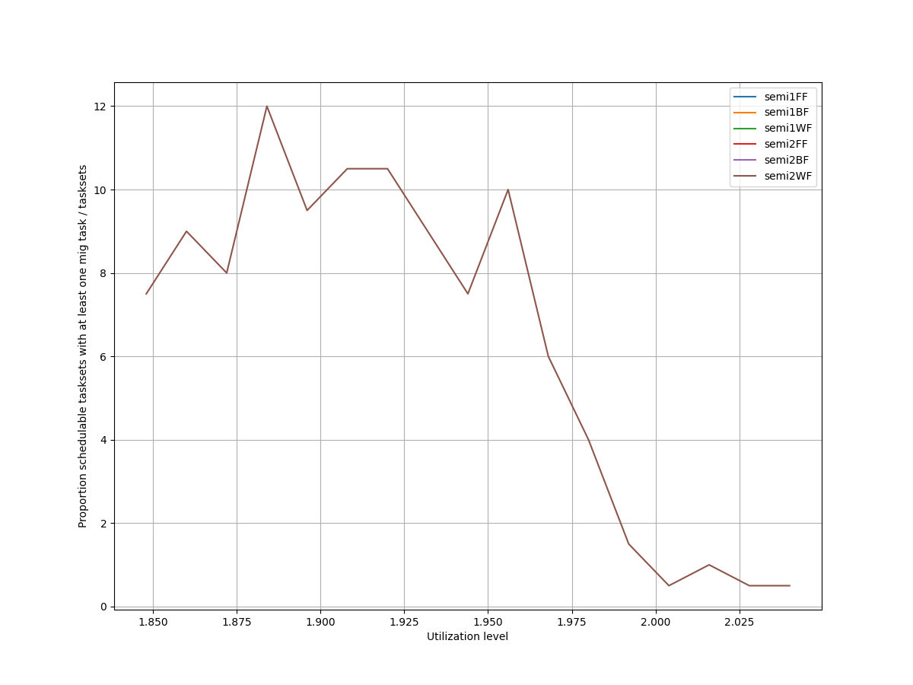
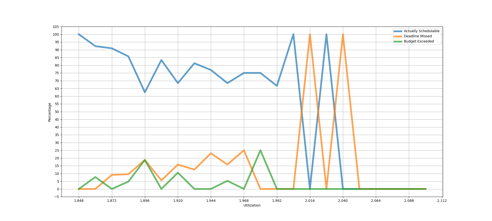
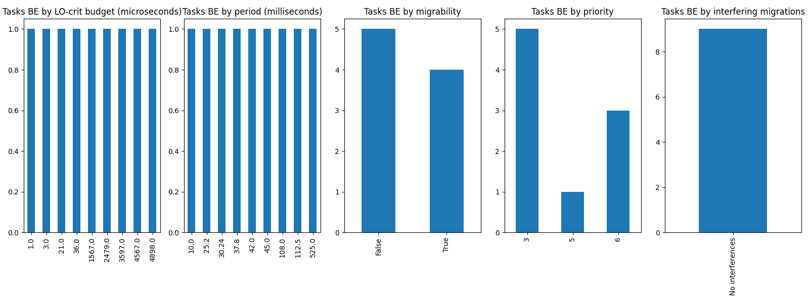
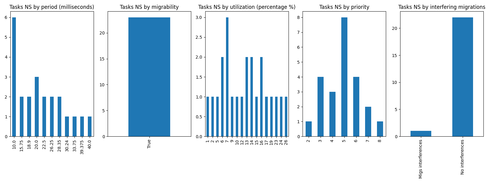

# Report on Experiment 1

   ## Overall data

   Utilization range = [1.848, 2.1] with step = 0.012

  Number of executions: 184

Schedulable executions: 145/184 = 78.80434782608695 %

_Not_ schedulable executions: 23/184 = 12.5 %

Budget Exceeded executions: 9/184 = 4.891304347826087 %

Safe Boundary Exceeded executions: 7/184 = 3.804347826086957 %

NS + BE executions: 32/184 = 17.391304347826086 %

### **Simulations**

#### **Weighted schedulability experiment 1 according to simulations.**

#### **Percentage of (schedulable tasksets with at least one migrating tasks / number of schedulable tasksets) of experiment 1 according to simulations.** 

 

### **Real Executions**

#### **Schedulability for each level**

#### **Tasksets, grouped by (LO-crit budget, Period & Migrability), with a Budget_Exceeded task.**

#### **Tasksets, grouped by (Period & Migrability), with at least one task missing one (or more) of its deadlines.**

## Bad tasksets

Click here to expand this section.

### **Not schedulable tasksets**

Click here to expand this section.

Ovvero quando almeno un task non completa entra almeno una sua deadline.

  1. Taskset **e1_semi2wf_t1158**

    Taskset execution params:
	 
    "id": "e1_semi2wf_t1158",
    "size": "12",
    "utilization": "1.9080000000000001",
    "criticality_factor": "2",
    "hicrit_proportion": "0.5"

   
 
Click here to see the deadlines missed tasks list.

   Time values are expressed as **micro-seconds**.

Task:  1

    
    "id": " 1",
    "basecpu": " 1",
    "priority": " 7",
    "period": 10000.0,
    "C(LO)": 549.0,
    "C(HI)": 549.0,
    "criticality": "LOW",
    "migrable": "True",
    "completedruns": " 5671",
    "preemptions": " 1",
    "minresponsejitter": " 0.000000000",
    "maxresponsejitter": " 0.000156901",
    "minreleasejitter": " 0.000000000",
    "maxreleasejitter": " 57.690006138",
    "avgresponsejitter": " 0.000098502",
    "deadlinesmissed": " 3",
    "deadlinemissedtargetcore": " 0",
    "deadlinemissedaftermigration": " 0",
    "budgetexceeded": " 0",
    "budgetexceededtargetcore": " 0",
    "budgetexceededaftermigration": " 0",
    "timesmigrated": " 6",
    "timesrestored": " 6",
    "timesonc1": " 5668",
    "timesonc2": " 0",
    "lockedtime": " 0.000001607"

   

   
 
Click here to see the CPUs log.

   Idle time is expressed as **seconds**.

   Util values are expressed as **percentage** %.

   CPU: 1

    
    "id": 1,
    "hyperperiod": 56700000,
    "lowtohigh": " 22",
    "hightolow": " 22",
    "idletime": 38879753,
    "util": 31.42900705467372

   CPU: 2

    
    "id": 2,
    "hyperperiod": 22680000,
    "lowtohigh": " 1",
    "hightolow": " 1",
    "idletime": 39664078,
    "util": 30.04571781305114

   

   
 
Click here to see the whole tasksets.

   Time values are expressed as **micro-seconds**.

   Task:  3

    
    "id": " 3",
    "basecpu": " 1",
    "priority": " 4",
    "period": 26250.0,
    "C(LO)": 2609.0,
    "C(HI)": 5218.0,
    "criticality": "HIGH",
    "migrable": "False",
    "completedruns": " 2161",
    "preemptions": " 202",
    "minresponsejitter": " 0.000000000",
    "maxresponsejitter": " 0.008240102",
    "minreleasejitter": " 0.000000000",
    "maxreleasejitter": " 57.673756000",
    "avgresponsejitter": " 0.001293991",
    "deadlinesmissed": " 0",
    "deadlinemissedtargetcore": " 0",
    "deadlinemissedaftermigration": " 0",
    "budgetexceeded": " 17",
    "budgetexceededtargetcore": " 0",
    "budgetexceededaftermigration": " 0",
    "timesmigrated": " 0",
    "timesrestored": " 0",
    "timesonc1": " 2379",
    "timesonc2": " 0",
    "lockedtime": " 0.000005057"

   Task:  8

    
    "id": " 8",
    "basecpu": " 1",
    "priority": " 2",
    "period": 105000.0,
    "C(LO)": 10414.0,
    "C(HI)": 20828.0,
    "criticality": "HIGH",
    "migrable": "False",
    "completedruns": " 541",
    "preemptions": " 308",
    "minresponsejitter": " 0.000000000",
    "maxresponsejitter": " 0.017396192",
    "minreleasejitter": " 0.000000000",
    "maxreleasejitter": " 57.596282291",
    "avgresponsejitter": " 0.005144712",
    "deadlinesmissed": " 0",
    "deadlinemissedtargetcore": " 0",
    "deadlinemissedaftermigration": " 0",
    "budgetexceeded": " 2",
    "budgetexceededtargetcore": " 0",
    "budgetexceededaftermigration": " 0",
    "timesmigrated": " 0",
    "timesrestored": " 0",
    "timesonc1": " 850",
    "timesonc2": " 0",
    "lockedtime": " 0.000000000"

   Task:  12

    
    "id": " 12",
    "basecpu": " 1",
    "priority": " 0",
    "period": 472500.0,
    "C(LO)": 13506.0,
    "C(HI)": 27012.0,
    "criticality": "HIGH",
    "migrable": "False",
    "completedruns": " 121",
    "preemptions": " 106",
    "minresponsejitter": " 0.000000000",
    "maxresponsejitter": " 0.026448703",
    "minreleasejitter": " 0.000000000",
    "maxreleasejitter": " 57.228750036",
    "avgresponsejitter": " 0.007384574",
    "deadlinesmissed": " 0",
    "deadlinemissedtargetcore": " 0",
    "deadlinemissedaftermigration": " 0",
    "budgetexceeded": " 1",
    "budgetexceededtargetcore": " 0",
    "budgetexceededaftermigration": " 0",
    "timesmigrated": " 0",
    "timesrestored": " 0",
    "timesonc1": " 227",
    "timesonc2": " 0",
    "lockedtime": " 0.000000000"

   Task:  11

    
    "id": " 11",
    "basecpu": " 1",
    "priority": " 1",
    "period": 420000.0,
    "C(LO)": 11396.0,
    "C(HI)": 22793.0,
    "criticality": "HIGH",
    "migrable": "False",
    "completedruns": " 136",
    "preemptions": " 122",
    "minresponsejitter": " 0.000000000",
    "maxresponsejitter": " 0.026212625",
    "minreleasejitter": " 0.000000000",
    "maxreleasejitter": " 57.285507012",
    "avgresponsejitter": " 0.006201637",
    "deadlinesmissed": " 0",
    "deadlinemissedtargetcore": " 0",
    "deadlinemissedaftermigration": " 0",
    "budgetexceeded": " 2",
    "budgetexceededtargetcore": " 0",
    "budgetexceededaftermigration": " 0",
    "timesmigrated": " 0",
    "timesrestored": " 0",
    "timesonc1": " 259",
    "timesonc2": " 0",
    "lockedtime": " 0.000000000"

   Task:  4

    
    "id": " 4",
    "basecpu": " 1",
    "priority": " 6",
    "period": 45360.0,
    "C(LO)": 9630.0,
    "C(HI)": 9630.0,
    "criticality": "LOW",
    "migrable": "False",
    "completedruns": " 1251",
    "preemptions": " 528",
    "minresponsejitter": " 0.000000000",
    "maxresponsejitter": " 0.005261964",
    "minreleasejitter": " 0.000000000",
    "maxreleasejitter": " 57.654646078",
    "avgresponsejitter": " 0.004312093",
    "deadlinesmissed": " 0",
    "deadlinemissedtargetcore": " 0",
    "deadlinemissedaftermigration": " 0",
    "budgetexceeded": " 0",
    "budgetexceededtargetcore": " 0",
    "budgetexceededaftermigration": " 0",
    "timesmigrated": " 0",
    "timesrestored": " 0",
    "timesonc1": " 1778",
    "timesonc2": " 0",
    "lockedtime": " 0.000022784"

   Task:  5

    
    "id": " 5",
    "basecpu": " 1",
    "priority": " 5",
    "period": 65625.0,
    "C(LO)": 7301.0,
    "C(HI)": 7301.0,
    "criticality": "LOW",
    "migrable": "False",
    "completedruns": " 865",
    "preemptions": " 317",
    "minresponsejitter": " 0.000000000",
    "maxresponsejitter": " 0.008978829",
    "minreleasejitter": " 0.000000000",
    "maxreleasejitter": " 57.634381165",
    "avgresponsejitter": " 0.003583772",
    "deadlinesmissed": " 0",
    "deadlinemissedtargetcore": " 0",
    "deadlinemissedaftermigration": " 0",
    "budgetexceeded": " 0",
    "budgetexceededtargetcore": " 0",
    "budgetexceededaftermigration": " 0",
    "timesmigrated": " 0",
    "timesrestored": " 0",
    "timesonc1": " 1181",
    "timesonc2": " 0",
    "lockedtime": " 0.000002216"

   Task:  6

    
    "id": " 6",
    "basecpu": " 1",
    "priority": " 3",
    "period": 75000.0,
    "C(LO)": 7616.0,
    "C(HI)": 7616.0,
    "criticality": "LOW",
    "migrable": "False",
    "completedruns": " 757",
    "preemptions": " 168",
    "minresponsejitter": " 0.000000000",
    "maxresponsejitter": " 0.010217453",
    "minreleasejitter": " 0.000000000",
    "maxreleasejitter": " 57.625006204",
    "avgresponsejitter": " 0.003756730",
    "deadlinesmissed": " 0",
    "deadlinemissedtargetcore": " 0",
    "deadlinemissedaftermigration": " 0",
    "budgetexceeded": " 0",
    "budgetexceededtargetcore": " 0",
    "budgetexceededaftermigration": " 0",
    "timesmigrated": " 0",
    "timesrestored": " 0",
    "timesonc1": " 924",
    "timesonc2": " 0",
    "lockedtime": " 0.000000000"

   Task:  1

    
    "id": " 1",
    "basecpu": " 1",
    "priority": " 7",
    "period": 10000.0,
    "C(LO)": 549.0,
    "C(HI)": 549.0,
    "criticality": "LOW",
    "migrable": "True",
    "completedruns": " 5671",
    "preemptions": " 1",
    "minresponsejitter": " 0.000000000",
    "maxresponsejitter": " 0.000156901",
    "minreleasejitter": " 0.000000000",
    "maxreleasejitter": " 57.690006138",
    "avgresponsejitter": " 0.000098502",
    "deadlinesmissed": " 3",
    "deadlinemissedtargetcore": " 0",
    "deadlinemissedaftermigration": " 0",
    "budgetexceeded": " 0",
    "budgetexceededtargetcore": " 0",
    "budgetexceededaftermigration": " 0",
    "timesmigrated": " 6",
    "timesrestored": " 6",
    "timesonc1": " 5668",
    "timesonc2": " 0",
    "lockedtime": " 0.000001607"

   Task:  7

    
    "id": " 7",
    "basecpu": " 2",
    "priority": " 1",
    "period": 75600.0,
    "C(LO)": 18321.0,
    "C(HI)": 36643.0,
    "criticality": "HIGH",
    "migrable": "False",
    "completedruns": " 751",
    "preemptions": " 373",
    "minresponsejitter": " 0.000000000",
    "maxresponsejitter": " 0.009784859",
    "minreleasejitter": " 0.000000000",
    "maxreleasejitter": " 57.624438420",
    "avgresponsejitter": " 0.008107814",
    "deadlinesmissed": " 0",
    "deadlinemissedtargetcore": " 0",
    "deadlinemissedaftermigration": " 0",
    "budgetexceeded": " 0",
    "budgetexceededtargetcore": " 0",
    "budgetexceededaftermigration": " 0",
    "timesmigrated": " 0",
    "timesrestored": " 0",
    "timesonc1": " 0",
    "timesonc2": " 1123",
    "lockedtime": " 0.000003817"

   Task:  2

    
    "id": " 2",
    "basecpu": " 2",
    "priority": " 3",
    "period": 18900.0,
    "C(LO)": 32.0,
    "C(HI)": 64.0,
    "criticality": "HIGH",
    "migrable": "False",
    "completedruns": " 3001",
    "preemptions": " 0",
    "minresponsejitter": " 0.000000000",
    "maxresponsejitter": " 0.000053514",
    "minreleasejitter": " 0.000000000",
    "maxreleasejitter": " 57.681105958",
    "avgresponsejitter": " 0.000018471",
    "deadlinesmissed": " 0",
    "deadlinemissedtargetcore": " 0",
    "deadlinemissedaftermigration": " 0",
    "budgetexceeded": " 1",
    "budgetexceededtargetcore": " 0",
    "budgetexceededaftermigration": " 0",
    "timesmigrated": " 0",
    "timesrestored": " 0",
    "timesonc1": " 0",
    "timesonc2": " 3001",
    "lockedtime": " 0.000012991"

   Task:  9

    
    "id": " 9",
    "basecpu": " 2",
    "priority": " 2",
    "period": 151200.0,
    "C(LO)": 33744.0,
    "C(HI)": 33744.0,
    "criticality": "LOW",
    "migrable": "False",
    "completedruns": " 376",
    "preemptions": " 0",
    "minresponsejitter": " 0.000000000",
    "maxresponsejitter": " 0.017941850",
    "minreleasejitter": " 0.000000000",
    "maxreleasejitter": " 57.548831640",
    "avgresponsejitter": " 0.015016601",
    "deadlinesmissed": " 0",
    "deadlinemissedtargetcore": " 0",
    "deadlinemissedaftermigration": " 0",
    "budgetexceeded": " 0",
    "budgetexceededtargetcore": " 0",
    "budgetexceededaftermigration": " 0",
    "timesmigrated": " 0",
    "timesrestored": " 0",
    "timesonc1": " 0",
    "timesonc2": " 375",
    "lockedtime": " 0.000000000"

   Task:  10

    
    "id": " 10",
    "basecpu": " 2",
    "priority": " 0",
    "period": 181440.0,
    "C(LO)": 37731.0,
    "C(HI)": 37731.0,
    "criticality": "LOW",
    "migrable": "False",
    "completedruns": " 314",
    "preemptions": " 278",
    "minresponsejitter": " 0.000000000",
    "maxresponsejitter": " 0.028953492",
    "minreleasejitter": " 0.000000000",
    "maxreleasejitter": " 57.609286129",
    "avgresponsejitter": " 0.017959964",
    "deadlinesmissed": " 0",
    "deadlinemissedtargetcore": " 0",
    "deadlinemissedaftermigration": " 0",
    "budgetexceeded": " 0",
    "budgetexceededtargetcore": " 0",
    "budgetexceededaftermigration": " 0",
    "timesmigrated": " 0",
    "timesrestored": " 0",
    "timesonc1": " 0",
    "timesonc2": " 591",
    "lockedtime": " 0.000031207"

   

  2. Taskset **e1_semi2wf_t1225**

    Taskset execution params:
	 
    "id": "e1_semi2wf_t1225",
    "size": "12",
    "utilization": "1.9200000000000002",
    "criticality_factor": "2",
    "hicrit_proportion": "0.5"

   
 
Click here to see the deadlines missed tasks list.

   Time values are expressed as **micro-seconds**.

Task:  1

    
    "id": " 1",
    "basecpu": " 1",
    "priority": " 8",
    "period": 10000.0,
    "C(LO)": 1855.0,
    "C(HI)": 1855.0,
    "criticality": "LOW",
    "migrable": "True",
    "completedruns": " 5233",
    "preemptions": " 0",
    "minresponsejitter": " 0.000000000",
    "maxresponsejitter": " 0.000508426",
    "minreleasejitter": " 0.000000000",
    "maxreleasejitter": " 53.310006081",
    "avgresponsejitter": " 0.000330520",
    "deadlinesmissed": " 1",
    "deadlinemissedtargetcore": " 0",
    "deadlinemissedaftermigration": " 0",
    "budgetexceeded": " 0",
    "budgetexceededtargetcore": " 0",
    "budgetexceededaftermigration": " 0",
    "timesmigrated": " 7",
    "timesrestored": " 6",
    "timesonc1": " 5228",
    "timesonc2": " 3",
    "lockedtime": " 0.000003847"

   

   
 
Click here to see the CPUs log.

   Idle time is expressed as **seconds**.

   Util values are expressed as **percentage** %.

   CPU: 1

    
    "id": 1,
    "hyperperiod": 113400000,
    "lowtohigh": " 58",
    "hightolow": " 58",
    "idletime": 77559249,
    "util": 31.605600529100528

   CPU: 2

    
    "id": 2,
    "hyperperiod": 7560000,
    "lowtohigh": " 0",
    "hightolow": " 0",
    "idletime": 80155211,
    "util": 29.31639241622574

   

   
 
Click here to see the whole tasksets.

   Time values are expressed as **micro-seconds**.

   Task:  12

    
    "id": " 12",
    "basecpu": " 1",
    "priority": " 0",
    "period": 756000.0,
    "C(LO)": 38609.0,
    "C(HI)": 77219.0,
    "criticality": "HIGH",
    "migrable": "False",
    "completedruns": " 151",
    "preemptions": " 384",
    "minresponsejitter": " 0.000000000",
    "maxresponsejitter": " 0.079241156",
    "minreleasejitter": " 0.000000000",
    "maxreleasejitter": " 113.644434691",
    "avgresponsejitter": " 0.022102270",
    "deadlinesmissed": " 0",
    "deadlinemissedtargetcore": " 0",
    "deadlinemissedaftermigration": " 0",
    "budgetexceeded": " 2",
    "budgetexceededtargetcore": " 0",
    "budgetexceededaftermigration": " 0",
    "timesmigrated": " 0",
    "timesrestored": " 0",
    "timesonc1": " 536",
    "timesonc2": " 0",
    "lockedtime": " 0.000008045"

   Task:  11

    
    "id": " 11",
    "basecpu": " 1",
    "priority": " 1",
    "period": 675000.0,
    "C(LO)": 21759.0,
    "C(HI)": 43518.0,
    "criticality": "HIGH",
    "migrable": "False",
    "completedruns": " 169",
    "preemptions": " 177",
    "minresponsejitter": " 0.000000000",
    "maxresponsejitter": " 0.046598718",
    "minreleasejitter": " 0.000000000",
    "maxreleasejitter": " 113.725446174",
    "avgresponsejitter": " 0.012289459",
    "deadlinesmissed": " 0",
    "deadlinemissedtargetcore": " 0",
    "deadlinemissedaftermigration": " 0",
    "budgetexceeded": " 1",
    "budgetexceededtargetcore": " 0",
    "budgetexceededaftermigration": " 0",
    "timesmigrated": " 0",
    "timesrestored": " 0",
    "timesonc1": " 346",
    "timesonc2": " 0",
    "lockedtime": " 0.000000000"

   Task:  3

    
    "id": " 3",
    "basecpu": " 1",
    "priority": " 5",
    "period": 33750.0,
    "C(LO)": 877.0,
    "C(HI)": 1754.0,
    "criticality": "HIGH",
    "migrable": "False",
    "completedruns": " 3361",
    "preemptions": " 32",
    "minresponsejitter": " 0.000000000",
    "maxresponsejitter": " 0.001671592",
    "minreleasejitter": " 0.000000000",
    "maxreleasejitter": " 114.366255970",
    "avgresponsejitter": " 0.000398177",
    "deadlinesmissed": " 0",
    "deadlinemissedtargetcore": " 0",
    "deadlinemissedaftermigration": " 0",
    "budgetexceeded": " 28",
    "budgetexceededtargetcore": " 0",
    "budgetexceededaftermigration": " 0",
    "timesmigrated": " 0",
    "timesrestored": " 0",
    "timesonc1": " 3420",
    "timesonc2": " 0",
    "lockedtime": " 0.000000000"

   Task:  4

    
    "id": " 4",
    "basecpu": " 1",
    "priority": " 3",
    "period": 60480.0,
    "C(LO)": 902.0,
    "C(HI)": 1805.0,
    "criticality": "HIGH",
    "migrable": "False",
    "completedruns": " 1876",
    "preemptions": " 84",
    "minresponsejitter": " 0.000000000",
    "maxresponsejitter": " 0.007292300",
    "minreleasejitter": " 0.000000000",
    "maxreleasejitter": " 114.339525976",
    "avgresponsejitter": " 0.000504333",
    "deadlinesmissed": " 0",
    "deadlinemissedtargetcore": " 0",
    "deadlinemissedaftermigration": " 0",
    "budgetexceeded": " 23",
    "budgetexceededtargetcore": " 0",
    "budgetexceededaftermigration": " 0",
    "timesmigrated": " 0",
    "timesrestored": " 0",
    "timesonc1": " 1982",
    "timesonc2": " 0",
    "lockedtime": " 0.000007117"

   Task:  9

    
    "id": " 9",
    "basecpu": " 1",
    "priority": " 2",
    "period": 181440.0,
    "C(LO)": 1552.0,
    "C(HI)": 3105.0,
    "criticality": "HIGH",
    "migrable": "False",
    "completedruns": " 626",
    "preemptions": " 43",
    "minresponsejitter": " 0.000000000",
    "maxresponsejitter": " 0.006953351",
    "minreleasejitter": " 0.000000000",
    "maxreleasejitter": " 114.225423291",
    "avgresponsejitter": " 0.000828117",
    "deadlinesmissed": " 0",
    "deadlinemissedtargetcore": " 0",
    "deadlinemissedaftermigration": " 0",
    "budgetexceeded": " 4",
    "budgetexceededtargetcore": " 0",
    "budgetexceededaftermigration": " 0",
    "timesmigrated": " 0",
    "timesrestored": " 0",
    "timesonc1": " 672",
    "timesonc2": " 0",
    "lockedtime": " 0.000000000"

   Task:  2

    
    "id": " 2",
    "basecpu": " 1",
    "priority": " 7",
    "period": 26250.0,
    "C(LO)": 11187.0,
    "C(HI)": 11187.0,
    "criticality": "LOW",
    "migrable": "False",
    "completedruns": " 4322",
    "preemptions": " 873",
    "minresponsejitter": " 0.000000000",
    "maxresponsejitter": " 0.006435123",
    "minreleasejitter": " 0.000000000",
    "maxreleasejitter": " 114.400014135",
    "avgresponsejitter": " 0.005037520",
    "deadlinesmissed": " 0",
    "deadlinemissedtargetcore": " 0",
    "deadlinemissedaftermigration": " 0",
    "budgetexceeded": " 0",
    "budgetexceededtargetcore": " 0",
    "budgetexceededaftermigration": " 0",
    "timesmigrated": " 0",
    "timesrestored": " 0",
    "timesonc1": " 5194",
    "timesonc2": " 0",
    "lockedtime": " 0.000012396"

   Task:  1

    
    "id": " 1",
    "basecpu": " 1",
    "priority": " 8",
    "period": 10000.0,
    "C(LO)": 1855.0,
    "C(HI)": 1855.0,
    "criticality": "LOW",
    "migrable": "True",
    "completedruns": " 5233",
    "preemptions": " 0",
    "minresponsejitter": " 0.000000000",
    "maxresponsejitter": " 0.000508426",
    "minreleasejitter": " 0.000000000",
    "maxreleasejitter": " 53.310006081",
    "avgresponsejitter": " 0.000330520",
    "deadlinesmissed": " 1",
    "deadlinemissedtargetcore": " 0",
    "deadlinemissedaftermigration": " 0",
    "budgetexceeded": " 0",
    "budgetexceededtargetcore": " 0",
    "budgetexceededaftermigration": " 0",
    "timesmigrated": " 7",
    "timesrestored": " 6",
    "timesonc1": " 5228",
    "timesonc2": " 3",
    "lockedtime": " 0.000003847"

   Task:  7

    
    "id": " 7",
    "basecpu": " 1",
    "priority": " 4",
    "period": 90720.0,
    "C(LO)": 6911.0,
    "C(HI)": 6911.0,
    "criticality": "LOW",
    "migrable": "False",
    "completedruns": " 1251",
    "preemptions": " 439",
    "minresponsejitter": " 0.000000000",
    "maxresponsejitter": " 0.009840375",
    "minreleasejitter": " 0.000000000",
    "maxreleasejitter": " 114.309286135",
    "avgresponsejitter": " 0.003738649",
    "deadlinesmissed": " 0",
    "deadlinemissedtargetcore": " 0",
    "deadlinemissedaftermigration": " 0",
    "budgetexceeded": " 0",
    "budgetexceededtargetcore": " 0",
    "budgetexceededaftermigration": " 0",
    "timesmigrated": " 0",
    "timesrestored": " 0",
    "timesonc1": " 1689",
    "timesonc2": " 0",
    "lockedtime": " 0.000000000"

   Task:  5

    
    "id": " 5",
    "basecpu": " 1",
    "priority": " 6",
    "period": 64800.0,
    "C(LO)": 2446.0,
    "C(HI)": 2446.0,
    "criticality": "LOW",
    "migrable": "False",
    "completedruns": " 1751",
    "preemptions": " 144",
    "minresponsejitter": " 0.000000000",
    "maxresponsejitter": " 0.007427387",
    "minreleasejitter": " 0.000000000",
    "maxreleasejitter": " 114.335206078",
    "avgresponsejitter": " 0.001305180",
    "deadlinesmissed": " 0",
    "deadlinemissedtargetcore": " 0",
    "deadlinemissedaftermigration": " 0",
    "budgetexceeded": " 0",
    "budgetexceededtargetcore": " 0",
    "budgetexceededaftermigration": " 0",
    "timesmigrated": " 0",
    "timesrestored": " 0",
    "timesonc1": " 1894",
    "timesonc2": " 0",
    "lockedtime": " 0.000002231"

   Task:  6

    
    "id": " 6",
    "basecpu": " 2",
    "priority": " 1",
    "period": 84000.0,
    "C(LO)": 22647.0,
    "C(HI)": 45295.0,
    "criticality": "HIGH",
    "migrable": "False",
    "completedruns": " 1351",
    "preemptions": " 0",
    "minresponsejitter": " 0.000000000",
    "maxresponsejitter": " 0.012045477",
    "minreleasejitter": " 0.000000000",
    "maxreleasejitter": " 114.316006060",
    "avgresponsejitter": " 0.010005955",
    "deadlinesmissed": " 0",
    "deadlinemissedtargetcore": " 0",
    "deadlinemissedaftermigration": " 0",
    "budgetexceeded": " 0",
    "budgetexceededtargetcore": " 0",
    "budgetexceededaftermigration": " 0",
    "timesmigrated": " 0",
    "timesrestored": " 0",
    "timesonc1": " 0",
    "timesonc2": " 1350",
    "lockedtime": " 0.000014009"

   Task:  10

    
    "id": " 10",
    "basecpu": " 2",
    "priority": " 0",
    "period": 189000.0,
    "C(LO)": 54424.0,
    "C(HI)": 54424.0,
    "criticality": "LOW",
    "migrable": "False",
    "completedruns": " 601",
    "preemptions": " 228",
    "minresponsejitter": " 0.000000000",
    "maxresponsejitter": " 0.045319336",
    "minreleasejitter": " 0.000000000",
    "maxreleasejitter": " 114.211006060",
    "avgresponsejitter": " 0.026939015",
    "deadlinesmissed": " 0",
    "deadlinemissedtargetcore": " 0",
    "deadlinemissedaftermigration": " 0",
    "budgetexceeded": " 0",
    "budgetexceededtargetcore": " 0",
    "budgetexceededaftermigration": " 0",
    "timesmigrated": " 0",
    "timesrestored": " 0",
    "timesonc1": " 0",
    "timesonc2": " 828",
    "lockedtime": " 0.000004096"

   Task:  8

    
    "id": " 8",
    "basecpu": " 2",
    "priority": " 2",
    "period": 100800.0,
    "C(LO)": 10238.0,
    "C(HI)": 10238.0,
    "criticality": "LOW",
    "migrable": "False",
    "completedruns": " 1126",
    "preemptions": " 0",
    "minresponsejitter": " 0.000000000",
    "maxresponsejitter": " 0.005448691",
    "minreleasejitter": " 0.000000000",
    "maxreleasejitter": " 114.299205994",
    "avgresponsejitter": " 0.004568165",
    "deadlinesmissed": " 0",
    "deadlinemissedtargetcore": " 0",
    "deadlinemissedaftermigration": " 0",
    "budgetexceeded": " 0",
    "budgetexceededtargetcore": " 0",
    "budgetexceededaftermigration": " 0",
    "timesmigrated": " 0",
    "timesrestored": " 0",
    "timesonc1": " 0",
    "timesonc2": " 1125",
    "lockedtime": " 0.000023673"

   

  3. Taskset **e1_semi2wf_t1237**

    Taskset execution params:
	 
    "id": "e1_semi2wf_t1237",
    "size": "12",
    "utilization": "1.9200000000000002",
    "criticality_factor": "2",
    "hicrit_proportion": "0.5"

   
 
Click here to see the deadlines missed tasks list.

   Time values are expressed as **micro-seconds**.

Task:  1

    
    "id": " 1",
    "basecpu": " 1",
    "priority": " 5",
    "period": 18900.0,
    "C(LO)": 145.0,
    "C(HI)": 145.0,
    "criticality": "LOW",
    "migrable": "True",
    "completedruns": " 1501",
    "preemptions": " 1",
    "minresponsejitter": " 0.000000000",
    "maxresponsejitter": " 0.000049733",
    "minreleasejitter": " 0.000000000",
    "maxreleasejitter": " 29.331106231",
    "avgresponsejitter": " 0.000032033",
    "deadlinesmissed": " 1",
    "deadlinemissedtargetcore": " 0",
    "deadlinemissedaftermigration": " 0",
    "budgetexceeded": " 0",
    "budgetexceededtargetcore": " 0",
    "budgetexceededaftermigration": " 0",
    "timesmigrated": " 3",
    "timesrestored": " 3",
    "timesonc1": " 1497",
    "timesonc2": " 3",
    "lockedtime": " 0.000002658"

   

   
 
Click here to see the CPUs log.

   Idle time is expressed as **seconds**.

   Util values are expressed as **percentage** %.

   CPU: 1

    
    "id": 1,
    "hyperperiod": 28350000,
    "lowtohigh": " 14",
    "hightolow": " 14",
    "idletime": 20379686,
    "util": 28.1139823633157

   CPU: 2

    
    "id": 2,
    "hyperperiod": 18900000,
    "lowtohigh": " 25",
    "hightolow": " 25",
    "idletime": 19969756,
    "util": 29.55994356261023

   

   
 
Click here to see the whole tasksets.

   Time values are expressed as **micro-seconds**.

   Task:  3

    
    "id": " 3",
    "basecpu": " 1",
    "priority": " 3",
    "period": 28350.0,
    "C(LO)": 3976.9999999999995,
    "C(HI)": 7955.0,
    "criticality": "HIGH",
    "migrable": "False",
    "completedruns": " 1001",
    "preemptions": " 0",
    "minresponsejitter": " 0.000000000",
    "maxresponsejitter": " 0.005474165",
    "minreleasejitter": " 0.000000000",
    "maxreleasejitter": " 29.321656514",
    "avgresponsejitter": " 0.001798201",
    "deadlinesmissed": " 0",
    "deadlinemissedtargetcore": " 0",
    "deadlinemissedaftermigration": " 0",
    "budgetexceeded": " 7",
    "budgetexceededtargetcore": " 0",
    "budgetexceededaftermigration": " 0",
    "timesmigrated": " 0",
    "timesrestored": " 0",
    "timesonc1": " 1007",
    "timesonc2": " 0",
    "lockedtime": " 0.000002078"

   Task:  6

    
    "id": " 6",
    "basecpu": " 1",
    "priority": " 1",
    "period": 87500.0,
    "C(LO)": 11190.0,
    "C(HI)": 22381.0,
    "criticality": "HIGH",
    "migrable": "False",
    "completedruns": " 325",
    "preemptions": " 121",
    "minresponsejitter": " 0.000000000",
    "maxresponsejitter": " 0.014097514",
    "minreleasejitter": " 0.000000000",
    "maxreleasejitter": " 29.262506321",
    "avgresponsejitter": " 0.005463847",
    "deadlinesmissed": " 0",
    "deadlinemissedtargetcore": " 0",
    "deadlinemissedaftermigration": " 0",
    "budgetexceeded": " 4",
    "budgetexceededtargetcore": " 0",
    "budgetexceededaftermigration": " 0",
    "timesmigrated": " 0",
    "timesrestored": " 0",
    "timesonc1": " 449",
    "timesonc2": " 0",
    "lockedtime": " 0.000001628"

   Task:  5

    
    "id": " 5",
    "basecpu": " 1",
    "priority": " 2",
    "period": 78750.0,
    "C(LO)": 1508.0,
    "C(HI)": 3016.0,
    "criticality": "HIGH",
    "migrable": "False",
    "completedruns": " 361",
    "preemptions": " 0",
    "minresponsejitter": " 0.000000000",
    "maxresponsejitter": " 0.001954321",
    "minreleasejitter": " 0.000000000",
    "maxreleasejitter": " 29.271256384",
    "avgresponsejitter": " 0.000688261",
    "deadlinesmissed": " 0",
    "deadlinemissedtargetcore": " 0",
    "deadlinemissedaftermigration": " 0",
    "budgetexceeded": " 3",
    "budgetexceededtargetcore": " 0",
    "budgetexceededaftermigration": " 0",
    "timesmigrated": " 0",
    "timesrestored": " 0",
    "timesonc1": " 363",
    "timesonc2": " 0",
    "lockedtime": " 0.000003195"

   Task:  10

    
    "id": " 10",
    "basecpu": " 1",
    "priority": " 0",
    "period": 168750.0,
    "C(LO)": 51963.0,
    "C(HI)": 51963.0,
    "criticality": "LOW",
    "migrable": "False",
    "completedruns": " 169",
    "preemptions": " 381",
    "minresponsejitter": " 0.000000000",
    "maxresponsejitter": " 0.038471760",
    "minreleasejitter": " 0.000000000",
    "maxreleasejitter": " 29.181500694",
    "avgresponsejitter": " 0.026328544",
    "deadlinesmissed": " 0",
    "deadlinemissedtargetcore": " 0",
    "deadlinemissedaftermigration": " 0",
    "budgetexceeded": " 0",
    "budgetexceededtargetcore": " 0",
    "budgetexceededaftermigration": " 0",
    "timesmigrated": " 0",
    "timesrestored": " 0",
    "timesonc1": " 549",
    "timesonc2": " 0",
    "lockedtime": " 0.000005931"

   Task:  9

    
    "id": " 9",
    "basecpu": " 1",
    "priority": " 4",
    "period": 118125.0,
    "C(LO)": 7819.0,
    "C(HI)": 7819.0,
    "criticality": "LOW",
    "migrable": "True",
    "completedruns": " 241",
    "preemptions": " 0",
    "minresponsejitter": " 0.000000000",
    "maxresponsejitter": " 0.002072796",
    "minreleasejitter": " 0.000000000",
    "maxreleasejitter": " 29.231881297",
    "avgresponsejitter": " 0.001371318",
    "deadlinesmissed": " 0",
    "deadlinemissedtargetcore": " 0",
    "deadlinemissedaftermigration": " 0",
    "budgetexceeded": " 0",
    "budgetexceededtargetcore": " 0",
    "budgetexceededaftermigration": " 0",
    "timesmigrated": " 0",
    "timesrestored": " 0",
    "timesonc1": " 240",
    "timesonc2": " 0",
    "lockedtime": " 0.000000000"

   Task:  1

    
    "id": " 1",
    "basecpu": " 1",
    "priority": " 5",
    "period": 18900.0,
    "C(LO)": 145.0,
    "C(HI)": 145.0,
    "criticality": "LOW",
    "migrable": "True",
    "completedruns": " 1501",
    "preemptions": " 1",
    "minresponsejitter": " 0.000000000",
    "maxresponsejitter": " 0.000049733",
    "minreleasejitter": " 0.000000000",
    "maxreleasejitter": " 29.331106231",
    "avgresponsejitter": " 0.000032033",
    "deadlinesmissed": " 1",
    "deadlinemissedtargetcore": " 0",
    "deadlinemissedaftermigration": " 0",
    "budgetexceeded": " 0",
    "budgetexceededtargetcore": " 0",
    "budgetexceededaftermigration": " 0",
    "timesmigrated": " 3",
    "timesrestored": " 3",
    "timesonc1": " 1497",
    "timesonc2": " 3",
    "lockedtime": " 0.000002658"

   Task:  11

    
    "id": " 11",
    "basecpu": " 2",
    "priority": " 1",
    "period": 180000.0,
    "C(LO)": 28338.0,
    "C(HI)": 56677.0,
    "criticality": "HIGH",
    "migrable": "False",
    "completedruns": " 159",
    "preemptions": " 65",
    "minresponsejitter": " 0.000000000",
    "maxresponsejitter": " 0.043895856",
    "minreleasejitter": " 0.000000000",
    "maxreleasejitter": " 29.260427850",
    "avgresponsejitter": " 0.013182919",
    "deadlinesmissed": " 0",
    "deadlinemissedtargetcore": " 0",
    "deadlinemissedaftermigration": " 0",
    "budgetexceeded": " 2",
    "budgetexceededtargetcore": " 0",
    "budgetexceededaftermigration": " 0",
    "timesmigrated": " 0",
    "timesrestored": " 0",
    "timesonc1": " 0",
    "timesonc2": " 225",
    "lockedtime": " 0.000001195"

   Task:  4

    
    "id": " 4",
    "basecpu": " 2",
    "priority": " 2",
    "period": 52500.0,
    "C(LO)": 6702.0,
    "C(HI)": 13404.0,
    "criticality": "HIGH",
    "migrable": "False",
    "completedruns": " 541",
    "preemptions": " 61",
    "minresponsejitter": " 0.000000000",
    "maxresponsejitter": " 0.009354604",
    "minreleasejitter": " 0.000000000",
    "maxreleasejitter": " 29.297506102",
    "avgresponsejitter": " 0.003097847",
    "deadlinesmissed": " 0",
    "deadlinemissedtargetcore": " 0",
    "deadlinemissedaftermigration": " 0",
    "budgetexceeded": " 12",
    "budgetexceededtargetcore": " 0",
    "budgetexceededaftermigration": " 0",
    "timesmigrated": " 0",
    "timesrestored": " 0",
    "timesonc1": " 0",
    "timesonc2": " 613",
    "lockedtime": " 0.000014526"

   Task:  2

    
    "id": " 2",
    "basecpu": " 2",
    "priority": " 4",
    "period": 20000.0,
    "C(LO)": 127.0,
    "C(HI)": 255.00000000000003,
    "criticality": "HIGH",
    "migrable": "False",
    "completedruns": " 1419",
    "preemptions": " 0",
    "minresponsejitter": " 0.000000000",
    "maxresponsejitter": " 0.000184420",
    "minreleasejitter": " 0.000000000",
    "maxreleasejitter": " 29.340006084",
    "avgresponsejitter": " 0.000061643",
    "deadlinesmissed": " 0",
    "deadlinemissedtargetcore": " 0",
    "deadlinemissedaftermigration": " 0",
    "budgetexceeded": " 11",
    "budgetexceededtargetcore": " 0",
    "budgetexceededaftermigration": " 0",
    "timesmigrated": " 0",
    "timesrestored": " 0",
    "timesonc1": " 0",
    "timesonc2": " 1429",
    "lockedtime": " 0.000003198"

   Task:  8

    
    "id": " 8",
    "basecpu": " 2",
    "priority": " 3",
    "period": 112500.0,
    "C(LO)": 26782.0,
    "C(HI)": 26782.0,
    "criticality": "LOW",
    "migrable": "False",
    "completedruns": " 253",
    "preemptions": " 142",
    "minresponsejitter": " 0.000000000",
    "maxresponsejitter": " 0.014308667",
    "minreleasejitter": " 0.000000000",
    "maxreleasejitter": " 29.237506012",
    "avgresponsejitter": " 0.011835183",
    "deadlinesmissed": " 0",
    "deadlinemissedtargetcore": " 0",
    "deadlinemissedaftermigration": " 0",
    "budgetexceeded": " 0",
    "budgetexceededtargetcore": " 0",
    "budgetexceededaftermigration": " 0",
    "timesmigrated": " 0",
    "timesrestored": " 0",
    "timesonc1": " 0",
    "timesonc2": " 394",
    "lockedtime": " 0.000006228"

   Task:  12

    
    "id": " 12",
    "basecpu": " 2",
    "priority": " 0",
    "period": 630000.0,
    "C(LO)": 74031.0,
    "C(HI)": 74031.0,
    "criticality": "LOW",
    "migrable": "False",
    "completedruns": " 46",
    "preemptions": " 112",
    "minresponsejitter": " 0.000000000",
    "maxresponsejitter": " 0.054484144",
    "minreleasejitter": " 0.000000000",
    "maxreleasejitter": " 28.738213492",
    "avgresponsejitter": " 0.038099664",
    "deadlinesmissed": " 0",
    "deadlinemissedtargetcore": " 0",
    "deadlinemissedaftermigration": " 0",
    "budgetexceeded": " 0",
    "budgetexceededtargetcore": " 0",
    "budgetexceededaftermigration": " 0",
    "timesmigrated": " 0",
    "timesrestored": " 0",
    "timesonc1": " 0",
    "timesonc2": " 157",
    "lockedtime": " 0.000001408"

   Task:  7

    
    "id": " 7",
    "basecpu": " 2",
    "priority": " 5",
    "period": 90000.0,
    "C(LO)": 2243.0,
    "C(HI)": 2243.0,
    "criticality": "LOW",
    "migrable": "True",
    "completedruns": " 316",
    "preemptions": " 0",
    "minresponsejitter": " 0.000000000",
    "maxresponsejitter": " 0.000601006",
    "minreleasejitter": " 0.000000000",
    "maxreleasejitter": " 29.260008039",
    "avgresponsejitter": " 0.000402054",
    "deadlinesmissed": " 0",
    "deadlinemissedtargetcore": " 0",
    "deadlinemissedaftermigration": " 0",
    "budgetexceeded": " 0",
    "budgetexceededtargetcore": " 0",
    "budgetexceededaftermigration": " 0",
    "timesmigrated": " 0",
    "timesrestored": " 0",
    "timesonc1": " 0",
    "timesonc2": " 315",
    "lockedtime": " 0.000000982"

   

  4. Taskset **e1_semi2wf_t1382**

    Taskset execution params:
	 
    "id": "e1_semi2wf_t1382",
    "size": "12",
    "utilization": "1.9200000000000002",
    "criticality_factor": "2",
    "hicrit_proportion": "0.5"

   
 
Click here to see the deadlines missed tasks list.

   Time values are expressed as **micro-seconds**.

Task:  1

    
    "id": " 1",
    "basecpu": " 2",
    "priority": " 3",
    "period": 10000.0,
    "C(LO)": 1312.0,
    "C(HI)": 1312.0,
    "criticality": "LOW",
    "migrable": "True",
    "completedruns": " 5671",
    "preemptions": " 0",
    "minresponsejitter": " 0.000000000",
    "maxresponsejitter": " 0.000353535",
    "minreleasejitter": " 0.000000000",
    "maxreleasejitter": " 57.690005862",
    "avgresponsejitter": " 0.000236787",
    "deadlinesmissed": " 1",
    "deadlinemissedtargetcore": " 1",
    "deadlinemissedaftermigration": " 0",
    "budgetexceeded": " 0",
    "budgetexceededtargetcore": " 0",
    "budgetexceededaftermigration": " 0",
    "timesmigrated": " 2",
    "timesrestored": " 2",
    "timesonc1": " 1",
    "timesonc2": " 5668",
    "lockedtime": " 0.000066943"

   

   
 
Click here to see the CPUs log.

   Idle time is expressed as **seconds**.

   Util values are expressed as **percentage** %.

   CPU: 1

    
    "id": 1,
    "hyperperiod": 56700000,
    "lowtohigh": " 0",
    "hightolow": " 0",
    "idletime": 40195859,
    "util": 29.10783245149912

   CPU: 2

    
    "id": 2,
    "hyperperiod": 1620000,
    "lowtohigh": " 3",
    "hightolow": " 3",
    "idletime": 41141194,
    "util": 27.44057495590829

   

   
 
Click here to see the whole tasksets.

   Time values are expressed as **micro-seconds**.

   Task:  5

    
    "id": " 5",
    "basecpu": " 1",
    "priority": " 4",
    "period": 75000.0,
    "C(LO)": 11745.0,
    "C(HI)": 23491.0,
    "criticality": "HIGH",
    "migrable": "False",
    "completedruns": " 757",
    "preemptions": " 138",
    "minresponsejitter": " 0.000000000",
    "maxresponsejitter": " 0.014973255",
    "minreleasejitter": " 0.000000000",
    "maxreleasejitter": " 57.625006276",
    "avgresponsejitter": " 0.005815733",
    "deadlinesmissed": " 0",
    "deadlinemissedtargetcore": " 0",
    "deadlinemissedaftermigration": " 0",
    "budgetexceeded": " 0",
    "budgetexceededtargetcore": " 0",
    "budgetexceededaftermigration": " 0",
    "timesmigrated": " 0",
    "timesrestored": " 0",
    "timesonc1": " 894",
    "timesonc2": " 0",
    "lockedtime": " 0.000005474"

   Task:  9

    
    "id": " 9",
    "basecpu": " 1",
    "priority": " 2",
    "period": 168750.0,
    "C(LO)": 10630.0,
    "C(HI)": 21260.0,
    "criticality": "HIGH",
    "migrable": "False",
    "completedruns": " 337",
    "preemptions": " 49",
    "minresponsejitter": " 0.000000000",
    "maxresponsejitter": " 0.012571811",
    "minreleasejitter": " 0.000000000",
    "maxreleasejitter": " 57.531256210",
    "avgresponsejitter": " 0.005211964",
    "deadlinesmissed": " 0",
    "deadlinemissedtargetcore": " 0",
    "deadlinemissedaftermigration": " 0",
    "budgetexceeded": " 0",
    "budgetexceededtargetcore": " 0",
    "budgetexceededaftermigration": " 0",
    "timesmigrated": " 0",
    "timesrestored": " 0",
    "timesonc1": " 385",
    "timesonc2": " 0",
    "lockedtime": " 0.000003411"

   Task:  7

    
    "id": " 7",
    "basecpu": " 1",
    "priority": " 3",
    "period": 126000.0,
    "C(LO)": 1974.0,
    "C(HI)": 3948.0,
    "criticality": "HIGH",
    "migrable": "False",
    "completedruns": " 451",
    "preemptions": " 19",
    "minresponsejitter": " 0.000000000",
    "maxresponsejitter": " 0.005777796",
    "minreleasejitter": " 0.000000000",
    "maxreleasejitter": " 57.574006117",
    "avgresponsejitter": " 0.000958916",
    "deadlinesmissed": " 0",
    "deadlinemissedtargetcore": " 0",
    "deadlinemissedaftermigration": " 0",
    "budgetexceeded": " 0",
    "budgetexceededtargetcore": " 0",
    "budgetexceededaftermigration": " 0",
    "timesmigrated": " 0",
    "timesrestored": " 0",
    "timesonc1": " 469",
    "timesonc2": " 0",
    "lockedtime": " 0.000000000"

   Task:  12

    
    "id": " 12",
    "basecpu": " 1",
    "priority": " 0",
    "period": 630000.0,
    "C(LO)": 2033.0,
    "C(HI)": 4067.0000000000005,
    "criticality": "HIGH",
    "migrable": "False",
    "completedruns": " 91",
    "preemptions": " 1",
    "minresponsejitter": " 0.000000000",
    "maxresponsejitter": " 0.003145628",
    "minreleasejitter": " 0.000000000",
    "maxreleasejitter": " 57.073084129",
    "avgresponsejitter": " 0.000958453",
    "deadlinesmissed": " 0",
    "deadlinemissedtargetcore": " 0",
    "deadlinemissedaftermigration": " 0",
    "budgetexceeded": " 0",
    "budgetexceededtargetcore": " 0",
    "budgetexceededaftermigration": " 0",
    "timesmigrated": " 0",
    "timesrestored": " 0",
    "timesonc1": " 91",
    "timesonc2": " 0",
    "lockedtime": " 0.000000000"

   Task:  11

    
    "id": " 11",
    "basecpu": " 1",
    "priority": " 1",
    "period": 506250.0,
    "C(LO)": 1103.0,
    "C(HI)": 2206.0,
    "criticality": "HIGH",
    "migrable": "False",
    "completedruns": " 113",
    "preemptions": " 2",
    "minresponsejitter": " 0.000000000",
    "maxresponsejitter": " 0.005501646",
    "minreleasejitter": " 0.000000000",
    "maxreleasejitter": " 57.202558135",
    "avgresponsejitter": " 0.000567057",
    "deadlinesmissed": " 0",
    "deadlinemissedtargetcore": " 0",
    "deadlinemissedaftermigration": " 0",
    "budgetexceeded": " 0",
    "budgetexceededtargetcore": " 0",
    "budgetexceededaftermigration": " 0",
    "timesmigrated": " 0",
    "timesrestored": " 0",
    "timesonc1": " 114",
    "timesonc2": " 0",
    "lockedtime": " 0.000000000"

   Task:  2

    
    "id": " 2",
    "basecpu": " 1",
    "priority": " 7",
    "period": 22500.0,
    "C(LO)": 4444.0,
    "C(HI)": 4444.0,
    "criticality": "LOW",
    "migrable": "False",
    "completedruns": " 2521",
    "preemptions": " 1",
    "minresponsejitter": " 0.000000000",
    "maxresponsejitter": " 0.002367724",
    "minreleasejitter": " 0.000000000",
    "maxreleasejitter": " 57.677506273",
    "avgresponsejitter": " 0.001965745",
    "deadlinesmissed": " 0",
    "deadlinemissedtargetcore": " 0",
    "deadlinemissedaftermigration": " 0",
    "budgetexceeded": " 0",
    "budgetexceededtargetcore": " 0",
    "budgetexceededaftermigration": " 0",
    "timesmigrated": " 0",
    "timesrestored": " 0",
    "timesonc1": " 2521",
    "timesonc2": " 0",
    "lockedtime": " 0.000030601"

   Task:  3

    
    "id": " 3",
    "basecpu": " 1",
    "priority": " 6",
    "period": 50400.0,
    "C(LO)": 8362.0,
    "C(HI)": 8362.0,
    "criticality": "LOW",
    "migrable": "False",
    "completedruns": " 1126",
    "preemptions": " 160",
    "minresponsejitter": " 0.000000000",
    "maxresponsejitter": " 0.006775495",
    "minreleasejitter": " 0.000000000",
    "maxreleasejitter": " 57.649606255",
    "avgresponsejitter": " 0.003952643",
    "deadlinesmissed": " 0",
    "deadlinemissedtargetcore": " 0",
    "deadlinemissedaftermigration": " 0",
    "budgetexceeded": " 0",
    "budgetexceededtargetcore": " 0",
    "budgetexceededaftermigration": " 0",
    "timesmigrated": " 0",
    "timesrestored": " 0",
    "timesonc1": " 1285",
    "timesonc2": " 0",
    "lockedtime": " 0.000008441"

   Task:  8

    
    "id": " 8",
    "basecpu": " 1",
    "priority": " 5",
    "period": 141750.0,
    "C(LO)": 7599.0,
    "C(HI)": 7599.0,
    "criticality": "LOW",
    "migrable": "False",
    "completedruns": " 401",
    "preemptions": " 60",
    "minresponsejitter": " 0.000000000",
    "maxresponsejitter": " 0.009363411",
    "minreleasejitter": " 0.000000000",
    "maxreleasejitter": " 57.558256111",
    "avgresponsejitter": " 0.003751616",
    "deadlinesmissed": " 0",
    "deadlinemissedtargetcore": " 0",
    "deadlinemissedaftermigration": " 0",
    "budgetexceeded": " 0",
    "budgetexceededtargetcore": " 0",
    "budgetexceededaftermigration": " 0",
    "timesmigrated": " 0",
    "timesrestored": " 0",
    "timesonc1": " 460",
    "timesonc2": " 0",
    "lockedtime": " 0.000001868"

   Task:  10

    
    "id": " 10",
    "basecpu": " 2",
    "priority": " 0",
    "period": 180000.0,
    "C(LO)": 61566.0,
    "C(HI)": 123133.0,
    "criticality": "HIGH",
    "migrable": "False",
    "completedruns": " 316",
    "preemptions": " 984",
    "minresponsejitter": " 0.000000000",
    "maxresponsejitter": " 0.085775769",
    "minreleasejitter": " 0.000000000",
    "maxreleasejitter": " 57.520359688",
    "avgresponsejitter": " 0.031474138",
    "deadlinesmissed": " 0",
    "deadlinemissedtargetcore": " 0",
    "deadlinemissedaftermigration": " 0",
    "budgetexceeded": " 3",
    "budgetexceededtargetcore": " 0",
    "budgetexceededaftermigration": " 0",
    "timesmigrated": " 0",
    "timesrestored": " 0",
    "timesonc1": " 0",
    "timesonc2": " 1302",
    "lockedtime": " 0.000014616"

   Task:  4

    
    "id": " 4",
    "basecpu": " 2",
    "priority": " 2",
    "period": 64800.0,
    "C(LO)": 10595.0,
    "C(HI)": 10595.0,
    "criticality": "LOW",
    "migrable": "False",
    "completedruns": " 876",
    "preemptions": " 392",
    "minresponsejitter": " 0.000000000",
    "maxresponsejitter": " 0.005943724",
    "minreleasejitter": " 0.000000000",
    "maxreleasejitter": " 57.635206069",
    "avgresponsejitter": " 0.004830838",
    "deadlinesmissed": " 0",
    "deadlinemissedtargetcore": " 0",
    "deadlinemissedaftermigration": " 0",
    "budgetexceeded": " 0",
    "budgetexceededtargetcore": " 0",
    "budgetexceededaftermigration": " 0",
    "timesmigrated": " 0",
    "timesrestored": " 0",
    "timesonc1": " 0",
    "timesonc2": " 1267",
    "lockedtime": " 0.000010258"

   Task:  1

    
    "id": " 1",
    "basecpu": " 2",
    "priority": " 3",
    "period": 10000.0,
    "C(LO)": 1312.0,
    "C(HI)": 1312.0,
    "criticality": "LOW",
    "migrable": "True",
    "completedruns": " 5671",
    "preemptions": " 0",
    "minresponsejitter": " 0.000000000",
    "maxresponsejitter": " 0.000353535",
    "minreleasejitter": " 0.000000000",
    "maxreleasejitter": " 57.690005862",
    "avgresponsejitter": " 0.000236787",
    "deadlinesmissed": " 1",
    "deadlinemissedtargetcore": " 1",
    "deadlinemissedaftermigration": " 0",
    "budgetexceeded": " 0",
    "budgetexceededtargetcore": " 0",
    "budgetexceededaftermigration": " 0",
    "timesmigrated": " 2",
    "timesrestored": " 2",
    "timesonc1": " 1",
    "timesonc2": " 5668",
    "lockedtime": " 0.000066943"

   Task:  6

    
    "id": " 6",
    "basecpu": " 2",
    "priority": " 1",
    "period": 101250.0,
    "C(LO)": 4325.0,
    "C(HI)": 4325.0,
    "criticality": "LOW",
    "migrable": "False",
    "completedruns": " 561",
    "preemptions": " 70",
    "minresponsejitter": " 0.000000000",
    "maxresponsejitter": " 0.002644742",
    "minreleasejitter": " 0.000000000",
    "maxreleasejitter": " 57.598755892",
    "avgresponsejitter": " 0.001949571",
    "deadlinesmissed": " 0",
    "deadlinemissedtargetcore": " 0",
    "deadlinemissedaftermigration": " 0",
    "budgetexceeded": " 0",
    "budgetexceededtargetcore": " 0",
    "budgetexceededaftermigration": " 0",
    "timesmigrated": " 0",
    "timesrestored": " 0",
    "timesonc1": " 0",
    "timesonc2": " 630",
    "lockedtime": " 0.000013282"

   

  5. Taskset **e1_semi2wf_t1412**

    Taskset execution params:
	 
    "id": "e1_semi2wf_t1412",
    "size": "12",
    "utilization": "1.9320000000000002",
    "criticality_factor": "2",
    "hicrit_proportion": "0.5"

   
 
Click here to see the deadlines missed tasks list.

   Time values are expressed as **micro-seconds**.

Task:  1

    
    "id": " 1",
    "basecpu": " 2",
    "priority": " 5",
    "period": 20000.0,
    "C(LO)": 2644.0,
    "C(HI)": 2644.0,
    "criticality": "LOW",
    "migrable": "True",
    "completedruns": " 2371",
    "preemptions": " 0",
    "minresponsejitter": " 0.000000000",
    "maxresponsejitter": " 0.000710474",
    "minreleasejitter": " 0.000000000",
    "maxreleasejitter": " 48.380006526",
    "avgresponsejitter": " 0.000477174",
    "deadlinesmissed": " 1",
    "deadlinemissedtargetcore": " 1",
    "deadlinemissedaftermigration": " 0",
    "budgetexceeded": " 0",
    "budgetexceededtargetcore": " 0",
    "budgetexceededaftermigration": " 0",
    "timesmigrated": " 3",
    "timesrestored": " 3",
    "timesonc1": " 2",
    "timesonc2": " 2367",
    "lockedtime": " 0.000007832"

   

   
 
Click here to see the CPUs log.

   Idle time is expressed as **seconds**.

   Util values are expressed as **percentage** %.

   CPU: 1

    
    "id": 1,
    "hyperperiod": 7560000,
    "lowtohigh": " 0",
    "hightolow": " 0",
    "idletime": 77529800,
    "util": 31.631569664902997

   CPU: 2

    
    "id": 2,
    "hyperperiod": 113400000,
    "lowtohigh": " 33",
    "hightolow": " 33",
    "idletime": 79372939,
    "util": 30.00622663139329

   

   
 
Click here to see the whole tasksets.

   Time values are expressed as **micro-seconds**.

   Task:  2

    
    "id": " 2",
    "basecpu": " 1",
    "priority": " 4",
    "period": 39375.0,
    "C(LO)": 2997.0,
    "C(HI)": 5994.0,
    "criticality": "HIGH",
    "migrable": "False",
    "completedruns": " 2881",
    "preemptions": " 0",
    "minresponsejitter": " 0.000000000",
    "maxresponsejitter": " 0.001599580",
    "minreleasejitter": " 0.000000000",
    "maxreleasejitter": " 114.360631282",
    "avgresponsejitter": " 0.001322787",
    "deadlinesmissed": " 0",
    "deadlinemissedtargetcore": " 0",
    "deadlinemissedaftermigration": " 0",
    "budgetexceeded": " 0",
    "budgetexceededtargetcore": " 0",
    "budgetexceededaftermigration": " 0",
    "timesmigrated": " 0",
    "timesrestored": " 0",
    "timesonc1": " 2880",
    "timesonc2": " 0",
    "lockedtime": " 0.000024306"

   Task:  7

    
    "id": " 7",
    "basecpu": " 1",
    "priority": " 2",
    "period": 84000.0,
    "C(LO)": 6332.0,
    "C(HI)": 12664.0,
    "criticality": "HIGH",
    "migrable": "False",
    "completedruns": " 1351",
    "preemptions": " 59",
    "minresponsejitter": " 0.000000000",
    "maxresponsejitter": " 0.004847321",
    "minreleasejitter": " 0.000000000",
    "maxreleasejitter": " 114.316006351",
    "avgresponsejitter": " 0.002862300",
    "deadlinesmissed": " 0",
    "deadlinemissedtargetcore": " 0",
    "deadlinemissedaftermigration": " 0",
    "budgetexceeded": " 0",
    "budgetexceededtargetcore": " 0",
    "budgetexceededaftermigration": " 0",
    "timesmigrated": " 0",
    "timesrestored": " 0",
    "timesonc1": " 1409",
    "timesonc2": " 0",
    "lockedtime": " 0.000009598"

   Task:  6

    
    "id": " 6",
    "basecpu": " 1",
    "priority": " 3",
    "period": 75600.0,
    "C(LO)": 3647.0,
    "C(HI)": 7294.0,
    "criticality": "HIGH",
    "migrable": "False",
    "completedruns": " 1501",
    "preemptions": " 34",
    "minresponsejitter": " 0.000000000",
    "maxresponsejitter": " 0.003465267",
    "minreleasejitter": " 0.000000000",
    "maxreleasejitter": " 114.324406126",
    "avgresponsejitter": " 0.001653051",
    "deadlinesmissed": " 0",
    "deadlinemissedtargetcore": " 0",
    "deadlinemissedaftermigration": " 0",
    "budgetexceeded": " 0",
    "budgetexceededtargetcore": " 0",
    "budgetexceededaftermigration": " 0",
    "timesmigrated": " 0",
    "timesrestored": " 0",
    "timesonc1": " 1534",
    "timesonc2": " 0",
    "lockedtime": " 0.000000871"

   Task:  8

    
    "id": " 8",
    "basecpu": " 1",
    "priority": " 1",
    "period": 100800.0,
    "C(LO)": 108.0,
    "C(HI)": 217.0,
    "criticality": "HIGH",
    "migrable": "False",
    "completedruns": " 1126",
    "preemptions": " 1",
    "minresponsejitter": " 0.000000000",
    "maxresponsejitter": " 0.001364922",
    "minreleasejitter": " 0.000000000",
    "maxreleasejitter": " 114.299206456",
    "avgresponsejitter": " 0.000054054",
    "deadlinesmissed": " 0",
    "deadlinemissedtargetcore": " 0",
    "deadlinemissedaftermigration": " 0",
    "budgetexceeded": " 0",
    "budgetexceededtargetcore": " 0",
    "budgetexceededaftermigration": " 0",
    "timesmigrated": " 0",
    "timesrestored": " 0",
    "timesonc1": " 1126",
    "timesonc2": " 0",
    "lockedtime": " 0.000000000"

   Task:  10

    
    "id": " 10",
    "basecpu": " 1",
    "priority": " 0",
    "period": 168000.0,
    "C(LO)": 83997.0,
    "C(HI)": 83997.0,
    "criticality": "LOW",
    "migrable": "False",
    "completedruns": " 676",
    "preemptions": " 1200",
    "minresponsejitter": " 0.000000000",
    "maxresponsejitter": " 0.049593757",
    "minreleasejitter": " 0.000000000",
    "maxreleasejitter": " 114.234534697",
    "avgresponsejitter": " 0.039424360",
    "deadlinesmissed": " 0",
    "deadlinemissedtargetcore": " 0",
    "deadlinemissedaftermigration": " 0",
    "budgetexceeded": " 0",
    "budgetexceededtargetcore": " 0",
    "budgetexceededaftermigration": " 0",
    "timesmigrated": " 0",
    "timesrestored": " 0",
    "timesonc1": " 1875",
    "timesonc2": " 0",
    "lockedtime": " 0.000034492"

   Task:  9

    
    "id": " 9",
    "basecpu": " 1",
    "priority": " 5",
    "period": 126000.0,
    "C(LO)": 1568.0,
    "C(HI)": 1568.0,
    "criticality": "LOW",
    "migrable": "False",
    "completedruns": " 901",
    "preemptions": " 1",
    "minresponsejitter": " 0.000000000",
    "maxresponsejitter": " 0.000835204",
    "minreleasejitter": " 0.000000000",
    "maxreleasejitter": " 114.274006892",
    "avgresponsejitter": " 0.000701435",
    "deadlinesmissed": " 0",
    "deadlinemissedtargetcore": " 0",
    "deadlinemissedaftermigration": " 0",
    "budgetexceeded": " 0",
    "budgetexceededtargetcore": " 0",
    "budgetexceededaftermigration": " 0",
    "timesmigrated": " 0",
    "timesrestored": " 0",
    "timesonc1": " 901",
    "timesonc2": " 0",
    "lockedtime": " 0.000004045"

   Task:  5

    
    "id": " 5",
    "basecpu": " 2",
    "priority": " 1",
    "period": 75000.0,
    "C(LO)": 14651.0,
    "C(HI)": 29303.0,
    "criticality": "HIGH",
    "migrable": "False",
    "completedruns": " 1513",
    "preemptions": " 252",
    "minresponsejitter": " 0.000000000",
    "maxresponsejitter": " 0.021349405",
    "minreleasejitter": " 0.000000000",
    "maxreleasejitter": " 114.325006012",
    "avgresponsejitter": " 0.006732495",
    "deadlinesmissed": " 0",
    "deadlinemissedtargetcore": " 0",
    "deadlinemissedaftermigration": " 0",
    "budgetexceeded": " 15",
    "budgetexceededtargetcore": " 0",
    "budgetexceededaftermigration": " 0",
    "timesmigrated": " 0",
    "timesrestored": " 0",
    "timesonc1": " 0",
    "timesonc2": " 1779",
    "lockedtime": " 0.000000688"

   Task:  3

    
    "id": " 3",
    "basecpu": " 2",
    "priority": " 2",
    "period": 65625.0,
    "C(LO)": 654.0,
    "C(HI)": 1308.0,
    "criticality": "HIGH",
    "migrable": "False",
    "completedruns": " 1729",
    "preemptions": " 4",
    "minresponsejitter": " 0.000000000",
    "maxresponsejitter": " 0.001405991",
    "minreleasejitter": " 0.000000000",
    "maxreleasejitter": " 114.334380910",
    "avgresponsejitter": " 0.000297429",
    "deadlinesmissed": " 0",
    "deadlinemissedtargetcore": " 0",
    "deadlinemissedaftermigration": " 0",
    "budgetexceeded": " 18",
    "budgetexceededtargetcore": " 0",
    "budgetexceededaftermigration": " 0",
    "timesmigrated": " 0",
    "timesrestored": " 0",
    "timesonc1": " 0",
    "timesonc2": " 1750",
    "lockedtime": " 0.000041378"

   Task:  12

    
    "id": " 12",
    "basecpu": " 2",
    "priority": " 0",
    "period": 648000.0,
    "C(LO)": 156193.0,
    "C(HI)": 156193.0,
    "criticality": "LOW",
    "migrable": "False",
    "completedruns": " 176",
    "preemptions": " 767",
    "minresponsejitter": " 0.000000000",
    "maxresponsejitter": " 0.114167919",
    "minreleasejitter": " 0.000000000",
    "maxreleasejitter": " 113.752005865",
    "avgresponsejitter": " 0.083850568",
    "deadlinesmissed": " 0",
    "deadlinemissedtargetcore": " 0",
    "deadlinemissedaftermigration": " 0",
    "budgetexceeded": " 0",
    "budgetexceededtargetcore": " 0",
    "budgetexceededaftermigration": " 0",
    "timesmigrated": " 0",
    "timesrestored": " 0",
    "timesonc1": " 0",
    "timesonc2": " 942",
    "lockedtime": " 0.000018093"

   Task:  11

    
    "id": " 11",
    "basecpu": " 2",
    "priority": " 3",
    "period": 168750.0,
    "C(LO)": 31548.0,
    "C(HI)": 31548.0,
    "criticality": "LOW",
    "migrable": "False",
    "completedruns": " 673",
    "preemptions": " 268",
    "minresponsejitter": " 0.000000000",
    "maxresponsejitter": " 0.017873144",
    "minreleasejitter": " 0.000000000",
    "maxreleasejitter": " 114.231256048",
    "avgresponsejitter": " 0.014210523",
    "deadlinesmissed": " 0",
    "deadlinemissedtargetcore": " 0",
    "deadlinemissedaftermigration": " 0",
    "budgetexceeded": " 0",
    "budgetexceededtargetcore": " 0",
    "budgetexceededaftermigration": " 0",
    "timesmigrated": " 0",
    "timesrestored": " 0",
    "timesonc1": " 0",
    "timesonc2": " 940",
    "lockedtime": " 0.000010718"

   Task:  1

    
    "id": " 1",
    "basecpu": " 2",
    "priority": " 5",
    "period": 20000.0,
    "C(LO)": 2644.0,
    "C(HI)": 2644.0,
    "criticality": "LOW",
    "migrable": "True",
    "completedruns": " 2371",
    "preemptions": " 0",
    "minresponsejitter": " 0.000000000",
    "maxresponsejitter": " 0.000710474",
    "minreleasejitter": " 0.000000000",
    "maxreleasejitter": " 48.380006526",
    "avgresponsejitter": " 0.000477174",
    "deadlinesmissed": " 1",
    "deadlinemissedtargetcore": " 1",
    "deadlinemissedaftermigration": " 0",
    "budgetexceeded": " 0",
    "budgetexceededtargetcore": " 0",
    "budgetexceededaftermigration": " 0",
    "timesmigrated": " 3",
    "timesrestored": " 3",
    "timesonc1": " 2",
    "timesonc2": " 2367",
    "lockedtime": " 0.000007832"

   Task:  4

    
    "id": " 4",
    "basecpu": " 2",
    "priority": " 4",
    "period": 70000.0,
    "C(LO)": 3293.0,
    "C(HI)": 3293.0,
    "criticality": "LOW",
    "migrable": "True",
    "completedruns": " 1290",
    "preemptions": " 0",
    "minresponsejitter": " 0.000000000",
    "maxresponsejitter": " 0.000882048",
    "minreleasejitter": " 0.000000000",
    "maxreleasejitter": " 91.168757354",
    "avgresponsejitter": " 0.000585523",
    "deadlinesmissed": " 0",
    "deadlinemissedtargetcore": " 0",
    "deadlinemissedaftermigration": " 0",
    "budgetexceeded": " 0",
    "budgetexceededtargetcore": " 0",
    "budgetexceededaftermigration": " 0",
    "timesmigrated": " 3",
    "timesrestored": " 3",
    "timesonc1": " 2",
    "timesonc2": " 1287",
    "lockedtime": " 0.000006745"

   

  6. Taskset **e1_semi2wf_t1524**

    Taskset execution params:
	 
    "id": "e1_semi2wf_t1524",
    "size": "12",
    "utilization": "1.9320000000000002",
    "criticality_factor": "2",
    "hicrit_proportion": "0.5"

   
 
Click here to see the deadlines missed tasks list.

   Time values are expressed as **micro-seconds**.

Task:  1

    
    "id": " 1",
    "basecpu": " 1",
    "priority": " 5",
    "period": 26250.0,
    "C(LO)": 1572.0,
    "C(HI)": 1572.0,
    "criticality": "LOW",
    "migrable": "True",
    "completedruns": " 2161",
    "preemptions": " 1",
    "minresponsejitter": " 0.000000000",
    "maxresponsejitter": " 0.000427447",
    "minreleasejitter": " 0.000000000",
    "maxreleasejitter": " 57.673756213",
    "avgresponsejitter": " 0.000282483",
    "deadlinesmissed": " 1",
    "deadlinemissedtargetcore": " 1",
    "deadlinemissedaftermigration": " 0",
    "budgetexceeded": " 0",
    "budgetexceededtargetcore": " 0",
    "budgetexceededaftermigration": " 0",
    "timesmigrated": " 7",
    "timesrestored": " 7",
    "timesonc1": " 2142",
    "timesonc2": " 18",
    "lockedtime": " 0.000019270"

   

   
 
Click here to see the CPUs log.

   Idle time is expressed as **seconds**.

   Util values are expressed as **percentage** %.

   CPU: 1

    
    "id": 1,
    "hyperperiod": 28350000,
    "lowtohigh": " 33",
    "hightolow": " 33",
    "idletime": 40009387,
    "util": 29.436707231040558

   CPU: 2

    
    "id": 2,
    "hyperperiod": 56700000,
    "lowtohigh": " 0",
    "hightolow": " 0",
    "idletime": 40409452,
    "util": 28.73112522045855

   

   
 
Click here to see the whole tasksets.

   Time values are expressed as **micro-seconds**.

   Task:  9

    
    "id": " 9",
    "basecpu": " 1",
    "priority": " 1",
    "period": 168750.0,
    "C(LO)": 29961.0,
    "C(HI)": 59923.0,
    "criticality": "HIGH",
    "migrable": "False",
    "completedruns": " 337",
    "preemptions": " 328",
    "minresponsejitter": " 0.000000000",
    "maxresponsejitter": " 0.041046913",
    "minreleasejitter": " 0.000000000",
    "maxreleasejitter": " 57.532969742",
    "avgresponsejitter": " 0.014553087",
    "deadlinesmissed": " 0",
    "deadlinemissedtargetcore": " 0",
    "deadlinemissedaftermigration": " 0",
    "budgetexceeded": " 1",
    "budgetexceededtargetcore": " 0",
    "budgetexceededaftermigration": " 0",
    "timesmigrated": " 0",
    "timesrestored": " 0",
    "timesonc1": " 665",
    "timesonc2": " 0",
    "lockedtime": " 0.000012760"

   Task:  2

    
    "id": " 2",
    "basecpu": " 1",
    "priority": " 3",
    "period": 28350.0,
    "C(LO)": 2837.0,
    "C(HI)": 5675.0,
    "criticality": "HIGH",
    "migrable": "False",
    "completedruns": " 2001",
    "preemptions": " 79",
    "minresponsejitter": " 0.000000000",
    "maxresponsejitter": " 0.008574529",
    "minreleasejitter": " 0.000000000",
    "maxreleasejitter": " 57.671656279",
    "avgresponsejitter": " 0.001324276",
    "deadlinesmissed": " 0",
    "deadlinemissedtargetcore": " 0",
    "deadlinemissedaftermigration": " 0",
    "budgetexceeded": " 24",
    "budgetexceededtargetcore": " 0",
    "budgetexceededaftermigration": " 0",
    "timesmigrated": " 0",
    "timesrestored": " 0",
    "timesonc1": " 2103",
    "timesonc2": " 0",
    "lockedtime": " 0.000014658"

   Task:  8

    
    "id": " 8",
    "basecpu": " 1",
    "priority": " 2",
    "period": 113400.0,
    "C(LO)": 1420.0,
    "C(HI)": 2841.0,
    "criticality": "HIGH",
    "migrable": "False",
    "completedruns": " 501",
    "preemptions": " 10",
    "minresponsejitter": " 0.000000000",
    "maxresponsejitter": " 0.006729661",
    "minreleasejitter": " 0.000000000",
    "maxreleasejitter": " 57.587723240",
    "avgresponsejitter": " 0.000683997",
    "deadlinesmissed": " 0",
    "deadlinemissedtargetcore": " 0",
    "deadlinemissedaftermigration": " 0",
    "budgetexceeded": " 8",
    "budgetexceededtargetcore": " 0",
    "budgetexceededaftermigration": " 0",
    "timesmigrated": " 0",
    "timesrestored": " 0",
    "timesonc1": " 518",
    "timesonc2": " 0",
    "lockedtime": " 0.000000610"

   Task:  12

    
    "id": " 12",
    "basecpu": " 1",
    "priority": " 0",
    "period": 810000.0,
    "C(LO)": 217822.0,
    "C(HI)": 217822.0,
    "criticality": "LOW",
    "migrable": "False",
    "completedruns": " 71",
    "preemptions": " 557",
    "minresponsejitter": " 0.000000000",
    "maxresponsejitter": " 0.143967084",
    "minreleasejitter": " 0.000000000",
    "maxreleasejitter": " 56.890007075",
    "avgresponsejitter": " 0.114276408",
    "deadlinesmissed": " 0",
    "deadlinemissedtargetcore": " 0",
    "deadlinemissedaftermigration": " 0",
    "budgetexceeded": " 0",
    "budgetexceededtargetcore": " 0",
    "budgetexceededaftermigration": " 0",
    "timesmigrated": " 0",
    "timesrestored": " 0",
    "timesonc1": " 627",
    "timesonc2": " 0",
    "lockedtime": " 0.000028471"

   Task:  10

    
    "id": " 10",
    "basecpu": " 1",
    "priority": " 4",
    "period": 175000.0,
    "C(LO)": 12939.0,
    "C(HI)": 12939.0,
    "criticality": "LOW",
    "migrable": "False",
    "completedruns": " 325",
    "preemptions": " 0",
    "minresponsejitter": " 0.000000000",
    "maxresponsejitter": " 0.006890985",
    "minreleasejitter": " 0.000000000",
    "maxreleasejitter": " 57.525006420",
    "avgresponsejitter": " 0.005769426",
    "deadlinesmissed": " 0",
    "deadlinemissedtargetcore": " 0",
    "deadlinemissedaftermigration": " 0",
    "budgetexceeded": " 0",
    "budgetexceededtargetcore": " 0",
    "budgetexceededaftermigration": " 0",
    "timesmigrated": " 0",
    "timesrestored": " 0",
    "timesonc1": " 324",
    "timesonc2": " 0",
    "lockedtime": " 0.000010324"

   Task:  1

    
    "id": " 1",
    "basecpu": " 1",
    "priority": " 5",
    "period": 26250.0,
    "C(LO)": 1572.0,
    "C(HI)": 1572.0,
    "criticality": "LOW",
    "migrable": "True",
    "completedruns": " 2161",
    "preemptions": " 1",
    "minresponsejitter": " 0.000000000",
    "maxresponsejitter": " 0.000427447",
    "minreleasejitter": " 0.000000000",
    "maxreleasejitter": " 57.673756213",
    "avgresponsejitter": " 0.000282483",
    "deadlinesmissed": " 1",
    "deadlinemissedtargetcore": " 1",
    "deadlinemissedaftermigration": " 0",
    "budgetexceeded": " 0",
    "budgetexceededtargetcore": " 0",
    "budgetexceededaftermigration": " 0",
    "timesmigrated": " 7",
    "timesrestored": " 7",
    "timesonc1": " 2142",
    "timesonc2": " 18",
    "lockedtime": " 0.000019270"

   Task:  5

    
    "id": " 5",
    "basecpu": " 2",
    "priority": " 1",
    "period": 87500.0,
    "C(LO)": 17371.0,
    "C(HI)": 34743.0,
    "criticality": "HIGH",
    "migrable": "False",
    "completedruns": " 649",
    "preemptions": " 232",
    "minresponsejitter": " 0.000000000",
    "maxresponsejitter": " 0.020343237",
    "minreleasejitter": " 0.000000000",
    "maxreleasejitter": " 57.612505862",
    "avgresponsejitter": " 0.008675817",
    "deadlinesmissed": " 0",
    "deadlinemissedtargetcore": " 0",
    "deadlinemissedaftermigration": " 0",
    "budgetexceeded": " 0",
    "budgetexceededtargetcore": " 0",
    "budgetexceededaftermigration": " 0",
    "timesmigrated": " 0",
    "timesrestored": " 0",
    "timesonc1": " 0",
    "timesonc2": " 880",
    "lockedtime": " 0.000035186"

   Task:  3

    
    "id": " 3",
    "basecpu": " 2",
    "priority": " 3",
    "period": 42000.0,
    "C(LO)": 2459.0,
    "C(HI)": 4918.0,
    "criticality": "HIGH",
    "migrable": "False",
    "completedruns": " 1351",
    "preemptions": " 11",
    "minresponsejitter": " 0.000000000",
    "maxresponsejitter": " 0.010499054",
    "minreleasejitter": " 0.000000000",
    "maxreleasejitter": " 57.658006051",
    "avgresponsejitter": " 0.001154456",
    "deadlinesmissed": " 0",
    "deadlinemissedtargetcore": " 0",
    "deadlinemissedaftermigration": " 0",
    "budgetexceeded": " 0",
    "budgetexceededtargetcore": " 0",
    "budgetexceededaftermigration": " 0",
    "timesmigrated": " 0",
    "timesrestored": " 0",
    "timesonc1": " 0",
    "timesonc2": " 1361",
    "lockedtime": " 0.000021817"

   Task:  4

    
    "id": " 4",
    "basecpu": " 2",
    "priority": " 2",
    "period": 75600.0,
    "C(LO)": 3584.0,
    "C(HI)": 7168.0,
    "criticality": "HIGH",
    "migrable": "False",
    "completedruns": " 751",
    "preemptions": " 13",
    "minresponsejitter": " 0.000000000",
    "maxresponsejitter": " 0.010076865",
    "minreleasejitter": " 0.000000000",
    "maxreleasejitter": " 57.624405925",
    "avgresponsejitter": " 0.001701523",
    "deadlinesmissed": " 0",
    "deadlinemissedtargetcore": " 0",
    "deadlinemissedaftermigration": " 0",
    "budgetexceeded": " 0",
    "budgetexceededtargetcore": " 0",
    "budgetexceededaftermigration": " 0",
    "timesmigrated": " 0",
    "timesrestored": " 0",
    "timesonc1": " 0",
    "timesonc2": " 763",
    "lockedtime": " 0.000006459"

   Task:  6

    
    "id": " 6",
    "basecpu": " 2",
    "priority": " 5",
    "period": 101250.0,
    "C(LO)": 17648.0,
    "C(HI)": 17648.0,
    "criticality": "LOW",
    "migrable": "False",
    "completedruns": " 561",
    "preemptions": " 0",
    "minresponsejitter": " 0.000000000",
    "maxresponsejitter": " 0.009392345",
    "minreleasejitter": " 0.000000000",
    "maxreleasejitter": " 57.598756033",
    "avgresponsejitter": " 0.007824300",
    "deadlinesmissed": " 0",
    "deadlinemissedtargetcore": " 0",
    "deadlinemissedaftermigration": " 0",
    "budgetexceeded": " 0",
    "budgetexceededtargetcore": " 0",
    "budgetexceededaftermigration": " 0",
    "timesmigrated": " 0",
    "timesrestored": " 0",
    "timesonc1": " 0",
    "timesonc2": " 560",
    "lockedtime": " 0.000026853"

   Task:  11

    
    "id": " 11",
    "basecpu": " 2",
    "priority": " 0",
    "period": 708750.0,
    "C(LO)": 107467.0,
    "C(HI)": 107467.0,
    "criticality": "LOW",
    "migrable": "False",
    "completedruns": " 81",
    "preemptions": " 215",
    "minresponsejitter": " 0.000000000",
    "maxresponsejitter": " 0.069552532",
    "minreleasejitter": " 0.000000000",
    "maxreleasejitter": " 56.998800135",
    "avgresponsejitter": " 0.055396997",
    "deadlinesmissed": " 0",
    "deadlinemissedtargetcore": " 0",
    "deadlinemissedaftermigration": " 0",
    "budgetexceeded": " 0",
    "budgetexceededtargetcore": " 0",
    "budgetexceededaftermigration": " 0",
    "timesmigrated": " 0",
    "timesrestored": " 0",
    "timesonc1": " 0",
    "timesonc2": " 295",
    "lockedtime": " 0.000008480"

   Task:  7

    
    "id": " 7",
    "basecpu": " 2",
    "priority": " 4",
    "period": 108000.0,
    "C(LO)": 1508.0,
    "C(HI)": 1508.0,
    "criticality": "LOW",
    "migrable": "False",
    "completedruns": " 526",
    "preemptions": " 0",
    "minresponsejitter": " 0.000000000",
    "maxresponsejitter": " 0.000809420",
    "minreleasejitter": " 0.000000000",
    "maxreleasejitter": " 57.592006054",
    "avgresponsejitter": " 0.000673405",
    "deadlinesmissed": " 0",
    "deadlinemissedtargetcore": " 0",
    "deadlinemissedaftermigration": " 0",
    "budgetexceeded": " 0",
    "budgetexceededtargetcore": " 0",
    "budgetexceededaftermigration": " 0",
    "timesmigrated": " 0",
    "timesrestored": " 0",
    "timesonc1": " 0",
    "timesonc2": " 525",
    "lockedtime": " 0.000001565"

   

  7. Taskset **e1_semi2wf_t1613**

    Taskset execution params:
	 
    "id": "e1_semi2wf_t1613",
    "size": "12",
    "utilization": "1.9440000000000002",
    "criticality_factor": "2",
    "hicrit_proportion": "0.5"

   
 
Click here to see the deadlines missed tasks list.

   Time values are expressed as **micro-seconds**.

Task:  1

    
    "id": " 1",
    "basecpu": " 2",
    "priority": " 6",
    "period": 10000.0,
    "C(LO)": 1404.0,
    "C(HI)": 1404.0,
    "criticality": "LOW",
    "migrable": "True",
    "completedruns": " 11341",
    "preemptions": " 0",
    "minresponsejitter": " 0.000000000",
    "maxresponsejitter": " 0.000380258",
    "minreleasejitter": " 0.000000000",
    "maxreleasejitter": " 114.390005754",
    "avgresponsejitter": " 0.000247601",
    "deadlinesmissed": " 2",
    "deadlinemissedtargetcore": " 0",
    "deadlinemissedaftermigration": " 0",
    "budgetexceeded": " 0",
    "budgetexceededtargetcore": " 0",
    "budgetexceededaftermigration": " 0",
    "timesmigrated": " 17",
    "timesrestored": " 17",
    "timesonc1": " 7",
    "timesonc2": " 11331",
    "lockedtime": " 0.000067129"

   

   
 
Click here to see the CPUs log.

   Idle time is expressed as **seconds**.

   Util values are expressed as **percentage** %.

   CPU: 1

    
    "id": 1,
    "hyperperiod": 113400000,
    "lowtohigh": " 0",
    "hightolow": " 0",
    "idletime": 81545260,
    "util": 28.090599647266316

   CPU: 2

    
    "id": 2,
    "hyperperiod": 18900000,
    "lowtohigh": " 54",
    "hightolow": " 54",
    "idletime": 85797867,
    "util": 24.340505291005286

   

   
 
Click here to see the whole tasksets.

   Time values are expressed as **micro-seconds**.

   Task:  3

    
    "id": " 3",
    "basecpu": " 1",
    "priority": " 4",
    "period": 37800.0,
    "C(LO)": 7069.0,
    "C(HI)": 14139.0,
    "criticality": "HIGH",
    "migrable": "False",
    "completedruns": " 3001",
    "preemptions": " 3",
    "minresponsejitter": " 0.000000000",
    "maxresponsejitter": " 0.003751805",
    "minreleasejitter": " 0.000000000",
    "maxreleasejitter": " 114.362206306",
    "avgresponsejitter": " 0.003126892",
    "deadlinesmissed": " 0",
    "deadlinemissedtargetcore": " 0",
    "deadlinemissedaftermigration": " 0",
    "budgetexceeded": " 0",
    "budgetexceededtargetcore": " 0",
    "budgetexceededaftermigration": " 0",
    "timesmigrated": " 0",
    "timesrestored": " 0",
    "timesonc1": " 3003",
    "timesonc2": " 0",
    "lockedtime": " 0.000020237"

   Task:  12

    
    "id": " 12",
    "basecpu": " 1",
    "priority": " 0",
    "period": 708750.0,
    "C(LO)": 80594.0,
    "C(HI)": 161188.0,
    "criticality": "HIGH",
    "migrable": "False",
    "completedruns": " 161",
    "preemptions": " 247",
    "minresponsejitter": " 0.000000000",
    "maxresponsejitter": " 0.064591399",
    "minreleasejitter": " 0.000000000",
    "maxreleasejitter": " 113.697964658",
    "avgresponsejitter": " 0.044099826",
    "deadlinesmissed": " 0",
    "deadlinemissedtargetcore": " 0",
    "deadlinemissedaftermigration": " 0",
    "budgetexceeded": " 0",
    "budgetexceededtargetcore": " 0",
    "budgetexceededaftermigration": " 0",
    "timesmigrated": " 0",
    "timesrestored": " 0",
    "timesonc1": " 407",
    "timesonc2": " 0",
    "lockedtime": " 0.000020739"

   Task:  9

    
    "id": " 9",
    "basecpu": " 1",
    "priority": " 1",
    "period": 112500.0,
    "C(LO)": 4819.0,
    "C(HI)": 9639.0,
    "criticality": "HIGH",
    "migrable": "False",
    "completedruns": " 1009",
    "preemptions": " 55",
    "minresponsejitter": " 0.000000000",
    "maxresponsejitter": " 0.006229739",
    "minreleasejitter": " 0.000000000",
    "maxreleasejitter": " 114.298055009",
    "avgresponsejitter": " 0.002288093",
    "deadlinesmissed": " 0",
    "deadlinemissedtargetcore": " 0",
    "deadlinemissedaftermigration": " 0",
    "budgetexceeded": " 0",
    "budgetexceededtargetcore": " 0",
    "budgetexceededaftermigration": " 0",
    "timesmigrated": " 0",
    "timesrestored": " 0",
    "timesonc1": " 1063",
    "timesonc2": " 0",
    "lockedtime": " 0.000015336"

   Task:  10

    
    "id": " 10",
    "basecpu": " 1",
    "priority": " 3",
    "period": 120000.0,
    "C(LO)": 31598.0,
    "C(HI)": 31598.0,
    "criticality": "LOW",
    "migrable": "False",
    "completedruns": " 946",
    "preemptions": " 340",
    "minresponsejitter": " 0.000000000",
    "maxresponsejitter": " 0.020367420",
    "minreleasejitter": " 0.000000000",
    "maxreleasejitter": " 114.280006928",
    "avgresponsejitter": " 0.015116120",
    "deadlinesmissed": " 0",
    "deadlinemissedtargetcore": " 0",
    "deadlinemissedaftermigration": " 0",
    "budgetexceeded": " 0",
    "budgetexceededtargetcore": " 0",
    "budgetexceededaftermigration": " 0",
    "timesmigrated": " 0",
    "timesrestored": " 0",
    "timesonc1": " 1285",
    "timesonc2": " 0",
    "lockedtime": " 0.000054363"

   Task:  11

    
    "id": " 11",
    "basecpu": " 1",
    "priority": " 2",
    "period": 141750.0,
    "C(LO)": 3961.0,
    "C(HI)": 3961.0,
    "criticality": "LOW",
    "migrable": "False",
    "completedruns": " 801",
    "preemptions": " 16",
    "minresponsejitter": " 0.000000000",
    "maxresponsejitter": " 0.018241003",
    "minreleasejitter": " 0.000000000",
    "maxreleasejitter": " 114.258255997",
    "avgresponsejitter": " 0.001973387",
    "deadlinesmissed": " 0",
    "deadlinemissedtargetcore": " 0",
    "deadlinemissedaftermigration": " 0",
    "budgetexceeded": " 0",
    "budgetexceededtargetcore": " 0",
    "budgetexceededaftermigration": " 0",
    "timesmigrated": " 0",
    "timesrestored": " 0",
    "timesonc1": " 816",
    "timesonc2": " 0",
    "lockedtime": " 0.000008441"

   Task:  8

    
    "id": " 8",
    "basecpu": " 2",
    "priority": " 0",
    "period": 84375.0,
    "C(LO)": 21617.0,
    "C(HI)": 43234.0,
    "criticality": "HIGH",
    "migrable": "False",
    "completedruns": " 1345",
    "preemptions": " 1867",
    "minresponsejitter": " 0.000000000",
    "maxresponsejitter": " 0.036484180",
    "minreleasejitter": " 0.000000000",
    "maxreleasejitter": " 114.315630859",
    "avgresponsejitter": " 0.010800105",
    "deadlinesmissed": " 0",
    "deadlinemissedtargetcore": " 0",
    "deadlinemissedaftermigration": " 0",
    "budgetexceeded": " 13",
    "budgetexceededtargetcore": " 0",
    "budgetexceededaftermigration": " 0",
    "timesmigrated": " 0",
    "timesrestored": " 0",
    "timesonc1": " 0",
    "timesonc2": " 3224",
    "lockedtime": " 0.000008559"

   Task:  7

    
    "id": " 7",
    "basecpu": " 2",
    "priority": " 1",
    "period": 84000.0,
    "C(LO)": 5427.0,
    "C(HI)": 10854.0,
    "criticality": "HIGH",
    "migrable": "False",
    "completedruns": " 1351",
    "preemptions": " 395",
    "minresponsejitter": " 0.000000000",
    "maxresponsejitter": " 0.007858634",
    "minreleasejitter": " 0.000000000",
    "maxreleasejitter": " 114.316006462",
    "avgresponsejitter": " 0.002567303",
    "deadlinesmissed": " 0",
    "deadlinemissedtargetcore": " 0",
    "deadlinemissedaftermigration": " 0",
    "budgetexceeded": " 9",
    "budgetexceededtargetcore": " 0",
    "budgetexceededaftermigration": " 0",
    "timesmigrated": " 0",
    "timesrestored": " 0",
    "timesonc1": " 0",
    "timesonc2": " 1754",
    "lockedtime": " 0.000008399"

   Task:  5

    
    "id": " 5",
    "basecpu": " 2",
    "priority": " 2",
    "period": 52500.0,
    "C(LO)": 1273.0,
    "C(HI)": 2547.0,
    "criticality": "HIGH",
    "migrable": "False",
    "completedruns": " 2161",
    "preemptions": " 103",
    "minresponsejitter": " 0.000000000",
    "maxresponsejitter": " 0.001812192",
    "minreleasejitter": " 0.000000000",
    "maxreleasejitter": " 114.347505862",
    "avgresponsejitter": " 0.000594664",
    "deadlinesmissed": " 0",
    "deadlinemissedtargetcore": " 0",
    "deadlinemissedaftermigration": " 0",
    "budgetexceeded": " 32",
    "budgetexceededtargetcore": " 0",
    "budgetexceededaftermigration": " 0",
    "timesmigrated": " 0",
    "timesrestored": " 0",
    "timesonc1": " 0",
    "timesonc2": " 2295",
    "lockedtime": " 0.000000000"

   Task:  1

    
    "id": " 1",
    "basecpu": " 2",
    "priority": " 6",
    "period": 10000.0,
    "C(LO)": 1404.0,
    "C(HI)": 1404.0,
    "criticality": "LOW",
    "migrable": "True",
    "completedruns": " 11341",
    "preemptions": " 0",
    "minresponsejitter": " 0.000000000",
    "maxresponsejitter": " 0.000380258",
    "minreleasejitter": " 0.000000000",
    "maxreleasejitter": " 114.390005754",
    "avgresponsejitter": " 0.000247601",
    "deadlinesmissed": " 2",
    "deadlinemissedtargetcore": " 0",
    "deadlinemissedaftermigration": " 0",
    "budgetexceeded": " 0",
    "budgetexceededtargetcore": " 0",
    "budgetexceededaftermigration": " 0",
    "timesmigrated": " 17",
    "timesrestored": " 17",
    "timesonc1": " 7",
    "timesonc2": " 11331",
    "lockedtime": " 0.000067129"

   Task:  4

    
    "id": " 4",
    "basecpu": " 2",
    "priority": " 4",
    "period": 39375.0,
    "C(LO)": 2642.0,
    "C(HI)": 2642.0,
    "criticality": "LOW",
    "migrable": "False",
    "completedruns": " 2881",
    "preemptions": " 278",
    "minresponsejitter": " 0.000000000",
    "maxresponsejitter": " 0.001795015",
    "minreleasejitter": " 0.000000000",
    "maxreleasejitter": " 114.360630781",
    "avgresponsejitter": " 0.001198273",
    "deadlinesmissed": " 0",
    "deadlinemissedtargetcore": " 0",
    "deadlinemissedaftermigration": " 0",
    "budgetexceeded": " 0",
    "budgetexceededtargetcore": " 0",
    "budgetexceededaftermigration": " 0",
    "timesmigrated": " 0",
    "timesrestored": " 0",
    "timesonc1": " 0",
    "timesonc2": " 3158",
    "lockedtime": " 0.000000823"

   Task:  2

    
    "id": " 2",
    "basecpu": " 2",
    "priority": " 5",
    "period": 33750.0,
    "C(LO)": 1392.0,
    "C(HI)": 1392.0,
    "criticality": "LOW",
    "migrable": "False",
    "completedruns": " 3361",
    "preemptions": " 0",
    "minresponsejitter": " 0.000000000",
    "maxresponsejitter": " 0.000741192",
    "minreleasejitter": " 0.000000000",
    "maxreleasejitter": " 114.366255898",
    "avgresponsejitter": " 0.000617649",
    "deadlinesmissed": " 0",
    "deadlinemissedtargetcore": " 0",
    "deadlinemissedaftermigration": " 0",
    "budgetexceeded": " 0",
    "budgetexceededtargetcore": " 0",
    "budgetexceededaftermigration": " 0",
    "timesmigrated": " 0",
    "timesrestored": " 0",
    "timesonc1": " 0",
    "timesonc2": " 3360",
    "lockedtime": " 0.000018267"

   Task:  6

    
    "id": " 6",
    "basecpu": " 2",
    "priority": " 3",
    "period": 78750.0,
    "C(LO)": 2091.0,
    "C(HI)": 2091.0,
    "criticality": "LOW",
    "migrable": "False",
    "completedruns": " 1441",
    "preemptions": " 136",
    "minresponsejitter": " 0.000000000",
    "maxresponsejitter": " 0.001470120",
    "minreleasejitter": " 0.000000000",
    "maxreleasejitter": " 114.322284925",
    "avgresponsejitter": " 0.000947772",
    "deadlinesmissed": " 0",
    "deadlinemissedtargetcore": " 0",
    "deadlinemissedaftermigration": " 0",
    "budgetexceeded": " 0",
    "budgetexceededtargetcore": " 0",
    "budgetexceededaftermigration": " 0",
    "timesmigrated": " 0",
    "timesrestored": " 0",
    "timesonc1": " 0",
    "timesonc2": " 1576",
    "lockedtime": " 0.000000000"

   

  8. Taskset **e1_semi2wf_t1763**

    Taskset execution params:
	 
    "id": "e1_semi2wf_t1763",
    "size": "12",
    "utilization": "1.9440000000000002",
    "criticality_factor": "2",
    "hicrit_proportion": "0.5"

   
 
Click here to see the deadlines missed tasks list.

   Time values are expressed as **micro-seconds**.

Task:  2

    
    "id": " 2",
    "basecpu": " 2",
    "priority": " 5",
    "period": 33750.0,
    "C(LO)": 3015.0,
    "C(HI)": 3015.0,
    "criticality": "LOW",
    "migrable": "True",
    "completedruns": " 3361",
    "preemptions": " 0",
    "minresponsejitter": " 0.000000000",
    "maxresponsejitter": " 0.000807907",
    "minreleasejitter": " 0.000000000",
    "maxreleasejitter": " 114.366255976",
    "avgresponsejitter": " 0.000535426",
    "deadlinesmissed": " 1",
    "deadlinemissedtargetcore": " 0",
    "deadlinemissedaftermigration": " 0",
    "budgetexceeded": " 0",
    "budgetexceededtargetcore": " 0",
    "budgetexceededaftermigration": " 0",
    "timesmigrated": " 2",
    "timesrestored": " 2",
    "timesonc1": " 1",
    "timesonc2": " 3358",
    "lockedtime": " 0.000022309"

   

   
 
Click here to see the CPUs log.

   Idle time is expressed as **seconds**.

   Util values are expressed as **percentage** %.

   CPU: 1

    
    "id": 1,
    "hyperperiod": 113400000,
    "lowtohigh": " 0",
    "hightolow": " 0",
    "idletime": 82331109,
    "util": 27.397611111111104

   CPU: 2

    
    "id": 2,
    "hyperperiod": 18900000,
    "lowtohigh": " 14",
    "hightolow": " 14",
    "idletime": 88801246,
    "util": 21.692022927689592

   

   
 
Click here to see the whole tasksets.

   Time values are expressed as **micro-seconds**.

   Task:  12

    
    "id": " 12",
    "basecpu": " 1",
    "priority": " 0",
    "period": 787500.0,
    "C(LO)": 136646.0,
    "C(HI)": 273293.0,
    "criticality": "HIGH",
    "migrable": "False",
    "completedruns": " 145",
    "preemptions": " 674",
    "minresponsejitter": " 0.000000000",
    "maxresponsejitter": " 0.091098234",
    "minreleasejitter": " 0.000000000",
    "maxreleasejitter": " 113.617689523",
    "avgresponsejitter": " 0.072806670",
    "deadlinesmissed": " 0",
    "deadlinemissedtargetcore": " 0",
    "deadlinemissedaftermigration": " 0",
    "budgetexceeded": " 0",
    "budgetexceededtargetcore": " 0",
    "budgetexceededaftermigration": " 0",
    "timesmigrated": " 0",
    "timesrestored": " 0",
    "timesonc1": " 818",
    "timesonc2": " 0",
    "lockedtime": " 0.000021859"

   Task:  11

    
    "id": " 11",
    "basecpu": " 1",
    "priority": " 1",
    "period": 168000.0,
    "C(LO)": 14434.0,
    "C(HI)": 28868.0,
    "criticality": "HIGH",
    "migrable": "False",
    "completedruns": " 676",
    "preemptions": " 198",
    "minresponsejitter": " 0.000000000",
    "maxresponsejitter": " 0.012362471",
    "minreleasejitter": " 0.000000000",
    "maxreleasejitter": " 114.232006946",
    "avgresponsejitter": " 0.006687453",
    "deadlinesmissed": " 0",
    "deadlinemissedtargetcore": " 0",
    "deadlinemissedaftermigration": " 0",
    "budgetexceeded": " 0",
    "budgetexceededtargetcore": " 0",
    "budgetexceededaftermigration": " 0",
    "timesmigrated": " 0",
    "timesrestored": " 0",
    "timesonc1": " 873",
    "timesonc2": " 0",
    "lockedtime": " 0.000014634"

   Task:  5

    
    "id": " 5",
    "basecpu": " 1",
    "priority": " 3",
    "period": 75600.0,
    "C(LO)": 5227.0,
    "C(HI)": 10455.0,
    "criticality": "HIGH",
    "migrable": "False",
    "completedruns": " 1501",
    "preemptions": " 48",
    "minresponsejitter": " 0.000000000",
    "maxresponsejitter": " 0.008606402",
    "minreleasejitter": " 0.000000000",
    "maxreleasejitter": " 114.324406288",
    "avgresponsejitter": " 0.002478162",
    "deadlinesmissed": " 0",
    "deadlinemissedtargetcore": " 0",
    "deadlinemissedaftermigration": " 0",
    "budgetexceeded": " 0",
    "budgetexceededtargetcore": " 0",
    "budgetexceededaftermigration": " 0",
    "timesmigrated": " 0",
    "timesrestored": " 0",
    "timesonc1": " 1548",
    "timesonc2": " 0",
    "lockedtime": " 0.000015132"

   Task:  7

    
    "id": " 7",
    "basecpu": " 1",
    "priority": " 2",
    "period": 90720.0,
    "C(LO)": 3008.0,
    "C(HI)": 6017.0,
    "criticality": "HIGH",
    "migrable": "False",
    "completedruns": " 1251",
    "preemptions": " 31",
    "minresponsejitter": " 0.000000000",
    "maxresponsejitter": " 0.007542514",
    "minreleasejitter": " 0.000000000",
    "maxreleasejitter": " 114.309286697",
    "avgresponsejitter": " 0.001437402",
    "deadlinesmissed": " 0",
    "deadlinemissedtargetcore": " 0",
    "deadlinemissedaftermigration": " 0",
    "budgetexceeded": " 0",
    "budgetexceededtargetcore": " 0",
    "budgetexceededaftermigration": " 0",
    "timesmigrated": " 0",
    "timesrestored": " 0",
    "timesonc1": " 1281",
    "timesonc2": " 0",
    "lockedtime": " 0.000000000"

   Task:  3

    
    "id": " 3",
    "basecpu": " 1",
    "priority": " 4",
    "period": 52500.0,
    "C(LO)": 11249.0,
    "C(HI)": 11249.0,
    "criticality": "LOW",
    "migrable": "False",
    "completedruns": " 2161",
    "preemptions": " 343",
    "minresponsejitter": " 0.000000000",
    "maxresponsejitter": " 0.006580042",
    "minreleasejitter": " 0.000000000",
    "maxreleasejitter": " 114.347506441",
    "avgresponsejitter": " 0.005070429",
    "deadlinesmissed": " 0",
    "deadlinemissedtargetcore": " 0",
    "deadlinemissedaftermigration": " 0",
    "budgetexceeded": " 0",
    "budgetexceededtargetcore": " 0",
    "budgetexceededaftermigration": " 0",
    "timesmigrated": " 0",
    "timesrestored": " 0",
    "timesonc1": " 2503",
    "timesonc2": " 0",
    "lockedtime": " 0.000032288"

   Task:  1

    
    "id": " 1",
    "basecpu": " 1",
    "priority": " 5",
    "period": 28350.0,
    "C(LO)": 1129.0,
    "C(HI)": 1129.0,
    "criticality": "LOW",
    "migrable": "False",
    "completedruns": " 4001",
    "preemptions": " 1",
    "minresponsejitter": " 0.000000000",
    "maxresponsejitter": " 0.000607727",
    "minreleasejitter": " 0.000000000",
    "maxreleasejitter": " 114.371656477",
    "avgresponsejitter": " 0.000503538",
    "deadlinesmissed": " 0",
    "deadlinemissedtargetcore": " 0",
    "deadlinemissedaftermigration": " 0",
    "budgetexceeded": " 0",
    "budgetexceededtargetcore": " 0",
    "budgetexceededaftermigration": " 0",
    "timesmigrated": " 0",
    "timesrestored": " 0",
    "timesonc1": " 4001",
    "timesonc2": " 0",
    "lockedtime": " 0.000023246"

   Task:  9

    
    "id": " 9",
    "basecpu": " 2",
    "priority": " 1",
    "period": 140000.0,
    "C(LO)": 48314.0,
    "C(HI)": 96628.0,
    "criticality": "HIGH",
    "migrable": "False",
    "completedruns": " 811",
    "preemptions": " 871",
    "minresponsejitter": " 0.000000000",
    "maxresponsejitter": " 0.065686078",
    "minreleasejitter": " 0.000000000",
    "maxreleasejitter": " 114.260006060",
    "avgresponsejitter": " 0.022466700",
    "deadlinesmissed": " 0",
    "deadlinemissedtargetcore": " 0",
    "deadlinemissedaftermigration": " 0",
    "budgetexceeded": " 6",
    "budgetexceededtargetcore": " 0",
    "budgetexceededaftermigration": " 0",
    "timesmigrated": " 0",
    "timesrestored": " 0",
    "timesonc1": " 0",
    "timesonc2": " 1687",
    "lockedtime": " 0.000040958"

   Task:  10

    
    "id": " 10",
    "basecpu": " 2",
    "priority": " 0",
    "period": 151200.0,
    "C(LO)": 4587.0,
    "C(HI)": 9174.0,
    "criticality": "HIGH",
    "migrable": "False",
    "completedruns": " 751",
    "preemptions": " 54",
    "minresponsejitter": " 0.000000000",
    "maxresponsejitter": " 0.006158880",
    "minreleasejitter": " 0.000000000",
    "maxreleasejitter": " 114.248806823",
    "avgresponsejitter": " 0.002131402",
    "deadlinesmissed": " 0",
    "deadlinemissedtargetcore": " 0",
    "deadlinemissedaftermigration": " 0",
    "budgetexceeded": " 8",
    "budgetexceededtargetcore": " 0",
    "budgetexceededaftermigration": " 0",
    "timesmigrated": " 0",
    "timesrestored": " 0",
    "timesonc1": " 0",
    "timesonc2": " 812",
    "lockedtime": " 0.000038453"

   Task:  4

    
    "id": " 4",
    "basecpu": " 2",
    "priority": " 4",
    "period": 63000.0,
    "C(LO)": 5707.0,
    "C(HI)": 5707.0,
    "criticality": "LOW",
    "migrable": "True",
    "completedruns": " 1801",
    "preemptions": " 0",
    "minresponsejitter": " 0.000000000",
    "maxresponsejitter": " 0.001517495",
    "minreleasejitter": " 0.000000000",
    "maxreleasejitter": " 114.337005874",
    "avgresponsejitter": " 0.001018964",
    "deadlinesmissed": " 0",
    "deadlinemissedtargetcore": " 0",
    "deadlinemissedaftermigration": " 0",
    "budgetexceeded": " 0",
    "budgetexceededtargetcore": " 0",
    "budgetexceededaftermigration": " 0",
    "timesmigrated": " 1",
    "timesrestored": " 1",
    "timesonc1": " 1",
    "timesonc2": " 1799",
    "lockedtime": " 0.000044829"

   Task:  2

    
    "id": " 2",
    "basecpu": " 2",
    "priority": " 5",
    "period": 33750.0,
    "C(LO)": 3015.0,
    "C(HI)": 3015.0,
    "criticality": "LOW",
    "migrable": "True",
    "completedruns": " 3361",
    "preemptions": " 0",
    "minresponsejitter": " 0.000000000",
    "maxresponsejitter": " 0.000807907",
    "minreleasejitter": " 0.000000000",
    "maxreleasejitter": " 114.366255976",
    "avgresponsejitter": " 0.000535426",
    "deadlinesmissed": " 1",
    "deadlinemissedtargetcore": " 0",
    "deadlinemissedaftermigration": " 0",
    "budgetexceeded": " 0",
    "budgetexceededtargetcore": " 0",
    "budgetexceededaftermigration": " 0",
    "timesmigrated": " 2",
    "timesrestored": " 2",
    "timesonc1": " 1",
    "timesonc2": " 3358",
    "lockedtime": " 0.000022309"

   Task:  8

    
    "id": " 8",
    "basecpu": " 2",
    "priority": " 2",
    "period": 100000.0,
    "C(LO)": 3362.0,
    "C(HI)": 3362.0,
    "criticality": "LOW",
    "migrable": "False",
    "completedruns": " 1135",
    "preemptions": " 57",
    "minresponsejitter": " 0.000000000",
    "maxresponsejitter": " 0.002892658",
    "minreleasejitter": " 0.000000000",
    "maxreleasejitter": " 114.300006138",
    "avgresponsejitter": " 0.001526556",
    "deadlinesmissed": " 0",
    "deadlinemissedtargetcore": " 0",
    "deadlinemissedaftermigration": " 0",
    "budgetexceeded": " 0",
    "budgetexceededtargetcore": " 0",
    "budgetexceededaftermigration": " 0",
    "timesmigrated": " 0",
    "timesrestored": " 0",
    "timesonc1": " 0",
    "timesonc2": " 1191",
    "lockedtime": " 0.000001048"

   Task:  6

    
    "id": " 6",
    "basecpu": " 2",
    "priority": " 3",
    "period": 84000.0,
    "C(LO)": 162.0,
    "C(HI)": 162.0,
    "criticality": "LOW",
    "migrable": "False",
    "completedruns": " 1351",
    "preemptions": " 0",
    "minresponsejitter": " 0.000000000",
    "maxresponsejitter": " 0.000092988",
    "minreleasejitter": " 0.000000000",
    "maxreleasejitter": " 114.316006144",
    "avgresponsejitter": " 0.000076658",
    "deadlinesmissed": " 0",
    "deadlinemissedtargetcore": " 0",
    "deadlinemissedaftermigration": " 0",
    "budgetexceeded": " 0",
    "budgetexceededtargetcore": " 0",
    "budgetexceededaftermigration": " 0",
    "timesmigrated": " 0",
    "timesrestored": " 0",
    "timesonc1": " 0",
    "timesonc2": " 1350",
    "lockedtime": " 0.000052961"

   

  9. Taskset **e1_semi2wf_t1798**

    Taskset execution params:
	 
    "id": "e1_semi2wf_t1798",
    "size": "12",
    "utilization": "1.9440000000000002",
    "criticality_factor": "2",
    "hicrit_proportion": "0.5"

   
 
Click here to see the deadlines missed tasks list.

   Time values are expressed as **micro-seconds**.

Task:  2

    
    "id": " 2",
    "basecpu": " 2",
    "priority": " 5",
    "period": 40000.0,
    "C(LO)": 4883.0,
    "C(HI)": 4883.0,
    "criticality": "LOW",
    "migrable": "True",
    "completedruns": " 2836",
    "preemptions": " 0",
    "minresponsejitter": " 0.000000000",
    "maxresponsejitter": " 0.001312078",
    "minreleasejitter": " 0.000000000",
    "maxreleasejitter": " 114.360006081",
    "avgresponsejitter": " 0.000874399",
    "deadlinesmissed": " 1",
    "deadlinemissedtargetcore": " 0",
    "deadlinemissedaftermigration": " 0",
    "budgetexceeded": " 0",
    "budgetexceededtargetcore": " 0",
    "budgetexceededaftermigration": " 0",
    "timesmigrated": " 6",
    "timesrestored": " 6",
    "timesonc1": " 3",
    "timesonc2": " 2831",
    "lockedtime": " 0.000019351"

   

   
 
Click here to see the CPUs log.

   Idle time is expressed as **seconds**.

   Util values are expressed as **percentage** %.

   CPU: 1

    
    "id": 1,
    "hyperperiod": 37800000,
    "lowtohigh": " 68",
    "hightolow": " 68",
    "idletime": 81130808,
    "util": 28.45607760141094

   CPU: 2

    
    "id": 2,
    "hyperperiod": 113400000,
    "lowtohigh": " 18",
    "hightolow": " 18",
    "idletime": 79202936,
    "util": 30.15614109347443

   

   
 
Click here to see the whole tasksets.

   Time values are expressed as **micro-seconds**.

   Task:  7

    
    "id": " 7",
    "basecpu": " 1",
    "priority": " 1",
    "period": 131250.0,
    "C(LO)": 19217.0,
    "C(HI)": 38434.0,
    "criticality": "HIGH",
    "migrable": "False",
    "completedruns": " 865",
    "preemptions": " 445",
    "minresponsejitter": " 0.000000000",
    "maxresponsejitter": " 0.046579565",
    "minreleasejitter": " 0.000000000",
    "maxreleasejitter": " 114.268756243",
    "avgresponsejitter": " 0.009170165",
    "deadlinesmissed": " 0",
    "deadlinemissedtargetcore": " 0",
    "deadlinemissedaftermigration": " 0",
    "budgetexceeded": " 8",
    "budgetexceededtargetcore": " 0",
    "budgetexceededaftermigration": " 0",
    "timesmigrated": " 0",
    "timesrestored": " 0",
    "timesonc1": " 1317",
    "timesonc2": " 0",
    "lockedtime": " 0.000010207"

   Task:  1

    
    "id": " 1",
    "basecpu": " 1",
    "priority": " 4",
    "period": 22500.0,
    "C(LO)": 2167.0,
    "C(HI)": 4334.0,
    "criticality": "HIGH",
    "migrable": "False",
    "completedruns": " 5041",
    "preemptions": " 3",
    "minresponsejitter": " 0.000000000",
    "maxresponsejitter": " 0.003062547",
    "minreleasejitter": " 0.000000000",
    "maxreleasejitter": " 114.377506526",
    "avgresponsejitter": " 0.000979559",
    "deadlinesmissed": " 0",
    "deadlinemissedtargetcore": " 0",
    "deadlinemissedaftermigration": " 0",
    "budgetexceeded": " 43",
    "budgetexceededtargetcore": " 0",
    "budgetexceededaftermigration": " 0",
    "timesmigrated": " 0",
    "timesrestored": " 0",
    "timesonc1": " 5086",
    "timesonc2": " 0",
    "lockedtime": " 0.000030030"

   Task:  3

    
    "id": " 3",
    "basecpu": " 1",
    "priority": " 2",
    "period": 84375.0,
    "C(LO)": 1756.0,
    "C(HI)": 3512.0,
    "criticality": "HIGH",
    "migrable": "False",
    "completedruns": " 1345",
    "preemptions": " 0",
    "minresponsejitter": " 0.000000000",
    "maxresponsejitter": " 0.002457153",
    "minreleasejitter": " 0.000000000",
    "maxreleasejitter": " 114.315631306",
    "avgresponsejitter": " 0.000795808",
    "deadlinesmissed": " 0",
    "deadlinemissedtargetcore": " 0",
    "deadlinemissedaftermigration": " 0",
    "budgetexceeded": " 17",
    "budgetexceededtargetcore": " 0",
    "budgetexceededaftermigration": " 0",
    "timesmigrated": " 0",
    "timesrestored": " 0",
    "timesonc1": " 1361",
    "timesonc2": " 0",
    "lockedtime": " 0.000012694"

   Task:  9

    
    "id": " 9",
    "basecpu": " 1",
    "priority": " 3",
    "period": 157500.0,
    "C(LO)": 34818.0,
    "C(HI)": 34818.0,
    "criticality": "LOW",
    "migrable": "False",
    "completedruns": " 721",
    "preemptions": " 2",
    "minresponsejitter": " 0.000000000",
    "maxresponsejitter": " 0.018521465",
    "minreleasejitter": " 0.000000000",
    "maxreleasejitter": " 114.243596556",
    "avgresponsejitter": " 0.015449390",
    "deadlinesmissed": " 0",
    "deadlinemissedtargetcore": " 0",
    "deadlinemissedaftermigration": " 0",
    "budgetexceeded": " 0",
    "budgetexceededtargetcore": " 0",
    "budgetexceededaftermigration": " 0",
    "timesmigrated": " 0",
    "timesrestored": " 0",
    "timesonc1": " 722",
    "timesonc2": " 0",
    "lockedtime": " 0.000000000"

   Task:  11

    
    "id": " 11",
    "basecpu": " 1",
    "priority": " 0",
    "period": 540000.0,
    "C(LO)": 81456.0,
    "C(HI)": 81456.0,
    "criticality": "LOW",
    "migrable": "False",
    "completedruns": " 211",
    "preemptions": " 429",
    "minresponsejitter": " 0.000000000",
    "maxresponsejitter": " 0.071737297",
    "minreleasejitter": " 0.000000000",
    "maxreleasejitter": " 113.860814673",
    "avgresponsejitter": " 0.042924580",
    "deadlinesmissed": " 0",
    "deadlinemissedtargetcore": " 0",
    "deadlinemissedaftermigration": " 0",
    "budgetexceeded": " 0",
    "budgetexceededtargetcore": " 0",
    "budgetexceededaftermigration": " 0",
    "timesmigrated": " 0",
    "timesrestored": " 0",
    "timesonc1": " 639",
    "timesonc2": " 0",
    "lockedtime": " 0.000004958"

   Task:  8

    
    "id": " 8",
    "basecpu": " 1",
    "priority": " 5",
    "period": 151200.0,
    "C(LO)": 7750.0,
    "C(HI)": 7750.0,
    "criticality": "LOW",
    "migrable": "True",
    "completedruns": " 44",
    "preemptions": " 0",
    "minresponsejitter": " 0.000000000",
    "maxresponsejitter": " 0.002059607",
    "minreleasejitter": " 0.000000000",
    "maxreleasejitter": " 7.350406201",
    "avgresponsejitter": " 0.001354766",
    "deadlinesmissed": " 0",
    "deadlinemissedtargetcore": " 0",
    "deadlinemissedaftermigration": " 0",
    "budgetexceeded": " 0",
    "budgetexceededtargetcore": " 0",
    "budgetexceededaftermigration": " 0",
    "timesmigrated": " 1",
    "timesrestored": " 0",
    "timesonc1": " 43",
    "timesonc2": " 0",
    "lockedtime": " 0.000000577"

   Task:  5

    
    "id": " 5",
    "basecpu": " 2",
    "priority": " 2",
    "period": 118125.0,
    "C(LO)": 24195.0,
    "C(HI)": 48390.0,
    "criticality": "HIGH",
    "migrable": "False",
    "completedruns": " 961",
    "preemptions": " 447",
    "minresponsejitter": " 0.000000000",
    "maxresponsejitter": " 0.050100399",
    "minreleasejitter": " 0.000000000",
    "maxreleasejitter": " 114.288467649",
    "avgresponsejitter": " 0.012814589",
    "deadlinesmissed": " 0",
    "deadlinemissedtargetcore": " 0",
    "deadlinemissedaftermigration": " 0",
    "budgetexceeded": " 13",
    "budgetexceededtargetcore": " 0",
    "budgetexceededaftermigration": " 0",
    "timesmigrated": " 0",
    "timesrestored": " 0",
    "timesonc1": " 0",
    "timesonc2": " 1420",
    "lockedtime": " 0.000016688"

   Task:  12

    
    "id": " 12",
    "basecpu": " 2",
    "priority": " 0",
    "period": 700000.0,
    "C(LO)": 29247.0,
    "C(HI)": 58494.0,
    "criticality": "HIGH",
    "migrable": "False",
    "completedruns": " 163",
    "preemptions": " 68",
    "minresponsejitter": " 0.000000000",
    "maxresponsejitter": " 0.057104465",
    "minreleasejitter": " 0.000000000",
    "maxreleasejitter": " 113.701162904",
    "avgresponsejitter": " 0.016731736",
    "deadlinesmissed": " 0",
    "deadlinemissedtargetcore": " 0",
    "deadlinemissedaftermigration": " 0",
    "budgetexceeded": " 2",
    "budgetexceededtargetcore": " 0",
    "budgetexceededaftermigration": " 0",
    "timesmigrated": " 0",
    "timesrestored": " 0",
    "timesonc1": " 0",
    "timesonc2": " 232",
    "lockedtime": " 0.000002429"

   Task:  10

    
    "id": " 10",
    "basecpu": " 2",
    "priority": " 1",
    "period": 196875.0,
    "C(LO)": 457.0,
    "C(HI)": 915.0,
    "criticality": "HIGH",
    "migrable": "False",
    "completedruns": " 577",
    "preemptions": " 2",
    "minresponsejitter": " 0.000000000",
    "maxresponsejitter": " 0.004120327",
    "minreleasejitter": " 0.000000000",
    "maxreleasejitter": " 114.203131225",
    "avgresponsejitter": " 0.000214105",
    "deadlinesmissed": " 0",
    "deadlinemissedtargetcore": " 0",
    "deadlinemissedaftermigration": " 0",
    "budgetexceeded": " 3",
    "budgetexceededtargetcore": " 0",
    "budgetexceededaftermigration": " 0",
    "timesmigrated": " 0",
    "timesrestored": " 0",
    "timesonc1": " 0",
    "timesonc2": " 581",
    "lockedtime": " 0.000008751"

   Task:  6

    
    "id": " 6",
    "basecpu": " 2",
    "priority": " 3",
    "period": 126000.0,
    "C(LO)": 35547.0,
    "C(HI)": 35547.0,
    "criticality": "LOW",
    "migrable": "False",
    "completedruns": " 901",
    "preemptions": " 464",
    "minresponsejitter": " 0.000000000",
    "maxresponsejitter": " 0.023442246",
    "minreleasejitter": " 0.000000000",
    "maxreleasejitter": " 114.274006024",
    "avgresponsejitter": " 0.016589090",
    "deadlinesmissed": " 0",
    "deadlinemissedtargetcore": " 0",
    "deadlinemissedaftermigration": " 0",
    "budgetexceeded": " 0",
    "budgetexceededtargetcore": " 0",
    "budgetexceededaftermigration": " 0",
    "timesmigrated": " 0",
    "timesrestored": " 0",
    "timesonc1": " 0",
    "timesonc2": " 1364",
    "lockedtime": " 0.000015249"

   Task:  2

    
    "id": " 2",
    "basecpu": " 2",
    "priority": " 5",
    "period": 40000.0,
    "C(LO)": 4883.0,
    "C(HI)": 4883.0,
    "criticality": "LOW",
    "migrable": "True",
    "completedruns": " 2836",
    "preemptions": " 0",
    "minresponsejitter": " 0.000000000",
    "maxresponsejitter": " 0.001312078",
    "minreleasejitter": " 0.000000000",
    "maxreleasejitter": " 114.360006081",
    "avgresponsejitter": " 0.000874399",
    "deadlinesmissed": " 1",
    "deadlinemissedtargetcore": " 0",
    "deadlinemissedaftermigration": " 0",
    "budgetexceeded": " 0",
    "budgetexceededtargetcore": " 0",
    "budgetexceededaftermigration": " 0",
    "timesmigrated": " 6",
    "timesrestored": " 6",
    "timesonc1": " 3",
    "timesonc2": " 2831",
    "lockedtime": " 0.000019351"

   Task:  4

    
    "id": " 4",
    "basecpu": " 2",
    "priority": " 4",
    "period": 90720.0,
    "C(LO)": 8312.0,
    "C(HI)": 8312.0,
    "criticality": "LOW",
    "migrable": "False",
    "completedruns": " 1251",
    "preemptions": " 112",
    "minresponsejitter": " 0.000000000",
    "maxresponsejitter": " 0.005617018",
    "minreleasejitter": " 0.000000000",
    "maxreleasejitter": " 114.309286213",
    "avgresponsejitter": " 0.003755489",
    "deadlinesmissed": " 0",
    "deadlinemissedtargetcore": " 0",
    "deadlinemissedaftermigration": " 0",
    "budgetexceeded": " 0",
    "budgetexceededtargetcore": " 0",
    "budgetexceededaftermigration": " 0",
    "timesmigrated": " 0",
    "timesrestored": " 0",
    "timesonc1": " 0",
    "timesonc2": " 1362",
    "lockedtime": " 0.000012252"

   

  10. Taskset **e1_semi2wf_t1853**

    Taskset execution params:
	 
    "id": "e1_semi2wf_t1853",
    "size": "12",
    "utilization": "1.9560000000000002",
    "criticality_factor": "2",
    "hicrit_proportion": "0.5"

   
 
Click here to see the deadlines missed tasks list.

   Time values are expressed as **micro-seconds**.

Task:  2

    
    "id": " 2",
    "basecpu": " 1",
    "priority": " 6",
    "period": 22500.0,
    "C(LO)": 1450.0,
    "C(HI)": 1450.0,
    "criticality": "LOW",
    "migrable": "True",
    "completedruns": " 5041",
    "preemptions": " 1",
    "minresponsejitter": " 0.000000000",
    "maxresponsejitter": " 0.000394168",
    "minreleasejitter": " 0.000000000",
    "maxreleasejitter": " 114.377506300",
    "avgresponsejitter": " 0.000259949",
    "deadlinesmissed": " 1",
    "deadlinemissedtargetcore": " 0",
    "deadlinemissedaftermigration": " 0",
    "budgetexceeded": " 0",
    "budgetexceededtargetcore": " 0",
    "budgetexceededaftermigration": " 0",
    "timesmigrated": " 6",
    "timesrestored": " 6",
    "timesonc1": " 5037",
    "timesonc2": " 3",
    "lockedtime": " 0.000021144"

   

   
 
Click here to see the CPUs log.

   Idle time is expressed as **seconds**.

   Util values are expressed as **percentage** %.

   CPU: 1

    
    "id": 1,
    "hyperperiod": 113400000,
    "lowtohigh": " 25",
    "hightolow": " 25",
    "idletime": 86724612,
    "util": 23.52326984126985

   CPU: 2

    
    "id": 2,
    "hyperperiod": 113400000,
    "lowtohigh": " 0",
    "hightolow": " 0",
    "idletime": 83480198,
    "util": 26.38430511463845

   

   
 
Click here to see the whole tasksets.

   Time values are expressed as **micro-seconds**.

   Task:  12

    
    "id": " 12",
    "basecpu": " 1",
    "priority": " 0",
    "period": 907200.0,
    "C(LO)": 177465.0,
    "C(HI)": 354931.0,
    "criticality": "HIGH",
    "migrable": "False",
    "completedruns": " 126",
    "preemptions": " 897",
    "minresponsejitter": " 0.000000000",
    "maxresponsejitter": " 0.113457907",
    "minreleasejitter": " 0.000000000",
    "maxreleasejitter": " 113.492807033",
    "avgresponsejitter": " 0.090210078",
    "deadlinesmissed": " 0",
    "deadlinemissedtargetcore": " 0",
    "deadlinemissedaftermigration": " 0",
    "budgetexceeded": " 0",
    "budgetexceededtargetcore": " 0",
    "budgetexceededaftermigration": " 0",
    "timesmigrated": " 0",
    "timesrestored": " 0",
    "timesonc1": " 1022",
    "timesonc2": " 0",
    "lockedtime": " 0.000031832"

   Task:  8

    
    "id": " 8",
    "basecpu": " 1",
    "priority": " 1",
    "period": 126000.0,
    "C(LO)": 14947.0,
    "C(HI)": 29895.0,
    "criticality": "HIGH",
    "migrable": "False",
    "completedruns": " 901",
    "preemptions": " 392",
    "minresponsejitter": " 0.000000000",
    "maxresponsejitter": " 0.024993928",
    "minreleasejitter": " 0.000000000",
    "maxreleasejitter": " 114.274006336",
    "avgresponsejitter": " 0.007251622",
    "deadlinesmissed": " 0",
    "deadlinemissedtargetcore": " 0",
    "deadlinemissedaftermigration": " 0",
    "budgetexceeded": " 18",
    "budgetexceededtargetcore": " 0",
    "budgetexceededaftermigration": " 0",
    "timesmigrated": " 0",
    "timesrestored": " 0",
    "timesonc1": " 1310",
    "timesonc2": " 0",
    "lockedtime": " 0.000020721"

   Task:  7

    
    "id": " 7",
    "basecpu": " 1",
    "priority": " 2",
    "period": 120000.0,
    "C(LO)": 9841.0,
    "C(HI)": 19682.0,
    "criticality": "HIGH",
    "migrable": "False",
    "completedruns": " 946",
    "preemptions": " 134",
    "minresponsejitter": " 0.000000000",
    "maxresponsejitter": " 0.014740529",
    "minreleasejitter": " 0.000000000",
    "maxreleasejitter": " 114.280006147",
    "avgresponsejitter": " 0.004561111",
    "deadlinesmissed": " 0",
    "deadlinemissedtargetcore": " 0",
    "deadlinemissedaftermigration": " 0",
    "budgetexceeded": " 7",
    "budgetexceededtargetcore": " 0",
    "budgetexceededaftermigration": " 0",
    "timesmigrated": " 0",
    "timesrestored": " 0",
    "timesonc1": " 1086",
    "timesonc2": " 0",
    "lockedtime": " 0.000010706"

   Task:  6

    
    "id": " 6",
    "basecpu": " 1",
    "priority": " 3",
    "period": 118125.0,
    "C(LO)": 7841.000000000001,
    "C(HI)": 7841.000000000001,
    "criticality": "LOW",
    "migrable": "False",
    "completedruns": " 961",
    "preemptions": " 30",
    "minresponsejitter": " 0.000000000",
    "maxresponsejitter": " 0.005241502",
    "minreleasejitter": " 0.000000000",
    "maxreleasejitter": " 114.281881865",
    "avgresponsejitter": " 0.003496195",
    "deadlinesmissed": " 0",
    "deadlinemissedtargetcore": " 0",
    "deadlinemissedaftermigration": " 0",
    "budgetexceeded": " 0",
    "budgetexceededtargetcore": " 0",
    "budgetexceededaftermigration": " 0",
    "timesmigrated": " 0",
    "timesrestored": " 0",
    "timesonc1": " 990",
    "timesonc2": " 0",
    "lockedtime": " 0.000001616"

   Task:  2

    
    "id": " 2",
    "basecpu": " 1",
    "priority": " 6",
    "period": 22500.0,
    "C(LO)": 1450.0,
    "C(HI)": 1450.0,
    "criticality": "LOW",
    "migrable": "True",
    "completedruns": " 5041",
    "preemptions": " 1",
    "minresponsejitter": " 0.000000000",
    "maxresponsejitter": " 0.000394168",
    "minreleasejitter": " 0.000000000",
    "maxreleasejitter": " 114.377506300",
    "avgresponsejitter": " 0.000259949",
    "deadlinesmissed": " 1",
    "deadlinemissedtargetcore": " 0",
    "deadlinemissedaftermigration": " 0",
    "budgetexceeded": " 0",
    "budgetexceededtargetcore": " 0",
    "budgetexceededaftermigration": " 0",
    "timesmigrated": " 6",
    "timesrestored": " 6",
    "timesonc1": " 5037",
    "timesonc2": " 3",
    "lockedtime": " 0.000021144"

   Task:  3

    
    "id": " 3",
    "basecpu": " 1",
    "priority": " 5",
    "period": 28350.0,
    "C(LO)": 1402.0,
    "C(HI)": 1402.0,
    "criticality": "LOW",
    "migrable": "True",
    "completedruns": " 2406",
    "preemptions": " 0",
    "minresponsejitter": " 0.000000000",
    "maxresponsejitter": " 0.000383721",
    "minreleasejitter": " 0.000000000",
    "maxreleasejitter": " 69.153407009",
    "avgresponsejitter": " 0.000253949",
    "deadlinesmissed": " 0",
    "deadlinemissedtargetcore": " 0",
    "deadlinemissedaftermigration": " 0",
    "budgetexceeded": " 0",
    "budgetexceededtargetcore": " 0",
    "budgetexceededaftermigration": " 0",
    "timesmigrated": " 2",
    "timesrestored": " 1",
    "timesonc1": " 2404",
    "timesonc2": " 1",
    "lockedtime": " 0.000046823"

   Task:  5

    
    "id": " 5",
    "basecpu": " 1",
    "priority": " 4",
    "period": 100000.0,
    "C(LO)": 2254.0,
    "C(HI)": 2254.0,
    "criticality": "LOW",
    "migrable": "False",
    "completedruns": " 1135",
    "preemptions": " 23",
    "minresponsejitter": " 0.000000000",
    "maxresponsejitter": " 0.001505574",
    "minreleasejitter": " 0.000000000",
    "maxreleasejitter": " 114.300006108",
    "avgresponsejitter": " 0.001010958",
    "deadlinesmissed": " 0",
    "deadlinemissedtargetcore": " 0",
    "deadlinemissedaftermigration": " 0",
    "budgetexceeded": " 0",
    "budgetexceededtargetcore": " 0",
    "budgetexceededaftermigration": " 0",
    "timesmigrated": " 0",
    "timesrestored": " 0",
    "timesonc1": " 1157",
    "timesonc2": " 0",
    "lockedtime": " 0.000005703"

   Task:  11

    
    "id": " 11",
    "basecpu": " 2",
    "priority": " 0",
    "period": 600000.0,
    "C(LO)": 158916.0,
    "C(HI)": 317833.0,
    "criticality": "HIGH",
    "migrable": "False",
    "completedruns": " 190",
    "preemptions": " 999",
    "minresponsejitter": " 0.000000000",
    "maxresponsejitter": " 0.104010300",
    "minreleasejitter": " 0.000000000",
    "maxreleasejitter": " 113.800006171",
    "avgresponsejitter": " 0.081863766",
    "deadlinesmissed": " 0",
    "deadlinemissedtargetcore": " 0",
    "deadlinemissedaftermigration": " 0",
    "budgetexceeded": " 0",
    "budgetexceededtargetcore": " 0",
    "budgetexceededaftermigration": " 0",
    "timesmigrated": " 0",
    "timesrestored": " 0",
    "timesonc1": " 0",
    "timesonc2": " 1188",
    "lockedtime": " 0.000050709"

   Task:  9

    
    "id": " 9",
    "basecpu": " 2",
    "priority": " 2",
    "period": 129600.0,
    "C(LO)": 11382.0,
    "C(HI)": 22764.0,
    "criticality": "HIGH",
    "migrable": "False",
    "completedruns": " 876",
    "preemptions": " 225",
    "minresponsejitter": " 0.000000000",
    "maxresponsejitter": " 0.006279486",
    "minreleasejitter": " 0.000000000",
    "maxreleasejitter": " 114.275922348",
    "avgresponsejitter": " 0.005118423",
    "deadlinesmissed": " 0",
    "deadlinemissedtargetcore": " 0",
    "deadlinemissedaftermigration": " 0",
    "budgetexceeded": " 0",
    "budgetexceededtargetcore": " 0",
    "budgetexceededaftermigration": " 0",
    "timesmigrated": " 0",
    "timesrestored": " 0",
    "timesonc1": " 0",
    "timesonc2": " 1100",
    "lockedtime": " 0.000019583"

   Task:  10

    
    "id": " 10",
    "basecpu": " 2",
    "priority": " 1",
    "period": 168750.0,
    "C(LO)": 2652.0,
    "C(HI)": 5304.0,
    "criticality": "HIGH",
    "migrable": "False",
    "completedruns": " 673",
    "preemptions": " 13",
    "minresponsejitter": " 0.000000000",
    "maxresponsejitter": " 0.010980820",
    "minreleasejitter": " 0.000000000",
    "maxreleasejitter": " 114.231255865",
    "avgresponsejitter": " 0.001191024",
    "deadlinesmissed": " 0",
    "deadlinemissedtargetcore": " 0",
    "deadlinemissedaftermigration": " 0",
    "budgetexceeded": " 0",
    "budgetexceededtargetcore": " 0",
    "budgetexceededaftermigration": " 0",
    "timesmigrated": " 0",
    "timesrestored": " 0",
    "timesonc1": " 0",
    "timesonc2": " 685",
    "lockedtime": " 0.000023048"

   Task:  4

    
    "id": " 4",
    "basecpu": " 2",
    "priority": " 3",
    "period": 64800.0,
    "C(LO)": 12896.0,
    "C(HI)": 12896.0,
    "criticality": "LOW",
    "migrable": "False",
    "completedruns": " 1751",
    "preemptions": " 418",
    "minresponsejitter": " 0.000000000",
    "maxresponsejitter": " 0.007099676",
    "minreleasejitter": " 0.000000000",
    "maxreleasejitter": " 114.335206003",
    "avgresponsejitter": " 0.005760691",
    "deadlinesmissed": " 0",
    "deadlinemissedtargetcore": " 0",
    "deadlinemissedaftermigration": " 0",
    "budgetexceeded": " 0",
    "budgetexceededtargetcore": " 0",
    "budgetexceededaftermigration": " 0",
    "timesmigrated": " 0",
    "timesrestored": " 0",
    "timesonc1": " 0",
    "timesonc2": " 2168",
    "lockedtime": " 0.000016874"

   Task:  1

    
    "id": " 1",
    "basecpu": " 2",
    "priority": " 4",
    "period": 18900.0,
    "C(LO)": 468.0,
    "C(HI)": 468.0,
    "criticality": "LOW",
    "migrable": "False",
    "completedruns": " 6001",
    "preemptions": " 0",
    "minresponsejitter": " 0.000000000",
    "maxresponsejitter": " 0.000247727",
    "minreleasejitter": " 0.000000000",
    "maxreleasejitter": " 114.381106012",
    "avgresponsejitter": " 0.000204535",
    "deadlinesmissed": " 0",
    "deadlinemissedtargetcore": " 0",
    "deadlinemissedaftermigration": " 0",
    "budgetexceeded": " 0",
    "budgetexceededtargetcore": " 0",
    "budgetexceededaftermigration": " 0",
    "timesmigrated": " 0",
    "timesrestored": " 0",
    "timesonc1": " 0",
    "timesonc2": " 6000",
    "lockedtime": " 0.000125997"

   

  11. Taskset **e1_semi2wf_t1884**

    Taskset execution params:
	 
    "id": "e1_semi2wf_t1884",
    "size": "12",
    "utilization": "1.9560000000000002",
    "criticality_factor": "2",
    "hicrit_proportion": "0.5"

   
 
Click here to see the deadlines missed tasks list.

   Time values are expressed as **micro-seconds**.

Task:  1

    
    "id": " 1",
    "basecpu": " 2",
    "priority": " 4",
    "period": 10000.0,
    "C(LO)": 424.0,
    "C(HI)": 424.0,
    "criticality": "LOW",
    "migrable": "True",
    "completedruns": " 2269",
    "preemptions": " 0",
    "minresponsejitter": " 0.000000000",
    "maxresponsejitter": " 0.000119429",
    "minreleasejitter": " 0.000000000",
    "maxreleasejitter": " 23.670005862",
    "avgresponsejitter": " 0.000079631",
    "deadlinesmissed": " 1",
    "deadlinemissedtargetcore": " 0",
    "deadlinemissedaftermigration": " 1",
    "budgetexceeded": " 0",
    "budgetexceededtargetcore": " 0",
    "budgetexceededaftermigration": " 0",
    "timesmigrated": " 1",
    "timesrestored": " 1",
    "timesonc1": " 0",
    "timesonc2": " 2267",
    "lockedtime": " 0.000036174"

   

   
 
Click here to see the CPUs log.

   Idle time is expressed as **seconds**.

   Util values are expressed as **percentage** %.

   CPU: 1

    
    "id": 1,
    "hyperperiod": 22680000,
    "lowtohigh": " 0",
    "hightolow": " 0",
    "idletime": 15389108,
    "util": 32.146790123456796

   CPU: 2

    
    "id": 2,
    "hyperperiod": 4050000,
    "lowtohigh": " 2",
    "hightolow": " 2",
    "idletime": 15260839,
    "util": 32.71235008818341

   

   
 
Click here to see the whole tasksets.

   Time values are expressed as **micro-seconds**.

   Task:  9

    
    "id": " 9",
    "basecpu": " 1",
    "priority": " 1",
    "period": 129600.0,
    "C(LO)": 15858.0,
    "C(HI)": 31717.000000000004,
    "criticality": "HIGH",
    "migrable": "False",
    "completedruns": " 176",
    "preemptions": " 43",
    "minresponsejitter": " 0.000000000",
    "maxresponsejitter": " 0.025552159",
    "minreleasejitter": " 0.000000000",
    "maxreleasejitter": " 23.550406144",
    "avgresponsejitter": " 0.008592489",
    "deadlinesmissed": " 0",
    "deadlinemissedtargetcore": " 0",
    "deadlinemissedaftermigration": " 0",
    "budgetexceeded": " 0",
    "budgetexceededtargetcore": " 0",
    "budgetexceededaftermigration": " 0",
    "timesmigrated": " 0",
    "timesrestored": " 0",
    "timesonc1": " 218",
    "timesonc2": " 0",
    "lockedtime": " 0.000001556"

   Task:  11

    
    "id": " 11",
    "basecpu": " 1",
    "priority": " 0",
    "period": 630000.0,
    "C(LO)": 64615.00000000001,
    "C(HI)": 129230.00000000001,
    "criticality": "HIGH",
    "migrable": "False",
    "completedruns": " 37",
    "preemptions": " 37",
    "minresponsejitter": " 0.000000000",
    "maxresponsejitter": " 0.047139093",
    "minreleasejitter": " 0.000000000",
    "maxreleasejitter": " 23.063685619",
    "avgresponsejitter": " 0.031110126",
    "deadlinesmissed": " 0",
    "deadlinemissedtargetcore": " 0",
    "deadlinemissedaftermigration": " 0",
    "budgetexceeded": " 0",
    "budgetexceededtargetcore": " 0",
    "budgetexceededaftermigration": " 0",
    "timesmigrated": " 0",
    "timesrestored": " 0",
    "timesonc1": " 73",
    "timesonc2": " 0",
    "lockedtime": " 0.000003192"

   Task:  6

    
    "id": " 6",
    "basecpu": " 1",
    "priority": " 2",
    "period": 108000.0,
    "C(LO)": 1899.0,
    "C(HI)": 3798.0,
    "criticality": "HIGH",
    "migrable": "False",
    "completedruns": " 211",
    "preemptions": " 0",
    "minresponsejitter": " 0.000000000",
    "maxresponsejitter": " 0.001008462",
    "minreleasejitter": " 0.000000000",
    "maxreleasejitter": " 23.572006141",
    "avgresponsejitter": " 0.000852841",
    "deadlinesmissed": " 0",
    "deadlinemissedtargetcore": " 0",
    "deadlinemissedaftermigration": " 0",
    "budgetexceeded": " 0",
    "budgetexceededtargetcore": " 0",
    "budgetexceededaftermigration": " 0",
    "timesmigrated": " 0",
    "timesrestored": " 0",
    "timesonc1": " 210",
    "timesonc2": " 0",
    "lockedtime": " 0.000001030"

   Task:  2

    
    "id": " 2",
    "basecpu": " 1",
    "priority": " 6",
    "period": 70000.0,
    "C(LO)": 16194.0,
    "C(HI)": 16194.0,
    "criticality": "LOW",
    "migrable": "False",
    "completedruns": " 325",
    "preemptions": " 1",
    "minresponsejitter": " 0.000000000",
    "maxresponsejitter": " 0.008614024",
    "minreleasejitter": " 0.000000000",
    "maxreleasejitter": " 23.610006946",
    "avgresponsejitter": " 0.007198369",
    "deadlinesmissed": " 0",
    "deadlinemissedtargetcore": " 0",
    "deadlinemissedaftermigration": " 0",
    "budgetexceeded": " 0",
    "budgetexceededtargetcore": " 0",
    "budgetexceededaftermigration": " 0",
    "timesmigrated": " 0",
    "timesrestored": " 0",
    "timesonc1": " 325",
    "timesonc2": " 0",
    "lockedtime": " 0.000011727"

   Task:  5

    
    "id": " 5",
    "basecpu": " 1",
    "priority": " 4",
    "period": 105000.0,
    "C(LO)": 14371.0,
    "C(HI)": 14371.0,
    "criticality": "LOW",
    "migrable": "False",
    "completedruns": " 217",
    "preemptions": " 0",
    "minresponsejitter": " 0.000000000",
    "maxresponsejitter": " 0.007642348",
    "minreleasejitter": " 0.000000000",
    "maxreleasejitter": " 23.575006003",
    "avgresponsejitter": " 0.006318009",
    "deadlinesmissed": " 0",
    "deadlinemissedtargetcore": " 0",
    "deadlinemissedaftermigration": " 0",
    "budgetexceeded": " 0",
    "budgetexceededtargetcore": " 0",
    "budgetexceededaftermigration": " 0",
    "timesmigrated": " 0",
    "timesrestored": " 0",
    "timesonc1": " 216",
    "timesonc2": " 0",
    "lockedtime": " 0.000000949"

   Task:  3

    
    "id": " 3",
    "basecpu": " 1",
    "priority": " 5",
    "period": 84000.0,
    "C(LO)": 8253.0,
    "C(HI)": 8253.0,
    "criticality": "LOW",
    "migrable": "False",
    "completedruns": " 271",
    "preemptions": " 0",
    "minresponsejitter": " 0.000000000",
    "maxresponsejitter": " 0.004373384",
    "minreleasejitter": " 0.000000000",
    "maxreleasejitter": " 23.596006168",
    "avgresponsejitter": " 0.003669520",
    "deadlinesmissed": " 0",
    "deadlinemissedtargetcore": " 0",
    "deadlinemissedaftermigration": " 0",
    "budgetexceeded": " 0",
    "budgetexceededtargetcore": " 0",
    "budgetexceededaftermigration": " 0",
    "timesmigrated": " 0",
    "timesrestored": " 0",
    "timesonc1": " 270",
    "timesonc2": " 0",
    "lockedtime": " 0.000000369"

   Task:  8

    
    "id": " 8",
    "basecpu": " 1",
    "priority": " 3",
    "period": 120000.0,
    "C(LO)": 1976.0,
    "C(HI)": 1976.0,
    "criticality": "LOW",
    "migrable": "False",
    "completedruns": " 190",
    "preemptions": " 0",
    "minresponsejitter": " 0.000000000",
    "maxresponsejitter": " 0.001048489",
    "minreleasejitter": " 0.000000000",
    "maxreleasejitter": " 23.560006075",
    "avgresponsejitter": " 0.000868523",
    "deadlinesmissed": " 0",
    "deadlinemissedtargetcore": " 0",
    "deadlinemissedaftermigration": " 0",
    "budgetexceeded": " 0",
    "budgetexceededtargetcore": " 0",
    "budgetexceededaftermigration": " 0",
    "timesmigrated": " 0",
    "timesrestored": " 0",
    "timesonc1": " 189",
    "timesonc2": " 0",
    "lockedtime": " 0.000006300"

   Task:  7

    
    "id": " 7",
    "basecpu": " 2",
    "priority": " 2",
    "period": 112500.0,
    "C(LO)": 19438.0,
    "C(HI)": 38877.0,
    "criticality": "HIGH",
    "migrable": "False",
    "completedruns": " 203",
    "preemptions": " 158",
    "minresponsejitter": " 0.000000000",
    "maxresponsejitter": " 0.027382435",
    "minreleasejitter": " 0.000000000",
    "maxreleasejitter": " 23.612505901",
    "avgresponsejitter": " 0.008770916",
    "deadlinesmissed": " 0",
    "deadlinemissedtargetcore": " 0",
    "deadlinemissedaftermigration": " 0",
    "budgetexceeded": " 1",
    "budgetexceededtargetcore": " 0",
    "budgetexceededaftermigration": " 0",
    "timesmigrated": " 0",
    "timesrestored": " 0",
    "timesonc1": " 0",
    "timesonc2": " 361",
    "lockedtime": " 0.000000982"

   Task:  12

    
    "id": " 12",
    "basecpu": " 2",
    "priority": " 0",
    "period": 675000.0,
    "C(LO)": 21566.0,
    "C(HI)": 43132.0,
    "criticality": "HIGH",
    "migrable": "False",
    "completedruns": " 35",
    "preemptions": " 33",
    "minresponsejitter": " 0.000000000",
    "maxresponsejitter": " 0.011568273",
    "minreleasejitter": " 0.000000000",
    "maxreleasejitter": " 23.305412775",
    "avgresponsejitter": " 0.009456511",
    "deadlinesmissed": " 0",
    "deadlinemissedtargetcore": " 0",
    "deadlinemissedaftermigration": " 0",
    "budgetexceeded": " 0",
    "budgetexceededtargetcore": " 0",
    "budgetexceededaftermigration": " 0",
    "timesmigrated": " 0",
    "timesrestored": " 0",
    "timesonc1": " 0",
    "timesonc2": " 67",
    "lockedtime": " 0.000000000"

   Task:  10

    
    "id": " 10",
    "basecpu": " 2",
    "priority": " 1",
    "period": 162000.0,
    "C(LO)": 4308.0,
    "C(HI)": 8617.0,
    "criticality": "HIGH",
    "migrable": "False",
    "completedruns": " 141",
    "preemptions": " 21",
    "minresponsejitter": " 0.000000000",
    "maxresponsejitter": " 0.008905616",
    "minreleasejitter": " 0.000000000",
    "maxreleasejitter": " 23.518005946",
    "avgresponsejitter": " 0.002002802",
    "deadlinesmissed": " 0",
    "deadlinemissedtargetcore": " 0",
    "deadlinemissedaftermigration": " 0",
    "budgetexceeded": " 1",
    "budgetexceededtargetcore": " 0",
    "budgetexceededaftermigration": " 0",
    "timesmigrated": " 0",
    "timesrestored": " 0",
    "timesonc1": " 0",
    "timesonc2": " 162",
    "lockedtime": " 0.000001411"

   Task:  4

    
    "id": " 4",
    "basecpu": " 2",
    "priority": " 3",
    "period": 101250.0,
    "C(LO)": 48894.0,
    "C(HI)": 48894.0,
    "criticality": "LOW",
    "migrable": "False",
    "completedruns": " 225",
    "preemptions": " 477",
    "minresponsejitter": " 0.000000000",
    "maxresponsejitter": " 0.026335973",
    "minreleasejitter": " 0.000000000",
    "maxreleasejitter": " 23.578755889",
    "avgresponsejitter": " 0.021836132",
    "deadlinesmissed": " 0",
    "deadlinemissedtargetcore": " 0",
    "deadlinemissedaftermigration": " 0",
    "budgetexceeded": " 0",
    "budgetexceededtargetcore": " 0",
    "budgetexceededaftermigration": " 0",
    "timesmigrated": " 0",
    "timesrestored": " 0",
    "timesonc1": " 0",
    "timesonc2": " 701",
    "lockedtime": " 0.000011300"

   Task:  1

    
    "id": " 1",
    "basecpu": " 2",
    "priority": " 4",
    "period": 10000.0,
    "C(LO)": 424.0,
    "C(HI)": 424.0,
    "criticality": "LOW",
    "migrable": "True",
    "completedruns": " 2269",
    "preemptions": " 0",
    "minresponsejitter": " 0.000000000",
    "maxresponsejitter": " 0.000119429",
    "minreleasejitter": " 0.000000000",
    "maxreleasejitter": " 23.670005862",
    "avgresponsejitter": " 0.000079631",
    "deadlinesmissed": " 1",
    "deadlinemissedtargetcore": " 0",
    "deadlinemissedaftermigration": " 1",
    "budgetexceeded": " 0",
    "budgetexceededtargetcore": " 0",
    "budgetexceededaftermigration": " 0",
    "timesmigrated": " 1",
    "timesrestored": " 1",
    "timesonc1": " 0",
    "timesonc2": " 2267",
    "lockedtime": " 0.000036174"

   

  12. Taskset **e1_semi2wf_t1891**

    Taskset execution params:
	 
    "id": "e1_semi2wf_t1891",
    "size": "12",
    "utilization": "1.9560000000000002",
    "criticality_factor": "2",
    "hicrit_proportion": "0.5"

   
 
Click here to see the deadlines missed tasks list.

   Time values are expressed as **micro-seconds**.

Task:  2

    
    "id": " 2",
    "basecpu": " 2",
    "priority": " 4",
    "period": 20000.0,
    "C(LO)": 2267.0,
    "C(HI)": 2267.0,
    "criticality": "LOW",
    "migrable": "True",
    "completedruns": " 5671",
    "preemptions": " 0",
    "minresponsejitter": " 0.000000000",
    "maxresponsejitter": " 0.000607988",
    "minreleasejitter": " 0.000000000",
    "maxreleasejitter": " 114.380006246",
    "avgresponsejitter": " 0.000404568",
    "deadlinesmissed": " 1",
    "deadlinemissedtargetcore": " 0",
    "deadlinemissedaftermigration": " 0",
    "budgetexceeded": " 0",
    "budgetexceededtargetcore": " 0",
    "budgetexceededaftermigration": " 0",
    "timesmigrated": " 4",
    "timesrestored": " 4",
    "timesonc1": " 4",
    "timesonc2": " 5665",
    "lockedtime": " 0.000074141"

   

   
 
Click here to see the CPUs log.

   Idle time is expressed as **seconds**.

   Util values are expressed as **percentage** %.

   CPU: 1

    
    "id": 1,
    "hyperperiod": 113400000,
    "lowtohigh": " 0",
    "hightolow": " 0",
    "idletime": 77048292,
    "util": 32.05617989417989

   CPU: 2

    
    "id": 2,
    "hyperperiod": 37800000,
    "lowtohigh": " 7",
    "hightolow": " 7",
    "idletime": 79385351,
    "util": 29.995281305114645

   

   
 
Click here to see the whole tasksets.

   Time values are expressed as **micro-seconds**.

   Task:  10

    
    "id": " 10",
    "basecpu": " 1",
    "priority": " 1",
    "period": 196875.0,
    "C(LO)": 22932.0,
    "C(HI)": 45864.0,
    "criticality": "HIGH",
    "migrable": "False",
    "completedruns": " 577",
    "preemptions": " 520",
    "minresponsejitter": " 0.000000000",
    "maxresponsejitter": " 0.017082072",
    "minreleasejitter": " 0.000000000",
    "maxreleasejitter": " 114.203131102",
    "avgresponsejitter": " 0.010679471",
    "deadlinesmissed": " 0",
    "deadlinemissedtargetcore": " 0",
    "deadlinemissedaftermigration": " 0",
    "budgetexceeded": " 0",
    "budgetexceededtargetcore": " 0",
    "budgetexceededaftermigration": " 0",
    "timesmigrated": " 0",
    "timesrestored": " 0",
    "timesonc1": " 1096",
    "timesonc2": " 0",
    "lockedtime": " 0.000015715"

   Task:  9

    
    "id": " 9",
    "basecpu": " 1",
    "priority": " 2",
    "period": 168000.0,
    "C(LO)": 9486.0,
    "C(HI)": 18972.0,
    "criticality": "HIGH",
    "migrable": "False",
    "completedruns": " 676",
    "preemptions": " 51",
    "minresponsejitter": " 0.000000000",
    "maxresponsejitter": " 0.005263423",
    "minreleasejitter": " 0.000000000",
    "maxreleasejitter": " 114.232006114",
    "avgresponsejitter": " 0.004208054",
    "deadlinesmissed": " 0",
    "deadlinemissedtargetcore": " 0",
    "deadlinemissedaftermigration": " 0",
    "budgetexceeded": " 0",
    "budgetexceededtargetcore": " 0",
    "budgetexceededaftermigration": " 0",
    "timesmigrated": " 0",
    "timesrestored": " 0",
    "timesonc1": " 726",
    "timesonc2": " 0",
    "lockedtime": " 0.000000976"

   Task:  1

    
    "id": " 1",
    "basecpu": " 1",
    "priority": " 6",
    "period": 15750.0,
    "C(LO)": 534.0,
    "C(HI)": 1068.0,
    "criticality": "HIGH",
    "migrable": "False",
    "completedruns": " 7201",
    "preemptions": " 1",
    "minresponsejitter": " 0.000000000",
    "maxresponsejitter": " 0.000290682",
    "minreleasejitter": " 0.000000000",
    "maxreleasejitter": " 114.384256282",
    "avgresponsejitter": " 0.000234237",
    "deadlinesmissed": " 0",
    "deadlinemissedtargetcore": " 0",
    "deadlinemissedaftermigration": " 0",
    "budgetexceeded": " 0",
    "budgetexceededtargetcore": " 0",
    "budgetexceededaftermigration": " 0",
    "timesmigrated": " 0",
    "timesrestored": " 0",
    "timesonc1": " 7201",
    "timesonc2": " 0",
    "lockedtime": " 0.000017300"

   Task:  5

    
    "id": " 5",
    "basecpu": " 1",
    "priority": " 4",
    "period": 113400.0,
    "C(LO)": 280.0,
    "C(HI)": 560.0,
    "criticality": "HIGH",
    "migrable": "False",
    "completedruns": " 1001",
    "preemptions": " 1",
    "minresponsejitter": " 0.000000000",
    "maxresponsejitter": " 0.000388096",
    "minreleasejitter": " 0.000000000",
    "maxreleasejitter": " 114.292674742",
    "avgresponsejitter": " 0.000128093",
    "deadlinesmissed": " 0",
    "deadlinemissedtargetcore": " 0",
    "deadlinemissedaftermigration": " 0",
    "budgetexceeded": " 0",
    "budgetexceededtargetcore": " 0",
    "budgetexceededaftermigration": " 0",
    "timesmigrated": " 0",
    "timesrestored": " 0",
    "timesonc1": " 1001",
    "timesonc2": " 0",
    "lockedtime": " 0.000000000"

   Task:  7

    
    "id": " 7",
    "basecpu": " 1",
    "priority": " 3",
    "period": 120000.0,
    "C(LO)": 254.0,
    "C(HI)": 509.0,
    "criticality": "HIGH",
    "migrable": "False",
    "completedruns": " 946",
    "preemptions": " 1",
    "minresponsejitter": " 0.000000000",
    "maxresponsejitter": " 0.000375480",
    "minreleasejitter": " 0.000000000",
    "maxreleasejitter": " 114.292803562",
    "avgresponsejitter": " 0.000118679",
    "deadlinesmissed": " 0",
    "deadlinemissedtargetcore": " 0",
    "deadlinemissedaftermigration": " 0",
    "budgetexceeded": " 0",
    "budgetexceededtargetcore": " 0",
    "budgetexceededaftermigration": " 0",
    "timesmigrated": " 0",
    "timesrestored": " 0",
    "timesonc1": " 946",
    "timesonc2": " 0",
    "lockedtime": " 0.000080078"

   Task:  8

    
    "id": " 8",
    "basecpu": " 1",
    "priority": " 5",
    "period": 131250.0,
    "C(LO)": 44426.0,
    "C(HI)": 44426.0,
    "criticality": "LOW",
    "migrable": "False",
    "completedruns": " 865",
    "preemptions": " 970",
    "minresponsejitter": " 0.000000000",
    "maxresponsejitter": " 0.024122961",
    "minreleasejitter": " 0.000000000",
    "maxreleasejitter": " 114.268756294",
    "avgresponsejitter": " 0.020008111",
    "deadlinesmissed": " 0",
    "deadlinemissedtargetcore": " 0",
    "deadlinemissedaftermigration": " 0",
    "budgetexceeded": " 0",
    "budgetexceededtargetcore": " 0",
    "budgetexceededaftermigration": " 0",
    "timesmigrated": " 0",
    "timesrestored": " 0",
    "timesonc1": " 1834",
    "timesonc2": " 0",
    "lockedtime": " 0.000046949"

   Task:  12

    
    "id": " 12",
    "basecpu": " 1",
    "priority": " 0",
    "period": 945000.0,
    "C(LO)": 157864.0,
    "C(HI)": 157864.0,
    "criticality": "LOW",
    "migrable": "False",
    "completedruns": " 121",
    "preemptions": " 756",
    "minresponsejitter": " 0.000000000",
    "maxresponsejitter": " 0.117598054",
    "minreleasejitter": " 0.000000000",
    "maxreleasejitter": " 113.455213835",
    "avgresponsejitter": " 0.086591099",
    "deadlinesmissed": " 0",
    "deadlinemissedtargetcore": " 0",
    "deadlinemissedaftermigration": " 0",
    "budgetexceeded": " 0",
    "budgetexceededtargetcore": " 0",
    "budgetexceededaftermigration": " 0",
    "timesmigrated": " 0",
    "timesrestored": " 0",
    "timesonc1": " 876",
    "timesonc2": " 0",
    "lockedtime": " 0.000019399"

   Task:  6

    
    "id": " 6",
    "basecpu": " 2",
    "priority": " 1",
    "period": 118125.0,
    "C(LO)": 33991.0,
    "C(HI)": 67983.0,
    "criticality": "HIGH",
    "migrable": "False",
    "completedruns": " 961",
    "preemptions": " 868",
    "minresponsejitter": " 0.000000000",
    "maxresponsejitter": " 0.052950856",
    "minreleasejitter": " 0.000000000",
    "maxreleasejitter": " 114.284140736",
    "avgresponsejitter": " 0.017276625",
    "deadlinesmissed": " 0",
    "deadlinemissedtargetcore": " 0",
    "deadlinemissedaftermigration": " 0",
    "budgetexceeded": " 7",
    "budgetexceededtargetcore": " 0",
    "budgetexceededaftermigration": " 0",
    "timesmigrated": " 0",
    "timesrestored": " 0",
    "timesonc1": " 0",
    "timesonc2": " 1835",
    "lockedtime": " 0.000062042"

   Task:  3

    
    "id": " 3",
    "basecpu": " 2",
    "priority": " 3",
    "period": 40000.0,
    "C(LO)": 8561.0,
    "C(HI)": 8561.0,
    "criticality": "LOW",
    "migrable": "False",
    "completedruns": " 2836",
    "preemptions": " 0",
    "minresponsejitter": " 0.000000000",
    "maxresponsejitter": " 0.004539039",
    "minreleasejitter": " 0.000000000",
    "maxreleasejitter": " 114.360273216",
    "avgresponsejitter": " 0.003781706",
    "deadlinesmissed": " 0",
    "deadlinemissedtargetcore": " 0",
    "deadlinemissedaftermigration": " 0",
    "budgetexceeded": " 0",
    "budgetexceededtargetcore": " 0",
    "budgetexceededaftermigration": " 0",
    "timesmigrated": " 0",
    "timesrestored": " 0",
    "timesonc1": " 0",
    "timesonc2": " 2835",
    "lockedtime": " 0.000016637"

   Task:  2

    
    "id": " 2",
    "basecpu": " 2",
    "priority": " 4",
    "period": 20000.0,
    "C(LO)": 2267.0,
    "C(HI)": 2267.0,
    "criticality": "LOW",
    "migrable": "True",
    "completedruns": " 5671",
    "preemptions": " 0",
    "minresponsejitter": " 0.000000000",
    "maxresponsejitter": " 0.000607988",
    "minreleasejitter": " 0.000000000",
    "maxreleasejitter": " 114.380006246",
    "avgresponsejitter": " 0.000404568",
    "deadlinesmissed": " 1",
    "deadlinemissedtargetcore": " 0",
    "deadlinemissedaftermigration": " 0",
    "budgetexceeded": " 0",
    "budgetexceededtargetcore": " 0",
    "budgetexceededaftermigration": " 0",
    "timesmigrated": " 4",
    "timesrestored": " 4",
    "timesonc1": " 4",
    "timesonc2": " 5665",
    "lockedtime": " 0.000074141"

   Task:  11

    
    "id": " 11",
    "basecpu": " 2",
    "priority": " 0",
    "period": 525000.0,
    "C(LO)": 40168.0,
    "C(HI)": 40168.0,
    "criticality": "LOW",
    "migrable": "False",
    "completedruns": " 217",
    "preemptions": " 242",
    "minresponsejitter": " 0.000000000",
    "maxresponsejitter": " 0.046367450",
    "minreleasejitter": " 0.000000000",
    "maxreleasejitter": " 113.877360883",
    "avgresponsejitter": " 0.022003354",
    "deadlinesmissed": " 0",
    "deadlinemissedtargetcore": " 0",
    "deadlinemissedaftermigration": " 0",
    "budgetexceeded": " 0",
    "budgetexceededtargetcore": " 0",
    "budgetexceededaftermigration": " 0",
    "timesmigrated": " 0",
    "timesrestored": " 0",
    "timesonc1": " 0",
    "timesonc2": " 458",
    "lockedtime": " 0.000008000"

   Task:  4

    
    "id": " 4",
    "basecpu": " 2",
    "priority": " 2",
    "period": 105000.0,
    "C(LO)": 5048.0,
    "C(HI)": 5048.0,
    "criticality": "LOW",
    "migrable": "False",
    "completedruns": " 1081",
    "preemptions": " 0",
    "minresponsejitter": " 0.000000000",
    "maxresponsejitter": " 0.002681820",
    "minreleasejitter": " 0.000000000",
    "maxreleasejitter": " 114.295006453",
    "avgresponsejitter": " 0.002247961",
    "deadlinesmissed": " 0",
    "deadlinemissedtargetcore": " 0",
    "deadlinemissedaftermigration": " 0",
    "budgetexceeded": " 0",
    "budgetexceededtargetcore": " 0",
    "budgetexceededaftermigration": " 0",
    "timesmigrated": " 0",
    "timesrestored": " 0",
    "timesonc1": " 0",
    "timesonc2": " 1080",
    "lockedtime": " 0.000027958"

   

  13. Taskset **e1_semi2wf_t2116**

    Taskset execution params:
	 
    "id": "e1_semi2wf_t2116",
    "size": "12",
    "utilization": "1.9680000000000002",
    "criticality_factor": "2",
    "hicrit_proportion": "0.5"

   
 
Click here to see the deadlines missed tasks list.

   Time values are expressed as **micro-seconds**.

Task:  4

    
    "id": " 4",
    "basecpu": " 2",
    "priority": " 2",
    "period": 39375.0,
    "C(LO)": 6004.0,
    "C(HI)": 6004.0,
    "criticality": "LOW",
    "migrable": "True",
    "completedruns": " 2881",
    "preemptions": " 0",
    "minresponsejitter": " 0.000000000",
    "maxresponsejitter": " 0.001604766",
    "minreleasejitter": " 0.000000000",
    "maxreleasejitter": " 114.360631225",
    "avgresponsejitter": " 0.001054213",
    "deadlinesmissed": " 1",
    "deadlinemissedtargetcore": " 0",
    "deadlinemissedaftermigration": " 0",
    "budgetexceeded": " 0",
    "budgetexceededtargetcore": " 0",
    "budgetexceededaftermigration": " 0",
    "timesmigrated": " 3",
    "timesrestored": " 3",
    "timesonc1": " 1",
    "timesonc2": " 2878",
    "lockedtime": " 0.000050315"

   

   
 
Click here to see the CPUs log.

   Idle time is expressed as **seconds**.

   Util values are expressed as **percentage** %.

   CPU: 1

    
    "id": 1,
    "hyperperiod": 113400000,
    "lowtohigh": " 42",
    "hightolow": " 42",
    "idletime": 85639144,
    "util": 24.480472663139324

   CPU: 2

    
    "id": 2,
    "hyperperiod": 37800000,
    "lowtohigh": " 9",
    "hightolow": " 9",
    "idletime": 87080276,
    "util": 23.20963315696649

   

   
 
Click here to see the whole tasksets.

   Time values are expressed as **micro-seconds**.

   Task:  5

    
    "id": " 5",
    "basecpu": " 1",
    "priority": " 4",
    "period": 67500.0,
    "C(LO)": 15105.0,
    "C(HI)": 30210.0,
    "criticality": "HIGH",
    "migrable": "False",
    "completedruns": " 1681",
    "preemptions": " 754",
    "minresponsejitter": " 0.000000000",
    "maxresponsejitter": " 0.022837354",
    "minreleasejitter": " 0.000000000",
    "maxreleasejitter": " 114.332632414",
    "avgresponsejitter": " 0.007177300",
    "deadlinesmissed": " 0",
    "deadlinemissedtargetcore": " 0",
    "deadlinemissedaftermigration": " 0",
    "budgetexceeded": " 20",
    "budgetexceededtargetcore": " 0",
    "budgetexceededaftermigration": " 0",
    "timesmigrated": " 0",
    "timesrestored": " 0",
    "timesonc1": " 2454",
    "timesonc2": " 0",
    "lockedtime": " 0.000000000"

   Task:  11

    
    "id": " 11",
    "basecpu": " 1",
    "priority": " 1",
    "period": 525000.0,
    "C(LO)": 31614.999999999996,
    "C(HI)": 63229.99999999999,
    "criticality": "HIGH",
    "migrable": "False",
    "completedruns": " 217",
    "preemptions": " 437",
    "minresponsejitter": " 0.000000000",
    "maxresponsejitter": " 0.044111574",
    "minreleasejitter": " 0.000000000",
    "maxreleasejitter": " 113.875006240",
    "avgresponsejitter": " 0.017085465",
    "deadlinesmissed": " 0",
    "deadlinemissedtargetcore": " 0",
    "deadlinemissedaftermigration": " 0",
    "budgetexceeded": " 2",
    "budgetexceededtargetcore": " 0",
    "budgetexceededaftermigration": " 0",
    "timesmigrated": " 0",
    "timesrestored": " 0",
    "timesonc1": " 655",
    "timesonc2": " 0",
    "lockedtime": " 0.000001039"

   Task:  10

    
    "id": " 10",
    "basecpu": " 1",
    "priority": " 2",
    "period": 181440.0,
    "C(LO)": 9619.0,
    "C(HI)": 19238.0,
    "criticality": "HIGH",
    "migrable": "False",
    "completedruns": " 626",
    "preemptions": " 243",
    "minresponsejitter": " 0.000000000",
    "maxresponsejitter": " 0.025801883",
    "minreleasejitter": " 0.000000000",
    "maxreleasejitter": " 114.218566502",
    "avgresponsejitter": " 0.004955471",
    "deadlinesmissed": " 0",
    "deadlinemissedtargetcore": " 0",
    "deadlinemissedaftermigration": " 0",
    "budgetexceeded": " 6",
    "budgetexceededtargetcore": " 0",
    "budgetexceededaftermigration": " 0",
    "timesmigrated": " 0",
    "timesrestored": " 0",
    "timesonc1": " 874",
    "timesonc2": " 0",
    "lockedtime": " 0.000003495"

   Task:  12

    
    "id": " 12",
    "basecpu": " 1",
    "priority": " 0",
    "period": 945000.0,
    "C(LO)": 34714.0,
    "C(HI)": 69428.0,
    "criticality": "HIGH",
    "migrable": "False",
    "completedruns": " 121",
    "preemptions": " 284",
    "minresponsejitter": " 0.000000000",
    "maxresponsejitter": " 0.053698072",
    "minreleasejitter": " 0.000000000",
    "maxreleasejitter": " 113.461978811",
    "avgresponsejitter": " 0.017733508",
    "deadlinesmissed": " 0",
    "deadlinemissedtargetcore": " 0",
    "deadlinemissedaftermigration": " 0",
    "budgetexceeded": " 2",
    "budgetexceededtargetcore": " 0",
    "budgetexceededaftermigration": " 0",
    "timesmigrated": " 0",
    "timesrestored": " 0",
    "timesonc1": " 406",
    "timesonc2": " 0",
    "lockedtime": " 0.000000252"

   Task:  8

    
    "id": " 8",
    "basecpu": " 1",
    "priority": " 3",
    "period": 129600.0,
    "C(LO)": 2354.0,
    "C(HI)": 4708.0,
    "criticality": "HIGH",
    "migrable": "False",
    "completedruns": " 876",
    "preemptions": " 48",
    "minresponsejitter": " 0.000000000",
    "maxresponsejitter": " 0.003895114",
    "minreleasejitter": " 0.000000000",
    "maxreleasejitter": " 114.272242880",
    "avgresponsejitter": " 0.001097315",
    "deadlinesmissed": " 0",
    "deadlinemissedtargetcore": " 0",
    "deadlinemissedaftermigration": " 0",
    "budgetexceeded": " 12",
    "budgetexceededtargetcore": " 0",
    "budgetexceededaftermigration": " 0",
    "timesmigrated": " 0",
    "timesrestored": " 0",
    "timesonc1": " 935",
    "timesonc2": " 0",
    "lockedtime": " 0.000003619"

   Task:  3

    
    "id": " 3",
    "basecpu": " 1",
    "priority": " 6",
    "period": 28350.0,
    "C(LO)": 2251.0,
    "C(HI)": 2251.0,
    "criticality": "LOW",
    "migrable": "False",
    "completedruns": " 4001",
    "preemptions": " 160",
    "minresponsejitter": " 0.000000000",
    "maxresponsejitter": " 0.001344168",
    "minreleasejitter": " 0.000000000",
    "maxreleasejitter": " 114.371656246",
    "avgresponsejitter": " 0.001000285",
    "deadlinesmissed": " 0",
    "deadlinemissedtargetcore": " 0",
    "deadlinemissedaftermigration": " 0",
    "budgetexceeded": " 0",
    "budgetexceededtargetcore": " 0",
    "budgetexceededaftermigration": " 0",
    "timesmigrated": " 0",
    "timesrestored": " 0",
    "timesonc1": " 4160",
    "timesonc2": " 0",
    "lockedtime": " 0.000002715"

   Task:  1

    
    "id": " 1",
    "basecpu": " 1",
    "priority": " 8",
    "period": 18900.0,
    "C(LO)": 1332.0,
    "C(HI)": 1332.0,
    "criticality": "LOW",
    "migrable": "True",
    "completedruns": " 6002",
    "preemptions": " 0",
    "minresponsejitter": " 0.000000000",
    "maxresponsejitter": " 0.000368462",
    "minreleasejitter": " 0.000000000",
    "maxreleasejitter": " 114.400015508",
    "avgresponsejitter": " 0.000237568",
    "deadlinesmissed": " 0",
    "deadlinemissedtargetcore": " 0",
    "deadlinemissedaftermigration": " 0",
    "budgetexceeded": " 0",
    "budgetexceededtargetcore": " 0",
    "budgetexceededaftermigration": " 0",
    "timesmigrated": " 5",
    "timesrestored": " 5",
    "timesonc1": " 6001",
    "timesonc2": " 0",
    "lockedtime": " 0.000009868"

   Task:  7

    
    "id": " 7",
    "basecpu": " 1",
    "priority": " 5",
    "period": 120000.0,
    "C(LO)": 3320.0,
    "C(HI)": 3320.0,
    "criticality": "LOW",
    "migrable": "False",
    "completedruns": " 946",
    "preemptions": " 98",
    "minresponsejitter": " 0.000000000",
    "maxresponsejitter": " 0.003158471",
    "minreleasejitter": " 0.000000000",
    "maxreleasejitter": " 114.280006138",
    "avgresponsejitter": " 0.001547517",
    "deadlinesmissed": " 0",
    "deadlinemissedtargetcore": " 0",
    "deadlinemissedaftermigration": " 0",
    "budgetexceeded": " 0",
    "budgetexceededtargetcore": " 0",
    "budgetexceededaftermigration": " 0",
    "timesmigrated": " 0",
    "timesrestored": " 0",
    "timesonc1": " 1043",
    "timesonc2": " 0",
    "lockedtime": " 0.000000000"

   Task:  2

    
    "id": " 2",
    "basecpu": " 1",
    "priority": " 7",
    "period": 22500.0,
    "C(LO)": 283.0,
    "C(HI)": 283.0,
    "criticality": "LOW",
    "migrable": "False",
    "completedruns": " 5041",
    "preemptions": " 0",
    "minresponsejitter": " 0.000000000",
    "maxresponsejitter": " 0.000153483",
    "minreleasejitter": " 0.000000000",
    "maxreleasejitter": " 114.377506186",
    "avgresponsejitter": " 0.000125141",
    "deadlinesmissed": " 0",
    "deadlinemissedtargetcore": " 0",
    "deadlinemissedaftermigration": " 0",
    "budgetexceeded": " 0",
    "budgetexceededtargetcore": " 0",
    "budgetexceededaftermigration": " 0",
    "timesmigrated": " 0",
    "timesrestored": " 0",
    "timesonc1": " 5040",
    "timesonc2": " 0",
    "lockedtime": " 0.000033997"

   Task:  9

    
    "id": " 9",
    "basecpu": " 2",
    "priority": " 0",
    "period": 168750.0,
    "C(LO)": 65904.0,
    "C(HI)": 131808.0,
    "criticality": "HIGH",
    "migrable": "False",
    "completedruns": " 673",
    "preemptions": " 733",
    "minresponsejitter": " 0.000000000",
    "maxresponsejitter": " 0.092638814",
    "minreleasejitter": " 0.000000000",
    "maxreleasejitter": " 114.231256003",
    "avgresponsejitter": " 0.031474541",
    "deadlinesmissed": " 0",
    "deadlinemissedtargetcore": " 0",
    "deadlinemissedaftermigration": " 0",
    "budgetexceeded": " 9",
    "budgetexceededtargetcore": " 0",
    "budgetexceededaftermigration": " 0",
    "timesmigrated": " 0",
    "timesrestored": " 0",
    "timesonc1": " 0",
    "timesonc2": " 1414",
    "lockedtime": " 0.000058033"

   Task:  4

    
    "id": " 4",
    "basecpu": " 2",
    "priority": " 2",
    "period": 39375.0,
    "C(LO)": 6004.0,
    "C(HI)": 6004.0,
    "criticality": "LOW",
    "migrable": "True",
    "completedruns": " 2881",
    "preemptions": " 0",
    "minresponsejitter": " 0.000000000",
    "maxresponsejitter": " 0.001604766",
    "minreleasejitter": " 0.000000000",
    "maxreleasejitter": " 114.360631225",
    "avgresponsejitter": " 0.001054213",
    "deadlinesmissed": " 1",
    "deadlinemissedtargetcore": " 0",
    "deadlinemissedaftermigration": " 0",
    "budgetexceeded": " 0",
    "budgetexceededtargetcore": " 0",
    "budgetexceededaftermigration": " 0",
    "timesmigrated": " 3",
    "timesrestored": " 3",
    "timesonc1": " 1",
    "timesonc2": " 2878",
    "lockedtime": " 0.000050315"

   Task:  6

    
    "id": " 6",
    "basecpu": " 2",
    "priority": " 1",
    "period": 72000.0,
    "C(LO)": 4349.0,
    "C(HI)": 4349.0,
    "criticality": "LOW",
    "migrable": "False",
    "completedruns": " 1576",
    "preemptions": " 52",
    "minresponsejitter": " 0.000000000",
    "maxresponsejitter": " 0.003742571",
    "minreleasejitter": " 0.000000000",
    "maxreleasejitter": " 114.328005952",
    "avgresponsejitter": " 0.001960471",
    "deadlinesmissed": " 0",
    "deadlinemissedtargetcore": " 0",
    "deadlinemissedaftermigration": " 0",
    "budgetexceeded": " 0",
    "budgetexceededtargetcore": " 0",
    "budgetexceededaftermigration": " 0",
    "timesmigrated": " 0",
    "timesrestored": " 0",
    "timesonc1": " 0",
    "timesonc2": " 1627",
    "lockedtime": " 0.000020772"

   

  14. Taskset **e1_semi2wf_t2136**

    Taskset execution params:
	 
    "id": "e1_semi2wf_t2136",
    "size": "12",
    "utilization": "1.9680000000000002",
    "criticality_factor": "2",
    "hicrit_proportion": "0.5"

   
 
Click here to see the deadlines missed tasks list.

   Time values are expressed as **micro-seconds**.

Task:  1

    
    "id": " 1",
    "basecpu": " 1",
    "priority": " 5",
    "period": 15750.0,
    "C(LO)": 2003.0,
    "C(HI)": 2003.0,
    "criticality": "LOW",
    "migrable": "True",
    "completedruns": " 6524",
    "preemptions": " 0",
    "minresponsejitter": " 0.000000000",
    "maxresponsejitter": " 0.000540727",
    "minreleasejitter": " 0.000000000",
    "maxreleasejitter": " 103.721506973",
    "avgresponsejitter": " 0.000356505",
    "deadlinesmissed": " 1",
    "deadlinemissedtargetcore": " 0",
    "deadlinemissedaftermigration": " 0",
    "budgetexceeded": " 0",
    "budgetexceededtargetcore": " 0",
    "budgetexceededaftermigration": " 0",
    "timesmigrated": " 8",
    "timesrestored": " 8",
    "timesonc1": " 6517",
    "timesonc2": " 5",
    "lockedtime": " 0.000091168"

   

   
 
Click here to see the CPUs log.

   Idle time is expressed as **seconds**.

   Util values are expressed as **percentage** %.

   CPU: 1

    
    "id": 1,
    "hyperperiod": 18900000,
    "lowtohigh": " 25",
    "hightolow": " 25",
    "idletime": 80328801,
    "util": 29.16331481481481

   CPU: 2

    
    "id": 2,
    "hyperperiod": 113400000,
    "lowtohigh": " 0",
    "hightolow": " 0",
    "idletime": 78011277,
    "util": 31.206986772486772

   

   
 
Click here to see the whole tasksets.

   Time values are expressed as **micro-seconds**.

   Task:  4

    
    "id": " 4",
    "basecpu": " 1",
    "priority": " 2",
    "period": 67500.0,
    "C(LO)": 8791.0,
    "C(HI)": 17582.0,
    "criticality": "HIGH",
    "migrable": "False",
    "completedruns": " 1681",
    "preemptions": " 363",
    "minresponsejitter": " 0.000000000",
    "maxresponsejitter": " 0.015774012",
    "minreleasejitter": " 0.000000000",
    "maxreleasejitter": " 114.332506000",
    "avgresponsejitter": " 0.004296366",
    "deadlinesmissed": " 0",
    "deadlinemissedtargetcore": " 0",
    "deadlinemissedaftermigration": " 0",
    "budgetexceeded": " 19",
    "budgetexceededtargetcore": " 0",
    "budgetexceededaftermigration": " 0",
    "timesmigrated": " 0",
    "timesrestored": " 0",
    "timesonc1": " 2062",
    "timesonc2": " 0",
    "lockedtime": " 0.000007267"

   Task:  12

    
    "id": " 12",
    "basecpu": " 1",
    "priority": " 0",
    "period": 900000.0,
    "C(LO)": 73091.0,
    "C(HI)": 146182.0,
    "criticality": "HIGH",
    "migrable": "False",
    "completedruns": " 127",
    "preemptions": " 434",
    "minresponsejitter": " 0.000000000",
    "maxresponsejitter": " 0.129972234",
    "minreleasejitter": " 0.000000000",
    "maxreleasejitter": " 113.500006916",
    "avgresponsejitter": " 0.043435321",
    "deadlinesmissed": " 0",
    "deadlinemissedtargetcore": " 0",
    "deadlinemissedaftermigration": " 0",
    "budgetexceeded": " 3",
    "budgetexceededtargetcore": " 0",
    "budgetexceededaftermigration": " 0",
    "timesmigrated": " 0",
    "timesrestored": " 0",
    "timesonc1": " 563",
    "timesonc2": " 0",
    "lockedtime": " 0.000032225"

   Task:  10

    
    "id": " 10",
    "basecpu": " 1",
    "priority": " 1",
    "period": 175000.0,
    "C(LO)": 10491.0,
    "C(HI)": 20982.0,
    "criticality": "HIGH",
    "migrable": "False",
    "completedruns": " 649",
    "preemptions": " 275",
    "minresponsejitter": " 0.000000000",
    "maxresponsejitter": " 0.022434607",
    "minreleasejitter": " 0.000000000",
    "maxreleasejitter": " 114.225006297",
    "avgresponsejitter": " 0.005602270",
    "deadlinesmissed": " 0",
    "deadlinemissedtargetcore": " 0",
    "deadlinemissedaftermigration": " 0",
    "budgetexceeded": " 3",
    "budgetexceededtargetcore": " 0",
    "budgetexceededaftermigration": " 0",
    "timesmigrated": " 0",
    "timesrestored": " 0",
    "timesonc1": " 926",
    "timesonc2": " 0",
    "lockedtime": " 0.000008769"

   Task:  2

    
    "id": " 2",
    "basecpu": " 1",
    "priority": " 4",
    "period": 37800.0,
    "C(LO)": 8673.0,
    "C(HI)": 8673.0,
    "criticality": "LOW",
    "migrable": "False",
    "completedruns": " 3001",
    "preemptions": " 509",
    "minresponsejitter": " 0.000000000",
    "maxresponsejitter": " 0.005106961",
    "minreleasejitter": " 0.000000000",
    "maxreleasejitter": " 114.362206276",
    "avgresponsejitter": " 0.003895054",
    "deadlinesmissed": " 0",
    "deadlinemissedtargetcore": " 0",
    "deadlinemissedaftermigration": " 0",
    "budgetexceeded": " 0",
    "budgetexceededtargetcore": " 0",
    "budgetexceededaftermigration": " 0",
    "timesmigrated": " 0",
    "timesrestored": " 0",
    "timesonc1": " 3509",
    "timesonc2": " 0",
    "lockedtime": " 0.000014207"

   Task:  1

    
    "id": " 1",
    "basecpu": " 1",
    "priority": " 5",
    "period": 15750.0,
    "C(LO)": 2003.0,
    "C(HI)": 2003.0,
    "criticality": "LOW",
    "migrable": "True",
    "completedruns": " 6524",
    "preemptions": " 0",
    "minresponsejitter": " 0.000000000",
    "maxresponsejitter": " 0.000540727",
    "minreleasejitter": " 0.000000000",
    "maxreleasejitter": " 103.721506973",
    "avgresponsejitter": " 0.000356505",
    "deadlinesmissed": " 1",
    "deadlinemissedtargetcore": " 0",
    "deadlinemissedaftermigration": " 0",
    "budgetexceeded": " 0",
    "budgetexceededtargetcore": " 0",
    "budgetexceededaftermigration": " 0",
    "timesmigrated": " 8",
    "timesrestored": " 8",
    "timesonc1": " 6517",
    "timesonc2": " 5",
    "lockedtime": " 0.000091168"

   Task:  6

    
    "id": " 6",
    "basecpu": " 1",
    "priority": " 3",
    "period": 94500.0,
    "C(LO)": 9765.0,
    "C(HI)": 9765.0,
    "criticality": "LOW",
    "migrable": "False",
    "completedruns": " 1201",
    "preemptions": " 0",
    "minresponsejitter": " 0.000000000",
    "maxresponsejitter": " 0.005180598",
    "minreleasejitter": " 0.000000000",
    "maxreleasejitter": " 114.305506871",
    "avgresponsejitter": " 0.004270021",
    "deadlinesmissed": " 0",
    "deadlinemissedtargetcore": " 0",
    "deadlinemissedaftermigration": " 0",
    "budgetexceeded": " 0",
    "budgetexceededtargetcore": " 0",
    "budgetexceededaftermigration": " 0",
    "timesmigrated": " 0",
    "timesrestored": " 0",
    "timesonc1": " 1200",
    "timesonc2": " 0",
    "lockedtime": " 0.000003904"

   Task:  11

    
    "id": " 11",
    "basecpu": " 2",
    "priority": " 0",
    "period": 450000.0,
    "C(LO)": 78380.0,
    "C(HI)": 156761.0,
    "criticality": "HIGH",
    "migrable": "False",
    "completedruns": " 253",
    "preemptions": " 447",
    "minresponsejitter": " 0.000000000",
    "maxresponsejitter": " 0.062836547",
    "minreleasejitter": " 0.000000000",
    "maxreleasejitter": " 113.950005778",
    "avgresponsejitter": " 0.044196234",
    "deadlinesmissed": " 0",
    "deadlinemissedtargetcore": " 0",
    "deadlinemissedaftermigration": " 0",
    "budgetexceeded": " 0",
    "budgetexceededtargetcore": " 0",
    "budgetexceededaftermigration": " 0",
    "timesmigrated": " 0",
    "timesrestored": " 0",
    "timesonc1": " 0",
    "timesonc2": " 699",
    "lockedtime": " 0.000054423"

   Task:  5

    
    "id": " 5",
    "basecpu": " 2",
    "priority": " 2",
    "period": 90720.0,
    "C(LO)": 6682.0,
    "C(HI)": 13365.0,
    "criticality": "HIGH",
    "migrable": "False",
    "completedruns": " 1251",
    "preemptions": " 84",
    "minresponsejitter": " 0.000000000",
    "maxresponsejitter": " 0.014674474",
    "minreleasejitter": " 0.000000000",
    "maxreleasejitter": " 114.312209610",
    "avgresponsejitter": " 0.003272526",
    "deadlinesmissed": " 0",
    "deadlinemissedtargetcore": " 0",
    "deadlinemissedaftermigration": " 0",
    "budgetexceeded": " 0",
    "budgetexceededtargetcore": " 0",
    "budgetexceededaftermigration": " 0",
    "timesmigrated": " 0",
    "timesrestored": " 0",
    "timesonc1": " 0",
    "timesonc2": " 1334",
    "lockedtime": " 0.000010174"

   Task:  9

    
    "id": " 9",
    "basecpu": " 2",
    "priority": " 1",
    "period": 162000.0,
    "C(LO)": 2672.0,
    "C(HI)": 5344.0,
    "criticality": "HIGH",
    "migrable": "False",
    "completedruns": " 701",
    "preemptions": " 4",
    "minresponsejitter": " 0.000000000",
    "maxresponsejitter": " 0.004401255",
    "minreleasejitter": " 0.000000000",
    "maxreleasejitter": " 114.238005919",
    "avgresponsejitter": " 0.001197853",
    "deadlinesmissed": " 0",
    "deadlinemissedtargetcore": " 0",
    "deadlinemissedaftermigration": " 0",
    "budgetexceeded": " 0",
    "budgetexceededtargetcore": " 0",
    "budgetexceededaftermigration": " 0",
    "timesmigrated": " 0",
    "timesrestored": " 0",
    "timesonc1": " 0",
    "timesonc2": " 704",
    "lockedtime": " 0.000011294"

   Task:  3

    
    "id": " 3",
    "basecpu": " 2",
    "priority": " 5",
    "period": 47250.0,
    "C(LO)": 16372.000000000002,
    "C(HI)": 16372.000000000002,
    "criticality": "LOW",
    "migrable": "False",
    "completedruns": " 2401",
    "preemptions": " 0",
    "minresponsejitter": " 0.000000000",
    "maxresponsejitter": " 0.008724547",
    "minreleasejitter": " 0.000000000",
    "maxreleasejitter": " 114.352756048",
    "avgresponsejitter": " 0.007268087",
    "deadlinesmissed": " 0",
    "deadlinemissedtargetcore": " 0",
    "deadlinemissedaftermigration": " 0",
    "budgetexceeded": " 0",
    "budgetexceededtargetcore": " 0",
    "budgetexceededaftermigration": " 0",
    "timesmigrated": " 0",
    "timesrestored": " 0",
    "timesonc1": " 0",
    "timesonc2": " 2400",
    "lockedtime": " 0.000132565"

   Task:  8

    
    "id": " 8",
    "basecpu": " 2",
    "priority": " 3",
    "period": 100800.0,
    "C(LO)": 6508.0,
    "C(HI)": 6508.0,
    "criticality": "LOW",
    "migrable": "False",
    "completedruns": " 1126",
    "preemptions": " 48",
    "minresponsejitter": " 0.000000000",
    "maxresponsejitter": " 0.011729787",
    "minreleasejitter": " 0.000000000",
    "maxreleasejitter": " 114.299206027",
    "avgresponsejitter": " 0.003038306",
    "deadlinesmissed": " 0",
    "deadlinemissedtargetcore": " 0",
    "deadlinemissedaftermigration": " 0",
    "budgetexceeded": " 0",
    "budgetexceededtargetcore": " 0",
    "budgetexceededaftermigration": " 0",
    "timesmigrated": " 0",
    "timesrestored": " 0",
    "timesonc1": " 0",
    "timesonc2": " 1173",
    "lockedtime": " 0.000050183"

   Task:  7

    
    "id": " 7",
    "basecpu": " 2",
    "priority": " 4",
    "period": 100000.0,
    "C(LO)": 2545.0,
    "C(HI)": 2545.0,
    "criticality": "LOW",
    "migrable": "False",
    "completedruns": " 1135",
    "preemptions": " 25",
    "minresponsejitter": " 0.000000000",
    "maxresponsejitter": " 0.009865048",
    "minreleasejitter": " 0.000000000",
    "maxreleasejitter": " 114.300006204",
    "avgresponsejitter": " 0.001286613",
    "deadlinesmissed": " 0",
    "deadlinemissedtargetcore": " 0",
    "deadlinemissedaftermigration": " 0",
    "budgetexceeded": " 0",
    "budgetexceededtargetcore": " 0",
    "budgetexceededaftermigration": " 0",
    "timesmigrated": " 0",
    "timesrestored": " 0",
    "timesonc1": " 0",
    "timesonc2": " 1159",
    "lockedtime": " 0.000020952"

   

  15. Taskset **e1_semi2wf_t2154**

    Taskset execution params:
	 
    "id": "e1_semi2wf_t2154",
    "size": "12",
    "utilization": "1.9680000000000002",
    "criticality_factor": "2",
    "hicrit_proportion": "0.5"

   
 
Click here to see the deadlines missed tasks list.

   Time values are expressed as **micro-seconds**.

Task:  2

    
    "id": " 2",
    "basecpu": " 1",
    "priority": " 6",
    "period": 15750.0,
    "C(LO)": 299.0,
    "C(HI)": 299.0,
    "criticality": "LOW",
    "migrable": "True",
    "completedruns": " 6724",
    "preemptions": " 0",
    "minresponsejitter": " 0.000000000",
    "maxresponsejitter": " 0.000087141",
    "minreleasejitter": " 0.000000000",
    "maxreleasejitter": " 106.871505991",
    "avgresponsejitter": " 0.000054673",
    "deadlinesmissed": " 1",
    "deadlinemissedtargetcore": " 0",
    "deadlinemissedaftermigration": " 0",
    "budgetexceeded": " 0",
    "budgetexceededtargetcore": " 0",
    "budgetexceededaftermigration": " 0",
    "timesmigrated": " 8",
    "timesrestored": " 8",
    "timesonc1": " 6713",
    "timesonc2": " 9",
    "lockedtime": " 0.000053823"

   

   
 
Click here to see the CPUs log.

   Idle time is expressed as **seconds**.

   Util values are expressed as **percentage** %.

   CPU: 1

    
    "id": 1,
    "hyperperiod": 113400000,
    "lowtohigh": " 27",
    "hightolow": " 27",
    "idletime": 80853045,
    "util": 28.701018518518524

   CPU: 2

    
    "id": 2,
    "hyperperiod": 9450000,
    "lowtohigh": " 11",
    "hightolow": " 11",
    "idletime": 80759023,
    "util": 28.783930335096997

   

   
 
Click here to see the whole tasksets.

   Time values are expressed as **micro-seconds**.

   Task:  11

    
    "id": " 11",
    "basecpu": " 1",
    "priority": " 0",
    "period": 472500.0,
    "C(LO)": 66557.0,
    "C(HI)": 133114.0,
    "criticality": "HIGH",
    "migrable": "False",
    "completedruns": " 241",
    "preemptions": " 919",
    "minresponsejitter": " 0.000000000",
    "maxresponsejitter": " 0.120280904",
    "minreleasejitter": " 0.000000000",
    "maxreleasejitter": " 113.936159201",
    "avgresponsejitter": " 0.034800324",
    "deadlinesmissed": " 0",
    "deadlinemissedtargetcore": " 0",
    "deadlinemissedaftermigration": " 0",
    "budgetexceeded": " 2",
    "budgetexceededtargetcore": " 0",
    "budgetexceededaftermigration": " 0",
    "timesmigrated": " 0",
    "timesrestored": " 0",
    "timesonc1": " 1161",
    "timesonc2": " 0",
    "lockedtime": " 0.000003024"

   Task:  8

    
    "id": " 8",
    "basecpu": " 1",
    "priority": " 1",
    "period": 129600.0,
    "C(LO)": 17533.0,
    "C(HI)": 35066.0,
    "criticality": "HIGH",
    "migrable": "False",
    "completedruns": " 876",
    "preemptions": " 742",
    "minresponsejitter": " 0.000000000",
    "maxresponsejitter": " 0.028661411",
    "minreleasejitter": " 0.000000000",
    "maxreleasejitter": " 114.270406243",
    "avgresponsejitter": " 0.009114619",
    "deadlinesmissed": " 0",
    "deadlinemissedtargetcore": " 0",
    "deadlinemissedaftermigration": " 0",
    "budgetexceeded": " 7",
    "budgetexceededtargetcore": " 0",
    "budgetexceededaftermigration": " 0",
    "timesmigrated": " 0",
    "timesrestored": " 0",
    "timesonc1": " 1624",
    "timesonc2": " 0",
    "lockedtime": " 0.000017502"

   Task:  6

    
    "id": " 6",
    "basecpu": " 1",
    "priority": " 2",
    "period": 72000.0,
    "C(LO)": 2569.0,
    "C(HI)": 5138.0,
    "criticality": "HIGH",
    "migrable": "False",
    "completedruns": " 1576",
    "preemptions": " 28",
    "minresponsejitter": " 0.000000000",
    "maxresponsejitter": " 0.015937273",
    "minreleasejitter": " 0.000000000",
    "maxreleasejitter": " 114.328006390",
    "avgresponsejitter": " 0.001234000",
    "deadlinesmissed": " 0",
    "deadlinemissedtargetcore": " 0",
    "deadlinemissedaftermigration": " 0",
    "budgetexceeded": " 18",
    "budgetexceededtargetcore": " 0",
    "budgetexceededaftermigration": " 0",
    "timesmigrated": " 0",
    "timesrestored": " 0",
    "timesonc1": " 1621",
    "timesonc2": " 0",
    "lockedtime": " 0.000002033"

   Task:  7

    
    "id": " 7",
    "basecpu": " 1",
    "priority": " 3",
    "period": 118125.0,
    "C(LO)": 20915.0,
    "C(HI)": 20915.0,
    "criticality": "LOW",
    "migrable": "False",
    "completedruns": " 961",
    "preemptions": " 407",
    "minresponsejitter": " 0.000000000",
    "maxresponsejitter": " 0.014967961",
    "minreleasejitter": " 0.000000000",
    "maxreleasejitter": " 114.281881072",
    "avgresponsejitter": " 0.009654237",
    "deadlinesmissed": " 0",
    "deadlinemissedtargetcore": " 0",
    "deadlinemissedaftermigration": " 0",
    "budgetexceeded": " 0",
    "budgetexceededtargetcore": " 0",
    "budgetexceededaftermigration": " 0",
    "timesmigrated": " 0",
    "timesrestored": " 0",
    "timesonc1": " 1367",
    "timesonc2": " 0",
    "lockedtime": " 0.000006225"

   Task:  5

    
    "id": " 5",
    "basecpu": " 1",
    "priority": " 4",
    "period": 56250.0,
    "C(LO)": 7841.000000000001,
    "C(HI)": 7841.000000000001,
    "criticality": "LOW",
    "migrable": "False",
    "completedruns": " 2017",
    "preemptions": " 269",
    "minresponsejitter": " 0.000000000",
    "maxresponsejitter": " 0.004247276",
    "minreleasejitter": " 0.000000000",
    "maxreleasejitter": " 114.343756306",
    "avgresponsejitter": " 0.003490045",
    "deadlinesmissed": " 0",
    "deadlinemissedtargetcore": " 0",
    "deadlinemissedaftermigration": " 0",
    "budgetexceeded": " 0",
    "budgetexceededtargetcore": " 0",
    "budgetexceededaftermigration": " 0",
    "timesmigrated": " 0",
    "timesrestored": " 0",
    "timesonc1": " 2285",
    "timesonc2": " 0",
    "lockedtime": " 0.000007889"

   Task:  2

    
    "id": " 2",
    "basecpu": " 1",
    "priority": " 6",
    "period": 15750.0,
    "C(LO)": 299.0,
    "C(HI)": 299.0,
    "criticality": "LOW",
    "migrable": "True",
    "completedruns": " 6724",
    "preemptions": " 0",
    "minresponsejitter": " 0.000000000",
    "maxresponsejitter": " 0.000087141",
    "minreleasejitter": " 0.000000000",
    "maxreleasejitter": " 106.871505991",
    "avgresponsejitter": " 0.000054673",
    "deadlinesmissed": " 1",
    "deadlinemissedtargetcore": " 0",
    "deadlinemissedaftermigration": " 0",
    "budgetexceeded": " 0",
    "budgetexceededtargetcore": " 0",
    "budgetexceededaftermigration": " 0",
    "timesmigrated": " 8",
    "timesrestored": " 8",
    "timesonc1": " 6713",
    "timesonc2": " 9",
    "lockedtime": " 0.000053823"

   Task:  4

    
    "id": " 4",
    "basecpu": " 1",
    "priority": " 5",
    "period": 33750.0,
    "C(LO)": 209.0,
    "C(HI)": 209.0,
    "criticality": "LOW",
    "migrable": "True",
    "completedruns": " 3361",
    "preemptions": " 1",
    "minresponsejitter": " 0.000000000",
    "maxresponsejitter": " 0.000066444",
    "minreleasejitter": " 0.000000000",
    "maxreleasejitter": " 114.366256399",
    "avgresponsejitter": " 0.000041730",
    "deadlinesmissed": " 0",
    "deadlinemissedtargetcore": " 0",
    "deadlinemissedaftermigration": " 0",
    "budgetexceeded": " 0",
    "budgetexceededtargetcore": " 0",
    "budgetexceededaftermigration": " 0",
    "timesmigrated": " 4",
    "timesrestored": " 4",
    "timesonc1": " 3358",
    "timesonc2": " 3",
    "lockedtime": " 0.000008958"

   Task:  10

    
    "id": " 10",
    "basecpu": " 2",
    "priority": " 1",
    "period": 196875.0,
    "C(LO)": 37117.0,
    "C(HI)": 74235.0,
    "criticality": "HIGH",
    "migrable": "False",
    "completedruns": " 577",
    "preemptions": " 943",
    "minresponsejitter": " 0.000000000",
    "maxresponsejitter": " 0.052262018",
    "minreleasejitter": " 0.000000000",
    "maxreleasejitter": " 114.203131153",
    "avgresponsejitter": " 0.019521730",
    "deadlinesmissed": " 0",
    "deadlinemissedtargetcore": " 0",
    "deadlinemissedaftermigration": " 0",
    "budgetexceeded": " 3",
    "budgetexceededtargetcore": " 0",
    "budgetexceededaftermigration": " 0",
    "timesmigrated": " 0",
    "timesrestored": " 0",
    "timesonc1": " 0",
    "timesonc2": " 1522",
    "lockedtime": " 0.000033267"

   Task:  12

    
    "id": " 12",
    "basecpu": " 2",
    "priority": " 0",
    "period": 675000.0,
    "C(LO)": 47698.0,
    "C(HI)": 95397.0,
    "criticality": "HIGH",
    "migrable": "False",
    "completedruns": " 169",
    "preemptions": " 334",
    "minresponsejitter": " 0.000000000",
    "maxresponsejitter": " 0.067811471",
    "minreleasejitter": " 0.000000000",
    "maxreleasejitter": " 113.725007000",
    "avgresponsejitter": " 0.025001030",
    "deadlinesmissed": " 0",
    "deadlinemissedtargetcore": " 0",
    "deadlinemissedaftermigration": " 0",
    "budgetexceeded": " 1",
    "budgetexceededtargetcore": " 0",
    "budgetexceededaftermigration": " 0",
    "timesmigrated": " 0",
    "timesrestored": " 0",
    "timesonc1": " 0",
    "timesonc2": " 503",
    "lockedtime": " 0.000006012"

   Task:  9

    
    "id": " 9",
    "basecpu": " 2",
    "priority": " 2",
    "period": 189000.0,
    "C(LO)": 7356.0,
    "C(HI)": 14712.0,
    "criticality": "HIGH",
    "migrable": "False",
    "completedruns": " 601",
    "preemptions": " 87",
    "minresponsejitter": " 0.000000000",
    "maxresponsejitter": " 0.010043219",
    "minreleasejitter": " 0.000000000",
    "maxreleasejitter": " 114.213708796",
    "avgresponsejitter": " 0.003331492",
    "deadlinesmissed": " 0",
    "deadlinemissedtargetcore": " 0",
    "deadlinemissedaftermigration": " 0",
    "budgetexceeded": " 7",
    "budgetexceededtargetcore": " 0",
    "budgetexceededaftermigration": " 0",
    "timesmigrated": " 0",
    "timesrestored": " 0",
    "timesonc1": " 0",
    "timesonc2": " 694",
    "lockedtime": " 0.000000000"

   Task:  3

    
    "id": " 3",
    "basecpu": " 2",
    "priority": " 3",
    "period": 18900.0,
    "C(LO)": 6292.0,
    "C(HI)": 6292.0,
    "criticality": "LOW",
    "migrable": "False",
    "completedruns": " 6001",
    "preemptions": " 689",
    "minresponsejitter": " 0.000000000",
    "maxresponsejitter": " 0.003542408",
    "minreleasejitter": " 0.000000000",
    "maxreleasejitter": " 114.381106108",
    "avgresponsejitter": " 0.002799964",
    "deadlinesmissed": " 0",
    "deadlinemissedtargetcore": " 0",
    "deadlinemissedaftermigration": " 0",
    "budgetexceeded": " 0",
    "budgetexceededtargetcore": " 0",
    "budgetexceededaftermigration": " 0",
    "timesmigrated": " 0",
    "timesrestored": " 0",
    "timesonc1": " 0",
    "timesonc2": " 6689",
    "lockedtime": " 0.000104862"

   Task:  1

    
    "id": " 1",
    "basecpu": " 2",
    "priority": " 4",
    "period": 10000.0,
    "C(LO)": 734.0,
    "C(HI)": 734.0,
    "criticality": "LOW",
    "migrable": "True",
    "completedruns": " 4750",
    "preemptions": " 0",
    "minresponsejitter": " 0.000000000",
    "maxresponsejitter": " 0.000206805",
    "minreleasejitter": " 0.000000000",
    "maxreleasejitter": " 48.480006279",
    "avgresponsejitter": " 0.000132225",
    "deadlinesmissed": " 0",
    "deadlinemissedtargetcore": " 0",
    "deadlinemissedaftermigration": " 0",
    "budgetexceeded": " 0",
    "budgetexceededtargetcore": " 0",
    "budgetexceededaftermigration": " 0",
    "timesmigrated": " 2",
    "timesrestored": " 1",
    "timesonc1": " 0",
    "timesonc2": " 4749",
    "lockedtime": " 0.000026432"

   

  16. Taskset **e1_semi2wf_t2914**

    Taskset execution params:
	 
    "id": "e1_semi2wf_t2914",
    "size": "12",
    "utilization": "2.016",
    "criticality_factor": "2",
    "hicrit_proportion": "0.5"

   
 
Click here to see the deadlines missed tasks list.

   Time values are expressed as **micro-seconds**.

Task:  1

    
    "id": " 1",
    "basecpu": " 2",
    "priority": " 3",
    "period": 22500.0,
    "C(LO)": 3642.0,
    "C(HI)": 3642.0,
    "criticality": "LOW",
    "migrable": "True",
    "completedruns": " 5041",
    "preemptions": " 0",
    "minresponsejitter": " 0.000000000",
    "maxresponsejitter": " 0.000969249",
    "minreleasejitter": " 0.000000000",
    "maxreleasejitter": " 114.377506036",
    "avgresponsejitter": " 0.000645132",
    "deadlinesmissed": " 7",
    "deadlinemissedtargetcore": " 0",
    "deadlinemissedaftermigration": " 0",
    "budgetexceeded": " 0",
    "budgetexceededtargetcore": " 0",
    "budgetexceededaftermigration": " 0",
    "timesmigrated": " 8",
    "timesrestored": " 8",
    "timesonc1": " 8",
    "timesonc2": " 5025",
    "lockedtime": " 0.000103492"

   

   
 
Click here to see the CPUs log.

   Idle time is expressed as **seconds**.

   Util values are expressed as **percentage** %.

   CPU: 1

    
    "id": 1,
    "hyperperiod": 56700000,
    "lowtohigh": " 26",
    "hightolow": " 26",
    "idletime": 83497101,
    "util": 26.369399470899467

   CPU: 2

    
    "id": 2,
    "hyperperiod": 113400000,
    "lowtohigh": " 15",
    "hightolow": " 15",
    "idletime": 84885546,
    "util": 25.14502116402116

   

   
 
Click here to see the whole tasksets.

   Time values are expressed as **micro-seconds**.

   Task:  8

    
    "id": " 8",
    "basecpu": " 1",
    "priority": " 2",
    "period": 157500.0,
    "C(LO)": 43937.0,
    "C(HI)": 87875.0,
    "criticality": "HIGH",
    "migrable": "False",
    "completedruns": " 721",
    "preemptions": " 921",
    "minresponsejitter": " 0.000000000",
    "maxresponsejitter": " 0.067056120",
    "minreleasejitter": " 0.000000000",
    "maxreleasejitter": " 114.242506949",
    "avgresponsejitter": " 0.021607880",
    "deadlinesmissed": " 0",
    "deadlinemissedtargetcore": " 0",
    "deadlinemissedaftermigration": " 0",
    "budgetexceeded": " 8",
    "budgetexceededtargetcore": " 0",
    "budgetexceededaftermigration": " 0",
    "timesmigrated": " 0",
    "timesrestored": " 0",
    "timesonc1": " 1649",
    "timesonc2": " 0",
    "lockedtime": " 0.000041871"

   Task:  12

    
    "id": " 12",
    "basecpu": " 1",
    "priority": " 0",
    "period": 675000.0,
    "C(LO)": 52381.0,
    "C(HI)": 104762.0,
    "criticality": "HIGH",
    "migrable": "False",
    "completedruns": " 169",
    "preemptions": " 263",
    "minresponsejitter": " 0.000000000",
    "maxresponsejitter": " 0.055479592",
    "minreleasejitter": " 0.000000000",
    "maxreleasejitter": " 113.725007042",
    "avgresponsejitter": " 0.027271550",
    "deadlinesmissed": " 0",
    "deadlinemissedtargetcore": " 0",
    "deadlinemissedaftermigration": " 0",
    "budgetexceeded": " 0",
    "budgetexceededtargetcore": " 0",
    "budgetexceededaftermigration": " 0",
    "timesmigrated": " 0",
    "timesrestored": " 0",
    "timesonc1": " 431",
    "timesonc2": " 0",
    "lockedtime": " 0.000011495"

   Task:  5

    
    "id": " 5",
    "basecpu": " 1",
    "priority": " 3",
    "period": 70875.0,
    "C(LO)": 704.0,
    "C(HI)": 1408.0,
    "criticality": "HIGH",
    "migrable": "False",
    "completedruns": " 1601",
    "preemptions": " 11",
    "minresponsejitter": " 0.000000000",
    "maxresponsejitter": " 0.001317027",
    "minreleasejitter": " 0.000000000",
    "maxreleasejitter": " 114.329131084",
    "avgresponsejitter": " 0.000317943",
    "deadlinesmissed": " 0",
    "deadlinemissedtargetcore": " 0",
    "deadlinemissedaftermigration": " 0",
    "budgetexceeded": " 15",
    "budgetexceededtargetcore": " 0",
    "budgetexceededaftermigration": " 0",
    "timesmigrated": " 0",
    "timesrestored": " 0",
    "timesonc1": " 1626",
    "timesonc2": " 0",
    "lockedtime": " 0.000000000"

   Task:  10

    
    "id": " 10",
    "basecpu": " 1",
    "priority": " 1",
    "period": 175000.0,
    "C(LO)": 964.0,
    "C(HI)": 1928.0,
    "criticality": "HIGH",
    "migrable": "False",
    "completedruns": " 649",
    "preemptions": " 5",
    "minresponsejitter": " 0.000000000",
    "maxresponsejitter": " 0.001343063",
    "minreleasejitter": " 0.000000000",
    "maxreleasejitter": " 114.225006288",
    "avgresponsejitter": " 0.000428246",
    "deadlinesmissed": " 0",
    "deadlinemissedtargetcore": " 0",
    "deadlinemissedaftermigration": " 0",
    "budgetexceeded": " 3",
    "budgetexceededtargetcore": " 0",
    "budgetexceededaftermigration": " 0",
    "timesmigrated": " 0",
    "timesrestored": " 0",
    "timesonc1": " 656",
    "timesonc2": " 0",
    "lockedtime": " 0.000000408"

   Task:  4

    
    "id": " 4",
    "basecpu": " 1",
    "priority": " 5",
    "period": 60000.0,
    "C(LO)": 11060.0,
    "C(HI)": 11060.0,
    "criticality": "LOW",
    "migrable": "False",
    "completedruns": " 1891",
    "preemptions": " 187",
    "minresponsejitter": " 0.000000000",
    "maxresponsejitter": " 0.006153604",
    "minreleasejitter": " 0.000000000",
    "maxreleasejitter": " 114.340006363",
    "avgresponsejitter": " 0.004928985",
    "deadlinesmissed": " 0",
    "deadlinemissedtargetcore": " 0",
    "deadlinemissedaftermigration": " 0",
    "budgetexceeded": " 0",
    "budgetexceededtargetcore": " 0",
    "budgetexceededaftermigration": " 0",
    "timesmigrated": " 0",
    "timesrestored": " 0",
    "timesonc1": " 2077",
    "timesonc2": " 0",
    "lockedtime": " 0.000017712"

   Task:  3

    
    "id": " 3",
    "basecpu": " 1",
    "priority": " 6",
    "period": 50000.0,
    "C(LO)": 1674.0,
    "C(HI)": 1674.0,
    "criticality": "LOW",
    "migrable": "True",
    "completedruns": " 2269",
    "preemptions": " 5",
    "minresponsejitter": " 0.000000000",
    "maxresponsejitter": " 0.000700438",
    "minreleasejitter": " 0.000000000",
    "maxreleasejitter": " 114.350006099",
    "avgresponsejitter": " 0.000303216",
    "deadlinesmissed": " 0",
    "deadlinemissedtargetcore": " 0",
    "deadlinemissedaftermigration": " 0",
    "budgetexceeded": " 0",
    "budgetexceededtargetcore": " 0",
    "budgetexceededaftermigration": " 0",
    "timesmigrated": " 4",
    "timesrestored": " 4",
    "timesonc1": " 2272",
    "timesonc2": " 1",
    "lockedtime": " 0.000012084"

   Task:  2

    
    "id": " 2",
    "basecpu": " 1",
    "priority": " 7",
    "period": 47250.0,
    "C(LO)": 1158.0,
    "C(HI)": 1158.0,
    "criticality": "LOW",
    "migrable": "True",
    "completedruns": " 2401",
    "preemptions": " 1",
    "minresponsejitter": " 0.000000000",
    "maxresponsejitter": " 0.000313838",
    "minreleasejitter": " 0.000000000",
    "maxreleasejitter": " 114.352756129",
    "avgresponsejitter": " 0.000210087",
    "deadlinesmissed": " 0",
    "deadlinemissedtargetcore": " 0",
    "deadlinemissedaftermigration": " 0",
    "budgetexceeded": " 0",
    "budgetexceededtargetcore": " 0",
    "budgetexceededaftermigration": " 0",
    "timesmigrated": " 3",
    "timesrestored": " 3",
    "timesonc1": " 2399",
    "timesonc2": " 2",
    "lockedtime": " 0.000014204"

   Task:  6

    
    "id": " 6",
    "basecpu": " 1",
    "priority": " 4",
    "period": 81000.0,
    "C(LO)": 492.99999999999994,
    "C(HI)": 492.99999999999994,
    "criticality": "LOW",
    "migrable": "False",
    "completedruns": " 1401",
    "preemptions": " 0",
    "minresponsejitter": " 0.000000000",
    "maxresponsejitter": " 0.000267502",
    "minreleasejitter": " 0.000000000",
    "maxreleasejitter": " 114.319006222",
    "avgresponsejitter": " 0.000220703",
    "deadlinesmissed": " 0",
    "deadlinemissedtargetcore": " 0",
    "deadlinemissedaftermigration": " 0",
    "budgetexceeded": " 0",
    "budgetexceededtargetcore": " 0",
    "budgetexceededaftermigration": " 0",
    "timesmigrated": " 0",
    "timesrestored": " 0",
    "timesonc1": " 1400",
    "timesonc2": " 0",
    "lockedtime": " 0.000026279"

   Task:  11

    
    "id": " 11",
    "basecpu": " 2",
    "priority": " 0",
    "period": 504000.0,
    "C(LO)": 150975.0,
    "C(HI)": 301950.0,
    "criticality": "HIGH",
    "migrable": "False",
    "completedruns": " 226",
    "preemptions": " 859",
    "minresponsejitter": " 0.000000000",
    "maxresponsejitter": " 0.236731997",
    "minreleasejitter": " 0.000000000",
    "maxreleasejitter": " 113.899865559",
    "avgresponsejitter": " 0.075228099",
    "deadlinesmissed": " 0",
    "deadlinemissedtargetcore": " 0",
    "deadlinemissedaftermigration": " 0",
    "budgetexceeded": " 4",
    "budgetexceededtargetcore": " 0",
    "budgetexceededaftermigration": " 0",
    "timesmigrated": " 0",
    "timesrestored": " 0",
    "timesonc1": " 0",
    "timesonc2": " 1088",
    "lockedtime": " 0.000061483"

   Task:  9

    
    "id": " 9",
    "basecpu": " 2",
    "priority": " 1",
    "period": 162000.0,
    "C(LO)": 12220.0,
    "C(HI)": 24440.0,
    "criticality": "HIGH",
    "migrable": "False",
    "completedruns": " 701",
    "preemptions": " 161",
    "minresponsejitter": " 0.000000000",
    "maxresponsejitter": " 0.020912730",
    "minreleasejitter": " 0.000000000",
    "maxreleasejitter": " 114.238006240",
    "avgresponsejitter": " 0.005859492",
    "deadlinesmissed": " 0",
    "deadlinemissedtargetcore": " 0",
    "deadlinemissedaftermigration": " 0",
    "budgetexceeded": " 11",
    "budgetexceededtargetcore": " 0",
    "budgetexceededaftermigration": " 0",
    "timesmigrated": " 0",
    "timesrestored": " 0",
    "timesonc1": " 0",
    "timesonc2": " 872",
    "lockedtime": " 0.000040009"

   Task:  1

    
    "id": " 1",
    "basecpu": " 2",
    "priority": " 3",
    "period": 22500.0,
    "C(LO)": 3642.0,
    "C(HI)": 3642.0,
    "criticality": "LOW",
    "migrable": "True",
    "completedruns": " 5041",
    "preemptions": " 0",
    "minresponsejitter": " 0.000000000",
    "maxresponsejitter": " 0.000969249",
    "minreleasejitter": " 0.000000000",
    "maxreleasejitter": " 114.377506036",
    "avgresponsejitter": " 0.000645132",
    "deadlinesmissed": " 7",
    "deadlinemissedtargetcore": " 0",
    "deadlinemissedaftermigration": " 0",
    "budgetexceeded": " 0",
    "budgetexceededtargetcore": " 0",
    "budgetexceededaftermigration": " 0",
    "timesmigrated": " 8",
    "timesrestored": " 8",
    "timesonc1": " 8",
    "timesonc2": " 5025",
    "lockedtime": " 0.000103492"

   Task:  7

    
    "id": " 7",
    "basecpu": " 2",
    "priority": " 2",
    "period": 84000.0,
    "C(LO)": 9382.0,
    "C(HI)": 9382.0,
    "criticality": "LOW",
    "migrable": "False",
    "completedruns": " 1351",
    "preemptions": " 215",
    "minresponsejitter": " 0.000000000",
    "maxresponsejitter": " 0.005891970",
    "minreleasejitter": " 0.000000000",
    "maxreleasejitter": " 114.316006135",
    "avgresponsejitter": " 0.004253688",
    "deadlinesmissed": " 0",
    "deadlinemissedtargetcore": " 0",
    "deadlinemissedaftermigration": " 0",
    "budgetexceeded": " 0",
    "budgetexceededtargetcore": " 0",
    "budgetexceededaftermigration": " 0",
    "timesmigrated": " 0",
    "timesrestored": " 0",
    "timesonc1": " 0",
    "timesonc2": " 1565",
    "lockedtime": " 0.000020739"

   

  17. Taskset **e1_semi2wf_t3272**

    Taskset execution params:
	 
    "id": "e1_semi2wf_t3272",
    "size": "12",
    "utilization": "2.04",
    "criticality_factor": "2",
    "hicrit_proportion": "0.5"

   
 
Click here to see the deadlines missed tasks list.

   Time values are expressed as **micro-seconds**.

Task:  1

    
    "id": " 1",
    "basecpu": " 1",
    "priority": " 4",
    "period": 18900.0,
    "C(LO)": 2909.0,
    "C(HI)": 2909.0,
    "criticality": "LOW",
    "migrable": "True",
    "completedruns": " 3883",
    "preemptions": " 0",
    "minresponsejitter": " 0.000000000",
    "maxresponsejitter": " 0.000783303",
    "minreleasejitter": " 0.000000000",
    "maxreleasejitter": " 74.350906459",
    "avgresponsejitter": " 0.000516144",
    "deadlinesmissed": " 1",
    "deadlinemissedtargetcore": " 0",
    "deadlinemissedaftermigration": " 0",
    "budgetexceeded": " 0",
    "budgetexceededtargetcore": " 0",
    "budgetexceededaftermigration": " 0",
    "timesmigrated": " 6",
    "timesrestored": " 5",
    "timesonc1": " 3877",
    "timesonc2": " 4",
    "lockedtime": " 0.000043838"

   

   
 
Click here to see the CPUs log.

   Idle time is expressed as **seconds**.

   Util values are expressed as **percentage** %.

   CPU: 1

    
    "id": 1,
    "hyperperiod": 113400000,
    "lowtohigh": " 36",
    "hightolow": " 36",
    "idletime": 79717323,
    "util": 29.702537037037033

   CPU: 2

    
    "id": 2,
    "hyperperiod": 113400000,
    "lowtohigh": " 76",
    "hightolow": " 76",
    "idletime": 79118217,
    "util": 30.230849206349205

   

   
 
Click here to see the whole tasksets.

   Time values are expressed as **micro-seconds**.

   Task:  6

    
    "id": " 6",
    "basecpu": " 1",
    "priority": " 3",
    "period": 60480.0,
    "C(LO)": 7387.0,
    "C(HI)": 14774.0,
    "criticality": "HIGH",
    "migrable": "False",
    "completedruns": " 1876",
    "preemptions": " 33",
    "minresponsejitter": " 0.000000000",
    "maxresponsejitter": " 0.010616538",
    "minreleasejitter": " 0.000000000",
    "maxreleasejitter": " 114.339527030",
    "avgresponsejitter": " 0.003333862",
    "deadlinesmissed": " 0",
    "deadlinemissedtargetcore": " 0",
    "deadlinemissedaftermigration": " 0",
    "budgetexceeded": " 17",
    "budgetexceededtargetcore": " 0",
    "budgetexceededaftermigration": " 0",
    "timesmigrated": " 0",
    "timesrestored": " 0",
    "timesonc1": " 1925",
    "timesonc2": " 0",
    "lockedtime": " 0.000074607"

   Task:  11

    
    "id": " 11",
    "basecpu": " 1",
    "priority": " 0",
    "period": 405000.0,
    "C(LO)": 48406.0,
    "C(HI)": 96812.0,
    "criticality": "HIGH",
    "migrable": "False",
    "completedruns": " 281",
    "preemptions": " 445",
    "minresponsejitter": " 0.000000000",
    "maxresponsejitter": " 0.092419138",
    "minreleasejitter": " 0.000000000",
    "maxreleasejitter": " 114.007559871",
    "avgresponsejitter": " 0.027946225",
    "deadlinesmissed": " 0",
    "deadlinemissedtargetcore": " 0",
    "deadlinemissedaftermigration": " 0",
    "budgetexceeded": " 3",
    "budgetexceededtargetcore": " 0",
    "budgetexceededaftermigration": " 0",
    "timesmigrated": " 0",
    "timesrestored": " 0",
    "timesonc1": " 728",
    "timesonc2": " 0",
    "lockedtime": " 0.000045159"

   Task:  7

    
    "id": " 7",
    "basecpu": " 1",
    "priority": " 2",
    "period": 65625.0,
    "C(LO)": 492.00000000000006,
    "C(HI)": 985.0,
    "criticality": "HIGH",
    "migrable": "False",
    "completedruns": " 1729",
    "preemptions": " 7",
    "minresponsejitter": " 0.000000000",
    "maxresponsejitter": " 0.004045820",
    "minreleasejitter": " 0.000000000",
    "maxreleasejitter": " 114.334381339",
    "avgresponsejitter": " 0.000234180",
    "deadlinesmissed": " 0",
    "deadlinemissedtargetcore": " 0",
    "deadlinemissedaftermigration": " 0",
    "budgetexceeded": " 16",
    "budgetexceededtargetcore": " 0",
    "budgetexceededaftermigration": " 0",
    "timesmigrated": " 0",
    "timesrestored": " 0",
    "timesonc1": " 1751",
    "timesonc2": " 0",
    "lockedtime": " 0.000039432"

   Task:  10

    
    "id": " 10",
    "basecpu": " 1",
    "priority": " 1",
    "period": 140000.0,
    "C(LO)": 52011.0,
    "C(HI)": 52011.0,
    "criticality": "LOW",
    "migrable": "False",
    "completedruns": " 811",
    "preemptions": " 1210",
    "minresponsejitter": " 0.000000000",
    "maxresponsejitter": " 0.037864589",
    "minreleasejitter": " 0.000000000",
    "maxreleasejitter": " 114.260006285",
    "avgresponsejitter": " 0.025047529",
    "deadlinesmissed": " 0",
    "deadlinemissedtargetcore": " 0",
    "deadlinemissedaftermigration": " 0",
    "budgetexceeded": " 0",
    "budgetexceededtargetcore": " 0",
    "budgetexceededaftermigration": " 0",
    "timesmigrated": " 0",
    "timesrestored": " 0",
    "timesonc1": " 2020",
    "timesonc2": " 0",
    "lockedtime": " 0.000112456"

   Task:  1

    
    "id": " 1",
    "basecpu": " 1",
    "priority": " 4",
    "period": 18900.0,
    "C(LO)": 2909.0,
    "C(HI)": 2909.0,
    "criticality": "LOW",
    "migrable": "True",
    "completedruns": " 3883",
    "preemptions": " 0",
    "minresponsejitter": " 0.000000000",
    "maxresponsejitter": " 0.000783303",
    "minreleasejitter": " 0.000000000",
    "maxreleasejitter": " 74.350906459",
    "avgresponsejitter": " 0.000516144",
    "deadlinesmissed": " 1",
    "deadlinemissedtargetcore": " 0",
    "deadlinemissedaftermigration": " 0",
    "budgetexceeded": " 0",
    "budgetexceededtargetcore": " 0",
    "budgetexceededaftermigration": " 0",
    "timesmigrated": " 6",
    "timesrestored": " 5",
    "timesonc1": " 3877",
    "timesonc2": " 4",
    "lockedtime": " 0.000043838"

   Task:  3

    
    "id": " 3",
    "basecpu": " 2",
    "priority": " 3",
    "period": 30240.0,
    "C(LO)": 4808.0,
    "C(HI)": 9616.0,
    "criticality": "HIGH",
    "migrable": "False",
    "completedruns": " 3751",
    "preemptions": " 74",
    "minresponsejitter": " 0.000000000",
    "maxresponsejitter": " 0.006994429",
    "minreleasejitter": " 0.000000000",
    "maxreleasejitter": " 114.369765919",
    "avgresponsejitter": " 0.002178198",
    "deadlinesmissed": " 0",
    "deadlinemissedtargetcore": " 0",
    "deadlinemissedaftermigration": " 0",
    "budgetexceeded": " 44",
    "budgetexceededtargetcore": " 0",
    "budgetexceededaftermigration": " 0",
    "timesmigrated": " 0",
    "timesrestored": " 0",
    "timesonc1": " 0",
    "timesonc2": " 3868",
    "lockedtime": " 0.000160544"

   Task:  9

    
    "id": " 9",
    "basecpu": " 2",
    "priority": " 1",
    "period": 131250.0,
    "C(LO)": 9038.0,
    "C(HI)": 18076.0,
    "criticality": "HIGH",
    "migrable": "False",
    "completedruns": " 865",
    "preemptions": " 235",
    "minresponsejitter": " 0.000000000",
    "maxresponsejitter": " 0.018142586",
    "minreleasejitter": " 0.000000000",
    "maxreleasejitter": " 114.268756090",
    "avgresponsejitter": " 0.004577318",
    "deadlinesmissed": " 0",
    "deadlinemissedtargetcore": " 0",
    "deadlinemissedaftermigration": " 0",
    "budgetexceeded": " 11",
    "budgetexceededtargetcore": " 0",
    "budgetexceededaftermigration": " 0",
    "timesmigrated": " 0",
    "timesrestored": " 0",
    "timesonc1": " 0",
    "timesonc2": " 1110",
    "lockedtime": " 0.000077015"

   Task:  8

    
    "id": " 8",
    "basecpu": " 2",
    "priority": " 2",
    "period": 72000.0,
    "C(LO)": 2492.0,
    "C(HI)": 4985.0,
    "criticality": "HIGH",
    "migrable": "False",
    "completedruns": " 1576",
    "preemptions": " 9",
    "minresponsejitter": " 0.000000000",
    "maxresponsejitter": " 0.005749628",
    "minreleasejitter": " 0.000000000",
    "maxreleasejitter": " 114.328005913",
    "avgresponsejitter": " 0.001142183",
    "deadlinesmissed": " 0",
    "deadlinemissedtargetcore": " 0",
    "deadlinemissedaftermigration": " 0",
    "budgetexceeded": " 21",
    "budgetexceededtargetcore": " 0",
    "budgetexceededaftermigration": " 0",
    "timesmigrated": " 0",
    "timesrestored": " 0",
    "timesonc1": " 0",
    "timesonc2": " 1605",
    "lockedtime": " 0.000005441"

   Task:  12

    
    "id": " 12",
    "basecpu": " 2",
    "priority": " 0",
    "period": 506250.0,
    "C(LO)": 166254.0,
    "C(HI)": 166254.0,
    "criticality": "LOW",
    "migrable": "False",
    "completedruns": " 225",
    "preemptions": " 1468",
    "minresponsejitter": " 0.000000000",
    "maxresponsejitter": " 0.111274054",
    "minreleasejitter": " 0.000000000",
    "maxreleasejitter": " 113.893755982",
    "avgresponsejitter": " 0.086475544",
    "deadlinesmissed": " 0",
    "deadlinemissedtargetcore": " 0",
    "deadlinemissedaftermigration": " 0",
    "budgetexceeded": " 0",
    "budgetexceededtargetcore": " 0",
    "budgetexceededaftermigration": " 0",
    "timesmigrated": " 0",
    "timesrestored": " 0",
    "timesonc1": " 0",
    "timesonc2": " 1692",
    "lockedtime": " 0.000115258"

   Task:  5

    
    "id": " 5",
    "basecpu": " 2",
    "priority": " 4",
    "period": 50400.0,
    "C(LO)": 3491.0,
    "C(HI)": 3491.0,
    "criticality": "LOW",
    "migrable": "False",
    "completedruns": " 2251",
    "preemptions": " 30",
    "minresponsejitter": " 0.000000000",
    "maxresponsejitter": " 0.002234694",
    "minreleasejitter": " 0.000000000",
    "maxreleasejitter": " 114.349606135",
    "avgresponsejitter": " 0.001550330",
    "deadlinesmissed": " 0",
    "deadlinemissedtargetcore": " 0",
    "deadlinemissedaftermigration": " 0",
    "budgetexceeded": " 0",
    "budgetexceededtargetcore": " 0",
    "budgetexceededaftermigration": " 0",
    "timesmigrated": " 0",
    "timesrestored": " 0",
    "timesonc1": " 0",
    "timesonc2": " 2280",
    "lockedtime": " 0.000032453"

   Task:  4

    
    "id": " 4",
    "basecpu": " 2",
    "priority": " 5",
    "period": 39375.0,
    "C(LO)": 2025.0,
    "C(HI)": 2025.0,
    "criticality": "LOW",
    "migrable": "True",
    "completedruns": " 1110",
    "preemptions": " 0",
    "minresponsejitter": " 0.000000000",
    "maxresponsejitter": " 0.000548069",
    "minreleasejitter": " 0.000000000",
    "maxreleasejitter": " 44.627506087",
    "avgresponsejitter": " 0.000367063",
    "deadlinesmissed": " 0",
    "deadlinemissedtargetcore": " 0",
    "deadlinemissedaftermigration": " 0",
    "budgetexceeded": " 0",
    "budgetexceededtargetcore": " 0",
    "budgetexceededaftermigration": " 0",
    "timesmigrated": " 1",
    "timesrestored": " 1",
    "timesonc1": " 2",
    "timesonc2": " 1107",
    "lockedtime": " 0.000022715"

   Task:  2

    
    "id": " 2",
    "basecpu": " 2",
    "priority": " 6",
    "period": 25200.0,
    "C(LO)": 1060.0,
    "C(HI)": 1060.0,
    "criticality": "LOW",
    "migrable": "True",
    "completedruns": " 1730",
    "preemptions": " 0",
    "minresponsejitter": " 0.000000000",
    "maxresponsejitter": " 0.000287207",
    "minreleasejitter": " 0.000000000",
    "maxreleasejitter": " 44.545609471",
    "avgresponsejitter": " 0.000193390",
    "deadlinesmissed": " 0",
    "deadlinemissedtargetcore": " 0",
    "deadlinemissedaftermigration": " 0",
    "budgetexceeded": " 0",
    "budgetexceededtargetcore": " 0",
    "budgetexceededaftermigration": " 0",
    "timesmigrated": " 5",
    "timesrestored": " 4",
    "timesonc1": " 0",
    "timesonc2": " 1729",
    "lockedtime": " 0.000031796"

   

  18. Taskset **e1_semi2wf_t452**

    Taskset execution params:
	 
    "id": "e1_semi2wf_t452",
    "size": "12",
    "utilization": "1.872",
    "criticality_factor": "2",
    "hicrit_proportion": "0.5"

   
 
Click here to see the deadlines missed tasks list.

   Time values are expressed as **micro-seconds**.

Task:  2

    
    "id": " 2",
    "basecpu": " 2",
    "priority": " 3",
    "period": 26250.0,
    "C(LO)": 2494.0,
    "C(HI)": 2494.0,
    "criticality": "LOW",
    "migrable": "True",
    "completedruns": " 4321",
    "preemptions": " 0",
    "minresponsejitter": " 0.000000000",
    "maxresponsejitter": " 0.000667571",
    "minreleasejitter": " 0.000000000",
    "maxreleasejitter": " 114.373755985",
    "avgresponsejitter": " 0.000445859",
    "deadlinesmissed": " 2",
    "deadlinemissedtargetcore": " 0",
    "deadlinemissedaftermigration": " 0",
    "budgetexceeded": " 0",
    "budgetexceededtargetcore": " 0",
    "budgetexceededaftermigration": " 0",
    "timesmigrated": " 2",
    "timesrestored": " 2",
    "timesonc1": " 3",
    "timesonc2": " 4315",
    "lockedtime": " 0.000069186"

   

   
 
Click here to see the CPUs log.

   Idle time is expressed as **seconds**.

   Util values are expressed as **percentage** %.

   CPU: 1

    
    "id": 1,
    "hyperperiod": 113400000,
    "lowtohigh": " 0",
    "hightolow": " 0",
    "idletime": 74495378,
    "util": 34.30742680776014

   CPU: 2

    
    "id": 2,
    "hyperperiod": 22680000,
    "lowtohigh": " 3",
    "hightolow": " 3",
    "idletime": 75793622,
    "util": 33.162590828924166

   

   
 
Click here to see the whole tasksets.

   Time values are expressed as **micro-seconds**.

   Task:  5

    
    "id": " 5",
    "basecpu": " 1",
    "priority": " 2",
    "period": 100800.0,
    "C(LO)": 10917.0,
    "C(HI)": 21834.0,
    "criticality": "HIGH",
    "migrable": "False",
    "completedruns": " 1126",
    "preemptions": " 571",
    "minresponsejitter": " 0.000000000",
    "maxresponsejitter": " 0.025487577",
    "minreleasejitter": " 0.000000000",
    "maxreleasejitter": " 114.305545456",
    "avgresponsejitter": " 0.005475805",
    "deadlinesmissed": " 0",
    "deadlinemissedtargetcore": " 0",
    "deadlinemissedaftermigration": " 0",
    "budgetexceeded": " 0",
    "budgetexceededtargetcore": " 0",
    "budgetexceededaftermigration": " 0",
    "timesmigrated": " 0",
    "timesrestored": " 0",
    "timesonc1": " 1696",
    "timesonc2": " 0",
    "lockedtime": " 0.000006480"

   Task:  11

    
    "id": " 11",
    "basecpu": " 1",
    "priority": " 0",
    "period": 196875.0,
    "C(LO)": 2091.0,
    "C(HI)": 4183.0,
    "criticality": "HIGH",
    "migrable": "False",
    "completedruns": " 577",
    "preemptions": " 75",
    "minresponsejitter": " 0.000000000",
    "maxresponsejitter": " 0.006664198",
    "minreleasejitter": " 0.000000000",
    "maxreleasejitter": " 114.210971544",
    "avgresponsejitter": " 0.001075514",
    "deadlinesmissed": " 0",
    "deadlinemissedtargetcore": " 0",
    "deadlinemissedaftermigration": " 0",
    "budgetexceeded": " 0",
    "budgetexceededtargetcore": " 0",
    "budgetexceededaftermigration": " 0",
    "timesmigrated": " 0",
    "timesrestored": " 0",
    "timesonc1": " 651",
    "timesonc2": " 0",
    "lockedtime": " 0.000005754"

   Task:  1

    
    "id": " 1",
    "basecpu": " 1",
    "priority": " 7",
    "period": 10000.0,
    "C(LO)": 88.0,
    "C(HI)": 176.0,
    "criticality": "HIGH",
    "migrable": "False",
    "completedruns": " 11341",
    "preemptions": " 1",
    "minresponsejitter": " 0.000000000",
    "maxresponsejitter": " 0.000053072",
    "minreleasejitter": " 0.000000000",
    "maxreleasejitter": " 114.390006081",
    "avgresponsejitter": " 0.000038330",
    "deadlinesmissed": " 0",
    "deadlinemissedtargetcore": " 0",
    "deadlinemissedaftermigration": " 0",
    "budgetexceeded": " 0",
    "budgetexceededtargetcore": " 0",
    "budgetexceededaftermigration": " 0",
    "timesmigrated": " 0",
    "timesrestored": " 0",
    "timesonc1": " 11341",
    "timesonc2": " 0",
    "lockedtime": " 0.000031108"

   Task:  10

    
    "id": " 10",
    "basecpu": " 1",
    "priority": " 1",
    "period": 189000.0,
    "C(LO)": 1662.0,
    "C(HI)": 3325.0,
    "criticality": "HIGH",
    "migrable": "False",
    "completedruns": " 601",
    "preemptions": " 43",
    "minresponsejitter": " 0.000000000",
    "maxresponsejitter": " 0.006097456",
    "minreleasejitter": " 0.000000000",
    "maxreleasejitter": " 114.211006676",
    "avgresponsejitter": " 0.000790652",
    "deadlinesmissed": " 0",
    "deadlinemissedtargetcore": " 0",
    "deadlinemissedaftermigration": " 0",
    "budgetexceeded": " 0",
    "budgetexceededtargetcore": " 0",
    "budgetexceededaftermigration": " 0",
    "timesmigrated": " 0",
    "timesrestored": " 0",
    "timesonc1": " 643",
    "timesonc2": " 0",
    "lockedtime": " 0.000000000"

   Task:  4

    
    "id": " 4",
    "basecpu": " 1",
    "priority": " 5",
    "period": 50000.0,
    "C(LO)": 49.0,
    "C(HI)": 99.0,
    "criticality": "HIGH",
    "migrable": "False",
    "completedruns": " 2269",
    "preemptions": " 5",
    "minresponsejitter": " 0.000000000",
    "maxresponsejitter": " 0.004688189",
    "minreleasejitter": " 0.000000000",
    "maxreleasejitter": " 114.350051847",
    "avgresponsejitter": " 0.000032796",
    "deadlinesmissed": " 0",
    "deadlinemissedtargetcore": " 0",
    "deadlinemissedaftermigration": " 0",
    "budgetexceeded": " 0",
    "budgetexceededtargetcore": " 0",
    "budgetexceededaftermigration": " 0",
    "timesmigrated": " 0",
    "timesrestored": " 0",
    "timesonc1": " 2273",
    "timesonc2": " 0",
    "lockedtime": " 0.000000000"

   Task:  3

    
    "id": " 3",
    "basecpu": " 1",
    "priority": " 6",
    "period": 30240.0,
    "C(LO)": 10545.0,
    "C(HI)": 10545.0,
    "criticality": "LOW",
    "migrable": "False",
    "completedruns": " 3751",
    "preemptions": " 1758",
    "minresponsejitter": " 0.000000000",
    "maxresponsejitter": " 0.005682751",
    "minreleasejitter": " 0.000000000",
    "maxreleasejitter": " 114.369766108",
    "avgresponsejitter": " 0.004712526",
    "deadlinesmissed": " 0",
    "deadlinemissedtargetcore": " 0",
    "deadlinemissedaftermigration": " 0",
    "budgetexceeded": " 0",
    "budgetexceededtargetcore": " 0",
    "budgetexceededaftermigration": " 0",
    "timesmigrated": " 0",
    "timesrestored": " 0",
    "timesonc1": " 5508",
    "timesonc2": " 0",
    "lockedtime": " 0.000054844"

   Task:  6

    
    "id": " 6",
    "basecpu": " 1",
    "priority": " 4",
    "period": 105000.0,
    "C(LO)": 28457.0,
    "C(HI)": 28457.0,
    "criticality": "LOW",
    "migrable": "False",
    "completedruns": " 1081",
    "preemptions": " 1600",
    "minresponsejitter": " 0.000000000",
    "maxresponsejitter": " 0.020777583",
    "minreleasejitter": " 0.000000000",
    "maxreleasejitter": " 114.295006216",
    "avgresponsejitter": " 0.014622562",
    "deadlinesmissed": " 0",
    "deadlinemissedtargetcore": " 0",
    "deadlinemissedaftermigration": " 0",
    "budgetexceeded": " 0",
    "budgetexceededtargetcore": " 0",
    "budgetexceededaftermigration": " 0",
    "timesmigrated": " 0",
    "timesrestored": " 0",
    "timesonc1": " 2680",
    "timesonc2": " 0",
    "lockedtime": " 0.000030444"

   Task:  7

    
    "id": " 7",
    "basecpu": " 1",
    "priority": " 3",
    "period": 113400.0,
    "C(LO)": 1210.0,
    "C(HI)": 1210.0,
    "criticality": "LOW",
    "migrable": "False",
    "completedruns": " 1001",
    "preemptions": " 55",
    "minresponsejitter": " 0.000000000",
    "maxresponsejitter": " 0.004441423",
    "minreleasejitter": " 0.000000000",
    "maxreleasejitter": " 114.286606063",
    "avgresponsejitter": " 0.000544685",
    "deadlinesmissed": " 0",
    "deadlinemissedtargetcore": " 0",
    "deadlinemissedaftermigration": " 0",
    "budgetexceeded": " 0",
    "budgetexceededtargetcore": " 0",
    "budgetexceededaftermigration": " 0",
    "timesmigrated": " 0",
    "timesrestored": " 0",
    "timesonc1": " 1055",
    "timesonc2": " 0",
    "lockedtime": " 0.000000000"

   Task:  12

    
    "id": " 12",
    "basecpu": " 2",
    "priority": " 0",
    "period": 756000.0,
    "C(LO)": 126829.0,
    "C(HI)": 253659.00000000003,
    "criticality": "HIGH",
    "migrable": "False",
    "completedruns": " 151",
    "preemptions": " 417",
    "minresponsejitter": " 0.000000000",
    "maxresponsejitter": " 0.222113940",
    "minreleasejitter": " 0.000000000",
    "maxreleasejitter": " 113.644006631",
    "avgresponsejitter": " 0.071716066",
    "deadlinesmissed": " 0",
    "deadlinemissedtargetcore": " 0",
    "deadlinemissedaftermigration": " 0",
    "budgetexceeded": " 3",
    "budgetexceededtargetcore": " 0",
    "budgetexceededaftermigration": " 0",
    "timesmigrated": " 0",
    "timesrestored": " 0",
    "timesonc1": " 0",
    "timesonc2": " 570",
    "lockedtime": " 0.000052910"

   Task:  9

    
    "id": " 9",
    "basecpu": " 2",
    "priority": " 1",
    "period": 181440.0,
    "C(LO)": 54481.0,
    "C(HI)": 54481.0,
    "criticality": "LOW",
    "migrable": "False",
    "completedruns": " 626",
    "preemptions": " 678",
    "minresponsejitter": " 0.000000000",
    "maxresponsejitter": " 0.046664976",
    "minreleasejitter": " 0.000000000",
    "maxreleasejitter": " 114.218565892",
    "avgresponsejitter": " 0.027134030",
    "deadlinesmissed": " 0",
    "deadlinemissedtargetcore": " 0",
    "deadlinemissedaftermigration": " 0",
    "budgetexceeded": " 0",
    "budgetexceededtargetcore": " 0",
    "budgetexceededaftermigration": " 0",
    "timesmigrated": " 0",
    "timesrestored": " 0",
    "timesonc1": " 0",
    "timesonc2": " 1303",
    "lockedtime": " 0.000110952"

   Task:  8

    
    "id": " 8",
    "basecpu": " 2",
    "priority": " 2",
    "period": 140000.0,
    "C(LO)": 32997.0,
    "C(HI)": 32997.0,
    "criticality": "LOW",
    "migrable": "False",
    "completedruns": " 811",
    "preemptions": " 274",
    "minresponsejitter": " 0.000000000",
    "maxresponsejitter": " 0.018224790",
    "minreleasejitter": " 0.000000000",
    "maxreleasejitter": " 114.260006724",
    "avgresponsejitter": " 0.014768568",
    "deadlinesmissed": " 0",
    "deadlinemissedtargetcore": " 0",
    "deadlinemissedaftermigration": " 0",
    "budgetexceeded": " 0",
    "budgetexceededtargetcore": " 0",
    "budgetexceededaftermigration": " 0",
    "timesmigrated": " 0",
    "timesrestored": " 0",
    "timesonc1": " 0",
    "timesonc2": " 1084",
    "lockedtime": " 0.000055291"

   Task:  2

    
    "id": " 2",
    "basecpu": " 2",
    "priority": " 3",
    "period": 26250.0,
    "C(LO)": 2494.0,
    "C(HI)": 2494.0,
    "criticality": "LOW",
    "migrable": "True",
    "completedruns": " 4321",
    "preemptions": " 0",
    "minresponsejitter": " 0.000000000",
    "maxresponsejitter": " 0.000667571",
    "minreleasejitter": " 0.000000000",
    "maxreleasejitter": " 114.373755985",
    "avgresponsejitter": " 0.000445859",
    "deadlinesmissed": " 2",
    "deadlinemissedtargetcore": " 0",
    "deadlinemissedaftermigration": " 0",
    "budgetexceeded": " 0",
    "budgetexceededtargetcore": " 0",
    "budgetexceededaftermigration": " 0",
    "timesmigrated": " 2",
    "timesrestored": " 2",
    "timesonc1": " 3",
    "timesonc2": " 4315",
    "lockedtime": " 0.000069186"

   

  19. Taskset **e1_semi2wf_t711**

    Taskset execution params:
	 
    "id": "e1_semi2wf_t711",
    "size": "12",
    "utilization": "1.8840000000000001",
    "criticality_factor": "2",
    "hicrit_proportion": "0.5"

   
 
Click here to see the deadlines missed tasks list.

   Time values are expressed as **micro-seconds**.

Task:  2

    
    "id": " 2",
    "basecpu": " 1",
    "priority": " 6",
    "period": 20000.0,
    "C(LO)": 1279.0,
    "C(HI)": 1279.0,
    "criticality": "LOW",
    "migrable": "True",
    "completedruns": " 2042",
    "preemptions": " 0",
    "minresponsejitter": " 0.000000000",
    "maxresponsejitter": " 0.000347360",
    "minreleasejitter": " 0.000000000",
    "maxreleasejitter": " 41.800011075",
    "avgresponsejitter": " 0.000228742",
    "deadlinesmissed": " 1",
    "deadlinemissedtargetcore": " 1",
    "deadlinemissedaftermigration": " 0",
    "budgetexceeded": " 0",
    "budgetexceededtargetcore": " 0",
    "budgetexceededaftermigration": " 0",
    "timesmigrated": " 4",
    "timesrestored": " 3",
    "timesonc1": " 2037",
    "timesonc2": " 3",
    "lockedtime": " 0.000039601"

   

   
 
Click here to see the CPUs log.

   Idle time is expressed as **seconds**.

   Util values are expressed as **percentage** %.

   CPU: 1

    
    "id": 1,
    "hyperperiod": 12600000,
    "lowtohigh": " 109",
    "hightolow": " 109",
    "idletime": 80760526,
    "util": 28.782604938271604

   CPU: 2

    
    "id": 2,
    "hyperperiod": 113400000,
    "lowtohigh": " 0",
    "hightolow": " 0",
    "idletime": 83708438,
    "util": 26.183035273368603

   

   
 
Click here to see the whole tasksets.

   Time values are expressed as **micro-seconds**.

   Task:  12

    
    "id": " 12",
    "basecpu": " 1",
    "priority": " 0",
    "period": 600000.0,
    "C(LO)": 72104.0,
    "C(HI)": 144208.0,
    "criticality": "HIGH",
    "migrable": "False",
    "completedruns": " 190",
    "preemptions": " 1027",
    "minresponsejitter": " 0.000000000",
    "maxresponsejitter": " 0.048059898",
    "minreleasejitter": " 0.000000000",
    "maxreleasejitter": " 113.807843360",
    "avgresponsejitter": " 0.037434381",
    "deadlinesmissed": " 0",
    "deadlinemissedtargetcore": " 0",
    "deadlinemissedaftermigration": " 0",
    "budgetexceeded": " 0",
    "budgetexceededtargetcore": " 0",
    "budgetexceededaftermigration": " 0",
    "timesmigrated": " 0",
    "timesrestored": " 0",
    "timesonc1": " 1216",
    "timesonc2": " 0",
    "lockedtime": " 0.000033087"

   Task:  10

    
    "id": " 10",
    "basecpu": " 1",
    "priority": " 1",
    "period": 120000.0,
    "C(LO)": 13305.0,
    "C(HI)": 26611.0,
    "criticality": "HIGH",
    "migrable": "False",
    "completedruns": " 946",
    "preemptions": " 317",
    "minresponsejitter": " 0.000000000",
    "maxresponsejitter": " 0.021485324",
    "minreleasejitter": " 0.000000000",
    "maxreleasejitter": " 114.280293054",
    "avgresponsejitter": " 0.006517907",
    "deadlinesmissed": " 0",
    "deadlinemissedtargetcore": " 0",
    "deadlinemissedaftermigration": " 0",
    "budgetexceeded": " 4",
    "budgetexceededtargetcore": " 0",
    "budgetexceededaftermigration": " 0",
    "timesmigrated": " 0",
    "timesrestored": " 0",
    "timesonc1": " 1266",
    "timesonc2": " 0",
    "lockedtime": " 0.000005450"

   Task:  1

    
    "id": " 1",
    "basecpu": " 1",
    "priority": " 4",
    "period": 10000.0,
    "C(LO)": 695.0,
    "C(HI)": 1390.0,
    "criticality": "HIGH",
    "migrable": "False",
    "completedruns": " 11341",
    "preemptions": " 0",
    "minresponsejitter": " 0.000000000",
    "maxresponsejitter": " 0.000981405",
    "minreleasejitter": " 0.000000000",
    "maxreleasejitter": " 114.390006432",
    "avgresponsejitter": " 0.000304934",
    "deadlinesmissed": " 0",
    "deadlinemissedtargetcore": " 0",
    "deadlinemissedaftermigration": " 0",
    "budgetexceeded": " 105",
    "budgetexceededtargetcore": " 0",
    "budgetexceededaftermigration": " 0",
    "timesmigrated": " 0",
    "timesrestored": " 0",
    "timesonc1": " 11445",
    "timesonc2": " 0",
    "lockedtime": " 0.000041544"

   Task:  3

    
    "id": " 3",
    "basecpu": " 1",
    "priority": " 5",
    "period": 26250.0,
    "C(LO)": 4533.0,
    "C(HI)": 4533.0,
    "criticality": "LOW",
    "migrable": "False",
    "completedruns": " 4321",
    "preemptions": " 98",
    "minresponsejitter": " 0.000000000",
    "maxresponsejitter": " 0.002715604",
    "minreleasejitter": " 0.000000000",
    "maxreleasejitter": " 114.373756180",
    "avgresponsejitter": " 0.002010997",
    "deadlinesmissed": " 0",
    "deadlinemissedtargetcore": " 0",
    "deadlinemissedaftermigration": " 0",
    "budgetexceeded": " 0",
    "budgetexceededtargetcore": " 0",
    "budgetexceededaftermigration": " 0",
    "timesmigrated": " 0",
    "timesrestored": " 0",
    "timesonc1": " 4418",
    "timesonc2": " 0",
    "lockedtime": " 0.000069156"

   Task:  6

    
    "id": " 6",
    "basecpu": " 1",
    "priority": " 3",
    "period": 50000.0,
    "C(LO)": 4992.0,
    "C(HI)": 4992.0,
    "criticality": "LOW",
    "migrable": "False",
    "completedruns": " 2269",
    "preemptions": " 178",
    "minresponsejitter": " 0.000000000",
    "maxresponsejitter": " 0.005043120",
    "minreleasejitter": " 0.000000000",
    "maxreleasejitter": " 114.350333429",
    "avgresponsejitter": " 0.002363150",
    "deadlinesmissed": " 0",
    "deadlinemissedtargetcore": " 0",
    "deadlinemissedaftermigration": " 0",
    "budgetexceeded": " 0",
    "budgetexceededtargetcore": " 0",
    "budgetexceededaftermigration": " 0",
    "timesmigrated": " 0",
    "timesrestored": " 0",
    "timesonc1": " 2446",
    "timesonc2": " 0",
    "lockedtime": " 0.000004498"

   Task:  2

    
    "id": " 2",
    "basecpu": " 1",
    "priority": " 6",
    "period": 20000.0,
    "C(LO)": 1279.0,
    "C(HI)": 1279.0,
    "criticality": "LOW",
    "migrable": "True",
    "completedruns": " 2042",
    "preemptions": " 0",
    "minresponsejitter": " 0.000000000",
    "maxresponsejitter": " 0.000347360",
    "minreleasejitter": " 0.000000000",
    "maxreleasejitter": " 41.800011075",
    "avgresponsejitter": " 0.000228742",
    "deadlinesmissed": " 1",
    "deadlinemissedtargetcore": " 1",
    "deadlinemissedaftermigration": " 0",
    "budgetexceeded": " 0",
    "budgetexceededtargetcore": " 0",
    "budgetexceededaftermigration": " 0",
    "timesmigrated": " 4",
    "timesrestored": " 3",
    "timesonc1": " 2037",
    "timesonc2": " 3",
    "lockedtime": " 0.000039601"

   Task:  7

    
    "id": " 7",
    "basecpu": " 1",
    "priority": " 2",
    "period": 50400.0,
    "C(LO)": 3187.0,
    "C(HI)": 3187.0,
    "criticality": "LOW",
    "migrable": "False",
    "completedruns": " 2251",
    "preemptions": " 375",
    "minresponsejitter": " 0.000000000",
    "maxresponsejitter": " 0.004795165",
    "minreleasejitter": " 0.000000000",
    "maxreleasejitter": " 114.349606246",
    "avgresponsejitter": " 0.001599877",
    "deadlinesmissed": " 0",
    "deadlinemissedtargetcore": " 0",
    "deadlinemissedaftermigration": " 0",
    "budgetexceeded": " 0",
    "budgetexceededtargetcore": " 0",
    "budgetexceededaftermigration": " 0",
    "timesmigrated": " 0",
    "timesrestored": " 0",
    "timesonc1": " 2625",
    "timesonc2": " 0",
    "lockedtime": " 0.000004009"

   Task:  9

    
    "id": " 9",
    "basecpu": " 2",
    "priority": " 1",
    "period": 78750.0,
    "C(LO)": 13598.0,
    "C(HI)": 27197.0,
    "criticality": "HIGH",
    "migrable": "False",
    "completedruns": " 1441",
    "preemptions": " 244",
    "minresponsejitter": " 0.000000000",
    "maxresponsejitter": " 0.007602964",
    "minreleasejitter": " 0.000000000",
    "maxreleasejitter": " 114.321256150",
    "avgresponsejitter": " 0.006080907",
    "deadlinesmissed": " 0",
    "deadlinemissedtargetcore": " 0",
    "deadlinemissedaftermigration": " 0",
    "budgetexceeded": " 0",
    "budgetexceededtargetcore": " 0",
    "budgetexceededaftermigration": " 0",
    "timesmigrated": " 0",
    "timesrestored": " 0",
    "timesonc1": " 0",
    "timesonc2": " 1684",
    "lockedtime": " 0.000132096"

   Task:  11

    
    "id": " 11",
    "basecpu": " 2",
    "priority": " 0",
    "period": 200000.0,
    "C(LO)": 20672.0,
    "C(HI)": 41344.0,
    "criticality": "HIGH",
    "migrable": "False",
    "completedruns": " 568",
    "preemptions": " 238",
    "minresponsejitter": " 0.000000000",
    "maxresponsejitter": " 0.023187156",
    "minreleasejitter": " 0.000000000",
    "maxreleasejitter": " 114.200326958",
    "avgresponsejitter": " 0.011063793",
    "deadlinesmissed": " 0",
    "deadlinemissedtargetcore": " 0",
    "deadlinemissedaftermigration": " 0",
    "budgetexceeded": " 0",
    "budgetexceededtargetcore": " 0",
    "budgetexceededaftermigration": " 0",
    "timesmigrated": " 0",
    "timesrestored": " 0",
    "timesonc1": " 0",
    "timesonc2": " 805",
    "lockedtime": " 0.000028886"

   Task:  4

    
    "id": " 4",
    "basecpu": " 2",
    "priority": " 2",
    "period": 40000.0,
    "C(LO)": 768.0,
    "C(HI)": 1537.0,
    "criticality": "HIGH",
    "migrable": "False",
    "completedruns": " 2836",
    "preemptions": " 13",
    "minresponsejitter": " 0.000000000",
    "maxresponsejitter": " 0.000705291",
    "minreleasejitter": " 0.000000000",
    "maxreleasejitter": " 114.361507676",
    "avgresponsejitter": " 0.000337787",
    "deadlinesmissed": " 0",
    "deadlinemissedtargetcore": " 0",
    "deadlinemissedaftermigration": " 0",
    "budgetexceeded": " 0",
    "budgetexceededtargetcore": " 0",
    "budgetexceededaftermigration": " 0",
    "timesmigrated": " 0",
    "timesrestored": " 0",
    "timesonc1": " 0",
    "timesonc2": " 2848",
    "lockedtime": " 0.000124147"

   Task:  5

    
    "id": " 5",
    "basecpu": " 2",
    "priority": " 4",
    "period": 45000.0,
    "C(LO)": 12772.0,
    "C(HI)": 12772.0,
    "criticality": "LOW",
    "migrable": "False",
    "completedruns": " 2521",
    "preemptions": " 0",
    "minresponsejitter": " 0.000000000",
    "maxresponsejitter": " 0.006802745",
    "minreleasejitter": " 0.000000000",
    "maxreleasejitter": " 114.355006147",
    "avgresponsejitter": " 0.005662018",
    "deadlinesmissed": " 0",
    "deadlinemissedtargetcore": " 0",
    "deadlinemissedaftermigration": " 0",
    "budgetexceeded": " 0",
    "budgetexceededtargetcore": " 0",
    "budgetexceededaftermigration": " 0",
    "timesmigrated": " 0",
    "timesrestored": " 0",
    "timesonc1": " 0",
    "timesonc2": " 2520",
    "lockedtime": " 0.000130120"

   Task:  8

    
    "id": " 8",
    "basecpu": " 2",
    "priority": " 3",
    "period": 70875.0,
    "C(LO)": 617.0,
    "C(HI)": 617.0,
    "criticality": "LOW",
    "migrable": "False",
    "completedruns": " 1601",
    "preemptions": " 0",
    "minresponsejitter": " 0.000000000",
    "maxresponsejitter": " 0.000329084",
    "minreleasejitter": " 0.000000000",
    "maxreleasejitter": " 114.329131003",
    "avgresponsejitter": " 0.000273511",
    "deadlinesmissed": " 0",
    "deadlinemissedtargetcore": " 0",
    "deadlinemissedaftermigration": " 0",
    "budgetexceeded": " 0",
    "budgetexceededtargetcore": " 0",
    "budgetexceededaftermigration": " 0",
    "timesmigrated": " 0",
    "timesrestored": " 0",
    "timesonc1": " 0",
    "timesonc2": " 1600",
    "lockedtime": " 0.000016126"

   

  20. Taskset **e1_semi2wf_t737**

    Taskset execution params:
	 
    "id": "e1_semi2wf_t737",
    "size": "12",
    "utilization": "1.8840000000000001",
    "criticality_factor": "2",
    "hicrit_proportion": "0.5"

   
 
Click here to see the deadlines missed tasks list.

   Time values are expressed as **micro-seconds**.

Task:  1

    
    "id": " 1",
    "basecpu": " 1",
    "priority": " 7",
    "period": 28350.0,
    "C(LO)": 7184.0,
    "C(HI)": 7184.0,
    "criticality": "LOW",
    "migrable": "True",
    "completedruns": " 1130",
    "preemptions": " 0",
    "minresponsejitter": " 0.000000000",
    "maxresponsejitter": " 0.001904721",
    "minreleasejitter": " 0.000000000",
    "maxreleasejitter": " 32.978807712",
    "avgresponsejitter": " 0.001269498",
    "deadlinesmissed": " 1",
    "deadlinemissedtargetcore": " 0",
    "deadlinemissedaftermigration": " 0",
    "budgetexceeded": " 0",
    "budgetexceededtargetcore": " 0",
    "budgetexceededaftermigration": " 0",
    "timesmigrated": " 3",
    "timesrestored": " 2",
    "timesonc1": " 1126",
    "timesonc2": " 2",
    "lockedtime": " 0.000006661"

   

   
 
Click here to see the CPUs log.

   Idle time is expressed as **seconds**.

   Util values are expressed as **percentage** %.

   CPU: 1

    
    "id": 1,
    "hyperperiod": 56700000,
    "lowtohigh": " 35",
    "hightolow": " 35",
    "idletime": 41853192,
    "util": 26.184846560846566

   CPU: 2

    
    "id": 2,
    "hyperperiod": 14175000,
    "lowtohigh": " 10",
    "hightolow": " 10",
    "idletime": 42598555,
    "util": 24.870273368606703

   

   
 
Click here to see the whole tasksets.

   Time values are expressed as **micro-seconds**.

   Task:  12

    
    "id": " 12",
    "basecpu": " 1",
    "priority": " 0",
    "period": 506250.0,
    "C(LO)": 80941.0,
    "C(HI)": 161883.0,
    "criticality": "HIGH",
    "migrable": "False",
    "completedruns": " 113",
    "preemptions": " 311",
    "minresponsejitter": " 0.000000000",
    "maxresponsejitter": " 0.131938381",
    "minreleasejitter": " 0.000000000",
    "maxreleasejitter": " 57.193756288",
    "avgresponsejitter": " 0.043943417",
    "deadlinesmissed": " 0",
    "deadlinemissedtargetcore": " 0",
    "deadlinemissedaftermigration": " 0",
    "budgetexceeded": " 1",
    "budgetexceededtargetcore": " 0",
    "budgetexceededaftermigration": " 0",
    "timesmigrated": " 0",
    "timesrestored": " 0",
    "timesonc1": " 424",
    "timesonc2": " 0",
    "lockedtime": " 0.000012255"

   Task:  4

    
    "id": " 4",
    "basecpu": " 1",
    "priority": " 4",
    "period": 54000.0,
    "C(LO)": 2795.0,
    "C(HI)": 5590.0,
    "criticality": "HIGH",
    "migrable": "False",
    "completedruns": " 1051",
    "preemptions": " 40",
    "minresponsejitter": " 0.000000000",
    "maxresponsejitter": " 0.005126081",
    "minreleasejitter": " 0.000000000",
    "maxreleasejitter": " 57.646006339",
    "avgresponsejitter": " 0.001327823",
    "deadlinesmissed": " 0",
    "deadlinemissedtargetcore": " 0",
    "deadlinemissedaftermigration": " 0",
    "budgetexceeded": " 10",
    "budgetexceededtargetcore": " 0",
    "budgetexceededaftermigration": " 0",
    "timesmigrated": " 0",
    "timesrestored": " 0",
    "timesonc1": " 1100",
    "timesonc2": " 0",
    "lockedtime": " 0.000005514"

   Task:  11

    
    "id": " 11",
    "basecpu": " 1",
    "priority": " 1",
    "period": 180000.0,
    "C(LO)": 5532.0,
    "C(HI)": 11065.0,
    "criticality": "HIGH",
    "migrable": "False",
    "completedruns": " 316",
    "preemptions": " 33",
    "minresponsejitter": " 0.000000000",
    "maxresponsejitter": " 0.009856168",
    "minreleasejitter": " 0.000000000",
    "maxreleasejitter": " 57.520007036",
    "avgresponsejitter": " 0.002624634",
    "deadlinesmissed": " 0",
    "deadlinemissedtargetcore": " 0",
    "deadlinemissedaftermigration": " 0",
    "budgetexceeded": " 4",
    "budgetexceededtargetcore": " 0",
    "budgetexceededaftermigration": " 0",
    "timesmigrated": " 0",
    "timesrestored": " 0",
    "timesonc1": " 352",
    "timesonc2": " 0",
    "lockedtime": " 0.000006802"

   Task:  10

    
    "id": " 10",
    "basecpu": " 1",
    "priority": " 2",
    "period": 141750.0,
    "C(LO)": 2325.0,
    "C(HI)": 4651.0,
    "criticality": "HIGH",
    "migrable": "False",
    "completedruns": " 401",
    "preemptions": " 1",
    "minresponsejitter": " 0.000000000",
    "maxresponsejitter": " 0.003246012",
    "minreleasejitter": " 0.000000000",
    "maxreleasejitter": " 57.558256363",
    "avgresponsejitter": " 0.001064045",
    "deadlinesmissed": " 0",
    "deadlinemissedtargetcore": " 0",
    "deadlinemissedaftermigration": " 0",
    "budgetexceeded": " 7",
    "budgetexceededtargetcore": " 0",
    "budgetexceededaftermigration": " 0",
    "timesmigrated": " 0",
    "timesrestored": " 0",
    "timesonc1": " 408",
    "timesonc2": " 0",
    "lockedtime": " 0.000001583"

   Task:  6

    
    "id": " 6",
    "basecpu": " 1",
    "priority": " 3",
    "period": 56700.0,
    "C(LO)": 278.0,
    "C(HI)": 557.0,
    "criticality": "HIGH",
    "migrable": "False",
    "completedruns": " 1001",
    "preemptions": " 0",
    "minresponsejitter": " 0.000000000",
    "maxresponsejitter": " 0.000395099",
    "minreleasejitter": " 0.000000000",
    "maxreleasejitter": " 57.643306309",
    "avgresponsejitter": " 0.000128694",
    "deadlinesmissed": " 0",
    "deadlinemissedtargetcore": " 0",
    "deadlinemissedaftermigration": " 0",
    "budgetexceeded": " 13",
    "budgetexceededtargetcore": " 0",
    "budgetexceededaftermigration": " 0",
    "timesmigrated": " 0",
    "timesrestored": " 0",
    "timesonc1": " 1013",
    "timesonc2": " 0",
    "lockedtime": " 0.000002532"

   Task:  1

    
    "id": " 1",
    "basecpu": " 1",
    "priority": " 7",
    "period": 28350.0,
    "C(LO)": 7184.0,
    "C(HI)": 7184.0,
    "criticality": "LOW",
    "migrable": "True",
    "completedruns": " 1130",
    "preemptions": " 0",
    "minresponsejitter": " 0.000000000",
    "maxresponsejitter": " 0.001904721",
    "minreleasejitter": " 0.000000000",
    "maxreleasejitter": " 32.978807712",
    "avgresponsejitter": " 0.001269498",
    "deadlinesmissed": " 1",
    "deadlinemissedtargetcore": " 0",
    "deadlinemissedaftermigration": " 0",
    "budgetexceeded": " 0",
    "budgetexceededtargetcore": " 0",
    "budgetexceededaftermigration": " 0",
    "timesmigrated": " 3",
    "timesrestored": " 2",
    "timesonc1": " 1126",
    "timesonc2": " 2",
    "lockedtime": " 0.000006661"

   Task:  9

    
    "id": " 9",
    "basecpu": " 1",
    "priority": " 5",
    "period": 108000.0,
    "C(LO)": 15838.999999999998,
    "C(HI)": 15838.999999999998,
    "criticality": "LOW",
    "migrable": "False",
    "completedruns": " 526",
    "preemptions": " 159",
    "minresponsejitter": " 0.000000000",
    "maxresponsejitter": " 0.011803072",
    "minreleasejitter": " 0.000000000",
    "maxreleasejitter": " 57.592007219",
    "avgresponsejitter": " 0.007549673",
    "deadlinesmissed": " 0",
    "deadlinemissedtargetcore": " 0",
    "deadlinemissedaftermigration": " 0",
    "budgetexceeded": " 0",
    "budgetexceededtargetcore": " 0",
    "budgetexceededaftermigration": " 0",
    "timesmigrated": " 0",
    "timesrestored": " 0",
    "timesonc1": " 684",
    "timesonc2": " 0",
    "lockedtime": " 0.000010261"

   Task:  2

    
    "id": " 2",
    "basecpu": " 1",
    "priority": " 6",
    "period": 39375.0,
    "C(LO)": 4653.0,
    "C(HI)": 4653.0,
    "criticality": "LOW",
    "migrable": "False",
    "completedruns": " 1441",
    "preemptions": " 46",
    "minresponsejitter": " 0.000000000",
    "maxresponsejitter": " 0.004191492",
    "minreleasejitter": " 0.000000000",
    "maxreleasejitter": " 57.660631420",
    "avgresponsejitter": " 0.002103261",
    "deadlinesmissed": " 0",
    "deadlinemissedtargetcore": " 0",
    "deadlinemissedaftermigration": " 0",
    "budgetexceeded": " 0",
    "budgetexceededtargetcore": " 0",
    "budgetexceededaftermigration": " 0",
    "timesmigrated": " 0",
    "timesrestored": " 0",
    "timesonc1": " 1486",
    "timesonc2": " 0",
    "lockedtime": " 0.000008745"

   Task:  7

    
    "id": " 7",
    "basecpu": " 2",
    "priority": " 0",
    "period": 70875.0,
    "C(LO)": 18623.0,
    "C(HI)": 37246.0,
    "criticality": "HIGH",
    "migrable": "False",
    "completedruns": " 801",
    "preemptions": " 303",
    "minresponsejitter": " 0.000000000",
    "maxresponsejitter": " 0.030934943",
    "minreleasejitter": " 0.000000000",
    "maxreleasejitter": " 57.629130838",
    "avgresponsejitter": " 0.009479559",
    "deadlinesmissed": " 0",
    "deadlinemissedtargetcore": " 0",
    "deadlinemissedaftermigration": " 0",
    "budgetexceeded": " 10",
    "budgetexceededtargetcore": " 0",
    "budgetexceededaftermigration": " 0",
    "timesmigrated": " 0",
    "timesrestored": " 0",
    "timesonc1": " 0",
    "timesonc2": " 1113",
    "lockedtime": " 0.000031105"

   Task:  5

    
    "id": " 5",
    "basecpu": " 2",
    "priority": " 2",
    "period": 56250.0,
    "C(LO)": 14690.0,
    "C(HI)": 14690.0,
    "criticality": "LOW",
    "migrable": "False",
    "completedruns": " 1009",
    "preemptions": " 0",
    "minresponsejitter": " 0.000000000",
    "maxresponsejitter": " 0.007818414",
    "minreleasejitter": " 0.000000000",
    "maxreleasejitter": " 57.643756087",
    "avgresponsejitter": " 0.006484036",
    "deadlinesmissed": " 0",
    "deadlinemissedtargetcore": " 0",
    "deadlinemissedaftermigration": " 0",
    "budgetexceeded": " 0",
    "budgetexceededtargetcore": " 0",
    "budgetexceededaftermigration": " 0",
    "timesmigrated": " 0",
    "timesrestored": " 0",
    "timesonc1": " 0",
    "timesonc2": " 1008",
    "lockedtime": " 0.000021583"

   Task:  3

    
    "id": " 3",
    "basecpu": " 2",
    "priority": " 3",
    "period": 45000.0,
    "C(LO)": 1910.0,
    "C(HI)": 1910.0,
    "criticality": "LOW",
    "migrable": "True",
    "completedruns": " 1261",
    "preemptions": " 0",
    "minresponsejitter": " 0.000000000",
    "maxresponsejitter": " 0.000514075",
    "minreleasejitter": " 0.000000000",
    "maxreleasejitter": " 57.655005952",
    "avgresponsejitter": " 0.000346613",
    "deadlinesmissed": " 0",
    "deadlinemissedtargetcore": " 0",
    "deadlinemissedaftermigration": " 0",
    "budgetexceeded": " 0",
    "budgetexceededtargetcore": " 0",
    "budgetexceededaftermigration": " 0",
    "timesmigrated": " 2",
    "timesrestored": " 2",
    "timesonc1": " 0",
    "timesonc2": " 1260",
    "lockedtime": " 0.000031435"

   Task:  8

    
    "id": " 8",
    "basecpu": " 2",
    "priority": " 1",
    "period": 75000.0,
    "C(LO)": 688.0,
    "C(HI)": 688.0,
    "criticality": "LOW",
    "migrable": "False",
    "completedruns": " 757",
    "preemptions": " 0",
    "minresponsejitter": " 0.000000000",
    "maxresponsejitter": " 0.000366736",
    "minreleasejitter": " 0.000000000",
    "maxreleasejitter": " 57.625006030",
    "avgresponsejitter": " 0.000303751",
    "deadlinesmissed": " 0",
    "deadlinemissedtargetcore": " 0",
    "deadlinemissedaftermigration": " 0",
    "budgetexceeded": " 0",
    "budgetexceededtargetcore": " 0",
    "budgetexceededaftermigration": " 0",
    "timesmigrated": " 0",
    "timesrestored": " 0",
    "timesonc1": " 0",
    "timesonc2": " 756",
    "lockedtime": " 0.000000000"

   

  21. Taskset **e1_semi2wf_t850**

    Taskset execution params:
	 
    "id": "e1_semi2wf_t850",
    "size": "12",
    "utilization": "1.8960000000000001",
    "criticality_factor": "2",
    "hicrit_proportion": "0.5"

   
 
Click here to see the deadlines missed tasks list.

   Time values are expressed as **micro-seconds**.

Task:  1

    
    "id": " 1",
    "basecpu": " 2",
    "priority": " 3",
    "period": 10000.0,
    "C(LO)": 673.0,
    "C(HI)": 673.0,
    "criticality": "LOW",
    "migrable": "True",
    "completedruns": " 11341",
    "preemptions": " 0",
    "minresponsejitter": " 0.000000000",
    "maxresponsejitter": " 0.000186709",
    "minreleasejitter": " 0.000000000",
    "maxreleasejitter": " 114.390005853",
    "avgresponsejitter": " 0.000116682",
    "deadlinesmissed": " 9",
    "deadlinemissedtargetcore": " 0",
    "deadlinemissedaftermigration": " 0",
    "budgetexceeded": " 0",
    "budgetexceededtargetcore": " 0",
    "budgetexceededaftermigration": " 0",
    "timesmigrated": " 23",
    "timesrestored": " 23",
    "timesonc1": " 10",
    "timesonc2": " 11321",
    "lockedtime": " 0.000257733"

   

   
 
Click here to see the CPUs log.

   Idle time is expressed as **seconds**.

   Util values are expressed as **percentage** %.

   CPU: 1

    
    "id": 1,
    "hyperperiod": 113400000,
    "lowtohigh": " 0",
    "hightolow": " 0",
    "idletime": 80795754,
    "util": 28.751539682539686

   CPU: 2

    
    "id": 2,
    "hyperperiod": 1890000,
    "lowtohigh": " 28",
    "hightolow": " 28",
    "idletime": 84888018,
    "util": 25.14284126984127

   

   
 
Click here to see the whole tasksets.

   Time values are expressed as **micro-seconds**.

   Task:  8

    
    "id": " 8",
    "basecpu": " 1",
    "priority": " 2",
    "period": 108000.0,
    "C(LO)": 12578.0,
    "C(HI)": 25157.0,
    "criticality": "HIGH",
    "migrable": "False",
    "completedruns": " 1051",
    "preemptions": " 390",
    "minresponsejitter": " 0.000000000",
    "maxresponsejitter": " 0.008259465",
    "minreleasejitter": " 0.000000000",
    "maxreleasejitter": " 114.293067213",
    "avgresponsejitter": " 0.005689787",
    "deadlinesmissed": " 0",
    "deadlinemissedtargetcore": " 0",
    "deadlinemissedaftermigration": " 0",
    "budgetexceeded": " 0",
    "budgetexceededtargetcore": " 0",
    "budgetexceededaftermigration": " 0",
    "timesmigrated": " 0",
    "timesrestored": " 0",
    "timesonc1": " 1440",
    "timesonc2": " 0",
    "lockedtime": " 0.000029288"

   Task:  6

    
    "id": " 6",
    "basecpu": " 1",
    "priority": " 3",
    "period": 60000.0,
    "C(LO)": 3827.0,
    "C(HI)": 7655.0,
    "criticality": "HIGH",
    "migrable": "False",
    "completedruns": " 1891",
    "preemptions": " 106",
    "minresponsejitter": " 0.000000000",
    "maxresponsejitter": " 0.003759204",
    "minreleasejitter": " 0.000000000",
    "maxreleasejitter": " 114.340007099",
    "avgresponsejitter": " 0.001720988",
    "deadlinesmissed": " 0",
    "deadlinemissedtargetcore": " 0",
    "deadlinemissedaftermigration": " 0",
    "budgetexceeded": " 0",
    "budgetexceededtargetcore": " 0",
    "budgetexceededaftermigration": " 0",
    "timesmigrated": " 0",
    "timesrestored": " 0",
    "timesonc1": " 1996",
    "timesonc2": " 0",
    "lockedtime": " 0.000041964"

   Task:  12

    
    "id": " 12",
    "basecpu": " 1",
    "priority": " 0",
    "period": 648000.0,
    "C(LO)": 38804.0,
    "C(HI)": 77608.0,
    "criticality": "HIGH",
    "migrable": "False",
    "completedruns": " 176",
    "preemptions": " 250",
    "minresponsejitter": " 0.000000000",
    "maxresponsejitter": " 0.045278303",
    "minreleasejitter": " 0.000000000",
    "maxreleasejitter": " 113.757982021",
    "avgresponsejitter": " 0.020759508",
    "deadlinesmissed": " 0",
    "deadlinemissedtargetcore": " 0",
    "deadlinemissedaftermigration": " 0",
    "budgetexceeded": " 0",
    "budgetexceededtargetcore": " 0",
    "budgetexceededaftermigration": " 0",
    "timesmigrated": " 0",
    "timesrestored": " 0",
    "timesonc1": " 425",
    "timesonc2": " 0",
    "lockedtime": " 0.000026784"

   Task:  11

    
    "id": " 11",
    "basecpu": " 1",
    "priority": " 1",
    "period": 180000.0,
    "C(LO)": 10045.0,
    "C(HI)": 20090.0,
    "criticality": "HIGH",
    "migrable": "False",
    "completedruns": " 631",
    "preemptions": " 200",
    "minresponsejitter": " 0.000000000",
    "maxresponsejitter": " 0.007141081",
    "minreleasejitter": " 0.000000000",
    "maxreleasejitter": " 114.221732763",
    "avgresponsejitter": " 0.004572586",
    "deadlinesmissed": " 0",
    "deadlinemissedtargetcore": " 0",
    "deadlinemissedaftermigration": " 0",
    "budgetexceeded": " 0",
    "budgetexceededtargetcore": " 0",
    "budgetexceededaftermigration": " 0",
    "timesmigrated": " 0",
    "timesrestored": " 0",
    "timesonc1": " 830",
    "timesonc2": " 0",
    "lockedtime": " 0.000008850"

   Task:  4

    
    "id": " 4",
    "basecpu": " 1",
    "priority": " 4",
    "period": 50000.0,
    "C(LO)": 114.0,
    "C(HI)": 228.0,
    "criticality": "HIGH",
    "migrable": "False",
    "completedruns": " 2269",
    "preemptions": " 0",
    "minresponsejitter": " 0.000000000",
    "maxresponsejitter": " 0.000067255",
    "minreleasejitter": " 0.000000000",
    "maxreleasejitter": " 114.350007108",
    "avgresponsejitter": " 0.000053327",
    "deadlinesmissed": " 0",
    "deadlinemissedtargetcore": " 0",
    "deadlinemissedaftermigration": " 0",
    "budgetexceeded": " 0",
    "budgetexceededtargetcore": " 0",
    "budgetexceededaftermigration": " 0",
    "timesmigrated": " 0",
    "timesrestored": " 0",
    "timesonc1": " 2268",
    "timesonc2": " 0",
    "lockedtime": " 0.000061039"

   Task:  10

    
    "id": " 10",
    "basecpu": " 1",
    "priority": " 5",
    "period": 126000.0,
    "C(LO)": 38933.0,
    "C(HI)": 38933.0,
    "criticality": "LOW",
    "migrable": "False",
    "completedruns": " 901",
    "preemptions": " 100",
    "minresponsejitter": " 0.000000000",
    "maxresponsejitter": " 0.022236769",
    "minreleasejitter": " 0.000000000",
    "maxreleasejitter": " 114.274099066",
    "avgresponsejitter": " 0.017365682",
    "deadlinesmissed": " 0",
    "deadlinemissedtargetcore": " 0",
    "deadlinemissedaftermigration": " 0",
    "budgetexceeded": " 0",
    "budgetexceededtargetcore": " 0",
    "budgetexceededaftermigration": " 0",
    "timesmigrated": " 0",
    "timesrestored": " 0",
    "timesonc1": " 1000",
    "timesonc2": " 0",
    "lockedtime": " 0.000155033"

   Task:  9

    
    "id": " 9",
    "basecpu": " 1",
    "priority": " 6",
    "period": 113400.0,
    "C(LO)": 3324.0,
    "C(HI)": 3324.0,
    "criticality": "LOW",
    "migrable": "False",
    "completedruns": " 1001",
    "preemptions": " 0",
    "minresponsejitter": " 0.000000000",
    "maxresponsejitter": " 0.001766691",
    "minreleasejitter": " 0.000000000",
    "maxreleasejitter": " 114.286607375",
    "avgresponsejitter": " 0.001465913",
    "deadlinesmissed": " 0",
    "deadlinemissedtargetcore": " 0",
    "deadlinemissedaftermigration": " 0",
    "budgetexceeded": " 0",
    "budgetexceededtargetcore": " 0",
    "budgetexceededaftermigration": " 0",
    "timesmigrated": " 0",
    "timesrestored": " 0",
    "timesonc1": " 1000",
    "timesonc2": " 0",
    "lockedtime": " 0.000008820"

   Task:  2

    
    "id": " 2",
    "basecpu": " 1",
    "priority": " 7",
    "period": 25200.0,
    "C(LO)": 229.0,
    "C(HI)": 229.0,
    "criticality": "LOW",
    "migrable": "False",
    "completedruns": " 4501",
    "preemptions": " 1",
    "minresponsejitter": " 0.000000000",
    "maxresponsejitter": " 0.000127508",
    "minreleasejitter": " 0.000000000",
    "maxreleasejitter": " 114.374806330",
    "avgresponsejitter": " 0.000102790",
    "deadlinesmissed": " 0",
    "deadlinemissedtargetcore": " 0",
    "deadlinemissedaftermigration": " 0",
    "budgetexceeded": " 0",
    "budgetexceededtargetcore": " 0",
    "budgetexceededaftermigration": " 0",
    "timesmigrated": " 0",
    "timesrestored": " 0",
    "timesonc1": " 4501",
    "timesonc2": " 0",
    "lockedtime": " 0.000009051"

   Task:  5

    
    "id": " 5",
    "basecpu": " 2",
    "priority": " 0",
    "period": 54000.0,
    "C(LO)": 19390.0,
    "C(HI)": 38780.0,
    "criticality": "HIGH",
    "migrable": "False",
    "completedruns": " 2101",
    "preemptions": " 2199",
    "minresponsejitter": " 0.000000000",
    "maxresponsejitter": " 0.031886129",
    "minreleasejitter": " 0.000000000",
    "maxreleasejitter": " 114.346006132",
    "avgresponsejitter": " 0.009566832",
    "deadlinesmissed": " 0",
    "deadlinemissedtargetcore": " 0",
    "deadlinemissedaftermigration": " 0",
    "budgetexceeded": " 28",
    "budgetexceededtargetcore": " 0",
    "budgetexceededaftermigration": " 0",
    "timesmigrated": " 0",
    "timesrestored": " 0",
    "timesonc1": " 0",
    "timesonc2": " 4327",
    "lockedtime": " 0.000158432"

   Task:  3

    
    "id": " 3",
    "basecpu": " 2",
    "priority": " 2",
    "period": 35000.0,
    "C(LO)": 3048.0,
    "C(HI)": 3048.0,
    "criticality": "LOW",
    "migrable": "False",
    "completedruns": " 3241",
    "preemptions": " 0",
    "minresponsejitter": " 0.000000000",
    "maxresponsejitter": " 0.001624363",
    "minreleasejitter": " 0.000000000",
    "maxreleasejitter": " 114.365005820",
    "avgresponsejitter": " 0.001345901",
    "deadlinesmissed": " 0",
    "deadlinemissedtargetcore": " 0",
    "deadlinemissedaftermigration": " 0",
    "budgetexceeded": " 0",
    "budgetexceededtargetcore": " 0",
    "budgetexceededaftermigration": " 0",
    "timesmigrated": " 0",
    "timesrestored": " 0",
    "timesonc1": " 0",
    "timesonc2": " 3240",
    "lockedtime": " 0.000008183"

   Task:  7

    
    "id": " 7",
    "basecpu": " 2",
    "priority": " 1",
    "period": 78750.0,
    "C(LO)": 6263.0,
    "C(HI)": 6263.0,
    "criticality": "LOW",
    "migrable": "False",
    "completedruns": " 1441",
    "preemptions": " 312",
    "minresponsejitter": " 0.000000000",
    "maxresponsejitter": " 0.003516772",
    "minreleasejitter": " 0.000000000",
    "maxreleasejitter": " 114.321256009",
    "avgresponsejitter": " 0.002803138",
    "deadlinesmissed": " 0",
    "deadlinemissedtargetcore": " 0",
    "deadlinemissedaftermigration": " 0",
    "budgetexceeded": " 0",
    "budgetexceededtargetcore": " 0",
    "budgetexceededaftermigration": " 0",
    "timesmigrated": " 0",
    "timesrestored": " 0",
    "timesonc1": " 0",
    "timesonc2": " 1752",
    "lockedtime": " 0.000015985"

   Task:  1

    
    "id": " 1",
    "basecpu": " 2",
    "priority": " 3",
    "period": 10000.0,
    "C(LO)": 673.0,
    "C(HI)": 673.0,
    "criticality": "LOW",
    "migrable": "True",
    "completedruns": " 11341",
    "preemptions": " 0",
    "minresponsejitter": " 0.000000000",
    "maxresponsejitter": " 0.000186709",
    "minreleasejitter": " 0.000000000",
    "maxreleasejitter": " 114.390005853",
    "avgresponsejitter": " 0.000116682",
    "deadlinesmissed": " 9",
    "deadlinemissedtargetcore": " 0",
    "deadlinemissedaftermigration": " 0",
    "budgetexceeded": " 0",
    "budgetexceededtargetcore": " 0",
    "budgetexceededaftermigration": " 0",
    "timesmigrated": " 23",
    "timesrestored": " 23",
    "timesonc1": " 10",
    "timesonc2": " 11321",
    "lockedtime": " 0.000257733"

   

  22. Taskset **e1_semi2wf_t899**

    Taskset execution params:
	 
    "id": "e1_semi2wf_t899",
    "size": "12",
    "utilization": "1.8960000000000001",
    "criticality_factor": "2",
    "hicrit_proportion": "0.5"

   
 
Click here to see the deadlines missed tasks list.

   Time values are expressed as **micro-seconds**.

Task:  1

    
    "id": " 1",
    "basecpu": " 1",
    "priority": " 5",
    "period": 30240.0,
    "C(LO)": 6847.0,
    "C(HI)": 6847.0,
    "criticality": "LOW",
    "migrable": "True",
    "completedruns": " 1876",
    "preemptions": " 1",
    "minresponsejitter": " 0.000000000",
    "maxresponsejitter": " 0.001818492",
    "minreleasejitter": " 0.000000000",
    "maxreleasejitter": " 57.669766258",
    "avgresponsejitter": " 0.001228502",
    "deadlinesmissed": " 1",
    "deadlinemissedtargetcore": " 0",
    "deadlinemissedaftermigration": " 0",
    "budgetexceeded": " 0",
    "budgetexceededtargetcore": " 0",
    "budgetexceededaftermigration": " 0",
    "timesmigrated": " 1",
    "timesrestored": " 1",
    "timesonc1": " 1874",
    "timesonc2": " 1",
    "lockedtime": " 0.000000514"

   

   
 
Click here to see the CPUs log.

   Idle time is expressed as **seconds**.

   Util values are expressed as **percentage** %.

   CPU: 1

    
    "id": 1,
    "hyperperiod": 11340000,
    "lowtohigh": " 6",
    "hightolow": " 6",
    "idletime": 41583093,
    "util": 26.661211640211633

   CPU: 2

    
    "id": 2,
    "hyperperiod": 56700000,
    "lowtohigh": " 0",
    "hightolow": " 0",
    "idletime": 40490154,
    "util": 28.588793650793647

   

   
 
Click here to see the whole tasksets.

   Time values are expressed as **micro-seconds**.

   Task:  9

    
    "id": " 9",
    "basecpu": " 1",
    "priority": " 2",
    "period": 108000.0,
    "C(LO)": 11894.0,
    "C(HI)": 23788.0,
    "criticality": "HIGH",
    "migrable": "False",
    "completedruns": " 526",
    "preemptions": " 165",
    "minresponsejitter": " 0.000000000",
    "maxresponsejitter": " 0.017849967",
    "minreleasejitter": " 0.000000000",
    "maxreleasejitter": " 57.595770321",
    "avgresponsejitter": " 0.005844553",
    "deadlinesmissed": " 0",
    "deadlinemissedtargetcore": " 0",
    "deadlinemissedaftermigration": " 0",
    "budgetexceeded": " 4",
    "budgetexceededtargetcore": " 0",
    "budgetexceededaftermigration": " 0",
    "timesmigrated": " 0",
    "timesrestored": " 0",
    "timesonc1": " 694",
    "timesonc2": " 0",
    "lockedtime": " 0.000000000"

   Task:  12

    
    "id": " 12",
    "basecpu": " 1",
    "priority": " 0",
    "period": 472500.0,
    "C(LO)": 44983.0,
    "C(HI)": 89967.0,
    "criticality": "HIGH",
    "migrable": "False",
    "completedruns": " 121",
    "preemptions": " 195",
    "minresponsejitter": " 0.000000000",
    "maxresponsejitter": " 0.035758051",
    "minreleasejitter": " 0.000000000",
    "maxreleasejitter": " 57.227506090",
    "avgresponsejitter": " 0.024411763",
    "deadlinesmissed": " 0",
    "deadlinemissedtargetcore": " 0",
    "deadlinemissedaftermigration": " 0",
    "budgetexceeded": " 0",
    "budgetexceededtargetcore": " 0",
    "budgetexceededaftermigration": " 0",
    "timesmigrated": " 0",
    "timesrestored": " 0",
    "timesonc1": " 315",
    "timesonc2": " 0",
    "lockedtime": " 0.000000904"

   Task:  10

    
    "id": " 10",
    "basecpu": " 1",
    "priority": " 1",
    "period": 189000.0,
    "C(LO)": 13867.0,
    "C(HI)": 27734.0,
    "criticality": "HIGH",
    "migrable": "False",
    "completedruns": " 301",
    "preemptions": " 19",
    "minresponsejitter": " 0.000000000",
    "maxresponsejitter": " 0.016730757",
    "minreleasejitter": " 0.000000000",
    "maxreleasejitter": " 57.511006096",
    "avgresponsejitter": " 0.006317141",
    "deadlinesmissed": " 0",
    "deadlinemissedtargetcore": " 0",
    "deadlinemissedaftermigration": " 0",
    "budgetexceeded": " 2",
    "budgetexceededtargetcore": " 0",
    "budgetexceededaftermigration": " 0",
    "timesmigrated": " 0",
    "timesrestored": " 0",
    "timesonc1": " 321",
    "timesonc2": " 0",
    "lockedtime": " 0.000000796"

   Task:  1

    
    "id": " 1",
    "basecpu": " 1",
    "priority": " 5",
    "period": 30240.0,
    "C(LO)": 6847.0,
    "C(HI)": 6847.0,
    "criticality": "LOW",
    "migrable": "True",
    "completedruns": " 1876",
    "preemptions": " 1",
    "minresponsejitter": " 0.000000000",
    "maxresponsejitter": " 0.001818492",
    "minreleasejitter": " 0.000000000",
    "maxreleasejitter": " 57.669766258",
    "avgresponsejitter": " 0.001228502",
    "deadlinesmissed": " 1",
    "deadlinemissedtargetcore": " 0",
    "deadlinemissedaftermigration": " 0",
    "budgetexceeded": " 0",
    "budgetexceededtargetcore": " 0",
    "budgetexceededaftermigration": " 0",
    "timesmigrated": " 1",
    "timesrestored": " 1",
    "timesonc1": " 1874",
    "timesonc2": " 1",
    "lockedtime": " 0.000000514"

   Task:  3

    
    "id": " 3",
    "basecpu": " 1",
    "priority": " 4",
    "period": 54000.0,
    "C(LO)": 7300.0,
    "C(HI)": 7300.0,
    "criticality": "LOW",
    "migrable": "False",
    "completedruns": " 1051",
    "preemptions": " 75",
    "minresponsejitter": " 0.000000000",
    "maxresponsejitter": " 0.005594240",
    "minreleasejitter": " 0.000000000",
    "maxreleasejitter": " 57.646006093",
    "avgresponsejitter": " 0.003321754",
    "deadlinesmissed": " 0",
    "deadlinemissedtargetcore": " 0",
    "deadlinemissedaftermigration": " 0",
    "budgetexceeded": " 0",
    "budgetexceededtargetcore": " 0",
    "budgetexceededaftermigration": " 0",
    "timesmigrated": " 0",
    "timesrestored": " 0",
    "timesonc1": " 1125",
    "timesonc2": " 0",
    "lockedtime": " 0.000009321"

   Task:  4

    
    "id": " 4",
    "basecpu": " 1",
    "priority": " 3",
    "period": 56700.0,
    "C(LO)": 5162.0,
    "C(HI)": 5162.0,
    "criticality": "LOW",
    "migrable": "False",
    "completedruns": " 1001",
    "preemptions": " 2",
    "minresponsejitter": " 0.000000000",
    "maxresponsejitter": " 0.006356877",
    "minreleasejitter": " 0.000000000",
    "maxreleasejitter": " 57.643306120",
    "avgresponsejitter": " 0.002288745",
    "deadlinesmissed": " 0",
    "deadlinemissedtargetcore": " 0",
    "deadlinemissedaftermigration": " 0",
    "budgetexceeded": " 0",
    "budgetexceededtargetcore": " 0",
    "budgetexceededaftermigration": " 0",
    "timesmigrated": " 0",
    "timesrestored": " 0",
    "timesonc1": " 1002",
    "timesonc2": " 0",
    "lockedtime": " 0.000004369"

   Task:  11

    
    "id": " 11",
    "basecpu": " 2",
    "priority": " 0",
    "period": 196875.0,
    "C(LO)": 43746.0,
    "C(HI)": 87492.0,
    "criticality": "HIGH",
    "migrable": "False",
    "completedruns": " 289",
    "preemptions": " 379",
    "minresponsejitter": " 0.000000000",
    "maxresponsejitter": " 0.035207583",
    "minreleasejitter": " 0.000000000",
    "maxreleasejitter": " 57.503130859",
    "avgresponsejitter": " 0.022621123",
    "deadlinesmissed": " 0",
    "deadlinemissedtargetcore": " 0",
    "deadlinemissedaftermigration": " 0",
    "budgetexceeded": " 0",
    "budgetexceededtargetcore": " 0",
    "budgetexceededaftermigration": " 0",
    "timesmigrated": " 0",
    "timesrestored": " 0",
    "timesonc1": " 0",
    "timesonc2": " 667",
    "lockedtime": " 0.000007544"

   Task:  8

    
    "id": " 8",
    "basecpu": " 2",
    "priority": " 1",
    "period": 100000.0,
    "C(LO)": 1316.0,
    "C(HI)": 2632.0,
    "criticality": "HIGH",
    "migrable": "False",
    "completedruns": " 568",
    "preemptions": " 12",
    "minresponsejitter": " 0.000000000",
    "maxresponsejitter": " 0.005933063",
    "minreleasejitter": " 0.000000000",
    "maxreleasejitter": " 57.600005979",
    "avgresponsejitter": " 0.000639541",
    "deadlinesmissed": " 0",
    "deadlinemissedtargetcore": " 0",
    "deadlinemissedaftermigration": " 0",
    "budgetexceeded": " 0",
    "budgetexceededtargetcore": " 0",
    "budgetexceededaftermigration": " 0",
    "timesmigrated": " 0",
    "timesrestored": " 0",
    "timesonc1": " 0",
    "timesonc2": " 579",
    "lockedtime": " 0.000000000"

   Task:  7

    
    "id": " 7",
    "basecpu": " 2",
    "priority": " 2",
    "period": 81000.0,
    "C(LO)": 682.0,
    "C(HI)": 1365.0,
    "criticality": "HIGH",
    "migrable": "False",
    "completedruns": " 701",
    "preemptions": " 1",
    "minresponsejitter": " 0.000000000",
    "maxresponsejitter": " 0.000468333",
    "minreleasejitter": " 0.000000000",
    "maxreleasejitter": " 57.619006039",
    "avgresponsejitter": " 0.000300862",
    "deadlinesmissed": " 0",
    "deadlinemissedtargetcore": " 0",
    "deadlinemissedaftermigration": " 0",
    "budgetexceeded": " 0",
    "budgetexceededtargetcore": " 0",
    "budgetexceededaftermigration": " 0",
    "timesmigrated": " 0",
    "timesrestored": " 0",
    "timesonc1": " 0",
    "timesonc2": " 701",
    "lockedtime": " 0.000015841"

   Task:  6

    
    "id": " 6",
    "basecpu": " 2",
    "priority": " 3",
    "period": 75000.0,
    "C(LO)": 18579.0,
    "C(HI)": 18579.0,
    "criticality": "LOW",
    "migrable": "False",
    "completedruns": " 757",
    "preemptions": " 203",
    "minresponsejitter": " 0.000000000",
    "maxresponsejitter": " 0.014936622",
    "minreleasejitter": " 0.000000000",
    "maxreleasejitter": " 57.625005955",
    "avgresponsejitter": " 0.008787420",
    "deadlinesmissed": " 0",
    "deadlinemissedtargetcore": " 0",
    "deadlinemissedaftermigration": " 0",
    "budgetexceeded": " 0",
    "budgetexceededtargetcore": " 0",
    "budgetexceededaftermigration": " 0",
    "timesmigrated": " 0",
    "timesrestored": " 0",
    "timesonc1": " 0",
    "timesonc2": " 959",
    "lockedtime": " 0.000006339"

   Task:  5

    
    "id": " 5",
    "basecpu": " 2",
    "priority": " 4",
    "period": 70875.0,
    "C(LO)": 9752.0,
    "C(HI)": 9752.0,
    "criticality": "LOW",
    "migrable": "False",
    "completedruns": " 801",
    "preemptions": " 91",
    "minresponsejitter": " 0.000000000",
    "maxresponsejitter": " 0.005394459",
    "minreleasejitter": " 0.000000000",
    "maxreleasejitter": " 57.629131502",
    "avgresponsejitter": " 0.004333577",
    "deadlinesmissed": " 0",
    "deadlinemissedtargetcore": " 0",
    "deadlinemissedaftermigration": " 0",
    "budgetexceeded": " 0",
    "budgetexceededtargetcore": " 0",
    "budgetexceededaftermigration": " 0",
    "timesmigrated": " 0",
    "timesrestored": " 0",
    "timesonc1": " 0",
    "timesonc2": " 891",
    "lockedtime": " 0.000016126"

   Task:  2

    
    "id": " 2",
    "basecpu": " 2",
    "priority": " 5",
    "period": 35000.0,
    "C(LO)": 454.0,
    "C(HI)": 454.0,
    "criticality": "LOW",
    "migrable": "False",
    "completedruns": " 1621",
    "preemptions": " 0",
    "minresponsejitter": " 0.000000000",
    "maxresponsejitter": " 0.000246276",
    "minreleasejitter": " 0.000000000",
    "maxreleasejitter": " 57.665006057",
    "avgresponsejitter": " 0.000204535",
    "deadlinesmissed": " 0",
    "deadlinemissedtargetcore": " 0",
    "deadlinemissedaftermigration": " 0",
    "budgetexceeded": " 0",
    "budgetexceededtargetcore": " 0",
    "budgetexceededaftermigration": " 0",
    "timesmigrated": " 0",
    "timesrestored": " 0",
    "timesonc1": " 0",
    "timesonc2": " 1620",
    "lockedtime": " 0.000001562"

   

  23. Taskset **e1_semi2wf_t969**

    Taskset execution params:
	 
    "id": "e1_semi2wf_t969",
    "size": "12",
    "utilization": "1.8960000000000001",
    "criticality_factor": "2",
    "hicrit_proportion": "0.5"

   
 
Click here to see the deadlines missed tasks list.

   Time values are expressed as **micro-seconds**.

Task:  2

    
    "id": " 2",
    "basecpu": " 1",
    "priority": " 5",
    "period": 28350.0,
    "C(LO)": 6629.0,
    "C(HI)": 6629.0,
    "criticality": "LOW",
    "migrable": "True",
    "completedruns": " 4001",
    "preemptions": " 1",
    "minresponsejitter": " 0.000000000",
    "maxresponsejitter": " 0.001772847",
    "minreleasejitter": " 0.000000000",
    "maxreleasejitter": " 114.371656195",
    "avgresponsejitter": " 0.001176288",
    "deadlinesmissed": " 1",
    "deadlinemissedtargetcore": " 0",
    "deadlinemissedaftermigration": " 0",
    "budgetexceeded": " 0",
    "budgetexceededtargetcore": " 0",
    "budgetexceededaftermigration": " 0",
    "timesmigrated": " 4",
    "timesrestored": " 4",
    "timesonc1": " 3998",
    "timesonc2": " 2",
    "lockedtime": " 0.000034601"

   

   
 
Click here to see the CPUs log.

   Idle time is expressed as **seconds**.

   Util values are expressed as **percentage** %.

   CPU: 1

    
    "id": 1,
    "hyperperiod": 113400000,
    "lowtohigh": " 38",
    "hightolow": " 38",
    "idletime": 81098286,
    "util": 28.484756613756616

   CPU: 2

    
    "id": 2,
    "hyperperiod": 113400000,
    "lowtohigh": " 0",
    "hightolow": " 0",
    "idletime": 78558359,
    "util": 30.724551146384485

   

   
 
Click here to see the whole tasksets.

   Time values are expressed as **micro-seconds**.

   Task:  11

    
    "id": " 11",
    "basecpu": " 1",
    "priority": " 0",
    "period": 196875.0,
    "C(LO)": 21752.0,
    "C(HI)": 43505.0,
    "criticality": "HIGH",
    "migrable": "False",
    "completedruns": " 577",
    "preemptions": " 415",
    "minresponsejitter": " 0.000000000",
    "maxresponsejitter": " 0.048883399",
    "minreleasejitter": " 0.000000000",
    "maxreleasejitter": " 114.209808324",
    "avgresponsejitter": " 0.012215099",
    "deadlinesmissed": " 0",
    "deadlinemissedtargetcore": " 0",
    "deadlinemissedaftermigration": " 0",
    "budgetexceeded": " 7",
    "budgetexceededtargetcore": " 0",
    "budgetexceededaftermigration": " 0",
    "timesmigrated": " 0",
    "timesrestored": " 0",
    "timesonc1": " 998",
    "timesonc2": " 0",
    "lockedtime": " 0.000029129"

   Task:  6

    
    "id": " 6",
    "basecpu": " 1",
    "priority": " 2",
    "period": 78750.0,
    "C(LO)": 5016.0,
    "C(HI)": 10033.0,
    "criticality": "HIGH",
    "migrable": "False",
    "completedruns": " 1441",
    "preemptions": " 92",
    "minresponsejitter": " 0.000000000",
    "maxresponsejitter": " 0.017182246",
    "minreleasejitter": " 0.000000000",
    "maxreleasejitter": " 114.321256868",
    "avgresponsejitter": " 0.002568048",
    "deadlinesmissed": " 0",
    "deadlinemissedtargetcore": " 0",
    "deadlinemissedaftermigration": " 0",
    "budgetexceeded": " 19",
    "budgetexceededtargetcore": " 0",
    "budgetexceededaftermigration": " 0",
    "timesmigrated": " 0",
    "timesrestored": " 0",
    "timesonc1": " 1551",
    "timesonc2": " 0",
    "lockedtime": " 0.000030955"

   Task:  8

    
    "id": " 8",
    "basecpu": " 1",
    "priority": " 1",
    "period": 101250.0,
    "C(LO)": 4514.0,
    "C(HI)": 9029.0,
    "criticality": "HIGH",
    "migrable": "False",
    "completedruns": " 1121",
    "preemptions": " 70",
    "minresponsejitter": " 0.000000000",
    "maxresponsejitter": " 0.019953207",
    "minreleasejitter": " 0.000000000",
    "maxreleasejitter": " 114.298756168",
    "avgresponsejitter": " 0.002336378",
    "deadlinesmissed": " 0",
    "deadlinemissedtargetcore": " 0",
    "deadlinemissedaftermigration": " 0",
    "budgetexceeded": " 12",
    "budgetexceededtargetcore": " 0",
    "budgetexceededaftermigration": " 0",
    "timesmigrated": " 0",
    "timesrestored": " 0",
    "timesonc1": " 1202",
    "timesonc2": " 0",
    "lockedtime": " 0.000002237"

   Task:  2

    
    "id": " 2",
    "basecpu": " 1",
    "priority": " 5",
    "period": 28350.0,
    "C(LO)": 6629.0,
    "C(HI)": 6629.0,
    "criticality": "LOW",
    "migrable": "True",
    "completedruns": " 4001",
    "preemptions": " 1",
    "minresponsejitter": " 0.000000000",
    "maxresponsejitter": " 0.001772847",
    "minreleasejitter": " 0.000000000",
    "maxreleasejitter": " 114.371656195",
    "avgresponsejitter": " 0.001176288",
    "deadlinesmissed": " 1",
    "deadlinemissedtargetcore": " 0",
    "deadlinemissedaftermigration": " 0",
    "budgetexceeded": " 0",
    "budgetexceededtargetcore": " 0",
    "budgetexceededaftermigration": " 0",
    "timesmigrated": " 4",
    "timesrestored": " 4",
    "timesonc1": " 3998",
    "timesonc2": " 2",
    "lockedtime": " 0.000034601"

   Task:  7

    
    "id": " 7",
    "basecpu": " 1",
    "priority": " 3",
    "period": 100000.0,
    "C(LO)": 17887.0,
    "C(HI)": 17887.0,
    "criticality": "LOW",
    "migrable": "False",
    "completedruns": " 1135",
    "preemptions": " 462",
    "minresponsejitter": " 0.000000000",
    "maxresponsejitter": " 0.015390970",
    "minreleasejitter": " 0.000000000",
    "maxreleasejitter": " 114.300006676",
    "avgresponsejitter": " 0.008797075",
    "deadlinesmissed": " 0",
    "deadlinemissedtargetcore": " 0",
    "deadlinemissedaftermigration": " 0",
    "budgetexceeded": " 0",
    "budgetexceededtargetcore": " 0",
    "budgetexceededaftermigration": " 0",
    "timesmigrated": " 0",
    "timesrestored": " 0",
    "timesonc1": " 1596",
    "timesonc2": " 0",
    "lockedtime": " 0.000043535"

   Task:  4

    
    "id": " 4",
    "basecpu": " 1",
    "priority": " 4",
    "period": 60480.0,
    "C(LO)": 8779.0,
    "C(HI)": 8779.0,
    "criticality": "LOW",
    "migrable": "False",
    "completedruns": " 1876",
    "preemptions": " 197",
    "minresponsejitter": " 0.000000000",
    "maxresponsejitter": " 0.006290553",
    "minreleasejitter": " 0.000000000",
    "maxreleasejitter": " 114.339526303",
    "avgresponsejitter": " 0.003981571",
    "deadlinesmissed": " 0",
    "deadlinemissedtargetcore": " 0",
    "deadlinemissedaftermigration": " 0",
    "budgetexceeded": " 0",
    "budgetexceededtargetcore": " 0",
    "budgetexceededaftermigration": " 0",
    "timesmigrated": " 0",
    "timesrestored": " 0",
    "timesonc1": " 2072",
    "timesonc2": " 0",
    "lockedtime": " 0.000034712"

   Task:  12

    
    "id": " 12",
    "basecpu": " 2",
    "priority": " 0",
    "period": 600000.0,
    "C(LO)": 76076.0,
    "C(HI)": 152152.0,
    "criticality": "HIGH",
    "migrable": "False",
    "completedruns": " 190",
    "preemptions": " 698",
    "minresponsejitter": " 0.000000000",
    "maxresponsejitter": " 0.058981336",
    "minreleasejitter": " 0.000000000",
    "maxreleasejitter": " 113.800006096",
    "avgresponsejitter": " 0.044719087",
    "deadlinesmissed": " 0",
    "deadlinemissedtargetcore": " 0",
    "deadlinemissedaftermigration": " 0",
    "budgetexceeded": " 0",
    "budgetexceededtargetcore": " 0",
    "budgetexceededaftermigration": " 0",
    "timesmigrated": " 0",
    "timesrestored": " 0",
    "timesonc1": " 0",
    "timesonc2": " 887",
    "lockedtime": " 0.000049252"

   Task:  10

    
    "id": " 10",
    "basecpu": " 2",
    "priority": " 1",
    "period": 181440.0,
    "C(LO)": 10776.0,
    "C(HI)": 21552.0,
    "criticality": "HIGH",
    "migrable": "False",
    "completedruns": " 626",
    "preemptions": " 249",
    "minresponsejitter": " 0.000000000",
    "maxresponsejitter": " 0.011170411",
    "minreleasejitter": " 0.000000000",
    "maxreleasejitter": " 114.218566706",
    "avgresponsejitter": " 0.005797030",
    "deadlinesmissed": " 0",
    "deadlinemissedtargetcore": " 0",
    "deadlinemissedaftermigration": " 0",
    "budgetexceeded": " 0",
    "budgetexceededtargetcore": " 0",
    "budgetexceededaftermigration": " 0",
    "timesmigrated": " 0",
    "timesrestored": " 0",
    "timesonc1": " 0",
    "timesonc2": " 874",
    "lockedtime": " 0.000052970"

   Task:  9

    
    "id": " 9",
    "basecpu": " 2",
    "priority": " 2",
    "period": 105000.0,
    "C(LO)": 2475.0,
    "C(HI)": 4950.0,
    "criticality": "HIGH",
    "migrable": "False",
    "completedruns": " 1081",
    "preemptions": " 6",
    "minresponsejitter": " 0.000000000",
    "maxresponsejitter": " 0.004312075",
    "minreleasejitter": " 0.000000000",
    "maxreleasejitter": " 114.295005889",
    "avgresponsejitter": " 0.001109411",
    "deadlinesmissed": " 0",
    "deadlinemissedtargetcore": " 0",
    "deadlinemissedaftermigration": " 0",
    "budgetexceeded": " 0",
    "budgetexceededtargetcore": " 0",
    "budgetexceededaftermigration": " 0",
    "timesmigrated": " 0",
    "timesrestored": " 0",
    "timesonc1": " 0",
    "timesonc2": " 1086",
    "lockedtime": " 0.000000492"

   Task:  1

    
    "id": " 1",
    "basecpu": " 2",
    "priority": " 5",
    "period": 18900.0,
    "C(LO)": 5812.0,
    "C(HI)": 5812.0,
    "criticality": "LOW",
    "migrable": "False",
    "completedruns": " 6001",
    "preemptions": " 0",
    "minresponsejitter": " 0.000000000",
    "maxresponsejitter": " 0.003096084",
    "minreleasejitter": " 0.000000000",
    "maxreleasejitter": " 114.381106024",
    "avgresponsejitter": " 0.002562784",
    "deadlinesmissed": " 0",
    "deadlinemissedtargetcore": " 0",
    "deadlinemissedaftermigration": " 0",
    "budgetexceeded": " 0",
    "budgetexceededtargetcore": " 0",
    "budgetexceededaftermigration": " 0",
    "timesmigrated": " 0",
    "timesrestored": " 0",
    "timesonc1": " 0",
    "timesonc2": " 6000",
    "lockedtime": " 0.000218405"

   Task:  3

    
    "id": " 3",
    "basecpu": " 2",
    "priority": " 4",
    "period": 39375.0,
    "C(LO)": 5829.0,
    "C(HI)": 5829.0,
    "criticality": "LOW",
    "migrable": "False",
    "completedruns": " 2881",
    "preemptions": " 240",
    "minresponsejitter": " 0.000000000",
    "maxresponsejitter": " 0.006043162",
    "minreleasejitter": " 0.000000000",
    "maxreleasejitter": " 114.360630817",
    "avgresponsejitter": " 0.002797712",
    "deadlinesmissed": " 0",
    "deadlinemissedtargetcore": " 0",
    "deadlinemissedaftermigration": " 0",
    "budgetexceeded": " 0",
    "budgetexceededtargetcore": " 0",
    "budgetexceededaftermigration": " 0",
    "timesmigrated": " 0",
    "timesrestored": " 0",
    "timesonc1": " 0",
    "timesonc2": " 3120",
    "lockedtime": " 0.000094090"

   Task:  5

    
    "id": " 5",
    "basecpu": " 2",
    "priority": " 3",
    "period": 70000.0,
    "C(LO)": 1781.0,
    "C(HI)": 1781.0,
    "criticality": "LOW",
    "migrable": "False",
    "completedruns": " 1621",
    "preemptions": " 45",
    "minresponsejitter": " 0.000000000",
    "maxresponsejitter": " 0.003941508",
    "minreleasejitter": " 0.000000000",
    "maxreleasejitter": " 114.330006054",
    "avgresponsejitter": " 0.000860483",
    "deadlinesmissed": " 0",
    "deadlinemissedtargetcore": " 0",
    "deadlinemissedaftermigration": " 0",
    "budgetexceeded": " 0",
    "budgetexceededtargetcore": " 0",
    "budgetexceededaftermigration": " 0",
    "timesmigrated": " 0",
    "timesrestored": " 0",
    "timesonc1": " 0",
    "timesonc2": " 1665",
    "lockedtime": " 0.000008060"

   

### **Criticality Level Budget Exceeded**

Click here to expand this section.

Ovvero quando un task di un taskset ha ecceduto il suo criticality-level budget, cioè un LO-crit task che eccede il suo LO-crit budget, oppure un HI-crit task che eccede il suo HI-crit budget.

  2. Taskset **e1_semi2wf_t1234**

    Taskset execution params:
	 
    "id": "e1_semi2wf_t1234",
    "size": "12",
    "utilization": "1.9200000000000002",
    "criticality_factor": "2",
    "hicrit_proportion": "0.5"

   
 
Click here to see the guilty task.

   Time values are expressed as **micro-seconds**.

Task:  2

    
    "id": " 2",
    "basecpu": " 2",
    "priority": " 3",
    "period": 30240.0,
    "C(LO)": 4567.0,
    "C(HI)": 4567.0,
    "criticality": "LOW",
    "migrable": "True",
    "completedruns": " 1312",
    "preemptions": " 1",
    "minresponsejitter": " 0.000000000",
    "maxresponsejitter": " 0.001216937",
    "minreleasejitter": " 0.000000000",
    "maxreleasejitter": " 40.650917928",
    "avgresponsejitter": " 0.000815637",
    "deadlinesmissed": " 5",
    "deadlinemissedtargetcore": " 0",
    "deadlinemissedaftermigration": " 0",
    "budgetexceeded": " 1",
    "budgetexceededtargetcore": " 0",
    "budgetexceededaftermigration": " 0",
    "timesmigrated": " 1",
    "timesrestored": " 1",
    "timesonc1": " 2",
    "timesonc2": " 1305",
    "lockedtime": " 0.000034643"

   

   
 
Click here to see the CPUs log.

   Idle time is expressed as **seconds**.

   Util values are expressed as **percentage** %.

   CPU: 1

    
    "id": 1,
    "hyperperiod": 56700000,
    "lowtohigh": " 0",
    "hightolow": " 0",
    "idletime": 27966087,
    "util": 50.67709523809524

   CPU: 2

    
    "id": 2,
    "hyperperiod": 37800000,
    "lowtohigh": " 1",
    "hightolow": " 1",
    "idletime": 29320276,
    "util": 48.288754850088175

   

   
 
Click here to see the whole tasksets.

   Time values are expressed as **micro-seconds**.

   Task:  10

    
    "id": " 10",
    "basecpu": " 1",
    "priority": " 0",
    "period": 180000.0,
    "C(LO)": 33952.0,
    "C(HI)": 67904.0,
    "criticality": "HIGH",
    "migrable": "False",
    "completedruns": " 222",
    "preemptions": " 308",
    "minresponsejitter": " 0.000000000",
    "maxresponsejitter": " 0.032229339",
    "minreleasejitter": " 0.000000000",
    "maxreleasejitter": " 40.606552033",
    "avgresponsejitter": " 0.016427276",
    "deadlinesmissed": " 0",
    "deadlinemissedtargetcore": " 0",
    "deadlinemissedaftermigration": " 0",
    "budgetexceeded": " 0",
    "budgetexceededtargetcore": " 0",
    "budgetexceededaftermigration": " 0",
    "timesmigrated": " 0",
    "timesrestored": " 0",
    "timesonc1": " 529",
    "timesonc2": " 0",
    "lockedtime": " 0.000004003"

   Task:  3

    
    "id": " 3",
    "basecpu": " 1",
    "priority": " 3",
    "period": 42000.0,
    "C(LO)": 1215.0,
    "C(HI)": 2430.0,
    "criticality": "HIGH",
    "migrable": "False",
    "completedruns": " 946",
    "preemptions": " 3",
    "minresponsejitter": " 0.000000000",
    "maxresponsejitter": " 0.006563799",
    "minreleasejitter": " 0.000000000",
    "maxreleasejitter": " 40.649402559",
    "avgresponsejitter": " 0.000556315",
    "deadlinesmissed": " 0",
    "deadlinemissedtargetcore": " 0",
    "deadlinemissedaftermigration": " 0",
    "budgetexceeded": " 0",
    "budgetexceededtargetcore": " 0",
    "budgetexceededaftermigration": " 0",
    "timesmigrated": " 0",
    "timesrestored": " 0",
    "timesonc1": " 948",
    "timesonc2": " 0",
    "lockedtime": " 0.000005396"

   Task:  1

    
    "id": " 1",
    "basecpu": " 1",
    "priority": " 5",
    "period": 22500.0,
    "C(LO)": 570.0,
    "C(HI)": 1140.0,
    "criticality": "HIGH",
    "migrable": "False",
    "completedruns": " 1764",
    "preemptions": " 4",
    "minresponsejitter": " 0.000000000",
    "maxresponsejitter": " 0.000507889",
    "minreleasejitter": " 0.000000000",
    "maxreleasejitter": " 40.649160889",
    "avgresponsejitter": " 0.000252420",
    "deadlinesmissed": " 0",
    "deadlinemissedtargetcore": " 0",
    "deadlinemissedaftermigration": " 0",
    "budgetexceeded": " 0",
    "budgetexceededtargetcore": " 0",
    "budgetexceededaftermigration": " 0",
    "timesmigrated": " 0",
    "timesrestored": " 0",
    "timesonc1": " 1767",
    "timesonc2": " 0",
    "lockedtime": " 0.000000000"

   Task:  5

    
    "id": " 5",
    "basecpu": " 1",
    "priority": " 2",
    "period": 45360.0,
    "C(LO)": 652.0,
    "C(HI)": 1305.0,
    "criticality": "HIGH",
    "migrable": "False",
    "completedruns": " 876",
    "preemptions": " 9",
    "minresponsejitter": " 0.000000000",
    "maxresponsejitter": " 0.010220523",
    "minreleasejitter": " 0.000000000",
    "maxreleasejitter": " 40.644646066",
    "avgresponsejitter": " 0.000300216",
    "deadlinesmissed": " 0",
    "deadlinemissedtargetcore": " 0",
    "deadlinemissedaftermigration": " 0",
    "budgetexceeded": " 0",
    "budgetexceededtargetcore": " 0",
    "budgetexceededaftermigration": " 0",
    "timesmigrated": " 0",
    "timesrestored": " 0",
    "timesonc1": " 884",
    "timesonc2": " 0",
    "lockedtime": " 0.000006736"

   Task:  7

    
    "id": " 7",
    "basecpu": " 1",
    "priority": " 1",
    "period": 131250.0,
    "C(LO)": 1307.0,
    "C(HI)": 2614.0,
    "criticality": "HIGH",
    "migrable": "False",
    "completedruns": " 304",
    "preemptions": " 3",
    "minresponsejitter": " 0.000000000",
    "maxresponsejitter": " 0.000786511",
    "minreleasejitter": " 0.000000000",
    "maxreleasejitter": " 40.637506063",
    "avgresponsejitter": " 0.000585913",
    "deadlinesmissed": " 0",
    "deadlinemissedtargetcore": " 0",
    "deadlinemissedaftermigration": " 0",
    "budgetexceeded": " 0",
    "budgetexceededtargetcore": " 0",
    "budgetexceededaftermigration": " 0",
    "timesmigrated": " 0",
    "timesrestored": " 0",
    "timesonc1": " 306",
    "timesonc2": " 0",
    "lockedtime": " 0.000000000"

   Task:  4

    
    "id": " 4",
    "basecpu": " 1",
    "priority": " 7",
    "period": 45000.0,
    "C(LO)": 11213.0,
    "C(HI)": 11213.0,
    "criticality": "LOW",
    "migrable": "False",
    "completedruns": " 883",
    "preemptions": " 0",
    "minresponsejitter": " 0.000000000",
    "maxresponsejitter": " 0.005965474",
    "minreleasejitter": " 0.000000000",
    "maxreleasejitter": " 40.645007069",
    "avgresponsejitter": " 0.004992096",
    "deadlinesmissed": " 0",
    "deadlinemissedtargetcore": " 0",
    "deadlinemissedaftermigration": " 0",
    "budgetexceeded": " 0",
    "budgetexceededtargetcore": " 0",
    "budgetexceededaftermigration": " 0",
    "timesmigrated": " 0",
    "timesrestored": " 0",
    "timesonc1": " 882",
    "timesonc2": " 0",
    "lockedtime": " 0.000010628"

   Task:  9

    
    "id": " 9",
    "basecpu": " 1",
    "priority": " 4",
    "period": 175000.0,
    "C(LO)": 23581.0,
    "C(HI)": 23581.0,
    "criticality": "LOW",
    "migrable": "False",
    "completedruns": " 228",
    "preemptions": " 124",
    "minresponsejitter": " 0.000000000",
    "maxresponsejitter": " 0.017146357",
    "minreleasejitter": " 0.000000000",
    "maxreleasejitter": " 40.550006105",
    "avgresponsejitter": " 0.011535922",
    "deadlinesmissed": " 0",
    "deadlinemissedtargetcore": " 0",
    "deadlinemissedaftermigration": " 0",
    "budgetexceeded": " 0",
    "budgetexceededtargetcore": " 0",
    "budgetexceededaftermigration": " 0",
    "timesmigrated": " 0",
    "timesrestored": " 0",
    "timesonc1": " 351",
    "timesonc2": " 0",
    "lockedtime": " 0.000006973"

   Task:  6

    
    "id": " 6",
    "basecpu": " 1",
    "priority": " 6",
    "period": 64800.0,
    "C(LO)": 431.0,
    "C(HI)": 431.0,
    "criticality": "LOW",
    "migrable": "False",
    "completedruns": " 613",
    "preemptions": " 0",
    "minresponsejitter": " 0.000000000",
    "maxresponsejitter": " 0.000233553",
    "minreleasejitter": " 0.000000000",
    "maxreleasejitter": " 40.592806090",
    "avgresponsejitter": " 0.000193483",
    "deadlinesmissed": " 0",
    "deadlinemissedtargetcore": " 0",
    "deadlinemissedaftermigration": " 0",
    "budgetexceeded": " 0",
    "budgetexceededtargetcore": " 0",
    "budgetexceededaftermigration": " 0",
    "timesmigrated": " 0",
    "timesrestored": " 0",
    "timesonc1": " 612",
    "timesonc2": " 0",
    "lockedtime": " 0.000002601"

   Task:  12

    
    "id": " 12",
    "basecpu": " 2",
    "priority": " 0",
    "period": 675000.0,
    "C(LO)": 224956.0,
    "C(HI)": 449913.0,
    "criticality": "HIGH",
    "migrable": "False",
    "completedruns": " 60",
    "preemptions": " 247",
    "minresponsejitter": " 0.000000000",
    "maxresponsejitter": " 0.334854697",
    "minreleasejitter": " 0.000000000",
    "maxreleasejitter": " 40.150006012",
    "avgresponsejitter": " 0.113615742",
    "deadlinesmissed": " 0",
    "deadlinemissedtargetcore": " 0",
    "deadlinemissedaftermigration": " 0",
    "budgetexceeded": " 1",
    "budgetexceededtargetcore": " 0",
    "budgetexceededaftermigration": " 0",
    "timesmigrated": " 0",
    "timesrestored": " 0",
    "timesonc1": " 0",
    "timesonc2": " 307",
    "lockedtime": " 0.000026592"

   Task:  2

    
    "id": " 2",
    "basecpu": " 2",
    "priority": " 3",
    "period": 30240.0,
    "C(LO)": 4567.0,
    "C(HI)": 4567.0,
    "criticality": "LOW",
    "migrable": "True",
    "completedruns": " 1312",
    "preemptions": " 1",
    "minresponsejitter": " 0.000000000",
    "maxresponsejitter": " 0.001216937",
    "minreleasejitter": " 0.000000000",
    "maxreleasejitter": " 40.650917928",
    "avgresponsejitter": " 0.000815637",
    "deadlinesmissed": " 5",
    "deadlinemissedtargetcore": " 0",
    "deadlinemissedaftermigration": " 0",
    "budgetexceeded": " 1",
    "budgetexceededtargetcore": " 0",
    "budgetexceededaftermigration": " 0",
    "timesmigrated": " 1",
    "timesrestored": " 1",
    "timesonc1": " 2",
    "timesonc2": " 1305",
    "lockedtime": " 0.000034643"

   Task:  11

    
    "id": " 11",
    "basecpu": " 2",
    "priority": " 1",
    "period": 525000.0,
    "C(LO)": 59412.0,
    "C(HI)": 59412.0,
    "criticality": "LOW",
    "migrable": "False",
    "completedruns": " 77",
    "preemptions": " 72",
    "minresponsejitter": " 0.000000000",
    "maxresponsejitter": " 0.037968264",
    "minreleasejitter": " 0.000000000",
    "maxreleasejitter": " 40.375006544",
    "avgresponsejitter": " 0.027489646",
    "deadlinesmissed": " 0",
    "deadlinemissedtargetcore": " 0",
    "deadlinemissedaftermigration": " 0",
    "budgetexceeded": " 0",
    "budgetexceededtargetcore": " 0",
    "budgetexceededaftermigration": " 0",
    "timesmigrated": " 0",
    "timesrestored": " 0",
    "timesonc1": " 0",
    "timesonc2": " 148",
    "lockedtime": " 0.000008814"

   Task:  8

    
    "id": " 8",
    "basecpu": " 2",
    "priority": " 2",
    "period": 168000.0,
    "C(LO)": 10784.0,
    "C(HI)": 10784.0,
    "criticality": "LOW",
    "migrable": "False",
    "completedruns": " 237",
    "preemptions": " 26",
    "minresponsejitter": " 0.000000000",
    "maxresponsejitter": " 0.006606730",
    "minreleasejitter": " 0.000000000",
    "maxreleasejitter": " 40.480007670",
    "avgresponsejitter": " 0.004914444",
    "deadlinesmissed": " 0",
    "deadlinemissedtargetcore": " 0",
    "deadlinemissedaftermigration": " 0",
    "budgetexceeded": " 0",
    "budgetexceededtargetcore": " 0",
    "budgetexceededaftermigration": " 0",
    "timesmigrated": " 0",
    "timesrestored": " 0",
    "timesonc1": " 0",
    "timesonc2": " 262",
    "lockedtime": " 0.000018709"

   

  3. Taskset **e1_semi2wf_t1387**

    Taskset execution params:
	 
    "id": "e1_semi2wf_t1387",
    "size": "12",
    "utilization": "1.9200000000000002",
    "criticality_factor": "2",
    "hicrit_proportion": "0.5"

   
 
Click here to see the guilty task.

   Time values are expressed as **micro-seconds**.

Task:  3

    
    "id": " 3",
    "basecpu": " 1",
    "priority": " 3",
    "period": 37800.0,
    "C(LO)": 1.0,
    "C(HI)": 2.0,
    "criticality": "HIGH",
    "migrable": "False",
    "completedruns": " 1",
    "preemptions": " 1",
    "minresponsejitter": " 0.000000000",
    "maxresponsejitter": " 0.000000000",
    "minreleasejitter": " 0.000000000",
    "maxreleasejitter": " 0.000000000",
    "avgresponsejitter": " 0.000000000",
    "deadlinesmissed": " 0",
    "deadlinemissedtargetcore": " 0",
    "deadlinemissedaftermigration": " 0",
    "budgetexceeded": " 2",
    "budgetexceededtargetcore": " 0",
    "budgetexceededaftermigration": " 0",
    "timesmigrated": " 0",
    "timesrestored": " 0",
    "timesonc1": " 2",
    "timesonc2": " 0",
    "lockedtime": " 0.000000000"

   

   
 
Click here to see the CPUs log.

   Idle time is expressed as **seconds**.

   Util values are expressed as **percentage** %.

   CPU: 1

    
    "id": 1,
    "hyperperiod": 113400000,
    "lowtohigh": " 1",
    "hightolow": " 0",
    "idletime": 18,
    "util": 99.99998412698413

   CPU: 2

    
    "id": 2,
    "hyperperiod": 5670000,
    "lowtohigh": " 0",
    "hightolow": " 0",
    "idletime": 12,
    "util": 99.99998941798941

   

   
 
Click here to see the whole tasksets.

   Time values are expressed as **micro-seconds**.

   Task:  10

    
    "id": " 10",
    "basecpu": " 1",
    "priority": " 1",
    "period": 200000.0,
    "C(LO)": 25425.0,
    "C(HI)": 50851.0,
    "criticality": "HIGH",
    "migrable": "False",
    "completedruns": " 1",
    "preemptions": " 0",
    "minresponsejitter": " 0.000000000",
    "maxresponsejitter": " 0.000000000",
    "minreleasejitter": " 0.000000000",
    "maxreleasejitter": " 0.000000000",
    "avgresponsejitter": " 0.000000000",
    "deadlinesmissed": " 0",
    "deadlinemissedtargetcore": " 0",
    "deadlinemissedaftermigration": " 0",
    "budgetexceeded": " 0",
    "budgetexceededtargetcore": " 0",
    "budgetexceededaftermigration": " 0",
    "timesmigrated": " 0",
    "timesrestored": " 0",
    "timesonc1": " 0",
    "timesonc2": " 0",
    "lockedtime": " 0.000000000"

   Task:  11

    
    "id": " 11",
    "basecpu": " 1",
    "priority": " 0",
    "period": 540000.0,
    "C(LO)": 63524.0,
    "C(HI)": 127049.0,
    "criticality": "HIGH",
    "migrable": "False",
    "completedruns": " 1",
    "preemptions": " 0",
    "minresponsejitter": " 0.000000000",
    "maxresponsejitter": " 0.000000000",
    "minreleasejitter": " 0.000000000",
    "maxreleasejitter": " 0.000000000",
    "avgresponsejitter": " 0.000000000",
    "deadlinesmissed": " 0",
    "deadlinemissedtargetcore": " 0",
    "deadlinemissedaftermigration": " 0",
    "budgetexceeded": " 0",
    "budgetexceededtargetcore": " 0",
    "budgetexceededaftermigration": " 0",
    "timesmigrated": " 0",
    "timesrestored": " 0",
    "timesonc1": " 0",
    "timesonc2": " 0",
    "lockedtime": " 0.000000000"

   Task:  2

    
    "id": " 2",
    "basecpu": " 1",
    "priority": " 4",
    "period": 33750.0,
    "C(LO)": 1864.0,
    "C(HI)": 3728.0,
    "criticality": "HIGH",
    "migrable": "False",
    "completedruns": " 2",
    "preemptions": " 0",
    "minresponsejitter": " 0.000000000",
    "maxresponsejitter": " 0.000971871",
    "minreleasejitter": " 0.000000000",
    "maxreleasejitter": " 1.006457949",
    "avgresponsejitter": " 0.000971871",
    "deadlinesmissed": " 0",
    "deadlinemissedtargetcore": " 0",
    "deadlinemissedaftermigration": " 0",
    "budgetexceeded": " 0",
    "budgetexceededtargetcore": " 0",
    "budgetexceededaftermigration": " 0",
    "timesmigrated": " 0",
    "timesrestored": " 0",
    "timesonc1": " 1",
    "timesonc2": " 0",
    "lockedtime": " 0.000000000"

   Task:  7

    
    "id": " 7",
    "basecpu": " 1",
    "priority": " 2",
    "period": 84000.0,
    "C(LO)": 895.0,
    "C(HI)": 1791.0,
    "criticality": "HIGH",
    "migrable": "False",
    "completedruns": " 1",
    "preemptions": " 0",
    "minresponsejitter": " 0.000000000",
    "maxresponsejitter": " 0.000000000",
    "minreleasejitter": " 0.000000000",
    "maxreleasejitter": " 0.000000000",
    "avgresponsejitter": " 0.000000000",
    "deadlinesmissed": " 0",
    "deadlinemissedtargetcore": " 0",
    "deadlinemissedaftermigration": " 0",
    "budgetexceeded": " 0",
    "budgetexceededtargetcore": " 0",
    "budgetexceededaftermigration": " 0",
    "timesmigrated": " 0",
    "timesrestored": " 0",
    "timesonc1": " 0",
    "timesonc2": " 0",
    "lockedtime": " 0.000000000"

   Task:  3

    
    "id": " 3",
    "basecpu": " 1",
    "priority": " 3",
    "period": 37800.0,
    "C(LO)": 1.0,
    "C(HI)": 2.0,
    "criticality": "HIGH",
    "migrable": "False",
    "completedruns": " 1",
    "preemptions": " 1",
    "minresponsejitter": " 0.000000000",
    "maxresponsejitter": " 0.000000000",
    "minreleasejitter": " 0.000000000",
    "maxreleasejitter": " 0.000000000",
    "avgresponsejitter": " 0.000000000",
    "deadlinesmissed": " 0",
    "deadlinemissedtargetcore": " 0",
    "deadlinemissedaftermigration": " 0",
    "budgetexceeded": " 2",
    "budgetexceededtargetcore": " 0",
    "budgetexceededaftermigration": " 0",
    "timesmigrated": " 0",
    "timesrestored": " 0",
    "timesonc1": " 2",
    "timesonc2": " 0",
    "lockedtime": " 0.000000000"

   Task:  1

    
    "id": " 1",
    "basecpu": " 1",
    "priority": " 8",
    "period": 20000.0,
    "C(LO)": 4180.0,
    "C(HI)": 4180.0,
    "criticality": "LOW",
    "migrable": "False",
    "completedruns": " 2",
    "preemptions": " 0",
    "minresponsejitter": " 0.000000000",
    "maxresponsejitter": " 0.002095955",
    "minreleasejitter": " 0.000000000",
    "maxreleasejitter": " 1.000019231",
    "avgresponsejitter": " 0.002095955",
    "deadlinesmissed": " 0",
    "deadlinemissedtargetcore": " 0",
    "deadlinemissedaftermigration": " 0",
    "budgetexceeded": " 0",
    "budgetexceededtargetcore": " 0",
    "budgetexceededaftermigration": " 0",
    "timesmigrated": " 0",
    "timesrestored": " 0",
    "timesonc1": " 1",
    "timesonc2": " 0",
    "lockedtime": " 0.000000000"

   Task:  9

    
    "id": " 9",
    "basecpu": " 1",
    "priority": " 5",
    "period": 120000.0,
    "C(LO)": 9868.0,
    "C(HI)": 9868.0,
    "criticality": "LOW",
    "migrable": "False",
    "completedruns": " 2",
    "preemptions": " 0",
    "minresponsejitter": " 0.000000000",
    "maxresponsejitter": " 0.003928754",
    "minreleasejitter": " 0.000000000",
    "maxreleasejitter": " 1.002525147",
    "avgresponsejitter": " 0.003928754",
    "deadlinesmissed": " 0",
    "deadlinemissedtargetcore": " 0",
    "deadlinemissedaftermigration": " 0",
    "budgetexceeded": " 0",
    "budgetexceededtargetcore": " 0",
    "budgetexceededaftermigration": " 0",
    "timesmigrated": " 0",
    "timesrestored": " 0",
    "timesonc1": " 1",
    "timesonc2": " 0",
    "lockedtime": " 0.000000000"

   Task:  5

    
    "id": " 5",
    "basecpu": " 1",
    "priority": " 6",
    "period": 63000.0,
    "C(LO)": 918.0,
    "C(HI)": 918.0,
    "criticality": "LOW",
    "migrable": "False",
    "completedruns": " 2",
    "preemptions": " 0",
    "minresponsejitter": " 0.000000000",
    "maxresponsejitter": " 0.000330132",
    "minreleasejitter": " 0.000000000",
    "maxreleasejitter": " 1.002190586",
    "avgresponsejitter": " 0.000330132",
    "deadlinesmissed": " 0",
    "deadlinemissedtargetcore": " 0",
    "deadlinemissedaftermigration": " 0",
    "budgetexceeded": " 0",
    "budgetexceededtargetcore": " 0",
    "budgetexceededaftermigration": " 0",
    "timesmigrated": " 0",
    "timesrestored": " 0",
    "timesonc1": " 1",
    "timesonc2": " 0",
    "lockedtime": " 0.000000000"

   Task:  4

    
    "id": " 4",
    "basecpu": " 1",
    "priority": " 7",
    "period": 50400.0,
    "C(LO)": 134.0,
    "C(HI)": 134.0,
    "criticality": "LOW",
    "migrable": "False",
    "completedruns": " 2",
    "preemptions": " 0",
    "minresponsejitter": " 0.000000000",
    "maxresponsejitter": " 0.000064393",
    "minreleasejitter": " 0.000000000",
    "maxreleasejitter": " 1.002121324",
    "avgresponsejitter": " 0.000064393",
    "deadlinesmissed": " 0",
    "deadlinemissedtargetcore": " 0",
    "deadlinemissedaftermigration": " 0",
    "budgetexceeded": " 0",
    "budgetexceededtargetcore": " 0",
    "budgetexceededaftermigration": " 0",
    "timesmigrated": " 0",
    "timesrestored": " 0",
    "timesonc1": " 1",
    "timesonc2": " 0",
    "lockedtime": " 0.000000000"

   Task:  12

    
    "id": " 12",
    "basecpu": " 2",
    "priority": " 0",
    "period": 810000.0,
    "C(LO)": 297329.0,
    "C(HI)": 594659.0,
    "criticality": "HIGH",
    "migrable": "False",
    "completedruns": " 1",
    "preemptions": " 0",
    "minresponsejitter": " 0.000000000",
    "maxresponsejitter": " 0.000000000",
    "minreleasejitter": " 0.000000000",
    "maxreleasejitter": " 0.000000000",
    "avgresponsejitter": " 0.000000000",
    "deadlinesmissed": " 0",
    "deadlinemissedtargetcore": " 0",
    "deadlinemissedaftermigration": " 0",
    "budgetexceeded": " 0",
    "budgetexceededtargetcore": " 0",
    "budgetexceededaftermigration": " 0",
    "timesmigrated": " 0",
    "timesrestored": " 0",
    "timesonc1": " 0",
    "timesonc2": " 0",
    "lockedtime": " 0.000000000"

   Task:  8

    
    "id": " 8",
    "basecpu": " 2",
    "priority": " 1",
    "period": 94500.0,
    "C(LO)": 18844.0,
    "C(HI)": 18844.0,
    "criticality": "LOW",
    "migrable": "False",
    "completedruns": " 1",
    "preemptions": " 1",
    "minresponsejitter": " 0.000000000",
    "maxresponsejitter": " 0.000000000",
    "minreleasejitter": " 0.000000000",
    "maxreleasejitter": " 0.000000000",
    "avgresponsejitter": " 0.000000000",
    "deadlinesmissed": " 0",
    "deadlinemissedtargetcore": " 0",
    "deadlinemissedaftermigration": " 0",
    "budgetexceeded": " 0",
    "budgetexceededtargetcore": " 0",
    "budgetexceededaftermigration": " 0",
    "timesmigrated": " 0",
    "timesrestored": " 0",
    "timesonc1": " 0",
    "timesonc2": " 1",
    "lockedtime": " 0.000000000"

   Task:  6

    
    "id": " 6",
    "basecpu": " 2",
    "priority": " 2",
    "period": 70875.0,
    "C(LO)": 4005.0,
    "C(HI)": 4005.0,
    "criticality": "LOW",
    "migrable": "True",
    "completedruns": " 2",
    "preemptions": " 0",
    "minresponsejitter": " 0.000000000",
    "maxresponsejitter": " 0.000431901",
    "minreleasejitter": " 0.000000000",
    "maxreleasejitter": " 1.000013255",
    "avgresponsejitter": " 0.000431901",
    "deadlinesmissed": " 0",
    "deadlinemissedtargetcore": " 0",
    "deadlinemissedaftermigration": " 0",
    "budgetexceeded": " 0",
    "budgetexceededtargetcore": " 0",
    "budgetexceededaftermigration": " 0",
    "timesmigrated": " 0",
    "timesrestored": " 0",
    "timesonc1": " 0",
    "timesonc2": " 1",
    "lockedtime": " 0.000000252"

   

  4. Taskset **e1_semi2wf_t1808**

    Taskset execution params:
	 
    "id": "e1_semi2wf_t1808",
    "size": "12",
    "utilization": "1.9560000000000002",
    "criticality_factor": "2",
    "hicrit_proportion": "0.5"

   
 
Click here to see the guilty task.

   Time values are expressed as **micro-seconds**.

Task:  8

    
    "id": " 8",
    "basecpu": " 1",
    "priority": " 5",
    "period": 112500.0,
    "C(LO)": 36.0,
    "C(HI)": 36.0,
    "criticality": "LOW",
    "migrable": "False",
    "completedruns": " 1",
    "preemptions": " 1",
    "minresponsejitter": " 0.000000000",
    "maxresponsejitter": " 0.000000000",
    "minreleasejitter": " 0.000000000",
    "maxreleasejitter": " 0.000000000",
    "avgresponsejitter": " 0.000000000",
    "deadlinesmissed": " 0",
    "deadlinemissedtargetcore": " 0",
    "deadlinemissedaftermigration": " 0",
    "budgetexceeded": " 1",
    "budgetexceededtargetcore": " 0",
    "budgetexceededaftermigration": " 0",
    "timesmigrated": " 0",
    "timesrestored": " 0",
    "timesonc1": " 1",
    "timesonc2": " 0",
    "lockedtime": " 0.000000000"

   

   
 
Click here to see the CPUs log.

   Idle time is expressed as **seconds**.

   Util values are expressed as **percentage** %.

   CPU: 1

    
    "id": 1,
    "hyperperiod": 113400000,
    "lowtohigh": " 0",
    "hightolow": " 0",
    "idletime": 16,
    "util": 99.99998589065255

   CPU: 2

    
    "id": 2,
    "hyperperiod": 18900000,
    "lowtohigh": " 0",
    "hightolow": " 0",
    "idletime": 15,
    "util": 99.99998677248678

   

   
 
Click here to see the whole tasksets.

   Time values are expressed as **micro-seconds**.

   Task:  6

    
    "id": " 6",
    "basecpu": " 1",
    "priority": " 3",
    "period": 81000.0,
    "C(LO)": 11327.0,
    "C(HI)": 22654.0,
    "criticality": "HIGH",
    "migrable": "False",
    "completedruns": " 1",
    "preemptions": " 0",
    "minresponsejitter": " 0.000000000",
    "maxresponsejitter": " 0.000000000",
    "minreleasejitter": " 0.000000000",
    "maxreleasejitter": " 0.000000000",
    "avgresponsejitter": " 0.000000000",
    "deadlinesmissed": " 0",
    "deadlinemissedtargetcore": " 0",
    "deadlinemissedaftermigration": " 0",
    "budgetexceeded": " 0",
    "budgetexceededtargetcore": " 0",
    "budgetexceededaftermigration": " 0",
    "timesmigrated": " 0",
    "timesrestored": " 0",
    "timesonc1": " 0",
    "timesonc2": " 0",
    "lockedtime": " 0.000000000"

   Task:  9

    
    "id": " 9",
    "basecpu": " 1",
    "priority": " 2",
    "period": 126000.0,
    "C(LO)": 12407.0,
    "C(HI)": 24814.0,
    "criticality": "HIGH",
    "migrable": "False",
    "completedruns": " 1",
    "preemptions": " 0",
    "minresponsejitter": " 0.000000000",
    "maxresponsejitter": " 0.000000000",
    "minreleasejitter": " 0.000000000",
    "maxreleasejitter": " 0.000000000",
    "avgresponsejitter": " 0.000000000",
    "deadlinesmissed": " 0",
    "deadlinemissedtargetcore": " 0",
    "deadlinemissedaftermigration": " 0",
    "budgetexceeded": " 0",
    "budgetexceededtargetcore": " 0",
    "budgetexceededaftermigration": " 0",
    "timesmigrated": " 0",
    "timesrestored": " 0",
    "timesonc1": " 0",
    "timesonc2": " 0",
    "lockedtime": " 0.000000000"

   Task:  1

    
    "id": " 1",
    "basecpu": " 1",
    "priority": " 4",
    "period": 22500.0,
    "C(LO)": 908.0,
    "C(HI)": 1816.0,
    "criticality": "HIGH",
    "migrable": "False",
    "completedruns": " 1",
    "preemptions": " 0",
    "minresponsejitter": " 0.000000000",
    "maxresponsejitter": " 0.000000000",
    "minreleasejitter": " 0.000000000",
    "maxreleasejitter": " 0.000000000",
    "avgresponsejitter": " 0.000000000",
    "deadlinesmissed": " 0",
    "deadlinemissedtargetcore": " 0",
    "deadlinemissedaftermigration": " 0",
    "budgetexceeded": " 0",
    "budgetexceededtargetcore": " 0",
    "budgetexceededaftermigration": " 0",
    "timesmigrated": " 0",
    "timesrestored": " 0",
    "timesonc1": " 0",
    "timesonc2": " 0",
    "lockedtime": " 0.000000000"

   Task:  12

    
    "id": " 12",
    "basecpu": " 1",
    "priority": " 0",
    "period": 840000.0,
    "C(LO)": 165991.0,
    "C(HI)": 165991.0,
    "criticality": "LOW",
    "migrable": "False",
    "completedruns": " 1",
    "preemptions": " 0",
    "minresponsejitter": " 0.000000000",
    "maxresponsejitter": " 0.000000000",
    "minreleasejitter": " 0.000000000",
    "maxreleasejitter": " 0.000000000",
    "avgresponsejitter": " 0.000000000",
    "deadlinesmissed": " 0",
    "deadlinemissedtargetcore": " 0",
    "deadlinemissedaftermigration": " 0",
    "budgetexceeded": " 0",
    "budgetexceededtargetcore": " 0",
    "budgetexceededaftermigration": " 0",
    "timesmigrated": " 0",
    "timesrestored": " 0",
    "timesonc1": " 0",
    "timesonc2": " 0",
    "lockedtime": " 0.000000000"

   Task:  11

    
    "id": " 11",
    "basecpu": " 1",
    "priority": " 1",
    "period": 708750.0,
    "C(LO)": 128034.00000000001,
    "C(HI)": 128034.00000000001,
    "criticality": "LOW",
    "migrable": "False",
    "completedruns": " 1",
    "preemptions": " 0",
    "minresponsejitter": " 0.000000000",
    "maxresponsejitter": " 0.000000000",
    "minreleasejitter": " 0.000000000",
    "maxreleasejitter": " 0.000000000",
    "avgresponsejitter": " 0.000000000",
    "deadlinesmissed": " 0",
    "deadlinemissedtargetcore": " 0",
    "deadlinemissedaftermigration": " 0",
    "budgetexceeded": " 0",
    "budgetexceededtargetcore": " 0",
    "budgetexceededaftermigration": " 0",
    "timesmigrated": " 0",
    "timesrestored": " 0",
    "timesonc1": " 0",
    "timesonc2": " 0",
    "lockedtime": " 0.000000000"

   Task:  8

    
    "id": " 8",
    "basecpu": " 1",
    "priority": " 5",
    "period": 112500.0,
    "C(LO)": 36.0,
    "C(HI)": 36.0,
    "criticality": "LOW",
    "migrable": "False",
    "completedruns": " 1",
    "preemptions": " 1",
    "minresponsejitter": " 0.000000000",
    "maxresponsejitter": " 0.000000000",
    "minreleasejitter": " 0.000000000",
    "maxreleasejitter": " 0.000000000",
    "avgresponsejitter": " 0.000000000",
    "deadlinesmissed": " 0",
    "deadlinemissedtargetcore": " 0",
    "deadlinemissedaftermigration": " 0",
    "budgetexceeded": " 1",
    "budgetexceededtargetcore": " 0",
    "budgetexceededaftermigration": " 0",
    "timesmigrated": " 0",
    "timesrestored": " 0",
    "timesonc1": " 1",
    "timesonc2": " 0",
    "lockedtime": " 0.000000000"

   Task:  7

    
    "id": " 7",
    "basecpu": " 2",
    "priority": " 1",
    "period": 94500.0,
    "C(LO)": 16447.0,
    "C(HI)": 32894.0,
    "criticality": "HIGH",
    "migrable": "False",
    "completedruns": " 1",
    "preemptions": " 0",
    "minresponsejitter": " 0.000000000",
    "maxresponsejitter": " 0.000000000",
    "minreleasejitter": " 0.000000000",
    "maxreleasejitter": " 0.000000000",
    "avgresponsejitter": " 0.000000000",
    "deadlinesmissed": " 0",
    "deadlinemissedtargetcore": " 0",
    "deadlinemissedaftermigration": " 0",
    "budgetexceeded": " 0",
    "budgetexceededtargetcore": " 0",
    "budgetexceededaftermigration": " 0",
    "timesmigrated": " 0",
    "timesrestored": " 0",
    "timesonc1": " 0",
    "timesonc2": " 0",
    "lockedtime": " 0.000000000"

   Task:  10

    
    "id": " 10",
    "basecpu": " 2",
    "priority": " 0",
    "period": 157500.0,
    "C(LO)": 14315.0,
    "C(HI)": 28630.0,
    "criticality": "HIGH",
    "migrable": "False",
    "completedruns": " 1",
    "preemptions": " 0",
    "minresponsejitter": " 0.000000000",
    "maxresponsejitter": " 0.000000000",
    "minreleasejitter": " 0.000000000",
    "maxreleasejitter": " 0.000000000",
    "avgresponsejitter": " 0.000000000",
    "deadlinesmissed": " 0",
    "deadlinemissedtargetcore": " 0",
    "deadlinemissedaftermigration": " 0",
    "budgetexceeded": " 0",
    "budgetexceededtargetcore": " 0",
    "budgetexceededaftermigration": " 0",
    "timesmigrated": " 0",
    "timesrestored": " 0",
    "timesonc1": " 0",
    "timesonc2": " 0",
    "lockedtime": " 0.000000000"

   Task:  4

    
    "id": " 4",
    "basecpu": " 2",
    "priority": " 2",
    "period": 70000.0,
    "C(LO)": 843.0,
    "C(HI)": 1686.0,
    "criticality": "HIGH",
    "migrable": "False",
    "completedruns": " 1",
    "preemptions": " 0",
    "minresponsejitter": " 0.000000000",
    "maxresponsejitter": " 0.000000000",
    "minreleasejitter": " 0.000000000",
    "maxreleasejitter": " 0.000000000",
    "avgresponsejitter": " 0.000000000",
    "deadlinesmissed": " 0",
    "deadlinemissedtargetcore": " 0",
    "deadlinemissedaftermigration": " 0",
    "budgetexceeded": " 0",
    "budgetexceededtargetcore": " 0",
    "budgetexceededaftermigration": " 0",
    "timesmigrated": " 0",
    "timesrestored": " 0",
    "timesonc1": " 0",
    "timesonc2": " 0",
    "lockedtime": " 0.000000000"

   Task:  5

    
    "id": " 5",
    "basecpu": " 2",
    "priority": " 3",
    "period": 75000.0,
    "C(LO)": 17170.0,
    "C(HI)": 17170.0,
    "criticality": "LOW",
    "migrable": "False",
    "completedruns": " 1",
    "preemptions": " 0",
    "minresponsejitter": " 0.000000000",
    "maxresponsejitter": " 0.000000000",
    "minreleasejitter": " 0.000000000",
    "maxreleasejitter": " 0.000000000",
    "avgresponsejitter": " 0.000000000",
    "deadlinesmissed": " 0",
    "deadlinemissedtargetcore": " 0",
    "deadlinemissedaftermigration": " 0",
    "budgetexceeded": " 0",
    "budgetexceededtargetcore": " 0",
    "budgetexceededaftermigration": " 0",
    "timesmigrated": " 0",
    "timesrestored": " 0",
    "timesonc1": " 0",
    "timesonc2": " 0",
    "lockedtime": " 0.000000000"

   Task:  3

    
    "id": " 3",
    "basecpu": " 2",
    "priority": " 4",
    "period": 65625.0,
    "C(LO)": 11103.0,
    "C(HI)": 11103.0,
    "criticality": "LOW",
    "migrable": "True",
    "completedruns": " 1",
    "preemptions": " 0",
    "minresponsejitter": " 0.000000000",
    "maxresponsejitter": " 0.000000000",
    "minreleasejitter": " 0.000000000",
    "maxreleasejitter": " 0.000000000",
    "avgresponsejitter": " 0.000000000",
    "deadlinesmissed": " 0",
    "deadlinemissedtargetcore": " 0",
    "deadlinemissedaftermigration": " 0",
    "budgetexceeded": " 0",
    "budgetexceededtargetcore": " 0",
    "budgetexceededaftermigration": " 0",
    "timesmigrated": " 0",
    "timesrestored": " 0",
    "timesonc1": " 0",
    "timesonc2": " 0",
    "lockedtime": " 0.000000000"

   Task:  2

    
    "id": " 2",
    "basecpu": " 2",
    "priority": " 5",
    "period": 30240.0,
    "C(LO)": 2055.0,
    "C(HI)": 2055.0,
    "criticality": "LOW",
    "migrable": "True",
    "completedruns": " 1",
    "preemptions": " 1",
    "minresponsejitter": " 0.000000000",
    "maxresponsejitter": " 0.000000000",
    "minreleasejitter": " 0.000000000",
    "maxreleasejitter": " 0.000000000",
    "avgresponsejitter": " 0.000000000",
    "deadlinesmissed": " 0",
    "deadlinemissedtargetcore": " 0",
    "deadlinemissedaftermigration": " 0",
    "budgetexceeded": " 0",
    "budgetexceededtargetcore": " 0",
    "budgetexceededaftermigration": " 0",
    "timesmigrated": " 0",
    "timesrestored": " 0",
    "timesonc1": " 0",
    "timesonc2": " 1",
    "lockedtime": " 0.000000000"

   

  5. Taskset **e1_semi2wf_t2380**

    Taskset execution params:
	 
    "id": "e1_semi2wf_t2380",
    "size": "12",
    "utilization": "1.9800000000000002",
    "criticality_factor": "2",
    "hicrit_proportion": "0.5"

   
 
Click here to see the guilty task.

   Time values are expressed as **micro-seconds**.

Task:  6

    
    "id": " 6",
    "basecpu": " 1",
    "priority": " 3",
    "period": 42000.0,
    "C(LO)": 3597.0,
    "C(HI)": 7194.0,
    "criticality": "HIGH",
    "migrable": "False",
    "completedruns": " 2145",
    "preemptions": " 105",
    "minresponsejitter": " 0.000000000",
    "maxresponsejitter": " 0.017058847",
    "minreleasejitter": " 0.000000000",
    "maxreleasejitter": " 91.006006483",
    "avgresponsejitter": " 0.001835213",
    "deadlinesmissed": " 0",
    "deadlinemissedtargetcore": " 0",
    "deadlinemissedaftermigration": " 0",
    "budgetexceeded": " 2",
    "budgetexceededtargetcore": " 0",
    "budgetexceededaftermigration": " 0",
    "timesmigrated": " 0",
    "timesrestored": " 0",
    "timesonc1": " 2250",
    "timesonc2": " 0",
    "lockedtime": " 0.000032748"

   

   
 
Click here to see the CPUs log.

   Idle time is expressed as **seconds**.

   Util values are expressed as **percentage** %.

   CPU: 1

    
    "id": 1,
    "hyperperiod": 113400000,
    "lowtohigh": " 1",
    "hightolow": " 0",
    "idletime": 59553804,
    "util": 47.48341798941799

   CPU: 2

    
    "id": 2,
    "hyperperiod": 3150000,
    "lowtohigh": " 31",
    "hightolow": " 31",
    "idletime": 62571124,
    "util": 44.82264197530864

   

   
 
Click here to see the whole tasksets.

   Time values are expressed as **micro-seconds**.

   Task:  10

    
    "id": " 10",
    "basecpu": " 1",
    "priority": " 2",
    "period": 200000.0,
    "C(LO)": 18965.0,
    "C(HI)": 37931.0,
    "criticality": "HIGH",
    "migrable": "False",
    "completedruns": " 452",
    "preemptions": " 451",
    "minresponsejitter": " 0.000000000",
    "maxresponsejitter": " 0.025982982",
    "minreleasejitter": " 0.000000000",
    "maxreleasejitter": " 91.000007219",
    "avgresponsejitter": " 0.010651171",
    "deadlinesmissed": " 0",
    "deadlinemissedtargetcore": " 0",
    "deadlinemissedaftermigration": " 0",
    "budgetexceeded": " 0",
    "budgetexceededtargetcore": " 0",
    "budgetexceededaftermigration": " 0",
    "timesmigrated": " 0",
    "timesrestored": " 0",
    "timesonc1": " 902",
    "timesonc2": " 0",
    "lockedtime": " 0.000044021"

   Task:  6

    
    "id": " 6",
    "basecpu": " 1",
    "priority": " 3",
    "period": 42000.0,
    "C(LO)": 3597.0,
    "C(HI)": 7194.0,
    "criticality": "HIGH",
    "migrable": "False",
    "completedruns": " 2145",
    "preemptions": " 105",
    "minresponsejitter": " 0.000000000",
    "maxresponsejitter": " 0.017058847",
    "minreleasejitter": " 0.000000000",
    "maxreleasejitter": " 91.006006483",
    "avgresponsejitter": " 0.001835213",
    "deadlinesmissed": " 0",
    "deadlinemissedtargetcore": " 0",
    "deadlinemissedaftermigration": " 0",
    "budgetexceeded": " 2",
    "budgetexceededtargetcore": " 0",
    "budgetexceededaftermigration": " 0",
    "timesmigrated": " 0",
    "timesrestored": " 0",
    "timesonc1": " 2250",
    "timesonc2": " 0",
    "lockedtime": " 0.000032748"

   Task:  5

    
    "id": " 5",
    "basecpu": " 1",
    "priority": " 4",
    "period": 39375.0,
    "C(LO)": 773.0,
    "C(HI)": 1546.0,
    "criticality": "HIGH",
    "migrable": "False",
    "completedruns": " 2289",
    "preemptions": " 19",
    "minresponsejitter": " 0.000000000",
    "maxresponsejitter": " 0.015151453",
    "minreleasejitter": " 0.000000000",
    "maxreleasejitter": " 91.050631739",
    "avgresponsejitter": " 0.000387970",
    "deadlinesmissed": " 0",
    "deadlinemissedtargetcore": " 0",
    "deadlinemissedaftermigration": " 0",
    "budgetexceeded": " 0",
    "budgetexceededtargetcore": " 0",
    "budgetexceededaftermigration": " 0",
    "timesmigrated": " 0",
    "timesrestored": " 0",
    "timesonc1": " 2307",
    "timesonc2": " 0",
    "lockedtime": " 0.000052054"

   Task:  3

    
    "id": " 3",
    "basecpu": " 1",
    "priority": " 7",
    "period": 18900.0,
    "C(LO)": 72.0,
    "C(HI)": 145.0,
    "criticality": "HIGH",
    "migrable": "False",
    "completedruns": " 4768",
    "preemptions": " 0",
    "minresponsejitter": " 0.000000000",
    "maxresponsejitter": " 0.000056535",
    "minreleasejitter": " 0.000000000",
    "maxreleasejitter": " 91.077407610",
    "avgresponsejitter": " 0.000036354",
    "deadlinesmissed": " 0",
    "deadlinemissedtargetcore": " 0",
    "deadlinemissedaftermigration": " 0",
    "budgetexceeded": " 0",
    "budgetexceededtargetcore": " 0",
    "budgetexceededaftermigration": " 0",
    "timesmigrated": " 0",
    "timesrestored": " 0",
    "timesonc1": " 4767",
    "timesonc2": " 0",
    "lockedtime": " 0.000033177"

   Task:  12

    
    "id": " 12",
    "basecpu": " 1",
    "priority": " 0",
    "period": 810000.0,
    "C(LO)": 947.0,
    "C(HI)": 1894.0,
    "criticality": "HIGH",
    "migrable": "False",
    "completedruns": " 113",
    "preemptions": " 3",
    "minresponsejitter": " 0.000000000",
    "maxresponsejitter": " 0.014929390",
    "minreleasejitter": " 0.000000000",
    "maxreleasejitter": " 90.910007216",
    "avgresponsejitter": " 0.000550045",
    "deadlinesmissed": " 0",
    "deadlinemissedtargetcore": " 0",
    "deadlinemissedaftermigration": " 0",
    "budgetexceeded": " 0",
    "budgetexceededtargetcore": " 0",
    "budgetexceededaftermigration": " 0",
    "timesmigrated": " 0",
    "timesrestored": " 0",
    "timesonc1": " 115",
    "timesonc2": " 0",
    "lockedtime": " 0.000001613"

   Task:  7

    
    "id": " 7",
    "basecpu": " 1",
    "priority": " 6",
    "period": 64800.0,
    "C(LO)": 28455.0,
    "C(HI)": 28455.0,
    "criticality": "LOW",
    "migrable": "False",
    "completedruns": " 1392",
    "preemptions": " 841",
    "minresponsejitter": " 0.000000000",
    "maxresponsejitter": " 0.015198402",
    "minreleasejitter": " 0.000000000",
    "maxreleasejitter": " 91.048006787",
    "avgresponsejitter": " 0.012684018",
    "deadlinesmissed": " 0",
    "deadlinemissedtargetcore": " 0",
    "deadlinemissedaftermigration": " 0",
    "budgetexceeded": " 0",
    "budgetexceededtargetcore": " 0",
    "budgetexceededaftermigration": " 0",
    "timesmigrated": " 0",
    "timesrestored": " 0",
    "timesonc1": " 2232",
    "timesonc2": " 0",
    "lockedtime": " 0.000187285"

   Task:  11

    
    "id": " 11",
    "basecpu": " 1",
    "priority": " 1",
    "period": 708750.0,
    "C(LO)": 78086.0,
    "C(HI)": 78086.0,
    "criticality": "LOW",
    "migrable": "False",
    "completedruns": " 129",
    "preemptions": " 457",
    "minresponsejitter": " 0.000000000",
    "maxresponsejitter": " 0.066549619",
    "minreleasejitter": " 0.000000000",
    "maxreleasejitter": " 91.023760733",
    "avgresponsejitter": " 0.045127580",
    "deadlinesmissed": " 0",
    "deadlinemissedtargetcore": " 0",
    "deadlinemissedaftermigration": " 0",
    "budgetexceeded": " 0",
    "budgetexceededtargetcore": " 0",
    "budgetexceededaftermigration": " 0",
    "timesmigrated": " 0",
    "timesrestored": " 0",
    "timesonc1": " 585",
    "timesonc2": " 0",
    "lockedtime": " 0.000019817"

   Task:  9

    
    "id": " 9",
    "basecpu": " 1",
    "priority": " 5",
    "period": 181440.0,
    "C(LO)": 844.0,
    "C(HI)": 844.0,
    "criticality": "LOW",
    "migrable": "False",
    "completedruns": " 498",
    "preemptions": " 0",
    "minresponsejitter": " 0.000000000",
    "maxresponsejitter": " 0.000447039",
    "minreleasejitter": " 0.000000000",
    "maxreleasejitter": " 90.994246625",
    "avgresponsejitter": " 0.000370420",
    "deadlinesmissed": " 0",
    "deadlinemissedtargetcore": " 0",
    "deadlinemissedaftermigration": " 0",
    "budgetexceeded": " 0",
    "budgetexceededtargetcore": " 0",
    "budgetexceededaftermigration": " 0",
    "timesmigrated": " 0",
    "timesrestored": " 0",
    "timesonc1": " 497",
    "timesonc2": " 0",
    "lockedtime": " 0.000000000"

   Task:  4

    
    "id": " 4",
    "basecpu": " 2",
    "priority": " 1",
    "period": 26250.0,
    "C(LO)": 5836.0,
    "C(HI)": 11673.0,
    "criticality": "HIGH",
    "migrable": "False",
    "completedruns": " 3433",
    "preemptions": " 722",
    "minresponsejitter": " 0.000000000",
    "maxresponsejitter": " 0.008445120",
    "minreleasejitter": " 0.000000000",
    "maxreleasejitter": " 91.064862604",
    "avgresponsejitter": " 0.002661757",
    "deadlinesmissed": " 0",
    "deadlinemissedtargetcore": " 0",
    "deadlinemissedaftermigration": " 0",
    "budgetexceeded": " 31",
    "budgetexceededtargetcore": " 0",
    "budgetexceededaftermigration": " 0",
    "timesmigrated": " 0",
    "timesrestored": " 0",
    "timesonc1": " 0",
    "timesonc2": " 4185",
    "lockedtime": " 0.000006477"

   Task:  8

    
    "id": " 8",
    "basecpu": " 2",
    "priority": " 0",
    "period": 150000.0,
    "C(LO)": 56461.0,
    "C(HI)": 56461.0,
    "criticality": "LOW",
    "migrable": "False",
    "completedruns": " 602",
    "preemptions": " 2728",
    "minresponsejitter": " 0.000000000",
    "maxresponsejitter": " 0.040818589",
    "minreleasejitter": " 0.000000000",
    "maxreleasejitter": " 91.000173189",
    "avgresponsejitter": " 0.028771186",
    "deadlinesmissed": " 0",
    "deadlinemissedtargetcore": " 0",
    "deadlinemissedaftermigration": " 0",
    "budgetexceeded": " 0",
    "budgetexceededtargetcore": " 0",
    "budgetexceededaftermigration": " 0",
    "timesmigrated": " 0",
    "timesrestored": " 0",
    "timesonc1": " 0",
    "timesonc2": " 3329",
    "lockedtime": " 0.000087408"

   Task:  1

    
    "id": " 1",
    "basecpu": " 2",
    "priority": " 3",
    "period": 10000.0,
    "C(LO)": 1138.0,
    "C(HI)": 1138.0,
    "criticality": "LOW",
    "migrable": "True",
    "completedruns": " 9009",
    "preemptions": " 0",
    "minresponsejitter": " 0.000000000",
    "maxresponsejitter": " 0.000315276",
    "minreleasejitter": " 0.000000000",
    "maxreleasejitter": " 91.070006360",
    "avgresponsejitter": " 0.000203177",
    "deadlinesmissed": " 5",
    "deadlinemissedtargetcore": " 0",
    "deadlinemissedaftermigration": " 0",
    "budgetexceeded": " 0",
    "budgetexceededtargetcore": " 0",
    "budgetexceededaftermigration": " 0",
    "timesmigrated": " 13",
    "timesrestored": " 13",
    "timesonc1": " 18",
    "timesonc2": " 8985",
    "lockedtime": " 0.000058520"

   Task:  2

    
    "id": " 2",
    "basecpu": " 2",
    "priority": " 2",
    "period": 15750.0,
    "C(LO)": 1273.0,
    "C(HI)": 1273.0,
    "criticality": "LOW",
    "migrable": "True",
    "completedruns": " 5721",
    "preemptions": " 66",
    "minresponsejitter": " 0.000000000",
    "maxresponsejitter": " 0.000652727",
    "minreleasejitter": " 0.000000000",
    "maxreleasejitter": " 91.074256072",
    "avgresponsejitter": " 0.000231348",
    "deadlinesmissed": " 2",
    "deadlinemissedtargetcore": " 0",
    "deadlinemissedaftermigration": " 0",
    "budgetexceeded": " 0",
    "budgetexceededtargetcore": " 0",
    "budgetexceededaftermigration": " 0",
    "timesmigrated": " 7",
    "timesrestored": " 7",
    "timesonc1": " 10",
    "timesonc2": " 5774",
    "lockedtime": " 0.000133180"

   

  6. Taskset **e1_semi2wf_t328**

    Taskset execution params:
	 
    "id": "e1_semi2wf_t328",
    "size": "12",
    "utilization": "1.86",
    "criticality_factor": "2",
    "hicrit_proportion": "0.5"

   
 
Click here to see the guilty task.

   Time values are expressed as **micro-seconds**.

Task:  11

    
    "id": " 11",
    "basecpu": " 1",
    "priority": " 6",
    "period": 525000.0,
    "C(LO)": 21.0,
    "C(HI)": 21.0,
    "criticality": "LOW",
    "migrable": "False",
    "completedruns": " 1",
    "preemptions": " 1",
    "minresponsejitter": " 0.000000000",
    "maxresponsejitter": " 0.000000000",
    "minreleasejitter": " 0.000000000",
    "maxreleasejitter": " 0.000000000",
    "avgresponsejitter": " 0.000000000",
    "deadlinesmissed": " 0",
    "deadlinemissedtargetcore": " 0",
    "deadlinemissedaftermigration": " 0",
    "budgetexceeded": " 1",
    "budgetexceededtargetcore": " 0",
    "budgetexceededaftermigration": " 0",
    "timesmigrated": " 0",
    "timesrestored": " 0",
    "timesonc1": " 1",
    "timesonc2": " 0",
    "lockedtime": " 0.000000000"

   

   
 
Click here to see the CPUs log.

   Idle time is expressed as **seconds**.

   Util values are expressed as **percentage** %.

   CPU: 1

    
    "id": 1,
    "hyperperiod": 113400000,
    "lowtohigh": " 0",
    "hightolow": " 0",
    "idletime": 17,
    "util": 99.99998500881834

   CPU: 2

    
    "id": 2,
    "hyperperiod": 22680000,
    "lowtohigh": " 0",
    "hightolow": " 0",
    "idletime": 13,
    "util": 99.9999885361552

   

   
 
Click here to see the whole tasksets.

   Time values are expressed as **micro-seconds**.

   Task:  6

    
    "id": " 6",
    "basecpu": " 1",
    "priority": " 2",
    "period": 126000.0,
    "C(LO)": 9969.0,
    "C(HI)": 19938.0,
    "criticality": "HIGH",
    "migrable": "False",
    "completedruns": " 1",
    "preemptions": " 0",
    "minresponsejitter": " 0.000000000",
    "maxresponsejitter": " 0.000000000",
    "minreleasejitter": " 0.000000000",
    "maxreleasejitter": " 0.000000000",
    "avgresponsejitter": " 0.000000000",
    "deadlinesmissed": " 0",
    "deadlinemissedtargetcore": " 0",
    "deadlinemissedaftermigration": " 0",
    "budgetexceeded": " 0",
    "budgetexceededtargetcore": " 0",
    "budgetexceededaftermigration": " 0",
    "timesmigrated": " 0",
    "timesrestored": " 0",
    "timesonc1": " 0",
    "timesonc2": " 0",
    "lockedtime": " 0.000000000"

   Task:  7

    
    "id": " 7",
    "basecpu": " 1",
    "priority": " 1",
    "period": 135000.0,
    "C(LO)": 9475.0,
    "C(HI)": 18950.0,
    "criticality": "HIGH",
    "migrable": "False",
    "completedruns": " 1",
    "preemptions": " 0",
    "minresponsejitter": " 0.000000000",
    "maxresponsejitter": " 0.000000000",
    "minreleasejitter": " 0.000000000",
    "maxreleasejitter": " 0.000000000",
    "avgresponsejitter": " 0.000000000",
    "deadlinesmissed": " 0",
    "deadlinemissedtargetcore": " 0",
    "deadlinemissedaftermigration": " 0",
    "budgetexceeded": " 0",
    "budgetexceededtargetcore": " 0",
    "budgetexceededaftermigration": " 0",
    "timesmigrated": " 0",
    "timesrestored": " 0",
    "timesonc1": " 0",
    "timesonc2": " 0",
    "lockedtime": " 0.000000000"

   Task:  4

    
    "id": " 4",
    "basecpu": " 1",
    "priority": " 4",
    "period": 54000.0,
    "C(LO)": 2494.0,
    "C(HI)": 4989.0,
    "criticality": "HIGH",
    "migrable": "False",
    "completedruns": " 1",
    "preemptions": " 0",
    "minresponsejitter": " 0.000000000",
    "maxresponsejitter": " 0.000000000",
    "minreleasejitter": " 0.000000000",
    "maxreleasejitter": " 0.000000000",
    "avgresponsejitter": " 0.000000000",
    "deadlinesmissed": " 0",
    "deadlinemissedtargetcore": " 0",
    "deadlinemissedaftermigration": " 0",
    "budgetexceeded": " 0",
    "budgetexceededtargetcore": " 0",
    "budgetexceededaftermigration": " 0",
    "timesmigrated": " 0",
    "timesrestored": " 0",
    "timesonc1": " 0",
    "timesonc2": " 0",
    "lockedtime": " 0.000000000"

   Task:  3

    
    "id": " 3",
    "basecpu": " 1",
    "priority": " 5",
    "period": 40000.0,
    "C(LO)": 710.0,
    "C(HI)": 1421.0,
    "criticality": "HIGH",
    "migrable": "False",
    "completedruns": " 1",
    "preemptions": " 0",
    "minresponsejitter": " 0.000000000",
    "maxresponsejitter": " 0.000000000",
    "minreleasejitter": " 0.000000000",
    "maxreleasejitter": " 0.000000000",
    "avgresponsejitter": " 0.000000000",
    "deadlinesmissed": " 0",
    "deadlinemissedtargetcore": " 0",
    "deadlinemissedaftermigration": " 0",
    "budgetexceeded": " 0",
    "budgetexceededtargetcore": " 0",
    "budgetexceededaftermigration": " 0",
    "timesmigrated": " 0",
    "timesrestored": " 0",
    "timesonc1": " 0",
    "timesonc2": " 0",
    "lockedtime": " 0.000000000"

   Task:  5

    
    "id": " 5",
    "basecpu": " 1",
    "priority": " 3",
    "period": 75600.0,
    "C(LO)": 1165.0,
    "C(HI)": 2330.0,
    "criticality": "HIGH",
    "migrable": "False",
    "completedruns": " 1",
    "preemptions": " 0",
    "minresponsejitter": " 0.000000000",
    "maxresponsejitter": " 0.000000000",
    "minreleasejitter": " 0.000000000",
    "maxreleasejitter": " 0.000000000",
    "avgresponsejitter": " 0.000000000",
    "deadlinesmissed": " 0",
    "deadlinemissedtargetcore": " 0",
    "deadlinemissedaftermigration": " 0",
    "budgetexceeded": " 0",
    "budgetexceededtargetcore": " 0",
    "budgetexceededaftermigration": " 0",
    "timesmigrated": " 0",
    "timesrestored": " 0",
    "timesonc1": " 0",
    "timesonc2": " 0",
    "lockedtime": " 0.000000000"

   Task:  12

    
    "id": " 12",
    "basecpu": " 1",
    "priority": " 0",
    "period": 708750.0,
    "C(LO)": 317493.0,
    "C(HI)": 317493.0,
    "criticality": "LOW",
    "migrable": "False",
    "completedruns": " 1",
    "preemptions": " 0",
    "minresponsejitter": " 0.000000000",
    "maxresponsejitter": " 0.000000000",
    "minreleasejitter": " 0.000000000",
    "maxreleasejitter": " 0.000000000",
    "avgresponsejitter": " 0.000000000",
    "deadlinesmissed": " 0",
    "deadlinemissedtargetcore": " 0",
    "deadlinemissedaftermigration": " 0",
    "budgetexceeded": " 0",
    "budgetexceededtargetcore": " 0",
    "budgetexceededaftermigration": " 0",
    "timesmigrated": " 0",
    "timesrestored": " 0",
    "timesonc1": " 0",
    "timesonc2": " 0",
    "lockedtime": " 0.000000000"

   Task:  11

    
    "id": " 11",
    "basecpu": " 1",
    "priority": " 6",
    "period": 525000.0,
    "C(LO)": 21.0,
    "C(HI)": 21.0,
    "criticality": "LOW",
    "migrable": "False",
    "completedruns": " 1",
    "preemptions": " 1",
    "minresponsejitter": " 0.000000000",
    "maxresponsejitter": " 0.000000000",
    "minreleasejitter": " 0.000000000",
    "maxreleasejitter": " 0.000000000",
    "avgresponsejitter": " 0.000000000",
    "deadlinesmissed": " 0",
    "deadlinemissedtargetcore": " 0",
    "deadlinemissedaftermigration": " 0",
    "budgetexceeded": " 1",
    "budgetexceededtargetcore": " 0",
    "budgetexceededaftermigration": " 0",
    "timesmigrated": " 0",
    "timesrestored": " 0",
    "timesonc1": " 1",
    "timesonc2": " 0",
    "lockedtime": " 0.000000000"

   Task:  9

    
    "id": " 9",
    "basecpu": " 2",
    "priority": " 0",
    "period": 168000.0,
    "C(LO)": 40667.0,
    "C(HI)": 81335.0,
    "criticality": "HIGH",
    "migrable": "False",
    "completedruns": " 1",
    "preemptions": " 0",
    "minresponsejitter": " 0.000000000",
    "maxresponsejitter": " 0.000000000",
    "minreleasejitter": " 0.000000000",
    "maxreleasejitter": " 0.000000000",
    "avgresponsejitter": " 0.000000000",
    "deadlinesmissed": " 0",
    "deadlinemissedtargetcore": " 0",
    "deadlinemissedaftermigration": " 0",
    "budgetexceeded": " 0",
    "budgetexceededtargetcore": " 0",
    "budgetexceededaftermigration": " 0",
    "timesmigrated": " 0",
    "timesrestored": " 0",
    "timesonc1": " 0",
    "timesonc2": " 0",
    "lockedtime": " 0.000000000"

   Task:  8

    
    "id": " 8",
    "basecpu": " 2",
    "priority": " 2",
    "period": 140000.0,
    "C(LO)": 18549.0,
    "C(HI)": 18549.0,
    "criticality": "LOW",
    "migrable": "False",
    "completedruns": " 1",
    "preemptions": " 0",
    "minresponsejitter": " 0.000000000",
    "maxresponsejitter": " 0.000000000",
    "minreleasejitter": " 0.000000000",
    "maxreleasejitter": " 0.000000000",
    "avgresponsejitter": " 0.000000000",
    "deadlinesmissed": " 0",
    "deadlinemissedtargetcore": " 0",
    "deadlinemissedaftermigration": " 0",
    "budgetexceeded": " 0",
    "budgetexceededtargetcore": " 0",
    "budgetexceededaftermigration": " 0",
    "timesmigrated": " 0",
    "timesrestored": " 0",
    "timesonc1": " 0",
    "timesonc2": " 0",
    "lockedtime": " 0.000000000"

   Task:  1

    
    "id": " 1",
    "basecpu": " 2",
    "priority": " 4",
    "period": 20000.0,
    "C(LO)": 2307.0,
    "C(HI)": 2307.0,
    "criticality": "LOW",
    "migrable": "True",
    "completedruns": " 1",
    "preemptions": " 1",
    "minresponsejitter": " 0.000000000",
    "maxresponsejitter": " 0.000000000",
    "minreleasejitter": " 0.000000000",
    "maxreleasejitter": " 0.000000000",
    "avgresponsejitter": " 0.000000000",
    "deadlinesmissed": " 0",
    "deadlinemissedtargetcore": " 0",
    "deadlinemissedaftermigration": " 0",
    "budgetexceeded": " 0",
    "budgetexceededtargetcore": " 0",
    "budgetexceededaftermigration": " 0",
    "timesmigrated": " 0",
    "timesrestored": " 0",
    "timesonc1": " 0",
    "timesonc2": " 1",
    "lockedtime": " 0.000000000"

   Task:  10

    
    "id": " 10",
    "basecpu": " 2",
    "priority": " 1",
    "period": 181440.0,
    "C(LO)": 20227.0,
    "C(HI)": 20227.0,
    "criticality": "LOW",
    "migrable": "False",
    "completedruns": " 1",
    "preemptions": " 0",
    "minresponsejitter": " 0.000000000",
    "maxresponsejitter": " 0.000000000",
    "minreleasejitter": " 0.000000000",
    "maxreleasejitter": " 0.000000000",
    "avgresponsejitter": " 0.000000000",
    "deadlinesmissed": " 0",
    "deadlinemissedtargetcore": " 0",
    "deadlinemissedaftermigration": " 0",
    "budgetexceeded": " 0",
    "budgetexceededtargetcore": " 0",
    "budgetexceededaftermigration": " 0",
    "timesmigrated": " 0",
    "timesrestored": " 0",
    "timesonc1": " 0",
    "timesonc2": " 0",
    "lockedtime": " 0.000000000"

   Task:  2

    
    "id": " 2",
    "basecpu": " 2",
    "priority": " 3",
    "period": 25200.0,
    "C(LO)": 2800.0,
    "C(HI)": 2800.0,
    "criticality": "LOW",
    "migrable": "True",
    "completedruns": " 1",
    "preemptions": " 0",
    "minresponsejitter": " 0.000000000",
    "maxresponsejitter": " 0.000000000",
    "minreleasejitter": " 0.000000000",
    "maxreleasejitter": " 0.000000000",
    "avgresponsejitter": " 0.000000000",
    "deadlinesmissed": " 0",
    "deadlinemissedtargetcore": " 0",
    "deadlinemissedaftermigration": " 0",
    "budgetexceeded": " 0",
    "budgetexceededtargetcore": " 0",
    "budgetexceededaftermigration": " 0",
    "timesmigrated": " 0",
    "timesrestored": " 0",
    "timesonc1": " 0",
    "timesonc2": " 0",
    "lockedtime": " 0.000000000"

   

  7. Taskset **e1_semi2wf_t692**

    Taskset execution params:
	 
    "id": "e1_semi2wf_t692",
    "size": "12",
    "utilization": "1.8840000000000001",
    "criticality_factor": "2",
    "hicrit_proportion": "0.5"

   
 
Click here to see the guilty task.

   Time values are expressed as **micro-seconds**.

Task:  2

    
    "id": " 2",
    "basecpu": " 2",
    "priority": " 6",
    "period": 25200.0,
    "C(LO)": 1567.0,
    "C(HI)": 1567.0,
    "criticality": "LOW",
    "migrable": "True",
    "completedruns": " 605",
    "preemptions": " 1",
    "minresponsejitter": " 0.000000000",
    "maxresponsejitter": " 0.000420207",
    "minreleasejitter": " 0.000000000",
    "maxreleasejitter": " 16.195665417",
    "avgresponsejitter": " 0.000278724",
    "deadlinesmissed": " 0",
    "deadlinemissedtargetcore": " 0",
    "deadlinemissedaftermigration": " 0",
    "budgetexceeded": " 1",
    "budgetexceededtargetcore": " 0",
    "budgetexceededaftermigration": " 0",
    "timesmigrated": " 1",
    "timesrestored": " 1",
    "timesonc1": " 1",
    "timesonc2": " 604",
    "lockedtime": " 0.000007964"

   

   
 
Click here to see the CPUs log.

   Idle time is expressed as **seconds**.

   Util values are expressed as **percentage** %.

   CPU: 1

    
    "id": 1,
    "hyperperiod": 22680000,
    "lowtohigh": " 3",
    "hightolow": " 3",
    "idletime": 10933809,
    "util": 51.79096560846561

   CPU: 2

    
    "id": 2,
    "hyperperiod": 18900000,
    "lowtohigh": " 3",
    "hightolow": " 3",
    "idletime": 10617736,
    "util": 53.18458553791887

   

   
 
Click here to see the whole tasksets.

   Time values are expressed as **micro-seconds**.

   Task:  11

    
    "id": " 11",
    "basecpu": " 1",
    "priority": " 0",
    "period": 189000.0,
    "C(LO)": 31564.0,
    "C(HI)": 63128.0,
    "criticality": "HIGH",
    "migrable": "False",
    "completedruns": " 82",
    "preemptions": " 57",
    "minresponsejitter": " 0.000000000",
    "maxresponsejitter": " 0.027505327",
    "minreleasejitter": " 0.000000000",
    "maxreleasejitter": " 16.127195363",
    "avgresponsejitter": " 0.014973282",
    "deadlinesmissed": " 0",
    "deadlinemissedtargetcore": " 0",
    "deadlinemissedaftermigration": " 0",
    "budgetexceeded": " 0",
    "budgetexceededtargetcore": " 0",
    "budgetexceededaftermigration": " 0",
    "timesmigrated": " 0",
    "timesrestored": " 0",
    "timesonc1": " 138",
    "timesonc2": " 0",
    "lockedtime": " 0.000002895"

   Task:  8

    
    "id": " 8",
    "basecpu": " 1",
    "priority": " 2",
    "period": 120000.0,
    "C(LO)": 9959.0,
    "C(HI)": 19919.0,
    "criticality": "HIGH",
    "migrable": "False",
    "completedruns": " 128",
    "preemptions": " 12",
    "minresponsejitter": " 0.000000000",
    "maxresponsejitter": " 0.015476550",
    "minreleasejitter": " 0.000000000",
    "maxreleasejitter": " 16.120040871",
    "avgresponsejitter": " 0.005028249",
    "deadlinesmissed": " 0",
    "deadlinemissedtargetcore": " 0",
    "deadlinemissedaftermigration": " 0",
    "budgetexceeded": " 1",
    "budgetexceededtargetcore": " 0",
    "budgetexceededaftermigration": " 0",
    "timesmigrated": " 0",
    "timesrestored": " 0",
    "timesonc1": " 140",
    "timesonc2": " 0",
    "lockedtime": " 0.000000835"

   Task:  10

    
    "id": " 10",
    "basecpu": " 1",
    "priority": " 1",
    "period": 180000.0,
    "C(LO)": 1687.0,
    "C(HI)": 3375.0,
    "criticality": "HIGH",
    "migrable": "False",
    "completedruns": " 86",
    "preemptions": " 1",
    "minresponsejitter": " 0.000000000",
    "maxresponsejitter": " 0.010088871",
    "minreleasejitter": " 0.000000000",
    "maxreleasejitter": " 16.124939237",
    "avgresponsejitter": " 0.000890820",
    "deadlinesmissed": " 0",
    "deadlinemissedtargetcore": " 0",
    "deadlinemissedaftermigration": " 0",
    "budgetexceeded": " 2",
    "budgetexceededtargetcore": " 0",
    "budgetexceededaftermigration": " 0",
    "timesmigrated": " 0",
    "timesrestored": " 0",
    "timesonc1": " 88",
    "timesonc2": " 0",
    "lockedtime": " 0.000000000"

   Task:  5

    
    "id": " 5",
    "basecpu": " 1",
    "priority": " 3",
    "period": 56700.0,
    "C(LO)": 21004.0,
    "C(HI)": 21004.0,
    "criticality": "LOW",
    "migrable": "False",
    "completedruns": " 270",
    "preemptions": " 102",
    "minresponsejitter": " 0.000000000",
    "maxresponsejitter": " 0.011216799",
    "minreleasejitter": " 0.000000000",
    "maxreleasejitter": " 16.195968796",
    "avgresponsejitter": " 0.009167045",
    "deadlinesmissed": " 0",
    "deadlinemissedtargetcore": " 0",
    "deadlinemissedaftermigration": " 0",
    "budgetexceeded": " 0",
    "budgetexceededtargetcore": " 0",
    "budgetexceededaftermigration": " 0",
    "timesmigrated": " 0",
    "timesrestored": " 0",
    "timesonc1": " 371",
    "timesonc2": " 0",
    "lockedtime": " 0.000006132"

   Task:  1

    
    "id": " 1",
    "basecpu": " 1",
    "priority": " 4",
    "period": 22500.0,
    "C(LO)": 94.0,
    "C(HI)": 94.0,
    "criticality": "LOW",
    "migrable": "True",
    "completedruns": " 678",
    "preemptions": " 0",
    "minresponsejitter": " 0.000000000",
    "maxresponsejitter": " 0.000037934",
    "minreleasejitter": " 0.000000000",
    "maxreleasejitter": " 16.210006562",
    "avgresponsejitter": " 0.000024309",
    "deadlinesmissed": " 1",
    "deadlinemissedtargetcore": " 0",
    "deadlinemissedaftermigration": " 0",
    "budgetexceeded": " 0",
    "budgetexceededtargetcore": " 0",
    "budgetexceededaftermigration": " 0",
    "timesmigrated": " 1",
    "timesrestored": " 1",
    "timesonc1": " 675",
    "timesonc2": " 1",
    "lockedtime": " 0.000007946"

   Task:  12

    
    "id": " 12",
    "basecpu": " 2",
    "priority": " 0",
    "period": 700000.0,
    "C(LO)": 119210.0,
    "C(HI)": 238421.0,
    "criticality": "HIGH",
    "migrable": "False",
    "completedruns": " 23",
    "preemptions": " 144",
    "minresponsejitter": " 0.000000000",
    "maxresponsejitter": " 0.080866928",
    "minreleasejitter": " 0.000000000",
    "maxreleasejitter": " 15.705914438",
    "avgresponsejitter": " 0.066883631",
    "deadlinesmissed": " 0",
    "deadlinemissedtargetcore": " 0",
    "deadlinemissedaftermigration": " 0",
    "budgetexceeded": " 0",
    "budgetexceededtargetcore": " 0",
    "budgetexceededaftermigration": " 0",
    "timesmigrated": " 0",
    "timesrestored": " 0",
    "timesonc1": " 0",
    "timesonc2": " 166",
    "lockedtime": " 0.000004102"

   Task:  6

    
    "id": " 6",
    "basecpu": " 2",
    "priority": " 2",
    "period": 70000.0,
    "C(LO)": 4851.0,
    "C(HI)": 9702.0,
    "criticality": "HIGH",
    "migrable": "False",
    "completedruns": " 219",
    "preemptions": " 25",
    "minresponsejitter": " 0.000000000",
    "maxresponsejitter": " 0.005932381",
    "minreleasejitter": " 0.000000000",
    "maxreleasejitter": " 16.190005892",
    "avgresponsejitter": " 0.002275411",
    "deadlinesmissed": " 0",
    "deadlinemissedtargetcore": " 0",
    "deadlinemissedaftermigration": " 0",
    "budgetexceeded": " 2",
    "budgetexceededtargetcore": " 0",
    "budgetexceededaftermigration": " 0",
    "timesmigrated": " 0",
    "timesrestored": " 0",
    "timesonc1": " 0",
    "timesonc2": " 245",
    "lockedtime": " 0.000001093"

   Task:  9

    
    "id": " 9",
    "basecpu": " 2",
    "priority": " 1",
    "period": 150000.0,
    "C(LO)": 6469.0,
    "C(HI)": 12939.0,
    "criticality": "HIGH",
    "migrable": "False",
    "completedruns": " 103",
    "preemptions": " 26",
    "minresponsejitter": " 0.000000000",
    "maxresponsejitter": " 0.015411787",
    "minreleasejitter": " 0.000000000",
    "maxreleasejitter": " 16.150005967",
    "avgresponsejitter": " 0.003347580",
    "deadlinesmissed": " 0",
    "deadlinemissedtargetcore": " 0",
    "deadlinemissedaftermigration": " 0",
    "budgetexceeded": " 1",
    "budgetexceededtargetcore": " 0",
    "budgetexceededaftermigration": " 0",
    "timesmigrated": " 0",
    "timesrestored": " 0",
    "timesonc1": " 0",
    "timesonc2": " 129",
    "lockedtime": " 0.000002928"

   Task:  7

    
    "id": " 7",
    "basecpu": " 2",
    "priority": " 3",
    "period": 94500.0,
    "C(LO)": 22838.0,
    "C(HI)": 22838.0,
    "criticality": "LOW",
    "migrable": "False",
    "completedruns": " 162",
    "preemptions": " 125",
    "minresponsejitter": " 0.000000000",
    "maxresponsejitter": " 0.013920640",
    "minreleasejitter": " 0.000000000",
    "maxreleasejitter": " 16.121742123",
    "avgresponsejitter": " 0.010559964",
    "deadlinesmissed": " 0",
    "deadlinemissedtargetcore": " 0",
    "deadlinemissedaftermigration": " 0",
    "budgetexceeded": " 0",
    "budgetexceededtargetcore": " 0",
    "budgetexceededaftermigration": " 0",
    "timesmigrated": " 0",
    "timesrestored": " 0",
    "timesonc1": " 0",
    "timesonc2": " 286",
    "lockedtime": " 0.000005057"

   Task:  4

    
    "id": " 4",
    "basecpu": " 2",
    "priority": " 4",
    "period": 33750.0,
    "C(LO)": 3240.0,
    "C(HI)": 3240.0,
    "criticality": "LOW",
    "migrable": "False",
    "completedruns": " 452",
    "preemptions": " 40",
    "minresponsejitter": " 0.000000000",
    "maxresponsejitter": " 0.002519222",
    "minreleasejitter": " 0.000000000",
    "maxreleasejitter": " 16.187505757",
    "avgresponsejitter": " 0.001446012",
    "deadlinesmissed": " 0",
    "deadlinemissedtargetcore": " 0",
    "deadlinemissedaftermigration": " 0",
    "budgetexceeded": " 0",
    "budgetexceededtargetcore": " 0",
    "budgetexceededaftermigration": " 0",
    "timesmigrated": " 0",
    "timesrestored": " 0",
    "timesonc1": " 0",
    "timesonc2": " 491",
    "lockedtime": " 0.000012739"

   Task:  2

    
    "id": " 2",
    "basecpu": " 2",
    "priority": " 6",
    "period": 25200.0,
    "C(LO)": 1567.0,
    "C(HI)": 1567.0,
    "criticality": "LOW",
    "migrable": "True",
    "completedruns": " 605",
    "preemptions": " 1",
    "minresponsejitter": " 0.000000000",
    "maxresponsejitter": " 0.000420207",
    "minreleasejitter": " 0.000000000",
    "maxreleasejitter": " 16.195665417",
    "avgresponsejitter": " 0.000278724",
    "deadlinesmissed": " 0",
    "deadlinemissedtargetcore": " 0",
    "deadlinemissedaftermigration": " 0",
    "budgetexceeded": " 1",
    "budgetexceededtargetcore": " 0",
    "budgetexceededaftermigration": " 0",
    "timesmigrated": " 1",
    "timesrestored": " 1",
    "timesonc1": " 1",
    "timesonc2": " 604",
    "lockedtime": " 0.000007964"

   Task:  3

    
    "id": " 3",
    "basecpu": " 2",
    "priority": " 5",
    "period": 30240.0,
    "C(LO)": 763.0,
    "C(HI)": 763.0,
    "criticality": "LOW",
    "migrable": "False",
    "completedruns": " 505",
    "preemptions": " 0",
    "minresponsejitter": " 0.000000000",
    "maxresponsejitter": " 0.000409943",
    "minreleasejitter": " 0.000000000",
    "maxreleasejitter": " 16.210727012",
    "avgresponsejitter": " 0.000337048",
    "deadlinesmissed": " 0",
    "deadlinemissedtargetcore": " 0",
    "deadlinemissedaftermigration": " 0",
    "budgetexceeded": " 0",
    "budgetexceededtargetcore": " 0",
    "budgetexceededaftermigration": " 0",
    "timesmigrated": " 0",
    "timesrestored": " 0",
    "timesonc1": " 0",
    "timesonc2": " 504",
    "lockedtime": " 0.000000000"

   

  8. Taskset **e1_semi2wf_t806**

    Taskset execution params:
	 
    "id": "e1_semi2wf_t806",
    "size": "12",
    "utilization": "1.8960000000000001",
    "criticality_factor": "2",
    "hicrit_proportion": "0.5"

   
 
Click here to see the guilty task.

   Time values are expressed as **micro-seconds**.

Task:  8

    
    "id": " 8",
    "basecpu": " 2",
    "priority": " 3",
    "period": 108000.0,
    "C(LO)": 3.0,
    "C(HI)": 3.0,
    "criticality": "LOW",
    "migrable": "False",
    "completedruns": " 1",
    "preemptions": " 1",
    "minresponsejitter": " 0.000000000",
    "maxresponsejitter": " 0.000000000",
    "minreleasejitter": " 0.000000000",
    "maxreleasejitter": " 0.000000000",
    "avgresponsejitter": " 0.000000000",
    "deadlinesmissed": " 0",
    "deadlinemissedtargetcore": " 0",
    "deadlinemissedaftermigration": " 0",
    "budgetexceeded": " 1",
    "budgetexceededtargetcore": " 0",
    "budgetexceededaftermigration": " 0",
    "timesmigrated": " 0",
    "timesrestored": " 0",
    "timesonc1": " 0",
    "timesonc2": " 1",
    "lockedtime": " 0.000000000"

   

   
 
Click here to see the CPUs log.

   Idle time is expressed as **seconds**.

   Util values are expressed as **percentage** %.

   CPU: 1

    
    "id": 1,
    "hyperperiod": 113400000,
    "lowtohigh": " 0",
    "hightolow": " 0",
    "idletime": 15,
    "util": 99.99998677248678

   CPU: 2

    
    "id": 2,
    "hyperperiod": 18900000,
    "lowtohigh": " 0",
    "hightolow": " 0",
    "idletime": 15,
    "util": 99.99998677248678

   

   
 
Click here to see the whole tasksets.

   Time values are expressed as **micro-seconds**.

   Task:  5

    
    "id": " 5",
    "basecpu": " 1",
    "priority": " 2",
    "period": 65625.0,
    "C(LO)": 10300.0,
    "C(HI)": 20601.0,
    "criticality": "HIGH",
    "migrable": "False",
    "completedruns": " 1",
    "preemptions": " 0",
    "minresponsejitter": " 0.000000000",
    "maxresponsejitter": " 0.000000000",
    "minreleasejitter": " 0.000000000",
    "maxreleasejitter": " 0.000000000",
    "avgresponsejitter": " 0.000000000",
    "deadlinesmissed": " 0",
    "deadlinemissedtargetcore": " 0",
    "deadlinemissedaftermigration": " 0",
    "budgetexceeded": " 0",
    "budgetexceededtargetcore": " 0",
    "budgetexceededaftermigration": " 0",
    "timesmigrated": " 0",
    "timesrestored": " 0",
    "timesonc1": " 0",
    "timesonc2": " 0",
    "lockedtime": " 0.000000000"

   Task:  6

    
    "id": " 6",
    "basecpu": " 1",
    "priority": " 1",
    "period": 72000.0,
    "C(LO)": 10014.0,
    "C(HI)": 20028.0,
    "criticality": "HIGH",
    "migrable": "False",
    "completedruns": " 1",
    "preemptions": " 0",
    "minresponsejitter": " 0.000000000",
    "maxresponsejitter": " 0.000000000",
    "minreleasejitter": " 0.000000000",
    "maxreleasejitter": " 0.000000000",
    "avgresponsejitter": " 0.000000000",
    "deadlinesmissed": " 0",
    "deadlinemissedtargetcore": " 0",
    "deadlinemissedaftermigration": " 0",
    "budgetexceeded": " 0",
    "budgetexceededtargetcore": " 0",
    "budgetexceededaftermigration": " 0",
    "timesmigrated": " 0",
    "timesrestored": " 0",
    "timesonc1": " 0",
    "timesonc2": " 0",
    "lockedtime": " 0.000000000"

   Task:  9

    
    "id": " 9",
    "basecpu": " 1",
    "priority": " 0",
    "period": 151200.0,
    "C(LO)": 12075.0,
    "C(HI)": 24150.0,
    "criticality": "HIGH",
    "migrable": "False",
    "completedruns": " 1",
    "preemptions": " 0",
    "minresponsejitter": " 0.000000000",
    "maxresponsejitter": " 0.000000000",
    "minreleasejitter": " 0.000000000",
    "maxreleasejitter": " 0.000000000",
    "avgresponsejitter": " 0.000000000",
    "deadlinesmissed": " 0",
    "deadlinemissedtargetcore": " 0",
    "deadlinemissedaftermigration": " 0",
    "budgetexceeded": " 0",
    "budgetexceededtargetcore": " 0",
    "budgetexceededaftermigration": " 0",
    "timesmigrated": " 0",
    "timesrestored": " 0",
    "timesonc1": " 0",
    "timesonc2": " 0",
    "lockedtime": " 0.000000000"

   Task:  1

    
    "id": " 1",
    "basecpu": " 1",
    "priority": " 5",
    "period": 20000.0,
    "C(LO)": 1568.0,
    "C(HI)": 1568.0,
    "criticality": "LOW",
    "migrable": "True",
    "completedruns": " 2",
    "preemptions": " 0",
    "minresponsejitter": " 0.000000000",
    "maxresponsejitter": " 0.000404826",
    "minreleasejitter": " 0.000000000",
    "maxreleasejitter": " 1.000016471",
    "avgresponsejitter": " 0.000404826",
    "deadlinesmissed": " 0",
    "deadlinemissedtargetcore": " 0",
    "deadlinemissedaftermigration": " 0",
    "budgetexceeded": " 0",
    "budgetexceededtargetcore": " 0",
    "budgetexceededaftermigration": " 0",
    "timesmigrated": " 0",
    "timesrestored": " 0",
    "timesonc1": " 1",
    "timesonc2": " 0",
    "lockedtime": " 0.000000000"

   Task:  4

    
    "id": " 4",
    "basecpu": " 1",
    "priority": " 4",
    "period": 64800.0,
    "C(LO)": 4465.0,
    "C(HI)": 4465.0,
    "criticality": "LOW",
    "migrable": "False",
    "completedruns": " 2",
    "preemptions": " 0",
    "minresponsejitter": " 0.000000000",
    "maxresponsejitter": " 0.001929850",
    "minreleasejitter": " 0.000000000",
    "maxreleasejitter": " 1.000427153",
    "avgresponsejitter": " 0.001929850",
    "deadlinesmissed": " 0",
    "deadlinemissedtargetcore": " 0",
    "deadlinemissedaftermigration": " 0",
    "budgetexceeded": " 0",
    "budgetexceededtargetcore": " 0",
    "budgetexceededaftermigration": " 0",
    "timesmigrated": " 0",
    "timesrestored": " 0",
    "timesonc1": " 1",
    "timesonc2": " 0",
    "lockedtime": " 0.000000000"

   Task:  7

    
    "id": " 7",
    "basecpu": " 1",
    "priority": " 3",
    "period": 101250.0,
    "C(LO)": 3476.0,
    "C(HI)": 3476.0,
    "criticality": "LOW",
    "migrable": "False",
    "completedruns": " 1",
    "preemptions": " 1",
    "minresponsejitter": " 0.000000000",
    "maxresponsejitter": " 0.000000000",
    "minreleasejitter": " 0.000000000",
    "maxreleasejitter": " 0.000000000",
    "avgresponsejitter": " 0.000000000",
    "deadlinesmissed": " 0",
    "deadlinemissedtargetcore": " 0",
    "deadlinemissedaftermigration": " 0",
    "budgetexceeded": " 0",
    "budgetexceededtargetcore": " 0",
    "budgetexceededaftermigration": " 0",
    "timesmigrated": " 0",
    "timesrestored": " 0",
    "timesonc1": " 1",
    "timesonc2": " 0",
    "lockedtime": " 0.000000000"

   Task:  10

    
    "id": " 10",
    "basecpu": " 2",
    "priority": " 2",
    "period": 157500.0,
    "C(LO)": 50732.0,
    "C(HI)": 101465.0,
    "criticality": "HIGH",
    "migrable": "False",
    "completedruns": " 1",
    "preemptions": " 0",
    "minresponsejitter": " 0.000000000",
    "maxresponsejitter": " 0.000000000",
    "minreleasejitter": " 0.000000000",
    "maxreleasejitter": " 0.000000000",
    "avgresponsejitter": " 0.000000000",
    "deadlinesmissed": " 0",
    "deadlinemissedtargetcore": " 0",
    "deadlinemissedaftermigration": " 0",
    "budgetexceeded": " 0",
    "budgetexceededtargetcore": " 0",
    "budgetexceededaftermigration": " 0",
    "timesmigrated": " 0",
    "timesrestored": " 0",
    "timesonc1": " 0",
    "timesonc2": " 0",
    "lockedtime": " 0.000000000"

   Task:  12

    
    "id": " 12",
    "basecpu": " 2",
    "priority": " 0",
    "period": 756000.0,
    "C(LO)": 6589.0,
    "C(HI)": 13179.0,
    "criticality": "HIGH",
    "migrable": "False",
    "completedruns": " 1",
    "preemptions": " 0",
    "minresponsejitter": " 0.000000000",
    "maxresponsejitter": " 0.000000000",
    "minreleasejitter": " 0.000000000",
    "maxreleasejitter": " 0.000000000",
    "avgresponsejitter": " 0.000000000",
    "deadlinesmissed": " 0",
    "deadlinemissedtargetcore": " 0",
    "deadlinemissedaftermigration": " 0",
    "budgetexceeded": " 0",
    "budgetexceededtargetcore": " 0",
    "budgetexceededaftermigration": " 0",
    "timesmigrated": " 0",
    "timesrestored": " 0",
    "timesonc1": " 0",
    "timesonc2": " 0",
    "lockedtime": " 0.000000000"

   Task:  11

    
    "id": " 11",
    "basecpu": " 2",
    "priority": " 1",
    "period": 175000.0,
    "C(LO)": 1035.0,
    "C(HI)": 2070.0,
    "criticality": "HIGH",
    "migrable": "False",
    "completedruns": " 1",
    "preemptions": " 0",
    "minresponsejitter": " 0.000000000",
    "maxresponsejitter": " 0.000000000",
    "minreleasejitter": " 0.000000000",
    "maxreleasejitter": " 0.000000000",
    "avgresponsejitter": " 0.000000000",
    "deadlinesmissed": " 0",
    "deadlinemissedtargetcore": " 0",
    "deadlinemissedaftermigration": " 0",
    "budgetexceeded": " 0",
    "budgetexceededtargetcore": " 0",
    "budgetexceededaftermigration": " 0",
    "timesmigrated": " 0",
    "timesrestored": " 0",
    "timesonc1": " 0",
    "timesonc2": " 0",
    "lockedtime": " 0.000000000"

   Task:  2

    
    "id": " 2",
    "basecpu": " 2",
    "priority": " 5",
    "period": 25200.0,
    "C(LO)": 5751.0,
    "C(HI)": 5751.0,
    "criticality": "LOW",
    "migrable": "False",
    "completedruns": " 2",
    "preemptions": " 0",
    "minresponsejitter": " 0.000000000",
    "maxresponsejitter": " 0.002238261",
    "minreleasejitter": " 0.000000000",
    "maxreleasejitter": " 1.000015898",
    "avgresponsejitter": " 0.002238261",
    "deadlinesmissed": " 0",
    "deadlinemissedtargetcore": " 0",
    "deadlinemissedaftermigration": " 0",
    "budgetexceeded": " 0",
    "budgetexceededtargetcore": " 0",
    "budgetexceededaftermigration": " 0",
    "timesmigrated": " 0",
    "timesrestored": " 0",
    "timesonc1": " 0",
    "timesonc2": " 1",
    "lockedtime": " 0.000000000"

   Task:  3

    
    "id": " 3",
    "basecpu": " 2",
    "priority": " 4",
    "period": 35000.0,
    "C(LO)": 2126.0,
    "C(HI)": 2126.0,
    "criticality": "LOW",
    "migrable": "False",
    "completedruns": " 2",
    "preemptions": " 0",
    "minresponsejitter": " 0.000000000",
    "maxresponsejitter": " 0.000939087",
    "minreleasejitter": " 0.000000000",
    "maxreleasejitter": " 1.002259592",
    "avgresponsejitter": " 0.000939087",
    "deadlinesmissed": " 0",
    "deadlinemissedtargetcore": " 0",
    "deadlinemissedaftermigration": " 0",
    "budgetexceeded": " 0",
    "budgetexceededtargetcore": " 0",
    "budgetexceededaftermigration": " 0",
    "timesmigrated": " 0",
    "timesrestored": " 0",
    "timesonc1": " 0",
    "timesonc2": " 1",
    "lockedtime": " 0.000000000"

   Task:  8

    
    "id": " 8",
    "basecpu": " 2",
    "priority": " 3",
    "period": 108000.0,
    "C(LO)": 3.0,
    "C(HI)": 3.0,
    "criticality": "LOW",
    "migrable": "False",
    "completedruns": " 1",
    "preemptions": " 1",
    "minresponsejitter": " 0.000000000",
    "maxresponsejitter": " 0.000000000",
    "minreleasejitter": " 0.000000000",
    "maxreleasejitter": " 0.000000000",
    "avgresponsejitter": " 0.000000000",
    "deadlinesmissed": " 0",
    "deadlinemissedtargetcore": " 0",
    "deadlinemissedaftermigration": " 0",
    "budgetexceeded": " 1",
    "budgetexceededtargetcore": " 0",
    "budgetexceededaftermigration": " 0",
    "timesmigrated": " 0",
    "timesrestored": " 0",
    "timesonc1": " 0",
    "timesonc2": " 1",
    "lockedtime": " 0.000000000"

   

  9. Taskset **e1_semi2wf_t857**

    Taskset execution params:
	 
    "id": "e1_semi2wf_t857",
    "size": "12",
    "utilization": "1.8960000000000001",
    "criticality_factor": "2",
    "hicrit_proportion": "0.5"

   
 
Click here to see the guilty task.

   Time values are expressed as **micro-seconds**.

Task:  1

    
    "id": " 1",
    "basecpu": " 2",
    "priority": " 3",
    "period": 10000.0,
    "C(LO)": 2479.0,
    "C(HI)": 2479.0,
    "criticality": "LOW",
    "migrable": "True",
    "completedruns": " 431",
    "preemptions": " 1",
    "minresponsejitter": " 0.000000000",
    "maxresponsejitter": " 0.000660471",
    "minreleasejitter": " 0.000000000",
    "maxreleasejitter": " 5.301213237",
    "avgresponsejitter": " 0.000442354",
    "deadlinesmissed": " 19",
    "deadlinemissedtargetcore": " 0",
    "deadlinemissedaftermigration": " 0",
    "budgetexceeded": " 1",
    "budgetexceededtargetcore": " 0",
    "budgetexceededaftermigration": " 0",
    "timesmigrated": " 1",
    "timesrestored": " 1",
    "timesonc1": " 2",
    "timesonc2": " 410",
    "lockedtime": " 0.000002670"

   

   
 
Click here to see the CPUs log.

   Idle time is expressed as **seconds**.

   Util values are expressed as **percentage** %.

   CPU: 1

    
    "id": 1,
    "hyperperiod": 113400000,
    "lowtohigh": " 54",
    "hightolow": " 54",
    "idletime": 2882436,
    "util": 97.45816931216932

   CPU: 2

    
    "id": 2,
    "hyperperiod": 3780000,
    "lowtohigh": " 2",
    "hightolow": " 2",
    "idletime": 3086731,
    "util": 97.27801499118166

   

   
 
Click here to see the whole tasksets.

   Time values are expressed as **micro-seconds**.

   Task:  9

    
    "id": " 9",
    "basecpu": " 1",
    "priority": " 2",
    "period": 129600.0,
    "C(LO)": 16379.000000000002,
    "C(HI)": 32759.000000000004,
    "criticality": "HIGH",
    "migrable": "False",
    "completedruns": " 35",
    "preemptions": " 21",
    "minresponsejitter": " 0.000000000",
    "maxresponsejitter": " 0.027301826",
    "minreleasejitter": " 0.000000000",
    "maxreleasejitter": " 5.276806303",
    "avgresponsejitter": " 0.008943622",
    "deadlinesmissed": " 0",
    "deadlinemissedtargetcore": " 0",
    "deadlinemissedaftermigration": " 0",
    "budgetexceeded": " 0",
    "budgetexceededtargetcore": " 0",
    "budgetexceededaftermigration": " 0",
    "timesmigrated": " 0",
    "timesrestored": " 0",
    "timesonc1": " 55",
    "timesonc2": " 0",
    "lockedtime": " 0.000000000"

   Task:  5

    
    "id": " 5",
    "basecpu": " 1",
    "priority": " 3",
    "period": 65625.0,
    "C(LO)": 3931.9999999999995,
    "C(HI)": 7865.000000000001,
    "criticality": "HIGH",
    "migrable": "False",
    "completedruns": " 67",
    "preemptions": " 7",
    "minresponsejitter": " 0.000000000",
    "maxresponsejitter": " 0.021117378",
    "minreleasejitter": " 0.000000000",
    "maxreleasejitter": " 5.271596090",
    "avgresponsejitter": " 0.002335015",
    "deadlinesmissed": " 0",
    "deadlinemissedtargetcore": " 0",
    "deadlinemissedaftermigration": " 0",
    "budgetexceeded": " 0",
    "budgetexceededtargetcore": " 0",
    "budgetexceededaftermigration": " 0",
    "timesmigrated": " 0",
    "timesrestored": " 0",
    "timesonc1": " 73",
    "timesonc2": " 0",
    "lockedtime": " 0.000000387"

   Task:  11

    
    "id": " 11",
    "basecpu": " 1",
    "priority": " 1",
    "period": 196875.0,
    "C(LO)": 701.0,
    "C(HI)": 1402.0,
    "criticality": "HIGH",
    "migrable": "False",
    "completedruns": " 23",
    "preemptions": " 0",
    "minresponsejitter": " 0.000000000",
    "maxresponsejitter": " 0.000369775",
    "minreleasejitter": " 0.000000000",
    "maxreleasejitter": " 5.138468772",
    "avgresponsejitter": " 0.000318805",
    "deadlinesmissed": " 0",
    "deadlinemissedtargetcore": " 0",
    "deadlinemissedaftermigration": " 0",
    "budgetexceeded": " 0",
    "budgetexceededtargetcore": " 0",
    "budgetexceededaftermigration": " 0",
    "timesmigrated": " 0",
    "timesrestored": " 0",
    "timesonc1": " 22",
    "timesonc2": " 0",
    "lockedtime": " 0.000000000"

   Task:  2

    
    "id": " 2",
    "basecpu": " 1",
    "priority": " 5",
    "period": 25200.0,
    "C(LO)": 17.0,
    "C(HI)": 34.0,
    "criticality": "HIGH",
    "migrable": "False",
    "completedruns": " 172",
    "preemptions": " 0",
    "minresponsejitter": " 0.000000000",
    "maxresponsejitter": " 0.000033417",
    "minreleasejitter": " 0.000000000",
    "maxreleasejitter": " 5.284006210",
    "avgresponsejitter": " 0.000017474",
    "deadlinesmissed": " 0",
    "deadlinemissedtargetcore": " 0",
    "deadlinemissedaftermigration": " 0",
    "budgetexceeded": " 54",
    "budgetexceededtargetcore": " 0",
    "budgetexceededaftermigration": " 0",
    "timesmigrated": " 0",
    "timesrestored": " 0",
    "timesonc1": " 225",
    "timesonc2": " 0",
    "lockedtime": " 0.000002054"

   Task:  8

    
    "id": " 8",
    "basecpu": " 1",
    "priority": " 4",
    "period": 101250.0,
    "C(LO)": 36709.0,
    "C(HI)": 36709.0,
    "criticality": "LOW",
    "migrable": "False",
    "completedruns": " 44",
    "preemptions": " 36",
    "minresponsejitter": " 0.000000000",
    "maxresponsejitter": " 0.020217898",
    "minreleasejitter": " 0.000000000",
    "maxreleasejitter": " 5.253663802",
    "avgresponsejitter": " 0.016812186",
    "deadlinesmissed": " 0",
    "deadlinemissedtargetcore": " 0",
    "deadlinemissedaftermigration": " 0",
    "budgetexceeded": " 0",
    "budgetexceededtargetcore": " 0",
    "budgetexceededaftermigration": " 0",
    "timesmigrated": " 0",
    "timesrestored": " 0",
    "timesonc1": " 79",
    "timesonc2": " 0",
    "lockedtime": " 0.000003393"

   Task:  7

    
    "id": " 7",
    "basecpu": " 1",
    "priority": " 6",
    "period": 100800.0,
    "C(LO)": 8393.0,
    "C(HI)": 8393.0,
    "criticality": "LOW",
    "migrable": "False",
    "completedruns": " 44",
    "preemptions": " 2",
    "minresponsejitter": " 0.000000000",
    "maxresponsejitter": " 0.005302078",
    "minreleasejitter": " 0.000000000",
    "maxreleasejitter": " 5.233607970",
    "avgresponsejitter": " 0.003826255",
    "deadlinesmissed": " 0",
    "deadlinemissedtargetcore": " 0",
    "deadlinemissedaftermigration": " 0",
    "budgetexceeded": " 0",
    "budgetexceededtargetcore": " 0",
    "budgetexceededaftermigration": " 0",
    "timesmigrated": " 0",
    "timesrestored": " 0",
    "timesonc1": " 45",
    "timesonc2": " 0",
    "lockedtime": " 0.000000664"

   Task:  4

    
    "id": " 4",
    "basecpu": " 1",
    "priority": " 7",
    "period": 52500.0,
    "C(LO)": 2349.0,
    "C(HI)": 2349.0,
    "criticality": "LOW",
    "migrable": "False",
    "completedruns": " 83",
    "preemptions": " 0",
    "minresponsejitter": " 0.000000000",
    "maxresponsejitter": " 0.001249541",
    "minreleasejitter": " 0.000000000",
    "maxreleasejitter": " 5.252508000",
    "avgresponsejitter": " 0.001040081",
    "deadlinesmissed": " 0",
    "deadlinemissedtargetcore": " 0",
    "deadlinemissedaftermigration": " 0",
    "budgetexceeded": " 0",
    "budgetexceededtargetcore": " 0",
    "budgetexceededaftermigration": " 0",
    "timesmigrated": " 0",
    "timesrestored": " 0",
    "timesonc1": " 82",
    "timesonc2": " 0",
    "lockedtime": " 0.000000931"

   Task:  12

    
    "id": " 12",
    "basecpu": " 1",
    "priority": " 0",
    "period": 900000.0,
    "C(LO)": 33192.0,
    "C(HI)": 33192.0,
    "criticality": "LOW",
    "migrable": "False",
    "completedruns": " 6",
    "preemptions": " 4",
    "minresponsejitter": " 0.000000000",
    "maxresponsejitter": " 0.046947117",
    "minreleasejitter": " 0.000000000",
    "maxreleasejitter": " 4.600006799",
    "avgresponsejitter": " 0.018963802",
    "deadlinesmissed": " 0",
    "deadlinemissedtargetcore": " 0",
    "deadlinemissedaftermigration": " 0",
    "budgetexceeded": " 0",
    "budgetexceededtargetcore": " 0",
    "budgetexceededaftermigration": " 0",
    "timesmigrated": " 0",
    "timesrestored": " 0",
    "timesonc1": " 9",
    "timesonc2": " 0",
    "lockedtime": " 0.000000459"

   Task:  3

    
    "id": " 3",
    "basecpu": " 2",
    "priority": " 2",
    "period": 47250.0,
    "C(LO)": 8770.0,
    "C(HI)": 17541.0,
    "criticality": "HIGH",
    "migrable": "False",
    "completedruns": " 92",
    "preemptions": " 35",
    "minresponsejitter": " 0.000000000",
    "maxresponsejitter": " 0.012266000",
    "minreleasejitter": " 0.000000000",
    "maxreleasejitter": " 5.252505961",
    "avgresponsejitter": " 0.004279135",
    "deadlinesmissed": " 1",
    "deadlinemissedtargetcore": " 0",
    "deadlinemissedaftermigration": " 0",
    "budgetexceeded": " 2",
    "budgetexceededtargetcore": " 0",
    "budgetexceededaftermigration": " 0",
    "timesmigrated": " 0",
    "timesrestored": " 0",
    "timesonc1": " 0",
    "timesonc2": " 127",
    "lockedtime": " 0.000001222"

   Task:  6

    
    "id": " 6",
    "basecpu": " 2",
    "priority": " 1",
    "period": 75600.0,
    "C(LO)": 4489.0,
    "C(HI)": 8978.0,
    "criticality": "HIGH",
    "migrable": "False",
    "completedruns": " 58",
    "preemptions": " 12",
    "minresponsejitter": " 0.000000000",
    "maxresponsejitter": " 0.002962598",
    "minreleasejitter": " 0.000000000",
    "maxreleasejitter": " 5.233605859",
    "avgresponsejitter": " 0.002127700",
    "deadlinesmissed": " 0",
    "deadlinemissedtargetcore": " 0",
    "deadlinemissedaftermigration": " 0",
    "budgetexceeded": " 0",
    "budgetexceededtargetcore": " 0",
    "budgetexceededaftermigration": " 0",
    "timesmigrated": " 0",
    "timesrestored": " 0",
    "timesonc1": " 0",
    "timesonc2": " 69",
    "lockedtime": " 0.000002520"

   Task:  10

    
    "id": " 10",
    "basecpu": " 2",
    "priority": " 0",
    "period": 140000.0,
    "C(LO)": 34929.0,
    "C(HI)": 34929.0,
    "criticality": "LOW",
    "migrable": "False",
    "completedruns": " 32",
    "preemptions": " 57",
    "minresponsejitter": " 0.000000000",
    "maxresponsejitter": " 0.025126486",
    "minreleasejitter": " 0.000000000",
    "maxreleasejitter": " 5.200292162",
    "avgresponsejitter": " 0.018082150",
    "deadlinesmissed": " 0",
    "deadlinemissedtargetcore": " 0",
    "deadlinemissedaftermigration": " 0",
    "budgetexceeded": " 0",
    "budgetexceededtargetcore": " 0",
    "budgetexceededaftermigration": " 0",
    "timesmigrated": " 0",
    "timesrestored": " 0",
    "timesonc1": " 0",
    "timesonc2": " 88",
    "lockedtime": " 0.000000556"

   Task:  1

    
    "id": " 1",
    "basecpu": " 2",
    "priority": " 3",
    "period": 10000.0,
    "C(LO)": 2479.0,
    "C(HI)": 2479.0,
    "criticality": "LOW",
    "migrable": "True",
    "completedruns": " 431",
    "preemptions": " 1",
    "minresponsejitter": " 0.000000000",
    "maxresponsejitter": " 0.000660471",
    "minreleasejitter": " 0.000000000",
    "maxreleasejitter": " 5.301213237",
    "avgresponsejitter": " 0.000442354",
    "deadlinesmissed": " 19",
    "deadlinemissedtargetcore": " 0",
    "deadlinemissedaftermigration": " 0",
    "budgetexceeded": " 1",
    "budgetexceededtargetcore": " 0",
    "budgetexceededaftermigration": " 0",
    "timesmigrated": " 1",
    "timesrestored": " 1",
    "timesonc1": " 2",
    "timesonc2": " 410",
    "lockedtime": " 0.000002670"

   

  10. Taskset **e1_semi2wf_t875**

    Taskset execution params:
	 
    "id": "e1_semi2wf_t875",
    "size": "12",
    "utilization": "1.8960000000000001",
    "criticality_factor": "2",
    "hicrit_proportion": "0.5"

   
 
Click here to see the guilty task.

   Time values are expressed as **micro-seconds**.

Task:  3

    
    "id": " 3",
    "basecpu": " 2",
    "priority": " 6",
    "period": 45000.0,
    "C(LO)": 4898.0,
    "C(HI)": 4898.0,
    "criticality": "LOW",
    "migrable": "True",
    "completedruns": " 795",
    "preemptions": " 2",
    "minresponsejitter": " 0.000000000",
    "maxresponsejitter": " 0.001303631",
    "minreleasejitter": " 0.000000000",
    "maxreleasejitter": " 36.685005910",
    "avgresponsejitter": " 0.000872258",
    "deadlinesmissed": " 0",
    "deadlinemissedtargetcore": " 0",
    "deadlinemissedaftermigration": " 0",
    "budgetexceeded": " 1",
    "budgetexceededtargetcore": " 0",
    "budgetexceededaftermigration": " 0",
    "timesmigrated": " 1",
    "timesrestored": " 1",
    "timesonc1": " 1",
    "timesonc2": " 794",
    "lockedtime": " 0.000034066"

   

   
 
Click here to see the CPUs log.

   Idle time is expressed as **seconds**.

   Util values are expressed as **percentage** %.

   CPU: 1

    
    "id": 1,
    "hyperperiod": 113400000,
    "lowtohigh": " 0",
    "hightolow": " 0",
    "idletime": 25102632,
    "util": 77.86364021164022

   CPU: 2

    
    "id": 2,
    "hyperperiod": 113400000,
    "lowtohigh": " 12",
    "hightolow": " 12",
    "idletime": 27370113,
    "util": 75.86409788359788

   

   
 
Click here to see the whole tasksets.

   Time values are expressed as **micro-seconds**.

   Task:  8

    
    "id": " 8",
    "basecpu": " 1",
    "priority": " 1",
    "period": 90000.0,
    "C(LO)": 12671.0,
    "C(HI)": 25342.0,
    "criticality": "HIGH",
    "migrable": "False",
    "completedruns": " 399",
    "preemptions": " 1",
    "minresponsejitter": " 0.000000000",
    "maxresponsejitter": " 0.008053234",
    "minreleasejitter": " 0.000000000",
    "maxreleasejitter": " 36.734910883",
    "avgresponsejitter": " 0.005615940",
    "deadlinesmissed": " 0",
    "deadlinemissedtargetcore": " 0",
    "deadlinemissedaftermigration": " 0",
    "budgetexceeded": " 0",
    "budgetexceededtargetcore": " 0",
    "budgetexceededaftermigration": " 0",
    "timesmigrated": " 0",
    "timesrestored": " 0",
    "timesonc1": " 399",
    "timesonc2": " 0",
    "lockedtime": " 0.000008637"

   Task:  12

    
    "id": " 12",
    "basecpu": " 1",
    "priority": " 0",
    "period": 648000.0,
    "C(LO)": 47295.0,
    "C(HI)": 94591.0,
    "criticality": "HIGH",
    "migrable": "False",
    "completedruns": " 57",
    "preemptions": " 40",
    "minresponsejitter": " 0.000000000",
    "maxresponsejitter": " 0.046475862",
    "minreleasejitter": " 0.000000000",
    "maxreleasejitter": " 36.644969805",
    "avgresponsejitter": " 0.026742342",
    "deadlinesmissed": " 0",
    "deadlinemissedtargetcore": " 0",
    "deadlinemissedaftermigration": " 0",
    "budgetexceeded": " 0",
    "budgetexceededtargetcore": " 0",
    "budgetexceededaftermigration": " 0",
    "timesmigrated": " 0",
    "timesrestored": " 0",
    "timesonc1": " 96",
    "timesonc2": " 0",
    "lockedtime": " 0.000005532"

   Task:  7

    
    "id": " 7",
    "basecpu": " 1",
    "priority": " 2",
    "period": 78750.0,
    "C(LO)": 3617.0,
    "C(HI)": 7234.0,
    "criticality": "HIGH",
    "migrable": "False",
    "completedruns": " 455",
    "preemptions": " 0",
    "minresponsejitter": " 0.000000000",
    "maxresponsejitter": " 0.001925261",
    "minreleasejitter": " 0.000000000",
    "maxreleasejitter": " 36.673756201",
    "avgresponsejitter": " 0.001612913",
    "deadlinesmissed": " 0",
    "deadlinemissedtargetcore": " 0",
    "deadlinemissedaftermigration": " 0",
    "budgetexceeded": " 0",
    "budgetexceededtargetcore": " 0",
    "budgetexceededaftermigration": " 0",
    "timesmigrated": " 0",
    "timesrestored": " 0",
    "timesonc1": " 454",
    "timesonc2": " 0",
    "lockedtime": " 0.000005087"

   Task:  5

    
    "id": " 5",
    "basecpu": " 1",
    "priority": " 3",
    "period": 75000.0,
    "C(LO)": 30887.0,
    "C(HI)": 30887.0,
    "criticality": "LOW",
    "migrable": "False",
    "completedruns": " 478",
    "preemptions": " 0",
    "minresponsejitter": " 0.000000000",
    "maxresponsejitter": " 0.016417360",
    "minreleasejitter": " 0.000000000",
    "maxreleasejitter": " 36.700006856",
    "avgresponsejitter": " 0.013588850",
    "deadlinesmissed": " 0",
    "deadlinemissedtargetcore": " 0",
    "deadlinemissedaftermigration": " 0",
    "budgetexceeded": " 0",
    "budgetexceededtargetcore": " 0",
    "budgetexceededaftermigration": " 0",
    "timesmigrated": " 0",
    "timesrestored": " 0",
    "timesonc1": " 477",
    "timesonc2": " 0",
    "lockedtime": " 0.000014426"

   Task:  10

    
    "id": " 10",
    "basecpu": " 2",
    "priority": " 1",
    "period": 112500.0,
    "C(LO)": 20375.0,
    "C(HI)": 40751.0,
    "criticality": "HIGH",
    "migrable": "False",
    "completedruns": " 323",
    "preemptions": " 245",
    "minresponsejitter": " 0.000000000",
    "maxresponsejitter": " 0.034595027",
    "minreleasejitter": " 0.000000000",
    "maxreleasejitter": " 37.112505880",
    "avgresponsejitter": " 0.010464718",
    "deadlinesmissed": " 0",
    "deadlinemissedtargetcore": " 0",
    "deadlinemissedaftermigration": " 0",
    "budgetexceeded": " 2",
    "budgetexceededtargetcore": " 0",
    "budgetexceededaftermigration": " 0",
    "timesmigrated": " 0",
    "timesrestored": " 0",
    "timesonc1": " 0",
    "timesonc2": " 570",
    "lockedtime": " 0.000002802"

   Task:  9

    
    "id": " 9",
    "basecpu": " 2",
    "priority": " 2",
    "period": 94500.0,
    "C(LO)": 6780.0,
    "C(HI)": 13561.0,
    "criticality": "HIGH",
    "migrable": "False",
    "completedruns": " 385",
    "preemptions": " 42",
    "minresponsejitter": " 0.000000000",
    "maxresponsejitter": " 0.009143907",
    "minreleasejitter": " 0.000000000",
    "maxreleasejitter": " 37.292484270",
    "avgresponsejitter": " 0.003208438",
    "deadlinesmissed": " 0",
    "deadlinemissedtargetcore": " 0",
    "deadlinemissedaftermigration": " 0",
    "budgetexceeded": " 1",
    "budgetexceededtargetcore": " 0",
    "budgetexceededaftermigration": " 0",
    "timesmigrated": " 0",
    "timesrestored": " 0",
    "timesonc1": " 0",
    "timesonc2": " 428",
    "lockedtime": " 0.000002024"

   Task:  2

    
    "id": " 2",
    "basecpu": " 2",
    "priority": " 3",
    "period": 42000.0,
    "C(LO)": 131.0,
    "C(HI)": 263.0,
    "criticality": "HIGH",
    "migrable": "False",
    "completedruns": " 867",
    "preemptions": " 0",
    "minresponsejitter": " 0.000000000",
    "maxresponsejitter": " 0.000198862",
    "minreleasejitter": " 0.000000000",
    "maxreleasejitter": " 37.372005970",
    "avgresponsejitter": " 0.000065120",
    "deadlinesmissed": " 0",
    "deadlinemissedtargetcore": " 0",
    "deadlinemissedaftermigration": " 0",
    "budgetexceeded": " 9",
    "budgetexceededtargetcore": " 0",
    "budgetexceededaftermigration": " 0",
    "timesmigrated": " 0",
    "timesrestored": " 0",
    "timesonc1": " 0",
    "timesonc2": " 877",
    "lockedtime": " 0.000000943"

   Task:  4

    
    "id": " 4",
    "basecpu": " 2",
    "priority": " 5",
    "period": 64800.0,
    "C(LO)": 7578.0,
    "C(HI)": 7578.0,
    "criticality": "LOW",
    "migrable": "False",
    "completedruns": " 564",
    "preemptions": " 72",
    "minresponsejitter": " 0.000000000",
    "maxresponsejitter": " 0.005236195",
    "minreleasejitter": " 0.000000000",
    "maxreleasejitter": " 37.417606198",
    "avgresponsejitter": " 0.003468474",
    "deadlinesmissed": " 0",
    "deadlinemissedtargetcore": " 0",
    "deadlinemissedaftermigration": " 0",
    "budgetexceeded": " 0",
    "budgetexceededtargetcore": " 0",
    "budgetexceededaftermigration": " 0",
    "timesmigrated": " 0",
    "timesrestored": " 0",
    "timesonc1": " 0",
    "timesonc2": " 636",
    "lockedtime": " 0.000007456"

   Task:  1

    
    "id": " 1",
    "basecpu": " 2",
    "priority": " 7",
    "period": 40000.0,
    "C(LO)": 4494.0,
    "C(HI)": 4494.0,
    "criticality": "LOW",
    "migrable": "True",
    "completedruns": " 915",
    "preemptions": " 0",
    "minresponsejitter": " 0.000000000",
    "maxresponsejitter": " 0.001196045",
    "minreleasejitter": " 0.000000000",
    "maxreleasejitter": " 37.560006024",
    "avgresponsejitter": " 0.000798694",
    "deadlinesmissed": " 0",
    "deadlinemissedtargetcore": " 0",
    "deadlinemissedaftermigration": " 0",
    "budgetexceeded": " 0",
    "budgetexceededtargetcore": " 0",
    "budgetexceededaftermigration": " 0",
    "timesmigrated": " 0",
    "timesrestored": " 0",
    "timesonc1": " 0",
    "timesonc2": " 916",
    "lockedtime": " 0.000009306"

   Task:  3

    
    "id": " 3",
    "basecpu": " 2",
    "priority": " 6",
    "period": 45000.0,
    "C(LO)": 4898.0,
    "C(HI)": 4898.0,
    "criticality": "LOW",
    "migrable": "True",
    "completedruns": " 795",
    "preemptions": " 2",
    "minresponsejitter": " 0.000000000",
    "maxresponsejitter": " 0.001303631",
    "minreleasejitter": " 0.000000000",
    "maxreleasejitter": " 36.685005910",
    "avgresponsejitter": " 0.000872258",
    "deadlinesmissed": " 0",
    "deadlinemissedtargetcore": " 0",
    "deadlinemissedaftermigration": " 0",
    "budgetexceeded": " 1",
    "budgetexceededtargetcore": " 0",
    "budgetexceededaftermigration": " 0",
    "timesmigrated": " 1",
    "timesrestored": " 1",
    "timesonc1": " 1",
    "timesonc2": " 794",
    "lockedtime": " 0.000034066"

   Task:  11

    
    "id": " 11",
    "basecpu": " 2",
    "priority": " 0",
    "period": 590625.0,
    "C(LO)": 44830.0,
    "C(HI)": 44830.0,
    "criticality": "LOW",
    "migrable": "False",
    "completedruns": " 64",
    "preemptions": " 130",
    "minresponsejitter": " 0.000000000",
    "maxresponsejitter": " 0.041686532",
    "minreleasejitter": " 0.000000000",
    "maxreleasejitter": " 37.618755754",
    "avgresponsejitter": " 0.022955637",
    "deadlinesmissed": " 0",
    "deadlinemissedtargetcore": " 0",
    "deadlinemissedaftermigration": " 0",
    "budgetexceeded": " 0",
    "budgetexceededtargetcore": " 0",
    "budgetexceededaftermigration": " 0",
    "timesmigrated": " 0",
    "timesrestored": " 0",
    "timesonc1": " 0",
    "timesonc2": " 193",
    "lockedtime": " 0.000005360"

   Task:  6

    
    "id": " 6",
    "basecpu": " 2",
    "priority": " 4",
    "period": 75600.0,
    "C(LO)": 2921.0,
    "C(HI)": 2921.0,
    "criticality": "LOW",
    "migrable": "False",
    "completedruns": " 489",
    "preemptions": " 17",
    "minresponsejitter": " 0.000000000",
    "maxresponsejitter": " 0.002616063",
    "minreleasejitter": " 0.000000000",
    "maxreleasejitter": " 37.817206042",
    "avgresponsejitter": " 0.001334351",
    "deadlinesmissed": " 0",
    "deadlinemissedtargetcore": " 0",
    "deadlinemissedaftermigration": " 0",
    "budgetexceeded": " 0",
    "budgetexceededtargetcore": " 0",
    "budgetexceededaftermigration": " 0",
    "timesmigrated": " 0",
    "timesrestored": " 0",
    "timesonc1": " 0",
    "timesonc2": " 506",
    "lockedtime": " 0.000000246"

   

### **Safe Boundary Exceeded**

Click here to expand this section.

Ovvero quando un taskset ha troppi core (2 nel contesto dual-core) eseguenti in HI-crit mode.

  1. Taskset **e1_semi2wf_t1122**

    Taskset execution params:
	 
    "id": "e1_semi2wf_t1122",
    "size": "12",
    "utilization": "1.9080000000000001",
    "criticality_factor": "2",
    "hicrit_proportion": "0.5"

   
 
Click here to see the CPUs log.

   Idle time is expressed as **seconds**.

   Util values are expressed as **percentage** %.

   CPU: 1

    
    "id": 1,
    "hyperperiod": 113400000,
    "lowtohigh": " 49",
    "hightolow": " 48",
    "idletime": 80329201,
    "util": 29.162962081128754

   CPU: 2

    
    "id": 2,
    "hyperperiod": 113400000,
    "lowtohigh": " 16",
    "hightolow": " 15",
    "idletime": 83774541,
    "util": 26.12474338624338

   

   
 
Click here to see the whole tasksets.

   Time values are expressed as **micro-seconds**.

   Task:  7

    
    "id": " 7",
    "basecpu": " 1",
    "priority": " 3",
    "period": 129600.0,
    "C(LO)": 17583.0,
    "C(HI)": 35166.0,
    "criticality": "HIGH",
    "migrable": "False",
    "completedruns": " 863",
    "preemptions": " 202",
    "minresponsejitter": " 0.000000000",
    "maxresponsejitter": " 0.026511655",
    "minreleasejitter": " 0.000000000",
    "maxreleasejitter": " 112.585607207",
    "avgresponsejitter": " 0.008246880",
    "deadlinesmissed": " 0",
    "deadlinemissedtargetcore": " 0",
    "deadlinemissedaftermigration": " 0",
    "budgetexceeded": " 7",
    "budgetexceededtargetcore": " 0",
    "budgetexceededaftermigration": " 0",
    "timesmigrated": " 0",
    "timesrestored": " 0",
    "timesonc1": " 1071",
    "timesonc2": " 0",
    "lockedtime": " 0.000003673"

   Task:  4

    
    "id": " 4",
    "basecpu": " 1",
    "priority": " 5",
    "period": 87500.0,
    "C(LO)": 6511.0,
    "C(HI)": 13023.0,
    "criticality": "HIGH",
    "migrable": "False",
    "completedruns": " 1277",
    "preemptions": " 0",
    "minresponsejitter": " 0.000000000",
    "maxresponsejitter": " 0.008917820",
    "minreleasejitter": " 0.000000000",
    "maxreleasejitter": " 112.562507246",
    "avgresponsejitter": " 0.002899150",
    "deadlinesmissed": " 0",
    "deadlinemissedtargetcore": " 0",
    "deadlinemissedaftermigration": " 0",
    "budgetexceeded": " 8",
    "budgetexceededtargetcore": " 0",
    "budgetexceededaftermigration": " 0",
    "timesmigrated": " 0",
    "timesrestored": " 0",
    "timesonc1": " 1284",
    "timesonc2": " 0",
    "lockedtime": " 0.000003297"

   Task:  8

    
    "id": " 8",
    "basecpu": " 1",
    "priority": " 2",
    "period": 131250.0,
    "C(LO)": 5918.0,
    "C(HI)": 11836.0,
    "criticality": "HIGH",
    "migrable": "False",
    "completedruns": " 852",
    "preemptions": " 36",
    "minresponsejitter": " 0.000000000",
    "maxresponsejitter": " 0.011688048",
    "minreleasejitter": " 0.000000000",
    "maxreleasejitter": " 112.565469207",
    "avgresponsejitter": " 0.002829483",
    "deadlinesmissed": " 0",
    "deadlinemissedtargetcore": " 0",
    "deadlinemissedaftermigration": " 0",
    "budgetexceeded": " 9",
    "budgetexceededtargetcore": " 0",
    "budgetexceededaftermigration": " 0",
    "timesmigrated": " 0",
    "timesrestored": " 0",
    "timesonc1": " 896",
    "timesonc2": " 0",
    "lockedtime": " 0.000000000"

   Task:  6

    
    "id": " 6",
    "basecpu": " 1",
    "priority": " 4",
    "period": 101250.0,
    "C(LO)": 1990.0,
    "C(HI)": 3980.0,
    "criticality": "HIGH",
    "migrable": "False",
    "completedruns": " 1104",
    "preemptions": " 1",
    "minresponsejitter": " 0.000000000",
    "maxresponsejitter": " 0.005789592",
    "minreleasejitter": " 0.000000000",
    "maxreleasejitter": " 112.577506108",
    "avgresponsejitter": " 0.000913009",
    "deadlinesmissed": " 0",
    "deadlinemissedtargetcore": " 0",
    "deadlinemissedaftermigration": " 0",
    "budgetexceeded": " 16",
    "budgetexceededtargetcore": " 0",
    "budgetexceededaftermigration": " 0",
    "timesmigrated": " 0",
    "timesrestored": " 0",
    "timesonc1": " 1120",
    "timesonc2": " 0",
    "lockedtime": " 0.000001790"

   Task:  10

    
    "id": " 10",
    "basecpu": " 1",
    "priority": " 1",
    "period": 180000.0,
    "C(LO)": 1350.0,
    "C(HI)": 2701.0,
    "criticality": "HIGH",
    "migrable": "False",
    "completedruns": " 621",
    "preemptions": " 0",
    "minresponsejitter": " 0.000000000",
    "maxresponsejitter": " 0.001920793",
    "minreleasejitter": " 0.000000000",
    "maxreleasejitter": " 112.420006117",
    "avgresponsejitter": " 0.000619556",
    "deadlinesmissed": " 0",
    "deadlinemissedtargetcore": " 0",
    "deadlinemissedaftermigration": " 0",
    "budgetexceeded": " 9",
    "budgetexceededtargetcore": " 0",
    "budgetexceededaftermigration": " 0",
    "timesmigrated": " 0",
    "timesrestored": " 0",
    "timesonc1": " 629",
    "timesonc2": " 0",
    "lockedtime": " 0.000005075"

   Task:  12

    
    "id": " 12",
    "basecpu": " 1",
    "priority": " 0",
    "period": 453600.0,
    "C(LO)": 153029.0,
    "C(HI)": 153029.0,
    "criticality": "LOW",
    "migrable": "False",
    "completedruns": " 247",
    "preemptions": " 789",
    "minresponsejitter": " 0.000000000",
    "maxresponsejitter": " 0.098067309",
    "minreleasejitter": " 0.000000000",
    "maxreleasejitter": " 112.132006189",
    "avgresponsejitter": " 0.075627261",
    "deadlinesmissed": " 0",
    "deadlinemissedtargetcore": " 0",
    "deadlinemissedaftermigration": " 0",
    "budgetexceeded": " 0",
    "budgetexceededtargetcore": " 0",
    "budgetexceededaftermigration": " 0",
    "timesmigrated": " 0",
    "timesrestored": " 0",
    "timesonc1": " 1035",
    "timesonc2": " 0",
    "lockedtime": " 0.000024360"

   Task:  3

    
    "id": " 3",
    "basecpu": " 1",
    "priority": " 6",
    "period": 70000.0,
    "C(LO)": 1209.0,
    "C(HI)": 1209.0,
    "criticality": "LOW",
    "migrable": "True",
    "completedruns": " 1596",
    "preemptions": " 0",
    "minresponsejitter": " 0.000000000",
    "maxresponsejitter": " 0.000326805",
    "minreleasejitter": " 0.000000000",
    "maxreleasejitter": " 112.580006006",
    "avgresponsejitter": " 0.000220535",
    "deadlinesmissed": " 0",
    "deadlinemissedtargetcore": " 0",
    "deadlinemissedaftermigration": " 0",
    "budgetexceeded": " 0",
    "budgetexceededtargetcore": " 0",
    "budgetexceededaftermigration": " 0",
    "timesmigrated": " 7",
    "timesrestored": " 6",
    "timesonc1": " 1591",
    "timesonc2": " 4",
    "lockedtime": " 0.000018408"

   Task:  2

    
    "id": " 2",
    "basecpu": " 2",
    "priority": " 2",
    "period": 56700.0,
    "C(LO)": 17277.0,
    "C(HI)": 34555.0,
    "criticality": "HIGH",
    "migrable": "False",
    "completedruns": " 1969",
    "preemptions": " 313",
    "minresponsejitter": " 0.000000000",
    "maxresponsejitter": " 0.025400306",
    "minreleasejitter": " 0.000000000",
    "maxreleasejitter": " 112.528905814",
    "avgresponsejitter": " 0.007924393",
    "deadlinesmissed": " 0",
    "deadlinemissedtargetcore": " 0",
    "deadlinemissedaftermigration": " 0",
    "budgetexceeded": " 16",
    "budgetexceededtargetcore": " 0",
    "budgetexceededaftermigration": " 0",
    "timesmigrated": " 0",
    "timesrestored": " 0",
    "timesonc1": " 0",
    "timesonc2": " 2297",
    "lockedtime": " 0.000015420"

   Task:  9

    
    "id": " 9",
    "basecpu": " 2",
    "priority": " 1",
    "period": 157500.0,
    "C(LO)": 22738.0,
    "C(HI)": 22738.0,
    "criticality": "LOW",
    "migrable": "False",
    "completedruns": " 710",
    "preemptions": " 210",
    "minresponsejitter": " 0.000000000",
    "maxresponsejitter": " 0.022446586",
    "minreleasejitter": " 0.000000000",
    "maxreleasejitter": " 112.511303676",
    "avgresponsejitter": " 0.011195345",
    "deadlinesmissed": " 0",
    "deadlinemissedtargetcore": " 0",
    "deadlinemissedaftermigration": " 0",
    "budgetexceeded": " 0",
    "budgetexceededtargetcore": " 0",
    "budgetexceededaftermigration": " 0",
    "timesmigrated": " 0",
    "timesrestored": " 0",
    "timesonc1": " 0",
    "timesonc2": " 919",
    "lockedtime": " 0.000006267"

   Task:  1

    
    "id": " 1",
    "basecpu": " 2",
    "priority": " 4",
    "period": 50000.0,
    "C(LO)": 6283.0,
    "C(HI)": 6283.0,
    "criticality": "LOW",
    "migrable": "True",
    "completedruns": " 2234",
    "preemptions": " 0",
    "minresponsejitter": " 0.000000000",
    "maxresponsejitter": " 0.001671658",
    "minreleasejitter": " 0.000000000",
    "maxreleasejitter": " 112.600008120",
    "avgresponsejitter": " 0.001110180",
    "deadlinesmissed": " 0",
    "deadlinemissedtargetcore": " 0",
    "deadlinemissedaftermigration": " 0",
    "budgetexceeded": " 0",
    "budgetexceededtargetcore": " 0",
    "budgetexceededaftermigration": " 0",
    "timesmigrated": " 3",
    "timesrestored": " 3",
    "timesonc1": " 1",
    "timesonc2": " 2232",
    "lockedtime": " 0.000014820"

   Task:  5

    
    "id": " 5",
    "basecpu": " 2",
    "priority": " 3",
    "period": 94500.0,
    "C(LO)": 8331.0,
    "C(HI)": 8331.0,
    "criticality": "LOW",
    "migrable": "True",
    "completedruns": " 1182",
    "preemptions": " 25",
    "minresponsejitter": " 0.000000000",
    "maxresponsejitter": " 0.003716159",
    "minreleasejitter": " 0.000000000",
    "maxreleasejitter": " 112.510007441",
    "avgresponsejitter": " 0.001495868",
    "deadlinesmissed": " 0",
    "deadlinemissedtargetcore": " 0",
    "deadlinemissedaftermigration": " 0",
    "budgetexceeded": " 0",
    "budgetexceededtargetcore": " 0",
    "budgetexceededaftermigration": " 0",
    "timesmigrated": " 2",
    "timesrestored": " 2",
    "timesonc1": " 1",
    "timesonc2": " 1205",
    "lockedtime": " 0.000010102"

   Task:  11

    
    "id": " 11",
    "basecpu": " 2",
    "priority": " 0",
    "period": 200000.0,
    "C(LO)": 4204.0,
    "C(HI)": 4204.0,
    "criticality": "LOW",
    "migrable": "False",
    "completedruns": " 559",
    "preemptions": " 33",
    "minresponsejitter": " 0.000000000",
    "maxresponsejitter": " 0.021800970",
    "minreleasejitter": " 0.000000000",
    "maxreleasejitter": " 112.400613541",
    "avgresponsejitter": " 0.002302772",
    "deadlinesmissed": " 0",
    "deadlinemissedtargetcore": " 0",
    "deadlinemissedaftermigration": " 0",
    "budgetexceeded": " 0",
    "budgetexceededtargetcore": " 0",
    "budgetexceededaftermigration": " 0",
    "timesmigrated": " 0",
    "timesrestored": " 0",
    "timesonc1": " 0",
    "timesonc2": " 591",
    "lockedtime": " 0.000000000"

   

  2. Taskset **e1_semi2wf_t1192**

    Taskset execution params:
	 
    "id": "e1_semi2wf_t1192",
    "size": "12",
    "utilization": "1.9080000000000001",
    "criticality_factor": "2",
    "hicrit_proportion": "0.5"

   
 
Click here to see the CPUs log.

   Idle time is expressed as **seconds**.

   Util values are expressed as **percentage** %.

   CPU: 1

    
    "id": 1,
    "hyperperiod": 113400000,
    "lowtohigh": " 161",
    "hightolow": " 160",
    "idletime": 10421730,
    "util": 90.8097619047619

   CPU: 2

    
    "id": 2,
    "hyperperiod": 11340000,
    "lowtohigh": " 2",
    "hightolow": " 1",
    "idletime": 11422846,
    "util": 89.92694356261023

   

   
 
Click here to see the whole tasksets.

   Time values are expressed as **micro-seconds**.

   Task:  10

    
    "id": " 10",
    "basecpu": " 1",
    "priority": " 1",
    "period": 200000.0,
    "C(LO)": 12673.0,
    "C(HI)": 25347.0,
    "criticality": "HIGH",
    "migrable": "False",
    "completedruns": " 80",
    "preemptions": " 23",
    "minresponsejitter": " 0.000000000",
    "maxresponsejitter": " 0.021328216",
    "minreleasejitter": " 0.000000000",
    "maxreleasejitter": " 16.600006904",
    "avgresponsejitter": " 0.007325111",
    "deadlinesmissed": " 0",
    "deadlinemissedtargetcore": " 0",
    "deadlinemissedaftermigration": " 0",
    "budgetexceeded": " 0",
    "budgetexceededtargetcore": " 0",
    "budgetexceededaftermigration": " 0",
    "timesmigrated": " 0",
    "timesrestored": " 0",
    "timesonc1": " 102",
    "timesonc2": " 0",
    "lockedtime": " 0.000000438"

   Task:  12

    
    "id": " 12",
    "basecpu": " 1",
    "priority": " 0",
    "period": 630000.0,
    "C(LO)": 38371.0,
    "C(HI)": 76743.0,
    "criticality": "HIGH",
    "migrable": "False",
    "completedruns": " 26",
    "preemptions": " 27",
    "minresponsejitter": " 0.000000000",
    "maxresponsejitter": " 0.027655327",
    "minreleasejitter": " 0.000000000",
    "maxreleasejitter": " 16.136572114",
    "avgresponsejitter": " 0.021983718",
    "deadlinesmissed": " 0",
    "deadlinemissedtargetcore": " 0",
    "deadlinemissedaftermigration": " 0",
    "budgetexceeded": " 0",
    "budgetexceededtargetcore": " 0",
    "budgetexceededaftermigration": " 0",
    "timesmigrated": " 0",
    "timesrestored": " 0",
    "timesonc1": " 52",
    "timesonc2": " 0",
    "lockedtime": " 0.000000640"

   Task:  7

    
    "id": " 7",
    "basecpu": " 1",
    "priority": " 2",
    "period": 135000.0,
    "C(LO)": 5003.0,
    "C(HI)": 10007.0,
    "criticality": "HIGH",
    "migrable": "False",
    "completedruns": " 118",
    "preemptions": " 7",
    "minresponsejitter": " 0.000000000",
    "maxresponsejitter": " 0.010345045",
    "minreleasejitter": " 0.000000000",
    "maxreleasejitter": " 16.660006961",
    "avgresponsejitter": " 0.002624841",
    "deadlinesmissed": " 0",
    "deadlinemissedtargetcore": " 0",
    "deadlinemissedaftermigration": " 0",
    "budgetexceeded": " 0",
    "budgetexceededtargetcore": " 0",
    "budgetexceededaftermigration": " 0",
    "timesmigrated": " 0",
    "timesrestored": " 0",
    "timesonc1": " 124",
    "timesonc2": " 0",
    "lockedtime": " 0.000001183"

   Task:  6

    
    "id": " 6",
    "basecpu": " 1",
    "priority": " 3",
    "period": 81000.0,
    "C(LO)": 1029.0,
    "C(HI)": 2058.0,
    "criticality": "HIGH",
    "migrable": "False",
    "completedruns": " 195",
    "preemptions": " 2",
    "minresponsejitter": " 0.000000000",
    "maxresponsejitter": " 0.000547520",
    "minreleasejitter": " 0.000000000",
    "maxreleasejitter": " 16.633006057",
    "avgresponsejitter": " 0.000462351",
    "deadlinesmissed": " 0",
    "deadlinemissedtargetcore": " 0",
    "deadlinemissedaftermigration": " 0",
    "budgetexceeded": " 0",
    "budgetexceededtargetcore": " 0",
    "budgetexceededaftermigration": " 0",
    "timesmigrated": " 0",
    "timesrestored": " 0",
    "timesonc1": " 196",
    "timesonc2": " 0",
    "lockedtime": " 0.000006255"

   Task:  5

    
    "id": " 5",
    "basecpu": " 1",
    "priority": " 4",
    "period": 70000.0,
    "C(LO)": 12.0,
    "C(HI)": 24.0,
    "criticality": "HIGH",
    "migrable": "False",
    "completedruns": " 225",
    "preemptions": " 1",
    "minresponsejitter": " 0.000000000",
    "maxresponsejitter": " 0.000026964",
    "minreleasejitter": " 0.000000000",
    "maxreleasejitter": " 16.610788408",
    "avgresponsejitter": " 0.000019447",
    "deadlinesmissed": " 0",
    "deadlinemissedtargetcore": " 0",
    "deadlinemissedaftermigration": " 0",
    "budgetexceeded": " 161",
    "budgetexceededtargetcore": " 0",
    "budgetexceededaftermigration": " 0",
    "timesmigrated": " 0",
    "timesrestored": " 0",
    "timesonc1": " 386",
    "timesonc2": " 0",
    "lockedtime": " 0.000001967"

   Task:  1

    
    "id": " 1",
    "basecpu": " 1",
    "priority": " 6",
    "period": 30240.0,
    "C(LO)": 14766.0,
    "C(HI)": 14766.0,
    "criticality": "LOW",
    "migrable": "False",
    "completedruns": " 520",
    "preemptions": " 0",
    "minresponsejitter": " 0.000000000",
    "maxresponsejitter": " 0.007860841",
    "minreleasejitter": " 0.000000000",
    "maxreleasejitter": " 16.664326105",
    "avgresponsejitter": " 0.006510802",
    "deadlinesmissed": " 0",
    "deadlinemissedtargetcore": " 0",
    "deadlinemissedaftermigration": " 0",
    "budgetexceeded": " 0",
    "budgetexceededtargetcore": " 0",
    "budgetexceededaftermigration": " 0",
    "timesmigrated": " 0",
    "timesrestored": " 0",
    "timesonc1": " 519",
    "timesonc2": " 0",
    "lockedtime": " 0.000012183"

   Task:  9

    
    "id": " 9",
    "basecpu": " 1",
    "priority": " 5",
    "period": 168000.0,
    "C(LO)": 15209.0,
    "C(HI)": 15209.0,
    "criticality": "LOW",
    "migrable": "False",
    "completedruns": " 95",
    "preemptions": " 17",
    "minresponsejitter": " 0.000000000",
    "maxresponsejitter": " 0.015014817",
    "minreleasejitter": " 0.000000000",
    "maxreleasejitter": " 16.624006093",
    "avgresponsejitter": " 0.008039763",
    "deadlinesmissed": " 0",
    "deadlinemissedtargetcore": " 0",
    "deadlinemissedaftermigration": " 0",
    "budgetexceeded": " 0",
    "budgetexceededtargetcore": " 0",
    "budgetexceededaftermigration": " 0",
    "timesmigrated": " 0",
    "timesrestored": " 0",
    "timesonc1": " 111",
    "timesonc2": " 0",
    "lockedtime": " 0.000000511"

   Task:  4

    
    "id": " 4",
    "basecpu": " 2",
    "priority": " 1",
    "period": 60000.0,
    "C(LO)": 17740.0,
    "C(HI)": 35481.0,
    "criticality": "HIGH",
    "migrable": "False",
    "completedruns": " 262",
    "preemptions": " 54",
    "minresponsejitter": " 0.000000000",
    "maxresponsejitter": " 0.019484057",
    "minreleasejitter": " 0.000000000",
    "maxreleasejitter": " 16.600006117",
    "avgresponsejitter": " 0.008229252",
    "deadlinesmissed": " 0",
    "deadlinemissedtargetcore": " 0",
    "deadlinemissedaftermigration": " 0",
    "budgetexceeded": " 2",
    "budgetexceededtargetcore": " 0",
    "budgetexceededaftermigration": " 0",
    "timesmigrated": " 0",
    "timesrestored": " 0",
    "timesonc1": " 0",
    "timesonc2": " 317",
    "lockedtime": " 0.000005066"

   Task:  11

    
    "id": " 11",
    "basecpu": " 2",
    "priority": " 0",
    "period": 567000.0,
    "C(LO)": 91610.0,
    "C(HI)": 91610.0,
    "criticality": "LOW",
    "migrable": "False",
    "completedruns": " 29",
    "preemptions": " 58",
    "minresponsejitter": " 0.000000000",
    "maxresponsejitter": " 0.059359988",
    "minreleasejitter": " 0.000000000",
    "maxreleasejitter": " 16.309006700",
    "avgresponsejitter": " 0.047026300",
    "deadlinesmissed": " 0",
    "deadlinemissedtargetcore": " 0",
    "deadlinemissedaftermigration": " 0",
    "budgetexceeded": " 0",
    "budgetexceededtargetcore": " 0",
    "budgetexceededaftermigration": " 0",
    "timesmigrated": " 0",
    "timesrestored": " 0",
    "timesonc1": " 0",
    "timesonc2": " 86",
    "lockedtime": " 0.000002832"

   Task:  3

    
    "id": " 3",
    "basecpu": " 2",
    "priority": " 3",
    "period": 54000.0,
    "C(LO)": 5755.0,
    "C(HI)": 5755.0,
    "criticality": "LOW",
    "migrable": "True",
    "completedruns": " 292",
    "preemptions": " 1",
    "minresponsejitter": " 0.000000000",
    "maxresponsejitter": " 0.002143883",
    "minreleasejitter": " 0.000000000",
    "maxreleasejitter": " 16.660007544",
    "avgresponsejitter": " 0.001027141",
    "deadlinesmissed": " 0",
    "deadlinemissedtargetcore": " 0",
    "deadlinemissedaftermigration": " 0",
    "budgetexceeded": " 0",
    "budgetexceededtargetcore": " 0",
    "budgetexceededaftermigration": " 0",
    "timesmigrated": " 0",
    "timesrestored": " 0",
    "timesonc1": " 0",
    "timesonc2": " 292",
    "lockedtime": " 0.000005724"

   Task:  8

    
    "id": " 8",
    "basecpu": " 2",
    "priority": " 2",
    "period": 162000.0,
    "C(LO)": 11494.0,
    "C(HI)": 11494.0,
    "criticality": "LOW",
    "migrable": "False",
    "completedruns": " 98",
    "preemptions": " 11",
    "minresponsejitter": " 0.000000000",
    "maxresponsejitter": " 0.006740366",
    "minreleasejitter": " 0.000000000",
    "maxreleasejitter": " 16.553463829",
    "avgresponsejitter": " 0.005136351",
    "deadlinesmissed": " 0",
    "deadlinemissedtargetcore": " 0",
    "deadlinemissedaftermigration": " 0",
    "budgetexceeded": " 0",
    "budgetexceededtargetcore": " 0",
    "budgetexceededaftermigration": " 0",
    "timesmigrated": " 0",
    "timesrestored": " 0",
    "timesonc1": " 0",
    "timesonc2": " 108",
    "lockedtime": " 0.000000841"

   Task:  2

    
    "id": " 2",
    "basecpu": " 2",
    "priority": " 4",
    "period": 52500.0,
    "C(LO)": 2638.0,
    "C(HI)": 2638.0,
    "criticality": "LOW",
    "migrable": "True",
    "completedruns": " 300",
    "preemptions": " 0",
    "minresponsejitter": " 0.000000000",
    "maxresponsejitter": " 0.000701081",
    "minreleasejitter": " 0.000000000",
    "maxreleasejitter": " 16.645005967",
    "avgresponsejitter": " 0.000471664",
    "deadlinesmissed": " 0",
    "deadlinemissedtargetcore": " 0",
    "deadlinemissedaftermigration": " 0",
    "budgetexceeded": " 0",
    "budgetexceededtargetcore": " 0",
    "budgetexceededaftermigration": " 0",
    "timesmigrated": " 0",
    "timesrestored": " 0",
    "timesonc1": " 0",
    "timesonc2": " 299",
    "lockedtime": " 0.000006051"

   

  3. Taskset **e1_semi2wf_t1351**

    Taskset execution params:
	 
    "id": "e1_semi2wf_t1351",
    "size": "12",
    "utilization": "1.9200000000000002",
    "criticality_factor": "2",
    "hicrit_proportion": "0.5"

   
 
Click here to see the CPUs log.

   Idle time is expressed as **seconds**.

   Util values are expressed as **percentage** %.

   CPU: 1

    
    "id": 1,
    "hyperperiod": 37800000,
    "lowtohigh": " 7",
    "hightolow": " 6",
    "idletime": 75548,
    "util": 99.80013756613756

   CPU: 2

    
    "id": 2,
    "hyperperiod": 37800000,
    "lowtohigh": " 1",
    "hightolow": " 0",
    "idletime": 39534,
    "util": 99.8954126984127

   

   
 
Click here to see the whole tasksets.

   Time values are expressed as **micro-seconds**.

   Task:  10

    
    "id": " 10",
    "basecpu": " 1",
    "priority": " 1",
    "period": 196875.0,
    "C(LO)": 12622.0,
    "C(HI)": 25244.0,
    "criticality": "HIGH",
    "migrable": "False",
    "completedruns": " 2",
    "preemptions": " 1",
    "minresponsejitter": " 0.000000000",
    "maxresponsejitter": " 0.005410751",
    "minreleasejitter": " 0.000000000",
    "maxreleasejitter": " 1.044818727",
    "avgresponsejitter": " 0.005410751",
    "deadlinesmissed": " 0",
    "deadlinemissedtargetcore": " 0",
    "deadlinemissedaftermigration": " 0",
    "budgetexceeded": " 0",
    "budgetexceededtargetcore": " 0",
    "budgetexceededaftermigration": " 0",
    "timesmigrated": " 0",
    "timesrestored": " 0",
    "timesonc1": " 2",
    "timesonc2": " 0",
    "lockedtime": " 0.000000000"

   Task:  12

    
    "id": " 12",
    "basecpu": " 1",
    "priority": " 0",
    "period": 700000.0,
    "C(LO)": 28993.0,
    "C(HI)": 57987.0,
    "criticality": "HIGH",
    "migrable": "False",
    "completedruns": " 2",
    "preemptions": " 0",
    "minresponsejitter": " 0.000000000",
    "maxresponsejitter": " 0.012227006",
    "minreleasejitter": " 0.000000000",
    "maxreleasejitter": " 1.050233312",
    "avgresponsejitter": " 0.012227006",
    "deadlinesmissed": " 0",
    "deadlinemissedtargetcore": " 0",
    "deadlinemissedaftermigration": " 0",
    "budgetexceeded": " 0",
    "budgetexceededtargetcore": " 0",
    "budgetexceededaftermigration": " 0",
    "timesmigrated": " 0",
    "timesrestored": " 0",
    "timesonc1": " 1",
    "timesonc2": " 0",
    "lockedtime": " 0.000000000"

   Task:  8

    
    "id": " 8",
    "basecpu": " 1",
    "priority": " 2",
    "period": 120000.0,
    "C(LO)": 3496.0,
    "C(HI)": 6993.0,
    "criticality": "HIGH",
    "migrable": "False",
    "completedruns": " 3",
    "preemptions": " 0",
    "minresponsejitter": " 0.000000000",
    "maxresponsejitter": " 0.001604006",
    "minreleasejitter": " 0.000000000",
    "maxreleasejitter": " 1.120006733",
    "avgresponsejitter": " 0.001512336",
    "deadlinesmissed": " 0",
    "deadlinemissedtargetcore": " 0",
    "deadlinemissedaftermigration": " 0",
    "budgetexceeded": " 0",
    "budgetexceededtargetcore": " 0",
    "budgetexceededaftermigration": " 0",
    "timesmigrated": " 0",
    "timesrestored": " 0",
    "timesonc1": " 2",
    "timesonc2": " 0",
    "lockedtime": " 0.000000000"

   Task:  1

    
    "id": " 1",
    "basecpu": " 1",
    "priority": " 4",
    "period": 15750.0,
    "C(LO)": 11.0,
    "C(HI)": 22.0,
    "criticality": "HIGH",
    "migrable": "False",
    "completedruns": " 11",
    "preemptions": " 0",
    "minresponsejitter": " 0.000000000",
    "maxresponsejitter": " 0.000027853",
    "minreleasejitter": " 0.000000000",
    "maxreleasejitter": " 1.141756823",
    "avgresponsejitter": " 0.000019799",
    "deadlinesmissed": " 0",
    "deadlinemissedtargetcore": " 0",
    "deadlinemissedaftermigration": " 0",
    "budgetexceeded": " 7",
    "budgetexceededtargetcore": " 0",
    "budgetexceededaftermigration": " 0",
    "timesmigrated": " 0",
    "timesrestored": " 0",
    "timesonc1": " 17",
    "timesonc2": " 0",
    "lockedtime": " 0.000000000"

   Task:  9

    
    "id": " 9",
    "basecpu": " 1",
    "priority": " 3",
    "period": 140000.0,
    "C(LO)": 93283.0,
    "C(HI)": 93283.0,
    "criticality": "LOW",
    "migrable": "False",
    "completedruns": " 2",
    "preemptions": " 4",
    "minresponsejitter": " 0.000000000",
    "maxresponsejitter": " 0.043110255",
    "minreleasejitter": " 0.000000000",
    "maxreleasejitter": " 1.000233892",
    "avgresponsejitter": " 0.043110255",
    "deadlinesmissed": " 0",
    "deadlinemissedtargetcore": " 0",
    "deadlinemissedaftermigration": " 0",
    "budgetexceeded": " 0",
    "budgetexceededtargetcore": " 0",
    "budgetexceededaftermigration": " 0",
    "timesmigrated": " 0",
    "timesrestored": " 0",
    "timesonc1": " 5",
    "timesonc2": " 0",
    "lockedtime": " 0.000000000"

   Task:  4

    
    "id": " 4",
    "basecpu": " 1",
    "priority": " 5",
    "period": 84375.0,
    "C(LO)": 426.0,
    "C(HI)": 426.0,
    "criticality": "LOW",
    "migrable": "False",
    "completedruns": " 3",
    "preemptions": " 0",
    "minresponsejitter": " 0.000000000",
    "maxresponsejitter": " 0.000220375",
    "minreleasejitter": " 0.000000000",
    "maxreleasejitter": " 1.084381396",
    "avgresponsejitter": " 0.000205414",
    "deadlinesmissed": " 0",
    "deadlinemissedtargetcore": " 0",
    "deadlinemissedaftermigration": " 0",
    "budgetexceeded": " 0",
    "budgetexceededtargetcore": " 0",
    "budgetexceededaftermigration": " 0",
    "timesmigrated": " 0",
    "timesrestored": " 0",
    "timesonc1": " 2",
    "timesonc2": " 0",
    "lockedtime": " 0.000000000"

   Task:  7

    
    "id": " 7",
    "basecpu": " 2",
    "priority": " 1",
    "period": 118125.0,
    "C(LO)": 12150.0,
    "C(HI)": 24300.0,
    "criticality": "HIGH",
    "migrable": "False",
    "completedruns": " 2",
    "preemptions": " 1",
    "minresponsejitter": " 0.000000000",
    "maxresponsejitter": " 0.006123381",
    "minreleasejitter": " 0.000000000",
    "maxreleasejitter": " 1.025399351",
    "avgresponsejitter": " 0.006123381",
    "deadlinesmissed": " 0",
    "deadlinemissedtargetcore": " 0",
    "deadlinemissedaftermigration": " 0",
    "budgetexceeded": " 1",
    "budgetexceededtargetcore": " 0",
    "budgetexceededaftermigration": " 0",
    "timesmigrated": " 0",
    "timesrestored": " 0",
    "timesonc1": " 0",
    "timesonc2": " 3",
    "lockedtime": " 0.000000000"

   Task:  11

    
    "id": " 11",
    "basecpu": " 2",
    "priority": " 0",
    "period": 600000.0,
    "C(LO)": 21219.0,
    "C(HI)": 42439.0,
    "criticality": "HIGH",
    "migrable": "False",
    "completedruns": " 2",
    "preemptions": " 0",
    "minresponsejitter": " 0.000000000",
    "maxresponsejitter": " 0.010815871",
    "minreleasejitter": " 0.000000000",
    "maxreleasejitter": " 1.031526898",
    "avgresponsejitter": " 0.010815871",
    "deadlinesmissed": " 0",
    "deadlinemissedtargetcore": " 0",
    "deadlinemissedaftermigration": " 0",
    "budgetexceeded": " 0",
    "budgetexceededtargetcore": " 0",
    "budgetexceededaftermigration": " 0",
    "timesmigrated": " 0",
    "timesrestored": " 0",
    "timesonc1": " 0",
    "timesonc2": " 1",
    "lockedtime": " 0.000000000"

   Task:  6

    
    "id": " 6",
    "basecpu": " 2",
    "priority": " 2",
    "period": 105000.0,
    "C(LO)": 29705.0,
    "C(HI)": 29705.0,
    "criticality": "LOW",
    "migrable": "False",
    "completedruns": " 3",
    "preemptions": " 1",
    "minresponsejitter": " 0.000000000",
    "maxresponsejitter": " 0.018067817",
    "minreleasejitter": " 0.000000000",
    "maxreleasejitter": " 1.111931228",
    "avgresponsejitter": " 0.014691066",
    "deadlinesmissed": " 0",
    "deadlinemissedtargetcore": " 0",
    "deadlinemissedaftermigration": " 0",
    "budgetexceeded": " 0",
    "budgetexceededtargetcore": " 0",
    "budgetexceededaftermigration": " 0",
    "timesmigrated": " 0",
    "timesrestored": " 0",
    "timesonc1": " 0",
    "timesonc2": " 3",
    "lockedtime": " 0.000000000"

   Task:  3

    
    "id": " 3",
    "basecpu": " 2",
    "priority": " 4",
    "period": 60480.0,
    "C(LO)": 13833.0,
    "C(HI)": 13833.0,
    "criticality": "LOW",
    "migrable": "False",
    "completedruns": " 4",
    "preemptions": " 0",
    "minresponsejitter": " 0.000000000",
    "maxresponsejitter": " 0.007026483",
    "minreleasejitter": " 0.000000000",
    "maxreleasejitter": " 1.121380000",
    "avgresponsejitter": " 0.006813643",
    "deadlinesmissed": " 0",
    "deadlinemissedtargetcore": " 0",
    "deadlinemissedaftermigration": " 0",
    "budgetexceeded": " 0",
    "budgetexceededtargetcore": " 0",
    "budgetexceededaftermigration": " 0",
    "timesmigrated": " 0",
    "timesrestored": " 0",
    "timesonc1": " 0",
    "timesonc2": " 3",
    "lockedtime": " 0.000000000"

   Task:  2

    
    "id": " 2",
    "basecpu": " 2",
    "priority": " 5",
    "period": 30240.0,
    "C(LO)": 2935.0,
    "C(HI)": 2935.0,
    "criticality": "LOW",
    "migrable": "True",
    "completedruns": " 6",
    "preemptions": " 0",
    "minresponsejitter": " 0.000000000",
    "maxresponsejitter": " 0.000736745",
    "minreleasejitter": " 0.000000000",
    "maxreleasejitter": " 1.120967324",
    "avgresponsejitter": " 0.000477805",
    "deadlinesmissed": " 2",
    "deadlinemissedtargetcore": " 0",
    "deadlinemissedaftermigration": " 0",
    "budgetexceeded": " 0",
    "budgetexceededtargetcore": " 0",
    "budgetexceededaftermigration": " 0",
    "timesmigrated": " 0",
    "timesrestored": " 0",
    "timesonc1": " 0",
    "timesonc2": " 3",
    "lockedtime": " 0.000000162"

   Task:  5

    
    "id": " 5",
    "basecpu": " 2",
    "priority": " 3",
    "period": 100000.0,
    "C(LO)": 9271.0,
    "C(HI)": 9271.0,
    "criticality": "LOW",
    "migrable": "False",
    "completedruns": " 3",
    "preemptions": " 0",
    "minresponsejitter": " 0.000000000",
    "maxresponsejitter": " 0.004911628",
    "minreleasejitter": " 0.000000000",
    "maxreleasejitter": " 1.108384577",
    "avgresponsejitter": " 0.004454468",
    "deadlinesmissed": " 0",
    "deadlinemissedtargetcore": " 0",
    "deadlinemissedaftermigration": " 0",
    "budgetexceeded": " 0",
    "budgetexceededtargetcore": " 0",
    "budgetexceededaftermigration": " 0",
    "timesmigrated": " 0",
    "timesrestored": " 0",
    "timesonc1": " 0",
    "timesonc2": " 2",
    "lockedtime": " 0.000000000"

   

  4. Taskset **e1_semi2wf_t1421**

    Taskset execution params:
	 
    "id": "e1_semi2wf_t1421",
    "size": "12",
    "utilization": "1.9320000000000002",
    "criticality_factor": "2",
    "hicrit_proportion": "0.5"

   
 
Click here to see the CPUs log.

   Idle time is expressed as **seconds**.

   Util values are expressed as **percentage** %.

   CPU: 1

    
    "id": 1,
    "hyperperiod": 28350000,
    "lowtohigh": " 28",
    "hightolow": " 27",
    "idletime": 15453869,
    "util": 45.48899823633157

   CPU: 2

    
    "id": 2,
    "hyperperiod": 22680000,
    "lowtohigh": " 3",
    "hightolow": " 2",
    "idletime": 14541163,
    "util": 48.70841975308642

   

   
 
Click here to see the whole tasksets.

   Time values are expressed as **micro-seconds**.

   Task:  11

    
    "id": " 11",
    "basecpu": " 1",
    "priority": " 0",
    "period": 175000.0,
    "C(LO)": 21660.0,
    "C(HI)": 43321.0,
    "criticality": "HIGH",
    "migrable": "False",
    "completedruns": " 116",
    "preemptions": " 122",
    "minresponsejitter": " 0.000000000",
    "maxresponsejitter": " 0.031579000",
    "minreleasejitter": " 0.000000000",
    "maxreleasejitter": " 20.957044664",
    "avgresponsejitter": " 0.010812108",
    "deadlinesmissed": " 0",
    "deadlinemissedtargetcore": " 0",
    "deadlinemissedaftermigration": " 0",
    "budgetexceeded": " 1",
    "budgetexceededtargetcore": " 0",
    "budgetexceededaftermigration": " 0",
    "timesmigrated": " 0",
    "timesrestored": " 0",
    "timesonc1": " 238",
    "timesonc2": " 0",
    "lockedtime": " 0.000001264"

   Task:  1

    
    "id": " 1",
    "basecpu": " 1",
    "priority": " 4",
    "period": 10000.0,
    "C(LO)": 1166.0,
    "C(HI)": 2332.0,
    "criticality": "HIGH",
    "migrable": "False",
    "completedruns": " 2004",
    "preemptions": " 12",
    "minresponsejitter": " 0.000000000",
    "maxresponsejitter": " 0.001656877",
    "minreleasejitter": " 0.000000000",
    "maxreleasejitter": " 21.020006111",
    "avgresponsejitter": " 0.000531610",
    "deadlinesmissed": " 0",
    "deadlinemissedtargetcore": " 0",
    "deadlinemissedaftermigration": " 0",
    "budgetexceeded": " 24",
    "budgetexceededtargetcore": " 0",
    "budgetexceededaftermigration": " 0",
    "timesmigrated": " 0",
    "timesrestored": " 0",
    "timesonc1": " 2039",
    "timesonc2": " 0",
    "lockedtime": " 0.000002045"

   Task:  10

    
    "id": " 10",
    "basecpu": " 1",
    "priority": " 1",
    "period": 150000.0,
    "C(LO)": 13724.0,
    "C(HI)": 27449.0,
    "criticality": "HIGH",
    "migrable": "False",
    "completedruns": " 135",
    "preemptions": " 63",
    "minresponsejitter": " 0.000000000",
    "maxresponsejitter": " 0.010226192",
    "minreleasejitter": " 0.000000000",
    "maxreleasejitter": " 20.950501799",
    "avgresponsejitter": " 0.006466099",
    "deadlinesmissed": " 0",
    "deadlinemissedtargetcore": " 0",
    "deadlinemissedaftermigration": " 0",
    "budgetexceeded": " 0",
    "budgetexceededtargetcore": " 0",
    "budgetexceededaftermigration": " 0",
    "timesmigrated": " 0",
    "timesrestored": " 0",
    "timesonc1": " 197",
    "timesonc2": " 0",
    "lockedtime": " 0.000000976"

   Task:  9

    
    "id": " 9",
    "basecpu": " 1",
    "priority": " 2",
    "period": 101250.0,
    "C(LO)": 4779.0,
    "C(HI)": 9559.0,
    "criticality": "HIGH",
    "migrable": "False",
    "completedruns": " 199",
    "preemptions": " 30",
    "minresponsejitter": " 0.000000000",
    "maxresponsejitter": " 0.007599931",
    "minreleasejitter": " 0.000000000",
    "maxreleasejitter": " 20.946256360",
    "avgresponsejitter": " 0.002273898",
    "deadlinesmissed": " 0",
    "deadlinemissedtargetcore": " 0",
    "deadlinemissedaftermigration": " 0",
    "budgetexceeded": " 3",
    "budgetexceededtargetcore": " 0",
    "budgetexceededaftermigration": " 0",
    "timesmigrated": " 0",
    "timesrestored": " 0",
    "timesonc1": " 231",
    "timesonc2": " 0",
    "lockedtime": " 0.000001138"

   Task:  7

    
    "id": " 7",
    "basecpu": " 1",
    "priority": " 3",
    "period": 90000.0,
    "C(LO)": 9903.0,
    "C(HI)": 9903.0,
    "criticality": "LOW",
    "migrable": "False",
    "completedruns": " 224",
    "preemptions": " 11",
    "minresponsejitter": " 0.000000000",
    "maxresponsejitter": " 0.005826345",
    "minreleasejitter": " 0.000000000",
    "maxreleasejitter": " 20.980594541",
    "avgresponsejitter": " 0.004379544",
    "deadlinesmissed": " 0",
    "deadlinemissedtargetcore": " 0",
    "deadlinemissedaftermigration": " 0",
    "budgetexceeded": " 0",
    "budgetexceededtargetcore": " 0",
    "budgetexceededaftermigration": " 0",
    "timesmigrated": " 0",
    "timesrestored": " 0",
    "timesonc1": " 234",
    "timesonc2": " 0",
    "lockedtime": " 0.000000000"

   Task:  6

    
    "id": " 6",
    "basecpu": " 1",
    "priority": " 5",
    "period": 75600.0,
    "C(LO)": 3484.0,
    "C(HI)": 3484.0,
    "criticality": "LOW",
    "migrable": "True",
    "completedruns": " 266",
    "preemptions": " 0",
    "minresponsejitter": " 0.000000000",
    "maxresponsejitter": " 0.000921766",
    "minreleasejitter": " 0.000000000",
    "maxreleasejitter": " 20.958406625",
    "avgresponsejitter": " 0.000607423",
    "deadlinesmissed": " 0",
    "deadlinemissedtargetcore": " 0",
    "deadlinemissedaftermigration": " 0",
    "budgetexceeded": " 0",
    "budgetexceededtargetcore": " 0",
    "budgetexceededaftermigration": " 0",
    "timesmigrated": " 0",
    "timesrestored": " 0",
    "timesonc1": " 265",
    "timesonc2": " 0",
    "lockedtime": " 0.000009498"

   Task:  12

    
    "id": " 12",
    "basecpu": " 2",
    "priority": " 0",
    "period": 540000.0,
    "C(LO)": 132753.0,
    "C(HI)": 265507.0,
    "criticality": "HIGH",
    "migrable": "False",
    "completedruns": " 38",
    "preemptions": " 190",
    "minresponsejitter": " 0.000000000",
    "maxresponsejitter": " 0.083998360",
    "minreleasejitter": " 0.000000000",
    "maxreleasejitter": " 20.442226967",
    "avgresponsejitter": " 0.070794378",
    "deadlinesmissed": " 0",
    "deadlinemissedtargetcore": " 0",
    "deadlinemissedaftermigration": " 0",
    "budgetexceeded": " 0",
    "budgetexceededtargetcore": " 0",
    "budgetexceededaftermigration": " 0",
    "timesmigrated": " 0",
    "timesrestored": " 0",
    "timesonc1": " 0",
    "timesonc2": " 227",
    "lockedtime": " 0.000003772"

   Task:  4

    
    "id": " 4",
    "basecpu": " 2",
    "priority": " 1",
    "period": 54000.0,
    "C(LO)": 4860.0,
    "C(HI)": 9720.0,
    "criticality": "HIGH",
    "migrable": "False",
    "completedruns": " 372",
    "preemptions": " 23",
    "minresponsejitter": " 0.000000000",
    "maxresponsejitter": " 0.006918099",
    "minreleasejitter": " 0.000000000",
    "maxreleasejitter": " 20.980008625",
    "avgresponsejitter": " 0.002238574",
    "deadlinesmissed": " 0",
    "deadlinemissedtargetcore": " 0",
    "deadlinemissedaftermigration": " 0",
    "budgetexceeded": " 3",
    "budgetexceededtargetcore": " 0",
    "budgetexceededaftermigration": " 0",
    "timesmigrated": " 0",
    "timesrestored": " 0",
    "timesonc1": " 0",
    "timesonc2": " 397",
    "lockedtime": " 0.000001556"

   Task:  2

    
    "id": " 2",
    "basecpu": " 2",
    "priority": " 5",
    "period": 28350.0,
    "C(LO)": 3698.0,
    "C(HI)": 3698.0,
    "criticality": "LOW",
    "migrable": "True",
    "completedruns": " 708",
    "preemptions": " 0",
    "minresponsejitter": " 0.000000000",
    "maxresponsejitter": " 0.000988366",
    "minreleasejitter": " 0.000000000",
    "maxreleasejitter": " 21.015106192",
    "avgresponsejitter": " 0.000655159",
    "deadlinesmissed": " 0",
    "deadlinemissedtargetcore": " 0",
    "deadlinemissedaftermigration": " 0",
    "budgetexceeded": " 0",
    "budgetexceededtargetcore": " 0",
    "budgetexceededaftermigration": " 0",
    "timesmigrated": " 1",
    "timesrestored": " 0",
    "timesonc1": " 2",
    "timesonc2": " 705",
    "lockedtime": " 0.000007823"

   Task:  8

    
    "id": " 8",
    "basecpu": " 2",
    "priority": " 2",
    "period": 100800.0,
    "C(LO)": 9840.0,
    "C(HI)": 9840.0,
    "criticality": "LOW",
    "migrable": "False",
    "completedruns": " 200",
    "preemptions": " 37",
    "minresponsejitter": " 0.000000000",
    "maxresponsejitter": " 0.008527147",
    "minreleasejitter": " 0.000000000",
    "maxreleasejitter": " 20.959021078",
    "avgresponsejitter": " 0.004619817",
    "deadlinesmissed": " 0",
    "deadlinemissedtargetcore": " 0",
    "deadlinemissedaftermigration": " 0",
    "budgetexceeded": " 0",
    "budgetexceededtargetcore": " 0",
    "budgetexceededaftermigration": " 0",
    "timesmigrated": " 0",
    "timesrestored": " 0",
    "timesonc1": " 0",
    "timesonc2": " 236",
    "lockedtime": " 0.000004676"

   Task:  3

    
    "id": " 3",
    "basecpu": " 2",
    "priority": " 4",
    "period": 47250.0,
    "C(LO)": 3539.0,
    "C(HI)": 3539.0,
    "criticality": "LOW",
    "migrable": "False",
    "completedruns": " 425",
    "preemptions": " 0",
    "minresponsejitter": " 0.000000000",
    "maxresponsejitter": " 0.001878261",
    "minreleasejitter": " 0.000000000",
    "maxreleasejitter": " 20.986758258",
    "avgresponsejitter": " 0.001578961",
    "deadlinesmissed": " 0",
    "deadlinemissedtargetcore": " 0",
    "deadlinemissedaftermigration": " 0",
    "budgetexceeded": " 0",
    "budgetexceededtargetcore": " 0",
    "budgetexceededaftermigration": " 0",
    "timesmigrated": " 0",
    "timesrestored": " 0",
    "timesonc1": " 0",
    "timesonc2": " 424",
    "lockedtime": " 0.000002063"

   Task:  5

    
    "id": " 5",
    "basecpu": " 2",
    "priority": " 3",
    "period": 70875.0,
    "C(LO)": 3043.0,
    "C(HI)": 3043.0,
    "criticality": "LOW",
    "migrable": "False",
    "completedruns": " 284",
    "preemptions": " 0",
    "minresponsejitter": " 0.000000000",
    "maxresponsejitter": " 0.001606432",
    "minreleasejitter": " 0.000000000",
    "maxreleasejitter": " 20.988289012",
    "avgresponsejitter": " 0.001345736",
    "deadlinesmissed": " 0",
    "deadlinemissedtargetcore": " 0",
    "deadlinemissedaftermigration": " 0",
    "budgetexceeded": " 0",
    "budgetexceededtargetcore": " 0",
    "budgetexceededaftermigration": " 0",
    "timesmigrated": " 0",
    "timesrestored": " 0",
    "timesonc1": " 0",
    "timesonc2": " 283",
    "lockedtime": " 0.000000000"

   

  5. Taskset **e1_semi2wf_t1932**

    Taskset execution params:
	 
    "id": "e1_semi2wf_t1932",
    "size": "12",
    "utilization": "1.9560000000000002",
    "criticality_factor": "2",
    "hicrit_proportion": "0.5"

   
 
Click here to see the CPUs log.

   Idle time is expressed as **seconds**.

   Util values are expressed as **percentage** %.

   CPU: 1

    
    "id": 1,
    "hyperperiod": 22680000,
    "lowtohigh": " 6",
    "hightolow": " 5",
    "idletime": 15182979,
    "util": 86.61112962962963

   CPU: 2

    
    "id": 2,
    "hyperperiod": 113400000,
    "lowtohigh": " 21",
    "hightolow": " 20",
    "idletime": 15546931,
    "util": 86.29018430335097

   

   
 
Click here to see the whole tasksets.

   Time values are expressed as **micro-seconds**.

   Task:  7

    
    "id": " 7",
    "basecpu": " 1",
    "priority": " 1",
    "period": 81000.0,
    "C(LO)": 7172.0,
    "C(HI)": 14344.0,
    "criticality": "HIGH",
    "migrable": "False",
    "completedruns": " 287",
    "preemptions": " 13",
    "minresponsejitter": " 0.000000000",
    "maxresponsejitter": " 0.008307468",
    "minreleasejitter": " 0.000000000",
    "maxreleasejitter": " 24.085006814",
    "avgresponsejitter": " 0.003231165",
    "deadlinesmissed": " 0",
    "deadlinemissedtargetcore": " 0",
    "deadlinemissedaftermigration": " 0",
    "budgetexceeded": " 1",
    "budgetexceededtargetcore": " 0",
    "budgetexceededaftermigration": " 0",
    "timesmigrated": " 0",
    "timesrestored": " 0",
    "timesonc1": " 300",
    "timesonc2": " 0",
    "lockedtime": " 0.000006015"

   Task:  3

    
    "id": " 3",
    "basecpu": " 1",
    "priority": " 2",
    "period": 42000.0,
    "C(LO)": 3205.0,
    "C(HI)": 6410.0,
    "criticality": "HIGH",
    "migrable": "False",
    "completedruns": " 553",
    "preemptions": " 0",
    "minresponsejitter": " 0.000000000",
    "maxresponsejitter": " 0.004536453",
    "minreleasejitter": " 0.000000000",
    "maxreleasejitter": " 24.142006541",
    "avgresponsejitter": " 0.001447919",
    "deadlinesmissed": " 0",
    "deadlinemissedtargetcore": " 0",
    "deadlinemissedaftermigration": " 0",
    "budgetexceeded": " 5",
    "budgetexceededtargetcore": " 0",
    "budgetexceededaftermigration": " 0",
    "timesmigrated": " 0",
    "timesrestored": " 0",
    "timesonc1": " 557",
    "timesonc2": " 0",
    "lockedtime": " 0.000001640"

   Task:  10

    
    "id": " 10",
    "basecpu": " 1",
    "priority": " 0",
    "period": 151200.0,
    "C(LO)": 91210.0,
    "C(HI)": 91210.0,
    "criticality": "LOW",
    "migrable": "False",
    "completedruns": " 154",
    "preemptions": " 324",
    "minresponsejitter": " 0.000000000",
    "maxresponsejitter": " 0.055600913",
    "minreleasejitter": " 0.000000000",
    "maxreleasejitter": " 23.982406105",
    "avgresponsejitter": " 0.043034018",
    "deadlinesmissed": " 0",
    "deadlinemissedtargetcore": " 0",
    "deadlinemissedaftermigration": " 0",
    "budgetexceeded": " 0",
    "budgetexceededtargetcore": " 0",
    "budgetexceededaftermigration": " 0",
    "timesmigrated": " 0",
    "timesrestored": " 0",
    "timesonc1": " 477",
    "timesonc2": " 0",
    "lockedtime": " 0.000024054"

   Task:  4

    
    "id": " 4",
    "basecpu": " 1",
    "priority": " 3",
    "period": 47250.0,
    "C(LO)": 1549.0,
    "C(HI)": 1549.0,
    "criticality": "LOW",
    "migrable": "True",
    "completedruns": " 492",
    "preemptions": " 0",
    "minresponsejitter": " 0.000000000",
    "maxresponsejitter": " 0.000419787",
    "minreleasejitter": " 0.000000000",
    "maxreleasejitter": " 24.152508123",
    "avgresponsejitter": " 0.000284763",
    "deadlinesmissed": " 0",
    "deadlinemissedtargetcore": " 0",
    "deadlinemissedaftermigration": " 0",
    "budgetexceeded": " 0",
    "budgetexceededtargetcore": " 0",
    "budgetexceededaftermigration": " 0",
    "timesmigrated": " 2",
    "timesrestored": " 1",
    "timesonc1": " 489",
    "timesonc2": " 2",
    "lockedtime": " 0.000006225"

   Task:  5

    
    "id": " 5",
    "basecpu": " 2",
    "priority": " 4",
    "period": 56250.0,
    "C(LO)": 5256.0,
    "C(HI)": 10512.0,
    "criticality": "HIGH",
    "migrable": "False",
    "completedruns": " 413",
    "preemptions": " 37",
    "minresponsejitter": " 0.000000000",
    "maxresponsejitter": " 0.006805426",
    "minreleasejitter": " 0.000000000",
    "maxreleasejitter": " 24.118961712",
    "avgresponsejitter": " 0.002390126",
    "deadlinesmissed": " 0",
    "deadlinemissedtargetcore": " 0",
    "deadlinemissedaftermigration": " 0",
    "budgetexceeded": " 5",
    "budgetexceededtargetcore": " 0",
    "budgetexceededaftermigration": " 0",
    "timesmigrated": " 0",
    "timesrestored": " 0",
    "timesonc1": " 0",
    "timesonc2": " 454",
    "lockedtime": " 0.000000856"

   Task:  9

    
    "id": " 9",
    "basecpu": " 2",
    "priority": " 2",
    "period": 150000.0,
    "C(LO)": 5584.0,
    "C(HI)": 11169.0,
    "criticality": "HIGH",
    "migrable": "False",
    "completedruns": " 156",
    "preemptions": " 11",
    "minresponsejitter": " 0.000000000",
    "maxresponsejitter": " 0.007851378",
    "minreleasejitter": " 0.000000000",
    "maxreleasejitter": " 24.100006592",
    "avgresponsejitter": " 0.002623372",
    "deadlinesmissed": " 0",
    "deadlinemissedtargetcore": " 0",
    "deadlinemissedaftermigration": " 0",
    "budgetexceeded": " 5",
    "budgetexceededtargetcore": " 0",
    "budgetexceededaftermigration": " 0",
    "timesmigrated": " 0",
    "timesrestored": " 0",
    "timesonc1": " 0",
    "timesonc2": " 171",
    "lockedtime": " 0.000001676"

   Task:  11

    
    "id": " 11",
    "basecpu": " 2",
    "priority": " 1",
    "period": 162000.0,
    "C(LO)": 4102.0,
    "C(HI)": 8205.0,
    "criticality": "HIGH",
    "migrable": "False",
    "completedruns": " 144",
    "preemptions": " 8",
    "minresponsejitter": " 0.000000000",
    "maxresponsejitter": " 0.005111171",
    "minreleasejitter": " 0.000000000",
    "maxreleasejitter": " 24.004006129",
    "avgresponsejitter": " 0.001974156",
    "deadlinesmissed": " 0",
    "deadlinemissedtargetcore": " 0",
    "deadlinemissedaftermigration": " 0",
    "budgetexceeded": " 2",
    "budgetexceededtargetcore": " 0",
    "budgetexceededaftermigration": " 0",
    "timesmigrated": " 0",
    "timesrestored": " 0",
    "timesonc1": " 0",
    "timesonc2": " 153",
    "lockedtime": " 0.000008766"

   Task:  1

    
    "id": " 1",
    "basecpu": " 2",
    "priority": " 5",
    "period": 33750.0,
    "C(LO)": 387.0,
    "C(HI)": 775.0,
    "criticality": "HIGH",
    "migrable": "False",
    "completedruns": " 687",
    "preemptions": " 1",
    "minresponsejitter": " 0.000000000",
    "maxresponsejitter": " 0.000518646",
    "minreleasejitter": " 0.000000000",
    "maxreleasejitter": " 24.118756817",
    "avgresponsejitter": " 0.000178195",
    "deadlinesmissed": " 0",
    "deadlinemissedtargetcore": " 0",
    "deadlinemissedaftermigration": " 0",
    "budgetexceeded": " 9",
    "budgetexceededtargetcore": " 0",
    "budgetexceededaftermigration": " 0",
    "timesmigrated": " 0",
    "timesrestored": " 0",
    "timesonc1": " 0",
    "timesonc2": " 696",
    "lockedtime": " 0.000008435"

   Task:  8

    
    "id": " 8",
    "basecpu": " 2",
    "priority": " 3",
    "period": 120000.0,
    "C(LO)": 49293.0,
    "C(HI)": 49293.0,
    "criticality": "LOW",
    "migrable": "False",
    "completedruns": " 194",
    "preemptions": " 235",
    "minresponsejitter": " 0.000000000",
    "maxresponsejitter": " 0.031436246",
    "minreleasejitter": " 0.000000000",
    "maxreleasejitter": " 24.040539727",
    "avgresponsejitter": " 0.022671363",
    "deadlinesmissed": " 0",
    "deadlinemissedtargetcore": " 0",
    "deadlinemissedaftermigration": " 0",
    "budgetexceeded": " 0",
    "budgetexceededtargetcore": " 0",
    "budgetexceededaftermigration": " 0",
    "timesmigrated": " 0",
    "timesrestored": " 0",
    "timesonc1": " 0",
    "timesonc2": " 428",
    "lockedtime": " 0.000009901"

   Task:  2

    
    "id": " 2",
    "basecpu": " 2",
    "priority": " 7",
    "period": 40000.0,
    "C(LO)": 4524.0,
    "C(HI)": 4524.0,
    "criticality": "LOW",
    "migrable": "True",
    "completedruns": " 580",
    "preemptions": " 0",
    "minresponsejitter": " 0.000000000",
    "maxresponsejitter": " 0.001209336",
    "minreleasejitter": " 0.000000000",
    "maxreleasejitter": " 24.120006249",
    "avgresponsejitter": " 0.000794580",
    "deadlinesmissed": " 0",
    "deadlinemissedtargetcore": " 0",
    "deadlinemissedaftermigration": " 0",
    "budgetexceeded": " 0",
    "budgetexceededtargetcore": " 0",
    "budgetexceededaftermigration": " 0",
    "timesmigrated": " 0",
    "timesrestored": " 0",
    "timesonc1": " 0",
    "timesonc2": " 579",
    "lockedtime": " 0.000000964"

   Task:  12

    
    "id": " 12",
    "basecpu": " 2",
    "priority": " 0",
    "period": 472500.0,
    "C(LO)": 47157.0,
    "C(HI)": 47157.0,
    "criticality": "LOW",
    "migrable": "False",
    "completedruns": " 50",
    "preemptions": " 81",
    "minresponsejitter": " 0.000000000",
    "maxresponsejitter": " 0.052737417",
    "minreleasejitter": " 0.000000000",
    "maxreleasejitter": " 23.704011904",
    "avgresponsejitter": " 0.027186219",
    "deadlinesmissed": " 0",
    "deadlinemissedtargetcore": " 0",
    "deadlinemissedaftermigration": " 0",
    "budgetexceeded": " 0",
    "budgetexceededtargetcore": " 0",
    "budgetexceededaftermigration": " 0",
    "timesmigrated": " 0",
    "timesrestored": " 0",
    "timesonc1": " 0",
    "timesonc2": " 130",
    "lockedtime": " 0.000000276"

   Task:  6

    
    "id": " 6",
    "basecpu": " 2",
    "priority": " 6",
    "period": 56700.0,
    "C(LO)": 1791.0,
    "C(HI)": 1791.0,
    "criticality": "LOW",
    "migrable": "True",
    "completedruns": " 410",
    "preemptions": " 2",
    "minresponsejitter": " 0.000000000",
    "maxresponsejitter": " 0.001368360",
    "minreleasejitter": " 0.000000000",
    "maxreleasejitter": " 24.133605991",
    "avgresponsejitter": " 0.000340847",
    "deadlinesmissed": " 0",
    "deadlinemissedtargetcore": " 0",
    "deadlinemissedaftermigration": " 0",
    "budgetexceeded": " 0",
    "budgetexceededtargetcore": " 0",
    "budgetexceededaftermigration": " 0",
    "timesmigrated": " 0",
    "timesrestored": " 0",
    "timesonc1": " 0",
    "timesonc2": " 411",
    "lockedtime": " 0.000005009"

   

  6. Taskset **e1_semi2wf_t1937**

    Taskset execution params:
	 
    "id": "e1_semi2wf_t1937",
    "size": "12",
    "utilization": "1.9560000000000002",
    "criticality_factor": "2",
    "hicrit_proportion": "0.5"

   
 
Click here to see the CPUs log.

   Idle time is expressed as **seconds**.

   Util values are expressed as **percentage** %.

   CPU: 1

    
    "id": 1,
    "hyperperiod": 56700000,
    "lowtohigh": " 4",
    "hightolow": " 3",
    "idletime": 3817807,
    "util": 93.26665432098766

   CPU: 2

    
    "id": 2,
    "hyperperiod": 11340000,
    "lowtohigh": " 3",
    "hightolow": " 2",
    "idletime": 3795358,
    "util": 93.30624691358025

   

   
 
Click here to see the whole tasksets.

   Time values are expressed as **micro-seconds**.

   Task:  11

    
    "id": " 11",
    "basecpu": " 1",
    "priority": " 1",
    "period": 168750.0,
    "C(LO)": 20281.0,
    "C(HI)": 40562.0,
    "criticality": "HIGH",
    "migrable": "False",
    "completedruns": " 34",
    "preemptions": " 47",
    "minresponsejitter": " 0.000000000",
    "maxresponsejitter": " 0.016078973",
    "minreleasejitter": " 0.000000000",
    "maxreleasejitter": " 6.400187477",
    "avgresponsejitter": " 0.010286378",
    "deadlinesmissed": " 0",
    "deadlinemissedtargetcore": " 0",
    "deadlinemissedaftermigration": " 0",
    "budgetexceeded": " 0",
    "budgetexceededtargetcore": " 0",
    "budgetexceededaftermigration": " 0",
    "timesmigrated": " 0",
    "timesrestored": " 0",
    "timesonc1": " 80",
    "timesonc2": " 0",
    "lockedtime": " 0.000000823"

   Task:  12

    
    "id": " 12",
    "basecpu": " 1",
    "priority": " 0",
    "period": 450000.0,
    "C(LO)": 42625.0,
    "C(HI)": 85251.0,
    "criticality": "HIGH",
    "migrable": "False",
    "completedruns": " 13",
    "preemptions": " 47",
    "minresponsejitter": " 0.000000000",
    "maxresponsejitter": " 0.072562366",
    "minreleasejitter": " 0.000000000",
    "maxreleasejitter": " 5.950145538",
    "avgresponsejitter": " 0.027562138",
    "deadlinesmissed": " 0",
    "deadlinemissedtargetcore": " 0",
    "deadlinemissedaftermigration": " 0",
    "budgetexceeded": " 1",
    "budgetexceededtargetcore": " 0",
    "budgetexceededaftermigration": " 0",
    "timesmigrated": " 0",
    "timesrestored": " 0",
    "timesonc1": " 60",
    "timesonc2": " 0",
    "lockedtime": " 0.000001598"

   Task:  1

    
    "id": " 1",
    "basecpu": " 1",
    "priority": " 6",
    "period": 10000.0,
    "C(LO)": 344.0,
    "C(HI)": 689.0,
    "criticality": "HIGH",
    "migrable": "False",
    "completedruns": " 544",
    "preemptions": " 0",
    "minresponsejitter": " 0.000000000",
    "maxresponsejitter": " 0.000452544",
    "minreleasejitter": " 0.000000000",
    "maxreleasejitter": " 6.420006634",
    "avgresponsejitter": " 0.000155976",
    "deadlinesmissed": " 0",
    "deadlinemissedtargetcore": " 0",
    "deadlinemissedaftermigration": " 0",
    "budgetexceeded": " 2",
    "budgetexceededtargetcore": " 0",
    "budgetexceededaftermigration": " 0",
    "timesmigrated": " 0",
    "timesrestored": " 0",
    "timesonc1": " 545",
    "timesonc2": " 0",
    "lockedtime": " 0.000003297"

   Task:  4

    
    "id": " 4",
    "basecpu": " 1",
    "priority": " 3",
    "period": 63000.0,
    "C(LO)": 1411.0,
    "C(HI)": 2823.0,
    "criticality": "HIGH",
    "migrable": "False",
    "completedruns": " 88",
    "preemptions": " 1",
    "minresponsejitter": " 0.000000000",
    "maxresponsejitter": " 0.001669646",
    "minreleasejitter": " 0.000000000",
    "maxreleasejitter": " 6.418006393",
    "avgresponsejitter": " 0.000644805",
    "deadlinesmissed": " 0",
    "deadlinemissedtargetcore": " 0",
    "deadlinemissedaftermigration": " 0",
    "budgetexceeded": " 1",
    "budgetexceededtargetcore": " 0",
    "budgetexceededaftermigration": " 0",
    "timesmigrated": " 0",
    "timesrestored": " 0",
    "timesonc1": " 89",
    "timesonc2": " 0",
    "lockedtime": " 0.000000000"

   Task:  7

    
    "id": " 7",
    "basecpu": " 1",
    "priority": " 2",
    "period": 70875.0,
    "C(LO)": 1311.0,
    "C(HI)": 2622.0,
    "criticality": "HIGH",
    "migrable": "False",
    "completedruns": " 78",
    "preemptions": " 6",
    "minresponsejitter": " 0.000000000",
    "maxresponsejitter": " 0.000865832",
    "minreleasejitter": " 0.000000000",
    "maxreleasejitter": " 6.386506201",
    "avgresponsejitter": " 0.000591147",
    "deadlinesmissed": " 0",
    "deadlinemissedtargetcore": " 0",
    "deadlinemissedaftermigration": " 0",
    "budgetexceeded": " 0",
    "budgetexceededtargetcore": " 0",
    "budgetexceededaftermigration": " 0",
    "timesmigrated": " 0",
    "timesrestored": " 0",
    "timesonc1": " 83",
    "timesonc2": " 0",
    "lockedtime": " 0.000000000"

   Task:  8

    
    "id": " 8",
    "basecpu": " 1",
    "priority": " 5",
    "period": 90720.0,
    "C(LO)": 11540.0,
    "C(HI)": 11540.0,
    "criticality": "LOW",
    "migrable": "False",
    "completedruns": " 61",
    "preemptions": " 34",
    "minresponsejitter": " 0.000000000",
    "maxresponsejitter": " 0.009739177",
    "minreleasejitter": " 0.000000000",
    "maxreleasejitter": " 6.352485973",
    "avgresponsejitter": " 0.005402141",
    "deadlinesmissed": " 0",
    "deadlinemissedtargetcore": " 0",
    "deadlinemissedaftermigration": " 0",
    "budgetexceeded": " 0",
    "budgetexceededtargetcore": " 0",
    "budgetexceededaftermigration": " 0",
    "timesmigrated": " 0",
    "timesrestored": " 0",
    "timesonc1": " 94",
    "timesonc2": " 0",
    "lockedtime": " 0.000000823"

   Task:  9

    
    "id": " 9",
    "basecpu": " 1",
    "priority": " 4",
    "period": 118125.0,
    "C(LO)": 12468.0,
    "C(HI)": 12468.0,
    "criticality": "LOW",
    "migrable": "False",
    "completedruns": " 47",
    "preemptions": " 35",
    "minresponsejitter": " 0.000000000",
    "maxresponsejitter": " 0.014601096",
    "minreleasejitter": " 0.000000000",
    "maxreleasejitter": " 6.315632042",
    "avgresponsejitter": " 0.006186306",
    "deadlinesmissed": " 0",
    "deadlinemissedtargetcore": " 0",
    "deadlinemissedaftermigration": " 0",
    "budgetexceeded": " 0",
    "budgetexceededtargetcore": " 0",
    "budgetexceededaftermigration": " 0",
    "timesmigrated": " 0",
    "timesrestored": " 0",
    "timesonc1": " 81",
    "timesonc2": " 0",
    "lockedtime": " 0.000000408"

   Task:  6

    
    "id": " 6",
    "basecpu": " 1",
    "priority": " 7",
    "period": 70000.0,
    "C(LO)": 6108.0,
    "C(HI)": 6108.0,
    "criticality": "LOW",
    "migrable": "False",
    "completedruns": " 79",
    "preemptions": " 0",
    "minresponsejitter": " 0.000000000",
    "maxresponsejitter": " 0.003247321",
    "minreleasejitter": " 0.000000000",
    "maxreleasejitter": " 6.390587550",
    "avgresponsejitter": " 0.002688703",
    "deadlinesmissed": " 0",
    "deadlinemissedtargetcore": " 0",
    "deadlinemissedaftermigration": " 0",
    "budgetexceeded": " 0",
    "budgetexceededtargetcore": " 0",
    "budgetexceededaftermigration": " 0",
    "timesmigrated": " 0",
    "timesrestored": " 0",
    "timesonc1": " 78",
    "timesonc2": " 0",
    "lockedtime": " 0.000000000"

   Task:  3

    
    "id": " 3",
    "basecpu": " 1",
    "priority": " 8",
    "period": 35000.0,
    "C(LO)": 2956.0,
    "C(HI)": 2956.0,
    "criticality": "LOW",
    "migrable": "True",
    "completedruns": " 157",
    "preemptions": " 0",
    "minresponsejitter": " 0.000000000",
    "maxresponsejitter": " 0.000787724",
    "minreleasejitter": " 0.000000000",
    "maxreleasejitter": " 6.428893303",
    "avgresponsejitter": " 0.000529586",
    "deadlinesmissed": " 0",
    "deadlinemissedtargetcore": " 0",
    "deadlinemissedaftermigration": " 0",
    "budgetexceeded": " 0",
    "budgetexceededtargetcore": " 0",
    "budgetexceededaftermigration": " 0",
    "timesmigrated": " 3",
    "timesrestored": " 0",
    "timesonc1": " 156",
    "timesonc2": " 0",
    "lockedtime": " 0.000000000"

   Task:  2

    
    "id": " 2",
    "basecpu": " 2",
    "priority": " 1",
    "period": 22500.0,
    "C(LO)": 6372.0,
    "C(HI)": 12745.0,
    "criticality": "HIGH",
    "migrable": "False",
    "completedruns": " 242",
    "preemptions": " 10",
    "minresponsejitter": " 0.000000000",
    "maxresponsejitter": " 0.008668559",
    "minreleasejitter": " 0.000000000",
    "maxreleasejitter": " 6.400006898",
    "avgresponsejitter": " 0.002884015",
    "deadlinesmissed": " 0",
    "deadlinemissedtargetcore": " 0",
    "deadlinemissedaftermigration": " 0",
    "budgetexceeded": " 3",
    "budgetexceededtargetcore": " 0",
    "budgetexceededaftermigration": " 0",
    "timesmigrated": " 0",
    "timesrestored": " 0",
    "timesonc1": " 0",
    "timesonc2": " 254",
    "lockedtime": " 0.000005910"

   Task:  10

    
    "id": " 10",
    "basecpu": " 2",
    "priority": " 0",
    "period": 151200.0,
    "C(LO)": 57611.0,
    "C(HI)": 57611.0,
    "criticality": "LOW",
    "migrable": "False",
    "completedruns": " 37",
    "preemptions": " 55",
    "minresponsejitter": " 0.000000000",
    "maxresponsejitter": " 0.035580375",
    "minreleasejitter": " 0.000000000",
    "maxreleasejitter": " 6.292006712",
    "avgresponsejitter": " 0.028742991",
    "deadlinesmissed": " 0",
    "deadlinemissedtargetcore": " 0",
    "deadlinemissedaftermigration": " 0",
    "budgetexceeded": " 0",
    "budgetexceededtargetcore": " 0",
    "budgetexceededaftermigration": " 0",
    "timesmigrated": " 0",
    "timesrestored": " 0",
    "timesonc1": " 0",
    "timesonc2": " 91",
    "lockedtime": " 0.000002012"

   Task:  5

    
    "id": " 5",
    "basecpu": " 2",
    "priority": " 2",
    "period": 64800.0,
    "C(LO)": 1519.0,
    "C(HI)": 1519.0,
    "criticality": "LOW",
    "migrable": "True",
    "completedruns": " 85",
    "preemptions": " 0",
    "minresponsejitter": " 0.000000000",
    "maxresponsejitter": " 0.000406384",
    "minreleasejitter": " 0.000000000",
    "maxreleasejitter": " 6.378406333",
    "avgresponsejitter": " 0.000264417",
    "deadlinesmissed": " 0",
    "deadlinemissedtargetcore": " 0",
    "deadlinemissedaftermigration": " 0",
    "budgetexceeded": " 0",
    "budgetexceededtargetcore": " 0",
    "budgetexceededaftermigration": " 0",
    "timesmigrated": " 0",
    "timesrestored": " 0",
    "timesonc1": " 0",
    "timesonc2": " 84",
    "lockedtime": " 0.000001508"

   

  7. Taskset **e1_semi2wf_t2590**

    Taskset execution params:
	 
    "id": "e1_semi2wf_t2590",
    "size": "12",
    "utilization": "1.9920000000000002",
    "criticality_factor": "2",
    "hicrit_proportion": "0.5"

   
 
Click here to see the CPUs log.

   Idle time is expressed as **seconds**.

   Util values are expressed as **percentage** %.

   CPU: 1

    
    "id": 1,
    "hyperperiod": 22680000,
    "lowtohigh": " 33",
    "hightolow": " 32",
    "idletime": 9701149,
    "util": 57.22597442680776

   CPU: 2

    
    "id": 2,
    "hyperperiod": 22680000,
    "lowtohigh": " 3",
    "hightolow": " 2",
    "idletime": 11108448,
    "util": 51.02095238095238

   

   
 
Click here to see the whole tasksets.

   Time values are expressed as **micro-seconds**.

   Task:  8

    
    "id": " 8",
    "basecpu": " 1",
    "priority": " 1",
    "period": 108000.0,
    "C(LO)": 7652.0,
    "C(HI)": 15304.0,
    "criticality": "HIGH",
    "migrable": "False",
    "completedruns": " 142",
    "preemptions": " 59",
    "minresponsejitter": " 0.000000000",
    "maxresponsejitter": " 0.008557366",
    "minreleasejitter": " 0.000000000",
    "maxreleasejitter": " 16.146609817",
    "avgresponsejitter": " 0.003407147",
    "deadlinesmissed": " 0",
    "deadlinemissedtargetcore": " 0",
    "deadlinemissedaftermigration": " 0",
    "budgetexceeded": " 0",
    "budgetexceededtargetcore": " 0",
    "budgetexceededaftermigration": " 0",
    "timesmigrated": " 0",
    "timesrestored": " 0",
    "timesonc1": " 200",
    "timesonc2": " 0",
    "lockedtime": " 0.000000000"

   Task:  12

    
    "id": " 12",
    "basecpu": " 1",
    "priority": " 0",
    "period": 945000.0,
    "C(LO)": 65842.0,
    "C(HI)": 131685.0,
    "criticality": "HIGH",
    "migrable": "False",
    "completedruns": " 18",
    "preemptions": " 64",
    "minresponsejitter": " 0.000000000",
    "maxresponsejitter": " 0.059037988",
    "minreleasejitter": " 0.000000000",
    "maxreleasejitter": " 16.149366769",
    "avgresponsejitter": " 0.036541871",
    "deadlinesmissed": " 0",
    "deadlinemissedtargetcore": " 0",
    "deadlinemissedaftermigration": " 0",
    "budgetexceeded": " 0",
    "budgetexceededtargetcore": " 0",
    "budgetexceededaftermigration": " 0",
    "timesmigrated": " 0",
    "timesrestored": " 0",
    "timesonc1": " 81",
    "timesonc2": " 0",
    "lockedtime": " 0.000000225"

   Task:  5

    
    "id": " 5",
    "basecpu": " 1",
    "priority": " 4",
    "period": 63000.0,
    "C(LO)": 885.0,
    "C(HI)": 1771.0,
    "criticality": "HIGH",
    "migrable": "False",
    "completedruns": " 242",
    "preemptions": " 3",
    "minresponsejitter": " 0.000000000",
    "maxresponsejitter": " 0.001130970",
    "minreleasejitter": " 0.000000000",
    "maxreleasejitter": " 16.137261189",
    "avgresponsejitter": " 0.000400342",
    "deadlinesmissed": " 0",
    "deadlinemissedtargetcore": " 0",
    "deadlinemissedaftermigration": " 0",
    "budgetexceeded": " 4",
    "budgetexceededtargetcore": " 0",
    "budgetexceededaftermigration": " 0",
    "timesmigrated": " 0",
    "timesrestored": " 0",
    "timesonc1": " 248",
    "timesonc2": " 0",
    "lockedtime": " 0.000000000"

   Task:  1

    
    "id": " 1",
    "basecpu": " 1",
    "priority": " 7",
    "period": 15750.0,
    "C(LO)": 153.0,
    "C(HI)": 306.0,
    "criticality": "HIGH",
    "migrable": "False",
    "completedruns": " 966",
    "preemptions": " 0",
    "minresponsejitter": " 0.000000000",
    "maxresponsejitter": " 0.000224363",
    "minreleasejitter": " 0.000000000",
    "maxreleasejitter": " 16.183006949",
    "avgresponsejitter": " 0.000073456",
    "deadlinesmissed": " 0",
    "deadlinemissedtargetcore": " 0",
    "deadlinemissedaftermigration": " 0",
    "budgetexceeded": " 16",
    "budgetexceededtargetcore": " 0",
    "budgetexceededaftermigration": " 0",
    "timesmigrated": " 0",
    "timesrestored": " 0",
    "timesonc1": " 981",
    "timesonc2": " 0",
    "lockedtime": " 0.000000664"

   Task:  2

    
    "id": " 2",
    "basecpu": " 1",
    "priority": " 6",
    "period": 18900.0,
    "C(LO)": 71.0,
    "C(HI)": 143.0,
    "criticality": "HIGH",
    "migrable": "False",
    "completedruns": " 805",
    "preemptions": " 0",
    "minresponsejitter": " 0.000000000",
    "maxresponsejitter": " 0.000118559",
    "minreleasejitter": " 0.000000000",
    "maxreleasejitter": " 16.176706489",
    "avgresponsejitter": " 0.000038399",
    "deadlinesmissed": " 0",
    "deadlinemissedtargetcore": " 0",
    "deadlinemissedaftermigration": " 0",
    "budgetexceeded": " 13",
    "budgetexceededtargetcore": " 0",
    "budgetexceededaftermigration": " 0",
    "timesmigrated": " 0",
    "timesrestored": " 0",
    "timesonc1": " 817",
    "timesonc2": " 0",
    "lockedtime": " 0.000000234"

   Task:  7

    
    "id": " 7",
    "basecpu": " 1",
    "priority": " 5",
    "period": 100800.0,
    "C(LO)": 42229.0,
    "C(HI)": 42229.0,
    "criticality": "LOW",
    "migrable": "False",
    "completedruns": " 152",
    "preemptions": " 297",
    "minresponsejitter": " 0.000000000",
    "maxresponsejitter": " 0.022698033",
    "minreleasejitter": " 0.000000000",
    "maxreleasejitter": " 16.120151721",
    "avgresponsejitter": " 0.018657784",
    "deadlinesmissed": " 0",
    "deadlinemissedtargetcore": " 0",
    "deadlinemissedaftermigration": " 0",
    "budgetexceeded": " 0",
    "budgetexceededtargetcore": " 0",
    "budgetexceededaftermigration": " 0",
    "timesmigrated": " 0",
    "timesrestored": " 0",
    "timesonc1": " 448",
    "timesonc2": " 0",
    "lockedtime": " 0.000000796"

   Task:  9

    
    "id": " 9",
    "basecpu": " 1",
    "priority": " 3",
    "period": 151200.0,
    "C(LO)": 25248.0,
    "C(HI)": 25248.0,
    "criticality": "LOW",
    "migrable": "False",
    "completedruns": " 102",
    "preemptions": " 98",
    "minresponsejitter": " 0.000000000",
    "maxresponsejitter": " 0.013808727",
    "minreleasejitter": " 0.000000000",
    "maxreleasejitter": " 16.137589733",
    "avgresponsejitter": " 0.011343592",
    "deadlinesmissed": " 0",
    "deadlinemissedtargetcore": " 0",
    "deadlinemissedaftermigration": " 0",
    "budgetexceeded": " 0",
    "budgetexceededtargetcore": " 0",
    "budgetexceededaftermigration": " 0",
    "timesmigrated": " 0",
    "timesrestored": " 0",
    "timesonc1": " 199",
    "timesonc2": " 0",
    "lockedtime": " 0.000000000"

   Task:  10

    
    "id": " 10",
    "basecpu": " 1",
    "priority": " 2",
    "period": 181440.0,
    "C(LO)": 9057.0,
    "C(HI)": 9057.0,
    "criticality": "LOW",
    "migrable": "False",
    "completedruns": " 85",
    "preemptions": " 23",
    "minresponsejitter": " 0.000000000",
    "maxresponsejitter": " 0.004748216",
    "minreleasejitter": " 0.000000000",
    "maxreleasejitter": " 16.059526505",
    "avgresponsejitter": " 0.004016036",
    "deadlinesmissed": " 0",
    "deadlinemissedtargetcore": " 0",
    "deadlinemissedaftermigration": " 0",
    "budgetexceeded": " 0",
    "budgetexceededtargetcore": " 0",
    "budgetexceededaftermigration": " 0",
    "timesmigrated": " 0",
    "timesrestored": " 0",
    "timesonc1": " 107",
    "timesonc2": " 0",
    "lockedtime": " 0.000000000"

   Task:  4

    
    "id": " 4",
    "basecpu": " 1",
    "priority": " 8",
    "period": 45360.0,
    "C(LO)": 843.0,
    "C(HI)": 843.0,
    "criticality": "LOW",
    "migrable": "True",
    "completedruns": " 232",
    "preemptions": " 0",
    "minresponsejitter": " 0.000000000",
    "maxresponsejitter": " 0.000225940",
    "minreleasejitter": " 0.000000000",
    "maxreleasejitter": " 11.432806877",
    "avgresponsejitter": " 0.000156601",
    "deadlinesmissed": " 0",
    "deadlinemissedtargetcore": " 0",
    "deadlinemissedaftermigration": " 0",
    "budgetexceeded": " 0",
    "budgetexceededtargetcore": " 0",
    "budgetexceededaftermigration": " 0",
    "timesmigrated": " 3",
    "timesrestored": " 3",
    "timesonc1": " 230",
    "timesonc2": " 1",
    "lockedtime": " 0.000001372"

   Task:  6

    
    "id": " 6",
    "basecpu": " 2",
    "priority": " 1",
    "period": 64800.0,
    "C(LO)": 26428.0,
    "C(HI)": 52856.0,
    "criticality": "HIGH",
    "migrable": "False",
    "completedruns": " 236",
    "preemptions": " 66",
    "minresponsejitter": " 0.000000000",
    "maxresponsejitter": " 0.036727258",
    "minreleasejitter": " 0.000000000",
    "maxreleasejitter": " 16.163206456",
    "avgresponsejitter": " 0.012138438",
    "deadlinesmissed": " 0",
    "deadlinemissedtargetcore": " 0",
    "deadlinemissedaftermigration": " 0",
    "budgetexceeded": " 3",
    "budgetexceededtargetcore": " 0",
    "budgetexceededaftermigration": " 0",
    "timesmigrated": " 0",
    "timesrestored": " 0",
    "timesonc1": " 0",
    "timesonc2": " 304",
    "lockedtime": " 0.000002859"

   Task:  11

    
    "id": " 11",
    "basecpu": " 2",
    "priority": " 0",
    "period": 756000.0,
    "C(LO)": 121862.0,
    "C(HI)": 121862.0,
    "criticality": "LOW",
    "migrable": "False",
    "completedruns": " 22",
    "preemptions": " 47",
    "minresponsejitter": " 0.000000000",
    "maxresponsejitter": " 0.077692988",
    "minreleasejitter": " 0.000000000",
    "maxreleasejitter": " 16.134216595",
    "avgresponsejitter": " 0.065659514",
    "deadlinesmissed": " 0",
    "deadlinemissedtargetcore": " 0",
    "deadlinemissedaftermigration": " 0",
    "budgetexceeded": " 0",
    "budgetexceededtargetcore": " 0",
    "budgetexceededaftermigration": " 0",
    "timesmigrated": " 0",
    "timesrestored": " 0",
    "timesonc1": " 0",
    "timesonc2": " 68",
    "lockedtime": " 0.000000000"

   Task:  3

    
    "id": " 3",
    "basecpu": " 2",
    "priority": " 2",
    "period": 40000.0,
    "C(LO)": 977.0,
    "C(HI)": 977.0,
    "criticality": "LOW",
    "migrable": "True",
    "completedruns": " 381",
    "preemptions": " 0",
    "minresponsejitter": " 0.000000000",
    "maxresponsejitter": " 0.000265892",
    "minreleasejitter": " 0.000000000",
    "maxreleasejitter": " 16.167256808",
    "avgresponsejitter": " 0.000176784",
    "deadlinesmissed": " 0",
    "deadlinemissedtargetcore": " 0",
    "deadlinemissedaftermigration": " 0",
    "budgetexceeded": " 0",
    "budgetexceededtargetcore": " 0",
    "budgetexceededaftermigration": " 0",
    "timesmigrated": " 1",
    "timesrestored": " 0",
    "timesonc1": " 1",
    "timesonc2": " 379",
    "lockedtime": " 0.000000919"

   

## Focus for each Utilization level.

Click here to expand this section.

### Level 1.848

   Tasksets executed: 15

   - Tasksets actually schedulable: 15/15 = 100.0 %

   - Tasksets **not** schedulable: 0/15 = 0.0 %

   - Tasksets exceeding level-criticality budget: 0/15 = 0.0 %

   - Tasksets exceeding safe boundary: 0/15 = 0.0 %

### Level 1.86

   Tasksets executed: 13

   - Tasksets actually schedulable: 12/13 = 92.3076923076923 %

   - Tasksets **not** schedulable: 0/13 = 0.0 %

   - Tasksets exceeding level-criticality budget: 1/13 = 7.6923076923076925 %

   - Tasksets exceeding safe boundary: 0/13 = 0.0 %

### Level 1.872

   Tasksets executed: 11

   - Tasksets actually schedulable: 10/11 = 90.9090909090909 %

   - Tasksets **not** schedulable: 1/11 = 9.090909090909092 %

   - Tasksets exceeding level-criticality budget: 0/11 = 0.0 %

   - Tasksets exceeding safe boundary: 0/11 = 0.0 %

### Level 1.8840000000000001

   Tasksets executed: 21

   - Tasksets actually schedulable: 18/21 = 85.71428571428571 %

   - Tasksets **not** schedulable: 2/21 = 9.523809523809524 %

   - Tasksets exceeding level-criticality budget: 1/21 = 4.761904761904762 %

   - Tasksets exceeding safe boundary: 0/21 = 0.0 %

### Level 1.8960000000000001

   Tasksets executed: 16

   - Tasksets actually schedulable: 10/16 = 62.5 %

   - Tasksets **not** schedulable: 3/16 = 18.75 %

   - Tasksets exceeding level-criticality budget: 3/16 = 18.75 %

   - Tasksets exceeding safe boundary: 0/16 = 0.0 %

### Level 1.9080000000000001

   Tasksets executed: 18

   - Tasksets actually schedulable: 15/18 = 83.33333333333334 %

   - Tasksets **not** schedulable: 1/18 = 5.555555555555555 %

   - Tasksets exceeding level-criticality budget: 0/18 = 0.0 %

   - Tasksets exceeding safe boundary: 2/18 = 11.11111111111111 %

### Level 1.9200000000000002

   Tasksets executed: 19

   - Tasksets actually schedulable: 13/19 = 68.42105263157895 %

   - Tasksets **not** schedulable: 3/19 = 15.789473684210526 %

   - Tasksets exceeding level-criticality budget: 2/19 = 10.526315789473683 %

   - Tasksets exceeding safe boundary: 1/19 = 5.263157894736842 %

### Level 1.9320000000000002

   Tasksets executed: 16

   - Tasksets actually schedulable: 13/16 = 81.25 %

   - Tasksets **not** schedulable: 2/16 = 12.5 %

   - Tasksets exceeding level-criticality budget: 0/16 = 0.0 %

   - Tasksets exceeding safe boundary: 1/16 = 6.25 %

### Level 1.9440000000000002

   Tasksets executed: 13

   - Tasksets actually schedulable: 10/13 = 76.92307692307693 %

   - Tasksets **not** schedulable: 3/13 = 23.076923076923077 %

   - Tasksets exceeding level-criticality budget: 0/13 = 0.0 %

   - Tasksets exceeding safe boundary: 0/13 = 0.0 %

### Level 1.9560000000000002

   Tasksets executed: 19

   - Tasksets actually schedulable: 13/19 = 68.42105263157895 %

   - Tasksets **not** schedulable: 3/19 = 15.789473684210526 %

   - Tasksets exceeding level-criticality budget: 1/19 = 5.263157894736842 %

   - Tasksets exceeding safe boundary: 2/19 = 10.526315789473683 %

### Level 1.9680000000000002

   Tasksets executed: 12

   - Tasksets actually schedulable: 9/12 = 75.0 %

   - Tasksets **not** schedulable: 3/12 = 25.0 %

   - Tasksets exceeding level-criticality budget: 0/12 = 0.0 %

   - Tasksets exceeding safe boundary: 0/12 = 0.0 %

### Level 1.9800000000000002

   Tasksets executed: 4

   - Tasksets actually schedulable: 3/4 = 75.0 %

   - Tasksets **not** schedulable: 0/4 = 0.0 %

   - Tasksets exceeding level-criticality budget: 1/4 = 25.0 %

   - Tasksets exceeding safe boundary: 0/4 = 0.0 %

### Level 1.9920000000000002

   Tasksets executed: 3

   - Tasksets actually schedulable: 2/3 = 66.66666666666666 %

   - Tasksets **not** schedulable: 0/3 = 0.0 %

   - Tasksets exceeding level-criticality budget: 0/3 = 0.0 %

   - Tasksets exceeding safe boundary: 1/3 = 33.33333333333333 %

### Level 2.004

   Tasksets executed: 1

   - Tasksets actually schedulable: 1/1 = 100.0 %

   - Tasksets **not** schedulable: 0/1 = 0.0 %

   - Tasksets exceeding level-criticality budget: 0/1 = 0.0 %

   - Tasksets exceeding safe boundary: 0/1 = 0.0 %

### Level 2.016

   Tasksets executed: 1

   - Tasksets actually schedulable: 0/1 = 0.0 %

   - Tasksets **not** schedulable: 1/1 = 100.0 %

   - Tasksets exceeding level-criticality budget: 0/1 = 0.0 %

   - Tasksets exceeding safe boundary: 0/1 = 0.0 %

### Level 2.028

   Tasksets executed: 1

   - Tasksets actually schedulable: 1/1 = 100.0 %

   - Tasksets **not** schedulable: 0/1 = 0.0 %

   - Tasksets exceeding level-criticality budget: 0/1 = 0.0 %

   - Tasksets exceeding safe boundary: 0/1 = 0.0 %

### Level 2.04

   Tasksets executed: 1

   - Tasksets actually schedulable: 0/1 = 0.0 %

   - Tasksets **not** schedulable: 1/1 = 100.0 %

   - Tasksets exceeding level-criticality budget: 0/1 = 0.0 %

   - Tasksets exceeding safe boundary: 0/1 = 0.0 %

### Level 2.052

   Tasksets executed: 0

   - Tasksets actually schedulable: 0/0 = 0 %

   - Tasksets **not** schedulable: 0/0 = 0 %

   - Tasksets exceeding level-criticality budget: 0/0 = 0 %

   - Tasksets exceeding safe boundary: 0/0 = 0 %

### Level 2.064

   Tasksets executed: 0

   - Tasksets actually schedulable: 0/0 = 0 %

   - Tasksets **not** schedulable: 0/0 = 0 %

   - Tasksets exceeding level-criticality budget: 0/0 = 0 %

   - Tasksets exceeding safe boundary: 0/0 = 0 %

### Level 2.076

   Tasksets executed: 0

   - Tasksets actually schedulable: 0/0 = 0 %

   - Tasksets **not** schedulable: 0/0 = 0 %

   - Tasksets exceeding level-criticality budget: 0/0 = 0 %

   - Tasksets exceeding safe boundary: 0/0 = 0 %

### Level 2.088

   Tasksets executed: 0

   - Tasksets actually schedulable: 0/0 = 0 %

   - Tasksets **not** schedulable: 0/0 = 0 %

   - Tasksets exceeding level-criticality budget: 0/0 = 0 %

   - Tasksets exceeding safe boundary: 0/0 = 0 %

### Level 2.1

   Tasksets executed: 0

   - Tasksets actually schedulable: 0/0 = 0 %

   - Tasksets **not** schedulable: 0/0 = 0 %

   - Tasksets exceeding level-criticality budget: 0/0 = 0 %

   - Tasksets exceeding safe boundary: 0/0 = 0 %

