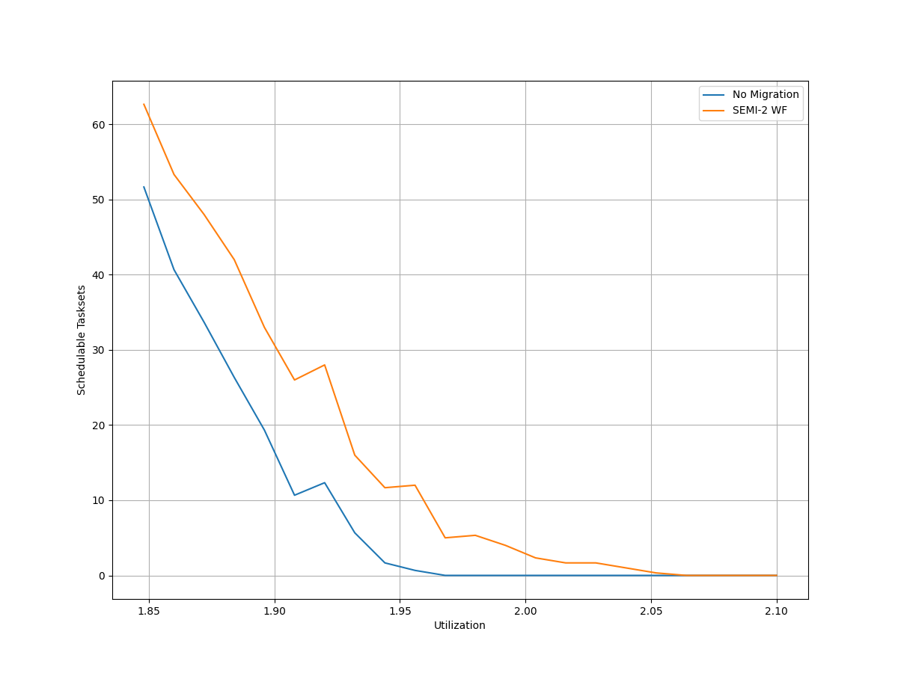
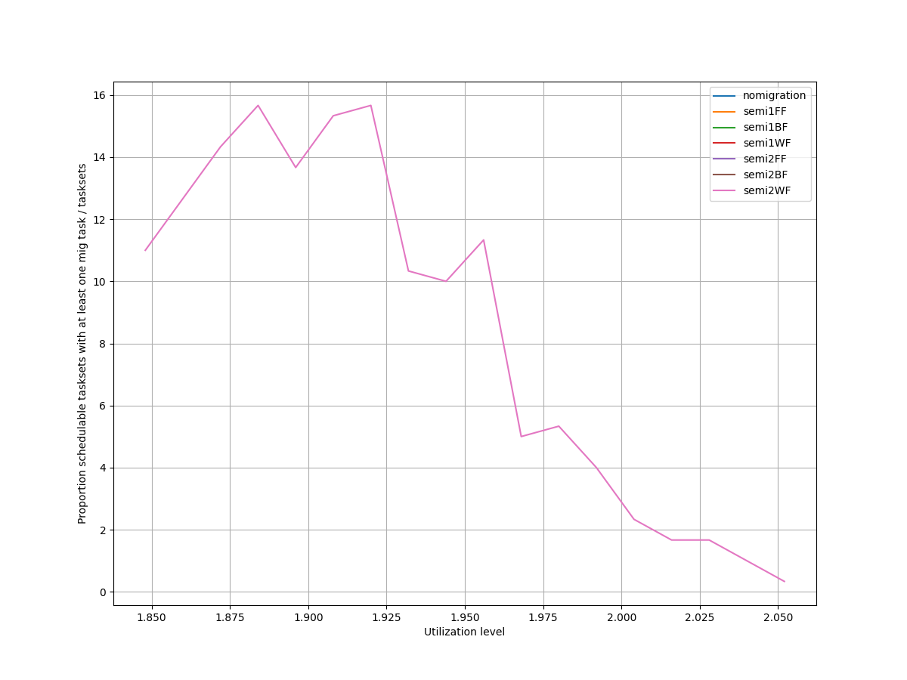
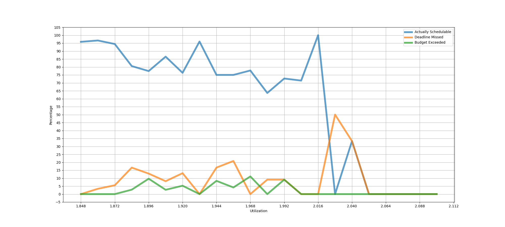
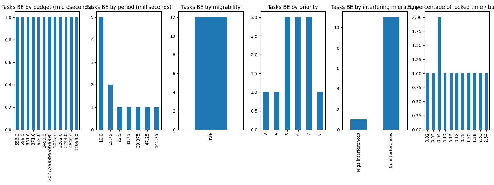
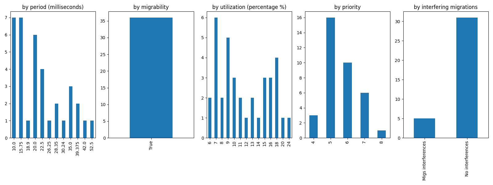
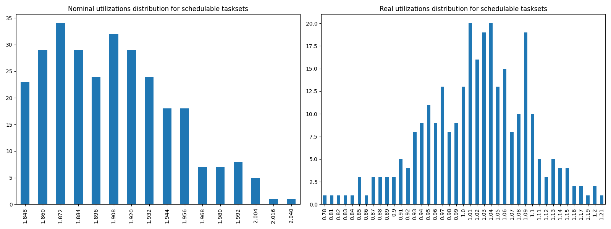
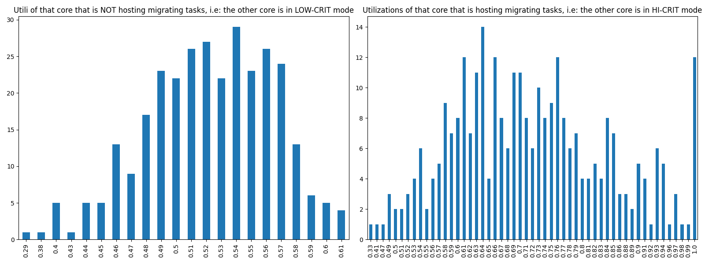

# Report on Experiment 1

## Overall data

   Utilization range = [1.848, 2.1] with step = 0.012

| Schedulable | Not schedulable | Budget Exceeded | Safe Boundary Exceeded |
| ------ | ------ | ------ | ------ |
| 82.10% | 9.94% | 3.41% | 4.55% |

Number of executions: 352

Schedulable executions: 289/352 = 82.10227272727273 %

_Not_ schedulable executions: 35/352 = 9.943181818181818 %

Budget Exceeded executions: 12/352 = 3.4090909090909087 %

Safe Boundary Exceeded executions: 16/352 = 4.545454545454546 %

NS + BE executions: 47/352 = 13.352272727272727 %

### **Simulations**

#### **Weighted schedulability experiment 1 according to simulations.**

#### **Percentage of (schedulable tasksets with at least one migrating tasks / number of schedulable tasksets) of experiment 1 according to simulations.** 

 

### **Real Executions**

#### **Schedulability for each level**

The tasksets with i) at least one migrating task and ii) marked as schedulable by the RTA are executed on a real target, in order to see how many of them are also schedulable in a real-world scenario. The following graph shows, for each "2.1" level (x-axis), the percentage of:

   - Actually schedulable tasksets, i.e. those that have all tasks that meet their deadlines;
   - Deadline Missed tasksets, i.e. those in which (at least) a tasks did not meet (at least) one of its deadlines; 
   - Budget Exceeded tasksets, i.e. those in which a criticality-level budget exceeding is detected (LO-crit budget for LO-crit tasks and HI-crit budget for HI-crit tasks). This type of event makes experiment invalid.

We want to see, thanks to this graphs, how many tasksets remain schedulable in the real-world. The RTA does not take into account overhead time, so we expect that there will be some tasksets that are not actually schedulable.

#### **Tasksets, grouped by differents parameters, with a Budget_Exceeded task.**

With the following graphs, we sum-up the features of the tasks that have occurred in a Criticality-level Budget Exceeded event. Each graph is like a "group-by" SQL operation.
 In the first one, "by budget", we can see, for each _criticality-level budget value_, how many tasks with that criticality-level budget has exceeded it. In the second one, we can see for each _period_ value, how many tasks has exceeded their criticality-level budget.

#### **Tasksets, grouped by differents parameters, with at least one task missing one (or more) of its deadlines.**

With the following graphs, we sum-up the features of the tasks that have missed (at least) one of them deadlines. As the Budget Exceeded graphs, each graph is like a "group-by" SQL operation.

### **Nominal utilizations VS Real utilizations about schedulable tasksets**

| Average real utilizations | Variance real utilizations | Min | Max |
| ------ | ------ | ------ | ------ |
| 1.019 | 0.006 | 0.780 | 1.210 |

### **Utils of the core that will have to accommodate migrating tasks VS Utils of the core when it is actually accomodating them**

These two graphs show the utilizations level of that core $`c_{i}`$ that, sooner or later, will have to accomodate migrating tasks of the other core $`c_{j}`$. The left one, shows the distribution utilizations levels when the core $`c_{i}`$ is **not** accomodating the other core's $`c_{j}`$ migrating tasks, i.e. $`c_{i}`$ and $`c_{j}`$ are both in **LOW-CRIT mode.**
The right one, shows the distribution utilizations levels when the core $`c_{i}`$ **is** accomodating the other core's $`c_{j}`$ migrating tasks, i.e. $`c_{i}`$ in in LO-CRIT mode, while $`c_{j}`$ is in **HIGH-CRIT mode**.

| Average utilizations **not** hosting migs | Variance utilizations **not** hosting migs | Min | Max |
| ------ | ------ | ------ | ------ |
| 0.522 | 0.002 | 0.290 | 0.610 |

| Average utilizations hosting migs | Variance utilizations hosting migs | Min | Max |
| ------ | ------ | ------ | ------ |
| 0.720 | 0.017 | 0.330 | 1.000 |

## Bad tasksets

Click here to expand this section.

### **Not schedulable tasksets**

Click here to expand this section.

Ovvero quando almeno un task non completa entra almeno una sua deadline.

  1. Taskset **e1_semi2wf_t1000**

    Taskset execution params:
	 
    "id": "e1_semi2wf_t1000",
    "size": "12",
    "utilization": "1.884",
    "realutilization": 0.95,
    "criticality_factor": "2",
    "hicrit_proportion": "0.5"

   
 
Click here to see the deadlines missed tasks list.

   Time values are expressed as **micro-seconds**.

Task:  1

    
    "id": " 1",
    "basecpu": " 2",
    "priority": " 5",
    "period": 10000.0,
    "C(LO)": 1292.0,
    "C(HI)": 1292.0,
    "criticality": "LOW",
    "migrable": "True",
    "completedruns": " 981",
    "preemptions": " 0",
    "minresponsejitter": " 0.000000000",
    "maxresponsejitter": " 0.000587408",
    "minreleasejitter": " 0.000000000",
    "maxreleasejitter": " 10.790006910",
    "avgresponsejitter": " 0.000530327",
    "deadlinesmissed": " 1",
    "deadlinemissedtargetcore": " 1",
    "deadlinemissedaftermigration": " 0",
    "budgetexceeded": " 0",
    "budgetexceededtargetcore": " 0",
    "budgetexceededaftermigration": " 0",
    "timesmigrated": " 2",
    "timesrestored": " 1",
    "timesonc1": " 6",
    "timesonc2": " 973",
    "lockedtime": " 0.000002526"

   

   
 
Click here to see the CPUs log.

   Idle time is expressed as **seconds**.

   Util values are expressed as **percentage** %.

   CPU: 1

    
    "id": 1,
    "hyperperiod": 113400000,
    "lowtohigh": " 0",
    "hightolow": " 0",
    "idletime": 57765095,
    "util": 49.06076278659612,
    "idletimeduringhostingmig": 79333,
    "utilduringhostingmig": 80.84165074826548

   CPU: 2

    
    "id": 2,
    "hyperperiod": 56700000,
    "lowtohigh": " 27",
    "hightolow": " 27",
    "idletime": 61422227,
    "util": 45.83577865961199,
    "idletimeduringhostingmig": 0,
    "utilduringhostingmig": null

   Real Utilization: 0.95
   

   
 
Click here to see the whole tasksets.

   Time values are expressed as **micro-seconds**.

   Task:  2

    
    "id": " 2",
    "basecpu": " 1",
    "priority": " 4",
    "period": 30240.0,
    "C(LO)": 3766.0,
    "C(HI)": 7532.0,
    "criticality": "HIGH",
    "migrable": "False",
    "completedruns": " 3751",
    "preemptions": " 152",
    "minresponsejitter": " 0.000000000",
    "maxresponsejitter": " 0.008390808",
    "minreleasejitter": " 0.000000000",
    "maxreleasejitter": " 114.369766045",
    "avgresponsejitter": " 0.003097498",
    "deadlinesmissed": " 0",
    "deadlinemissedtargetcore": " 0",
    "deadlinemissedaftermigration": " 0",
    "budgetexceeded": " 0",
    "budgetexceededtargetcore": " 0",
    "budgetexceededaftermigration": " 0",
    "timesmigrated": " 0",
    "timesrestored": " 0",
    "timesonc1": " 3902",
    "timesonc2": " 0",
    "lockedtime": " 0.000006054"

   Task:  8

    
    "id": " 8",
    "basecpu": " 1",
    "priority": " 1",
    "period": 129600.0,
    "C(LO)": 8606.0,
    "C(HI)": 17213.0,
    "criticality": "HIGH",
    "migrable": "False",
    "completedruns": " 876",
    "preemptions": " 286",
    "minresponsejitter": " 0.000000000",
    "maxresponsejitter": " 0.017360838",
    "minreleasejitter": " 0.000000000",
    "maxreleasejitter": " 114.270406159",
    "avgresponsejitter": " 0.007939847",
    "deadlinesmissed": " 0",
    "deadlinemissedtargetcore": " 0",
    "deadlinemissedaftermigration": " 0",
    "budgetexceeded": " 0",
    "budgetexceededtargetcore": " 0",
    "budgetexceededaftermigration": " 0",
    "timesmigrated": " 0",
    "timesrestored": " 0",
    "timesonc1": " 1161",
    "timesonc2": " 0",
    "lockedtime": " 0.000001246"

   Task:  4

    
    "id": " 4",
    "basecpu": " 1",
    "priority": " 3",
    "period": 67500.0,
    "C(LO)": 3081.0,
    "C(HI)": 6163.0,
    "criticality": "HIGH",
    "migrable": "False",
    "completedruns": " 1681",
    "preemptions": " 147",
    "minresponsejitter": " 0.000000000",
    "maxresponsejitter": " 0.007820102",
    "minreleasejitter": " 0.000000000",
    "maxreleasejitter": " 114.332506216",
    "avgresponsejitter": " 0.002658405",
    "deadlinesmissed": " 0",
    "deadlinemissedtargetcore": " 0",
    "deadlinemissedaftermigration": " 0",
    "budgetexceeded": " 0",
    "budgetexceededtargetcore": " 0",
    "budgetexceededaftermigration": " 0",
    "timesmigrated": " 0",
    "timesrestored": " 0",
    "timesonc1": " 1827",
    "timesonc2": " 0",
    "lockedtime": " 0.000010907"

   Task:  7

    
    "id": " 7",
    "basecpu": " 1",
    "priority": " 2",
    "period": 108000.0,
    "C(LO)": 2836.0,
    "C(HI)": 5673.0,
    "criticality": "HIGH",
    "migrable": "False",
    "completedruns": " 1051",
    "preemptions": " 30",
    "minresponsejitter": " 0.000000000",
    "maxresponsejitter": " 0.005304153",
    "minreleasejitter": " 0.000000000",
    "maxreleasejitter": " 114.292006258",
    "avgresponsejitter": " 0.002260165",
    "deadlinesmissed": " 0",
    "deadlinemissedtargetcore": " 0",
    "deadlinemissedaftermigration": " 0",
    "budgetexceeded": " 0",
    "budgetexceededtargetcore": " 0",
    "budgetexceededaftermigration": " 0",
    "timesmigrated": " 0",
    "timesrestored": " 0",
    "timesonc1": " 1080",
    "timesonc2": " 0",
    "lockedtime": " 0.000005435"

   Task:  11

    
    "id": " 11",
    "basecpu": " 1",
    "priority": " 0",
    "period": 450000.0,
    "C(LO)": 121251.0,
    "C(HI)": 121251.0,
    "criticality": "LOW",
    "migrable": "False",
    "completedruns": " 253",
    "preemptions": " 1997",
    "minresponsejitter": " 0.000000000",
    "maxresponsejitter": " 0.143583381",
    "minreleasejitter": " 0.000000000",
    "maxreleasejitter": " 113.950006270",
    "avgresponsejitter": " 0.128801997",
    "deadlinesmissed": " 0",
    "deadlinemissedtargetcore": " 0",
    "deadlinemissedaftermigration": " 0",
    "budgetexceeded": " 0",
    "budgetexceededtargetcore": " 0",
    "budgetexceededaftermigration": " 0",
    "timesmigrated": " 0",
    "timesrestored": " 0",
    "timesonc1": " 2249",
    "timesonc2": " 0",
    "lockedtime": " 0.000038769"

   Task:  3

    
    "id": " 3",
    "basecpu": " 1",
    "priority": " 5",
    "period": 63000.0,
    "C(LO)": 6576.0,
    "C(HI)": 6576.0,
    "criticality": "LOW",
    "migrable": "False",
    "completedruns": " 1801",
    "preemptions": " 1",
    "minresponsejitter": " 0.000000000",
    "maxresponsejitter": " 0.005353030",
    "minreleasejitter": " 0.000000000",
    "maxreleasejitter": " 114.337006045",
    "avgresponsejitter": " 0.005046222",
    "deadlinesmissed": " 0",
    "deadlinemissedtargetcore": " 0",
    "deadlinemissedaftermigration": " 0",
    "budgetexceeded": " 0",
    "budgetexceededtargetcore": " 0",
    "budgetexceededaftermigration": " 0",
    "timesmigrated": " 0",
    "timesrestored": " 0",
    "timesonc1": " 1801",
    "timesonc2": " 0",
    "lockedtime": " 0.000012120"

   Task:  5

    
    "id": " 5",
    "basecpu": " 2",
    "priority": " 2",
    "period": 70875.0,
    "C(LO)": 16160.999999999998,
    "C(HI)": 32321.999999999996,
    "criticality": "HIGH",
    "migrable": "False",
    "completedruns": " 1601",
    "preemptions": " 497",
    "minresponsejitter": " 0.000000000",
    "maxresponsejitter": " 0.036586213",
    "minreleasejitter": " 0.000000000",
    "maxreleasejitter": " 114.329131018",
    "avgresponsejitter": " 0.014741568",
    "deadlinesmissed": " 0",
    "deadlinemissedtargetcore": " 0",
    "deadlinemissedaftermigration": " 0",
    "budgetexceeded": " 16",
    "budgetexceededtargetcore": " 0",
    "budgetexceededaftermigration": " 0",
    "timesmigrated": " 0",
    "timesrestored": " 0",
    "timesonc1": " 0",
    "timesonc2": " 2113",
    "lockedtime": " 0.000026964"

   Task:  10

    
    "id": " 10",
    "basecpu": " 2",
    "priority": " 1",
    "period": 162000.0,
    "C(LO)": 6670.0,
    "C(HI)": 13340.0,
    "criticality": "HIGH",
    "migrable": "False",
    "completedruns": " 701",
    "preemptions": " 86",
    "minresponsejitter": " 0.000000000",
    "maxresponsejitter": " 0.040646592",
    "minreleasejitter": " 0.000000000",
    "maxreleasejitter": " 114.238005979",
    "avgresponsejitter": " 0.006365877",
    "deadlinesmissed": " 0",
    "deadlinemissedtargetcore": " 0",
    "deadlinemissedaftermigration": " 0",
    "budgetexceeded": " 11",
    "budgetexceededtargetcore": " 0",
    "budgetexceededaftermigration": " 0",
    "timesmigrated": " 0",
    "timesrestored": " 0",
    "timesonc1": " 0",
    "timesonc2": " 797",
    "lockedtime": " 0.000014120"

   Task:  1

    
    "id": " 1",
    "basecpu": " 2",
    "priority": " 5",
    "period": 10000.0,
    "C(LO)": 1292.0,
    "C(HI)": 1292.0,
    "criticality": "LOW",
    "migrable": "True",
    "completedruns": " 981",
    "preemptions": " 0",
    "minresponsejitter": " 0.000000000",
    "maxresponsejitter": " 0.000587408",
    "minreleasejitter": " 0.000000000",
    "maxreleasejitter": " 10.790006910",
    "avgresponsejitter": " 0.000530327",
    "deadlinesmissed": " 1",
    "deadlinemissedtargetcore": " 1",
    "deadlinemissedaftermigration": " 0",
    "budgetexceeded": " 0",
    "budgetexceededtargetcore": " 0",
    "budgetexceededaftermigration": " 0",
    "timesmigrated": " 2",
    "timesrestored": " 1",
    "timesonc1": " 6",
    "timesonc2": " 973",
    "lockedtime": " 0.000002526"

   Task:  6

    
    "id": " 6",
    "basecpu": " 2",
    "priority": " 4",
    "period": 100000.0,
    "C(LO)": 12793.0,
    "C(HI)": 12793.0,
    "criticality": "LOW",
    "migrable": "False",
    "completedruns": " 1135",
    "preemptions": " 86",
    "minresponsejitter": " 0.000000000",
    "maxresponsejitter": " 0.010969661",
    "minreleasejitter": " 0.000000000",
    "maxreleasejitter": " 114.300006003",
    "avgresponsejitter": " 0.009886282",
    "deadlinesmissed": " 0",
    "deadlinemissedtargetcore": " 0",
    "deadlinemissedaftermigration": " 0",
    "budgetexceeded": " 0",
    "budgetexceededtargetcore": " 0",
    "budgetexceededaftermigration": " 0",
    "timesmigrated": " 0",
    "timesrestored": " 0",
    "timesonc1": " 0",
    "timesonc2": " 1220",
    "lockedtime": " 0.000016024"

   Task:  12

    
    "id": " 12",
    "basecpu": " 2",
    "priority": " 0",
    "period": 900000.0,
    "C(LO)": 91893.0,
    "C(HI)": 91893.0,
    "criticality": "LOW",
    "migrable": "False",
    "completedruns": " 127",
    "preemptions": " 425",
    "minresponsejitter": " 0.000000000",
    "maxresponsejitter": " 0.130066333",
    "minreleasejitter": " 0.000000000",
    "maxreleasejitter": " 113.509313321",
    "avgresponsejitter": " 0.108181210",
    "deadlinesmissed": " 0",
    "deadlinemissedtargetcore": " 0",
    "deadlinemissedaftermigration": " 0",
    "budgetexceeded": " 0",
    "budgetexceededtargetcore": " 0",
    "budgetexceededaftermigration": " 0",
    "timesmigrated": " 0",
    "timesrestored": " 0",
    "timesonc1": " 0",
    "timesonc2": " 551",
    "lockedtime": " 0.000011042"

   Task:  9

    
    "id": " 9",
    "basecpu": " 2",
    "priority": " 3",
    "period": 131250.0,
    "C(LO)": 11379.0,
    "C(HI)": 11379.0,
    "criticality": "LOW",
    "migrable": "False",
    "completedruns": " 865",
    "preemptions": " 111",
    "minresponsejitter": " 0.000000000",
    "maxresponsejitter": " 0.020680495",
    "minreleasejitter": " 0.000000000",
    "maxreleasejitter": " 114.268756796",
    "avgresponsejitter": " 0.009424393",
    "deadlinesmissed": " 0",
    "deadlinemissedtargetcore": " 0",
    "deadlinemissedaftermigration": " 0",
    "budgetexceeded": " 0",
    "budgetexceededtargetcore": " 0",
    "budgetexceededaftermigration": " 0",
    "timesmigrated": " 0",
    "timesrestored": " 0",
    "timesonc1": " 0",
    "timesonc2": " 975",
    "lockedtime": " 0.000011054"

   

  2. Taskset **e1_semi2wf_t1027**

    Taskset execution params:
	 
    "id": "e1_semi2wf_t1027",
    "size": "12",
    "utilization": "1.884",
    "realutilization": 0.95,
    "criticality_factor": "2",
    "hicrit_proportion": "0.5"

   
 
Click here to see the deadlines missed tasks list.

   Time values are expressed as **micro-seconds**.

Task:  1

    
    "id": " 1",
    "basecpu": " 1",
    "priority": " 7",
    "period": 22500.0,
    "C(LO)": 4291.0,
    "C(HI)": 4291.0,
    "criticality": "LOW",
    "migrable": "True",
    "completedruns": " 1403",
    "preemptions": " 0",
    "minresponsejitter": " 0.000000000",
    "maxresponsejitter": " 0.001949078",
    "minreleasejitter": " 0.000000000",
    "maxreleasejitter": " 32.522506979",
    "avgresponsejitter": " 0.001748408",
    "deadlinesmissed": " 2",
    "deadlinemissedtargetcore": " 1",
    "deadlinemissedaftermigration": " 0",
    "budgetexceeded": " 0",
    "budgetexceededtargetcore": " 0",
    "budgetexceededaftermigration": " 0",
    "timesmigrated": " 5",
    "timesrestored": " 4",
    "timesonc1": " 1391",
    "timesonc2": " 9",
    "lockedtime": " 0.000016000"

   

   
 
Click here to see the CPUs log.

   Idle time is expressed as **seconds**.

   Util values are expressed as **percentage** %.

   CPU: 1

    
    "id": 1,
    "hyperperiod": 113400000,
    "lowtohigh": " 31",
    "hightolow": " 31",
    "idletime": 62102255,
    "util": 45.23610670194004,
    "idletimeduringhostingmig": 0,
    "utilduringhostingmig": null

   CPU: 2

    
    "id": 2,
    "hyperperiod": 56700000,
    "lowtohigh": " 0",
    "hightolow": " 0",
    "idletime": 57249515,
    "util": 49.5154188712522,
    "idletimeduringhostingmig": 205775,
    "utilduringhostingmig": 68.94684103619687

   Real Utilization: 0.95
   

   
 
Click here to see the whole tasksets.

   Time values are expressed as **micro-seconds**.

   Task:  12

    
    "id": " 12",
    "basecpu": " 1",
    "priority": " 0",
    "period": 700000.0,
    "C(LO)": 80409.0,
    "C(HI)": 160819.0,
    "criticality": "HIGH",
    "migrable": "False",
    "completedruns": " 163",
    "preemptions": " 664",
    "minresponsejitter": " 0.000000000",
    "maxresponsejitter": " 0.208613069",
    "minreleasejitter": " 0.000000000",
    "maxreleasejitter": " 113.700007000",
    "avgresponsejitter": " 0.091963706",
    "deadlinesmissed": " 0",
    "deadlinemissedtargetcore": " 0",
    "deadlinemissedaftermigration": " 0",
    "budgetexceeded": " 2",
    "budgetexceededtargetcore": " 0",
    "budgetexceededaftermigration": " 0",
    "timesmigrated": " 0",
    "timesrestored": " 0",
    "timesonc1": " 828",
    "timesonc2": " 0",
    "lockedtime": " 0.000044937"

   Task:  5

    
    "id": " 5",
    "basecpu": " 1",
    "priority": " 3",
    "period": 94500.0,
    "C(LO)": 7159.0,
    "C(HI)": 14318.0,
    "criticality": "HIGH",
    "migrable": "False",
    "completedruns": " 1201",
    "preemptions": " 280",
    "minresponsejitter": " 0.000000000",
    "maxresponsejitter": " 0.036832261",
    "minreleasejitter": " 0.000000000",
    "maxreleasejitter": " 114.305507081",
    "avgresponsejitter": " 0.007019985",
    "deadlinesmissed": " 0",
    "deadlinemissedtargetcore": " 0",
    "deadlinemissedaftermigration": " 0",
    "budgetexceeded": " 14",
    "budgetexceededtargetcore": " 0",
    "budgetexceededaftermigration": " 0",
    "timesmigrated": " 0",
    "timesrestored": " 0",
    "timesonc1": " 1494",
    "timesonc2": " 0",
    "lockedtime": " 0.000068691"

   Task:  6

    
    "id": " 6",
    "basecpu": " 1",
    "priority": " 2",
    "period": 108000.0,
    "C(LO)": 4549.0,
    "C(HI)": 9099.0,
    "criticality": "HIGH",
    "migrable": "False",
    "completedruns": " 1051",
    "preemptions": " 86",
    "minresponsejitter": " 0.000000000",
    "maxresponsejitter": " 0.029820622",
    "minreleasejitter": " 0.000000000",
    "maxreleasejitter": " 114.292951958",
    "avgresponsejitter": " 0.004142069",
    "deadlinesmissed": " 0",
    "deadlinemissedtargetcore": " 0",
    "deadlinemissedaftermigration": " 0",
    "budgetexceeded": " 6",
    "budgetexceededtargetcore": " 0",
    "budgetexceededaftermigration": " 0",
    "timesmigrated": " 0",
    "timesrestored": " 0",
    "timesonc1": " 1142",
    "timesonc2": " 0",
    "lockedtime": " 0.000003267"

   Task:  11

    
    "id": " 11",
    "basecpu": " 1",
    "priority": " 1",
    "period": 189000.0,
    "C(LO)": 5317.0,
    "C(HI)": 10635.0,
    "criticality": "HIGH",
    "migrable": "False",
    "completedruns": " 601",
    "preemptions": " 102",
    "minresponsejitter": " 0.000000000",
    "maxresponsejitter": " 0.033124691",
    "minreleasejitter": " 0.000000000",
    "maxreleasejitter": " 114.216426697",
    "avgresponsejitter": " 0.005126661",
    "deadlinesmissed": " 0",
    "deadlinemissedtargetcore": " 0",
    "deadlinemissedaftermigration": " 0",
    "budgetexceeded": " 9",
    "budgetexceededtargetcore": " 0",
    "budgetexceededaftermigration": " 0",
    "timesmigrated": " 0",
    "timesrestored": " 0",
    "timesonc1": " 711",
    "timesonc2": " 0",
    "lockedtime": " 0.000005321"

   Task:  1

    
    "id": " 1",
    "basecpu": " 1",
    "priority": " 7",
    "period": 22500.0,
    "C(LO)": 4291.0,
    "C(HI)": 4291.0,
    "criticality": "LOW",
    "migrable": "True",
    "completedruns": " 1403",
    "preemptions": " 0",
    "minresponsejitter": " 0.000000000",
    "maxresponsejitter": " 0.001949078",
    "minreleasejitter": " 0.000000000",
    "maxreleasejitter": " 32.522506979",
    "avgresponsejitter": " 0.001748408",
    "deadlinesmissed": " 2",
    "deadlinemissedtargetcore": " 1",
    "deadlinemissedaftermigration": " 0",
    "budgetexceeded": " 0",
    "budgetexceededtargetcore": " 0",
    "budgetexceededaftermigration": " 0",
    "timesmigrated": " 5",
    "timesrestored": " 4",
    "timesonc1": " 1391",
    "timesonc2": " 9",
    "lockedtime": " 0.000016000"

   Task:  9

    
    "id": " 9",
    "basecpu": " 1",
    "priority": " 4",
    "period": 131250.0,
    "C(LO)": 17417.0,
    "C(HI)": 17417.0,
    "criticality": "LOW",
    "migrable": "False",
    "completedruns": " 865",
    "preemptions": " 245",
    "minresponsejitter": " 0.000000000",
    "maxresponsejitter": " 0.026754829",
    "minreleasejitter": " 0.000000000",
    "maxreleasejitter": " 114.268756336",
    "avgresponsejitter": " 0.014627820",
    "deadlinesmissed": " 0",
    "deadlinemissedtargetcore": " 0",
    "deadlinemissedaftermigration": " 0",
    "budgetexceeded": " 0",
    "budgetexceededtargetcore": " 0",
    "budgetexceededaftermigration": " 0",
    "timesmigrated": " 0",
    "timesrestored": " 0",
    "timesonc1": " 1109",
    "timesonc2": " 0",
    "lockedtime": " 0.000042955"

   Task:  3

    
    "id": " 3",
    "basecpu": " 1",
    "priority": " 6",
    "period": 56250.0,
    "C(LO)": 4946.0,
    "C(HI)": 4946.0,
    "criticality": "LOW",
    "migrable": "False",
    "completedruns": " 2017",
    "preemptions": " 1",
    "minresponsejitter": " 0.000000000",
    "maxresponsejitter": " 0.004019018",
    "minreleasejitter": " 0.000000000",
    "maxreleasejitter": " 114.343756252",
    "avgresponsejitter": " 0.003790186",
    "deadlinesmissed": " 0",
    "deadlinemissedtargetcore": " 0",
    "deadlinemissedaftermigration": " 0",
    "budgetexceeded": " 0",
    "budgetexceededtargetcore": " 0",
    "budgetexceededaftermigration": " 0",
    "timesmigrated": " 0",
    "timesrestored": " 0",
    "timesonc1": " 2017",
    "timesonc2": " 0",
    "lockedtime": " 0.000036952"

   Task:  8

    
    "id": " 8",
    "basecpu": " 1",
    "priority": " 5",
    "period": 129600.0,
    "C(LO)": 9679.0,
    "C(HI)": 9679.0,
    "criticality": "LOW",
    "migrable": "False",
    "completedruns": " 876",
    "preemptions": " 174",
    "minresponsejitter": " 0.000000000",
    "maxresponsejitter": " 0.013563285",
    "minreleasejitter": " 0.000000000",
    "maxreleasejitter": " 114.270406817",
    "avgresponsejitter": " 0.008075315",
    "deadlinesmissed": " 0",
    "deadlinemissedtargetcore": " 0",
    "deadlinemissedaftermigration": " 0",
    "budgetexceeded": " 0",
    "budgetexceededtargetcore": " 0",
    "budgetexceededaftermigration": " 0",
    "timesmigrated": " 0",
    "timesrestored": " 0",
    "timesonc1": " 1049",
    "timesonc2": " 0",
    "lockedtime": " 0.000027856"

   Task:  10

    
    "id": " 10",
    "basecpu": " 2",
    "priority": " 0",
    "period": 175000.0,
    "C(LO)": 33636.0,
    "C(HI)": 67272.0,
    "criticality": "HIGH",
    "migrable": "False",
    "completedruns": " 649",
    "preemptions": " 711",
    "minresponsejitter": " 0.000000000",
    "maxresponsejitter": " 0.065002042",
    "minreleasejitter": " 0.000000000",
    "maxreleasejitter": " 114.225006021",
    "avgresponsejitter": " 0.035792505",
    "deadlinesmissed": " 0",
    "deadlinemissedtargetcore": " 0",
    "deadlinemissedaftermigration": " 0",
    "budgetexceeded": " 0",
    "budgetexceededtargetcore": " 0",
    "budgetexceededaftermigration": " 0",
    "timesmigrated": " 0",
    "timesrestored": " 0",
    "timesonc1": " 0",
    "timesonc2": " 1359",
    "lockedtime": " 0.000077198"

   Task:  4

    
    "id": " 4",
    "basecpu": " 2",
    "priority": " 1",
    "period": 90720.0,
    "C(LO)": 3806.0,
    "C(HI)": 7612.0,
    "criticality": "HIGH",
    "migrable": "False",
    "completedruns": " 1251",
    "preemptions": " 85",
    "minresponsejitter": " 0.000000000",
    "maxresponsejitter": " 0.033160928",
    "minreleasejitter": " 0.000000000",
    "maxreleasejitter": " 114.314819450",
    "avgresponsejitter": " 0.003829619",
    "deadlinesmissed": " 0",
    "deadlinemissedtargetcore": " 0",
    "deadlinemissedaftermigration": " 0",
    "budgetexceeded": " 0",
    "budgetexceededtargetcore": " 0",
    "budgetexceededaftermigration": " 0",
    "timesmigrated": " 0",
    "timesrestored": " 0",
    "timesonc1": " 0",
    "timesonc2": " 1335",
    "lockedtime": " 0.000015910"

   Task:  7

    
    "id": " 7",
    "basecpu": " 2",
    "priority": " 2",
    "period": 112500.0,
    "C(LO)": 31184.0,
    "C(HI)": 31184.0,
    "criticality": "LOW",
    "migrable": "False",
    "completedruns": " 1009",
    "preemptions": " 489",
    "minresponsejitter": " 0.000000000",
    "maxresponsejitter": " 0.030399862",
    "minreleasejitter": " 0.000000000",
    "maxreleasejitter": " 114.287507327",
    "avgresponsejitter": " 0.026362363",
    "deadlinesmissed": " 0",
    "deadlinemissedtargetcore": " 0",
    "deadlinemissedaftermigration": " 0",
    "budgetexceeded": " 0",
    "budgetexceededtargetcore": " 0",
    "budgetexceededaftermigration": " 0",
    "timesmigrated": " 0",
    "timesrestored": " 0",
    "timesonc1": " 0",
    "timesonc2": " 1497",
    "lockedtime": " 0.000129201"

   Task:  2

    
    "id": " 2",
    "basecpu": " 2",
    "priority": " 3",
    "period": 47250.0,
    "C(LO)": 6172.0,
    "C(HI)": 6172.0,
    "criticality": "LOW",
    "migrable": "False",
    "completedruns": " 2401",
    "preemptions": " 2",
    "minresponsejitter": " 0.000000000",
    "maxresponsejitter": " 0.006688772",
    "minreleasejitter": " 0.000000000",
    "maxreleasejitter": " 114.352756030",
    "avgresponsejitter": " 0.004733820",
    "deadlinesmissed": " 0",
    "deadlinemissedtargetcore": " 0",
    "deadlinemissedaftermigration": " 0",
    "budgetexceeded": " 0",
    "budgetexceededtargetcore": " 0",
    "budgetexceededaftermigration": " 0",
    "timesmigrated": " 0",
    "timesrestored": " 0",
    "timesonc1": " 0",
    "timesonc2": " 2402",
    "lockedtime": " 0.000082784"

   

  3. Taskset **e1_semi2wf_t1158**

    Taskset execution params:
	 
    "id": "e1_semi2wf_t1158",
    "size": "12",
    "utilization": "1.884",
    "realutilization": 1.13,
    "criticality_factor": "2",
    "hicrit_proportion": "0.5"

   
 
Click here to see the deadlines missed tasks list.

   Time values are expressed as **micro-seconds**.

Task:  1

    
    "id": " 1",
    "basecpu": " 2",
    "priority": " 7",
    "period": 15750.0,
    "C(LO)": 1266.0,
    "C(HI)": 1266.0,
    "criticality": "LOW",
    "migrable": "True",
    "completedruns": " 1451",
    "preemptions": " 0",
    "minresponsejitter": " 0.000000000",
    "maxresponsejitter": " 0.000580742",
    "minreleasejitter": " 0.000000000",
    "maxreleasejitter": " 23.821756847",
    "avgresponsejitter": " 0.000521709",
    "deadlinesmissed": " 1",
    "deadlinemissedtargetcore": " 0",
    "deadlinemissedaftermigration": " 0",
    "budgetexceeded": " 0",
    "budgetexceededtargetcore": " 0",
    "budgetexceededaftermigration": " 0",
    "timesmigrated": " 4",
    "timesrestored": " 3",
    "timesonc1": " 2",
    "timesonc2": " 1447",
    "lockedtime": " 0.000019766"

   

   
 
Click here to see the CPUs log.

   Idle time is expressed as **seconds**.

   Util values are expressed as **percentage** %.

   CPU: 1

    
    "id": 1,
    "hyperperiod": 56700000,
    "lowtohigh": " 0",
    "hightolow": " 0",
    "idletime": 24033839,
    "util": 57.612276895943566,
    "idletimeduringhostingmig": 23924,
    "utilduringhostingmig": 87.31723867383398

   CPU: 2

    
    "id": 2,
    "hyperperiod": 22680000,
    "lowtohigh": " 30",
    "hightolow": " 30",
    "idletime": 25779426,
    "util": 54.53364021164021,
    "idletimeduringhostingmig": 0,
    "utilduringhostingmig": null

   Real Utilization: 1.13
   

   
 
Click here to see the whole tasksets.

   Time values are expressed as **micro-seconds**.

   Task:  11

    
    "id": " 11",
    "basecpu": " 1",
    "priority": " 0",
    "period": 675000.0,
    "C(LO)": 49856.0,
    "C(HI)": 99712.0,
    "criticality": "HIGH",
    "migrable": "False",
    "completedruns": " 85",
    "preemptions": " 242",
    "minresponsejitter": " 0.000000000",
    "maxresponsejitter": " 0.107728778",
    "minreleasejitter": " 0.000000000",
    "maxreleasejitter": " 57.026085880",
    "avgresponsejitter": " 0.075670090",
    "deadlinesmissed": " 0",
    "deadlinemissedtargetcore": " 0",
    "deadlinemissedaftermigration": " 0",
    "budgetexceeded": " 0",
    "budgetexceededtargetcore": " 0",
    "budgetexceededaftermigration": " 0",
    "timesmigrated": " 0",
    "timesrestored": " 0",
    "timesonc1": " 326",
    "timesonc2": " 0",
    "lockedtime": " 0.000016306"

   Task:  5

    
    "id": " 5",
    "basecpu": " 1",
    "priority": " 1",
    "period": 63000.0,
    "C(LO)": 3950.9999999999995,
    "C(HI)": 7901.999999999999,
    "criticality": "HIGH",
    "migrable": "False",
    "completedruns": " 901",
    "preemptions": " 101",
    "minresponsejitter": " 0.000000000",
    "maxresponsejitter": " 0.034036601",
    "minreleasejitter": " 0.000000000",
    "maxreleasejitter": " 57.664542426",
    "avgresponsejitter": " 0.004098273",
    "deadlinesmissed": " 0",
    "deadlinemissedtargetcore": " 0",
    "deadlinemissedaftermigration": " 0",
    "budgetexceeded": " 0",
    "budgetexceededtargetcore": " 0",
    "budgetexceededaftermigration": " 0",
    "timesmigrated": " 0",
    "timesrestored": " 0",
    "timesonc1": " 1001",
    "timesonc2": " 0",
    "lockedtime": " 0.000019538"

   Task:  3

    
    "id": " 3",
    "basecpu": " 1",
    "priority": " 3",
    "period": 33750.0,
    "C(LO)": 1466.0,
    "C(HI)": 2933.0,
    "criticality": "HIGH",
    "migrable": "False",
    "completedruns": " 1681",
    "preemptions": " 1",
    "minresponsejitter": " 0.000000000",
    "maxresponsejitter": " 0.001195751",
    "minreleasejitter": " 0.000000000",
    "maxreleasejitter": " 57.666256985",
    "avgresponsejitter": " 0.001129342",
    "deadlinesmissed": " 0",
    "deadlinemissedtargetcore": " 0",
    "deadlinemissedaftermigration": " 0",
    "budgetexceeded": " 0",
    "budgetexceededtargetcore": " 0",
    "budgetexceededaftermigration": " 0",
    "timesmigrated": " 0",
    "timesrestored": " 0",
    "timesonc1": " 1681",
    "timesonc2": " 0",
    "lockedtime": " 0.000014147"

   Task:  6

    
    "id": " 6",
    "basecpu": " 1",
    "priority": " 2",
    "period": 64800.0,
    "C(LO)": 36765.0,
    "C(HI)": 36765.0,
    "criticality": "LOW",
    "migrable": "False",
    "completedruns": " 876",
    "preemptions": " 720",
    "minresponsejitter": " 0.000000000",
    "maxresponsejitter": " 0.031111036",
    "minreleasejitter": " 0.000000000",
    "maxreleasejitter": " 57.635206327",
    "avgresponsejitter": " 0.029255198",
    "deadlinesmissed": " 0",
    "deadlinemissedtargetcore": " 0",
    "deadlinemissedaftermigration": " 0",
    "budgetexceeded": " 0",
    "budgetexceededtargetcore": " 0",
    "budgetexceededaftermigration": " 0",
    "timesmigrated": " 0",
    "timesrestored": " 0",
    "timesonc1": " 1595",
    "timesonc2": " 0",
    "lockedtime": " 0.000085964"

   Task:  4

    
    "id": " 4",
    "basecpu": " 2",
    "priority": " 4",
    "period": 39375.0,
    "C(LO)": 4041.9999999999995,
    "C(HI)": 8085.0,
    "criticality": "HIGH",
    "migrable": "False",
    "completedruns": " 1441",
    "preemptions": " 178",
    "minresponsejitter": " 0.000000000",
    "maxresponsejitter": " 0.010801802",
    "minreleasejitter": " 0.000000000",
    "maxreleasejitter": " 57.660630850",
    "avgresponsejitter": " 0.003390249",
    "deadlinesmissed": " 0",
    "deadlinemissedtargetcore": " 0",
    "deadlinemissedaftermigration": " 0",
    "budgetexceeded": " 12",
    "budgetexceededtargetcore": " 0",
    "budgetexceededaftermigration": " 0",
    "timesmigrated": " 0",
    "timesrestored": " 0",
    "timesonc1": " 0",
    "timesonc2": " 1630",
    "lockedtime": " 0.000017036"

   Task:  2

    
    "id": " 2",
    "basecpu": " 2",
    "priority": " 5",
    "period": 30240.0,
    "C(LO)": 1757.0,
    "C(HI)": 3514.0,
    "criticality": "HIGH",
    "migrable": "False",
    "completedruns": " 1876",
    "preemptions": " 61",
    "minresponsejitter": " 0.000000000",
    "maxresponsejitter": " 0.002846306",
    "minreleasejitter": " 0.000000000",
    "maxreleasejitter": " 57.669766117",
    "avgresponsejitter": " 0.001380435",
    "deadlinesmissed": " 0",
    "deadlinemissedtargetcore": " 0",
    "deadlinemissedaftermigration": " 0",
    "budgetexceeded": " 18",
    "budgetexceededtargetcore": " 0",
    "budgetexceededaftermigration": " 0",
    "timesmigrated": " 0",
    "timesrestored": " 0",
    "timesonc1": " 0",
    "timesonc2": " 1954",
    "lockedtime": " 0.000004294"

   Task:  12

    
    "id": " 12",
    "basecpu": " 2",
    "priority": " 0",
    "period": 756000.0,
    "C(LO)": 21041.0,
    "C(HI)": 42083.0,
    "criticality": "HIGH",
    "migrable": "False",
    "completedruns": " 76",
    "preemptions": " 89",
    "minresponsejitter": " 0.000000000",
    "maxresponsejitter": " 0.022492234",
    "minreleasejitter": " 0.000000000",
    "maxreleasejitter": " 56.968054859",
    "avgresponsejitter": " 0.018951604",
    "deadlinesmissed": " 0",
    "deadlinemissedtargetcore": " 0",
    "deadlinemissedaftermigration": " 0",
    "budgetexceeded": " 0",
    "budgetexceededtargetcore": " 0",
    "budgetexceededaftermigration": " 0",
    "timesmigrated": " 0",
    "timesrestored": " 0",
    "timesonc1": " 0",
    "timesonc2": " 164",
    "lockedtime": " 0.000000000"

   Task:  8

    
    "id": " 8",
    "basecpu": " 2",
    "priority": " 3",
    "period": 141750.0,
    "C(LO)": 31011.0,
    "C(HI)": 31011.0,
    "criticality": "LOW",
    "migrable": "False",
    "completedruns": " 401",
    "preemptions": " 762",
    "minresponsejitter": " 0.000000000",
    "maxresponsejitter": " 0.037091261",
    "minreleasejitter": " 0.000000000",
    "maxreleasejitter": " 57.558256520",
    "avgresponsejitter": " 0.028372090",
    "deadlinesmissed": " 0",
    "deadlinemissedtargetcore": " 0",
    "deadlinemissedaftermigration": " 0",
    "budgetexceeded": " 0",
    "budgetexceededtargetcore": " 0",
    "budgetexceededaftermigration": " 0",
    "timesmigrated": " 0",
    "timesrestored": " 0",
    "timesonc1": " 0",
    "timesonc2": " 1162",
    "lockedtime": " 0.000023354"

   Task:  9

    
    "id": " 9",
    "basecpu": " 2",
    "priority": " 2",
    "period": 162000.0,
    "C(LO)": 18468.0,
    "C(HI)": 18468.0,
    "criticality": "LOW",
    "migrable": "False",
    "completedruns": " 351",
    "preemptions": " 476",
    "minresponsejitter": " 0.000000000",
    "maxresponsejitter": " 0.052783961",
    "minreleasejitter": " 0.000000000",
    "maxreleasejitter": " 57.538006051",
    "avgresponsejitter": " 0.017770835",
    "deadlinesmissed": " 0",
    "deadlinemissedtargetcore": " 0",
    "deadlinemissedaftermigration": " 0",
    "budgetexceeded": " 0",
    "budgetexceededtargetcore": " 0",
    "budgetexceededaftermigration": " 0",
    "timesmigrated": " 0",
    "timesrestored": " 0",
    "timesonc1": " 0",
    "timesonc2": " 826",
    "lockedtime": " 0.000022940"

   Task:  10

    
    "id": " 10",
    "basecpu": " 2",
    "priority": " 1",
    "period": 189000.0,
    "C(LO)": 21126.0,
    "C(HI)": 21126.0,
    "criticality": "LOW",
    "migrable": "False",
    "completedruns": " 301",
    "preemptions": " 405",
    "minresponsejitter": " 0.000000000",
    "maxresponsejitter": " 0.026758637",
    "minreleasejitter": " 0.000000000",
    "maxreleasejitter": " 57.511006159",
    "avgresponsejitter": " 0.019408048",
    "deadlinesmissed": " 0",
    "deadlinemissedtargetcore": " 0",
    "deadlinemissedaftermigration": " 0",
    "budgetexceeded": " 0",
    "budgetexceededtargetcore": " 0",
    "budgetexceededaftermigration": " 0",
    "timesmigrated": " 0",
    "timesrestored": " 0",
    "timesonc1": " 0",
    "timesonc2": " 705",
    "lockedtime": " 0.000009715"

   Task:  1

    
    "id": " 1",
    "basecpu": " 2",
    "priority": " 7",
    "period": 15750.0,
    "C(LO)": 1266.0,
    "C(HI)": 1266.0,
    "criticality": "LOW",
    "migrable": "True",
    "completedruns": " 1451",
    "preemptions": " 0",
    "minresponsejitter": " 0.000000000",
    "maxresponsejitter": " 0.000580742",
    "minreleasejitter": " 0.000000000",
    "maxreleasejitter": " 23.821756847",
    "avgresponsejitter": " 0.000521709",
    "deadlinesmissed": " 1",
    "deadlinemissedtargetcore": " 0",
    "deadlinemissedaftermigration": " 0",
    "budgetexceeded": " 0",
    "budgetexceededtargetcore": " 0",
    "budgetexceededaftermigration": " 0",
    "timesmigrated": " 4",
    "timesrestored": " 3",
    "timesonc1": " 2",
    "timesonc2": " 1447",
    "lockedtime": " 0.000019766"

   Task:  7

    
    "id": " 7",
    "basecpu": " 2",
    "priority": " 6",
    "period": 100800.0,
    "C(LO)": 5480.0,
    "C(HI)": 5480.0,
    "criticality": "LOW",
    "migrable": "False",
    "completedruns": " 564",
    "preemptions": " 45",
    "minresponsejitter": " 0.000000000",
    "maxresponsejitter": " 0.005016538",
    "minreleasejitter": " 0.000000000",
    "maxreleasejitter": " 57.649605976",
    "avgresponsejitter": " 0.004251880",
    "deadlinesmissed": " 0",
    "deadlinemissedtargetcore": " 0",
    "deadlinemissedaftermigration": " 0",
    "budgetexceeded": " 0",
    "budgetexceededtargetcore": " 0",
    "budgetexceededaftermigration": " 0",
    "timesmigrated": " 0",
    "timesrestored": " 0",
    "timesonc1": " 0",
    "timesonc2": " 608",
    "lockedtime": " 0.000008435"

   

  4. Taskset **e1_semi2wf_t1387**

    Taskset execution params:
	 
    "id": "e1_semi2wf_t1387",
    "size": "12",
    "utilization": "1.896",
    "realutilization": 1.09,
    "criticality_factor": "2",
    "hicrit_proportion": "0.5"

   
 
Click here to see the deadlines missed tasks list.

   Time values are expressed as **micro-seconds**.

Task:  1

    
    "id": " 1",
    "basecpu": " 1",
    "priority": " 5",
    "period": 18900.0,
    "C(LO)": 2737.0,
    "C(HI)": 2737.0,
    "criticality": "LOW",
    "migrable": "True",
    "completedruns": " 1201",
    "preemptions": " 1",
    "minresponsejitter": " 0.000000000",
    "maxresponsejitter": " 0.001251796",
    "minreleasejitter": " 0.000000000",
    "maxreleasejitter": " 23.661106126",
    "avgresponsejitter": " 0.001119231",
    "deadlinesmissed": " 1",
    "deadlinemissedtargetcore": " 0",
    "deadlinemissedaftermigration": " 0",
    "budgetexceeded": " 0",
    "budgetexceededtargetcore": " 0",
    "budgetexceededaftermigration": " 0",
    "timesmigrated": " 2",
    "timesrestored": " 2",
    "timesonc1": " 1199",
    "timesonc2": " 1",
    "lockedtime": " 0.000020793"

   

   
 
Click here to see the CPUs log.

   Idle time is expressed as **seconds**.

   Util values are expressed as **percentage** %.

   CPU: 1

    
    "id": 1,
    "hyperperiod": 18900000,
    "lowtohigh": " 7",
    "hightolow": " 7",
    "idletime": 11418783,
    "util": 49.65263227513228,
    "idletimeduringhostingmig": 0,
    "utilduringhostingmig": null

   CPU: 2

    
    "id": 2,
    "hyperperiod": 22680000,
    "lowtohigh": " 0",
    "hightolow": " 0",
    "idletime": 9241245,
    "util": 59.25376984126984,
    "idletimeduringhostingmig": 318,
    "utilduringhostingmig": 99.37099454070733

   Real Utilization: 1.0899999999999999
   

   
 
Click here to see the whole tasksets.

   Time values are expressed as **micro-seconds**.

   Task:  9

    
    "id": " 9",
    "basecpu": " 1",
    "priority": " 1",
    "period": 118125.0,
    "C(LO)": 9738.0,
    "C(HI)": 19476.0,
    "criticality": "HIGH",
    "migrable": "False",
    "completedruns": " 193",
    "preemptions": " 158",
    "minresponsejitter": " 0.000000000",
    "maxresponsejitter": " 0.021580781",
    "minreleasejitter": " 0.000000000",
    "maxreleasejitter": " 23.562047826",
    "avgresponsejitter": " 0.010354655",
    "deadlinesmissed": " 0",
    "deadlinemissedtargetcore": " 0",
    "deadlinemissedaftermigration": " 0",
    "budgetexceeded": " 0",
    "budgetexceededtargetcore": " 0",
    "budgetexceededaftermigration": " 0",
    "timesmigrated": " 0",
    "timesrestored": " 0",
    "timesonc1": " 350",
    "timesonc2": " 0",
    "lockedtime": " 0.000013258"

   Task:  10

    
    "id": " 10",
    "basecpu": " 1",
    "priority": " 0",
    "period": 131250.0,
    "C(LO)": 10050.0,
    "C(HI)": 20100.0,
    "criticality": "HIGH",
    "migrable": "False",
    "completedruns": " 174",
    "preemptions": " 154",
    "minresponsejitter": " 0.000000000",
    "maxresponsejitter": " 0.026613360",
    "minreleasejitter": " 0.000000000",
    "maxreleasejitter": " 23.580822694",
    "avgresponsejitter": " 0.011448766",
    "deadlinesmissed": " 0",
    "deadlinemissedtargetcore": " 0",
    "deadlinemissedaftermigration": " 0",
    "budgetexceeded": " 4",
    "budgetexceededtargetcore": " 0",
    "budgetexceededaftermigration": " 0",
    "timesmigrated": " 0",
    "timesrestored": " 0",
    "timesonc1": " 331",
    "timesonc2": " 0",
    "lockedtime": " 0.000009288"

   Task:  8

    
    "id": " 8",
    "basecpu": " 1",
    "priority": " 2",
    "period": 75600.0,
    "C(LO)": 5142.0,
    "C(HI)": 10285.0,
    "criticality": "HIGH",
    "migrable": "False",
    "completedruns": " 301",
    "preemptions": " 34",
    "minresponsejitter": " 0.000000000",
    "maxresponsejitter": " 0.010035072",
    "minreleasejitter": " 0.000000000",
    "maxreleasejitter": " 23.605499649",
    "avgresponsejitter": " 0.004611351",
    "deadlinesmissed": " 0",
    "deadlinemissedtargetcore": " 0",
    "deadlinemissedaftermigration": " 0",
    "budgetexceeded": " 3",
    "budgetexceededtargetcore": " 0",
    "budgetexceededaftermigration": " 0",
    "timesmigrated": " 0",
    "timesrestored": " 0",
    "timesonc1": " 337",
    "timesonc2": " 0",
    "lockedtime": " 0.000003324"

   Task:  3

    
    "id": " 3",
    "basecpu": " 1",
    "priority": " 3",
    "period": 35000.0,
    "C(LO)": 7270.0,
    "C(HI)": 7270.0,
    "criticality": "LOW",
    "migrable": "False",
    "completedruns": " 649",
    "preemptions": " 309",
    "minresponsejitter": " 0.000000000",
    "maxresponsejitter": " 0.010342940",
    "minreleasejitter": " 0.000000000",
    "maxreleasejitter": " 23.645006156",
    "avgresponsejitter": " 0.006527589",
    "deadlinesmissed": " 0",
    "deadlinemissedtargetcore": " 0",
    "deadlinemissedaftermigration": " 0",
    "budgetexceeded": " 0",
    "budgetexceededtargetcore": " 0",
    "budgetexceededaftermigration": " 0",
    "timesmigrated": " 0",
    "timesrestored": " 0",
    "timesonc1": " 957",
    "timesonc2": " 0",
    "lockedtime": " 0.000021048"

   Task:  1

    
    "id": " 1",
    "basecpu": " 1",
    "priority": " 5",
    "period": 18900.0,
    "C(LO)": 2737.0,
    "C(HI)": 2737.0,
    "criticality": "LOW",
    "migrable": "True",
    "completedruns": " 1201",
    "preemptions": " 1",
    "minresponsejitter": " 0.000000000",
    "maxresponsejitter": " 0.001251796",
    "minreleasejitter": " 0.000000000",
    "maxreleasejitter": " 23.661106126",
    "avgresponsejitter": " 0.001119231",
    "deadlinesmissed": " 1",
    "deadlinemissedtargetcore": " 0",
    "deadlinemissedaftermigration": " 0",
    "budgetexceeded": " 0",
    "budgetexceededtargetcore": " 0",
    "budgetexceededaftermigration": " 0",
    "timesmigrated": " 2",
    "timesrestored": " 2",
    "timesonc1": " 1199",
    "timesonc2": " 1",
    "lockedtime": " 0.000020793"

   Task:  2

    
    "id": " 2",
    "basecpu": " 1",
    "priority": " 4",
    "period": 30240.0,
    "C(LO)": 3941.0,
    "C(HI)": 3941.0,
    "criticality": "LOW",
    "migrable": "False",
    "completedruns": " 751",
    "preemptions": " 0",
    "minresponsejitter": " 0.000000000",
    "maxresponsejitter": " 0.003212447",
    "minreleasejitter": " 0.000000000",
    "maxreleasejitter": " 23.649766838",
    "avgresponsejitter": " 0.003025901",
    "deadlinesmissed": " 0",
    "deadlinemissedtargetcore": " 0",
    "deadlinemissedaftermigration": " 0",
    "budgetexceeded": " 0",
    "budgetexceededtargetcore": " 0",
    "budgetexceededaftermigration": " 0",
    "timesmigrated": " 0",
    "timesrestored": " 0",
    "timesonc1": " 750",
    "timesonc2": " 0",
    "lockedtime": " 0.000005162"

   Task:  12

    
    "id": " 12",
    "basecpu": " 2",
    "priority": " 0",
    "period": 840000.0,
    "C(LO)": 78816.0,
    "C(HI)": 157632.0,
    "criticality": "HIGH",
    "migrable": "False",
    "completedruns": " 28",
    "preemptions": " 149",
    "minresponsejitter": " 0.000000000",
    "maxresponsejitter": " 0.151352553",
    "minreleasejitter": " 0.000000000",
    "maxreleasejitter": " 22.863150243",
    "avgresponsejitter": " 0.119199078",
    "deadlinesmissed": " 0",
    "deadlinemissedtargetcore": " 0",
    "deadlinemissedaftermigration": " 0",
    "budgetexceeded": " 0",
    "budgetexceededtargetcore": " 0",
    "budgetexceededaftermigration": " 0",
    "timesmigrated": " 0",
    "timesrestored": " 0",
    "timesonc1": " 0",
    "timesonc2": " 176",
    "lockedtime": " 0.000012559"

   Task:  5

    
    "id": " 5",
    "basecpu": " 2",
    "priority": " 2",
    "period": 56700.0,
    "C(LO)": 3875.0,
    "C(HI)": 7751.0,
    "criticality": "HIGH",
    "migrable": "False",
    "completedruns": " 401",
    "preemptions": " 39",
    "minresponsejitter": " 0.000000000",
    "maxresponsejitter": " 0.025041727",
    "minreleasejitter": " 0.000000000",
    "maxreleasejitter": " 23.636801018",
    "avgresponsejitter": " 0.003872613",
    "deadlinesmissed": " 0",
    "deadlinemissedtargetcore": " 0",
    "deadlinemissedaftermigration": " 0",
    "budgetexceeded": " 0",
    "budgetexceededtargetcore": " 0",
    "budgetexceededaftermigration": " 0",
    "timesmigrated": " 0",
    "timesrestored": " 0",
    "timesonc1": " 0",
    "timesonc2": " 439",
    "lockedtime": " 0.000016234"

   Task:  11

    
    "id": " 11",
    "basecpu": " 2",
    "priority": " 1",
    "period": 567000.0,
    "C(LO)": 17702.0,
    "C(HI)": 35405.0,
    "criticality": "HIGH",
    "migrable": "False",
    "completedruns": " 41",
    "preemptions": " 33",
    "minresponsejitter": " 0.000000000",
    "maxresponsejitter": " 0.040348300",
    "minreleasejitter": " 0.000000000",
    "maxreleasejitter": " 23.116001108",
    "avgresponsejitter": " 0.021812216",
    "deadlinesmissed": " 0",
    "deadlinemissedtargetcore": " 0",
    "deadlinemissedaftermigration": " 0",
    "budgetexceeded": " 0",
    "budgetexceededtargetcore": " 0",
    "budgetexceededaftermigration": " 0",
    "timesmigrated": " 0",
    "timesrestored": " 0",
    "timesonc1": " 0",
    "timesonc2": " 73",
    "lockedtime": " 0.000002138"

   Task:  6

    
    "id": " 6",
    "basecpu": " 2",
    "priority": " 4",
    "period": 60000.0,
    "C(LO)": 16129.000000000002,
    "C(HI)": 16129.000000000002,
    "criticality": "LOW",
    "migrable": "False",
    "completedruns": " 379",
    "preemptions": " 109",
    "minresponsejitter": " 0.000000000",
    "maxresponsejitter": " 0.016561760",
    "minreleasejitter": " 0.000000000",
    "maxreleasejitter": " 23.620006652",
    "avgresponsejitter": " 0.013358168",
    "deadlinesmissed": " 0",
    "deadlinemissedtargetcore": " 0",
    "deadlinemissedaftermigration": " 0",
    "budgetexceeded": " 0",
    "budgetexceededtargetcore": " 0",
    "budgetexceededaftermigration": " 0",
    "timesmigrated": " 0",
    "timesrestored": " 0",
    "timesonc1": " 0",
    "timesonc2": " 487",
    "lockedtime": " 0.000025637"

   Task:  7

    
    "id": " 7",
    "basecpu": " 2",
    "priority": " 3",
    "period": 64800.0,
    "C(LO)": 12689.0,
    "C(HI)": 12689.0,
    "criticality": "LOW",
    "migrable": "False",
    "completedruns": " 351",
    "preemptions": " 141",
    "minresponsejitter": " 0.000000000",
    "maxresponsejitter": " 0.026596246",
    "minreleasejitter": " 0.000000000",
    "maxreleasejitter": " 23.615206180",
    "avgresponsejitter": " 0.012738498",
    "deadlinesmissed": " 0",
    "deadlinemissedtargetcore": " 0",
    "deadlinemissedaftermigration": " 0",
    "budgetexceeded": " 0",
    "budgetexceededtargetcore": " 0",
    "budgetexceededaftermigration": " 0",
    "timesmigrated": " 0",
    "timesrestored": " 0",
    "timesonc1": " 0",
    "timesonc2": " 491",
    "lockedtime": " 0.000022970"

   Task:  4

    
    "id": " 4",
    "basecpu": " 2",
    "priority": " 5",
    "period": 39375.0,
    "C(LO)": 4235.0,
    "C(HI)": 4235.0,
    "criticality": "LOW",
    "migrable": "False",
    "completedruns": " 577",
    "preemptions": " 1",
    "minresponsejitter": " 0.000000000",
    "maxresponsejitter": " 0.004640228",
    "minreleasejitter": " 0.000000000",
    "maxreleasejitter": " 23.640630913",
    "avgresponsejitter": " 0.003257378",
    "deadlinesmissed": " 0",
    "deadlinemissedtargetcore": " 0",
    "deadlinemissedaftermigration": " 0",
    "budgetexceeded": " 0",
    "budgetexceededtargetcore": " 0",
    "budgetexceededaftermigration": " 0",
    "timesmigrated": " 0",
    "timesrestored": " 0",
    "timesonc1": " 0",
    "timesonc2": " 577",
    "lockedtime": " 0.000018841"

   

  5. Taskset **e1_semi2wf_t1400**

    Taskset execution params:
	 
    "id": "e1_semi2wf_t1400",
    "size": "12",
    "utilization": "1.896",
    "realutilization": 1.08,
    "criticality_factor": "2",
    "hicrit_proportion": "0.5"

   
 
Click here to see the deadlines missed tasks list.

   Time values are expressed as **micro-seconds**.

Task:  2

    
    "id": " 2",
    "basecpu": " 1",
    "priority": " 7",
    "period": 22500.0,
    "C(LO)": 3880.0,
    "C(HI)": 3880.0,
    "criticality": "LOW",
    "migrable": "True",
    "completedruns": " 1130",
    "preemptions": " 0",
    "minresponsejitter": " 0.000000000",
    "maxresponsejitter": " 0.001758571",
    "minreleasejitter": " 0.000000000",
    "maxreleasejitter": " 26.380008802",
    "avgresponsejitter": " 0.001578550",
    "deadlinesmissed": " 1",
    "deadlinemissedtargetcore": " 0",
    "deadlinemissedaftermigration": " 0",
    "budgetexceeded": " 0",
    "budgetexceededtargetcore": " 0",
    "budgetexceededaftermigration": " 0",
    "timesmigrated": " 6",
    "timesrestored": " 5",
    "timesonc1": " 1124",
    "timesonc2": " 4",
    "lockedtime": " 0.000016652"

   

   
 
Click here to see the CPUs log.

   Idle time is expressed as **seconds**.

   Util values are expressed as **percentage** %.

   CPU: 1

    
    "id": 1,
    "hyperperiod": 113400000,
    "lowtohigh": " 32",
    "hightolow": " 32",
    "idletime": 53844978,
    "util": 52.51765608465608,
    "idletimeduringhostingmig": 0,
    "utilduringhostingmig": null

   CPU: 2

    
    "id": 2,
    "hyperperiod": 6300000,
    "lowtohigh": " 0",
    "hightolow": " 0",
    "idletime": 51475012,
    "util": 54.60757319223986,
    "idletimeduringhostingmig": 209003,
    "utilduringhostingmig": 61.58477970382106

   Real Utilization: 1.08
   

   
 
Click here to see the whole tasksets.

   Time values are expressed as **micro-seconds**.

   Task:  12

    
    "id": " 12",
    "basecpu": " 1",
    "priority": " 0",
    "period": 453600.0,
    "C(LO)": 37515.0,
    "C(HI)": 75030.0,
    "criticality": "HIGH",
    "migrable": "False",
    "completedruns": " 251",
    "preemptions": " 600",
    "minresponsejitter": " 0.000000000",
    "maxresponsejitter": " 0.120681997",
    "minreleasejitter": " 0.000000000",
    "maxreleasejitter": " 113.958048784",
    "avgresponsejitter": " 0.049084997",
    "deadlinesmissed": " 0",
    "deadlinemissedtargetcore": " 0",
    "deadlinemissedaftermigration": " 0",
    "budgetexceeded": " 2",
    "budgetexceededtargetcore": " 0",
    "budgetexceededaftermigration": " 0",
    "timesmigrated": " 0",
    "timesrestored": " 0",
    "timesonc1": " 852",
    "timesonc2": " 0",
    "lockedtime": " 0.000038024"

   Task:  4

    
    "id": " 4",
    "basecpu": " 1",
    "priority": " 3",
    "period": 54000.0,
    "C(LO)": 3414.0,
    "C(HI)": 6829.0,
    "criticality": "HIGH",
    "migrable": "False",
    "completedruns": " 2101",
    "preemptions": " 118",
    "minresponsejitter": " 0.000000000",
    "maxresponsejitter": " 0.018214712",
    "minreleasejitter": " 0.000000000",
    "maxreleasejitter": " 114.346006429",
    "avgresponsejitter": " 0.002939640",
    "deadlinesmissed": " 0",
    "deadlinemissedtargetcore": " 0",
    "deadlinemissedaftermigration": " 0",
    "budgetexceeded": " 24",
    "budgetexceededtargetcore": " 0",
    "budgetexceededaftermigration": " 0",
    "timesmigrated": " 0",
    "timesrestored": " 0",
    "timesonc1": " 2242",
    "timesonc2": " 0",
    "lockedtime": " 0.000009823"

   Task:  10

    
    "id": " 10",
    "basecpu": " 1",
    "priority": " 1",
    "period": 151200.0,
    "C(LO)": 5375.0,
    "C(HI)": 10751.0,
    "criticality": "HIGH",
    "migrable": "False",
    "completedruns": " 751",
    "preemptions": " 153",
    "minresponsejitter": " 0.000000000",
    "maxresponsejitter": " 0.031812153",
    "minreleasejitter": " 0.000000000",
    "maxreleasejitter": " 114.250355300",
    "avgresponsejitter": " 0.005611928",
    "deadlinesmissed": " 0",
    "deadlinemissedtargetcore": " 0",
    "deadlinemissedaftermigration": " 0",
    "budgetexceeded": " 6",
    "budgetexceededtargetcore": " 0",
    "budgetexceededaftermigration": " 0",
    "timesmigrated": " 0",
    "timesrestored": " 0",
    "timesonc1": " 909",
    "timesonc2": " 0",
    "lockedtime": " 0.000008219"

   Task:  2

    
    "id": " 2",
    "basecpu": " 1",
    "priority": " 7",
    "period": 22500.0,
    "C(LO)": 3880.0,
    "C(HI)": 3880.0,
    "criticality": "LOW",
    "migrable": "True",
    "completedruns": " 1130",
    "preemptions": " 0",
    "minresponsejitter": " 0.000000000",
    "maxresponsejitter": " 0.001758571",
    "minreleasejitter": " 0.000000000",
    "maxreleasejitter": " 26.380008802",
    "avgresponsejitter": " 0.001578550",
    "deadlinesmissed": " 1",
    "deadlinemissedtargetcore": " 0",
    "deadlinemissedaftermigration": " 0",
    "budgetexceeded": " 0",
    "budgetexceededtargetcore": " 0",
    "budgetexceededaftermigration": " 0",
    "timesmigrated": " 6",
    "timesrestored": " 5",
    "timesonc1": " 1124",
    "timesonc2": " 4",
    "lockedtime": " 0.000016652"

   Task:  7

    
    "id": " 7",
    "basecpu": " 1",
    "priority": " 5",
    "period": 70875.0,
    "C(LO)": 11938.0,
    "C(HI)": 11938.0,
    "criticality": "LOW",
    "migrable": "False",
    "completedruns": " 1601",
    "preemptions": " 329",
    "minresponsejitter": " 0.000000000",
    "maxresponsejitter": " 0.015672180",
    "minreleasejitter": " 0.000000000",
    "maxreleasejitter": " 114.329131381",
    "avgresponsejitter": " 0.009865159",
    "deadlinesmissed": " 0",
    "deadlinemissedtargetcore": " 0",
    "deadlinemissedaftermigration": " 0",
    "budgetexceeded": " 0",
    "budgetexceededtargetcore": " 0",
    "budgetexceededaftermigration": " 0",
    "timesmigrated": " 0",
    "timesrestored": " 0",
    "timesonc1": " 1929",
    "timesonc2": " 0",
    "lockedtime": " 0.000081288"

   Task:  11

    
    "id": " 11",
    "basecpu": " 1",
    "priority": " 2",
    "period": 168000.0,
    "C(LO)": 19460.0,
    "C(HI)": 19460.0,
    "criticality": "LOW",
    "migrable": "False",
    "completedruns": " 676",
    "preemptions": " 620",
    "minresponsejitter": " 0.000000000",
    "maxresponsejitter": " 0.042634844",
    "minreleasejitter": " 0.000000000",
    "maxreleasejitter": " 114.232006793",
    "avgresponsejitter": " 0.021134480",
    "deadlinesmissed": " 0",
    "deadlinemissedtargetcore": " 0",
    "deadlinemissedaftermigration": " 0",
    "budgetexceeded": " 0",
    "budgetexceededtargetcore": " 0",
    "budgetexceededaftermigration": " 0",
    "timesmigrated": " 0",
    "timesrestored": " 0",
    "timesonc1": " 1295",
    "timesonc2": " 0",
    "lockedtime": " 0.000044772"

   Task:  9

    
    "id": " 9",
    "basecpu": " 1",
    "priority": " 4",
    "period": 90000.0,
    "C(LO)": 9977.0,
    "C(HI)": 9977.0,
    "criticality": "LOW",
    "migrable": "False",
    "completedruns": " 1261",
    "preemptions": " 277",
    "minresponsejitter": " 0.000000000",
    "maxresponsejitter": " 0.023296706",
    "minreleasejitter": " 0.000000000",
    "maxreleasejitter": " 114.310006532",
    "avgresponsejitter": " 0.009196610",
    "deadlinesmissed": " 0",
    "deadlinemissedtargetcore": " 0",
    "deadlinemissedaftermigration": " 0",
    "budgetexceeded": " 0",
    "budgetexceededtargetcore": " 0",
    "budgetexceededaftermigration": " 0",
    "timesmigrated": " 0",
    "timesrestored": " 0",
    "timesonc1": " 1537",
    "timesonc2": " 0",
    "lockedtime": " 0.000032333"

   Task:  6

    
    "id": " 6",
    "basecpu": " 1",
    "priority": " 6",
    "period": 65625.0,
    "C(LO)": 5452.0,
    "C(HI)": 5452.0,
    "criticality": "LOW",
    "migrable": "False",
    "completedruns": " 1729",
    "preemptions": " 65",
    "minresponsejitter": " 0.000000000",
    "maxresponsejitter": " 0.006157556",
    "minreleasejitter": " 0.000000000",
    "maxreleasejitter": " 114.334381793",
    "avgresponsejitter": " 0.004240577",
    "deadlinesmissed": " 0",
    "deadlinemissedtargetcore": " 0",
    "deadlinemissedaftermigration": " 0",
    "budgetexceeded": " 0",
    "budgetexceededtargetcore": " 0",
    "budgetexceededaftermigration": " 0",
    "timesmigrated": " 0",
    "timesrestored": " 0",
    "timesonc1": " 1793",
    "timesonc2": " 0",
    "lockedtime": " 0.000025832"

   Task:  3

    
    "id": " 3",
    "basecpu": " 2",
    "priority": " 2",
    "period": 50000.0,
    "C(LO)": 4288.0,
    "C(HI)": 8577.0,
    "criticality": "HIGH",
    "migrable": "False",
    "completedruns": " 2269",
    "preemptions": " 455",
    "minresponsejitter": " 0.000000000",
    "maxresponsejitter": " 0.010333039",
    "minreleasejitter": " 0.000000000",
    "maxreleasejitter": " 114.350006204",
    "avgresponsejitter": " 0.004596931",
    "deadlinesmissed": " 0",
    "deadlinemissedtargetcore": " 0",
    "deadlinemissedaftermigration": " 0",
    "budgetexceeded": " 0",
    "budgetexceededtargetcore": " 0",
    "budgetexceededaftermigration": " 0",
    "timesmigrated": " 0",
    "timesrestored": " 0",
    "timesonc1": " 0",
    "timesonc2": " 2723",
    "lockedtime": " 0.000023480"

   Task:  8

    
    "id": " 8",
    "basecpu": " 2",
    "priority": " 0",
    "period": 84000.0,
    "C(LO)": 4059.0,
    "C(HI)": 8118.999999999999,
    "criticality": "HIGH",
    "migrable": "False",
    "completedruns": " 1351",
    "preemptions": " 197",
    "minresponsejitter": " 0.000000000",
    "maxresponsejitter": " 0.013344976",
    "minreleasejitter": " 0.000000000",
    "maxreleasejitter": " 114.316005910",
    "avgresponsejitter": " 0.003582189",
    "deadlinesmissed": " 0",
    "deadlinemissedtargetcore": " 0",
    "deadlinemissedaftermigration": " 0",
    "budgetexceeded": " 0",
    "budgetexceededtargetcore": " 0",
    "budgetexceededaftermigration": " 0",
    "timesmigrated": " 0",
    "timesrestored": " 0",
    "timesonc1": " 0",
    "timesonc2": " 1547",
    "lockedtime": " 0.000014523"

   Task:  5

    
    "id": " 5",
    "basecpu": " 2",
    "priority": " 1",
    "period": 56250.0,
    "C(LO)": 2124.0,
    "C(HI)": 4248.0,
    "criticality": "HIGH",
    "migrable": "False",
    "completedruns": " 2017",
    "preemptions": " 41",
    "minresponsejitter": " 0.000000000",
    "maxresponsejitter": " 0.008484841",
    "minreleasejitter": " 0.000000000",
    "maxreleasejitter": " 114.343756048",
    "avgresponsejitter": " 0.001755568",
    "deadlinesmissed": " 0",
    "deadlinemissedtargetcore": " 0",
    "deadlinemissedaftermigration": " 0",
    "budgetexceeded": " 0",
    "budgetexceededtargetcore": " 0",
    "budgetexceededaftermigration": " 0",
    "timesmigrated": " 0",
    "timesrestored": " 0",
    "timesonc1": " 0",
    "timesonc2": " 2057",
    "lockedtime": " 0.000017348"

   Task:  1

    
    "id": " 1",
    "basecpu": " 2",
    "priority": " 3",
    "period": 15750.0,
    "C(LO)": 8482.0,
    "C(HI)": 8482.0,
    "criticality": "LOW",
    "migrable": "False",
    "completedruns": " 7201",
    "preemptions": " 1",
    "minresponsejitter": " 0.000000000",
    "maxresponsejitter": " 0.007792264",
    "minreleasejitter": " 0.000000000",
    "maxreleasejitter": " 114.384256006",
    "avgresponsejitter": " 0.006500685",
    "deadlinesmissed": " 0",
    "deadlinemissedtargetcore": " 0",
    "deadlinemissedaftermigration": " 0",
    "budgetexceeded": " 0",
    "budgetexceededtargetcore": " 0",
    "budgetexceededaftermigration": " 0",
    "timesmigrated": " 0",
    "timesrestored": " 0",
    "timesonc1": " 0",
    "timesonc2": " 7201",
    "lockedtime": " 0.000228036"

   

  6. Taskset **e1_semi2wf_t1426**

    Taskset execution params:
	 
    "id": "e1_semi2wf_t1426",
    "size": "12",
    "utilization": "1.896",
    "realutilization": 0.99,
    "criticality_factor": "2",
    "hicrit_proportion": "0.5"

   
 
Click here to see the deadlines missed tasks list.

   Time values are expressed as **micro-seconds**.

Task:  1

    
    "id": " 1",
    "basecpu": " 2",
    "priority": " 6",
    "period": 28350.0,
    "C(LO)": 4891.0,
    "C(HI)": 4891.0,
    "criticality": "LOW",
    "migrable": "True",
    "completedruns": " 962",
    "preemptions": " 0",
    "minresponsejitter": " 0.000000000",
    "maxresponsejitter": " 0.002221631",
    "minreleasejitter": " 0.000000000",
    "maxreleasejitter": " 28.218180258",
    "avgresponsejitter": " 0.001993607",
    "deadlinesmissed": " 2",
    "deadlinemissedtargetcore": " 1",
    "deadlinemissedaftermigration": " 0",
    "budgetexceeded": " 0",
    "budgetexceededtargetcore": " 0",
    "budgetexceededaftermigration": " 0",
    "timesmigrated": " 3",
    "timesrestored": " 3",
    "timesonc1": " 5",
    "timesonc2": " 954",
    "lockedtime": " 0.000015144"

   

   
 
Click here to see the CPUs log.

   Idle time is expressed as **seconds**.

   Util values are expressed as **percentage** %.

   CPU: 1

    
    "id": 1,
    "hyperperiod": 22680000,
    "lowtohigh": " 0",
    "hightolow": " 0",
    "idletime": 52736187,
    "util": 53.49542592592593,
    "idletimeduringhostingmig": 144605,
    "utilduringhostingmig": 69.36146500526516

   CPU: 2

    
    "id": 2,
    "hyperperiod": 113400000,
    "lowtohigh": " 25",
    "hightolow": " 25",
    "idletime": 61612718,
    "util": 45.667797178130506,
    "idletimeduringhostingmig": 0,
    "utilduringhostingmig": null

   Real Utilization: 0.99
   

   
 
Click here to see the whole tasksets.

   Time values are expressed as **micro-seconds**.

   Task:  9

    
    "id": " 9",
    "basecpu": " 1",
    "priority": " 1",
    "period": 157500.0,
    "C(LO)": 14612.0,
    "C(HI)": 29224.0,
    "criticality": "HIGH",
    "migrable": "False",
    "completedruns": " 721",
    "preemptions": " 401",
    "minresponsejitter": " 0.000000000",
    "maxresponsejitter": " 0.015855237",
    "minreleasejitter": " 0.000000000",
    "maxreleasejitter": " 114.242506054",
    "avgresponsejitter": " 0.012330462",
    "deadlinesmissed": " 0",
    "deadlinemissedtargetcore": " 0",
    "deadlinemissedaftermigration": " 0",
    "budgetexceeded": " 0",
    "budgetexceededtargetcore": " 0",
    "budgetexceededaftermigration": " 0",
    "timesmigrated": " 0",
    "timesrestored": " 0",
    "timesonc1": " 1121",
    "timesonc2": " 0",
    "lockedtime": " 0.000003423"

   Task:  12

    
    "id": " 12",
    "basecpu": " 1",
    "priority": " 0",
    "period": 648000.0,
    "C(LO)": 47766.0,
    "C(HI)": 95532.0,
    "criticality": "HIGH",
    "migrable": "False",
    "completedruns": " 176",
    "preemptions": " 568",
    "minresponsejitter": " 0.000000000",
    "maxresponsejitter": " 0.088880898",
    "minreleasejitter": " 0.000000000",
    "maxreleasejitter": " 113.752217309",
    "avgresponsejitter": " 0.065604577",
    "deadlinesmissed": " 0",
    "deadlinemissedtargetcore": " 0",
    "deadlinemissedaftermigration": " 0",
    "budgetexceeded": " 0",
    "budgetexceededtargetcore": " 0",
    "budgetexceededaftermigration": " 0",
    "timesmigrated": " 0",
    "timesrestored": " 0",
    "timesonc1": " 743",
    "timesonc2": " 0",
    "lockedtime": " 0.000009378"

   Task:  2

    
    "id": " 2",
    "basecpu": " 1",
    "priority": " 2",
    "period": 30240.0,
    "C(LO)": 1769.0,
    "C(HI)": 3538.0,
    "criticality": "HIGH",
    "migrable": "False",
    "completedruns": " 3751",
    "preemptions": " 73",
    "minresponsejitter": " 0.000000000",
    "maxresponsejitter": " 0.003965447",
    "minreleasejitter": " 0.000000000",
    "maxreleasejitter": " 114.369766036",
    "avgresponsejitter": " 0.001405024",
    "deadlinesmissed": " 0",
    "deadlinemissedtargetcore": " 0",
    "deadlinemissedaftermigration": " 0",
    "budgetexceeded": " 0",
    "budgetexceededtargetcore": " 0",
    "budgetexceededaftermigration": " 0",
    "timesmigrated": " 0",
    "timesrestored": " 0",
    "timesonc1": " 3823",
    "timesonc2": " 0",
    "lockedtime": " 0.000011649"

   Task:  4

    
    "id": " 4",
    "basecpu": " 1",
    "priority": " 3",
    "period": 47250.0,
    "C(LO)": 18584.0,
    "C(HI)": 18584.0,
    "criticality": "LOW",
    "migrable": "False",
    "completedruns": " 2401",
    "preemptions": " 604",
    "minresponsejitter": " 0.000000000",
    "maxresponsejitter": " 0.018563703",
    "minreleasejitter": " 0.000000000",
    "maxreleasejitter": " 114.352756426",
    "avgresponsejitter": " 0.014923631",
    "deadlinesmissed": " 0",
    "deadlinemissedtargetcore": " 0",
    "deadlinemissedaftermigration": " 0",
    "budgetexceeded": " 0",
    "budgetexceededtargetcore": " 0",
    "budgetexceededaftermigration": " 0",
    "timesmigrated": " 0",
    "timesrestored": " 0",
    "timesonc1": " 3004",
    "timesonc2": " 0",
    "lockedtime": " 0.000046748"

   Task:  3

    
    "id": " 3",
    "basecpu": " 1",
    "priority": " 4",
    "period": 42000.0,
    "C(LO)": 3159.0,
    "C(HI)": 3159.0,
    "criticality": "LOW",
    "migrable": "False",
    "completedruns": " 2701",
    "preemptions": " 1",
    "minresponsejitter": " 0.000000000",
    "maxresponsejitter": " 0.002578321",
    "minreleasejitter": " 0.000000000",
    "maxreleasejitter": " 114.358007138",
    "avgresponsejitter": " 0.002424577",
    "deadlinesmissed": " 0",
    "deadlinemissedtargetcore": " 0",
    "deadlinemissedaftermigration": " 0",
    "budgetexceeded": " 0",
    "budgetexceededtargetcore": " 0",
    "budgetexceededaftermigration": " 0",
    "timesmigrated": " 0",
    "timesrestored": " 0",
    "timesonc1": " 2701",
    "timesonc2": " 0",
    "lockedtime": " 0.000015688"

   Task:  8

    
    "id": " 8",
    "basecpu": " 2",
    "priority": " 2",
    "period": 150000.0,
    "C(LO)": 18514.0,
    "C(HI)": 37029.0,
    "criticality": "HIGH",
    "migrable": "False",
    "completedruns": " 757",
    "preemptions": " 365",
    "minresponsejitter": " 0.000000000",
    "maxresponsejitter": " 0.047590937",
    "minreleasejitter": " 0.000000000",
    "maxreleasejitter": " 114.250006096",
    "avgresponsejitter": " 0.017502865",
    "deadlinesmissed": " 0",
    "deadlinemissedtargetcore": " 0",
    "deadlinemissedaftermigration": " 0",
    "budgetexceeded": " 3",
    "budgetexceededtargetcore": " 0",
    "budgetexceededaftermigration": " 0",
    "timesmigrated": " 0",
    "timesrestored": " 0",
    "timesonc1": " 0",
    "timesonc2": " 1124",
    "lockedtime": " 0.000015294"

   Task:  5

    
    "id": " 5",
    "basecpu": " 2",
    "priority": " 3",
    "period": 56700.0,
    "C(LO)": 3730.0,
    "C(HI)": 7461.0,
    "criticality": "HIGH",
    "migrable": "False",
    "completedruns": " 2001",
    "preemptions": " 115",
    "minresponsejitter": " 0.000000000",
    "maxresponsejitter": " 0.022224288",
    "minreleasejitter": " 0.000000000",
    "maxreleasejitter": " 114.343306030",
    "avgresponsejitter": " 0.003493979",
    "deadlinesmissed": " 0",
    "deadlinemissedtargetcore": " 0",
    "deadlinemissedaftermigration": " 0",
    "budgetexceeded": " 17",
    "budgetexceededtargetcore": " 0",
    "budgetexceededaftermigration": " 0",
    "timesmigrated": " 0",
    "timesrestored": " 0",
    "timesonc1": " 0",
    "timesonc2": " 2132",
    "lockedtime": " 0.000019429"

   Task:  10

    
    "id": " 10",
    "basecpu": " 2",
    "priority": " 1",
    "period": 196875.0,
    "C(LO)": 9203.0,
    "C(HI)": 18407.0,
    "criticality": "HIGH",
    "migrable": "False",
    "completedruns": " 577",
    "preemptions": " 141",
    "minresponsejitter": " 0.000000000",
    "maxresponsejitter": " 0.032790580",
    "minreleasejitter": " 0.000000000",
    "maxreleasejitter": " 114.203131162",
    "avgresponsejitter": " 0.008493649",
    "deadlinesmissed": " 0",
    "deadlinemissedtargetcore": " 0",
    "deadlinemissedaftermigration": " 0",
    "budgetexceeded": " 5",
    "budgetexceededtargetcore": " 0",
    "budgetexceededaftermigration": " 0",
    "timesmigrated": " 0",
    "timesrestored": " 0",
    "timesonc1": " 0",
    "timesonc2": " 722",
    "lockedtime": " 0.000008327"

   Task:  6

    
    "id": " 6",
    "basecpu": " 2",
    "priority": " 5",
    "period": 84375.0,
    "C(LO)": 17089.0,
    "C(HI)": 17089.0,
    "criticality": "LOW",
    "migrable": "False",
    "completedruns": " 1345",
    "preemptions": " 152",
    "minresponsejitter": " 0.000000000",
    "maxresponsejitter": " 0.016040520",
    "minreleasejitter": " 0.000000000",
    "maxreleasejitter": " 114.315630985",
    "avgresponsejitter": " 0.013399616",
    "deadlinesmissed": " 0",
    "deadlinemissedtargetcore": " 0",
    "deadlinemissedaftermigration": " 0",
    "budgetexceeded": " 0",
    "budgetexceededtargetcore": " 0",
    "budgetexceededaftermigration": " 0",
    "timesmigrated": " 0",
    "timesrestored": " 0",
    "timesonc1": " 0",
    "timesonc2": " 1496",
    "lockedtime": " 0.000021207"

   Task:  1

    
    "id": " 1",
    "basecpu": " 2",
    "priority": " 6",
    "period": 28350.0,
    "C(LO)": 4891.0,
    "C(HI)": 4891.0,
    "criticality": "LOW",
    "migrable": "True",
    "completedruns": " 962",
    "preemptions": " 0",
    "minresponsejitter": " 0.000000000",
    "maxresponsejitter": " 0.002221631",
    "minreleasejitter": " 0.000000000",
    "maxreleasejitter": " 28.218180258",
    "avgresponsejitter": " 0.001993607",
    "deadlinesmissed": " 2",
    "deadlinemissedtargetcore": " 1",
    "deadlinemissedaftermigration": " 0",
    "budgetexceeded": " 0",
    "budgetexceededtargetcore": " 0",
    "budgetexceededaftermigration": " 0",
    "timesmigrated": " 3",
    "timesrestored": " 3",
    "timesonc1": " 5",
    "timesonc2": " 954",
    "lockedtime": " 0.000015144"

   Task:  11

    
    "id": " 11",
    "basecpu": " 2",
    "priority": " 0",
    "period": 590625.0,
    "C(LO)": 41562.0,
    "C(HI)": 41562.0,
    "criticality": "LOW",
    "migrable": "False",
    "completedruns": " 193",
    "preemptions": " 237",
    "minresponsejitter": " 0.000000000",
    "maxresponsejitter": " 0.085530859",
    "minreleasejitter": " 0.000000000",
    "maxreleasejitter": " 113.842885120",
    "avgresponsejitter": " 0.039954562",
    "deadlinesmissed": " 0",
    "deadlinemissedtargetcore": " 0",
    "deadlinemissedaftermigration": " 0",
    "budgetexceeded": " 0",
    "budgetexceededtargetcore": " 0",
    "budgetexceededaftermigration": " 0",
    "timesmigrated": " 0",
    "timesrestored": " 0",
    "timesonc1": " 0",
    "timesonc2": " 429",
    "lockedtime": " 0.000012649"

   Task:  7

    
    "id": " 7",
    "basecpu": " 2",
    "priority": " 4",
    "period": 120000.0,
    "C(LO)": 7205.0,
    "C(HI)": 7205.0,
    "criticality": "LOW",
    "migrable": "False",
    "completedruns": " 946",
    "preemptions": " 96",
    "minresponsejitter": " 0.000000000",
    "maxresponsejitter": " 0.021509592",
    "minreleasejitter": " 0.000000000",
    "maxreleasejitter": " 114.280005925",
    "avgresponsejitter": " 0.006369766",
    "deadlinesmissed": " 0",
    "deadlinemissedtargetcore": " 0",
    "deadlinemissedaftermigration": " 0",
    "budgetexceeded": " 0",
    "budgetexceededtargetcore": " 0",
    "budgetexceededaftermigration": " 0",
    "timesmigrated": " 0",
    "timesrestored": " 0",
    "timesonc1": " 0",
    "timesonc2": " 1041",
    "lockedtime": " 0.000012553"

   

  7. Taskset **e1_semi2wf_t1441**

    Taskset execution params:
	 
    "id": "e1_semi2wf_t1441",
    "size": "12",
    "utilization": "1.896",
    "realutilization": 0.97,
    "criticality_factor": "2",
    "hicrit_proportion": "0.5"

   
 
Click here to see the deadlines missed tasks list.

   Time values are expressed as **micro-seconds**.

Task:  2

    
    "id": " 2",
    "basecpu": " 1",
    "priority": " 6",
    "period": 26250.0,
    "C(LO)": 1833.0,
    "C(HI)": 1833.0,
    "criticality": "LOW",
    "migrable": "True",
    "completedruns": " 2161",
    "preemptions": " 1",
    "minresponsejitter": " 0.000000000",
    "maxresponsejitter": " 0.000833994",
    "minreleasejitter": " 0.000000000",
    "maxreleasejitter": " 57.673756450",
    "avgresponsejitter": " 0.000749565",
    "deadlinesmissed": " 1",
    "deadlinemissedtargetcore": " 0",
    "deadlinemissedaftermigration": " 0",
    "budgetexceeded": " 0",
    "budgetexceededtargetcore": " 0",
    "budgetexceededaftermigration": " 0",
    "timesmigrated": " 4",
    "timesrestored": " 4",
    "timesonc1": " 2152",
    "timesonc2": " 8",
    "lockedtime": " 0.000034213"

   

   
 
Click here to see the CPUs log.

   Idle time is expressed as **seconds**.

   Util values are expressed as **percentage** %.

   CPU: 1

    
    "id": 1,
    "hyperperiod": 56700000,
    "lowtohigh": " 11",
    "hightolow": " 11",
    "idletime": 28895052,
    "util": 49.03870899470899,
    "idletimeduringhostingmig": 0,
    "utilduringhostingmig": null

   CPU: 2

    
    "id": 2,
    "hyperperiod": 37800000,
    "lowtohigh": " 0",
    "hightolow": " 0",
    "idletime": 29323601,
    "util": 48.28289065255732,
    "idletimeduringhostingmig": 95266,
    "utilduringhostingmig": 57.42777343313597

   Real Utilization: 0.97
   

   
 
Click here to see the whole tasksets.

   Time values are expressed as **micro-seconds**.

   Task:  11

    
    "id": " 11",
    "basecpu": " 1",
    "priority": " 1",
    "period": 453600.0,
    "C(LO)": 39309.0,
    "C(HI)": 78619.0,
    "criticality": "HIGH",
    "migrable": "False",
    "completedruns": " 126",
    "preemptions": " 314",
    "minresponsejitter": " 0.000000000",
    "maxresponsejitter": " 0.061500997",
    "minreleasejitter": " 0.000000000",
    "maxreleasejitter": " 57.246406315",
    "avgresponsejitter": " 0.043783177",
    "deadlinesmissed": " 0",
    "deadlinemissedtargetcore": " 0",
    "deadlinemissedaftermigration": " 0",
    "budgetexceeded": " 0",
    "budgetexceededtargetcore": " 0",
    "budgetexceededaftermigration": " 0",
    "timesmigrated": " 0",
    "timesrestored": " 0",
    "timesonc1": " 439",
    "timesonc2": " 0",
    "lockedtime": " 0.000023808"

   Task:  12

    
    "id": " 12",
    "basecpu": " 1",
    "priority": " 0",
    "period": 540000.0,
    "C(LO)": 39566.0,
    "C(HI)": 79132.0,
    "criticality": "HIGH",
    "migrable": "False",
    "completedruns": " 106",
    "preemptions": " 272",
    "minresponsejitter": " 0.000000000",
    "maxresponsejitter": " 0.096658673",
    "minreleasejitter": " 0.000000000",
    "maxreleasejitter": " 57.160006901",
    "avgresponsejitter": " 0.047289922",
    "deadlinesmissed": " 0",
    "deadlinemissedtargetcore": " 0",
    "deadlinemissedaftermigration": " 0",
    "budgetexceeded": " 0",
    "budgetexceededtargetcore": " 0",
    "budgetexceededaftermigration": " 0",
    "timesmigrated": " 0",
    "timesrestored": " 0",
    "timesonc1": " 377",
    "timesonc2": " 0",
    "lockedtime": " 0.000024423"

   Task:  4

    
    "id": " 4",
    "basecpu": " 1",
    "priority": " 3",
    "period": 47250.0,
    "C(LO)": 2478.0,
    "C(HI)": 4957.0,
    "criticality": "HIGH",
    "migrable": "False",
    "completedruns": " 1201",
    "preemptions": " 50",
    "minresponsejitter": " 0.000000000",
    "maxresponsejitter": " 0.004043423",
    "minreleasejitter": " 0.000000000",
    "maxreleasejitter": " 57.652756270",
    "avgresponsejitter": " 0.001959480",
    "deadlinesmissed": " 0",
    "deadlinemissedtargetcore": " 0",
    "deadlinemissedaftermigration": " 0",
    "budgetexceeded": " 11",
    "budgetexceededtargetcore": " 0",
    "budgetexceededaftermigration": " 0",
    "timesmigrated": " 0",
    "timesrestored": " 0",
    "timesonc1": " 1261",
    "timesonc2": " 0",
    "lockedtime": " 0.000003649"

   Task:  8

    
    "id": " 8",
    "basecpu": " 1",
    "priority": " 2",
    "period": 84375.0,
    "C(LO)": 26491.0,
    "C(HI)": 26491.0,
    "criticality": "LOW",
    "migrable": "False",
    "completedruns": " 673",
    "preemptions": " 945",
    "minresponsejitter": " 0.000000000",
    "maxresponsejitter": " 0.029656508",
    "minreleasejitter": " 0.000000000",
    "maxreleasejitter": " 57.615631345",
    "avgresponsejitter": " 0.023083568",
    "deadlinesmissed": " 0",
    "deadlinemissedtargetcore": " 0",
    "deadlinemissedaftermigration": " 0",
    "budgetexceeded": " 0",
    "budgetexceededtargetcore": " 0",
    "budgetexceededaftermigration": " 0",
    "timesmigrated": " 0",
    "timesrestored": " 0",
    "timesonc1": " 1617",
    "timesonc2": " 0",
    "lockedtime": " 0.000077604"

   Task:  3

    
    "id": " 3",
    "basecpu": " 1",
    "priority": " 5",
    "period": 35000.0,
    "C(LO)": 5142.0,
    "C(HI)": 5142.0,
    "criticality": "LOW",
    "migrable": "True",
    "completedruns": " 16",
    "preemptions": " 0",
    "minresponsejitter": " 0.000000000",
    "maxresponsejitter": " 0.002282048",
    "minreleasejitter": " 0.000000000",
    "maxreleasejitter": " 1.490007508",
    "avgresponsejitter": " 0.002066273",
    "deadlinesmissed": " 0",
    "deadlinemissedtargetcore": " 0",
    "deadlinemissedaftermigration": " 0",
    "budgetexceeded": " 0",
    "budgetexceededtargetcore": " 0",
    "budgetexceededaftermigration": " 0",
    "timesmigrated": " 1",
    "timesrestored": " 0",
    "timesonc1": " 15",
    "timesonc2": " 0",
    "lockedtime": " 0.000000228"

   Task:  6

    
    "id": " 6",
    "basecpu": " 1",
    "priority": " 4",
    "period": 63000.0,
    "C(LO)": 4459.0,
    "C(HI)": 4459.0,
    "criticality": "LOW",
    "migrable": "False",
    "completedruns": " 901",
    "preemptions": " 0",
    "minresponsejitter": " 0.000000000",
    "maxresponsejitter": " 0.003628471",
    "minreleasejitter": " 0.000000000",
    "maxreleasejitter": " 57.637006964",
    "avgresponsejitter": " 0.003418916",
    "deadlinesmissed": " 0",
    "deadlinemissedtargetcore": " 0",
    "deadlinemissedaftermigration": " 0",
    "budgetexceeded": " 0",
    "budgetexceededtargetcore": " 0",
    "budgetexceededaftermigration": " 0",
    "timesmigrated": " 0",
    "timesrestored": " 0",
    "timesonc1": " 900",
    "timesonc2": " 0",
    "lockedtime": " 0.000008967"

   Task:  2

    
    "id": " 2",
    "basecpu": " 1",
    "priority": " 6",
    "period": 26250.0,
    "C(LO)": 1833.0,
    "C(HI)": 1833.0,
    "criticality": "LOW",
    "migrable": "True",
    "completedruns": " 2161",
    "preemptions": " 1",
    "minresponsejitter": " 0.000000000",
    "maxresponsejitter": " 0.000833994",
    "minreleasejitter": " 0.000000000",
    "maxreleasejitter": " 57.673756450",
    "avgresponsejitter": " 0.000749565",
    "deadlinesmissed": " 1",
    "deadlinemissedtargetcore": " 0",
    "deadlinemissedaftermigration": " 0",
    "budgetexceeded": " 0",
    "budgetexceededtargetcore": " 0",
    "budgetexceededaftermigration": " 0",
    "timesmigrated": " 4",
    "timesrestored": " 4",
    "timesonc1": " 2152",
    "timesonc2": " 8",
    "lockedtime": " 0.000034213"

   Task:  7

    
    "id": " 7",
    "basecpu": " 2",
    "priority": " 1",
    "period": 65625.0,
    "C(LO)": 10616.0,
    "C(HI)": 21233.0,
    "criticality": "HIGH",
    "migrable": "False",
    "completedruns": " 865",
    "preemptions": " 847",
    "minresponsejitter": " 0.000000000",
    "maxresponsejitter": " 0.021820619",
    "minreleasejitter": " 0.000000000",
    "maxreleasejitter": " 57.634380934",
    "avgresponsejitter": " 0.010343267",
    "deadlinesmissed": " 0",
    "deadlinemissedtargetcore": " 0",
    "deadlinemissedaftermigration": " 0",
    "budgetexceeded": " 0",
    "budgetexceededtargetcore": " 0",
    "budgetexceededaftermigration": " 0",
    "timesmigrated": " 0",
    "timesrestored": " 0",
    "timesonc1": " 0",
    "timesonc2": " 1711",
    "lockedtime": " 0.000009312"

   Task:  10

    
    "id": " 10",
    "basecpu": " 2",
    "priority": " 0",
    "period": 168000.0,
    "C(LO)": 8268.0,
    "C(HI)": 16536.0,
    "criticality": "HIGH",
    "migrable": "False",
    "completedruns": " 339",
    "preemptions": " 306",
    "minresponsejitter": " 0.000000000",
    "maxresponsejitter": " 0.037650165",
    "minreleasejitter": " 0.000000000",
    "maxreleasejitter": " 57.616005994",
    "avgresponsejitter": " 0.009634168",
    "deadlinesmissed": " 0",
    "deadlinemissedtargetcore": " 0",
    "deadlinemissedaftermigration": " 0",
    "budgetexceeded": " 0",
    "budgetexceededtargetcore": " 0",
    "budgetexceededaftermigration": " 0",
    "timesmigrated": " 0",
    "timesrestored": " 0",
    "timesonc1": " 0",
    "timesonc2": " 644",
    "lockedtime": " 0.000007231"

   Task:  1

    
    "id": " 1",
    "basecpu": " 2",
    "priority": " 4",
    "period": 10000.0,
    "C(LO)": 349.0,
    "C(HI)": 699.0,
    "criticality": "HIGH",
    "migrable": "False",
    "completedruns": " 5671",
    "preemptions": " 0",
    "minresponsejitter": " 0.000000000",
    "maxresponsejitter": " 0.000286919",
    "minreleasejitter": " 0.000000000",
    "maxreleasejitter": " 57.690005961",
    "avgresponsejitter": " 0.000265958",
    "deadlinesmissed": " 0",
    "deadlinemissedtargetcore": " 0",
    "deadlinemissedaftermigration": " 0",
    "budgetexceeded": " 0",
    "budgetexceededtargetcore": " 0",
    "budgetexceededaftermigration": " 0",
    "timesmigrated": " 0",
    "timesrestored": " 0",
    "timesonc1": " 0",
    "timesonc2": " 5670",
    "lockedtime": " 0.000022571"

   Task:  5

    
    "id": " 5",
    "basecpu": " 2",
    "priority": " 3",
    "period": 54000.0,
    "C(LO)": 15545.0,
    "C(HI)": 15545.0,
    "criticality": "LOW",
    "migrable": "False",
    "completedruns": " 1051",
    "preemptions": " 1181",
    "minresponsejitter": " 0.000000000",
    "maxresponsejitter": " 0.013259138",
    "minreleasejitter": " 0.000000000",
    "maxreleasejitter": " 57.646006060",
    "avgresponsejitter": " 0.012306619",
    "deadlinesmissed": " 0",
    "deadlinemissedtargetcore": " 0",
    "deadlinemissedaftermigration": " 0",
    "budgetexceeded": " 0",
    "budgetexceededtargetcore": " 0",
    "budgetexceededaftermigration": " 0",
    "timesmigrated": " 0",
    "timesrestored": " 0",
    "timesonc1": " 0",
    "timesonc2": " 2231",
    "lockedtime": " 0.000032480"

   Task:  9

    
    "id": " 9",
    "basecpu": " 2",
    "priority": " 2",
    "period": 131250.0,
    "C(LO)": 11788.0,
    "C(HI)": 11788.0,
    "criticality": "LOW",
    "migrable": "False",
    "completedruns": " 433",
    "preemptions": " 450",
    "minresponsejitter": " 0.000000000",
    "maxresponsejitter": " 0.022703532",
    "minreleasejitter": " 0.000000000",
    "maxreleasejitter": " 57.568757595",
    "avgresponsejitter": " 0.011443625",
    "deadlinesmissed": " 0",
    "deadlinemissedtargetcore": " 0",
    "deadlinemissedaftermigration": " 0",
    "budgetexceeded": " 0",
    "budgetexceededtargetcore": " 0",
    "budgetexceededaftermigration": " 0",
    "timesmigrated": " 0",
    "timesrestored": " 0",
    "timesonc1": " 0",
    "timesonc2": " 882",
    "lockedtime": " 0.000028015"

   

  8. Taskset **e1_semi2wf_t1585**

    Taskset execution params:
	 
    "id": "e1_semi2wf_t1585",
    "size": "12",
    "utilization": "1.908",
    "realutilization": 1.06,
    "criticality_factor": "2",
    "hicrit_proportion": "0.5"

   
 
Click here to see the deadlines missed tasks list.

   Time values are expressed as **micro-seconds**.

Task:  1

    
    "id": " 1",
    "basecpu": " 1",
    "priority": " 7",
    "period": 10000.0,
    "C(LO)": 688.0,
    "C(HI)": 688.0,
    "criticality": "LOW",
    "migrable": "True",
    "completedruns": " 1892",
    "preemptions": " 0",
    "minresponsejitter": " 0.000000000",
    "maxresponsejitter": " 0.000323075",
    "minreleasejitter": " 0.000000000",
    "maxreleasejitter": " 19.900009324",
    "avgresponsejitter": " 0.000280739",
    "deadlinesmissed": " 1",
    "deadlinemissedtargetcore": " 0",
    "deadlinemissedaftermigration": " 0",
    "budgetexceeded": " 0",
    "budgetexceededtargetcore": " 0",
    "budgetexceededaftermigration": " 0",
    "timesmigrated": " 11",
    "timesrestored": " 10",
    "timesonc1": " 1875",
    "timesonc2": " 15",
    "lockedtime": " 0.000002039"

   

   
 
Click here to see the CPUs log.

   Idle time is expressed as **seconds**.

   Util values are expressed as **percentage** %.

   CPU: 1

    
    "id": 1,
    "hyperperiod": 113400000,
    "lowtohigh": " 58",
    "hightolow": " 58",
    "idletime": 54753593,
    "util": 51.71640828924162,
    "idletimeduringhostingmig": 0,
    "utilduringhostingmig": null

   CPU: 2

    
    "id": 2,
    "hyperperiod": 5670000,
    "lowtohigh": " 0",
    "hightolow": " 0",
    "idletime": 52419969,
    "util": 53.774277777777776,
    "idletimeduringhostingmig": 216898,
    "utilduringhostingmig": 69.7384282254194

   Real Utilization: 1.06
   

   
 
Click here to see the whole tasksets.

   Time values are expressed as **micro-seconds**.

   Task:  11

    
    "id": " 11",
    "basecpu": " 1",
    "priority": " 1",
    "period": 168000.0,
    "C(LO)": 17460.0,
    "C(HI)": 34921.0,
    "criticality": "HIGH",
    "migrable": "False",
    "completedruns": " 676",
    "preemptions": " 915",
    "minresponsejitter": " 0.000000000",
    "maxresponsejitter": " 0.048966120",
    "minreleasejitter": " 0.000000000",
    "maxreleasejitter": " 114.232006159",
    "avgresponsejitter": " 0.019169838",
    "deadlinesmissed": " 0",
    "deadlinemissedtargetcore": " 0",
    "deadlinemissedaftermigration": " 0",
    "budgetexceeded": " 5",
    "budgetexceededtargetcore": " 0",
    "budgetexceededaftermigration": " 0",
    "timesmigrated": " 0",
    "timesrestored": " 0",
    "timesonc1": " 1595",
    "timesonc2": " 0",
    "lockedtime": " 0.000030381"

   Task:  8

    
    "id": " 8",
    "basecpu": " 1",
    "priority": " 2",
    "period": 101250.0,
    "C(LO)": 7555.0,
    "C(HI)": 15111.0,
    "criticality": "HIGH",
    "migrable": "False",
    "completedruns": " 1121",
    "preemptions": " 568",
    "minresponsejitter": " 0.000000000",
    "maxresponsejitter": " 0.023310471",
    "minreleasejitter": " 0.000000000",
    "maxreleasejitter": " 114.298756228",
    "avgresponsejitter": " 0.007387369",
    "deadlinesmissed": " 0",
    "deadlinemissedtargetcore": " 0",
    "deadlinemissedaftermigration": " 0",
    "budgetexceeded": " 11",
    "budgetexceededtargetcore": " 0",
    "budgetexceededaftermigration": " 0",
    "timesmigrated": " 0",
    "timesrestored": " 0",
    "timesonc1": " 1699",
    "timesonc2": " 0",
    "lockedtime": " 0.000019243"

   Task:  3

    
    "id": " 3",
    "basecpu": " 1",
    "priority": " 4",
    "period": 37800.0,
    "C(LO)": 1757.0,
    "C(HI)": 3515.0,
    "criticality": "HIGH",
    "migrable": "False",
    "completedruns": " 3001",
    "preemptions": " 67",
    "minresponsejitter": " 0.000000000",
    "maxresponsejitter": " 0.004233763",
    "minreleasejitter": " 0.000000000",
    "maxreleasejitter": " 114.362206279",
    "avgresponsejitter": " 0.001375189",
    "deadlinesmissed": " 0",
    "deadlinemissedtargetcore": " 0",
    "deadlinemissedaftermigration": " 0",
    "budgetexceeded": " 22",
    "budgetexceededtargetcore": " 0",
    "budgetexceededaftermigration": " 0",
    "timesmigrated": " 0",
    "timesrestored": " 0",
    "timesonc1": " 3089",
    "timesonc2": " 0",
    "lockedtime": " 0.000046465"

   Task:  4

    
    "id": " 4",
    "basecpu": " 1",
    "priority": " 3",
    "period": 45360.0,
    "C(LO)": 1271.0,
    "C(HI)": 2543.0,
    "criticality": "HIGH",
    "migrable": "False",
    "completedruns": " 2501",
    "preemptions": " 102",
    "minresponsejitter": " 0.000000000",
    "maxresponsejitter": " 0.004908943",
    "minreleasejitter": " 0.000000000",
    "maxreleasejitter": " 114.354646129",
    "avgresponsejitter": " 0.001045324",
    "deadlinesmissed": " 0",
    "deadlinemissedtargetcore": " 0",
    "deadlinemissedaftermigration": " 0",
    "budgetexceeded": " 20",
    "budgetexceededtargetcore": " 0",
    "budgetexceededaftermigration": " 0",
    "timesmigrated": " 0",
    "timesrestored": " 0",
    "timesonc1": " 2622",
    "timesonc2": " 0",
    "lockedtime": " 0.000001544"

   Task:  7

    
    "id": " 7",
    "basecpu": " 1",
    "priority": " 5",
    "period": 64800.0,
    "C(LO)": 14661.0,
    "C(HI)": 14661.0,
    "criticality": "LOW",
    "migrable": "False",
    "completedruns": " 1751",
    "preemptions": " 683",
    "minresponsejitter": " 0.000000000",
    "maxresponsejitter": " 0.015264811",
    "minreleasejitter": " 0.000000000",
    "maxreleasejitter": " 114.335206060",
    "avgresponsejitter": " 0.011918357",
    "deadlinesmissed": " 0",
    "deadlinemissedtargetcore": " 0",
    "deadlinemissedaftermigration": " 0",
    "budgetexceeded": " 0",
    "budgetexceededtargetcore": " 0",
    "budgetexceededaftermigration": " 0",
    "timesmigrated": " 0",
    "timesrestored": " 0",
    "timesonc1": " 2433",
    "timesonc2": " 0",
    "lockedtime": " 0.000066655"

   Task:  12

    
    "id": " 12",
    "basecpu": " 1",
    "priority": " 0",
    "period": 675000.0,
    "C(LO)": 77674.0,
    "C(HI)": 77674.0,
    "criticality": "LOW",
    "migrable": "False",
    "completedruns": " 169",
    "preemptions": " 1196",
    "minresponsejitter": " 0.000000000",
    "maxresponsejitter": " 0.121994784",
    "minreleasejitter": " 0.000000000",
    "maxreleasejitter": " 113.725006150",
    "avgresponsejitter": " 0.099312495",
    "deadlinesmissed": " 0",
    "deadlinemissedtargetcore": " 0",
    "deadlinemissedaftermigration": " 0",
    "budgetexceeded": " 0",
    "budgetexceededtargetcore": " 0",
    "budgetexceededaftermigration": " 0",
    "timesmigrated": " 0",
    "timesrestored": " 0",
    "timesonc1": " 1364",
    "timesonc2": " 0",
    "lockedtime": " 0.000047712"

   Task:  1

    
    "id": " 1",
    "basecpu": " 1",
    "priority": " 7",
    "period": 10000.0,
    "C(LO)": 688.0,
    "C(HI)": 688.0,
    "criticality": "LOW",
    "migrable": "True",
    "completedruns": " 1892",
    "preemptions": " 0",
    "minresponsejitter": " 0.000000000",
    "maxresponsejitter": " 0.000323075",
    "minreleasejitter": " 0.000000000",
    "maxreleasejitter": " 19.900009324",
    "avgresponsejitter": " 0.000280739",
    "deadlinesmissed": " 1",
    "deadlinemissedtargetcore": " 0",
    "deadlinemissedaftermigration": " 0",
    "budgetexceeded": " 0",
    "budgetexceededtargetcore": " 0",
    "budgetexceededaftermigration": " 0",
    "timesmigrated": " 11",
    "timesrestored": " 10",
    "timesonc1": " 1875",
    "timesonc2": " 15",
    "lockedtime": " 0.000002039"

   Task:  5

    
    "id": " 5",
    "basecpu": " 1",
    "priority": " 6",
    "period": 52500.0,
    "C(LO)": 3538.0,
    "C(HI)": 3538.0,
    "criticality": "LOW",
    "migrable": "False",
    "completedruns": " 2161",
    "preemptions": " 90",
    "minresponsejitter": " 0.000000000",
    "maxresponsejitter": " 0.003189532",
    "minreleasejitter": " 0.000000000",
    "maxreleasejitter": " 114.347506171",
    "avgresponsejitter": " 0.002739063",
    "deadlinesmissed": " 0",
    "deadlinemissedtargetcore": " 0",
    "deadlinemissedaftermigration": " 0",
    "budgetexceeded": " 0",
    "budgetexceededtargetcore": " 0",
    "budgetexceededaftermigration": " 0",
    "timesmigrated": " 0",
    "timesrestored": " 0",
    "timesonc1": " 2250",
    "timesonc2": " 0",
    "lockedtime": " 0.000019180"

   Task:  9

    
    "id": " 9",
    "basecpu": " 2",
    "priority": " 1",
    "period": 126000.0,
    "C(LO)": 24708.0,
    "C(HI)": 49417.0,
    "criticality": "HIGH",
    "migrable": "False",
    "completedruns": " 901",
    "preemptions": " 665",
    "minresponsejitter": " 0.000000000",
    "maxresponsejitter": " 0.022183565",
    "minreleasejitter": " 0.000000000",
    "maxreleasejitter": " 114.293868562",
    "avgresponsejitter": " 0.020311483",
    "deadlinesmissed": " 0",
    "deadlinemissedtargetcore": " 0",
    "deadlinemissedaftermigration": " 0",
    "budgetexceeded": " 0",
    "budgetexceededtargetcore": " 0",
    "budgetexceededaftermigration": " 0",
    "timesmigrated": " 0",
    "timesrestored": " 0",
    "timesonc1": " 0",
    "timesonc2": " 1565",
    "lockedtime": " 0.000056150"

   Task:  10

    
    "id": " 10",
    "basecpu": " 2",
    "priority": " 0",
    "period": 141750.0,
    "C(LO)": 4315.0,
    "C(HI)": 8630.0,
    "criticality": "HIGH",
    "migrable": "False",
    "completedruns": " 801",
    "preemptions": " 14",
    "minresponsejitter": " 0.000000000",
    "maxresponsejitter": " 0.005278234",
    "minreleasejitter": " 0.000000000",
    "maxreleasejitter": " 114.260067051",
    "avgresponsejitter": " 0.003343063",
    "deadlinesmissed": " 0",
    "deadlinemissedtargetcore": " 0",
    "deadlinemissedaftermigration": " 0",
    "budgetexceeded": " 0",
    "budgetexceededtargetcore": " 0",
    "budgetexceededaftermigration": " 0",
    "timesmigrated": " 0",
    "timesrestored": " 0",
    "timesonc1": " 0",
    "timesonc2": " 814",
    "lockedtime": " 0.000000000"

   Task:  6

    
    "id": " 6",
    "basecpu": " 2",
    "priority": " 2",
    "period": 63000.0,
    "C(LO)": 24620.0,
    "C(HI)": 24620.0,
    "criticality": "LOW",
    "migrable": "False",
    "completedruns": " 1801",
    "preemptions": " 1105",
    "minresponsejitter": " 0.000000000",
    "maxresponsejitter": " 0.021931742",
    "minreleasejitter": " 0.000000000",
    "maxreleasejitter": " 114.337006069",
    "avgresponsejitter": " 0.020023865",
    "deadlinesmissed": " 0",
    "deadlinemissedtargetcore": " 0",
    "deadlinemissedaftermigration": " 0",
    "budgetexceeded": " 0",
    "budgetexceededtargetcore": " 0",
    "budgetexceededaftermigration": " 0",
    "timesmigrated": " 0",
    "timesrestored": " 0",
    "timesonc1": " 0",
    "timesonc2": " 2905",
    "lockedtime": " 0.000112778"

   Task:  2

    
    "id": " 2",
    "basecpu": " 2",
    "priority": " 3",
    "period": 28350.0,
    "C(LO)": 2279.0,
    "C(HI)": 2279.0,
    "criticality": "LOW",
    "migrable": "False",
    "completedruns": " 4001",
    "preemptions": " 0",
    "minresponsejitter": " 0.000000000",
    "maxresponsejitter": " 0.001852405",
    "minreleasejitter": " 0.000000000",
    "maxreleasejitter": " 114.371656045",
    "avgresponsejitter": " 0.001750589",
    "deadlinesmissed": " 0",
    "deadlinemissedtargetcore": " 0",
    "deadlinemissedaftermigration": " 0",
    "budgetexceeded": " 0",
    "budgetexceededtargetcore": " 0",
    "budgetexceededaftermigration": " 0",
    "timesmigrated": " 0",
    "timesrestored": " 0",
    "timesonc1": " 0",
    "timesonc2": " 4000",
    "lockedtime": " 0.000061961"

   

  9. Taskset **e1_semi2wf_t1728**

    Taskset execution params:
	 
    "id": "e1_semi2wf_t1728",
    "size": "12",
    "utilization": "1.908",
    "realutilization": 1.0,
    "criticality_factor": "2",
    "hicrit_proportion": "0.5"

   
 
Click here to see the deadlines missed tasks list.

   Time values are expressed as **micro-seconds**.

Task:  1

    
    "id": " 1",
    "basecpu": " 2",
    "priority": " 5",
    "period": 20000.0,
    "C(LO)": 1768.0,
    "C(HI)": 1768.0,
    "criticality": "LOW",
    "migrable": "True",
    "completedruns": " 1891",
    "preemptions": " 0",
    "minresponsejitter": " 0.000000000",
    "maxresponsejitter": " 0.000806550",
    "minreleasejitter": " 0.000000000",
    "maxreleasejitter": " 38.780006204",
    "avgresponsejitter": " 0.000726640",
    "deadlinesmissed": " 1",
    "deadlinemissedtargetcore": " 0",
    "deadlinemissedaftermigration": " 0",
    "budgetexceeded": " 0",
    "budgetexceededtargetcore": " 0",
    "budgetexceededaftermigration": " 0",
    "timesmigrated": " 8",
    "timesrestored": " 8",
    "timesonc1": " 3",
    "timesonc2": " 1886",
    "lockedtime": " 0.000015805"

   

   
 
Click here to see the CPUs log.

   Idle time is expressed as **seconds**.

   Util values are expressed as **percentage** %.

   CPU: 1

    
    "id": 1,
    "hyperperiod": 11340000,
    "lowtohigh": " 0",
    "hightolow": " 0",
    "idletime": 18129235,
    "util": 52.039060846560844,
    "idletimeduringhostingmig": 13709,
    "utilduringhostingmig": 89.780004323873

   CPU: 2

    
    "id": 2,
    "hyperperiod": 37800000,
    "lowtohigh": " 14",
    "hightolow": " 14",
    "idletime": 19782095,
    "util": 47.66641534391535,
    "idletimeduringhostingmig": 0,
    "utilduringhostingmig": null

   Real Utilization: 1.0
   

   
 
Click here to see the whole tasksets.

   Time values are expressed as **micro-seconds**.

   Task:  12

    
    "id": " 12",
    "basecpu": " 1",
    "priority": " 0",
    "period": 405000.0,
    "C(LO)": 48604.0,
    "C(HI)": 97209.0,
    "criticality": "HIGH",
    "migrable": "False",
    "completedruns": " 95",
    "preemptions": " 281",
    "minresponsejitter": " 0.000000000",
    "maxresponsejitter": " 0.073240679",
    "minreleasejitter": " 0.000000000",
    "maxreleasejitter": " 38.675790691",
    "avgresponsejitter": " 0.057214601",
    "deadlinesmissed": " 0",
    "deadlinemissedtargetcore": " 0",
    "deadlinemissedaftermigration": " 0",
    "budgetexceeded": " 0",
    "budgetexceededtargetcore": " 0",
    "budgetexceededaftermigration": " 0",
    "timesmigrated": " 0",
    "timesrestored": " 0",
    "timesonc1": " 375",
    "timesonc2": " 0",
    "lockedtime": " 0.000012315"

   Task:  8

    
    "id": " 8",
    "basecpu": " 1",
    "priority": " 2",
    "period": 101250.0,
    "C(LO)": 7974.999999999999,
    "C(HI)": 15949.999999999998,
    "criticality": "HIGH",
    "migrable": "False",
    "completedruns": " 375",
    "preemptions": " 27",
    "minresponsejitter": " 0.000000000",
    "maxresponsejitter": " 0.010061219",
    "minreleasejitter": " 0.000000000",
    "maxreleasejitter": " 38.766256324",
    "avgresponsejitter": " 0.006379511",
    "deadlinesmissed": " 0",
    "deadlinemissedtargetcore": " 0",
    "deadlinemissedaftermigration": " 0",
    "budgetexceeded": " 0",
    "budgetexceededtargetcore": " 0",
    "budgetexceededaftermigration": " 0",
    "timesmigrated": " 0",
    "timesrestored": " 0",
    "timesonc1": " 401",
    "timesonc2": " 0",
    "lockedtime": " 0.000000000"

   Task:  11

    
    "id": " 11",
    "basecpu": " 1",
    "priority": " 1",
    "period": 189000.0,
    "C(LO)": 11722.0,
    "C(HI)": 23444.0,
    "criticality": "HIGH",
    "migrable": "False",
    "completedruns": " 201",
    "preemptions": " 120",
    "minresponsejitter": " 0.000000000",
    "maxresponsejitter": " 0.020515718",
    "minreleasejitter": " 0.000000000",
    "maxreleasejitter": " 38.618574811",
    "avgresponsejitter": " 0.012280754",
    "deadlinesmissed": " 0",
    "deadlinemissedtargetcore": " 0",
    "deadlinemissedaftermigration": " 0",
    "budgetexceeded": " 0",
    "budgetexceededtargetcore": " 0",
    "budgetexceededaftermigration": " 0",
    "timesmigrated": " 0",
    "timesrestored": " 0",
    "timesonc1": " 320",
    "timesonc2": " 0",
    "lockedtime": " 0.000003465"

   Task:  2

    
    "id": " 2",
    "basecpu": " 1",
    "priority": " 5",
    "period": 22500.0,
    "C(LO)": 5885.0,
    "C(HI)": 5885.0,
    "criticality": "LOW",
    "migrable": "False",
    "completedruns": " 1681",
    "preemptions": " 1",
    "minresponsejitter": " 0.000000000",
    "maxresponsejitter": " 0.004790408",
    "minreleasejitter": " 0.000000000",
    "maxreleasejitter": " 38.777506060",
    "avgresponsejitter": " 0.004512357",
    "deadlinesmissed": " 0",
    "deadlinemissedtargetcore": " 0",
    "deadlinemissedaftermigration": " 0",
    "budgetexceeded": " 0",
    "budgetexceededtargetcore": " 0",
    "budgetexceededaftermigration": " 0",
    "timesmigrated": " 0",
    "timesrestored": " 0",
    "timesonc1": " 1681",
    "timesonc2": " 0",
    "lockedtime": " 0.000014523"

   Task:  3

    
    "id": " 3",
    "basecpu": " 1",
    "priority": " 4",
    "period": 47250.0,
    "C(LO)": 4730.0,
    "C(HI)": 4730.0,
    "criticality": "LOW",
    "migrable": "False",
    "completedruns": " 801",
    "preemptions": " 80",
    "minresponsejitter": " 0.000000000",
    "maxresponsejitter": " 0.008580186",
    "minreleasejitter": " 0.000000000",
    "maxreleasejitter": " 38.752756198",
    "avgresponsejitter": " 0.004075913",
    "deadlinesmissed": " 0",
    "deadlinemissedtargetcore": " 0",
    "deadlinemissedaftermigration": " 0",
    "budgetexceeded": " 0",
    "budgetexceededtargetcore": " 0",
    "budgetexceededaftermigration": " 0",
    "timesmigrated": " 0",
    "timesrestored": " 0",
    "timesonc1": " 880",
    "timesonc2": " 0",
    "lockedtime": " 0.000002916"

   Task:  7

    
    "id": " 7",
    "basecpu": " 1",
    "priority": " 3",
    "period": 94500.0,
    "C(LO)": 5063.0,
    "C(HI)": 5063.0,
    "criticality": "LOW",
    "migrable": "False",
    "completedruns": " 401",
    "preemptions": " 80",
    "minresponsejitter": " 0.000000000",
    "maxresponsejitter": " 0.008828393",
    "minreleasejitter": " 0.000000000",
    "maxreleasejitter": " 38.709150066",
    "avgresponsejitter": " 0.004793156",
    "deadlinesmissed": " 0",
    "deadlinemissedtargetcore": " 0",
    "deadlinemissedaftermigration": " 0",
    "budgetexceeded": " 0",
    "budgetexceededtargetcore": " 0",
    "budgetexceededaftermigration": " 0",
    "timesmigrated": " 0",
    "timesrestored": " 0",
    "timesonc1": " 480",
    "timesonc2": " 0",
    "lockedtime": " 0.000001252"

   Task:  6

    
    "id": " 6",
    "basecpu": " 2",
    "priority": " 1",
    "period": 84000.0,
    "C(LO)": 16187.0,
    "C(HI)": 32375.0,
    "criticality": "HIGH",
    "migrable": "False",
    "completedruns": " 451",
    "preemptions": " 493",
    "minresponsejitter": " 0.000000000",
    "maxresponsejitter": " 0.039170796",
    "minreleasejitter": " 0.000000000",
    "maxreleasejitter": " 38.716006309",
    "avgresponsejitter": " 0.015658342",
    "deadlinesmissed": " 0",
    "deadlinemissedtargetcore": " 0",
    "deadlinemissedaftermigration": " 0",
    "budgetexceeded": " 4",
    "budgetexceededtargetcore": " 0",
    "budgetexceededaftermigration": " 0",
    "timesmigrated": " 0",
    "timesrestored": " 0",
    "timesonc1": " 0",
    "timesonc2": " 947",
    "lockedtime": " 0.000008471"

   Task:  5

    
    "id": " 5",
    "basecpu": " 2",
    "priority": " 2",
    "period": 60480.0,
    "C(LO)": 4048.9999999999995,
    "C(HI)": 8099.0,
    "criticality": "HIGH",
    "migrable": "False",
    "completedruns": " 626",
    "preemptions": " 138",
    "minresponsejitter": " 0.000000000",
    "maxresponsejitter": " 0.017721847",
    "minreleasejitter": " 0.000000000",
    "maxreleasejitter": " 38.739526159",
    "avgresponsejitter": " 0.003896745",
    "deadlinesmissed": " 0",
    "deadlinemissedtargetcore": " 0",
    "deadlinemissedaftermigration": " 0",
    "budgetexceeded": " 7",
    "budgetexceededtargetcore": " 0",
    "budgetexceededaftermigration": " 0",
    "timesmigrated": " 0",
    "timesrestored": " 0",
    "timesonc1": " 0",
    "timesonc2": " 770",
    "lockedtime": " 0.000001571"

   Task:  10

    
    "id": " 10",
    "basecpu": " 2",
    "priority": " 0",
    "period": 175000.0,
    "C(LO)": 10132.0,
    "C(HI)": 20265.0,
    "criticality": "HIGH",
    "migrable": "False",
    "completedruns": " 217",
    "preemptions": " 134",
    "minresponsejitter": " 0.000000000",
    "maxresponsejitter": " 0.031579333",
    "minreleasejitter": " 0.000000000",
    "maxreleasejitter": " 38.625006189",
    "avgresponsejitter": " 0.010863057",
    "deadlinesmissed": " 0",
    "deadlinemissedtargetcore": " 0",
    "deadlinemissedaftermigration": " 0",
    "budgetexceeded": " 3",
    "budgetexceededtargetcore": " 0",
    "budgetexceededaftermigration": " 0",
    "timesmigrated": " 0",
    "timesrestored": " 0",
    "timesonc1": " 0",
    "timesonc2": " 353",
    "lockedtime": " 0.000002219"

   Task:  4

    
    "id": " 4",
    "basecpu": " 2",
    "priority": " 4",
    "period": 50000.0,
    "C(LO)": 7882.999999999999,
    "C(HI)": 7882.999999999999,
    "criticality": "LOW",
    "migrable": "False",
    "completedruns": " 757",
    "preemptions": " 0",
    "minresponsejitter": " 0.000000000",
    "maxresponsejitter": " 0.006412544",
    "minreleasejitter": " 0.000000000",
    "maxreleasejitter": " 38.750005901",
    "avgresponsejitter": " 0.006054414",
    "deadlinesmissed": " 0",
    "deadlinemissedtargetcore": " 0",
    "deadlinemissedaftermigration": " 0",
    "budgetexceeded": " 0",
    "budgetexceededtargetcore": " 0",
    "budgetexceededaftermigration": " 0",
    "timesmigrated": " 0",
    "timesrestored": " 0",
    "timesonc1": " 0",
    "timesonc2": " 756",
    "lockedtime": " 0.000007081"

   Task:  9

    
    "id": " 9",
    "basecpu": " 2",
    "priority": " 3",
    "period": 105000.0,
    "C(LO)": 9437.0,
    "C(HI)": 9437.0,
    "criticality": "LOW",
    "migrable": "False",
    "completedruns": " 361",
    "preemptions": " 126",
    "minresponsejitter": " 0.000000000",
    "maxresponsejitter": " 0.014701471",
    "minreleasejitter": " 0.000000000",
    "maxreleasejitter": " 38.695006078",
    "avgresponsejitter": " 0.008064162",
    "deadlinesmissed": " 0",
    "deadlinemissedtargetcore": " 0",
    "deadlinemissedaftermigration": " 0",
    "budgetexceeded": " 0",
    "budgetexceededtargetcore": " 0",
    "budgetexceededaftermigration": " 0",
    "timesmigrated": " 0",
    "timesrestored": " 0",
    "timesonc1": " 0",
    "timesonc2": " 486",
    "lockedtime": " 0.000005267"

   Task:  1

    
    "id": " 1",
    "basecpu": " 2",
    "priority": " 5",
    "period": 20000.0,
    "C(LO)": 1768.0,
    "C(HI)": 1768.0,
    "criticality": "LOW",
    "migrable": "True",
    "completedruns": " 1891",
    "preemptions": " 0",
    "minresponsejitter": " 0.000000000",
    "maxresponsejitter": " 0.000806550",
    "minreleasejitter": " 0.000000000",
    "maxreleasejitter": " 38.780006204",
    "avgresponsejitter": " 0.000726640",
    "deadlinesmissed": " 1",
    "deadlinemissedtargetcore": " 0",
    "deadlinemissedaftermigration": " 0",
    "budgetexceeded": " 0",
    "budgetexceededtargetcore": " 0",
    "budgetexceededaftermigration": " 0",
    "timesmigrated": " 8",
    "timesrestored": " 8",
    "timesonc1": " 3",
    "timesonc2": " 1886",
    "lockedtime": " 0.000015805"

   

  10. Taskset **e1_semi2wf_t1737**

    Taskset execution params:
	 
    "id": "e1_semi2wf_t1737",
    "size": "12",
    "utilization": "1.908",
    "realutilization": 0.98,
    "criticality_factor": "2",
    "hicrit_proportion": "0.5"

   
 
Click here to see the deadlines missed tasks list.

   Time values are expressed as **micro-seconds**.

Task:  1

    
    "id": " 1",
    "basecpu": " 2",
    "priority": " 5",
    "period": 10000.0,
    "C(LO)": 1419.0,
    "C(HI)": 1419.0,
    "criticality": "LOW",
    "migrable": "True",
    "completedruns": " 1236",
    "preemptions": " 0",
    "minresponsejitter": " 0.000000000",
    "maxresponsejitter": " 0.000649072",
    "minreleasejitter": " 0.000000000",
    "maxreleasejitter": " 13.341643802",
    "avgresponsejitter": " 0.000586078",
    "deadlinesmissed": " 1",
    "deadlinemissedtargetcore": " 0",
    "deadlinemissedaftermigration": " 1",
    "budgetexceeded": " 0",
    "budgetexceededtargetcore": " 0",
    "budgetexceededaftermigration": " 0",
    "timesmigrated": " 4",
    "timesrestored": " 4",
    "timesonc1": " 2",
    "timesonc2": " 1232",
    "lockedtime": " 0.000013610"

   

   
 
Click here to see the CPUs log.

   Idle time is expressed as **seconds**.

   Util values are expressed as **percentage** %.

   CPU: 1

    
    "id": 1,
    "hyperperiod": 113400000,
    "lowtohigh": " 0",
    "hightolow": " 0",
    "idletime": 53301088,
    "util": 52.997276895943564,
    "idletimeduringhostingmig": 97309,
    "utilduringhostingmig": 77.24548517819603

   CPU: 2

    
    "id": 2,
    "hyperperiod": 11340000,
    "lowtohigh": " 56",
    "hightolow": " 56",
    "idletime": 62626292,
    "util": 44.77399294532628,
    "idletimeduringhostingmig": 0,
    "utilduringhostingmig": null

   Real Utilization: 0.98
   

   
 
Click here to see the whole tasksets.

   Time values are expressed as **micro-seconds**.

   Task:  7

    
    "id": " 7",
    "basecpu": " 1",
    "priority": " 2",
    "period": 120000.0,
    "C(LO)": 12230.0,
    "C(HI)": 24460.0,
    "criticality": "HIGH",
    "migrable": "False",
    "completedruns": " 946",
    "preemptions": " 60",
    "minresponsejitter": " 0.000000000",
    "maxresponsejitter": " 0.018776955",
    "minreleasejitter": " 0.000000000",
    "maxreleasejitter": " 114.280006429",
    "avgresponsejitter": " 0.009965724",
    "deadlinesmissed": " 0",
    "deadlinemissedtargetcore": " 0",
    "deadlinemissedaftermigration": " 0",
    "budgetexceeded": " 0",
    "budgetexceededtargetcore": " 0",
    "budgetexceededaftermigration": " 0",
    "timesmigrated": " 0",
    "timesrestored": " 0",
    "timesonc1": " 1005",
    "timesonc2": " 0",
    "lockedtime": " 0.000015255"

   Task:  5

    
    "id": " 5",
    "basecpu": " 1",
    "priority": " 3",
    "period": 100000.0,
    "C(LO)": 9265.0,
    "C(HI)": 18530.0,
    "criticality": "HIGH",
    "migrable": "False",
    "completedruns": " 1135",
    "preemptions": " 58",
    "minresponsejitter": " 0.000000000",
    "maxresponsejitter": " 0.016430991",
    "minreleasejitter": " 0.000000000",
    "maxreleasejitter": " 114.300006384",
    "avgresponsejitter": " 0.007535228",
    "deadlinesmissed": " 0",
    "deadlinemissedtargetcore": " 0",
    "deadlinemissedaftermigration": " 0",
    "budgetexceeded": " 0",
    "budgetexceededtargetcore": " 0",
    "budgetexceededaftermigration": " 0",
    "timesmigrated": " 0",
    "timesrestored": " 0",
    "timesonc1": " 1192",
    "timesonc2": " 0",
    "lockedtime": " 0.000010288"

   Task:  9

    
    "id": " 9",
    "basecpu": " 1",
    "priority": " 1",
    "period": 150000.0,
    "C(LO)": 7310.0,
    "C(HI)": 14621.0,
    "criticality": "HIGH",
    "migrable": "False",
    "completedruns": " 757",
    "preemptions": " 29",
    "minresponsejitter": " 0.000000000",
    "maxresponsejitter": " 0.014857057",
    "minreleasejitter": " 0.000000000",
    "maxreleasejitter": " 114.250006198",
    "avgresponsejitter": " 0.005936532",
    "deadlinesmissed": " 0",
    "deadlinemissedtargetcore": " 0",
    "deadlinemissedaftermigration": " 0",
    "budgetexceeded": " 0",
    "budgetexceededtargetcore": " 0",
    "budgetexceededaftermigration": " 0",
    "timesmigrated": " 0",
    "timesrestored": " 0",
    "timesonc1": " 785",
    "timesonc2": " 0",
    "lockedtime": " 0.000007282"

   Task:  12

    
    "id": " 12",
    "basecpu": " 1",
    "priority": " 0",
    "period": 708750.0,
    "C(LO)": 215064.0,
    "C(HI)": 215064.0,
    "criticality": "LOW",
    "migrable": "False",
    "completedruns": " 161",
    "preemptions": " 813",
    "minresponsejitter": " 0.000000000",
    "maxresponsejitter": " 0.259509240",
    "minreleasejitter": " 0.000000000",
    "maxreleasejitter": " 113.699841907",
    "avgresponsejitter": " 0.226897156",
    "deadlinesmissed": " 0",
    "deadlinemissedtargetcore": " 0",
    "deadlinemissedaftermigration": " 0",
    "budgetexceeded": " 0",
    "budgetexceededtargetcore": " 0",
    "budgetexceededaftermigration": " 0",
    "timesmigrated": " 0",
    "timesrestored": " 0",
    "timesonc1": " 973",
    "timesonc2": " 0",
    "lockedtime": " 0.000051832"

   Task:  8

    
    "id": " 8",
    "basecpu": " 1",
    "priority": " 5",
    "period": 141750.0,
    "C(LO)": 11144.0,
    "C(HI)": 11144.0,
    "criticality": "LOW",
    "migrable": "False",
    "completedruns": " 801",
    "preemptions": " 1",
    "minresponsejitter": " 0.000000000",
    "maxresponsejitter": " 0.009089811",
    "minreleasejitter": " 0.000000000",
    "maxreleasejitter": " 114.258256042",
    "avgresponsejitter": " 0.008575180",
    "deadlinesmissed": " 0",
    "deadlinemissedtargetcore": " 0",
    "deadlinemissedaftermigration": " 0",
    "budgetexceeded": " 0",
    "budgetexceededtargetcore": " 0",
    "budgetexceededaftermigration": " 0",
    "timesmigrated": " 0",
    "timesrestored": " 0",
    "timesonc1": " 801",
    "timesonc2": " 0",
    "lockedtime": " 0.000017550"

   Task:  11

    
    "id": " 11",
    "basecpu": " 1",
    "priority": " 4",
    "period": 200000.0,
    "C(LO)": 12443.0,
    "C(HI)": 12443.0,
    "criticality": "LOW",
    "migrable": "False",
    "completedruns": " 568",
    "preemptions": " 37",
    "minresponsejitter": " 0.000000000",
    "maxresponsejitter": " 0.019161793",
    "minreleasejitter": " 0.000000000",
    "maxreleasejitter": " 114.200007321",
    "avgresponsejitter": " 0.010134892",
    "deadlinesmissed": " 0",
    "deadlinemissedtargetcore": " 0",
    "deadlinemissedaftermigration": " 0",
    "budgetexceeded": " 0",
    "budgetexceededtargetcore": " 0",
    "budgetexceededaftermigration": " 0",
    "timesmigrated": " 0",
    "timesrestored": " 0",
    "timesonc1": " 604",
    "timesonc2": " 0",
    "lockedtime": " 0.000004667"

   Task:  10

    
    "id": " 10",
    "basecpu": " 2",
    "priority": " 0",
    "period": 157500.0,
    "C(LO)": 25952.0,
    "C(HI)": 51905.0,
    "criticality": "HIGH",
    "migrable": "False",
    "completedruns": " 721",
    "preemptions": " 1266",
    "minresponsejitter": " 0.000000000",
    "maxresponsejitter": " 0.058782649",
    "minreleasejitter": " 0.000000000",
    "maxreleasejitter": " 114.247303991",
    "avgresponsejitter": " 0.027645541",
    "deadlinesmissed": " 0",
    "deadlinemissedtargetcore": " 0",
    "deadlinemissedaftermigration": " 0",
    "budgetexceeded": " 7",
    "budgetexceededtargetcore": " 0",
    "budgetexceededaftermigration": " 0",
    "timesmigrated": " 0",
    "timesrestored": " 0",
    "timesonc1": " 0",
    "timesonc2": " 1993",
    "lockedtime": " 0.000006688"

   Task:  3

    
    "id": " 3",
    "basecpu": " 2",
    "priority": " 2",
    "period": 42000.0,
    "C(LO)": 3130.0,
    "C(HI)": 6261.0,
    "criticality": "HIGH",
    "migrable": "False",
    "completedruns": " 2701",
    "preemptions": " 70",
    "minresponsejitter": " 0.000000000",
    "maxresponsejitter": " 0.007703751",
    "minreleasejitter": " 0.000000000",
    "maxreleasejitter": " 114.358005829",
    "avgresponsejitter": " 0.002456282",
    "deadlinesmissed": " 0",
    "deadlinemissedtargetcore": " 0",
    "deadlinemissedaftermigration": " 0",
    "budgetexceeded": " 26",
    "budgetexceededtargetcore": " 0",
    "budgetexceededaftermigration": " 0",
    "timesmigrated": " 0",
    "timesrestored": " 0",
    "timesonc1": " 0",
    "timesonc2": " 2796",
    "lockedtime": " 0.000000772"

   Task:  4

    
    "id": " 4",
    "basecpu": " 2",
    "priority": " 1",
    "period": 84000.0,
    "C(LO)": 2233.0,
    "C(HI)": 4467.0,
    "criticality": "HIGH",
    "migrable": "False",
    "completedruns": " 1351",
    "preemptions": " 66",
    "minresponsejitter": " 0.000000000",
    "maxresponsejitter": " 0.013378483",
    "minreleasejitter": " 0.000000000",
    "maxreleasejitter": " 114.318355988",
    "avgresponsejitter": " 0.001917880",
    "deadlinesmissed": " 0",
    "deadlinemissedtargetcore": " 0",
    "deadlinemissedaftermigration": " 0",
    "budgetexceeded": " 23",
    "budgetexceededtargetcore": " 0",
    "budgetexceededaftermigration": " 0",
    "timesmigrated": " 0",
    "timesrestored": " 0",
    "timesonc1": " 0",
    "timesonc2": " 1439",
    "lockedtime": " 0.000000595"

   Task:  2

    
    "id": " 2",
    "basecpu": " 2",
    "priority": " 4",
    "period": 26250.0,
    "C(LO)": 6364.0,
    "C(HI)": 6364.0,
    "criticality": "LOW",
    "migrable": "False",
    "completedruns": " 4321",
    "preemptions": " 194",
    "minresponsejitter": " 0.000000000",
    "maxresponsejitter": " 0.005828201",
    "minreleasejitter": " 0.000000000",
    "maxreleasejitter": " 114.373755910",
    "avgresponsejitter": " 0.004913820",
    "deadlinesmissed": " 0",
    "deadlinemissedtargetcore": " 0",
    "deadlinemissedaftermigration": " 0",
    "budgetexceeded": " 0",
    "budgetexceededtargetcore": " 0",
    "budgetexceededaftermigration": " 0",
    "timesmigrated": " 0",
    "timesrestored": " 0",
    "timesonc1": " 0",
    "timesonc2": " 4514",
    "lockedtime": " 0.000022907"

   Task:  1

    
    "id": " 1",
    "basecpu": " 2",
    "priority": " 5",
    "period": 10000.0,
    "C(LO)": 1419.0,
    "C(HI)": 1419.0,
    "criticality": "LOW",
    "migrable": "True",
    "completedruns": " 1236",
    "preemptions": " 0",
    "minresponsejitter": " 0.000000000",
    "maxresponsejitter": " 0.000649072",
    "minreleasejitter": " 0.000000000",
    "maxreleasejitter": " 13.341643802",
    "avgresponsejitter": " 0.000586078",
    "deadlinesmissed": " 1",
    "deadlinemissedtargetcore": " 0",
    "deadlinemissedaftermigration": " 1",
    "budgetexceeded": " 0",
    "budgetexceededtargetcore": " 0",
    "budgetexceededaftermigration": " 0",
    "timesmigrated": " 4",
    "timesrestored": " 4",
    "timesonc1": " 2",
    "timesonc2": " 1232",
    "lockedtime": " 0.000013610"

   Task:  6

    
    "id": " 6",
    "basecpu": " 2",
    "priority": " 3",
    "period": 113400.0,
    "C(LO)": 6903.0,
    "C(HI)": 6903.0,
    "criticality": "LOW",
    "migrable": "False",
    "completedruns": " 1001",
    "preemptions": " 243",
    "minresponsejitter": " 0.000000000",
    "maxresponsejitter": " 0.011425541",
    "minreleasejitter": " 0.000000000",
    "maxreleasejitter": " 114.286606144",
    "avgresponsejitter": " 0.006251898",
    "deadlinesmissed": " 0",
    "deadlinemissedtargetcore": " 0",
    "deadlinemissedaftermigration": " 0",
    "budgetexceeded": " 0",
    "budgetexceededtargetcore": " 0",
    "budgetexceededaftermigration": " 0",
    "timesmigrated": " 0",
    "timesrestored": " 0",
    "timesonc1": " 0",
    "timesonc2": " 1243",
    "lockedtime": " 0.000014769"

   

  11. Taskset **e1_semi2wf_t1893**

    Taskset execution params:
	 
    "id": "e1_semi2wf_t1893",
    "size": "12",
    "utilization": "1.920",
    "realutilization": 1.04,
    "criticality_factor": "2",
    "hicrit_proportion": "0.5"

   
 
Click here to see the deadlines missed tasks list.

   Time values are expressed as **micro-seconds**.

Task:  1

    
    "id": " 1",
    "basecpu": " 2",
    "priority": " 4",
    "period": 28350.0,
    "C(LO)": 6521.0,
    "C(HI)": 6521.0,
    "criticality": "LOW",
    "migrable": "True",
    "completedruns": " 557",
    "preemptions": " 0",
    "minresponsejitter": " 0.000000000",
    "maxresponsejitter": " 0.002952676",
    "minreleasejitter": " 0.000000000",
    "maxreleasejitter": " 16.734256105",
    "avgresponsejitter": " 0.002643444",
    "deadlinesmissed": " 1",
    "deadlinemissedtargetcore": " 0",
    "deadlinemissedaftermigration": " 0",
    "budgetexceeded": " 0",
    "budgetexceededtargetcore": " 0",
    "budgetexceededaftermigration": " 0",
    "timesmigrated": " 3",
    "timesrestored": " 2",
    "timesonc1": " 1",
    "timesonc2": " 554",
    "lockedtime": " 0.000009721"

   

   
 
Click here to see the CPUs log.

   Idle time is expressed as **seconds**.

   Util values are expressed as **percentage** %.

   CPU: 1

    
    "id": 1,
    "hyperperiod": 56700000,
    "lowtohigh": " 0",
    "hightolow": " 0",
    "idletime": 24706268,
    "util": 56.42633509700176,
    "idletimeduringhostingmig": 46126,
    "utilduringhostingmig": 82.82156038300107

   CPU: 2

    
    "id": 2,
    "hyperperiod": 56700000,
    "lowtohigh": " 10",
    "hightolow": " 10",
    "idletime": 29608365,
    "util": 47.78066137566137,
    "idletimeduringhostingmig": 0,
    "utilduringhostingmig": null

   Real Utilization: 1.04
   

   
 
Click here to see the whole tasksets.

   Time values are expressed as **micro-seconds**.

   Task:  9

    
    "id": " 9",
    "basecpu": " 1",
    "priority": " 1",
    "period": 141750.0,
    "C(LO)": 7690.0,
    "C(HI)": 15381.0,
    "criticality": "HIGH",
    "migrable": "False",
    "completedruns": " 401",
    "preemptions": " 114",
    "minresponsejitter": " 0.000000000",
    "maxresponsejitter": " 0.029510769",
    "minreleasejitter": " 0.000000000",
    "maxreleasejitter": " 57.559814270",
    "avgresponsejitter": " 0.007189937",
    "deadlinesmissed": " 0",
    "deadlinemissedtargetcore": " 0",
    "deadlinemissedaftermigration": " 0",
    "budgetexceeded": " 0",
    "budgetexceededtargetcore": " 0",
    "budgetexceededaftermigration": " 0",
    "timesmigrated": " 0",
    "timesrestored": " 0",
    "timesonc1": " 514",
    "timesonc2": " 0",
    "lockedtime": " 0.000002405"

   Task:  2

    
    "id": " 2",
    "basecpu": " 1",
    "priority": " 4",
    "period": 35000.0,
    "C(LO)": 1539.0,
    "C(HI)": 3078.0,
    "criticality": "HIGH",
    "migrable": "False",
    "completedruns": " 1621",
    "preemptions": " 0",
    "minresponsejitter": " 0.000000000",
    "maxresponsejitter": " 0.001257790",
    "minreleasejitter": " 0.000000000",
    "maxreleasejitter": " 57.665006126",
    "avgresponsejitter": " 0.001185360",
    "deadlinesmissed": " 0",
    "deadlinemissedtargetcore": " 0",
    "deadlinemissedaftermigration": " 0",
    "budgetexceeded": " 0",
    "budgetexceededtargetcore": " 0",
    "budgetexceededaftermigration": " 0",
    "timesmigrated": " 0",
    "timesrestored": " 0",
    "timesonc1": " 1620",
    "timesonc2": " 0",
    "lockedtime": " 0.000023646"

   Task:  8

    
    "id": " 8",
    "basecpu": " 1",
    "priority": " 2",
    "period": 140000.0,
    "C(LO)": 5903.0,
    "C(HI)": 11806.0,
    "criticality": "HIGH",
    "migrable": "False",
    "completedruns": " 406",
    "preemptions": " 49",
    "minresponsejitter": " 0.000000000",
    "maxresponsejitter": " 0.022069976",
    "minreleasejitter": " 0.000000000",
    "maxreleasejitter": " 57.561181718",
    "avgresponsejitter": " 0.005021892",
    "deadlinesmissed": " 0",
    "deadlinemissedtargetcore": " 0",
    "deadlinemissedaftermigration": " 0",
    "budgetexceeded": " 0",
    "budgetexceededtargetcore": " 0",
    "budgetexceededaftermigration": " 0",
    "timesmigrated": " 0",
    "timesrestored": " 0",
    "timesonc1": " 454",
    "timesonc2": " 0",
    "lockedtime": " 0.000001156"

   Task:  3

    
    "id": " 3",
    "basecpu": " 1",
    "priority": " 3",
    "period": 47250.0,
    "C(LO)": 1935.0,
    "C(HI)": 3871.0,
    "criticality": "HIGH",
    "migrable": "False",
    "completedruns": " 1201",
    "preemptions": " 0",
    "minresponsejitter": " 0.000000000",
    "maxresponsejitter": " 0.001578174",
    "minreleasejitter": " 0.000000000",
    "maxreleasejitter": " 57.652756381",
    "avgresponsejitter": " 0.001490282",
    "deadlinesmissed": " 0",
    "deadlinemissedtargetcore": " 0",
    "deadlinemissedaftermigration": " 0",
    "budgetexceeded": " 0",
    "budgetexceededtargetcore": " 0",
    "budgetexceededaftermigration": " 0",
    "timesmigrated": " 0",
    "timesrestored": " 0",
    "timesonc1": " 1200",
    "timesonc2": " 0",
    "lockedtime": " 0.000003369"

   Task:  11

    
    "id": " 11",
    "basecpu": " 1",
    "priority": " 0",
    "period": 675000.0,
    "C(LO)": 200402.0,
    "C(HI)": 200402.0,
    "criticality": "LOW",
    "migrable": "False",
    "completedruns": " 85",
    "preemptions": " 1019",
    "minresponsejitter": " 0.000000000",
    "maxresponsejitter": " 0.241702850",
    "minreleasejitter": " 0.000000000",
    "maxreleasejitter": " 57.032922030",
    "avgresponsejitter": " 0.222217120",
    "deadlinesmissed": " 0",
    "deadlinemissedtargetcore": " 0",
    "deadlinemissedaftermigration": " 0",
    "budgetexceeded": " 0",
    "budgetexceededtargetcore": " 0",
    "budgetexceededaftermigration": " 0",
    "timesmigrated": " 0",
    "timesrestored": " 0",
    "timesonc1": " 1103",
    "timesonc2": " 0",
    "lockedtime": " 0.000043625"

   Task:  5

    
    "id": " 5",
    "basecpu": " 1",
    "priority": " 6",
    "period": 63000.0,
    "C(LO)": 11345.0,
    "C(HI)": 11345.0,
    "criticality": "LOW",
    "migrable": "False",
    "completedruns": " 901",
    "preemptions": " 1",
    "minresponsejitter": " 0.000000000",
    "maxresponsejitter": " 0.009253649",
    "minreleasejitter": " 0.000000000",
    "maxreleasejitter": " 57.637006180",
    "avgresponsejitter": " 0.008770042",
    "deadlinesmissed": " 0",
    "deadlinemissedtargetcore": " 0",
    "deadlinemissedaftermigration": " 0",
    "budgetexceeded": " 0",
    "budgetexceededtargetcore": " 0",
    "budgetexceededaftermigration": " 0",
    "timesmigrated": " 0",
    "timesrestored": " 0",
    "timesonc1": " 901",
    "timesonc2": " 0",
    "lockedtime": " 0.000009048"

   Task:  7

    
    "id": " 7",
    "basecpu": " 1",
    "priority": " 5",
    "period": 135000.0,
    "C(LO)": 10249.0,
    "C(HI)": 10249.0,
    "criticality": "LOW",
    "migrable": "False",
    "completedruns": " 421",
    "preemptions": " 0",
    "minresponsejitter": " 0.000000000",
    "maxresponsejitter": " 0.008348904",
    "minreleasejitter": " 0.000000000",
    "maxreleasejitter": " 57.565006742",
    "avgresponsejitter": " 0.007891775",
    "deadlinesmissed": " 0",
    "deadlinemissedtargetcore": " 0",
    "deadlinemissedaftermigration": " 0",
    "budgetexceeded": " 0",
    "budgetexceededtargetcore": " 0",
    "budgetexceededaftermigration": " 0",
    "timesmigrated": " 0",
    "timesrestored": " 0",
    "timesonc1": " 420",
    "timesonc2": " 0",
    "lockedtime": " 0.000006114"

   Task:  10

    
    "id": " 10",
    "basecpu": " 2",
    "priority": " 1",
    "period": 150000.0,
    "C(LO)": 24132.0,
    "C(HI)": 48264.0,
    "criticality": "HIGH",
    "migrable": "False",
    "completedruns": " 379",
    "preemptions": " 141",
    "minresponsejitter": " 0.000000000",
    "maxresponsejitter": " 0.053387312",
    "minreleasejitter": " 0.000000000",
    "maxreleasejitter": " 57.550005994",
    "avgresponsejitter": " 0.019739105",
    "deadlinesmissed": " 0",
    "deadlinemissedtargetcore": " 0",
    "deadlinemissedaftermigration": " 0",
    "budgetexceeded": " 4",
    "budgetexceededtargetcore": " 0",
    "budgetexceededaftermigration": " 0",
    "timesmigrated": " 0",
    "timesrestored": " 0",
    "timesonc1": " 0",
    "timesonc2": " 523",
    "lockedtime": " 0.000014426"

   Task:  6

    
    "id": " 6",
    "basecpu": " 2",
    "priority": " 2",
    "period": 105000.0,
    "C(LO)": 3094.0,
    "C(HI)": 6189.0,
    "criticality": "HIGH",
    "migrable": "False",
    "completedruns": " 541",
    "preemptions": " 13",
    "minresponsejitter": " 0.000000000",
    "maxresponsejitter": " 0.005442156",
    "minreleasejitter": " 0.000000000",
    "maxreleasejitter": " 57.595006018",
    "avgresponsejitter": " 0.002472781",
    "deadlinesmissed": " 0",
    "deadlinemissedtargetcore": " 0",
    "deadlinemissedaftermigration": " 0",
    "budgetexceeded": " 6",
    "budgetexceededtargetcore": " 0",
    "budgetexceededaftermigration": " 0",
    "timesmigrated": " 0",
    "timesrestored": " 0",
    "timesonc1": " 0",
    "timesonc2": " 559",
    "lockedtime": " 0.000024595"

   Task:  1

    
    "id": " 1",
    "basecpu": " 2",
    "priority": " 4",
    "period": 28350.0,
    "C(LO)": 6521.0,
    "C(HI)": 6521.0,
    "criticality": "LOW",
    "migrable": "True",
    "completedruns": " 557",
    "preemptions": " 0",
    "minresponsejitter": " 0.000000000",
    "maxresponsejitter": " 0.002952676",
    "minreleasejitter": " 0.000000000",
    "maxreleasejitter": " 16.734256105",
    "avgresponsejitter": " 0.002643444",
    "deadlinesmissed": " 1",
    "deadlinemissedtargetcore": " 0",
    "deadlinemissedaftermigration": " 0",
    "budgetexceeded": " 0",
    "budgetexceededtargetcore": " 0",
    "budgetexceededaftermigration": " 0",
    "timesmigrated": " 3",
    "timesrestored": " 2",
    "timesonc1": " 1",
    "timesonc2": " 554",
    "lockedtime": " 0.000009721"

   Task:  4

    
    "id": " 4",
    "basecpu": " 2",
    "priority": " 3",
    "period": 60000.0,
    "C(LO)": 13362.0,
    "C(HI)": 13362.0,
    "criticality": "LOW",
    "migrable": "False",
    "completedruns": " 946",
    "preemptions": " 92",
    "minresponsejitter": " 0.000000000",
    "maxresponsejitter": " 0.013815919",
    "minreleasejitter": " 0.000000000",
    "maxreleasejitter": " 57.640006027",
    "avgresponsejitter": " 0.010550988",
    "deadlinesmissed": " 0",
    "deadlinemissedtargetcore": " 0",
    "deadlinemissedaftermigration": " 0",
    "budgetexceeded": " 0",
    "budgetexceededtargetcore": " 0",
    "budgetexceededaftermigration": " 0",
    "timesmigrated": " 0",
    "timesrestored": " 0",
    "timesonc1": " 0",
    "timesonc2": " 1037",
    "lockedtime": " 0.000017925"

   Task:  12

    
    "id": " 12",
    "basecpu": " 2",
    "priority": " 0",
    "period": 810000.0,
    "C(LO)": 138443.0,
    "C(HI)": 138443.0,
    "criticality": "LOW",
    "migrable": "False",
    "completedruns": " 71",
    "preemptions": " 347",
    "minresponsejitter": " 0.000000000",
    "maxresponsejitter": " 0.203152820",
    "minreleasejitter": " 0.000000000",
    "maxreleasejitter": " 56.890006805",
    "avgresponsejitter": " 0.157837889",
    "deadlinesmissed": " 0",
    "deadlinemissedtargetcore": " 0",
    "deadlinemissedaftermigration": " 0",
    "budgetexceeded": " 0",
    "budgetexceededtargetcore": " 0",
    "budgetexceededaftermigration": " 0",
    "timesmigrated": " 0",
    "timesrestored": " 0",
    "timesonc1": " 0",
    "timesonc2": " 417",
    "lockedtime": " 0.000025604"

   

  12. Taskset **e1_semi2wf_t1955**

    Taskset execution params:
	 
    "id": "e1_semi2wf_t1955",
    "size": "12",
    "utilization": "1.920",
    "realutilization": 1.0,
    "criticality_factor": "2",
    "hicrit_proportion": "0.5"

   
 
Click here to see the deadlines missed tasks list.

   Time values are expressed as **micro-seconds**.

Task:  5

    
    "id": " 5",
    "basecpu": " 1",
    "priority": " 5",
    "period": 52500.0,
    "C(LO)": 3639.0,
    "C(HI)": 3639.0,
    "criticality": "LOW",
    "migrable": "True",
    "completedruns": " 721",
    "preemptions": " 1",
    "minresponsejitter": " 0.000000000",
    "maxresponsejitter": " 0.001647526",
    "minreleasejitter": " 0.000000000",
    "maxreleasejitter": " 38.747506441",
    "avgresponsejitter": " 0.001490583",
    "deadlinesmissed": " 1",
    "deadlinemissedtargetcore": " 0",
    "deadlinemissedaftermigration": " 0",
    "budgetexceeded": " 0",
    "budgetexceededtargetcore": " 0",
    "budgetexceededaftermigration": " 0",
    "timesmigrated": " 5",
    "timesrestored": " 5",
    "timesonc1": " 717",
    "timesonc2": " 3",
    "lockedtime": " 0.000016195"

   

   
 
Click here to see the CPUs log.

   Idle time is expressed as **seconds**.

   Util values are expressed as **percentage** %.

   CPU: 1

    
    "id": 1,
    "hyperperiod": 7560000,
    "lowtohigh": " 9",
    "hightolow": " 9",
    "idletime": 19792806,
    "util": 47.63807936507936,
    "idletimeduringhostingmig": 0,
    "utilduringhostingmig": null

   CPU: 2

    
    "id": 2,
    "hyperperiod": 37800000,
    "lowtohigh": " 0",
    "hightolow": " 0",
    "idletime": 18223203,
    "util": 51.79046825396825,
    "idletimeduringhostingmig": 108443,
    "utilduringhostingmig": 55.842807349012965

   Real Utilization: 1.0
   

   
 
Click here to see the whole tasksets.

   Time values are expressed as **micro-seconds**.

   Task:  12

    
    "id": " 12",
    "basecpu": " 1",
    "priority": " 0",
    "period": 540000.0,
    "C(LO)": 71761.0,
    "C(HI)": 143523.0,
    "criticality": "HIGH",
    "migrable": "False",
    "completedruns": " 71",
    "preemptions": " 196",
    "minresponsejitter": " 0.000000000",
    "maxresponsejitter": " 0.107653195",
    "minreleasejitter": " 0.000000000",
    "maxreleasejitter": " 38.264901474",
    "avgresponsejitter": " 0.080125471",
    "deadlinesmissed": " 0",
    "deadlinemissedtargetcore": " 0",
    "deadlinemissedaftermigration": " 0",
    "budgetexceeded": " 0",
    "budgetexceededtargetcore": " 0",
    "budgetexceededaftermigration": " 0",
    "timesmigrated": " 0",
    "timesrestored": " 0",
    "timesonc1": " 266",
    "timesonc2": " 0",
    "lockedtime": " 0.000038264"

   Task:  6

    
    "id": " 6",
    "basecpu": " 1",
    "priority": " 3",
    "period": 70000.0,
    "C(LO)": 5440.0,
    "C(HI)": 10881.0,
    "criticality": "HIGH",
    "migrable": "False",
    "completedruns": " 541",
    "preemptions": " 0",
    "minresponsejitter": " 0.000000000",
    "maxresponsejitter": " 0.008688189",
    "minreleasejitter": " 0.000000000",
    "maxreleasejitter": " 38.730006865",
    "avgresponsejitter": " 0.004227655",
    "deadlinesmissed": " 0",
    "deadlinemissedtargetcore": " 0",
    "deadlinemissedaftermigration": " 0",
    "budgetexceeded": " 6",
    "budgetexceededtargetcore": " 0",
    "budgetexceededaftermigration": " 0",
    "timesmigrated": " 0",
    "timesrestored": " 0",
    "timesonc1": " 546",
    "timesonc2": " 0",
    "lockedtime": " 0.000024934"

   Task:  10

    
    "id": " 10",
    "basecpu": " 1",
    "priority": " 1",
    "period": 180000.0,
    "C(LO)": 6096.0,
    "C(HI)": 12193.0,
    "criticality": "HIGH",
    "migrable": "False",
    "completedruns": " 211",
    "preemptions": " 22",
    "minresponsejitter": " 0.000000000",
    "maxresponsejitter": " 0.009803562",
    "minreleasejitter": " 0.000000000",
    "maxreleasejitter": " 38.620006904",
    "avgresponsejitter": " 0.005099733",
    "deadlinesmissed": " 0",
    "deadlinemissedtargetcore": " 0",
    "deadlinemissedaftermigration": " 0",
    "budgetexceeded": " 3",
    "budgetexceededtargetcore": " 0",
    "budgetexceededaftermigration": " 0",
    "timesmigrated": " 0",
    "timesrestored": " 0",
    "timesonc1": " 235",
    "timesonc2": " 0",
    "lockedtime": " 0.000005153"

   Task:  9

    
    "id": " 9",
    "basecpu": " 1",
    "priority": " 2",
    "period": 168000.0,
    "C(LO)": 39614.0,
    "C(HI)": 39614.0,
    "criticality": "LOW",
    "migrable": "False",
    "completedruns": " 226",
    "preemptions": " 250",
    "minresponsejitter": " 0.000000000",
    "maxresponsejitter": " 0.047638165",
    "minreleasejitter": " 0.000000000",
    "maxreleasejitter": " 38.632006246",
    "avgresponsejitter": " 0.034856309",
    "deadlinesmissed": " 0",
    "deadlinemissedtargetcore": " 0",
    "deadlinemissedaftermigration": " 0",
    "budgetexceeded": " 0",
    "budgetexceededtargetcore": " 0",
    "budgetexceededaftermigration": " 0",
    "timesmigrated": " 0",
    "timesrestored": " 0",
    "timesonc1": " 475",
    "timesonc2": " 0",
    "lockedtime": " 0.000064877"

   Task:  3

    
    "id": " 3",
    "basecpu": " 1",
    "priority": " 6",
    "period": 42000.0,
    "C(LO)": 5311.0,
    "C(HI)": 5311.0,
    "criticality": "LOW",
    "migrable": "True",
    "completedruns": " 184",
    "preemptions": " 0",
    "minresponsejitter": " 0.000000000",
    "maxresponsejitter": " 0.002405039",
    "minreleasejitter": " 0.000000000",
    "maxreleasejitter": " 8.650277420",
    "avgresponsejitter": " 0.002175363",
    "deadlinesmissed": " 0",
    "deadlinemissedtargetcore": " 0",
    "deadlinemissedaftermigration": " 0",
    "budgetexceeded": " 0",
    "budgetexceededtargetcore": " 0",
    "budgetexceededaftermigration": " 0",
    "timesmigrated": " 1",
    "timesrestored": " 1",
    "timesonc1": " 182",
    "timesonc2": " 1",
    "lockedtime": " 0.000003514"

   Task:  8

    
    "id": " 8",
    "basecpu": " 1",
    "priority": " 4",
    "period": 120000.0,
    "C(LO)": 10219.0,
    "C(HI)": 10219.0,
    "criticality": "LOW",
    "migrable": "False",
    "completedruns": " 316",
    "preemptions": " 47",
    "minresponsejitter": " 0.000000000",
    "maxresponsejitter": " 0.010697880",
    "minreleasejitter": " 0.000000000",
    "maxreleasejitter": " 38.680007030",
    "avgresponsejitter": " 0.008098736",
    "deadlinesmissed": " 0",
    "deadlinemissedtargetcore": " 0",
    "deadlinemissedaftermigration": " 0",
    "budgetexceeded": " 0",
    "budgetexceededtargetcore": " 0",
    "budgetexceededaftermigration": " 0",
    "timesmigrated": " 0",
    "timesrestored": " 0",
    "timesonc1": " 362",
    "timesonc2": " 0",
    "lockedtime": " 0.000015715"

   Task:  5

    
    "id": " 5",
    "basecpu": " 1",
    "priority": " 5",
    "period": 52500.0,
    "C(LO)": 3639.0,
    "C(HI)": 3639.0,
    "criticality": "LOW",
    "migrable": "True",
    "completedruns": " 721",
    "preemptions": " 1",
    "minresponsejitter": " 0.000000000",
    "maxresponsejitter": " 0.001647526",
    "minreleasejitter": " 0.000000000",
    "maxreleasejitter": " 38.747506441",
    "avgresponsejitter": " 0.001490583",
    "deadlinesmissed": " 1",
    "deadlinemissedtargetcore": " 0",
    "deadlinemissedaftermigration": " 0",
    "budgetexceeded": " 0",
    "budgetexceededtargetcore": " 0",
    "budgetexceededaftermigration": " 0",
    "timesmigrated": " 5",
    "timesrestored": " 5",
    "timesonc1": " 717",
    "timesonc2": " 3",
    "lockedtime": " 0.000016195"

   Task:  7

    
    "id": " 7",
    "basecpu": " 2",
    "priority": " 1",
    "period": 118125.0,
    "C(LO)": 18103.0,
    "C(HI)": 36207.0,
    "criticality": "HIGH",
    "migrable": "False",
    "completedruns": " 321",
    "preemptions": " 773",
    "minresponsejitter": " 0.000000000",
    "maxresponsejitter": " 0.019375111",
    "minreleasejitter": " 0.000000000",
    "maxreleasejitter": " 38.681880880",
    "avgresponsejitter": " 0.018284916",
    "deadlinesmissed": " 0",
    "deadlinemissedtargetcore": " 0",
    "deadlinemissedaftermigration": " 0",
    "budgetexceeded": " 0",
    "budgetexceededtargetcore": " 0",
    "budgetexceededaftermigration": " 0",
    "timesmigrated": " 0",
    "timesrestored": " 0",
    "timesonc1": " 0",
    "timesonc2": " 1093",
    "lockedtime": " 0.000008733"

   Task:  11

    
    "id": " 11",
    "basecpu": " 2",
    "priority": " 0",
    "period": 200000.0,
    "C(LO)": 11004.0,
    "C(HI)": 22008.0,
    "criticality": "HIGH",
    "migrable": "False",
    "completedruns": " 190",
    "preemptions": " 279",
    "minresponsejitter": " 0.000000000",
    "maxresponsejitter": " 0.039342712",
    "minreleasejitter": " 0.000000000",
    "maxreleasejitter": " 38.600278526",
    "avgresponsejitter": " 0.014656622",
    "deadlinesmissed": " 0",
    "deadlinemissedtargetcore": " 0",
    "deadlinemissedaftermigration": " 0",
    "budgetexceeded": " 0",
    "budgetexceededtargetcore": " 0",
    "budgetexceededaftermigration": " 0",
    "timesmigrated": " 0",
    "timesrestored": " 0",
    "timesonc1": " 0",
    "timesonc2": " 468",
    "lockedtime": " 0.000002778"

   Task:  1

    
    "id": " 1",
    "basecpu": " 2",
    "priority": " 3",
    "period": 10000.0,
    "C(LO)": 354.0,
    "C(HI)": 708.0,
    "criticality": "HIGH",
    "migrable": "False",
    "completedruns": " 3781",
    "preemptions": " 60",
    "minresponsejitter": " 0.000000000",
    "maxresponsejitter": " 0.004364865",
    "minreleasejitter": " 0.000000000",
    "maxreleasejitter": " 38.790005823",
    "avgresponsejitter": " 0.000334529",
    "deadlinesmissed": " 0",
    "deadlinemissedtargetcore": " 0",
    "deadlinemissedaftermigration": " 0",
    "budgetexceeded": " 0",
    "budgetexceededtargetcore": " 0",
    "budgetexceededaftermigration": " 0",
    "timesmigrated": " 0",
    "timesrestored": " 0",
    "timesonc1": " 0",
    "timesonc2": " 3840",
    "lockedtime": " 0.000040517"

   Task:  2

    
    "id": " 2",
    "basecpu": " 2",
    "priority": " 4",
    "period": 15750.0,
    "C(LO)": 5015.0,
    "C(HI)": 5015.0,
    "criticality": "LOW",
    "migrable": "False",
    "completedruns": " 2401",
    "preemptions": " 0",
    "minresponsejitter": " 0.000000000",
    "maxresponsejitter": " 0.004079898",
    "minreleasejitter": " 0.000000000",
    "maxreleasejitter": " 38.784255817",
    "avgresponsejitter": " 0.003853492",
    "deadlinesmissed": " 0",
    "deadlinemissedtargetcore": " 0",
    "deadlinemissedaftermigration": " 0",
    "budgetexceeded": " 0",
    "budgetexceededtargetcore": " 0",
    "budgetexceededaftermigration": " 0",
    "timesmigrated": " 0",
    "timesrestored": " 0",
    "timesonc1": " 0",
    "timesonc2": " 2400",
    "lockedtime": " 0.000035964"

   Task:  4

    
    "id": " 4",
    "basecpu": " 2",
    "priority": " 2",
    "period": 47250.0,
    "C(LO)": 5124.0,
    "C(HI)": 5124.0,
    "criticality": "LOW",
    "migrable": "False",
    "completedruns": " 801",
    "preemptions": " 307",
    "minresponsejitter": " 0.000000000",
    "maxresponsejitter": " 0.004464958",
    "minreleasejitter": " 0.000000000",
    "maxreleasejitter": " 38.756423781",
    "avgresponsejitter": " 0.004046414",
    "deadlinesmissed": " 0",
    "deadlinemissedtargetcore": " 0",
    "deadlinemissedaftermigration": " 0",
    "budgetexceeded": " 0",
    "budgetexceededtargetcore": " 0",
    "budgetexceededaftermigration": " 0",
    "timesmigrated": " 0",
    "timesrestored": " 0",
    "timesonc1": " 0",
    "timesonc2": " 1107",
    "lockedtime": " 0.000005982"

   

  13. Taskset **e1_semi2wf_t1962**

    Taskset execution params:
	 
    "id": "e1_semi2wf_t1962",
    "size": "12",
    "utilization": "1.920",
    "realutilization": 1.05,
    "criticality_factor": "2",
    "hicrit_proportion": "0.5"

   
 
Click here to see the deadlines missed tasks list.

   Time values are expressed as **micro-seconds**.

Task:  1

    
    "id": " 1",
    "basecpu": " 2",
    "priority": " 5",
    "period": 10000.0,
    "C(LO)": 902.0,
    "C(HI)": 902.0,
    "criticality": "LOW",
    "migrable": "True",
    "completedruns": " 455",
    "preemptions": " 0",
    "minresponsejitter": " 0.000000000",
    "maxresponsejitter": " 0.000417787",
    "minreleasejitter": " 0.000000000",
    "maxreleasejitter": " 5.530006042",
    "avgresponsejitter": " 0.000369048",
    "deadlinesmissed": " 1",
    "deadlinemissedtargetcore": " 1",
    "deadlinemissedaftermigration": " 0",
    "budgetexceeded": " 0",
    "budgetexceededtargetcore": " 0",
    "budgetexceededaftermigration": " 0",
    "timesmigrated": " 4",
    "timesrestored": " 3",
    "timesonc1": " 30",
    "timesonc2": " 423",
    "lockedtime": " 0.000013357"

   

   
 
Click here to see the CPUs log.

   Idle time is expressed as **seconds**.

   Util values are expressed as **percentage** %.

   CPU: 1

    
    "id": 1,
    "hyperperiod": 113400000,
    "lowtohigh": " 0",
    "hightolow": " 0",
    "idletime": 52494566,
    "util": 53.708495590828925,
    "idletimeduringhostingmig": 2090285,
    "utilduringhostingmig": 57.336229175672806

   CPU: 2

    
    "id": 2,
    "hyperperiod": 113400000,
    "lowtohigh": " 72",
    "hightolow": " 72",
    "idletime": 55140311,
    "util": 51.375387125220456,
    "idletimeduringhostingmig": 0,
    "utilduringhostingmig": null

   Real Utilization: 1.05
   

   
 
Click here to see the whole tasksets.

   Time values are expressed as **micro-seconds**.

   Task:  10

    
    "id": " 10",
    "basecpu": " 1",
    "priority": " 1",
    "period": 180000.0,
    "C(LO)": 21213.0,
    "C(HI)": 42426.0,
    "criticality": "HIGH",
    "migrable": "False",
    "completedruns": " 631",
    "preemptions": " 462",
    "minresponsejitter": " 0.000000000",
    "maxresponsejitter": " 0.046494502",
    "minreleasejitter": " 0.000000000",
    "maxreleasejitter": " 114.220006294",
    "avgresponsejitter": " 0.021190369",
    "deadlinesmissed": " 0",
    "deadlinemissedtargetcore": " 0",
    "deadlinemissedaftermigration": " 0",
    "budgetexceeded": " 0",
    "budgetexceededtargetcore": " 0",
    "budgetexceededaftermigration": " 0",
    "timesmigrated": " 0",
    "timesrestored": " 0",
    "timesonc1": " 1092",
    "timesonc2": " 0",
    "lockedtime": " 0.000028691"

   Task:  5

    
    "id": " 5",
    "basecpu": " 1",
    "priority": " 3",
    "period": 50000.0,
    "C(LO)": 3911.9999999999995,
    "C(HI)": 7823.999999999999,
    "criticality": "HIGH",
    "migrable": "False",
    "completedruns": " 2269",
    "preemptions": " 2",
    "minresponsejitter": " 0.000000000",
    "maxresponsejitter": " 0.003384694",
    "minreleasejitter": " 0.000000000",
    "maxreleasejitter": " 114.350006225",
    "avgresponsejitter": " 0.003001904",
    "deadlinesmissed": " 0",
    "deadlinemissedtargetcore": " 0",
    "deadlinemissedaftermigration": " 0",
    "budgetexceeded": " 0",
    "budgetexceededtargetcore": " 0",
    "budgetexceededaftermigration": " 0",
    "timesmigrated": " 0",
    "timesrestored": " 0",
    "timesonc1": " 2270",
    "timesonc2": " 0",
    "lockedtime": " 0.000025715"

   Task:  9

    
    "id": " 9",
    "basecpu": " 1",
    "priority": " 2",
    "period": 151200.0,
    "C(LO)": 6109.0,
    "C(HI)": 12218.0,
    "criticality": "HIGH",
    "migrable": "False",
    "completedruns": " 751",
    "preemptions": " 163",
    "minresponsejitter": " 0.000000000",
    "maxresponsejitter": " 0.014770135",
    "minreleasejitter": " 0.000000000",
    "maxreleasejitter": " 114.248806240",
    "avgresponsejitter": " 0.005883820",
    "deadlinesmissed": " 0",
    "deadlinemissedtargetcore": " 0",
    "deadlinemissedaftermigration": " 0",
    "budgetexceeded": " 0",
    "budgetexceededtargetcore": " 0",
    "budgetexceededaftermigration": " 0",
    "timesmigrated": " 0",
    "timesrestored": " 0",
    "timesonc1": " 913",
    "timesonc2": " 0",
    "lockedtime": " 0.000030492"

   Task:  4

    
    "id": " 4",
    "basecpu": " 1",
    "priority": " 5",
    "period": 40000.0,
    "C(LO)": 8631.0,
    "C(HI)": 8631.0,
    "criticality": "LOW",
    "migrable": "False",
    "completedruns": " 2836",
    "preemptions": " 1",
    "minresponsejitter": " 0.000000000",
    "maxresponsejitter": " 0.007020907",
    "minreleasejitter": " 0.000000000",
    "maxreleasejitter": " 114.360006210",
    "avgresponsejitter": " 0.006625240",
    "deadlinesmissed": " 0",
    "deadlinemissedtargetcore": " 0",
    "deadlinemissedaftermigration": " 0",
    "budgetexceeded": " 0",
    "budgetexceededtargetcore": " 0",
    "budgetexceededaftermigration": " 0",
    "timesmigrated": " 0",
    "timesrestored": " 0",
    "timesonc1": " 2836",
    "timesonc2": " 0",
    "lockedtime": " 0.000043489"

   Task:  8

    
    "id": " 8",
    "basecpu": " 1",
    "priority": " 4",
    "period": 140000.0,
    "C(LO)": 18697.0,
    "C(HI)": 18697.0,
    "criticality": "LOW",
    "migrable": "False",
    "completedruns": " 811",
    "preemptions": " 2",
    "minresponsejitter": " 0.000000000",
    "maxresponsejitter": " 0.015603264",
    "minreleasejitter": " 0.000000000",
    "maxreleasejitter": " 114.260006450",
    "avgresponsejitter": " 0.014407000",
    "deadlinesmissed": " 0",
    "deadlinemissedtargetcore": " 0",
    "deadlinemissedaftermigration": " 0",
    "budgetexceeded": " 0",
    "budgetexceededtargetcore": " 0",
    "budgetexceededaftermigration": " 0",
    "timesmigrated": " 0",
    "timesrestored": " 0",
    "timesonc1": " 812",
    "timesonc2": " 0",
    "lockedtime": " 0.000029420"

   Task:  11

    
    "id": " 11",
    "basecpu": " 1",
    "priority": " 0",
    "period": 708750.0,
    "C(LO)": 79422.0,
    "C(HI)": 79422.0,
    "criticality": "LOW",
    "migrable": "False",
    "completedruns": " 161",
    "preemptions": " 717",
    "minresponsejitter": " 0.000000000",
    "maxresponsejitter": " 0.135226405",
    "minreleasejitter": " 0.000000000",
    "maxreleasejitter": " 113.727297027",
    "avgresponsejitter": " 0.105821024",
    "deadlinesmissed": " 0",
    "deadlinemissedtargetcore": " 0",
    "deadlinemissedaftermigration": " 0",
    "budgetexceeded": " 0",
    "budgetexceededtargetcore": " 0",
    "budgetexceededaftermigration": " 0",
    "timesmigrated": " 0",
    "timesrestored": " 0",
    "timesonc1": " 877",
    "timesonc2": " 0",
    "lockedtime": " 0.000051225"

   Task:  3

    
    "id": " 3",
    "basecpu": " 2",
    "priority": " 2",
    "period": 37800.0,
    "C(LO)": 5247.0,
    "C(HI)": 10494.0,
    "criticality": "HIGH",
    "migrable": "False",
    "completedruns": " 3001",
    "preemptions": " 184",
    "minresponsejitter": " 0.000000000",
    "maxresponsejitter": " 0.021168093",
    "minreleasejitter": " 0.000000000",
    "maxreleasejitter": " 114.362206234",
    "avgresponsejitter": " 0.004453658",
    "deadlinesmissed": " 0",
    "deadlinemissedtargetcore": " 0",
    "deadlinemissedaftermigration": " 0",
    "budgetexceeded": " 18",
    "budgetexceededtargetcore": " 0",
    "budgetexceededaftermigration": " 0",
    "timesmigrated": " 0",
    "timesrestored": " 0",
    "timesonc1": " 0",
    "timesonc2": " 3202",
    "lockedtime": " 0.000028958"

   Task:  2

    
    "id": " 2",
    "basecpu": " 2",
    "priority": " 3",
    "period": 28350.0,
    "C(LO)": 1817.0,
    "C(HI)": 3634.0,
    "criticality": "HIGH",
    "migrable": "False",
    "completedruns": " 4001",
    "preemptions": " 67",
    "minresponsejitter": " 0.000000000",
    "maxresponsejitter": " 0.014167694",
    "minreleasejitter": " 0.000000000",
    "maxreleasejitter": " 114.371656036",
    "avgresponsejitter": " 0.001533973",
    "deadlinesmissed": " 0",
    "deadlinemissedtargetcore": " 0",
    "deadlinemissedaftermigration": " 0",
    "budgetexceeded": " 39",
    "budgetexceededtargetcore": " 0",
    "budgetexceededaftermigration": " 0",
    "timesmigrated": " 0",
    "timesrestored": " 0",
    "timesonc1": " 0",
    "timesonc2": " 4106",
    "lockedtime": " 0.000017667"

   Task:  6

    
    "id": " 6",
    "basecpu": " 2",
    "priority": " 1",
    "period": 50400.0,
    "C(LO)": 1533.0,
    "C(HI)": 3066.0,
    "criticality": "HIGH",
    "migrable": "False",
    "completedruns": " 2251",
    "preemptions": " 41",
    "minresponsejitter": " 0.000000000",
    "maxresponsejitter": " 0.018079646",
    "minreleasejitter": " 0.000000000",
    "maxreleasejitter": " 114.349605898",
    "avgresponsejitter": " 0.001300357",
    "deadlinesmissed": " 0",
    "deadlinemissedtargetcore": " 0",
    "deadlinemissedaftermigration": " 0",
    "budgetexceeded": " 15",
    "budgetexceededtargetcore": " 0",
    "budgetexceededaftermigration": " 0",
    "timesmigrated": " 0",
    "timesrestored": " 0",
    "timesonc1": " 0",
    "timesonc2": " 2306",
    "lockedtime": " 0.000000550"

   Task:  12

    
    "id": " 12",
    "basecpu": " 2",
    "priority": " 0",
    "period": 840000.0,
    "C(LO)": 256257.0,
    "C(HI)": 256257.0,
    "criticality": "LOW",
    "migrable": "False",
    "completedruns": " 136",
    "preemptions": " 2498",
    "minresponsejitter": " 0.000000000",
    "maxresponsejitter": " 0.302984018",
    "minreleasejitter": " 0.000000000",
    "maxreleasejitter": " 113.560006646",
    "avgresponsejitter": " 0.272106015",
    "deadlinesmissed": " 0",
    "deadlinemissedtargetcore": " 0",
    "deadlinemissedaftermigration": " 0",
    "budgetexceeded": " 0",
    "budgetexceededtargetcore": " 0",
    "budgetexceededaftermigration": " 0",
    "timesmigrated": " 0",
    "timesrestored": " 0",
    "timesonc1": " 0",
    "timesonc2": " 2633",
    "lockedtime": " 0.000077336"

   Task:  7

    
    "id": " 7",
    "basecpu": " 2",
    "priority": " 4",
    "period": 112500.0,
    "C(LO)": 13910.0,
    "C(HI)": 13910.0,
    "criticality": "LOW",
    "migrable": "False",
    "completedruns": " 1009",
    "preemptions": " 38",
    "minresponsejitter": " 0.000000000",
    "maxresponsejitter": " 0.011760508",
    "minreleasejitter": " 0.000000000",
    "maxreleasejitter": " 114.287506790",
    "avgresponsejitter": " 0.010728871",
    "deadlinesmissed": " 0",
    "deadlinemissedtargetcore": " 0",
    "deadlinemissedaftermigration": " 0",
    "budgetexceeded": " 0",
    "budgetexceededtargetcore": " 0",
    "budgetexceededaftermigration": " 0",
    "timesmigrated": " 0",
    "timesrestored": " 0",
    "timesonc1": " 0",
    "timesonc2": " 1046",
    "lockedtime": " 0.000038541"

   Task:  1

    
    "id": " 1",
    "basecpu": " 2",
    "priority": " 5",
    "period": 10000.0,
    "C(LO)": 902.0,
    "C(HI)": 902.0,
    "criticality": "LOW",
    "migrable": "True",
    "completedruns": " 455",
    "preemptions": " 0",
    "minresponsejitter": " 0.000000000",
    "maxresponsejitter": " 0.000417787",
    "minreleasejitter": " 0.000000000",
    "maxreleasejitter": " 5.530006042",
    "avgresponsejitter": " 0.000369048",
    "deadlinesmissed": " 1",
    "deadlinemissedtargetcore": " 1",
    "deadlinemissedaftermigration": " 0",
    "budgetexceeded": " 0",
    "budgetexceededtargetcore": " 0",
    "budgetexceededaftermigration": " 0",
    "timesmigrated": " 4",
    "timesrestored": " 3",
    "timesonc1": " 30",
    "timesonc2": " 423",
    "lockedtime": " 0.000013357"

   

  14. Taskset **e1_semi2wf_t1984**

    Taskset execution params:
	 
    "id": "e1_semi2wf_t1984",
    "size": "12",
    "utilization": "1.920",
    "realutilization": 1.16,
    "criticality_factor": "2",
    "hicrit_proportion": "0.5"

   
 
Click here to see the deadlines missed tasks list.

   Time values are expressed as **micro-seconds**.

Task:  1

    
    "id": " 1",
    "basecpu": " 1",
    "priority": " 5",
    "period": 35000.0,
    "C(LO)": 4836.0,
    "C(HI)": 4836.0,
    "criticality": "LOW",
    "migrable": "True",
    "completedruns": " 211",
    "preemptions": " 0",
    "minresponsejitter": " 0.000000000",
    "maxresponsejitter": " 0.002185868",
    "minreleasejitter": " 0.000000000",
    "maxreleasejitter": " 8.315006847",
    "avgresponsejitter": " 0.001965694",
    "deadlinesmissed": " 1",
    "deadlinemissedtargetcore": " 0",
    "deadlinemissedaftermigration": " 0",
    "budgetexceeded": " 0",
    "budgetexceededtargetcore": " 0",
    "budgetexceededaftermigration": " 0",
    "timesmigrated": " 2",
    "timesrestored": " 1",
    "timesonc1": " 207",
    "timesonc2": " 2",
    "lockedtime": " 0.000000544"

   

   
 
Click here to see the CPUs log.

   Idle time is expressed as **seconds**.

   Util values are expressed as **percentage** %.

   CPU: 1

    
    "id": 1,
    "hyperperiod": 3150000,
    "lowtohigh": " 11",
    "hightolow": " 11",
    "idletime": 9999299,
    "util": 55.911380070546734,
    "idletimeduringhostingmig": 0,
    "utilduringhostingmig": null

   CPU: 2

    
    "id": 2,
    "hyperperiod": 22680000,
    "lowtohigh": " 0",
    "hightolow": " 0",
    "idletime": 9088988,
    "util": 59.92509700176367,
    "idletimeduringhostingmig": 99533,
    "utilduringhostingmig": 77.61744136364658

   Real Utilization: 1.1600000000000001
   

   
 
Click here to see the whole tasksets.

   Time values are expressed as **micro-seconds**.

   Task:  10

    
    "id": " 10",
    "basecpu": " 1",
    "priority": " 1",
    "period": 126000.0,
    "C(LO)": 7772.0,
    "C(HI)": 15544.0,
    "criticality": "HIGH",
    "migrable": "False",
    "completedruns": " 181",
    "preemptions": " 62",
    "minresponsejitter": " 0.000000000",
    "maxresponsejitter": " 0.013790348",
    "minreleasejitter": " 0.000000000",
    "maxreleasejitter": " 23.559259126",
    "avgresponsejitter": " 0.006747309",
    "deadlinesmissed": " 0",
    "deadlinemissedtargetcore": " 0",
    "deadlinemissedaftermigration": " 0",
    "budgetexceeded": " 3",
    "budgetexceededtargetcore": " 0",
    "budgetexceededaftermigration": " 0",
    "timesmigrated": " 0",
    "timesrestored": " 0",
    "timesonc1": " 245",
    "timesonc2": " 0",
    "lockedtime": " 0.000000000"

   Task:  2

    
    "id": " 2",
    "basecpu": " 1",
    "priority": " 3",
    "period": 45000.0,
    "C(LO)": 2710.0,
    "C(HI)": 5421.0,
    "criticality": "HIGH",
    "migrable": "False",
    "completedruns": " 505",
    "preemptions": " 0",
    "minresponsejitter": " 0.000000000",
    "maxresponsejitter": " 0.004372916",
    "minreleasejitter": " 0.000000000",
    "maxreleasejitter": " 23.635006826",
    "avgresponsejitter": " 0.002107390",
    "deadlinesmissed": " 0",
    "deadlinemissedtargetcore": " 0",
    "deadlinemissedaftermigration": " 0",
    "budgetexceeded": " 6",
    "budgetexceededtargetcore": " 0",
    "budgetexceededaftermigration": " 0",
    "timesmigrated": " 0",
    "timesrestored": " 0",
    "timesonc1": " 510",
    "timesonc2": " 0",
    "lockedtime": " 0.000004252"

   Task:  7

    
    "id": " 7",
    "basecpu": " 1",
    "priority": " 2",
    "period": 87500.0,
    "C(LO)": 2222.0,
    "C(HI)": 4444.0,
    "criticality": "HIGH",
    "migrable": "False",
    "completedruns": " 261",
    "preemptions": " 0",
    "minresponsejitter": " 0.000000000",
    "maxresponsejitter": " 0.003557757",
    "minreleasejitter": " 0.000000000",
    "maxreleasejitter": " 23.662506844",
    "avgresponsejitter": " 0.001726060",
    "deadlinesmissed": " 0",
    "deadlinemissedtargetcore": " 0",
    "deadlinemissedaftermigration": " 0",
    "budgetexceeded": " 2",
    "budgetexceededtargetcore": " 0",
    "budgetexceededaftermigration": " 0",
    "timesmigrated": " 0",
    "timesrestored": " 0",
    "timesonc1": " 262",
    "timesonc2": " 0",
    "lockedtime": " 0.000000405"

   Task:  11

    
    "id": " 11",
    "basecpu": " 1",
    "priority": " 0",
    "period": 450000.0,
    "C(LO)": 199089.0,
    "C(HI)": 199089.0,
    "criticality": "LOW",
    "migrable": "False",
    "completedruns": " 51",
    "preemptions": " 476",
    "minresponsejitter": " 0.000000000",
    "maxresponsejitter": " 0.217385312",
    "minreleasejitter": " 0.000000000",
    "maxreleasejitter": " 23.064580913",
    "avgresponsejitter": " 0.194401111",
    "deadlinesmissed": " 0",
    "deadlinemissedtargetcore": " 0",
    "deadlinemissedaftermigration": " 0",
    "budgetexceeded": " 0",
    "budgetexceededtargetcore": " 0",
    "budgetexceededaftermigration": " 0",
    "timesmigrated": " 0",
    "timesrestored": " 0",
    "timesonc1": " 526",
    "timesonc2": " 0",
    "lockedtime": " 0.000021583"

   Task:  1

    
    "id": " 1",
    "basecpu": " 1",
    "priority": " 5",
    "period": 35000.0,
    "C(LO)": 4836.0,
    "C(HI)": 4836.0,
    "criticality": "LOW",
    "migrable": "True",
    "completedruns": " 211",
    "preemptions": " 0",
    "minresponsejitter": " 0.000000000",
    "maxresponsejitter": " 0.002185868",
    "minreleasejitter": " 0.000000000",
    "maxreleasejitter": " 8.315006847",
    "avgresponsejitter": " 0.001965694",
    "deadlinesmissed": " 1",
    "deadlinemissedtargetcore": " 0",
    "deadlinemissedaftermigration": " 0",
    "budgetexceeded": " 0",
    "budgetexceededtargetcore": " 0",
    "budgetexceededaftermigration": " 0",
    "timesmigrated": " 2",
    "timesrestored": " 1",
    "timesonc1": " 207",
    "timesonc2": " 2",
    "lockedtime": " 0.000000544"

   Task:  5

    
    "id": " 5",
    "basecpu": " 1",
    "priority": " 4",
    "period": 63000.0,
    "C(LO)": 6575.0,
    "C(HI)": 6575.0,
    "criticality": "LOW",
    "migrable": "False",
    "completedruns": " 361",
    "preemptions": " 1",
    "minresponsejitter": " 0.000000000",
    "maxresponsejitter": " 0.005341072",
    "minreleasejitter": " 0.000000000",
    "maxreleasejitter": " 23.617007060",
    "avgresponsejitter": " 0.005037655",
    "deadlinesmissed": " 0",
    "deadlinemissedtargetcore": " 0",
    "deadlinemissedaftermigration": " 0",
    "budgetexceeded": " 0",
    "budgetexceededtargetcore": " 0",
    "budgetexceededaftermigration": " 0",
    "timesmigrated": " 0",
    "timesrestored": " 0",
    "timesonc1": " 361",
    "timesonc2": " 0",
    "lockedtime": " 0.000008003"

   Task:  8

    
    "id": " 8",
    "basecpu": " 2",
    "priority": " 1",
    "period": 90720.0,
    "C(LO)": 7925.0,
    "C(HI)": 15850.0,
    "criticality": "HIGH",
    "migrable": "False",
    "completedruns": " 251",
    "preemptions": " 86",
    "minresponsejitter": " 0.000000000",
    "maxresponsejitter": " 0.028297213",
    "minreleasejitter": " 0.000000000",
    "maxreleasejitter": " 23.602568282",
    "avgresponsejitter": " 0.007654144",
    "deadlinesmissed": " 0",
    "deadlinemissedtargetcore": " 0",
    "deadlinemissedaftermigration": " 0",
    "budgetexceeded": " 0",
    "budgetexceededtargetcore": " 0",
    "budgetexceededaftermigration": " 0",
    "timesmigrated": " 0",
    "timesrestored": " 0",
    "timesonc1": " 0",
    "timesonc2": " 336",
    "lockedtime": " 0.000001273"

   Task:  4

    
    "id": " 4",
    "basecpu": " 2",
    "priority": " 3",
    "period": 56700.0,
    "C(LO)": 3032.0,
    "C(HI)": 6065.0,
    "criticality": "HIGH",
    "migrable": "False",
    "completedruns": " 401",
    "preemptions": " 0",
    "minresponsejitter": " 0.000000000",
    "maxresponsejitter": " 0.002474868",
    "minreleasejitter": " 0.000000000",
    "maxreleasejitter": " 23.623306105",
    "avgresponsejitter": " 0.002326913",
    "deadlinesmissed": " 0",
    "deadlinemissedtargetcore": " 0",
    "deadlinemissedaftermigration": " 0",
    "budgetexceeded": " 0",
    "budgetexceededtargetcore": " 0",
    "budgetexceededaftermigration": " 0",
    "timesmigrated": " 0",
    "timesrestored": " 0",
    "timesonc1": " 0",
    "timesonc2": " 400",
    "lockedtime": " 0.000000297"

   Task:  6

    
    "id": " 6",
    "basecpu": " 2",
    "priority": " 2",
    "period": 72000.0,
    "C(LO)": 1803.0,
    "C(HI)": 3606.0,
    "criticality": "HIGH",
    "migrable": "False",
    "completedruns": " 316",
    "preemptions": " 16",
    "minresponsejitter": " 0.000000000",
    "maxresponsejitter": " 0.003884369",
    "minreleasejitter": " 0.000000000",
    "maxreleasejitter": " 23.608006766",
    "avgresponsejitter": " 0.001499174",
    "deadlinesmissed": " 0",
    "deadlinemissedtargetcore": " 0",
    "deadlinemissedaftermigration": " 0",
    "budgetexceeded": " 0",
    "budgetexceededtargetcore": " 0",
    "budgetexceededaftermigration": " 0",
    "timesmigrated": " 0",
    "timesrestored": " 0",
    "timesonc1": " 0",
    "timesonc2": " 331",
    "lockedtime": " 0.000002514"

   Task:  12

    
    "id": " 12",
    "basecpu": " 2",
    "priority": " 0",
    "period": 540000.0,
    "C(LO)": 164007.0,
    "C(HI)": 164007.0,
    "criticality": "LOW",
    "migrable": "False",
    "completedruns": " 43",
    "preemptions": " 386",
    "minresponsejitter": " 0.000000000",
    "maxresponsejitter": " 0.209248991",
    "minreleasejitter": " 0.000000000",
    "maxreleasejitter": " 23.142110171",
    "avgresponsejitter": " 0.195350144",
    "deadlinesmissed": " 0",
    "deadlinemissedtargetcore": " 0",
    "deadlinemissedaftermigration": " 0",
    "budgetexceeded": " 0",
    "budgetexceededtargetcore": " 0",
    "budgetexceededaftermigration": " 0",
    "timesmigrated": " 0",
    "timesrestored": " 0",
    "timesonc1": " 0",
    "timesonc2": " 428",
    "lockedtime": " 0.000014568"

   Task:  9

    
    "id": " 9",
    "basecpu": " 2",
    "priority": " 4",
    "period": 94500.0,
    "C(LO)": 16543.0,
    "C(HI)": 16543.0,
    "criticality": "LOW",
    "migrable": "False",
    "completedruns": " 241",
    "preemptions": " 1",
    "minresponsejitter": " 0.000000000",
    "maxresponsejitter": " 0.015338465",
    "minreleasejitter": " 0.000000000",
    "maxreleasejitter": " 23.590435823",
    "avgresponsejitter": " 0.012760387",
    "deadlinesmissed": " 0",
    "deadlinemissedtargetcore": " 0",
    "deadlinemissedaftermigration": " 0",
    "budgetexceeded": " 0",
    "budgetexceededtargetcore": " 0",
    "budgetexceededaftermigration": " 0",
    "timesmigrated": " 0",
    "timesrestored": " 0",
    "timesonc1": " 0",
    "timesonc2": " 241",
    "lockedtime": " 0.000002228"

   Task:  3

    
    "id": " 3",
    "basecpu": " 2",
    "priority": " 5",
    "period": 47250.0,
    "C(LO)": 6133.0,
    "C(HI)": 6133.0,
    "criticality": "LOW",
    "migrable": "False",
    "completedruns": " 481",
    "preemptions": " 0",
    "minresponsejitter": " 0.000000000",
    "maxresponsejitter": " 0.004990435",
    "minreleasejitter": " 0.000000000",
    "maxreleasejitter": " 23.632755850",
    "avgresponsejitter": " 0.004711709",
    "deadlinesmissed": " 0",
    "deadlinemissedtargetcore": " 0",
    "deadlinemissedaftermigration": " 0",
    "budgetexceeded": " 0",
    "budgetexceededtargetcore": " 0",
    "budgetexceededaftermigration": " 0",
    "timesmigrated": " 0",
    "timesrestored": " 0",
    "timesonc1": " 0",
    "timesonc2": " 480",
    "lockedtime": " 0.000008988"

   

  15. Taskset **e1_semi2wf_t2034**

    Taskset execution params:
	 
    "id": "e1_semi2wf_t2034",
    "size": "12",
    "utilization": "1.920",
    "realutilization": 1.01,
    "criticality_factor": "2",
    "hicrit_proportion": "0.5"

   
 
Click here to see the deadlines missed tasks list.

   Time values are expressed as **micro-seconds**.

Task:  1

    
    "id": " 1",
    "basecpu": " 2",
    "priority": " 6",
    "period": 10000.0,
    "C(LO)": 1428.0,
    "C(HI)": 1428.0,
    "criticality": "LOW",
    "migrable": "True",
    "completedruns": " 455",
    "preemptions": " 0",
    "minresponsejitter": " 0.000000000",
    "maxresponsejitter": " 0.000648423",
    "minreleasejitter": " 0.000000000",
    "maxreleasejitter": " 5.530006601",
    "avgresponsejitter": " 0.000585535",
    "deadlinesmissed": " 2",
    "deadlinemissedtargetcore": " 1",
    "deadlinemissedaftermigration": " 0",
    "budgetexceeded": " 0",
    "budgetexceededtargetcore": " 0",
    "budgetexceededaftermigration": " 0",
    "timesmigrated": " 2",
    "timesrestored": " 1",
    "timesonc1": " 4",
    "timesonc2": " 448",
    "lockedtime": " 0.000000850"

   

   
 
Click here to see the CPUs log.

   Idle time is expressed as **seconds**.

   Util values are expressed as **percentage** %.

   CPU: 1

    
    "id": 1,
    "hyperperiod": 113400000,
    "lowtohigh": " 0",
    "hightolow": " 0",
    "idletime": 55362951,
    "util": 51.17905555555556,
    "idletimeduringhostingmig": 59380,
    "utilduringhostingmig": 84.67810605083216

   CPU: 2

    
    "id": 2,
    "hyperperiod": 28350000,
    "lowtohigh": " 16",
    "hightolow": " 16",
    "idletime": 56848663,
    "util": 49.86890388007055,
    "idletimeduringhostingmig": 0,
    "utilduringhostingmig": null

   Real Utilization: 1.01
   

   
 
Click here to see the whole tasksets.

   Time values are expressed as **micro-seconds**.

   Task:  12

    
    "id": " 12",
    "basecpu": " 1",
    "priority": " 0",
    "period": 787500.0,
    "C(LO)": 81983.0,
    "C(HI)": 163967.0,
    "criticality": "HIGH",
    "migrable": "False",
    "completedruns": " 145",
    "preemptions": " 422",
    "minresponsejitter": " 0.000000000",
    "maxresponsejitter": " 0.128505703",
    "minreleasejitter": " 0.000000000",
    "maxreleasejitter": " 113.625124958",
    "avgresponsejitter": " 0.103216162",
    "deadlinesmissed": " 0",
    "deadlinemissedtargetcore": " 0",
    "deadlinemissedaftermigration": " 0",
    "budgetexceeded": " 0",
    "budgetexceededtargetcore": " 0",
    "budgetexceededaftermigration": " 0",
    "timesmigrated": " 0",
    "timesrestored": " 0",
    "timesonc1": " 566",
    "timesonc2": " 0",
    "lockedtime": " 0.000030294"

   Task:  9

    
    "id": " 9",
    "basecpu": " 1",
    "priority": " 1",
    "period": 168000.0,
    "C(LO)": 14423.0,
    "C(HI)": 28847.0,
    "criticality": "HIGH",
    "migrable": "False",
    "completedruns": " 676",
    "preemptions": " 75",
    "minresponsejitter": " 0.000000000",
    "maxresponsejitter": " 0.013932589",
    "minreleasejitter": " 0.000000000",
    "maxreleasejitter": " 114.232006378",
    "avgresponsejitter": " 0.011345273",
    "deadlinesmissed": " 0",
    "deadlinemissedtargetcore": " 0",
    "deadlinemissedaftermigration": " 0",
    "budgetexceeded": " 0",
    "budgetexceededtargetcore": " 0",
    "budgetexceededaftermigration": " 0",
    "timesmigrated": " 0",
    "timesrestored": " 0",
    "timesonc1": " 750",
    "timesonc2": " 0",
    "lockedtime": " 0.000010318"

   Task:  6

    
    "id": " 6",
    "basecpu": " 1",
    "priority": " 2",
    "period": 81000.0,
    "C(LO)": 2688.0,
    "C(HI)": 5377.0,
    "criticality": "HIGH",
    "migrable": "False",
    "completedruns": " 1401",
    "preemptions": " 39",
    "minresponsejitter": " 0.000000000",
    "maxresponsejitter": " 0.014954598",
    "minreleasejitter": " 0.000000000",
    "maxreleasejitter": " 114.319006318",
    "avgresponsejitter": " 0.002401868",
    "deadlinesmissed": " 0",
    "deadlinemissedtargetcore": " 0",
    "deadlinemissedaftermigration": " 0",
    "budgetexceeded": " 0",
    "budgetexceededtargetcore": " 0",
    "budgetexceededaftermigration": " 0",
    "timesmigrated": " 0",
    "timesrestored": " 0",
    "timesonc1": " 1439",
    "timesonc2": " 0",
    "lockedtime": " 0.000007003"

   Task:  4

    
    "id": " 4",
    "basecpu": " 1",
    "priority": " 4",
    "period": 72000.0,
    "C(LO)": 22680.0,
    "C(HI)": 22680.0,
    "criticality": "LOW",
    "migrable": "False",
    "completedruns": " 1576",
    "preemptions": " 3",
    "minresponsejitter": " 0.000000000",
    "maxresponsejitter": " 0.018509051",
    "minreleasejitter": " 0.000000000",
    "maxreleasejitter": " 114.328006153",
    "avgresponsejitter": " 0.017460030",
    "deadlinesmissed": " 0",
    "deadlinemissedtargetcore": " 0",
    "deadlinemissedaftermigration": " 0",
    "budgetexceeded": " 0",
    "budgetexceededtargetcore": " 0",
    "budgetexceededaftermigration": " 0",
    "timesmigrated": " 0",
    "timesrestored": " 0",
    "timesonc1": " 1578",
    "timesonc2": " 0",
    "lockedtime": " 0.000034477"

   Task:  7

    
    "id": " 7",
    "basecpu": " 1",
    "priority": " 3",
    "period": 126000.0,
    "C(LO)": 15889.0,
    "C(HI)": 15889.0,
    "criticality": "LOW",
    "migrable": "False",
    "completedruns": " 901",
    "preemptions": " 1",
    "minresponsejitter": " 0.000000000",
    "maxresponsejitter": " 0.012950261",
    "minreleasejitter": " 0.000000000",
    "maxreleasejitter": " 114.274007033",
    "avgresponsejitter": " 0.012227012",
    "deadlinesmissed": " 0",
    "deadlinemissedtargetcore": " 0",
    "deadlinemissedaftermigration": " 0",
    "budgetexceeded": " 0",
    "budgetexceededtargetcore": " 0",
    "budgetexceededaftermigration": " 0",
    "timesmigrated": " 0",
    "timesrestored": " 0",
    "timesonc1": " 901",
    "timesonc2": " 0",
    "lockedtime": " 0.000024324"

   Task:  8

    
    "id": " 8",
    "basecpu": " 2",
    "priority": " 2",
    "period": 157500.0,
    "C(LO)": 26970.0,
    "C(HI)": 53941.0,
    "criticality": "HIGH",
    "migrable": "False",
    "completedruns": " 721",
    "preemptions": " 1142",
    "minresponsejitter": " 0.000000000",
    "maxresponsejitter": " 0.066363189",
    "minreleasejitter": " 0.000000000",
    "maxreleasejitter": " 114.242506105",
    "avgresponsejitter": " 0.028935471",
    "deadlinesmissed": " 0",
    "deadlinemissedtargetcore": " 0",
    "deadlinemissedaftermigration": " 0",
    "budgetexceeded": " 7",
    "budgetexceededtargetcore": " 0",
    "budgetexceededaftermigration": " 0",
    "timesmigrated": " 0",
    "timesrestored": " 0",
    "timesonc1": " 0",
    "timesonc2": " 1869",
    "lockedtime": " 0.000009027"

   Task:  11

    
    "id": " 11",
    "basecpu": " 2",
    "priority": " 0",
    "period": 567000.0,
    "C(LO)": 25666.0,
    "C(HI)": 51333.0,
    "criticality": "HIGH",
    "migrable": "False",
    "completedruns": " 201",
    "preemptions": " 356",
    "minresponsejitter": " 0.000000000",
    "maxresponsejitter": " 0.096146123",
    "minreleasejitter": " 0.000000000",
    "maxreleasejitter": " 113.833006225",
    "avgresponsejitter": " 0.030335318",
    "deadlinesmissed": " 0",
    "deadlinemissedtargetcore": " 0",
    "deadlinemissedaftermigration": " 0",
    "budgetexceeded": " 1",
    "budgetexceededtargetcore": " 0",
    "budgetexceededaftermigration": " 0",
    "timesmigrated": " 0",
    "timesrestored": " 0",
    "timesonc1": " 0",
    "timesonc2": " 557",
    "lockedtime": " 0.000006619"

   Task:  10

    
    "id": " 10",
    "basecpu": " 2",
    "priority": " 1",
    "period": 196875.0,
    "C(LO)": 6253.0,
    "C(HI)": 12506.0,
    "criticality": "HIGH",
    "migrable": "False",
    "completedruns": " 577",
    "preemptions": " 234",
    "minresponsejitter": " 0.000000000",
    "maxresponsejitter": " 0.019753015",
    "minreleasejitter": " 0.000000000",
    "maxreleasejitter": " 114.203130967",
    "avgresponsejitter": " 0.006855087",
    "deadlinesmissed": " 0",
    "deadlinemissedtargetcore": " 0",
    "deadlinemissedaftermigration": " 0",
    "budgetexceeded": " 8",
    "budgetexceededtargetcore": " 0",
    "budgetexceededaftermigration": " 0",
    "timesmigrated": " 0",
    "timesrestored": " 0",
    "timesonc1": " 0",
    "timesonc2": " 818",
    "lockedtime": " 0.000003616"

   Task:  2

    
    "id": " 2",
    "basecpu": " 2",
    "priority": " 5",
    "period": 25200.0,
    "C(LO)": 5512.0,
    "C(HI)": 5512.0,
    "criticality": "LOW",
    "migrable": "False",
    "completedruns": " 4501",
    "preemptions": " 71",
    "minresponsejitter": " 0.000000000",
    "maxresponsejitter": " 0.005102742",
    "minreleasejitter": " 0.000000000",
    "maxreleasejitter": " 114.374805970",
    "avgresponsejitter": " 0.004235189",
    "deadlinesmissed": " 0",
    "deadlinemissedtargetcore": " 0",
    "deadlinemissedaftermigration": " 0",
    "budgetexceeded": " 0",
    "budgetexceededtargetcore": " 0",
    "budgetexceededaftermigration": " 0",
    "timesmigrated": " 0",
    "timesrestored": " 0",
    "timesonc1": " 0",
    "timesonc2": " 4571",
    "lockedtime": " 0.000049604"

   Task:  1

    
    "id": " 1",
    "basecpu": " 2",
    "priority": " 6",
    "period": 10000.0,
    "C(LO)": 1428.0,
    "C(HI)": 1428.0,
    "criticality": "LOW",
    "migrable": "True",
    "completedruns": " 455",
    "preemptions": " 0",
    "minresponsejitter": " 0.000000000",
    "maxresponsejitter": " 0.000648423",
    "minreleasejitter": " 0.000000000",
    "maxreleasejitter": " 5.530006601",
    "avgresponsejitter": " 0.000585535",
    "deadlinesmissed": " 2",
    "deadlinemissedtargetcore": " 1",
    "deadlinemissedaftermigration": " 0",
    "budgetexceeded": " 0",
    "budgetexceededtargetcore": " 0",
    "budgetexceededaftermigration": " 0",
    "timesmigrated": " 2",
    "timesrestored": " 1",
    "timesonc1": " 4",
    "timesonc2": " 448",
    "lockedtime": " 0.000000850"

   Task:  3

    
    "id": " 3",
    "basecpu": " 2",
    "priority": " 4",
    "period": 35000.0,
    "C(LO)": 3067.0,
    "C(HI)": 3067.0,
    "criticality": "LOW",
    "migrable": "False",
    "completedruns": " 3241",
    "preemptions": " 194",
    "minresponsejitter": " 0.000000000",
    "maxresponsejitter": " 0.007530126",
    "minreleasejitter": " 0.000000000",
    "maxreleasejitter": " 114.365006072",
    "avgresponsejitter": " 0.002601511",
    "deadlinesmissed": " 0",
    "deadlinemissedtargetcore": " 0",
    "deadlinemissedaftermigration": " 0",
    "budgetexceeded": " 0",
    "budgetexceededtargetcore": " 0",
    "budgetexceededaftermigration": " 0",
    "timesmigrated": " 0",
    "timesrestored": " 0",
    "timesonc1": " 0",
    "timesonc2": " 3434",
    "lockedtime": " 0.000008057"

   Task:  5

    
    "id": " 5",
    "basecpu": " 2",
    "priority": " 3",
    "period": 75600.0,
    "C(LO)": 6557.0,
    "C(HI)": 6557.0,
    "criticality": "LOW",
    "migrable": "False",
    "completedruns": " 1501",
    "preemptions": " 239",
    "minresponsejitter": " 0.000000000",
    "maxresponsejitter": " 0.008265529",
    "minreleasejitter": " 0.000000000",
    "maxreleasejitter": " 114.328628183",
    "avgresponsejitter": " 0.005371802",
    "deadlinesmissed": " 0",
    "deadlinemissedtargetcore": " 0",
    "deadlinemissedaftermigration": " 0",
    "budgetexceeded": " 0",
    "budgetexceededtargetcore": " 0",
    "budgetexceededaftermigration": " 0",
    "timesmigrated": " 0",
    "timesrestored": " 0",
    "timesonc1": " 0",
    "timesonc2": " 1739",
    "lockedtime": " 0.000006880"

   

  16. Taskset **e1_semi2wf_t2496**

    Taskset execution params:
	 
    "id": "e1_semi2wf_t2496",
    "size": "12",
    "utilization": "1.944",
    "realutilization": 1.04,
    "criticality_factor": "2",
    "hicrit_proportion": "0.5"

   
 
Click here to see the deadlines missed tasks list.

   Time values are expressed as **micro-seconds**.

Task:  1

    
    "id": " 1",
    "basecpu": " 2",
    "priority": " 5",
    "period": 10000.0,
    "C(LO)": 839.0,
    "C(HI)": 839.0,
    "criticality": "LOW",
    "migrable": "True",
    "completedruns": " 3781",
    "preemptions": " 0",
    "minresponsejitter": " 0.000000000",
    "maxresponsejitter": " 0.000382580",
    "minreleasejitter": " 0.000000000",
    "maxreleasejitter": " 38.790005877",
    "avgresponsejitter": " 0.000342141",
    "deadlinesmissed": " 1",
    "deadlinemissedtargetcore": " 1",
    "deadlinemissedaftermigration": " 0",
    "budgetexceeded": " 0",
    "budgetexceededtargetcore": " 0",
    "budgetexceededaftermigration": " 0",
    "timesmigrated": " 1",
    "timesrestored": " 1",
    "timesonc1": " 1",
    "timesonc2": " 3778",
    "lockedtime": " 0.000009270"

   

   
 
Click here to see the CPUs log.

   Idle time is expressed as **seconds**.

   Util values are expressed as **percentage** %.

   CPU: 1

    
    "id": 1,
    "hyperperiod": 28350000,
    "lowtohigh": " 0",
    "hightolow": " 0",
    "idletime": 17487357,
    "util": 53.7371507936508,
    "idletimeduringhostingmig": 17590,
    "utilduringhostingmig": 20.879812882331777

   CPU: 2

    
    "id": 2,
    "hyperperiod": 37800000,
    "lowtohigh": " 1",
    "hightolow": " 1",
    "idletime": 18713697,
    "util": 50.49286507936508,
    "idletimeduringhostingmig": 0,
    "utilduringhostingmig": null

   Real Utilization: 1.04
   

   
 
Click here to see the whole tasksets.

   Time values are expressed as **micro-seconds**.

   Task:  7

    
    "id": " 7",
    "basecpu": " 1",
    "priority": " 3",
    "period": 75600.0,
    "C(LO)": 6204.0,
    "C(HI)": 12408.0,
    "criticality": "HIGH",
    "migrable": "False",
    "completedruns": " 501",
    "preemptions": " 53",
    "minresponsejitter": " 0.000000000",
    "maxresponsejitter": " 0.030322940",
    "minreleasejitter": " 0.000000000",
    "maxreleasejitter": " 38.724406327",
    "avgresponsejitter": " 0.006640772",
    "deadlinesmissed": " 0",
    "deadlinemissedtargetcore": " 0",
    "deadlinemissedaftermigration": " 0",
    "budgetexceeded": " 0",
    "budgetexceededtargetcore": " 0",
    "budgetexceededaftermigration": " 0",
    "timesmigrated": " 0",
    "timesrestored": " 0",
    "timesonc1": " 553",
    "timesonc2": " 0",
    "lockedtime": " 0.000011267"

   Task:  4

    
    "id": " 4",
    "basecpu": " 1",
    "priority": " 4",
    "period": 47250.0,
    "C(LO)": 2528.0,
    "C(HI)": 5057.0,
    "criticality": "HIGH",
    "migrable": "False",
    "completedruns": " 801",
    "preemptions": " 1",
    "minresponsejitter": " 0.000000000",
    "maxresponsejitter": " 0.024597958",
    "minreleasejitter": " 0.000000000",
    "maxreleasejitter": " 38.755540640",
    "avgresponsejitter": " 0.001970087",
    "deadlinesmissed": " 0",
    "deadlinemissedtargetcore": " 0",
    "deadlinemissedaftermigration": " 0",
    "budgetexceeded": " 0",
    "budgetexceededtargetcore": " 0",
    "budgetexceededaftermigration": " 0",
    "timesmigrated": " 0",
    "timesrestored": " 0",
    "timesonc1": " 801",
    "timesonc2": " 0",
    "lockedtime": " 0.000006297"

   Task:  11

    
    "id": " 11",
    "basecpu": " 1",
    "priority": " 1",
    "period": 162000.0,
    "C(LO)": 8421.0,
    "C(HI)": 16842.0,
    "criticality": "HIGH",
    "migrable": "False",
    "completedruns": " 235",
    "preemptions": " 61",
    "minresponsejitter": " 0.000000000",
    "maxresponsejitter": " 0.038339486",
    "minreleasejitter": " 0.000000000",
    "maxreleasejitter": " 38.757599586",
    "avgresponsejitter": " 0.009487814",
    "deadlinesmissed": " 0",
    "deadlinemissedtargetcore": " 0",
    "deadlinemissedaftermigration": " 0",
    "budgetexceeded": " 0",
    "budgetexceededtargetcore": " 0",
    "budgetexceededaftermigration": " 0",
    "timesmigrated": " 0",
    "timesrestored": " 0",
    "timesonc1": " 295",
    "timesonc2": " 0",
    "lockedtime": " 0.000004688"

   Task:  12

    
    "id": " 12",
    "basecpu": " 1",
    "priority": " 0",
    "period": 708750.0,
    "C(LO)": 30445.0,
    "C(HI)": 60890.0,
    "criticality": "HIGH",
    "migrable": "False",
    "completedruns": " 55",
    "preemptions": " 68",
    "minresponsejitter": " 0.000000000",
    "maxresponsejitter": " 0.064081928",
    "minreleasejitter": " 0.000000000",
    "maxreleasejitter": " 38.565636021",
    "avgresponsejitter": " 0.035516468",
    "deadlinesmissed": " 0",
    "deadlinemissedtargetcore": " 0",
    "deadlinemissedaftermigration": " 0",
    "budgetexceeded": " 0",
    "budgetexceededtargetcore": " 0",
    "budgetexceededaftermigration": " 0",
    "timesmigrated": " 0",
    "timesrestored": " 0",
    "timesonc1": " 122",
    "timesonc2": " 0",
    "lockedtime": " 0.000006447"

   Task:  10

    
    "id": " 10",
    "basecpu": " 1",
    "priority": " 2",
    "period": 150000.0,
    "C(LO)": 4098.0,
    "C(HI)": 8197.0,
    "criticality": "HIGH",
    "migrable": "False",
    "completedruns": " 253",
    "preemptions": " 22",
    "minresponsejitter": " 0.000000000",
    "maxresponsejitter": " 0.008154634",
    "minreleasejitter": " 0.000000000",
    "maxreleasejitter": " 38.653850240",
    "avgresponsejitter": " 0.003396709",
    "deadlinesmissed": " 0",
    "deadlinemissedtargetcore": " 0",
    "deadlinemissedaftermigration": " 0",
    "budgetexceeded": " 0",
    "budgetexceededtargetcore": " 0",
    "budgetexceededaftermigration": " 0",
    "timesmigrated": " 0",
    "timesrestored": " 0",
    "timesonc1": " 274",
    "timesonc2": " 0",
    "lockedtime": " 0.000006318"

   Task:  5

    
    "id": " 5",
    "basecpu": " 1",
    "priority": " 5",
    "period": 65625.0,
    "C(LO)": 28853.0,
    "C(HI)": 28853.0,
    "criticality": "LOW",
    "migrable": "False",
    "completedruns": " 577",
    "preemptions": " 1",
    "minresponsejitter": " 0.000000000",
    "maxresponsejitter": " 0.023532270",
    "minreleasejitter": " 0.000000000",
    "maxreleasejitter": " 38.734381204",
    "avgresponsejitter": " 0.022187174",
    "deadlinesmissed": " 0",
    "deadlinemissedtargetcore": " 0",
    "deadlinemissedaftermigration": " 0",
    "budgetexceeded": " 0",
    "budgetexceededtargetcore": " 0",
    "budgetexceededaftermigration": " 0",
    "timesmigrated": " 0",
    "timesrestored": " 0",
    "timesonc1": " 577",
    "timesonc2": " 0",
    "lockedtime": " 0.000038453"

   Task:  8

    
    "id": " 8",
    "basecpu": " 2",
    "priority": " 0",
    "period": 131250.0,
    "C(LO)": 34645.0,
    "C(HI)": 69290.0,
    "criticality": "HIGH",
    "migrable": "False",
    "completedruns": " 289",
    "preemptions": " 1199",
    "minresponsejitter": " 0.000000000",
    "maxresponsejitter": " 0.062289303",
    "minreleasejitter": " 0.000000000",
    "maxreleasejitter": " 38.679877252",
    "avgresponsejitter": " 0.036451225",
    "deadlinesmissed": " 0",
    "deadlinemissedtargetcore": " 0",
    "deadlinemissedaftermigration": " 0",
    "budgetexceeded": " 1",
    "budgetexceededtargetcore": " 0",
    "budgetexceededaftermigration": " 0",
    "timesmigrated": " 0",
    "timesrestored": " 0",
    "timesonc1": " 0",
    "timesonc2": " 1488",
    "lockedtime": " 0.000029228"

   Task:  9

    
    "id": " 9",
    "basecpu": " 2",
    "priority": " 1",
    "period": 135000.0,
    "C(LO)": 16584.0,
    "C(HI)": 16584.0,
    "criticality": "LOW",
    "migrable": "False",
    "completedruns": " 281",
    "preemptions": " 348",
    "minresponsejitter": " 0.000000000",
    "maxresponsejitter": " 0.022218580",
    "minreleasejitter": " 0.000000000",
    "maxreleasejitter": " 38.666050577",
    "avgresponsejitter": " 0.014382108",
    "deadlinesmissed": " 0",
    "deadlinemissedtargetcore": " 0",
    "deadlinemissedaftermigration": " 0",
    "budgetexceeded": " 0",
    "budgetexceededtargetcore": " 0",
    "budgetexceededaftermigration": " 0",
    "timesmigrated": " 0",
    "timesrestored": " 0",
    "timesonc1": " 0",
    "timesonc2": " 628",
    "lockedtime": " 0.000012150"

   Task:  3

    
    "id": " 3",
    "basecpu": " 2",
    "priority": " 3",
    "period": 40000.0,
    "C(LO)": 3856.0,
    "C(HI)": 3856.0,
    "criticality": "LOW",
    "migrable": "False",
    "completedruns": " 946",
    "preemptions": " 70",
    "minresponsejitter": " 0.000000000",
    "maxresponsejitter": " 0.004121823",
    "minreleasejitter": " 0.000000000",
    "maxreleasejitter": " 38.760367574",
    "avgresponsejitter": " 0.003028904",
    "deadlinesmissed": " 0",
    "deadlinemissedtargetcore": " 0",
    "deadlinemissedaftermigration": " 0",
    "budgetexceeded": " 0",
    "budgetexceededtargetcore": " 0",
    "budgetexceededaftermigration": " 0",
    "timesmigrated": " 0",
    "timesrestored": " 0",
    "timesonc1": " 0",
    "timesonc2": " 1015",
    "lockedtime": " 0.000005667"

   Task:  6

    
    "id": " 6",
    "basecpu": " 2",
    "priority": " 2",
    "period": 75000.0,
    "C(LO)": 6618.0,
    "C(HI)": 6618.0,
    "criticality": "LOW",
    "migrable": "False",
    "completedruns": " 505",
    "preemptions": " 241",
    "minresponsejitter": " 0.000000000",
    "maxresponsejitter": " 0.009728673",
    "minreleasejitter": " 0.000000000",
    "maxreleasejitter": " 38.725006102",
    "avgresponsejitter": " 0.005585622",
    "deadlinesmissed": " 0",
    "deadlinemissedtargetcore": " 0",
    "deadlinemissedaftermigration": " 0",
    "budgetexceeded": " 0",
    "budgetexceededtargetcore": " 0",
    "budgetexceededaftermigration": " 0",
    "timesmigrated": " 0",
    "timesrestored": " 0",
    "timesonc1": " 0",
    "timesonc2": " 745",
    "lockedtime": " 0.000002808"

   Task:  1

    
    "id": " 1",
    "basecpu": " 2",
    "priority": " 5",
    "period": 10000.0,
    "C(LO)": 839.0,
    "C(HI)": 839.0,
    "criticality": "LOW",
    "migrable": "True",
    "completedruns": " 3781",
    "preemptions": " 0",
    "minresponsejitter": " 0.000000000",
    "maxresponsejitter": " 0.000382580",
    "minreleasejitter": " 0.000000000",
    "maxreleasejitter": " 38.790005877",
    "avgresponsejitter": " 0.000342141",
    "deadlinesmissed": " 1",
    "deadlinemissedtargetcore": " 1",
    "deadlinemissedaftermigration": " 0",
    "budgetexceeded": " 0",
    "budgetexceededtargetcore": " 0",
    "budgetexceededaftermigration": " 0",
    "timesmigrated": " 1",
    "timesrestored": " 1",
    "timesonc1": " 1",
    "timesonc2": " 3778",
    "lockedtime": " 0.000009270"

   Task:  2

    
    "id": " 2",
    "basecpu": " 2",
    "priority": " 4",
    "period": 33750.0,
    "C(LO)": 2336.0,
    "C(HI)": 2336.0,
    "criticality": "LOW",
    "migrable": "True",
    "completedruns": " 1121",
    "preemptions": " 0",
    "minresponsejitter": " 0.000000000",
    "maxresponsejitter": " 0.001058991",
    "minreleasejitter": " 0.000000000",
    "maxreleasejitter": " 38.766255991",
    "avgresponsejitter": " 0.000953429",
    "deadlinesmissed": " 0",
    "deadlinemissedtargetcore": " 0",
    "deadlinemissedaftermigration": " 0",
    "budgetexceeded": " 0",
    "budgetexceededtargetcore": " 0",
    "budgetexceededaftermigration": " 0",
    "timesmigrated": " 1",
    "timesrestored": " 1",
    "timesonc1": " 1",
    "timesonc2": " 1119",
    "lockedtime": " 0.000007027"

   

  17. Taskset **e1_semi2wf_t2593**

    Taskset execution params:
	 
    "id": "e1_semi2wf_t2593",
    "size": "12",
    "utilization": "1.944",
    "realutilization": 1.01,
    "criticality_factor": "2",
    "hicrit_proportion": "0.5"

   
 
Click here to see the deadlines missed tasks list.

   Time values are expressed as **micro-seconds**.

Task:  4

    
    "id": " 4",
    "basecpu": " 1",
    "priority": " 6",
    "period": 39375.0,
    "C(LO)": 6813.0,
    "C(HI)": 6813.0,
    "criticality": "LOW",
    "migrable": "True",
    "completedruns": " 1528",
    "preemptions": " 0",
    "minresponsejitter": " 0.000000000",
    "maxresponsejitter": " 0.003081483",
    "minreleasejitter": " 0.000000000",
    "maxreleasejitter": " 61.086256057",
    "avgresponsejitter": " 0.002775087",
    "deadlinesmissed": " 1",
    "deadlinemissedtargetcore": " 0",
    "deadlinemissedaftermigration": " 0",
    "budgetexceeded": " 0",
    "budgetexceededtargetcore": " 0",
    "budgetexceededaftermigration": " 0",
    "timesmigrated": " 3",
    "timesrestored": " 3",
    "timesonc1": " 1523",
    "timesonc2": " 3",
    "lockedtime": " 0.000012291"

   

   
 
Click here to see the CPUs log.

   Idle time is expressed as **seconds**.

   Util values are expressed as **percentage** %.

   CPU: 1

    
    "id": 1,
    "hyperperiod": 113400000,
    "lowtohigh": " 13",
    "hightolow": " 13",
    "idletime": 58336749,
    "util": 48.55665873015873,
    "idletimeduringhostingmig": 504361,
    "utilduringhostingmig": 72.65362245525914

   CPU: 2

    
    "id": 2,
    "hyperperiod": 5670000,
    "lowtohigh": " 109",
    "hightolow": " 109",
    "idletime": 54892344,
    "util": 51.59405291005291,
    "idletimeduringhostingmig": 125201,
    "utilduringhostingmig": 65.46331748115945

   Real Utilization: 1.01
   

   
 
Click here to see the whole tasksets.

   Time values are expressed as **micro-seconds**.

   Task:  8

    
    "id": " 8",
    "basecpu": " 1",
    "priority": " 2",
    "period": 131250.0,
    "C(LO)": 14303.0,
    "C(HI)": 28606.0,
    "criticality": "HIGH",
    "migrable": "False",
    "completedruns": " 865",
    "preemptions": " 239",
    "minresponsejitter": " 0.000000000",
    "maxresponsejitter": " 0.034107685",
    "minreleasejitter": " 0.000000000",
    "maxreleasejitter": " 114.283523354",
    "avgresponsejitter": " 0.013383652",
    "deadlinesmissed": " 0",
    "deadlinemissedtargetcore": " 0",
    "deadlinemissedaftermigration": " 0",
    "budgetexceeded": " 9",
    "budgetexceededtargetcore": " 0",
    "budgetexceededaftermigration": " 0",
    "timesmigrated": " 0",
    "timesrestored": " 0",
    "timesonc1": " 1112",
    "timesonc2": " 0",
    "lockedtime": " 0.000008159"

   Task:  11

    
    "id": " 11",
    "basecpu": " 1",
    "priority": " 1",
    "period": 504000.0,
    "C(LO)": 40993.0,
    "C(HI)": 81987.0,
    "criticality": "HIGH",
    "migrable": "False",
    "completedruns": " 226",
    "preemptions": " 345",
    "minresponsejitter": " 0.000000000",
    "maxresponsejitter": " 0.095871733",
    "minreleasejitter": " 0.000000000",
    "maxreleasejitter": " 113.896006186",
    "avgresponsejitter": " 0.046837562",
    "deadlinesmissed": " 0",
    "deadlinemissedtargetcore": " 0",
    "deadlinemissedaftermigration": " 0",
    "budgetexceeded": " 1",
    "budgetexceededtargetcore": " 0",
    "budgetexceededaftermigration": " 0",
    "timesmigrated": " 0",
    "timesrestored": " 0",
    "timesonc1": " 571",
    "timesonc2": " 0",
    "lockedtime": " 0.000012586"

   Task:  12

    
    "id": " 12",
    "basecpu": " 1",
    "priority": " 0",
    "period": 675000.0,
    "C(LO)": 24201.0,
    "C(HI)": 48403.0,
    "criticality": "HIGH",
    "migrable": "False",
    "completedruns": " 169",
    "preemptions": " 138",
    "minresponsejitter": " 0.000000000",
    "maxresponsejitter": " 0.117504453",
    "minreleasejitter": " 0.000000000",
    "maxreleasejitter": " 113.725006312",
    "avgresponsejitter": " 0.028224811",
    "deadlinesmissed": " 0",
    "deadlinemissedtargetcore": " 0",
    "deadlinemissedaftermigration": " 0",
    "budgetexceeded": " 3",
    "budgetexceededtargetcore": " 0",
    "budgetexceededaftermigration": " 0",
    "timesmigrated": " 0",
    "timesrestored": " 0",
    "timesonc1": " 309",
    "timesonc2": " 0",
    "lockedtime": " 0.000003261"

   Task:  4

    
    "id": " 4",
    "basecpu": " 1",
    "priority": " 6",
    "period": 39375.0,
    "C(LO)": 6813.0,
    "C(HI)": 6813.0,
    "criticality": "LOW",
    "migrable": "True",
    "completedruns": " 1528",
    "preemptions": " 0",
    "minresponsejitter": " 0.000000000",
    "maxresponsejitter": " 0.003081483",
    "minreleasejitter": " 0.000000000",
    "maxreleasejitter": " 61.086256057",
    "avgresponsejitter": " 0.002775087",
    "deadlinesmissed": " 1",
    "deadlinemissedtargetcore": " 0",
    "deadlinemissedaftermigration": " 0",
    "budgetexceeded": " 0",
    "budgetexceededtargetcore": " 0",
    "budgetexceededaftermigration": " 0",
    "timesmigrated": " 3",
    "timesrestored": " 3",
    "timesonc1": " 1523",
    "timesonc2": " 3",
    "lockedtime": " 0.000012291"

   Task:  9

    
    "id": " 9",
    "basecpu": " 1",
    "priority": " 3",
    "period": 141750.0,
    "C(LO)": 24326.0,
    "C(HI)": 24326.0,
    "criticality": "LOW",
    "migrable": "False",
    "completedruns": " 801",
    "preemptions": " 532",
    "minresponsejitter": " 0.000000000",
    "maxresponsejitter": " 0.032844847",
    "minreleasejitter": " 0.000000000",
    "maxreleasejitter": " 114.258256303",
    "avgresponsejitter": " 0.022132754",
    "deadlinesmissed": " 0",
    "deadlinemissedtargetcore": " 0",
    "deadlinemissedaftermigration": " 0",
    "budgetexceeded": " 0",
    "budgetexceededtargetcore": " 0",
    "budgetexceededaftermigration": " 0",
    "timesmigrated": " 0",
    "timesrestored": " 0",
    "timesonc1": " 1332",
    "timesonc2": " 0",
    "lockedtime": " 0.000018066"

   Task:  5

    
    "id": " 5",
    "basecpu": " 1",
    "priority": " 5",
    "period": 65625.0,
    "C(LO)": 8648.0,
    "C(HI)": 8648.0,
    "criticality": "LOW",
    "migrable": "False",
    "completedruns": " 1729",
    "preemptions": " 1",
    "minresponsejitter": " 0.000000000",
    "maxresponsejitter": " 0.007023700",
    "minreleasejitter": " 0.000000000",
    "maxreleasejitter": " 114.334381387",
    "avgresponsejitter": " 0.006631222",
    "deadlinesmissed": " 0",
    "deadlinemissedtargetcore": " 0",
    "deadlinemissedaftermigration": " 0",
    "budgetexceeded": " 0",
    "budgetexceededtargetcore": " 0",
    "budgetexceededaftermigration": " 0",
    "timesmigrated": " 0",
    "timesrestored": " 0",
    "timesonc1": " 1729",
    "timesonc2": " 0",
    "lockedtime": " 0.000009613"

   Task:  6

    
    "id": " 6",
    "basecpu": " 1",
    "priority": " 4",
    "period": 87500.0,
    "C(LO)": 4406.0,
    "C(HI)": 4406.0,
    "criticality": "LOW",
    "migrable": "False",
    "completedruns": " 1297",
    "preemptions": " 0",
    "minresponsejitter": " 0.000000000",
    "maxresponsejitter": " 0.003582616",
    "minreleasejitter": " 0.000000000",
    "maxreleasejitter": " 114.312506414",
    "avgresponsejitter": " 0.003386267",
    "deadlinesmissed": " 0",
    "deadlinemissedtargetcore": " 0",
    "deadlinemissedaftermigration": " 0",
    "budgetexceeded": " 0",
    "budgetexceededtargetcore": " 0",
    "budgetexceededaftermigration": " 0",
    "timesmigrated": " 0",
    "timesrestored": " 0",
    "timesonc1": " 1296",
    "timesonc2": " 0",
    "lockedtime": " 0.000001619"

   Task:  3

    
    "id": " 3",
    "basecpu": " 2",
    "priority": " 2",
    "period": 37800.0,
    "C(LO)": 4259.0,
    "C(HI)": 8518.0,
    "criticality": "HIGH",
    "migrable": "False",
    "completedruns": " 3001",
    "preemptions": " 39",
    "minresponsejitter": " 0.000000000",
    "maxresponsejitter": " 0.006912667",
    "minreleasejitter": " 0.000000000",
    "maxreleasejitter": " 114.363100604",
    "avgresponsejitter": " 0.003314360",
    "deadlinesmissed": " 0",
    "deadlinemissedtargetcore": " 0",
    "deadlinemissedaftermigration": " 0",
    "budgetexceeded": " 36",
    "budgetexceededtargetcore": " 0",
    "budgetexceededaftermigration": " 0",
    "timesmigrated": " 0",
    "timesrestored": " 0",
    "timesonc1": " 0",
    "timesonc2": " 3075",
    "lockedtime": " 0.000000775"

   Task:  2

    
    "id": " 2",
    "basecpu": " 2",
    "priority": " 3",
    "period": 18900.0,
    "C(LO)": 1141.0,
    "C(HI)": 2282.0,
    "criticality": "HIGH",
    "migrable": "False",
    "completedruns": " 6001",
    "preemptions": " 0",
    "minresponsejitter": " 0.000000000",
    "maxresponsejitter": " 0.001862709",
    "minreleasejitter": " 0.000000000",
    "maxreleasejitter": " 114.381105910",
    "avgresponsejitter": " 0.000885198",
    "deadlinesmissed": " 0",
    "deadlinemissedtargetcore": " 0",
    "deadlinemissedaftermigration": " 0",
    "budgetexceeded": " 64",
    "budgetexceededtargetcore": " 0",
    "budgetexceededaftermigration": " 0",
    "timesmigrated": " 0",
    "timesrestored": " 0",
    "timesonc1": " 0",
    "timesonc2": " 6064",
    "lockedtime": " 0.000027285"

   Task:  10

    
    "id": " 10",
    "basecpu": " 2",
    "priority": " 0",
    "period": 162000.0,
    "C(LO)": 7336.0,
    "C(HI)": 14673.0,
    "criticality": "HIGH",
    "migrable": "False",
    "completedruns": " 701",
    "preemptions": " 34",
    "minresponsejitter": " 0.000000000",
    "maxresponsejitter": " 0.012780973",
    "minreleasejitter": " 0.000000000",
    "maxreleasejitter": " 114.238005982",
    "avgresponsejitter": " 0.005761775",
    "deadlinesmissed": " 0",
    "deadlinemissedtargetcore": " 0",
    "deadlinemissedaftermigration": " 0",
    "budgetexceeded": " 9",
    "budgetexceededtargetcore": " 0",
    "budgetexceededaftermigration": " 0",
    "timesmigrated": " 0",
    "timesrestored": " 0",
    "timesonc1": " 0",
    "timesonc2": " 743",
    "lockedtime": " 0.000001718"

   Task:  7

    
    "id": " 7",
    "basecpu": " 2",
    "priority": " 1",
    "period": 113400.0,
    "C(LO)": 50503.0,
    "C(HI)": 50503.0,
    "criticality": "LOW",
    "migrable": "False",
    "completedruns": " 1001",
    "preemptions": " 2151",
    "minresponsejitter": " 0.000000000",
    "maxresponsejitter": " 0.050443429",
    "minreleasejitter": " 0.000000000",
    "maxreleasejitter": " 114.290678940",
    "avgresponsejitter": " 0.044079255",
    "deadlinesmissed": " 0",
    "deadlinemissedtargetcore": " 0",
    "deadlinemissedaftermigration": " 0",
    "budgetexceeded": " 0",
    "budgetexceededtargetcore": " 0",
    "budgetexceededaftermigration": " 0",
    "timesmigrated": " 0",
    "timesrestored": " 0",
    "timesonc1": " 0",
    "timesonc2": " 3151",
    "lockedtime": " 0.000020559"

   Task:  1

    
    "id": " 1",
    "basecpu": " 2",
    "priority": " 4",
    "period": 15750.0,
    "C(LO)": 1304.0,
    "C(HI)": 1304.0,
    "criticality": "LOW",
    "migrable": "True",
    "completedruns": " 472",
    "preemptions": " 0",
    "minresponsejitter": " 0.000000000",
    "maxresponsejitter": " 0.000594183",
    "minreleasejitter": " 0.000000000",
    "maxreleasejitter": " 8.402506805",
    "avgresponsejitter": " 0.000539468",
    "deadlinesmissed": " 0",
    "deadlinemissedtargetcore": " 0",
    "deadlinemissedaftermigration": " 0",
    "budgetexceeded": " 0",
    "budgetexceededtargetcore": " 0",
    "budgetexceededaftermigration": " 0",
    "timesmigrated": " 2",
    "timesrestored": " 1",
    "timesonc1": " 1",
    "timesonc2": " 470",
    "lockedtime": " 0.000009450"

   

  18. Taskset **e1_semi2wf_t2638**

    Taskset execution params:
	 
    "id": "e1_semi2wf_t2638",
    "size": "12",
    "utilization": "1.944",
    "realutilization": 1.11,
    "criticality_factor": "2",
    "hicrit_proportion": "0.5"

   
 
Click here to see the deadlines missed tasks list.

   Time values are expressed as **micro-seconds**.

Task:  1

    
    "id": " 1",
    "basecpu": " 2",
    "priority": " 6",
    "period": 15750.0,
    "C(LO)": 1968.0000000000002,
    "C(HI)": 1968.0000000000002,
    "criticality": "LOW",
    "migrable": "True",
    "completedruns": " 3601",
    "preemptions": " 0",
    "minresponsejitter": " 0.000000000",
    "maxresponsejitter": " 0.000902207",
    "minreleasejitter": " 0.000000000",
    "maxreleasejitter": " 57.684256165",
    "avgresponsejitter": " 0.000803027",
    "deadlinesmissed": " 2",
    "deadlinemissedtargetcore": " 0",
    "deadlinemissedaftermigration": " 0",
    "budgetexceeded": " 0",
    "budgetexceededtargetcore": " 0",
    "budgetexceededaftermigration": " 0",
    "timesmigrated": " 4",
    "timesrestored": " 4",
    "timesonc1": " 9",
    "timesonc2": " 3589",
    "lockedtime": " 0.000064910"

   

   
 
Click here to see the CPUs log.

   Idle time is expressed as **seconds**.

   Util values are expressed as **percentage** %.

   CPU: 1

    
    "id": 1,
    "hyperperiod": 2268000,
    "lowtohigh": " 0",
    "hightolow": " 0",
    "idletime": 25044561,
    "util": 55.82969841269841,
    "idletimeduringhostingmig": 15596,
    "utilduringhostingmig": 91.20594089553249

   CPU: 2

    
    "id": 2,
    "hyperperiod": 56700000,
    "lowtohigh": " 7",
    "hightolow": " 7",
    "idletime": 25576999,
    "util": 54.89065432098765,
    "idletimeduringhostingmig": 0,
    "utilduringhostingmig": null

   Real Utilization: 1.11
   

   
 
Click here to see the whole tasksets.

   Time values are expressed as **micro-seconds**.

   Task:  2

    
    "id": " 2",
    "basecpu": " 1",
    "priority": " 3",
    "period": 30240.0,
    "C(LO)": 3469.0,
    "C(HI)": 6938.0,
    "criticality": "HIGH",
    "migrable": "False",
    "completedruns": " 1876",
    "preemptions": " 73",
    "minresponsejitter": " 0.000000000",
    "maxresponsejitter": " 0.006223625",
    "minreleasejitter": " 0.000000000",
    "maxreleasejitter": " 57.669766393",
    "avgresponsejitter": " 0.002791814",
    "deadlinesmissed": " 0",
    "deadlinemissedtargetcore": " 0",
    "deadlinemissedaftermigration": " 0",
    "budgetexceeded": " 0",
    "budgetexceededtargetcore": " 0",
    "budgetexceededaftermigration": " 0",
    "timesmigrated": " 0",
    "timesrestored": " 0",
    "timesonc1": " 1948",
    "timesonc2": " 0",
    "lockedtime": " 0.000041162"

   Task:  11

    
    "id": " 11",
    "basecpu": " 1",
    "priority": " 0",
    "period": 567000.0,
    "C(LO)": 40100.0,
    "C(HI)": 80201.0,
    "criticality": "HIGH",
    "migrable": "False",
    "completedruns": " 101",
    "preemptions": " 197",
    "minresponsejitter": " 0.000000000",
    "maxresponsejitter": " 0.073634018",
    "minreleasejitter": " 0.000000000",
    "maxreleasejitter": " 57.146035336",
    "avgresponsejitter": " 0.048227985",
    "deadlinesmissed": " 0",
    "deadlinemissedtargetcore": " 0",
    "deadlinemissedaftermigration": " 0",
    "budgetexceeded": " 0",
    "budgetexceededtargetcore": " 0",
    "budgetexceededaftermigration": " 0",
    "timesmigrated": " 0",
    "timesrestored": " 0",
    "timesonc1": " 297",
    "timesonc2": " 0",
    "lockedtime": " 0.000012541"

   Task:  9

    
    "id": " 9",
    "basecpu": " 1",
    "priority": " 1",
    "period": 162000.0,
    "C(LO)": 6437.0,
    "C(HI)": 12874.0,
    "criticality": "HIGH",
    "migrable": "False",
    "completedruns": " 351",
    "preemptions": " 36",
    "minresponsejitter": " 0.000000000",
    "maxresponsejitter": " 0.007932562",
    "minreleasejitter": " 0.000000000",
    "maxreleasejitter": " 57.561252628",
    "avgresponsejitter": " 0.005213171",
    "deadlinesmissed": " 0",
    "deadlinemissedtargetcore": " 0",
    "deadlinemissedaftermigration": " 0",
    "budgetexceeded": " 0",
    "budgetexceededtargetcore": " 0",
    "budgetexceededaftermigration": " 0",
    "timesmigrated": " 0",
    "timesrestored": " 0",
    "timesonc1": " 386",
    "timesonc2": " 0",
    "lockedtime": " 0.000002541"

   Task:  5

    
    "id": " 5",
    "basecpu": " 1",
    "priority": " 2",
    "period": 84000.0,
    "C(LO)": 36336.0,
    "C(HI)": 36336.0,
    "criticality": "LOW",
    "migrable": "False",
    "completedruns": " 676",
    "preemptions": " 853",
    "minresponsejitter": " 0.000000000",
    "maxresponsejitter": " 0.038300372",
    "minreleasejitter": " 0.000000000",
    "maxreleasejitter": " 57.616006309",
    "avgresponsejitter": " 0.031806330",
    "deadlinesmissed": " 0",
    "deadlinemissedtargetcore": " 0",
    "deadlinemissedaftermigration": " 0",
    "budgetexceeded": " 0",
    "budgetexceededtargetcore": " 0",
    "budgetexceededaftermigration": " 0",
    "timesmigrated": " 0",
    "timesrestored": " 0",
    "timesonc1": " 1528",
    "timesonc2": " 0",
    "lockedtime": " 0.000091769"

   Task:  4

    
    "id": " 4",
    "basecpu": " 1",
    "priority": " 4",
    "period": 63000.0,
    "C(LO)": 4239.0,
    "C(HI)": 4239.0,
    "criticality": "LOW",
    "migrable": "False",
    "completedruns": " 901",
    "preemptions": " 1",
    "minresponsejitter": " 0.000000000",
    "maxresponsejitter": " 0.003450423",
    "minreleasejitter": " 0.000000000",
    "maxreleasejitter": " 57.637007715",
    "avgresponsejitter": " 0.003256348",
    "deadlinesmissed": " 0",
    "deadlinemissedtargetcore": " 0",
    "deadlinemissedaftermigration": " 0",
    "budgetexceeded": " 0",
    "budgetexceededtargetcore": " 0",
    "budgetexceededaftermigration": " 0",
    "timesmigrated": " 0",
    "timesrestored": " 0",
    "timesonc1": " 901",
    "timesonc2": " 0",
    "lockedtime": " 0.000058048"

   Task:  12

    
    "id": " 12",
    "basecpu": " 2",
    "priority": " 0",
    "period": 590625.0,
    "C(LO)": 77260.0,
    "C(HI)": 154520.0,
    "criticality": "HIGH",
    "migrable": "False",
    "completedruns": " 97",
    "preemptions": " 850",
    "minresponsejitter": " 0.000000000",
    "maxresponsejitter": " 0.219373324",
    "minreleasejitter": " 0.000000000",
    "maxreleasejitter": " 57.115708297",
    "avgresponsejitter": " 0.103783853",
    "deadlinesmissed": " 0",
    "deadlinemissedtargetcore": " 0",
    "deadlinemissedaftermigration": " 0",
    "budgetexceeded": " 1",
    "budgetexceededtargetcore": " 0",
    "budgetexceededaftermigration": " 0",
    "timesmigrated": " 0",
    "timesrestored": " 0",
    "timesonc1": " 0",
    "timesonc2": " 947",
    "lockedtime": " 0.000031228"

   Task:  10

    
    "id": " 10",
    "basecpu": " 2",
    "priority": " 1",
    "period": 175000.0,
    "C(LO)": 11760.0,
    "C(HI)": 23520.0,
    "criticality": "HIGH",
    "migrable": "False",
    "completedruns": " 325",
    "preemptions": " 356",
    "minresponsejitter": " 0.000000000",
    "maxresponsejitter": " 0.044599529",
    "minreleasejitter": " 0.000000000",
    "maxreleasejitter": " 57.542096502",
    "avgresponsejitter": " 0.013928676",
    "deadlinesmissed": " 0",
    "deadlinemissedtargetcore": " 0",
    "deadlinemissedaftermigration": " 0",
    "budgetexceeded": " 2",
    "budgetexceededtargetcore": " 0",
    "budgetexceededaftermigration": " 0",
    "timesmigrated": " 0",
    "timesrestored": " 0",
    "timesonc1": " 0",
    "timesonc2": " 682",
    "lockedtime": " 0.000011649"

   Task:  8

    
    "id": " 8",
    "basecpu": " 2",
    "priority": " 2",
    "period": 131250.0,
    "C(LO)": 3594.0,
    "C(HI)": 7189.0,
    "criticality": "HIGH",
    "migrable": "False",
    "completedruns": " 433",
    "preemptions": " 36",
    "minresponsejitter": " 0.000000000",
    "maxresponsejitter": " 0.028706688",
    "minreleasejitter": " 0.000000000",
    "maxreleasejitter": " 57.568756006",
    "avgresponsejitter": " 0.003425390",
    "deadlinesmissed": " 0",
    "deadlinemissedtargetcore": " 0",
    "deadlinemissedaftermigration": " 0",
    "budgetexceeded": " 4",
    "budgetexceededtargetcore": " 0",
    "budgetexceededaftermigration": " 0",
    "timesmigrated": " 0",
    "timesrestored": " 0",
    "timesonc1": " 0",
    "timesonc2": " 472",
    "lockedtime": " 0.000002805"

   Task:  7

    
    "id": " 7",
    "basecpu": " 2",
    "priority": " 3",
    "period": 90720.0,
    "C(LO)": 18926.0,
    "C(HI)": 18926.0,
    "criticality": "LOW",
    "migrable": "False",
    "completedruns": " 626",
    "preemptions": " 939",
    "minresponsejitter": " 0.000000000",
    "maxresponsejitter": " 0.026400102",
    "minreleasejitter": " 0.000000000",
    "maxreleasejitter": " 57.609286204",
    "avgresponsejitter": " 0.018203498",
    "deadlinesmissed": " 0",
    "deadlinemissedtargetcore": " 0",
    "deadlinemissedaftermigration": " 0",
    "budgetexceeded": " 0",
    "budgetexceededtargetcore": " 0",
    "budgetexceededaftermigration": " 0",
    "timesmigrated": " 0",
    "timesrestored": " 0",
    "timesonc1": " 0",
    "timesonc2": " 1564",
    "lockedtime": " 0.000075033"

   Task:  1

    
    "id": " 1",
    "basecpu": " 2",
    "priority": " 6",
    "period": 15750.0,
    "C(LO)": 1968.0000000000002,
    "C(HI)": 1968.0000000000002,
    "criticality": "LOW",
    "migrable": "True",
    "completedruns": " 3601",
    "preemptions": " 0",
    "minresponsejitter": " 0.000000000",
    "maxresponsejitter": " 0.000902207",
    "minreleasejitter": " 0.000000000",
    "maxreleasejitter": " 57.684256165",
    "avgresponsejitter": " 0.000803027",
    "deadlinesmissed": " 2",
    "deadlinemissedtargetcore": " 0",
    "deadlinemissedaftermigration": " 0",
    "budgetexceeded": " 0",
    "budgetexceededtargetcore": " 0",
    "budgetexceededaftermigration": " 0",
    "timesmigrated": " 4",
    "timesrestored": " 4",
    "timesonc1": " 9",
    "timesonc2": " 3589",
    "lockedtime": " 0.000064910"

   Task:  3

    
    "id": " 3",
    "basecpu": " 2",
    "priority": " 5",
    "period": 33750.0,
    "C(LO)": 3905.0,
    "C(HI)": 3905.0,
    "criticality": "LOW",
    "migrable": "False",
    "completedruns": " 1681",
    "preemptions": " 239",
    "minresponsejitter": " 0.000000000",
    "maxresponsejitter": " 0.004064477",
    "minreleasejitter": " 0.000000000",
    "maxreleasejitter": " 57.666256105",
    "avgresponsejitter": " 0.003114946",
    "deadlinesmissed": " 0",
    "deadlinemissedtargetcore": " 0",
    "deadlinemissedaftermigration": " 0",
    "budgetexceeded": " 0",
    "budgetexceededtargetcore": " 0",
    "budgetexceededaftermigration": " 0",
    "timesmigrated": " 0",
    "timesrestored": " 0",
    "timesonc1": " 0",
    "timesonc2": " 1919",
    "lockedtime": " 0.000024135"

   Task:  6

    
    "id": " 6",
    "basecpu": " 2",
    "priority": " 4",
    "period": 84375.0,
    "C(LO)": 7900.000000000001,
    "C(HI)": 7900.000000000001,
    "criticality": "LOW",
    "migrable": "False",
    "completedruns": " 673",
    "preemptions": " 267",
    "minresponsejitter": " 0.000000000",
    "maxresponsejitter": " 0.007285465",
    "minreleasejitter": " 0.000000000",
    "maxreleasejitter": " 57.615631766",
    "avgresponsejitter": " 0.006383177",
    "deadlinesmissed": " 0",
    "deadlinemissedtargetcore": " 0",
    "deadlinemissedaftermigration": " 0",
    "budgetexceeded": " 0",
    "budgetexceededtargetcore": " 0",
    "budgetexceededaftermigration": " 0",
    "timesmigrated": " 0",
    "timesrestored": " 0",
    "timesonc1": " 0",
    "timesonc2": " 939",
    "lockedtime": " 0.000017922"

   

  19. Taskset **e1_semi2wf_t2650**

    Taskset execution params:
	 
    "id": "e1_semi2wf_t2650",
    "size": "12",
    "utilization": "1.944",
    "realutilization": 1.07,
    "criticality_factor": "2",
    "hicrit_proportion": "0.5"

   
 
Click here to see the deadlines missed tasks list.

   Time values are expressed as **micro-seconds**.

Task:  1

    
    "id": " 1",
    "basecpu": " 1",
    "priority": " 6",
    "period": 10000.0,
    "C(LO)": 1774.0,
    "C(HI)": 1774.0,
    "criticality": "LOW",
    "migrable": "True",
    "completedruns": " 2587",
    "preemptions": " 0",
    "minresponsejitter": " 0.000000000",
    "maxresponsejitter": " 0.000814012",
    "minreleasejitter": " 0.000000000",
    "maxreleasejitter": " 26.850006694",
    "avgresponsejitter": " 0.000727390",
    "deadlinesmissed": " 2",
    "deadlinemissedtargetcore": " 1",
    "deadlinemissedaftermigration": " 0",
    "budgetexceeded": " 0",
    "budgetexceededtargetcore": " 0",
    "budgetexceededaftermigration": " 0",
    "timesmigrated": " 4",
    "timesrestored": " 4",
    "timesonc1": " 2576",
    "timesonc2": " 8",
    "lockedtime": " 0.000012727"

   

   
 
Click here to see the CPUs log.

   Idle time is expressed as **seconds**.

   Util values are expressed as **percentage** %.

   CPU: 1

    
    "id": 1,
    "hyperperiod": 18900000,
    "lowtohigh": " 9",
    "hightolow": " 9",
    "idletime": 28045711,
    "util": 50.53666490299823,
    "idletimeduringhostingmig": 0,
    "utilduringhostingmig": null

   CPU: 2

    
    "id": 2,
    "hyperperiod": 56700000,
    "lowtohigh": " 0",
    "hightolow": " 0",
    "idletime": 24723801,
    "util": 56.3954126984127,
    "idletimeduringhostingmig": 4341,
    "utilduringhostingmig": 96.11150425038294

   Real Utilization: 1.07
   

   
 
Click here to see the whole tasksets.

   Time values are expressed as **micro-seconds**.

   Task:  5

    
    "id": " 5",
    "basecpu": " 1",
    "priority": " 2",
    "period": 84000.0,
    "C(LO)": 9241.0,
    "C(HI)": 18483.0,
    "criticality": "HIGH",
    "migrable": "False",
    "completedruns": " 676",
    "preemptions": " 298",
    "minresponsejitter": " 0.000000000",
    "maxresponsejitter": " 0.030423264",
    "minreleasejitter": " 0.000000000",
    "maxreleasejitter": " 57.616006291",
    "avgresponsejitter": " 0.007883751",
    "deadlinesmissed": " 0",
    "deadlinemissedtargetcore": " 0",
    "deadlinemissedaftermigration": " 0",
    "budgetexceeded": " 7",
    "budgetexceededtargetcore": " 0",
    "budgetexceededaftermigration": " 0",
    "timesmigrated": " 0",
    "timesrestored": " 0",
    "timesonc1": " 980",
    "timesonc2": " 0",
    "lockedtime": " 0.000011012"

   Task:  10

    
    "id": " 10",
    "basecpu": " 1",
    "priority": " 1",
    "period": 168750.0,
    "C(LO)": 9215.0,
    "C(HI)": 18430.0,
    "criticality": "HIGH",
    "migrable": "False",
    "completedruns": " 337",
    "preemptions": " 193",
    "minresponsejitter": " 0.000000000",
    "maxresponsejitter": " 0.040551246",
    "minreleasejitter": " 0.000000000",
    "maxreleasejitter": " 57.531256240",
    "avgresponsejitter": " 0.010505505",
    "deadlinesmissed": " 0",
    "deadlinemissedtargetcore": " 0",
    "deadlinemissedaftermigration": " 0",
    "budgetexceeded": " 2",
    "budgetexceededtargetcore": " 0",
    "budgetexceededaftermigration": " 0",
    "timesmigrated": " 0",
    "timesrestored": " 0",
    "timesonc1": " 531",
    "timesonc2": " 0",
    "lockedtime": " 0.000012811"

   Task:  12

    
    "id": " 12",
    "basecpu": " 1",
    "priority": " 0",
    "period": 590625.0,
    "C(LO)": 28852.0,
    "C(HI)": 57705.0,
    "criticality": "HIGH",
    "migrable": "False",
    "completedruns": " 97",
    "preemptions": " 189",
    "minresponsejitter": " 0.000000000",
    "maxresponsejitter": " 0.069097652",
    "minreleasejitter": " 0.000000000",
    "maxreleasejitter": " 57.119123168",
    "avgresponsejitter": " 0.034960465",
    "deadlinesmissed": " 0",
    "deadlinemissedtargetcore": " 0",
    "deadlinemissedaftermigration": " 0",
    "budgetexceeded": " 0",
    "budgetexceededtargetcore": " 0",
    "budgetexceededaftermigration": " 0",
    "timesmigrated": " 0",
    "timesrestored": " 0",
    "timesonc1": " 285",
    "timesonc2": " 0",
    "lockedtime": " 0.000008315"

   Task:  6

    
    "id": " 6",
    "basecpu": " 1",
    "priority": " 4",
    "period": 105000.0,
    "C(LO)": 24689.0,
    "C(HI)": 24689.0,
    "criticality": "LOW",
    "migrable": "False",
    "completedruns": " 541",
    "preemptions": " 552",
    "minresponsejitter": " 0.000000000",
    "maxresponsejitter": " 0.024578351",
    "minreleasejitter": " 0.000000000",
    "maxreleasejitter": " 57.595006186",
    "avgresponsejitter": " 0.020227931",
    "deadlinesmissed": " 0",
    "deadlinemissedtargetcore": " 0",
    "deadlinemissedaftermigration": " 0",
    "budgetexceeded": " 0",
    "budgetexceededtargetcore": " 0",
    "budgetexceededaftermigration": " 0",
    "timesmigrated": " 0",
    "timesrestored": " 0",
    "timesonc1": " 1092",
    "timesonc2": " 0",
    "lockedtime": " 0.000046234"

   Task:  1

    
    "id": " 1",
    "basecpu": " 1",
    "priority": " 6",
    "period": 10000.0,
    "C(LO)": 1774.0,
    "C(HI)": 1774.0,
    "criticality": "LOW",
    "migrable": "True",
    "completedruns": " 2587",
    "preemptions": " 0",
    "minresponsejitter": " 0.000000000",
    "maxresponsejitter": " 0.000814012",
    "minreleasejitter": " 0.000000000",
    "maxreleasejitter": " 26.850006694",
    "avgresponsejitter": " 0.000727390",
    "deadlinesmissed": " 2",
    "deadlinemissedtargetcore": " 1",
    "deadlinemissedaftermigration": " 0",
    "budgetexceeded": " 0",
    "budgetexceededtargetcore": " 0",
    "budgetexceededaftermigration": " 0",
    "timesmigrated": " 4",
    "timesrestored": " 4",
    "timesonc1": " 2576",
    "timesonc2": " 8",
    "lockedtime": " 0.000012727"

   Task:  9

    
    "id": " 9",
    "basecpu": " 1",
    "priority": " 3",
    "period": 151200.0,
    "C(LO)": 16226.999999999998,
    "C(HI)": 16226.999999999998,
    "criticality": "LOW",
    "migrable": "False",
    "completedruns": " 376",
    "preemptions": " 321",
    "minresponsejitter": " 0.000000000",
    "maxresponsejitter": " 0.037986523",
    "minreleasejitter": " 0.000000000",
    "maxreleasejitter": " 57.548807033",
    "avgresponsejitter": " 0.015776336",
    "deadlinesmissed": " 0",
    "deadlinemissedtargetcore": " 0",
    "deadlinemissedaftermigration": " 0",
    "budgetexceeded": " 0",
    "budgetexceededtargetcore": " 0",
    "budgetexceededaftermigration": " 0",
    "timesmigrated": " 0",
    "timesrestored": " 0",
    "timesonc1": " 696",
    "timesonc2": " 0",
    "lockedtime": " 0.000027739"

   Task:  4

    
    "id": " 4",
    "basecpu": " 1",
    "priority": " 5",
    "period": 65625.0,
    "C(LO)": 3636.0,
    "C(HI)": 3636.0,
    "criticality": "LOW",
    "migrable": "False",
    "completedruns": " 865",
    "preemptions": " 99",
    "minresponsejitter": " 0.000000000",
    "maxresponsejitter": " 0.003779559",
    "minreleasejitter": " 0.000000000",
    "maxreleasejitter": " 57.634381438",
    "avgresponsejitter": " 0.002873955",
    "deadlinesmissed": " 0",
    "deadlinemissedtargetcore": " 0",
    "deadlinemissedaftermigration": " 0",
    "budgetexceeded": " 0",
    "budgetexceededtargetcore": " 0",
    "budgetexceededaftermigration": " 0",
    "timesmigrated": " 0",
    "timesrestored": " 0",
    "timesonc1": " 963",
    "timesonc2": " 0",
    "lockedtime": " 0.000006850"

   Task:  11

    
    "id": " 11",
    "basecpu": " 2",
    "priority": " 0",
    "period": 506250.0,
    "C(LO)": 59472.0,
    "C(HI)": 118944.0,
    "criticality": "HIGH",
    "migrable": "False",
    "completedruns": " 113",
    "preemptions": " 444",
    "minresponsejitter": " 0.000000000",
    "maxresponsejitter": " 0.106482396",
    "minreleasejitter": " 0.000000000",
    "maxreleasejitter": " 57.193756120",
    "avgresponsejitter": " 0.069165883",
    "deadlinesmissed": " 0",
    "deadlinemissedtargetcore": " 0",
    "deadlinemissedaftermigration": " 0",
    "budgetexceeded": " 0",
    "budgetexceededtargetcore": " 0",
    "budgetexceededaftermigration": " 0",
    "timesmigrated": " 0",
    "timesrestored": " 0",
    "timesonc1": " 0",
    "timesonc2": " 556",
    "lockedtime": " 0.000016988"

   Task:  2

    
    "id": " 2",
    "basecpu": " 2",
    "priority": " 4",
    "period": 18900.0,
    "C(LO)": 1010.0,
    "C(HI)": 2020.9999999999998,
    "criticality": "HIGH",
    "migrable": "False",
    "completedruns": " 3001",
    "preemptions": " 0",
    "minresponsejitter": " 0.000000000",
    "maxresponsejitter": " 0.000834378",
    "minreleasejitter": " 0.000000000",
    "maxreleasejitter": " 57.681105988",
    "avgresponsejitter": " 0.000779841",
    "deadlinesmissed": " 0",
    "deadlinemissedtargetcore": " 0",
    "deadlinemissedaftermigration": " 0",
    "budgetexceeded": " 0",
    "budgetexceededtargetcore": " 0",
    "budgetexceededaftermigration": " 0",
    "timesmigrated": " 0",
    "timesrestored": " 0",
    "timesonc1": " 0",
    "timesonc2": " 3000",
    "lockedtime": " 0.000021901"

   Task:  3

    
    "id": " 3",
    "basecpu": " 2",
    "priority": " 3",
    "period": 50400.0,
    "C(LO)": 2042.0,
    "C(HI)": 4084.0,
    "criticality": "HIGH",
    "migrable": "False",
    "completedruns": " 1126",
    "preemptions": " 0",
    "minresponsejitter": " 0.000000000",
    "maxresponsejitter": " 0.001667204",
    "minreleasejitter": " 0.000000000",
    "maxreleasejitter": " 57.649605856",
    "avgresponsejitter": " 0.001568637",
    "deadlinesmissed": " 0",
    "deadlinemissedtargetcore": " 0",
    "deadlinemissedaftermigration": " 0",
    "budgetexceeded": " 0",
    "budgetexceededtargetcore": " 0",
    "budgetexceededaftermigration": " 0",
    "timesmigrated": " 0",
    "timesrestored": " 0",
    "timesonc1": " 0",
    "timesonc2": " 1125",
    "lockedtime": " 0.000010072"

   Task:  7

    
    "id": " 7",
    "basecpu": " 2",
    "priority": " 2",
    "period": 118125.0,
    "C(LO)": 54220.0,
    "C(HI)": 54220.0,
    "criticality": "LOW",
    "migrable": "False",
    "completedruns": " 481",
    "preemptions": " 1352",
    "minresponsejitter": " 0.000000000",
    "maxresponsejitter": " 0.049519922",
    "minreleasejitter": " 0.000000000",
    "maxreleasejitter": " 57.581881141",
    "avgresponsejitter": " 0.044834655",
    "deadlinesmissed": " 0",
    "deadlinemissedtargetcore": " 0",
    "deadlinemissedaftermigration": " 0",
    "budgetexceeded": " 0",
    "budgetexceededtargetcore": " 0",
    "budgetexceededaftermigration": " 0",
    "timesmigrated": " 0",
    "timesrestored": " 0",
    "timesonc1": " 0",
    "timesonc2": " 1832",
    "lockedtime": " 0.000072649"

   Task:  8

    
    "id": " 8",
    "basecpu": " 2",
    "priority": " 1",
    "period": 140000.0,
    "C(LO)": 8368.0,
    "C(HI)": 8368.0,
    "criticality": "LOW",
    "migrable": "False",
    "completedruns": " 406",
    "preemptions": " 165",
    "minresponsejitter": " 0.000000000",
    "maxresponsejitter": " 0.054596817",
    "minreleasejitter": " 0.000000000",
    "maxreleasejitter": " 57.560006111",
    "avgresponsejitter": " 0.008516324",
    "deadlinesmissed": " 0",
    "deadlinemissedtargetcore": " 0",
    "deadlinemissedaftermigration": " 0",
    "budgetexceeded": " 0",
    "budgetexceededtargetcore": " 0",
    "budgetexceededaftermigration": " 0",
    "timesmigrated": " 0",
    "timesrestored": " 0",
    "timesonc1": " 0",
    "timesonc2": " 570",
    "lockedtime": " 0.000014508"

   

  20. Taskset **e1_semi2wf_t2768**

    Taskset execution params:
	 
    "id": "e1_semi2wf_t2768",
    "size": "12",
    "utilization": "1.956",
    "realutilization": 1.19,
    "criticality_factor": "2",
    "hicrit_proportion": "0.5"

   
 
Click here to see the deadlines missed tasks list.

   Time values are expressed as **micro-seconds**.

Task:  2

    
    "id": " 2",
    "basecpu": " 2",
    "priority": " 4",
    "period": 20000.0,
    "C(LO)": 1702.0,
    "C(HI)": 1702.0,
    "criticality": "LOW",
    "migrable": "True",
    "completedruns": " 2836",
    "preemptions": " 0",
    "minresponsejitter": " 0.000000000",
    "maxresponsejitter": " 0.000773514",
    "minreleasejitter": " 0.000000000",
    "maxreleasejitter": " 57.680006721",
    "avgresponsejitter": " 0.000696060",
    "deadlinesmissed": " 4",
    "deadlinemissedtargetcore": " 0",
    "deadlinemissedaftermigration": " 0",
    "budgetexceeded": " 0",
    "budgetexceededtargetcore": " 0",
    "budgetexceededaftermigration": " 0",
    "timesmigrated": " 9",
    "timesrestored": " 9",
    "timesonc1": " 19",
    "timesonc2": " 2812",
    "lockedtime": " 0.000191583"

   

   
 
Click here to see the CPUs log.

   Idle time is expressed as **seconds**.

   Util values are expressed as **percentage** %.

   CPU: 1

    
    "id": 1,
    "hyperperiod": 22680000,
    "lowtohigh": " 0",
    "hightolow": " 0",
    "idletime": 23640264,
    "util": 58.30641269841269,
    "idletimeduringhostingmig": 168829,
    "utilduringhostingmig": 59.653336392270454

   CPU: 2

    
    "id": 2,
    "hyperperiod": 56700000,
    "lowtohigh": " 19",
    "hightolow": " 19",
    "idletime": 22259223,
    "util": 60.742111111111114,
    "idletimeduringhostingmig": 0,
    "utilduringhostingmig": null

   Real Utilization: 1.19
   

   
 
Click here to see the whole tasksets.

   Time values are expressed as **micro-seconds**.

   Task:  1

    
    "id": " 1",
    "basecpu": " 1",
    "priority": " 5",
    "period": 10000.0,
    "C(LO)": 1034.0,
    "C(HI)": 2068.0,
    "criticality": "HIGH",
    "migrable": "False",
    "completedruns": " 5671",
    "preemptions": " 143",
    "minresponsejitter": " 0.000000000",
    "maxresponsejitter": " 0.003437622",
    "minreleasejitter": " 0.000000000",
    "maxreleasejitter": " 57.690006180",
    "avgresponsejitter": " 0.000856312",
    "deadlinesmissed": " 0",
    "deadlinemissedtargetcore": " 0",
    "deadlinemissedaftermigration": " 0",
    "budgetexceeded": " 0",
    "budgetexceededtargetcore": " 0",
    "budgetexceededaftermigration": " 0",
    "timesmigrated": " 0",
    "timesrestored": " 0",
    "timesonc1": " 5813",
    "timesonc2": " 0",
    "lockedtime": " 0.000201916"

   Task:  8

    
    "id": " 8",
    "basecpu": " 1",
    "priority": " 2",
    "period": 126000.0,
    "C(LO)": 6827.0,
    "C(HI)": 13654.0,
    "criticality": "HIGH",
    "migrable": "False",
    "completedruns": " 451",
    "preemptions": " 317",
    "minresponsejitter": " 0.000000000",
    "maxresponsejitter": " 0.017225168",
    "minreleasejitter": " 0.000000000",
    "maxreleasejitter": " 57.574006048",
    "avgresponsejitter": " 0.006491306",
    "deadlinesmissed": " 0",
    "deadlinemissedtargetcore": " 0",
    "deadlinemissedaftermigration": " 0",
    "budgetexceeded": " 0",
    "budgetexceededtargetcore": " 0",
    "budgetexceededaftermigration": " 0",
    "timesmigrated": " 0",
    "timesrestored": " 0",
    "timesonc1": " 767",
    "timesonc2": " 0",
    "lockedtime": " 0.000018108"

   Task:  9

    
    "id": " 9",
    "basecpu": " 1",
    "priority": " 1",
    "period": 189000.0,
    "C(LO)": 5848.0,
    "C(HI)": 11697.0,
    "criticality": "HIGH",
    "migrable": "False",
    "completedruns": " 301",
    "preemptions": " 200",
    "minresponsejitter": " 0.000000000",
    "maxresponsejitter": " 0.012686925",
    "minreleasejitter": " 0.000000000",
    "maxreleasejitter": " 57.523051994",
    "avgresponsejitter": " 0.005351156",
    "deadlinesmissed": " 0",
    "deadlinemissedtargetcore": " 0",
    "deadlinemissedaftermigration": " 0",
    "budgetexceeded": " 0",
    "budgetexceededtargetcore": " 0",
    "budgetexceededaftermigration": " 0",
    "timesmigrated": " 0",
    "timesrestored": " 0",
    "timesonc1": " 500",
    "timesonc2": " 0",
    "lockedtime": " 0.000010402"

   Task:  12

    
    "id": " 12",
    "basecpu": " 1",
    "priority": " 0",
    "period": 907200.0,
    "C(LO)": 193977.0,
    "C(HI)": 193977.0,
    "criticality": "LOW",
    "migrable": "False",
    "completedruns": " 64",
    "preemptions": " 1710",
    "minresponsejitter": " 0.000000000",
    "maxresponsejitter": " 0.275123354",
    "minreleasejitter": " 0.000000000",
    "maxreleasejitter": " 57.248724114",
    "avgresponsejitter": " 0.249223168",
    "deadlinesmissed": " 0",
    "deadlinemissedtargetcore": " 0",
    "deadlinemissedaftermigration": " 0",
    "budgetexceeded": " 0",
    "budgetexceededtargetcore": " 0",
    "budgetexceededaftermigration": " 0",
    "timesmigrated": " 0",
    "timesrestored": " 0",
    "timesonc1": " 1773",
    "timesonc2": " 0",
    "lockedtime": " 0.000094033"

   Task:  6

    
    "id": " 6",
    "basecpu": " 1",
    "priority": " 4",
    "period": 70875.0,
    "C(LO)": 9249.0,
    "C(HI)": 9249.0,
    "criticality": "LOW",
    "migrable": "False",
    "completedruns": " 801",
    "preemptions": " 759",
    "minresponsejitter": " 0.000000000",
    "maxresponsejitter": " 0.011590910",
    "minreleasejitter": " 0.000000000",
    "maxreleasejitter": " 57.629131240",
    "avgresponsejitter": " 0.008338682",
    "deadlinesmissed": " 0",
    "deadlinemissedtargetcore": " 0",
    "deadlinemissedaftermigration": " 0",
    "budgetexceeded": " 0",
    "budgetexceededtargetcore": " 0",
    "budgetexceededaftermigration": " 0",
    "timesmigrated": " 0",
    "timesrestored": " 0",
    "timesonc1": " 1559",
    "timesonc2": " 0",
    "lockedtime": " 0.000050763"

   Task:  7

    
    "id": " 7",
    "basecpu": " 1",
    "priority": " 3",
    "period": 94500.0,
    "C(LO)": 10964.0,
    "C(HI)": 10964.0,
    "criticality": "LOW",
    "migrable": "False",
    "completedruns": " 601",
    "preemptions": " 672",
    "minresponsejitter": " 0.000000000",
    "maxresponsejitter": " 0.013149414",
    "minreleasejitter": " 0.000000000",
    "maxreleasejitter": " 57.605506243",
    "avgresponsejitter": " 0.009842042",
    "deadlinesmissed": " 0",
    "deadlinemissedtargetcore": " 0",
    "deadlinemissedaftermigration": " 0",
    "budgetexceeded": " 0",
    "budgetexceededtargetcore": " 0",
    "budgetexceededaftermigration": " 0",
    "timesmigrated": " 0",
    "timesrestored": " 0",
    "timesonc1": " 1272",
    "timesonc2": " 0",
    "lockedtime": " 0.000037559"

   Task:  3

    
    "id": " 3",
    "basecpu": " 1",
    "priority": " 6",
    "period": 30240.0,
    "C(LO)": 3180.0,
    "C(HI)": 3180.0,
    "criticality": "LOW",
    "migrable": "False",
    "completedruns": " 1876",
    "preemptions": " 2",
    "minresponsejitter": " 0.000000000",
    "maxresponsejitter": " 0.003109859",
    "minreleasejitter": " 0.000000000",
    "maxreleasejitter": " 57.669766210",
    "avgresponsejitter": " 0.002444652",
    "deadlinesmissed": " 0",
    "deadlinemissedtargetcore": " 0",
    "deadlinemissedaftermigration": " 0",
    "budgetexceeded": " 0",
    "budgetexceededtargetcore": " 0",
    "budgetexceededaftermigration": " 0",
    "timesmigrated": " 0",
    "timesrestored": " 0",
    "timesonc1": " 1877",
    "timesonc2": " 0",
    "lockedtime": " 0.000043294"

   Task:  4

    
    "id": " 4",
    "basecpu": " 2",
    "priority": " 3",
    "period": 56700.0,
    "C(LO)": 6939.0,
    "C(HI)": 13878.0,
    "criticality": "HIGH",
    "migrable": "False",
    "completedruns": " 1001",
    "preemptions": " 257",
    "minresponsejitter": " 0.000000000",
    "maxresponsejitter": " 0.011437465",
    "minreleasejitter": " 0.000000000",
    "maxreleasejitter": " 57.643306216",
    "avgresponsejitter": " 0.005544826",
    "deadlinesmissed": " 0",
    "deadlinemissedtargetcore": " 0",
    "deadlinemissedaftermigration": " 0",
    "budgetexceeded": " 8",
    "budgetexceededtargetcore": " 0",
    "budgetexceededaftermigration": " 0",
    "timesmigrated": " 0",
    "timesrestored": " 0",
    "timesonc1": " 0",
    "timesonc2": " 1265",
    "lockedtime": " 0.000057745"

   Task:  5

    
    "id": " 5",
    "basecpu": " 2",
    "priority": " 2",
    "period": 67500.0,
    "C(LO)": 2292.0,
    "C(HI)": 4584.0,
    "criticality": "HIGH",
    "migrable": "False",
    "completedruns": " 841",
    "preemptions": " 4",
    "minresponsejitter": " 0.000000000",
    "maxresponsejitter": " 0.008995505",
    "minreleasejitter": " 0.000000000",
    "maxreleasejitter": " 57.632506072",
    "avgresponsejitter": " 0.001787216",
    "deadlinesmissed": " 0",
    "deadlinemissedtargetcore": " 0",
    "deadlinemissedaftermigration": " 0",
    "budgetexceeded": " 8",
    "budgetexceededtargetcore": " 0",
    "budgetexceededaftermigration": " 0",
    "timesmigrated": " 0",
    "timesrestored": " 0",
    "timesonc1": " 0",
    "timesonc2": " 852",
    "lockedtime": " 0.000009138"

   Task:  11

    
    "id": " 11",
    "basecpu": " 2",
    "priority": " 0",
    "period": 472500.0,
    "C(LO)": 15188.0,
    "C(HI)": 30376.0,
    "criticality": "HIGH",
    "migrable": "False",
    "completedruns": " 121",
    "preemptions": " 121",
    "minresponsejitter": " 0.000000000",
    "maxresponsejitter": " 0.030273444",
    "minreleasejitter": " 0.000000000",
    "maxreleasejitter": " 57.229296592",
    "avgresponsejitter": " 0.013789171",
    "deadlinesmissed": " 0",
    "deadlinemissedtargetcore": " 0",
    "deadlinemissedaftermigration": " 0",
    "budgetexceeded": " 3",
    "budgetexceededtargetcore": " 0",
    "budgetexceededaftermigration": " 0",
    "timesmigrated": " 0",
    "timesrestored": " 0",
    "timesonc1": " 0",
    "timesonc2": " 244",
    "lockedtime": " 0.000021826"

   Task:  10

    
    "id": " 10",
    "basecpu": " 2",
    "priority": " 1",
    "period": 196875.0,
    "C(LO)": 108524.0,
    "C(HI)": 108524.0,
    "criticality": "LOW",
    "migrable": "False",
    "completedruns": " 289",
    "preemptions": " 2056",
    "minresponsejitter": " 0.000000000",
    "maxresponsejitter": " 0.106981835",
    "minreleasejitter": " 0.000000000",
    "maxreleasejitter": " 57.503131114",
    "avgresponsejitter": " 0.098531468",
    "deadlinesmissed": " 0",
    "deadlinemissedtargetcore": " 0",
    "deadlinemissedaftermigration": " 0",
    "budgetexceeded": " 0",
    "budgetexceededtargetcore": " 0",
    "budgetexceededaftermigration": " 0",
    "timesmigrated": " 0",
    "timesrestored": " 0",
    "timesonc1": " 0",
    "timesonc2": " 2344",
    "lockedtime": " 0.000370613"

   Task:  2

    
    "id": " 2",
    "basecpu": " 2",
    "priority": " 4",
    "period": 20000.0,
    "C(LO)": 1702.0,
    "C(HI)": 1702.0,
    "criticality": "LOW",
    "migrable": "True",
    "completedruns": " 2836",
    "preemptions": " 0",
    "minresponsejitter": " 0.000000000",
    "maxresponsejitter": " 0.000773514",
    "minreleasejitter": " 0.000000000",
    "maxreleasejitter": " 57.680006721",
    "avgresponsejitter": " 0.000696060",
    "deadlinesmissed": " 4",
    "deadlinemissedtargetcore": " 0",
    "deadlinemissedaftermigration": " 0",
    "budgetexceeded": " 0",
    "budgetexceededtargetcore": " 0",
    "budgetexceededaftermigration": " 0",
    "timesmigrated": " 9",
    "timesrestored": " 9",
    "timesonc1": " 19",
    "timesonc2": " 2812",
    "lockedtime": " 0.000191583"

   

  21. Taskset **e1_semi2wf_t2787**

    Taskset execution params:
	 
    "id": "e1_semi2wf_t2787",
    "size": "12",
    "utilization": "1.956",
    "realutilization": 0.95,
    "criticality_factor": "2",
    "hicrit_proportion": "0.5"

   
 
Click here to see the deadlines missed tasks list.

   Time values are expressed as **micro-seconds**.

Task:  2

    
    "id": " 2",
    "basecpu": " 2",
    "priority": " 5",
    "period": 42000.0,
    "C(LO)": 6500.0,
    "C(HI)": 6500.0,
    "criticality": "LOW",
    "migrable": "True",
    "completedruns": " 1904",
    "preemptions": " 1",
    "minresponsejitter": " 0.000000000",
    "maxresponsejitter": " 0.006348402",
    "minreleasejitter": " 0.000000000",
    "maxreleasejitter": " 80.895359039",
    "avgresponsejitter": " 0.002651060",
    "deadlinesmissed": " 1",
    "deadlinemissedtargetcore": " 0",
    "deadlinemissedaftermigration": " 0",
    "budgetexceeded": " 0",
    "budgetexceededtargetcore": " 0",
    "budgetexceededaftermigration": " 0",
    "timesmigrated": " 7",
    "timesrestored": " 7",
    "timesonc1": " 6",
    "timesonc2": " 1897",
    "lockedtime": " 0.000025661"

   

   
 
Click here to see the CPUs log.

   Idle time is expressed as **seconds**.

   Util values are expressed as **percentage** %.

   CPU: 1

    
    "id": 1,
    "hyperperiod": 113400000,
    "lowtohigh": " 0",
    "hightolow": " 0",
    "idletime": 54751683,
    "util": 51.71809259259259,
    "idletimeduringhostingmig": 235215,
    "utilduringhostingmig": 57.17071625223966

   CPU: 2

    
    "id": 2,
    "hyperperiod": 37800000,
    "lowtohigh": " 22",
    "hightolow": " 22",
    "idletime": 64556632,
    "util": 43.07175308641975,
    "idletimeduringhostingmig": 0,
    "utilduringhostingmig": null

   Real Utilization: 0.95
   

   
 
Click here to see the whole tasksets.

   Time values are expressed as **micro-seconds**.

   Task:  4

    
    "id": " 4",
    "basecpu": " 1",
    "priority": " 2",
    "period": 72000.0,
    "C(LO)": 10273.0,
    "C(HI)": 20547.0,
    "criticality": "HIGH",
    "migrable": "False",
    "completedruns": " 1576",
    "preemptions": " 512",
    "minresponsejitter": " 0.000000000",
    "maxresponsejitter": " 0.023677997",
    "minreleasejitter": " 0.000000000",
    "maxreleasejitter": " 114.328473667",
    "avgresponsejitter": " 0.010169357",
    "deadlinesmissed": " 0",
    "deadlinemissedtargetcore": " 0",
    "deadlinemissedaftermigration": " 0",
    "budgetexceeded": " 0",
    "budgetexceededtargetcore": " 0",
    "budgetexceededaftermigration": " 0",
    "timesmigrated": " 0",
    "timesrestored": " 0",
    "timesonc1": " 2087",
    "timesonc2": " 0",
    "lockedtime": " 0.000032976"

   Task:  11

    
    "id": " 11",
    "basecpu": " 1",
    "priority": " 0",
    "period": 506250.0,
    "C(LO)": 47895.0,
    "C(HI)": 95791.0,
    "criticality": "HIGH",
    "migrable": "False",
    "completedruns": " 225",
    "preemptions": " 594",
    "minresponsejitter": " 0.000000000",
    "maxresponsejitter": " 0.087627276",
    "minreleasejitter": " 0.000000000",
    "maxreleasejitter": " 113.893756309",
    "avgresponsejitter": " 0.062566141",
    "deadlinesmissed": " 0",
    "deadlinemissedtargetcore": " 0",
    "deadlinemissedaftermigration": " 0",
    "budgetexceeded": " 0",
    "budgetexceededtargetcore": " 0",
    "budgetexceededaftermigration": " 0",
    "timesmigrated": " 0",
    "timesrestored": " 0",
    "timesonc1": " 818",
    "timesonc2": " 0",
    "lockedtime": " 0.000024201"

   Task:  10

    
    "id": " 10",
    "basecpu": " 1",
    "priority": " 1",
    "period": 181440.0,
    "C(LO)": 10973.0,
    "C(HI)": 21947.0,
    "criticality": "HIGH",
    "migrable": "False",
    "completedruns": " 626",
    "preemptions": " 300",
    "minresponsejitter": " 0.000000000",
    "maxresponsejitter": " 0.031990658",
    "minreleasejitter": " 0.000000000",
    "maxreleasejitter": " 114.218566162",
    "avgresponsejitter": " 0.012694562",
    "deadlinesmissed": " 0",
    "deadlinemissedtargetcore": " 0",
    "deadlinemissedaftermigration": " 0",
    "budgetexceeded": " 0",
    "budgetexceededtargetcore": " 0",
    "budgetexceededaftermigration": " 0",
    "timesmigrated": " 0",
    "timesrestored": " 0",
    "timesonc1": " 925",
    "timesonc2": " 0",
    "lockedtime": " 0.000011000"

   Task:  3

    
    "id": " 3",
    "basecpu": " 1",
    "priority": " 4",
    "period": 50000.0,
    "C(LO)": 9733.0,
    "C(HI)": 9733.0,
    "criticality": "LOW",
    "migrable": "False",
    "completedruns": " 2269",
    "preemptions": " 410",
    "minresponsejitter": " 0.000000000",
    "maxresponsejitter": " 0.011676417",
    "minreleasejitter": " 0.000000000",
    "maxreleasejitter": " 114.350006117",
    "avgresponsejitter": " 0.008119514",
    "deadlinesmissed": " 0",
    "deadlinemissedtargetcore": " 0",
    "deadlinemissedaftermigration": " 0",
    "budgetexceeded": " 0",
    "budgetexceededtargetcore": " 0",
    "budgetexceededaftermigration": " 0",
    "timesmigrated": " 0",
    "timesrestored": " 0",
    "timesonc1": " 2678",
    "timesonc2": " 0",
    "lockedtime": " 0.000027189"

   Task:  1

    
    "id": " 1",
    "basecpu": " 1",
    "priority": " 5",
    "period": 39375.0,
    "C(LO)": 4667.0,
    "C(HI)": 4667.0,
    "criticality": "LOW",
    "migrable": "False",
    "completedruns": " 2881",
    "preemptions": " 1",
    "minresponsejitter": " 0.000000000",
    "maxresponsejitter": " 0.003809480",
    "minreleasejitter": " 0.000000000",
    "maxreleasejitter": " 114.360631102",
    "avgresponsejitter": " 0.003587751",
    "deadlinesmissed": " 0",
    "deadlinemissedtargetcore": " 0",
    "deadlinemissedaftermigration": " 0",
    "budgetexceeded": " 0",
    "budgetexceededtargetcore": " 0",
    "budgetexceededaftermigration": " 0",
    "timesmigrated": " 0",
    "timesrestored": " 0",
    "timesonc1": " 2881",
    "timesonc2": " 0",
    "lockedtime": " 0.000020781"

   Task:  5

    
    "id": " 5",
    "basecpu": " 1",
    "priority": " 3",
    "period": 78750.0,
    "C(LO)": 4754.0,
    "C(HI)": 4754.0,
    "criticality": "LOW",
    "migrable": "False",
    "completedruns": " 1441",
    "preemptions": " 112",
    "minresponsejitter": " 0.000000000",
    "maxresponsejitter": " 0.011718952",
    "minreleasejitter": " 0.000000000",
    "maxreleasejitter": " 114.324932123",
    "avgresponsejitter": " 0.004230730",
    "deadlinesmissed": " 0",
    "deadlinemissedtargetcore": " 0",
    "deadlinemissedaftermigration": " 0",
    "budgetexceeded": " 0",
    "budgetexceededtargetcore": " 0",
    "budgetexceededaftermigration": " 0",
    "timesmigrated": " 0",
    "timesrestored": " 0",
    "timesonc1": " 1552",
    "timesonc2": " 0",
    "lockedtime": " 0.000004045"

   Task:  8

    
    "id": " 8",
    "basecpu": " 2",
    "priority": " 1",
    "period": 168750.0,
    "C(LO)": 34436.0,
    "C(HI)": 68873.0,
    "criticality": "HIGH",
    "migrable": "False",
    "completedruns": " 673",
    "preemptions": " 541",
    "minresponsejitter": " 0.000000000",
    "maxresponsejitter": " 0.085965141",
    "minreleasejitter": " 0.000000000",
    "maxreleasejitter": " 114.231255940",
    "avgresponsejitter": " 0.032999492",
    "deadlinesmissed": " 0",
    "deadlinemissedtargetcore": " 0",
    "deadlinemissedaftermigration": " 0",
    "budgetexceeded": " 8",
    "budgetexceededtargetcore": " 0",
    "budgetexceededaftermigration": " 0",
    "timesmigrated": " 0",
    "timesrestored": " 0",
    "timesonc1": " 0",
    "timesonc2": " 1221",
    "lockedtime": " 0.000048156"

   Task:  7

    
    "id": " 7",
    "basecpu": " 2",
    "priority": " 2",
    "period": 126000.0,
    "C(LO)": 9207.0,
    "C(HI)": 18415.0,
    "criticality": "HIGH",
    "migrable": "False",
    "completedruns": " 901",
    "preemptions": " 45",
    "minresponsejitter": " 0.000000000",
    "maxresponsejitter": " 0.016876919",
    "minreleasejitter": " 0.000000000",
    "maxreleasejitter": " 114.274006162",
    "avgresponsejitter": " 0.007604438",
    "deadlinesmissed": " 0",
    "deadlinemissedtargetcore": " 0",
    "deadlinemissedaftermigration": " 0",
    "budgetexceeded": " 11",
    "budgetexceededtargetcore": " 0",
    "budgetexceededaftermigration": " 0",
    "timesmigrated": " 0",
    "timesrestored": " 0",
    "timesonc1": " 0",
    "timesonc2": " 956",
    "lockedtime": " 0.000007931"

   Task:  12

    
    "id": " 12",
    "basecpu": " 2",
    "priority": " 0",
    "period": 525000.0,
    "C(LO)": 31193.0,
    "C(HI)": 62387.0,
    "criticality": "HIGH",
    "migrable": "False",
    "completedruns": " 217",
    "preemptions": " 143",
    "minresponsejitter": " 0.000000000",
    "maxresponsejitter": " 0.109014976",
    "minreleasejitter": " 0.000000000",
    "maxreleasejitter": " 113.875006027",
    "avgresponsejitter": " 0.034024649",
    "deadlinesmissed": " 0",
    "deadlinemissedtargetcore": " 0",
    "deadlinemissedaftermigration": " 0",
    "budgetexceeded": " 3",
    "budgetexceededtargetcore": " 0",
    "budgetexceededaftermigration": " 0",
    "timesmigrated": " 0",
    "timesrestored": " 0",
    "timesonc1": " 0",
    "timesonc2": " 362",
    "lockedtime": " 0.000008237"

   Task:  2

    
    "id": " 2",
    "basecpu": " 2",
    "priority": " 5",
    "period": 42000.0,
    "C(LO)": 6500.0,
    "C(HI)": 6500.0,
    "criticality": "LOW",
    "migrable": "True",
    "completedruns": " 1904",
    "preemptions": " 1",
    "minresponsejitter": " 0.000000000",
    "maxresponsejitter": " 0.006348402",
    "minreleasejitter": " 0.000000000",
    "maxreleasejitter": " 80.895359039",
    "avgresponsejitter": " 0.002651060",
    "deadlinesmissed": " 1",
    "deadlinemissedtargetcore": " 0",
    "deadlinemissedaftermigration": " 0",
    "budgetexceeded": " 0",
    "budgetexceededtargetcore": " 0",
    "budgetexceededaftermigration": " 0",
    "timesmigrated": " 7",
    "timesrestored": " 7",
    "timesonc1": " 6",
    "timesonc2": " 1897",
    "lockedtime": " 0.000025661"

   Task:  6

    
    "id": " 6",
    "basecpu": " 2",
    "priority": " 4",
    "period": 120000.0,
    "C(LO)": 11874.0,
    "C(HI)": 11874.0,
    "criticality": "LOW",
    "migrable": "False",
    "completedruns": " 946",
    "preemptions": " 95",
    "minresponsejitter": " 0.000000000",
    "maxresponsejitter": " 0.012459474",
    "minreleasejitter": " 0.000000000",
    "maxreleasejitter": " 114.280006661",
    "avgresponsejitter": " 0.009395018",
    "deadlinesmissed": " 0",
    "deadlinemissedtargetcore": " 0",
    "deadlinemissedaftermigration": " 0",
    "budgetexceeded": " 0",
    "budgetexceededtargetcore": " 0",
    "budgetexceededaftermigration": " 0",
    "timesmigrated": " 0",
    "timesrestored": " 0",
    "timesonc1": " 0",
    "timesonc2": " 1040",
    "lockedtime": " 0.000031721"

   Task:  9

    
    "id": " 9",
    "basecpu": " 2",
    "priority": " 3",
    "period": 180000.0,
    "C(LO)": 10797.0,
    "C(HI)": 10797.0,
    "criticality": "LOW",
    "migrable": "False",
    "completedruns": " 631",
    "preemptions": " 70",
    "minresponsejitter": " 0.000000000",
    "maxresponsejitter": " 0.011610222",
    "minreleasejitter": " 0.000000000",
    "maxreleasejitter": " 114.220006132",
    "avgresponsejitter": " 0.008648303",
    "deadlinesmissed": " 0",
    "deadlinemissedtargetcore": " 0",
    "deadlinemissedaftermigration": " 0",
    "budgetexceeded": " 0",
    "budgetexceededtargetcore": " 0",
    "budgetexceededaftermigration": " 0",
    "timesmigrated": " 0",
    "timesrestored": " 0",
    "timesonc1": " 0",
    "timesonc2": " 700",
    "lockedtime": " 0.000009012"

   

  22. Taskset **e1_semi2wf_t2841**

    Taskset execution params:
	 
    "id": "e1_semi2wf_t2841",
    "size": "12",
    "utilization": "1.956",
    "realutilization": 1.08,
    "criticality_factor": "2",
    "hicrit_proportion": "0.5"

   
 
Click here to see the deadlines missed tasks list.

   Time values are expressed as **micro-seconds**.

Task:  2

    
    "id": " 2",
    "basecpu": " 1",
    "priority": " 8",
    "period": 15750.0,
    "C(LO)": 1487.0,
    "C(HI)": 1487.0,
    "criticality": "LOW",
    "migrable": "True",
    "completedruns": " 8",
    "preemptions": " 0",
    "minresponsejitter": " 0.000000000",
    "maxresponsejitter": " 0.000676165",
    "minreleasejitter": " 0.000000000",
    "maxreleasejitter": " 1.101487342",
    "avgresponsejitter": " 0.000626318",
    "deadlinesmissed": " 1",
    "deadlinemissedtargetcore": " 1",
    "deadlinemissedaftermigration": " 0",
    "budgetexceeded": " 0",
    "budgetexceededtargetcore": " 0",
    "budgetexceededaftermigration": " 0",
    "timesmigrated": " 1",
    "timesrestored": " 1",
    "timesonc1": " 5",
    "timesonc2": " 1",
    "lockedtime": " 0.000000246"

Task:  3

    
    "id": " 3",
    "basecpu": " 1",
    "priority": " 7",
    "period": 20000.0,
    "C(LO)": 1599.0,
    "C(HI)": 1599.0,
    "criticality": "LOW",
    "migrable": "True",
    "completedruns": " 85",
    "preemptions": " 0",
    "minresponsejitter": " 0.000000000",
    "maxresponsejitter": " 0.000730057",
    "minreleasejitter": " 0.000000000",
    "maxreleasejitter": " 2.660007874",
    "avgresponsejitter": " 0.000659565",
    "deadlinesmissed": " 1",
    "deadlinemissedtargetcore": " 1",
    "deadlinemissedaftermigration": " 0",
    "budgetexceeded": " 0",
    "budgetexceededtargetcore": " 0",
    "budgetexceededaftermigration": " 0",
    "timesmigrated": " 2",
    "timesrestored": " 1",
    "timesonc1": " 82",
    "timesonc2": " 1",
    "lockedtime": " 0.000000000"

   

   
 
Click here to see the CPUs log.

   Idle time is expressed as **seconds**.

   Util values are expressed as **percentage** %.

   CPU: 1

    
    "id": 1,
    "hyperperiod": 11340000,
    "lowtohigh": " 18",
    "hightolow": " 18",
    "idletime": 5267613,
    "util": 53.54838624338624,
    "idletimeduringhostingmig": 0,
    "utilduringhostingmig": null

   CPU: 2

    
    "id": 2,
    "hyperperiod": 3780000,
    "lowtohigh": " 0",
    "hightolow": " 0",
    "idletime": 5242048,
    "util": 53.77382716049382,
    "idletimeduringhostingmig": 45082,
    "utilduringhostingmig": 74.1526006788368

   Real Utilization: 1.08
   

   
 
Click here to see the whole tasksets.

   Time values are expressed as **micro-seconds**.

   Task:  12

    
    "id": " 12",
    "basecpu": " 1",
    "priority": " 0",
    "period": 405000.0,
    "C(LO)": 27296.0,
    "C(HI)": 54593.0,
    "criticality": "HIGH",
    "migrable": "False",
    "completedruns": " 29",
    "preemptions": " 157",
    "minresponsejitter": " 0.000000000",
    "maxresponsejitter": " 0.087149207",
    "minreleasejitter": " 0.000000000",
    "maxreleasejitter": " 11.937041661",
    "avgresponsejitter": " 0.044176793",
    "deadlinesmissed": " 0",
    "deadlinemissedtargetcore": " 0",
    "deadlinemissedaftermigration": " 0",
    "budgetexceeded": " 4",
    "budgetexceededtargetcore": " 0",
    "budgetexceededaftermigration": " 0",
    "timesmigrated": " 0",
    "timesrestored": " 0",
    "timesonc1": " 189",
    "timesonc2": " 0",
    "lockedtime": " 0.000002751"

   Task:  10

    
    "id": " 10",
    "basecpu": " 1",
    "priority": " 1",
    "period": 94500.0,
    "C(LO)": 6298.0,
    "C(HI)": 12597.0,
    "criticality": "HIGH",
    "migrable": "False",
    "completedruns": " 121",
    "preemptions": " 107",
    "minresponsejitter": " 0.000000000",
    "maxresponsejitter": " 0.011418709",
    "minreleasejitter": " 0.000000000",
    "maxreleasejitter": " 12.245506084",
    "avgresponsejitter": " 0.006057441",
    "deadlinesmissed": " 0",
    "deadlinemissedtargetcore": " 0",
    "deadlinemissedaftermigration": " 0",
    "budgetexceeded": " 1",
    "budgetexceededtargetcore": " 0",
    "budgetexceededaftermigration": " 0",
    "timesmigrated": " 0",
    "timesrestored": " 0",
    "timesonc1": " 228",
    "timesonc2": " 0",
    "lockedtime": " 0.000000000"

   Task:  1

    
    "id": " 1",
    "basecpu": " 1",
    "priority": " 4",
    "period": 10000.0,
    "C(LO)": 477.0,
    "C(HI)": 955.0,
    "criticality": "HIGH",
    "migrable": "False",
    "completedruns": " 1135",
    "preemptions": " 18",
    "minresponsejitter": " 0.000000000",
    "maxresponsejitter": " 0.004549733",
    "minreleasejitter": " 0.000000000",
    "maxreleasejitter": " 12.330006126",
    "avgresponsejitter": " 0.000405183",
    "deadlinesmissed": " 0",
    "deadlinemissedtargetcore": " 0",
    "deadlinemissedaftermigration": " 0",
    "budgetexceeded": " 12",
    "budgetexceededtargetcore": " 0",
    "budgetexceededaftermigration": " 0",
    "timesmigrated": " 0",
    "timesrestored": " 0",
    "timesonc1": " 1164",
    "timesonc2": " 0",
    "lockedtime": " 0.000000000"

   Task:  9

    
    "id": " 9",
    "basecpu": " 1",
    "priority": " 2",
    "period": 90000.0,
    "C(LO)": 2390.0,
    "C(HI)": 4780.0,
    "criticality": "HIGH",
    "migrable": "False",
    "completedruns": " 127",
    "preemptions": " 19",
    "minresponsejitter": " 0.000000000",
    "maxresponsejitter": " 0.012619429",
    "minreleasejitter": " 0.000000000",
    "maxreleasejitter": " 12.253601351",
    "avgresponsejitter": " 0.002379429",
    "deadlinesmissed": " 0",
    "deadlinemissedtargetcore": " 0",
    "deadlinemissedaftermigration": " 0",
    "budgetexceeded": " 1",
    "budgetexceededtargetcore": " 0",
    "budgetexceededaftermigration": " 0",
    "timesmigrated": " 0",
    "timesrestored": " 0",
    "timesonc1": " 146",
    "timesonc2": " 0",
    "lockedtime": " 0.000000721"

   Task:  6

    
    "id": " 6",
    "basecpu": " 1",
    "priority": " 3",
    "period": 37800.0,
    "C(LO)": 10057.0,
    "C(HI)": 10057.0,
    "criticality": "LOW",
    "migrable": "False",
    "completedruns": " 301",
    "preemptions": " 400",
    "minresponsejitter": " 0.000000000",
    "maxresponsejitter": " 0.013718435",
    "minreleasejitter": " 0.000000000",
    "maxreleasejitter": " 12.302206042",
    "avgresponsejitter": " 0.009388111",
    "deadlinesmissed": " 0",
    "deadlinemissedtargetcore": " 0",
    "deadlinemissedaftermigration": " 0",
    "budgetexceeded": " 0",
    "budgetexceededtargetcore": " 0",
    "budgetexceededaftermigration": " 0",
    "timesmigrated": " 0",
    "timesrestored": " 0",
    "timesonc1": " 700",
    "timesonc2": " 0",
    "lockedtime": " 0.000000703"

   Task:  4

    
    "id": " 4",
    "basecpu": " 1",
    "priority": " 6",
    "period": 22500.0,
    "C(LO)": 2506.0,
    "C(HI)": 2506.0,
    "criticality": "LOW",
    "migrable": "False",
    "completedruns": " 505",
    "preemptions": " 1",
    "minresponsejitter": " 0.000000000",
    "maxresponsejitter": " 0.002036820",
    "minreleasejitter": " 0.000000000",
    "maxreleasejitter": " 12.317506129",
    "avgresponsejitter": " 0.001922498",
    "deadlinesmissed": " 0",
    "deadlinemissedtargetcore": " 0",
    "deadlinemissedaftermigration": " 0",
    "budgetexceeded": " 0",
    "budgetexceededtargetcore": " 0",
    "budgetexceededaftermigration": " 0",
    "timesmigrated": " 0",
    "timesrestored": " 0",
    "timesonc1": " 505",
    "timesonc2": " 0",
    "lockedtime": " 0.000002724"

   Task:  2

    
    "id": " 2",
    "basecpu": " 1",
    "priority": " 8",
    "period": 15750.0,
    "C(LO)": 1487.0,
    "C(HI)": 1487.0,
    "criticality": "LOW",
    "migrable": "True",
    "completedruns": " 8",
    "preemptions": " 0",
    "minresponsejitter": " 0.000000000",
    "maxresponsejitter": " 0.000676165",
    "minreleasejitter": " 0.000000000",
    "maxreleasejitter": " 1.101487342",
    "avgresponsejitter": " 0.000626318",
    "deadlinesmissed": " 1",
    "deadlinemissedtargetcore": " 1",
    "deadlinemissedaftermigration": " 0",
    "budgetexceeded": " 0",
    "budgetexceededtargetcore": " 0",
    "budgetexceededaftermigration": " 0",
    "timesmigrated": " 1",
    "timesrestored": " 1",
    "timesonc1": " 5",
    "timesonc2": " 1",
    "lockedtime": " 0.000000246"

   Task:  5

    
    "id": " 5",
    "basecpu": " 1",
    "priority": " 5",
    "period": 30240.0,
    "C(LO)": 2665.0,
    "C(HI)": 2665.0,
    "criticality": "LOW",
    "migrable": "False",
    "completedruns": " 376",
    "preemptions": " 39",
    "minresponsejitter": " 0.000000000",
    "maxresponsejitter": " 0.004796474",
    "minreleasejitter": " 0.000000000",
    "maxreleasejitter": " 12.309766832",
    "avgresponsejitter": " 0.002231976",
    "deadlinesmissed": " 0",
    "deadlinemissedtargetcore": " 0",
    "deadlinemissedaftermigration": " 0",
    "budgetexceeded": " 0",
    "budgetexceededtargetcore": " 0",
    "budgetexceededaftermigration": " 0",
    "timesmigrated": " 0",
    "timesrestored": " 0",
    "timesonc1": " 414",
    "timesonc2": " 0",
    "lockedtime": " 0.000001210"

   Task:  3

    
    "id": " 3",
    "basecpu": " 1",
    "priority": " 7",
    "period": 20000.0,
    "C(LO)": 1599.0,
    "C(HI)": 1599.0,
    "criticality": "LOW",
    "migrable": "True",
    "completedruns": " 85",
    "preemptions": " 0",
    "minresponsejitter": " 0.000000000",
    "maxresponsejitter": " 0.000730057",
    "minreleasejitter": " 0.000000000",
    "maxreleasejitter": " 2.660007874",
    "avgresponsejitter": " 0.000659565",
    "deadlinesmissed": " 1",
    "deadlinemissedtargetcore": " 1",
    "deadlinemissedaftermigration": " 0",
    "budgetexceeded": " 0",
    "budgetexceededtargetcore": " 0",
    "budgetexceededaftermigration": " 0",
    "timesmigrated": " 2",
    "timesrestored": " 1",
    "timesonc1": " 82",
    "timesonc2": " 1",
    "lockedtime": " 0.000000000"

   Task:  11

    
    "id": " 11",
    "basecpu": " 2",
    "priority": " 0",
    "period": 118125.0,
    "C(LO)": 19553.0,
    "C(HI)": 39107.0,
    "criticality": "HIGH",
    "migrable": "False",
    "completedruns": " 97",
    "preemptions": " 43",
    "minresponsejitter": " 0.000000000",
    "maxresponsejitter": " 0.037747991",
    "minreleasejitter": " 0.000000000",
    "maxreleasejitter": " 12.221881336",
    "avgresponsejitter": " 0.021038769",
    "deadlinesmissed": " 0",
    "deadlinemissedtargetcore": " 0",
    "deadlinemissedaftermigration": " 0",
    "budgetexceeded": " 0",
    "budgetexceededtargetcore": " 0",
    "budgetexceededaftermigration": " 0",
    "timesmigrated": " 0",
    "timesrestored": " 0",
    "timesonc1": " 0",
    "timesonc2": " 139",
    "lockedtime": " 0.000002291"

   Task:  8

    
    "id": " 8",
    "basecpu": " 2",
    "priority": " 1",
    "period": 63000.0,
    "C(LO)": 2483.0,
    "C(HI)": 4967.0,
    "criticality": "HIGH",
    "migrable": "False",
    "completedruns": " 181",
    "preemptions": " 0",
    "minresponsejitter": " 0.000000000",
    "maxresponsejitter": " 0.002021339",
    "minreleasejitter": " 0.000000000",
    "maxreleasejitter": " 12.277006075",
    "avgresponsejitter": " 0.001904523",
    "deadlinesmissed": " 0",
    "deadlinemissedtargetcore": " 0",
    "deadlinemissedaftermigration": " 0",
    "budgetexceeded": " 0",
    "budgetexceededtargetcore": " 0",
    "budgetexceededaftermigration": " 0",
    "timesmigrated": " 0",
    "timesrestored": " 0",
    "timesonc1": " 0",
    "timesonc2": " 180",
    "lockedtime": " 0.000001228"

   Task:  7

    
    "id": " 7",
    "basecpu": " 2",
    "priority": " 2",
    "period": 50400.0,
    "C(LO)": 24658.0,
    "C(HI)": 24658.0,
    "criticality": "LOW",
    "migrable": "False",
    "completedruns": " 226",
    "preemptions": " 0",
    "minresponsejitter": " 0.000000000",
    "maxresponsejitter": " 0.020084126",
    "minreleasejitter": " 0.000000000",
    "maxreleasejitter": " 12.289605991",
    "avgresponsejitter": " 0.018998934",
    "deadlinesmissed": " 0",
    "deadlinemissedtargetcore": " 0",
    "deadlinemissedaftermigration": " 0",
    "budgetexceeded": " 0",
    "budgetexceededtargetcore": " 0",
    "budgetexceededaftermigration": " 0",
    "timesmigrated": " 0",
    "timesrestored": " 0",
    "timesonc1": " 0",
    "timesonc2": " 225",
    "lockedtime": " 0.000008165"

   

  23. Taskset **e1_semi2wf_t2868**

    Taskset execution params:
	 
    "id": "e1_semi2wf_t2868",
    "size": "12",
    "utilization": "1.956",
    "realutilization": 0.94,
    "criticality_factor": "2",
    "hicrit_proportion": "0.5"

   
 
Click here to see the deadlines missed tasks list.

   Time values are expressed as **micro-seconds**.

Task:  1

    
    "id": " 1",
    "basecpu": " 2",
    "priority": " 6",
    "period": 20000.0,
    "C(LO)": 1165.0,
    "C(HI)": 1165.0,
    "criticality": "LOW",
    "migrable": "True",
    "completedruns": " 1598",
    "preemptions": " 0",
    "minresponsejitter": " 0.000000000",
    "maxresponsejitter": " 0.000532958",
    "minreleasejitter": " 0.000000000",
    "maxreleasejitter": " 32.920006697",
    "avgresponsejitter": " 0.000477520",
    "deadlinesmissed": " 1",
    "deadlinemissedtargetcore": " 0",
    "deadlinemissedaftermigration": " 0",
    "budgetexceeded": " 0",
    "budgetexceededtargetcore": " 0",
    "budgetexceededaftermigration": " 0",
    "timesmigrated": " 5",
    "timesrestored": " 5",
    "timesonc1": " 5",
    "timesonc2": " 1591",
    "lockedtime": " 0.000023285"

   

   
 
Click here to see the CPUs log.

   Idle time is expressed as **seconds**.

   Util values are expressed as **percentage** %.

   CPU: 1

    
    "id": 1,
    "hyperperiod": 56700000,
    "lowtohigh": " 0",
    "hightolow": " 0",
    "idletime": 28398223,
    "util": 49.91495061728395,
    "idletimeduringhostingmig": 38929,
    "utilduringhostingmig": 76.74283836663977

   CPU: 2

    
    "id": 2,
    "hyperperiod": 56700000,
    "lowtohigh": " 14",
    "hightolow": " 14",
    "idletime": 31807870,
    "util": 43.90146384479717,
    "idletimeduringhostingmig": 0,
    "utilduringhostingmig": null

   Real Utilization: 0.94
   

   
 
Click here to see the whole tasksets.

   Time values are expressed as **micro-seconds**.

   Task:  7

    
    "id": " 7",
    "basecpu": " 1",
    "priority": " 2",
    "period": 140000.0,
    "C(LO)": 15900.000000000002,
    "C(HI)": 31800.000000000004,
    "criticality": "HIGH",
    "migrable": "False",
    "completedruns": " 406",
    "preemptions": " 175",
    "minresponsejitter": " 0.000000000",
    "maxresponsejitter": " 0.014602535",
    "minreleasejitter": " 0.000000000",
    "maxreleasejitter": " 57.560007595",
    "avgresponsejitter": " 0.012950006",
    "deadlinesmissed": " 0",
    "deadlinemissedtargetcore": " 0",
    "deadlinemissedaftermigration": " 0",
    "budgetexceeded": " 0",
    "budgetexceededtargetcore": " 0",
    "budgetexceededaftermigration": " 0",
    "timesmigrated": " 0",
    "timesrestored": " 0",
    "timesonc1": " 580",
    "timesonc2": " 0",
    "lockedtime": " 0.000030348"

   Task:  8

    
    "id": " 8",
    "basecpu": " 1",
    "priority": " 1",
    "period": 150000.0,
    "C(LO)": 14260.0,
    "C(HI)": 28520.0,
    "criticality": "HIGH",
    "migrable": "False",
    "completedruns": " 379",
    "preemptions": " 174",
    "minresponsejitter": " 0.000000000",
    "maxresponsejitter": " 0.026069706",
    "minreleasejitter": " 0.000000000",
    "maxreleasejitter": " 57.550006294",
    "avgresponsejitter": " 0.012522303",
    "deadlinesmissed": " 0",
    "deadlinemissedtargetcore": " 0",
    "deadlinemissedaftermigration": " 0",
    "budgetexceeded": " 0",
    "budgetexceededtargetcore": " 0",
    "budgetexceededaftermigration": " 0",
    "timesmigrated": " 0",
    "timesrestored": " 0",
    "timesonc1": " 552",
    "timesonc2": " 0",
    "lockedtime": " 0.000018691"

   Task:  2

    
    "id": " 2",
    "basecpu": " 1",
    "priority": " 4",
    "period": 28350.0,
    "C(LO)": 2043.0,
    "C(HI)": 4086.0,
    "criticality": "HIGH",
    "migrable": "False",
    "completedruns": " 2001",
    "preemptions": " 2",
    "minresponsejitter": " 0.000000000",
    "maxresponsejitter": " 0.002119523",
    "minreleasejitter": " 0.000000000",
    "maxreleasejitter": " 57.671656529",
    "avgresponsejitter": " 0.001571925",
    "deadlinesmissed": " 0",
    "deadlinemissedtargetcore": " 0",
    "deadlinemissedaftermigration": " 0",
    "budgetexceeded": " 0",
    "budgetexceededtargetcore": " 0",
    "budgetexceededaftermigration": " 0",
    "timesmigrated": " 0",
    "timesrestored": " 0",
    "timesonc1": " 2002",
    "timesonc2": " 0",
    "lockedtime": " 0.000026315"

   Task:  12

    
    "id": " 12",
    "basecpu": " 1",
    "priority": " 0",
    "period": 787500.0,
    "C(LO)": 164893.0,
    "C(HI)": 164893.0,
    "criticality": "LOW",
    "migrable": "False",
    "completedruns": " 73",
    "preemptions": " 552",
    "minresponsejitter": " 0.000000000",
    "maxresponsejitter": " 0.215147742",
    "minreleasejitter": " 0.000000000",
    "maxreleasejitter": " 56.912506159",
    "avgresponsejitter": " 0.186637174",
    "deadlinesmissed": " 0",
    "deadlinemissedtargetcore": " 0",
    "deadlinemissedaftermigration": " 0",
    "budgetexceeded": " 0",
    "budgetexceededtargetcore": " 0",
    "budgetexceededaftermigration": " 0",
    "timesmigrated": " 0",
    "timesrestored": " 0",
    "timesonc1": " 624",
    "timesonc2": " 0",
    "lockedtime": " 0.000053213"

   Task:  10

    
    "id": " 10",
    "basecpu": " 1",
    "priority": " 3",
    "period": 175000.0,
    "C(LO)": 27559.0,
    "C(HI)": 27559.0,
    "criticality": "LOW",
    "migrable": "False",
    "completedruns": " 325",
    "preemptions": " 240",
    "minresponsejitter": " 0.000000000",
    "maxresponsejitter": " 0.026660736",
    "minreleasejitter": " 0.000000000",
    "maxreleasejitter": " 57.525006159",
    "avgresponsejitter": " 0.022389868",
    "deadlinesmissed": " 0",
    "deadlinemissedtargetcore": " 0",
    "deadlinemissedaftermigration": " 0",
    "budgetexceeded": " 0",
    "budgetexceededtargetcore": " 0",
    "budgetexceededaftermigration": " 0",
    "timesmigrated": " 0",
    "timesrestored": " 0",
    "timesonc1": " 564",
    "timesonc2": " 0",
    "lockedtime": " 0.000033021"

   Task:  6

    
    "id": " 6",
    "basecpu": " 2",
    "priority": " 2",
    "period": 118125.0,
    "C(LO)": 16362.000000000002,
    "C(HI)": 32724.999999999996,
    "criticality": "HIGH",
    "migrable": "False",
    "completedruns": " 481",
    "preemptions": " 369",
    "minresponsejitter": " 0.000000000",
    "maxresponsejitter": " 0.039385342",
    "minreleasejitter": " 0.000000000",
    "maxreleasejitter": " 57.581881051",
    "avgresponsejitter": " 0.014832174",
    "deadlinesmissed": " 0",
    "deadlinemissedtargetcore": " 0",
    "deadlinemissedaftermigration": " 0",
    "budgetexceeded": " 6",
    "budgetexceededtargetcore": " 0",
    "budgetexceededaftermigration": " 0",
    "timesmigrated": " 0",
    "timesrestored": " 0",
    "timesonc1": " 0",
    "timesonc2": " 855",
    "lockedtime": " 0.000018366"

   Task:  9

    
    "id": " 9",
    "basecpu": " 2",
    "priority": " 1",
    "period": 162000.0,
    "C(LO)": 14803.0,
    "C(HI)": 29607.0,
    "criticality": "HIGH",
    "migrable": "False",
    "completedruns": " 351",
    "preemptions": " 238",
    "minresponsejitter": " 0.000000000",
    "maxresponsejitter": " 0.051174477",
    "minreleasejitter": " 0.000000000",
    "maxreleasejitter": " 57.538006117",
    "avgresponsejitter": " 0.014413700",
    "deadlinesmissed": " 0",
    "deadlinemissedtargetcore": " 0",
    "deadlinemissedaftermigration": " 0",
    "budgetexceeded": " 1",
    "budgetexceededtargetcore": " 0",
    "budgetexceededaftermigration": " 0",
    "timesmigrated": " 0",
    "timesrestored": " 0",
    "timesonc1": " 0",
    "timesonc2": " 589",
    "lockedtime": " 0.000012318"

   Task:  5

    
    "id": " 5",
    "basecpu": " 2",
    "priority": " 3",
    "period": 87500.0,
    "C(LO)": 4604.0,
    "C(HI)": 9209.0,
    "criticality": "HIGH",
    "migrable": "False",
    "completedruns": " 649",
    "preemptions": " 82",
    "minresponsejitter": " 0.000000000",
    "maxresponsejitter": " 0.008073201",
    "minreleasejitter": " 0.000000000",
    "maxreleasejitter": " 57.612506117",
    "avgresponsejitter": " 0.003774111",
    "deadlinesmissed": " 0",
    "deadlinemissedtargetcore": " 0",
    "deadlinemissedaftermigration": " 0",
    "budgetexceeded": " 7",
    "budgetexceededtargetcore": " 0",
    "budgetexceededaftermigration": " 0",
    "timesmigrated": " 0",
    "timesrestored": " 0",
    "timesonc1": " 0",
    "timesonc2": " 737",
    "lockedtime": " 0.000016667"

   Task:  3

    
    "id": " 3",
    "basecpu": " 2",
    "priority": " 5",
    "period": 45360.0,
    "C(LO)": 9017.0,
    "C(HI)": 9017.0,
    "criticality": "LOW",
    "migrable": "True",
    "completedruns": " 705",
    "preemptions": " 125",
    "minresponsejitter": " 0.000000000",
    "maxresponsejitter": " 0.004597610",
    "minreleasejitter": " 0.000000000",
    "maxreleasejitter": " 32.888085949",
    "avgresponsejitter": " 0.003760772",
    "deadlinesmissed": " 0",
    "deadlinemissedtargetcore": " 0",
    "deadlinemissedaftermigration": " 0",
    "budgetexceeded": " 0",
    "budgetexceededtargetcore": " 0",
    "budgetexceededaftermigration": " 0",
    "timesmigrated": " 4",
    "timesrestored": " 3",
    "timesonc1": " 2",
    "timesonc2": " 827",
    "lockedtime": " 0.000017778"

   Task:  11

    
    "id": " 11",
    "basecpu": " 2",
    "priority": " 0",
    "period": 525000.0,
    "C(LO)": 59738.0,
    "C(HI)": 59738.0,
    "criticality": "LOW",
    "migrable": "False",
    "completedruns": " 109",
    "preemptions": " 364",
    "minresponsejitter": " 0.000000000",
    "maxresponsejitter": " 0.091555571",
    "minreleasejitter": " 0.000000000",
    "maxreleasejitter": " 57.178533180",
    "avgresponsejitter": " 0.064993949",
    "deadlinesmissed": " 0",
    "deadlinemissedtargetcore": " 0",
    "deadlinemissedaftermigration": " 0",
    "budgetexceeded": " 0",
    "budgetexceededtargetcore": " 0",
    "budgetexceededaftermigration": " 0",
    "timesmigrated": " 0",
    "timesrestored": " 0",
    "timesonc1": " 0",
    "timesonc2": " 472",
    "lockedtime": " 0.000014339"

   Task:  4

    
    "id": " 4",
    "basecpu": " 2",
    "priority": " 4",
    "period": 70000.0,
    "C(LO)": 6423.0,
    "C(HI)": 6423.0,
    "criticality": "LOW",
    "migrable": "False",
    "completedruns": " 811",
    "preemptions": " 49",
    "minresponsejitter": " 0.000000000",
    "maxresponsejitter": " 0.009158955",
    "minreleasejitter": " 0.000000000",
    "maxreleasejitter": " 57.630006042",
    "avgresponsejitter": " 0.005143823",
    "deadlinesmissed": " 0",
    "deadlinemissedtargetcore": " 0",
    "deadlinemissedaftermigration": " 0",
    "budgetexceeded": " 0",
    "budgetexceededtargetcore": " 0",
    "budgetexceededaftermigration": " 0",
    "timesmigrated": " 0",
    "timesrestored": " 0",
    "timesonc1": " 0",
    "timesonc2": " 859",
    "lockedtime": " 0.000019544"

   Task:  1

    
    "id": " 1",
    "basecpu": " 2",
    "priority": " 6",
    "period": 20000.0,
    "C(LO)": 1165.0,
    "C(HI)": 1165.0,
    "criticality": "LOW",
    "migrable": "True",
    "completedruns": " 1598",
    "preemptions": " 0",
    "minresponsejitter": " 0.000000000",
    "maxresponsejitter": " 0.000532958",
    "minreleasejitter": " 0.000000000",
    "maxreleasejitter": " 32.920006697",
    "avgresponsejitter": " 0.000477520",
    "deadlinesmissed": " 1",
    "deadlinemissedtargetcore": " 0",
    "deadlinemissedaftermigration": " 0",
    "budgetexceeded": " 0",
    "budgetexceededtargetcore": " 0",
    "budgetexceededaftermigration": " 0",
    "timesmigrated": " 5",
    "timesrestored": " 5",
    "timesonc1": " 5",
    "timesonc2": " 1591",
    "lockedtime": " 0.000023285"

   

  24. Taskset **e1_semi2wf_t2883**

    Taskset execution params:
	 
    "id": "e1_semi2wf_t2883",
    "size": "12",
    "utilization": "1.956",
    "realutilization": 1.03,
    "criticality_factor": "2",
    "hicrit_proportion": "0.5"

   
 
Click here to see the deadlines missed tasks list.

   Time values are expressed as **micro-seconds**.

Task:  1

    
    "id": " 1",
    "basecpu": " 1",
    "priority": " 6",
    "period": 15750.0,
    "C(LO)": 1052.0,
    "C(HI)": 1052.0,
    "criticality": "LOW",
    "migrable": "True",
    "completedruns": " 1627",
    "preemptions": " 0",
    "minresponsejitter": " 0.000000000",
    "maxresponsejitter": " 0.000478544",
    "minreleasejitter": " 0.000000000",
    "maxreleasejitter": " 26.593756835",
    "avgresponsejitter": " 0.000432180",
    "deadlinesmissed": " 2",
    "deadlinemissedtargetcore": " 1",
    "deadlinemissedaftermigration": " 0",
    "budgetexceeded": " 0",
    "budgetexceededtargetcore": " 0",
    "budgetexceededaftermigration": " 0",
    "timesmigrated": " 3",
    "timesrestored": " 2",
    "timesonc1": " 1621",
    "timesonc2": " 3",
    "lockedtime": " 0.000028616"

   

   
 
Click here to see the CPUs log.

   Idle time is expressed as **seconds**.

   Util values are expressed as **percentage** %.

   CPU: 1

    
    "id": 1,
    "hyperperiod": 22680000,
    "lowtohigh": " 27",
    "hightolow": " 27",
    "idletime": 56715188,
    "util": 49.98660670194004,
    "idletimeduringhostingmig": 0,
    "utilduringhostingmig": null

   CPU: 2

    
    "id": 2,
    "hyperperiod": 113400000,
    "lowtohigh": " 0",
    "hightolow": " 0",
    "idletime": 53589969,
    "util": 52.742531746031744,
    "idletimeduringhostingmig": 53276,
    "utilduringhostingmig": 81.16217726138026

   Real Utilization: 1.03
   

   
 
Click here to see the whole tasksets.

   Time values are expressed as **micro-seconds**.

   Task:  11

    
    "id": " 11",
    "basecpu": " 1",
    "priority": " 0",
    "period": 405000.0,
    "C(LO)": 39579.0,
    "C(HI)": 79159.0,
    "criticality": "HIGH",
    "migrable": "False",
    "completedruns": " 281",
    "preemptions": " 416",
    "minresponsejitter": " 0.000000000",
    "maxresponsejitter": " 0.112842772",
    "minreleasejitter": " 0.000000000",
    "maxreleasejitter": " 114.013665219",
    "avgresponsejitter": " 0.043744742",
    "deadlinesmissed": " 0",
    "deadlinemissedtargetcore": " 0",
    "deadlinemissedaftermigration": " 0",
    "budgetexceeded": " 2",
    "budgetexceededtargetcore": " 0",
    "budgetexceededaftermigration": " 0",
    "timesmigrated": " 0",
    "timesrestored": " 0",
    "timesonc1": " 698",
    "timesonc2": " 0",
    "lockedtime": " 0.000025126"

   Task:  7

    
    "id": " 7",
    "basecpu": " 1",
    "priority": " 2",
    "period": 108000.0,
    "C(LO)": 9390.0,
    "C(HI)": 18781.0,
    "criticality": "HIGH",
    "migrable": "False",
    "completedruns": " 1051",
    "preemptions": " 298",
    "minresponsejitter": " 0.000000000",
    "maxresponsejitter": " 0.045907937",
    "minreleasejitter": " 0.000000000",
    "maxreleasejitter": " 114.292006237",
    "avgresponsejitter": " 0.009419754",
    "deadlinesmissed": " 0",
    "deadlinemissedtargetcore": " 0",
    "deadlinemissedaftermigration": " 0",
    "budgetexceeded": " 10",
    "budgetexceededtargetcore": " 0",
    "budgetexceededaftermigration": " 0",
    "timesmigrated": " 0",
    "timesrestored": " 0",
    "timesonc1": " 1358",
    "timesonc2": " 0",
    "lockedtime": " 0.000017880"

   Task:  5

    
    "id": " 5",
    "basecpu": " 1",
    "priority": " 3",
    "period": 100800.0,
    "C(LO)": 2931.0,
    "C(HI)": 5862.0,
    "criticality": "HIGH",
    "migrable": "False",
    "completedruns": " 1126",
    "preemptions": " 71",
    "minresponsejitter": " 0.000000000",
    "maxresponsejitter": " 0.004749198",
    "minreleasejitter": " 0.000000000",
    "maxreleasejitter": " 114.327597132",
    "avgresponsejitter": " 0.002326988",
    "deadlinesmissed": " 0",
    "deadlinemissedtargetcore": " 0",
    "deadlinemissedaftermigration": " 0",
    "budgetexceeded": " 10",
    "budgetexceededtargetcore": " 0",
    "budgetexceededaftermigration": " 0",
    "timesmigrated": " 0",
    "timesrestored": " 0",
    "timesonc1": " 1206",
    "timesonc2": " 0",
    "lockedtime": " 0.000004856"

   Task:  10

    
    "id": " 10",
    "basecpu": " 1",
    "priority": " 1",
    "period": 180000.0,
    "C(LO)": 4569.0,
    "C(HI)": 9138.0,
    "criticality": "HIGH",
    "migrable": "False",
    "completedruns": " 631",
    "preemptions": " 88",
    "minresponsejitter": " 0.000000000",
    "maxresponsejitter": " 0.012240069",
    "minreleasejitter": " 0.000000000",
    "maxreleasejitter": " 114.225202958",
    "avgresponsejitter": " 0.003849231",
    "deadlinesmissed": " 0",
    "deadlinemissedtargetcore": " 0",
    "deadlinemissedaftermigration": " 0",
    "budgetexceeded": " 5",
    "budgetexceededtargetcore": " 0",
    "budgetexceededaftermigration": " 0",
    "timesmigrated": " 0",
    "timesrestored": " 0",
    "timesonc1": " 723",
    "timesonc2": " 0",
    "lockedtime": " 0.000013009"

   Task:  6

    
    "id": " 6",
    "basecpu": " 1",
    "priority": " 4",
    "period": 105000.0,
    "C(LO)": 41015.0,
    "C(HI)": 41015.0,
    "criticality": "LOW",
    "migrable": "False",
    "completedruns": " 1081",
    "preemptions": " 516",
    "minresponsejitter": " 0.000000000",
    "maxresponsejitter": " 0.035584604",
    "minreleasejitter": " 0.000000000",
    "maxreleasejitter": " 114.295006832",
    "avgresponsejitter": " 0.031804117",
    "deadlinesmissed": " 0",
    "deadlinemissedtargetcore": " 0",
    "deadlinemissedaftermigration": " 0",
    "budgetexceeded": " 0",
    "budgetexceededtargetcore": " 0",
    "budgetexceededaftermigration": " 0",
    "timesmigrated": " 0",
    "timesrestored": " 0",
    "timesonc1": " 1596",
    "timesonc2": " 0",
    "lockedtime": " 0.000110129"

   Task:  2

    
    "id": " 2",
    "basecpu": " 1",
    "priority": " 5",
    "period": 35000.0,
    "C(LO)": 2777.0,
    "C(HI)": 2777.0,
    "criticality": "LOW",
    "migrable": "True",
    "completedruns": " 733",
    "preemptions": " 0",
    "minresponsejitter": " 0.000000000",
    "maxresponsejitter": " 0.001257411",
    "minreleasejitter": " 0.000000000",
    "maxreleasejitter": " 26.585007087",
    "avgresponsejitter": " 0.001134682",
    "deadlinesmissed": " 0",
    "deadlinemissedtargetcore": " 0",
    "deadlinemissedaftermigration": " 0",
    "budgetexceeded": " 0",
    "budgetexceededtargetcore": " 0",
    "budgetexceededaftermigration": " 0",
    "timesmigrated": " 3",
    "timesrestored": " 2",
    "timesonc1": " 730",
    "timesonc2": " 2",
    "lockedtime": " 0.000006096"

   Task:  1

    
    "id": " 1",
    "basecpu": " 1",
    "priority": " 6",
    "period": 15750.0,
    "C(LO)": 1052.0,
    "C(HI)": 1052.0,
    "criticality": "LOW",
    "migrable": "True",
    "completedruns": " 1627",
    "preemptions": " 0",
    "minresponsejitter": " 0.000000000",
    "maxresponsejitter": " 0.000478544",
    "minreleasejitter": " 0.000000000",
    "maxreleasejitter": " 26.593756835",
    "avgresponsejitter": " 0.000432180",
    "deadlinesmissed": " 2",
    "deadlinemissedtargetcore": " 1",
    "deadlinemissedaftermigration": " 0",
    "budgetexceeded": " 0",
    "budgetexceededtargetcore": " 0",
    "budgetexceededaftermigration": " 0",
    "timesmigrated": " 3",
    "timesrestored": " 2",
    "timesonc1": " 1621",
    "timesonc2": " 3",
    "lockedtime": " 0.000028616"

   Task:  12

    
    "id": " 12",
    "basecpu": " 2",
    "priority": " 0",
    "period": 525000.0,
    "C(LO)": 92772.0,
    "C(HI)": 185545.0,
    "criticality": "HIGH",
    "migrable": "False",
    "completedruns": " 217",
    "preemptions": " 799",
    "minresponsejitter": " 0.000000000",
    "maxresponsejitter": " 0.133507369",
    "minreleasejitter": " 0.000000000",
    "maxreleasejitter": " 113.875006982",
    "avgresponsejitter": " 0.110733396",
    "deadlinesmissed": " 0",
    "deadlinemissedtargetcore": " 0",
    "deadlinemissedaftermigration": " 0",
    "budgetexceeded": " 0",
    "budgetexceededtargetcore": " 0",
    "budgetexceededaftermigration": " 0",
    "timesmigrated": " 0",
    "timesrestored": " 0",
    "timesonc1": " 0",
    "timesonc2": " 1015",
    "lockedtime": " 0.000070580"

   Task:  3

    
    "id": " 3",
    "basecpu": " 2",
    "priority": " 2",
    "period": 40000.0,
    "C(LO)": 3275.0,
    "C(HI)": 6550.0,
    "criticality": "HIGH",
    "migrable": "False",
    "completedruns": " 2836",
    "preemptions": " 91",
    "minresponsejitter": " 0.000000000",
    "maxresponsejitter": " 0.018387036",
    "minreleasejitter": " 0.000000000",
    "maxreleasejitter": " 114.360006042",
    "avgresponsejitter": " 0.002850547",
    "deadlinesmissed": " 0",
    "deadlinemissedtargetcore": " 0",
    "deadlinemissedaftermigration": " 0",
    "budgetexceeded": " 0",
    "budgetexceededtargetcore": " 0",
    "budgetexceededaftermigration": " 0",
    "timesmigrated": " 0",
    "timesrestored": " 0",
    "timesonc1": " 0",
    "timesonc2": " 2926",
    "lockedtime": " 0.000023853"

   Task:  9

    
    "id": " 9",
    "basecpu": " 2",
    "priority": " 1",
    "period": 162000.0,
    "C(LO)": 33632.0,
    "C(HI)": 33632.0,
    "criticality": "LOW",
    "migrable": "False",
    "completedruns": " 701",
    "preemptions": " 701",
    "minresponsejitter": " 0.000000000",
    "maxresponsejitter": " 0.047441829",
    "minreleasejitter": " 0.000000000",
    "maxreleasejitter": " 114.238006129",
    "avgresponsejitter": " 0.031302015",
    "deadlinesmissed": " 0",
    "deadlinemissedtargetcore": " 0",
    "deadlinemissedaftermigration": " 0",
    "budgetexceeded": " 0",
    "budgetexceededtargetcore": " 0",
    "budgetexceededaftermigration": " 0",
    "timesmigrated": " 0",
    "timesrestored": " 0",
    "timesonc1": " 0",
    "timesonc2": " 1401",
    "lockedtime": " 0.000068429"

   Task:  4

    
    "id": " 4",
    "basecpu": " 2",
    "priority": " 4",
    "period": 63000.0,
    "C(LO)": 7391.0,
    "C(HI)": 7391.0,
    "criticality": "LOW",
    "migrable": "False",
    "completedruns": " 1801",
    "preemptions": " 0",
    "minresponsejitter": " 0.000000000",
    "maxresponsejitter": " 0.006008766",
    "minreleasejitter": " 0.000000000",
    "maxreleasejitter": " 114.337006186",
    "avgresponsejitter": " 0.005679520",
    "deadlinesmissed": " 0",
    "deadlinemissedtargetcore": " 0",
    "deadlinemissedaftermigration": " 0",
    "budgetexceeded": " 0",
    "budgetexceededtargetcore": " 0",
    "budgetexceededaftermigration": " 0",
    "timesmigrated": " 0",
    "timesrestored": " 0",
    "timesonc1": " 0",
    "timesonc2": " 1800",
    "lockedtime": " 0.000051117"

   Task:  8

    
    "id": " 8",
    "basecpu": " 2",
    "priority": " 3",
    "period": 126000.0,
    "C(LO)": 12446.0,
    "C(HI)": 12446.0,
    "criticality": "LOW",
    "migrable": "False",
    "completedruns": " 901",
    "preemptions": " 0",
    "minresponsejitter": " 0.000000000",
    "maxresponsejitter": " 0.010153967",
    "minreleasejitter": " 0.000000000",
    "maxreleasejitter": " 114.279602703",
    "avgresponsejitter": " 0.009579517",
    "deadlinesmissed": " 0",
    "deadlinemissedtargetcore": " 0",
    "deadlinemissedaftermigration": " 0",
    "budgetexceeded": " 0",
    "budgetexceededtargetcore": " 0",
    "budgetexceededaftermigration": " 0",
    "timesmigrated": " 0",
    "timesrestored": " 0",
    "timesonc1": " 0",
    "timesonc2": " 900",
    "lockedtime": " 0.000001817"

   

  25. Taskset **e1_semi2wf_t3508**

    Taskset execution params:
	 
    "id": "e1_semi2wf_t3508",
    "size": "12",
    "utilization": "1.980",
    "realutilization": 0.98,
    "criticality_factor": "2",
    "hicrit_proportion": "0.5"

   
 
Click here to see the deadlines missed tasks list.

   Time values are expressed as **micro-seconds**.

Task:  3

    
    "id": " 3",
    "basecpu": " 2",
    "priority": " 5",
    "period": 35000.0,
    "C(LO)": 3722.0,
    "C(HI)": 3722.0,
    "criticality": "LOW",
    "migrable": "True",
    "completedruns": " 649",
    "preemptions": " 0",
    "minresponsejitter": " 0.000000000",
    "maxresponsejitter": " 0.001687447",
    "minreleasejitter": " 0.000000000",
    "maxreleasejitter": " 23.645006252",
    "avgresponsejitter": " 0.001524330",
    "deadlinesmissed": " 1",
    "deadlinemissedtargetcore": " 0",
    "deadlinemissedaftermigration": " 0",
    "budgetexceeded": " 0",
    "budgetexceededtargetcore": " 0",
    "budgetexceededaftermigration": " 0",
    "timesmigrated": " 4",
    "timesrestored": " 4",
    "timesonc1": " 12",
    "timesonc2": " 635",
    "lockedtime": " 0.000013255"

   

   
 
Click here to see the CPUs log.

   Idle time is expressed as **seconds**.

   Util values are expressed as **percentage** %.

   CPU: 1

    
    "id": 1,
    "hyperperiod": 18900000,
    "lowtohigh": " 0",
    "hightolow": " 0",
    "idletime": 12379428,
    "util": 45.416984126984126,
    "idletimeduringhostingmig": 219636,
    "utilduringhostingmig": 49.811481141258895

   CPU: 2

    
    "id": 2,
    "hyperperiod": 22680000,
    "lowtohigh": " 7",
    "hightolow": " 7",
    "idletime": 10676911,
    "util": 52.923672839506175,
    "idletimeduringhostingmig": 0,
    "utilduringhostingmig": null

   Real Utilization: 0.98
   

   
 
Click here to see the whole tasksets.

   Time values are expressed as **micro-seconds**.

   Task:  1

    
    "id": " 1",
    "basecpu": " 1",
    "priority": " 4",
    "period": 18900.0,
    "C(LO)": 2673.0,
    "C(HI)": 5346.0,
    "criticality": "HIGH",
    "migrable": "False",
    "completedruns": " 1201",
    "preemptions": " 2",
    "minresponsejitter": " 0.000000000",
    "maxresponsejitter": " 0.003607583",
    "minreleasejitter": " 0.000000000",
    "maxreleasejitter": " 23.661106162",
    "avgresponsejitter": " 0.002052489",
    "deadlinesmissed": " 0",
    "deadlinemissedtargetcore": " 0",
    "deadlinemissedaftermigration": " 0",
    "budgetexceeded": " 0",
    "budgetexceededtargetcore": " 0",
    "budgetexceededaftermigration": " 0",
    "timesmigrated": " 0",
    "timesrestored": " 0",
    "timesonc1": " 1202",
    "timesonc2": " 0",
    "lockedtime": " 0.000018387"

   Task:  2

    
    "id": " 2",
    "basecpu": " 1",
    "priority": " 3",
    "period": 30240.0,
    "C(LO)": 3200.0,
    "C(HI)": 6400.0,
    "criticality": "HIGH",
    "migrable": "False",
    "completedruns": " 751",
    "preemptions": " 47",
    "minresponsejitter": " 0.000000000",
    "maxresponsejitter": " 0.010231922",
    "minreleasejitter": " 0.000000000",
    "maxreleasejitter": " 23.649766502",
    "avgresponsejitter": " 0.002751787",
    "deadlinesmissed": " 0",
    "deadlinemissedtargetcore": " 0",
    "deadlinemissedaftermigration": " 0",
    "budgetexceeded": " 0",
    "budgetexceededtargetcore": " 0",
    "budgetexceededaftermigration": " 0",
    "timesmigrated": " 0",
    "timesrestored": " 0",
    "timesonc1": " 797",
    "timesonc2": " 0",
    "lockedtime": " 0.000005012"

   Task:  7

    
    "id": " 7",
    "basecpu": " 1",
    "priority": " 1",
    "period": 118125.0,
    "C(LO)": 7766.0,
    "C(HI)": 15532.0,
    "criticality": "HIGH",
    "migrable": "False",
    "completedruns": " 193",
    "preemptions": " 95",
    "minresponsejitter": " 0.000000000",
    "maxresponsejitter": " 0.027766772",
    "minreleasejitter": " 0.000000000",
    "maxreleasejitter": " 23.561881066",
    "avgresponsejitter": " 0.007640012",
    "deadlinesmissed": " 0",
    "deadlinemissedtargetcore": " 0",
    "deadlinemissedaftermigration": " 0",
    "budgetexceeded": " 0",
    "budgetexceededtargetcore": " 0",
    "budgetexceededaftermigration": " 0",
    "timesmigrated": " 0",
    "timesrestored": " 0",
    "timesonc1": " 287",
    "timesonc2": " 0",
    "lockedtime": " 0.000004610"

   Task:  12

    
    "id": " 12",
    "basecpu": " 1",
    "priority": " 0",
    "period": 756000.0,
    "C(LO)": 41047.0,
    "C(HI)": 82094.0,
    "criticality": "HIGH",
    "migrable": "False",
    "completedruns": " 31",
    "preemptions": " 112",
    "minresponsejitter": " 0.000000000",
    "maxresponsejitter": " 0.069839868",
    "minreleasejitter": " 0.000000000",
    "maxreleasejitter": " 22.934105757",
    "avgresponsejitter": " 0.047715907",
    "deadlinesmissed": " 0",
    "deadlinemissedtargetcore": " 0",
    "deadlinemissedaftermigration": " 0",
    "budgetexceeded": " 0",
    "budgetexceededtargetcore": " 0",
    "budgetexceededaftermigration": " 0",
    "timesmigrated": " 0",
    "timesrestored": " 0",
    "timesonc1": " 142",
    "timesonc2": " 0",
    "lockedtime": " 0.000003267"

   Task:  4

    
    "id": " 4",
    "basecpu": " 1",
    "priority": " 5",
    "period": 54000.0,
    "C(LO)": 6932.0,
    "C(HI)": 6932.0,
    "criticality": "LOW",
    "migrable": "False",
    "completedruns": " 421",
    "preemptions": " 1",
    "minresponsejitter": " 0.000000000",
    "maxresponsejitter": " 0.005655631",
    "minreleasejitter": " 0.000000000",
    "maxreleasejitter": " 23.626006162",
    "avgresponsejitter": " 0.005314514",
    "deadlinesmissed": " 0",
    "deadlinemissedtargetcore": " 0",
    "deadlinemissedaftermigration": " 0",
    "budgetexceeded": " 0",
    "budgetexceededtargetcore": " 0",
    "budgetexceededaftermigration": " 0",
    "timesmigrated": " 0",
    "timesrestored": " 0",
    "timesonc1": " 421",
    "timesonc2": " 0",
    "lockedtime": " 0.000012216"

   Task:  10

    
    "id": " 10",
    "basecpu": " 1",
    "priority": " 2",
    "period": 175000.0,
    "C(LO)": 16187.0,
    "C(HI)": 16187.0,
    "criticality": "LOW",
    "migrable": "False",
    "completedruns": " 131",
    "preemptions": " 181",
    "minresponsejitter": " 0.000000000",
    "maxresponsejitter": " 0.025112360",
    "minreleasejitter": " 0.000000000",
    "maxreleasejitter": " 23.577324658",
    "avgresponsejitter": " 0.016824444",
    "deadlinesmissed": " 0",
    "deadlinemissedtargetcore": " 0",
    "deadlinemissedaftermigration": " 0",
    "budgetexceeded": " 0",
    "budgetexceededtargetcore": " 0",
    "budgetexceededaftermigration": " 0",
    "timesmigrated": " 0",
    "timesrestored": " 0",
    "timesonc1": " 311",
    "timesonc2": " 0",
    "lockedtime": " 0.000013126"

   Task:  11

    
    "id": " 11",
    "basecpu": " 2",
    "priority": " 0",
    "period": 504000.0,
    "C(LO)": 126748.0,
    "C(HI)": 253496.0,
    "criticality": "HIGH",
    "migrable": "False",
    "completedruns": " 46",
    "preemptions": " 377",
    "minresponsejitter": " 0.000000000",
    "maxresponsejitter": " 0.287661634",
    "minreleasejitter": " 0.000000000",
    "maxreleasejitter": " 23.194689180",
    "avgresponsejitter": " 0.157110132",
    "deadlinesmissed": " 0",
    "deadlinemissedtargetcore": " 0",
    "deadlinemissedaftermigration": " 0",
    "budgetexceeded": " 4",
    "budgetexceededtargetcore": " 0",
    "budgetexceededaftermigration": " 0",
    "timesmigrated": " 0",
    "timesrestored": " 0",
    "timesonc1": " 0",
    "timesonc2": " 426",
    "lockedtime": " 0.000032592"

   Task:  6

    
    "id": " 6",
    "basecpu": " 2",
    "priority": " 1",
    "period": 75600.0,
    "C(LO)": 4758.0,
    "C(HI)": 9517.0,
    "criticality": "HIGH",
    "migrable": "False",
    "completedruns": " 301",
    "preemptions": " 42",
    "minresponsejitter": " 0.000000000",
    "maxresponsejitter": " 0.008653432",
    "minreleasejitter": " 0.000000000",
    "maxreleasejitter": " 23.604406868",
    "avgresponsejitter": " 0.003992733",
    "deadlinesmissed": " 0",
    "deadlinemissedtargetcore": " 0",
    "deadlinemissedaftermigration": " 0",
    "budgetexceeded": " 3",
    "budgetexceededtargetcore": " 0",
    "budgetexceededaftermigration": " 0",
    "timesmigrated": " 0",
    "timesrestored": " 0",
    "timesonc1": " 0",
    "timesonc2": " 345",
    "lockedtime": " 0.000011772"

   Task:  8

    
    "id": " 8",
    "basecpu": " 2",
    "priority": " 3",
    "period": 126000.0,
    "C(LO)": 16887.0,
    "C(HI)": 16887.0,
    "criticality": "LOW",
    "migrable": "False",
    "completedruns": " 181",
    "preemptions": " 58",
    "minresponsejitter": " 0.000000000",
    "maxresponsejitter": " 0.019484520",
    "minreleasejitter": " 0.000000000",
    "maxreleasejitter": " 23.554006024",
    "avgresponsejitter": " 0.013849183",
    "deadlinesmissed": " 0",
    "deadlinemissedtargetcore": " 0",
    "deadlinemissedaftermigration": " 0",
    "budgetexceeded": " 0",
    "budgetexceededtargetcore": " 0",
    "budgetexceededaftermigration": " 0",
    "timesmigrated": " 0",
    "timesrestored": " 0",
    "timesonc1": " 0",
    "timesonc2": " 238",
    "lockedtime": " 0.000003030"

   Task:  3

    
    "id": " 3",
    "basecpu": " 2",
    "priority": " 5",
    "period": 35000.0,
    "C(LO)": 3722.0,
    "C(HI)": 3722.0,
    "criticality": "LOW",
    "migrable": "True",
    "completedruns": " 649",
    "preemptions": " 0",
    "minresponsejitter": " 0.000000000",
    "maxresponsejitter": " 0.001687447",
    "minreleasejitter": " 0.000000000",
    "maxreleasejitter": " 23.645006252",
    "avgresponsejitter": " 0.001524330",
    "deadlinesmissed": " 1",
    "deadlinemissedtargetcore": " 0",
    "deadlinemissedaftermigration": " 0",
    "budgetexceeded": " 0",
    "budgetexceededtargetcore": " 0",
    "budgetexceededaftermigration": " 0",
    "timesmigrated": " 4",
    "timesrestored": " 4",
    "timesonc1": " 12",
    "timesonc2": " 635",
    "lockedtime": " 0.000013255"

   Task:  5

    
    "id": " 5",
    "basecpu": " 2",
    "priority": " 4",
    "period": 70875.0,
    "C(LO)": 6083.0,
    "C(HI)": 6083.0,
    "criticality": "LOW",
    "migrable": "False",
    "completedruns": " 321",
    "preemptions": " 38",
    "minresponsejitter": " 0.000000000",
    "maxresponsejitter": " 0.006551895",
    "minreleasejitter": " 0.000000000",
    "maxreleasejitter": " 23.609131000",
    "avgresponsejitter": " 0.004863087",
    "deadlinesmissed": " 0",
    "deadlinemissedtargetcore": " 0",
    "deadlinemissedaftermigration": " 0",
    "budgetexceeded": " 0",
    "budgetexceededtargetcore": " 0",
    "budgetexceededaftermigration": " 0",
    "timesmigrated": " 0",
    "timesrestored": " 0",
    "timesonc1": " 0",
    "timesonc2": " 358",
    "lockedtime": " 0.000011574"

   Task:  9

    
    "id": " 9",
    "basecpu": " 2",
    "priority": " 2",
    "period": 135000.0,
    "C(LO)": 9371.0,
    "C(HI)": 9371.0,
    "criticality": "LOW",
    "migrable": "False",
    "completedruns": " 169",
    "preemptions": " 40",
    "minresponsejitter": " 0.000000000",
    "maxresponsejitter": " 0.013825405",
    "minreleasejitter": " 0.000000000",
    "maxreleasejitter": " 23.545006027",
    "avgresponsejitter": " 0.007807655",
    "deadlinesmissed": " 0",
    "deadlinemissedtargetcore": " 0",
    "deadlinemissedaftermigration": " 0",
    "budgetexceeded": " 0",
    "budgetexceededtargetcore": " 0",
    "budgetexceededaftermigration": " 0",
    "timesmigrated": " 0",
    "timesrestored": " 0",
    "timesonc1": " 0",
    "timesonc2": " 208",
    "lockedtime": " 0.000008571"

   

  26. Taskset **e1_semi2wf_t372**

    Taskset execution params:
	 
    "id": "e1_semi2wf_t372",
    "size": "12",
    "utilization": "1.860",
    "realutilization": 1.03,
    "criticality_factor": "2",
    "hicrit_proportion": "0.5"

   
 
Click here to see the deadlines missed tasks list.

   Time values are expressed as **micro-seconds**.

Task:  1

    
    "id": " 1",
    "basecpu": " 2",
    "priority": " 5",
    "period": 15750.0,
    "C(LO)": 814.0,
    "C(HI)": 814.0,
    "criticality": "LOW",
    "migrable": "True",
    "completedruns": " 173",
    "preemptions": " 0",
    "minresponsejitter": " 0.000000000",
    "maxresponsejitter": " 0.000368802",
    "minreleasejitter": " 0.000000000",
    "maxreleasejitter": " 3.693256072",
    "avgresponsejitter": " 0.000332162",
    "deadlinesmissed": " 1",
    "deadlinemissedtargetcore": " 0",
    "deadlinemissedaftermigration": " 1",
    "budgetexceeded": " 0",
    "budgetexceededtargetcore": " 0",
    "budgetexceededaftermigration": " 0",
    "timesmigrated": " 3",
    "timesrestored": " 2",
    "timesonc1": " 0",
    "timesonc2": " 171",
    "lockedtime": " 0.000002282"

   

   
 
Click here to see the CPUs log.

   Idle time is expressed as **seconds**.

   Util values are expressed as **percentage** %.

   CPU: 1

    
    "id": 1,
    "hyperperiod": 113400000,
    "lowtohigh": " 0",
    "hightolow": " 0",
    "idletime": 50391279,
    "util": 55.56324603174603,
    "idletimeduringhostingmig": 50381,
    "utilduringhostingmig": 89.87273834674428

   CPU: 2

    
    "id": 2,
    "hyperperiod": 56700000,
    "lowtohigh": " 90",
    "hightolow": " 90",
    "idletime": 59733862,
    "util": 47.32463668430336,
    "idletimeduringhostingmig": 0,
    "utilduringhostingmig": null

   Real Utilization: 1.03
   

   
 
Click here to see the whole tasksets.

   Time values are expressed as **micro-seconds**.

   Task:  9

    
    "id": " 9",
    "basecpu": " 1",
    "priority": " 1",
    "period": 135000.0,
    "C(LO)": 14122.0,
    "C(HI)": 28245.0,
    "criticality": "HIGH",
    "migrable": "False",
    "completedruns": " 841",
    "preemptions": " 207",
    "minresponsejitter": " 0.000000000",
    "maxresponsejitter": " 0.042082718",
    "minreleasejitter": " 0.000000000",
    "maxreleasejitter": " 114.269816952",
    "avgresponsejitter": " 0.012858814",
    "deadlinesmissed": " 0",
    "deadlinemissedtargetcore": " 0",
    "deadlinemissedaftermigration": " 0",
    "budgetexceeded": " 0",
    "budgetexceededtargetcore": " 0",
    "budgetexceededaftermigration": " 0",
    "timesmigrated": " 0",
    "timesrestored": " 0",
    "timesonc1": " 1047",
    "timesonc2": " 0",
    "lockedtime": " 0.000021210"

   Task:  8

    
    "id": " 8",
    "basecpu": " 1",
    "priority": " 2",
    "period": 129600.0,
    "C(LO)": 9835.0,
    "C(HI)": 19671.0,
    "criticality": "HIGH",
    "migrable": "False",
    "completedruns": " 876",
    "preemptions": " 71",
    "minresponsejitter": " 0.000000000",
    "maxresponsejitter": " 0.031480198",
    "minreleasejitter": " 0.000000000",
    "maxreleasejitter": " 114.270406715",
    "avgresponsejitter": " 0.008325033",
    "deadlinesmissed": " 0",
    "deadlinemissedtargetcore": " 0",
    "deadlinemissedaftermigration": " 0",
    "budgetexceeded": " 0",
    "budgetexceededtargetcore": " 0",
    "budgetexceededaftermigration": " 0",
    "timesmigrated": " 0",
    "timesrestored": " 0",
    "timesonc1": " 946",
    "timesonc2": " 0",
    "lockedtime": " 0.000010589"

   Task:  6

    
    "id": " 6",
    "basecpu": " 1",
    "priority": " 3",
    "period": 100800.0,
    "C(LO)": 4697.0,
    "C(HI)": 9395.0,
    "criticality": "HIGH",
    "migrable": "False",
    "completedruns": " 1126",
    "preemptions": " 48",
    "minresponsejitter": " 0.000000000",
    "maxresponsejitter": " 0.023462477",
    "minreleasejitter": " 0.000000000",
    "maxreleasejitter": " 114.299206372",
    "avgresponsejitter": " 0.004052916",
    "deadlinesmissed": " 0",
    "deadlinemissedtargetcore": " 0",
    "deadlinemissedaftermigration": " 0",
    "budgetexceeded": " 0",
    "budgetexceededtargetcore": " 0",
    "budgetexceededaftermigration": " 0",
    "timesmigrated": " 0",
    "timesrestored": " 0",
    "timesonc1": " 1173",
    "timesonc2": " 0",
    "lockedtime": " 0.000018823"

   Task:  12

    
    "id": " 12",
    "basecpu": " 1",
    "priority": " 0",
    "period": 840000.0,
    "C(LO)": 266885.0,
    "C(HI)": 266885.0,
    "criticality": "LOW",
    "migrable": "False",
    "completedruns": " 136",
    "preemptions": " 1136",
    "minresponsejitter": " 0.000000000",
    "maxresponsejitter": " 0.324837150",
    "minreleasejitter": " 0.000000000",
    "maxreleasejitter": " 113.561266441",
    "avgresponsejitter": " 0.295941099",
    "deadlinesmissed": " 0",
    "deadlinemissedtargetcore": " 0",
    "deadlinemissedaftermigration": " 0",
    "budgetexceeded": " 0",
    "budgetexceededtargetcore": " 0",
    "budgetexceededaftermigration": " 0",
    "timesmigrated": " 0",
    "timesrestored": " 0",
    "timesonc1": " 1271",
    "timesonc2": " 0",
    "lockedtime": " 0.000149634"

   Task:  10

    
    "id": " 10",
    "basecpu": " 1",
    "priority": " 5",
    "period": 141750.0,
    "C(LO)": 14985.0,
    "C(HI)": 14985.0,
    "criticality": "LOW",
    "migrable": "False",
    "completedruns": " 801",
    "preemptions": " 1",
    "minresponsejitter": " 0.000000000",
    "maxresponsejitter": " 0.012240390",
    "minreleasejitter": " 0.000000000",
    "maxreleasejitter": " 114.258256225",
    "avgresponsejitter": " 0.011565703",
    "deadlinesmissed": " 0",
    "deadlinemissedtargetcore": " 0",
    "deadlinemissedaftermigration": " 0",
    "budgetexceeded": " 0",
    "budgetexceededtargetcore": " 0",
    "budgetexceededaftermigration": " 0",
    "timesmigrated": " 0",
    "timesrestored": " 0",
    "timesonc1": " 801",
    "timesonc2": " 0",
    "lockedtime": " 0.000037153"

   Task:  11

    
    "id": " 11",
    "basecpu": " 1",
    "priority": " 4",
    "period": 150000.0,
    "C(LO)": 10460.0,
    "C(HI)": 10460.0,
    "criticality": "LOW",
    "migrable": "False",
    "completedruns": " 757",
    "preemptions": " 40",
    "minresponsejitter": " 0.000000000",
    "maxresponsejitter": " 0.020525378",
    "minreleasejitter": " 0.000000000",
    "maxreleasejitter": " 114.250006177",
    "avgresponsejitter": " 0.008680649",
    "deadlinesmissed": " 0",
    "deadlinemissedtargetcore": " 0",
    "deadlinemissedaftermigration": " 0",
    "budgetexceeded": " 0",
    "budgetexceededtargetcore": " 0",
    "budgetexceededaftermigration": " 0",
    "timesmigrated": " 0",
    "timesrestored": " 0",
    "timesonc1": " 796",
    "timesonc2": " 0",
    "lockedtime": " 0.000014312"

   Task:  2

    
    "id": " 2",
    "basecpu": " 2",
    "priority": " 3",
    "period": 18900.0,
    "C(LO)": 3541.0,
    "C(HI)": 7082.0,
    "criticality": "HIGH",
    "migrable": "False",
    "completedruns": " 6001",
    "preemptions": " 6",
    "minresponsejitter": " 0.000000000",
    "maxresponsejitter": " 0.009566018",
    "minreleasejitter": " 0.000000000",
    "maxreleasejitter": " 114.381106033",
    "avgresponsejitter": " 0.002750928",
    "deadlinesmissed": " 0",
    "deadlinemissedtargetcore": " 0",
    "deadlinemissedaftermigration": " 0",
    "budgetexceeded": " 60",
    "budgetexceededtargetcore": " 0",
    "budgetexceededaftermigration": " 0",
    "timesmigrated": " 0",
    "timesrestored": " 0",
    "timesonc1": " 0",
    "timesonc2": " 6066",
    "lockedtime": " 0.000052144"

   Task:  5

    
    "id": " 5",
    "basecpu": " 2",
    "priority": " 1",
    "period": 75600.0,
    "C(LO)": 2933.0,
    "C(HI)": 5867.0,
    "criticality": "HIGH",
    "migrable": "False",
    "completedruns": " 1501",
    "preemptions": " 208",
    "minresponsejitter": " 0.000000000",
    "maxresponsejitter": " 0.021517000",
    "minreleasejitter": " 0.000000000",
    "maxreleasejitter": " 114.327221763",
    "avgresponsejitter": " 0.003062721",
    "deadlinesmissed": " 0",
    "deadlinemissedtargetcore": " 0",
    "deadlinemissedaftermigration": " 0",
    "budgetexceeded": " 17",
    "budgetexceededtargetcore": " 0",
    "budgetexceededaftermigration": " 0",
    "timesmigrated": " 0",
    "timesrestored": " 0",
    "timesonc1": " 0",
    "timesonc2": " 1725",
    "lockedtime": " 0.000000733"

   Task:  7

    
    "id": " 7",
    "basecpu": " 2",
    "priority": " 0",
    "period": 108000.0,
    "C(LO)": 2702.0,
    "C(HI)": 5405.0,
    "criticality": "HIGH",
    "migrable": "False",
    "completedruns": " 1051",
    "preemptions": " 76",
    "minresponsejitter": " 0.000000000",
    "maxresponsejitter": " 0.023521670",
    "minreleasejitter": " 0.000000000",
    "maxreleasejitter": " 114.303259279",
    "avgresponsejitter": " 0.002485435",
    "deadlinesmissed": " 0",
    "deadlinemissedtargetcore": " 0",
    "deadlinemissedaftermigration": " 0",
    "budgetexceeded": " 13",
    "budgetexceededtargetcore": " 0",
    "budgetexceededaftermigration": " 0",
    "timesmigrated": " 0",
    "timesrestored": " 0",
    "timesonc1": " 0",
    "timesonc2": " 1139",
    "lockedtime": " 0.000012351"

   Task:  4

    
    "id": " 4",
    "basecpu": " 2",
    "priority": " 2",
    "period": 56250.0,
    "C(LO)": 14063.0,
    "C(HI)": 14063.0,
    "criticality": "LOW",
    "migrable": "False",
    "completedruns": " 2017",
    "preemptions": " 1675",
    "minresponsejitter": " 0.000000000",
    "maxresponsejitter": " 0.019882538",
    "minreleasejitter": " 0.000000000",
    "maxreleasejitter": " 114.345938117",
    "avgresponsejitter": " 0.013584264",
    "deadlinesmissed": " 0",
    "deadlinemissedtargetcore": " 0",
    "deadlinemissedaftermigration": " 0",
    "budgetexceeded": " 0",
    "budgetexceededtargetcore": " 0",
    "budgetexceededaftermigration": " 0",
    "timesmigrated": " 0",
    "timesrestored": " 0",
    "timesonc1": " 0",
    "timesonc2": " 3691",
    "lockedtime": " 0.000045417"

   Task:  3

    
    "id": " 3",
    "basecpu": " 2",
    "priority": " 4",
    "period": 45360.0,
    "C(LO)": 4921.0,
    "C(HI)": 4921.0,
    "criticality": "LOW",
    "migrable": "False",
    "completedruns": " 2501",
    "preemptions": " 12",
    "minresponsejitter": " 0.000000000",
    "maxresponsejitter": " 0.004324856",
    "minreleasejitter": " 0.000000000",
    "maxreleasejitter": " 114.354646514",
    "avgresponsejitter": " 0.003782447",
    "deadlinesmissed": " 0",
    "deadlinemissedtargetcore": " 0",
    "deadlinemissedaftermigration": " 0",
    "budgetexceeded": " 0",
    "budgetexceededtargetcore": " 0",
    "budgetexceededaftermigration": " 0",
    "timesmigrated": " 0",
    "timesrestored": " 0",
    "timesonc1": " 0",
    "timesonc2": " 2512",
    "lockedtime": " 0.000019114"

   Task:  1

    
    "id": " 1",
    "basecpu": " 2",
    "priority": " 5",
    "period": 15750.0,
    "C(LO)": 814.0,
    "C(HI)": 814.0,
    "criticality": "LOW",
    "migrable": "True",
    "completedruns": " 173",
    "preemptions": " 0",
    "minresponsejitter": " 0.000000000",
    "maxresponsejitter": " 0.000368802",
    "minreleasejitter": " 0.000000000",
    "maxreleasejitter": " 3.693256072",
    "avgresponsejitter": " 0.000332162",
    "deadlinesmissed": " 1",
    "deadlinemissedtargetcore": " 0",
    "deadlinemissedaftermigration": " 1",
    "budgetexceeded": " 0",
    "budgetexceededtargetcore": " 0",
    "budgetexceededaftermigration": " 0",
    "timesmigrated": " 3",
    "timesrestored": " 2",
    "timesonc1": " 0",
    "timesonc2": " 171",
    "lockedtime": " 0.000002282"

   

  27. Taskset **e1_semi2wf_t3855**

    Taskset execution params:
	 
    "id": "e1_semi2wf_t3855",
    "size": "12",
    "utilization": "1.992",
    "realutilization": 0.9,
    "criticality_factor": "2",
    "hicrit_proportion": "0.5"

   
 
Click here to see the deadlines missed tasks list.

   Time values are expressed as **micro-seconds**.

Task:  2

    
    "id": " 2",
    "basecpu": " 1",
    "priority": " 5",
    "period": 20000.0,
    "C(LO)": 1564.0,
    "C(HI)": 1564.0,
    "criticality": "LOW",
    "migrable": "True",
    "completedruns": " 1891",
    "preemptions": " 2",
    "minresponsejitter": " 0.000000000",
    "maxresponsejitter": " 0.001521150",
    "minreleasejitter": " 0.000000000",
    "maxreleasejitter": " 38.780006754",
    "avgresponsejitter": " 0.000643399",
    "deadlinesmissed": " 1",
    "deadlinemissedtargetcore": " 0",
    "deadlinemissedaftermigration": " 0",
    "budgetexceeded": " 0",
    "budgetexceededtargetcore": " 0",
    "budgetexceededaftermigration": " 0",
    "timesmigrated": " 7",
    "timesrestored": " 7",
    "timesonc1": " 1854",
    "timesonc2": " 37",
    "lockedtime": " 0.000010285"

   

   
 
Click here to see the CPUs log.

   Idle time is expressed as **seconds**.

   Util values are expressed as **percentage** %.

   CPU: 1

    
    "id": 1,
    "hyperperiod": 22680000,
    "lowtohigh": " 9",
    "hightolow": " 9",
    "idletime": 19589314,
    "util": 48.176417989417985,
    "idletimeduringhostingmig": 57515,
    "utilduringhostingmig": 60.096160517296404

   CPU: 2

    
    "id": 2,
    "hyperperiod": 37800000,
    "lowtohigh": " 12",
    "hightolow": " 12",
    "idletime": 21855434,
    "util": 42.18139153439153,
    "idletimeduringhostingmig": 371217,
    "utilduringhostingmig": 50.42223311434818

   Real Utilization: 0.8999999999999999
   

   
 
Click here to see the whole tasksets.

   Time values are expressed as **micro-seconds**.

   Task:  12

    
    "id": " 12",
    "basecpu": " 1",
    "priority": " 0",
    "period": 907200.0,
    "C(LO)": 181505.0,
    "C(HI)": 363010.0,
    "criticality": "HIGH",
    "migrable": "False",
    "completedruns": " 43",
    "preemptions": " 655",
    "minresponsejitter": " 0.000000000",
    "maxresponsejitter": " 0.224024054",
    "minreleasejitter": " 0.000000000",
    "maxreleasejitter": " 38.197687387",
    "avgresponsejitter": " 0.203681141",
    "deadlinesmissed": " 0",
    "deadlinemissedtargetcore": " 0",
    "deadlinemissedaftermigration": " 0",
    "budgetexceeded": " 0",
    "budgetexceededtargetcore": " 0",
    "budgetexceededaftermigration": " 0",
    "timesmigrated": " 0",
    "timesrestored": " 0",
    "timesonc1": " 697",
    "timesonc2": " 0",
    "lockedtime": " 0.000019895"

   Task:  10

    
    "id": " 10",
    "basecpu": " 1",
    "priority": " 1",
    "period": 126000.0,
    "C(LO)": 11961.0,
    "C(HI)": 23923.0,
    "criticality": "HIGH",
    "migrable": "False",
    "completedruns": " 301",
    "preemptions": " 268",
    "minresponsejitter": " 0.000000000",
    "maxresponsejitter": " 0.026410108",
    "minreleasejitter": " 0.000000000",
    "maxreleasejitter": " 38.674006234",
    "avgresponsejitter": " 0.011649637",
    "deadlinesmissed": " 0",
    "deadlinemissedtargetcore": " 0",
    "deadlinemissedaftermigration": " 0",
    "budgetexceeded": " 3",
    "budgetexceededtargetcore": " 0",
    "budgetexceededaftermigration": " 0",
    "timesmigrated": " 0",
    "timesrestored": " 0",
    "timesonc1": " 571",
    "timesonc2": " 0",
    "lockedtime": " 0.000009129"

   Task:  6

    
    "id": " 6",
    "basecpu": " 1",
    "priority": " 2",
    "period": 64800.0,
    "C(LO)": 3069.0,
    "C(HI)": 6139.0,
    "criticality": "HIGH",
    "migrable": "False",
    "completedruns": " 585",
    "preemptions": " 113",
    "minresponsejitter": " 0.000000000",
    "maxresponsejitter": " 0.011026823",
    "minreleasejitter": " 0.000000000",
    "maxreleasejitter": " 38.778406102",
    "avgresponsejitter": " 0.002902219",
    "deadlinesmissed": " 0",
    "deadlinemissedtargetcore": " 0",
    "deadlinemissedaftermigration": " 0",
    "budgetexceeded": " 6",
    "budgetexceededtargetcore": " 0",
    "budgetexceededaftermigration": " 0",
    "timesmigrated": " 0",
    "timesrestored": " 0",
    "timesonc1": " 703",
    "timesonc2": " 0",
    "lockedtime": " 0.000002727"

   Task:  4

    
    "id": " 4",
    "basecpu": " 1",
    "priority": " 4",
    "period": 35000.0,
    "C(LO)": 5750.0,
    "C(HI)": 5750.0,
    "criticality": "LOW",
    "migrable": "False",
    "completedruns": " 1081",
    "preemptions": " 0",
    "minresponsejitter": " 0.000000000",
    "maxresponsejitter": " 0.004681604",
    "minreleasejitter": " 0.000000000",
    "maxreleasejitter": " 38.765006174",
    "avgresponsejitter": " 0.004418387",
    "deadlinesmissed": " 0",
    "deadlinemissedtargetcore": " 0",
    "deadlinemissedaftermigration": " 0",
    "budgetexceeded": " 0",
    "budgetexceededtargetcore": " 0",
    "budgetexceededaftermigration": " 0",
    "timesmigrated": " 0",
    "timesrestored": " 0",
    "timesonc1": " 1080",
    "timesonc2": " 0",
    "lockedtime": " 0.000006111"

   Task:  2

    
    "id": " 2",
    "basecpu": " 1",
    "priority": " 5",
    "period": 20000.0,
    "C(LO)": 1564.0,
    "C(HI)": 1564.0,
    "criticality": "LOW",
    "migrable": "True",
    "completedruns": " 1891",
    "preemptions": " 2",
    "minresponsejitter": " 0.000000000",
    "maxresponsejitter": " 0.001521150",
    "minreleasejitter": " 0.000000000",
    "maxreleasejitter": " 38.780006754",
    "avgresponsejitter": " 0.000643399",
    "deadlinesmissed": " 1",
    "deadlinemissedtargetcore": " 0",
    "deadlinemissedaftermigration": " 0",
    "budgetexceeded": " 0",
    "budgetexceededtargetcore": " 0",
    "budgetexceededaftermigration": " 0",
    "timesmigrated": " 7",
    "timesrestored": " 7",
    "timesonc1": " 1854",
    "timesonc2": " 37",
    "lockedtime": " 0.000010285"

   Task:  5

    
    "id": " 5",
    "basecpu": " 1",
    "priority": " 3",
    "period": 60000.0,
    "C(LO)": 4349.0,
    "C(HI)": 4349.0,
    "criticality": "LOW",
    "migrable": "False",
    "completedruns": " 631",
    "preemptions": " 0",
    "minresponsejitter": " 0.000000000",
    "maxresponsejitter": " 0.003537207",
    "minreleasejitter": " 0.000000000",
    "maxreleasejitter": " 38.740647868",
    "avgresponsejitter": " 0.003336895",
    "deadlinesmissed": " 0",
    "deadlinemissedtargetcore": " 0",
    "deadlinemissedaftermigration": " 0",
    "budgetexceeded": " 0",
    "budgetexceededtargetcore": " 0",
    "budgetexceededaftermigration": " 0",
    "timesmigrated": " 0",
    "timesrestored": " 0",
    "timesonc1": " 630",
    "timesonc2": " 0",
    "lockedtime": " 0.000000886"

   Task:  8

    
    "id": " 8",
    "basecpu": " 2",
    "priority": " 2",
    "period": 84000.0,
    "C(LO)": 17171.0,
    "C(HI)": 34343.0,
    "criticality": "HIGH",
    "migrable": "False",
    "completedruns": " 451",
    "preemptions": " 375",
    "minresponsejitter": " 0.000000000",
    "maxresponsejitter": " 0.035559315",
    "minreleasejitter": " 0.000000000",
    "maxreleasejitter": " 38.716006156",
    "avgresponsejitter": " 0.015529934",
    "deadlinesmissed": " 0",
    "deadlinemissedtargetcore": " 0",
    "deadlinemissedaftermigration": " 0",
    "budgetexceeded": " 5",
    "budgetexceededtargetcore": " 0",
    "budgetexceededaftermigration": " 0",
    "timesmigrated": " 0",
    "timesrestored": " 0",
    "timesonc1": " 0",
    "timesonc2": " 830",
    "lockedtime": " 0.000014724"

   Task:  11

    
    "id": " 11",
    "basecpu": " 2",
    "priority": " 0",
    "period": 525000.0,
    "C(LO)": 49305.0,
    "C(HI)": 98610.0,
    "criticality": "HIGH",
    "migrable": "False",
    "completedruns": " 73",
    "preemptions": " 218",
    "minresponsejitter": " 0.000000000",
    "maxresponsejitter": " 0.065698670",
    "minreleasejitter": " 0.000000000",
    "maxreleasejitter": " 38.279270511",
    "avgresponsejitter": " 0.051038766",
    "deadlinesmissed": " 0",
    "deadlinemissedtargetcore": " 0",
    "deadlinemissedaftermigration": " 0",
    "budgetexceeded": " 0",
    "budgetexceededtargetcore": " 0",
    "budgetexceededaftermigration": " 0",
    "timesmigrated": " 0",
    "timesrestored": " 0",
    "timesonc1": " 0",
    "timesonc2": " 290",
    "lockedtime": " 0.000006258"

   Task:  9

    
    "id": " 9",
    "basecpu": " 2",
    "priority": " 1",
    "period": 100800.0,
    "C(LO)": 4458.0,
    "C(HI)": 8917.0,
    "criticality": "HIGH",
    "migrable": "False",
    "completedruns": " 376",
    "preemptions": " 90",
    "minresponsejitter": " 0.000000000",
    "maxresponsejitter": " 0.013768901",
    "minreleasejitter": " 0.000000000",
    "maxreleasejitter": " 38.701332165",
    "avgresponsejitter": " 0.004047177",
    "deadlinesmissed": " 0",
    "deadlinemissedtargetcore": " 0",
    "deadlinemissedaftermigration": " 0",
    "budgetexceeded": " 7",
    "budgetexceededtargetcore": " 0",
    "budgetexceededaftermigration": " 0",
    "timesmigrated": " 0",
    "timesrestored": " 0",
    "timesonc1": " 0",
    "timesonc2": " 472",
    "lockedtime": " 0.000001057"

   Task:  1

    
    "id": " 1",
    "basecpu": " 2",
    "priority": " 5",
    "period": 15750.0,
    "C(LO)": 2114.0,
    "C(HI)": 2114.0,
    "criticality": "LOW",
    "migrable": "True",
    "completedruns": " 899",
    "preemptions": " 0",
    "minresponsejitter": " 0.000000000",
    "maxresponsejitter": " 0.000962661",
    "minreleasejitter": " 0.000000000",
    "maxreleasejitter": " 15.127756682",
    "avgresponsejitter": " 0.000865694",
    "deadlinesmissed": " 0",
    "deadlinemissedtargetcore": " 0",
    "deadlinemissedaftermigration": " 0",
    "budgetexceeded": " 0",
    "budgetexceededtargetcore": " 0",
    "budgetexceededaftermigration": " 0",
    "timesmigrated": " 3",
    "timesrestored": " 2",
    "timesonc1": " 2",
    "timesonc2": " 896",
    "lockedtime": " 0.000011471"

   Task:  3

    
    "id": " 3",
    "basecpu": " 2",
    "priority": " 4",
    "period": 33750.0,
    "C(LO)": 3299.0,
    "C(HI)": 3299.0,
    "criticality": "LOW",
    "migrable": "False",
    "completedruns": " 1121",
    "preemptions": " 60",
    "minresponsejitter": " 0.000000000",
    "maxresponsejitter": " 0.003619688",
    "minreleasejitter": " 0.000000000",
    "maxreleasejitter": " 38.766256264",
    "avgresponsejitter": " 0.002575273",
    "deadlinesmissed": " 0",
    "deadlinemissedtargetcore": " 0",
    "deadlinemissedaftermigration": " 0",
    "budgetexceeded": " 0",
    "budgetexceededtargetcore": " 0",
    "budgetexceededaftermigration": " 0",
    "timesmigrated": " 0",
    "timesrestored": " 0",
    "timesonc1": " 0",
    "timesonc2": " 1180",
    "lockedtime": " 0.000007270"

   Task:  7

    
    "id": " 7",
    "basecpu": " 2",
    "priority": " 3",
    "period": 75000.0,
    "C(LO)": 5628.0,
    "C(HI)": 5628.0,
    "criticality": "LOW",
    "migrable": "False",
    "completedruns": " 505",
    "preemptions": " 101",
    "minresponsejitter": " 0.000000000",
    "maxresponsejitter": " 0.007967778",
    "minreleasejitter": " 0.000000000",
    "maxreleasejitter": " 38.725006682",
    "avgresponsejitter": " 0.004701607",
    "deadlinesmissed": " 0",
    "deadlinemissedtargetcore": " 0",
    "deadlinemissedaftermigration": " 0",
    "budgetexceeded": " 0",
    "budgetexceededtargetcore": " 0",
    "budgetexceededaftermigration": " 0",
    "timesmigrated": " 0",
    "timesrestored": " 0",
    "timesonc1": " 0",
    "timesonc2": " 605",
    "lockedtime": " 0.000012042"

   

  28. Taskset **e1_semi2wf_t4503**

    Taskset execution params:
	 
    "id": "e1_semi2wf_t4503",
    "size": "12",
    "utilization": "2.028",
    "realutilization": 0.9,
    "criticality_factor": "2",
    "hicrit_proportion": "0.5"

   
 
Click here to see the deadlines missed tasks list.

   Time values are expressed as **micro-seconds**.

Task:  1

    
    "id": " 1",
    "basecpu": " 2",
    "priority": " 5",
    "period": 22500.0,
    "C(LO)": 3562.0,
    "C(HI)": 3562.0,
    "criticality": "LOW",
    "migrable": "True",
    "completedruns": " 810",
    "preemptions": " 0",
    "minresponsejitter": " 0.000000000",
    "maxresponsejitter": " 0.001612895",
    "minreleasejitter": " 0.000000000",
    "maxreleasejitter": " 19.186006940",
    "avgresponsejitter": " 0.001451465",
    "deadlinesmissed": " 1",
    "deadlinemissedtargetcore": " 0",
    "deadlinemissedaftermigration": " 1",
    "budgetexceeded": " 0",
    "budgetexceededtargetcore": " 0",
    "budgetexceededaftermigration": " 0",
    "timesmigrated": " 3",
    "timesrestored": " 3",
    "timesonc1": " 3",
    "timesonc2": " 805",
    "lockedtime": " 0.000011132"

   

   
 
Click here to see the CPUs log.

   Idle time is expressed as **seconds**.

   Util values are expressed as **percentage** %.

   CPU: 1

    
    "id": 1,
    "hyperperiod": 12600000,
    "lowtohigh": " 10",
    "hightolow": " 10",
    "idletime": 12826750,
    "util": 43.444664902998234,
    "idletimeduringhostingmig": 16908,
    "utilduringhostingmig": 85.35469900389779

   CPU: 2

    
    "id": 2,
    "hyperperiod": 22680000,
    "lowtohigh": " 6",
    "hightolow": " 6",
    "idletime": 12046887,
    "util": 46.88321428571428,
    "idletimeduringhostingmig": 163037,
    "utilduringhostingmig": 51.50782390924801

   Real Utilization: 0.8999999999999999
   

   
 
Click here to see the whole tasksets.

   Time values are expressed as **micro-seconds**.

   Task:  6

    
    "id": " 6",
    "basecpu": " 1",
    "priority": " 2",
    "period": 42000.0,
    "C(LO)": 8396.0,
    "C(HI)": 16792.0,
    "criticality": "HIGH",
    "migrable": "False",
    "completedruns": " 541",
    "preemptions": " 118",
    "minresponsejitter": " 0.000000000",
    "maxresponsejitter": " 0.014225063",
    "minreleasejitter": " 0.000000000",
    "maxreleasejitter": " 23.638006204",
    "avgresponsejitter": " 0.006742390",
    "deadlinesmissed": " 0",
    "deadlinemissedtargetcore": " 0",
    "deadlinemissedaftermigration": " 0",
    "budgetexceeded": " 2",
    "budgetexceededtargetcore": " 0",
    "budgetexceededaftermigration": " 0",
    "timesmigrated": " 0",
    "timesrestored": " 0",
    "timesonc1": " 660",
    "timesonc2": " 0",
    "lockedtime": " 0.000010640"

   Task:  9

    
    "id": " 9",
    "basecpu": " 1",
    "priority": " 1",
    "period": 150000.0,
    "C(LO)": 10531.0,
    "C(HI)": 21063.0,
    "criticality": "HIGH",
    "migrable": "False",
    "completedruns": " 153",
    "preemptions": " 72",
    "minresponsejitter": " 0.000000000",
    "maxresponsejitter": " 0.017313631",
    "minreleasejitter": " 0.000000000",
    "maxreleasejitter": " 23.650006174",
    "avgresponsejitter": " 0.009506369",
    "deadlinesmissed": " 0",
    "deadlinemissedtargetcore": " 0",
    "deadlinemissedaftermigration": " 0",
    "budgetexceeded": " 1",
    "budgetexceededtargetcore": " 0",
    "budgetexceededaftermigration": " 0",
    "timesmigrated": " 0",
    "timesrestored": " 0",
    "timesonc1": " 225",
    "timesonc2": " 0",
    "lockedtime": " 0.000004607"

   Task:  4

    
    "id": " 4",
    "basecpu": " 1",
    "priority": " 3",
    "period": 39375.0,
    "C(LO)": 1577.0,
    "C(HI)": 3154.0,
    "criticality": "HIGH",
    "migrable": "False",
    "completedruns": " 577",
    "preemptions": " 6",
    "minresponsejitter": " 0.000000000",
    "maxresponsejitter": " 0.002679246",
    "minreleasejitter": " 0.000000000",
    "maxreleasejitter": " 23.640631679",
    "avgresponsejitter": " 0.001245489",
    "deadlinesmissed": " 0",
    "deadlinemissedtargetcore": " 0",
    "deadlinemissedaftermigration": " 0",
    "budgetexceeded": " 7",
    "budgetexceededtargetcore": " 0",
    "budgetexceededaftermigration": " 0",
    "timesmigrated": " 0",
    "timesrestored": " 0",
    "timesonc1": " 589",
    "timesonc2": " 0",
    "lockedtime": " 0.000017517"

   Task:  12

    
    "id": " 12",
    "basecpu": " 1",
    "priority": " 0",
    "period": 630000.0,
    "C(LO)": 134404.0,
    "C(HI)": 134404.0,
    "criticality": "LOW",
    "migrable": "False",
    "completedruns": " 37",
    "preemptions": " 329",
    "minresponsejitter": " 0.000000000",
    "maxresponsejitter": " 0.152551595",
    "minreleasejitter": " 0.000000000",
    "maxreleasejitter": " 23.065828781",
    "avgresponsejitter": " 0.138244312",
    "deadlinesmissed": " 0",
    "deadlinemissedtargetcore": " 0",
    "deadlinemissedaftermigration": " 0",
    "budgetexceeded": " 0",
    "budgetexceededtargetcore": " 0",
    "budgetexceededaftermigration": " 0",
    "timesmigrated": " 0",
    "timesrestored": " 0",
    "timesonc1": " 365",
    "timesonc2": " 0",
    "lockedtime": " 0.000032078"

   Task:  3

    
    "id": " 3",
    "basecpu": " 1",
    "priority": " 5",
    "period": 35000.0,
    "C(LO)": 2894.0,
    "C(HI)": 2894.0,
    "criticality": "LOW",
    "migrable": "True",
    "completedruns": " 308",
    "preemptions": " 0",
    "minresponsejitter": " 0.000000000",
    "maxresponsejitter": " 0.001311453",
    "minreleasejitter": " 0.000000000",
    "maxreleasejitter": " 11.710010279",
    "avgresponsejitter": " 0.001184859",
    "deadlinesmissed": " 0",
    "deadlinemissedtargetcore": " 0",
    "deadlinemissedaftermigration": " 0",
    "budgetexceeded": " 0",
    "budgetexceededtargetcore": " 0",
    "budgetexceededaftermigration": " 0",
    "timesmigrated": " 3",
    "timesrestored": " 2",
    "timesonc1": " 306",
    "timesonc2": " 1",
    "lockedtime": " 0.000011297"

   Task:  5

    
    "id": " 5",
    "basecpu": " 1",
    "priority": " 4",
    "period": 40000.0,
    "C(LO)": 3132.0,
    "C(HI)": 3132.0,
    "criticality": "LOW",
    "migrable": "True",
    "completedruns": " 209",
    "preemptions": " 0",
    "minresponsejitter": " 0.000000000",
    "maxresponsejitter": " 0.001421553",
    "minreleasejitter": " 0.000000000",
    "maxreleasejitter": " 9.280006910",
    "avgresponsejitter": " 0.001281126",
    "deadlinesmissed": " 0",
    "deadlinemissedtargetcore": " 0",
    "deadlinemissedaftermigration": " 0",
    "budgetexceeded": " 0",
    "budgetexceededtargetcore": " 0",
    "budgetexceededaftermigration": " 0",
    "timesmigrated": " 1",
    "timesrestored": " 0",
    "timesonc1": " 208",
    "timesonc2": " 0",
    "lockedtime": " 0.000000580"

   Task:  2

    
    "id": " 2",
    "basecpu": " 2",
    "priority": " 3",
    "period": 26250.0,
    "C(LO)": 6254.0,
    "C(HI)": 12509.0,
    "criticality": "HIGH",
    "migrable": "False",
    "completedruns": " 865",
    "preemptions": " 144",
    "minresponsejitter": " 0.000000000",
    "maxresponsejitter": " 0.011408934",
    "minreleasejitter": " 0.000000000",
    "maxreleasejitter": " 23.653756219",
    "avgresponsejitter": " 0.005086694",
    "deadlinesmissed": " 0",
    "deadlinemissedtargetcore": " 0",
    "deadlinemissedaftermigration": " 0",
    "budgetexceeded": " 5",
    "budgetexceededtargetcore": " 0",
    "budgetexceededaftermigration": " 0",
    "timesmigrated": " 0",
    "timesrestored": " 0",
    "timesonc1": " 0",
    "timesonc2": " 1013",
    "lockedtime": " 0.000018940"

   Task:  11

    
    "id": " 11",
    "basecpu": " 2",
    "priority": " 0",
    "period": 504000.0,
    "C(LO)": 35379.0,
    "C(HI)": 70759.0,
    "criticality": "HIGH",
    "migrable": "False",
    "completedruns": " 46",
    "preemptions": " 136",
    "minresponsejitter": " 0.000000000",
    "maxresponsejitter": " 0.056858625",
    "minreleasejitter": " 0.000000000",
    "maxreleasejitter": " 23.176007306",
    "avgresponsejitter": " 0.041411652",
    "deadlinesmissed": " 0",
    "deadlinemissedtargetcore": " 0",
    "deadlinemissedaftermigration": " 0",
    "budgetexceeded": " 0",
    "budgetexceededtargetcore": " 0",
    "budgetexceededaftermigration": " 0",
    "timesmigrated": " 0",
    "timesrestored": " 0",
    "timesonc1": " 0",
    "timesonc2": " 181",
    "lockedtime": " 0.000010679"

   Task:  10

    
    "id": " 10",
    "basecpu": " 2",
    "priority": " 1",
    "period": 162000.0,
    "C(LO)": 4509.0,
    "C(HI)": 9018.0,
    "criticality": "HIGH",
    "migrable": "False",
    "completedruns": " 141",
    "preemptions": " 38",
    "minresponsejitter": " 0.000000000",
    "maxresponsejitter": " 0.016368982",
    "minreleasejitter": " 0.000000000",
    "maxreleasejitter": " 23.518005967",
    "avgresponsejitter": " 0.004877471",
    "deadlinesmissed": " 0",
    "deadlinemissedtargetcore": " 0",
    "deadlinemissedaftermigration": " 0",
    "budgetexceeded": " 1",
    "budgetexceededtargetcore": " 0",
    "budgetexceededaftermigration": " 0",
    "timesmigrated": " 0",
    "timesrestored": " 0",
    "timesonc1": " 0",
    "timesonc2": " 179",
    "lockedtime": " 0.000001183"

   Task:  1

    
    "id": " 1",
    "basecpu": " 2",
    "priority": " 5",
    "period": 22500.0,
    "C(LO)": 3562.0,
    "C(HI)": 3562.0,
    "criticality": "LOW",
    "migrable": "True",
    "completedruns": " 810",
    "preemptions": " 0",
    "minresponsejitter": " 0.000000000",
    "maxresponsejitter": " 0.001612895",
    "minreleasejitter": " 0.000000000",
    "maxreleasejitter": " 19.186006940",
    "avgresponsejitter": " 0.001451465",
    "deadlinesmissed": " 1",
    "deadlinemissedtargetcore": " 0",
    "deadlinemissedaftermigration": " 1",
    "budgetexceeded": " 0",
    "budgetexceededtargetcore": " 0",
    "budgetexceededaftermigration": " 0",
    "timesmigrated": " 3",
    "timesrestored": " 3",
    "timesonc1": " 3",
    "timesonc2": " 805",
    "lockedtime": " 0.000011132"

   Task:  7

    
    "id": " 7",
    "basecpu": " 2",
    "priority": " 4",
    "period": 70000.0,
    "C(LO)": 8435.0,
    "C(HI)": 8435.0,
    "criticality": "LOW",
    "migrable": "False",
    "completedruns": " 325",
    "preemptions": " 57",
    "minresponsejitter": " 0.000000000",
    "maxresponsejitter": " 0.008457754",
    "minreleasejitter": " 0.000000000",
    "maxreleasejitter": " 23.610006526",
    "avgresponsejitter": " 0.006726354",
    "deadlinesmissed": " 0",
    "deadlinemissedtargetcore": " 0",
    "deadlinemissedaftermigration": " 0",
    "budgetexceeded": " 0",
    "budgetexceededtargetcore": " 0",
    "budgetexceededaftermigration": " 0",
    "timesmigrated": " 0",
    "timesrestored": " 0",
    "timesonc1": " 0",
    "timesonc2": " 381",
    "lockedtime": " 0.000009823"

   Task:  8

    
    "id": " 8",
    "basecpu": " 2",
    "priority": " 2",
    "period": 75600.0,
    "C(LO)": 6185.0,
    "C(HI)": 6185.0,
    "criticality": "LOW",
    "migrable": "False",
    "completedruns": " 301",
    "preemptions": " 129",
    "minresponsejitter": " 0.000000000",
    "maxresponsejitter": " 0.017950742",
    "minreleasejitter": " 0.000000000",
    "maxreleasejitter": " 23.606230622",
    "avgresponsejitter": " 0.006377264",
    "deadlinesmissed": " 0",
    "deadlinemissedtargetcore": " 0",
    "deadlinemissedaftermigration": " 0",
    "budgetexceeded": " 0",
    "budgetexceededtargetcore": " 0",
    "budgetexceededaftermigration": " 0",
    "timesmigrated": " 0",
    "timesrestored": " 0",
    "timesonc1": " 0",
    "timesonc2": " 429",
    "lockedtime": " 0.000007120"

   

  29. Taskset **e1_semi2wf_t4583**

    Taskset execution params:
	 
    "id": "e1_semi2wf_t4583",
    "size": "12",
    "utilization": "2.028",
    "realutilization": 1.07,
    "criticality_factor": "2",
    "hicrit_proportion": "0.5"

   
 
Click here to see the deadlines missed tasks list.

   Time values are expressed as **micro-seconds**.

Task:  1

    
    "id": " 1",
    "basecpu": " 2",
    "priority": " 5",
    "period": 15750.0,
    "C(LO)": 1871.0,
    "C(HI)": 1871.0,
    "criticality": "LOW",
    "migrable": "True",
    "completedruns": " 2225",
    "preemptions": " 0",
    "minresponsejitter": " 0.000000000",
    "maxresponsejitter": " 0.000854991",
    "minreleasejitter": " 0.000000000",
    "maxreleasejitter": " 36.012256532",
    "avgresponsejitter": " 0.000763859",
    "deadlinesmissed": " 3",
    "deadlinemissedtargetcore": " 0",
    "deadlinemissedaftermigration": " 0",
    "budgetexceeded": " 0",
    "budgetexceededtargetcore": " 0",
    "budgetexceededaftermigration": " 0",
    "timesmigrated": " 7",
    "timesrestored": " 6",
    "timesonc1": " 13",
    "timesonc2": " 2208",
    "lockedtime": " 0.000024817"

   

   
 
Click here to see the CPUs log.

   Idle time is expressed as **seconds**.

   Util values are expressed as **percentage** %.

   CPU: 1

    
    "id": 1,
    "hyperperiod": 113400000,
    "lowtohigh": " 0",
    "hightolow": " 0",
    "idletime": 49382472,
    "util": 56.45284656084656,
    "idletimeduringhostingmig": 220304,
    "utilduringhostingmig": 61.26638852113431

   CPU: 2

    
    "id": 2,
    "hyperperiod": 18900000,
    "lowtohigh": " 17",
    "hightolow": " 17",
    "idletime": 55033663,
    "util": 51.46943298059965,
    "idletimeduringhostingmig": 0,
    "utilduringhostingmig": null

   Real Utilization: 1.07
   

   
 
Click here to see the whole tasksets.

   Time values are expressed as **micro-seconds**.

   Task:  5

    
    "id": " 5",
    "basecpu": " 1",
    "priority": " 3",
    "period": 64800.0,
    "C(LO)": 7089.0,
    "C(HI)": 14179.0,
    "criticality": "HIGH",
    "migrable": "False",
    "completedruns": " 1751",
    "preemptions": " 152",
    "minresponsejitter": " 0.000000000",
    "maxresponsejitter": " 0.007183189",
    "minreleasejitter": " 0.000000000",
    "maxreleasejitter": " 114.335206207",
    "avgresponsejitter": " 0.005557868",
    "deadlinesmissed": " 0",
    "deadlinemissedtargetcore": " 0",
    "deadlinemissedaftermigration": " 0",
    "budgetexceeded": " 0",
    "budgetexceededtargetcore": " 0",
    "budgetexceededaftermigration": " 0",
    "timesmigrated": " 0",
    "timesrestored": " 0",
    "timesonc1": " 1902",
    "timesonc2": " 0",
    "lockedtime": " 0.000010219"

   Task:  3

    
    "id": " 3",
    "basecpu": " 1",
    "priority": " 4",
    "period": 37800.0,
    "C(LO)": 1747.0,
    "C(HI)": 3495.0,
    "criticality": "HIGH",
    "migrable": "False",
    "completedruns": " 3001",
    "preemptions": " 0",
    "minresponsejitter": " 0.000000000",
    "maxresponsejitter": " 0.001422589",
    "minreleasejitter": " 0.000000000",
    "maxreleasejitter": " 114.362206336",
    "avgresponsejitter": " 0.001341691",
    "deadlinesmissed": " 0",
    "deadlinemissedtargetcore": " 0",
    "deadlinemissedaftermigration": " 0",
    "budgetexceeded": " 0",
    "budgetexceededtargetcore": " 0",
    "budgetexceededaftermigration": " 0",
    "timesmigrated": " 0",
    "timesrestored": " 0",
    "timesonc1": " 3000",
    "timesonc2": " 0",
    "lockedtime": " 0.000015970"

   Task:  7

    
    "id": " 7",
    "basecpu": " 1",
    "priority": " 2",
    "period": 100800.0,
    "C(LO)": 4232.0,
    "C(HI)": 8464.0,
    "criticality": "HIGH",
    "migrable": "False",
    "completedruns": " 1126",
    "preemptions": " 0",
    "minresponsejitter": " 0.000000000",
    "maxresponsejitter": " 0.003444928",
    "minreleasejitter": " 0.000000000",
    "maxreleasejitter": " 114.299206120",
    "avgresponsejitter": " 0.003244928",
    "deadlinesmissed": " 0",
    "deadlinemissedtargetcore": " 0",
    "deadlinemissedaftermigration": " 0",
    "budgetexceeded": " 0",
    "budgetexceededtargetcore": " 0",
    "budgetexceededaftermigration": " 0",
    "timesmigrated": " 0",
    "timesrestored": " 0",
    "timesonc1": " 1125",
    "timesonc2": " 0",
    "lockedtime": " 0.000002471"

   Task:  9

    
    "id": " 9",
    "basecpu": " 1",
    "priority": " 1",
    "period": 131250.0,
    "C(LO)": 5204.0,
    "C(HI)": 10409.0,
    "criticality": "HIGH",
    "migrable": "False",
    "completedruns": " 865",
    "preemptions": " 146",
    "minresponsejitter": " 0.000000000",
    "maxresponsejitter": " 0.032713486",
    "minreleasejitter": " 0.000000000",
    "maxreleasejitter": " 114.268756363",
    "avgresponsejitter": " 0.004967904",
    "deadlinesmissed": " 0",
    "deadlinemissedtargetcore": " 0",
    "deadlinemissedaftermigration": " 0",
    "budgetexceeded": " 0",
    "budgetexceededtargetcore": " 0",
    "budgetexceededaftermigration": " 0",
    "timesmigrated": " 0",
    "timesrestored": " 0",
    "timesonc1": " 1010",
    "timesonc2": " 0",
    "lockedtime": " 0.000016174"

   Task:  11

    
    "id": " 11",
    "basecpu": " 1",
    "priority": " 0",
    "period": 648000.0,
    "C(LO)": 240374.0,
    "C(HI)": 240374.0,
    "criticality": "LOW",
    "migrable": "False",
    "completedruns": " 176",
    "preemptions": " 2130",
    "minresponsejitter": " 0.000000000",
    "maxresponsejitter": " 0.285571979",
    "minreleasejitter": " 0.000000000",
    "maxreleasejitter": " 113.757153898",
    "avgresponsejitter": " 0.250581868",
    "deadlinesmissed": " 0",
    "deadlinemissedtargetcore": " 0",
    "deadlinemissedaftermigration": " 0",
    "budgetexceeded": " 0",
    "budgetexceededtargetcore": " 0",
    "budgetexceededaftermigration": " 0",
    "timesmigrated": " 0",
    "timesrestored": " 0",
    "timesonc1": " 2305",
    "timesonc2": " 0",
    "lockedtime": " 0.000052712"

   Task:  10

    
    "id": " 10",
    "basecpu": " 1",
    "priority": " 5",
    "period": 181440.0,
    "C(LO)": 22449.0,
    "C(HI)": 22449.0,
    "criticality": "LOW",
    "migrable": "False",
    "completedruns": " 626",
    "preemptions": " 1",
    "minresponsejitter": " 0.000000000",
    "maxresponsejitter": " 0.018311976",
    "minreleasejitter": " 0.000000000",
    "maxreleasejitter": " 114.218566150",
    "avgresponsejitter": " 0.017296258",
    "deadlinesmissed": " 0",
    "deadlinemissedtargetcore": " 0",
    "deadlinemissedaftermigration": " 0",
    "budgetexceeded": " 0",
    "budgetexceededtargetcore": " 0",
    "budgetexceededaftermigration": " 0",
    "timesmigrated": " 0",
    "timesrestored": " 0",
    "timesonc1": " 626",
    "timesonc2": " 0",
    "lockedtime": " 0.000014949"

   Task:  8

    
    "id": " 8",
    "basecpu": " 2",
    "priority": " 1",
    "period": 112500.0,
    "C(LO)": 23898.0,
    "C(HI)": 47796.0,
    "criticality": "HIGH",
    "migrable": "False",
    "completedruns": " 1009",
    "preemptions": " 708",
    "minresponsejitter": " 0.000000000",
    "maxresponsejitter": " 0.053616778",
    "minreleasejitter": " 0.000000000",
    "maxreleasejitter": " 114.287505949",
    "avgresponsejitter": " 0.021741973",
    "deadlinesmissed": " 0",
    "deadlinemissedtargetcore": " 0",
    "deadlinemissedaftermigration": " 0",
    "budgetexceeded": " 10",
    "budgetexceededtargetcore": " 0",
    "budgetexceededaftermigration": " 0",
    "timesmigrated": " 0",
    "timesrestored": " 0",
    "timesonc1": " 0",
    "timesonc2": " 1726",
    "lockedtime": " 0.000013249"

   Task:  6

    
    "id": " 6",
    "basecpu": " 2",
    "priority": " 2",
    "period": 75000.0,
    "C(LO)": 2040.0000000000002,
    "C(HI)": 4080.0000000000005,
    "criticality": "HIGH",
    "migrable": "False",
    "completedruns": " 1513",
    "preemptions": " 51",
    "minresponsejitter": " 0.000000000",
    "maxresponsejitter": " 0.003315162",
    "minreleasejitter": " 0.000000000",
    "maxreleasejitter": " 114.325006015",
    "avgresponsejitter": " 0.001603970",
    "deadlinesmissed": " 0",
    "deadlinemissedtargetcore": " 0",
    "deadlinemissedaftermigration": " 0",
    "budgetexceeded": " 7",
    "budgetexceededtargetcore": " 0",
    "budgetexceededaftermigration": " 0",
    "timesmigrated": " 0",
    "timesrestored": " 0",
    "timesonc1": " 0",
    "timesonc2": " 1570",
    "lockedtime": " 0.000008502"

   Task:  4

    
    "id": " 4",
    "basecpu": " 2",
    "priority": " 3",
    "period": 50000.0,
    "C(LO)": 13703.0,
    "C(HI)": 13703.0,
    "criticality": "LOW",
    "migrable": "False",
    "completedruns": " 2269",
    "preemptions": " 544",
    "minresponsejitter": " 0.000000000",
    "maxresponsejitter": " 0.012773520",
    "minreleasejitter": " 0.000000000",
    "maxreleasejitter": " 114.350006153",
    "avgresponsejitter": " 0.010751090",
    "deadlinesmissed": " 0",
    "deadlinemissedtargetcore": " 0",
    "deadlinemissedaftermigration": " 0",
    "budgetexceeded": " 0",
    "budgetexceededtargetcore": " 0",
    "budgetexceededaftermigration": " 0",
    "timesmigrated": " 0",
    "timesrestored": " 0",
    "timesonc1": " 0",
    "timesonc2": " 2812",
    "lockedtime": " 0.000014288"

   Task:  12

    
    "id": " 12",
    "basecpu": " 2",
    "priority": " 0",
    "period": 756000.0,
    "C(LO)": 96264.0,
    "C(HI)": 96264.0,
    "criticality": "LOW",
    "migrable": "False",
    "completedruns": " 151",
    "preemptions": " 786",
    "minresponsejitter": " 0.000000000",
    "maxresponsejitter": " 0.170711907",
    "minreleasejitter": " 0.000000000",
    "maxreleasejitter": " 113.644006006",
    "avgresponsejitter": " 0.124719844",
    "deadlinesmissed": " 0",
    "deadlinemissedtargetcore": " 0",
    "deadlinemissedaftermigration": " 0",
    "budgetexceeded": " 0",
    "budgetexceededtargetcore": " 0",
    "budgetexceededaftermigration": " 0",
    "timesmigrated": " 0",
    "timesrestored": " 0",
    "timesonc1": " 0",
    "timesonc2": " 936",
    "lockedtime": " 0.000011745"

   Task:  1

    
    "id": " 1",
    "basecpu": " 2",
    "priority": " 5",
    "period": 15750.0,
    "C(LO)": 1871.0,
    "C(HI)": 1871.0,
    "criticality": "LOW",
    "migrable": "True",
    "completedruns": " 2225",
    "preemptions": " 0",
    "minresponsejitter": " 0.000000000",
    "maxresponsejitter": " 0.000854991",
    "minreleasejitter": " 0.000000000",
    "maxreleasejitter": " 36.012256532",
    "avgresponsejitter": " 0.000763859",
    "deadlinesmissed": " 3",
    "deadlinemissedtargetcore": " 0",
    "deadlinemissedaftermigration": " 0",
    "budgetexceeded": " 0",
    "budgetexceededtargetcore": " 0",
    "budgetexceededaftermigration": " 0",
    "timesmigrated": " 7",
    "timesrestored": " 6",
    "timesonc1": " 13",
    "timesonc2": " 2208",
    "lockedtime": " 0.000024817"

   Task:  2

    
    "id": " 2",
    "basecpu": " 2",
    "priority": " 4",
    "period": 30240.0,
    "C(LO)": 1791.0,
    "C(HI)": 1791.0,
    "criticality": "LOW",
    "migrable": "True",
    "completedruns": " 398",
    "preemptions": " 16",
    "minresponsejitter": " 0.000000000",
    "maxresponsejitter": " 0.001583766",
    "minreleasejitter": " 0.000000000",
    "maxreleasejitter": " 12.975757958",
    "avgresponsejitter": " 0.000765210",
    "deadlinesmissed": " 0",
    "deadlinemissedtargetcore": " 0",
    "deadlinemissedaftermigration": " 0",
    "budgetexceeded": " 0",
    "budgetexceededtargetcore": " 0",
    "budgetexceededaftermigration": " 0",
    "timesmigrated": " 2",
    "timesrestored": " 2",
    "timesonc1": " 2",
    "timesonc2": " 411",
    "lockedtime": " 0.000007183"

   

  30. Taskset **e1_semi2wf_t4813**

    Taskset execution params:
	 
    "id": "e1_semi2wf_t4813",
    "size": "12",
    "utilization": "2.040",
    "realutilization": 0.99,
    "criticality_factor": "2",
    "hicrit_proportion": "0.5"

   
 
Click here to see the deadlines missed tasks list.

   Time values are expressed as **micro-seconds**.

Task:  1

    
    "id": " 1",
    "basecpu": " 1",
    "priority": " 6",
    "period": 22500.0,
    "C(LO)": 2364.0,
    "C(HI)": 2364.0,
    "criticality": "LOW",
    "migrable": "True",
    "completedruns": " 534",
    "preemptions": " 0",
    "minresponsejitter": " 0.000000000",
    "maxresponsejitter": " 0.001073177",
    "minreleasejitter": " 0.000000000",
    "maxreleasejitter": " 12.970008282",
    "avgresponsejitter": " 0.000968829",
    "deadlinesmissed": " 1",
    "deadlinemissedtargetcore": " 1",
    "deadlinemissedaftermigration": " 0",
    "budgetexceeded": " 0",
    "budgetexceededtargetcore": " 0",
    "budgetexceededaftermigration": " 0",
    "timesmigrated": " 3",
    "timesrestored": " 2",
    "timesonc1": " 530",
    "timesonc2": " 2",
    "lockedtime": " 0.000007619"

   

   
 
Click here to see the CPUs log.

   Idle time is expressed as **seconds**.

   Util values are expressed as **percentage** %.

   CPU: 1

    
    "id": 1,
    "hyperperiod": 56700000,
    "lowtohigh": " 18",
    "hightolow": " 18",
    "idletime": 29345671,
    "util": 48.243966490299826,
    "idletimeduringhostingmig": 266160,
    "utilduringhostingmig": 49.97302798886535

   CPU: 2

    
    "id": 2,
    "hyperperiod": 9450000,
    "lowtohigh": " 7",
    "hightolow": " 7",
    "idletime": 27800553,
    "util": 50.96904232804233,
    "idletimeduringhostingmig": 220439,
    "utilduringhostingmig": 60.068147482600835

   Real Utilization: 0.99
   

   
 
Click here to see the whole tasksets.

   Time values are expressed as **micro-seconds**.

   Task:  11

    
    "id": " 11",
    "basecpu": " 1",
    "priority": " 0",
    "period": 630000.0,
    "C(LO)": 74003.0,
    "C(HI)": 148007.0,
    "criticality": "HIGH",
    "migrable": "False",
    "completedruns": " 91",
    "preemptions": " 300",
    "minresponsejitter": " 0.000000000",
    "maxresponsejitter": " 0.191829255",
    "minreleasejitter": " 0.000000000",
    "maxreleasejitter": " 57.074224360",
    "avgresponsejitter": " 0.089524670",
    "deadlinesmissed": " 0",
    "deadlinemissedtargetcore": " 0",
    "deadlinemissedaftermigration": " 0",
    "budgetexceeded": " 1",
    "budgetexceededtargetcore": " 0",
    "budgetexceededaftermigration": " 0",
    "timesmigrated": " 0",
    "timesrestored": " 0",
    "timesonc1": " 391",
    "timesonc2": " 0",
    "lockedtime": " 0.000012955"

   Task:  2

    
    "id": " 2",
    "basecpu": " 1",
    "priority": " 3",
    "period": 65625.0,
    "C(LO)": 7506.0,
    "C(HI)": 15013.0,
    "criticality": "HIGH",
    "migrable": "False",
    "completedruns": " 865",
    "preemptions": " 146",
    "minresponsejitter": " 0.000000000",
    "maxresponsejitter": " 0.029117108",
    "minreleasejitter": " 0.000000000",
    "maxreleasejitter": " 57.634381132",
    "avgresponsejitter": " 0.007270168",
    "deadlinesmissed": " 0",
    "deadlinemissedtargetcore": " 0",
    "deadlinemissedaftermigration": " 0",
    "budgetexceeded": " 10",
    "budgetexceededtargetcore": " 0",
    "budgetexceededaftermigration": " 0",
    "timesmigrated": " 0",
    "timesrestored": " 0",
    "timesonc1": " 1020",
    "timesonc2": " 0",
    "lockedtime": " 0.000028267"

   Task:  7

    
    "id": " 7",
    "basecpu": " 1",
    "priority": " 2",
    "period": 112500.0,
    "C(LO)": 4080.0000000000005,
    "C(HI)": 8160.000000000001,
    "criticality": "HIGH",
    "migrable": "False",
    "completedruns": " 505",
    "preemptions": " 41",
    "minresponsejitter": " 0.000000000",
    "maxresponsejitter": " 0.030421303",
    "minreleasejitter": " 0.000000000",
    "maxreleasejitter": " 57.591655580",
    "avgresponsejitter": " 0.004225291",
    "deadlinesmissed": " 0",
    "deadlinemissedtargetcore": " 0",
    "deadlinemissedaftermigration": " 0",
    "budgetexceeded": " 5",
    "budgetexceededtargetcore": " 0",
    "budgetexceededaftermigration": " 0",
    "timesmigrated": " 0",
    "timesrestored": " 0",
    "timesonc1": " 550",
    "timesonc2": " 0",
    "lockedtime": " 0.000008640"

   Task:  10

    
    "id": " 10",
    "basecpu": " 1",
    "priority": " 1",
    "period": 157500.0,
    "C(LO)": 5343.0,
    "C(HI)": 10687.0,
    "criticality": "HIGH",
    "migrable": "False",
    "completedruns": " 361",
    "preemptions": " 23",
    "minresponsejitter": " 0.000000000",
    "maxresponsejitter": " 0.024329676",
    "minreleasejitter": " 0.000000000",
    "maxreleasejitter": " 57.547433420",
    "avgresponsejitter": " 0.004710075",
    "deadlinesmissed": " 0",
    "deadlinemissedtargetcore": " 0",
    "deadlinemissedaftermigration": " 0",
    "budgetexceeded": " 2",
    "budgetexceededtargetcore": " 0",
    "budgetexceededaftermigration": " 0",
    "timesmigrated": " 0",
    "timesrestored": " 0",
    "timesonc1": " 385",
    "timesonc2": " 0",
    "lockedtime": " 0.000000772"

   Task:  4

    
    "id": " 4",
    "basecpu": " 1",
    "priority": " 5",
    "period": 84000.0,
    "C(LO)": 20918.0,
    "C(HI)": 20918.0,
    "criticality": "LOW",
    "migrable": "False",
    "completedruns": " 676",
    "preemptions": " 100",
    "minresponsejitter": " 0.000000000",
    "maxresponsejitter": " 0.018118429",
    "minreleasejitter": " 0.000000000",
    "maxreleasejitter": " 57.616006144",
    "avgresponsejitter": " 0.016262823",
    "deadlinesmissed": " 0",
    "deadlinemissedtargetcore": " 0",
    "deadlinemissedaftermigration": " 0",
    "budgetexceeded": " 0",
    "budgetexceededtargetcore": " 0",
    "budgetexceededaftermigration": " 0",
    "timesmigrated": " 0",
    "timesrestored": " 0",
    "timesonc1": " 775",
    "timesonc2": " 0",
    "lockedtime": " 0.000022078"

   Task:  1

    
    "id": " 1",
    "basecpu": " 1",
    "priority": " 6",
    "period": 22500.0,
    "C(LO)": 2364.0,
    "C(HI)": 2364.0,
    "criticality": "LOW",
    "migrable": "True",
    "completedruns": " 534",
    "preemptions": " 0",
    "minresponsejitter": " 0.000000000",
    "maxresponsejitter": " 0.001073177",
    "minreleasejitter": " 0.000000000",
    "maxreleasejitter": " 12.970008282",
    "avgresponsejitter": " 0.000968829",
    "deadlinesmissed": " 1",
    "deadlinemissedtargetcore": " 1",
    "deadlinemissedaftermigration": " 0",
    "budgetexceeded": " 0",
    "budgetexceededtargetcore": " 0",
    "budgetexceededaftermigration": " 0",
    "timesmigrated": " 3",
    "timesrestored": " 2",
    "timesonc1": " 530",
    "timesonc2": " 2",
    "lockedtime": " 0.000007619"

   Task:  8

    
    "id": " 8",
    "basecpu": " 1",
    "priority": " 4",
    "period": 113400.0,
    "C(LO)": 6694.0,
    "C(HI)": 6694.0,
    "criticality": "LOW",
    "migrable": "False",
    "completedruns": " 501",
    "preemptions": " 44",
    "minresponsejitter": " 0.000000000",
    "maxresponsejitter": " 0.022850979",
    "minreleasejitter": " 0.000000000",
    "maxreleasejitter": " 57.586606111",
    "avgresponsejitter": " 0.005974577",
    "deadlinesmissed": " 0",
    "deadlinemissedtargetcore": " 0",
    "deadlinemissedaftermigration": " 0",
    "budgetexceeded": " 0",
    "budgetexceededtargetcore": " 0",
    "budgetexceededaftermigration": " 0",
    "timesmigrated": " 0",
    "timesrestored": " 0",
    "timesonc1": " 544",
    "timesonc2": " 0",
    "lockedtime": " 0.000010697"

   Task:  12

    
    "id": " 12",
    "basecpu": " 2",
    "priority": " 0",
    "period": 787500.0,
    "C(LO)": 156794.0,
    "C(HI)": 313589.0,
    "criticality": "HIGH",
    "migrable": "False",
    "completedruns": " 73",
    "preemptions": " 359",
    "minresponsejitter": " 0.000000000",
    "maxresponsejitter": " 0.363266835",
    "minreleasejitter": " 0.000000000",
    "maxreleasejitter": " 56.937917015",
    "avgresponsejitter": " 0.176306489",
    "deadlinesmissed": " 0",
    "deadlinemissedtargetcore": " 0",
    "deadlinemissedaftermigration": " 0",
    "budgetexceeded": " 1",
    "budgetexceededtargetcore": " 0",
    "budgetexceededaftermigration": " 0",
    "timesmigrated": " 0",
    "timesrestored": " 0",
    "timesonc1": " 0",
    "timesonc2": " 432",
    "lockedtime": " 0.000037661"

   Task:  6

    
    "id": " 6",
    "basecpu": " 2",
    "priority": " 1",
    "period": 90000.0,
    "C(LO)": 10172.0,
    "C(HI)": 20345.0,
    "criticality": "HIGH",
    "migrable": "False",
    "completedruns": " 631",
    "preemptions": " 112",
    "minresponsejitter": " 0.000000000",
    "maxresponsejitter": " 0.046159033",
    "minreleasejitter": " 0.000000000",
    "maxreleasejitter": " 57.610005988",
    "avgresponsejitter": " 0.009643429",
    "deadlinesmissed": " 0",
    "deadlinemissedtargetcore": " 0",
    "deadlinemissedaftermigration": " 0",
    "budgetexceeded": " 6",
    "budgetexceededtargetcore": " 0",
    "budgetexceededaftermigration": " 0",
    "timesmigrated": " 0",
    "timesrestored": " 0",
    "timesonc1": " 0",
    "timesonc2": " 748",
    "lockedtime": " 0.000016240"

   Task:  9

    
    "id": " 9",
    "basecpu": " 2",
    "priority": " 2",
    "period": 131250.0,
    "C(LO)": 31853.0,
    "C(HI)": 31853.0,
    "criticality": "LOW",
    "migrable": "False",
    "completedruns": " 433",
    "preemptions": " 166",
    "minresponsejitter": " 0.000000000",
    "maxresponsejitter": " 0.033591090",
    "minreleasejitter": " 0.000000000",
    "maxreleasejitter": " 57.568756697",
    "avgresponsejitter": " 0.026061342",
    "deadlinesmissed": " 0",
    "deadlinemissedtargetcore": " 0",
    "deadlinemissedaftermigration": " 0",
    "budgetexceeded": " 0",
    "budgetexceededtargetcore": " 0",
    "budgetexceededaftermigration": " 0",
    "timesmigrated": " 0",
    "timesrestored": " 0",
    "timesonc1": " 0",
    "timesonc2": " 598",
    "lockedtime": " 0.000038129"

   Task:  5

    
    "id": " 5",
    "basecpu": " 2",
    "priority": " 3",
    "period": 84375.0,
    "C(LO)": 6880.0,
    "C(HI)": 6880.0,
    "criticality": "LOW",
    "migrable": "False",
    "completedruns": " 673",
    "preemptions": " 22",
    "minresponsejitter": " 0.000000000",
    "maxresponsejitter": " 0.008445291",
    "minreleasejitter": " 0.000000000",
    "maxreleasejitter": " 57.615631604",
    "avgresponsejitter": " 0.005365586",
    "deadlinesmissed": " 0",
    "deadlinemissedtargetcore": " 0",
    "deadlinemissedaftermigration": " 0",
    "budgetexceeded": " 0",
    "budgetexceededtargetcore": " 0",
    "budgetexceededaftermigration": " 0",
    "timesmigrated": " 0",
    "timesrestored": " 0",
    "timesonc1": " 0",
    "timesonc2": " 694",
    "lockedtime": " 0.000012297"

   Task:  3

    
    "id": " 3",
    "basecpu": " 2",
    "priority": " 4",
    "period": 75600.0,
    "C(LO)": 5612.0,
    "C(HI)": 5612.0,
    "criticality": "LOW",
    "migrable": "True",
    "completedruns": " 369",
    "preemptions": " 0",
    "minresponsejitter": " 0.000000000",
    "maxresponsejitter": " 0.002535381",
    "minreleasejitter": " 0.000000000",
    "maxreleasejitter": " 28.745206628",
    "avgresponsejitter": " 0.002279219",
    "deadlinesmissed": " 0",
    "deadlinemissedtargetcore": " 0",
    "deadlinemissedaftermigration": " 0",
    "budgetexceeded": " 0",
    "budgetexceededtargetcore": " 0",
    "budgetexceededaftermigration": " 0",
    "timesmigrated": " 1",
    "timesrestored": " 0",
    "timesonc1": " 0",
    "timesonc2": " 368",
    "lockedtime": " 0.000009985"

   

  31. Taskset **e1_semi2wf_t773**

    Taskset execution params:
	 
    "id": "e1_semi2wf_t773",
    "size": "12",
    "utilization": "1.872",
    "realutilization": 0.89,
    "criticality_factor": "2",
    "hicrit_proportion": "0.5"

   
 
Click here to see the deadlines missed tasks list.

   Time values are expressed as **micro-seconds**.

Task:  2

    
    "id": " 2",
    "basecpu": " 1",
    "priority": " 5",
    "period": 30240.0,
    "C(LO)": 1864.0,
    "C(HI)": 1864.0,
    "criticality": "LOW",
    "migrable": "True",
    "completedruns": " 1520",
    "preemptions": " 0",
    "minresponsejitter": " 0.000000000",
    "maxresponsejitter": " 0.000846982",
    "minreleasejitter": " 0.000000000",
    "maxreleasejitter": " 46.904326646",
    "avgresponsejitter": " 0.000765279",
    "deadlinesmissed": " 1",
    "deadlinemissedtargetcore": " 0",
    "deadlinemissedaftermigration": " 0",
    "budgetexceeded": " 0",
    "budgetexceededtargetcore": " 0",
    "budgetexceededaftermigration": " 0",
    "timesmigrated": " 4",
    "timesrestored": " 3",
    "timesonc1": " 1514",
    "timesonc2": " 4",
    "lockedtime": " 0.000005486"

   

   
 
Click here to see the CPUs log.

   Idle time is expressed as **seconds**.

   Util values are expressed as **percentage** %.

   CPU: 1

    
    "id": 1,
    "hyperperiod": 56700000,
    "lowtohigh": " 5",
    "hightolow": " 5",
    "idletime": 30638749,
    "util": 45.96340564373897,
    "idletimeduringhostingmig": 36830,
    "utilduringhostingmig": 85.22147721025789

   CPU: 2

    
    "id": 2,
    "hyperperiod": 22680000,
    "lowtohigh": " 33",
    "hightolow": " 33",
    "idletime": 32251887,
    "util": 43.118365079365084,
    "idletimeduringhostingmig": 161560,
    "utilduringhostingmig": 43.235000632439956

   Real Utilization: 0.89
   

   
 
Click here to see the whole tasksets.

   Time values are expressed as **micro-seconds**.

   Task:  10

    
    "id": " 10",
    "basecpu": " 1",
    "priority": " 2",
    "period": 168750.0,
    "C(LO)": 25333.0,
    "C(HI)": 50666.0,
    "criticality": "HIGH",
    "migrable": "False",
    "completedruns": " 337",
    "preemptions": " 380",
    "minresponsejitter": " 0.000000000",
    "maxresponsejitter": " 0.060998637",
    "minreleasejitter": " 0.000000000",
    "maxreleasejitter": " 57.531256294",
    "avgresponsejitter": " 0.024320514",
    "deadlinesmissed": " 0",
    "deadlinemissedtargetcore": " 0",
    "deadlinemissedaftermigration": " 0",
    "budgetexceeded": " 3",
    "budgetexceededtargetcore": " 0",
    "budgetexceededaftermigration": " 0",
    "timesmigrated": " 0",
    "timesrestored": " 0",
    "timesonc1": " 719",
    "timesonc2": " 0",
    "lockedtime": " 0.000017462"

   Task:  11

    
    "id": " 11",
    "basecpu": " 1",
    "priority": " 1",
    "period": 567000.0,
    "C(LO)": 61567.0,
    "C(HI)": 123135.0,
    "criticality": "HIGH",
    "migrable": "False",
    "completedruns": " 101",
    "preemptions": " 280",
    "minresponsejitter": " 0.000000000",
    "maxresponsejitter": " 0.148692640",
    "minreleasejitter": " 0.000000000",
    "maxreleasejitter": " 57.148978910",
    "avgresponsejitter": " 0.062479859",
    "deadlinesmissed": " 0",
    "deadlinemissedtargetcore": " 0",
    "deadlinemissedaftermigration": " 0",
    "budgetexceeded": " 1",
    "budgetexceededtargetcore": " 0",
    "budgetexceededaftermigration": " 0",
    "timesmigrated": " 0",
    "timesrestored": " 0",
    "timesonc1": " 381",
    "timesonc2": " 0",
    "lockedtime": " 0.000001111"

   Task:  12

    
    "id": " 12",
    "basecpu": " 1",
    "priority": " 0",
    "period": 700000.0,
    "C(LO)": 28388.0,
    "C(HI)": 56777.0,
    "criticality": "HIGH",
    "migrable": "False",
    "completedruns": " 82",
    "preemptions": " 128",
    "minresponsejitter": " 0.000000000",
    "maxresponsejitter": " 0.118977219",
    "minreleasejitter": " 0.000000000",
    "maxreleasejitter": " 57.002641997",
    "avgresponsejitter": " 0.034216465",
    "deadlinesmissed": " 0",
    "deadlinemissedtargetcore": " 0",
    "deadlinemissedaftermigration": " 0",
    "budgetexceeded": " 1",
    "budgetexceededtargetcore": " 0",
    "budgetexceededaftermigration": " 0",
    "timesmigrated": " 0",
    "timesrestored": " 0",
    "timesonc1": " 210",
    "timesonc2": " 0",
    "lockedtime": " 0.000006607"

   Task:  3

    
    "id": " 3",
    "basecpu": " 1",
    "priority": " 4",
    "period": 37800.0,
    "C(LO)": 6126.0,
    "C(HI)": 6126.0,
    "criticality": "LOW",
    "migrable": "False",
    "completedruns": " 1501",
    "preemptions": " 1",
    "minresponsejitter": " 0.000000000",
    "maxresponsejitter": " 0.004981556",
    "minreleasejitter": " 0.000000000",
    "maxreleasejitter": " 57.662206363",
    "avgresponsejitter": " 0.004706865",
    "deadlinesmissed": " 0",
    "deadlinemissedtargetcore": " 0",
    "deadlinemissedaftermigration": " 0",
    "budgetexceeded": " 0",
    "budgetexceededtargetcore": " 0",
    "budgetexceededaftermigration": " 0",
    "timesmigrated": " 0",
    "timesrestored": " 0",
    "timesonc1": " 1501",
    "timesonc2": " 0",
    "lockedtime": " 0.000014724"

   Task:  8

    
    "id": " 8",
    "basecpu": " 1",
    "priority": " 3",
    "period": 141750.0,
    "C(LO)": 14935.0,
    "C(HI)": 14935.0,
    "criticality": "LOW",
    "migrable": "False",
    "completedruns": " 401",
    "preemptions": " 208",
    "minresponsejitter": " 0.000000000",
    "maxresponsejitter": " 0.017792405",
    "minreleasejitter": " 0.000000000",
    "maxreleasejitter": " 57.558257039",
    "avgresponsejitter": " 0.012931913",
    "deadlinesmissed": " 0",
    "deadlinemissedtargetcore": " 0",
    "deadlinemissedaftermigration": " 0",
    "budgetexceeded": " 0",
    "budgetexceededtargetcore": " 0",
    "budgetexceededaftermigration": " 0",
    "timesmigrated": " 0",
    "timesrestored": " 0",
    "timesonc1": " 608",
    "timesonc2": " 0",
    "lockedtime": " 0.000014378"

   Task:  2

    
    "id": " 2",
    "basecpu": " 1",
    "priority": " 5",
    "period": 30240.0,
    "C(LO)": 1864.0,
    "C(HI)": 1864.0,
    "criticality": "LOW",
    "migrable": "True",
    "completedruns": " 1520",
    "preemptions": " 0",
    "minresponsejitter": " 0.000000000",
    "maxresponsejitter": " 0.000846982",
    "minreleasejitter": " 0.000000000",
    "maxreleasejitter": " 46.904326646",
    "avgresponsejitter": " 0.000765279",
    "deadlinesmissed": " 1",
    "deadlinemissedtargetcore": " 0",
    "deadlinemissedaftermigration": " 0",
    "budgetexceeded": " 0",
    "budgetexceededtargetcore": " 0",
    "budgetexceededaftermigration": " 0",
    "timesmigrated": " 4",
    "timesrestored": " 3",
    "timesonc1": " 1514",
    "timesonc2": " 4",
    "lockedtime": " 0.000005486"

   Task:  9

    
    "id": " 9",
    "basecpu": " 2",
    "priority": " 0",
    "period": 168000.0,
    "C(LO)": 26490.0,
    "C(HI)": 52980.0,
    "criticality": "HIGH",
    "migrable": "False",
    "completedruns": " 339",
    "preemptions": " 312",
    "minresponsejitter": " 0.000000000",
    "maxresponsejitter": " 0.067420847",
    "minreleasejitter": " 0.000000000",
    "maxreleasejitter": " 57.616005940",
    "avgresponsejitter": " 0.027480054",
    "deadlinesmissed": " 0",
    "deadlinemissedtargetcore": " 0",
    "deadlinemissedaftermigration": " 0",
    "budgetexceeded": " 6",
    "budgetexceededtargetcore": " 0",
    "budgetexceededaftermigration": " 0",
    "timesmigrated": " 0",
    "timesrestored": " 0",
    "timesonc1": " 0",
    "timesonc2": " 656",
    "lockedtime": " 0.000019063"

   Task:  5

    
    "id": " 5",
    "basecpu": " 2",
    "priority": " 1",
    "period": 63000.0,
    "C(LO)": 4061.9999999999995,
    "C(HI)": 8125.0,
    "criticality": "HIGH",
    "migrable": "False",
    "completedruns": " 901",
    "preemptions": " 5",
    "minresponsejitter": " 0.000000000",
    "maxresponsejitter": " 0.006596592",
    "minreleasejitter": " 0.000000000",
    "maxreleasejitter": " 57.637006580",
    "avgresponsejitter": " 0.003155529",
    "deadlinesmissed": " 0",
    "deadlinemissedtargetcore": " 0",
    "deadlinemissedaftermigration": " 0",
    "budgetexceeded": " 7",
    "budgetexceededtargetcore": " 0",
    "budgetexceededaftermigration": " 0",
    "timesmigrated": " 0",
    "timesrestored": " 0",
    "timesonc1": " 0",
    "timesonc2": " 912",
    "lockedtime": " 0.000000622"

   Task:  4

    
    "id": " 4",
    "basecpu": " 2",
    "priority": " 2",
    "period": 47250.0,
    "C(LO)": 2303.0,
    "C(HI)": 4606.0,
    "criticality": "HIGH",
    "migrable": "False",
    "completedruns": " 1201",
    "preemptions": " 1",
    "minresponsejitter": " 0.000000000",
    "maxresponsejitter": " 0.003741544",
    "minreleasejitter": " 0.000000000",
    "maxreleasejitter": " 57.652755829",
    "avgresponsejitter": " 0.001796973",
    "deadlinesmissed": " 0",
    "deadlinemissedtargetcore": " 0",
    "deadlinemissedaftermigration": " 0",
    "budgetexceeded": " 20",
    "budgetexceededtargetcore": " 0",
    "budgetexceededaftermigration": " 0",
    "timesmigrated": " 0",
    "timesrestored": " 0",
    "timesonc1": " 0",
    "timesonc2": " 1221",
    "lockedtime": " 0.000022384"

   Task:  6

    
    "id": " 6",
    "basecpu": " 2",
    "priority": " 4",
    "period": 81000.0,
    "C(LO)": 15978.0,
    "C(HI)": 15978.0,
    "criticality": "LOW",
    "migrable": "False",
    "completedruns": " 701",
    "preemptions": " 15",
    "minresponsejitter": " 0.000000000",
    "maxresponsejitter": " 0.014258763",
    "minreleasejitter": " 0.000000000",
    "maxreleasejitter": " 57.619006685",
    "avgresponsejitter": " 0.012345183",
    "deadlinesmissed": " 0",
    "deadlinemissedtargetcore": " 0",
    "deadlinemissedaftermigration": " 0",
    "budgetexceeded": " 0",
    "budgetexceededtargetcore": " 0",
    "budgetexceededaftermigration": " 0",
    "timesmigrated": " 0",
    "timesrestored": " 0",
    "timesonc1": " 0",
    "timesonc2": " 715",
    "lockedtime": " 0.000008658"

   Task:  1

    
    "id": " 1",
    "basecpu": " 2",
    "priority": " 5",
    "period": 22500.0,
    "C(LO)": 2770.0,
    "C(HI)": 2770.0,
    "criticality": "LOW",
    "migrable": "True",
    "completedruns": " 131",
    "preemptions": " 0",
    "minresponsejitter": " 0.000000000",
    "maxresponsejitter": " 0.001256339",
    "minreleasejitter": " 0.000000000",
    "maxreleasejitter": " 3.903047432",
    "avgresponsejitter": " 0.001131006",
    "deadlinesmissed": " 0",
    "deadlinemissedtargetcore": " 0",
    "deadlinemissedaftermigration": " 0",
    "budgetexceeded": " 0",
    "budgetexceededtargetcore": " 0",
    "budgetexceededaftermigration": " 0",
    "timesmigrated": " 1",
    "timesrestored": " 1",
    "timesonc1": " 1",
    "timesonc2": " 129",
    "lockedtime": " 0.000000790"

   Task:  7

    
    "id": " 7",
    "basecpu": " 2",
    "priority": " 3",
    "period": 94500.0,
    "C(LO)": 7762.0,
    "C(HI)": 7762.0,
    "criticality": "LOW",
    "migrable": "False",
    "completedruns": " 601",
    "preemptions": " 7",
    "minresponsejitter": " 0.000000000",
    "maxresponsejitter": " 0.007320613",
    "minreleasejitter": " 0.000000000",
    "maxreleasejitter": " 57.605507051",
    "avgresponsejitter": " 0.005974874",
    "deadlinesmissed": " 0",
    "deadlinemissedtargetcore": " 0",
    "deadlinemissedaftermigration": " 0",
    "budgetexceeded": " 0",
    "budgetexceededtargetcore": " 0",
    "budgetexceededaftermigration": " 0",
    "timesmigrated": " 0",
    "timesrestored": " 0",
    "timesonc1": " 0",
    "timesonc2": " 607",
    "lockedtime": " 0.000018685"

   

  32. Taskset **e1_semi2wf_t833**

    Taskset execution params:
	 
    "id": "e1_semi2wf_t833",
    "size": "12",
    "utilization": "1.872",
    "realutilization": 1.03,
    "criticality_factor": "2",
    "hicrit_proportion": "0.5"

   
 
Click here to see the deadlines missed tasks list.

   Time values are expressed as **micro-seconds**.

Task:  1

    
    "id": " 1",
    "basecpu": " 1",
    "priority": " 5",
    "period": 20000.0,
    "C(LO)": 1261.0,
    "C(HI)": 1261.0,
    "criticality": "LOW",
    "migrable": "True",
    "completedruns": " 2492",
    "preemptions": " 0",
    "minresponsejitter": " 0.000000000",
    "maxresponsejitter": " 0.000574601",
    "minreleasejitter": " 0.000000000",
    "maxreleasejitter": " 50.800007841",
    "avgresponsejitter": " 0.000518156",
    "deadlinesmissed": " 2",
    "deadlinemissedtargetcore": " 0",
    "deadlinemissedaftermigration": " 1",
    "budgetexceeded": " 0",
    "budgetexceededtargetcore": " 0",
    "budgetexceededaftermigration": " 0",
    "timesmigrated": " 8",
    "timesrestored": " 7",
    "timesonc1": " 2483",
    "timesonc2": " 6",
    "lockedtime": " 0.000029688"

   

   
 
Click here to see the CPUs log.

   Idle time is expressed as **seconds**.

   Util values are expressed as **percentage** %.

   CPU: 1

    
    "id": 1,
    "hyperperiod": 113400000,
    "lowtohigh": " 49",
    "hightolow": " 49",
    "idletime": 54124876,
    "util": 52.27083245149912,
    "idletimeduringhostingmig": 0,
    "utilduringhostingmig": null

   CPU: 2

    
    "id": 2,
    "hyperperiod": 18900000,
    "lowtohigh": " 0",
    "hightolow": " 0",
    "idletime": 56007449,
    "util": 50.610715167548506,
    "idletimeduringhostingmig": 118374,
    "utilduringhostingmig": 80.04346220827804

   Real Utilization: 1.03
   

   
 
Click here to see the whole tasksets.

   Time values are expressed as **micro-seconds**.

   Task:  9

    
    "id": " 9",
    "basecpu": " 1",
    "priority": " 1",
    "period": 162000.0,
    "C(LO)": 13515.0,
    "C(HI)": 27030.0,
    "criticality": "HIGH",
    "migrable": "False",
    "completedruns": " 701",
    "preemptions": " 599",
    "minresponsejitter": " 0.000000000",
    "maxresponsejitter": " 0.028541796",
    "minreleasejitter": " 0.000000000",
    "maxreleasejitter": " 114.261278907",
    "avgresponsejitter": " 0.012551961",
    "deadlinesmissed": " 0",
    "deadlinemissedtargetcore": " 0",
    "deadlinemissedaftermigration": " 0",
    "budgetexceeded": " 9",
    "budgetexceededtargetcore": " 0",
    "budgetexceededaftermigration": " 0",
    "timesmigrated": " 0",
    "timesrestored": " 0",
    "timesonc1": " 1308",
    "timesonc2": " 0",
    "lockedtime": " 0.000018243"

   Task:  10

    
    "id": " 10",
    "basecpu": " 1",
    "priority": " 0",
    "period": 181440.0,
    "C(LO)": 14314.0,
    "C(HI)": 28628.0,
    "criticality": "HIGH",
    "migrable": "False",
    "completedruns": " 626",
    "preemptions": " 553",
    "minresponsejitter": " 0.000000000",
    "maxresponsejitter": " 0.066550508",
    "minreleasejitter": " 0.000000000",
    "maxreleasejitter": " 114.218566547",
    "avgresponsejitter": " 0.016913508",
    "deadlinesmissed": " 0",
    "deadlinemissedtargetcore": " 0",
    "deadlinemissedaftermigration": " 0",
    "budgetexceeded": " 6",
    "budgetexceededtargetcore": " 0",
    "budgetexceededaftermigration": " 0",
    "timesmigrated": " 0",
    "timesrestored": " 0",
    "timesonc1": " 1184",
    "timesonc2": " 0",
    "lockedtime": " 0.000025498"

   Task:  2

    
    "id": " 2",
    "basecpu": " 1",
    "priority": " 3",
    "period": 33750.0,
    "C(LO)": 2472.0,
    "C(HI)": 4945.0,
    "criticality": "HIGH",
    "migrable": "False",
    "completedruns": " 3361",
    "preemptions": " 159",
    "minresponsejitter": " 0.000000000",
    "maxresponsejitter": " 0.008458315",
    "minreleasejitter": " 0.000000000",
    "maxreleasejitter": " 114.366256153",
    "avgresponsejitter": " 0.002045177",
    "deadlinesmissed": " 0",
    "deadlinemissedtargetcore": " 0",
    "deadlinemissedaftermigration": " 0",
    "budgetexceeded": " 34",
    "budgetexceededtargetcore": " 0",
    "budgetexceededaftermigration": " 0",
    "timesmigrated": " 0",
    "timesrestored": " 0",
    "timesonc1": " 3553",
    "timesonc2": " 0",
    "lockedtime": " 0.000034084"

   Task:  5

    
    "id": " 5",
    "basecpu": " 1",
    "priority": " 2",
    "period": 81000.0,
    "C(LO)": 25316.0,
    "C(HI)": 25316.0,
    "criticality": "LOW",
    "migrable": "False",
    "completedruns": " 1401",
    "preemptions": " 1746",
    "minresponsejitter": " 0.000000000",
    "maxresponsejitter": " 0.028451928",
    "minreleasejitter": " 0.000000000",
    "maxreleasejitter": " 114.319006198",
    "avgresponsejitter": " 0.022553102",
    "deadlinesmissed": " 0",
    "deadlinemissedtargetcore": " 0",
    "deadlinemissedaftermigration": " 0",
    "budgetexceeded": " 0",
    "budgetexceededtargetcore": " 0",
    "budgetexceededaftermigration": " 0",
    "timesmigrated": " 0",
    "timesrestored": " 0",
    "timesonc1": " 3146",
    "timesonc2": " 0",
    "lockedtime": " 0.000067186"

   Task:  3

    
    "id": " 3",
    "basecpu": " 1",
    "priority": " 4",
    "period": 50000.0,
    "C(LO)": 5605.0,
    "C(HI)": 5605.0,
    "criticality": "LOW",
    "migrable": "False",
    "completedruns": " 2269",
    "preemptions": " 1",
    "minresponsejitter": " 0.000000000",
    "maxresponsejitter": " 0.004561664",
    "minreleasejitter": " 0.000000000",
    "maxreleasejitter": " 114.350006375",
    "avgresponsejitter": " 0.004304541",
    "deadlinesmissed": " 0",
    "deadlinemissedtargetcore": " 0",
    "deadlinemissedaftermigration": " 0",
    "budgetexceeded": " 0",
    "budgetexceededtargetcore": " 0",
    "budgetexceededaftermigration": " 0",
    "timesmigrated": " 0",
    "timesrestored": " 0",
    "timesonc1": " 2269",
    "timesonc2": " 0",
    "lockedtime": " 0.000059898"

   Task:  1

    
    "id": " 1",
    "basecpu": " 1",
    "priority": " 5",
    "period": 20000.0,
    "C(LO)": 1261.0,
    "C(HI)": 1261.0,
    "criticality": "LOW",
    "migrable": "True",
    "completedruns": " 2492",
    "preemptions": " 0",
    "minresponsejitter": " 0.000000000",
    "maxresponsejitter": " 0.000574601",
    "minreleasejitter": " 0.000000000",
    "maxreleasejitter": " 50.800007841",
    "avgresponsejitter": " 0.000518156",
    "deadlinesmissed": " 2",
    "deadlinemissedtargetcore": " 0",
    "deadlinemissedaftermigration": " 1",
    "budgetexceeded": " 0",
    "budgetexceededtargetcore": " 0",
    "budgetexceededaftermigration": " 0",
    "timesmigrated": " 8",
    "timesrestored": " 7",
    "timesonc1": " 2483",
    "timesonc2": " 6",
    "lockedtime": " 0.000029688"

   Task:  12

    
    "id": " 12",
    "basecpu": " 2",
    "priority": " 0",
    "period": 945000.0,
    "C(LO)": 170363.0,
    "C(HI)": 340726.0,
    "criticality": "HIGH",
    "migrable": "False",
    "completedruns": " 121",
    "preemptions": " 743",
    "minresponsejitter": " 0.000000000",
    "maxresponsejitter": " 0.253292420",
    "minreleasejitter": " 0.000000000",
    "maxreleasejitter": " 113.464822730",
    "avgresponsejitter": " 0.199961691",
    "deadlinesmissed": " 0",
    "deadlinemissedtargetcore": " 0",
    "deadlinemissedaftermigration": " 0",
    "budgetexceeded": " 0",
    "budgetexceededtargetcore": " 0",
    "budgetexceededaftermigration": " 0",
    "timesmigrated": " 0",
    "timesrestored": " 0",
    "timesonc1": " 0",
    "timesonc2": " 863",
    "lockedtime": " 0.000076586"

   Task:  11

    
    "id": " 11",
    "basecpu": " 2",
    "priority": " 1",
    "period": 900000.0,
    "C(LO)": 39242.0,
    "C(HI)": 78484.0,
    "criticality": "HIGH",
    "migrable": "False",
    "completedruns": " 127",
    "preemptions": " 148",
    "minresponsejitter": " 0.000000000",
    "maxresponsejitter": " 0.054894874",
    "minreleasejitter": " 0.000000000",
    "maxreleasejitter": " 113.509728811",
    "avgresponsejitter": " 0.039144144",
    "deadlinesmissed": " 0",
    "deadlinemissedtargetcore": " 0",
    "deadlinemissedaftermigration": " 0",
    "budgetexceeded": " 0",
    "budgetexceededtargetcore": " 0",
    "budgetexceededaftermigration": " 0",
    "timesmigrated": " 0",
    "timesrestored": " 0",
    "timesonc1": " 0",
    "timesonc2": " 274",
    "lockedtime": " 0.000006976"

   Task:  4

    
    "id": " 4",
    "basecpu": " 2",
    "priority": " 2",
    "period": 54000.0,
    "C(LO)": 1834.0,
    "C(HI)": 3669.0,
    "criticality": "HIGH",
    "migrable": "False",
    "completedruns": " 2101",
    "preemptions": " 29",
    "minresponsejitter": " 0.000000000",
    "maxresponsejitter": " 0.024540441",
    "minreleasejitter": " 0.000000000",
    "maxreleasejitter": " 114.346006042",
    "avgresponsejitter": " 0.001577778",
    "deadlinesmissed": " 0",
    "deadlinemissedtargetcore": " 0",
    "deadlinemissedaftermigration": " 0",
    "budgetexceeded": " 0",
    "budgetexceededtargetcore": " 0",
    "budgetexceededaftermigration": " 0",
    "timesmigrated": " 0",
    "timesrestored": " 0",
    "timesonc1": " 0",
    "timesonc2": " 2129",
    "lockedtime": " 0.000026267"

   Task:  6

    
    "id": " 6",
    "basecpu": " 2",
    "priority": " 5",
    "period": 84000.0,
    "C(LO)": 15881.0,
    "C(HI)": 15881.0,
    "criticality": "LOW",
    "migrable": "False",
    "completedruns": " 1351",
    "preemptions": " 0",
    "minresponsejitter": " 0.000000000",
    "maxresponsejitter": " 0.012952174",
    "minreleasejitter": " 0.000000000",
    "maxreleasejitter": " 114.316006060",
    "avgresponsejitter": " 0.012256279",
    "deadlinesmissed": " 0",
    "deadlinemissedtargetcore": " 0",
    "deadlinemissedaftermigration": " 0",
    "budgetexceeded": " 0",
    "budgetexceededtargetcore": " 0",
    "budgetexceededaftermigration": " 0",
    "timesmigrated": " 0",
    "timesrestored": " 0",
    "timesonc1": " 0",
    "timesonc2": " 1350",
    "lockedtime": " 0.000061862"

   Task:  7

    
    "id": " 7",
    "basecpu": " 2",
    "priority": " 4",
    "period": 100000.0,
    "C(LO)": 13137.0,
    "C(HI)": 13137.0,
    "criticality": "LOW",
    "migrable": "False",
    "completedruns": " 1135",
    "preemptions": " 108",
    "minresponsejitter": " 0.000000000",
    "maxresponsejitter": " 0.023540354",
    "minreleasejitter": " 0.000000000",
    "maxreleasejitter": " 114.300006387",
    "avgresponsejitter": " 0.011290123",
    "deadlinesmissed": " 0",
    "deadlinemissedtargetcore": " 0",
    "deadlinemissedaftermigration": " 0",
    "budgetexceeded": " 0",
    "budgetexceededtargetcore": " 0",
    "budgetexceededaftermigration": " 0",
    "timesmigrated": " 0",
    "timesrestored": " 0",
    "timesonc1": " 0",
    "timesonc2": " 1242",
    "lockedtime": " 0.000084018"

   Task:  8

    
    "id": " 8",
    "basecpu": " 2",
    "priority": " 3",
    "period": 157500.0,
    "C(LO)": 12114.0,
    "C(HI)": 12114.0,
    "criticality": "LOW",
    "migrable": "False",
    "completedruns": " 721",
    "preemptions": " 74",
    "minresponsejitter": " 0.000000000",
    "maxresponsejitter": " 0.033108108",
    "minreleasejitter": " 0.000000000",
    "maxreleasejitter": " 114.244187529",
    "avgresponsejitter": " 0.010678378",
    "deadlinesmissed": " 0",
    "deadlinemissedtargetcore": " 0",
    "deadlinemissedaftermigration": " 0",
    "budgetexceeded": " 0",
    "budgetexceededtargetcore": " 0",
    "budgetexceededaftermigration": " 0",
    "timesmigrated": " 0",
    "timesrestored": " 0",
    "timesonc1": " 0",
    "timesonc2": " 794",
    "lockedtime": " 0.000028742"

   

  33. Taskset **e1_semi2wf_t917**

    Taskset execution params:
	 
    "id": "e1_semi2wf_t917",
    "size": "12",
    "utilization": "1.884",
    "realutilization": 1.07,
    "criticality_factor": "2",
    "hicrit_proportion": "0.5"

   
 
Click here to see the deadlines missed tasks list.

   Time values are expressed as **micro-seconds**.

Task:  2

    
    "id": " 2",
    "basecpu": " 1",
    "priority": " 4",
    "period": 35000.0,
    "C(LO)": 3352.0,
    "C(HI)": 3352.0,
    "criticality": "LOW",
    "migrable": "True",
    "completedruns": " 2910",
    "preemptions": " 0",
    "minresponsejitter": " 0.000000000",
    "maxresponsejitter": " 0.001525387",
    "minreleasejitter": " 0.000000000",
    "maxreleasejitter": " 102.780007619",
    "avgresponsejitter": " 0.001366441",
    "deadlinesmissed": " 5",
    "deadlinemissedtargetcore": " 0",
    "deadlinemissedaftermigration": " 0",
    "budgetexceeded": " 0",
    "budgetexceededtargetcore": " 0",
    "budgetexceededaftermigration": " 0",
    "timesmigrated": " 13",
    "timesrestored": " 12",
    "timesonc1": " 2869",
    "timesonc2": " 35",
    "lockedtime": " 0.000109769"

   

   
 
Click here to see the CPUs log.

   Idle time is expressed as **seconds**.

   Util values are expressed as **percentage** %.

   CPU: 1

    
    "id": 1,
    "hyperperiod": 113400000,
    "lowtohigh": " 27",
    "hightolow": " 27",
    "idletime": 54169661,
    "util": 52.231339506172844,
    "idletimeduringhostingmig": 0,
    "utilduringhostingmig": null

   CPU: 2

    
    "id": 2,
    "hyperperiod": 113400000,
    "lowtohigh": " 0",
    "hightolow": " 0",
    "idletime": 50787934,
    "util": 55.21346208112875,
    "idletimeduringhostingmig": 483966,
    "utilduringhostingmig": 63.10962014722125

   Real Utilization: 1.07
   

   
 
Click here to see the whole tasksets.

   Time values are expressed as **micro-seconds**.

   Task:  4

    
    "id": " 4",
    "basecpu": " 1",
    "priority": " 3",
    "period": 64800.0,
    "C(LO)": 5774.0,
    "C(HI)": 11548.0,
    "criticality": "HIGH",
    "migrable": "False",
    "completedruns": " 1751",
    "preemptions": " 190",
    "minresponsejitter": " 0.000000000",
    "maxresponsejitter": " 0.010590276",
    "minreleasejitter": " 0.000000000",
    "maxreleasejitter": " 114.335206243",
    "avgresponsejitter": " 0.004637105",
    "deadlinesmissed": " 0",
    "deadlinemissedtargetcore": " 0",
    "deadlinemissedaftermigration": " 0",
    "budgetexceeded": " 20",
    "budgetexceededtargetcore": " 0",
    "budgetexceededaftermigration": " 0",
    "timesmigrated": " 0",
    "timesrestored": " 0",
    "timesonc1": " 1960",
    "timesonc2": " 0",
    "lockedtime": " 0.000025880"

   Task:  10

    
    "id": " 10",
    "basecpu": " 1",
    "priority": " 1",
    "period": 200000.0,
    "C(LO)": 15273.0,
    "C(HI)": 30546.0,
    "criticality": "HIGH",
    "migrable": "False",
    "completedruns": " 568",
    "preemptions": " 251",
    "minresponsejitter": " 0.000000000",
    "maxresponsejitter": " 0.030198748",
    "minreleasejitter": " 0.000000000",
    "maxreleasejitter": " 114.200006877",
    "avgresponsejitter": " 0.013025904",
    "deadlinesmissed": " 0",
    "deadlinemissedtargetcore": " 0",
    "deadlinemissedaftermigration": " 0",
    "budgetexceeded": " 1",
    "budgetexceededtargetcore": " 0",
    "budgetexceededaftermigration": " 0",
    "timesmigrated": " 0",
    "timesrestored": " 0",
    "timesonc1": " 819",
    "timesonc2": " 0",
    "lockedtime": " 0.000047865"

   Task:  9

    
    "id": " 9",
    "basecpu": " 1",
    "priority": " 2",
    "period": 180000.0,
    "C(LO)": 10002.0,
    "C(HI)": 20004.0,
    "criticality": "HIGH",
    "migrable": "False",
    "completedruns": " 631",
    "preemptions": " 161",
    "minresponsejitter": " 0.000000000",
    "maxresponsejitter": " 0.020250168",
    "minreleasejitter": " 0.000000000",
    "maxreleasejitter": " 114.220007228",
    "avgresponsejitter": " 0.008511580",
    "deadlinesmissed": " 0",
    "deadlinemissedtargetcore": " 0",
    "deadlinemissedaftermigration": " 0",
    "budgetexceeded": " 6",
    "budgetexceededtargetcore": " 0",
    "budgetexceededaftermigration": " 0",
    "timesmigrated": " 0",
    "timesrestored": " 0",
    "timesonc1": " 797",
    "timesonc2": " 0",
    "lockedtime": " 0.000030303"

   Task:  12

    
    "id": " 12",
    "basecpu": " 1",
    "priority": " 0",
    "period": 453600.0,
    "C(LO)": 185848.0,
    "C(HI)": 185848.0,
    "criticality": "LOW",
    "migrable": "False",
    "completedruns": " 251",
    "preemptions": " 1743",
    "minresponsejitter": " 0.000000000",
    "maxresponsejitter": " 0.197785955",
    "minreleasejitter": " 0.000000000",
    "maxreleasejitter": " 113.951109006",
    "avgresponsejitter": " 0.175460423",
    "deadlinesmissed": " 0",
    "deadlinemissedtargetcore": " 0",
    "deadlinemissedaftermigration": " 0",
    "budgetexceeded": " 0",
    "budgetexceededtargetcore": " 0",
    "budgetexceededaftermigration": " 0",
    "timesmigrated": " 0",
    "timesrestored": " 0",
    "timesonc1": " 1993",
    "timesonc2": " 0",
    "lockedtime": " 0.000308108"

   Task:  2

    
    "id": " 2",
    "basecpu": " 1",
    "priority": " 4",
    "period": 35000.0,
    "C(LO)": 3352.0,
    "C(HI)": 3352.0,
    "criticality": "LOW",
    "migrable": "True",
    "completedruns": " 2910",
    "preemptions": " 0",
    "minresponsejitter": " 0.000000000",
    "maxresponsejitter": " 0.001525387",
    "minreleasejitter": " 0.000000000",
    "maxreleasejitter": " 102.780007619",
    "avgresponsejitter": " 0.001366441",
    "deadlinesmissed": " 5",
    "deadlinemissedtargetcore": " 0",
    "deadlinemissedaftermigration": " 0",
    "budgetexceeded": " 0",
    "budgetexceededtargetcore": " 0",
    "budgetexceededaftermigration": " 0",
    "timesmigrated": " 13",
    "timesrestored": " 12",
    "timesonc1": " 2869",
    "timesonc2": " 35",
    "lockedtime": " 0.000109769"

   Task:  7

    
    "id": " 7",
    "basecpu": " 2",
    "priority": " 1",
    "period": 84000.0,
    "C(LO)": 10145.0,
    "C(HI)": 20291.0,
    "criticality": "HIGH",
    "migrable": "False",
    "completedruns": " 1351",
    "preemptions": " 1270",
    "minresponsejitter": " 0.000000000",
    "maxresponsejitter": " 0.027516853",
    "minreleasejitter": " 0.000000000",
    "maxreleasejitter": " 114.316006021",
    "avgresponsejitter": " 0.010682553",
    "deadlinesmissed": " 0",
    "deadlinemissedtargetcore": " 0",
    "deadlinemissedaftermigration": " 0",
    "budgetexceeded": " 0",
    "budgetexceededtargetcore": " 0",
    "budgetexceededaftermigration": " 0",
    "timesmigrated": " 0",
    "timesrestored": " 0",
    "timesonc1": " 0",
    "timesonc2": " 2620",
    "lockedtime": " 0.000020192"

   Task:  11

    
    "id": " 11",
    "basecpu": " 2",
    "priority": " 0",
    "period": 405000.0,
    "C(LO)": 27938.0,
    "C(HI)": 55877.0,
    "criticality": "HIGH",
    "migrable": "False",
    "completedruns": " 281",
    "preemptions": " 956",
    "minresponsejitter": " 0.000000000",
    "maxresponsejitter": " 0.062621069",
    "minreleasejitter": " 0.000000000",
    "maxreleasejitter": " 113.995005955",
    "avgresponsejitter": " 0.038719318",
    "deadlinesmissed": " 0",
    "deadlinemissedtargetcore": " 0",
    "deadlinemissedaftermigration": " 0",
    "budgetexceeded": " 0",
    "budgetexceededtargetcore": " 0",
    "budgetexceededaftermigration": " 0",
    "timesmigrated": " 0",
    "timesrestored": " 0",
    "timesonc1": " 0",
    "timesonc2": " 1236",
    "lockedtime": " 0.000026826"

   Task:  5

    
    "id": " 5",
    "basecpu": " 2",
    "priority": " 2",
    "period": 75000.0,
    "C(LO)": 2398.0,
    "C(HI)": 4796.0,
    "criticality": "HIGH",
    "migrable": "False",
    "completedruns": " 1513",
    "preemptions": " 26",
    "minresponsejitter": " 0.000000000",
    "maxresponsejitter": " 0.006864360",
    "minreleasejitter": " 0.000000000",
    "maxreleasejitter": " 114.335244396",
    "avgresponsejitter": " 0.001871808",
    "deadlinesmissed": " 0",
    "deadlinemissedtargetcore": " 0",
    "deadlinemissedaftermigration": " 0",
    "budgetexceeded": " 0",
    "budgetexceededtargetcore": " 0",
    "budgetexceededaftermigration": " 0",
    "timesmigrated": " 0",
    "timesrestored": " 0",
    "timesonc1": " 0",
    "timesonc2": " 1538",
    "lockedtime": " 0.000003162"

   Task:  1

    
    "id": " 1",
    "basecpu": " 2",
    "priority": " 6",
    "period": 10000.0,
    "C(LO)": 1573.0,
    "C(HI)": 1573.0,
    "criticality": "LOW",
    "migrable": "False",
    "completedruns": " 11341",
    "preemptions": " 0",
    "minresponsejitter": " 0.000000000",
    "maxresponsejitter": " 0.001292511",
    "minreleasejitter": " 0.000000000",
    "maxreleasejitter": " 114.390005877",
    "avgresponsejitter": " 0.001204574",
    "deadlinesmissed": " 0",
    "deadlinemissedtargetcore": " 0",
    "deadlinemissedaftermigration": " 0",
    "budgetexceeded": " 0",
    "budgetexceededtargetcore": " 0",
    "budgetexceededaftermigration": " 0",
    "timesmigrated": " 0",
    "timesrestored": " 0",
    "timesonc1": " 0",
    "timesonc2": " 11340",
    "lockedtime": " 0.000186438"

   Task:  6

    
    "id": " 6",
    "basecpu": " 2",
    "priority": " 4",
    "period": 78750.0,
    "C(LO)": 12235.0,
    "C(HI)": 12235.0,
    "criticality": "LOW",
    "migrable": "False",
    "completedruns": " 1441",
    "preemptions": " 1575",
    "minresponsejitter": " 0.000000000",
    "maxresponsejitter": " 0.016266435",
    "minreleasejitter": " 0.000000000",
    "maxreleasejitter": " 114.324791489",
    "avgresponsejitter": " 0.011665354",
    "deadlinesmissed": " 0",
    "deadlinemissedtargetcore": " 0",
    "deadlinemissedaftermigration": " 0",
    "budgetexceeded": " 0",
    "budgetexceededtargetcore": " 0",
    "budgetexceededaftermigration": " 0",
    "timesmigrated": " 0",
    "timesrestored": " 0",
    "timesonc1": " 0",
    "timesonc2": " 3015",
    "lockedtime": " 0.000038574"

   Task:  3

    
    "id": " 3",
    "basecpu": " 2",
    "priority": " 5",
    "period": 40000.0,
    "C(LO)": 4677.0,
    "C(HI)": 4677.0,
    "criticality": "LOW",
    "migrable": "False",
    "completedruns": " 2836",
    "preemptions": " 0",
    "minresponsejitter": " 0.000000000",
    "maxresponsejitter": " 0.003809117",
    "minreleasejitter": " 0.000000000",
    "maxreleasejitter": " 114.361201162",
    "avgresponsejitter": " 0.003588402",
    "deadlinesmissed": " 0",
    "deadlinemissedtargetcore": " 0",
    "deadlinemissedaftermigration": " 0",
    "budgetexceeded": " 0",
    "budgetexceededtargetcore": " 0",
    "budgetexceededaftermigration": " 0",
    "timesmigrated": " 0",
    "timesrestored": " 0",
    "timesonc1": " 0",
    "timesonc2": " 2835",
    "lockedtime": " 0.000001048"

   Task:  8

    
    "id": " 8",
    "basecpu": " 2",
    "priority": " 3",
    "period": 120000.0,
    "C(LO)": 7593.0,
    "C(HI)": 7593.0,
    "criticality": "LOW",
    "migrable": "False",
    "completedruns": " 946",
    "preemptions": " 986",
    "minresponsejitter": " 0.000000000",
    "maxresponsejitter": " 0.019224366",
    "minreleasejitter": " 0.000000000",
    "maxreleasejitter": " 114.284995601",
    "avgresponsejitter": " 0.008017063",
    "deadlinesmissed": " 0",
    "deadlinemissedtargetcore": " 0",
    "deadlinemissedaftermigration": " 0",
    "budgetexceeded": " 0",
    "budgetexceededtargetcore": " 0",
    "budgetexceededaftermigration": " 0",
    "timesmigrated": " 0",
    "timesrestored": " 0",
    "timesonc1": " 0",
    "timesonc2": " 1931",
    "lockedtime": " 0.000010327"

   

  34. Taskset **e1_semi2wf_t977**

    Taskset execution params:
	 
    "id": "e1_semi2wf_t977",
    "size": "12",
    "utilization": "1.884",
    "realutilization": 0.98,
    "criticality_factor": "2",
    "hicrit_proportion": "0.5"

   
 
Click here to see the deadlines missed tasks list.

   Time values are expressed as **micro-seconds**.

Task:  2

    
    "id": " 2",
    "basecpu": " 2",
    "priority": " 7",
    "period": 39375.0,
    "C(LO)": 3428.0,
    "C(HI)": 3428.0,
    "criticality": "LOW",
    "migrable": "True",
    "completedruns": " 175",
    "preemptions": " 0",
    "minresponsejitter": " 0.000000000",
    "maxresponsejitter": " 0.001550631",
    "minreleasejitter": " 0.000000000",
    "maxreleasejitter": " 7.811881468",
    "avgresponsejitter": " 0.001392616",
    "deadlinesmissed": " 1",
    "deadlinemissedtargetcore": " 0",
    "deadlinemissedaftermigration": " 1",
    "budgetexceeded": " 0",
    "budgetexceededtargetcore": " 0",
    "budgetexceededaftermigration": " 0",
    "timesmigrated": " 3",
    "timesrestored": " 2",
    "timesonc1": " 0",
    "timesonc2": " 173",
    "lockedtime": " 0.000000465"

   

   
 
Click here to see the CPUs log.

   Idle time is expressed as **seconds**.

   Util values are expressed as **percentage** %.

   CPU: 1

    
    "id": 1,
    "hyperperiod": 28350000,
    "lowtohigh": " 0",
    "hightolow": " 0",
    "idletime": 58604096,
    "util": 48.320902998236335,
    "idletimeduringhostingmig": 360527,
    "utilduringhostingmig": 72.28597806259287

   CPU: 2

    
    "id": 2,
    "hyperperiod": 113400000,
    "lowtohigh": " 92",
    "hightolow": " 92",
    "idletime": 56733163,
    "util": 49.9707557319224,
    "idletimeduringhostingmig": 0,
    "utilduringhostingmig": null

   Real Utilization: 0.98
   

   
 
Click here to see the whole tasksets.

   Time values are expressed as **micro-seconds**.

   Task:  10

    
    "id": " 10",
    "basecpu": " 1",
    "priority": " 0",
    "period": 175000.0,
    "C(LO)": 29188.0,
    "C(HI)": 58376.0,
    "criticality": "HIGH",
    "migrable": "False",
    "completedruns": " 649",
    "preemptions": " 328",
    "minresponsejitter": " 0.000000000",
    "maxresponsejitter": " 0.048753718",
    "minreleasejitter": " 0.000000000",
    "maxreleasejitter": " 114.229946156",
    "avgresponsejitter": " 0.029385141",
    "deadlinesmissed": " 0",
    "deadlinemissedtargetcore": " 0",
    "deadlinemissedaftermigration": " 0",
    "budgetexceeded": " 0",
    "budgetexceededtargetcore": " 0",
    "budgetexceededaftermigration": " 0",
    "timesmigrated": " 0",
    "timesrestored": " 0",
    "timesonc1": " 976",
    "timesonc2": " 0",
    "lockedtime": " 0.000061297"

   Task:  6

    
    "id": " 6",
    "basecpu": " 1",
    "priority": " 2",
    "period": 87500.0,
    "C(LO)": 6734.0,
    "C(HI)": 13469.0,
    "criticality": "HIGH",
    "migrable": "False",
    "completedruns": " 1297",
    "preemptions": " 78",
    "minresponsejitter": " 0.000000000",
    "maxresponsejitter": " 0.028843087",
    "minreleasejitter": " 0.000000000",
    "maxreleasejitter": " 114.312506084",
    "avgresponsejitter": " 0.006504736",
    "deadlinesmissed": " 0",
    "deadlinemissedtargetcore": " 0",
    "deadlinemissedaftermigration": " 0",
    "budgetexceeded": " 0",
    "budgetexceededtargetcore": " 0",
    "budgetexceededaftermigration": " 0",
    "timesmigrated": " 0",
    "timesrestored": " 0",
    "timesonc1": " 1374",
    "timesonc2": " 0",
    "lockedtime": " 0.000031862"

   Task:  7

    
    "id": " 7",
    "basecpu": " 1",
    "priority": " 1",
    "period": 90000.0,
    "C(LO)": 2489.0,
    "C(HI)": 4978.0,
    "criticality": "HIGH",
    "migrable": "False",
    "completedruns": " 1261",
    "preemptions": " 10",
    "minresponsejitter": " 0.000000000",
    "maxresponsejitter": " 0.007479363",
    "minreleasejitter": " 0.000000000",
    "maxreleasejitter": " 114.310006309",
    "avgresponsejitter": " 0.001948694",
    "deadlinesmissed": " 0",
    "deadlinemissedtargetcore": " 0",
    "deadlinemissedaftermigration": " 0",
    "budgetexceeded": " 0",
    "budgetexceededtargetcore": " 0",
    "budgetexceededaftermigration": " 0",
    "timesmigrated": " 0",
    "timesrestored": " 0",
    "timesonc1": " 1270",
    "timesonc2": " 0",
    "lockedtime": " 0.000044177"

   Task:  5

    
    "id": " 5",
    "basecpu": " 1",
    "priority": " 3",
    "period": 81000.0,
    "C(LO)": 28844.0,
    "C(HI)": 28844.0,
    "criticality": "LOW",
    "migrable": "False",
    "completedruns": " 1401",
    "preemptions": " 1",
    "minresponsejitter": " 0.000000000",
    "maxresponsejitter": " 0.023523505",
    "minreleasejitter": " 0.000000000",
    "maxreleasejitter": " 114.319006489",
    "avgresponsejitter": " 0.022220586",
    "deadlinesmissed": " 0",
    "deadlinemissedtargetcore": " 0",
    "deadlinemissedaftermigration": " 0",
    "budgetexceeded": " 0",
    "budgetexceededtargetcore": " 0",
    "budgetexceededaftermigration": " 0",
    "timesmigrated": " 0",
    "timesrestored": " 0",
    "timesonc1": " 1401",
    "timesonc2": " 0",
    "lockedtime": " 0.000119420"

   Task:  9

    
    "id": " 9",
    "basecpu": " 2",
    "priority": " 2",
    "period": 113400.0,
    "C(LO)": 19515.0,
    "C(HI)": 39030.0,
    "criticality": "HIGH",
    "migrable": "False",
    "completedruns": " 1001",
    "preemptions": " 1344",
    "minresponsejitter": " 0.000000000",
    "maxresponsejitter": " 0.044457871",
    "minreleasejitter": " 0.000000000",
    "maxreleasejitter": " 114.286605883",
    "avgresponsejitter": " 0.019850303",
    "deadlinesmissed": " 0",
    "deadlinemissedtargetcore": " 0",
    "deadlinemissedaftermigration": " 0",
    "budgetexceeded": " 9",
    "budgetexceededtargetcore": " 0",
    "budgetexceededaftermigration": " 0",
    "timesmigrated": " 0",
    "timesrestored": " 0",
    "timesonc1": " 0",
    "timesonc2": " 2353",
    "lockedtime": " 0.000048757"

   Task:  3

    
    "id": " 3",
    "basecpu": " 2",
    "priority": " 3",
    "period": 42000.0,
    "C(LO)": 2248.0,
    "C(HI)": 4496.0,
    "criticality": "HIGH",
    "migrable": "False",
    "completedruns": " 2701",
    "preemptions": " 220",
    "minresponsejitter": " 0.000000000",
    "maxresponsejitter": " 0.004150505",
    "minreleasejitter": " 0.000000000",
    "maxreleasejitter": " 114.358005817",
    "avgresponsejitter": " 0.001796381",
    "deadlinesmissed": " 0",
    "deadlinemissedtargetcore": " 0",
    "deadlinemissedaftermigration": " 0",
    "budgetexceeded": " 38",
    "budgetexceededtargetcore": " 0",
    "budgetexceededaftermigration": " 0",
    "timesmigrated": " 0",
    "timesrestored": " 0",
    "timesonc1": " 0",
    "timesonc2": " 2958",
    "lockedtime": " 0.000004949"

   Task:  1

    
    "id": " 1",
    "basecpu": " 2",
    "priority": " 5",
    "period": 22500.0,
    "C(LO)": 677.0,
    "C(HI)": 1355.0,
    "criticality": "HIGH",
    "migrable": "False",
    "completedruns": " 5041",
    "preemptions": " 0",
    "minresponsejitter": " 0.000000000",
    "maxresponsejitter": " 0.001104369",
    "minreleasejitter": " 0.000000000",
    "maxreleasejitter": " 114.377505817",
    "avgresponsejitter": " 0.000520075",
    "deadlinesmissed": " 0",
    "deadlinemissedtargetcore": " 0",
    "deadlinemissedaftermigration": " 0",
    "budgetexceeded": " 45",
    "budgetexceededtargetcore": " 0",
    "budgetexceededaftermigration": " 0",
    "timesmigrated": " 0",
    "timesrestored": " 0",
    "timesonc1": " 0",
    "timesonc2": " 5085",
    "lockedtime": " 0.000084246"

   Task:  8

    
    "id": " 8",
    "basecpu": " 2",
    "priority": " 4",
    "period": 108000.0,
    "C(LO)": 13977.0,
    "C(HI)": 13977.0,
    "criticality": "LOW",
    "migrable": "False",
    "completedruns": " 1051",
    "preemptions": " 560",
    "minresponsejitter": " 0.000000000",
    "maxresponsejitter": " 0.019460538",
    "minreleasejitter": " 0.000000000",
    "maxreleasejitter": " 114.292006520",
    "avgresponsejitter": " 0.011912237",
    "deadlinesmissed": " 0",
    "deadlinemissedtargetcore": " 0",
    "deadlinemissedaftermigration": " 0",
    "budgetexceeded": " 0",
    "budgetexceededtargetcore": " 0",
    "budgetexceededaftermigration": " 0",
    "timesmigrated": " 0",
    "timesrestored": " 0",
    "timesonc1": " 0",
    "timesonc2": " 1610",
    "lockedtime": " 0.000021417"

   Task:  4

    
    "id": " 4",
    "basecpu": " 2",
    "priority": " 6",
    "period": 63000.0,
    "C(LO)": 8140.0,
    "C(HI)": 8140.0,
    "criticality": "LOW",
    "migrable": "False",
    "completedruns": " 1801",
    "preemptions": " 0",
    "minresponsejitter": " 0.000000000",
    "maxresponsejitter": " 0.006623637",
    "minreleasejitter": " 0.000000000",
    "maxreleasejitter": " 114.337005835",
    "avgresponsejitter": " 0.006250511",
    "deadlinesmissed": " 0",
    "deadlinemissedtargetcore": " 0",
    "deadlinemissedaftermigration": " 0",
    "budgetexceeded": " 0",
    "budgetexceededtargetcore": " 0",
    "budgetexceededaftermigration": " 0",
    "timesmigrated": " 0",
    "timesrestored": " 0",
    "timesonc1": " 0",
    "timesonc2": " 1800",
    "lockedtime": " 0.000012444"

   Task:  2

    
    "id": " 2",
    "basecpu": " 2",
    "priority": " 7",
    "period": 39375.0,
    "C(LO)": 3428.0,
    "C(HI)": 3428.0,
    "criticality": "LOW",
    "migrable": "True",
    "completedruns": " 175",
    "preemptions": " 0",
    "minresponsejitter": " 0.000000000",
    "maxresponsejitter": " 0.001550631",
    "minreleasejitter": " 0.000000000",
    "maxreleasejitter": " 7.811881468",
    "avgresponsejitter": " 0.001392616",
    "deadlinesmissed": " 1",
    "deadlinemissedtargetcore": " 0",
    "deadlinemissedaftermigration": " 1",
    "budgetexceeded": " 0",
    "budgetexceededtargetcore": " 0",
    "budgetexceededaftermigration": " 0",
    "timesmigrated": " 3",
    "timesrestored": " 2",
    "timesonc1": " 0",
    "timesonc2": " 173",
    "lockedtime": " 0.000000465"

   Task:  12

    
    "id": " 12",
    "basecpu": " 2",
    "priority": " 0",
    "period": 787500.0,
    "C(LO)": 52275.0,
    "C(HI)": 52275.0,
    "criticality": "LOW",
    "migrable": "False",
    "completedruns": " 145",
    "preemptions": " 540",
    "minresponsejitter": " 0.000000000",
    "maxresponsejitter": " 0.128556201",
    "minreleasejitter": " 0.000000000",
    "maxreleasejitter": " 113.621313393",
    "avgresponsejitter": " 0.066759033",
    "deadlinesmissed": " 0",
    "deadlinemissedtargetcore": " 0",
    "deadlinemissedaftermigration": " 0",
    "budgetexceeded": " 0",
    "budgetexceededtargetcore": " 0",
    "budgetexceededaftermigration": " 0",
    "timesmigrated": " 0",
    "timesrestored": " 0",
    "timesonc1": " 0",
    "timesonc2": " 684",
    "lockedtime": " 0.000021946"

   Task:  11

    
    "id": " 11",
    "basecpu": " 2",
    "priority": " 1",
    "period": 648000.0,
    "C(LO)": 39846.0,
    "C(HI)": 39846.0,
    "criticality": "LOW",
    "migrable": "False",
    "completedruns": " 176",
    "preemptions": " 582",
    "minresponsejitter": " 0.000000000",
    "maxresponsejitter": " 0.074218988",
    "minreleasejitter": " 0.000000000",
    "maxreleasejitter": " 113.762285871",
    "avgresponsejitter": " 0.046026778",
    "deadlinesmissed": " 0",
    "deadlinemissedtargetcore": " 0",
    "deadlinemissedaftermigration": " 0",
    "budgetexceeded": " 0",
    "budgetexceededtargetcore": " 0",
    "budgetexceededaftermigration": " 0",
    "timesmigrated": " 0",
    "timesrestored": " 0",
    "timesonc1": " 0",
    "timesonc2": " 757",
    "lockedtime": " 0.000014754"

   

  35. Taskset **e1_semi2wf_t984**

    Taskset execution params:
	 
    "id": "e1_semi2wf_t984",
    "size": "12",
    "utilization": "1.884",
    "realutilization": 0.98,
    "criticality_factor": "2",
    "hicrit_proportion": "0.5"

   
 
Click here to see the deadlines missed tasks list.

   Time values are expressed as **micro-seconds**.

Task:  1

    
    "id": " 1",
    "basecpu": " 1",
    "priority": " 6",
    "period": 15750.0,
    "C(LO)": 2464.0,
    "C(HI)": 2464.0,
    "criticality": "LOW",
    "migrable": "True",
    "completedruns": " 2700",
    "preemptions": " 0",
    "minresponsejitter": " 0.000000000",
    "maxresponsejitter": " 0.001121039",
    "minreleasejitter": " 0.000000000",
    "maxreleasejitter": " 43.493506090",
    "avgresponsejitter": " 0.001008721",
    "deadlinesmissed": " 2",
    "deadlinemissedtargetcore": " 0",
    "deadlinemissedaftermigration": " 0",
    "budgetexceeded": " 0",
    "budgetexceededtargetcore": " 0",
    "budgetexceededaftermigration": " 0",
    "timesmigrated": " 8",
    "timesrestored": " 8",
    "timesonc1": " 2669",
    "timesonc2": " 28",
    "lockedtime": " 0.000021306"

   

   
 
Click here to see the CPUs log.

   Idle time is expressed as **seconds**.

   Util values are expressed as **percentage** %.

   CPU: 1

    
    "id": 1,
    "hyperperiod": 113400000,
    "lowtohigh": " 65",
    "hightolow": " 65",
    "idletime": 55636260,
    "util": 50.93804232804233,
    "idletimeduringhostingmig": 0,
    "utilduringhostingmig": null

   CPU: 2

    
    "id": 2,
    "hyperperiod": 9450000,
    "lowtohigh": " 0",
    "hightolow": " 0",
    "idletime": 60332858,
    "util": 46.79642151675485,
    "idletimeduringhostingmig": 730314,
    "utilduringhostingmig": 55.43874271690934

   Real Utilization: 0.98
   

   
 
Click here to see the whole tasksets.

   Time values are expressed as **micro-seconds**.

   Task:  6

    
    "id": " 6",
    "basecpu": " 1",
    "priority": " 2",
    "period": 63000.0,
    "C(LO)": 7324.0,
    "C(HI)": 14648.0,
    "criticality": "HIGH",
    "migrable": "False",
    "completedruns": " 1801",
    "preemptions": " 460",
    "minresponsejitter": " 0.000000000",
    "maxresponsejitter": " 0.021921384",
    "minreleasejitter": " 0.000000000",
    "maxreleasejitter": " 114.337006339",
    "avgresponsejitter": " 0.006311793",
    "deadlinesmissed": " 0",
    "deadlinemissedtargetcore": " 0",
    "deadlinemissedaftermigration": " 0",
    "budgetexceeded": " 25",
    "budgetexceededtargetcore": " 0",
    "budgetexceededaftermigration": " 0",
    "timesmigrated": " 0",
    "timesrestored": " 0",
    "timesonc1": " 2285",
    "timesonc2": " 0",
    "lockedtime": " 0.000039589"

   Task:  10

    
    "id": " 10",
    "basecpu": " 1",
    "priority": " 1",
    "period": 151200.0,
    "C(LO)": 14891.0,
    "C(HI)": 29782.0,
    "criticality": "HIGH",
    "migrable": "False",
    "completedruns": " 751",
    "preemptions": " 589",
    "minresponsejitter": " 0.000000000",
    "maxresponsejitter": " 0.041572982",
    "minreleasejitter": " 0.000000000",
    "maxreleasejitter": " 114.248806105",
    "avgresponsejitter": " 0.014049024",
    "deadlinesmissed": " 0",
    "deadlinemissedtargetcore": " 0",
    "deadlinemissedaftermigration": " 0",
    "budgetexceeded": " 10",
    "budgetexceededtargetcore": " 0",
    "budgetexceededaftermigration": " 0",
    "timesmigrated": " 0",
    "timesrestored": " 0",
    "timesonc1": " 1349",
    "timesonc2": " 0",
    "lockedtime": " 0.000017544"

   Task:  3

    
    "id": " 3",
    "basecpu": " 1",
    "priority": " 4",
    "period": 28350.0,
    "C(LO)": 970.0,
    "C(HI)": 1940.0,
    "criticality": "HIGH",
    "migrable": "False",
    "completedruns": " 4001",
    "preemptions": " 46",
    "minresponsejitter": " 0.000000000",
    "maxresponsejitter": " 0.010798991",
    "minreleasejitter": " 0.000000000",
    "maxreleasejitter": " 114.371656297",
    "avgresponsejitter": " 0.000820090",
    "deadlinesmissed": " 0",
    "deadlinemissedtargetcore": " 0",
    "deadlinemissedaftermigration": " 0",
    "budgetexceeded": " 30",
    "budgetexceededtargetcore": " 0",
    "budgetexceededaftermigration": " 0",
    "timesmigrated": " 0",
    "timesrestored": " 0",
    "timesonc1": " 4076",
    "timesonc2": " 0",
    "lockedtime": " 0.000004523"

   Task:  12

    
    "id": " 12",
    "basecpu": " 1",
    "priority": " 0",
    "period": 900000.0,
    "C(LO)": 160091.0,
    "C(HI)": 160091.0,
    "criticality": "LOW",
    "migrable": "False",
    "completedruns": " 127",
    "preemptions": " 1583",
    "minresponsejitter": " 0.000000000",
    "maxresponsejitter": " 0.242447183",
    "minreleasejitter": " 0.000000000",
    "maxreleasejitter": " 113.505129862",
    "avgresponsejitter": " 0.194704135",
    "deadlinesmissed": " 0",
    "deadlinemissedtargetcore": " 0",
    "deadlinemissedaftermigration": " 0",
    "budgetexceeded": " 0",
    "budgetexceededtargetcore": " 0",
    "budgetexceededaftermigration": " 0",
    "timesmigrated": " 0",
    "timesrestored": " 0",
    "timesonc1": " 1709",
    "timesonc2": " 0",
    "lockedtime": " 0.000089249"

   Task:  1

    
    "id": " 1",
    "basecpu": " 1",
    "priority": " 6",
    "period": 15750.0,
    "C(LO)": 2464.0,
    "C(HI)": 2464.0,
    "criticality": "LOW",
    "migrable": "True",
    "completedruns": " 2700",
    "preemptions": " 0",
    "minresponsejitter": " 0.000000000",
    "maxresponsejitter": " 0.001121039",
    "minreleasejitter": " 0.000000000",
    "maxreleasejitter": " 43.493506090",
    "avgresponsejitter": " 0.001008721",
    "deadlinesmissed": " 2",
    "deadlinemissedtargetcore": " 0",
    "deadlinemissedaftermigration": " 0",
    "budgetexceeded": " 0",
    "budgetexceededtargetcore": " 0",
    "budgetexceededaftermigration": " 0",
    "timesmigrated": " 8",
    "timesrestored": " 8",
    "timesonc1": " 2669",
    "timesonc2": " 28",
    "lockedtime": " 0.000021306"

   Task:  7

    
    "id": " 7",
    "basecpu": " 1",
    "priority": " 5",
    "period": 87500.0,
    "C(LO)": 11018.0,
    "C(HI)": 11018.0,
    "criticality": "LOW",
    "migrable": "False",
    "completedruns": " 1297",
    "preemptions": " 227",
    "minresponsejitter": " 0.000000000",
    "maxresponsejitter": " 0.010075312",
    "minreleasejitter": " 0.000000000",
    "maxreleasejitter": " 114.312506252",
    "avgresponsejitter": " 0.008664306",
    "deadlinesmissed": " 0",
    "deadlinemissedtargetcore": " 0",
    "deadlinemissedaftermigration": " 0",
    "budgetexceeded": " 0",
    "budgetexceededtargetcore": " 0",
    "budgetexceededaftermigration": " 0",
    "timesmigrated": " 0",
    "timesrestored": " 0",
    "timesonc1": " 1523",
    "timesonc2": " 0",
    "lockedtime": " 0.000047700"

   Task:  11

    
    "id": " 11",
    "basecpu": " 1",
    "priority": " 3",
    "period": 168000.0,
    "C(LO)": 12403.0,
    "C(HI)": 12403.0,
    "criticality": "LOW",
    "migrable": "False",
    "completedruns": " 676",
    "preemptions": " 370",
    "minresponsejitter": " 0.000000000",
    "maxresponsejitter": " 0.020643273",
    "minreleasejitter": " 0.000000000",
    "maxreleasejitter": " 114.234172781",
    "avgresponsejitter": " 0.010776042",
    "deadlinesmissed": " 0",
    "deadlinemissedtargetcore": " 0",
    "deadlinemissedaftermigration": " 0",
    "budgetexceeded": " 0",
    "budgetexceededtargetcore": " 0",
    "budgetexceededaftermigration": " 0",
    "timesmigrated": " 0",
    "timesrestored": " 0",
    "timesonc1": " 1045",
    "timesonc2": " 0",
    "lockedtime": " 0.000026568"

   Task:  9

    
    "id": " 9",
    "basecpu": " 2",
    "priority": " 0",
    "period": 135000.0,
    "C(LO)": 21098.0,
    "C(HI)": 42196.0,
    "criticality": "HIGH",
    "migrable": "False",
    "completedruns": " 841",
    "preemptions": " 955",
    "minresponsejitter": " 0.000000000",
    "maxresponsejitter": " 0.037292150",
    "minreleasejitter": " 0.000000000",
    "maxreleasejitter": " 114.265544216",
    "avgresponsejitter": " 0.021966814",
    "deadlinesmissed": " 0",
    "deadlinemissedtargetcore": " 0",
    "deadlinemissedaftermigration": " 0",
    "budgetexceeded": " 0",
    "budgetexceededtargetcore": " 0",
    "budgetexceededaftermigration": " 0",
    "timesmigrated": " 0",
    "timesrestored": " 0",
    "timesonc1": " 0",
    "timesonc2": " 1795",
    "lockedtime": " 0.000034844"

   Task:  4

    
    "id": " 4",
    "basecpu": " 2",
    "priority": " 1",
    "period": 42000.0,
    "C(LO)": 2469.0,
    "C(HI)": 4939.0,
    "criticality": "HIGH",
    "migrable": "False",
    "completedruns": " 2701",
    "preemptions": " 214",
    "minresponsejitter": " 0.000000000",
    "maxresponsejitter": " 0.014192288",
    "minreleasejitter": " 0.000000000",
    "maxreleasejitter": " 114.361609273",
    "avgresponsejitter": " 0.002208613",
    "deadlinesmissed": " 0",
    "deadlinemissedtargetcore": " 0",
    "deadlinemissedaftermigration": " 0",
    "budgetexceeded": " 0",
    "budgetexceededtargetcore": " 0",
    "budgetexceededaftermigration": " 0",
    "timesmigrated": " 0",
    "timesrestored": " 0",
    "timesonc1": " 0",
    "timesonc2": " 2914",
    "lockedtime": " 0.000051459"

   Task:  2

    
    "id": " 2",
    "basecpu": " 2",
    "priority": " 3",
    "period": 22500.0,
    "C(LO)": 693.0,
    "C(HI)": 1387.0,
    "criticality": "HIGH",
    "migrable": "False",
    "completedruns": " 5041",
    "preemptions": " 1",
    "minresponsejitter": " 0.000000000",
    "maxresponsejitter": " 0.001512042",
    "minreleasejitter": " 0.000000000",
    "maxreleasejitter": " 114.377506048",
    "avgresponsejitter": " 0.000527258",
    "deadlinesmissed": " 0",
    "deadlinemissedtargetcore": " 0",
    "deadlinemissedaftermigration": " 0",
    "budgetexceeded": " 0",
    "budgetexceededtargetcore": " 0",
    "budgetexceededaftermigration": " 0",
    "timesmigrated": " 0",
    "timesrestored": " 0",
    "timesonc1": " 0",
    "timesonc2": " 5041",
    "lockedtime": " 0.000031967"

   Task:  5

    
    "id": " 5",
    "basecpu": " 2",
    "priority": " 4",
    "period": 50000.0,
    "C(LO)": 14278.0,
    "C(HI)": 14278.0,
    "criticality": "LOW",
    "migrable": "False",
    "completedruns": " 2269",
    "preemptions": " 5",
    "minresponsejitter": " 0.000000000",
    "maxresponsejitter": " 0.012487465",
    "minreleasejitter": " 0.000000000",
    "maxreleasejitter": " 114.350005994",
    "avgresponsejitter": " 0.011005381",
    "deadlinesmissed": " 0",
    "deadlinemissedtargetcore": " 0",
    "deadlinemissedaftermigration": " 0",
    "budgetexceeded": " 0",
    "budgetexceededtargetcore": " 0",
    "budgetexceededaftermigration": " 0",
    "timesmigrated": " 0",
    "timesrestored": " 0",
    "timesonc1": " 0",
    "timesonc2": " 2273",
    "lockedtime": " 0.000089048"

   Task:  8

    
    "id": " 8",
    "basecpu": " 2",
    "priority": " 2",
    "period": 112500.0,
    "C(LO)": 8383.0,
    "C(HI)": 8383.0,
    "criticality": "LOW",
    "migrable": "False",
    "completedruns": " 1009",
    "preemptions": " 1",
    "minresponsejitter": " 0.000000000",
    "maxresponsejitter": " 0.007186015",
    "minreleasejitter": " 0.000000000",
    "maxreleasejitter": " 114.288072354",
    "avgresponsejitter": " 0.006438853",
    "deadlinesmissed": " 0",
    "deadlinemissedtargetcore": " 0",
    "deadlinemissedaftermigration": " 0",
    "budgetexceeded": " 0",
    "budgetexceededtargetcore": " 0",
    "budgetexceededaftermigration": " 0",
    "timesmigrated": " 0",
    "timesrestored": " 0",
    "timesonc1": " 0",
    "timesonc2": " 1009",
    "lockedtime": " 0.000015835"

   

### **Criticality Level Budget Exceeded**

Click here to expand this section.

Ovvero quando un task di un taskset ha ecceduto il suo criticality-level budget, cioè un LO-crit task che eccede il suo LO-crit budget, oppure un HI-crit task che eccede il suo HI-crit budget.

  2. Taskset **e1_semi2wf_t1267**

    Taskset execution params:
	 
    "id": "e1_semi2wf_t1267",
    "size": "12",
    "utilization": "1.896",
    "realutilization": 1.74,
    "criticality_factor": "2",
    "hicrit_proportion": "0.5"

   
 
Click here to see the guilty task.

   Time values are expressed as **micro-seconds**.

Task:  8

    
    "id": " 8",
    "basecpu": " 2",
    "priority": " 3",
    "period": 141750.0,
    "C(LO)": 11965.0,
    "C(HI)": 11965.0,
    "criticality": "LOW",
    "migrable": "True",
    "completedruns": " 205",
    "preemptions": " 57",
    "minresponsejitter": " 0.000000000",
    "maxresponsejitter": " 0.012477138",
    "minreleasejitter": " 0.000000000",
    "maxreleasejitter": " 29.775256015",
    "avgresponsejitter": " 0.005255429",
    "deadlinesmissed": " 0",
    "deadlinemissedtargetcore": " 0",
    "deadlinemissedaftermigration": " 0",
    "budgetexceeded": " 1",
    "budgetexceededtargetcore": " 1",
    "budgetexceededaftermigration": " 1",
    "timesmigrated": " 5",
    "timesrestored": " 4",
    "timesonc1": " 5",
    "timesonc2": " 256",
    "lockedtime": " 0.000004703"

   

   
 
Click here to see the CPUs log.

   Idle time is expressed as **seconds**.

   Util values are expressed as **percentage** %.

   CPU: 1

    
    "id": 1,
    "hyperperiod": 113400000,
    "lowtohigh": " 0",
    "hightolow": " 0",
    "idletime": 13797534,
    "util": 87.83286243386243,
    "idletimeduringhostingmig": 120011,
    "utilduringhostingmig": 72.02084256172336

   CPU: 2

    
    "id": 2,
    "hyperperiod": 22680000,
    "lowtohigh": " 23",
    "hightolow": " 22",
    "idletime": 15450796,
    "util": 86.3749594356261,
    "idletimeduringhostingmig": 0,
    "utilduringhostingmig": null

   Real Utilization: 1.74
   

   
 
Click here to see the whole tasksets.

   Time values are expressed as **micro-seconds**.

   Task:  7

    
    "id": " 7",
    "basecpu": " 1",
    "priority": " 2",
    "period": 118125.0,
    "C(LO)": 18416.0,
    "C(HI)": 36833.0,
    "criticality": "HIGH",
    "migrable": "False",
    "completedruns": " 246",
    "preemptions": " 143",
    "minresponsejitter": " 0.000000000",
    "maxresponsejitter": " 0.024279697",
    "minreleasejitter": " 0.000000000",
    "maxreleasejitter": " 29.822507201",
    "avgresponsejitter": " 0.017653258",
    "deadlinesmissed": " 0",
    "deadlinemissedtargetcore": " 0",
    "deadlinemissedaftermigration": " 0",
    "budgetexceeded": " 0",
    "budgetexceededtargetcore": " 0",
    "budgetexceededaftermigration": " 0",
    "timesmigrated": " 0",
    "timesrestored": " 0",
    "timesonc1": " 388",
    "timesonc2": " 0",
    "lockedtime": " 0.000027616"

   Task:  2

    
    "id": " 2",
    "basecpu": " 1",
    "priority": " 3",
    "period": 30240.0,
    "C(LO)": 1943.0,
    "C(HI)": 3886.0,
    "criticality": "HIGH",
    "migrable": "False",
    "completedruns": " 958",
    "preemptions": " 34",
    "minresponsejitter": " 0.000000000",
    "maxresponsejitter": " 0.009333090",
    "minreleasejitter": " 0.000000000",
    "maxreleasejitter": " 29.909446634",
    "avgresponsejitter": " 0.001758249",
    "deadlinesmissed": " 0",
    "deadlinemissedtargetcore": " 0",
    "deadlinemissedaftermigration": " 0",
    "budgetexceeded": " 0",
    "budgetexceededtargetcore": " 0",
    "budgetexceededaftermigration": " 0",
    "timesmigrated": " 0",
    "timesrestored": " 0",
    "timesonc1": " 991",
    "timesonc2": " 0",
    "lockedtime": " 0.000012042"

   Task:  9

    
    "id": " 9",
    "basecpu": " 1",
    "priority": " 1",
    "period": 168750.0,
    "C(LO)": 6662.0,
    "C(HI)": 13324.0,
    "criticality": "HIGH",
    "migrable": "False",
    "completedruns": " 173",
    "preemptions": " 56",
    "minresponsejitter": " 0.000000000",
    "maxresponsejitter": " 0.014512063",
    "minreleasejitter": " 0.000000000",
    "maxreleasejitter": " 29.856256318",
    "avgresponsejitter": " 0.006360817",
    "deadlinesmissed": " 0",
    "deadlinemissedtargetcore": " 0",
    "deadlinemissedaftermigration": " 0",
    "budgetexceeded": " 0",
    "budgetexceededtargetcore": " 0",
    "budgetexceededaftermigration": " 0",
    "timesmigrated": " 0",
    "timesrestored": " 0",
    "timesonc1": " 228",
    "timesonc2": " 0",
    "lockedtime": " 0.000005444"

   Task:  4

    
    "id": " 4",
    "basecpu": " 1",
    "priority": " 4",
    "period": 40000.0,
    "C(LO)": 9538.0,
    "C(HI)": 9538.0,
    "criticality": "LOW",
    "migrable": "False",
    "completedruns": " 725",
    "preemptions": " 0",
    "minresponsejitter": " 0.000000000",
    "maxresponsejitter": " 0.007760565",
    "minreleasejitter": " 0.000000000",
    "maxreleasejitter": " 29.920006429",
    "avgresponsejitter": " 0.007329366",
    "deadlinesmissed": " 0",
    "deadlinemissedtargetcore": " 0",
    "deadlinemissedaftermigration": " 0",
    "budgetexceeded": " 0",
    "budgetexceededtargetcore": " 0",
    "budgetexceededaftermigration": " 0",
    "timesmigrated": " 0",
    "timesrestored": " 0",
    "timesonc1": " 724",
    "timesonc2": " 0",
    "lockedtime": " 0.000065763"

   Task:  12

    
    "id": " 12",
    "basecpu": " 1",
    "priority": " 0",
    "period": 540000.0,
    "C(LO)": 95506.0,
    "C(HI)": 95506.0,
    "criticality": "LOW",
    "migrable": "False",
    "completedruns": " 55",
    "preemptions": " 330",
    "minresponsejitter": " 0.000000000",
    "maxresponsejitter": " 0.125563994",
    "minreleasejitter": " 0.000000000",
    "maxreleasejitter": " 29.620007069",
    "avgresponsejitter": " 0.115015063",
    "deadlinesmissed": " 0",
    "deadlinemissedtargetcore": " 0",
    "deadlinemissedaftermigration": " 0",
    "budgetexceeded": " 0",
    "budgetexceededtargetcore": " 0",
    "budgetexceededaftermigration": " 0",
    "timesmigrated": " 0",
    "timesrestored": " 0",
    "timesonc1": " 384",
    "timesonc2": " 0",
    "lockedtime": " 0.000033559"

   Task:  10

    
    "id": " 10",
    "basecpu": " 2",
    "priority": " 1",
    "period": 189000.0,
    "C(LO)": 31646.0,
    "C(HI)": 63292.0,
    "criticality": "HIGH",
    "migrable": "False",
    "completedruns": " 154",
    "preemptions": " 283",
    "minresponsejitter": " 0.000000000",
    "maxresponsejitter": " 0.055713252",
    "minreleasejitter": " 0.000000000",
    "maxreleasejitter": " 29.729878273",
    "avgresponsejitter": " 0.026908691",
    "deadlinesmissed": " 0",
    "deadlinemissedtargetcore": " 0",
    "deadlinemissedaftermigration": " 0",
    "budgetexceeded": " 2",
    "budgetexceededtargetcore": " 0",
    "budgetexceededaftermigration": " 0",
    "timesmigrated": " 0",
    "timesrestored": " 0",
    "timesonc1": " 0",
    "timesonc2": " 438",
    "lockedtime": " 0.000020790"

   Task:  1

    
    "id": " 1",
    "basecpu": " 2",
    "priority": " 4",
    "period": 20000.0,
    "C(LO)": 1141.0,
    "C(HI)": 2282.0,
    "criticality": "HIGH",
    "migrable": "False",
    "completedruns": " 1448",
    "preemptions": " 23",
    "minresponsejitter": " 0.000000000",
    "maxresponsejitter": " 0.003161970",
    "minreleasejitter": " 0.000000000",
    "maxreleasejitter": " 29.920007459",
    "avgresponsejitter": " 0.000914706",
    "deadlinesmissed": " 0",
    "deadlinemissedtargetcore": " 0",
    "deadlinemissedaftermigration": " 0",
    "budgetexceeded": " 15",
    "budgetexceededtargetcore": " 0",
    "budgetexceededaftermigration": " 0",
    "timesmigrated": " 0",
    "timesrestored": " 0",
    "timesonc1": " 0",
    "timesonc2": " 1485",
    "lockedtime": " 0.000061054"

   Task:  6

    
    "id": " 6",
    "basecpu": " 2",
    "priority": " 2",
    "period": 113400.0,
    "C(LO)": 3653.0,
    "C(HI)": 7307.0,
    "criticality": "HIGH",
    "migrable": "False",
    "completedruns": " 257",
    "preemptions": " 41",
    "minresponsejitter": " 0.000000000",
    "maxresponsejitter": " 0.006567571",
    "minreleasejitter": " 0.000000000",
    "maxreleasejitter": " 29.921814589",
    "avgresponsejitter": " 0.003027976",
    "deadlinesmissed": " 0",
    "deadlinemissedtargetcore": " 0",
    "deadlinemissedaftermigration": " 0",
    "budgetexceeded": " 6",
    "budgetexceededtargetcore": " 0",
    "budgetexceededaftermigration": " 0",
    "timesmigrated": " 0",
    "timesrestored": " 0",
    "timesonc1": " 0",
    "timesonc2": " 303",
    "lockedtime": " 0.000004637"

   Task:  11

    
    "id": " 11",
    "basecpu": " 2",
    "priority": " 0",
    "period": 472500.0,
    "C(LO)": 116216.0,
    "C(HI)": 116216.0,
    "criticality": "LOW",
    "migrable": "False",
    "completedruns": " 63",
    "preemptions": " 530",
    "minresponsejitter": " 0.000000000",
    "maxresponsejitter": " 0.161600970",
    "minreleasejitter": " 0.000000000",
    "maxreleasejitter": " 29.822506144",
    "avgresponsejitter": " 0.115413955",
    "deadlinesmissed": " 0",
    "deadlinemissedtargetcore": " 0",
    "deadlinemissedaftermigration": " 0",
    "budgetexceeded": " 0",
    "budgetexceededtargetcore": " 0",
    "budgetexceededaftermigration": " 0",
    "timesmigrated": " 0",
    "timesrestored": " 0",
    "timesonc1": " 0",
    "timesonc2": " 592",
    "lockedtime": " 0.000041709"

   Task:  8

    
    "id": " 8",
    "basecpu": " 2",
    "priority": " 3",
    "period": 141750.0,
    "C(LO)": 11965.0,
    "C(HI)": 11965.0,
    "criticality": "LOW",
    "migrable": "True",
    "completedruns": " 205",
    "preemptions": " 57",
    "minresponsejitter": " 0.000000000",
    "maxresponsejitter": " 0.012477138",
    "minreleasejitter": " 0.000000000",
    "maxreleasejitter": " 29.775256015",
    "avgresponsejitter": " 0.005255429",
    "deadlinesmissed": " 0",
    "deadlinemissedtargetcore": " 0",
    "deadlinemissedaftermigration": " 0",
    "budgetexceeded": " 1",
    "budgetexceededtargetcore": " 1",
    "budgetexceededaftermigration": " 1",
    "timesmigrated": " 5",
    "timesrestored": " 4",
    "timesonc1": " 5",
    "timesonc2": " 256",
    "lockedtime": " 0.000004703"

   Task:  3

    
    "id": " 3",
    "basecpu": " 2",
    "priority": " 6",
    "period": 39375.0,
    "C(LO)": 2625.0,
    "C(HI)": 2625.0,
    "criticality": "LOW",
    "migrable": "True",
    "completedruns": " 405",
    "preemptions": " 0",
    "minresponsejitter": " 0.000000000",
    "maxresponsejitter": " 0.001190300",
    "minreleasejitter": " 0.000000000",
    "maxreleasejitter": " 16.868131162",
    "avgresponsejitter": " 0.001070598",
    "deadlinesmissed": " 0",
    "deadlinemissedtargetcore": " 0",
    "deadlinemissedaftermigration": " 0",
    "budgetexceeded": " 0",
    "budgetexceededtargetcore": " 0",
    "budgetexceededaftermigration": " 0",
    "timesmigrated": " 7",
    "timesrestored": " 6",
    "timesonc1": " 8",
    "timesonc2": " 396",
    "lockedtime": " 0.000009336"

   Task:  5

    
    "id": " 5",
    "basecpu": " 2",
    "priority": " 5",
    "period": 100800.0,
    "C(LO)": 5127.0,
    "C(HI)": 5127.0,
    "criticality": "LOW",
    "migrable": "True",
    "completedruns": " 288",
    "preemptions": " 7",
    "minresponsejitter": " 0.000000000",
    "maxresponsejitter": " 0.003435333",
    "minreleasejitter": " 0.000000000",
    "maxreleasejitter": " 29.828806883",
    "avgresponsejitter": " 0.002109643",
    "deadlinesmissed": " 0",
    "deadlinemissedtargetcore": " 0",
    "deadlinemissedaftermigration": " 0",
    "budgetexceeded": " 0",
    "budgetexceededtargetcore": " 0",
    "budgetexceededaftermigration": " 0",
    "timesmigrated": " 6",
    "timesrestored": " 5",
    "timesonc1": " 2",
    "timesonc2": " 292",
    "lockedtime": " 0.000009736"

   

  3. Taskset **e1_semi2wf_t1307**

    Taskset execution params:
	 
    "id": "e1_semi2wf_t1307",
    "size": "12",
    "utilization": "1.896",
    "realutilization": 1.89,
    "criticality_factor": "2",
    "hicrit_proportion": "0.5"

   
 
Click here to see the guilty task.

   Time values are expressed as **micro-seconds**.

Task:  2

    
    "id": " 2",
    "basecpu": " 2",
    "priority": " 6",
    "period": 47250.0,
    "C(LO)": 4837.0,
    "C(HI)": 4837.0,
    "criticality": "LOW",
    "migrable": "True",
    "completedruns": " 270",
    "preemptions": " 1",
    "minresponsejitter": " 0.000000000",
    "maxresponsejitter": " 0.002188565",
    "minreleasejitter": " 0.000000000",
    "maxreleasejitter": " 13.670006547",
    "avgresponsejitter": " 0.001973342",
    "deadlinesmissed": " 0",
    "deadlinemissedtargetcore": " 0",
    "deadlinemissedaftermigration": " 0",
    "budgetexceeded": " 1",
    "budgetexceededtargetcore": " 0",
    "budgetexceededaftermigration": " 0",
    "timesmigrated": " 3",
    "timesrestored": " 3",
    "timesonc1": " 2",
    "timesonc2": " 268",
    "lockedtime": " 0.000005730"

   

   
 
Click here to see the CPUs log.

   Idle time is expressed as **seconds**.

   Util values are expressed as **percentage** %.

   CPU: 1

    
    "id": 1,
    "hyperperiod": 11340000,
    "lowtohigh": " 0",
    "hightolow": " 0",
    "idletime": 6070394,
    "util": 94.64691887125221,
    "idletimeduringhostingmig": 25714,
    "utilduringhostingmig": 75.40483409693063

   CPU: 2

    
    "id": 2,
    "hyperperiod": 113400000,
    "lowtohigh": " 5",
    "hightolow": " 5",
    "idletime": 6667610,
    "util": 94.1202733686067,
    "idletimeduringhostingmig": 0,
    "utilduringhostingmig": null

   Real Utilization: 1.89
   

   
 
Click here to see the whole tasksets.

   Time values are expressed as **micro-seconds**.

   Task:  10

    
    "id": " 10",
    "basecpu": " 1",
    "priority": " 1",
    "period": 162000.0,
    "C(LO)": 20575.0,
    "C(HI)": 41150.0,
    "criticality": "HIGH",
    "migrable": "False",
    "completedruns": " 80",
    "preemptions": " 71",
    "minresponsejitter": " 0.000000000",
    "maxresponsejitter": " 0.047133637",
    "minreleasejitter": " 0.000000000",
    "maxreleasejitter": " 13.636007174",
    "avgresponsejitter": " 0.022412468",
    "deadlinesmissed": " 0",
    "deadlinemissedtargetcore": " 0",
    "deadlinemissedaftermigration": " 0",
    "budgetexceeded": " 0",
    "budgetexceededtargetcore": " 0",
    "budgetexceededaftermigration": " 0",
    "timesmigrated": " 0",
    "timesrestored": " 0",
    "timesonc1": " 150",
    "timesonc2": " 0",
    "lockedtime": " 0.000005111"

   Task:  5

    
    "id": " 5",
    "basecpu": " 1",
    "priority": " 2",
    "period": 70000.0,
    "C(LO)": 7680.0,
    "C(HI)": 15360.0,
    "criticality": "HIGH",
    "migrable": "False",
    "completedruns": " 183",
    "preemptions": " 31",
    "minresponsejitter": " 0.000000000",
    "maxresponsejitter": " 0.007734456",
    "minreleasejitter": " 0.000000000",
    "maxreleasejitter": " 13.672083402",
    "avgresponsejitter": " 0.006142868",
    "deadlinesmissed": " 0",
    "deadlinemissedtargetcore": " 0",
    "deadlinemissedaftermigration": " 0",
    "budgetexceeded": " 0",
    "budgetexceededtargetcore": " 0",
    "budgetexceededaftermigration": " 0",
    "timesmigrated": " 0",
    "timesrestored": " 0",
    "timesonc1": " 213",
    "timesonc2": " 0",
    "lockedtime": " 0.000006138"

   Task:  11

    
    "id": " 11",
    "basecpu": " 1",
    "priority": " 0",
    "period": 756000.0,
    "C(LO)": 26332.0,
    "C(HI)": 52664.0,
    "criticality": "HIGH",
    "migrable": "False",
    "completedruns": " 18",
    "preemptions": " 18",
    "minresponsejitter": " 0.000000000",
    "maxresponsejitter": " 0.028563417",
    "minreleasejitter": " 0.000000000",
    "maxreleasejitter": " 13.124099685",
    "avgresponsejitter": " 0.023822664",
    "deadlinesmissed": " 0",
    "deadlinemissedtargetcore": " 0",
    "deadlinemissedaftermigration": " 0",
    "budgetexceeded": " 0",
    "budgetexceededtargetcore": " 0",
    "budgetexceededaftermigration": " 0",
    "timesmigrated": " 0",
    "timesrestored": " 0",
    "timesonc1": " 35",
    "timesonc2": " 0",
    "lockedtime": " 0.000001652"

   Task:  6

    
    "id": " 6",
    "basecpu": " 1",
    "priority": " 3",
    "period": 84000.0,
    "C(LO)": 27843.0,
    "C(HI)": 27843.0,
    "criticality": "LOW",
    "migrable": "False",
    "completedruns": " 153",
    "preemptions": " 109",
    "minresponsejitter": " 0.000000000",
    "maxresponsejitter": " 0.024107123",
    "minreleasejitter": " 0.000000000",
    "maxreleasejitter": " 13.684006039",
    "avgresponsejitter": " 0.022382634",
    "deadlinesmissed": " 0",
    "deadlinemissedtargetcore": " 0",
    "deadlinemissedaftermigration": " 0",
    "budgetexceeded": " 0",
    "budgetexceededtargetcore": " 0",
    "budgetexceededaftermigration": " 0",
    "timesmigrated": " 0",
    "timesrestored": " 0",
    "timesonc1": " 261",
    "timesonc2": " 0",
    "lockedtime": " 0.000008997"

   Task:  1

    
    "id": " 1",
    "basecpu": " 1",
    "priority": " 4",
    "period": 26250.0,
    "C(LO)": 1908.0,
    "C(HI)": 1908.0,
    "criticality": "LOW",
    "migrable": "False",
    "completedruns": " 486",
    "preemptions": " 0",
    "minresponsejitter": " 0.000000000",
    "maxresponsejitter": " 0.001558315",
    "minreleasejitter": " 0.000000000",
    "maxreleasejitter": " 13.705006961",
    "avgresponsejitter": " 0.001468811",
    "deadlinesmissed": " 0",
    "deadlinemissedtargetcore": " 0",
    "deadlinemissedaftermigration": " 0",
    "budgetexceeded": " 0",
    "budgetexceededtargetcore": " 0",
    "budgetexceededaftermigration": " 0",
    "timesmigrated": " 0",
    "timesrestored": " 0",
    "timesonc1": " 485",
    "timesonc2": " 0",
    "lockedtime": " 0.000011243"

   Task:  3

    
    "id": " 3",
    "basecpu": " 2",
    "priority": " 2",
    "period": 64800.0,
    "C(LO)": 11450.0,
    "C(HI)": 22901.0,
    "criticality": "HIGH",
    "migrable": "False",
    "completedruns": " 197",
    "preemptions": " 84",
    "minresponsejitter": " 0.000000000",
    "maxresponsejitter": " 0.031498613",
    "minreleasejitter": " 0.000000000",
    "maxreleasejitter": " 13.636006856",
    "avgresponsejitter": " 0.011146619",
    "deadlinesmissed": " 0",
    "deadlinemissedtargetcore": " 0",
    "deadlinemissedaftermigration": " 0",
    "budgetexceeded": " 4",
    "budgetexceededtargetcore": " 0",
    "budgetexceededaftermigration": " 0",
    "timesmigrated": " 0",
    "timesrestored": " 0",
    "timesonc1": " 0",
    "timesonc2": " 284",
    "lockedtime": " 0.000007814"

   Task:  9

    
    "id": " 9",
    "basecpu": " 2",
    "priority": " 1",
    "period": 140000.0,
    "C(LO)": 11515.0,
    "C(HI)": 23031.0,
    "criticality": "HIGH",
    "migrable": "False",
    "completedruns": " 92",
    "preemptions": " 51",
    "minresponsejitter": " 0.000000000",
    "maxresponsejitter": " 0.030009622",
    "minreleasejitter": " 0.000000000",
    "maxreleasejitter": " 13.621319883",
    "avgresponsejitter": " 0.012256589",
    "deadlinesmissed": " 0",
    "deadlinemissedtargetcore": " 0",
    "deadlinemissedaftermigration": " 0",
    "budgetexceeded": " 1",
    "budgetexceededtargetcore": " 0",
    "budgetexceededaftermigration": " 0",
    "timesmigrated": " 0",
    "timesrestored": " 0",
    "timesonc1": " 0",
    "timesonc2": " 143",
    "lockedtime": " 0.000007255"

   Task:  12

    
    "id": " 12",
    "basecpu": " 2",
    "priority": " 0",
    "period": 840000.0,
    "C(LO)": 26426.0,
    "C(HI)": 52853.0,
    "criticality": "HIGH",
    "migrable": "False",
    "completedruns": " 17",
    "preemptions": " 20",
    "minresponsejitter": " 0.000000000",
    "maxresponsejitter": " 0.039645829",
    "minreleasejitter": " 0.000000000",
    "maxreleasejitter": " 13.648112480",
    "avgresponsejitter": " 0.027419766",
    "deadlinesmissed": " 0",
    "deadlinemissedtargetcore": " 0",
    "deadlinemissedaftermigration": " 0",
    "budgetexceeded": " 0",
    "budgetexceededtargetcore": " 0",
    "budgetexceededaftermigration": " 0",
    "timesmigrated": " 0",
    "timesrestored": " 0",
    "timesonc1": " 0",
    "timesonc2": " 36",
    "lockedtime": " 0.000000865"

   Task:  8

    
    "id": " 8",
    "basecpu": " 2",
    "priority": " 3",
    "period": 120000.0,
    "C(LO)": 12771.0,
    "C(HI)": 12771.0,
    "criticality": "LOW",
    "migrable": "False",
    "completedruns": " 107",
    "preemptions": " 52",
    "minresponsejitter": " 0.000000000",
    "maxresponsejitter": " 0.019872483",
    "minreleasejitter": " 0.000000000",
    "maxreleasejitter": " 13.603344129",
    "avgresponsejitter": " 0.011701306",
    "deadlinesmissed": " 0",
    "deadlinemissedtargetcore": " 0",
    "deadlinemissedaftermigration": " 0",
    "budgetexceeded": " 0",
    "budgetexceededtargetcore": " 0",
    "budgetexceededaftermigration": " 0",
    "timesmigrated": " 0",
    "timesrestored": " 0",
    "timesonc1": " 0",
    "timesonc2": " 158",
    "lockedtime": " 0.000001778"

   Task:  2

    
    "id": " 2",
    "basecpu": " 2",
    "priority": " 6",
    "period": 47250.0,
    "C(LO)": 4837.0,
    "C(HI)": 4837.0,
    "criticality": "LOW",
    "migrable": "True",
    "completedruns": " 270",
    "preemptions": " 1",
    "minresponsejitter": " 0.000000000",
    "maxresponsejitter": " 0.002188565",
    "minreleasejitter": " 0.000000000",
    "maxreleasejitter": " 13.670006547",
    "avgresponsejitter": " 0.001973342",
    "deadlinesmissed": " 0",
    "deadlinemissedtargetcore": " 0",
    "deadlinemissedaftermigration": " 0",
    "budgetexceeded": " 1",
    "budgetexceededtargetcore": " 0",
    "budgetexceededaftermigration": " 0",
    "timesmigrated": " 3",
    "timesrestored": " 3",
    "timesonc1": " 2",
    "timesonc2": " 268",
    "lockedtime": " 0.000005730"

   Task:  7

    
    "id": " 7",
    "basecpu": " 2",
    "priority": " 4",
    "period": 90720.0,
    "C(LO)": 8274.0,
    "C(HI)": 8274.0,
    "criticality": "LOW",
    "migrable": "False",
    "completedruns": " 141",
    "preemptions": " 29",
    "minresponsejitter": " 0.000000000",
    "maxresponsejitter": " 0.011896111",
    "minreleasejitter": " 0.000000000",
    "maxreleasejitter": " 13.610086529",
    "avgresponsejitter": " 0.006935060",
    "deadlinesmissed": " 0",
    "deadlinemissedtargetcore": " 0",
    "deadlinemissedaftermigration": " 0",
    "budgetexceeded": " 0",
    "budgetexceededtargetcore": " 0",
    "budgetexceededaftermigration": " 0",
    "timesmigrated": " 0",
    "timesrestored": " 0",
    "timesonc1": " 0",
    "timesonc2": " 169",
    "lockedtime": " 0.000001727"

   Task:  4

    
    "id": " 4",
    "basecpu": " 2",
    "priority": " 5",
    "period": 65625.0,
    "C(LO)": 4451.0,
    "C(HI)": 4451.0,
    "criticality": "LOW",
    "migrable": "False",
    "completedruns": " 195",
    "preemptions": " 11",
    "minresponsejitter": " 0.000000000",
    "maxresponsejitter": " 0.005657426",
    "minreleasejitter": " 0.000000000",
    "maxreleasejitter": " 13.665631619",
    "avgresponsejitter": " 0.003542399",
    "deadlinesmissed": " 0",
    "deadlinemissedtargetcore": " 0",
    "deadlinemissedaftermigration": " 0",
    "budgetexceeded": " 0",
    "budgetexceededtargetcore": " 0",
    "budgetexceededaftermigration": " 0",
    "timesmigrated": " 0",
    "timesrestored": " 0",
    "timesonc1": " 0",
    "timesonc2": " 205",
    "lockedtime": " 0.000006336"

   

  4. Taskset **e1_semi2wf_t1417**

    Taskset execution params:
	 
    "id": "e1_semi2wf_t1417",
    "size": "12",
    "utilization": "1.896",
    "realutilization": 1.82,
    "criticality_factor": "2",
    "hicrit_proportion": "0.5"

   
 
Click here to see the guilty task.

   Time values are expressed as **micro-seconds**.

Task:  1

    
    "id": " 1",
    "basecpu": " 1",
    "priority": " 4",
    "period": 10000.0,
    "C(LO)": 557.0,
    "C(HI)": 557.0,
    "criticality": "LOW",
    "migrable": "True",
    "completedruns": " 2160",
    "preemptions": " 1",
    "minresponsejitter": " 0.000000000",
    "maxresponsejitter": " 0.000253039",
    "minreleasejitter": " 0.000000000",
    "maxreleasejitter": " 22.600230198",
    "avgresponsejitter": " 0.000228853",
    "deadlinesmissed": " 2",
    "deadlinemissedtargetcore": " 0",
    "deadlinemissedaftermigration": " 0",
    "budgetexceeded": " 1",
    "budgetexceededtargetcore": " 0",
    "budgetexceededaftermigration": " 0",
    "timesmigrated": " 1",
    "timesrestored": " 1",
    "timesonc1": " 2157",
    "timesonc2": " 1",
    "lockedtime": " 0.000014174"

   

   
 
Click here to see the CPUs log.

   Idle time is expressed as **seconds**.

   Util values are expressed as **percentage** %.

   CPU: 1

    
    "id": 1,
    "hyperperiod": 113400000,
    "lowtohigh": " 2",
    "hightolow": " 2",
    "idletime": 10748143,
    "util": 90.52191975308642,
    "idletimeduringhostingmig": 34127,
    "utilduringhostingmig": 41.774721899952226

   CPU: 2

    
    "id": 2,
    "hyperperiod": 11340000,
    "lowtohigh": " 3",
    "hightolow": " 3",
    "idletime": 9913472,
    "util": 91.25796119929453,
    "idletimeduringhostingmig": 7989,
    "utilduringhostingmig": 33.44163959010248

   Real Utilization: 1.82
   

   
 
Click here to see the whole tasksets.

   Time values are expressed as **micro-seconds**.

   Task:  7

    
    "id": " 7",
    "basecpu": " 1",
    "priority": " 2",
    "period": 87500.0,
    "C(LO)": 10426.0,
    "C(HI)": 20852.0,
    "criticality": "HIGH",
    "migrable": "False",
    "completedruns": " 248",
    "preemptions": " 209",
    "minresponsejitter": " 0.000000000",
    "maxresponsejitter": " 0.037378724",
    "minreleasejitter": " 0.000000000",
    "maxreleasejitter": " 22.525006213",
    "avgresponsejitter": " 0.010597736",
    "deadlinesmissed": " 0",
    "deadlinemissedtargetcore": " 0",
    "deadlinemissedaftermigration": " 0",
    "budgetexceeded": " 2",
    "budgetexceededtargetcore": " 0",
    "budgetexceededaftermigration": " 0",
    "timesmigrated": " 0",
    "timesrestored": " 0",
    "timesonc1": " 458",
    "timesonc2": " 0",
    "lockedtime": " 0.000011444"

   Task:  10

    
    "id": " 10",
    "basecpu": " 1",
    "priority": " 1",
    "period": 118125.0,
    "C(LO)": 9942.0,
    "C(HI)": 19884.0,
    "criticality": "HIGH",
    "migrable": "False",
    "completedruns": " 184",
    "preemptions": " 146",
    "minresponsejitter": " 0.000000000",
    "maxresponsejitter": " 0.016641628",
    "minreleasejitter": " 0.000000000",
    "maxreleasejitter": " 22.498756261",
    "avgresponsejitter": " 0.008223180",
    "deadlinesmissed": " 0",
    "deadlinemissedtargetcore": " 0",
    "deadlinemissedaftermigration": " 0",
    "budgetexceeded": " 0",
    "budgetexceededtargetcore": " 0",
    "budgetexceededaftermigration": " 0",
    "timesmigrated": " 0",
    "timesrestored": " 0",
    "timesonc1": " 329",
    "timesonc2": " 0",
    "lockedtime": " 0.000004799"

   Task:  12

    
    "id": " 12",
    "basecpu": " 1",
    "priority": " 0",
    "period": 648000.0,
    "C(LO)": 21185.0,
    "C(HI)": 42371.0,
    "criticality": "HIGH",
    "migrable": "False",
    "completedruns": " 35",
    "preemptions": " 64",
    "minresponsejitter": " 0.000000000",
    "maxresponsejitter": " 0.045689348",
    "minreleasejitter": " 0.000000000",
    "maxreleasejitter": " 22.388667369",
    "avgresponsejitter": " 0.023032363",
    "deadlinesmissed": " 0",
    "deadlinemissedtargetcore": " 0",
    "deadlinemissedaftermigration": " 0",
    "budgetexceeded": " 0",
    "budgetexceededtargetcore": " 0",
    "budgetexceededaftermigration": " 0",
    "timesmigrated": " 0",
    "timesrestored": " 0",
    "timesonc1": " 98",
    "timesonc2": " 0",
    "lockedtime": " 0.000004051"

   Task:  6

    
    "id": " 6",
    "basecpu": " 1",
    "priority": " 3",
    "period": 67500.0,
    "C(LO)": 25849.0,
    "C(HI)": 25849.0,
    "criticality": "LOW",
    "migrable": "False",
    "completedruns": " 321",
    "preemptions": " 617",
    "minresponsejitter": " 0.000000000",
    "maxresponsejitter": " 0.021583276",
    "minreleasejitter": " 0.000000000",
    "maxreleasejitter": " 22.532507030",
    "avgresponsejitter": " 0.020384483",
    "deadlinesmissed": " 0",
    "deadlinemissedtargetcore": " 0",
    "deadlinemissedaftermigration": " 0",
    "budgetexceeded": " 0",
    "budgetexceededtargetcore": " 0",
    "budgetexceededaftermigration": " 0",
    "timesmigrated": " 0",
    "timesrestored": " 0",
    "timesonc1": " 937",
    "timesonc2": " 0",
    "lockedtime": " 0.000025462"

   Task:  1

    
    "id": " 1",
    "basecpu": " 1",
    "priority": " 4",
    "period": 10000.0,
    "C(LO)": 557.0,
    "C(HI)": 557.0,
    "criticality": "LOW",
    "migrable": "True",
    "completedruns": " 2160",
    "preemptions": " 1",
    "minresponsejitter": " 0.000000000",
    "maxresponsejitter": " 0.000253039",
    "minreleasejitter": " 0.000000000",
    "maxreleasejitter": " 22.600230198",
    "avgresponsejitter": " 0.000228853",
    "deadlinesmissed": " 2",
    "deadlinemissedtargetcore": " 0",
    "deadlinemissedaftermigration": " 0",
    "budgetexceeded": " 1",
    "budgetexceededtargetcore": " 0",
    "budgetexceededaftermigration": " 0",
    "timesmigrated": " 1",
    "timesrestored": " 1",
    "timesonc1": " 2157",
    "timesonc2": " 1",
    "lockedtime": " 0.000014174"

   Task:  9

    
    "id": " 9",
    "basecpu": " 2",
    "priority": " 1",
    "period": 113400.0,
    "C(LO)": 15221.0,
    "C(HI)": 30442.0,
    "criticality": "HIGH",
    "migrable": "False",
    "completedruns": " 192",
    "preemptions": " 202",
    "minresponsejitter": " 0.000000000",
    "maxresponsejitter": " 0.042938913",
    "minreleasejitter": " 0.000000000",
    "maxreleasejitter": " 22.548027685",
    "avgresponsejitter": " 0.016995685",
    "deadlinesmissed": " 0",
    "deadlinemissedtargetcore": " 0",
    "deadlinemissedaftermigration": " 0",
    "budgetexceeded": " 2",
    "budgetexceededtargetcore": " 0",
    "budgetexceededaftermigration": " 0",
    "timesmigrated": " 0",
    "timesrestored": " 0",
    "timesonc1": " 0",
    "timesonc2": " 395",
    "lockedtime": " 0.000010961"

   Task:  8

    
    "id": " 8",
    "basecpu": " 2",
    "priority": " 2",
    "period": 105000.0,
    "C(LO)": 7668.0,
    "C(HI)": 15337.0,
    "criticality": "HIGH",
    "migrable": "False",
    "completedruns": " 207",
    "preemptions": " 123",
    "minresponsejitter": " 0.000000000",
    "maxresponsejitter": " 0.013282048",
    "minreleasejitter": " 0.000000000",
    "maxreleasejitter": " 22.535392841",
    "avgresponsejitter": " 0.007417634",
    "deadlinesmissed": " 0",
    "deadlinemissedtargetcore": " 0",
    "deadlinemissedaftermigration": " 0",
    "budgetexceeded": " 1",
    "budgetexceededtargetcore": " 0",
    "budgetexceededaftermigration": " 0",
    "timesmigrated": " 0",
    "timesrestored": " 0",
    "timesonc1": " 0",
    "timesonc2": " 330",
    "lockedtime": " 0.000003336"

   Task:  11

    
    "id": " 11",
    "basecpu": " 2",
    "priority": " 0",
    "period": 453600.0,
    "C(LO)": 13072.0,
    "C(HI)": 26145.0,
    "criticality": "HIGH",
    "migrable": "False",
    "completedruns": " 49",
    "preemptions": " 54",
    "minresponsejitter": " 0.000000000",
    "maxresponsejitter": " 0.029333312",
    "minreleasejitter": " 0.000000000",
    "maxreleasejitter": " 22.345247006",
    "avgresponsejitter": " 0.017141498",
    "deadlinesmissed": " 0",
    "deadlinemissedtargetcore": " 0",
    "deadlinemissedaftermigration": " 0",
    "budgetexceeded": " 0",
    "budgetexceededtargetcore": " 0",
    "budgetexceededaftermigration": " 0",
    "timesmigrated": " 0",
    "timesrestored": " 0",
    "timesonc1": " 0",
    "timesonc2": " 102",
    "lockedtime": " 0.000003003"

   Task:  4

    
    "id": " 4",
    "basecpu": " 2",
    "priority": " 4",
    "period": 30240.0,
    "C(LO)": 5952.0,
    "C(HI)": 5952.0,
    "criticality": "LOW",
    "migrable": "False",
    "completedruns": " 716",
    "preemptions": " 192",
    "minresponsejitter": " 0.000000000",
    "maxresponsejitter": " 0.007657096",
    "minreleasejitter": " 0.000000000",
    "maxreleasejitter": " 22.591365832",
    "avgresponsejitter": " 0.004947177",
    "deadlinesmissed": " 0",
    "deadlinemissedtargetcore": " 0",
    "deadlinemissedaftermigration": " 0",
    "budgetexceeded": " 0",
    "budgetexceededtargetcore": " 0",
    "budgetexceededaftermigration": " 0",
    "timesmigrated": " 0",
    "timesrestored": " 0",
    "timesonc1": " 0",
    "timesonc2": " 907",
    "lockedtime": " 0.000016517"

   Task:  5

    
    "id": " 5",
    "basecpu": " 2",
    "priority": " 3",
    "period": 52500.0,
    "C(LO)": 7629.0,
    "C(HI)": 7629.0,
    "criticality": "LOW",
    "migrable": "False",
    "completedruns": " 413",
    "preemptions": " 196",
    "minresponsejitter": " 0.000000000",
    "maxresponsejitter": " 0.013731078",
    "minreleasejitter": " 0.000000000",
    "maxreleasejitter": " 22.577505943",
    "avgresponsejitter": " 0.007389718",
    "deadlinesmissed": " 0",
    "deadlinemissedtargetcore": " 0",
    "deadlinemissedaftermigration": " 0",
    "budgetexceeded": " 0",
    "budgetexceededtargetcore": " 0",
    "budgetexceededaftermigration": " 0",
    "timesmigrated": " 0",
    "timesrestored": " 0",
    "timesonc1": " 0",
    "timesonc2": " 608",
    "lockedtime": " 0.000011691"

   Task:  3

    
    "id": " 3",
    "basecpu": " 2",
    "priority": " 5",
    "period": 28350.0,
    "C(LO)": 2577.0,
    "C(HI)": 2577.0,
    "criticality": "LOW",
    "migrable": "False",
    "completedruns": " 763",
    "preemptions": " 44",
    "minresponsejitter": " 0.000000000",
    "maxresponsejitter": " 0.002901655",
    "minreleasejitter": " 0.000000000",
    "maxreleasejitter": " 22.574355853",
    "avgresponsejitter": " 0.002028309",
    "deadlinesmissed": " 0",
    "deadlinemissedtargetcore": " 0",
    "deadlinemissedaftermigration": " 0",
    "budgetexceeded": " 0",
    "budgetexceededtargetcore": " 0",
    "budgetexceededaftermigration": " 0",
    "timesmigrated": " 0",
    "timesrestored": " 0",
    "timesonc1": " 0",
    "timesonc2": " 806",
    "lockedtime": " 0.000007502"

   Task:  2

    
    "id": " 2",
    "basecpu": " 2",
    "priority": " 6",
    "period": 22500.0,
    "C(LO)": 1801.0,
    "C(HI)": 1801.0,
    "criticality": "LOW",
    "migrable": "True",
    "completedruns": " 698",
    "preemptions": " 0",
    "minresponsejitter": " 0.000000000",
    "maxresponsejitter": " 0.000823508",
    "minreleasejitter": " 0.000000000",
    "maxreleasejitter": " 16.660007318",
    "avgresponsejitter": " 0.000737661",
    "deadlinesmissed": " 0",
    "deadlinemissedtargetcore": " 0",
    "deadlinemissedaftermigration": " 0",
    "budgetexceeded": " 0",
    "budgetexceededtargetcore": " 0",
    "budgetexceededaftermigration": " 0",
    "timesmigrated": " 2",
    "timesrestored": " 1",
    "timesonc1": " 2",
    "timesonc2": " 695",
    "lockedtime": " 0.000023444"

   

  5. Taskset **e1_semi2wf_t1552**

    Taskset execution params:
	 
    "id": "e1_semi2wf_t1552",
    "size": "12",
    "utilization": "1.908",
    "realutilization": 1.9,
    "criticality_factor": "2",
    "hicrit_proportion": "0.5"

   
 
Click here to see the guilty task.

   Time values are expressed as **micro-seconds**.

Task:  3

    
    "id": " 3",
    "basecpu": " 1",
    "priority": " 7",
    "period": 39375.0,
    "C(LO)": 2039.0,
    "C(HI)": 2039.0,
    "criticality": "LOW",
    "migrable": "True",
    "completedruns": " 316",
    "preemptions": " 1",
    "minresponsejitter": " 0.000000000",
    "maxresponsejitter": " 0.000929342",
    "minreleasejitter": " 0.000000000",
    "maxreleasejitter": " 13.412318604",
    "avgresponsejitter": " 0.000835147",
    "deadlinesmissed": " 2",
    "deadlinemissedtargetcore": " 0",
    "deadlinemissedaftermigration": " 2",
    "budgetexceeded": " 1",
    "budgetexceededtargetcore": " 0",
    "budgetexceededaftermigration": " 0",
    "timesmigrated": " 2",
    "timesrestored": " 2",
    "timesonc1": " 311",
    "timesonc2": " 3",
    "lockedtime": " 0.000003069"

   

   
 
Click here to see the CPUs log.

   Idle time is expressed as **seconds**.

   Util values are expressed as **percentage** %.

   CPU: 1

    
    "id": 1,
    "hyperperiod": 113400000,
    "lowtohigh": " 7",
    "hightolow": " 7",
    "idletime": 6182044,
    "util": 94.54846208112875,
    "idletimeduringhostingmig": 47161,
    "utilduringhostingmig": 64.15547499068944

   CPU: 2

    
    "id": 2,
    "hyperperiod": 37800000,
    "lowtohigh": " 9",
    "hightolow": " 9",
    "idletime": 5448607,
    "util": 95.19523192239859,
    "idletimeduringhostingmig": 44320,
    "utilduringhostingmig": 81.40885009207486

   Real Utilization: 1.9
   

   
 
Click here to see the whole tasksets.

   Time values are expressed as **micro-seconds**.

   Task:  6

    
    "id": " 6",
    "basecpu": " 1",
    "priority": " 3",
    "period": 81000.0,
    "C(LO)": 6680.0,
    "C(HI)": 13361.0,
    "criticality": "HIGH",
    "migrable": "False",
    "completedruns": " 155",
    "preemptions": " 46",
    "minresponsejitter": " 0.000000000",
    "maxresponsejitter": " 0.017688123",
    "minreleasejitter": " 0.000000000",
    "maxreleasejitter": " 13.393006919",
    "avgresponsejitter": " 0.005682153",
    "deadlinesmissed": " 0",
    "deadlinemissedtargetcore": " 0",
    "deadlinemissedaftermigration": " 0",
    "budgetexceeded": " 3",
    "budgetexceededtargetcore": " 0",
    "budgetexceededaftermigration": " 0",
    "timesmigrated": " 0",
    "timesrestored": " 0",
    "timesonc1": " 203",
    "timesonc2": " 0",
    "lockedtime": " 0.000001766"

   Task:  12

    
    "id": " 12",
    "basecpu": " 1",
    "priority": " 0",
    "period": 708750.0,
    "C(LO)": 49029.0,
    "C(HI)": 98059.0,
    "criticality": "HIGH",
    "migrable": "False",
    "completedruns": " 19",
    "preemptions": " 53",
    "minresponsejitter": " 0.000000000",
    "maxresponsejitter": " 0.058325363",
    "minreleasejitter": " 0.000000000",
    "maxreleasejitter": " 13.050125577",
    "avgresponsejitter": " 0.048223144",
    "deadlinesmissed": " 0",
    "deadlinemissedtargetcore": " 0",
    "deadlinemissedaftermigration": " 0",
    "budgetexceeded": " 0",
    "budgetexceededtargetcore": " 0",
    "budgetexceededaftermigration": " 0",
    "timesmigrated": " 0",
    "timesrestored": " 0",
    "timesonc1": " 71",
    "timesonc2": " 0",
    "lockedtime": " 0.000002766"

   Task:  9

    
    "id": " 9",
    "basecpu": " 1",
    "priority": " 2",
    "period": 126000.0,
    "C(LO)": 6394.0,
    "C(HI)": 12788.0,
    "criticality": "HIGH",
    "migrable": "False",
    "completedruns": " 100",
    "preemptions": " 3",
    "minresponsejitter": " 0.000000000",
    "maxresponsejitter": " 0.014733009",
    "minreleasejitter": " 0.000000000",
    "maxreleasejitter": " 13.348007093",
    "avgresponsejitter": " 0.005196261",
    "deadlinesmissed": " 0",
    "deadlinemissedtargetcore": " 0",
    "deadlinemissedaftermigration": " 0",
    "budgetexceeded": " 2",
    "budgetexceededtargetcore": " 0",
    "budgetexceededaftermigration": " 0",
    "timesmigrated": " 0",
    "timesrestored": " 0",
    "timesonc1": " 104",
    "timesonc2": " 0",
    "lockedtime": " 0.000000532"

   Task:  1

    
    "id": " 1",
    "basecpu": " 1",
    "priority": " 5",
    "period": 26250.0,
    "C(LO)": 711.0,
    "C(HI)": 1422.0,
    "criticality": "HIGH",
    "migrable": "False",
    "completedruns": " 474",
    "preemptions": " 0",
    "minresponsejitter": " 0.000000000",
    "maxresponsejitter": " 0.001120901",
    "minreleasejitter": " 0.000000000",
    "maxreleasejitter": " 13.390007183",
    "avgresponsejitter": " 0.000545192",
    "deadlinesmissed": " 0",
    "deadlinemissedtargetcore": " 0",
    "deadlinemissedaftermigration": " 0",
    "budgetexceeded": " 2",
    "budgetexceededtargetcore": " 0",
    "budgetexceededaftermigration": " 0",
    "timesmigrated": " 0",
    "timesrestored": " 0",
    "timesonc1": " 475",
    "timesonc2": " 0",
    "lockedtime": " 0.000004027"

   Task:  11

    
    "id": " 11",
    "basecpu": " 1",
    "priority": " 1",
    "period": 472500.0,
    "C(LO)": 137022.0,
    "C(HI)": 137022.0,
    "criticality": "LOW",
    "migrable": "False",
    "completedruns": " 28",
    "preemptions": " 262",
    "minresponsejitter": " 0.000000000",
    "maxresponsejitter": " 0.147445949",
    "minreleasejitter": " 0.000000000",
    "maxreleasejitter": " 13.286436354",
    "avgresponsejitter": " 0.131467039",
    "deadlinesmissed": " 0",
    "deadlinemissedtargetcore": " 0",
    "deadlinemissedaftermigration": " 0",
    "budgetexceeded": " 0",
    "budgetexceededtargetcore": " 0",
    "budgetexceededaftermigration": " 0",
    "timesmigrated": " 0",
    "timesrestored": " 0",
    "timesonc1": " 289",
    "timesonc2": " 0",
    "lockedtime": " 0.000011913"

   Task:  10

    
    "id": " 10",
    "basecpu": " 1",
    "priority": " 4",
    "period": 200000.0,
    "C(LO)": 21614.0,
    "C(HI)": 21614.0,
    "criticality": "LOW",
    "migrable": "True",
    "completedruns": " 63",
    "preemptions": " 31",
    "minresponsejitter": " 0.000000000",
    "maxresponsejitter": " 0.018004402",
    "minreleasejitter": " 0.000000000",
    "maxreleasejitter": " 13.200006198",
    "avgresponsejitter": " 0.009402033",
    "deadlinesmissed": " 0",
    "deadlinemissedtargetcore": " 0",
    "deadlinemissedaftermigration": " 0",
    "budgetexceeded": " 0",
    "budgetexceededtargetcore": " 0",
    "budgetexceededaftermigration": " 0",
    "timesmigrated": " 2",
    "timesrestored": " 2",
    "timesonc1": " 90",
    "timesonc2": " 3",
    "lockedtime": " 0.000000727"

   Task:  8

    
    "id": " 8",
    "basecpu": " 1",
    "priority": " 6",
    "period": 120000.0,
    "C(LO)": 7457.0,
    "C(HI)": 7457.0,
    "criticality": "LOW",
    "migrable": "True",
    "completedruns": " 104",
    "preemptions": " 4",
    "minresponsejitter": " 0.000000000",
    "maxresponsejitter": " 0.004098892",
    "minreleasejitter": " 0.000000000",
    "maxreleasejitter": " 13.240006189",
    "avgresponsejitter": " 0.003079751",
    "deadlinesmissed": " 0",
    "deadlinemissedtargetcore": " 0",
    "deadlinemissedaftermigration": " 0",
    "budgetexceeded": " 0",
    "budgetexceededtargetcore": " 0",
    "budgetexceededaftermigration": " 0",
    "timesmigrated": " 2",
    "timesrestored": " 2",
    "timesonc1": " 106",
    "timesonc2": " 1",
    "lockedtime": " 0.000002396"

   Task:  3

    
    "id": " 3",
    "basecpu": " 1",
    "priority": " 7",
    "period": 39375.0,
    "C(LO)": 2039.0,
    "C(HI)": 2039.0,
    "criticality": "LOW",
    "migrable": "True",
    "completedruns": " 316",
    "preemptions": " 1",
    "minresponsejitter": " 0.000000000",
    "maxresponsejitter": " 0.000929342",
    "minreleasejitter": " 0.000000000",
    "maxreleasejitter": " 13.412318604",
    "avgresponsejitter": " 0.000835147",
    "deadlinesmissed": " 2",
    "deadlinemissedtargetcore": " 0",
    "deadlinemissedaftermigration": " 2",
    "budgetexceeded": " 1",
    "budgetexceededtargetcore": " 0",
    "budgetexceededaftermigration": " 0",
    "timesmigrated": " 2",
    "timesrestored": " 2",
    "timesonc1": " 311",
    "timesonc2": " 3",
    "lockedtime": " 0.000003069"

   Task:  2

    
    "id": " 2",
    "basecpu": " 2",
    "priority": " 2",
    "period": 30240.0,
    "C(LO)": 6094.0,
    "C(HI)": 12189.0,
    "criticality": "HIGH",
    "migrable": "False",
    "completedruns": " 349",
    "preemptions": " 24",
    "minresponsejitter": " 0.000000000",
    "maxresponsejitter": " 0.009850706",
    "minreleasejitter": " 0.000000000",
    "maxreleasejitter": " 11.493286003",
    "avgresponsejitter": " 0.005027291",
    "deadlinesmissed": " 0",
    "deadlinemissedtargetcore": " 0",
    "deadlinemissedaftermigration": " 0",
    "budgetexceeded": " 5",
    "budgetexceededtargetcore": " 0",
    "budgetexceededaftermigration": " 0",
    "timesmigrated": " 0",
    "timesrestored": " 0",
    "timesonc1": " 0",
    "timesonc2": " 377",
    "lockedtime": " 0.000004441"

   Task:  4

    
    "id": " 4",
    "basecpu": " 2",
    "priority": " 1",
    "period": 45000.0,
    "C(LO)": 1952.0,
    "C(HI)": 3905.0,
    "criticality": "HIGH",
    "migrable": "False",
    "completedruns": " 235",
    "preemptions": " 14",
    "minresponsejitter": " 0.000000000",
    "maxresponsejitter": " 0.012097228",
    "minreleasejitter": " 0.000000000",
    "maxreleasejitter": " 11.485006114",
    "avgresponsejitter": " 0.001854309",
    "deadlinesmissed": " 0",
    "deadlinemissedtargetcore": " 0",
    "deadlinemissedaftermigration": " 0",
    "budgetexceeded": " 4",
    "budgetexceededtargetcore": " 0",
    "budgetexceededaftermigration": " 0",
    "timesmigrated": " 0",
    "timesrestored": " 0",
    "timesonc1": " 0",
    "timesonc2": " 252",
    "lockedtime": " 0.000004474"

   Task:  7

    
    "id": " 7",
    "basecpu": " 2",
    "priority": " 0",
    "period": 90000.0,
    "C(LO)": 25786.0,
    "C(HI)": 25786.0,
    "criticality": "LOW",
    "migrable": "False",
    "completedruns": " 118",
    "preemptions": " 118",
    "minresponsejitter": " 0.000000000",
    "maxresponsejitter": " 0.030209243",
    "minreleasejitter": " 0.000000000",
    "maxreleasejitter": " 11.442862850",
    "avgresponsejitter": " 0.025052880",
    "deadlinesmissed": " 0",
    "deadlinemissedtargetcore": " 0",
    "deadlinemissedaftermigration": " 0",
    "budgetexceeded": " 0",
    "budgetexceededtargetcore": " 0",
    "budgetexceededaftermigration": " 0",
    "timesmigrated": " 0",
    "timesrestored": " 0",
    "timesonc1": " 0",
    "timesonc2": " 235",
    "lockedtime": " 0.000003318"

   Task:  5

    
    "id": " 5",
    "basecpu": " 2",
    "priority": " 3",
    "period": 65625.0,
    "C(LO)": 10538.0,
    "C(HI)": 10538.0,
    "criticality": "LOW",
    "migrable": "True",
    "completedruns": " 162",
    "preemptions": " 0",
    "minresponsejitter": " 0.000000000",
    "maxresponsejitter": " 0.004772018",
    "minreleasejitter": " 0.000000000",
    "maxreleasejitter": " 11.500007739",
    "avgresponsejitter": " 0.004315700",
    "deadlinesmissed": " 0",
    "deadlinemissedtargetcore": " 0",
    "deadlinemissedaftermigration": " 0",
    "budgetexceeded": " 0",
    "budgetexceededtargetcore": " 0",
    "budgetexceededaftermigration": " 0",
    "timesmigrated": " 3",
    "timesrestored": " 3",
    "timesonc1": " 3",
    "timesonc2": " 158",
    "lockedtime": " 0.000007544"

   

  6. Taskset **e1_semi2wf_t1880**

    Taskset execution params:
	 
    "id": "e1_semi2wf_t1880",
    "size": "12",
    "utilization": "1.920",
    "realutilization": 2.0,
    "criticality_factor": "2",
    "hicrit_proportion": "0.5"

   
 
Click here to see the guilty task.

   Time values are expressed as **micro-seconds**.

Task:  1

    
    "id": " 1",
    "basecpu": " 2",
    "priority": " 6",
    "period": 10000.0,
    "C(LO)": 868.0,
    "C(HI)": 868.0,
    "criticality": "LOW",
    "migrable": "True",
    "completedruns": " 19",
    "preemptions": " 1",
    "minresponsejitter": " 0.000000000",
    "maxresponsejitter": " 0.000388604",
    "minreleasejitter": " 0.000000000",
    "maxreleasejitter": " 1.180340381",
    "avgresponsejitter": " 0.000356465",
    "deadlinesmissed": " 2",
    "deadlinemissedtargetcore": " 0",
    "deadlinemissedaftermigration": " 0",
    "budgetexceeded": " 1",
    "budgetexceededtargetcore": " 0",
    "budgetexceededaftermigration": " 0",
    "timesmigrated": " 1",
    "timesrestored": " 1",
    "timesonc1": " 11",
    "timesonc2": " 6",
    "lockedtime": " 0.000000135"

   

   
 
Click here to see the CPUs log.

   Idle time is expressed as **seconds**.

   Util values are expressed as **percentage** %.

   CPU: 1

    
    "id": 1,
    "hyperperiod": 12600000,
    "lowtohigh": " 0",
    "hightolow": " 0",
    "idletime": 13,
    "util": 99.9999885361552,
    "idletimeduringhostingmig": 0,
    "utilduringhostingmig": 100.0

   CPU: 2

    
    "id": 2,
    "hyperperiod": 113400000,
    "lowtohigh": " 1",
    "hightolow": " 1",
    "idletime": 25609,
    "util": 99.97741710758378,
    "idletimeduringhostingmig": 0,
    "utilduringhostingmig": null

   Real Utilization: 2.0
   

   
 
Click here to see the whole tasksets.

   Time values are expressed as **micro-seconds**.

   Task:  2

    
    "id": " 2",
    "basecpu": " 1",
    "priority": " 3",
    "period": 20000.0,
    "C(LO)": 1536.0,
    "C(HI)": 3073.0,
    "criticality": "HIGH",
    "migrable": "False",
    "completedruns": " 10",
    "preemptions": " 1",
    "minresponsejitter": " 0.000000000",
    "maxresponsejitter": " 0.001232057",
    "minreleasejitter": " 0.000000000",
    "maxreleasejitter": " 1.160007559",
    "avgresponsejitter": " 0.001173009",
    "deadlinesmissed": " 0",
    "deadlinemissedtargetcore": " 0",
    "deadlinemissedaftermigration": " 0",
    "budgetexceeded": " 0",
    "budgetexceededtargetcore": " 0",
    "budgetexceededaftermigration": " 0",
    "timesmigrated": " 0",
    "timesrestored": " 0",
    "timesonc1": " 10",
    "timesonc2": " 0",
    "lockedtime": " 0.000000267"

   Task:  3

    
    "id": " 3",
    "basecpu": " 1",
    "priority": " 2",
    "period": 26250.0,
    "C(LO)": 1920.0,
    "C(HI)": 3841.0,
    "criticality": "HIGH",
    "migrable": "False",
    "completedruns": " 8",
    "preemptions": " 1",
    "minresponsejitter": " 0.000000000",
    "maxresponsejitter": " 0.002959982",
    "minreleasejitter": " 0.000000000",
    "maxreleasejitter": " 1.157506958",
    "avgresponsejitter": " 0.001689000",
    "deadlinesmissed": " 0",
    "deadlinemissedtargetcore": " 0",
    "deadlinemissedaftermigration": " 0",
    "budgetexceeded": " 0",
    "budgetexceededtargetcore": " 0",
    "budgetexceededaftermigration": " 0",
    "timesmigrated": " 0",
    "timesrestored": " 0",
    "timesonc1": " 8",
    "timesonc2": " 0",
    "lockedtime": " 0.000000000"

   Task:  5

    
    "id": " 5",
    "basecpu": " 1",
    "priority": " 1",
    "period": 65625.0,
    "C(LO)": 4641.0,
    "C(HI)": 9282.0,
    "criticality": "HIGH",
    "migrable": "False",
    "completedruns": " 4",
    "preemptions": " 0",
    "minresponsejitter": " 0.000000000",
    "maxresponsejitter": " 0.003641189",
    "minreleasejitter": " 0.000000000",
    "maxreleasejitter": " 1.132753354",
    "avgresponsejitter": " 0.003584261",
    "deadlinesmissed": " 0",
    "deadlinemissedtargetcore": " 0",
    "deadlinemissedaftermigration": " 0",
    "budgetexceeded": " 0",
    "budgetexceededtargetcore": " 0",
    "budgetexceededaftermigration": " 0",
    "timesmigrated": " 0",
    "timesrestored": " 0",
    "timesonc1": " 3",
    "timesonc2": " 0",
    "lockedtime": " 0.000000000"

   Task:  12

    
    "id": " 12",
    "basecpu": " 1",
    "priority": " 0",
    "period": 600000.0,
    "C(LO)": 259504.0,
    "C(HI)": 259504.0,
    "criticality": "LOW",
    "migrable": "False",
    "completedruns": " 1",
    "preemptions": " 20",
    "minresponsejitter": " 0.000000000",
    "maxresponsejitter": " 0.000000000",
    "minreleasejitter": " 0.000000000",
    "maxreleasejitter": " 0.000000000",
    "avgresponsejitter": " 0.000000000",
    "deadlinesmissed": " 0",
    "deadlinemissedtargetcore": " 0",
    "deadlinemissedaftermigration": " 0",
    "budgetexceeded": " 0",
    "budgetexceededtargetcore": " 0",
    "budgetexceededaftermigration": " 0",
    "timesmigrated": " 0",
    "timesrestored": " 0",
    "timesonc1": " 20",
    "timesonc2": " 0",
    "lockedtime": " 0.000000754"

   Task:  9

    
    "id": " 9",
    "basecpu": " 1",
    "priority": " 4",
    "period": 196875.0,
    "C(LO)": 13553.0,
    "C(HI)": 13553.0,
    "criticality": "LOW",
    "migrable": "False",
    "completedruns": " 2",
    "preemptions": " 0",
    "minresponsejitter": " 0.000000000",
    "maxresponsejitter": " 0.010917207",
    "minreleasejitter": " 0.000000000",
    "maxreleasejitter": " 1.000015982",
    "avgresponsejitter": " 0.010917207",
    "deadlinesmissed": " 0",
    "deadlinemissedtargetcore": " 0",
    "deadlinemissedaftermigration": " 0",
    "budgetexceeded": " 0",
    "budgetexceededtargetcore": " 0",
    "budgetexceededaftermigration": " 0",
    "timesmigrated": " 0",
    "timesrestored": " 0",
    "timesonc1": " 1",
    "timesonc2": " 0",
    "lockedtime": " 0.000000000"

   Task:  7

    
    "id": " 7",
    "basecpu": " 2",
    "priority": " 2",
    "period": 101250.0,
    "C(LO)": 13692.0,
    "C(HI)": 27385.0,
    "criticality": "HIGH",
    "migrable": "False",
    "completedruns": " 3",
    "preemptions": " 1",
    "minresponsejitter": " 0.000000000",
    "maxresponsejitter": " 0.010791910",
    "minreleasejitter": " 0.000000000",
    "maxreleasejitter": " 1.101256886",
    "avgresponsejitter": " 0.010699661",
    "deadlinesmissed": " 0",
    "deadlinemissedtargetcore": " 0",
    "deadlinemissedaftermigration": " 0",
    "budgetexceeded": " 0",
    "budgetexceededtargetcore": " 0",
    "budgetexceededaftermigration": " 0",
    "timesmigrated": " 0",
    "timesrestored": " 0",
    "timesonc1": " 0",
    "timesonc2": " 3",
    "lockedtime": " 0.000000000"

   Task:  8

    
    "id": " 8",
    "basecpu": " 2",
    "priority": " 1",
    "period": 141750.0,
    "C(LO)": 10347.0,
    "C(HI)": 20694.0,
    "criticality": "HIGH",
    "migrable": "False",
    "completedruns": " 3",
    "preemptions": " 2",
    "minresponsejitter": " 0.000000000",
    "maxresponsejitter": " 0.016853171",
    "minreleasejitter": " 0.000000000",
    "maxreleasejitter": " 1.143458541",
    "avgresponsejitter": " 0.013763589",
    "deadlinesmissed": " 0",
    "deadlinemissedtargetcore": " 0",
    "deadlinemissedaftermigration": " 0",
    "budgetexceeded": " 1",
    "budgetexceededtargetcore": " 0",
    "budgetexceededaftermigration": " 0",
    "timesmigrated": " 0",
    "timesrestored": " 0",
    "timesonc1": " 0",
    "timesonc2": " 5",
    "lockedtime": " 0.000000000"

   Task:  6

    
    "id": " 6",
    "basecpu": " 2",
    "priority": " 3",
    "period": 70000.0,
    "C(LO)": 4340.0,
    "C(HI)": 8681.0,
    "criticality": "HIGH",
    "migrable": "False",
    "completedruns": " 4",
    "preemptions": " 0",
    "minresponsejitter": " 0.000000000",
    "maxresponsejitter": " 0.003446874",
    "minreleasejitter": " 0.000000000",
    "maxreleasejitter": " 1.140006796",
    "avgresponsejitter": " 0.003372120",
    "deadlinesmissed": " 0",
    "deadlinemissedtargetcore": " 0",
    "deadlinemissedaftermigration": " 0",
    "budgetexceeded": " 0",
    "budgetexceededtargetcore": " 0",
    "budgetexceededaftermigration": " 0",
    "timesmigrated": " 0",
    "timesrestored": " 0",
    "timesonc1": " 0",
    "timesonc2": " 3",
    "lockedtime": " 0.000000000"

   Task:  11

    
    "id": " 11",
    "basecpu": " 2",
    "priority": " 0",
    "period": 540000.0,
    "C(LO)": 95848.0,
    "C(HI)": 95848.0,
    "criticality": "LOW",
    "migrable": "False",
    "completedruns": " 2",
    "preemptions": " 5",
    "minresponsejitter": " 0.000000000",
    "maxresponsejitter": " 0.108104183",
    "minreleasejitter": " 0.000000000",
    "maxreleasejitter": " 1.046303279",
    "avgresponsejitter": " 0.108104183",
    "deadlinesmissed": " 0",
    "deadlinemissedtargetcore": " 0",
    "deadlinemissedaftermigration": " 0",
    "budgetexceeded": " 0",
    "budgetexceededtargetcore": " 0",
    "budgetexceededaftermigration": " 0",
    "timesmigrated": " 0",
    "timesrestored": " 0",
    "timesonc1": " 0",
    "timesonc2": " 6",
    "lockedtime": " 0.000000790"

   Task:  4

    
    "id": " 4",
    "basecpu": " 2",
    "priority": " 5",
    "period": 60000.0,
    "C(LO)": 6887.0,
    "C(HI)": 6887.0,
    "criticality": "LOW",
    "migrable": "False",
    "completedruns": " 4",
    "preemptions": " 0",
    "minresponsejitter": " 0.000000000",
    "maxresponsejitter": " 0.005418228",
    "minreleasejitter": " 0.000000000",
    "maxreleasejitter": " 1.120007411",
    "avgresponsejitter": " 0.005247610",
    "deadlinesmissed": " 0",
    "deadlinemissedtargetcore": " 0",
    "deadlinemissedaftermigration": " 0",
    "budgetexceeded": " 0",
    "budgetexceededtargetcore": " 0",
    "budgetexceededaftermigration": " 0",
    "timesmigrated": " 0",
    "timesrestored": " 0",
    "timesonc1": " 0",
    "timesonc2": " 3",
    "lockedtime": " 0.000000000"

   Task:  1

    
    "id": " 1",
    "basecpu": " 2",
    "priority": " 6",
    "period": 10000.0,
    "C(LO)": 868.0,
    "C(HI)": 868.0,
    "criticality": "LOW",
    "migrable": "True",
    "completedruns": " 19",
    "preemptions": " 1",
    "minresponsejitter": " 0.000000000",
    "maxresponsejitter": " 0.000388604",
    "minreleasejitter": " 0.000000000",
    "maxreleasejitter": " 1.180340381",
    "avgresponsejitter": " 0.000356465",
    "deadlinesmissed": " 2",
    "deadlinemissedtargetcore": " 0",
    "deadlinemissedaftermigration": " 0",
    "budgetexceeded": " 1",
    "budgetexceededtargetcore": " 0",
    "budgetexceededaftermigration": " 0",
    "timesmigrated": " 1",
    "timesrestored": " 1",
    "timesonc1": " 11",
    "timesonc2": " 6",
    "lockedtime": " 0.000000135"

   Task:  10

    
    "id": " 10",
    "basecpu": " 2",
    "priority": " 4",
    "period": 200000.0,
    "C(LO)": 11509.0,
    "C(HI)": 11509.0,
    "criticality": "LOW",
    "migrable": "False",
    "completedruns": " 2",
    "preemptions": " 1",
    "minresponsejitter": " 0.000000000",
    "maxresponsejitter": " 0.009565027",
    "minreleasejitter": " 0.000000000",
    "maxreleasejitter": " 1.005629354",
    "avgresponsejitter": " 0.009565027",
    "deadlinesmissed": " 0",
    "deadlinemissedtargetcore": " 0",
    "deadlinemissedaftermigration": " 0",
    "budgetexceeded": " 0",
    "budgetexceededtargetcore": " 0",
    "budgetexceededaftermigration": " 0",
    "timesmigrated": " 0",
    "timesrestored": " 0",
    "timesonc1": " 0",
    "timesonc2": " 2",
    "lockedtime": " 0.000000000"

   

  7. Taskset **e1_semi2wf_t1970**

    Taskset execution params:
	 
    "id": "e1_semi2wf_t1970",
    "size": "12",
    "utilization": "1.920",
    "realutilization": 1.81,
    "criticality_factor": "2",
    "hicrit_proportion": "0.5"

   
 
Click here to see the guilty task.

   Time values are expressed as **micro-seconds**.

Task:  1

    
    "id": " 1",
    "basecpu": " 2",
    "priority": " 6",
    "period": 10000.0,
    "C(LO)": 657.0,
    "C(HI)": 657.0,
    "criticality": "LOW",
    "migrable": "True",
    "completedruns": " 2359",
    "preemptions": " 1",
    "minresponsejitter": " 0.000000000",
    "maxresponsejitter": " 0.000302252",
    "minreleasejitter": " 0.000000000",
    "maxreleasejitter": " 24.581507862",
    "avgresponsejitter": " 0.000268709",
    "deadlinesmissed": " 2",
    "deadlinemissedtargetcore": " 0",
    "deadlinemissedaftermigration": " 2",
    "budgetexceeded": " 1",
    "budgetexceededtargetcore": " 0",
    "budgetexceededaftermigration": " 0",
    "timesmigrated": " 4",
    "timesrestored": " 4",
    "timesonc1": " 9",
    "timesonc2": " 2348",
    "lockedtime": " 0.000004955"

   

   
 
Click here to see the CPUs log.

   Idle time is expressed as **seconds**.

   Util values are expressed as **percentage** %.

   CPU: 1

    
    "id": 1,
    "hyperperiod": 113400000,
    "lowtohigh": " 0",
    "hightolow": " 0",
    "idletime": 10863833,
    "util": 90.41990035273369,
    "idletimeduringhostingmig": 9932,
    "utilduringhostingmig": 90.62231496256291

   CPU: 2

    
    "id": 2,
    "hyperperiod": 113400000,
    "lowtohigh": " 5",
    "hightolow": " 5",
    "idletime": 10744310,
    "util": 90.52529982363316,
    "idletimeduringhostingmig": 0,
    "utilduringhostingmig": null

   Real Utilization: 1.81
   

   
 
Click here to see the whole tasksets.

   Time values are expressed as **micro-seconds**.

   Task:  11

    
    "id": " 11",
    "basecpu": " 1",
    "priority": " 0",
    "period": 453600.0,
    "C(LO)": 41324.0,
    "C(HI)": 82648.0,
    "criticality": "HIGH",
    "migrable": "False",
    "completedruns": " 53",
    "preemptions": " 50",
    "minresponsejitter": " 0.000000000",
    "maxresponsejitter": " 0.076967679",
    "minreleasejitter": " 0.000000000",
    "maxreleasejitter": " 24.160136009",
    "avgresponsejitter": " 0.044998378",
    "deadlinesmissed": " 0",
    "deadlinemissedtargetcore": " 0",
    "deadlinemissedaftermigration": " 0",
    "budgetexceeded": " 0",
    "budgetexceededtargetcore": " 0",
    "budgetexceededaftermigration": " 0",
    "timesmigrated": " 0",
    "timesrestored": " 0",
    "timesonc1": " 102",
    "timesonc2": " 0",
    "lockedtime": " 0.000008108"

   Task:  9

    
    "id": " 9",
    "basecpu": " 1",
    "priority": " 1",
    "period": 175000.0,
    "C(LO)": 15530.0,
    "C(HI)": 31060.0,
    "criticality": "HIGH",
    "migrable": "False",
    "completedruns": " 136",
    "preemptions": " 46",
    "minresponsejitter": " 0.000000000",
    "maxresponsejitter": " 0.045018393",
    "minreleasejitter": " 0.000000000",
    "maxreleasejitter": " 24.468189949",
    "avgresponsejitter": " 0.017393000",
    "deadlinesmissed": " 0",
    "deadlinemissedtargetcore": " 0",
    "deadlinemissedaftermigration": " 0",
    "budgetexceeded": " 0",
    "budgetexceededtargetcore": " 0",
    "budgetexceededaftermigration": " 0",
    "timesmigrated": " 0",
    "timesrestored": " 0",
    "timesonc1": " 181",
    "timesonc2": " 0",
    "lockedtime": " 0.000008697"

   Task:  7

    
    "id": " 7",
    "basecpu": " 1",
    "priority": " 2",
    "period": 129600.0,
    "C(LO)": 7187.0,
    "C(HI)": 14374.0,
    "criticality": "HIGH",
    "migrable": "False",
    "completedruns": " 183",
    "preemptions": " 1",
    "minresponsejitter": " 0.000000000",
    "maxresponsejitter": " 0.005832183",
    "minreleasejitter": " 0.000000000",
    "maxreleasejitter": " 24.462439679",
    "avgresponsejitter": " 0.005518820",
    "deadlinesmissed": " 0",
    "deadlinemissedtargetcore": " 0",
    "deadlinemissedaftermigration": " 0",
    "budgetexceeded": " 0",
    "budgetexceededtargetcore": " 0",
    "budgetexceededaftermigration": " 0",
    "timesmigrated": " 0",
    "timesrestored": " 0",
    "timesonc1": " 183",
    "timesonc2": " 0",
    "lockedtime": " 0.000002378"

   Task:  5

    
    "id": " 5",
    "basecpu": " 1",
    "priority": " 3",
    "period": 75600.0,
    "C(LO)": 29226.0,
    "C(HI)": 29226.0,
    "criticality": "LOW",
    "migrable": "False",
    "completedruns": " 313",
    "preemptions": " 99",
    "minresponsejitter": " 0.000000000",
    "maxresponsejitter": " 0.027742886",
    "minreleasejitter": " 0.000000000",
    "maxreleasejitter": " 24.511606970",
    "avgresponsejitter": " 0.023695925",
    "deadlinesmissed": " 0",
    "deadlinemissedtargetcore": " 0",
    "deadlinemissedaftermigration": " 0",
    "budgetexceeded": " 0",
    "budgetexceededtargetcore": " 0",
    "budgetexceededaftermigration": " 0",
    "timesmigrated": " 0",
    "timesrestored": " 0",
    "timesonc1": " 411",
    "timesonc2": " 0",
    "lockedtime": " 0.000027577"

   Task:  4

    
    "id": " 4",
    "basecpu": " 1",
    "priority": " 4",
    "period": 64800.0,
    "C(LO)": 4906.0,
    "C(HI)": 4906.0,
    "criticality": "LOW",
    "migrable": "False",
    "completedruns": " 365",
    "preemptions": " 1",
    "minresponsejitter": " 0.000000000",
    "maxresponsejitter": " 0.003992649",
    "minreleasejitter": " 0.000000000",
    "maxreleasejitter": " 24.522406913",
    "avgresponsejitter": " 0.003765036",
    "deadlinesmissed": " 0",
    "deadlinemissedtargetcore": " 0",
    "deadlinemissedaftermigration": " 0",
    "budgetexceeded": " 0",
    "budgetexceededtargetcore": " 0",
    "budgetexceededaftermigration": " 0",
    "timesmigrated": " 0",
    "timesrestored": " 0",
    "timesonc1": " 365",
    "timesonc2": " 0",
    "lockedtime": " 0.000002850"

   Task:  8

    
    "id": " 8",
    "basecpu": " 2",
    "priority": " 2",
    "period": 168000.0,
    "C(LO)": 31566.999999999996,
    "C(HI)": 63135.0,
    "criticality": "HIGH",
    "migrable": "False",
    "completedruns": " 142",
    "preemptions": " 572",
    "minresponsejitter": " 0.000000000",
    "maxresponsejitter": " 0.074615453",
    "minreleasejitter": " 0.000000000",
    "maxreleasejitter": " 24.520258327",
    "avgresponsejitter": " 0.034892345",
    "deadlinesmissed": " 0",
    "deadlinemissedtargetcore": " 0",
    "deadlinemissedaftermigration": " 0",
    "budgetexceeded": " 3",
    "budgetexceededtargetcore": " 0",
    "budgetexceededaftermigration": " 0",
    "timesmigrated": " 0",
    "timesrestored": " 0",
    "timesonc1": " 0",
    "timesonc2": " 716",
    "lockedtime": " 0.000006823"

   Task:  10

    
    "id": " 10",
    "basecpu": " 2",
    "priority": " 1",
    "period": 196875.0,
    "C(LO)": 7815.000000000001,
    "C(HI)": 15630.999999999998,
    "criticality": "HIGH",
    "migrable": "False",
    "completedruns": " 121",
    "preemptions": " 119",
    "minresponsejitter": " 0.000000000",
    "maxresponsejitter": " 0.052862688",
    "minreleasejitter": " 0.000000000",
    "maxreleasejitter": " 24.428131084",
    "avgresponsejitter": " 0.009151556",
    "deadlinesmissed": " 0",
    "deadlinemissedtargetcore": " 0",
    "deadlinemissedaftermigration": " 0",
    "budgetexceeded": " 1",
    "budgetexceededtargetcore": " 0",
    "budgetexceededaftermigration": " 0",
    "timesmigrated": " 0",
    "timesrestored": " 0",
    "timesonc1": " 0",
    "timesonc2": " 240",
    "lockedtime": " 0.000001796"

   Task:  12

    
    "id": " 12",
    "basecpu": " 2",
    "priority": " 0",
    "period": 567000.0,
    "C(LO)": 17362.0,
    "C(HI)": 34724.0,
    "criticality": "HIGH",
    "migrable": "False",
    "completedruns": " 43",
    "preemptions": " 110",
    "minresponsejitter": " 0.000000000",
    "maxresponsejitter": " 0.048481195",
    "minreleasejitter": " 0.000000000",
    "maxreleasejitter": " 24.249739751",
    "avgresponsejitter": " 0.021438589",
    "deadlinesmissed": " 0",
    "deadlinemissedtargetcore": " 0",
    "deadlinemissedaftermigration": " 0",
    "budgetexceeded": " 1",
    "budgetexceededtargetcore": " 0",
    "budgetexceededaftermigration": " 0",
    "timesmigrated": " 0",
    "timesrestored": " 0",
    "timesonc1": " 0",
    "timesonc2": " 153",
    "lockedtime": " 0.000000613"

   Task:  2

    
    "id": " 2",
    "basecpu": " 2",
    "priority": " 5",
    "period": 25200.0,
    "C(LO)": 5086.0,
    "C(HI)": 5086.0,
    "criticality": "LOW",
    "migrable": "False",
    "completedruns": " 937",
    "preemptions": " 345",
    "minresponsejitter": " 0.000000000",
    "maxresponsejitter": " 0.004428153",
    "minreleasejitter": " 0.000000000",
    "maxreleasejitter": " 24.562007694",
    "avgresponsejitter": " 0.004013210",
    "deadlinesmissed": " 0",
    "deadlinemissedtargetcore": " 0",
    "deadlinemissedaftermigration": " 0",
    "budgetexceeded": " 0",
    "budgetexceededtargetcore": " 0",
    "budgetexceededaftermigration": " 0",
    "timesmigrated": " 0",
    "timesrestored": " 0",
    "timesonc1": " 0",
    "timesonc2": " 1281",
    "lockedtime": " 0.000016958"

   Task:  6

    
    "id": " 6",
    "basecpu": " 2",
    "priority": " 3",
    "period": 90720.0,
    "C(LO)": 13436.0,
    "C(HI)": 13436.0,
    "criticality": "LOW",
    "migrable": "False",
    "completedruns": " 261",
    "preemptions": " 402",
    "minresponsejitter": " 0.000000000",
    "maxresponsejitter": " 0.018295480",
    "minreleasejitter": " 0.000000000",
    "maxreleasejitter": " 24.496485856",
    "avgresponsejitter": " 0.012735399",
    "deadlinesmissed": " 0",
    "deadlinemissedtargetcore": " 0",
    "deadlinemissedaftermigration": " 0",
    "budgetexceeded": " 0",
    "budgetexceededtargetcore": " 0",
    "budgetexceededaftermigration": " 0",
    "timesmigrated": " 0",
    "timesrestored": " 0",
    "timesonc1": " 0",
    "timesonc2": " 662",
    "lockedtime": " 0.000001231"

   Task:  1

    
    "id": " 1",
    "basecpu": " 2",
    "priority": " 6",
    "period": 10000.0,
    "C(LO)": 657.0,
    "C(HI)": 657.0,
    "criticality": "LOW",
    "migrable": "True",
    "completedruns": " 2359",
    "preemptions": " 1",
    "minresponsejitter": " 0.000000000",
    "maxresponsejitter": " 0.000302252",
    "minreleasejitter": " 0.000000000",
    "maxreleasejitter": " 24.581507862",
    "avgresponsejitter": " 0.000268709",
    "deadlinesmissed": " 2",
    "deadlinemissedtargetcore": " 0",
    "deadlinemissedaftermigration": " 2",
    "budgetexceeded": " 1",
    "budgetexceededtargetcore": " 0",
    "budgetexceededaftermigration": " 0",
    "timesmigrated": " 4",
    "timesrestored": " 4",
    "timesonc1": " 9",
    "timesonc2": " 2348",
    "lockedtime": " 0.000004955"

   Task:  3

    
    "id": " 3",
    "basecpu": " 2",
    "priority": " 4",
    "period": 63000.0,
    "C(LO)": 3460.0,
    "C(HI)": 3460.0,
    "criticality": "LOW",
    "migrable": "False",
    "completedruns": " 376",
    "preemptions": " 101",
    "minresponsejitter": " 0.000000000",
    "maxresponsejitter": " 0.003092075",
    "minreleasejitter": " 0.000000000",
    "maxreleasejitter": " 24.565703333",
    "avgresponsejitter": " 0.002731486",
    "deadlinesmissed": " 0",
    "deadlinemissedtargetcore": " 0",
    "deadlinemissedaftermigration": " 0",
    "budgetexceeded": " 0",
    "budgetexceededtargetcore": " 0",
    "budgetexceededaftermigration": " 0",
    "timesmigrated": " 0",
    "timesrestored": " 0",
    "timesonc1": " 0",
    "timesonc2": " 476",
    "lockedtime": " 0.000000000"

   

  8. Taskset **e1_semi2wf_t2459**

    Taskset execution params:
	 
    "id": "e1_semi2wf_t2459",
    "size": "12",
    "utilization": "1.944",
    "realutilization": 1.98,
    "criticality_factor": "2",
    "hicrit_proportion": "0.5"

   
 
Click here to see the guilty task.

   Time values are expressed as **micro-seconds**.

Task:  1

    
    "id": " 1",
    "basecpu": " 1",
    "priority": " 7",
    "period": 15750.0,
    "C(LO)": 3250.0,
    "C(HI)": 3250.0,
    "criticality": "LOW",
    "migrable": "True",
    "completedruns": " 52",
    "preemptions": " 1",
    "minresponsejitter": " 0.000000000",
    "maxresponsejitter": " 0.001475153",
    "minreleasejitter": " 0.000000000",
    "maxreleasejitter": " 1.807682685",
    "avgresponsejitter": " 0.001342706",
    "deadlinesmissed": " 4",
    "deadlinemissedtargetcore": " 1",
    "deadlinemissedaftermigration": " 0",
    "budgetexceeded": " 1",
    "budgetexceededtargetcore": " 0",
    "budgetexceededaftermigration": " 0",
    "timesmigrated": " 2",
    "timesrestored": " 2",
    "timesonc1": " 36",
    "timesonc2": " 12",
    "lockedtime": " 0.000001369"

   

   
 
Click here to see the CPUs log.

   Idle time is expressed as **seconds**.

   Util values are expressed as **percentage** %.

   CPU: 1

    
    "id": 1,
    "hyperperiod": 37800000,
    "lowtohigh": " 2",
    "hightolow": " 2",
    "idletime": 308455,
    "util": 99.18398148148148,
    "idletimeduringhostingmig": 0,
    "utilduringhostingmig": null

   CPU: 2

    
    "id": 2,
    "hyperperiod": 22680000,
    "lowtohigh": " 0",
    "hightolow": " 0",
    "idletime": 319031,
    "util": 99.15600264550264,
    "idletimeduringhostingmig": 2039,
    "utilduringhostingmig": 98.9203471409585

   Real Utilization: 1.98
   

   
 
Click here to see the whole tasksets.

   Time values are expressed as **micro-seconds**.

   Task:  10

    
    "id": " 10",
    "basecpu": " 1",
    "priority": " 1",
    "period": 180000.0,
    "C(LO)": 9559.0,
    "C(HI)": 19119.0,
    "criticality": "HIGH",
    "migrable": "False",
    "completedruns": " 6",
    "preemptions": " 0",
    "minresponsejitter": " 0.000000000",
    "maxresponsejitter": " 0.007508336",
    "minreleasejitter": " 0.000000000",
    "maxreleasejitter": " 1.726827078",
    "avgresponsejitter": " 0.007271408",
    "deadlinesmissed": " 0",
    "deadlinemissedtargetcore": " 0",
    "deadlinemissedaftermigration": " 0",
    "budgetexceeded": " 0",
    "budgetexceededtargetcore": " 0",
    "budgetexceededaftermigration": " 0",
    "timesmigrated": " 0",
    "timesrestored": " 0",
    "timesonc1": " 5",
    "timesonc2": " 0",
    "lockedtime": " 0.000000000"

   Task:  7

    
    "id": " 7",
    "basecpu": " 1",
    "priority": " 3",
    "period": 75000.0,
    "C(LO)": 3956.0000000000005,
    "C(HI)": 7913.0,
    "criticality": "HIGH",
    "migrable": "False",
    "completedruns": " 12",
    "preemptions": " 5",
    "minresponsejitter": " 0.000000000",
    "maxresponsejitter": " 0.009063772",
    "minreleasejitter": " 0.000000000",
    "maxreleasejitter": " 1.750006195",
    "avgresponsejitter": " 0.004682189",
    "deadlinesmissed": " 0",
    "deadlinemissedtargetcore": " 0",
    "deadlinemissedaftermigration": " 0",
    "budgetexceeded": " 2",
    "budgetexceededtargetcore": " 0",
    "budgetexceededaftermigration": " 0",
    "timesmigrated": " 0",
    "timesrestored": " 0",
    "timesonc1": " 18",
    "timesonc2": " 0",
    "lockedtime": " 0.000000387"

   Task:  6

    
    "id": " 6",
    "basecpu": " 1",
    "priority": " 4",
    "period": 63000.0,
    "C(LO)": 2128.0,
    "C(HI)": 4257.0,
    "criticality": "HIGH",
    "migrable": "False",
    "completedruns": " 14",
    "preemptions": " 0",
    "minresponsejitter": " 0.000000000",
    "maxresponsejitter": " 0.001726862",
    "minreleasejitter": " 0.000000000",
    "maxreleasejitter": " 1.757108829",
    "avgresponsejitter": " 0.001625159",
    "deadlinesmissed": " 0",
    "deadlinemissedtargetcore": " 0",
    "deadlinemissedaftermigration": " 0",
    "budgetexceeded": " 0",
    "budgetexceededtargetcore": " 0",
    "budgetexceededaftermigration": " 0",
    "timesmigrated": " 0",
    "timesrestored": " 0",
    "timesonc1": " 13",
    "timesonc2": " 0",
    "lockedtime": " 0.000000135"

   Task:  9

    
    "id": " 9",
    "basecpu": " 1",
    "priority": " 2",
    "period": 135000.0,
    "C(LO)": 4136.0,
    "C(HI)": 8272.0,
    "criticality": "HIGH",
    "migrable": "False",
    "completedruns": " 7",
    "preemptions": " 0",
    "minresponsejitter": " 0.000000000",
    "maxresponsejitter": " 0.003343649",
    "minreleasejitter": " 0.000000000",
    "maxreleasejitter": " 1.679625087",
    "avgresponsejitter": " 0.003237775",
    "deadlinesmissed": " 0",
    "deadlinemissedtargetcore": " 0",
    "deadlinemissedaftermigration": " 0",
    "budgetexceeded": " 0",
    "budgetexceededtargetcore": " 0",
    "budgetexceededaftermigration": " 0",
    "timesmigrated": " 0",
    "timesrestored": " 0",
    "timesonc1": " 6",
    "timesonc2": " 0",
    "lockedtime": " 0.000000000"

   Task:  4

    
    "id": " 4",
    "basecpu": " 1",
    "priority": " 5",
    "period": 50400.0,
    "C(LO)": 1452.0,
    "C(HI)": 2905.0,
    "criticality": "HIGH",
    "migrable": "False",
    "completedruns": " 17",
    "preemptions": " 0",
    "minresponsejitter": " 0.000000000",
    "maxresponsejitter": " 0.001174105",
    "minreleasejitter": " 0.000000000",
    "maxreleasejitter": " 1.756008814",
    "avgresponsejitter": " 0.001118063",
    "deadlinesmissed": " 0",
    "deadlinemissedtargetcore": " 0",
    "deadlinemissedaftermigration": " 0",
    "budgetexceeded": " 0",
    "budgetexceededtargetcore": " 0",
    "budgetexceededaftermigration": " 0",
    "timesmigrated": " 0",
    "timesrestored": " 0",
    "timesonc1": " 16",
    "timesonc2": " 0",
    "lockedtime": " 0.000000234"

   Task:  11

    
    "id": " 11",
    "basecpu": " 1",
    "priority": " 0",
    "period": 540000.0,
    "C(LO)": 179921.0,
    "C(HI)": 179921.0,
    "criticality": "LOW",
    "migrable": "False",
    "completedruns": " 3",
    "preemptions": " 26",
    "minresponsejitter": " 0.000000000",
    "maxresponsejitter": " 0.187923610",
    "minreleasejitter": " 0.000000000",
    "maxreleasejitter": " 1.550659153",
    "avgresponsejitter": " 0.176740228",
    "deadlinesmissed": " 0",
    "deadlinemissedtargetcore": " 0",
    "deadlinemissedaftermigration": " 0",
    "budgetexceeded": " 0",
    "budgetexceededtargetcore": " 0",
    "budgetexceededaftermigration": " 0",
    "timesmigrated": " 0",
    "timesrestored": " 0",
    "timesonc1": " 28",
    "timesonc2": " 0",
    "lockedtime": " 0.000002339"

   Task:  1

    
    "id": " 1",
    "basecpu": " 1",
    "priority": " 7",
    "period": 15750.0,
    "C(LO)": 3250.0,
    "C(HI)": 3250.0,
    "criticality": "LOW",
    "migrable": "True",
    "completedruns": " 52",
    "preemptions": " 1",
    "minresponsejitter": " 0.000000000",
    "maxresponsejitter": " 0.001475153",
    "minreleasejitter": " 0.000000000",
    "maxreleasejitter": " 1.807682685",
    "avgresponsejitter": " 0.001342706",
    "deadlinesmissed": " 4",
    "deadlinemissedtargetcore": " 1",
    "deadlinemissedaftermigration": " 0",
    "budgetexceeded": " 1",
    "budgetexceededtargetcore": " 0",
    "budgetexceededaftermigration": " 0",
    "timesmigrated": " 2",
    "timesrestored": " 2",
    "timesonc1": " 36",
    "timesonc2": " 12",
    "lockedtime": " 0.000001369"

   Task:  8

    
    "id": " 8",
    "basecpu": " 1",
    "priority": " 6",
    "period": 120000.0,
    "C(LO)": 7005.0,
    "C(HI)": 7005.0,
    "criticality": "LOW",
    "migrable": "False",
    "completedruns": " 8",
    "preemptions": " 2",
    "minresponsejitter": " 0.000000000",
    "maxresponsejitter": " 0.006811739",
    "minreleasejitter": " 0.000000000",
    "maxreleasejitter": " 1.720008646",
    "avgresponsejitter": " 0.005760574",
    "deadlinesmissed": " 0",
    "deadlinemissedtargetcore": " 0",
    "deadlinemissedaftermigration": " 0",
    "budgetexceeded": " 0",
    "budgetexceededtargetcore": " 0",
    "budgetexceededaftermigration": " 0",
    "timesmigrated": " 0",
    "timesrestored": " 0",
    "timesonc1": " 9",
    "timesonc2": " 0",
    "lockedtime": " 0.000000498"

   Task:  12

    
    "id": " 12",
    "basecpu": " 2",
    "priority": " 0",
    "period": 907200.0,
    "C(LO)": 243015.0,
    "C(HI)": 486031.0,
    "criticality": "HIGH",
    "migrable": "False",
    "completedruns": " 2",
    "preemptions": " 19",
    "minresponsejitter": " 0.000000000",
    "maxresponsejitter": " 0.293422784",
    "minreleasejitter": " 0.000000000",
    "maxreleasejitter": " 1.015463435",
    "avgresponsejitter": " 0.293422784",
    "deadlinesmissed": " 0",
    "deadlinemissedtargetcore": " 0",
    "deadlinemissedaftermigration": " 0",
    "budgetexceeded": " 0",
    "budgetexceededtargetcore": " 0",
    "budgetexceededaftermigration": " 0",
    "timesmigrated": " 0",
    "timesrestored": " 0",
    "timesonc1": " 0",
    "timesonc2": " 20",
    "lockedtime": " 0.000001303"

   Task:  5

    
    "id": " 5",
    "basecpu": " 2",
    "priority": " 1",
    "period": 52500.0,
    "C(LO)": 14240.0,
    "C(HI)": 14240.0,
    "criticality": "LOW",
    "migrable": "False",
    "completedruns": " 17",
    "preemptions": " 8",
    "minresponsejitter": " 0.000000000",
    "maxresponsejitter": " 0.014057111",
    "minreleasejitter": " 0.000000000",
    "maxreleasejitter": " 1.787505916",
    "avgresponsejitter": " 0.012078616",
    "deadlinesmissed": " 0",
    "deadlinemissedtargetcore": " 0",
    "deadlinemissedaftermigration": " 0",
    "budgetexceeded": " 0",
    "budgetexceededtargetcore": " 0",
    "budgetexceededaftermigration": " 0",
    "timesmigrated": " 0",
    "timesrestored": " 0",
    "timesonc1": " 0",
    "timesonc2": " 24",
    "lockedtime": " 0.000000162"

   Task:  2

    
    "id": " 2",
    "basecpu": " 2",
    "priority": " 3",
    "period": 40000.0,
    "C(LO)": 3116.0,
    "C(HI)": 3116.0,
    "criticality": "LOW",
    "migrable": "False",
    "completedruns": " 22",
    "preemptions": " 0",
    "minresponsejitter": " 0.000000000",
    "maxresponsejitter": " 0.002528661",
    "minreleasejitter": " 0.000000000",
    "maxreleasejitter": " 1.800006006",
    "avgresponsejitter": " 0.002380219",
    "deadlinesmissed": " 0",
    "deadlinemissedtargetcore": " 0",
    "deadlinemissedaftermigration": " 0",
    "budgetexceeded": " 0",
    "budgetexceededtargetcore": " 0",
    "budgetexceededaftermigration": " 0",
    "timesmigrated": " 0",
    "timesrestored": " 0",
    "timesonc1": " 0",
    "timesonc2": " 21",
    "lockedtime": " 0.000000324"

   Task:  3

    
    "id": " 3",
    "basecpu": " 2",
    "priority": " 2",
    "period": 47250.0,
    "C(LO)": 2972.0,
    "C(HI)": 2972.0,
    "criticality": "LOW",
    "migrable": "False",
    "completedruns": " 19",
    "preemptions": " 1",
    "minresponsejitter": " 0.000000000",
    "maxresponsejitter": " 0.004864769",
    "minreleasejitter": " 0.000000000",
    "maxreleasejitter": " 1.803255826",
    "avgresponsejitter": " 0.002417078",
    "deadlinesmissed": " 0",
    "deadlinemissedtargetcore": " 0",
    "deadlinemissedaftermigration": " 0",
    "budgetexceeded": " 0",
    "budgetexceededtargetcore": " 0",
    "budgetexceededaftermigration": " 0",
    "timesmigrated": " 0",
    "timesrestored": " 0",
    "timesonc1": " 0",
    "timesonc2": " 19",
    "lockedtime": " 0.000001357"

   

  9. Taskset **e1_semi2wf_t2642**

    Taskset execution params:
	 
    "id": "e1_semi2wf_t2642",
    "size": "12",
    "utilization": "1.944",
    "realutilization": 1.75,
    "criticality_factor": "2",
    "hicrit_proportion": "0.5"

   
 
Click here to see the guilty task.

   Time values are expressed as **micro-seconds**.

Task:  1

    
    "id": " 1",
    "basecpu": " 1",
    "priority": " 7",
    "period": 22500.0,
    "C(LO)": 3198.0,
    "C(HI)": 3198.0,
    "criticality": "LOW",
    "migrable": "True",
    "completedruns": " 609",
    "preemptions": " 1",
    "minresponsejitter": " 0.000000000",
    "maxresponsejitter": " 0.001456862",
    "minreleasejitter": " 0.000000000",
    "maxreleasejitter": " 14.681219892",
    "avgresponsejitter": " 0.001301820",
    "deadlinesmissed": " 2",
    "deadlinemissedtargetcore": " 2",
    "deadlinemissedaftermigration": " 0",
    "budgetexceeded": " 1",
    "budgetexceededtargetcore": " 1",
    "budgetexceededaftermigration": " 0",
    "timesmigrated": " 4",
    "timesrestored": " 3",
    "timesonc1": " 606",
    "timesonc2": " 1",
    "lockedtime": " 0.000005766"

   

   
 
Click here to see the CPUs log.

   Idle time is expressed as **seconds**.

   Util values are expressed as **percentage** %.

   CPU: 1

    
    "id": 1,
    "hyperperiod": 56700000,
    "lowtohigh": " 13",
    "hightolow": " 12",
    "idletime": 7367741,
    "util": 87.00574779541446,
    "idletimeduringhostingmig": 0,
    "utilduringhostingmig": null

   CPU: 2

    
    "id": 2,
    "hyperperiod": 11340000,
    "lowtohigh": " 0",
    "hightolow": " 0",
    "idletime": 6985189,
    "util": 87.68044268077601,
    "idletimeduringhostingmig": 49272,
    "utilduringhostingmig": 4.179226386106848

   Real Utilization: 1.75
   

   
 
Click here to see the whole tasksets.

   Time values are expressed as **micro-seconds**.

   Task:  5

    
    "id": " 5",
    "basecpu": " 1",
    "priority": " 3",
    "period": 90720.0,
    "C(LO)": 10739.0,
    "C(HI)": 21479.0,
    "criticality": "HIGH",
    "migrable": "False",
    "completedruns": " 152",
    "preemptions": " 119",
    "minresponsejitter": " 0.000000000",
    "maxresponsejitter": " 0.020402730",
    "minreleasejitter": " 0.000000000",
    "maxreleasejitter": " 14.608999102",
    "avgresponsejitter": " 0.009898658",
    "deadlinesmissed": " 0",
    "deadlinemissedtargetcore": " 0",
    "deadlinemissedaftermigration": " 0",
    "budgetexceeded": " 2",
    "budgetexceededtargetcore": " 0",
    "budgetexceededaftermigration": " 0",
    "timesmigrated": " 0",
    "timesrestored": " 0",
    "timesonc1": " 272",
    "timesonc2": " 0",
    "lockedtime": " 0.000000162"

   Task:  9

    
    "id": " 9",
    "basecpu": " 1",
    "priority": " 1",
    "period": 168750.0,
    "C(LO)": 17549.0,
    "C(HI)": 35099.0,
    "criticality": "HIGH",
    "migrable": "False",
    "completedruns": " 82",
    "preemptions": " 126",
    "minresponsejitter": " 0.000000000",
    "maxresponsejitter": " 0.035824511",
    "minreleasejitter": " 0.000000000",
    "maxreleasejitter": " 14.508905709",
    "avgresponsejitter": " 0.017699153",
    "deadlinesmissed": " 0",
    "deadlinemissedtargetcore": " 0",
    "deadlinemissedaftermigration": " 0",
    "budgetexceeded": " 0",
    "budgetexceededtargetcore": " 0",
    "budgetexceededaftermigration": " 0",
    "timesmigrated": " 0",
    "timesrestored": " 0",
    "timesonc1": " 207",
    "timesonc2": " 0",
    "lockedtime": " 0.000000904"

   Task:  6

    
    "id": " 6",
    "basecpu": " 1",
    "priority": " 2",
    "period": 101250.0,
    "C(LO)": 6237.0,
    "C(HI)": 12475.0,
    "criticality": "HIGH",
    "migrable": "False",
    "completedruns": " 137",
    "preemptions": " 57",
    "minresponsejitter": " 0.000000000",
    "maxresponsejitter": " 0.024222258",
    "minreleasejitter": " 0.000000000",
    "maxreleasejitter": " 14.668757889",
    "avgresponsejitter": " 0.005993859",
    "deadlinesmissed": " 0",
    "deadlinemissedtargetcore": " 0",
    "deadlinemissedaftermigration": " 0",
    "budgetexceeded": " 1",
    "budgetexceededtargetcore": " 0",
    "budgetexceededaftermigration": " 0",
    "timesmigrated": " 0",
    "timesrestored": " 0",
    "timesonc1": " 194",
    "timesonc2": " 0",
    "lockedtime": " 0.000000000"

   Task:  2

    
    "id": " 2",
    "basecpu": " 1",
    "priority": " 4",
    "period": 35000.0,
    "C(LO)": 1963.0,
    "C(HI)": 3926.0,
    "criticality": "HIGH",
    "migrable": "False",
    "completedruns": " 392",
    "preemptions": " 15",
    "minresponsejitter": " 0.000000000",
    "maxresponsejitter": " 0.003201802",
    "minreleasejitter": " 0.000000000",
    "maxreleasejitter": " 14.658295042",
    "avgresponsejitter": " 0.001598613",
    "deadlinesmissed": " 0",
    "deadlinemissedtargetcore": " 0",
    "deadlinemissedaftermigration": " 0",
    "budgetexceeded": " 10",
    "budgetexceededtargetcore": " 0",
    "budgetexceededaftermigration": " 0",
    "timesmigrated": " 0",
    "timesrestored": " 0",
    "timesonc1": " 416",
    "timesonc2": " 0",
    "lockedtime": " 0.000000000"

   Task:  1

    
    "id": " 1",
    "basecpu": " 1",
    "priority": " 7",
    "period": 22500.0,
    "C(LO)": 3198.0,
    "C(HI)": 3198.0,
    "criticality": "LOW",
    "migrable": "True",
    "completedruns": " 609",
    "preemptions": " 1",
    "minresponsejitter": " 0.000000000",
    "maxresponsejitter": " 0.001456862",
    "minreleasejitter": " 0.000000000",
    "maxreleasejitter": " 14.681219892",
    "avgresponsejitter": " 0.001301820",
    "deadlinesmissed": " 2",
    "deadlinemissedtargetcore": " 2",
    "deadlinemissedaftermigration": " 0",
    "budgetexceeded": " 1",
    "budgetexceededtargetcore": " 1",
    "budgetexceededaftermigration": " 0",
    "timesmigrated": " 4",
    "timesrestored": " 3",
    "timesonc1": " 606",
    "timesonc2": " 1",
    "lockedtime": " 0.000005766"

   Task:  3

    
    "id": " 3",
    "basecpu": " 1",
    "priority": " 6",
    "period": 37800.0,
    "C(LO)": 2656.0,
    "C(HI)": 2656.0,
    "criticality": "LOW",
    "migrable": "True",
    "completedruns": " 362",
    "preemptions": " 14",
    "minresponsejitter": " 0.000000000",
    "maxresponsejitter": " 0.002568162",
    "minreleasejitter": " 0.000000000",
    "maxreleasejitter": " 14.608008511",
    "avgresponsejitter": " 0.001135228",
    "deadlinesmissed": " 0",
    "deadlinemissedtargetcore": " 0",
    "deadlinemissedaftermigration": " 0",
    "budgetexceeded": " 0",
    "budgetexceededtargetcore": " 0",
    "budgetexceededaftermigration": " 0",
    "timesmigrated": " 4",
    "timesrestored": " 3",
    "timesonc1": " 375",
    "timesonc2": " 0",
    "lockedtime": " 0.000001234"

   Task:  8

    
    "id": " 8",
    "basecpu": " 1",
    "priority": " 5",
    "period": 150000.0,
    "C(LO)": 10163.0,
    "C(HI)": 10163.0,
    "criticality": "LOW",
    "migrable": "False",
    "completedruns": " 93",
    "preemptions": " 42",
    "minresponsejitter": " 0.000000000",
    "maxresponsejitter": " 0.010631541",
    "minreleasejitter": " 0.000000000",
    "maxreleasejitter": " 14.650007913",
    "avgresponsejitter": " 0.008432186",
    "deadlinesmissed": " 0",
    "deadlinemissedtargetcore": " 0",
    "deadlinemissedaftermigration": " 0",
    "budgetexceeded": " 0",
    "budgetexceededtargetcore": " 0",
    "budgetexceededaftermigration": " 0",
    "timesmigrated": " 0",
    "timesrestored": " 0",
    "timesonc1": " 134",
    "timesonc2": " 0",
    "lockedtime": " 0.000000859"

   Task:  12

    
    "id": " 12",
    "basecpu": " 1",
    "priority": " 0",
    "period": 756000.0,
    "C(LO)": 48969.0,
    "C(HI)": 48969.0,
    "criticality": "LOW",
    "migrable": "False",
    "completedruns": " 19",
    "preemptions": " 84",
    "minresponsejitter": " 0.000000000",
    "maxresponsejitter": " 0.082386474",
    "minreleasejitter": " 0.000000000",
    "maxreleasejitter": " 13.853174859",
    "avgresponsejitter": " 0.057329664",
    "deadlinesmissed": " 0",
    "deadlinemissedtargetcore": " 0",
    "deadlinemissedaftermigration": " 0",
    "budgetexceeded": " 0",
    "budgetexceededtargetcore": " 0",
    "budgetexceededaftermigration": " 0",
    "timesmigrated": " 0",
    "timesrestored": " 0",
    "timesonc1": " 102",
    "timesonc2": " 0",
    "lockedtime": " 0.000000318"

   Task:  11

    
    "id": " 11",
    "basecpu": " 2",
    "priority": " 0",
    "period": 630000.0,
    "C(LO)": 146254.0,
    "C(HI)": 292509.0,
    "criticality": "HIGH",
    "migrable": "False",
    "completedruns": " 23",
    "preemptions": " 66",
    "minresponsejitter": " 0.000000000",
    "maxresponsejitter": " 0.178530967",
    "minreleasejitter": " 0.000000000",
    "maxreleasejitter": " 14.230006811",
    "avgresponsejitter": " 0.152881910",
    "deadlinesmissed": " 0",
    "deadlinemissedtargetcore": " 0",
    "deadlinemissedaftermigration": " 0",
    "budgetexceeded": " 0",
    "budgetexceededtargetcore": " 0",
    "budgetexceededaftermigration": " 0",
    "timesmigrated": " 0",
    "timesrestored": " 0",
    "timesonc1": " 0",
    "timesonc2": " 88",
    "lockedtime": " 0.000006904"

   Task:  4

    
    "id": " 4",
    "basecpu": " 2",
    "priority": " 1",
    "period": 81000.0,
    "C(LO)": 4556.0,
    "C(HI)": 9113.0,
    "criticality": "HIGH",
    "migrable": "False",
    "completedruns": " 170",
    "preemptions": " 0",
    "minresponsejitter": " 0.000000000",
    "maxresponsejitter": " 0.003700964",
    "minreleasejitter": " 0.000000000",
    "maxreleasejitter": " 14.627173090",
    "avgresponsejitter": " 0.003495967",
    "deadlinesmissed": " 0",
    "deadlinemissedtargetcore": " 0",
    "deadlinemissedaftermigration": " 0",
    "budgetexceeded": " 0",
    "budgetexceededtargetcore": " 0",
    "budgetexceededaftermigration": " 0",
    "timesmigrated": " 0",
    "timesrestored": " 0",
    "timesonc1": " 0",
    "timesonc2": " 169",
    "lockedtime": " 0.000002045"

   Task:  7

    
    "id": " 7",
    "basecpu": " 2",
    "priority": " 3",
    "period": 108000.0,
    "C(LO)": 23821.0,
    "C(HI)": 23821.0,
    "criticality": "LOW",
    "migrable": "False",
    "completedruns": " 128",
    "preemptions": " 0",
    "minresponsejitter": " 0.000000000",
    "maxresponsejitter": " 0.019404048",
    "minreleasejitter": " 0.000000000",
    "maxreleasejitter": " 14.608007736",
    "avgresponsejitter": " 0.018303030",
    "deadlinesmissed": " 0",
    "deadlinemissedtargetcore": " 0",
    "deadlinemissedaftermigration": " 0",
    "budgetexceeded": " 0",
    "budgetexceededtargetcore": " 0",
    "budgetexceededaftermigration": " 0",
    "timesmigrated": " 0",
    "timesrestored": " 0",
    "timesonc1": " 0",
    "timesonc2": " 127",
    "lockedtime": " 0.000003351"

   Task:  10

    
    "id": " 10",
    "basecpu": " 2",
    "priority": " 2",
    "period": 180000.0,
    "C(LO)": 21862.0,
    "C(HI)": 21862.0,
    "criticality": "LOW",
    "migrable": "False",
    "completedruns": " 77",
    "preemptions": " 0",
    "minresponsejitter": " 0.000000000",
    "maxresponsejitter": " 0.017811036",
    "minreleasejitter": " 0.000000000",
    "maxreleasejitter": " 14.519220105",
    "avgresponsejitter": " 0.017013303",
    "deadlinesmissed": " 0",
    "deadlinemissedtargetcore": " 0",
    "deadlinemissedaftermigration": " 0",
    "budgetexceeded": " 0",
    "budgetexceededtargetcore": " 0",
    "budgetexceededaftermigration": " 0",
    "timesmigrated": " 0",
    "timesrestored": " 0",
    "timesonc1": " 0",
    "timesonc2": " 76",
    "lockedtime": " 0.000004892"

   

  10. Taskset **e1_semi2wf_t2854**

    Taskset execution params:
	 
    "id": "e1_semi2wf_t2854",
    "size": "12",
    "utilization": "1.956",
    "realutilization": 1.57,
    "criticality_factor": "2",
    "hicrit_proportion": "0.5"

   
 
Click here to see the guilty task.

   Time values are expressed as **micro-seconds**.

Task:  1

    
    "id": " 1",
    "basecpu": " 1",
    "priority": " 5",
    "period": 33750.0,
    "C(LO)": 2027.9999999999998,
    "C(HI)": 2027.9999999999998,
    "criticality": "LOW",
    "migrable": "True",
    "completedruns": " 1423",
    "preemptions": " 1",
    "minresponsejitter": " 0.000000000",
    "maxresponsejitter": " 0.000922523",
    "minreleasejitter": " 0.000000000",
    "maxreleasejitter": " 49.001386402",
    "avgresponsejitter": " 0.000828850",
    "deadlinesmissed": " 2",
    "deadlinemissedtargetcore": " 0",
    "deadlinemissedaftermigration": " 2",
    "budgetexceeded": " 1",
    "budgetexceededtargetcore": " 0",
    "budgetexceededaftermigration": " 0",
    "timesmigrated": " 6",
    "timesrestored": " 6",
    "timesonc1": " 1414",
    "timesonc2": " 7",
    "lockedtime": " 0.000030384"

   

   
 
Click here to see the CPUs log.

   Idle time is expressed as **seconds**.

   Util values are expressed as **percentage** %.

   CPU: 1

    
    "id": 1,
    "hyperperiod": 18900000,
    "lowtohigh": " 16",
    "hightolow": " 16",
    "idletime": 23706957,
    "util": 79.09439417989418,
    "idletimeduringhostingmig": 36716,
    "utilduringhostingmig": 58.31990010216824

   CPU: 2

    
    "id": 2,
    "hyperperiod": 113400000,
    "lowtohigh": " 7",
    "hightolow": " 7",
    "idletime": 24563884,
    "util": 78.3387266313933,
    "idletimeduringhostingmig": 79080,
    "utilduringhostingmig": 80.66314553990611

   Real Utilization: 1.57
   

   
 
Click here to see the whole tasksets.

   Time values are expressed as **micro-seconds**.

   Task:  11

    
    "id": " 11",
    "basecpu": " 1",
    "priority": " 0",
    "period": 630000.0,
    "C(LO)": 82421.0,
    "C(HI)": 164842.0,
    "criticality": "HIGH",
    "migrable": "False",
    "completedruns": " 78",
    "preemptions": " 365",
    "minresponsejitter": " 0.000000000",
    "maxresponsejitter": " 0.112417772",
    "minreleasejitter": " 0.000000000",
    "maxreleasejitter": " 48.890649715",
    "avgresponsejitter": " 0.098267363",
    "deadlinesmissed": " 0",
    "deadlinemissedtargetcore": " 0",
    "deadlinemissedaftermigration": " 0",
    "budgetexceeded": " 0",
    "budgetexceededtargetcore": " 0",
    "budgetexceededaftermigration": " 0",
    "timesmigrated": " 0",
    "timesrestored": " 0",
    "timesonc1": " 442",
    "timesonc2": " 0",
    "lockedtime": " 0.000023655"

   Task:  8

    
    "id": " 8",
    "basecpu": " 1",
    "priority": " 2",
    "period": 94500.0,
    "C(LO)": 10532.0,
    "C(HI)": 21065.0,
    "criticality": "HIGH",
    "migrable": "False",
    "completedruns": " 509",
    "preemptions": " 216",
    "minresponsejitter": " 0.000000000",
    "maxresponsejitter": " 0.034790922",
    "minreleasejitter": " 0.000000000",
    "maxreleasejitter": " 48.911506850",
    "avgresponsejitter": " 0.010447613",
    "deadlinesmissed": " 0",
    "deadlinemissedtargetcore": " 0",
    "deadlinemissedaftermigration": " 0",
    "budgetexceeded": " 11",
    "budgetexceededtargetcore": " 0",
    "budgetexceededaftermigration": " 0",
    "timesmigrated": " 0",
    "timesrestored": " 0",
    "timesonc1": " 735",
    "timesonc2": " 0",
    "lockedtime": " 0.000011171"

   Task:  10

    
    "id": " 10",
    "basecpu": " 1",
    "priority": " 1",
    "period": 151200.0,
    "C(LO)": 11097.0,
    "C(HI)": 22195.0,
    "criticality": "HIGH",
    "migrable": "False",
    "completedruns": " 319",
    "preemptions": " 133",
    "minresponsejitter": " 0.000000000",
    "maxresponsejitter": " 0.044847592",
    "minreleasejitter": " 0.000000000",
    "maxreleasejitter": " 48.930406922",
    "avgresponsejitter": " 0.011784802",
    "deadlinesmissed": " 0",
    "deadlinemissedtargetcore": " 0",
    "deadlinemissedaftermigration": " 0",
    "budgetexceeded": " 5",
    "budgetexceededtargetcore": " 0",
    "budgetexceededaftermigration": " 0",
    "timesmigrated": " 0",
    "timesrestored": " 0",
    "timesonc1": " 456",
    "timesonc2": " 0",
    "lockedtime": " 0.000006826"

   Task:  4

    
    "id": " 4",
    "basecpu": " 1",
    "priority": " 4",
    "period": 70000.0,
    "C(LO)": 13557.0,
    "C(HI)": 13557.0,
    "criticality": "LOW",
    "migrable": "False",
    "completedruns": " 687",
    "preemptions": " 195",
    "minresponsejitter": " 0.000000000",
    "maxresponsejitter": " 0.011977994",
    "minreleasejitter": " 0.000000000",
    "maxreleasejitter": " 48.950008096",
    "avgresponsejitter": " 0.010700465",
    "deadlinesmissed": " 0",
    "deadlinemissedtargetcore": " 0",
    "deadlinemissedaftermigration": " 0",
    "budgetexceeded": " 0",
    "budgetexceededtargetcore": " 0",
    "budgetexceededaftermigration": " 0",
    "timesmigrated": " 0",
    "timesrestored": " 0",
    "timesonc1": " 881",
    "timesonc2": " 0",
    "lockedtime": " 0.000023718"

   Task:  7

    
    "id": " 7",
    "basecpu": " 1",
    "priority": " 3",
    "period": 87500.0,
    "C(LO)": 9511.0,
    "C(HI)": 9511.0,
    "criticality": "LOW",
    "migrable": "False",
    "completedruns": " 550",
    "preemptions": " 110",
    "minresponsejitter": " 0.000000000",
    "maxresponsejitter": " 0.008634291",
    "minreleasejitter": " 0.000000000",
    "maxreleasejitter": " 48.960377198",
    "avgresponsejitter": " 0.007451661",
    "deadlinesmissed": " 0",
    "deadlinemissedtargetcore": " 0",
    "deadlinemissedaftermigration": " 0",
    "budgetexceeded": " 0",
    "budgetexceededtargetcore": " 0",
    "budgetexceededaftermigration": " 0",
    "timesmigrated": " 0",
    "timesrestored": " 0",
    "timesonc1": " 659",
    "timesonc2": " 0",
    "lockedtime": " 0.000010973"

   Task:  1

    
    "id": " 1",
    "basecpu": " 1",
    "priority": " 5",
    "period": 33750.0,
    "C(LO)": 2027.9999999999998,
    "C(HI)": 2027.9999999999998,
    "criticality": "LOW",
    "migrable": "True",
    "completedruns": " 1423",
    "preemptions": " 1",
    "minresponsejitter": " 0.000000000",
    "maxresponsejitter": " 0.000922523",
    "minreleasejitter": " 0.000000000",
    "maxreleasejitter": " 49.001386402",
    "avgresponsejitter": " 0.000828850",
    "deadlinesmissed": " 2",
    "deadlinemissedtargetcore": " 0",
    "deadlinemissedaftermigration": " 2",
    "budgetexceeded": " 1",
    "budgetexceededtargetcore": " 0",
    "budgetexceededaftermigration": " 0",
    "timesmigrated": " 6",
    "timesrestored": " 6",
    "timesonc1": " 1414",
    "timesonc2": " 7",
    "lockedtime": " 0.000030384"

   Task:  3

    
    "id": " 3",
    "basecpu": " 2",
    "priority": " 2",
    "period": 60000.0,
    "C(LO)": 15729.0,
    "C(HI)": 31458.0,
    "criticality": "HIGH",
    "migrable": "False",
    "completedruns": " 713",
    "preemptions": " 270",
    "minresponsejitter": " 0.000000000",
    "maxresponsejitter": " 0.032318835",
    "minreleasejitter": " 0.000000000",
    "maxreleasejitter": " 43.660006691",
    "avgresponsejitter": " 0.013513459",
    "deadlinesmissed": " 0",
    "deadlinemissedtargetcore": " 0",
    "deadlinemissedaftermigration": " 0",
    "budgetexceeded": " 5",
    "budgetexceededtargetcore": " 0",
    "budgetexceededaftermigration": " 0",
    "timesmigrated": " 0",
    "timesrestored": " 0",
    "timesonc1": " 0",
    "timesonc2": " 987",
    "lockedtime": " 0.000036673"

   Task:  9

    
    "id": " 9",
    "basecpu": " 2",
    "priority": " 1",
    "period": 101250.0,
    "C(LO)": 4500.0,
    "C(HI)": 9001.0,
    "criticality": "HIGH",
    "migrable": "False",
    "completedruns": " 423",
    "preemptions": " 48",
    "minresponsejitter": " 0.000000000",
    "maxresponsejitter": " 0.015850264",
    "minreleasejitter": " 0.000000000",
    "maxreleasejitter": " 43.626257402",
    "avgresponsejitter": " 0.003918730",
    "deadlinesmissed": " 0",
    "deadlinemissedtargetcore": " 0",
    "deadlinemissedaftermigration": " 0",
    "budgetexceeded": " 1",
    "budgetexceededtargetcore": " 0",
    "budgetexceededaftermigration": " 0",
    "timesmigrated": " 0",
    "timesrestored": " 0",
    "timesonc1": " 0",
    "timesonc2": " 471",
    "lockedtime": " 0.000018661"

   Task:  12

    
    "id": " 12",
    "basecpu": " 2",
    "priority": " 0",
    "period": 907200.0,
    "C(LO)": 36953.0,
    "C(HI)": 73906.0,
    "criticality": "HIGH",
    "migrable": "False",
    "completedruns": " 49",
    "preemptions": " 87",
    "minresponsejitter": " 0.000000000",
    "maxresponsejitter": " 0.083445090",
    "minreleasejitter": " 0.000000000",
    "maxreleasejitter": " 43.638406087",
    "avgresponsejitter": " 0.042213270",
    "deadlinesmissed": " 0",
    "deadlinemissedtargetcore": " 0",
    "deadlinemissedaftermigration": " 0",
    "budgetexceeded": " 1",
    "budgetexceededtargetcore": " 0",
    "budgetexceededaftermigration": " 0",
    "timesmigrated": " 0",
    "timesrestored": " 0",
    "timesonc1": " 0",
    "timesonc2": " 136",
    "lockedtime": " 0.000006171"

   Task:  2

    
    "id": " 2",
    "basecpu": " 2",
    "priority": " 5",
    "period": 50000.0,
    "C(LO)": 7163.0,
    "C(HI)": 7163.0,
    "criticality": "LOW",
    "migrable": "True",
    "completedruns": " 856",
    "preemptions": " 0",
    "minresponsejitter": " 0.000000000",
    "maxresponsejitter": " 0.003240387",
    "minreleasejitter": " 0.000000000",
    "maxreleasejitter": " 43.700008141",
    "avgresponsejitter": " 0.002903267",
    "deadlinesmissed": " 0",
    "deadlinemissedtargetcore": " 0",
    "deadlinemissedaftermigration": " 0",
    "budgetexceeded": " 0",
    "budgetexceededtargetcore": " 0",
    "budgetexceededaftermigration": " 0",
    "timesmigrated": " 2",
    "timesrestored": " 2",
    "timesonc1": " 1",
    "timesonc2": " 854",
    "lockedtime": " 0.000014027"

   Task:  6

    
    "id": " 6",
    "basecpu": " 2",
    "priority": " 3",
    "period": 84375.0,
    "C(LO)": 5289.0,
    "C(HI)": 5289.0,
    "criticality": "LOW",
    "migrable": "False",
    "completedruns": " 508",
    "preemptions": " 31",
    "minresponsejitter": " 0.000000000",
    "maxresponsejitter": " 0.007413667",
    "minreleasejitter": " 0.000000000",
    "maxreleasejitter": " 43.693756679",
    "avgresponsejitter": " 0.004241616",
    "deadlinesmissed": " 0",
    "deadlinemissedtargetcore": " 0",
    "deadlinemissedaftermigration": " 0",
    "budgetexceeded": " 0",
    "budgetexceededtargetcore": " 0",
    "budgetexceededaftermigration": " 0",
    "timesmigrated": " 0",
    "timesrestored": " 0",
    "timesonc1": " 0",
    "timesonc2": " 538",
    "lockedtime": " 0.000013294"

   Task:  5

    
    "id": " 5",
    "basecpu": " 2",
    "priority": " 4",
    "period": 75000.0,
    "C(LO)": 4613.0,
    "C(HI)": 4613.0,
    "criticality": "LOW",
    "migrable": "False",
    "completedruns": " 571",
    "preemptions": " 0",
    "minresponsejitter": " 0.000000000",
    "maxresponsejitter": " 0.003746270",
    "minreleasejitter": " 0.000000000",
    "maxreleasejitter": " 43.675006805",
    "avgresponsejitter": " 0.003537261",
    "deadlinesmissed": " 0",
    "deadlinemissedtargetcore": " 0",
    "deadlinemissedaftermigration": " 0",
    "budgetexceeded": " 0",
    "budgetexceededtargetcore": " 0",
    "budgetexceededaftermigration": " 0",
    "timesmigrated": " 0",
    "timesrestored": " 0",
    "timesonc1": " 0",
    "timesonc2": " 570",
    "lockedtime": " 0.000007643"

   

  11. Taskset **e1_semi2wf_t3284**

    Taskset execution params:
	 
    "id": "e1_semi2wf_t3284",
    "size": "12",
    "utilization": "1.968",
    "realutilization": 1.93,
    "criticality_factor": "2",
    "hicrit_proportion": "0.5"

   
 
Click here to see the guilty task.

   Time values are expressed as **micro-seconds**.

Task:  1

    
    "id": " 1",
    "basecpu": " 1",
    "priority": " 5",
    "period": 15750.0,
    "C(LO)": 925.0,
    "C(HI)": 925.0,
    "criticality": "LOW",
    "migrable": "True",
    "completedruns": " 564",
    "preemptions": " 1",
    "minresponsejitter": " 0.000000000",
    "maxresponsejitter": " 0.000417114",
    "minreleasejitter": " 0.000000000",
    "maxreleasejitter": " 9.913491655",
    "avgresponsejitter": " 0.000379640",
    "deadlinesmissed": " 2",
    "deadlinemissedtargetcore": " 0",
    "deadlinemissedaftermigration": " 2",
    "budgetexceeded": " 1",
    "budgetexceededtargetcore": " 0",
    "budgetexceededaftermigration": " 0",
    "timesmigrated": " 1",
    "timesrestored": " 1",
    "timesonc1": " 562",
    "timesonc2": " 0",
    "lockedtime": " 0.000014393"

   

   
 
Click here to see the CPUs log.

   Idle time is expressed as **seconds**.

   Util values are expressed as **percentage** %.

   CPU: 1

    
    "id": 1,
    "hyperperiod": 22680000,
    "lowtohigh": " 5",
    "hightolow": " 5",
    "idletime": 4493224,
    "util": 96.037721340388,
    "idletimeduringhostingmig": 24527,
    "utilduringhostingmig": 47.40532658575288

   CPU: 2

    
    "id": 2,
    "hyperperiod": 113400000,
    "lowtohigh": " 6",
    "hightolow": " 6",
    "idletime": 3945808,
    "util": 96.52045149911817,
    "idletimeduringhostingmig": 7885,
    "utilduringhostingmig": 91.79654175076469

   Real Utilization: 1.93
   

   
 
Click here to see the whole tasksets.

   Time values are expressed as **micro-seconds**.

   Task:  2

    
    "id": " 2",
    "basecpu": " 1",
    "priority": " 3",
    "period": 30240.0,
    "C(LO)": 4981.0,
    "C(HI)": 9962.0,
    "criticality": "HIGH",
    "migrable": "False",
    "completedruns": " 296",
    "preemptions": " 77",
    "minresponsejitter": " 0.000000000",
    "maxresponsejitter": " 0.008497991",
    "minreleasejitter": " 0.000000000",
    "maxreleasejitter": " 9.890566775",
    "avgresponsejitter": " 0.004143051",
    "deadlinesmissed": " 0",
    "deadlinemissedtargetcore": " 0",
    "deadlinemissedaftermigration": " 0",
    "budgetexceeded": " 4",
    "budgetexceededtargetcore": " 0",
    "budgetexceededaftermigration": " 0",
    "timesmigrated": " 0",
    "timesrestored": " 0",
    "timesonc1": " 376",
    "timesonc2": " 0",
    "lockedtime": " 0.000012000"

   Task:  8

    
    "id": " 8",
    "basecpu": " 1",
    "priority": " 1",
    "period": 100800.0,
    "C(LO)": 9669.0,
    "C(HI)": 19338.0,
    "criticality": "HIGH",
    "migrable": "False",
    "completedruns": " 90",
    "preemptions": " 59",
    "minresponsejitter": " 0.000000000",
    "maxresponsejitter": " 0.016119913",
    "minreleasejitter": " 0.000000000",
    "maxreleasejitter": " 9.870406859",
    "avgresponsejitter": " 0.008727018",
    "deadlinesmissed": " 0",
    "deadlinemissedtargetcore": " 0",
    "deadlinemissedaftermigration": " 0",
    "budgetexceeded": " 1",
    "budgetexceededtargetcore": " 0",
    "budgetexceededaftermigration": " 0",
    "timesmigrated": " 0",
    "timesrestored": " 0",
    "timesonc1": " 149",
    "timesonc2": " 0",
    "lockedtime": " 0.000000273"

   Task:  7

    
    "id": " 7",
    "basecpu": " 1",
    "priority": " 2",
    "period": 72000.0,
    "C(LO)": 5015.0,
    "C(HI)": 10030.0,
    "criticality": "HIGH",
    "migrable": "False",
    "completedruns": " 125",
    "preemptions": " 36",
    "minresponsejitter": " 0.000000000",
    "maxresponsejitter": " 0.011761559",
    "minreleasejitter": " 0.000000000",
    "maxreleasejitter": " 9.856006688",
    "avgresponsejitter": " 0.004477315",
    "deadlinesmissed": " 0",
    "deadlinemissedtargetcore": " 0",
    "deadlinemissedaftermigration": " 0",
    "budgetexceeded": " 0",
    "budgetexceededtargetcore": " 0",
    "budgetexceededaftermigration": " 0",
    "timesmigrated": " 0",
    "timesrestored": " 0",
    "timesonc1": " 160",
    "timesonc2": " 0",
    "lockedtime": " 0.000000700"

   Task:  11

    
    "id": " 11",
    "basecpu": " 1",
    "priority": " 0",
    "period": 420000.0,
    "C(LO)": 83474.0,
    "C(HI)": 83474.0,
    "criticality": "LOW",
    "migrable": "False",
    "completedruns": " 23",
    "preemptions": " 191",
    "minresponsejitter": " 0.000000000",
    "maxresponsejitter": " 0.104943447",
    "minreleasejitter": " 0.000000000",
    "maxreleasejitter": " 9.820382177",
    "avgresponsejitter": " 0.095302075",
    "deadlinesmissed": " 0",
    "deadlinemissedtargetcore": " 0",
    "deadlinemissedaftermigration": " 0",
    "budgetexceeded": " 0",
    "budgetexceededtargetcore": " 0",
    "budgetexceededaftermigration": " 0",
    "timesmigrated": " 0",
    "timesrestored": " 0",
    "timesonc1": " 213",
    "timesonc2": " 0",
    "lockedtime": " 0.000007724"

   Task:  6

    
    "id": " 6",
    "basecpu": " 1",
    "priority": " 4",
    "period": 70875.0,
    "C(LO)": 5117.0,
    "C(HI)": 5117.0,
    "criticality": "LOW",
    "migrable": "False",
    "completedruns": " 127",
    "preemptions": " 0",
    "minresponsejitter": " 0.000000000",
    "maxresponsejitter": " 0.004165108",
    "minreleasejitter": " 0.000000000",
    "maxreleasejitter": " 9.859381931",
    "avgresponsejitter": " 0.003941189",
    "deadlinesmissed": " 0",
    "deadlinemissedtargetcore": " 0",
    "deadlinemissedaftermigration": " 0",
    "budgetexceeded": " 0",
    "budgetexceededtargetcore": " 0",
    "budgetexceededaftermigration": " 0",
    "timesmigrated": " 0",
    "timesrestored": " 0",
    "timesonc1": " 126",
    "timesonc2": " 0",
    "lockedtime": " 0.000001676"

   Task:  1

    
    "id": " 1",
    "basecpu": " 1",
    "priority": " 5",
    "period": 15750.0,
    "C(LO)": 925.0,
    "C(HI)": 925.0,
    "criticality": "LOW",
    "migrable": "True",
    "completedruns": " 564",
    "preemptions": " 1",
    "minresponsejitter": " 0.000000000",
    "maxresponsejitter": " 0.000417114",
    "minreleasejitter": " 0.000000000",
    "maxreleasejitter": " 9.913491655",
    "avgresponsejitter": " 0.000379640",
    "deadlinesmissed": " 2",
    "deadlinemissedtargetcore": " 0",
    "deadlinemissedaftermigration": " 2",
    "budgetexceeded": " 1",
    "budgetexceededtargetcore": " 0",
    "budgetexceededaftermigration": " 0",
    "timesmigrated": " 1",
    "timesrestored": " 1",
    "timesonc1": " 562",
    "timesonc2": " 0",
    "lockedtime": " 0.000014393"

   Task:  9

    
    "id": " 9",
    "basecpu": " 2",
    "priority": " 2",
    "period": 140000.0,
    "C(LO)": 26162.0,
    "C(HI)": 52325.0,
    "criticality": "HIGH",
    "migrable": "False",
    "completedruns": " 55",
    "preemptions": " 48",
    "minresponsejitter": " 0.000000000",
    "maxresponsejitter": " 0.024620913",
    "minreleasejitter": " 0.000000000",
    "maxreleasejitter": " 8.420777276",
    "avgresponsejitter": " 0.021649943",
    "deadlinesmissed": " 0",
    "deadlinemissedtargetcore": " 0",
    "deadlinemissedaftermigration": " 0",
    "budgetexceeded": " 0",
    "budgetexceededtargetcore": " 0",
    "budgetexceededaftermigration": " 0",
    "timesmigrated": " 0",
    "timesrestored": " 0",
    "timesonc1": " 0",
    "timesonc2": " 102",
    "lockedtime": " 0.000009553"

   Task:  10

    
    "id": " 10",
    "basecpu": " 2",
    "priority": " 1",
    "period": 162000.0,
    "C(LO)": 12223.0,
    "C(HI)": 24447.0,
    "criticality": "HIGH",
    "migrable": "False",
    "completedruns": " 47",
    "preemptions": " 22",
    "minresponsejitter": " 0.000000000",
    "maxresponsejitter": " 0.033876099",
    "minreleasejitter": " 0.000000000",
    "maxreleasejitter": " 8.300904997",
    "avgresponsejitter": " 0.012244138",
    "deadlinesmissed": " 0",
    "deadlinemissedtargetcore": " 0",
    "deadlinemissedaftermigration": " 0",
    "budgetexceeded": " 0",
    "budgetexceededtargetcore": " 0",
    "budgetexceededaftermigration": " 0",
    "timesmigrated": " 0",
    "timesrestored": " 0",
    "timesonc1": " 0",
    "timesonc2": " 68",
    "lockedtime": " 0.000002273"

   Task:  3

    
    "id": " 3",
    "basecpu": " 2",
    "priority": " 3",
    "period": 47250.0,
    "C(LO)": 1553.0,
    "C(HI)": 3107.0,
    "criticality": "HIGH",
    "migrable": "False",
    "completedruns": " 159",
    "preemptions": " 0",
    "minresponsejitter": " 0.000000000",
    "maxresponsejitter": " 0.002513351",
    "minreleasejitter": " 0.000000000",
    "maxreleasejitter": " 8.418257438",
    "avgresponsejitter": " 0.001244414",
    "deadlinesmissed": " 0",
    "deadlinemissedtargetcore": " 0",
    "deadlinemissedaftermigration": " 0",
    "budgetexceeded": " 6",
    "budgetexceededtargetcore": " 0",
    "budgetexceededaftermigration": " 0",
    "timesmigrated": " 0",
    "timesrestored": " 0",
    "timesonc1": " 0",
    "timesonc2": " 164",
    "lockedtime": " 0.000007057"

   Task:  12

    
    "id": " 12",
    "basecpu": " 2",
    "priority": " 0",
    "period": 506250.0,
    "C(LO)": 121558.0,
    "C(HI)": 121558.0,
    "criticality": "LOW",
    "migrable": "False",
    "completedruns": " 16",
    "preemptions": " 84",
    "minresponsejitter": " 0.000000000",
    "maxresponsejitter": " 0.140164883",
    "minreleasejitter": " 0.000000000",
    "maxreleasejitter": " 8.088764015",
    "avgresponsejitter": " 0.123525631",
    "deadlinesmissed": " 0",
    "deadlinemissedtargetcore": " 0",
    "deadlinemissedaftermigration": " 0",
    "budgetexceeded": " 0",
    "budgetexceededtargetcore": " 0",
    "budgetexceededaftermigration": " 0",
    "timesmigrated": " 0",
    "timesrestored": " 0",
    "timesonc1": " 0",
    "timesonc2": " 99",
    "lockedtime": " 0.000016099"

   Task:  5

    
    "id": " 5",
    "basecpu": " 2",
    "priority": " 4",
    "period": 60480.0,
    "C(LO)": 5016.0,
    "C(HI)": 5016.0,
    "criticality": "LOW",
    "migrable": "True",
    "completedruns": " 125",
    "preemptions": " 3",
    "minresponsejitter": " 0.000000000",
    "maxresponsejitter": " 0.003572520",
    "minreleasejitter": " 0.000000000",
    "maxreleasejitter": " 8.439046760",
    "avgresponsejitter": " 0.002094255",
    "deadlinesmissed": " 0",
    "deadlinemissedtargetcore": " 0",
    "deadlinemissedaftermigration": " 0",
    "budgetexceeded": " 0",
    "budgetexceededtargetcore": " 0",
    "budgetexceededaftermigration": " 0",
    "timesmigrated": " 2",
    "timesrestored": " 2",
    "timesonc1": " 2",
    "timesonc2": " 125",
    "lockedtime": " 0.000007916"

   Task:  4

    
    "id": " 4",
    "basecpu": " 2",
    "priority": " 5",
    "period": 52500.0,
    "C(LO)": 3370.0,
    "C(HI)": 3370.0,
    "criticality": "LOW",
    "migrable": "True",
    "completedruns": " 84",
    "preemptions": " 0",
    "minresponsejitter": " 0.000000000",
    "maxresponsejitter": " 0.001522907",
    "minreleasejitter": " 0.000000000",
    "maxreleasejitter": " 5.305005847",
    "avgresponsejitter": " 0.001400096",
    "deadlinesmissed": " 0",
    "deadlinemissedtargetcore": " 0",
    "deadlinemissedaftermigration": " 0",
    "budgetexceeded": " 0",
    "budgetexceededtargetcore": " 0",
    "budgetexceededaftermigration": " 0",
    "timesmigrated": " 1",
    "timesrestored": " 0",
    "timesonc1": " 0",
    "timesonc2": " 83",
    "lockedtime": " 0.000002483"

   

  12. Taskset **e1_semi2wf_t3739**

    Taskset execution params:
	 
    "id": "e1_semi2wf_t3739",
    "size": "12",
    "utilization": "1.992",
    "realutilization": 1.85,
    "criticality_factor": "2",
    "hicrit_proportion": "0.5"

   
 
Click here to see the guilty task.

   Time values are expressed as **micro-seconds**.

Task:  1

    
    "id": " 1",
    "basecpu": " 1",
    "priority": " 8",
    "period": 10000.0,
    "C(LO)": 601.0,
    "C(HI)": 601.0,
    "criticality": "LOW",
    "migrable": "True",
    "completedruns": " 696",
    "preemptions": " 1",
    "minresponsejitter": " 0.000000000",
    "maxresponsejitter": " 0.000281616",
    "minreleasejitter": " 0.000000000",
    "maxreleasejitter": " 7.952783090",
    "avgresponsejitter": " 0.000249483",
    "deadlinesmissed": " 3",
    "deadlinemissedtargetcore": " 1",
    "deadlinemissedaftermigration": " 0",
    "budgetexceeded": " 1",
    "budgetexceededtargetcore": " 0",
    "budgetexceededaftermigration": " 0",
    "timesmigrated": " 5",
    "timesrestored": " 5",
    "timesonc1": " 689",
    "timesonc2": " 4",
    "lockedtime": " 0.000000162"

   

   
 
Click here to see the CPUs log.

   Idle time is expressed as **seconds**.

   Util values are expressed as **percentage** %.

   CPU: 1

    
    "id": 1,
    "hyperperiod": 37800000,
    "lowtohigh": " 8",
    "hightolow": " 8",
    "idletime": 3090809,
    "util": 91.82325661375661,
    "idletimeduringhostingmig": 0,
    "utilduringhostingmig": null

   CPU: 2

    
    "id": 2,
    "hyperperiod": 37800000,
    "lowtohigh": " 0",
    "hightolow": " 0",
    "idletime": 2756600,
    "util": 92.7074074074074,
    "idletimeduringhostingmig": 15960,
    "utilduringhostingmig": 72.59191839398258

   Real Utilization: 1.85
   

   
 
Click here to see the whole tasksets.

   Time values are expressed as **micro-seconds**.

   Task:  5

    
    "id": " 5",
    "basecpu": " 1",
    "priority": " 4",
    "period": 33750.0,
    "C(LO)": 2964.0,
    "C(HI)": 5928.0,
    "criticality": "HIGH",
    "migrable": "False",
    "completedruns": " 207",
    "preemptions": " 57",
    "minresponsejitter": " 0.000000000",
    "maxresponsejitter": " 0.014180811",
    "minreleasejitter": " 0.000000000",
    "maxreleasejitter": " 7.918756847",
    "avgresponsejitter": " 0.002680937",
    "deadlinesmissed": " 0",
    "deadlinemissedtargetcore": " 0",
    "deadlinemissedaftermigration": " 0",
    "budgetexceeded": " 2",
    "budgetexceededtargetcore": " 0",
    "budgetexceededaftermigration": " 0",
    "timesmigrated": " 0",
    "timesrestored": " 0",
    "timesonc1": " 265",
    "timesonc2": " 0",
    "lockedtime": " 0.000000000"

   Task:  8

    
    "id": " 8",
    "basecpu": " 1",
    "priority": " 3",
    "period": 84000.0,
    "C(LO)": 6557.0,
    "C(HI)": 13115.0,
    "criticality": "HIGH",
    "migrable": "False",
    "completedruns": " 84",
    "preemptions": " 83",
    "minresponsejitter": " 0.000000000",
    "maxresponsejitter": " 0.019981964",
    "minreleasejitter": " 0.000000000",
    "maxreleasejitter": " 7.891638087",
    "avgresponsejitter": " 0.006603910",
    "deadlinesmissed": " 0",
    "deadlinemissedtargetcore": " 0",
    "deadlinemissedaftermigration": " 0",
    "budgetexceeded": " 4",
    "budgetexceededtargetcore": " 0",
    "budgetexceededaftermigration": " 0",
    "timesmigrated": " 0",
    "timesrestored": " 0",
    "timesonc1": " 170",
    "timesonc2": " 0",
    "lockedtime": " 0.000001547"

   Task:  9

    
    "id": " 9",
    "basecpu": " 1",
    "priority": " 2",
    "period": 87500.0,
    "C(LO)": 3460.0,
    "C(HI)": 6920.0,
    "criticality": "HIGH",
    "migrable": "False",
    "completedruns": " 81",
    "preemptions": " 39",
    "minresponsejitter": " 0.000000000",
    "maxresponsejitter": " 0.016784748",
    "minreleasejitter": " 0.000000000",
    "maxreleasejitter": " 7.912506718",
    "avgresponsejitter": " 0.004039399",
    "deadlinesmissed": " 0",
    "deadlinemissedtargetcore": " 0",
    "deadlinemissedaftermigration": " 0",
    "budgetexceeded": " 2",
    "budgetexceededtargetcore": " 0",
    "budgetexceededaftermigration": " 0",
    "timesmigrated": " 0",
    "timesrestored": " 0",
    "timesonc1": " 121",
    "timesonc2": " 0",
    "lockedtime": " 0.000000000"

   Task:  10

    
    "id": " 10",
    "basecpu": " 1",
    "priority": " 1",
    "period": 200000.0,
    "C(LO)": 5826.0,
    "C(HI)": 11653.0,
    "criticality": "HIGH",
    "migrable": "False",
    "completedruns": " 36",
    "preemptions": " 21",
    "minresponsejitter": " 0.000000000",
    "maxresponsejitter": " 0.023394907",
    "minreleasejitter": " 0.000000000",
    "maxreleasejitter": " 7.800237598",
    "avgresponsejitter": " 0.006705015",
    "deadlinesmissed": " 0",
    "deadlinemissedtargetcore": " 0",
    "deadlinemissedaftermigration": " 0",
    "budgetexceeded": " 0",
    "budgetexceededtargetcore": " 0",
    "budgetexceededaftermigration": " 0",
    "timesmigrated": " 0",
    "timesrestored": " 0",
    "timesonc1": " 56",
    "timesonc2": " 0",
    "lockedtime": " 0.000000276"

   Task:  7

    
    "id": " 7",
    "basecpu": " 1",
    "priority": " 5",
    "period": 75600.0,
    "C(LO)": 11929.0,
    "C(HI)": 11929.0,
    "criticality": "LOW",
    "migrable": "False",
    "completedruns": " 93",
    "preemptions": " 116",
    "minresponsejitter": " 0.000000000",
    "maxresponsejitter": " 0.010853790",
    "minreleasejitter": " 0.000000000",
    "maxreleasejitter": " 7.879606991",
    "avgresponsejitter": " 0.009737072",
    "deadlinesmissed": " 0",
    "deadlinemissedtargetcore": " 0",
    "deadlinemissedaftermigration": " 0",
    "budgetexceeded": " 0",
    "budgetexceededtargetcore": " 0",
    "budgetexceededaftermigration": " 0",
    "timesmigrated": " 0",
    "timesrestored": " 0",
    "timesonc1": " 208",
    "timesonc2": " 0",
    "lockedtime": " 0.000002508"

   Task:  11

    
    "id": " 11",
    "basecpu": " 1",
    "priority": " 0",
    "period": 525000.0,
    "C(LO)": 72726.0,
    "C(HI)": 72726.0,
    "criticality": "LOW",
    "migrable": "False",
    "completedruns": " 15",
    "preemptions": " 186",
    "minresponsejitter": " 0.000000000",
    "maxresponsejitter": " 0.118527853",
    "minreleasejitter": " 0.000000000",
    "maxreleasejitter": " 7.828418156",
    "avgresponsejitter": " 0.098572673",
    "deadlinesmissed": " 0",
    "deadlinemissedtargetcore": " 0",
    "deadlinemissedaftermigration": " 0",
    "budgetexceeded": " 0",
    "budgetexceededtargetcore": " 0",
    "budgetexceededaftermigration": " 0",
    "timesmigrated": " 0",
    "timesrestored": " 0",
    "timesonc1": " 200",
    "timesonc2": " 0",
    "lockedtime": " 0.000003375"

   Task:  4

    
    "id": " 4",
    "basecpu": " 1",
    "priority": " 6",
    "period": 30240.0,
    "C(LO)": 2967.0,
    "C(HI)": 2967.0,
    "criticality": "LOW",
    "migrable": "False",
    "completedruns": " 231",
    "preemptions": " 69",
    "minresponsejitter": " 0.000000000",
    "maxresponsejitter": " 0.003496210",
    "minreleasejitter": " 0.000000000",
    "maxreleasejitter": " 7.924966309",
    "avgresponsejitter": " 0.002415811",
    "deadlinesmissed": " 0",
    "deadlinemissedtargetcore": " 0",
    "deadlinemissedaftermigration": " 0",
    "budgetexceeded": " 0",
    "budgetexceededtargetcore": " 0",
    "budgetexceededaftermigration": " 0",
    "timesmigrated": " 0",
    "timesrestored": " 0",
    "timesonc1": " 299",
    "timesonc2": " 0",
    "lockedtime": " 0.000001090"

   Task:  3

    
    "id": " 3",
    "basecpu": " 1",
    "priority": " 7",
    "period": 26250.0,
    "C(LO)": 2108.0,
    "C(HI)": 2108.0,
    "criticality": "LOW",
    "migrable": "True",
    "completedruns": " 264",
    "preemptions": " 0",
    "minresponsejitter": " 0.000000000",
    "maxresponsejitter": " 0.000956105",
    "minreleasejitter": " 0.000000000",
    "maxreleasejitter": " 7.877506841",
    "avgresponsejitter": " 0.000863492",
    "deadlinesmissed": " 0",
    "deadlinemissedtargetcore": " 0",
    "deadlinemissedaftermigration": " 0",
    "budgetexceeded": " 0",
    "budgetexceededtargetcore": " 0",
    "budgetexceededaftermigration": " 0",
    "timesmigrated": " 1",
    "timesrestored": " 0",
    "timesonc1": " 263",
    "timesonc2": " 0",
    "lockedtime": " 0.000005156"

   Task:  1

    
    "id": " 1",
    "basecpu": " 1",
    "priority": " 8",
    "period": 10000.0,
    "C(LO)": 601.0,
    "C(HI)": 601.0,
    "criticality": "LOW",
    "migrable": "True",
    "completedruns": " 696",
    "preemptions": " 1",
    "minresponsejitter": " 0.000000000",
    "maxresponsejitter": " 0.000281616",
    "minreleasejitter": " 0.000000000",
    "maxreleasejitter": " 7.952783090",
    "avgresponsejitter": " 0.000249483",
    "deadlinesmissed": " 3",
    "deadlinemissedtargetcore": " 1",
    "deadlinemissedaftermigration": " 0",
    "budgetexceeded": " 1",
    "budgetexceededtargetcore": " 0",
    "budgetexceededaftermigration": " 0",
    "timesmigrated": " 5",
    "timesrestored": " 5",
    "timesonc1": " 689",
    "timesonc2": " 4",
    "lockedtime": " 0.000000162"

   Task:  6

    
    "id": " 6",
    "basecpu": " 2",
    "priority": " 1",
    "period": 47250.0,
    "C(LO)": 9450.0,
    "C(HI)": 18901.0,
    "criticality": "HIGH",
    "migrable": "False",
    "completedruns": " 149",
    "preemptions": " 0",
    "minresponsejitter": " 0.000000000",
    "maxresponsejitter": " 0.007659048",
    "minreleasejitter": " 0.000000000",
    "maxreleasejitter": " 7.946137883",
    "avgresponsejitter": " 0.007239078",
    "deadlinesmissed": " 0",
    "deadlinemissedtargetcore": " 0",
    "deadlinemissedaftermigration": " 0",
    "budgetexceeded": " 0",
    "budgetexceededtargetcore": " 0",
    "budgetexceededaftermigration": " 0",
    "timesmigrated": " 0",
    "timesrestored": " 0",
    "timesonc1": " 0",
    "timesonc2": " 148",
    "lockedtime": " 0.000000297"

   Task:  2

    
    "id": " 2",
    "basecpu": " 2",
    "priority": " 2",
    "period": 15750.0,
    "C(LO)": 468.0,
    "C(HI)": 937.0,
    "criticality": "HIGH",
    "migrable": "False",
    "completedruns": " 443",
    "preemptions": " 0",
    "minresponsejitter": " 0.000000000",
    "maxresponsejitter": " 0.000375700",
    "minreleasejitter": " 0.000000000",
    "maxreleasejitter": " 7.945756736",
    "avgresponsejitter": " 0.000358051",
    "deadlinesmissed": " 0",
    "deadlinemissedtargetcore": " 0",
    "deadlinemissedaftermigration": " 0",
    "budgetexceeded": " 0",
    "budgetexceededtargetcore": " 0",
    "budgetexceededaftermigration": " 0",
    "timesmigrated": " 0",
    "timesrestored": " 0",
    "timesonc1": " 0",
    "timesonc2": " 442",
    "lockedtime": " 0.000008862"

   Task:  12

    
    "id": " 12",
    "basecpu": " 2",
    "priority": " 0",
    "period": 600000.0,
    "C(LO)": 317001.0,
    "C(HI)": 317001.0,
    "criticality": "LOW",
    "migrable": "False",
    "completedruns": " 13",
    "preemptions": " 228",
    "minresponsejitter": " 0.000000000",
    "maxresponsejitter": " 0.314722474",
    "minreleasejitter": " 0.000000000",
    "maxreleasejitter": " 7.600006102",
    "avgresponsejitter": " 0.298513429",
    "deadlinesmissed": " 0",
    "deadlinemissedtargetcore": " 0",
    "deadlinemissedaftermigration": " 0",
    "budgetexceeded": " 0",
    "budgetexceededtargetcore": " 0",
    "budgetexceededaftermigration": " 0",
    "timesmigrated": " 0",
    "timesrestored": " 0",
    "timesonc1": " 0",
    "timesonc2": " 240",
    "lockedtime": " 0.000010967"

   

  13. Taskset **e1_semi2wf_t963**

    Taskset execution params:
	 
    "id": "e1_semi2wf_t963",
    "size": "12",
    "utilization": "1.884",
    "realutilization": 1.89,
    "criticality_factor": "2",
    "hicrit_proportion": "0.5"

   
 
Click here to see the guilty task.

   Time values are expressed as **micro-seconds**.

Task:  1

    
    "id": " 1",
    "basecpu": " 1",
    "priority": " 5",
    "period": 10000.0,
    "C(LO)": 1468.0,
    "C(HI)": 1468.0,
    "criticality": "LOW",
    "migrable": "True",
    "completedruns": " 1311",
    "preemptions": " 1",
    "minresponsejitter": " 0.000000000",
    "maxresponsejitter": " 0.000669468",
    "minreleasejitter": " 0.000000000",
    "maxreleasejitter": " 14.100578186",
    "avgresponsejitter": " 0.000603688",
    "deadlinesmissed": " 2",
    "deadlinemissedtargetcore": " 0",
    "deadlinemissedaftermigration": " 0",
    "budgetexceeded": " 1",
    "budgetexceededtargetcore": " 0",
    "budgetexceededaftermigration": " 0",
    "timesmigrated": " 3",
    "timesrestored": " 3",
    "timesonc1": " 1306",
    "timesonc2": " 3",
    "lockedtime": " 0.000037159"

   

   
 
Click here to see the CPUs log.

   Idle time is expressed as **seconds**.

   Util values are expressed as **percentage** %.

   CPU: 1

    
    "id": 1,
    "hyperperiod": 113400000,
    "lowtohigh": " 3",
    "hightolow": " 3",
    "idletime": 6384957,
    "util": 94.36952645502646,
    "idletimeduringhostingmig": 0,
    "utilduringhostingmig": null

   CPU: 2

    
    "id": 2,
    "hyperperiod": 113400000,
    "lowtohigh": " 0",
    "hightolow": " 0",
    "idletime": 5670630,
    "util": 94.99944444444445,
    "idletimeduringhostingmig": 9592,
    "utilduringhostingmig": 77.17114501273295

   Real Utilization: 1.89
   

   
 
Click here to see the whole tasksets.

   Time values are expressed as **micro-seconds**.

   Task:  11

    
    "id": " 11",
    "basecpu": " 1",
    "priority": " 0",
    "period": 200000.0,
    "C(LO)": 18268.0,
    "C(HI)": 36536.0,
    "criticality": "HIGH",
    "migrable": "False",
    "completedruns": " 67",
    "preemptions": " 123",
    "minresponsejitter": " 0.000000000",
    "maxresponsejitter": " 0.021701312",
    "minreleasejitter": " 0.000000000",
    "maxreleasejitter": " 14.012979207",
    "avgresponsejitter": " 0.016259814",
    "deadlinesmissed": " 0",
    "deadlinemissedtargetcore": " 0",
    "deadlinemissedaftermigration": " 0",
    "budgetexceeded": " 0",
    "budgetexceededtargetcore": " 0",
    "budgetexceededaftermigration": " 0",
    "timesmigrated": " 0",
    "timesrestored": " 0",
    "timesonc1": " 189",
    "timesonc2": " 0",
    "lockedtime": " 0.000010946"

   Task:  9

    
    "id": " 9",
    "basecpu": " 1",
    "priority": " 1",
    "period": 150000.0,
    "C(LO)": 11043.0,
    "C(HI)": 22086.0,
    "criticality": "HIGH",
    "migrable": "False",
    "completedruns": " 89",
    "preemptions": " 101",
    "minresponsejitter": " 0.000000000",
    "maxresponsejitter": " 0.019608841",
    "minreleasejitter": " 0.000000000",
    "maxreleasejitter": " 14.063382348",
    "avgresponsejitter": " 0.009432162",
    "deadlinesmissed": " 0",
    "deadlinemissedtargetcore": " 0",
    "deadlinemissedaftermigration": " 0",
    "budgetexceeded": " 1",
    "budgetexceededtargetcore": " 0",
    "budgetexceededaftermigration": " 0",
    "timesmigrated": " 0",
    "timesrestored": " 0",
    "timesonc1": " 190",
    "timesonc2": " 0",
    "lockedtime": " 0.000007787"

   Task:  4

    
    "id": " 4",
    "basecpu": " 1",
    "priority": " 2",
    "period": 45360.0,
    "C(LO)": 1581.0,
    "C(HI)": 3162.0,
    "criticality": "HIGH",
    "migrable": "False",
    "completedruns": " 290",
    "preemptions": " 30",
    "minresponsejitter": " 0.000000000",
    "maxresponsejitter": " 0.019671138",
    "minreleasejitter": " 0.000000000",
    "maxreleasejitter": " 14.063686772",
    "avgresponsejitter": " 0.001694943",
    "deadlinesmissed": " 0",
    "deadlinemissedtargetcore": " 0",
    "deadlinemissedaftermigration": " 0",
    "budgetexceeded": " 2",
    "budgetexceededtargetcore": " 0",
    "budgetexceededaftermigration": " 0",
    "timesmigrated": " 0",
    "timesrestored": " 0",
    "timesonc1": " 321",
    "timesonc2": " 0",
    "lockedtime": " 0.000003096"

   Task:  5

    
    "id": " 5",
    "basecpu": " 1",
    "priority": " 4",
    "period": 50000.0,
    "C(LO)": 15674.0,
    "C(HI)": 15674.0,
    "criticality": "LOW",
    "migrable": "False",
    "completedruns": " 263",
    "preemptions": " 262",
    "minresponsejitter": " 0.000000000",
    "maxresponsejitter": " 0.013425838",
    "minreleasejitter": " 0.000000000",
    "maxreleasejitter": " 14.050684033",
    "avgresponsejitter": " 0.012677099",
    "deadlinesmissed": " 0",
    "deadlinemissedtargetcore": " 0",
    "deadlinemissedaftermigration": " 0",
    "budgetexceeded": " 0",
    "budgetexceededtargetcore": " 0",
    "budgetexceededaftermigration": " 0",
    "timesmigrated": " 0",
    "timesrestored": " 0",
    "timesonc1": " 524",
    "timesonc2": " 0",
    "lockedtime": " 0.000033045"

   Task:  1

    
    "id": " 1",
    "basecpu": " 1",
    "priority": " 5",
    "period": 10000.0,
    "C(LO)": 1468.0,
    "C(HI)": 1468.0,
    "criticality": "LOW",
    "migrable": "True",
    "completedruns": " 1311",
    "preemptions": " 1",
    "minresponsejitter": " 0.000000000",
    "maxresponsejitter": " 0.000669468",
    "minreleasejitter": " 0.000000000",
    "maxreleasejitter": " 14.100578186",
    "avgresponsejitter": " 0.000603688",
    "deadlinesmissed": " 2",
    "deadlinemissedtargetcore": " 0",
    "deadlinemissedaftermigration": " 0",
    "budgetexceeded": " 1",
    "budgetexceededtargetcore": " 0",
    "budgetexceededaftermigration": " 0",
    "timesmigrated": " 3",
    "timesrestored": " 3",
    "timesonc1": " 1306",
    "timesonc2": " 3",
    "lockedtime": " 0.000037159"

   Task:  7

    
    "id": " 7",
    "basecpu": " 1",
    "priority": " 3",
    "period": 87500.0,
    "C(LO)": 6112.0,
    "C(HI)": 6112.0,
    "criticality": "LOW",
    "migrable": "False",
    "completedruns": " 151",
    "preemptions": " 38",
    "minresponsejitter": " 0.000000000",
    "maxresponsejitter": " 0.005570084",
    "minreleasejitter": " 0.000000000",
    "maxreleasejitter": " 14.037506354",
    "avgresponsejitter": " 0.004857213",
    "deadlinesmissed": " 0",
    "deadlinemissedtargetcore": " 0",
    "deadlinemissedaftermigration": " 0",
    "budgetexceeded": " 0",
    "budgetexceededtargetcore": " 0",
    "budgetexceededaftermigration": " 0",
    "timesmigrated": " 0",
    "timesrestored": " 0",
    "timesonc1": " 188",
    "timesonc2": " 0",
    "lockedtime": " 0.000004748"

   Task:  6

    
    "id": " 6",
    "basecpu": " 2",
    "priority": " 2",
    "period": 56250.0,
    "C(LO)": 7492.0,
    "C(HI)": 14984.0,
    "criticality": "HIGH",
    "migrable": "False",
    "completedruns": " 234",
    "preemptions": " 127",
    "minresponsejitter": " 0.000000000",
    "maxresponsejitter": " 0.012405619",
    "minreleasejitter": " 0.000000000",
    "maxreleasejitter": " 14.050006252",
    "avgresponsejitter": " 0.007680745",
    "deadlinesmissed": " 0",
    "deadlinemissedtargetcore": " 0",
    "deadlinemissedaftermigration": " 0",
    "budgetexceeded": " 0",
    "budgetexceededtargetcore": " 0",
    "budgetexceededaftermigration": " 0",
    "timesmigrated": " 0",
    "timesrestored": " 0",
    "timesonc1": " 0",
    "timesonc2": " 360",
    "lockedtime": " 0.000009811"

   Task:  12

    
    "id": " 12",
    "basecpu": " 2",
    "priority": " 0",
    "period": 405000.0,
    "C(LO)": 25063.0,
    "C(HI)": 50126.0,
    "criticality": "HIGH",
    "migrable": "False",
    "completedruns": " 34",
    "preemptions": " 102",
    "minresponsejitter": " 0.000000000",
    "maxresponsejitter": " 0.055440129",
    "minreleasejitter": " 0.000000000",
    "maxreleasejitter": " 13.968384688",
    "avgresponsejitter": " 0.034523922",
    "deadlinesmissed": " 0",
    "deadlinemissedtargetcore": " 0",
    "deadlinemissedaftermigration": " 0",
    "budgetexceeded": " 0",
    "budgetexceededtargetcore": " 0",
    "budgetexceededaftermigration": " 0",
    "timesmigrated": " 0",
    "timesrestored": " 0",
    "timesonc1": " 0",
    "timesonc2": " 135",
    "lockedtime": " 0.000007904"

   Task:  8

    
    "id": " 8",
    "basecpu": " 2",
    "priority": " 1",
    "period": 129600.0,
    "C(LO)": 3258.0,
    "C(HI)": 6517.0,
    "criticality": "HIGH",
    "migrable": "False",
    "completedruns": " 103",
    "preemptions": " 35",
    "minresponsejitter": " 0.000000000",
    "maxresponsejitter": " 0.022866144",
    "minreleasejitter": " 0.000000000",
    "maxreleasejitter": " 14.092825802",
    "avgresponsejitter": " 0.004000661",
    "deadlinesmissed": " 0",
    "deadlinemissedtargetcore": " 0",
    "deadlinemissedaftermigration": " 0",
    "budgetexceeded": " 0",
    "budgetexceededtargetcore": " 0",
    "budgetexceededaftermigration": " 0",
    "timesmigrated": " 0",
    "timesrestored": " 0",
    "timesonc1": " 0",
    "timesonc2": " 137",
    "lockedtime": " 0.000002462"

   Task:  3

    
    "id": " 3",
    "basecpu": " 2",
    "priority": " 4",
    "period": 20000.0,
    "C(LO)": 6262.0,
    "C(HI)": 6262.0,
    "criticality": "LOW",
    "migrable": "False",
    "completedruns": " 656",
    "preemptions": " 193",
    "minresponsejitter": " 0.000000000",
    "maxresponsejitter": " 0.006351922",
    "minreleasejitter": " 0.000000000",
    "maxreleasejitter": " 14.080007523",
    "avgresponsejitter": " 0.005156670",
    "deadlinesmissed": " 0",
    "deadlinemissedtargetcore": " 0",
    "deadlinemissedaftermigration": " 0",
    "budgetexceeded": " 0",
    "budgetexceededtargetcore": " 0",
    "budgetexceededaftermigration": " 0",
    "timesmigrated": " 0",
    "timesrestored": " 0",
    "timesonc1": " 0",
    "timesonc2": " 848",
    "lockedtime": " 0.000043895"

   Task:  2

    
    "id": " 2",
    "basecpu": " 2",
    "priority": " 5",
    "period": 15750.0,
    "C(LO)": 1583.0,
    "C(HI)": 1583.0,
    "criticality": "LOW",
    "migrable": "False",
    "completedruns": " 833",
    "preemptions": " 0",
    "minresponsejitter": " 0.000000000",
    "maxresponsejitter": " 0.001301021",
    "minreleasejitter": " 0.000000000",
    "maxreleasejitter": " 14.088256634",
    "avgresponsejitter": " 0.001218910",
    "deadlinesmissed": " 0",
    "deadlinemissedtargetcore": " 0",
    "deadlinemissedaftermigration": " 0",
    "budgetexceeded": " 0",
    "budgetexceededtargetcore": " 0",
    "budgetexceededaftermigration": " 0",
    "timesmigrated": " 0",
    "timesrestored": " 0",
    "timesonc1": " 0",
    "timesonc2": " 832",
    "lockedtime": " 0.000011949"

   Task:  10

    
    "id": " 10",
    "basecpu": " 2",
    "priority": " 3",
    "period": 157500.0,
    "C(LO)": 15758.000000000002,
    "C(HI)": 15758.000000000002,
    "criticality": "LOW",
    "migrable": "False",
    "completedruns": " 85",
    "preemptions": " 116",
    "minresponsejitter": " 0.000000000",
    "maxresponsejitter": " 0.019079228",
    "minreleasejitter": " 0.000000000",
    "maxreleasejitter": " 14.074278468",
    "avgresponsejitter": " 0.016359483",
    "deadlinesmissed": " 0",
    "deadlinemissedtargetcore": " 0",
    "deadlinemissedaftermigration": " 0",
    "budgetexceeded": " 0",
    "budgetexceededtargetcore": " 0",
    "budgetexceededaftermigration": " 0",
    "timesmigrated": " 0",
    "timesrestored": " 0",
    "timesonc1": " 0",
    "timesonc2": " 200",
    "lockedtime": " 0.000009141"

   

### **Safe Boundary Exceeded**

Click here to expand this section.

Ovvero quando un taskset ha troppi core (2 nel contesto dual-core) eseguenti in HI-crit mode.

  1. Taskset **e1_semi2wf_t1503**

    Taskset execution params:
	 
    "id": "e1_semi2wf_t1503",
    "size": "12",
    "utilization": "1.908",
    "realutilization": 1.91,
    "criticality_factor": "2",
    "hicrit_proportion": "0.5"

   
 
Click here to see the CPUs log.

   Idle time is expressed as **seconds**.

   Util values are expressed as **percentage** %.

   CPU: 1

    
    "id": 1,
    "hyperperiod": 56700000,
    "lowtohigh": " 6",
    "hightolow": " 5",
    "idletime": 5675245,
    "util": 94.99537477954145,
    "idletimeduringhostingmig": 41718,
    "utilduringhostingmig": 61.29947957735373

   CPU: 2

    
    "id": 2,
    "hyperperiod": 113400000,
    "lowtohigh": " 2",
    "hightolow": " 1",
    "idletime": 5077244,
    "util": 95.52271252204585,
    "idletimeduringhostingmig": 0,
    "utilduringhostingmig": 100.0

   Real Utilization: 1.91
   

   
 
Click here to see the whole tasksets.

   Time values are expressed as **micro-seconds**.

   Task:  5

    
    "id": " 5",
    "basecpu": " 1",
    "priority": " 1",
    "period": 75600.0,
    "C(LO)": 6388.0,
    "C(HI)": 12776.0,
    "criticality": "HIGH",
    "migrable": "False",
    "completedruns": " 149",
    "preemptions": " 30",
    "minresponsejitter": " 0.000000000",
    "maxresponsejitter": " 0.016371682",
    "minreleasejitter": " 0.000000000",
    "maxreleasejitter": " 12.113206727",
    "avgresponsejitter": " 0.005687459",
    "deadlinesmissed": " 0",
    "deadlinemissedtargetcore": " 0",
    "deadlinemissedaftermigration": " 0",
    "budgetexceeded": " 1",
    "budgetexceededtargetcore": " 0",
    "budgetexceededaftermigration": " 0",
    "timesmigrated": " 0",
    "timesrestored": " 0",
    "timesonc1": " 179",
    "timesonc2": " 0",
    "lockedtime": " 0.000000985"

   Task:  4

    
    "id": " 4",
    "basecpu": " 1",
    "priority": " 2",
    "period": 70875.0,
    "C(LO)": 5564.0,
    "C(HI)": 11128.0,
    "criticality": "HIGH",
    "migrable": "False",
    "completedruns": " 159",
    "preemptions": " 22",
    "minresponsejitter": " 0.000000000",
    "maxresponsejitter": " 0.014238847",
    "minreleasejitter": " 0.000000000",
    "maxreleasejitter": " 12.127381910",
    "avgresponsejitter": " 0.004795730",
    "deadlinesmissed": " 0",
    "deadlinemissedtargetcore": " 0",
    "deadlinemissedaftermigration": " 0",
    "budgetexceeded": " 2",
    "budgetexceededtargetcore": " 0",
    "budgetexceededaftermigration": " 0",
    "timesmigrated": " 0",
    "timesrestored": " 0",
    "timesonc1": " 182",
    "timesonc2": " 0",
    "lockedtime": " 0.000004958"

   Task:  2

    
    "id": " 2",
    "basecpu": " 1",
    "priority": " 3",
    "period": 60000.0,
    "C(LO)": 3273.0,
    "C(HI)": 6546.0,
    "criticality": "HIGH",
    "migrable": "False",
    "completedruns": " 187",
    "preemptions": " 4",
    "minresponsejitter": " 0.000000000",
    "maxresponsejitter": " 0.005170417",
    "minreleasejitter": " 0.000000000",
    "maxreleasejitter": " 12.100006829",
    "avgresponsejitter": " 0.002599709",
    "deadlinesmissed": " 0",
    "deadlinemissedtargetcore": " 0",
    "deadlinemissedaftermigration": " 0",
    "budgetexceeded": " 3",
    "budgetexceededtargetcore": " 0",
    "budgetexceededaftermigration": " 0",
    "timesmigrated": " 0",
    "timesrestored": " 0",
    "timesonc1": " 193",
    "timesonc2": " 0",
    "lockedtime": " 0.000003294"

   Task:  10

    
    "id": " 10",
    "basecpu": " 1",
    "priority": " 0",
    "period": 126000.0,
    "C(LO)": 40799.0,
    "C(HI)": 40799.0,
    "criticality": "LOW",
    "migrable": "False",
    "completedruns": " 90",
    "preemptions": " 158",
    "minresponsejitter": " 0.000000000",
    "maxresponsejitter": " 0.052062661",
    "minreleasejitter": " 0.000000000",
    "maxreleasejitter": " 12.088006880",
    "avgresponsejitter": " 0.039093222",
    "deadlinesmissed": " 0",
    "deadlinemissedtargetcore": " 0",
    "deadlinemissedaftermigration": " 0",
    "budgetexceeded": " 0",
    "budgetexceededtargetcore": " 0",
    "budgetexceededaftermigration": " 0",
    "timesmigrated": " 0",
    "timesrestored": " 0",
    "timesonc1": " 247",
    "timesonc2": " 0",
    "lockedtime": " 0.000007036"

   Task:  9

    
    "id": " 9",
    "basecpu": " 1",
    "priority": " 4",
    "period": 112500.0,
    "C(LO)": 12550.0,
    "C(HI)": 12550.0,
    "criticality": "LOW",
    "migrable": "True",
    "completedruns": " 100",
    "preemptions": " 0",
    "minresponsejitter": " 0.000000000",
    "maxresponsejitter": " 0.005668300",
    "minreleasejitter": " 0.000000000",
    "maxreleasejitter": " 12.025006378",
    "avgresponsejitter": " 0.005165261",
    "deadlinesmissed": " 0",
    "deadlinemissedtargetcore": " 0",
    "deadlinemissedaftermigration": " 0",
    "budgetexceeded": " 0",
    "budgetexceededtargetcore": " 0",
    "budgetexceededaftermigration": " 0",
    "timesmigrated": " 1",
    "timesrestored": " 0",
    "timesonc1": " 99",
    "timesonc2": " 0",
    "lockedtime": " 0.000002018"

   Task:  6

    
    "id": " 6",
    "basecpu": " 1",
    "priority": " 5",
    "period": 84375.0,
    "C(LO)": 4745.0,
    "C(HI)": 4745.0,
    "criticality": "LOW",
    "migrable": "True",
    "completedruns": " 133",
    "preemptions": " 0",
    "minresponsejitter": " 0.000000000",
    "maxresponsejitter": " 0.002145294",
    "minreleasejitter": " 0.000000000",
    "maxreleasejitter": " 12.053131288",
    "avgresponsejitter": " 0.001940267",
    "deadlinesmissed": " 0",
    "deadlinemissedtargetcore": " 0",
    "deadlinemissedaftermigration": " 0",
    "budgetexceeded": " 0",
    "budgetexceededtargetcore": " 0",
    "budgetexceededaftermigration": " 0",
    "timesmigrated": " 1",
    "timesrestored": " 0",
    "timesonc1": " 132",
    "timesonc2": " 0",
    "lockedtime": " 0.000000234"

   Task:  1

    
    "id": " 1",
    "basecpu": " 2",
    "priority": " 3",
    "period": 35000.0,
    "C(LO)": 4579.0,
    "C(HI)": 9159.0,
    "criticality": "HIGH",
    "migrable": "False",
    "completedruns": " 320",
    "preemptions": " 13",
    "minresponsejitter": " 0.000000000",
    "maxresponsejitter": " 0.018360285",
    "minreleasejitter": " 0.000000000",
    "maxreleasejitter": " 12.130006595",
    "avgresponsejitter": " 0.003856814",
    "deadlinesmissed": " 0",
    "deadlinemissedtargetcore": " 0",
    "deadlinemissedaftermigration": " 0",
    "budgetexceeded": " 1",
    "budgetexceededtargetcore": " 0",
    "budgetexceededaftermigration": " 0",
    "timesmigrated": " 0",
    "timesrestored": " 0",
    "timesonc1": " 0",
    "timesonc2": " 333",
    "lockedtime": " 0.000001703"

   Task:  8

    
    "id": " 8",
    "basecpu": " 2",
    "priority": " 1",
    "period": 108000.0,
    "C(LO)": 6613.0,
    "C(HI)": 13227.0,
    "criticality": "HIGH",
    "migrable": "False",
    "completedruns": " 104",
    "preemptions": " 20",
    "minresponsejitter": " 0.000000000",
    "maxresponsejitter": " 0.023389192",
    "minreleasejitter": " 0.000000000",
    "maxreleasejitter": " 12.016006889",
    "avgresponsejitter": " 0.005822102",
    "deadlinesmissed": " 0",
    "deadlinemissedtargetcore": " 0",
    "deadlinemissedaftermigration": " 0",
    "budgetexceeded": " 1",
    "budgetexceededtargetcore": " 0",
    "budgetexceededaftermigration": " 0",
    "timesmigrated": " 0",
    "timesrestored": " 0",
    "timesonc1": " 0",
    "timesonc2": " 124",
    "lockedtime": " 0.000000850"

   Task:  7

    
    "id": " 7",
    "basecpu": " 2",
    "priority": " 2",
    "period": 94500.0,
    "C(LO)": 4527.0,
    "C(HI)": 9054.0,
    "criticality": "HIGH",
    "migrable": "False",
    "completedruns": " 119",
    "preemptions": " 10",
    "minresponsejitter": " 0.000000000",
    "maxresponsejitter": " 0.007265784",
    "minreleasejitter": " 0.000000000",
    "maxreleasejitter": " 12.074012204",
    "avgresponsejitter": " 0.003767240",
    "deadlinesmissed": " 0",
    "deadlinemissedtargetcore": " 0",
    "deadlinemissedaftermigration": " 0",
    "budgetexceeded": " 0",
    "budgetexceededtargetcore": " 0",
    "budgetexceededaftermigration": " 0",
    "timesmigrated": " 0",
    "timesrestored": " 0",
    "timesonc1": " 0",
    "timesonc2": " 128",
    "lockedtime": " 0.000000000"

   Task:  12

    
    "id": " 12",
    "basecpu": " 2",
    "priority": " 0",
    "period": 648000.0,
    "C(LO)": 179424.0,
    "C(HI)": 179424.0,
    "criticality": "LOW",
    "migrable": "False",
    "completedruns": " 18",
    "preemptions": " 171",
    "minresponsejitter": " 0.000000000",
    "maxresponsejitter": " 0.226570462",
    "minreleasejitter": " 0.000000000",
    "maxreleasejitter": " 11.372823447",
    "avgresponsejitter": " 0.198241465",
    "deadlinesmissed": " 0",
    "deadlinemissedtargetcore": " 0",
    "deadlinemissedaftermigration": " 0",
    "budgetexceeded": " 0",
    "budgetexceededtargetcore": " 0",
    "budgetexceededaftermigration": " 0",
    "timesmigrated": " 0",
    "timesrestored": " 0",
    "timesonc1": " 0",
    "timesonc2": " 188",
    "lockedtime": " 0.000011273"

   Task:  11

    
    "id": " 11",
    "basecpu": " 2",
    "priority": " 4",
    "period": 141750.0,
    "C(LO)": 18510.0,
    "C(HI)": 18510.0,
    "criticality": "LOW",
    "migrable": "False",
    "completedruns": " 80",
    "preemptions": " 0",
    "minresponsejitter": " 0.000000000",
    "maxresponsejitter": " 0.015091222",
    "minreleasejitter": " 0.000000000",
    "maxreleasejitter": " 12.056508282",
    "avgresponsejitter": " 0.014288631",
    "deadlinesmissed": " 0",
    "deadlinemissedtargetcore": " 0",
    "deadlinemissedaftermigration": " 0",
    "budgetexceeded": " 0",
    "budgetexceededtargetcore": " 0",
    "budgetexceededaftermigration": " 0",
    "timesmigrated": " 0",
    "timesrestored": " 0",
    "timesonc1": " 0",
    "timesonc2": " 79",
    "lockedtime": " 0.000005420"

   Task:  3

    
    "id": " 3",
    "basecpu": " 2",
    "priority": " 5",
    "period": 63000.0,
    "C(LO)": 5908.0,
    "C(HI)": 5908.0,
    "criticality": "LOW",
    "migrable": "True",
    "completedruns": " 178",
    "preemptions": " 0",
    "minresponsejitter": " 0.000000000",
    "maxresponsejitter": " 0.002671273",
    "minreleasejitter": " 0.000000000",
    "maxreleasejitter": " 12.088006709",
    "avgresponsejitter": " 0.002392381",
    "deadlinesmissed": " 0",
    "deadlinemissedtargetcore": " 0",
    "deadlinemissedaftermigration": " 0",
    "budgetexceeded": " 0",
    "budgetexceededtargetcore": " 0",
    "budgetexceededaftermigration": " 0",
    "timesmigrated": " 1",
    "timesrestored": " 1",
    "timesonc1": " 2",
    "timesonc2": " 175",
    "lockedtime": " 0.000003946"

   

  2. Taskset **e1_semi2wf_t1864**

    Taskset execution params:
	 
    "id": "e1_semi2wf_t1864",
    "size": "12",
    "utilization": "1.920",
    "realutilization": 1.35,
    "criticality_factor": "2",
    "hicrit_proportion": "0.5"

   
 
Click here to see the CPUs log.

   Idle time is expressed as **seconds**.

   Util values are expressed as **percentage** %.

   CPU: 1

    
    "id": 1,
    "hyperperiod": 113400000,
    "lowtohigh": " 41",
    "hightolow": " 40",
    "idletime": 37351214,
    "util": 67.06242151675485,
    "idletimeduringhostingmig": 2831,
    "utilduringhostingmig": 88.90978179966311

   CPU: 2

    
    "id": 2,
    "hyperperiod": 113400000,
    "lowtohigh": " 6",
    "hightolow": " 5",
    "idletime": 36353604,
    "util": 67.94214814814815,
    "idletimeduringhostingmig": 130319,
    "utilduringhostingmig": 71.0671619092445

   Real Utilization: 1.35
   

   
 
Click here to see the whole tasksets.

   Time values are expressed as **micro-seconds**.

   Task:  9

    
    "id": " 9",
    "basecpu": " 1",
    "priority": " 1",
    "period": 135000.0,
    "C(LO)": 13046.0,
    "C(HI)": 26092.0,
    "criticality": "HIGH",
    "migrable": "False",
    "completedruns": " 562",
    "preemptions": " 282",
    "minresponsejitter": " 0.000000000",
    "maxresponsejitter": " 0.038057871",
    "minreleasejitter": " 0.000000000",
    "maxreleasejitter": " 76.619286850",
    "avgresponsejitter": " 0.013309922",
    "deadlinesmissed": " 0",
    "deadlinemissedtargetcore": " 0",
    "deadlinemissedaftermigration": " 0",
    "budgetexceeded": " 6",
    "budgetexceededtargetcore": " 0",
    "budgetexceededaftermigration": " 0",
    "timesmigrated": " 0",
    "timesrestored": " 0",
    "timesonc1": " 849",
    "timesonc2": " 0",
    "lockedtime": " 0.000053592"

   Task:  12

    
    "id": " 12",
    "basecpu": " 1",
    "priority": " 0",
    "period": 590625.0,
    "C(LO)": 43922.0,
    "C(HI)": 87845.0,
    "criticality": "HIGH",
    "migrable": "False",
    "completedruns": " 130",
    "preemptions": " 334",
    "minresponsejitter": " 0.000000000",
    "maxresponsejitter": " 0.125200889",
    "minreleasejitter": " 0.000000000",
    "maxreleasejitter": " 76.629666246",
    "avgresponsejitter": " 0.057656345",
    "deadlinesmissed": " 0",
    "deadlinemissedtargetcore": " 0",
    "deadlinemissedaftermigration": " 0",
    "budgetexceeded": " 1",
    "budgetexceededtargetcore": " 0",
    "budgetexceededaftermigration": " 0",
    "timesmigrated": " 0",
    "timesrestored": " 0",
    "timesonc1": " 464",
    "timesonc2": " 0",
    "lockedtime": " 0.000059285"

   Task:  3

    
    "id": " 3",
    "basecpu": " 1",
    "priority": " 3",
    "period": 50000.0,
    "C(LO)": 3165.0,
    "C(HI)": 6330.0,
    "criticality": "HIGH",
    "migrable": "False",
    "completedruns": " 1517",
    "preemptions": " 39",
    "minresponsejitter": " 0.000000000",
    "maxresponsejitter": " 0.020421240",
    "minreleasejitter": " 0.000000000",
    "maxreleasejitter": " 76.755226420",
    "avgresponsejitter": " 0.002595051",
    "deadlinesmissed": " 0",
    "deadlinemissedtargetcore": " 0",
    "deadlinemissedaftermigration": " 0",
    "budgetexceeded": " 20",
    "budgetexceededtargetcore": " 0",
    "budgetexceededaftermigration": " 0",
    "timesmigrated": " 0",
    "timesrestored": " 0",
    "timesonc1": " 1575",
    "timesonc2": " 0",
    "lockedtime": " 0.000071913"

   Task:  4

    
    "id": " 4",
    "basecpu": " 1",
    "priority": " 2",
    "period": 67500.0,
    "C(LO)": 3885.0,
    "C(HI)": 7770.0,
    "criticality": "HIGH",
    "migrable": "False",
    "completedruns": " 1124",
    "preemptions": " 128",
    "minresponsejitter": " 0.000000000",
    "maxresponsejitter": " 0.024176979",
    "minreleasejitter": " 0.000000000",
    "maxreleasejitter": " 76.757571093",
    "avgresponsejitter": " 0.003800577",
    "deadlinesmissed": " 0",
    "deadlinemissedtargetcore": " 0",
    "deadlinemissedaftermigration": " 0",
    "budgetexceeded": " 14",
    "budgetexceededtargetcore": " 0",
    "budgetexceededaftermigration": " 0",
    "timesmigrated": " 0",
    "timesrestored": " 0",
    "timesonc1": " 1265",
    "timesonc2": " 0",
    "lockedtime": " 0.000023790"

   Task:  5

    
    "id": " 5",
    "basecpu": " 1",
    "priority": " 5",
    "period": 70000.0,
    "C(LO)": 19123.0,
    "C(HI)": 19123.0,
    "criticality": "LOW",
    "migrable": "False",
    "completedruns": " 1084",
    "preemptions": " 186",
    "minresponsejitter": " 0.000000000",
    "maxresponsejitter": " 0.016492508",
    "minreleasejitter": " 0.000000000",
    "maxreleasejitter": " 76.740006853",
    "avgresponsejitter": " 0.014851126",
    "deadlinesmissed": " 0",
    "deadlinemissedtargetcore": " 0",
    "deadlinemissedaftermigration": " 0",
    "budgetexceeded": " 0",
    "budgetexceededtargetcore": " 0",
    "budgetexceededaftermigration": " 0",
    "timesmigrated": " 0",
    "timesrestored": " 0",
    "timesonc1": " 1269",
    "timesonc2": " 0",
    "lockedtime": " 0.000148156"

   Task:  7

    
    "id": " 7",
    "basecpu": " 1",
    "priority": " 4",
    "period": 101250.0,
    "C(LO)": 7030.0,
    "C(HI)": 7030.0,
    "criticality": "LOW",
    "migrable": "False",
    "completedruns": " 750",
    "preemptions": " 117",
    "minresponsejitter": " 0.000000000",
    "maxresponsejitter": " 0.022005637",
    "minreleasejitter": " 0.000000000",
    "maxreleasejitter": " 76.735008183",
    "avgresponsejitter": " 0.006530673",
    "deadlinesmissed": " 0",
    "deadlinemissedtargetcore": " 0",
    "deadlinemissedaftermigration": " 0",
    "budgetexceeded": " 0",
    "budgetexceededtargetcore": " 0",
    "budgetexceededaftermigration": " 0",
    "timesmigrated": " 0",
    "timesrestored": " 0",
    "timesonc1": " 866",
    "timesonc2": " 0",
    "lockedtime": " 0.000028565"

   Task:  2

    
    "id": " 2",
    "basecpu": " 1",
    "priority": " 6",
    "period": 40000.0,
    "C(LO)": 2127.0,
    "C(HI)": 2127.0,
    "criticality": "LOW",
    "migrable": "True",
    "completedruns": " 1312",
    "preemptions": " 0",
    "minresponsejitter": " 0.000000000",
    "maxresponsejitter": " 0.000963447",
    "minreleasejitter": " 0.000000000",
    "maxreleasejitter": " 53.400259135",
    "avgresponsejitter": " 0.000870459",
    "deadlinesmissed": " 0",
    "deadlinemissedtargetcore": " 0",
    "deadlinemissedaftermigration": " 0",
    "budgetexceeded": " 0",
    "budgetexceededtargetcore": " 0",
    "budgetexceededaftermigration": " 0",
    "timesmigrated": " 5",
    "timesrestored": " 5",
    "timesonc1": " 1305",
    "timesonc2": " 6",
    "lockedtime": " 0.000084910"

   Task:  11

    
    "id": " 11",
    "basecpu": " 2",
    "priority": " 0",
    "period": 453600.0,
    "C(LO)": 81017.0,
    "C(HI)": 162035.0,
    "criticality": "HIGH",
    "migrable": "False",
    "completedruns": " 168",
    "preemptions": " 1264",
    "minresponsejitter": " 0.000000000",
    "maxresponsejitter": " 0.135768940",
    "minreleasejitter": " 0.000000000",
    "maxreleasejitter": " 76.302799517",
    "avgresponsejitter": " 0.088585126",
    "deadlinesmissed": " 0",
    "deadlinemissedtargetcore": " 0",
    "deadlinemissedaftermigration": " 0",
    "budgetexceeded": " 0",
    "budgetexceededtargetcore": " 0",
    "budgetexceededaftermigration": " 0",
    "timesmigrated": " 0",
    "timesrestored": " 0",
    "timesonc1": " 0",
    "timesonc2": " 1431",
    "lockedtime": " 0.000098613"

   Task:  8

    
    "id": " 8",
    "basecpu": " 2",
    "priority": " 1",
    "period": 113400.0,
    "C(LO)": 6564.0,
    "C(HI)": 13128.0,
    "criticality": "HIGH",
    "migrable": "False",
    "completedruns": " 670",
    "preemptions": " 396",
    "minresponsejitter": " 0.000000000",
    "maxresponsejitter": " 0.063016823",
    "minreleasejitter": " 0.000000000",
    "maxreleasejitter": " 76.751206730",
    "avgresponsejitter": " 0.007085132",
    "deadlinesmissed": " 0",
    "deadlinemissedtargetcore": " 0",
    "deadlinemissedaftermigration": " 0",
    "budgetexceeded": " 6",
    "budgetexceededtargetcore": " 0",
    "budgetexceededaftermigration": " 0",
    "timesmigrated": " 0",
    "timesrestored": " 0",
    "timesonc1": " 0",
    "timesonc2": " 1071",
    "lockedtime": " 0.000027396"

   Task:  10

    
    "id": " 10",
    "basecpu": " 2",
    "priority": " 2",
    "period": 200000.0,
    "C(LO)": 61610.0,
    "C(HI)": 61610.0,
    "criticality": "LOW",
    "migrable": "False",
    "completedruns": " 380",
    "preemptions": " 1850",
    "minresponsejitter": " 0.000000000",
    "maxresponsejitter": " 0.057827000",
    "minreleasejitter": " 0.000000000",
    "maxreleasejitter": " 76.606159580",
    "avgresponsejitter": " 0.052166255",
    "deadlinesmissed": " 0",
    "deadlinemissedtargetcore": " 0",
    "deadlinemissedaftermigration": " 0",
    "budgetexceeded": " 0",
    "budgetexceededtargetcore": " 0",
    "budgetexceededaftermigration": " 0",
    "timesmigrated": " 0",
    "timesrestored": " 0",
    "timesonc1": " 0",
    "timesonc2": " 2229",
    "lockedtime": " 0.000130853"

   Task:  6

    
    "id": " 6",
    "basecpu": " 2",
    "priority": " 3",
    "period": 84000.0,
    "C(LO)": 7922.999999999999,
    "C(HI)": 7922.999999999999,
    "criticality": "LOW",
    "migrable": "False",
    "completedruns": " 903",
    "preemptions": " 470",
    "minresponsejitter": " 0.000000000",
    "maxresponsejitter": " 0.006730988",
    "minreleasejitter": " 0.000000000",
    "maxreleasejitter": " 76.684005850",
    "avgresponsejitter": " 0.006234676",
    "deadlinesmissed": " 0",
    "deadlinemissedtargetcore": " 0",
    "deadlinemissedaftermigration": " 0",
    "budgetexceeded": " 0",
    "budgetexceededtargetcore": " 0",
    "budgetexceededaftermigration": " 0",
    "timesmigrated": " 0",
    "timesrestored": " 0",
    "timesonc1": " 0",
    "timesonc2": " 1372",
    "lockedtime": " 0.000025165"

   Task:  1

    
    "id": " 1",
    "basecpu": " 2",
    "priority": " 4",
    "period": 10000.0,
    "C(LO)": 650.0,
    "C(HI)": 650.0,
    "criticality": "LOW",
    "migrable": "True",
    "completedruns": " 7577",
    "preemptions": " 0",
    "minresponsejitter": " 0.000000000",
    "maxresponsejitter": " 0.000300919",
    "minreleasejitter": " 0.000000000",
    "maxreleasejitter": " 76.750006069",
    "avgresponsejitter": " 0.000261778",
    "deadlinesmissed": " 1",
    "deadlinemissedtargetcore": " 0",
    "deadlinemissedaftermigration": " 0",
    "budgetexceeded": " 0",
    "budgetexceededtargetcore": " 0",
    "budgetexceededaftermigration": " 0",
    "timesmigrated": " 4",
    "timesrestored": " 3",
    "timesonc1": " 1",
    "timesonc2": " 7574",
    "lockedtime": " 0.000231084"

   

  3. Taskset **e1_semi2wf_t1998**

    Taskset execution params:
	 
    "id": "e1_semi2wf_t1998",
    "size": "12",
    "utilization": "1.920",
    "realutilization": 1.15,
    "criticality_factor": "2",
    "hicrit_proportion": "0.5"

   
 
Click here to see the CPUs log.

   Idle time is expressed as **seconds**.

   Util values are expressed as **percentage** %.

   CPU: 1

    
    "id": 1,
    "hyperperiod": 113400000,
    "lowtohigh": " 94",
    "hightolow": " 93",
    "idletime": 48741484,
    "util": 57.01809171075838,
    "idletimeduringhostingmig": 92775,
    "utilduringhostingmig": 77.34670107900757

   CPU: 2

    
    "id": 2,
    "hyperperiod": 113400000,
    "lowtohigh": " 43",
    "hightolow": " 42",
    "idletime": 47486894,
    "util": 58.12443209876543,
    "idletimeduringhostingmig": 1174673,
    "utilduringhostingmig": 64.40180967940285

   Real Utilization: 1.15
   

   
 
Click here to see the whole tasksets.

   Time values are expressed as **micro-seconds**.

   Task:  12

    
    "id": " 12",
    "basecpu": " 1",
    "priority": " 0",
    "period": 907200.0,
    "C(LO)": 90194.0,
    "C(HI)": 180389.0,
    "criticality": "HIGH",
    "migrable": "False",
    "completedruns": " 119",
    "preemptions": " 727",
    "minresponsejitter": " 0.000000000",
    "maxresponsejitter": " 0.237075940",
    "minreleasejitter": " 0.000000000",
    "maxreleasejitter": " 107.147853021",
    "avgresponsejitter": " 0.116506622",
    "deadlinesmissed": " 0",
    "deadlinemissedtargetcore": " 0",
    "deadlinemissedaftermigration": " 0",
    "budgetexceeded": " 1",
    "budgetexceededtargetcore": " 0",
    "budgetexceededaftermigration": " 0",
    "timesmigrated": " 0",
    "timesrestored": " 0",
    "timesonc1": " 846",
    "timesonc2": " 0",
    "lockedtime": " 0.000018321"

   Task:  6

    
    "id": " 6",
    "basecpu": " 1",
    "priority": " 2",
    "period": 100800.0,
    "C(LO)": 7012.0,
    "C(HI)": 14024.0,
    "criticality": "HIGH",
    "migrable": "False",
    "completedruns": " 1058",
    "preemptions": " 267",
    "minresponsejitter": " 0.000000000",
    "maxresponsejitter": " 0.033815793",
    "minreleasejitter": " 0.000000000",
    "maxreleasejitter": " 107.459053817",
    "avgresponsejitter": " 0.006670748",
    "deadlinesmissed": " 0",
    "deadlinemissedtargetcore": " 0",
    "deadlinemissedaftermigration": " 0",
    "budgetexceeded": " 20",
    "budgetexceededtargetcore": " 0",
    "budgetexceededaftermigration": " 0",
    "timesmigrated": " 0",
    "timesrestored": " 0",
    "timesonc1": " 1344",
    "timesonc2": " 0",
    "lockedtime": " 0.000017829"

   Task:  1

    
    "id": " 1",
    "basecpu": " 1",
    "priority": " 5",
    "period": 15750.0,
    "C(LO)": 423.0,
    "C(HI)": 847.0,
    "criticality": "HIGH",
    "migrable": "False",
    "completedruns": " 6763",
    "preemptions": " 1",
    "minresponsejitter": " 0.000000000",
    "maxresponsejitter": " 0.001379568",
    "minreleasejitter": " 0.000000000",
    "maxreleasejitter": " 107.485757024",
    "avgresponsejitter": " 0.000321829",
    "deadlinesmissed": " 0",
    "deadlinemissedtargetcore": " 0",
    "deadlinemissedaftermigration": " 0",
    "budgetexceeded": " 73",
    "budgetexceededtargetcore": " 0",
    "budgetexceededaftermigration": " 0",
    "timesmigrated": " 0",
    "timesrestored": " 0",
    "timesonc1": " 6836",
    "timesonc2": " 0",
    "lockedtime": " 0.000051237"

   Task:  9

    
    "id": " 9",
    "basecpu": " 1",
    "priority": " 3",
    "period": 157500.0,
    "C(LO)": 29815.0,
    "C(HI)": 29815.0,
    "criticality": "LOW",
    "migrable": "False",
    "completedruns": " 678",
    "preemptions": " 798",
    "minresponsejitter": " 0.000000000",
    "maxresponsejitter": " 0.025581024",
    "minreleasejitter": " 0.000000000",
    "maxreleasejitter": " 107.470688171",
    "avgresponsejitter": " 0.023439417",
    "deadlinesmissed": " 0",
    "deadlinemissedtargetcore": " 0",
    "deadlinemissedaftermigration": " 0",
    "budgetexceeded": " 0",
    "budgetexceededtargetcore": " 0",
    "budgetexceededaftermigration": " 0",
    "timesmigrated": " 0",
    "timesrestored": " 0",
    "timesonc1": " 1475",
    "timesonc2": " 0",
    "lockedtime": " 0.000017051"

   Task:  11

    
    "id": " 11",
    "basecpu": " 1",
    "priority": " 1",
    "period": 590625.0,
    "C(LO)": 96679.0,
    "C(HI)": 96679.0,
    "criticality": "LOW",
    "migrable": "False",
    "completedruns": " 182",
    "preemptions": " 1150",
    "minresponsejitter": " 0.000000000",
    "maxresponsejitter": " 0.130163607",
    "minreleasejitter": " 0.000000000",
    "maxreleasejitter": " 107.357239138",
    "avgresponsejitter": " 0.100877868",
    "deadlinesmissed": " 0",
    "deadlinemissedtargetcore": " 0",
    "deadlinemissedaftermigration": " 0",
    "budgetexceeded": " 0",
    "budgetexceededtargetcore": " 0",
    "budgetexceededaftermigration": " 0",
    "timesmigrated": " 0",
    "timesrestored": " 0",
    "timesonc1": " 1331",
    "timesonc2": " 0",
    "lockedtime": " 0.000037498"

   Task:  8

    
    "id": " 8",
    "basecpu": " 1",
    "priority": " 4",
    "period": 131250.0,
    "C(LO)": 19326.0,
    "C(HI)": 19326.0,
    "criticality": "LOW",
    "migrable": "False",
    "completedruns": " 813",
    "preemptions": " 601",
    "minresponsejitter": " 0.000000000",
    "maxresponsejitter": " 0.017215366",
    "minreleasejitter": " 0.000000000",
    "maxreleasejitter": " 107.443756075",
    "avgresponsejitter": " 0.015177210",
    "deadlinesmissed": " 0",
    "deadlinemissedtargetcore": " 0",
    "deadlinemissedaftermigration": " 0",
    "budgetexceeded": " 0",
    "budgetexceededtargetcore": " 0",
    "budgetexceededaftermigration": " 0",
    "timesmigrated": " 0",
    "timesrestored": " 0",
    "timesonc1": " 1413",
    "timesonc2": " 0",
    "lockedtime": " 0.000023060"

   Task:  3

    
    "id": " 3",
    "basecpu": " 1",
    "priority": " 6",
    "period": 40000.0,
    "C(LO)": 2820.0,
    "C(HI)": 2820.0,
    "criticality": "LOW",
    "migrable": "True",
    "completedruns": " 71",
    "preemptions": " 0",
    "minresponsejitter": " 0.000000000",
    "maxresponsejitter": " 0.001276988",
    "minreleasejitter": " 0.000000000",
    "maxreleasejitter": " 3.760007138",
    "avgresponsejitter": " 0.001163847",
    "deadlinesmissed": " 0",
    "deadlinemissedtargetcore": " 0",
    "deadlinemissedaftermigration": " 0",
    "budgetexceeded": " 0",
    "budgetexceededtargetcore": " 0",
    "budgetexceededaftermigration": " 0",
    "timesmigrated": " 3",
    "timesrestored": " 2",
    "timesonc1": " 69",
    "timesonc2": " 1",
    "lockedtime": " 0.000000802"

   Task:  2

    
    "id": " 2",
    "basecpu": " 2",
    "priority": " 3",
    "period": 37800.0,
    "C(LO)": 4061.9999999999995,
    "C(HI)": 8123.999999999999,
    "criticality": "HIGH",
    "migrable": "False",
    "completedruns": " 2818",
    "preemptions": " 1",
    "minresponsejitter": " 0.000000000",
    "maxresponsejitter": " 0.006605405",
    "minreleasejitter": " 0.000000000",
    "maxreleasejitter": " 107.444806123",
    "avgresponsejitter": " 0.003151402",
    "deadlinesmissed": " 0",
    "deadlinemissedtargetcore": " 0",
    "deadlinemissedaftermigration": " 0",
    "budgetexceeded": " 26",
    "budgetexceededtargetcore": " 0",
    "budgetexceededaftermigration": " 0",
    "timesmigrated": " 0",
    "timesrestored": " 0",
    "timesonc1": " 0",
    "timesonc2": " 2844",
    "lockedtime": " 0.000055342"

   Task:  10

    
    "id": " 10",
    "basecpu": " 2",
    "priority": " 0",
    "period": 168000.0,
    "C(LO)": 7832.0,
    "C(HI)": 15664.0,
    "criticality": "HIGH",
    "migrable": "False",
    "completedruns": " 635",
    "preemptions": " 174",
    "minresponsejitter": " 0.000000000",
    "maxresponsejitter": " 0.055793940",
    "minreleasejitter": " 0.000000000",
    "maxreleasejitter": " 107.351205048",
    "avgresponsejitter": " 0.009995556",
    "deadlinesmissed": " 0",
    "deadlinemissedtargetcore": " 0",
    "deadlinemissedaftermigration": " 0",
    "budgetexceeded": " 8",
    "budgetexceededtargetcore": " 0",
    "budgetexceededaftermigration": " 0",
    "timesmigrated": " 0",
    "timesrestored": " 0",
    "timesonc1": " 0",
    "timesonc2": " 816",
    "lockedtime": " 0.000008844"

   Task:  7

    
    "id": " 7",
    "basecpu": " 2",
    "priority": " 1",
    "period": 105000.0,
    "C(LO)": 3770.0,
    "C(HI)": 7541.0,
    "criticality": "HIGH",
    "migrable": "False",
    "completedruns": " 1016",
    "preemptions": " 92",
    "minresponsejitter": " 0.000000000",
    "maxresponsejitter": " 0.044909712",
    "minreleasejitter": " 0.000000000",
    "maxreleasejitter": " 107.470006907",
    "avgresponsejitter": " 0.003974886",
    "deadlinesmissed": " 0",
    "deadlinemissedtargetcore": " 0",
    "deadlinemissedaftermigration": " 0",
    "budgetexceeded": " 9",
    "budgetexceededtargetcore": " 0",
    "budgetexceededaftermigration": " 0",
    "timesmigrated": " 0",
    "timesrestored": " 0",
    "timesonc1": " 0",
    "timesonc2": " 1116",
    "lockedtime": " 0.000012429"

   Task:  5

    
    "id": " 5",
    "basecpu": " 2",
    "priority": " 2",
    "period": 84375.0,
    "C(LO)": 43909.0,
    "C(HI)": 43909.0,
    "criticality": "LOW",
    "migrable": "False",
    "completedruns": " 1263",
    "preemptions": " 1258",
    "minresponsejitter": " 0.000000000",
    "maxresponsejitter": " 0.044020132",
    "minreleasejitter": " 0.000000000",
    "maxreleasejitter": " 107.396881033",
    "avgresponsejitter": " 0.036897625",
    "deadlinesmissed": " 0",
    "deadlinemissedtargetcore": " 0",
    "deadlinemissedaftermigration": " 0",
    "budgetexceeded": " 0",
    "budgetexceededtargetcore": " 0",
    "budgetexceededaftermigration": " 0",
    "timesmigrated": " 0",
    "timesrestored": " 0",
    "timesonc1": " 0",
    "timesonc2": " 2520",
    "lockedtime": " 0.000157054"

   Task:  4

    
    "id": " 4",
    "basecpu": " 2",
    "priority": " 4",
    "period": 56700.0,
    "C(LO)": 3236.0,
    "C(HI)": 3236.0,
    "criticality": "LOW",
    "migrable": "True",
    "completedruns": " 448",
    "preemptions": " 0",
    "minresponsejitter": " 0.000000000",
    "maxresponsejitter": " 0.001468847",
    "minreleasejitter": " 0.000000000",
    "maxreleasejitter": " 26.288206940",
    "avgresponsejitter": " 0.001324838",
    "deadlinesmissed": " 0",
    "deadlinemissedtargetcore": " 0",
    "deadlinemissedaftermigration": " 0",
    "budgetexceeded": " 0",
    "budgetexceededtargetcore": " 0",
    "budgetexceededaftermigration": " 0",
    "timesmigrated": " 2",
    "timesrestored": " 1",
    "timesonc1": " 1",
    "timesonc2": " 446",
    "lockedtime": " 0.000006652"

   

  4. Taskset **e1_semi2wf_t2150**

    Taskset execution params:
	 
    "id": "e1_semi2wf_t2150",
    "size": "12",
    "utilization": "1.932",
    "realutilization": 1.3,
    "criticality_factor": "2",
    "hicrit_proportion": "0.5"

   
 
Click here to see the CPUs log.

   Idle time is expressed as **seconds**.

   Util values are expressed as **percentage** %.

   CPU: 1

    
    "id": 1,
    "hyperperiod": 28350000,
    "lowtohigh": " 73",
    "hightolow": " 72",
    "idletime": 35154081,
    "util": 68.99992857142857,
    "idletimeduringhostingmig": 140740,
    "utilduringhostingmig": 59.01524770236112

   CPU: 2

    
    "id": 2,
    "hyperperiod": 113400000,
    "lowtohigh": " 17",
    "hightolow": " 16",
    "idletime": 43916197,
    "util": 61.273194885361555,
    "idletimeduringhostingmig": 743960,
    "utilduringhostingmig": 55.55170528718189

   Real Utilization: 1.2999999999999998
   

   
 
Click here to see the whole tasksets.

   Time values are expressed as **micro-seconds**.

   Task:  12

    
    "id": " 12",
    "basecpu": " 1",
    "priority": " 0",
    "period": 810000.0,
    "C(LO)": 126440.0,
    "C(HI)": 252880.0,
    "criticality": "HIGH",
    "migrable": "False",
    "completedruns": " 92",
    "preemptions": " 1265",
    "minresponsejitter": " 0.000000000",
    "maxresponsejitter": " 0.165608625",
    "minreleasejitter": " 0.000000000",
    "maxreleasejitter": " 73.927358441",
    "avgresponsejitter": " 0.154723811",
    "deadlinesmissed": " 0",
    "deadlinemissedtargetcore": " 0",
    "deadlinemissedaftermigration": " 0",
    "budgetexceeded": " 0",
    "budgetexceededtargetcore": " 0",
    "budgetexceededaftermigration": " 0",
    "timesmigrated": " 0",
    "timesrestored": " 0",
    "timesonc1": " 1356",
    "timesonc2": " 0",
    "lockedtime": " 0.000048874"

   Task:  5

    
    "id": " 5",
    "basecpu": " 1",
    "priority": " 1",
    "period": 75000.0,
    "C(LO)": 6989.0,
    "C(HI)": 13979.0,
    "criticality": "HIGH",
    "migrable": "False",
    "completedruns": " 986",
    "preemptions": " 545",
    "minresponsejitter": " 0.000000000",
    "maxresponsejitter": " 0.011567988",
    "minreleasejitter": " 0.000000000",
    "maxreleasejitter": " 74.800293135",
    "avgresponsejitter": " 0.005730853",
    "deadlinesmissed": " 0",
    "deadlinemissedtargetcore": " 0",
    "deadlinemissedaftermigration": " 0",
    "budgetexceeded": " 8",
    "budgetexceededtargetcore": " 0",
    "budgetexceededaftermigration": " 0",
    "timesmigrated": " 0",
    "timesrestored": " 0",
    "timesonc1": " 1538",
    "timesonc2": " 0",
    "lockedtime": " 0.000013619"

   Task:  1

    
    "id": " 1",
    "basecpu": " 1",
    "priority": " 4",
    "period": 10000.0,
    "C(LO)": 364.0,
    "C(HI)": 729.0,
    "criticality": "HIGH",
    "migrable": "False",
    "completedruns": " 7387",
    "preemptions": " 0",
    "minresponsejitter": " 0.000000000",
    "maxresponsejitter": " 0.000599592",
    "minreleasejitter": " 0.000000000",
    "maxreleasejitter": " 74.850006754",
    "avgresponsejitter": " 0.000278907",
    "deadlinesmissed": " 0",
    "deadlinemissedtargetcore": " 0",
    "deadlinemissedaftermigration": " 0",
    "budgetexceeded": " 65",
    "budgetexceededtargetcore": " 0",
    "budgetexceededaftermigration": " 0",
    "timesmigrated": " 0",
    "timesrestored": " 0",
    "timesonc1": " 7451",
    "timesonc2": " 0",
    "lockedtime": " 0.000070634"

   Task:  4

    
    "id": " 4",
    "basecpu": " 1",
    "priority": " 3",
    "period": 67500.0,
    "C(LO)": 21686.0,
    "C(HI)": 21686.0,
    "criticality": "LOW",
    "migrable": "False",
    "completedruns": " 1095",
    "preemptions": " 1711",
    "minresponsejitter": " 0.000000000",
    "maxresponsejitter": " 0.018502465",
    "minreleasejitter": " 0.000000000",
    "maxreleasejitter": " 74.777507135",
    "avgresponsejitter": " 0.017164859",
    "deadlinesmissed": " 0",
    "deadlinemissedtargetcore": " 0",
    "deadlinemissedaftermigration": " 0",
    "budgetexceeded": " 0",
    "budgetexceededtargetcore": " 0",
    "budgetexceededaftermigration": " 0",
    "timesmigrated": " 0",
    "timesrestored": " 0",
    "timesonc1": " 2805",
    "timesonc2": " 0",
    "lockedtime": " 0.000054847"

   Task:  6

    
    "id": " 6",
    "basecpu": " 1",
    "priority": " 2",
    "period": 84375.0,
    "C(LO)": 5887.0,
    "C(HI)": 5887.0,
    "criticality": "LOW",
    "migrable": "False",
    "completedruns": " 877",
    "preemptions": " 420",
    "minresponsejitter": " 0.000000000",
    "maxresponsejitter": " 0.005386324",
    "minreleasejitter": " 0.000000000",
    "maxreleasejitter": " 74.828131829",
    "avgresponsejitter": " 0.004665150",
    "deadlinesmissed": " 0",
    "deadlinemissedtargetcore": " 0",
    "deadlinemissedaftermigration": " 0",
    "budgetexceeded": " 0",
    "budgetexceededtargetcore": " 0",
    "budgetexceededaftermigration": " 0",
    "timesmigrated": " 0",
    "timesrestored": " 0",
    "timesonc1": " 1296",
    "timesonc2": " 0",
    "lockedtime": " 0.000025892"

   Task:  2

    
    "id": " 2",
    "basecpu": " 1",
    "priority": " 5",
    "period": 28350.0,
    "C(LO)": 1693.0,
    "C(HI)": 1693.0,
    "criticality": "LOW",
    "migrable": "True",
    "completedruns": " 3",
    "preemptions": " 0",
    "minresponsejitter": " 0.000000000",
    "maxresponsejitter": " 0.000682072",
    "minreleasejitter": " 0.000000000",
    "maxreleasejitter": " 1.028356679",
    "avgresponsejitter": " 0.000665712",
    "deadlinesmissed": " 0",
    "deadlinemissedtargetcore": " 0",
    "deadlinemissedaftermigration": " 0",
    "budgetexceeded": " 0",
    "budgetexceededtargetcore": " 0",
    "budgetexceededaftermigration": " 0",
    "timesmigrated": " 1",
    "timesrestored": " 0",
    "timesonc1": " 2",
    "timesonc2": " 0",
    "lockedtime": " 0.000000000"

   Task:  11

    
    "id": " 11",
    "basecpu": " 2",
    "priority": " 0",
    "period": 200000.0,
    "C(LO)": 39683.0,
    "C(HI)": 79367.0,
    "criticality": "HIGH",
    "migrable": "False",
    "completedruns": " 370",
    "preemptions": " 309",
    "minresponsejitter": " 0.000000000",
    "maxresponsejitter": " 0.086337832",
    "minreleasejitter": " 0.000000000",
    "maxreleasejitter": " 74.604730628",
    "avgresponsejitter": " 0.038124210",
    "deadlinesmissed": " 0",
    "deadlinemissedtargetcore": " 0",
    "deadlinemissedaftermigration": " 0",
    "budgetexceeded": " 5",
    "budgetexceededtargetcore": " 0",
    "budgetexceededaftermigration": " 0",
    "timesmigrated": " 0",
    "timesrestored": " 0",
    "timesonc1": " 0",
    "timesonc2": " 683",
    "lockedtime": " 0.000041805"

   Task:  7

    
    "id": " 7",
    "basecpu": " 2",
    "priority": " 2",
    "period": 100000.0,
    "C(LO)": 6435.0,
    "C(HI)": 12870.0,
    "criticality": "HIGH",
    "migrable": "False",
    "completedruns": " 740",
    "preemptions": " 25",
    "minresponsejitter": " 0.000000000",
    "maxresponsejitter": " 0.015200529",
    "minreleasejitter": " 0.000000000",
    "maxreleasejitter": " 74.800008249",
    "avgresponsejitter": " 0.005189619",
    "deadlinesmissed": " 0",
    "deadlinemissedtargetcore": " 0",
    "deadlinemissedaftermigration": " 0",
    "budgetexceeded": " 7",
    "budgetexceededtargetcore": " 0",
    "budgetexceededaftermigration": " 0",
    "timesmigrated": " 0",
    "timesrestored": " 0",
    "timesonc1": " 0",
    "timesonc2": " 771",
    "lockedtime": " 0.000055799"

   Task:  8

    
    "id": " 8",
    "basecpu": " 2",
    "priority": " 1",
    "period": 105000.0,
    "C(LO)": 3644.0,
    "C(HI)": 7288.0,
    "criticality": "HIGH",
    "migrable": "False",
    "completedruns": " 705",
    "preemptions": " 13",
    "minresponsejitter": " 0.000000000",
    "maxresponsejitter": " 0.024754625",
    "minreleasejitter": " 0.000000000",
    "maxreleasejitter": " 74.815006682",
    "avgresponsejitter": " 0.002939844",
    "deadlinesmissed": " 0",
    "deadlinemissedtargetcore": " 0",
    "deadlinemissedaftermigration": " 0",
    "budgetexceeded": " 5",
    "budgetexceededtargetcore": " 0",
    "budgetexceededaftermigration": " 0",
    "timesmigrated": " 0",
    "timesrestored": " 0",
    "timesonc1": " 0",
    "timesonc2": " 722",
    "lockedtime": " 0.000022694"

   Task:  9

    
    "id": " 9",
    "basecpu": " 2",
    "priority": " 4",
    "period": 168750.0,
    "C(LO)": 24374.0,
    "C(HI)": 24374.0,
    "criticality": "LOW",
    "migrable": "False",
    "completedruns": " 439",
    "preemptions": " 31",
    "minresponsejitter": " 0.000000000",
    "maxresponsejitter": " 0.021939462",
    "minreleasejitter": " 0.000000000",
    "maxreleasejitter": " 74.743756009",
    "avgresponsejitter": " 0.018940378",
    "deadlinesmissed": " 0",
    "deadlinemissedtargetcore": " 0",
    "deadlinemissedaftermigration": " 0",
    "budgetexceeded": " 0",
    "budgetexceededtargetcore": " 0",
    "budgetexceededaftermigration": " 0",
    "timesmigrated": " 0",
    "timesrestored": " 0",
    "timesonc1": " 0",
    "timesonc2": " 469",
    "lockedtime": " 0.000057685"

   Task:  3

    
    "id": " 3",
    "basecpu": " 2",
    "priority": " 5",
    "period": 45000.0,
    "C(LO)": 4802.0,
    "C(HI)": 4802.0,
    "criticality": "LOW",
    "migrable": "True",
    "completedruns": " 468",
    "preemptions": " 0",
    "minresponsejitter": " 0.000000000",
    "maxresponsejitter": " 0.002171243",
    "minreleasejitter": " 0.000000000",
    "maxreleasejitter": " 21.970006649",
    "avgresponsejitter": " 0.001962288",
    "deadlinesmissed": " 0",
    "deadlinemissedtargetcore": " 0",
    "deadlinemissedaftermigration": " 0",
    "budgetexceeded": " 0",
    "budgetexceededtargetcore": " 0",
    "budgetexceededaftermigration": " 0",
    "timesmigrated": " 2",
    "timesrestored": " 1",
    "timesonc1": " 1",
    "timesonc2": " 466",
    "lockedtime": " 0.000023024"

   Task:  10

    
    "id": " 10",
    "basecpu": " 2",
    "priority": " 3",
    "period": 196875.0,
    "C(LO)": 12516.0,
    "C(HI)": 12516.0,
    "criticality": "LOW",
    "migrable": "False",
    "completedruns": " 377",
    "preemptions": " 17",
    "minresponsejitter": " 0.000000000",
    "maxresponsejitter": " 0.011962348",
    "minreleasejitter": " 0.000000000",
    "maxreleasejitter": " 74.828132318",
    "avgresponsejitter": " 0.009725033",
    "deadlinesmissed": " 0",
    "deadlinemissedtargetcore": " 0",
    "deadlinemissedaftermigration": " 0",
    "budgetexceeded": " 0",
    "budgetexceededtargetcore": " 0",
    "budgetexceededaftermigration": " 0",
    "timesmigrated": " 0",
    "timesrestored": " 0",
    "timesonc1": " 0",
    "timesonc2": " 393",
    "lockedtime": " 0.000015970"

   

  5. Taskset **e1_semi2wf_t287**

    Taskset execution params:
	 
    "id": "e1_semi2wf_t287",
    "size": "12",
    "utilization": "1.848",
    "realutilization": 1.24,
    "criticality_factor": "2",
    "hicrit_proportion": "0.5"

   
 
Click here to see the CPUs log.

   Idle time is expressed as **seconds**.

   Util values are expressed as **percentage** %.

   CPU: 1

    
    "id": 1,
    "hyperperiod": 113400000,
    "lowtohigh": " 26",
    "hightolow": " 25",
    "idletime": 48318252,
    "util": 57.39131216931217,
    "idletimeduringhostingmig": 461165,
    "utilduringhostingmig": 45.608804211037814

   CPU: 2

    
    "id": 2,
    "hyperperiod": 113400000,
    "lowtohigh": " 30",
    "hightolow": " 29",
    "idletime": 37764330,
    "util": 66.69812169312169,
    "idletimeduringhostingmig": 27696,
    "utilduringhostingmig": 88.3383790111033

   Real Utilization: 1.24
   

   
 
Click here to see the whole tasksets.

   Time values are expressed as **micro-seconds**.

   Task:  9

    
    "id": " 9",
    "basecpu": " 1",
    "priority": " 2",
    "period": 126000.0,
    "C(LO)": 12128.0,
    "C(HI)": 24256.0,
    "criticality": "HIGH",
    "migrable": "False",
    "completedruns": " 609",
    "preemptions": " 47",
    "minresponsejitter": " 0.000000000",
    "maxresponsejitter": " 0.020669532",
    "minreleasejitter": " 0.000000000",
    "maxreleasejitter": " 77.482006979",
    "avgresponsejitter": " 0.009573300",
    "deadlinesmissed": " 0",
    "deadlinemissedtargetcore": " 0",
    "deadlinemissedaftermigration": " 0",
    "budgetexceeded": " 6",
    "budgetexceededtargetcore": " 0",
    "budgetexceededaftermigration": " 0",
    "timesmigrated": " 0",
    "timesrestored": " 0",
    "timesonc1": " 661",
    "timesonc2": " 0",
    "lockedtime": " 0.000002456"

   Task:  11

    
    "id": " 11",
    "basecpu": " 1",
    "priority": " 0",
    "period": 175000.0,
    "C(LO)": 15685.999999999998,
    "C(HI)": 31372.999999999996,
    "criticality": "HIGH",
    "migrable": "False",
    "completedruns": " 439",
    "preemptions": " 202",
    "minresponsejitter": " 0.000000000",
    "maxresponsejitter": " 0.037449225",
    "minreleasejitter": " 0.000000000",
    "maxreleasejitter": " 77.475006183",
    "avgresponsejitter": " 0.015267844",
    "deadlinesmissed": " 0",
    "deadlinemissedtargetcore": " 0",
    "deadlinemissedaftermigration": " 0",
    "budgetexceeded": " 10",
    "budgetexceededtargetcore": " 0",
    "budgetexceededaftermigration": " 0",
    "timesmigrated": " 0",
    "timesrestored": " 0",
    "timesonc1": " 650",
    "timesonc2": " 0",
    "lockedtime": " 0.000005195"

   Task:  10

    
    "id": " 10",
    "basecpu": " 1",
    "priority": " 1",
    "period": 131250.0,
    "C(LO)": 10892.0,
    "C(HI)": 21785.0,
    "criticality": "HIGH",
    "migrable": "False",
    "completedruns": " 585",
    "preemptions": " 153",
    "minresponsejitter": " 0.000000000",
    "maxresponsejitter": " 0.034906838",
    "minreleasejitter": " 0.000000000",
    "maxreleasejitter": " 77.518756309",
    "avgresponsejitter": " 0.009956135",
    "deadlinesmissed": " 0",
    "deadlinemissedtargetcore": " 0",
    "deadlinemissedaftermigration": " 0",
    "budgetexceeded": " 3",
    "budgetexceededtargetcore": " 0",
    "budgetexceededaftermigration": " 0",
    "timesmigrated": " 0",
    "timesrestored": " 0",
    "timesonc1": " 740",
    "timesonc2": " 0",
    "lockedtime": " 0.000006222"

   Task:  8

    
    "id": " 8",
    "basecpu": " 1",
    "priority": " 3",
    "period": 113400.0,
    "C(LO)": 4744.0,
    "C(HI)": 9488.0,
    "criticality": "HIGH",
    "migrable": "False",
    "completedruns": " 676",
    "preemptions": " 32",
    "minresponsejitter": " 0.000000000",
    "maxresponsejitter": " 0.007660255",
    "minreleasejitter": " 0.000000000",
    "maxreleasejitter": " 77.431606312",
    "avgresponsejitter": " 0.003766231",
    "deadlinesmissed": " 0",
    "deadlinemissedtargetcore": " 0",
    "deadlinemissedaftermigration": " 0",
    "budgetexceeded": " 7",
    "budgetexceededtargetcore": " 0",
    "budgetexceededaftermigration": " 0",
    "timesmigrated": " 0",
    "timesrestored": " 0",
    "timesonc1": " 714",
    "timesonc2": " 0",
    "lockedtime": " 0.000009538"

   Task:  5

    
    "id": " 5",
    "basecpu": " 1",
    "priority": " 4",
    "period": 94500.0,
    "C(LO)": 12197.0,
    "C(HI)": 12197.0,
    "criticality": "LOW",
    "migrable": "False",
    "completedruns": " 812",
    "preemptions": " 97",
    "minresponsejitter": " 0.000000000",
    "maxresponsejitter": " 0.011889378",
    "minreleasejitter": " 0.000000000",
    "maxreleasejitter": " 77.545008018",
    "avgresponsejitter": " 0.009623180",
    "deadlinesmissed": " 0",
    "deadlinemissedtargetcore": " 0",
    "deadlinemissedaftermigration": " 0",
    "budgetexceeded": " 0",
    "budgetexceededtargetcore": " 0",
    "budgetexceededaftermigration": " 0",
    "timesmigrated": " 0",
    "timesrestored": " 0",
    "timesonc1": " 908",
    "timesonc2": " 0",
    "lockedtime": " 0.000006727"

   Task:  3

    
    "id": " 3",
    "basecpu": " 1",
    "priority": " 5",
    "period": 72000.0,
    "C(LO)": 4469.0,
    "C(HI)": 4469.0,
    "criticality": "LOW",
    "migrable": "True",
    "completedruns": " 1065",
    "preemptions": " 0",
    "minresponsejitter": " 0.000000000",
    "maxresponsejitter": " 0.002030084",
    "minreleasejitter": " 0.000000000",
    "maxreleasejitter": " 77.536006186",
    "avgresponsejitter": " 0.001824553",
    "deadlinesmissed": " 0",
    "deadlinemissedtargetcore": " 0",
    "deadlinemissedaftermigration": " 0",
    "budgetexceeded": " 0",
    "budgetexceededtargetcore": " 0",
    "budgetexceededaftermigration": " 0",
    "timesmigrated": " 5",
    "timesrestored": " 5",
    "timesonc1": " 1063",
    "timesonc2": " 1",
    "lockedtime": " 0.000009174"

   Task:  12

    
    "id": " 12",
    "basecpu": " 2",
    "priority": " 0",
    "period": 787500.0,
    "C(LO)": 175656.0,
    "C(HI)": 351312.0,
    "criticality": "HIGH",
    "migrable": "False",
    "completedruns": " 98",
    "preemptions": " 967",
    "minresponsejitter": " 0.000000000",
    "maxresponsejitter": " 0.231134796",
    "minreleasejitter": " 0.000000000",
    "maxreleasejitter": " 76.605400093",
    "avgresponsejitter": " 0.201331093",
    "deadlinesmissed": " 0",
    "deadlinemissedtargetcore": " 0",
    "deadlinemissedaftermigration": " 0",
    "budgetexceeded": " 0",
    "budgetexceededtargetcore": " 0",
    "budgetexceededaftermigration": " 0",
    "timesmigrated": " 0",
    "timesrestored": " 0",
    "timesonc1": " 0",
    "timesonc2": " 1064",
    "lockedtime": " 0.000027099"

   Task:  2

    
    "id": " 2",
    "basecpu": " 2",
    "priority": " 2",
    "period": 30240.0,
    "C(LO)": 1565.0,
    "C(HI)": 3131.0,
    "criticality": "HIGH",
    "migrable": "False",
    "completedruns": " 2533",
    "preemptions": " 53",
    "minresponsejitter": " 0.000000000",
    "maxresponsejitter": " 0.019817333",
    "minreleasejitter": " 0.000000000",
    "maxreleasejitter": " 77.537446793",
    "avgresponsejitter": " 0.001468378",
    "deadlinesmissed": " 0",
    "deadlinemissedtargetcore": " 0",
    "deadlinemissedaftermigration": " 0",
    "budgetexceeded": " 30",
    "budgetexceededtargetcore": " 0",
    "budgetexceededaftermigration": " 0",
    "timesmigrated": " 0",
    "timesrestored": " 0",
    "timesonc1": " 0",
    "timesonc2": " 2615",
    "lockedtime": " 0.000007670"

   Task:  4

    
    "id": " 4",
    "basecpu": " 2",
    "priority": " 4",
    "period": 81000.0,
    "C(LO)": 16119.000000000002,
    "C(HI)": 16119.000000000002,
    "criticality": "LOW",
    "migrable": "False",
    "completedruns": " 947",
    "preemptions": " 37",
    "minresponsejitter": " 0.000000000",
    "maxresponsejitter": " 0.014124108",
    "minreleasejitter": " 0.000000000",
    "maxreleasejitter": " 77.545007826",
    "avgresponsejitter": " 0.012466378",
    "deadlinesmissed": " 0",
    "deadlinemissedtargetcore": " 0",
    "deadlinemissedaftermigration": " 0",
    "budgetexceeded": " 0",
    "budgetexceededtargetcore": " 0",
    "budgetexceededaftermigration": " 0",
    "timesmigrated": " 0",
    "timesrestored": " 0",
    "timesonc1": " 0",
    "timesonc2": " 983",
    "lockedtime": " 0.000019706"

   Task:  7

    
    "id": " 7",
    "basecpu": " 2",
    "priority": " 1",
    "period": 101250.0,
    "C(LO)": 12055.0,
    "C(HI)": 12055.0,
    "criticality": "LOW",
    "migrable": "False",
    "completedruns": " 757",
    "preemptions": " 312",
    "minresponsejitter": " 0.000000000",
    "maxresponsejitter": " 0.015407634",
    "minreleasejitter": " 0.000000000",
    "maxreleasejitter": " 77.443756847",
    "avgresponsejitter": " 0.010111180",
    "deadlinesmissed": " 0",
    "deadlinemissedtargetcore": " 0",
    "deadlinemissedaftermigration": " 0",
    "budgetexceeded": " 0",
    "budgetexceededtargetcore": " 0",
    "budgetexceededaftermigration": " 0",
    "timesmigrated": " 0",
    "timesrestored": " 0",
    "timesonc1": " 0",
    "timesonc2": " 1068",
    "lockedtime": " 0.000011889"

   Task:  1

    
    "id": " 1",
    "basecpu": " 2",
    "priority": " 5",
    "period": 26250.0,
    "C(LO)": 2962.0,
    "C(HI)": 2962.0,
    "criticality": "LOW",
    "migrable": "True",
    "completedruns": " 279",
    "preemptions": " 0",
    "minresponsejitter": " 0.000000000",
    "maxresponsejitter": " 0.001339258",
    "minreleasejitter": " 0.000000000",
    "maxreleasejitter": " 8.271256282",
    "avgresponsejitter": " 0.001214583",
    "deadlinesmissed": " 0",
    "deadlinemissedtargetcore": " 0",
    "deadlinemissedaftermigration": " 0",
    "budgetexceeded": " 0",
    "budgetexceededtargetcore": " 0",
    "budgetexceededaftermigration": " 0",
    "timesmigrated": " 2",
    "timesrestored": " 2",
    "timesonc1": " 7",
    "timesonc2": " 271",
    "lockedtime": " 0.000004489"

   Task:  6

    
    "id": " 6",
    "basecpu": " 2",
    "priority": " 3",
    "period": 100800.0,
    "C(LO)": 5525.0,
    "C(HI)": 5525.0,
    "criticality": "LOW",
    "migrable": "False",
    "completedruns": " 761",
    "preemptions": " 50",
    "minresponsejitter": " 0.000000000",
    "maxresponsejitter": " 0.018422408",
    "minreleasejitter": " 0.000000000",
    "maxreleasejitter": " 77.507207808",
    "avgresponsejitter": " 0.004830946",
    "deadlinesmissed": " 0",
    "deadlinemissedtargetcore": " 0",
    "deadlinemissedaftermigration": " 0",
    "budgetexceeded": " 0",
    "budgetexceededtargetcore": " 0",
    "budgetexceededaftermigration": " 0",
    "timesmigrated": " 0",
    "timesrestored": " 0",
    "timesonc1": " 0",
    "timesonc2": " 810",
    "lockedtime": " 0.000010198"

   

  6. Taskset **e1_semi2wf_t3051**

    Taskset execution params:
	 
    "id": "e1_semi2wf_t3051",
    "size": "12",
    "utilization": "1.968",
    "realutilization": 1.92,
    "criticality_factor": "2",
    "hicrit_proportion": "0.5"

   
 
Click here to see the CPUs log.

   Idle time is expressed as **seconds**.

   Util values are expressed as **percentage** %.

   CPU: 1

    
    "id": 1,
    "hyperperiod": 113400000,
    "lowtohigh": " 4",
    "hightolow": " 3",
    "idletime": 4390060,
    "util": 96.12869488536155,
    "idletimeduringhostingmig": 159,
    "utilduringhostingmig": 98.4871550903901

   CPU: 2

    
    "id": 2,
    "hyperperiod": 113400000,
    "lowtohigh": " 3",
    "hightolow": " 2",
    "idletime": 4410773,
    "util": 96.11042945326278,
    "idletimeduringhostingmig": 1390,
    "utilduringhostingmig": 95.37222000266347

   Real Utilization: 1.92
   

   
 
Click here to see the whole tasksets.

   Time values are expressed as **micro-seconds**.

   Task:  10

    
    "id": " 10",
    "basecpu": " 1",
    "priority": " 1",
    "period": 168750.0,
    "C(LO)": 29987.0,
    "C(HI)": 59974.0,
    "criticality": "HIGH",
    "migrable": "False",
    "completedruns": " 52",
    "preemptions": " 100",
    "minresponsejitter": " 0.000000000",
    "maxresponsejitter": " 0.059965498",
    "minreleasejitter": " 0.000000000",
    "maxreleasejitter": " 9.439535922",
    "avgresponsejitter": " 0.029014207",
    "deadlinesmissed": " 0",
    "deadlinemissedtargetcore": " 0",
    "deadlinemissedaftermigration": " 0",
    "budgetexceeded": " 1",
    "budgetexceededtargetcore": " 0",
    "budgetexceededaftermigration": " 0",
    "timesmigrated": " 0",
    "timesrestored": " 0",
    "timesonc1": " 152",
    "timesonc2": " 0",
    "lockedtime": " 0.000006093"

   Task:  1

    
    "id": " 1",
    "basecpu": " 1",
    "priority": " 3",
    "period": 22500.0,
    "C(LO)": 2597.0,
    "C(HI)": 5194.0,
    "criticality": "HIGH",
    "migrable": "False",
    "completedruns": " 379",
    "preemptions": " 14",
    "minresponsejitter": " 0.000000000",
    "maxresponsejitter": " 0.008424760",
    "minreleasejitter": " 0.000000000",
    "maxreleasejitter": " 9.482506039",
    "avgresponsejitter": " 0.002161444",
    "deadlinesmissed": " 0",
    "deadlinemissedtargetcore": " 0",
    "deadlinemissedaftermigration": " 0",
    "budgetexceeded": " 3",
    "budgetexceededtargetcore": " 0",
    "budgetexceededaftermigration": " 0",
    "timesmigrated": " 0",
    "timesrestored": " 0",
    "timesonc1": " 395",
    "timesonc2": " 0",
    "lockedtime": " 0.000007492"

   Task:  9

    
    "id": " 9",
    "basecpu": " 1",
    "priority": " 2",
    "period": 162000.0,
    "C(LO)": 5354.0,
    "C(HI)": 10709.0,
    "criticality": "HIGH",
    "migrable": "False",
    "completedruns": " 54",
    "preemptions": " 7",
    "minresponsejitter": " 0.000000000",
    "maxresponsejitter": " 0.007074931",
    "minreleasejitter": " 0.000000000",
    "maxreleasejitter": " 9.424006075",
    "avgresponsejitter": " 0.004218312",
    "deadlinesmissed": " 0",
    "deadlinemissedtargetcore": " 0",
    "deadlinemissedaftermigration": " 0",
    "budgetexceeded": " 0",
    "budgetexceededtargetcore": " 0",
    "budgetexceededaftermigration": " 0",
    "timesmigrated": " 0",
    "timesrestored": " 0",
    "timesonc1": " 60",
    "timesonc2": " 0",
    "lockedtime": " 0.000000000"

   Task:  12

    
    "id": " 12",
    "basecpu": " 1",
    "priority": " 0",
    "period": 810000.0,
    "C(LO)": 127538.00000000001,
    "C(HI)": 127538.00000000001,
    "criticality": "LOW",
    "migrable": "False",
    "completedruns": " 12",
    "preemptions": " 95",
    "minresponsejitter": " 0.000000000",
    "maxresponsejitter": " 0.161216532",
    "minreleasejitter": " 0.000000000",
    "maxreleasejitter": " 9.130110520",
    "avgresponsejitter": " 0.136613285",
    "deadlinesmissed": " 0",
    "deadlinemissedtargetcore": " 0",
    "deadlinemissedaftermigration": " 0",
    "budgetexceeded": " 0",
    "budgetexceededtargetcore": " 0",
    "budgetexceededaftermigration": " 0",
    "timesmigrated": " 0",
    "timesrestored": " 0",
    "timesonc1": " 106",
    "timesonc2": " 0",
    "lockedtime": " 0.000006808"

   Task:  4

    
    "id": " 4",
    "basecpu": " 1",
    "priority": " 4",
    "period": 75600.0,
    "C(LO)": 7912.000000000001,
    "C(HI)": 7912.000000000001,
    "criticality": "LOW",
    "migrable": "False",
    "completedruns": " 114",
    "preemptions": " 12",
    "minresponsejitter": " 0.000000000",
    "maxresponsejitter": " 0.007254315",
    "minreleasejitter": " 0.000000000",
    "maxreleasejitter": " 9.467206072",
    "avgresponsejitter": " 0.006202730",
    "deadlinesmissed": " 0",
    "deadlinemissedtargetcore": " 0",
    "deadlinemissedaftermigration": " 0",
    "budgetexceeded": " 0",
    "budgetexceededtargetcore": " 0",
    "budgetexceededaftermigration": " 0",
    "timesmigrated": " 0",
    "timesrestored": " 0",
    "timesonc1": " 125",
    "timesonc2": " 0",
    "lockedtime": " 0.000004135"

   Task:  2

    
    "id": " 2",
    "basecpu": " 1",
    "priority": " 5",
    "period": 35000.0,
    "C(LO)": 2321.0,
    "C(HI)": 2321.0,
    "criticality": "LOW",
    "migrable": "True",
    "completedruns": " 176",
    "preemptions": " 0",
    "minresponsejitter": " 0.000000000",
    "maxresponsejitter": " 0.001051105",
    "minreleasejitter": " 0.000000000",
    "maxreleasejitter": " 7.090007039",
    "avgresponsejitter": " 0.000956934",
    "deadlinesmissed": " 0",
    "deadlinemissedtargetcore": " 0",
    "deadlinemissedaftermigration": " 0",
    "budgetexceeded": " 0",
    "budgetexceededtargetcore": " 0",
    "budgetexceededaftermigration": " 0",
    "timesmigrated": " 1",
    "timesrestored": " 0",
    "timesonc1": " 175",
    "timesonc2": " 0",
    "lockedtime": " 0.000001345"

   Task:  3

    
    "id": " 3",
    "basecpu": " 2",
    "priority": " 3",
    "period": 56250.0,
    "C(LO)": 11086.0,
    "C(HI)": 22172.0,
    "criticality": "HIGH",
    "migrable": "False",
    "completedruns": " 152",
    "preemptions": " 12",
    "minresponsejitter": " 0.000000000",
    "maxresponsejitter": " 0.017832928",
    "minreleasejitter": " 0.000000000",
    "maxreleasejitter": " 9.437507526",
    "avgresponsejitter": " 0.009000964",
    "deadlinesmissed": " 0",
    "deadlinemissedtargetcore": " 0",
    "deadlinemissedaftermigration": " 0",
    "budgetexceeded": " 2",
    "budgetexceededtargetcore": " 0",
    "budgetexceededaftermigration": " 0",
    "timesmigrated": " 0",
    "timesrestored": " 0",
    "timesonc1": " 0",
    "timesonc2": " 165",
    "lockedtime": " 0.000008090"

   Task:  7

    
    "id": " 7",
    "basecpu": " 2",
    "priority": " 1",
    "period": 131250.0,
    "C(LO)": 8959.0,
    "C(HI)": 17919.0,
    "criticality": "HIGH",
    "migrable": "False",
    "completedruns": " 66",
    "preemptions": " 10",
    "minresponsejitter": " 0.000000000",
    "maxresponsejitter": " 0.018431210",
    "minreleasejitter": " 0.000000000",
    "maxreleasejitter": " 9.406133637",
    "avgresponsejitter": " 0.007842327",
    "deadlinesmissed": " 0",
    "deadlinemissedtargetcore": " 0",
    "deadlinemissedaftermigration": " 0",
    "budgetexceeded": " 0",
    "budgetexceededtargetcore": " 0",
    "budgetexceededaftermigration": " 0",
    "timesmigrated": " 0",
    "timesrestored": " 0",
    "timesonc1": " 0",
    "timesonc2": " 75",
    "lockedtime": " 0.000002030"

   Task:  5

    
    "id": " 5",
    "basecpu": " 2",
    "priority": " 2",
    "period": 113400.0,
    "C(LO)": 6280.0,
    "C(HI)": 12561.0,
    "criticality": "HIGH",
    "migrable": "False",
    "completedruns": " 76",
    "preemptions": " 13",
    "minresponsejitter": " 0.000000000",
    "maxresponsejitter": " 0.021697327",
    "minreleasejitter": " 0.000000000",
    "maxreleasejitter": " 9.391606078",
    "avgresponsejitter": " 0.006398384",
    "deadlinesmissed": " 0",
    "deadlinemissedtargetcore": " 0",
    "deadlinemissedaftermigration": " 0",
    "budgetexceeded": " 1",
    "budgetexceededtargetcore": " 0",
    "budgetexceededaftermigration": " 0",
    "timesmigrated": " 0",
    "timesrestored": " 0",
    "timesonc1": " 0",
    "timesonc2": " 89",
    "lockedtime": " 0.000001285"

   Task:  11

    
    "id": " 11",
    "basecpu": " 2",
    "priority": " 0",
    "period": 600000.0,
    "C(LO)": 99565.0,
    "C(HI)": 99565.0,
    "criticality": "LOW",
    "migrable": "False",
    "completedruns": " 15",
    "preemptions": " 56",
    "minresponsejitter": " 0.000000000",
    "maxresponsejitter": " 0.125078589",
    "minreleasejitter": " 0.000000000",
    "maxreleasejitter": " 8.805968183",
    "avgresponsejitter": " 0.113740505",
    "deadlinesmissed": " 0",
    "deadlinemissedtargetcore": " 0",
    "deadlinemissedaftermigration": " 0",
    "budgetexceeded": " 0",
    "budgetexceededtargetcore": " 0",
    "budgetexceededaftermigration": " 0",
    "timesmigrated": " 0",
    "timesrestored": " 0",
    "timesonc1": " 0",
    "timesonc2": " 70",
    "lockedtime": " 0.000007532"

   Task:  6

    
    "id": " 6",
    "basecpu": " 2",
    "priority": " 5",
    "period": 120000.0,
    "C(LO)": 14181.0,
    "C(HI)": 14181.0,
    "criticality": "LOW",
    "migrable": "True",
    "completedruns": " 72",
    "preemptions": " 0",
    "minresponsejitter": " 0.000000000",
    "maxresponsejitter": " 0.006419913",
    "minreleasejitter": " 0.000000000",
    "maxreleasejitter": " 9.400007832",
    "avgresponsejitter": " 0.005736895",
    "deadlinesmissed": " 0",
    "deadlinemissedtargetcore": " 0",
    "deadlinemissedaftermigration": " 0",
    "budgetexceeded": " 0",
    "budgetexceededtargetcore": " 0",
    "budgetexceededaftermigration": " 0",
    "timesmigrated": " 1",
    "timesrestored": " 1",
    "timesonc1": " 0",
    "timesonc2": " 71",
    "lockedtime": " 0.000001547"

   Task:  8

    
    "id": " 8",
    "basecpu": " 2",
    "priority": " 4",
    "period": 135000.0,
    "C(LO)": 8311.0,
    "C(HI)": 8311.0,
    "criticality": "LOW",
    "migrable": "False",
    "completedruns": " 64",
    "preemptions": " 1",
    "minresponsejitter": " 0.000000000",
    "maxresponsejitter": " 0.006754505",
    "minreleasejitter": " 0.000000000",
    "maxreleasejitter": " 9.370006613",
    "avgresponsejitter": " 0.006397375",
    "deadlinesmissed": " 0",
    "deadlinemissedtargetcore": " 0",
    "deadlinemissedaftermigration": " 0",
    "budgetexceeded": " 0",
    "budgetexceededtargetcore": " 0",
    "budgetexceededaftermigration": " 0",
    "timesmigrated": " 0",
    "timesrestored": " 0",
    "timesonc1": " 0",
    "timesonc2": " 64",
    "lockedtime": " 0.000003351"

   

  7. Taskset **e1_semi2wf_t3432**

    Taskset execution params:
	 
    "id": "e1_semi2wf_t3432",
    "size": "12",
    "utilization": "1.980",
    "realutilization": 1.63,
    "criticality_factor": "2",
    "hicrit_proportion": "0.5"

   
 
Click here to see the CPUs log.

   Idle time is expressed as **seconds**.

   Util values are expressed as **percentage** %.

   CPU: 1

    
    "id": 1,
    "hyperperiod": 113400000,
    "lowtohigh": " 12",
    "hightolow": " 11",
    "idletime": 19553133,
    "util": 82.75737830687831,
    "idletimeduringhostingmig": 262517,
    "utilduringhostingmig": 49.4065044567574

   CPU: 2

    
    "id": 2,
    "hyperperiod": 113400000,
    "lowtohigh": " 9",
    "hightolow": " 8",
    "idletime": 22496571,
    "util": 80.16175396825398,
    "idletimeduringhostingmig": 66312,
    "utilduringhostingmig": 63.333149018523635

   Real Utilization: 1.63
   

   
 
Click here to see the whole tasksets.

   Time values are expressed as **micro-seconds**.

   Task:  8

    
    "id": " 8",
    "basecpu": " 1",
    "priority": " 2",
    "period": 120000.0,
    "C(LO)": 11560.0,
    "C(HI)": 23120.0,
    "criticality": "HIGH",
    "migrable": "False",
    "completedruns": " 311",
    "preemptions": " 151",
    "minresponsejitter": " 0.000000000",
    "maxresponsejitter": " 0.021289868",
    "minreleasejitter": " 0.000000000",
    "maxreleasejitter": " 38.080007820",
    "avgresponsejitter": " 0.010387036",
    "deadlinesmissed": " 0",
    "deadlinemissedtargetcore": " 0",
    "deadlinemissedaftermigration": " 0",
    "budgetexceeded": " 5",
    "budgetexceededtargetcore": " 0",
    "budgetexceededaftermigration": " 0",
    "timesmigrated": " 0",
    "timesrestored": " 0",
    "timesonc1": " 466",
    "timesonc2": " 0",
    "lockedtime": " 0.000017297"

   Task:  4

    
    "id": " 4",
    "basecpu": " 1",
    "priority": " 3",
    "period": 42000.0,
    "C(LO)": 3956.9999999999995,
    "C(HI)": 7913.999999999999,
    "criticality": "HIGH",
    "migrable": "False",
    "completedruns": " 886",
    "preemptions": " 59",
    "minresponsejitter": " 0.000000000",
    "maxresponsejitter": " 0.008954871",
    "minreleasejitter": " 0.000000000",
    "maxreleasejitter": " 38.128006345",
    "avgresponsejitter": " 0.003274874",
    "deadlinesmissed": " 0",
    "deadlinemissedtargetcore": " 0",
    "deadlinemissedaftermigration": " 0",
    "budgetexceeded": " 7",
    "budgetexceededtargetcore": " 0",
    "budgetexceededaftermigration": " 0",
    "timesmigrated": " 0",
    "timesrestored": " 0",
    "timesonc1": " 951",
    "timesonc2": " 0",
    "lockedtime": " 0.000002598"

   Task:  10

    
    "id": " 10",
    "basecpu": " 1",
    "priority": " 1",
    "period": 180000.0,
    "C(LO)": 15711.0,
    "C(HI)": 31423.0,
    "criticality": "HIGH",
    "migrable": "False",
    "completedruns": " 208",
    "preemptions": " 184",
    "minresponsejitter": " 0.000000000",
    "maxresponsejitter": " 0.037104613",
    "minreleasejitter": " 0.000000000",
    "maxreleasejitter": " 38.092152502",
    "avgresponsejitter": " 0.015903021",
    "deadlinesmissed": " 0",
    "deadlinemissedtargetcore": " 0",
    "deadlinemissedaftermigration": " 0",
    "budgetexceeded": " 0",
    "budgetexceededtargetcore": " 0",
    "budgetexceededaftermigration": " 0",
    "timesmigrated": " 0",
    "timesrestored": " 0",
    "timesonc1": " 391",
    "timesonc2": " 0",
    "lockedtime": " 0.000001703"

   Task:  12

    
    "id": " 12",
    "basecpu": " 1",
    "priority": " 0",
    "period": 787500.0,
    "C(LO)": 51976.0,
    "C(HI)": 103952.0,
    "criticality": "HIGH",
    "migrable": "False",
    "completedruns": " 49",
    "preemptions": " 163",
    "minresponsejitter": " 0.000000000",
    "maxresponsejitter": " 0.080919529",
    "minreleasejitter": " 0.000000000",
    "maxreleasejitter": " 38.012506165",
    "avgresponsejitter": " 0.060208637",
    "deadlinesmissed": " 0",
    "deadlinemissedtargetcore": " 0",
    "deadlinemissedaftermigration": " 0",
    "budgetexceeded": " 0",
    "budgetexceededtargetcore": " 0",
    "budgetexceededaftermigration": " 0",
    "timesmigrated": " 0",
    "timesrestored": " 0",
    "timesonc1": " 211",
    "timesonc2": " 0",
    "lockedtime": " 0.000006619"

   Task:  9

    
    "id": " 9",
    "basecpu": " 1",
    "priority": " 4",
    "period": 140000.0,
    "C(LO)": 19347.0,
    "C(HI)": 19347.0,
    "criticality": "LOW",
    "migrable": "False",
    "completedruns": " 267",
    "preemptions": " 153",
    "minresponsejitter": " 0.000000000",
    "maxresponsejitter": " 0.021413763",
    "minreleasejitter": " 0.000000000",
    "maxreleasejitter": " 38.100006976",
    "avgresponsejitter": " 0.016304213",
    "deadlinesmissed": " 0",
    "deadlinemissedtargetcore": " 0",
    "deadlinemissedaftermigration": " 0",
    "budgetexceeded": " 0",
    "budgetexceededtargetcore": " 0",
    "budgetexceededaftermigration": " 0",
    "timesmigrated": " 0",
    "timesrestored": " 0",
    "timesonc1": " 419",
    "timesonc2": " 0",
    "lockedtime": " 0.000014682"

   Task:  5

    
    "id": " 5",
    "basecpu": " 1",
    "priority": " 5",
    "period": 64800.0,
    "C(LO)": 6059.0,
    "C(HI)": 6059.0,
    "criticality": "LOW",
    "migrable": "False",
    "completedruns": " 575",
    "preemptions": " 0",
    "minresponsejitter": " 0.000000000",
    "maxresponsejitter": " 0.004929847",
    "minreleasejitter": " 0.000000000",
    "maxreleasejitter": " 38.130406793",
    "avgresponsejitter": " 0.004659213",
    "deadlinesmissed": " 0",
    "deadlinemissedtargetcore": " 0",
    "deadlinemissedaftermigration": " 0",
    "budgetexceeded": " 0",
    "budgetexceededtargetcore": " 0",
    "budgetexceededaftermigration": " 0",
    "timesmigrated": " 0",
    "timesrestored": " 0",
    "timesonc1": " 574",
    "timesonc2": " 0",
    "lockedtime": " 0.000012003"

   Task:  2

    
    "id": " 2",
    "basecpu": " 1",
    "priority": " 6",
    "period": 37800.0,
    "C(LO)": 2707.0,
    "C(HI)": 2707.0,
    "criticality": "LOW",
    "migrable": "True",
    "completedruns": " 897",
    "preemptions": " 0",
    "minresponsejitter": " 0.000000000",
    "maxresponsejitter": " 0.001229027",
    "minreleasejitter": " 0.000000000",
    "maxreleasejitter": " 34.831006159",
    "avgresponsejitter": " 0.001103054",
    "deadlinesmissed": " 0",
    "deadlinemissedtargetcore": " 0",
    "deadlinemissedaftermigration": " 0",
    "budgetexceeded": " 0",
    "budgetexceededtargetcore": " 0",
    "budgetexceededaftermigration": " 0",
    "timesmigrated": " 4",
    "timesrestored": " 3",
    "timesonc1": " 896",
    "timesonc2": " 0",
    "lockedtime": " 0.000004574"

   Task:  11

    
    "id": " 11",
    "basecpu": " 2",
    "priority": " 0",
    "period": 506250.0,
    "C(LO)": 125357.0,
    "C(HI)": 250714.0,
    "criticality": "HIGH",
    "migrable": "False",
    "completedruns": " 74",
    "preemptions": " 374",
    "minresponsejitter": " 0.000000000",
    "maxresponsejitter": " 0.134923315",
    "minreleasejitter": " 0.000000000",
    "maxreleasejitter": " 37.454783240",
    "avgresponsejitter": " 0.118840667",
    "deadlinesmissed": " 0",
    "deadlinemissedtargetcore": " 0",
    "deadlinemissedaftermigration": " 0",
    "budgetexceeded": " 1",
    "budgetexceededtargetcore": " 0",
    "budgetexceededaftermigration": " 0",
    "timesmigrated": " 0",
    "timesrestored": " 0",
    "timesonc1": " 0",
    "timesonc2": " 448",
    "lockedtime": " 0.000034315"

   Task:  7

    
    "id": " 7",
    "basecpu": " 2",
    "priority": " 1",
    "period": 81000.0,
    "C(LO)": 5882.0,
    "C(HI)": 11764.0,
    "criticality": "HIGH",
    "migrable": "False",
    "completedruns": " 460",
    "preemptions": " 68",
    "minresponsejitter": " 0.000000000",
    "maxresponsejitter": " 0.016727715",
    "minreleasejitter": " 0.000000000",
    "maxreleasejitter": " 38.098582207",
    "avgresponsejitter": " 0.005182790",
    "deadlinesmissed": " 0",
    "deadlinemissedtargetcore": " 0",
    "deadlinemissedaftermigration": " 0",
    "budgetexceeded": " 8",
    "budgetexceededtargetcore": " 0",
    "budgetexceededaftermigration": " 0",
    "timesmigrated": " 0",
    "timesrestored": " 0",
    "timesonc1": " 0",
    "timesonc2": " 535",
    "lockedtime": " 0.000009748"

   Task:  1

    
    "id": " 1",
    "basecpu": " 2",
    "priority": " 4",
    "period": 25200.0,
    "C(LO)": 4054.9999999999995,
    "C(HI)": 4054.9999999999995,
    "criticality": "LOW",
    "migrable": "True",
    "completedruns": " 2",
    "preemptions": " 0",
    "minresponsejitter": " 0.000000000",
    "maxresponsejitter": " 0.001581096",
    "minreleasejitter": " 0.000000000",
    "maxreleasejitter": " 1.000014952",
    "avgresponsejitter": " 0.001581096",
    "deadlinesmissed": " 0",
    "deadlinemissedtargetcore": " 0",
    "deadlinemissedaftermigration": " 0",
    "budgetexceeded": " 0",
    "budgetexceededtargetcore": " 0",
    "budgetexceededaftermigration": " 0",
    "timesmigrated": " 1",
    "timesrestored": " 0",
    "timesonc1": " 0",
    "timesonc2": " 1",
    "lockedtime": " 0.000000000"

   Task:  6

    
    "id": " 6",
    "basecpu": " 2",
    "priority": " 2",
    "period": 78750.0,
    "C(LO)": 9050.0,
    "C(HI)": 9050.0,
    "criticality": "LOW",
    "migrable": "False",
    "completedruns": " 473",
    "preemptions": " 76",
    "minresponsejitter": " 0.000000000",
    "maxresponsejitter": " 0.009605886",
    "minreleasejitter": " 0.000000000",
    "maxreleasejitter": " 38.091256730",
    "avgresponsejitter": " 0.007300168",
    "deadlinesmissed": " 0",
    "deadlinemissedtargetcore": " 0",
    "deadlinemissedaftermigration": " 0",
    "budgetexceeded": " 0",
    "budgetexceededtargetcore": " 0",
    "budgetexceededaftermigration": " 0",
    "timesmigrated": " 0",
    "timesrestored": " 0",
    "timesonc1": " 0",
    "timesonc2": " 548",
    "lockedtime": " 0.000010958"

   Task:  3

    
    "id": " 3",
    "basecpu": " 2",
    "priority": " 3",
    "period": 40000.0,
    "C(LO)": 2905.0,
    "C(HI)": 2905.0,
    "criticality": "LOW",
    "migrable": "False",
    "completedruns": " 931",
    "preemptions": " 0",
    "minresponsejitter": " 0.000000000",
    "maxresponsejitter": " 0.002371856",
    "minreleasejitter": " 0.000000000",
    "maxreleasejitter": " 38.160006901",
    "avgresponsejitter": " 0.002232688",
    "deadlinesmissed": " 0",
    "deadlinemissedtargetcore": " 0",
    "deadlinemissedaftermigration": " 0",
    "budgetexceeded": " 0",
    "budgetexceededtargetcore": " 0",
    "budgetexceededaftermigration": " 0",
    "timesmigrated": " 0",
    "timesrestored": " 0",
    "timesonc1": " 0",
    "timesonc2": " 930",
    "lockedtime": " 0.000019387"

   

  8. Taskset **e1_semi2wf_t3526**

    Taskset execution params:
	 
    "id": "e1_semi2wf_t3526",
    "size": "12",
    "utilization": "1.980",
    "realutilization": 1.13,
    "criticality_factor": "2",
    "hicrit_proportion": "0.5"

   
 
Click here to see the CPUs log.

   Idle time is expressed as **seconds**.

   Util values are expressed as **percentage** %.

   CPU: 1

    
    "id": 1,
    "hyperperiod": 113400000,
    "lowtohigh": " 47",
    "hightolow": " 46",
    "idletime": 47089300,
    "util": 58.47504409171076,
    "idletimeduringhostingmig": 26662,
    "utilduringhostingmig": 90.59146520056038

   CPU: 2

    
    "id": 2,
    "hyperperiod": 113400000,
    "lowtohigh": " 18",
    "hightolow": " 17",
    "idletime": 50823381,
    "util": 55.182203703703706,
    "idletimeduringhostingmig": 342920,
    "utilduringhostingmig": 62.58745721919591

   Real Utilization: 1.13
   

   
 
Click here to see the whole tasksets.

   Time values are expressed as **micro-seconds**.

   Task:  3

    
    "id": " 3",
    "basecpu": " 1",
    "priority": " 2",
    "period": 42000.0,
    "C(LO)": 7492.0,
    "C(HI)": 14985.0,
    "criticality": "HIGH",
    "migrable": "False",
    "completedruns": " 2142",
    "preemptions": " 440",
    "minresponsejitter": " 0.000000000",
    "maxresponsejitter": " 0.021314643",
    "minreleasejitter": " 0.000000000",
    "maxreleasejitter": " 90.880008252",
    "avgresponsejitter": " 0.006323348",
    "deadlinesmissed": " 0",
    "deadlinemissedtargetcore": " 0",
    "deadlinemissedaftermigration": " 0",
    "budgetexceeded": " 17",
    "budgetexceededtargetcore": " 0",
    "budgetexceededaftermigration": " 0",
    "timesmigrated": " 0",
    "timesrestored": " 0",
    "timesonc1": " 2598",
    "timesonc2": " 0",
    "lockedtime": " 0.000074952"

   Task:  12

    
    "id": " 12",
    "basecpu": " 1",
    "priority": " 0",
    "period": 907200.0,
    "C(LO)": 109388.0,
    "C(HI)": 218777.0,
    "criticality": "HIGH",
    "migrable": "False",
    "completedruns": " 100",
    "preemptions": " 826",
    "minresponsejitter": " 0.000000000",
    "maxresponsejitter": " 0.276376480",
    "minreleasejitter": " 0.000000000",
    "maxreleasejitter": " 89.925877916",
    "avgresponsejitter": " 0.132935075",
    "deadlinesmissed": " 0",
    "deadlinemissedtargetcore": " 0",
    "deadlinemissedaftermigration": " 0",
    "budgetexceeded": " 1",
    "budgetexceededtargetcore": " 0",
    "budgetexceededaftermigration": " 0",
    "timesmigrated": " 0",
    "timesrestored": " 0",
    "timesonc1": " 926",
    "timesonc2": " 0",
    "lockedtime": " 0.000051495"

   Task:  2

    
    "id": " 2",
    "basecpu": " 1",
    "priority": " 3",
    "period": 39375.0,
    "C(LO)": 1707.0,
    "C(HI)": 3414.0,
    "criticality": "HIGH",
    "migrable": "False",
    "completedruns": " 2285",
    "preemptions": " 0",
    "minresponsejitter": " 0.000000000",
    "maxresponsejitter": " 0.002785886",
    "minreleasejitter": " 0.000000000",
    "maxreleasejitter": " 90.894813913",
    "avgresponsejitter": " 0.001331763",
    "deadlinesmissed": " 0",
    "deadlinemissedtargetcore": " 0",
    "deadlinemissedaftermigration": " 0",
    "budgetexceeded": " 29",
    "budgetexceededtargetcore": " 0",
    "budgetexceededaftermigration": " 0",
    "timesmigrated": " 0",
    "timesrestored": " 0",
    "timesonc1": " 2313",
    "timesonc2": " 0",
    "lockedtime": " 0.000030318"

   Task:  8

    
    "id": " 8",
    "basecpu": " 1",
    "priority": " 1",
    "period": 113400.0,
    "C(LO)": 17481.0,
    "C(HI)": 17481.0,
    "criticality": "LOW",
    "migrable": "False",
    "completedruns": " 794",
    "preemptions": " 859",
    "minresponsejitter": " 0.000000000",
    "maxresponsejitter": " 0.033688682",
    "minreleasejitter": " 0.000000000",
    "maxreleasejitter": " 90.812807255",
    "avgresponsejitter": " 0.017398763",
    "deadlinesmissed": " 0",
    "deadlinemissedtargetcore": " 0",
    "deadlinemissedaftermigration": " 0",
    "budgetexceeded": " 0",
    "budgetexceededtargetcore": " 0",
    "budgetexceededaftermigration": " 0",
    "timesmigrated": " 0",
    "timesrestored": " 0",
    "timesonc1": " 1652",
    "timesonc2": " 0",
    "lockedtime": " 0.000045447"

   Task:  7

    
    "id": " 7",
    "basecpu": " 1",
    "priority": " 4",
    "period": 112500.0,
    "C(LO)": 9447.0,
    "C(HI)": 9447.0,
    "criticality": "LOW",
    "migrable": "False",
    "completedruns": " 801",
    "preemptions": " 115",
    "minresponsejitter": " 0.000000000",
    "maxresponsejitter": " 0.008776012",
    "minreleasejitter": " 0.000000000",
    "maxreleasejitter": " 90.887506934",
    "avgresponsejitter": " 0.007405931",
    "deadlinesmissed": " 0",
    "deadlinemissedtargetcore": " 0",
    "deadlinemissedaftermigration": " 0",
    "budgetexceeded": " 0",
    "budgetexceededtargetcore": " 0",
    "budgetexceededaftermigration": " 0",
    "timesmigrated": " 0",
    "timesrestored": " 0",
    "timesonc1": " 915",
    "timesonc2": " 0",
    "lockedtime": " 0.000026156"

   Task:  1

    
    "id": " 1",
    "basecpu": " 1",
    "priority": " 5",
    "period": 35000.0,
    "C(LO)": 2495.0,
    "C(HI)": 2495.0,
    "criticality": "LOW",
    "migrable": "True",
    "completedruns": " 2322",
    "preemptions": " 0",
    "minresponsejitter": " 0.000000000",
    "maxresponsejitter": " 0.001134012",
    "minreleasejitter": " 0.000000000",
    "maxreleasejitter": " 82.200007357",
    "avgresponsejitter": " 0.001016853",
    "deadlinesmissed": " 0",
    "deadlinemissedtargetcore": " 0",
    "deadlinemissedaftermigration": " 0",
    "budgetexceeded": " 0",
    "budgetexceededtargetcore": " 0",
    "budgetexceededaftermigration": " 0",
    "timesmigrated": " 9",
    "timesrestored": " 9",
    "timesonc1": " 2301",
    "timesonc2": " 20",
    "lockedtime": " 0.000029997"

   Task:  6

    
    "id": " 6",
    "basecpu": " 2",
    "priority": " 2",
    "period": 87500.0,
    "C(LO)": 18691.0,
    "C(HI)": 37383.0,
    "criticality": "HIGH",
    "migrable": "False",
    "completedruns": " 1029",
    "preemptions": " 291",
    "minresponsejitter": " 0.000000000",
    "maxresponsejitter": " 0.046618631",
    "minreleasejitter": " 0.000000000",
    "maxreleasejitter": " 90.862505925",
    "avgresponsejitter": " 0.016830162",
    "deadlinesmissed": " 0",
    "deadlinemissedtargetcore": " 0",
    "deadlinemissedaftermigration": " 0",
    "budgetexceeded": " 11",
    "budgetexceededtargetcore": " 0",
    "budgetexceededaftermigration": " 0",
    "timesmigrated": " 0",
    "timesrestored": " 0",
    "timesonc1": " 0",
    "timesonc2": " 1330",
    "lockedtime": " 0.000080171"

   Task:  11

    
    "id": " 11",
    "basecpu": " 2",
    "priority": " 0",
    "period": 840000.0,
    "C(LO)": 70990.0,
    "C(HI)": 141980.0,
    "criticality": "HIGH",
    "migrable": "False",
    "completedruns": " 108",
    "preemptions": " 222",
    "minresponsejitter": " 0.000000000",
    "maxresponsejitter": " 0.096894483",
    "minreleasejitter": " 0.000000000",
    "maxreleasejitter": " 90.050668922",
    "avgresponsejitter": " 0.079768508",
    "deadlinesmissed": " 0",
    "deadlinemissedtargetcore": " 0",
    "deadlinemissedaftermigration": " 0",
    "budgetexceeded": " 0",
    "budgetexceededtargetcore": " 0",
    "budgetexceededaftermigration": " 0",
    "timesmigrated": " 0",
    "timesrestored": " 0",
    "timesonc1": " 0",
    "timesonc2": " 329",
    "lockedtime": " 0.000032195"

   Task:  9

    
    "id": " 9",
    "basecpu": " 2",
    "priority": " 1",
    "period": 118125.0,
    "C(LO)": 7241.0,
    "C(HI)": 14483.0,
    "criticality": "HIGH",
    "migrable": "False",
    "completedruns": " 763",
    "preemptions": " 122",
    "minresponsejitter": " 0.000000000",
    "maxresponsejitter": " 0.036967420",
    "minreleasejitter": " 0.000000000",
    "maxreleasejitter": " 90.893132441",
    "avgresponsejitter": " 0.007616132",
    "deadlinesmissed": " 0",
    "deadlinemissedtargetcore": " 0",
    "deadlinemissedaftermigration": " 0",
    "budgetexceeded": " 7",
    "budgetexceededtargetcore": " 0",
    "budgetexceededaftermigration": " 0",
    "timesmigrated": " 0",
    "timesrestored": " 0",
    "timesonc1": " 0",
    "timesonc2": " 891",
    "lockedtime": " 0.000052949"

   Task:  5

    
    "id": " 5",
    "basecpu": " 2",
    "priority": " 4",
    "period": 84000.0,
    "C(LO)": 9073.0,
    "C(HI)": 9073.0,
    "criticality": "LOW",
    "migrable": "False",
    "completedruns": " 1072",
    "preemptions": " 10",
    "minresponsejitter": " 0.000000000",
    "maxresponsejitter": " 0.009089231",
    "minreleasejitter": " 0.000000000",
    "maxreleasejitter": " 90.880007048",
    "avgresponsejitter": " 0.006966318",
    "deadlinesmissed": " 0",
    "deadlinemissedtargetcore": " 0",
    "deadlinemissedaftermigration": " 0",
    "budgetexceeded": " 0",
    "budgetexceededtargetcore": " 0",
    "budgetexceededaftermigration": " 0",
    "timesmigrated": " 0",
    "timesrestored": " 0",
    "timesonc1": " 0",
    "timesonc2": " 1081",
    "lockedtime": " 0.000092604"

   Task:  10

    
    "id": " 10",
    "basecpu": " 2",
    "priority": " 3",
    "period": 129600.0,
    "C(LO)": 11576.0,
    "C(HI)": 11576.0,
    "criticality": "LOW",
    "migrable": "False",
    "completedruns": " 695",
    "preemptions": " 65",
    "minresponsejitter": " 0.000000000",
    "maxresponsejitter": " 0.016609135",
    "minreleasejitter": " 0.000000000",
    "maxreleasejitter": " 90.812806793",
    "avgresponsejitter": " 0.009521438",
    "deadlinesmissed": " 0",
    "deadlinemissedtargetcore": " 0",
    "deadlinemissedaftermigration": " 0",
    "budgetexceeded": " 0",
    "budgetexceededtargetcore": " 0",
    "budgetexceededaftermigration": " 0",
    "timesmigrated": " 0",
    "timesrestored": " 0",
    "timesonc1": " 0",
    "timesonc2": " 759",
    "lockedtime": " 0.000025655"

   Task:  4

    
    "id": " 4",
    "basecpu": " 2",
    "priority": " 5",
    "period": 56250.0,
    "C(LO)": 3918.9999999999995,
    "C(HI)": 3918.9999999999995,
    "criticality": "LOW",
    "migrable": "True",
    "completedruns": " 90",
    "preemptions": " 0",
    "minresponsejitter": " 0.000000000",
    "maxresponsejitter": " 0.001776814",
    "minreleasejitter": " 0.000000000",
    "maxreleasejitter": " 5.950006616",
    "avgresponsejitter": " 0.001603324",
    "deadlinesmissed": " 0",
    "deadlinemissedtargetcore": " 0",
    "deadlinemissedaftermigration": " 0",
    "budgetexceeded": " 0",
    "budgetexceededtargetcore": " 0",
    "budgetexceededaftermigration": " 0",
    "timesmigrated": " 1",
    "timesrestored": " 0",
    "timesonc1": " 0",
    "timesonc2": " 89",
    "lockedtime": " 0.000003643"

   

  9. Taskset **e1_semi2wf_t3551**

    Taskset execution params:
	 
    "id": "e1_semi2wf_t3551",
    "size": "12",
    "utilization": "1.980",
    "realutilization": 1.95,
    "criticality_factor": "2",
    "hicrit_proportion": "0.5"

   
 
Click here to see the CPUs log.

   Idle time is expressed as **seconds**.

   Util values are expressed as **percentage** %.

   CPU: 1

    
    "id": 1,
    "hyperperiod": 113400000,
    "lowtohigh": " 4",
    "hightolow": " 3",
    "idletime": 2598213,
    "util": 97.70880687830687,
    "idletimeduringhostingmig": 0,
    "utilduringhostingmig": 100.0

   CPU: 2

    
    "id": 2,
    "hyperperiod": 113400000,
    "lowtohigh": " 2",
    "hightolow": " 1",
    "idletime": 2855098,
    "util": 97.48227689594356,
    "idletimeduringhostingmig": 0,
    "utilduringhostingmig": 100.0

   Real Utilization: 1.95
   

   
 
Click here to see the whole tasksets.

   Time values are expressed as **micro-seconds**.

   Task:  2

    
    "id": " 2",
    "basecpu": " 1",
    "priority": " 3",
    "period": 40000.0,
    "C(LO)": 4662.0,
    "C(HI)": 9325.0,
    "criticality": "HIGH",
    "migrable": "False",
    "completedruns": " 138",
    "preemptions": " 5",
    "minresponsejitter": " 0.000000000",
    "maxresponsejitter": " 0.007313054",
    "minreleasejitter": " 0.000000000",
    "maxreleasejitter": " 6.440006150",
    "avgresponsejitter": " 0.003671652",
    "deadlinesmissed": " 0",
    "deadlinemissedtargetcore": " 0",
    "deadlinemissedaftermigration": " 0",
    "budgetexceeded": " 1",
    "budgetexceededtargetcore": " 0",
    "budgetexceededaftermigration": " 0",
    "timesmigrated": " 0",
    "timesrestored": " 0",
    "timesonc1": " 143",
    "timesonc2": " 0",
    "lockedtime": " 0.000004574"

   Task:  3

    
    "id": " 3",
    "basecpu": " 1",
    "priority": " 2",
    "period": 42000.0,
    "C(LO)": 4893.0,
    "C(HI)": 9786.0,
    "criticality": "HIGH",
    "migrable": "False",
    "completedruns": " 132",
    "preemptions": " 13",
    "minresponsejitter": " 0.000000000",
    "maxresponsejitter": " 0.008863192",
    "minreleasejitter": " 0.000000000",
    "maxreleasejitter": " 6.460006985",
    "avgresponsejitter": " 0.004105426",
    "deadlinesmissed": " 0",
    "deadlinemissedtargetcore": " 0",
    "deadlinemissedaftermigration": " 0",
    "budgetexceeded": " 3",
    "budgetexceededtargetcore": " 0",
    "budgetexceededaftermigration": " 0",
    "timesmigrated": " 0",
    "timesrestored": " 0",
    "timesonc1": " 147",
    "timesonc2": " 0",
    "lockedtime": " 0.000001898"

   Task:  12

    
    "id": " 12",
    "basecpu": " 1",
    "priority": " 0",
    "period": 567000.0,
    "C(LO)": 28540.0,
    "C(HI)": 57080.0,
    "criticality": "HIGH",
    "migrable": "False",
    "completedruns": " 11",
    "preemptions": " 17",
    "minresponsejitter": " 0.000000000",
    "maxresponsejitter": " 0.072217177",
    "minreleasejitter": " 0.000000000",
    "maxreleasejitter": " 6.103007060",
    "avgresponsejitter": " 0.029917703",
    "deadlinesmissed": " 0",
    "deadlinemissedtargetcore": " 0",
    "deadlinemissedaftermigration": " 0",
    "budgetexceeded": " 0",
    "budgetexceededtargetcore": " 0",
    "budgetexceededaftermigration": " 0",
    "timesmigrated": " 0",
    "timesrestored": " 0",
    "timesonc1": " 27",
    "timesonc2": " 0",
    "lockedtime": " 0.000000844"

   Task:  9

    
    "id": " 9",
    "basecpu": " 1",
    "priority": " 1",
    "period": 129600.0,
    "C(LO)": 46166.0,
    "C(HI)": 46166.0,
    "criticality": "LOW",
    "migrable": "False",
    "completedruns": " 43",
    "preemptions": " 106",
    "minresponsejitter": " 0.000000000",
    "maxresponsejitter": " 0.050207171",
    "minreleasejitter": " 0.000000000",
    "maxreleasejitter": " 6.313606195",
    "avgresponsejitter": " 0.044661408",
    "deadlinesmissed": " 0",
    "deadlinemissedtargetcore": " 0",
    "deadlinemissedaftermigration": " 0",
    "budgetexceeded": " 0",
    "budgetexceededtargetcore": " 0",
    "budgetexceededaftermigration": " 0",
    "timesmigrated": " 0",
    "timesrestored": " 0",
    "timesonc1": " 148",
    "timesonc2": " 0",
    "lockedtime": " 0.000006589"

   Task:  5

    
    "id": " 5",
    "basecpu": " 1",
    "priority": " 4",
    "period": 67500.0,
    "C(LO)": 4092.0,
    "C(HI)": 4092.0,
    "criticality": "LOW",
    "migrable": "True",
    "completedruns": " 83",
    "preemptions": " 0",
    "minresponsejitter": " 0.000000000",
    "maxresponsejitter": " 0.001849781",
    "minreleasejitter": " 0.000000000",
    "maxreleasejitter": " 6.467507039",
    "avgresponsejitter": " 0.001676249",
    "deadlinesmissed": " 0",
    "deadlinemissedtargetcore": " 0",
    "deadlinemissedaftermigration": " 0",
    "budgetexceeded": " 0",
    "budgetexceededtargetcore": " 0",
    "budgetexceededaftermigration": " 0",
    "timesmigrated": " 2",
    "timesrestored": " 1",
    "timesonc1": " 81",
    "timesonc2": " 1",
    "lockedtime": " 0.000002039"

   Task:  6

    
    "id": " 6",
    "basecpu": " 2",
    "priority": " 2",
    "period": 90000.0,
    "C(LO)": 14823.0,
    "C(HI)": 29646.0,
    "criticality": "HIGH",
    "migrable": "False",
    "completedruns": " 62",
    "preemptions": " 52",
    "minresponsejitter": " 0.000000000",
    "maxresponsejitter": " 0.033420931",
    "minreleasejitter": " 0.000000000",
    "maxreleasejitter": " 6.401952907",
    "avgresponsejitter": " 0.014683541",
    "deadlinesmissed": " 0",
    "deadlinemissedtargetcore": " 0",
    "deadlinemissedaftermigration": " 0",
    "budgetexceeded": " 0",
    "budgetexceededtargetcore": " 0",
    "budgetexceededaftermigration": " 0",
    "timesmigrated": " 0",
    "timesrestored": " 0",
    "timesonc1": " 0",
    "timesonc2": " 113",
    "lockedtime": " 0.000003282"

   Task:  11

    
    "id": " 11",
    "basecpu": " 2",
    "priority": " 0",
    "period": 181440.0,
    "C(LO)": 18565.0,
    "C(HI)": 37130.0,
    "criticality": "HIGH",
    "migrable": "False",
    "completedruns": " 31",
    "preemptions": " 24",
    "minresponsejitter": " 0.000000000",
    "maxresponsejitter": " 0.031916640",
    "minreleasejitter": " 0.000000000",
    "maxreleasejitter": " 6.263987676",
    "avgresponsejitter": " 0.018410802",
    "deadlinesmissed": " 0",
    "deadlinemissedtargetcore": " 0",
    "deadlinemissedaftermigration": " 0",
    "budgetexceeded": " 0",
    "budgetexceededtargetcore": " 0",
    "budgetexceededaftermigration": " 0",
    "timesmigrated": " 0",
    "timesrestored": " 0",
    "timesonc1": " 0",
    "timesonc2": " 54",
    "lockedtime": " 0.000001294"

   Task:  8

    
    "id": " 8",
    "basecpu": " 2",
    "priority": " 1",
    "period": 101250.0,
    "C(LO)": 3231.0,
    "C(HI)": 6463.0,
    "criticality": "HIGH",
    "migrable": "False",
    "completedruns": " 55",
    "preemptions": " 5",
    "minresponsejitter": " 0.000000000",
    "maxresponsejitter": " 0.005055928",
    "minreleasejitter": " 0.000000000",
    "maxreleasejitter": " 6.366256201",
    "avgresponsejitter": " 0.002619580",
    "deadlinesmissed": " 0",
    "deadlinemissedtargetcore": " 0",
    "deadlinemissedaftermigration": " 0",
    "budgetexceeded": " 2",
    "budgetexceededtargetcore": " 0",
    "budgetexceededaftermigration": " 0",
    "timesmigrated": " 0",
    "timesrestored": " 0",
    "timesonc1": " 0",
    "timesonc2": " 61",
    "lockedtime": " 0.000000411"

   Task:  7

    
    "id": " 7",
    "basecpu": " 2",
    "priority": " 4",
    "period": 100800.0,
    "C(LO)": 14378.0,
    "C(HI)": 14378.0,
    "criticality": "LOW",
    "migrable": "False",
    "completedruns": " 56",
    "preemptions": " 25",
    "minresponsejitter": " 0.000000000",
    "maxresponsejitter": " 0.014968517",
    "minreleasejitter": " 0.000000000",
    "maxreleasejitter": " 6.444321556",
    "avgresponsejitter": " 0.011748189",
    "deadlinesmissed": " 0",
    "deadlinemissedtargetcore": " 0",
    "deadlinemissedaftermigration": " 0",
    "budgetexceeded": " 0",
    "budgetexceededtargetcore": " 0",
    "budgetexceededaftermigration": " 0",
    "timesmigrated": " 0",
    "timesrestored": " 0",
    "timesonc1": " 0",
    "timesonc2": " 80",
    "lockedtime": " 0.000002760"

   Task:  4

    
    "id": " 4",
    "basecpu": " 2",
    "priority": " 5",
    "period": 50000.0,
    "C(LO)": 5252.0,
    "C(HI)": 5252.0,
    "criticality": "LOW",
    "migrable": "True",
    "completedruns": " 111",
    "preemptions": " 9",
    "minresponsejitter": " 0.000000000",
    "maxresponsejitter": " 0.003462033",
    "minreleasejitter": " 0.000000000",
    "maxreleasejitter": " 6.450006688",
    "avgresponsejitter": " 0.002221345",
    "deadlinesmissed": " 0",
    "deadlinemissedtargetcore": " 0",
    "deadlinemissedaftermigration": " 0",
    "budgetexceeded": " 0",
    "budgetexceededtargetcore": " 0",
    "budgetexceededaftermigration": " 0",
    "timesmigrated": " 0",
    "timesrestored": " 0",
    "timesonc1": " 0",
    "timesonc2": " 119",
    "lockedtime": " 0.000003844"

   Task:  1

    
    "id": " 1",
    "basecpu": " 2",
    "priority": " 6",
    "period": 30240.0,
    "C(LO)": 2451.0,
    "C(HI)": 2451.0,
    "criticality": "LOW",
    "migrable": "True",
    "completedruns": " 182",
    "preemptions": " 0",
    "minresponsejitter": " 0.000000000",
    "maxresponsejitter": " 0.001114369",
    "minreleasejitter": " 0.000000000",
    "maxreleasejitter": " 6.443208574",
    "avgresponsejitter": " 0.001006886",
    "deadlinesmissed": " 0",
    "deadlinemissedtargetcore": " 0",
    "deadlinemissedaftermigration": " 0",
    "budgetexceeded": " 0",
    "budgetexceededtargetcore": " 0",
    "budgetexceededaftermigration": " 0",
    "timesmigrated": " 0",
    "timesrestored": " 0",
    "timesonc1": " 0",
    "timesonc2": " 181",
    "lockedtime": " 0.000000898"

   Task:  10

    
    "id": " 10",
    "basecpu": " 2",
    "priority": " 3",
    "period": 141750.0,
    "C(LO)": 9877.0,
    "C(HI)": 9877.0,
    "criticality": "LOW",
    "migrable": "False",
    "completedruns": " 40",
    "preemptions": " 17",
    "minresponsejitter": " 0.000000000",
    "maxresponsejitter": " 0.020398646",
    "minreleasejitter": " 0.000000000",
    "maxreleasejitter": " 6.386506153",
    "avgresponsejitter": " 0.008805138",
    "deadlinesmissed": " 0",
    "deadlinemissedtargetcore": " 0",
    "deadlinemissedaftermigration": " 0",
    "budgetexceeded": " 0",
    "budgetexceededtargetcore": " 0",
    "budgetexceededaftermigration": " 0",
    "timesmigrated": " 0",
    "timesrestored": " 0",
    "timesonc1": " 0",
    "timesonc2": " 56",
    "lockedtime": " 0.000001057"

   

  10. Taskset **e1_semi2wf_t3636**

    Taskset execution params:
	 
    "id": "e1_semi2wf_t3636",
    "size": "12",
    "utilization": "1.992",
    "realutilization": 1.94,
    "criticality_factor": "2",
    "hicrit_proportion": "0.5"

   
 
Click here to see the CPUs log.

   Idle time is expressed as **seconds**.

   Util values are expressed as **percentage** %.

   CPU: 1

    
    "id": 1,
    "hyperperiod": 113400000,
    "lowtohigh": " 3",
    "hightolow": " 2",
    "idletime": 3314228,
    "util": 97.07740035273369,
    "idletimeduringhostingmig": 102585,
    "utilduringhostingmig": -18.609087755809924

   CPU: 2

    
    "id": 2,
    "hyperperiod": 113400000,
    "lowtohigh": " 7",
    "hightolow": " 6",
    "idletime": 3279782,
    "util": 97.10777601410935,
    "idletimeduringhostingmig": 4029,
    "utilduringhostingmig": 65.29416831768455

   Real Utilization: 1.94
   

   
 
Click here to see the whole tasksets.

   Time values are expressed as **micro-seconds**.

   Task:  2

    
    "id": " 2",
    "basecpu": " 1",
    "priority": " 3",
    "period": 50400.0,
    "C(LO)": 4941.0,
    "C(HI)": 9882.0,
    "criticality": "HIGH",
    "migrable": "False",
    "completedruns": " 150",
    "preemptions": " 4",
    "minresponsejitter": " 0.000000000",
    "maxresponsejitter": " 0.011610526",
    "minreleasejitter": " 0.000000000",
    "maxreleasejitter": " 8.459206405",
    "avgresponsejitter": " 0.003999198",
    "deadlinesmissed": " 0",
    "deadlinemissedtargetcore": " 0",
    "deadlinemissedaftermigration": " 0",
    "budgetexceeded": " 1",
    "budgetexceededtargetcore": " 0",
    "budgetexceededaftermigration": " 0",
    "timesmigrated": " 0",
    "timesrestored": " 0",
    "timesonc1": " 154",
    "timesonc2": " 0",
    "lockedtime": " 0.000001276"

   Task:  9

    
    "id": " 9",
    "basecpu": " 1",
    "priority": " 1",
    "period": 157500.0,
    "C(LO)": 12934.0,
    "C(HI)": 25869.0,
    "criticality": "HIGH",
    "migrable": "False",
    "completedruns": " 49",
    "preemptions": " 17",
    "minresponsejitter": " 0.000000000",
    "maxresponsejitter": " 0.025644595",
    "minreleasejitter": " 0.000000000",
    "maxreleasejitter": " 8.404782667",
    "avgresponsejitter": " 0.011601595",
    "deadlinesmissed": " 0",
    "deadlinemissedtargetcore": " 0",
    "deadlinemissedaftermigration": " 0",
    "budgetexceeded": " 1",
    "budgetexceededtargetcore": " 0",
    "budgetexceededaftermigration": " 0",
    "timesmigrated": " 0",
    "timesrestored": " 0",
    "timesonc1": " 66",
    "timesonc2": " 0",
    "lockedtime": " 0.000002384"

   Task:  5

    
    "id": " 5",
    "basecpu": " 1",
    "priority": " 2",
    "period": 60480.0,
    "C(LO)": 2189.0,
    "C(HI)": 4378.0,
    "criticality": "HIGH",
    "migrable": "False",
    "completedruns": " 125",
    "preemptions": " 3",
    "minresponsejitter": " 0.000000000",
    "maxresponsejitter": " 0.009613201",
    "minreleasejitter": " 0.000000000",
    "maxreleasejitter": " 8.439046414",
    "avgresponsejitter": " 0.001797438",
    "deadlinesmissed": " 0",
    "deadlinemissedtargetcore": " 0",
    "deadlinemissedaftermigration": " 0",
    "budgetexceeded": " 1",
    "budgetexceededtargetcore": " 0",
    "budgetexceededaftermigration": " 0",
    "timesmigrated": " 0",
    "timesrestored": " 0",
    "timesonc1": " 128",
    "timesonc2": " 0",
    "lockedtime": " 0.000000625"

   Task:  12

    
    "id": " 12",
    "basecpu": " 1",
    "priority": " 0",
    "period": 630000.0,
    "C(LO)": 220464.0,
    "C(HI)": 220464.0,
    "criticality": "LOW",
    "migrable": "False",
    "completedruns": " 13",
    "preemptions": " 122",
    "minresponsejitter": " 0.000000000",
    "maxresponsejitter": " 0.242315069",
    "minreleasejitter": " 0.000000000",
    "maxreleasejitter": " 7.939829381",
    "avgresponsejitter": " 0.227962631",
    "deadlinesmissed": " 0",
    "deadlinemissedtargetcore": " 0",
    "deadlinemissedaftermigration": " 0",
    "budgetexceeded": " 0",
    "budgetexceededtargetcore": " 0",
    "budgetexceededaftermigration": " 0",
    "timesmigrated": " 0",
    "timesrestored": " 0",
    "timesonc1": " 134",
    "timesonc2": " 0",
    "lockedtime": " 0.000008532"

   Task:  7

    
    "id": " 7",
    "basecpu": " 1",
    "priority": " 5",
    "period": 129600.0,
    "C(LO)": 18560.0,
    "C(HI)": 18560.0,
    "criticality": "LOW",
    "migrable": "True",
    "completedruns": " 59",
    "preemptions": " 0",
    "minresponsejitter": " 0.000000000",
    "maxresponsejitter": " 0.008369778",
    "minreleasejitter": " 0.000000000",
    "maxreleasejitter": " 8.387206168",
    "avgresponsejitter": " 0.007591405",
    "deadlinesmissed": " 0",
    "deadlinemissedtargetcore": " 0",
    "deadlinemissedaftermigration": " 0",
    "budgetexceeded": " 0",
    "budgetexceededtargetcore": " 0",
    "budgetexceededaftermigration": " 0",
    "timesmigrated": " 0",
    "timesrestored": " 0",
    "timesonc1": " 58",
    "timesonc2": " 0",
    "lockedtime": " 0.000003985"

   Task:  8

    
    "id": " 8",
    "basecpu": " 1",
    "priority": " 4",
    "period": 131250.0,
    "C(LO)": 9936.0,
    "C(HI)": 9936.0,
    "criticality": "LOW",
    "migrable": "False",
    "completedruns": " 59",
    "preemptions": " 0",
    "minresponsejitter": " 0.000000000",
    "maxresponsejitter": " 0.008039114",
    "minreleasejitter": " 0.000000000",
    "maxreleasejitter": " 8.481256511",
    "avgresponsejitter": " 0.007587498",
    "deadlinesmissed": " 0",
    "deadlinemissedtargetcore": " 0",
    "deadlinemissedaftermigration": " 0",
    "budgetexceeded": " 0",
    "budgetexceededtargetcore": " 0",
    "budgetexceededaftermigration": " 0",
    "timesmigrated": " 0",
    "timesrestored": " 0",
    "timesonc1": " 58",
    "timesonc2": " 0",
    "lockedtime": " 0.000002610"

   Task:  1

    
    "id": " 1",
    "basecpu": " 2",
    "priority": " 4",
    "period": 33750.0,
    "C(LO)": 3368.0,
    "C(HI)": 6737.0,
    "criticality": "HIGH",
    "migrable": "False",
    "completedruns": " 224",
    "preemptions": " 0",
    "minresponsejitter": " 0.000000000",
    "maxresponsejitter": " 0.005432718",
    "minreleasejitter": " 0.000000000",
    "maxreleasejitter": " 8.492506622",
    "avgresponsejitter": " 0.002635162",
    "deadlinesmissed": " 0",
    "deadlinemissedtargetcore": " 0",
    "deadlinemissedaftermigration": " 0",
    "budgetexceeded": " 4",
    "budgetexceededtargetcore": " 0",
    "budgetexceededaftermigration": " 0",
    "timesmigrated": " 0",
    "timesrestored": " 0",
    "timesonc1": " 0",
    "timesonc2": " 227",
    "lockedtime": " 0.000000162"

   Task:  6

    
    "id": " 6",
    "basecpu": " 2",
    "priority": " 2",
    "period": 63000.0,
    "C(LO)": 4586.0,
    "C(HI)": 9173.0,
    "criticality": "HIGH",
    "migrable": "False",
    "completedruns": " 121",
    "preemptions": " 9",
    "minresponsejitter": " 0.000000000",
    "maxresponsejitter": " 0.010047640",
    "minreleasejitter": " 0.000000000",
    "maxreleasejitter": " 8.497006607",
    "avgresponsejitter": " 0.003751610",
    "deadlinesmissed": " 0",
    "deadlinemissedtargetcore": " 0",
    "deadlinemissedaftermigration": " 0",
    "budgetexceeded": " 1",
    "budgetexceededtargetcore": " 0",
    "budgetexceededaftermigration": " 0",
    "timesmigrated": " 0",
    "timesrestored": " 0",
    "timesonc1": " 0",
    "timesonc2": " 130",
    "lockedtime": " 0.000000958"

   Task:  4

    
    "id": " 4",
    "basecpu": " 2",
    "priority": " 3",
    "period": 54000.0,
    "C(LO)": 2504.0,
    "C(HI)": 5009.0,
    "criticality": "HIGH",
    "migrable": "False",
    "completedruns": " 140",
    "preemptions": " 3",
    "minresponsejitter": " 0.000000000",
    "maxresponsejitter": " 0.004351694",
    "minreleasejitter": " 0.000000000",
    "maxreleasejitter": " 8.452006913",
    "avgresponsejitter": " 0.002000099",
    "deadlinesmissed": " 0",
    "deadlinemissedtargetcore": " 0",
    "deadlinemissedaftermigration": " 0",
    "budgetexceeded": " 2",
    "budgetexceededtargetcore": " 0",
    "budgetexceededaftermigration": " 0",
    "timesmigrated": " 0",
    "timesrestored": " 0",
    "timesonc1": " 0",
    "timesonc2": " 144",
    "lockedtime": " 0.000000727"

   Task:  11

    
    "id": " 11",
    "basecpu": " 2",
    "priority": " 0",
    "period": 525000.0,
    "C(LO)": 115281.0,
    "C(HI)": 115281.0,
    "criticality": "LOW",
    "migrable": "False",
    "completedruns": " 15",
    "preemptions": " 123",
    "minresponsejitter": " 0.000000000",
    "maxresponsejitter": " 0.121952045",
    "minreleasejitter": " 0.000000000",
    "maxreleasejitter": " 7.861149898",
    "avgresponsejitter": " 0.114478559",
    "deadlinesmissed": " 0",
    "deadlinemissedtargetcore": " 0",
    "deadlinemissedaftermigration": " 0",
    "budgetexceeded": " 0",
    "budgetexceededtargetcore": " 0",
    "budgetexceededaftermigration": " 0",
    "timesmigrated": " 0",
    "timesrestored": " 0",
    "timesonc1": " 0",
    "timesonc2": " 137",
    "lockedtime": " 0.000003586"

   Task:  10

    
    "id": " 10",
    "basecpu": " 2",
    "priority": " 1",
    "period": 175000.0,
    "C(LO)": 37797.0,
    "C(HI)": 37797.0,
    "criticality": "LOW",
    "migrable": "False",
    "completedruns": " 44",
    "preemptions": " 94",
    "minresponsejitter": " 0.000000000",
    "maxresponsejitter": " 0.042028754",
    "minreleasejitter": " 0.000000000",
    "maxreleasejitter": " 8.352384790",
    "avgresponsejitter": " 0.035903153",
    "deadlinesmissed": " 0",
    "deadlinemissedtargetcore": " 0",
    "deadlinemissedaftermigration": " 0",
    "budgetexceeded": " 0",
    "budgetexceededtargetcore": " 0",
    "budgetexceededaftermigration": " 0",
    "timesmigrated": " 0",
    "timesrestored": " 0",
    "timesonc1": " 0",
    "timesonc2": " 137",
    "lockedtime": " 0.000001625"

   Task:  3

    
    "id": " 3",
    "basecpu": " 2",
    "priority": " 5",
    "period": 52500.0,
    "C(LO)": 6133.0,
    "C(HI)": 6133.0,
    "criticality": "LOW",
    "migrable": "True",
    "completedruns": " 144",
    "preemptions": " 0",
    "minresponsejitter": " 0.000000000",
    "maxresponsejitter": " 0.002774057",
    "minreleasejitter": " 0.000000000",
    "maxreleasejitter": " 8.455006333",
    "avgresponsejitter": " 0.002500910",
    "deadlinesmissed": " 0",
    "deadlinemissedtargetcore": " 0",
    "deadlinemissedaftermigration": " 0",
    "budgetexceeded": " 0",
    "budgetexceededtargetcore": " 0",
    "budgetexceededaftermigration": " 0",
    "timesmigrated": " 4",
    "timesrestored": " 3",
    "timesonc1": " 5",
    "timesonc2": " 138",
    "lockedtime": " 0.000002850"

   

  11. Taskset **e1_semi2wf_t4117**

    Taskset execution params:
	 
    "id": "e1_semi2wf_t4117",
    "size": "12",
    "utilization": "2.004",
    "realutilization": 1.5,
    "criticality_factor": "2",
    "hicrit_proportion": "0.5"

   
 
Click here to see the CPUs log.

   Idle time is expressed as **seconds**.

   Util values are expressed as **percentage** %.

   CPU: 1

    
    "id": 1,
    "hyperperiod": 56700000,
    "lowtohigh": " 10",
    "hightolow": " 9",
    "idletime": 14878589,
    "util": 73.75910229276896,
    "idletimeduringhostingmig": 145424,
    "utilduringhostingmig": 51.55795097967369

   CPU: 2

    
    "id": 2,
    "hyperperiod": 56700000,
    "lowtohigh": " 14",
    "hightolow": " 13",
    "idletime": 13474242,
    "util": 76.23590476190476,
    "idletimeduringhostingmig": 160305,
    "utilduringhostingmig": 53.25035505874873

   Real Utilization: 1.5
   

   
 
Click here to see the whole tasksets.

   Time values are expressed as **micro-seconds**.

   Task:  11

    
    "id": " 11",
    "basecpu": " 1",
    "priority": " 0",
    "period": 453600.0,
    "C(LO)": 69935.0,
    "C(HI)": 139871.0,
    "criticality": "HIGH",
    "migrable": "False",
    "completedruns": " 57",
    "preemptions": " 117",
    "minresponsejitter": " 0.000000000",
    "maxresponsejitter": " 0.099012808",
    "minreleasejitter": " 0.000000000",
    "maxreleasejitter": " 25.966615874",
    "avgresponsejitter": " 0.071557090",
    "deadlinesmissed": " 0",
    "deadlinemissedtargetcore": " 0",
    "deadlinemissedaftermigration": " 0",
    "budgetexceeded": " 0",
    "budgetexceededtargetcore": " 0",
    "budgetexceededaftermigration": " 0",
    "timesmigrated": " 0",
    "timesrestored": " 0",
    "timesonc1": " 173",
    "timesonc2": " 0",
    "lockedtime": " 0.000008571"

   Task:  3

    
    "id": " 3",
    "basecpu": " 1",
    "priority": " 2",
    "period": 50000.0,
    "C(LO)": 6247.0,
    "C(HI)": 12494.0,
    "criticality": "HIGH",
    "migrable": "False",
    "completedruns": " 507",
    "preemptions": " 32",
    "minresponsejitter": " 0.000000000",
    "maxresponsejitter": " 0.020841859",
    "minreleasejitter": " 0.000000000",
    "maxreleasejitter": " 26.250006805",
    "avgresponsejitter": " 0.005374480",
    "deadlinesmissed": " 0",
    "deadlinemissedtargetcore": " 0",
    "deadlinemissedaftermigration": " 0",
    "budgetexceeded": " 6",
    "budgetexceededtargetcore": " 0",
    "budgetexceededaftermigration": " 0",
    "timesmigrated": " 0",
    "timesrestored": " 0",
    "timesonc1": " 544",
    "timesonc2": " 0",
    "lockedtime": " 0.000004880"

   Task:  10

    
    "id": " 10",
    "basecpu": " 1",
    "priority": " 1",
    "period": 140000.0,
    "C(LO)": 12238.0,
    "C(HI)": 24476.0,
    "criticality": "HIGH",
    "migrable": "False",
    "completedruns": " 182",
    "preemptions": " 22",
    "minresponsejitter": " 0.000000000",
    "maxresponsejitter": " 0.037555108",
    "minreleasejitter": " 0.000000000",
    "maxreleasejitter": " 26.218813577",
    "avgresponsejitter": " 0.010238772",
    "deadlinesmissed": " 0",
    "deadlinemissedtargetcore": " 0",
    "deadlinemissedaftermigration": " 0",
    "budgetexceeded": " 4",
    "budgetexceededtargetcore": " 0",
    "budgetexceededaftermigration": " 0",
    "timesmigrated": " 0",
    "timesrestored": " 0",
    "timesonc1": " 207",
    "timesonc2": " 0",
    "lockedtime": " 0.000000544"

   Task:  9

    
    "id": " 9",
    "basecpu": " 1",
    "priority": " 3",
    "period": 126000.0,
    "C(LO)": 17708.0,
    "C(HI)": 17708.0,
    "criticality": "LOW",
    "migrable": "False",
    "completedruns": " 202",
    "preemptions": " 0",
    "minresponsejitter": " 0.000000000",
    "maxresponsejitter": " 0.014411474",
    "minreleasejitter": " 0.000000000",
    "maxreleasejitter": " 26.200009132",
    "avgresponsejitter": " 0.013681886",
    "deadlinesmissed": " 0",
    "deadlinemissedtargetcore": " 0",
    "deadlinemissedaftermigration": " 0",
    "budgetexceeded": " 0",
    "budgetexceededtargetcore": " 0",
    "budgetexceededaftermigration": " 0",
    "timesmigrated": " 0",
    "timesrestored": " 0",
    "timesonc1": " 201",
    "timesonc2": " 0",
    "lockedtime": " 0.000006964"

   Task:  5

    
    "id": " 5",
    "basecpu": " 1",
    "priority": " 5",
    "period": 54000.0,
    "C(LO)": 4126.0,
    "C(HI)": 4126.0,
    "criticality": "LOW",
    "migrable": "True",
    "completedruns": " 104",
    "preemptions": " 0",
    "minresponsejitter": " 0.000000000",
    "maxresponsejitter": " 0.001864787",
    "minreleasejitter": " 0.000000000",
    "maxreleasejitter": " 6.514384279",
    "avgresponsejitter": " 0.001697514",
    "deadlinesmissed": " 0",
    "deadlinemissedtargetcore": " 0",
    "deadlinemissedaftermigration": " 0",
    "budgetexceeded": " 0",
    "budgetexceededtargetcore": " 0",
    "budgetexceededaftermigration": " 0",
    "timesmigrated": " 1",
    "timesrestored": " 1",
    "timesonc1": " 102",
    "timesonc2": " 1",
    "lockedtime": " 0.000001682"

   Task:  8

    
    "id": " 8",
    "basecpu": " 1",
    "priority": " 4",
    "period": 108000.0,
    "C(LO)": 5907.0,
    "C(HI)": 5907.0,
    "criticality": "LOW",
    "migrable": "True",
    "completedruns": " 123",
    "preemptions": " 0",
    "minresponsejitter": " 0.000000000",
    "maxresponsejitter": " 0.002669658",
    "minreleasejitter": " 0.000000000",
    "maxreleasejitter": " 14.068006363",
    "avgresponsejitter": " 0.002399778",
    "deadlinesmissed": " 0",
    "deadlinemissedtargetcore": " 0",
    "deadlinemissedaftermigration": " 0",
    "budgetexceeded": " 0",
    "budgetexceededtargetcore": " 0",
    "budgetexceededaftermigration": " 0",
    "timesmigrated": " 2",
    "timesrestored": " 1",
    "timesonc1": " 121",
    "timesonc2": " 1",
    "lockedtime": " 0.000001315"

   Task:  12

    
    "id": " 12",
    "basecpu": " 2",
    "priority": " 0",
    "period": 900000.0,
    "C(LO)": 179182.0,
    "C(HI)": 358365.0,
    "criticality": "HIGH",
    "migrable": "False",
    "completedruns": " 29",
    "preemptions": " 338",
    "minresponsejitter": " 0.000000000",
    "maxresponsejitter": " 0.218827357",
    "minreleasejitter": " 0.000000000",
    "maxreleasejitter": " 25.310227505",
    "avgresponsejitter": " 0.198125321",
    "deadlinesmissed": " 0",
    "deadlinemissedtargetcore": " 0",
    "deadlinemissedaftermigration": " 0",
    "budgetexceeded": " 0",
    "budgetexceededtargetcore": " 0",
    "budgetexceededaftermigration": " 0",
    "timesmigrated": " 0",
    "timesrestored": " 0",
    "timesonc1": " 0",
    "timesonc2": " 366",
    "lockedtime": " 0.000006282"

   Task:  7

    
    "id": " 7",
    "basecpu": " 2",
    "priority": " 1",
    "period": 101250.0,
    "C(LO)": 11339.0,
    "C(HI)": 22678.0,
    "criticality": "HIGH",
    "migrable": "False",
    "completedruns": " 251",
    "preemptions": " 75",
    "minresponsejitter": " 0.000000000",
    "maxresponsejitter": " 0.030316021",
    "minreleasejitter": " 0.000000000",
    "maxreleasejitter": " 26.211256712",
    "avgresponsejitter": " 0.010343745",
    "deadlinesmissed": " 0",
    "deadlinemissedtargetcore": " 0",
    "deadlinemissedaftermigration": " 0",
    "budgetexceeded": " 4",
    "budgetexceededtargetcore": " 0",
    "budgetexceededaftermigration": " 0",
    "timesmigrated": " 0",
    "timesrestored": " 0",
    "timesonc1": " 0",
    "timesonc2": " 329",
    "lockedtime": " 0.000001315"

   Task:  4

    
    "id": " 4",
    "basecpu": " 2",
    "priority": " 2",
    "period": 50400.0,
    "C(LO)": 1616.0,
    "C(HI)": 3232.0,
    "criticality": "HIGH",
    "migrable": "False",
    "completedruns": " 504",
    "preemptions": " 19",
    "minresponsejitter": " 0.000000000",
    "maxresponsejitter": " 0.004484141",
    "minreleasejitter": " 0.000000000",
    "maxreleasejitter": " 26.300806829",
    "avgresponsejitter": " 0.001342042",
    "deadlinesmissed": " 0",
    "deadlinemissedtargetcore": " 0",
    "deadlinemissedaftermigration": " 0",
    "budgetexceeded": " 10",
    "budgetexceededtargetcore": " 0",
    "budgetexceededaftermigration": " 0",
    "timesmigrated": " 0",
    "timesrestored": " 0",
    "timesonc1": " 0",
    "timesonc2": " 532",
    "lockedtime": " 0.000004667"

   Task:  6

    
    "id": " 6",
    "basecpu": " 2",
    "priority": " 3",
    "period": 90720.0,
    "C(LO)": 13707.0,
    "C(HI)": 13707.0,
    "criticality": "LOW",
    "migrable": "False",
    "completedruns": " 280",
    "preemptions": " 129",
    "minresponsejitter": " 0.000000000",
    "maxresponsejitter": " 0.013057787",
    "minreleasejitter": " 0.000000000",
    "maxreleasejitter": " 26.220166598",
    "avgresponsejitter": " 0.011419015",
    "deadlinesmissed": " 0",
    "deadlinemissedtargetcore": " 0",
    "deadlinemissedaftermigration": " 0",
    "budgetexceeded": " 0",
    "budgetexceededtargetcore": " 0",
    "budgetexceededaftermigration": " 0",
    "timesmigrated": " 0",
    "timesrestored": " 0",
    "timesonc1": " 0",
    "timesonc2": " 408",
    "lockedtime": " 0.000003502"

   Task:  2

    
    "id": " 2",
    "basecpu": " 2",
    "priority": " 4",
    "period": 22500.0,
    "C(LO)": 2342.0,
    "C(HI)": 2342.0,
    "criticality": "LOW",
    "migrable": "False",
    "completedruns": " 1126",
    "preemptions": " 0",
    "minresponsejitter": " 0.000000000",
    "maxresponsejitter": " 0.001913255",
    "minreleasejitter": " 0.000000000",
    "maxreleasejitter": " 26.290006664",
    "avgresponsejitter": " 0.001801066",
    "deadlinesmissed": " 0",
    "deadlinemissedtargetcore": " 0",
    "deadlinemissedaftermigration": " 0",
    "budgetexceeded": " 0",
    "budgetexceededtargetcore": " 0",
    "budgetexceededaftermigration": " 0",
    "timesmigrated": " 0",
    "timesrestored": " 0",
    "timesonc1": " 0",
    "timesonc2": " 1125",
    "lockedtime": " 0.000009324"

   Task:  1

    
    "id": " 1",
    "basecpu": " 2",
    "priority": " 5",
    "period": 15750.0,
    "C(LO)": 909.0,
    "C(HI)": 909.0,
    "criticality": "LOW",
    "migrable": "True",
    "completedruns": " 2",
    "preemptions": " 0",
    "minresponsejitter": " 0.000000000",
    "maxresponsejitter": " 0.000406066",
    "minreleasejitter": " 0.000000000",
    "maxreleasejitter": " 1.000016742",
    "avgresponsejitter": " 0.000406066",
    "deadlinesmissed": " 0",
    "deadlinemissedtargetcore": " 0",
    "deadlinemissedaftermigration": " 0",
    "budgetexceeded": " 0",
    "budgetexceededtargetcore": " 0",
    "budgetexceededaftermigration": " 0",
    "timesmigrated": " 1",
    "timesrestored": " 0",
    "timesonc1": " 0",
    "timesonc2": " 1",
    "lockedtime": " 0.000000135"

   

  12. Taskset **e1_semi2wf_t4181**

    Taskset execution params:
	 
    "id": "e1_semi2wf_t4181",
    "size": "12",
    "utilization": "2.004",
    "realutilization": 1.82,
    "criticality_factor": "2",
    "hicrit_proportion": "0.5"

   
 
Click here to see the CPUs log.

   Idle time is expressed as **seconds**.

   Util values are expressed as **percentage** %.

   CPU: 1

    
    "id": 1,
    "hyperperiod": 11340000,
    "lowtohigh": " 18",
    "hightolow": " 17",
    "idletime": 9804966,
    "util": 91.3536455026455,
    "idletimeduringhostingmig": 89757,
    "utilduringhostingmig": 34.903977256244374

   CPU: 2

    
    "id": 2,
    "hyperperiod": 113400000,
    "lowtohigh": " 12",
    "hightolow": " 11",
    "idletime": 10008735,
    "util": 91.17395502645502,
    "idletimeduringhostingmig": 16360,
    "utilduringhostingmig": 89.47016116574842

   Real Utilization: 1.82
   

   
 
Click here to see the whole tasksets.

   Time values are expressed as **micro-seconds**.

   Task:  6

    
    "id": " 6",
    "basecpu": " 1",
    "priority": " 2",
    "period": 64800.0,
    "C(LO)": 8192.0,
    "C(HI)": 16385.0,
    "criticality": "HIGH",
    "migrable": "False",
    "completedruns": " 300",
    "preemptions": " 188",
    "minresponsejitter": " 0.000000000",
    "maxresponsejitter": " 0.037855676",
    "minreleasejitter": " 0.000000000",
    "maxreleasejitter": " 20.310406351",
    "avgresponsejitter": " 0.008201069",
    "deadlinesmissed": " 0",
    "deadlinemissedtargetcore": " 0",
    "deadlinemissedaftermigration": " 0",
    "budgetexceeded": " 2",
    "budgetexceededtargetcore": " 0",
    "budgetexceededaftermigration": " 0",
    "timesmigrated": " 0",
    "timesrestored": " 0",
    "timesonc1": " 489",
    "timesonc2": " 0",
    "lockedtime": " 0.000006985"

   Task:  9

    
    "id": " 9",
    "basecpu": " 1",
    "priority": " 1",
    "period": 151200.0,
    "C(LO)": 14624.0,
    "C(HI)": 29248.0,
    "criticality": "HIGH",
    "migrable": "False",
    "completedruns": " 129",
    "preemptions": " 161",
    "minresponsejitter": " 0.000000000",
    "maxresponsejitter": " 0.040679724",
    "minreleasejitter": " 0.000000000",
    "maxreleasejitter": " 20.202406432",
    "avgresponsejitter": " 0.015072925",
    "deadlinesmissed": " 0",
    "deadlinemissedtargetcore": " 0",
    "deadlinemissedaftermigration": " 0",
    "budgetexceeded": " 1",
    "budgetexceededtargetcore": " 0",
    "budgetexceededaftermigration": " 0",
    "timesmigrated": " 0",
    "timesrestored": " 0",
    "timesonc1": " 290",
    "timesonc2": " 0",
    "lockedtime": " 0.000002195"

   Task:  11

    
    "id": " 11",
    "basecpu": " 1",
    "priority": " 0",
    "period": 540000.0,
    "C(LO)": 34548.0,
    "C(HI)": 69097.0,
    "criticality": "HIGH",
    "migrable": "False",
    "completedruns": " 37",
    "preemptions": " 112",
    "minresponsejitter": " 0.000000000",
    "maxresponsejitter": " 0.073147967",
    "minreleasejitter": " 0.000000000",
    "maxreleasejitter": " 19.941350574",
    "avgresponsejitter": " 0.041183063",
    "deadlinesmissed": " 0",
    "deadlinemissedtargetcore": " 0",
    "deadlinemissedaftermigration": " 0",
    "budgetexceeded": " 0",
    "budgetexceededtargetcore": " 0",
    "budgetexceededaftermigration": " 0",
    "timesmigrated": " 0",
    "timesrestored": " 0",
    "timesonc1": " 148",
    "timesonc2": " 0",
    "lockedtime": " 0.000003715"

   Task:  1

    
    "id": " 1",
    "basecpu": " 1",
    "priority": " 4",
    "period": 15750.0,
    "C(LO)": 435.0,
    "C(HI)": 871.0,
    "criticality": "HIGH",
    "migrable": "False",
    "completedruns": " 1229",
    "preemptions": " 1",
    "minresponsejitter": " 0.000000000",
    "maxresponsejitter": " 0.000711541",
    "minreleasejitter": " 0.000000000",
    "maxreleasejitter": " 20.325256288",
    "avgresponsejitter": " 0.000337018",
    "deadlinesmissed": " 0",
    "deadlinemissedtargetcore": " 0",
    "deadlinemissedaftermigration": " 0",
    "budgetexceeded": " 15",
    "budgetexceededtargetcore": " 0",
    "budgetexceededaftermigration": " 0",
    "timesmigrated": " 0",
    "timesrestored": " 0",
    "timesonc1": " 1244",
    "timesonc2": " 0",
    "lockedtime": " 0.000003514"

   Task:  7

    
    "id": " 7",
    "basecpu": " 1",
    "priority": " 3",
    "period": 118125.0,
    "C(LO)": 24110.0,
    "C(HI)": 24110.0,
    "criticality": "LOW",
    "migrable": "False",
    "completedruns": " 165",
    "preemptions": " 261",
    "minresponsejitter": " 0.000000000",
    "maxresponsejitter": " 0.024399387",
    "minreleasejitter": " 0.000000000",
    "maxreleasejitter": " 20.254381339",
    "avgresponsejitter": " 0.020401949",
    "deadlinesmissed": " 0",
    "deadlinemissedtargetcore": " 0",
    "deadlinemissedaftermigration": " 0",
    "budgetexceeded": " 0",
    "budgetexceededtargetcore": " 0",
    "budgetexceededaftermigration": " 0",
    "timesmigrated": " 0",
    "timesrestored": " 0",
    "timesonc1": " 425",
    "timesonc2": " 0",
    "lockedtime": " 0.000005775"

   Task:  4

    
    "id": " 4",
    "basecpu": " 1",
    "priority": " 6",
    "period": 42000.0,
    "C(LO)": 3660.0,
    "C(HI)": 3660.0,
    "criticality": "LOW",
    "migrable": "True",
    "completedruns": " 462",
    "preemptions": " 0",
    "minresponsejitter": " 0.000000000",
    "maxresponsejitter": " 0.001660138",
    "minreleasejitter": " 0.000000000",
    "maxreleasejitter": " 20.320007264",
    "avgresponsejitter": " 0.001495640",
    "deadlinesmissed": " 0",
    "deadlinemissedtargetcore": " 0",
    "deadlinemissedaftermigration": " 0",
    "budgetexceeded": " 0",
    "budgetexceededtargetcore": " 0",
    "budgetexceededaftermigration": " 0",
    "timesmigrated": " 1",
    "timesrestored": " 1",
    "timesonc1": " 461",
    "timesonc2": " 0",
    "lockedtime": " 0.000000709"

   Task:  5

    
    "id": " 5",
    "basecpu": " 1",
    "priority": " 5",
    "period": 52500.0,
    "C(LO)": 3647.0,
    "C(HI)": 3647.0,
    "criticality": "LOW",
    "migrable": "False",
    "completedruns": " 370",
    "preemptions": " 0",
    "minresponsejitter": " 0.000000000",
    "maxresponsejitter": " 0.002965084",
    "minreleasejitter": " 0.000000000",
    "maxreleasejitter": " 20.321393063",
    "avgresponsejitter": " 0.002798384",
    "deadlinesmissed": " 0",
    "deadlinemissedtargetcore": " 0",
    "deadlinemissedaftermigration": " 0",
    "budgetexceeded": " 0",
    "budgetexceededtargetcore": " 0",
    "budgetexceededaftermigration": " 0",
    "timesmigrated": " 0",
    "timesrestored": " 0",
    "timesonc1": " 369",
    "timesonc2": " 0",
    "lockedtime": " 0.000004772"

   Task:  2

    
    "id": " 2",
    "basecpu": " 2",
    "priority": " 3",
    "period": 33750.0,
    "C(LO)": 9459.0,
    "C(HI)": 18918.0,
    "criticality": "HIGH",
    "migrable": "False",
    "completedruns": " 574",
    "preemptions": " 23",
    "minresponsejitter": " 0.000000000",
    "maxresponsejitter": " 0.015359697",
    "minreleasejitter": " 0.000000000",
    "maxreleasejitter": " 20.305006165",
    "avgresponsejitter": " 0.007473787",
    "deadlinesmissed": " 0",
    "deadlinemissedtargetcore": " 0",
    "deadlinemissedaftermigration": " 0",
    "budgetexceeded": " 12",
    "budgetexceededtargetcore": " 0",
    "budgetexceededaftermigration": " 0",
    "timesmigrated": " 0",
    "timesrestored": " 0",
    "timesonc1": " 0",
    "timesonc2": " 608",
    "lockedtime": " 0.000013559"

   Task:  12

    
    "id": " 12",
    "basecpu": " 2",
    "priority": " 0",
    "period": 590625.0,
    "C(LO)": 33531.0,
    "C(HI)": 67062.0,
    "criticality": "HIGH",
    "migrable": "False",
    "completedruns": " 34",
    "preemptions": " 42",
    "minresponsejitter": " 0.000000000",
    "maxresponsejitter": " 0.071926234",
    "minreleasejitter": " 0.000000000",
    "maxreleasejitter": " 19.918420297",
    "avgresponsejitter": " 0.041430279",
    "deadlinesmissed": " 0",
    "deadlinemissedtargetcore": " 0",
    "deadlinemissedaftermigration": " 0",
    "budgetexceeded": " 0",
    "budgetexceededtargetcore": " 0",
    "budgetexceededaftermigration": " 0",
    "timesmigrated": " 0",
    "timesrestored": " 0",
    "timesonc1": " 0",
    "timesonc2": " 75",
    "lockedtime": " 0.000002375"

   Task:  8

    
    "id": " 8",
    "basecpu": " 2",
    "priority": " 2",
    "period": 129600.0,
    "C(LO)": 25607.0,
    "C(HI)": 25607.0,
    "criticality": "LOW",
    "migrable": "False",
    "completedruns": " 150",
    "preemptions": " 103",
    "minresponsejitter": " 0.000000000",
    "maxresponsejitter": " 0.035382520",
    "minreleasejitter": " 0.000000000",
    "maxreleasejitter": " 20.180806333",
    "avgresponsejitter": " 0.024227147",
    "deadlinesmissed": " 0",
    "deadlinemissedtargetcore": " 0",
    "deadlinemissedaftermigration": " 0",
    "budgetexceeded": " 0",
    "budgetexceededtargetcore": " 0",
    "budgetexceededaftermigration": " 0",
    "timesmigrated": " 0",
    "timesrestored": " 0",
    "timesonc1": " 0",
    "timesonc2": " 252",
    "lockedtime": " 0.000015832"

   Task:  10

    
    "id": " 10",
    "basecpu": " 2",
    "priority": " 1",
    "period": 180000.0,
    "C(LO)": 13394.0,
    "C(HI)": 13394.0,
    "criticality": "LOW",
    "migrable": "False",
    "completedruns": " 109",
    "preemptions": " 33",
    "minresponsejitter": " 0.000000000",
    "maxresponsejitter": " 0.038479462",
    "minreleasejitter": " 0.000000000",
    "maxreleasejitter": " 20.260006093",
    "avgresponsejitter": " 0.013178309",
    "deadlinesmissed": " 0",
    "deadlinemissedtargetcore": " 0",
    "deadlinemissedaftermigration": " 0",
    "budgetexceeded": " 0",
    "budgetexceededtargetcore": " 0",
    "budgetexceededaftermigration": " 0",
    "timesmigrated": " 0",
    "timesrestored": " 0",
    "timesonc1": " 0",
    "timesonc2": " 141",
    "lockedtime": " 0.000004396"

   Task:  3

    
    "id": " 3",
    "basecpu": " 2",
    "priority": " 4",
    "period": 39375.0,
    "C(LO)": 2661.0,
    "C(HI)": 2661.0,
    "criticality": "LOW",
    "migrable": "True",
    "completedruns": " 130",
    "preemptions": " 0",
    "minresponsejitter": " 0.000000000",
    "maxresponsejitter": " 0.001202682",
    "minreleasejitter": " 0.000000000",
    "maxreleasejitter": " 6.040008868",
    "avgresponsejitter": " 0.001084730",
    "deadlinesmissed": " 0",
    "deadlinemissedtargetcore": " 0",
    "deadlinemissedaftermigration": " 0",
    "budgetexceeded": " 0",
    "budgetexceededtargetcore": " 0",
    "budgetexceededaftermigration": " 0",
    "timesmigrated": " 1",
    "timesrestored": " 1",
    "timesonc1": " 1",
    "timesonc2": " 128",
    "lockedtime": " 0.000006123"

   

  13. Taskset **e1_semi2wf_t4590**

    Taskset execution params:
	 
    "id": "e1_semi2wf_t4590",
    "size": "12",
    "utilization": "2.028",
    "realutilization": 1.3,
    "criticality_factor": "2",
    "hicrit_proportion": "0.5"

   
 
Click here to see the CPUs log.

   Idle time is expressed as **seconds**.

   Util values are expressed as **percentage** %.

   CPU: 1

    
    "id": 1,
    "hyperperiod": 11340000,
    "lowtohigh": " 9",
    "hightolow": " 8",
    "idletime": 9290920,
    "util": 67.22779541446208,
    "idletimeduringhostingmig": 100448,
    "utilduringhostingmig": 53.553279541303496

   CPU: 2

    
    "id": 2,
    "hyperperiod": 28350000,
    "lowtohigh": " 25",
    "hightolow": " 24",
    "idletime": 10383054,
    "util": 63.3754708994709,
    "idletimeduringhostingmig": 26681,
    "utilduringhostingmig": 79.6509987263284

   Real Utilization: 1.3
   

   
 
Click here to see the whole tasksets.

   Time values are expressed as **micro-seconds**.

   Task:  2

    
    "id": " 2",
    "basecpu": " 1",
    "priority": " 2",
    "period": 18900.0,
    "C(LO)": 4668.0,
    "C(HI)": 9337.0,
    "criticality": "HIGH",
    "migrable": "False",
    "completedruns": " 933",
    "preemptions": " 3",
    "minresponsejitter": " 0.000000000",
    "maxresponsejitter": " 0.007529333",
    "minreleasejitter": " 0.000000000",
    "maxreleasejitter": " 18.595906279",
    "avgresponsejitter": " 0.003619916",
    "deadlinesmissed": " 0",
    "deadlinemissedtargetcore": " 0",
    "deadlinemissedaftermigration": " 0",
    "budgetexceeded": " 9",
    "budgetexceededtargetcore": " 0",
    "budgetexceededaftermigration": " 0",
    "timesmigrated": " 0",
    "timesrestored": " 0",
    "timesonc1": " 944",
    "timesonc2": " 0",
    "lockedtime": " 0.000013835"

   Task:  11

    
    "id": " 11",
    "basecpu": " 1",
    "priority": " 0",
    "period": 405000.0,
    "C(LO)": 48952.0,
    "C(HI)": 97904.0,
    "criticality": "HIGH",
    "migrable": "False",
    "completedruns": " 45",
    "preemptions": " 192",
    "minresponsejitter": " 0.000000000",
    "maxresponsejitter": " 0.065516811",
    "minreleasejitter": " 0.000000000",
    "maxreleasejitter": " 18.415006168",
    "avgresponsejitter": " 0.059565429",
    "deadlinesmissed": " 0",
    "deadlinemissedtargetcore": " 0",
    "deadlinemissedaftermigration": " 0",
    "budgetexceeded": " 0",
    "budgetexceededtargetcore": " 0",
    "budgetexceededaftermigration": " 0",
    "timesmigrated": " 0",
    "timesrestored": " 0",
    "timesonc1": " 236",
    "timesonc2": " 0",
    "lockedtime": " 0.000014790"

   Task:  7

    
    "id": " 7",
    "basecpu": " 1",
    "priority": " 1",
    "period": 60000.0,
    "C(LO)": 10343.0,
    "C(HI)": 10343.0,
    "criticality": "LOW",
    "migrable": "False",
    "completedruns": " 295",
    "preemptions": " 179",
    "minresponsejitter": " 0.000000000",
    "maxresponsejitter": " 0.017614345",
    "minreleasejitter": " 0.000000000",
    "maxreleasejitter": " 18.581806718",
    "avgresponsejitter": " 0.009995634",
    "deadlinesmissed": " 0",
    "deadlinemissedtargetcore": " 0",
    "deadlinemissedaftermigration": " 0",
    "budgetexceeded": " 0",
    "budgetexceededtargetcore": " 0",
    "budgetexceededaftermigration": " 0",
    "timesmigrated": " 0",
    "timesrestored": " 0",
    "timesonc1": " 473",
    "timesonc2": " 0",
    "lockedtime": " 0.000009922"

   Task:  5

    
    "id": " 5",
    "basecpu": " 1",
    "priority": " 4",
    "period": 37800.0,
    "C(LO)": 2503.0,
    "C(HI)": 2503.0,
    "criticality": "LOW",
    "migrable": "True",
    "completedruns": " 468",
    "preemptions": " 0",
    "minresponsejitter": " 0.000000000",
    "maxresponsejitter": " 0.001134381",
    "minreleasejitter": " 0.000000000",
    "maxreleasejitter": " 18.614807318",
    "avgresponsejitter": " 0.001028006",
    "deadlinesmissed": " 0",
    "deadlinemissedtargetcore": " 0",
    "deadlinemissedaftermigration": " 0",
    "budgetexceeded": " 0",
    "budgetexceededtargetcore": " 0",
    "budgetexceededaftermigration": " 0",
    "timesmigrated": " 2",
    "timesrestored": " 2",
    "timesonc1": " 465",
    "timesonc2": " 2",
    "lockedtime": " 0.000003477"

   Task:  6

    
    "id": " 6",
    "basecpu": " 1",
    "priority": " 3",
    "period": 45360.0,
    "C(LO)": 2819.0,
    "C(HI)": 2819.0,
    "criticality": "LOW",
    "migrable": "True",
    "completedruns": " 390",
    "preemptions": " 0",
    "minresponsejitter": " 0.000000000",
    "maxresponsejitter": " 0.001278736",
    "minreleasejitter": " 0.000000000",
    "maxreleasejitter": " 18.599686048",
    "avgresponsejitter": " 0.001158306",
    "deadlinesmissed": " 0",
    "deadlinemissedtargetcore": " 0",
    "deadlinemissedaftermigration": " 0",
    "budgetexceeded": " 0",
    "budgetexceededtargetcore": " 0",
    "budgetexceededaftermigration": " 0",
    "timesmigrated": " 2",
    "timesrestored": " 2",
    "timesonc1": " 388",
    "timesonc2": " 1",
    "lockedtime": " 0.000000000"

   Task:  10

    
    "id": " 10",
    "basecpu": " 2",
    "priority": " 1",
    "period": 113400.0,
    "C(LO)": 28249.0,
    "C(HI)": 56499.0,
    "criticality": "HIGH",
    "migrable": "False",
    "completedruns": " 156",
    "preemptions": " 391",
    "minresponsejitter": " 0.000000000",
    "maxresponsejitter": " 0.059886634",
    "minreleasejitter": " 0.000000000",
    "maxreleasejitter": " 18.467213051",
    "avgresponsejitter": " 0.026152036",
    "deadlinesmissed": " 0",
    "deadlinemissedtargetcore": " 0",
    "deadlinemissedaftermigration": " 0",
    "budgetexceeded": " 3",
    "budgetexceededtargetcore": " 0",
    "budgetexceededaftermigration": " 0",
    "timesmigrated": " 0",
    "timesrestored": " 0",
    "timesonc1": " 0",
    "timesonc2": " 549",
    "lockedtime": " 0.000013150"

   Task:  4

    
    "id": " 4",
    "basecpu": " 2",
    "priority": " 2",
    "period": 35000.0,
    "C(LO)": 2132.0,
    "C(HI)": 4265.0,
    "criticality": "HIGH",
    "migrable": "False",
    "completedruns": " 505",
    "preemptions": " 21",
    "minresponsejitter": " 0.000000000",
    "maxresponsejitter": " 0.006761084",
    "minreleasejitter": " 0.000000000",
    "maxreleasejitter": " 18.605006652",
    "avgresponsejitter": " 0.001735480",
    "deadlinesmissed": " 0",
    "deadlinemissedtargetcore": " 0",
    "deadlinemissedaftermigration": " 0",
    "budgetexceeded": " 8",
    "budgetexceededtargetcore": " 0",
    "budgetexceededaftermigration": " 0",
    "timesmigrated": " 0",
    "timesrestored": " 0",
    "timesonc1": " 0",
    "timesonc2": " 533",
    "lockedtime": " 0.000002883"

   Task:  12

    
    "id": " 12",
    "basecpu": " 2",
    "priority": " 0",
    "period": 787500.0,
    "C(LO)": 31049.0,
    "C(HI)": 62098.0,
    "criticality": "HIGH",
    "migrable": "False",
    "completedruns": " 24",
    "preemptions": " 68",
    "minresponsejitter": " 0.000000000",
    "maxresponsejitter": " 0.062324030",
    "minreleasejitter": " 0.000000000",
    "maxreleasejitter": " 18.327003844",
    "avgresponsejitter": " 0.038359186",
    "deadlinesmissed": " 0",
    "deadlinemissedtargetcore": " 0",
    "deadlinemissedaftermigration": " 0",
    "budgetexceeded": " 0",
    "budgetexceededtargetcore": " 0",
    "budgetexceededaftermigration": " 0",
    "timesmigrated": " 0",
    "timesrestored": " 0",
    "timesonc1": " 0",
    "timesonc2": " 91",
    "lockedtime": " 0.000002462"

   Task:  1

    
    "id": " 1",
    "basecpu": " 2",
    "priority": " 3",
    "period": 15750.0,
    "C(LO)": 429.0,
    "C(HI)": 859.0,
    "criticality": "HIGH",
    "migrable": "False",
    "completedruns": " 1120",
    "preemptions": " 0",
    "minresponsejitter": " 0.000000000",
    "maxresponsejitter": " 0.000694429",
    "minreleasejitter": " 0.000000000",
    "maxreleasejitter": " 18.608506495",
    "avgresponsejitter": " 0.000331586",
    "deadlinesmissed": " 0",
    "deadlinemissedtargetcore": " 0",
    "deadlinemissedaftermigration": " 0",
    "budgetexceeded": " 14",
    "budgetexceededtargetcore": " 0",
    "budgetexceededaftermigration": " 0",
    "timesmigrated": " 0",
    "timesrestored": " 0",
    "timesonc1": " 0",
    "timesonc2": " 1133",
    "lockedtime": " 0.000007664"

   Task:  3

    
    "id": " 3",
    "basecpu": " 2",
    "priority": " 6",
    "period": 22500.0,
    "C(LO)": 2398.0,
    "C(HI)": 2398.0,
    "criticality": "LOW",
    "migrable": "True",
    "completedruns": " 212",
    "preemptions": " 0",
    "minresponsejitter": " 0.000000000",
    "maxresponsejitter": " 0.001086598",
    "minreleasejitter": " 0.000000000",
    "maxreleasejitter": " 5.725009607",
    "avgresponsejitter": " 0.000981210",
    "deadlinesmissed": " 0",
    "deadlinemissedtargetcore": " 0",
    "deadlinemissedaftermigration": " 0",
    "budgetexceeded": " 0",
    "budgetexceededtargetcore": " 0",
    "budgetexceededaftermigration": " 0",
    "timesmigrated": " 1",
    "timesrestored": " 0",
    "timesonc1": " 0",
    "timesonc2": " 211",
    "lockedtime": " 0.000002246"

   Task:  8

    
    "id": " 8",
    "basecpu": " 2",
    "priority": " 5",
    "period": 90000.0,
    "C(LO)": 6510.0,
    "C(HI)": 6510.0,
    "criticality": "LOW",
    "migrable": "False",
    "completedruns": " 197",
    "preemptions": " 0",
    "minresponsejitter": " 0.000000000",
    "maxresponsejitter": " 0.005305231",
    "minreleasejitter": " 0.000000000",
    "maxreleasejitter": " 18.550006051",
    "avgresponsejitter": " 0.005007156",
    "deadlinesmissed": " 0",
    "deadlinemissedtargetcore": " 0",
    "deadlinemissedaftermigration": " 0",
    "budgetexceeded": " 0",
    "budgetexceededtargetcore": " 0",
    "budgetexceededaftermigration": " 0",
    "timesmigrated": " 0",
    "timesrestored": " 0",
    "timesonc1": " 0",
    "timesonc2": " 196",
    "lockedtime": " 0.000007736"

   Task:  9

    
    "id": " 9",
    "basecpu": " 2",
    "priority": " 4",
    "period": 101250.0,
    "C(LO)": 5968.0,
    "C(HI)": 5968.0,
    "criticality": "LOW",
    "migrable": "False",
    "completedruns": " 175",
    "preemptions": " 1",
    "minresponsejitter": " 0.000000000",
    "maxresponsejitter": " 0.004869024",
    "minreleasejitter": " 0.000000000",
    "maxreleasejitter": " 18.516255829",
    "avgresponsejitter": " 0.004577718",
    "deadlinesmissed": " 0",
    "deadlinemissedtargetcore": " 0",
    "deadlinemissedaftermigration": " 0",
    "budgetexceeded": " 0",
    "budgetexceededtargetcore": " 0",
    "budgetexceededaftermigration": " 0",
    "timesmigrated": " 0",
    "timesrestored": " 0",
    "timesonc1": " 0",
    "timesonc2": " 175",
    "lockedtime": " 0.000002312"

   

  14. Taskset **e1_semi2wf_t4771**

    Taskset execution params:
	 
    "id": "e1_semi2wf_t4771",
    "size": "12",
    "utilization": "2.028",
    "realutilization": 1.26,
    "criticality_factor": "2",
    "hicrit_proportion": "0.5"

   
 
Click here to see the CPUs log.

   Idle time is expressed as **seconds**.

   Util values are expressed as **percentage** %.

   CPU: 1

    
    "id": 1,
    "hyperperiod": 113400000,
    "lowtohigh": " 27",
    "hightolow": " 26",
    "idletime": 39241487,
    "util": 65.39551410934743,
    "idletimeduringhostingmig": 145594,
    "utilduringhostingmig": 69.86710764053456

   CPU: 2

    
    "id": 2,
    "hyperperiod": 37800000,
    "lowtohigh": " 20",
    "hightolow": " 19",
    "idletime": 43950703,
    "util": 61.242766313932975,
    "idletimeduringhostingmig": 171816,
    "utilduringhostingmig": 71.76832464389173

   Real Utilization: 1.26
   

   
 
Click here to see the whole tasksets.

   Time values are expressed as **micro-seconds**.

   Task:  11

    
    "id": " 11",
    "basecpu": " 1",
    "priority": " 0",
    "period": 630000.0,
    "C(LO)": 73609.0,
    "C(HI)": 147219.0,
    "criticality": "HIGH",
    "migrable": "False",
    "completedruns": " 135",
    "preemptions": " 481",
    "minresponsejitter": " 0.000000000",
    "maxresponsejitter": " 0.202063141",
    "minreleasejitter": " 0.000000000",
    "maxreleasejitter": " 84.790006126",
    "avgresponsejitter": " 0.097239480",
    "deadlinesmissed": " 0",
    "deadlinemissedtargetcore": " 0",
    "deadlinemissedaftermigration": " 0",
    "budgetexceeded": " 1",
    "budgetexceededtargetcore": " 0",
    "budgetexceededaftermigration": " 0",
    "timesmigrated": " 0",
    "timesrestored": " 0",
    "timesonc1": " 616",
    "timesonc2": " 0",
    "lockedtime": " 0.000015961"

   Task:  9

    
    "id": " 9",
    "basecpu": " 1",
    "priority": " 1",
    "period": 100800.0,
    "C(LO)": 11632.0,
    "C(HI)": 23264.0,
    "criticality": "HIGH",
    "migrable": "False",
    "completedruns": " 837",
    "preemptions": " 292",
    "minresponsejitter": " 0.000000000",
    "maxresponsejitter": " 0.036000874",
    "minreleasejitter": " 0.000000000",
    "maxreleasejitter": " 85.168006360",
    "avgresponsejitter": " 0.012199832",
    "deadlinesmissed": " 0",
    "deadlinemissedtargetcore": " 0",
    "deadlinemissedaftermigration": " 0",
    "budgetexceeded": " 6",
    "budgetexceededtargetcore": " 0",
    "budgetexceededaftermigration": " 0",
    "timesmigrated": " 0",
    "timesrestored": " 0",
    "timesonc1": " 1134",
    "timesonc2": " 0",
    "lockedtime": " 0.000009201"

   Task:  3

    
    "id": " 3",
    "basecpu": " 1",
    "priority": " 2",
    "period": 45360.0,
    "C(LO)": 1868.0,
    "C(HI)": 3736.0,
    "criticality": "HIGH",
    "migrable": "False",
    "completedruns": " 1857",
    "preemptions": " 60",
    "minresponsejitter": " 0.000000000",
    "maxresponsejitter": " 0.019000706",
    "minreleasejitter": " 0.000000000",
    "maxreleasejitter": " 85.142806195",
    "avgresponsejitter": " 0.001905066",
    "deadlinesmissed": " 0",
    "deadlinemissedtargetcore": " 0",
    "deadlinemissedaftermigration": " 0",
    "budgetexceeded": " 20",
    "budgetexceededtargetcore": " 0",
    "budgetexceededaftermigration": " 0",
    "timesmigrated": " 0",
    "timesrestored": " 0",
    "timesonc1": " 1936",
    "timesonc2": " 0",
    "lockedtime": " 0.000004574"

   Task:  4

    
    "id": " 4",
    "basecpu": " 1",
    "priority": " 3",
    "period": 50000.0,
    "C(LO)": 20643.0,
    "C(HI)": 20643.0,
    "criticality": "LOW",
    "migrable": "False",
    "completedruns": " 1685",
    "preemptions": " 63",
    "minresponsejitter": " 0.000000000",
    "maxresponsejitter": " 0.017742850",
    "minreleasejitter": " 0.000000000",
    "maxreleasejitter": " 85.150006270",
    "avgresponsejitter": " 0.015930847",
    "deadlinesmissed": " 0",
    "deadlinemissedtargetcore": " 0",
    "deadlinemissedaftermigration": " 0",
    "budgetexceeded": " 0",
    "budgetexceededtargetcore": " 0",
    "budgetexceededaftermigration": " 0",
    "timesmigrated": " 0",
    "timesrestored": " 0",
    "timesonc1": " 1747",
    "timesonc2": " 0",
    "lockedtime": " 0.000058871"

   Task:  2

    
    "id": " 2",
    "basecpu": " 1",
    "priority": " 4",
    "period": 40000.0,
    "C(LO)": 2072.0,
    "C(HI)": 2072.0,
    "criticality": "LOW",
    "migrable": "True",
    "completedruns": " 320",
    "preemptions": " 0",
    "minresponsejitter": " 0.000000000",
    "maxresponsejitter": " 0.000942375",
    "minreleasejitter": " 0.000000000",
    "maxreleasejitter": " 13.723752673",
    "avgresponsejitter": " 0.000847919",
    "deadlinesmissed": " 0",
    "deadlinemissedtargetcore": " 0",
    "deadlinemissedaftermigration": " 0",
    "budgetexceeded": " 0",
    "budgetexceededtargetcore": " 0",
    "budgetexceededaftermigration": " 0",
    "timesmigrated": " 2",
    "timesrestored": " 2",
    "timesonc1": " 315",
    "timesonc2": " 4",
    "lockedtime": " 0.000017291"

   Task:  12

    
    "id": " 12",
    "basecpu": " 2",
    "priority": " 0",
    "period": 945000.0,
    "C(LO)": 122537.0,
    "C(HI)": 245075.0,
    "criticality": "HIGH",
    "migrable": "False",
    "completedruns": " 90",
    "preemptions": " 588",
    "minresponsejitter": " 0.000000000",
    "maxresponsejitter": " 0.149715315",
    "minreleasejitter": " 0.000000000",
    "maxreleasejitter": " 84.196358183",
    "avgresponsejitter": " 0.132663613",
    "deadlinesmissed": " 0",
    "deadlinemissedtargetcore": " 0",
    "deadlinemissedaftermigration": " 0",
    "budgetexceeded": " 0",
    "budgetexceededtargetcore": " 0",
    "budgetexceededaftermigration": " 0",
    "timesmigrated": " 0",
    "timesrestored": " 0",
    "timesonc1": " 0",
    "timesonc2": " 677",
    "lockedtime": " 0.000017459"

   Task:  10

    
    "id": " 10",
    "basecpu": " 2",
    "priority": " 1",
    "period": 189000.0,
    "C(LO)": 18638.0,
    "C(HI)": 37276.0,
    "criticality": "HIGH",
    "migrable": "False",
    "completedruns": " 447",
    "preemptions": " 348",
    "minresponsejitter": " 0.000000000",
    "maxresponsejitter": " 0.044066261",
    "minreleasejitter": " 0.000000000",
    "maxreleasejitter": " 85.118485114",
    "avgresponsejitter": " 0.018339709",
    "deadlinesmissed": " 0",
    "deadlinemissedtargetcore": " 0",
    "deadlinemissedaftermigration": " 0",
    "budgetexceeded": " 3",
    "budgetexceededtargetcore": " 0",
    "budgetexceededaftermigration": " 0",
    "timesmigrated": " 0",
    "timesrestored": " 0",
    "timesonc1": " 0",
    "timesonc2": " 797",
    "lockedtime": " 0.000011033"

   Task:  8

    
    "id": " 8",
    "basecpu": " 2",
    "priority": " 2",
    "period": 94500.0,
    "C(LO)": 6770.0,
    "C(HI)": 13540.0,
    "criticality": "HIGH",
    "migrable": "False",
    "completedruns": " 892",
    "preemptions": " 192",
    "minresponsejitter": " 0.000000000",
    "maxresponsejitter": " 0.014874826",
    "minreleasejitter": " 0.000000000",
    "maxreleasejitter": " 85.113340315",
    "avgresponsejitter": " 0.005979784",
    "deadlinesmissed": " 0",
    "deadlinemissedtargetcore": " 0",
    "deadlinemissedaftermigration": " 0",
    "budgetexceeded": " 17",
    "budgetexceededtargetcore": " 0",
    "budgetexceededaftermigration": " 0",
    "timesmigrated": " 0",
    "timesrestored": " 0",
    "timesonc1": " 0",
    "timesonc2": " 1100",
    "lockedtime": " 0.000008177"

   Task:  7

    
    "id": " 7",
    "basecpu": " 2",
    "priority": " 3",
    "period": 67500.0,
    "C(LO)": 11328.0,
    "C(HI)": 11328.0,
    "criticality": "LOW",
    "migrable": "False",
    "completedruns": " 1249",
    "preemptions": " 355",
    "minresponsejitter": " 0.000000000",
    "maxresponsejitter": " 0.016687745",
    "minreleasejitter": " 0.000000000",
    "maxreleasejitter": " 85.172506658",
    "avgresponsejitter": " 0.009621015",
    "deadlinesmissed": " 0",
    "deadlinemissedtargetcore": " 0",
    "deadlinemissedaftermigration": " 0",
    "budgetexceeded": " 0",
    "budgetexceededtargetcore": " 0",
    "budgetexceededaftermigration": " 0",
    "timesmigrated": " 0",
    "timesrestored": " 0",
    "timesonc1": " 0",
    "timesonc2": " 1603",
    "lockedtime": " 0.000015075"

   Task:  1

    
    "id": " 1",
    "basecpu": " 2",
    "priority": " 6",
    "period": 20000.0,
    "C(LO)": 2207.0,
    "C(HI)": 2207.0,
    "criticality": "LOW",
    "migrable": "True",
    "completedruns": " 834",
    "preemptions": " 0",
    "minresponsejitter": " 0.000000000",
    "maxresponsejitter": " 0.001004441",
    "minreleasejitter": " 0.000000000",
    "maxreleasejitter": " 17.640006486",
    "avgresponsejitter": " 0.000902859",
    "deadlinesmissed": " 0",
    "deadlinemissedtargetcore": " 0",
    "deadlinemissedaftermigration": " 0",
    "budgetexceeded": " 0",
    "budgetexceededtargetcore": " 0",
    "budgetexceededaftermigration": " 0",
    "timesmigrated": " 2",
    "timesrestored": " 1",
    "timesonc1": " 1",
    "timesonc2": " 832",
    "lockedtime": " 0.000030838"

   Task:  6

    
    "id": " 6",
    "basecpu": " 2",
    "priority": " 4",
    "period": 65625.0,
    "C(LO)": 5206.0,
    "C(HI)": 5206.0,
    "criticality": "LOW",
    "migrable": "False",
    "completedruns": " 1284",
    "preemptions": " 112",
    "minresponsejitter": " 0.000000000",
    "maxresponsejitter": " 0.007893946",
    "minreleasejitter": " 0.000000000",
    "maxreleasejitter": " 85.131256661",
    "avgresponsejitter": " 0.004207030",
    "deadlinesmissed": " 0",
    "deadlinemissedtargetcore": " 0",
    "deadlinemissedaftermigration": " 0",
    "budgetexceeded": " 0",
    "budgetexceededtargetcore": " 0",
    "budgetexceededaftermigration": " 0",
    "timesmigrated": " 0",
    "timesrestored": " 0",
    "timesonc1": " 0",
    "timesonc2": " 1395",
    "lockedtime": " 0.000007498"

   Task:  5

    
    "id": " 5",
    "basecpu": " 2",
    "priority": " 5",
    "period": 60000.0,
    "C(LO)": 3544.0,
    "C(HI)": 3544.0,
    "criticality": "LOW",
    "migrable": "False",
    "completedruns": " 1405",
    "preemptions": " 0",
    "minresponsejitter": " 0.000000000",
    "maxresponsejitter": " 0.002884934",
    "minreleasejitter": " 0.000000000",
    "maxreleasejitter": " 85.180006820",
    "avgresponsejitter": " 0.002721613",
    "deadlinesmissed": " 0",
    "deadlinemissedtargetcore": " 0",
    "deadlinemissedaftermigration": " 0",
    "budgetexceeded": " 0",
    "budgetexceededtargetcore": " 0",
    "budgetexceededaftermigration": " 0",
    "timesmigrated": " 0",
    "timesrestored": " 0",
    "timesonc1": " 0",
    "timesonc2": " 1404",
    "lockedtime": " 0.000015610"

   

  15. Taskset **e1_semi2wf_t4864**

    Taskset execution params:
	 
    "id": "e1_semi2wf_t4864",
    "size": "12",
    "utilization": "2.040",
    "realutilization": 1.85,
    "criticality_factor": "2",
    "hicrit_proportion": "0.5"

   
 
Click here to see the CPUs log.

   Idle time is expressed as **seconds**.

   Util values are expressed as **percentage** %.

   CPU: 1

    
    "id": 1,
    "hyperperiod": 113400000,
    "lowtohigh": " 5",
    "hightolow": " 4",
    "idletime": 8522840,
    "util": 92.48426807760141,
    "idletimeduringhostingmig": 24140,
    "utilduringhostingmig": null

   CPU: 2

    
    "id": 2,
    "hyperperiod": 22680000,
    "lowtohigh": " 1",
    "hightolow": " 0",
    "idletime": 8103481,
    "util": 92.85407319223985,
    "idletimeduringhostingmig": 0,
    "utilduringhostingmig": 100.0

   Real Utilization: 1.85
   

   
 
Click here to see the whole tasksets.

   Time values are expressed as **micro-seconds**.

   Task:  11

    
    "id": " 11",
    "basecpu": " 1",
    "priority": " 0",
    "period": 675000.0,
    "C(LO)": 129252.0,
    "C(HI)": 258504.0,
    "criticality": "HIGH",
    "migrable": "False",
    "completedruns": " 26",
    "preemptions": " 263",
    "minresponsejitter": " 0.000000000",
    "maxresponsejitter": " 0.162901462",
    "minreleasejitter": " 0.000000000",
    "maxreleasejitter": " 17.224573844",
    "avgresponsejitter": " 0.145500691",
    "deadlinesmissed": " 0",
    "deadlinemissedtargetcore": " 0",
    "deadlinemissedaftermigration": " 0",
    "budgetexceeded": " 0",
    "budgetexceededtargetcore": " 0",
    "budgetexceededaftermigration": " 0",
    "timesmigrated": " 0",
    "timesrestored": " 0",
    "timesonc1": " 288",
    "timesonc2": " 0",
    "lockedtime": " 0.000009925"

   Task:  1

    
    "id": " 1",
    "basecpu": " 1",
    "priority": " 3",
    "period": 28350.0,
    "C(LO)": 1517.0,
    "C(HI)": 3034.0,
    "criticality": "HIGH",
    "migrable": "False",
    "completedruns": " 591",
    "preemptions": " 19",
    "minresponsejitter": " 0.000000000",
    "maxresponsejitter": " 0.014680255",
    "minreleasejitter": " 0.000000000",
    "maxreleasejitter": " 17.699351856",
    "avgresponsejitter": " 0.001315700",
    "deadlinesmissed": " 0",
    "deadlinemissedtargetcore": " 0",
    "deadlinemissedaftermigration": " 0",
    "budgetexceeded": " 4",
    "budgetexceededtargetcore": " 0",
    "budgetexceededaftermigration": " 0",
    "timesmigrated": " 0",
    "timesrestored": " 0",
    "timesonc1": " 613",
    "timesonc2": " 0",
    "lockedtime": " 0.000014231"

   Task:  10

    
    "id": " 10",
    "basecpu": " 1",
    "priority": " 1",
    "period": 200000.0,
    "C(LO)": 10109.0,
    "C(HI)": 20219.0,
    "criticality": "HIGH",
    "migrable": "False",
    "completedruns": " 85",
    "preemptions": " 65",
    "minresponsejitter": " 0.000000000",
    "maxresponsejitter": " 0.022533309",
    "minreleasejitter": " 0.000000000",
    "maxreleasejitter": " 17.609981613",
    "avgresponsejitter": " 0.010422697",
    "deadlinesmissed": " 0",
    "deadlinemissedtargetcore": " 0",
    "deadlinemissedaftermigration": " 0",
    "budgetexceeded": " 1",
    "budgetexceededtargetcore": " 0",
    "budgetexceededaftermigration": " 0",
    "timesmigrated": " 0",
    "timesrestored": " 0",
    "timesonc1": " 150",
    "timesonc2": " 0",
    "lockedtime": " 0.000001757"

   Task:  8

    
    "id": " 8",
    "basecpu": " 1",
    "priority": " 2",
    "period": 101250.0,
    "C(LO)": 3393.0,
    "C(HI)": 6786.0,
    "criticality": "HIGH",
    "migrable": "False",
    "completedruns": " 167",
    "preemptions": " 27",
    "minresponsejitter": " 0.000000000",
    "maxresponsejitter": " 0.010102216",
    "minreleasejitter": " 0.000000000",
    "maxreleasejitter": " 17.706256384",
    "avgresponsejitter": " 0.003037126",
    "deadlinesmissed": " 0",
    "deadlinemissedtargetcore": " 0",
    "deadlinemissedaftermigration": " 0",
    "budgetexceeded": " 0",
    "budgetexceededtargetcore": " 0",
    "budgetexceededaftermigration": " 0",
    "timesmigrated": " 0",
    "timesrestored": " 0",
    "timesonc1": " 193",
    "timesonc2": " 0",
    "lockedtime": " 0.000000000"

   Task:  5

    
    "id": " 5",
    "basecpu": " 1",
    "priority": " 5",
    "period": 54000.0,
    "C(LO)": 8177.999999999999,
    "C(HI)": 8177.999999999999,
    "criticality": "LOW",
    "migrable": "False",
    "completedruns": " 311",
    "preemptions": " 50",
    "minresponsejitter": " 0.000000000",
    "maxresponsejitter": " 0.008597408",
    "minreleasejitter": " 0.000000000",
    "maxreleasejitter": " 17.686006477",
    "avgresponsejitter": " 0.006592462",
    "deadlinesmissed": " 0",
    "deadlinemissedtargetcore": " 0",
    "deadlinemissedaftermigration": " 0",
    "budgetexceeded": " 0",
    "budgetexceededtargetcore": " 0",
    "budgetexceededaftermigration": " 0",
    "timesmigrated": " 0",
    "timesrestored": " 0",
    "timesonc1": " 360",
    "timesonc2": " 0",
    "lockedtime": " 0.000005910"

   Task:  2

    
    "id": " 2",
    "basecpu": " 1",
    "priority": " 6",
    "period": 30240.0,
    "C(LO)": 4488.0,
    "C(HI)": 4488.0,
    "criticality": "LOW",
    "migrable": "True",
    "completedruns": " 555",
    "preemptions": " 0",
    "minresponsejitter": " 0.000000000",
    "maxresponsejitter": " 0.002031084",
    "minreleasejitter": " 0.000000000",
    "maxreleasejitter": " 17.722726231",
    "avgresponsejitter": " 0.001829417",
    "deadlinesmissed": " 0",
    "deadlinemissedtargetcore": " 0",
    "deadlinemissedaftermigration": " 0",
    "budgetexceeded": " 0",
    "budgetexceededtargetcore": " 0",
    "budgetexceededaftermigration": " 0",
    "timesmigrated": " 1",
    "timesrestored": " 1",
    "timesonc1": " 554",
    "timesonc2": " 0",
    "lockedtime": " 0.000001511"

   Task:  7

    
    "id": " 7",
    "basecpu": " 1",
    "priority": " 4",
    "period": 100000.0,
    "C(LO)": 7092.0,
    "C(HI)": 7092.0,
    "criticality": "LOW",
    "migrable": "False",
    "completedruns": " 169",
    "preemptions": " 44",
    "minresponsejitter": " 0.000000000",
    "maxresponsejitter": " 0.013832559",
    "minreleasejitter": " 0.000000000",
    "maxreleasejitter": " 17.700006937",
    "avgresponsejitter": " 0.006331505",
    "deadlinesmissed": " 0",
    "deadlinemissedtargetcore": " 0",
    "deadlinemissedaftermigration": " 0",
    "budgetexceeded": " 0",
    "budgetexceededtargetcore": " 0",
    "budgetexceededaftermigration": " 0",
    "timesmigrated": " 0",
    "timesrestored": " 0",
    "timesonc1": " 212",
    "timesonc2": " 0",
    "lockedtime": " 0.000003544"

   Task:  12

    
    "id": " 12",
    "basecpu": " 2",
    "priority": " 0",
    "period": 907200.0,
    "C(LO)": 246371.0,
    "C(HI)": 492743.0,
    "criticality": "HIGH",
    "migrable": "False",
    "completedruns": " 19",
    "preemptions": " 240",
    "minresponsejitter": " 0.000000000",
    "maxresponsejitter": " 0.279128354",
    "minreleasejitter": " 0.000000000",
    "maxreleasejitter": " 16.425605003",
    "avgresponsejitter": " 0.263975015",
    "deadlinesmissed": " 0",
    "deadlinemissedtargetcore": " 0",
    "deadlinemissedaftermigration": " 0",
    "budgetexceeded": " 1",
    "budgetexceededtargetcore": " 0",
    "budgetexceededaftermigration": " 0",
    "timesmigrated": " 0",
    "timesrestored": " 0",
    "timesonc1": " 0",
    "timesonc2": " 259",
    "lockedtime": " 0.000013901"

   Task:  9

    
    "id": " 9",
    "basecpu": " 2",
    "priority": " 1",
    "period": 105000.0,
    "C(LO)": 4948.0,
    "C(HI)": 9897.0,
    "criticality": "HIGH",
    "migrable": "False",
    "completedruns": " 161",
    "preemptions": " 27",
    "minresponsejitter": " 0.000000000",
    "maxresponsejitter": " 0.007388255",
    "minreleasejitter": " 0.000000000",
    "maxreleasejitter": " 17.703496468",
    "avgresponsejitter": " 0.004168805",
    "deadlinesmissed": " 0",
    "deadlinemissedtargetcore": " 0",
    "deadlinemissedaftermigration": " 0",
    "budgetexceeded": " 0",
    "budgetexceededtargetcore": " 0",
    "budgetexceededaftermigration": " 0",
    "timesmigrated": " 0",
    "timesrestored": " 0",
    "timesonc1": " 0",
    "timesonc2": " 187",
    "lockedtime": " 0.000000339"

   Task:  4

    
    "id": " 4",
    "basecpu": " 2",
    "priority": " 3",
    "period": 52500.0,
    "C(LO)": 11399.0,
    "C(HI)": 11399.0,
    "criticality": "LOW",
    "migrable": "False",
    "completedruns": " 320",
    "preemptions": " 0",
    "minresponsejitter": " 0.000000000",
    "maxresponsejitter": " 0.009302829",
    "minreleasejitter": " 0.000000000",
    "maxreleasejitter": " 17.695008628",
    "avgresponsejitter": " 0.008776859",
    "deadlinesmissed": " 0",
    "deadlinemissedtargetcore": " 0",
    "deadlinemissedaftermigration": " 0",
    "budgetexceeded": " 0",
    "budgetexceededtargetcore": " 0",
    "budgetexceededaftermigration": " 0",
    "timesmigrated": " 0",
    "timesrestored": " 0",
    "timesonc1": " 0",
    "timesonc2": " 319",
    "lockedtime": " 0.000009396"

   Task:  3

    
    "id": " 3",
    "basecpu": " 2",
    "priority": " 4",
    "period": 39375.0,
    "C(LO)": 3190.0,
    "C(HI)": 3190.0,
    "criticality": "LOW",
    "migrable": "True",
    "completedruns": " 426",
    "preemptions": " 0",
    "minresponsejitter": " 0.000000000",
    "maxresponsejitter": " 0.001448691",
    "minreleasejitter": " 0.000000000",
    "maxreleasejitter": " 17.698156640",
    "avgresponsejitter": " 0.001302108",
    "deadlinesmissed": " 0",
    "deadlinemissedtargetcore": " 0",
    "deadlinemissedaftermigration": " 0",
    "budgetexceeded": " 0",
    "budgetexceededtargetcore": " 0",
    "budgetexceededaftermigration": " 0",
    "timesmigrated": " 1",
    "timesrestored": " 0",
    "timesonc1": " 1",
    "timesonc2": " 424",
    "lockedtime": " 0.000001351"

   Task:  6

    
    "id": " 6",
    "basecpu": " 2",
    "priority": " 2",
    "period": 56700.0,
    "C(LO)": 4280.0,
    "C(HI)": 4280.0,
    "criticality": "LOW",
    "migrable": "False",
    "completedruns": " 297",
    "preemptions": " 35",
    "minresponsejitter": " 0.000000000",
    "maxresponsejitter": " 0.012432138",
    "minreleasejitter": " 0.000000000",
    "maxreleasejitter": " 17.726506925",
    "avgresponsejitter": " 0.003732114",
    "deadlinesmissed": " 0",
    "deadlinemissedtargetcore": " 0",
    "deadlinemissedaftermigration": " 0",
    "budgetexceeded": " 0",
    "budgetexceededtargetcore": " 0",
    "budgetexceededaftermigration": " 0",
    "timesmigrated": " 0",
    "timesrestored": " 0",
    "timesonc1": " 0",
    "timesonc2": " 331",
    "lockedtime": " 0.000013129"

   

  16. Taskset **e1_semi2wf_t5183**

    Taskset execution params:
	 
    "id": "e1_semi2wf_t5183",
    "size": "12",
    "utilization": "2.052",
    "realutilization": 1.84,
    "criticality_factor": "2",
    "hicrit_proportion": "0.5"

   
 
Click here to see the CPUs log.

   Idle time is expressed as **seconds**.

   Util values are expressed as **percentage** %.

   CPU: 1

    
    "id": 1,
    "hyperperiod": 56700000,
    "lowtohigh": " 3",
    "hightolow": " 2",
    "idletime": 4795156,
    "util": 91.54293474426808,
    "idletimeduringhostingmig": 0,
    "utilduringhostingmig": 100.0

   CPU: 2

    
    "id": 2,
    "hyperperiod": 56700000,
    "lowtohigh": " 5",
    "hightolow": " 4",
    "idletime": 4774124,
    "util": 91.58002821869488,
    "idletimeduringhostingmig": 14301,
    "utilduringhostingmig": -310.7122343480758

   Real Utilization: 1.84
   

   
 
Click here to see the whole tasksets.

   Time values are expressed as **micro-seconds**.

   Task:  10

    
    "id": " 10",
    "basecpu": " 1",
    "priority": " 1",
    "period": 151200.0,
    "C(LO)": 17474.0,
    "C(HI)": 34949.0,
    "criticality": "HIGH",
    "migrable": "False",
    "completedruns": " 67",
    "preemptions": " 53",
    "minresponsejitter": " 0.000000000",
    "maxresponsejitter": " 0.038079889",
    "minreleasejitter": " 0.000000000",
    "maxreleasejitter": " 10.854540940",
    "avgresponsejitter": " 0.017773682",
    "deadlinesmissed": " 0",
    "deadlinemissedtargetcore": " 0",
    "deadlinemissedaftermigration": " 0",
    "budgetexceeded": " 0",
    "budgetexceededtargetcore": " 0",
    "budgetexceededaftermigration": " 0",
    "timesmigrated": " 0",
    "timesrestored": " 0",
    "timesonc1": " 119",
    "timesonc2": " 0",
    "lockedtime": " 0.000003760"

   Task:  11

    
    "id": " 11",
    "basecpu": " 1",
    "priority": " 0",
    "period": 506250.0,
    "C(LO)": 46698.0,
    "C(HI)": 93397.0,
    "criticality": "HIGH",
    "migrable": "False",
    "completedruns": " 21",
    "preemptions": " 85",
    "minresponsejitter": " 0.000000000",
    "maxresponsejitter": " 0.080684664",
    "minreleasejitter": " 0.000000000",
    "maxreleasejitter": " 10.618756267",
    "avgresponsejitter": " 0.048332174",
    "deadlinesmissed": " 0",
    "deadlinemissedtargetcore": " 0",
    "deadlinemissedaftermigration": " 0",
    "budgetexceeded": " 0",
    "budgetexceededtargetcore": " 0",
    "budgetexceededaftermigration": " 0",
    "timesmigrated": " 0",
    "timesrestored": " 0",
    "timesonc1": " 105",
    "timesonc2": " 0",
    "lockedtime": " 0.000003426"

   Task:  6

    
    "id": " 6",
    "basecpu": " 1",
    "priority": " 2",
    "period": 50400.0,
    "C(LO)": 2946.0,
    "C(HI)": 5893.0,
    "criticality": "HIGH",
    "migrable": "False",
    "completedruns": " 200",
    "preemptions": " 11",
    "minresponsejitter": " 0.000000000",
    "maxresponsejitter": " 0.004788808",
    "minreleasejitter": " 0.000000000",
    "maxreleasejitter": " 10.980678619",
    "avgresponsejitter": " 0.002332739",
    "deadlinesmissed": " 0",
    "deadlinemissedtargetcore": " 0",
    "deadlinemissedaftermigration": " 0",
    "budgetexceeded": " 3",
    "budgetexceededtargetcore": " 0",
    "budgetexceededaftermigration": " 0",
    "timesmigrated": " 0",
    "timesrestored": " 0",
    "timesonc1": " 213",
    "timesonc2": " 0",
    "lockedtime": " 0.000000387"

   Task:  7

    
    "id": " 7",
    "basecpu": " 1",
    "priority": " 3",
    "period": 84000.0,
    "C(LO)": 27279.0,
    "C(HI)": 27279.0,
    "criticality": "LOW",
    "migrable": "False",
    "completedruns": " 120",
    "preemptions": " 199",
    "minresponsejitter": " 0.000000000",
    "maxresponsejitter": " 0.024524946",
    "minreleasejitter": " 0.000000000",
    "maxreleasejitter": " 10.912006940",
    "avgresponsejitter": " 0.022282096",
    "deadlinesmissed": " 0",
    "deadlinemissedtargetcore": " 0",
    "deadlinemissedaftermigration": " 0",
    "budgetexceeded": " 0",
    "budgetexceededtargetcore": " 0",
    "budgetexceededaftermigration": " 0",
    "timesmigrated": " 0",
    "timesrestored": " 0",
    "timesonc1": " 318",
    "timesonc2": " 0",
    "lockedtime": " 0.000017712"

   Task:  1

    
    "id": " 1",
    "basecpu": " 1",
    "priority": " 5",
    "period": 18900.0,
    "C(LO)": 1441.0,
    "C(HI)": 1441.0,
    "criticality": "LOW",
    "migrable": "True",
    "completedruns": " 530",
    "preemptions": " 0",
    "minresponsejitter": " 0.000000000",
    "maxresponsejitter": " 0.000656039",
    "minreleasejitter": " 0.000000000",
    "maxreleasejitter": " 10.979209420",
    "avgresponsejitter": " 0.000592607",
    "deadlinesmissed": " 0",
    "deadlinemissedtargetcore": " 0",
    "deadlinemissedaftermigration": " 0",
    "budgetexceeded": " 0",
    "budgetexceededtargetcore": " 0",
    "budgetexceededaftermigration": " 0",
    "timesmigrated": " 1",
    "timesrestored": " 0",
    "timesonc1": " 529",
    "timesonc2": " 0",
    "lockedtime": " 0.000005477"

   Task:  3

    
    "id": " 3",
    "basecpu": " 1",
    "priority": " 4",
    "period": 30240.0,
    "C(LO)": 2246.0,
    "C(HI)": 2246.0,
    "criticality": "LOW",
    "migrable": "True",
    "completedruns": " 332",
    "preemptions": " 0",
    "minresponsejitter": " 0.000000000",
    "maxresponsejitter": " 0.001017165",
    "minreleasejitter": " 0.000000000",
    "maxreleasejitter": " 10.979768309",
    "avgresponsejitter": " 0.000918252",
    "deadlinesmissed": " 0",
    "deadlinemissedtargetcore": " 0",
    "deadlinemissedaftermigration": " 0",
    "budgetexceeded": " 0",
    "budgetexceededtargetcore": " 0",
    "budgetexceededaftermigration": " 0",
    "timesmigrated": " 1",
    "timesrestored": " 0",
    "timesonc1": " 331",
    "timesonc2": " 0",
    "lockedtime": " 0.000000000"

   Task:  5

    
    "id": " 5",
    "basecpu": " 2",
    "priority": " 2",
    "period": 50000.0,
    "C(LO)": 8972.0,
    "C(HI)": 17945.0,
    "criticality": "HIGH",
    "migrable": "False",
    "completedruns": " 201",
    "preemptions": " 90",
    "minresponsejitter": " 0.000000000",
    "maxresponsejitter": " 0.020121411",
    "minreleasejitter": " 0.000000000",
    "maxreleasejitter": " 10.950005910",
    "avgresponsejitter": " 0.007991895",
    "deadlinesmissed": " 0",
    "deadlinemissedtargetcore": " 0",
    "deadlinemissedaftermigration": " 0",
    "budgetexceeded": " 2",
    "budgetexceededtargetcore": " 0",
    "budgetexceededaftermigration": " 0",
    "timesmigrated": " 0",
    "timesrestored": " 0",
    "timesonc1": " 0",
    "timesonc2": " 292",
    "lockedtime": " 0.000003132"

   Task:  9

    
    "id": " 9",
    "basecpu": " 2",
    "priority": " 1",
    "period": 101250.0,
    "C(LO)": 7481.0,
    "C(HI)": 14963.0,
    "criticality": "HIGH",
    "migrable": "False",
    "completedruns": " 100",
    "preemptions": " 38",
    "minresponsejitter": " 0.000000000",
    "maxresponsejitter": " 0.021586664",
    "minreleasejitter": " 0.000000000",
    "maxreleasejitter": " 10.928469426",
    "avgresponsejitter": " 0.007128456",
    "deadlinesmissed": " 0",
    "deadlinemissedtargetcore": " 0",
    "deadlinemissedaftermigration": " 0",
    "budgetexceeded": " 1",
    "budgetexceededtargetcore": " 0",
    "budgetexceededaftermigration": " 0",
    "timesmigrated": " 0",
    "timesrestored": " 0",
    "timesonc1": " 0",
    "timesonc2": " 138",
    "lockedtime": " 0.000001637"

   Task:  2

    
    "id": " 2",
    "basecpu": " 2",
    "priority": " 3",
    "period": 26250.0,
    "C(LO)": 1390.0,
    "C(HI)": 2781.0,
    "criticality": "HIGH",
    "migrable": "False",
    "completedruns": " 382",
    "preemptions": " 1",
    "minresponsejitter": " 0.000000000",
    "maxresponsejitter": " 0.002183414",
    "minreleasejitter": " 0.000000000",
    "maxreleasejitter": " 10.975006084",
    "avgresponsejitter": " 0.001074913",
    "deadlinesmissed": " 0",
    "deadlinemissedtargetcore": " 0",
    "deadlinemissedaftermigration": " 0",
    "budgetexceeded": " 2",
    "budgetexceededtargetcore": " 0",
    "budgetexceededaftermigration": " 0",
    "timesmigrated": " 0",
    "timesrestored": " 0",
    "timesonc1": " 0",
    "timesonc2": " 384",
    "lockedtime": " 0.000000000"

   Task:  12

    
    "id": " 12",
    "basecpu": " 2",
    "priority": " 0",
    "period": 945000.0,
    "C(LO)": 205473.0,
    "C(HI)": 205473.0,
    "criticality": "LOW",
    "migrable": "False",
    "completedruns": " 12",
    "preemptions": " 194",
    "minresponsejitter": " 0.000000000",
    "maxresponsejitter": " 0.248174793",
    "minreleasejitter": " 0.000000000",
    "maxreleasejitter": " 10.465398369",
    "avgresponsejitter": " 0.230710348",
    "deadlinesmissed": " 0",
    "deadlinemissedtargetcore": " 0",
    "deadlinemissedaftermigration": " 0",
    "budgetexceeded": " 0",
    "budgetexceededtargetcore": " 0",
    "budgetexceededaftermigration": " 0",
    "timesmigrated": " 0",
    "timesrestored": " 0",
    "timesonc1": " 0",
    "timesonc2": " 205",
    "lockedtime": " 0.000009685"

   Task:  4

    
    "id": " 4",
    "basecpu": " 2",
    "priority": " 5",
    "period": 42000.0,
    "C(LO)": 6033.0,
    "C(HI)": 6033.0,
    "criticality": "LOW",
    "migrable": "True",
    "completedruns": " 240",
    "preemptions": " 0",
    "minresponsejitter": " 0.000000000",
    "maxresponsejitter": " 0.002732685",
    "minreleasejitter": " 0.000000000",
    "maxreleasejitter": " 10.996007402",
    "avgresponsejitter": " 0.002469637",
    "deadlinesmissed": " 0",
    "deadlinemissedtargetcore": " 0",
    "deadlinemissedaftermigration": " 0",
    "budgetexceeded": " 0",
    "budgetexceededtargetcore": " 0",
    "budgetexceededaftermigration": " 0",
    "timesmigrated": " 1",
    "timesrestored": " 1",
    "timesonc1": " 0",
    "timesonc2": " 239",
    "lockedtime": " 0.000008120"

   Task:  8

    
    "id": " 8",
    "basecpu": " 2",
    "priority": " 4",
    "period": 94500.0,
    "C(LO)": 6650.0,
    "C(HI)": 6650.0,
    "criticality": "LOW",
    "migrable": "False",
    "completedruns": " 107",
    "preemptions": " 0",
    "minresponsejitter": " 0.000000000",
    "maxresponsejitter": " 0.005405514",
    "minreleasejitter": " 0.000000000",
    "maxreleasejitter": " 10.922508760",
    "avgresponsejitter": " 0.005104799",
    "deadlinesmissed": " 0",
    "deadlinemissedtargetcore": " 0",
    "deadlinemissedaftermigration": " 0",
    "budgetexceeded": " 0",
    "budgetexceededtargetcore": " 0",
    "budgetexceededaftermigration": " 0",
    "timesmigrated": " 0",
    "timesrestored": " 0",
    "timesonc1": " 0",
    "timesonc2": " 106",
    "lockedtime": " 0.000007381"

   

## Focus for each Utilization level.

Click here to expand this section.

### Level 1.848

   Tasksets executed: 24

   - Tasksets actually schedulable: 23/24 = 95.83333333333334 %

   - Tasksets **not** schedulable: 0/24 = 0.0 %

   - Tasksets exceeding level-criticality budget: 0/24 = 0.0 %

   - Tasksets exceeding safe boundary: 1/24 = 4.166666666666666 %

### Level 1.86

   Tasksets executed: 30

   - Tasksets actually schedulable: 29/30 = 96.66666666666667 %

   - Tasksets **not** schedulable: 1/30 = 3.3333333333333335 %

   - Tasksets exceeding level-criticality budget: 0/30 = 0.0 %

   - Tasksets exceeding safe boundary: 0/30 = 0.0 %

### Level 1.872

   Tasksets executed: 36

   - Tasksets actually schedulable: 34/36 = 94.44444444444444 %

   - Tasksets **not** schedulable: 2/36 = 5.555555555555555 %

   - Tasksets exceeding level-criticality budget: 0/36 = 0.0 %

   - Tasksets exceeding safe boundary: 0/36 = 0.0 %

### Level 1.8840000000000001

   Tasksets executed: 36

   - Tasksets actually schedulable: 29/36 = 80.55555555555556 %

   - Tasksets **not** schedulable: 6/36 = 16.666666666666664 %

   - Tasksets exceeding level-criticality budget: 1/36 = 2.7777777777777777 %

   - Tasksets exceeding safe boundary: 0/36 = 0.0 %

### Level 1.8960000000000001

   Tasksets executed: 31

   - Tasksets actually schedulable: 24/31 = 77.41935483870968 %

   - Tasksets **not** schedulable: 4/31 = 12.903225806451612 %

   - Tasksets exceeding level-criticality budget: 3/31 = 9.67741935483871 %

   - Tasksets exceeding safe boundary: 0/31 = 0.0 %

### Level 1.9080000000000001

   Tasksets executed: 37

   - Tasksets actually schedulable: 32/37 = 86.48648648648648 %

   - Tasksets **not** schedulable: 3/37 = 8.108108108108109 %

   - Tasksets exceeding level-criticality budget: 1/37 = 2.7027027027027026 %

   - Tasksets exceeding safe boundary: 1/37 = 2.7027027027027026 %

### Level 1.9200000000000002

   Tasksets executed: 38

   - Tasksets actually schedulable: 29/38 = 76.31578947368422 %

   - Tasksets **not** schedulable: 5/38 = 13.157894736842104 %

   - Tasksets exceeding level-criticality budget: 2/38 = 5.263157894736842 %

   - Tasksets exceeding safe boundary: 2/38 = 5.263157894736842 %

### Level 1.9320000000000002

   Tasksets executed: 25

   - Tasksets actually schedulable: 24/25 = 96.0 %

   - Tasksets **not** schedulable: 0/25 = 0.0 %

   - Tasksets exceeding level-criticality budget: 0/25 = 0.0 %

   - Tasksets exceeding safe boundary: 1/25 = 4.0 %

### Level 1.9440000000000002

   Tasksets executed: 24

   - Tasksets actually schedulable: 18/24 = 75.0 %

   - Tasksets **not** schedulable: 4/24 = 16.666666666666664 %

   - Tasksets exceeding level-criticality budget: 2/24 = 8.333333333333332 %

   - Tasksets exceeding safe boundary: 0/24 = 0.0 %

### Level 1.9560000000000002

   Tasksets executed: 24

   - Tasksets actually schedulable: 18/24 = 75.0 %

   - Tasksets **not** schedulable: 5/24 = 20.833333333333336 %

   - Tasksets exceeding level-criticality budget: 1/24 = 4.166666666666666 %

   - Tasksets exceeding safe boundary: 0/24 = 0.0 %

### Level 1.9680000000000002

   Tasksets executed: 9

   - Tasksets actually schedulable: 7/9 = 77.77777777777779 %

   - Tasksets **not** schedulable: 0/9 = 0.0 %

   - Tasksets exceeding level-criticality budget: 1/9 = 11.11111111111111 %

   - Tasksets exceeding safe boundary: 1/9 = 11.11111111111111 %

### Level 1.9800000000000002

   Tasksets executed: 11

   - Tasksets actually schedulable: 7/11 = 63.63636363636363 %

   - Tasksets **not** schedulable: 1/11 = 9.090909090909092 %

   - Tasksets exceeding level-criticality budget: 0/11 = 0.0 %

   - Tasksets exceeding safe boundary: 3/11 = 27.27272727272727 %

### Level 1.9920000000000002

   Tasksets executed: 11

   - Tasksets actually schedulable: 8/11 = 72.72727272727273 %

   - Tasksets **not** schedulable: 1/11 = 9.090909090909092 %

   - Tasksets exceeding level-criticality budget: 1/11 = 9.090909090909092 %

   - Tasksets exceeding safe boundary: 1/11 = 9.090909090909092 %

### Level 2.004

   Tasksets executed: 7

   - Tasksets actually schedulable: 5/7 = 71.42857142857143 %

   - Tasksets **not** schedulable: 0/7 = 0.0 %

   - Tasksets exceeding level-criticality budget: 0/7 = 0.0 %

   - Tasksets exceeding safe boundary: 2/7 = 28.57142857142857 %

### Level 2.016

   Tasksets executed: 1

   - Tasksets actually schedulable: 1/1 = 100.0 %

   - Tasksets **not** schedulable: 0/1 = 0.0 %

   - Tasksets exceeding level-criticality budget: 0/1 = 0.0 %

   - Tasksets exceeding safe boundary: 0/1 = 0.0 %

### Level 2.028

   Tasksets executed: 4

   - Tasksets actually schedulable: 0/4 = 0.0 %

   - Tasksets **not** schedulable: 2/4 = 50.0 %

   - Tasksets exceeding level-criticality budget: 0/4 = 0.0 %

   - Tasksets exceeding safe boundary: 2/4 = 50.0 %

### Level 2.04

   Tasksets executed: 3

   - Tasksets actually schedulable: 1/3 = 33.33333333333333 %

   - Tasksets **not** schedulable: 1/3 = 33.33333333333333 %

   - Tasksets exceeding level-criticality budget: 0/3 = 0.0 %

   - Tasksets exceeding safe boundary: 1/3 = 33.33333333333333 %

### Level 2.052

   Tasksets executed: 1

   - Tasksets actually schedulable: 0/1 = 0.0 %

   - Tasksets **not** schedulable: 0/1 = 0.0 %

   - Tasksets exceeding level-criticality budget: 0/1 = 0.0 %

   - Tasksets exceeding safe boundary: 1/1 = 100.0 %

### Level 2.064

   Tasksets executed: 0

   - Tasksets actually schedulable: 0/0 = 0 %

   - Tasksets **not** schedulable: 0/0 = 0 %

   - Tasksets exceeding level-criticality budget: 0/0 = 0 %

   - Tasksets exceeding safe boundary: 0/0 = 0 %

### Level 2.076

   Tasksets executed: 0

   - Tasksets actually schedulable: 0/0 = 0 %

   - Tasksets **not** schedulable: 0/0 = 0 %

   - Tasksets exceeding level-criticality budget: 0/0 = 0 %

   - Tasksets exceeding safe boundary: 0/0 = 0 %

### Level 2.088

   Tasksets executed: 0

   - Tasksets actually schedulable: 0/0 = 0 %

   - Tasksets **not** schedulable: 0/0 = 0 %

   - Tasksets exceeding level-criticality budget: 0/0 = 0 %

   - Tasksets exceeding safe boundary: 0/0 = 0 %

### Level 2.1

   Tasksets executed: 0

   - Tasksets actually schedulable: 0/0 = 0 %

   - Tasksets **not** schedulable: 0/0 = 0 %

   - Tasksets exceeding level-criticality budget: 0/0 = 0 %

   - Tasksets exceeding safe boundary: 0/0 = 0 %

