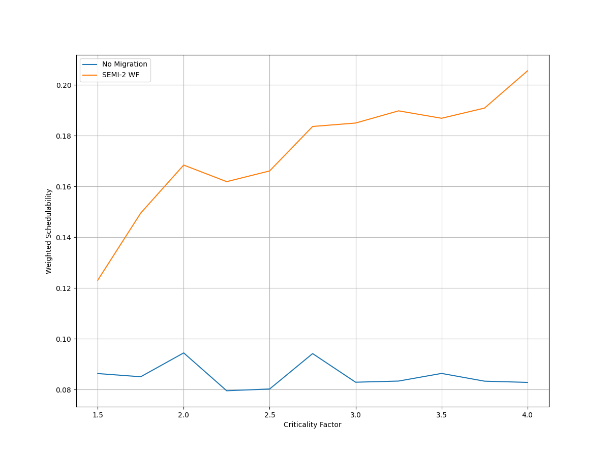
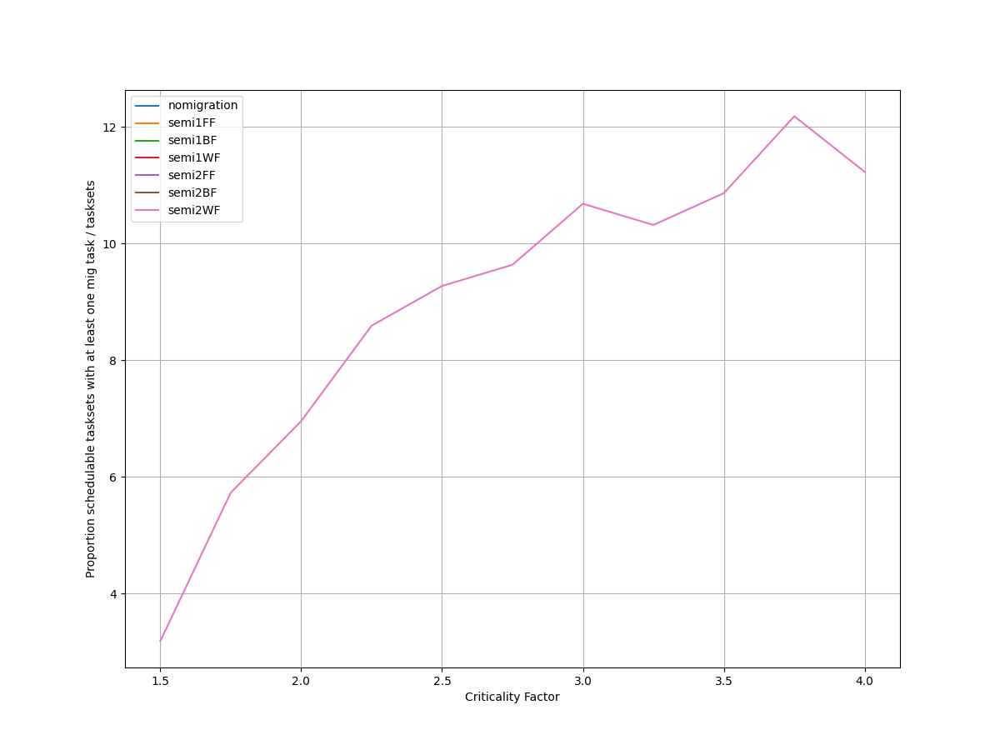
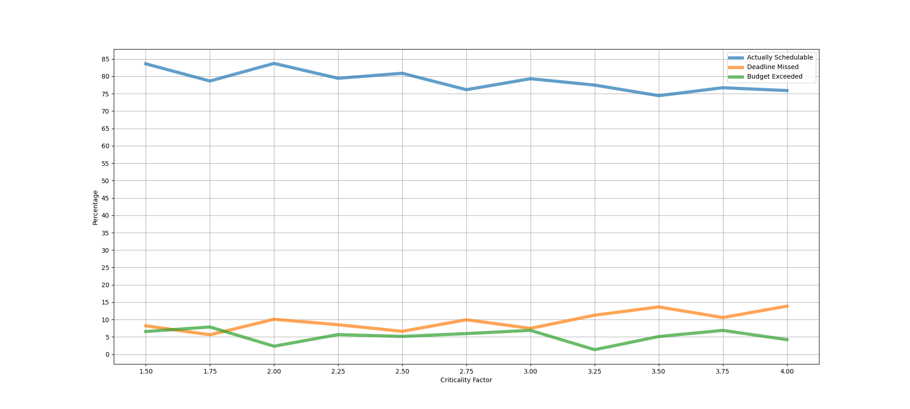
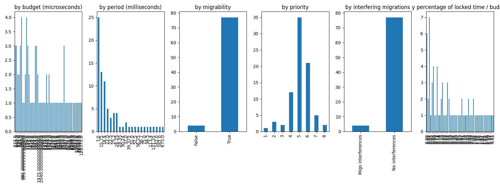
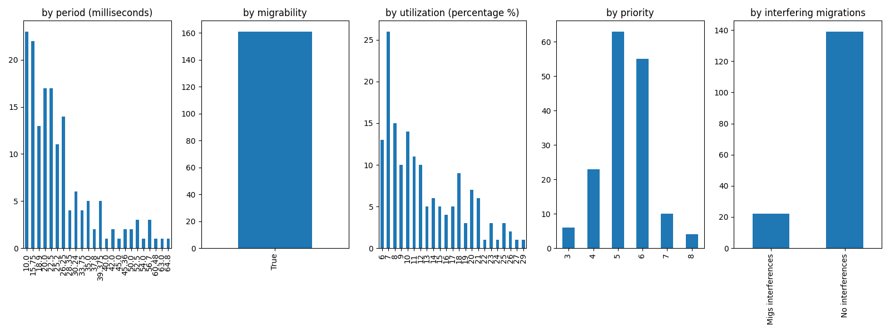
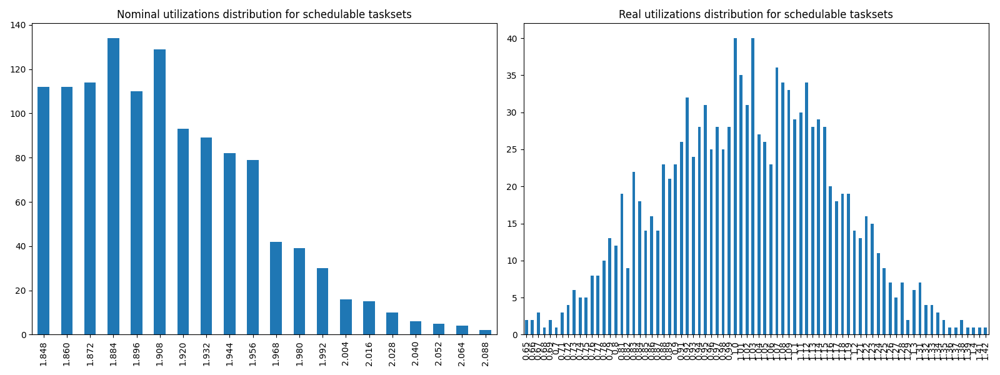
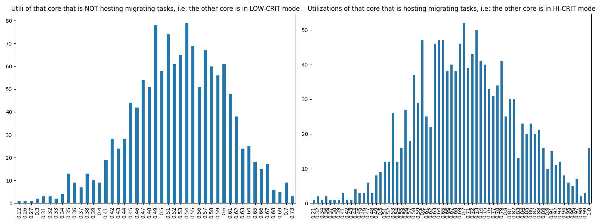

# Report on Experiment 2

## Overall data

   Utilization range = [1.848, 2.1] with step = 0.012

   Criticality factor range = [1.5, 4.0] with step = 0.25

| Schedulable | Not schedulable | Budget Exceeded | Safe Boundary Exceeded |
| ------ | ------ | ------ | ------ |
| 78.25% | 9.98% | 5.18% | 6.59% |

Number of executions: 1563

Schedulable executions: 1223/1563 = 78.2469609724888 %

_Not_ schedulable executions: 156/1563 = 9.980806142034549 %

Budget Exceeded executions: 81/1563 = 5.182341650671785 %

Safe Boundary Exceeded executions: 103/1563 = 6.589891234804862 %

NS + BE executions: 237/1563 = 15.163147792706333 %

### **Simulations**

#### **Weighted schedulability experiment 2 according to simulations.**

#### **Percentage of (schedulable tasksets with at least one migrating tasks / number of schedulable tasksets) of experiment 2 according to simulations.** 

 

### **Real Executions**

#### **Schedulability for each level**

The tasksets with i) at least one migrating task and ii) marked as schedulable by the RTA are executed on a real target, in order to see how many of them are also schedulable in a real-world scenario. The following graph shows, for each "4.0" level (x-axis), the percentage of:

   - Actually schedulable tasksets, i.e. those that have all tasks that meet their deadlines;
   - Deadline Missed tasksets, i.e. those in which (at least) a tasks did not meet (at least) one of its deadlines; 
   - Budget Exceeded tasksets, i.e. those in which a criticality-level budget exceeding is detected (LO-crit budget for LO-crit tasks and HI-crit budget for HI-crit tasks). This type of event makes experiment invalid.

We want to see, thanks to this graphs, how many tasksets remain schedulable in the real-world. The RTA does not take into account overhead time, so we expect that there will be some tasksets that are not actually schedulable.

#### **Tasksets, grouped by differents parameters, with a Budget_Exceeded task.**

With the following graphs, we sum-up the features of the tasks that have occurred in a Criticality-level Budget Exceeded event. Each graph is like a "group-by" SQL operation.
 In the first one, "by budget", we can see, for each _criticality-level budget value_, how many tasks with that criticality-level budget has exceeded it. In the second one, we can see for each _period_ value, how many tasks has exceeded their criticality-level budget.

#### **Tasksets, grouped by differents parameters, with at least one task missing one (or more) of its deadlines.**

With the following graphs, we sum-up the features of the tasks that have missed (at least) one of them deadlines. As the Budget Exceeded graphs, each graph is like a "group-by" SQL operation.

### **Nominal utilizations VS Real utilizations about schedulable tasksets**

| Average real utilizations | Variance real utilizations | Min | Max |
| ------ | ------ | ------ | ------ |
| 1.021 | 0.020 | 0.650 | 1.420 |

### **Utils of the core that will have to accommodate migrating tasks VS Utils of the core when it is actually accomodating them**

These two graphs show the utilizations level of that core $`c_{i}`$ that, sooner or later, will have to accomodate migrating tasks of the other core $`c_{j}`$. The left one, shows the distribution utilizations levels when the core $`c_{i}`$ is **not** accomodating the other core's $`c_{j}`$ migrating tasks, i.e. $`c_{i}`$ and $`c_{j}`$ are both in **LOW-CRIT mode.**
The right one, shows the distribution utilizations levels when the core $`c_{i}`$ **is** accomodating the other core's $`c_{j}`$ migrating tasks, i.e. $`c_{i}`$ in in LO-CRIT mode, while $`c_{j}`$ is in **HIGH-CRIT mode**.

| Average utilizations **not** hosting migs | Variance utilizations **not** hosting migs | Min | Max |
| ------ | ------ | ------ | ------ |
| 0.528 | 0.006 | 0.220 | 0.730 |

| Average utilizations hosting migs | Variance utilizations hosting migs | Min | Max |
| ------ | ------ | ------ | ------ |
| 0.708 | 0.015 | 0.210 | 1.000 |

## Bad tasksets

Click here to expand this section.

### **Not schedulable tasksets**

Click here to expand this section.

Ovvero quando almeno un task non completa entra almeno una sua deadline.

  1. Taskset **e2_semi2wf_t10300**

    Taskset execution params:
	 
    "id": "e2_semi2wf_t10300",
    "size": "12",
    "utilization": "2.016",
    "realutilization": 0.91,
    "criticality_factor": "2.5",
    "hicrit_proportion": "0.5"

   
 
Click here to see the deadlines missed tasks list.

   Time values are expressed as **micro-seconds**.

Task:  1

    
    "id": " 1",
    "basecpu": " 1",
    "priority": " 6",
    "period": 18900.0,
    "C(LO)": 3796.0,
    "C(HI)": 3796.0,
    "criticality": "LOW",
    "migrable": "True",
    "completedruns": " 464",
    "preemptions": " 0",
    "minresponsejitter": " 0.000000000",
    "maxresponsejitter": " 0.001929378",
    "minreleasejitter": " 0.000000000",
    "maxreleasejitter": " 9.731806309",
    "avgresponsejitter": " 0.001747489",
    "deadlinesmissed": " 1",
    "deadlinemissedtargetcore": " 0",
    "deadlinemissedaftermigration": " 0",
    "budgetexceeded": " 0",
    "budgetexceededtargetcore": " 0",
    "budgetexceededaftermigration": " 0",
    "timesmigrated": " 2",
    "timesrestored": " 1",
    "timesonc1": " 461",
    "timesonc2": " 1",
    "lockedtime": " 0.000001616"

   

   
 
Click here to see the CPUs log.

   Idle time is expressed as **seconds**.

   Util values are expressed as **percentage** %.

   CPU: 1

    
    "id": 1,
    "hyperperiod": 113400000,
    "lowtohigh": " 38",
    "hightolow": " 38",
    "idletime": 65232600,
    "util": 42.475661375661375,
    "idletimeduringhostingmig": 460386,
    "utilduringhostingmig": 58.78691632791358

   CPU: 2

    
    "id": 2,
    "hyperperiod": 37800000,
    "lowtohigh": " 35",
    "hightolow": " 35",
    "idletime": 57854295,
    "util": 48.982103174603175,
    "idletimeduringhostingmig": 135842,
    "utilduringhostingmig": 70.17594702707925

   Real Utilization: 0.9099999999999999
   

   
 
Click here to see the whole tasksets.

   Time values are expressed as **micro-seconds**.

   Task:  12

    
    "id": " 12",
    "basecpu": " 1",
    "priority": " 0",
    "period": 900000.0,
    "C(LO)": 83029.0,
    "C(HI)": 207574.0,
    "criticality": "HIGH",
    "migrable": "False",
    "completedruns": " 127",
    "preemptions": " 613",
    "minresponsejitter": " 0.000000000",
    "maxresponsejitter": " 0.135502907",
    "minreleasejitter": " 0.000000000",
    "maxreleasejitter": " 113.500007288",
    "avgresponsejitter": " 0.102326108",
    "deadlinesmissed": " 0",
    "deadlinemissedtargetcore": " 0",
    "deadlinemissedaftermigration": " 0",
    "budgetexceeded": " 0",
    "budgetexceededtargetcore": " 0",
    "budgetexceededaftermigration": " 0",
    "timesmigrated": " 0",
    "timesrestored": " 0",
    "timesonc1": " 739",
    "timesonc2": " 0",
    "lockedtime": " 0.000008090"

   Task:  7

    
    "id": " 7",
    "basecpu": " 1",
    "priority": " 2",
    "period": 105000.0,
    "C(LO)": 5226.0,
    "C(HI)": 13066.0,
    "criticality": "HIGH",
    "migrable": "False",
    "completedruns": " 1081",
    "preemptions": " 238",
    "minresponsejitter": " 0.000000000",
    "maxresponsejitter": " 0.041417165",
    "minreleasejitter": " 0.000000000",
    "maxreleasejitter": " 114.295006628",
    "avgresponsejitter": " 0.005715859",
    "deadlinesmissed": " 0",
    "deadlinemissedtargetcore": " 0",
    "deadlinemissedaftermigration": " 0",
    "budgetexceeded": " 7",
    "budgetexceededtargetcore": " 0",
    "budgetexceededaftermigration": " 0",
    "timesmigrated": " 0",
    "timesrestored": " 0",
    "timesonc1": " 1325",
    "timesonc2": " 0",
    "lockedtime": " 0.000011156"

   Task:  3

    
    "id": " 3",
    "basecpu": " 1",
    "priority": " 4",
    "period": 50400.0,
    "C(LO)": 2003.0,
    "C(HI)": 5007.0,
    "criticality": "HIGH",
    "migrable": "False",
    "completedruns": " 2251",
    "preemptions": " 0",
    "minresponsejitter": " 0.000000000",
    "maxresponsejitter": " 0.004569664",
    "minreleasejitter": " 0.000000000",
    "maxreleasejitter": " 114.349606363",
    "avgresponsejitter": " 0.001757544",
    "deadlinesmissed": " 0",
    "deadlinemissedtargetcore": " 0",
    "deadlinemissedaftermigration": " 0",
    "budgetexceeded": " 25",
    "budgetexceededtargetcore": " 0",
    "budgetexceededaftermigration": " 0",
    "timesmigrated": " 0",
    "timesrestored": " 0",
    "timesonc1": " 2275",
    "timesonc2": " 0",
    "lockedtime": " 0.000005357"

   Task:  10

    
    "id": " 10",
    "basecpu": " 1",
    "priority": " 1",
    "period": 168000.0,
    "C(LO)": 5439.0,
    "C(HI)": 13597.0,
    "criticality": "HIGH",
    "migrable": "False",
    "completedruns": " 676",
    "preemptions": " 127",
    "minresponsejitter": " 0.000000000",
    "maxresponsejitter": " 0.042115604",
    "minreleasejitter": " 0.000000000",
    "maxreleasejitter": " 114.232006538",
    "avgresponsejitter": " 0.005526922",
    "deadlinesmissed": " 0",
    "deadlinemissedtargetcore": " 0",
    "deadlinemissedaftermigration": " 0",
    "budgetexceeded": " 6",
    "budgetexceededtargetcore": " 0",
    "budgetexceededaftermigration": " 0",
    "timesmigrated": " 0",
    "timesrestored": " 0",
    "timesonc1": " 808",
    "timesonc2": " 0",
    "lockedtime": " 0.000000964"

   Task:  1

    
    "id": " 1",
    "basecpu": " 1",
    "priority": " 6",
    "period": 18900.0,
    "C(LO)": 3796.0,
    "C(HI)": 3796.0,
    "criticality": "LOW",
    "migrable": "True",
    "completedruns": " 464",
    "preemptions": " 0",
    "minresponsejitter": " 0.000000000",
    "maxresponsejitter": " 0.001929378",
    "minreleasejitter": " 0.000000000",
    "maxreleasejitter": " 9.731806309",
    "avgresponsejitter": " 0.001747489",
    "deadlinesmissed": " 1",
    "deadlinemissedtargetcore": " 0",
    "deadlinemissedaftermigration": " 0",
    "budgetexceeded": " 0",
    "budgetexceededtargetcore": " 0",
    "budgetexceededaftermigration": " 0",
    "timesmigrated": " 2",
    "timesrestored": " 1",
    "timesonc1": " 461",
    "timesonc2": " 1",
    "lockedtime": " 0.000001616"

   Task:  9

    
    "id": " 9",
    "basecpu": " 1",
    "priority": " 3",
    "period": 162000.0,
    "C(LO)": 29418.0,
    "C(HI)": 29418.0,
    "criticality": "LOW",
    "migrable": "False",
    "completedruns": " 701",
    "preemptions": " 787",
    "minresponsejitter": " 0.000000000",
    "maxresponsejitter": " 0.035625679",
    "minreleasejitter": " 0.000000000",
    "maxreleasejitter": " 114.238006514",
    "avgresponsejitter": " 0.028207571",
    "deadlinesmissed": " 0",
    "deadlinemissedtargetcore": " 0",
    "deadlinemissedaftermigration": " 0",
    "budgetexceeded": " 0",
    "budgetexceededtargetcore": " 0",
    "budgetexceededaftermigration": " 0",
    "timesmigrated": " 0",
    "timesrestored": " 0",
    "timesonc1": " 1487",
    "timesonc2": " 0",
    "lockedtime": " 0.000019874"

   Task:  2

    
    "id": " 2",
    "basecpu": " 1",
    "priority": " 5",
    "period": 45360.0,
    "C(LO)": 3918.9999999999995,
    "C(HI)": 3918.9999999999995,
    "criticality": "LOW",
    "migrable": "False",
    "completedruns": " 2501",
    "preemptions": " 1",
    "minresponsejitter": " 0.000000000",
    "maxresponsejitter": " 0.003584279",
    "minreleasejitter": " 0.000000000",
    "maxreleasejitter": " 114.354646450",
    "avgresponsejitter": " 0.003368748",
    "deadlinesmissed": " 0",
    "deadlinemissedtargetcore": " 0",
    "deadlinemissedaftermigration": " 0",
    "budgetexceeded": " 0",
    "budgetexceededtargetcore": " 0",
    "budgetexceededaftermigration": " 0",
    "timesmigrated": " 0",
    "timesrestored": " 0",
    "timesonc1": " 2501",
    "timesonc2": " 0",
    "lockedtime": " 0.000007574"

   Task:  5

    
    "id": " 5",
    "basecpu": " 2",
    "priority": " 1",
    "period": 87500.0,
    "C(LO)": 13082.0,
    "C(HI)": 32706.0,
    "criticality": "HIGH",
    "migrable": "False",
    "completedruns": " 1297",
    "preemptions": " 200",
    "minresponsejitter": " 0.000000000",
    "maxresponsejitter": " 0.036256724",
    "minreleasejitter": " 0.000000000",
    "maxreleasejitter": " 114.312506150",
    "avgresponsejitter": " 0.011852631",
    "deadlinesmissed": " 0",
    "deadlinemissedtargetcore": " 0",
    "deadlinemissedaftermigration": " 0",
    "budgetexceeded": " 14",
    "budgetexceededtargetcore": " 0",
    "budgetexceededaftermigration": " 0",
    "timesmigrated": " 0",
    "timesrestored": " 0",
    "timesonc1": " 0",
    "timesonc2": " 1510",
    "lockedtime": " 0.000012658"

   Task:  4

    
    "id": " 4",
    "basecpu": " 2",
    "priority": " 2",
    "period": 56250.0,
    "C(LO)": 2033.9999999999998,
    "C(HI)": 5085.0,
    "criticality": "HIGH",
    "migrable": "False",
    "completedruns": " 2017",
    "preemptions": " 0",
    "minresponsejitter": " 0.000000000",
    "maxresponsejitter": " 0.004638117",
    "minreleasejitter": " 0.000000000",
    "maxreleasejitter": " 114.343756039",
    "avgresponsejitter": " 0.001781508",
    "deadlinesmissed": " 0",
    "deadlinemissedtargetcore": " 0",
    "deadlinemissedaftermigration": " 0",
    "budgetexceeded": " 21",
    "budgetexceededtargetcore": " 0",
    "budgetexceededaftermigration": " 0",
    "timesmigrated": " 0",
    "timesrestored": " 0",
    "timesonc1": " 0",
    "timesonc2": " 2037",
    "lockedtime": " 0.000015090"

   Task:  11

    
    "id": " 11",
    "basecpu": " 2",
    "priority": " 0",
    "period": 420000.0,
    "C(LO)": 149919.0,
    "C(HI)": 149919.0,
    "criticality": "LOW",
    "migrable": "False",
    "completedruns": " 271",
    "preemptions": " 1177",
    "minresponsejitter": " 0.000000000",
    "maxresponsejitter": " 0.187182766",
    "minreleasejitter": " 0.000000000",
    "maxreleasejitter": " 113.980006312",
    "avgresponsejitter": " 0.155576126",
    "deadlinesmissed": " 0",
    "deadlinemissedtargetcore": " 0",
    "deadlinemissedaftermigration": " 0",
    "budgetexceeded": " 0",
    "budgetexceededtargetcore": " 0",
    "budgetexceededaftermigration": " 0",
    "timesmigrated": " 0",
    "timesrestored": " 0",
    "timesonc1": " 0",
    "timesonc2": " 1447",
    "lockedtime": " 0.000034378"

   Task:  8

    
    "id": " 8",
    "basecpu": " 2",
    "priority": " 3",
    "period": 118125.0,
    "C(LO)": 12462.0,
    "C(HI)": 12462.0,
    "criticality": "LOW",
    "migrable": "True",
    "completedruns": " 351",
    "preemptions": " 1",
    "minresponsejitter": " 0.000000000",
    "maxresponsejitter": " 0.007399288",
    "minreleasejitter": " 0.000000000",
    "maxreleasejitter": " 42.225631826",
    "avgresponsejitter": " 0.005719369",
    "deadlinesmissed": " 0",
    "deadlinemissedtargetcore": " 0",
    "deadlinemissedaftermigration": " 0",
    "budgetexceeded": " 0",
    "budgetexceededtargetcore": " 0",
    "budgetexceededaftermigration": " 0",
    "timesmigrated": " 6",
    "timesrestored": " 5",
    "timesonc1": " 6",
    "timesonc2": " 345",
    "lockedtime": " 0.000002246"

   Task:  6

    
    "id": " 6",
    "basecpu": " 2",
    "priority": " 4",
    "period": 100800.0,
    "C(LO)": 8577.0,
    "C(HI)": 8577.0,
    "criticality": "LOW",
    "migrable": "True",
    "completedruns": " 20",
    "preemptions": " 0",
    "minresponsejitter": " 0.000000000",
    "maxresponsejitter": " 0.004325751",
    "minreleasejitter": " 0.000000000",
    "maxreleasejitter": " 2.819548000",
    "avgresponsejitter": " 0.003912859",
    "deadlinesmissed": " 0",
    "deadlinemissedtargetcore": " 0",
    "deadlinemissedaftermigration": " 0",
    "budgetexceeded": " 0",
    "budgetexceededtargetcore": " 0",
    "budgetexceededaftermigration": " 0",
    "timesmigrated": " 1",
    "timesrestored": " 1",
    "timesonc1": " 1",
    "timesonc2": " 18",
    "lockedtime": " 0.000001033"

   

  2. Taskset **e2_semi2wf_t11085**

    Taskset execution params:
	 
    "id": "e2_semi2wf_t11085",
    "size": "12",
    "utilization": "1.848",
    "realutilization": 0.99,
    "criticality_factor": "2.75",
    "hicrit_proportion": "0.5"

   
 
Click here to see the deadlines missed tasks list.

   Time values are expressed as **micro-seconds**.

Task:  1

    
    "id": " 1",
    "basecpu": " 2",
    "priority": " 6",
    "period": 33750.0,
    "C(LO)": 2023.0,
    "C(HI)": 2023.0,
    "criticality": "LOW",
    "migrable": "True",
    "completedruns": " 841",
    "preemptions": " 0",
    "minresponsejitter": " 0.000000000",
    "maxresponsejitter": " 0.001037246",
    "minreleasejitter": " 0.000000000",
    "maxreleasejitter": " 29.316256000",
    "avgresponsejitter": " 0.000927547",
    "deadlinesmissed": " 1",
    "deadlinemissedtargetcore": " 0",
    "deadlinemissedaftermigration": " 0",
    "budgetexceeded": " 0",
    "budgetexceededtargetcore": " 0",
    "budgetexceededaftermigration": " 0",
    "timesmigrated": " 4",
    "timesrestored": " 4",
    "timesonc1": " 2",
    "timesonc2": " 837",
    "lockedtime": " 0.000019808"

   

   
 
Click here to see the CPUs log.

   Idle time is expressed as **seconds**.

   Util values are expressed as **percentage** %.

   CPU: 1

    
    "id": 1,
    "hyperperiod": 28350000,
    "lowtohigh": " 0",
    "hightolow": " 0",
    "idletime": 13283836,
    "util": 53.143435626102296,
    "idletimeduringhostingmig": 79258,
    "utilduringhostingmig": 54.61063578783401

   CPU: 2

    
    "id": 2,
    "hyperperiod": 28350000,
    "lowtohigh": " 8",
    "hightolow": " 8",
    "idletime": 15365449,
    "util": 45.80088536155203,
    "idletimeduringhostingmig": 0,
    "utilduringhostingmig": null

   Real Utilization: 0.99
   

   
 
Click here to see the whole tasksets.

   Time values are expressed as **micro-seconds**.

   Task:  12

    
    "id": " 12",
    "basecpu": " 1",
    "priority": " 0",
    "period": 567000.0,
    "C(LO)": 54699.0,
    "C(HI)": 150422.0,
    "criticality": "HIGH",
    "migrable": "False",
    "completedruns": " 51",
    "preemptions": " 90",
    "minresponsejitter": " 0.000000000",
    "maxresponsejitter": " 0.097973219",
    "minreleasejitter": " 0.000000000",
    "maxreleasejitter": " 28.830516240",
    "avgresponsejitter": " 0.069033577",
    "deadlinesmissed": " 0",
    "deadlinemissedtargetcore": " 0",
    "deadlinemissedaftermigration": " 0",
    "budgetexceeded": " 0",
    "budgetexceededtargetcore": " 0",
    "budgetexceededaftermigration": " 0",
    "timesmigrated": " 0",
    "timesrestored": " 0",
    "timesonc1": " 140",
    "timesonc2": " 0",
    "lockedtime": " 0.000008727"

   Task:  6

    
    "id": " 6",
    "basecpu": " 1",
    "priority": " 1",
    "period": 94500.0,
    "C(LO)": 5989.0,
    "C(HI)": 16470.0,
    "criticality": "HIGH",
    "migrable": "False",
    "completedruns": " 301",
    "preemptions": " 31",
    "minresponsejitter": " 0.000000000",
    "maxresponsejitter": " 0.048087003",
    "minreleasejitter": " 0.000000000",
    "maxreleasejitter": " 29.277413471",
    "avgresponsejitter": " 0.006924790",
    "deadlinesmissed": " 0",
    "deadlinemissedtargetcore": " 0",
    "deadlinemissedaftermigration": " 0",
    "budgetexceeded": " 0",
    "budgetexceededtargetcore": " 0",
    "budgetexceededaftermigration": " 0",
    "timesmigrated": " 0",
    "timesrestored": " 0",
    "timesonc1": " 331",
    "timesonc2": " 0",
    "lockedtime": " 0.000002592"

   Task:  5

    
    "id": " 5",
    "basecpu": " 1",
    "priority": " 2",
    "period": 90000.0,
    "C(LO)": 1878.0,
    "C(HI)": 5165.0,
    "criticality": "HIGH",
    "migrable": "False",
    "completedruns": " 316",
    "preemptions": " 4",
    "minresponsejitter": " 0.000000000",
    "maxresponsejitter": " 0.007324021",
    "minreleasejitter": " 0.000000000",
    "maxreleasejitter": " 29.270174811",
    "avgresponsejitter": " 0.001683505",
    "deadlinesmissed": " 0",
    "deadlinemissedtargetcore": " 0",
    "deadlinemissedaftermigration": " 0",
    "budgetexceeded": " 0",
    "budgetexceededtargetcore": " 0",
    "budgetexceededaftermigration": " 0",
    "timesmigrated": " 0",
    "timesrestored": " 0",
    "timesonc1": " 319",
    "timesonc2": " 0",
    "lockedtime": " 0.000002628"

   Task:  7

    
    "id": " 7",
    "basecpu": " 1",
    "priority": " 3",
    "period": 112500.0,
    "C(LO)": 39787.0,
    "C(HI)": 39787.0,
    "criticality": "LOW",
    "migrable": "False",
    "completedruns": " 253",
    "preemptions": " 99",
    "minresponsejitter": " 0.000000000",
    "maxresponsejitter": " 0.042147354",
    "minreleasejitter": " 0.000000000",
    "maxreleasejitter": " 29.237506865",
    "avgresponsejitter": " 0.036480333",
    "deadlinesmissed": " 0",
    "deadlinemissedtargetcore": " 0",
    "deadlinemissedaftermigration": " 0",
    "budgetexceeded": " 0",
    "budgetexceededtargetcore": " 0",
    "budgetexceededaftermigration": " 0",
    "timesmigrated": " 0",
    "timesrestored": " 0",
    "timesonc1": " 351",
    "timesonc2": " 0",
    "lockedtime": " 0.000024736"

   Task:  3

    
    "id": " 3",
    "basecpu": " 1",
    "priority": " 4",
    "period": 78750.0,
    "C(LO)": 6383.0,
    "C(HI)": 6383.0,
    "criticality": "LOW",
    "migrable": "False",
    "completedruns": " 361",
    "preemptions": " 1",
    "minresponsejitter": " 0.000000000",
    "maxresponsejitter": " 0.005814279",
    "minreleasejitter": " 0.000000000",
    "maxreleasejitter": " 29.271257039",
    "avgresponsejitter": " 0.005502219",
    "deadlinesmissed": " 0",
    "deadlinemissedtargetcore": " 0",
    "deadlinemissedaftermigration": " 0",
    "budgetexceeded": " 0",
    "budgetexceededtargetcore": " 0",
    "budgetexceededaftermigration": " 0",
    "timesmigrated": " 0",
    "timesrestored": " 0",
    "timesonc1": " 361",
    "timesonc2": " 0",
    "lockedtime": " 0.000007204"

   Task:  4

    
    "id": " 4",
    "basecpu": " 2",
    "priority": " 2",
    "period": 87500.0,
    "C(LO)": 9073.0,
    "C(HI)": 24953.0,
    "criticality": "HIGH",
    "migrable": "False",
    "completedruns": " 325",
    "preemptions": " 122",
    "minresponsejitter": " 0.000000000",
    "maxresponsejitter": " 0.040322237",
    "minreleasejitter": " 0.000000000",
    "maxreleasejitter": " 29.262506333",
    "avgresponsejitter": " 0.010574438",
    "deadlinesmissed": " 0",
    "deadlinemissedtargetcore": " 0",
    "deadlinemissedaftermigration": " 0",
    "budgetexceeded": " 2",
    "budgetexceededtargetcore": " 0",
    "budgetexceededaftermigration": " 0",
    "timesmigrated": " 0",
    "timesrestored": " 0",
    "timesonc1": " 0",
    "timesonc2": " 448",
    "lockedtime": " 0.000004778"

   Task:  10

    
    "id": " 10",
    "basecpu": " 2",
    "priority": " 1",
    "period": 168750.0,
    "C(LO)": 8485.0,
    "C(HI)": 23336.0,
    "criticality": "HIGH",
    "migrable": "False",
    "completedruns": " 169",
    "preemptions": " 46",
    "minresponsejitter": " 0.000000000",
    "maxresponsejitter": " 0.058875676",
    "minreleasejitter": " 0.000000000",
    "maxreleasejitter": " 29.184087207",
    "avgresponsejitter": " 0.009737417",
    "deadlinesmissed": " 0",
    "deadlinemissedtargetcore": " 0",
    "deadlinemissedaftermigration": " 0",
    "budgetexceeded": " 3",
    "budgetexceededtargetcore": " 0",
    "budgetexceededaftermigration": " 0",
    "timesmigrated": " 0",
    "timesrestored": " 0",
    "timesonc1": " 0",
    "timesonc2": " 217",
    "lockedtime": " 0.000000489"

   Task:  11

    
    "id": " 11",
    "basecpu": " 2",
    "priority": " 0",
    "period": 175000.0,
    "C(LO)": 6188.0,
    "C(HI)": 17018.0,
    "criticality": "HIGH",
    "migrable": "False",
    "completedruns": " 163",
    "preemptions": " 50",
    "minresponsejitter": " 0.000000000",
    "maxresponsejitter": " 0.045106616",
    "minreleasejitter": " 0.000000000",
    "maxreleasejitter": " 29.191626195",
    "avgresponsejitter": " 0.008071240",
    "deadlinesmissed": " 0",
    "deadlinemissedtargetcore": " 0",
    "deadlinemissedaftermigration": " 0",
    "budgetexceeded": " 3",
    "budgetexceededtargetcore": " 0",
    "budgetexceededaftermigration": " 0",
    "timesmigrated": " 0",
    "timesrestored": " 0",
    "timesonc1": " 0",
    "timesonc2": " 215",
    "lockedtime": " 0.000004610"

   Task:  8

    
    "id": " 8",
    "basecpu": " 2",
    "priority": " 4",
    "period": 113400.0,
    "C(LO)": 16623.0,
    "C(HI)": 16623.0,
    "criticality": "LOW",
    "migrable": "False",
    "completedruns": " 251",
    "preemptions": " 150",
    "minresponsejitter": " 0.000000000",
    "maxresponsejitter": " 0.018529670",
    "minreleasejitter": " 0.000000000",
    "maxreleasejitter": " 29.236606348",
    "avgresponsejitter": " 0.015162775",
    "deadlinesmissed": " 0",
    "deadlinemissedtargetcore": " 0",
    "deadlinemissedaftermigration": " 0",
    "budgetexceeded": " 0",
    "budgetexceededtargetcore": " 0",
    "budgetexceededaftermigration": " 0",
    "timesmigrated": " 0",
    "timesrestored": " 0",
    "timesonc1": " 0",
    "timesonc2": " 400",
    "lockedtime": " 0.000009333"

   Task:  9

    
    "id": " 9",
    "basecpu": " 2",
    "priority": " 3",
    "period": 135000.0,
    "C(LO)": 16340.0,
    "C(HI)": 16340.0,
    "criticality": "LOW",
    "migrable": "False",
    "completedruns": " 211",
    "preemptions": " 64",
    "minresponsejitter": " 0.000000000",
    "maxresponsejitter": " 0.032099670",
    "minreleasejitter": " 0.000000000",
    "maxreleasejitter": " 29.215923694",
    "avgresponsejitter": " 0.016263324",
    "deadlinesmissed": " 0",
    "deadlinemissedtargetcore": " 0",
    "deadlinemissedaftermigration": " 0",
    "budgetexceeded": " 0",
    "budgetexceededtargetcore": " 0",
    "budgetexceededaftermigration": " 0",
    "timesmigrated": " 0",
    "timesrestored": " 0",
    "timesonc1": " 0",
    "timesonc2": " 274",
    "lockedtime": " 0.000000000"

   Task:  2

    
    "id": " 2",
    "basecpu": " 2",
    "priority": " 5",
    "period": 70000.0,
    "C(LO)": 4760.0,
    "C(HI)": 4760.0,
    "criticality": "LOW",
    "migrable": "True",
    "completedruns": " 406",
    "preemptions": " 15",
    "minresponsejitter": " 0.000000000",
    "maxresponsejitter": " 0.003374309",
    "minreleasejitter": " 0.000000000",
    "maxreleasejitter": " 29.280006414",
    "avgresponsejitter": " 0.002215165",
    "deadlinesmissed": " 0",
    "deadlinemissedtargetcore": " 0",
    "deadlinemissedaftermigration": " 0",
    "budgetexceeded": " 0",
    "budgetexceededtargetcore": " 0",
    "budgetexceededaftermigration": " 0",
    "timesmigrated": " 2",
    "timesrestored": " 2",
    "timesonc1": " 1",
    "timesonc2": " 419",
    "lockedtime": " 0.000001498"

   Task:  1

    
    "id": " 1",
    "basecpu": " 2",
    "priority": " 6",
    "period": 33750.0,
    "C(LO)": 2023.0,
    "C(HI)": 2023.0,
    "criticality": "LOW",
    "migrable": "True",
    "completedruns": " 841",
    "preemptions": " 0",
    "minresponsejitter": " 0.000000000",
    "maxresponsejitter": " 0.001037246",
    "minreleasejitter": " 0.000000000",
    "maxreleasejitter": " 29.316256000",
    "avgresponsejitter": " 0.000927547",
    "deadlinesmissed": " 1",
    "deadlinemissedtargetcore": " 0",
    "deadlinemissedaftermigration": " 0",
    "budgetexceeded": " 0",
    "budgetexceededtargetcore": " 0",
    "budgetexceededaftermigration": " 0",
    "timesmigrated": " 4",
    "timesrestored": " 4",
    "timesonc1": " 2",
    "timesonc2": " 837",
    "lockedtime": " 0.000019808"

   

  3. Taskset **e2_semi2wf_t11310**

    Taskset execution params:
	 
    "id": "e2_semi2wf_t11310",
    "size": "12",
    "utilization": "1.884",
    "realutilization": 0.78,
    "criticality_factor": "2.75",
    "hicrit_proportion": "0.5"

   
 
Click here to see the deadlines missed tasks list.

   Time values are expressed as **micro-seconds**.

Task:  1

    
    "id": " 1",
    "basecpu": " 1",
    "priority": " 5",
    "period": 22500.0,
    "C(LO)": 4642.0,
    "C(HI)": 4642.0,
    "criticality": "LOW",
    "migrable": "True",
    "completedruns": " 650",
    "preemptions": " 0",
    "minresponsejitter": " 0.000000000",
    "maxresponsejitter": " 0.002350156",
    "minreleasejitter": " 0.000000000",
    "maxreleasejitter": " 15.580007676",
    "avgresponsejitter": " 0.002124132",
    "deadlinesmissed": " 1",
    "deadlinemissedtargetcore": " 0",
    "deadlinemissedaftermigration": " 0",
    "budgetexceeded": " 0",
    "budgetexceededtargetcore": " 0",
    "budgetexceededaftermigration": " 0",
    "timesmigrated": " 4",
    "timesrestored": " 3",
    "timesonc1": " 644",
    "timesonc2": " 4",
    "lockedtime": " 0.000012279"

   

   
 
Click here to see the CPUs log.

   Idle time is expressed as **seconds**.

   Util values are expressed as **percentage** %.

   CPU: 1

    
    "id": 1,
    "hyperperiod": 113400000,
    "lowtohigh": " 36",
    "hightolow": " 36",
    "idletime": 80419735,
    "util": 29.083126102292766,
    "idletimeduringhostingmig": 0,
    "utilduringhostingmig": null

   CPU: 2

    
    "id": 2,
    "hyperperiod": 113400000,
    "lowtohigh": " 0",
    "hightolow": " 0",
    "idletime": 57543566,
    "util": 49.25611463844797,
    "idletimeduringhostingmig": 128460,
    "utilduringhostingmig": 76.79170528392493

   Real Utilization: 0.78
   

   
 
Click here to see the whole tasksets.

   Time values are expressed as **micro-seconds**.

   Task:  8

    
    "id": " 8",
    "basecpu": " 1",
    "priority": " 1",
    "period": 141750.0,
    "C(LO)": 10918.0,
    "C(HI)": 30025.0,
    "criticality": "HIGH",
    "migrable": "False",
    "completedruns": " 801",
    "preemptions": " 153",
    "minresponsejitter": " 0.000000000",
    "maxresponsejitter": " 0.042360733",
    "minreleasejitter": " 0.000000000",
    "maxreleasejitter": " 114.258257207",
    "avgresponsejitter": " 0.011066709",
    "deadlinesmissed": " 0",
    "deadlinemissedtargetcore": " 0",
    "deadlinemissedaftermigration": " 0",
    "budgetexceeded": " 8",
    "budgetexceededtargetcore": " 0",
    "budgetexceededaftermigration": " 0",
    "timesmigrated": " 0",
    "timesrestored": " 0",
    "timesonc1": " 961",
    "timesonc2": " 0",
    "lockedtime": " 0.000041586"

   Task:  5

    
    "id": " 5",
    "basecpu": " 1",
    "priority": " 2",
    "period": 100000.0,
    "C(LO)": 6995.0,
    "C(HI)": 19236.0,
    "criticality": "HIGH",
    "migrable": "False",
    "completedruns": " 1135",
    "preemptions": " 89",
    "minresponsejitter": " 0.000000000",
    "maxresponsejitter": " 0.030582222",
    "minreleasejitter": " 0.000000000",
    "maxreleasejitter": " 114.300006592",
    "avgresponsejitter": " 0.006938565",
    "deadlinesmissed": " 0",
    "deadlinemissedtargetcore": " 0",
    "deadlinemissedaftermigration": " 0",
    "budgetexceeded": " 16",
    "budgetexceededtargetcore": " 0",
    "budgetexceededaftermigration": " 0",
    "timesmigrated": " 0",
    "timesrestored": " 0",
    "timesonc1": " 1239",
    "timesonc2": " 0",
    "lockedtime": " 0.000027520"

   Task:  9

    
    "id": " 9",
    "basecpu": " 1",
    "priority": " 0",
    "period": 180000.0,
    "C(LO)": 8035.000000000001,
    "C(HI)": 22096.0,
    "criticality": "HIGH",
    "migrable": "False",
    "completedruns": " 631",
    "preemptions": " 85",
    "minresponsejitter": " 0.000000000",
    "maxresponsejitter": " 0.058931243",
    "minreleasejitter": " 0.000000000",
    "maxreleasejitter": " 114.233057195",
    "avgresponsejitter": " 0.008727763",
    "deadlinesmissed": " 0",
    "deadlinemissedtargetcore": " 0",
    "deadlinemissedaftermigration": " 0",
    "budgetexceeded": " 12",
    "budgetexceededtargetcore": " 0",
    "budgetexceededaftermigration": " 0",
    "timesmigrated": " 0",
    "timesrestored": " 0",
    "timesonc1": " 727",
    "timesonc2": " 0",
    "lockedtime": " 0.000013387"

   Task:  1

    
    "id": " 1",
    "basecpu": " 1",
    "priority": " 5",
    "period": 22500.0,
    "C(LO)": 4642.0,
    "C(HI)": 4642.0,
    "criticality": "LOW",
    "migrable": "True",
    "completedruns": " 650",
    "preemptions": " 0",
    "minresponsejitter": " 0.000000000",
    "maxresponsejitter": " 0.002350156",
    "minreleasejitter": " 0.000000000",
    "maxreleasejitter": " 15.580007676",
    "avgresponsejitter": " 0.002124132",
    "deadlinesmissed": " 1",
    "deadlinemissedtargetcore": " 0",
    "deadlinemissedaftermigration": " 0",
    "budgetexceeded": " 0",
    "budgetexceededtargetcore": " 0",
    "budgetexceededaftermigration": " 0",
    "timesmigrated": " 4",
    "timesrestored": " 3",
    "timesonc1": " 644",
    "timesonc2": " 4",
    "lockedtime": " 0.000012279"

   Task:  4

    
    "id": " 4",
    "basecpu": " 1",
    "priority": " 4",
    "period": 90720.0,
    "C(LO)": 10374.0,
    "C(HI)": 10374.0,
    "criticality": "LOW",
    "migrable": "True",
    "completedruns": " 644",
    "preemptions": " 33",
    "minresponsejitter": " 0.000000000",
    "maxresponsejitter": " 0.007442336",
    "minreleasejitter": " 0.000000000",
    "maxreleasejitter": " 59.242248021",
    "avgresponsejitter": " 0.004843474",
    "deadlinesmissed": " 0",
    "deadlinemissedtargetcore": " 0",
    "deadlinemissedaftermigration": " 0",
    "budgetexceeded": " 0",
    "budgetexceededtargetcore": " 0",
    "budgetexceededaftermigration": " 0",
    "timesmigrated": " 6",
    "timesrestored": " 5",
    "timesonc1": " 672",
    "timesonc2": " 4",
    "lockedtime": " 0.000008664"

   Task:  10

    
    "id": " 10",
    "basecpu": " 1",
    "priority": " 3",
    "period": 181440.0,
    "C(LO)": 17302.0,
    "C(HI)": 17302.0,
    "criticality": "LOW",
    "migrable": "False",
    "completedruns": " 626",
    "preemptions": " 57",
    "minresponsejitter": " 0.000000000",
    "maxresponsejitter": " 0.018123622",
    "minreleasejitter": " 0.000000000",
    "maxreleasejitter": " 114.218566721",
    "avgresponsejitter": " 0.015144871",
    "deadlinesmissed": " 0",
    "deadlinemissedtargetcore": " 0",
    "deadlinemissedaftermigration": " 0",
    "budgetexceeded": " 0",
    "budgetexceededtargetcore": " 0",
    "budgetexceededaftermigration": " 0",
    "timesmigrated": " 0",
    "timesrestored": " 0",
    "timesonc1": " 682",
    "timesonc2": " 0",
    "lockedtime": " 0.000027547"

   Task:  2

    
    "id": " 2",
    "basecpu": " 2",
    "priority": " 4",
    "period": 28350.0,
    "C(LO)": 3288.0,
    "C(HI)": 9042.0,
    "criticality": "HIGH",
    "migrable": "False",
    "completedruns": " 4001",
    "preemptions": " 94",
    "minresponsejitter": " 0.000000000",
    "maxresponsejitter": " 0.014878123",
    "minreleasejitter": " 0.000000000",
    "maxreleasejitter": " 114.371656153",
    "avgresponsejitter": " 0.003099366",
    "deadlinesmissed": " 0",
    "deadlinemissedtargetcore": " 0",
    "deadlinemissedaftermigration": " 0",
    "budgetexceeded": " 0",
    "budgetexceededtargetcore": " 0",
    "budgetexceededaftermigration": " 0",
    "timesmigrated": " 0",
    "timesrestored": " 0",
    "timesonc1": " 0",
    "timesonc2": " 4094",
    "lockedtime": " 0.000075616"

   Task:  11

    
    "id": " 11",
    "basecpu": " 2",
    "priority": " 1",
    "period": 196875.0,
    "C(LO)": 11262.0,
    "C(HI)": 30970.0,
    "criticality": "HIGH",
    "migrable": "False",
    "completedruns": " 577",
    "preemptions": " 321",
    "minresponsejitter": " 0.000000000",
    "maxresponsejitter": " 0.048015186",
    "minreleasejitter": " 0.000000000",
    "maxreleasejitter": " 114.205715297",
    "avgresponsejitter": " 0.013433489",
    "deadlinesmissed": " 0",
    "deadlinemissedtargetcore": " 0",
    "deadlinemissedaftermigration": " 0",
    "budgetexceeded": " 0",
    "budgetexceededtargetcore": " 0",
    "budgetexceededaftermigration": " 0",
    "timesmigrated": " 0",
    "timesrestored": " 0",
    "timesonc1": " 0",
    "timesonc2": " 897",
    "lockedtime": " 0.000016147"

   Task:  3

    
    "id": " 3",
    "basecpu": " 2",
    "priority": " 3",
    "period": 39375.0,
    "C(LO)": 1551.0,
    "C(HI)": 4266.0,
    "criticality": "HIGH",
    "migrable": "False",
    "completedruns": " 2881",
    "preemptions": " 5",
    "minresponsejitter": " 0.000000000",
    "maxresponsejitter": " 0.004297333",
    "minreleasejitter": " 0.000000000",
    "maxreleasejitter": " 114.360630979",
    "avgresponsejitter": " 0.001339940",
    "deadlinesmissed": " 0",
    "deadlinemissedtargetcore": " 0",
    "deadlinemissedaftermigration": " 0",
    "budgetexceeded": " 0",
    "budgetexceededtargetcore": " 0",
    "budgetexceededaftermigration": " 0",
    "timesmigrated": " 0",
    "timesrestored": " 0",
    "timesonc1": " 0",
    "timesonc2": " 2885",
    "lockedtime": " 0.000011820"

   Task:  7

    
    "id": " 7",
    "basecpu": " 2",
    "priority": " 2",
    "period": 120000.0,
    "C(LO)": 21420.0,
    "C(HI)": 21420.0,
    "criticality": "LOW",
    "migrable": "False",
    "completedruns": " 946",
    "preemptions": " 1215",
    "minresponsejitter": " 0.000000000",
    "maxresponsejitter": " 0.038601712",
    "minreleasejitter": " 0.000000000",
    "maxreleasejitter": " 114.280006165",
    "avgresponsejitter": " 0.023125069",
    "deadlinesmissed": " 0",
    "deadlinemissedtargetcore": " 0",
    "deadlinemissedaftermigration": " 0",
    "budgetexceeded": " 0",
    "budgetexceededtargetcore": " 0",
    "budgetexceededaftermigration": " 0",
    "timesmigrated": " 0",
    "timesrestored": " 0",
    "timesonc1": " 0",
    "timesonc2": " 2160",
    "lockedtime": " 0.000055087"

   Task:  6

    
    "id": " 6",
    "basecpu": " 2",
    "priority": " 5",
    "period": 112500.0,
    "C(LO)": 13099.0,
    "C(HI)": 13099.0,
    "criticality": "LOW",
    "migrable": "False",
    "completedruns": " 1009",
    "preemptions": " 0",
    "minresponsejitter": " 0.000000000",
    "maxresponsejitter": " 0.011979598",
    "minreleasejitter": " 0.000000000",
    "maxreleasejitter": " 114.287506622",
    "avgresponsejitter": " 0.011305595",
    "deadlinesmissed": " 0",
    "deadlinemissedtargetcore": " 0",
    "deadlinemissedaftermigration": " 0",
    "budgetexceeded": " 0",
    "budgetexceededtargetcore": " 0",
    "budgetexceededaftermigration": " 0",
    "timesmigrated": " 0",
    "timesrestored": " 0",
    "timesonc1": " 0",
    "timesonc2": " 1008",
    "lockedtime": " 0.000030688"

   Task:  12

    
    "id": " 12",
    "basecpu": " 2",
    "priority": " 0",
    "period": 700000.0,
    "C(LO)": 43027.0,
    "C(HI)": 43027.0,
    "criticality": "LOW",
    "migrable": "False",
    "completedruns": " 163",
    "preemptions": " 495",
    "minresponsejitter": " 0.000000000",
    "maxresponsejitter": " 0.093492012",
    "minreleasejitter": " 0.000000000",
    "maxreleasejitter": " 113.701819586",
    "avgresponsejitter": " 0.060865261",
    "deadlinesmissed": " 0",
    "deadlinemissedtargetcore": " 0",
    "deadlinemissedaftermigration": " 0",
    "budgetexceeded": " 0",
    "budgetexceededtargetcore": " 0",
    "budgetexceededaftermigration": " 0",
    "timesmigrated": " 0",
    "timesrestored": " 0",
    "timesonc1": " 0",
    "timesonc2": " 657",
    "lockedtime": " 0.000023712"

   

  4. Taskset **e2_semi2wf_t11405**

    Taskset execution params:
	 
    "id": "e2_semi2wf_t11405",
    "size": "12",
    "utilization": "1.896",
    "realutilization": 0.99,
    "criticality_factor": "2.75",
    "hicrit_proportion": "0.5"

   
 
Click here to see the deadlines missed tasks list.

   Time values are expressed as **micro-seconds**.

Task:  1

    
    "id": " 1",
    "basecpu": " 1",
    "priority": " 6",
    "period": 22500.0,
    "C(LO)": 1412.0,
    "C(HI)": 1412.0,
    "criticality": "LOW",
    "migrable": "True",
    "completedruns": " 858",
    "preemptions": " 0",
    "minresponsejitter": " 0.000000000",
    "maxresponsejitter": " 0.000719955",
    "minreleasejitter": " 0.000000000",
    "maxreleasejitter": " 20.260006072",
    "avgresponsejitter": " 0.000649270",
    "deadlinesmissed": " 1",
    "deadlinemissedtargetcore": " 1",
    "deadlinemissedaftermigration": " 0",
    "budgetexceeded": " 0",
    "budgetexceededtargetcore": " 0",
    "budgetexceededaftermigration": " 0",
    "timesmigrated": " 2",
    "timesrestored": " 2",
    "timesonc1": " 848",
    "timesonc2": " 8",
    "lockedtime": " 0.000005901"

   

   
 
Click here to see the CPUs log.

   Idle time is expressed as **seconds**.

   Util values are expressed as **percentage** %.

   CPU: 1

    
    "id": 1,
    "hyperperiod": 18900000,
    "lowtohigh": " 10",
    "hightolow": " 10",
    "idletime": 53477557,
    "util": 52.841660493827156,
    "idletimeduringhostingmig": 0,
    "utilduringhostingmig": null

   CPU: 2

    
    "id": 2,
    "hyperperiod": 113400000,
    "lowtohigh": " 0",
    "hightolow": " 0",
    "idletime": 60844850,
    "util": 46.344929453262786,
    "idletimeduringhostingmig": 344064,
    "utilduringhostingmig": 50.94254073221748

   Real Utilization: 0.99
   

   
 
Click here to see the whole tasksets.

   Time values are expressed as **micro-seconds**.

   Task:  12

    
    "id": " 12",
    "basecpu": " 1",
    "priority": " 0",
    "period": 900000.0,
    "C(LO)": 76920.0,
    "C(HI)": 211530.0,
    "criticality": "HIGH",
    "migrable": "False",
    "completedruns": " 127",
    "preemptions": " 568",
    "minresponsejitter": " 0.000000000",
    "maxresponsejitter": " 0.334575748",
    "minreleasejitter": " 0.000000000",
    "maxreleasejitter": " 113.522305165",
    "avgresponsejitter": " 0.113050799",
    "deadlinesmissed": " 0",
    "deadlinemissedtargetcore": " 0",
    "deadlinemissedaftermigration": " 0",
    "budgetexceeded": " 3",
    "budgetexceededtargetcore": " 0",
    "budgetexceededaftermigration": " 0",
    "timesmigrated": " 0",
    "timesrestored": " 0",
    "timesonc1": " 697",
    "timesonc2": " 0",
    "lockedtime": " 0.000046165"

   Task:  6

    
    "id": " 6",
    "basecpu": " 1",
    "priority": " 2",
    "period": 100000.0,
    "C(LO)": 7955.999999999999,
    "C(HI)": 21880.0,
    "criticality": "HIGH",
    "migrable": "False",
    "completedruns": " 1135",
    "preemptions": " 349",
    "minresponsejitter": " 0.000000000",
    "maxresponsejitter": " 0.021451123",
    "minreleasejitter": " 0.000000000",
    "maxreleasejitter": " 114.305586324",
    "avgresponsejitter": " 0.008216829",
    "deadlinesmissed": " 0",
    "deadlinemissedtargetcore": " 0",
    "deadlinemissedaftermigration": " 0",
    "budgetexceeded": " 5",
    "budgetexceededtargetcore": " 0",
    "budgetexceededaftermigration": " 0",
    "timesmigrated": " 0",
    "timesrestored": " 0",
    "timesonc1": " 1488",
    "timesonc2": " 0",
    "lockedtime": " 0.000034435"

   Task:  11

    
    "id": " 11",
    "basecpu": " 1",
    "priority": " 1",
    "period": 189000.0,
    "C(LO)": 6059.0,
    "C(HI)": 16662.0,
    "criticality": "HIGH",
    "migrable": "False",
    "completedruns": " 601",
    "preemptions": " 137",
    "minresponsejitter": " 0.000000000",
    "maxresponsejitter": " 0.032268724",
    "minreleasejitter": " 0.000000000",
    "maxreleasejitter": " 114.211608760",
    "avgresponsejitter": " 0.007027018",
    "deadlinesmissed": " 0",
    "deadlinemissedtargetcore": " 0",
    "deadlinemissedaftermigration": " 0",
    "budgetexceeded": " 2",
    "budgetexceededtargetcore": " 0",
    "budgetexceededaftermigration": " 0",
    "timesmigrated": " 0",
    "timesrestored": " 0",
    "timesonc1": " 739",
    "timesonc2": " 0",
    "lockedtime": " 0.000012796"

   Task:  5

    
    "id": " 5",
    "basecpu": " 1",
    "priority": " 4",
    "period": 75000.0,
    "C(LO)": 17611.0,
    "C(HI)": 17611.0,
    "criticality": "LOW",
    "migrable": "False",
    "completedruns": " 1513",
    "preemptions": " 354",
    "minresponsejitter": " 0.000000000",
    "maxresponsejitter": " 0.019969970",
    "minreleasejitter": " 0.000000000",
    "maxreleasejitter": " 114.325006462",
    "avgresponsejitter": " 0.015728622",
    "deadlinesmissed": " 0",
    "deadlinemissedtargetcore": " 0",
    "deadlinemissedaftermigration": " 0",
    "budgetexceeded": " 0",
    "budgetexceededtargetcore": " 0",
    "budgetexceededaftermigration": " 0",
    "timesmigrated": " 0",
    "timesrestored": " 0",
    "timesonc1": " 1866",
    "timesonc2": " 0",
    "lockedtime": " 0.000036898"

   Task:  7

    
    "id": " 7",
    "basecpu": " 1",
    "priority": " 3",
    "period": 105000.0,
    "C(LO)": 11721.0,
    "C(HI)": 11721.0,
    "criticality": "LOW",
    "migrable": "False",
    "completedruns": " 1081",
    "preemptions": " 62",
    "minresponsejitter": " 0.000000000",
    "maxresponsejitter": " 0.011405976",
    "minreleasejitter": " 0.000000000",
    "maxreleasejitter": " 114.295007736",
    "avgresponsejitter": " 0.010177036",
    "deadlinesmissed": " 0",
    "deadlinemissedtargetcore": " 0",
    "deadlinemissedaftermigration": " 0",
    "budgetexceeded": " 0",
    "budgetexceededtargetcore": " 0",
    "budgetexceededaftermigration": " 0",
    "timesmigrated": " 0",
    "timesrestored": " 0",
    "timesonc1": " 1142",
    "timesonc2": " 0",
    "lockedtime": " 0.000040799"

   Task:  1

    
    "id": " 1",
    "basecpu": " 1",
    "priority": " 6",
    "period": 22500.0,
    "C(LO)": 1412.0,
    "C(HI)": 1412.0,
    "criticality": "LOW",
    "migrable": "True",
    "completedruns": " 858",
    "preemptions": " 0",
    "minresponsejitter": " 0.000000000",
    "maxresponsejitter": " 0.000719955",
    "minreleasejitter": " 0.000000000",
    "maxreleasejitter": " 20.260006072",
    "avgresponsejitter": " 0.000649270",
    "deadlinesmissed": " 1",
    "deadlinemissedtargetcore": " 1",
    "deadlinemissedaftermigration": " 0",
    "budgetexceeded": " 0",
    "budgetexceededtargetcore": " 0",
    "budgetexceededaftermigration": " 0",
    "timesmigrated": " 2",
    "timesrestored": " 2",
    "timesonc1": " 848",
    "timesonc2": " 8",
    "lockedtime": " 0.000005901"

   Task:  4

    
    "id": " 4",
    "basecpu": " 1",
    "priority": " 5",
    "period": 65625.0,
    "C(LO)": 3807.0,
    "C(HI)": 3807.0,
    "criticality": "LOW",
    "migrable": "False",
    "completedruns": " 1729",
    "preemptions": " 26",
    "minresponsejitter": " 0.000000000",
    "maxresponsejitter": " 0.004193757",
    "minreleasejitter": " 0.000000000",
    "maxreleasejitter": " 114.334381985",
    "avgresponsejitter": " 0.003286081",
    "deadlinesmissed": " 0",
    "deadlinemissedtargetcore": " 0",
    "deadlinemissedaftermigration": " 0",
    "budgetexceeded": " 0",
    "budgetexceededtargetcore": " 0",
    "budgetexceededaftermigration": " 0",
    "timesmigrated": " 0",
    "timesrestored": " 0",
    "timesonc1": " 1754",
    "timesonc2": " 0",
    "lockedtime": " 0.000049601"

   Task:  9

    
    "id": " 9",
    "basecpu": " 2",
    "priority": " 1",
    "period": 141750.0,
    "C(LO)": 17238.0,
    "C(HI)": 47405.0,
    "criticality": "HIGH",
    "migrable": "False",
    "completedruns": " 801",
    "preemptions": " 412",
    "minresponsejitter": " 0.000000000",
    "maxresponsejitter": " 0.050984982",
    "minreleasejitter": " 0.000000000",
    "maxreleasejitter": " 114.258256072",
    "avgresponsejitter": " 0.019600477",
    "deadlinesmissed": " 0",
    "deadlinemissedtargetcore": " 0",
    "deadlinemissedaftermigration": " 0",
    "budgetexceeded": " 0",
    "budgetexceededtargetcore": " 0",
    "budgetexceededaftermigration": " 0",
    "timesmigrated": " 0",
    "timesrestored": " 0",
    "timesonc1": " 0",
    "timesonc2": " 1212",
    "lockedtime": " 0.000033240"

   Task:  2

    
    "id": " 2",
    "basecpu": " 2",
    "priority": " 2",
    "period": 52500.0,
    "C(LO)": 2545.0,
    "C(HI)": 7000.0,
    "criticality": "HIGH",
    "migrable": "False",
    "completedruns": " 2161",
    "preemptions": " 69",
    "minresponsejitter": " 0.000000000",
    "maxresponsejitter": " 0.009211811",
    "minreleasejitter": " 0.000000000",
    "maxreleasejitter": " 114.347506273",
    "avgresponsejitter": " 0.002397348",
    "deadlinesmissed": " 0",
    "deadlinemissedtargetcore": " 0",
    "deadlinemissedaftermigration": " 0",
    "budgetexceeded": " 0",
    "budgetexceededtargetcore": " 0",
    "budgetexceededaftermigration": " 0",
    "timesmigrated": " 0",
    "timesrestored": " 0",
    "timesonc1": " 0",
    "timesonc2": " 2229",
    "lockedtime": " 0.000064141"

   Task:  10

    
    "id": " 10",
    "basecpu": " 2",
    "priority": " 0",
    "period": 181440.0,
    "C(LO)": 5452.0,
    "C(HI)": 14994.0,
    "criticality": "HIGH",
    "migrable": "False",
    "completedruns": " 626",
    "preemptions": " 122",
    "minresponsejitter": " 0.000000000",
    "maxresponsejitter": " 0.055955201",
    "minreleasejitter": " 0.000000000",
    "maxreleasejitter": " 114.218566141",
    "avgresponsejitter": " 0.006612889",
    "deadlinesmissed": " 0",
    "deadlinemissedtargetcore": " 0",
    "deadlinemissedaftermigration": " 0",
    "budgetexceeded": " 0",
    "budgetexceededtargetcore": " 0",
    "budgetexceededaftermigration": " 0",
    "timesmigrated": " 0",
    "timesrestored": " 0",
    "timesonc1": " 0",
    "timesonc2": " 747",
    "lockedtime": " 0.000009339"

   Task:  8

    
    "id": " 8",
    "basecpu": " 2",
    "priority": " 3",
    "period": 131250.0,
    "C(LO)": 28737.0,
    "C(HI)": 28737.0,
    "criticality": "LOW",
    "migrable": "False",
    "completedruns": " 865",
    "preemptions": " 332",
    "minresponsejitter": " 0.000000000",
    "maxresponsejitter": " 0.033420835",
    "minreleasejitter": " 0.000000000",
    "maxreleasejitter": " 114.268757568",
    "avgresponsejitter": " 0.027331553",
    "deadlinesmissed": " 0",
    "deadlinemissedtargetcore": " 0",
    "deadlinemissedaftermigration": " 0",
    "budgetexceeded": " 0",
    "budgetexceededtargetcore": " 0",
    "budgetexceededaftermigration": " 0",
    "timesmigrated": " 0",
    "timesrestored": " 0",
    "timesonc1": " 0",
    "timesonc2": " 1196",
    "lockedtime": " 0.000088282"

   Task:  3

    
    "id": " 3",
    "basecpu": " 2",
    "priority": " 4",
    "period": 64800.0,
    "C(LO)": 7606.0,
    "C(HI)": 7606.0,
    "criticality": "LOW",
    "migrable": "False",
    "completedruns": " 1751",
    "preemptions": " 0",
    "minresponsejitter": " 0.000000000",
    "maxresponsejitter": " 0.006932895",
    "minreleasejitter": " 0.000000000",
    "maxreleasejitter": " 114.335206330",
    "avgresponsejitter": " 0.006540339",
    "deadlinesmissed": " 0",
    "deadlinemissedtargetcore": " 0",
    "deadlinemissedaftermigration": " 0",
    "budgetexceeded": " 0",
    "budgetexceededtargetcore": " 0",
    "budgetexceededaftermigration": " 0",
    "timesmigrated": " 0",
    "timesrestored": " 0",
    "timesonc1": " 0",
    "timesonc2": " 1750",
    "lockedtime": " 0.000028937"

   

  5. Taskset **e2_semi2wf_t11453**

    Taskset execution params:
	 
    "id": "e2_semi2wf_t11453",
    "size": "12",
    "utilization": "1.896",
    "realutilization": 1.16,
    "criticality_factor": "2.75",
    "hicrit_proportion": "0.5"

   
 
Click here to see the deadlines missed tasks list.

   Time values are expressed as **micro-seconds**.

Task:  1

    
    "id": " 1",
    "basecpu": " 2",
    "priority": " 5",
    "period": 15750.0,
    "C(LO)": 3207.0,
    "C(HI)": 3207.0,
    "criticality": "LOW",
    "migrable": "True",
    "completedruns": " 1360",
    "preemptions": " 0",
    "minresponsejitter": " 0.000000000",
    "maxresponsejitter": " 0.001630928",
    "minreleasejitter": " 0.000000000",
    "maxreleasejitter": " 22.388506420",
    "avgresponsejitter": " 0.001466315",
    "deadlinesmissed": " 1",
    "deadlinemissedtargetcore": " 1",
    "deadlinemissedaftermigration": " 0",
    "budgetexceeded": " 0",
    "budgetexceededtargetcore": " 0",
    "budgetexceededaftermigration": " 0",
    "timesmigrated": " 3",
    "timesrestored": " 2",
    "timesonc1": " 17",
    "timesonc2": " 1341",
    "lockedtime": " 0.000019547"

   

   
 
Click here to see the CPUs log.

   Idle time is expressed as **seconds**.

   Util values are expressed as **percentage** %.

   CPU: 1

    
    "id": 1,
    "hyperperiod": 56700000,
    "lowtohigh": " 0",
    "hightolow": " 0",
    "idletime": 24939583,
    "util": 56.01484479717813,
    "idletimeduringhostingmig": 129657,
    "utilduringhostingmig": 67.85313157809917

   CPU: 2

    
    "id": 2,
    "hyperperiod": 37800000,
    "lowtohigh": " 15",
    "hightolow": " 15",
    "idletime": 22727175,
    "util": 59.916798941798945,
    "idletimeduringhostingmig": 0,
    "utilduringhostingmig": null

   Real Utilization: 1.1600000000000001
   

   
 
Click here to see the whole tasksets.

   Time values are expressed as **micro-seconds**.

   Task:  9

    
    "id": " 9",
    "basecpu": " 1",
    "priority": " 2",
    "period": 78750.0,
    "C(LO)": 3269.0,
    "C(HI)": 8991.0,
    "criticality": "HIGH",
    "migrable": "False",
    "completedruns": " 721",
    "preemptions": " 92",
    "minresponsejitter": " 0.000000000",
    "maxresponsejitter": " 0.026008327",
    "minreleasejitter": " 0.000000000",
    "maxreleasejitter": " 57.625290396",
    "avgresponsejitter": " 0.004187616",
    "deadlinesmissed": " 0",
    "deadlinemissedtargetcore": " 0",
    "deadlinemissedaftermigration": " 0",
    "budgetexceeded": " 0",
    "budgetexceededtargetcore": " 0",
    "budgetexceededaftermigration": " 0",
    "timesmigrated": " 0",
    "timesrestored": " 0",
    "timesonc1": " 812",
    "timesonc2": " 0",
    "lockedtime": " 0.000009901"

   Task:  10

    
    "id": " 10",
    "basecpu": " 1",
    "priority": " 1",
    "period": 84000.0,
    "C(LO)": 2755.0,
    "C(HI)": 7576.0,
    "criticality": "HIGH",
    "migrable": "False",
    "completedruns": " 676",
    "preemptions": " 79",
    "minresponsejitter": " 0.000000000",
    "maxresponsejitter": " 0.026230357",
    "minreleasejitter": " 0.000000000",
    "maxreleasejitter": " 57.628163850",
    "avgresponsejitter": " 0.003586261",
    "deadlinesmissed": " 0",
    "deadlinemissedtargetcore": " 0",
    "deadlinemissedaftermigration": " 0",
    "budgetexceeded": " 0",
    "budgetexceededtargetcore": " 0",
    "budgetexceededaftermigration": " 0",
    "timesmigrated": " 0",
    "timesrestored": " 0",
    "timesonc1": " 754",
    "timesonc2": " 0",
    "lockedtime": " 0.000007000"

   Task:  4

    
    "id": " 4",
    "basecpu": " 1",
    "priority": " 3",
    "period": 45000.0,
    "C(LO)": 1228.0,
    "C(HI)": 3378.0,
    "criticality": "HIGH",
    "migrable": "False",
    "completedruns": " 1261",
    "preemptions": " 36",
    "minresponsejitter": " 0.000000000",
    "maxresponsejitter": " 0.022671006",
    "minreleasejitter": " 0.000000000",
    "maxreleasejitter": " 57.671985444",
    "avgresponsejitter": " 0.001447532",
    "deadlinesmissed": " 0",
    "deadlinemissedtargetcore": " 0",
    "deadlinemissedaftermigration": " 0",
    "budgetexceeded": " 0",
    "budgetexceededtargetcore": " 0",
    "budgetexceededaftermigration": " 0",
    "timesmigrated": " 0",
    "timesrestored": " 0",
    "timesonc1": " 1296",
    "timesonc2": " 0",
    "lockedtime": " 0.000007925"

   Task:  11

    
    "id": " 11",
    "basecpu": " 1",
    "priority": " 0",
    "period": 108000.0,
    "C(LO)": 2324.0,
    "C(HI)": 6392.0,
    "criticality": "HIGH",
    "migrable": "False",
    "completedruns": " 526",
    "preemptions": " 53",
    "minresponsejitter": " 0.000000000",
    "maxresponsejitter": " 0.026154000",
    "minreleasejitter": " 0.000000000",
    "maxreleasejitter": " 57.592006610",
    "avgresponsejitter": " 0.002745829",
    "deadlinesmissed": " 0",
    "deadlinemissedtargetcore": " 0",
    "deadlinemissedaftermigration": " 0",
    "budgetexceeded": " 0",
    "budgetexceededtargetcore": " 0",
    "budgetexceededaftermigration": " 0",
    "timesmigrated": " 0",
    "timesrestored": " 0",
    "timesonc1": " 578",
    "timesonc2": " 0",
    "lockedtime": " 0.000002075"

   Task:  5

    
    "id": " 5",
    "basecpu": " 1",
    "priority": " 5",
    "period": 45360.0,
    "C(LO)": 17975.0,
    "C(HI)": 17975.0,
    "criticality": "LOW",
    "migrable": "False",
    "completedruns": " 1251",
    "preemptions": " 1",
    "minresponsejitter": " 0.000000000",
    "maxresponsejitter": " 0.016439045",
    "minreleasejitter": " 0.000000000",
    "maxreleasejitter": " 57.654646946",
    "avgresponsejitter": " 0.015536880",
    "deadlinesmissed": " 0",
    "deadlinemissedtargetcore": " 0",
    "deadlinemissedaftermigration": " 0",
    "budgetexceeded": " 0",
    "budgetexceededtargetcore": " 0",
    "budgetexceededaftermigration": " 0",
    "timesmigrated": " 0",
    "timesrestored": " 0",
    "timesonc1": " 1251",
    "timesonc2": " 0",
    "lockedtime": " 0.000123486"

   Task:  6

    
    "id": " 6",
    "basecpu": " 1",
    "priority": " 4",
    "period": 50000.0,
    "C(LO)": 6414.0,
    "C(HI)": 6414.0,
    "criticality": "LOW",
    "migrable": "False",
    "completedruns": " 1135",
    "preemptions": " 140",
    "minresponsejitter": " 0.000000000",
    "maxresponsejitter": " 0.024108309",
    "minreleasejitter": " 0.000000000",
    "maxreleasejitter": " 57.650006595",
    "avgresponsejitter": " 0.007414808",
    "deadlinesmissed": " 0",
    "deadlinemissedtargetcore": " 0",
    "deadlinemissedaftermigration": " 0",
    "budgetexceeded": " 0",
    "budgetexceededtargetcore": " 0",
    "budgetexceededaftermigration": " 0",
    "timesmigrated": " 0",
    "timesrestored": " 0",
    "timesonc1": " 1274",
    "timesonc2": " 0",
    "lockedtime": " 0.000033718"

   Task:  12

    
    "id": " 12",
    "basecpu": " 2",
    "priority": " 0",
    "period": 600000.0,
    "C(LO)": 46178.0,
    "C(HI)": 126991.0,
    "criticality": "HIGH",
    "migrable": "False",
    "completedruns": " 96",
    "preemptions": " 430",
    "minresponsejitter": " 0.000000000",
    "maxresponsejitter": " 0.254412934",
    "minreleasejitter": " 0.000000000",
    "maxreleasejitter": " 57.403210093",
    "avgresponsejitter": " 0.082626027",
    "deadlinesmissed": " 0",
    "deadlinemissedtargetcore": " 0",
    "deadlinemissedaftermigration": " 0",
    "budgetexceeded": " 1",
    "budgetexceededtargetcore": " 0",
    "budgetexceededaftermigration": " 0",
    "timesmigrated": " 0",
    "timesrestored": " 0",
    "timesonc1": " 0",
    "timesonc2": " 526",
    "lockedtime": " 0.000025535"

   Task:  3

    
    "id": " 3",
    "basecpu": " 2",
    "priority": " 3",
    "period": 40000.0,
    "C(LO)": 1051.0,
    "C(HI)": 2890.0,
    "criticality": "HIGH",
    "migrable": "False",
    "completedruns": " 1419",
    "preemptions": " 66",
    "minresponsejitter": " 0.000000000",
    "maxresponsejitter": " 0.004048637",
    "minreleasejitter": " 0.000000000",
    "maxreleasejitter": " 57.680006282",
    "avgresponsejitter": " 0.000993535",
    "deadlinesmissed": " 0",
    "deadlinemissedtargetcore": " 0",
    "deadlinemissedaftermigration": " 0",
    "budgetexceeded": " 14",
    "budgetexceededtargetcore": " 0",
    "budgetexceededaftermigration": " 0",
    "timesmigrated": " 0",
    "timesrestored": " 0",
    "timesonc1": " 0",
    "timesonc2": " 1498",
    "lockedtime": " 0.000025159"

   Task:  7

    
    "id": " 7",
    "basecpu": " 2",
    "priority": " 2",
    "period": 67500.0,
    "C(LO)": 29698.0,
    "C(HI)": 29698.0,
    "criticality": "LOW",
    "migrable": "False",
    "completedruns": " 841",
    "preemptions": " 1755",
    "minresponsejitter": " 0.000000000",
    "maxresponsejitter": " 0.032942315",
    "minreleasejitter": " 0.000000000",
    "maxreleasejitter": " 57.632506228",
    "avgresponsejitter": " 0.028538156",
    "deadlinesmissed": " 0",
    "deadlinemissedtargetcore": " 0",
    "deadlinemissedaftermigration": " 0",
    "budgetexceeded": " 0",
    "budgetexceededtargetcore": " 0",
    "budgetexceededaftermigration": " 0",
    "timesmigrated": " 0",
    "timesrestored": " 0",
    "timesonc1": " 0",
    "timesonc2": " 2595",
    "lockedtime": " 0.000121117"

   Task:  1

    
    "id": " 1",
    "basecpu": " 2",
    "priority": " 5",
    "period": 15750.0,
    "C(LO)": 3207.0,
    "C(HI)": 3207.0,
    "criticality": "LOW",
    "migrable": "True",
    "completedruns": " 1360",
    "preemptions": " 0",
    "minresponsejitter": " 0.000000000",
    "maxresponsejitter": " 0.001630928",
    "minreleasejitter": " 0.000000000",
    "maxreleasejitter": " 22.388506420",
    "avgresponsejitter": " 0.001466315",
    "deadlinesmissed": " 1",
    "deadlinemissedtargetcore": " 1",
    "deadlinemissedaftermigration": " 0",
    "budgetexceeded": " 0",
    "budgetexceededtargetcore": " 0",
    "budgetexceededaftermigration": " 0",
    "timesmigrated": " 3",
    "timesrestored": " 2",
    "timesonc1": " 17",
    "timesonc2": " 1341",
    "lockedtime": " 0.000019547"

   Task:  2

    
    "id": " 2",
    "basecpu": " 2",
    "priority": " 4",
    "period": 30240.0,
    "C(LO)": 1607.0,
    "C(HI)": 1607.0,
    "criticality": "LOW",
    "migrable": "False",
    "completedruns": " 1876",
    "preemptions": " 56",
    "minresponsejitter": " 0.000000000",
    "maxresponsejitter": " 0.003104802",
    "minreleasejitter": " 0.000000000",
    "maxreleasejitter": " 57.669766213",
    "avgresponsejitter": " 0.001432898",
    "deadlinesmissed": " 0",
    "deadlinemissedtargetcore": " 0",
    "deadlinemissedaftermigration": " 0",
    "budgetexceeded": " 0",
    "budgetexceededtargetcore": " 0",
    "budgetexceededaftermigration": " 0",
    "timesmigrated": " 0",
    "timesrestored": " 0",
    "timesonc1": " 0",
    "timesonc2": " 1931",
    "lockedtime": " 0.000053553"

   Task:  8

    
    "id": " 8",
    "basecpu": " 2",
    "priority": " 1",
    "period": 75600.0,
    "C(LO)": 3934.0,
    "C(HI)": 3934.0,
    "criticality": "LOW",
    "migrable": "False",
    "completedruns": " 751",
    "preemptions": " 227",
    "minresponsejitter": " 0.000000000",
    "maxresponsejitter": " 0.037223523",
    "minreleasejitter": " 0.000000000",
    "maxreleasejitter": " 57.624406336",
    "avgresponsejitter": " 0.005184694",
    "deadlinesmissed": " 0",
    "deadlinemissedtargetcore": " 0",
    "deadlinemissedaftermigration": " 0",
    "budgetexceeded": " 0",
    "budgetexceededtargetcore": " 0",
    "budgetexceededaftermigration": " 0",
    "timesmigrated": " 0",
    "timesrestored": " 0",
    "timesonc1": " 0",
    "timesonc2": " 977",
    "lockedtime": " 0.000018432"

   

  6. Taskset **e2_semi2wf_t11688**

    Taskset execution params:
	 
    "id": "e2_semi2wf_t11688",
    "size": "12",
    "utilization": "1.920",
    "realutilization": 1.11,
    "criticality_factor": "2.75",
    "hicrit_proportion": "0.5"

   
 
Click here to see the deadlines missed tasks list.

   Time values are expressed as **micro-seconds**.

Task:  1

    
    "id": " 1",
    "basecpu": " 2",
    "priority": " 5",
    "period": 26250.0,
    "C(LO)": 6372.0,
    "C(HI)": 6372.0,
    "criticality": "LOW",
    "migrable": "True",
    "completedruns": " 736",
    "preemptions": " 0",
    "minresponsejitter": " 0.000000000",
    "maxresponsejitter": " 0.003240051",
    "minreleasejitter": " 0.000000000",
    "maxreleasejitter": " 20.267506742",
    "avgresponsejitter": " 0.002914153",
    "deadlinesmissed": " 1",
    "deadlinemissedtargetcore": " 0",
    "deadlinemissedaftermigration": " 0",
    "budgetexceeded": " 0",
    "budgetexceededtargetcore": " 0",
    "budgetexceededaftermigration": " 0",
    "timesmigrated": " 3",
    "timesrestored": " 2",
    "timesonc1": " 2",
    "timesonc2": " 732",
    "lockedtime": " 0.000004477"

   

   
 
Click here to see the CPUs log.

   Idle time is expressed as **seconds**.

   Util values are expressed as **percentage** %.

   CPU: 1

    
    "id": 1,
    "hyperperiod": 56700000,
    "lowtohigh": " 0",
    "hightolow": " 0",
    "idletime": 22590114,
    "util": 60.1585291005291,
    "idletimeduringhostingmig": 84592,
    "utilduringhostingmig": 64.63619071507702

   CPU: 2

    
    "id": 2,
    "hyperperiod": 18900000,
    "lowtohigh": " 17",
    "hightolow": " 17",
    "idletime": 27760604,
    "util": 51.039499118165786,
    "idletimeduringhostingmig": 0,
    "utilduringhostingmig": null

   Real Utilization: 1.1099999999999999
   

   
 
Click here to see the whole tasksets.

   Time values are expressed as **micro-seconds**.

   Task:  8

    
    "id": " 8",
    "basecpu": " 1",
    "priority": " 2",
    "period": 135000.0,
    "C(LO)": 6922.0,
    "C(HI)": 19036.0,
    "criticality": "HIGH",
    "migrable": "False",
    "completedruns": " 421",
    "preemptions": " 114",
    "minresponsejitter": " 0.000000000",
    "maxresponsejitter": " 0.029540387",
    "minreleasejitter": " 0.000000000",
    "maxreleasejitter": " 57.565006462",
    "avgresponsejitter": " 0.009340351",
    "deadlinesmissed": " 0",
    "deadlinemissedtargetcore": " 0",
    "deadlinemissedaftermigration": " 0",
    "budgetexceeded": " 0",
    "budgetexceededtargetcore": " 0",
    "budgetexceededaftermigration": " 0",
    "timesmigrated": " 0",
    "timesrestored": " 0",
    "timesonc1": " 534",
    "timesonc2": " 0",
    "lockedtime": " 0.000007372"

   Task:  12

    
    "id": " 12",
    "basecpu": " 1",
    "priority": " 0",
    "period": 525000.0,
    "C(LO)": 20472.0,
    "C(HI)": 56300.0,
    "criticality": "HIGH",
    "migrable": "False",
    "completedruns": " 109",
    "preemptions": " 137",
    "minresponsejitter": " 0.000000000",
    "maxresponsejitter": " 0.079441526",
    "minreleasejitter": " 0.000000000",
    "maxreleasejitter": " 57.184631426",
    "avgresponsejitter": " 0.033958562",
    "deadlinesmissed": " 0",
    "deadlinemissedtargetcore": " 0",
    "deadlinemissedaftermigration": " 0",
    "budgetexceeded": " 0",
    "budgetexceededtargetcore": " 0",
    "budgetexceededaftermigration": " 0",
    "timesmigrated": " 0",
    "timesrestored": " 0",
    "timesonc1": " 245",
    "timesonc2": " 0",
    "lockedtime": " 0.000008468"

   Task:  11

    
    "id": " 11",
    "basecpu": " 1",
    "priority": " 1",
    "period": 405000.0,
    "C(LO)": 10458.0,
    "C(HI)": 28760.0,
    "criticality": "HIGH",
    "migrable": "False",
    "completedruns": " 141",
    "preemptions": " 45",
    "minresponsejitter": " 0.000000000",
    "maxresponsejitter": " 0.041288844",
    "minreleasejitter": " 0.000000000",
    "maxreleasejitter": " 57.306842318",
    "avgresponsejitter": " 0.013645871",
    "deadlinesmissed": " 0",
    "deadlinemissedtargetcore": " 0",
    "deadlinemissedaftermigration": " 0",
    "budgetexceeded": " 0",
    "budgetexceededtargetcore": " 0",
    "budgetexceededaftermigration": " 0",
    "timesmigrated": " 0",
    "timesrestored": " 0",
    "timesonc1": " 185",
    "timesonc2": " 0",
    "lockedtime": " 0.000002955"

   Task:  2

    
    "id": " 2",
    "basecpu": " 1",
    "priority": " 5",
    "period": 30240.0,
    "C(LO)": 10144.0,
    "C(HI)": 10144.0,
    "criticality": "LOW",
    "migrable": "False",
    "completedruns": " 1876",
    "preemptions": " 1",
    "minresponsejitter": " 0.000000000",
    "maxresponsejitter": " 0.009284982",
    "minreleasejitter": " 0.000000000",
    "maxreleasejitter": " 57.669766559",
    "avgresponsejitter": " 0.008753153",
    "deadlinesmissed": " 0",
    "deadlinemissedtargetcore": " 0",
    "deadlinemissedaftermigration": " 0",
    "budgetexceeded": " 0",
    "budgetexceededtargetcore": " 0",
    "budgetexceededaftermigration": " 0",
    "timesmigrated": " 0",
    "timesrestored": " 0",
    "timesonc1": " 1876",
    "timesonc2": " 0",
    "lockedtime": " 0.000026670"

   Task:  6

    
    "id": " 6",
    "basecpu": " 1",
    "priority": " 4",
    "period": 90720.0,
    "C(LO)": 16027.0,
    "C(HI)": 16027.0,
    "criticality": "LOW",
    "migrable": "False",
    "completedruns": " 626",
    "preemptions": " 0",
    "minresponsejitter": " 0.000000000",
    "maxresponsejitter": " 0.014639225",
    "minreleasejitter": " 0.000000000",
    "maxreleasejitter": " 57.617765465",
    "avgresponsejitter": " 0.013863321",
    "deadlinesmissed": " 0",
    "deadlinemissedtargetcore": " 0",
    "deadlinemissedaftermigration": " 0",
    "budgetexceeded": " 0",
    "budgetexceededtargetcore": " 0",
    "budgetexceededaftermigration": " 0",
    "timesmigrated": " 0",
    "timesrestored": " 0",
    "timesonc1": " 625",
    "timesonc2": " 0",
    "lockedtime": " 0.000010868"

   Task:  7

    
    "id": " 7",
    "basecpu": " 1",
    "priority": " 3",
    "period": 101250.0,
    "C(LO)": 6889.0,
    "C(HI)": 6889.0,
    "criticality": "LOW",
    "migrable": "False",
    "completedruns": " 561",
    "preemptions": " 106",
    "minresponsejitter": " 0.000000000",
    "maxresponsejitter": " 0.029528045",
    "minreleasejitter": " 0.000000000",
    "maxreleasejitter": " 57.598756772",
    "avgresponsejitter": " 0.008424207",
    "deadlinesmissed": " 0",
    "deadlinemissedtargetcore": " 0",
    "deadlinemissedaftermigration": " 0",
    "budgetexceeded": " 0",
    "budgetexceededtargetcore": " 0",
    "budgetexceededaftermigration": " 0",
    "timesmigrated": " 0",
    "timesrestored": " 0",
    "timesonc1": " 666",
    "timesonc2": " 0",
    "lockedtime": " 0.000006733"

   Task:  9

    
    "id": " 9",
    "basecpu": " 2",
    "priority": " 1",
    "period": 180000.0,
    "C(LO)": 14768.0,
    "C(HI)": 40613.0,
    "criticality": "HIGH",
    "migrable": "False",
    "completedruns": " 316",
    "preemptions": " 302",
    "minresponsejitter": " 0.000000000",
    "maxresponsejitter": " 0.065367652",
    "minreleasejitter": " 0.000000000",
    "maxreleasejitter": " 57.527559372",
    "avgresponsejitter": " 0.019210282",
    "deadlinesmissed": " 0",
    "deadlinemissedtargetcore": " 0",
    "deadlinemissedaftermigration": " 0",
    "budgetexceeded": " 5",
    "budgetexceededtargetcore": " 0",
    "budgetexceededaftermigration": " 0",
    "timesmigrated": " 0",
    "timesrestored": " 0",
    "timesonc1": " 0",
    "timesonc2": " 622",
    "lockedtime": " 0.000008138"

   Task:  10

    
    "id": " 10",
    "basecpu": " 2",
    "priority": " 0",
    "period": 196875.0,
    "C(LO)": 5497.0,
    "C(HI)": 15119.0,
    "criticality": "HIGH",
    "migrable": "False",
    "completedruns": " 289",
    "preemptions": " 110",
    "minresponsejitter": " 0.000000000",
    "maxresponsejitter": " 0.041126087",
    "minreleasejitter": " 0.000000000",
    "maxreleasejitter": " 57.503131204",
    "avgresponsejitter": " 0.007334928",
    "deadlinesmissed": " 0",
    "deadlinemissedtargetcore": " 0",
    "deadlinemissedaftermigration": " 0",
    "budgetexceeded": " 3",
    "budgetexceededtargetcore": " 0",
    "budgetexceededaftermigration": " 0",
    "timesmigrated": " 0",
    "timesrestored": " 0",
    "timesonc1": " 0",
    "timesonc2": " 401",
    "lockedtime": " 0.000001802"

   Task:  4

    
    "id": " 4",
    "basecpu": " 2",
    "priority": " 2",
    "period": 42000.0,
    "C(LO)": 992.0,
    "C(HI)": 2729.0,
    "criticality": "HIGH",
    "migrable": "False",
    "completedruns": " 1351",
    "preemptions": " 10",
    "minresponsejitter": " 0.000000000",
    "maxresponsejitter": " 0.011156577",
    "minreleasejitter": " 0.000000000",
    "maxreleasejitter": " 57.658006117",
    "avgresponsejitter": " 0.000876318",
    "deadlinesmissed": " 0",
    "deadlinemissedtargetcore": " 0",
    "deadlinemissedaftermigration": " 0",
    "budgetexceeded": " 9",
    "budgetexceededtargetcore": " 0",
    "budgetexceededaftermigration": " 0",
    "timesmigrated": " 0",
    "timesrestored": " 0",
    "timesonc1": " 0",
    "timesonc2": " 1369",
    "lockedtime": " 0.000001213"

   Task:  3

    
    "id": " 3",
    "basecpu": " 2",
    "priority": " 4",
    "period": 37800.0,
    "C(LO)": 10295.0,
    "C(HI)": 10295.0,
    "criticality": "LOW",
    "migrable": "False",
    "completedruns": " 1501",
    "preemptions": " 162",
    "minresponsejitter": " 0.000000000",
    "maxresponsejitter": " 0.012536180",
    "minreleasejitter": " 0.000000000",
    "maxreleasejitter": " 57.662206366",
    "avgresponsejitter": " 0.009199736",
    "deadlinesmissed": " 0",
    "deadlinemissedtargetcore": " 0",
    "deadlinemissedaftermigration": " 0",
    "budgetexceeded": " 0",
    "budgetexceededtargetcore": " 0",
    "budgetexceededaftermigration": " 0",
    "timesmigrated": " 0",
    "timesrestored": " 0",
    "timesonc1": " 0",
    "timesonc2": " 1662",
    "lockedtime": " 0.000034622"

   Task:  1

    
    "id": " 1",
    "basecpu": " 2",
    "priority": " 5",
    "period": 26250.0,
    "C(LO)": 6372.0,
    "C(HI)": 6372.0,
    "criticality": "LOW",
    "migrable": "True",
    "completedruns": " 736",
    "preemptions": " 0",
    "minresponsejitter": " 0.000000000",
    "maxresponsejitter": " 0.003240051",
    "minreleasejitter": " 0.000000000",
    "maxreleasejitter": " 20.267506742",
    "avgresponsejitter": " 0.002914153",
    "deadlinesmissed": " 1",
    "deadlinemissedtargetcore": " 0",
    "deadlinemissedaftermigration": " 0",
    "budgetexceeded": " 0",
    "budgetexceededtargetcore": " 0",
    "budgetexceededaftermigration": " 0",
    "timesmigrated": " 3",
    "timesrestored": " 2",
    "timesonc1": " 2",
    "timesonc2": " 732",
    "lockedtime": " 0.000004477"

   Task:  5

    
    "id": " 5",
    "basecpu": " 2",
    "priority": " 3",
    "period": 63000.0,
    "C(LO)": 8694.0,
    "C(HI)": 8694.0,
    "criticality": "LOW",
    "migrable": "False",
    "completedruns": " 901",
    "preemptions": " 81",
    "minresponsejitter": " 0.000000000",
    "maxresponsejitter": " 0.011012679",
    "minreleasejitter": " 0.000000000",
    "maxreleasejitter": " 57.637006048",
    "avgresponsejitter": " 0.007742423",
    "deadlinesmissed": " 0",
    "deadlinemissedtargetcore": " 0",
    "deadlinemissedaftermigration": " 0",
    "budgetexceeded": " 0",
    "budgetexceededtargetcore": " 0",
    "budgetexceededaftermigration": " 0",
    "timesmigrated": " 0",
    "timesrestored": " 0",
    "timesonc1": " 0",
    "timesonc2": " 981",
    "lockedtime": " 0.000001748"

   

  7. Taskset **e2_semi2wf_t11766**

    Taskset execution params:
	 
    "id": "e2_semi2wf_t11766",
    "size": "12",
    "utilization": "1.932",
    "realutilization": 1.06,
    "criticality_factor": "2.75",
    "hicrit_proportion": "0.5"

   
 
Click here to see the deadlines missed tasks list.

   Time values are expressed as **micro-seconds**.

Task:  2

    
    "id": " 2",
    "basecpu": " 2",
    "priority": " 5",
    "period": 15750.0,
    "C(LO)": 992.0,
    "C(HI)": 992.0,
    "criticality": "LOW",
    "migrable": "True",
    "completedruns": " 3008",
    "preemptions": " 0",
    "minresponsejitter": " 0.000000000",
    "maxresponsejitter": " 0.000505610",
    "minreleasejitter": " 0.000000000",
    "maxreleasejitter": " 48.344508000",
    "avgresponsejitter": " 0.000448357",
    "deadlinesmissed": " 1",
    "deadlinemissedtargetcore": " 0",
    "deadlinemissedaftermigration": " 0",
    "budgetexceeded": " 0",
    "budgetexceededtargetcore": " 0",
    "budgetexceededaftermigration": " 0",
    "timesmigrated": " 5",
    "timesrestored": " 5",
    "timesonc1": " 16",
    "timesonc2": " 2990",
    "lockedtime": " 0.000041288"

   

   
 
Click here to see the CPUs log.

   Idle time is expressed as **seconds**.

   Util values are expressed as **percentage** %.

   CPU: 1

    
    "id": 1,
    "hyperperiod": 22680000,
    "lowtohigh": " 0",
    "hightolow": " 0",
    "idletime": 51965818,
    "util": 54.17476366843034,
    "idletimeduringhostingmig": 285707,
    "utilduringhostingmig": 61.52995796271312

   CPU: 2

    
    "id": 2,
    "hyperperiod": 113400000,
    "lowtohigh": " 19",
    "hightolow": " 19",
    "idletime": 54086611,
    "util": 52.304575837742505,
    "idletimeduringhostingmig": 0,
    "utilduringhostingmig": null

   Real Utilization: 1.06
   

   
 
Click here to see the whole tasksets.

   Time values are expressed as **micro-seconds**.

   Task:  5

    
    "id": " 5",
    "basecpu": " 1",
    "priority": " 3",
    "period": 50400.0,
    "C(LO)": 3378.0,
    "C(HI)": 9291.0,
    "criticality": "HIGH",
    "migrable": "False",
    "completedruns": " 2251",
    "preemptions": " 694",
    "minresponsejitter": " 0.000000000",
    "maxresponsejitter": " 0.027468775",
    "minreleasejitter": " 0.000000000",
    "maxreleasejitter": " 114.349606462",
    "avgresponsejitter": " 0.004179883",
    "deadlinesmissed": " 0",
    "deadlinemissedtargetcore": " 0",
    "deadlinemissedaftermigration": " 0",
    "budgetexceeded": " 0",
    "budgetexceededtargetcore": " 0",
    "budgetexceededaftermigration": " 0",
    "timesmigrated": " 0",
    "timesrestored": " 0",
    "timesonc1": " 2944",
    "timesonc2": " 0",
    "lockedtime": " 0.000050607"

   Task:  12

    
    "id": " 12",
    "basecpu": " 1",
    "priority": " 0",
    "period": 907200.0,
    "C(LO)": 59400.0,
    "C(HI)": 163351.0,
    "criticality": "HIGH",
    "migrable": "False",
    "completedruns": " 126",
    "preemptions": " 1154",
    "minresponsejitter": " 0.000000000",
    "maxresponsejitter": " 0.107197910",
    "minreleasejitter": " 0.000000000",
    "maxreleasejitter": " 113.515949778",
    "avgresponsejitter": " 0.094530841",
    "deadlinesmissed": " 0",
    "deadlinemissedtargetcore": " 0",
    "deadlinemissedaftermigration": " 0",
    "budgetexceeded": " 0",
    "budgetexceededtargetcore": " 0",
    "budgetexceededaftermigration": " 0",
    "timesmigrated": " 0",
    "timesrestored": " 0",
    "timesonc1": " 1279",
    "timesonc2": " 0",
    "lockedtime": " 0.000087535"

   Task:  7

    
    "id": " 7",
    "basecpu": " 1",
    "priority": " 2",
    "period": 94500.0,
    "C(LO)": 3443.0,
    "C(HI)": 9468.0,
    "criticality": "HIGH",
    "migrable": "False",
    "completedruns": " 1201",
    "preemptions": " 377",
    "minresponsejitter": " 0.000000000",
    "maxresponsejitter": " 0.008262946",
    "minreleasejitter": " 0.000000000",
    "maxreleasejitter": " 114.324350009",
    "avgresponsejitter": " 0.003626399",
    "deadlinesmissed": " 0",
    "deadlinemissedtargetcore": " 0",
    "deadlinemissedaftermigration": " 0",
    "budgetexceeded": " 0",
    "budgetexceededtargetcore": " 0",
    "budgetexceededaftermigration": " 0",
    "timesmigrated": " 0",
    "timesrestored": " 0",
    "timesonc1": " 1577",
    "timesonc2": " 0",
    "lockedtime": " 0.000037204"

   Task:  9

    
    "id": " 9",
    "basecpu": " 1",
    "priority": " 1",
    "period": 168000.0,
    "C(LO)": 4044.0,
    "C(HI)": 11121.0,
    "criticality": "HIGH",
    "migrable": "False",
    "completedruns": " 676",
    "preemptions": " 249",
    "minresponsejitter": " 0.000000000",
    "maxresponsejitter": " 0.033463444",
    "minreleasejitter": " 0.000000000",
    "maxreleasejitter": " 114.232008369",
    "avgresponsejitter": " 0.005121492",
    "deadlinesmissed": " 0",
    "deadlinemissedtargetcore": " 0",
    "deadlinemissedaftermigration": " 0",
    "budgetexceeded": " 0",
    "budgetexceededtargetcore": " 0",
    "budgetexceededaftermigration": " 0",
    "timesmigrated": " 0",
    "timesrestored": " 0",
    "timesonc1": " 924",
    "timesonc2": " 0",
    "lockedtime": " 0.000010556"

   Task:  1

    
    "id": " 1",
    "basecpu": " 1",
    "priority": " 5",
    "period": 10000.0,
    "C(LO)": 2354.0,
    "C(HI)": 2354.0,
    "criticality": "LOW",
    "migrable": "False",
    "completedruns": " 11341",
    "preemptions": " 1",
    "minresponsejitter": " 0.000000000",
    "maxresponsejitter": " 0.002154907",
    "minreleasejitter": " 0.000000000",
    "maxreleasejitter": " 114.390006360",
    "avgresponsejitter": " 0.002020453",
    "deadlinesmissed": " 0",
    "deadlinemissedtargetcore": " 0",
    "deadlinemissedaftermigration": " 0",
    "budgetexceeded": " 0",
    "budgetexceededtargetcore": " 0",
    "budgetexceededaftermigration": " 0",
    "timesmigrated": " 0",
    "timesrestored": " 0",
    "timesonc1": " 11341",
    "timesonc2": " 0",
    "lockedtime": " 0.000224390"

   Task:  8

    
    "id": " 8",
    "basecpu": " 1",
    "priority": " 4",
    "period": 101250.0,
    "C(LO)": 20060.0,
    "C(HI)": 20060.0,
    "criticality": "LOW",
    "migrable": "False",
    "completedruns": " 1121",
    "preemptions": " 2332",
    "minresponsejitter": " 0.000000000",
    "maxresponsejitter": " 0.024675853",
    "minreleasejitter": " 0.000000000",
    "maxreleasejitter": " 114.298756393",
    "avgresponsejitter": " 0.021557231",
    "deadlinesmissed": " 0",
    "deadlinemissedtargetcore": " 0",
    "deadlinemissedaftermigration": " 0",
    "budgetexceeded": " 0",
    "budgetexceededtargetcore": " 0",
    "budgetexceededaftermigration": " 0",
    "timesmigrated": " 0",
    "timesrestored": " 0",
    "timesonc1": " 3452",
    "timesonc2": " 0",
    "lockedtime": " 0.000227880"

   Task:  10

    
    "id": " 10",
    "basecpu": " 2",
    "priority": " 1",
    "period": 175000.0,
    "C(LO)": 26076.0,
    "C(HI)": 71709.0,
    "criticality": "HIGH",
    "migrable": "False",
    "completedruns": " 649",
    "preemptions": " 1420",
    "minresponsejitter": " 0.000000000",
    "maxresponsejitter": " 0.095137441",
    "minreleasejitter": " 0.000000000",
    "maxreleasejitter": " 114.235675946",
    "avgresponsejitter": " 0.031690018",
    "deadlinesmissed": " 0",
    "deadlinemissedtargetcore": " 0",
    "deadlinemissedaftermigration": " 0",
    "budgetexceeded": " 11",
    "budgetexceededtargetcore": " 0",
    "budgetexceededaftermigration": " 0",
    "timesmigrated": " 0",
    "timesrestored": " 0",
    "timesonc1": " 0",
    "timesonc2": " 2079",
    "lockedtime": " 0.000139997"

   Task:  11

    
    "id": " 11",
    "basecpu": " 2",
    "priority": " 0",
    "period": 200000.0,
    "C(LO)": 6521.0,
    "C(HI)": 17934.0,
    "criticality": "HIGH",
    "migrable": "False",
    "completedruns": " 568",
    "preemptions": " 276",
    "minresponsejitter": " 0.000000000",
    "maxresponsejitter": " 0.027431754",
    "minreleasejitter": " 0.000000000",
    "maxreleasejitter": " 114.203114610",
    "avgresponsejitter": " 0.008390078",
    "deadlinesmissed": " 0",
    "deadlinemissedtargetcore": " 0",
    "deadlinemissedaftermigration": " 0",
    "budgetexceeded": " 8",
    "budgetexceededtargetcore": " 0",
    "budgetexceededaftermigration": " 0",
    "timesmigrated": " 0",
    "timesrestored": " 0",
    "timesonc1": " 0",
    "timesonc2": " 851",
    "lockedtime": " 0.000012928"

   Task:  3

    
    "id": " 3",
    "basecpu": " 2",
    "priority": " 4",
    "period": 35000.0,
    "C(LO)": 9323.0,
    "C(HI)": 9323.0,
    "criticality": "LOW",
    "migrable": "False",
    "completedruns": " 3241",
    "preemptions": " 596",
    "minresponsejitter": " 0.000000000",
    "maxresponsejitter": " 0.008988553",
    "minreleasejitter": " 0.000000000",
    "maxreleasejitter": " 114.365006132",
    "avgresponsejitter": " 0.008101357",
    "deadlinesmissed": " 0",
    "deadlinemissedtargetcore": " 0",
    "deadlinemissedaftermigration": " 0",
    "budgetexceeded": " 0",
    "budgetexceededtargetcore": " 0",
    "budgetexceededaftermigration": " 0",
    "timesmigrated": " 0",
    "timesrestored": " 0",
    "timesonc1": " 0",
    "timesonc2": " 3836",
    "lockedtime": " 0.000279937"

   Task:  4

    
    "id": " 4",
    "basecpu": " 2",
    "priority": " 3",
    "period": 40000.0,
    "C(LO)": 3482.0,
    "C(HI)": 3482.0,
    "criticality": "LOW",
    "migrable": "False",
    "completedruns": " 2836",
    "preemptions": " 232",
    "minresponsejitter": " 0.000000000",
    "maxresponsejitter": " 0.003687021",
    "minreleasejitter": " 0.000000000",
    "maxreleasejitter": " 114.360007054",
    "avgresponsejitter": " 0.003032508",
    "deadlinesmissed": " 0",
    "deadlinemissedtargetcore": " 0",
    "deadlinemissedaftermigration": " 0",
    "budgetexceeded": " 0",
    "budgetexceededtargetcore": " 0",
    "budgetexceededaftermigration": " 0",
    "timesmigrated": " 0",
    "timesrestored": " 0",
    "timesonc1": " 0",
    "timesonc2": " 3067",
    "lockedtime": " 0.000195006"

   Task:  2

    
    "id": " 2",
    "basecpu": " 2",
    "priority": " 5",
    "period": 15750.0,
    "C(LO)": 992.0,
    "C(HI)": 992.0,
    "criticality": "LOW",
    "migrable": "True",
    "completedruns": " 3008",
    "preemptions": " 0",
    "minresponsejitter": " 0.000000000",
    "maxresponsejitter": " 0.000505610",
    "minreleasejitter": " 0.000000000",
    "maxreleasejitter": " 48.344508000",
    "avgresponsejitter": " 0.000448357",
    "deadlinesmissed": " 1",
    "deadlinemissedtargetcore": " 0",
    "deadlinemissedaftermigration": " 0",
    "budgetexceeded": " 0",
    "budgetexceededtargetcore": " 0",
    "budgetexceededaftermigration": " 0",
    "timesmigrated": " 5",
    "timesrestored": " 5",
    "timesonc1": " 16",
    "timesonc2": " 2990",
    "lockedtime": " 0.000041288"

   Task:  6

    
    "id": " 6",
    "basecpu": " 2",
    "priority": " 2",
    "period": 56700.0,
    "C(LO)": 2933.0,
    "C(HI)": 2933.0,
    "criticality": "LOW",
    "migrable": "False",
    "completedruns": " 2001",
    "preemptions": " 341",
    "minresponsejitter": " 0.000000000",
    "maxresponsejitter": " 0.014534270",
    "minreleasejitter": " 0.000000000",
    "maxreleasejitter": " 114.343306285",
    "avgresponsejitter": " 0.003388324",
    "deadlinesmissed": " 0",
    "deadlinemissedtargetcore": " 0",
    "deadlinemissedaftermigration": " 0",
    "budgetexceeded": " 0",
    "budgetexceededtargetcore": " 0",
    "budgetexceededaftermigration": " 0",
    "timesmigrated": " 0",
    "timesrestored": " 0",
    "timesonc1": " 0",
    "timesonc2": " 2341",
    "lockedtime": " 0.000049739"

   

  8. Taskset **e2_semi2wf_t11783**

    Taskset execution params:
	 
    "id": "e2_semi2wf_t11783",
    "size": "12",
    "utilization": "1.932",
    "realutilization": 1.06,
    "criticality_factor": "2.75",
    "hicrit_proportion": "0.5"

   
 
Click here to see the deadlines missed tasks list.

   Time values are expressed as **micro-seconds**.

Task:  1

    
    "id": " 1",
    "basecpu": " 1",
    "priority": " 6",
    "period": 15750.0,
    "C(LO)": 2764.0,
    "C(HI)": 2764.0,
    "criticality": "LOW",
    "migrable": "True",
    "completedruns": " 776",
    "preemptions": " 0",
    "minresponsejitter": " 0.000000000",
    "maxresponsejitter": " 0.001408664",
    "minreleasejitter": " 0.000000000",
    "maxreleasejitter": " 13.190509769",
    "avgresponsejitter": " 0.001262132",
    "deadlinesmissed": " 3",
    "deadlinemissedtargetcore": " 1",
    "deadlinemissedaftermigration": " 0",
    "budgetexceeded": " 0",
    "budgetexceededtargetcore": " 0",
    "budgetexceededaftermigration": " 0",
    "timesmigrated": " 7",
    "timesrestored": " 7",
    "timesonc1": " 737",
    "timesonc2": " 35",
    "lockedtime": " 0.000006520"

   

   
 
Click here to see the CPUs log.

   Idle time is expressed as **seconds**.

   Util values are expressed as **percentage** %.

   CPU: 1

    
    "id": 1,
    "hyperperiod": 56700000,
    "lowtohigh": " 40",
    "hightolow": " 40",
    "idletime": 28752189,
    "util": 49.29067195767196,
    "idletimeduringhostingmig": 0,
    "utilduringhostingmig": null

   CPU: 2

    
    "id": 2,
    "hyperperiod": 4536000,
    "lowtohigh": " 0",
    "hightolow": " 0",
    "idletime": 24167683,
    "util": 57.37622045855379,
    "idletimeduringhostingmig": 561183,
    "utilduringhostingmig": 64.31248255156945

   Real Utilization: 1.06
   

   
 
Click here to see the whole tasksets.

   Time values are expressed as **micro-seconds**.

   Task:  5

    
    "id": " 5",
    "basecpu": " 1",
    "priority": " 2",
    "period": 64800.0,
    "C(LO)": 6141.0,
    "C(HI)": 16889.0,
    "criticality": "HIGH",
    "migrable": "False",
    "completedruns": " 876",
    "preemptions": " 309",
    "minresponsejitter": " 0.000000000",
    "maxresponsejitter": " 0.028102306",
    "minreleasejitter": " 0.000000000",
    "maxreleasejitter": " 57.635206775",
    "avgresponsejitter": " 0.006436877",
    "deadlinesmissed": " 0",
    "deadlinemissedtargetcore": " 0",
    "deadlinemissedaftermigration": " 0",
    "budgetexceeded": " 11",
    "budgetexceededtargetcore": " 0",
    "budgetexceededaftermigration": " 0",
    "timesmigrated": " 0",
    "timesrestored": " 0",
    "timesonc1": " 1195",
    "timesonc2": " 0",
    "lockedtime": " 0.000010006"

   Task:  9

    
    "id": " 9",
    "basecpu": " 1",
    "priority": " 1",
    "period": 113400.0,
    "C(LO)": 5964.0,
    "C(HI)": 16402.0,
    "criticality": "HIGH",
    "migrable": "False",
    "completedruns": " 501",
    "preemptions": " 181",
    "minresponsejitter": " 0.000000000",
    "maxresponsejitter": " 0.026488201",
    "minreleasejitter": " 0.000000000",
    "maxreleasejitter": " 57.586606580",
    "avgresponsejitter": " 0.006205012",
    "deadlinesmissed": " 0",
    "deadlinemissedtargetcore": " 0",
    "deadlinemissedaftermigration": " 0",
    "budgetexceeded": " 3",
    "budgetexceededtargetcore": " 0",
    "budgetexceededaftermigration": " 0",
    "timesmigrated": " 0",
    "timesrestored": " 0",
    "timesonc1": " 684",
    "timesonc2": " 0",
    "lockedtime": " 0.000021102"

   Task:  2

    
    "id": " 2",
    "basecpu": " 1",
    "priority": " 4",
    "period": 20000.0,
    "C(LO)": 370.0,
    "C(HI)": 1018.0,
    "criticality": "HIGH",
    "migrable": "False",
    "completedruns": " 2836",
    "preemptions": " 10",
    "minresponsejitter": " 0.000000000",
    "maxresponsejitter": " 0.002089676",
    "minreleasejitter": " 0.000000000",
    "maxreleasejitter": " 57.680006655",
    "avgresponsejitter": " 0.000329745",
    "deadlinesmissed": " 0",
    "deadlinemissedtargetcore": " 0",
    "deadlinemissedaftermigration": " 0",
    "budgetexceeded": " 26",
    "budgetexceededtargetcore": " 0",
    "budgetexceededaftermigration": " 0",
    "timesmigrated": " 0",
    "timesrestored": " 0",
    "timesonc1": " 2871",
    "timesonc2": " 0",
    "lockedtime": " 0.000002619"

   Task:  12

    
    "id": " 12",
    "basecpu": " 1",
    "priority": " 0",
    "period": 590625.0,
    "C(LO)": 127809.0,
    "C(HI)": 127809.0,
    "criticality": "LOW",
    "migrable": "False",
    "completedruns": " 97",
    "preemptions": " 1044",
    "minresponsejitter": " 0.000000000",
    "maxresponsejitter": " 0.186426312",
    "minreleasejitter": " 0.000000000",
    "maxreleasejitter": " 57.109381477",
    "avgresponsejitter": " 0.153588910",
    "deadlinesmissed": " 0",
    "deadlinemissedtargetcore": " 0",
    "deadlinemissedaftermigration": " 0",
    "budgetexceeded": " 0",
    "budgetexceededtargetcore": " 0",
    "budgetexceededaftermigration": " 0",
    "timesmigrated": " 0",
    "timesrestored": " 0",
    "timesonc1": " 1140",
    "timesonc2": " 0",
    "lockedtime": " 0.000031021"

   Task:  1

    
    "id": " 1",
    "basecpu": " 1",
    "priority": " 6",
    "period": 15750.0,
    "C(LO)": 2764.0,
    "C(HI)": 2764.0,
    "criticality": "LOW",
    "migrable": "True",
    "completedruns": " 776",
    "preemptions": " 0",
    "minresponsejitter": " 0.000000000",
    "maxresponsejitter": " 0.001408664",
    "minreleasejitter": " 0.000000000",
    "maxreleasejitter": " 13.190509769",
    "avgresponsejitter": " 0.001262132",
    "deadlinesmissed": " 3",
    "deadlinemissedtargetcore": " 1",
    "deadlinemissedaftermigration": " 0",
    "budgetexceeded": " 0",
    "budgetexceededtargetcore": " 0",
    "budgetexceededaftermigration": " 0",
    "timesmigrated": " 7",
    "timesrestored": " 7",
    "timesonc1": " 737",
    "timesonc2": " 35",
    "lockedtime": " 0.000006520"

   Task:  10

    
    "id": " 10",
    "basecpu": " 1",
    "priority": " 3",
    "period": 168750.0,
    "C(LO)": 14008.0,
    "C(HI)": 14008.0,
    "criticality": "LOW",
    "migrable": "False",
    "completedruns": " 337",
    "preemptions": " 248",
    "minresponsejitter": " 0.000000000",
    "maxresponsejitter": " 0.022083583",
    "minreleasejitter": " 0.000000000",
    "maxreleasejitter": " 57.531256207",
    "avgresponsejitter": " 0.013091850",
    "deadlinesmissed": " 0",
    "deadlinemissedtargetcore": " 0",
    "deadlinemissedaftermigration": " 0",
    "budgetexceeded": " 0",
    "budgetexceededtargetcore": " 0",
    "budgetexceededaftermigration": " 0",
    "timesmigrated": " 0",
    "timesrestored": " 0",
    "timesonc1": " 584",
    "timesonc2": " 0",
    "lockedtime": " 0.000010589"

   Task:  8

    
    "id": " 8",
    "basecpu": " 1",
    "priority": " 5",
    "period": 100000.0,
    "C(LO)": 8188.000000000001,
    "C(HI)": 8188.000000000001,
    "criticality": "LOW",
    "migrable": "False",
    "completedruns": " 568",
    "preemptions": " 53",
    "minresponsejitter": " 0.000000000",
    "maxresponsejitter": " 0.008857399",
    "minreleasejitter": " 0.000000000",
    "maxreleasejitter": " 57.600007405",
    "avgresponsejitter": " 0.007161159",
    "deadlinesmissed": " 0",
    "deadlinemissedtargetcore": " 0",
    "deadlinemissedaftermigration": " 0",
    "budgetexceeded": " 0",
    "budgetexceededtargetcore": " 0",
    "budgetexceededaftermigration": " 0",
    "timesmigrated": " 0",
    "timesrestored": " 0",
    "timesonc1": " 620",
    "timesonc2": " 0",
    "lockedtime": " 0.000008724"

   Task:  3

    
    "id": " 3",
    "basecpu": " 2",
    "priority": " 3",
    "period": 28350.0,
    "C(LO)": 2698.0,
    "C(HI)": 7421.0,
    "criticality": "HIGH",
    "migrable": "False",
    "completedruns": " 2001",
    "preemptions": " 1",
    "minresponsejitter": " 0.000000000",
    "maxresponsejitter": " 0.003531111",
    "minreleasejitter": " 0.000000000",
    "maxreleasejitter": " 57.671656105",
    "avgresponsejitter": " 0.002325775",
    "deadlinesmissed": " 0",
    "deadlinemissedtargetcore": " 0",
    "deadlinemissedaftermigration": " 0",
    "budgetexceeded": " 0",
    "budgetexceededtargetcore": " 0",
    "budgetexceededaftermigration": " 0",
    "timesmigrated": " 0",
    "timesrestored": " 0",
    "timesonc1": " 0",
    "timesonc2": " 2001",
    "lockedtime": " 0.000018354"

   Task:  7

    
    "id": " 7",
    "basecpu": " 2",
    "priority": " 1",
    "period": 94500.0,
    "C(LO)": 3112.0,
    "C(HI)": 8559.0,
    "criticality": "HIGH",
    "migrable": "False",
    "completedruns": " 601",
    "preemptions": " 1",
    "minresponsejitter": " 0.000000000",
    "maxresponsejitter": " 0.003982015",
    "minreleasejitter": " 0.000000000",
    "maxreleasejitter": " 57.605506498",
    "avgresponsejitter": " 0.002683532",
    "deadlinesmissed": " 0",
    "deadlinemissedtargetcore": " 0",
    "deadlinemissedaftermigration": " 0",
    "budgetexceeded": " 0",
    "budgetexceededtargetcore": " 0",
    "budgetexceededaftermigration": " 0",
    "timesmigrated": " 0",
    "timesrestored": " 0",
    "timesonc1": " 0",
    "timesonc2": " 601",
    "lockedtime": " 0.000003414"

   Task:  6

    
    "id": " 6",
    "basecpu": " 2",
    "priority": " 2",
    "period": 75600.0,
    "C(LO)": 1476.0,
    "C(HI)": 4060.0000000000005,
    "criticality": "HIGH",
    "migrable": "False",
    "completedruns": " 751",
    "preemptions": " 1",
    "minresponsejitter": " 0.000000000",
    "maxresponsejitter": " 0.002572979",
    "minreleasejitter": " 0.000000000",
    "maxreleasejitter": " 57.624406321",
    "avgresponsejitter": " 0.001271940",
    "deadlinesmissed": " 0",
    "deadlinemissedtargetcore": " 0",
    "deadlinemissedaftermigration": " 0",
    "budgetexceeded": " 0",
    "budgetexceededtargetcore": " 0",
    "budgetexceededaftermigration": " 0",
    "timesmigrated": " 0",
    "timesrestored": " 0",
    "timesonc1": " 0",
    "timesonc2": " 751",
    "lockedtime": " 0.000001030"

   Task:  4

    
    "id": " 4",
    "basecpu": " 2",
    "priority": " 4",
    "period": 56700.0,
    "C(LO)": 20279.0,
    "C(HI)": 20279.0,
    "criticality": "LOW",
    "migrable": "False",
    "completedruns": " 1001",
    "preemptions": " 11",
    "minresponsejitter": " 0.000000000",
    "maxresponsejitter": " 0.019933003",
    "minreleasejitter": " 0.000000000",
    "maxreleasejitter": " 57.643307234",
    "avgresponsejitter": " 0.017556655",
    "deadlinesmissed": " 0",
    "deadlinemissedtargetcore": " 0",
    "deadlinemissedaftermigration": " 0",
    "budgetexceeded": " 0",
    "budgetexceededtargetcore": " 0",
    "budgetexceededaftermigration": " 0",
    "timesmigrated": " 0",
    "timesrestored": " 0",
    "timesonc1": " 0",
    "timesonc2": " 1011",
    "lockedtime": " 0.000030219"

   Task:  11

    
    "id": " 11",
    "basecpu": " 2",
    "priority": " 0",
    "period": 504000.0,
    "C(LO)": 78238.0,
    "C(HI)": 78238.0,
    "criticality": "LOW",
    "migrable": "False",
    "completedruns": " 114",
    "preemptions": " 560",
    "minresponsejitter": " 0.000000000",
    "maxresponsejitter": " 0.142019979",
    "minreleasejitter": " 0.000000000",
    "maxreleasejitter": " 57.448006171",
    "avgresponsejitter": " 0.117079580",
    "deadlinesmissed": " 0",
    "deadlinemissedtargetcore": " 0",
    "deadlinemissedaftermigration": " 0",
    "budgetexceeded": " 0",
    "budgetexceededtargetcore": " 0",
    "budgetexceededaftermigration": " 0",
    "timesmigrated": " 0",
    "timesrestored": " 0",
    "timesonc1": " 0",
    "timesonc2": " 673",
    "lockedtime": " 0.000033318"

   

  9. Taskset **e2_semi2wf_t11819**

    Taskset execution params:
	 
    "id": "e2_semi2wf_t11819",
    "size": "12",
    "utilization": "1.944",
    "realutilization": 1.08,
    "criticality_factor": "2.75",
    "hicrit_proportion": "0.5"

   
 
Click here to see the deadlines missed tasks list.

   Time values are expressed as **micro-seconds**.

Task:  1

    
    "id": " 1",
    "basecpu": " 1",
    "priority": " 5",
    "period": 15750.0,
    "C(LO)": 1751.0,
    "C(HI)": 1751.0,
    "criticality": "LOW",
    "migrable": "True",
    "completedruns": " 2933",
    "preemptions": " 0",
    "minresponsejitter": " 0.000000000",
    "maxresponsejitter": " 0.000903802",
    "minreleasejitter": " 0.000000000",
    "maxreleasejitter": " 47.163257246",
    "avgresponsejitter": " 0.000802742",
    "deadlinesmissed": " 1",
    "deadlinemissedtargetcore": " 0",
    "deadlinemissedaftermigration": " 0",
    "budgetexceeded": " 0",
    "budgetexceededtargetcore": " 0",
    "budgetexceededaftermigration": " 0",
    "timesmigrated": " 6",
    "timesrestored": " 6",
    "timesonc1": " 2910",
    "timesonc2": " 21",
    "lockedtime": " 0.000065324"

   

   
 
Click here to see the CPUs log.

   Idle time is expressed as **seconds**.

   Util values are expressed as **percentage** %.

   CPU: 1

    
    "id": 1,
    "hyperperiod": 113400000,
    "lowtohigh": " 21",
    "hightolow": " 21",
    "idletime": 53072048,
    "util": 53.19925220458554,
    "idletimeduringhostingmig": 0,
    "utilduringhostingmig": null

   CPU: 2

    
    "id": 2,
    "hyperperiod": 22680000,
    "lowtohigh": " 0",
    "hightolow": " 0",
    "idletime": 51207218,
    "util": 54.84372310405644,
    "idletimeduringhostingmig": 426449,
    "utilduringhostingmig": 57.66763981524405

   Real Utilization: 1.08
   

   
 
Click here to see the whole tasksets.

   Time values are expressed as **micro-seconds**.

   Task:  8

    
    "id": " 8",
    "basecpu": " 1",
    "priority": " 2",
    "period": 112500.0,
    "C(LO)": 7564.0,
    "C(HI)": 20803.0,
    "criticality": "HIGH",
    "migrable": "False",
    "completedruns": " 1009",
    "preemptions": " 444",
    "minresponsejitter": " 0.000000000",
    "maxresponsejitter": " 0.031411796",
    "minreleasejitter": " 0.000000000",
    "maxreleasejitter": " 114.287506411",
    "avgresponsejitter": " 0.008813832",
    "deadlinesmissed": " 0",
    "deadlinemissedtargetcore": " 0",
    "deadlinemissedaftermigration": " 0",
    "budgetexceeded": " 13",
    "budgetexceededtargetcore": " 0",
    "budgetexceededaftermigration": " 0",
    "timesmigrated": " 0",
    "timesrestored": " 0",
    "timesonc1": " 1465",
    "timesonc2": " 0",
    "lockedtime": " 0.000019282"

   Task:  10

    
    "id": " 10",
    "basecpu": " 1",
    "priority": " 1",
    "period": 181440.0,
    "C(LO)": 10325.0,
    "C(HI)": 28395.0,
    "criticality": "HIGH",
    "migrable": "False",
    "completedruns": " 626",
    "preemptions": " 492",
    "minresponsejitter": " 0.000000000",
    "maxresponsejitter": " 0.061996532",
    "minreleasejitter": " 0.000000000",
    "maxreleasejitter": " 114.223777970",
    "avgresponsejitter": " 0.014144787",
    "deadlinesmissed": " 0",
    "deadlinemissedtargetcore": " 0",
    "deadlinemissedaftermigration": " 0",
    "budgetexceeded": " 4",
    "budgetexceededtargetcore": " 0",
    "budgetexceededaftermigration": " 0",
    "timesmigrated": " 0",
    "timesrestored": " 0",
    "timesonc1": " 1121",
    "timesonc2": " 0",
    "lockedtime": " 0.000038787"

   Task:  11

    
    "id": " 11",
    "basecpu": " 1",
    "priority": " 0",
    "period": 590625.0,
    "C(LO)": 29456.0,
    "C(HI)": 81004.0,
    "criticality": "HIGH",
    "migrable": "False",
    "completedruns": " 193",
    "preemptions": " 532",
    "minresponsejitter": " 0.000000000",
    "maxresponsejitter": " 0.134340742",
    "minreleasejitter": " 0.000000000",
    "maxreleasejitter": " 113.809382345",
    "avgresponsejitter": " 0.046404757",
    "deadlinesmissed": " 0",
    "deadlinemissedtargetcore": " 0",
    "deadlinemissedaftermigration": " 0",
    "budgetexceeded": " 4",
    "budgetexceededtargetcore": " 0",
    "budgetexceededaftermigration": " 0",
    "timesmigrated": " 0",
    "timesrestored": " 0",
    "timesonc1": " 728",
    "timesonc2": " 0",
    "lockedtime": " 0.000034826"

   Task:  3

    
    "id": " 3",
    "basecpu": " 1",
    "priority": " 4",
    "period": 26250.0,
    "C(LO)": 9102.0,
    "C(HI)": 9102.0,
    "criticality": "LOW",
    "migrable": "False",
    "completedruns": " 4321",
    "preemptions": " 583",
    "minresponsejitter": " 0.000000000",
    "maxresponsejitter": " 0.009166141",
    "minreleasejitter": " 0.000000000",
    "maxreleasejitter": " 114.373756369",
    "avgresponsejitter": " 0.007938838",
    "deadlinesmissed": " 0",
    "deadlinemissedtargetcore": " 0",
    "deadlinemissedaftermigration": " 0",
    "budgetexceeded": " 0",
    "budgetexceededtargetcore": " 0",
    "budgetexceededaftermigration": " 0",
    "timesmigrated": " 0",
    "timesrestored": " 0",
    "timesonc1": " 4903",
    "timesonc2": " 0",
    "lockedtime": " 0.000094769"

   Task:  1

    
    "id": " 1",
    "basecpu": " 1",
    "priority": " 5",
    "period": 15750.0,
    "C(LO)": 1751.0,
    "C(HI)": 1751.0,
    "criticality": "LOW",
    "migrable": "True",
    "completedruns": " 2933",
    "preemptions": " 0",
    "minresponsejitter": " 0.000000000",
    "maxresponsejitter": " 0.000903802",
    "minreleasejitter": " 0.000000000",
    "maxreleasejitter": " 47.163257246",
    "avgresponsejitter": " 0.000802742",
    "deadlinesmissed": " 1",
    "deadlinemissedtargetcore": " 0",
    "deadlinemissedaftermigration": " 0",
    "budgetexceeded": " 0",
    "budgetexceededtargetcore": " 0",
    "budgetexceededaftermigration": " 0",
    "timesmigrated": " 6",
    "timesrestored": " 6",
    "timesonc1": " 2910",
    "timesonc2": " 21",
    "lockedtime": " 0.000065324"

   Task:  7

    
    "id": " 7",
    "basecpu": " 1",
    "priority": " 3",
    "period": 84000.0,
    "C(LO)": 5728.0,
    "C(HI)": 5728.0,
    "criticality": "LOW",
    "migrable": "False",
    "completedruns": " 1351",
    "preemptions": " 108",
    "minresponsejitter": " 0.000000000",
    "maxresponsejitter": " 0.013206817",
    "minreleasejitter": " 0.000000000",
    "maxreleasejitter": " 114.316006541",
    "avgresponsejitter": " 0.005173511",
    "deadlinesmissed": " 0",
    "deadlinemissedtargetcore": " 0",
    "deadlinemissedaftermigration": " 0",
    "budgetexceeded": " 0",
    "budgetexceededtargetcore": " 0",
    "budgetexceededaftermigration": " 0",
    "timesmigrated": " 0",
    "timesrestored": " 0",
    "timesonc1": " 1458",
    "timesonc2": " 0",
    "lockedtime": " 0.000012619"

   Task:  12

    
    "id": " 12",
    "basecpu": " 2",
    "priority": " 0",
    "period": 907200.0,
    "C(LO)": 74154.0,
    "C(HI)": 203926.0,
    "criticality": "HIGH",
    "migrable": "False",
    "completedruns": " 126",
    "preemptions": " 928",
    "minresponsejitter": " 0.000000000",
    "maxresponsejitter": " 0.134772664",
    "minreleasejitter": " 0.000000000",
    "maxreleasejitter": " 113.506927420",
    "avgresponsejitter": " 0.116963625",
    "deadlinesmissed": " 0",
    "deadlinemissedtargetcore": " 0",
    "deadlinemissedaftermigration": " 0",
    "budgetexceeded": " 0",
    "budgetexceededtargetcore": " 0",
    "budgetexceededaftermigration": " 0",
    "timesmigrated": " 0",
    "timesrestored": " 0",
    "timesonc1": " 0",
    "timesonc2": " 1053",
    "lockedtime": " 0.000060694"

   Task:  9

    
    "id": " 9",
    "basecpu": " 2",
    "priority": " 1",
    "period": 118125.0,
    "C(LO)": 6343.0,
    "C(HI)": 17445.0,
    "criticality": "HIGH",
    "migrable": "False",
    "completedruns": " 961",
    "preemptions": " 422",
    "minresponsejitter": " 0.000000000",
    "maxresponsejitter": " 0.023934057",
    "minreleasejitter": " 0.000000000",
    "maxreleasejitter": " 114.281881312",
    "avgresponsejitter": " 0.008238934",
    "deadlinesmissed": " 0",
    "deadlinemissedtargetcore": " 0",
    "deadlinemissedaftermigration": " 0",
    "budgetexceeded": " 0",
    "budgetexceededtargetcore": " 0",
    "budgetexceededaftermigration": " 0",
    "timesmigrated": " 0",
    "timesrestored": " 0",
    "timesonc1": " 0",
    "timesonc2": " 1382",
    "lockedtime": " 0.000006045"

   Task:  4

    
    "id": " 4",
    "basecpu": " 2",
    "priority": " 2",
    "period": 47250.0,
    "C(LO)": 1826.0,
    "C(HI)": 5022.0,
    "criticality": "HIGH",
    "migrable": "False",
    "completedruns": " 2401",
    "preemptions": " 70",
    "minresponsejitter": " 0.000000000",
    "maxresponsejitter": " 0.013842571",
    "minreleasejitter": " 0.000000000",
    "maxreleasejitter": " 114.352756303",
    "avgresponsejitter": " 0.001876207",
    "deadlinesmissed": " 0",
    "deadlinemissedtargetcore": " 0",
    "deadlinemissedaftermigration": " 0",
    "budgetexceeded": " 0",
    "budgetexceededtargetcore": " 0",
    "budgetexceededaftermigration": " 0",
    "timesmigrated": " 0",
    "timesrestored": " 0",
    "timesonc1": " 0",
    "timesonc2": " 2470",
    "lockedtime": " 0.000034282"

   Task:  5

    
    "id": " 5",
    "basecpu": " 2",
    "priority": " 4",
    "period": 70000.0,
    "C(LO)": 13428.0,
    "C(HI)": 13428.0,
    "criticality": "LOW",
    "migrable": "False",
    "completedruns": " 1621",
    "preemptions": " 971",
    "minresponsejitter": " 0.000000000",
    "maxresponsejitter": " 0.015834865",
    "minreleasejitter": " 0.000000000",
    "maxreleasejitter": " 114.330006117",
    "avgresponsejitter": " 0.013407345",
    "deadlinesmissed": " 0",
    "deadlinemissedtargetcore": " 0",
    "deadlinemissedaftermigration": " 0",
    "budgetexceeded": " 0",
    "budgetexceededtargetcore": " 0",
    "budgetexceededaftermigration": " 0",
    "timesmigrated": " 0",
    "timesrestored": " 0",
    "timesonc1": " 0",
    "timesonc2": " 2591",
    "lockedtime": " 0.000105351"

   Task:  2

    
    "id": " 2",
    "basecpu": " 2",
    "priority": " 5",
    "period": 18900.0,
    "C(LO)": 3498.0,
    "C(HI)": 3498.0,
    "criticality": "LOW",
    "migrable": "False",
    "completedruns": " 6001",
    "preemptions": " 0",
    "minresponsejitter": " 0.000000000",
    "maxresponsejitter": " 0.003194973",
    "minreleasejitter": " 0.000000000",
    "maxreleasejitter": " 114.381106255",
    "avgresponsejitter": " 0.003005787",
    "deadlinesmissed": " 0",
    "deadlinemissedtargetcore": " 0",
    "deadlinemissedaftermigration": " 0",
    "budgetexceeded": " 0",
    "budgetexceededtargetcore": " 0",
    "budgetexceededaftermigration": " 0",
    "timesmigrated": " 0",
    "timesrestored": " 0",
    "timesonc1": " 0",
    "timesonc2": " 6000",
    "lockedtime": " 0.000068486"

   Task:  6

    
    "id": " 6",
    "basecpu": " 2",
    "priority": " 3",
    "period": 78750.0,
    "C(LO)": 6581.0,
    "C(HI)": 6581.0,
    "criticality": "LOW",
    "migrable": "False",
    "completedruns": " 1441",
    "preemptions": " 426",
    "minresponsejitter": " 0.000000000",
    "maxresponsejitter": " 0.021067030",
    "minreleasejitter": " 0.000000000",
    "maxreleasejitter": " 114.321257060",
    "avgresponsejitter": " 0.006690000",
    "deadlinesmissed": " 0",
    "deadlinemissedtargetcore": " 0",
    "deadlinemissedaftermigration": " 0",
    "budgetexceeded": " 0",
    "budgetexceededtargetcore": " 0",
    "budgetexceededaftermigration": " 0",
    "timesmigrated": " 0",
    "timesrestored": " 0",
    "timesonc1": " 0",
    "timesonc2": " 1866",
    "lockedtime": " 0.000054928"

   

  10. Taskset **e2_semi2wf_t11825**

    Taskset execution params:
	 
    "id": "e2_semi2wf_t11825",
    "size": "12",
    "utilization": "1.944",
    "realutilization": 0.97,
    "criticality_factor": "2.75",
    "hicrit_proportion": "0.5"

   
 
Click here to see the deadlines missed tasks list.

   Time values are expressed as **micro-seconds**.

Task:  1

    
    "id": " 1",
    "basecpu": " 1",
    "priority": " 5",
    "period": 20000.0,
    "C(LO)": 3668.0,
    "C(HI)": 3668.0,
    "criticality": "LOW",
    "migrable": "True",
    "completedruns": " 569",
    "preemptions": " 0",
    "minresponsejitter": " 0.000000000",
    "maxresponsejitter": " 0.001861486",
    "minreleasejitter": " 0.000000000",
    "maxreleasejitter": " 12.340010757",
    "avgresponsejitter": " 0.001682237",
    "deadlinesmissed": " 1",
    "deadlinemissedtargetcore": " 0",
    "deadlinemissedaftermigration": " 0",
    "budgetexceeded": " 0",
    "budgetexceededtargetcore": " 0",
    "budgetexceededaftermigration": " 0",
    "timesmigrated": " 3",
    "timesrestored": " 2",
    "timesonc1": " 565",
    "timesonc2": " 2",
    "lockedtime": " 0.000001441"

   

   
 
Click here to see the CPUs log.

   Idle time is expressed as **seconds**.

   Util values are expressed as **percentage** %.

   CPU: 1

    
    "id": 1,
    "hyperperiod": 22680000,
    "lowtohigh": " 21",
    "hightolow": " 21",
    "idletime": 33567260,
    "util": 40.79848324514991,
    "idletimeduringhostingmig": 234768,
    "utilduringhostingmig": 54.25266571054437

   CPU: 2

    
    "id": 2,
    "hyperperiod": 56700000,
    "lowtohigh": " 18",
    "hightolow": " 18",
    "idletime": 25008874,
    "util": 55.892638447971784,
    "idletimeduringhostingmig": 34931,
    "utilduringhostingmig": 85.00010735373054

   Real Utilization: 0.97
   

   
 
Click here to see the whole tasksets.

   Time values are expressed as **micro-seconds**.

   Task:  8

    
    "id": " 8",
    "basecpu": " 1",
    "priority": " 2",
    "period": 70000.0,
    "C(LO)": 5871.0,
    "C(HI)": 16145.0,
    "criticality": "HIGH",
    "migrable": "False",
    "completedruns": " 811",
    "preemptions": " 92",
    "minresponsejitter": " 0.000000000",
    "maxresponsejitter": " 0.020640375",
    "minreleasejitter": " 0.000000000",
    "maxreleasejitter": " 57.630006207",
    "avgresponsejitter": " 0.005749210",
    "deadlinesmissed": " 0",
    "deadlinemissedtargetcore": " 0",
    "deadlinemissedaftermigration": " 0",
    "budgetexceeded": " 8",
    "budgetexceededtargetcore": " 0",
    "budgetexceededaftermigration": " 0",
    "timesmigrated": " 0",
    "timesrestored": " 0",
    "timesonc1": " 910",
    "timesonc2": " 0",
    "lockedtime": " 0.000005505"

   Task:  9

    
    "id": " 9",
    "basecpu": " 1",
    "priority": " 1",
    "period": 81000.0,
    "C(LO)": 5569.0,
    "C(HI)": 15316.0,
    "criticality": "HIGH",
    "migrable": "False",
    "completedruns": " 701",
    "preemptions": " 162",
    "minresponsejitter": " 0.000000000",
    "maxresponsejitter": " 0.024360492",
    "minreleasejitter": " 0.000000000",
    "maxreleasejitter": " 57.619006342",
    "avgresponsejitter": " 0.006328661",
    "deadlinesmissed": " 0",
    "deadlinemissedtargetcore": " 0",
    "deadlinemissedaftermigration": " 0",
    "budgetexceeded": " 9",
    "budgetexceededtargetcore": " 0",
    "budgetexceededaftermigration": " 0",
    "timesmigrated": " 0",
    "timesrestored": " 0",
    "timesonc1": " 871",
    "timesonc2": " 0",
    "lockedtime": " 0.000001327"

   Task:  10

    
    "id": " 10",
    "basecpu": " 1",
    "priority": " 0",
    "period": 162000.0,
    "C(LO)": 3191.0,
    "C(HI)": 8775.0,
    "criticality": "HIGH",
    "migrable": "False",
    "completedruns": " 351",
    "preemptions": " 51",
    "minresponsejitter": " 0.000000000",
    "maxresponsejitter": " 0.020542312",
    "minreleasejitter": " 0.000000000",
    "maxreleasejitter": " 57.542684577",
    "avgresponsejitter": " 0.003726754",
    "deadlinesmissed": " 0",
    "deadlinemissedtargetcore": " 0",
    "deadlinemissedaftermigration": " 0",
    "budgetexceeded": " 4",
    "budgetexceededtargetcore": " 0",
    "budgetexceededaftermigration": " 0",
    "timesmigrated": " 0",
    "timesrestored": " 0",
    "timesonc1": " 405",
    "timesonc2": " 0",
    "lockedtime": " 0.000000000"

   Task:  1

    
    "id": " 1",
    "basecpu": " 1",
    "priority": " 5",
    "period": 20000.0,
    "C(LO)": 3668.0,
    "C(HI)": 3668.0,
    "criticality": "LOW",
    "migrable": "True",
    "completedruns": " 569",
    "preemptions": " 0",
    "minresponsejitter": " 0.000000000",
    "maxresponsejitter": " 0.001861486",
    "minreleasejitter": " 0.000000000",
    "maxreleasejitter": " 12.340010757",
    "avgresponsejitter": " 0.001682237",
    "deadlinesmissed": " 1",
    "deadlinemissedtargetcore": " 0",
    "deadlinemissedaftermigration": " 0",
    "budgetexceeded": " 0",
    "budgetexceededtargetcore": " 0",
    "budgetexceededaftermigration": " 0",
    "timesmigrated": " 3",
    "timesrestored": " 2",
    "timesonc1": " 565",
    "timesonc2": " 2",
    "lockedtime": " 0.000001441"

   Task:  4

    
    "id": " 4",
    "basecpu": " 1",
    "priority": " 4",
    "period": 40000.0,
    "C(LO)": 6863.0,
    "C(HI)": 6863.0,
    "criticality": "LOW",
    "migrable": "False",
    "completedruns": " 1419",
    "preemptions": " 0",
    "minresponsejitter": " 0.000000000",
    "maxresponsejitter": " 0.006258252",
    "minreleasejitter": " 0.000000000",
    "maxreleasejitter": " 57.680006541",
    "avgresponsejitter": " 0.005901598",
    "deadlinesmissed": " 0",
    "deadlinemissedtargetcore": " 0",
    "deadlinemissedaftermigration": " 0",
    "budgetexceeded": " 0",
    "budgetexceededtargetcore": " 0",
    "budgetexceededaftermigration": " 0",
    "timesmigrated": " 0",
    "timesrestored": " 0",
    "timesonc1": " 1418",
    "timesonc2": " 0",
    "lockedtime": " 0.000011502"

   Task:  7

    
    "id": " 7",
    "basecpu": " 1",
    "priority": " 3",
    "period": 56700.0,
    "C(LO)": 6025.0,
    "C(HI)": 6025.0,
    "criticality": "LOW",
    "migrable": "False",
    "completedruns": " 1001",
    "preemptions": " 153",
    "minresponsejitter": " 0.000000000",
    "maxresponsejitter": " 0.013328760",
    "minreleasejitter": " 0.000000000",
    "maxreleasejitter": " 57.645642646",
    "avgresponsejitter": " 0.006019132",
    "deadlinesmissed": " 0",
    "deadlinemissedtargetcore": " 0",
    "deadlinemissedaftermigration": " 0",
    "budgetexceeded": " 0",
    "budgetexceededtargetcore": " 0",
    "budgetexceededaftermigration": " 0",
    "timesmigrated": " 0",
    "timesrestored": " 0",
    "timesonc1": " 1153",
    "timesonc2": " 0",
    "lockedtime": " 0.000011453"

   Task:  12

    
    "id": " 12",
    "basecpu": " 2",
    "priority": " 0",
    "period": 590625.0,
    "C(LO)": 57705.0,
    "C(HI)": 158689.0,
    "criticality": "HIGH",
    "migrable": "False",
    "completedruns": " 97",
    "preemptions": " 449",
    "minresponsejitter": " 0.000000000",
    "maxresponsejitter": " 0.250175691",
    "minreleasejitter": " 0.000000000",
    "maxreleasejitter": " 57.121129889",
    "avgresponsejitter": " 0.089588162",
    "deadlinesmissed": " 0",
    "deadlinemissedtargetcore": " 0",
    "deadlinemissedaftermigration": " 0",
    "budgetexceeded": " 1",
    "budgetexceededtargetcore": " 0",
    "budgetexceededaftermigration": " 0",
    "timesmigrated": " 0",
    "timesrestored": " 0",
    "timesonc1": " 0",
    "timesonc2": " 546",
    "lockedtime": " 0.000007859"

   Task:  11

    
    "id": " 11",
    "basecpu": " 2",
    "priority": " 1",
    "period": 189000.0,
    "C(LO)": 8614.0,
    "C(HI)": 23688.0,
    "criticality": "HIGH",
    "migrable": "False",
    "completedruns": " 301",
    "preemptions": " 113",
    "minresponsejitter": " 0.000000000",
    "maxresponsejitter": " 0.039986568",
    "minreleasejitter": " 0.000000000",
    "maxreleasejitter": " 57.514449462",
    "avgresponsejitter": " 0.010101790",
    "deadlinesmissed": " 0",
    "deadlinemissedtargetcore": " 0",
    "deadlinemissedaftermigration": " 0",
    "budgetexceeded": " 2",
    "budgetexceededtargetcore": " 0",
    "budgetexceededaftermigration": " 0",
    "timesmigrated": " 0",
    "timesrestored": " 0",
    "timesonc1": " 0",
    "timesonc2": " 415",
    "lockedtime": " 0.000000685"

   Task:  5

    
    "id": " 5",
    "basecpu": " 2",
    "priority": " 2",
    "period": 45360.0,
    "C(LO)": 1109.0,
    "C(HI)": 3051.0,
    "criticality": "HIGH",
    "migrable": "False",
    "completedruns": " 1251",
    "preemptions": " 53",
    "minresponsejitter": " 0.000000000",
    "maxresponsejitter": " 0.019747580",
    "minreleasejitter": " 0.000000000",
    "maxreleasejitter": " 57.654646258",
    "avgresponsejitter": " 0.001407625",
    "deadlinesmissed": " 0",
    "deadlinemissedtargetcore": " 0",
    "deadlinemissedaftermigration": " 0",
    "budgetexceeded": " 15",
    "budgetexceededtargetcore": " 0",
    "budgetexceededaftermigration": " 0",
    "timesmigrated": " 0",
    "timesrestored": " 0",
    "timesonc1": " 0",
    "timesonc2": " 1318",
    "lockedtime": " 0.000007883"

   Task:  3

    
    "id": " 3",
    "basecpu": " 2",
    "priority": " 4",
    "period": 39375.0,
    "C(LO)": 12854.0,
    "C(HI)": 12854.0,
    "criticality": "LOW",
    "migrable": "False",
    "completedruns": " 1441",
    "preemptions": " 146",
    "minresponsejitter": " 0.000000000",
    "maxresponsejitter": " 0.012795234",
    "minreleasejitter": " 0.000000000",
    "maxreleasejitter": " 57.660630973",
    "avgresponsejitter": " 0.011189198",
    "deadlinesmissed": " 0",
    "deadlinemissedtargetcore": " 0",
    "deadlinemissedaftermigration": " 0",
    "budgetexceeded": " 0",
    "budgetexceededtargetcore": " 0",
    "budgetexceededaftermigration": " 0",
    "timesmigrated": " 0",
    "timesrestored": " 0",
    "timesonc1": " 0",
    "timesonc2": " 1586",
    "lockedtime": " 0.000025586"

   Task:  6

    
    "id": " 6",
    "basecpu": " 2",
    "priority": " 3",
    "period": 56250.0,
    "C(LO)": 7743.0,
    "C(HI)": 7743.0,
    "criticality": "LOW",
    "migrable": "False",
    "completedruns": " 1009",
    "preemptions": " 217",
    "minresponsejitter": " 0.000000000",
    "maxresponsejitter": " 0.019431898",
    "minreleasejitter": " 0.000000000",
    "maxreleasejitter": " 57.643756378",
    "avgresponsejitter": " 0.008348613",
    "deadlinesmissed": " 0",
    "deadlinemissedtargetcore": " 0",
    "deadlinemissedaftermigration": " 0",
    "budgetexceeded": " 0",
    "budgetexceededtargetcore": " 0",
    "budgetexceededaftermigration": " 0",
    "timesmigrated": " 0",
    "timesrestored": " 0",
    "timesonc1": " 0",
    "timesonc2": " 1225",
    "lockedtime": " 0.000011306"

   Task:  2

    
    "id": " 2",
    "basecpu": " 2",
    "priority": " 5",
    "period": 25200.0,
    "C(LO)": 2100.0,
    "C(HI)": 2100.0,
    "criticality": "LOW",
    "migrable": "True",
    "completedruns": " 579",
    "preemptions": " 0",
    "minresponsejitter": " 0.000000000",
    "maxresponsejitter": " 0.001079054",
    "minreleasejitter": " 0.000000000",
    "maxreleasejitter": " 15.540406640",
    "avgresponsejitter": " 0.000962826",
    "deadlinesmissed": " 0",
    "deadlinemissedtargetcore": " 0",
    "deadlinemissedaftermigration": " 0",
    "budgetexceeded": " 0",
    "budgetexceededtargetcore": " 0",
    "budgetexceededaftermigration": " 0",
    "timesmigrated": " 2",
    "timesrestored": " 1",
    "timesonc1": " 5",
    "timesonc2": " 573",
    "lockedtime": " 0.000003769"

   

  11. Taskset **e2_semi2wf_t11897**

    Taskset execution params:
	 
    "id": "e2_semi2wf_t11897",
    "size": "12",
    "utilization": "1.944",
    "realutilization": 1.11,
    "criticality_factor": "2.75",
    "hicrit_proportion": "0.5"

   
 
Click here to see the deadlines missed tasks list.

   Time values are expressed as **micro-seconds**.

Task:  1

    
    "id": " 1",
    "basecpu": " 2",
    "priority": " 5",
    "period": 20000.0,
    "C(LO)": 3436.0,
    "C(HI)": 3436.0,
    "criticality": "LOW",
    "migrable": "True",
    "completedruns": " 1816",
    "preemptions": " 0",
    "minresponsejitter": " 0.000000000",
    "maxresponsejitter": " 0.001753856",
    "minreleasejitter": " 0.000000000",
    "maxreleasejitter": " 37.280006435",
    "avgresponsejitter": " 0.001568117",
    "deadlinesmissed": " 1",
    "deadlinemissedtargetcore": " 0",
    "deadlinemissedaftermigration": " 0",
    "budgetexceeded": " 0",
    "budgetexceededtargetcore": " 0",
    "budgetexceededaftermigration": " 0",
    "timesmigrated": " 5",
    "timesrestored": " 4",
    "timesonc1": " 2",
    "timesonc2": " 1812",
    "lockedtime": " 0.000019649"

   

   
 
Click here to see the CPUs log.

   Idle time is expressed as **seconds**.

   Util values are expressed as **percentage** %.

   CPU: 1

    
    "id": 1,
    "hyperperiod": 113400000,
    "lowtohigh": " 0",
    "hightolow": " 0",
    "idletime": 42325467,
    "util": 62.67595502645503,
    "idletimeduringhostingmig": 77999,
    "utilduringhostingmig": 83.2192009225255

   CPU: 2

    
    "id": 2,
    "hyperperiod": 113400000,
    "lowtohigh": " 40",
    "hightolow": " 40",
    "idletime": 59270992,
    "util": 47.73281128747795,
    "idletimeduringhostingmig": 0,
    "utilduringhostingmig": null

   Real Utilization: 1.1099999999999999
   

   
 
Click here to see the whole tasksets.

   Time values are expressed as **micro-seconds**.

   Task:  11

    
    "id": " 11",
    "basecpu": " 1",
    "priority": " 1",
    "period": 200000.0,
    "C(LO)": 9602.0,
    "C(HI)": 26406.0,
    "criticality": "HIGH",
    "migrable": "False",
    "completedruns": " 568",
    "preemptions": " 326",
    "minresponsejitter": " 0.000000000",
    "maxresponsejitter": " 0.072730252",
    "minreleasejitter": " 0.000000000",
    "maxreleasejitter": " 114.202232486",
    "avgresponsejitter": " 0.013558934",
    "deadlinesmissed": " 0",
    "deadlinemissedtargetcore": " 0",
    "deadlinemissedaftermigration": " 0",
    "budgetexceeded": " 0",
    "budgetexceededtargetcore": " 0",
    "budgetexceededaftermigration": " 0",
    "timesmigrated": " 0",
    "timesrestored": " 0",
    "timesonc1": " 893",
    "timesonc2": " 0",
    "lockedtime": " 0.000018601"

   Task:  12

    
    "id": " 12",
    "basecpu": " 1",
    "priority": " 0",
    "period": 840000.0,
    "C(LO)": 40195.0,
    "C(HI)": 110537.0,
    "criticality": "HIGH",
    "migrable": "False",
    "completedruns": " 136",
    "preemptions": " 364",
    "minresponsejitter": " 0.000000000",
    "maxresponsejitter": " 0.122116664",
    "minreleasejitter": " 0.000000000",
    "maxreleasejitter": " 113.560007171",
    "avgresponsejitter": " 0.067094592",
    "deadlinesmissed": " 0",
    "deadlinemissedtargetcore": " 0",
    "deadlinemissedaftermigration": " 0",
    "budgetexceeded": " 0",
    "budgetexceededtargetcore": " 0",
    "budgetexceededaftermigration": " 0",
    "timesmigrated": " 0",
    "timesrestored": " 0",
    "timesonc1": " 499",
    "timesonc2": " 0",
    "lockedtime": " 0.000010886"

   Task:  2

    
    "id": " 2",
    "basecpu": " 1",
    "priority": " 4",
    "period": 22500.0,
    "C(LO)": 945.0,
    "C(HI)": 2599.0,
    "criticality": "HIGH",
    "migrable": "False",
    "completedruns": " 5041",
    "preemptions": " 0",
    "minresponsejitter": " 0.000000000",
    "maxresponsejitter": " 0.000850255",
    "minreleasejitter": " 0.000000000",
    "maxreleasejitter": " 114.377506637",
    "avgresponsejitter": " 0.000799706",
    "deadlinesmissed": " 0",
    "deadlinemissedtargetcore": " 0",
    "deadlinemissedaftermigration": " 0",
    "budgetexceeded": " 0",
    "budgetexceededtargetcore": " 0",
    "budgetexceededaftermigration": " 0",
    "timesmigrated": " 0",
    "timesrestored": " 0",
    "timesonc1": " 5040",
    "timesonc2": " 0",
    "lockedtime": " 0.000031135"

   Task:  9

    
    "id": " 9",
    "basecpu": " 1",
    "priority": " 2",
    "period": 162000.0,
    "C(LO)": 40320.0,
    "C(HI)": 40320.0,
    "criticality": "LOW",
    "migrable": "False",
    "completedruns": " 701",
    "preemptions": " 1409",
    "minresponsejitter": " 0.000000000",
    "maxresponsejitter": " 0.066757477",
    "minreleasejitter": " 0.000000000",
    "maxreleasejitter": " 114.238006625",
    "avgresponsejitter": " 0.046483225",
    "deadlinesmissed": " 0",
    "deadlinemissedtargetcore": " 0",
    "deadlinemissedaftermigration": " 0",
    "budgetexceeded": " 0",
    "budgetexceededtargetcore": " 0",
    "budgetexceededaftermigration": " 0",
    "timesmigrated": " 0",
    "timesrestored": " 0",
    "timesonc1": " 2109",
    "timesonc2": " 0",
    "lockedtime": " 0.000082126"

   Task:  5

    
    "id": " 5",
    "basecpu": " 1",
    "priority": " 5",
    "period": 72000.0,
    "C(LO)": 15482.0,
    "C(HI)": 15482.0,
    "criticality": "LOW",
    "migrable": "False",
    "completedruns": " 1576",
    "preemptions": " 2",
    "minresponsejitter": " 0.000000000",
    "maxresponsejitter": " 0.014710255",
    "minreleasejitter": " 0.000000000",
    "maxreleasejitter": " 114.328006556",
    "avgresponsejitter": " 0.013370898",
    "deadlinesmissed": " 0",
    "deadlinemissedtargetcore": " 0",
    "deadlinemissedaftermigration": " 0",
    "budgetexceeded": " 0",
    "budgetexceededtargetcore": " 0",
    "budgetexceededaftermigration": " 0",
    "timesmigrated": " 0",
    "timesrestored": " 0",
    "timesonc1": " 1577",
    "timesonc2": " 0",
    "lockedtime": " 0.000062883"

   Task:  8

    
    "id": " 8",
    "basecpu": " 1",
    "priority": " 3",
    "period": 112500.0,
    "C(LO)": 13999.0,
    "C(HI)": 13999.0,
    "criticality": "LOW",
    "migrable": "False",
    "completedruns": " 1009",
    "preemptions": " 301",
    "minresponsejitter": " 0.000000000",
    "maxresponsejitter": " 0.027664856",
    "minreleasejitter": " 0.000000000",
    "maxreleasejitter": " 114.288302252",
    "avgresponsejitter": " 0.013996793",
    "deadlinesmissed": " 0",
    "deadlinemissedtargetcore": " 0",
    "deadlinemissedaftermigration": " 0",
    "budgetexceeded": " 0",
    "budgetexceededtargetcore": " 0",
    "budgetexceededaftermigration": " 0",
    "timesmigrated": " 0",
    "timesrestored": " 0",
    "timesonc1": " 1309",
    "timesonc2": " 0",
    "lockedtime": " 0.000024477"

   Task:  7

    
    "id": " 7",
    "basecpu": " 2",
    "priority": " 1",
    "period": 84375.0,
    "C(LO)": 8984.0,
    "C(HI)": 24706.0,
    "criticality": "HIGH",
    "migrable": "False",
    "completedruns": " 1345",
    "preemptions": " 711",
    "minresponsejitter": " 0.000000000",
    "maxresponsejitter": " 0.048430952",
    "minreleasejitter": " 0.000000000",
    "maxreleasejitter": " 114.315631174",
    "avgresponsejitter": " 0.010859934",
    "deadlinesmissed": " 0",
    "deadlinemissedtargetcore": " 0",
    "deadlinemissedaftermigration": " 0",
    "budgetexceeded": " 12",
    "budgetexceededtargetcore": " 0",
    "budgetexceededaftermigration": " 0",
    "timesmigrated": " 0",
    "timesrestored": " 0",
    "timesonc1": " 0",
    "timesonc2": " 2067",
    "lockedtime": " 0.000023318"

   Task:  4

    
    "id": " 4",
    "basecpu": " 2",
    "priority": " 2",
    "period": 56700.0,
    "C(LO)": 1773.0,
    "C(HI)": 4877.0,
    "criticality": "HIGH",
    "migrable": "False",
    "completedruns": " 2001",
    "preemptions": " 87",
    "minresponsejitter": " 0.000000000",
    "maxresponsejitter": " 0.024601291",
    "minreleasejitter": " 0.000000000",
    "maxreleasejitter": " 114.343307508",
    "avgresponsejitter": " 0.001777724",
    "deadlinesmissed": " 0",
    "deadlinemissedtargetcore": " 0",
    "deadlinemissedaftermigration": " 0",
    "budgetexceeded": " 18",
    "budgetexceededtargetcore": " 0",
    "budgetexceededaftermigration": " 0",
    "timesmigrated": " 0",
    "timesrestored": " 0",
    "timesonc1": " 0",
    "timesonc2": " 2105",
    "lockedtime": " 0.000002532"

   Task:  10

    
    "id": " 10",
    "basecpu": " 2",
    "priority": " 0",
    "period": 168000.0,
    "C(LO)": 4132.0,
    "C(HI)": 11364.0,
    "criticality": "HIGH",
    "migrable": "False",
    "completedruns": " 676",
    "preemptions": " 134",
    "minresponsejitter": " 0.000000000",
    "maxresponsejitter": " 0.048884177",
    "minreleasejitter": " 0.000000000",
    "maxreleasejitter": " 114.260364363",
    "avgresponsejitter": " 0.005363237",
    "deadlinesmissed": " 0",
    "deadlinemissedtargetcore": " 0",
    "deadlinemissedaftermigration": " 0",
    "budgetexceeded": " 10",
    "budgetexceededtargetcore": " 0",
    "budgetexceededaftermigration": " 0",
    "timesmigrated": " 0",
    "timesrestored": " 0",
    "timesonc1": " 0",
    "timesonc2": " 819",
    "lockedtime": " 0.000001634"

   Task:  6

    
    "id": " 6",
    "basecpu": " 2",
    "priority": " 3",
    "period": 78750.0,
    "C(LO)": 19274.0,
    "C(HI)": 19274.0,
    "criticality": "LOW",
    "migrable": "False",
    "completedruns": " 1441",
    "preemptions": " 941",
    "minresponsejitter": " 0.000000000",
    "maxresponsejitter": " 0.025286147",
    "minreleasejitter": " 0.000000000",
    "maxreleasejitter": " 114.321256802",
    "avgresponsejitter": " 0.018648832",
    "deadlinesmissed": " 0",
    "deadlinemissedtargetcore": " 0",
    "deadlinemissedaftermigration": " 0",
    "budgetexceeded": " 0",
    "budgetexceededtargetcore": " 0",
    "budgetexceededaftermigration": " 0",
    "timesmigrated": " 0",
    "timesrestored": " 0",
    "timesonc1": " 0",
    "timesonc2": " 2381",
    "lockedtime": " 0.000080048"

   Task:  1

    
    "id": " 1",
    "basecpu": " 2",
    "priority": " 5",
    "period": 20000.0,
    "C(LO)": 3436.0,
    "C(HI)": 3436.0,
    "criticality": "LOW",
    "migrable": "True",
    "completedruns": " 1816",
    "preemptions": " 0",
    "minresponsejitter": " 0.000000000",
    "maxresponsejitter": " 0.001753856",
    "minreleasejitter": " 0.000000000",
    "maxreleasejitter": " 37.280006435",
    "avgresponsejitter": " 0.001568117",
    "deadlinesmissed": " 1",
    "deadlinemissedtargetcore": " 0",
    "deadlinemissedaftermigration": " 0",
    "budgetexceeded": " 0",
    "budgetexceededtargetcore": " 0",
    "budgetexceededaftermigration": " 0",
    "timesmigrated": " 5",
    "timesrestored": " 4",
    "timesonc1": " 2",
    "timesonc2": " 1812",
    "lockedtime": " 0.000019649"

   Task:  3

    
    "id": " 3",
    "basecpu": " 2",
    "priority": " 4",
    "period": 42000.0,
    "C(LO)": 4762.0,
    "C(HI)": 4762.0,
    "criticality": "LOW",
    "migrable": "False",
    "completedruns": " 2701",
    "preemptions": " 147",
    "minresponsejitter": " 0.000000000",
    "maxresponsejitter": " 0.006031988",
    "minreleasejitter": " 0.000000000",
    "maxreleasejitter": " 114.358006177",
    "avgresponsejitter": " 0.004182640",
    "deadlinesmissed": " 0",
    "deadlinemissedtargetcore": " 0",
    "deadlinemissedaftermigration": " 0",
    "budgetexceeded": " 0",
    "budgetexceededtargetcore": " 0",
    "budgetexceededaftermigration": " 0",
    "timesmigrated": " 0",
    "timesrestored": " 0",
    "timesonc1": " 0",
    "timesonc2": " 2847",
    "lockedtime": " 0.000035414"

   

  12. Taskset **e2_semi2wf_t12031**

    Taskset execution params:
	 
    "id": "e2_semi2wf_t12031",
    "size": "12",
    "utilization": "1.968",
    "realutilization": 1.16,
    "criticality_factor": "2.75",
    "hicrit_proportion": "0.5"

   
 
Click here to see the deadlines missed tasks list.

   Time values are expressed as **micro-seconds**.

Task:  1

    
    "id": " 1",
    "basecpu": " 2",
    "priority": " 5",
    "period": 18900.0,
    "C(LO)": 1596.0,
    "C(HI)": 1596.0,
    "criticality": "LOW",
    "migrable": "True",
    "completedruns": " 527",
    "preemptions": " 0",
    "minresponsejitter": " 0.000000000",
    "maxresponsejitter": " 0.000810847",
    "minreleasejitter": " 0.000000000",
    "maxreleasejitter": " 10.922509703",
    "avgresponsejitter": " 0.000733781",
    "deadlinesmissed": " 3",
    "deadlinemissedtargetcore": " 2",
    "deadlinemissedaftermigration": " 0",
    "budgetexceeded": " 0",
    "budgetexceededtargetcore": " 0",
    "budgetexceededaftermigration": " 0",
    "timesmigrated": " 4",
    "timesrestored": " 3",
    "timesonc1": " 12",
    "timesonc2": " 511",
    "lockedtime": " 0.000002937"

   

   
 
Click here to see the CPUs log.

   Idle time is expressed as **seconds**.

   Util values are expressed as **percentage** %.

   CPU: 1

    
    "id": 1,
    "hyperperiod": 28350000,
    "lowtohigh": " 0",
    "hightolow": " 0",
    "idletime": 44442635,
    "util": 60.80896384479718,
    "idletimeduringhostingmig": 939695,
    "utilduringhostingmig": 70.24185391354797

   CPU: 2

    
    "id": 2,
    "hyperperiod": 113400000,
    "lowtohigh": " 57",
    "hightolow": " 57",
    "idletime": 50464914,
    "util": 55.49831216931217,
    "idletimeduringhostingmig": 0,
    "utilduringhostingmig": null

   Real Utilization: 1.1600000000000001
   

   
 
Click here to see the whole tasksets.

   Time values are expressed as **micro-seconds**.

   Task:  7

    
    "id": " 7",
    "basecpu": " 1",
    "priority": " 2",
    "period": 84375.0,
    "C(LO)": 5708.0,
    "C(HI)": 15697.0,
    "criticality": "HIGH",
    "migrable": "False",
    "completedruns": " 1345",
    "preemptions": " 207",
    "minresponsejitter": " 0.000000000",
    "maxresponsejitter": " 0.020914387",
    "minreleasejitter": " 0.000000000",
    "maxreleasejitter": " 114.315631526",
    "avgresponsejitter": " 0.006106847",
    "deadlinesmissed": " 0",
    "deadlinemissedtargetcore": " 0",
    "deadlinemissedaftermigration": " 0",
    "budgetexceeded": " 0",
    "budgetexceededtargetcore": " 0",
    "budgetexceededaftermigration": " 0",
    "timesmigrated": " 0",
    "timesrestored": " 0",
    "timesonc1": " 1551",
    "timesonc2": " 0",
    "lockedtime": " 0.000019604"

   Task:  10

    
    "id": " 10",
    "basecpu": " 1",
    "priority": " 1",
    "period": 162000.0,
    "C(LO)": 7650.0,
    "C(HI)": 21040.0,
    "criticality": "HIGH",
    "migrable": "False",
    "completedruns": " 701",
    "preemptions": " 194",
    "minresponsejitter": " 0.000000000",
    "maxresponsejitter": " 0.035273874",
    "minreleasejitter": " 0.000000000",
    "maxreleasejitter": " 114.239728285",
    "avgresponsejitter": " 0.009893988",
    "deadlinesmissed": " 0",
    "deadlinemissedtargetcore": " 0",
    "deadlinemissedaftermigration": " 0",
    "budgetexceeded": " 0",
    "budgetexceededtargetcore": " 0",
    "budgetexceededaftermigration": " 0",
    "timesmigrated": " 0",
    "timesrestored": " 0",
    "timesonc1": " 894",
    "timesonc2": " 0",
    "lockedtime": " 0.000024652"

   Task:  4

    
    "id": " 4",
    "basecpu": " 1",
    "priority": " 3",
    "period": 54000.0,
    "C(LO)": 1984.9999999999998,
    "C(HI)": 5460.0,
    "criticality": "HIGH",
    "migrable": "False",
    "completedruns": " 2101",
    "preemptions": " 60",
    "minresponsejitter": " 0.000000000",
    "maxresponsejitter": " 0.015896844",
    "minreleasejitter": " 0.000000000",
    "maxreleasejitter": " 114.346006465",
    "avgresponsejitter": " 0.002098483",
    "deadlinesmissed": " 0",
    "deadlinemissedtargetcore": " 0",
    "deadlinemissedaftermigration": " 0",
    "budgetexceeded": " 0",
    "budgetexceededtargetcore": " 0",
    "budgetexceededaftermigration": " 0",
    "timesmigrated": " 0",
    "timesrestored": " 0",
    "timesonc1": " 2160",
    "timesonc2": " 0",
    "lockedtime": " 0.000025396"

   Task:  3

    
    "id": " 3",
    "basecpu": " 1",
    "priority": " 5",
    "period": 52500.0,
    "C(LO)": 15450.0,
    "C(HI)": 15450.0,
    "criticality": "LOW",
    "migrable": "False",
    "completedruns": " 2161",
    "preemptions": " 1",
    "minresponsejitter": " 0.000000000",
    "maxresponsejitter": " 0.014132682",
    "minreleasejitter": " 0.000000000",
    "maxreleasejitter": " 114.347507234",
    "avgresponsejitter": " 0.013328739",
    "deadlinesmissed": " 0",
    "deadlinemissedtargetcore": " 0",
    "deadlinemissedaftermigration": " 0",
    "budgetexceeded": " 0",
    "budgetexceededtargetcore": " 0",
    "budgetexceededaftermigration": " 0",
    "timesmigrated": " 0",
    "timesrestored": " 0",
    "timesonc1": " 2161",
    "timesonc2": " 0",
    "lockedtime": " 0.000147997"

   Task:  6

    
    "id": " 6",
    "basecpu": " 1",
    "priority": " 4",
    "period": 78750.0,
    "C(LO)": 11291.0,
    "C(HI)": 11291.0,
    "criticality": "LOW",
    "migrable": "False",
    "completedruns": " 1441",
    "preemptions": " 1",
    "minresponsejitter": " 0.000000000",
    "maxresponsejitter": " 0.010537255",
    "minreleasejitter": " 0.000000000",
    "maxreleasejitter": " 114.321256462",
    "avgresponsejitter": " 0.009746312",
    "deadlinesmissed": " 0",
    "deadlinemissedtargetcore": " 0",
    "deadlinemissedaftermigration": " 0",
    "budgetexceeded": " 0",
    "budgetexceededtargetcore": " 0",
    "budgetexceededaftermigration": " 0",
    "timesmigrated": " 0",
    "timesrestored": " 0",
    "timesonc1": " 1441",
    "timesonc2": " 0",
    "lockedtime": " 0.000057258"

   Task:  12

    
    "id": " 12",
    "basecpu": " 1",
    "priority": " 0",
    "period": 810000.0,
    "C(LO)": 93187.0,
    "C(HI)": 93187.0,
    "criticality": "LOW",
    "migrable": "False",
    "completedruns": " 141",
    "preemptions": " 831",
    "minresponsejitter": " 0.000000000",
    "maxresponsejitter": " 0.179723315",
    "minreleasejitter": " 0.000000000",
    "maxreleasejitter": " 113.598296922",
    "avgresponsejitter": " 0.155717246",
    "deadlinesmissed": " 0",
    "deadlinemissedtargetcore": " 0",
    "deadlinemissedaftermigration": " 0",
    "budgetexceeded": " 0",
    "budgetexceededtargetcore": " 0",
    "budgetexceededaftermigration": " 0",
    "timesmigrated": " 0",
    "timesrestored": " 0",
    "timesonc1": " 971",
    "timesonc2": " 0",
    "lockedtime": " 0.000120468"

   Task:  5

    
    "id": " 5",
    "basecpu": " 2",
    "priority": " 2",
    "period": 70875.0,
    "C(LO)": 6524.0,
    "C(HI)": 17942.0,
    "criticality": "HIGH",
    "migrable": "False",
    "completedruns": " 1601",
    "preemptions": " 298",
    "minresponsejitter": " 0.000000000",
    "maxresponsejitter": " 0.043167378",
    "minreleasejitter": " 0.000000000",
    "maxreleasejitter": " 114.329131324",
    "avgresponsejitter": " 0.007017150",
    "deadlinesmissed": " 0",
    "deadlinemissedtargetcore": " 0",
    "deadlinemissedaftermigration": " 0",
    "budgetexceeded": " 13",
    "budgetexceededtargetcore": " 0",
    "budgetexceededaftermigration": " 0",
    "timesmigrated": " 0",
    "timesrestored": " 0",
    "timesonc1": " 0",
    "timesonc2": " 1911",
    "lockedtime": " 0.000026201"

   Task:  2

    
    "id": " 2",
    "basecpu": " 2",
    "priority": " 4",
    "period": 26250.0,
    "C(LO)": 1137.0,
    "C(HI)": 3127.0,
    "criticality": "HIGH",
    "migrable": "False",
    "completedruns": " 4321",
    "preemptions": " 0",
    "minresponsejitter": " 0.000000000",
    "maxresponsejitter": " 0.002860294",
    "minreleasejitter": " 0.000000000",
    "maxreleasejitter": " 114.373756189",
    "avgresponsejitter": " 0.000997796",
    "deadlinesmissed": " 0",
    "deadlinemissedtargetcore": " 0",
    "deadlinemissedaftermigration": " 0",
    "budgetexceeded": " 32",
    "budgetexceededtargetcore": " 0",
    "budgetexceededaftermigration": " 0",
    "timesmigrated": " 0",
    "timesrestored": " 0",
    "timesonc1": " 0",
    "timesonc2": " 4352",
    "lockedtime": " 0.000184907"

   Task:  8

    
    "id": " 8",
    "basecpu": " 2",
    "priority": " 1",
    "period": 90000.0,
    "C(LO)": 2110.0,
    "C(HI)": 5805.0,
    "criticality": "HIGH",
    "migrable": "False",
    "completedruns": " 1261",
    "preemptions": " 35",
    "minresponsejitter": " 0.000000000",
    "maxresponsejitter": " 0.037506904",
    "minreleasejitter": " 0.000000000",
    "maxreleasejitter": " 114.310006285",
    "avgresponsejitter": " 0.002077805",
    "deadlinesmissed": " 0",
    "deadlinemissedtargetcore": " 0",
    "deadlinemissedaftermigration": " 0",
    "budgetexceeded": " 12",
    "budgetexceededtargetcore": " 0",
    "budgetexceededaftermigration": " 0",
    "timesmigrated": " 0",
    "timesrestored": " 0",
    "timesonc1": " 0",
    "timesonc2": " 1307",
    "lockedtime": " 0.000014634"

   Task:  11

    
    "id": " 11",
    "basecpu": " 2",
    "priority": " 0",
    "period": 648000.0,
    "C(LO)": 155245.0,
    "C(HI)": 155245.0,
    "criticality": "LOW",
    "migrable": "False",
    "completedruns": " 176",
    "preemptions": " 1679",
    "minresponsejitter": " 0.000000000",
    "maxresponsejitter": " 0.237518120",
    "minreleasejitter": " 0.000000000",
    "maxreleasejitter": " 113.779748520",
    "avgresponsejitter": " 0.200119514",
    "deadlinesmissed": " 0",
    "deadlinemissedtargetcore": " 0",
    "deadlinemissedaftermigration": " 0",
    "budgetexceeded": " 0",
    "budgetexceededtargetcore": " 0",
    "budgetexceededaftermigration": " 0",
    "timesmigrated": " 0",
    "timesrestored": " 0",
    "timesonc1": " 0",
    "timesonc2": " 1854",
    "lockedtime": " 0.000169261"

   Task:  9

    
    "id": " 9",
    "basecpu": " 2",
    "priority": " 3",
    "period": 131250.0,
    "C(LO)": 31153.0,
    "C(HI)": 31153.0,
    "criticality": "LOW",
    "migrable": "False",
    "completedruns": " 865",
    "preemptions": " 971",
    "minresponsejitter": " 0.000000000",
    "maxresponsejitter": " 0.031007904",
    "minreleasejitter": " 0.000000000",
    "maxreleasejitter": " 114.269696228",
    "avgresponsejitter": " 0.027994033",
    "deadlinesmissed": " 0",
    "deadlinemissedtargetcore": " 0",
    "deadlinemissedaftermigration": " 0",
    "budgetexceeded": " 0",
    "budgetexceededtargetcore": " 0",
    "budgetexceededaftermigration": " 0",
    "timesmigrated": " 0",
    "timesrestored": " 0",
    "timesonc1": " 0",
    "timesonc2": " 1835",
    "lockedtime": " 0.000112820"

   Task:  1

    
    "id": " 1",
    "basecpu": " 2",
    "priority": " 5",
    "period": 18900.0,
    "C(LO)": 1596.0,
    "C(HI)": 1596.0,
    "criticality": "LOW",
    "migrable": "True",
    "completedruns": " 527",
    "preemptions": " 0",
    "minresponsejitter": " 0.000000000",
    "maxresponsejitter": " 0.000810847",
    "minreleasejitter": " 0.000000000",
    "maxreleasejitter": " 10.922509703",
    "avgresponsejitter": " 0.000733781",
    "deadlinesmissed": " 3",
    "deadlinemissedtargetcore": " 2",
    "deadlinemissedaftermigration": " 0",
    "budgetexceeded": " 0",
    "budgetexceededtargetcore": " 0",
    "budgetexceededaftermigration": " 0",
    "timesmigrated": " 4",
    "timesrestored": " 3",
    "timesonc1": " 12",
    "timesonc2": " 511",
    "lockedtime": " 0.000002937"

   

  13. Taskset **e2_semi2wf_t12157**

    Taskset execution params:
	 
    "id": "e2_semi2wf_t12157",
    "size": "12",
    "utilization": "1.980",
    "realutilization": 1.08,
    "criticality_factor": "2.75",
    "hicrit_proportion": "0.5"

   
 
Click here to see the deadlines missed tasks list.

   Time values are expressed as **micro-seconds**.

Task:  1

    
    "id": " 1",
    "basecpu": " 2",
    "priority": " 5",
    "period": 20000.0,
    "C(LO)": 1259.0,
    "C(HI)": 1259.0,
    "criticality": "LOW",
    "migrable": "True",
    "completedruns": " 422",
    "preemptions": " 0",
    "minresponsejitter": " 0.000000000",
    "maxresponsejitter": " 0.000650667",
    "minreleasejitter": " 0.000000000",
    "maxreleasejitter": " 9.400008730",
    "avgresponsejitter": " 0.000584165",
    "deadlinesmissed": " 1",
    "deadlinemissedtargetcore": " 0",
    "deadlinemissedaftermigration": " 0",
    "budgetexceeded": " 0",
    "budgetexceededtargetcore": " 0",
    "budgetexceededaftermigration": " 0",
    "timesmigrated": " 3",
    "timesrestored": " 2",
    "timesonc1": " 2",
    "timesonc2": " 418",
    "lockedtime": " 0.000001928"

   

   
 
Click here to see the CPUs log.

   Idle time is expressed as **seconds**.

   Util values are expressed as **percentage** %.

   CPU: 1

    
    "id": 1,
    "hyperperiod": 56700000,
    "lowtohigh": " 0",
    "hightolow": " 0",
    "idletime": 25252666,
    "util": 55.46267019400353,
    "idletimeduringhostingmig": 119661,
    "utilduringhostingmig": 77.31011650131974

   CPU: 2

    
    "id": 2,
    "hyperperiod": 11340000,
    "lowtohigh": " 16",
    "hightolow": " 16",
    "idletime": 26415515,
    "util": 53.41179012345679,
    "idletimeduringhostingmig": 0,
    "utilduringhostingmig": null

   Real Utilization: 1.08
   

   
 
Click here to see the whole tasksets.

   Time values are expressed as **micro-seconds**.

   Task:  10

    
    "id": " 10",
    "basecpu": " 1",
    "priority": " 1",
    "period": 196875.0,
    "C(LO)": 14710.0,
    "C(HI)": 40454.0,
    "criticality": "HIGH",
    "migrable": "False",
    "completedruns": " 289",
    "preemptions": " 92",
    "minresponsejitter": " 0.000000000",
    "maxresponsejitter": " 0.043286273",
    "minreleasejitter": " 0.000000000",
    "maxreleasejitter": " 57.512656973",
    "avgresponsejitter": " 0.015418532",
    "deadlinesmissed": " 0",
    "deadlinemissedtargetcore": " 0",
    "deadlinemissedaftermigration": " 0",
    "budgetexceeded": " 0",
    "budgetexceededtargetcore": " 0",
    "budgetexceededaftermigration": " 0",
    "timesmigrated": " 0",
    "timesrestored": " 0",
    "timesonc1": " 380",
    "timesonc2": " 0",
    "lockedtime": " 0.000005036"

   Task:  9

    
    "id": " 9",
    "basecpu": " 1",
    "priority": " 2",
    "period": 162000.0,
    "C(LO)": 8903.0,
    "C(HI)": 24484.0,
    "criticality": "HIGH",
    "migrable": "False",
    "completedruns": " 351",
    "preemptions": " 55",
    "minresponsejitter": " 0.000000000",
    "maxresponsejitter": " 0.028504976",
    "minreleasejitter": " 0.000000000",
    "maxreleasejitter": " 57.538006619",
    "avgresponsejitter": " 0.009201907",
    "deadlinesmissed": " 0",
    "deadlinemissedtargetcore": " 0",
    "deadlinemissedaftermigration": " 0",
    "budgetexceeded": " 0",
    "budgetexceededtargetcore": " 0",
    "budgetexceededaftermigration": " 0",
    "timesmigrated": " 0",
    "timesrestored": " 0",
    "timesonc1": " 405",
    "timesonc2": " 0",
    "lockedtime": " 0.000007216"

   Task:  3

    
    "id": " 3",
    "basecpu": " 1",
    "priority": " 4",
    "period": 64800.0,
    "C(LO)": 2738.0,
    "C(HI)": 7531.0,
    "criticality": "HIGH",
    "migrable": "False",
    "completedruns": " 876",
    "preemptions": " 18",
    "minresponsejitter": " 0.000000000",
    "maxresponsejitter": " 0.022829562",
    "minreleasejitter": " 0.000000000",
    "maxreleasejitter": " 57.635206664",
    "avgresponsejitter": " 0.002762417",
    "deadlinesmissed": " 0",
    "deadlinemissedtargetcore": " 0",
    "deadlinemissedaftermigration": " 0",
    "budgetexceeded": " 0",
    "budgetexceededtargetcore": " 0",
    "budgetexceededaftermigration": " 0",
    "timesmigrated": " 0",
    "timesrestored": " 0",
    "timesonc1": " 893",
    "timesonc2": " 0",
    "lockedtime": " 0.000009300"

   Task:  7

    
    "id": " 7",
    "basecpu": " 1",
    "priority": " 3",
    "period": 118125.0,
    "C(LO)": 2633.0,
    "C(HI)": 7243.0,
    "criticality": "HIGH",
    "migrable": "False",
    "completedruns": " 481",
    "preemptions": " 14",
    "minresponsejitter": " 0.000000000",
    "maxresponsejitter": " 0.004799580",
    "minreleasejitter": " 0.000000000",
    "maxreleasejitter": " 57.581881685",
    "avgresponsejitter": " 0.002336381",
    "deadlinesmissed": " 0",
    "deadlinemissedtargetcore": " 0",
    "deadlinemissedaftermigration": " 0",
    "budgetexceeded": " 0",
    "budgetexceededtargetcore": " 0",
    "budgetexceededaftermigration": " 0",
    "timesmigrated": " 0",
    "timesrestored": " 0",
    "timesonc1": " 494",
    "timesonc2": " 0",
    "lockedtime": " 0.000003601"

   Task:  12

    
    "id": " 12",
    "basecpu": " 1",
    "priority": " 0",
    "period": 945000.0,
    "C(LO)": 219520.0,
    "C(HI)": 219520.0,
    "criticality": "LOW",
    "migrable": "False",
    "completedruns": " 61",
    "preemptions": " 454",
    "minresponsejitter": " 0.000000000",
    "maxresponsejitter": " 0.316327709",
    "minreleasejitter": " 0.000000000",
    "maxreleasejitter": " 56.776645474",
    "avgresponsejitter": " 0.275920159",
    "deadlinesmissed": " 0",
    "deadlinemissedtargetcore": " 0",
    "deadlinemissedaftermigration": " 0",
    "budgetexceeded": " 0",
    "budgetexceededtargetcore": " 0",
    "budgetexceededaftermigration": " 0",
    "timesmigrated": " 0",
    "timesrestored": " 0",
    "timesonc1": " 514",
    "timesonc2": " 0",
    "lockedtime": " 0.000025943"

   Task:  5

    
    "id": " 5",
    "basecpu": " 1",
    "priority": " 5",
    "period": 105000.0,
    "C(LO)": 22631.0,
    "C(HI)": 22631.0,
    "criticality": "LOW",
    "migrable": "False",
    "completedruns": " 541",
    "preemptions": " 1",
    "minresponsejitter": " 0.000000000",
    "maxresponsejitter": " 0.020681123",
    "minreleasejitter": " 0.000000000",
    "maxreleasejitter": " 57.595006529",
    "avgresponsejitter": " 0.019586039",
    "deadlinesmissed": " 0",
    "deadlinemissedtargetcore": " 0",
    "deadlinemissedaftermigration": " 0",
    "budgetexceeded": " 0",
    "budgetexceededtargetcore": " 0",
    "budgetexceededaftermigration": " 0",
    "timesmigrated": " 0",
    "timesrestored": " 0",
    "timesonc1": " 541",
    "timesonc2": " 0",
    "lockedtime": " 0.000026201"

   Task:  2

    
    "id": " 2",
    "basecpu": " 2",
    "priority": " 3",
    "period": 42000.0,
    "C(LO)": 6401.0,
    "C(HI)": 17605.0,
    "criticality": "HIGH",
    "migrable": "False",
    "completedruns": " 1351",
    "preemptions": " 138",
    "minresponsejitter": " 0.000000000",
    "maxresponsejitter": " 0.020342315",
    "minreleasejitter": " 0.000000000",
    "maxreleasejitter": " 57.658006486",
    "avgresponsejitter": " 0.005927958",
    "deadlinesmissed": " 0",
    "deadlinemissedtargetcore": " 0",
    "deadlinemissedaftermigration": " 0",
    "budgetexceeded": " 15",
    "budgetexceededtargetcore": " 0",
    "budgetexceededaftermigration": " 0",
    "timesmigrated": " 0",
    "timesrestored": " 0",
    "timesonc1": " 0",
    "timesonc2": " 1503",
    "lockedtime": " 0.000021423"

   Task:  11

    
    "id": " 11",
    "basecpu": " 2",
    "priority": " 0",
    "period": 708750.0,
    "C(LO)": 23629.0,
    "C(HI)": 64981.0,
    "criticality": "HIGH",
    "migrable": "False",
    "completedruns": " 81",
    "preemptions": " 85",
    "minresponsejitter": " 0.000000000",
    "maxresponsejitter": " 0.111779835",
    "minreleasejitter": " 0.000000000",
    "maxreleasejitter": " 56.995437426",
    "avgresponsejitter": " 0.030992417",
    "deadlinesmissed": " 0",
    "deadlinemissedtargetcore": " 0",
    "deadlinemissedaftermigration": " 0",
    "budgetexceeded": " 1",
    "budgetexceededtargetcore": " 0",
    "budgetexceededaftermigration": " 0",
    "timesmigrated": " 0",
    "timesrestored": " 0",
    "timesonc1": " 0",
    "timesonc2": " 166",
    "lockedtime": " 0.000002303"

   Task:  6

    
    "id": " 6",
    "basecpu": " 2",
    "priority": " 2",
    "period": 113400.0,
    "C(LO)": 32622.0,
    "C(HI)": 32622.0,
    "criticality": "LOW",
    "migrable": "False",
    "completedruns": " 501",
    "preemptions": " 542",
    "minresponsejitter": " 0.000000000",
    "maxresponsejitter": " 0.049366171",
    "minreleasejitter": " 0.000000000",
    "maxreleasejitter": " 57.586606477",
    "avgresponsejitter": " 0.033355595",
    "deadlinesmissed": " 0",
    "deadlinemissedtargetcore": " 0",
    "deadlinemissedaftermigration": " 0",
    "budgetexceeded": " 0",
    "budgetexceededtargetcore": " 0",
    "budgetexceededaftermigration": " 0",
    "timesmigrated": " 0",
    "timesrestored": " 0",
    "timesonc1": " 0",
    "timesonc2": " 1042",
    "lockedtime": " 0.000031595"

   Task:  4

    
    "id": " 4",
    "basecpu": " 2",
    "priority": " 4",
    "period": 70875.0,
    "C(LO)": 4958.0,
    "C(HI)": 4958.0,
    "criticality": "LOW",
    "migrable": "False",
    "completedruns": " 801",
    "preemptions": " 24",
    "minresponsejitter": " 0.000000000",
    "maxresponsejitter": " 0.005112219",
    "minreleasejitter": " 0.000000000",
    "maxreleasejitter": " 57.629131324",
    "avgresponsejitter": " 0.004280351",
    "deadlinesmissed": " 0",
    "deadlinemissedtargetcore": " 0",
    "deadlinemissedaftermigration": " 0",
    "budgetexceeded": " 0",
    "budgetexceededtargetcore": " 0",
    "budgetexceededaftermigration": " 0",
    "timesmigrated": " 0",
    "timesrestored": " 0",
    "timesonc1": " 0",
    "timesonc2": " 824",
    "lockedtime": " 0.000015706"

   Task:  8

    
    "id": " 8",
    "basecpu": " 2",
    "priority": " 1",
    "period": 135000.0,
    "C(LO)": 8976.0,
    "C(HI)": 8976.0,
    "criticality": "LOW",
    "migrable": "False",
    "completedruns": " 421",
    "preemptions": " 163",
    "minresponsejitter": " 0.000000000",
    "maxresponsejitter": " 0.048604486",
    "minreleasejitter": " 0.000000000",
    "maxreleasejitter": " 57.565006144",
    "avgresponsejitter": " 0.011667931",
    "deadlinesmissed": " 0",
    "deadlinemissedtargetcore": " 0",
    "deadlinemissedaftermigration": " 0",
    "budgetexceeded": " 0",
    "budgetexceededtargetcore": " 0",
    "budgetexceededaftermigration": " 0",
    "timesmigrated": " 0",
    "timesrestored": " 0",
    "timesonc1": " 0",
    "timesonc2": " 583",
    "lockedtime": " 0.000005922"

   Task:  1

    
    "id": " 1",
    "basecpu": " 2",
    "priority": " 5",
    "period": 20000.0,
    "C(LO)": 1259.0,
    "C(HI)": 1259.0,
    "criticality": "LOW",
    "migrable": "True",
    "completedruns": " 422",
    "preemptions": " 0",
    "minresponsejitter": " 0.000000000",
    "maxresponsejitter": " 0.000650667",
    "minreleasejitter": " 0.000000000",
    "maxreleasejitter": " 9.400008730",
    "avgresponsejitter": " 0.000584165",
    "deadlinesmissed": " 1",
    "deadlinemissedtargetcore": " 0",
    "deadlinemissedaftermigration": " 0",
    "budgetexceeded": " 0",
    "budgetexceededtargetcore": " 0",
    "budgetexceededaftermigration": " 0",
    "timesmigrated": " 3",
    "timesrestored": " 2",
    "timesonc1": " 2",
    "timesonc2": " 418",
    "lockedtime": " 0.000001928"

   

  14. Taskset **e2_semi2wf_t12191**

    Taskset execution params:
	 
    "id": "e2_semi2wf_t12191",
    "size": "12",
    "utilization": "1.980",
    "realutilization": 0.89,
    "criticality_factor": "2.75",
    "hicrit_proportion": "0.5"

   
 
Click here to see the deadlines missed tasks list.

   Time values are expressed as **micro-seconds**.

Task:  1

    
    "id": " 1",
    "basecpu": " 2",
    "priority": " 3",
    "period": 22500.0,
    "C(LO)": 5957.0,
    "C(HI)": 5957.0,
    "criticality": "LOW",
    "migrable": "True",
    "completedruns": " 717",
    "preemptions": " 1",
    "minresponsejitter": " 0.000000000",
    "maxresponsejitter": " 0.005420147",
    "minreleasejitter": " 0.000000000",
    "maxreleasejitter": " 17.087506859",
    "avgresponsejitter": " 0.002718309",
    "deadlinesmissed": " 1",
    "deadlinemissedtargetcore": " 0",
    "deadlinemissedaftermigration": " 0",
    "budgetexceeded": " 0",
    "budgetexceededtargetcore": " 0",
    "budgetexceededaftermigration": " 0",
    "timesmigrated": " 3",
    "timesrestored": " 2",
    "timesonc1": " 6",
    "timesonc2": " 710",
    "lockedtime": " 0.000006387"

   

   
 
Click here to see the CPUs log.

   Idle time is expressed as **seconds**.

   Util values are expressed as **percentage** %.

   CPU: 1

    
    "id": 1,
    "hyperperiod": 12600000,
    "lowtohigh": " 11",
    "hightolow": " 11",
    "idletime": 15235508,
    "util": 46.25923104056437,
    "idletimeduringhostingmig": 399309,
    "utilduringhostingmig": 49.09233929006258

   CPU: 2

    
    "id": 2,
    "hyperperiod": 28350000,
    "lowtohigh": " 23",
    "hightolow": " 23",
    "idletime": 16182624,
    "util": 42.91843386243386,
    "idletimeduringhostingmig": 34021,
    "utilduringhostingmig": 65.86327650735996

   Real Utilization: 0.89
   

   
 
Click here to see the whole tasksets.

   Time values are expressed as **micro-seconds**.

   Task:  10

    
    "id": " 10",
    "basecpu": " 1",
    "priority": " 1",
    "period": 157500.0,
    "C(LO)": 12672.0,
    "C(HI)": 34850.0,
    "criticality": "HIGH",
    "migrable": "False",
    "completedruns": " 181",
    "preemptions": " 118",
    "minresponsejitter": " 0.000000000",
    "maxresponsejitter": " 0.041741051",
    "minreleasejitter": " 0.000000000",
    "maxreleasejitter": " 29.192506486",
    "avgresponsejitter": " 0.014427907",
    "deadlinesmissed": " 0",
    "deadlinemissedtargetcore": " 0",
    "deadlinemissedaftermigration": " 0",
    "budgetexceeded": " 3",
    "budgetexceededtargetcore": " 0",
    "budgetexceededaftermigration": " 0",
    "timesmigrated": " 0",
    "timesrestored": " 0",
    "timesonc1": " 301",
    "timesonc2": " 0",
    "lockedtime": " 0.000007799"

   Task:  11

    
    "id": " 11",
    "basecpu": " 1",
    "priority": " 0",
    "period": 840000.0,
    "C(LO)": 58781.0,
    "C(HI)": 161649.0,
    "criticality": "HIGH",
    "migrable": "False",
    "completedruns": " 35",
    "preemptions": " 128",
    "minresponsejitter": " 0.000000000",
    "maxresponsejitter": " 0.088221357",
    "minreleasejitter": " 0.000000000",
    "maxreleasejitter": " 28.743553751",
    "avgresponsejitter": " 0.070860258",
    "deadlinesmissed": " 0",
    "deadlinemissedtargetcore": " 0",
    "deadlinemissedaftermigration": " 0",
    "budgetexceeded": " 0",
    "budgetexceededtargetcore": " 0",
    "budgetexceededaftermigration": " 0",
    "timesmigrated": " 0",
    "timesrestored": " 0",
    "timesonc1": " 162",
    "timesonc2": " 0",
    "lockedtime": " 0.000007186"

   Task:  9

    
    "id": " 9",
    "basecpu": " 1",
    "priority": " 2",
    "period": 140000.0,
    "C(LO)": 3001.0,
    "C(HI)": 8254.0,
    "criticality": "HIGH",
    "migrable": "False",
    "completedruns": " 204",
    "preemptions": " 11",
    "minresponsejitter": " 0.000000000",
    "maxresponsejitter": " 0.007153667",
    "minreleasejitter": " 0.000000000",
    "maxreleasejitter": " 29.280006141",
    "avgresponsejitter": " 0.002759216",
    "deadlinesmissed": " 0",
    "deadlinemissedtargetcore": " 0",
    "deadlinemissedaftermigration": " 0",
    "budgetexceeded": " 1",
    "budgetexceededtargetcore": " 0",
    "budgetexceededaftermigration": " 0",
    "timesmigrated": " 0",
    "timesrestored": " 0",
    "timesonc1": " 215",
    "timesonc2": " 0",
    "lockedtime": " 0.000000138"

   Task:  5

    
    "id": " 5",
    "basecpu": " 1",
    "priority": " 3",
    "period": 63000.0,
    "C(LO)": 1186.0,
    "C(HI)": 3263.0,
    "criticality": "HIGH",
    "migrable": "False",
    "completedruns": " 451",
    "preemptions": " 14",
    "minresponsejitter": " 0.000000000",
    "maxresponsejitter": " 0.008887832",
    "minreleasejitter": " 0.000000000",
    "maxreleasejitter": " 29.287006447",
    "avgresponsejitter": " 0.001183991",
    "deadlinesmissed": " 0",
    "deadlinemissedtargetcore": " 0",
    "deadlinemissedaftermigration": " 0",
    "budgetexceeded": " 7",
    "budgetexceededtargetcore": " 0",
    "budgetexceededaftermigration": " 0",
    "timesmigrated": " 0",
    "timesrestored": " 0",
    "timesonc1": " 471",
    "timesonc2": " 0",
    "lockedtime": " 0.000001700"

   Task:  2

    
    "id": " 2",
    "basecpu": " 1",
    "priority": " 7",
    "period": 25200.0,
    "C(LO)": 6312.0,
    "C(HI)": 6312.0,
    "criticality": "LOW",
    "migrable": "True",
    "completedruns": " 1126",
    "preemptions": " 1",
    "minresponsejitter": " 0.000000000",
    "maxresponsejitter": " 0.003209480",
    "minreleasejitter": " 0.000000000",
    "maxreleasejitter": " 29.324806535",
    "avgresponsejitter": " 0.002882372",
    "deadlinesmissed": " 0",
    "deadlinemissedtargetcore": " 0",
    "deadlinemissedaftermigration": " 0",
    "budgetexceeded": " 0",
    "budgetexceededtargetcore": " 0",
    "budgetexceededaftermigration": " 0",
    "timesmigrated": " 4",
    "timesrestored": " 4",
    "timesonc1": " 1123",
    "timesonc2": " 3",
    "lockedtime": " 0.000010850"

   Task:  6

    
    "id": " 6",
    "basecpu": " 1",
    "priority": " 6",
    "period": 100000.0,
    "C(LO)": 8797.0,
    "C(HI)": 8797.0,
    "criticality": "LOW",
    "migrable": "False",
    "completedruns": " 285",
    "preemptions": " 83",
    "minresponsejitter": " 0.000000000",
    "maxresponsejitter": " 0.011166489",
    "minreleasejitter": " 0.000000000",
    "maxreleasejitter": " 29.302255595",
    "avgresponsejitter": " 0.008407423",
    "deadlinesmissed": " 0",
    "deadlinemissedtargetcore": " 0",
    "deadlinemissedaftermigration": " 0",
    "budgetexceeded": " 0",
    "budgetexceededtargetcore": " 0",
    "budgetexceededaftermigration": " 0",
    "timesmigrated": " 0",
    "timesrestored": " 0",
    "timesonc1": " 367",
    "timesonc2": " 0",
    "lockedtime": " 0.000014018"

   Task:  7

    
    "id": " 7",
    "basecpu": " 1",
    "priority": " 5",
    "period": 105000.0,
    "C(LO)": 6676.0,
    "C(HI)": 6676.0,
    "criticality": "LOW",
    "migrable": "False",
    "completedruns": " 271",
    "preemptions": " 60",
    "minresponsejitter": " 0.000000000",
    "maxresponsejitter": " 0.016884045",
    "minreleasejitter": " 0.000000000",
    "maxreleasejitter": " 29.245006462",
    "avgresponsejitter": " 0.006698547",
    "deadlinesmissed": " 0",
    "deadlinemissedtargetcore": " 0",
    "deadlinemissedaftermigration": " 0",
    "budgetexceeded": " 0",
    "budgetexceededtargetcore": " 0",
    "budgetexceededaftermigration": " 0",
    "timesmigrated": " 0",
    "timesrestored": " 0",
    "timesonc1": " 330",
    "timesonc2": " 0",
    "lockedtime": " 0.000004321"

   Task:  8

    
    "id": " 8",
    "basecpu": " 1",
    "priority": " 4",
    "period": 131250.0,
    "C(LO)": 7336.0,
    "C(HI)": 7336.0,
    "criticality": "LOW",
    "migrable": "False",
    "completedruns": " 217",
    "preemptions": " 64",
    "minresponsejitter": " 0.000000000",
    "maxresponsejitter": " 0.017301093",
    "minreleasejitter": " 0.000000000",
    "maxreleasejitter": " 29.218756333",
    "avgresponsejitter": " 0.007430826",
    "deadlinesmissed": " 0",
    "deadlinemissedtargetcore": " 0",
    "deadlinemissedaftermigration": " 0",
    "budgetexceeded": " 0",
    "budgetexceededtargetcore": " 0",
    "budgetexceededaftermigration": " 0",
    "timesmigrated": " 0",
    "timesrestored": " 0",
    "timesonc1": " 280",
    "timesonc2": " 0",
    "lockedtime": " 0.000004480"

   Task:  3

    
    "id": " 3",
    "basecpu": " 2",
    "priority": " 2",
    "period": 28350.0,
    "C(LO)": 3267.0,
    "C(HI)": 8985.0,
    "criticality": "HIGH",
    "migrable": "False",
    "completedruns": " 1001",
    "preemptions": " 65",
    "minresponsejitter": " 0.000000000",
    "maxresponsejitter": " 0.010686643",
    "minreleasejitter": " 0.000000000",
    "maxreleasejitter": " 29.321656093",
    "avgresponsejitter": " 0.003062282",
    "deadlinesmissed": " 0",
    "deadlinemissedtargetcore": " 0",
    "deadlinemissedaftermigration": " 0",
    "budgetexceeded": " 13",
    "budgetexceededtargetcore": " 0",
    "budgetexceededaftermigration": " 0",
    "timesmigrated": " 0",
    "timesrestored": " 0",
    "timesonc1": " 0",
    "timesonc2": " 1078",
    "lockedtime": " 0.000013177"

   Task:  4

    
    "id": " 4",
    "basecpu": " 2",
    "priority": " 1",
    "period": 50000.0,
    "C(LO)": 3427.0,
    "C(HI)": 9424.0,
    "criticality": "HIGH",
    "migrable": "False",
    "completedruns": " 568",
    "preemptions": " 99",
    "minresponsejitter": " 0.000000000",
    "maxresponsejitter": " 0.011383159",
    "minreleasejitter": " 0.000000000",
    "maxreleasejitter": " 29.300007471",
    "avgresponsejitter": " 0.003567315",
    "deadlinesmissed": " 0",
    "deadlinemissedtargetcore": " 0",
    "deadlinemissedaftermigration": " 0",
    "budgetexceeded": " 10",
    "budgetexceededtargetcore": " 0",
    "budgetexceededaftermigration": " 0",
    "timesmigrated": " 0",
    "timesrestored": " 0",
    "timesonc1": " 0",
    "timesonc2": " 676",
    "lockedtime": " 0.000018117"

   Task:  1

    
    "id": " 1",
    "basecpu": " 2",
    "priority": " 3",
    "period": 22500.0,
    "C(LO)": 5957.0,
    "C(HI)": 5957.0,
    "criticality": "LOW",
    "migrable": "True",
    "completedruns": " 717",
    "preemptions": " 1",
    "minresponsejitter": " 0.000000000",
    "maxresponsejitter": " 0.005420147",
    "minreleasejitter": " 0.000000000",
    "maxreleasejitter": " 17.087506859",
    "avgresponsejitter": " 0.002718309",
    "deadlinesmissed": " 1",
    "deadlinemissedtargetcore": " 0",
    "deadlinemissedaftermigration": " 0",
    "budgetexceeded": " 0",
    "budgetexceededtargetcore": " 0",
    "budgetexceededaftermigration": " 0",
    "timesmigrated": " 3",
    "timesrestored": " 2",
    "timesonc1": " 6",
    "timesonc2": " 710",
    "lockedtime": " 0.000006387"

   Task:  12

    
    "id": " 12",
    "basecpu": " 2",
    "priority": " 0",
    "period": 945000.0,
    "C(LO)": 214860.0,
    "C(HI)": 214860.0,
    "criticality": "LOW",
    "migrable": "False",
    "completedruns": " 31",
    "preemptions": " 485",
    "minresponsejitter": " 0.000000000",
    "maxresponsejitter": " 0.273168922",
    "minreleasejitter": " 0.000000000",
    "maxreleasejitter": " 28.405006348",
    "avgresponsejitter": " 0.242228225",
    "deadlinesmissed": " 0",
    "deadlinemissedtargetcore": " 0",
    "deadlinemissedaftermigration": " 0",
    "budgetexceeded": " 0",
    "budgetexceededtargetcore": " 0",
    "budgetexceededaftermigration": " 0",
    "timesmigrated": " 0",
    "timesrestored": " 0",
    "timesonc1": " 0",
    "timesonc2": " 515",
    "lockedtime": " 0.000020589"

   

  15. Taskset **e2_semi2wf_t12329**

    Taskset execution params:
	 
    "id": "e2_semi2wf_t12329",
    "size": "12",
    "utilization": "2.004",
    "realutilization": 1.04,
    "criticality_factor": "2.75",
    "hicrit_proportion": "0.5"

   
 
Click here to see the deadlines missed tasks list.

   Time values are expressed as **micro-seconds**.

Task:  1

    
    "id": " 1",
    "basecpu": " 1",
    "priority": " 8",
    "period": 10000.0,
    "C(LO)": 1200.0,
    "C(HI)": 1200.0,
    "criticality": "LOW",
    "migrable": "True",
    "completedruns": " 1212",
    "preemptions": " 0",
    "minresponsejitter": " 0.000000000",
    "maxresponsejitter": " 0.000612559",
    "minreleasejitter": " 0.000000000",
    "maxreleasejitter": " 13.100006952",
    "avgresponsejitter": " 0.000555057",
    "deadlinesmissed": " 3",
    "deadlinemissedtargetcore": " 1",
    "deadlinemissedaftermigration": " 0",
    "budgetexceeded": " 0",
    "budgetexceededtargetcore": " 0",
    "budgetexceededaftermigration": " 0",
    "timesmigrated": " 3",
    "timesrestored": " 2",
    "timesonc1": " 1206",
    "timesonc2": " 2",
    "lockedtime": " 0.000001814"

   

   
 
Click here to see the CPUs log.

   Idle time is expressed as **seconds**.

   Util values are expressed as **percentage** %.

   CPU: 1

    
    "id": 1,
    "hyperperiod": 113400000,
    "lowtohigh": " 51",
    "hightolow": " 51",
    "idletime": 57913655,
    "util": 48.929757495590835,
    "idletimeduringhostingmig": 0,
    "utilduringhostingmig": null

   CPU: 2

    
    "id": 2,
    "hyperperiod": 11340000,
    "lowtohigh": " 0",
    "hightolow": " 0",
    "idletime": 51271152,
    "util": 54.78734391534392,
    "idletimeduringhostingmig": 133066,
    "utilduringhostingmig": 77.73419786655512

   Real Utilization: 1.04
   

   
 
Click here to see the whole tasksets.

   Time values are expressed as **micro-seconds**.

   Task:  10

    
    "id": " 10",
    "basecpu": " 1",
    "priority": " 1",
    "period": 200000.0,
    "C(LO)": 12687.0,
    "C(HI)": 34890.0,
    "criticality": "HIGH",
    "migrable": "False",
    "completedruns": " 568",
    "preemptions": " 522",
    "minresponsejitter": " 0.000000000",
    "maxresponsejitter": " 0.060726574",
    "minreleasejitter": " 0.000000000",
    "maxreleasejitter": " 114.201325883",
    "avgresponsejitter": " 0.015906925",
    "deadlinesmissed": " 0",
    "deadlinemissedtargetcore": " 0",
    "deadlinemissedaftermigration": " 0",
    "budgetexceeded": " 10",
    "budgetexceededtargetcore": " 0",
    "budgetexceededaftermigration": " 0",
    "timesmigrated": " 0",
    "timesrestored": " 0",
    "timesonc1": " 1099",
    "timesonc2": " 0",
    "lockedtime": " 0.000013523"

   Task:  5

    
    "id": " 5",
    "basecpu": " 1",
    "priority": " 2",
    "period": 72000.0,
    "C(LO)": 4323.0,
    "C(HI)": 11889.0,
    "criticality": "HIGH",
    "migrable": "False",
    "completedruns": " 1576",
    "preemptions": " 338",
    "minresponsejitter": " 0.000000000",
    "maxresponsejitter": " 0.036025405",
    "minreleasejitter": " 0.000000000",
    "maxreleasejitter": " 114.330649811",
    "avgresponsejitter": " 0.005041838",
    "deadlinesmissed": " 0",
    "deadlinemissedtargetcore": " 0",
    "deadlinemissedaftermigration": " 0",
    "budgetexceeded": " 15",
    "budgetexceededtargetcore": " 0",
    "budgetexceededaftermigration": " 0",
    "timesmigrated": " 0",
    "timesrestored": " 0",
    "timesonc1": " 1928",
    "timesonc2": " 0",
    "lockedtime": " 0.000011778"

   Task:  11

    
    "id": " 11",
    "basecpu": " 1",
    "priority": " 0",
    "period": 525000.0,
    "C(LO)": 22387.0,
    "C(HI)": 61564.0,
    "criticality": "HIGH",
    "migrable": "False",
    "completedruns": " 217",
    "preemptions": " 343",
    "minresponsejitter": " 0.000000000",
    "maxresponsejitter": " 0.074853456",
    "minreleasejitter": " 0.000000000",
    "maxreleasejitter": " 113.886740928",
    "avgresponsejitter": " 0.027103706",
    "deadlinesmissed": " 0",
    "deadlinemissedtargetcore": " 0",
    "deadlinemissedaftermigration": " 0",
    "budgetexceeded": " 1",
    "budgetexceededtargetcore": " 0",
    "budgetexceededaftermigration": " 0",
    "timesmigrated": " 0",
    "timesrestored": " 0",
    "timesonc1": " 560",
    "timesonc2": " 0",
    "lockedtime": " 0.000011979"

   Task:  4

    
    "id": " 4",
    "basecpu": " 1",
    "priority": " 4",
    "period": 45000.0,
    "C(LO)": 1158.0,
    "C(HI)": 3186.0,
    "criticality": "HIGH",
    "migrable": "False",
    "completedruns": " 2521",
    "preemptions": " 9",
    "minresponsejitter": " 0.000000000",
    "maxresponsejitter": " 0.002900114",
    "minreleasejitter": " 0.000000000",
    "maxreleasejitter": " 114.355006492",
    "avgresponsejitter": " 0.001018351",
    "deadlinesmissed": " 0",
    "deadlinemissedtargetcore": " 0",
    "deadlinemissedaftermigration": " 0",
    "budgetexceeded": " 25",
    "budgetexceededtargetcore": " 0",
    "budgetexceededaftermigration": " 0",
    "timesmigrated": " 0",
    "timesrestored": " 0",
    "timesonc1": " 2554",
    "timesonc2": " 0",
    "lockedtime": " 0.000004646"

   Task:  8

    
    "id": " 8",
    "basecpu": " 1",
    "priority": " 3",
    "period": 113400.0,
    "C(LO)": 20565.0,
    "C(HI)": 20565.0,
    "criticality": "LOW",
    "migrable": "False",
    "completedruns": " 1001",
    "preemptions": " 1155",
    "minresponsejitter": " 0.000000000",
    "maxresponsejitter": " 0.034572372",
    "minreleasejitter": " 0.000000000",
    "maxreleasejitter": " 114.286606462",
    "avgresponsejitter": " 0.021432784",
    "deadlinesmissed": " 0",
    "deadlinemissedtargetcore": " 0",
    "deadlinemissedaftermigration": " 0",
    "budgetexceeded": " 0",
    "budgetexceededtargetcore": " 0",
    "budgetexceededaftermigration": " 0",
    "timesmigrated": " 0",
    "timesrestored": " 0",
    "timesonc1": " 2155",
    "timesonc2": " 0",
    "lockedtime": " 0.000032315"

   Task:  1

    
    "id": " 1",
    "basecpu": " 1",
    "priority": " 8",
    "period": 10000.0,
    "C(LO)": 1200.0,
    "C(HI)": 1200.0,
    "criticality": "LOW",
    "migrable": "True",
    "completedruns": " 1212",
    "preemptions": " 0",
    "minresponsejitter": " 0.000000000",
    "maxresponsejitter": " 0.000612559",
    "minreleasejitter": " 0.000000000",
    "maxreleasejitter": " 13.100006952",
    "avgresponsejitter": " 0.000555057",
    "deadlinesmissed": " 3",
    "deadlinemissedtargetcore": " 1",
    "deadlinemissedaftermigration": " 0",
    "budgetexceeded": " 0",
    "budgetexceededtargetcore": " 0",
    "budgetexceededaftermigration": " 0",
    "timesmigrated": " 3",
    "timesrestored": " 2",
    "timesonc1": " 1206",
    "timesonc2": " 2",
    "lockedtime": " 0.000001814"

   Task:  6

    
    "id": " 6",
    "basecpu": " 1",
    "priority": " 6",
    "period": 75000.0,
    "C(LO)": 6654.0,
    "C(HI)": 6654.0,
    "criticality": "LOW",
    "migrable": "False",
    "completedruns": " 1514",
    "preemptions": " 182",
    "minresponsejitter": " 0.000000000",
    "maxresponsejitter": " 0.007445928",
    "minreleasejitter": " 0.000000000",
    "maxreleasejitter": " 114.400013589",
    "avgresponsejitter": " 0.005814489",
    "deadlinesmissed": " 0",
    "deadlinemissedtargetcore": " 0",
    "deadlinemissedaftermigration": " 0",
    "budgetexceeded": " 0",
    "budgetexceededtargetcore": " 0",
    "budgetexceededaftermigration": " 0",
    "timesmigrated": " 0",
    "timesrestored": " 0",
    "timesonc1": " 1695",
    "timesonc2": " 0",
    "lockedtime": " 0.000021090"

   Task:  7

    
    "id": " 7",
    "basecpu": " 1",
    "priority": " 5",
    "period": 87500.0,
    "C(LO)": 6889.0,
    "C(HI)": 6889.0,
    "criticality": "LOW",
    "migrable": "False",
    "completedruns": " 1297",
    "preemptions": " 140",
    "minresponsejitter": " 0.000000000",
    "maxresponsejitter": " 0.007799255",
    "minreleasejitter": " 0.000000000",
    "maxreleasejitter": " 114.312506180",
    "avgresponsejitter": " 0.006015108",
    "deadlinesmissed": " 0",
    "deadlinemissedtargetcore": " 0",
    "deadlinemissedaftermigration": " 0",
    "budgetexceeded": " 0",
    "budgetexceededtargetcore": " 0",
    "budgetexceededaftermigration": " 0",
    "timesmigrated": " 0",
    "timesrestored": " 0",
    "timesonc1": " 1436",
    "timesonc2": " 0",
    "lockedtime": " 0.000014441"

   Task:  3

    
    "id": " 3",
    "basecpu": " 1",
    "priority": " 7",
    "period": 39375.0,
    "C(LO)": 2086.0,
    "C(HI)": 2086.0,
    "criticality": "LOW",
    "migrable": "True",
    "completedruns": " 1484",
    "preemptions": " 20",
    "minresponsejitter": " 0.000000000",
    "maxresponsejitter": " 0.001688060",
    "minreleasejitter": " 0.000000000",
    "maxreleasejitter": " 59.355055802",
    "avgresponsejitter": " 0.000966459",
    "deadlinesmissed": " 0",
    "deadlinemissedtargetcore": " 0",
    "deadlinemissedaftermigration": " 0",
    "budgetexceeded": " 0",
    "budgetexceededtargetcore": " 0",
    "budgetexceededaftermigration": " 0",
    "timesmigrated": " 7",
    "timesrestored": " 7",
    "timesonc1": " 1501",
    "timesonc2": " 2",
    "lockedtime": " 0.000004664"

   Task:  12

    
    "id": " 12",
    "basecpu": " 2",
    "priority": " 0",
    "period": 756000.0,
    "C(LO)": 115575.0,
    "C(HI)": 317831.0,
    "criticality": "HIGH",
    "migrable": "False",
    "completedruns": " 151",
    "preemptions": " 967",
    "minresponsejitter": " 0.000000000",
    "maxresponsejitter": " 0.176177060",
    "minreleasejitter": " 0.000000000",
    "maxreleasejitter": " 113.648776841",
    "avgresponsejitter": " 0.166580255",
    "deadlinesmissed": " 0",
    "deadlinemissedtargetcore": " 0",
    "deadlinemissedaftermigration": " 0",
    "budgetexceeded": " 0",
    "budgetexceededtargetcore": " 0",
    "budgetexceededaftermigration": " 0",
    "timesmigrated": " 0",
    "timesrestored": " 0",
    "timesonc1": " 0",
    "timesonc2": " 1117",
    "lockedtime": " 0.000047168"

   Task:  9

    
    "id": " 9",
    "basecpu": " 2",
    "priority": " 1",
    "period": 126000.0,
    "C(LO)": 3757.0,
    "C(HI)": 10333.0,
    "criticality": "HIGH",
    "migrable": "False",
    "completedruns": " 901",
    "preemptions": " 82",
    "minresponsejitter": " 0.000000000",
    "maxresponsejitter": " 0.015096339",
    "minreleasejitter": " 0.000000000",
    "maxreleasejitter": " 114.274006372",
    "avgresponsejitter": " 0.004237105",
    "deadlinesmissed": " 0",
    "deadlinemissedtargetcore": " 0",
    "deadlinemissedaftermigration": " 0",
    "budgetexceeded": " 0",
    "budgetexceededtargetcore": " 0",
    "budgetexceededaftermigration": " 0",
    "timesmigrated": " 0",
    "timesrestored": " 0",
    "timesonc1": " 0",
    "timesonc2": " 982",
    "lockedtime": " 0.000011183"

   Task:  2

    
    "id": " 2",
    "basecpu": " 2",
    "priority": " 2",
    "period": 28350.0,
    "C(LO)": 12814.0,
    "C(HI)": 12814.0,
    "criticality": "LOW",
    "migrable": "False",
    "completedruns": " 4001",
    "preemptions": " 0",
    "minresponsejitter": " 0.000000000",
    "maxresponsejitter": " 0.011715673",
    "minreleasejitter": " 0.000000000",
    "maxreleasejitter": " 114.371656348",
    "avgresponsejitter": " 0.011052327",
    "deadlinesmissed": " 0",
    "deadlinemissedtargetcore": " 0",
    "deadlinemissedaftermigration": " 0",
    "budgetexceeded": " 0",
    "budgetexceededtargetcore": " 0",
    "budgetexceededaftermigration": " 0",
    "timesmigrated": " 0",
    "timesrestored": " 0",
    "timesonc1": " 0",
    "timesonc2": " 4000",
    "lockedtime": " 0.000101057"

   

  16. Taskset **e2_semi2wf_t12466**

    Taskset execution params:
	 
    "id": "e2_semi2wf_t12466",
    "size": "12",
    "utilization": "2.016",
    "realutilization": 0.9,
    "criticality_factor": "2.75",
    "hicrit_proportion": "0.5"

   
 
Click here to see the deadlines missed tasks list.

   Time values are expressed as **micro-seconds**.

Task:  1

    
    "id": " 1",
    "basecpu": " 2",
    "priority": " 6",
    "period": 10000.0,
    "C(LO)": 1508.0,
    "C(HI)": 1508.0,
    "criticality": "LOW",
    "migrable": "True",
    "completedruns": " 1089",
    "preemptions": " 0",
    "minresponsejitter": " 0.000000000",
    "maxresponsejitter": " 0.000781162",
    "minreleasejitter": " 0.000000000",
    "maxreleasejitter": " 11.870007078",
    "avgresponsejitter": " 0.000694468",
    "deadlinesmissed": " 1",
    "deadlinemissedtargetcore": " 0",
    "deadlinemissedaftermigration": " 1",
    "budgetexceeded": " 0",
    "budgetexceededtargetcore": " 0",
    "budgetexceededaftermigration": " 0",
    "timesmigrated": " 3",
    "timesrestored": " 2",
    "timesonc1": " 0",
    "timesonc2": " 1087",
    "lockedtime": " 0.000001958"

   

   
 
Click here to see the CPUs log.

   Idle time is expressed as **seconds**.

   Util values are expressed as **percentage** %.

   CPU: 1

    
    "id": 1,
    "hyperperiod": 3780000,
    "lowtohigh": " 7",
    "hightolow": " 7",
    "idletime": 27693469,
    "util": 51.15790299823633,
    "idletimeduringhostingmig": 345459,
    "utilduringhostingmig": 64.08543171731516

   CPU: 2

    
    "id": 2,
    "hyperperiod": 56700000,
    "lowtohigh": " 64",
    "hightolow": " 64",
    "idletime": 34831594,
    "util": 38.568617283950616,
    "idletimeduringhostingmig": 441327,
    "utilduringhostingmig": 40.89206933406192

   Real Utilization: 0.9
   

   
 
Click here to see the whole tasksets.

   Time values are expressed as **micro-seconds**.

   Task:  10

    
    "id": " 10",
    "basecpu": " 1",
    "priority": " 1",
    "period": 189000.0,
    "C(LO)": 24135.0,
    "C(HI)": 66372.0,
    "criticality": "HIGH",
    "migrable": "False",
    "completedruns": " 301",
    "preemptions": " 163",
    "minresponsejitter": " 0.000000000",
    "maxresponsejitter": " 0.077275327",
    "minreleasejitter": " 0.000000000",
    "maxreleasejitter": " 57.522708775",
    "avgresponsejitter": " 0.025449802",
    "deadlinesmissed": " 0",
    "deadlinemissedtargetcore": " 0",
    "deadlinemissedaftermigration": " 0",
    "budgetexceeded": " 5",
    "budgetexceededtargetcore": " 0",
    "budgetexceededaftermigration": " 0",
    "timesmigrated": " 0",
    "timesrestored": " 0",
    "timesonc1": " 468",
    "timesonc2": " 0",
    "lockedtime": " 0.000005583"

   Task:  11

    
    "id": " 11",
    "basecpu": " 1",
    "priority": " 0",
    "period": 756000.0,
    "C(LO)": 64775.0,
    "C(HI)": 178133.0,
    "criticality": "HIGH",
    "migrable": "False",
    "completedruns": " 76",
    "preemptions": " 186",
    "minresponsejitter": " 0.000000000",
    "maxresponsejitter": " 0.276198012",
    "minreleasejitter": " 0.000000000",
    "maxreleasejitter": " 56.986085865",
    "avgresponsejitter": " 0.091824381",
    "deadlinesmissed": " 0",
    "deadlinemissedtargetcore": " 0",
    "deadlinemissedaftermigration": " 0",
    "budgetexceeded": " 2",
    "budgetexceededtargetcore": " 0",
    "budgetexceededaftermigration": " 0",
    "timesmigrated": " 0",
    "timesrestored": " 0",
    "timesonc1": " 263",
    "timesonc2": " 0",
    "lockedtime": " 0.000011613"

   Task:  5

    
    "id": " 5",
    "basecpu": " 1",
    "priority": " 3",
    "period": 50400.0,
    "C(LO)": 10831.0,
    "C(HI)": 10831.0,
    "criticality": "LOW",
    "migrable": "False",
    "completedruns": " 1126",
    "preemptions": " 61",
    "minresponsejitter": " 0.000000000",
    "maxresponsejitter": " 0.010811874",
    "minreleasejitter": " 0.000000000",
    "maxreleasejitter": " 57.649606550",
    "avgresponsejitter": " 0.009381814",
    "deadlinesmissed": " 0",
    "deadlinemissedtargetcore": " 0",
    "deadlinemissedaftermigration": " 0",
    "budgetexceeded": " 0",
    "budgetexceededtargetcore": " 0",
    "budgetexceededaftermigration": " 0",
    "timesmigrated": " 0",
    "timesrestored": " 0",
    "timesonc1": " 1186",
    "timesonc2": " 0",
    "lockedtime": " 0.000015090"

   Task:  9

    
    "id": " 9",
    "basecpu": " 1",
    "priority": " 2",
    "period": 94500.0,
    "C(LO)": 14247.0,
    "C(HI)": 14247.0,
    "criticality": "LOW",
    "migrable": "False",
    "completedruns": " 601",
    "preemptions": " 137",
    "minresponsejitter": " 0.000000000",
    "maxresponsejitter": " 0.023577799",
    "minreleasejitter": " 0.000000000",
    "maxreleasejitter": " 57.608740790",
    "avgresponsejitter": " 0.014023348",
    "deadlinesmissed": " 0",
    "deadlinemissedtargetcore": " 0",
    "deadlinemissedaftermigration": " 0",
    "budgetexceeded": " 0",
    "budgetexceededtargetcore": " 0",
    "budgetexceededaftermigration": " 0",
    "timesmigrated": " 0",
    "timesrestored": " 0",
    "timesonc1": " 737",
    "timesonc2": " 0",
    "lockedtime": " 0.000011901"

   Task:  4

    
    "id": " 4",
    "basecpu": " 1",
    "priority": " 4",
    "period": 33750.0,
    "C(LO)": 1800.0,
    "C(HI)": 1800.0,
    "criticality": "LOW",
    "migrable": "True",
    "completedruns": " 346",
    "preemptions": " 0",
    "minresponsejitter": " 0.000000000",
    "maxresponsejitter": " 0.000919691",
    "minreleasejitter": " 0.000000000",
    "maxreleasejitter": " 12.613145682",
    "avgresponsejitter": " 0.000827799",
    "deadlinesmissed": " 0",
    "deadlinemissedtargetcore": " 0",
    "deadlinemissedaftermigration": " 0",
    "budgetexceeded": " 0",
    "budgetexceededtargetcore": " 0",
    "budgetexceededaftermigration": " 0",
    "timesmigrated": " 2",
    "timesrestored": " 2",
    "timesonc1": " 337",
    "timesonc2": " 8",
    "lockedtime": " 0.000010589"

   Task:  12

    
    "id": " 12",
    "basecpu": " 2",
    "priority": " 0",
    "period": 900000.0,
    "C(LO)": 124409.0,
    "C(HI)": 342124.0,
    "criticality": "HIGH",
    "migrable": "False",
    "completedruns": " 64",
    "preemptions": " 1097",
    "minresponsejitter": " 0.000000000",
    "maxresponsejitter": " 0.164785886",
    "minreleasejitter": " 0.000000000",
    "maxreleasejitter": " 56.803707345",
    "avgresponsejitter": " 0.144845856",
    "deadlinesmissed": " 0",
    "deadlinemissedtargetcore": " 0",
    "deadlinemissedaftermigration": " 0",
    "budgetexceeded": " 0",
    "budgetexceededtargetcore": " 0",
    "budgetexceededaftermigration": " 0",
    "timesmigrated": " 0",
    "timesrestored": " 0",
    "timesonc1": " 0",
    "timesonc2": " 1160",
    "lockedtime": " 0.000017342"

   Task:  2

    
    "id": " 2",
    "basecpu": " 2",
    "priority": " 3",
    "period": 20000.0,
    "C(LO)": 731.0,
    "C(HI)": 2010.0,
    "criticality": "HIGH",
    "migrable": "False",
    "completedruns": " 2836",
    "preemptions": " 35",
    "minresponsejitter": " 0.000000000",
    "maxresponsejitter": " 0.009528817",
    "minreleasejitter": " 0.000000000",
    "maxreleasejitter": " 57.680006147",
    "avgresponsejitter": " 0.000699619",
    "deadlinesmissed": " 0",
    "deadlinemissedtargetcore": " 0",
    "deadlinemissedaftermigration": " 0",
    "budgetexceeded": " 29",
    "budgetexceededtargetcore": " 0",
    "budgetexceededaftermigration": " 0",
    "timesmigrated": " 0",
    "timesrestored": " 0",
    "timesonc1": " 0",
    "timesonc2": " 2899",
    "lockedtime": " 0.000004351"

   Task:  3

    
    "id": " 3",
    "basecpu": " 2",
    "priority": " 2",
    "period": 22500.0,
    "C(LO)": 815.0,
    "C(HI)": 2241.0,
    "criticality": "HIGH",
    "migrable": "False",
    "completedruns": " 2521",
    "preemptions": " 24",
    "minresponsejitter": " 0.000000000",
    "maxresponsejitter": " 0.007737342",
    "minreleasejitter": " 0.000000000",
    "maxreleasejitter": " 57.677506108",
    "avgresponsejitter": " 0.000728574",
    "deadlinesmissed": " 0",
    "deadlinemissedtargetcore": " 0",
    "deadlinemissedaftermigration": " 0",
    "budgetexceeded": " 27",
    "budgetexceededtargetcore": " 0",
    "budgetexceededaftermigration": " 0",
    "timesmigrated": " 0",
    "timesrestored": " 0",
    "timesonc1": " 0",
    "timesonc2": " 2571",
    "lockedtime": " 0.000012288"

   Task:  8

    
    "id": " 8",
    "basecpu": " 2",
    "priority": " 1",
    "period": 75000.0,
    "C(LO)": 2685.0,
    "C(HI)": 7383.0,
    "criticality": "HIGH",
    "migrable": "False",
    "completedruns": " 757",
    "preemptions": " 68",
    "minresponsejitter": " 0.000000000",
    "maxresponsejitter": " 0.012291135",
    "minreleasejitter": " 0.000000000",
    "maxreleasejitter": " 57.625006282",
    "avgresponsejitter": " 0.002688688",
    "deadlinesmissed": " 0",
    "deadlinemissedtargetcore": " 0",
    "deadlinemissedaftermigration": " 0",
    "budgetexceeded": " 8",
    "budgetexceededtargetcore": " 0",
    "budgetexceededaftermigration": " 0",
    "timesmigrated": " 0",
    "timesrestored": " 0",
    "timesonc1": " 0",
    "timesonc2": " 832",
    "lockedtime": " 0.000002649"

   Task:  1

    
    "id": " 1",
    "basecpu": " 2",
    "priority": " 6",
    "period": 10000.0,
    "C(LO)": 1508.0,
    "C(HI)": 1508.0,
    "criticality": "LOW",
    "migrable": "True",
    "completedruns": " 1089",
    "preemptions": " 0",
    "minresponsejitter": " 0.000000000",
    "maxresponsejitter": " 0.000781162",
    "minreleasejitter": " 0.000000000",
    "maxreleasejitter": " 11.870007078",
    "avgresponsejitter": " 0.000694468",
    "deadlinesmissed": " 1",
    "deadlinemissedtargetcore": " 0",
    "deadlinemissedaftermigration": " 1",
    "budgetexceeded": " 0",
    "budgetexceededtargetcore": " 0",
    "budgetexceededaftermigration": " 0",
    "timesmigrated": " 3",
    "timesrestored": " 2",
    "timesonc1": " 0",
    "timesonc2": " 1087",
    "lockedtime": " 0.000001958"

   Task:  7

    
    "id": " 7",
    "basecpu": " 2",
    "priority": " 4",
    "period": 56700.0,
    "C(LO)": 6208.0,
    "C(HI)": 6208.0,
    "criticality": "LOW",
    "migrable": "False",
    "completedruns": " 1001",
    "preemptions": " 171",
    "minresponsejitter": " 0.000000000",
    "maxresponsejitter": " 0.009629093",
    "minreleasejitter": " 0.000000000",
    "maxreleasejitter": " 57.643306099",
    "avgresponsejitter": " 0.005651658",
    "deadlinesmissed": " 0",
    "deadlinemissedtargetcore": " 0",
    "deadlinemissedaftermigration": " 0",
    "budgetexceeded": " 0",
    "budgetexceededtargetcore": " 0",
    "budgetexceededaftermigration": " 0",
    "timesmigrated": " 0",
    "timesrestored": " 0",
    "timesonc1": " 0",
    "timesonc2": " 1171",
    "lockedtime": " 0.000016583"

   Task:  6

    
    "id": " 6",
    "basecpu": " 2",
    "priority": " 5",
    "period": 54000.0,
    "C(LO)": 3837.0,
    "C(HI)": 3837.0,
    "criticality": "LOW",
    "migrable": "False",
    "completedruns": " 1051",
    "preemptions": " 40",
    "minresponsejitter": " 0.000000000",
    "maxresponsejitter": " 0.004224640",
    "minreleasejitter": " 0.000000000",
    "maxreleasejitter": " 57.646006799",
    "avgresponsejitter": " 0.003334396",
    "deadlinesmissed": " 0",
    "deadlinemissedtargetcore": " 0",
    "deadlinemissedaftermigration": " 0",
    "budgetexceeded": " 0",
    "budgetexceededtargetcore": " 0",
    "budgetexceededaftermigration": " 0",
    "timesmigrated": " 0",
    "timesrestored": " 0",
    "timesonc1": " 0",
    "timesonc2": " 1090",
    "lockedtime": " 0.000005547"

   

  17. Taskset **e2_semi2wf_t13400**

    Taskset execution params:
	 
    "id": "e2_semi2wf_t13400",
    "size": "12",
    "utilization": "1.860",
    "realutilization": 0.92,
    "criticality_factor": "3.0",
    "hicrit_proportion": "0.5"

   
 
Click here to see the deadlines missed tasks list.

   Time values are expressed as **micro-seconds**.

Task:  3

    
    "id": " 3",
    "basecpu": " 2",
    "priority": " 5",
    "period": 50000.0,
    "C(LO)": 10351.0,
    "C(HI)": 10351.0,
    "criticality": "LOW",
    "migrable": "True",
    "completedruns": " 1187",
    "preemptions": " 0",
    "minresponsejitter": " 0.000000000",
    "maxresponsejitter": " 0.005261667",
    "minreleasejitter": " 0.000000000",
    "maxreleasejitter": " 60.251057300",
    "avgresponsejitter": " 0.004730682",
    "deadlinesmissed": " 1",
    "deadlinemissedtargetcore": " 0",
    "deadlinemissedaftermigration": " 0",
    "budgetexceeded": " 0",
    "budgetexceededtargetcore": " 0",
    "budgetexceededaftermigration": " 0",
    "timesmigrated": " 8",
    "timesrestored": " 8",
    "timesonc1": " 4",
    "timesonc2": " 1181",
    "lockedtime": " 0.000051841"

   

   
 
Click here to see the CPUs log.

   Idle time is expressed as **seconds**.

   Util values are expressed as **percentage** %.

   CPU: 1

    
    "id": 1,
    "hyperperiod": 113400000,
    "lowtohigh": " 0",
    "hightolow": " 0",
    "idletime": 51372199,
    "util": 54.69823721340388,
    "idletimeduringhostingmig": 145246,
    "utilduringhostingmig": 73.37329740233551

   CPU: 2

    
    "id": 2,
    "hyperperiod": 28350000,
    "lowtohigh": " 41",
    "hightolow": " 41",
    "idletime": 71571209,
    "util": 36.886059082892416,
    "idletimeduringhostingmig": 0,
    "utilduringhostingmig": null

   Real Utilization: 0.92
   

   
 
Click here to see the whole tasksets.

   Time values are expressed as **micro-seconds**.

   Task:  6

    
    "id": " 6",
    "basecpu": " 1",
    "priority": " 1",
    "period": 75000.0,
    "C(LO)": 6248.0,
    "C(HI)": 18745.0,
    "criticality": "HIGH",
    "migrable": "False",
    "completedruns": " 1513",
    "preemptions": " 570",
    "minresponsejitter": " 0.000000000",
    "maxresponsejitter": " 0.025488856",
    "minreleasejitter": " 0.000000000",
    "maxreleasejitter": " 114.331080553",
    "avgresponsejitter": " 0.007579312",
    "deadlinesmissed": " 0",
    "deadlinemissedtargetcore": " 0",
    "deadlinemissedaftermigration": " 0",
    "budgetexceeded": " 0",
    "budgetexceededtargetcore": " 0",
    "budgetexceededaftermigration": " 0",
    "timesmigrated": " 0",
    "timesrestored": " 0",
    "timesonc1": " 2082",
    "timesonc2": " 0",
    "lockedtime": " 0.000032607"

   Task:  12

    
    "id": " 12",
    "basecpu": " 1",
    "priority": " 0",
    "period": 810000.0,
    "C(LO)": 32400.0,
    "C(HI)": 97200.0,
    "criticality": "HIGH",
    "migrable": "False",
    "completedruns": " 141",
    "preemptions": " 449",
    "minresponsejitter": " 0.000000000",
    "maxresponsejitter": " 0.072412222",
    "minreleasejitter": " 0.000000000",
    "maxreleasejitter": " 113.599946093",
    "avgresponsejitter": " 0.046394928",
    "deadlinesmissed": " 0",
    "deadlinemissedtargetcore": " 0",
    "deadlinemissedaftermigration": " 0",
    "budgetexceeded": " 0",
    "budgetexceededtargetcore": " 0",
    "budgetexceededaftermigration": " 0",
    "timesmigrated": " 0",
    "timesrestored": " 0",
    "timesonc1": " 589",
    "timesonc2": " 0",
    "lockedtime": " 0.000023225"

   Task:  5

    
    "id": " 5",
    "basecpu": " 1",
    "priority": " 2",
    "period": 72000.0,
    "C(LO)": 2547.0,
    "C(HI)": 7642.0,
    "criticality": "HIGH",
    "migrable": "False",
    "completedruns": " 1576",
    "preemptions": " 142",
    "minresponsejitter": " 0.000000000",
    "maxresponsejitter": " 0.016671547",
    "minreleasejitter": " 0.000000000",
    "maxreleasejitter": " 114.328942844",
    "avgresponsejitter": " 0.002736363",
    "deadlinesmissed": " 0",
    "deadlinemissedtargetcore": " 0",
    "deadlinemissedaftermigration": " 0",
    "budgetexceeded": " 0",
    "budgetexceededtargetcore": " 0",
    "budgetexceededaftermigration": " 0",
    "timesmigrated": " 0",
    "timesrestored": " 0",
    "timesonc1": " 1717",
    "timesonc2": " 0",
    "lockedtime": " 0.000013090"

   Task:  1

    
    "id": " 1",
    "basecpu": " 1",
    "priority": " 5",
    "period": 26250.0,
    "C(LO)": 5775.0,
    "C(HI)": 5775.0,
    "criticality": "LOW",
    "migrable": "False",
    "completedruns": " 4321",
    "preemptions": " 1",
    "minresponsejitter": " 0.000000000",
    "maxresponsejitter": " 0.005272348",
    "minreleasejitter": " 0.000000000",
    "maxreleasejitter": " 114.373756396",
    "avgresponsejitter": " 0.004968174",
    "deadlinesmissed": " 0",
    "deadlinemissedtargetcore": " 0",
    "deadlinemissedaftermigration": " 0",
    "budgetexceeded": " 0",
    "budgetexceededtargetcore": " 0",
    "budgetexceededaftermigration": " 0",
    "timesmigrated": " 0",
    "timesrestored": " 0",
    "timesonc1": " 4321",
    "timesonc2": " 0",
    "lockedtime": " 0.000101985"

   Task:  4

    
    "id": " 4",
    "basecpu": " 1",
    "priority": " 3",
    "period": 67500.0,
    "C(LO)": 10216.0,
    "C(HI)": 10216.0,
    "criticality": "LOW",
    "migrable": "False",
    "completedruns": " 1681",
    "preemptions": " 828",
    "minresponsejitter": " 0.000000000",
    "maxresponsejitter": " 0.018128024",
    "minreleasejitter": " 0.000000000",
    "maxreleasejitter": " 114.332507162",
    "avgresponsejitter": " 0.011233309",
    "deadlinesmissed": " 0",
    "deadlinemissedtargetcore": " 0",
    "deadlinemissedaftermigration": " 0",
    "budgetexceeded": " 0",
    "budgetexceededtargetcore": " 0",
    "budgetexceededaftermigration": " 0",
    "timesmigrated": " 0",
    "timesrestored": " 0",
    "timesonc1": " 2508",
    "timesonc2": " 0",
    "lockedtime": " 0.000045048"

   Task:  2

    
    "id": " 2",
    "basecpu": " 1",
    "priority": " 4",
    "period": 40000.0,
    "C(LO)": 4152.0,
    "C(HI)": 4152.0,
    "criticality": "LOW",
    "migrable": "False",
    "completedruns": " 2836",
    "preemptions": " 289",
    "minresponsejitter": " 0.000000000",
    "maxresponsejitter": " 0.009033589",
    "minreleasejitter": " 0.000000000",
    "maxreleasejitter": " 114.360006279",
    "avgresponsejitter": " 0.004082976",
    "deadlinesmissed": " 0",
    "deadlinemissedtargetcore": " 0",
    "deadlinemissedaftermigration": " 0",
    "budgetexceeded": " 0",
    "budgetexceededtargetcore": " 0",
    "budgetexceededaftermigration": " 0",
    "timesmigrated": " 0",
    "timesrestored": " 0",
    "timesonc1": " 3124",
    "timesonc2": " 0",
    "lockedtime": " 0.000042901"

   Task:  9

    
    "id": " 9",
    "basecpu": " 2",
    "priority": " 0",
    "period": 126000.0,
    "C(LO)": 14073.0,
    "C(HI)": 42219.0,
    "criticality": "HIGH",
    "migrable": "False",
    "completedruns": " 901",
    "preemptions": " 259",
    "minresponsejitter": " 0.000000000",
    "maxresponsejitter": " 0.076671607",
    "minreleasejitter": " 0.000000000",
    "maxreleasejitter": " 114.274006333",
    "avgresponsejitter": " 0.013648988",
    "deadlinesmissed": " 0",
    "deadlinemissedtargetcore": " 0",
    "deadlinemissedaftermigration": " 0",
    "budgetexceeded": " 11",
    "budgetexceededtargetcore": " 0",
    "budgetexceededaftermigration": " 0",
    "timesmigrated": " 0",
    "timesrestored": " 0",
    "timesonc1": " 0",
    "timesonc2": " 1170",
    "lockedtime": " 0.000045327"

   Task:  8

    
    "id": " 8",
    "basecpu": " 2",
    "priority": " 1",
    "period": 90000.0,
    "C(LO)": 3351.0,
    "C(HI)": 10054.0,
    "criticality": "HIGH",
    "migrable": "False",
    "completedruns": " 1261",
    "preemptions": " 16",
    "minresponsejitter": " 0.000000000",
    "maxresponsejitter": " 0.020295066",
    "minreleasejitter": " 0.000000000",
    "maxreleasejitter": " 114.310006297",
    "avgresponsejitter": " 0.003045129",
    "deadlinesmissed": " 0",
    "deadlinemissedtargetcore": " 0",
    "deadlinemissedaftermigration": " 0",
    "budgetexceeded": " 17",
    "budgetexceededtargetcore": " 0",
    "budgetexceededaftermigration": " 0",
    "timesmigrated": " 0",
    "timesrestored": " 0",
    "timesonc1": " 0",
    "timesonc2": " 1293",
    "lockedtime": " 0.000021222"

   Task:  7

    
    "id": " 7",
    "basecpu": " 2",
    "priority": " 2",
    "period": 78750.0,
    "C(LO)": 1568.0,
    "C(HI)": 4706.0,
    "criticality": "HIGH",
    "migrable": "False",
    "completedruns": " 1441",
    "preemptions": " 20",
    "minresponsejitter": " 0.000000000",
    "maxresponsejitter": " 0.018410877",
    "minreleasejitter": " 0.000000000",
    "maxreleasejitter": " 114.321257426",
    "avgresponsejitter": " 0.001458285",
    "deadlinesmissed": " 0",
    "deadlinemissedtargetcore": " 0",
    "deadlinemissedaftermigration": " 0",
    "budgetexceeded": " 13",
    "budgetexceededtargetcore": " 0",
    "budgetexceededaftermigration": " 0",
    "timesmigrated": " 0",
    "timesrestored": " 0",
    "timesonc1": " 0",
    "timesonc2": " 1473",
    "lockedtime": " 0.000089769"

   Task:  3

    
    "id": " 3",
    "basecpu": " 2",
    "priority": " 5",
    "period": 50000.0,
    "C(LO)": 10351.0,
    "C(HI)": 10351.0,
    "criticality": "LOW",
    "migrable": "True",
    "completedruns": " 1187",
    "preemptions": " 0",
    "minresponsejitter": " 0.000000000",
    "maxresponsejitter": " 0.005261667",
    "minreleasejitter": " 0.000000000",
    "maxreleasejitter": " 60.251057300",
    "avgresponsejitter": " 0.004730682",
    "deadlinesmissed": " 1",
    "deadlinemissedtargetcore": " 0",
    "deadlinemissedaftermigration": " 0",
    "budgetexceeded": " 0",
    "budgetexceededtargetcore": " 0",
    "budgetexceededaftermigration": " 0",
    "timesmigrated": " 8",
    "timesrestored": " 8",
    "timesonc1": " 4",
    "timesonc2": " 1181",
    "lockedtime": " 0.000051841"

   Task:  10

    
    "id": " 10",
    "basecpu": " 2",
    "priority": " 4",
    "period": 162000.0,
    "C(LO)": 20576.0,
    "C(HI)": 20576.0,
    "criticality": "LOW",
    "migrable": "False",
    "completedruns": " 701",
    "preemptions": " 119",
    "minresponsejitter": " 0.000000000",
    "maxresponsejitter": " 0.023858910",
    "minreleasejitter": " 0.000000000",
    "maxreleasejitter": " 114.238006120",
    "avgresponsejitter": " 0.018532598",
    "deadlinesmissed": " 0",
    "deadlinemissedtargetcore": " 0",
    "deadlinemissedaftermigration": " 0",
    "budgetexceeded": " 0",
    "budgetexceededtargetcore": " 0",
    "budgetexceededaftermigration": " 0",
    "timesmigrated": " 0",
    "timesrestored": " 0",
    "timesonc1": " 0",
    "timesonc2": " 819",
    "lockedtime": " 0.000070700"

   Task:  11

    
    "id": " 11",
    "basecpu": " 2",
    "priority": " 3",
    "period": 189000.0,
    "C(LO)": 12877.0,
    "C(HI)": 12877.0,
    "criticality": "LOW",
    "migrable": "False",
    "completedruns": " 601",
    "preemptions": " 67",
    "minresponsejitter": " 0.000000000",
    "maxresponsejitter": " 0.016908688",
    "minreleasejitter": " 0.000000000",
    "maxreleasejitter": " 114.211006048",
    "avgresponsejitter": " 0.011642306",
    "deadlinesmissed": " 0",
    "deadlinemissedtargetcore": " 0",
    "deadlinemissedaftermigration": " 0",
    "budgetexceeded": " 0",
    "budgetexceededtargetcore": " 0",
    "budgetexceededaftermigration": " 0",
    "timesmigrated": " 0",
    "timesrestored": " 0",
    "timesonc1": " 0",
    "timesonc2": " 667",
    "lockedtime": " 0.000021838"

   

  18. Taskset **e2_semi2wf_t13428**

    Taskset execution params:
	 
    "id": "e2_semi2wf_t13428",
    "size": "12",
    "utilization": "1.872",
    "realutilization": 1.06,
    "criticality_factor": "3.0",
    "hicrit_proportion": "0.5"

   
 
Click here to see the deadlines missed tasks list.

   Time values are expressed as **micro-seconds**.

Task:  2

    
    "id": " 2",
    "basecpu": " 1",
    "priority": " 8",
    "period": 39375.0,
    "C(LO)": 7551.0,
    "C(HI)": 7551.0,
    "criticality": "LOW",
    "migrable": "True",
    "completedruns": " 1278",
    "preemptions": " 0",
    "minresponsejitter": " 0.000000000",
    "maxresponsejitter": " 0.003831712",
    "minreleasejitter": " 0.000000000",
    "maxreleasejitter": " 51.242507922",
    "avgresponsejitter": " 0.003449021",
    "deadlinesmissed": " 1",
    "deadlinemissedtargetcore": " 1",
    "deadlinemissedaftermigration": " 0",
    "budgetexceeded": " 0",
    "budgetexceededtargetcore": " 0",
    "budgetexceededaftermigration": " 0",
    "timesmigrated": " 7",
    "timesrestored": " 6",
    "timesonc1": " 1269",
    "timesonc2": " 7",
    "lockedtime": " 0.000007393"

   

   
 
Click here to see the CPUs log.

   Idle time is expressed as **seconds**.

   Util values are expressed as **percentage** %.

   CPU: 1

    
    "id": 1,
    "hyperperiod": 113400000,
    "lowtohigh": " 88",
    "hightolow": " 88",
    "idletime": 63214172,
    "util": 44.25558024691358,
    "idletimeduringhostingmig": 0,
    "utilduringhostingmig": null

   CPU: 2

    
    "id": 2,
    "hyperperiod": 3780000,
    "lowtohigh": " 0",
    "hightolow": " 0",
    "idletime": 43235598,
    "util": 61.873370370370374,
    "idletimeduringhostingmig": 166025,
    "utilduringhostingmig": 79.0969478585152

   Real Utilization: 1.06
   

   
 
Click here to see the whole tasksets.

   Time values are expressed as **micro-seconds**.

   Task:  6

    
    "id": " 6",
    "basecpu": " 1",
    "priority": " 3",
    "period": 75000.0,
    "C(LO)": 2875.0,
    "C(HI)": 8626.0,
    "criticality": "HIGH",
    "migrable": "False",
    "completedruns": " 1513",
    "preemptions": " 196",
    "minresponsejitter": " 0.000000000",
    "maxresponsejitter": " 0.026404135",
    "minreleasejitter": " 0.000000000",
    "maxreleasejitter": " 114.325006189",
    "avgresponsejitter": " 0.003002021",
    "deadlinesmissed": " 0",
    "deadlinemissedtargetcore": " 0",
    "deadlinemissedaftermigration": " 0",
    "budgetexceeded": " 14",
    "budgetexceededtargetcore": " 0",
    "budgetexceededaftermigration": " 0",
    "timesmigrated": " 0",
    "timesrestored": " 0",
    "timesonc1": " 1722",
    "timesonc2": " 0",
    "lockedtime": " 0.000001423"

   Task:  10

    
    "id": " 10",
    "basecpu": " 1",
    "priority": " 1",
    "period": 131250.0,
    "C(LO)": 3606.0,
    "C(HI)": 10820.0,
    "criticality": "HIGH",
    "migrable": "False",
    "completedruns": " 865",
    "preemptions": " 139",
    "minresponsejitter": " 0.000000000",
    "maxresponsejitter": " 0.030526646",
    "minreleasejitter": " 0.000000000",
    "maxreleasejitter": " 114.269336571",
    "avgresponsejitter": " 0.003766039",
    "deadlinesmissed": " 0",
    "deadlinemissedtargetcore": " 0",
    "deadlinemissedaftermigration": " 0",
    "budgetexceeded": " 7",
    "budgetexceededtargetcore": " 0",
    "budgetexceededaftermigration": " 0",
    "timesmigrated": " 0",
    "timesrestored": " 0",
    "timesonc1": " 1010",
    "timesonc2": " 0",
    "lockedtime": " 0.000000622"

   Task:  1

    
    "id": " 1",
    "basecpu": " 1",
    "priority": " 6",
    "period": 26250.0,
    "C(LO)": 641.0,
    "C(HI)": 1925.0,
    "criticality": "HIGH",
    "migrable": "False",
    "completedruns": " 4321",
    "preemptions": " 15",
    "minresponsejitter": " 0.000000000",
    "maxresponsejitter": " 0.004913153",
    "minreleasejitter": " 0.000000000",
    "maxreleasejitter": " 114.373756369",
    "avgresponsejitter": " 0.000569360",
    "deadlinesmissed": " 0",
    "deadlinemissedtargetcore": " 0",
    "deadlinemissedaftermigration": " 0",
    "budgetexceeded": " 41",
    "budgetexceededtargetcore": " 0",
    "budgetexceededaftermigration": " 0",
    "timesmigrated": " 0",
    "timesrestored": " 0",
    "timesonc1": " 4376",
    "timesonc2": " 0",
    "lockedtime": " 0.000011237"

   Task:  5

    
    "id": " 5",
    "basecpu": " 1",
    "priority": " 4",
    "period": 72000.0,
    "C(LO)": 1649.0,
    "C(HI)": 4948.0,
    "criticality": "HIGH",
    "migrable": "False",
    "completedruns": " 1576",
    "preemptions": " 113",
    "minresponsejitter": " 0.000000000",
    "maxresponsejitter": " 0.005509279",
    "minreleasejitter": " 0.000000000",
    "maxreleasejitter": " 114.328006405",
    "avgresponsejitter": " 0.001556456",
    "deadlinesmissed": " 0",
    "deadlinemissedtargetcore": " 0",
    "deadlinemissedaftermigration": " 0",
    "budgetexceeded": " 16",
    "budgetexceededtargetcore": " 0",
    "budgetexceededaftermigration": " 0",
    "timesmigrated": " 0",
    "timesrestored": " 0",
    "timesonc1": " 1704",
    "timesonc2": " 0",
    "lockedtime": " 0.000005529"

   Task:  9

    
    "id": " 9",
    "basecpu": " 1",
    "priority": " 2",
    "period": 113400.0,
    "C(LO)": 2575.0,
    "C(HI)": 7725.0,
    "criticality": "HIGH",
    "migrable": "False",
    "completedruns": " 1001",
    "preemptions": " 196",
    "minresponsejitter": " 0.000000000",
    "maxresponsejitter": " 0.025062084",
    "minreleasejitter": " 0.000000000",
    "maxreleasejitter": " 114.286606655",
    "avgresponsejitter": " 0.002784865",
    "deadlinesmissed": " 0",
    "deadlinemissedtargetcore": " 0",
    "deadlinemissedaftermigration": " 0",
    "budgetexceeded": " 10",
    "budgetexceededtargetcore": " 0",
    "budgetexceededaftermigration": " 0",
    "timesmigrated": " 0",
    "timesrestored": " 0",
    "timesonc1": " 1206",
    "timesonc2": " 0",
    "lockedtime": " 0.000008580"

   Task:  2

    
    "id": " 2",
    "basecpu": " 1",
    "priority": " 8",
    "period": 39375.0,
    "C(LO)": 7551.0,
    "C(HI)": 7551.0,
    "criticality": "LOW",
    "migrable": "True",
    "completedruns": " 1278",
    "preemptions": " 0",
    "minresponsejitter": " 0.000000000",
    "maxresponsejitter": " 0.003831712",
    "minreleasejitter": " 0.000000000",
    "maxreleasejitter": " 51.242507922",
    "avgresponsejitter": " 0.003449021",
    "deadlinesmissed": " 1",
    "deadlinemissedtargetcore": " 1",
    "deadlinemissedaftermigration": " 0",
    "budgetexceeded": " 0",
    "budgetexceededtargetcore": " 0",
    "budgetexceededaftermigration": " 0",
    "timesmigrated": " 7",
    "timesrestored": " 6",
    "timesonc1": " 1269",
    "timesonc2": " 7",
    "lockedtime": " 0.000007393"

   Task:  8

    
    "id": " 8",
    "basecpu": " 1",
    "priority": " 5",
    "period": 101250.0,
    "C(LO)": 16945.0,
    "C(HI)": 16945.0,
    "criticality": "LOW",
    "migrable": "False",
    "completedruns": " 1121",
    "preemptions": " 958",
    "minresponsejitter": " 0.000000000",
    "maxresponsejitter": " 0.023059384",
    "minreleasejitter": " 0.000000000",
    "maxreleasejitter": " 114.298756685",
    "avgresponsejitter": " 0.016428285",
    "deadlinesmissed": " 0",
    "deadlinemissedtargetcore": " 0",
    "deadlinemissedaftermigration": " 0",
    "budgetexceeded": " 0",
    "budgetexceededtargetcore": " 0",
    "budgetexceededaftermigration": " 0",
    "timesmigrated": " 0",
    "timesrestored": " 0",
    "timesonc1": " 2078",
    "timesonc2": " 0",
    "lockedtime": " 0.000008336"

   Task:  12

    
    "id": " 12",
    "basecpu": " 1",
    "priority": " 0",
    "period": 810000.0,
    "C(LO)": 68149.0,
    "C(HI)": 68149.0,
    "criticality": "LOW",
    "migrable": "False",
    "completedruns": " 141",
    "preemptions": " 871",
    "minresponsejitter": " 0.000000000",
    "maxresponsejitter": " 0.108385216",
    "minreleasejitter": " 0.000000000",
    "maxreleasejitter": " 113.612151652",
    "avgresponsejitter": " 0.080441246",
    "deadlinesmissed": " 0",
    "deadlinemissedtargetcore": " 0",
    "deadlinemissedaftermigration": " 0",
    "budgetexceeded": " 0",
    "budgetexceededtargetcore": " 0",
    "budgetexceededaftermigration": " 0",
    "timesmigrated": " 0",
    "timesrestored": " 0",
    "timesonc1": " 1011",
    "timesonc2": " 0",
    "lockedtime": " 0.000017201"

   Task:  3

    
    "id": " 3",
    "basecpu": " 1",
    "priority": " 7",
    "period": 50000.0,
    "C(LO)": 3830.0,
    "C(HI)": 3830.0,
    "criticality": "LOW",
    "migrable": "False",
    "completedruns": " 2270",
    "preemptions": " 79",
    "minresponsejitter": " 0.000000000",
    "maxresponsejitter": " 0.007268541",
    "minreleasejitter": " 0.000000000",
    "maxreleasejitter": " 114.400014114",
    "avgresponsejitter": " 0.003423474",
    "deadlinesmissed": " 0",
    "deadlinemissedtargetcore": " 0",
    "deadlinemissedaftermigration": " 0",
    "budgetexceeded": " 0",
    "budgetexceededtargetcore": " 0",
    "budgetexceededaftermigration": " 0",
    "timesmigrated": " 0",
    "timesrestored": " 0",
    "timesonc1": " 2348",
    "timesonc2": " 0",
    "lockedtime": " 0.000006108"

   Task:  7

    
    "id": " 7",
    "basecpu": " 2",
    "priority": " 1",
    "period": 94500.0,
    "C(LO)": 10828.0,
    "C(HI)": 32486.0,
    "criticality": "HIGH",
    "migrable": "False",
    "completedruns": " 1201",
    "preemptions": " 0",
    "minresponsejitter": " 0.000000000",
    "maxresponsejitter": " 0.009895826",
    "minreleasejitter": " 0.000000000",
    "maxreleasejitter": " 114.305506282",
    "avgresponsejitter": " 0.009363273",
    "deadlinesmissed": " 0",
    "deadlinemissedtargetcore": " 0",
    "deadlinemissedaftermigration": " 0",
    "budgetexceeded": " 0",
    "budgetexceededtargetcore": " 0",
    "budgetexceededaftermigration": " 0",
    "timesmigrated": " 0",
    "timesrestored": " 0",
    "timesonc1": " 0",
    "timesonc2": " 1200",
    "lockedtime": " 0.000005832"

   Task:  11

    
    "id": " 11",
    "basecpu": " 2",
    "priority": " 0",
    "period": 540000.0,
    "C(LO)": 237823.0,
    "C(HI)": 237823.0,
    "criticality": "LOW",
    "migrable": "False",
    "completedruns": " 211",
    "preemptions": " 1156",
    "minresponsejitter": " 0.000000000",
    "maxresponsejitter": " 0.289293883",
    "minreleasejitter": " 0.000000000",
    "maxreleasejitter": " 113.860006369",
    "avgresponsejitter": " 0.265957204",
    "deadlinesmissed": " 0",
    "deadlinemissedtargetcore": " 0",
    "deadlinemissedaftermigration": " 0",
    "budgetexceeded": " 0",
    "budgetexceededtargetcore": " 0",
    "budgetexceededaftermigration": " 0",
    "timesmigrated": " 0",
    "timesrestored": " 0",
    "timesonc1": " 0",
    "timesonc2": " 1366",
    "lockedtime": " 0.000085886"

   Task:  4

    
    "id": " 4",
    "basecpu": " 2",
    "priority": " 2",
    "period": 63000.0,
    "C(LO)": 10093.0,
    "C(HI)": 10093.0,
    "criticality": "LOW",
    "migrable": "False",
    "completedruns": " 1801",
    "preemptions": " 1",
    "minresponsejitter": " 0.000000000",
    "maxresponsejitter": " 0.011989180",
    "minreleasejitter": " 0.000000000",
    "maxreleasejitter": " 114.337006366",
    "avgresponsejitter": " 0.008727405",
    "deadlinesmissed": " 0",
    "deadlinemissedtargetcore": " 0",
    "deadlinemissedaftermigration": " 0",
    "budgetexceeded": " 0",
    "budgetexceededtargetcore": " 0",
    "budgetexceededaftermigration": " 0",
    "timesmigrated": " 0",
    "timesrestored": " 0",
    "timesonc1": " 0",
    "timesonc2": " 1801",
    "lockedtime": " 0.000042598"

   

  19. Taskset **e2_semi2wf_t13478**

    Taskset execution params:
	 
    "id": "e2_semi2wf_t13478",
    "size": "12",
    "utilization": "1.872",
    "realutilization": 0.89,
    "criticality_factor": "3.0",
    "hicrit_proportion": "0.5"

   
 
Click here to see the deadlines missed tasks list.

   Time values are expressed as **micro-seconds**.

Task:  1

    
    "id": " 1",
    "basecpu": " 1",
    "priority": " 5",
    "period": 10000.0,
    "C(LO)": 1725.0,
    "C(HI)": 1725.0,
    "criticality": "LOW",
    "migrable": "True",
    "completedruns": " 1825",
    "preemptions": " 0",
    "minresponsejitter": " 0.000000000",
    "maxresponsejitter": " 0.000881294",
    "minreleasejitter": " 0.000000000",
    "maxreleasejitter": " 19.230007108",
    "avgresponsejitter": " 0.000788604",
    "deadlinesmissed": " 2",
    "deadlinemissedtargetcore": " 0",
    "deadlinemissedaftermigration": " 2",
    "budgetexceeded": " 0",
    "budgetexceededtargetcore": " 0",
    "budgetexceededaftermigration": " 0",
    "timesmigrated": " 6",
    "timesrestored": " 5",
    "timesonc1": " 1819",
    "timesonc2": " 3",
    "lockedtime": " 0.000018694"

   

   
 
Click here to see the CPUs log.

   Idle time is expressed as **seconds**.

   Util values are expressed as **percentage** %.

   CPU: 1

    
    "id": 1,
    "hyperperiod": 113400000,
    "lowtohigh": " 47",
    "hightolow": " 47",
    "idletime": 72786565,
    "util": 35.81431657848324,
    "idletimeduringhostingmig": 0,
    "utilduringhostingmig": null

   CPU: 2

    
    "id": 2,
    "hyperperiod": 9450000,
    "lowtohigh": " 0",
    "hightolow": " 0",
    "idletime": 53127210,
    "util": 53.15060846560847,
    "idletimeduringhostingmig": 235773,
    "utilduringhostingmig": 66.10119047619048

   Real Utilization: 0.89
   

   
 
Click here to see the whole tasksets.

   Time values are expressed as **micro-seconds**.

   Task:  9

    
    "id": " 9",
    "basecpu": " 1",
    "priority": " 0",
    "period": 157500.0,
    "C(LO)": 12872.0,
    "C(HI)": 38617.0,
    "criticality": "HIGH",
    "migrable": "False",
    "completedruns": " 721",
    "preemptions": " 502",
    "minresponsejitter": " 0.000000000",
    "maxresponsejitter": " 0.071181189",
    "minreleasejitter": " 0.000000000",
    "maxreleasejitter": " 114.242506946",
    "avgresponsejitter": " 0.015066553",
    "deadlinesmissed": " 0",
    "deadlinemissedtargetcore": " 0",
    "deadlinemissedaftermigration": " 0",
    "budgetexceeded": " 13",
    "budgetexceededtargetcore": " 0",
    "budgetexceededaftermigration": " 0",
    "timesmigrated": " 0",
    "timesrestored": " 0",
    "timesonc1": " 1235",
    "timesonc2": " 0",
    "lockedtime": " 0.000059817"

   Task:  4

    
    "id": " 4",
    "basecpu": " 1",
    "priority": " 3",
    "period": 45360.0,
    "C(LO)": 3409.0,
    "C(HI)": 10227.0,
    "criticality": "HIGH",
    "migrable": "False",
    "completedruns": " 2501",
    "preemptions": " 128",
    "minresponsejitter": " 0.000000000",
    "maxresponsejitter": " 0.013436306",
    "minreleasejitter": " 0.000000000",
    "maxreleasejitter": " 114.354646640",
    "avgresponsejitter": " 0.003038366",
    "deadlinesmissed": " 0",
    "deadlinemissedtargetcore": " 0",
    "deadlinemissedaftermigration": " 0",
    "budgetexceeded": " 23",
    "budgetexceededtargetcore": " 0",
    "budgetexceededaftermigration": " 0",
    "timesmigrated": " 0",
    "timesrestored": " 0",
    "timesonc1": " 2651",
    "timesonc2": " 0",
    "lockedtime": " 0.000028234"

   Task:  7

    
    "id": " 7",
    "basecpu": " 1",
    "priority": " 1",
    "period": 75600.0,
    "C(LO)": 1626.0,
    "C(HI)": 4878.0,
    "criticality": "HIGH",
    "migrable": "False",
    "completedruns": " 1501",
    "preemptions": " 46",
    "minresponsejitter": " 0.000000000",
    "maxresponsejitter": " 0.037074625",
    "minreleasejitter": " 0.000000000",
    "maxreleasejitter": " 114.324407261",
    "avgresponsejitter": " 0.001663486",
    "deadlinesmissed": " 0",
    "deadlinemissedtargetcore": " 0",
    "deadlinemissedaftermigration": " 0",
    "budgetexceeded": " 11",
    "budgetexceededtargetcore": " 0",
    "budgetexceededaftermigration": " 0",
    "timesmigrated": " 0",
    "timesrestored": " 0",
    "timesonc1": " 1557",
    "timesonc2": " 0",
    "lockedtime": " 0.000020432"

   Task:  1

    
    "id": " 1",
    "basecpu": " 1",
    "priority": " 5",
    "period": 10000.0,
    "C(LO)": 1725.0,
    "C(HI)": 1725.0,
    "criticality": "LOW",
    "migrable": "True",
    "completedruns": " 1825",
    "preemptions": " 0",
    "minresponsejitter": " 0.000000000",
    "maxresponsejitter": " 0.000881294",
    "minreleasejitter": " 0.000000000",
    "maxreleasejitter": " 19.230007108",
    "avgresponsejitter": " 0.000788604",
    "deadlinesmissed": " 2",
    "deadlinemissedtargetcore": " 0",
    "deadlinemissedaftermigration": " 2",
    "budgetexceeded": " 0",
    "budgetexceededtargetcore": " 0",
    "budgetexceededaftermigration": " 0",
    "timesmigrated": " 6",
    "timesrestored": " 5",
    "timesonc1": " 1819",
    "timesonc2": " 3",
    "lockedtime": " 0.000018694"

   Task:  11

    
    "id": " 11",
    "basecpu": " 1",
    "priority": " 2",
    "period": 200000.0,
    "C(LO)": 31600.999999999996,
    "C(HI)": 31600.999999999996,
    "criticality": "LOW",
    "migrable": "False",
    "completedruns": " 568",
    "preemptions": " 766",
    "minresponsejitter": " 0.000000000",
    "maxresponsejitter": " 0.040065862",
    "minreleasejitter": " 0.000000000",
    "maxreleasejitter": " 114.200007384",
    "avgresponsejitter": " 0.031045769",
    "deadlinesmissed": " 0",
    "deadlinemissedtargetcore": " 0",
    "deadlinemissedaftermigration": " 0",
    "budgetexceeded": " 0",
    "budgetexceededtargetcore": " 0",
    "budgetexceededaftermigration": " 0",
    "timesmigrated": " 0",
    "timesrestored": " 0",
    "timesonc1": " 1333",
    "timesonc2": " 0",
    "lockedtime": " 0.000107556"

   Task:  8

    
    "id": " 8",
    "basecpu": " 1",
    "priority": " 4",
    "period": 81000.0,
    "C(LO)": 4735.0,
    "C(HI)": 4735.0,
    "criticality": "LOW",
    "migrable": "False",
    "completedruns": " 1401",
    "preemptions": " 86",
    "minresponsejitter": " 0.000000000",
    "maxresponsejitter": " 0.005172880",
    "minreleasejitter": " 0.000000000",
    "maxreleasejitter": " 114.319006306",
    "avgresponsejitter": " 0.004127880",
    "deadlinesmissed": " 0",
    "deadlinemissedtargetcore": " 0",
    "deadlinemissedaftermigration": " 0",
    "budgetexceeded": " 0",
    "budgetexceededtargetcore": " 0",
    "budgetexceededaftermigration": " 0",
    "timesmigrated": " 0",
    "timesrestored": " 0",
    "timesonc1": " 1486",
    "timesonc2": " 0",
    "lockedtime": " 0.000013775"

   Task:  5

    
    "id": " 5",
    "basecpu": " 2",
    "priority": " 3",
    "period": 47250.0,
    "C(LO)": 4210.0,
    "C(HI)": 12632.0,
    "criticality": "HIGH",
    "migrable": "False",
    "completedruns": " 2401",
    "preemptions": " 1",
    "minresponsejitter": " 0.000000000",
    "maxresponsejitter": " 0.004428252",
    "minreleasejitter": " 0.000000000",
    "maxreleasejitter": " 114.353160922",
    "avgresponsejitter": " 0.003618027",
    "deadlinesmissed": " 0",
    "deadlinemissedtargetcore": " 0",
    "deadlinemissedaftermigration": " 0",
    "budgetexceeded": " 0",
    "budgetexceededtargetcore": " 0",
    "budgetexceededaftermigration": " 0",
    "timesmigrated": " 0",
    "timesrestored": " 0",
    "timesonc1": " 0",
    "timesonc2": " 2401",
    "lockedtime": " 0.000018090"

   Task:  6

    
    "id": " 6",
    "basecpu": " 2",
    "priority": " 2",
    "period": 50000.0,
    "C(LO)": 2310.0,
    "C(HI)": 6931.0,
    "criticality": "HIGH",
    "migrable": "False",
    "completedruns": " 2269",
    "preemptions": " 419",
    "minresponsejitter": " 0.000000000",
    "maxresponsejitter": " 0.014730616",
    "minreleasejitter": " 0.000000000",
    "maxreleasejitter": " 114.350006273",
    "avgresponsejitter": " 0.002777366",
    "deadlinesmissed": " 0",
    "deadlinemissedtargetcore": " 0",
    "deadlinemissedaftermigration": " 0",
    "budgetexceeded": " 0",
    "budgetexceededtargetcore": " 0",
    "budgetexceededaftermigration": " 0",
    "timesmigrated": " 0",
    "timesrestored": " 0",
    "timesonc1": " 0",
    "timesonc2": " 2687",
    "lockedtime": " 0.000048432"

   Task:  2

    
    "id": " 2",
    "basecpu": " 2",
    "priority": " 4",
    "period": 15750.0,
    "C(LO)": 479.0,
    "C(HI)": 1439.0,
    "criticality": "HIGH",
    "migrable": "False",
    "completedruns": " 7201",
    "preemptions": " 0",
    "minresponsejitter": " 0.000000000",
    "maxresponsejitter": " 0.000445520",
    "minreleasejitter": " 0.000000000",
    "maxreleasejitter": " 114.384256288",
    "avgresponsejitter": " 0.000407595",
    "deadlinesmissed": " 0",
    "deadlinemissedtargetcore": " 0",
    "deadlinemissedaftermigration": " 0",
    "budgetexceeded": " 0",
    "budgetexceededtargetcore": " 0",
    "budgetexceededaftermigration": " 0",
    "timesmigrated": " 0",
    "timesrestored": " 0",
    "timesonc1": " 0",
    "timesonc2": " 7200",
    "lockedtime": " 0.000019357"

   Task:  3

    
    "id": " 3",
    "basecpu": " 2",
    "priority": " 5",
    "period": 37800.0,
    "C(LO)": 9392.0,
    "C(HI)": 9392.0,
    "criticality": "LOW",
    "migrable": "False",
    "completedruns": " 3001",
    "preemptions": " 0",
    "minresponsejitter": " 0.000000000",
    "maxresponsejitter": " 0.008563039",
    "minreleasejitter": " 0.000000000",
    "maxreleasejitter": " 114.362206420",
    "avgresponsejitter": " 0.008081847",
    "deadlinesmissed": " 0",
    "deadlinemissedtargetcore": " 0",
    "deadlinemissedaftermigration": " 0",
    "budgetexceeded": " 0",
    "budgetexceededtargetcore": " 0",
    "budgetexceededaftermigration": " 0",
    "timesmigrated": " 0",
    "timesrestored": " 0",
    "timesonc1": " 0",
    "timesonc2": " 3000",
    "lockedtime": " 0.000151796"

   Task:  10

    
    "id": " 10",
    "basecpu": " 2",
    "priority": " 1",
    "period": 189000.0,
    "C(LO)": 25020.0,
    "C(HI)": 25020.0,
    "criticality": "LOW",
    "migrable": "False",
    "completedruns": " 601",
    "preemptions": " 1437",
    "minresponsejitter": " 0.000000000",
    "maxresponsejitter": " 0.034340282",
    "minreleasejitter": " 0.000000000",
    "maxreleasejitter": " 114.223149117",
    "avgresponsejitter": " 0.023707039",
    "deadlinesmissed": " 0",
    "deadlinemissedtargetcore": " 0",
    "deadlinemissedaftermigration": " 0",
    "budgetexceeded": " 0",
    "budgetexceededtargetcore": " 0",
    "budgetexceededaftermigration": " 0",
    "timesmigrated": " 0",
    "timesrestored": " 0",
    "timesonc1": " 0",
    "timesonc2": " 2037",
    "lockedtime": " 0.000045577"

   Task:  12

    
    "id": " 12",
    "basecpu": " 2",
    "priority": " 0",
    "period": 472500.0,
    "C(LO)": 32847.0,
    "C(HI)": 32847.0,
    "criticality": "LOW",
    "migrable": "False",
    "completedruns": " 241",
    "preemptions": " 926",
    "minresponsejitter": " 0.000000000",
    "maxresponsejitter": " 0.054557811",
    "minreleasejitter": " 0.000000000",
    "maxreleasejitter": " 113.931612874",
    "avgresponsejitter": " 0.044406030",
    "deadlinesmissed": " 0",
    "deadlinemissedtargetcore": " 0",
    "deadlinemissedaftermigration": " 0",
    "budgetexceeded": " 0",
    "budgetexceededtargetcore": " 0",
    "budgetexceededaftermigration": " 0",
    "timesmigrated": " 0",
    "timesrestored": " 0",
    "timesonc1": " 0",
    "timesonc2": " 1166",
    "lockedtime": " 0.000048414"

   

  20. Taskset **e2_semi2wf_t13878**

    Taskset execution params:
	 
    "id": "e2_semi2wf_t13878",
    "size": "12",
    "utilization": "1.920",
    "realutilization": 1.07,
    "criticality_factor": "3.0",
    "hicrit_proportion": "0.5"

   
 
Click here to see the deadlines missed tasks list.

   Time values are expressed as **micro-seconds**.

Task:  1

    
    "id": " 1",
    "basecpu": " 1",
    "priority": " 4",
    "period": 10000.0,
    "C(LO)": 1143.0,
    "C(HI)": 1143.0,
    "criticality": "LOW",
    "migrable": "True",
    "completedruns": " 707",
    "preemptions": " 0",
    "minresponsejitter": " 0.000000000",
    "maxresponsejitter": " 0.000581985",
    "minreleasejitter": " 0.000000000",
    "maxreleasejitter": " 8.050007000",
    "avgresponsejitter": " 0.000528321",
    "deadlinesmissed": " 1",
    "deadlinemissedtargetcore": " 1",
    "deadlinemissedaftermigration": " 0",
    "budgetexceeded": " 0",
    "budgetexceededtargetcore": " 0",
    "budgetexceededaftermigration": " 0",
    "timesmigrated": " 3",
    "timesrestored": " 2",
    "timesonc1": " 704",
    "timesonc2": " 1",
    "lockedtime": " 0.000008324"

   

   
 
Click here to see the CPUs log.

   Idle time is expressed as **seconds**.

   Util values are expressed as **percentage** %.

   CPU: 1

    
    "id": 1,
    "hyperperiod": 5670000,
    "lowtohigh": " 57",
    "hightolow": " 57",
    "idletime": 55622563,
    "util": 50.95012081128748,
    "idletimeduringhostingmig": 75023,
    "utilduringhostingmig": 72.61694454988758

   CPU: 2

    
    "id": 2,
    "hyperperiod": 113400000,
    "lowtohigh": " 17",
    "hightolow": " 17",
    "idletime": 49900025,
    "util": 55.99645061728395,
    "idletimeduringhostingmig": 118030,
    "utilduringhostingmig": 79.56862677214423

   Real Utilization: 1.07
   

   
 
Click here to see the whole tasksets.

   Time values are expressed as **micro-seconds**.

   Task:  8

    
    "id": " 8",
    "basecpu": " 1",
    "priority": " 1",
    "period": 94500.0,
    "C(LO)": 4347.0,
    "C(HI)": 13041.0,
    "criticality": "HIGH",
    "migrable": "False",
    "completedruns": " 1201",
    "preemptions": " 95",
    "minresponsejitter": " 0.000000000",
    "maxresponsejitter": " 0.012258661",
    "minreleasejitter": " 0.000000000",
    "maxreleasejitter": " 114.305506832",
    "avgresponsejitter": " 0.003840844",
    "deadlinesmissed": " 0",
    "deadlinemissedtargetcore": " 0",
    "deadlinemissedaftermigration": " 0",
    "budgetexceeded": " 8",
    "budgetexceededtargetcore": " 0",
    "budgetexceededaftermigration": " 0",
    "timesmigrated": " 0",
    "timesrestored": " 0",
    "timesonc1": " 1303",
    "timesonc2": " 0",
    "lockedtime": " 0.000015655"

   Task:  10

    
    "id": " 10",
    "basecpu": " 1",
    "priority": " 0",
    "period": 118125.0,
    "C(LO)": 4568.0,
    "C(HI)": 13705.0,
    "criticality": "HIGH",
    "migrable": "False",
    "completedruns": " 961",
    "preemptions": " 124",
    "minresponsejitter": " 0.000000000",
    "maxresponsejitter": " 0.051600607",
    "minreleasejitter": " 0.000000000",
    "maxreleasejitter": " 114.281881640",
    "avgresponsejitter": " 0.005596297",
    "deadlinesmissed": " 0",
    "deadlinemissedtargetcore": " 0",
    "deadlinemissedaftermigration": " 0",
    "budgetexceeded": " 11",
    "budgetexceededtargetcore": " 0",
    "budgetexceededaftermigration": " 0",
    "timesmigrated": " 0",
    "timesrestored": " 0",
    "timesonc1": " 1095",
    "timesonc2": " 0",
    "lockedtime": " 0.000004315"

   Task:  3

    
    "id": " 3",
    "basecpu": " 1",
    "priority": " 3",
    "period": 33750.0,
    "C(LO)": 897.0,
    "C(HI)": 2692.0,
    "criticality": "HIGH",
    "migrable": "False",
    "completedruns": " 3361",
    "preemptions": " 1",
    "minresponsejitter": " 0.000000000",
    "maxresponsejitter": " 0.002416961",
    "minreleasejitter": " 0.000000000",
    "maxreleasejitter": " 114.366256517",
    "avgresponsejitter": " 0.000780517",
    "deadlinesmissed": " 0",
    "deadlinemissedtargetcore": " 0",
    "deadlinemissedaftermigration": " 0",
    "budgetexceeded": " 38",
    "budgetexceededtargetcore": " 0",
    "budgetexceededaftermigration": " 0",
    "timesmigrated": " 0",
    "timesrestored": " 0",
    "timesonc1": " 3399",
    "timesonc2": " 0",
    "lockedtime": " 0.000038964"

   Task:  6

    
    "id": " 6",
    "basecpu": " 1",
    "priority": " 2",
    "period": 81000.0,
    "C(LO)": 38312.0,
    "C(HI)": 38312.0,
    "criticality": "LOW",
    "migrable": "False",
    "completedruns": " 1401",
    "preemptions": " 1556",
    "minresponsejitter": " 0.000000000",
    "maxresponsejitter": " 0.037963363",
    "minreleasejitter": " 0.000000000",
    "maxreleasejitter": " 114.319006811",
    "avgresponsejitter": " 0.033900538",
    "deadlinesmissed": " 0",
    "deadlinemissedtargetcore": " 0",
    "deadlinemissedaftermigration": " 0",
    "budgetexceeded": " 0",
    "budgetexceededtargetcore": " 0",
    "budgetexceededaftermigration": " 0",
    "timesmigrated": " 0",
    "timesrestored": " 0",
    "timesonc1": " 2956",
    "timesonc2": " 0",
    "lockedtime": " 0.000132847"

   Task:  1

    
    "id": " 1",
    "basecpu": " 1",
    "priority": " 4",
    "period": 10000.0,
    "C(LO)": 1143.0,
    "C(HI)": 1143.0,
    "criticality": "LOW",
    "migrable": "True",
    "completedruns": " 707",
    "preemptions": " 0",
    "minresponsejitter": " 0.000000000",
    "maxresponsejitter": " 0.000581985",
    "minreleasejitter": " 0.000000000",
    "maxreleasejitter": " 8.050007000",
    "avgresponsejitter": " 0.000528321",
    "deadlinesmissed": " 1",
    "deadlinemissedtargetcore": " 1",
    "deadlinemissedaftermigration": " 0",
    "budgetexceeded": " 0",
    "budgetexceededtargetcore": " 0",
    "budgetexceededaftermigration": " 0",
    "timesmigrated": " 3",
    "timesrestored": " 2",
    "timesonc1": " 704",
    "timesonc2": " 1",
    "lockedtime": " 0.000008324"

   Task:  9

    
    "id": " 9",
    "basecpu": " 2",
    "priority": " 2",
    "period": 100800.0,
    "C(LO)": 5861.0,
    "C(HI)": 17585.0,
    "criticality": "HIGH",
    "migrable": "False",
    "completedruns": " 1126",
    "preemptions": " 222",
    "minresponsejitter": " 0.000000000",
    "maxresponsejitter": " 0.040666931",
    "minreleasejitter": " 0.000000000",
    "maxreleasejitter": " 114.299206117",
    "avgresponsejitter": " 0.007281508",
    "deadlinesmissed": " 0",
    "deadlinemissedtargetcore": " 0",
    "deadlinemissedaftermigration": " 0",
    "budgetexceeded": " 13",
    "budgetexceededtargetcore": " 0",
    "budgetexceededaftermigration": " 0",
    "timesmigrated": " 0",
    "timesrestored": " 0",
    "timesonc1": " 0",
    "timesonc2": " 1360",
    "lockedtime": " 0.000016024"

   Task:  11

    
    "id": " 11",
    "basecpu": " 2",
    "priority": " 1",
    "period": 200000.0,
    "C(LO)": 6595.0,
    "C(HI)": 19787.0,
    "criticality": "HIGH",
    "migrable": "False",
    "completedruns": " 568",
    "preemptions": " 202",
    "minresponsejitter": " 0.000000000",
    "maxresponsejitter": " 0.034405805",
    "minreleasejitter": " 0.000000000",
    "maxreleasejitter": " 114.203711258",
    "avgresponsejitter": " 0.009032628",
    "deadlinesmissed": " 0",
    "deadlinemissedtargetcore": " 0",
    "deadlinemissedaftermigration": " 0",
    "budgetexceeded": " 4",
    "budgetexceededtargetcore": " 0",
    "budgetexceededaftermigration": " 0",
    "timesmigrated": " 0",
    "timesrestored": " 0",
    "timesonc1": " 0",
    "timesonc2": " 773",
    "lockedtime": " 0.000008483"

   Task:  12

    
    "id": " 12",
    "basecpu": " 2",
    "priority": " 0",
    "period": 840000.0,
    "C(LO)": 22242.0,
    "C(HI)": 66728.0,
    "criticality": "HIGH",
    "migrable": "False",
    "completedruns": " 136",
    "preemptions": " 152",
    "minresponsejitter": " 0.000000000",
    "maxresponsejitter": " 0.049674078",
    "minreleasejitter": " 0.000000000",
    "maxreleasejitter": " 113.563686132",
    "avgresponsejitter": " 0.031043523",
    "deadlinesmissed": " 0",
    "deadlinemissedtargetcore": " 0",
    "deadlinemissedaftermigration": " 0",
    "budgetexceeded": " 0",
    "budgetexceededtargetcore": " 0",
    "budgetexceededaftermigration": " 0",
    "timesmigrated": " 0",
    "timesrestored": " 0",
    "timesonc1": " 0",
    "timesonc2": " 287",
    "lockedtime": " 0.000012144"

   Task:  4

    
    "id": " 4",
    "basecpu": " 2",
    "priority": " 5",
    "period": 45000.0,
    "C(LO)": 13124.0,
    "C(HI)": 13124.0,
    "criticality": "LOW",
    "migrable": "False",
    "completedruns": " 2521",
    "preemptions": " 685",
    "minresponsejitter": " 0.000000000",
    "maxresponsejitter": " 0.014248769",
    "minreleasejitter": " 0.000000000",
    "maxreleasejitter": " 114.355006219",
    "avgresponsejitter": " 0.011879219",
    "deadlinesmissed": " 0",
    "deadlinemissedtargetcore": " 0",
    "deadlinemissedaftermigration": " 0",
    "budgetexceeded": " 0",
    "budgetexceededtargetcore": " 0",
    "budgetexceededaftermigration": " 0",
    "timesmigrated": " 0",
    "timesrestored": " 0",
    "timesonc1": " 0",
    "timesonc2": " 3205",
    "lockedtime": " 0.000091718"

   Task:  2

    
    "id": " 2",
    "basecpu": " 2",
    "priority": " 6",
    "period": 25200.0,
    "C(LO)": 4486.0,
    "C(HI)": 4486.0,
    "criticality": "LOW",
    "migrable": "True",
    "completedruns": " 2922",
    "preemptions": " 0",
    "minresponsejitter": " 0.000000000",
    "maxresponsejitter": " 0.002282309",
    "minreleasejitter": " 0.000000000",
    "maxreleasejitter": " 74.584007628",
    "avgresponsejitter": " 0.002047715",
    "deadlinesmissed": " 0",
    "deadlinemissedtargetcore": " 0",
    "deadlinemissedaftermigration": " 0",
    "budgetexceeded": " 0",
    "budgetexceededtargetcore": " 0",
    "budgetexceededaftermigration": " 0",
    "timesmigrated": " 5",
    "timesrestored": " 4",
    "timesonc1": " 3",
    "timesonc2": " 2918",
    "lockedtime": " 0.000019799"

   Task:  5

    
    "id": " 5",
    "basecpu": " 2",
    "priority": " 4",
    "period": 70875.0,
    "C(LO)": 8618.0,
    "C(HI)": 8618.0,
    "criticality": "LOW",
    "migrable": "False",
    "completedruns": " 1601",
    "preemptions": " 519",
    "minresponsejitter": " 0.000000000",
    "maxresponsejitter": " 0.021729435",
    "minreleasejitter": " 0.000000000",
    "maxreleasejitter": " 114.329131294",
    "avgresponsejitter": " 0.009671045",
    "deadlinesmissed": " 0",
    "deadlinemissedtargetcore": " 0",
    "deadlinemissedaftermigration": " 0",
    "budgetexceeded": " 0",
    "budgetexceededtargetcore": " 0",
    "budgetexceededaftermigration": " 0",
    "timesmigrated": " 0",
    "timesrestored": " 0",
    "timesonc1": " 0",
    "timesonc2": " 2119",
    "lockedtime": " 0.000033117"

   Task:  7

    
    "id": " 7",
    "basecpu": " 2",
    "priority": " 3",
    "period": 90000.0,
    "C(LO)": 4924.0,
    "C(HI)": 4924.0,
    "criticality": "LOW",
    "migrable": "False",
    "completedruns": " 1261",
    "preemptions": " 202",
    "minresponsejitter": " 0.000000000",
    "maxresponsejitter": " 0.014198634",
    "minreleasejitter": " 0.000000000",
    "maxreleasejitter": " 114.321690420",
    "avgresponsejitter": " 0.004839180",
    "deadlinesmissed": " 0",
    "deadlinemissedtargetcore": " 0",
    "deadlinemissedaftermigration": " 0",
    "budgetexceeded": " 0",
    "budgetexceededtargetcore": " 0",
    "budgetexceededaftermigration": " 0",
    "timesmigrated": " 0",
    "timesrestored": " 0",
    "timesonc1": " 0",
    "timesonc2": " 1462",
    "lockedtime": " 0.000004372"

   

  21. Taskset **e2_semi2wf_t13969**

    Taskset execution params:
	 
    "id": "e2_semi2wf_t13969",
    "size": "12",
    "utilization": "1.932",
    "realutilization": 1.06,
    "criticality_factor": "3.0",
    "hicrit_proportion": "0.5"

   
 
Click here to see the deadlines missed tasks list.

   Time values are expressed as **micro-seconds**.

Task:  1

    
    "id": " 1",
    "basecpu": " 2",
    "priority": " 5",
    "period": 26250.0,
    "C(LO)": 2418.0,
    "C(HI)": 2418.0,
    "criticality": "LOW",
    "migrable": "True",
    "completedruns": " 7",
    "preemptions": " 0",
    "minresponsejitter": " 0.000000000",
    "maxresponsejitter": " 0.001227210",
    "minreleasejitter": " 0.000000000",
    "maxreleasejitter": " 1.131256979",
    "avgresponsejitter": " 0.001105249",
    "deadlinesmissed": " 1",
    "deadlinemissedtargetcore": " 1",
    "deadlinemissedaftermigration": " 0",
    "budgetexceeded": " 0",
    "budgetexceededtargetcore": " 0",
    "budgetexceededaftermigration": " 0",
    "timesmigrated": " 1",
    "timesrestored": " 1",
    "timesonc1": " 3",
    "timesonc2": " 2",
    "lockedtime": " 0.000000000"

   

   
 
Click here to see the CPUs log.

   Idle time is expressed as **seconds**.

   Util values are expressed as **percentage** %.

   CPU: 1

    
    "id": 1,
    "hyperperiod": 56700000,
    "lowtohigh": " 0",
    "hightolow": " 0",
    "idletime": 24847684,
    "util": 56.1769241622575,
    "idletimeduringhostingmig": 237585,
    "utilduringhostingmig": 72.6853198468166

   CPU: 2

    
    "id": 2,
    "hyperperiod": 56700000,
    "lowtohigh": " 32",
    "hightolow": " 32",
    "idletime": 28297295,
    "util": 50.09295414462081,
    "idletimeduringhostingmig": 0,
    "utilduringhostingmig": null

   Real Utilization: 1.06
   

   
 
Click here to see the whole tasksets.

   Time values are expressed as **micro-seconds**.

   Task:  3

    
    "id": " 3",
    "basecpu": " 1",
    "priority": " 3",
    "period": 45000.0,
    "C(LO)": 3506.0,
    "C(HI)": 10518.0,
    "criticality": "HIGH",
    "migrable": "False",
    "completedruns": " 1261",
    "preemptions": " 23",
    "minresponsejitter": " 0.000000000",
    "maxresponsejitter": " 0.027263508",
    "minreleasejitter": " 0.000000000",
    "maxreleasejitter": " 57.655006432",
    "avgresponsejitter": " 0.003289820",
    "deadlinesmissed": " 0",
    "deadlinemissedtargetcore": " 0",
    "deadlinemissedaftermigration": " 0",
    "budgetexceeded": " 0",
    "budgetexceededtargetcore": " 0",
    "budgetexceededaftermigration": " 0",
    "timesmigrated": " 0",
    "timesrestored": " 0",
    "timesonc1": " 1283",
    "timesonc2": " 0",
    "lockedtime": " 0.000022258"

   Task:  6

    
    "id": " 6",
    "basecpu": " 1",
    "priority": " 2",
    "period": 84000.0,
    "C(LO)": 3585.0,
    "C(HI)": 10755.0,
    "criticality": "HIGH",
    "migrable": "False",
    "completedruns": " 676",
    "preemptions": " 41",
    "minresponsejitter": " 0.000000000",
    "maxresponsejitter": " 0.019459108",
    "minreleasejitter": " 0.000000000",
    "maxreleasejitter": " 57.616006637",
    "avgresponsejitter": " 0.003350201",
    "deadlinesmissed": " 0",
    "deadlinemissedtargetcore": " 0",
    "deadlinemissedaftermigration": " 0",
    "budgetexceeded": " 0",
    "budgetexceededtargetcore": " 0",
    "budgetexceededaftermigration": " 0",
    "timesmigrated": " 0",
    "timesrestored": " 0",
    "timesonc1": " 716",
    "timesonc2": " 0",
    "lockedtime": " 0.000011703"

   Task:  9

    
    "id": " 9",
    "basecpu": " 1",
    "priority": " 1",
    "period": 151200.0,
    "C(LO)": 4575.0,
    "C(HI)": 13727.0,
    "criticality": "HIGH",
    "migrable": "False",
    "completedruns": " 376",
    "preemptions": " 50",
    "minresponsejitter": " 0.000000000",
    "maxresponsejitter": " 0.014937018",
    "minreleasejitter": " 0.000000000",
    "maxreleasejitter": " 57.548806462",
    "avgresponsejitter": " 0.004515441",
    "deadlinesmissed": " 0",
    "deadlinemissedtargetcore": " 0",
    "deadlinemissedaftermigration": " 0",
    "budgetexceeded": " 0",
    "budgetexceededtargetcore": " 0",
    "budgetexceededaftermigration": " 0",
    "timesmigrated": " 0",
    "timesrestored": " 0",
    "timesonc1": " 425",
    "timesonc2": " 0",
    "lockedtime": " 0.000011414"

   Task:  12

    
    "id": " 12",
    "basecpu": " 1",
    "priority": " 0",
    "period": 700000.0,
    "C(LO)": 198769.0,
    "C(HI)": 198769.0,
    "criticality": "LOW",
    "migrable": "False",
    "completedruns": " 82",
    "preemptions": " 794",
    "minresponsejitter": " 0.000000000",
    "maxresponsejitter": " 0.280406778",
    "minreleasejitter": " 0.000000000",
    "maxreleasejitter": " 57.000006444",
    "avgresponsejitter": " 0.247213393",
    "deadlinesmissed": " 0",
    "deadlinemissedtargetcore": " 0",
    "deadlinemissedaftermigration": " 0",
    "budgetexceeded": " 0",
    "budgetexceededtargetcore": " 0",
    "budgetexceededaftermigration": " 0",
    "timesmigrated": " 0",
    "timesrestored": " 0",
    "timesonc1": " 875",
    "timesonc2": " 0",
    "lockedtime": " 0.000093195"

   Task:  7

    
    "id": " 7",
    "basecpu": " 1",
    "priority": " 5",
    "period": 113400.0,
    "C(LO)": 18076.0,
    "C(HI)": 18076.0,
    "criticality": "LOW",
    "migrable": "False",
    "completedruns": " 501",
    "preemptions": " 1",
    "minresponsejitter": " 0.000000000",
    "maxresponsejitter": " 0.016515949",
    "minreleasejitter": " 0.000000000",
    "maxreleasejitter": " 57.586607024",
    "avgresponsejitter": " 0.015592529",
    "deadlinesmissed": " 0",
    "deadlinemissedtargetcore": " 0",
    "deadlinemissedaftermigration": " 0",
    "budgetexceeded": " 0",
    "budgetexceededtargetcore": " 0",
    "budgetexceededaftermigration": " 0",
    "timesmigrated": " 0",
    "timesrestored": " 0",
    "timesonc1": " 501",
    "timesonc2": " 0",
    "lockedtime": " 0.000052991"

   Task:  8

    
    "id": " 8",
    "basecpu": " 1",
    "priority": " 4",
    "period": 150000.0,
    "C(LO)": 8686.0,
    "C(HI)": 8686.0,
    "criticality": "LOW",
    "migrable": "False",
    "completedruns": " 379",
    "preemptions": " 25",
    "minresponsejitter": " 0.000000000",
    "maxresponsejitter": " 0.023853057",
    "minreleasejitter": " 0.000000000",
    "maxreleasejitter": " 57.550006865",
    "avgresponsejitter": " 0.008493517",
    "deadlinesmissed": " 0",
    "deadlinemissedtargetcore": " 0",
    "deadlinemissedaftermigration": " 0",
    "budgetexceeded": " 0",
    "budgetexceededtargetcore": " 0",
    "budgetexceededaftermigration": " 0",
    "timesmigrated": " 0",
    "timesrestored": " 0",
    "timesonc1": " 403",
    "timesonc2": " 0",
    "lockedtime": " 0.000010057"

   Task:  2

    
    "id": " 2",
    "basecpu": " 2",
    "priority": " 3",
    "period": 37800.0,
    "C(LO)": 3524.0,
    "C(HI)": 10572.0,
    "criticality": "HIGH",
    "migrable": "False",
    "completedruns": " 1501",
    "preemptions": " 61",
    "minresponsejitter": " 0.000000000",
    "maxresponsejitter": " 0.024102333",
    "minreleasejitter": " 0.000000000",
    "maxreleasejitter": " 57.662206462",
    "avgresponsejitter": " 0.003701111",
    "deadlinesmissed": " 0",
    "deadlinemissedtargetcore": " 0",
    "deadlinemissedaftermigration": " 0",
    "budgetexceeded": " 18",
    "budgetexceededtargetcore": " 0",
    "budgetexceededaftermigration": " 0",
    "timesmigrated": " 0",
    "timesrestored": " 0",
    "timesonc1": " 0",
    "timesonc2": " 1579",
    "lockedtime": " 0.000056601"

   Task:  10

    
    "id": " 10",
    "basecpu": " 2",
    "priority": " 1",
    "period": 180000.0,
    "C(LO)": 7675.0,
    "C(HI)": 23025.0,
    "criticality": "HIGH",
    "migrable": "False",
    "completedruns": " 316",
    "preemptions": " 41",
    "minresponsejitter": " 0.000000000",
    "maxresponsejitter": " 0.024414616",
    "minreleasejitter": " 0.000000000",
    "maxreleasejitter": " 57.520006571",
    "avgresponsejitter": " 0.007062946",
    "deadlinesmissed": " 0",
    "deadlinemissedtargetcore": " 0",
    "deadlinemissedaftermigration": " 0",
    "budgetexceeded": " 2",
    "budgetexceededtargetcore": " 0",
    "budgetexceededaftermigration": " 0",
    "timesmigrated": " 0",
    "timesrestored": " 0",
    "timesonc1": " 0",
    "timesonc2": " 358",
    "lockedtime": " 0.000016640"

   Task:  4

    
    "id": " 4",
    "basecpu": " 2",
    "priority": " 2",
    "period": 50400.0,
    "C(LO)": 959.0,
    "C(HI)": 2878.0,
    "criticality": "HIGH",
    "migrable": "False",
    "completedruns": " 1126",
    "preemptions": " 6",
    "minresponsejitter": " 0.000000000",
    "maxresponsejitter": " 0.003991408",
    "minreleasejitter": " 0.000000000",
    "maxreleasejitter": " 57.649606240",
    "avgresponsejitter": " 0.000848616",
    "deadlinesmissed": " 0",
    "deadlinemissedtargetcore": " 0",
    "deadlinemissedaftermigration": " 0",
    "budgetexceeded": " 12",
    "budgetexceededtargetcore": " 0",
    "budgetexceededaftermigration": " 0",
    "timesmigrated": " 0",
    "timesrestored": " 0",
    "timesonc1": " 0",
    "timesonc2": " 1143",
    "lockedtime": " 0.000006940"

   Task:  5

    
    "id": " 5",
    "basecpu": " 2",
    "priority": " 4",
    "period": 70000.0,
    "C(LO)": 16629.0,
    "C(HI)": 16629.0,
    "criticality": "LOW",
    "migrable": "False",
    "completedruns": " 811",
    "preemptions": " 0",
    "minresponsejitter": " 0.000000000",
    "maxresponsejitter": " 0.015214589",
    "minreleasejitter": " 0.000000000",
    "maxreleasejitter": " 57.630006102",
    "avgresponsejitter": " 0.014360520",
    "deadlinesmissed": " 0",
    "deadlinemissedtargetcore": " 0",
    "deadlinemissedaftermigration": " 0",
    "budgetexceeded": " 0",
    "budgetexceededtargetcore": " 0",
    "budgetexceededaftermigration": " 0",
    "timesmigrated": " 0",
    "timesrestored": " 0",
    "timesonc1": " 0",
    "timesonc2": " 810",
    "lockedtime": " 0.000055991"

   Task:  11

    
    "id": " 11",
    "basecpu": " 2",
    "priority": " 0",
    "period": 506250.0,
    "C(LO)": 93012.0,
    "C(HI)": 93012.0,
    "criticality": "LOW",
    "migrable": "False",
    "completedruns": " 113",
    "preemptions": " 613",
    "minresponsejitter": " 0.000000000",
    "maxresponsejitter": " 0.151156826",
    "minreleasejitter": " 0.000000000",
    "maxreleasejitter": " 57.193756069",
    "avgresponsejitter": " 0.118721495",
    "deadlinesmissed": " 0",
    "deadlinemissedtargetcore": " 0",
    "deadlinemissedaftermigration": " 0",
    "budgetexceeded": " 0",
    "budgetexceededtargetcore": " 0",
    "budgetexceededaftermigration": " 0",
    "timesmigrated": " 0",
    "timesrestored": " 0",
    "timesonc1": " 0",
    "timesonc2": " 725",
    "lockedtime": " 0.000051354"

   Task:  1

    
    "id": " 1",
    "basecpu": " 2",
    "priority": " 5",
    "period": 26250.0,
    "C(LO)": 2418.0,
    "C(HI)": 2418.0,
    "criticality": "LOW",
    "migrable": "True",
    "completedruns": " 7",
    "preemptions": " 0",
    "minresponsejitter": " 0.000000000",
    "maxresponsejitter": " 0.001227210",
    "minreleasejitter": " 0.000000000",
    "maxreleasejitter": " 1.131256979",
    "avgresponsejitter": " 0.001105249",
    "deadlinesmissed": " 1",
    "deadlinemissedtargetcore": " 1",
    "deadlinemissedaftermigration": " 0",
    "budgetexceeded": " 0",
    "budgetexceededtargetcore": " 0",
    "budgetexceededaftermigration": " 0",
    "timesmigrated": " 1",
    "timesrestored": " 1",
    "timesonc1": " 3",
    "timesonc2": " 2",
    "lockedtime": " 0.000000000"

   

  22. Taskset **e2_semi2wf_t14121**

    Taskset execution params:
	 
    "id": "e2_semi2wf_t14121",
    "size": "12",
    "utilization": "1.956",
    "realutilization": 0.86,
    "criticality_factor": "3.0",
    "hicrit_proportion": "0.5"

   
 
Click here to see the deadlines missed tasks list.

   Time values are expressed as **micro-seconds**.

Task:  2

    
    "id": " 2",
    "basecpu": " 1",
    "priority": " 5",
    "period": 26250.0,
    "C(LO)": 1480.0,
    "C(HI)": 1480.0,
    "criticality": "LOW",
    "migrable": "True",
    "completedruns": " 1081",
    "preemptions": " 1",
    "minresponsejitter": " 0.000000000",
    "maxresponsejitter": " 0.000758000",
    "minreleasejitter": " 0.000000000",
    "maxreleasejitter": " 29.323756643",
    "avgresponsejitter": " 0.000682913",
    "deadlinesmissed": " 1",
    "deadlinemissedtargetcore": " 0",
    "deadlinemissedaftermigration": " 0",
    "budgetexceeded": " 0",
    "budgetexceededtargetcore": " 0",
    "budgetexceededaftermigration": " 0",
    "timesmigrated": " 4",
    "timesrestored": " 4",
    "timesonc1": " 1076",
    "timesonc2": " 4",
    "lockedtime": " 0.000005381"

   

   
 
Click here to see the CPUs log.

   Idle time is expressed as **seconds**.

   Util values are expressed as **percentage** %.

   CPU: 1

    
    "id": 1,
    "hyperperiod": 28350000,
    "lowtohigh": " 4",
    "hightolow": " 4",
    "idletime": 13679255,
    "util": 51.74865961199295,
    "idletimeduringhostingmig": 18751,
    "utilduringhostingmig": 85.20432720759392

   CPU: 2

    
    "id": 2,
    "hyperperiod": 11340000,
    "lowtohigh": " 14",
    "hightolow": " 14",
    "idletime": 18583117,
    "util": 34.45108641975308,
    "idletimeduringhostingmig": 48087,
    "utilduringhostingmig": 55.582752951174

   Real Utilization: 0.8600000000000001
   

   
 
Click here to see the whole tasksets.

   Time values are expressed as **micro-seconds**.

   Task:  12

    
    "id": " 12",
    "basecpu": " 1",
    "priority": " 0",
    "period": 567000.0,
    "C(LO)": 46809.0,
    "C(HI)": 140429.0,
    "criticality": "HIGH",
    "migrable": "False",
    "completedruns": " 51",
    "preemptions": " 167",
    "minresponsejitter": " 0.000000000",
    "maxresponsejitter": " 0.088286766",
    "minreleasejitter": " 0.000000000",
    "maxreleasejitter": " 28.785744384",
    "avgresponsejitter": " 0.068470318",
    "deadlinesmissed": " 0",
    "deadlinemissedtargetcore": " 0",
    "deadlinemissedaftermigration": " 0",
    "budgetexceeded": " 0",
    "budgetexceededtargetcore": " 0",
    "budgetexceededaftermigration": " 0",
    "timesmigrated": " 0",
    "timesrestored": " 0",
    "timesonc1": " 217",
    "timesonc2": " 0",
    "lockedtime": " 0.000010258"

   Task:  7

    
    "id": " 7",
    "basecpu": " 1",
    "priority": " 2",
    "period": 75600.0,
    "C(LO)": 3969.9999999999995,
    "C(HI)": 11912.0,
    "criticality": "HIGH",
    "migrable": "False",
    "completedruns": " 376",
    "preemptions": " 61",
    "minresponsejitter": " 0.000000000",
    "maxresponsejitter": " 0.025419562",
    "minreleasejitter": " 0.000000000",
    "maxreleasejitter": " 29.274423631",
    "avgresponsejitter": " 0.004524928",
    "deadlinesmissed": " 0",
    "deadlinemissedtargetcore": " 0",
    "deadlinemissedaftermigration": " 0",
    "budgetexceeded": " 2",
    "budgetexceededtargetcore": " 0",
    "budgetexceededaftermigration": " 0",
    "timesmigrated": " 0",
    "timesrestored": " 0",
    "timesonc1": " 438",
    "timesonc2": " 0",
    "lockedtime": " 0.000017108"

   Task:  10

    
    "id": " 10",
    "basecpu": " 1",
    "priority": " 1",
    "period": 175000.0,
    "C(LO)": 7998.0,
    "C(HI)": 23994.0,
    "criticality": "HIGH",
    "migrable": "False",
    "completedruns": " 163",
    "preemptions": " 61",
    "minresponsejitter": " 0.000000000",
    "maxresponsejitter": " 0.041835982",
    "minreleasejitter": " 0.000000000",
    "maxreleasejitter": " 29.175006586",
    "avgresponsejitter": " 0.008700204",
    "deadlinesmissed": " 0",
    "deadlinemissedtargetcore": " 0",
    "deadlinemissedaftermigration": " 0",
    "budgetexceeded": " 2",
    "budgetexceededtargetcore": " 0",
    "budgetexceededaftermigration": " 0",
    "timesmigrated": " 0",
    "timesrestored": " 0",
    "timesonc1": " 225",
    "timesonc2": " 0",
    "lockedtime": " 0.000009676"

   Task:  6

    
    "id": " 6",
    "basecpu": " 1",
    "priority": " 4",
    "period": 52500.0,
    "C(LO)": 14363.0,
    "C(HI)": 14363.0,
    "criticality": "LOW",
    "migrable": "False",
    "completedruns": " 541",
    "preemptions": " 0",
    "minresponsejitter": " 0.000000000",
    "maxresponsejitter": " 0.013133396",
    "minreleasejitter": " 0.000000000",
    "maxreleasejitter": " 29.298163718",
    "avgresponsejitter": " 0.012424240",
    "deadlinesmissed": " 0",
    "deadlinemissedtargetcore": " 0",
    "deadlinemissedaftermigration": " 0",
    "budgetexceeded": " 0",
    "budgetexceededtargetcore": " 0",
    "budgetexceededaftermigration": " 0",
    "timesmigrated": " 0",
    "timesrestored": " 0",
    "timesonc1": " 540",
    "timesonc2": " 0",
    "lockedtime": " 0.000036994"

   Task:  8

    
    "id": " 8",
    "basecpu": " 1",
    "priority": " 3",
    "period": 84375.0,
    "C(LO)": 9492.0,
    "C(HI)": 9492.0,
    "criticality": "LOW",
    "migrable": "False",
    "completedruns": " 337",
    "preemptions": " 96",
    "minresponsejitter": " 0.000000000",
    "maxresponsejitter": " 0.021983204",
    "minreleasejitter": " 0.000000000",
    "maxreleasejitter": " 29.265631685",
    "avgresponsejitter": " 0.010127565",
    "deadlinesmissed": " 0",
    "deadlinemissedtargetcore": " 0",
    "deadlinemissedaftermigration": " 0",
    "budgetexceeded": " 0",
    "budgetexceededtargetcore": " 0",
    "budgetexceededaftermigration": " 0",
    "timesmigrated": " 0",
    "timesrestored": " 0",
    "timesonc1": " 432",
    "timesonc2": " 0",
    "lockedtime": " 0.000020039"

   Task:  2

    
    "id": " 2",
    "basecpu": " 1",
    "priority": " 5",
    "period": 26250.0,
    "C(LO)": 1480.0,
    "C(HI)": 1480.0,
    "criticality": "LOW",
    "migrable": "True",
    "completedruns": " 1081",
    "preemptions": " 1",
    "minresponsejitter": " 0.000000000",
    "maxresponsejitter": " 0.000758000",
    "minreleasejitter": " 0.000000000",
    "maxreleasejitter": " 29.323756643",
    "avgresponsejitter": " 0.000682913",
    "deadlinesmissed": " 1",
    "deadlinemissedtargetcore": " 0",
    "deadlinemissedaftermigration": " 0",
    "budgetexceeded": " 0",
    "budgetexceededtargetcore": " 0",
    "budgetexceededaftermigration": " 0",
    "timesmigrated": " 4",
    "timesrestored": " 4",
    "timesonc1": " 1076",
    "timesonc2": " 4",
    "lockedtime": " 0.000005381"

   Task:  4

    
    "id": " 4",
    "basecpu": " 2",
    "priority": " 2",
    "period": 37800.0,
    "C(LO)": 5260.0,
    "C(HI)": 15781.0,
    "criticality": "HIGH",
    "migrable": "False",
    "completedruns": " 751",
    "preemptions": " 95",
    "minresponsejitter": " 0.000000000",
    "maxresponsejitter": " 0.016250922",
    "minreleasejitter": " 0.000000000",
    "maxreleasejitter": " 29.312206453",
    "avgresponsejitter": " 0.004853021",
    "deadlinesmissed": " 0",
    "deadlinemissedtargetcore": " 0",
    "deadlinemissedaftermigration": " 0",
    "budgetexceeded": " 5",
    "budgetexceededtargetcore": " 0",
    "budgetexceededaftermigration": " 0",
    "timesmigrated": " 0",
    "timesrestored": " 0",
    "timesonc1": " 0",
    "timesonc2": " 850",
    "lockedtime": " 0.000019631"

   Task:  9

    
    "id": " 9",
    "basecpu": " 2",
    "priority": " 1",
    "period": 101250.0,
    "C(LO)": 3333.0,
    "C(HI)": 10001.0,
    "criticality": "HIGH",
    "migrable": "False",
    "completedruns": " 281",
    "preemptions": " 46",
    "minresponsejitter": " 0.000000000",
    "maxresponsejitter": " 0.018784114",
    "minreleasejitter": " 0.000000000",
    "maxreleasejitter": " 29.250778294",
    "avgresponsejitter": " 0.003844336",
    "deadlinesmissed": " 0",
    "deadlinemissedtargetcore": " 0",
    "deadlinemissedaftermigration": " 0",
    "budgetexceeded": " 5",
    "budgetexceededtargetcore": " 0",
    "budgetexceededaftermigration": " 0",
    "timesmigrated": " 0",
    "timesrestored": " 0",
    "timesonc1": " 0",
    "timesonc2": " 331",
    "lockedtime": " 0.000002583"

   Task:  11

    
    "id": " 11",
    "basecpu": " 2",
    "priority": " 0",
    "period": 180000.0,
    "C(LO)": 4361.0,
    "C(HI)": 13083.0,
    "criticality": "HIGH",
    "migrable": "False",
    "completedruns": " 159",
    "preemptions": " 44",
    "minresponsejitter": " 0.000000000",
    "maxresponsejitter": " 0.018146069",
    "minreleasejitter": " 0.000000000",
    "maxreleasejitter": " 29.264173360",
    "avgresponsejitter": " 0.005448742",
    "deadlinesmissed": " 0",
    "deadlinemissedtargetcore": " 0",
    "deadlinemissedaftermigration": " 0",
    "budgetexceeded": " 4",
    "budgetexceededtargetcore": " 0",
    "budgetexceededaftermigration": " 0",
    "timesmigrated": " 0",
    "timesrestored": " 0",
    "timesonc1": " 0",
    "timesonc2": " 206",
    "lockedtime": " 0.000001471"

   Task:  1

    
    "id": " 1",
    "basecpu": " 2",
    "priority": " 5",
    "period": 25200.0,
    "C(LO)": 4688.0,
    "C(HI)": 4688.0,
    "criticality": "LOW",
    "migrable": "True",
    "completedruns": " 2",
    "preemptions": " 0",
    "minresponsejitter": " 0.000000000",
    "maxresponsejitter": " 0.002055255",
    "minreleasejitter": " 0.000000000",
    "maxreleasejitter": " 1.000014850",
    "avgresponsejitter": " 0.002055255",
    "deadlinesmissed": " 0",
    "deadlinemissedtargetcore": " 0",
    "deadlinemissedaftermigration": " 0",
    "budgetexceeded": " 0",
    "budgetexceededtargetcore": " 0",
    "budgetexceededaftermigration": " 0",
    "timesmigrated": " 1",
    "timesrestored": " 0",
    "timesonc1": " 0",
    "timesonc2": " 1",
    "lockedtime": " 0.000000000"

   Task:  5

    
    "id": " 5",
    "basecpu": " 2",
    "priority": " 3",
    "period": 45360.0,
    "C(LO)": 5778.0,
    "C(HI)": 5778.0,
    "criticality": "LOW",
    "migrable": "False",
    "completedruns": " 626",
    "preemptions": " 91",
    "minresponsejitter": " 0.000000000",
    "maxresponsejitter": " 0.007597508",
    "minreleasejitter": " 0.000000000",
    "maxreleasejitter": " 29.304646468",
    "avgresponsejitter": " 0.005262553",
    "deadlinesmissed": " 0",
    "deadlinemissedtargetcore": " 0",
    "deadlinemissedaftermigration": " 0",
    "budgetexceeded": " 0",
    "budgetexceededtargetcore": " 0",
    "budgetexceededaftermigration": " 0",
    "timesmigrated": " 0",
    "timesrestored": " 0",
    "timesonc1": " 0",
    "timesonc2": " 716",
    "lockedtime": " 0.000014204"

   Task:  3

    
    "id": " 3",
    "basecpu": " 2",
    "priority": " 4",
    "period": 33750.0,
    "C(LO)": 2319.0,
    "C(HI)": 2319.0,
    "criticality": "LOW",
    "migrable": "False",
    "completedruns": " 841",
    "preemptions": " 0",
    "minresponsejitter": " 0.000000000",
    "maxresponsejitter": " 0.002122595",
    "minreleasejitter": " 0.000000000",
    "maxreleasejitter": " 29.316256745",
    "avgresponsejitter": " 0.002007255",
    "deadlinesmissed": " 0",
    "deadlinemissedtargetcore": " 0",
    "deadlinemissedaftermigration": " 0",
    "budgetexceeded": " 0",
    "budgetexceededtargetcore": " 0",
    "budgetexceededaftermigration": " 0",
    "timesmigrated": " 0",
    "timesrestored": " 0",
    "timesonc1": " 0",
    "timesonc2": " 840",
    "lockedtime": " 0.000019631"

   

  23. Taskset **e2_semi2wf_t14185**

    Taskset execution params:
	 
    "id": "e2_semi2wf_t14185",
    "size": "12",
    "utilization": "1.956",
    "realutilization": 1.05,
    "criticality_factor": "3.0",
    "hicrit_proportion": "0.5"

   
 
Click here to see the deadlines missed tasks list.

   Time values are expressed as **micro-seconds**.

Task:  1

    
    "id": " 1",
    "basecpu": " 2",
    "priority": " 7",
    "period": 22500.0,
    "C(LO)": 2337.0,
    "C(HI)": 2337.0,
    "criticality": "LOW",
    "migrable": "True",
    "completedruns": " 122",
    "preemptions": " 0",
    "minresponsejitter": " 0.000000000",
    "maxresponsejitter": " 0.001185432",
    "minreleasejitter": " 0.000000000",
    "maxreleasejitter": " 3.700007913",
    "avgresponsejitter": " 0.001067141",
    "deadlinesmissed": " 1",
    "deadlinemissedtargetcore": " 0",
    "deadlinemissedaftermigration": " 0",
    "budgetexceeded": " 0",
    "budgetexceededtargetcore": " 0",
    "budgetexceededaftermigration": " 0",
    "timesmigrated": " 2",
    "timesrestored": " 1",
    "timesonc1": " 7",
    "timesonc2": " 113",
    "lockedtime": " 0.000002042"

   

   
 
Click here to see the CPUs log.

   Idle time is expressed as **seconds**.

   Util values are expressed as **percentage** %.

   CPU: 1

    
    "id": 1,
    "hyperperiod": 22680000,
    "lowtohigh": " 0",
    "hightolow": " 0",
    "idletime": 50763333,
    "util": 55.23515608465608,
    "idletimeduringhostingmig": 558052,
    "utilduringhostingmig": 63.735258261482116

   CPU: 2

    
    "id": 2,
    "hyperperiod": 113400000,
    "lowtohigh": " 31",
    "hightolow": " 31",
    "idletime": 56551355,
    "util": 50.13108024691358,
    "idletimeduringhostingmig": 0,
    "utilduringhostingmig": null

   Real Utilization: 1.05
   

   
 
Click here to see the whole tasksets.

   Time values are expressed as **micro-seconds**.

   Task:  2

    
    "id": " 2",
    "basecpu": " 1",
    "priority": " 3",
    "period": 37800.0,
    "C(LO)": 2411.0,
    "C(HI)": 7234.0,
    "criticality": "HIGH",
    "migrable": "False",
    "completedruns": " 3001",
    "preemptions": " 1",
    "minresponsejitter": " 0.000000000",
    "maxresponsejitter": " 0.002213432",
    "minreleasejitter": " 0.000000000",
    "maxreleasejitter": " 114.362206378",
    "avgresponsejitter": " 0.002076568",
    "deadlinesmissed": " 0",
    "deadlinemissedtargetcore": " 0",
    "deadlinemissedaftermigration": " 0",
    "budgetexceeded": " 0",
    "budgetexceededtargetcore": " 0",
    "budgetexceededaftermigration": " 0",
    "timesmigrated": " 0",
    "timesrestored": " 0",
    "timesonc1": " 3001",
    "timesonc2": " 0",
    "lockedtime": " 0.000038156"

   Task:  5

    
    "id": " 5",
    "basecpu": " 1",
    "priority": " 1",
    "period": 72000.0,
    "C(LO)": 3851.0,
    "C(HI)": 11555.0,
    "criticality": "HIGH",
    "migrable": "False",
    "completedruns": " 1576",
    "preemptions": " 180",
    "minresponsejitter": " 0.000000000",
    "maxresponsejitter": " 0.007239030",
    "minreleasejitter": " 0.000000000",
    "maxreleasejitter": " 114.328006189",
    "avgresponsejitter": " 0.003522550",
    "deadlinesmissed": " 0",
    "deadlinemissedtargetcore": " 0",
    "deadlinemissedaftermigration": " 0",
    "budgetexceeded": " 0",
    "budgetexceededtargetcore": " 0",
    "budgetexceededaftermigration": " 0",
    "timesmigrated": " 0",
    "timesrestored": " 0",
    "timesonc1": " 1755",
    "timesonc2": " 0",
    "lockedtime": " 0.000026150"

   Task:  4

    
    "id": " 4",
    "basecpu": " 1",
    "priority": " 2",
    "period": 52500.0,
    "C(LO)": 1789.0,
    "C(HI)": 5367.0,
    "criticality": "HIGH",
    "migrable": "False",
    "completedruns": " 2161",
    "preemptions": " 0",
    "minresponsejitter": " 0.000000000",
    "maxresponsejitter": " 0.001646967",
    "minreleasejitter": " 0.000000000",
    "maxreleasejitter": " 114.347506592",
    "avgresponsejitter": " 0.001543940",
    "deadlinesmissed": " 0",
    "deadlinemissedtargetcore": " 0",
    "deadlinemissedaftermigration": " 0",
    "budgetexceeded": " 0",
    "budgetexceededtargetcore": " 0",
    "budgetexceededaftermigration": " 0",
    "timesmigrated": " 0",
    "timesrestored": " 0",
    "timesonc1": " 2160",
    "timesonc2": " 0",
    "lockedtime": " 0.000018514"

   Task:  8

    
    "id": " 8",
    "basecpu": " 1",
    "priority": " 0",
    "period": 141750.0,
    "C(LO)": 69227.0,
    "C(HI)": 69227.0,
    "criticality": "LOW",
    "migrable": "False",
    "completedruns": " 801",
    "preemptions": " 2807",
    "minresponsejitter": " 0.000000000",
    "maxresponsejitter": " 0.073991207",
    "minreleasejitter": " 0.000000000",
    "maxreleasejitter": " 114.259360042",
    "avgresponsejitter": " 0.068124907",
    "deadlinesmissed": " 0",
    "deadlinemissedtargetcore": " 0",
    "deadlinemissedaftermigration": " 0",
    "budgetexceeded": " 0",
    "budgetexceededtargetcore": " 0",
    "budgetexceededaftermigration": " 0",
    "timesmigrated": " 0",
    "timesrestored": " 0",
    "timesonc1": " 3607",
    "timesonc2": " 0",
    "lockedtime": " 0.000116541"

   Task:  6

    
    "id": " 6",
    "basecpu": " 2",
    "priority": " 3",
    "period": 94500.0,
    "C(LO)": 7771.0,
    "C(HI)": 23313.0,
    "criticality": "HIGH",
    "migrable": "False",
    "completedruns": " 1201",
    "preemptions": " 86",
    "minresponsejitter": " 0.000000000",
    "maxresponsejitter": " 0.045735318",
    "minreleasejitter": " 0.000000000",
    "maxreleasejitter": " 114.305506261",
    "avgresponsejitter": " 0.007832492",
    "deadlinesmissed": " 0",
    "deadlinemissedtargetcore": " 0",
    "deadlinemissedaftermigration": " 0",
    "budgetexceeded": " 16",
    "budgetexceededtargetcore": " 0",
    "budgetexceededaftermigration": " 0",
    "timesmigrated": " 0",
    "timesrestored": " 0",
    "timesonc1": " 0",
    "timesonc2": " 1302",
    "lockedtime": " 0.000036553"

   Task:  9

    
    "id": " 9",
    "basecpu": " 2",
    "priority": " 2",
    "period": 150000.0,
    "C(LO)": 5307.0,
    "C(HI)": 15923.0,
    "criticality": "HIGH",
    "migrable": "False",
    "completedruns": " 757",
    "preemptions": " 74",
    "minresponsejitter": " 0.000000000",
    "maxresponsejitter": " 0.037157060",
    "minreleasejitter": " 0.000000000",
    "maxreleasejitter": " 114.250006210",
    "avgresponsejitter": " 0.005779234",
    "deadlinesmissed": " 0",
    "deadlinemissedtargetcore": " 0",
    "deadlinemissedaftermigration": " 0",
    "budgetexceeded": " 11",
    "budgetexceededtargetcore": " 0",
    "budgetexceededaftermigration": " 0",
    "timesmigrated": " 0",
    "timesrestored": " 0",
    "timesonc1": " 0",
    "timesonc2": " 841",
    "lockedtime": " 0.000008991"

   Task:  11

    
    "id": " 11",
    "basecpu": " 2",
    "priority": " 1",
    "period": 200000.0,
    "C(LO)": 3923.0000000000005,
    "C(HI)": 11769.0,
    "criticality": "HIGH",
    "migrable": "False",
    "completedruns": " 568",
    "preemptions": " 52",
    "minresponsejitter": " 0.000000000",
    "maxresponsejitter": " 0.033956450",
    "minreleasejitter": " 0.000000000",
    "maxreleasejitter": " 114.200006333",
    "avgresponsejitter": " 0.004346132",
    "deadlinesmissed": " 0",
    "deadlinemissedtargetcore": " 0",
    "deadlinemissedaftermigration": " 0",
    "budgetexceeded": " 4",
    "budgetexceededtargetcore": " 0",
    "budgetexceededaftermigration": " 0",
    "timesmigrated": " 0",
    "timesrestored": " 0",
    "timesonc1": " 0",
    "timesonc2": " 623",
    "lockedtime": " 0.000004027"

   Task:  12

    
    "id": " 12",
    "basecpu": " 2",
    "priority": " 0",
    "period": 590625.0,
    "C(LO)": 128798.0,
    "C(HI)": 128798.0,
    "criticality": "LOW",
    "migrable": "False",
    "completedruns": " 193",
    "preemptions": " 851",
    "minresponsejitter": " 0.000000000",
    "maxresponsejitter": " 0.198140613",
    "minreleasejitter": " 0.000000000",
    "maxreleasejitter": " 113.809381048",
    "avgresponsejitter": " 0.158817330",
    "deadlinesmissed": " 0",
    "deadlinemissedtargetcore": " 0",
    "deadlinemissedaftermigration": " 0",
    "budgetexceeded": " 0",
    "budgetexceededtargetcore": " 0",
    "budgetexceededaftermigration": " 0",
    "timesmigrated": " 0",
    "timesrestored": " 0",
    "timesonc1": " 0",
    "timesonc2": " 1043",
    "lockedtime": " 0.000064051"

   Task:  7

    
    "id": " 7",
    "basecpu": " 2",
    "priority": " 5",
    "period": 129600.0,
    "C(LO)": 17978.0,
    "C(HI)": 17978.0,
    "criticality": "LOW",
    "migrable": "False",
    "completedruns": " 876",
    "preemptions": " 76",
    "minresponsejitter": " 0.000000000",
    "maxresponsejitter": " 0.018969862",
    "minreleasejitter": " 0.000000000",
    "maxreleasejitter": " 114.270406213",
    "avgresponsejitter": " 0.015642871",
    "deadlinesmissed": " 0",
    "deadlinemissedtargetcore": " 0",
    "deadlinemissedaftermigration": " 0",
    "budgetexceeded": " 0",
    "budgetexceededtargetcore": " 0",
    "budgetexceededaftermigration": " 0",
    "timesmigrated": " 0",
    "timesrestored": " 0",
    "timesonc1": " 0",
    "timesonc2": " 951",
    "lockedtime": " 0.000039976"

   Task:  1

    
    "id": " 1",
    "basecpu": " 2",
    "priority": " 7",
    "period": 22500.0,
    "C(LO)": 2337.0,
    "C(HI)": 2337.0,
    "criticality": "LOW",
    "migrable": "True",
    "completedruns": " 122",
    "preemptions": " 0",
    "minresponsejitter": " 0.000000000",
    "maxresponsejitter": " 0.001185432",
    "minreleasejitter": " 0.000000000",
    "maxreleasejitter": " 3.700007913",
    "avgresponsejitter": " 0.001067141",
    "deadlinesmissed": " 1",
    "deadlinemissedtargetcore": " 0",
    "deadlinemissedaftermigration": " 0",
    "budgetexceeded": " 0",
    "budgetexceededtargetcore": " 0",
    "budgetexceededaftermigration": " 0",
    "timesmigrated": " 2",
    "timesrestored": " 1",
    "timesonc1": " 7",
    "timesonc2": " 113",
    "lockedtime": " 0.000002042"

   Task:  10

    
    "id": " 10",
    "basecpu": " 2",
    "priority": " 4",
    "period": 180000.0,
    "C(LO)": 12924.0,
    "C(HI)": 12924.0,
    "criticality": "LOW",
    "migrable": "False",
    "completedruns": " 631",
    "preemptions": " 68",
    "minresponsejitter": " 0.000000000",
    "maxresponsejitter": " 0.028934571",
    "minreleasejitter": " 0.000000000",
    "maxreleasejitter": " 114.220006210",
    "avgresponsejitter": " 0.012079961",
    "deadlinesmissed": " 0",
    "deadlinemissedtargetcore": " 0",
    "deadlinemissedaftermigration": " 0",
    "budgetexceeded": " 0",
    "budgetexceededtargetcore": " 0",
    "budgetexceededaftermigration": " 0",
    "timesmigrated": " 0",
    "timesrestored": " 0",
    "timesonc1": " 0",
    "timesonc2": " 698",
    "lockedtime": " 0.000026640"

   Task:  3

    
    "id": " 3",
    "basecpu": " 2",
    "priority": " 6",
    "period": 47250.0,
    "C(LO)": 3276.0,
    "C(HI)": 3276.0,
    "criticality": "LOW",
    "migrable": "True",
    "completedruns": " 539",
    "preemptions": " 0",
    "minresponsejitter": " 0.000000000",
    "maxresponsejitter": " 0.001661165",
    "minreleasejitter": " 0.000000000",
    "maxreleasejitter": " 26.373256414",
    "avgresponsejitter": " 0.001497003",
    "deadlinesmissed": " 0",
    "deadlinemissedtargetcore": " 0",
    "deadlinemissedaftermigration": " 0",
    "budgetexceeded": " 0",
    "budgetexceededtargetcore": " 0",
    "budgetexceededaftermigration": " 0",
    "timesmigrated": " 4",
    "timesrestored": " 3",
    "timesonc1": " 3",
    "timesonc2": " 535",
    "lockedtime": " 0.000020553"

   

  24. Taskset **e2_semi2wf_t14193**

    Taskset execution params:
	 
    "id": "e2_semi2wf_t14193",
    "size": "12",
    "utilization": "1.956",
    "realutilization": 0.84,
    "criticality_factor": "3.0",
    "hicrit_proportion": "0.5"

   
 
Click here to see the deadlines missed tasks list.

   Time values are expressed as **micro-seconds**.

Task:  5

    
    "id": " 5",
    "basecpu": " 2",
    "priority": " 5",
    "period": 52500.0,
    "C(LO)": 7470.0,
    "C(HI)": 7470.0,
    "criticality": "LOW",
    "migrable": "True",
    "completedruns": " 1081",
    "preemptions": " 0",
    "minresponsejitter": " 0.000000000",
    "maxresponsejitter": " 0.003783471",
    "minreleasejitter": " 0.000000000",
    "maxreleasejitter": " 57.647506925",
    "avgresponsejitter": " 0.003416471",
    "deadlinesmissed": " 1",
    "deadlinemissedtargetcore": " 0",
    "deadlinemissedaftermigration": " 0",
    "budgetexceeded": " 0",
    "budgetexceededtargetcore": " 0",
    "budgetexceededaftermigration": " 0",
    "timesmigrated": " 3",
    "timesrestored": " 3",
    "timesonc1": " 3",
    "timesonc2": " 1076",
    "lockedtime": " 0.000043477"

   

   
 
Click here to see the CPUs log.

   Idle time is expressed as **seconds**.

   Util values are expressed as **percentage** %.

   CPU: 1

    
    "id": 1,
    "hyperperiod": 630000,
    "lowtohigh": " 16",
    "hightolow": " 16",
    "idletime": 32827972,
    "util": 42.10234215167549,
    "idletimeduringhostingmig": 75506,
    "utilduringhostingmig": 58.28697386375564

   CPU: 2

    
    "id": 2,
    "hyperperiod": 56700000,
    "lowtohigh": " 6",
    "hightolow": " 6",
    "idletime": 33095506,
    "util": 41.63050088183422,
    "idletimeduringhostingmig": 53391,
    "utilduringhostingmig": 77.96209997977455

   Real Utilization: 0.84
   

   
 
Click here to see the whole tasksets.

   Time values are expressed as **micro-seconds**.

   Task:  10

    
    "id": " 10",
    "basecpu": " 1",
    "priority": " 0",
    "period": 157500.0,
    "C(LO)": 15607.0,
    "C(HI)": 46821.0,
    "criticality": "HIGH",
    "migrable": "False",
    "completedruns": " 361",
    "preemptions": " 360",
    "minresponsejitter": " 0.000000000",
    "maxresponsejitter": " 0.056189303",
    "minreleasejitter": " 0.000000000",
    "maxreleasejitter": " 57.545669369",
    "avgresponsejitter": " 0.016858480",
    "deadlinesmissed": " 0",
    "deadlinemissedtargetcore": " 0",
    "deadlinemissedaftermigration": " 0",
    "budgetexceeded": " 1",
    "budgetexceededtargetcore": " 0",
    "budgetexceededaftermigration": " 0",
    "timesmigrated": " 0",
    "timesrestored": " 0",
    "timesonc1": " 721",
    "timesonc2": " 0",
    "lockedtime": " 0.000000426"

   Task:  3

    
    "id": " 3",
    "basecpu": " 1",
    "priority": " 2",
    "period": 42000.0,
    "C(LO)": 3994.0,
    "C(HI)": 11982.0,
    "criticality": "HIGH",
    "migrable": "False",
    "completedruns": " 1351",
    "preemptions": " 107",
    "minresponsejitter": " 0.000000000",
    "maxresponsejitter": " 0.015645691",
    "minreleasejitter": " 0.000000000",
    "maxreleasejitter": " 57.659998967",
    "avgresponsejitter": " 0.003848613",
    "deadlinesmissed": " 0",
    "deadlinemissedtargetcore": " 0",
    "deadlinemissedaftermigration": " 0",
    "budgetexceeded": " 9",
    "budgetexceededtargetcore": " 0",
    "budgetexceededaftermigration": " 0",
    "timesmigrated": " 0",
    "timesrestored": " 0",
    "timesonc1": " 1466",
    "timesonc2": " 0",
    "lockedtime": " 0.000002727"

   Task:  7

    
    "id": " 7",
    "basecpu": " 1",
    "priority": " 1",
    "period": 105000.0,
    "C(LO)": 2195.0,
    "C(HI)": 6587.0,
    "criticality": "HIGH",
    "migrable": "False",
    "completedruns": " 541",
    "preemptions": " 10",
    "minresponsejitter": " 0.000000000",
    "maxresponsejitter": " 0.005991246",
    "minreleasejitter": " 0.000000000",
    "maxreleasejitter": " 57.598192526",
    "avgresponsejitter": " 0.001948450",
    "deadlinesmissed": " 0",
    "deadlinemissedtargetcore": " 0",
    "deadlinemissedaftermigration": " 0",
    "budgetexceeded": " 6",
    "budgetexceededtargetcore": " 0",
    "budgetexceededaftermigration": " 0",
    "timesmigrated": " 0",
    "timesrestored": " 0",
    "timesonc1": " 556",
    "timesonc2": " 0",
    "lockedtime": " 0.000000000"

   Task:  2

    
    "id": " 2",
    "basecpu": " 1",
    "priority": " 4",
    "period": 26250.0,
    "C(LO)": 3599.0,
    "C(HI)": 3599.0,
    "criticality": "LOW",
    "migrable": "False",
    "completedruns": " 2161",
    "preemptions": " 1",
    "minresponsejitter": " 0.000000000",
    "maxresponsejitter": " 0.003285712",
    "minreleasejitter": " 0.000000000",
    "maxreleasejitter": " 57.673756387",
    "avgresponsejitter": " 0.003102489",
    "deadlinesmissed": " 0",
    "deadlinemissedtargetcore": " 0",
    "deadlinemissedaftermigration": " 0",
    "budgetexceeded": " 0",
    "budgetexceededtargetcore": " 0",
    "budgetexceededaftermigration": " 0",
    "timesmigrated": " 0",
    "timesrestored": " 0",
    "timesonc1": " 2161",
    "timesonc2": " 0",
    "lockedtime": " 0.000028174"

   Task:  4

    
    "id": " 4",
    "basecpu": " 1",
    "priority": " 3",
    "period": 45000.0,
    "C(LO)": 5768.0,
    "C(HI)": 5768.0,
    "criticality": "LOW",
    "migrable": "False",
    "completedruns": " 1261",
    "preemptions": " 180",
    "minresponsejitter": " 0.000000000",
    "maxresponsejitter": " 0.008483952",
    "minreleasejitter": " 0.000000000",
    "maxreleasejitter": " 57.655006559",
    "avgresponsejitter": " 0.005406288",
    "deadlinesmissed": " 0",
    "deadlinemissedtargetcore": " 0",
    "deadlinemissedaftermigration": " 0",
    "budgetexceeded": " 0",
    "budgetexceededtargetcore": " 0",
    "budgetexceededaftermigration": " 0",
    "timesmigrated": " 0",
    "timesrestored": " 0",
    "timesonc1": " 1440",
    "timesonc2": " 0",
    "lockedtime": " 0.000013372"

   Task:  1

    
    "id": " 1",
    "basecpu": " 1",
    "priority": " 5",
    "period": 22500.0,
    "C(LO)": 1640.0,
    "C(HI)": 1640.0,
    "criticality": "LOW",
    "migrable": "True",
    "completedruns": " 298",
    "preemptions": " 0",
    "minresponsejitter": " 0.000000000",
    "maxresponsejitter": " 0.000834814",
    "minreleasejitter": " 0.000000000",
    "maxreleasejitter": " 7.660008195",
    "avgresponsejitter": " 0.000755315",
    "deadlinesmissed": " 0",
    "deadlinemissedtargetcore": " 0",
    "deadlinemissedaftermigration": " 0",
    "budgetexceeded": " 0",
    "budgetexceededtargetcore": " 0",
    "budgetexceededaftermigration": " 0",
    "timesmigrated": " 2",
    "timesrestored": " 1",
    "timesonc1": " 296",
    "timesonc2": " 1",
    "lockedtime": " 0.000002324"

   Task:  9

    
    "id": " 9",
    "basecpu": " 2",
    "priority": " 2",
    "period": 151200.0,
    "C(LO)": 16728.0,
    "C(HI)": 50186.0,
    "criticality": "HIGH",
    "migrable": "False",
    "completedruns": " 376",
    "preemptions": " 214",
    "minresponsejitter": " 0.000000000",
    "maxresponsejitter": " 0.054684066",
    "minreleasejitter": " 0.000000000",
    "maxreleasejitter": " 57.548806111",
    "avgresponsejitter": " 0.018318760",
    "deadlinesmissed": " 0",
    "deadlinemissedtargetcore": " 0",
    "deadlinemissedaftermigration": " 0",
    "budgetexceeded": " 4",
    "budgetexceededtargetcore": " 0",
    "budgetexceededaftermigration": " 0",
    "timesmigrated": " 0",
    "timesrestored": " 0",
    "timesonc1": " 0",
    "timesonc2": " 593",
    "lockedtime": " 0.000038667"

   Task:  11

    
    "id": " 11",
    "basecpu": " 2",
    "priority": " 1",
    "period": 175000.0,
    "C(LO)": 11681.0,
    "C(HI)": 35043.0,
    "criticality": "HIGH",
    "migrable": "False",
    "completedruns": " 325",
    "preemptions": " 76",
    "minresponsejitter": " 0.000000000",
    "maxresponsejitter": " 0.046440895",
    "minreleasejitter": " 0.000000000",
    "maxreleasejitter": " 57.528991456",
    "avgresponsejitter": " 0.013018177",
    "deadlinesmissed": " 0",
    "deadlinemissedtargetcore": " 0",
    "deadlinemissedaftermigration": " 0",
    "budgetexceeded": " 2",
    "budgetexceededtargetcore": " 0",
    "budgetexceededaftermigration": " 0",
    "timesmigrated": " 0",
    "timesrestored": " 0",
    "timesonc1": " 0",
    "timesonc2": " 402",
    "lockedtime": " 0.000011099"

   Task:  12

    
    "id": " 12",
    "basecpu": " 2",
    "priority": " 0",
    "period": 405000.0,
    "C(LO)": 14825.0,
    "C(HI)": 44477.0,
    "criticality": "HIGH",
    "migrable": "False",
    "completedruns": " 141",
    "preemptions": " 60",
    "minresponsejitter": " 0.000000000",
    "maxresponsejitter": " 0.060591435",
    "minreleasejitter": " 0.000000000",
    "maxreleasejitter": " 57.295006294",
    "avgresponsejitter": " 0.018008282",
    "deadlinesmissed": " 0",
    "deadlinemissedtargetcore": " 0",
    "deadlinemissedaftermigration": " 0",
    "budgetexceeded": " 0",
    "budgetexceededtargetcore": " 0",
    "budgetexceededaftermigration": " 0",
    "timesmigrated": " 0",
    "timesrestored": " 0",
    "timesonc1": " 0",
    "timesonc2": " 200",
    "lockedtime": " 0.000008315"

   Task:  5

    
    "id": " 5",
    "basecpu": " 2",
    "priority": " 5",
    "period": 52500.0,
    "C(LO)": 7470.0,
    "C(HI)": 7470.0,
    "criticality": "LOW",
    "migrable": "True",
    "completedruns": " 1081",
    "preemptions": " 0",
    "minresponsejitter": " 0.000000000",
    "maxresponsejitter": " 0.003783471",
    "minreleasejitter": " 0.000000000",
    "maxreleasejitter": " 57.647506925",
    "avgresponsejitter": " 0.003416471",
    "deadlinesmissed": " 1",
    "deadlinemissedtargetcore": " 0",
    "deadlinemissedaftermigration": " 0",
    "budgetexceeded": " 0",
    "budgetexceededtargetcore": " 0",
    "budgetexceededaftermigration": " 0",
    "timesmigrated": " 3",
    "timesrestored": " 3",
    "timesonc1": " 3",
    "timesonc2": " 1076",
    "lockedtime": " 0.000043477"

   Task:  6

    
    "id": " 6",
    "basecpu": " 2",
    "priority": " 4",
    "period": 90000.0,
    "C(LO)": 10271.0,
    "C(HI)": 10271.0,
    "criticality": "LOW",
    "migrable": "False",
    "completedruns": " 631",
    "preemptions": " 90",
    "minresponsejitter": " 0.000000000",
    "maxresponsejitter": " 0.012958063",
    "minreleasejitter": " 0.000000000",
    "maxreleasejitter": " 57.610007450",
    "avgresponsejitter": " 0.009341129",
    "deadlinesmissed": " 0",
    "deadlinemissedtargetcore": " 0",
    "deadlinemissedaftermigration": " 0",
    "budgetexceeded": " 0",
    "budgetexceededtargetcore": " 0",
    "budgetexceededaftermigration": " 0",
    "timesmigrated": " 0",
    "timesrestored": " 0",
    "timesonc1": " 0",
    "timesonc2": " 720",
    "lockedtime": " 0.000059832"

   Task:  8

    
    "id": " 8",
    "basecpu": " 2",
    "priority": " 3",
    "period": 140000.0,
    "C(LO)": 10367.0,
    "C(HI)": 10367.0,
    "criticality": "LOW",
    "migrable": "False",
    "completedruns": " 406",
    "preemptions": " 0",
    "minresponsejitter": " 0.000000000",
    "maxresponsejitter": " 0.009474691",
    "minreleasejitter": " 0.000000000",
    "maxreleasejitter": " 57.560006790",
    "avgresponsejitter": " 0.008937066",
    "deadlinesmissed": " 0",
    "deadlinemissedtargetcore": " 0",
    "deadlinemissedaftermigration": " 0",
    "budgetexceeded": " 0",
    "budgetexceededtargetcore": " 0",
    "budgetexceededaftermigration": " 0",
    "timesmigrated": " 0",
    "timesrestored": " 0",
    "timesonc1": " 0",
    "timesonc2": " 405",
    "lockedtime": " 0.000000423"

   

  25. Taskset **e2_semi2wf_t14241**

    Taskset execution params:
	 
    "id": "e2_semi2wf_t14241",
    "size": "12",
    "utilization": "1.968",
    "realutilization": 0.93,
    "criticality_factor": "3.0",
    "hicrit_proportion": "0.5"

   
 
Click here to see the deadlines missed tasks list.

   Time values are expressed as **micro-seconds**.

Task:  2

    
    "id": " 2",
    "basecpu": " 1",
    "priority": " 5",
    "period": 18900.0,
    "C(LO)": 2928.0,
    "C(HI)": 2928.0,
    "criticality": "LOW",
    "migrable": "True",
    "completedruns": " 1902",
    "preemptions": " 1",
    "minresponsejitter": " 0.000000000",
    "maxresponsejitter": " 0.002658553",
    "minreleasejitter": " 0.000000000",
    "maxreleasejitter": " 36.911437763",
    "avgresponsejitter": " 0.001336985",
    "deadlinesmissed": " 1",
    "deadlinemissedtargetcore": " 0",
    "deadlinemissedaftermigration": " 0",
    "budgetexceeded": " 0",
    "budgetexceededtargetcore": " 0",
    "budgetexceededaftermigration": " 0",
    "timesmigrated": " 6",
    "timesrestored": " 6",
    "timesonc1": " 1897",
    "timesonc2": " 4",
    "lockedtime": " 0.000012520"

   

   
 
Click here to see the CPUs log.

   Idle time is expressed as **seconds**.

   Util values are expressed as **percentage** %.

   CPU: 1

    
    "id": 1,
    "hyperperiod": 22680000,
    "lowtohigh": " 21",
    "hightolow": " 21",
    "idletime": 34535194,
    "util": 39.091368606701934,
    "idletimeduringhostingmig": 0,
    "utilduringhostingmig": null

   CPU: 2

    
    "id": 2,
    "hyperperiod": 56700000,
    "lowtohigh": " 0",
    "hightolow": " 0",
    "idletime": 26350436,
    "util": 53.526567901234564,
    "idletimeduringhostingmig": 13862,
    "utilduringhostingmig": 95.83921142520965

   Real Utilization: 0.93
   

   
 
Click here to see the whole tasksets.

   Time values are expressed as **micro-seconds**.

   Task:  10

    
    "id": " 10",
    "basecpu": " 1",
    "priority": " 1",
    "period": 129600.0,
    "C(LO)": 11591.0,
    "C(HI)": 34775.0,
    "criticality": "HIGH",
    "migrable": "False",
    "completedruns": " 439",
    "preemptions": " 495",
    "minresponsejitter": " 0.000000000",
    "maxresponsejitter": " 0.041361057",
    "minreleasejitter": " 0.000000000",
    "maxreleasejitter": " 57.635206565",
    "avgresponsejitter": " 0.012586724",
    "deadlinesmissed": " 0",
    "deadlinemissedtargetcore": " 0",
    "deadlinemissedaftermigration": " 0",
    "budgetexceeded": " 4",
    "budgetexceededtargetcore": " 0",
    "budgetexceededaftermigration": " 0",
    "timesmigrated": " 0",
    "timesrestored": " 0",
    "timesonc1": " 937",
    "timesonc2": " 0",
    "lockedtime": " 0.000013345"

   Task:  5

    
    "id": " 5",
    "basecpu": " 1",
    "priority": " 3",
    "period": 56700.0,
    "C(LO)": 3273.0,
    "C(HI)": 9820.0,
    "criticality": "HIGH",
    "migrable": "False",
    "completedruns": " 1001",
    "preemptions": " 191",
    "minresponsejitter": " 0.000000000",
    "maxresponsejitter": " 0.012480820",
    "minreleasejitter": " 0.000000000",
    "maxreleasejitter": " 57.643306841",
    "avgresponsejitter": " 0.003225703",
    "deadlinesmissed": " 0",
    "deadlinemissedtargetcore": " 0",
    "deadlinemissedaftermigration": " 0",
    "budgetexceeded": " 10",
    "budgetexceededtargetcore": " 0",
    "budgetexceededaftermigration": " 0",
    "timesmigrated": " 0",
    "timesrestored": " 0",
    "timesonc1": " 1201",
    "timesonc2": " 0",
    "lockedtime": " 0.000011616"

   Task:  7

    
    "id": " 7",
    "basecpu": " 1",
    "priority": " 2",
    "period": 72000.0,
    "C(LO)": 1971.9999999999998,
    "C(HI)": 5917.0,
    "criticality": "HIGH",
    "migrable": "False",
    "completedruns": " 789",
    "preemptions": " 73",
    "minresponsejitter": " 0.000000000",
    "maxresponsejitter": " 0.007555441",
    "minreleasejitter": " 0.000000000",
    "maxreleasejitter": " 57.664006351",
    "avgresponsejitter": " 0.001952895",
    "deadlinesmissed": " 0",
    "deadlinemissedtargetcore": " 0",
    "deadlinemissedaftermigration": " 0",
    "budgetexceeded": " 7",
    "budgetexceededtargetcore": " 0",
    "budgetexceededaftermigration": " 0",
    "timesmigrated": " 0",
    "timesrestored": " 0",
    "timesonc1": " 868",
    "timesonc2": " 0",
    "lockedtime": " 0.000001123"

   Task:  1

    
    "id": " 1",
    "basecpu": " 1",
    "priority": " 6",
    "period": 15750.0,
    "C(LO)": 2918.0,
    "C(HI)": 2918.0,
    "criticality": "LOW",
    "migrable": "True",
    "completedruns": " 2282",
    "preemptions": " 0",
    "minresponsejitter": " 0.000000000",
    "maxresponsejitter": " 0.001493408",
    "minreleasejitter": " 0.000000000",
    "maxreleasejitter": " 36.910008054",
    "avgresponsejitter": " 0.001337342",
    "deadlinesmissed": " 0",
    "deadlinemissedtargetcore": " 0",
    "deadlinemissedaftermigration": " 0",
    "budgetexceeded": " 0",
    "budgetexceededtargetcore": " 0",
    "budgetexceededaftermigration": " 0",
    "timesmigrated": " 7",
    "timesrestored": " 7",
    "timesonc1": " 2274",
    "timesonc2": " 7",
    "lockedtime": " 0.000039342"

   Task:  2

    
    "id": " 2",
    "basecpu": " 1",
    "priority": " 5",
    "period": 18900.0,
    "C(LO)": 2928.0,
    "C(HI)": 2928.0,
    "criticality": "LOW",
    "migrable": "True",
    "completedruns": " 1902",
    "preemptions": " 1",
    "minresponsejitter": " 0.000000000",
    "maxresponsejitter": " 0.002658553",
    "minreleasejitter": " 0.000000000",
    "maxreleasejitter": " 36.911437763",
    "avgresponsejitter": " 0.001336985",
    "deadlinesmissed": " 1",
    "deadlinemissedtargetcore": " 0",
    "deadlinemissedaftermigration": " 0",
    "budgetexceeded": " 0",
    "budgetexceededtargetcore": " 0",
    "budgetexceededaftermigration": " 0",
    "timesmigrated": " 6",
    "timesrestored": " 6",
    "timesonc1": " 1897",
    "timesonc2": " 4",
    "lockedtime": " 0.000012520"

   Task:  4

    
    "id": " 4",
    "basecpu": " 1",
    "priority": " 4",
    "period": 30240.0,
    "C(LO)": 2531.0,
    "C(HI)": 2531.0,
    "criticality": "LOW",
    "migrable": "False",
    "completedruns": " 1876",
    "preemptions": " 189",
    "minresponsejitter": " 0.000000000",
    "maxresponsejitter": " 0.005079874",
    "minreleasejitter": " 0.000000000",
    "maxreleasejitter": " 57.669766342",
    "avgresponsejitter": " 0.002317619",
    "deadlinesmissed": " 0",
    "deadlinemissedtargetcore": " 0",
    "deadlinemissedaftermigration": " 0",
    "budgetexceeded": " 0",
    "budgetexceededtargetcore": " 0",
    "budgetexceededaftermigration": " 0",
    "timesmigrated": " 0",
    "timesrestored": " 0",
    "timesonc1": " 2064",
    "timesonc2": " 0",
    "lockedtime": " 0.000008553"

   Task:  12

    
    "id": " 12",
    "basecpu": " 1",
    "priority": " 0",
    "period": 708750.0,
    "C(LO)": 53420.0,
    "C(HI)": 53420.0,
    "criticality": "LOW",
    "migrable": "False",
    "completedruns": " 81",
    "preemptions": " 533",
    "minresponsejitter": " 0.000000000",
    "maxresponsejitter": " 0.085352664",
    "minreleasejitter": " 0.000000000",
    "maxreleasejitter": " 56.997131922",
    "avgresponsejitter": " 0.067438991",
    "deadlinesmissed": " 0",
    "deadlinemissedtargetcore": " 0",
    "deadlinemissedaftermigration": " 0",
    "budgetexceeded": " 0",
    "budgetexceededtargetcore": " 0",
    "budgetexceededaftermigration": " 0",
    "timesmigrated": " 0",
    "timesrestored": " 0",
    "timesonc1": " 613",
    "timesonc2": " 0",
    "lockedtime": " 0.000018102"

   Task:  6

    
    "id": " 6",
    "basecpu": " 2",
    "priority": " 3",
    "period": 70875.0,
    "C(LO)": 7327.0,
    "C(HI)": 21982.0,
    "criticality": "HIGH",
    "migrable": "False",
    "completedruns": " 801",
    "preemptions": " 161",
    "minresponsejitter": " 0.000000000",
    "maxresponsejitter": " 0.009234204",
    "minreleasejitter": " 0.000000000",
    "maxreleasejitter": " 57.629130988",
    "avgresponsejitter": " 0.006794033",
    "deadlinesmissed": " 0",
    "deadlinemissedtargetcore": " 0",
    "deadlinemissedaftermigration": " 0",
    "budgetexceeded": " 0",
    "budgetexceededtargetcore": " 0",
    "budgetexceededaftermigration": " 0",
    "timesmigrated": " 0",
    "timesrestored": " 0",
    "timesonc1": " 0",
    "timesonc2": " 961",
    "lockedtime": " 0.000015628"

   Task:  8

    
    "id": " 8",
    "basecpu": " 2",
    "priority": " 2",
    "period": 84000.0,
    "C(LO)": 2670.0,
    "C(HI)": 8012.0,
    "criticality": "HIGH",
    "migrable": "False",
    "completedruns": " 676",
    "preemptions": " 10",
    "minresponsejitter": " 0.000000000",
    "maxresponsejitter": " 0.009038333",
    "minreleasejitter": " 0.000000000",
    "maxreleasejitter": " 57.616006231",
    "avgresponsejitter": " 0.002363450",
    "deadlinesmissed": " 0",
    "deadlinemissedtargetcore": " 0",
    "deadlinemissedaftermigration": " 0",
    "budgetexceeded": " 0",
    "budgetexceededtargetcore": " 0",
    "budgetexceededaftermigration": " 0",
    "timesmigrated": " 0",
    "timesrestored": " 0",
    "timesonc1": " 0",
    "timesonc2": " 685",
    "lockedtime": " 0.000006643"

   Task:  9

    
    "id": " 9",
    "basecpu": " 2",
    "priority": " 1",
    "period": 113400.0,
    "C(LO)": 3262.0,
    "C(HI)": 9787.0,
    "criticality": "HIGH",
    "migrable": "False",
    "completedruns": " 501",
    "preemptions": " 48",
    "minresponsejitter": " 0.000000000",
    "maxresponsejitter": " 0.005534303",
    "minreleasejitter": " 0.000000000",
    "maxreleasejitter": " 57.586606817",
    "avgresponsejitter": " 0.003049913",
    "deadlinesmissed": " 0",
    "deadlinemissedtargetcore": " 0",
    "deadlinemissedaftermigration": " 0",
    "budgetexceeded": " 0",
    "budgetexceededtargetcore": " 0",
    "budgetexceededaftermigration": " 0",
    "timesmigrated": " 0",
    "timesrestored": " 0",
    "timesonc1": " 0",
    "timesonc2": " 548",
    "lockedtime": " 0.000013907"

   Task:  11

    
    "id": " 11",
    "basecpu": " 2",
    "priority": " 0",
    "period": 675000.0,
    "C(LO)": 233588.0,
    "C(HI)": 233588.0,
    "criticality": "LOW",
    "migrable": "False",
    "completedruns": " 85",
    "preemptions": " 1354",
    "minresponsejitter": " 0.000000000",
    "maxresponsejitter": " 0.282690279",
    "minreleasejitter": " 0.000000000",
    "maxreleasejitter": " 57.025006165",
    "avgresponsejitter": " 0.263553267",
    "deadlinesmissed": " 0",
    "deadlinemissedtargetcore": " 0",
    "deadlinemissedaftermigration": " 0",
    "budgetexceeded": " 0",
    "budgetexceededtargetcore": " 0",
    "budgetexceededaftermigration": " 0",
    "timesmigrated": " 0",
    "timesrestored": " 0",
    "timesonc1": " 0",
    "timesonc2": " 1438",
    "lockedtime": " 0.000100814"

   Task:  3

    
    "id": " 3",
    "basecpu": " 2",
    "priority": " 4",
    "period": 26250.0,
    "C(LO)": 2809.0,
    "C(HI)": 2809.0,
    "criticality": "LOW",
    "migrable": "False",
    "completedruns": " 2161",
    "preemptions": " 1",
    "minresponsejitter": " 0.000000000",
    "maxresponsejitter": " 0.003769390",
    "minreleasejitter": " 0.000000000",
    "maxreleasejitter": " 57.673756357",
    "avgresponsejitter": " 0.002420417",
    "deadlinesmissed": " 0",
    "deadlinemissedtargetcore": " 0",
    "deadlinemissedaftermigration": " 0",
    "budgetexceeded": " 0",
    "budgetexceededtargetcore": " 0",
    "budgetexceededaftermigration": " 0",
    "timesmigrated": " 0",
    "timesrestored": " 0",
    "timesonc1": " 0",
    "timesonc2": " 2161",
    "lockedtime": " 0.000035498"

   

  26. Taskset **e2_semi2wf_t14377**

    Taskset execution params:
	 
    "id": "e2_semi2wf_t14377",
    "size": "12",
    "utilization": "1.980",
    "realutilization": 0.82,
    "criticality_factor": "3.0",
    "hicrit_proportion": "0.5"

   
 
Click here to see the deadlines missed tasks list.

   Time values are expressed as **micro-seconds**.

Task:  3

    
    "id": " 3",
    "basecpu": " 2",
    "priority": " 5",
    "period": 26250.0,
    "C(LO)": 3326.0,
    "C(HI)": 3326.0,
    "criticality": "LOW",
    "migrable": "True",
    "completedruns": " 3209",
    "preemptions": " 0",
    "minresponsejitter": " 0.000000000",
    "maxresponsejitter": " 0.001700604",
    "minreleasejitter": " 0.000000000",
    "maxreleasejitter": " 85.183756946",
    "avgresponsejitter": " 0.001520087",
    "deadlinesmissed": " 1",
    "deadlinemissedtargetcore": " 0",
    "deadlinemissedaftermigration": " 0",
    "budgetexceeded": " 0",
    "budgetexceededtargetcore": " 0",
    "budgetexceededaftermigration": " 0",
    "timesmigrated": " 11",
    "timesrestored": " 10",
    "timesonc1": " 6",
    "timesonc2": " 3201",
    "lockedtime": " 0.000017559"

   

   
 
Click here to see the CPUs log.

   Idle time is expressed as **seconds**.

   Util values are expressed as **percentage** %.

   CPU: 1

    
    "id": 1,
    "hyperperiod": 22680000,
    "lowtohigh": " 25",
    "hightolow": " 25",
    "idletime": 72397062,
    "util": 36.15779365079364,
    "idletimeduringhostingmig": 187365,
    "utilduringhostingmig": 59.51210973965356

   CPU: 2

    
    "id": 2,
    "hyperperiod": 113400000,
    "lowtohigh": " 26",
    "hightolow": " 26",
    "idletime": 60967614,
    "util": 46.23667195767196,
    "idletimeduringhostingmig": 140420,
    "utilduringhostingmig": 68.45061561966388

   Real Utilization: 0.8200000000000001
   

   
 
Click here to see the whole tasksets.

   Time values are expressed as **micro-seconds**.

   Task:  9

    
    "id": " 9",
    "basecpu": " 1",
    "priority": " 1",
    "period": 94500.0,
    "C(LO)": 9579.0,
    "C(HI)": 28738.0,
    "criticality": "HIGH",
    "migrable": "False",
    "completedruns": " 1201",
    "preemptions": " 164",
    "minresponsejitter": " 0.000000000",
    "maxresponsejitter": " 0.038669276",
    "minreleasejitter": " 0.000000000",
    "maxreleasejitter": " 114.307748682",
    "avgresponsejitter": " 0.008729748",
    "deadlinesmissed": " 0",
    "deadlinemissedtargetcore": " 0",
    "deadlinemissedaftermigration": " 0",
    "budgetexceeded": " 12",
    "budgetexceededtargetcore": " 0",
    "budgetexceededaftermigration": " 0",
    "timesmigrated": " 0",
    "timesrestored": " 0",
    "timesonc1": " 1376",
    "timesonc2": " 0",
    "lockedtime": " 0.000003348"

   Task:  7

    
    "id": " 7",
    "basecpu": " 1",
    "priority": " 2",
    "period": 81000.0,
    "C(LO)": 4816.0,
    "C(HI)": 14449.0,
    "criticality": "HIGH",
    "migrable": "False",
    "completedruns": " 1401",
    "preemptions": " 211",
    "minresponsejitter": " 0.000000000",
    "maxresponsejitter": " 0.019449120",
    "minreleasejitter": " 0.000000000",
    "maxreleasejitter": " 114.319006604",
    "avgresponsejitter": " 0.004549099",
    "deadlinesmissed": " 0",
    "deadlinemissedtargetcore": " 0",
    "deadlinemissedaftermigration": " 0",
    "budgetexceeded": " 12",
    "budgetexceededtargetcore": " 0",
    "budgetexceededaftermigration": " 0",
    "timesmigrated": " 0",
    "timesrestored": " 0",
    "timesonc1": " 1623",
    "timesonc2": " 0",
    "lockedtime": " 0.000000892"

   Task:  12

    
    "id": " 12",
    "basecpu": " 1",
    "priority": " 0",
    "period": 840000.0,
    "C(LO)": 24220.0,
    "C(HI)": 72660.0,
    "criticality": "HIGH",
    "migrable": "False",
    "completedruns": " 136",
    "preemptions": " 249",
    "minresponsejitter": " 0.000000000",
    "maxresponsejitter": " 0.091068318",
    "minreleasejitter": " 0.000000000",
    "maxreleasejitter": " 113.564756694",
    "avgresponsejitter": " 0.030337081",
    "deadlinesmissed": " 0",
    "deadlinemissedtargetcore": " 0",
    "deadlinemissedaftermigration": " 0",
    "budgetexceeded": " 1",
    "budgetexceededtargetcore": " 0",
    "budgetexceededaftermigration": " 0",
    "timesmigrated": " 0",
    "timesrestored": " 0",
    "timesonc1": " 385",
    "timesonc2": " 0",
    "lockedtime": " 0.000010895"

   Task:  1

    
    "id": " 1",
    "basecpu": " 1",
    "priority": " 5",
    "period": 10000.0,
    "C(LO)": 2013.0,
    "C(HI)": 2013.0,
    "criticality": "LOW",
    "migrable": "True",
    "completedruns": " 51",
    "preemptions": " 0",
    "minresponsejitter": " 0.000000000",
    "maxresponsejitter": " 0.001025637",
    "minreleasejitter": " 0.000000000",
    "maxreleasejitter": " 1.490007288",
    "avgresponsejitter": " 0.000921913",
    "deadlinesmissed": " 0",
    "deadlinemissedtargetcore": " 0",
    "deadlinemissedaftermigration": " 0",
    "budgetexceeded": " 0",
    "budgetexceededtargetcore": " 0",
    "budgetexceededaftermigration": " 0",
    "timesmigrated": " 1",
    "timesrestored": " 0",
    "timesonc1": " 50",
    "timesonc2": " 0",
    "lockedtime": " 0.000000243"

   Task:  2

    
    "id": " 2",
    "basecpu": " 1",
    "priority": " 4",
    "period": 18900.0,
    "C(LO)": 2484.0,
    "C(HI)": 2484.0,
    "criticality": "LOW",
    "migrable": "False",
    "completedruns": " 6001",
    "preemptions": " 5",
    "minresponsejitter": " 0.000000000",
    "maxresponsejitter": " 0.003290724",
    "minreleasejitter": " 0.000000000",
    "maxreleasejitter": " 114.381106375",
    "avgresponsejitter": " 0.002135177",
    "deadlinesmissed": " 0",
    "deadlinemissedtargetcore": " 0",
    "deadlinemissedaftermigration": " 0",
    "budgetexceeded": " 0",
    "budgetexceededtargetcore": " 0",
    "budgetexceededaftermigration": " 0",
    "timesmigrated": " 0",
    "timesrestored": " 0",
    "timesonc1": " 6005",
    "timesonc2": " 0",
    "lockedtime": " 0.000030441"

   Task:  6

    
    "id": " 6",
    "basecpu": " 1",
    "priority": " 3",
    "period": 56700.0,
    "C(LO)": 5307.0,
    "C(HI)": 5307.0,
    "criticality": "LOW",
    "migrable": "False",
    "completedruns": " 2001",
    "preemptions": " 6",
    "minresponsejitter": " 0.000000000",
    "maxresponsejitter": " 0.005822724",
    "minreleasejitter": " 0.000000000",
    "maxreleasejitter": " 114.345334336",
    "avgresponsejitter": " 0.004566832",
    "deadlinesmissed": " 0",
    "deadlinemissedtargetcore": " 0",
    "deadlinemissedaftermigration": " 0",
    "budgetexceeded": " 0",
    "budgetexceededtargetcore": " 0",
    "budgetexceededaftermigration": " 0",
    "timesmigrated": " 0",
    "timesrestored": " 0",
    "timesonc1": " 2006",
    "timesonc2": " 0",
    "lockedtime": " 0.000001574"

   Task:  8

    
    "id": " 8",
    "basecpu": " 2",
    "priority": " 2",
    "period": 87500.0,
    "C(LO)": 12178.0,
    "C(HI)": 36535.0,
    "criticality": "HIGH",
    "migrable": "False",
    "completedruns": " 1297",
    "preemptions": " 657",
    "minresponsejitter": " 0.000000000",
    "maxresponsejitter": " 0.049130580",
    "minreleasejitter": " 0.000000000",
    "maxreleasejitter": " 114.312506102",
    "avgresponsejitter": " 0.012987850",
    "deadlinesmissed": " 0",
    "deadlinemissedtargetcore": " 0",
    "deadlinemissedaftermigration": " 0",
    "budgetexceeded": " 12",
    "budgetexceededtargetcore": " 0",
    "budgetexceededaftermigration": " 0",
    "timesmigrated": " 0",
    "timesrestored": " 0",
    "timesonc1": " 0",
    "timesonc2": " 1965",
    "lockedtime": " 0.000032832"

   Task:  11

    
    "id": " 11",
    "basecpu": " 2",
    "priority": " 0",
    "period": 181440.0,
    "C(LO)": 5347.0,
    "C(HI)": 16042.0,
    "criticality": "HIGH",
    "migrable": "False",
    "completedruns": " 626",
    "preemptions": " 179",
    "minresponsejitter": " 0.000000000",
    "maxresponsejitter": " 0.033464189",
    "minreleasejitter": " 0.000000000",
    "maxreleasejitter": " 114.218566312",
    "avgresponsejitter": " 0.007219895",
    "deadlinesmissed": " 0",
    "deadlinemissedtargetcore": " 0",
    "deadlinemissedaftermigration": " 0",
    "budgetexceeded": " 7",
    "budgetexceededtargetcore": " 0",
    "budgetexceededaftermigration": " 0",
    "timesmigrated": " 0",
    "timesrestored": " 0",
    "timesonc1": " 0",
    "timesonc2": " 811",
    "lockedtime": " 0.000001739"

   Task:  10

    
    "id": " 10",
    "basecpu": " 2",
    "priority": " 1",
    "period": 151200.0,
    "C(LO)": 2973.0,
    "C(HI)": 8920.0,
    "criticality": "HIGH",
    "migrable": "False",
    "completedruns": " 751",
    "preemptions": " 110",
    "minresponsejitter": " 0.000000000",
    "maxresponsejitter": " 0.029505502",
    "minreleasejitter": " 0.000000000",
    "maxreleasejitter": " 114.249073712",
    "avgresponsejitter": " 0.003927261",
    "deadlinesmissed": " 0",
    "deadlinemissedtargetcore": " 0",
    "deadlinemissedaftermigration": " 0",
    "budgetexceeded": " 7",
    "budgetexceededtargetcore": " 0",
    "budgetexceededaftermigration": " 0",
    "timesmigrated": " 0",
    "timesrestored": " 0",
    "timesonc1": " 0",
    "timesonc2": " 867",
    "lockedtime": " 0.000032676"

   Task:  5

    
    "id": " 5",
    "basecpu": " 2",
    "priority": " 3",
    "period": 56250.0,
    "C(LO)": 12490.0,
    "C(HI)": 12490.0,
    "criticality": "LOW",
    "migrable": "False",
    "completedruns": " 2017",
    "preemptions": " 529",
    "minresponsejitter": " 0.000000000",
    "maxresponsejitter": " 0.016383282",
    "minreleasejitter": " 0.000000000",
    "maxreleasejitter": " 114.343756604",
    "avgresponsejitter": " 0.011588871",
    "deadlinesmissed": " 0",
    "deadlinemissedtargetcore": " 0",
    "deadlinemissedaftermigration": " 0",
    "budgetexceeded": " 0",
    "budgetexceededtargetcore": " 0",
    "budgetexceededaftermigration": " 0",
    "timesmigrated": " 0",
    "timesrestored": " 0",
    "timesonc1": " 0",
    "timesonc2": " 2545",
    "lockedtime": " 0.000049568"

   Task:  3

    
    "id": " 3",
    "basecpu": " 2",
    "priority": " 5",
    "period": 26250.0,
    "C(LO)": 3326.0,
    "C(HI)": 3326.0,
    "criticality": "LOW",
    "migrable": "True",
    "completedruns": " 3209",
    "preemptions": " 0",
    "minresponsejitter": " 0.000000000",
    "maxresponsejitter": " 0.001700604",
    "minreleasejitter": " 0.000000000",
    "maxreleasejitter": " 85.183756946",
    "avgresponsejitter": " 0.001520087",
    "deadlinesmissed": " 1",
    "deadlinemissedtargetcore": " 0",
    "deadlinemissedaftermigration": " 0",
    "budgetexceeded": " 0",
    "budgetexceededtargetcore": " 0",
    "budgetexceededaftermigration": " 0",
    "timesmigrated": " 11",
    "timesrestored": " 10",
    "timesonc1": " 6",
    "timesonc2": " 3201",
    "lockedtime": " 0.000017559"

   Task:  4

    
    "id": " 4",
    "basecpu": " 2",
    "priority": " 4",
    "period": 52500.0,
    "C(LO)": 3721.0,
    "C(HI)": 3721.0,
    "criticality": "LOW",
    "migrable": "False",
    "completedruns": " 2161",
    "preemptions": " 0",
    "minresponsejitter": " 0.000000000",
    "maxresponsejitter": " 0.003397799",
    "minreleasejitter": " 0.000000000",
    "maxreleasejitter": " 114.347506748",
    "avgresponsejitter": " 0.003204580",
    "deadlinesmissed": " 0",
    "deadlinemissedtargetcore": " 0",
    "deadlinemissedaftermigration": " 0",
    "budgetexceeded": " 0",
    "budgetexceededtargetcore": " 0",
    "budgetexceededaftermigration": " 0",
    "timesmigrated": " 0",
    "timesrestored": " 0",
    "timesonc1": " 0",
    "timesonc2": " 2160",
    "lockedtime": " 0.000019006"

   

  27. Taskset **e2_semi2wf_t14645**

    Taskset execution params:
	 
    "id": "e2_semi2wf_t14645",
    "size": "12",
    "utilization": "2.016",
    "realutilization": 0.86,
    "criticality_factor": "3.0",
    "hicrit_proportion": "0.5"

   
 
Click here to see the deadlines missed tasks list.

   Time values are expressed as **micro-seconds**.

Task:  3

    
    "id": " 3",
    "basecpu": " 2",
    "priority": " 4",
    "period": 25200.0,
    "C(LO)": 1521.0,
    "C(HI)": 1521.0,
    "criticality": "LOW",
    "migrable": "True",
    "completedruns": " 3202",
    "preemptions": " 0",
    "minresponsejitter": " 0.000000000",
    "maxresponsejitter": " 0.000774556",
    "minreleasejitter": " 0.000000000",
    "maxreleasejitter": " 81.640009354",
    "avgresponsejitter": " 0.000695706",
    "deadlinesmissed": " 1",
    "deadlinemissedtargetcore": " 0",
    "deadlinemissedaftermigration": " 0",
    "budgetexceeded": " 0",
    "budgetexceededtargetcore": " 0",
    "budgetexceededaftermigration": " 0",
    "timesmigrated": " 3",
    "timesrestored": " 3",
    "timesonc1": " 17",
    "timesonc2": " 3183",
    "lockedtime": " 0.000040733"

   

   
 
Click here to see the CPUs log.

   Idle time is expressed as **seconds**.

   Util values are expressed as **percentage** %.

   CPU: 1

    
    "id": 1,
    "hyperperiod": 113400000,
    "lowtohigh": " 80",
    "hightolow": " 80",
    "idletime": 66452822,
    "util": 41.3996278659612,
    "idletimeduringhostingmig": 299243,
    "utilduringhostingmig": 55.03046879109154

   CPU: 2

    
    "id": 2,
    "hyperperiod": 56700000,
    "lowtohigh": " 9",
    "hightolow": " 9",
    "idletime": 62020974,
    "util": 45.30778306878307,
    "idletimeduringhostingmig": 315665,
    "utilduringhostingmig": 63.71612449381428

   Real Utilization: 0.86
   

   
 
Click here to see the whole tasksets.

   Time values are expressed as **micro-seconds**.

   Task:  9

    
    "id": " 9",
    "basecpu": " 1",
    "priority": " 1",
    "period": 129600.0,
    "C(LO)": 9892.0,
    "C(HI)": 29678.0,
    "criticality": "HIGH",
    "migrable": "False",
    "completedruns": " 876",
    "preemptions": " 817",
    "minresponsejitter": " 0.000000000",
    "maxresponsejitter": " 0.041900336",
    "minreleasejitter": " 0.000000000",
    "maxreleasejitter": " 114.270406405",
    "avgresponsejitter": " 0.011220270",
    "deadlinesmissed": " 0",
    "deadlinemissedtargetcore": " 0",
    "deadlinemissedaftermigration": " 0",
    "budgetexceeded": " 9",
    "budgetexceededtargetcore": " 0",
    "budgetexceededaftermigration": " 0",
    "timesmigrated": " 0",
    "timesrestored": " 0",
    "timesonc1": " 1701",
    "timesonc2": " 0",
    "lockedtime": " 0.000038063"

   Task:  12

    
    "id": " 12",
    "basecpu": " 1",
    "priority": " 0",
    "period": 900000.0,
    "C(LO)": 64931.0,
    "C(HI)": 194795.0,
    "criticality": "HIGH",
    "migrable": "False",
    "completedruns": " 127",
    "preemptions": " 903",
    "minresponsejitter": " 0.000000000",
    "maxresponsejitter": " 0.286672511",
    "minreleasejitter": " 0.000000000",
    "maxreleasejitter": " 113.506072159",
    "avgresponsejitter": " 0.085287772",
    "deadlinesmissed": " 0",
    "deadlinemissedtargetcore": " 0",
    "deadlinemissedaftermigration": " 0",
    "budgetexceeded": " 1",
    "budgetexceededtargetcore": " 0",
    "budgetexceededaftermigration": " 0",
    "timesmigrated": " 0",
    "timesrestored": " 0",
    "timesonc1": " 1030",
    "timesonc2": " 0",
    "lockedtime": " 0.000036781"

   Task:  2

    
    "id": " 2",
    "basecpu": " 1",
    "priority": " 3",
    "period": 22500.0,
    "C(LO)": 885.0,
    "C(HI)": 2655.0,
    "criticality": "HIGH",
    "migrable": "False",
    "completedruns": " 5041",
    "preemptions": " 89",
    "minresponsejitter": " 0.000000000",
    "maxresponsejitter": " 0.009651697",
    "minreleasejitter": " 0.000000000",
    "maxreleasejitter": " 114.377506462",
    "avgresponsejitter": " 0.000836189",
    "deadlinesmissed": " 0",
    "deadlinemissedtargetcore": " 0",
    "deadlinemissedaftermigration": " 0",
    "budgetexceeded": " 54",
    "budgetexceededtargetcore": " 0",
    "budgetexceededaftermigration": " 0",
    "timesmigrated": " 0",
    "timesrestored": " 0",
    "timesonc1": " 5183",
    "timesonc2": " 0",
    "lockedtime": " 0.000060234"

   Task:  6

    
    "id": " 6",
    "basecpu": " 1",
    "priority": " 2",
    "period": 70000.0,
    "C(LO)": 2734.0,
    "C(HI)": 8202.0,
    "criticality": "HIGH",
    "migrable": "False",
    "completedruns": " 1621",
    "preemptions": " 177",
    "minresponsejitter": " 0.000000000",
    "maxresponsejitter": " 0.012414979",
    "minreleasejitter": " 0.000000000",
    "maxreleasejitter": " 114.330006381",
    "avgresponsejitter": " 0.002678727",
    "deadlinesmissed": " 0",
    "deadlinemissedtargetcore": " 0",
    "deadlinemissedaftermigration": " 0",
    "budgetexceeded": " 16",
    "budgetexceededtargetcore": " 0",
    "budgetexceededaftermigration": " 0",
    "timesmigrated": " 0",
    "timesrestored": " 0",
    "timesonc1": " 1813",
    "timesonc2": " 0",
    "lockedtime": " 0.000008535"

   Task:  1

    
    "id": " 1",
    "basecpu": " 1",
    "priority": " 6",
    "period": 20000.0,
    "C(LO)": 2454.0,
    "C(HI)": 2454.0,
    "criticality": "LOW",
    "migrable": "True",
    "completedruns": " 2716",
    "preemptions": " 0",
    "minresponsejitter": " 0.000000000",
    "maxresponsejitter": " 0.001256727",
    "minreleasejitter": " 0.000000000",
    "maxreleasejitter": " 55.280006523",
    "avgresponsejitter": " 0.001119865",
    "deadlinesmissed": " 0",
    "deadlinemissedtargetcore": " 0",
    "deadlinemissedaftermigration": " 0",
    "budgetexceeded": " 0",
    "budgetexceededtargetcore": " 0",
    "budgetexceededaftermigration": " 0",
    "timesmigrated": " 12",
    "timesrestored": " 12",
    "timesonc1": " 2693",
    "timesonc2": " 22",
    "lockedtime": " 0.000025213"

   Task:  4

    
    "id": " 4",
    "basecpu": " 1",
    "priority": " 5",
    "period": 45360.0,
    "C(LO)": 5202.0,
    "C(HI)": 5202.0,
    "criticality": "LOW",
    "migrable": "False",
    "completedruns": " 2501",
    "preemptions": " 266",
    "minresponsejitter": " 0.000000000",
    "maxresponsejitter": " 0.005971159",
    "minreleasejitter": " 0.000000000",
    "maxreleasejitter": " 114.354646456",
    "avgresponsejitter": " 0.004595222",
    "deadlinesmissed": " 0",
    "deadlinemissedtargetcore": " 0",
    "deadlinemissedaftermigration": " 0",
    "budgetexceeded": " 0",
    "budgetexceededtargetcore": " 0",
    "budgetexceededaftermigration": " 0",
    "timesmigrated": " 0",
    "timesrestored": " 0",
    "timesonc1": " 2766",
    "timesonc2": " 0",
    "lockedtime": " 0.000059444"

   Task:  7

    
    "id": " 7",
    "basecpu": " 1",
    "priority": " 4",
    "period": 84000.0,
    "C(LO)": 8526.0,
    "C(HI)": 8526.0,
    "criticality": "LOW",
    "migrable": "False",
    "completedruns": " 1351",
    "preemptions": " 340",
    "minresponsejitter": " 0.000000000",
    "maxresponsejitter": " 0.013660096",
    "minreleasejitter": " 0.000000000",
    "maxreleasejitter": " 114.316006622",
    "avgresponsejitter": " 0.008162438",
    "deadlinesmissed": " 0",
    "deadlinemissedtargetcore": " 0",
    "deadlinemissedaftermigration": " 0",
    "budgetexceeded": " 0",
    "budgetexceededtargetcore": " 0",
    "budgetexceededaftermigration": " 0",
    "timesmigrated": " 0",
    "timesrestored": " 0",
    "timesonc1": " 1690",
    "timesonc2": " 0",
    "lockedtime": " 0.000044520"

   Task:  11

    
    "id": " 11",
    "basecpu": " 2",
    "priority": " 0",
    "period": 472500.0,
    "C(LO)": 93409.0,
    "C(HI)": 280227.0,
    "criticality": "HIGH",
    "migrable": "False",
    "completedruns": " 241",
    "preemptions": " 1142",
    "minresponsejitter": " 0.000000000",
    "maxresponsejitter": " 0.327499096",
    "minreleasejitter": " 0.000000000",
    "maxreleasejitter": " 113.933504198",
    "avgresponsejitter": " 0.109252438",
    "deadlinesmissed": " 0",
    "deadlinemissedtargetcore": " 0",
    "deadlinemissedaftermigration": " 0",
    "budgetexceeded": " 3",
    "budgetexceededtargetcore": " 0",
    "budgetexceededaftermigration": " 0",
    "timesmigrated": " 0",
    "timesrestored": " 0",
    "timesonc1": " 0",
    "timesonc2": " 1385",
    "lockedtime": " 0.000106330"

   Task:  10

    
    "id": " 10",
    "basecpu": " 2",
    "priority": " 1",
    "period": 162000.0,
    "C(LO)": 3624.0,
    "C(HI)": 10873.0,
    "criticality": "HIGH",
    "migrable": "False",
    "completedruns": " 701",
    "preemptions": " 54",
    "minresponsejitter": " 0.000000000",
    "maxresponsejitter": " 0.031562384",
    "minreleasejitter": " 0.000000000",
    "maxreleasejitter": " 114.238006219",
    "avgresponsejitter": " 0.003687225",
    "deadlinesmissed": " 0",
    "deadlinemissedtargetcore": " 0",
    "deadlinemissedaftermigration": " 0",
    "budgetexceeded": " 6",
    "budgetexceededtargetcore": " 0",
    "budgetexceededaftermigration": " 0",
    "timesmigrated": " 0",
    "timesrestored": " 0",
    "timesonc1": " 0",
    "timesonc2": " 760",
    "lockedtime": " 0.000014640"

   Task:  8

    
    "id": " 8",
    "basecpu": " 2",
    "priority": " 2",
    "period": 100000.0,
    "C(LO)": 17340.0,
    "C(HI)": 17340.0,
    "criticality": "LOW",
    "migrable": "False",
    "completedruns": " 1135",
    "preemptions": " 721",
    "minresponsejitter": " 0.000000000",
    "maxresponsejitter": " 0.022908285",
    "minreleasejitter": " 0.000000000",
    "maxreleasejitter": " 114.300006547",
    "avgresponsejitter": " 0.016552655",
    "deadlinesmissed": " 0",
    "deadlinemissedtargetcore": " 0",
    "deadlinemissedaftermigration": " 0",
    "budgetexceeded": " 0",
    "budgetexceededtargetcore": " 0",
    "budgetexceededaftermigration": " 0",
    "timesmigrated": " 0",
    "timesrestored": " 0",
    "timesonc1": " 0",
    "timesonc2": " 1855",
    "lockedtime": " 0.000098937"

   Task:  5

    
    "id": " 5",
    "basecpu": " 2",
    "priority": " 3",
    "period": 67500.0,
    "C(LO)": 6918.0,
    "C(HI)": 6918.0,
    "criticality": "LOW",
    "migrable": "False",
    "completedruns": " 1681",
    "preemptions": " 256",
    "minresponsejitter": " 0.000000000",
    "maxresponsejitter": " 0.007289814",
    "minreleasejitter": " 0.000000000",
    "maxreleasejitter": " 114.332507261",
    "avgresponsejitter": " 0.006069162",
    "deadlinesmissed": " 0",
    "deadlinemissedtargetcore": " 0",
    "deadlinemissedaftermigration": " 0",
    "budgetexceeded": " 0",
    "budgetexceededtargetcore": " 0",
    "budgetexceededaftermigration": " 0",
    "timesmigrated": " 0",
    "timesrestored": " 0",
    "timesonc1": " 0",
    "timesonc2": " 1936",
    "lockedtime": " 0.000129988"

   Task:  3

    
    "id": " 3",
    "basecpu": " 2",
    "priority": " 4",
    "period": 25200.0,
    "C(LO)": 1521.0,
    "C(HI)": 1521.0,
    "criticality": "LOW",
    "migrable": "True",
    "completedruns": " 3202",
    "preemptions": " 0",
    "minresponsejitter": " 0.000000000",
    "maxresponsejitter": " 0.000774556",
    "minreleasejitter": " 0.000000000",
    "maxreleasejitter": " 81.640009354",
    "avgresponsejitter": " 0.000695706",
    "deadlinesmissed": " 1",
    "deadlinemissedtargetcore": " 0",
    "deadlinemissedaftermigration": " 0",
    "budgetexceeded": " 0",
    "budgetexceededtargetcore": " 0",
    "budgetexceededaftermigration": " 0",
    "timesmigrated": " 3",
    "timesrestored": " 3",
    "timesonc1": " 17",
    "timesonc2": " 3183",
    "lockedtime": " 0.000040733"

   

  28. Taskset **e2_semi2wf_t14685**

    Taskset execution params:
	 
    "id": "e2_semi2wf_t14685",
    "size": "12",
    "utilization": "2.016",
    "realutilization": 0.84,
    "criticality_factor": "3.0",
    "hicrit_proportion": "0.5"

   
 
Click here to see the deadlines missed tasks list.

   Time values are expressed as **micro-seconds**.

Task:  2

    
    "id": " 2",
    "basecpu": " 2",
    "priority": " 4",
    "period": 22500.0,
    "C(LO)": 1533.0,
    "C(HI)": 1533.0,
    "criticality": "LOW",
    "migrable": "True",
    "completedruns": " 794",
    "preemptions": " 0",
    "minresponsejitter": " 0.000000000",
    "maxresponsejitter": " 0.000780643",
    "minreleasejitter": " 0.000000000",
    "maxreleasejitter": " 18.820008162",
    "avgresponsejitter": " 0.000708471",
    "deadlinesmissed": " 1",
    "deadlinemissedtargetcore": " 0",
    "deadlinemissedaftermigration": " 0",
    "budgetexceeded": " 0",
    "budgetexceededtargetcore": " 0",
    "budgetexceededaftermigration": " 0",
    "timesmigrated": " 4",
    "timesrestored": " 4",
    "timesonc1": " 5",
    "timesonc2": " 787",
    "lockedtime": " 0.000017231"

   

   
 
Click here to see the CPUs log.

   Idle time is expressed as **seconds**.

   Util values are expressed as **percentage** %.

   CPU: 1

    
    "id": 1,
    "hyperperiod": 113400000,
    "lowtohigh": " 90",
    "hightolow": " 90",
    "idletime": 67524045,
    "util": 40.45498677248677,
    "idletimeduringhostingmig": 562670,
    "utilduringhostingmig": 49.30211226932673

   CPU: 2

    
    "id": 2,
    "hyperperiod": 113400000,
    "lowtohigh": " 63",
    "hightolow": " 63",
    "idletime": 63685848,
    "util": 43.83964021164021,
    "idletimeduringhostingmig": 538172,
    "utilduringhostingmig": 55.08402361925428

   Real Utilization: 0.8400000000000001
   

   
 
Click here to see the whole tasksets.

   Time values are expressed as **micro-seconds**.

   Task:  12

    
    "id": " 12",
    "basecpu": " 1",
    "priority": " 0",
    "period": 567000.0,
    "C(LO)": 52503.0,
    "C(HI)": 157511.0,
    "criticality": "HIGH",
    "migrable": "False",
    "completedruns": " 201",
    "preemptions": " 930",
    "minresponsejitter": " 0.000000000",
    "maxresponsejitter": " 0.217440775",
    "minreleasejitter": " 0.000000000",
    "maxreleasejitter": " 113.833387730",
    "avgresponsejitter": " 0.063146138",
    "deadlinesmissed": " 0",
    "deadlinemissedtargetcore": " 0",
    "deadlinemissedaftermigration": " 0",
    "budgetexceeded": " 3",
    "budgetexceededtargetcore": " 0",
    "budgetexceededaftermigration": " 0",
    "timesmigrated": " 0",
    "timesrestored": " 0",
    "timesonc1": " 1133",
    "timesonc2": " 0",
    "lockedtime": " 0.000035544"

   Task:  10

    
    "id": " 10",
    "basecpu": " 1",
    "priority": " 1",
    "period": 135000.0,
    "C(LO)": 10006.0,
    "C(HI)": 30018.0,
    "criticality": "HIGH",
    "migrable": "False",
    "completedruns": " 841",
    "preemptions": " 591",
    "minresponsejitter": " 0.000000000",
    "maxresponsejitter": " 0.052246192",
    "minreleasejitter": " 0.000000000",
    "maxreleasejitter": " 114.265006574",
    "avgresponsejitter": " 0.009903889",
    "deadlinesmissed": " 0",
    "deadlinemissedtargetcore": " 0",
    "deadlinemissedaftermigration": " 0",
    "budgetexceeded": " 8",
    "budgetexceededtargetcore": " 0",
    "budgetexceededaftermigration": " 0",
    "timesmigrated": " 0",
    "timesrestored": " 0",
    "timesonc1": " 1439",
    "timesonc2": " 0",
    "lockedtime": " 0.000032207"

   Task:  1

    
    "id": " 1",
    "basecpu": " 1",
    "priority": " 5",
    "period": 15750.0,
    "C(LO)": 461.0,
    "C(HI)": 1384.0,
    "criticality": "HIGH",
    "migrable": "False",
    "completedruns": " 7201",
    "preemptions": " 1",
    "minresponsejitter": " 0.000000000",
    "maxresponsejitter": " 0.001246721",
    "minreleasejitter": " 0.000000000",
    "maxreleasejitter": " 114.384256547",
    "avgresponsejitter": " 0.000395883",
    "deadlinesmissed": " 0",
    "deadlinemissedtargetcore": " 0",
    "deadlinemissedaftermigration": " 0",
    "budgetexceeded": " 62",
    "budgetexceededtargetcore": " 0",
    "budgetexceededaftermigration": " 0",
    "timesmigrated": " 0",
    "timesrestored": " 0",
    "timesonc1": " 7263",
    "timesonc2": " 0",
    "lockedtime": " 0.000061075"

   Task:  7

    
    "id": " 7",
    "basecpu": " 1",
    "priority": " 2",
    "period": 100000.0,
    "C(LO)": 2072.0,
    "C(HI)": 6217.0,
    "criticality": "HIGH",
    "migrable": "False",
    "completedruns": " 1135",
    "preemptions": " 149",
    "minresponsejitter": " 0.000000000",
    "maxresponsejitter": " 0.018570697",
    "minreleasejitter": " 0.000000000",
    "maxreleasejitter": " 114.308775384",
    "avgresponsejitter": " 0.002013736",
    "deadlinesmissed": " 0",
    "deadlinemissedtargetcore": " 0",
    "deadlinemissedaftermigration": " 0",
    "budgetexceeded": " 17",
    "budgetexceededtargetcore": " 0",
    "budgetexceededaftermigration": " 0",
    "timesmigrated": " 0",
    "timesrestored": " 0",
    "timesonc1": " 1300",
    "timesonc2": " 0",
    "lockedtime": " 0.000006162"

   Task:  8

    
    "id": " 8",
    "basecpu": " 1",
    "priority": " 4",
    "period": 108000.0,
    "C(LO)": 19131.0,
    "C(HI)": 19131.0,
    "criticality": "LOW",
    "migrable": "False",
    "completedruns": " 1051",
    "preemptions": " 1126",
    "minresponsejitter": " 0.000000000",
    "maxresponsejitter": " 0.022036351",
    "minreleasejitter": " 0.000000000",
    "maxreleasejitter": " 114.292006321",
    "avgresponsejitter": " 0.017147003",
    "deadlinesmissed": " 0",
    "deadlinemissedtargetcore": " 0",
    "deadlinemissedaftermigration": " 0",
    "budgetexceeded": " 0",
    "budgetexceededtargetcore": " 0",
    "budgetexceededaftermigration": " 0",
    "timesmigrated": " 0",
    "timesrestored": " 0",
    "timesonc1": " 2176",
    "timesonc2": " 0",
    "lockedtime": " 0.000032330"

   Task:  5

    
    "id": " 5",
    "basecpu": " 1",
    "priority": " 6",
    "period": 60480.0,
    "C(LO)": 8096.000000000001,
    "C(HI)": 8096.000000000001,
    "criticality": "LOW",
    "migrable": "True",
    "completedruns": " 453",
    "preemptions": " 0",
    "minresponsejitter": " 0.000000000",
    "maxresponsejitter": " 0.004105664",
    "minreleasejitter": " 0.000000000",
    "maxreleasejitter": " 28.291606529",
    "avgresponsejitter": " 0.003692273",
    "deadlinesmissed": " 0",
    "deadlinemissedtargetcore": " 0",
    "deadlinemissedaftermigration": " 0",
    "budgetexceeded": " 0",
    "budgetexceededtargetcore": " 0",
    "budgetexceededaftermigration": " 0",
    "timesmigrated": " 7",
    "timesrestored": " 7",
    "timesonc1": " 446",
    "timesonc2": " 6",
    "lockedtime": " 0.000008997"

   Task:  9

    
    "id": " 9",
    "basecpu": " 1",
    "priority": " 3",
    "period": 129600.0,
    "C(LO)": 6642.0,
    "C(HI)": 6642.0,
    "criticality": "LOW",
    "migrable": "False",
    "completedruns": " 876",
    "preemptions": " 331",
    "minresponsejitter": " 0.000000000",
    "maxresponsejitter": " 0.009703835",
    "minreleasejitter": " 0.000000000",
    "maxreleasejitter": " 114.270407339",
    "avgresponsejitter": " 0.005899523",
    "deadlinesmissed": " 0",
    "deadlinemissedtargetcore": " 0",
    "deadlinemissedaftermigration": " 0",
    "budgetexceeded": " 0",
    "budgetexceededtargetcore": " 0",
    "budgetexceededaftermigration": " 0",
    "timesmigrated": " 0",
    "timesrestored": " 0",
    "timesonc1": " 1206",
    "timesonc2": " 0",
    "lockedtime": " 0.000026471"

   Task:  11

    
    "id": " 11",
    "basecpu": " 2",
    "priority": " 0",
    "period": 506250.0,
    "C(LO)": 82376.0,
    "C(HI)": 247129.0,
    "criticality": "HIGH",
    "migrable": "False",
    "completedruns": " 225",
    "preemptions": " 1504",
    "minresponsejitter": " 0.000000000",
    "maxresponsejitter": " 0.315890778",
    "minreleasejitter": " 0.000000000",
    "maxreleasejitter": " 113.898138177",
    "avgresponsejitter": " 0.098768763",
    "deadlinesmissed": " 0",
    "deadlinemissedtargetcore": " 0",
    "deadlinemissedaftermigration": " 0",
    "budgetexceeded": " 1",
    "budgetexceededtargetcore": " 0",
    "budgetexceededaftermigration": " 0",
    "timesmigrated": " 0",
    "timesrestored": " 0",
    "timesonc1": " 0",
    "timesonc2": " 1729",
    "lockedtime": " 0.000073279"

   Task:  3

    
    "id": " 3",
    "basecpu": " 2",
    "priority": " 1",
    "period": 25200.0,
    "C(LO)": 1414.0,
    "C(HI)": 4243.0,
    "criticality": "HIGH",
    "migrable": "False",
    "completedruns": " 4501",
    "preemptions": " 216",
    "minresponsejitter": " 0.000000000",
    "maxresponsejitter": " 0.017152387",
    "minreleasejitter": " 0.000000000",
    "maxreleasejitter": " 114.374806255",
    "avgresponsejitter": " 0.001518483",
    "deadlinesmissed": " 0",
    "deadlinemissedtargetcore": " 0",
    "deadlinemissedaftermigration": " 0",
    "budgetexceeded": " 62",
    "budgetexceededtargetcore": " 0",
    "budgetexceededaftermigration": " 0",
    "timesmigrated": " 0",
    "timesrestored": " 0",
    "timesonc1": " 0",
    "timesonc2": " 4778",
    "lockedtime": " 0.000062646"

   Task:  6

    
    "id": " 6",
    "basecpu": " 2",
    "priority": " 2",
    "period": 65625.0,
    "C(LO)": 11234.0,
    "C(HI)": 11234.0,
    "criticality": "LOW",
    "migrable": "False",
    "completedruns": " 1729",
    "preemptions": " 544",
    "minresponsejitter": " 0.000000000",
    "maxresponsejitter": " 0.015358508",
    "minreleasejitter": " 0.000000000",
    "maxreleasejitter": " 114.335813180",
    "avgresponsejitter": " 0.010573435",
    "deadlinesmissed": " 0",
    "deadlinemissedtargetcore": " 0",
    "deadlinemissedaftermigration": " 0",
    "budgetexceeded": " 0",
    "budgetexceededtargetcore": " 0",
    "budgetexceededaftermigration": " 0",
    "timesmigrated": " 0",
    "timesrestored": " 0",
    "timesonc1": " 0",
    "timesonc2": " 2272",
    "lockedtime": " 0.000066868"

   Task:  4

    
    "id": " 4",
    "basecpu": " 2",
    "priority": " 3",
    "period": 33750.0,
    "C(LO)": 3630.0,
    "C(HI)": 3630.0,
    "criticality": "LOW",
    "migrable": "False",
    "completedruns": " 3361",
    "preemptions": " 1",
    "minresponsejitter": " 0.000000000",
    "maxresponsejitter": " 0.006529471",
    "minreleasejitter": " 0.000000000",
    "maxreleasejitter": " 114.366256165",
    "avgresponsejitter": " 0.003127925",
    "deadlinesmissed": " 0",
    "deadlinemissedtargetcore": " 0",
    "deadlinemissedaftermigration": " 0",
    "budgetexceeded": " 0",
    "budgetexceededtargetcore": " 0",
    "budgetexceededaftermigration": " 0",
    "timesmigrated": " 0",
    "timesrestored": " 0",
    "timesonc1": " 0",
    "timesonc2": " 3361",
    "lockedtime": " 0.000085375"

   Task:  2

    
    "id": " 2",
    "basecpu": " 2",
    "priority": " 4",
    "period": 22500.0,
    "C(LO)": 1533.0,
    "C(HI)": 1533.0,
    "criticality": "LOW",
    "migrable": "True",
    "completedruns": " 794",
    "preemptions": " 0",
    "minresponsejitter": " 0.000000000",
    "maxresponsejitter": " 0.000780643",
    "minreleasejitter": " 0.000000000",
    "maxreleasejitter": " 18.820008162",
    "avgresponsejitter": " 0.000708471",
    "deadlinesmissed": " 1",
    "deadlinemissedtargetcore": " 0",
    "deadlinemissedaftermigration": " 0",
    "budgetexceeded": " 0",
    "budgetexceededtargetcore": " 0",
    "budgetexceededaftermigration": " 0",
    "timesmigrated": " 4",
    "timesrestored": " 4",
    "timesonc1": " 5",
    "timesonc2": " 787",
    "lockedtime": " 0.000017231"

   

  29. Taskset **e2_semi2wf_t14709**

    Taskset execution params:
	 
    "id": "e2_semi2wf_t14709",
    "size": "12",
    "utilization": "2.028",
    "realutilization": 1.02,
    "criticality_factor": "3.0",
    "hicrit_proportion": "0.5"

   
 
Click here to see the deadlines missed tasks list.

   Time values are expressed as **micro-seconds**.

Task:  1

    
    "id": " 1",
    "basecpu": " 1",
    "priority": " 5",
    "period": 15750.0,
    "C(LO)": 1194.0,
    "C(HI)": 1194.0,
    "criticality": "LOW",
    "migrable": "True",
    "completedruns": " 1023",
    "preemptions": " 0",
    "minresponsejitter": " 0.000000000",
    "maxresponsejitter": " 0.000612030",
    "minreleasejitter": " 0.000000000",
    "maxreleasejitter": " 17.080756976",
    "avgresponsejitter": " 0.000549835",
    "deadlinesmissed": " 1",
    "deadlinemissedtargetcore": " 0",
    "deadlinemissedaftermigration": " 1",
    "budgetexceeded": " 0",
    "budgetexceededtargetcore": " 0",
    "budgetexceededaftermigration": " 0",
    "timesmigrated": " 4",
    "timesrestored": " 3",
    "timesonc1": " 1019",
    "timesonc2": " 2",
    "lockedtime": " 0.000002075"

Task:  3

    
    "id": " 3",
    "basecpu": " 2",
    "priority": " 5",
    "period": 30240.0,
    "C(LO)": 2386.0,
    "C(HI)": 2386.0,
    "criticality": "LOW",
    "migrable": "True",
    "completedruns": " 3751",
    "preemptions": " 0",
    "minresponsejitter": " 0.000000000",
    "maxresponsejitter": " 0.001218171",
    "minreleasejitter": " 0.000000000",
    "maxreleasejitter": " 114.369766553",
    "avgresponsejitter": " 0.001089171",
    "deadlinesmissed": " 2",
    "deadlinemissedtargetcore": " 0",
    "deadlinemissedaftermigration": " 0",
    "budgetexceeded": " 0",
    "budgetexceededtargetcore": " 0",
    "budgetexceededaftermigration": " 0",
    "timesmigrated": " 6",
    "timesrestored": " 6",
    "timesonc1": " 16",
    "timesonc2": " 3732",
    "lockedtime": " 0.000049898"

   

   
 
Click here to see the CPUs log.

   Idle time is expressed as **seconds**.

   Util values are expressed as **percentage** %.

   CPU: 1

    
    "id": 1,
    "hyperperiod": 56700000,
    "lowtohigh": " 52",
    "hightolow": " 52",
    "idletime": 53371949,
    "util": 52.934789241622575,
    "idletimeduringhostingmig": 209608,
    "utilduringhostingmig": 61.588236479886824

   CPU: 2

    
    "id": 2,
    "hyperperiod": 113400000,
    "lowtohigh": " 13",
    "hightolow": " 13",
    "idletime": 58038758,
    "util": 48.81943738977073,
    "idletimeduringhostingmig": 39105,
    "utilduringhostingmig": 91.82953277589039

   Real Utilization: 1.02
   

   
 
Click here to see the whole tasksets.

   Time values are expressed as **micro-seconds**.

   Task:  6

    
    "id": " 6",
    "basecpu": " 1",
    "priority": " 2",
    "period": 65625.0,
    "C(LO)": 3899.0,
    "C(HI)": 11698.0,
    "criticality": "HIGH",
    "migrable": "False",
    "completedruns": " 1729",
    "preemptions": " 332",
    "minresponsejitter": " 0.000000000",
    "maxresponsejitter": " 0.019220856",
    "minreleasejitter": " 0.000000000",
    "maxreleasejitter": " 114.334381354",
    "avgresponsejitter": " 0.004634637",
    "deadlinesmissed": " 0",
    "deadlinemissedtargetcore": " 0",
    "deadlinemissedaftermigration": " 0",
    "budgetexceeded": " 8",
    "budgetexceededtargetcore": " 0",
    "budgetexceededaftermigration": " 0",
    "timesmigrated": " 0",
    "timesrestored": " 0",
    "timesonc1": " 2068",
    "timesonc2": " 0",
    "lockedtime": " 0.000007468"

   Task:  7

    
    "id": " 7",
    "basecpu": " 1",
    "priority": " 1",
    "period": 112500.0,
    "C(LO)": 3709.0,
    "C(HI)": 11129.0,
    "criticality": "HIGH",
    "migrable": "False",
    "completedruns": " 1009",
    "preemptions": " 223",
    "minresponsejitter": " 0.000000000",
    "maxresponsejitter": " 0.021231159",
    "minreleasejitter": " 0.000000000",
    "maxreleasejitter": " 114.293998574",
    "avgresponsejitter": " 0.004747432",
    "deadlinesmissed": " 0",
    "deadlinemissedtargetcore": " 0",
    "deadlinemissedaftermigration": " 0",
    "budgetexceeded": " 9",
    "budgetexceededtargetcore": " 0",
    "budgetexceededaftermigration": " 0",
    "timesmigrated": " 0",
    "timesrestored": " 0",
    "timesonc1": " 1240",
    "timesonc2": " 0",
    "lockedtime": " 0.000013769"

   Task:  11

    
    "id": " 11",
    "basecpu": " 1",
    "priority": " 0",
    "period": 189000.0,
    "C(LO)": 6120.0,
    "C(HI)": 18360.0,
    "criticality": "HIGH",
    "migrable": "False",
    "completedruns": " 601",
    "preemptions": " 284",
    "minresponsejitter": " 0.000000000",
    "maxresponsejitter": " 0.039773405",
    "minreleasejitter": " 0.000000000",
    "maxreleasejitter": " 114.218711880",
    "avgresponsejitter": " 0.006838613",
    "deadlinesmissed": " 0",
    "deadlinemissedtargetcore": " 0",
    "deadlinemissedaftermigration": " 0",
    "budgetexceeded": " 10",
    "budgetexceededtargetcore": " 0",
    "budgetexceededaftermigration": " 0",
    "timesmigrated": " 0",
    "timesrestored": " 0",
    "timesonc1": " 894",
    "timesonc2": " 0",
    "lockedtime": " 0.000003381"

   Task:  4

    
    "id": " 4",
    "basecpu": " 1",
    "priority": " 3",
    "period": 39375.0,
    "C(LO)": 1219.0,
    "C(HI)": 3658.0,
    "criticality": "HIGH",
    "migrable": "False",
    "completedruns": " 2881",
    "preemptions": " 6",
    "minresponsejitter": " 0.000000000",
    "maxresponsejitter": " 0.010705511",
    "minreleasejitter": " 0.000000000",
    "maxreleasejitter": " 114.360631471",
    "avgresponsejitter": " 0.001081096",
    "deadlinesmissed": " 0",
    "deadlinemissedtargetcore": " 0",
    "deadlinemissedaftermigration": " 0",
    "budgetexceeded": " 25",
    "budgetexceededtargetcore": " 0",
    "budgetexceededaftermigration": " 0",
    "timesmigrated": " 0",
    "timesrestored": " 0",
    "timesonc1": " 2911",
    "timesonc2": " 0",
    "lockedtime": " 0.000000925"

   Task:  2

    
    "id": " 2",
    "basecpu": " 1",
    "priority": " 4",
    "period": 18900.0,
    "C(LO)": 8492.0,
    "C(HI)": 8492.0,
    "criticality": "LOW",
    "migrable": "False",
    "completedruns": " 6001",
    "preemptions": " 341",
    "minresponsejitter": " 0.000000000",
    "maxresponsejitter": " 0.008348474",
    "minreleasejitter": " 0.000000000",
    "maxreleasejitter": " 114.381106583",
    "avgresponsejitter": " 0.007335613",
    "deadlinesmissed": " 0",
    "deadlinemissedtargetcore": " 0",
    "deadlinemissedaftermigration": " 0",
    "budgetexceeded": " 0",
    "budgetexceededtargetcore": " 0",
    "budgetexceededaftermigration": " 0",
    "timesmigrated": " 0",
    "timesrestored": " 0",
    "timesonc1": " 6341",
    "timesonc2": " 0",
    "lockedtime": " 0.000047799"

   Task:  1

    
    "id": " 1",
    "basecpu": " 1",
    "priority": " 5",
    "period": 15750.0,
    "C(LO)": 1194.0,
    "C(HI)": 1194.0,
    "criticality": "LOW",
    "migrable": "True",
    "completedruns": " 1023",
    "preemptions": " 0",
    "minresponsejitter": " 0.000000000",
    "maxresponsejitter": " 0.000612030",
    "minreleasejitter": " 0.000000000",
    "maxreleasejitter": " 17.080756976",
    "avgresponsejitter": " 0.000549835",
    "deadlinesmissed": " 1",
    "deadlinemissedtargetcore": " 0",
    "deadlinemissedaftermigration": " 1",
    "budgetexceeded": " 0",
    "budgetexceededtargetcore": " 0",
    "budgetexceededaftermigration": " 0",
    "timesmigrated": " 4",
    "timesrestored": " 3",
    "timesonc1": " 1019",
    "timesonc2": " 2",
    "lockedtime": " 0.000002075"

   Task:  12

    
    "id": " 12",
    "basecpu": " 2",
    "priority": " 0",
    "period": 405000.0,
    "C(LO)": 55386.0,
    "C(HI)": 166159.0,
    "criticality": "HIGH",
    "migrable": "False",
    "completedruns": " 281",
    "preemptions": " 676",
    "minresponsejitter": " 0.000000000",
    "maxresponsejitter": " 0.227958465",
    "minreleasejitter": " 0.000000000",
    "maxreleasejitter": " 113.995006276",
    "avgresponsejitter": " 0.067491057",
    "deadlinesmissed": " 0",
    "deadlinemissedtargetcore": " 0",
    "deadlinemissedaftermigration": " 0",
    "budgetexceeded": " 2",
    "budgetexceededtargetcore": " 0",
    "budgetexceededaftermigration": " 0",
    "timesmigrated": " 0",
    "timesrestored": " 0",
    "timesonc1": " 0",
    "timesonc2": " 958",
    "lockedtime": " 0.000031559"

   Task:  9

    
    "id": " 9",
    "basecpu": " 2",
    "priority": " 1",
    "period": 162000.0,
    "C(LO)": 3264.0,
    "C(HI)": 9792.0,
    "criticality": "HIGH",
    "migrable": "False",
    "completedruns": " 701",
    "preemptions": " 75",
    "minresponsejitter": " 0.000000000",
    "maxresponsejitter": " 0.021322042",
    "minreleasejitter": " 0.000000000",
    "maxreleasejitter": " 114.244070664",
    "avgresponsejitter": " 0.003132880",
    "deadlinesmissed": " 0",
    "deadlinemissedtargetcore": " 0",
    "deadlinemissedaftermigration": " 0",
    "budgetexceeded": " 11",
    "budgetexceededtargetcore": " 0",
    "budgetexceededaftermigration": " 0",
    "timesmigrated": " 0",
    "timesrestored": " 0",
    "timesonc1": " 0",
    "timesonc2": " 786",
    "lockedtime": " 0.000001495"

   Task:  8

    
    "id": " 8",
    "basecpu": " 2",
    "priority": " 3",
    "period": 129600.0,
    "C(LO)": 34861.0,
    "C(HI)": 34861.0,
    "criticality": "LOW",
    "migrable": "False",
    "completedruns": " 876",
    "preemptions": " 857",
    "minresponsejitter": " 0.000000000",
    "maxresponsejitter": " 0.033749180",
    "minreleasejitter": " 0.000000000",
    "maxreleasejitter": " 114.270406270",
    "avgresponsejitter": " 0.031201658",
    "deadlinesmissed": " 0",
    "deadlinemissedtargetcore": " 0",
    "deadlinemissedaftermigration": " 0",
    "budgetexceeded": " 0",
    "budgetexceededtargetcore": " 0",
    "budgetexceededaftermigration": " 0",
    "timesmigrated": " 0",
    "timesrestored": " 0",
    "timesonc1": " 0",
    "timesonc2": " 1732",
    "lockedtime": " 0.000058646"

   Task:  5

    
    "id": " 5",
    "basecpu": " 2",
    "priority": " 4",
    "period": 64800.0,
    "C(LO)": 8620.0,
    "C(HI)": 8620.0,
    "criticality": "LOW",
    "migrable": "True",
    "completedruns": " 252",
    "preemptions": " 4",
    "minresponsejitter": " 0.000000000",
    "maxresponsejitter": " 0.005541417",
    "minreleasejitter": " 0.000000000",
    "maxreleasejitter": " 17.200011117",
    "avgresponsejitter": " 0.003978880",
    "deadlinesmissed": " 0",
    "deadlinemissedtargetcore": " 0",
    "deadlinemissedaftermigration": " 0",
    "budgetexceeded": " 0",
    "budgetexceededtargetcore": " 0",
    "budgetexceededaftermigration": " 0",
    "timesmigrated": " 2",
    "timesrestored": " 1",
    "timesonc1": " 2",
    "timesonc2": " 253",
    "lockedtime": " 0.000000138"

   Task:  10

    
    "id": " 10",
    "basecpu": " 2",
    "priority": " 2",
    "period": 168750.0,
    "C(LO)": 14161.0,
    "C(HI)": 14161.0,
    "criticality": "LOW",
    "migrable": "False",
    "completedruns": " 673",
    "preemptions": " 334",
    "minresponsejitter": " 0.000000000",
    "maxresponsejitter": " 0.050575186",
    "minreleasejitter": " 0.000000000",
    "maxreleasejitter": " 114.231256198",
    "avgresponsejitter": " 0.015687459",
    "deadlinesmissed": " 0",
    "deadlinemissedtargetcore": " 0",
    "deadlinemissedaftermigration": " 0",
    "budgetexceeded": " 0",
    "budgetexceededtargetcore": " 0",
    "budgetexceededaftermigration": " 0",
    "timesmigrated": " 0",
    "timesrestored": " 0",
    "timesonc1": " 0",
    "timesonc2": " 1006",
    "lockedtime": " 0.000025913"

   Task:  3

    
    "id": " 3",
    "basecpu": " 2",
    "priority": " 5",
    "period": 30240.0,
    "C(LO)": 2386.0,
    "C(HI)": 2386.0,
    "criticality": "LOW",
    "migrable": "True",
    "completedruns": " 3751",
    "preemptions": " 0",
    "minresponsejitter": " 0.000000000",
    "maxresponsejitter": " 0.001218171",
    "minreleasejitter": " 0.000000000",
    "maxreleasejitter": " 114.369766553",
    "avgresponsejitter": " 0.001089171",
    "deadlinesmissed": " 2",
    "deadlinemissedtargetcore": " 0",
    "deadlinemissedaftermigration": " 0",
    "budgetexceeded": " 0",
    "budgetexceededtargetcore": " 0",
    "budgetexceededaftermigration": " 0",
    "timesmigrated": " 6",
    "timesrestored": " 6",
    "timesonc1": " 16",
    "timesonc2": " 3732",
    "lockedtime": " 0.000049898"

   

  30. Taskset **e2_semi2wf_t15419**

    Taskset execution params:
	 
    "id": "e2_semi2wf_t15419",
    "size": "12",
    "utilization": "1.848",
    "realutilization": 0.9,
    "criticality_factor": "3.25",
    "hicrit_proportion": "0.5"

   
 
Click here to see the deadlines missed tasks list.

   Time values are expressed as **micro-seconds**.

Task:  1

    
    "id": " 1",
    "basecpu": " 1",
    "priority": " 6",
    "period": 18900.0,
    "C(LO)": 3201.0,
    "C(HI)": 3201.0,
    "criticality": "LOW",
    "migrable": "True",
    "completedruns": " 3001",
    "preemptions": " 1",
    "minresponsejitter": " 0.000000000",
    "maxresponsejitter": " 0.001623147",
    "minreleasejitter": " 0.000000000",
    "maxreleasejitter": " 57.681106456",
    "avgresponsejitter": " 0.001465703",
    "deadlinesmissed": " 1",
    "deadlinemissedtargetcore": " 0",
    "deadlinemissedaftermigration": " 1",
    "budgetexceeded": " 0",
    "budgetexceededtargetcore": " 0",
    "budgetexceededaftermigration": " 0",
    "timesmigrated": " 9",
    "timesrestored": " 9",
    "timesonc1": " 2998",
    "timesonc2": " 2",
    "lockedtime": " 0.000028694"

   

   
 
Click here to see the CPUs log.

   Idle time is expressed as **seconds**.

   Util values are expressed as **percentage** %.

   CPU: 1

    
    "id": 1,
    "hyperperiod": 56700000,
    "lowtohigh": " 41",
    "hightolow": " 41",
    "idletime": 31609984,
    "util": 44.250469135802476,
    "idletimeduringhostingmig": 0,
    "utilduringhostingmig": null

   CPU: 2

    
    "id": 2,
    "hyperperiod": 56700000,
    "lowtohigh": " 0",
    "hightolow": " 0",
    "idletime": 30423565,
    "util": 46.3429188712522,
    "idletimeduringhostingmig": 12175,
    "utilduringhostingmig": 95.32783802660158

   Real Utilization: 0.9
   

   
 
Click here to see the whole tasksets.

   Time values are expressed as **micro-seconds**.

   Task:  2

    
    "id": " 2",
    "basecpu": " 1",
    "priority": " 4",
    "period": 25200.0,
    "C(LO)": 1805.0,
    "C(HI)": 5867.0,
    "criticality": "HIGH",
    "migrable": "False",
    "completedruns": " 2251",
    "preemptions": " 12",
    "minresponsejitter": " 0.000000000",
    "maxresponsejitter": " 0.005301339",
    "minreleasejitter": " 0.000000000",
    "maxreleasejitter": " 57.674806456",
    "avgresponsejitter": " 0.001595471",
    "deadlinesmissed": " 0",
    "deadlinemissedtargetcore": " 0",
    "deadlinemissedaftermigration": " 0",
    "budgetexceeded": " 18",
    "budgetexceededtargetcore": " 0",
    "budgetexceededaftermigration": " 0",
    "timesmigrated": " 0",
    "timesrestored": " 0",
    "timesonc1": " 2280",
    "timesonc2": " 0",
    "lockedtime": " 0.000013471"

   Task:  10

    
    "id": " 10",
    "basecpu": " 1",
    "priority": " 0",
    "period": 168750.0,
    "C(LO)": 9704.0,
    "C(HI)": 31541.0,
    "criticality": "HIGH",
    "migrable": "False",
    "completedruns": " 337",
    "preemptions": " 354",
    "minresponsejitter": " 0.000000000",
    "maxresponsejitter": " 0.036808414",
    "minreleasejitter": " 0.000000000",
    "maxreleasejitter": " 57.532112330",
    "avgresponsejitter": " 0.012108306",
    "deadlinesmissed": " 0",
    "deadlinemissedtargetcore": " 0",
    "deadlinemissedaftermigration": " 0",
    "budgetexceeded": " 3",
    "budgetexceededtargetcore": " 0",
    "budgetexceededaftermigration": " 0",
    "timesmigrated": " 0",
    "timesrestored": " 0",
    "timesonc1": " 693",
    "timesonc2": " 0",
    "lockedtime": " 0.000009177"

   Task:  3

    
    "id": " 3",
    "basecpu": " 1",
    "priority": " 3",
    "period": 28350.0,
    "C(LO)": 949.0,
    "C(HI)": 3085.0,
    "criticality": "HIGH",
    "migrable": "False",
    "completedruns": " 2001",
    "preemptions": " 0",
    "minresponsejitter": " 0.000000000",
    "maxresponsejitter": " 0.002762303",
    "minreleasejitter": " 0.000000000",
    "maxreleasejitter": " 57.671656384",
    "avgresponsejitter": " 0.000827234",
    "deadlinesmissed": " 0",
    "deadlinemissedtargetcore": " 0",
    "deadlinemissedaftermigration": " 0",
    "budgetexceeded": " 20",
    "budgetexceededtargetcore": " 0",
    "budgetexceededaftermigration": " 0",
    "timesmigrated": " 0",
    "timesrestored": " 0",
    "timesonc1": " 2020",
    "timesonc2": " 0",
    "lockedtime": " 0.000000135"

   Task:  1

    
    "id": " 1",
    "basecpu": " 1",
    "priority": " 6",
    "period": 18900.0,
    "C(LO)": 3201.0,
    "C(HI)": 3201.0,
    "criticality": "LOW",
    "migrable": "True",
    "completedruns": " 3001",
    "preemptions": " 1",
    "minresponsejitter": " 0.000000000",
    "maxresponsejitter": " 0.001623147",
    "minreleasejitter": " 0.000000000",
    "maxreleasejitter": " 57.681106456",
    "avgresponsejitter": " 0.001465703",
    "deadlinesmissed": " 1",
    "deadlinemissedtargetcore": " 0",
    "deadlinemissedaftermigration": " 1",
    "budgetexceeded": " 0",
    "budgetexceededtargetcore": " 0",
    "budgetexceededaftermigration": " 0",
    "timesmigrated": " 9",
    "timesrestored": " 9",
    "timesonc1": " 2998",
    "timesonc2": " 2",
    "lockedtime": " 0.000028694"

   Task:  6

    
    "id": " 6",
    "basecpu": " 1",
    "priority": " 5",
    "period": 90720.0,
    "C(LO)": 10795.0,
    "C(HI)": 10795.0,
    "criticality": "LOW",
    "migrable": "False",
    "completedruns": " 626",
    "preemptions": " 250",
    "minresponsejitter": " 0.000000000",
    "maxresponsejitter": " 0.011449006",
    "minreleasejitter": " 0.000000000",
    "maxreleasejitter": " 57.609286363",
    "avgresponsejitter": " 0.009904922",
    "deadlinesmissed": " 0",
    "deadlinemissedtargetcore": " 0",
    "deadlinemissedaftermigration": " 0",
    "budgetexceeded": " 0",
    "budgetexceededtargetcore": " 0",
    "budgetexceededaftermigration": " 0",
    "timesmigrated": " 0",
    "timesrestored": " 0",
    "timesonc1": " 875",
    "timesonc2": " 0",
    "lockedtime": " 0.000017111"

   Task:  8

    
    "id": " 8",
    "basecpu": " 1",
    "priority": " 2",
    "period": 135000.0,
    "C(LO)": 10587.0,
    "C(HI)": 10587.0,
    "criticality": "LOW",
    "migrable": "False",
    "completedruns": " 421",
    "preemptions": " 423",
    "minresponsejitter": " 0.000000000",
    "maxresponsejitter": " 0.024552195",
    "minreleasejitter": " 0.000000000",
    "maxreleasejitter": " 57.565006450",
    "avgresponsejitter": " 0.011963511",
    "deadlinesmissed": " 0",
    "deadlinemissedtargetcore": " 0",
    "deadlinemissedaftermigration": " 0",
    "budgetexceeded": " 0",
    "budgetexceededtargetcore": " 0",
    "budgetexceededaftermigration": " 0",
    "timesmigrated": " 0",
    "timesrestored": " 0",
    "timesonc1": " 843",
    "timesonc2": " 0",
    "lockedtime": " 0.000009228"

   Task:  9

    
    "id": " 9",
    "basecpu": " 1",
    "priority": " 1",
    "period": 151200.0,
    "C(LO)": 8700.0,
    "C(HI)": 8700.0,
    "criticality": "LOW",
    "migrable": "False",
    "completedruns": " 376",
    "preemptions": " 300",
    "minresponsejitter": " 0.000000000",
    "maxresponsejitter": " 0.020978378",
    "minreleasejitter": " 0.000000000",
    "maxreleasejitter": " 57.551871072",
    "avgresponsejitter": " 0.009101727",
    "deadlinesmissed": " 0",
    "deadlinemissedtargetcore": " 0",
    "deadlinemissedaftermigration": " 0",
    "budgetexceeded": " 0",
    "budgetexceededtargetcore": " 0",
    "budgetexceededaftermigration": " 0",
    "timesmigrated": " 0",
    "timesrestored": " 0",
    "timesonc1": " 675",
    "timesonc2": " 0",
    "lockedtime": " 0.000006658"

   Task:  12

    
    "id": " 12",
    "basecpu": " 2",
    "priority": " 0",
    "period": 900000.0,
    "C(LO)": 92133.0,
    "C(HI)": 299434.0,
    "criticality": "HIGH",
    "migrable": "False",
    "completedruns": " 64",
    "preemptions": " 249",
    "minresponsejitter": " 0.000000000",
    "maxresponsejitter": " 0.289576387",
    "minreleasejitter": " 0.000000000",
    "maxreleasejitter": " 56.801980517",
    "avgresponsejitter": " 0.114864033",
    "deadlinesmissed": " 0",
    "deadlinemissedtargetcore": " 0",
    "deadlinemissedaftermigration": " 0",
    "budgetexceeded": " 0",
    "budgetexceededtargetcore": " 0",
    "budgetexceededaftermigration": " 0",
    "timesmigrated": " 0",
    "timesrestored": " 0",
    "timesonc1": " 0",
    "timesonc2": " 312",
    "lockedtime": " 0.000020330"

   Task:  5

    
    "id": " 5",
    "basecpu": " 2",
    "priority": " 3",
    "period": 60000.0,
    "C(LO)": 2307.0,
    "C(HI)": 7499.0,
    "criticality": "HIGH",
    "migrable": "False",
    "completedruns": " 946",
    "preemptions": " 0",
    "minresponsejitter": " 0.000000000",
    "maxresponsejitter": " 0.002105685",
    "minreleasejitter": " 0.000000000",
    "maxreleasejitter": " 57.640006258",
    "avgresponsejitter": " 0.001987571",
    "deadlinesmissed": " 0",
    "deadlinemissedtargetcore": " 0",
    "deadlinemissedaftermigration": " 0",
    "budgetexceeded": " 0",
    "budgetexceededtargetcore": " 0",
    "budgetexceededaftermigration": " 0",
    "timesmigrated": " 0",
    "timesrestored": " 0",
    "timesonc1": " 0",
    "timesonc2": " 945",
    "lockedtime": " 0.000009811"

   Task:  7

    
    "id": " 7",
    "basecpu": " 2",
    "priority": " 2",
    "period": 94500.0,
    "C(LO)": 1753.0,
    "C(HI)": 5697.0,
    "criticality": "HIGH",
    "migrable": "False",
    "completedruns": " 601",
    "preemptions": " 8",
    "minresponsejitter": " 0.000000000",
    "maxresponsejitter": " 0.003687775",
    "minreleasejitter": " 0.000000000",
    "maxreleasejitter": " 57.605506363",
    "avgresponsejitter": " 0.001538871",
    "deadlinesmissed": " 0",
    "deadlinemissedtargetcore": " 0",
    "deadlinemissedaftermigration": " 0",
    "budgetexceeded": " 0",
    "budgetexceededtargetcore": " 0",
    "budgetexceededaftermigration": " 0",
    "timesmigrated": " 0",
    "timesrestored": " 0",
    "timesonc1": " 0",
    "timesonc2": " 608",
    "lockedtime": " 0.000020399"

   Task:  11

    
    "id": " 11",
    "basecpu": " 2",
    "priority": " 1",
    "period": 708750.0,
    "C(LO)": 187441.0,
    "C(HI)": 187441.0,
    "criticality": "LOW",
    "migrable": "False",
    "completedruns": " 81",
    "preemptions": " 668",
    "minresponsejitter": " 0.000000000",
    "maxresponsejitter": " 0.200777054",
    "minreleasejitter": " 0.000000000",
    "maxreleasejitter": " 56.991256312",
    "avgresponsejitter": " 0.188626177",
    "deadlinesmissed": " 0",
    "deadlinemissedtargetcore": " 0",
    "deadlinemissedaftermigration": " 0",
    "budgetexceeded": " 0",
    "budgetexceededtargetcore": " 0",
    "budgetexceededaftermigration": " 0",
    "timesmigrated": " 0",
    "timesrestored": " 0",
    "timesonc1": " 0",
    "timesonc2": " 748",
    "lockedtime": " 0.000051069"

   Task:  4

    
    "id": " 4",
    "basecpu": " 2",
    "priority": " 4",
    "period": 42000.0,
    "C(LO)": 4729.0,
    "C(HI)": 4729.0,
    "criticality": "LOW",
    "migrable": "False",
    "completedruns": " 1351",
    "preemptions": " 0",
    "minresponsejitter": " 0.000000000",
    "maxresponsejitter": " 0.004310634",
    "minreleasejitter": " 0.000000000",
    "maxreleasejitter": " 57.658006327",
    "avgresponsejitter": " 0.004066646",
    "deadlinesmissed": " 0",
    "deadlinemissedtargetcore": " 0",
    "deadlinemissedaftermigration": " 0",
    "budgetexceeded": " 0",
    "budgetexceededtargetcore": " 0",
    "budgetexceededaftermigration": " 0",
    "timesmigrated": " 0",
    "timesrestored": " 0",
    "timesonc1": " 0",
    "timesonc2": " 1350",
    "lockedtime": " 0.000023276"

   

  31. Taskset **e2_semi2wf_t15446**

    Taskset execution params:
	 
    "id": "e2_semi2wf_t15446",
    "size": "12",
    "utilization": "1.848",
    "realutilization": 0.84,
    "criticality_factor": "3.25",
    "hicrit_proportion": "0.5"

   
 
Click here to see the deadlines missed tasks list.

   Time values are expressed as **micro-seconds**.

Task:  1

    
    "id": " 1",
    "basecpu": " 2",
    "priority": " 4",
    "period": 25200.0,
    "C(LO)": 4147.0,
    "C(HI)": 4147.0,
    "criticality": "LOW",
    "migrable": "True",
    "completedruns": " 3107",
    "preemptions": " 0",
    "minresponsejitter": " 0.000000000",
    "maxresponsejitter": " 0.002105541",
    "minreleasejitter": " 0.000000000",
    "maxreleasejitter": " 79.246007925",
    "avgresponsejitter": " 0.001894378",
    "deadlinesmissed": " 1",
    "deadlinemissedtargetcore": " 0",
    "deadlinemissedaftermigration": " 0",
    "budgetexceeded": " 0",
    "budgetexceededtargetcore": " 0",
    "budgetexceededaftermigration": " 0",
    "timesmigrated": " 6",
    "timesrestored": " 5",
    "timesonc1": " 7",
    "timesonc2": " 3098",
    "lockedtime": " 0.000015417"

   

   
 
Click here to see the CPUs log.

   Idle time is expressed as **seconds**.

   Util values are expressed as **percentage** %.

   CPU: 1

    
    "id": 1,
    "hyperperiod": 113400000,
    "lowtohigh": " 0",
    "hightolow": " 0",
    "idletime": 61223361,
    "util": 46.0111455026455,
    "idletimeduringhostingmig": 179634,
    "utilduringhostingmig": 62.22645119912523

   CPU: 2

    
    "id": 2,
    "hyperperiod": 12600000,
    "lowtohigh": " 11",
    "hightolow": " 11",
    "idletime": 70056812,
    "util": 38.221506172839504,
    "idletimeduringhostingmig": 0,
    "utilduringhostingmig": null

   Real Utilization: 0.8400000000000001
   

   
 
Click here to see the whole tasksets.

   Time values are expressed as **micro-seconds**.

   Task:  6

    
    "id": " 6",
    "basecpu": " 1",
    "priority": " 3",
    "period": 101250.0,
    "C(LO)": 8554.0,
    "C(HI)": 27803.0,
    "criticality": "HIGH",
    "migrable": "False",
    "completedruns": " 1121",
    "preemptions": " 317",
    "minresponsejitter": " 0.000000000",
    "maxresponsejitter": " 0.025778183",
    "minreleasejitter": " 0.000000000",
    "maxreleasejitter": " 114.298756291",
    "avgresponsejitter": " 0.009289402",
    "deadlinesmissed": " 0",
    "deadlinemissedtargetcore": " 0",
    "deadlinemissedaftermigration": " 0",
    "budgetexceeded": " 0",
    "budgetexceededtargetcore": " 0",
    "budgetexceededaftermigration": " 0",
    "timesmigrated": " 0",
    "timesrestored": " 0",
    "timesonc1": " 1437",
    "timesonc2": " 0",
    "lockedtime": " 0.000014520"

   Task:  9

    
    "id": " 9",
    "basecpu": " 1",
    "priority": " 2",
    "period": 168750.0,
    "C(LO)": 8199.0,
    "C(HI)": 26647.0,
    "criticality": "HIGH",
    "migrable": "False",
    "completedruns": " 673",
    "preemptions": " 189",
    "minresponsejitter": " 0.000000000",
    "maxresponsejitter": " 0.019499213",
    "minreleasejitter": " 0.000000000",
    "maxreleasejitter": " 114.237236054",
    "avgresponsejitter": " 0.008928559",
    "deadlinesmissed": " 0",
    "deadlinemissedtargetcore": " 0",
    "deadlinemissedaftermigration": " 0",
    "budgetexceeded": " 0",
    "budgetexceededtargetcore": " 0",
    "budgetexceededaftermigration": " 0",
    "timesmigrated": " 0",
    "timesrestored": " 0",
    "timesonc1": " 861",
    "timesonc2": " 0",
    "lockedtime": " 0.000012261"

   Task:  12

    
    "id": " 12",
    "basecpu": " 1",
    "priority": " 0",
    "period": 907200.0,
    "C(LO)": 19109.0,
    "C(HI)": 62105.0,
    "criticality": "HIGH",
    "migrable": "False",
    "completedruns": " 126",
    "preemptions": " 139",
    "minresponsejitter": " 0.000000000",
    "maxresponsejitter": " 0.050322643",
    "minreleasejitter": " 0.000000000",
    "maxreleasejitter": " 113.496146577",
    "avgresponsejitter": " 0.026789724",
    "deadlinesmissed": " 0",
    "deadlinemissedtargetcore": " 0",
    "deadlinemissedaftermigration": " 0",
    "budgetexceeded": " 0",
    "budgetexceededtargetcore": " 0",
    "budgetexceededaftermigration": " 0",
    "timesmigrated": " 0",
    "timesrestored": " 0",
    "timesonc1": " 264",
    "timesonc2": " 0",
    "lockedtime": " 0.000004123"

   Task:  11

    
    "id": " 11",
    "basecpu": " 1",
    "priority": " 1",
    "period": 189000.0,
    "C(LO)": 3131.0,
    "C(HI)": 10175.0,
    "criticality": "HIGH",
    "migrable": "False",
    "completedruns": " 601",
    "preemptions": " 56",
    "minresponsejitter": " 0.000000000",
    "maxresponsejitter": " 0.022085498",
    "minreleasejitter": " 0.000000000",
    "maxreleasejitter": " 114.212591775",
    "avgresponsejitter": " 0.003382619",
    "deadlinesmissed": " 0",
    "deadlinemissedtargetcore": " 0",
    "deadlinemissedaftermigration": " 0",
    "budgetexceeded": " 0",
    "budgetexceededtargetcore": " 0",
    "budgetexceededaftermigration": " 0",
    "timesmigrated": " 0",
    "timesrestored": " 0",
    "timesonc1": " 656",
    "timesonc2": " 0",
    "lockedtime": " 0.000005285"

   Task:  2

    
    "id": " 2",
    "basecpu": " 1",
    "priority": " 6",
    "period": 40000.0,
    "C(LO)": 8682.0,
    "C(HI)": 8682.0,
    "criticality": "LOW",
    "migrable": "False",
    "completedruns": " 2836",
    "preemptions": " 1",
    "minresponsejitter": " 0.000000000",
    "maxresponsejitter": " 0.007929574",
    "minreleasejitter": " 0.000000000",
    "maxreleasejitter": " 114.360006814",
    "avgresponsejitter": " 0.007475066",
    "deadlinesmissed": " 0",
    "deadlinemissedtargetcore": " 0",
    "deadlinemissedaftermigration": " 0",
    "budgetexceeded": " 0",
    "budgetexceededtargetcore": " 0",
    "budgetexceededaftermigration": " 0",
    "timesmigrated": " 0",
    "timesrestored": " 0",
    "timesonc1": " 2836",
    "timesonc2": " 0",
    "lockedtime": " 0.000044619"

   Task:  5

    
    "id": " 5",
    "basecpu": " 1",
    "priority": " 4",
    "period": 84375.0,
    "C(LO)": 6963.0,
    "C(HI)": 6963.0,
    "criticality": "LOW",
    "migrable": "False",
    "completedruns": " 1345",
    "preemptions": " 224",
    "minresponsejitter": " 0.000000000",
    "maxresponsejitter": " 0.018326688",
    "minreleasejitter": " 0.000000000",
    "maxreleasejitter": " 114.315631640",
    "avgresponsejitter": " 0.007245913",
    "deadlinesmissed": " 0",
    "deadlinemissedtargetcore": " 0",
    "deadlinemissedaftermigration": " 0",
    "budgetexceeded": " 0",
    "budgetexceededtargetcore": " 0",
    "budgetexceededaftermigration": " 0",
    "timesmigrated": " 0",
    "timesrestored": " 0",
    "timesonc1": " 1568",
    "timesonc2": " 0",
    "lockedtime": " 0.000016637"

   Task:  4

    
    "id": " 4",
    "basecpu": " 1",
    "priority": " 5",
    "period": 75000.0,
    "C(LO)": 4752.0,
    "C(HI)": 4752.0,
    "criticality": "LOW",
    "migrable": "False",
    "completedruns": " 1513",
    "preemptions": " 0",
    "minresponsejitter": " 0.000000000",
    "maxresponsejitter": " 0.004343778",
    "minreleasejitter": " 0.000000000",
    "maxreleasejitter": " 114.327473144",
    "avgresponsejitter": " 0.004090580",
    "deadlinesmissed": " 0",
    "deadlinemissedtargetcore": " 0",
    "deadlinemissedaftermigration": " 0",
    "budgetexceeded": " 0",
    "budgetexceededtargetcore": " 0",
    "budgetexceededaftermigration": " 0",
    "timesmigrated": " 0",
    "timesrestored": " 0",
    "timesonc1": " 1512",
    "timesonc2": " 0",
    "lockedtime": " 0.000012114"

   Task:  10

    
    "id": " 10",
    "basecpu": " 2",
    "priority": " 0",
    "period": 175000.0,
    "C(LO)": 21826.0,
    "C(HI)": 70936.0,
    "criticality": "HIGH",
    "migrable": "False",
    "completedruns": " 649",
    "preemptions": " 610",
    "minresponsejitter": " 0.000000000",
    "maxresponsejitter": " 0.098428598",
    "minreleasejitter": " 0.000000000",
    "maxreleasejitter": " 114.225006201",
    "avgresponsejitter": " 0.024213883",
    "deadlinesmissed": " 0",
    "deadlinemissedtargetcore": " 0",
    "deadlinemissedaftermigration": " 0",
    "budgetexceeded": " 6",
    "budgetexceededtargetcore": " 0",
    "budgetexceededaftermigration": " 0",
    "timesmigrated": " 0",
    "timesrestored": " 0",
    "timesonc1": " 0",
    "timesonc2": " 1264",
    "lockedtime": " 0.000024652"

   Task:  7

    
    "id": " 7",
    "basecpu": " 2",
    "priority": " 1",
    "period": 140000.0,
    "C(LO)": 6670.0,
    "C(HI)": 21677.0,
    "criticality": "HIGH",
    "migrable": "False",
    "completedruns": " 811",
    "preemptions": " 188",
    "minresponsejitter": " 0.000000000",
    "maxresponsejitter": " 0.028331486",
    "minreleasejitter": " 0.000000000",
    "maxreleasejitter": " 114.265379838",
    "avgresponsejitter": " 0.006762270",
    "deadlinesmissed": " 0",
    "deadlinemissedtargetcore": " 0",
    "deadlinemissedaftermigration": " 0",
    "budgetexceeded": " 5",
    "budgetexceededtargetcore": " 0",
    "budgetexceededaftermigration": " 0",
    "timesmigrated": " 0",
    "timesrestored": " 0",
    "timesonc1": " 0",
    "timesonc2": " 1003",
    "lockedtime": " 0.000021853"

   Task:  1

    
    "id": " 1",
    "basecpu": " 2",
    "priority": " 4",
    "period": 25200.0,
    "C(LO)": 4147.0,
    "C(HI)": 4147.0,
    "criticality": "LOW",
    "migrable": "True",
    "completedruns": " 3107",
    "preemptions": " 0",
    "minresponsejitter": " 0.000000000",
    "maxresponsejitter": " 0.002105541",
    "minreleasejitter": " 0.000000000",
    "maxreleasejitter": " 79.246007925",
    "avgresponsejitter": " 0.001894378",
    "deadlinesmissed": " 1",
    "deadlinemissedtargetcore": " 0",
    "deadlinemissedaftermigration": " 0",
    "budgetexceeded": " 0",
    "budgetexceededtargetcore": " 0",
    "budgetexceededaftermigration": " 0",
    "timesmigrated": " 6",
    "timesrestored": " 5",
    "timesonc1": " 7",
    "timesonc2": " 3098",
    "lockedtime": " 0.000015417"

   Task:  3

    
    "id": " 3",
    "basecpu": " 2",
    "priority": " 3",
    "period": 72000.0,
    "C(LO)": 10473.0,
    "C(HI)": 10473.0,
    "criticality": "LOW",
    "migrable": "False",
    "completedruns": " 1576",
    "preemptions": " 308",
    "minresponsejitter": " 0.000000000",
    "maxresponsejitter": " 0.011660979",
    "minreleasejitter": " 0.000000000",
    "maxreleasejitter": " 114.328006366",
    "avgresponsejitter": " 0.009416592",
    "deadlinesmissed": " 0",
    "deadlinemissedtargetcore": " 0",
    "deadlinemissedaftermigration": " 0",
    "budgetexceeded": " 0",
    "budgetexceededtargetcore": " 0",
    "budgetexceededaftermigration": " 0",
    "timesmigrated": " 0",
    "timesrestored": " 0",
    "timesonc1": " 0",
    "timesonc2": " 1883",
    "lockedtime": " 0.000038402"

   Task:  8

    
    "id": " 8",
    "basecpu": " 2",
    "priority": " 2",
    "period": 168000.0,
    "C(LO)": 10080.0,
    "C(HI)": 10080.0,
    "criticality": "LOW",
    "migrable": "False",
    "completedruns": " 676",
    "preemptions": " 115",
    "minresponsejitter": " 0.000000000",
    "maxresponsejitter": " 0.011282904",
    "minreleasejitter": " 0.000000000",
    "maxreleasejitter": " 114.232007150",
    "avgresponsejitter": " 0.009028498",
    "deadlinesmissed": " 0",
    "deadlinemissedtargetcore": " 0",
    "deadlinemissedaftermigration": " 0",
    "budgetexceeded": " 0",
    "budgetexceededtargetcore": " 0",
    "budgetexceededaftermigration": " 0",
    "timesmigrated": " 0",
    "timesrestored": " 0",
    "timesonc1": " 0",
    "timesonc2": " 790",
    "lockedtime": " 0.000005799"

   

  32. Taskset **e2_semi2wf_t15534**

    Taskset execution params:
	 
    "id": "e2_semi2wf_t15534",
    "size": "12",
    "utilization": "1.860",
    "realutilization": 1.01,
    "criticality_factor": "3.25",
    "hicrit_proportion": "0.5"

   
 
Click here to see the deadlines missed tasks list.

   Time values are expressed as **micro-seconds**.

Task:  1

    
    "id": " 1",
    "basecpu": " 2",
    "priority": " 6",
    "period": 39375.0,
    "C(LO)": 4225.0,
    "C(HI)": 4225.0,
    "criticality": "LOW",
    "migrable": "True",
    "completedruns": " 1441",
    "preemptions": " 0",
    "minresponsejitter": " 0.000000000",
    "maxresponsejitter": " 0.002145276",
    "minreleasejitter": " 0.000000000",
    "maxreleasejitter": " 57.660631471",
    "avgresponsejitter": " 0.001927480",
    "deadlinesmissed": " 1",
    "deadlinemissedtargetcore": " 0",
    "deadlinemissedaftermigration": " 0",
    "budgetexceeded": " 0",
    "budgetexceededtargetcore": " 0",
    "budgetexceededaftermigration": " 0",
    "timesmigrated": " 3",
    "timesrestored": " 3",
    "timesonc1": " 6",
    "timesonc2": " 1433",
    "lockedtime": " 0.000004964"

   

   
 
Click here to see the CPUs log.

   Idle time is expressed as **seconds**.

   Util values are expressed as **percentage** %.

   CPU: 1

    
    "id": 1,
    "hyperperiod": 37800000,
    "lowtohigh": " 0",
    "hightolow": " 0",
    "idletime": 28586959,
    "util": 49.582082892416224,
    "idletimeduringhostingmig": 80270,
    "utilduringhostingmig": 71.72426668733246

   CPU: 2

    
    "id": 2,
    "hyperperiod": 56700000,
    "lowtohigh": " 6",
    "hightolow": " 6",
    "idletime": 27566600,
    "util": 51.381657848324515,
    "idletimeduringhostingmig": 0,
    "utilduringhostingmig": null

   Real Utilization: 1.01
   

   
 
Click here to see the whole tasksets.

   Time values are expressed as **micro-seconds**.

   Task:  5

    
    "id": " 5",
    "basecpu": " 1",
    "priority": " 1",
    "period": 120000.0,
    "C(LO)": 6575.0,
    "C(HI)": 21371.0,
    "criticality": "HIGH",
    "migrable": "False",
    "completedruns": " 474",
    "preemptions": " 55",
    "minresponsejitter": " 0.000000000",
    "maxresponsejitter": " 0.037346189",
    "minreleasejitter": " 0.000000000",
    "maxreleasejitter": " 57.652594453",
    "avgresponsejitter": " 0.006768312",
    "deadlinesmissed": " 0",
    "deadlinemissedtargetcore": " 0",
    "deadlinemissedaftermigration": " 0",
    "budgetexceeded": " 0",
    "budgetexceededtargetcore": " 0",
    "budgetexceededaftermigration": " 0",
    "timesmigrated": " 0",
    "timesrestored": " 0",
    "timesonc1": " 528",
    "timesonc2": " 0",
    "lockedtime": " 0.000002979"

   Task:  6

    
    "id": " 6",
    "basecpu": " 1",
    "priority": " 0",
    "period": 151200.0,
    "C(LO)": 8162.000000000001,
    "C(HI)": 26527.0,
    "criticality": "HIGH",
    "migrable": "False",
    "completedruns": " 376",
    "preemptions": " 78",
    "minresponsejitter": " 0.000000000",
    "maxresponsejitter": " 0.033811694",
    "minreleasejitter": " 0.000000000",
    "maxreleasejitter": " 57.576543054",
    "avgresponsejitter": " 0.009527802",
    "deadlinesmissed": " 0",
    "deadlinemissedtargetcore": " 0",
    "deadlinemissedaftermigration": " 0",
    "budgetexceeded": " 0",
    "budgetexceededtargetcore": " 0",
    "budgetexceededaftermigration": " 0",
    "timesmigrated": " 0",
    "timesrestored": " 0",
    "timesonc1": " 453",
    "timesonc2": " 0",
    "lockedtime": " 0.000006628"

   Task:  4

    
    "id": " 4",
    "basecpu": " 1",
    "priority": " 2",
    "period": 90000.0,
    "C(LO)": 1637.0,
    "C(HI)": 5321.0,
    "criticality": "HIGH",
    "migrable": "False",
    "completedruns": " 631",
    "preemptions": " 0",
    "minresponsejitter": " 0.000000000",
    "maxresponsejitter": " 0.001505850",
    "minreleasejitter": " 0.000000000",
    "maxreleasejitter": " 57.610006736",
    "avgresponsejitter": " 0.001418045",
    "deadlinesmissed": " 0",
    "deadlinemissedtargetcore": " 0",
    "deadlinemissedaftermigration": " 0",
    "budgetexceeded": " 0",
    "budgetexceededtargetcore": " 0",
    "budgetexceededaftermigration": " 0",
    "timesmigrated": " 0",
    "timesrestored": " 0",
    "timesonc1": " 630",
    "timesonc2": " 0",
    "lockedtime": " 0.000006919"

   Task:  2

    
    "id": " 2",
    "basecpu": " 1",
    "priority": " 4",
    "period": 75000.0,
    "C(LO)": 22546.0,
    "C(HI)": 22546.0,
    "criticality": "LOW",
    "migrable": "False",
    "completedruns": " 757",
    "preemptions": " 2",
    "minresponsejitter": " 0.000000000",
    "maxresponsejitter": " 0.022369003",
    "minreleasejitter": " 0.000000000",
    "maxreleasejitter": " 57.625007063",
    "avgresponsejitter": " 0.019457973",
    "deadlinesmissed": " 0",
    "deadlinemissedtargetcore": " 0",
    "deadlinemissedaftermigration": " 0",
    "budgetexceeded": " 0",
    "budgetexceededtargetcore": " 0",
    "budgetexceededaftermigration": " 0",
    "timesmigrated": " 0",
    "timesrestored": " 0",
    "timesonc1": " 758",
    "timesonc2": " 0",
    "lockedtime": " 0.000036126"

   Task:  3

    
    "id": " 3",
    "basecpu": " 1",
    "priority": " 3",
    "period": 75600.0,
    "C(LO)": 11049.0,
    "C(HI)": 11049.0,
    "criticality": "LOW",
    "migrable": "False",
    "completedruns": " 751",
    "preemptions": " 94",
    "minresponsejitter": " 0.000000000",
    "maxresponsejitter": " 0.030494165",
    "minreleasejitter": " 0.000000000",
    "maxreleasejitter": " 57.624406222",
    "avgresponsejitter": " 0.011955562",
    "deadlinesmissed": " 0",
    "deadlinemissedtargetcore": " 0",
    "deadlinemissedaftermigration": " 0",
    "budgetexceeded": " 0",
    "budgetexceededtargetcore": " 0",
    "budgetexceededaftermigration": " 0",
    "timesmigrated": " 0",
    "timesrestored": " 0",
    "timesonc1": " 844",
    "timesonc2": " 0",
    "lockedtime": " 0.000016147"

   Task:  10

    
    "id": " 10",
    "basecpu": " 2",
    "priority": " 2",
    "period": 196875.0,
    "C(LO)": 11298.0,
    "C(HI)": 36720.0,
    "criticality": "HIGH",
    "migrable": "False",
    "completedruns": " 289",
    "preemptions": " 54",
    "minresponsejitter": " 0.000000000",
    "maxresponsejitter": " 0.080886772",
    "minreleasejitter": " 0.000000000",
    "maxreleasejitter": " 57.504990997",
    "avgresponsejitter": " 0.013756682",
    "deadlinesmissed": " 0",
    "deadlinemissedtargetcore": " 0",
    "deadlinemissedaftermigration": " 0",
    "budgetexceeded": " 3",
    "budgetexceededtargetcore": " 0",
    "budgetexceededaftermigration": " 0",
    "timesmigrated": " 0",
    "timesrestored": " 0",
    "timesonc1": " 0",
    "timesonc2": " 345",
    "lockedtime": " 0.000003622"

   Task:  11

    
    "id": " 11",
    "basecpu": " 2",
    "priority": " 1",
    "period": 450000.0,
    "C(LO)": 21292.0,
    "C(HI)": 69201.0,
    "criticality": "HIGH",
    "migrable": "False",
    "completedruns": " 127",
    "preemptions": " 83",
    "minresponsejitter": " 0.000000000",
    "maxresponsejitter": " 0.134448748",
    "minreleasejitter": " 0.000000000",
    "maxreleasejitter": " 57.250007583",
    "avgresponsejitter": " 0.026332520",
    "deadlinesmissed": " 0",
    "deadlinemissedtargetcore": " 0",
    "deadlinemissedaftermigration": " 0",
    "budgetexceeded": " 1",
    "budgetexceededtargetcore": " 0",
    "budgetexceededaftermigration": " 0",
    "timesmigrated": " 0",
    "timesrestored": " 0",
    "timesonc1": " 0",
    "timesonc2": " 210",
    "lockedtime": " 0.000003772"

   Task:  12

    
    "id": " 12",
    "basecpu": " 2",
    "priority": " 0",
    "period": 453600.0,
    "C(LO)": 10620.0,
    "C(HI)": 34517.0,
    "criticality": "HIGH",
    "migrable": "False",
    "completedruns": " 126",
    "preemptions": " 43",
    "minresponsejitter": " 0.000000000",
    "maxresponsejitter": " 0.090198826",
    "minreleasejitter": " 0.000000000",
    "maxreleasejitter": " 57.246406393",
    "avgresponsejitter": " 0.012112577",
    "deadlinesmissed": " 0",
    "deadlinemissedtargetcore": " 0",
    "deadlinemissedaftermigration": " 0",
    "budgetexceeded": " 2",
    "budgetexceededtargetcore": " 0",
    "budgetexceededaftermigration": " 0",
    "timesmigrated": " 0",
    "timesrestored": " 0",
    "timesonc1": " 0",
    "timesonc2": " 170",
    "lockedtime": " 0.000004075"

   Task:  9

    
    "id": " 9",
    "basecpu": " 2",
    "priority": " 3",
    "period": 189000.0,
    "C(LO)": 56435.0,
    "C(HI)": 56435.0,
    "criticality": "LOW",
    "migrable": "False",
    "completedruns": " 301",
    "preemptions": " 454",
    "minresponsejitter": " 0.000000000",
    "maxresponsejitter": " 0.075199847",
    "minreleasejitter": " 0.000000000",
    "maxreleasejitter": " 57.511006871",
    "avgresponsejitter": " 0.055477312",
    "deadlinesmissed": " 0",
    "deadlinemissedtargetcore": " 0",
    "deadlinemissedaftermigration": " 0",
    "budgetexceeded": " 0",
    "budgetexceededtargetcore": " 0",
    "budgetexceededaftermigration": " 0",
    "timesmigrated": " 0",
    "timesrestored": " 0",
    "timesonc1": " 0",
    "timesonc2": " 754",
    "lockedtime": " 0.000031114"

   Task:  1

    
    "id": " 1",
    "basecpu": " 2",
    "priority": " 6",
    "period": 39375.0,
    "C(LO)": 4225.0,
    "C(HI)": 4225.0,
    "criticality": "LOW",
    "migrable": "True",
    "completedruns": " 1441",
    "preemptions": " 0",
    "minresponsejitter": " 0.000000000",
    "maxresponsejitter": " 0.002145276",
    "minreleasejitter": " 0.000000000",
    "maxreleasejitter": " 57.660631471",
    "avgresponsejitter": " 0.001927480",
    "deadlinesmissed": " 1",
    "deadlinemissedtargetcore": " 0",
    "deadlinemissedaftermigration": " 0",
    "budgetexceeded": " 0",
    "budgetexceededtargetcore": " 0",
    "budgetexceededaftermigration": " 0",
    "timesmigrated": " 3",
    "timesrestored": " 3",
    "timesonc1": " 6",
    "timesonc2": " 1433",
    "lockedtime": " 0.000004964"

   Task:  7

    
    "id": " 7",
    "basecpu": " 2",
    "priority": " 5",
    "period": 168750.0,
    "C(LO)": 15074.0,
    "C(HI)": 15074.0,
    "criticality": "LOW",
    "migrable": "True",
    "completedruns": " 128",
    "preemptions": " 19",
    "minresponsejitter": " 0.000000000",
    "maxresponsejitter": " 0.009716189",
    "minreleasejitter": " 0.000000000",
    "maxreleasejitter": " 22.264505309",
    "avgresponsejitter": " 0.007207937",
    "deadlinesmissed": " 0",
    "deadlinemissedtargetcore": " 0",
    "deadlinemissedaftermigration": " 0",
    "budgetexceeded": " 0",
    "budgetexceededtargetcore": " 0",
    "budgetexceededaftermigration": " 0",
    "timesmigrated": " 2",
    "timesrestored": " 2",
    "timesonc1": " 1",
    "timesonc2": " 145",
    "lockedtime": " 0.000002715"

   Task:  8

    
    "id": " 8",
    "basecpu": " 2",
    "priority": " 4",
    "period": 180000.0,
    "C(LO)": 16001.000000000002,
    "C(HI)": 16001.000000000002,
    "criticality": "LOW",
    "migrable": "False",
    "completedruns": " 316",
    "preemptions": " 96",
    "minresponsejitter": " 0.000000000",
    "maxresponsejitter": " 0.023963562",
    "minreleasejitter": " 0.000000000",
    "maxreleasejitter": " 57.520007655",
    "avgresponsejitter": " 0.014528829",
    "deadlinesmissed": " 0",
    "deadlinemissedtargetcore": " 0",
    "deadlinemissedaftermigration": " 0",
    "budgetexceeded": " 0",
    "budgetexceededtargetcore": " 0",
    "budgetexceededaftermigration": " 0",
    "timesmigrated": " 0",
    "timesrestored": " 0",
    "timesonc1": " 0",
    "timesonc2": " 411",
    "lockedtime": " 0.000019820"

   

  33. Taskset **e2_semi2wf_t15555**

    Taskset execution params:
	 
    "id": "e2_semi2wf_t15555",
    "size": "12",
    "utilization": "1.860",
    "realutilization": 0.98,
    "criticality_factor": "3.25",
    "hicrit_proportion": "0.5"

   
 
Click here to see the deadlines missed tasks list.

   Time values are expressed as **micro-seconds**.

Task:  2

    
    "id": " 2",
    "basecpu": " 1",
    "priority": " 5",
    "period": 26250.0,
    "C(LO)": 4506.0,
    "C(HI)": 4506.0,
    "criticality": "LOW",
    "migrable": "True",
    "completedruns": " 1933",
    "preemptions": " 1",
    "minresponsejitter": " 0.000000000",
    "maxresponsejitter": " 0.004920646",
    "minreleasejitter": " 0.000000000",
    "maxreleasejitter": " 51.688756571",
    "avgresponsejitter": " 0.002055718",
    "deadlinesmissed": " 1",
    "deadlinemissedtargetcore": " 0",
    "deadlinemissedaftermigration": " 0",
    "budgetexceeded": " 0",
    "budgetexceededtargetcore": " 0",
    "budgetexceededaftermigration": " 0",
    "timesmigrated": " 4",
    "timesrestored": " 4",
    "timesonc1": " 1927",
    "timesonc2": " 5",
    "lockedtime": " 0.000034156"

   

   
 
Click here to see the CPUs log.

   Idle time is expressed as **seconds**.

   Util values are expressed as **percentage** %.

   CPU: 1

    
    "id": 1,
    "hyperperiod": 113400000,
    "lowtohigh": " 17",
    "hightolow": " 17",
    "idletime": 62738663,
    "util": 44.67490035273368,
    "idletimeduringhostingmig": 0,
    "utilduringhostingmig": null

   CPU: 2

    
    "id": 2,
    "hyperperiod": 56700000,
    "lowtohigh": " 0",
    "hightolow": " 0",
    "idletime": 53343747,
    "util": 52.95965873015873,
    "idletimeduringhostingmig": 89704,
    "utilduringhostingmig": 67.82057812757836

   Real Utilization: 0.98
   

   
 
Click here to see the whole tasksets.

   Time values are expressed as **micro-seconds**.

   Task:  7

    
    "id": " 7",
    "basecpu": " 1",
    "priority": " 1",
    "period": 108000.0,
    "C(LO)": 5319.0,
    "C(HI)": 17289.0,
    "criticality": "HIGH",
    "migrable": "False",
    "completedruns": " 1051",
    "preemptions": " 195",
    "minresponsejitter": " 0.000000000",
    "maxresponsejitter": " 0.041277601",
    "minreleasejitter": " 0.000000000",
    "maxreleasejitter": " 114.292006559",
    "avgresponsejitter": " 0.006435126",
    "deadlinesmissed": " 0",
    "deadlinemissedtargetcore": " 0",
    "deadlinemissedaftermigration": " 0",
    "budgetexceeded": " 5",
    "budgetexceededtargetcore": " 0",
    "budgetexceededaftermigration": " 0",
    "timesmigrated": " 0",
    "timesrestored": " 0",
    "timesonc1": " 1250",
    "timesonc2": " 0",
    "lockedtime": " 0.000019327"

   Task:  6

    
    "id": " 6",
    "basecpu": " 1",
    "priority": " 2",
    "period": 90720.0,
    "C(LO)": 4249.0,
    "C(HI)": 13809.0,
    "criticality": "HIGH",
    "migrable": "False",
    "completedruns": " 1251",
    "preemptions": " 177",
    "minresponsejitter": " 0.000000000",
    "maxresponsejitter": " 0.036661372",
    "minreleasejitter": " 0.000000000",
    "maxreleasejitter": " 114.309286336",
    "avgresponsejitter": " 0.005084489",
    "deadlinesmissed": " 0",
    "deadlinemissedtargetcore": " 0",
    "deadlinemissedaftermigration": " 0",
    "budgetexceeded": " 7",
    "budgetexceededtargetcore": " 0",
    "budgetexceededaftermigration": " 0",
    "timesmigrated": " 0",
    "timesrestored": " 0",
    "timesonc1": " 1434",
    "timesonc2": " 0",
    "lockedtime": " 0.000021456"

   Task:  11

    
    "id": " 11",
    "basecpu": " 1",
    "priority": " 0",
    "period": 189000.0,
    "C(LO)": 6399.0,
    "C(HI)": 20798.0,
    "criticality": "HIGH",
    "migrable": "False",
    "completedruns": " 601",
    "preemptions": " 150",
    "minresponsejitter": " 0.000000000",
    "maxresponsejitter": " 0.041902604",
    "minreleasejitter": " 0.000000000",
    "maxreleasejitter": " 114.211006417",
    "avgresponsejitter": " 0.007842150",
    "deadlinesmissed": " 0",
    "deadlinemissedtargetcore": " 0",
    "deadlinemissedaftermigration": " 0",
    "budgetexceeded": " 5",
    "budgetexceededtargetcore": " 0",
    "budgetexceededaftermigration": " 0",
    "timesmigrated": " 0",
    "timesrestored": " 0",
    "timesonc1": " 755",
    "timesonc2": " 0",
    "lockedtime": " 0.000014802"

   Task:  5

    
    "id": " 5",
    "basecpu": " 1",
    "priority": " 4",
    "period": 87500.0,
    "C(LO)": 25516.0,
    "C(HI)": 25516.0,
    "criticality": "LOW",
    "migrable": "False",
    "completedruns": " 1297",
    "preemptions": " 386",
    "minresponsejitter": " 0.000000000",
    "maxresponsejitter": " 0.025541192",
    "minreleasejitter": " 0.000000000",
    "maxreleasejitter": " 114.312506838",
    "avgresponsejitter": " 0.022619015",
    "deadlinesmissed": " 0",
    "deadlinemissedtargetcore": " 0",
    "deadlinemissedaftermigration": " 0",
    "budgetexceeded": " 0",
    "budgetexceededtargetcore": " 0",
    "budgetexceededaftermigration": " 0",
    "timesmigrated": " 0",
    "timesrestored": " 0",
    "timesonc1": " 1682",
    "timesonc2": " 0",
    "lockedtime": " 0.000104303"

   Task:  2

    
    "id": " 2",
    "basecpu": " 1",
    "priority": " 5",
    "period": 26250.0,
    "C(LO)": 4506.0,
    "C(HI)": 4506.0,
    "criticality": "LOW",
    "migrable": "True",
    "completedruns": " 1933",
    "preemptions": " 1",
    "minresponsejitter": " 0.000000000",
    "maxresponsejitter": " 0.004920646",
    "minreleasejitter": " 0.000000000",
    "maxreleasejitter": " 51.688756571",
    "avgresponsejitter": " 0.002055718",
    "deadlinesmissed": " 1",
    "deadlinemissedtargetcore": " 0",
    "deadlinemissedaftermigration": " 0",
    "budgetexceeded": " 0",
    "budgetexceededtargetcore": " 0",
    "budgetexceededaftermigration": " 0",
    "timesmigrated": " 4",
    "timesrestored": " 4",
    "timesonc1": " 1927",
    "timesonc2": " 5",
    "lockedtime": " 0.000034156"

   Task:  8

    
    "id": " 8",
    "basecpu": " 1",
    "priority": " 3",
    "period": 120000.0,
    "C(LO)": 6454.0,
    "C(HI)": 6454.0,
    "criticality": "LOW",
    "migrable": "False",
    "completedruns": " 946",
    "preemptions": " 139",
    "minresponsejitter": " 0.000000000",
    "maxresponsejitter": " 0.030784216",
    "minreleasejitter": " 0.000000000",
    "maxreleasejitter": " 114.280006408",
    "avgresponsejitter": " 0.007030318",
    "deadlinesmissed": " 0",
    "deadlinemissedtargetcore": " 0",
    "deadlinemissedaftermigration": " 0",
    "budgetexceeded": " 0",
    "budgetexceededtargetcore": " 0",
    "budgetexceededaftermigration": " 0",
    "timesmigrated": " 0",
    "timesrestored": " 0",
    "timesonc1": " 1084",
    "timesonc2": " 0",
    "lockedtime": " 0.000016961"

   Task:  12

    
    "id": " 12",
    "basecpu": " 2",
    "priority": " 0",
    "period": 450000.0,
    "C(LO)": 35427.0,
    "C(HI)": 115139.0,
    "criticality": "HIGH",
    "migrable": "False",
    "completedruns": " 253",
    "preemptions": " 792",
    "minresponsejitter": " 0.000000000",
    "maxresponsejitter": " 0.087736081",
    "minreleasejitter": " 0.000000000",
    "maxreleasejitter": " 113.959818532",
    "avgresponsejitter": " 0.050482523",
    "deadlinesmissed": " 0",
    "deadlinemissedtargetcore": " 0",
    "deadlinemissedaftermigration": " 0",
    "budgetexceeded": " 0",
    "budgetexceededtargetcore": " 0",
    "budgetexceededaftermigration": " 0",
    "timesmigrated": " 0",
    "timesrestored": " 0",
    "timesonc1": " 0",
    "timesonc2": " 1044",
    "lockedtime": " 0.000027868"

   Task:  10

    
    "id": " 10",
    "basecpu": " 2",
    "priority": " 1",
    "period": 141750.0,
    "C(LO)": 5544.0,
    "C(HI)": 18019.0,
    "criticality": "HIGH",
    "migrable": "False",
    "completedruns": " 801",
    "preemptions": " 178",
    "minresponsejitter": " 0.000000000",
    "maxresponsejitter": " 0.020145279",
    "minreleasejitter": " 0.000000000",
    "maxreleasejitter": " 114.258256213",
    "avgresponsejitter": " 0.006124243",
    "deadlinesmissed": " 0",
    "deadlinemissedtargetcore": " 0",
    "deadlinemissedaftermigration": " 0",
    "budgetexceeded": " 0",
    "budgetexceededtargetcore": " 0",
    "budgetexceededaftermigration": " 0",
    "timesmigrated": " 0",
    "timesrestored": " 0",
    "timesonc1": " 0",
    "timesonc2": " 978",
    "lockedtime": " 0.000001772"

   Task:  4

    
    "id": " 4",
    "basecpu": " 2",
    "priority": " 2",
    "period": 78750.0,
    "C(LO)": 1502.0,
    "C(HI)": 4882.0,
    "criticality": "HIGH",
    "migrable": "False",
    "completedruns": " 1441",
    "preemptions": " 67",
    "minresponsejitter": " 0.000000000",
    "maxresponsejitter": " 0.031034207",
    "minreleasejitter": " 0.000000000",
    "maxreleasejitter": " 114.321256099",
    "avgresponsejitter": " 0.001791787",
    "deadlinesmissed": " 0",
    "deadlinemissedtargetcore": " 0",
    "deadlinemissedaftermigration": " 0",
    "budgetexceeded": " 0",
    "budgetexceededtargetcore": " 0",
    "budgetexceededaftermigration": " 0",
    "timesmigrated": " 0",
    "timesrestored": " 0",
    "timesonc1": " 0",
    "timesonc2": " 1507",
    "lockedtime": " 0.000039736"

   Task:  3

    
    "id": " 3",
    "basecpu": " 2",
    "priority": " 4",
    "period": 64800.0,
    "C(LO)": 12848.0,
    "C(HI)": 12848.0,
    "criticality": "LOW",
    "migrable": "False",
    "completedruns": " 1751",
    "preemptions": " 938",
    "minresponsejitter": " 0.000000000",
    "maxresponsejitter": " 0.014692910",
    "minreleasejitter": " 0.000000000",
    "maxreleasejitter": " 114.335206246",
    "avgresponsejitter": " 0.012610438",
    "deadlinesmissed": " 0",
    "deadlinemissedtargetcore": " 0",
    "deadlinemissedaftermigration": " 0",
    "budgetexceeded": " 0",
    "budgetexceededtargetcore": " 0",
    "budgetexceededaftermigration": " 0",
    "timesmigrated": " 0",
    "timesrestored": " 0",
    "timesonc1": " 0",
    "timesonc2": " 2688",
    "lockedtime": " 0.000052264"

   Task:  1

    
    "id": " 1",
    "basecpu": " 2",
    "priority": " 5",
    "period": 18900.0,
    "C(LO)": 3256.0,
    "C(HI)": 3256.0,
    "criticality": "LOW",
    "migrable": "False",
    "completedruns": " 6001",
    "preemptions": " 0",
    "minresponsejitter": " 0.000000000",
    "maxresponsejitter": " 0.002979474",
    "minreleasejitter": " 0.000000000",
    "maxreleasejitter": " 114.381106072",
    "avgresponsejitter": " 0.002799904",
    "deadlinesmissed": " 0",
    "deadlinemissedtargetcore": " 0",
    "deadlinemissedaftermigration": " 0",
    "budgetexceeded": " 0",
    "budgetexceededtargetcore": " 0",
    "budgetexceededaftermigration": " 0",
    "timesmigrated": " 0",
    "timesrestored": " 0",
    "timesonc1": " 0",
    "timesonc2": " 6000",
    "lockedtime": " 0.000068775"

   Task:  9

    
    "id": " 9",
    "basecpu": " 2",
    "priority": " 3",
    "period": 135000.0,
    "C(LO)": 14173.0,
    "C(HI)": 14173.0,
    "criticality": "LOW",
    "migrable": "False",
    "completedruns": " 841",
    "preemptions": " 646",
    "minresponsejitter": " 0.000000000",
    "maxresponsejitter": " 0.030125465",
    "minreleasejitter": " 0.000000000",
    "maxreleasejitter": " 114.265006180",
    "avgresponsejitter": " 0.016178955",
    "deadlinesmissed": " 0",
    "deadlinemissedtargetcore": " 0",
    "deadlinemissedaftermigration": " 0",
    "budgetexceeded": " 0",
    "budgetexceededtargetcore": " 0",
    "budgetexceededaftermigration": " 0",
    "timesmigrated": " 0",
    "timesrestored": " 0",
    "timesonc1": " 0",
    "timesonc2": " 1486",
    "lockedtime": " 0.000020255"

   

  34. Taskset **e2_semi2wf_t15615**

    Taskset execution params:
	 
    "id": "e2_semi2wf_t15615",
    "size": "12",
    "utilization": "1.872",
    "realutilization": 1.08,
    "criticality_factor": "3.25",
    "hicrit_proportion": "0.5"

   
 
Click here to see the deadlines missed tasks list.

   Time values are expressed as **micro-seconds**.

Task:  1

    
    "id": " 1",
    "basecpu": " 2",
    "priority": " 5",
    "period": 35000.0,
    "C(LO)": 8958.0,
    "C(HI)": 8958.0,
    "criticality": "LOW",
    "migrable": "True",
    "completedruns": " 1507",
    "preemptions": " 0",
    "minresponsejitter": " 0.000000000",
    "maxresponsejitter": " 0.004542060",
    "minreleasejitter": " 0.000000000",
    "maxreleasejitter": " 53.675006808",
    "avgresponsejitter": " 0.004078312",
    "deadlinesmissed": " 1",
    "deadlinemissedtargetcore": " 0",
    "deadlinemissedaftermigration": " 0",
    "budgetexceeded": " 0",
    "budgetexceededtargetcore": " 0",
    "budgetexceededaftermigration": " 0",
    "timesmigrated": " 5",
    "timesrestored": " 4",
    "timesonc1": " 2",
    "timesonc2": " 1503",
    "lockedtime": " 0.000015580"

   

   
 
Click here to see the CPUs log.

   Idle time is expressed as **seconds**.

   Util values are expressed as **percentage** %.

   CPU: 1

    
    "id": 1,
    "hyperperiod": 28350000,
    "lowtohigh": " 0",
    "hightolow": " 0",
    "idletime": 24590345,
    "util": 56.630784832451496,
    "idletimeduringhostingmig": 48747,
    "utilduringhostingmig": 73.46235505471174

   CPU: 2

    
    "id": 2,
    "hyperperiod": 56700000,
    "lowtohigh": " 11",
    "hightolow": " 11",
    "idletime": 27831434,
    "util": 50.91457848324515,
    "idletimeduringhostingmig": 0,
    "utilduringhostingmig": null

   Real Utilization: 1.08
   

   
 
Click here to see the whole tasksets.

   Time values are expressed as **micro-seconds**.

   Task:  11

    
    "id": " 11",
    "basecpu": " 1",
    "priority": " 0",
    "period": 567000.0,
    "C(LO)": 25345.0,
    "C(HI)": 82372.0,
    "criticality": "HIGH",
    "migrable": "False",
    "completedruns": " 101",
    "preemptions": " 144",
    "minresponsejitter": " 0.000000000",
    "maxresponsejitter": " 0.085062700",
    "minreleasejitter": " 0.000000000",
    "maxreleasejitter": " 57.159390417",
    "avgresponsejitter": " 0.034894114",
    "deadlinesmissed": " 0",
    "deadlinemissedtargetcore": " 0",
    "deadlinemissedaftermigration": " 0",
    "budgetexceeded": " 0",
    "budgetexceededtargetcore": " 0",
    "budgetexceededaftermigration": " 0",
    "timesmigrated": " 0",
    "timesrestored": " 0",
    "timesonc1": " 244",
    "timesonc2": " 0",
    "lockedtime": " 0.000003748"

   Task:  5

    
    "id": " 5",
    "basecpu": " 1",
    "priority": " 2",
    "period": 56700.0,
    "C(LO)": 2001.9999999999998,
    "C(HI)": 6507.0,
    "criticality": "HIGH",
    "migrable": "False",
    "completedruns": " 1001",
    "preemptions": " 72",
    "minresponsejitter": " 0.000000000",
    "maxresponsejitter": " 0.005231922",
    "minreleasejitter": " 0.000000000",
    "maxreleasejitter": " 57.643306204",
    "avgresponsejitter": " 0.001871529",
    "deadlinesmissed": " 0",
    "deadlinemissedtargetcore": " 0",
    "deadlinemissedaftermigration": " 0",
    "budgetexceeded": " 0",
    "budgetexceededtargetcore": " 0",
    "budgetexceededaftermigration": " 0",
    "timesmigrated": " 0",
    "timesrestored": " 0",
    "timesonc1": " 1072",
    "timesonc2": " 0",
    "lockedtime": " 0.000003532"

   Task:  2

    
    "id": " 2",
    "basecpu": " 1",
    "priority": " 3",
    "period": 39375.0,
    "C(LO)": 1198.0,
    "C(HI)": 3893.0,
    "criticality": "HIGH",
    "migrable": "False",
    "completedruns": " 1441",
    "preemptions": " 8",
    "minresponsejitter": " 0.000000000",
    "maxresponsejitter": " 0.004480763",
    "minreleasejitter": " 0.000000000",
    "maxreleasejitter": " 57.660631390",
    "avgresponsejitter": " 0.001055357",
    "deadlinesmissed": " 0",
    "deadlinemissedtargetcore": " 0",
    "deadlinemissedaftermigration": " 0",
    "budgetexceeded": " 0",
    "budgetexceededtargetcore": " 0",
    "budgetexceededaftermigration": " 0",
    "timesmigrated": " 0",
    "timesrestored": " 0",
    "timesonc1": " 1448",
    "timesonc2": " 0",
    "lockedtime": " 0.000007135"

   Task:  9

    
    "id": " 9",
    "basecpu": " 1",
    "priority": " 1",
    "period": 150000.0,
    "C(LO)": 46798.0,
    "C(HI)": 46798.0,
    "criticality": "LOW",
    "migrable": "False",
    "completedruns": " 379",
    "preemptions": " 1116",
    "minresponsejitter": " 0.000000000",
    "maxresponsejitter": " 0.062153444",
    "minreleasejitter": " 0.000000000",
    "maxreleasejitter": " 57.550006616",
    "avgresponsejitter": " 0.052464895",
    "deadlinesmissed": " 0",
    "deadlinemissedtargetcore": " 0",
    "deadlinemissedaftermigration": " 0",
    "budgetexceeded": " 0",
    "budgetexceededtargetcore": " 0",
    "budgetexceededaftermigration": " 0",
    "timesmigrated": " 0",
    "timesrestored": " 0",
    "timesonc1": " 1494",
    "timesonc2": " 0",
    "lockedtime": " 0.000040291"

   Task:  6

    
    "id": " 6",
    "basecpu": " 1",
    "priority": " 4",
    "period": 70875.0,
    "C(LO)": 11734.0,
    "C(HI)": 11734.0,
    "criticality": "LOW",
    "migrable": "False",
    "completedruns": " 801",
    "preemptions": " 134",
    "minresponsejitter": " 0.000000000",
    "maxresponsejitter": " 0.014107006",
    "minreleasejitter": " 0.000000000",
    "maxreleasejitter": " 57.629131715",
    "avgresponsejitter": " 0.010672393",
    "deadlinesmissed": " 0",
    "deadlinemissedtargetcore": " 0",
    "deadlinemissedaftermigration": " 0",
    "budgetexceeded": " 0",
    "budgetexceededtargetcore": " 0",
    "budgetexceededaftermigration": " 0",
    "timesmigrated": " 0",
    "timesrestored": " 0",
    "timesonc1": " 934",
    "timesonc2": " 0",
    "lockedtime": " 0.000014574"

   Task:  4

    
    "id": " 4",
    "basecpu": " 1",
    "priority": " 5",
    "period": 56250.0,
    "C(LO)": 3774.0,
    "C(HI)": 3774.0,
    "criticality": "LOW",
    "migrable": "False",
    "completedruns": " 1009",
    "preemptions": " 1",
    "minresponsejitter": " 0.000000000",
    "maxresponsejitter": " 0.003446721",
    "minreleasejitter": " 0.000000000",
    "maxreleasejitter": " 57.643756943",
    "avgresponsejitter": " 0.003256586",
    "deadlinesmissed": " 0",
    "deadlinemissedtargetcore": " 0",
    "deadlinemissedaftermigration": " 0",
    "budgetexceeded": " 0",
    "budgetexceededtargetcore": " 0",
    "budgetexceededaftermigration": " 0",
    "timesmigrated": " 0",
    "timesrestored": " 0",
    "timesonc1": " 1009",
    "timesonc2": " 0",
    "lockedtime": " 0.000019324"

   Task:  10

    
    "id": " 10",
    "basecpu": " 2",
    "priority": " 1",
    "period": 168750.0,
    "C(LO)": 10360.0,
    "C(HI)": 33672.0,
    "criticality": "HIGH",
    "migrable": "False",
    "completedruns": " 337",
    "preemptions": " 168",
    "minresponsejitter": " 0.000000000",
    "maxresponsejitter": " 0.061921703",
    "minreleasejitter": " 0.000000000",
    "maxreleasejitter": " 57.531258021",
    "avgresponsejitter": " 0.013445144",
    "deadlinesmissed": " 0",
    "deadlinemissedtargetcore": " 0",
    "deadlinemissedaftermigration": " 0",
    "budgetexceeded": " 4",
    "budgetexceededtargetcore": " 0",
    "budgetexceededaftermigration": " 0",
    "timesmigrated": " 0",
    "timesrestored": " 0",
    "timesonc1": " 0",
    "timesonc2": " 508",
    "lockedtime": " 0.000017613"

   Task:  7

    
    "id": " 7",
    "basecpu": " 2",
    "priority": " 2",
    "period": 90720.0,
    "C(LO)": 2852.0,
    "C(HI)": 9270.0,
    "criticality": "HIGH",
    "migrable": "False",
    "completedruns": " 626",
    "preemptions": " 76",
    "minresponsejitter": " 0.000000000",
    "maxresponsejitter": " 0.015772399",
    "minreleasejitter": " 0.000000000",
    "maxreleasejitter": " 57.609286168",
    "avgresponsejitter": " 0.003297952",
    "deadlinesmissed": " 0",
    "deadlinemissedtargetcore": " 0",
    "deadlinemissedaftermigration": " 0",
    "budgetexceeded": " 7",
    "budgetexceededtargetcore": " 0",
    "budgetexceededaftermigration": " 0",
    "timesmigrated": " 0",
    "timesrestored": " 0",
    "timesonc1": " 0",
    "timesonc2": " 708",
    "lockedtime": " 0.000011862"

   Task:  12

    
    "id": " 12",
    "basecpu": " 2",
    "priority": " 0",
    "period": 810000.0,
    "C(LO)": 15576.0,
    "C(HI)": 50622.0,
    "criticality": "HIGH",
    "migrable": "False",
    "completedruns": " 71",
    "preemptions": " 59",
    "minresponsejitter": " 0.000000000",
    "maxresponsejitter": " 0.060194372",
    "minreleasejitter": " 0.000000000",
    "maxreleasejitter": " 56.899210366",
    "avgresponsejitter": " 0.020193667",
    "deadlinesmissed": " 0",
    "deadlinemissedtargetcore": " 0",
    "deadlinemissedaftermigration": " 0",
    "budgetexceeded": " 0",
    "budgetexceededtargetcore": " 0",
    "budgetexceededaftermigration": " 0",
    "timesmigrated": " 0",
    "timesrestored": " 0",
    "timesonc1": " 0",
    "timesonc2": " 129",
    "lockedtime": " 0.000000381"

   Task:  1

    
    "id": " 1",
    "basecpu": " 2",
    "priority": " 5",
    "period": 35000.0,
    "C(LO)": 8958.0,
    "C(HI)": 8958.0,
    "criticality": "LOW",
    "migrable": "True",
    "completedruns": " 1507",
    "preemptions": " 0",
    "minresponsejitter": " 0.000000000",
    "maxresponsejitter": " 0.004542060",
    "minreleasejitter": " 0.000000000",
    "maxreleasejitter": " 53.675006808",
    "avgresponsejitter": " 0.004078312",
    "deadlinesmissed": " 1",
    "deadlinemissedtargetcore": " 0",
    "deadlinemissedaftermigration": " 0",
    "budgetexceeded": " 0",
    "budgetexceededtargetcore": " 0",
    "budgetexceededaftermigration": " 0",
    "timesmigrated": " 5",
    "timesrestored": " 4",
    "timesonc1": " 2",
    "timesonc2": " 1503",
    "lockedtime": " 0.000015580"

   Task:  3

    
    "id": " 3",
    "basecpu": " 2",
    "priority": " 4",
    "period": 54000.0,
    "C(LO)": 10130.0,
    "C(HI)": 10130.0,
    "criticality": "LOW",
    "migrable": "False",
    "completedruns": " 1051",
    "preemptions": " 228",
    "minresponsejitter": " 0.000000000",
    "maxresponsejitter": " 0.013768550",
    "minreleasejitter": " 0.000000000",
    "maxreleasejitter": " 57.646006255",
    "avgresponsejitter": " 0.009636441",
    "deadlinesmissed": " 0",
    "deadlinemissedtargetcore": " 0",
    "deadlinemissedaftermigration": " 0",
    "budgetexceeded": " 0",
    "budgetexceededtargetcore": " 0",
    "budgetexceededaftermigration": " 0",
    "timesmigrated": " 0",
    "timesrestored": " 0",
    "timesonc1": " 0",
    "timesonc2": " 1278",
    "lockedtime": " 0.000008393"

   Task:  8

    
    "id": " 8",
    "basecpu": " 2",
    "priority": " 3",
    "period": 126000.0,
    "C(LO)": 20233.0,
    "C(HI)": 20233.0,
    "criticality": "LOW",
    "migrable": "False",
    "completedruns": " 451",
    "preemptions": " 248",
    "minresponsejitter": " 0.000000000",
    "maxresponsejitter": " 0.031751772",
    "minreleasejitter": " 0.000000000",
    "maxreleasejitter": " 57.574006180",
    "avgresponsejitter": " 0.020916748",
    "deadlinesmissed": " 0",
    "deadlinemissedtargetcore": " 0",
    "deadlinemissedaftermigration": " 0",
    "budgetexceeded": " 0",
    "budgetexceededtargetcore": " 0",
    "budgetexceededaftermigration": " 0",
    "timesmigrated": " 0",
    "timesrestored": " 0",
    "timesonc1": " 0",
    "timesonc2": " 698",
    "lockedtime": " 0.000011042"

   

  35. Taskset **e2_semi2wf_t15757**

    Taskset execution params:
	 
    "id": "e2_semi2wf_t15757",
    "size": "12",
    "utilization": "1.884",
    "realutilization": 0.83,
    "criticality_factor": "3.25",
    "hicrit_proportion": "0.5"

   
 
Click here to see the deadlines missed tasks list.

   Time values are expressed as **micro-seconds**.

Task:  1

    
    "id": " 1",
    "basecpu": " 2",
    "priority": " 5",
    "period": 20000.0,
    "C(LO)": 1357.0,
    "C(HI)": 1357.0,
    "criticality": "LOW",
    "migrable": "True",
    "completedruns": " 476",
    "preemptions": " 0",
    "minresponsejitter": " 0.000000000",
    "maxresponsejitter": " 0.000695709",
    "minreleasejitter": " 0.000000000",
    "maxreleasejitter": " 10.480006685",
    "avgresponsejitter": " 0.000628063",
    "deadlinesmissed": " 1",
    "deadlinemissedtargetcore": " 0",
    "deadlinemissedaftermigration": " 0",
    "budgetexceeded": " 0",
    "budgetexceededtargetcore": " 0",
    "budgetexceededaftermigration": " 0",
    "timesmigrated": " 2",
    "timesrestored": " 1",
    "timesonc1": " 1",
    "timesonc2": " 473",
    "lockedtime": " 0.000006030"

   

   
 
Click here to see the CPUs log.

   Idle time is expressed as **seconds**.

   Util values are expressed as **percentage** %.

   CPU: 1

    
    "id": 1,
    "hyperperiod": 56700000,
    "lowtohigh": " 19",
    "hightolow": " 19",
    "idletime": 30578381,
    "util": 46.06987477954144,
    "idletimeduringhostingmig": 60915,
    "utilduringhostingmig": 58.21242616945525

   CPU: 2

    
    "id": 2,
    "hyperperiod": 37800000,
    "lowtohigh": " 6",
    "hightolow": " 6",
    "idletime": 35917578,
    "util": 36.65330158730159,
    "idletimeduringhostingmig": 109310,
    "utilduringhostingmig": 69.63020587336426

   Real Utilization: 0.8300000000000001
   

   
 
Click here to see the whole tasksets.

   Time values are expressed as **micro-seconds**.

   Task:  8

    
    "id": " 8",
    "basecpu": " 1",
    "priority": " 1",
    "period": 131250.0,
    "C(LO)": 10810.0,
    "C(HI)": 35133.0,
    "criticality": "HIGH",
    "migrable": "False",
    "completedruns": " 433",
    "preemptions": " 228",
    "minresponsejitter": " 0.000000000",
    "maxresponsejitter": " 0.051061459",
    "minreleasejitter": " 0.000000000",
    "maxreleasejitter": " 57.568756769",
    "avgresponsejitter": " 0.013177120",
    "deadlinesmissed": " 0",
    "deadlinemissedtargetcore": " 0",
    "deadlinemissedaftermigration": " 0",
    "budgetexceeded": " 3",
    "budgetexceededtargetcore": " 0",
    "budgetexceededaftermigration": " 0",
    "timesmigrated": " 0",
    "timesrestored": " 0",
    "timesonc1": " 663",
    "timesonc2": " 0",
    "lockedtime": " 0.000009297"

   Task:  5

    
    "id": " 5",
    "basecpu": " 1",
    "priority": " 2",
    "period": 56700.0,
    "C(LO)": 4457.0,
    "C(HI)": 14485.0,
    "criticality": "HIGH",
    "migrable": "False",
    "completedruns": " 1001",
    "preemptions": " 123",
    "minresponsejitter": " 0.000000000",
    "maxresponsejitter": " 0.029187919",
    "minreleasejitter": " 0.000000000",
    "maxreleasejitter": " 57.643306369",
    "avgresponsejitter": " 0.005027408",
    "deadlinesmissed": " 0",
    "deadlinemissedtargetcore": " 0",
    "deadlinemissedaftermigration": " 0",
    "budgetexceeded": " 16",
    "budgetexceededtargetcore": " 0",
    "budgetexceededaftermigration": " 0",
    "timesmigrated": " 0",
    "timesrestored": " 0",
    "timesonc1": " 1139",
    "timesonc2": " 0",
    "lockedtime": " 0.000011940"

   Task:  12

    
    "id": " 12",
    "basecpu": " 1",
    "priority": " 0",
    "period": 900000.0,
    "C(LO)": 20837.0,
    "C(HI)": 67720.0,
    "criticality": "HIGH",
    "migrable": "False",
    "completedruns": " 64",
    "preemptions": " 71",
    "minresponsejitter": " 0.000000000",
    "maxresponsejitter": " 0.040954514",
    "minreleasejitter": " 0.000000000",
    "maxreleasejitter": " 56.806974634",
    "avgresponsejitter": " 0.027713757",
    "deadlinesmissed": " 0",
    "deadlinemissedtargetcore": " 0",
    "deadlinemissedaftermigration": " 0",
    "budgetexceeded": " 0",
    "budgetexceededtargetcore": " 0",
    "budgetexceededaftermigration": " 0",
    "timesmigrated": " 0",
    "timesrestored": " 0",
    "timesonc1": " 134",
    "timesonc2": " 0",
    "lockedtime": " 0.000003459"

   Task:  3

    
    "id": " 3",
    "basecpu": " 1",
    "priority": " 4",
    "period": 42000.0,
    "C(LO)": 9849.0,
    "C(HI)": 9849.0,
    "criticality": "LOW",
    "migrable": "False",
    "completedruns": " 1351",
    "preemptions": " 127",
    "minresponsejitter": " 0.000000000",
    "maxresponsejitter": " 0.010094874",
    "minreleasejitter": " 0.000000000",
    "maxreleasejitter": " 57.658006754",
    "avgresponsejitter": " 0.008581291",
    "deadlinesmissed": " 0",
    "deadlinemissedtargetcore": " 0",
    "deadlinemissedaftermigration": " 0",
    "budgetexceeded": " 0",
    "budgetexceededtargetcore": " 0",
    "budgetexceededaftermigration": " 0",
    "timesmigrated": " 0",
    "timesrestored": " 0",
    "timesonc1": " 1477",
    "timesonc2": " 0",
    "lockedtime": " 0.000024991"

   Task:  6

    
    "id": " 6",
    "basecpu": " 1",
    "priority": " 3",
    "period": 90000.0,
    "C(LO)": 8476.0,
    "C(HI)": 8476.0,
    "criticality": "LOW",
    "migrable": "False",
    "completedruns": " 631",
    "preemptions": " 167",
    "minresponsejitter": " 0.000000000",
    "maxresponsejitter": " 0.017587589",
    "minreleasejitter": " 0.000000000",
    "maxreleasejitter": " 57.610006622",
    "avgresponsejitter": " 0.008637012",
    "deadlinesmissed": " 0",
    "deadlinemissedtargetcore": " 0",
    "deadlinemissedaftermigration": " 0",
    "budgetexceeded": " 0",
    "budgetexceededtargetcore": " 0",
    "budgetexceededaftermigration": " 0",
    "timesmigrated": " 0",
    "timesrestored": " 0",
    "timesonc1": " 797",
    "timesonc2": " 0",
    "lockedtime": " 0.000012691"

   Task:  2

    
    "id": " 2",
    "basecpu": " 1",
    "priority": " 5",
    "period": 37800.0,
    "C(LO)": 2212.0,
    "C(HI)": 2212.0,
    "criticality": "LOW",
    "migrable": "True",
    "completedruns": " 797",
    "preemptions": " 0",
    "minresponsejitter": " 0.000000000",
    "maxresponsejitter": " 0.001125601",
    "minreleasejitter": " 0.000000000",
    "maxreleasejitter": " 31.051008547",
    "avgresponsejitter": " 0.001015976",
    "deadlinesmissed": " 0",
    "deadlinemissedtargetcore": " 0",
    "deadlinemissedaftermigration": " 0",
    "budgetexceeded": " 0",
    "budgetexceededtargetcore": " 0",
    "budgetexceededaftermigration": " 0",
    "timesmigrated": " 6",
    "timesrestored": " 5",
    "timesonc1": " 793",
    "timesonc2": " 3",
    "lockedtime": " 0.000008102"

   Task:  9

    
    "id": " 9",
    "basecpu": " 2",
    "priority": " 2",
    "period": 135000.0,
    "C(LO)": 11714.0,
    "C(HI)": 38070.0,
    "criticality": "HIGH",
    "migrable": "False",
    "completedruns": " 421",
    "preemptions": " 123",
    "minresponsejitter": " 0.000000000",
    "maxresponsejitter": " 0.040603087",
    "minreleasejitter": " 0.000000000",
    "maxreleasejitter": " 57.565006183",
    "avgresponsejitter": " 0.011915970",
    "deadlinesmissed": " 0",
    "deadlinemissedtargetcore": " 0",
    "deadlinemissedaftermigration": " 0",
    "budgetexceeded": " 2",
    "budgetexceededtargetcore": " 0",
    "budgetexceededaftermigration": " 0",
    "timesmigrated": " 0",
    "timesrestored": " 0",
    "timesonc1": " 0",
    "timesonc2": " 545",
    "lockedtime": " 0.000013255"

   Task:  10

    
    "id": " 10",
    "basecpu": " 2",
    "priority": " 1",
    "period": 150000.0,
    "C(LO)": 7715.0,
    "C(HI)": 25075.0,
    "criticality": "HIGH",
    "migrable": "False",
    "completedruns": " 379",
    "preemptions": " 47",
    "minresponsejitter": " 0.000000000",
    "maxresponsejitter": " 0.027522027",
    "minreleasejitter": " 0.000000000",
    "maxreleasejitter": " 57.554990183",
    "avgresponsejitter": " 0.007381766",
    "deadlinesmissed": " 0",
    "deadlinemissedtargetcore": " 0",
    "deadlinemissedaftermigration": " 0",
    "budgetexceeded": " 2",
    "budgetexceededtargetcore": " 0",
    "budgetexceededaftermigration": " 0",
    "timesmigrated": " 0",
    "timesrestored": " 0",
    "timesonc1": " 0",
    "timesonc2": " 427",
    "lockedtime": " 0.000005429"

   Task:  11

    
    "id": " 11",
    "basecpu": " 2",
    "priority": " 0",
    "period": 189000.0,
    "C(LO)": 8829.0,
    "C(HI)": 28694.0,
    "criticality": "HIGH",
    "migrable": "False",
    "completedruns": " 301",
    "preemptions": " 57",
    "minresponsejitter": " 0.000000000",
    "maxresponsejitter": " 0.198052742",
    "minreleasejitter": " 0.000000000",
    "maxreleasejitter": " 57.511006243",
    "avgresponsejitter": " 0.009335108",
    "deadlinesmissed": " 0",
    "deadlinemissedtargetcore": " 0",
    "deadlinemissedaftermigration": " 0",
    "budgetexceeded": " 2",
    "budgetexceededtargetcore": " 0",
    "budgetexceededaftermigration": " 0",
    "timesmigrated": " 0",
    "timesrestored": " 0",
    "timesonc1": " 0",
    "timesonc2": " 359",
    "lockedtime": " 0.000009195"

   Task:  4

    
    "id": " 4",
    "basecpu": " 2",
    "priority": " 4",
    "period": 52500.0,
    "C(LO)": 8944.0,
    "C(HI)": 8944.0,
    "criticality": "LOW",
    "migrable": "False",
    "completedruns": " 1081",
    "preemptions": " 67",
    "minresponsejitter": " 0.000000000",
    "maxresponsejitter": " 0.008803039",
    "minreleasejitter": " 0.000000000",
    "maxreleasejitter": " 57.647506372",
    "avgresponsejitter": " 0.007729246",
    "deadlinesmissed": " 0",
    "deadlinemissedtargetcore": " 0",
    "deadlinemissedaftermigration": " 0",
    "budgetexceeded": " 0",
    "budgetexceededtargetcore": " 0",
    "budgetexceededaftermigration": " 0",
    "timesmigrated": " 0",
    "timesrestored": " 0",
    "timesonc1": " 0",
    "timesonc2": " 1147",
    "lockedtime": " 0.000045297"

   Task:  1

    
    "id": " 1",
    "basecpu": " 2",
    "priority": " 5",
    "period": 20000.0,
    "C(LO)": 1357.0,
    "C(HI)": 1357.0,
    "criticality": "LOW",
    "migrable": "True",
    "completedruns": " 476",
    "preemptions": " 0",
    "minresponsejitter": " 0.000000000",
    "maxresponsejitter": " 0.000695709",
    "minreleasejitter": " 0.000000000",
    "maxreleasejitter": " 10.480006685",
    "avgresponsejitter": " 0.000628063",
    "deadlinesmissed": " 1",
    "deadlinemissedtargetcore": " 0",
    "deadlinemissedaftermigration": " 0",
    "budgetexceeded": " 0",
    "budgetexceededtargetcore": " 0",
    "budgetexceededaftermigration": " 0",
    "timesmigrated": " 2",
    "timesrestored": " 1",
    "timesonc1": " 1",
    "timesonc2": " 473",
    "lockedtime": " 0.000006030"

   Task:  7

    
    "id": " 7",
    "basecpu": " 2",
    "priority": " 3",
    "period": 100800.0,
    "C(LO)": 5959.0,
    "C(HI)": 5959.0,
    "criticality": "LOW",
    "migrable": "False",
    "completedruns": " 564",
    "preemptions": " 64",
    "minresponsejitter": " 0.000000000",
    "maxresponsejitter": " 0.014000306",
    "minreleasejitter": " 0.000000000",
    "maxreleasejitter": " 57.654940718",
    "avgresponsejitter": " 0.005770318",
    "deadlinesmissed": " 0",
    "deadlinemissedtargetcore": " 0",
    "deadlinemissedaftermigration": " 0",
    "budgetexceeded": " 0",
    "budgetexceededtargetcore": " 0",
    "budgetexceededaftermigration": " 0",
    "timesmigrated": " 0",
    "timesrestored": " 0",
    "timesonc1": " 0",
    "timesonc2": " 627",
    "lockedtime": " 0.000024069"

   

  36. Taskset **e2_semi2wf_t15872**

    Taskset execution params:
	 
    "id": "e2_semi2wf_t15872",
    "size": "12",
    "utilization": "1.896",
    "realutilization": 0.96,
    "criticality_factor": "3.25",
    "hicrit_proportion": "0.5"

   
 
Click here to see the deadlines missed tasks list.

   Time values are expressed as **micro-seconds**.

Task:  1

    
    "id": " 1",
    "basecpu": " 1",
    "priority": " 5",
    "period": 15750.0,
    "C(LO)": 962.0,
    "C(HI)": 962.0,
    "criticality": "LOW",
    "migrable": "True",
    "completedruns": " 2659",
    "preemptions": " 0",
    "minresponsejitter": " 0.000000000",
    "maxresponsejitter": " 0.000489565",
    "minreleasejitter": " 0.000000000",
    "maxreleasejitter": " 42.847756357",
    "avgresponsejitter": " 0.000438952",
    "deadlinesmissed": " 2",
    "deadlinemissedtargetcore": " 2",
    "deadlinemissedaftermigration": " 0",
    "budgetexceeded": " 0",
    "budgetexceededtargetcore": " 0",
    "budgetexceededaftermigration": " 0",
    "timesmigrated": " 8",
    "timesrestored": " 7",
    "timesonc1": " 2639",
    "timesonc2": " 17",
    "lockedtime": " 0.000013390"

   

   
 
Click here to see the CPUs log.

   Idle time is expressed as **seconds**.

   Util values are expressed as **percentage** %.

   CPU: 1

    
    "id": 1,
    "hyperperiod": 56700000,
    "lowtohigh": " 25",
    "hightolow": " 25",
    "idletime": 29981299,
    "util": 47.122929453262785,
    "idletimeduringhostingmig": 0,
    "utilduringhostingmig": null

   CPU: 2

    
    "id": 2,
    "hyperperiod": 37800000,
    "lowtohigh": " 0",
    "hightolow": " 0",
    "idletime": 29113079,
    "util": 48.654181657848326,
    "idletimeduringhostingmig": 344581,
    "utilduringhostingmig": 49.743306273536334

   Real Utilization: 0.96
   

   
 
Click here to see the whole tasksets.

   Time values are expressed as **micro-seconds**.

   Task:  2

    
    "id": " 2",
    "basecpu": " 1",
    "priority": " 3",
    "period": 22500.0,
    "C(LO)": 1723.0,
    "C(HI)": 5602.0,
    "criticality": "HIGH",
    "migrable": "False",
    "completedruns": " 2521",
    "preemptions": " 39",
    "minresponsejitter": " 0.000000000",
    "maxresponsejitter": " 0.005106931",
    "minreleasejitter": " 0.000000000",
    "maxreleasejitter": " 57.677506393",
    "avgresponsejitter": " 0.001520958",
    "deadlinesmissed": " 0",
    "deadlinemissedtargetcore": " 0",
    "deadlinemissedaftermigration": " 0",
    "budgetexceeded": " 21",
    "budgetexceededtargetcore": " 0",
    "budgetexceededaftermigration": " 0",
    "timesmigrated": " 0",
    "timesrestored": " 0",
    "timesonc1": " 2580",
    "timesonc2": " 0",
    "lockedtime": " 0.000052835"

   Task:  9

    
    "id": " 9",
    "basecpu": " 1",
    "priority": " 1",
    "period": 150000.0,
    "C(LO)": 10733.0,
    "C(HI)": 34884.0,
    "criticality": "HIGH",
    "migrable": "False",
    "completedruns": " 379",
    "preemptions": " 351",
    "minresponsejitter": " 0.000000000",
    "maxresponsejitter": " 0.043660820",
    "minreleasejitter": " 0.000000000",
    "maxreleasejitter": " 57.550006532",
    "avgresponsejitter": " 0.011127321",
    "deadlinesmissed": " 0",
    "deadlinemissedtargetcore": " 0",
    "deadlinemissedaftermigration": " 0",
    "budgetexceeded": " 2",
    "budgetexceededtargetcore": " 0",
    "budgetexceededaftermigration": " 0",
    "timesmigrated": " 0",
    "timesrestored": " 0",
    "timesonc1": " 731",
    "timesonc2": " 0",
    "lockedtime": " 0.000010673"

   Task:  8

    
    "id": " 8",
    "basecpu": " 1",
    "priority": " 2",
    "period": 140000.0,
    "C(LO)": 2612.0,
    "C(HI)": 8489.0,
    "criticality": "HIGH",
    "migrable": "False",
    "completedruns": " 406",
    "preemptions": " 66",
    "minresponsejitter": " 0.000000000",
    "maxresponsejitter": " 0.009129709",
    "minreleasejitter": " 0.000000000",
    "maxreleasejitter": " 57.568643453",
    "avgresponsejitter": " 0.002443072",
    "deadlinesmissed": " 0",
    "deadlinemissedtargetcore": " 0",
    "deadlinemissedaftermigration": " 0",
    "budgetexceeded": " 2",
    "budgetexceededtargetcore": " 0",
    "budgetexceededaftermigration": " 0",
    "timesmigrated": " 0",
    "timesrestored": " 0",
    "timesonc1": " 473",
    "timesonc2": " 0",
    "lockedtime": " 0.000005090"

   Task:  11

    
    "id": " 11",
    "basecpu": " 1",
    "priority": " 0",
    "period": 506250.0,
    "C(LO)": 119975.0,
    "C(HI)": 119975.0,
    "criticality": "LOW",
    "migrable": "False",
    "completedruns": " 113",
    "preemptions": " 1337",
    "minresponsejitter": " 0.000000000",
    "maxresponsejitter": " 0.156022703",
    "minreleasejitter": " 0.000000000",
    "maxreleasejitter": " 57.193756769",
    "avgresponsejitter": " 0.138061450",
    "deadlinesmissed": " 0",
    "deadlinemissedtargetcore": " 0",
    "deadlinemissedaftermigration": " 0",
    "budgetexceeded": " 0",
    "budgetexceededtargetcore": " 0",
    "budgetexceededaftermigration": " 0",
    "timesmigrated": " 0",
    "timesrestored": " 0",
    "timesonc1": " 1449",
    "timesonc2": " 0",
    "lockedtime": " 0.000108462"

   Task:  6

    
    "id": " 6",
    "basecpu": " 1",
    "priority": " 4",
    "period": 70000.0,
    "C(LO)": 8030.000000000001,
    "C(HI)": 8030.000000000001,
    "criticality": "LOW",
    "migrable": "False",
    "completedruns": " 811",
    "preemptions": " 224",
    "minresponsejitter": " 0.000000000",
    "maxresponsejitter": " 0.007802913",
    "minreleasejitter": " 0.000000000",
    "maxreleasejitter": " 57.630006562",
    "avgresponsejitter": " 0.007042099",
    "deadlinesmissed": " 0",
    "deadlinemissedtargetcore": " 0",
    "deadlinemissedaftermigration": " 0",
    "budgetexceeded": " 0",
    "budgetexceededtargetcore": " 0",
    "budgetexceededaftermigration": " 0",
    "timesmigrated": " 0",
    "timesrestored": " 0",
    "timesonc1": " 1034",
    "timesonc2": " 0",
    "lockedtime": " 0.000027186"

   Task:  1

    
    "id": " 1",
    "basecpu": " 1",
    "priority": " 5",
    "period": 15750.0,
    "C(LO)": 962.0,
    "C(HI)": 962.0,
    "criticality": "LOW",
    "migrable": "True",
    "completedruns": " 2659",
    "preemptions": " 0",
    "minresponsejitter": " 0.000000000",
    "maxresponsejitter": " 0.000489565",
    "minreleasejitter": " 0.000000000",
    "maxreleasejitter": " 42.847756357",
    "avgresponsejitter": " 0.000438952",
    "deadlinesmissed": " 2",
    "deadlinemissedtargetcore": " 2",
    "deadlinemissedaftermigration": " 0",
    "budgetexceeded": " 0",
    "budgetexceededtargetcore": " 0",
    "budgetexceededaftermigration": " 0",
    "timesmigrated": " 8",
    "timesrestored": " 7",
    "timesonc1": " 2639",
    "timesonc2": " 17",
    "lockedtime": " 0.000013390"

   Task:  3

    
    "id": " 3",
    "basecpu": " 2",
    "priority": " 3",
    "period": 40000.0,
    "C(LO)": 4467.0,
    "C(HI)": 14517.0,
    "criticality": "HIGH",
    "migrable": "False",
    "completedruns": " 1419",
    "preemptions": " 54",
    "minresponsejitter": " 0.000000000",
    "maxresponsejitter": " 0.009971802",
    "minreleasejitter": " 0.000000000",
    "maxreleasejitter": " 57.680006318",
    "avgresponsejitter": " 0.004049411",
    "deadlinesmissed": " 0",
    "deadlinemissedtargetcore": " 0",
    "deadlinemissedaftermigration": " 0",
    "budgetexceeded": " 0",
    "budgetexceededtargetcore": " 0",
    "budgetexceededaftermigration": " 0",
    "timesmigrated": " 0",
    "timesrestored": " 0",
    "timesonc1": " 0",
    "timesonc2": " 1472",
    "lockedtime": " 0.000026715"

   Task:  4

    
    "id": " 4",
    "basecpu": " 2",
    "priority": " 2",
    "period": 56250.0,
    "C(LO)": 1826.0,
    "C(HI)": 5935.0,
    "criticality": "HIGH",
    "migrable": "False",
    "completedruns": " 1009",
    "preemptions": " 52",
    "minresponsejitter": " 0.000000000",
    "maxresponsejitter": " 0.005729940",
    "minreleasejitter": " 0.000000000",
    "maxreleasejitter": " 57.643873375",
    "avgresponsejitter": " 0.001774652",
    "deadlinesmissed": " 0",
    "deadlinemissedtargetcore": " 0",
    "deadlinemissedaftermigration": " 0",
    "budgetexceeded": " 0",
    "budgetexceededtargetcore": " 0",
    "budgetexceededaftermigration": " 0",
    "timesmigrated": " 0",
    "timesrestored": " 0",
    "timesonc1": " 0",
    "timesonc2": " 1060",
    "lockedtime": " 0.000021556"

   Task:  10

    
    "id": " 10",
    "basecpu": " 2",
    "priority": " 1",
    "period": 151200.0,
    "C(LO)": 3618.0,
    "C(HI)": 11761.0,
    "criticality": "HIGH",
    "migrable": "False",
    "completedruns": " 376",
    "preemptions": " 73",
    "minresponsejitter": " 0.000000000",
    "maxresponsejitter": " 0.010500471",
    "minreleasejitter": " 0.000000000",
    "maxreleasejitter": " 57.548806544",
    "avgresponsejitter": " 0.003834598",
    "deadlinesmissed": " 0",
    "deadlinemissedtargetcore": " 0",
    "deadlinemissedaftermigration": " 0",
    "budgetexceeded": " 0",
    "budgetexceededtargetcore": " 0",
    "budgetexceededaftermigration": " 0",
    "timesmigrated": " 0",
    "timesrestored": " 0",
    "timesonc1": " 0",
    "timesonc2": " 448",
    "lockedtime": " 0.000007336"

   Task:  12

    
    "id": " 12",
    "basecpu": " 2",
    "priority": " 0",
    "period": 900000.0,
    "C(LO)": 160329.0,
    "C(HI)": 160329.0,
    "criticality": "LOW",
    "migrable": "False",
    "completedruns": " 64",
    "preemptions": " 732",
    "minresponsejitter": " 0.000000000",
    "maxresponsejitter": " 0.223592676",
    "minreleasejitter": " 0.000000000",
    "maxreleasejitter": " 56.814984369",
    "avgresponsejitter": " 0.202641922",
    "deadlinesmissed": " 0",
    "deadlinemissedtargetcore": " 0",
    "deadlinemissedaftermigration": " 0",
    "budgetexceeded": " 0",
    "budgetexceededtargetcore": " 0",
    "budgetexceededaftermigration": " 0",
    "timesmigrated": " 0",
    "timesrestored": " 0",
    "timesonc1": " 0",
    "timesonc2": " 795",
    "lockedtime": " 0.000075057"

   Task:  7

    
    "id": " 7",
    "basecpu": " 2",
    "priority": " 4",
    "period": 90000.0,
    "C(LO)": 10839.0,
    "C(HI)": 10839.0,
    "criticality": "LOW",
    "migrable": "False",
    "completedruns": " 631",
    "preemptions": " 3",
    "minresponsejitter": " 0.000000000",
    "maxresponsejitter": " 0.009910096",
    "minreleasejitter": " 0.000000000",
    "maxreleasejitter": " 57.610007135",
    "avgresponsejitter": " 0.009358544",
    "deadlinesmissed": " 0",
    "deadlinemissedtargetcore": " 0",
    "deadlinemissedaftermigration": " 0",
    "budgetexceeded": " 0",
    "budgetexceededtargetcore": " 0",
    "budgetexceededaftermigration": " 0",
    "timesmigrated": " 0",
    "timesrestored": " 0",
    "timesonc1": " 0",
    "timesonc2": " 633",
    "lockedtime": " 0.000031514"

   Task:  5

    
    "id": " 5",
    "basecpu": " 2",
    "priority": " 5",
    "period": 67500.0,
    "C(LO)": 6487.0,
    "C(HI)": 6487.0,
    "criticality": "LOW",
    "migrable": "False",
    "completedruns": " 841",
    "preemptions": " 0",
    "minresponsejitter": " 0.000000000",
    "maxresponsejitter": " 0.005914910",
    "minreleasejitter": " 0.000000000",
    "maxreleasejitter": " 57.632507595",
    "avgresponsejitter": " 0.005583916",
    "deadlinesmissed": " 0",
    "deadlinemissedtargetcore": " 0",
    "deadlinemissedaftermigration": " 0",
    "budgetexceeded": " 0",
    "budgetexceededtargetcore": " 0",
    "budgetexceededaftermigration": " 0",
    "timesmigrated": " 0",
    "timesrestored": " 0",
    "timesonc1": " 0",
    "timesonc2": " 840",
    "lockedtime": " 0.000057778"

   

  37. Taskset **e2_semi2wf_t15879**

    Taskset execution params:
	 
    "id": "e2_semi2wf_t15879",
    "size": "12",
    "utilization": "1.896",
    "realutilization": 0.76,
    "criticality_factor": "3.25",
    "hicrit_proportion": "0.5"

   
 
Click here to see the deadlines missed tasks list.

   Time values are expressed as **micro-seconds**.

Task:  1

    
    "id": " 1",
    "basecpu": " 2",
    "priority": " 6",
    "period": 25200.0,
    "C(LO)": 4370.0,
    "C(HI)": 4370.0,
    "criticality": "LOW",
    "migrable": "True",
    "completedruns": " 1057",
    "preemptions": " 0",
    "minresponsejitter": " 0.000000000",
    "maxresponsejitter": " 0.002213607",
    "minreleasejitter": " 0.000000000",
    "maxreleasejitter": " 27.586007393",
    "avgresponsejitter": " 0.001996892",
    "deadlinesmissed": " 1",
    "deadlinemissedtargetcore": " 1",
    "deadlinemissedaftermigration": " 0",
    "budgetexceeded": " 0",
    "budgetexceededtargetcore": " 0",
    "budgetexceededaftermigration": " 0",
    "timesmigrated": " 4",
    "timesrestored": " 3",
    "timesonc1": " 1",
    "timesonc2": " 1054",
    "lockedtime": " 0.000011015"

   

   
 
Click here to see the CPUs log.

   Idle time is expressed as **seconds**.

   Util values are expressed as **percentage** %.

   CPU: 1

    
    "id": 1,
    "hyperperiod": 22680000,
    "lowtohigh": " 0",
    "hightolow": " 0",
    "idletime": 63293323,
    "util": 44.18578218694885,
    "idletimeduringhostingmig": 145962,
    "utilduringhostingmig": 75.57689508214825

   CPU: 2

    
    "id": 2,
    "hyperperiod": 113400000,
    "lowtohigh": " 43",
    "hightolow": " 43",
    "idletime": 77582360,
    "util": 31.585220458553792,
    "idletimeduringhostingmig": 0,
    "utilduringhostingmig": null

   Real Utilization: 0.76
   

   
 
Click here to see the whole tasksets.

   Time values are expressed as **micro-seconds**.

   Task:  8

    
    "id": " 8",
    "basecpu": " 1",
    "priority": " 2",
    "period": 126000.0,
    "C(LO)": 8917.0,
    "C(HI)": 28980.0,
    "criticality": "HIGH",
    "migrable": "False",
    "completedruns": " 901",
    "preemptions": " 60",
    "minresponsejitter": " 0.000000000",
    "maxresponsejitter": " 0.023195892",
    "minreleasejitter": " 0.000000000",
    "maxreleasejitter": " 114.298573306",
    "avgresponsejitter": " 0.008630129",
    "deadlinesmissed": " 0",
    "deadlinemissedtargetcore": " 0",
    "deadlinemissedaftermigration": " 0",
    "budgetexceeded": " 0",
    "budgetexceededtargetcore": " 0",
    "budgetexceededaftermigration": " 0",
    "timesmigrated": " 0",
    "timesrestored": " 0",
    "timesonc1": " 960",
    "timesonc2": " 0",
    "lockedtime": " 0.000011168"

   Task:  12

    
    "id": " 12",
    "basecpu": " 1",
    "priority": " 0",
    "period": 945000.0,
    "C(LO)": 62202.0,
    "C(HI)": 202159.0,
    "criticality": "HIGH",
    "migrable": "False",
    "completedruns": " 121",
    "preemptions": " 147",
    "minresponsejitter": " 0.000000000",
    "maxresponsejitter": " 0.101663508",
    "minreleasejitter": " 0.000000000",
    "maxreleasejitter": " 113.479980207",
    "avgresponsejitter": " 0.075287483",
    "deadlinesmissed": " 0",
    "deadlinemissedtargetcore": " 0",
    "deadlinemissedaftermigration": " 0",
    "budgetexceeded": " 0",
    "budgetexceededtargetcore": " 0",
    "budgetexceededaftermigration": " 0",
    "timesmigrated": " 0",
    "timesrestored": " 0",
    "timesonc1": " 267",
    "timesonc2": " 0",
    "lockedtime": " 0.000003658"

   Task:  11

    
    "id": " 11",
    "basecpu": " 1",
    "priority": " 1",
    "period": 630000.0,
    "C(LO)": 24595.0,
    "C(HI)": 79934.0,
    "criticality": "HIGH",
    "migrable": "False",
    "completedruns": " 181",
    "preemptions": " 29",
    "minresponsejitter": " 0.000000000",
    "maxresponsejitter": " 0.037510228",
    "minreleasejitter": " 0.000000000",
    "maxreleasejitter": " 113.787799679",
    "avgresponsejitter": " 0.023491703",
    "deadlinesmissed": " 0",
    "deadlinemissedtargetcore": " 0",
    "deadlinemissedaftermigration": " 0",
    "budgetexceeded": " 0",
    "budgetexceededtargetcore": " 0",
    "budgetexceededaftermigration": " 0",
    "timesmigrated": " 0",
    "timesrestored": " 0",
    "timesonc1": " 209",
    "timesonc2": " 0",
    "lockedtime": " 0.000000000"

   Task:  3

    
    "id": " 3",
    "basecpu": " 1",
    "priority": " 4",
    "period": 63000.0,
    "C(LO)": 12238.0,
    "C(HI)": 12238.0,
    "criticality": "LOW",
    "migrable": "False",
    "completedruns": " 1801",
    "preemptions": " 1",
    "minresponsejitter": " 0.000000000",
    "maxresponsejitter": " 0.011182703",
    "minreleasejitter": " 0.000000000",
    "maxreleasejitter": " 114.337006679",
    "avgresponsejitter": " 0.010572673",
    "deadlinesmissed": " 0",
    "deadlinemissedtargetcore": " 0",
    "deadlinemissedaftermigration": " 0",
    "budgetexceeded": " 0",
    "budgetexceededtargetcore": " 0",
    "budgetexceededaftermigration": " 0",
    "timesmigrated": " 0",
    "timesrestored": " 0",
    "timesonc1": " 1801",
    "timesonc2": " 0",
    "lockedtime": " 0.000021973"

   Task:  7

    
    "id": " 7",
    "basecpu": " 1",
    "priority": " 3",
    "period": 118125.0,
    "C(LO)": 16753.0,
    "C(HI)": 16753.0,
    "criticality": "LOW",
    "migrable": "False",
    "completedruns": " 961",
    "preemptions": " 120",
    "minresponsejitter": " 0.000000000",
    "maxresponsejitter": " 0.026935399",
    "minreleasejitter": " 0.000000000",
    "maxreleasejitter": " 114.284874610",
    "avgresponsejitter": " 0.015753378",
    "deadlinesmissed": " 0",
    "deadlinemissedtargetcore": " 0",
    "deadlinemissedaftermigration": " 0",
    "budgetexceeded": " 0",
    "budgetexceededtargetcore": " 0",
    "budgetexceededaftermigration": " 0",
    "timesmigrated": " 0",
    "timesrestored": " 0",
    "timesonc1": " 1080",
    "timesonc2": " 0",
    "lockedtime": " 0.000012066"

   Task:  10

    
    "id": " 10",
    "basecpu": " 2",
    "priority": " 0",
    "period": 162000.0,
    "C(LO)": 18775.0,
    "C(HI)": 61020.0,
    "criticality": "HIGH",
    "migrable": "False",
    "completedruns": " 701",
    "preemptions": " 582",
    "minresponsejitter": " 0.000000000",
    "maxresponsejitter": " 0.073437976",
    "minreleasejitter": " 0.000000000",
    "maxreleasejitter": " 114.238006502",
    "avgresponsejitter": " 0.018339769",
    "deadlinesmissed": " 0",
    "deadlinemissedtargetcore": " 0",
    "deadlinemissedaftermigration": " 0",
    "budgetexceeded": " 9",
    "budgetexceededtargetcore": " 0",
    "budgetexceededaftermigration": " 0",
    "timesmigrated": " 0",
    "timesrestored": " 0",
    "timesonc1": " 0",
    "timesonc2": " 1291",
    "lockedtime": " 0.000011910"

   Task:  6

    
    "id": " 6",
    "basecpu": " 2",
    "priority": " 1",
    "period": 75000.0,
    "C(LO)": 3086.0,
    "C(HI)": 10031.0,
    "criticality": "HIGH",
    "migrable": "False",
    "completedruns": " 1513",
    "preemptions": " 192",
    "minresponsejitter": " 0.000000000",
    "maxresponsejitter": " 0.010642958",
    "minreleasejitter": " 0.000000000",
    "maxreleasejitter": " 114.325006330",
    "avgresponsejitter": " 0.002899411",
    "deadlinesmissed": " 0",
    "deadlinemissedtargetcore": " 0",
    "deadlinemissedaftermigration": " 0",
    "budgetexceeded": " 11",
    "budgetexceededtargetcore": " 0",
    "budgetexceededaftermigration": " 0",
    "timesmigrated": " 0",
    "timesrestored": " 0",
    "timesonc1": " 0",
    "timesonc2": " 1715",
    "lockedtime": " 0.000002288"

   Task:  2

    
    "id": " 2",
    "basecpu": " 2",
    "priority": " 2",
    "period": 47250.0,
    "C(LO)": 1366.0,
    "C(HI)": 4442.0,
    "criticality": "HIGH",
    "migrable": "False",
    "completedruns": " 2401",
    "preemptions": " 6",
    "minresponsejitter": " 0.000000000",
    "maxresponsejitter": " 0.005500222",
    "minreleasejitter": " 0.000000000",
    "maxreleasejitter": " 114.352756535",
    "avgresponsejitter": " 0.001212246",
    "deadlinesmissed": " 0",
    "deadlinemissedtargetcore": " 0",
    "deadlinemissedaftermigration": " 0",
    "budgetexceeded": " 23",
    "budgetexceededtargetcore": " 0",
    "budgetexceededaftermigration": " 0",
    "timesmigrated": " 0",
    "timesrestored": " 0",
    "timesonc1": " 0",
    "timesonc2": " 2429",
    "lockedtime": " 0.000065390"

   Task:  1

    
    "id": " 1",
    "basecpu": " 2",
    "priority": " 6",
    "period": 25200.0,
    "C(LO)": 4370.0,
    "C(HI)": 4370.0,
    "criticality": "LOW",
    "migrable": "True",
    "completedruns": " 1057",
    "preemptions": " 0",
    "minresponsejitter": " 0.000000000",
    "maxresponsejitter": " 0.002213607",
    "minreleasejitter": " 0.000000000",
    "maxreleasejitter": " 27.586007393",
    "avgresponsejitter": " 0.001996892",
    "deadlinesmissed": " 1",
    "deadlinemissedtargetcore": " 1",
    "deadlinemissedaftermigration": " 0",
    "budgetexceeded": " 0",
    "budgetexceededtargetcore": " 0",
    "budgetexceededaftermigration": " 0",
    "timesmigrated": " 4",
    "timesrestored": " 3",
    "timesonc1": " 1",
    "timesonc2": " 1054",
    "lockedtime": " 0.000011015"

   Task:  9

    
    "id": " 9",
    "basecpu": " 2",
    "priority": " 3",
    "period": 135000.0,
    "C(LO)": 14532.0,
    "C(HI)": 14532.0,
    "criticality": "LOW",
    "migrable": "False",
    "completedruns": " 841",
    "preemptions": " 291",
    "minresponsejitter": " 0.000000000",
    "maxresponsejitter": " 0.018568673",
    "minreleasejitter": " 0.000000000",
    "maxreleasejitter": " 114.265006051",
    "avgresponsejitter": " 0.013149649",
    "deadlinesmissed": " 0",
    "deadlinemissedtargetcore": " 0",
    "deadlinemissedaftermigration": " 0",
    "budgetexceeded": " 0",
    "budgetexceededtargetcore": " 0",
    "budgetexceededaftermigration": " 0",
    "timesmigrated": " 0",
    "timesrestored": " 0",
    "timesonc1": " 0",
    "timesonc2": " 1131",
    "lockedtime": " 0.000005547"

   Task:  4

    
    "id": " 4",
    "basecpu": " 2",
    "priority": " 5",
    "period": 64800.0,
    "C(LO)": 3449.0,
    "C(HI)": 3449.0,
    "criticality": "LOW",
    "migrable": "True",
    "completedruns": " 1751",
    "preemptions": " 0",
    "minresponsejitter": " 0.000000000",
    "maxresponsejitter": " 0.001753994",
    "minreleasejitter": " 0.000000000",
    "maxreleasejitter": " 114.335206105",
    "avgresponsejitter": " 0.001578805",
    "deadlinesmissed": " 0",
    "deadlinemissedtargetcore": " 0",
    "deadlinemissedaftermigration": " 0",
    "budgetexceeded": " 0",
    "budgetexceededtargetcore": " 0",
    "budgetexceededaftermigration": " 0",
    "timesmigrated": " 10",
    "timesrestored": " 10",
    "timesonc1": " 2",
    "timesonc2": " 1748",
    "lockedtime": " 0.000003252"

   Task:  5

    
    "id": " 5",
    "basecpu": " 2",
    "priority": " 4",
    "period": 72000.0,
    "C(LO)": 3622.0,
    "C(HI)": 3622.0,
    "criticality": "LOW",
    "migrable": "True",
    "completedruns": " 906",
    "preemptions": " 0",
    "minresponsejitter": " 0.000000000",
    "maxresponsejitter": " 0.001837456",
    "minreleasejitter": " 0.000000000",
    "maxreleasejitter": " 66.088006541",
    "avgresponsejitter": " 0.001651093",
    "deadlinesmissed": " 0",
    "deadlinemissedtargetcore": " 0",
    "deadlinemissedaftermigration": " 0",
    "budgetexceeded": " 0",
    "budgetexceededtargetcore": " 0",
    "budgetexceededaftermigration": " 0",
    "timesmigrated": " 9",
    "timesrestored": " 8",
    "timesonc1": " 2",
    "timesonc2": " 903",
    "lockedtime": " 0.000002153"

   

  38. Taskset **e2_semi2wf_t15908**

    Taskset execution params:
	 
    "id": "e2_semi2wf_t15908",
    "size": "12",
    "utilization": "1.908",
    "realutilization": 0.93,
    "criticality_factor": "3.25",
    "hicrit_proportion": "0.5"

   
 
Click here to see the deadlines missed tasks list.

   Time values are expressed as **micro-seconds**.

Task:  3

    
    "id": " 3",
    "basecpu": " 2",
    "priority": " 5",
    "period": 22500.0,
    "C(LO)": 1619.0,
    "C(HI)": 1619.0,
    "criticality": "LOW",
    "migrable": "True",
    "completedruns": " 60",
    "preemptions": " 0",
    "minresponsejitter": " 0.000000000",
    "maxresponsejitter": " 0.000825565",
    "minreleasejitter": " 0.000000000",
    "maxreleasejitter": " 2.305007444",
    "avgresponsejitter": " 0.000752261",
    "deadlinesmissed": " 1",
    "deadlinemissedtargetcore": " 0",
    "deadlinemissedaftermigration": " 0",
    "budgetexceeded": " 0",
    "budgetexceededtargetcore": " 0",
    "budgetexceededaftermigration": " 0",
    "timesmigrated": " 2",
    "timesrestored": " 1",
    "timesonc1": " 9",
    "timesonc2": " 49",
    "lockedtime": " 0.000001676"

   

   
 
Click here to see the CPUs log.

   Idle time is expressed as **seconds**.

   Util values are expressed as **percentage** %.

   CPU: 1

    
    "id": 1,
    "hyperperiod": 22680000,
    "lowtohigh": " 0",
    "hightolow": " 0",
    "idletime": 18807091,
    "util": 50.24579100529101,
    "idletimeduringhostingmig": 286819,
    "utilduringhostingmig": 53.3532073237769

   CPU: 2

    
    "id": 2,
    "hyperperiod": 37800000,
    "lowtohigh": " 14",
    "hightolow": " 14",
    "idletime": 21651220,
    "util": 42.721640211640214,
    "idletimeduringhostingmig": 0,
    "utilduringhostingmig": null

   Real Utilization: 0.9299999999999999
   

   
 
Click here to see the whole tasksets.

   Time values are expressed as **micro-seconds**.

   Task:  10

    
    "id": " 10",
    "basecpu": " 1",
    "priority": " 0",
    "period": 180000.0,
    "C(LO)": 12278.0,
    "C(HI)": 39906.0,
    "criticality": "HIGH",
    "migrable": "False",
    "completedruns": " 211",
    "preemptions": " 246",
    "minresponsejitter": " 0.000000000",
    "maxresponsejitter": " 0.025946736",
    "minreleasejitter": " 0.000000000",
    "maxreleasejitter": " 38.624119640",
    "avgresponsejitter": " 0.015311186",
    "deadlinesmissed": " 0",
    "deadlinemissedtargetcore": " 0",
    "deadlinemissedaftermigration": " 0",
    "budgetexceeded": " 0",
    "budgetexceededtargetcore": " 0",
    "budgetexceededaftermigration": " 0",
    "timesmigrated": " 0",
    "timesrestored": " 0",
    "timesonc1": " 456",
    "timesonc2": " 0",
    "lockedtime": " 0.000002757"

   Task:  5

    
    "id": " 5",
    "basecpu": " 1",
    "priority": " 1",
    "period": 45000.0,
    "C(LO)": 2370.0,
    "C(HI)": 7705.0,
    "criticality": "HIGH",
    "migrable": "False",
    "completedruns": " 841",
    "preemptions": " 119",
    "minresponsejitter": " 0.000000000",
    "maxresponsejitter": " 0.015543399",
    "minreleasejitter": " 0.000000000",
    "maxreleasejitter": " 38.755006318",
    "avgresponsejitter": " 0.002650417",
    "deadlinesmissed": " 0",
    "deadlinemissedtargetcore": " 0",
    "deadlinemissedaftermigration": " 0",
    "budgetexceeded": " 0",
    "budgetexceededtargetcore": " 0",
    "budgetexceededaftermigration": " 0",
    "timesmigrated": " 0",
    "timesrestored": " 0",
    "timesonc1": " 959",
    "timesonc2": " 0",
    "lockedtime": " 0.000004246"

   Task:  4

    
    "id": " 4",
    "basecpu": " 1",
    "priority": " 2",
    "period": 40000.0,
    "C(LO)": 1572.0,
    "C(HI)": 5109.0,
    "criticality": "HIGH",
    "migrable": "False",
    "completedruns": " 946",
    "preemptions": " 120",
    "minresponsejitter": " 0.000000000",
    "maxresponsejitter": " 0.011646000",
    "minreleasejitter": " 0.000000000",
    "maxreleasejitter": " 38.762003604",
    "avgresponsejitter": " 0.001853084",
    "deadlinesmissed": " 0",
    "deadlinemissedtargetcore": " 0",
    "deadlinemissedaftermigration": " 0",
    "budgetexceeded": " 0",
    "budgetexceededtargetcore": " 0",
    "budgetexceededaftermigration": " 0",
    "timesmigrated": " 0",
    "timesrestored": " 0",
    "timesonc1": " 1065",
    "timesonc2": " 0",
    "lockedtime": " 0.000000766"

   Task:  6

    
    "id": " 6",
    "basecpu": " 1",
    "priority": " 3",
    "period": 45360.0,
    "C(LO)": 9544.0,
    "C(HI)": 9544.0,
    "criticality": "LOW",
    "migrable": "False",
    "completedruns": " 835",
    "preemptions": " 645",
    "minresponsejitter": " 0.000000000",
    "maxresponsejitter": " 0.012409228",
    "minreleasejitter": " 0.000000000",
    "maxreleasejitter": " 38.784886444",
    "avgresponsejitter": " 0.009721462",
    "deadlinesmissed": " 0",
    "deadlinemissedtargetcore": " 0",
    "deadlinemissedaftermigration": " 0",
    "budgetexceeded": " 0",
    "budgetexceededtargetcore": " 0",
    "budgetexceededaftermigration": " 0",
    "timesmigrated": " 0",
    "timesrestored": " 0",
    "timesonc1": " 1479",
    "timesonc2": " 0",
    "lockedtime": " 0.000011874"

   Task:  2

    
    "id": " 2",
    "basecpu": " 1",
    "priority": " 4",
    "period": 20000.0,
    "C(LO)": 2283.0,
    "C(HI)": 2283.0,
    "criticality": "LOW",
    "migrable": "False",
    "completedruns": " 1891",
    "preemptions": " 192",
    "minresponsejitter": " 0.000000000",
    "maxresponsejitter": " 0.003757288",
    "minreleasejitter": " 0.000000000",
    "maxreleasejitter": " 38.780006411",
    "avgresponsejitter": " 0.002130078",
    "deadlinesmissed": " 0",
    "deadlinemissedtargetcore": " 0",
    "deadlinemissedaftermigration": " 0",
    "budgetexceeded": " 0",
    "budgetexceededtargetcore": " 0",
    "budgetexceededaftermigration": " 0",
    "timesmigrated": " 0",
    "timesrestored": " 0",
    "timesonc1": " 2082",
    "timesonc2": " 0",
    "lockedtime": " 0.000007225"

   Task:  1

    
    "id": " 1",
    "basecpu": " 1",
    "priority": " 5",
    "period": 18900.0,
    "C(LO)": 1822.0,
    "C(HI)": 1822.0,
    "criticality": "LOW",
    "migrable": "False",
    "completedruns": " 2001",
    "preemptions": " 1",
    "minresponsejitter": " 0.000000000",
    "maxresponsejitter": " 0.001671976",
    "minreleasejitter": " 0.000000000",
    "maxreleasejitter": " 38.781107060",
    "avgresponsejitter": " 0.001571162",
    "deadlinesmissed": " 0",
    "deadlinemissedtargetcore": " 0",
    "deadlinemissedaftermigration": " 0",
    "budgetexceeded": " 0",
    "budgetexceededtargetcore": " 0",
    "budgetexceededaftermigration": " 0",
    "timesmigrated": " 0",
    "timesrestored": " 0",
    "timesonc1": " 2001",
    "timesonc2": " 0",
    "lockedtime": " 0.000009435"

   Task:  11

    
    "id": " 11",
    "basecpu": " 2",
    "priority": " 1",
    "period": 196875.0,
    "C(LO)": 25283.0,
    "C(HI)": 82169.0,
    "criticality": "HIGH",
    "migrable": "False",
    "completedruns": " 193",
    "preemptions": " 130",
    "minresponsejitter": " 0.000000000",
    "maxresponsejitter": " 0.086531093",
    "minreleasejitter": " 0.000000000",
    "maxreleasejitter": " 38.603131147",
    "avgresponsejitter": " 0.026553655",
    "deadlinesmissed": " 0",
    "deadlinemissedtargetcore": " 0",
    "deadlinemissedaftermigration": " 0",
    "budgetexceeded": " 5",
    "budgetexceededtargetcore": " 0",
    "budgetexceededaftermigration": " 0",
    "timesmigrated": " 0",
    "timesrestored": " 0",
    "timesonc1": " 0",
    "timesonc2": " 327",
    "lockedtime": " 0.000012580"

   Task:  7

    
    "id": " 7",
    "basecpu": " 2",
    "priority": " 3",
    "period": 72000.0,
    "C(LO)": 2128.0,
    "C(HI)": 6916.0,
    "criticality": "HIGH",
    "migrable": "False",
    "completedruns": " 526",
    "preemptions": " 0",
    "minresponsejitter": " 0.000000000",
    "maxresponsejitter": " 0.006176853",
    "minreleasejitter": " 0.000000000",
    "maxreleasejitter": " 38.728006459",
    "avgresponsejitter": " 0.001864799",
    "deadlinesmissed": " 0",
    "deadlinemissedtargetcore": " 0",
    "deadlinemissedaftermigration": " 0",
    "budgetexceeded": " 4",
    "budgetexceededtargetcore": " 0",
    "budgetexceededaftermigration": " 0",
    "timesmigrated": " 0",
    "timesrestored": " 0",
    "timesonc1": " 0",
    "timesonc2": " 529",
    "lockedtime": " 0.000004399"

   Task:  8

    
    "id": " 8",
    "basecpu": " 2",
    "priority": " 2",
    "period": 100800.0,
    "C(LO)": 2549.0,
    "C(HI)": 8284.0,
    "criticality": "HIGH",
    "migrable": "False",
    "completedruns": " 376",
    "preemptions": " 5",
    "minresponsejitter": " 0.000000000",
    "maxresponsejitter": " 0.013755405",
    "minreleasejitter": " 0.000000000",
    "maxreleasejitter": " 38.699206532",
    "avgresponsejitter": " 0.002411390",
    "deadlinesmissed": " 0",
    "deadlinemissedtargetcore": " 0",
    "deadlinemissedaftermigration": " 0",
    "budgetexceeded": " 5",
    "budgetexceededtargetcore": " 0",
    "budgetexceededaftermigration": " 0",
    "timesmigrated": " 0",
    "timesrestored": " 0",
    "timesonc1": " 0",
    "timesonc2": " 385",
    "lockedtime": " 0.000006087"

   Task:  12

    
    "id": " 12",
    "basecpu": " 2",
    "priority": " 0",
    "period": 630000.0,
    "C(LO)": 127034.00000000001,
    "C(HI)": 127034.00000000001,
    "criticality": "LOW",
    "migrable": "False",
    "completedruns": " 61",
    "preemptions": " 231",
    "minresponsejitter": " 0.000000000",
    "maxresponsejitter": " 0.158503135",
    "minreleasejitter": " 0.000000000",
    "maxreleasejitter": " 38.170007126",
    "avgresponsejitter": " 0.140337541",
    "deadlinesmissed": " 0",
    "deadlinemissedtargetcore": " 0",
    "deadlinemissedaftermigration": " 0",
    "budgetexceeded": " 0",
    "budgetexceededtargetcore": " 0",
    "budgetexceededaftermigration": " 0",
    "timesmigrated": " 0",
    "timesrestored": " 0",
    "timesonc1": " 0",
    "timesonc2": " 291",
    "lockedtime": " 0.000016174"

   Task:  9

    
    "id": " 9",
    "basecpu": " 2",
    "priority": " 4",
    "period": 135000.0,
    "C(LO)": 13110.0,
    "C(HI)": 13110.0,
    "criticality": "LOW",
    "migrable": "False",
    "completedruns": " 281",
    "preemptions": " 0",
    "minresponsejitter": " 0.000000000",
    "maxresponsejitter": " 0.011986441",
    "minreleasejitter": " 0.000000000",
    "maxreleasejitter": " 38.665007643",
    "avgresponsejitter": " 0.011366940",
    "deadlinesmissed": " 0",
    "deadlinemissedtargetcore": " 0",
    "deadlinemissedaftermigration": " 0",
    "budgetexceeded": " 0",
    "budgetexceededtargetcore": " 0",
    "budgetexceededaftermigration": " 0",
    "timesmigrated": " 0",
    "timesrestored": " 0",
    "timesonc1": " 0",
    "timesonc2": " 280",
    "lockedtime": " 0.000015207"

   Task:  3

    
    "id": " 3",
    "basecpu": " 2",
    "priority": " 5",
    "period": 22500.0,
    "C(LO)": 1619.0,
    "C(HI)": 1619.0,
    "criticality": "LOW",
    "migrable": "True",
    "completedruns": " 60",
    "preemptions": " 0",
    "minresponsejitter": " 0.000000000",
    "maxresponsejitter": " 0.000825565",
    "minreleasejitter": " 0.000000000",
    "maxreleasejitter": " 2.305007444",
    "avgresponsejitter": " 0.000752261",
    "deadlinesmissed": " 1",
    "deadlinemissedtargetcore": " 0",
    "deadlinemissedaftermigration": " 0",
    "budgetexceeded": " 0",
    "budgetexceededtargetcore": " 0",
    "budgetexceededaftermigration": " 0",
    "timesmigrated": " 2",
    "timesrestored": " 1",
    "timesonc1": " 9",
    "timesonc2": " 49",
    "lockedtime": " 0.000001676"

   

  39. Taskset **e2_semi2wf_t15923**

    Taskset execution params:
	 
    "id": "e2_semi2wf_t15923",
    "size": "12",
    "utilization": "1.908",
    "realutilization": 1.0,
    "criticality_factor": "3.25",
    "hicrit_proportion": "0.5"

   
 
Click here to see the deadlines missed tasks list.

   Time values are expressed as **micro-seconds**.

Task:  1

    
    "id": " 1",
    "basecpu": " 2",
    "priority": " 6",
    "period": 22500.0,
    "C(LO)": 1328.0,
    "C(HI)": 1328.0,
    "criticality": "LOW",
    "migrable": "True",
    "completedruns": " 1261",
    "preemptions": " 0",
    "minresponsejitter": " 0.000000000",
    "maxresponsejitter": " 0.000681426",
    "minreleasejitter": " 0.000000000",
    "maxreleasejitter": " 29.327506303",
    "avgresponsejitter": " 0.000613862",
    "deadlinesmissed": " 2",
    "deadlinemissedtargetcore": " 0",
    "deadlinemissedaftermigration": " 0",
    "budgetexceeded": " 0",
    "budgetexceededtargetcore": " 0",
    "budgetexceededaftermigration": " 0",
    "timesmigrated": " 5",
    "timesrestored": " 5",
    "timesonc1": " 5",
    "timesonc2": " 1253",
    "lockedtime": " 0.000011066"

   

   
 
Click here to see the CPUs log.

   Idle time is expressed as **seconds**.

   Util values are expressed as **percentage** %.

   CPU: 1

    
    "id": 1,
    "hyperperiod": 28350000,
    "lowtohigh": " 0",
    "hightolow": " 0",
    "idletime": 14586838,
    "util": 48.547308641975306,
    "idletimeduringhostingmig": 70019,
    "utilduringhostingmig": 48.278511120796

   CPU: 2

    
    "id": 2,
    "hyperperiod": 22680000,
    "lowtohigh": " 6",
    "hightolow": " 6",
    "idletime": 13752625,
    "util": 51.48985890652557,
    "idletimeduringhostingmig": 0,
    "utilduringhostingmig": null

   Real Utilization: 1.0
   

   
 
Click here to see the whole tasksets.

   Time values are expressed as **micro-seconds**.

   Task:  2

    
    "id": " 2",
    "basecpu": " 1",
    "priority": " 3",
    "period": 28350.0,
    "C(LO)": 2699.0,
    "C(HI)": 8774.0,
    "criticality": "HIGH",
    "migrable": "False",
    "completedruns": " 1001",
    "preemptions": " 31",
    "minresponsejitter": " 0.000000000",
    "maxresponsejitter": " 0.018574682",
    "minreleasejitter": " 0.000000000",
    "maxreleasejitter": " 29.321656498",
    "avgresponsejitter": " 0.002800508",
    "deadlinesmissed": " 0",
    "deadlinemissedtargetcore": " 0",
    "deadlinemissedaftermigration": " 0",
    "budgetexceeded": " 0",
    "budgetexceededtargetcore": " 0",
    "budgetexceededaftermigration": " 0",
    "timesmigrated": " 0",
    "timesrestored": " 0",
    "timesonc1": " 1031",
    "timesonc2": " 0",
    "lockedtime": " 0.000007916"

   Task:  11

    
    "id": " 11",
    "basecpu": " 1",
    "priority": " 0",
    "period": 567000.0,
    "C(LO)": 30566.0,
    "C(HI)": 99341.0,
    "criticality": "HIGH",
    "migrable": "False",
    "completedruns": " 51",
    "preemptions": " 73",
    "minresponsejitter": " 0.000000000",
    "maxresponsejitter": " 0.066598832",
    "minreleasejitter": " 0.000000000",
    "maxreleasejitter": " 28.785241928",
    "avgresponsejitter": " 0.040102222",
    "deadlinesmissed": " 0",
    "deadlinemissedtargetcore": " 0",
    "deadlinemissedaftermigration": " 0",
    "budgetexceeded": " 0",
    "budgetexceededtargetcore": " 0",
    "budgetexceededaftermigration": " 0",
    "timesmigrated": " 0",
    "timesrestored": " 0",
    "timesonc1": " 123",
    "timesonc2": " 0",
    "lockedtime": " 0.000002261"

   Task:  8

    
    "id": " 8",
    "basecpu": " 1",
    "priority": " 1",
    "period": 162000.0,
    "C(LO)": 3054.0,
    "C(HI)": 9925.0,
    "criticality": "HIGH",
    "migrable": "False",
    "completedruns": " 176",
    "preemptions": " 17",
    "minresponsejitter": " 0.000000000",
    "maxresponsejitter": " 0.038572483",
    "minreleasejitter": " 0.000000000",
    "maxreleasejitter": " 29.188006267",
    "avgresponsejitter": " 0.004199781",
    "deadlinesmissed": " 0",
    "deadlinemissedtargetcore": " 0",
    "deadlinemissedaftermigration": " 0",
    "budgetexceeded": " 0",
    "budgetexceededtargetcore": " 0",
    "budgetexceededaftermigration": " 0",
    "timesmigrated": " 0",
    "timesrestored": " 0",
    "timesonc1": " 192",
    "timesonc2": " 0",
    "lockedtime": " 0.000002646"

   Task:  5

    
    "id": " 5",
    "basecpu": " 1",
    "priority": " 4",
    "period": 75000.0,
    "C(LO)": 17735.0,
    "C(HI)": 17735.0,
    "criticality": "LOW",
    "migrable": "False",
    "completedruns": " 379",
    "preemptions": " 1",
    "minresponsejitter": " 0.000000000",
    "maxresponsejitter": " 0.016203928",
    "minreleasejitter": " 0.000000000",
    "maxreleasejitter": " 29.275006426",
    "avgresponsejitter": " 0.015290339",
    "deadlinesmissed": " 0",
    "deadlinemissedtargetcore": " 0",
    "deadlinemissedaftermigration": " 0",
    "budgetexceeded": " 0",
    "budgetexceededtargetcore": " 0",
    "budgetexceededaftermigration": " 0",
    "timesmigrated": " 0",
    "timesrestored": " 0",
    "timesonc1": " 379",
    "timesonc2": " 0",
    "lockedtime": " 0.000018511"

   Task:  7

    
    "id": " 7",
    "basecpu": " 1",
    "priority": " 2",
    "period": 131250.0,
    "C(LO)": 20590.0,
    "C(HI)": 20590.0,
    "criticality": "LOW",
    "migrable": "False",
    "completedruns": " 217",
    "preemptions": " 174",
    "minresponsejitter": " 0.000000000",
    "maxresponsejitter": " 0.039461069",
    "minreleasejitter": " 0.000000000",
    "maxreleasejitter": " 29.218756411",
    "avgresponsejitter": " 0.022127090",
    "deadlinesmissed": " 0",
    "deadlinemissedtargetcore": " 0",
    "deadlinemissedaftermigration": " 0",
    "budgetexceeded": " 0",
    "budgetexceededtargetcore": " 0",
    "budgetexceededaftermigration": " 0",
    "timesmigrated": " 0",
    "timesrestored": " 0",
    "timesonc1": " 390",
    "timesonc2": " 0",
    "lockedtime": " 0.000012279"

   Task:  10

    
    "id": " 10",
    "basecpu": " 2",
    "priority": " 1",
    "period": 181440.0,
    "C(LO)": 17733.0,
    "C(HI)": 57634.0,
    "criticality": "HIGH",
    "migrable": "False",
    "completedruns": " 158",
    "preemptions": " 186",
    "minresponsejitter": " 0.000000000",
    "maxresponsejitter": " 0.067108661",
    "minreleasejitter": " 0.000000000",
    "maxreleasejitter": " 29.310347706",
    "avgresponsejitter": " 0.022672000",
    "deadlinesmissed": " 0",
    "deadlinemissedtargetcore": " 0",
    "deadlinemissedaftermigration": " 0",
    "budgetexceeded": " 1",
    "budgetexceededtargetcore": " 0",
    "budgetexceededaftermigration": " 0",
    "timesmigrated": " 0",
    "timesrestored": " 0",
    "timesonc1": " 0",
    "timesonc2": " 344",
    "lockedtime": " 0.000007174"

   Task:  4

    
    "id": " 4",
    "basecpu": " 2",
    "priority": " 2",
    "period": 70875.0,
    "C(LO)": 2750.0,
    "C(HI)": 8940.0,
    "criticality": "HIGH",
    "migrable": "False",
    "completedruns": " 401",
    "preemptions": " 35",
    "minresponsejitter": " 0.000000000",
    "maxresponsejitter": " 0.026449315",
    "minreleasejitter": " 0.000000000",
    "maxreleasejitter": " 29.279131489",
    "avgresponsejitter": " 0.002687976",
    "deadlinesmissed": " 0",
    "deadlinemissedtargetcore": " 0",
    "deadlinemissedaftermigration": " 0",
    "budgetexceeded": " 5",
    "budgetexceededtargetcore": " 0",
    "budgetexceededaftermigration": " 0",
    "timesmigrated": " 0",
    "timesrestored": " 0",
    "timesonc1": " 0",
    "timesonc2": " 440",
    "lockedtime": " 0.000009039"

   Task:  12

    
    "id": " 12",
    "basecpu": " 2",
    "priority": " 0",
    "period": 648000.0,
    "C(LO)": 12339.0,
    "C(HI)": 40104.0,
    "criticality": "HIGH",
    "migrable": "False",
    "completedruns": " 45",
    "preemptions": " 40",
    "minresponsejitter": " 0.000000000",
    "maxresponsejitter": " 0.048088889",
    "minreleasejitter": " 0.000000000",
    "maxreleasejitter": " 28.864006967",
    "avgresponsejitter": " 0.017330444",
    "deadlinesmissed": " 0",
    "deadlinemissedtargetcore": " 0",
    "deadlinemissedaftermigration": " 0",
    "budgetexceeded": " 0",
    "budgetexceededtargetcore": " 0",
    "budgetexceededaftermigration": " 0",
    "timesmigrated": " 0",
    "timesrestored": " 0",
    "timesonc1": " 0",
    "timesonc2": " 84",
    "lockedtime": " 0.000002907"

   Task:  3

    
    "id": " 3",
    "basecpu": " 2",
    "priority": " 5",
    "period": 52500.0,
    "C(LO)": 14979.0,
    "C(HI)": 14979.0,
    "criticality": "LOW",
    "migrable": "False",
    "completedruns": " 541",
    "preemptions": " 180",
    "minresponsejitter": " 0.000000000",
    "maxresponsejitter": " 0.014323378",
    "minreleasejitter": " 0.000000000",
    "maxreleasejitter": " 29.297506315",
    "avgresponsejitter": " 0.013112450",
    "deadlinesmissed": " 0",
    "deadlinemissedtargetcore": " 0",
    "deadlinemissedaftermigration": " 0",
    "budgetexceeded": " 0",
    "budgetexceededtargetcore": " 0",
    "budgetexceededaftermigration": " 0",
    "timesmigrated": " 0",
    "timesrestored": " 0",
    "timesonc1": " 0",
    "timesonc2": " 720",
    "lockedtime": " 0.000021444"

   Task:  9

    
    "id": " 9",
    "basecpu": " 2",
    "priority": " 3",
    "period": 180000.0,
    "C(LO)": 11834.0,
    "C(HI)": 11834.0,
    "criticality": "LOW",
    "migrable": "False",
    "completedruns": " 159",
    "preemptions": " 69",
    "minresponsejitter": " 0.000000000",
    "maxresponsejitter": " 0.024516252",
    "minreleasejitter": " 0.000000000",
    "maxreleasejitter": " 29.263849402",
    "avgresponsejitter": " 0.012318069",
    "deadlinesmissed": " 0",
    "deadlinemissedtargetcore": " 0",
    "deadlinemissedaftermigration": " 0",
    "budgetexceeded": " 0",
    "budgetexceededtargetcore": " 0",
    "budgetexceededaftermigration": " 0",
    "timesmigrated": " 0",
    "timesrestored": " 0",
    "timesonc1": " 0",
    "timesonc2": " 227",
    "lockedtime": " 0.000004489"

   Task:  1

    
    "id": " 1",
    "basecpu": " 2",
    "priority": " 6",
    "period": 22500.0,
    "C(LO)": 1328.0,
    "C(HI)": 1328.0,
    "criticality": "LOW",
    "migrable": "True",
    "completedruns": " 1261",
    "preemptions": " 0",
    "minresponsejitter": " 0.000000000",
    "maxresponsejitter": " 0.000681426",
    "minreleasejitter": " 0.000000000",
    "maxreleasejitter": " 29.327506303",
    "avgresponsejitter": " 0.000613862",
    "deadlinesmissed": " 2",
    "deadlinemissedtargetcore": " 0",
    "deadlinemissedaftermigration": " 0",
    "budgetexceeded": " 0",
    "budgetexceededtargetcore": " 0",
    "budgetexceededaftermigration": " 0",
    "timesmigrated": " 5",
    "timesrestored": " 5",
    "timesonc1": " 5",
    "timesonc2": " 1253",
    "lockedtime": " 0.000011066"

   Task:  6

    
    "id": " 6",
    "basecpu": " 2",
    "priority": " 4",
    "period": 105000.0,
    "C(LO)": 5552.0,
    "C(HI)": 5552.0,
    "criticality": "LOW",
    "migrable": "False",
    "completedruns": " 271",
    "preemptions": " 89",
    "minresponsejitter": " 0.000000000",
    "maxresponsejitter": " 0.005707769",
    "minreleasejitter": " 0.000000000",
    "maxreleasejitter": " 29.258563949",
    "avgresponsejitter": " 0.005001213",
    "deadlinesmissed": " 0",
    "deadlinemissedtargetcore": " 0",
    "deadlinemissedaftermigration": " 0",
    "budgetexceeded": " 0",
    "budgetexceededtargetcore": " 0",
    "budgetexceededaftermigration": " 0",
    "timesmigrated": " 0",
    "timesrestored": " 0",
    "timesonc1": " 0",
    "timesonc2": " 359",
    "lockedtime": " 0.000007874"

   

  40. Taskset **e2_semi2wf_t16140**

    Taskset execution params:
	 
    "id": "e2_semi2wf_t16140",
    "size": "12",
    "utilization": "1.932",
    "realutilization": 1.03,
    "criticality_factor": "3.25",
    "hicrit_proportion": "0.5"

   
 
Click here to see the deadlines missed tasks list.

   Time values are expressed as **micro-seconds**.

Task:  2

    
    "id": " 2",
    "basecpu": " 1",
    "priority": " 8",
    "period": 18900.0,
    "C(LO)": 2062.0,
    "C(HI)": 2062.0,
    "criticality": "LOW",
    "migrable": "True",
    "completedruns": " 2172",
    "preemptions": " 0",
    "minresponsejitter": " 0.000000000",
    "maxresponsejitter": " 0.001049459",
    "minreleasejitter": " 0.000000000",
    "maxreleasejitter": " 42.013006637",
    "avgresponsejitter": " 0.000945279",
    "deadlinesmissed": " 1",
    "deadlinemissedtargetcore": " 0",
    "deadlinemissedaftermigration": " 0",
    "budgetexceeded": " 0",
    "budgetexceededtargetcore": " 0",
    "budgetexceededaftermigration": " 0",
    "timesmigrated": " 7",
    "timesrestored": " 7",
    "timesonc1": " 2155",
    "timesonc2": " 15",
    "lockedtime": " 0.000003048"

   

   
 
Click here to see the CPUs log.

   Idle time is expressed as **seconds**.

   Util values are expressed as **percentage** %.

   CPU: 1

    
    "id": 1,
    "hyperperiod": 56700000,
    "lowtohigh": " 32",
    "hightolow": " 32",
    "idletime": 54250472,
    "util": 52.16007760141094,
    "idletimeduringhostingmig": 0,
    "utilduringhostingmig": null

   CPU: 2

    
    "id": 2,
    "hyperperiod": 113400000,
    "lowtohigh": " 0",
    "hightolow": " 0",
    "idletime": 55281759,
    "util": 51.25065343915344,
    "idletimeduringhostingmig": 345373,
    "utilduringhostingmig": 56.301424806383984

   Real Utilization: 1.03
   

   
 
Click here to see the whole tasksets.

   Time values are expressed as **micro-seconds**.

   Task:  11

    
    "id": " 11",
    "basecpu": " 1",
    "priority": " 1",
    "period": 630000.0,
    "C(LO)": 28803.0,
    "C(HI)": 93612.0,
    "criticality": "HIGH",
    "migrable": "False",
    "completedruns": " 181",
    "preemptions": " 378",
    "minresponsejitter": " 0.000000000",
    "maxresponsejitter": " 0.137908267",
    "minreleasejitter": " 0.000000000",
    "maxreleasejitter": " 113.785713162",
    "avgresponsejitter": " 0.040024177",
    "deadlinesmissed": " 0",
    "deadlinemissedtargetcore": " 0",
    "deadlinemissedaftermigration": " 0",
    "budgetexceeded": " 2",
    "budgetexceededtargetcore": " 0",
    "budgetexceededaftermigration": " 0",
    "timesmigrated": " 0",
    "timesrestored": " 0",
    "timesonc1": " 560",
    "timesonc2": " 0",
    "lockedtime": " 0.000006883"

   Task:  12

    
    "id": " 12",
    "basecpu": " 1",
    "priority": " 0",
    "period": 675000.0,
    "C(LO)": 29580.0,
    "C(HI)": 96137.0,
    "criticality": "HIGH",
    "migrable": "False",
    "completedruns": " 169",
    "preemptions": " 489",
    "minresponsejitter": " 0.000000000",
    "maxresponsejitter": " 0.155384042",
    "minreleasejitter": " 0.000000000",
    "maxreleasejitter": " 113.738922973",
    "avgresponsejitter": " 0.043690000",
    "deadlinesmissed": " 0",
    "deadlinemissedtargetcore": " 0",
    "deadlinemissedaftermigration": " 0",
    "budgetexceeded": " 2",
    "budgetexceededtargetcore": " 0",
    "budgetexceededaftermigration": " 0",
    "timesmigrated": " 0",
    "timesrestored": " 0",
    "timesonc1": " 659",
    "timesonc2": " 0",
    "lockedtime": " 0.000025616"

   Task:  7

    
    "id": " 7",
    "basecpu": " 1",
    "priority": " 2",
    "period": 90000.0,
    "C(LO)": 3937.0000000000005,
    "C(HI)": 12795.0,
    "criticality": "HIGH",
    "migrable": "False",
    "completedruns": " 1261",
    "preemptions": " 281",
    "minresponsejitter": " 0.000000000",
    "maxresponsejitter": " 0.029714538",
    "minreleasejitter": " 0.000000000",
    "maxreleasejitter": " 114.315928384",
    "avgresponsejitter": " 0.004273928",
    "deadlinesmissed": " 0",
    "deadlinemissedtargetcore": " 0",
    "deadlinemissedaftermigration": " 0",
    "budgetexceeded": " 9",
    "budgetexceededtargetcore": " 0",
    "budgetexceededaftermigration": " 0",
    "timesmigrated": " 0",
    "timesrestored": " 0",
    "timesonc1": " 1550",
    "timesonc2": " 0",
    "lockedtime": " 0.000015832"

   Task:  5

    
    "id": " 5",
    "basecpu": " 1",
    "priority": " 3",
    "period": 65625.0,
    "C(LO)": 1051.0,
    "C(HI)": 3416.0,
    "criticality": "HIGH",
    "migrable": "False",
    "completedruns": " 1729",
    "preemptions": " 74",
    "minresponsejitter": " 0.000000000",
    "maxresponsejitter": " 0.018330907",
    "minreleasejitter": " 0.000000000",
    "maxreleasejitter": " 114.334381483",
    "avgresponsejitter": " 0.001049408",
    "deadlinesmissed": " 0",
    "deadlinemissedtargetcore": " 0",
    "deadlinemissedaftermigration": " 0",
    "budgetexceeded": " 19",
    "budgetexceededtargetcore": " 0",
    "budgetexceededaftermigration": " 0",
    "timesmigrated": " 0",
    "timesrestored": " 0",
    "timesonc1": " 1821",
    "timesonc2": " 0",
    "lockedtime": " 0.000002438"

   Task:  3

    
    "id": " 3",
    "basecpu": " 1",
    "priority": " 7",
    "period": 39375.0,
    "C(LO)": 7958.0,
    "C(HI)": 7958.0,
    "criticality": "LOW",
    "migrable": "False",
    "completedruns": " 2882",
    "preemptions": " 341",
    "minresponsejitter": " 0.000000000",
    "maxresponsejitter": " 0.008293826",
    "minreleasejitter": " 0.000000000",
    "maxreleasejitter": " 114.400015018",
    "avgresponsejitter": " 0.006958892",
    "deadlinesmissed": " 0",
    "deadlinemissedtargetcore": " 0",
    "deadlinemissedaftermigration": " 0",
    "budgetexceeded": " 0",
    "budgetexceededtargetcore": " 0",
    "budgetexceededaftermigration": " 0",
    "timesmigrated": " 0",
    "timesrestored": " 0",
    "timesonc1": " 3222",
    "timesonc2": " 0",
    "lockedtime": " 0.000053904"

   Task:  2

    
    "id": " 2",
    "basecpu": " 1",
    "priority": " 8",
    "period": 18900.0,
    "C(LO)": 2062.0,
    "C(HI)": 2062.0,
    "criticality": "LOW",
    "migrable": "True",
    "completedruns": " 2172",
    "preemptions": " 0",
    "minresponsejitter": " 0.000000000",
    "maxresponsejitter": " 0.001049459",
    "minreleasejitter": " 0.000000000",
    "maxreleasejitter": " 42.013006637",
    "avgresponsejitter": " 0.000945279",
    "deadlinesmissed": " 1",
    "deadlinemissedtargetcore": " 0",
    "deadlinemissedaftermigration": " 0",
    "budgetexceeded": " 0",
    "budgetexceededtargetcore": " 0",
    "budgetexceededaftermigration": " 0",
    "timesmigrated": " 7",
    "timesrestored": " 7",
    "timesonc1": " 2155",
    "timesonc2": " 15",
    "lockedtime": " 0.000003048"

   Task:  8

    
    "id": " 8",
    "basecpu": " 1",
    "priority": " 5",
    "period": 90720.0,
    "C(LO)": 8166.0,
    "C(HI)": 8166.0,
    "criticality": "LOW",
    "migrable": "False",
    "completedruns": " 1251",
    "preemptions": " 523",
    "minresponsejitter": " 0.000000000",
    "maxresponsejitter": " 0.018917108",
    "minreleasejitter": " 0.000000000",
    "maxreleasejitter": " 114.309286505",
    "avgresponsejitter": " 0.009000502",
    "deadlinesmissed": " 0",
    "deadlinemissedtargetcore": " 0",
    "deadlinemissedaftermigration": " 0",
    "budgetexceeded": " 0",
    "budgetexceededtargetcore": " 0",
    "budgetexceededaftermigration": " 0",
    "timesmigrated": " 0",
    "timesrestored": " 0",
    "timesonc1": " 1773",
    "timesonc2": " 0",
    "lockedtime": " 0.000053438"

   Task:  4

    
    "id": " 4",
    "basecpu": " 1",
    "priority": " 6",
    "period": 52500.0,
    "C(LO)": 3990.9999999999995,
    "C(HI)": 3990.9999999999995,
    "criticality": "LOW",
    "migrable": "False",
    "completedruns": " 2161",
    "preemptions": " 86",
    "minresponsejitter": " 0.000000000",
    "maxresponsejitter": " 0.004661276",
    "minreleasejitter": " 0.000000000",
    "maxreleasejitter": " 114.347506535",
    "avgresponsejitter": " 0.003470222",
    "deadlinesmissed": " 0",
    "deadlinemissedtargetcore": " 0",
    "deadlinemissedaftermigration": " 0",
    "budgetexceeded": " 0",
    "budgetexceededtargetcore": " 0",
    "budgetexceededaftermigration": " 0",
    "timesmigrated": " 0",
    "timesrestored": " 0",
    "timesonc1": " 2246",
    "timesonc2": " 0",
    "lockedtime": " 0.000016589"

   Task:  9

    
    "id": " 9",
    "basecpu": " 1",
    "priority": " 4",
    "period": 135000.0,
    "C(LO)": 8473.0,
    "C(HI)": 8473.0,
    "criticality": "LOW",
    "migrable": "False",
    "completedruns": " 841",
    "preemptions": " 422",
    "minresponsejitter": " 0.000000000",
    "maxresponsejitter": " 0.022746838",
    "minreleasejitter": " 0.000000000",
    "maxreleasejitter": " 114.265006691",
    "avgresponsejitter": " 0.009699901",
    "deadlinesmissed": " 0",
    "deadlinemissedtargetcore": " 0",
    "deadlinemissedaftermigration": " 0",
    "budgetexceeded": " 0",
    "budgetexceededtargetcore": " 0",
    "budgetexceededaftermigration": " 0",
    "timesmigrated": " 0",
    "timesrestored": " 0",
    "timesonc1": " 1262",
    "timesonc2": " 0",
    "lockedtime": " 0.000018288"

   Task:  6

    
    "id": " 6",
    "basecpu": " 2",
    "priority": " 1",
    "period": 87500.0,
    "C(LO)": 9876.0,
    "C(HI)": 32098.0,
    "criticality": "HIGH",
    "migrable": "False",
    "completedruns": " 1297",
    "preemptions": " 1427",
    "minresponsejitter": " 0.000000000",
    "maxresponsejitter": " 0.017626075",
    "minreleasejitter": " 0.000000000",
    "maxreleasejitter": " 114.313949276",
    "avgresponsejitter": " 0.012832571",
    "deadlinesmissed": " 0",
    "deadlinemissedtargetcore": " 0",
    "deadlinemissedaftermigration": " 0",
    "budgetexceeded": " 0",
    "budgetexceededtargetcore": " 0",
    "budgetexceededaftermigration": " 0",
    "timesmigrated": " 0",
    "timesrestored": " 0",
    "timesonc1": " 0",
    "timesonc2": " 2723",
    "lockedtime": " 0.000042177"

   Task:  10

    
    "id": " 10",
    "basecpu": " 2",
    "priority": " 0",
    "period": 181440.0,
    "C(LO)": 4752.0,
    "C(HI)": 15447.0,
    "criticality": "HIGH",
    "migrable": "False",
    "completedruns": " 626",
    "preemptions": " 347",
    "minresponsejitter": " 0.000000000",
    "maxresponsejitter": " 0.024721342",
    "minreleasejitter": " 0.000000000",
    "maxreleasejitter": " 114.218566444",
    "avgresponsejitter": " 0.007005592",
    "deadlinesmissed": " 0",
    "deadlinemissedtargetcore": " 0",
    "deadlinemissedaftermigration": " 0",
    "budgetexceeded": " 0",
    "budgetexceededtargetcore": " 0",
    "budgetexceededaftermigration": " 0",
    "timesmigrated": " 0",
    "timesrestored": " 0",
    "timesonc1": " 0",
    "timesonc2": " 972",
    "lockedtime": " 0.000038667"

   Task:  1

    
    "id": " 1",
    "basecpu": " 2",
    "priority": " 2",
    "period": 10000.0,
    "C(LO)": 4546.0,
    "C(HI)": 4546.0,
    "criticality": "LOW",
    "migrable": "False",
    "completedruns": " 11341",
    "preemptions": " 6",
    "minresponsejitter": " 0.000000000",
    "maxresponsejitter": " 0.005022691",
    "minreleasejitter": " 0.000000000",
    "maxreleasejitter": " 114.390006180",
    "avgresponsejitter": " 0.003908075",
    "deadlinesmissed": " 0",
    "deadlinemissedtargetcore": " 0",
    "deadlinemissedaftermigration": " 0",
    "budgetexceeded": " 0",
    "budgetexceededtargetcore": " 0",
    "budgetexceededaftermigration": " 0",
    "timesmigrated": " 0",
    "timesrestored": " 0",
    "timesonc1": " 0",
    "timesonc2": " 11346",
    "lockedtime": " 0.000182093"

   

  41. Taskset **e2_semi2wf_t16277**

    Taskset execution params:
	 
    "id": "e2_semi2wf_t16277",
    "size": "12",
    "utilization": "1.944",
    "realutilization": 1.13,
    "criticality_factor": "3.25",
    "hicrit_proportion": "0.5"

   
 
Click here to see the deadlines missed tasks list.

   Time values are expressed as **micro-seconds**.

Task:  1

    
    "id": " 1",
    "basecpu": " 1",
    "priority": " 6",
    "period": 15750.0,
    "C(LO)": 1330.0,
    "C(HI)": 1330.0,
    "criticality": "LOW",
    "migrable": "True",
    "completedruns": " 357",
    "preemptions": " 0",
    "minresponsejitter": " 0.000000000",
    "maxresponsejitter": " 0.000681571",
    "minreleasejitter": " 0.000000000",
    "maxreleasejitter": " 6.591258114",
    "avgresponsejitter": " 0.000613054",
    "deadlinesmissed": " 1",
    "deadlinemissedtargetcore": " 0",
    "deadlinemissedaftermigration": " 1",
    "budgetexceeded": " 0",
    "budgetexceededtargetcore": " 0",
    "budgetexceededaftermigration": " 0",
    "timesmigrated": " 3",
    "timesrestored": " 2",
    "timesonc1": " 354",
    "timesonc2": " 1",
    "lockedtime": " 0.000000898"

   

   
 
Click here to see the CPUs log.

   Idle time is expressed as **seconds**.

   Util values are expressed as **percentage** %.

   CPU: 1

    
    "id": 1,
    "hyperperiod": 56700000,
    "lowtohigh": " 30",
    "hightolow": " 30",
    "idletime": 23266683,
    "util": 58.96528571428571,
    "idletimeduringhostingmig": 0,
    "utilduringhostingmig": null

   CPU: 2

    
    "id": 2,
    "hyperperiod": 37800000,
    "lowtohigh": " 0",
    "hightolow": " 0",
    "idletime": 26117394,
    "util": 53.93757671957672,
    "idletimeduringhostingmig": 169965,
    "utilduringhostingmig": 63.874435687504786

   Real Utilization: 1.13
   

   
 
Click here to see the whole tasksets.

   Time values are expressed as **micro-seconds**.

   Task:  12

    
    "id": " 12",
    "basecpu": " 1",
    "priority": " 0",
    "period": 700000.0,
    "C(LO)": 34839.0,
    "C(HI)": 113227.0,
    "criticality": "HIGH",
    "migrable": "False",
    "completedruns": " 82",
    "preemptions": " 295",
    "minresponsejitter": " 0.000000000",
    "maxresponsejitter": " 0.200258958",
    "minreleasejitter": " 0.000000000",
    "maxreleasejitter": " 57.015146859",
    "avgresponsejitter": " 0.061200883",
    "deadlinesmissed": " 0",
    "deadlinemissedtargetcore": " 0",
    "deadlinemissedaftermigration": " 0",
    "budgetexceeded": " 1",
    "budgetexceededtargetcore": " 0",
    "budgetexceededaftermigration": " 0",
    "timesmigrated": " 0",
    "timesrestored": " 0",
    "timesonc1": " 377",
    "timesonc2": " 0",
    "lockedtime": " 0.000006354"

   Task:  11

    
    "id": " 11",
    "basecpu": " 1",
    "priority": " 1",
    "period": 506250.0,
    "C(LO)": 17630.0,
    "C(HI)": 57297.0,
    "criticality": "HIGH",
    "migrable": "False",
    "completedruns": " 113",
    "preemptions": " 185",
    "minresponsejitter": " 0.000000000",
    "maxresponsejitter": " 0.097536318",
    "minreleasejitter": " 0.000000000",
    "maxreleasejitter": " 57.193756532",
    "avgresponsejitter": " 0.025754018",
    "deadlinesmissed": " 0",
    "deadlinemissedtargetcore": " 0",
    "deadlinemissedaftermigration": " 0",
    "budgetexceeded": " 1",
    "budgetexceededtargetcore": " 0",
    "budgetexceededaftermigration": " 0",
    "timesmigrated": " 0",
    "timesrestored": " 0",
    "timesonc1": " 298",
    "timesonc2": " 0",
    "lockedtime": " 0.000003748"

   Task:  3

    
    "id": " 3",
    "basecpu": " 1",
    "priority": " 3",
    "period": 30240.0,
    "C(LO)": 656.0,
    "C(HI)": 2132.0,
    "criticality": "HIGH",
    "migrable": "False",
    "completedruns": " 1876",
    "preemptions": " 51",
    "minresponsejitter": " 0.000000000",
    "maxresponsejitter": " 0.017902288",
    "minreleasejitter": " 0.000000000",
    "maxreleasejitter": " 57.669766577",
    "avgresponsejitter": " 0.000629517",
    "deadlinesmissed": " 0",
    "deadlinemissedtargetcore": " 0",
    "deadlinemissedaftermigration": " 0",
    "budgetexceeded": " 28",
    "budgetexceededtargetcore": " 0",
    "budgetexceededaftermigration": " 0",
    "timesmigrated": " 0",
    "timesrestored": " 0",
    "timesonc1": " 1954",
    "timesonc2": " 0",
    "lockedtime": " 0.000001544"

   Task:  4

    
    "id": " 4",
    "basecpu": " 1",
    "priority": " 4",
    "period": 54000.0,
    "C(LO)": 18270.0,
    "C(HI)": 18270.0,
    "criticality": "LOW",
    "migrable": "False",
    "completedruns": " 1051",
    "preemptions": " 698",
    "minresponsejitter": " 0.000000000",
    "maxresponsejitter": " 0.019222511",
    "minreleasejitter": " 0.000000000",
    "maxreleasejitter": " 57.646006297",
    "avgresponsejitter": " 0.016770111",
    "deadlinesmissed": " 0",
    "deadlinemissedtargetcore": " 0",
    "deadlinemissedaftermigration": " 0",
    "budgetexceeded": " 0",
    "budgetexceededtargetcore": " 0",
    "budgetexceededaftermigration": " 0",
    "timesmigrated": " 0",
    "timesrestored": " 0",
    "timesonc1": " 1748",
    "timesonc2": " 0",
    "lockedtime": " 0.000036835"

   Task:  7

    
    "id": " 7",
    "basecpu": " 1",
    "priority": " 2",
    "period": 75600.0,
    "C(LO)": 12256.0,
    "C(HI)": 12256.0,
    "criticality": "LOW",
    "migrable": "False",
    "completedruns": " 751",
    "preemptions": " 554",
    "minresponsejitter": " 0.000000000",
    "maxresponsejitter": " 0.031795886",
    "minreleasejitter": " 0.000000000",
    "maxreleasejitter": " 57.624406520",
    "avgresponsejitter": " 0.013922877",
    "deadlinesmissed": " 0",
    "deadlinemissedtargetcore": " 0",
    "deadlinemissedaftermigration": " 0",
    "budgetexceeded": " 0",
    "budgetexceededtargetcore": " 0",
    "budgetexceededaftermigration": " 0",
    "timesmigrated": " 0",
    "timesrestored": " 0",
    "timesonc1": " 1304",
    "timesonc2": " 0",
    "lockedtime": " 0.000017114"

   Task:  2

    
    "id": " 2",
    "basecpu": " 1",
    "priority": " 5",
    "period": 26250.0,
    "C(LO)": 3289.0,
    "C(HI)": 3289.0,
    "criticality": "LOW",
    "migrable": "True",
    "completedruns": " 2161",
    "preemptions": " 1",
    "minresponsejitter": " 0.000000000",
    "maxresponsejitter": " 0.001671919",
    "minreleasejitter": " 0.000000000",
    "maxreleasejitter": " 57.673756180",
    "avgresponsejitter": " 0.001506628",
    "deadlinesmissed": " 0",
    "deadlinemissedtargetcore": " 0",
    "deadlinemissedaftermigration": " 0",
    "budgetexceeded": " 0",
    "budgetexceededtargetcore": " 0",
    "budgetexceededaftermigration": " 0",
    "timesmigrated": " 8",
    "timesrestored": " 8",
    "timesonc1": " 2149",
    "timesonc2": " 12",
    "lockedtime": " 0.000016351"

   Task:  1

    
    "id": " 1",
    "basecpu": " 1",
    "priority": " 6",
    "period": 15750.0,
    "C(LO)": 1330.0,
    "C(HI)": 1330.0,
    "criticality": "LOW",
    "migrable": "True",
    "completedruns": " 357",
    "preemptions": " 0",
    "minresponsejitter": " 0.000000000",
    "maxresponsejitter": " 0.000681571",
    "minreleasejitter": " 0.000000000",
    "maxreleasejitter": " 6.591258114",
    "avgresponsejitter": " 0.000613054",
    "deadlinesmissed": " 1",
    "deadlinemissedtargetcore": " 0",
    "deadlinemissedaftermigration": " 1",
    "budgetexceeded": " 0",
    "budgetexceededtargetcore": " 0",
    "budgetexceededaftermigration": " 0",
    "timesmigrated": " 3",
    "timesrestored": " 2",
    "timesonc1": " 354",
    "timesonc2": " 1",
    "lockedtime": " 0.000000898"

   Task:  9

    
    "id": " 9",
    "basecpu": " 2",
    "priority": " 1",
    "period": 100800.0,
    "C(LO)": 7313.0,
    "C(HI)": 23770.0,
    "criticality": "HIGH",
    "migrable": "False",
    "completedruns": " 564",
    "preemptions": " 140",
    "minresponsejitter": " 0.000000000",
    "maxresponsejitter": " 0.036767096",
    "minreleasejitter": " 0.000000000",
    "maxreleasejitter": " 57.661031282",
    "avgresponsejitter": " 0.009483357",
    "deadlinesmissed": " 0",
    "deadlinemissedtargetcore": " 0",
    "deadlinemissedaftermigration": " 0",
    "budgetexceeded": " 0",
    "budgetexceededtargetcore": " 0",
    "budgetexceededaftermigration": " 0",
    "timesmigrated": " 0",
    "timesrestored": " 0",
    "timesonc1": " 0",
    "timesonc2": " 703",
    "lockedtime": " 0.000010766"

   Task:  10

    
    "id": " 10",
    "basecpu": " 2",
    "priority": " 0",
    "period": 180000.0,
    "C(LO)": 4433.0,
    "C(HI)": 14410.0,
    "criticality": "HIGH",
    "migrable": "False",
    "completedruns": " 316",
    "preemptions": " 49",
    "minresponsejitter": " 0.000000000",
    "maxresponsejitter": " 0.027374165",
    "minreleasejitter": " 0.000000000",
    "maxreleasejitter": " 57.534829940",
    "avgresponsejitter": " 0.005242132",
    "deadlinesmissed": " 0",
    "deadlinemissedtargetcore": " 0",
    "deadlinemissedaftermigration": " 0",
    "budgetexceeded": " 0",
    "budgetexceededtargetcore": " 0",
    "budgetexceededaftermigration": " 0",
    "timesmigrated": " 0",
    "timesrestored": " 0",
    "timesonc1": " 0",
    "timesonc2": " 364",
    "lockedtime": " 0.000004054"

   Task:  8

    
    "id": " 8",
    "basecpu": " 2",
    "priority": " 2",
    "period": 87500.0,
    "C(LO)": 1846.0,
    "C(HI)": 6001.0,
    "criticality": "HIGH",
    "migrable": "False",
    "completedruns": " 649",
    "preemptions": " 12",
    "minresponsejitter": " 0.000000000",
    "maxresponsejitter": " 0.016899934",
    "minreleasejitter": " 0.000000000",
    "maxreleasejitter": " 57.612506354",
    "avgresponsejitter": " 0.001833763",
    "deadlinesmissed": " 0",
    "deadlinemissedtargetcore": " 0",
    "deadlinemissedaftermigration": " 0",
    "budgetexceeded": " 0",
    "budgetexceededtargetcore": " 0",
    "budgetexceededaftermigration": " 0",
    "timesmigrated": " 0",
    "timesrestored": " 0",
    "timesonc1": " 0",
    "timesonc2": " 660",
    "lockedtime": " 0.000013417"

   Task:  6

    
    "id": " 6",
    "basecpu": " 2",
    "priority": " 3",
    "period": 67500.0,
    "C(LO)": 17226.0,
    "C(HI)": 17226.0,
    "criticality": "LOW",
    "migrable": "False",
    "completedruns": " 841",
    "preemptions": " 152",
    "minresponsejitter": " 0.000000000",
    "maxresponsejitter": " 0.029360420",
    "minreleasejitter": " 0.000000000",
    "maxreleasejitter": " 57.632506405",
    "avgresponsejitter": " 0.017208574",
    "deadlinesmissed": " 0",
    "deadlinemissedtargetcore": " 0",
    "deadlinemissedaftermigration": " 0",
    "budgetexceeded": " 0",
    "budgetexceededtargetcore": " 0",
    "budgetexceededaftermigration": " 0",
    "timesmigrated": " 0",
    "timesrestored": " 0",
    "timesonc1": " 0",
    "timesonc2": " 992",
    "lockedtime": " 0.000045420"

   Task:  5

    
    "id": " 5",
    "basecpu": " 2",
    "priority": " 4",
    "period": 60000.0,
    "C(LO)": 14917.0,
    "C(HI)": 14917.0,
    "criticality": "LOW",
    "migrable": "False",
    "completedruns": " 946",
    "preemptions": " 2",
    "minresponsejitter": " 0.000000000",
    "maxresponsejitter": " 0.014647781",
    "minreleasejitter": " 0.000000000",
    "maxreleasejitter": " 57.640006952",
    "avgresponsejitter": " 0.012889231",
    "deadlinesmissed": " 0",
    "deadlinemissedtargetcore": " 0",
    "deadlinemissedaftermigration": " 0",
    "budgetexceeded": " 0",
    "budgetexceededtargetcore": " 0",
    "budgetexceededaftermigration": " 0",
    "timesmigrated": " 0",
    "timesrestored": " 0",
    "timesonc1": " 0",
    "timesonc2": " 947",
    "lockedtime": " 0.000027033"

   

  42. Taskset **e2_semi2wf_t16282**

    Taskset execution params:
	 
    "id": "e2_semi2wf_t16282",
    "size": "12",
    "utilization": "1.944",
    "realutilization": 0.9,
    "criticality_factor": "3.25",
    "hicrit_proportion": "0.5"

   
 
Click here to see the deadlines missed tasks list.

   Time values are expressed as **micro-seconds**.

Task:  2

    
    "id": " 2",
    "basecpu": " 2",
    "priority": " 4",
    "period": 30240.0,
    "C(LO)": 3472.0,
    "C(HI)": 3472.0,
    "criticality": "LOW",
    "migrable": "True",
    "completedruns": " 949",
    "preemptions": " 0",
    "minresponsejitter": " 0.000000000",
    "maxresponsejitter": " 0.001768796",
    "minreleasejitter": " 0.000000000",
    "maxreleasejitter": " 29.637286318",
    "avgresponsejitter": " 0.001580667",
    "deadlinesmissed": " 1",
    "deadlinemissedtargetcore": " 0",
    "deadlinemissedaftermigration": " 0",
    "budgetexceeded": " 0",
    "budgetexceededtargetcore": " 0",
    "budgetexceededaftermigration": " 0",
    "timesmigrated": " 4",
    "timesrestored": " 3",
    "timesonc1": " 6",
    "timesonc2": " 941",
    "lockedtime": " 0.000007357"

   

   
 
Click here to see the CPUs log.

   Idle time is expressed as **seconds**.

   Util values are expressed as **percentage** %.

   CPU: 1

    
    "id": 1,
    "hyperperiod": 37800000,
    "lowtohigh": " 0",
    "hightolow": " 0",
    "idletime": 19981282,
    "util": 47.13946560846561,
    "idletimeduringhostingmig": 167098,
    "utilduringhostingmig": 49.3166307743638

   CPU: 2

    
    "id": 2,
    "hyperperiod": 11340000,
    "lowtohigh": " 11",
    "hightolow": " 11",
    "idletime": 21386359,
    "util": 43.42233068783069,
    "idletimeduringhostingmig": 0,
    "utilduringhostingmig": null

   Real Utilization: 0.8999999999999999
   

   
 
Click here to see the whole tasksets.

   Time values are expressed as **micro-seconds**.

   Task:  9

    
    "id": " 9",
    "basecpu": " 1",
    "priority": " 2",
    "period": 168000.0,
    "C(LO)": 12729.0,
    "C(HI)": 41371.0,
    "criticality": "HIGH",
    "migrable": "False",
    "completedruns": " 226",
    "preemptions": " 242",
    "minresponsejitter": " 0.000000000",
    "maxresponsejitter": " 0.017964670",
    "minreleasejitter": " 0.000000000",
    "maxreleasejitter": " 38.632848165",
    "avgresponsejitter": " 0.013589126",
    "deadlinesmissed": " 0",
    "deadlinemissedtargetcore": " 0",
    "deadlinemissedaftermigration": " 0",
    "budgetexceeded": " 0",
    "budgetexceededtargetcore": " 0",
    "budgetexceededaftermigration": " 0",
    "timesmigrated": " 0",
    "timesrestored": " 0",
    "timesonc1": " 467",
    "timesonc2": " 0",
    "lockedtime": " 0.000000000"

   Task:  12

    
    "id": " 12",
    "basecpu": " 1",
    "priority": " 0",
    "period": 504000.0,
    "C(LO)": 34020.0,
    "C(HI)": 110565.0,
    "criticality": "HIGH",
    "migrable": "False",
    "completedruns": " 76",
    "preemptions": " 290",
    "minresponsejitter": " 0.000000000",
    "maxresponsejitter": " 0.044139508",
    "minreleasejitter": " 0.000000000",
    "maxreleasejitter": " 38.322450664",
    "avgresponsejitter": " 0.038408631",
    "deadlinesmissed": " 0",
    "deadlinemissedtargetcore": " 0",
    "deadlinemissedaftermigration": " 0",
    "budgetexceeded": " 0",
    "budgetexceededtargetcore": " 0",
    "budgetexceededaftermigration": " 0",
    "timesmigrated": " 0",
    "timesrestored": " 0",
    "timesonc1": " 365",
    "timesonc2": " 0",
    "lockedtime": " 0.000003072"

   Task:  10

    
    "id": " 10",
    "basecpu": " 1",
    "priority": " 1",
    "period": 196875.0,
    "C(LO)": 5233.0,
    "C(HI)": 17009.0,
    "criticality": "HIGH",
    "migrable": "False",
    "completedruns": " 193",
    "preemptions": " 88",
    "minresponsejitter": " 0.000000000",
    "maxresponsejitter": " 0.032722336",
    "minreleasejitter": " 0.000000000",
    "maxreleasejitter": " 38.616845553",
    "avgresponsejitter": " 0.006024856",
    "deadlinesmissed": " 0",
    "deadlinemissedtargetcore": " 0",
    "deadlinemissedaftermigration": " 0",
    "budgetexceeded": " 0",
    "budgetexceededtargetcore": " 0",
    "budgetexceededaftermigration": " 0",
    "timesmigrated": " 0",
    "timesrestored": " 0",
    "timesonc1": " 280",
    "timesonc2": " 0",
    "lockedtime": " 0.000000637"

   Task:  4

    
    "id": " 4",
    "basecpu": " 1",
    "priority": " 3",
    "period": 42000.0,
    "C(LO)": 951.0,
    "C(HI)": 3092.0,
    "criticality": "HIGH",
    "migrable": "False",
    "completedruns": " 901",
    "preemptions": " 5",
    "minresponsejitter": " 0.000000000",
    "maxresponsejitter": " 0.002328646",
    "minreleasejitter": " 0.000000000",
    "maxreleasejitter": " 38.758006568",
    "avgresponsejitter": " 0.000816889",
    "deadlinesmissed": " 0",
    "deadlinemissedtargetcore": " 0",
    "deadlinemissedaftermigration": " 0",
    "budgetexceeded": " 0",
    "budgetexceededtargetcore": " 0",
    "budgetexceededaftermigration": " 0",
    "timesmigrated": " 0",
    "timesrestored": " 0",
    "timesonc1": " 905",
    "timesonc2": " 0",
    "lockedtime": " 0.000000000"

   Task:  6

    
    "id": " 6",
    "basecpu": " 1",
    "priority": " 4",
    "period": 100800.0,
    "C(LO)": 14687.0,
    "C(HI)": 14687.0,
    "criticality": "LOW",
    "migrable": "False",
    "completedruns": " 376",
    "preemptions": " 376",
    "minresponsejitter": " 0.000000000",
    "maxresponsejitter": " 0.018432940",
    "minreleasejitter": " 0.000000000",
    "maxreleasejitter": " 38.699206381",
    "avgresponsejitter": " 0.014943973",
    "deadlinesmissed": " 0",
    "deadlinemissedtargetcore": " 0",
    "deadlinemissedaftermigration": " 0",
    "budgetexceeded": " 0",
    "budgetexceededtargetcore": " 0",
    "budgetexceededaftermigration": " 0",
    "timesmigrated": " 0",
    "timesrestored": " 0",
    "timesonc1": " 751",
    "timesonc2": " 0",
    "lockedtime": " 0.000005745"

   Task:  1

    
    "id": " 1",
    "basecpu": " 1",
    "priority": " 6",
    "period": 15750.0,
    "C(LO)": 1668.0,
    "C(HI)": 1668.0,
    "criticality": "LOW",
    "migrable": "False",
    "completedruns": " 2402",
    "preemptions": " 0",
    "minresponsejitter": " 0.000000000",
    "maxresponsejitter": " 0.001524072",
    "minreleasejitter": " 0.000000000",
    "maxreleasejitter": " 38.800013021",
    "avgresponsejitter": " 0.001440817",
    "deadlinesmissed": " 0",
    "deadlinemissedtargetcore": " 0",
    "deadlinemissedaftermigration": " 0",
    "budgetexceeded": " 0",
    "budgetexceededtargetcore": " 0",
    "budgetexceededaftermigration": " 0",
    "timesmigrated": " 0",
    "timesrestored": " 0",
    "timesonc1": " 2401",
    "timesonc2": " 0",
    "lockedtime": " 0.000008625"

   Task:  3

    
    "id": " 3",
    "basecpu": " 1",
    "priority": " 5",
    "period": 39375.0,
    "C(LO)": 3956.0000000000005,
    "C(HI)": 3956.0000000000005,
    "criticality": "LOW",
    "migrable": "False",
    "completedruns": " 961",
    "preemptions": " 0",
    "minresponsejitter": " 0.000000000",
    "maxresponsejitter": " 0.003616120",
    "minreleasejitter": " 0.000000000",
    "maxreleasejitter": " 38.760631315",
    "avgresponsejitter": " 0.003405270",
    "deadlinesmissed": " 0",
    "deadlinemissedtargetcore": " 0",
    "deadlinemissedaftermigration": " 0",
    "budgetexceeded": " 0",
    "budgetexceededtargetcore": " 0",
    "budgetexceededaftermigration": " 0",
    "timesmigrated": " 0",
    "timesrestored": " 0",
    "timesonc1": " 960",
    "timesonc2": " 0",
    "lockedtime": " 0.000002240"

   Task:  11

    
    "id": " 11",
    "basecpu": " 2",
    "priority": " 0",
    "period": 405000.0,
    "C(LO)": 53826.0,
    "C(HI)": 174935.0,
    "criticality": "HIGH",
    "migrable": "False",
    "completedruns": " 95",
    "preemptions": " 253",
    "minresponsejitter": " 0.000000000",
    "maxresponsejitter": " 0.065504030",
    "minreleasejitter": " 0.000000000",
    "maxreleasejitter": " 38.666712634",
    "avgresponsejitter": " 0.054910450",
    "deadlinesmissed": " 0",
    "deadlinemissedtargetcore": " 0",
    "deadlinemissedaftermigration": " 0",
    "budgetexceeded": " 0",
    "budgetexceededtargetcore": " 0",
    "budgetexceededaftermigration": " 0",
    "timesmigrated": " 0",
    "timesrestored": " 0",
    "timesonc1": " 0",
    "timesonc2": " 347",
    "lockedtime": " 0.000006027"

   Task:  5

    
    "id": " 5",
    "basecpu": " 2",
    "priority": " 2",
    "period": 45000.0,
    "C(LO)": 1993.0,
    "C(HI)": 6479.0,
    "criticality": "HIGH",
    "migrable": "False",
    "completedruns": " 841",
    "preemptions": " 31",
    "minresponsejitter": " 0.000000000",
    "maxresponsejitter": " 0.012472387",
    "minreleasejitter": " 0.000000000",
    "maxreleasejitter": " 38.755006808",
    "avgresponsejitter": " 0.001856036",
    "deadlinesmissed": " 0",
    "deadlinemissedtargetcore": " 0",
    "deadlinemissedaftermigration": " 0",
    "budgetexceeded": " 11",
    "budgetexceededtargetcore": " 0",
    "budgetexceededaftermigration": " 0",
    "timesmigrated": " 0",
    "timesrestored": " 0",
    "timesonc1": " 0",
    "timesonc2": " 882",
    "lockedtime": " 0.000004252"

   Task:  8

    
    "id": " 8",
    "basecpu": " 2",
    "priority": " 1",
    "period": 162000.0,
    "C(LO)": 29011.0,
    "C(HI)": 29011.0,
    "criticality": "LOW",
    "migrable": "False",
    "completedruns": " 235",
    "preemptions": " 281",
    "minresponsejitter": " 0.000000000",
    "maxresponsejitter": " 0.041777012",
    "minreleasejitter": " 0.000000000",
    "maxreleasejitter": " 38.746006264",
    "avgresponsejitter": " 0.028401862",
    "deadlinesmissed": " 0",
    "deadlinemissedtargetcore": " 0",
    "deadlinemissedaftermigration": " 0",
    "budgetexceeded": " 0",
    "budgetexceededtargetcore": " 0",
    "budgetexceededaftermigration": " 0",
    "timesmigrated": " 0",
    "timesrestored": " 0",
    "timesonc1": " 0",
    "timesonc2": " 515",
    "lockedtime": " 0.000005423"

   Task:  2

    
    "id": " 2",
    "basecpu": " 2",
    "priority": " 4",
    "period": 30240.0,
    "C(LO)": 3472.0,
    "C(HI)": 3472.0,
    "criticality": "LOW",
    "migrable": "True",
    "completedruns": " 949",
    "preemptions": " 0",
    "minresponsejitter": " 0.000000000",
    "maxresponsejitter": " 0.001768796",
    "minreleasejitter": " 0.000000000",
    "maxreleasejitter": " 29.637286318",
    "avgresponsejitter": " 0.001580667",
    "deadlinesmissed": " 1",
    "deadlinemissedtargetcore": " 0",
    "deadlinemissedaftermigration": " 0",
    "budgetexceeded": " 0",
    "budgetexceededtargetcore": " 0",
    "budgetexceededaftermigration": " 0",
    "timesmigrated": " 4",
    "timesrestored": " 3",
    "timesonc1": " 6",
    "timesonc2": " 941",
    "lockedtime": " 0.000007357"

   Task:  7

    
    "id": " 7",
    "basecpu": " 2",
    "priority": " 3",
    "period": 113400.0,
    "C(LO)": 10934.0,
    "C(HI)": 10934.0,
    "criticality": "LOW",
    "migrable": "False",
    "completedruns": " 335",
    "preemptions": " 63",
    "minresponsejitter": " 0.000000000",
    "maxresponsejitter": " 0.011577931",
    "minreleasejitter": " 0.000000000",
    "maxreleasejitter": " 38.762207285",
    "avgresponsejitter": " 0.009724958",
    "deadlinesmissed": " 0",
    "deadlinemissedtargetcore": " 0",
    "deadlinemissedaftermigration": " 0",
    "budgetexceeded": " 0",
    "budgetexceededtargetcore": " 0",
    "budgetexceededaftermigration": " 0",
    "timesmigrated": " 0",
    "timesrestored": " 0",
    "timesonc1": " 0",
    "timesonc2": " 397",
    "lockedtime": " 0.000004967"

   

  43. Taskset **e2_semi2wf_t16347**

    Taskset execution params:
	 
    "id": "e2_semi2wf_t16347",
    "size": "12",
    "utilization": "1.956",
    "realutilization": 0.82,
    "criticality_factor": "3.25",
    "hicrit_proportion": "0.5"

   
 
Click here to see the deadlines missed tasks list.

   Time values are expressed as **micro-seconds**.

Task:  1

    
    "id": " 1",
    "basecpu": " 2",
    "priority": " 6",
    "period": 25200.0,
    "C(LO)": 3131.0,
    "C(HI)": 3131.0,
    "criticality": "LOW",
    "migrable": "True",
    "completedruns": " 906",
    "preemptions": " 0",
    "minresponsejitter": " 0.000000000",
    "maxresponsejitter": " 0.001600880",
    "minreleasejitter": " 0.000000000",
    "maxreleasejitter": " 23.780807099",
    "avgresponsejitter": " 0.001440033",
    "deadlinesmissed": " 1",
    "deadlinemissedtargetcore": " 0",
    "deadlinemissedaftermigration": " 0",
    "budgetexceeded": " 0",
    "budgetexceededtargetcore": " 0",
    "budgetexceededaftermigration": " 0",
    "timesmigrated": " 5",
    "timesrestored": " 4",
    "timesonc1": " 8",
    "timesonc2": " 896",
    "lockedtime": " 0.000005240"

   

   
 
Click here to see the CPUs log.

   Idle time is expressed as **seconds**.

   Util values are expressed as **percentage** %.

   CPU: 1

    
    "id": 1,
    "hyperperiod": 113400000,
    "lowtohigh": " 0",
    "hightolow": " 0",
    "idletime": 61369631,
    "util": 45.88215961199295,
    "idletimeduringhostingmig": 525527,
    "utilduringhostingmig": 65.23271383924909

   CPU: 2

    
    "id": 2,
    "hyperperiod": 18900000,
    "lowtohigh": " 66",
    "hightolow": " 66",
    "idletime": 72833049,
    "util": 35.7733253968254,
    "idletimeduringhostingmig": 0,
    "utilduringhostingmig": null

   Real Utilization: 0.8200000000000001
   

   
 
Click here to see the whole tasksets.

   Time values are expressed as **micro-seconds**.

   Task:  5

    
    "id": " 5",
    "basecpu": " 1",
    "priority": " 2",
    "period": 75000.0,
    "C(LO)": 8116.0,
    "C(HI)": 26377.0,
    "criticality": "HIGH",
    "migrable": "False",
    "completedruns": " 1513",
    "preemptions": " 159",
    "minresponsejitter": " 0.000000000",
    "maxresponsejitter": " 0.011154769",
    "minreleasejitter": " 0.000000000",
    "maxreleasejitter": " 114.325006811",
    "avgresponsejitter": " 0.007349492",
    "deadlinesmissed": " 0",
    "deadlinemissedtargetcore": " 0",
    "deadlinemissedaftermigration": " 0",
    "budgetexceeded": " 0",
    "budgetexceededtargetcore": " 0",
    "budgetexceededaftermigration": " 0",
    "timesmigrated": " 0",
    "timesrestored": " 0",
    "timesonc1": " 1671",
    "timesonc2": " 0",
    "lockedtime": " 0.000021967"

   Task:  8

    
    "id": " 8",
    "basecpu": " 1",
    "priority": " 1",
    "period": 168000.0,
    "C(LO)": 15069.0,
    "C(HI)": 48975.0,
    "criticality": "HIGH",
    "migrable": "False",
    "completedruns": " 676",
    "preemptions": " 291",
    "minresponsejitter": " 0.000000000",
    "maxresponsejitter": " 0.034997892",
    "minreleasejitter": " 0.000000000",
    "maxreleasejitter": " 114.241307408",
    "avgresponsejitter": " 0.016089844",
    "deadlinesmissed": " 0",
    "deadlinemissedtargetcore": " 0",
    "deadlinemissedaftermigration": " 0",
    "budgetexceeded": " 0",
    "budgetexceededtargetcore": " 0",
    "budgetexceededaftermigration": " 0",
    "timesmigrated": " 0",
    "timesrestored": " 0",
    "timesonc1": " 966",
    "timesonc2": " 0",
    "lockedtime": " 0.000015655"

   Task:  11

    
    "id": " 11",
    "basecpu": " 1",
    "priority": " 0",
    "period": 840000.0,
    "C(LO)": 132574.0,
    "C(HI)": 132574.0,
    "criticality": "LOW",
    "migrable": "False",
    "completedruns": " 136",
    "preemptions": " 644",
    "minresponsejitter": " 0.000000000",
    "maxresponsejitter": " 0.183354321",
    "minreleasejitter": " 0.000000000",
    "maxreleasejitter": " 113.574727411",
    "avgresponsejitter": " 0.161456474",
    "deadlinesmissed": " 0",
    "deadlinemissedtargetcore": " 0",
    "deadlinemissedaftermigration": " 0",
    "budgetexceeded": " 0",
    "budgetexceededtargetcore": " 0",
    "budgetexceededaftermigration": " 0",
    "timesmigrated": " 0",
    "timesrestored": " 0",
    "timesonc1": " 779",
    "timesonc2": " 0",
    "lockedtime": " 0.000039354"

   Task:  9

    
    "id": " 9",
    "basecpu": " 1",
    "priority": " 3",
    "period": 175000.0,
    "C(LO)": 19549.0,
    "C(HI)": 19549.0,
    "criticality": "LOW",
    "migrable": "False",
    "completedruns": " 649",
    "preemptions": " 168",
    "minresponsejitter": " 0.000000000",
    "maxresponsejitter": " 0.021606997",
    "minreleasejitter": " 0.000000000",
    "maxreleasejitter": " 114.225006526",
    "avgresponsejitter": " 0.017793183",
    "deadlinesmissed": " 0",
    "deadlinemissedtargetcore": " 0",
    "deadlinemissedaftermigration": " 0",
    "budgetexceeded": " 0",
    "budgetexceededtargetcore": " 0",
    "budgetexceededaftermigration": " 0",
    "timesmigrated": " 0",
    "timesrestored": " 0",
    "timesonc1": " 816",
    "timesonc2": " 0",
    "lockedtime": " 0.000022874"

   Task:  4

    
    "id": " 4",
    "basecpu": " 1",
    "priority": " 4",
    "period": 64800.0,
    "C(LO)": 4139.0,
    "C(HI)": 4139.0,
    "criticality": "LOW",
    "migrable": "False",
    "completedruns": " 1751",
    "preemptions": " 2",
    "minresponsejitter": " 0.000000000",
    "maxresponsejitter": " 0.004911706",
    "minreleasejitter": " 0.000000000",
    "maxreleasejitter": " 114.335206300",
    "avgresponsejitter": " 0.003565384",
    "deadlinesmissed": " 0",
    "deadlinemissedtargetcore": " 0",
    "deadlinemissedaftermigration": " 0",
    "budgetexceeded": " 0",
    "budgetexceededtargetcore": " 0",
    "budgetexceededaftermigration": " 0",
    "timesmigrated": " 0",
    "timesrestored": " 0",
    "timesonc1": " 1752",
    "timesonc2": " 0",
    "lockedtime": " 0.000023646"

   Task:  2

    
    "id": " 2",
    "basecpu": " 2",
    "priority": " 4",
    "period": 54000.0,
    "C(LO)": 6037.0,
    "C(HI)": 19620.0,
    "criticality": "HIGH",
    "migrable": "False",
    "completedruns": " 2101",
    "preemptions": " 111",
    "minresponsejitter": " 0.000000000",
    "maxresponsejitter": " 0.027068517",
    "minreleasejitter": " 0.000000000",
    "maxreleasejitter": " 114.346006198",
    "avgresponsejitter": " 0.005569622",
    "deadlinesmissed": " 0",
    "deadlinemissedtargetcore": " 0",
    "deadlinemissedaftermigration": " 0",
    "budgetexceeded": " 17",
    "budgetexceededtargetcore": " 0",
    "budgetexceededaftermigration": " 0",
    "timesmigrated": " 0",
    "timesrestored": " 0",
    "timesonc1": " 0",
    "timesonc2": " 2228",
    "lockedtime": " 0.000038339"

   Task:  3

    
    "id": " 3",
    "basecpu": " 2",
    "priority": " 3",
    "period": 60000.0,
    "C(LO)": 3311.0,
    "C(HI)": 10763.0,
    "criticality": "HIGH",
    "migrable": "False",
    "completedruns": " 1891",
    "preemptions": " 75",
    "minresponsejitter": " 0.000000000",
    "maxresponsejitter": " 0.025493186",
    "minreleasejitter": " 0.000000000",
    "maxreleasejitter": " 114.340006658",
    "avgresponsejitter": " 0.003146640",
    "deadlinesmissed": " 0",
    "deadlinemissedtargetcore": " 0",
    "deadlinemissedaftermigration": " 0",
    "budgetexceeded": " 29",
    "budgetexceededtargetcore": " 0",
    "budgetexceededaftermigration": " 0",
    "timesmigrated": " 0",
    "timesrestored": " 0",
    "timesonc1": " 0",
    "timesonc2": " 1994",
    "lockedtime": " 0.000030736"

   Task:  7

    
    "id": " 7",
    "basecpu": " 2",
    "priority": " 1",
    "period": 140000.0,
    "C(LO)": 2700.0,
    "C(HI)": 8777.0,
    "criticality": "HIGH",
    "migrable": "False",
    "completedruns": " 811",
    "preemptions": " 43",
    "minresponsejitter": " 0.000000000",
    "maxresponsejitter": " 0.022873267",
    "minreleasejitter": " 0.000000000",
    "maxreleasejitter": " 114.260006330",
    "avgresponsejitter": " 0.002669736",
    "deadlinesmissed": " 0",
    "deadlinemissedtargetcore": " 0",
    "deadlinemissedaftermigration": " 0",
    "budgetexceeded": " 7",
    "budgetexceededtargetcore": " 0",
    "budgetexceededaftermigration": " 0",
    "timesmigrated": " 0",
    "timesrestored": " 0",
    "timesonc1": " 0",
    "timesonc2": " 860",
    "lockedtime": " 0.000007333"

   Task:  6

    
    "id": " 6",
    "basecpu": " 2",
    "priority": " 2",
    "period": 75600.0,
    "C(LO)": 1343.0,
    "C(HI)": 4367.0,
    "criticality": "HIGH",
    "migrable": "False",
    "completedruns": " 1501",
    "preemptions": " 45",
    "minresponsejitter": " 0.000000000",
    "maxresponsejitter": " 0.016641324",
    "minreleasejitter": " 0.000000000",
    "maxreleasejitter": " 114.324406189",
    "avgresponsejitter": " 0.001323207",
    "deadlinesmissed": " 0",
    "deadlinemissedtargetcore": " 0",
    "deadlinemissedaftermigration": " 0",
    "budgetexceeded": " 13",
    "budgetexceededtargetcore": " 0",
    "budgetexceededaftermigration": " 0",
    "timesmigrated": " 0",
    "timesrestored": " 0",
    "timesonc1": " 0",
    "timesonc2": " 1558",
    "lockedtime": " 0.000015369"

   Task:  12

    
    "id": " 12",
    "basecpu": " 2",
    "priority": " 0",
    "period": 945000.0,
    "C(LO)": 126538.00000000001,
    "C(HI)": 126538.00000000001,
    "criticality": "LOW",
    "migrable": "False",
    "completedruns": " 121",
    "preemptions": " 939",
    "minresponsejitter": " 0.000000000",
    "maxresponsejitter": " 0.166633520",
    "minreleasejitter": " 0.000000000",
    "maxreleasejitter": " 113.455006240",
    "avgresponsejitter": " 0.140052775",
    "deadlinesmissed": " 0",
    "deadlinemissedtargetcore": " 0",
    "deadlinemissedaftermigration": " 0",
    "budgetexceeded": " 0",
    "budgetexceededtargetcore": " 0",
    "budgetexceededaftermigration": " 0",
    "timesmigrated": " 0",
    "timesrestored": " 0",
    "timesonc1": " 0",
    "timesonc2": " 1059",
    "lockedtime": " 0.000030886"

   Task:  1

    
    "id": " 1",
    "basecpu": " 2",
    "priority": " 6",
    "period": 25200.0,
    "C(LO)": 3131.0,
    "C(HI)": 3131.0,
    "criticality": "LOW",
    "migrable": "True",
    "completedruns": " 906",
    "preemptions": " 0",
    "minresponsejitter": " 0.000000000",
    "maxresponsejitter": " 0.001600880",
    "minreleasejitter": " 0.000000000",
    "maxreleasejitter": " 23.780807099",
    "avgresponsejitter": " 0.001440033",
    "deadlinesmissed": " 1",
    "deadlinemissedtargetcore": " 0",
    "deadlinemissedaftermigration": " 0",
    "budgetexceeded": " 0",
    "budgetexceededtargetcore": " 0",
    "budgetexceededaftermigration": " 0",
    "timesmigrated": " 5",
    "timesrestored": " 4",
    "timesonc1": " 8",
    "timesonc2": " 896",
    "lockedtime": " 0.000005240"

   Task:  10

    
    "id": " 10",
    "basecpu": " 2",
    "priority": " 5",
    "period": 196875.0,
    "C(LO)": 11416.0,
    "C(HI)": 11416.0,
    "criticality": "LOW",
    "migrable": "False",
    "completedruns": " 577",
    "preemptions": " 43",
    "minresponsejitter": " 0.000000000",
    "maxresponsejitter": " 0.011869988",
    "minreleasejitter": " 0.000000000",
    "maxreleasejitter": " 114.203131261",
    "avgresponsejitter": " 0.009999586",
    "deadlinesmissed": " 0",
    "deadlinemissedtargetcore": " 0",
    "deadlinemissedaftermigration": " 0",
    "budgetexceeded": " 0",
    "budgetexceededtargetcore": " 0",
    "budgetexceededaftermigration": " 0",
    "timesmigrated": " 0",
    "timesrestored": " 0",
    "timesonc1": " 0",
    "timesonc2": " 619",
    "lockedtime": " 0.000012438"

   

  44. Taskset **e2_semi2wf_t16488**

    Taskset execution params:
	 
    "id": "e2_semi2wf_t16488",
    "size": "12",
    "utilization": "1.968",
    "realutilization": 0.82,
    "criticality_factor": "3.25",
    "hicrit_proportion": "0.5"

   
 
Click here to see the deadlines missed tasks list.

   Time values are expressed as **micro-seconds**.

Task:  1

    
    "id": " 1",
    "basecpu": " 2",
    "priority": " 5",
    "period": 45360.0,
    "C(LO)": 5264.0,
    "C(HI)": 5264.0,
    "criticality": "LOW",
    "migrable": "True",
    "completedruns": " 238",
    "preemptions": " 0",
    "minresponsejitter": " 0.000000000",
    "maxresponsejitter": " 0.002664529",
    "minreleasejitter": " 0.000000000",
    "maxreleasejitter": " 11.704967021",
    "avgresponsejitter": " 0.002401180",
    "deadlinesmissed": " 1",
    "deadlinemissedtargetcore": " 0",
    "deadlinemissedaftermigration": " 0",
    "budgetexceeded": " 0",
    "budgetexceededtargetcore": " 0",
    "budgetexceededaftermigration": " 0",
    "timesmigrated": " 3",
    "timesrestored": " 2",
    "timesonc1": " 2",
    "timesonc2": " 234",
    "lockedtime": " 0.000000664"

   

   
 
Click here to see the CPUs log.

   Idle time is expressed as **seconds**.

   Util values are expressed as **percentage** %.

   CPU: 1

    
    "id": 1,
    "hyperperiod": 56700000,
    "lowtohigh": " 0",
    "hightolow": " 0",
    "idletime": 61642470,
    "util": 45.64156084656085,
    "idletimeduringhostingmig": 483262,
    "utilduringhostingmig": 60.12008651642648

   CPU: 2

    
    "id": 2,
    "hyperperiod": 113400000,
    "lowtohigh": " 18",
    "hightolow": " 18",
    "idletime": 72782053,
    "util": 35.81829541446207,
    "idletimeduringhostingmig": 0,
    "utilduringhostingmig": null

   Real Utilization: 0.8200000000000001
   

   
 
Click here to see the whole tasksets.

   Time values are expressed as **micro-seconds**.

   Task:  6

    
    "id": " 6",
    "basecpu": " 1",
    "priority": " 3",
    "period": 94500.0,
    "C(LO)": 5819.0,
    "C(HI)": 18911.0,
    "criticality": "HIGH",
    "migrable": "False",
    "completedruns": " 1201",
    "preemptions": " 0",
    "minresponsejitter": " 0.000000000",
    "maxresponsejitter": " 0.005307874",
    "minreleasejitter": " 0.000000000",
    "maxreleasejitter": " 114.305506294",
    "avgresponsejitter": " 0.005007312",
    "deadlinesmissed": " 0",
    "deadlinemissedtargetcore": " 0",
    "deadlinemissedaftermigration": " 0",
    "budgetexceeded": " 0",
    "budgetexceededtargetcore": " 0",
    "budgetexceededaftermigration": " 0",
    "timesmigrated": " 0",
    "timesrestored": " 0",
    "timesonc1": " 1200",
    "timesonc2": " 0",
    "lockedtime": " 0.000000000"

   Task:  3

    
    "id": " 3",
    "basecpu": " 1",
    "priority": " 5",
    "period": 52500.0,
    "C(LO)": 1824.0,
    "C(HI)": 5929.0,
    "criticality": "HIGH",
    "migrable": "False",
    "completedruns": " 2161",
    "preemptions": " 1",
    "minresponsejitter": " 0.000000000",
    "maxresponsejitter": " 0.001661769",
    "minreleasejitter": " 0.000000000",
    "maxreleasejitter": " 114.347506348",
    "avgresponsejitter": " 0.001569486",
    "deadlinesmissed": " 0",
    "deadlinemissedtargetcore": " 0",
    "deadlinemissedaftermigration": " 0",
    "budgetexceeded": " 0",
    "budgetexceededtargetcore": " 0",
    "budgetexceededaftermigration": " 0",
    "timesmigrated": " 0",
    "timesrestored": " 0",
    "timesonc1": " 2161",
    "timesonc2": " 0",
    "lockedtime": " 0.000003976"

   Task:  5

    
    "id": " 5",
    "basecpu": " 1",
    "priority": " 4",
    "period": 84000.0,
    "C(LO)": 2754.0,
    "C(HI)": 8952.0,
    "criticality": "HIGH",
    "migrable": "False",
    "completedruns": " 1351",
    "preemptions": " 0",
    "minresponsejitter": " 0.000000000",
    "maxresponsejitter": " 0.002511958",
    "minreleasejitter": " 0.000000000",
    "maxreleasejitter": " 114.316006438",
    "avgresponsejitter": " 0.002367216",
    "deadlinesmissed": " 0",
    "deadlinemissedtargetcore": " 0",
    "deadlinemissedaftermigration": " 0",
    "budgetexceeded": " 0",
    "budgetexceededtargetcore": " 0",
    "budgetexceededaftermigration": " 0",
    "timesmigrated": " 0",
    "timesrestored": " 0",
    "timesonc1": " 1350",
    "timesonc2": " 0",
    "lockedtime": " 0.000008375"

   Task:  8

    
    "id": " 8",
    "basecpu": " 1",
    "priority": " 2",
    "period": 118125.0,
    "C(LO)": 2315.0,
    "C(HI)": 7525.0,
    "criticality": "HIGH",
    "migrable": "False",
    "completedruns": " 961",
    "preemptions": " 0",
    "minresponsejitter": " 0.000000000",
    "maxresponsejitter": " 0.002113237",
    "minreleasejitter": " 0.000000000",
    "maxreleasejitter": " 114.281881745",
    "avgresponsejitter": " 0.001990769",
    "deadlinesmissed": " 0",
    "deadlinemissedtargetcore": " 0",
    "deadlinemissedaftermigration": " 0",
    "budgetexceeded": " 0",
    "budgetexceededtargetcore": " 0",
    "budgetexceededaftermigration": " 0",
    "timesmigrated": " 0",
    "timesrestored": " 0",
    "timesonc1": " 960",
    "timesonc2": " 0",
    "lockedtime": " 0.000001129"

   Task:  9

    
    "id": " 9",
    "basecpu": " 1",
    "priority": " 1",
    "period": 157500.0,
    "C(LO)": 2639.0,
    "C(HI)": 8578.0,
    "criticality": "HIGH",
    "migrable": "False",
    "completedruns": " 721",
    "preemptions": " 29",
    "minresponsejitter": " 0.000000000",
    "maxresponsejitter": " 0.004895237",
    "minreleasejitter": " 0.000000000",
    "maxreleasejitter": " 114.243998273",
    "avgresponsejitter": " 0.002368583",
    "deadlinesmissed": " 0",
    "deadlinemissedtargetcore": " 0",
    "deadlinemissedaftermigration": " 0",
    "budgetexceeded": " 0",
    "budgetexceededtargetcore": " 0",
    "budgetexceededaftermigration": " 0",
    "timesmigrated": " 0",
    "timesrestored": " 0",
    "timesonc1": " 749",
    "timesonc2": " 0",
    "lockedtime": " 0.000000000"

   Task:  12

    
    "id": " 12",
    "basecpu": " 1",
    "priority": " 0",
    "period": 540000.0,
    "C(LO)": 195337.0,
    "C(HI)": 195337.0,
    "criticality": "LOW",
    "migrable": "False",
    "completedruns": " 211",
    "preemptions": " 1751",
    "minresponsejitter": " 0.000000000",
    "maxresponsejitter": " 0.215652901",
    "minreleasejitter": " 0.000000000",
    "maxreleasejitter": " 113.860006402",
    "avgresponsejitter": " 0.196234853",
    "deadlinesmissed": " 0",
    "deadlinemissedtargetcore": " 0",
    "deadlinemissedaftermigration": " 0",
    "budgetexceeded": " 0",
    "budgetexceededtargetcore": " 0",
    "budgetexceededaftermigration": " 0",
    "timesmigrated": " 0",
    "timesrestored": " 0",
    "timesonc1": " 1961",
    "timesonc2": " 0",
    "lockedtime": " 0.000035994"

   Task:  11

    
    "id": " 11",
    "basecpu": " 2",
    "priority": " 0",
    "period": 181440.0,
    "C(LO)": 30430.0,
    "C(HI)": 98898.0,
    "criticality": "HIGH",
    "migrable": "False",
    "completedruns": " 626",
    "preemptions": " 293",
    "minresponsejitter": " 0.000000000",
    "maxresponsejitter": " 0.131150565",
    "minreleasejitter": " 0.000000000",
    "maxreleasejitter": " 114.218566480",
    "avgresponsejitter": " 0.033593087",
    "deadlinesmissed": " 0",
    "deadlinemissedtargetcore": " 0",
    "deadlinemissedaftermigration": " 0",
    "budgetexceeded": " 18",
    "budgetexceededtargetcore": " 0",
    "budgetexceededaftermigration": " 0",
    "timesmigrated": " 0",
    "timesrestored": " 0",
    "timesonc1": " 0",
    "timesonc2": " 936",
    "lockedtime": " 0.000015937"

   Task:  10

    
    "id": " 10",
    "basecpu": " 2",
    "priority": " 1",
    "period": 180000.0,
    "C(LO)": 21693.0,
    "C(HI)": 21693.0,
    "criticality": "LOW",
    "migrable": "False",
    "completedruns": " 631",
    "preemptions": " 142",
    "minresponsejitter": " 0.000000000",
    "maxresponsejitter": " 0.035439841",
    "minreleasejitter": " 0.000000000",
    "maxreleasejitter": " 114.220007012",
    "avgresponsejitter": " 0.020172889",
    "deadlinesmissed": " 0",
    "deadlinemissedtargetcore": " 0",
    "deadlinemissedaftermigration": " 0",
    "budgetexceeded": " 0",
    "budgetexceededtargetcore": " 0",
    "budgetexceededaftermigration": " 0",
    "timesmigrated": " 0",
    "timesrestored": " 0",
    "timesonc1": " 0",
    "timesonc2": " 772",
    "lockedtime": " 0.000016432"

   Task:  1

    
    "id": " 1",
    "basecpu": " 2",
    "priority": " 5",
    "period": 45360.0,
    "C(LO)": 5264.0,
    "C(HI)": 5264.0,
    "criticality": "LOW",
    "migrable": "True",
    "completedruns": " 238",
    "preemptions": " 0",
    "minresponsejitter": " 0.000000000",
    "maxresponsejitter": " 0.002664529",
    "minreleasejitter": " 0.000000000",
    "maxreleasejitter": " 11.704967021",
    "avgresponsejitter": " 0.002401180",
    "deadlinesmissed": " 1",
    "deadlinemissedtargetcore": " 0",
    "deadlinemissedaftermigration": " 0",
    "budgetexceeded": " 0",
    "budgetexceededtargetcore": " 0",
    "budgetexceededaftermigration": " 0",
    "timesmigrated": " 3",
    "timesrestored": " 2",
    "timesonc1": " 2",
    "timesonc2": " 234",
    "lockedtime": " 0.000000664"

   Task:  4

    
    "id": " 4",
    "basecpu": " 2",
    "priority": " 3",
    "period": 78750.0,
    "C(LO)": 8672.0,
    "C(HI)": 8672.0,
    "criticality": "LOW",
    "migrable": "True",
    "completedruns": " 120",
    "preemptions": " 21",
    "minresponsejitter": " 0.000000000",
    "maxresponsejitter": " 0.008160649",
    "minreleasejitter": " 0.000000000",
    "maxreleasejitter": " 10.292507357",
    "avgresponsejitter": " 0.004371186",
    "deadlinesmissed": " 0",
    "deadlinemissedtargetcore": " 0",
    "deadlinemissedaftermigration": " 0",
    "budgetexceeded": " 0",
    "budgetexceededtargetcore": " 0",
    "budgetexceededaftermigration": " 0",
    "timesmigrated": " 2",
    "timesrestored": " 1",
    "timesonc1": " 1",
    "timesonc2": " 139",
    "lockedtime": " 0.000002808"

   Task:  7

    
    "id": " 7",
    "basecpu": " 2",
    "priority": " 2",
    "period": 100800.0,
    "C(LO)": 10099.0,
    "C(HI)": 10099.0,
    "criticality": "LOW",
    "migrable": "False",
    "completedruns": " 1126",
    "preemptions": " 34",
    "minresponsejitter": " 0.000000000",
    "maxresponsejitter": " 0.017059946",
    "minreleasejitter": " 0.000000000",
    "maxreleasejitter": " 114.299206529",
    "avgresponsejitter": " 0.008801733",
    "deadlinesmissed": " 0",
    "deadlinemissedtargetcore": " 0",
    "deadlinemissedaftermigration": " 0",
    "budgetexceeded": " 0",
    "budgetexceededtargetcore": " 0",
    "budgetexceededaftermigration": " 0",
    "timesmigrated": " 0",
    "timesrestored": " 0",
    "timesonc1": " 0",
    "timesonc2": " 1159",
    "lockedtime": " 0.000017877"

   Task:  2

    
    "id": " 2",
    "basecpu": " 2",
    "priority": " 4",
    "period": 50000.0,
    "C(LO)": 3824.0,
    "C(HI)": 3824.0,
    "criticality": "LOW",
    "migrable": "True",
    "completedruns": " 216",
    "preemptions": " 7",
    "minresponsejitter": " 0.000000000",
    "maxresponsejitter": " 0.004516222",
    "minreleasejitter": " 0.000000000",
    "maxreleasejitter": " 11.700006078",
    "avgresponsejitter": " 0.001828438",
    "deadlinesmissed": " 0",
    "deadlinemissedtargetcore": " 0",
    "deadlinemissedaftermigration": " 0",
    "budgetexceeded": " 0",
    "budgetexceededtargetcore": " 0",
    "budgetexceededaftermigration": " 0",
    "timesmigrated": " 3",
    "timesrestored": " 2",
    "timesonc1": " 2",
    "timesonc2": " 220",
    "lockedtime": " 0.000000378"

   

  45. Taskset **e2_semi2wf_t16603**

    Taskset execution params:
	 
    "id": "e2_semi2wf_t16603",
    "size": "12",
    "utilization": "1.992",
    "realutilization": 0.93,
    "criticality_factor": "3.25",
    "hicrit_proportion": "0.5"

   
 
Click here to see the deadlines missed tasks list.

   Time values are expressed as **micro-seconds**.

Task:  2

    
    "id": " 2",
    "basecpu": " 2",
    "priority": " 4",
    "period": 54000.0,
    "C(LO)": 7288.0,
    "C(HI)": 7288.0,
    "criticality": "LOW",
    "migrable": "True",
    "completedruns": " 849",
    "preemptions": " 0",
    "minresponsejitter": " 0.000000000",
    "maxresponsejitter": " 0.003691069",
    "minreleasejitter": " 0.000000000",
    "maxreleasejitter": " 46.738007559",
    "avgresponsejitter": " 0.003334420",
    "deadlinesmissed": " 1",
    "deadlinemissedtargetcore": " 0",
    "deadlinemissedaftermigration": " 0",
    "budgetexceeded": " 0",
    "budgetexceededtargetcore": " 0",
    "budgetexceededaftermigration": " 0",
    "timesmigrated": " 4",
    "timesrestored": " 3",
    "timesonc1": " 3",
    "timesonc2": " 844",
    "lockedtime": " 0.000022273"

   

   
 
Click here to see the CPUs log.

   Idle time is expressed as **seconds**.

   Util values are expressed as **percentage** %.

   CPU: 1

    
    "id": 1,
    "hyperperiod": 5670000,
    "lowtohigh": " 42",
    "hightolow": " 42",
    "idletime": 59961838,
    "util": 47.12359964726631,
    "idletimeduringhostingmig": 160120,
    "utilduringhostingmig": 59.42744348804387

   CPU: 2

    
    "id": 2,
    "hyperperiod": 113400000,
    "lowtohigh": " 12",
    "hightolow": " 12",
    "idletime": 60960515,
    "util": 46.24293209876543,
    "idletimeduringhostingmig": 623500,
    "utilduringhostingmig": 62.77585272252696

   Real Utilization: 0.9299999999999999
   

   
 
Click here to see the whole tasksets.

   Time values are expressed as **micro-seconds**.

   Task:  6

    
    "id": " 6",
    "basecpu": " 1",
    "priority": " 2",
    "period": 141750.0,
    "C(LO)": 7808.0,
    "C(HI)": 25379.0,
    "criticality": "HIGH",
    "migrable": "False",
    "completedruns": " 801",
    "preemptions": " 97",
    "minresponsejitter": " 0.000000000",
    "maxresponsejitter": " 0.030346198",
    "minreleasejitter": " 0.000000000",
    "maxreleasejitter": " 114.269467982",
    "avgresponsejitter": " 0.007123625",
    "deadlinesmissed": " 0",
    "deadlinemissedtargetcore": " 0",
    "deadlinemissedaftermigration": " 0",
    "budgetexceeded": " 9",
    "budgetexceededtargetcore": " 0",
    "budgetexceededaftermigration": " 0",
    "timesmigrated": " 0",
    "timesrestored": " 0",
    "timesonc1": " 906",
    "timesonc2": " 0",
    "lockedtime": " 0.000004423"

   Task:  9

    
    "id": " 9",
    "basecpu": " 1",
    "priority": " 1",
    "period": 162000.0,
    "C(LO)": 7654.0,
    "C(HI)": 24876.0,
    "criticality": "HIGH",
    "migrable": "False",
    "completedruns": " 701",
    "preemptions": " 117",
    "minresponsejitter": " 0.000000000",
    "maxresponsejitter": " 0.048049760",
    "minreleasejitter": " 0.000000000",
    "maxreleasejitter": " 114.238006474",
    "avgresponsejitter": " 0.008016303",
    "deadlinesmissed": " 0",
    "deadlinemissedtargetcore": " 0",
    "deadlinemissedaftermigration": " 0",
    "budgetexceeded": " 7",
    "budgetexceededtargetcore": " 0",
    "budgetexceededaftermigration": " 0",
    "timesmigrated": " 0",
    "timesrestored": " 0",
    "timesonc1": " 824",
    "timesonc2": " 0",
    "lockedtime": " 0.000014703"

   Task:  4

    
    "id": " 4",
    "basecpu": " 1",
    "priority": " 3",
    "period": 75600.0,
    "C(LO)": 2711.0,
    "C(HI)": 8812.0,
    "criticality": "HIGH",
    "migrable": "False",
    "completedruns": " 1501",
    "preemptions": " 19",
    "minresponsejitter": " 0.000000000",
    "maxresponsejitter": " 0.009916267",
    "minreleasejitter": " 0.000000000",
    "maxreleasejitter": " 114.324406685",
    "avgresponsejitter": " 0.002401805",
    "deadlinesmissed": " 0",
    "deadlinemissedtargetcore": " 0",
    "deadlinemissedaftermigration": " 0",
    "budgetexceeded": " 11",
    "budgetexceededtargetcore": " 0",
    "budgetexceededaftermigration": " 0",
    "timesmigrated": " 0",
    "timesrestored": " 0",
    "timesonc1": " 1530",
    "timesonc2": " 0",
    "lockedtime": " 0.000031255"

   Task:  3

    
    "id": " 3",
    "basecpu": " 1",
    "priority": " 4",
    "period": 70000.0,
    "C(LO)": 2479.0,
    "C(HI)": 8057.999999999999,
    "criticality": "HIGH",
    "migrable": "False",
    "completedruns": " 1621",
    "preemptions": " 41",
    "minresponsejitter": " 0.000000000",
    "maxresponsejitter": " 0.007323474",
    "minreleasejitter": " 0.000000000",
    "maxreleasejitter": " 114.330006351",
    "avgresponsejitter": " 0.002205006",
    "deadlinesmissed": " 0",
    "deadlinemissedtargetcore": " 0",
    "deadlinemissedaftermigration": " 0",
    "budgetexceeded": " 15",
    "budgetexceededtargetcore": " 0",
    "budgetexceededaftermigration": " 0",
    "timesmigrated": " 0",
    "timesrestored": " 0",
    "timesonc1": " 1676",
    "timesonc2": " 0",
    "lockedtime": " 0.000005441"

   Task:  12

    
    "id": " 12",
    "basecpu": " 1",
    "priority": " 0",
    "period": 945000.0,
    "C(LO)": 186787.0,
    "C(HI)": 186787.0,
    "criticality": "LOW",
    "migrable": "False",
    "completedruns": " 121",
    "preemptions": " 1227",
    "minresponsejitter": " 0.000000000",
    "maxresponsejitter": " 0.255321949",
    "minreleasejitter": " 0.000000000",
    "maxreleasejitter": " 113.477382159",
    "avgresponsejitter": " 0.218961480",
    "deadlinesmissed": " 0",
    "deadlinemissedtargetcore": " 0",
    "deadlinemissedaftermigration": " 0",
    "budgetexceeded": " 0",
    "budgetexceededtargetcore": " 0",
    "budgetexceededaftermigration": " 0",
    "timesmigrated": " 0",
    "timesrestored": " 0",
    "timesonc1": " 1347",
    "timesonc2": " 0",
    "lockedtime": " 0.000054811"

   Task:  8

    
    "id": " 8",
    "basecpu": " 1",
    "priority": " 5",
    "period": 157500.0,
    "C(LO)": 25071.0,
    "C(HI)": 25071.0,
    "criticality": "LOW",
    "migrable": "False",
    "completedruns": " 721",
    "preemptions": " 160",
    "minresponsejitter": " 0.000000000",
    "maxresponsejitter": " 0.023809568",
    "minreleasejitter": " 0.000000000",
    "maxreleasejitter": " 114.242507075",
    "avgresponsejitter": " 0.021793219",
    "deadlinesmissed": " 0",
    "deadlinemissedtargetcore": " 0",
    "deadlinemissedaftermigration": " 0",
    "budgetexceeded": " 0",
    "budgetexceededtargetcore": " 0",
    "budgetexceededaftermigration": " 0",
    "timesmigrated": " 0",
    "timesrestored": " 0",
    "timesonc1": " 880",
    "timesonc2": " 0",
    "lockedtime": " 0.000032240"

   Task:  1

    
    "id": " 1",
    "basecpu": " 1",
    "priority": " 6",
    "period": 28350.0,
    "C(LO)": 1919.0,
    "C(HI)": 1919.0,
    "criticality": "LOW",
    "migrable": "True",
    "completedruns": " 1276",
    "preemptions": " 0",
    "minresponsejitter": " 0.000000000",
    "maxresponsejitter": " 0.000980288",
    "minreleasejitter": " 0.000000000",
    "maxreleasejitter": " 37.117907222",
    "avgresponsejitter": " 0.000885784",
    "deadlinesmissed": " 0",
    "deadlinemissedtargetcore": " 0",
    "deadlinemissedaftermigration": " 0",
    "budgetexceeded": " 0",
    "budgetexceededtargetcore": " 0",
    "budgetexceededaftermigration": " 0",
    "timesmigrated": " 4",
    "timesrestored": " 3",
    "timesonc1": " 1269",
    "timesonc2": " 6",
    "lockedtime": " 0.000002547"

   Task:  5

    
    "id": " 5",
    "basecpu": " 2",
    "priority": " 2",
    "period": 135000.0,
    "C(LO)": 19433.0,
    "C(HI)": 63159.00000000001,
    "criticality": "HIGH",
    "migrable": "False",
    "completedruns": " 841",
    "preemptions": " 25",
    "minresponsejitter": " 0.000000000",
    "maxresponsejitter": " 0.091214447",
    "minreleasejitter": " 0.000000000",
    "maxreleasejitter": " 114.265423586",
    "avgresponsejitter": " 0.017338261",
    "deadlinesmissed": " 0",
    "deadlinemissedtargetcore": " 0",
    "deadlinemissedaftermigration": " 0",
    "budgetexceeded": " 8",
    "budgetexceededtargetcore": " 0",
    "budgetexceededaftermigration": " 0",
    "timesmigrated": " 0",
    "timesrestored": " 0",
    "timesonc1": " 0",
    "timesonc2": " 873",
    "lockedtime": " 0.000032222"

   Task:  7

    
    "id": " 7",
    "basecpu": " 2",
    "priority": " 1",
    "period": 151200.0,
    "C(LO)": 2822.0,
    "C(HI)": 9172.0,
    "criticality": "HIGH",
    "migrable": "False",
    "completedruns": " 751",
    "preemptions": " 19",
    "minresponsejitter": " 0.000000000",
    "maxresponsejitter": " 0.042164910",
    "minreleasejitter": " 0.000000000",
    "maxreleasejitter": " 114.282875811",
    "avgresponsejitter": " 0.002994309",
    "deadlinesmissed": " 0",
    "deadlinemissedtargetcore": " 0",
    "deadlinemissedaftermigration": " 0",
    "budgetexceeded": " 4",
    "budgetexceededtargetcore": " 0",
    "budgetexceededaftermigration": " 0",
    "timesmigrated": " 0",
    "timesrestored": " 0",
    "timesonc1": " 0",
    "timesonc2": " 773",
    "lockedtime": " 0.000036060"

   Task:  10

    
    "id": " 10",
    "basecpu": " 2",
    "priority": " 3",
    "period": 168750.0,
    "C(LO)": 39956.0,
    "C(HI)": 39956.0,
    "criticality": "LOW",
    "migrable": "False",
    "completedruns": " 673",
    "preemptions": " 156",
    "minresponsejitter": " 0.000000000",
    "maxresponsejitter": " 0.040069544",
    "minreleasejitter": " 0.000000000",
    "maxreleasejitter": " 114.231256321",
    "avgresponsejitter": " 0.035235655",
    "deadlinesmissed": " 0",
    "deadlinemissedtargetcore": " 0",
    "deadlinemissedaftermigration": " 0",
    "budgetexceeded": " 0",
    "budgetexceededtargetcore": " 0",
    "budgetexceededaftermigration": " 0",
    "timesmigrated": " 0",
    "timesrestored": " 0",
    "timesonc1": " 0",
    "timesonc2": " 828",
    "lockedtime": " 0.000065318"

   Task:  2

    
    "id": " 2",
    "basecpu": " 2",
    "priority": " 4",
    "period": 54000.0,
    "C(LO)": 7288.0,
    "C(HI)": 7288.0,
    "criticality": "LOW",
    "migrable": "True",
    "completedruns": " 849",
    "preemptions": " 0",
    "minresponsejitter": " 0.000000000",
    "maxresponsejitter": " 0.003691069",
    "minreleasejitter": " 0.000000000",
    "maxreleasejitter": " 46.738007559",
    "avgresponsejitter": " 0.003334420",
    "deadlinesmissed": " 1",
    "deadlinemissedtargetcore": " 0",
    "deadlinemissedaftermigration": " 0",
    "budgetexceeded": " 0",
    "budgetexceededtargetcore": " 0",
    "budgetexceededaftermigration": " 0",
    "timesmigrated": " 4",
    "timesrestored": " 3",
    "timesonc1": " 3",
    "timesonc2": " 844",
    "lockedtime": " 0.000022273"

   Task:  11

    
    "id": " 11",
    "basecpu": " 2",
    "priority": " 0",
    "period": 840000.0,
    "C(LO)": 86426.0,
    "C(HI)": 86426.0,
    "criticality": "LOW",
    "migrable": "False",
    "completedruns": " 136",
    "preemptions": " 268",
    "minresponsejitter": " 0.000000000",
    "maxresponsejitter": " 0.143219153",
    "minreleasejitter": " 0.000000000",
    "maxreleasejitter": " 113.589570892",
    "avgresponsejitter": " 0.108888027",
    "deadlinesmissed": " 0",
    "deadlinemissedtargetcore": " 0",
    "deadlinemissedaftermigration": " 0",
    "budgetexceeded": " 0",
    "budgetexceededtargetcore": " 0",
    "budgetexceededaftermigration": " 0",
    "timesmigrated": " 0",
    "timesrestored": " 0",
    "timesonc1": " 0",
    "timesonc2": " 403",
    "lockedtime": " 0.000028402"

   

  46. Taskset **e2_semi2wf_t17133**

    Taskset execution params:
	 
    "id": "e2_semi2wf_t17133",
    "size": "12",
    "utilization": "2.052",
    "realutilization": 0.95,
    "criticality_factor": "3.25",
    "hicrit_proportion": "0.5"

   
 
Click here to see the deadlines missed tasks list.

   Time values are expressed as **micro-seconds**.

Task:  2

    
    "id": " 2",
    "basecpu": " 2",
    "priority": " 5",
    "period": 26250.0,
    "C(LO)": 1744.0,
    "C(HI)": 1744.0,
    "criticality": "LOW",
    "migrable": "True",
    "completedruns": " 4075",
    "preemptions": " 1",
    "minresponsejitter": " 0.000000000",
    "maxresponsejitter": " 0.002398598",
    "minreleasejitter": " 0.000000000",
    "maxreleasejitter": " 107.916256225",
    "avgresponsejitter": " 0.000799859",
    "deadlinesmissed": " 1",
    "deadlinemissedtargetcore": " 1",
    "deadlinemissedaftermigration": " 0",
    "budgetexceeded": " 0",
    "budgetexceededtargetcore": " 0",
    "budgetexceededaftermigration": " 0",
    "timesmigrated": " 8",
    "timesrestored": " 7",
    "timesonc1": " 12",
    "timesonc2": " 4062",
    "lockedtime": " 0.000031643"

   

   
 
Click here to see the CPUs log.

   Idle time is expressed as **seconds**.

   Util values are expressed as **percentage** %.

   CPU: 1

    
    "id": 1,
    "hyperperiod": 56700000,
    "lowtohigh": " 43",
    "hightolow": " 43",
    "idletime": 55480420,
    "util": 51.075467372134035,
    "idletimeduringhostingmig": 202946,
    "utilduringhostingmig": 67.60028225587581

   CPU: 2

    
    "id": 2,
    "hyperperiod": 113400000,
    "lowtohigh": " 27",
    "hightolow": " 27",
    "idletime": 63804808,
    "util": 43.73473721340388,
    "idletimeduringhostingmig": 711912,
    "utilduringhostingmig": 49.54982535137008

   Real Utilization: 0.95
   

   
 
Click here to see the whole tasksets.

   Time values are expressed as **micro-seconds**.

   Task:  10

    
    "id": " 10",
    "basecpu": " 1",
    "priority": " 1",
    "period": 175000.0,
    "C(LO)": 15958.0,
    "C(HI)": 51865.0,
    "criticality": "HIGH",
    "migrable": "False",
    "completedruns": " 649",
    "preemptions": " 335",
    "minresponsejitter": " 0.000000000",
    "maxresponsejitter": " 0.086739486",
    "minreleasejitter": " 0.000000000",
    "maxreleasejitter": " 114.236694643",
    "avgresponsejitter": " 0.019925502",
    "deadlinesmissed": " 0",
    "deadlinemissedtargetcore": " 0",
    "deadlinemissedaftermigration": " 0",
    "budgetexceeded": " 11",
    "budgetexceededtargetcore": " 0",
    "budgetexceededaftermigration": " 0",
    "timesmigrated": " 0",
    "timesrestored": " 0",
    "timesonc1": " 994",
    "timesonc2": " 0",
    "lockedtime": " 0.000030799"

   Task:  11

    
    "id": " 11",
    "basecpu": " 1",
    "priority": " 0",
    "period": 630000.0,
    "C(LO)": 28407.0,
    "C(HI)": 92322.0,
    "criticality": "HIGH",
    "migrable": "False",
    "completedruns": " 181",
    "preemptions": " 162",
    "minresponsejitter": " 0.000000000",
    "maxresponsejitter": " 0.173613547",
    "minreleasejitter": " 0.000000000",
    "maxreleasejitter": " 113.770006390",
    "avgresponsejitter": " 0.037981054",
    "deadlinesmissed": " 0",
    "deadlinemissedtargetcore": " 0",
    "deadlinemissedaftermigration": " 0",
    "budgetexceeded": " 5",
    "budgetexceededtargetcore": " 0",
    "budgetexceededaftermigration": " 0",
    "timesmigrated": " 0",
    "timesrestored": " 0",
    "timesonc1": " 347",
    "timesonc2": " 0",
    "lockedtime": " 0.000008952"

   Task:  3

    
    "id": " 3",
    "basecpu": " 1",
    "priority": " 3",
    "period": 37800.0,
    "C(LO)": 800.0,
    "C(HI)": 2603.0,
    "criticality": "HIGH",
    "migrable": "False",
    "completedruns": " 3001",
    "preemptions": " 1",
    "minresponsejitter": " 0.000000000",
    "maxresponsejitter": " 0.002356354",
    "minreleasejitter": " 0.000000000",
    "maxreleasejitter": " 114.362206538",
    "avgresponsejitter": " 0.000699360",
    "deadlinesmissed": " 0",
    "deadlinemissedtargetcore": " 0",
    "deadlinemissedaftermigration": " 0",
    "budgetexceeded": " 27",
    "budgetexceededtargetcore": " 0",
    "budgetexceededaftermigration": " 0",
    "timesmigrated": " 0",
    "timesrestored": " 0",
    "timesonc1": " 3028",
    "timesonc2": " 0",
    "lockedtime": " 0.000073751"

   Task:  8

    
    "id": " 8",
    "basecpu": " 1",
    "priority": " 2",
    "period": 101250.0,
    "C(LO)": 43004.0,
    "C(HI)": 43004.0,
    "criticality": "LOW",
    "migrable": "False",
    "completedruns": " 1121",
    "preemptions": " 1099",
    "minresponsejitter": " 0.000000000",
    "maxresponsejitter": " 0.041511739",
    "minreleasejitter": " 0.000000000",
    "maxreleasejitter": " 114.298756336",
    "avgresponsejitter": " 0.037885706",
    "deadlinesmissed": " 0",
    "deadlinemissedtargetcore": " 0",
    "deadlinemissedaftermigration": " 0",
    "budgetexceeded": " 0",
    "budgetexceededtargetcore": " 0",
    "budgetexceededaftermigration": " 0",
    "timesmigrated": " 0",
    "timesrestored": " 0",
    "timesonc1": " 2219",
    "timesonc2": " 0",
    "lockedtime": " 0.000150646"

   Task:  5

    
    "id": " 5",
    "basecpu": " 1",
    "priority": " 4",
    "period": 50400.0,
    "C(LO)": 3116.0,
    "C(HI)": 3116.0,
    "criticality": "LOW",
    "migrable": "True",
    "completedruns": " 96",
    "preemptions": " 0",
    "minresponsejitter": " 0.000000000",
    "maxresponsejitter": " 0.001577264",
    "minreleasejitter": " 0.000000000",
    "maxreleasejitter": " 5.737606703",
    "avgresponsejitter": " 0.001426613",
    "deadlinesmissed": " 0",
    "deadlinemissedtargetcore": " 0",
    "deadlinemissedaftermigration": " 0",
    "budgetexceeded": " 0",
    "budgetexceededtargetcore": " 0",
    "budgetexceededaftermigration": " 0",
    "timesmigrated": " 1",
    "timesrestored": " 1",
    "timesonc1": " 94",
    "timesonc2": " 1",
    "lockedtime": " 0.000001228"

   Task:  12

    
    "id": " 12",
    "basecpu": " 2",
    "priority": " 0",
    "period": 648000.0,
    "C(LO)": 59967.0,
    "C(HI)": 194893.0,
    "criticality": "HIGH",
    "migrable": "False",
    "completedruns": " 176",
    "preemptions": " 934",
    "minresponsejitter": " 0.000000000",
    "maxresponsejitter": " 0.234460751",
    "minreleasejitter": " 0.000000000",
    "maxreleasejitter": " 113.756699342",
    "avgresponsejitter": " 0.076118928",
    "deadlinesmissed": " 0",
    "deadlinemissedtargetcore": " 0",
    "deadlinemissedaftermigration": " 0",
    "budgetexceeded": " 1",
    "budgetexceededtargetcore": " 0",
    "budgetexceededaftermigration": " 0",
    "timesmigrated": " 0",
    "timesrestored": " 0",
    "timesonc1": " 0",
    "timesonc2": " 1110",
    "lockedtime": " 0.000023520"

   Task:  9

    
    "id": " 9",
    "basecpu": " 2",
    "priority": " 1",
    "period": 168000.0,
    "C(LO)": 7131.0,
    "C(HI)": 23178.0,
    "criticality": "HIGH",
    "migrable": "False",
    "completedruns": " 676",
    "preemptions": " 287",
    "minresponsejitter": " 0.000000000",
    "maxresponsejitter": " 0.027737183",
    "minreleasejitter": " 0.000000000",
    "maxreleasejitter": " 114.232006231",
    "avgresponsejitter": " 0.007332658",
    "deadlinesmissed": " 0",
    "deadlinemissedtargetcore": " 0",
    "deadlinemissedaftermigration": " 0",
    "budgetexceeded": " 9",
    "budgetexceededtargetcore": " 0",
    "budgetexceededaftermigration": " 0",
    "timesmigrated": " 0",
    "timesrestored": " 0",
    "timesonc1": " 0",
    "timesonc2": " 971",
    "lockedtime": " 0.000006859"

   Task:  6

    
    "id": " 6",
    "basecpu": " 2",
    "priority": " 2",
    "period": 72000.0,
    "C(LO)": 1845.0,
    "C(HI)": 5996.0,
    "criticality": "HIGH",
    "migrable": "False",
    "completedruns": " 1576",
    "preemptions": " 176",
    "minresponsejitter": " 0.000000000",
    "maxresponsejitter": " 0.012911859",
    "minreleasejitter": " 0.000000000",
    "maxreleasejitter": " 114.328006204",
    "avgresponsejitter": " 0.001790483",
    "deadlinesmissed": " 0",
    "deadlinemissedtargetcore": " 0",
    "deadlinemissedaftermigration": " 0",
    "budgetexceeded": " 17",
    "budgetexceededtargetcore": " 0",
    "budgetexceededaftermigration": " 0",
    "timesmigrated": " 0",
    "timesrestored": " 0",
    "timesonc1": " 0",
    "timesonc2": " 1768",
    "lockedtime": " 0.000003646"

   Task:  1

    
    "id": " 1",
    "basecpu": " 2",
    "priority": " 6",
    "period": 18900.0,
    "C(LO)": 3547.0,
    "C(HI)": 3547.0,
    "criticality": "LOW",
    "migrable": "True",
    "completedruns": " 1824",
    "preemptions": " 0",
    "minresponsejitter": " 0.000000000",
    "maxresponsejitter": " 0.001807517",
    "minreleasejitter": " 0.000000000",
    "maxreleasejitter": " 35.435806267",
    "avgresponsejitter": " 0.001624396",
    "deadlinesmissed": " 0",
    "deadlinemissedtargetcore": " 0",
    "deadlinemissedaftermigration": " 0",
    "budgetexceeded": " 0",
    "budgetexceededtargetcore": " 0",
    "budgetexceededaftermigration": " 0",
    "timesmigrated": " 3",
    "timesrestored": " 2",
    "timesonc1": " 0",
    "timesonc2": " 1823",
    "lockedtime": " 0.000078697"

   Task:  7

    
    "id": " 7",
    "basecpu": " 2",
    "priority": " 3",
    "period": 100800.0,
    "C(LO)": 16007.0,
    "C(HI)": 16007.0,
    "criticality": "LOW",
    "migrable": "False",
    "completedruns": " 1126",
    "preemptions": " 1088",
    "minresponsejitter": " 0.000000000",
    "maxresponsejitter": " 0.022447366",
    "minreleasejitter": " 0.000000000",
    "maxreleasejitter": " 114.299206186",
    "avgresponsejitter": " 0.016124661",
    "deadlinesmissed": " 0",
    "deadlinemissedtargetcore": " 0",
    "deadlinemissedaftermigration": " 0",
    "budgetexceeded": " 0",
    "budgetexceededtargetcore": " 0",
    "budgetexceededaftermigration": " 0",
    "timesmigrated": " 0",
    "timesrestored": " 0",
    "timesonc1": " 0",
    "timesonc2": " 2213",
    "lockedtime": " 0.000050931"

   Task:  4

    
    "id": " 4",
    "basecpu": " 2",
    "priority": " 4",
    "period": 50000.0,
    "C(LO)": 5932.0,
    "C(HI)": 5932.0,
    "criticality": "LOW",
    "migrable": "False",
    "completedruns": " 2269",
    "preemptions": " 558",
    "minresponsejitter": " 0.000000000",
    "maxresponsejitter": " 0.007912991",
    "minreleasejitter": " 0.000000000",
    "maxreleasejitter": " 114.350006243",
    "avgresponsejitter": " 0.005376736",
    "deadlinesmissed": " 0",
    "deadlinemissedtargetcore": " 0",
    "deadlinemissedaftermigration": " 0",
    "budgetexceeded": " 0",
    "budgetexceededtargetcore": " 0",
    "budgetexceededaftermigration": " 0",
    "timesmigrated": " 0",
    "timesrestored": " 0",
    "timesonc1": " 0",
    "timesonc2": " 2826",
    "lockedtime": " 0.000028562"

   Task:  2

    
    "id": " 2",
    "basecpu": " 2",
    "priority": " 5",
    "period": 26250.0,
    "C(LO)": 1744.0,
    "C(HI)": 1744.0,
    "criticality": "LOW",
    "migrable": "True",
    "completedruns": " 4075",
    "preemptions": " 1",
    "minresponsejitter": " 0.000000000",
    "maxresponsejitter": " 0.002398598",
    "minreleasejitter": " 0.000000000",
    "maxreleasejitter": " 107.916256225",
    "avgresponsejitter": " 0.000799859",
    "deadlinesmissed": " 1",
    "deadlinemissedtargetcore": " 1",
    "deadlinemissedaftermigration": " 0",
    "budgetexceeded": " 0",
    "budgetexceededtargetcore": " 0",
    "budgetexceededaftermigration": " 0",
    "timesmigrated": " 8",
    "timesrestored": " 7",
    "timesonc1": " 12",
    "timesonc2": " 4062",
    "lockedtime": " 0.000031643"

   

  47. Taskset **e2_semi2wf_t17607**

    Taskset execution params:
	 
    "id": "e2_semi2wf_t17607",
    "size": "12",
    "utilization": "1.848",
    "realutilization": 1.06,
    "criticality_factor": "3.5",
    "hicrit_proportion": "0.5"

   
 
Click here to see the deadlines missed tasks list.

   Time values are expressed as **micro-seconds**.

Task:  1

    
    "id": " 1",
    "basecpu": " 2",
    "priority": " 6",
    "period": 15750.0,
    "C(LO)": 2579.0,
    "C(HI)": 2579.0,
    "criticality": "LOW",
    "migrable": "True",
    "completedruns": " 3601",
    "preemptions": " 0",
    "minresponsejitter": " 0.000000000",
    "maxresponsejitter": " 0.001318712",
    "minreleasejitter": " 0.000000000",
    "maxreleasejitter": " 57.684256640",
    "avgresponsejitter": " 0.001181096",
    "deadlinesmissed": " 1",
    "deadlinemissedtargetcore": " 1",
    "deadlinemissedaftermigration": " 0",
    "budgetexceeded": " 0",
    "budgetexceededtargetcore": " 0",
    "budgetexceededaftermigration": " 0",
    "timesmigrated": " 10",
    "timesrestored": " 10",
    "timesonc1": " 28",
    "timesonc2": " 3571",
    "lockedtime": " 0.000054453"

   

   
 
Click here to see the CPUs log.

   Idle time is expressed as **seconds**.

   Util values are expressed as **percentage** %.

   CPU: 1

    
    "id": 1,
    "hyperperiod": 56700000,
    "lowtohigh": " 0",
    "hightolow": " 0",
    "idletime": 28130398,
    "util": 50.38730511463845,
    "idletimeduringhostingmig": 155098,
    "utilduringhostingmig": 67.15820589592977

   CPU: 2

    
    "id": 2,
    "hyperperiod": 37800000,
    "lowtohigh": " 27",
    "hightolow": " 27",
    "idletime": 24985586,
    "util": 55.93371075837742,
    "idletimeduringhostingmig": 0,
    "utilduringhostingmig": null

   Real Utilization: 1.06
   

   
 
Click here to see the whole tasksets.

   Time values are expressed as **micro-seconds**.

   Task:  9

    
    "id": " 9",
    "basecpu": " 1",
    "priority": " 1",
    "period": 141750.0,
    "C(LO)": 8311.0,
    "C(HI)": 29088.0,
    "criticality": "HIGH",
    "migrable": "False",
    "completedruns": " 401",
    "preemptions": " 288",
    "minresponsejitter": " 0.000000000",
    "maxresponsejitter": " 0.043723553",
    "minreleasejitter": " 0.000000000",
    "maxreleasejitter": " 57.558257742",
    "avgresponsejitter": " 0.009809273",
    "deadlinesmissed": " 0",
    "deadlinemissedtargetcore": " 0",
    "deadlinemissedaftermigration": " 0",
    "budgetexceeded": " 0",
    "budgetexceededtargetcore": " 0",
    "budgetexceededaftermigration": " 0",
    "timesmigrated": " 0",
    "timesrestored": " 0",
    "timesonc1": " 688",
    "timesonc2": " 0",
    "lockedtime": " 0.000019586"

   Task:  10

    
    "id": " 10",
    "basecpu": " 1",
    "priority": " 0",
    "period": 175000.0,
    "C(LO)": 5901.0,
    "C(HI)": 20656.0,
    "criticality": "HIGH",
    "migrable": "False",
    "completedruns": " 325",
    "preemptions": " 161",
    "minresponsejitter": " 0.000000000",
    "maxresponsejitter": " 0.046857829",
    "minreleasejitter": " 0.000000000",
    "maxreleasejitter": " 57.553858697",
    "avgresponsejitter": " 0.007919465",
    "deadlinesmissed": " 0",
    "deadlinemissedtargetcore": " 0",
    "deadlinemissedaftermigration": " 0",
    "budgetexceeded": " 0",
    "budgetexceededtargetcore": " 0",
    "budgetexceededaftermigration": " 0",
    "timesmigrated": " 0",
    "timesrestored": " 0",
    "timesonc1": " 485",
    "timesonc2": " 0",
    "lockedtime": " 0.000008072"

   Task:  2

    
    "id": " 2",
    "basecpu": " 1",
    "priority": " 3",
    "period": 20000.0,
    "C(LO)": 300.0,
    "C(HI)": 1050.0,
    "criticality": "HIGH",
    "migrable": "False",
    "completedruns": " 2836",
    "preemptions": " 1",
    "minresponsejitter": " 0.000000000",
    "maxresponsejitter": " 0.001723694",
    "minreleasejitter": " 0.000000000",
    "maxreleasejitter": " 57.680006363",
    "avgresponsejitter": " 0.000261916",
    "deadlinesmissed": " 0",
    "deadlinemissedtargetcore": " 0",
    "deadlinemissedaftermigration": " 0",
    "budgetexceeded": " 0",
    "budgetexceededtargetcore": " 0",
    "budgetexceededaftermigration": " 0",
    "timesmigrated": " 0",
    "timesrestored": " 0",
    "timesonc1": " 2836",
    "timesonc2": " 0",
    "lockedtime": " 0.000013102"

   Task:  8

    
    "id": " 8",
    "basecpu": " 1",
    "priority": " 2",
    "period": 90720.0,
    "C(LO)": 36236.0,
    "C(HI)": 36236.0,
    "criticality": "LOW",
    "migrable": "False",
    "completedruns": " 626",
    "preemptions": " 1860",
    "minresponsejitter": " 0.000000000",
    "maxresponsejitter": " 0.038122610",
    "minreleasejitter": " 0.000000000",
    "maxreleasejitter": " 57.609286667",
    "avgresponsejitter": " 0.033876889",
    "deadlinesmissed": " 0",
    "deadlinemissedtargetcore": " 0",
    "deadlinemissedaftermigration": " 0",
    "budgetexceeded": " 0",
    "budgetexceededtargetcore": " 0",
    "budgetexceededaftermigration": " 0",
    "timesmigrated": " 0",
    "timesrestored": " 0",
    "timesonc1": " 2485",
    "timesonc2": " 0",
    "lockedtime": " 0.000119694"

   Task:  3

    
    "id": " 3",
    "basecpu": " 1",
    "priority": " 4",
    "period": 22500.0,
    "C(LO)": 1694.0,
    "C(HI)": 1694.0,
    "criticality": "LOW",
    "migrable": "False",
    "completedruns": " 2521",
    "preemptions": " 1",
    "minresponsejitter": " 0.000000000",
    "maxresponsejitter": " 0.001546844",
    "minreleasejitter": " 0.000000000",
    "maxreleasejitter": " 57.677506351",
    "avgresponsejitter": " 0.001461447",
    "deadlinesmissed": " 0",
    "deadlinemissedtargetcore": " 0",
    "deadlinemissedaftermigration": " 0",
    "budgetexceeded": " 0",
    "budgetexceededtargetcore": " 0",
    "budgetexceededaftermigration": " 0",
    "timesmigrated": " 0",
    "timesrestored": " 0",
    "timesonc1": " 2521",
    "timesonc2": " 0",
    "lockedtime": " 0.000021760"

   Task:  12

    
    "id": " 12",
    "basecpu": " 2",
    "priority": " 0",
    "period": 945000.0,
    "C(LO)": 60695.0,
    "C(HI)": 212434.0,
    "criticality": "HIGH",
    "migrable": "False",
    "completedruns": " 61",
    "preemptions": " 595",
    "minresponsejitter": " 0.000000000",
    "maxresponsejitter": " 0.109511012",
    "minreleasejitter": " 0.000000000",
    "maxreleasejitter": " 56.777474354",
    "avgresponsejitter": " 0.100661541",
    "deadlinesmissed": " 0",
    "deadlinemissedtargetcore": " 0",
    "deadlinemissedaftermigration": " 0",
    "budgetexceeded": " 0",
    "budgetexceededtargetcore": " 0",
    "budgetexceededaftermigration": " 0",
    "timesmigrated": " 0",
    "timesrestored": " 0",
    "timesonc1": " 0",
    "timesonc2": " 655",
    "lockedtime": " 0.000020928"

   Task:  4

    
    "id": " 4",
    "basecpu": " 2",
    "priority": " 3",
    "period": 25200.0,
    "C(LO)": 701.0,
    "C(HI)": 2456.0,
    "criticality": "HIGH",
    "migrable": "False",
    "completedruns": " 2251",
    "preemptions": " 15",
    "minresponsejitter": " 0.000000000",
    "maxresponsejitter": " 0.004665856",
    "minreleasejitter": " 0.000000000",
    "maxreleasejitter": " 57.674806946",
    "avgresponsejitter": " 0.000624580",
    "deadlinesmissed": " 0",
    "deadlinemissedtargetcore": " 0",
    "deadlinemissedaftermigration": " 0",
    "budgetexceeded": " 25",
    "budgetexceededtargetcore": " 0",
    "budgetexceededaftermigration": " 0",
    "timesmigrated": " 0",
    "timesrestored": " 0",
    "timesonc1": " 0",
    "timesonc2": " 2290",
    "lockedtime": " 0.000006541"

   Task:  11

    
    "id": " 11",
    "basecpu": " 2",
    "priority": " 1",
    "period": 200000.0,
    "C(LO)": 3550.0,
    "C(HI)": 12428.0,
    "criticality": "HIGH",
    "migrable": "False",
    "completedruns": " 285",
    "preemptions": " 119",
    "minresponsejitter": " 0.000000000",
    "maxresponsejitter": " 0.025517622",
    "minreleasejitter": " 0.000000000",
    "maxreleasejitter": " 57.600006303",
    "avgresponsejitter": " 0.004631078",
    "deadlinesmissed": " 0",
    "deadlinemissedtargetcore": " 0",
    "deadlinemissedaftermigration": " 0",
    "budgetexceeded": " 2",
    "budgetexceededtargetcore": " 0",
    "budgetexceededaftermigration": " 0",
    "timesmigrated": " 0",
    "timesrestored": " 0",
    "timesonc1": " 0",
    "timesonc2": " 405",
    "lockedtime": " 0.000015027"

   Task:  6

    
    "id": " 6",
    "basecpu": " 2",
    "priority": " 4",
    "period": 47250.0,
    "C(LO)": 12565.0,
    "C(HI)": 12565.0,
    "criticality": "LOW",
    "migrable": "False",
    "completedruns": " 1201",
    "preemptions": " 240",
    "minresponsejitter": " 0.000000000",
    "maxresponsejitter": " 0.014048643",
    "minreleasejitter": " 0.000000000",
    "maxreleasejitter": " 57.654002748",
    "avgresponsejitter": " 0.011345372",
    "deadlinesmissed": " 0",
    "deadlinemissedtargetcore": " 0",
    "deadlinemissedaftermigration": " 0",
    "budgetexceeded": " 0",
    "budgetexceededtargetcore": " 0",
    "budgetexceededaftermigration": " 0",
    "timesmigrated": " 0",
    "timesrestored": " 0",
    "timesonc1": " 0",
    "timesonc2": " 1440",
    "lockedtime": " 0.000038706"

   Task:  1

    
    "id": " 1",
    "basecpu": " 2",
    "priority": " 6",
    "period": 15750.0,
    "C(LO)": 2579.0,
    "C(HI)": 2579.0,
    "criticality": "LOW",
    "migrable": "True",
    "completedruns": " 3601",
    "preemptions": " 0",
    "minresponsejitter": " 0.000000000",
    "maxresponsejitter": " 0.001318712",
    "minreleasejitter": " 0.000000000",
    "maxreleasejitter": " 57.684256640",
    "avgresponsejitter": " 0.001181096",
    "deadlinesmissed": " 1",
    "deadlinemissedtargetcore": " 1",
    "deadlinemissedaftermigration": " 0",
    "budgetexceeded": " 0",
    "budgetexceededtargetcore": " 0",
    "budgetexceededaftermigration": " 0",
    "timesmigrated": " 10",
    "timesrestored": " 10",
    "timesonc1": " 28",
    "timesonc2": " 3571",
    "lockedtime": " 0.000054453"

   Task:  7

    
    "id": " 7",
    "basecpu": " 2",
    "priority": " 2",
    "period": 60480.0,
    "C(LO)": 6607.0,
    "C(HI)": 6607.0,
    "criticality": "LOW",
    "migrable": "False",
    "completedruns": " 939",
    "preemptions": " 765",
    "minresponsejitter": " 0.000000000",
    "maxresponsejitter": " 0.023195901",
    "minreleasejitter": " 0.000000000",
    "maxreleasejitter": " 57.669766156",
    "avgresponsejitter": " 0.008367324",
    "deadlinesmissed": " 0",
    "deadlinemissedtargetcore": " 0",
    "deadlinemissedaftermigration": " 0",
    "budgetexceeded": " 0",
    "budgetexceededtargetcore": " 0",
    "budgetexceededaftermigration": " 0",
    "timesmigrated": " 0",
    "timesrestored": " 0",
    "timesonc1": " 0",
    "timesonc2": " 1703",
    "lockedtime": " 0.000040447"

   Task:  5

    
    "id": " 5",
    "basecpu": " 2",
    "priority": " 5",
    "period": 39375.0,
    "C(LO)": 2918.0,
    "C(HI)": 2918.0,
    "criticality": "LOW",
    "migrable": "False",
    "completedruns": " 1441",
    "preemptions": " 0",
    "minresponsejitter": " 0.000000000",
    "maxresponsejitter": " 0.002673201",
    "minreleasejitter": " 0.000000000",
    "maxreleasejitter": " 57.660632012",
    "avgresponsejitter": " 0.002510489",
    "deadlinesmissed": " 0",
    "deadlinemissedtargetcore": " 0",
    "deadlinemissedaftermigration": " 0",
    "budgetexceeded": " 0",
    "budgetexceededtargetcore": " 0",
    "budgetexceededaftermigration": " 0",
    "timesmigrated": " 0",
    "timesrestored": " 0",
    "timesonc1": " 0",
    "timesonc2": " 1440",
    "lockedtime": " 0.000010384"

   

  48. Taskset **e2_semi2wf_t17625**

    Taskset execution params:
	 
    "id": "e2_semi2wf_t17625",
    "size": "12",
    "utilization": "1.848",
    "realutilization": 0.87,
    "criticality_factor": "3.5",
    "hicrit_proportion": "0.5"

   
 
Click here to see the deadlines missed tasks list.

   Time values are expressed as **micro-seconds**.

Task:  4

    
    "id": " 4",
    "basecpu": " 1",
    "priority": " 5",
    "period": 35000.0,
    "C(LO)": 2984.0,
    "C(HI)": 2984.0,
    "criticality": "LOW",
    "migrable": "True",
    "completedruns": " 3241",
    "preemptions": " 3",
    "minresponsejitter": " 0.000000000",
    "maxresponsejitter": " 0.006264994",
    "minreleasejitter": " 0.000000000",
    "maxreleasejitter": " 114.365006685",
    "avgresponsejitter": " 0.001363838",
    "deadlinesmissed": " 1",
    "deadlinemissedtargetcore": " 0",
    "deadlinemissedaftermigration": " 0",
    "budgetexceeded": " 0",
    "budgetexceededtargetcore": " 0",
    "budgetexceededaftermigration": " 0",
    "timesmigrated": " 7",
    "timesrestored": " 7",
    "timesonc1": " 3234",
    "timesonc2": " 8",
    "lockedtime": " 0.000047859"

   

   
 
Click here to see the CPUs log.

   Idle time is expressed as **seconds**.

   Util values are expressed as **percentage** %.

   CPU: 1

    
    "id": 1,
    "hyperperiod": 56700000,
    "lowtohigh": " 26",
    "hightolow": " 26",
    "idletime": 70820251,
    "util": 37.548279541446206,
    "idletimeduringhostingmig": 0,
    "utilduringhostingmig": null

   CPU: 2

    
    "id": 2,
    "hyperperiod": 113400000,
    "lowtohigh": " 0",
    "hightolow": " 0",
    "idletime": 58248223,
    "util": 48.63472398589065,
    "idletimeduringhostingmig": 119462,
    "utilduringhostingmig": 65.09092396751693

   Real Utilization: 0.87
   

   
 
Click here to see the whole tasksets.

   Time values are expressed as **micro-seconds**.

   Task:  11

    
    "id": " 11",
    "basecpu": " 1",
    "priority": " 0",
    "period": 189000.0,
    "C(LO)": 17563.0,
    "C(HI)": 61473.0,
    "criticality": "HIGH",
    "migrable": "False",
    "completedruns": " 601",
    "preemptions": " 357",
    "minresponsejitter": " 0.000000000",
    "maxresponsejitter": " 0.090971159",
    "minreleasejitter": " 0.000000000",
    "maxreleasejitter": " 114.211006637",
    "avgresponsejitter": " 0.019411036",
    "deadlinesmissed": " 0",
    "deadlinemissedtargetcore": " 0",
    "deadlinemissedaftermigration": " 0",
    "budgetexceeded": " 2",
    "budgetexceededtargetcore": " 0",
    "budgetexceededaftermigration": " 0",
    "timesmigrated": " 0",
    "timesrestored": " 0",
    "timesonc1": " 959",
    "timesonc2": " 0",
    "lockedtime": " 0.000038129"

   Task:  5

    
    "id": " 5",
    "basecpu": " 1",
    "priority": " 2",
    "period": 70875.0,
    "C(LO)": 3558.0,
    "C(HI)": 12455.0,
    "criticality": "HIGH",
    "migrable": "False",
    "completedruns": " 1601",
    "preemptions": " 144",
    "minresponsejitter": " 0.000000000",
    "maxresponsejitter": " 0.034309589",
    "minreleasejitter": " 0.000000000",
    "maxreleasejitter": " 114.329131607",
    "avgresponsejitter": " 0.003878081",
    "deadlinesmissed": " 0",
    "deadlinemissedtargetcore": " 0",
    "deadlinemissedaftermigration": " 0",
    "budgetexceeded": " 14",
    "budgetexceededtargetcore": " 0",
    "budgetexceededaftermigration": " 0",
    "timesmigrated": " 0",
    "timesrestored": " 0",
    "timesonc1": " 1758",
    "timesonc2": " 0",
    "lockedtime": " 0.000028489"

   Task:  6

    
    "id": " 6",
    "basecpu": " 1",
    "priority": " 1",
    "period": 118125.0,
    "C(LO)": 2720.0,
    "C(HI)": 9522.0,
    "criticality": "HIGH",
    "migrable": "False",
    "completedruns": " 961",
    "preemptions": " 71",
    "minresponsejitter": " 0.000000000",
    "maxresponsejitter": " 0.035563087",
    "minreleasejitter": " 0.000000000",
    "maxreleasejitter": " 114.282387063",
    "avgresponsejitter": " 0.002970583",
    "deadlinesmissed": " 0",
    "deadlinemissedtargetcore": " 0",
    "deadlinemissedaftermigration": " 0",
    "budgetexceeded": " 10",
    "budgetexceededtargetcore": " 0",
    "budgetexceededaftermigration": " 0",
    "timesmigrated": " 0",
    "timesrestored": " 0",
    "timesonc1": " 1041",
    "timesonc2": " 0",
    "lockedtime": " 0.000009697"

   Task:  8

    
    "id": " 8",
    "basecpu": " 1",
    "priority": " 3",
    "period": 150000.0,
    "C(LO)": 24185.0,
    "C(HI)": 24185.0,
    "criticality": "LOW",
    "migrable": "False",
    "completedruns": " 757",
    "preemptions": " 420",
    "minresponsejitter": " 0.000000000",
    "maxresponsejitter": " 0.030924216",
    "minreleasejitter": " 0.000000000",
    "maxreleasejitter": " 114.250007396",
    "avgresponsejitter": " 0.022618447",
    "deadlinesmissed": " 0",
    "deadlinemissedtargetcore": " 0",
    "deadlinemissedaftermigration": " 0",
    "budgetexceeded": " 0",
    "budgetexceededtargetcore": " 0",
    "budgetexceededaftermigration": " 0",
    "timesmigrated": " 0",
    "timesrestored": " 0",
    "timesonc1": " 1176",
    "timesonc2": " 0",
    "lockedtime": " 0.000108610"

   Task:  4

    
    "id": " 4",
    "basecpu": " 1",
    "priority": " 5",
    "period": 35000.0,
    "C(LO)": 2984.0,
    "C(HI)": 2984.0,
    "criticality": "LOW",
    "migrable": "True",
    "completedruns": " 3241",
    "preemptions": " 3",
    "minresponsejitter": " 0.000000000",
    "maxresponsejitter": " 0.006264994",
    "minreleasejitter": " 0.000000000",
    "maxreleasejitter": " 114.365006685",
    "avgresponsejitter": " 0.001363838",
    "deadlinesmissed": " 1",
    "deadlinemissedtargetcore": " 0",
    "deadlinemissedaftermigration": " 0",
    "budgetexceeded": " 0",
    "budgetexceededtargetcore": " 0",
    "budgetexceededaftermigration": " 0",
    "timesmigrated": " 7",
    "timesrestored": " 7",
    "timesonc1": " 3234",
    "timesonc2": " 8",
    "lockedtime": " 0.000047859"

   Task:  7

    
    "id": " 7",
    "basecpu": " 1",
    "priority": " 4",
    "period": 140000.0,
    "C(LO)": 8246.0,
    "C(HI)": 8246.0,
    "criticality": "LOW",
    "migrable": "False",
    "completedruns": " 811",
    "preemptions": " 0",
    "minresponsejitter": " 0.000000000",
    "maxresponsejitter": " 0.007511210",
    "minreleasejitter": " 0.000000000",
    "maxreleasejitter": " 114.261446297",
    "avgresponsejitter": " 0.007080213",
    "deadlinesmissed": " 0",
    "deadlinemissedtargetcore": " 0",
    "deadlinemissedaftermigration": " 0",
    "budgetexceeded": " 0",
    "budgetexceededtargetcore": " 0",
    "budgetexceededaftermigration": " 0",
    "timesmigrated": " 0",
    "timesrestored": " 0",
    "timesonc1": " 810",
    "timesonc2": " 0",
    "lockedtime": " 0.000013126"

   Task:  9

    
    "id": " 9",
    "basecpu": " 2",
    "priority": " 2",
    "period": 168000.0,
    "C(LO)": 17860.0,
    "C(HI)": 62509.99999999999,
    "criticality": "HIGH",
    "migrable": "False",
    "completedruns": " 676",
    "preemptions": " 1807",
    "minresponsejitter": " 0.000000000",
    "maxresponsejitter": " 0.026952276",
    "minreleasejitter": " 0.000000000",
    "maxreleasejitter": " 114.238074231",
    "avgresponsejitter": " 0.022193084",
    "deadlinesmissed": " 0",
    "deadlinemissedtargetcore": " 0",
    "deadlinemissedaftermigration": " 0",
    "budgetexceeded": " 0",
    "budgetexceededtargetcore": " 0",
    "budgetexceededaftermigration": " 0",
    "timesmigrated": " 0",
    "timesrestored": " 0",
    "timesonc1": " 0",
    "timesonc2": " 2482",
    "lockedtime": " 0.000046135"

   Task:  10

    
    "id": " 10",
    "basecpu": " 2",
    "priority": " 1",
    "period": 168750.0,
    "C(LO)": 6381.0,
    "C(HI)": 22334.0,
    "criticality": "HIGH",
    "migrable": "False",
    "completedruns": " 673",
    "preemptions": " 588",
    "minresponsejitter": " 0.000000000",
    "maxresponsejitter": " 0.037538619",
    "minreleasejitter": " 0.000000000",
    "maxreleasejitter": " 114.255376838",
    "avgresponsejitter": " 0.008610432",
    "deadlinesmissed": " 0",
    "deadlinemissedtargetcore": " 0",
    "deadlinemissedaftermigration": " 0",
    "budgetexceeded": " 0",
    "budgetexceededtargetcore": " 0",
    "budgetexceededaftermigration": " 0",
    "timesmigrated": " 0",
    "timesrestored": " 0",
    "timesonc1": " 0",
    "timesonc2": " 1260",
    "lockedtime": " 0.000017015"

   Task:  12

    
    "id": " 12",
    "basecpu": " 2",
    "priority": " 0",
    "period": 907200.0,
    "C(LO)": 13760.0,
    "C(HI)": 48162.0,
    "criticality": "HIGH",
    "migrable": "False",
    "completedruns": " 126",
    "preemptions": " 241",
    "minresponsejitter": " 0.000000000",
    "maxresponsejitter": " 0.048791511",
    "minreleasejitter": " 0.000000000",
    "maxreleasejitter": " 113.497605486",
    "avgresponsejitter": " 0.016080508",
    "deadlinesmissed": " 0",
    "deadlinemissedtargetcore": " 0",
    "deadlinemissedaftermigration": " 0",
    "budgetexceeded": " 0",
    "budgetexceededtargetcore": " 0",
    "budgetexceededaftermigration": " 0",
    "timesmigrated": " 0",
    "timesrestored": " 0",
    "timesonc1": " 0",
    "timesonc2": " 366",
    "lockedtime": " 0.000007718"

   Task:  2

    
    "id": " 2",
    "basecpu": " 2",
    "priority": " 4",
    "period": 28350.0,
    "C(LO)": 5851.0,
    "C(HI)": 5851.0,
    "criticality": "LOW",
    "migrable": "False",
    "completedruns": " 4001",
    "preemptions": " 2007",
    "minresponsejitter": " 0.000000000",
    "maxresponsejitter": " 0.006536958",
    "minreleasejitter": " 0.000000000",
    "maxreleasejitter": " 114.371656477",
    "avgresponsejitter": " 0.005605787",
    "deadlinesmissed": " 0",
    "deadlinemissedtargetcore": " 0",
    "deadlinemissedaftermigration": " 0",
    "budgetexceeded": " 0",
    "budgetexceededtargetcore": " 0",
    "budgetexceededaftermigration": " 0",
    "timesmigrated": " 0",
    "timesrestored": " 0",
    "timesonc1": " 0",
    "timesonc2": " 6007",
    "lockedtime": " 0.000100132"

   Task:  1

    
    "id": " 1",
    "basecpu": " 2",
    "priority": " 5",
    "period": 10000.0,
    "C(LO)": 1318.0,
    "C(HI)": 1318.0,
    "criticality": "LOW",
    "migrable": "False",
    "completedruns": " 11341",
    "preemptions": " 0",
    "minresponsejitter": " 0.000000000",
    "maxresponsejitter": " 0.001211483",
    "minreleasejitter": " 0.000000000",
    "maxreleasejitter": " 114.390006162",
    "avgresponsejitter": " 0.001128486",
    "deadlinesmissed": " 0",
    "deadlinemissedtargetcore": " 0",
    "deadlinemissedaftermigration": " 0",
    "budgetexceeded": " 0",
    "budgetexceededtargetcore": " 0",
    "budgetexceededaftermigration": " 0",
    "timesmigrated": " 0",
    "timesrestored": " 0",
    "timesonc1": " 0",
    "timesonc2": " 11340",
    "lockedtime": " 0.000181207"

   Task:  3

    
    "id": " 3",
    "basecpu": " 2",
    "priority": " 3",
    "period": 33750.0,
    "C(LO)": 2200.0,
    "C(HI)": 2200.0,
    "criticality": "LOW",
    "migrable": "False",
    "completedruns": " 3361",
    "preemptions": " 657",
    "minresponsejitter": " 0.000000000",
    "maxresponsejitter": " 0.008494192",
    "minreleasejitter": " 0.000000000",
    "maxreleasejitter": " 114.366256360",
    "avgresponsejitter": " 0.002383664",
    "deadlinesmissed": " 0",
    "deadlinemissedtargetcore": " 0",
    "deadlinemissedaftermigration": " 0",
    "budgetexceeded": " 0",
    "budgetexceededtargetcore": " 0",
    "budgetexceededaftermigration": " 0",
    "timesmigrated": " 0",
    "timesrestored": " 0",
    "timesonc1": " 0",
    "timesonc2": " 4017",
    "lockedtime": " 0.000024739"

   

  49. Taskset **e2_semi2wf_t17645**

    Taskset execution params:
	 
    "id": "e2_semi2wf_t17645",
    "size": "12",
    "utilization": "1.848",
    "realutilization": 0.94,
    "criticality_factor": "3.5",
    "hicrit_proportion": "0.5"

   
 
Click here to see the deadlines missed tasks list.

   Time values are expressed as **micro-seconds**.

Task:  1

    
    "id": " 1",
    "basecpu": " 1",
    "priority": " 6",
    "period": 26250.0,
    "C(LO)": 4677.0,
    "C(HI)": 4677.0,
    "criticality": "LOW",
    "migrable": "True",
    "completedruns": " 1142",
    "preemptions": " 0",
    "minresponsejitter": " 0.000000000",
    "maxresponsejitter": " 0.002375820",
    "minreleasejitter": " 0.000000000",
    "maxreleasejitter": " 30.925006562",
    "avgresponsejitter": " 0.002140655",
    "deadlinesmissed": " 1",
    "deadlinemissedtargetcore": " 0",
    "deadlinemissedaftermigration": " 0",
    "budgetexceeded": " 0",
    "budgetexceededtargetcore": " 0",
    "budgetexceededaftermigration": " 0",
    "timesmigrated": " 5",
    "timesrestored": " 4",
    "timesonc1": " 1136",
    "timesonc2": " 4",
    "lockedtime": " 0.000027363"

   

   
 
Click here to see the CPUs log.

   Idle time is expressed as **seconds**.

   Util values are expressed as **percentage** %.

   CPU: 1

    
    "id": 1,
    "hyperperiod": 113400000,
    "lowtohigh": " 45",
    "hightolow": " 45",
    "idletime": 66464238,
    "util": 41.38956084656085,
    "idletimeduringhostingmig": 0,
    "utilduringhostingmig": null

   CPU: 2

    
    "id": 2,
    "hyperperiod": 113400000,
    "lowtohigh": " 0",
    "hightolow": " 0",
    "idletime": 53813191,
    "util": 52.545686948853614,
    "idletimeduringhostingmig": 149695,
    "utilduringhostingmig": 77.21734948413912

   Real Utilization: 0.94
   

   
 
Click here to see the whole tasksets.

   Time values are expressed as **micro-seconds**.

   Task:  6

    
    "id": " 6",
    "basecpu": " 1",
    "priority": " 1",
    "period": 100000.0,
    "C(LO)": 5349.0,
    "C(HI)": 18722.0,
    "criticality": "HIGH",
    "migrable": "False",
    "completedruns": " 1135",
    "preemptions": " 274",
    "minresponsejitter": " 0.000000000",
    "maxresponsejitter": " 0.052675538",
    "minreleasejitter": " 0.000000000",
    "maxreleasejitter": " 114.300688589",
    "avgresponsejitter": " 0.006602514",
    "deadlinesmissed": " 0",
    "deadlinemissedtargetcore": " 0",
    "deadlinemissedaftermigration": " 0",
    "budgetexceeded": " 8",
    "budgetexceededtargetcore": " 0",
    "budgetexceededaftermigration": " 0",
    "timesmigrated": " 0",
    "timesrestored": " 0",
    "timesonc1": " 1416",
    "timesonc2": " 0",
    "lockedtime": " 0.000019988"

   Task:  2

    
    "id": " 2",
    "basecpu": " 1",
    "priority": " 4",
    "period": 37800.0,
    "C(LO)": 1852.0,
    "C(HI)": 6485.0,
    "criticality": "HIGH",
    "migrable": "False",
    "completedruns": " 3001",
    "preemptions": " 32",
    "minresponsejitter": " 0.000000000",
    "maxresponsejitter": " 0.005908649",
    "minreleasejitter": " 0.000000000",
    "maxreleasejitter": " 114.362206369",
    "avgresponsejitter": " 0.001664063",
    "deadlinesmissed": " 0",
    "deadlinemissedtargetcore": " 0",
    "deadlinemissedaftermigration": " 0",
    "budgetexceeded": " 32",
    "budgetexceededtargetcore": " 0",
    "budgetexceededaftermigration": " 0",
    "timesmigrated": " 0",
    "timesrestored": " 0",
    "timesonc1": " 3064",
    "timesonc2": " 0",
    "lockedtime": " 0.000048952"

   Task:  11

    
    "id": " 11",
    "basecpu": " 1",
    "priority": " 0",
    "period": 200000.0,
    "C(LO)": 4218.0,
    "C(HI)": 14763.0,
    "criticality": "HIGH",
    "migrable": "False",
    "completedruns": " 568",
    "preemptions": " 122",
    "minresponsejitter": " 0.000000000",
    "maxresponsejitter": " 0.041601180",
    "minreleasejitter": " 0.000000000",
    "maxreleasejitter": " 114.204738330",
    "avgresponsejitter": " 0.005476414",
    "deadlinesmissed": " 0",
    "deadlinemissedtargetcore": " 0",
    "deadlinemissedaftermigration": " 0",
    "budgetexceeded": " 5",
    "budgetexceededtargetcore": " 0",
    "budgetexceededaftermigration": " 0",
    "timesmigrated": " 0",
    "timesrestored": " 0",
    "timesonc1": " 694",
    "timesonc2": " 0",
    "lockedtime": " 0.000007862"

   Task:  9

    
    "id": " 9",
    "basecpu": " 1",
    "priority": " 3",
    "period": 129600.0,
    "C(LO)": 23619.0,
    "C(HI)": 23619.0,
    "criticality": "LOW",
    "migrable": "False",
    "completedruns": " 876",
    "preemptions": " 732",
    "minresponsejitter": " 0.000000000",
    "maxresponsejitter": " 0.037099120",
    "minreleasejitter": " 0.000000000",
    "maxreleasejitter": " 114.270406465",
    "avgresponsejitter": " 0.023161850",
    "deadlinesmissed": " 0",
    "deadlinemissedtargetcore": " 0",
    "deadlinemissedaftermigration": " 0",
    "budgetexceeded": " 0",
    "budgetexceededtargetcore": " 0",
    "budgetexceededaftermigration": " 0",
    "timesmigrated": " 0",
    "timesrestored": " 0",
    "timesonc1": " 1607",
    "timesonc2": " 0",
    "lockedtime": " 0.000055381"

   Task:  1

    
    "id": " 1",
    "basecpu": " 1",
    "priority": " 6",
    "period": 26250.0,
    "C(LO)": 4677.0,
    "C(HI)": 4677.0,
    "criticality": "LOW",
    "migrable": "True",
    "completedruns": " 1142",
    "preemptions": " 0",
    "minresponsejitter": " 0.000000000",
    "maxresponsejitter": " 0.002375820",
    "minreleasejitter": " 0.000000000",
    "maxreleasejitter": " 30.925006562",
    "avgresponsejitter": " 0.002140655",
    "deadlinesmissed": " 1",
    "deadlinemissedtargetcore": " 0",
    "deadlinemissedaftermigration": " 0",
    "budgetexceeded": " 0",
    "budgetexceededtargetcore": " 0",
    "budgetexceededaftermigration": " 0",
    "timesmigrated": " 5",
    "timesrestored": " 4",
    "timesonc1": " 1136",
    "timesonc2": " 4",
    "lockedtime": " 0.000027363"

   Task:  8

    
    "id": " 8",
    "basecpu": " 1",
    "priority": " 5",
    "period": 118125.0,
    "C(LO)": 9253.0,
    "C(HI)": 9253.0,
    "criticality": "LOW",
    "migrable": "False",
    "completedruns": " 961",
    "preemptions": " 1",
    "minresponsejitter": " 0.000000000",
    "maxresponsejitter": " 0.008436495",
    "minreleasejitter": " 0.000000000",
    "maxreleasejitter": " 114.281881967",
    "avgresponsejitter": " 0.007972691",
    "deadlinesmissed": " 0",
    "deadlinemissedtargetcore": " 0",
    "deadlinemissedaftermigration": " 0",
    "budgetexceeded": " 0",
    "budgetexceededtargetcore": " 0",
    "budgetexceededaftermigration": " 0",
    "timesmigrated": " 0",
    "timesrestored": " 0",
    "timesonc1": " 961",
    "timesonc2": " 0",
    "lockedtime": " 0.000024042"

   Task:  10

    
    "id": " 10",
    "basecpu": " 1",
    "priority": " 2",
    "period": 189000.0,
    "C(LO)": 12769.0,
    "C(HI)": 12769.0,
    "criticality": "LOW",
    "migrable": "False",
    "completedruns": " 601",
    "preemptions": " 157",
    "minresponsejitter": " 0.000000000",
    "maxresponsejitter": " 0.045961291",
    "minreleasejitter": " 0.000000000",
    "maxreleasejitter": " 114.212667042",
    "avgresponsejitter": " 0.013379084",
    "deadlinesmissed": " 0",
    "deadlinemissedtargetcore": " 0",
    "deadlinemissedaftermigration": " 0",
    "budgetexceeded": " 0",
    "budgetexceededtargetcore": " 0",
    "budgetexceededaftermigration": " 0",
    "timesmigrated": " 0",
    "timesrestored": " 0",
    "timesonc1": " 757",
    "timesonc2": " 0",
    "lockedtime": " 0.000012036"

   Task:  7

    
    "id": " 7",
    "basecpu": " 2",
    "priority": " 1",
    "period": 112500.0,
    "C(LO)": 6200.0,
    "C(HI)": 21701.0,
    "criticality": "HIGH",
    "migrable": "False",
    "completedruns": " 1009",
    "preemptions": " 224",
    "minresponsejitter": " 0.000000000",
    "maxresponsejitter": " 0.030773565",
    "minreleasejitter": " 0.000000000",
    "maxreleasejitter": " 114.292909805",
    "avgresponsejitter": " 0.006559760",
    "deadlinesmissed": " 0",
    "deadlinemissedtargetcore": " 0",
    "deadlinemissedaftermigration": " 0",
    "budgetexceeded": " 0",
    "budgetexceededtargetcore": " 0",
    "budgetexceededaftermigration": " 0",
    "timesmigrated": " 0",
    "timesrestored": " 0",
    "timesonc1": " 0",
    "timesonc2": " 1232",
    "lockedtime": " 0.000014321"

   Task:  3

    
    "id": " 3",
    "basecpu": " 2",
    "priority": " 2",
    "period": 45360.0,
    "C(LO)": 1769.0,
    "C(HI)": 6193.0,
    "criticality": "HIGH",
    "migrable": "False",
    "completedruns": " 2501",
    "preemptions": " 81",
    "minresponsejitter": " 0.000000000",
    "maxresponsejitter": " 0.025270622",
    "minreleasejitter": " 0.000000000",
    "maxreleasejitter": " 114.365389096",
    "avgresponsejitter": " 0.002041054",
    "deadlinesmissed": " 0",
    "deadlinemissedtargetcore": " 0",
    "deadlinemissedaftermigration": " 0",
    "budgetexceeded": " 0",
    "budgetexceededtargetcore": " 0",
    "budgetexceededaftermigration": " 0",
    "timesmigrated": " 0",
    "timesrestored": " 0",
    "timesonc1": " 0",
    "timesonc2": " 2581",
    "lockedtime": " 0.000002036"

   Task:  12

    
    "id": " 12",
    "basecpu": " 2",
    "priority": " 0",
    "period": 504000.0,
    "C(LO)": 13129.0,
    "C(HI)": 45952.0,
    "criticality": "HIGH",
    "migrable": "False",
    "completedruns": " 226",
    "preemptions": " 132",
    "minresponsejitter": " 0.000000000",
    "maxresponsejitter": " 0.041654913",
    "minreleasejitter": " 0.000000000",
    "maxreleasejitter": " 113.898602483",
    "avgresponsejitter": " 0.017214282",
    "deadlinesmissed": " 0",
    "deadlinemissedtargetcore": " 0",
    "deadlinemissedaftermigration": " 0",
    "budgetexceeded": " 0",
    "budgetexceededtargetcore": " 0",
    "budgetexceededaftermigration": " 0",
    "timesmigrated": " 0",
    "timesrestored": " 0",
    "timesonc1": " 0",
    "timesonc2": " 357",
    "lockedtime": " 0.000004303"

   Task:  4

    
    "id": " 4",
    "basecpu": " 2",
    "priority": " 4",
    "period": 52500.0,
    "C(LO)": 18511.0,
    "C(HI)": 18511.0,
    "criticality": "LOW",
    "migrable": "False",
    "completedruns": " 2161",
    "preemptions": " 0",
    "minresponsejitter": " 0.000000000",
    "maxresponsejitter": " 0.016931946",
    "minreleasejitter": " 0.000000000",
    "maxreleasejitter": " 114.347506904",
    "avgresponsejitter": " 0.015960988",
    "deadlinesmissed": " 0",
    "deadlinemissedtargetcore": " 0",
    "deadlinemissedaftermigration": " 0",
    "budgetexceeded": " 0",
    "budgetexceededtargetcore": " 0",
    "budgetexceededaftermigration": " 0",
    "timesmigrated": " 0",
    "timesrestored": " 0",
    "timesonc1": " 0",
    "timesonc2": " 2160",
    "lockedtime": " 0.000140691"

   Task:  5

    
    "id": " 5",
    "basecpu": " 2",
    "priority": " 3",
    "period": 56700.0,
    "C(LO)": 7702.0,
    "C(HI)": 7702.0,
    "criticality": "LOW",
    "migrable": "False",
    "completedruns": " 2001",
    "preemptions": " 235",
    "minresponsejitter": " 0.000000000",
    "maxresponsejitter": " 0.023806453",
    "minreleasejitter": " 0.000000000",
    "maxreleasejitter": " 114.343306682",
    "avgresponsejitter": " 0.008496802",
    "deadlinesmissed": " 0",
    "deadlinemissedtargetcore": " 0",
    "deadlinemissedaftermigration": " 0",
    "budgetexceeded": " 0",
    "budgetexceededtargetcore": " 0",
    "budgetexceededaftermigration": " 0",
    "timesmigrated": " 0",
    "timesrestored": " 0",
    "timesonc1": " 0",
    "timesonc2": " 2235",
    "lockedtime": " 0.000068583"

   

  50. Taskset **e2_semi2wf_t17675**

    Taskset execution params:
	 
    "id": "e2_semi2wf_t17675",
    "size": "12",
    "utilization": "1.848",
    "realutilization": 1.12,
    "criticality_factor": "3.5",
    "hicrit_proportion": "0.5"

   
 
Click here to see the deadlines missed tasks list.

   Time values are expressed as **micro-seconds**.

Task:  1

    
    "id": " 1",
    "basecpu": " 2",
    "priority": " 6",
    "period": 15750.0,
    "C(LO)": 922.0,
    "C(HI)": 922.0,
    "criticality": "LOW",
    "migrable": "True",
    "completedruns": " 746",
    "preemptions": " 0",
    "minresponsejitter": " 0.000000000",
    "maxresponsejitter": " 0.000466438",
    "minreleasejitter": " 0.000000000",
    "maxreleasejitter": " 12.718006907",
    "avgresponsejitter": " 0.000419970",
    "deadlinesmissed": " 2",
    "deadlinemissedtargetcore": " 1",
    "deadlinemissedaftermigration": " 0",
    "budgetexceeded": " 0",
    "budgetexceededtargetcore": " 0",
    "budgetexceededaftermigration": " 0",
    "timesmigrated": " 7",
    "timesrestored": " 6",
    "timesonc1": " 5",
    "timesonc2": " 738",
    "lockedtime": " 0.000007189"

   

   
 
Click here to see the CPUs log.

   Idle time is expressed as **seconds**.

   Util values are expressed as **percentage** %.

   CPU: 1

    
    "id": 1,
    "hyperperiod": 56700000,
    "lowtohigh": " 0",
    "hightolow": " 0",
    "idletime": 22995053,
    "util": 59.44435097001764,
    "idletimeduringhostingmig": 253123,
    "utilduringhostingmig": 56.926304898655836

   CPU: 2

    
    "id": 2,
    "hyperperiod": 11340000,
    "lowtohigh": " 27",
    "hightolow": " 27",
    "idletime": 26697920,
    "util": 52.91372134038801,
    "idletimeduringhostingmig": 0,
    "utilduringhostingmig": null

   Real Utilization: 1.12
   

   
 
Click here to see the whole tasksets.

   Time values are expressed as **micro-seconds**.

   Task:  8

    
    "id": " 8",
    "basecpu": " 1",
    "priority": " 1",
    "period": 141750.0,
    "C(LO)": 6854.0,
    "C(HI)": 23990.0,
    "criticality": "HIGH",
    "migrable": "False",
    "completedruns": " 401",
    "preemptions": " 37",
    "minresponsejitter": " 0.000000000",
    "maxresponsejitter": " 0.043809114",
    "minreleasejitter": " 0.000000000",
    "maxreleasejitter": " 57.585037207",
    "avgresponsejitter": " 0.007344471",
    "deadlinesmissed": " 0",
    "deadlinemissedtargetcore": " 0",
    "deadlinemissedaftermigration": " 0",
    "budgetexceeded": " 0",
    "budgetexceededtargetcore": " 0",
    "budgetexceededaftermigration": " 0",
    "timesmigrated": " 0",
    "timesrestored": " 0",
    "timesonc1": " 437",
    "timesonc2": " 0",
    "lockedtime": " 0.000002375"

   Task:  7

    
    "id": " 7",
    "basecpu": " 1",
    "priority": " 2",
    "period": 108000.0,
    "C(LO)": 3515.0,
    "C(HI)": 12305.0,
    "criticality": "HIGH",
    "migrable": "False",
    "completedruns": " 526",
    "preemptions": " 52",
    "minresponsejitter": " 0.000000000",
    "maxresponsejitter": " 0.003710162",
    "minreleasejitter": " 0.000000000",
    "maxreleasejitter": " 57.592006393",
    "avgresponsejitter": " 0.003072739",
    "deadlinesmissed": " 0",
    "deadlinemissedtargetcore": " 0",
    "deadlinemissedaftermigration": " 0",
    "budgetexceeded": " 0",
    "budgetexceededtargetcore": " 0",
    "budgetexceededaftermigration": " 0",
    "timesmigrated": " 0",
    "timesrestored": " 0",
    "timesonc1": " 577",
    "timesonc2": " 0",
    "lockedtime": " 0.000009165"

   Task:  2

    
    "id": " 2",
    "basecpu": " 1",
    "priority": " 4",
    "period": 28350.0,
    "C(LO)": 557.0,
    "C(HI)": 1951.0,
    "criticality": "HIGH",
    "migrable": "False",
    "completedruns": " 2001",
    "preemptions": " 1",
    "minresponsejitter": " 0.000000000",
    "maxresponsejitter": " 0.000513147",
    "minreleasejitter": " 0.000000000",
    "maxreleasejitter": " 57.671656474",
    "avgresponsejitter": " 0.000477694",
    "deadlinesmissed": " 0",
    "deadlinemissedtargetcore": " 0",
    "deadlinemissedaftermigration": " 0",
    "budgetexceeded": " 0",
    "budgetexceededtargetcore": " 0",
    "budgetexceededaftermigration": " 0",
    "timesmigrated": " 0",
    "timesrestored": " 0",
    "timesonc1": " 2001",
    "timesonc2": " 0",
    "lockedtime": " 0.000021529"

   Task:  12

    
    "id": " 12",
    "basecpu": " 1",
    "priority": " 0",
    "period": 787500.0,
    "C(LO)": 260041.00000000003,
    "C(HI)": 260041.00000000003,
    "criticality": "LOW",
    "migrable": "False",
    "completedruns": " 73",
    "preemptions": " 903",
    "minresponsejitter": " 0.000000000",
    "maxresponsejitter": " 0.340043225",
    "minreleasejitter": " 0.000000000",
    "maxreleasejitter": " 56.912507444",
    "avgresponsejitter": " 0.319549949",
    "deadlinesmissed": " 0",
    "deadlinemissedtargetcore": " 0",
    "deadlinemissedaftermigration": " 0",
    "budgetexceeded": " 0",
    "budgetexceededtargetcore": " 0",
    "budgetexceededaftermigration": " 0",
    "timesmigrated": " 0",
    "timesrestored": " 0",
    "timesonc1": " 975",
    "timesonc2": " 0",
    "lockedtime": " 0.000053462"

   Task:  9

    
    "id": " 9",
    "basecpu": " 1",
    "priority": " 3",
    "period": 150000.0,
    "C(LO)": 38177.0,
    "C(HI)": 38177.0,
    "criticality": "LOW",
    "migrable": "False",
    "completedruns": " 379",
    "preemptions": " 450",
    "minresponsejitter": " 0.000000000",
    "maxresponsejitter": " 0.035728249",
    "minreleasejitter": " 0.000000000",
    "maxreleasejitter": " 57.550006333",
    "avgresponsejitter": " 0.033661000",
    "deadlinesmissed": " 0",
    "deadlinemissedtargetcore": " 0",
    "deadlinemissedaftermigration": " 0",
    "budgetexceeded": " 0",
    "budgetexceededtargetcore": " 0",
    "budgetexceededaftermigration": " 0",
    "timesmigrated": " 0",
    "timesrestored": " 0",
    "timesonc1": " 828",
    "timesonc2": " 0",
    "lockedtime": " 0.000041105"

   Task:  6

    
    "id": " 6",
    "basecpu": " 2",
    "priority": " 1",
    "period": 101250.0,
    "C(LO)": 4952.0,
    "C(HI)": 17334.0,
    "criticality": "HIGH",
    "migrable": "False",
    "completedruns": " 561",
    "preemptions": " 72",
    "minresponsejitter": " 0.000000000",
    "maxresponsejitter": " 0.017162718",
    "minreleasejitter": " 0.000000000",
    "maxreleasejitter": " 57.598756321",
    "avgresponsejitter": " 0.004496042",
    "deadlinesmissed": " 0",
    "deadlinemissedtargetcore": " 0",
    "deadlinemissedaftermigration": " 0",
    "budgetexceeded": " 5",
    "budgetexceededtargetcore": " 0",
    "budgetexceededaftermigration": " 0",
    "timesmigrated": " 0",
    "timesrestored": " 0",
    "timesonc1": " 0",
    "timesonc2": " 637",
    "lockedtime": " 0.000000892"

   Task:  3

    
    "id": " 3",
    "basecpu": " 2",
    "priority": " 3",
    "period": 45000.0,
    "C(LO)": 1168.0,
    "C(HI)": 4088.9999999999995,
    "criticality": "HIGH",
    "migrable": "False",
    "completedruns": " 1261",
    "preemptions": " 32",
    "minresponsejitter": " 0.000000000",
    "maxresponsejitter": " 0.010992502",
    "minreleasejitter": " 0.000000000",
    "maxreleasejitter": " 57.655006261",
    "avgresponsejitter": " 0.001125946",
    "deadlinesmissed": " 0",
    "deadlinemissedtargetcore": " 0",
    "deadlinemissedaftermigration": " 0",
    "budgetexceeded": " 12",
    "budgetexceededtargetcore": " 0",
    "budgetexceededaftermigration": " 0",
    "timesmigrated": " 0",
    "timesrestored": " 0",
    "timesonc1": " 0",
    "timesonc2": " 1304",
    "lockedtime": " 0.000013517"

   Task:  4

    
    "id": " 4",
    "basecpu": " 2",
    "priority": " 2",
    "period": 64800.0,
    "C(LO)": 1637.0,
    "C(HI)": 5732.0,
    "criticality": "HIGH",
    "migrable": "False",
    "completedruns": " 876",
    "preemptions": " 34",
    "minresponsejitter": " 0.000000000",
    "maxresponsejitter": " 0.009792297",
    "minreleasejitter": " 0.000000000",
    "maxreleasejitter": " 57.636344985",
    "avgresponsejitter": " 0.001555916",
    "deadlinesmissed": " 0",
    "deadlinemissedtargetcore": " 0",
    "deadlinemissedaftermigration": " 0",
    "budgetexceeded": " 10",
    "budgetexceededtargetcore": " 0",
    "budgetexceededaftermigration": " 0",
    "timesmigrated": " 0",
    "timesrestored": " 0",
    "timesonc1": " 0",
    "timesonc2": " 919",
    "lockedtime": " 0.000013354"

   Task:  11

    
    "id": " 11",
    "basecpu": " 2",
    "priority": " 0",
    "period": 180000.0,
    "C(LO)": 59717.0,
    "C(HI)": 59717.0,
    "criticality": "LOW",
    "migrable": "False",
    "completedruns": " 316",
    "preemptions": " 1187",
    "minresponsejitter": " 0.000000000",
    "maxresponsejitter": " 0.084109997",
    "minreleasejitter": " 0.000000000",
    "maxreleasejitter": " 57.521053207",
    "avgresponsejitter": " 0.065298429",
    "deadlinesmissed": " 0",
    "deadlinemissedtargetcore": " 0",
    "deadlinemissedaftermigration": " 0",
    "budgetexceeded": " 0",
    "budgetexceededtargetcore": " 0",
    "budgetexceededaftermigration": " 0",
    "timesmigrated": " 0",
    "timesrestored": " 0",
    "timesonc1": " 0",
    "timesonc2": " 1502",
    "lockedtime": " 0.000042417"

   Task:  5

    
    "id": " 5",
    "basecpu": " 2",
    "priority": " 5",
    "period": 70875.0,
    "C(LO)": 8322.0,
    "C(HI)": 8322.0,
    "criticality": "LOW",
    "migrable": "False",
    "completedruns": " 801",
    "preemptions": " 1",
    "minresponsejitter": " 0.000000000",
    "maxresponsejitter": " 0.007891051",
    "minreleasejitter": " 0.000000000",
    "maxreleasejitter": " 57.629131246",
    "avgresponsejitter": " 0.007162640",
    "deadlinesmissed": " 0",
    "deadlinemissedtargetcore": " 0",
    "deadlinemissedaftermigration": " 0",
    "budgetexceeded": " 0",
    "budgetexceededtargetcore": " 0",
    "budgetexceededaftermigration": " 0",
    "timesmigrated": " 0",
    "timesrestored": " 0",
    "timesonc1": " 0",
    "timesonc2": " 801",
    "lockedtime": " 0.000015508"

   Task:  1

    
    "id": " 1",
    "basecpu": " 2",
    "priority": " 6",
    "period": 15750.0,
    "C(LO)": 922.0,
    "C(HI)": 922.0,
    "criticality": "LOW",
    "migrable": "True",
    "completedruns": " 746",
    "preemptions": " 0",
    "minresponsejitter": " 0.000000000",
    "maxresponsejitter": " 0.000466438",
    "minreleasejitter": " 0.000000000",
    "maxreleasejitter": " 12.718006907",
    "avgresponsejitter": " 0.000419970",
    "deadlinesmissed": " 2",
    "deadlinemissedtargetcore": " 1",
    "deadlinemissedaftermigration": " 0",
    "budgetexceeded": " 0",
    "budgetexceededtargetcore": " 0",
    "budgetexceededaftermigration": " 0",
    "timesmigrated": " 7",
    "timesrestored": " 6",
    "timesonc1": " 5",
    "timesonc2": " 738",
    "lockedtime": " 0.000007189"

   Task:  10

    
    "id": " 10",
    "basecpu": " 2",
    "priority": " 4",
    "period": 157500.0,
    "C(LO)": 8334.0,
    "C(HI)": 8334.0,
    "criticality": "LOW",
    "migrable": "False",
    "completedruns": " 361",
    "preemptions": " 2",
    "minresponsejitter": " 0.000000000",
    "maxresponsejitter": " 0.014414324",
    "minreleasejitter": " 0.000000000",
    "maxreleasejitter": " 57.542506895",
    "avgresponsejitter": " 0.007199039",
    "deadlinesmissed": " 0",
    "deadlinemissedtargetcore": " 0",
    "deadlinemissedaftermigration": " 0",
    "budgetexceeded": " 0",
    "budgetexceededtargetcore": " 0",
    "budgetexceededaftermigration": " 0",
    "timesmigrated": " 0",
    "timesrestored": " 0",
    "timesonc1": " 0",
    "timesonc2": " 362",
    "lockedtime": " 0.000003571"

   

  51. Taskset **e2_semi2wf_t17780**

    Taskset execution params:
	 
    "id": "e2_semi2wf_t17780",
    "size": "12",
    "utilization": "1.860",
    "realutilization": 1.02,
    "criticality_factor": "3.5",
    "hicrit_proportion": "0.5"

   
 
Click here to see the deadlines missed tasks list.

   Time values are expressed as **micro-seconds**.

Task:  1

    
    "id": " 1",
    "basecpu": " 2",
    "priority": " 4",
    "period": 10000.0,
    "C(LO)": 671.0,
    "C(HI)": 671.0,
    "criticality": "LOW",
    "migrable": "True",
    "completedruns": " 2777",
    "preemptions": " 0",
    "minresponsejitter": " 0.000000000",
    "maxresponsejitter": " 0.000352222",
    "minreleasejitter": " 0.000000000",
    "maxreleasejitter": " 28.750006649",
    "avgresponsejitter": " 0.000307985",
    "deadlinesmissed": " 1",
    "deadlinemissedtargetcore": " 0",
    "deadlinemissedaftermigration": " 1",
    "budgetexceeded": " 0",
    "budgetexceededtargetcore": " 0",
    "budgetexceededaftermigration": " 0",
    "timesmigrated": " 3",
    "timesrestored": " 2",
    "timesonc1": " 0",
    "timesonc2": " 2775",
    "lockedtime": " 0.000013264"

   

   
 
Click here to see the CPUs log.

   Idle time is expressed as **seconds**.

   Util values are expressed as **percentage** %.

   CPU: 1

    
    "id": 1,
    "hyperperiod": 113400000,
    "lowtohigh": " 0",
    "hightolow": " 0",
    "idletime": 54710128,
    "util": 51.75473721340388,
    "idletimeduringhostingmig": 274041,
    "utilduringhostingmig": 53.48370221123048

   CPU: 2

    
    "id": 2,
    "hyperperiod": 113400000,
    "lowtohigh": " 17",
    "hightolow": " 17",
    "idletime": 56367991,
    "util": 50.29277689594356,
    "idletimeduringhostingmig": 0,
    "utilduringhostingmig": null

   Real Utilization: 1.02
   

   
 
Click here to see the whole tasksets.

   Time values are expressed as **micro-seconds**.

   Task:  12

    
    "id": " 12",
    "basecpu": " 1",
    "priority": " 0",
    "period": 472500.0,
    "C(LO)": 24806.0,
    "C(HI)": 86821.0,
    "criticality": "HIGH",
    "migrable": "False",
    "completedruns": " 241",
    "preemptions": " 354",
    "minresponsejitter": " 0.000000000",
    "maxresponsejitter": " 0.059796369",
    "minreleasejitter": " 0.000000000",
    "maxreleasejitter": " 113.927506357",
    "avgresponsejitter": " 0.033464760",
    "deadlinesmissed": " 0",
    "deadlinemissedtargetcore": " 0",
    "deadlinemissedaftermigration": " 0",
    "budgetexceeded": " 0",
    "budgetexceededtargetcore": " 0",
    "budgetexceededaftermigration": " 0",
    "timesmigrated": " 0",
    "timesrestored": " 0",
    "timesonc1": " 594",
    "timesonc2": " 0",
    "lockedtime": " 0.000007913"

   Task:  8

    
    "id": " 8",
    "basecpu": " 1",
    "priority": " 2",
    "period": 126000.0,
    "C(LO)": 3949.0000000000005,
    "C(HI)": 13821.0,
    "criticality": "HIGH",
    "migrable": "False",
    "completedruns": " 901",
    "preemptions": " 152",
    "minresponsejitter": " 0.000000000",
    "maxresponsejitter": " 0.025491498",
    "minreleasejitter": " 0.000000000",
    "maxreleasejitter": " 114.274006414",
    "avgresponsejitter": " 0.004742733",
    "deadlinesmissed": " 0",
    "deadlinemissedtargetcore": " 0",
    "deadlinemissedaftermigration": " 0",
    "budgetexceeded": " 0",
    "budgetexceededtargetcore": " 0",
    "budgetexceededaftermigration": " 0",
    "timesmigrated": " 0",
    "timesrestored": " 0",
    "timesonc1": " 1052",
    "timesonc2": " 0",
    "lockedtime": " 0.000004778"

   Task:  9

    
    "id": " 9",
    "basecpu": " 1",
    "priority": " 1",
    "period": 135000.0,
    "C(LO)": 3382.0,
    "C(HI)": 11838.0,
    "criticality": "HIGH",
    "migrable": "False",
    "completedruns": " 841",
    "preemptions": " 124",
    "minresponsejitter": " 0.000000000",
    "maxresponsejitter": " 0.021630886",
    "minreleasejitter": " 0.000000000",
    "maxreleasejitter": " 114.265006177",
    "avgresponsejitter": " 0.003689171",
    "deadlinesmissed": " 0",
    "deadlinemissedtargetcore": " 0",
    "deadlinemissedaftermigration": " 0",
    "budgetexceeded": " 0",
    "budgetexceededtargetcore": " 0",
    "budgetexceededaftermigration": " 0",
    "timesmigrated": " 0",
    "timesrestored": " 0",
    "timesonc1": " 964",
    "timesonc2": " 0",
    "lockedtime": " 0.000003018"

   Task:  7

    
    "id": " 7",
    "basecpu": " 1",
    "priority": " 3",
    "period": 105000.0,
    "C(LO)": 2238.0,
    "C(HI)": 7834.000000000001,
    "criticality": "HIGH",
    "migrable": "False",
    "completedruns": " 1081",
    "preemptions": " 85",
    "minresponsejitter": " 0.000000000",
    "maxresponsejitter": " 0.033490045",
    "minreleasejitter": " 0.000000000",
    "maxreleasejitter": " 114.295006601",
    "avgresponsejitter": " 0.002657520",
    "deadlinesmissed": " 0",
    "deadlinemissedtargetcore": " 0",
    "deadlinemissedaftermigration": " 0",
    "budgetexceeded": " 0",
    "budgetexceededtargetcore": " 0",
    "budgetexceededaftermigration": " 0",
    "timesmigrated": " 0",
    "timesrestored": " 0",
    "timesonc1": " 1165",
    "timesonc2": " 0",
    "lockedtime": " 0.000005979"

   Task:  4

    
    "id": " 4",
    "basecpu": " 1",
    "priority": " 5",
    "period": 84375.0,
    "C(LO)": 17406.0,
    "C(HI)": 17406.0,
    "criticality": "LOW",
    "migrable": "False",
    "completedruns": " 1345",
    "preemptions": " 705",
    "minresponsejitter": " 0.000000000",
    "maxresponsejitter": " 0.020168796",
    "minreleasejitter": " 0.000000000",
    "maxreleasejitter": " 114.318900535",
    "avgresponsejitter": " 0.017175324",
    "deadlinesmissed": " 0",
    "deadlinemissedtargetcore": " 0",
    "deadlinemissedaftermigration": " 0",
    "budgetexceeded": " 0",
    "budgetexceededtargetcore": " 0",
    "budgetexceededaftermigration": " 0",
    "timesmigrated": " 0",
    "timesrestored": " 0",
    "timesonc1": " 2049",
    "timesonc2": " 0",
    "lockedtime": " 0.000057387"

   Task:  2

    
    "id": " 2",
    "basecpu": " 1",
    "priority": " 6",
    "period": 28350.0,
    "C(LO)": 4722.0,
    "C(HI)": 4722.0,
    "criticality": "LOW",
    "migrable": "False",
    "completedruns": " 4001",
    "preemptions": " 1",
    "minresponsejitter": " 0.000000000",
    "maxresponsejitter": " 0.004321523",
    "minreleasejitter": " 0.000000000",
    "maxreleasejitter": " 114.371656453",
    "avgresponsejitter": " 0.004063126",
    "deadlinesmissed": " 0",
    "deadlinemissedtargetcore": " 0",
    "deadlinemissedaftermigration": " 0",
    "budgetexceeded": " 0",
    "budgetexceededtargetcore": " 0",
    "budgetexceededaftermigration": " 0",
    "timesmigrated": " 0",
    "timesrestored": " 0",
    "timesonc1": " 4001",
    "timesonc2": " 0",
    "lockedtime": " 0.000034288"

   Task:  6

    
    "id": " 6",
    "basecpu": " 1",
    "priority": " 4",
    "period": 100800.0,
    "C(LO)": 9682.0,
    "C(HI)": 9682.0,
    "criticality": "LOW",
    "migrable": "False",
    "completedruns": " 1126",
    "preemptions": " 380",
    "minresponsejitter": " 0.000000000",
    "maxresponsejitter": " 0.028768679",
    "minreleasejitter": " 0.000000000",
    "maxreleasejitter": " 114.299206571",
    "avgresponsejitter": " 0.011199420",
    "deadlinesmissed": " 0",
    "deadlinemissedtargetcore": " 0",
    "deadlinemissedaftermigration": " 0",
    "budgetexceeded": " 0",
    "budgetexceededtargetcore": " 0",
    "budgetexceededaftermigration": " 0",
    "timesmigrated": " 0",
    "timesrestored": " 0",
    "timesonc1": " 1505",
    "timesonc2": " 0",
    "lockedtime": " 0.000011535"

   Task:  10

    
    "id": " 10",
    "basecpu": " 2",
    "priority": " 1",
    "period": 168000.0,
    "C(LO)": 16381.0,
    "C(HI)": 57333.0,
    "criticality": "HIGH",
    "migrable": "False",
    "completedruns": " 676",
    "preemptions": " 395",
    "minresponsejitter": " 0.000000000",
    "maxresponsejitter": " 0.079866450",
    "minreleasejitter": " 0.000000000",
    "maxreleasejitter": " 114.237318225",
    "avgresponsejitter": " 0.017929168",
    "deadlinesmissed": " 0",
    "deadlinemissedtargetcore": " 0",
    "deadlinemissedaftermigration": " 0",
    "budgetexceeded": " 8",
    "budgetexceededtargetcore": " 0",
    "budgetexceededaftermigration": " 0",
    "timesmigrated": " 0",
    "timesrestored": " 0",
    "timesonc1": " 0",
    "timesonc2": " 1078",
    "lockedtime": " 0.000008745"

   Task:  11

    
    "id": " 11",
    "basecpu": " 2",
    "priority": " 0",
    "period": 200000.0,
    "C(LO)": 4436.0,
    "C(HI)": 15527.0,
    "criticality": "HIGH",
    "migrable": "False",
    "completedruns": " 568",
    "preemptions": " 102",
    "minresponsejitter": " 0.000000000",
    "maxresponsejitter": " 0.045020417",
    "minreleasejitter": " 0.000000000",
    "maxreleasejitter": " 114.200006216",
    "avgresponsejitter": " 0.006197844",
    "deadlinesmissed": " 0",
    "deadlinemissedtargetcore": " 0",
    "deadlinemissedaftermigration": " 0",
    "budgetexceeded": " 9",
    "budgetexceededtargetcore": " 0",
    "budgetexceededaftermigration": " 0",
    "timesmigrated": " 0",
    "timesrestored": " 0",
    "timesonc1": " 0",
    "timesonc2": " 678",
    "lockedtime": " 0.000003952"

   Task:  3

    
    "id": " 3",
    "basecpu": " 2",
    "priority": " 3",
    "period": 63000.0,
    "C(LO)": 20911.0,
    "C(HI)": 20911.0,
    "criticality": "LOW",
    "migrable": "False",
    "completedruns": " 1801",
    "preemptions": " 782",
    "minresponsejitter": " 0.000000000",
    "maxresponsejitter": " 0.019783814",
    "minreleasejitter": " 0.000000000",
    "maxreleasejitter": " 114.337006336",
    "avgresponsejitter": " 0.018183646",
    "deadlinesmissed": " 0",
    "deadlinemissedtargetcore": " 0",
    "deadlinemissedaftermigration": " 0",
    "budgetexceeded": " 0",
    "budgetexceededtargetcore": " 0",
    "budgetexceededaftermigration": " 0",
    "timesmigrated": " 0",
    "timesrestored": " 0",
    "timesonc1": " 0",
    "timesonc2": " 2582",
    "lockedtime": " 0.000084375"

   Task:  5

    
    "id": " 5",
    "basecpu": " 2",
    "priority": " 2",
    "period": 90720.0,
    "C(LO)": 10646.0,
    "C(HI)": 10646.0,
    "criticality": "LOW",
    "migrable": "False",
    "completedruns": " 1251",
    "preemptions": " 436",
    "minresponsejitter": " 0.000000000",
    "maxresponsejitter": " 0.029539231",
    "minreleasejitter": " 0.000000000",
    "maxreleasejitter": " 114.309286165",
    "avgresponsejitter": " 0.011444556",
    "deadlinesmissed": " 0",
    "deadlinemissedtargetcore": " 0",
    "deadlinemissedaftermigration": " 0",
    "budgetexceeded": " 0",
    "budgetexceededtargetcore": " 0",
    "budgetexceededaftermigration": " 0",
    "timesmigrated": " 0",
    "timesrestored": " 0",
    "timesonc1": " 0",
    "timesonc2": " 1686",
    "lockedtime": " 0.000027453"

   Task:  1

    
    "id": " 1",
    "basecpu": " 2",
    "priority": " 4",
    "period": 10000.0,
    "C(LO)": 671.0,
    "C(HI)": 671.0,
    "criticality": "LOW",
    "migrable": "True",
    "completedruns": " 2777",
    "preemptions": " 0",
    "minresponsejitter": " 0.000000000",
    "maxresponsejitter": " 0.000352222",
    "minreleasejitter": " 0.000000000",
    "maxreleasejitter": " 28.750006649",
    "avgresponsejitter": " 0.000307985",
    "deadlinesmissed": " 1",
    "deadlinemissedtargetcore": " 0",
    "deadlinemissedaftermigration": " 1",
    "budgetexceeded": " 0",
    "budgetexceededtargetcore": " 0",
    "budgetexceededaftermigration": " 0",
    "timesmigrated": " 3",
    "timesrestored": " 2",
    "timesonc1": " 0",
    "timesonc2": " 2775",
    "lockedtime": " 0.000013264"

   

  52. Taskset **e2_semi2wf_t17905**

    Taskset execution params:
	 
    "id": "e2_semi2wf_t17905",
    "size": "12",
    "utilization": "1.884",
    "realutilization": 0.72,
    "criticality_factor": "3.5",
    "hicrit_proportion": "0.5"

   
 
Click here to see the deadlines missed tasks list.

   Time values are expressed as **micro-seconds**.

Task:  2

    
    "id": " 2",
    "basecpu": " 2",
    "priority": " 5",
    "period": 15750.0,
    "C(LO)": 1573.0,
    "C(HI)": 1573.0,
    "criticality": "LOW",
    "migrable": "True",
    "completedruns": " 1833",
    "preemptions": " 0",
    "minresponsejitter": " 0.000000000",
    "maxresponsejitter": " 0.000812237",
    "minreleasejitter": " 0.000000000",
    "maxreleasejitter": " 29.838256198",
    "avgresponsejitter": " 0.000722321",
    "deadlinesmissed": " 1",
    "deadlinemissedtargetcore": " 1",
    "deadlinemissedaftermigration": " 0",
    "budgetexceeded": " 0",
    "budgetexceededtargetcore": " 0",
    "budgetexceededaftermigration": " 0",
    "timesmigrated": " 6",
    "timesrestored": " 5",
    "timesonc1": " 10",
    "timesonc2": " 1821",
    "lockedtime": " 0.000029889"

   

   
 
Click here to see the CPUs log.

   Idle time is expressed as **seconds**.

   Util values are expressed as **percentage** %.

   CPU: 1

    
    "id": 1,
    "hyperperiod": 113400000,
    "lowtohigh": " 0",
    "hightolow": " 0",
    "idletime": 66479462,
    "util": 41.376135802469136,
    "idletimeduringhostingmig": 409627,
    "utilduringhostingmig": 58.43198658870472

   CPU: 2

    
    "id": 2,
    "hyperperiod": 113400000,
    "lowtohigh": " 117",
    "hightolow": " 117",
    "idletime": 78594497,
    "util": 30.692683421516747,
    "idletimeduringhostingmig": 0,
    "utilduringhostingmig": null

   Real Utilization: 0.72
   

   
 
Click here to see the whole tasksets.

   Time values are expressed as **micro-seconds**.

   Task:  3

    
    "id": " 3",
    "basecpu": " 1",
    "priority": " 3",
    "period": 18900.0,
    "C(LO)": 2522.0,
    "C(HI)": 8829.0,
    "criticality": "HIGH",
    "migrable": "False",
    "completedruns": " 6001",
    "preemptions": " 457",
    "minresponsejitter": " 0.000000000",
    "maxresponsejitter": " 0.004117769",
    "minreleasejitter": " 0.000000000",
    "maxreleasejitter": " 114.381106498",
    "avgresponsejitter": " 0.002299718",
    "deadlinesmissed": " 0",
    "deadlinemissedtargetcore": " 0",
    "deadlinemissedaftermigration": " 0",
    "budgetexceeded": " 0",
    "budgetexceededtargetcore": " 0",
    "budgetexceededaftermigration": " 0",
    "timesmigrated": " 0",
    "timesrestored": " 0",
    "timesonc1": " 6457",
    "timesonc2": " 0",
    "lockedtime": " 0.000094766"

   Task:  9

    
    "id": " 9",
    "basecpu": " 1",
    "priority": " 1",
    "period": 120000.0,
    "C(LO)": 4916.0,
    "C(HI)": 17207.0,
    "criticality": "HIGH",
    "migrable": "False",
    "completedruns": " 946",
    "preemptions": " 393",
    "minresponsejitter": " 0.000000000",
    "maxresponsejitter": " 0.023261126",
    "minreleasejitter": " 0.000000000",
    "maxreleasejitter": " 114.280007141",
    "avgresponsejitter": " 0.006039480",
    "deadlinesmissed": " 0",
    "deadlinemissedtargetcore": " 0",
    "deadlinemissedaftermigration": " 0",
    "budgetexceeded": " 0",
    "budgetexceededtargetcore": " 0",
    "budgetexceededaftermigration": " 0",
    "timesmigrated": " 0",
    "timesrestored": " 0",
    "timesonc1": " 1338",
    "timesonc2": " 0",
    "lockedtime": " 0.000028679"

   Task:  12

    
    "id": " 12",
    "basecpu": " 1",
    "priority": " 0",
    "period": 600000.0,
    "C(LO)": 10914.0,
    "C(HI)": 38200.0,
    "criticality": "HIGH",
    "migrable": "False",
    "completedruns": " 190",
    "preemptions": " 213",
    "minresponsejitter": " 0.000000000",
    "maxresponsejitter": " 0.029187811",
    "minreleasejitter": " 0.000000000",
    "maxreleasejitter": " 113.804326069",
    "avgresponsejitter": " 0.014107901",
    "deadlinesmissed": " 0",
    "deadlinemissedtargetcore": " 0",
    "deadlinemissedaftermigration": " 0",
    "budgetexceeded": " 0",
    "budgetexceededtargetcore": " 0",
    "budgetexceededaftermigration": " 0",
    "timesmigrated": " 0",
    "timesrestored": " 0",
    "timesonc1": " 402",
    "timesonc2": " 0",
    "lockedtime": " 0.000013189"

   Task:  7

    
    "id": " 7",
    "basecpu": " 1",
    "priority": " 2",
    "period": 70875.0,
    "C(LO)": 12161.0,
    "C(HI)": 12161.0,
    "criticality": "LOW",
    "migrable": "False",
    "completedruns": " 1601",
    "preemptions": " 1208",
    "minresponsejitter": " 0.000000000",
    "maxresponsejitter": " 0.015148721",
    "minreleasejitter": " 0.000000000",
    "maxreleasejitter": " 114.329131411",
    "avgresponsejitter": " 0.012115327",
    "deadlinesmissed": " 0",
    "deadlinemissedtargetcore": " 0",
    "deadlinemissedaftermigration": " 0",
    "budgetexceeded": " 0",
    "budgetexceededtargetcore": " 0",
    "budgetexceededaftermigration": " 0",
    "timesmigrated": " 0",
    "timesrestored": " 0",
    "timesonc1": " 2808",
    "timesonc2": " 0",
    "lockedtime": " 0.000107994"

   Task:  4

    
    "id": " 4",
    "basecpu": " 1",
    "priority": " 5",
    "period": 35000.0,
    "C(LO)": 2001.9999999999998,
    "C(HI)": 2001.9999999999998,
    "criticality": "LOW",
    "migrable": "False",
    "completedruns": " 3241",
    "preemptions": " 1",
    "minresponsejitter": " 0.000000000",
    "maxresponsejitter": " 0.001840276",
    "minreleasejitter": " 0.000000000",
    "maxreleasejitter": " 114.365006309",
    "avgresponsejitter": " 0.001729000",
    "deadlinesmissed": " 0",
    "deadlinemissedtargetcore": " 0",
    "deadlinemissedaftermigration": " 0",
    "budgetexceeded": " 0",
    "budgetexceededtargetcore": " 0",
    "budgetexceededaftermigration": " 0",
    "timesmigrated": " 0",
    "timesrestored": " 0",
    "timesonc1": " 3241",
    "timesonc2": " 0",
    "lockedtime": " 0.000119465"

   Task:  6

    
    "id": " 6",
    "basecpu": " 1",
    "priority": " 4",
    "period": 47250.0,
    "C(LO)": 2691.0,
    "C(HI)": 2691.0,
    "criticality": "LOW",
    "migrable": "False",
    "completedruns": " 2401",
    "preemptions": " 120",
    "minresponsejitter": " 0.000000000",
    "maxresponsejitter": " 0.004265237",
    "minreleasejitter": " 0.000000000",
    "maxreleasejitter": " 114.352756892",
    "avgresponsejitter": " 0.002407480",
    "deadlinesmissed": " 0",
    "deadlinemissedtargetcore": " 0",
    "deadlinemissedaftermigration": " 0",
    "budgetexceeded": " 0",
    "budgetexceededtargetcore": " 0",
    "budgetexceededaftermigration": " 0",
    "timesmigrated": " 0",
    "timesrestored": " 0",
    "timesonc1": " 2520",
    "timesonc2": " 0",
    "lockedtime": " 0.000051553"

   Task:  11

    
    "id": " 11",
    "basecpu": " 2",
    "priority": " 0",
    "period": 181440.0,
    "C(LO)": 24237.0,
    "C(HI)": 84832.0,
    "criticality": "HIGH",
    "migrable": "False",
    "completedruns": " 626",
    "preemptions": " 1820",
    "minresponsejitter": " 0.000000000",
    "maxresponsejitter": " 0.094543378",
    "minreleasejitter": " 0.000000000",
    "maxreleasejitter": " 114.222213366",
    "avgresponsejitter": " 0.024377051",
    "deadlinesmissed": " 0",
    "deadlinemissedtargetcore": " 0",
    "deadlinemissedaftermigration": " 0",
    "budgetexceeded": " 8",
    "budgetexceededtargetcore": " 0",
    "budgetexceededaftermigration": " 0",
    "timesmigrated": " 0",
    "timesrestored": " 0",
    "timesonc1": " 0",
    "timesonc2": " 2453",
    "lockedtime": " 0.000099535"

   Task:  10

    
    "id": " 10",
    "basecpu": " 2",
    "priority": " 1",
    "period": 140000.0,
    "C(LO)": 5483.0,
    "C(HI)": 19191.0,
    "criticality": "HIGH",
    "migrable": "False",
    "completedruns": " 811",
    "preemptions": " 178",
    "minresponsejitter": " 0.000000000",
    "maxresponsejitter": " 0.021908553",
    "minreleasejitter": " 0.000000000",
    "maxreleasejitter": " 114.260204192",
    "avgresponsejitter": " 0.005280874",
    "deadlinesmissed": " 0",
    "deadlinemissedtargetcore": " 0",
    "deadlinemissedaftermigration": " 0",
    "budgetexceeded": " 8",
    "budgetexceededtargetcore": " 0",
    "budgetexceededaftermigration": " 0",
    "timesmigrated": " 0",
    "timesrestored": " 0",
    "timesonc1": " 0",
    "timesonc2": " 996",
    "lockedtime": " 0.000007264"

   Task:  1

    
    "id": " 1",
    "basecpu": " 2",
    "priority": " 3",
    "period": 10000.0,
    "C(LO)": 230.0,
    "C(HI)": 805.0,
    "criticality": "HIGH",
    "migrable": "False",
    "completedruns": " 11341",
    "preemptions": " 40",
    "minresponsejitter": " 0.000000000",
    "maxresponsejitter": " 0.003757399",
    "minreleasejitter": " 0.000000000",
    "maxreleasejitter": " 114.390006685",
    "avgresponsejitter": " 0.000205210",
    "deadlinesmissed": " 0",
    "deadlinemissedtargetcore": " 0",
    "deadlinemissedaftermigration": " 0",
    "budgetexceeded": " 101",
    "budgetexceededtargetcore": " 0",
    "budgetexceededaftermigration": " 0",
    "timesmigrated": " 0",
    "timesrestored": " 0",
    "timesonc1": " 0",
    "timesonc2": " 11481",
    "lockedtime": " 0.000174523"

   Task:  2

    
    "id": " 2",
    "basecpu": " 2",
    "priority": " 5",
    "period": 15750.0,
    "C(LO)": 1573.0,
    "C(HI)": 1573.0,
    "criticality": "LOW",
    "migrable": "True",
    "completedruns": " 1833",
    "preemptions": " 0",
    "minresponsejitter": " 0.000000000",
    "maxresponsejitter": " 0.000812237",
    "minreleasejitter": " 0.000000000",
    "maxreleasejitter": " 29.838256198",
    "avgresponsejitter": " 0.000722321",
    "deadlinesmissed": " 1",
    "deadlinemissedtargetcore": " 1",
    "deadlinemissedaftermigration": " 0",
    "budgetexceeded": " 0",
    "budgetexceededtargetcore": " 0",
    "budgetexceededaftermigration": " 0",
    "timesmigrated": " 6",
    "timesrestored": " 5",
    "timesonc1": " 10",
    "timesonc2": " 1821",
    "lockedtime": " 0.000029889"

   Task:  5

    
    "id": " 5",
    "basecpu": " 2",
    "priority": " 4",
    "period": 45360.0,
    "C(LO)": 3892.0,
    "C(HI)": 3892.0,
    "criticality": "LOW",
    "migrable": "False",
    "completedruns": " 2501",
    "preemptions": " 127",
    "minresponsejitter": " 0.000000000",
    "maxresponsejitter": " 0.004296913",
    "minreleasejitter": " 0.000000000",
    "maxreleasejitter": " 114.354646213",
    "avgresponsejitter": " 0.003388084",
    "deadlinesmissed": " 0",
    "deadlinemissedtargetcore": " 0",
    "deadlinemissedaftermigration": " 0",
    "budgetexceeded": " 0",
    "budgetexceededtargetcore": " 0",
    "budgetexceededaftermigration": " 0",
    "timesmigrated": " 0",
    "timesrestored": " 0",
    "timesonc1": " 0",
    "timesonc2": " 2627",
    "lockedtime": " 0.000079225"

   Task:  8

    
    "id": " 8",
    "basecpu": " 2",
    "priority": " 2",
    "period": 87500.0,
    "C(LO)": 4645.0,
    "C(HI)": 4645.0,
    "criticality": "LOW",
    "migrable": "False",
    "completedruns": " 1297",
    "preemptions": " 520",
    "minresponsejitter": " 0.000000000",
    "maxresponsejitter": " 0.008536384",
    "minreleasejitter": " 0.000000000",
    "maxreleasejitter": " 114.312902532",
    "avgresponsejitter": " 0.004410483",
    "deadlinesmissed": " 0",
    "deadlinemissedtargetcore": " 0",
    "deadlinemissedaftermigration": " 0",
    "budgetexceeded": " 0",
    "budgetexceededtargetcore": " 0",
    "budgetexceededaftermigration": " 0",
    "timesmigrated": " 0",
    "timesrestored": " 0",
    "timesonc1": " 0",
    "timesonc2": " 1816",
    "lockedtime": " 0.000040159"

   

  53. Taskset **e2_semi2wf_t18008**

    Taskset execution params:
	 
    "id": "e2_semi2wf_t18008",
    "size": "12",
    "utilization": "1.896",
    "realutilization": 0.89,
    "criticality_factor": "3.5",
    "hicrit_proportion": "0.5"

   
 
Click here to see the deadlines missed tasks list.

   Time values are expressed as **micro-seconds**.

Task:  2

    
    "id": " 2",
    "basecpu": " 2",
    "priority": " 5",
    "period": 35000.0,
    "C(LO)": 6990.0,
    "C(HI)": 6990.0,
    "criticality": "LOW",
    "migrable": "True",
    "completedruns": " 848",
    "preemptions": " 0",
    "minresponsejitter": " 0.000000000",
    "maxresponsejitter": " 0.003545799",
    "minreleasejitter": " 0.000000000",
    "maxreleasejitter": " 30.625756742",
    "avgresponsejitter": " 0.003192360",
    "deadlinesmissed": " 1",
    "deadlinemissedtargetcore": " 0",
    "deadlinemissedaftermigration": " 0",
    "budgetexceeded": " 0",
    "budgetexceededtargetcore": " 0",
    "budgetexceededaftermigration": " 0",
    "timesmigrated": " 4",
    "timesrestored": " 4",
    "timesonc1": " 7",
    "timesonc2": " 839",
    "lockedtime": " 0.000002450"

   

   
 
Click here to see the CPUs log.

   Idle time is expressed as **seconds**.

   Util values are expressed as **percentage** %.

   CPU: 1

    
    "id": 1,
    "hyperperiod": 14175000,
    "lowtohigh": " 0",
    "hightolow": " 0",
    "idletime": 52721153,
    "util": 53.50868342151676,
    "idletimeduringhostingmig": 385459,
    "utilduringhostingmig": 61.224978397349936

   CPU: 2

    
    "id": 2,
    "hyperperiod": 113400000,
    "lowtohigh": " 23",
    "hightolow": " 23",
    "idletime": 73186506,
    "util": 35.46163492063492,
    "idletimeduringhostingmig": 0,
    "utilduringhostingmig": null

   Real Utilization: 0.89
   

   
 
Click here to see the whole tasksets.

   Time values are expressed as **micro-seconds**.

   Task:  11

    
    "id": " 11",
    "basecpu": " 1",
    "priority": " 0",
    "period": 506250.0,
    "C(LO)": 28500.0,
    "C(HI)": 99750.0,
    "criticality": "HIGH",
    "migrable": "False",
    "completedruns": " 225",
    "preemptions": " 404",
    "minresponsejitter": " 0.000000000",
    "maxresponsejitter": " 0.069901550",
    "minreleasejitter": " 0.000000000",
    "maxreleasejitter": " 113.896622372",
    "avgresponsejitter": " 0.042903210",
    "deadlinesmissed": " 0",
    "deadlinemissedtargetcore": " 0",
    "deadlinemissedaftermigration": " 0",
    "budgetexceeded": " 0",
    "budgetexceededtargetcore": " 0",
    "budgetexceededaftermigration": " 0",
    "timesmigrated": " 0",
    "timesrestored": " 0",
    "timesonc1": " 628",
    "timesonc2": " 0",
    "lockedtime": " 0.000005961"

   Task:  1

    
    "id": " 1",
    "basecpu": " 1",
    "priority": " 3",
    "period": 33750.0,
    "C(LO)": 1381.0,
    "C(HI)": 4835.0,
    "criticality": "HIGH",
    "migrable": "False",
    "completedruns": " 3361",
    "preemptions": " 68",
    "minresponsejitter": " 0.000000000",
    "maxresponsejitter": " 0.004351556",
    "minreleasejitter": " 0.000000000",
    "maxreleasejitter": " 114.366256465",
    "avgresponsejitter": " 0.001252126",
    "deadlinesmissed": " 0",
    "deadlinemissedtargetcore": " 0",
    "deadlinemissedaftermigration": " 0",
    "budgetexceeded": " 0",
    "budgetexceededtargetcore": " 0",
    "budgetexceededaftermigration": " 0",
    "timesmigrated": " 0",
    "timesrestored": " 0",
    "timesonc1": " 3428",
    "timesonc2": " 0",
    "lockedtime": " 0.000005480"

   Task:  3

    
    "id": " 3",
    "basecpu": " 1",
    "priority": " 2",
    "period": 56250.0,
    "C(LO)": 1960.0,
    "C(HI)": 6860.0,
    "criticality": "HIGH",
    "migrable": "False",
    "completedruns": " 2017",
    "preemptions": " 131",
    "minresponsejitter": " 0.000000000",
    "maxresponsejitter": " 0.020894306",
    "minreleasejitter": " 0.000000000",
    "maxreleasejitter": " 114.347852697",
    "avgresponsejitter": " 0.002107354",
    "deadlinesmissed": " 0",
    "deadlinemissedtargetcore": " 0",
    "deadlinemissedaftermigration": " 0",
    "budgetexceeded": " 0",
    "budgetexceededtargetcore": " 0",
    "budgetexceededaftermigration": " 0",
    "timesmigrated": " 0",
    "timesrestored": " 0",
    "timesonc1": " 2147",
    "timesonc2": " 0",
    "lockedtime": " 0.000004264"

   Task:  5

    
    "id": " 5",
    "basecpu": " 1",
    "priority": " 4",
    "period": 70875.0,
    "C(LO)": 16506.0,
    "C(HI)": 16506.0,
    "criticality": "LOW",
    "migrable": "False",
    "completedruns": " 1601",
    "preemptions": " 216",
    "minresponsejitter": " 0.000000000",
    "maxresponsejitter": " 0.018201682",
    "minreleasejitter": " 0.000000000",
    "maxreleasejitter": " 114.329131387",
    "avgresponsejitter": " 0.014628862",
    "deadlinesmissed": " 0",
    "deadlinemissedtargetcore": " 0",
    "deadlinemissedaftermigration": " 0",
    "budgetexceeded": " 0",
    "budgetexceededtargetcore": " 0",
    "budgetexceededaftermigration": " 0",
    "timesmigrated": " 0",
    "timesrestored": " 0",
    "timesonc1": " 1816",
    "timesonc2": " 0",
    "lockedtime": " 0.000010309"

   Task:  6

    
    "id": " 6",
    "basecpu": " 1",
    "priority": " 1",
    "period": 118125.0,
    "C(LO)": 22943.0,
    "C(HI)": 22943.0,
    "criticality": "LOW",
    "migrable": "False",
    "completedruns": " 961",
    "preemptions": " 1163",
    "minresponsejitter": " 0.000000000",
    "maxresponsejitter": " 0.041719069",
    "minreleasejitter": " 0.000000000",
    "maxreleasejitter": " 114.281881465",
    "avgresponsejitter": " 0.023433835",
    "deadlinesmissed": " 0",
    "deadlinemissedtargetcore": " 0",
    "deadlinemissedaftermigration": " 0",
    "budgetexceeded": " 0",
    "budgetexceededtargetcore": " 0",
    "budgetexceededaftermigration": " 0",
    "timesmigrated": " 0",
    "timesrestored": " 0",
    "timesonc1": " 2123",
    "timesonc2": " 0",
    "lockedtime": " 0.000015273"

   Task:  4

    
    "id": " 4",
    "basecpu": " 1",
    "priority": " 5",
    "period": 56700.0,
    "C(LO)": 3401.0,
    "C(HI)": 3401.0,
    "criticality": "LOW",
    "migrable": "False",
    "completedruns": " 2001",
    "preemptions": " 1",
    "minresponsejitter": " 0.000000000",
    "maxresponsejitter": " 0.003103886",
    "minreleasejitter": " 0.000000000",
    "maxreleasejitter": " 114.343306889",
    "avgresponsejitter": " 0.002930913",
    "deadlinesmissed": " 0",
    "deadlinemissedtargetcore": " 0",
    "deadlinemissedaftermigration": " 0",
    "budgetexceeded": " 0",
    "budgetexceededtargetcore": " 0",
    "budgetexceededaftermigration": " 0",
    "timesmigrated": " 0",
    "timesrestored": " 0",
    "timesonc1": " 2001",
    "timesonc2": " 0",
    "lockedtime": " 0.000013946"

   Task:  12

    
    "id": " 12",
    "basecpu": " 2",
    "priority": " 0",
    "period": 525000.0,
    "C(LO)": 41961.0,
    "C(HI)": 146866.0,
    "criticality": "HIGH",
    "migrable": "False",
    "completedruns": " 217",
    "preemptions": " 260",
    "minresponsejitter": " 0.000000000",
    "maxresponsejitter": " 0.184403327",
    "minreleasejitter": " 0.000000000",
    "maxreleasejitter": " 113.875006384",
    "avgresponsejitter": " 0.051068556",
    "deadlinesmissed": " 0",
    "deadlinemissedtargetcore": " 0",
    "deadlinemissedaftermigration": " 0",
    "budgetexceeded": " 6",
    "budgetexceededtargetcore": " 0",
    "budgetexceededaftermigration": " 0",
    "timesmigrated": " 0",
    "timesrestored": " 0",
    "timesonc1": " 0",
    "timesonc2": " 482",
    "lockedtime": " 0.000008511"

   Task:  8

    
    "id": " 8",
    "basecpu": " 2",
    "priority": " 2",
    "period": 129600.0,
    "C(LO)": 4630.0,
    "C(HI)": 16205.0,
    "criticality": "HIGH",
    "migrable": "False",
    "completedruns": " 876",
    "preemptions": " 57",
    "minresponsejitter": " 0.000000000",
    "maxresponsejitter": " 0.030418763",
    "minreleasejitter": " 0.000000000",
    "maxreleasejitter": " 114.270406087",
    "avgresponsejitter": " 0.004590796",
    "deadlinesmissed": " 0",
    "deadlinemissedtargetcore": " 0",
    "deadlinemissedaftermigration": " 0",
    "budgetexceeded": " 11",
    "budgetexceededtargetcore": " 0",
    "budgetexceededaftermigration": " 0",
    "timesmigrated": " 0",
    "timesrestored": " 0",
    "timesonc1": " 0",
    "timesonc2": " 943",
    "lockedtime": " 0.000003192"

   Task:  10

    
    "id": " 10",
    "basecpu": " 2",
    "priority": " 1",
    "period": 200000.0,
    "C(LO)": 6725.0,
    "C(HI)": 23540.0,
    "criticality": "HIGH",
    "migrable": "False",
    "completedruns": " 568",
    "preemptions": " 86",
    "minresponsejitter": " 0.000000000",
    "maxresponsejitter": " 0.056629550",
    "minreleasejitter": " 0.000000000",
    "maxreleasejitter": " 114.200006192",
    "avgresponsejitter": " 0.007439505",
    "deadlinesmissed": " 0",
    "deadlinemissedtargetcore": " 0",
    "deadlinemissedaftermigration": " 0",
    "budgetexceeded": " 6",
    "budgetexceededtargetcore": " 0",
    "budgetexceededaftermigration": " 0",
    "timesmigrated": " 0",
    "timesrestored": " 0",
    "timesonc1": " 0",
    "timesonc2": " 659",
    "lockedtime": " 0.000005351"

   Task:  2

    
    "id": " 2",
    "basecpu": " 2",
    "priority": " 5",
    "period": 35000.0,
    "C(LO)": 6990.0,
    "C(HI)": 6990.0,
    "criticality": "LOW",
    "migrable": "True",
    "completedruns": " 848",
    "preemptions": " 0",
    "minresponsejitter": " 0.000000000",
    "maxresponsejitter": " 0.003545799",
    "minreleasejitter": " 0.000000000",
    "maxreleasejitter": " 30.625756742",
    "avgresponsejitter": " 0.003192360",
    "deadlinesmissed": " 1",
    "deadlinemissedtargetcore": " 0",
    "deadlinemissedaftermigration": " 0",
    "budgetexceeded": " 0",
    "budgetexceededtargetcore": " 0",
    "budgetexceededaftermigration": " 0",
    "timesmigrated": " 4",
    "timesrestored": " 4",
    "timesonc1": " 7",
    "timesonc2": " 839",
    "lockedtime": " 0.000002450"

   Task:  9

    
    "id": " 9",
    "basecpu": " 2",
    "priority": " 3",
    "period": 151200.0,
    "C(LO)": 18523.0,
    "C(HI)": 18523.0,
    "criticality": "LOW",
    "migrable": "False",
    "completedruns": " 751",
    "preemptions": " 85",
    "minresponsejitter": " 0.000000000",
    "maxresponsejitter": " 0.020320279",
    "minreleasejitter": " 0.000000000",
    "maxreleasejitter": " 114.248806351",
    "avgresponsejitter": " 0.016334706",
    "deadlinesmissed": " 0",
    "deadlinemissedtargetcore": " 0",
    "deadlinemissedaftermigration": " 0",
    "budgetexceeded": " 0",
    "budgetexceededtargetcore": " 0",
    "budgetexceededaftermigration": " 0",
    "timesmigrated": " 0",
    "timesrestored": " 0",
    "timesonc1": " 0",
    "timesonc2": " 835",
    "lockedtime": " 0.000020541"

   Task:  7

    
    "id": " 7",
    "basecpu": " 2",
    "priority": " 4",
    "period": 126000.0,
    "C(LO)": 12834.0,
    "C(HI)": 12834.0,
    "criticality": "LOW",
    "migrable": "False",
    "completedruns": " 901",
    "preemptions": " 46",
    "minresponsejitter": " 0.000000000",
    "maxresponsejitter": " 0.015078880",
    "minreleasejitter": " 0.000000000",
    "maxreleasejitter": " 114.274007150",
    "avgresponsejitter": " 0.011251805",
    "deadlinesmissed": " 0",
    "deadlinemissedtargetcore": " 0",
    "deadlinemissedaftermigration": " 0",
    "budgetexceeded": " 0",
    "budgetexceededtargetcore": " 0",
    "budgetexceededaftermigration": " 0",
    "timesmigrated": " 0",
    "timesrestored": " 0",
    "timesonc1": " 0",
    "timesonc2": " 946",
    "lockedtime": " 0.000005754"

   

  54. Taskset **e2_semi2wf_t18062**

    Taskset execution params:
	 
    "id": "e2_semi2wf_t18062",
    "size": "12",
    "utilization": "1.896",
    "realutilization": 1.11,
    "criticality_factor": "3.5",
    "hicrit_proportion": "0.5"

   
 
Click here to see the deadlines missed tasks list.

   Time values are expressed as **micro-seconds**.

Task:  1

    
    "id": " 1",
    "basecpu": " 2",
    "priority": " 5",
    "period": 18900.0,
    "C(LO)": 3059.0,
    "C(HI)": 3059.0,
    "criticality": "LOW",
    "migrable": "True",
    "completedruns": " 1368",
    "preemptions": " 0",
    "minresponsejitter": " 0.000000000",
    "maxresponsejitter": " 0.001562288",
    "minreleasejitter": " 0.000000000",
    "maxreleasejitter": " 26.817406856",
    "avgresponsejitter": " 0.001398306",
    "deadlinesmissed": " 4",
    "deadlinemissedtargetcore": " 2",
    "deadlinemissedaftermigration": " 0",
    "budgetexceeded": " 0",
    "budgetexceededtargetcore": " 0",
    "budgetexceededaftermigration": " 0",
    "timesmigrated": " 7",
    "timesrestored": " 6",
    "timesonc1": " 6",
    "timesonc2": " 1357",
    "lockedtime": " 0.000016252"

   

   
 
Click here to see the CPUs log.

   Idle time is expressed as **seconds**.

   Util values are expressed as **percentage** %.

   CPU: 1

    
    "id": 1,
    "hyperperiod": 113400000,
    "lowtohigh": " 0",
    "hightolow": " 0",
    "idletime": 42847823,
    "util": 62.21532363315696,
    "idletimeduringhostingmig": 131049,
    "utilduringhostingmig": 84.82431740752664

   CPU: 2

    
    "id": 2,
    "hyperperiod": 37800000,
    "lowtohigh": " 51",
    "hightolow": " 51",
    "idletime": 58112863,
    "util": 48.754089065255734,
    "idletimeduringhostingmig": 0,
    "utilduringhostingmig": null

   Real Utilization: 1.1099999999999999
   

   
 
Click here to see the whole tasksets.

   Time values are expressed as **micro-seconds**.

   Task:  12

    
    "id": " 12",
    "basecpu": " 1",
    "priority": " 0",
    "period": 708750.0,
    "C(LO)": 23170.0,
    "C(HI)": 81098.0,
    "criticality": "HIGH",
    "migrable": "False",
    "completedruns": " 161",
    "preemptions": " 119",
    "minresponsejitter": " 0.000000000",
    "maxresponsejitter": " 0.125362381",
    "minreleasejitter": " 0.000000000",
    "maxreleasejitter": " 113.691256634",
    "avgresponsejitter": " 0.034545745",
    "deadlinesmissed": " 0",
    "deadlinemissedtargetcore": " 0",
    "deadlinemissedaftermigration": " 0",
    "budgetexceeded": " 0",
    "budgetexceededtargetcore": " 0",
    "budgetexceededaftermigration": " 0",
    "timesmigrated": " 0",
    "timesrestored": " 0",
    "timesonc1": " 279",
    "timesonc2": " 0",
    "lockedtime": " 0.000009144"

   Task:  7

    
    "id": " 7",
    "basecpu": " 1",
    "priority": " 2",
    "period": 151200.0,
    "C(LO)": 4246.0,
    "C(HI)": 14862.0,
    "criticality": "HIGH",
    "migrable": "False",
    "completedruns": " 751",
    "preemptions": " 42",
    "minresponsejitter": " 0.000000000",
    "maxresponsejitter": " 0.088060435",
    "minreleasejitter": " 0.000000000",
    "maxreleasejitter": " 114.317656946",
    "avgresponsejitter": " 0.004445637",
    "deadlinesmissed": " 0",
    "deadlinemissedtargetcore": " 0",
    "deadlinemissedaftermigration": " 0",
    "budgetexceeded": " 0",
    "budgetexceededtargetcore": " 0",
    "budgetexceededaftermigration": " 0",
    "timesmigrated": " 0",
    "timesrestored": " 0",
    "timesonc1": " 792",
    "timesonc2": " 0",
    "lockedtime": " 0.000006480"

   Task:  11

    
    "id": " 11",
    "basecpu": " 1",
    "priority": " 1",
    "period": 648000.0,
    "C(LO)": 16939.0,
    "C(HI)": 59287.0,
    "criticality": "HIGH",
    "migrable": "False",
    "completedruns": " 176",
    "preemptions": " 73",
    "minresponsejitter": " 0.000000000",
    "maxresponsejitter": " 0.038720682",
    "minreleasejitter": " 0.000000000",
    "maxreleasejitter": " 113.839968477",
    "avgresponsejitter": " 0.017758195",
    "deadlinesmissed": " 0",
    "deadlinemissedtargetcore": " 0",
    "deadlinemissedaftermigration": " 0",
    "budgetexceeded": " 0",
    "budgetexceededtargetcore": " 0",
    "budgetexceededaftermigration": " 0",
    "timesmigrated": " 0",
    "timesrestored": " 0",
    "timesonc1": " 248",
    "timesonc2": " 0",
    "lockedtime": " 0.000007000"

   Task:  8

    
    "id": " 8",
    "basecpu": " 1",
    "priority": " 3",
    "period": 162000.0,
    "C(LO)": 67541.0,
    "C(HI)": 67541.0,
    "criticality": "LOW",
    "migrable": "False",
    "completedruns": " 701",
    "preemptions": " 927",
    "minresponsejitter": " 0.000000000",
    "maxresponsejitter": " 0.087904991",
    "minreleasejitter": " 0.000000000",
    "maxreleasejitter": " 114.238006502",
    "avgresponsejitter": " 0.070204282",
    "deadlinesmissed": " 0",
    "deadlinemissedtargetcore": " 0",
    "deadlinemissedaftermigration": " 0",
    "budgetexceeded": " 0",
    "budgetexceededtargetcore": " 0",
    "budgetexceededaftermigration": " 0",
    "timesmigrated": " 0",
    "timesrestored": " 0",
    "timesonc1": " 1627",
    "timesonc2": " 0",
    "lockedtime": " 0.000108384"

   Task:  3

    
    "id": " 3",
    "basecpu": " 1",
    "priority": " 5",
    "period": 63000.0,
    "C(LO)": 7036.0,
    "C(HI)": 7036.0,
    "criticality": "LOW",
    "migrable": "False",
    "completedruns": " 1801",
    "preemptions": " 1",
    "minresponsejitter": " 0.000000000",
    "maxresponsejitter": " 0.006410108",
    "minreleasejitter": " 0.000000000",
    "maxreleasejitter": " 114.337006661",
    "avgresponsejitter": " 0.006053832",
    "deadlinesmissed": " 0",
    "deadlinemissedtargetcore": " 0",
    "deadlinemissedaftermigration": " 0",
    "budgetexceeded": " 0",
    "budgetexceededtargetcore": " 0",
    "budgetexceededaftermigration": " 0",
    "timesmigrated": " 0",
    "timesrestored": " 0",
    "timesonc1": " 1801",
    "timesonc2": " 0",
    "lockedtime": " 0.000031117"

   Task:  6

    
    "id": " 6",
    "basecpu": " 1",
    "priority": " 4",
    "period": 150000.0,
    "C(LO)": 15838.999999999998,
    "C(HI)": 15838.999999999998,
    "criticality": "LOW",
    "migrable": "False",
    "completedruns": " 757",
    "preemptions": " 146",
    "minresponsejitter": " 0.000000000",
    "maxresponsejitter": " 0.021582538",
    "minreleasejitter": " 0.000000000",
    "maxreleasejitter": " 114.250007219",
    "avgresponsejitter": " 0.014802679",
    "deadlinesmissed": " 0",
    "deadlinemissedtargetcore": " 0",
    "deadlinemissedaftermigration": " 0",
    "budgetexceeded": " 0",
    "budgetexceededtargetcore": " 0",
    "budgetexceededaftermigration": " 0",
    "timesmigrated": " 0",
    "timesrestored": " 0",
    "timesonc1": " 902",
    "timesonc2": " 0",
    "lockedtime": " 0.000023498"

   Task:  10

    
    "id": " 10",
    "basecpu": " 2",
    "priority": " 0",
    "period": 200000.0,
    "C(LO)": 12810.0,
    "C(HI)": 44836.0,
    "criticality": "HIGH",
    "migrable": "False",
    "completedruns": " 568",
    "preemptions": " 415",
    "minresponsejitter": " 0.000000000",
    "maxresponsejitter": " 0.082116120",
    "minreleasejitter": " 0.000000000",
    "maxreleasejitter": " 114.224057664",
    "avgresponsejitter": " 0.015571928",
    "deadlinesmissed": " 0",
    "deadlinemissedtargetcore": " 0",
    "deadlinemissedaftermigration": " 0",
    "budgetexceeded": " 5",
    "budgetexceededtargetcore": " 0",
    "budgetexceededaftermigration": " 0",
    "timesmigrated": " 0",
    "timesrestored": " 0",
    "timesonc1": " 0",
    "timesonc2": " 987",
    "lockedtime": " 0.000019724"

   Task:  2

    
    "id": " 2",
    "basecpu": " 2",
    "priority": " 3",
    "period": 26250.0,
    "C(LO)": 584.0,
    "C(HI)": 2046.0,
    "criticality": "HIGH",
    "migrable": "False",
    "completedruns": " 4321",
    "preemptions": " 5",
    "minresponsejitter": " 0.000000000",
    "maxresponsejitter": " 0.002028778",
    "minreleasejitter": " 0.000000000",
    "maxreleasejitter": " 114.373756051",
    "avgresponsejitter": " 0.000508018",
    "deadlinesmissed": " 0",
    "deadlinemissedtargetcore": " 0",
    "deadlinemissedaftermigration": " 0",
    "budgetexceeded": " 37",
    "budgetexceededtargetcore": " 0",
    "budgetexceededaftermigration": " 0",
    "timesmigrated": " 0",
    "timesrestored": " 0",
    "timesonc1": " 0",
    "timesonc2": " 4362",
    "lockedtime": " 0.000025637"

   Task:  9

    
    "id": " 9",
    "basecpu": " 2",
    "priority": " 1",
    "period": 168000.0,
    "C(LO)": 2509.0,
    "C(HI)": 8782.0,
    "criticality": "HIGH",
    "migrable": "False",
    "completedruns": " 676",
    "preemptions": " 45",
    "minresponsejitter": " 0.000000000",
    "maxresponsejitter": " 0.013734610",
    "minreleasejitter": " 0.000000000",
    "maxreleasejitter": " 114.232006982",
    "avgresponsejitter": " 0.002516526",
    "deadlinesmissed": " 0",
    "deadlinemissedtargetcore": " 0",
    "deadlinemissedaftermigration": " 0",
    "budgetexceeded": " 9",
    "budgetexceededtargetcore": " 0",
    "budgetexceededaftermigration": " 0",
    "timesmigrated": " 0",
    "timesrestored": " 0",
    "timesonc1": " 0",
    "timesonc2": " 729",
    "lockedtime": " 0.000007892"

   Task:  5

    
    "id": " 5",
    "basecpu": " 2",
    "priority": " 2",
    "period": 105000.0,
    "C(LO)": 38231.0,
    "C(HI)": 38231.0,
    "criticality": "LOW",
    "migrable": "False",
    "completedruns": " 1081",
    "preemptions": " 1809",
    "minresponsejitter": " 0.000000000",
    "maxresponsejitter": " 0.045454787",
    "minreleasejitter": " 0.000000000",
    "maxreleasejitter": " 114.295532760",
    "avgresponsejitter": " 0.035768021",
    "deadlinesmissed": " 0",
    "deadlinemissedtargetcore": " 0",
    "deadlinemissedaftermigration": " 0",
    "budgetexceeded": " 0",
    "budgetexceededtargetcore": " 0",
    "budgetexceededaftermigration": " 0",
    "timesmigrated": " 0",
    "timesrestored": " 0",
    "timesonc1": " 0",
    "timesonc2": " 2889",
    "lockedtime": " 0.000045129"

   Task:  1

    
    "id": " 1",
    "basecpu": " 2",
    "priority": " 5",
    "period": 18900.0,
    "C(LO)": 3059.0,
    "C(HI)": 3059.0,
    "criticality": "LOW",
    "migrable": "True",
    "completedruns": " 1368",
    "preemptions": " 0",
    "minresponsejitter": " 0.000000000",
    "maxresponsejitter": " 0.001562288",
    "minreleasejitter": " 0.000000000",
    "maxreleasejitter": " 26.817406856",
    "avgresponsejitter": " 0.001398306",
    "deadlinesmissed": " 4",
    "deadlinemissedtargetcore": " 2",
    "deadlinemissedaftermigration": " 0",
    "budgetexceeded": " 0",
    "budgetexceededtargetcore": " 0",
    "budgetexceededaftermigration": " 0",
    "timesmigrated": " 7",
    "timesrestored": " 6",
    "timesonc1": " 6",
    "timesonc2": " 1357",
    "lockedtime": " 0.000016252"

   Task:  4

    
    "id": " 4",
    "basecpu": " 2",
    "priority": " 4",
    "period": 87500.0,
    "C(LO)": 6753.0,
    "C(HI)": 6753.0,
    "criticality": "LOW",
    "migrable": "False",
    "completedruns": " 1297",
    "preemptions": " 82",
    "minresponsejitter": " 0.000000000",
    "maxresponsejitter": " 0.007677709",
    "minreleasejitter": " 0.000000000",
    "maxreleasejitter": " 114.312506946",
    "avgresponsejitter": " 0.005895667",
    "deadlinesmissed": " 0",
    "deadlinemissedtargetcore": " 0",
    "deadlinemissedaftermigration": " 0",
    "budgetexceeded": " 0",
    "budgetexceededtargetcore": " 0",
    "budgetexceededaftermigration": " 0",
    "timesmigrated": " 0",
    "timesrestored": " 0",
    "timesonc1": " 0",
    "timesonc2": " 1378",
    "lockedtime": " 0.000008288"

   

  55. Taskset **e2_semi2wf_t18069**

    Taskset execution params:
	 
    "id": "e2_semi2wf_t18069",
    "size": "12",
    "utilization": "1.896",
    "realutilization": 0.97,
    "criticality_factor": "3.5",
    "hicrit_proportion": "0.5"

   
 
Click here to see the deadlines missed tasks list.

   Time values are expressed as **micro-seconds**.

Task:  1

    
    "id": " 1",
    "basecpu": " 2",
    "priority": " 5",
    "period": 18900.0,
    "C(LO)": 1866.0,
    "C(HI)": 1866.0,
    "criticality": "LOW",
    "migrable": "True",
    "completedruns": " 256",
    "preemptions": " 0",
    "minresponsejitter": " 0.000000000",
    "maxresponsejitter": " 0.000949429",
    "minreleasejitter": " 0.000000000",
    "maxreleasejitter": " 5.804617520",
    "avgresponsejitter": " 0.000855955",
    "deadlinesmissed": " 1",
    "deadlinemissedtargetcore": " 1",
    "deadlinemissedaftermigration": " 0",
    "budgetexceeded": " 0",
    "budgetexceededtargetcore": " 0",
    "budgetexceededaftermigration": " 0",
    "timesmigrated": " 1",
    "timesrestored": " 1",
    "timesonc1": " 1",
    "timesonc2": " 253",
    "lockedtime": " 0.000004489"

   

   
 
Click here to see the CPUs log.

   Idle time is expressed as **seconds**.

   Util values are expressed as **percentage** %.

   CPU: 1

    
    "id": 1,
    "hyperperiod": 113400000,
    "lowtohigh": " 0",
    "hightolow": " 0",
    "idletime": 54142695,
    "util": 52.25511904761905,
    "idletimeduringhostingmig": 275063,
    "utilduringhostingmig": 75.2390237227838

   CPU: 2

    
    "id": 2,
    "hyperperiod": 37800000,
    "lowtohigh": " 66",
    "hightolow": " 66",
    "idletime": 62375205,
    "util": 44.99541005291006,
    "idletimeduringhostingmig": 0,
    "utilduringhostingmig": null

   Real Utilization: 0.97
   

   
 
Click here to see the whole tasksets.

   Time values are expressed as **micro-seconds**.

   Task:  10

    
    "id": " 10",
    "basecpu": " 1",
    "priority": " 1",
    "period": 181440.0,
    "C(LO)": 11117.0,
    "C(HI)": 38911.0,
    "criticality": "HIGH",
    "migrable": "False",
    "completedruns": " 626",
    "preemptions": " 304",
    "minresponsejitter": " 0.000000000",
    "maxresponsejitter": " 0.046440757",
    "minreleasejitter": " 0.000000000",
    "maxreleasejitter": " 114.222388030",
    "avgresponsejitter": " 0.015733505",
    "deadlinesmissed": " 0",
    "deadlinemissedtargetcore": " 0",
    "deadlinemissedaftermigration": " 0",
    "budgetexceeded": " 0",
    "budgetexceededtargetcore": " 0",
    "budgetexceededaftermigration": " 0",
    "timesmigrated": " 0",
    "timesrestored": " 0",
    "timesonc1": " 929",
    "timesonc2": " 0",
    "lockedtime": " 0.000014847"

   Task:  7

    
    "id": " 7",
    "basecpu": " 1",
    "priority": " 2",
    "period": 90720.0,
    "C(LO)": 4445.0,
    "C(HI)": 15559.0,
    "criticality": "HIGH",
    "migrable": "False",
    "completedruns": " 1251",
    "preemptions": " 207",
    "minresponsejitter": " 0.000000000",
    "maxresponsejitter": " 0.040479249",
    "minreleasejitter": " 0.000000000",
    "maxreleasejitter": " 114.309705066",
    "avgresponsejitter": " 0.005536414",
    "deadlinesmissed": " 0",
    "deadlinemissedtargetcore": " 0",
    "deadlinemissedaftermigration": " 0",
    "budgetexceeded": " 0",
    "budgetexceededtargetcore": " 0",
    "budgetexceededaftermigration": " 0",
    "timesmigrated": " 0",
    "timesrestored": " 0",
    "timesonc1": " 1457",
    "timesonc2": " 0",
    "lockedtime": " 0.000038790"

   Task:  12

    
    "id": " 12",
    "basecpu": " 1",
    "priority": " 0",
    "period": 756000.0,
    "C(LO)": 19680.0,
    "C(HI)": 68880.0,
    "criticality": "HIGH",
    "migrable": "False",
    "completedruns": " 151",
    "preemptions": " 100",
    "minresponsejitter": " 0.000000000",
    "maxresponsejitter": " 0.068365084",
    "minreleasejitter": " 0.000000000",
    "maxreleasejitter": " 113.649136156",
    "avgresponsejitter": " 0.026386562",
    "deadlinesmissed": " 0",
    "deadlinemissedtargetcore": " 0",
    "deadlinemissedaftermigration": " 0",
    "budgetexceeded": " 0",
    "budgetexceededtargetcore": " 0",
    "budgetexceededaftermigration": " 0",
    "timesmigrated": " 0",
    "timesrestored": " 0",
    "timesonc1": " 250",
    "timesonc2": " 0",
    "lockedtime": " 0.000007090"

   Task:  5

    
    "id": " 5",
    "basecpu": " 1",
    "priority": " 4",
    "period": 78750.0,
    "C(LO)": 17566.0,
    "C(HI)": 17566.0,
    "criticality": "LOW",
    "migrable": "False",
    "completedruns": " 1441",
    "preemptions": " 74",
    "minresponsejitter": " 0.000000000",
    "maxresponsejitter": " 0.020548979",
    "minreleasejitter": " 0.000000000",
    "maxreleasejitter": " 114.321256294",
    "avgresponsejitter": " 0.015386793",
    "deadlinesmissed": " 0",
    "deadlinemissedtargetcore": " 0",
    "deadlinemissedaftermigration": " 0",
    "budgetexceeded": " 0",
    "budgetexceededtargetcore": " 0",
    "budgetexceededaftermigration": " 0",
    "timesmigrated": " 0",
    "timesrestored": " 0",
    "timesonc1": " 1514",
    "timesonc2": " 0",
    "lockedtime": " 0.000059643"

   Task:  9

    
    "id": " 9",
    "basecpu": " 1",
    "priority": " 3",
    "period": 131250.0,
    "C(LO)": 18523.0,
    "C(HI)": 18523.0,
    "criticality": "LOW",
    "migrable": "False",
    "completedruns": " 865",
    "preemptions": " 308",
    "minresponsejitter": " 0.000000000",
    "maxresponsejitter": " 0.021306736",
    "minreleasejitter": " 0.000000000",
    "maxreleasejitter": " 114.268756462",
    "avgresponsejitter": " 0.017513396",
    "deadlinesmissed": " 0",
    "deadlinemissedtargetcore": " 0",
    "deadlinemissedaftermigration": " 0",
    "budgetexceeded": " 0",
    "budgetexceededtargetcore": " 0",
    "budgetexceededaftermigration": " 0",
    "timesmigrated": " 0",
    "timesrestored": " 0",
    "timesonc1": " 1172",
    "timesonc2": " 0",
    "lockedtime": " 0.000062937"

   Task:  4

    
    "id": " 4",
    "basecpu": " 1",
    "priority": " 5",
    "period": 47250.0,
    "C(LO)": 4941.0,
    "C(HI)": 4941.0,
    "criticality": "LOW",
    "migrable": "False",
    "completedruns": " 2401",
    "preemptions": " 1",
    "minresponsejitter": " 0.000000000",
    "maxresponsejitter": " 0.004513060",
    "minreleasejitter": " 0.000000000",
    "maxreleasejitter": " 114.352756655",
    "avgresponsejitter": " 0.004257048",
    "deadlinesmissed": " 0",
    "deadlinemissedtargetcore": " 0",
    "deadlinemissedaftermigration": " 0",
    "budgetexceeded": " 0",
    "budgetexceededtargetcore": " 0",
    "budgetexceededaftermigration": " 0",
    "timesmigrated": " 0",
    "timesrestored": " 0",
    "timesonc1": " 2401",
    "timesonc2": " 0",
    "lockedtime": " 0.000037027"

   Task:  6

    
    "id": " 6",
    "basecpu": " 2",
    "priority": " 1",
    "period": 87500.0,
    "C(LO)": 7812.0,
    "C(HI)": 27342.0,
    "criticality": "HIGH",
    "migrable": "False",
    "completedruns": " 1297",
    "preemptions": " 533",
    "minresponsejitter": " 0.000000000",
    "maxresponsejitter": " 0.057338820",
    "minreleasejitter": " 0.000000000",
    "maxreleasejitter": " 114.325808309",
    "avgresponsejitter": " 0.009626775",
    "deadlinesmissed": " 0",
    "deadlinemissedtargetcore": " 0",
    "deadlinemissedaftermigration": " 0",
    "budgetexceeded": " 16",
    "budgetexceededtargetcore": " 0",
    "budgetexceededaftermigration": " 0",
    "timesmigrated": " 0",
    "timesrestored": " 0",
    "timesonc1": " 0",
    "timesonc2": " 1845",
    "lockedtime": " 0.000041399"

   Task:  11

    
    "id": " 11",
    "basecpu": " 2",
    "priority": " 0",
    "period": 472500.0,
    "C(LO)": 14332.0,
    "C(HI)": 50163.0,
    "criticality": "HIGH",
    "migrable": "False",
    "completedruns": " 241",
    "preemptions": " 204",
    "minresponsejitter": " 0.000000000",
    "maxresponsejitter": " 0.084912964",
    "minreleasejitter": " 0.000000000",
    "maxreleasejitter": " 113.927506291",
    "avgresponsejitter": " 0.017873384",
    "deadlinesmissed": " 0",
    "deadlinemissedtargetcore": " 0",
    "deadlinemissedaftermigration": " 0",
    "budgetexceeded": " 2",
    "budgetexceededtargetcore": " 0",
    "budgetexceededaftermigration": " 0",
    "timesmigrated": " 0",
    "timesrestored": " 0",
    "timesonc1": " 0",
    "timesonc2": " 446",
    "lockedtime": " 0.000005844"

   Task:  2

    
    "id": " 2",
    "basecpu": " 2",
    "priority": " 3",
    "period": 30240.0,
    "C(LO)": 454.0,
    "C(HI)": 1590.0,
    "criticality": "HIGH",
    "migrable": "False",
    "completedruns": " 3751",
    "preemptions": " 30",
    "minresponsejitter": " 0.000000000",
    "maxresponsejitter": " 0.005999748",
    "minreleasejitter": " 0.000000000",
    "maxreleasejitter": " 114.369766141",
    "avgresponsejitter": " 0.000447162",
    "deadlinesmissed": " 0",
    "deadlinemissedtargetcore": " 0",
    "deadlinemissedaftermigration": " 0",
    "budgetexceeded": " 48",
    "budgetexceededtargetcore": " 0",
    "budgetexceededaftermigration": " 0",
    "timesmigrated": " 0",
    "timesrestored": " 0",
    "timesonc1": " 0",
    "timesonc2": " 3828",
    "lockedtime": " 0.000079288"

   Task:  8

    
    "id": " 8",
    "basecpu": " 2",
    "priority": " 2",
    "period": 100800.0,
    "C(LO)": 24498.0,
    "C(HI)": 24498.0,
    "criticality": "LOW",
    "migrable": "False",
    "completedruns": " 1126",
    "preemptions": " 1204",
    "minresponsejitter": " 0.000000000",
    "maxresponsejitter": " 0.030001405",
    "minreleasejitter": " 0.000000000",
    "maxreleasejitter": " 114.299206288",
    "avgresponsejitter": " 0.023849778",
    "deadlinesmissed": " 0",
    "deadlinemissedtargetcore": " 0",
    "deadlinemissedaftermigration": " 0",
    "budgetexceeded": " 0",
    "budgetexceededtargetcore": " 0",
    "budgetexceededaftermigration": " 0",
    "timesmigrated": " 0",
    "timesrestored": " 0",
    "timesonc1": " 0",
    "timesonc2": " 2329",
    "lockedtime": " 0.000054931"

   Task:  3

    
    "id": " 3",
    "basecpu": " 2",
    "priority": " 4",
    "period": 45000.0,
    "C(LO)": 6169.0,
    "C(HI)": 6169.0,
    "criticality": "LOW",
    "migrable": "False",
    "completedruns": " 2521",
    "preemptions": " 25",
    "minresponsejitter": " 0.000000000",
    "maxresponsejitter": " 0.006413532",
    "minreleasejitter": " 0.000000000",
    "maxreleasejitter": " 114.355006231",
    "avgresponsejitter": " 0.005324339",
    "deadlinesmissed": " 0",
    "deadlinemissedtargetcore": " 0",
    "deadlinemissedaftermigration": " 0",
    "budgetexceeded": " 0",
    "budgetexceededtargetcore": " 0",
    "budgetexceededaftermigration": " 0",
    "timesmigrated": " 0",
    "timesrestored": " 0",
    "timesonc1": " 0",
    "timesonc2": " 2545",
    "lockedtime": " 0.000050580"

   Task:  1

    
    "id": " 1",
    "basecpu": " 2",
    "priority": " 5",
    "period": 18900.0,
    "C(LO)": 1866.0,
    "C(HI)": 1866.0,
    "criticality": "LOW",
    "migrable": "True",
    "completedruns": " 256",
    "preemptions": " 0",
    "minresponsejitter": " 0.000000000",
    "maxresponsejitter": " 0.000949429",
    "minreleasejitter": " 0.000000000",
    "maxreleasejitter": " 5.804617520",
    "avgresponsejitter": " 0.000855955",
    "deadlinesmissed": " 1",
    "deadlinemissedtargetcore": " 1",
    "deadlinemissedaftermigration": " 0",
    "budgetexceeded": " 0",
    "budgetexceededtargetcore": " 0",
    "budgetexceededaftermigration": " 0",
    "timesmigrated": " 1",
    "timesrestored": " 1",
    "timesonc1": " 1",
    "timesonc2": " 253",
    "lockedtime": " 0.000004489"

   

  56. Taskset **e2_semi2wf_t18096**

    Taskset execution params:
	 
    "id": "e2_semi2wf_t18096",
    "size": "12",
    "utilization": "1.896",
    "realutilization": 1.05,
    "criticality_factor": "3.5",
    "hicrit_proportion": "0.5"

   
 
Click here to see the deadlines missed tasks list.

   Time values are expressed as **micro-seconds**.

Task:  1

    
    "id": " 1",
    "basecpu": " 2",
    "priority": " 6",
    "period": 26250.0,
    "C(LO)": 1981.0000000000002,
    "C(HI)": 1981.0000000000002,
    "criticality": "LOW",
    "migrable": "True",
    "completedruns": " 3704",
    "preemptions": " 0",
    "minresponsejitter": " 0.000000000",
    "maxresponsejitter": " 0.001018006",
    "minreleasejitter": " 0.000000000",
    "maxreleasejitter": " 98.177507622",
    "avgresponsejitter": " 0.000906180",
    "deadlinesmissed": " 1",
    "deadlinemissedtargetcore": " 0",
    "deadlinemissedaftermigration": " 0",
    "budgetexceeded": " 0",
    "budgetexceededtargetcore": " 0",
    "budgetexceededaftermigration": " 0",
    "timesmigrated": " 6",
    "timesrestored": " 6",
    "timesonc1": " 10",
    "timesonc2": " 3692",
    "lockedtime": " 0.000067835"

   

   
 
Click here to see the CPUs log.

   Idle time is expressed as **seconds**.

   Util values are expressed as **percentage** %.

   CPU: 1

    
    "id": 1,
    "hyperperiod": 37800000,
    "lowtohigh": " 0",
    "hightolow": " 0",
    "idletime": 50774577,
    "util": 55.22524074074074,
    "idletimeduringhostingmig": 98705,
    "utilduringhostingmig": 77.88371050862648

   CPU: 2

    
    "id": 2,
    "hyperperiod": 113400000,
    "lowtohigh": " 19",
    "hightolow": " 19",
    "idletime": 56564083,
    "util": 50.119856261022925,
    "idletimeduringhostingmig": 0,
    "utilduringhostingmig": null

   Real Utilization: 1.05
   

   
 
Click here to see the whole tasksets.

   Time values are expressed as **micro-seconds**.

   Task:  9

    
    "id": " 9",
    "basecpu": " 1",
    "priority": " 1",
    "period": 131250.0,
    "C(LO)": 8813.0,
    "C(HI)": 30845.0,
    "criticality": "HIGH",
    "migrable": "False",
    "completedruns": " 865",
    "preemptions": " 234",
    "minresponsejitter": " 0.000000000",
    "maxresponsejitter": " 0.069479814",
    "minreleasejitter": " 0.000000000",
    "maxreleasejitter": " 114.268756294",
    "avgresponsejitter": " 0.010214414",
    "deadlinesmissed": " 0",
    "deadlinemissedtargetcore": " 0",
    "deadlinemissedaftermigration": " 0",
    "budgetexceeded": " 0",
    "budgetexceededtargetcore": " 0",
    "budgetexceededaftermigration": " 0",
    "timesmigrated": " 0",
    "timesrestored": " 0",
    "timesonc1": " 1098",
    "timesonc2": " 0",
    "lockedtime": " 0.000015369"

   Task:  2

    
    "id": " 2",
    "basecpu": " 1",
    "priority": " 4",
    "period": 33750.0,
    "C(LO)": 816.0,
    "C(HI)": 2859.0,
    "criticality": "HIGH",
    "migrable": "False",
    "completedruns": " 3361",
    "preemptions": " 1",
    "minresponsejitter": " 0.000000000",
    "maxresponsejitter": " 0.000742721",
    "minreleasejitter": " 0.000000000",
    "maxreleasejitter": " 114.366256568",
    "avgresponsejitter": " 0.000697054",
    "deadlinesmissed": " 0",
    "deadlinemissedtargetcore": " 0",
    "deadlinemissedaftermigration": " 0",
    "budgetexceeded": " 0",
    "budgetexceededtargetcore": " 0",
    "budgetexceededaftermigration": " 0",
    "timesmigrated": " 0",
    "timesrestored": " 0",
    "timesonc1": " 3361",
    "timesonc2": " 0",
    "lockedtime": " 0.000027150"

   Task:  6

    
    "id": " 6",
    "basecpu": " 1",
    "priority": " 2",
    "period": 87500.0,
    "C(LO)": 1532.0,
    "C(HI)": 5362.0,
    "criticality": "HIGH",
    "migrable": "False",
    "completedruns": " 1297",
    "preemptions": " 58",
    "minresponsejitter": " 0.000000000",
    "maxresponsejitter": " 0.002136697",
    "minreleasejitter": " 0.000000000",
    "maxreleasejitter": " 114.334468225",
    "avgresponsejitter": " 0.001352859",
    "deadlinesmissed": " 0",
    "deadlinemissedtargetcore": " 0",
    "deadlinemissedaftermigration": " 0",
    "budgetexceeded": " 0",
    "budgetexceededtargetcore": " 0",
    "budgetexceededaftermigration": " 0",
    "timesmigrated": " 0",
    "timesrestored": " 0",
    "timesonc1": " 1354",
    "timesonc2": " 0",
    "lockedtime": " 0.000009901"

   Task:  12

    
    "id": " 12",
    "basecpu": " 1",
    "priority": " 0",
    "period": 600000.0,
    "C(LO)": 9511.0,
    "C(HI)": 33291.0,
    "criticality": "HIGH",
    "migrable": "False",
    "completedruns": " 190",
    "preemptions": " 59",
    "minresponsejitter": " 0.000000000",
    "maxresponsejitter": " 0.077384586",
    "minreleasejitter": " 0.000000000",
    "maxreleasejitter": " 113.829038459",
    "avgresponsejitter": " 0.011678417",
    "deadlinesmissed": " 0",
    "deadlinemissedtargetcore": " 0",
    "deadlinemissedaftermigration": " 0",
    "budgetexceeded": " 0",
    "budgetexceededtargetcore": " 0",
    "budgetexceededaftermigration": " 0",
    "timesmigrated": " 0",
    "timesrestored": " 0",
    "timesonc1": " 248",
    "timesonc2": " 0",
    "lockedtime": " 0.000002625"

   Task:  8

    
    "id": " 8",
    "basecpu": " 1",
    "priority": " 3",
    "period": 126000.0,
    "C(LO)": 64789.0,
    "C(HI)": 64789.0,
    "criticality": "LOW",
    "migrable": "False",
    "completedruns": " 901",
    "preemptions": " 1490",
    "minresponsejitter": " 0.000000000",
    "maxresponsejitter": " 0.060631730",
    "minreleasejitter": " 0.000000000",
    "maxreleasejitter": " 114.274007105",
    "avgresponsejitter": " 0.057141108",
    "deadlinesmissed": " 0",
    "deadlinemissedtargetcore": " 0",
    "deadlinemissedaftermigration": " 0",
    "budgetexceeded": " 0",
    "budgetexceededtargetcore": " 0",
    "budgetexceededaftermigration": " 0",
    "timesmigrated": " 0",
    "timesrestored": " 0",
    "timesonc1": " 2390",
    "timesonc2": " 0",
    "lockedtime": " 0.000162670"

   Task:  11

    
    "id": " 11",
    "basecpu": " 2",
    "priority": " 0",
    "period": 168000.0,
    "C(LO)": 19464.0,
    "C(HI)": 68125.0,
    "criticality": "HIGH",
    "migrable": "False",
    "completedruns": " 676",
    "preemptions": " 815",
    "minresponsejitter": " 0.000000000",
    "maxresponsejitter": " 0.101568021",
    "minreleasejitter": " 0.000000000",
    "maxreleasejitter": " 114.232006291",
    "avgresponsejitter": " 0.025835505",
    "deadlinesmissed": " 0",
    "deadlinemissedtargetcore": " 0",
    "deadlinemissedaftermigration": " 0",
    "budgetexceeded": " 5",
    "budgetexceededtargetcore": " 0",
    "budgetexceededaftermigration": " 0",
    "timesmigrated": " 0",
    "timesrestored": " 0",
    "timesonc1": " 0",
    "timesonc2": " 1495",
    "lockedtime": " 0.000044700"

   Task:  4

    
    "id": " 4",
    "basecpu": " 2",
    "priority": " 1",
    "period": 75600.0,
    "C(LO)": 1118.0,
    "C(HI)": 3915.0,
    "criticality": "HIGH",
    "migrable": "False",
    "completedruns": " 1501",
    "preemptions": " 30",
    "minresponsejitter": " 0.000000000",
    "maxresponsejitter": " 0.024335733",
    "minreleasejitter": " 0.000000000",
    "maxreleasejitter": " 114.329627171",
    "avgresponsejitter": " 0.001184649",
    "deadlinesmissed": " 0",
    "deadlinemissedtargetcore": " 0",
    "deadlinemissedaftermigration": " 0",
    "budgetexceeded": " 14",
    "budgetexceededtargetcore": " 0",
    "budgetexceededaftermigration": " 0",
    "timesmigrated": " 0",
    "timesrestored": " 0",
    "timesonc1": " 0",
    "timesonc2": " 1544",
    "lockedtime": " 0.000019850"

   Task:  10

    
    "id": " 10",
    "basecpu": " 2",
    "priority": " 2",
    "period": 150000.0,
    "C(LO)": 21114.0,
    "C(HI)": 21114.0,
    "criticality": "LOW",
    "migrable": "False",
    "completedruns": " 757",
    "preemptions": " 705",
    "minresponsejitter": " 0.000000000",
    "maxresponsejitter": " 0.038712997",
    "minreleasejitter": " 0.000000000",
    "maxreleasejitter": " 114.254319703",
    "avgresponsejitter": " 0.023477994",
    "deadlinesmissed": " 0",
    "deadlinemissedtargetcore": " 0",
    "deadlinemissedaftermigration": " 0",
    "budgetexceeded": " 0",
    "budgetexceededtargetcore": " 0",
    "budgetexceededaftermigration": " 0",
    "timesmigrated": " 0",
    "timesrestored": " 0",
    "timesonc1": " 0",
    "timesonc2": " 1461",
    "lockedtime": " 0.000045144"

   Task:  5

    
    "id": " 5",
    "basecpu": " 2",
    "priority": " 4",
    "period": 78750.0,
    "C(LO)": 9201.0,
    "C(HI)": 9201.0,
    "criticality": "LOW",
    "migrable": "False",
    "completedruns": " 1441",
    "preemptions": " 0",
    "minresponsejitter": " 0.000000000",
    "maxresponsejitter": " 0.008385345",
    "minreleasejitter": " 0.000000000",
    "maxreleasejitter": " 114.321256300",
    "avgresponsejitter": " 0.007912285",
    "deadlinesmissed": " 0",
    "deadlinemissedtargetcore": " 0",
    "deadlinemissedaftermigration": " 0",
    "budgetexceeded": " 0",
    "budgetexceededtargetcore": " 0",
    "budgetexceededaftermigration": " 0",
    "timesmigrated": " 0",
    "timesrestored": " 0",
    "timesonc1": " 0",
    "timesonc2": " 1440",
    "lockedtime": " 0.000006234"

   Task:  3

    
    "id": " 3",
    "basecpu": " 2",
    "priority": " 5",
    "period": 52500.0,
    "C(LO)": 4389.0,
    "C(HI)": 4389.0,
    "criticality": "LOW",
    "migrable": "False",
    "completedruns": " 2161",
    "preemptions": " 0",
    "minresponsejitter": " 0.000000000",
    "maxresponsejitter": " 0.004002805",
    "minreleasejitter": " 0.000000000",
    "maxreleasejitter": " 114.347506378",
    "avgresponsejitter": " 0.003774444",
    "deadlinesmissed": " 0",
    "deadlinemissedtargetcore": " 0",
    "deadlinemissedaftermigration": " 0",
    "budgetexceeded": " 0",
    "budgetexceededtargetcore": " 0",
    "budgetexceededaftermigration": " 0",
    "timesmigrated": " 0",
    "timesrestored": " 0",
    "timesonc1": " 0",
    "timesonc2": " 2160",
    "lockedtime": " 0.000006889"

   Task:  1

    
    "id": " 1",
    "basecpu": " 2",
    "priority": " 6",
    "period": 26250.0,
    "C(LO)": 1981.0000000000002,
    "C(HI)": 1981.0000000000002,
    "criticality": "LOW",
    "migrable": "True",
    "completedruns": " 3704",
    "preemptions": " 0",
    "minresponsejitter": " 0.000000000",
    "maxresponsejitter": " 0.001018006",
    "minreleasejitter": " 0.000000000",
    "maxreleasejitter": " 98.177507622",
    "avgresponsejitter": " 0.000906180",
    "deadlinesmissed": " 1",
    "deadlinemissedtargetcore": " 0",
    "deadlinemissedaftermigration": " 0",
    "budgetexceeded": " 0",
    "budgetexceededtargetcore": " 0",
    "budgetexceededaftermigration": " 0",
    "timesmigrated": " 6",
    "timesrestored": " 6",
    "timesonc1": " 10",
    "timesonc2": " 3692",
    "lockedtime": " 0.000067835"

   Task:  7

    
    "id": " 7",
    "basecpu": " 2",
    "priority": " 3",
    "period": 90720.0,
    "C(LO)": 6465.0,
    "C(HI)": 6465.0,
    "criticality": "LOW",
    "migrable": "False",
    "completedruns": " 1251",
    "preemptions": " 248",
    "minresponsejitter": " 0.000000000",
    "maxresponsejitter": " 0.018797649",
    "minreleasejitter": " 0.000000000",
    "maxreleasejitter": " 114.309286210",
    "avgresponsejitter": " 0.006633147",
    "deadlinesmissed": " 0",
    "deadlinemissedtargetcore": " 0",
    "deadlinemissedaftermigration": " 0",
    "budgetexceeded": " 0",
    "budgetexceededtargetcore": " 0",
    "budgetexceededaftermigration": " 0",
    "timesmigrated": " 0",
    "timesrestored": " 0",
    "timesonc1": " 0",
    "timesonc2": " 1498",
    "lockedtime": " 0.000015622"

   

  57. Taskset **e2_semi2wf_t18150**

    Taskset execution params:
	 
    "id": "e2_semi2wf_t18150",
    "size": "12",
    "utilization": "1.908",
    "realutilization": 1.14,
    "criticality_factor": "3.5",
    "hicrit_proportion": "0.5"

   
 
Click here to see the deadlines missed tasks list.

   Time values are expressed as **micro-seconds**.

Task:  2

    
    "id": " 2",
    "basecpu": " 1",
    "priority": " 5",
    "period": 25200.0,
    "C(LO)": 1785.0,
    "C(HI)": 1785.0,
    "criticality": "LOW",
    "migrable": "True",
    "completedruns": " 885",
    "preemptions": " 0",
    "minresponsejitter": " 0.000000000",
    "maxresponsejitter": " 0.000910492",
    "minreleasejitter": " 0.000000000",
    "maxreleasejitter": " 23.251607117",
    "avgresponsejitter": " 0.000815841",
    "deadlinesmissed": " 1",
    "deadlinemissedtargetcore": " 0",
    "deadlinemissedaftermigration": " 0",
    "budgetexceeded": " 0",
    "budgetexceededtargetcore": " 0",
    "budgetexceededaftermigration": " 0",
    "timesmigrated": " 2",
    "timesrestored": " 1",
    "timesonc1": " 882",
    "timesonc2": " 1",
    "lockedtime": " 0.000010456"

   

   
 
Click here to see the CPUs log.

   Idle time is expressed as **seconds**.

   Util values are expressed as **percentage** %.

   CPU: 1

    
    "id": 1,
    "hyperperiod": 18900000,
    "lowtohigh": " 3",
    "hightolow": " 3",
    "idletime": 16170942,
    "util": 57.21973015873016,
    "idletimeduringhostingmig": 0,
    "utilduringhostingmig": null

   CPU: 2

    
    "id": 2,
    "hyperperiod": 37800000,
    "lowtohigh": " 0",
    "hightolow": " 0",
    "idletime": 16156428,
    "util": 57.25812698412698,
    "idletimeduringhostingmig": 0,
    "utilduringhostingmig": 100.0

   Real Utilization: 1.14
   

   
 
Click here to see the whole tasksets.

   Time values are expressed as **micro-seconds**.

   Task:  10

    
    "id": " 10",
    "basecpu": " 1",
    "priority": " 1",
    "period": 196875.0,
    "C(LO)": 8787.0,
    "C(HI)": 30754.0,
    "criticality": "HIGH",
    "migrable": "False",
    "completedruns": " 193",
    "preemptions": " 49",
    "minresponsejitter": " 0.000000000",
    "maxresponsejitter": " 0.044636363",
    "minreleasejitter": " 0.000000000",
    "maxreleasejitter": " 38.612857288",
    "avgresponsejitter": " 0.011279712",
    "deadlinesmissed": " 0",
    "deadlinemissedtargetcore": " 0",
    "deadlinemissedaftermigration": " 0",
    "budgetexceeded": " 1",
    "budgetexceededtargetcore": " 0",
    "budgetexceededaftermigration": " 0",
    "timesmigrated": " 0",
    "timesrestored": " 0",
    "timesonc1": " 242",
    "timesonc2": " 0",
    "lockedtime": " 0.000001730"

   Task:  8

    
    "id": " 8",
    "basecpu": " 1",
    "priority": " 2",
    "period": 112500.0,
    "C(LO)": 3738.0,
    "C(HI)": 13086.0,
    "criticality": "HIGH",
    "migrable": "False",
    "completedruns": " 337",
    "preemptions": " 28",
    "minresponsejitter": " 0.000000000",
    "maxresponsejitter": " 0.032434502",
    "minreleasejitter": " 0.000000000",
    "maxreleasejitter": " 38.687506655",
    "avgresponsejitter": " 0.004600174",
    "deadlinesmissed": " 0",
    "deadlinemissedtargetcore": " 0",
    "deadlinemissedaftermigration": " 0",
    "budgetexceeded": " 2",
    "budgetexceededtargetcore": " 0",
    "budgetexceededaftermigration": " 0",
    "timesmigrated": " 0",
    "timesrestored": " 0",
    "timesonc1": " 366",
    "timesonc2": " 0",
    "lockedtime": " 0.000004865"

   Task:  12

    
    "id": " 12",
    "basecpu": " 1",
    "priority": " 0",
    "period": 945000.0,
    "C(LO)": 28028.0,
    "C(HI)": 98099.0,
    "criticality": "HIGH",
    "migrable": "False",
    "completedruns": " 41",
    "preemptions": " 65",
    "minresponsejitter": " 0.000000000",
    "maxresponsejitter": " 0.067702571",
    "minreleasejitter": " 0.000000000",
    "maxreleasejitter": " 37.855878676",
    "avgresponsejitter": " 0.043451069",
    "deadlinesmissed": " 0",
    "deadlinemissedtargetcore": " 0",
    "deadlinemissedaftermigration": " 0",
    "budgetexceeded": " 0",
    "budgetexceededtargetcore": " 0",
    "budgetexceededaftermigration": " 0",
    "timesmigrated": " 0",
    "timesrestored": " 0",
    "timesonc1": " 105",
    "timesonc2": " 0",
    "lockedtime": " 0.000001411"

   Task:  3

    
    "id": " 3",
    "basecpu": " 1",
    "priority": " 4",
    "period": 50400.0,
    "C(LO)": 16499.0,
    "C(HI)": 16499.0,
    "criticality": "LOW",
    "migrable": "False",
    "completedruns": " 751",
    "preemptions": " 1",
    "minresponsejitter": " 0.000000000",
    "maxresponsejitter": " 0.015080156",
    "minreleasejitter": " 0.000000000",
    "maxreleasejitter": " 38.749606453",
    "avgresponsejitter": " 0.014239874",
    "deadlinesmissed": " 0",
    "deadlinemissedtargetcore": " 0",
    "deadlinemissedaftermigration": " 0",
    "budgetexceeded": " 0",
    "budgetexceededtargetcore": " 0",
    "budgetexceededaftermigration": " 0",
    "timesmigrated": " 0",
    "timesrestored": " 0",
    "timesonc1": " 751",
    "timesonc2": " 0",
    "lockedtime": " 0.000022745"

   Task:  5

    
    "id": " 5",
    "basecpu": " 1",
    "priority": " 3",
    "period": 75600.0,
    "C(LO)": 15470.0,
    "C(HI)": 15470.0,
    "criticality": "LOW",
    "migrable": "False",
    "completedruns": " 501",
    "preemptions": " 148",
    "minresponsejitter": " 0.000000000",
    "maxresponsejitter": " 0.015033856",
    "minreleasejitter": " 0.000000000",
    "maxreleasejitter": " 38.724406279",
    "avgresponsejitter": " 0.013590156",
    "deadlinesmissed": " 0",
    "deadlinemissedtargetcore": " 0",
    "deadlinemissedaftermigration": " 0",
    "budgetexceeded": " 0",
    "budgetexceededtargetcore": " 0",
    "budgetexceededaftermigration": " 0",
    "timesmigrated": " 0",
    "timesrestored": " 0",
    "timesonc1": " 648",
    "timesonc2": " 0",
    "lockedtime": " 0.000021351"

   Task:  2

    
    "id": " 2",
    "basecpu": " 1",
    "priority": " 5",
    "period": 25200.0,
    "C(LO)": 1785.0,
    "C(HI)": 1785.0,
    "criticality": "LOW",
    "migrable": "True",
    "completedruns": " 885",
    "preemptions": " 0",
    "minresponsejitter": " 0.000000000",
    "maxresponsejitter": " 0.000910492",
    "minreleasejitter": " 0.000000000",
    "maxreleasejitter": " 23.251607117",
    "avgresponsejitter": " 0.000815841",
    "deadlinesmissed": " 1",
    "deadlinemissedtargetcore": " 0",
    "deadlinemissedaftermigration": " 0",
    "budgetexceeded": " 0",
    "budgetexceededtargetcore": " 0",
    "budgetexceededaftermigration": " 0",
    "timesmigrated": " 2",
    "timesrestored": " 1",
    "timesonc1": " 882",
    "timesonc2": " 1",
    "lockedtime": " 0.000010456"

   Task:  1

    
    "id": " 1",
    "basecpu": " 2",
    "priority": " 4",
    "period": 15750.0,
    "C(LO)": 746.0,
    "C(HI)": 2612.0,
    "criticality": "HIGH",
    "migrable": "False",
    "completedruns": " 2401",
    "preemptions": " 0",
    "minresponsejitter": " 0.000000000",
    "maxresponsejitter": " 0.000673261",
    "minreleasejitter": " 0.000000000",
    "maxreleasejitter": " 38.784256045",
    "avgresponsejitter": " 0.000632559",
    "deadlinesmissed": " 0",
    "deadlinemissedtargetcore": " 0",
    "deadlinemissedaftermigration": " 0",
    "budgetexceeded": " 0",
    "budgetexceededtargetcore": " 0",
    "budgetexceededaftermigration": " 0",
    "timesmigrated": " 0",
    "timesrestored": " 0",
    "timesonc1": " 0",
    "timesonc2": " 2400",
    "lockedtime": " 0.000014847"

   Task:  9

    
    "id": " 9",
    "basecpu": " 2",
    "priority": " 1",
    "period": 120000.0,
    "C(LO)": 3917.0000000000005,
    "C(HI)": 13710.0,
    "criticality": "HIGH",
    "migrable": "False",
    "completedruns": " 316",
    "preemptions": " 74",
    "minresponsejitter": " 0.000000000",
    "maxresponsejitter": " 0.011934808",
    "minreleasejitter": " 0.000000000",
    "maxreleasejitter": " 38.680006135",
    "avgresponsejitter": " 0.003759511",
    "deadlinesmissed": " 0",
    "deadlinemissedtargetcore": " 0",
    "deadlinemissedaftermigration": " 0",
    "budgetexceeded": " 0",
    "budgetexceededtargetcore": " 0",
    "budgetexceededaftermigration": " 0",
    "timesmigrated": " 0",
    "timesrestored": " 0",
    "timesonc1": " 0",
    "timesonc2": " 389",
    "lockedtime": " 0.000001468"

   Task:  11

    
    "id": " 11",
    "basecpu": " 2",
    "priority": " 0",
    "period": 675000.0,
    "C(LO)": 17499.0,
    "C(HI)": 61246.0,
    "criticality": "HIGH",
    "migrable": "False",
    "completedruns": " 57",
    "preemptions": " 77",
    "minresponsejitter": " 0.000000000",
    "maxresponsejitter": " 0.060858643",
    "minreleasejitter": " 0.000000000",
    "maxreleasejitter": " 38.132110958",
    "avgresponsejitter": " 0.022154976",
    "deadlinesmissed": " 0",
    "deadlinemissedtargetcore": " 0",
    "deadlinemissedaftermigration": " 0",
    "budgetexceeded": " 0",
    "budgetexceededtargetcore": " 0",
    "budgetexceededaftermigration": " 0",
    "timesmigrated": " 0",
    "timesrestored": " 0",
    "timesonc1": " 0",
    "timesonc2": " 133",
    "lockedtime": " 0.000002757"

   Task:  7

    
    "id": " 7",
    "basecpu": " 2",
    "priority": " 2",
    "period": 108000.0,
    "C(LO)": 38873.0,
    "C(HI)": 38873.0,
    "criticality": "LOW",
    "migrable": "False",
    "completedruns": " 351",
    "preemptions": " 983",
    "minresponsejitter": " 0.000000000",
    "maxresponsejitter": " 0.052337511",
    "minreleasejitter": " 0.000000000",
    "maxreleasejitter": " 38.692006324",
    "avgresponsejitter": " 0.040825069",
    "deadlinesmissed": " 0",
    "deadlinemissedtargetcore": " 0",
    "deadlinemissedaftermigration": " 0",
    "budgetexceeded": " 0",
    "budgetexceededtargetcore": " 0",
    "budgetexceededaftermigration": " 0",
    "timesmigrated": " 0",
    "timesrestored": " 0",
    "timesonc1": " 0",
    "timesonc2": " 1333",
    "lockedtime": " 0.000027150"

   Task:  4

    
    "id": " 4",
    "basecpu": " 2",
    "priority": " 5",
    "period": 75000.0,
    "C(LO)": 7898.000000000001,
    "C(HI)": 7898.000000000001,
    "criticality": "LOW",
    "migrable": "False",
    "completedruns": " 505",
    "preemptions": " 0",
    "minresponsejitter": " 0.000000000",
    "maxresponsejitter": " 0.007190321",
    "minreleasejitter": " 0.000000000",
    "maxreleasejitter": " 38.725006880",
    "avgresponsejitter": " 0.006818210",
    "deadlinesmissed": " 0",
    "deadlinemissedtargetcore": " 0",
    "deadlinemissedaftermigration": " 0",
    "budgetexceeded": " 0",
    "budgetexceededtargetcore": " 0",
    "budgetexceededaftermigration": " 0",
    "timesmigrated": " 0",
    "timesrestored": " 0",
    "timesonc1": " 0",
    "timesonc2": " 504",
    "lockedtime": " 0.000010036"

   Task:  6

    
    "id": " 6",
    "basecpu": " 2",
    "priority": " 3",
    "period": 94500.0,
    "C(LO)": 8756.0,
    "C(HI)": 8756.0,
    "criticality": "LOW",
    "migrable": "False",
    "completedruns": " 401",
    "preemptions": " 41",
    "minresponsejitter": " 0.000000000",
    "maxresponsejitter": " 0.015742895",
    "minreleasejitter": " 0.000000000",
    "maxreleasejitter": " 38.706171072",
    "avgresponsejitter": " 0.008195511",
    "deadlinesmissed": " 0",
    "deadlinemissedtargetcore": " 0",
    "deadlinemissedaftermigration": " 0",
    "budgetexceeded": " 0",
    "budgetexceededtargetcore": " 0",
    "budgetexceededaftermigration": " 0",
    "timesmigrated": " 0",
    "timesrestored": " 0",
    "timesonc1": " 0",
    "timesonc2": " 441",
    "lockedtime": " 0.000000691"

   

  58. Taskset **e2_semi2wf_t18179**

    Taskset execution params:
	 
    "id": "e2_semi2wf_t18179",
    "size": "12",
    "utilization": "1.908",
    "realutilization": 0.92,
    "criticality_factor": "3.5",
    "hicrit_proportion": "0.5"

   
 
Click here to see the deadlines missed tasks list.

   Time values are expressed as **micro-seconds**.

Task:  2

    
    "id": " 2",
    "basecpu": " 2",
    "priority": " 5",
    "period": 45000.0,
    "C(LO)": 4230.0,
    "C(HI)": 4230.0,
    "criticality": "LOW",
    "migrable": "True",
    "completedruns": " 841",
    "preemptions": " 0",
    "minresponsejitter": " 0.000000000",
    "maxresponsejitter": " 0.002143465",
    "minreleasejitter": " 0.000000000",
    "maxreleasejitter": " 38.755006075",
    "avgresponsejitter": " 0.001945574",
    "deadlinesmissed": " 1",
    "deadlinemissedtargetcore": " 0",
    "deadlinemissedaftermigration": " 0",
    "budgetexceeded": " 0",
    "budgetexceededtargetcore": " 0",
    "budgetexceededaftermigration": " 0",
    "timesmigrated": " 1",
    "timesrestored": " 1",
    "timesonc1": " 1",
    "timesonc2": " 838",
    "lockedtime": " 0.000031859"

   

   
 
Click here to see the CPUs log.

   Idle time is expressed as **seconds**.

   Util values are expressed as **percentage** %.

   CPU: 1

    
    "id": 1,
    "hyperperiod": 37800000,
    "lowtohigh": " 0",
    "hightolow": " 0",
    "idletime": 19671878,
    "util": 47.95799470899471,
    "idletimeduringhostingmig": 32440,
    "utilduringhostingmig": 61.61037608577312

   CPU: 2

    
    "id": 2,
    "hyperperiod": 37800000,
    "lowtohigh": " 4",
    "hightolow": " 4",
    "idletime": 21059278,
    "util": 44.28762433862434,
    "idletimeduringhostingmig": 0,
    "utilduringhostingmig": null

   Real Utilization: 0.9199999999999999
   

   
 
Click here to see the whole tasksets.

   Time values are expressed as **micro-seconds**.

   Task:  8

    
    "id": " 8",
    "basecpu": " 1",
    "priority": " 1",
    "period": 90000.0,
    "C(LO)": 7760.0,
    "C(HI)": 27161.0,
    "criticality": "HIGH",
    "migrable": "False",
    "completedruns": " 421",
    "preemptions": " 49",
    "minresponsejitter": " 0.000000000",
    "maxresponsejitter": " 0.010765982",
    "minreleasejitter": " 0.000000000",
    "maxreleasejitter": " 38.710007240",
    "avgresponsejitter": " 0.006912165",
    "deadlinesmissed": " 0",
    "deadlinemissedtargetcore": " 0",
    "deadlinemissedaftermigration": " 0",
    "budgetexceeded": " 0",
    "budgetexceededtargetcore": " 0",
    "budgetexceededaftermigration": " 0",
    "timesmigrated": " 0",
    "timesrestored": " 0",
    "timesonc1": " 469",
    "timesonc2": " 0",
    "lockedtime": " 0.000011294"

   Task:  6

    
    "id": " 6",
    "basecpu": " 1",
    "priority": " 2",
    "period": 75600.0,
    "C(LO)": 2392.0,
    "C(HI)": 8374.0,
    "criticality": "HIGH",
    "migrable": "False",
    "completedruns": " 501",
    "preemptions": " 14",
    "minresponsejitter": " 0.000000000",
    "maxresponsejitter": " 0.013839526",
    "minreleasejitter": " 0.000000000",
    "maxreleasejitter": " 38.724406306",
    "avgresponsejitter": " 0.002129856",
    "deadlinesmissed": " 0",
    "deadlinemissedtargetcore": " 0",
    "deadlinemissedaftermigration": " 0",
    "budgetexceeded": " 0",
    "budgetexceededtargetcore": " 0",
    "budgetexceededaftermigration": " 0",
    "timesmigrated": " 0",
    "timesrestored": " 0",
    "timesonc1": " 514",
    "timesonc2": " 0",
    "lockedtime": " 0.000005453"

   Task:  5

    
    "id": " 5",
    "basecpu": " 1",
    "priority": " 3",
    "period": 75000.0,
    "C(LO)": 2158.0,
    "C(HI)": 7553.0,
    "criticality": "HIGH",
    "migrable": "False",
    "completedruns": " 505",
    "preemptions": " 0",
    "minresponsejitter": " 0.000000000",
    "maxresponsejitter": " 0.001967429",
    "minreleasejitter": " 0.000000000",
    "maxreleasejitter": " 38.725007165",
    "avgresponsejitter": " 0.001855351",
    "deadlinesmissed": " 0",
    "deadlinemissedtargetcore": " 0",
    "deadlinemissedaftermigration": " 0",
    "budgetexceeded": " 0",
    "budgetexceededtargetcore": " 0",
    "budgetexceededaftermigration": " 0",
    "timesmigrated": " 0",
    "timesrestored": " 0",
    "timesonc1": " 504",
    "timesonc2": " 0",
    "lockedtime": " 0.000009045"

   Task:  12

    
    "id": " 12",
    "basecpu": " 1",
    "priority": " 0",
    "period": 590625.0,
    "C(LO)": 148912.0,
    "C(HI)": 148912.0,
    "criticality": "LOW",
    "migrable": "False",
    "completedruns": " 65",
    "preemptions": " 439",
    "minresponsejitter": " 0.000000000",
    "maxresponsejitter": " 0.186929468",
    "minreleasejitter": " 0.000000000",
    "maxreleasejitter": " 38.209381456",
    "avgresponsejitter": " 0.171592330",
    "deadlinesmissed": " 0",
    "deadlinemissedtargetcore": " 0",
    "deadlinemissedaftermigration": " 0",
    "budgetexceeded": " 0",
    "budgetexceededtargetcore": " 0",
    "budgetexceededaftermigration": " 0",
    "timesmigrated": " 0",
    "timesrestored": " 0",
    "timesonc1": " 503",
    "timesonc2": " 0",
    "lockedtime": " 0.000043919"

   Task:  4

    
    "id": " 4",
    "basecpu": " 1",
    "priority": " 4",
    "period": 72000.0,
    "C(LO)": 11272.0,
    "C(HI)": 11272.0,
    "criticality": "LOW",
    "migrable": "False",
    "completedruns": " 526",
    "preemptions": " 1",
    "minresponsejitter": " 0.000000000",
    "maxresponsejitter": " 0.010298096",
    "minreleasejitter": " 0.000000000",
    "maxreleasejitter": " 38.728007150",
    "avgresponsejitter": " 0.009733649",
    "deadlinesmissed": " 0",
    "deadlinemissedtargetcore": " 0",
    "deadlinemissedaftermigration": " 0",
    "budgetexceeded": " 0",
    "budgetexceededtargetcore": " 0",
    "budgetexceededaftermigration": " 0",
    "timesmigrated": " 0",
    "timesrestored": " 0",
    "timesonc1": " 526",
    "timesonc2": " 0",
    "lockedtime": " 0.000012159"

   Task:  10

    
    "id": " 10",
    "basecpu": " 2",
    "priority": " 1",
    "period": 112500.0,
    "C(LO)": 10825.0,
    "C(HI)": 37890.0,
    "criticality": "HIGH",
    "migrable": "False",
    "completedruns": " 337",
    "preemptions": " 183",
    "minresponsejitter": " 0.000000000",
    "maxresponsejitter": " 0.055133459",
    "minreleasejitter": " 0.000000000",
    "maxreleasejitter": " 38.687506462",
    "avgresponsejitter": " 0.012730474",
    "deadlinesmissed": " 0",
    "deadlinemissedtargetcore": " 0",
    "deadlinemissedaftermigration": " 0",
    "budgetexceeded": " 2",
    "budgetexceededtargetcore": " 0",
    "budgetexceededaftermigration": " 0",
    "timesmigrated": " 0",
    "timesrestored": " 0",
    "timesonc1": " 0",
    "timesonc2": " 521",
    "lockedtime": " 0.000003505"

   Task:  7

    
    "id": " 7",
    "basecpu": " 2",
    "priority": " 2",
    "period": 84000.0,
    "C(LO)": 2478.0,
    "C(HI)": 8675.0,
    "criticality": "HIGH",
    "migrable": "False",
    "completedruns": " 451",
    "preemptions": " 14",
    "minresponsejitter": " 0.000000000",
    "maxresponsejitter": " 0.007663781",
    "minreleasejitter": " 0.000000000",
    "maxreleasejitter": " 38.727170123",
    "avgresponsejitter": " 0.002214078",
    "deadlinesmissed": " 0",
    "deadlinemissedtargetcore": " 0",
    "deadlinemissedaftermigration": " 0",
    "budgetexceeded": " 1",
    "budgetexceededtargetcore": " 0",
    "budgetexceededaftermigration": " 0",
    "timesmigrated": " 0",
    "timesrestored": " 0",
    "timesonc1": " 0",
    "timesonc2": " 465",
    "lockedtime": " 0.000005093"

   Task:  11

    
    "id": " 11",
    "basecpu": " 2",
    "priority": " 0",
    "period": 200000.0,
    "C(LO)": 4316.0,
    "C(HI)": 15109.0,
    "criticality": "HIGH",
    "migrable": "False",
    "completedruns": " 190",
    "preemptions": " 23",
    "minresponsejitter": " 0.000000000",
    "maxresponsejitter": " 0.037004913",
    "minreleasejitter": " 0.000000000",
    "maxreleasejitter": " 38.600006150",
    "avgresponsejitter": " 0.004903811",
    "deadlinesmissed": " 0",
    "deadlinemissedtargetcore": " 0",
    "deadlinemissedaftermigration": " 0",
    "budgetexceeded": " 1",
    "budgetexceededtargetcore": " 0",
    "budgetexceededaftermigration": " 0",
    "timesmigrated": " 0",
    "timesrestored": " 0",
    "timesonc1": " 0",
    "timesonc2": " 213",
    "lockedtime": " 0.000005057"

   Task:  9

    
    "id": " 9",
    "basecpu": " 2",
    "priority": " 3",
    "period": 94500.0,
    "C(LO)": 22530.0,
    "C(HI)": 22530.0,
    "criticality": "LOW",
    "migrable": "False",
    "completedruns": " 401",
    "preemptions": " 456",
    "minresponsejitter": " 0.000000000",
    "maxresponsejitter": " 0.026235000",
    "minreleasejitter": " 0.000000000",
    "maxreleasejitter": " 38.705506135",
    "avgresponsejitter": " 0.021354595",
    "deadlinesmissed": " 0",
    "deadlinemissedtargetcore": " 0",
    "deadlinemissedaftermigration": " 0",
    "budgetexceeded": " 0",
    "budgetexceededtargetcore": " 0",
    "budgetexceededaftermigration": " 0",
    "timesmigrated": " 0",
    "timesrestored": " 0",
    "timesonc1": " 0",
    "timesonc2": " 856",
    "lockedtime": " 0.000033874"

   Task:  2

    
    "id": " 2",
    "basecpu": " 2",
    "priority": " 5",
    "period": 45000.0,
    "C(LO)": 4230.0,
    "C(HI)": 4230.0,
    "criticality": "LOW",
    "migrable": "True",
    "completedruns": " 841",
    "preemptions": " 0",
    "minresponsejitter": " 0.000000000",
    "maxresponsejitter": " 0.002143465",
    "minreleasejitter": " 0.000000000",
    "maxreleasejitter": " 38.755006075",
    "avgresponsejitter": " 0.001945574",
    "deadlinesmissed": " 1",
    "deadlinemissedtargetcore": " 0",
    "deadlinemissedaftermigration": " 0",
    "budgetexceeded": " 0",
    "budgetexceededtargetcore": " 0",
    "budgetexceededaftermigration": " 0",
    "timesmigrated": " 1",
    "timesrestored": " 1",
    "timesonc1": " 1",
    "timesonc2": " 838",
    "lockedtime": " 0.000031859"

   Task:  3

    
    "id": " 3",
    "basecpu": " 2",
    "priority": " 4",
    "period": 67500.0,
    "C(LO)": 4912.0,
    "C(HI)": 4912.0,
    "criticality": "LOW",
    "migrable": "True",
    "completedruns": " 561",
    "preemptions": " 0",
    "minresponsejitter": " 0.000000000",
    "maxresponsejitter": " 0.002488009",
    "minreleasejitter": " 0.000000000",
    "maxreleasejitter": " 38.732506096",
    "avgresponsejitter": " 0.002243462",
    "deadlinesmissed": " 0",
    "deadlinemissedtargetcore": " 0",
    "deadlinemissedaftermigration": " 0",
    "budgetexceeded": " 0",
    "budgetexceededtargetcore": " 0",
    "budgetexceededaftermigration": " 0",
    "timesmigrated": " 2",
    "timesrestored": " 2",
    "timesonc1": " 1",
    "timesonc2": " 559",
    "lockedtime": " 0.000000168"

   Task:  1

    
    "id": " 1",
    "basecpu": " 2",
    "priority": " 6",
    "period": 35000.0,
    "C(LO)": 2281.0,
    "C(HI)": 2281.0,
    "criticality": "LOW",
    "migrable": "True",
    "completedruns": " 1081",
    "preemptions": " 0",
    "minresponsejitter": " 0.000000000",
    "maxresponsejitter": " 0.001163129",
    "minreleasejitter": " 0.000000000",
    "maxreleasejitter": " 38.765006144",
    "avgresponsejitter": " 0.001045829",
    "deadlinesmissed": " 0",
    "deadlinemissedtargetcore": " 0",
    "deadlinemissedaftermigration": " 0",
    "budgetexceeded": " 0",
    "budgetexceededtargetcore": " 0",
    "budgetexceededaftermigration": " 0",
    "timesmigrated": " 3",
    "timesrestored": " 3",
    "timesonc1": " 3",
    "timesonc2": " 1077",
    "lockedtime": " 0.000007853"

   

  59. Taskset **e2_semi2wf_t18227**

    Taskset execution params:
	 
    "id": "e2_semi2wf_t18227",
    "size": "12",
    "utilization": "1.920",
    "realutilization": 1.07,
    "criticality_factor": "3.5",
    "hicrit_proportion": "0.5"

   
 
Click here to see the deadlines missed tasks list.

   Time values are expressed as **micro-seconds**.

Task:  2

    
    "id": " 2",
    "basecpu": " 2",
    "priority": " 4",
    "period": 26250.0,
    "C(LO)": 2533.0,
    "C(HI)": 2533.0,
    "criticality": "LOW",
    "migrable": "True",
    "completedruns": " 2161",
    "preemptions": " 22",
    "minresponsejitter": " 0.000000000",
    "maxresponsejitter": " 0.002049294",
    "minreleasejitter": " 0.000000000",
    "maxreleasejitter": " 57.673756177",
    "avgresponsejitter": " 0.001166727",
    "deadlinesmissed": " 1",
    "deadlinemissedtargetcore": " 0",
    "deadlinemissedaftermigration": " 0",
    "budgetexceeded": " 0",
    "budgetexceededtargetcore": " 0",
    "budgetexceededaftermigration": " 0",
    "timesmigrated": " 6",
    "timesrestored": " 6",
    "timesonc1": " 7",
    "timesonc2": " 2174",
    "lockedtime": " 0.000011514"

Task:  1

    
    "id": " 1",
    "basecpu": " 2",
    "priority": " 5",
    "period": 20000.0,
    "C(LO)": 1534.0,
    "C(HI)": 1534.0,
    "criticality": "LOW",
    "migrable": "True",
    "completedruns": " 2836",
    "preemptions": " 0",
    "minresponsejitter": " 0.000000000",
    "maxresponsejitter": " 0.000790021",
    "minreleasejitter": " 0.000000000",
    "maxreleasejitter": " 57.680006213",
    "avgresponsejitter": " 0.000704282",
    "deadlinesmissed": " 3",
    "deadlinemissedtargetcore": " 1",
    "deadlinemissedaftermigration": " 0",
    "budgetexceeded": " 0",
    "budgetexceededtargetcore": " 0",
    "budgetexceededaftermigration": " 0",
    "timesmigrated": " 4",
    "timesrestored": " 4",
    "timesonc1": " 6",
    "timesonc2": " 2826",
    "lockedtime": " 0.000010225"

   

   
 
Click here to see the CPUs log.

   Idle time is expressed as **seconds**.

   Util values are expressed as **percentage** %.

   CPU: 1

    
    "id": 1,
    "hyperperiod": 56700000,
    "lowtohigh": " 0",
    "hightolow": " 0",
    "idletime": 25038441,
    "util": 55.840492063492064,
    "idletimeduringhostingmig": 92461,
    "utilduringhostingmig": 57.23259094798677

   CPU: 2

    
    "id": 2,
    "hyperperiod": 22680000,
    "lowtohigh": " 9",
    "hightolow": " 9",
    "idletime": 27973821,
    "util": 50.663455026455026,
    "idletimeduringhostingmig": 0,
    "utilduringhostingmig": null

   Real Utilization: 1.07
   

   
 
Click here to see the whole tasksets.

   Time values are expressed as **micro-seconds**.

   Task:  12

    
    "id": " 12",
    "basecpu": " 1",
    "priority": " 0",
    "period": 540000.0,
    "C(LO)": 27067.0,
    "C(HI)": 94737.0,
    "criticality": "HIGH",
    "migrable": "False",
    "completedruns": " 106",
    "preemptions": " 148",
    "minresponsejitter": " 0.000000000",
    "maxresponsejitter": " 0.078323252",
    "minreleasejitter": " 0.000000000",
    "maxreleasejitter": " 57.172164048",
    "avgresponsejitter": " 0.038712796",
    "deadlinesmissed": " 0",
    "deadlinemissedtargetcore": " 0",
    "deadlinemissedaftermigration": " 0",
    "budgetexceeded": " 0",
    "budgetexceededtargetcore": " 0",
    "budgetexceededaftermigration": " 0",
    "timesmigrated": " 0",
    "timesrestored": " 0",
    "timesonc1": " 253",
    "timesonc2": " 0",
    "lockedtime": " 0.000011087"

   Task:  9

    
    "id": " 9",
    "basecpu": " 1",
    "priority": " 2",
    "period": 151200.0,
    "C(LO)": 4983.0,
    "C(HI)": 17440.0,
    "criticality": "HIGH",
    "migrable": "False",
    "completedruns": " 376",
    "preemptions": " 32",
    "minresponsejitter": " 0.000000000",
    "maxresponsejitter": " 0.040934523",
    "minreleasejitter": " 0.000000000",
    "maxreleasejitter": " 57.548806673",
    "avgresponsejitter": " 0.005474865",
    "deadlinesmissed": " 0",
    "deadlinemissedtargetcore": " 0",
    "deadlinemissedaftermigration": " 0",
    "budgetexceeded": " 0",
    "budgetexceededtargetcore": " 0",
    "budgetexceededaftermigration": " 0",
    "timesmigrated": " 0",
    "timesrestored": " 0",
    "timesonc1": " 407",
    "timesonc2": " 0",
    "lockedtime": " 0.000004808"

   Task:  4

    
    "id": " 4",
    "basecpu": " 1",
    "priority": " 3",
    "period": 56250.0,
    "C(LO)": 1299.0,
    "C(HI)": 4547.0,
    "criticality": "HIGH",
    "migrable": "False",
    "completedruns": " 1009",
    "preemptions": " 22",
    "minresponsejitter": " 0.000000000",
    "maxresponsejitter": " 0.012602045",
    "minreleasejitter": " 0.000000000",
    "maxreleasejitter": " 57.643756595",
    "avgresponsejitter": " 0.001357081",
    "deadlinesmissed": " 0",
    "deadlinemissedtargetcore": " 0",
    "deadlinemissedaftermigration": " 0",
    "budgetexceeded": " 0",
    "budgetexceededtargetcore": " 0",
    "budgetexceededaftermigration": " 0",
    "timesmigrated": " 0",
    "timesrestored": " 0",
    "timesonc1": " 1030",
    "timesonc2": " 0",
    "lockedtime": " 0.000003739"

   Task:  11

    
    "id": " 11",
    "basecpu": " 1",
    "priority": " 1",
    "period": 453600.0,
    "C(LO)": 6531.0,
    "C(HI)": 22859.0,
    "criticality": "HIGH",
    "migrable": "False",
    "completedruns": " 126",
    "preemptions": " 27",
    "minresponsejitter": " 0.000000000",
    "maxresponsejitter": " 0.042248459",
    "minreleasejitter": " 0.000000000",
    "maxreleasejitter": " 57.286010300",
    "avgresponsejitter": " 0.008067823",
    "deadlinesmissed": " 0",
    "deadlinemissedtargetcore": " 0",
    "deadlinemissedaftermigration": " 0",
    "budgetexceeded": " 0",
    "budgetexceededtargetcore": " 0",
    "budgetexceededaftermigration": " 0",
    "timesmigrated": " 0",
    "timesrestored": " 0",
    "timesonc1": " 152",
    "timesonc2": " 0",
    "lockedtime": " 0.000002225"

   Task:  3

    
    "id": " 3",
    "basecpu": " 1",
    "priority": " 5",
    "period": 45360.0,
    "C(LO)": 12616.0,
    "C(HI)": 12616.0,
    "criticality": "LOW",
    "migrable": "False",
    "completedruns": " 1251",
    "preemptions": " 1",
    "minresponsejitter": " 0.000000000",
    "maxresponsejitter": " 0.011538565",
    "minreleasejitter": " 0.000000000",
    "maxreleasejitter": " 57.654646553",
    "avgresponsejitter": " 0.010897027",
    "deadlinesmissed": " 0",
    "deadlinemissedtargetcore": " 0",
    "deadlinemissedaftermigration": " 0",
    "budgetexceeded": " 0",
    "budgetexceededtargetcore": " 0",
    "budgetexceededaftermigration": " 0",
    "timesmigrated": " 0",
    "timesrestored": " 0",
    "timesonc1": " 1251",
    "timesonc2": " 0",
    "lockedtime": " 0.000021378"

   Task:  7

    
    "id": " 7",
    "basecpu": " 1",
    "priority": " 4",
    "period": 112500.0,
    "C(LO)": 27848.0,
    "C(HI)": 27848.0,
    "criticality": "LOW",
    "migrable": "False",
    "completedruns": " 505",
    "preemptions": " 264",
    "minresponsejitter": " 0.000000000",
    "maxresponsejitter": " 0.036817396",
    "minreleasejitter": " 0.000000000",
    "maxreleasejitter": " 57.587507279",
    "avgresponsejitter": " 0.029728384",
    "deadlinesmissed": " 0",
    "deadlinemissedtargetcore": " 0",
    "deadlinemissedaftermigration": " 0",
    "budgetexceeded": " 0",
    "budgetexceededtargetcore": " 0",
    "budgetexceededaftermigration": " 0",
    "timesmigrated": " 0",
    "timesrestored": " 0",
    "timesonc1": " 768",
    "timesonc2": " 0",
    "lockedtime": " 0.000044982"

   Task:  10

    
    "id": " 10",
    "basecpu": " 2",
    "priority": " 0",
    "period": 162000.0,
    "C(LO)": 16556.0,
    "C(HI)": 57946.0,
    "criticality": "HIGH",
    "migrable": "False",
    "completedruns": " 351",
    "preemptions": " 521",
    "minresponsejitter": " 0.000000000",
    "maxresponsejitter": " 0.081143135",
    "minreleasejitter": " 0.000000000",
    "maxreleasejitter": " 57.538006240",
    "avgresponsejitter": " 0.019402805",
    "deadlinesmissed": " 0",
    "deadlinemissedtargetcore": " 0",
    "deadlinemissedaftermigration": " 0",
    "budgetexceeded": " 3",
    "budgetexceededtargetcore": " 0",
    "budgetexceededaftermigration": " 0",
    "timesmigrated": " 0",
    "timesrestored": " 0",
    "timesonc1": " 0",
    "timesonc2": " 874",
    "lockedtime": " 0.000008637"

   Task:  8

    
    "id": " 8",
    "basecpu": " 2",
    "priority": " 1",
    "period": 120000.0,
    "C(LO)": 2589.0,
    "C(HI)": 9062.0,
    "criticality": "HIGH",
    "migrable": "False",
    "completedruns": " 474",
    "preemptions": " 60",
    "minresponsejitter": " 0.000000000",
    "maxresponsejitter": " 0.027287910",
    "minreleasejitter": " 0.000000000",
    "maxreleasejitter": " 57.642194486",
    "avgresponsejitter": " 0.003256919",
    "deadlinesmissed": " 0",
    "deadlinemissedtargetcore": " 0",
    "deadlinemissedaftermigration": " 0",
    "budgetexceeded": " 6",
    "budgetexceededtargetcore": " 0",
    "budgetexceededaftermigration": " 0",
    "timesmigrated": " 0",
    "timesrestored": " 0",
    "timesonc1": " 0",
    "timesonc2": " 539",
    "lockedtime": " 0.000002508"

   Task:  6

    
    "id": " 6",
    "basecpu": " 2",
    "priority": " 2",
    "period": 75600.0,
    "C(LO)": 20634.0,
    "C(HI)": 20634.0,
    "criticality": "LOW",
    "migrable": "False",
    "completedruns": " 751",
    "preemptions": " 1365",
    "minresponsejitter": " 0.000000000",
    "maxresponsejitter": " 0.026259772",
    "minreleasejitter": " 0.000000000",
    "maxreleasejitter": " 57.624406321",
    "avgresponsejitter": " 0.020494090",
    "deadlinesmissed": " 0",
    "deadlinemissedtargetcore": " 0",
    "deadlinemissedaftermigration": " 0",
    "budgetexceeded": " 0",
    "budgetexceededtargetcore": " 0",
    "budgetexceededaftermigration": " 0",
    "timesmigrated": " 0",
    "timesrestored": " 0",
    "timesonc1": " 0",
    "timesonc2": " 2115",
    "lockedtime": " 0.000029775"

   Task:  2

    
    "id": " 2",
    "basecpu": " 2",
    "priority": " 4",
    "period": 26250.0,
    "C(LO)": 2533.0,
    "C(HI)": 2533.0,
    "criticality": "LOW",
    "migrable": "True",
    "completedruns": " 2161",
    "preemptions": " 22",
    "minresponsejitter": " 0.000000000",
    "maxresponsejitter": " 0.002049294",
    "minreleasejitter": " 0.000000000",
    "maxreleasejitter": " 57.673756177",
    "avgresponsejitter": " 0.001166727",
    "deadlinesmissed": " 1",
    "deadlinemissedtargetcore": " 0",
    "deadlinemissedaftermigration": " 0",
    "budgetexceeded": " 0",
    "budgetexceededtargetcore": " 0",
    "budgetexceededaftermigration": " 0",
    "timesmigrated": " 6",
    "timesrestored": " 6",
    "timesonc1": " 7",
    "timesonc2": " 2174",
    "lockedtime": " 0.000011514"

   Task:  5

    
    "id": " 5",
    "basecpu": " 2",
    "priority": " 3",
    "period": 56700.0,
    "C(LO)": 5266.0,
    "C(HI)": 5266.0,
    "criticality": "LOW",
    "migrable": "False",
    "completedruns": " 1001",
    "preemptions": " 389",
    "minresponsejitter": " 0.000000000",
    "maxresponsejitter": " 0.006704066",
    "minreleasejitter": " 0.000000000",
    "maxreleasejitter": " 57.643306907",
    "avgresponsejitter": " 0.004901453",
    "deadlinesmissed": " 0",
    "deadlinemissedtargetcore": " 0",
    "deadlinemissedaftermigration": " 0",
    "budgetexceeded": " 0",
    "budgetexceededtargetcore": " 0",
    "budgetexceededaftermigration": " 0",
    "timesmigrated": " 0",
    "timesrestored": " 0",
    "timesonc1": " 0",
    "timesonc2": " 1389",
    "lockedtime": " 0.000017586"

   Task:  1

    
    "id": " 1",
    "basecpu": " 2",
    "priority": " 5",
    "period": 20000.0,
    "C(LO)": 1534.0,
    "C(HI)": 1534.0,
    "criticality": "LOW",
    "migrable": "True",
    "completedruns": " 2836",
    "preemptions": " 0",
    "minresponsejitter": " 0.000000000",
    "maxresponsejitter": " 0.000790021",
    "minreleasejitter": " 0.000000000",
    "maxreleasejitter": " 57.680006213",
    "avgresponsejitter": " 0.000704282",
    "deadlinesmissed": " 3",
    "deadlinemissedtargetcore": " 1",
    "deadlinemissedaftermigration": " 0",
    "budgetexceeded": " 0",
    "budgetexceededtargetcore": " 0",
    "budgetexceededaftermigration": " 0",
    "timesmigrated": " 4",
    "timesrestored": " 4",
    "timesonc1": " 6",
    "timesonc2": " 2826",
    "lockedtime": " 0.000010225"

   

  60. Taskset **e2_semi2wf_t18261**

    Taskset execution params:
	 
    "id": "e2_semi2wf_t18261",
    "size": "12",
    "utilization": "1.920",
    "realutilization": 0.8,
    "criticality_factor": "3.5",
    "hicrit_proportion": "0.5"

   
 
Click here to see the deadlines missed tasks list.

   Time values are expressed as **micro-seconds**.

Task:  1

    
    "id": " 1",
    "basecpu": " 1",
    "priority": " 6",
    "period": 10000.0,
    "C(LO)": 1470.0,
    "C(HI)": 1470.0,
    "criticality": "LOW",
    "migrable": "True",
    "completedruns": " 2404",
    "preemptions": " 0",
    "minresponsejitter": " 0.000000000",
    "maxresponsejitter": " 0.000758063",
    "minreleasejitter": " 0.000000000",
    "maxreleasejitter": " 25.020007033",
    "avgresponsejitter": " 0.000676874",
    "deadlinesmissed": " 1",
    "deadlinemissedtargetcore": " 1",
    "deadlinemissedaftermigration": " 0",
    "budgetexceeded": " 0",
    "budgetexceededtargetcore": " 0",
    "budgetexceededaftermigration": " 0",
    "timesmigrated": " 3",
    "timesrestored": " 2",
    "timesonc1": " 2397",
    "timesonc2": " 5",
    "lockedtime": " 0.000005255"

   

   
 
Click here to see the CPUs log.

   Idle time is expressed as **seconds**.

   Util values are expressed as **percentage** %.

   CPU: 1

    
    "id": 1,
    "hyperperiod": 9450000,
    "lowtohigh": " 17",
    "hightolow": " 17",
    "idletime": 37406082,
    "util": 34.028074074074084,
    "idletimeduringhostingmig": 0,
    "utilduringhostingmig": null

   CPU: 2

    
    "id": 2,
    "hyperperiod": 56700000,
    "lowtohigh": " 0",
    "hightolow": " 0",
    "idletime": 30719978,
    "util": 45.820144620811284,
    "idletimeduringhostingmig": 163845,
    "utilduringhostingmig": 55.603576751117735

   Real Utilization: 0.8
   

   
 
Click here to see the whole tasksets.

   Time values are expressed as **micro-seconds**.

   Task:  8

    
    "id": " 8",
    "basecpu": " 1",
    "priority": " 1",
    "period": 131250.0,
    "C(LO)": 12030.0,
    "C(HI)": 42107.0,
    "criticality": "HIGH",
    "migrable": "False",
    "completedruns": " 433",
    "preemptions": " 425",
    "minresponsejitter": " 0.000000000",
    "maxresponsejitter": " 0.065167949",
    "minreleasejitter": " 0.000000000",
    "maxreleasejitter": " 57.568756291",
    "avgresponsejitter": " 0.013338333",
    "deadlinesmissed": " 0",
    "deadlinemissedtargetcore": " 0",
    "deadlinemissedaftermigration": " 0",
    "budgetexceeded": " 4",
    "budgetexceededtargetcore": " 0",
    "budgetexceededaftermigration": " 0",
    "timesmigrated": " 0",
    "timesrestored": " 0",
    "timesonc1": " 861",
    "timesonc2": " 0",
    "lockedtime": " 0.000026183"

   Task:  6

    
    "id": " 6",
    "basecpu": " 1",
    "priority": " 3",
    "period": 78750.0,
    "C(LO)": 4177.0,
    "C(HI)": 14621.0,
    "criticality": "HIGH",
    "migrable": "False",
    "completedruns": " 721",
    "preemptions": " 84",
    "minresponsejitter": " 0.000000000",
    "maxresponsejitter": " 0.015125042",
    "minreleasejitter": " 0.000000000",
    "maxreleasejitter": " 57.621257198",
    "avgresponsejitter": " 0.003779577",
    "deadlinesmissed": " 0",
    "deadlinemissedtargetcore": " 0",
    "deadlinemissedaftermigration": " 0",
    "budgetexceeded": " 8",
    "budgetexceededtargetcore": " 0",
    "budgetexceededaftermigration": " 0",
    "timesmigrated": " 0",
    "timesrestored": " 0",
    "timesonc1": " 812",
    "timesonc2": " 0",
    "lockedtime": " 0.000013739"

   Task:  12

    
    "id": " 12",
    "basecpu": " 1",
    "priority": " 0",
    "period": 525000.0,
    "C(LO)": 10546.0,
    "C(HI)": 36912.0,
    "criticality": "HIGH",
    "migrable": "False",
    "completedruns": " 109",
    "preemptions": " 90",
    "minresponsejitter": " 0.000000000",
    "maxresponsejitter": " 0.059118363",
    "minreleasejitter": " 0.000000000",
    "maxreleasejitter": " 57.185761664",
    "avgresponsejitter": " 0.012486925",
    "deadlinesmissed": " 0",
    "deadlinemissedtargetcore": " 0",
    "deadlinemissedaftermigration": " 0",
    "budgetexceeded": " 1",
    "budgetexceededtargetcore": " 0",
    "budgetexceededaftermigration": " 0",
    "timesmigrated": " 0",
    "timesrestored": " 0",
    "timesonc1": " 199",
    "timesonc2": " 0",
    "lockedtime": " 0.000002342"

   Task:  7

    
    "id": " 7",
    "basecpu": " 1",
    "priority": " 2",
    "period": 94500.0,
    "C(LO)": 1557.0,
    "C(HI)": 5451.0,
    "criticality": "HIGH",
    "migrable": "False",
    "completedruns": " 601",
    "preemptions": " 56",
    "minresponsejitter": " 0.000000000",
    "maxresponsejitter": " 0.005635312",
    "minreleasejitter": " 0.000000000",
    "maxreleasejitter": " 57.605506306",
    "avgresponsejitter": " 0.001457306",
    "deadlinesmissed": " 0",
    "deadlinemissedtargetcore": " 0",
    "deadlinemissedaftermigration": " 0",
    "budgetexceeded": " 4",
    "budgetexceededtargetcore": " 0",
    "budgetexceededaftermigration": " 0",
    "timesmigrated": " 0",
    "timesrestored": " 0",
    "timesonc1": " 660",
    "timesonc2": " 0",
    "lockedtime": " 0.000003796"

   Task:  1

    
    "id": " 1",
    "basecpu": " 1",
    "priority": " 6",
    "period": 10000.0,
    "C(LO)": 1470.0,
    "C(HI)": 1470.0,
    "criticality": "LOW",
    "migrable": "True",
    "completedruns": " 2404",
    "preemptions": " 0",
    "minresponsejitter": " 0.000000000",
    "maxresponsejitter": " 0.000758063",
    "minreleasejitter": " 0.000000000",
    "maxreleasejitter": " 25.020007033",
    "avgresponsejitter": " 0.000676874",
    "deadlinesmissed": " 1",
    "deadlinemissedtargetcore": " 1",
    "deadlinemissedaftermigration": " 0",
    "budgetexceeded": " 0",
    "budgetexceededtargetcore": " 0",
    "budgetexceededaftermigration": " 0",
    "timesmigrated": " 3",
    "timesrestored": " 2",
    "timesonc1": " 2397",
    "timesonc2": " 5",
    "lockedtime": " 0.000005255"

   Task:  9

    
    "id": " 9",
    "basecpu": " 1",
    "priority": " 4",
    "period": 189000.0,
    "C(LO)": 20493.0,
    "C(HI)": 20493.0,
    "criticality": "LOW",
    "migrable": "False",
    "completedruns": " 301",
    "preemptions": " 355",
    "minresponsejitter": " 0.000000000",
    "maxresponsejitter": " 0.022745315",
    "minreleasejitter": " 0.000000000",
    "maxreleasejitter": " 57.511007664",
    "avgresponsejitter": " 0.019003450",
    "deadlinesmissed": " 0",
    "deadlinemissedtargetcore": " 0",
    "deadlinemissedaftermigration": " 0",
    "budgetexceeded": " 0",
    "budgetexceededtargetcore": " 0",
    "budgetexceededaftermigration": " 0",
    "timesmigrated": " 0",
    "timesrestored": " 0",
    "timesonc1": " 655",
    "timesonc2": " 0",
    "lockedtime": " 0.000031808"

   Task:  4

    
    "id": " 4",
    "basecpu": " 1",
    "priority": " 5",
    "period": 33750.0,
    "C(LO)": 2235.0,
    "C(HI)": 2235.0,
    "criticality": "LOW",
    "migrable": "False",
    "completedruns": " 1681",
    "preemptions": " 91",
    "minresponsejitter": " 0.000000000",
    "maxresponsejitter": " 0.002785192",
    "minreleasejitter": " 0.000000000",
    "maxreleasejitter": " 57.666256553",
    "avgresponsejitter": " 0.001967550",
    "deadlinesmissed": " 0",
    "deadlinemissedtargetcore": " 0",
    "deadlinemissedaftermigration": " 0",
    "budgetexceeded": " 0",
    "budgetexceededtargetcore": " 0",
    "budgetexceededaftermigration": " 0",
    "timesmigrated": " 0",
    "timesrestored": " 0",
    "timesonc1": " 1771",
    "timesonc2": " 0",
    "lockedtime": " 0.000013655"

   Task:  11

    
    "id": " 11",
    "basecpu": " 2",
    "priority": " 0",
    "period": 405000.0,
    "C(LO)": 58501.0,
    "C(HI)": 204755.0,
    "criticality": "HIGH",
    "migrable": "False",
    "completedruns": " 141",
    "preemptions": " 672",
    "minresponsejitter": " 0.000000000",
    "maxresponsejitter": " 0.086782868",
    "minreleasejitter": " 0.000000000",
    "maxreleasejitter": " 57.295006919",
    "avgresponsejitter": " 0.074311036",
    "deadlinesmissed": " 0",
    "deadlinemissedtargetcore": " 0",
    "deadlinemissedaftermigration": " 0",
    "budgetexceeded": " 0",
    "budgetexceededtargetcore": " 0",
    "budgetexceededaftermigration": " 0",
    "timesmigrated": " 0",
    "timesrestored": " 0",
    "timesonc1": " 0",
    "timesonc2": " 812",
    "lockedtime": " 0.000046922"

   Task:  10

    
    "id": " 10",
    "basecpu": " 2",
    "priority": " 1",
    "period": 196875.0,
    "C(LO)": 5678.0,
    "C(HI)": 19873.0,
    "criticality": "HIGH",
    "migrable": "False",
    "completedruns": " 289",
    "preemptions": " 45",
    "minresponsejitter": " 0.000000000",
    "maxresponsejitter": " 0.007781943",
    "minreleasejitter": " 0.000000000",
    "maxreleasejitter": " 57.507418423",
    "avgresponsejitter": " 0.005276216",
    "deadlinesmissed": " 0",
    "deadlinemissedtargetcore": " 0",
    "deadlinemissedaftermigration": " 0",
    "budgetexceeded": " 0",
    "budgetexceededtargetcore": " 0",
    "budgetexceededaftermigration": " 0",
    "timesmigrated": " 0",
    "timesrestored": " 0",
    "timesonc1": " 0",
    "timesonc2": " 333",
    "lockedtime": " 0.000002171"

   Task:  2

    
    "id": " 2",
    "basecpu": " 2",
    "priority": " 4",
    "period": 26250.0,
    "C(LO)": 4808.0,
    "C(HI)": 4808.0,
    "criticality": "LOW",
    "migrable": "False",
    "completedruns": " 2161",
    "preemptions": " 1",
    "minresponsejitter": " 0.000000000",
    "maxresponsejitter": " 0.004790357",
    "minreleasejitter": " 0.000000000",
    "maxreleasejitter": " 57.673756114",
    "avgresponsejitter": " 0.004134405",
    "deadlinesmissed": " 0",
    "deadlinemissedtargetcore": " 0",
    "deadlinemissedaftermigration": " 0",
    "budgetexceeded": " 0",
    "budgetexceededtargetcore": " 0",
    "budgetexceededaftermigration": " 0",
    "timesmigrated": " 0",
    "timesrestored": " 0",
    "timesonc1": " 0",
    "timesonc2": " 2161",
    "lockedtime": " 0.000063910"

   Task:  3

    
    "id": " 3",
    "basecpu": " 2",
    "priority": " 3",
    "period": 30240.0,
    "C(LO)": 2883.0,
    "C(HI)": 2883.0,
    "criticality": "LOW",
    "migrable": "False",
    "completedruns": " 1876",
    "preemptions": " 173",
    "minresponsejitter": " 0.000000000",
    "maxresponsejitter": " 0.006973829",
    "minreleasejitter": " 0.000000000",
    "maxreleasejitter": " 57.669766408",
    "avgresponsejitter": " 0.002861970",
    "deadlinesmissed": " 0",
    "deadlinemissedtargetcore": " 0",
    "deadlinemissedaftermigration": " 0",
    "budgetexceeded": " 0",
    "budgetexceededtargetcore": " 0",
    "budgetexceededaftermigration": " 0",
    "timesmigrated": " 0",
    "timesrestored": " 0",
    "timesonc1": " 0",
    "timesonc2": " 2048",
    "lockedtime": " 0.000015132"

   Task:  5

    
    "id": " 5",
    "basecpu": " 2",
    "priority": " 2",
    "period": 65625.0,
    "C(LO)": 5168.0,
    "C(HI)": 5168.0,
    "criticality": "LOW",
    "migrable": "False",
    "completedruns": " 865",
    "preemptions": " 124",
    "minresponsejitter": " 0.000000000",
    "maxresponsejitter": " 0.007298748",
    "minreleasejitter": " 0.000000000",
    "maxreleasejitter": " 57.634381441",
    "avgresponsejitter": " 0.004805979",
    "deadlinesmissed": " 0",
    "deadlinemissedtargetcore": " 0",
    "deadlinemissedaftermigration": " 0",
    "budgetexceeded": " 0",
    "budgetexceededtargetcore": " 0",
    "budgetexceededaftermigration": " 0",
    "timesmigrated": " 0",
    "timesrestored": " 0",
    "timesonc1": " 0",
    "timesonc2": " 988",
    "lockedtime": " 0.000001949"

   

  61. Taskset **e2_semi2wf_t18262**

    Taskset execution params:
	 
    "id": "e2_semi2wf_t18262",
    "size": "12",
    "utilization": "1.920",
    "realutilization": 0.84,
    "criticality_factor": "3.5",
    "hicrit_proportion": "0.5"

   
 
Click here to see the deadlines missed tasks list.

   Time values are expressed as **micro-seconds**.

Task:  1

    
    "id": " 1",
    "basecpu": " 2",
    "priority": " 4",
    "period": 37800.0,
    "C(LO)": 5801.0,
    "C(HI)": 5801.0,
    "criticality": "LOW",
    "migrable": "True",
    "completedruns": " 3001",
    "preemptions": " 0",
    "minresponsejitter": " 0.000000000",
    "maxresponsejitter": " 0.002948766",
    "minreleasejitter": " 0.000000000",
    "maxreleasejitter": " 114.362206381",
    "avgresponsejitter": " 0.002648249",
    "deadlinesmissed": " 5",
    "deadlinemissedtargetcore": " 2",
    "deadlinemissedaftermigration": " 0",
    "budgetexceeded": " 0",
    "budgetexceededtargetcore": " 0",
    "budgetexceededaftermigration": " 0",
    "timesmigrated": " 7",
    "timesrestored": " 7",
    "timesonc1": " 9",
    "timesonc2": " 2986",
    "lockedtime": " 0.000122811"

   

   
 
Click here to see the CPUs log.

   Idle time is expressed as **seconds**.

   Util values are expressed as **percentage** %.

   CPU: 1

    
    "id": 1,
    "hyperperiod": 22680000,
    "lowtohigh": " 22",
    "hightolow": " 22",
    "idletime": 63069794,
    "util": 44.38289770723104,
    "idletimeduringhostingmig": 178979,
    "utilduringhostingmig": 58.72503032567236

   CPU: 2

    
    "id": 2,
    "hyperperiod": 113400000,
    "lowtohigh": " 17",
    "hightolow": " 17",
    "idletime": 67571804,
    "util": 40.41287125220458,
    "idletimeduringhostingmig": 261152,
    "utilduringhostingmig": 61.09577531511212

   Real Utilization: 0.8400000000000001
   

   
 
Click here to see the whole tasksets.

   Time values are expressed as **micro-seconds**.

   Task:  9

    
    "id": " 9",
    "basecpu": " 1",
    "priority": " 2",
    "period": 140000.0,
    "C(LO)": 7762.0,
    "C(HI)": 27167.0,
    "criticality": "HIGH",
    "migrable": "False",
    "completedruns": " 811",
    "preemptions": " 158",
    "minresponsejitter": " 0.000000000",
    "maxresponsejitter": " 0.027726982",
    "minreleasejitter": " 0.000000000",
    "maxreleasejitter": " 114.260519616",
    "avgresponsejitter": " 0.008738156",
    "deadlinesmissed": " 0",
    "deadlinemissedtargetcore": " 0",
    "deadlinemissedaftermigration": " 0",
    "budgetexceeded": " 3",
    "budgetexceededtargetcore": " 0",
    "budgetexceededaftermigration": " 0",
    "timesmigrated": " 0",
    "timesrestored": " 0",
    "timesonc1": " 971",
    "timesonc2": " 0",
    "lockedtime": " 0.000021763"

   Task:  12

    
    "id": " 12",
    "basecpu": " 1",
    "priority": " 0",
    "period": 630000.0,
    "C(LO)": 32259.000000000004,
    "C(HI)": 112906.0,
    "criticality": "HIGH",
    "migrable": "False",
    "completedruns": " 181",
    "preemptions": " 149",
    "minresponsejitter": " 0.000000000",
    "maxresponsejitter": " 0.169759727",
    "minreleasejitter": " 0.000000000",
    "maxreleasejitter": " 113.770006529",
    "avgresponsejitter": " 0.035149832",
    "deadlinesmissed": " 0",
    "deadlinemissedtargetcore": " 0",
    "deadlinemissedaftermigration": " 0",
    "budgetexceeded": " 2",
    "budgetexceededtargetcore": " 0",
    "budgetexceededaftermigration": " 0",
    "timesmigrated": " 0",
    "timesrestored": " 0",
    "timesonc1": " 331",
    "timesonc2": " 0",
    "lockedtime": " 0.000025625"

   Task:  11

    
    "id": " 11",
    "basecpu": " 1",
    "priority": " 1",
    "period": 181440.0,
    "C(LO)": 4589.0,
    "C(HI)": 16063.999999999998,
    "criticality": "HIGH",
    "migrable": "False",
    "completedruns": " 626",
    "preemptions": " 75",
    "minresponsejitter": " 0.000000000",
    "maxresponsejitter": " 0.036200592",
    "minreleasejitter": " 0.000000000",
    "maxreleasejitter": " 114.218567309",
    "avgresponsejitter": " 0.005099120",
    "deadlinesmissed": " 0",
    "deadlinemissedtargetcore": " 0",
    "deadlinemissedaftermigration": " 0",
    "budgetexceeded": " 8",
    "budgetexceededtargetcore": " 0",
    "budgetexceededaftermigration": " 0",
    "timesmigrated": " 0",
    "timesrestored": " 0",
    "timesonc1": " 708",
    "timesonc2": " 0",
    "lockedtime": " 0.000019270"

   Task:  5

    
    "id": " 5",
    "basecpu": " 1",
    "priority": " 3",
    "period": 84000.0,
    "C(LO)": 2033.0,
    "C(HI)": 7117.0,
    "criticality": "HIGH",
    "migrable": "False",
    "completedruns": " 1351",
    "preemptions": " 9",
    "minresponsejitter": " 0.000000000",
    "maxresponsejitter": " 0.033853219",
    "minreleasejitter": " 0.000000000",
    "maxreleasejitter": " 114.316006634",
    "avgresponsejitter": " 0.001988471",
    "deadlinesmissed": " 0",
    "deadlinemissedtargetcore": " 0",
    "deadlinemissedaftermigration": " 0",
    "budgetexceeded": " 9",
    "budgetexceededtargetcore": " 0",
    "budgetexceededaftermigration": " 0",
    "timesmigrated": " 0",
    "timesrestored": " 0",
    "timesonc1": " 1368",
    "timesonc2": " 0",
    "lockedtime": " 0.000006018"

   Task:  4

    
    "id": " 4",
    "basecpu": " 1",
    "priority": " 5",
    "period": 75600.0,
    "C(LO)": 13699.0,
    "C(HI)": 13699.0,
    "criticality": "LOW",
    "migrable": "False",
    "completedruns": " 1501",
    "preemptions": " 88",
    "minresponsejitter": " 0.000000000",
    "maxresponsejitter": " 0.014032928",
    "minreleasejitter": " 0.000000000",
    "maxreleasejitter": " 114.324406483",
    "avgresponsejitter": " 0.011910159",
    "deadlinesmissed": " 0",
    "deadlinemissedtargetcore": " 0",
    "deadlinemissedaftermigration": " 0",
    "budgetexceeded": " 0",
    "budgetexceededtargetcore": " 0",
    "budgetexceededaftermigration": " 0",
    "timesmigrated": " 0",
    "timesrestored": " 0",
    "timesonc1": " 1588",
    "timesonc2": " 0",
    "lockedtime": " 0.000076598"

   Task:  8

    
    "id": " 8",
    "basecpu": " 1",
    "priority": " 4",
    "period": 135000.0,
    "C(LO)": 21730.0,
    "C(HI)": 21730.0,
    "criticality": "LOW",
    "migrable": "False",
    "completedruns": " 841",
    "preemptions": " 265",
    "minresponsejitter": " 0.000000000",
    "maxresponsejitter": " 0.034014847",
    "minreleasejitter": " 0.000000000",
    "maxreleasejitter": " 114.265007465",
    "avgresponsejitter": " 0.021492892",
    "deadlinesmissed": " 0",
    "deadlinemissedtargetcore": " 0",
    "deadlinemissedaftermigration": " 0",
    "budgetexceeded": " 0",
    "budgetexceededtargetcore": " 0",
    "budgetexceededaftermigration": " 0",
    "timesmigrated": " 0",
    "timesrestored": " 0",
    "timesonc1": " 1105",
    "timesonc2": " 0",
    "lockedtime": " 0.000055264"

   Task:  3

    
    "id": " 3",
    "basecpu": " 1",
    "priority": " 6",
    "period": 42000.0,
    "C(LO)": 2986.0,
    "C(HI)": 2986.0,
    "criticality": "LOW",
    "migrable": "True",
    "completedruns": " 786",
    "preemptions": " 0",
    "minresponsejitter": " 0.000000000",
    "maxresponsejitter": " 0.001516153",
    "minreleasejitter": " 0.000000000",
    "maxreleasejitter": " 33.928007859",
    "avgresponsejitter": " 0.001362279",
    "deadlinesmissed": " 0",
    "deadlinemissedtargetcore": " 0",
    "deadlinemissedaftermigration": " 0",
    "budgetexceeded": " 0",
    "budgetexceededtargetcore": " 0",
    "budgetexceededaftermigration": " 0",
    "timesmigrated": " 1",
    "timesrestored": " 1",
    "timesonc1": " 782",
    "timesonc2": " 3",
    "lockedtime": " 0.000006033"

   Task:  10

    
    "id": " 10",
    "basecpu": " 2",
    "priority": " 0",
    "period": 157500.0,
    "C(LO)": 20870.0,
    "C(HI)": 73047.0,
    "criticality": "HIGH",
    "migrable": "False",
    "completedruns": " 721",
    "preemptions": " 554",
    "minresponsejitter": " 0.000000000",
    "maxresponsejitter": " 0.096841123",
    "minreleasejitter": " 0.000000000",
    "maxreleasejitter": " 114.242506348",
    "avgresponsejitter": " 0.020238135",
    "deadlinesmissed": " 0",
    "deadlinemissedtargetcore": " 0",
    "deadlinemissedaftermigration": " 0",
    "budgetexceeded": " 6",
    "budgetexceededtargetcore": " 0",
    "budgetexceededaftermigration": " 0",
    "timesmigrated": " 0",
    "timesrestored": " 0",
    "timesonc1": " 0",
    "timesonc2": " 1280",
    "lockedtime": " 0.000042928"

   Task:  6

    
    "id": " 6",
    "basecpu": " 2",
    "priority": " 1",
    "period": 90720.0,
    "C(LO)": 1617.0,
    "C(HI)": 5660.0,
    "criticality": "HIGH",
    "migrable": "False",
    "completedruns": " 1251",
    "preemptions": " 35",
    "minresponsejitter": " 0.000000000",
    "maxresponsejitter": " 0.030099099",
    "minreleasejitter": " 0.000000000",
    "maxreleasejitter": " 114.309286228",
    "avgresponsejitter": " 0.001730598",
    "deadlinesmissed": " 0",
    "deadlinemissedtargetcore": " 0",
    "deadlinemissedaftermigration": " 0",
    "budgetexceeded": " 11",
    "budgetexceededtargetcore": " 0",
    "budgetexceededaftermigration": " 0",
    "timesmigrated": " 0",
    "timesrestored": " 0",
    "timesonc1": " 0",
    "timesonc2": " 1296",
    "lockedtime": " 0.000034736"

   Task:  7

    
    "id": " 7",
    "basecpu": " 2",
    "priority": " 2",
    "period": 131250.0,
    "C(LO)": 29176.0,
    "C(HI)": 29176.0,
    "criticality": "LOW",
    "migrable": "False",
    "completedruns": " 865",
    "preemptions": " 738",
    "minresponsejitter": " 0.000000000",
    "maxresponsejitter": " 0.030598315",
    "minreleasejitter": " 0.000000000",
    "maxreleasejitter": " 114.268756204",
    "avgresponsejitter": " 0.027170613",
    "deadlinesmissed": " 0",
    "deadlinemissedtargetcore": " 0",
    "deadlinemissedaftermigration": " 0",
    "budgetexceeded": " 0",
    "budgetexceededtargetcore": " 0",
    "budgetexceededaftermigration": " 0",
    "timesmigrated": " 0",
    "timesrestored": " 0",
    "timesonc1": " 0",
    "timesonc2": " 1602",
    "lockedtime": " 0.000080751"

   Task:  1

    
    "id": " 1",
    "basecpu": " 2",
    "priority": " 4",
    "period": 37800.0,
    "C(LO)": 5801.0,
    "C(HI)": 5801.0,
    "criticality": "LOW",
    "migrable": "True",
    "completedruns": " 3001",
    "preemptions": " 0",
    "minresponsejitter": " 0.000000000",
    "maxresponsejitter": " 0.002948766",
    "minreleasejitter": " 0.000000000",
    "maxreleasejitter": " 114.362206381",
    "avgresponsejitter": " 0.002648249",
    "deadlinesmissed": " 5",
    "deadlinemissedtargetcore": " 2",
    "deadlinemissedaftermigration": " 0",
    "budgetexceeded": " 0",
    "budgetexceededtargetcore": " 0",
    "budgetexceededaftermigration": " 0",
    "timesmigrated": " 7",
    "timesrestored": " 7",
    "timesonc1": " 9",
    "timesonc2": " 2986",
    "lockedtime": " 0.000122811"

   Task:  2

    
    "id": " 2",
    "basecpu": " 2",
    "priority": " 3",
    "period": 40000.0,
    "C(LO)": 2327.0,
    "C(HI)": 2327.0,
    "criticality": "LOW",
    "migrable": "True",
    "completedruns": " 943",
    "preemptions": " 25",
    "minresponsejitter": " 0.000000000",
    "maxresponsejitter": " 0.004094243",
    "minreleasejitter": " 0.000000000",
    "maxreleasejitter": " 38.640006216",
    "avgresponsejitter": " 0.001135931",
    "deadlinesmissed": " 0",
    "deadlinemissedtargetcore": " 0",
    "deadlinemissedaftermigration": " 0",
    "budgetexceeded": " 0",
    "budgetexceededtargetcore": " 0",
    "budgetexceededaftermigration": " 0",
    "timesmigrated": " 2",
    "timesrestored": " 1",
    "timesonc1": " 1",
    "timesonc2": " 966",
    "lockedtime": " 0.000010616"

   

  62. Taskset **e2_semi2wf_t18301**

    Taskset execution params:
	 
    "id": "e2_semi2wf_t18301",
    "size": "12",
    "utilization": "1.932",
    "realutilization": 0.9,
    "criticality_factor": "3.5",
    "hicrit_proportion": "0.5"

   
 
Click here to see the deadlines missed tasks list.

   Time values are expressed as **micro-seconds**.

Task:  1

    
    "id": " 1",
    "basecpu": " 2",
    "priority": " 6",
    "period": 22500.0,
    "C(LO)": 5044.0,
    "C(HI)": 5044.0,
    "criticality": "LOW",
    "migrable": "True",
    "completedruns": " 707",
    "preemptions": " 0",
    "minresponsejitter": " 0.000000000",
    "maxresponsejitter": " 0.002565997",
    "minreleasejitter": " 0.000000000",
    "maxreleasejitter": " 16.862506637",
    "avgresponsejitter": " 0.002298153",
    "deadlinesmissed": " 1",
    "deadlinemissedtargetcore": " 1",
    "deadlinemissedaftermigration": " 0",
    "budgetexceeded": " 0",
    "budgetexceededtargetcore": " 0",
    "budgetexceededaftermigration": " 0",
    "timesmigrated": " 2",
    "timesrestored": " 2",
    "timesonc1": " 4",
    "timesonc2": " 701",
    "lockedtime": " 0.000004706"

   

   
 
Click here to see the CPUs log.

   Idle time is expressed as **seconds**.

   Util values are expressed as **percentage** %.

   CPU: 1

    
    "id": 1,
    "hyperperiod": 37800000,
    "lowtohigh": " 0",
    "hightolow": " 0",
    "idletime": 19807900,
    "util": 47.59814814814815,
    "idletimeduringhostingmig": 66697,
    "utilduringhostingmig": 63.560720295461

   CPU: 2

    
    "id": 2,
    "hyperperiod": 37800000,
    "lowtohigh": " 6",
    "hightolow": " 6",
    "idletime": 21944413,
    "util": 41.94599735449736,
    "idletimeduringhostingmig": 0,
    "utilduringhostingmig": null

   Real Utilization: 0.8999999999999999
   

   
 
Click here to see the whole tasksets.

   Time values are expressed as **micro-seconds**.

   Task:  9

    
    "id": " 9",
    "basecpu": " 1",
    "priority": " 1",
    "period": 189000.0,
    "C(LO)": 11757.0,
    "C(HI)": 41151.0,
    "criticality": "HIGH",
    "migrable": "False",
    "completedruns": " 201",
    "preemptions": " 100",
    "minresponsejitter": " 0.000000000",
    "maxresponsejitter": " 0.028145306",
    "minreleasejitter": " 0.000000000",
    "maxreleasejitter": " 38.614144757",
    "avgresponsejitter": " 0.013856613",
    "deadlinesmissed": " 0",
    "deadlinemissedtargetcore": " 0",
    "deadlinemissedaftermigration": " 0",
    "budgetexceeded": " 0",
    "budgetexceededtargetcore": " 0",
    "budgetexceededaftermigration": " 0",
    "timesmigrated": " 0",
    "timesrestored": " 0",
    "timesonc1": " 300",
    "timesonc2": " 0",
    "lockedtime": " 0.000005874"

   Task:  3

    
    "id": " 3",
    "basecpu": " 1",
    "priority": " 2",
    "period": 50400.0,
    "C(LO)": 2731.0,
    "C(HI)": 9560.0,
    "criticality": "HIGH",
    "migrable": "False",
    "completedruns": " 751",
    "preemptions": " 42",
    "minresponsejitter": " 0.000000000",
    "maxresponsejitter": " 0.018527243",
    "minreleasejitter": " 0.000000000",
    "maxreleasejitter": " 38.749606553",
    "avgresponsejitter": " 0.002928102",
    "deadlinesmissed": " 0",
    "deadlinemissedtargetcore": " 0",
    "deadlinemissedaftermigration": " 0",
    "budgetexceeded": " 0",
    "budgetexceededtargetcore": " 0",
    "budgetexceededaftermigration": " 0",
    "timesmigrated": " 0",
    "timesrestored": " 0",
    "timesonc1": " 792",
    "timesonc2": " 0",
    "lockedtime": " 0.000005072"

   Task:  11

    
    "id": " 11",
    "basecpu": " 1",
    "priority": " 0",
    "period": 525000.0,
    "C(LO)": 14762.0,
    "C(HI)": 51668.0,
    "criticality": "HIGH",
    "migrable": "False",
    "completedruns": " 73",
    "preemptions": " 48",
    "minresponsejitter": " 0.000000000",
    "maxresponsejitter": " 0.040803895",
    "minreleasejitter": " 0.000000000",
    "maxreleasejitter": " 38.275007033",
    "avgresponsejitter": " 0.018365171",
    "deadlinesmissed": " 0",
    "deadlinemissedtargetcore": " 0",
    "deadlinemissedaftermigration": " 0",
    "budgetexceeded": " 0",
    "budgetexceededtargetcore": " 0",
    "budgetexceededaftermigration": " 0",
    "timesmigrated": " 0",
    "timesrestored": " 0",
    "timesonc1": " 120",
    "timesonc2": " 0",
    "lockedtime": " 0.000003087"

   Task:  2

    
    "id": " 2",
    "basecpu": " 1",
    "priority": " 4",
    "period": 39375.0,
    "C(LO)": 12579.0,
    "C(HI)": 12579.0,
    "criticality": "LOW",
    "migrable": "False",
    "completedruns": " 961",
    "preemptions": " 1",
    "minresponsejitter": " 0.000000000",
    "maxresponsejitter": " 0.011505042",
    "minreleasejitter": " 0.000000000",
    "maxreleasejitter": " 38.760631069",
    "avgresponsejitter": " 0.010853288",
    "deadlinesmissed": " 0",
    "deadlinemissedtargetcore": " 0",
    "deadlinemissedaftermigration": " 0",
    "budgetexceeded": " 0",
    "budgetexceededtargetcore": " 0",
    "budgetexceededaftermigration": " 0",
    "timesmigrated": " 0",
    "timesrestored": " 0",
    "timesonc1": " 961",
    "timesonc2": " 0",
    "lockedtime": " 0.000034381"

   Task:  6

    
    "id": " 6",
    "basecpu": " 1",
    "priority": " 3",
    "period": 60480.0,
    "C(LO)": 5243.0,
    "C(HI)": 5243.0,
    "criticality": "LOW",
    "migrable": "False",
    "completedruns": " 626",
    "preemptions": " 70",
    "minresponsejitter": " 0.000000000",
    "maxresponsejitter": " 0.016043604",
    "minreleasejitter": " 0.000000000",
    "maxreleasejitter": " 38.739526577",
    "avgresponsejitter": " 0.005722162",
    "deadlinesmissed": " 0",
    "deadlinemissedtargetcore": " 0",
    "deadlinemissedaftermigration": " 0",
    "budgetexceeded": " 0",
    "budgetexceededtargetcore": " 0",
    "budgetexceededaftermigration": " 0",
    "timesmigrated": " 0",
    "timesrestored": " 0",
    "timesonc1": " 695",
    "timesonc2": " 0",
    "lockedtime": " 0.000012141"

   Task:  10

    
    "id": " 10",
    "basecpu": " 2",
    "priority": " 1",
    "period": 200000.0,
    "C(LO)": 16601.0,
    "C(HI)": 58103.0,
    "criticality": "HIGH",
    "migrable": "False",
    "completedruns": " 190",
    "preemptions": " 193",
    "minresponsejitter": " 0.000000000",
    "maxresponsejitter": " 0.074955069",
    "minreleasejitter": " 0.000000000",
    "maxreleasejitter": " 38.600006721",
    "avgresponsejitter": " 0.020399288",
    "deadlinesmissed": " 0",
    "deadlinemissedtargetcore": " 0",
    "deadlinemissedaftermigration": " 0",
    "budgetexceeded": " 3",
    "budgetexceededtargetcore": " 0",
    "budgetexceededaftermigration": " 0",
    "timesmigrated": " 0",
    "timesrestored": " 0",
    "timesonc1": " 0",
    "timesonc2": " 385",
    "lockedtime": " 0.000010162"

   Task:  8

    
    "id": " 8",
    "basecpu": " 2",
    "priority": " 2",
    "period": 151200.0,
    "C(LO)": 6784.0,
    "C(HI)": 23744.0,
    "criticality": "HIGH",
    "migrable": "False",
    "completedruns": " 251",
    "preemptions": " 93",
    "minresponsejitter": " 0.000000000",
    "maxresponsejitter": " 0.024713285",
    "minreleasejitter": " 0.000000000",
    "maxreleasejitter": " 38.648806186",
    "avgresponsejitter": " 0.007857222",
    "deadlinesmissed": " 0",
    "deadlinemissedtargetcore": " 0",
    "deadlinemissedaftermigration": " 0",
    "budgetexceeded": " 3",
    "budgetexceededtargetcore": " 0",
    "budgetexceededaftermigration": " 0",
    "timesmigrated": " 0",
    "timesrestored": " 0",
    "timesonc1": " 0",
    "timesonc2": " 346",
    "lockedtime": " 0.000013973"

   Task:  12

    
    "id": " 12",
    "basecpu": " 2",
    "priority": " 0",
    "period": 675000.0,
    "C(LO)": 12171.0,
    "C(HI)": 42601.0,
    "criticality": "HIGH",
    "migrable": "False",
    "completedruns": " 57",
    "preemptions": " 34",
    "minresponsejitter": " 0.000000000",
    "maxresponsejitter": " 0.041703646",
    "minreleasejitter": " 0.000000000",
    "maxreleasejitter": " 38.125006339",
    "avgresponsejitter": " 0.014805339",
    "deadlinesmissed": " 0",
    "deadlinemissedtargetcore": " 0",
    "deadlinemissedaftermigration": " 0",
    "budgetexceeded": " 0",
    "budgetexceededtargetcore": " 0",
    "budgetexceededaftermigration": " 0",
    "timesmigrated": " 0",
    "timesrestored": " 0",
    "timesonc1": " 0",
    "timesonc2": " 90",
    "lockedtime": " 0.000001456"

   Task:  1

    
    "id": " 1",
    "basecpu": " 2",
    "priority": " 6",
    "period": 22500.0,
    "C(LO)": 5044.0,
    "C(HI)": 5044.0,
    "criticality": "LOW",
    "migrable": "True",
    "completedruns": " 707",
    "preemptions": " 0",
    "minresponsejitter": " 0.000000000",
    "maxresponsejitter": " 0.002565997",
    "minreleasejitter": " 0.000000000",
    "maxreleasejitter": " 16.862506637",
    "avgresponsejitter": " 0.002298153",
    "deadlinesmissed": " 1",
    "deadlinemissedtargetcore": " 1",
    "deadlinemissedaftermigration": " 0",
    "budgetexceeded": " 0",
    "budgetexceededtargetcore": " 0",
    "budgetexceededaftermigration": " 0",
    "timesmigrated": " 2",
    "timesrestored": " 2",
    "timesonc1": " 4",
    "timesonc2": " 701",
    "lockedtime": " 0.000004706"

   Task:  7

    
    "id": " 7",
    "basecpu": " 2",
    "priority": " 3",
    "period": 65625.0,
    "C(LO)": 9170.0,
    "C(HI)": 9170.0,
    "criticality": "LOW",
    "migrable": "False",
    "completedruns": " 577",
    "preemptions": " 157",
    "minresponsejitter": " 0.000000000",
    "maxresponsejitter": " 0.016937459",
    "minreleasejitter": " 0.000000000",
    "maxreleasejitter": " 38.734381201",
    "avgresponsejitter": " 0.008737354",
    "deadlinesmissed": " 0",
    "deadlinemissedtargetcore": " 0",
    "deadlinemissedaftermigration": " 0",
    "budgetexceeded": " 0",
    "budgetexceededtargetcore": " 0",
    "budgetexceededaftermigration": " 0",
    "timesmigrated": " 0",
    "timesrestored": " 0",
    "timesonc1": " 0",
    "timesonc2": " 733",
    "lockedtime": " 0.000015489"

   Task:  5

    
    "id": " 5",
    "basecpu": " 2",
    "priority": " 4",
    "period": 60000.0,
    "C(LO)": 4531.0,
    "C(HI)": 4531.0,
    "criticality": "LOW",
    "migrable": "False",
    "completedruns": " 631",
    "preemptions": " 0",
    "minresponsejitter": " 0.000000000",
    "maxresponsejitter": " 0.004144492",
    "minreleasejitter": " 0.000000000",
    "maxreleasejitter": " 38.740006931",
    "avgresponsejitter": " 0.003892054",
    "deadlinesmissed": " 0",
    "deadlinemissedtargetcore": " 0",
    "deadlinemissedaftermigration": " 0",
    "budgetexceeded": " 0",
    "budgetexceededtargetcore": " 0",
    "budgetexceededaftermigration": " 0",
    "timesmigrated": " 0",
    "timesrestored": " 0",
    "timesonc1": " 0",
    "timesonc2": " 630",
    "lockedtime": " 0.000003171"

   Task:  4

    
    "id": " 4",
    "basecpu": " 2",
    "priority": " 5",
    "period": 52500.0,
    "C(LO)": 3667.0,
    "C(HI)": 3667.0,
    "criticality": "LOW",
    "migrable": "False",
    "completedruns": " 721",
    "preemptions": " 0",
    "minresponsejitter": " 0.000000000",
    "maxresponsejitter": " 0.003346108",
    "minreleasejitter": " 0.000000000",
    "maxreleasejitter": " 38.747506465",
    "avgresponsejitter": " 0.003163360",
    "deadlinesmissed": " 0",
    "deadlinemissedtargetcore": " 0",
    "deadlinemissedaftermigration": " 0",
    "budgetexceeded": " 0",
    "budgetexceededtargetcore": " 0",
    "budgetexceededaftermigration": " 0",
    "timesmigrated": " 0",
    "timesrestored": " 0",
    "timesonc1": " 0",
    "timesonc2": " 720",
    "lockedtime": " 0.000011300"

   

  63. Taskset **e2_semi2wf_t18302**

    Taskset execution params:
	 
    "id": "e2_semi2wf_t18302",
    "size": "12",
    "utilization": "1.932",
    "realutilization": 0.83,
    "criticality_factor": "3.5",
    "hicrit_proportion": "0.5"

   
 
Click here to see the deadlines missed tasks list.

   Time values are expressed as **micro-seconds**.

Task:  1

    
    "id": " 1",
    "basecpu": " 2",
    "priority": " 6",
    "period": 10000.0,
    "C(LO)": 829.0,
    "C(HI)": 829.0,
    "criticality": "LOW",
    "migrable": "True",
    "completedruns": " 587",
    "preemptions": " 0",
    "minresponsejitter": " 0.000000000",
    "maxresponsejitter": " 0.000428907",
    "minreleasejitter": " 0.000000000",
    "maxreleasejitter": " 6.850008051",
    "avgresponsejitter": " 0.000378814",
    "deadlinesmissed": " 1",
    "deadlinemissedtargetcore": " 1",
    "deadlinemissedaftermigration": " 0",
    "budgetexceeded": " 0",
    "budgetexceededtargetcore": " 0",
    "budgetexceededaftermigration": " 0",
    "timesmigrated": " 5",
    "timesrestored": " 5",
    "timesonc1": " 3",
    "timesonc2": " 582",
    "lockedtime": " 0.000005799"

   

   
 
Click here to see the CPUs log.

   Idle time is expressed as **seconds**.

   Util values are expressed as **percentage** %.

   CPU: 1

    
    "id": 1,
    "hyperperiod": 22680000,
    "lowtohigh": " 0",
    "hightolow": " 0",
    "idletime": 64165879,
    "util": 43.416332451499116,
    "idletimeduringhostingmig": 155528,
    "utilduringhostingmig": 79.36240653384023

   CPU: 2

    
    "id": 2,
    "hyperperiod": 113400000,
    "lowtohigh": " 82",
    "hightolow": " 82",
    "idletime": 68386339,
    "util": 39.69458641975309,
    "idletimeduringhostingmig": 0,
    "utilduringhostingmig": null

   Real Utilization: 0.8300000000000001
   

   
 
Click here to see the whole tasksets.

   Time values are expressed as **micro-seconds**.

   Task:  6

    
    "id": " 6",
    "basecpu": " 1",
    "priority": " 1",
    "period": 90000.0,
    "C(LO)": 7198.0,
    "C(HI)": 25196.0,
    "criticality": "HIGH",
    "migrable": "False",
    "completedruns": " 1261",
    "preemptions": " 438",
    "minresponsejitter": " 0.000000000",
    "maxresponsejitter": " 0.032908405",
    "minreleasejitter": " 0.000000000",
    "maxreleasejitter": " 114.310006511",
    "avgresponsejitter": " 0.008814009",
    "deadlinesmissed": " 0",
    "deadlinemissedtargetcore": " 0",
    "deadlinemissedaftermigration": " 0",
    "budgetexceeded": " 0",
    "budgetexceededtargetcore": " 0",
    "budgetexceededaftermigration": " 0",
    "timesmigrated": " 0",
    "timesrestored": " 0",
    "timesonc1": " 1698",
    "timesonc2": " 0",
    "lockedtime": " 0.000051336"

   Task:  3

    
    "id": " 3",
    "basecpu": " 1",
    "priority": " 3",
    "period": 26250.0,
    "C(LO)": 1643.0,
    "C(HI)": 5751.0,
    "criticality": "HIGH",
    "migrable": "False",
    "completedruns": " 4321",
    "preemptions": " 80",
    "minresponsejitter": " 0.000000000",
    "maxresponsejitter": " 0.011181030",
    "minreleasejitter": " 0.000000000",
    "maxreleasejitter": " 114.373756514",
    "avgresponsejitter": " 0.001583423",
    "deadlinesmissed": " 0",
    "deadlinemissedtargetcore": " 0",
    "deadlinemissedaftermigration": " 0",
    "budgetexceeded": " 0",
    "budgetexceededtargetcore": " 0",
    "budgetexceededaftermigration": " 0",
    "timesmigrated": " 0",
    "timesrestored": " 0",
    "timesonc1": " 4400",
    "timesonc2": " 0",
    "lockedtime": " 0.000079135"

   Task:  12

    
    "id": " 12",
    "basecpu": " 1",
    "priority": " 0",
    "period": 840000.0,
    "C(LO)": 29450.0,
    "C(HI)": 103078.0,
    "criticality": "HIGH",
    "migrable": "False",
    "completedruns": " 136",
    "preemptions": " 225",
    "minresponsejitter": " 0.000000000",
    "maxresponsejitter": " 0.060350135",
    "minreleasejitter": " 0.000000000",
    "maxreleasejitter": " 113.561423159",
    "avgresponsejitter": " 0.038550399",
    "deadlinesmissed": " 0",
    "deadlinemissedtargetcore": " 0",
    "deadlinemissedaftermigration": " 0",
    "budgetexceeded": " 0",
    "budgetexceededtargetcore": " 0",
    "budgetexceededaftermigration": " 0",
    "timesmigrated": " 0",
    "timesrestored": " 0",
    "timesonc1": " 360",
    "timesonc2": " 0",
    "lockedtime": " 0.000025486"

   Task:  4

    
    "id": " 4",
    "basecpu": " 1",
    "priority": " 4",
    "period": 56700.0,
    "C(LO)": 10612.0,
    "C(HI)": 10612.0,
    "criticality": "LOW",
    "migrable": "False",
    "completedruns": " 2001",
    "preemptions": " 2",
    "minresponsejitter": " 0.000000000",
    "maxresponsejitter": " 0.009858952",
    "minreleasejitter": " 0.000000000",
    "maxreleasejitter": " 114.343307270",
    "avgresponsejitter": " 0.009157117",
    "deadlinesmissed": " 0",
    "deadlinemissedtargetcore": " 0",
    "deadlinemissedaftermigration": " 0",
    "budgetexceeded": " 0",
    "budgetexceededtargetcore": " 0",
    "budgetexceededaftermigration": " 0",
    "timesmigrated": " 0",
    "timesrestored": " 0",
    "timesonc1": " 2002",
    "timesonc2": " 0",
    "lockedtime": " 0.000170748"

   Task:  8

    
    "id": " 8",
    "basecpu": " 1",
    "priority": " 2",
    "period": 118125.0,
    "C(LO)": 16288.0,
    "C(HI)": 16288.0,
    "criticality": "LOW",
    "migrable": "False",
    "completedruns": " 961",
    "preemptions": " 561",
    "minresponsejitter": " 0.000000000",
    "maxresponsejitter": " 0.026005739",
    "minreleasejitter": " 0.000000000",
    "maxreleasejitter": " 114.281881315",
    "avgresponsejitter": " 0.017059318",
    "deadlinesmissed": " 0",
    "deadlinemissedtargetcore": " 0",
    "deadlinemissedaftermigration": " 0",
    "budgetexceeded": " 0",
    "budgetexceededtargetcore": " 0",
    "budgetexceededaftermigration": " 0",
    "timesmigrated": " 0",
    "timesrestored": " 0",
    "timesonc1": " 1521",
    "timesonc2": " 0",
    "lockedtime": " 0.000073240"

   Task:  2

    
    "id": " 2",
    "basecpu": " 2",
    "priority": " 4",
    "period": 18900.0,
    "C(LO)": 1734.0,
    "C(HI)": 6072.0,
    "criticality": "HIGH",
    "migrable": "False",
    "completedruns": " 6001",
    "preemptions": " 145",
    "minresponsejitter": " 0.000000000",
    "maxresponsejitter": " 0.015288847",
    "minreleasejitter": " 0.000000000",
    "maxreleasejitter": " 114.381106267",
    "avgresponsejitter": " 0.001696384",
    "deadlinesmissed": " 0",
    "deadlinemissedtargetcore": " 0",
    "deadlinemissedaftermigration": " 0",
    "budgetexceeded": " 62",
    "budgetexceededtargetcore": " 0",
    "budgetexceededaftermigration": " 0",
    "timesmigrated": " 0",
    "timesrestored": " 0",
    "timesonc1": " 0",
    "timesonc2": " 6207",
    "lockedtime": " 0.000176709"

   Task:  11

    
    "id": " 11",
    "basecpu": " 2",
    "priority": " 0",
    "period": 141750.0,
    "C(LO)": 8553.0,
    "C(HI)": 29937.0,
    "criticality": "HIGH",
    "migrable": "False",
    "completedruns": " 801",
    "preemptions": " 333",
    "minresponsejitter": " 0.000000000",
    "maxresponsejitter": " 0.049488814",
    "minreleasejitter": " 0.000000000",
    "maxreleasejitter": " 114.258256438",
    "avgresponsejitter": " 0.010115667",
    "deadlinesmissed": " 0",
    "deadlinemissedtargetcore": " 0",
    "deadlinemissedaftermigration": " 0",
    "budgetexceeded": " 7",
    "budgetexceededtargetcore": " 0",
    "budgetexceededaftermigration": " 0",
    "timesmigrated": " 0",
    "timesrestored": " 0",
    "timesonc1": " 0",
    "timesonc2": " 1140",
    "lockedtime": " 0.000014505"

   Task:  10

    
    "id": " 10",
    "basecpu": " 2",
    "priority": " 1",
    "period": 131250.0,
    "C(LO)": 3661.0,
    "C(HI)": 12813.0,
    "criticality": "HIGH",
    "migrable": "False",
    "completedruns": " 865",
    "preemptions": " 207",
    "minresponsejitter": " 0.000000000",
    "maxresponsejitter": " 0.013214264",
    "minreleasejitter": " 0.000000000",
    "maxreleasejitter": " 114.285128646",
    "avgresponsejitter": " 0.003763462",
    "deadlinesmissed": " 0",
    "deadlinemissedtargetcore": " 0",
    "deadlinemissedaftermigration": " 0",
    "budgetexceeded": " 13",
    "budgetexceededtargetcore": " 0",
    "budgetexceededaftermigration": " 0",
    "timesmigrated": " 0",
    "timesrestored": " 0",
    "timesonc1": " 0",
    "timesonc2": " 1084",
    "lockedtime": " 0.000009997"

   Task:  5

    
    "id": " 5",
    "basecpu": " 2",
    "priority": " 5",
    "period": 65625.0,
    "C(LO)": 11034.0,
    "C(HI)": 11034.0,
    "criticality": "LOW",
    "migrable": "False",
    "completedruns": " 1729",
    "preemptions": " 82",
    "minresponsejitter": " 0.000000000",
    "maxresponsejitter": " 0.010453063",
    "minreleasejitter": " 0.000000000",
    "maxreleasejitter": " 114.334381219",
    "avgresponsejitter": " 0.009547429",
    "deadlinesmissed": " 0",
    "deadlinemissedtargetcore": " 0",
    "deadlinemissedaftermigration": " 0",
    "budgetexceeded": " 0",
    "budgetexceededtargetcore": " 0",
    "budgetexceededaftermigration": " 0",
    "timesmigrated": " 0",
    "timesrestored": " 0",
    "timesonc1": " 0",
    "timesonc2": " 1810",
    "lockedtime": " 0.000123345"

   Task:  1

    
    "id": " 1",
    "basecpu": " 2",
    "priority": " 6",
    "period": 10000.0,
    "C(LO)": 829.0,
    "C(HI)": 829.0,
    "criticality": "LOW",
    "migrable": "True",
    "completedruns": " 587",
    "preemptions": " 0",
    "minresponsejitter": " 0.000000000",
    "maxresponsejitter": " 0.000428907",
    "minreleasejitter": " 0.000000000",
    "maxreleasejitter": " 6.850008051",
    "avgresponsejitter": " 0.000378814",
    "deadlinesmissed": " 1",
    "deadlinemissedtargetcore": " 1",
    "deadlinemissedaftermigration": " 0",
    "budgetexceeded": " 0",
    "budgetexceededtargetcore": " 0",
    "budgetexceededaftermigration": " 0",
    "timesmigrated": " 5",
    "timesrestored": " 5",
    "timesonc1": " 3",
    "timesonc2": " 582",
    "lockedtime": " 0.000005799"

   Task:  9

    
    "id": " 9",
    "basecpu": " 2",
    "priority": " 2",
    "period": 129600.0,
    "C(LO)": 6987.0,
    "C(HI)": 6987.0,
    "criticality": "LOW",
    "migrable": "False",
    "completedruns": " 876",
    "preemptions": " 412",
    "minresponsejitter": " 0.000000000",
    "maxresponsejitter": " 0.023610847",
    "minreleasejitter": " 0.000000000",
    "maxreleasejitter": " 114.278793529",
    "avgresponsejitter": " 0.007835664",
    "deadlinesmissed": " 0",
    "deadlinemissedtargetcore": " 0",
    "deadlinemissedaftermigration": " 0",
    "budgetexceeded": " 0",
    "budgetexceededtargetcore": " 0",
    "budgetexceededaftermigration": " 0",
    "timesmigrated": " 0",
    "timesrestored": " 0",
    "timesonc1": " 0",
    "timesonc2": " 1287",
    "lockedtime": " 0.000021060"

   Task:  7

    
    "id": " 7",
    "basecpu": " 2",
    "priority": " 3",
    "period": 105000.0,
    "C(LO)": 5258.0,
    "C(HI)": 5258.0,
    "criticality": "LOW",
    "migrable": "False",
    "completedruns": " 1081",
    "preemptions": " 253",
    "minresponsejitter": " 0.000000000",
    "maxresponsejitter": " 0.009770018",
    "minreleasejitter": " 0.000000000",
    "maxreleasejitter": " 114.295006381",
    "avgresponsejitter": " 0.004883447",
    "deadlinesmissed": " 0",
    "deadlinemissedtargetcore": " 0",
    "deadlinemissedaftermigration": " 0",
    "budgetexceeded": " 0",
    "budgetexceededtargetcore": " 0",
    "budgetexceededaftermigration": " 0",
    "timesmigrated": " 0",
    "timesrestored": " 0",
    "timesonc1": " 0",
    "timesonc2": " 1333",
    "lockedtime": " 0.000072219"

   

  64. Taskset **e2_semi2wf_t18673**

    Taskset execution params:
	 
    "id": "e2_semi2wf_t18673",
    "size": "12",
    "utilization": "1.968",
    "realutilization": 0.92,
    "criticality_factor": "3.5",
    "hicrit_proportion": "0.5"

   
 
Click here to see the deadlines missed tasks list.

   Time values are expressed as **micro-seconds**.

Task:  1

    
    "id": " 1",
    "basecpu": " 1",
    "priority": " 6",
    "period": 20000.0,
    "C(LO)": 1584.0,
    "C(HI)": 1584.0,
    "criticality": "LOW",
    "migrable": "True",
    "completedruns": " 1292",
    "preemptions": " 0",
    "minresponsejitter": " 0.000000000",
    "maxresponsejitter": " 0.000811643",
    "minreleasejitter": " 0.000000000",
    "maxreleasejitter": " 26.800010075",
    "avgresponsejitter": " 0.000729667",
    "deadlinesmissed": " 1",
    "deadlinemissedtargetcore": " 0",
    "deadlinemissedaftermigration": " 0",
    "budgetexceeded": " 0",
    "budgetexceededtargetcore": " 0",
    "budgetexceededaftermigration": " 0",
    "timesmigrated": " 3",
    "timesrestored": " 2",
    "timesonc1": " 1283",
    "timesonc2": " 7",
    "lockedtime": " 0.000049093"

   

   
 
Click here to see the CPUs log.

   Idle time is expressed as **seconds**.

   Util values are expressed as **percentage** %.

   CPU: 1

    
    "id": 1,
    "hyperperiod": 37800000,
    "lowtohigh": " 10",
    "hightolow": " 10",
    "idletime": 20418826,
    "util": 45.9819417989418,
    "idletimeduringhostingmig": 50608,
    "utilduringhostingmig": 70.43303498399196

   CPU: 2

    
    "id": 2,
    "hyperperiod": 7560000,
    "lowtohigh": " 8",
    "hightolow": " 8",
    "idletime": 20563188,
    "util": 45.600031746031746,
    "idletimeduringhostingmig": 84152,
    "utilduringhostingmig": 61.176264336528966

   Real Utilization: 0.92
   

   
 
Click here to see the whole tasksets.

   Time values are expressed as **micro-seconds**.

   Task:  12

    
    "id": " 12",
    "basecpu": " 1",
    "priority": " 0",
    "period": 900000.0,
    "C(LO)": 59540.0,
    "C(HI)": 208392.0,
    "criticality": "HIGH",
    "migrable": "False",
    "completedruns": " 43",
    "preemptions": " 146",
    "minresponsejitter": " 0.000000000",
    "maxresponsejitter": " 0.104257339",
    "minreleasejitter": " 0.000000000",
    "maxreleasejitter": " 37.900632450",
    "avgresponsejitter": " 0.064605186",
    "deadlinesmissed": " 0",
    "deadlinemissedtargetcore": " 0",
    "deadlinemissedaftermigration": " 0",
    "budgetexceeded": " 0",
    "budgetexceededtargetcore": " 0",
    "budgetexceededaftermigration": " 0",
    "timesmigrated": " 0",
    "timesrestored": " 0",
    "timesonc1": " 188",
    "timesonc2": " 0",
    "lockedtime": " 0.000014850"

   Task:  9

    
    "id": " 9",
    "basecpu": " 1",
    "priority": " 2",
    "period": 151200.0,
    "C(LO)": 7365.0,
    "C(HI)": 25780.0,
    "criticality": "HIGH",
    "migrable": "False",
    "completedruns": " 251",
    "preemptions": " 96",
    "minresponsejitter": " 0.000000000",
    "maxresponsejitter": " 0.058749511",
    "minreleasejitter": " 0.000000000",
    "maxreleasejitter": " 38.648895793",
    "avgresponsejitter": " 0.008229147",
    "deadlinesmissed": " 0",
    "deadlinemissedtargetcore": " 0",
    "deadlinemissedaftermigration": " 0",
    "budgetexceeded": " 1",
    "budgetexceededtargetcore": " 0",
    "budgetexceededaftermigration": " 0",
    "timesmigrated": " 0",
    "timesrestored": " 0",
    "timesonc1": " 347",
    "timesonc2": " 0",
    "lockedtime": " 0.000008625"

   Task:  11

    
    "id": " 11",
    "basecpu": " 1",
    "priority": " 1",
    "period": 630000.0,
    "C(LO)": 14539.0,
    "C(HI)": 50888.0,
    "criticality": "HIGH",
    "migrable": "False",
    "completedruns": " 61",
    "preemptions": " 43",
    "minresponsejitter": " 0.000000000",
    "maxresponsejitter": " 0.066498691",
    "minreleasejitter": " 0.000000000",
    "maxreleasejitter": " 38.170007126",
    "avgresponsejitter": " 0.015871318",
    "deadlinesmissed": " 0",
    "deadlinemissedtargetcore": " 0",
    "deadlinemissedaftermigration": " 0",
    "budgetexceeded": " 0",
    "budgetexceededtargetcore": " 0",
    "budgetexceededaftermigration": " 0",
    "timesmigrated": " 0",
    "timesrestored": " 0",
    "timesonc1": " 103",
    "timesonc2": " 0",
    "lockedtime": " 0.000002468"

   Task:  6

    
    "id": " 6",
    "basecpu": " 1",
    "priority": " 4",
    "period": 50000.0,
    "C(LO)": 714.0,
    "C(HI)": 2502.0,
    "criticality": "HIGH",
    "migrable": "False",
    "completedruns": " 757",
    "preemptions": " 6",
    "minresponsejitter": " 0.000000000",
    "maxresponsejitter": " 0.013115793",
    "minreleasejitter": " 0.000000000",
    "maxreleasejitter": " 38.750006676",
    "avgresponsejitter": " 0.000700018",
    "deadlinesmissed": " 0",
    "deadlinemissedtargetcore": " 0",
    "deadlinemissedaftermigration": " 0",
    "budgetexceeded": " 9",
    "budgetexceededtargetcore": " 0",
    "budgetexceededaftermigration": " 0",
    "timesmigrated": " 0",
    "timesrestored": " 0",
    "timesonc1": " 771",
    "timesonc2": " 0",
    "lockedtime": " 0.000004072"

   Task:  10

    
    "id": " 10",
    "basecpu": " 1",
    "priority": " 3",
    "period": 200000.0,
    "C(LO)": 43283.0,
    "C(HI)": 43283.0,
    "criticality": "LOW",
    "migrable": "False",
    "completedruns": " 190",
    "preemptions": " 307",
    "minresponsejitter": " 0.000000000",
    "maxresponsejitter": " 0.053858889",
    "minreleasejitter": " 0.000000000",
    "maxreleasejitter": " 38.600618544",
    "avgresponsejitter": " 0.042573781",
    "deadlinesmissed": " 0",
    "deadlinemissedtargetcore": " 0",
    "deadlinemissedaftermigration": " 0",
    "budgetexceeded": " 0",
    "budgetexceededtargetcore": " 0",
    "budgetexceededaftermigration": " 0",
    "timesmigrated": " 0",
    "timesrestored": " 0",
    "timesonc1": " 496",
    "timesonc2": " 0",
    "lockedtime": " 0.000027961"

   Task:  7

    
    "id": " 7",
    "basecpu": " 1",
    "priority": " 5",
    "period": 94500.0,
    "C(LO)": 12521.0,
    "C(HI)": 12521.0,
    "criticality": "LOW",
    "migrable": "False",
    "completedruns": " 401",
    "preemptions": " 147",
    "minresponsejitter": " 0.000000000",
    "maxresponsejitter": " 0.012250952",
    "minreleasejitter": " 0.000000000",
    "maxreleasejitter": " 38.705506342",
    "avgresponsejitter": " 0.011087841",
    "deadlinesmissed": " 0",
    "deadlinemissedtargetcore": " 0",
    "deadlinemissedaftermigration": " 0",
    "budgetexceeded": " 0",
    "budgetexceededtargetcore": " 0",
    "budgetexceededaftermigration": " 0",
    "timesmigrated": " 0",
    "timesrestored": " 0",
    "timesonc1": " 547",
    "timesonc2": " 0",
    "lockedtime": " 0.000022541"

   Task:  1

    
    "id": " 1",
    "basecpu": " 1",
    "priority": " 6",
    "period": 20000.0,
    "C(LO)": 1584.0,
    "C(HI)": 1584.0,
    "criticality": "LOW",
    "migrable": "True",
    "completedruns": " 1292",
    "preemptions": " 0",
    "minresponsejitter": " 0.000000000",
    "maxresponsejitter": " 0.000811643",
    "minreleasejitter": " 0.000000000",
    "maxreleasejitter": " 26.800010075",
    "avgresponsejitter": " 0.000729667",
    "deadlinesmissed": " 1",
    "deadlinemissedtargetcore": " 0",
    "deadlinemissedaftermigration": " 0",
    "budgetexceeded": " 0",
    "budgetexceededtargetcore": " 0",
    "budgetexceededaftermigration": " 0",
    "timesmigrated": " 3",
    "timesrestored": " 2",
    "timesonc1": " 1283",
    "timesonc2": " 7",
    "lockedtime": " 0.000049093"

   Task:  8

    
    "id": " 8",
    "basecpu": " 2",
    "priority": " 0",
    "period": 108000.0,
    "C(LO)": 13677.0,
    "C(HI)": 47871.0,
    "criticality": "HIGH",
    "migrable": "False",
    "completedruns": " 351",
    "preemptions": " 326",
    "minresponsejitter": " 0.000000000",
    "maxresponsejitter": " 0.059919060",
    "minreleasejitter": " 0.000000000",
    "maxreleasejitter": " 38.692197297",
    "avgresponsejitter": " 0.016109174",
    "deadlinesmissed": " 0",
    "deadlinemissedtargetcore": " 0",
    "deadlinemissedaftermigration": " 0",
    "budgetexceeded": " 4",
    "budgetexceededtargetcore": " 0",
    "budgetexceededaftermigration": " 0",
    "timesmigrated": " 0",
    "timesrestored": " 0",
    "timesonc1": " 0",
    "timesonc2": " 680",
    "lockedtime": " 0.000015958"

   Task:  3

    
    "id": " 3",
    "basecpu": " 2",
    "priority": " 1",
    "period": 26250.0,
    "C(LO)": 418.0,
    "C(HI)": 1463.0,
    "criticality": "HIGH",
    "migrable": "False",
    "completedruns": " 1441",
    "preemptions": " 1",
    "minresponsejitter": " 0.000000000",
    "maxresponsejitter": " 0.001362294",
    "minreleasejitter": " 0.000000000",
    "maxreleasejitter": " 38.773756084",
    "avgresponsejitter": " 0.000362616",
    "deadlinesmissed": " 0",
    "deadlinemissedtargetcore": " 0",
    "deadlinemissedaftermigration": " 0",
    "budgetexceeded": " 4",
    "budgetexceededtargetcore": " 0",
    "budgetexceededaftermigration": " 0",
    "timesmigrated": " 0",
    "timesrestored": " 0",
    "timesonc1": " 0",
    "timesonc2": " 1445",
    "lockedtime": " 0.000005883"

   Task:  5

    
    "id": " 5",
    "basecpu": " 2",
    "priority": " 2",
    "period": 40000.0,
    "C(LO)": 14448.0,
    "C(HI)": 14448.0,
    "criticality": "LOW",
    "migrable": "False",
    "completedruns": " 946",
    "preemptions": " 172",
    "minresponsejitter": " 0.000000000",
    "maxresponsejitter": " 0.015260417",
    "minreleasejitter": " 0.000000000",
    "maxreleasejitter": " 38.760006261",
    "avgresponsejitter": " 0.012661877",
    "deadlinesmissed": " 0",
    "deadlinemissedtargetcore": " 0",
    "deadlinemissedaftermigration": " 0",
    "budgetexceeded": " 0",
    "budgetexceededtargetcore": " 0",
    "budgetexceededaftermigration": " 0",
    "timesmigrated": " 0",
    "timesrestored": " 0",
    "timesonc1": " 0",
    "timesonc2": " 1117",
    "lockedtime": " 0.000053051"

   Task:  2

    
    "id": " 2",
    "basecpu": " 2",
    "priority": " 4",
    "period": 25200.0,
    "C(LO)": 2078.0,
    "C(HI)": 2078.0,
    "criticality": "LOW",
    "migrable": "True",
    "completedruns": " 330",
    "preemptions": " 0",
    "minresponsejitter": " 0.000000000",
    "maxresponsejitter": " 0.001064324",
    "minreleasejitter": " 0.000000000",
    "maxreleasejitter": " 9.265606742",
    "avgresponsejitter": " 0.000950880",
    "deadlinesmissed": " 0",
    "deadlinemissedtargetcore": " 0",
    "deadlinemissedaftermigration": " 0",
    "budgetexceeded": " 0",
    "budgetexceededtargetcore": " 0",
    "budgetexceededaftermigration": " 0",
    "timesmigrated": " 1",
    "timesrestored": " 1",
    "timesonc1": " 2",
    "timesonc2": " 327",
    "lockedtime": " 0.000006264"

   Task:  4

    
    "id": " 4",
    "basecpu": " 2",
    "priority": " 3",
    "period": 35000.0,
    "C(LO)": 2250.0,
    "C(HI)": 2250.0,
    "criticality": "LOW",
    "migrable": "True",
    "completedruns": " 296",
    "preemptions": " 0",
    "minresponsejitter": " 0.000000000",
    "maxresponsejitter": " 0.001147348",
    "minreleasejitter": " 0.000000000",
    "maxreleasejitter": " 11.300764336",
    "avgresponsejitter": " 0.001034357",
    "deadlinesmissed": " 0",
    "deadlinemissedtargetcore": " 0",
    "deadlinemissedaftermigration": " 0",
    "budgetexceeded": " 0",
    "budgetexceededtargetcore": " 0",
    "budgetexceededaftermigration": " 0",
    "timesmigrated": " 2",
    "timesrestored": " 2",
    "timesonc1": " 2",
    "timesonc2": " 293",
    "lockedtime": " 0.000005093"

   

  65. Taskset **e2_semi2wf_t18695**

    Taskset execution params:
	 
    "id": "e2_semi2wf_t18695",
    "size": "12",
    "utilization": "1.968",
    "realutilization": 0.74,
    "criticality_factor": "3.5",
    "hicrit_proportion": "0.5"

   
 
Click here to see the deadlines missed tasks list.

   Time values are expressed as **micro-seconds**.

Task:  1

    
    "id": " 1",
    "basecpu": " 1",
    "priority": " 5",
    "period": 33750.0,
    "C(LO)": 8431.0,
    "C(HI)": 8431.0,
    "criticality": "LOW",
    "migrable": "True",
    "completedruns": " 366",
    "preemptions": " 0",
    "minresponsejitter": " 0.000000000",
    "maxresponsejitter": " 0.004264691",
    "minreleasejitter": " 0.000000000",
    "maxreleasejitter": " 13.285008511",
    "avgresponsejitter": " 0.003832670",
    "deadlinesmissed": " 1",
    "deadlinemissedtargetcore": " 0",
    "deadlinemissedaftermigration": " 0",
    "budgetexceeded": " 0",
    "budgetexceededtargetcore": " 0",
    "budgetexceededaftermigration": " 0",
    "timesmigrated": " 3",
    "timesrestored": " 2",
    "timesonc1": " 363",
    "timesonc2": " 1",
    "lockedtime": " 0.000004784"

   

   
 
Click here to see the CPUs log.

   Idle time is expressed as **seconds**.

   Util values are expressed as **percentage** %.

   CPU: 1

    
    "id": 1,
    "hyperperiod": 7560000,
    "lowtohigh": " 6",
    "hightolow": " 6",
    "idletime": 19060880,
    "util": 32.76585537918871,
    "idletimeduringhostingmig": 0,
    "utilduringhostingmig": null

   CPU: 2

    
    "id": 2,
    "hyperperiod": 28350000,
    "lowtohigh": " 0",
    "hightolow": " 0",
    "idletime": 16587281,
    "util": 41.49107231040564,
    "idletimeduringhostingmig": 35886,
    "utilduringhostingmig": 74.83573737614563

   Real Utilization: 0.74
   

   
 
Click here to see the whole tasksets.

   Time values are expressed as **micro-seconds**.

   Task:  8

    
    "id": " 8",
    "basecpu": " 1",
    "priority": " 2",
    "period": 105000.0,
    "C(LO)": 10666.0,
    "C(HI)": 37334.0,
    "criticality": "HIGH",
    "migrable": "False",
    "completedruns": " 271",
    "preemptions": " 109",
    "minresponsejitter": " 0.000000000",
    "maxresponsejitter": " 0.037786775",
    "minreleasejitter": " 0.000000000",
    "maxreleasejitter": " 29.248978495",
    "avgresponsejitter": " 0.010932492",
    "deadlinesmissed": " 0",
    "deadlinemissedtargetcore": " 0",
    "deadlinemissedaftermigration": " 0",
    "budgetexceeded": " 2",
    "budgetexceededtargetcore": " 0",
    "budgetexceededaftermigration": " 0",
    "timesmigrated": " 0",
    "timesrestored": " 0",
    "timesonc1": " 381",
    "timesonc2": " 0",
    "lockedtime": " 0.000006709"

   Task:  10

    
    "id": " 10",
    "basecpu": " 1",
    "priority": " 1",
    "period": 189000.0,
    "C(LO)": 8408.0,
    "C(HI)": 29429.0,
    "criticality": "HIGH",
    "migrable": "False",
    "completedruns": " 151",
    "preemptions": " 22",
    "minresponsejitter": " 0.000000000",
    "maxresponsejitter": " 0.041247195",
    "minreleasejitter": " 0.000000000",
    "maxreleasejitter": " 29.161006462",
    "avgresponsejitter": " 0.008326628",
    "deadlinesmissed": " 0",
    "deadlinemissedtargetcore": " 0",
    "deadlinemissedaftermigration": " 0",
    "budgetexceeded": " 4",
    "budgetexceededtargetcore": " 0",
    "budgetexceededaftermigration": " 0",
    "timesmigrated": " 0",
    "timesrestored": " 0",
    "timesonc1": " 176",
    "timesonc2": " 0",
    "lockedtime": " 0.000003670"

   Task:  12

    
    "id": " 12",
    "basecpu": " 1",
    "priority": " 0",
    "period": 840000.0,
    "C(LO)": 26499.0,
    "C(HI)": 92747.0,
    "criticality": "HIGH",
    "migrable": "False",
    "completedruns": " 35",
    "preemptions": " 48",
    "minresponsejitter": " 0.000000000",
    "maxresponsejitter": " 0.042311673",
    "minreleasejitter": " 0.000000000",
    "maxreleasejitter": " 28.729457718",
    "avgresponsejitter": " 0.029000625",
    "deadlinesmissed": " 0",
    "deadlinemissedtargetcore": " 0",
    "deadlinemissedaftermigration": " 0",
    "budgetexceeded": " 0",
    "budgetexceededtargetcore": " 0",
    "budgetexceededaftermigration": " 0",
    "timesmigrated": " 0",
    "timesrestored": " 0",
    "timesonc1": " 82",
    "timesonc2": " 0",
    "lockedtime": " 0.000003237"

   Task:  1

    
    "id": " 1",
    "basecpu": " 1",
    "priority": " 5",
    "period": 33750.0,
    "C(LO)": 8431.0,
    "C(HI)": 8431.0,
    "criticality": "LOW",
    "migrable": "True",
    "completedruns": " 366",
    "preemptions": " 0",
    "minresponsejitter": " 0.000000000",
    "maxresponsejitter": " 0.004264691",
    "minreleasejitter": " 0.000000000",
    "maxreleasejitter": " 13.285008511",
    "avgresponsejitter": " 0.003832670",
    "deadlinesmissed": " 1",
    "deadlinemissedtargetcore": " 0",
    "deadlinemissedaftermigration": " 0",
    "budgetexceeded": " 0",
    "budgetexceededtargetcore": " 0",
    "budgetexceededaftermigration": " 0",
    "timesmigrated": " 3",
    "timesrestored": " 2",
    "timesonc1": " 363",
    "timesonc2": " 1",
    "lockedtime": " 0.000004784"

   Task:  2

    
    "id": " 2",
    "basecpu": " 1",
    "priority": " 4",
    "period": 54000.0,
    "C(LO)": 4614.0,
    "C(HI)": 4614.0,
    "criticality": "LOW",
    "migrable": "False",
    "completedruns": " 526",
    "preemptions": " 1",
    "minresponsejitter": " 0.000000000",
    "maxresponsejitter": " 0.004211426",
    "minreleasejitter": " 0.000000000",
    "maxreleasejitter": " 29.296006486",
    "avgresponsejitter": " 0.003976291",
    "deadlinesmissed": " 0",
    "deadlinemissedtargetcore": " 0",
    "deadlinemissedaftermigration": " 0",
    "budgetexceeded": " 0",
    "budgetexceededtargetcore": " 0",
    "budgetexceededaftermigration": " 0",
    "timesmigrated": " 0",
    "timesrestored": " 0",
    "timesonc1": " 526",
    "timesonc2": " 0",
    "lockedtime": " 0.000012315"

   Task:  3

    
    "id": " 3",
    "basecpu": " 1",
    "priority": " 3",
    "period": 60480.0,
    "C(LO)": 3201.0,
    "C(HI)": 3201.0,
    "criticality": "LOW",
    "migrable": "False",
    "completedruns": " 470",
    "preemptions": " 35",
    "minresponsejitter": " 0.000000000",
    "maxresponsejitter": " 0.011067835",
    "minreleasejitter": " 0.000000000",
    "maxreleasejitter": " 29.304646330",
    "avgresponsejitter": " 0.003065535",
    "deadlinesmissed": " 0",
    "deadlinemissedtargetcore": " 0",
    "deadlinemissedaftermigration": " 0",
    "budgetexceeded": " 0",
    "budgetexceededtargetcore": " 0",
    "budgetexceededaftermigration": " 0",
    "timesmigrated": " 0",
    "timesrestored": " 0",
    "timesonc1": " 504",
    "timesonc2": " 0",
    "lockedtime": " 0.000003751"

   Task:  9

    
    "id": " 9",
    "basecpu": " 2",
    "priority": " 1",
    "period": 175000.0,
    "C(LO)": 21490.0,
    "C(HI)": 75215.0,
    "criticality": "HIGH",
    "migrable": "False",
    "completedruns": " 163",
    "preemptions": " 103",
    "minresponsejitter": " 0.000000000",
    "maxresponsejitter": " 0.039744279",
    "minreleasejitter": " 0.000000000",
    "maxreleasejitter": " 29.181077198",
    "avgresponsejitter": " 0.023557045",
    "deadlinesmissed": " 0",
    "deadlinemissedtargetcore": " 0",
    "deadlinemissedaftermigration": " 0",
    "budgetexceeded": " 0",
    "budgetexceededtargetcore": " 0",
    "budgetexceededaftermigration": " 0",
    "timesmigrated": " 0",
    "timesrestored": " 0",
    "timesonc1": " 0",
    "timesonc2": " 265",
    "lockedtime": " 0.000009727"

   Task:  7

    
    "id": " 7",
    "basecpu": " 2",
    "priority": " 2",
    "period": 94500.0,
    "C(LO)": 3922.0,
    "C(HI)": 13728.0,
    "criticality": "HIGH",
    "migrable": "False",
    "completedruns": " 301",
    "preemptions": " 6",
    "minresponsejitter": " 0.000000000",
    "maxresponsejitter": " 0.007954399",
    "minreleasejitter": " 0.000000000",
    "maxreleasejitter": " 29.255506369",
    "avgresponsejitter": " 0.003460880",
    "deadlinesmissed": " 0",
    "deadlinemissedtargetcore": " 0",
    "deadlinemissedaftermigration": " 0",
    "budgetexceeded": " 0",
    "budgetexceededtargetcore": " 0",
    "budgetexceededaftermigration": " 0",
    "timesmigrated": " 0",
    "timesrestored": " 0",
    "timesonc1": " 0",
    "timesonc2": " 306",
    "lockedtime": " 0.000004270"

   Task:  11

    
    "id": " 11",
    "basecpu": " 2",
    "priority": " 0",
    "period": 787500.0,
    "C(LO)": 21889.0,
    "C(HI)": 76614.0,
    "criticality": "HIGH",
    "migrable": "False",
    "completedruns": " 37",
    "preemptions": " 28",
    "minresponsejitter": " 0.000000000",
    "maxresponsejitter": " 0.038964934",
    "minreleasejitter": " 0.000000000",
    "maxreleasejitter": " 28.566603183",
    "avgresponsejitter": " 0.025383036",
    "deadlinesmissed": " 0",
    "deadlinemissedtargetcore": " 0",
    "deadlinemissedaftermigration": " 0",
    "budgetexceeded": " 0",
    "budgetexceededtargetcore": " 0",
    "budgetexceededaftermigration": " 0",
    "timesmigrated": " 0",
    "timesrestored": " 0",
    "timesonc1": " 0",
    "timesonc2": " 64",
    "lockedtime": " 0.000002934"

   Task:  4

    
    "id": " 4",
    "basecpu": " 2",
    "priority": " 5",
    "period": 81000.0,
    "C(LO)": 11272.0,
    "C(HI)": 11272.0,
    "criticality": "LOW",
    "migrable": "False",
    "completedruns": " 351",
    "preemptions": " 0",
    "minresponsejitter": " 0.000000000",
    "maxresponsejitter": " 0.010310754",
    "minreleasejitter": " 0.000000000",
    "maxreleasejitter": " 29.269006856",
    "avgresponsejitter": " 0.009737423",
    "deadlinesmissed": " 0",
    "deadlinemissedtargetcore": " 0",
    "deadlinemissedaftermigration": " 0",
    "budgetexceeded": " 0",
    "budgetexceededtargetcore": " 0",
    "budgetexceededaftermigration": " 0",
    "timesmigrated": " 0",
    "timesrestored": " 0",
    "timesonc1": " 0",
    "timesonc2": " 350",
    "lockedtime": " 0.000015249"

   Task:  6

    
    "id": " 6",
    "basecpu": " 2",
    "priority": " 3",
    "period": 90000.0,
    "C(LO)": 8155.000000000001,
    "C(HI)": 8155.000000000001,
    "criticality": "LOW",
    "migrable": "False",
    "completedruns": " 316",
    "preemptions": " 22",
    "minresponsejitter": " 0.000000000",
    "maxresponsejitter": " 0.021876126",
    "minreleasejitter": " 0.000000000",
    "maxreleasejitter": " 29.260006210",
    "avgresponsejitter": " 0.007382495",
    "deadlinesmissed": " 0",
    "deadlinemissedtargetcore": " 0",
    "deadlinemissedaftermigration": " 0",
    "budgetexceeded": " 0",
    "budgetexceededtargetcore": " 0",
    "budgetexceededaftermigration": " 0",
    "timesmigrated": " 0",
    "timesrestored": " 0",
    "timesonc1": " 0",
    "timesonc2": " 337",
    "lockedtime": " 0.000005511"

   Task:  5

    
    "id": " 5",
    "basecpu": " 2",
    "priority": " 4",
    "period": 87500.0,
    "C(LO)": 4896.0,
    "C(HI)": 4896.0,
    "criticality": "LOW",
    "migrable": "False",
    "completedruns": " 325",
    "preemptions": " 17",
    "minresponsejitter": " 0.000000000",
    "maxresponsejitter": " 0.014626514",
    "minreleasejitter": " 0.000000000",
    "maxreleasejitter": " 29.262506682",
    "avgresponsejitter": " 0.004702303",
    "deadlinesmissed": " 0",
    "deadlinemissedtargetcore": " 0",
    "deadlinemissedaftermigration": " 0",
    "budgetexceeded": " 0",
    "budgetexceededtargetcore": " 0",
    "budgetexceededaftermigration": " 0",
    "timesmigrated": " 0",
    "timesrestored": " 0",
    "timesonc1": " 0",
    "timesonc2": " 341",
    "lockedtime": " 0.000005592"

   

  66. Taskset **e2_semi2wf_t18738**

    Taskset execution params:
	 
    "id": "e2_semi2wf_t18738",
    "size": "12",
    "utilization": "1.980",
    "realutilization": 0.83,
    "criticality_factor": "3.5",
    "hicrit_proportion": "0.5"

   
 
Click here to see the deadlines missed tasks list.

   Time values are expressed as **micro-seconds**.

Task:  1

    
    "id": " 1",
    "basecpu": " 2",
    "priority": " 4",
    "period": 20000.0,
    "C(LO)": 1281.0,
    "C(HI)": 1281.0,
    "criticality": "LOW",
    "migrable": "True",
    "completedruns": " 795",
    "preemptions": " 0",
    "minresponsejitter": " 0.000000000",
    "maxresponsejitter": " 0.000658150",
    "minreleasejitter": " 0.000000000",
    "maxreleasejitter": " 16.863085940",
    "avgresponsejitter": " 0.000592132",
    "deadlinesmissed": " 4",
    "deadlinemissedtargetcore": " 2",
    "deadlinemissedaftermigration": " 0",
    "budgetexceeded": " 0",
    "budgetexceededtargetcore": " 0",
    "budgetexceededaftermigration": " 0",
    "timesmigrated": " 5",
    "timesrestored": " 5",
    "timesonc1": " 8",
    "timesonc2": " 782",
    "lockedtime": " 0.000008742"

   

   
 
Click here to see the CPUs log.

   Idle time is expressed as **seconds**.

   Util values are expressed as **percentage** %.

   CPU: 1

    
    "id": 1,
    "hyperperiod": 56700000,
    "lowtohigh": " 13",
    "hightolow": " 13",
    "idletime": 37193528,
    "util": 34.40294885361553,
    "idletimeduringhostingmig": 127930,
    "utilduringhostingmig": 52.487242529358895

   CPU: 2

    
    "id": 2,
    "hyperperiod": 22680000,
    "lowtohigh": " 10",
    "hightolow": " 10",
    "idletime": 28911231,
    "util": 49.010174603174605,
    "idletimeduringhostingmig": 20988,
    "utilduringhostingmig": 92.32094835629219

   Real Utilization: 0.8300000000000001
   

   
 
Click here to see the whole tasksets.

   Time values are expressed as **micro-seconds**.

   Task:  3

    
    "id": " 3",
    "basecpu": " 1",
    "priority": " 2",
    "period": 70000.0,
    "C(LO)": 5180.0,
    "C(HI)": 18133.0,
    "criticality": "HIGH",
    "migrable": "False",
    "completedruns": " 811",
    "preemptions": " 120",
    "minresponsejitter": " 0.000000000",
    "maxresponsejitter": " 0.023961703",
    "minreleasejitter": " 0.000000000",
    "maxreleasejitter": " 57.630006511",
    "avgresponsejitter": " 0.005499030",
    "deadlinesmissed": " 0",
    "deadlinemissedtargetcore": " 0",
    "deadlinemissedaftermigration": " 0",
    "budgetexceeded": " 4",
    "budgetexceededtargetcore": " 0",
    "budgetexceededaftermigration": " 0",
    "timesmigrated": " 0",
    "timesrestored": " 0",
    "timesonc1": " 934",
    "timesonc2": " 0",
    "lockedtime": " 0.000015195"

   Task:  9

    
    "id": " 9",
    "basecpu": " 1",
    "priority": " 1",
    "period": 112500.0,
    "C(LO)": 5686.0,
    "C(HI)": 19903.0,
    "criticality": "HIGH",
    "migrable": "False",
    "completedruns": " 505",
    "preemptions": " 91",
    "minresponsejitter": " 0.000000000",
    "maxresponsejitter": " 0.027163880",
    "minreleasejitter": " 0.000000000",
    "maxreleasejitter": " 57.587506685",
    "avgresponsejitter": " 0.006100799",
    "deadlinesmissed": " 0",
    "deadlinemissedtargetcore": " 0",
    "deadlinemissedaftermigration": " 0",
    "budgetexceeded": " 7",
    "budgetexceededtargetcore": " 0",
    "budgetexceededaftermigration": " 0",
    "timesmigrated": " 0",
    "timesrestored": " 0",
    "timesonc1": " 602",
    "timesonc2": " 0",
    "lockedtime": " 0.000006237"

   Task:  11

    
    "id": " 11",
    "basecpu": " 1",
    "priority": " 0",
    "period": 540000.0,
    "C(LO)": 16112.000000000002,
    "C(HI)": 56394.0,
    "criticality": "HIGH",
    "migrable": "False",
    "completedruns": " 106",
    "preemptions": " 56",
    "minresponsejitter": " 0.000000000",
    "maxresponsejitter": " 0.073432889",
    "minreleasejitter": " 0.000000000",
    "maxreleasejitter": " 57.160006958",
    "avgresponsejitter": " 0.017941258",
    "deadlinesmissed": " 0",
    "deadlinemissedtargetcore": " 0",
    "deadlinemissedaftermigration": " 0",
    "budgetexceeded": " 2",
    "budgetexceededtargetcore": " 0",
    "budgetexceededaftermigration": " 0",
    "timesmigrated": " 0",
    "timesrestored": " 0",
    "timesonc1": " 163",
    "timesonc2": " 0",
    "lockedtime": " 0.000001967"

   Task:  4

    
    "id": " 4",
    "basecpu": " 1",
    "priority": " 5",
    "period": 70875.0,
    "C(LO)": 12459.0,
    "C(HI)": 12459.0,
    "criticality": "LOW",
    "migrable": "True",
    "completedruns": " 322",
    "preemptions": " 16",
    "minresponsejitter": " 0.000000000",
    "maxresponsejitter": " 0.008285532",
    "minreleasejitter": " 0.000000000",
    "maxreleasejitter": " 23.681885802",
    "avgresponsejitter": " 0.005782483",
    "deadlinesmissed": " 0",
    "deadlinemissedtargetcore": " 0",
    "deadlinemissedaftermigration": " 0",
    "budgetexceeded": " 0",
    "budgetexceededtargetcore": " 0",
    "budgetexceededaftermigration": " 0",
    "timesmigrated": " 3",
    "timesrestored": " 2",
    "timesonc1": " 336",
    "timesonc2": " 1",
    "lockedtime": " 0.000004138"

   Task:  6

    
    "id": " 6",
    "basecpu": " 1",
    "priority": " 3",
    "period": 84375.0,
    "C(LO)": 9660.0,
    "C(HI)": 9660.0,
    "criticality": "LOW",
    "migrable": "False",
    "completedruns": " 673",
    "preemptions": " 87",
    "minresponsejitter": " 0.000000000",
    "maxresponsejitter": " 0.021665027",
    "minreleasejitter": " 0.000000000",
    "maxreleasejitter": " 57.615631712",
    "avgresponsejitter": " 0.009001372",
    "deadlinesmissed": " 0",
    "deadlinemissedtargetcore": " 0",
    "deadlinemissedaftermigration": " 0",
    "budgetexceeded": " 0",
    "budgetexceededtargetcore": " 0",
    "budgetexceededaftermigration": " 0",
    "timesmigrated": " 0",
    "timesrestored": " 0",
    "timesonc1": " 759",
    "timesonc2": " 0",
    "lockedtime": " 0.000011108"

   Task:  5

    
    "id": " 5",
    "basecpu": " 1",
    "priority": " 4",
    "period": 81000.0,
    "C(LO)": 5963.0,
    "C(HI)": 5963.0,
    "criticality": "LOW",
    "migrable": "False",
    "completedruns": " 701",
    "preemptions": " 1",
    "minresponsejitter": " 0.000000000",
    "maxresponsejitter": " 0.005438078",
    "minreleasejitter": " 0.000000000",
    "maxreleasejitter": " 57.619007153",
    "avgresponsejitter": " 0.005129952",
    "deadlinesmissed": " 0",
    "deadlinemissedtargetcore": " 0",
    "deadlinemissedaftermigration": " 0",
    "budgetexceeded": " 0",
    "budgetexceededtargetcore": " 0",
    "budgetexceededaftermigration": " 0",
    "timesmigrated": " 0",
    "timesrestored": " 0",
    "timesonc1": " 701",
    "timesonc2": " 0",
    "lockedtime": " 0.000005532"

   Task:  2

    
    "id": " 2",
    "basecpu": " 1",
    "priority": " 6",
    "period": 67500.0,
    "C(LO)": 4574.0,
    "C(HI)": 4574.0,
    "criticality": "LOW",
    "migrable": "True",
    "completedruns": " 338",
    "preemptions": " 0",
    "minresponsejitter": " 0.000000000",
    "maxresponsejitter": " 0.002312444",
    "minreleasejitter": " 0.000000000",
    "maxreleasejitter": " 23.680011541",
    "avgresponsejitter": " 0.002104613",
    "deadlinesmissed": " 0",
    "deadlinemissedtargetcore": " 0",
    "deadlinemissedaftermigration": " 0",
    "budgetexceeded": " 0",
    "budgetexceededtargetcore": " 0",
    "budgetexceededaftermigration": " 0",
    "timesmigrated": " 2",
    "timesrestored": " 1",
    "timesonc1": " 336",
    "timesonc2": " 1",
    "lockedtime": " 0.000002471"

   Task:  12

    
    "id": " 12",
    "basecpu": " 2",
    "priority": " 0",
    "period": 567000.0,
    "C(LO)": 48678.0,
    "C(HI)": 170373.0,
    "criticality": "HIGH",
    "migrable": "False",
    "completedruns": " 101",
    "preemptions": " 161",
    "minresponsejitter": " 0.000000000",
    "maxresponsejitter": " 0.084440916",
    "minreleasejitter": " 0.000000000",
    "maxreleasejitter": " 57.133007306",
    "avgresponsejitter": " 0.060854111",
    "deadlinesmissed": " 0",
    "deadlinemissedtargetcore": " 0",
    "deadlinemissedaftermigration": " 0",
    "budgetexceeded": " 0",
    "budgetexceededtargetcore": " 0",
    "budgetexceededaftermigration": " 0",
    "timesmigrated": " 0",
    "timesrestored": " 0",
    "timesonc1": " 0",
    "timesonc2": " 261",
    "lockedtime": " 0.000015997"

   Task:  10

    
    "id": " 10",
    "basecpu": " 2",
    "priority": " 1",
    "period": 140000.0,
    "C(LO)": 6385.0,
    "C(HI)": 22348.0,
    "criticality": "HIGH",
    "migrable": "False",
    "completedruns": " 406",
    "preemptions": " 44",
    "minresponsejitter": " 0.000000000",
    "maxresponsejitter": " 0.053220195",
    "minreleasejitter": " 0.000000000",
    "maxreleasejitter": " 57.560007069",
    "avgresponsejitter": " 0.005934474",
    "deadlinesmissed": " 0",
    "deadlinemissedtargetcore": " 0",
    "deadlinemissedaftermigration": " 0",
    "budgetexceeded": " 5",
    "budgetexceededtargetcore": " 0",
    "budgetexceededaftermigration": " 0",
    "timesmigrated": " 0",
    "timesrestored": " 0",
    "timesonc1": " 0",
    "timesonc2": " 454",
    "lockedtime": " 0.000013465"

   Task:  8

    
    "id": " 8",
    "basecpu": " 2",
    "priority": " 2",
    "period": 100800.0,
    "C(LO)": 2459.0,
    "C(HI)": 8606.0,
    "criticality": "HIGH",
    "migrable": "False",
    "completedruns": " 564",
    "preemptions": " 18",
    "minresponsejitter": " 0.000000000",
    "maxresponsejitter": " 0.039319610",
    "minreleasejitter": " 0.000000000",
    "maxreleasejitter": " 57.649606330",
    "avgresponsejitter": " 0.002296006",
    "deadlinesmissed": " 0",
    "deadlinemissedtargetcore": " 0",
    "deadlinemissedaftermigration": " 0",
    "budgetexceeded": " 5",
    "budgetexceededtargetcore": " 0",
    "budgetexceededaftermigration": " 0",
    "timesmigrated": " 0",
    "timesrestored": " 0",
    "timesonc1": " 0",
    "timesonc2": " 586",
    "lockedtime": " 0.000000706"

   Task:  7

    
    "id": " 7",
    "basecpu": " 2",
    "priority": " 3",
    "period": 90000.0,
    "C(LO)": 35852.0,
    "C(HI)": 35852.0,
    "criticality": "LOW",
    "migrable": "False",
    "completedruns": " 631",
    "preemptions": " 249",
    "minresponsejitter": " 0.000000000",
    "maxresponsejitter": " 0.040171483",
    "minreleasejitter": " 0.000000000",
    "maxreleasejitter": " 57.610006381",
    "avgresponsejitter": " 0.031202354",
    "deadlinesmissed": " 0",
    "deadlinemissedtargetcore": " 0",
    "deadlinemissedaftermigration": " 0",
    "budgetexceeded": " 0",
    "budgetexceededtargetcore": " 0",
    "budgetexceededaftermigration": " 0",
    "timesmigrated": " 0",
    "timesrestored": " 0",
    "timesonc1": " 0",
    "timesonc2": " 879",
    "lockedtime": " 0.000055841"

   Task:  1

    
    "id": " 1",
    "basecpu": " 2",
    "priority": " 4",
    "period": 20000.0,
    "C(LO)": 1281.0,
    "C(HI)": 1281.0,
    "criticality": "LOW",
    "migrable": "True",
    "completedruns": " 795",
    "preemptions": " 0",
    "minresponsejitter": " 0.000000000",
    "maxresponsejitter": " 0.000658150",
    "minreleasejitter": " 0.000000000",
    "maxreleasejitter": " 16.863085940",
    "avgresponsejitter": " 0.000592132",
    "deadlinesmissed": " 4",
    "deadlinemissedtargetcore": " 2",
    "deadlinemissedaftermigration": " 0",
    "budgetexceeded": " 0",
    "budgetexceededtargetcore": " 0",
    "budgetexceededaftermigration": " 0",
    "timesmigrated": " 5",
    "timesrestored": " 5",
    "timesonc1": " 8",
    "timesonc2": " 782",
    "lockedtime": " 0.000008742"

   

  67. Taskset **e2_semi2wf_t18758**

    Taskset execution params:
	 
    "id": "e2_semi2wf_t18758",
    "size": "12",
    "utilization": "1.980",
    "realutilization": 1.04,
    "criticality_factor": "3.5",
    "hicrit_proportion": "0.5"

   
 
Click here to see the deadlines missed tasks list.

   Time values are expressed as **micro-seconds**.

Task:  1

    
    "id": " 1",
    "basecpu": " 2",
    "priority": " 5",
    "period": 15750.0,
    "C(LO)": 1958.0,
    "C(HI)": 1958.0,
    "criticality": "LOW",
    "migrable": "True",
    "completedruns": " 159",
    "preemptions": " 0",
    "minresponsejitter": " 0.000000000",
    "maxresponsejitter": " 0.000995444",
    "minreleasejitter": " 0.000000000",
    "maxreleasejitter": " 3.472756273",
    "avgresponsejitter": " 0.000901072",
    "deadlinesmissed": " 1",
    "deadlinemissedtargetcore": " 0",
    "deadlinemissedaftermigration": " 0",
    "budgetexceeded": " 0",
    "budgetexceededtargetcore": " 0",
    "budgetexceededaftermigration": " 0",
    "timesmigrated": " 4",
    "timesrestored": " 3",
    "timesonc1": " 4",
    "timesonc2": " 153",
    "lockedtime": " 0.000002222"

   

   
 
Click here to see the CPUs log.

   Idle time is expressed as **seconds**.

   Util values are expressed as **percentage** %.

   CPU: 1

    
    "id": 1,
    "hyperperiod": 18900000,
    "lowtohigh": " 3",
    "hightolow": " 3",
    "idletime": 10027665,
    "util": 55.78630952380952,
    "idletimeduringhostingmig": 43033,
    "utilduringhostingmig": 75.27634784207382

   CPU: 2

    
    "id": 2,
    "hyperperiod": 22680000,
    "lowtohigh": " 11",
    "hightolow": " 11",
    "idletime": 11852416,
    "util": 47.740670194003535,
    "idletimeduringhostingmig": 20636,
    "utilduringhostingmig": 69.79463985128588

   Real Utilization: 1.04
   

   
 
Click here to see the whole tasksets.

   Time values are expressed as **micro-seconds**.

   Task:  12

    
    "id": " 12",
    "basecpu": " 1",
    "priority": " 0",
    "period": 900000.0,
    "C(LO)": 48946.0,
    "C(HI)": 171314.0,
    "criticality": "HIGH",
    "migrable": "False",
    "completedruns": " 27",
    "preemptions": " 100",
    "minresponsejitter": " 0.000000000",
    "maxresponsejitter": " 0.075044802",
    "minreleasejitter": " 0.000000000",
    "maxreleasejitter": " 23.518965276",
    "avgresponsejitter": " 0.068122360",
    "deadlinesmissed": " 0",
    "deadlinemissedtargetcore": " 0",
    "deadlinemissedaftermigration": " 0",
    "budgetexceeded": " 0",
    "budgetexceededtargetcore": " 0",
    "budgetexceededaftermigration": " 0",
    "timesmigrated": " 0",
    "timesrestored": " 0",
    "timesonc1": " 126",
    "timesonc2": " 0",
    "lockedtime": " 0.000005631"

   Task:  10

    
    "id": " 10",
    "basecpu": " 1",
    "priority": " 1",
    "period": 126000.0,
    "C(LO)": 5759.0,
    "C(HI)": 20156.0,
    "criticality": "HIGH",
    "migrable": "False",
    "completedruns": " 181",
    "preemptions": " 42",
    "minresponsejitter": " 0.000000000",
    "maxresponsejitter": " 0.044189709",
    "minreleasejitter": " 0.000000000",
    "maxreleasejitter": " 23.555354156",
    "avgresponsejitter": " 0.006742195",
    "deadlinesmissed": " 0",
    "deadlinemissedtargetcore": " 0",
    "deadlinemissedaftermigration": " 0",
    "budgetexceeded": " 2",
    "budgetexceededtargetcore": " 0",
    "budgetexceededaftermigration": " 0",
    "timesmigrated": " 0",
    "timesrestored": " 0",
    "timesonc1": " 224",
    "timesonc2": " 0",
    "lockedtime": " 0.000000000"

   Task:  5

    
    "id": " 5",
    "basecpu": " 1",
    "priority": " 2",
    "period": 63000.0,
    "C(LO)": 1484.0,
    "C(HI)": 5194.0,
    "criticality": "HIGH",
    "migrable": "False",
    "completedruns": " 361",
    "preemptions": " 3",
    "minresponsejitter": " 0.000000000",
    "maxresponsejitter": " 0.012775859",
    "minreleasejitter": " 0.000000000",
    "maxreleasejitter": " 23.630998024",
    "avgresponsejitter": " 0.001327075",
    "deadlinesmissed": " 0",
    "deadlinemissedtargetcore": " 0",
    "deadlinemissedaftermigration": " 0",
    "budgetexceeded": " 1",
    "budgetexceededtargetcore": " 0",
    "budgetexceededaftermigration": " 0",
    "timesmigrated": " 0",
    "timesrestored": " 0",
    "timesonc1": " 364",
    "timesonc2": " 0",
    "lockedtime": " 0.000003607"

   Task:  4

    
    "id": " 4",
    "basecpu": " 1",
    "priority": " 4",
    "period": 37800.0,
    "C(LO)": 12083.0,
    "C(HI)": 12083.0,
    "criticality": "LOW",
    "migrable": "False",
    "completedruns": " 601",
    "preemptions": " 173",
    "minresponsejitter": " 0.000000000",
    "maxresponsejitter": " 0.012335270",
    "minreleasejitter": " 0.000000000",
    "maxreleasejitter": " 23.642206607",
    "avgresponsejitter": " 0.010784276",
    "deadlinesmissed": " 0",
    "deadlinemissedtargetcore": " 0",
    "deadlinemissedaftermigration": " 0",
    "budgetexceeded": " 0",
    "budgetexceededtargetcore": " 0",
    "budgetexceededaftermigration": " 0",
    "timesmigrated": " 0",
    "timesrestored": " 0",
    "timesonc1": " 773",
    "timesonc2": " 0",
    "lockedtime": " 0.000015117"

   Task:  9

    
    "id": " 9",
    "basecpu": " 1",
    "priority": " 3",
    "period": 112500.0,
    "C(LO)": 17631.0,
    "C(HI)": 17631.0,
    "criticality": "LOW",
    "migrable": "False",
    "completedruns": " 203",
    "preemptions": " 163",
    "minresponsejitter": " 0.000000000",
    "maxresponsejitter": " 0.028980661",
    "minreleasejitter": " 0.000000000",
    "maxreleasejitter": " 23.616197303",
    "avgresponsejitter": " 0.020392303",
    "deadlinesmissed": " 0",
    "deadlinemissedtargetcore": " 0",
    "deadlinemissedaftermigration": " 0",
    "budgetexceeded": " 0",
    "budgetexceededtargetcore": " 0",
    "budgetexceededaftermigration": " 0",
    "timesmigrated": " 0",
    "timesrestored": " 0",
    "timesonc1": " 365",
    "timesonc2": " 0",
    "lockedtime": " 0.000011646"

   Task:  3

    
    "id": " 3",
    "basecpu": " 1",
    "priority": " 5",
    "period": 33750.0,
    "C(LO)": 2643.0,
    "C(HI)": 2643.0,
    "criticality": "LOW",
    "migrable": "True",
    "completedruns": " 673",
    "preemptions": " 1",
    "minresponsejitter": " 0.000000000",
    "maxresponsejitter": " 0.001350937",
    "minreleasejitter": " 0.000000000",
    "maxreleasejitter": " 23.646257234",
    "avgresponsejitter": " 0.001211583",
    "deadlinesmissed": " 0",
    "deadlinemissedtargetcore": " 0",
    "deadlinemissedaftermigration": " 0",
    "budgetexceeded": " 0",
    "budgetexceededtargetcore": " 0",
    "budgetexceededaftermigration": " 0",
    "timesmigrated": " 2",
    "timesrestored": " 2",
    "timesonc1": " 671",
    "timesonc2": " 2",
    "lockedtime": " 0.000007468"

   Task:  6

    
    "id": " 6",
    "basecpu": " 2",
    "priority": " 2",
    "period": 64800.0,
    "C(LO)": 5376.0,
    "C(HI)": 18817.0,
    "criticality": "HIGH",
    "migrable": "False",
    "completedruns": " 351",
    "preemptions": " 124",
    "minresponsejitter": " 0.000000000",
    "maxresponsejitter": " 0.036015072",
    "minreleasejitter": " 0.000000000",
    "maxreleasejitter": " 23.619041012",
    "avgresponsejitter": " 0.006663261",
    "deadlinesmissed": " 0",
    "deadlinemissedtargetcore": " 0",
    "deadlinemissedaftermigration": " 0",
    "budgetexceeded": " 8",
    "budgetexceededtargetcore": " 0",
    "budgetexceededaftermigration": " 0",
    "timesmigrated": " 0",
    "timesrestored": " 0",
    "timesonc1": " 0",
    "timesonc2": " 482",
    "lockedtime": " 0.000006360"

   Task:  7

    
    "id": " 7",
    "basecpu": " 2",
    "priority": " 1",
    "period": 70875.0,
    "C(LO)": 2166.0,
    "C(HI)": 7582.0,
    "criticality": "HIGH",
    "migrable": "False",
    "completedruns": " 321",
    "preemptions": " 37",
    "minresponsejitter": " 0.000000000",
    "maxresponsejitter": " 0.017781336",
    "minreleasejitter": " 0.000000000",
    "maxreleasejitter": " 23.627955123",
    "avgresponsejitter": " 0.002523664",
    "deadlinesmissed": " 0",
    "deadlinemissedtargetcore": " 0",
    "deadlinemissedaftermigration": " 0",
    "budgetexceeded": " 3",
    "budgetexceededtargetcore": " 0",
    "budgetexceededaftermigration": " 0",
    "timesmigrated": " 0",
    "timesrestored": " 0",
    "timesonc1": " 0",
    "timesonc2": " 360",
    "lockedtime": " 0.000000814"

   Task:  11

    
    "id": " 11",
    "basecpu": " 2",
    "priority": " 0",
    "period": 135000.0,
    "C(LO)": 2423.0,
    "C(HI)": 8483.0,
    "criticality": "HIGH",
    "migrable": "False",
    "completedruns": " 169",
    "preemptions": " 6",
    "minresponsejitter": " 0.000000000",
    "maxresponsejitter": " 0.007593117",
    "minreleasejitter": " 0.000000000",
    "maxreleasejitter": " 23.557489141",
    "avgresponsejitter": " 0.002211429",
    "deadlinesmissed": " 0",
    "deadlinemissedtargetcore": " 0",
    "deadlinemissedaftermigration": " 0",
    "budgetexceeded": " 0",
    "budgetexceededtargetcore": " 0",
    "budgetexceededaftermigration": " 0",
    "timesmigrated": " 0",
    "timesrestored": " 0",
    "timesonc1": " 0",
    "timesonc2": " 174",
    "lockedtime": " 0.000006192"

   Task:  2

    
    "id": " 2",
    "basecpu": " 2",
    "priority": " 4",
    "period": 20000.0,
    "C(LO)": 4477.0,
    "C(HI)": 4477.0,
    "criticality": "LOW",
    "migrable": "False",
    "completedruns": " 1135",
    "preemptions": " 28",
    "minresponsejitter": " 0.000000000",
    "maxresponsejitter": " 0.005081571",
    "minreleasejitter": " 0.000000000",
    "maxreleasejitter": " 23.660006351",
    "avgresponsejitter": " 0.003871129",
    "deadlinesmissed": " 0",
    "deadlinemissedtargetcore": " 0",
    "deadlinemissedaftermigration": " 0",
    "budgetexceeded": " 0",
    "budgetexceededtargetcore": " 0",
    "budgetexceededaftermigration": " 0",
    "timesmigrated": " 0",
    "timesrestored": " 0",
    "timesonc1": " 0",
    "timesonc2": " 1162",
    "lockedtime": " 0.000009922"

   Task:  8

    
    "id": " 8",
    "basecpu": " 2",
    "priority": " 3",
    "period": 72000.0,
    "C(LO)": 13253.0,
    "C(HI)": 13253.0,
    "criticality": "LOW",
    "migrable": "False",
    "completedruns": " 316",
    "preemptions": " 161",
    "minresponsejitter": " 0.000000000",
    "maxresponsejitter": " 0.016781913",
    "minreleasejitter": " 0.000000000",
    "maxreleasejitter": " 23.608006099",
    "avgresponsejitter": " 0.013166946",
    "deadlinesmissed": " 0",
    "deadlinemissedtargetcore": " 0",
    "deadlinemissedaftermigration": " 0",
    "budgetexceeded": " 0",
    "budgetexceededtargetcore": " 0",
    "budgetexceededaftermigration": " 0",
    "timesmigrated": " 0",
    "timesrestored": " 0",
    "timesonc1": " 0",
    "timesonc2": " 476",
    "lockedtime": " 0.000008760"

   Task:  1

    
    "id": " 1",
    "basecpu": " 2",
    "priority": " 5",
    "period": 15750.0,
    "C(LO)": 1958.0,
    "C(HI)": 1958.0,
    "criticality": "LOW",
    "migrable": "True",
    "completedruns": " 159",
    "preemptions": " 0",
    "minresponsejitter": " 0.000000000",
    "maxresponsejitter": " 0.000995444",
    "minreleasejitter": " 0.000000000",
    "maxreleasejitter": " 3.472756273",
    "avgresponsejitter": " 0.000901072",
    "deadlinesmissed": " 1",
    "deadlinemissedtargetcore": " 0",
    "deadlinemissedaftermigration": " 0",
    "budgetexceeded": " 0",
    "budgetexceededtargetcore": " 0",
    "budgetexceededaftermigration": " 0",
    "timesmigrated": " 4",
    "timesrestored": " 3",
    "timesonc1": " 4",
    "timesonc2": " 153",
    "lockedtime": " 0.000002222"

   

  68. Taskset **e2_semi2wf_t18789**

    Taskset execution params:
	 
    "id": "e2_semi2wf_t18789",
    "size": "12",
    "utilization": "1.980",
    "realutilization": 0.76,
    "criticality_factor": "3.5",
    "hicrit_proportion": "0.5"

   
 
Click here to see the deadlines missed tasks list.

   Time values are expressed as **micro-seconds**.

Task:  3

    
    "id": " 3",
    "basecpu": " 1",
    "priority": " 6",
    "period": 20000.0,
    "C(LO)": 1454.0,
    "C(HI)": 1454.0,
    "criticality": "LOW",
    "migrable": "True",
    "completedruns": " 899",
    "preemptions": " 2",
    "minresponsejitter": " 0.000000000",
    "maxresponsejitter": " 0.001475165",
    "minreleasejitter": " 0.000000000",
    "maxreleasejitter": " 18.942406535",
    "avgresponsejitter": " 0.000669213",
    "deadlinesmissed": " 2",
    "deadlinemissedtargetcore": " 0",
    "deadlinemissedaftermigration": " 0",
    "budgetexceeded": " 0",
    "budgetexceededtargetcore": " 0",
    "budgetexceededaftermigration": " 0",
    "timesmigrated": " 4",
    "timesrestored": " 4",
    "timesonc1": " 894",
    "timesonc2": " 4",
    "lockedtime": " 0.000004943"

   

   
 
Click here to see the CPUs log.

   Idle time is expressed as **seconds**.

   Util values are expressed as **percentage** %.

   CPU: 1

    
    "id": 1,
    "hyperperiod": 56700000,
    "lowtohigh": " 13",
    "hightolow": " 13",
    "idletime": 37938759,
    "util": 33.08860846560847,
    "idletimeduringhostingmig": 0,
    "utilduringhostingmig": null

   CPU: 2

    
    "id": 2,
    "hyperperiod": 37800000,
    "lowtohigh": " 0",
    "hightolow": " 0",
    "idletime": 32304508,
    "util": 43.025559082892414,
    "idletimeduringhostingmig": 100371,
    "utilduringhostingmig": 63.33841045814659

   Real Utilization: 0.76
   

   
 
Click here to see the whole tasksets.

   Time values are expressed as **micro-seconds**.

   Task:  7

    
    "id": " 7",
    "basecpu": " 1",
    "priority": " 3",
    "period": 70875.0,
    "C(LO)": 6245.0,
    "C(HI)": 21860.0,
    "criticality": "HIGH",
    "migrable": "False",
    "completedruns": " 801",
    "preemptions": " 133",
    "minresponsejitter": " 0.000000000",
    "maxresponsejitter": " 0.025720267",
    "minreleasejitter": " 0.000000000",
    "maxreleasejitter": " 57.629131556",
    "avgresponsejitter": " 0.006182474",
    "deadlinesmissed": " 0",
    "deadlinemissedtargetcore": " 0",
    "deadlinemissedaftermigration": " 0",
    "budgetexceeded": " 7",
    "budgetexceededtargetcore": " 0",
    "budgetexceededaftermigration": " 0",
    "timesmigrated": " 0",
    "timesrestored": " 0",
    "timesonc1": " 940",
    "timesonc2": " 0",
    "lockedtime": " 0.000008667"

   Task:  9

    
    "id": " 9",
    "basecpu": " 1",
    "priority": " 1",
    "period": 168750.0,
    "C(LO)": 8471.0,
    "C(HI)": 29651.0,
    "criticality": "HIGH",
    "migrable": "False",
    "completedruns": " 337",
    "preemptions": " 83",
    "minresponsejitter": " 0.000000000",
    "maxresponsejitter": " 0.040312781",
    "minreleasejitter": " 0.000000000",
    "maxreleasejitter": " 57.533465207",
    "avgresponsejitter": " 0.008530568",
    "deadlinesmissed": " 0",
    "deadlinemissedtargetcore": " 0",
    "deadlinemissedaftermigration": " 0",
    "budgetexceeded": " 4",
    "budgetexceededtargetcore": " 0",
    "budgetexceededaftermigration": " 0",
    "timesmigrated": " 0",
    "timesrestored": " 0",
    "timesonc1": " 423",
    "timesonc2": " 0",
    "lockedtime": " 0.000003093"

   Task:  8

    
    "id": " 8",
    "basecpu": " 1",
    "priority": " 2",
    "period": 141750.0,
    "C(LO)": 5083.0,
    "C(HI)": 17791.0,
    "criticality": "HIGH",
    "migrable": "False",
    "completedruns": " 401",
    "preemptions": " 77",
    "minresponsejitter": " 0.000000000",
    "maxresponsejitter": " 0.029536925",
    "minreleasejitter": " 0.000000000",
    "maxreleasejitter": " 57.563641829",
    "avgresponsejitter": " 0.005345132",
    "deadlinesmissed": " 0",
    "deadlinemissedtargetcore": " 0",
    "deadlinemissedaftermigration": " 0",
    "budgetexceeded": " 2",
    "budgetexceededtargetcore": " 0",
    "budgetexceededaftermigration": " 0",
    "timesmigrated": " 0",
    "timesrestored": " 0",
    "timesonc1": " 479",
    "timesonc2": " 0",
    "lockedtime": " 0.000000411"

   Task:  11

    
    "id": " 11",
    "basecpu": " 1",
    "priority": " 0",
    "period": 540000.0,
    "C(LO)": 11768.0,
    "C(HI)": 41189.0,
    "criticality": "HIGH",
    "migrable": "False",
    "completedruns": " 106",
    "preemptions": " 44",
    "minresponsejitter": " 0.000000000",
    "maxresponsejitter": " 0.034627814",
    "minreleasejitter": " 0.000000000",
    "maxreleasejitter": " 57.178078003",
    "avgresponsejitter": " 0.012488441",
    "deadlinesmissed": " 0",
    "deadlinemissedtargetcore": " 0",
    "deadlinemissedaftermigration": " 0",
    "budgetexceeded": " 0",
    "budgetexceededtargetcore": " 0",
    "budgetexceededaftermigration": " 0",
    "timesmigrated": " 0",
    "timesrestored": " 0",
    "timesonc1": " 149",
    "timesonc2": " 0",
    "lockedtime": " 0.000001610"

   Task:  1

    
    "id": " 1",
    "basecpu": " 1",
    "priority": " 7",
    "period": 15750.0,
    "C(LO)": 1685.0,
    "C(HI)": 1685.0,
    "criticality": "LOW",
    "migrable": "True",
    "completedruns": " 88",
    "preemptions": " 0",
    "minresponsejitter": " 0.000000000",
    "maxresponsejitter": " 0.000865781",
    "minreleasejitter": " 0.000000000",
    "maxreleasejitter": " 2.354506868",
    "avgresponsejitter": " 0.000769883",
    "deadlinesmissed": " 0",
    "deadlinemissedtargetcore": " 0",
    "deadlinemissedaftermigration": " 0",
    "budgetexceeded": " 0",
    "budgetexceededtargetcore": " 0",
    "budgetexceededaftermigration": " 0",
    "timesmigrated": " 1",
    "timesrestored": " 0",
    "timesonc1": " 87",
    "timesonc2": " 0",
    "lockedtime": " 0.000000844"

   Task:  5

    
    "id": " 5",
    "basecpu": " 1",
    "priority": " 5",
    "period": 67500.0,
    "C(LO)": 5795.0,
    "C(HI)": 5795.0,
    "criticality": "LOW",
    "migrable": "False",
    "completedruns": " 841",
    "preemptions": " 56",
    "minresponsejitter": " 0.000000000",
    "maxresponsejitter": " 0.006319646",
    "minreleasejitter": " 0.000000000",
    "maxreleasejitter": " 57.632507144",
    "avgresponsejitter": " 0.005035664",
    "deadlinesmissed": " 0",
    "deadlinemissedtargetcore": " 0",
    "deadlinemissedaftermigration": " 0",
    "budgetexceeded": " 0",
    "budgetexceededtargetcore": " 0",
    "budgetexceededaftermigration": " 0",
    "timesmigrated": " 0",
    "timesrestored": " 0",
    "timesonc1": " 896",
    "timesonc2": " 0",
    "lockedtime": " 0.000002733"

   Task:  10

    
    "id": " 10",
    "basecpu": " 1",
    "priority": " 4",
    "period": 180000.0,
    "C(LO)": 15105.0,
    "C(HI)": 15105.0,
    "criticality": "LOW",
    "migrable": "False",
    "completedruns": " 316",
    "preemptions": " 8",
    "minresponsejitter": " 0.000000000",
    "maxresponsejitter": " 0.014879327",
    "minreleasejitter": " 0.000000000",
    "maxreleasejitter": " 57.520006471",
    "avgresponsejitter": " 0.013086489",
    "deadlinesmissed": " 0",
    "deadlinemissedtargetcore": " 0",
    "deadlinemissedaftermigration": " 0",
    "budgetexceeded": " 0",
    "budgetexceededtargetcore": " 0",
    "budgetexceededaftermigration": " 0",
    "timesmigrated": " 0",
    "timesrestored": " 0",
    "timesonc1": " 323",
    "timesonc2": " 0",
    "lockedtime": " 0.000006168"

   Task:  3

    
    "id": " 3",
    "basecpu": " 1",
    "priority": " 6",
    "period": 20000.0,
    "C(LO)": 1454.0,
    "C(HI)": 1454.0,
    "criticality": "LOW",
    "migrable": "True",
    "completedruns": " 899",
    "preemptions": " 2",
    "minresponsejitter": " 0.000000000",
    "maxresponsejitter": " 0.001475165",
    "minreleasejitter": " 0.000000000",
    "maxreleasejitter": " 18.942406535",
    "avgresponsejitter": " 0.000669213",
    "deadlinesmissed": " 2",
    "deadlinemissedtargetcore": " 0",
    "deadlinemissedaftermigration": " 0",
    "budgetexceeded": " 0",
    "budgetexceededtargetcore": " 0",
    "budgetexceededaftermigration": " 0",
    "timesmigrated": " 4",
    "timesrestored": " 4",
    "timesonc1": " 894",
    "timesonc2": " 4",
    "lockedtime": " 0.000004943"

   Task:  6

    
    "id": " 6",
    "basecpu": " 2",
    "priority": " 1",
    "period": 70000.0,
    "C(LO)": 10901.0,
    "C(HI)": 38156.0,
    "criticality": "HIGH",
    "migrable": "False",
    "completedruns": " 811",
    "preemptions": " 538",
    "minresponsejitter": " 0.000000000",
    "maxresponsejitter": " 0.021593111",
    "minreleasejitter": " 0.000000000",
    "maxreleasejitter": " 57.630006219",
    "avgresponsejitter": " 0.011369565",
    "deadlinesmissed": " 0",
    "deadlinemissedtargetcore": " 0",
    "deadlinemissedaftermigration": " 0",
    "budgetexceeded": " 0",
    "budgetexceededtargetcore": " 0",
    "budgetexceededaftermigration": " 0",
    "timesmigrated": " 0",
    "timesrestored": " 0",
    "timesonc1": " 0",
    "timesonc2": " 1348",
    "lockedtime": " 0.000013907"

   Task:  2

    
    "id": " 2",
    "basecpu": " 2",
    "priority": " 2",
    "period": 18900.0,
    "C(LO)": 447.0,
    "C(HI)": 1567.0,
    "criticality": "HIGH",
    "migrable": "False",
    "completedruns": " 3001",
    "preemptions": " 0",
    "minresponsejitter": " 0.000000000",
    "maxresponsejitter": " 0.000413051",
    "minreleasejitter": " 0.000000000",
    "maxreleasejitter": " 57.681106093",
    "avgresponsejitter": " 0.000384408",
    "deadlinesmissed": " 0",
    "deadlinemissedtargetcore": " 0",
    "deadlinemissedaftermigration": " 0",
    "budgetexceeded": " 0",
    "budgetexceededtargetcore": " 0",
    "budgetexceededaftermigration": " 0",
    "timesmigrated": " 0",
    "timesrestored": " 0",
    "timesonc1": " 0",
    "timesonc2": " 3000",
    "lockedtime": " 0.000007835"

   Task:  4

    
    "id": " 4",
    "basecpu": " 2",
    "priority": " 3",
    "period": 50400.0,
    "C(LO)": 12025.0,
    "C(HI)": 12025.0,
    "criticality": "LOW",
    "migrable": "False",
    "completedruns": " 1126",
    "preemptions": " 0",
    "minresponsejitter": " 0.000000000",
    "maxresponsejitter": " 0.011008736",
    "minreleasejitter": " 0.000000000",
    "maxreleasejitter": " 57.649605970",
    "avgresponsejitter": " 0.010399417",
    "deadlinesmissed": " 0",
    "deadlinemissedtargetcore": " 0",
    "deadlinemissedaftermigration": " 0",
    "budgetexceeded": " 0",
    "budgetexceededtargetcore": " 0",
    "budgetexceededaftermigration": " 0",
    "timesmigrated": " 0",
    "timesrestored": " 0",
    "timesonc1": " 0",
    "timesonc2": " 1125",
    "lockedtime": " 0.000013372"

   Task:  12

    
    "id": " 12",
    "basecpu": " 2",
    "priority": " 0",
    "period": 600000.0,
    "C(LO)": 46730.0,
    "C(HI)": 46730.0,
    "criticality": "LOW",
    "migrable": "False",
    "completedruns": " 96",
    "preemptions": " 346",
    "minresponsejitter": " 0.000000000",
    "maxresponsejitter": " 0.074345450",
    "minreleasejitter": " 0.000000000",
    "maxreleasejitter": " 57.408668517",
    "avgresponsejitter": " 0.060343523",
    "deadlinesmissed": " 0",
    "deadlinemissedtargetcore": " 0",
    "deadlinemissedaftermigration": " 0",
    "budgetexceeded": " 0",
    "budgetexceededtargetcore": " 0",
    "budgetexceededaftermigration": " 0",
    "timesmigrated": " 0",
    "timesrestored": " 0",
    "timesonc1": " 0",
    "timesonc2": " 441",
    "lockedtime": " 0.000008838"

   

  69. Taskset **e2_semi2wf_t18865**

    Taskset execution params:
	 
    "id": "e2_semi2wf_t18865",
    "size": "12",
    "utilization": "1.992",
    "realutilization": 0.76,
    "criticality_factor": "3.5",
    "hicrit_proportion": "0.5"

   
 
Click here to see the deadlines missed tasks list.

   Time values are expressed as **micro-seconds**.

Task:  2

    
    "id": " 2",
    "basecpu": " 1",
    "priority": " 5",
    "period": 30240.0,
    "C(LO)": 6550.0,
    "C(HI)": 6550.0,
    "criticality": "LOW",
    "migrable": "True",
    "completedruns": " 1876",
    "preemptions": " 1",
    "minresponsejitter": " 0.000000000",
    "maxresponsejitter": " 0.003324835",
    "minreleasejitter": " 0.000000000",
    "maxreleasejitter": " 57.669766652",
    "avgresponsejitter": " 0.002983498",
    "deadlinesmissed": " 2",
    "deadlinemissedtargetcore": " 0",
    "deadlinemissedaftermigration": " 0",
    "budgetexceeded": " 0",
    "budgetexceededtargetcore": " 0",
    "budgetexceededaftermigration": " 0",
    "timesmigrated": " 5",
    "timesrestored": " 5",
    "timesonc1": " 1870",
    "timesonc2": " 4",
    "lockedtime": " 0.000013435"

   

   
 
Click here to see the CPUs log.

   Idle time is expressed as **seconds**.

   Util values are expressed as **percentage** %.

   CPU: 1

    
    "id": 1,
    "hyperperiod": 56700000,
    "lowtohigh": " 8",
    "hightolow": " 8",
    "idletime": 34342425,
    "util": 39.43134920634921,
    "idletimeduringhostingmig": 33003,
    "utilduringhostingmig": 78.16785409513982

   CPU: 2

    
    "id": 2,
    "hyperperiod": 37800000,
    "lowtohigh": " 8",
    "hightolow": " 8",
    "idletime": 35630695,
    "util": 37.15926807760142,
    "idletimeduringhostingmig": 46030,
    "utilduringhostingmig": 60.272731195788204

   Real Utilization: 0.76
   

   
 
Click here to see the whole tasksets.

   Time values are expressed as **micro-seconds**.

   Task:  4

    
    "id": " 4",
    "basecpu": " 1",
    "priority": " 2",
    "period": 75600.0,
    "C(LO)": 5244.0,
    "C(HI)": 18356.0,
    "criticality": "HIGH",
    "migrable": "False",
    "completedruns": " 751",
    "preemptions": " 2",
    "minresponsejitter": " 0.000000000",
    "maxresponsejitter": " 0.024674366",
    "minreleasejitter": " 0.000000000",
    "maxreleasejitter": " 57.624760787",
    "avgresponsejitter": " 0.004596099",
    "deadlinesmissed": " 0",
    "deadlinemissedtargetcore": " 0",
    "deadlinemissedaftermigration": " 0",
    "budgetexceeded": " 4",
    "budgetexceededtargetcore": " 0",
    "budgetexceededaftermigration": " 0",
    "timesmigrated": " 0",
    "timesrestored": " 0",
    "timesonc1": " 756",
    "timesonc2": " 0",
    "lockedtime": " 0.000003814"

   Task:  11

    
    "id": " 11",
    "basecpu": " 1",
    "priority": " 0",
    "period": 675000.0,
    "C(LO)": 43724.0,
    "C(HI)": 153036.0,
    "criticality": "HIGH",
    "migrable": "False",
    "completedruns": " 85",
    "preemptions": " 232",
    "minresponsejitter": " 0.000000000",
    "maxresponsejitter": " 0.070680892",
    "minreleasejitter": " 0.000000000",
    "maxreleasejitter": " 57.025006489",
    "avgresponsejitter": " 0.054324727",
    "deadlinesmissed": " 0",
    "deadlinemissedtargetcore": " 0",
    "deadlinemissedaftermigration": " 0",
    "budgetexceeded": " 0",
    "budgetexceededtargetcore": " 0",
    "budgetexceededaftermigration": " 0",
    "timesmigrated": " 0",
    "timesrestored": " 0",
    "timesonc1": " 316",
    "timesonc2": " 0",
    "lockedtime": " 0.000008505"

   Task:  7

    
    "id": " 7",
    "basecpu": " 1",
    "priority": " 1",
    "period": 100000.0,
    "C(LO)": 4145.0,
    "C(HI)": 14510.0,
    "criticality": "HIGH",
    "migrable": "False",
    "completedruns": " 568",
    "preemptions": " 95",
    "minresponsejitter": " 0.000000000",
    "maxresponsejitter": " 0.024060952",
    "minreleasejitter": " 0.000000000",
    "maxreleasejitter": " 57.600006450",
    "avgresponsejitter": " 0.004658622",
    "deadlinesmissed": " 0",
    "deadlinemissedtargetcore": " 0",
    "deadlinemissedaftermigration": " 0",
    "budgetexceeded": " 4",
    "budgetexceededtargetcore": " 0",
    "budgetexceededaftermigration": " 0",
    "timesmigrated": " 0",
    "timesrestored": " 0",
    "timesonc1": " 666",
    "timesonc2": " 0",
    "lockedtime": " 0.000008910"

   Task:  2

    
    "id": " 2",
    "basecpu": " 1",
    "priority": " 5",
    "period": 30240.0,
    "C(LO)": 6550.0,
    "C(HI)": 6550.0,
    "criticality": "LOW",
    "migrable": "True",
    "completedruns": " 1876",
    "preemptions": " 1",
    "minresponsejitter": " 0.000000000",
    "maxresponsejitter": " 0.003324835",
    "minreleasejitter": " 0.000000000",
    "maxreleasejitter": " 57.669766652",
    "avgresponsejitter": " 0.002983498",
    "deadlinesmissed": " 2",
    "deadlinemissedtargetcore": " 0",
    "deadlinemissedaftermigration": " 0",
    "budgetexceeded": " 0",
    "budgetexceededtargetcore": " 0",
    "budgetexceededaftermigration": " 0",
    "timesmigrated": " 5",
    "timesrestored": " 5",
    "timesonc1": " 1870",
    "timesonc2": " 4",
    "lockedtime": " 0.000013435"

   Task:  6

    
    "id": " 6",
    "basecpu": " 1",
    "priority": " 3",
    "period": 90720.0,
    "C(LO)": 9257.0,
    "C(HI)": 9257.0,
    "criticality": "LOW",
    "migrable": "False",
    "completedruns": " 626",
    "preemptions": " 74",
    "minresponsejitter": " 0.000000000",
    "maxresponsejitter": " 0.013147760",
    "minreleasejitter": " 0.000000000",
    "maxreleasejitter": " 57.612049661",
    "avgresponsejitter": " 0.008498477",
    "deadlinesmissed": " 0",
    "deadlinemissedtargetcore": " 0",
    "deadlinemissedaftermigration": " 0",
    "budgetexceeded": " 0",
    "budgetexceededtargetcore": " 0",
    "budgetexceededaftermigration": " 0",
    "timesmigrated": " 0",
    "timesrestored": " 0",
    "timesonc1": " 699",
    "timesonc2": " 0",
    "lockedtime": " 0.000016447"

   Task:  5

    
    "id": " 5",
    "basecpu": " 1",
    "priority": " 4",
    "period": 84000.0,
    "C(LO)": 5303.0,
    "C(HI)": 5303.0,
    "criticality": "LOW",
    "migrable": "False",
    "completedruns": " 676",
    "preemptions": " 75",
    "minresponsejitter": " 0.000000000",
    "maxresponsejitter": " 0.008084811",
    "minreleasejitter": " 0.000000000",
    "maxreleasejitter": " 57.616007841",
    "avgresponsejitter": " 0.004899925",
    "deadlinesmissed": " 0",
    "deadlinemissedtargetcore": " 0",
    "deadlinemissedaftermigration": " 0",
    "budgetexceeded": " 0",
    "budgetexceededtargetcore": " 0",
    "budgetexceededaftermigration": " 0",
    "timesmigrated": " 0",
    "timesrestored": " 0",
    "timesonc1": " 750",
    "timesonc2": " 0",
    "lockedtime": " 0.000024964"

   Task:  12

    
    "id": " 12",
    "basecpu": " 2",
    "priority": " 0",
    "period": 756000.0,
    "C(LO)": 81516.0,
    "C(HI)": 285306.0,
    "criticality": "HIGH",
    "migrable": "False",
    "completedruns": " 76",
    "preemptions": " 290",
    "minresponsejitter": " 0.000000000",
    "maxresponsejitter": " 0.121527517",
    "minreleasejitter": " 0.000000000",
    "maxreleasejitter": " 56.955208162",
    "avgresponsejitter": " 0.091682162",
    "deadlinesmissed": " 0",
    "deadlinemissedtargetcore": " 0",
    "deadlinemissedaftermigration": " 0",
    "budgetexceeded": " 0",
    "budgetexceededtargetcore": " 0",
    "budgetexceededaftermigration": " 0",
    "timesmigrated": " 0",
    "timesrestored": " 0",
    "timesonc1": " 0",
    "timesonc2": " 365",
    "lockedtime": " 0.000013853"

   Task:  9

    
    "id": " 9",
    "basecpu": " 2",
    "priority": " 1",
    "period": 168000.0,
    "C(LO)": 10741.0,
    "C(HI)": 37596.0,
    "criticality": "HIGH",
    "migrable": "False",
    "completedruns": " 339",
    "preemptions": " 76",
    "minresponsejitter": " 0.000000000",
    "maxresponsejitter": " 0.042047520",
    "minreleasejitter": " 0.000000000",
    "maxreleasejitter": " 57.616006862",
    "avgresponsejitter": " 0.010326381",
    "deadlinesmissed": " 0",
    "deadlinemissedtargetcore": " 0",
    "deadlinemissedaftermigration": " 0",
    "budgetexceeded": " 2",
    "budgetexceededtargetcore": " 0",
    "budgetexceededaftermigration": " 0",
    "timesmigrated": " 0",
    "timesrestored": " 0",
    "timesonc1": " 0",
    "timesonc2": " 416",
    "lockedtime": " 0.000017508"

   Task:  8

    
    "id": " 8",
    "basecpu": " 2",
    "priority": " 2",
    "period": 100800.0,
    "C(LO)": 2311.0,
    "C(HI)": 8089.000000000001,
    "criticality": "HIGH",
    "migrable": "False",
    "completedruns": " 564",
    "preemptions": " 20",
    "minresponsejitter": " 0.000000000",
    "maxresponsejitter": " 0.020061856",
    "minreleasejitter": " 0.000000000",
    "maxreleasejitter": " 57.649606796",
    "avgresponsejitter": " 0.002203048",
    "deadlinesmissed": " 0",
    "deadlinemissedtargetcore": " 0",
    "deadlinemissedaftermigration": " 0",
    "budgetexceeded": " 6",
    "budgetexceededtargetcore": " 0",
    "budgetexceededaftermigration": " 0",
    "timesmigrated": " 0",
    "timesrestored": " 0",
    "timesonc1": " 0",
    "timesonc2": " 589",
    "lockedtime": " 0.000007964"

   Task:  10

    
    "id": " 10",
    "basecpu": " 2",
    "priority": " 3",
    "period": 175000.0,
    "C(LO)": 19035.0,
    "C(HI)": 19035.0,
    "criticality": "LOW",
    "migrable": "False",
    "completedruns": " 325",
    "preemptions": " 143",
    "minresponsejitter": " 0.000000000",
    "maxresponsejitter": " 0.018431324",
    "minreleasejitter": " 0.000000000",
    "maxreleasejitter": " 57.525006225",
    "avgresponsejitter": " 0.016839468",
    "deadlinesmissed": " 0",
    "deadlinemissedtargetcore": " 0",
    "deadlinemissedaftermigration": " 0",
    "budgetexceeded": " 0",
    "budgetexceededtargetcore": " 0",
    "budgetexceededaftermigration": " 0",
    "timesmigrated": " 0",
    "timesrestored": " 0",
    "timesonc1": " 0",
    "timesonc2": " 467",
    "lockedtime": " 0.000010793"

   Task:  1

    
    "id": " 1",
    "basecpu": " 2",
    "priority": " 5",
    "period": 20000.0,
    "C(LO)": 2135.0,
    "C(HI)": 2135.0,
    "criticality": "LOW",
    "migrable": "True",
    "completedruns": " 1252",
    "preemptions": " 0",
    "minresponsejitter": " 0.000000000",
    "maxresponsejitter": " 0.001087556",
    "minreleasejitter": " 0.000000000",
    "maxreleasejitter": " 26.000006682",
    "avgresponsejitter": " 0.000981378",
    "deadlinesmissed": " 0",
    "deadlinemissedtargetcore": " 0",
    "deadlinemissedaftermigration": " 0",
    "budgetexceeded": " 0",
    "budgetexceededtargetcore": " 0",
    "budgetexceededaftermigration": " 0",
    "timesmigrated": " 2",
    "timesrestored": " 1",
    "timesonc1": " 0",
    "timesonc2": " 1251",
    "lockedtime": " 0.000020243"

   Task:  3

    
    "id": " 3",
    "basecpu": " 2",
    "priority": " 4",
    "period": 70000.0,
    "C(LO)": 6902.0,
    "C(HI)": 6902.0,
    "criticality": "LOW",
    "migrable": "False",
    "completedruns": " 811",
    "preemptions": " 0",
    "minresponsejitter": " 0.000000000",
    "maxresponsejitter": " 0.006293859",
    "minreleasejitter": " 0.000000000",
    "maxreleasejitter": " 57.630006201",
    "avgresponsejitter": " 0.005925318",
    "deadlinesmissed": " 0",
    "deadlinemissedtargetcore": " 0",
    "deadlinemissedaftermigration": " 0",
    "budgetexceeded": " 0",
    "budgetexceededtargetcore": " 0",
    "budgetexceededaftermigration": " 0",
    "timesmigrated": " 0",
    "timesrestored": " 0",
    "timesonc1": " 0",
    "timesonc2": " 810",
    "lockedtime": " 0.000013859"

   

  70. Taskset **e2_semi2wf_t18938**

    Taskset execution params:
	 
    "id": "e2_semi2wf_t18938",
    "size": "12",
    "utilization": "2.004",
    "realutilization": 0.73,
    "criticality_factor": "3.5",
    "hicrit_proportion": "0.5"

   
 
Click here to see the deadlines missed tasks list.

   Time values are expressed as **micro-seconds**.

Task:  1

    
    "id": " 1",
    "basecpu": " 2",
    "priority": " 6",
    "period": 15750.0,
    "C(LO)": 876.0,
    "C(HI)": 876.0,
    "criticality": "LOW",
    "migrable": "True",
    "completedruns": " 143",
    "preemptions": " 0",
    "minresponsejitter": " 0.000000000",
    "maxresponsejitter": " 0.000443988",
    "minreleasejitter": " 0.000000000",
    "maxreleasejitter": " 3.220756147",
    "avgresponsejitter": " 0.000395982",
    "deadlinesmissed": " 1",
    "deadlinemissedtargetcore": " 0",
    "deadlinemissedaftermigration": " 0",
    "budgetexceeded": " 0",
    "budgetexceededtargetcore": " 0",
    "budgetexceededaftermigration": " 0",
    "timesmigrated": " 3",
    "timesrestored": " 2",
    "timesonc1": " 2",
    "timesonc2": " 139",
    "lockedtime": " 0.000000408"

   

   
 
Click here to see the CPUs log.

   Idle time is expressed as **seconds**.

   Util values are expressed as **percentage** %.

   CPU: 1

    
    "id": 1,
    "hyperperiod": 28350000,
    "lowtohigh": " 0",
    "hightolow": " 0",
    "idletime": 32703341,
    "util": 42.322149911816574,
    "idletimeduringhostingmig": 76376,
    "utilduringhostingmig": 77.94723575287368

   CPU: 2

    
    "id": 2,
    "hyperperiod": 56700000,
    "lowtohigh": " 28",
    "hightolow": " 28",
    "idletime": 38967178,
    "util": 31.274818342151676,
    "idletimeduringhostingmig": 0,
    "utilduringhostingmig": null

   Real Utilization: 0.73
   

   
 
Click here to see the whole tasksets.

   Time values are expressed as **micro-seconds**.

   Task:  10

    
    "id": " 10",
    "basecpu": " 1",
    "priority": " 1",
    "period": 131250.0,
    "C(LO)": 11091.0,
    "C(HI)": 38821.0,
    "criticality": "HIGH",
    "migrable": "False",
    "completedruns": " 433",
    "preemptions": " 88",
    "minresponsejitter": " 0.000000000",
    "maxresponsejitter": " 0.028786414",
    "minreleasejitter": " 0.000000000",
    "maxreleasejitter": " 57.572361814",
    "avgresponsejitter": " 0.011562598",
    "deadlinesmissed": " 0",
    "deadlinemissedtargetcore": " 0",
    "deadlinemissedaftermigration": " 0",
    "budgetexceeded": " 0",
    "budgetexceededtargetcore": " 0",
    "budgetexceededaftermigration": " 0",
    "timesmigrated": " 0",
    "timesrestored": " 0",
    "timesonc1": " 520",
    "timesonc2": " 0",
    "lockedtime": " 0.000010108"

   Task:  5

    
    "id": " 5",
    "basecpu": " 1",
    "priority": " 3",
    "period": 65625.0,
    "C(LO)": 4325.0,
    "C(HI)": 15138.0,
    "criticality": "HIGH",
    "migrable": "False",
    "completedruns": " 865",
    "preemptions": " 1",
    "minresponsejitter": " 0.000000000",
    "maxresponsejitter": " 0.005248450",
    "minreleasejitter": " 0.000000000",
    "maxreleasejitter": " 57.634381790",
    "avgresponsejitter": " 0.003717823",
    "deadlinesmissed": " 0",
    "deadlinemissedtargetcore": " 0",
    "deadlinemissedaftermigration": " 0",
    "budgetexceeded": " 0",
    "budgetexceededtargetcore": " 0",
    "budgetexceededaftermigration": " 0",
    "timesmigrated": " 0",
    "timesrestored": " 0",
    "timesonc1": " 865",
    "timesonc2": " 0",
    "lockedtime": " 0.000006541"

   Task:  9

    
    "id": " 9",
    "basecpu": " 1",
    "priority": " 2",
    "period": 113400.0,
    "C(LO)": 3841.0,
    "C(HI)": 13446.0,
    "criticality": "HIGH",
    "migrable": "False",
    "completedruns": " 501",
    "preemptions": " 38",
    "minresponsejitter": " 0.000000000",
    "maxresponsejitter": " 0.022792892",
    "minreleasejitter": " 0.000000000",
    "maxreleasejitter": " 57.586606622",
    "avgresponsejitter": " 0.003983024",
    "deadlinesmissed": " 0",
    "deadlinemissedtargetcore": " 0",
    "deadlinemissedaftermigration": " 0",
    "budgetexceeded": " 0",
    "budgetexceededtargetcore": " 0",
    "budgetexceededaftermigration": " 0",
    "timesmigrated": " 0",
    "timesrestored": " 0",
    "timesonc1": " 538",
    "timesonc2": " 0",
    "lockedtime": " 0.000014459"

   Task:  7

    
    "id": " 7",
    "basecpu": " 1",
    "priority": " 4",
    "period": 84375.0,
    "C(LO)": 17135.0,
    "C(HI)": 17135.0,
    "criticality": "LOW",
    "migrable": "False",
    "completedruns": " 673",
    "preemptions": " 2",
    "minresponsejitter": " 0.000000000",
    "maxresponsejitter": " 0.015798727",
    "minreleasejitter": " 0.000000000",
    "maxreleasejitter": " 57.615631384",
    "avgresponsejitter": " 0.014801426",
    "deadlinesmissed": " 0",
    "deadlinemissedtargetcore": " 0",
    "deadlinemissedaftermigration": " 0",
    "budgetexceeded": " 0",
    "budgetexceededtargetcore": " 0",
    "budgetexceededaftermigration": " 0",
    "timesmigrated": " 0",
    "timesrestored": " 0",
    "timesonc1": " 674",
    "timesonc2": " 0",
    "lockedtime": " 0.000025652"

   Task:  12

    
    "id": " 12",
    "basecpu": " 1",
    "priority": " 0",
    "period": 787500.0,
    "C(LO)": 80612.0,
    "C(HI)": 80612.0,
    "criticality": "LOW",
    "migrable": "False",
    "completedruns": " 73",
    "preemptions": " 156",
    "minresponsejitter": " 0.000000000",
    "maxresponsejitter": " 0.096177126",
    "minreleasejitter": " 0.000000000",
    "maxreleasejitter": " 56.926300580",
    "avgresponsejitter": " 0.090395586",
    "deadlinesmissed": " 0",
    "deadlinemissedtargetcore": " 0",
    "deadlinemissedaftermigration": " 0",
    "budgetexceeded": " 0",
    "budgetexceededtargetcore": " 0",
    "budgetexceededaftermigration": " 0",
    "timesmigrated": " 0",
    "timesrestored": " 0",
    "timesonc1": " 228",
    "timesonc2": " 0",
    "lockedtime": " 0.000007808"

   Task:  6

    
    "id": " 6",
    "basecpu": " 2",
    "priority": " 1",
    "period": 67500.0,
    "C(LO)": 6736.0,
    "C(HI)": 23576.0,
    "criticality": "HIGH",
    "migrable": "False",
    "completedruns": " 841",
    "preemptions": " 201",
    "minresponsejitter": " 0.000000000",
    "maxresponsejitter": " 0.024407943",
    "minreleasejitter": " 0.000000000",
    "maxreleasejitter": " 57.632506276",
    "avgresponsejitter": " 0.007022868",
    "deadlinesmissed": " 0",
    "deadlinemissedtargetcore": " 0",
    "deadlinemissedaftermigration": " 0",
    "budgetexceeded": " 10",
    "budgetexceededtargetcore": " 0",
    "budgetexceededaftermigration": " 0",
    "timesmigrated": " 0",
    "timesrestored": " 0",
    "timesonc1": " 0",
    "timesonc2": " 1051",
    "lockedtime": " 0.000012420"

   Task:  4

    
    "id": " 4",
    "basecpu": " 2",
    "priority": " 2",
    "period": 56700.0,
    "C(LO)": 2754.0,
    "C(HI)": 9642.0,
    "criticality": "HIGH",
    "migrable": "False",
    "completedruns": " 1001",
    "preemptions": " 64",
    "minresponsejitter": " 0.000000000",
    "maxresponsejitter": " 0.016175171",
    "minreleasejitter": " 0.000000000",
    "maxreleasejitter": " 57.643306144",
    "avgresponsejitter": " 0.002790042",
    "deadlinesmissed": " 0",
    "deadlinemissedtargetcore": " 0",
    "deadlinemissedaftermigration": " 0",
    "budgetexceeded": " 13",
    "budgetexceededtargetcore": " 0",
    "budgetexceededaftermigration": " 0",
    "timesmigrated": " 0",
    "timesrestored": " 0",
    "timesonc1": " 0",
    "timesonc2": " 1077",
    "lockedtime": " 0.000027102"

   Task:  11

    
    "id": " 11",
    "basecpu": " 2",
    "priority": " 0",
    "period": 180000.0,
    "C(LO)": 8230.0,
    "C(HI)": 28805.0,
    "criticality": "HIGH",
    "migrable": "False",
    "completedruns": " 316",
    "preemptions": " 78",
    "minresponsejitter": " 0.000000000",
    "maxresponsejitter": " 0.033477505",
    "minreleasejitter": " 0.000000000",
    "maxreleasejitter": " 57.520006180",
    "avgresponsejitter": " 0.007939964",
    "deadlinesmissed": " 0",
    "deadlinemissedtargetcore": " 0",
    "deadlinemissedaftermigration": " 0",
    "budgetexceeded": " 5",
    "budgetexceededtargetcore": " 0",
    "budgetexceededaftermigration": " 0",
    "timesmigrated": " 0",
    "timesrestored": " 0",
    "timesonc1": " 0",
    "timesonc2": " 398",
    "lockedtime": " 0.000003039"

   Task:  8

    
    "id": " 8",
    "basecpu": " 2",
    "priority": " 3",
    "period": 100000.0,
    "C(LO)": 13287.0,
    "C(HI)": 13287.0,
    "criticality": "LOW",
    "migrable": "False",
    "completedruns": " 568",
    "preemptions": " 107",
    "minresponsejitter": " 0.000000000",
    "maxresponsejitter": " 0.015129225",
    "minreleasejitter": " 0.000000000",
    "maxreleasejitter": " 57.600006694",
    "avgresponsejitter": " 0.011735673",
    "deadlinesmissed": " 0",
    "deadlinemissedtargetcore": " 0",
    "deadlinemissedaftermigration": " 0",
    "budgetexceeded": " 0",
    "budgetexceededtargetcore": " 0",
    "budgetexceededaftermigration": " 0",
    "timesmigrated": " 0",
    "timesrestored": " 0",
    "timesonc1": " 0",
    "timesonc2": " 674",
    "lockedtime": " 0.000012015"

   Task:  2

    
    "id": " 2",
    "basecpu": " 2",
    "priority": " 5",
    "period": 28350.0,
    "C(LO)": 3191.0,
    "C(HI)": 3191.0,
    "criticality": "LOW",
    "migrable": "True",
    "completedruns": " 80",
    "preemptions": " 0",
    "minresponsejitter": " 0.000000000",
    "maxresponsejitter": " 0.001614892",
    "minreleasejitter": " 0.000000000",
    "maxreleasejitter": " 3.211308336",
    "avgresponsejitter": " 0.001455898",
    "deadlinesmissed": " 0",
    "deadlinemissedtargetcore": " 0",
    "deadlinemissedaftermigration": " 0",
    "budgetexceeded": " 0",
    "budgetexceededtargetcore": " 0",
    "budgetexceededaftermigration": " 0",
    "timesmigrated": " 3",
    "timesrestored": " 2",
    "timesonc1": " 1",
    "timesonc2": " 78",
    "lockedtime": " 0.000002078"

   Task:  3

    
    "id": " 3",
    "basecpu": " 2",
    "priority": " 4",
    "period": 42000.0,
    "C(LO)": 3067.0,
    "C(HI)": 3067.0,
    "criticality": "LOW",
    "migrable": "True",
    "completedruns": " 829",
    "preemptions": " 2",
    "minresponsejitter": " 0.000000000",
    "maxresponsejitter": " 0.003090159",
    "minreleasejitter": " 0.000000000",
    "maxreleasejitter": " 35.734006336",
    "avgresponsejitter": " 0.001402390",
    "deadlinesmissed": " 0",
    "deadlinemissedtargetcore": " 0",
    "deadlinemissedaftermigration": " 0",
    "budgetexceeded": " 0",
    "budgetexceededtargetcore": " 0",
    "budgetexceededaftermigration": " 0",
    "timesmigrated": " 3",
    "timesrestored": " 2",
    "timesonc1": " 2",
    "timesonc2": " 828",
    "lockedtime": " 0.000003652"

   Task:  1

    
    "id": " 1",
    "basecpu": " 2",
    "priority": " 6",
    "period": 15750.0,
    "C(LO)": 876.0,
    "C(HI)": 876.0,
    "criticality": "LOW",
    "migrable": "True",
    "completedruns": " 143",
    "preemptions": " 0",
    "minresponsejitter": " 0.000000000",
    "maxresponsejitter": " 0.000443988",
    "minreleasejitter": " 0.000000000",
    "maxreleasejitter": " 3.220756147",
    "avgresponsejitter": " 0.000395982",
    "deadlinesmissed": " 1",
    "deadlinemissedtargetcore": " 0",
    "deadlinemissedaftermigration": " 0",
    "budgetexceeded": " 0",
    "budgetexceededtargetcore": " 0",
    "budgetexceededaftermigration": " 0",
    "timesmigrated": " 3",
    "timesrestored": " 2",
    "timesonc1": " 2",
    "timesonc2": " 139",
    "lockedtime": " 0.000000408"

   

  71. Taskset **e2_semi2wf_t19873**

    Taskset execution params:
	 
    "id": "e2_semi2wf_t19873",
    "size": "12",
    "utilization": "1.848",
    "realutilization": 1.0,
    "criticality_factor": "3.75",
    "hicrit_proportion": "0.5"

   
 
Click here to see the deadlines missed tasks list.

   Time values are expressed as **micro-seconds**.

Task:  1

    
    "id": " 1",
    "basecpu": " 1",
    "priority": " 6",
    "period": 22500.0,
    "C(LO)": 5538.0,
    "C(HI)": 5538.0,
    "criticality": "LOW",
    "migrable": "True",
    "completedruns": " 1681",
    "preemptions": " 1",
    "minresponsejitter": " 0.000000000",
    "maxresponsejitter": " 0.002828781",
    "minreleasejitter": " 0.000000000",
    "maxreleasejitter": " 38.777506297",
    "avgresponsejitter": " 0.002536435",
    "deadlinesmissed": " 1",
    "deadlinemissedtargetcore": " 0",
    "deadlinemissedaftermigration": " 0",
    "budgetexceeded": " 0",
    "budgetexceededtargetcore": " 0",
    "budgetexceededaftermigration": " 0",
    "timesmigrated": " 11",
    "timesrestored": " 11",
    "timesonc1": " 1677",
    "timesonc2": " 3",
    "lockedtime": " 0.000023739"

   

   
 
Click here to see the CPUs log.

   Idle time is expressed as **seconds**.

   Util values are expressed as **percentage** %.

   CPU: 1

    
    "id": 1,
    "hyperperiod": 18900000,
    "lowtohigh": " 38",
    "hightolow": " 38",
    "idletime": 22089880,
    "util": 41.56116402116402,
    "idletimeduringhostingmig": 0,
    "utilduringhostingmig": null

   CPU: 2

    
    "id": 2,
    "hyperperiod": 37800000,
    "lowtohigh": " 0",
    "hightolow": " 0",
    "idletime": 15698001,
    "util": 58.47089682539682,
    "idletimeduringhostingmig": 23297,
    "utilduringhostingmig": 90.33524026035984

   Real Utilization: 1.0
   

   
 
Click here to see the whole tasksets.

   Time values are expressed as **micro-seconds**.

   Task:  4

    
    "id": " 4",
    "basecpu": " 1",
    "priority": " 2",
    "period": 50000.0,
    "C(LO)": 1704.0,
    "C(HI)": 6390.0,
    "criticality": "HIGH",
    "migrable": "False",
    "completedruns": " 757",
    "preemptions": " 38",
    "minresponsejitter": " 0.000000000",
    "maxresponsejitter": " 0.018851655",
    "minreleasejitter": " 0.000000000",
    "maxreleasejitter": " 38.750006483",
    "avgresponsejitter": " 0.001727598",
    "deadlinesmissed": " 0",
    "deadlinemissedtargetcore": " 0",
    "deadlinemissedaftermigration": " 0",
    "budgetexceeded": " 13",
    "budgetexceededtargetcore": " 0",
    "budgetexceededaftermigration": " 0",
    "timesmigrated": " 0",
    "timesrestored": " 0",
    "timesonc1": " 807",
    "timesonc2": " 0",
    "lockedtime": " 0.000002345"

   Task:  9

    
    "id": " 9",
    "basecpu": " 1",
    "priority": " 0",
    "period": 112500.0,
    "C(LO)": 3785.0,
    "C(HI)": 14196.0,
    "criticality": "HIGH",
    "migrable": "False",
    "completedruns": " 337",
    "preemptions": " 75",
    "minresponsejitter": " 0.000000000",
    "maxresponsejitter": " 0.048233384",
    "minreleasejitter": " 0.000000000",
    "maxreleasejitter": " 38.690012240",
    "avgresponsejitter": " 0.004472105",
    "deadlinesmissed": " 0",
    "deadlinemissedtargetcore": " 0",
    "deadlinemissedaftermigration": " 0",
    "budgetexceeded": " 1",
    "budgetexceededtargetcore": " 0",
    "budgetexceededaftermigration": " 0",
    "timesmigrated": " 0",
    "timesrestored": " 0",
    "timesonc1": " 412",
    "timesonc2": " 0",
    "lockedtime": " 0.000003381"

   Task:  3

    
    "id": " 3",
    "basecpu": " 1",
    "priority": " 3",
    "period": 37800.0,
    "C(LO)": 1053.0,
    "C(HI)": 3950.0000000000005,
    "criticality": "HIGH",
    "migrable": "False",
    "completedruns": " 1001",
    "preemptions": " 31",
    "minresponsejitter": " 0.000000000",
    "maxresponsejitter": " 0.004316123",
    "minreleasejitter": " 0.000000000",
    "maxreleasejitter": " 38.762206520",
    "avgresponsejitter": " 0.000995096",
    "deadlinesmissed": " 0",
    "deadlinemissedtargetcore": " 0",
    "deadlinemissedaftermigration": " 0",
    "budgetexceeded": " 12",
    "budgetexceededtargetcore": " 0",
    "budgetexceededaftermigration": " 0",
    "timesmigrated": " 0",
    "timesrestored": " 0",
    "timesonc1": " 1043",
    "timesonc2": " 0",
    "lockedtime": " 0.000014135"

   Task:  2

    
    "id": " 2",
    "basecpu": " 1",
    "priority": " 4",
    "period": 35000.0,
    "C(LO)": 690.0,
    "C(HI)": 2590.0,
    "criticality": "HIGH",
    "migrable": "False",
    "completedruns": " 1081",
    "preemptions": " 3",
    "minresponsejitter": " 0.000000000",
    "maxresponsejitter": " 0.003395348",
    "minreleasejitter": " 0.000000000",
    "maxreleasejitter": " 38.765006087",
    "avgresponsejitter": " 0.000614871",
    "deadlinesmissed": " 0",
    "deadlinemissedtargetcore": " 0",
    "deadlinemissedaftermigration": " 0",
    "budgetexceeded": " 12",
    "budgetexceededtargetcore": " 0",
    "budgetexceededaftermigration": " 0",
    "timesmigrated": " 0",
    "timesrestored": " 0",
    "timesonc1": " 1095",
    "timesonc2": " 0",
    "lockedtime": " 0.000002021"

   Task:  1

    
    "id": " 1",
    "basecpu": " 1",
    "priority": " 6",
    "period": 22500.0,
    "C(LO)": 5538.0,
    "C(HI)": 5538.0,
    "criticality": "LOW",
    "migrable": "True",
    "completedruns": " 1681",
    "preemptions": " 1",
    "minresponsejitter": " 0.000000000",
    "maxresponsejitter": " 0.002828781",
    "minreleasejitter": " 0.000000000",
    "maxreleasejitter": " 38.777506297",
    "avgresponsejitter": " 0.002536435",
    "deadlinesmissed": " 1",
    "deadlinemissedtargetcore": " 0",
    "deadlinemissedaftermigration": " 0",
    "budgetexceeded": " 0",
    "budgetexceededtargetcore": " 0",
    "budgetexceededaftermigration": " 0",
    "timesmigrated": " 11",
    "timesrestored": " 11",
    "timesonc1": " 1677",
    "timesonc2": " 3",
    "lockedtime": " 0.000023739"

   Task:  11

    
    "id": " 11",
    "basecpu": " 1",
    "priority": " 1",
    "period": 189000.0,
    "C(LO)": 26713.0,
    "C(HI)": 26713.0,
    "criticality": "LOW",
    "migrable": "False",
    "completedruns": " 201",
    "preemptions": " 473",
    "minresponsejitter": " 0.000000000",
    "maxresponsejitter": " 0.034679991",
    "minreleasejitter": " 0.000000000",
    "maxreleasejitter": " 38.611924583",
    "avgresponsejitter": " 0.027613793",
    "deadlinesmissed": " 0",
    "deadlinemissedtargetcore": " 0",
    "deadlinemissedaftermigration": " 0",
    "budgetexceeded": " 0",
    "budgetexceededtargetcore": " 0",
    "budgetexceededaftermigration": " 0",
    "timesmigrated": " 0",
    "timesrestored": " 0",
    "timesonc1": " 673",
    "timesonc2": " 0",
    "lockedtime": " 0.000015270"

   Task:  10

    
    "id": " 10",
    "basecpu": " 1",
    "priority": " 5",
    "period": 151200.0,
    "C(LO)": 13099.0,
    "C(HI)": 13099.0,
    "criticality": "LOW",
    "migrable": "False",
    "completedruns": " 251",
    "preemptions": " 123",
    "minresponsejitter": " 0.000000000",
    "maxresponsejitter": " 0.014685601",
    "minreleasejitter": " 0.000000000",
    "maxreleasejitter": " 38.648807556",
    "avgresponsejitter": " 0.012545793",
    "deadlinesmissed": " 0",
    "deadlinemissedtargetcore": " 0",
    "deadlinemissedaftermigration": " 0",
    "budgetexceeded": " 0",
    "budgetexceededtargetcore": " 0",
    "budgetexceededaftermigration": " 0",
    "timesmigrated": " 0",
    "timesrestored": " 0",
    "timesonc1": " 373",
    "timesonc2": " 0",
    "lockedtime": " 0.000016661"

   Task:  7

    
    "id": " 7",
    "basecpu": " 2",
    "priority": " 1",
    "period": 72000.0,
    "C(LO)": 5187.0,
    "C(HI)": 19454.0,
    "criticality": "HIGH",
    "migrable": "False",
    "completedruns": " 526",
    "preemptions": " 85",
    "minresponsejitter": " 0.000000000",
    "maxresponsejitter": " 0.024659450",
    "minreleasejitter": " 0.000000000",
    "maxreleasejitter": " 38.732517336",
    "avgresponsejitter": " 0.005765138",
    "deadlinesmissed": " 0",
    "deadlinemissedtargetcore": " 0",
    "deadlinemissedaftermigration": " 0",
    "budgetexceeded": " 0",
    "budgetexceededtargetcore": " 0",
    "budgetexceededaftermigration": " 0",
    "timesmigrated": " 0",
    "timesrestored": " 0",
    "timesonc1": " 0",
    "timesonc2": " 610",
    "lockedtime": " 0.000012159"

   Task:  5

    
    "id": " 5",
    "basecpu": " 2",
    "priority": " 2",
    "period": 56250.0,
    "C(LO)": 1396.0,
    "C(HI)": 5235.0,
    "criticality": "HIGH",
    "migrable": "False",
    "completedruns": " 673",
    "preemptions": " 11",
    "minresponsejitter": " 0.000000000",
    "maxresponsejitter": " 0.020585532",
    "minreleasejitter": " 0.000000000",
    "maxreleasejitter": " 38.745082357",
    "avgresponsejitter": " 0.001346694",
    "deadlinesmissed": " 0",
    "deadlinemissedtargetcore": " 0",
    "deadlinemissedaftermigration": " 0",
    "budgetexceeded": " 0",
    "budgetexceededtargetcore": " 0",
    "budgetexceededaftermigration": " 0",
    "timesmigrated": " 0",
    "timesrestored": " 0",
    "timesonc1": " 0",
    "timesonc2": " 683",
    "lockedtime": " 0.000007538"

   Task:  12

    
    "id": " 12",
    "basecpu": " 2",
    "priority": " 0",
    "period": 756000.0,
    "C(LO)": 202501.0,
    "C(HI)": 202501.0,
    "criticality": "LOW",
    "migrable": "False",
    "completedruns": " 51",
    "preemptions": " 558",
    "minresponsejitter": " 0.000000000",
    "maxresponsejitter": " 0.286213300",
    "minreleasejitter": " 0.000000000",
    "maxreleasejitter": " 38.052621979",
    "avgresponsejitter": " 0.263776015",
    "deadlinesmissed": " 0",
    "deadlinemissedtargetcore": " 0",
    "deadlinemissedaftermigration": " 0",
    "budgetexceeded": " 0",
    "budgetexceededtargetcore": " 0",
    "budgetexceededaftermigration": " 0",
    "timesmigrated": " 0",
    "timesrestored": " 0",
    "timesonc1": " 0",
    "timesonc2": " 608",
    "lockedtime": " 0.000050976"

   Task:  6

    
    "id": " 6",
    "basecpu": " 2",
    "priority": " 4",
    "period": 65625.0,
    "C(LO)": 11981.0,
    "C(HI)": 11981.0,
    "criticality": "LOW",
    "migrable": "False",
    "completedruns": " 577",
    "preemptions": " 0",
    "minresponsejitter": " 0.000000000",
    "maxresponsejitter": " 0.010965468",
    "minreleasejitter": " 0.000000000",
    "maxreleasejitter": " 38.734381991",
    "avgresponsejitter": " 0.010350147",
    "deadlinesmissed": " 0",
    "deadlinemissedtargetcore": " 0",
    "deadlinemissedaftermigration": " 0",
    "budgetexceeded": " 0",
    "budgetexceededtargetcore": " 0",
    "budgetexceededaftermigration": " 0",
    "timesmigrated": " 0",
    "timesrestored": " 0",
    "timesonc1": " 0",
    "timesonc2": " 576",
    "lockedtime": " 0.000035477"

   Task:  8

    
    "id": " 8",
    "basecpu": " 2",
    "priority": " 3",
    "period": 75600.0,
    "C(LO)": 9647.0,
    "C(HI)": 9647.0,
    "criticality": "LOW",
    "migrable": "False",
    "completedruns": " 501",
    "preemptions": " 63",
    "minresponsejitter": " 0.000000000",
    "maxresponsejitter": " 0.019408126",
    "minreleasejitter": " 0.000000000",
    "maxreleasejitter": " 38.724407069",
    "avgresponsejitter": " 0.009583793",
    "deadlinesmissed": " 0",
    "deadlinemissedtargetcore": " 0",
    "deadlinemissedaftermigration": " 0",
    "budgetexceeded": " 0",
    "budgetexceededtargetcore": " 0",
    "budgetexceededaftermigration": " 0",
    "timesmigrated": " 0",
    "timesrestored": " 0",
    "timesonc1": " 0",
    "timesonc2": " 563",
    "lockedtime": " 0.000024673"

   

  72. Taskset **e2_semi2wf_t19946**

    Taskset execution params:
	 
    "id": "e2_semi2wf_t19946",
    "size": "12",
    "utilization": "1.860",
    "realutilization": 0.76,
    "criticality_factor": "3.75",
    "hicrit_proportion": "0.5"

   
 
Click here to see the deadlines missed tasks list.

   Time values are expressed as **micro-seconds**.

Task:  1

    
    "id": " 1",
    "basecpu": " 2",
    "priority": " 3",
    "period": 22500.0,
    "C(LO)": 1399.0,
    "C(HI)": 1399.0,
    "criticality": "LOW",
    "migrable": "True",
    "completedruns": " 1674",
    "preemptions": " 0",
    "minresponsejitter": " 0.000000000",
    "maxresponsejitter": " 0.000711925",
    "minreleasejitter": " 0.000000000",
    "maxreleasejitter": " 38.622167159",
    "avgresponsejitter": " 0.000640748",
    "deadlinesmissed": " 1",
    "deadlinemissedtargetcore": " 0",
    "deadlinemissedaftermigration": " 0",
    "budgetexceeded": " 0",
    "budgetexceededtargetcore": " 0",
    "budgetexceededaftermigration": " 0",
    "timesmigrated": " 2",
    "timesrestored": " 2",
    "timesonc1": " 4",
    "timesonc2": " 1668",
    "lockedtime": " 0.000040844"

   

   
 
Click here to see the CPUs log.

   Idle time is expressed as **seconds**.

   Util values are expressed as **percentage** %.

   CPU: 1

    
    "id": 1,
    "hyperperiod": 37800000,
    "lowtohigh": " 19",
    "hightolow": " 19",
    "idletime": 35275310,
    "util": 37.786049382716044,
    "idletimeduringhostingmig": 37934,
    "utilduringhostingmig": 65.0590424258055

   CPU: 2

    
    "id": 2,
    "hyperperiod": 56700000,
    "lowtohigh": " 4",
    "hightolow": " 4",
    "idletime": 35437154,
    "util": 37.5006102292769,
    "idletimeduringhostingmig": 383538,
    "utilduringhostingmig": 46.83878014365275

   Real Utilization: 0.76
   

   
 
Click here to see the whole tasksets.

   Time values are expressed as **micro-seconds**.

   Task:  12

    
    "id": " 12",
    "basecpu": " 1",
    "priority": " 0",
    "period": 675000.0,
    "C(LO)": 45667.0,
    "C(HI)": 171254.0,
    "criticality": "HIGH",
    "migrable": "False",
    "completedruns": " 85",
    "preemptions": " 186",
    "minresponsejitter": " 0.000000000",
    "maxresponsejitter": " 0.220919477",
    "minreleasejitter": " 0.000000000",
    "maxreleasejitter": " 57.035714670",
    "avgresponsejitter": " 0.052539132",
    "deadlinesmissed": " 0",
    "deadlinemissedtargetcore": " 0",
    "deadlinemissedaftermigration": " 0",
    "budgetexceeded": " 3",
    "budgetexceededtargetcore": " 0",
    "budgetexceededaftermigration": " 0",
    "timesmigrated": " 0",
    "timesrestored": " 0",
    "timesonc1": " 273",
    "timesonc2": " 0",
    "lockedtime": " 0.000002958"

   Task:  11

    
    "id": " 11",
    "basecpu": " 1",
    "priority": " 1",
    "period": 600000.0,
    "C(LO)": 24819.0,
    "C(HI)": 93072.0,
    "criticality": "HIGH",
    "migrable": "False",
    "completedruns": " 96",
    "preemptions": " 79",
    "minresponsejitter": " 0.000000000",
    "maxresponsejitter": " 0.113981285",
    "minreleasejitter": " 0.000000000",
    "maxreleasejitter": " 57.401651351",
    "avgresponsejitter": " 0.026051408",
    "deadlinesmissed": " 0",
    "deadlinemissedtargetcore": " 0",
    "deadlinemissedaftermigration": " 0",
    "budgetexceeded": " 1",
    "budgetexceededtargetcore": " 0",
    "budgetexceededaftermigration": " 0",
    "timesmigrated": " 0",
    "timesrestored": " 0",
    "timesonc1": " 175",
    "timesonc2": " 0",
    "lockedtime": " 0.000000447"

   Task:  3

    
    "id": " 3",
    "basecpu": " 1",
    "priority": " 3",
    "period": 60000.0,
    "C(LO)": 1834.0,
    "C(HI)": 6880.0,
    "criticality": "HIGH",
    "migrable": "False",
    "completedruns": " 946",
    "preemptions": " 30",
    "minresponsejitter": " 0.000000000",
    "maxresponsejitter": " 0.013823150",
    "minreleasejitter": " 0.000000000",
    "maxreleasejitter": " 57.640006607",
    "avgresponsejitter": " 0.001772450",
    "deadlinesmissed": " 0",
    "deadlinemissedtargetcore": " 0",
    "deadlinemissedaftermigration": " 0",
    "budgetexceeded": " 12",
    "budgetexceededtargetcore": " 0",
    "budgetexceededaftermigration": " 0",
    "timesmigrated": " 0",
    "timesrestored": " 0",
    "timesonc1": " 987",
    "timesonc2": " 0",
    "lockedtime": " 0.000009676"

   Task:  6

    
    "id": " 6",
    "basecpu": " 1",
    "priority": " 2",
    "period": 100800.0,
    "C(LO)": 1955.9999999999998,
    "C(HI)": 7335.0,
    "criticality": "HIGH",
    "migrable": "False",
    "completedruns": " 564",
    "preemptions": " 25",
    "minresponsejitter": " 0.000000000",
    "maxresponsejitter": " 0.017445180",
    "minreleasejitter": " 0.000000000",
    "maxreleasejitter": " 57.649606177",
    "avgresponsejitter": " 0.001899111",
    "deadlinesmissed": " 0",
    "deadlinemissedtargetcore": " 0",
    "deadlinemissedaftermigration": " 0",
    "budgetexceeded": " 3",
    "budgetexceededtargetcore": " 0",
    "budgetexceededaftermigration": " 0",
    "timesmigrated": " 0",
    "timesrestored": " 0",
    "timesonc1": " 591",
    "timesonc2": " 0",
    "lockedtime": " 0.000000769"

   Task:  2

    
    "id": " 2",
    "basecpu": " 1",
    "priority": " 7",
    "period": 50400.0,
    "C(LO)": 8186.000000000001,
    "C(HI)": 8186.000000000001,
    "criticality": "LOW",
    "migrable": "True",
    "completedruns": " 432",
    "preemptions": " 0",
    "minresponsejitter": " 0.000000000",
    "maxresponsejitter": " 0.004143306",
    "minreleasejitter": " 0.000000000",
    "maxreleasejitter": " 22.684381688",
    "avgresponsejitter": " 0.003722919",
    "deadlinesmissed": " 0",
    "deadlinemissedtargetcore": " 0",
    "deadlinemissedaftermigration": " 0",
    "budgetexceeded": " 0",
    "budgetexceededtargetcore": " 0",
    "budgetexceededaftermigration": " 0",
    "timesmigrated": " 3",
    "timesrestored": " 3",
    "timesonc1": " 428",
    "timesonc2": " 3",
    "lockedtime": " 0.000002679"

   Task:  9

    
    "id": " 9",
    "basecpu": " 1",
    "priority": " 5",
    "period": 112500.0,
    "C(LO)": 12441.0,
    "C(HI)": 12441.0,
    "criticality": "LOW",
    "migrable": "False",
    "completedruns": " 505",
    "preemptions": " 124",
    "minresponsejitter": " 0.000000000",
    "maxresponsejitter": " 0.018570544",
    "minreleasejitter": " 0.000000000",
    "maxreleasejitter": " 57.587506297",
    "avgresponsejitter": " 0.011661369",
    "deadlinesmissed": " 0",
    "deadlinemissedtargetcore": " 0",
    "deadlinemissedaftermigration": " 0",
    "budgetexceeded": " 0",
    "budgetexceededtargetcore": " 0",
    "budgetexceededaftermigration": " 0",
    "timesmigrated": " 0",
    "timesrestored": " 0",
    "timesonc1": " 628",
    "timesonc2": " 0",
    "lockedtime": " 0.000015231"

   Task:  4

    
    "id": " 4",
    "basecpu": " 1",
    "priority": " 6",
    "period": 60480.0,
    "C(LO)": 3943.0000000000005,
    "C(HI)": 3943.0000000000005,
    "criticality": "LOW",
    "migrable": "False",
    "completedruns": " 939",
    "preemptions": " 0",
    "minresponsejitter": " 0.000000000",
    "maxresponsejitter": " 0.003601024",
    "minreleasejitter": " 0.000000000",
    "maxreleasejitter": " 57.669766315",
    "avgresponsejitter": " 0.003394279",
    "deadlinesmissed": " 0",
    "deadlinemissedtargetcore": " 0",
    "deadlinemissedaftermigration": " 0",
    "budgetexceeded": " 0",
    "budgetexceededtargetcore": " 0",
    "budgetexceededaftermigration": " 0",
    "timesmigrated": " 0",
    "timesrestored": " 0",
    "timesonc1": " 938",
    "timesonc2": " 0",
    "lockedtime": " 0.000004351"

   Task:  10

    
    "id": " 10",
    "basecpu": " 1",
    "priority": " 4",
    "period": 168000.0,
    "C(LO)": 10029.0,
    "C(HI)": 10029.0,
    "criticality": "LOW",
    "migrable": "False",
    "completedruns": " 339",
    "preemptions": " 70",
    "minresponsejitter": " 0.000000000",
    "maxresponsejitter": " 0.027341808",
    "minreleasejitter": " 0.000000000",
    "maxreleasejitter": " 57.616006559",
    "avgresponsejitter": " 0.010131976",
    "deadlinesmissed": " 0",
    "deadlinemissedtargetcore": " 0",
    "deadlinemissedaftermigration": " 0",
    "budgetexceeded": " 0",
    "budgetexceededtargetcore": " 0",
    "budgetexceededaftermigration": " 0",
    "timesmigrated": " 0",
    "timesrestored": " 0",
    "timesonc1": " 408",
    "timesonc2": " 0",
    "lockedtime": " 0.000003453"

   Task:  8

    
    "id": " 8",
    "basecpu": " 2",
    "priority": " 0",
    "period": 108000.0,
    "C(LO)": 13235.0,
    "C(HI)": 49632.0,
    "criticality": "HIGH",
    "migrable": "False",
    "completedruns": " 526",
    "preemptions": " 232",
    "minresponsejitter": " 0.000000000",
    "maxresponsejitter": " 0.063193523",
    "minreleasejitter": " 0.000000000",
    "maxreleasejitter": " 57.592006333",
    "avgresponsejitter": " 0.014304856",
    "deadlinesmissed": " 0",
    "deadlinemissedtargetcore": " 0",
    "deadlinemissedaftermigration": " 0",
    "budgetexceeded": " 2",
    "budgetexceededtargetcore": " 0",
    "budgetexceededaftermigration": " 0",
    "timesmigrated": " 0",
    "timesrestored": " 0",
    "timesonc1": " 0",
    "timesonc2": " 759",
    "lockedtime": " 0.000010631"

   Task:  7

    
    "id": " 7",
    "basecpu": " 2",
    "priority": " 1",
    "period": 101250.0,
    "C(LO)": 2113.0,
    "C(HI)": 7926.000000000001,
    "criticality": "HIGH",
    "migrable": "False",
    "completedruns": " 561",
    "preemptions": " 5",
    "minresponsejitter": " 0.000000000",
    "maxresponsejitter": " 0.007498498",
    "minreleasejitter": " 0.000000000",
    "maxreleasejitter": " 57.598756706",
    "avgresponsejitter": " 0.001842844",
    "deadlinesmissed": " 0",
    "deadlinemissedtargetcore": " 0",
    "deadlinemissedaftermigration": " 0",
    "budgetexceeded": " 2",
    "budgetexceededtargetcore": " 0",
    "budgetexceededaftermigration": " 0",
    "timesmigrated": " 0",
    "timesrestored": " 0",
    "timesonc1": " 0",
    "timesonc2": " 567",
    "lockedtime": " 0.000000907"

   Task:  5

    
    "id": " 5",
    "basecpu": " 2",
    "priority": " 2",
    "period": 84375.0,
    "C(LO)": 22422.0,
    "C(HI)": 22422.0,
    "criticality": "LOW",
    "migrable": "False",
    "completedruns": " 673",
    "preemptions": " 334",
    "minresponsejitter": " 0.000000000",
    "maxresponsejitter": " 0.021200700",
    "minreleasejitter": " 0.000000000",
    "maxreleasejitter": " 57.615631640",
    "avgresponsejitter": " 0.019658063",
    "deadlinesmissed": " 0",
    "deadlinemissedtargetcore": " 0",
    "deadlinemissedaftermigration": " 0",
    "budgetexceeded": " 0",
    "budgetexceededtargetcore": " 0",
    "budgetexceededaftermigration": " 0",
    "timesmigrated": " 0",
    "timesrestored": " 0",
    "timesonc1": " 0",
    "timesonc2": " 1006",
    "lockedtime": " 0.000014114"

   Task:  1

    
    "id": " 1",
    "basecpu": " 2",
    "priority": " 3",
    "period": 22500.0,
    "C(LO)": 1399.0,
    "C(HI)": 1399.0,
    "criticality": "LOW",
    "migrable": "True",
    "completedruns": " 1674",
    "preemptions": " 0",
    "minresponsejitter": " 0.000000000",
    "maxresponsejitter": " 0.000711925",
    "minreleasejitter": " 0.000000000",
    "maxreleasejitter": " 38.622167159",
    "avgresponsejitter": " 0.000640748",
    "deadlinesmissed": " 1",
    "deadlinemissedtargetcore": " 0",
    "deadlinemissedaftermigration": " 0",
    "budgetexceeded": " 0",
    "budgetexceededtargetcore": " 0",
    "budgetexceededaftermigration": " 0",
    "timesmigrated": " 2",
    "timesrestored": " 2",
    "timesonc1": " 4",
    "timesonc2": " 1668",
    "lockedtime": " 0.000040844"

   

  73. Taskset **e2_semi2wf_t20237**

    Taskset execution params:
	 
    "id": "e2_semi2wf_t20237",
    "size": "12",
    "utilization": "1.896",
    "realutilization": 0.79,
    "criticality_factor": "3.75",
    "hicrit_proportion": "0.5"

   
 
Click here to see the deadlines missed tasks list.

   Time values are expressed as **micro-seconds**.

Task:  2

    
    "id": " 2",
    "basecpu": " 1",
    "priority": " 6",
    "period": 45360.0,
    "C(LO)": 10765.0,
    "C(HI)": 10765.0,
    "criticality": "LOW",
    "migrable": "True",
    "completedruns": " 723",
    "preemptions": " 0",
    "minresponsejitter": " 0.000000000",
    "maxresponsejitter": " 0.005477246",
    "minreleasejitter": " 0.000000000",
    "maxreleasejitter": " 33.704566357",
    "avgresponsejitter": " 0.004907072",
    "deadlinesmissed": " 1",
    "deadlinemissedtargetcore": " 1",
    "deadlinemissedaftermigration": " 0",
    "budgetexceeded": " 0",
    "budgetexceededtargetcore": " 0",
    "budgetexceededaftermigration": " 0",
    "timesmigrated": " 5",
    "timesrestored": " 5",
    "timesonc1": " 711",
    "timesonc2": " 10",
    "lockedtime": " 0.000015030"

   

   
 
Click here to see the CPUs log.

   Idle time is expressed as **seconds**.

   Util values are expressed as **percentage** %.

   CPU: 1

    
    "id": 1,
    "hyperperiod": 113400000,
    "lowtohigh": " 55",
    "hightolow": " 55",
    "idletime": 63964026,
    "util": 43.59433333333334,
    "idletimeduringhostingmig": 125173,
    "utilduringhostingmig": 63.07254329291678

   CPU: 2

    
    "id": 2,
    "hyperperiod": 56700000,
    "lowtohigh": " 20",
    "hightolow": " 20",
    "idletime": 74197138,
    "util": 34.57042504409171,
    "idletimeduringhostingmig": 236104,
    "utilduringhostingmig": 69.37913718329148

   Real Utilization: 0.79
   

   
 
Click here to see the whole tasksets.

   Time values are expressed as **micro-seconds**.

   Task:  12

    
    "id": " 12",
    "basecpu": " 1",
    "priority": " 0",
    "period": 756000.0,
    "C(LO)": 38408.0,
    "C(HI)": 144031.0,
    "criticality": "HIGH",
    "migrable": "False",
    "completedruns": " 151",
    "preemptions": " 487",
    "minresponsejitter": " 0.000000000",
    "maxresponsejitter": " 0.217488874",
    "minreleasejitter": " 0.000000000",
    "maxreleasejitter": " 113.647068679",
    "avgresponsejitter": " 0.052094141",
    "deadlinesmissed": " 0",
    "deadlinemissedtargetcore": " 0",
    "deadlinemissedaftermigration": " 0",
    "budgetexceeded": " 3",
    "budgetexceededtargetcore": " 0",
    "budgetexceededaftermigration": " 0",
    "timesmigrated": " 0",
    "timesrestored": " 0",
    "timesonc1": " 640",
    "timesonc2": " 0",
    "lockedtime": " 0.000013381"

   Task:  1

    
    "id": " 1",
    "basecpu": " 1",
    "priority": " 3",
    "period": 35000.0,
    "C(LO)": 1370.0,
    "C(HI)": 5137.0,
    "criticality": "HIGH",
    "migrable": "False",
    "completedruns": " 3241",
    "preemptions": " 109",
    "minresponsejitter": " 0.000000000",
    "maxresponsejitter": " 0.019484538",
    "minreleasejitter": " 0.000000000",
    "maxreleasejitter": " 114.365006477",
    "avgresponsejitter": " 0.001356829",
    "deadlinesmissed": " 0",
    "deadlinemissedtargetcore": " 0",
    "deadlinemissedaftermigration": " 0",
    "budgetexceeded": " 30",
    "budgetexceededtargetcore": " 0",
    "budgetexceededaftermigration": " 0",
    "timesmigrated": " 0",
    "timesrestored": " 0",
    "timesonc1": " 3379",
    "timesonc2": " 0",
    "lockedtime": " 0.000015339"

   Task:  4

    
    "id": " 4",
    "basecpu": " 1",
    "priority": " 1",
    "period": 60480.0,
    "C(LO)": 1325.0,
    "C(HI)": 4968.0,
    "criticality": "HIGH",
    "migrable": "False",
    "completedruns": " 1876",
    "preemptions": " 107",
    "minresponsejitter": " 0.000000000",
    "maxresponsejitter": " 0.020802664",
    "minreleasejitter": " 0.000000000",
    "maxreleasejitter": " 114.345679835",
    "avgresponsejitter": " 0.001537730",
    "deadlinesmissed": " 0",
    "deadlinemissedtargetcore": " 0",
    "deadlinemissedaftermigration": " 0",
    "budgetexceeded": " 22",
    "budgetexceededtargetcore": " 0",
    "budgetexceededaftermigration": " 0",
    "timesmigrated": " 0",
    "timesrestored": " 0",
    "timesonc1": " 2004",
    "timesonc2": " 0",
    "lockedtime": " 0.000016411"

   Task:  2

    
    "id": " 2",
    "basecpu": " 1",
    "priority": " 6",
    "period": 45360.0,
    "C(LO)": 10765.0,
    "C(HI)": 10765.0,
    "criticality": "LOW",
    "migrable": "True",
    "completedruns": " 723",
    "preemptions": " 0",
    "minresponsejitter": " 0.000000000",
    "maxresponsejitter": " 0.005477246",
    "minreleasejitter": " 0.000000000",
    "maxreleasejitter": " 33.704566357",
    "avgresponsejitter": " 0.004907072",
    "deadlinesmissed": " 1",
    "deadlinemissedtargetcore": " 1",
    "deadlinemissedaftermigration": " 0",
    "budgetexceeded": " 0",
    "budgetexceededtargetcore": " 0",
    "budgetexceededaftermigration": " 0",
    "timesmigrated": " 5",
    "timesrestored": " 5",
    "timesonc1": " 711",
    "timesonc2": " 10",
    "lockedtime": " 0.000015030"

   Task:  5

    
    "id": " 5",
    "basecpu": " 1",
    "priority": " 4",
    "period": 65625.0,
    "C(LO)": 13017.0,
    "C(HI)": 13017.0,
    "criticality": "LOW",
    "migrable": "False",
    "completedruns": " 1729",
    "preemptions": " 469",
    "minresponsejitter": " 0.000000000",
    "maxresponsejitter": " 0.020051150",
    "minreleasejitter": " 0.000000000",
    "maxreleasejitter": " 114.334381441",
    "avgresponsejitter": " 0.012241697",
    "deadlinesmissed": " 0",
    "deadlinemissedtargetcore": " 0",
    "deadlinemissedaftermigration": " 0",
    "budgetexceeded": " 0",
    "budgetexceededtargetcore": " 0",
    "budgetexceededaftermigration": " 0",
    "timesmigrated": " 0",
    "timesrestored": " 0",
    "timesonc1": " 2197",
    "timesonc2": " 0",
    "lockedtime": " 0.000050985"

   Task:  7

    
    "id": " 7",
    "basecpu": " 1",
    "priority": " 2",
    "period": 90000.0,
    "C(LO)": 8004.000000000001,
    "C(HI)": 8004.000000000001,
    "criticality": "LOW",
    "migrable": "False",
    "completedruns": " 1261",
    "preemptions": " 434",
    "minresponsejitter": " 0.000000000",
    "maxresponsejitter": " 0.027979529",
    "minreleasejitter": " 0.000000000",
    "maxreleasejitter": " 114.310006538",
    "avgresponsejitter": " 0.008677640",
    "deadlinesmissed": " 0",
    "deadlinemissedtargetcore": " 0",
    "deadlinemissedaftermigration": " 0",
    "budgetexceeded": " 0",
    "budgetexceededtargetcore": " 0",
    "budgetexceededaftermigration": " 0",
    "timesmigrated": " 0",
    "timesrestored": " 0",
    "timesonc1": " 1694",
    "timesonc2": " 0",
    "lockedtime": " 0.000015402"

   Task:  3

    
    "id": " 3",
    "basecpu": " 1",
    "priority": " 5",
    "period": 54000.0,
    "C(LO)": 3496.0,
    "C(HI)": 3496.0,
    "criticality": "LOW",
    "migrable": "False",
    "completedruns": " 2101",
    "preemptions": " 30",
    "minresponsejitter": " 0.000000000",
    "maxresponsejitter": " 0.008608255",
    "minreleasejitter": " 0.000000000",
    "maxreleasejitter": " 114.346007048",
    "avgresponsejitter": " 0.003077405",
    "deadlinesmissed": " 0",
    "deadlinemissedtargetcore": " 0",
    "deadlinemissedaftermigration": " 0",
    "budgetexceeded": " 0",
    "budgetexceededtargetcore": " 0",
    "budgetexceededaftermigration": " 0",
    "timesmigrated": " 0",
    "timesrestored": " 0",
    "timesonc1": " 2130",
    "timesonc2": " 0",
    "lockedtime": " 0.000032234"

   Task:  11

    
    "id": " 11",
    "basecpu": " 2",
    "priority": " 0",
    "period": 162000.0,
    "C(LO)": 13571.0,
    "C(HI)": 50891.0,
    "criticality": "HIGH",
    "migrable": "False",
    "completedruns": " 701",
    "preemptions": " 189",
    "minresponsejitter": " 0.000000000",
    "maxresponsejitter": " 0.066323739",
    "minreleasejitter": " 0.000000000",
    "maxreleasejitter": " 114.238007057",
    "avgresponsejitter": " 0.013337258",
    "deadlinesmissed": " 0",
    "deadlinemissedtargetcore": " 0",
    "deadlinemissedaftermigration": " 0",
    "budgetexceeded": " 6",
    "budgetexceededtargetcore": " 0",
    "budgetexceededaftermigration": " 0",
    "timesmigrated": " 0",
    "timesrestored": " 0",
    "timesonc1": " 0",
    "timesonc2": " 895",
    "lockedtime": " 0.000061739"

   Task:  10

    
    "id": " 10",
    "basecpu": " 2",
    "priority": " 1",
    "period": 151200.0,
    "C(LO)": 4150.0,
    "C(HI)": 15565.0,
    "criticality": "HIGH",
    "migrable": "False",
    "completedruns": " 751",
    "preemptions": " 38",
    "minresponsejitter": " 0.000000000",
    "maxresponsejitter": " 0.015184162",
    "minreleasejitter": " 0.000000000",
    "maxreleasejitter": " 114.248806961",
    "avgresponsejitter": " 0.003870889",
    "deadlinesmissed": " 0",
    "deadlinemissedtargetcore": " 0",
    "deadlinemissedaftermigration": " 0",
    "budgetexceeded": " 7",
    "budgetexceededtargetcore": " 0",
    "budgetexceededaftermigration": " 0",
    "timesmigrated": " 0",
    "timesrestored": " 0",
    "timesonc1": " 0",
    "timesonc2": " 795",
    "lockedtime": " 0.000019339"

   Task:  8

    
    "id": " 8",
    "basecpu": " 2",
    "priority": " 2",
    "period": 100000.0,
    "C(LO)": 1768.0,
    "C(HI)": 6630.0,
    "criticality": "HIGH",
    "migrable": "False",
    "completedruns": " 1135",
    "preemptions": " 15",
    "minresponsejitter": " 0.000000000",
    "maxresponsejitter": " 0.030872327",
    "minreleasejitter": " 0.000000000",
    "maxreleasejitter": " 114.309073414",
    "avgresponsejitter": " 0.001826039",
    "deadlinesmissed": " 0",
    "deadlinemissedtargetcore": " 0",
    "deadlinemissedaftermigration": " 0",
    "budgetexceeded": " 7",
    "budgetexceededtargetcore": " 0",
    "budgetexceededaftermigration": " 0",
    "timesmigrated": " 0",
    "timesrestored": " 0",
    "timesonc1": " 0",
    "timesonc2": " 1156",
    "lockedtime": " 0.000012081"

   Task:  9

    
    "id": " 9",
    "basecpu": " 2",
    "priority": " 3",
    "period": 113400.0,
    "C(LO)": 24774.0,
    "C(HI)": 24774.0,
    "criticality": "LOW",
    "migrable": "False",
    "completedruns": " 1001",
    "preemptions": " 116",
    "minresponsejitter": " 0.000000000",
    "maxresponsejitter": " 0.030706979",
    "minreleasejitter": " 0.000000000",
    "maxreleasejitter": " 114.286606363",
    "avgresponsejitter": " 0.022283637",
    "deadlinesmissed": " 0",
    "deadlinemissedtargetcore": " 0",
    "deadlinemissedaftermigration": " 0",
    "budgetexceeded": " 0",
    "budgetexceededtargetcore": " 0",
    "budgetexceededaftermigration": " 0",
    "timesmigrated": " 0",
    "timesrestored": " 0",
    "timesonc1": " 0",
    "timesonc2": " 1116",
    "lockedtime": " 0.000063799"

   Task:  6

    
    "id": " 6",
    "basecpu": " 2",
    "priority": " 4",
    "period": 87500.0,
    "C(LO)": 16212.0,
    "C(HI)": 16212.0,
    "criticality": "LOW",
    "migrable": "True",
    "completedruns": " 630",
    "preemptions": " 0",
    "minresponsejitter": " 0.000000000",
    "maxresponsejitter": " 0.008241916",
    "minreleasejitter": " 0.000000000",
    "maxreleasejitter": " 55.951146393",
    "avgresponsejitter": " 0.007402889",
    "deadlinesmissed": " 0",
    "deadlinemissedtargetcore": " 0",
    "deadlinemissedaftermigration": " 0",
    "budgetexceeded": " 0",
    "budgetexceededtargetcore": " 0",
    "budgetexceededaftermigration": " 0",
    "timesmigrated": " 1",
    "timesrestored": " 1",
    "timesonc1": " 1",
    "timesonc2": " 628",
    "lockedtime": " 0.000039093"

   

  74. Taskset **e2_semi2wf_t20258**

    Taskset execution params:
	 
    "id": "e2_semi2wf_t20258",
    "size": "12",
    "utilization": "1.896",
    "realutilization": 1.01,
    "criticality_factor": "3.75",
    "hicrit_proportion": "0.5"

   
 
Click here to see the deadlines missed tasks list.

   Time values are expressed as **micro-seconds**.

Task:  1

    
    "id": " 1",
    "basecpu": " 2",
    "priority": " 6",
    "period": 22500.0,
    "C(LO)": 1383.0,
    "C(HI)": 1383.0,
    "criticality": "LOW",
    "migrable": "True",
    "completedruns": " 2521",
    "preemptions": " 0",
    "minresponsejitter": " 0.000000000",
    "maxresponsejitter": " 0.000704817",
    "minreleasejitter": " 0.000000000",
    "maxreleasejitter": " 57.677506360",
    "avgresponsejitter": " 0.000636649",
    "deadlinesmissed": " 1",
    "deadlinemissedtargetcore": " 0",
    "deadlinemissedaftermigration": " 0",
    "budgetexceeded": " 0",
    "budgetexceededtargetcore": " 0",
    "budgetexceededaftermigration": " 0",
    "timesmigrated": " 7",
    "timesrestored": " 7",
    "timesonc1": " 9",
    "timesonc2": " 2510",
    "lockedtime": " 0.000074682"

   

   
 
Click here to see the CPUs log.

   Idle time is expressed as **seconds**.

   Util values are expressed as **percentage** %.

   CPU: 1

    
    "id": 1,
    "hyperperiod": 56700000,
    "lowtohigh": " 0",
    "hightolow": " 0",
    "idletime": 28449846,
    "util": 49.82390476190476,
    "idletimeduringhostingmig": 108167,
    "utilduringhostingmig": 62.61634115910874

   CPU: 2

    
    "id": 2,
    "hyperperiod": 37800000,
    "lowtohigh": " 13",
    "hightolow": " 13",
    "idletime": 28039408,
    "util": 50.54778130511464,
    "idletimeduringhostingmig": 0,
    "utilduringhostingmig": null

   Real Utilization: 1.01
   

   
 
Click here to see the whole tasksets.

   Time values are expressed as **micro-seconds**.

   Task:  9

    
    "id": " 9",
    "basecpu": " 1",
    "priority": " 1",
    "period": 168750.0,
    "C(LO)": 10867.0,
    "C(HI)": 40751.0,
    "criticality": "HIGH",
    "migrable": "False",
    "completedruns": " 337",
    "preemptions": " 170",
    "minresponsejitter": " 0.000000000",
    "maxresponsejitter": " 0.012508489",
    "minreleasejitter": " 0.000000000",
    "maxreleasejitter": " 57.534910027",
    "avgresponsejitter": " 0.009902402",
    "deadlinesmissed": " 0",
    "deadlinemissedtargetcore": " 0",
    "deadlinemissedaftermigration": " 0",
    "budgetexceeded": " 0",
    "budgetexceededtargetcore": " 0",
    "budgetexceededaftermigration": " 0",
    "timesmigrated": " 0",
    "timesrestored": " 0",
    "timesonc1": " 506",
    "timesonc2": " 0",
    "lockedtime": " 0.000009378"

   Task:  5

    
    "id": " 5",
    "basecpu": " 1",
    "priority": " 2",
    "period": 60000.0,
    "C(LO)": 2347.0,
    "C(HI)": 8803.0,
    "criticality": "HIGH",
    "migrable": "False",
    "completedruns": " 946",
    "preemptions": " 4",
    "minresponsejitter": " 0.000000000",
    "maxresponsejitter": " 0.002581871",
    "minreleasejitter": " 0.000000000",
    "maxreleasejitter": " 57.640006712",
    "avgresponsejitter": " 0.002024426",
    "deadlinesmissed": " 0",
    "deadlinemissedtargetcore": " 0",
    "deadlinemissedaftermigration": " 0",
    "budgetexceeded": " 0",
    "budgetexceededtargetcore": " 0",
    "budgetexceededaftermigration": " 0",
    "timesmigrated": " 0",
    "timesrestored": " 0",
    "timesonc1": " 949",
    "timesonc2": " 0",
    "lockedtime": " 0.000009811"

   Task:  2

    
    "id": " 2",
    "basecpu": " 1",
    "priority": " 3",
    "period": 26250.0,
    "C(LO)": 562.0,
    "C(HI)": 2110.0,
    "criticality": "HIGH",
    "migrable": "False",
    "completedruns": " 2161",
    "preemptions": " 0",
    "minresponsejitter": " 0.000000000",
    "maxresponsejitter": " 0.000512832",
    "minreleasejitter": " 0.000000000",
    "maxreleasejitter": " 57.673756480",
    "avgresponsejitter": " 0.000483526",
    "deadlinesmissed": " 0",
    "deadlinemissedtargetcore": " 0",
    "deadlinemissedaftermigration": " 0",
    "budgetexceeded": " 0",
    "budgetexceededtargetcore": " 0",
    "budgetexceededaftermigration": " 0",
    "timesmigrated": " 0",
    "timesrestored": " 0",
    "timesonc1": " 2160",
    "timesonc2": " 0",
    "lockedtime": " 0.000027411"

   Task:  11

    
    "id": " 11",
    "basecpu": " 1",
    "priority": " 0",
    "period": 708750.0,
    "C(LO)": 262839.0,
    "C(HI)": 262839.0,
    "criticality": "LOW",
    "migrable": "False",
    "completedruns": " 81",
    "preemptions": " 1325",
    "minresponsejitter": " 0.000000000",
    "maxresponsejitter": " 0.297535246",
    "minreleasejitter": " 0.000000000",
    "maxreleasejitter": " 56.991767760",
    "avgresponsejitter": " 0.274321261",
    "deadlinesmissed": " 0",
    "deadlinemissedtargetcore": " 0",
    "deadlinemissedaftermigration": " 0",
    "budgetexceeded": " 0",
    "budgetexceededtargetcore": " 0",
    "budgetexceededaftermigration": " 0",
    "timesmigrated": " 0",
    "timesrestored": " 0",
    "timesonc1": " 1405",
    "timesonc2": " 0",
    "lockedtime": " 0.000130348"

   Task:  4

    
    "id": " 4",
    "basecpu": " 1",
    "priority": " 4",
    "period": 56250.0,
    "C(LO)": 4385.0,
    "C(HI)": 4385.0,
    "criticality": "LOW",
    "migrable": "False",
    "completedruns": " 1009",
    "preemptions": " 1",
    "minresponsejitter": " 0.000000000",
    "maxresponsejitter": " 0.004006712",
    "minreleasejitter": " 0.000000000",
    "maxreleasejitter": " 57.643756336",
    "avgresponsejitter": " 0.003772405",
    "deadlinesmissed": " 0",
    "deadlinemissedtargetcore": " 0",
    "deadlinemissedaftermigration": " 0",
    "budgetexceeded": " 0",
    "budgetexceededtargetcore": " 0",
    "budgetexceededaftermigration": " 0",
    "timesmigrated": " 0",
    "timesrestored": " 0",
    "timesonc1": " 1009",
    "timesonc2": " 0",
    "lockedtime": " 0.000023754"

   Task:  7

    
    "id": " 7",
    "basecpu": " 2",
    "priority": " 1",
    "period": 131250.0,
    "C(LO)": 10277.0,
    "C(HI)": 38538.0,
    "criticality": "HIGH",
    "migrable": "False",
    "completedruns": " 433",
    "preemptions": " 269",
    "minresponsejitter": " 0.000000000",
    "maxresponsejitter": " 0.088631514",
    "minreleasejitter": " 0.000000000",
    "maxreleasejitter": " 57.581110883",
    "avgresponsejitter": " 0.014054066",
    "deadlinesmissed": " 0",
    "deadlinemissedtargetcore": " 0",
    "deadlinemissedaftermigration": " 0",
    "budgetexceeded": " 7",
    "budgetexceededtargetcore": " 0",
    "budgetexceededaftermigration": " 0",
    "timesmigrated": " 0",
    "timesrestored": " 0",
    "timesonc1": " 0",
    "timesonc2": " 708",
    "lockedtime": " 0.000027994"

   Task:  12

    
    "id": " 12",
    "basecpu": " 2",
    "priority": " 0",
    "period": 756000.0,
    "C(LO)": 27671.0,
    "C(HI)": 103768.0,
    "criticality": "HIGH",
    "migrable": "False",
    "completedruns": " 76",
    "preemptions": " 139",
    "minresponsejitter": " 0.000000000",
    "maxresponsejitter": " 0.064100495",
    "minreleasejitter": " 0.000000000",
    "maxreleasejitter": " 56.970823300",
    "avgresponsejitter": " 0.034917369",
    "deadlinesmissed": " 0",
    "deadlinemissedtargetcore": " 0",
    "deadlinemissedaftermigration": " 0",
    "budgetexceeded": " 0",
    "budgetexceededtargetcore": " 0",
    "budgetexceededaftermigration": " 0",
    "timesmigrated": " 0",
    "timesrestored": " 0",
    "timesonc1": " 0",
    "timesonc2": " 214",
    "lockedtime": " 0.000012697"

   Task:  6

    
    "id": " 6",
    "basecpu": " 2",
    "priority": " 2",
    "period": 72000.0,
    "C(LO)": 1408.0,
    "C(HI)": 5280.0,
    "criticality": "HIGH",
    "migrable": "False",
    "completedruns": " 789",
    "preemptions": " 25",
    "minresponsejitter": " 0.000000000",
    "maxresponsejitter": " 0.022678907",
    "minreleasejitter": " 0.000000000",
    "maxreleasejitter": " 57.664006243",
    "avgresponsejitter": " 0.001358934",
    "deadlinesmissed": " 0",
    "deadlinemissedtargetcore": " 0",
    "deadlinemissedaftermigration": " 0",
    "budgetexceeded": " 6",
    "budgetexceededtargetcore": " 0",
    "budgetexceededaftermigration": " 0",
    "timesmigrated": " 0",
    "timesrestored": " 0",
    "timesonc1": " 0",
    "timesonc2": " 819",
    "lockedtime": " 0.000003114"

   Task:  8

    
    "id": " 8",
    "basecpu": " 2",
    "priority": " 4",
    "period": 151200.0,
    "C(LO)": 29727.0,
    "C(HI)": 29727.0,
    "criticality": "LOW",
    "migrable": "False",
    "completedruns": " 376",
    "preemptions": " 469",
    "minresponsejitter": " 0.000000000",
    "maxresponsejitter": " 0.033251616",
    "minreleasejitter": " 0.000000000",
    "maxreleasejitter": " 57.548806297",
    "avgresponsejitter": " 0.028977670",
    "deadlinesmissed": " 0",
    "deadlinemissedtargetcore": " 0",
    "deadlinemissedaftermigration": " 0",
    "budgetexceeded": " 0",
    "budgetexceededtargetcore": " 0",
    "budgetexceededaftermigration": " 0",
    "timesmigrated": " 0",
    "timesrestored": " 0",
    "timesonc1": " 0",
    "timesonc2": " 844",
    "lockedtime": " 0.000048775"

   Task:  3

    
    "id": " 3",
    "basecpu": " 2",
    "priority": " 5",
    "period": 45000.0,
    "C(LO)": 5296.0,
    "C(HI)": 5296.0,
    "criticality": "LOW",
    "migrable": "False",
    "completedruns": " 1261",
    "preemptions": " 0",
    "minresponsejitter": " 0.000000000",
    "maxresponsejitter": " 0.004830231",
    "minreleasejitter": " 0.000000000",
    "maxreleasejitter": " 57.655647396",
    "avgresponsejitter": " 0.004561132",
    "deadlinesmissed": " 0",
    "deadlinemissedtargetcore": " 0",
    "deadlinemissedaftermigration": " 0",
    "budgetexceeded": " 0",
    "budgetexceededtargetcore": " 0",
    "budgetexceededaftermigration": " 0",
    "timesmigrated": " 0",
    "timesrestored": " 0",
    "timesonc1": " 0",
    "timesonc2": " 1260",
    "lockedtime": " 0.000007940"

   Task:  10

    
    "id": " 10",
    "basecpu": " 2",
    "priority": " 3",
    "period": 200000.0,
    "C(LO)": 19707.0,
    "C(HI)": 19707.0,
    "criticality": "LOW",
    "migrable": "False",
    "completedruns": " 285",
    "preemptions": " 254",
    "minresponsejitter": " 0.000000000",
    "maxresponsejitter": " 0.055768456",
    "minreleasejitter": " 0.000000000",
    "maxreleasejitter": " 57.600006348",
    "avgresponsejitter": " 0.022815796",
    "deadlinesmissed": " 0",
    "deadlinemissedtargetcore": " 0",
    "deadlinemissedaftermigration": " 0",
    "budgetexceeded": " 0",
    "budgetexceededtargetcore": " 0",
    "budgetexceededaftermigration": " 0",
    "timesmigrated": " 0",
    "timesrestored": " 0",
    "timesonc1": " 0",
    "timesonc2": " 538",
    "lockedtime": " 0.000021559"

   Task:  1

    
    "id": " 1",
    "basecpu": " 2",
    "priority": " 6",
    "period": 22500.0,
    "C(LO)": 1383.0,
    "C(HI)": 1383.0,
    "criticality": "LOW",
    "migrable": "True",
    "completedruns": " 2521",
    "preemptions": " 0",
    "minresponsejitter": " 0.000000000",
    "maxresponsejitter": " 0.000704817",
    "minreleasejitter": " 0.000000000",
    "maxreleasejitter": " 57.677506360",
    "avgresponsejitter": " 0.000636649",
    "deadlinesmissed": " 1",
    "deadlinemissedtargetcore": " 0",
    "deadlinemissedaftermigration": " 0",
    "budgetexceeded": " 0",
    "budgetexceededtargetcore": " 0",
    "budgetexceededaftermigration": " 0",
    "timesmigrated": " 7",
    "timesrestored": " 7",
    "timesonc1": " 9",
    "timesonc2": " 2510",
    "lockedtime": " 0.000074682"

   

  75. Taskset **e2_semi2wf_t20275**

    Taskset execution params:
	 
    "id": "e2_semi2wf_t20275",
    "size": "12",
    "utilization": "1.896",
    "realutilization": 0.74,
    "criticality_factor": "3.75",
    "hicrit_proportion": "0.5"

   
 
Click here to see the deadlines missed tasks list.

   Time values are expressed as **micro-seconds**.

Task:  2

    
    "id": " 2",
    "basecpu": " 1",
    "priority": " 4",
    "period": 28350.0,
    "C(LO)": 2975.0,
    "C(HI)": 2975.0,
    "criticality": "LOW",
    "migrable": "True",
    "completedruns": " 488",
    "preemptions": " 53",
    "minresponsejitter": " 0.000000000",
    "maxresponsejitter": " 0.001987685",
    "minreleasejitter": " 0.000000000",
    "maxreleasejitter": " 14.778107195",
    "avgresponsejitter": " 0.001418237",
    "deadlinesmissed": " 1",
    "deadlinemissedtargetcore": " 0",
    "deadlinemissedaftermigration": " 0",
    "budgetexceeded": " 0",
    "budgetexceededtargetcore": " 0",
    "budgetexceededaftermigration": " 0",
    "timesmigrated": " 2",
    "timesrestored": " 1",
    "timesonc1": " 538",
    "timesonc2": " 1",
    "lockedtime": " 0.000002069"

   

   
 
Click here to see the CPUs log.

   Idle time is expressed as **seconds**.

   Util values are expressed as **percentage** %.

   CPU: 1

    
    "id": 1,
    "hyperperiod": 113400000,
    "lowtohigh": " 62",
    "hightolow": " 62",
    "idletime": 79577739,
    "util": 29.825626984126984,
    "idletimeduringhostingmig": 0,
    "utilduringhostingmig": null

   CPU: 2

    
    "id": 2,
    "hyperperiod": 113400000,
    "lowtohigh": " 0",
    "hightolow": " 0",
    "idletime": 64020883,
    "util": 43.544194885361556,
    "idletimeduringhostingmig": 159222,
    "utilduringhostingmig": 79.74388202187154

   Real Utilization: 0.74
   

   
 
Click here to see the whole tasksets.

   Time values are expressed as **micro-seconds**.

   Task:  9

    
    "id": " 9",
    "basecpu": " 1",
    "priority": " 0",
    "period": 162000.0,
    "C(LO)": 11836.0,
    "C(HI)": 44386.0,
    "criticality": "HIGH",
    "migrable": "False",
    "completedruns": " 701",
    "preemptions": " 249",
    "minresponsejitter": " 0.000000000",
    "maxresponsejitter": " 0.064655033",
    "minreleasejitter": " 0.000000000",
    "maxreleasejitter": " 114.238006586",
    "avgresponsejitter": " 0.011229387",
    "deadlinesmissed": " 0",
    "deadlinemissedtargetcore": " 0",
    "deadlinemissedaftermigration": " 0",
    "budgetexceeded": " 11",
    "budgetexceededtargetcore": " 0",
    "budgetexceededaftermigration": " 0",
    "timesmigrated": " 0",
    "timesrestored": " 0",
    "timesonc1": " 960",
    "timesonc2": " 0",
    "lockedtime": " 0.000014736"

   Task:  6

    
    "id": " 6",
    "basecpu": " 1",
    "priority": " 1",
    "period": 75600.0,
    "C(LO)": 5220.0,
    "C(HI)": 19576.0,
    "criticality": "HIGH",
    "migrable": "False",
    "completedruns": " 1501",
    "preemptions": " 176",
    "minresponsejitter": " 0.000000000",
    "maxresponsejitter": " 0.037368649",
    "minreleasejitter": " 0.000000000",
    "maxreleasejitter": " 114.324407264",
    "avgresponsejitter": " 0.004751535",
    "deadlinesmissed": " 0",
    "deadlinemissedtargetcore": " 0",
    "deadlinemissedaftermigration": " 0",
    "budgetexceeded": " 16",
    "budgetexceededtargetcore": " 0",
    "budgetexceededaftermigration": " 0",
    "timesmigrated": " 0",
    "timesrestored": " 0",
    "timesonc1": " 1692",
    "timesonc2": " 0",
    "lockedtime": " 0.000040312"

   Task:  5

    
    "id": " 5",
    "basecpu": " 1",
    "priority": " 2",
    "period": 65625.0,
    "C(LO)": 892.0,
    "C(HI)": 3346.0,
    "criticality": "HIGH",
    "migrable": "False",
    "completedruns": " 1729",
    "preemptions": " 29",
    "minresponsejitter": " 0.000000000",
    "maxresponsejitter": " 0.023202970",
    "minreleasejitter": " 0.000000000",
    "maxreleasejitter": " 114.334381426",
    "avgresponsejitter": " 0.000921877",
    "deadlinesmissed": " 0",
    "deadlinemissedtargetcore": " 0",
    "deadlinemissedaftermigration": " 0",
    "budgetexceeded": " 35",
    "budgetexceededtargetcore": " 0",
    "budgetexceededaftermigration": " 0",
    "timesmigrated": " 0",
    "timesrestored": " 0",
    "timesonc1": " 1792",
    "timesonc2": " 0",
    "lockedtime": " 0.000011574"

   Task:  7

    
    "id": " 7",
    "basecpu": " 1",
    "priority": " 3",
    "period": 129600.0,
    "C(LO)": 22237.0,
    "C(HI)": 22237.0,
    "criticality": "LOW",
    "migrable": "False",
    "completedruns": " 876",
    "preemptions": " 239",
    "minresponsejitter": " 0.000000000",
    "maxresponsejitter": " 0.022806300",
    "minreleasejitter": " 0.000000000",
    "maxreleasejitter": " 114.270407132",
    "avgresponsejitter": " 0.019379664",
    "deadlinesmissed": " 0",
    "deadlinemissedtargetcore": " 0",
    "deadlinemissedaftermigration": " 0",
    "budgetexceeded": " 0",
    "budgetexceededtargetcore": " 0",
    "budgetexceededaftermigration": " 0",
    "timesmigrated": " 0",
    "timesrestored": " 0",
    "timesonc1": " 1114",
    "timesonc2": " 0",
    "lockedtime": " 0.000025441"

   Task:  2

    
    "id": " 2",
    "basecpu": " 1",
    "priority": " 4",
    "period": 28350.0,
    "C(LO)": 2975.0,
    "C(HI)": 2975.0,
    "criticality": "LOW",
    "migrable": "True",
    "completedruns": " 488",
    "preemptions": " 53",
    "minresponsejitter": " 0.000000000",
    "maxresponsejitter": " 0.001987685",
    "minreleasejitter": " 0.000000000",
    "maxreleasejitter": " 14.778107195",
    "avgresponsejitter": " 0.001418237",
    "deadlinesmissed": " 1",
    "deadlinemissedtargetcore": " 0",
    "deadlinemissedaftermigration": " 0",
    "budgetexceeded": " 0",
    "budgetexceededtargetcore": " 0",
    "budgetexceededaftermigration": " 0",
    "timesmigrated": " 2",
    "timesrestored": " 1",
    "timesonc1": " 538",
    "timesonc2": " 1",
    "lockedtime": " 0.000002069"

   Task:  1

    
    "id": " 1",
    "basecpu": " 1",
    "priority": " 5",
    "period": 10000.0,
    "C(LO)": 967.0,
    "C(HI)": 967.0,
    "criticality": "LOW",
    "migrable": "True",
    "completedruns": " 1128",
    "preemptions": " 0",
    "minresponsejitter": " 0.000000000",
    "maxresponsejitter": " 0.000498724",
    "minreleasejitter": " 0.000000000",
    "maxreleasejitter": " 12.260006511",
    "avgresponsejitter": " 0.000440655",
    "deadlinesmissed": " 0",
    "deadlinemissedtargetcore": " 0",
    "deadlinemissedaftermigration": " 0",
    "budgetexceeded": " 0",
    "budgetexceededtargetcore": " 0",
    "budgetexceededaftermigration": " 0",
    "timesmigrated": " 4",
    "timesrestored": " 3",
    "timesonc1": " 1126",
    "timesonc2": " 1",
    "lockedtime": " 0.000006243"

   Task:  11

    
    "id": " 11",
    "basecpu": " 2",
    "priority": " 1",
    "period": 181440.0,
    "C(LO)": 14035.0,
    "C(HI)": 52634.0,
    "criticality": "HIGH",
    "migrable": "False",
    "completedruns": " 626",
    "preemptions": " 227",
    "minresponsejitter": " 0.000000000",
    "maxresponsejitter": " 0.038257135",
    "minreleasejitter": " 0.000000000",
    "maxreleasejitter": " 114.247076333",
    "avgresponsejitter": " 0.014648384",
    "deadlinesmissed": " 0",
    "deadlinemissedtargetcore": " 0",
    "deadlinemissedaftermigration": " 0",
    "budgetexceeded": " 0",
    "budgetexceededtargetcore": " 0",
    "budgetexceededaftermigration": " 0",
    "timesmigrated": " 0",
    "timesrestored": " 0",
    "timesonc1": " 0",
    "timesonc2": " 852",
    "lockedtime": " 0.000009772"

   Task:  12

    
    "id": " 12",
    "basecpu": " 2",
    "priority": " 0",
    "period": 590625.0,
    "C(LO)": 32084.0,
    "C(HI)": 120316.0,
    "criticality": "HIGH",
    "migrable": "False",
    "completedruns": " 193",
    "preemptions": " 283",
    "minresponsejitter": " 0.000000000",
    "maxresponsejitter": " 0.083511033",
    "minreleasejitter": " 0.000000000",
    "maxreleasejitter": " 113.809381474",
    "avgresponsejitter": " 0.041192853",
    "deadlinesmissed": " 0",
    "deadlinemissedtargetcore": " 0",
    "deadlinemissedaftermigration": " 0",
    "budgetexceeded": " 0",
    "budgetexceededtargetcore": " 0",
    "budgetexceededaftermigration": " 0",
    "timesmigrated": " 0",
    "timesrestored": " 0",
    "timesonc1": " 0",
    "timesonc2": " 475",
    "lockedtime": " 0.000017895"

   Task:  8

    
    "id": " 8",
    "basecpu": " 2",
    "priority": " 2",
    "period": 151200.0,
    "C(LO)": 3960.0,
    "C(HI)": 14853.0,
    "criticality": "HIGH",
    "migrable": "False",
    "completedruns": " 751",
    "preemptions": " 67",
    "minresponsejitter": " 0.000000000",
    "maxresponsejitter": " 0.026380099",
    "minreleasejitter": " 0.000000000",
    "maxreleasejitter": " 114.248807312",
    "avgresponsejitter": " 0.004103775",
    "deadlinesmissed": " 0",
    "deadlinemissedtargetcore": " 0",
    "deadlinemissedaftermigration": " 0",
    "budgetexceeded": " 0",
    "budgetexceededtargetcore": " 0",
    "budgetexceededaftermigration": " 0",
    "timesmigrated": " 0",
    "timesrestored": " 0",
    "timesonc1": " 0",
    "timesonc2": " 817",
    "lockedtime": " 0.000018387"

   Task:  4

    
    "id": " 4",
    "basecpu": " 2",
    "priority": " 4",
    "period": 60480.0,
    "C(LO)": 7559.0,
    "C(HI)": 7559.0,
    "criticality": "LOW",
    "migrable": "False",
    "completedruns": " 1876",
    "preemptions": " 263",
    "minresponsejitter": " 0.000000000",
    "maxresponsejitter": " 0.011055126",
    "minreleasejitter": " 0.000000000",
    "maxreleasejitter": " 114.339526291",
    "avgresponsejitter": " 0.007055258",
    "deadlinesmissed": " 0",
    "deadlinemissedtargetcore": " 0",
    "deadlinemissedaftermigration": " 0",
    "budgetexceeded": " 0",
    "budgetexceededtargetcore": " 0",
    "budgetexceededaftermigration": " 0",
    "timesmigrated": " 0",
    "timesrestored": " 0",
    "timesonc1": " 0",
    "timesonc2": " 2138",
    "lockedtime": " 0.000033423"

   Task:  10

    
    "id": " 10",
    "basecpu": " 2",
    "priority": " 3",
    "period": 175000.0,
    "C(LO)": 20888.0,
    "C(HI)": 20888.0,
    "criticality": "LOW",
    "migrable": "False",
    "completedruns": " 649",
    "preemptions": " 418",
    "minresponsejitter": " 0.000000000",
    "maxresponsejitter": " 0.029723523",
    "minreleasejitter": " 0.000000000",
    "maxreleasejitter": " 114.229263243",
    "avgresponsejitter": " 0.021635003",
    "deadlinesmissed": " 0",
    "deadlinemissedtargetcore": " 0",
    "deadlinemissedaftermigration": " 0",
    "budgetexceeded": " 0",
    "budgetexceededtargetcore": " 0",
    "budgetexceededaftermigration": " 0",
    "timesmigrated": " 0",
    "timesrestored": " 0",
    "timesonc1": " 0",
    "timesonc2": " 1066",
    "lockedtime": " 0.000034559"

   Task:  3

    
    "id": " 3",
    "basecpu": " 2",
    "priority": " 5",
    "period": 45000.0,
    "C(LO)": 4610.0,
    "C(HI)": 4610.0,
    "criticality": "LOW",
    "migrable": "False",
    "completedruns": " 2521",
    "preemptions": " 0",
    "minresponsejitter": " 0.000000000",
    "maxresponsejitter": " 0.004207063",
    "minreleasejitter": " 0.000000000",
    "maxreleasejitter": " 114.355005955",
    "avgresponsejitter": " 0.003967526",
    "deadlinesmissed": " 0",
    "deadlinemissedtargetcore": " 0",
    "deadlinemissedaftermigration": " 0",
    "budgetexceeded": " 0",
    "budgetexceededtargetcore": " 0",
    "budgetexceededaftermigration": " 0",
    "timesmigrated": " 0",
    "timesrestored": " 0",
    "timesonc1": " 0",
    "timesonc2": " 2520",
    "lockedtime": " 0.000031805"

   

  76. Taskset **e2_semi2wf_t20327**

    Taskset execution params:
	 
    "id": "e2_semi2wf_t20327",
    "size": "12",
    "utilization": "1.908",
    "realutilization": 1.1,
    "criticality_factor": "3.75",
    "hicrit_proportion": "0.5"

   
 
Click here to see the deadlines missed tasks list.

   Time values are expressed as **micro-seconds**.

Task:  1

    
    "id": " 1",
    "basecpu": " 2",
    "priority": " 5",
    "period": 20000.0,
    "C(LO)": 3996.0000000000005,
    "C(HI)": 3996.0000000000005,
    "criticality": "LOW",
    "migrable": "True",
    "completedruns": " 301",
    "preemptions": " 0",
    "minresponsejitter": " 0.000000000",
    "maxresponsejitter": " 0.002028715",
    "minreleasejitter": " 0.000000000",
    "maxreleasejitter": " 6.980006958",
    "avgresponsejitter": " 0.001840682",
    "deadlinesmissed": " 1",
    "deadlinemissedtargetcore": " 0",
    "deadlinemissedaftermigration": " 0",
    "budgetexceeded": " 0",
    "budgetexceededtargetcore": " 0",
    "budgetexceededaftermigration": " 0",
    "timesmigrated": " 3",
    "timesrestored": " 2",
    "timesonc1": " 1",
    "timesonc2": " 298",
    "lockedtime": " 0.000001393"

   

   
 
Click here to see the CPUs log.

   Idle time is expressed as **seconds**.

   Util values are expressed as **percentage** %.

   CPU: 1

    
    "id": 1,
    "hyperperiod": 37800000,
    "lowtohigh": " 0",
    "hightolow": " 0",
    "idletime": 44641848,
    "util": 60.63329100529101,
    "idletimeduringhostingmig": 135578,
    "utilduringhostingmig": 81.07736927169546

   CPU: 2

    
    "id": 2,
    "hyperperiod": 113400000,
    "lowtohigh": " 59",
    "hightolow": " 59",
    "idletime": 58389819,
    "util": 48.50985978835979,
    "idletimeduringhostingmig": 0,
    "utilduringhostingmig": null

   Real Utilization: 1.1
   

   
 
Click here to see the whole tasksets.

   Time values are expressed as **micro-seconds**.

   Task:  9

    
    "id": " 9",
    "basecpu": " 1",
    "priority": " 2",
    "period": 112500.0,
    "C(LO)": 3341.0,
    "C(HI)": 12530.0,
    "criticality": "HIGH",
    "migrable": "False",
    "completedruns": " 1009",
    "preemptions": " 49",
    "minresponsejitter": " 0.000000000",
    "maxresponsejitter": " 0.019659300",
    "minreleasejitter": " 0.000000000",
    "maxreleasejitter": " 114.289641318",
    "avgresponsejitter": " 0.003389658",
    "deadlinesmissed": " 0",
    "deadlinemissedtargetcore": " 0",
    "deadlinemissedaftermigration": " 0",
    "budgetexceeded": " 0",
    "budgetexceededtargetcore": " 0",
    "budgetexceededaftermigration": " 0",
    "timesmigrated": " 0",
    "timesrestored": " 0",
    "timesonc1": " 1057",
    "timesonc2": " 0",
    "lockedtime": " 0.000010144"

   Task:  12

    
    "id": " 12",
    "basecpu": " 1",
    "priority": " 0",
    "period": 504000.0,
    "C(LO)": 14137.0,
    "C(HI)": 53015.0,
    "criticality": "HIGH",
    "migrable": "False",
    "completedruns": " 226",
    "preemptions": " 212",
    "minresponsejitter": " 0.000000000",
    "maxresponsejitter": " 0.026733099",
    "minreleasejitter": " 0.000000000",
    "maxreleasejitter": " 113.916242447",
    "avgresponsejitter": " 0.018362799",
    "deadlinesmissed": " 0",
    "deadlinemissedtargetcore": " 0",
    "deadlinemissedaftermigration": " 0",
    "budgetexceeded": " 0",
    "budgetexceededtargetcore": " 0",
    "budgetexceededaftermigration": " 0",
    "timesmigrated": " 0",
    "timesrestored": " 0",
    "timesonc1": " 437",
    "timesonc2": " 0",
    "lockedtime": " 0.000008351"

   Task:  11

    
    "id": " 11",
    "basecpu": " 1",
    "priority": " 1",
    "period": 189000.0,
    "C(LO)": 4716.0,
    "C(HI)": 17688.0,
    "criticality": "HIGH",
    "migrable": "False",
    "completedruns": " 601",
    "preemptions": " 62",
    "minresponsejitter": " 0.000000000",
    "maxresponsejitter": " 0.015411772",
    "minreleasejitter": " 0.000000000",
    "maxreleasejitter": " 114.225866874",
    "avgresponsejitter": " 0.004827667",
    "deadlinesmissed": " 0",
    "deadlinemissedtargetcore": " 0",
    "deadlinemissedaftermigration": " 0",
    "budgetexceeded": " 0",
    "budgetexceededtargetcore": " 0",
    "budgetexceededaftermigration": " 0",
    "timesmigrated": " 0",
    "timesrestored": " 0",
    "timesonc1": " 662",
    "timesonc2": " 0",
    "lockedtime": " 0.000000000"

   Task:  5

    
    "id": " 5",
    "basecpu": " 1",
    "priority": " 3",
    "period": 63000.0,
    "C(LO)": 18246.0,
    "C(HI)": 18246.0,
    "criticality": "LOW",
    "migrable": "False",
    "completedruns": " 1801",
    "preemptions": " 1321",
    "minresponsejitter": " 0.000000000",
    "maxresponsejitter": " 0.028038294",
    "minreleasejitter": " 0.000000000",
    "maxreleasejitter": " 114.339661339",
    "avgresponsejitter": " 0.020562456",
    "deadlinesmissed": " 0",
    "deadlinemissedtargetcore": " 0",
    "deadlinemissedaftermigration": " 0",
    "budgetexceeded": " 0",
    "budgetexceededtargetcore": " 0",
    "budgetexceededaftermigration": " 0",
    "timesmigrated": " 0",
    "timesrestored": " 0",
    "timesonc1": " 3121",
    "timesonc2": " 0",
    "lockedtime": " 0.000069102"

   Task:  2

    
    "id": " 2",
    "basecpu": " 1",
    "priority": " 5",
    "period": 33750.0,
    "C(LO)": 8662.0,
    "C(HI)": 8662.0,
    "criticality": "LOW",
    "migrable": "False",
    "completedruns": " 3361",
    "preemptions": " 1",
    "minresponsejitter": " 0.000000000",
    "maxresponsejitter": " 0.007898892",
    "minreleasejitter": " 0.000000000",
    "maxreleasejitter": " 114.366256456",
    "avgresponsejitter": " 0.007458856",
    "deadlinesmissed": " 0",
    "deadlinemissedtargetcore": " 0",
    "deadlinemissedaftermigration": " 0",
    "budgetexceeded": " 0",
    "budgetexceededtargetcore": " 0",
    "budgetexceededaftermigration": " 0",
    "timesmigrated": " 0",
    "timesrestored": " 0",
    "timesonc1": " 3361",
    "timesonc2": " 0",
    "lockedtime": " 0.000061030"

   Task:  4

    
    "id": " 4",
    "basecpu": " 1",
    "priority": " 4",
    "period": 52500.0,
    "C(LO)": 3883.0,
    "C(HI)": 3883.0,
    "criticality": "LOW",
    "migrable": "False",
    "completedruns": " 2161",
    "preemptions": " 0",
    "minresponsejitter": " 0.000000000",
    "maxresponsejitter": " 0.003544691",
    "minreleasejitter": " 0.000000000",
    "maxreleasejitter": " 114.347507613",
    "avgresponsejitter": " 0.003342198",
    "deadlinesmissed": " 0",
    "deadlinemissedtargetcore": " 0",
    "deadlinemissedaftermigration": " 0",
    "budgetexceeded": " 0",
    "budgetexceededtargetcore": " 0",
    "budgetexceededaftermigration": " 0",
    "timesmigrated": " 0",
    "timesrestored": " 0",
    "timesonc1": " 2160",
    "timesonc2": " 0",
    "lockedtime": " 0.000014012"

   Task:  10

    
    "id": " 10",
    "basecpu": " 2",
    "priority": " 0",
    "period": 181440.0,
    "C(LO)": 5834.0,
    "C(HI)": 21878.0,
    "criticality": "HIGH",
    "migrable": "False",
    "completedruns": " 626",
    "preemptions": " 156",
    "minresponsejitter": " 0.000000000",
    "maxresponsejitter": " 0.054724057",
    "minreleasejitter": " 0.000000000",
    "maxreleasejitter": " 114.224125529",
    "avgresponsejitter": " 0.006387408",
    "deadlinesmissed": " 0",
    "deadlinemissedtargetcore": " 0",
    "deadlinemissedaftermigration": " 0",
    "budgetexceeded": " 10",
    "budgetexceededtargetcore": " 0",
    "budgetexceededaftermigration": " 0",
    "timesmigrated": " 0",
    "timesrestored": " 0",
    "timesonc1": " 0",
    "timesonc2": " 791",
    "lockedtime": " 0.000003601"

   Task:  6

    
    "id": " 6",
    "basecpu": " 2",
    "priority": " 1",
    "period": 75000.0,
    "C(LO)": 1986.0,
    "C(HI)": 7449.0,
    "criticality": "HIGH",
    "migrable": "False",
    "completedruns": " 1513",
    "preemptions": " 93",
    "minresponsejitter": " 0.000000000",
    "maxresponsejitter": " 0.040746625",
    "minreleasejitter": " 0.000000000",
    "maxreleasejitter": " 114.343341970",
    "avgresponsejitter": " 0.002600255",
    "deadlinesmissed": " 0",
    "deadlinemissedtargetcore": " 0",
    "deadlinemissedaftermigration": " 0",
    "budgetexceeded": " 18",
    "budgetexceededtargetcore": " 0",
    "budgetexceededaftermigration": " 0",
    "timesmigrated": " 0",
    "timesrestored": " 0",
    "timesonc1": " 0",
    "timesonc2": " 1623",
    "lockedtime": " 0.000023556"

   Task:  3

    
    "id": " 3",
    "basecpu": " 2",
    "priority": " 3",
    "period": 40000.0,
    "C(LO)": 942.0,
    "C(HI)": 3534.0,
    "criticality": "HIGH",
    "migrable": "False",
    "completedruns": " 2836",
    "preemptions": " 24",
    "minresponsejitter": " 0.000000000",
    "maxresponsejitter": " 0.023496162",
    "minreleasejitter": " 0.000000000",
    "maxreleasejitter": " 114.360006315",
    "avgresponsejitter": " 0.000992429",
    "deadlinesmissed": " 0",
    "deadlinemissedtargetcore": " 0",
    "deadlinemissedaftermigration": " 0",
    "budgetexceeded": " 31",
    "budgetexceededtargetcore": " 0",
    "budgetexceededaftermigration": " 0",
    "timesmigrated": " 0",
    "timesrestored": " 0",
    "timesonc1": " 0",
    "timesonc2": " 2890",
    "lockedtime": " 0.000016841"

   Task:  7

    
    "id": " 7",
    "basecpu": " 2",
    "priority": " 4",
    "period": 75600.0,
    "C(LO)": 22716.0,
    "C(HI)": 22716.0,
    "criticality": "LOW",
    "migrable": "False",
    "completedruns": " 1501",
    "preemptions": " 86",
    "minresponsejitter": " 0.000000000",
    "maxresponsejitter": " 0.024379021",
    "minreleasejitter": " 0.000000000",
    "maxreleasejitter": " 114.324406066",
    "avgresponsejitter": " 0.019724517",
    "deadlinesmissed": " 0",
    "deadlinemissedtargetcore": " 0",
    "deadlinemissedaftermigration": " 0",
    "budgetexceeded": " 0",
    "budgetexceededtargetcore": " 0",
    "budgetexceededaftermigration": " 0",
    "timesmigrated": " 0",
    "timesrestored": " 0",
    "timesonc1": " 0",
    "timesonc2": " 1586",
    "lockedtime": " 0.000070177"

   Task:  1

    
    "id": " 1",
    "basecpu": " 2",
    "priority": " 5",
    "period": 20000.0,
    "C(LO)": 3996.0000000000005,
    "C(HI)": 3996.0000000000005,
    "criticality": "LOW",
    "migrable": "True",
    "completedruns": " 301",
    "preemptions": " 0",
    "minresponsejitter": " 0.000000000",
    "maxresponsejitter": " 0.002028715",
    "minreleasejitter": " 0.000000000",
    "maxreleasejitter": " 6.980006958",
    "avgresponsejitter": " 0.001840682",
    "deadlinesmissed": " 1",
    "deadlinemissedtargetcore": " 0",
    "deadlinemissedaftermigration": " 0",
    "budgetexceeded": " 0",
    "budgetexceededtargetcore": " 0",
    "budgetexceededaftermigration": " 0",
    "timesmigrated": " 3",
    "timesrestored": " 2",
    "timesonc1": " 1",
    "timesonc2": " 298",
    "lockedtime": " 0.000001393"

   Task:  8

    
    "id": " 8",
    "basecpu": " 2",
    "priority": " 2",
    "period": 94500.0,
    "C(LO)": 15973.000000000002,
    "C(HI)": 15973.000000000002,
    "criticality": "LOW",
    "migrable": "False",
    "completedruns": " 1201",
    "preemptions": " 445",
    "minresponsejitter": " 0.000000000",
    "maxresponsejitter": " 0.017514423",
    "minreleasejitter": " 0.000000000",
    "maxreleasejitter": " 114.305506243",
    "avgresponsejitter": " 0.014159483",
    "deadlinesmissed": " 0",
    "deadlinemissedtargetcore": " 0",
    "deadlinemissedaftermigration": " 0",
    "budgetexceeded": " 0",
    "budgetexceededtargetcore": " 0",
    "budgetexceededaftermigration": " 0",
    "timesmigrated": " 0",
    "timesrestored": " 0",
    "timesonc1": " 0",
    "timesonc2": " 1645",
    "lockedtime": " 0.000042610"

   

  77. Taskset **e2_semi2wf_t20401**

    Taskset execution params:
	 
    "id": "e2_semi2wf_t20401",
    "size": "12",
    "utilization": "1.920",
    "realutilization": 1.12,
    "criticality_factor": "3.75",
    "hicrit_proportion": "0.5"

   
 
Click here to see the deadlines missed tasks list.

   Time values are expressed as **micro-seconds**.

Task:  1

    
    "id": " 1",
    "basecpu": " 2",
    "priority": " 6",
    "period": 20000.0,
    "C(LO)": 1151.0,
    "C(HI)": 1151.0,
    "criticality": "LOW",
    "migrable": "True",
    "completedruns": " 986",
    "preemptions": " 0",
    "minresponsejitter": " 0.000000000",
    "maxresponsejitter": " 0.000588946",
    "minreleasejitter": " 0.000000000",
    "maxreleasejitter": " 20.680007357",
    "avgresponsejitter": " 0.000528676",
    "deadlinesmissed": " 1",
    "deadlinemissedtargetcore": " 0",
    "deadlinemissedaftermigration": " 0",
    "budgetexceeded": " 0",
    "budgetexceededtargetcore": " 0",
    "budgetexceededaftermigration": " 0",
    "timesmigrated": " 7",
    "timesrestored": " 6",
    "timesonc1": " 4",
    "timesonc2": " 980",
    "lockedtime": " 0.000002763"

   

   
 
Click here to see the CPUs log.

   Idle time is expressed as **seconds**.

   Util values are expressed as **percentage** %.

   CPU: 1

    
    "id": 1,
    "hyperperiod": 113400000,
    "lowtohigh": " 0",
    "hightolow": " 0",
    "idletime": 49535288,
    "util": 56.318088183421516,
    "idletimeduringhostingmig": 383000,
    "utilduringhostingmig": 64.29110857927094

   CPU: 2

    
    "id": 2,
    "hyperperiod": 12600000,
    "lowtohigh": " 31",
    "hightolow": " 31",
    "idletime": 50436075,
    "util": 55.52374338624338,
    "idletimeduringhostingmig": 0,
    "utilduringhostingmig": null

   Real Utilization: 1.12
   

   
 
Click here to see the whole tasksets.

   Time values are expressed as **micro-seconds**.

   Task:  9

    
    "id": " 9",
    "basecpu": " 1",
    "priority": " 1",
    "period": 175000.0,
    "C(LO)": 8807.0,
    "C(HI)": 33026.0,
    "criticality": "HIGH",
    "migrable": "False",
    "completedruns": " 649",
    "preemptions": " 324",
    "minresponsejitter": " 0.000000000",
    "maxresponsejitter": " 0.025132165",
    "minreleasejitter": " 0.000000000",
    "maxreleasejitter": " 114.229634565",
    "avgresponsejitter": " 0.011749435",
    "deadlinesmissed": " 0",
    "deadlinemissedtargetcore": " 0",
    "deadlinemissedaftermigration": " 0",
    "budgetexceeded": " 0",
    "budgetexceededtargetcore": " 0",
    "budgetexceededaftermigration": " 0",
    "timesmigrated": " 0",
    "timesrestored": " 0",
    "timesonc1": " 972",
    "timesonc2": " 0",
    "lockedtime": " 0.000004799"

   Task:  10

    
    "id": " 10",
    "basecpu": " 1",
    "priority": " 0",
    "period": 181440.0,
    "C(LO)": 5610.0,
    "C(HI)": 21039.0,
    "criticality": "HIGH",
    "migrable": "False",
    "completedruns": " 626",
    "preemptions": " 139",
    "minresponsejitter": " 0.000000000",
    "maxresponsejitter": " 0.017543709",
    "minreleasejitter": " 0.000000000",
    "maxreleasejitter": " 114.242735856",
    "avgresponsejitter": " 0.005742219",
    "deadlinesmissed": " 0",
    "deadlinemissedtargetcore": " 0",
    "deadlinemissedaftermigration": " 0",
    "budgetexceeded": " 0",
    "budgetexceededtargetcore": " 0",
    "budgetexceededaftermigration": " 0",
    "timesmigrated": " 0",
    "timesrestored": " 0",
    "timesonc1": " 764",
    "timesonc2": " 0",
    "lockedtime": " 0.000007294"

   Task:  7

    
    "id": " 7",
    "basecpu": " 1",
    "priority": " 2",
    "period": 56700.0,
    "C(LO)": 1271.0,
    "C(HI)": 4766.0,
    "criticality": "HIGH",
    "migrable": "False",
    "completedruns": " 2001",
    "preemptions": " 34",
    "minresponsejitter": " 0.000000000",
    "maxresponsejitter": " 0.005371853",
    "minreleasejitter": " 0.000000000",
    "maxreleasejitter": " 114.351397000",
    "avgresponsejitter": " 0.001163099",
    "deadlinesmissed": " 0",
    "deadlinemissedtargetcore": " 0",
    "deadlinemissedaftermigration": " 0",
    "budgetexceeded": " 0",
    "budgetexceededtargetcore": " 0",
    "budgetexceededaftermigration": " 0",
    "timesmigrated": " 0",
    "timesrestored": " 0",
    "timesonc1": " 2034",
    "timesonc2": " 0",
    "lockedtime": " 0.000003808"

   Task:  2

    
    "id": " 2",
    "basecpu": " 1",
    "priority": " 4",
    "period": 30240.0,
    "C(LO)": 13223.0,
    "C(HI)": 13223.0,
    "criticality": "LOW",
    "migrable": "False",
    "completedruns": " 3751",
    "preemptions": " 4",
    "minresponsejitter": " 0.000000000",
    "maxresponsejitter": " 0.012580664",
    "minreleasejitter": " 0.000000000",
    "maxreleasejitter": " 114.369766577",
    "avgresponsejitter": " 0.011424835",
    "deadlinesmissed": " 0",
    "deadlinemissedtargetcore": " 0",
    "deadlinemissedaftermigration": " 0",
    "budgetexceeded": " 0",
    "budgetexceededtargetcore": " 0",
    "budgetexceededaftermigration": " 0",
    "timesmigrated": " 0",
    "timesrestored": " 0",
    "timesonc1": " 3754",
    "timesonc2": " 0",
    "lockedtime": " 0.000083598"

   Task:  4

    
    "id": " 4",
    "basecpu": " 1",
    "priority": " 3",
    "period": 42000.0,
    "C(LO)": 4655.0,
    "C(HI)": 4655.0,
    "criticality": "LOW",
    "migrable": "False",
    "completedruns": " 2701",
    "preemptions": " 300",
    "minresponsejitter": " 0.000000000",
    "maxresponsejitter": " 0.016303261",
    "minreleasejitter": " 0.000000000",
    "maxreleasejitter": " 114.358006568",
    "avgresponsejitter": " 0.005277069",
    "deadlinesmissed": " 0",
    "deadlinemissedtargetcore": " 0",
    "deadlinemissedaftermigration": " 0",
    "budgetexceeded": " 0",
    "budgetexceededtargetcore": " 0",
    "budgetexceededaftermigration": " 0",
    "timesmigrated": " 0",
    "timesrestored": " 0",
    "timesonc1": " 3000",
    "timesonc2": " 0",
    "lockedtime": " 0.000017601"

   Task:  8

    
    "id": " 8",
    "basecpu": " 2",
    "priority": " 2",
    "period": 90000.0,
    "C(LO)": 5643.0,
    "C(HI)": 21164.0,
    "criticality": "HIGH",
    "migrable": "False",
    "completedruns": " 1261",
    "preemptions": " 127",
    "minresponsejitter": " 0.000000000",
    "maxresponsejitter": " 0.035956234",
    "minreleasejitter": " 0.000000000",
    "maxreleasejitter": " 114.310006222",
    "avgresponsejitter": " 0.005536784",
    "deadlinesmissed": " 0",
    "deadlinemissedtargetcore": " 0",
    "deadlinemissedaftermigration": " 0",
    "budgetexceeded": " 11",
    "budgetexceededtargetcore": " 0",
    "budgetexceededaftermigration": " 0",
    "timesmigrated": " 0",
    "timesrestored": " 0",
    "timesonc1": " 0",
    "timesonc2": " 1398",
    "lockedtime": " 0.000000000"

   Task:  6

    
    "id": " 6",
    "basecpu": " 2",
    "priority": " 3",
    "period": 56250.0,
    "C(LO)": 1644.0,
    "C(HI)": 6168.0,
    "criticality": "HIGH",
    "migrable": "False",
    "completedruns": " 2017",
    "preemptions": " 86",
    "minresponsejitter": " 0.000000000",
    "maxresponsejitter": " 0.020438189",
    "minreleasejitter": " 0.000000000",
    "maxreleasejitter": " 114.343756366",
    "avgresponsejitter": " 0.001727874",
    "deadlinesmissed": " 0",
    "deadlinemissedtargetcore": " 0",
    "deadlinemissedaftermigration": " 0",
    "budgetexceeded": " 20",
    "budgetexceededtargetcore": " 0",
    "budgetexceededaftermigration": " 0",
    "timesmigrated": " 0",
    "timesrestored": " 0",
    "timesonc1": " 0",
    "timesonc2": " 2122",
    "lockedtime": " 0.000000420"

   Task:  12

    
    "id": " 12",
    "basecpu": " 2",
    "priority": " 0",
    "period": 900000.0,
    "C(LO)": 12558.0,
    "C(HI)": 47095.0,
    "criticality": "HIGH",
    "migrable": "False",
    "completedruns": " 127",
    "preemptions": " 94",
    "minresponsejitter": " 0.000000000",
    "maxresponsejitter": " 0.027545685",
    "minreleasejitter": " 0.000000000",
    "maxreleasejitter": " 113.505996111",
    "avgresponsejitter": " 0.015868195",
    "deadlinesmissed": " 0",
    "deadlinemissedtargetcore": " 0",
    "deadlinemissedaftermigration": " 0",
    "budgetexceeded": " 0",
    "budgetexceededtargetcore": " 0",
    "budgetexceededaftermigration": " 0",
    "timesmigrated": " 0",
    "timesrestored": " 0",
    "timesonc1": " 0",
    "timesonc2": " 220",
    "lockedtime": " 0.000000303"

   Task:  5

    
    "id": " 5",
    "basecpu": " 2",
    "priority": " 4",
    "period": 52500.0,
    "C(LO)": 11745.0,
    "C(HI)": 11745.0,
    "criticality": "LOW",
    "migrable": "False",
    "completedruns": " 2161",
    "preemptions": " 571",
    "minresponsejitter": " 0.000000000",
    "maxresponsejitter": " 0.016090682",
    "minreleasejitter": " 0.000000000",
    "maxreleasejitter": " 114.347506108",
    "avgresponsejitter": " 0.011241919",
    "deadlinesmissed": " 0",
    "deadlinemissedtargetcore": " 0",
    "deadlinemissedaftermigration": " 0",
    "budgetexceeded": " 0",
    "budgetexceededtargetcore": " 0",
    "budgetexceededaftermigration": " 0",
    "timesmigrated": " 0",
    "timesrestored": " 0",
    "timesonc1": " 0",
    "timesonc2": " 2731",
    "lockedtime": " 0.000027613"

   Task:  11

    
    "id": " 11",
    "basecpu": " 2",
    "priority": " 1",
    "period": 420000.0,
    "C(LO)": 71122.0,
    "C(HI)": 71122.0,
    "criticality": "LOW",
    "migrable": "False",
    "completedruns": " 271",
    "preemptions": " 1413",
    "minresponsejitter": " 0.000000000",
    "maxresponsejitter": " 0.136341465",
    "minreleasejitter": " 0.000000000",
    "maxreleasejitter": " 113.990000949",
    "avgresponsejitter": " 0.096092730",
    "deadlinesmissed": " 0",
    "deadlinemissedtargetcore": " 0",
    "deadlinemissedaftermigration": " 0",
    "budgetexceeded": " 0",
    "budgetexceededtargetcore": " 0",
    "budgetexceededaftermigration": " 0",
    "timesmigrated": " 0",
    "timesrestored": " 0",
    "timesonc1": " 0",
    "timesonc2": " 1683",
    "lockedtime": " 0.000008459"

   Task:  3

    
    "id": " 3",
    "basecpu": " 2",
    "priority": " 5",
    "period": 40000.0,
    "C(LO)": 5414.0,
    "C(HI)": 5414.0,
    "criticality": "LOW",
    "migrable": "False",
    "completedruns": " 2836",
    "preemptions": " 0",
    "minresponsejitter": " 0.000000000",
    "maxresponsejitter": " 0.004939829",
    "minreleasejitter": " 0.000000000",
    "maxreleasejitter": " 114.360006198",
    "avgresponsejitter": " 0.004657523",
    "deadlinesmissed": " 0",
    "deadlinemissedtargetcore": " 0",
    "deadlinemissedaftermigration": " 0",
    "budgetexceeded": " 0",
    "budgetexceededtargetcore": " 0",
    "budgetexceededaftermigration": " 0",
    "timesmigrated": " 0",
    "timesrestored": " 0",
    "timesonc1": " 0",
    "timesonc2": " 2835",
    "lockedtime": " 0.000006910"

   Task:  1

    
    "id": " 1",
    "basecpu": " 2",
    "priority": " 6",
    "period": 20000.0,
    "C(LO)": 1151.0,
    "C(HI)": 1151.0,
    "criticality": "LOW",
    "migrable": "True",
    "completedruns": " 986",
    "preemptions": " 0",
    "minresponsejitter": " 0.000000000",
    "maxresponsejitter": " 0.000588946",
    "minreleasejitter": " 0.000000000",
    "maxreleasejitter": " 20.680007357",
    "avgresponsejitter": " 0.000528676",
    "deadlinesmissed": " 1",
    "deadlinemissedtargetcore": " 0",
    "deadlinemissedaftermigration": " 0",
    "budgetexceeded": " 0",
    "budgetexceededtargetcore": " 0",
    "budgetexceededaftermigration": " 0",
    "timesmigrated": " 7",
    "timesrestored": " 6",
    "timesonc1": " 4",
    "timesonc2": " 980",
    "lockedtime": " 0.000002763"

   

  78. Taskset **e2_semi2wf_t20418**

    Taskset execution params:
	 
    "id": "e2_semi2wf_t20418",
    "size": "12",
    "utilization": "1.920",
    "realutilization": 0.85,
    "criticality_factor": "3.75",
    "hicrit_proportion": "0.5"

   
 
Click here to see the deadlines missed tasks list.

   Time values are expressed as **micro-seconds**.

Task:  1

    
    "id": " 1",
    "basecpu": " 1",
    "priority": " 5",
    "period": 15750.0,
    "C(LO)": 1053.0,
    "C(HI)": 1053.0,
    "criticality": "LOW",
    "migrable": "True",
    "completedruns": " 462",
    "preemptions": " 0",
    "minresponsejitter": " 0.000000000",
    "maxresponsejitter": " 0.000536090",
    "minreleasejitter": " 0.000000000",
    "maxreleasejitter": " 8.245008021",
    "avgresponsejitter": " 0.000486673",
    "deadlinesmissed": " 2",
    "deadlinemissedtargetcore": " 1",
    "deadlinemissedaftermigration": " 1",
    "budgetexceeded": " 0",
    "budgetexceededtargetcore": " 0",
    "budgetexceededaftermigration": " 0",
    "timesmigrated": " 2",
    "timesrestored": " 2",
    "timesonc1": " 457",
    "timesonc2": " 2",
    "lockedtime": " 0.000005574"

   

   
 
Click here to see the CPUs log.

   Idle time is expressed as **seconds**.

   Util values are expressed as **percentage** %.

   CPU: 1

    
    "id": 1,
    "hyperperiod": 56700000,
    "lowtohigh": " 25",
    "hightolow": " 25",
    "idletime": 31468528,
    "util": 44.49995061728394,
    "idletimeduringhostingmig": 113978,
    "utilduringhostingmig": 61.23856486992008

   CPU: 2

    
    "id": 2,
    "hyperperiod": 56700000,
    "lowtohigh": " 16",
    "hightolow": " 16",
    "idletime": 33317296,
    "util": 41.23933686067019,
    "idletimeduringhostingmig": 150544,
    "utilduringhostingmig": 66.9239473134935

   Real Utilization: 0.85
   

   
 
Click here to see the whole tasksets.

   Time values are expressed as **micro-seconds**.

   Task:  10

    
    "id": " 10",
    "basecpu": " 1",
    "priority": " 1",
    "period": 108000.0,
    "C(LO)": 7910.0,
    "C(HI)": 29665.0,
    "criticality": "HIGH",
    "migrable": "False",
    "completedruns": " 526",
    "preemptions": " 346",
    "minresponsejitter": " 0.000000000",
    "maxresponsejitter": " 0.042253441",
    "minreleasejitter": " 0.000000000",
    "maxreleasejitter": " 57.592006438",
    "avgresponsejitter": " 0.009459895",
    "deadlinesmissed": " 0",
    "deadlinemissedtargetcore": " 0",
    "deadlinemissedaftermigration": " 0",
    "budgetexceeded": " 7",
    "budgetexceededtargetcore": " 0",
    "budgetexceededaftermigration": " 0",
    "timesmigrated": " 0",
    "timesrestored": " 0",
    "timesonc1": " 878",
    "timesonc2": " 0",
    "lockedtime": " 0.000020520"

   Task:  12

    
    "id": " 12",
    "basecpu": " 1",
    "priority": " 0",
    "period": 450000.0,
    "C(LO)": 25577.0,
    "C(HI)": 95916.0,
    "criticality": "HIGH",
    "migrable": "False",
    "completedruns": " 127",
    "preemptions": " 317",
    "minresponsejitter": " 0.000000000",
    "maxresponsejitter": " 0.129026303",
    "minreleasejitter": " 0.000000000",
    "maxreleasejitter": " 57.258167495",
    "avgresponsejitter": " 0.032972345",
    "deadlinesmissed": " 0",
    "deadlinemissedtargetcore": " 0",
    "deadlinemissedaftermigration": " 0",
    "budgetexceeded": " 2",
    "budgetexceededtargetcore": " 0",
    "budgetexceededaftermigration": " 0",
    "timesmigrated": " 0",
    "timesrestored": " 0",
    "timesonc1": " 445",
    "timesonc2": " 0",
    "lockedtime": " 0.000017444"

   Task:  3

    
    "id": " 3",
    "basecpu": " 1",
    "priority": " 2",
    "period": 28350.0,
    "C(LO)": 566.0,
    "C(HI)": 2122.0,
    "criticality": "HIGH",
    "migrable": "False",
    "completedruns": " 2001",
    "preemptions": " 17",
    "minresponsejitter": " 0.000000000",
    "maxresponsejitter": " 0.008552529",
    "minreleasejitter": " 0.000000000",
    "maxreleasejitter": " 57.671656330",
    "avgresponsejitter": " 0.000553847",
    "deadlinesmissed": " 0",
    "deadlinemissedtargetcore": " 0",
    "deadlinemissedaftermigration": " 0",
    "budgetexceeded": " 16",
    "budgetexceededtargetcore": " 0",
    "budgetexceededaftermigration": " 0",
    "timesmigrated": " 0",
    "timesrestored": " 0",
    "timesonc1": " 2033",
    "timesonc2": " 0",
    "lockedtime": " 0.000010601"

   Task:  2

    
    "id": " 2",
    "basecpu": " 1",
    "priority": " 4",
    "period": 18900.0,
    "C(LO)": 4456.0,
    "C(HI)": 4456.0,
    "criticality": "LOW",
    "migrable": "False",
    "completedruns": " 3001",
    "preemptions": " 77",
    "minresponsejitter": " 0.000000000",
    "maxresponsejitter": " 0.004575838",
    "minreleasejitter": " 0.000000000",
    "maxreleasejitter": " 57.681106360",
    "avgresponsejitter": " 0.003851408",
    "deadlinesmissed": " 0",
    "deadlinemissedtargetcore": " 0",
    "deadlinemissedaftermigration": " 0",
    "budgetexceeded": " 0",
    "budgetexceededtargetcore": " 0",
    "budgetexceededaftermigration": " 0",
    "timesmigrated": " 0",
    "timesrestored": " 0",
    "timesonc1": " 3077",
    "timesonc2": " 0",
    "lockedtime": " 0.000040393"

   Task:  7

    
    "id": " 7",
    "basecpu": " 1",
    "priority": " 3",
    "period": 75000.0,
    "C(LO)": 8880.0,
    "C(HI)": 8880.0,
    "criticality": "LOW",
    "migrable": "False",
    "completedruns": " 757",
    "preemptions": " 338",
    "minresponsejitter": " 0.000000000",
    "maxresponsejitter": " 0.013952763",
    "minreleasejitter": " 0.000000000",
    "maxreleasejitter": " 57.628357556",
    "avgresponsejitter": " 0.009226613",
    "deadlinesmissed": " 0",
    "deadlinemissedtargetcore": " 0",
    "deadlinemissedaftermigration": " 0",
    "budgetexceeded": " 0",
    "budgetexceededtargetcore": " 0",
    "budgetexceededaftermigration": " 0",
    "timesmigrated": " 0",
    "timesrestored": " 0",
    "timesonc1": " 1094",
    "timesonc2": " 0",
    "lockedtime": " 0.000034183"

   Task:  1

    
    "id": " 1",
    "basecpu": " 1",
    "priority": " 5",
    "period": 15750.0,
    "C(LO)": 1053.0,
    "C(HI)": 1053.0,
    "criticality": "LOW",
    "migrable": "True",
    "completedruns": " 462",
    "preemptions": " 0",
    "minresponsejitter": " 0.000000000",
    "maxresponsejitter": " 0.000536090",
    "minreleasejitter": " 0.000000000",
    "maxreleasejitter": " 8.245008021",
    "avgresponsejitter": " 0.000486673",
    "deadlinesmissed": " 2",
    "deadlinemissedtargetcore": " 1",
    "deadlinemissedaftermigration": " 1",
    "budgetexceeded": " 0",
    "budgetexceededtargetcore": " 0",
    "budgetexceededaftermigration": " 0",
    "timesmigrated": " 2",
    "timesrestored": " 2",
    "timesonc1": " 457",
    "timesonc2": " 2",
    "lockedtime": " 0.000005574"

   Task:  8

    
    "id": " 8",
    "basecpu": " 2",
    "priority": " 2",
    "period": 94500.0,
    "C(LO)": 7450.0,
    "C(HI)": 27937.0,
    "criticality": "HIGH",
    "migrable": "False",
    "completedruns": " 601",
    "preemptions": " 78",
    "minresponsejitter": " 0.000000000",
    "maxresponsejitter": " 0.041926517",
    "minreleasejitter": " 0.000000000",
    "maxreleasejitter": " 57.605506132",
    "avgresponsejitter": " 0.007161402",
    "deadlinesmissed": " 0",
    "deadlinemissedtargetcore": " 0",
    "deadlinemissedaftermigration": " 0",
    "budgetexceeded": " 8",
    "budgetexceededtargetcore": " 0",
    "budgetexceededaftermigration": " 0",
    "timesmigrated": " 0",
    "timesrestored": " 0",
    "timesonc1": " 0",
    "timesonc2": " 686",
    "lockedtime": " 0.000033988"

   Task:  11

    
    "id": " 11",
    "basecpu": " 2",
    "priority": " 0",
    "period": 168750.0,
    "C(LO)": 8303.0,
    "C(HI)": 31139.0,
    "criticality": "HIGH",
    "migrable": "False",
    "completedruns": " 337",
    "preemptions": " 127",
    "minresponsejitter": " 0.000000000",
    "maxresponsejitter": " 0.044367111",
    "minreleasejitter": " 0.000000000",
    "maxreleasejitter": " 57.531256514",
    "avgresponsejitter": " 0.010027024",
    "deadlinesmissed": " 0",
    "deadlinemissedtargetcore": " 0",
    "deadlinemissedaftermigration": " 0",
    "budgetexceeded": " 2",
    "budgetexceededtargetcore": " 0",
    "budgetexceededaftermigration": " 0",
    "timesmigrated": " 0",
    "timesrestored": " 0",
    "timesonc1": " 0",
    "timesonc2": " 465",
    "lockedtime": " 0.000013003"

   Task:  9

    
    "id": " 9",
    "basecpu": " 2",
    "priority": " 1",
    "period": 105000.0,
    "C(LO)": 2330.0,
    "C(HI)": 8737.0,
    "criticality": "HIGH",
    "migrable": "False",
    "completedruns": " 541",
    "preemptions": " 5",
    "minresponsejitter": " 0.000000000",
    "maxresponsejitter": " 0.018047682",
    "minreleasejitter": " 0.000000000",
    "maxreleasejitter": " 57.595006216",
    "avgresponsejitter": " 0.002205979",
    "deadlinesmissed": " 0",
    "deadlinemissedtargetcore": " 0",
    "deadlinemissedaftermigration": " 0",
    "budgetexceeded": " 6",
    "budgetexceededtargetcore": " 0",
    "budgetexceededaftermigration": " 0",
    "timesmigrated": " 0",
    "timesrestored": " 0",
    "timesonc1": " 0",
    "timesonc2": " 551",
    "lockedtime": " 0.000006706"

   Task:  6

    
    "id": " 6",
    "basecpu": " 2",
    "priority": " 3",
    "period": 70875.0,
    "C(LO)": 15485.0,
    "C(HI)": 15485.0,
    "criticality": "LOW",
    "migrable": "False",
    "completedruns": " 801",
    "preemptions": " 299",
    "minresponsejitter": " 0.000000000",
    "maxresponsejitter": " 0.020377378",
    "minreleasejitter": " 0.000000000",
    "maxreleasejitter": " 57.629131144",
    "avgresponsejitter": " 0.014546901",
    "deadlinesmissed": " 0",
    "deadlinemissedtargetcore": " 0",
    "deadlinemissedaftermigration": " 0",
    "budgetexceeded": " 0",
    "budgetexceededtargetcore": " 0",
    "budgetexceededaftermigration": " 0",
    "timesmigrated": " 0",
    "timesrestored": " 0",
    "timesonc1": " 0",
    "timesonc2": " 1099",
    "lockedtime": " 0.000044508"

   Task:  4

    
    "id": " 4",
    "basecpu": " 2",
    "priority": " 5",
    "period": 54000.0,
    "C(LO)": 4388.0,
    "C(HI)": 4388.0,
    "criticality": "LOW",
    "migrable": "True",
    "completedruns": " 748",
    "preemptions": " 0",
    "minresponsejitter": " 0.000000000",
    "maxresponsejitter": " 0.002227883",
    "minreleasejitter": " 0.000000000",
    "maxreleasejitter": " 41.284007994",
    "avgresponsejitter": " 0.002004252",
    "deadlinesmissed": " 0",
    "deadlinemissedtargetcore": " 0",
    "deadlinemissedaftermigration": " 0",
    "budgetexceeded": " 0",
    "budgetexceededtargetcore": " 0",
    "budgetexceededaftermigration": " 0",
    "timesmigrated": " 5",
    "timesrestored": " 5",
    "timesonc1": " 4",
    "timesonc2": " 743",
    "lockedtime": " 0.000026156"

   Task:  5

    
    "id": " 5",
    "basecpu": " 2",
    "priority": " 4",
    "period": 60000.0,
    "C(LO)": 4381.0,
    "C(HI)": 4381.0,
    "criticality": "LOW",
    "migrable": "False",
    "completedruns": " 946",
    "preemptions": " 0",
    "minresponsejitter": " 0.000000000",
    "maxresponsejitter": " 0.004006628",
    "minreleasejitter": " 0.000000000",
    "maxreleasejitter": " 57.640006901",
    "avgresponsejitter": " 0.003776336",
    "deadlinesmissed": " 0",
    "deadlinemissedtargetcore": " 0",
    "deadlinemissedaftermigration": " 0",
    "budgetexceeded": " 0",
    "budgetexceededtargetcore": " 0",
    "budgetexceededaftermigration": " 0",
    "timesmigrated": " 0",
    "timesrestored": " 0",
    "timesonc1": " 0",
    "timesonc2": " 945",
    "lockedtime": " 0.000022027"

   

  79. Taskset **e2_semi2wf_t20498**

    Taskset execution params:
	 
    "id": "e2_semi2wf_t20498",
    "size": "12",
    "utilization": "1.920",
    "realutilization": 0.81,
    "criticality_factor": "3.75",
    "hicrit_proportion": "0.5"

   
 
Click here to see the deadlines missed tasks list.

   Time values are expressed as **micro-seconds**.

Task:  2

    
    "id": " 2",
    "basecpu": " 2",
    "priority": " 5",
    "period": 20000.0,
    "C(LO)": 3864.0,
    "C(HI)": 3864.0,
    "criticality": "LOW",
    "migrable": "True",
    "completedruns": " 1335",
    "preemptions": " 0",
    "minresponsejitter": " 0.000000000",
    "maxresponsejitter": " 0.001962468",
    "minreleasejitter": " 0.000000000",
    "maxreleasejitter": " 27.660006706",
    "avgresponsejitter": " 0.001770814",
    "deadlinesmissed": " 1",
    "deadlinemissedtargetcore": " 0",
    "deadlinemissedaftermigration": " 0",
    "budgetexceeded": " 0",
    "budgetexceededtargetcore": " 0",
    "budgetexceededaftermigration": " 0",
    "timesmigrated": " 4",
    "timesrestored": " 3",
    "timesonc1": " 2",
    "timesonc2": " 1331",
    "lockedtime": " 0.000003628"

   

   
 
Click here to see the CPUs log.

   Idle time is expressed as **seconds**.

   Util values are expressed as **percentage** %.

   CPU: 1

    
    "id": 1,
    "hyperperiod": 18900000,
    "lowtohigh": " 30",
    "hightolow": " 30",
    "idletime": 64687283,
    "util": 42.9565405643739,
    "idletimeduringhostingmig": 265550,
    "utilduringhostingmig": 62.78597204218197

   CPU: 2

    
    "id": 2,
    "hyperperiod": 113400000,
    "lowtohigh": " 27",
    "hightolow": " 27",
    "idletime": 70008935,
    "util": 38.263725749559086,
    "idletimeduringhostingmig": 75433,
    "utilduringhostingmig": 68.85687862799013

   Real Utilization: 0.81
   

   
 
Click here to see the whole tasksets.

   Time values are expressed as **micro-seconds**.

   Task:  12

    
    "id": " 12",
    "basecpu": " 1",
    "priority": " 0",
    "period": 590625.0,
    "C(LO)": 41667.0,
    "C(HI)": 156251.0,
    "criticality": "HIGH",
    "migrable": "False",
    "completedruns": " 193",
    "preemptions": " 454",
    "minresponsejitter": " 0.000000000",
    "maxresponsejitter": " 0.064044054",
    "minreleasejitter": " 0.000000000",
    "maxreleasejitter": " 113.812802556",
    "avgresponsejitter": " 0.053489177",
    "deadlinesmissed": " 0",
    "deadlinemissedtargetcore": " 0",
    "deadlinemissedaftermigration": " 0",
    "budgetexceeded": " 0",
    "budgetexceededtargetcore": " 0",
    "budgetexceededaftermigration": " 0",
    "timesmigrated": " 0",
    "timesrestored": " 0",
    "timesonc1": " 646",
    "timesonc2": " 0",
    "lockedtime": " 0.000015943"

   Task:  11

    
    "id": " 11",
    "basecpu": " 1",
    "priority": " 1",
    "period": 472500.0,
    "C(LO)": 15052.0,
    "C(HI)": 56447.0,
    "criticality": "HIGH",
    "migrable": "False",
    "completedruns": " 241",
    "preemptions": " 170",
    "minresponsejitter": " 0.000000000",
    "maxresponsejitter": " 0.074713168",
    "minreleasejitter": " 0.000000000",
    "maxreleasejitter": " 113.945320288",
    "avgresponsejitter": " 0.014451880",
    "deadlinesmissed": " 0",
    "deadlinemissedtargetcore": " 0",
    "deadlinemissedaftermigration": " 0",
    "budgetexceeded": " 1",
    "budgetexceededtargetcore": " 0",
    "budgetexceededaftermigration": " 0",
    "timesmigrated": " 0",
    "timesrestored": " 0",
    "timesonc1": " 411",
    "timesonc2": " 0",
    "lockedtime": " 0.000005871"

   Task:  4

    
    "id": " 4",
    "basecpu": " 1",
    "priority": " 2",
    "period": 50400.0,
    "C(LO)": 1031.0,
    "C(HI)": 3869.0,
    "criticality": "HIGH",
    "migrable": "False",
    "completedruns": " 2251",
    "preemptions": " 34",
    "minresponsejitter": " 0.000000000",
    "maxresponsejitter": " 0.021966012",
    "minreleasejitter": " 0.000000000",
    "maxreleasejitter": " 114.352194228",
    "avgresponsejitter": " 0.001190877",
    "deadlinesmissed": " 0",
    "deadlinemissedtargetcore": " 0",
    "deadlinemissedaftermigration": " 0",
    "budgetexceeded": " 29",
    "budgetexceededtargetcore": " 0",
    "budgetexceededaftermigration": " 0",
    "timesmigrated": " 0",
    "timesrestored": " 0",
    "timesonc1": " 2313",
    "timesonc2": " 0",
    "lockedtime": " 0.000002544"

   Task:  5

    
    "id": " 5",
    "basecpu": " 1",
    "priority": " 3",
    "period": 67500.0,
    "C(LO)": 21034.0,
    "C(HI)": 21034.0,
    "criticality": "LOW",
    "migrable": "False",
    "completedruns": " 1681",
    "preemptions": " 1233",
    "minresponsejitter": " 0.000000000",
    "maxresponsejitter": " 0.022855021",
    "minreleasejitter": " 0.000000000",
    "maxreleasejitter": " 114.332506544",
    "avgresponsejitter": " 0.019090222",
    "deadlinesmissed": " 0",
    "deadlinemissedtargetcore": " 0",
    "deadlinemissedaftermigration": " 0",
    "budgetexceeded": " 0",
    "budgetexceededtargetcore": " 0",
    "budgetexceededaftermigration": " 0",
    "timesmigrated": " 0",
    "timesrestored": " 0",
    "timesonc1": " 2913",
    "timesonc2": " 0",
    "lockedtime": " 0.000065423"

   Task:  1

    
    "id": " 1",
    "basecpu": " 1",
    "priority": " 5",
    "period": 18900.0,
    "C(LO)": 2632.0,
    "C(HI)": 2632.0,
    "criticality": "LOW",
    "migrable": "True",
    "completedruns": " 228",
    "preemptions": " 0",
    "minresponsejitter": " 0.000000000",
    "maxresponsejitter": " 0.001339787",
    "minreleasejitter": " 0.000000000",
    "maxreleasejitter": " 5.271406970",
    "avgresponsejitter": " 0.001210946",
    "deadlinesmissed": " 0",
    "deadlinemissedtargetcore": " 0",
    "deadlinemissedaftermigration": " 0",
    "budgetexceeded": " 0",
    "budgetexceededtargetcore": " 0",
    "budgetexceededaftermigration": " 0",
    "timesmigrated": " 1",
    "timesrestored": " 0",
    "timesonc1": " 227",
    "timesonc2": " 0",
    "lockedtime": " 0.000000661"

   Task:  3

    
    "id": " 3",
    "basecpu": " 1",
    "priority": " 4",
    "period": 25200.0,
    "C(LO)": 1472.0,
    "C(HI)": 1472.0,
    "criticality": "LOW",
    "migrable": "False",
    "completedruns": " 4501",
    "preemptions": " 1",
    "minresponsejitter": " 0.000000000",
    "maxresponsejitter": " 0.001355973",
    "minreleasejitter": " 0.000000000",
    "maxreleasejitter": " 114.374806381",
    "avgresponsejitter": " 0.001270553",
    "deadlinesmissed": " 0",
    "deadlinemissedtargetcore": " 0",
    "deadlinemissedaftermigration": " 0",
    "budgetexceeded": " 0",
    "budgetexceededtargetcore": " 0",
    "budgetexceededaftermigration": " 0",
    "timesmigrated": " 0",
    "timesrestored": " 0",
    "timesonc1": " 4501",
    "timesonc2": " 0",
    "lockedtime": " 0.000022357"

   Task:  10

    
    "id": " 10",
    "basecpu": " 2",
    "priority": " 0",
    "period": 180000.0,
    "C(LO)": 13714.0,
    "C(HI)": 51431.0,
    "criticality": "HIGH",
    "migrable": "False",
    "completedruns": " 631",
    "preemptions": " 293",
    "minresponsejitter": " 0.000000000",
    "maxresponsejitter": " 0.074514090",
    "minreleasejitter": " 0.000000000",
    "maxreleasejitter": " 114.220006517",
    "avgresponsejitter": " 0.014388628",
    "deadlinesmissed": " 0",
    "deadlinemissedtargetcore": " 0",
    "deadlinemissedaftermigration": " 0",
    "budgetexceeded": " 13",
    "budgetexceededtargetcore": " 0",
    "budgetexceededaftermigration": " 0",
    "timesmigrated": " 0",
    "timesrestored": " 0",
    "timesonc1": " 0",
    "timesonc2": " 936",
    "lockedtime": " 0.000011426"

   Task:  8

    
    "id": " 8",
    "basecpu": " 2",
    "priority": " 1",
    "period": 101250.0,
    "C(LO)": 2499.0,
    "C(HI)": 9374.0,
    "criticality": "HIGH",
    "migrable": "False",
    "completedruns": " 1121",
    "preemptions": " 61",
    "minresponsejitter": " 0.000000000",
    "maxresponsejitter": " 0.025711174",
    "minreleasejitter": " 0.000000000",
    "maxreleasejitter": " 114.300412931",
    "avgresponsejitter": " 0.002425646",
    "deadlinesmissed": " 0",
    "deadlinemissedtargetcore": " 0",
    "deadlinemissedaftermigration": " 0",
    "budgetexceeded": " 6",
    "budgetexceededtargetcore": " 0",
    "budgetexceededaftermigration": " 0",
    "timesmigrated": " 0",
    "timesrestored": " 0",
    "timesonc1": " 0",
    "timesonc2": " 1187",
    "lockedtime": " 0.000028580"

   Task:  7

    
    "id": " 7",
    "basecpu": " 2",
    "priority": " 2",
    "period": 84000.0,
    "C(LO)": 2030.0000000000002,
    "C(HI)": 7612.0,
    "criticality": "HIGH",
    "migrable": "False",
    "completedruns": " 1351",
    "preemptions": " 28",
    "minresponsejitter": " 0.000000000",
    "maxresponsejitter": " 0.016885156",
    "minreleasejitter": " 0.000000000",
    "maxreleasejitter": " 114.316006252",
    "avgresponsejitter": " 0.002008189",
    "deadlinesmissed": " 0",
    "deadlinemissedtargetcore": " 0",
    "deadlinemissedaftermigration": " 0",
    "budgetexceeded": " 8",
    "budgetexceededtargetcore": " 0",
    "budgetexceededaftermigration": " 0",
    "timesmigrated": " 0",
    "timesrestored": " 0",
    "timesonc1": " 0",
    "timesonc2": " 1386",
    "lockedtime": " 0.000006132"

   Task:  2

    
    "id": " 2",
    "basecpu": " 2",
    "priority": " 5",
    "period": 20000.0,
    "C(LO)": 3864.0,
    "C(HI)": 3864.0,
    "criticality": "LOW",
    "migrable": "True",
    "completedruns": " 1335",
    "preemptions": " 0",
    "minresponsejitter": " 0.000000000",
    "maxresponsejitter": " 0.001962468",
    "minreleasejitter": " 0.000000000",
    "maxreleasejitter": " 27.660006706",
    "avgresponsejitter": " 0.001770814",
    "deadlinesmissed": " 1",
    "deadlinemissedtargetcore": " 0",
    "deadlinemissedaftermigration": " 0",
    "budgetexceeded": " 0",
    "budgetexceededtargetcore": " 0",
    "budgetexceededaftermigration": " 0",
    "timesmigrated": " 4",
    "timesrestored": " 3",
    "timesonc1": " 2",
    "timesonc2": " 1331",
    "lockedtime": " 0.000003628"

   Task:  6

    
    "id": " 6",
    "basecpu": " 2",
    "priority": " 4",
    "period": 72000.0,
    "C(LO)": 11099.0,
    "C(HI)": 11099.0,
    "criticality": "LOW",
    "migrable": "False",
    "completedruns": " 1576",
    "preemptions": " 147",
    "minresponsejitter": " 0.000000000",
    "maxresponsejitter": " 0.012061661",
    "minreleasejitter": " 0.000000000",
    "maxreleasejitter": " 114.328006237",
    "avgresponsejitter": " 0.009756754",
    "deadlinesmissed": " 0",
    "deadlinemissedtargetcore": " 0",
    "deadlinemissedaftermigration": " 0",
    "budgetexceeded": " 0",
    "budgetexceededtargetcore": " 0",
    "budgetexceededaftermigration": " 0",
    "timesmigrated": " 0",
    "timesrestored": " 0",
    "timesonc1": " 0",
    "timesonc2": " 1722",
    "lockedtime": " 0.000041384"

   Task:  9

    
    "id": " 9",
    "basecpu": " 2",
    "priority": " 3",
    "period": 112500.0,
    "C(LO)": 15016.0,
    "C(HI)": 15016.0,
    "criticality": "LOW",
    "migrable": "False",
    "completedruns": " 1009",
    "preemptions": " 293",
    "minresponsejitter": " 0.000000000",
    "maxresponsejitter": " 0.026803477",
    "minreleasejitter": " 0.000000000",
    "maxreleasejitter": " 114.287506333",
    "avgresponsejitter": " 0.014540201",
    "deadlinesmissed": " 0",
    "deadlinemissedtargetcore": " 0",
    "deadlinemissedaftermigration": " 0",
    "budgetexceeded": " 0",
    "budgetexceededtargetcore": " 0",
    "budgetexceededaftermigration": " 0",
    "timesmigrated": " 0",
    "timesrestored": " 0",
    "timesonc1": " 0",
    "timesonc2": " 1301",
    "lockedtime": " 0.000029207"

   

  80. Taskset **e2_semi2wf_t20595**

    Taskset execution params:
	 
    "id": "e2_semi2wf_t20595",
    "size": "12",
    "utilization": "1.932",
    "realutilization": 0.89,
    "criticality_factor": "3.75",
    "hicrit_proportion": "0.5"

   
 
Click here to see the deadlines missed tasks list.

   Time values are expressed as **micro-seconds**.

Task:  2

    
    "id": " 2",
    "basecpu": " 1",
    "priority": " 5",
    "period": 28350.0,
    "C(LO)": 3193.0,
    "C(HI)": 3193.0,
    "criticality": "LOW",
    "migrable": "True",
    "completedruns": " 2001",
    "preemptions": " 1",
    "minresponsejitter": " 0.000000000",
    "maxresponsejitter": " 0.001624141",
    "minreleasejitter": " 0.000000000",
    "maxreleasejitter": " 57.671656613",
    "avgresponsejitter": " 0.001458138",
    "deadlinesmissed": " 2",
    "deadlinemissedtargetcore": " 0",
    "deadlinemissedaftermigration": " 0",
    "budgetexceeded": " 0",
    "budgetexceededtargetcore": " 0",
    "budgetexceededaftermigration": " 0",
    "timesmigrated": " 7",
    "timesrestored": " 7",
    "timesonc1": " 1991",
    "timesonc2": " 8",
    "lockedtime": " 0.000016748"

   

   
 
Click here to see the CPUs log.

   Idle time is expressed as **seconds**.

   Util values are expressed as **percentage** %.

   CPU: 1

    
    "id": 1,
    "hyperperiod": 56700000,
    "lowtohigh": " 11",
    "hightolow": " 11",
    "idletime": 31241869,
    "util": 44.89970194003527,
    "idletimeduringhostingmig": 0,
    "utilduringhostingmig": null

   CPU: 2

    
    "id": 2,
    "hyperperiod": 11340000,
    "lowtohigh": " 0",
    "hightolow": " 0",
    "idletime": 31800170,
    "util": 43.915044091710755,
    "idletimeduringhostingmig": 154044,
    "utilduringhostingmig": 47.72090939634898

   Real Utilization: 0.89
   

   
 
Click here to see the whole tasksets.

   Time values are expressed as **micro-seconds**.

   Task:  9

    
    "id": " 9",
    "basecpu": " 1",
    "priority": " 2",
    "period": 151200.0,
    "C(LO)": 9312.0,
    "C(HI)": 34921.0,
    "criticality": "HIGH",
    "migrable": "False",
    "completedruns": " 376",
    "preemptions": " 187",
    "minresponsejitter": " 0.000000000",
    "maxresponsejitter": " 0.044736102",
    "minreleasejitter": " 0.000000000",
    "maxreleasejitter": " 57.548807544",
    "avgresponsejitter": " 0.011050192",
    "deadlinesmissed": " 0",
    "deadlinemissedtargetcore": " 0",
    "deadlinemissedaftermigration": " 0",
    "budgetexceeded": " 4",
    "budgetexceededtargetcore": " 0",
    "budgetexceededaftermigration": " 0",
    "timesmigrated": " 0",
    "timesrestored": " 0",
    "timesonc1": " 566",
    "timesonc2": " 0",
    "lockedtime": " 0.000017201"

   Task:  11

    
    "id": " 11",
    "basecpu": " 1",
    "priority": " 0",
    "period": 175000.0,
    "C(LO)": 9956.0,
    "C(HI)": 37337.0,
    "criticality": "HIGH",
    "migrable": "False",
    "completedruns": " 325",
    "preemptions": " 221",
    "minresponsejitter": " 0.000000000",
    "maxresponsejitter": " 0.060154706",
    "minreleasejitter": " 0.000000000",
    "maxreleasejitter": " 57.525006796",
    "avgresponsejitter": " 0.012693396",
    "deadlinesmissed": " 0",
    "deadlinemissedtargetcore": " 0",
    "deadlinemissedaftermigration": " 0",
    "budgetexceeded": " 3",
    "budgetexceededtargetcore": " 0",
    "budgetexceededaftermigration": " 0",
    "timesmigrated": " 0",
    "timesrestored": " 0",
    "timesonc1": " 548",
    "timesonc2": " 0",
    "lockedtime": " 0.000016201"

   Task:  10

    
    "id": " 10",
    "basecpu": " 1",
    "priority": " 1",
    "period": 157500.0,
    "C(LO)": 4856.0,
    "C(HI)": 18211.0,
    "criticality": "HIGH",
    "migrable": "False",
    "completedruns": " 361",
    "preemptions": " 59",
    "minresponsejitter": " 0.000000000",
    "maxresponsejitter": " 0.025146078",
    "minreleasejitter": " 0.000000000",
    "maxreleasejitter": " 57.547217042",
    "avgresponsejitter": " 0.004923276",
    "deadlinesmissed": " 0",
    "deadlinemissedtargetcore": " 0",
    "deadlinemissedaftermigration": " 0",
    "budgetexceeded": " 4",
    "budgetexceededtargetcore": " 0",
    "budgetexceededaftermigration": " 0",
    "timesmigrated": " 0",
    "timesrestored": " 0",
    "timesonc1": " 423",
    "timesonc2": " 0",
    "lockedtime": " 0.000006207"

   Task:  8

    
    "id": " 8",
    "basecpu": " 1",
    "priority": " 3",
    "period": 56250.0,
    "C(LO)": 9118.0,
    "C(HI)": 9118.0,
    "criticality": "LOW",
    "migrable": "False",
    "completedruns": " 1009",
    "preemptions": " 406",
    "minresponsejitter": " 0.000000000",
    "maxresponsejitter": " 0.015045192",
    "minreleasejitter": " 0.000000000",
    "maxreleasejitter": " 57.644822360",
    "avgresponsejitter": " 0.008990601",
    "deadlinesmissed": " 0",
    "deadlinemissedtargetcore": " 0",
    "deadlinemissedaftermigration": " 0",
    "budgetexceeded": " 0",
    "budgetexceededtargetcore": " 0",
    "budgetexceededaftermigration": " 0",
    "timesmigrated": " 0",
    "timesrestored": " 0",
    "timesonc1": " 1414",
    "timesonc2": " 0",
    "lockedtime": " 0.000042069"

   Task:  5

    
    "id": " 5",
    "basecpu": " 1",
    "priority": " 4",
    "period": 39375.0,
    "C(LO)": 5725.0,
    "C(HI)": 5725.0,
    "criticality": "LOW",
    "migrable": "False",
    "completedruns": " 1441",
    "preemptions": " 226",
    "minresponsejitter": " 0.000000000",
    "maxresponsejitter": " 0.006791474",
    "minreleasejitter": " 0.000000000",
    "maxreleasejitter": " 57.660631565",
    "avgresponsejitter": " 0.005158348",
    "deadlinesmissed": " 0",
    "deadlinemissedtargetcore": " 0",
    "deadlinemissedaftermigration": " 0",
    "budgetexceeded": " 0",
    "budgetexceededtargetcore": " 0",
    "budgetexceededaftermigration": " 0",
    "timesmigrated": " 0",
    "timesrestored": " 0",
    "timesonc1": " 1666",
    "timesonc2": " 0",
    "lockedtime": " 0.000031480"

   Task:  2

    
    "id": " 2",
    "basecpu": " 1",
    "priority": " 5",
    "period": 28350.0,
    "C(LO)": 3193.0,
    "C(HI)": 3193.0,
    "criticality": "LOW",
    "migrable": "True",
    "completedruns": " 2001",
    "preemptions": " 1",
    "minresponsejitter": " 0.000000000",
    "maxresponsejitter": " 0.001624141",
    "minreleasejitter": " 0.000000000",
    "maxreleasejitter": " 57.671656613",
    "avgresponsejitter": " 0.001458138",
    "deadlinesmissed": " 2",
    "deadlinemissedtargetcore": " 0",
    "deadlinemissedaftermigration": " 0",
    "budgetexceeded": " 0",
    "budgetexceededtargetcore": " 0",
    "budgetexceededaftermigration": " 0",
    "timesmigrated": " 7",
    "timesrestored": " 7",
    "timesonc1": " 1991",
    "timesonc2": " 8",
    "lockedtime": " 0.000016748"

   Task:  7

    
    "id": " 7",
    "basecpu": " 2",
    "priority": " 1",
    "period": 50400.0,
    "C(LO)": 5572.0,
    "C(HI)": 20897.0,
    "criticality": "HIGH",
    "migrable": "False",
    "completedruns": " 1126",
    "preemptions": " 719",
    "minresponsejitter": " 0.000000000",
    "maxresponsejitter": " 0.013567607",
    "minreleasejitter": " 0.000000000",
    "maxreleasejitter": " 57.649606405",
    "avgresponsejitter": " 0.005426946",
    "deadlinesmissed": " 0",
    "deadlinemissedtargetcore": " 0",
    "deadlinemissedaftermigration": " 0",
    "budgetexceeded": " 0",
    "budgetexceededtargetcore": " 0",
    "budgetexceededaftermigration": " 0",
    "timesmigrated": " 0",
    "timesrestored": " 0",
    "timesonc1": " 0",
    "timesonc2": " 1844",
    "lockedtime": " 0.000008492"

   Task:  12

    
    "id": " 12",
    "basecpu": " 2",
    "priority": " 0",
    "period": 472500.0,
    "C(LO)": 14918.0,
    "C(HI)": 55943.0,
    "criticality": "HIGH",
    "migrable": "False",
    "completedruns": " 121",
    "preemptions": " 281",
    "minresponsejitter": " 0.000000000",
    "maxresponsejitter": " 0.028802700",
    "minreleasejitter": " 0.000000000",
    "maxreleasejitter": " 57.229205625",
    "avgresponsejitter": " 0.018185159",
    "deadlinesmissed": " 0",
    "deadlinemissedtargetcore": " 0",
    "deadlinemissedaftermigration": " 0",
    "budgetexceeded": " 0",
    "budgetexceededtargetcore": " 0",
    "budgetexceededaftermigration": " 0",
    "timesmigrated": " 0",
    "timesrestored": " 0",
    "timesonc1": " 0",
    "timesonc2": " 401",
    "lockedtime": " 0.000001006"

   Task:  1

    
    "id": " 1",
    "basecpu": " 2",
    "priority": " 3",
    "period": 10000.0,
    "C(LO)": 196.0,
    "C(HI)": 735.0,
    "criticality": "HIGH",
    "migrable": "False",
    "completedruns": " 5671",
    "preemptions": " 35",
    "minresponsejitter": " 0.000000000",
    "maxresponsejitter": " 0.003716285",
    "minreleasejitter": " 0.000000000",
    "maxreleasejitter": " 57.690005931",
    "avgresponsejitter": " 0.000189159",
    "deadlinesmissed": " 0",
    "deadlinemissedtargetcore": " 0",
    "deadlinemissedaftermigration": " 0",
    "budgetexceeded": " 0",
    "budgetexceededtargetcore": " 0",
    "budgetexceededaftermigration": " 0",
    "timesmigrated": " 0",
    "timesrestored": " 0",
    "timesonc1": " 0",
    "timesonc2": " 5705",
    "lockedtime": " 0.000015544"

   Task:  6

    
    "id": " 6",
    "basecpu": " 2",
    "priority": " 2",
    "period": 45360.0,
    "C(LO)": 7217.0,
    "C(HI)": 7217.0,
    "criticality": "LOW",
    "migrable": "False",
    "completedruns": " 1251",
    "preemptions": " 998",
    "minresponsejitter": " 0.000000000",
    "maxresponsejitter": " 0.008542958",
    "minreleasejitter": " 0.000000000",
    "maxreleasejitter": " 57.654646237",
    "avgresponsejitter": " 0.006651634",
    "deadlinesmissed": " 0",
    "deadlinemissedtargetcore": " 0",
    "deadlinemissedaftermigration": " 0",
    "budgetexceeded": " 0",
    "budgetexceededtargetcore": " 0",
    "budgetexceededaftermigration": " 0",
    "timesmigrated": " 0",
    "timesrestored": " 0",
    "timesonc1": " 0",
    "timesonc2": " 2248",
    "lockedtime": " 0.000029156"

   Task:  3

    
    "id": " 3",
    "basecpu": " 2",
    "priority": " 5",
    "period": 30240.0,
    "C(LO)": 3894.0,
    "C(HI)": 3894.0,
    "criticality": "LOW",
    "migrable": "False",
    "completedruns": " 1876",
    "preemptions": " 0",
    "minresponsejitter": " 0.000000000",
    "maxresponsejitter": " 0.003562697",
    "minreleasejitter": " 0.000000000",
    "maxreleasejitter": " 57.669766246",
    "avgresponsejitter": " 0.003360733",
    "deadlinesmissed": " 0",
    "deadlinemissedtargetcore": " 0",
    "deadlinemissedaftermigration": " 0",
    "budgetexceeded": " 0",
    "budgetexceededtargetcore": " 0",
    "budgetexceededaftermigration": " 0",
    "timesmigrated": " 0",
    "timesrestored": " 0",
    "timesonc1": " 0",
    "timesonc2": " 1875",
    "lockedtime": " 0.000036799"

   Task:  4

    
    "id": " 4",
    "basecpu": " 2",
    "priority": " 4",
    "period": 33750.0,
    "C(LO)": 1935.0,
    "C(HI)": 1935.0,
    "criticality": "LOW",
    "migrable": "False",
    "completedruns": " 1681",
    "preemptions": " 88",
    "minresponsejitter": " 0.000000000",
    "maxresponsejitter": " 0.005283378",
    "minreleasejitter": " 0.000000000",
    "maxreleasejitter": " 57.666256354",
    "avgresponsejitter": " 0.001845261",
    "deadlinesmissed": " 0",
    "deadlinemissedtargetcore": " 0",
    "deadlinemissedaftermigration": " 0",
    "budgetexceeded": " 0",
    "budgetexceededtargetcore": " 0",
    "budgetexceededaftermigration": " 0",
    "timesmigrated": " 0",
    "timesrestored": " 0",
    "timesonc1": " 0",
    "timesonc2": " 1768",
    "lockedtime": " 0.000031474"

   

  81. Taskset **e2_semi2wf_t20640**

    Taskset execution params:
	 
    "id": "e2_semi2wf_t20640",
    "size": "12",
    "utilization": "1.944",
    "realutilization": 1.07,
    "criticality_factor": "3.75",
    "hicrit_proportion": "0.5"

   
 
Click here to see the deadlines missed tasks list.

   Time values are expressed as **micro-seconds**.

Task:  2

    
    "id": " 2",
    "basecpu": " 1",
    "priority": " 7",
    "period": 25200.0,
    "C(LO)": 1657.0,
    "C(HI)": 1657.0,
    "criticality": "LOW",
    "migrable": "True",
    "completedruns": " 1130",
    "preemptions": " 0",
    "minresponsejitter": " 0.000000000",
    "maxresponsejitter": " 0.000841967",
    "minreleasejitter": " 0.000000000",
    "maxreleasejitter": " 29.425606916",
    "avgresponsejitter": " 0.000760201",
    "deadlinesmissed": " 1",
    "deadlinemissedtargetcore": " 0",
    "deadlinemissedaftermigration": " 0",
    "budgetexceeded": " 0",
    "budgetexceededtargetcore": " 0",
    "budgetexceededaftermigration": " 0",
    "timesmigrated": " 2",
    "timesrestored": " 1",
    "timesonc1": " 1126",
    "timesonc2": " 2",
    "lockedtime": " 0.000009523"

   

   
 
Click here to see the CPUs log.

   Idle time is expressed as **seconds**.

   Util values are expressed as **percentage** %.

   CPU: 1

    
    "id": 1,
    "hyperperiod": 22680000,
    "lowtohigh": " 5",
    "hightolow": " 5",
    "idletime": 26776319,
    "util": 52.77545149911816,
    "idletimeduringhostingmig": 0,
    "utilduringhostingmig": null

   CPU: 2

    
    "id": 2,
    "hyperperiod": 56700000,
    "lowtohigh": " 0",
    "hightolow": " 0",
    "idletime": 26084395,
    "util": 53.995776014109346,
    "idletimeduringhostingmig": 85590,
    "utilduringhostingmig": 51.64297498248548

   Real Utilization: 1.07
   

   
 
Click here to see the whole tasksets.

   Time values are expressed as **micro-seconds**.

   Task:  8

    
    "id": " 8",
    "basecpu": " 1",
    "priority": " 2",
    "period": 140000.0,
    "C(LO)": 10843.0,
    "C(HI)": 40663.0,
    "criticality": "HIGH",
    "migrable": "False",
    "completedruns": " 406",
    "preemptions": " 351",
    "minresponsejitter": " 0.000000000",
    "maxresponsejitter": " 0.080526571",
    "minreleasejitter": " 0.000000000",
    "maxreleasejitter": " 57.566717592",
    "avgresponsejitter": " 0.014282033",
    "deadlinesmissed": " 0",
    "deadlinemissedtargetcore": " 0",
    "deadlinemissedaftermigration": " 0",
    "budgetexceeded": " 2",
    "budgetexceededtargetcore": " 0",
    "budgetexceededaftermigration": " 0",
    "timesmigrated": " 0",
    "timesrestored": " 0",
    "timesonc1": " 758",
    "timesonc2": " 0",
    "lockedtime": " 0.000023336"

   Task:  10

    
    "id": " 10",
    "basecpu": " 1",
    "priority": " 1",
    "period": 181440.0,
    "C(LO)": 4928.0,
    "C(HI)": 18480.0,
    "criticality": "HIGH",
    "migrable": "False",
    "completedruns": " 314",
    "preemptions": " 106",
    "minresponsejitter": " 0.000000000",
    "maxresponsejitter": " 0.039113372",
    "minreleasejitter": " 0.000000000",
    "maxreleasejitter": " 57.614151529",
    "avgresponsejitter": " 0.006894444",
    "deadlinesmissed": " 0",
    "deadlinemissedtargetcore": " 0",
    "deadlinemissedaftermigration": " 0",
    "budgetexceeded": " 2",
    "budgetexceededtargetcore": " 0",
    "budgetexceededaftermigration": " 0",
    "timesmigrated": " 0",
    "timesrestored": " 0",
    "timesonc1": " 421",
    "timesonc2": " 0",
    "lockedtime": " 0.000007643"

   Task:  11

    
    "id": " 11",
    "basecpu": " 1",
    "priority": " 0",
    "period": 504000.0,
    "C(LO)": 7892.0,
    "C(HI)": 29595.0,
    "criticality": "HIGH",
    "migrable": "False",
    "completedruns": " 114",
    "preemptions": " 39",
    "minresponsejitter": " 0.000000000",
    "maxresponsejitter": " 0.049859883",
    "minreleasejitter": " 0.000000000",
    "maxreleasejitter": " 57.448006604",
    "avgresponsejitter": " 0.009664856",
    "deadlinesmissed": " 0",
    "deadlinemissedtargetcore": " 0",
    "deadlinemissedaftermigration": " 0",
    "budgetexceeded": " 1",
    "budgetexceededtargetcore": " 0",
    "budgetexceededaftermigration": " 0",
    "timesmigrated": " 0",
    "timesrestored": " 0",
    "timesonc1": " 153",
    "timesonc2": " 0",
    "lockedtime": " 0.000002763"

   Task:  3

    
    "id": " 3",
    "basecpu": " 1",
    "priority": " 6",
    "period": 47250.0,
    "C(LO)": 9554.0,
    "C(HI)": 9554.0,
    "criticality": "LOW",
    "migrable": "False",
    "completedruns": " 1201",
    "preemptions": " 152",
    "minresponsejitter": " 0.000000000",
    "maxresponsejitter": " 0.009554550",
    "minreleasejitter": " 0.000000000",
    "maxreleasejitter": " 57.652757691",
    "avgresponsejitter": " 0.008315042",
    "deadlinesmissed": " 0",
    "deadlinemissedtargetcore": " 0",
    "deadlinemissedaftermigration": " 0",
    "budgetexceeded": " 0",
    "budgetexceededtargetcore": " 0",
    "budgetexceededaftermigration": " 0",
    "timesmigrated": " 0",
    "timesrestored": " 0",
    "timesonc1": " 1352",
    "timesonc2": " 0",
    "lockedtime": " 0.000073159"

   Task:  5

    
    "id": " 5",
    "basecpu": " 1",
    "priority": " 4",
    "period": 54000.0,
    "C(LO)": 5706.0,
    "C(HI)": 5706.0,
    "criticality": "LOW",
    "migrable": "False",
    "completedruns": " 1051",
    "preemptions": " 197",
    "minresponsejitter": " 0.000000000",
    "maxresponsejitter": " 0.019246108",
    "minreleasejitter": " 0.000000000",
    "maxreleasejitter": " 57.646006538",
    "avgresponsejitter": " 0.005755081",
    "deadlinesmissed": " 0",
    "deadlinemissedtargetcore": " 0",
    "deadlinemissedaftermigration": " 0",
    "budgetexceeded": " 0",
    "budgetexceededtargetcore": " 0",
    "budgetexceededaftermigration": " 0",
    "timesmigrated": " 0",
    "timesrestored": " 0",
    "timesonc1": " 1247",
    "timesonc2": " 0",
    "lockedtime": " 0.000018694"

   Task:  4

    
    "id": " 4",
    "basecpu": " 1",
    "priority": " 5",
    "period": 52500.0,
    "C(LO)": 5451.0,
    "C(HI)": 5451.0,
    "criticality": "LOW",
    "migrable": "False",
    "completedruns": " 1081",
    "preemptions": " 115",
    "minresponsejitter": " 0.000000000",
    "maxresponsejitter": " 0.014237694",
    "minreleasejitter": " 0.000000000",
    "maxreleasejitter": " 57.647506901",
    "avgresponsejitter": " 0.004857357",
    "deadlinesmissed": " 0",
    "deadlinemissedtargetcore": " 0",
    "deadlinemissedaftermigration": " 0",
    "budgetexceeded": " 0",
    "budgetexceededtargetcore": " 0",
    "budgetexceededaftermigration": " 0",
    "timesmigrated": " 0",
    "timesrestored": " 0",
    "timesonc1": " 1195",
    "timesonc2": " 0",
    "lockedtime": " 0.000014405"

   Task:  2

    
    "id": " 2",
    "basecpu": " 1",
    "priority": " 7",
    "period": 25200.0,
    "C(LO)": 1657.0,
    "C(HI)": 1657.0,
    "criticality": "LOW",
    "migrable": "True",
    "completedruns": " 1130",
    "preemptions": " 0",
    "minresponsejitter": " 0.000000000",
    "maxresponsejitter": " 0.000841967",
    "minreleasejitter": " 0.000000000",
    "maxreleasejitter": " 29.425606916",
    "avgresponsejitter": " 0.000760201",
    "deadlinesmissed": " 1",
    "deadlinemissedtargetcore": " 0",
    "deadlinemissedaftermigration": " 0",
    "budgetexceeded": " 0",
    "budgetexceededtargetcore": " 0",
    "budgetexceededaftermigration": " 0",
    "timesmigrated": " 2",
    "timesrestored": " 1",
    "timesonc1": " 1126",
    "timesonc2": " 2",
    "lockedtime": " 0.000009523"

   Task:  7

    
    "id": " 7",
    "basecpu": " 1",
    "priority": " 3",
    "period": 118125.0,
    "C(LO)": 7105.0,
    "C(HI)": 7105.0,
    "criticality": "LOW",
    "migrable": "False",
    "completedruns": " 481",
    "preemptions": " 111",
    "minresponsejitter": " 0.000000000",
    "maxresponsejitter": " 0.011445589",
    "minreleasejitter": " 0.000000000",
    "maxreleasejitter": " 57.581881312",
    "avgresponsejitter": " 0.006726423",
    "deadlinesmissed": " 0",
    "deadlinemissedtargetcore": " 0",
    "deadlinemissedaftermigration": " 0",
    "budgetexceeded": " 0",
    "budgetexceededtargetcore": " 0",
    "budgetexceededaftermigration": " 0",
    "timesmigrated": " 0",
    "timesrestored": " 0",
    "timesonc1": " 591",
    "timesonc2": " 0",
    "lockedtime": " 0.000002054"

   Task:  9

    
    "id": " 9",
    "basecpu": " 2",
    "priority": " 1",
    "period": 180000.0,
    "C(LO)": 15545.0,
    "C(HI)": 58296.0,
    "criticality": "HIGH",
    "migrable": "False",
    "completedruns": " 316",
    "preemptions": " 305",
    "minresponsejitter": " 0.000000000",
    "maxresponsejitter": " 0.056555153",
    "minreleasejitter": " 0.000000000",
    "maxreleasejitter": " 57.556854517",
    "avgresponsejitter": " 0.019291664",
    "deadlinesmissed": " 0",
    "deadlinemissedtargetcore": " 0",
    "deadlinemissedaftermigration": " 0",
    "budgetexceeded": " 0",
    "budgetexceededtargetcore": " 0",
    "budgetexceededaftermigration": " 0",
    "timesmigrated": " 0",
    "timesrestored": " 0",
    "timesonc1": " 0",
    "timesonc2": " 620",
    "lockedtime": " 0.000027015"

   Task:  12

    
    "id": " 12",
    "basecpu": " 2",
    "priority": " 0",
    "period": 900000.0,
    "C(LO)": 17608.0,
    "C(HI)": 66031.0,
    "criticality": "HIGH",
    "migrable": "False",
    "completedruns": " 64",
    "preemptions": " 71",
    "minresponsejitter": " 0.000000000",
    "maxresponsejitter": " 0.057980111",
    "minreleasejitter": " 0.000000000",
    "maxreleasejitter": " 56.847316069",
    "avgresponsejitter": " 0.022289586",
    "deadlinesmissed": " 0",
    "deadlinemissedtargetcore": " 0",
    "deadlinemissedaftermigration": " 0",
    "budgetexceeded": " 0",
    "budgetexceededtargetcore": " 0",
    "budgetexceededaftermigration": " 0",
    "timesmigrated": " 0",
    "timesrestored": " 0",
    "timesonc1": " 0",
    "timesonc2": " 134",
    "lockedtime": " 0.000006658"

   Task:  1

    
    "id": " 1",
    "basecpu": " 2",
    "priority": " 3",
    "period": 15750.0,
    "C(LO)": 222.0,
    "C(HI)": 834.0,
    "criticality": "HIGH",
    "migrable": "False",
    "completedruns": " 3601",
    "preemptions": " 0",
    "minresponsejitter": " 0.000000000",
    "maxresponsejitter": " 0.000209559",
    "minreleasejitter": " 0.000000000",
    "maxreleasejitter": " 57.684256123",
    "avgresponsejitter": " 0.000189438",
    "deadlinesmissed": " 0",
    "deadlinemissedtargetcore": " 0",
    "deadlinemissedaftermigration": " 0",
    "budgetexceeded": " 0",
    "budgetexceededtargetcore": " 0",
    "budgetexceededaftermigration": " 0",
    "timesmigrated": " 0",
    "timesrestored": " 0",
    "timesonc1": " 0",
    "timesonc2": " 3600",
    "lockedtime": " 0.000100961"

   Task:  6

    
    "id": " 6",
    "basecpu": " 2",
    "priority": " 2",
    "period": 90720.0,
    "C(LO)": 45819.0,
    "C(HI)": 45819.0,
    "criticality": "LOW",
    "migrable": "False",
    "completedruns": " 626",
    "preemptions": " 1572",
    "minresponsejitter": " 0.000000000",
    "maxresponsejitter": " 0.042477108",
    "minreleasejitter": " 0.000000000",
    "maxreleasejitter": " 57.609287538",
    "avgresponsejitter": " 0.040007423",
    "deadlinesmissed": " 0",
    "deadlinemissedtargetcore": " 0",
    "deadlinemissedaftermigration": " 0",
    "budgetexceeded": " 0",
    "budgetexceededtargetcore": " 0",
    "budgetexceededaftermigration": " 0",
    "timesmigrated": " 0",
    "timesrestored": " 0",
    "timesonc1": " 0",
    "timesonc2": " 2197",
    "lockedtime": " 0.000148213"

   

  82. Taskset **e2_semi2wf_t20648**

    Taskset execution params:
	 
    "id": "e2_semi2wf_t20648",
    "size": "12",
    "utilization": "1.944",
    "realutilization": 0.83,
    "criticality_factor": "3.75",
    "hicrit_proportion": "0.5"

   
 
Click here to see the deadlines missed tasks list.

   Time values are expressed as **micro-seconds**.

Task:  1

    
    "id": " 1",
    "basecpu": " 1",
    "priority": " 5",
    "period": 20000.0,
    "C(LO)": 2869.0,
    "C(HI)": 2869.0,
    "criticality": "LOW",
    "migrable": "True",
    "completedruns": " 898",
    "preemptions": " 0",
    "minresponsejitter": " 0.000000000",
    "maxresponsejitter": " 0.001463348",
    "minreleasejitter": " 0.000000000",
    "maxreleasejitter": " 18.920006949",
    "avgresponsejitter": " 0.001311895",
    "deadlinesmissed": " 1",
    "deadlinemissedtargetcore": " 0",
    "deadlinemissedaftermigration": " 0",
    "budgetexceeded": " 0",
    "budgetexceededtargetcore": " 0",
    "budgetexceededaftermigration": " 0",
    "timesmigrated": " 3",
    "timesrestored": " 2",
    "timesonc1": " 891",
    "timesonc2": " 5",
    "lockedtime": " 0.000007985"

   

   
 
Click here to see the CPUs log.

   Idle time is expressed as **seconds**.

   Util values are expressed as **percentage** %.

   CPU: 1

    
    "id": 1,
    "hyperperiod": 37800000,
    "lowtohigh": " 52",
    "hightolow": " 52",
    "idletime": 69744920,
    "util": 38.49654320987654,
    "idletimeduringhostingmig": 512845,
    "utilduringhostingmig": 54.62383915173136

   CPU: 2

    
    "id": 2,
    "hyperperiod": 113400000,
    "lowtohigh": " 39",
    "hightolow": " 39",
    "idletime": 62353433,
    "util": 45.01460934744268,
    "idletimeduringhostingmig": 155038,
    "utilduringhostingmig": 67.272435579442

   Real Utilization: 0.8300000000000001
   

   
 
Click here to see the whole tasksets.

   Time values are expressed as **micro-seconds**.

   Task:  11

    
    "id": " 11",
    "basecpu": " 1",
    "priority": " 0",
    "period": 196875.0,
    "C(LO)": 12872.0,
    "C(HI)": 48272.0,
    "criticality": "HIGH",
    "migrable": "False",
    "completedruns": " 577",
    "preemptions": " 429",
    "minresponsejitter": " 0.000000000",
    "maxresponsejitter": " 0.066685144",
    "minreleasejitter": " 0.000000000",
    "maxreleasejitter": " 114.206484691",
    "avgresponsejitter": " 0.014048234",
    "deadlinesmissed": " 0",
    "deadlinemissedtargetcore": " 0",
    "deadlinemissedaftermigration": " 0",
    "budgetexceeded": " 2",
    "budgetexceededtargetcore": " 0",
    "budgetexceededaftermigration": " 0",
    "timesmigrated": " 0",
    "timesrestored": " 0",
    "timesonc1": " 1007",
    "timesonc2": " 0",
    "lockedtime": " 0.000014315"

   Task:  7

    
    "id": " 7",
    "basecpu": " 1",
    "priority": " 1",
    "period": 75000.0,
    "C(LO)": 4465.0,
    "C(HI)": 16747.0,
    "criticality": "HIGH",
    "migrable": "False",
    "completedruns": " 1513",
    "preemptions": " 241",
    "minresponsejitter": " 0.000000000",
    "maxresponsejitter": " 0.029626727",
    "minreleasejitter": " 0.000000000",
    "maxreleasejitter": " 114.325006441",
    "avgresponsejitter": " 0.004642631",
    "deadlinesmissed": " 0",
    "deadlinemissedtargetcore": " 0",
    "deadlinemissedaftermigration": " 0",
    "budgetexceeded": " 12",
    "budgetexceededtargetcore": " 0",
    "budgetexceededaftermigration": " 0",
    "timesmigrated": " 0",
    "timesrestored": " 0",
    "timesonc1": " 1765",
    "timesonc2": " 0",
    "lockedtime": " 0.000013574"

   Task:  2

    
    "id": " 2",
    "basecpu": " 1",
    "priority": " 2",
    "period": 33750.0,
    "C(LO)": 706.0,
    "C(HI)": 2648.0,
    "criticality": "HIGH",
    "migrable": "False",
    "completedruns": " 3361",
    "preemptions": " 21",
    "minresponsejitter": " 0.000000000",
    "maxresponsejitter": " 0.013952015",
    "minreleasejitter": " 0.000000000",
    "maxreleasejitter": " 114.366256435",
    "avgresponsejitter": " 0.000641715",
    "deadlinesmissed": " 0",
    "deadlinemissedtargetcore": " 0",
    "deadlinemissedaftermigration": " 0",
    "budgetexceeded": " 38",
    "budgetexceededtargetcore": " 0",
    "budgetexceededaftermigration": " 0",
    "timesmigrated": " 0",
    "timesrestored": " 0",
    "timesonc1": " 3419",
    "timesonc2": " 0",
    "lockedtime": " 0.000007595"

   Task:  4

    
    "id": " 4",
    "basecpu": " 1",
    "priority": " 4",
    "period": 63000.0,
    "C(LO)": 14142.0,
    "C(HI)": 14142.0,
    "criticality": "LOW",
    "migrable": "False",
    "completedruns": " 1801",
    "preemptions": " 166",
    "minresponsejitter": " 0.000000000",
    "maxresponsejitter": " 0.014378958",
    "minreleasejitter": " 0.000000000",
    "maxreleasejitter": " 114.337006970",
    "avgresponsejitter": " 0.012320619",
    "deadlinesmissed": " 0",
    "deadlinemissedtargetcore": " 0",
    "deadlinemissedaftermigration": " 0",
    "budgetexceeded": " 0",
    "budgetexceededtargetcore": " 0",
    "budgetexceededaftermigration": " 0",
    "timesmigrated": " 0",
    "timesrestored": " 0",
    "timesonc1": " 1966",
    "timesonc2": " 0",
    "lockedtime": " 0.000067330"

   Task:  1

    
    "id": " 1",
    "basecpu": " 1",
    "priority": " 5",
    "period": 20000.0,
    "C(LO)": 2869.0,
    "C(HI)": 2869.0,
    "criticality": "LOW",
    "migrable": "True",
    "completedruns": " 898",
    "preemptions": " 0",
    "minresponsejitter": " 0.000000000",
    "maxresponsejitter": " 0.001463348",
    "minreleasejitter": " 0.000000000",
    "maxreleasejitter": " 18.920006949",
    "avgresponsejitter": " 0.001311895",
    "deadlinesmissed": " 1",
    "deadlinemissedtargetcore": " 0",
    "deadlinemissedaftermigration": " 0",
    "budgetexceeded": " 0",
    "budgetexceededtargetcore": " 0",
    "budgetexceededaftermigration": " 0",
    "timesmigrated": " 3",
    "timesrestored": " 2",
    "timesonc1": " 891",
    "timesonc2": " 5",
    "lockedtime": " 0.000007985"

   Task:  5

    
    "id": " 5",
    "basecpu": " 1",
    "priority": " 3",
    "period": 65625.0,
    "C(LO)": 3952.0,
    "C(HI)": 3952.0,
    "criticality": "LOW",
    "migrable": "False",
    "completedruns": " 1729",
    "preemptions": " 122",
    "minresponsejitter": " 0.000000000",
    "maxresponsejitter": " 0.017573514",
    "minreleasejitter": " 0.000000000",
    "maxreleasejitter": " 114.334381378",
    "avgresponsejitter": " 0.003952817",
    "deadlinesmissed": " 0",
    "deadlinemissedtargetcore": " 0",
    "deadlinemissedaftermigration": " 0",
    "budgetexceeded": " 0",
    "budgetexceededtargetcore": " 0",
    "budgetexceededaftermigration": " 0",
    "timesmigrated": " 0",
    "timesrestored": " 0",
    "timesonc1": " 1850",
    "timesonc2": " 0",
    "lockedtime": " 0.000023631"

   Task:  12

    
    "id": " 12",
    "basecpu": " 2",
    "priority": " 0",
    "period": 506250.0,
    "C(LO)": 54269.0,
    "C(HI)": 203511.0,
    "criticality": "HIGH",
    "migrable": "False",
    "completedruns": " 225",
    "preemptions": " 668",
    "minresponsejitter": " 0.000000000",
    "maxresponsejitter": " 0.288382060",
    "minreleasejitter": " 0.000000000",
    "maxreleasejitter": " 113.893757096",
    "avgresponsejitter": " 0.070609354",
    "deadlinesmissed": " 0",
    "deadlinemissedtargetcore": " 0",
    "deadlinemissedaftermigration": " 0",
    "budgetexceeded": " 3",
    "budgetexceededtargetcore": " 0",
    "budgetexceededaftermigration": " 0",
    "timesmigrated": " 0",
    "timesrestored": " 0",
    "timesonc1": " 0",
    "timesonc2": " 895",
    "lockedtime": " 0.000043405"

   Task:  9

    
    "id": " 9",
    "basecpu": " 2",
    "priority": " 1",
    "period": 87500.0,
    "C(LO)": 2872.0,
    "C(HI)": 10771.0,
    "criticality": "HIGH",
    "migrable": "False",
    "completedruns": " 1297",
    "preemptions": " 98",
    "minresponsejitter": " 0.000000000",
    "maxresponsejitter": " 0.023617381",
    "minreleasejitter": " 0.000000000",
    "maxreleasejitter": " 114.312506375",
    "avgresponsejitter": " 0.002677312",
    "deadlinesmissed": " 0",
    "deadlinemissedtargetcore": " 0",
    "deadlinemissedaftermigration": " 0",
    "budgetexceeded": " 17",
    "budgetexceededtargetcore": " 0",
    "budgetexceededaftermigration": " 0",
    "timesmigrated": " 0",
    "timesrestored": " 0",
    "timesonc1": " 0",
    "timesonc2": " 1411",
    "lockedtime": " 0.000008718"

   Task:  3

    
    "id": " 3",
    "basecpu": " 2",
    "priority": " 2",
    "period": 60480.0,
    "C(LO)": 810.0,
    "C(HI)": 3037.0,
    "criticality": "HIGH",
    "migrable": "False",
    "completedruns": " 1876",
    "preemptions": " 11",
    "minresponsejitter": " 0.000000000",
    "maxresponsejitter": " 0.033153282",
    "minreleasejitter": " 0.000000000",
    "maxreleasejitter": " 114.339526198",
    "avgresponsejitter": " 0.000799682",
    "deadlinesmissed": " 0",
    "deadlinemissedtargetcore": " 0",
    "deadlinemissedaftermigration": " 0",
    "budgetexceeded": " 19",
    "budgetexceededtargetcore": " 0",
    "budgetexceededaftermigration": " 0",
    "timesmigrated": " 0",
    "timesrestored": " 0",
    "timesonc1": " 0",
    "timesonc2": " 1905",
    "lockedtime": " 0.000001447"

   Task:  8

    
    "id": " 8",
    "basecpu": " 2",
    "priority": " 4",
    "period": 84000.0,
    "C(LO)": 14916.0,
    "C(HI)": 14916.0,
    "criticality": "LOW",
    "migrable": "False",
    "completedruns": " 1351",
    "preemptions": " 224",
    "minresponsejitter": " 0.000000000",
    "maxresponsejitter": " 0.016114619",
    "minreleasejitter": " 0.000000000",
    "maxreleasejitter": " 114.316006550",
    "avgresponsejitter": " 0.013254571",
    "deadlinesmissed": " 0",
    "deadlinemissedtargetcore": " 0",
    "deadlinemissedaftermigration": " 0",
    "budgetexceeded": " 0",
    "budgetexceededtargetcore": " 0",
    "budgetexceededaftermigration": " 0",
    "timesmigrated": " 0",
    "timesrestored": " 0",
    "timesonc1": " 0",
    "timesonc2": " 1574",
    "lockedtime": " 0.000063811"

   Task:  10

    
    "id": " 10",
    "basecpu": " 2",
    "priority": " 3",
    "period": 150000.0,
    "C(LO)": 21907.0,
    "C(HI)": 21907.0,
    "criticality": "LOW",
    "migrable": "False",
    "completedruns": " 757",
    "preemptions": " 306",
    "minresponsejitter": " 0.000000000",
    "maxresponsejitter": " 0.170690643",
    "minreleasejitter": " 0.000000000",
    "maxreleasejitter": " 114.250006435",
    "avgresponsejitter": " 0.022352483",
    "deadlinesmissed": " 0",
    "deadlinemissedtargetcore": " 0",
    "deadlinemissedaftermigration": " 0",
    "budgetexceeded": " 0",
    "budgetexceededtargetcore": " 0",
    "budgetexceededaftermigration": " 0",
    "timesmigrated": " 0",
    "timesrestored": " 0",
    "timesonc1": " 0",
    "timesonc2": " 1062",
    "lockedtime": " 0.000047688"

   Task:  6

    
    "id": " 6",
    "basecpu": " 2",
    "priority": " 5",
    "period": 72000.0,
    "C(LO)": 5033.0,
    "C(HI)": 5033.0,
    "criticality": "LOW",
    "migrable": "True",
    "completedruns": " 1576",
    "preemptions": " 0",
    "minresponsejitter": " 0.000000000",
    "maxresponsejitter": " 0.002557411",
    "minreleasejitter": " 0.000000000",
    "maxreleasejitter": " 114.328006742",
    "avgresponsejitter": " 0.002303192",
    "deadlinesmissed": " 0",
    "deadlinemissedtargetcore": " 0",
    "deadlinemissedaftermigration": " 0",
    "budgetexceeded": " 0",
    "budgetexceededtargetcore": " 0",
    "budgetexceededaftermigration": " 0",
    "timesmigrated": " 7",
    "timesrestored": " 7",
    "timesonc1": " 12",
    "timesonc2": " 1563",
    "lockedtime": " 0.000022577"

   

  83. Taskset **e2_semi2wf_t20679**

    Taskset execution params:
	 
    "id": "e2_semi2wf_t20679",
    "size": "12",
    "utilization": "1.944",
    "realutilization": 0.89,
    "criticality_factor": "3.75",
    "hicrit_proportion": "0.5"

   
 
Click here to see the deadlines missed tasks list.

   Time values are expressed as **micro-seconds**.

Task:  1

    
    "id": " 1",
    "basecpu": " 1",
    "priority": " 6",
    "period": 26250.0,
    "C(LO)": 2600.0,
    "C(HI)": 2600.0,
    "criticality": "LOW",
    "migrable": "True",
    "completedruns": " 4321",
    "preemptions": " 1",
    "minresponsejitter": " 0.000000000",
    "maxresponsejitter": " 0.001336339",
    "minreleasejitter": " 0.000000000",
    "maxreleasejitter": " 114.373756508",
    "avgresponsejitter": " 0.001189541",
    "deadlinesmissed": " 2",
    "deadlinemissedtargetcore": " 0",
    "deadlinemissedaftermigration": " 0",
    "budgetexceeded": " 0",
    "budgetexceededtargetcore": " 0",
    "budgetexceededaftermigration": " 0",
    "timesmigrated": " 9",
    "timesrestored": " 9",
    "timesonc1": " 4314",
    "timesonc2": " 5",
    "lockedtime": " 0.000045231"

   

   
 
Click here to see the CPUs log.

   Idle time is expressed as **seconds**.

   Util values are expressed as **percentage** %.

   CPU: 1

    
    "id": 1,
    "hyperperiod": 113400000,
    "lowtohigh": " 17",
    "hightolow": " 17",
    "idletime": 66605332,
    "util": 41.265139329806,
    "idletimeduringhostingmig": 533959,
    "utilduringhostingmig": 56.12775526938723

   CPU: 2

    
    "id": 2,
    "hyperperiod": 56700000,
    "lowtohigh": " 42",
    "hightolow": " 42",
    "idletime": 59087530,
    "util": 47.894594356261024,
    "idletimeduringhostingmig": 61912,
    "utilduringhostingmig": 81.92318697553826

   Real Utilization: 0.8899999999999999
   

   
 
Click here to see the whole tasksets.

   Time values are expressed as **micro-seconds**.

   Task:  11

    
    "id": " 11",
    "basecpu": " 1",
    "priority": " 0",
    "period": 196875.0,
    "C(LO)": 13250.0,
    "C(HI)": 49689.0,
    "criticality": "HIGH",
    "migrable": "False",
    "completedruns": " 577",
    "preemptions": " 336",
    "minresponsejitter": " 0.000000000",
    "maxresponsejitter": " 0.073701363",
    "minreleasejitter": " 0.000000000",
    "maxreleasejitter": " 114.203131778",
    "avgresponsejitter": " 0.015697339",
    "deadlinesmissed": " 0",
    "deadlinemissedtargetcore": " 0",
    "deadlinemissedaftermigration": " 0",
    "budgetexceeded": " 4",
    "budgetexceededtargetcore": " 0",
    "budgetexceededaftermigration": " 0",
    "timesmigrated": " 0",
    "timesrestored": " 0",
    "timesonc1": " 916",
    "timesonc2": " 0",
    "lockedtime": " 0.000014535"

   Task:  9

    
    "id": " 9",
    "basecpu": " 1",
    "priority": " 1",
    "period": 131250.0,
    "C(LO)": 5765.0,
    "C(HI)": 21621.0,
    "criticality": "HIGH",
    "migrable": "False",
    "completedruns": " 865",
    "preemptions": " 152",
    "minresponsejitter": " 0.000000000",
    "maxresponsejitter": " 0.035963312",
    "minreleasejitter": " 0.000000000",
    "maxreleasejitter": " 114.269949889",
    "avgresponsejitter": " 0.006512012",
    "deadlinesmissed": " 0",
    "deadlinemissedtargetcore": " 0",
    "deadlinemissedaftermigration": " 0",
    "budgetexceeded": " 6",
    "budgetexceededtargetcore": " 0",
    "budgetexceededaftermigration": " 0",
    "timesmigrated": " 0",
    "timesrestored": " 0",
    "timesonc1": " 1022",
    "timesonc2": " 0",
    "lockedtime": " 0.000007565"

   Task:  8

    
    "id": " 8",
    "basecpu": " 1",
    "priority": " 2",
    "period": 129600.0,
    "C(LO)": 2994.0,
    "C(HI)": 11230.0,
    "criticality": "HIGH",
    "migrable": "False",
    "completedruns": " 876",
    "preemptions": " 105",
    "minresponsejitter": " 0.000000000",
    "maxresponsejitter": " 0.015296354",
    "minreleasejitter": " 0.000000000",
    "maxreleasejitter": " 114.270407144",
    "avgresponsejitter": " 0.002857847",
    "deadlinesmissed": " 0",
    "deadlinemissedtargetcore": " 0",
    "deadlinemissedaftermigration": " 0",
    "budgetexceeded": " 7",
    "budgetexceededtargetcore": " 0",
    "budgetexceededaftermigration": " 0",
    "timesmigrated": " 0",
    "timesrestored": " 0",
    "timesonc1": " 987",
    "timesonc2": " 0",
    "lockedtime": " 0.000005393"

   Task:  7

    
    "id": " 7",
    "basecpu": " 1",
    "priority": " 3",
    "period": 113400.0,
    "C(LO)": 21635.0,
    "C(HI)": 21635.0,
    "criticality": "LOW",
    "migrable": "False",
    "completedruns": " 1001",
    "preemptions": " 1061",
    "minresponsejitter": " 0.000000000",
    "maxresponsejitter": " 0.029556907",
    "minreleasejitter": " 0.000000000",
    "maxreleasejitter": " 114.286607264",
    "avgresponsejitter": " 0.021142207",
    "deadlinesmissed": " 0",
    "deadlinemissedtargetcore": " 0",
    "deadlinemissedaftermigration": " 0",
    "budgetexceeded": " 0",
    "budgetexceededtargetcore": " 0",
    "budgetexceededaftermigration": " 0",
    "timesmigrated": " 0",
    "timesrestored": " 0",
    "timesonc1": " 2061",
    "timesonc2": " 0",
    "lockedtime": " 0.000074895"

   Task:  3

    
    "id": " 3",
    "basecpu": " 1",
    "priority": " 5",
    "period": 64800.0,
    "C(LO)": 7722.0,
    "C(HI)": 7722.0,
    "criticality": "LOW",
    "migrable": "True",
    "completedruns": " 1199",
    "preemptions": " 159",
    "minresponsejitter": " 0.000000000",
    "maxresponsejitter": " 0.005226874",
    "minreleasejitter": " 0.000000000",
    "maxreleasejitter": " 78.565607694",
    "avgresponsejitter": " 0.003676946",
    "deadlinesmissed": " 0",
    "deadlinemissedtargetcore": " 0",
    "deadlinemissedaftermigration": " 0",
    "budgetexceeded": " 0",
    "budgetexceededtargetcore": " 0",
    "budgetexceededaftermigration": " 0",
    "timesmigrated": " 4",
    "timesrestored": " 3",
    "timesonc1": " 1355",
    "timesonc2": " 2",
    "lockedtime": " 0.000014414"

   Task:  1

    
    "id": " 1",
    "basecpu": " 1",
    "priority": " 6",
    "period": 26250.0,
    "C(LO)": 2600.0,
    "C(HI)": 2600.0,
    "criticality": "LOW",
    "migrable": "True",
    "completedruns": " 4321",
    "preemptions": " 1",
    "minresponsejitter": " 0.000000000",
    "maxresponsejitter": " 0.001336339",
    "minreleasejitter": " 0.000000000",
    "maxreleasejitter": " 114.373756508",
    "avgresponsejitter": " 0.001189541",
    "deadlinesmissed": " 2",
    "deadlinemissedtargetcore": " 0",
    "deadlinemissedaftermigration": " 0",
    "budgetexceeded": " 0",
    "budgetexceededtargetcore": " 0",
    "budgetexceededaftermigration": " 0",
    "timesmigrated": " 9",
    "timesrestored": " 9",
    "timesonc1": " 4314",
    "timesonc2": " 5",
    "lockedtime": " 0.000045231"

   Task:  4

    
    "id": " 4",
    "basecpu": " 1",
    "priority": " 4",
    "period": 90000.0,
    "C(LO)": 4816.0,
    "C(HI)": 4816.0,
    "criticality": "LOW",
    "migrable": "False",
    "completedruns": " 1261",
    "preemptions": " 229",
    "minresponsejitter": " 0.000000000",
    "maxresponsejitter": " 0.009162592",
    "minreleasejitter": " 0.000000000",
    "maxreleasejitter": " 114.310006381",
    "avgresponsejitter": " 0.004449108",
    "deadlinesmissed": " 0",
    "deadlinemissedtargetcore": " 0",
    "deadlinemissedaftermigration": " 0",
    "budgetexceeded": " 0",
    "budgetexceededtargetcore": " 0",
    "budgetexceededaftermigration": " 0",
    "timesmigrated": " 0",
    "timesrestored": " 0",
    "timesonc1": " 1489",
    "timesonc2": " 0",
    "lockedtime": " 0.000006832"

   Task:  12

    
    "id": " 12",
    "basecpu": " 2",
    "priority": " 0",
    "period": 756000.0,
    "C(LO)": 52558.0,
    "C(HI)": 197093.0,
    "criticality": "HIGH",
    "migrable": "False",
    "completedruns": " 151",
    "preemptions": " 283",
    "minresponsejitter": " 0.000000000",
    "maxresponsejitter": " 0.305965177",
    "minreleasejitter": " 0.000000000",
    "maxreleasejitter": " 113.644953547",
    "avgresponsejitter": " 0.066493339",
    "deadlinesmissed": " 0",
    "deadlinemissedtargetcore": " 0",
    "deadlinemissedaftermigration": " 0",
    "budgetexceeded": " 2",
    "budgetexceededtargetcore": " 0",
    "budgetexceededaftermigration": " 0",
    "timesmigrated": " 0",
    "timesrestored": " 0",
    "timesonc1": " 0",
    "timesonc2": " 435",
    "lockedtime": " 0.000024015"

   Task:  2

    
    "id": " 2",
    "basecpu": " 2",
    "priority": " 3",
    "period": 37800.0,
    "C(LO)": 1135.0,
    "C(HI)": 4257.0,
    "criticality": "HIGH",
    "migrable": "False",
    "completedruns": " 3001",
    "preemptions": " 0",
    "minresponsejitter": " 0.000000000",
    "maxresponsejitter": " 0.003871901",
    "minreleasejitter": " 0.000000000",
    "maxreleasejitter": " 114.362206342",
    "avgresponsejitter": " 0.001010345",
    "deadlinesmissed": " 0",
    "deadlinemissedtargetcore": " 0",
    "deadlinemissedaftermigration": " 0",
    "budgetexceeded": " 36",
    "budgetexceededtargetcore": " 0",
    "budgetexceededaftermigration": " 0",
    "timesmigrated": " 0",
    "timesrestored": " 0",
    "timesonc1": " 0",
    "timesonc2": " 3036",
    "lockedtime": " 0.000068405"

   Task:  10

    
    "id": " 10",
    "basecpu": " 2",
    "priority": " 1",
    "period": 168750.0,
    "C(LO)": 4044.0,
    "C(HI)": 15167.0,
    "criticality": "HIGH",
    "migrable": "False",
    "completedruns": " 673",
    "preemptions": " 28",
    "minresponsejitter": " 0.000000000",
    "maxresponsejitter": " 0.014266934",
    "minreleasejitter": " 0.000000000",
    "maxreleasejitter": " 114.231256156",
    "avgresponsejitter": " 0.003597096",
    "deadlinesmissed": " 0",
    "deadlinemissedtargetcore": " 0",
    "deadlinemissedaftermigration": " 0",
    "budgetexceeded": " 4",
    "budgetexceededtargetcore": " 0",
    "budgetexceededaftermigration": " 0",
    "timesmigrated": " 0",
    "timesrestored": " 0",
    "timesonc1": " 0",
    "timesonc2": " 704",
    "lockedtime": " 0.000007556"

   Task:  6

    
    "id": " 6",
    "basecpu": " 2",
    "priority": " 2",
    "period": 105000.0,
    "C(LO)": 43936.0,
    "C(HI)": 43936.0,
    "criticality": "LOW",
    "migrable": "False",
    "completedruns": " 1081",
    "preemptions": " 1091",
    "minresponsejitter": " 0.000000000",
    "maxresponsejitter": " 0.046797703",
    "minreleasejitter": " 0.000000000",
    "maxreleasejitter": " 114.295006444",
    "avgresponsejitter": " 0.039134039",
    "deadlinesmissed": " 0",
    "deadlinemissedtargetcore": " 0",
    "deadlinemissedaftermigration": " 0",
    "budgetexceeded": " 0",
    "budgetexceededtargetcore": " 0",
    "budgetexceededaftermigration": " 0",
    "timesmigrated": " 0",
    "timesrestored": " 0",
    "timesonc1": " 0",
    "timesonc2": " 2171",
    "lockedtime": " 0.000158688"

   Task:  5

    
    "id": " 5",
    "basecpu": " 2",
    "priority": " 4",
    "period": 94500.0,
    "C(LO)": 9071.0,
    "C(HI)": 9071.0,
    "criticality": "LOW",
    "migrable": "True",
    "completedruns": " 198",
    "preemptions": " 0",
    "minresponsejitter": " 0.000000000",
    "maxresponsejitter": " 0.004594324",
    "minreleasejitter": " 0.000000000",
    "maxreleasejitter": " 19.522007369",
    "avgresponsejitter": " 0.004130429",
    "deadlinesmissed": " 0",
    "deadlinemissedtargetcore": " 0",
    "deadlinemissedaftermigration": " 0",
    "budgetexceeded": " 0",
    "budgetexceededtargetcore": " 0",
    "budgetexceededaftermigration": " 0",
    "timesmigrated": " 3",
    "timesrestored": " 2",
    "timesonc1": " 3",
    "timesonc2": " 194",
    "lockedtime": " 0.000004967"

   

  84. Taskset **e2_semi2wf_t20802**

    Taskset execution params:
	 
    "id": "e2_semi2wf_t20802",
    "size": "12",
    "utilization": "1.968",
    "realutilization": 0.81,
    "criticality_factor": "3.75",
    "hicrit_proportion": "0.5"

   
 
Click here to see the deadlines missed tasks list.

   Time values are expressed as **micro-seconds**.

Task:  1

    
    "id": " 1",
    "basecpu": " 1",
    "priority": " 5",
    "period": 10000.0,
    "C(LO)": 956.0,
    "C(HI)": 956.0,
    "criticality": "LOW",
    "migrable": "True",
    "completedruns": " 267",
    "preemptions": " 0",
    "minresponsejitter": " 0.000000000",
    "maxresponsejitter": " 0.000482024",
    "minreleasejitter": " 0.000000000",
    "maxreleasejitter": " 3.650006994",
    "avgresponsejitter": " 0.000441057",
    "deadlinesmissed": " 1",
    "deadlinemissedtargetcore": " 0",
    "deadlinemissedaftermigration": " 0",
    "budgetexceeded": " 0",
    "budgetexceededtargetcore": " 0",
    "budgetexceededaftermigration": " 0",
    "timesmigrated": " 3",
    "timesrestored": " 3",
    "timesonc1": " 232",
    "timesonc2": " 33",
    "lockedtime": " 0.000002183"

   

   
 
Click here to see the CPUs log.

   Idle time is expressed as **seconds**.

   Util values are expressed as **percentage** %.

   CPU: 1

    
    "id": 1,
    "hyperperiod": 113400000,
    "lowtohigh": " 25",
    "hightolow": " 25",
    "idletime": 67592266,
    "util": 40.39482716049383,
    "idletimeduringhostingmig": 0,
    "utilduringhostingmig": null

   CPU: 2

    
    "id": 2,
    "hyperperiod": 56700000,
    "lowtohigh": " 0",
    "hightolow": " 0",
    "idletime": 66631886,
    "util": 41.24172310405644,
    "idletimeduringhostingmig": 784115,
    "utilduringhostingmig": 51.119169446979555

   Real Utilization: 0.81
   

   
 
Click here to see the whole tasksets.

   Time values are expressed as **micro-seconds**.

   Task:  10

    
    "id": " 10",
    "basecpu": " 1",
    "priority": " 1",
    "period": 168750.0,
    "C(LO)": 13818.0,
    "C(HI)": 51818.0,
    "criticality": "HIGH",
    "migrable": "False",
    "completedruns": " 673",
    "preemptions": " 351",
    "minresponsejitter": " 0.000000000",
    "maxresponsejitter": " 0.068656477",
    "minreleasejitter": " 0.000000000",
    "maxreleasejitter": " 114.231256372",
    "avgresponsejitter": " 0.015892997",
    "deadlinesmissed": " 0",
    "deadlinemissedtargetcore": " 0",
    "deadlinemissedaftermigration": " 0",
    "budgetexceeded": " 11",
    "budgetexceededtargetcore": " 0",
    "budgetexceededaftermigration": " 0",
    "timesmigrated": " 0",
    "timesrestored": " 0",
    "timesonc1": " 1034",
    "timesonc2": " 0",
    "lockedtime": " 0.000054417"

   Task:  12

    
    "id": " 12",
    "basecpu": " 1",
    "priority": " 0",
    "period": 648000.0,
    "C(LO)": 46786.0,
    "C(HI)": 175450.0,
    "criticality": "HIGH",
    "migrable": "False",
    "completedruns": " 176",
    "preemptions": " 362",
    "minresponsejitter": " 0.000000000",
    "maxresponsejitter": " 0.292166532",
    "minreleasejitter": " 0.000000000",
    "maxreleasejitter": " 113.753628231",
    "avgresponsejitter": " 0.061519333",
    "deadlinesmissed": " 0",
    "deadlinemissedtargetcore": " 0",
    "deadlinemissedaftermigration": " 0",
    "budgetexceeded": " 3",
    "budgetexceededtargetcore": " 0",
    "budgetexceededaftermigration": " 0",
    "timesmigrated": " 0",
    "timesrestored": " 0",
    "timesonc1": " 540",
    "timesonc2": " 0",
    "lockedtime": " 0.000070691"

   Task:  8

    
    "id": " 8",
    "basecpu": " 1",
    "priority": " 2",
    "period": 129600.0,
    "C(LO)": 1981.9999999999998,
    "C(HI)": 7434.0,
    "criticality": "HIGH",
    "migrable": "False",
    "completedruns": " 876",
    "preemptions": " 34",
    "minresponsejitter": " 0.000000000",
    "maxresponsejitter": " 0.015612724",
    "minreleasejitter": " 0.000000000",
    "maxreleasejitter": " 114.277325330",
    "avgresponsejitter": " 0.001977039",
    "deadlinesmissed": " 0",
    "deadlinemissedtargetcore": " 0",
    "deadlinemissedaftermigration": " 0",
    "budgetexceeded": " 11",
    "budgetexceededtargetcore": " 0",
    "budgetexceededaftermigration": " 0",
    "timesmigrated": " 0",
    "timesrestored": " 0",
    "timesonc1": " 920",
    "timesonc2": " 0",
    "lockedtime": " 0.000005586"

   Task:  4

    
    "id": " 4",
    "basecpu": " 1",
    "priority": " 4",
    "period": 45000.0,
    "C(LO)": 9173.0,
    "C(HI)": 9173.0,
    "criticality": "LOW",
    "migrable": "False",
    "completedruns": " 2521",
    "preemptions": " 27",
    "minresponsejitter": " 0.000000000",
    "maxresponsejitter": " 0.008771652",
    "minreleasejitter": " 0.000000000",
    "maxreleasejitter": " 114.355006640",
    "avgresponsejitter": " 0.007896105",
    "deadlinesmissed": " 0",
    "deadlinemissedtargetcore": " 0",
    "deadlinemissedaftermigration": " 0",
    "budgetexceeded": " 0",
    "budgetexceededtargetcore": " 0",
    "budgetexceededaftermigration": " 0",
    "timesmigrated": " 0",
    "timesrestored": " 0",
    "timesonc1": " 2547",
    "timesonc2": " 0",
    "lockedtime": " 0.000149520"

   Task:  1

    
    "id": " 1",
    "basecpu": " 1",
    "priority": " 5",
    "period": 10000.0,
    "C(LO)": 956.0,
    "C(HI)": 956.0,
    "criticality": "LOW",
    "migrable": "True",
    "completedruns": " 267",
    "preemptions": " 0",
    "minresponsejitter": " 0.000000000",
    "maxresponsejitter": " 0.000482024",
    "minreleasejitter": " 0.000000000",
    "maxreleasejitter": " 3.650006994",
    "avgresponsejitter": " 0.000441057",
    "deadlinesmissed": " 1",
    "deadlinemissedtargetcore": " 0",
    "deadlinemissedaftermigration": " 0",
    "budgetexceeded": " 0",
    "budgetexceededtargetcore": " 0",
    "budgetexceededaftermigration": " 0",
    "timesmigrated": " 3",
    "timesrestored": " 3",
    "timesonc1": " 232",
    "timesonc2": " 33",
    "lockedtime": " 0.000002183"

   Task:  6

    
    "id": " 6",
    "basecpu": " 1",
    "priority": " 3",
    "period": 65625.0,
    "C(LO)": 5561.0,
    "C(HI)": 5561.0,
    "criticality": "LOW",
    "migrable": "False",
    "completedruns": " 1729",
    "preemptions": " 161",
    "minresponsejitter": " 0.000000000",
    "maxresponsejitter": " 0.013721958",
    "minreleasejitter": " 0.000000000",
    "maxreleasejitter": " 114.334381688",
    "avgresponsejitter": " 0.005454066",
    "deadlinesmissed": " 0",
    "deadlinemissedtargetcore": " 0",
    "deadlinemissedaftermigration": " 0",
    "budgetexceeded": " 0",
    "budgetexceededtargetcore": " 0",
    "budgetexceededaftermigration": " 0",
    "timesmigrated": " 0",
    "timesrestored": " 0",
    "timesonc1": " 1889",
    "timesonc2": " 0",
    "lockedtime": " 0.000046273"

   Task:  9

    
    "id": " 9",
    "basecpu": " 2",
    "priority": " 1",
    "period": 131250.0,
    "C(LO)": 12141.0,
    "C(HI)": 45530.0,
    "criticality": "HIGH",
    "migrable": "False",
    "completedruns": " 865",
    "preemptions": " 686",
    "minresponsejitter": " 0.000000000",
    "maxresponsejitter": " 0.017554204",
    "minreleasejitter": " 0.000000000",
    "maxreleasejitter": " 114.268756399",
    "avgresponsejitter": " 0.012574273",
    "deadlinesmissed": " 0",
    "deadlinemissedtargetcore": " 0",
    "deadlinemissedaftermigration": " 0",
    "budgetexceeded": " 0",
    "budgetexceededtargetcore": " 0",
    "budgetexceededaftermigration": " 0",
    "timesmigrated": " 0",
    "timesrestored": " 0",
    "timesonc1": " 0",
    "timesonc2": " 1550",
    "lockedtime": " 0.000075225"

   Task:  11

    
    "id": " 11",
    "basecpu": " 2",
    "priority": " 0",
    "period": 405000.0,
    "C(LO)": 25728.0,
    "C(HI)": 96481.0,
    "criticality": "HIGH",
    "migrable": "False",
    "completedruns": " 281",
    "preemptions": " 635",
    "minresponsejitter": " 0.000000000",
    "maxresponsejitter": " 0.047190676",
    "minreleasejitter": " 0.000000000",
    "maxreleasejitter": " 113.997234102",
    "avgresponsejitter": " 0.032172766",
    "deadlinesmissed": " 0",
    "deadlinemissedtargetcore": " 0",
    "deadlinemissedaftermigration": " 0",
    "budgetexceeded": " 0",
    "budgetexceededtargetcore": " 0",
    "budgetexceededaftermigration": " 0",
    "timesmigrated": " 0",
    "timesrestored": " 0",
    "timesonc1": " 0",
    "timesonc2": " 915",
    "lockedtime": " 0.000011817"

   Task:  7

    
    "id": " 7",
    "basecpu": " 2",
    "priority": " 2",
    "period": 84000.0,
    "C(LO)": 1280.0,
    "C(HI)": 4803.0,
    "criticality": "HIGH",
    "migrable": "False",
    "completedruns": " 1351",
    "preemptions": " 29",
    "minresponsejitter": " 0.000000000",
    "maxresponsejitter": " 0.006161201",
    "minreleasejitter": " 0.000000000",
    "maxreleasejitter": " 114.316006225",
    "avgresponsejitter": " 0.001187108",
    "deadlinesmissed": " 0",
    "deadlinemissedtargetcore": " 0",
    "deadlinemissedaftermigration": " 0",
    "budgetexceeded": " 0",
    "budgetexceededtargetcore": " 0",
    "budgetexceededaftermigration": " 0",
    "timesmigrated": " 0",
    "timesrestored": " 0",
    "timesonc1": " 0",
    "timesonc2": " 1379",
    "lockedtime": " 0.000004577"

   Task:  2

    
    "id": " 2",
    "basecpu": " 2",
    "priority": " 5",
    "period": 22500.0,
    "C(LO)": 2598.0,
    "C(HI)": 2598.0,
    "criticality": "LOW",
    "migrable": "False",
    "completedruns": " 5041",
    "preemptions": " 0",
    "minresponsejitter": " 0.000000000",
    "maxresponsejitter": " 0.002375336",
    "minreleasejitter": " 0.000000000",
    "maxreleasejitter": " 114.377506108",
    "avgresponsejitter": " 0.002232048",
    "deadlinesmissed": " 0",
    "deadlinemissedtargetcore": " 0",
    "deadlinemissedaftermigration": " 0",
    "budgetexceeded": " 0",
    "budgetexceededtargetcore": " 0",
    "budgetexceededaftermigration": " 0",
    "timesmigrated": " 0",
    "timesrestored": " 0",
    "timesonc1": " 0",
    "timesonc2": " 5040",
    "lockedtime": " 0.000238661"

   Task:  5

    
    "id": " 5",
    "basecpu": " 2",
    "priority": " 3",
    "period": 56250.0,
    "C(LO)": 5491.0,
    "C(HI)": 5491.0,
    "criticality": "LOW",
    "migrable": "False",
    "completedruns": " 2017",
    "preemptions": " 248",
    "minresponsejitter": " 0.000000000",
    "maxresponsejitter": " 0.008210973",
    "minreleasejitter": " 0.000000000",
    "maxreleasejitter": " 114.343756213",
    "avgresponsejitter": " 0.005084168",
    "deadlinesmissed": " 0",
    "deadlinemissedtargetcore": " 0",
    "deadlinemissedaftermigration": " 0",
    "budgetexceeded": " 0",
    "budgetexceededtargetcore": " 0",
    "budgetexceededaftermigration": " 0",
    "timesmigrated": " 0",
    "timesrestored": " 0",
    "timesonc1": " 0",
    "timesonc2": " 2264",
    "lockedtime": " 0.000038459"

   Task:  3

    
    "id": " 3",
    "basecpu": " 2",
    "priority": " 4",
    "period": 37800.0,
    "C(LO)": 3520.0,
    "C(HI)": 3520.0,
    "criticality": "LOW",
    "migrable": "False",
    "completedruns": " 3001",
    "preemptions": " 363",
    "minresponsejitter": " 0.000000000",
    "maxresponsejitter": " 0.005673544",
    "minreleasejitter": " 0.000000000",
    "maxreleasejitter": " 114.362206147",
    "avgresponsejitter": " 0.003296982",
    "deadlinesmissed": " 0",
    "deadlinemissedtargetcore": " 0",
    "deadlinemissedaftermigration": " 0",
    "budgetexceeded": " 0",
    "budgetexceededtargetcore": " 0",
    "budgetexceededaftermigration": " 0",
    "timesmigrated": " 0",
    "timesrestored": " 0",
    "timesonc1": " 0",
    "timesonc2": " 3363",
    "lockedtime": " 0.000034655"

   

  85. Taskset **e2_semi2wf_t20816**

    Taskset execution params:
	 
    "id": "e2_semi2wf_t20816",
    "size": "12",
    "utilization": "1.968",
    "realutilization": 1.1,
    "criticality_factor": "3.75",
    "hicrit_proportion": "0.5"

   
 
Click here to see the deadlines missed tasks list.

   Time values are expressed as **micro-seconds**.

Task:  1

    
    "id": " 1",
    "basecpu": " 1",
    "priority": " 7",
    "period": 15750.0,
    "C(LO)": 977.0,
    "C(HI)": 977.0,
    "criticality": "LOW",
    "migrable": "True",
    "completedruns": " 1159",
    "preemptions": " 0",
    "minresponsejitter": " 0.000000000",
    "maxresponsejitter": " 0.000505489",
    "minreleasejitter": " 0.000000000",
    "maxreleasejitter": " 19.222756967",
    "avgresponsejitter": " 0.000447090",
    "deadlinesmissed": " 1",
    "deadlinemissedtargetcore": " 1",
    "deadlinemissedaftermigration": " 0",
    "budgetexceeded": " 0",
    "budgetexceededtargetcore": " 0",
    "budgetexceededaftermigration": " 0",
    "timesmigrated": " 13",
    "timesrestored": " 12",
    "timesonc1": " 1050",
    "timesonc2": " 107",
    "lockedtime": " 0.000006562"

   

   
 
Click here to see the CPUs log.

   Idle time is expressed as **seconds**.

   Util values are expressed as **percentage** %.

   CPU: 1

    
    "id": 1,
    "hyperperiod": 56700000,
    "lowtohigh": " 81",
    "hightolow": " 81",
    "idletime": 23935260,
    "util": 57.78613756613757,
    "idletimeduringhostingmig": 0,
    "utilduringhostingmig": null

   CPU: 2

    
    "id": 2,
    "hyperperiod": 11340000,
    "lowtohigh": " 0",
    "hightolow": " 0",
    "idletime": 27290832,
    "util": 51.868021164021165,
    "idletimeduringhostingmig": 2751169,
    "utilduringhostingmig": 56.32809286766162

   Real Utilization: 1.1
   

   
 
Click here to see the whole tasksets.

   Time values are expressed as **micro-seconds**.

   Task:  3

    
    "id": " 3",
    "basecpu": " 1",
    "priority": " 5",
    "period": 25200.0,
    "C(LO)": 791.0,
    "C(HI)": 2969.0,
    "criticality": "HIGH",
    "migrable": "False",
    "completedruns": " 2251",
    "preemptions": " 49",
    "minresponsejitter": " 0.000000000",
    "maxresponsejitter": " 0.002870114",
    "minreleasejitter": " 0.000000000",
    "maxreleasejitter": " 57.674806598",
    "avgresponsejitter": " 0.000700565",
    "deadlinesmissed": " 0",
    "deadlinemissedtargetcore": " 0",
    "deadlinemissedaftermigration": " 0",
    "budgetexceeded": " 23",
    "budgetexceededtargetcore": " 0",
    "budgetexceededaftermigration": " 0",
    "timesmigrated": " 0",
    "timesrestored": " 0",
    "timesonc1": " 2322",
    "timesonc2": " 0",
    "lockedtime": " 0.000028916"

   Task:  8

    
    "id": " 8",
    "basecpu": " 1",
    "priority": " 1",
    "period": 112500.0,
    "C(LO)": 2932.0,
    "C(HI)": 10998.0,
    "criticality": "HIGH",
    "migrable": "False",
    "completedruns": " 505",
    "preemptions": " 154",
    "minresponsejitter": " 0.000000000",
    "maxresponsejitter": " 0.012580453",
    "minreleasejitter": " 0.000000000",
    "maxreleasejitter": " 57.587506535",
    "avgresponsejitter": " 0.002781420",
    "deadlinesmissed": " 0",
    "deadlinemissedtargetcore": " 0",
    "deadlinemissedaftermigration": " 0",
    "budgetexceeded": " 6",
    "budgetexceededtargetcore": " 0",
    "budgetexceededaftermigration": " 0",
    "timesmigrated": " 0",
    "timesrestored": " 0",
    "timesonc1": " 664",
    "timesonc2": " 0",
    "lockedtime": " 0.000002967"

   Task:  7

    
    "id": " 7",
    "basecpu": " 1",
    "priority": " 2",
    "period": 75000.0,
    "C(LO)": 1340.0,
    "C(HI)": 5026.0,
    "criticality": "HIGH",
    "migrable": "False",
    "completedruns": " 757",
    "preemptions": " 67",
    "minresponsejitter": " 0.000000000",
    "maxresponsejitter": " 0.005659676",
    "minreleasejitter": " 0.000000000",
    "maxreleasejitter": " 57.625072796",
    "avgresponsejitter": " 0.001239327",
    "deadlinesmissed": " 0",
    "deadlinemissedtargetcore": " 0",
    "deadlinemissedaftermigration": " 0",
    "budgetexceeded": " 8",
    "budgetexceededtargetcore": " 0",
    "budgetexceededaftermigration": " 0",
    "timesmigrated": " 0",
    "timesrestored": " 0",
    "timesonc1": " 831",
    "timesonc2": " 0",
    "lockedtime": " 0.000003147"

   Task:  2

    
    "id": " 2",
    "basecpu": " 1",
    "priority": " 6",
    "period": 20000.0,
    "C(LO)": 288.0,
    "C(HI)": 1080.0,
    "criticality": "HIGH",
    "migrable": "False",
    "completedruns": " 2836",
    "preemptions": " 13",
    "minresponsejitter": " 0.000000000",
    "maxresponsejitter": " 0.000987186",
    "minreleasejitter": " 0.000000000",
    "maxreleasejitter": " 57.680006210",
    "avgresponsejitter": " 0.000258970",
    "deadlinesmissed": " 0",
    "deadlinemissedtargetcore": " 0",
    "deadlinemissedaftermigration": " 0",
    "budgetexceeded": " 27",
    "budgetexceededtargetcore": " 0",
    "budgetexceededaftermigration": " 0",
    "timesmigrated": " 0",
    "timesrestored": " 0",
    "timesonc1": " 2875",
    "timesonc2": " 0",
    "lockedtime": " 0.000007775"

   Task:  6

    
    "id": " 6",
    "basecpu": " 1",
    "priority": " 4",
    "period": 45360.0,
    "C(LO)": 623.0,
    "C(HI)": 2338.0,
    "criticality": "HIGH",
    "migrable": "False",
    "completedruns": " 1251",
    "preemptions": " 35",
    "minresponsejitter": " 0.000000000",
    "maxresponsejitter": " 0.002282730",
    "minreleasejitter": " 0.000000000",
    "maxreleasejitter": " 57.654646535",
    "avgresponsejitter": " 0.000558943",
    "deadlinesmissed": " 0",
    "deadlinemissedtargetcore": " 0",
    "deadlinemissedaftermigration": " 0",
    "budgetexceeded": " 17",
    "budgetexceededtargetcore": " 0",
    "budgetexceededaftermigration": " 0",
    "timesmigrated": " 0",
    "timesrestored": " 0",
    "timesonc1": " 1302",
    "timesonc2": " 0",
    "lockedtime": " 0.000021471"

   Task:  12

    
    "id": " 12",
    "basecpu": " 1",
    "priority": " 0",
    "period": 900000.0,
    "C(LO)": 273873.0,
    "C(HI)": 273873.0,
    "criticality": "LOW",
    "migrable": "False",
    "completedruns": " 64",
    "preemptions": " 2251",
    "minresponsejitter": " 0.000000000",
    "maxresponsejitter": " 0.385255544",
    "minreleasejitter": " 0.000000000",
    "maxreleasejitter": " 56.803855126",
    "avgresponsejitter": " 0.341970183",
    "deadlinesmissed": " 0",
    "deadlinemissedtargetcore": " 0",
    "deadlinemissedaftermigration": " 0",
    "budgetexceeded": " 0",
    "budgetexceededtargetcore": " 0",
    "budgetexceededaftermigration": " 0",
    "timesmigrated": " 0",
    "timesrestored": " 0",
    "timesonc1": " 2314",
    "timesonc2": " 0",
    "lockedtime": " 0.000105916"

   Task:  10

    
    "id": " 10",
    "basecpu": " 1",
    "priority": " 3",
    "period": 162000.0,
    "C(LO)": 39829.0,
    "C(HI)": 39829.0,
    "criticality": "LOW",
    "migrable": "False",
    "completedruns": " 351",
    "preemptions": " 1474",
    "minresponsejitter": " 0.000000000",
    "maxresponsejitter": " 0.041166751",
    "minreleasejitter": " 0.000000000",
    "maxreleasejitter": " 57.538006856",
    "avgresponsejitter": " 0.036451327",
    "deadlinesmissed": " 0",
    "deadlinemissedtargetcore": " 0",
    "deadlinemissedaftermigration": " 0",
    "budgetexceeded": " 0",
    "budgetexceededtargetcore": " 0",
    "budgetexceededaftermigration": " 0",
    "timesmigrated": " 0",
    "timesrestored": " 0",
    "timesonc1": " 1824",
    "timesonc2": " 0",
    "lockedtime": " 0.000060204"

   Task:  1

    
    "id": " 1",
    "basecpu": " 1",
    "priority": " 7",
    "period": 15750.0,
    "C(LO)": 977.0,
    "C(HI)": 977.0,
    "criticality": "LOW",
    "migrable": "True",
    "completedruns": " 1159",
    "preemptions": " 0",
    "minresponsejitter": " 0.000000000",
    "maxresponsejitter": " 0.000505489",
    "minreleasejitter": " 0.000000000",
    "maxreleasejitter": " 19.222756967",
    "avgresponsejitter": " 0.000447090",
    "deadlinesmissed": " 1",
    "deadlinemissedtargetcore": " 1",
    "deadlinemissedaftermigration": " 0",
    "budgetexceeded": " 0",
    "budgetexceededtargetcore": " 0",
    "budgetexceededaftermigration": " 0",
    "timesmigrated": " 13",
    "timesrestored": " 12",
    "timesonc1": " 1050",
    "timesonc2": " 107",
    "lockedtime": " 0.000006562"

   Task:  9

    
    "id": " 9",
    "basecpu": " 2",
    "priority": " 1",
    "period": 135000.0,
    "C(LO)": 18154.0,
    "C(HI)": 68080.0,
    "criticality": "HIGH",
    "migrable": "False",
    "completedruns": " 421",
    "preemptions": " 380",
    "minresponsejitter": " 0.000000000",
    "maxresponsejitter": " 0.030398565",
    "minreleasejitter": " 0.000000000",
    "maxreleasejitter": " 57.565006535",
    "avgresponsejitter": " 0.021201529",
    "deadlinesmissed": " 0",
    "deadlinemissedtargetcore": " 0",
    "deadlinemissedaftermigration": " 0",
    "budgetexceeded": " 0",
    "budgetexceededtargetcore": " 0",
    "budgetexceededaftermigration": " 0",
    "timesmigrated": " 0",
    "timesrestored": " 0",
    "timesonc1": " 0",
    "timesonc2": " 800",
    "lockedtime": " 0.000039225"

   Task:  5

    
    "id": " 5",
    "basecpu": " 2",
    "priority": " 2",
    "period": 42000.0,
    "C(LO)": 12691.0,
    "C(HI)": 12691.0,
    "criticality": "LOW",
    "migrable": "False",
    "completedruns": " 1351",
    "preemptions": " 467",
    "minresponsejitter": " 0.000000000",
    "maxresponsejitter": " 0.014418039",
    "minreleasejitter": " 0.000000000",
    "maxreleasejitter": " 57.658006294",
    "avgresponsejitter": " 0.011720805",
    "deadlinesmissed": " 0",
    "deadlinemissedtargetcore": " 0",
    "deadlinemissedaftermigration": " 0",
    "budgetexceeded": " 0",
    "budgetexceededtargetcore": " 0",
    "budgetexceededaftermigration": " 0",
    "timesmigrated": " 0",
    "timesrestored": " 0",
    "timesonc1": " 0",
    "timesonc2": " 1817",
    "lockedtime": " 0.000079748"

   Task:  4

    
    "id": " 4",
    "basecpu": " 2",
    "priority": " 3",
    "period": 30240.0,
    "C(LO)": 2622.0,
    "C(HI)": 2622.0,
    "criticality": "LOW",
    "migrable": "False",
    "completedruns": " 1876",
    "preemptions": " 8",
    "minresponsejitter": " 0.000000000",
    "maxresponsejitter": " 0.002808474",
    "minreleasejitter": " 0.000000000",
    "maxreleasejitter": " 57.669766339",
    "avgresponsejitter": " 0.002261850",
    "deadlinesmissed": " 0",
    "deadlinemissedtargetcore": " 0",
    "deadlinemissedaftermigration": " 0",
    "budgetexceeded": " 0",
    "budgetexceededtargetcore": " 0",
    "budgetexceededaftermigration": " 0",
    "timesmigrated": " 0",
    "timesrestored": " 0",
    "timesonc1": " 0",
    "timesonc2": " 1883",
    "lockedtime": " 0.000072970"

   Task:  11

    
    "id": " 11",
    "basecpu": " 2",
    "priority": " 0",
    "period": 810000.0,
    "C(LO)": 60232.0,
    "C(HI)": 60232.0,
    "criticality": "LOW",
    "migrable": "False",
    "completedruns": " 71",
    "preemptions": " 256",
    "minresponsejitter": " 0.000000000",
    "maxresponsejitter": " 0.084732547",
    "minreleasejitter": " 0.000000000",
    "maxreleasejitter": " 56.920178946",
    "avgresponsejitter": " 0.078565841",
    "deadlinesmissed": " 0",
    "deadlinemissedtargetcore": " 0",
    "deadlinemissedaftermigration": " 0",
    "budgetexceeded": " 0",
    "budgetexceededtargetcore": " 0",
    "budgetexceededaftermigration": " 0",
    "timesmigrated": " 0",
    "timesrestored": " 0",
    "timesonc1": " 0",
    "timesonc2": " 326",
    "lockedtime": " 0.000022940"

   

  86. Taskset **e2_semi2wf_t20851**

    Taskset execution params:
	 
    "id": "e2_semi2wf_t20851",
    "size": "12",
    "utilization": "1.968",
    "realutilization": 0.76,
    "criticality_factor": "3.75",
    "hicrit_proportion": "0.5"

   
 
Click here to see the deadlines missed tasks list.

   Time values are expressed as **micro-seconds**.

Task:  1

    
    "id": " 1",
    "basecpu": " 2",
    "priority": " 6",
    "period": 10000.0,
    "C(LO)": 639.0,
    "C(HI)": 639.0,
    "criticality": "LOW",
    "migrable": "True",
    "completedruns": " 1647",
    "preemptions": " 0",
    "minresponsejitter": " 0.000000000",
    "maxresponsejitter": " 0.000329529",
    "minreleasejitter": " 0.000000000",
    "maxreleasejitter": " 17.450005958",
    "avgresponsejitter": " 0.000295724",
    "deadlinesmissed": " 1",
    "deadlinemissedtargetcore": " 0",
    "deadlinemissedaftermigration": " 0",
    "budgetexceeded": " 0",
    "budgetexceededtargetcore": " 0",
    "budgetexceededaftermigration": " 0",
    "timesmigrated": " 5",
    "timesrestored": " 4",
    "timesonc1": " 37",
    "timesonc2": " 1608",
    "lockedtime": " 0.000003297"

   

   
 
Click here to see the CPUs log.

   Idle time is expressed as **seconds**.

   Util values are expressed as **percentage** %.

   CPU: 1

    
    "id": 1,
    "hyperperiod": 113400000,
    "lowtohigh": " 0",
    "hightolow": " 0",
    "idletime": 70052573,
    "util": 38.225244268077596,
    "idletimeduringhostingmig": 393926,
    "utilduringhostingmig": 66.12834437951635

   CPU: 2

    
    "id": 2,
    "hyperperiod": 113400000,
    "lowtohigh": " 75",
    "hightolow": " 75",
    "idletime": 70720398,
    "util": 37.63633333333334,
    "idletimeduringhostingmig": 0,
    "utilduringhostingmig": null

   Real Utilization: 0.76
   

   
 
Click here to see the whole tasksets.

   Time values are expressed as **micro-seconds**.

   Task:  12

    
    "id": " 12",
    "basecpu": " 1",
    "priority": " 0",
    "period": 700000.0,
    "C(LO)": 68045.0,
    "C(HI)": 255172.0,
    "criticality": "HIGH",
    "migrable": "False",
    "completedruns": " 163",
    "preemptions": " 612",
    "minresponsejitter": " 0.000000000",
    "maxresponsejitter": " 0.093136844",
    "minreleasejitter": " 0.000000000",
    "maxreleasejitter": " 113.700006583",
    "avgresponsejitter": " 0.079042042",
    "deadlinesmissed": " 0",
    "deadlinemissedtargetcore": " 0",
    "deadlinemissedaftermigration": " 0",
    "budgetexceeded": " 0",
    "budgetexceededtargetcore": " 0",
    "budgetexceededaftermigration": " 0",
    "timesmigrated": " 0",
    "timesrestored": " 0",
    "timesonc1": " 774",
    "timesonc2": " 0",
    "lockedtime": " 0.000056483"

   Task:  6

    
    "id": " 6",
    "basecpu": " 1",
    "priority": " 2",
    "period": 45360.0,
    "C(LO)": 3155.0,
    "C(HI)": 11833.0,
    "criticality": "HIGH",
    "migrable": "False",
    "completedruns": " 2501",
    "preemptions": " 201",
    "minresponsejitter": " 0.000000000",
    "maxresponsejitter": " 0.005529399",
    "minreleasejitter": " 0.000000000",
    "maxreleasejitter": " 114.354646796",
    "avgresponsejitter": " 0.002899532",
    "deadlinesmissed": " 0",
    "deadlinemissedtargetcore": " 0",
    "deadlinemissedaftermigration": " 0",
    "budgetexceeded": " 0",
    "budgetexceededtargetcore": " 0",
    "budgetexceededaftermigration": " 0",
    "timesmigrated": " 0",
    "timesrestored": " 0",
    "timesonc1": " 2701",
    "timesonc2": " 0",
    "lockedtime": " 0.000038015"

   Task:  10

    
    "id": " 10",
    "basecpu": " 1",
    "priority": " 1",
    "period": 168000.0,
    "C(LO)": 3473.0,
    "C(HI)": 13024.0,
    "criticality": "HIGH",
    "migrable": "False",
    "completedruns": " 676",
    "preemptions": " 104",
    "minresponsejitter": " 0.000000000",
    "maxresponsejitter": " 0.008320550",
    "minreleasejitter": " 0.000000000",
    "maxreleasejitter": " 114.232006745",
    "avgresponsejitter": " 0.003399988",
    "deadlinesmissed": " 0",
    "deadlinemissedtargetcore": " 0",
    "deadlinemissedaftermigration": " 0",
    "budgetexceeded": " 0",
    "budgetexceededtargetcore": " 0",
    "budgetexceededaftermigration": " 0",
    "timesmigrated": " 0",
    "timesrestored": " 0",
    "timesonc1": " 779",
    "timesonc2": " 0",
    "lockedtime": " 0.000006871"

   Task:  9

    
    "id": " 9",
    "basecpu": " 1",
    "priority": " 3",
    "period": 94500.0,
    "C(LO)": 17744.0,
    "C(HI)": 17744.0,
    "criticality": "LOW",
    "migrable": "False",
    "completedruns": " 1201",
    "preemptions": " 306",
    "minresponsejitter": " 0.000000000",
    "maxresponsejitter": " 0.018790339",
    "minreleasejitter": " 0.000000000",
    "maxreleasejitter": " 114.305506988",
    "avgresponsejitter": " 0.015901387",
    "deadlinesmissed": " 0",
    "deadlinemissedtargetcore": " 0",
    "deadlinemissedaftermigration": " 0",
    "budgetexceeded": " 0",
    "budgetexceededtargetcore": " 0",
    "budgetexceededaftermigration": " 0",
    "timesmigrated": " 0",
    "timesrestored": " 0",
    "timesonc1": " 1506",
    "timesonc2": " 0",
    "lockedtime": " 0.000048511"

   Task:  5

    
    "id": " 5",
    "basecpu": " 1",
    "priority": " 4",
    "period": 39375.0,
    "C(LO)": 2647.0,
    "C(HI)": 2647.0,
    "criticality": "LOW",
    "migrable": "False",
    "completedruns": " 2881",
    "preemptions": " 5",
    "minresponsejitter": " 0.000000000",
    "maxresponsejitter": " 0.002716354",
    "minreleasejitter": " 0.000000000",
    "maxreleasejitter": " 114.360631450",
    "avgresponsejitter": " 0.002282432",
    "deadlinesmissed": " 0",
    "deadlinemissedtargetcore": " 0",
    "deadlinemissedaftermigration": " 0",
    "budgetexceeded": " 0",
    "budgetexceededtargetcore": " 0",
    "budgetexceededaftermigration": " 0",
    "timesmigrated": " 0",
    "timesrestored": " 0",
    "timesonc1": " 2885",
    "timesonc2": " 0",
    "lockedtime": " 0.000040084"

   Task:  11

    
    "id": " 11",
    "basecpu": " 2",
    "priority": " 0",
    "period": 506250.0,
    "C(LO)": 54007.0,
    "C(HI)": 202526.0,
    "criticality": "HIGH",
    "migrable": "False",
    "completedruns": " 225",
    "preemptions": " 1684",
    "minresponsejitter": " 0.000000000",
    "maxresponsejitter": " 0.270050150",
    "minreleasejitter": " 0.000000000",
    "maxreleasejitter": " 113.895837766",
    "avgresponsejitter": " 0.064706769",
    "deadlinesmissed": " 0",
    "deadlinemissedtargetcore": " 0",
    "deadlinemissedaftermigration": " 0",
    "budgetexceeded": " 2",
    "budgetexceededtargetcore": " 0",
    "budgetexceededaftermigration": " 0",
    "timesmigrated": " 0",
    "timesrestored": " 0",
    "timesonc1": " 0",
    "timesonc2": " 1910",
    "lockedtime": " 0.000060417"

   Task:  8

    
    "id": " 8",
    "basecpu": " 2",
    "priority": " 1",
    "period": 60480.0,
    "C(LO)": 3347.0,
    "C(HI)": 12551.0,
    "criticality": "HIGH",
    "migrable": "False",
    "completedruns": " 1876",
    "preemptions": " 660",
    "minresponsejitter": " 0.000000000",
    "maxresponsejitter": " 0.018900498",
    "minreleasejitter": " 0.000000000",
    "maxreleasejitter": " 114.339526201",
    "avgresponsejitter": " 0.003656931",
    "deadlinesmissed": " 0",
    "deadlinemissedtargetcore": " 0",
    "deadlinemissedaftermigration": " 0",
    "budgetexceeded": " 25",
    "budgetexceededtargetcore": " 0",
    "budgetexceededaftermigration": " 0",
    "timesmigrated": " 0",
    "timesrestored": " 0",
    "timesonc1": " 0",
    "timesonc2": " 2560",
    "lockedtime": " 0.000040772"

   Task:  3

    
    "id": " 3",
    "basecpu": " 2",
    "priority": " 2",
    "period": 22500.0,
    "C(LO)": 620.0,
    "C(HI)": 2325.0,
    "criticality": "HIGH",
    "migrable": "False",
    "completedruns": " 5041",
    "preemptions": " 196",
    "minresponsejitter": " 0.000000000",
    "maxresponsejitter": " 0.006048057",
    "minreleasejitter": " 0.000000000",
    "maxreleasejitter": " 114.377506309",
    "avgresponsejitter": " 0.000611502",
    "deadlinesmissed": " 0",
    "deadlinemissedtargetcore": " 0",
    "deadlinemissedaftermigration": " 0",
    "budgetexceeded": " 48",
    "budgetexceededtargetcore": " 0",
    "budgetexceededaftermigration": " 0",
    "timesmigrated": " 0",
    "timesrestored": " 0",
    "timesonc1": " 0",
    "timesonc2": " 5284",
    "lockedtime": " 0.000040736"

   Task:  2

    
    "id": " 2",
    "basecpu": " 2",
    "priority": " 5",
    "period": 20000.0,
    "C(LO)": 1913.0,
    "C(HI)": 1913.0,
    "criticality": "LOW",
    "migrable": "False",
    "completedruns": " 5671",
    "preemptions": " 0",
    "minresponsejitter": " 0.000000000",
    "maxresponsejitter": " 0.001754285",
    "minreleasejitter": " 0.000000000",
    "maxreleasejitter": " 114.380006372",
    "avgresponsejitter": " 0.001647282",
    "deadlinesmissed": " 0",
    "deadlinemissedtargetcore": " 0",
    "deadlinemissedaftermigration": " 0",
    "budgetexceeded": " 0",
    "budgetexceededtargetcore": " 0",
    "budgetexceededaftermigration": " 0",
    "timesmigrated": " 0",
    "timesrestored": " 0",
    "timesonc1": " 0",
    "timesonc2": " 5670",
    "lockedtime": " 0.000044763"

   Task:  7

    
    "id": " 7",
    "basecpu": " 2",
    "priority": " 3",
    "period": 56700.0,
    "C(LO)": 3967.0,
    "C(HI)": 3967.0,
    "criticality": "LOW",
    "migrable": "False",
    "completedruns": " 2001",
    "preemptions": " 553",
    "minresponsejitter": " 0.000000000",
    "maxresponsejitter": " 0.007566913",
    "minreleasejitter": " 0.000000000",
    "maxreleasejitter": " 114.343306796",
    "avgresponsejitter": " 0.003913847",
    "deadlinesmissed": " 0",
    "deadlinemissedtargetcore": " 0",
    "deadlinemissedaftermigration": " 0",
    "budgetexceeded": " 0",
    "budgetexceededtargetcore": " 0",
    "budgetexceededaftermigration": " 0",
    "timesmigrated": " 0",
    "timesrestored": " 0",
    "timesonc1": " 0",
    "timesonc2": " 2553",
    "lockedtime": " 0.000046667"

   Task:  4

    
    "id": " 4",
    "basecpu": " 2",
    "priority": " 4",
    "period": 33750.0,
    "C(LO)": 2345.0,
    "C(HI)": 2345.0,
    "criticality": "LOW",
    "migrable": "False",
    "completedruns": " 3361",
    "preemptions": " 240",
    "minresponsejitter": " 0.000000000",
    "maxresponsejitter": " 0.004143285",
    "minreleasejitter": " 0.000000000",
    "maxreleasejitter": " 114.366256459",
    "avgresponsejitter": " 0.002131048",
    "deadlinesmissed": " 0",
    "deadlinemissedtargetcore": " 0",
    "deadlinemissedaftermigration": " 0",
    "budgetexceeded": " 0",
    "budgetexceededtargetcore": " 0",
    "budgetexceededaftermigration": " 0",
    "timesmigrated": " 0",
    "timesrestored": " 0",
    "timesonc1": " 0",
    "timesonc2": " 3600",
    "lockedtime": " 0.000043757"

   Task:  1

    
    "id": " 1",
    "basecpu": " 2",
    "priority": " 6",
    "period": 10000.0,
    "C(LO)": 639.0,
    "C(HI)": 639.0,
    "criticality": "LOW",
    "migrable": "True",
    "completedruns": " 1647",
    "preemptions": " 0",
    "minresponsejitter": " 0.000000000",
    "maxresponsejitter": " 0.000329529",
    "minreleasejitter": " 0.000000000",
    "maxreleasejitter": " 17.450005958",
    "avgresponsejitter": " 0.000295724",
    "deadlinesmissed": " 1",
    "deadlinemissedtargetcore": " 0",
    "deadlinemissedaftermigration": " 0",
    "budgetexceeded": " 0",
    "budgetexceededtargetcore": " 0",
    "budgetexceededaftermigration": " 0",
    "timesmigrated": " 5",
    "timesrestored": " 4",
    "timesonc1": " 37",
    "timesonc2": " 1608",
    "lockedtime": " 0.000003297"

   

  87. Taskset **e2_semi2wf_t20922**

    Taskset execution params:
	 
    "id": "e2_semi2wf_t20922",
    "size": "12",
    "utilization": "1.980",
    "realutilization": 0.88,
    "criticality_factor": "3.75",
    "hicrit_proportion": "0.5"

   
 
Click here to see the deadlines missed tasks list.

   Time values are expressed as **micro-seconds**.

Task:  1

    
    "id": " 1",
    "basecpu": " 2",
    "priority": " 6",
    "period": 15750.0,
    "C(LO)": 1053.0,
    "C(HI)": 1053.0,
    "criticality": "LOW",
    "migrable": "True",
    "completedruns": " 1944",
    "preemptions": " 0",
    "minresponsejitter": " 0.000000000",
    "maxresponsejitter": " 0.000542676",
    "minreleasejitter": " 0.000000000",
    "maxreleasejitter": " 31.590007012",
    "avgresponsejitter": " 0.000484177",
    "deadlinesmissed": " 4",
    "deadlinemissedtargetcore": " 1",
    "deadlinemissedaftermigration": " 0",
    "budgetexceeded": " 0",
    "budgetexceededtargetcore": " 0",
    "budgetexceededaftermigration": " 0",
    "timesmigrated": " 8",
    "timesrestored": " 8",
    "timesonc1": " 6",
    "timesonc2": " 1933",
    "lockedtime": " 0.000004234"

   

   
 
Click here to see the CPUs log.

   Idle time is expressed as **seconds**.

   Util values are expressed as **percentage** %.

   CPU: 1

    
    "id": 1,
    "hyperperiod": 37800000,
    "lowtohigh": " 4",
    "hightolow": " 4",
    "idletime": 19126187,
    "util": 49.40162169312169,
    "idletimeduringhostingmig": 67525,
    "utilduringhostingmig": 66.20590251885514

   CPU: 2

    
    "id": 2,
    "hyperperiod": 37800000,
    "lowtohigh": " 13",
    "hightolow": " 13",
    "idletime": 23129697,
    "util": 38.8103253968254,
    "idletimeduringhostingmig": 27221,
    "utilduringhostingmig": 70.19228663410789

   Real Utilization: 0.88
   

   
 
Click here to see the whole tasksets.

   Time values are expressed as **micro-seconds**.

   Task:  9

    
    "id": " 9",
    "basecpu": " 1",
    "priority": " 2",
    "period": 100800.0,
    "C(LO)": 4948.0,
    "C(HI)": 18555.0,
    "criticality": "HIGH",
    "migrable": "False",
    "completedruns": " 376",
    "preemptions": " 21",
    "minresponsejitter": " 0.000000000",
    "maxresponsejitter": " 0.041894381",
    "minreleasejitter": " 0.000000000",
    "maxreleasejitter": " 38.699206495",
    "avgresponsejitter": " 0.005521306",
    "deadlinesmissed": " 0",
    "deadlinemissedtargetcore": " 0",
    "deadlinemissedaftermigration": " 0",
    "budgetexceeded": " 2",
    "budgetexceededtargetcore": " 0",
    "budgetexceededaftermigration": " 0",
    "timesmigrated": " 0",
    "timesrestored": " 0",
    "timesonc1": " 398",
    "timesonc2": " 0",
    "lockedtime": " 0.000004405"

   Task:  10

    
    "id": " 10",
    "basecpu": " 1",
    "priority": " 1",
    "period": 108000.0,
    "C(LO)": 3968.0,
    "C(HI)": 14881.0,
    "criticality": "HIGH",
    "migrable": "False",
    "completedruns": " 351",
    "preemptions": " 18",
    "minresponsejitter": " 0.000000000",
    "maxresponsejitter": " 0.037740315",
    "minreleasejitter": " 0.000000000",
    "maxreleasejitter": " 38.692006402",
    "avgresponsejitter": " 0.004408736",
    "deadlinesmissed": " 0",
    "deadlinemissedtargetcore": " 0",
    "deadlinemissedaftermigration": " 0",
    "budgetexceeded": " 2",
    "budgetexceededtargetcore": " 0",
    "budgetexceededaftermigration": " 0",
    "timesmigrated": " 0",
    "timesrestored": " 0",
    "timesonc1": " 370",
    "timesonc2": " 0",
    "lockedtime": " 0.000003141"

   Task:  12

    
    "id": " 12",
    "basecpu": " 1",
    "priority": " 0",
    "period": 787500.0,
    "C(LO)": 27664.0,
    "C(HI)": 103741.0,
    "criticality": "HIGH",
    "migrable": "False",
    "completedruns": " 49",
    "preemptions": " 45",
    "minresponsejitter": " 0.000000000",
    "maxresponsejitter": " 0.061520279",
    "minreleasejitter": " 0.000000000",
    "maxreleasejitter": " 38.012506514",
    "avgresponsejitter": " 0.033173679",
    "deadlinesmissed": " 0",
    "deadlinemissedtargetcore": " 0",
    "deadlinemissedaftermigration": " 0",
    "budgetexceeded": " 0",
    "budgetexceededtargetcore": " 0",
    "budgetexceededaftermigration": " 0",
    "timesmigrated": " 0",
    "timesrestored": " 0",
    "timesonc1": " 93",
    "timesonc2": " 0",
    "lockedtime": " 0.000001673"

   Task:  6

    
    "id": " 6",
    "basecpu": " 1",
    "priority": " 3",
    "period": 70000.0,
    "C(LO)": 29354.0,
    "C(HI)": 29354.0,
    "criticality": "LOW",
    "migrable": "False",
    "completedruns": " 541",
    "preemptions": " 133",
    "minresponsejitter": " 0.000000000",
    "maxresponsejitter": " 0.029836796",
    "minreleasejitter": " 0.000000000",
    "maxreleasejitter": " 38.730006255",
    "avgresponsejitter": " 0.025955441",
    "deadlinesmissed": " 0",
    "deadlinemissedtargetcore": " 0",
    "deadlinemissedaftermigration": " 0",
    "budgetexceeded": " 0",
    "budgetexceededtargetcore": " 0",
    "budgetexceededaftermigration": " 0",
    "timesmigrated": " 0",
    "timesrestored": " 0",
    "timesonc1": " 673",
    "timesonc2": " 0",
    "lockedtime": " 0.000030814"

   Task:  4

    
    "id": " 4",
    "basecpu": " 1",
    "priority": " 4",
    "period": 60480.0,
    "C(LO)": 5976.0,
    "C(HI)": 5976.0,
    "criticality": "LOW",
    "migrable": "True",
    "completedruns": " 365",
    "preemptions": " 0",
    "minresponsejitter": " 0.000000000",
    "maxresponsejitter": " 0.003025619",
    "minreleasejitter": " 0.000000000",
    "maxreleasejitter": " 22.954246550",
    "avgresponsejitter": " 0.002716309",
    "deadlinesmissed": " 0",
    "deadlinemissedtargetcore": " 0",
    "deadlinemissedaftermigration": " 0",
    "budgetexceeded": " 0",
    "budgetexceededtargetcore": " 0",
    "budgetexceededaftermigration": " 0",
    "timesmigrated": " 2",
    "timesrestored": " 1",
    "timesonc1": " 364",
    "timesonc2": " 0",
    "lockedtime": " 0.000005766"

   Task:  11

    
    "id": " 11",
    "basecpu": " 2",
    "priority": " 0",
    "period": 168000.0,
    "C(LO)": 12758.0,
    "C(HI)": 47844.0,
    "criticality": "HIGH",
    "migrable": "False",
    "completedruns": " 226",
    "preemptions": " 286",
    "minresponsejitter": " 0.000000000",
    "maxresponsejitter": " 0.054276931",
    "minreleasejitter": " 0.000000000",
    "maxreleasejitter": " 38.634646781",
    "avgresponsejitter": " 0.014890652",
    "deadlinesmissed": " 0",
    "deadlinemissedtargetcore": " 0",
    "deadlinemissedaftermigration": " 0",
    "budgetexceeded": " 1",
    "budgetexceededtargetcore": " 0",
    "budgetexceededaftermigration": " 0",
    "timesmigrated": " 0",
    "timesrestored": " 0",
    "timesonc1": " 0",
    "timesonc2": " 512",
    "lockedtime": " 0.000003147"

   Task:  8

    
    "id": " 8",
    "basecpu": " 2",
    "priority": " 1",
    "period": 84000.0,
    "C(LO)": 2980.0,
    "C(HI)": 11175.0,
    "criticality": "HIGH",
    "migrable": "False",
    "completedruns": " 451",
    "preemptions": " 54",
    "minresponsejitter": " 0.000000000",
    "maxresponsejitter": " 0.020843030",
    "minreleasejitter": " 0.000000000",
    "maxreleasejitter": " 38.716006198",
    "avgresponsejitter": " 0.003277027",
    "deadlinesmissed": " 0",
    "deadlinemissedtargetcore": " 0",
    "deadlinemissedaftermigration": " 0",
    "budgetexceeded": " 7",
    "budgetexceededtargetcore": " 0",
    "budgetexceededaftermigration": " 0",
    "timesmigrated": " 0",
    "timesrestored": " 0",
    "timesonc1": " 0",
    "timesonc2": " 511",
    "lockedtime": " 0.000004105"

   Task:  5

    
    "id": " 5",
    "basecpu": " 2",
    "priority": " 2",
    "period": 67500.0,
    "C(LO)": 2300.0,
    "C(HI)": 8625.0,
    "criticality": "HIGH",
    "migrable": "False",
    "completedruns": " 561",
    "preemptions": " 19",
    "minresponsejitter": " 0.000000000",
    "maxresponsejitter": " 0.014841411",
    "minreleasejitter": " 0.000000000",
    "maxreleasejitter": " 38.732506177",
    "avgresponsejitter": " 0.002108739",
    "deadlinesmissed": " 0",
    "deadlinemissedtargetcore": " 0",
    "deadlinemissedaftermigration": " 0",
    "budgetexceeded": " 5",
    "budgetexceededtargetcore": " 0",
    "budgetexceededaftermigration": " 0",
    "timesmigrated": " 0",
    "timesrestored": " 0",
    "timesonc1": " 0",
    "timesonc2": " 584",
    "lockedtime": " 0.000001532"

   Task:  3

    
    "id": " 3",
    "basecpu": " 2",
    "priority": " 4",
    "period": 50000.0,
    "C(LO)": 8642.0,
    "C(HI)": 8642.0,
    "criticality": "LOW",
    "migrable": "False",
    "completedruns": " 757",
    "preemptions": " 347",
    "minresponsejitter": " 0.000000000",
    "maxresponsejitter": " 0.011453462",
    "minreleasejitter": " 0.000000000",
    "maxreleasejitter": " 38.750006225",
    "avgresponsejitter": " 0.007898462",
    "deadlinesmissed": " 0",
    "deadlinemissedtargetcore": " 0",
    "deadlinemissedaftermigration": " 0",
    "budgetexceeded": " 0",
    "budgetexceededtargetcore": " 0",
    "budgetexceededaftermigration": " 0",
    "timesmigrated": " 0",
    "timesrestored": " 0",
    "timesonc1": " 0",
    "timesonc2": " 1103",
    "lockedtime": " 0.000011057"

   Task:  2

    
    "id": " 2",
    "basecpu": " 2",
    "priority": " 5",
    "period": 37800.0,
    "C(LO)": 6324.0,
    "C(HI)": 6324.0,
    "criticality": "LOW",
    "migrable": "True",
    "completedruns": " 460",
    "preemptions": " 11",
    "minresponsejitter": " 0.000000000",
    "maxresponsejitter": " 0.003735078",
    "minreleasejitter": " 0.000000000",
    "maxreleasejitter": " 18.312407982",
    "avgresponsejitter": " 0.002894976",
    "deadlinesmissed": " 0",
    "deadlinemissedtargetcore": " 0",
    "deadlinemissedaftermigration": " 0",
    "budgetexceeded": " 0",
    "budgetexceededtargetcore": " 0",
    "budgetexceededaftermigration": " 0",
    "timesmigrated": " 2",
    "timesrestored": " 1",
    "timesonc1": " 0",
    "timesonc2": " 470",
    "lockedtime": " 0.000004324"

   Task:  1

    
    "id": " 1",
    "basecpu": " 2",
    "priority": " 6",
    "period": 15750.0,
    "C(LO)": 1053.0,
    "C(HI)": 1053.0,
    "criticality": "LOW",
    "migrable": "True",
    "completedruns": " 1944",
    "preemptions": " 0",
    "minresponsejitter": " 0.000000000",
    "maxresponsejitter": " 0.000542676",
    "minreleasejitter": " 0.000000000",
    "maxreleasejitter": " 31.590007012",
    "avgresponsejitter": " 0.000484177",
    "deadlinesmissed": " 4",
    "deadlinemissedtargetcore": " 1",
    "deadlinemissedaftermigration": " 0",
    "budgetexceeded": " 0",
    "budgetexceededtargetcore": " 0",
    "budgetexceededaftermigration": " 0",
    "timesmigrated": " 8",
    "timesrestored": " 8",
    "timesonc1": " 6",
    "timesonc2": " 1933",
    "lockedtime": " 0.000004234"

   Task:  7

    
    "id": " 7",
    "basecpu": " 2",
    "priority": " 3",
    "period": 75600.0,
    "C(LO)": 4198.0,
    "C(HI)": 4198.0,
    "criticality": "LOW",
    "migrable": "False",
    "completedruns": " 501",
    "preemptions": " 142",
    "minresponsejitter": " 0.000000000",
    "maxresponsejitter": " 0.012028922",
    "minreleasejitter": " 0.000000000",
    "maxreleasejitter": " 38.724405997",
    "avgresponsejitter": " 0.004274147",
    "deadlinesmissed": " 0",
    "deadlinemissedtargetcore": " 0",
    "deadlinemissedaftermigration": " 0",
    "budgetexceeded": " 0",
    "budgetexceededtargetcore": " 0",
    "budgetexceededaftermigration": " 0",
    "timesmigrated": " 0",
    "timesrestored": " 0",
    "timesonc1": " 0",
    "timesonc2": " 642",
    "lockedtime": " 0.000003075"

   

  88. Taskset **e2_semi2wf_t21128**

    Taskset execution params:
	 
    "id": "e2_semi2wf_t21128",
    "size": "12",
    "utilization": "2.004",
    "realutilization": 1.17,
    "criticality_factor": "3.75",
    "hicrit_proportion": "0.5"

   
 
Click here to see the deadlines missed tasks list.

   Time values are expressed as **micro-seconds**.

Task:  1

    
    "id": " 1",
    "basecpu": " 2",
    "priority": " 6",
    "period": 10000.0,
    "C(LO)": 582.0,
    "C(HI)": 582.0,
    "criticality": "LOW",
    "migrable": "True",
    "completedruns": " 713",
    "preemptions": " 0",
    "minresponsejitter": " 0.000000000",
    "maxresponsejitter": " 0.000298429",
    "minreleasejitter": " 0.000000000",
    "maxreleasejitter": " 8.110007066",
    "avgresponsejitter": " 0.000268727",
    "deadlinesmissed": " 1",
    "deadlinemissedtargetcore": " 0",
    "deadlinemissedaftermigration": " 0",
    "budgetexceeded": " 0",
    "budgetexceededtargetcore": " 0",
    "budgetexceededaftermigration": " 0",
    "timesmigrated": " 2",
    "timesrestored": " 1",
    "timesonc1": " 1",
    "timesonc2": " 710",
    "lockedtime": " 0.000002865"

   

   
 
Click here to see the CPUs log.

   Idle time is expressed as **seconds**.

   Util values are expressed as **percentage** %.

   CPU: 1

    
    "id": 1,
    "hyperperiod": 37800000,
    "lowtohigh": " 0",
    "hightolow": " 0",
    "idletime": 14521370,
    "util": 61.58367724867725,
    "idletimeduringhostingmig": 115672,
    "utilduringhostingmig": 70.10966748322946

   CPU: 2

    
    "id": 2,
    "hyperperiod": 37800000,
    "lowtohigh": " 10",
    "hightolow": " 10",
    "idletime": 17092122,
    "util": 54.78274603174603,
    "idletimeduringhostingmig": 0,
    "utilduringhostingmig": null

   Real Utilization: 1.17
   

   
 
Click here to see the whole tasksets.

   Time values are expressed as **micro-seconds**.

   Task:  4

    
    "id": " 4",
    "basecpu": " 1",
    "priority": " 3",
    "period": 33750.0,
    "C(LO)": 1636.0,
    "C(HI)": 6138.0,
    "criticality": "HIGH",
    "migrable": "False",
    "completedruns": " 1121",
    "preemptions": " 0",
    "minresponsejitter": " 0.000000000",
    "maxresponsejitter": " 0.001492604",
    "minreleasejitter": " 0.000000000",
    "maxreleasejitter": " 38.766256321",
    "avgresponsejitter": " 0.001411432",
    "deadlinesmissed": " 0",
    "deadlinemissedtargetcore": " 0",
    "deadlinemissedaftermigration": " 0",
    "budgetexceeded": " 0",
    "budgetexceededtargetcore": " 0",
    "budgetexceededaftermigration": " 0",
    "timesmigrated": " 0",
    "timesrestored": " 0",
    "timesonc1": " 1120",
    "timesonc2": " 0",
    "lockedtime": " 0.000003946"

   Task:  8

    
    "id": " 8",
    "basecpu": " 1",
    "priority": " 1",
    "period": 131250.0,
    "C(LO)": 3854.0,
    "C(HI)": 14455.0,
    "criticality": "HIGH",
    "migrable": "False",
    "completedruns": " 289",
    "preemptions": " 17",
    "minresponsejitter": " 0.000000000",
    "maxresponsejitter": " 0.005531961",
    "minreleasejitter": " 0.000000000",
    "maxreleasejitter": " 38.668756571",
    "avgresponsejitter": " 0.003374345",
    "deadlinesmissed": " 0",
    "deadlinemissedtargetcore": " 0",
    "deadlinemissedaftermigration": " 0",
    "budgetexceeded": " 0",
    "budgetexceededtargetcore": " 0",
    "budgetexceededaftermigration": " 0",
    "timesmigrated": " 0",
    "timesrestored": " 0",
    "timesonc1": " 305",
    "timesonc2": " 0",
    "lockedtime": " 0.000005228"

   Task:  5

    
    "id": " 5",
    "basecpu": " 1",
    "priority": " 2",
    "period": 60480.0,
    "C(LO)": 921.0,
    "C(HI)": 3454.0,
    "criticality": "HIGH",
    "migrable": "False",
    "completedruns": " 626",
    "preemptions": " 42",
    "minresponsejitter": " 0.000000000",
    "maxresponsejitter": " 0.002724060",
    "minreleasejitter": " 0.000000000",
    "maxreleasejitter": " 38.739526378",
    "avgresponsejitter": " 0.000893360",
    "deadlinesmissed": " 0",
    "deadlinemissedtargetcore": " 0",
    "deadlinemissedaftermigration": " 0",
    "budgetexceeded": " 0",
    "budgetexceededtargetcore": " 0",
    "budgetexceededaftermigration": " 0",
    "timesmigrated": " 0",
    "timesrestored": " 0",
    "timesonc1": " 667",
    "timesonc2": " 0",
    "lockedtime": " 0.000001895"

   Task:  12

    
    "id": " 12",
    "basecpu": " 1",
    "priority": " 0",
    "period": 787500.0,
    "C(LO)": 386124.0,
    "C(HI)": 386124.0,
    "criticality": "LOW",
    "migrable": "False",
    "completedruns": " 49",
    "preemptions": " 2081",
    "minresponsejitter": " 0.000000000",
    "maxresponsejitter": " 0.434173829",
    "minreleasejitter": " 0.000000000",
    "maxreleasejitter": " 38.018498850",
    "avgresponsejitter": " 0.410491592",
    "deadlinesmissed": " 0",
    "deadlinemissedtargetcore": " 0",
    "deadlinemissedaftermigration": " 0",
    "budgetexceeded": " 0",
    "budgetexceededtargetcore": " 0",
    "budgetexceededaftermigration": " 0",
    "timesmigrated": " 0",
    "timesrestored": " 0",
    "timesonc1": " 2129",
    "timesonc2": " 0",
    "lockedtime": " 0.000104351"

   Task:  2

    
    "id": " 2",
    "basecpu": " 1",
    "priority": " 4",
    "period": 15750.0,
    "C(LO)": 2064.0,
    "C(HI)": 2064.0,
    "criticality": "LOW",
    "migrable": "False",
    "completedruns": " 2401",
    "preemptions": " 1",
    "minresponsejitter": " 0.000000000",
    "maxresponsejitter": " 0.001891165",
    "minreleasejitter": " 0.000000000",
    "maxreleasejitter": " 38.784256586",
    "avgresponsejitter": " 0.001779907",
    "deadlinesmissed": " 0",
    "deadlinemissedtargetcore": " 0",
    "deadlinemissedaftermigration": " 0",
    "budgetexceeded": " 0",
    "budgetexceededtargetcore": " 0",
    "budgetexceededaftermigration": " 0",
    "timesmigrated": " 0",
    "timesrestored": " 0",
    "timesonc1": " 2401",
    "timesonc2": " 0",
    "lockedtime": " 0.000041369"

   Task:  3

    
    "id": " 3",
    "basecpu": " 2",
    "priority": " 4",
    "period": 26250.0,
    "C(LO)": 1636.0,
    "C(HI)": 6136.0,
    "criticality": "HIGH",
    "migrable": "False",
    "completedruns": " 1441",
    "preemptions": " 34",
    "minresponsejitter": " 0.000000000",
    "maxresponsejitter": " 0.005480724",
    "minreleasejitter": " 0.000000000",
    "maxreleasejitter": " 38.773756610",
    "avgresponsejitter": " 0.001430910",
    "deadlinesmissed": " 0",
    "deadlinemissedtargetcore": " 0",
    "deadlinemissedaftermigration": " 0",
    "budgetexceeded": " 6",
    "budgetexceededtargetcore": " 0",
    "budgetexceededaftermigration": " 0",
    "timesmigrated": " 0",
    "timesrestored": " 0",
    "timesonc1": " 0",
    "timesonc2": " 1480",
    "lockedtime": " 0.000017252"

   Task:  7

    
    "id": " 7",
    "basecpu": " 2",
    "priority": " 2",
    "period": 126000.0,
    "C(LO)": 3197.0,
    "C(HI)": 11992.0,
    "criticality": "HIGH",
    "migrable": "False",
    "completedruns": " 301",
    "preemptions": " 29",
    "minresponsejitter": " 0.000000000",
    "maxresponsejitter": " 0.010744165",
    "minreleasejitter": " 0.000000000",
    "maxreleasejitter": " 38.686698333",
    "avgresponsejitter": " 0.002921913",
    "deadlinesmissed": " 0",
    "deadlinemissedtargetcore": " 0",
    "deadlinemissedaftermigration": " 0",
    "budgetexceeded": " 2",
    "budgetexceededtargetcore": " 0",
    "budgetexceededaftermigration": " 0",
    "timesmigrated": " 0",
    "timesrestored": " 0",
    "timesonc1": " 0",
    "timesonc2": " 331",
    "lockedtime": " 0.000012108"

   Task:  10

    
    "id": " 10",
    "basecpu": " 2",
    "priority": " 1",
    "period": 180000.0,
    "C(LO)": 2675.0,
    "C(HI)": 10033.0,
    "criticality": "HIGH",
    "migrable": "False",
    "completedruns": " 211",
    "preemptions": " 12",
    "minresponsejitter": " 0.000000000",
    "maxresponsejitter": " 0.009301357",
    "minreleasejitter": " 0.000000000",
    "maxreleasejitter": " 38.620006420",
    "avgresponsejitter": " 0.002499517",
    "deadlinesmissed": " 0",
    "deadlinemissedtargetcore": " 0",
    "deadlinemissedaftermigration": " 0",
    "budgetexceeded": " 2",
    "budgetexceededtargetcore": " 0",
    "budgetexceededaftermigration": " 0",
    "timesmigrated": " 0",
    "timesrestored": " 0",
    "timesonc1": " 0",
    "timesonc2": " 224",
    "lockedtime": " 0.000002676"

   Task:  9

    
    "id": " 9",
    "basecpu": " 2",
    "priority": " 3",
    "period": 168000.0,
    "C(LO)": 54913.0,
    "C(HI)": 54913.0,
    "criticality": "LOW",
    "migrable": "False",
    "completedruns": " 226",
    "preemptions": " 641",
    "minresponsejitter": " 0.000000000",
    "maxresponsejitter": " 0.060533559",
    "minreleasejitter": " 0.000000000",
    "maxreleasejitter": " 38.632006243",
    "avgresponsejitter": " 0.053599709",
    "deadlinesmissed": " 0",
    "deadlinemissedtargetcore": " 0",
    "deadlinemissedaftermigration": " 0",
    "budgetexceeded": " 0",
    "budgetexceededtargetcore": " 0",
    "budgetexceededaftermigration": " 0",
    "timesmigrated": " 0",
    "timesrestored": " 0",
    "timesonc1": " 0",
    "timesonc2": " 866",
    "lockedtime": " 0.000068426"

   Task:  6

    
    "id": " 6",
    "basecpu": " 2",
    "priority": " 5",
    "period": 78750.0,
    "C(LO)": 11245.0,
    "C(HI)": 11245.0,
    "criticality": "LOW",
    "migrable": "True",
    "completedruns": " 481",
    "preemptions": " 41",
    "minresponsejitter": " 0.000000000",
    "maxresponsejitter": " 0.005955009",
    "minreleasejitter": " 0.000000000",
    "maxreleasejitter": " 38.721257859",
    "avgresponsejitter": " 0.005183468",
    "deadlinesmissed": " 0",
    "deadlinemissedtargetcore": " 0",
    "deadlinemissedaftermigration": " 0",
    "budgetexceeded": " 0",
    "budgetexceededtargetcore": " 0",
    "budgetexceededaftermigration": " 0",
    "timesmigrated": " 5",
    "timesrestored": " 5",
    "timesonc1": " 5",
    "timesonc2": " 516",
    "lockedtime": " 0.000032835"

   Task:  11

    
    "id": " 11",
    "basecpu": " 2",
    "priority": " 0",
    "period": 590625.0,
    "C(LO)": 71402.0,
    "C(HI)": 71402.0,
    "criticality": "LOW",
    "migrable": "False",
    "completedruns": " 65",
    "preemptions": " 313",
    "minresponsejitter": " 0.000000000",
    "maxresponsejitter": " 0.146952934",
    "minreleasejitter": " 0.000000000",
    "maxreleasejitter": " 38.209381544",
    "avgresponsejitter": " 0.096524529",
    "deadlinesmissed": " 0",
    "deadlinemissedtargetcore": " 0",
    "deadlinemissedaftermigration": " 0",
    "budgetexceeded": " 0",
    "budgetexceededtargetcore": " 0",
    "budgetexceededaftermigration": " 0",
    "timesmigrated": " 0",
    "timesrestored": " 0",
    "timesonc1": " 0",
    "timesonc2": " 377",
    "lockedtime": " 0.000027598"

   Task:  1

    
    "id": " 1",
    "basecpu": " 2",
    "priority": " 6",
    "period": 10000.0,
    "C(LO)": 582.0,
    "C(HI)": 582.0,
    "criticality": "LOW",
    "migrable": "True",
    "completedruns": " 713",
    "preemptions": " 0",
    "minresponsejitter": " 0.000000000",
    "maxresponsejitter": " 0.000298429",
    "minreleasejitter": " 0.000000000",
    "maxreleasejitter": " 8.110007066",
    "avgresponsejitter": " 0.000268727",
    "deadlinesmissed": " 1",
    "deadlinemissedtargetcore": " 0",
    "deadlinemissedaftermigration": " 0",
    "budgetexceeded": " 0",
    "budgetexceededtargetcore": " 0",
    "budgetexceededaftermigration": " 0",
    "timesmigrated": " 2",
    "timesrestored": " 1",
    "timesonc1": " 1",
    "timesonc2": " 710",
    "lockedtime": " 0.000002865"

   

  89. Taskset **e2_semi2wf_t21151**

    Taskset execution params:
	 
    "id": "e2_semi2wf_t21151",
    "size": "12",
    "utilization": "2.004",
    "realutilization": 1.12,
    "criticality_factor": "3.75",
    "hicrit_proportion": "0.5"

   
 
Click here to see the deadlines missed tasks list.

   Time values are expressed as **micro-seconds**.

Task:  1

    
    "id": " 1",
    "basecpu": " 1",
    "priority": " 4",
    "period": 37800.0,
    "C(LO)": 6005.0,
    "C(HI)": 6005.0,
    "criticality": "LOW",
    "migrable": "True",
    "completedruns": " 724",
    "preemptions": " 1",
    "minresponsejitter": " 0.000000000",
    "maxresponsejitter": " 0.004192811",
    "minreleasejitter": " 0.000000000",
    "maxreleasejitter": " 28.291607502",
    "avgresponsejitter": " 0.002744174",
    "deadlinesmissed": " 1",
    "deadlinemissedtargetcore": " 0",
    "deadlinemissedaftermigration": " 0",
    "budgetexceeded": " 0",
    "budgetexceededtargetcore": " 0",
    "budgetexceededaftermigration": " 0",
    "timesmigrated": " 3",
    "timesrestored": " 2",
    "timesonc1": " 721",
    "timesonc2": " 2",
    "lockedtime": " 0.000003658"

   

   
 
Click here to see the CPUs log.

   Idle time is expressed as **seconds**.

   Util values are expressed as **percentage** %.

   CPU: 1

    
    "id": 1,
    "hyperperiod": 56700000,
    "lowtohigh": " 9",
    "hightolow": " 9",
    "idletime": 25798230,
    "util": 54.500476190476185,
    "idletimeduringhostingmig": 219013,
    "utilduringhostingmig": 75.25587186239918

   CPU: 2

    
    "id": 2,
    "hyperperiod": 22680000,
    "lowtohigh": " 17",
    "hightolow": " 17",
    "idletime": 24512840,
    "util": 56.76747795414462,
    "idletimeduringhostingmig": 137525,
    "utilduringhostingmig": 58.062824191674466

   Real Utilization: 1.12
   

   
 
Click here to see the whole tasksets.

   Time values are expressed as **micro-seconds**.

   Task:  3

    
    "id": " 3",
    "basecpu": " 1",
    "priority": " 3",
    "period": 54000.0,
    "C(LO)": 3032.0,
    "C(HI)": 11371.0,
    "criticality": "HIGH",
    "migrable": "False",
    "completedruns": " 1051",
    "preemptions": " 1",
    "minresponsejitter": " 0.000000000",
    "maxresponsejitter": " 0.010323538",
    "minreleasejitter": " 0.000000000",
    "maxreleasejitter": " 57.646006514",
    "avgresponsejitter": " 0.002674778",
    "deadlinesmissed": " 0",
    "deadlinemissedtargetcore": " 0",
    "deadlinemissedaftermigration": " 0",
    "budgetexceeded": " 8",
    "budgetexceededtargetcore": " 0",
    "budgetexceededaftermigration": " 0",
    "timesmigrated": " 0",
    "timesrestored": " 0",
    "timesonc1": " 1059",
    "timesonc2": " 0",
    "lockedtime": " 0.000010411"

   Task:  11

    
    "id": " 11",
    "basecpu": " 1",
    "priority": " 0",
    "period": 453600.0,
    "C(LO)": 18652.0,
    "C(HI)": 69948.0,
    "criticality": "HIGH",
    "migrable": "False",
    "completedruns": " 126",
    "preemptions": " 69",
    "minresponsejitter": " 0.000000000",
    "maxresponsejitter": " 0.133265595",
    "minreleasejitter": " 0.000000000",
    "maxreleasejitter": " 57.282654492",
    "avgresponsejitter": " 0.026177871",
    "deadlinesmissed": " 0",
    "deadlinemissedtargetcore": " 0",
    "deadlinemissedaftermigration": " 0",
    "budgetexceeded": " 1",
    "budgetexceededtargetcore": " 0",
    "budgetexceededaftermigration": " 0",
    "timesmigrated": " 0",
    "timesrestored": " 0",
    "timesonc1": " 195",
    "timesonc2": " 0",
    "lockedtime": " 0.000002886"

   Task:  8

    
    "id": " 8",
    "basecpu": " 1",
    "priority": " 2",
    "period": 157500.0,
    "C(LO)": 61612.0,
    "C(HI)": 61612.0,
    "criticality": "LOW",
    "migrable": "False",
    "completedruns": " 361",
    "preemptions": " 605",
    "minresponsejitter": " 0.000000000",
    "maxresponsejitter": " 0.068131643",
    "minreleasejitter": " 0.000000000",
    "maxreleasejitter": " 57.542507006",
    "avgresponsejitter": " 0.057926228",
    "deadlinesmissed": " 0",
    "deadlinemissedtargetcore": " 0",
    "deadlinemissedaftermigration": " 0",
    "budgetexceeded": " 0",
    "budgetexceededtargetcore": " 0",
    "budgetexceededaftermigration": " 0",
    "timesmigrated": " 0",
    "timesrestored": " 0",
    "timesonc1": " 965",
    "timesonc2": " 0",
    "lockedtime": " 0.000028760"

   Task:  1

    
    "id": " 1",
    "basecpu": " 1",
    "priority": " 4",
    "period": 37800.0,
    "C(LO)": 6005.0,
    "C(HI)": 6005.0,
    "criticality": "LOW",
    "migrable": "True",
    "completedruns": " 724",
    "preemptions": " 1",
    "minresponsejitter": " 0.000000000",
    "maxresponsejitter": " 0.004192811",
    "minreleasejitter": " 0.000000000",
    "maxreleasejitter": " 28.291607502",
    "avgresponsejitter": " 0.002744174",
    "deadlinesmissed": " 1",
    "deadlinemissedtargetcore": " 0",
    "deadlinemissedaftermigration": " 0",
    "budgetexceeded": " 0",
    "budgetexceededtargetcore": " 0",
    "budgetexceededaftermigration": " 0",
    "timesmigrated": " 3",
    "timesrestored": " 2",
    "timesonc1": " 721",
    "timesonc2": " 2",
    "lockedtime": " 0.000003658"

   Task:  9

    
    "id": " 9",
    "basecpu": " 1",
    "priority": " 1",
    "period": 175000.0,
    "C(LO)": 17402.0,
    "C(HI)": 17402.0,
    "criticality": "LOW",
    "migrable": "False",
    "completedruns": " 325",
    "preemptions": " 168",
    "minresponsejitter": " 0.000000000",
    "maxresponsejitter": " 0.085642946",
    "minreleasejitter": " 0.000000000",
    "maxreleasejitter": " 57.525006375",
    "avgresponsejitter": " 0.018984574",
    "deadlinesmissed": " 0",
    "deadlinemissedtargetcore": " 0",
    "deadlinemissedaftermigration": " 0",
    "budgetexceeded": " 0",
    "budgetexceededtargetcore": " 0",
    "budgetexceededaftermigration": " 0",
    "timesmigrated": " 0",
    "timesrestored": " 0",
    "timesonc1": " 492",
    "timesonc2": " 0",
    "lockedtime": " 0.000007652"

   Task:  12

    
    "id": " 12",
    "basecpu": " 2",
    "priority": " 0",
    "period": 907200.0,
    "C(LO)": 54189.0,
    "C(HI)": 203211.0,
    "criticality": "HIGH",
    "migrable": "False",
    "completedruns": " 64",
    "preemptions": " 205",
    "minresponsejitter": " 0.000000000",
    "maxresponsejitter": " 0.329365369",
    "minreleasejitter": " 0.000000000",
    "maxreleasejitter": " 57.275037327",
    "avgresponsejitter": " 0.090340468",
    "deadlinesmissed": " 0",
    "deadlinemissedtargetcore": " 0",
    "deadlinemissedaftermigration": " 0",
    "budgetexceeded": " 1",
    "budgetexceededtargetcore": " 0",
    "budgetexceededaftermigration": " 0",
    "timesmigrated": " 0",
    "timesrestored": " 0",
    "timesonc1": " 0",
    "timesonc2": " 269",
    "lockedtime": " 0.000005165"

   Task:  10

    
    "id": " 10",
    "basecpu": " 2",
    "priority": " 1",
    "period": 181440.0,
    "C(LO)": 3129.0,
    "C(HI)": 11735.0,
    "criticality": "HIGH",
    "migrable": "False",
    "completedruns": " 314",
    "preemptions": " 45",
    "minresponsejitter": " 0.000000000",
    "maxresponsejitter": " 0.022114868",
    "minreleasejitter": " 0.000000000",
    "maxreleasejitter": " 57.644559955",
    "avgresponsejitter": " 0.003324108",
    "deadlinesmissed": " 0",
    "deadlinemissedtargetcore": " 0",
    "deadlinemissedaftermigration": " 0",
    "budgetexceeded": " 2",
    "budgetexceededtargetcore": " 0",
    "budgetexceededaftermigration": " 0",
    "timesmigrated": " 0",
    "timesrestored": " 0",
    "timesonc1": " 0",
    "timesonc2": " 360",
    "lockedtime": " 0.000002336"

   Task:  7

    
    "id": " 7",
    "basecpu": " 2",
    "priority": " 2",
    "period": 126000.0,
    "C(LO)": 1893.0,
    "C(HI)": 7098.0,
    "criticality": "HIGH",
    "migrable": "False",
    "completedruns": " 451",
    "preemptions": " 11",
    "minresponsejitter": " 0.000000000",
    "maxresponsejitter": " 0.020152048",
    "minreleasejitter": " 0.000000000",
    "maxreleasejitter": " 57.574005973",
    "avgresponsejitter": " 0.001837261",
    "deadlinesmissed": " 0",
    "deadlinemissedtargetcore": " 0",
    "deadlinemissedaftermigration": " 0",
    "budgetexceeded": " 4",
    "budgetexceededtargetcore": " 0",
    "budgetexceededaftermigration": " 0",
    "timesmigrated": " 0",
    "timesrestored": " 0",
    "timesonc1": " 0",
    "timesonc2": " 465",
    "lockedtime": " 0.000004351"

   Task:  2

    
    "id": " 2",
    "basecpu": " 2",
    "priority": " 4",
    "period": 40000.0,
    "C(LO)": 585.0,
    "C(HI)": 2193.0,
    "criticality": "HIGH",
    "migrable": "False",
    "completedruns": " 1419",
    "preemptions": " 8",
    "minresponsejitter": " 0.000000000",
    "maxresponsejitter": " 0.029957003",
    "minreleasejitter": " 0.000000000",
    "maxreleasejitter": " 57.680006315",
    "avgresponsejitter": " 0.000647111",
    "deadlinesmissed": " 0",
    "deadlinemissedtargetcore": " 0",
    "deadlinemissedaftermigration": " 0",
    "budgetexceeded": " 10",
    "budgetexceededtargetcore": " 0",
    "budgetexceededaftermigration": " 0",
    "timesmigrated": " 0",
    "timesrestored": " 0",
    "timesonc1": " 0",
    "timesonc2": " 1436",
    "lockedtime": " 0.000003306"

   Task:  5

    
    "id": " 5",
    "basecpu": " 2",
    "priority": " 5",
    "period": 90720.0,
    "C(LO)": 31330.999999999996,
    "C(HI)": 31330.999999999996,
    "criticality": "LOW",
    "migrable": "False",
    "completedruns": " 626",
    "preemptions": " 115",
    "minresponsejitter": " 0.000000000",
    "maxresponsejitter": " 0.030205739",
    "minreleasejitter": " 0.000000000",
    "maxreleasejitter": " 57.609287823",
    "avgresponsejitter": " 0.027342348",
    "deadlinesmissed": " 0",
    "deadlinemissedtargetcore": " 0",
    "deadlinemissedaftermigration": " 0",
    "budgetexceeded": " 0",
    "budgetexceededtargetcore": " 0",
    "budgetexceededaftermigration": " 0",
    "timesmigrated": " 0",
    "timesrestored": " 0",
    "timesonc1": " 0",
    "timesonc2": " 740",
    "lockedtime": " 0.000023511"

   Task:  6

    
    "id": " 6",
    "basecpu": " 2",
    "priority": " 3",
    "period": 101250.0,
    "C(LO)": 19127.0,
    "C(HI)": 19127.0,
    "criticality": "LOW",
    "migrable": "False",
    "completedruns": " 561",
    "preemptions": " 355",
    "minresponsejitter": " 0.000000000",
    "maxresponsejitter": " 0.048550081",
    "minreleasejitter": " 0.000000000",
    "maxreleasejitter": " 57.598756273",
    "avgresponsejitter": " 0.021960754",
    "deadlinesmissed": " 0",
    "deadlinemissedtargetcore": " 0",
    "deadlinemissedaftermigration": " 0",
    "budgetexceeded": " 0",
    "budgetexceededtargetcore": " 0",
    "budgetexceededaftermigration": " 0",
    "timesmigrated": " 0",
    "timesrestored": " 0",
    "timesonc1": " 0",
    "timesonc2": " 915",
    "lockedtime": " 0.000019246"

   Task:  4

    
    "id": " 4",
    "basecpu": " 2",
    "priority": " 6",
    "period": 60000.0,
    "C(LO)": 3333.0,
    "C(HI)": 3333.0,
    "criticality": "LOW",
    "migrable": "True",
    "completedruns": " 380",
    "preemptions": " 0",
    "minresponsejitter": " 0.000000000",
    "maxresponsejitter": " 0.001691733",
    "minreleasejitter": " 0.000000000",
    "maxreleasejitter": " 23.680013225",
    "avgresponsejitter": " 0.001526003",
    "deadlinesmissed": " 0",
    "deadlinemissedtargetcore": " 0",
    "deadlinemissedaftermigration": " 0",
    "budgetexceeded": " 0",
    "budgetexceededtargetcore": " 0",
    "budgetexceededaftermigration": " 0",
    "timesmigrated": " 3",
    "timesrestored": " 2",
    "timesonc1": " 4",
    "timesonc2": " 375",
    "lockedtime": " 0.000003021"

   

  90. Taskset **e2_semi2wf_t21288**

    Taskset execution params:
	 
    "id": "e2_semi2wf_t21288",
    "size": "12",
    "utilization": "2.016",
    "realutilization": 0.98,
    "criticality_factor": "3.75",
    "hicrit_proportion": "0.5"

   
 
Click here to see the deadlines missed tasks list.

   Time values are expressed as **micro-seconds**.

Task:  1

    
    "id": " 1",
    "basecpu": " 2",
    "priority": " 4",
    "period": 22500.0,
    "C(LO)": 1585.0,
    "C(HI)": 1585.0,
    "criticality": "LOW",
    "migrable": "True",
    "completedruns": " 858",
    "preemptions": " 0",
    "minresponsejitter": " 0.000000000",
    "maxresponsejitter": " 0.000811655",
    "minreleasejitter": " 0.000000000",
    "maxreleasejitter": " 20.260007054",
    "avgresponsejitter": " 0.000728967",
    "deadlinesmissed": " 2",
    "deadlinemissedtargetcore": " 2",
    "deadlinemissedaftermigration": " 0",
    "budgetexceeded": " 0",
    "budgetexceededtargetcore": " 0",
    "budgetexceededaftermigration": " 0",
    "timesmigrated": " 4",
    "timesrestored": " 3",
    "timesonc1": " 4",
    "timesonc2": " 851",
    "lockedtime": " 0.000015435"

   

   
 
Click here to see the CPUs log.

   Idle time is expressed as **seconds**.

   Util values are expressed as **percentage** %.

   CPU: 1

    
    "id": 1,
    "hyperperiod": 22680000,
    "lowtohigh": " 3",
    "hightolow": " 3",
    "idletime": 11749975,
    "util": 48.192350088183424,
    "idletimeduringhostingmig": 108651,
    "utilduringhostingmig": 45.6924215009047

   CPU: 2

    
    "id": 2,
    "hyperperiod": 22680000,
    "lowtohigh": " 9",
    "hightolow": " 9",
    "idletime": 11380189,
    "util": 49.822799823633154,
    "idletimeduringhostingmig": 0,
    "utilduringhostingmig": 100.0

   Real Utilization: 0.98
   

   
 
Click here to see the whole tasksets.

   Time values are expressed as **micro-seconds**.

   Task:  9

    
    "id": " 9",
    "basecpu": " 1",
    "priority": " 1",
    "period": 108000.0,
    "C(LO)": 6465.0,
    "C(HI)": 24246.0,
    "criticality": "HIGH",
    "migrable": "False",
    "completedruns": " 211",
    "preemptions": " 58",
    "minresponsejitter": " 0.000000000",
    "maxresponsejitter": " 0.017230520",
    "minreleasejitter": " 0.000000000",
    "maxreleasejitter": " 23.572006399",
    "avgresponsejitter": " 0.006277219",
    "deadlinesmissed": " 0",
    "deadlinemissedtargetcore": " 0",
    "deadlinemissedaftermigration": " 0",
    "budgetexceeded": " 0",
    "budgetexceededtargetcore": " 0",
    "budgetexceededaftermigration": " 0",
    "timesmigrated": " 0",
    "timesrestored": " 0",
    "timesonc1": " 268",
    "timesonc2": " 0",
    "lockedtime": " 0.000003402"

   Task:  12

    
    "id": " 12",
    "basecpu": " 1",
    "priority": " 0",
    "period": 840000.0,
    "C(LO)": 48882.0,
    "C(HI)": 183309.0,
    "criticality": "HIGH",
    "migrable": "False",
    "completedruns": " 28",
    "preemptions": " 80",
    "minresponsejitter": " 0.000000000",
    "maxresponsejitter": " 0.092820526",
    "minreleasejitter": " 0.000000000",
    "maxreleasejitter": " 22.847844405",
    "avgresponsejitter": " 0.063898544",
    "deadlinesmissed": " 0",
    "deadlinemissedtargetcore": " 0",
    "deadlinemissedaftermigration": " 0",
    "budgetexceeded": " 0",
    "budgetexceededtargetcore": " 0",
    "budgetexceededaftermigration": " 0",
    "timesmigrated": " 0",
    "timesrestored": " 0",
    "timesonc1": " 107",
    "timesonc2": " 0",
    "lockedtime": " 0.000005240"

   Task:  5

    
    "id": " 5",
    "basecpu": " 1",
    "priority": " 2",
    "period": 56700.0,
    "C(LO)": 1783.0,
    "C(HI)": 6688.0,
    "criticality": "HIGH",
    "migrable": "False",
    "completedruns": " 401",
    "preemptions": " 21",
    "minresponsejitter": " 0.000000000",
    "maxresponsejitter": " 0.032843658",
    "minreleasejitter": " 0.000000000",
    "maxreleasejitter": " 23.623617616",
    "avgresponsejitter": " 0.001898805",
    "deadlinesmissed": " 0",
    "deadlinemissedtargetcore": " 0",
    "deadlinemissedaftermigration": " 0",
    "budgetexceeded": " 3",
    "budgetexceededtargetcore": " 0",
    "budgetexceededaftermigration": " 0",
    "timesmigrated": " 0",
    "timesrestored": " 0",
    "timesonc1": " 424",
    "timesonc2": " 0",
    "lockedtime": " 0.000003838"

   Task:  6

    
    "id": " 6",
    "basecpu": " 1",
    "priority": " 5",
    "period": 64800.0,
    "C(LO)": 9811.0,
    "C(HI)": 9811.0,
    "criticality": "LOW",
    "migrable": "False",
    "completedruns": " 351",
    "preemptions": " 81",
    "minresponsejitter": " 0.000000000",
    "maxresponsejitter": " 0.011395802",
    "minreleasejitter": " 0.000000000",
    "maxreleasejitter": " 23.615206544",
    "avgresponsejitter": " 0.008982718",
    "deadlinesmissed": " 0",
    "deadlinemissedtargetcore": " 0",
    "deadlinemissedaftermigration": " 0",
    "budgetexceeded": " 0",
    "budgetexceededtargetcore": " 0",
    "budgetexceededaftermigration": " 0",
    "timesmigrated": " 0",
    "timesrestored": " 0",
    "timesonc1": " 431",
    "timesonc2": " 0",
    "lockedtime": " 0.000008973"

   Task:  2

    
    "id": " 2",
    "basecpu": " 1",
    "priority": " 6",
    "period": 35000.0,
    "C(LO)": 4999.0,
    "C(HI)": 4999.0,
    "criticality": "LOW",
    "migrable": "True",
    "completedruns": " 649",
    "preemptions": " 1",
    "minresponsejitter": " 0.000000000",
    "maxresponsejitter": " 0.002537967",
    "minreleasejitter": " 0.000000000",
    "maxreleasejitter": " 23.645006655",
    "avgresponsejitter": " 0.002280775",
    "deadlinesmissed": " 0",
    "deadlinemissedtargetcore": " 0",
    "deadlinemissedaftermigration": " 0",
    "budgetexceeded": " 0",
    "budgetexceededtargetcore": " 0",
    "budgetexceededaftermigration": " 0",
    "timesmigrated": " 0",
    "timesrestored": " 0",
    "timesonc1": " 649",
    "timesonc2": " 0",
    "lockedtime": " 0.000004006"

   Task:  7

    
    "id": " 7",
    "basecpu": " 1",
    "priority": " 4",
    "period": 90000.0,
    "C(LO)": 8447.0,
    "C(HI)": 8447.0,
    "criticality": "LOW",
    "migrable": "False",
    "completedruns": " 253",
    "preemptions": " 61",
    "minresponsejitter": " 0.000000000",
    "maxresponsejitter": " 0.018984159",
    "minreleasejitter": " 0.000000000",
    "maxreleasejitter": " 23.590006583",
    "avgresponsejitter": " 0.008462045",
    "deadlinesmissed": " 0",
    "deadlinemissedtargetcore": " 0",
    "deadlinemissedaftermigration": " 0",
    "budgetexceeded": " 0",
    "budgetexceededtargetcore": " 0",
    "budgetexceededaftermigration": " 0",
    "timesmigrated": " 0",
    "timesrestored": " 0",
    "timesonc1": " 313",
    "timesonc2": " 0",
    "lockedtime": " 0.000013498"

   Task:  10

    
    "id": " 10",
    "basecpu": " 1",
    "priority": " 3",
    "period": 180000.0,
    "C(LO)": 15682.999999999998,
    "C(HI)": 15682.999999999998,
    "criticality": "LOW",
    "migrable": "False",
    "completedruns": " 127",
    "preemptions": " 74",
    "minresponsejitter": " 0.000000000",
    "maxresponsejitter": " 0.025302141",
    "minreleasejitter": " 0.000000000",
    "maxreleasejitter": " 23.509695009",
    "avgresponsejitter": " 0.016439303",
    "deadlinesmissed": " 0",
    "deadlinemissedtargetcore": " 0",
    "deadlinemissedaftermigration": " 0",
    "budgetexceeded": " 0",
    "budgetexceededtargetcore": " 0",
    "budgetexceededaftermigration": " 0",
    "timesmigrated": " 0",
    "timesrestored": " 0",
    "timesonc1": " 200",
    "timesonc2": " 0",
    "lockedtime": " 0.000001811"

   Task:  11

    
    "id": " 11",
    "basecpu": " 2",
    "priority": " 0",
    "period": 189000.0,
    "C(LO)": 13216.0,
    "C(HI)": 49560.0,
    "criticality": "HIGH",
    "migrable": "False",
    "completedruns": " 121",
    "preemptions": " 126",
    "minresponsejitter": " 0.000000000",
    "maxresponsejitter": " 0.078581787",
    "minreleasejitter": " 0.000000000",
    "maxreleasejitter": " 23.496467258",
    "avgresponsejitter": " 0.016488538",
    "deadlinesmissed": " 0",
    "deadlinemissedtargetcore": " 0",
    "deadlinemissedaftermigration": " 0",
    "budgetexceeded": " 2",
    "budgetexceededtargetcore": " 0",
    "budgetexceededaftermigration": " 0",
    "timesmigrated": " 0",
    "timesrestored": " 0",
    "timesonc1": " 0",
    "timesonc2": " 248",
    "lockedtime": " 0.000003342"

   Task:  8

    
    "id": " 8",
    "basecpu": " 2",
    "priority": " 1",
    "period": 100800.0,
    "C(LO)": 5153.0,
    "C(HI)": 19327.0,
    "criticality": "HIGH",
    "migrable": "False",
    "completedruns": " 226",
    "preemptions": " 65",
    "minresponsejitter": " 0.000000000",
    "maxresponsejitter": " 0.032215258",
    "minreleasejitter": " 0.000000000",
    "maxreleasejitter": " 23.579206225",
    "avgresponsejitter": " 0.006064508",
    "deadlinesmissed": " 0",
    "deadlinemissedtargetcore": " 0",
    "deadlinemissedaftermigration": " 0",
    "budgetexceeded": " 4",
    "budgetexceededtargetcore": " 0",
    "budgetexceededaftermigration": " 0",
    "timesmigrated": " 0",
    "timesrestored": " 0",
    "timesonc1": " 0",
    "timesonc2": " 294",
    "lockedtime": " 0.000002601"

   Task:  4

    
    "id": " 4",
    "basecpu": " 2",
    "priority": " 2",
    "period": 45360.0,
    "C(LO)": 658.0,
    "C(HI)": 2470.0,
    "criticality": "HIGH",
    "migrable": "False",
    "completedruns": " 501",
    "preemptions": " 10",
    "minresponsejitter": " 0.000000000",
    "maxresponsejitter": " 0.015726577",
    "minreleasejitter": " 0.000000000",
    "maxreleasejitter": " 23.634646261",
    "avgresponsejitter": " 0.000696991",
    "deadlinesmissed": " 0",
    "deadlinemissedtargetcore": " 0",
    "deadlinemissedaftermigration": " 0",
    "budgetexceeded": " 3",
    "budgetexceededtargetcore": " 0",
    "budgetexceededaftermigration": " 0",
    "timesmigrated": " 0",
    "timesrestored": " 0",
    "timesonc1": " 0",
    "timesonc2": " 513",
    "lockedtime": " 0.000004952"

   Task:  3

    
    "id": " 3",
    "basecpu": " 2",
    "priority": " 3",
    "period": 39375.0,
    "C(LO)": 15795.0,
    "C(HI)": 15795.0,
    "criticality": "LOW",
    "migrable": "False",
    "completedruns": " 577",
    "preemptions": " 242",
    "minresponsejitter": " 0.000000000",
    "maxresponsejitter": " 0.015265811",
    "minreleasejitter": " 0.000000000",
    "maxreleasejitter": " 23.640631237",
    "avgresponsejitter": " 0.013950688",
    "deadlinesmissed": " 0",
    "deadlinemissedtargetcore": " 0",
    "deadlinemissedaftermigration": " 0",
    "budgetexceeded": " 0",
    "budgetexceededtargetcore": " 0",
    "budgetexceededaftermigration": " 0",
    "timesmigrated": " 0",
    "timesrestored": " 0",
    "timesonc1": " 0",
    "timesonc2": " 818",
    "lockedtime": " 0.000020057"

   Task:  1

    
    "id": " 1",
    "basecpu": " 2",
    "priority": " 4",
    "period": 22500.0,
    "C(LO)": 1585.0,
    "C(HI)": 1585.0,
    "criticality": "LOW",
    "migrable": "True",
    "completedruns": " 858",
    "preemptions": " 0",
    "minresponsejitter": " 0.000000000",
    "maxresponsejitter": " 0.000811655",
    "minreleasejitter": " 0.000000000",
    "maxreleasejitter": " 20.260007054",
    "avgresponsejitter": " 0.000728967",
    "deadlinesmissed": " 2",
    "deadlinemissedtargetcore": " 2",
    "deadlinemissedaftermigration": " 0",
    "budgetexceeded": " 0",
    "budgetexceededtargetcore": " 0",
    "budgetexceededaftermigration": " 0",
    "timesmigrated": " 4",
    "timesrestored": " 3",
    "timesonc1": " 4",
    "timesonc2": " 851",
    "lockedtime": " 0.000015435"

   

  91. Taskset **e2_semi2wf_t22062**

    Taskset execution params:
	 
    "id": "e2_semi2wf_t22062",
    "size": "12",
    "utilization": "1.848",
    "realutilization": 1.0,
    "criticality_factor": "4.0",
    "hicrit_proportion": "0.5"

   
 
Click here to see the deadlines missed tasks list.

   Time values are expressed as **micro-seconds**.

Task:  1

    
    "id": " 1",
    "basecpu": " 2",
    "priority": " 5",
    "period": 25200.0,
    "C(LO)": 4323.0,
    "C(HI)": 4323.0,
    "criticality": "LOW",
    "migrable": "True",
    "completedruns": " 901",
    "preemptions": " 0",
    "minresponsejitter": " 0.000000000",
    "maxresponsejitter": " 0.002189673",
    "minreleasejitter": " 0.000000000",
    "maxreleasejitter": " 23.654806048",
    "avgresponsejitter": " 0.001983967",
    "deadlinesmissed": " 1",
    "deadlinemissedtargetcore": " 0",
    "deadlinemissedaftermigration": " 0",
    "budgetexceeded": " 0",
    "budgetexceededtargetcore": " 0",
    "budgetexceededaftermigration": " 0",
    "timesmigrated": " 5",
    "timesrestored": " 5",
    "timesonc1": " 5",
    "timesonc2": " 894",
    "lockedtime": " 0.000007075"

   

   
 
Click here to see the CPUs log.

   Idle time is expressed as **seconds**.

   Util values are expressed as **percentage** %.

   CPU: 1

    
    "id": 1,
    "hyperperiod": 22680000,
    "lowtohigh": " 0",
    "hightolow": " 0",
    "idletime": 10433669,
    "util": 53.996168430335096,
    "idletimeduringhostingmig": 52239,
    "utilduringhostingmig": 72.03823940307136

   CPU: 2

    
    "id": 2,
    "hyperperiod": 9450000,
    "lowtohigh": " 13",
    "hightolow": " 13",
    "idletime": 12238140,
    "util": 46.039947089947084,
    "idletimeduringhostingmig": 0,
    "utilduringhostingmig": null

   Real Utilization: 1.0
   

   
 
Click here to see the whole tasksets.

   Time values are expressed as **micro-seconds**.

   Task:  11

    
    "id": " 11",
    "basecpu": " 1",
    "priority": " 1",
    "period": 504000.0,
    "C(LO)": 29623.0,
    "C(HI)": 118492.0,
    "criticality": "HIGH",
    "migrable": "False",
    "completedruns": " 46",
    "preemptions": " 51",
    "minresponsejitter": " 0.000000000",
    "maxresponsejitter": " 0.079177156",
    "minreleasejitter": " 0.000000000",
    "maxreleasejitter": " 23.176006586",
    "avgresponsejitter": " 0.038871751",
    "deadlinesmissed": " 0",
    "deadlinemissedtargetcore": " 0",
    "deadlinemissedaftermigration": " 0",
    "budgetexceeded": " 0",
    "budgetexceededtargetcore": " 0",
    "budgetexceededaftermigration": " 0",
    "timesmigrated": " 0",
    "timesrestored": " 0",
    "timesonc1": " 96",
    "timesonc2": " 0",
    "lockedtime": " 0.000002703"

   Task:  12

    
    "id": " 12",
    "basecpu": " 1",
    "priority": " 0",
    "period": 945000.0,
    "C(LO)": 28788.0,
    "C(HI)": 115153.0,
    "criticality": "HIGH",
    "migrable": "False",
    "completedruns": " 25",
    "preemptions": " 27",
    "minresponsejitter": " 0.000000000",
    "maxresponsejitter": " 0.081185165",
    "minreleasejitter": " 0.000000000",
    "maxreleasejitter": " 22.745046934",
    "avgresponsejitter": " 0.039643691",
    "deadlinesmissed": " 0",
    "deadlinemissedtargetcore": " 0",
    "deadlinemissedaftermigration": " 0",
    "budgetexceeded": " 0",
    "budgetexceededtargetcore": " 0",
    "budgetexceededaftermigration": " 0",
    "timesmigrated": " 0",
    "timesrestored": " 0",
    "timesonc1": " 51",
    "timesonc2": " 0",
    "lockedtime": " 0.000001817"

   Task:  3

    
    "id": " 3",
    "basecpu": " 1",
    "priority": " 2",
    "period": 60480.0,
    "C(LO)": 960.0,
    "C(HI)": 3840.0,
    "criticality": "HIGH",
    "migrable": "False",
    "completedruns": " 376",
    "preemptions": " 4",
    "minresponsejitter": " 0.000000000",
    "maxresponsejitter": " 0.025511039",
    "minreleasejitter": " 0.000000000",
    "maxreleasejitter": " 23.620305174",
    "avgresponsejitter": " 0.001053586",
    "deadlinesmissed": " 0",
    "deadlinemissedtargetcore": " 0",
    "deadlinemissedaftermigration": " 0",
    "budgetexceeded": " 0",
    "budgetexceededtargetcore": " 0",
    "budgetexceededaftermigration": " 0",
    "timesmigrated": " 0",
    "timesrestored": " 0",
    "timesonc1": " 379",
    "timesonc2": " 0",
    "lockedtime": " 0.000002958"

   Task:  6

    
    "id": " 6",
    "basecpu": " 1",
    "priority": " 4",
    "period": 90720.0,
    "C(LO)": 25083.0,
    "C(HI)": 25083.0,
    "criticality": "LOW",
    "migrable": "False",
    "completedruns": " 251",
    "preemptions": " 50",
    "minresponsejitter": " 0.000000000",
    "maxresponsejitter": " 0.027961078",
    "minreleasejitter": " 0.000000000",
    "maxreleasejitter": " 23.589286486",
    "avgresponsejitter": " 0.022748925",
    "deadlinesmissed": " 0",
    "deadlinemissedtargetcore": " 0",
    "deadlinemissedaftermigration": " 0",
    "budgetexceeded": " 0",
    "budgetexceededtargetcore": " 0",
    "budgetexceededaftermigration": " 0",
    "timesmigrated": " 0",
    "timesrestored": " 0",
    "timesonc1": " 300",
    "timesonc2": " 0",
    "lockedtime": " 0.000010399"

   Task:  9

    
    "id": " 9",
    "basecpu": " 1",
    "priority": " 3",
    "period": 141750.0,
    "C(LO)": 21725.0,
    "C(HI)": 21725.0,
    "criticality": "LOW",
    "migrable": "False",
    "completedruns": " 161",
    "preemptions": " 80",
    "minresponsejitter": " 0.000000000",
    "maxresponsejitter": " 0.047435946",
    "minreleasejitter": " 0.000000000",
    "maxreleasejitter": " 23.538257333",
    "avgresponsejitter": " 0.024617390",
    "deadlinesmissed": " 0",
    "deadlinemissedtargetcore": " 0",
    "deadlinemissedaftermigration": " 0",
    "budgetexceeded": " 0",
    "budgetexceededtargetcore": " 0",
    "budgetexceededaftermigration": " 0",
    "timesmigrated": " 0",
    "timesrestored": " 0",
    "timesonc1": " 240",
    "timesonc2": " 0",
    "lockedtime": " 0.000009342"

   Task:  4

    
    "id": " 4",
    "basecpu": " 1",
    "priority": " 5",
    "period": 64800.0,
    "C(LO)": 5598.0,
    "C(HI)": 5598.0,
    "criticality": "LOW",
    "migrable": "False",
    "completedruns": " 351",
    "preemptions": " 1",
    "minresponsejitter": " 0.000000000",
    "maxresponsejitter": " 0.005094060",
    "minreleasejitter": " 0.000000000",
    "maxreleasejitter": " 23.615206399",
    "avgresponsejitter": " 0.004812168",
    "deadlinesmissed": " 0",
    "deadlinemissedtargetcore": " 0",
    "deadlinemissedaftermigration": " 0",
    "budgetexceeded": " 0",
    "budgetexceededtargetcore": " 0",
    "budgetexceededaftermigration": " 0",
    "timesmigrated": " 0",
    "timesrestored": " 0",
    "timesonc1": " 351",
    "timesonc2": " 0",
    "lockedtime": " 0.000005649"

   Task:  10

    
    "id": " 10",
    "basecpu": " 2",
    "priority": " 0",
    "period": 175000.0,
    "C(LO)": 11105.0,
    "C(HI)": 44423.0,
    "criticality": "HIGH",
    "migrable": "False",
    "completedruns": " 131",
    "preemptions": " 121",
    "minresponsejitter": " 0.000000000",
    "maxresponsejitter": " 0.074180676",
    "minreleasejitter": " 0.000000000",
    "maxreleasejitter": " 23.604154345",
    "avgresponsejitter": " 0.012666634",
    "deadlinesmissed": " 0",
    "deadlinemissedtargetcore": " 0",
    "deadlinemissedaftermigration": " 0",
    "budgetexceeded": " 4",
    "budgetexceededtargetcore": " 0",
    "budgetexceededaftermigration": " 0",
    "timesmigrated": " 0",
    "timesrestored": " 0",
    "timesonc1": " 0",
    "timesonc2": " 255",
    "lockedtime": " 0.000003330"

   Task:  5

    
    "id": " 5",
    "basecpu": " 2",
    "priority": " 1",
    "period": 67500.0,
    "C(LO)": 1490.0,
    "C(HI)": 5961.0,
    "criticality": "HIGH",
    "migrable": "False",
    "completedruns": " 337",
    "preemptions": " 14",
    "minresponsejitter": " 0.000000000",
    "maxresponsejitter": " 0.007885372",
    "minreleasejitter": " 0.000000000",
    "maxreleasejitter": " 23.617284186",
    "avgresponsejitter": " 0.001434372",
    "deadlinesmissed": " 0",
    "deadlinemissedtargetcore": " 0",
    "deadlinemissedaftermigration": " 0",
    "budgetexceeded": " 3",
    "budgetexceededtargetcore": " 0",
    "budgetexceededaftermigration": " 0",
    "timesmigrated": " 0",
    "timesrestored": " 0",
    "timesonc1": " 0",
    "timesonc2": " 353",
    "lockedtime": " 0.000000523"

   Task:  2

    
    "id": " 2",
    "basecpu": " 2",
    "priority": " 2",
    "period": 47250.0,
    "C(LO)": 810.0,
    "C(HI)": 3242.0,
    "criticality": "HIGH",
    "migrable": "False",
    "completedruns": " 481",
    "preemptions": " 4",
    "minresponsejitter": " 0.000000000",
    "maxresponsejitter": " 0.002914607",
    "minreleasejitter": " 0.000000000",
    "maxreleasejitter": " 23.632755967",
    "avgresponsejitter": " 0.000735393",
    "deadlinesmissed": " 0",
    "deadlinemissedtargetcore": " 0",
    "deadlinemissedaftermigration": " 0",
    "budgetexceeded": " 6",
    "budgetexceededtargetcore": " 0",
    "budgetexceededaftermigration": " 0",
    "timesmigrated": " 0",
    "timesrestored": " 0",
    "timesonc1": " 0",
    "timesonc2": " 490",
    "lockedtime": " 0.000005943"

   Task:  7

    
    "id": " 7",
    "basecpu": " 2",
    "priority": " 4",
    "period": 105000.0,
    "C(LO)": 29291.0,
    "C(HI)": 29291.0,
    "criticality": "LOW",
    "migrable": "False",
    "completedruns": " 217",
    "preemptions": " 215",
    "minresponsejitter": " 0.000000000",
    "maxresponsejitter": " 0.028943796",
    "minreleasejitter": " 0.000000000",
    "maxreleasejitter": " 23.575007177",
    "avgresponsejitter": " 0.027297754",
    "deadlinesmissed": " 0",
    "deadlinemissedtargetcore": " 0",
    "deadlinemissedaftermigration": " 0",
    "budgetexceeded": " 0",
    "budgetexceededtargetcore": " 0",
    "budgetexceededaftermigration": " 0",
    "timesmigrated": " 0",
    "timesrestored": " 0",
    "timesonc1": " 0",
    "timesonc2": " 431",
    "lockedtime": " 0.000014042"

   Task:  1

    
    "id": " 1",
    "basecpu": " 2",
    "priority": " 5",
    "period": 25200.0,
    "C(LO)": 4323.0,
    "C(HI)": 4323.0,
    "criticality": "LOW",
    "migrable": "True",
    "completedruns": " 901",
    "preemptions": " 0",
    "minresponsejitter": " 0.000000000",
    "maxresponsejitter": " 0.002189673",
    "minreleasejitter": " 0.000000000",
    "maxreleasejitter": " 23.654806048",
    "avgresponsejitter": " 0.001983967",
    "deadlinesmissed": " 1",
    "deadlinemissedtargetcore": " 0",
    "deadlinemissedaftermigration": " 0",
    "budgetexceeded": " 0",
    "budgetexceededtargetcore": " 0",
    "budgetexceededaftermigration": " 0",
    "timesmigrated": " 5",
    "timesrestored": " 5",
    "timesonc1": " 5",
    "timesonc2": " 894",
    "lockedtime": " 0.000007075"

   Task:  8

    
    "id": " 8",
    "basecpu": " 2",
    "priority": " 3",
    "period": 112500.0,
    "C(LO)": 5630.0,
    "C(HI)": 5630.0,
    "criticality": "LOW",
    "migrable": "False",
    "completedruns": " 203",
    "preemptions": " 22",
    "minresponsejitter": " 0.000000000",
    "maxresponsejitter": " 0.007283462",
    "minreleasejitter": " 0.000000000",
    "maxreleasejitter": " 23.612507847",
    "avgresponsejitter": " 0.005077532",
    "deadlinesmissed": " 0",
    "deadlinemissedtargetcore": " 0",
    "deadlinemissedaftermigration": " 0",
    "budgetexceeded": " 0",
    "budgetexceededtargetcore": " 0",
    "budgetexceededaftermigration": " 0",
    "timesmigrated": " 0",
    "timesrestored": " 0",
    "timesonc1": " 0",
    "timesonc2": " 224",
    "lockedtime": " 0.000002619"

   

  92. Taskset **e2_semi2wf_t22313**

    Taskset execution params:
	 
    "id": "e2_semi2wf_t22313",
    "size": "12",
    "utilization": "1.884",
    "realutilization": 1.06,
    "criticality_factor": "4.0",
    "hicrit_proportion": "0.5"

   
 
Click here to see the deadlines missed tasks list.

   Time values are expressed as **micro-seconds**.

Task:  2

    
    "id": " 2",
    "basecpu": " 2",
    "priority": " 3",
    "period": 42000.0,
    "C(LO)": 5802.0,
    "C(HI)": 5802.0,
    "criticality": "LOW",
    "migrable": "True",
    "completedruns": " 530",
    "preemptions": " 0",
    "minresponsejitter": " 0.000000000",
    "maxresponsejitter": " 0.002940207",
    "minreleasejitter": " 0.000000000",
    "maxreleasejitter": " 23.178730312",
    "avgresponsejitter": " 0.002660625",
    "deadlinesmissed": " 1",
    "deadlinemissedtargetcore": " 0",
    "deadlinemissedaftermigration": " 0",
    "budgetexceeded": " 0",
    "budgetexceededtargetcore": " 0",
    "budgetexceededaftermigration": " 0",
    "timesmigrated": " 2",
    "timesrestored": " 2",
    "timesonc1": " 2",
    "timesonc2": " 526",
    "lockedtime": " 0.000010595"

   

   
 
Click here to see the CPUs log.

   Idle time is expressed as **seconds**.

   Util values are expressed as **percentage** %.

   CPU: 1

    
    "id": 1,
    "hyperperiod": 113400000,
    "lowtohigh": " 0",
    "hightolow": " 0",
    "idletime": 51229548,
    "util": 54.82403174603175,
    "idletimeduringhostingmig": 296316,
    "utilduringhostingmig": 51.91525338465558

   CPU: 2

    
    "id": 2,
    "hyperperiod": 37800000,
    "lowtohigh": " 8",
    "hightolow": " 8",
    "idletime": 55982288,
    "util": 50.63290299823633,
    "idletimeduringhostingmig": 0,
    "utilduringhostingmig": null

   Real Utilization: 1.06
   

   
 
Click here to see the whole tasksets.

   Time values are expressed as **micro-seconds**.

   Task:  3

    
    "id": " 3",
    "basecpu": " 1",
    "priority": " 5",
    "period": 60000.0,
    "C(LO)": 1473.0,
    "C(HI)": 5894.0,
    "criticality": "HIGH",
    "migrable": "False",
    "completedruns": " 1891",
    "preemptions": " 44",
    "minresponsejitter": " 0.000000000",
    "maxresponsejitter": " 0.013066727",
    "minreleasejitter": " 0.000000000",
    "maxreleasejitter": " 114.340006387",
    "avgresponsejitter": " 0.001522060",
    "deadlinesmissed": " 0",
    "deadlinemissedtargetcore": " 0",
    "deadlinemissedaftermigration": " 0",
    "budgetexceeded": " 0",
    "budgetexceededtargetcore": " 0",
    "budgetexceededaftermigration": " 0",
    "timesmigrated": " 0",
    "timesrestored": " 0",
    "timesonc1": " 1934",
    "timesonc2": " 0",
    "lockedtime": " 0.000012607"

   Task:  4

    
    "id": " 4",
    "basecpu": " 1",
    "priority": " 4",
    "period": 63000.0,
    "C(LO)": 1345.0,
    "C(HI)": 5381.0,
    "criticality": "HIGH",
    "migrable": "False",
    "completedruns": " 1801",
    "preemptions": " 57",
    "minresponsejitter": " 0.000000000",
    "maxresponsejitter": " 0.014141820",
    "minreleasejitter": " 0.000000000",
    "maxreleasejitter": " 114.337006393",
    "avgresponsejitter": " 0.001503880",
    "deadlinesmissed": " 0",
    "deadlinemissedtargetcore": " 0",
    "deadlinemissedaftermigration": " 0",
    "budgetexceeded": " 0",
    "budgetexceededtargetcore": " 0",
    "budgetexceededaftermigration": " 0",
    "timesmigrated": " 0",
    "timesrestored": " 0",
    "timesonc1": " 1857",
    "timesonc2": " 0",
    "lockedtime": " 0.000003988"

   Task:  9

    
    "id": " 9",
    "basecpu": " 1",
    "priority": " 1",
    "period": 141750.0,
    "C(LO)": 2503.0,
    "C(HI)": 10013.0,
    "criticality": "HIGH",
    "migrable": "False",
    "completedruns": " 801",
    "preemptions": " 80",
    "minresponsejitter": " 0.000000000",
    "maxresponsejitter": " 0.016991691",
    "minreleasejitter": " 0.000000000",
    "maxreleasejitter": " 114.258256219",
    "avgresponsejitter": " 0.002738664",
    "deadlinesmissed": " 0",
    "deadlinemissedtargetcore": " 0",
    "deadlinemissedaftermigration": " 0",
    "budgetexceeded": " 0",
    "budgetexceededtargetcore": " 0",
    "budgetexceededaftermigration": " 0",
    "timesmigrated": " 0",
    "timesrestored": " 0",
    "timesonc1": " 880",
    "timesonc2": " 0",
    "lockedtime": " 0.000000703"

   Task:  6

    
    "id": " 6",
    "basecpu": " 1",
    "priority": " 3",
    "period": 108000.0,
    "C(LO)": 1814.0,
    "C(HI)": 7257.0,
    "criticality": "HIGH",
    "migrable": "False",
    "completedruns": " 1051",
    "preemptions": " 57",
    "minresponsejitter": " 0.000000000",
    "maxresponsejitter": " 0.025343075",
    "minreleasejitter": " 0.000000000",
    "maxreleasejitter": " 114.292685778",
    "avgresponsejitter": " 0.002131520",
    "deadlinesmissed": " 0",
    "deadlinemissedtargetcore": " 0",
    "deadlinemissedaftermigration": " 0",
    "budgetexceeded": " 0",
    "budgetexceededtargetcore": " 0",
    "budgetexceededaftermigration": " 0",
    "timesmigrated": " 0",
    "timesrestored": " 0",
    "timesonc1": " 1107",
    "timesonc2": " 0",
    "lockedtime": " 0.000000324"

   Task:  7

    
    "id": " 7",
    "basecpu": " 1",
    "priority": " 2",
    "period": 120000.0,
    "C(LO)": 1865.0,
    "C(HI)": 7460.0,
    "criticality": "HIGH",
    "migrable": "False",
    "completedruns": " 946",
    "preemptions": " 70",
    "minresponsejitter": " 0.000000000",
    "maxresponsejitter": " 0.026401264",
    "minreleasejitter": " 0.000000000",
    "maxreleasejitter": " 114.281283940",
    "avgresponsejitter": " 0.002446051",
    "deadlinesmissed": " 0",
    "deadlinemissedtargetcore": " 0",
    "deadlinemissedaftermigration": " 0",
    "budgetexceeded": " 0",
    "budgetexceededtargetcore": " 0",
    "budgetexceededaftermigration": " 0",
    "timesmigrated": " 0",
    "timesrestored": " 0",
    "timesonc1": " 1015",
    "timesonc2": " 0",
    "lockedtime": " 0.000000000"

   Task:  1

    
    "id": " 1",
    "basecpu": " 1",
    "priority": " 7",
    "period": 39375.0,
    "C(LO)": 11858.0,
    "C(HI)": 11858.0,
    "criticality": "LOW",
    "migrable": "False",
    "completedruns": " 2882",
    "preemptions": " 0",
    "minresponsejitter": " 0.000000000",
    "maxresponsejitter": " 0.010845240",
    "minreleasejitter": " 0.000000000",
    "maxreleasejitter": " 114.400014802",
    "avgresponsejitter": " 0.010233012",
    "deadlinesmissed": " 0",
    "deadlinemissedtargetcore": " 0",
    "deadlinemissedaftermigration": " 0",
    "budgetexceeded": " 0",
    "budgetexceededtargetcore": " 0",
    "budgetexceededaftermigration": " 0",
    "timesmigrated": " 0",
    "timesrestored": " 0",
    "timesonc1": " 2881",
    "timesonc2": " 0",
    "lockedtime": " 0.000025658"

   Task:  5

    
    "id": " 5",
    "basecpu": " 1",
    "priority": " 6",
    "period": 84375.0,
    "C(LO)": 12917.0,
    "C(HI)": 12917.0,
    "criticality": "LOW",
    "migrable": "False",
    "completedruns": " 1345",
    "preemptions": " 275",
    "minresponsejitter": " 0.000000000",
    "maxresponsejitter": " 0.022589072",
    "minreleasejitter": " 0.000000000",
    "maxreleasejitter": " 114.315631601",
    "avgresponsejitter": " 0.013226297",
    "deadlinesmissed": " 0",
    "deadlinemissedtargetcore": " 0",
    "deadlinemissedaftermigration": " 0",
    "budgetexceeded": " 0",
    "budgetexceededtargetcore": " 0",
    "budgetexceededaftermigration": " 0",
    "timesmigrated": " 0",
    "timesrestored": " 0",
    "timesonc1": " 1619",
    "timesonc2": " 0",
    "lockedtime": " 0.000013024"

   Task:  11

    
    "id": " 11",
    "basecpu": " 1",
    "priority": " 0",
    "period": 600000.0,
    "C(LO)": 50741.0,
    "C(HI)": 50741.0,
    "criticality": "LOW",
    "migrable": "False",
    "completedruns": " 190",
    "preemptions": " 767",
    "minresponsejitter": " 0.000000000",
    "maxresponsejitter": " 0.103813399",
    "minreleasejitter": " 0.000000000",
    "maxreleasejitter": " 113.802854730",
    "avgresponsejitter": " 0.078723967",
    "deadlinesmissed": " 0",
    "deadlinemissedtargetcore": " 0",
    "deadlinemissedaftermigration": " 0",
    "budgetexceeded": " 0",
    "budgetexceededtargetcore": " 0",
    "budgetexceededaftermigration": " 0",
    "timesmigrated": " 0",
    "timesrestored": " 0",
    "timesonc1": " 956",
    "timesonc2": " 0",
    "lockedtime": " 0.000009874"

   Task:  8

    
    "id": " 8",
    "basecpu": " 2",
    "priority": " 1",
    "period": 135000.0,
    "C(LO)": 11473.0,
    "C(HI)": 45892.0,
    "criticality": "HIGH",
    "migrable": "False",
    "completedruns": " 841",
    "preemptions": " 72",
    "minresponsejitter": " 0.000000000",
    "maxresponsejitter": " 0.068629213",
    "minreleasejitter": " 0.000000000",
    "maxreleasejitter": " 114.265006177",
    "avgresponsejitter": " 0.011566447",
    "deadlinesmissed": " 0",
    "deadlinemissedtargetcore": " 0",
    "deadlinemissedaftermigration": " 0",
    "budgetexceeded": " 8",
    "budgetexceededtargetcore": " 0",
    "budgetexceededaftermigration": " 0",
    "timesmigrated": " 0",
    "timesrestored": " 0",
    "timesonc1": " 0",
    "timesonc2": " 920",
    "lockedtime": " 0.000019351"

   Task:  12

    
    "id": " 12",
    "basecpu": " 2",
    "priority": " 0",
    "period": 900000.0,
    "C(LO)": 287125.0,
    "C(HI)": 287125.0,
    "criticality": "LOW",
    "migrable": "False",
    "completedruns": " 127",
    "preemptions": " 549",
    "minresponsejitter": " 0.000000000",
    "maxresponsejitter": " 0.356583799",
    "minreleasejitter": " 0.000000000",
    "maxreleasejitter": " 113.500007270",
    "avgresponsejitter": " 0.311017625",
    "deadlinesmissed": " 0",
    "deadlinemissedtargetcore": " 0",
    "deadlinemissedaftermigration": " 0",
    "budgetexceeded": " 0",
    "budgetexceededtargetcore": " 0",
    "budgetexceededaftermigration": " 0",
    "timesmigrated": " 0",
    "timesrestored": " 0",
    "timesonc1": " 0",
    "timesonc2": " 675",
    "lockedtime": " 0.000039742"

   Task:  10

    
    "id": " 10",
    "basecpu": " 2",
    "priority": " 2",
    "period": 200000.0,
    "C(LO)": 32871.0,
    "C(HI)": 32871.0,
    "criticality": "LOW",
    "migrable": "False",
    "completedruns": " 568",
    "preemptions": " 72",
    "minresponsejitter": " 0.000000000",
    "maxresponsejitter": " 0.032961279",
    "minreleasejitter": " 0.000000000",
    "maxreleasejitter": " 114.200006147",
    "avgresponsejitter": " 0.028626550",
    "deadlinesmissed": " 0",
    "deadlinemissedtargetcore": " 0",
    "deadlinemissedaftermigration": " 0",
    "budgetexceeded": " 0",
    "budgetexceededtargetcore": " 0",
    "budgetexceededaftermigration": " 0",
    "timesmigrated": " 0",
    "timesrestored": " 0",
    "timesonc1": " 0",
    "timesonc2": " 639",
    "lockedtime": " 0.000029108"

   Task:  2

    
    "id": " 2",
    "basecpu": " 2",
    "priority": " 3",
    "period": 42000.0,
    "C(LO)": 5802.0,
    "C(HI)": 5802.0,
    "criticality": "LOW",
    "migrable": "True",
    "completedruns": " 530",
    "preemptions": " 0",
    "minresponsejitter": " 0.000000000",
    "maxresponsejitter": " 0.002940207",
    "minreleasejitter": " 0.000000000",
    "maxreleasejitter": " 23.178730312",
    "avgresponsejitter": " 0.002660625",
    "deadlinesmissed": " 1",
    "deadlinemissedtargetcore": " 0",
    "deadlinemissedaftermigration": " 0",
    "budgetexceeded": " 0",
    "budgetexceededtargetcore": " 0",
    "budgetexceededaftermigration": " 0",
    "timesmigrated": " 2",
    "timesrestored": " 2",
    "timesonc1": " 2",
    "timesonc2": " 526",
    "lockedtime": " 0.000010595"

   

  93. Taskset **e2_semi2wf_t22412**

    Taskset execution params:
	 
    "id": "e2_semi2wf_t22412",
    "size": "12",
    "utilization": "1.896",
    "realutilization": 0.71,
    "criticality_factor": "4.0",
    "hicrit_proportion": "0.5"

   
 
Click here to see the deadlines missed tasks list.

   Time values are expressed as **micro-seconds**.

Task:  1

    
    "id": " 1",
    "basecpu": " 1",
    "priority": " 5",
    "period": 10000.0,
    "C(LO)": 1775.0,
    "C(HI)": 1775.0,
    "criticality": "LOW",
    "migrable": "True",
    "completedruns": " 1139",
    "preemptions": " 0",
    "minresponsejitter": " 0.000000000",
    "maxresponsejitter": " 0.000904414",
    "minreleasejitter": " 0.000000000",
    "maxreleasejitter": " 12.370006964",
    "avgresponsejitter": " 0.000815541",
    "deadlinesmissed": " 2",
    "deadlinemissedtargetcore": " 0",
    "deadlinemissedaftermigration": " 0",
    "budgetexceeded": " 0",
    "budgetexceededtargetcore": " 0",
    "budgetexceededaftermigration": " 0",
    "timesmigrated": " 5",
    "timesrestored": " 4",
    "timesonc1": " 1127",
    "timesonc2": " 9",
    "lockedtime": " 0.000028336"

   

   
 
Click here to see the CPUs log.

   Idle time is expressed as **seconds**.

   Util values are expressed as **percentage** %.

   CPU: 1

    
    "id": 1,
    "hyperperiod": 113400000,
    "lowtohigh": " 16",
    "hightolow": " 16",
    "idletime": 67022090,
    "util": 40.8976278659612,
    "idletimeduringhostingmig": 53730,
    "utilduringhostingmig": 86.83598018414438

   CPU: 2

    
    "id": 2,
    "hyperperiod": 113400000,
    "lowtohigh": " 41",
    "hightolow": " 41",
    "idletime": 79799088,
    "util": 29.63043386243386,
    "idletimeduringhostingmig": 128907,
    "utilduringhostingmig": 56.630555462100055

   Real Utilization: 0.71
   

   
 
Click here to see the whole tasksets.

   Time values are expressed as **micro-seconds**.

   Task:  8

    
    "id": " 8",
    "basecpu": " 1",
    "priority": " 2",
    "period": 118125.0,
    "C(LO)": 4865.0,
    "C(HI)": 19460.0,
    "criticality": "HIGH",
    "migrable": "False",
    "completedruns": " 961",
    "preemptions": " 76",
    "minresponsejitter": " 0.000000000",
    "maxresponsejitter": " 0.050866036",
    "minreleasejitter": " 0.000000000",
    "maxreleasejitter": " 114.281881267",
    "avgresponsejitter": " 0.004599835",
    "deadlinesmissed": " 0",
    "deadlinemissedtargetcore": " 0",
    "deadlinemissedaftermigration": " 0",
    "budgetexceeded": " 6",
    "budgetexceededtargetcore": " 0",
    "budgetexceededaftermigration": " 0",
    "timesmigrated": " 0",
    "timesrestored": " 0",
    "timesonc1": " 1042",
    "timesonc2": " 0",
    "lockedtime": " 0.000013225"

   Task:  12

    
    "id": " 12",
    "basecpu": " 1",
    "priority": " 0",
    "period": 525000.0,
    "C(LO)": 21603.0,
    "C(HI)": 86412.0,
    "criticality": "HIGH",
    "migrable": "False",
    "completedruns": " 217",
    "preemptions": " 148",
    "minresponsejitter": " 0.000000000",
    "maxresponsejitter": " 0.111996237",
    "minreleasejitter": " 0.000000000",
    "maxreleasejitter": " 113.875007447",
    "avgresponsejitter": " 0.025905054",
    "deadlinesmissed": " 0",
    "deadlinemissedtargetcore": " 0",
    "deadlinemissedaftermigration": " 0",
    "budgetexceeded": " 1",
    "budgetexceededtargetcore": " 0",
    "budgetexceededaftermigration": " 0",
    "timesmigrated": " 0",
    "timesrestored": " 0",
    "timesonc1": " 365",
    "timesonc2": " 0",
    "lockedtime": " 0.000008910"

   Task:  10

    
    "id": " 10",
    "basecpu": " 1",
    "priority": " 1",
    "period": 140000.0,
    "C(LO)": 3193.0,
    "C(HI)": 12773.0,
    "criticality": "HIGH",
    "migrable": "False",
    "completedruns": " 811",
    "preemptions": " 64",
    "minresponsejitter": " 0.000000000",
    "maxresponsejitter": " 0.043512066",
    "minreleasejitter": " 0.000000000",
    "maxreleasejitter": " 114.260006468",
    "avgresponsejitter": " 0.003751321",
    "deadlinesmissed": " 0",
    "deadlinemissedtargetcore": " 0",
    "deadlinemissedaftermigration": " 0",
    "budgetexceeded": " 9",
    "budgetexceededtargetcore": " 0",
    "budgetexceededaftermigration": " 0",
    "timesmigrated": " 0",
    "timesrestored": " 0",
    "timesonc1": " 883",
    "timesonc2": " 0",
    "lockedtime": " 0.000006375"

   Task:  7

    
    "id": " 7",
    "basecpu": " 1",
    "priority": " 4",
    "period": 101250.0,
    "C(LO)": 30512.0,
    "C(HI)": 30512.0,
    "criticality": "LOW",
    "migrable": "False",
    "completedruns": " 1121",
    "preemptions": " 311",
    "minresponsejitter": " 0.000000000",
    "maxresponsejitter": " 0.030477604",
    "minreleasejitter": " 0.000000000",
    "maxreleasejitter": " 114.298756171",
    "avgresponsejitter": " 0.026568039",
    "deadlinesmissed": " 0",
    "deadlinemissedtargetcore": " 0",
    "deadlinemissedaftermigration": " 0",
    "budgetexceeded": " 0",
    "budgetexceededtargetcore": " 0",
    "budgetexceededaftermigration": " 0",
    "timesmigrated": " 0",
    "timesrestored": " 0",
    "timesonc1": " 1431",
    "timesonc2": " 0",
    "lockedtime": " 0.000062934"

   Task:  1

    
    "id": " 1",
    "basecpu": " 1",
    "priority": " 5",
    "period": 10000.0,
    "C(LO)": 1775.0,
    "C(HI)": 1775.0,
    "criticality": "LOW",
    "migrable": "True",
    "completedruns": " 1139",
    "preemptions": " 0",
    "minresponsejitter": " 0.000000000",
    "maxresponsejitter": " 0.000904414",
    "minreleasejitter": " 0.000000000",
    "maxreleasejitter": " 12.370006964",
    "avgresponsejitter": " 0.000815541",
    "deadlinesmissed": " 2",
    "deadlinemissedtargetcore": " 0",
    "deadlinemissedaftermigration": " 0",
    "budgetexceeded": " 0",
    "budgetexceededtargetcore": " 0",
    "budgetexceededaftermigration": " 0",
    "timesmigrated": " 5",
    "timesrestored": " 4",
    "timesonc1": " 1127",
    "timesonc2": " 9",
    "lockedtime": " 0.000028336"

   Task:  9

    
    "id": " 9",
    "basecpu": " 1",
    "priority": " 3",
    "period": 129600.0,
    "C(LO)": 7175.0,
    "C(HI)": 7175.0,
    "criticality": "LOW",
    "migrable": "False",
    "completedruns": " 876",
    "preemptions": " 92",
    "minresponsejitter": " 0.000000000",
    "maxresponsejitter": " 0.037087096",
    "minreleasejitter": " 0.000000000",
    "maxreleasejitter": " 114.270406237",
    "avgresponsejitter": " 0.007300039",
    "deadlinesmissed": " 0",
    "deadlinemissedtargetcore": " 0",
    "deadlinemissedaftermigration": " 0",
    "budgetexceeded": " 0",
    "budgetexceededtargetcore": " 0",
    "budgetexceededaftermigration": " 0",
    "timesmigrated": " 0",
    "timesrestored": " 0",
    "timesonc1": " 967",
    "timesonc2": " 0",
    "lockedtime": " 0.000012183"

   Task:  5

    
    "id": " 5",
    "basecpu": " 2",
    "priority": " 1",
    "period": 70875.0,
    "C(LO)": 4423.0,
    "C(HI)": 17694.0,
    "criticality": "HIGH",
    "migrable": "False",
    "completedruns": " 1601",
    "preemptions": " 306",
    "minresponsejitter": " 0.000000000",
    "maxresponsejitter": " 0.025073694",
    "minreleasejitter": " 0.000000000",
    "maxreleasejitter": " 114.329131039",
    "avgresponsejitter": " 0.004774568",
    "deadlinesmissed": " 0",
    "deadlinemissedtargetcore": " 0",
    "deadlinemissedaftermigration": " 0",
    "budgetexceeded": " 15",
    "budgetexceededtargetcore": " 0",
    "budgetexceededaftermigration": " 0",
    "timesmigrated": " 0",
    "timesrestored": " 0",
    "timesonc1": " 0",
    "timesonc2": " 1921",
    "lockedtime": " 0.000022685"

   Task:  11

    
    "id": " 11",
    "basecpu": " 2",
    "priority": " 0",
    "period": 181440.0,
    "C(LO)": 6881.0,
    "C(HI)": 27527.0,
    "criticality": "HIGH",
    "migrable": "False",
    "completedruns": " 626",
    "preemptions": " 185",
    "minresponsejitter": " 0.000000000",
    "maxresponsejitter": " 0.038010604",
    "minreleasejitter": " 0.000000000",
    "maxreleasejitter": " 114.222708450",
    "avgresponsejitter": " 0.007340766",
    "deadlinesmissed": " 0",
    "deadlinemissedtargetcore": " 0",
    "deadlinemissedaftermigration": " 0",
    "budgetexceeded": " 7",
    "budgetexceededtargetcore": " 0",
    "budgetexceededaftermigration": " 0",
    "timesmigrated": " 0",
    "timesrestored": " 0",
    "timesonc1": " 0",
    "timesonc2": " 817",
    "lockedtime": " 0.000004246"

   Task:  3

    
    "id": " 3",
    "basecpu": " 2",
    "priority": " 2",
    "period": 50000.0,
    "C(LO)": 1127.0,
    "C(HI)": 4511.0,
    "criticality": "HIGH",
    "migrable": "False",
    "completedruns": " 2269",
    "preemptions": " 41",
    "minresponsejitter": " 0.000000000",
    "maxresponsejitter": " 0.010201931",
    "minreleasejitter": " 0.000000000",
    "maxreleasejitter": " 114.350006189",
    "avgresponsejitter": " 0.001075432",
    "deadlinesmissed": " 0",
    "deadlinemissedtargetcore": " 0",
    "deadlinemissedaftermigration": " 0",
    "budgetexceeded": " 19",
    "budgetexceededtargetcore": " 0",
    "budgetexceededaftermigration": " 0",
    "timesmigrated": " 0",
    "timesrestored": " 0",
    "timesonc1": " 0",
    "timesonc2": " 2328",
    "lockedtime": " 0.000015021"

   Task:  2

    
    "id": " 2",
    "basecpu": " 2",
    "priority": " 5",
    "period": 40000.0,
    "C(LO)": 10550.0,
    "C(HI)": 10550.0,
    "criticality": "LOW",
    "migrable": "True",
    "completedruns": " 614",
    "preemptions": " 0",
    "minresponsejitter": " 0.000000000",
    "maxresponsejitter": " 0.005371069",
    "minreleasejitter": " 0.000000000",
    "maxreleasejitter": " 25.480006405",
    "avgresponsejitter": " 0.004820141",
    "deadlinesmissed": " 0",
    "deadlinemissedtargetcore": " 0",
    "deadlinemissedaftermigration": " 0",
    "budgetexceeded": " 0",
    "budgetexceededtargetcore": " 0",
    "budgetexceededaftermigration": " 0",
    "timesmigrated": " 4",
    "timesrestored": " 3",
    "timesonc1": " 2",
    "timesonc2": " 611",
    "lockedtime": " 0.000025018"

   Task:  6

    
    "id": " 6",
    "basecpu": " 2",
    "priority": " 3",
    "period": 87500.0,
    "C(LO)": 9124.0,
    "C(HI)": 9124.0,
    "criticality": "LOW",
    "migrable": "False",
    "completedruns": " 1297",
    "preemptions": " 218",
    "minresponsejitter": " 0.000000000",
    "maxresponsejitter": " 0.017881871",
    "minreleasejitter": " 0.000000000",
    "maxreleasejitter": " 114.312505964",
    "avgresponsejitter": " 0.008612366",
    "deadlinesmissed": " 0",
    "deadlinemissedtargetcore": " 0",
    "deadlinemissedaftermigration": " 0",
    "budgetexceeded": " 0",
    "budgetexceededtargetcore": " 0",
    "budgetexceededaftermigration": " 0",
    "timesmigrated": " 0",
    "timesrestored": " 0",
    "timesonc1": " 0",
    "timesonc2": " 1514",
    "lockedtime": " 0.000033709"

   Task:  4

    
    "id": " 4",
    "basecpu": " 2",
    "priority": " 4",
    "period": 60480.0,
    "C(LO)": 4928.0,
    "C(HI)": 4928.0,
    "criticality": "LOW",
    "migrable": "False",
    "completedruns": " 1876",
    "preemptions": " 37",
    "minresponsejitter": " 0.000000000",
    "maxresponsejitter": " 0.009740369",
    "minreleasejitter": " 0.000000000",
    "maxreleasejitter": " 114.339526111",
    "avgresponsejitter": " 0.004335288",
    "deadlinesmissed": " 0",
    "deadlinemissedtargetcore": " 0",
    "deadlinemissedaftermigration": " 0",
    "budgetexceeded": " 0",
    "budgetexceededtargetcore": " 0",
    "budgetexceededaftermigration": " 0",
    "timesmigrated": " 0",
    "timesrestored": " 0",
    "timesonc1": " 0",
    "timesonc2": " 1912",
    "lockedtime": " 0.000019895"

   

  94. Taskset **e2_semi2wf_t22471**

    Taskset execution params:
	 
    "id": "e2_semi2wf_t22471",
    "size": "12",
    "utilization": "1.896",
    "realutilization": 0.78,
    "criticality_factor": "4.0",
    "hicrit_proportion": "0.5"

   
 
Click here to see the deadlines missed tasks list.

   Time values are expressed as **micro-seconds**.

Task:  1

    
    "id": " 1",
    "basecpu": " 1",
    "priority": " 5",
    "period": 56700.0,
    "C(LO)": 3836.0,
    "C(HI)": 3836.0,
    "criticality": "LOW",
    "migrable": "True",
    "completedruns": " 2001",
    "preemptions": " 1",
    "minresponsejitter": " 0.000000000",
    "maxresponsejitter": " 0.001945733",
    "minreleasejitter": " 0.000000000",
    "maxreleasejitter": " 114.343306832",
    "avgresponsejitter": " 0.001749739",
    "deadlinesmissed": " 2",
    "deadlinemissedtargetcore": " 0",
    "deadlinemissedaftermigration": " 0",
    "budgetexceeded": " 0",
    "budgetexceededtargetcore": " 0",
    "budgetexceededaftermigration": " 0",
    "timesmigrated": " 8",
    "timesrestored": " 8",
    "timesonc1": " 1992",
    "timesonc2": " 7",
    "lockedtime": " 0.000040042"

   

   
 
Click here to see the CPUs log.

   Idle time is expressed as **seconds**.

   Util values are expressed as **percentage** %.

   CPU: 1

    
    "id": 1,
    "hyperperiod": 113400000,
    "lowtohigh": " 26",
    "hightolow": " 26",
    "idletime": 71995861,
    "util": 36.51158641975309,
    "idletimeduringhostingmig": 202860,
    "utilduringhostingmig": 49.76300500735502

   CPU: 2

    
    "id": 2,
    "hyperperiod": 22680000,
    "lowtohigh": " 10",
    "hightolow": " 10",
    "idletime": 66617732,
    "util": 41.25420458553792,
    "idletimeduringhostingmig": 87738,
    "utilduringhostingmig": 81.05894442333599

   Real Utilization: 0.78
   

   
 
Click here to see the whole tasksets.

   Time values are expressed as **micro-seconds**.

   Task:  10

    
    "id": " 10",
    "basecpu": " 1",
    "priority": " 0",
    "period": 196875.0,
    "C(LO)": 10888.0,
    "C(HI)": 43552.0,
    "criticality": "HIGH",
    "migrable": "False",
    "completedruns": " 577",
    "preemptions": " 269",
    "minresponsejitter": " 0.000000000",
    "maxresponsejitter": " 0.059920135",
    "minreleasejitter": " 0.000000000",
    "maxreleasejitter": " 114.210583529",
    "avgresponsejitter": " 0.013102111",
    "deadlinesmissed": " 0",
    "deadlinemissedtargetcore": " 0",
    "deadlinemissedaftermigration": " 0",
    "budgetexceeded": " 6",
    "budgetexceededtargetcore": " 0",
    "budgetexceededaftermigration": " 0",
    "timesmigrated": " 0",
    "timesrestored": " 0",
    "timesonc1": " 851",
    "timesonc2": " 0",
    "lockedtime": " 0.000021928"

   Task:  9

    
    "id": " 9",
    "basecpu": " 1",
    "priority": " 1",
    "period": 141750.0,
    "C(LO)": 7038.0,
    "C(HI)": 28155.0,
    "criticality": "HIGH",
    "migrable": "False",
    "completedruns": " 801",
    "preemptions": " 128",
    "minresponsejitter": " 0.000000000",
    "maxresponsejitter": " 0.040732868",
    "minreleasejitter": " 0.000000000",
    "maxreleasejitter": " 114.258256580",
    "avgresponsejitter": " 0.007421517",
    "deadlinesmissed": " 0",
    "deadlinemissedtargetcore": " 0",
    "deadlinemissedaftermigration": " 0",
    "budgetexceeded": " 3",
    "budgetexceededtargetcore": " 0",
    "budgetexceededaftermigration": " 0",
    "timesmigrated": " 0",
    "timesrestored": " 0",
    "timesonc1": " 931",
    "timesonc2": " 0",
    "lockedtime": " 0.000003132"

   Task:  7

    
    "id": " 7",
    "basecpu": " 1",
    "priority": " 2",
    "period": 120000.0,
    "C(LO)": 2920.0,
    "C(HI)": 11680.0,
    "criticality": "HIGH",
    "migrable": "False",
    "completedruns": " 946",
    "preemptions": " 61",
    "minresponsejitter": " 0.000000000",
    "maxresponsejitter": " 0.022138486",
    "minreleasejitter": " 0.000000000",
    "maxreleasejitter": " 114.280006483",
    "avgresponsejitter": " 0.002882697",
    "deadlinesmissed": " 0",
    "deadlinemissedtargetcore": " 0",
    "deadlinemissedaftermigration": " 0",
    "budgetexceeded": " 17",
    "budgetexceededtargetcore": " 0",
    "budgetexceededaftermigration": " 0",
    "timesmigrated": " 0",
    "timesrestored": " 0",
    "timesonc1": " 1023",
    "timesonc2": " 0",
    "lockedtime": " 0.000012165"

   Task:  4

    
    "id": " 4",
    "basecpu": " 1",
    "priority": " 4",
    "period": 81000.0,
    "C(LO)": 17971.0,
    "C(HI)": 17971.0,
    "criticality": "LOW",
    "migrable": "True",
    "completedruns": " 1401",
    "preemptions": " 113",
    "minresponsejitter": " 0.000000000",
    "maxresponsejitter": " 0.011064087",
    "minreleasejitter": " 0.000000000",
    "maxreleasejitter": " 114.319006417",
    "avgresponsejitter": " 0.008352970",
    "deadlinesmissed": " 0",
    "deadlinemissedtargetcore": " 0",
    "deadlinemissedaftermigration": " 0",
    "budgetexceeded": " 0",
    "budgetexceededtargetcore": " 0",
    "budgetexceededaftermigration": " 0",
    "timesmigrated": " 4",
    "timesrestored": " 4",
    "timesonc1": " 1512",
    "timesonc2": " 1",
    "lockedtime": " 0.000024889"

   Task:  5

    
    "id": " 5",
    "basecpu": " 1",
    "priority": " 3",
    "period": 100800.0,
    "C(LO)": 13633.0,
    "C(HI)": 13633.0,
    "criticality": "LOW",
    "migrable": "False",
    "completedruns": " 1126",
    "preemptions": " 290",
    "minresponsejitter": " 0.000000000",
    "maxresponsejitter": " 0.023163126",
    "minreleasejitter": " 0.000000000",
    "maxreleasejitter": " 114.299206093",
    "avgresponsejitter": " 0.013139048",
    "deadlinesmissed": " 0",
    "deadlinemissedtargetcore": " 0",
    "deadlinemissedaftermigration": " 0",
    "budgetexceeded": " 0",
    "budgetexceededtargetcore": " 0",
    "budgetexceededaftermigration": " 0",
    "timesmigrated": " 0",
    "timesrestored": " 0",
    "timesonc1": " 1415",
    "timesonc2": " 0",
    "lockedtime": " 0.000016486"

   Task:  1

    
    "id": " 1",
    "basecpu": " 1",
    "priority": " 5",
    "period": 56700.0,
    "C(LO)": 3836.0,
    "C(HI)": 3836.0,
    "criticality": "LOW",
    "migrable": "True",
    "completedruns": " 2001",
    "preemptions": " 1",
    "minresponsejitter": " 0.000000000",
    "maxresponsejitter": " 0.001945733",
    "minreleasejitter": " 0.000000000",
    "maxreleasejitter": " 114.343306832",
    "avgresponsejitter": " 0.001749739",
    "deadlinesmissed": " 2",
    "deadlinemissedtargetcore": " 0",
    "deadlinemissedaftermigration": " 0",
    "budgetexceeded": " 0",
    "budgetexceededtargetcore": " 0",
    "budgetexceededaftermigration": " 0",
    "timesmigrated": " 8",
    "timesrestored": " 8",
    "timesonc1": " 1992",
    "timesonc2": " 7",
    "lockedtime": " 0.000040042"

   Task:  8

    
    "id": " 8",
    "basecpu": " 2",
    "priority": " 2",
    "period": 135000.0,
    "C(LO)": 10105.0,
    "C(HI)": 40423.0,
    "criticality": "HIGH",
    "migrable": "False",
    "completedruns": " 841",
    "preemptions": " 89",
    "minresponsejitter": " 0.000000000",
    "maxresponsejitter": " 0.063495057",
    "minreleasejitter": " 0.000000000",
    "maxreleasejitter": " 114.265006246",
    "avgresponsejitter": " 0.010335964",
    "deadlinesmissed": " 0",
    "deadlinemissedtargetcore": " 0",
    "deadlinemissedaftermigration": " 0",
    "budgetexceeded": " 6",
    "budgetexceededtargetcore": " 0",
    "budgetexceededaftermigration": " 0",
    "timesmigrated": " 0",
    "timesrestored": " 0",
    "timesonc1": " 0",
    "timesonc2": " 935",
    "lockedtime": " 0.000025610"

   Task:  12

    
    "id": " 12",
    "basecpu": " 2",
    "priority": " 0",
    "period": 648000.0,
    "C(LO)": 29155.0,
    "C(HI)": 116621.0,
    "criticality": "HIGH",
    "migrable": "False",
    "completedruns": " 176",
    "preemptions": " 112",
    "minresponsejitter": " 0.000000000",
    "maxresponsejitter": " 0.141595991",
    "minreleasejitter": " 0.000000000",
    "maxreleasejitter": " 113.752006357",
    "avgresponsejitter": " 0.035679958",
    "deadlinesmissed": " 0",
    "deadlinemissedtargetcore": " 0",
    "deadlinemissedaftermigration": " 0",
    "budgetexceeded": " 1",
    "budgetexceededtargetcore": " 0",
    "budgetexceededaftermigration": " 0",
    "timesmigrated": " 0",
    "timesrestored": " 0",
    "timesonc1": " 0",
    "timesonc2": " 288",
    "lockedtime": " 0.000018267"

   Task:  11

    
    "id": " 11",
    "basecpu": " 2",
    "priority": " 1",
    "period": 420000.0,
    "C(LO)": 8505.0,
    "C(HI)": 34023.0,
    "criticality": "HIGH",
    "migrable": "False",
    "completedruns": " 271",
    "preemptions": " 16",
    "minresponsejitter": " 0.000000000",
    "maxresponsejitter": " 0.046108282",
    "minreleasejitter": " 0.000000000",
    "maxreleasejitter": " 113.980006423",
    "avgresponsejitter": " 0.009039081",
    "deadlinesmissed": " 0",
    "deadlinemissedtargetcore": " 0",
    "deadlinemissedaftermigration": " 0",
    "budgetexceeded": " 3",
    "budgetexceededtargetcore": " 0",
    "budgetexceededaftermigration": " 0",
    "timesmigrated": " 0",
    "timesrestored": " 0",
    "timesonc1": " 0",
    "timesonc2": " 289",
    "lockedtime": " 0.000009018"

   Task:  3

    
    "id": " 3",
    "basecpu": " 2",
    "priority": " 4",
    "period": 78750.0,
    "C(LO)": 14588.0,
    "C(HI)": 14588.0,
    "criticality": "LOW",
    "migrable": "False",
    "completedruns": " 1441",
    "preemptions": " 3",
    "minresponsejitter": " 0.000000000",
    "maxresponsejitter": " 0.014970171",
    "minreleasejitter": " 0.000000000",
    "maxreleasejitter": " 114.321256219",
    "avgresponsejitter": " 0.012579622",
    "deadlinesmissed": " 0",
    "deadlinemissedtargetcore": " 0",
    "deadlinemissedaftermigration": " 0",
    "budgetexceeded": " 0",
    "budgetexceededtargetcore": " 0",
    "budgetexceededaftermigration": " 0",
    "timesmigrated": " 0",
    "timesrestored": " 0",
    "timesonc1": " 0",
    "timesonc2": " 1443",
    "lockedtime": " 0.000074778"

   Task:  6

    
    "id": " 6",
    "basecpu": " 2",
    "priority": " 3",
    "period": 113400.0,
    "C(LO)": 16719.0,
    "C(HI)": 16719.0,
    "criticality": "LOW",
    "migrable": "False",
    "completedruns": " 1001",
    "preemptions": " 162",
    "minresponsejitter": " 0.000000000",
    "maxresponsejitter": " 0.028396697",
    "minreleasejitter": " 0.000000000",
    "maxreleasejitter": " 114.286607225",
    "avgresponsejitter": " 0.016429264",
    "deadlinesmissed": " 0",
    "deadlinemissedtargetcore": " 0",
    "deadlinemissedaftermigration": " 0",
    "budgetexceeded": " 0",
    "budgetexceededtargetcore": " 0",
    "budgetexceededaftermigration": " 0",
    "timesmigrated": " 0",
    "timesrestored": " 0",
    "timesonc1": " 0",
    "timesonc2": " 1162",
    "lockedtime": " 0.000081036"

   Task:  2

    
    "id": " 2",
    "basecpu": " 2",
    "priority": " 5",
    "period": 70875.0,
    "C(LO)": 4318.0,
    "C(HI)": 4318.0,
    "criticality": "LOW",
    "migrable": "True",
    "completedruns": " 24",
    "preemptions": " 0",
    "minresponsejitter": " 0.000000000",
    "maxresponsejitter": " 0.002173135",
    "minreleasejitter": " 0.000000000",
    "maxreleasejitter": " 2.559256907",
    "avgresponsejitter": " 0.001996435",
    "deadlinesmissed": " 0",
    "deadlinemissedtargetcore": " 0",
    "deadlinemissedaftermigration": " 0",
    "budgetexceeded": " 0",
    "budgetexceededtargetcore": " 0",
    "budgetexceededaftermigration": " 0",
    "timesmigrated": " 1",
    "timesrestored": " 0",
    "timesonc1": " 0",
    "timesonc2": " 23",
    "lockedtime": " 0.000000787"

   

  95. Taskset **e2_semi2wf_t22492**

    Taskset execution params:
	 
    "id": "e2_semi2wf_t22492",
    "size": "12",
    "utilization": "1.896",
    "realutilization": 1.13,
    "criticality_factor": "4.0",
    "hicrit_proportion": "0.5"

   
 
Click here to see the deadlines missed tasks list.

   Time values are expressed as **micro-seconds**.

Task:  1

    
    "id": " 1",
    "basecpu": " 1",
    "priority": " 6",
    "period": 15750.0,
    "C(LO)": 2944.0,
    "C(HI)": 2944.0,
    "criticality": "LOW",
    "migrable": "True",
    "completedruns": " 1107",
    "preemptions": " 0",
    "minresponsejitter": " 0.000000000",
    "maxresponsejitter": " 0.001493033",
    "minreleasejitter": " 0.000000000",
    "maxreleasejitter": " 18.403758402",
    "avgresponsejitter": " 0.001348721",
    "deadlinesmissed": " 1",
    "deadlinemissedtargetcore": " 0",
    "deadlinemissedaftermigration": " 1",
    "budgetexceeded": " 0",
    "budgetexceededtargetcore": " 0",
    "budgetexceededaftermigration": " 0",
    "timesmigrated": " 3",
    "timesrestored": " 2",
    "timesonc1": " 1104",
    "timesonc2": " 1",
    "lockedtime": " 0.000011054"

   

   
 
Click here to see the CPUs log.

   Idle time is expressed as **seconds**.

   Util values are expressed as **percentage** %.

   CPU: 1

    
    "id": 1,
    "hyperperiod": 56700000,
    "lowtohigh": " 42",
    "hightolow": " 42",
    "idletime": 51458697,
    "util": 54.621960317460314,
    "idletimeduringhostingmig": 0,
    "utilduringhostingmig": null

   CPU: 2

    
    "id": 2,
    "hyperperiod": 113400000,
    "lowtohigh": " 0",
    "hightolow": " 0",
    "idletime": 47602028,
    "util": 58.02290299823633,
    "idletimeduringhostingmig": 218443,
    "utilduringhostingmig": 71.47235818650061

   Real Utilization: 1.13
   

   
 
Click here to see the whole tasksets.

   Time values are expressed as **micro-seconds**.

   Task:  3

    
    "id": " 3",
    "basecpu": " 1",
    "priority": " 3",
    "period": 47250.0,
    "C(LO)": 1186.0,
    "C(HI)": 4746.0,
    "criticality": "HIGH",
    "migrable": "False",
    "completedruns": " 2401",
    "preemptions": " 77",
    "minresponsejitter": " 0.000000000",
    "maxresponsejitter": " 0.024960583",
    "minreleasejitter": " 0.000000000",
    "maxreleasejitter": " 114.355370246",
    "avgresponsejitter": " 0.001427688",
    "deadlinesmissed": " 0",
    "deadlinemissedtargetcore": " 0",
    "deadlinemissedaftermigration": " 0",
    "budgetexceeded": " 24",
    "budgetexceededtargetcore": " 0",
    "budgetexceededaftermigration": " 0",
    "timesmigrated": " 0",
    "timesrestored": " 0",
    "timesonc1": " 2501",
    "timesonc2": " 0",
    "lockedtime": " 0.000038787"

   Task:  12

    
    "id": " 12",
    "basecpu": " 1",
    "priority": " 0",
    "period": 506250.0,
    "C(LO)": 12336.0,
    "C(HI)": 49347.0,
    "criticality": "HIGH",
    "migrable": "False",
    "completedruns": " 225",
    "preemptions": " 137",
    "minresponsejitter": " 0.000000000",
    "maxresponsejitter": " 0.091804967",
    "minreleasejitter": " 0.000000000",
    "maxreleasejitter": " 113.893756538",
    "avgresponsejitter": " 0.016782907",
    "deadlinesmissed": " 0",
    "deadlinemissedtargetcore": " 0",
    "deadlinemissedaftermigration": " 0",
    "budgetexceeded": " 3",
    "budgetexceededtargetcore": " 0",
    "budgetexceededaftermigration": " 0",
    "timesmigrated": " 0",
    "timesrestored": " 0",
    "timesonc1": " 364",
    "timesonc2": " 0",
    "lockedtime": " 0.000016177"

   Task:  5

    
    "id": " 5",
    "basecpu": " 1",
    "priority": " 2",
    "period": 78750.0,
    "C(LO)": 1784.0,
    "C(HI)": 7139.0,
    "criticality": "HIGH",
    "migrable": "False",
    "completedruns": " 1441",
    "preemptions": " 8",
    "minresponsejitter": " 0.000000000",
    "maxresponsejitter": " 0.022141988",
    "minreleasejitter": " 0.000000000",
    "maxreleasejitter": " 114.321256526",
    "avgresponsejitter": " 0.001657093",
    "deadlinesmissed": " 0",
    "deadlinemissedtargetcore": " 0",
    "deadlinemissedaftermigration": " 0",
    "budgetexceeded": " 15",
    "budgetexceededtargetcore": " 0",
    "budgetexceededaftermigration": " 0",
    "timesmigrated": " 0",
    "timesrestored": " 0",
    "timesonc1": " 1463",
    "timesonc2": " 0",
    "lockedtime": " 0.000034093"

   Task:  4

    
    "id": " 4",
    "basecpu": " 1",
    "priority": " 5",
    "period": 60000.0,
    "C(LO)": 17600.0,
    "C(HI)": 17600.0,
    "criticality": "LOW",
    "migrable": "False",
    "completedruns": " 1891",
    "preemptions": " 296",
    "minresponsejitter": " 0.000000000",
    "maxresponsejitter": " 0.018692012",
    "minreleasejitter": " 0.000000000",
    "maxreleasejitter": " 114.340006243",
    "avgresponsejitter": " 0.015406865",
    "deadlinesmissed": " 0",
    "deadlinemissedtargetcore": " 0",
    "deadlinemissedaftermigration": " 0",
    "budgetexceeded": " 0",
    "budgetexceededtargetcore": " 0",
    "budgetexceededaftermigration": " 0",
    "timesmigrated": " 0",
    "timesrestored": " 0",
    "timesonc1": " 2186",
    "timesonc2": " 0",
    "lockedtime": " 0.000170814"

   Task:  1

    
    "id": " 1",
    "basecpu": " 1",
    "priority": " 6",
    "period": 15750.0,
    "C(LO)": 2944.0,
    "C(HI)": 2944.0,
    "criticality": "LOW",
    "migrable": "True",
    "completedruns": " 1107",
    "preemptions": " 0",
    "minresponsejitter": " 0.000000000",
    "maxresponsejitter": " 0.001493033",
    "minreleasejitter": " 0.000000000",
    "maxreleasejitter": " 18.403758402",
    "avgresponsejitter": " 0.001348721",
    "deadlinesmissed": " 1",
    "deadlinemissedtargetcore": " 0",
    "deadlinemissedaftermigration": " 1",
    "budgetexceeded": " 0",
    "budgetexceededtargetcore": " 0",
    "budgetexceededaftermigration": " 0",
    "timesmigrated": " 3",
    "timesrestored": " 2",
    "timesonc1": " 1104",
    "timesonc2": " 1",
    "lockedtime": " 0.000011054"

   Task:  9

    
    "id": " 9",
    "basecpu": " 1",
    "priority": " 1",
    "period": 157500.0,
    "C(LO)": 25734.0,
    "C(HI)": 25734.0,
    "criticality": "LOW",
    "migrable": "False",
    "completedruns": " 721",
    "preemptions": " 812",
    "minresponsejitter": " 0.000000000",
    "maxresponsejitter": " 0.044896447",
    "minreleasejitter": " 0.000000000",
    "maxreleasejitter": " 114.244144426",
    "avgresponsejitter": " 0.030898402",
    "deadlinesmissed": " 0",
    "deadlinemissedtargetcore": " 0",
    "deadlinemissedaftermigration": " 0",
    "budgetexceeded": " 0",
    "budgetexceededtargetcore": " 0",
    "budgetexceededaftermigration": " 0",
    "timesmigrated": " 0",
    "timesrestored": " 0",
    "timesonc1": " 1532",
    "timesonc2": " 0",
    "lockedtime": " 0.000037985"

   Task:  7

    
    "id": " 7",
    "basecpu": " 1",
    "priority": " 4",
    "period": 105000.0,
    "C(LO)": 9000.0,
    "C(HI)": 9000.0,
    "criticality": "LOW",
    "migrable": "False",
    "completedruns": " 1081",
    "preemptions": " 55",
    "minresponsejitter": " 0.000000000",
    "maxresponsejitter": " 0.009641363",
    "minreleasejitter": " 0.000000000",
    "maxreleasejitter": " 114.295317333",
    "avgresponsejitter": " 0.007817306",
    "deadlinesmissed": " 0",
    "deadlinemissedtargetcore": " 0",
    "deadlinemissedaftermigration": " 0",
    "budgetexceeded": " 0",
    "budgetexceededtargetcore": " 0",
    "budgetexceededaftermigration": " 0",
    "timesmigrated": " 0",
    "timesrestored": " 0",
    "timesonc1": " 1135",
    "timesonc2": " 0",
    "lockedtime": " 0.000040315"

   Task:  11

    
    "id": " 11",
    "basecpu": " 2",
    "priority": " 0",
    "period": 504000.0,
    "C(LO)": 15316.0,
    "C(HI)": 61265.0,
    "criticality": "HIGH",
    "migrable": "False",
    "completedruns": " 226",
    "preemptions": " 145",
    "minresponsejitter": " 0.000000000",
    "maxresponsejitter": " 0.016666393",
    "minreleasejitter": " 0.000000000",
    "maxreleasejitter": " 113.900279958",
    "avgresponsejitter": " 0.013713760",
    "deadlinesmissed": " 0",
    "deadlinemissedtargetcore": " 0",
    "deadlinemissedaftermigration": " 0",
    "budgetexceeded": " 0",
    "budgetexceededtargetcore": " 0",
    "budgetexceededaftermigration": " 0",
    "timesmigrated": " 0",
    "timesrestored": " 0",
    "timesonc1": " 0",
    "timesonc2": " 370",
    "lockedtime": " 0.000010435"

   Task:  8

    
    "id": " 8",
    "basecpu": " 2",
    "priority": " 1",
    "period": 112500.0,
    "C(LO)": 2660.0,
    "C(HI)": 10640.0,
    "criticality": "HIGH",
    "migrable": "False",
    "completedruns": " 1009",
    "preemptions": " 58",
    "minresponsejitter": " 0.000000000",
    "maxresponsejitter": " 0.067337658",
    "minreleasejitter": " 0.000000000",
    "maxreleasejitter": " 114.287506408",
    "avgresponsejitter": " 0.002931760",
    "deadlinesmissed": " 0",
    "deadlinemissedtargetcore": " 0",
    "deadlinemissedaftermigration": " 0",
    "budgetexceeded": " 0",
    "budgetexceededtargetcore": " 0",
    "budgetexceededaftermigration": " 0",
    "timesmigrated": " 0",
    "timesrestored": " 0",
    "timesonc1": " 0",
    "timesonc2": " 1066",
    "lockedtime": " 0.000012177"

   Task:  2

    
    "id": " 2",
    "basecpu": " 2",
    "priority": " 4",
    "period": 26250.0,
    "C(LO)": 385.0,
    "C(HI)": 1543.0,
    "criticality": "HIGH",
    "migrable": "False",
    "completedruns": " 4321",
    "preemptions": " 0",
    "minresponsejitter": " 0.000000000",
    "maxresponsejitter": " 0.000362300",
    "minreleasejitter": " 0.000000000",
    "maxreleasejitter": " 114.373756270",
    "avgresponsejitter": " 0.000332640",
    "deadlinesmissed": " 0",
    "deadlinemissedtargetcore": " 0",
    "deadlinemissedaftermigration": " 0",
    "budgetexceeded": " 0",
    "budgetexceededtargetcore": " 0",
    "budgetexceededaftermigration": " 0",
    "timesmigrated": " 0",
    "timesrestored": " 0",
    "timesonc1": " 0",
    "timesonc2": " 4320",
    "lockedtime": " 0.000098474"

   Task:  6

    
    "id": " 6",
    "basecpu": " 2",
    "priority": " 3",
    "period": 94500.0,
    "C(LO)": 40022.0,
    "C(HI)": 40022.0,
    "criticality": "LOW",
    "migrable": "False",
    "completedruns": " 1201",
    "preemptions": " 1449",
    "minresponsejitter": " 0.000000000",
    "maxresponsejitter": " 0.037265745",
    "minreleasejitter": " 0.000000000",
    "maxreleasejitter": " 114.305506339",
    "avgresponsejitter": " 0.034930523",
    "deadlinesmissed": " 0",
    "deadlinemissedtargetcore": " 0",
    "deadlinemissedaftermigration": " 0",
    "budgetexceeded": " 0",
    "budgetexceededtargetcore": " 0",
    "budgetexceededaftermigration": " 0",
    "timesmigrated": " 0",
    "timesrestored": " 0",
    "timesonc1": " 0",
    "timesonc2": " 2649",
    "lockedtime": " 0.000219637"

   Task:  10

    
    "id": " 10",
    "basecpu": " 2",
    "priority": " 2",
    "period": 181440.0,
    "C(LO)": 32570.0,
    "C(HI)": 32570.0,
    "criticality": "LOW",
    "migrable": "False",
    "completedruns": " 626",
    "preemptions": " 842",
    "minresponsejitter": " 0.000000000",
    "maxresponsejitter": " 0.066933327",
    "minreleasejitter": " 0.000000000",
    "maxreleasejitter": " 114.245941931",
    "avgresponsejitter": " 0.038219832",
    "deadlinesmissed": " 0",
    "deadlinemissedtargetcore": " 0",
    "deadlinemissedaftermigration": " 0",
    "budgetexceeded": " 0",
    "budgetexceededtargetcore": " 0",
    "budgetexceededaftermigration": " 0",
    "timesmigrated": " 0",
    "timesrestored": " 0",
    "timesonc1": " 0",
    "timesonc2": " 1467",
    "lockedtime": " 0.000107261"

   

  96. Taskset **e2_semi2wf_t22498**

    Taskset execution params:
	 
    "id": "e2_semi2wf_t22498",
    "size": "12",
    "utilization": "1.896",
    "realutilization": 0.92,
    "criticality_factor": "4.0",
    "hicrit_proportion": "0.5"

   
 
Click here to see the deadlines missed tasks list.

   Time values are expressed as **micro-seconds**.

Task:  1

    
    "id": " 1",
    "basecpu": " 1",
    "priority": " 8",
    "period": 10000.0,
    "C(LO)": 942.0,
    "C(HI)": 942.0,
    "criticality": "LOW",
    "migrable": "True",
    "completedruns": " 1892",
    "preemptions": " 0",
    "minresponsejitter": " 0.000000000",
    "maxresponsejitter": " 0.000483375",
    "minreleasejitter": " 0.000000000",
    "maxreleasejitter": " 19.900015495",
    "avgresponsejitter": " 0.000429658",
    "deadlinesmissed": " 2",
    "deadlinemissedtargetcore": " 1",
    "deadlinemissedaftermigration": " 0",
    "budgetexceeded": " 0",
    "budgetexceededtargetcore": " 0",
    "budgetexceededaftermigration": " 0",
    "timesmigrated": " 8",
    "timesrestored": " 8",
    "timesonc1": " 1862",
    "timesonc2": " 27",
    "lockedtime": " 0.000006580"

   

   
 
Click here to see the CPUs log.

   Idle time is expressed as **seconds**.

   Util values are expressed as **percentage** %.

   CPU: 1

    
    "id": 1,
    "hyperperiod": 18900000,
    "lowtohigh": " 11",
    "hightolow": " 11",
    "idletime": 9388012,
    "util": 50.32797883597884,
    "idletimeduringhostingmig": 0,
    "utilduringhostingmig": null

   CPU: 2

    
    "id": 2,
    "hyperperiod": 3780000,
    "lowtohigh": " 0",
    "hightolow": " 0",
    "idletime": 11022468,
    "util": 41.68006349206349,
    "idletimeduringhostingmig": 113515,
    "utilduringhostingmig": 65.58169855371274

   Real Utilization: 0.9199999999999999
   

   
 
Click here to see the whole tasksets.

   Time values are expressed as **micro-seconds**.

   Task:  11

    
    "id": " 11",
    "basecpu": " 1",
    "priority": " 1",
    "period": 189000.0,
    "C(LO)": 8861.0,
    "C(HI)": 35444.0,
    "criticality": "HIGH",
    "migrable": "False",
    "completedruns": " 101",
    "preemptions": " 128",
    "minresponsejitter": " 0.000000000",
    "maxresponsejitter": " 0.015706495",
    "minreleasejitter": " 0.000000000",
    "maxreleasejitter": " 19.712996288",
    "avgresponsejitter": " 0.009428877",
    "deadlinesmissed": " 0",
    "deadlinemissedtargetcore": " 0",
    "deadlinemissedaftermigration": " 0",
    "budgetexceeded": " 0",
    "budgetexceededtargetcore": " 0",
    "budgetexceededaftermigration": " 0",
    "timesmigrated": " 0",
    "timesrestored": " 0",
    "timesonc1": " 228",
    "timesonc2": " 0",
    "lockedtime": " 0.000002030"

   Task:  2

    
    "id": " 2",
    "basecpu": " 1",
    "priority": " 4",
    "period": 22500.0,
    "C(LO)": 1025.0,
    "C(HI)": 4100.0,
    "criticality": "HIGH",
    "migrable": "False",
    "completedruns": " 841",
    "preemptions": " 16",
    "minresponsejitter": " 0.000000000",
    "maxresponsejitter": " 0.008521342",
    "minreleasejitter": " 0.000000000",
    "maxreleasejitter": " 19.877506384",
    "avgresponsejitter": " 0.000965988",
    "deadlinesmissed": " 0",
    "deadlinemissedtargetcore": " 0",
    "deadlinemissedaftermigration": " 0",
    "budgetexceeded": " 9",
    "budgetexceededtargetcore": " 0",
    "budgetexceededaftermigration": " 0",
    "timesmigrated": " 0",
    "timesrestored": " 0",
    "timesonc1": " 865",
    "timesonc2": " 0",
    "lockedtime": " 0.000012345"

   Task:  10

    
    "id": " 10",
    "basecpu": " 1",
    "priority": " 2",
    "period": 126000.0,
    "C(LO)": 2413.0,
    "C(HI)": 9652.0,
    "criticality": "HIGH",
    "migrable": "False",
    "completedruns": " 151",
    "preemptions": " 60",
    "minresponsejitter": " 0.000000000",
    "maxresponsejitter": " 0.010088150",
    "minreleasejitter": " 0.000000000",
    "maxreleasejitter": " 19.776356348",
    "avgresponsejitter": " 0.002590685",
    "deadlinesmissed": " 0",
    "deadlinemissedtargetcore": " 0",
    "deadlinemissedaftermigration": " 0",
    "budgetexceeded": " 1",
    "budgetexceededtargetcore": " 0",
    "budgetexceededaftermigration": " 0",
    "timesmigrated": " 0",
    "timesrestored": " 0",
    "timesonc1": " 211",
    "timesonc2": " 0",
    "lockedtime": " 0.000002168"

   Task:  9

    
    "id": " 9",
    "basecpu": " 1",
    "priority": " 3",
    "period": 87500.0,
    "C(LO)": 1230.0,
    "C(HI)": 4921.0,
    "criticality": "HIGH",
    "migrable": "False",
    "completedruns": " 217",
    "preemptions": " 11",
    "minresponsejitter": " 0.000000000",
    "maxresponsejitter": " 0.004559177",
    "minreleasejitter": " 0.000000000",
    "maxreleasejitter": " 19.812506429",
    "avgresponsejitter": " 0.001176345",
    "deadlinesmissed": " 0",
    "deadlinemissedtargetcore": " 0",
    "deadlinemissedaftermigration": " 0",
    "budgetexceeded": " 1",
    "budgetexceededtargetcore": " 0",
    "budgetexceededaftermigration": " 0",
    "timesmigrated": " 0",
    "timesrestored": " 0",
    "timesonc1": " 228",
    "timesonc2": " 0",
    "lockedtime": " 0.000001982"

   Task:  12

    
    "id": " 12",
    "basecpu": " 1",
    "priority": " 0",
    "period": 700000.0,
    "C(LO)": 112412.0,
    "C(HI)": 112412.0,
    "criticality": "LOW",
    "migrable": "False",
    "completedruns": " 28",
    "preemptions": " 580",
    "minresponsejitter": " 0.000000000",
    "maxresponsejitter": " 0.160306354",
    "minreleasejitter": " 0.000000000",
    "maxreleasejitter": " 19.207702829",
    "avgresponsejitter": " 0.148587225",
    "deadlinesmissed": " 0",
    "deadlinemissedtargetcore": " 0",
    "deadlinemissedaftermigration": " 0",
    "budgetexceeded": " 0",
    "budgetexceededtargetcore": " 0",
    "budgetexceededaftermigration": " 0",
    "timesmigrated": " 0",
    "timesrestored": " 0",
    "timesonc1": " 607",
    "timesonc2": " 0",
    "lockedtime": " 0.000027234"

   Task:  5

    
    "id": " 5",
    "basecpu": " 1",
    "priority": " 5",
    "period": 50000.0,
    "C(LO)": 5884.0,
    "C(HI)": 5884.0,
    "criticality": "LOW",
    "migrable": "False",
    "completedruns": " 379",
    "preemptions": " 88",
    "minresponsejitter": " 0.000000000",
    "maxresponsejitter": " 0.010221904",
    "minreleasejitter": " 0.000000000",
    "maxreleasejitter": " 19.850456700",
    "avgresponsejitter": " 0.005577153",
    "deadlinesmissed": " 0",
    "deadlinemissedtargetcore": " 0",
    "deadlinemissedaftermigration": " 0",
    "budgetexceeded": " 0",
    "budgetexceededtargetcore": " 0",
    "budgetexceededaftermigration": " 0",
    "timesmigrated": " 0",
    "timesrestored": " 0",
    "timesonc1": " 466",
    "timesonc2": " 0",
    "lockedtime": " 0.000015033"

   Task:  3

    
    "id": " 3",
    "basecpu": " 1",
    "priority": " 7",
    "period": 37800.0,
    "C(LO)": 4280.0,
    "C(HI)": 4280.0,
    "criticality": "LOW",
    "migrable": "True",
    "completedruns": " 501",
    "preemptions": " 95",
    "minresponsejitter": " 0.000000000",
    "maxresponsejitter": " 0.002641129",
    "minreleasejitter": " 0.000000000",
    "maxreleasejitter": " 19.862206438",
    "avgresponsejitter": " 0.002037099",
    "deadlinesmissed": " 0",
    "deadlinemissedtargetcore": " 0",
    "deadlinemissedaftermigration": " 0",
    "budgetexceeded": " 0",
    "budgetexceededtargetcore": " 0",
    "budgetexceededaftermigration": " 0",
    "timesmigrated": " 3",
    "timesrestored": " 3",
    "timesonc1": " 586",
    "timesonc2": " 9",
    "lockedtime": " 0.000001015"

   Task:  1

    
    "id": " 1",
    "basecpu": " 1",
    "priority": " 8",
    "period": 10000.0,
    "C(LO)": 942.0,
    "C(HI)": 942.0,
    "criticality": "LOW",
    "migrable": "True",
    "completedruns": " 1892",
    "preemptions": " 0",
    "minresponsejitter": " 0.000000000",
    "maxresponsejitter": " 0.000483375",
    "minreleasejitter": " 0.000000000",
    "maxreleasejitter": " 19.900015495",
    "avgresponsejitter": " 0.000429658",
    "deadlinesmissed": " 2",
    "deadlinemissedtargetcore": " 1",
    "deadlinemissedaftermigration": " 0",
    "budgetexceeded": " 0",
    "budgetexceededtargetcore": " 0",
    "budgetexceededaftermigration": " 0",
    "timesmigrated": " 8",
    "timesrestored": " 8",
    "timesonc1": " 1862",
    "timesonc2": " 27",
    "lockedtime": " 0.000006580"

   Task:  4

    
    "id": " 4",
    "basecpu": " 1",
    "priority": " 6",
    "period": 42000.0,
    "C(LO)": 2673.0,
    "C(HI)": 2673.0,
    "criticality": "LOW",
    "migrable": "False",
    "completedruns": " 451",
    "preemptions": " 92",
    "minresponsejitter": " 0.000000000",
    "maxresponsejitter": " 0.002924363",
    "minreleasejitter": " 0.000000000",
    "maxreleasejitter": " 19.858006474",
    "avgresponsejitter": " 0.002393541",
    "deadlinesmissed": " 0",
    "deadlinemissedtargetcore": " 0",
    "deadlinemissedaftermigration": " 0",
    "budgetexceeded": " 0",
    "budgetexceededtargetcore": " 0",
    "budgetexceededaftermigration": " 0",
    "timesmigrated": " 0",
    "timesrestored": " 0",
    "timesonc1": " 542",
    "timesonc2": " 0",
    "lockedtime": " 0.000013799"

   Task:  8

    
    "id": " 8",
    "basecpu": " 2",
    "priority": " 0",
    "period": 84000.0,
    "C(LO)": 8989.0,
    "C(HI)": 35958.0,
    "criticality": "HIGH",
    "migrable": "False",
    "completedruns": " 226",
    "preemptions": " 38",
    "minresponsejitter": " 0.000000000",
    "maxresponsejitter": " 0.031495976",
    "minreleasejitter": " 0.000000000",
    "maxreleasejitter": " 19.816006526",
    "avgresponsejitter": " 0.010096432",
    "deadlinesmissed": " 0",
    "deadlinemissedtargetcore": " 0",
    "deadlinemissedaftermigration": " 0",
    "budgetexceeded": " 0",
    "budgetexceededtargetcore": " 0",
    "budgetexceededaftermigration": " 0",
    "timesmigrated": " 0",
    "timesrestored": " 0",
    "timesonc1": " 0",
    "timesonc2": " 263",
    "lockedtime": " 0.000017222"

   Task:  6

    
    "id": " 6",
    "basecpu": " 2",
    "priority": " 1",
    "period": 52500.0,
    "C(LO)": 821.0,
    "C(HI)": 3286.0,
    "criticality": "HIGH",
    "migrable": "False",
    "completedruns": " 361",
    "preemptions": " 0",
    "minresponsejitter": " 0.000000000",
    "maxresponsejitter": " 0.000742210",
    "minreleasejitter": " 0.000000000",
    "maxreleasejitter": " 19.852460856",
    "avgresponsejitter": " 0.000701502",
    "deadlinesmissed": " 0",
    "deadlinemissedtargetcore": " 0",
    "deadlinemissedaftermigration": " 0",
    "budgetexceeded": " 0",
    "budgetexceededtargetcore": " 0",
    "budgetexceededaftermigration": " 0",
    "timesmigrated": " 0",
    "timesrestored": " 0",
    "timesonc1": " 0",
    "timesonc2": " 360",
    "lockedtime": " 0.000009655"

   Task:  7

    
    "id": " 7",
    "basecpu": " 2",
    "priority": " 2",
    "period": 67500.0,
    "C(LO)": 23847.0,
    "C(HI)": 23847.0,
    "criticality": "LOW",
    "migrable": "False",
    "completedruns": " 281",
    "preemptions": " 12",
    "minresponsejitter": " 0.000000000",
    "maxresponsejitter": " 0.023404408",
    "minreleasejitter": " 0.000000000",
    "maxreleasejitter": " 19.832506192",
    "avgresponsejitter": " 0.020625505",
    "deadlinesmissed": " 0",
    "deadlinemissedtargetcore": " 0",
    "deadlinemissedaftermigration": " 0",
    "budgetexceeded": " 0",
    "budgetexceededtargetcore": " 0",
    "budgetexceededaftermigration": " 0",
    "timesmigrated": " 0",
    "timesrestored": " 0",
    "timesonc1": " 0",
    "timesonc2": " 292",
    "lockedtime": " 0.000039387"

   

  97. Taskset **e2_semi2wf_t22505**

    Taskset execution params:
	 
    "id": "e2_semi2wf_t22505",
    "size": "12",
    "utilization": "1.908",
    "realutilization": 0.93,
    "criticality_factor": "4.0",
    "hicrit_proportion": "0.5"

   
 
Click here to see the deadlines missed tasks list.

   Time values are expressed as **micro-seconds**.

Task:  2

    
    "id": " 2",
    "basecpu": " 2",
    "priority": " 6",
    "period": 39375.0,
    "C(LO)": 2490.0,
    "C(HI)": 2490.0,
    "criticality": "LOW",
    "migrable": "True",
    "completedruns": " 768",
    "preemptions": " 0",
    "minresponsejitter": " 0.000000000",
    "maxresponsejitter": " 0.001264114",
    "minreleasejitter": " 0.000000000",
    "maxreleasejitter": " 31.161257904",
    "avgresponsejitter": " 0.001141514",
    "deadlinesmissed": " 1",
    "deadlinemissedtargetcore": " 0",
    "deadlinemissedaftermigration": " 0",
    "budgetexceeded": " 0",
    "budgetexceededtargetcore": " 0",
    "budgetexceededaftermigration": " 0",
    "timesmigrated": " 4",
    "timesrestored": " 3",
    "timesonc1": " 4",
    "timesonc2": " 762",
    "lockedtime": " 0.000035315"

   

   
 
Click here to see the CPUs log.

   Idle time is expressed as **seconds**.

   Util values are expressed as **percentage** %.

   CPU: 1

    
    "id": 1,
    "hyperperiod": 28350000,
    "lowtohigh": " 0",
    "hightolow": " 0",
    "idletime": 61259009,
    "util": 45.979709876543204,
    "idletimeduringhostingmig": 304117,
    "utilduringhostingmig": 66.52286577311236

   CPU: 2

    
    "id": 2,
    "hyperperiod": 113400000,
    "lowtohigh": " 41",
    "hightolow": " 41",
    "idletime": 60054514,
    "util": 47.041874779541445,
    "idletimeduringhostingmig": 0,
    "utilduringhostingmig": null

   Real Utilization: 0.9299999999999999
   

   
 
Click here to see the whole tasksets.

   Time values are expressed as **micro-seconds**.

   Task:  3

    
    "id": " 3",
    "basecpu": " 1",
    "priority": " 2",
    "period": 50000.0,
    "C(LO)": 2657.0,
    "C(HI)": 10631.0,
    "criticality": "HIGH",
    "migrable": "False",
    "completedruns": " 2269",
    "preemptions": " 408",
    "minresponsejitter": " 0.000000000",
    "maxresponsejitter": " 0.011001712",
    "minreleasejitter": " 0.000000000",
    "maxreleasejitter": " 114.350006396",
    "avgresponsejitter": " 0.002496369",
    "deadlinesmissed": " 0",
    "deadlinemissedtargetcore": " 0",
    "deadlinemissedaftermigration": " 0",
    "budgetexceeded": " 0",
    "budgetexceededtargetcore": " 0",
    "budgetexceededaftermigration": " 0",
    "timesmigrated": " 0",
    "timesrestored": " 0",
    "timesonc1": " 2676",
    "timesonc2": " 0",
    "lockedtime": " 0.000064354"

   Task:  1

    
    "id": " 1",
    "basecpu": " 1",
    "priority": " 3",
    "period": 15750.0,
    "C(LO)": 611.0,
    "C(HI)": 2445.0,
    "criticality": "HIGH",
    "migrable": "False",
    "completedruns": " 7201",
    "preemptions": " 0",
    "minresponsejitter": " 0.000000000",
    "maxresponsejitter": " 0.000567682",
    "minreleasejitter": " 0.000000000",
    "maxreleasejitter": " 114.384256339",
    "avgresponsejitter": " 0.000518462",
    "deadlinesmissed": " 0",
    "deadlinemissedtargetcore": " 0",
    "deadlinemissedaftermigration": " 0",
    "budgetexceeded": " 0",
    "budgetexceededtargetcore": " 0",
    "budgetexceededaftermigration": " 0",
    "timesmigrated": " 0",
    "timesrestored": " 0",
    "timesonc1": " 7200",
    "timesonc2": " 0",
    "lockedtime": " 0.000069706"

   Task:  7

    
    "id": " 7",
    "basecpu": " 1",
    "priority": " 1",
    "period": 113400.0,
    "C(LO)": 4302.0,
    "C(HI)": 17208.0,
    "criticality": "HIGH",
    "migrable": "False",
    "completedruns": " 1001",
    "preemptions": " 272",
    "minresponsejitter": " 0.000000000",
    "maxresponsejitter": " 0.014073429",
    "minreleasejitter": " 0.000000000",
    "maxreleasejitter": " 114.289556300",
    "avgresponsejitter": " 0.004030276",
    "deadlinesmissed": " 0",
    "deadlinemissedtargetcore": " 0",
    "deadlinemissedaftermigration": " 0",
    "budgetexceeded": " 0",
    "budgetexceededtargetcore": " 0",
    "budgetexceededaftermigration": " 0",
    "timesmigrated": " 0",
    "timesrestored": " 0",
    "timesonc1": " 1272",
    "timesonc2": " 0",
    "lockedtime": " 0.000015402"

   Task:  11

    
    "id": " 11",
    "basecpu": " 1",
    "priority": " 0",
    "period": 567000.0,
    "C(LO)": 186349.0,
    "C(HI)": 186349.0,
    "criticality": "LOW",
    "migrable": "False",
    "completedruns": " 201",
    "preemptions": " 3275",
    "minresponsejitter": " 0.000000000",
    "maxresponsejitter": " 0.206987219",
    "minreleasejitter": " 0.000000000",
    "maxreleasejitter": " 113.837334853",
    "avgresponsejitter": " 0.191612889",
    "deadlinesmissed": " 0",
    "deadlinemissedtargetcore": " 0",
    "deadlinemissedaftermigration": " 0",
    "budgetexceeded": " 0",
    "budgetexceededtargetcore": " 0",
    "budgetexceededaftermigration": " 0",
    "timesmigrated": " 0",
    "timesrestored": " 0",
    "timesonc1": " 3475",
    "timesonc2": " 0",
    "lockedtime": " 0.000179778"

   Task:  8

    
    "id": " 8",
    "basecpu": " 1",
    "priority": " 4",
    "period": 118125.0,
    "C(LO)": 8565.0,
    "C(HI)": 8565.0,
    "criticality": "LOW",
    "migrable": "False",
    "completedruns": " 961",
    "preemptions": " 1",
    "minresponsejitter": " 0.000000000",
    "maxresponsejitter": " 0.007806967",
    "minreleasejitter": " 0.000000000",
    "maxreleasejitter": " 114.281881246",
    "avgresponsejitter": " 0.007368066",
    "deadlinesmissed": " 0",
    "deadlinemissedtargetcore": " 0",
    "deadlinemissedaftermigration": " 0",
    "budgetexceeded": " 0",
    "budgetexceededtargetcore": " 0",
    "budgetexceededaftermigration": " 0",
    "timesmigrated": " 0",
    "timesrestored": " 0",
    "timesonc1": " 961",
    "timesonc2": " 0",
    "lockedtime": " 0.000043550"

   Task:  9

    
    "id": " 9",
    "basecpu": " 2",
    "priority": " 1",
    "period": 141750.0,
    "C(LO)": 14145.0,
    "C(HI)": 56582.0,
    "criticality": "HIGH",
    "migrable": "False",
    "completedruns": " 801",
    "preemptions": " 464",
    "minresponsejitter": " 0.000000000",
    "maxresponsejitter": " 0.081828895",
    "minreleasejitter": " 0.000000000",
    "maxreleasejitter": " 114.258256910",
    "avgresponsejitter": " 0.016078577",
    "deadlinesmissed": " 0",
    "deadlinemissedtargetcore": " 0",
    "deadlinemissedaftermigration": " 0",
    "budgetexceeded": " 8",
    "budgetexceededtargetcore": " 0",
    "budgetexceededaftermigration": " 0",
    "timesmigrated": " 0",
    "timesrestored": " 0",
    "timesonc1": " 0",
    "timesonc2": " 1272",
    "lockedtime": " 0.000065802"

   Task:  5

    
    "id": " 5",
    "basecpu": " 2",
    "priority": " 2",
    "period": 70000.0,
    "C(LO)": 1250.0,
    "C(HI)": 5001.0,
    "criticality": "HIGH",
    "migrable": "False",
    "completedruns": " 1621",
    "preemptions": " 31",
    "minresponsejitter": " 0.000000000",
    "maxresponsejitter": " 0.023884018",
    "minreleasejitter": " 0.000000000",
    "maxreleasejitter": " 114.330006492",
    "avgresponsejitter": " 0.001212264",
    "deadlinesmissed": " 0",
    "deadlinemissedtargetcore": " 0",
    "deadlinemissedaftermigration": " 0",
    "budgetexceeded": " 9",
    "budgetexceededtargetcore": " 0",
    "budgetexceededaftermigration": " 0",
    "timesmigrated": " 0",
    "timesrestored": " 0",
    "timesonc1": " 0",
    "timesonc2": " 1660",
    "lockedtime": " 0.000012339"

   Task:  4

    
    "id": " 4",
    "basecpu": " 2",
    "priority": " 3",
    "period": 64800.0,
    "C(LO)": 878.0,
    "C(HI)": 3514.0,
    "criticality": "HIGH",
    "migrable": "False",
    "completedruns": " 1751",
    "preemptions": " 12",
    "minresponsejitter": " 0.000000000",
    "maxresponsejitter": " 0.023743706",
    "minreleasejitter": " 0.000000000",
    "maxreleasejitter": " 114.335206180",
    "avgresponsejitter": " 0.000820324",
    "deadlinesmissed": " 0",
    "deadlinemissedtargetcore": " 0",
    "deadlinemissedaftermigration": " 0",
    "budgetexceeded": " 24",
    "budgetexceededtargetcore": " 0",
    "budgetexceededaftermigration": " 0",
    "timesmigrated": " 0",
    "timesrestored": " 0",
    "timesonc1": " 0",
    "timesonc2": " 1786",
    "lockedtime": " 0.000015886"

   Task:  6

    
    "id": " 6",
    "basecpu": " 2",
    "priority": " 5",
    "period": 100000.0,
    "C(LO)": 23499.0,
    "C(HI)": 23499.0,
    "criticality": "LOW",
    "migrable": "False",
    "completedruns": " 1135",
    "preemptions": " 154",
    "minresponsejitter": " 0.000000000",
    "maxresponsejitter": " 0.022696327",
    "minreleasejitter": " 0.000000000",
    "maxreleasejitter": " 114.300007063",
    "avgresponsejitter": " 0.020450231",
    "deadlinesmissed": " 0",
    "deadlinemissedtargetcore": " 0",
    "deadlinemissedaftermigration": " 0",
    "budgetexceeded": " 0",
    "budgetexceededtargetcore": " 0",
    "budgetexceededaftermigration": " 0",
    "timesmigrated": " 0",
    "timesrestored": " 0",
    "timesonc1": " 0",
    "timesonc2": " 1288",
    "lockedtime": " 0.000175198"

   Task:  12

    
    "id": " 12",
    "basecpu": " 2",
    "priority": " 0",
    "period": 600000.0,
    "C(LO)": 62516.0,
    "C(HI)": 62516.0,
    "criticality": "LOW",
    "migrable": "False",
    "completedruns": " 190",
    "preemptions": " 505",
    "minresponsejitter": " 0.000000000",
    "maxresponsejitter": " 0.104989931",
    "minreleasejitter": " 0.000000000",
    "maxreleasejitter": " 113.820262282",
    "avgresponsejitter": " 0.066542574",
    "deadlinesmissed": " 0",
    "deadlinemissedtargetcore": " 0",
    "deadlinemissedaftermigration": " 0",
    "budgetexceeded": " 0",
    "budgetexceededtargetcore": " 0",
    "budgetexceededaftermigration": " 0",
    "timesmigrated": " 0",
    "timesrestored": " 0",
    "timesonc1": " 0",
    "timesonc2": " 694",
    "lockedtime": " 0.000042042"

   Task:  2

    
    "id": " 2",
    "basecpu": " 2",
    "priority": " 6",
    "period": 39375.0,
    "C(LO)": 2490.0,
    "C(HI)": 2490.0,
    "criticality": "LOW",
    "migrable": "True",
    "completedruns": " 768",
    "preemptions": " 0",
    "minresponsejitter": " 0.000000000",
    "maxresponsejitter": " 0.001264114",
    "minreleasejitter": " 0.000000000",
    "maxreleasejitter": " 31.161257904",
    "avgresponsejitter": " 0.001141514",
    "deadlinesmissed": " 1",
    "deadlinemissedtargetcore": " 0",
    "deadlinemissedaftermigration": " 0",
    "budgetexceeded": " 0",
    "budgetexceededtargetcore": " 0",
    "budgetexceededaftermigration": " 0",
    "timesmigrated": " 4",
    "timesrestored": " 3",
    "timesonc1": " 4",
    "timesonc2": " 762",
    "lockedtime": " 0.000035315"

   Task:  10

    
    "id": " 10",
    "basecpu": " 2",
    "priority": " 4",
    "period": 157500.0,
    "C(LO)": 9430.0,
    "C(HI)": 9430.0,
    "criticality": "LOW",
    "migrable": "False",
    "completedruns": " 721",
    "preemptions": " 54",
    "minresponsejitter": " 0.000000000",
    "maxresponsejitter": " 0.029953649",
    "minreleasejitter": " 0.000000000",
    "maxreleasejitter": " 114.242507156",
    "avgresponsejitter": " 0.009646072",
    "deadlinesmissed": " 0",
    "deadlinemissedtargetcore": " 0",
    "deadlinemissedaftermigration": " 0",
    "budgetexceeded": " 0",
    "budgetexceededtargetcore": " 0",
    "budgetexceededaftermigration": " 0",
    "timesmigrated": " 0",
    "timesrestored": " 0",
    "timesonc1": " 0",
    "timesonc2": " 774",
    "lockedtime": " 0.000039375"

   

  98. Taskset **e2_semi2wf_t22539**

    Taskset execution params:
	 
    "id": "e2_semi2wf_t22539",
    "size": "12",
    "utilization": "1.908",
    "realutilization": 0.89,
    "criticality_factor": "4.0",
    "hicrit_proportion": "0.5"

   
 
Click here to see the deadlines missed tasks list.

   Time values are expressed as **micro-seconds**.

Task:  2

    
    "id": " 2",
    "basecpu": " 2",
    "priority": " 3",
    "period": 30240.0,
    "C(LO)": 2630.0,
    "C(HI)": 2630.0,
    "criticality": "LOW",
    "migrable": "True",
    "completedruns": " 1251",
    "preemptions": " 1",
    "minresponsejitter": " 0.000000000",
    "maxresponsejitter": " 0.002177477",
    "minreleasejitter": " 0.000000000",
    "maxreleasejitter": " 38.769766414",
    "avgresponsejitter": " 0.001206712",
    "deadlinesmissed": " 2",
    "deadlinemissedtargetcore": " 0",
    "deadlinemissedaftermigration": " 0",
    "budgetexceeded": " 0",
    "budgetexceededtargetcore": " 0",
    "budgetexceededaftermigration": " 0",
    "timesmigrated": " 3",
    "timesrestored": " 3",
    "timesonc1": " 6",
    "timesonc2": " 1243",
    "lockedtime": " 0.000001934"

   

   
 
Click here to see the CPUs log.

   Idle time is expressed as **seconds**.

   Util values are expressed as **percentage** %.

   CPU: 1

    
    "id": 1,
    "hyperperiod": 37800000,
    "lowtohigh": " 0",
    "hightolow": " 0",
    "idletime": 18906378,
    "util": 49.98312698412698,
    "idletimeduringhostingmig": 78839,
    "utilduringhostingmig": 56.93811003752396

   CPU: 2

    
    "id": 2,
    "hyperperiod": 11340000,
    "lowtohigh": " 3",
    "hightolow": " 3",
    "idletime": 22980188,
    "util": 39.20585185185185,
    "idletimeduringhostingmig": 0,
    "utilduringhostingmig": null

   Real Utilization: 0.89
   

   
 
Click here to see the whole tasksets.

   Time values are expressed as **micro-seconds**.

   Task:  8

    
    "id": " 8",
    "basecpu": " 1",
    "priority": " 2",
    "period": 94500.0,
    "C(LO)": 3601.0,
    "C(HI)": 14404.0,
    "criticality": "HIGH",
    "migrable": "False",
    "completedruns": " 401",
    "preemptions": " 128",
    "minresponsejitter": " 0.000000000",
    "maxresponsejitter": " 0.022413826",
    "minreleasejitter": " 0.000000000",
    "maxreleasejitter": " 38.705506423",
    "avgresponsejitter": " 0.003853583",
    "deadlinesmissed": " 0",
    "deadlinemissedtargetcore": " 0",
    "deadlinemissedaftermigration": " 0",
    "budgetexceeded": " 0",
    "budgetexceededtargetcore": " 0",
    "budgetexceededaftermigration": " 0",
    "timesmigrated": " 0",
    "timesrestored": " 0",
    "timesonc1": " 528",
    "timesonc2": " 0",
    "lockedtime": " 0.000005105"

   Task:  3

    
    "id": " 3",
    "basecpu": " 1",
    "priority": " 5",
    "period": 35000.0,
    "C(LO)": 1057.0,
    "C(HI)": 4231.0,
    "criticality": "HIGH",
    "migrable": "False",
    "completedruns": " 1081",
    "preemptions": " 54",
    "minresponsejitter": " 0.000000000",
    "maxresponsejitter": " 0.001892700",
    "minreleasejitter": " 0.000000000",
    "maxreleasejitter": " 38.765006354",
    "avgresponsejitter": " 0.000955865",
    "deadlinesmissed": " 0",
    "deadlinemissedtargetcore": " 0",
    "deadlinemissedaftermigration": " 0",
    "budgetexceeded": " 0",
    "budgetexceededtargetcore": " 0",
    "budgetexceededaftermigration": " 0",
    "timesmigrated": " 0",
    "timesrestored": " 0",
    "timesonc1": " 1134",
    "timesonc2": " 0",
    "lockedtime": " 0.000000000"

   Task:  12

    
    "id": " 12",
    "basecpu": " 1",
    "priority": " 0",
    "period": 600000.0,
    "C(LO)": 13638.0,
    "C(HI)": 54554.0,
    "criticality": "HIGH",
    "migrable": "False",
    "completedruns": " 64",
    "preemptions": " 121",
    "minresponsejitter": " 0.000000000",
    "maxresponsejitter": " 0.038791610",
    "minreleasejitter": " 0.000000000",
    "maxreleasejitter": " 38.219203291",
    "avgresponsejitter": " 0.017780291",
    "deadlinesmissed": " 0",
    "deadlinemissedtargetcore": " 0",
    "deadlinemissedaftermigration": " 0",
    "budgetexceeded": " 0",
    "budgetexceededtargetcore": " 0",
    "budgetexceededaftermigration": " 0",
    "timesmigrated": " 0",
    "timesrestored": " 0",
    "timesonc1": " 184",
    "timesonc2": " 0",
    "lockedtime": " 0.000001589"

   Task:  11

    
    "id": " 11",
    "basecpu": " 1",
    "priority": " 1",
    "period": 196875.0,
    "C(LO)": 3570.0,
    "C(HI)": 14282.0,
    "criticality": "HIGH",
    "migrable": "False",
    "completedruns": " 193",
    "preemptions": " 63",
    "minresponsejitter": " 0.000000000",
    "maxresponsejitter": " 0.018463670",
    "minreleasejitter": " 0.000000000",
    "maxreleasejitter": " 38.603131339",
    "avgresponsejitter": " 0.003515979",
    "deadlinesmissed": " 0",
    "deadlinemissedtargetcore": " 0",
    "deadlinemissedaftermigration": " 0",
    "budgetexceeded": " 0",
    "budgetexceededtargetcore": " 0",
    "budgetexceededaftermigration": " 0",
    "timesmigrated": " 0",
    "timesrestored": " 0",
    "timesonc1": " 255",
    "timesonc2": " 0",
    "lockedtime": " 0.000000000"

   Task:  6

    
    "id": " 6",
    "basecpu": " 1",
    "priority": " 3",
    "period": 87500.0,
    "C(LO)": 1119.0,
    "C(HI)": 4476.0,
    "criticality": "HIGH",
    "migrable": "False",
    "completedruns": " 433",
    "preemptions": " 15",
    "minresponsejitter": " 0.000000000",
    "maxresponsejitter": " 0.002735673",
    "minreleasejitter": " 0.000000000",
    "maxreleasejitter": " 38.712506198",
    "avgresponsejitter": " 0.000999321",
    "deadlinesmissed": " 0",
    "deadlinemissedtargetcore": " 0",
    "deadlinemissedaftermigration": " 0",
    "budgetexceeded": " 0",
    "budgetexceededtargetcore": " 0",
    "budgetexceededaftermigration": " 0",
    "timesmigrated": " 0",
    "timesrestored": " 0",
    "timesonc1": " 447",
    "timesonc2": " 0",
    "lockedtime": " 0.000000000"

   Task:  5

    
    "id": " 5",
    "basecpu": " 1",
    "priority": " 6",
    "period": 78750.0,
    "C(LO)": 19985.0,
    "C(HI)": 19985.0,
    "criticality": "LOW",
    "migrable": "False",
    "completedruns": " 481",
    "preemptions": " 841",
    "minresponsejitter": " 0.000000000",
    "maxresponsejitter": " 0.024716276",
    "minreleasejitter": " 0.000000000",
    "maxreleasejitter": " 38.721256288",
    "avgresponsejitter": " 0.018815850",
    "deadlinesmissed": " 0",
    "deadlinemissedtargetcore": " 0",
    "deadlinemissedaftermigration": " 0",
    "budgetexceeded": " 0",
    "budgetexceededtargetcore": " 0",
    "budgetexceededaftermigration": " 0",
    "timesmigrated": " 0",
    "timesrestored": " 0",
    "timesonc1": " 1321",
    "timesonc2": " 0",
    "lockedtime": " 0.000016444"

   Task:  1

    
    "id": " 1",
    "basecpu": " 1",
    "priority": " 7",
    "period": 10000.0,
    "C(LO)": 1008.0,
    "C(HI)": 1008.0,
    "criticality": "LOW",
    "migrable": "False",
    "completedruns": " 3782",
    "preemptions": " 0",
    "minresponsejitter": " 0.000000000",
    "maxresponsejitter": " 0.000936694",
    "minreleasejitter": " 0.000000000",
    "maxreleasejitter": " 38.800014583",
    "avgresponsejitter": " 0.000873562",
    "deadlinesmissed": " 0",
    "deadlinemissedtargetcore": " 0",
    "deadlinemissedaftermigration": " 0",
    "budgetexceeded": " 0",
    "budgetexceededtargetcore": " 0",
    "budgetexceededaftermigration": " 0",
    "timesmigrated": " 0",
    "timesrestored": " 0",
    "timesonc1": " 3781",
    "timesonc2": " 0",
    "lockedtime": " 0.000020297"

   Task:  9

    
    "id": " 9",
    "basecpu": " 1",
    "priority": " 4",
    "period": 150000.0,
    "C(LO)": 14953.0,
    "C(HI)": 14953.0,
    "criticality": "LOW",
    "migrable": "False",
    "completedruns": " 253",
    "preemptions": " 366",
    "minresponsejitter": " 0.000000000",
    "maxresponsejitter": " 0.034984967",
    "minreleasejitter": " 0.000000000",
    "maxreleasejitter": " 38.662354003",
    "avgresponsejitter": " 0.017245261",
    "deadlinesmissed": " 0",
    "deadlinemissedtargetcore": " 0",
    "deadlinemissedaftermigration": " 0",
    "budgetexceeded": " 0",
    "budgetexceededtargetcore": " 0",
    "budgetexceededaftermigration": " 0",
    "timesmigrated": " 0",
    "timesrestored": " 0",
    "timesonc1": " 618",
    "timesonc2": " 0",
    "lockedtime": " 0.000006544"

   Task:  10

    
    "id": " 10",
    "basecpu": " 2",
    "priority": " 0",
    "period": 151200.0,
    "C(LO)": 19264.0,
    "C(HI)": 77058.0,
    "criticality": "HIGH",
    "migrable": "False",
    "completedruns": " 251",
    "preemptions": " 120",
    "minresponsejitter": " 0.000000000",
    "maxresponsejitter": " 0.087205838",
    "minreleasejitter": " 0.000000000",
    "maxreleasejitter": " 38.666598033",
    "avgresponsejitter": " 0.018589553",
    "deadlinesmissed": " 0",
    "deadlinemissedtargetcore": " 0",
    "deadlinemissedaftermigration": " 0",
    "budgetexceeded": " 3",
    "budgetexceededtargetcore": " 0",
    "budgetexceededaftermigration": " 0",
    "timesmigrated": " 0",
    "timesrestored": " 0",
    "timesonc1": " 0",
    "timesonc2": " 373",
    "lockedtime": " 0.000006192"

   Task:  7

    
    "id": " 7",
    "basecpu": " 2",
    "priority": " 1",
    "period": 90720.0,
    "C(LO)": 19391.0,
    "C(HI)": 19391.0,
    "criticality": "LOW",
    "migrable": "False",
    "completedruns": " 418",
    "preemptions": " 74",
    "minresponsejitter": " 0.000000000",
    "maxresponsejitter": " 0.022839357",
    "minreleasejitter": " 0.000000000",
    "maxreleasejitter": " 38.740680342",
    "avgresponsejitter": " 0.017583369",
    "deadlinesmissed": " 0",
    "deadlinemissedtargetcore": " 0",
    "deadlinemissedaftermigration": " 0",
    "budgetexceeded": " 0",
    "budgetexceededtargetcore": " 0",
    "budgetexceededaftermigration": " 0",
    "timesmigrated": " 0",
    "timesrestored": " 0",
    "timesonc1": " 0",
    "timesonc2": " 491",
    "lockedtime": " 0.000016066"

   Task:  4

    
    "id": " 4",
    "basecpu": " 2",
    "priority": " 2",
    "period": 70000.0,
    "C(LO)": 10874.0,
    "C(HI)": 10874.0,
    "criticality": "LOW",
    "migrable": "True",
    "completedruns": " 405",
    "preemptions": " 64",
    "minresponsejitter": " 0.000000000",
    "maxresponsejitter": " 0.006825916",
    "minreleasejitter": " 0.000000000",
    "maxreleasejitter": " 29.210894156",
    "avgresponsejitter": " 0.005171087",
    "deadlinesmissed": " 0",
    "deadlinemissedtargetcore": " 0",
    "deadlinemissedaftermigration": " 0",
    "budgetexceeded": " 0",
    "budgetexceededtargetcore": " 0",
    "budgetexceededaftermigration": " 0",
    "timesmigrated": " 3",
    "timesrestored": " 3",
    "timesonc1": " 3",
    "timesonc2": " 465",
    "lockedtime": " 0.000010952"

   Task:  2

    
    "id": " 2",
    "basecpu": " 2",
    "priority": " 3",
    "period": 30240.0,
    "C(LO)": 2630.0,
    "C(HI)": 2630.0,
    "criticality": "LOW",
    "migrable": "True",
    "completedruns": " 1251",
    "preemptions": " 1",
    "minresponsejitter": " 0.000000000",
    "maxresponsejitter": " 0.002177477",
    "minreleasejitter": " 0.000000000",
    "maxreleasejitter": " 38.769766414",
    "avgresponsejitter": " 0.001206712",
    "deadlinesmissed": " 2",
    "deadlinemissedtargetcore": " 0",
    "deadlinemissedaftermigration": " 0",
    "budgetexceeded": " 0",
    "budgetexceededtargetcore": " 0",
    "budgetexceededaftermigration": " 0",
    "timesmigrated": " 3",
    "timesrestored": " 3",
    "timesonc1": " 6",
    "timesonc2": " 1243",
    "lockedtime": " 0.000001934"

   

  99. Taskset **e2_semi2wf_t22706**

    Taskset execution params:
	 
    "id": "e2_semi2wf_t22706",
    "size": "12",
    "utilization": "1.932",
    "realutilization": 0.78,
    "criticality_factor": "4.0",
    "hicrit_proportion": "0.5"

   
 
Click here to see the deadlines missed tasks list.

   Time values are expressed as **micro-seconds**.

Task:  1

    
    "id": " 1",
    "basecpu": " 1",
    "priority": " 6",
    "period": 15750.0,
    "C(LO)": 1702.0,
    "C(HI)": 1702.0,
    "criticality": "LOW",
    "migrable": "True",
    "completedruns": " 1395",
    "preemptions": " 0",
    "minresponsejitter": " 0.000000000",
    "maxresponsejitter": " 0.000873294",
    "minreleasejitter": " 0.000000000",
    "maxreleasejitter": " 22.940006892",
    "avgresponsejitter": " 0.000782784",
    "deadlinesmissed": " 1",
    "deadlinemissedtargetcore": " 0",
    "deadlinemissedaftermigration": " 0",
    "budgetexceeded": " 0",
    "budgetexceededtargetcore": " 0",
    "budgetexceededaftermigration": " 0",
    "timesmigrated": " 6",
    "timesrestored": " 6",
    "timesonc1": " 1387",
    "timesonc2": " 6",
    "lockedtime": " 0.000018562"

   

   
 
Click here to see the CPUs log.

   Idle time is expressed as **seconds**.

   Util values are expressed as **percentage** %.

   CPU: 1

    
    "id": 1,
    "hyperperiod": 113400000,
    "lowtohigh": " 43",
    "hightolow": " 43",
    "idletime": 74008234,
    "util": 34.737007054673725,
    "idletimeduringhostingmig": 0,
    "utilduringhostingmig": null

   CPU: 2

    
    "id": 2,
    "hyperperiod": 37800000,
    "lowtohigh": " 0",
    "hightolow": " 0",
    "idletime": 64558533,
    "util": 43.07007671957672,
    "idletimeduringhostingmig": 184611,
    "utilduringhostingmig": 67.63799486726408

   Real Utilization: 0.78
   

   
 
Click here to see the whole tasksets.

   Time values are expressed as **micro-seconds**.

   Task:  5

    
    "id": " 5",
    "basecpu": " 1",
    "priority": " 2",
    "period": 35000.0,
    "C(LO)": 2794.0,
    "C(HI)": 11178.0,
    "criticality": "HIGH",
    "migrable": "False",
    "completedruns": " 3241",
    "preemptions": " 710",
    "minresponsejitter": " 0.000000000",
    "maxresponsejitter": " 0.017902880",
    "minreleasejitter": " 0.000000000",
    "maxreleasejitter": " 114.365006631",
    "avgresponsejitter": " 0.003033225",
    "deadlinesmissed": " 0",
    "deadlinemissedtargetcore": " 0",
    "deadlinemissedaftermigration": " 0",
    "budgetexceeded": " 31",
    "budgetexceededtargetcore": " 0",
    "budgetexceededaftermigration": " 0",
    "timesmigrated": " 0",
    "timesrestored": " 0",
    "timesonc1": " 3981",
    "timesonc2": " 0",
    "lockedtime": " 0.000048387"

   Task:  8

    
    "id": " 8",
    "basecpu": " 1",
    "priority": " 1",
    "period": 131250.0,
    "C(LO)": 6768.0,
    "C(HI)": 27072.0,
    "criticality": "HIGH",
    "migrable": "False",
    "completedruns": " 865",
    "preemptions": " 519",
    "minresponsejitter": " 0.000000000",
    "maxresponsejitter": " 0.038294108",
    "minreleasejitter": " 0.000000000",
    "maxreleasejitter": " 114.268756634",
    "avgresponsejitter": " 0.007558640",
    "deadlinesmissed": " 0",
    "deadlinemissedtargetcore": " 0",
    "deadlinemissedaftermigration": " 0",
    "budgetexceeded": " 7",
    "budgetexceededtargetcore": " 0",
    "budgetexceededaftermigration": " 0",
    "timesmigrated": " 0",
    "timesrestored": " 0",
    "timesonc1": " 1390",
    "timesonc2": " 0",
    "lockedtime": " 0.000022276"

   Task:  10

    
    "id": " 10",
    "basecpu": " 1",
    "priority": " 0",
    "period": 151200.0,
    "C(LO)": 4206.0,
    "C(HI)": 16826.0,
    "criticality": "HIGH",
    "migrable": "False",
    "completedruns": " 751",
    "preemptions": " 207",
    "minresponsejitter": " 0.000000000",
    "maxresponsejitter": " 0.030923940",
    "minreleasejitter": " 0.000000000",
    "maxreleasejitter": " 114.251340682",
    "avgresponsejitter": " 0.004476135",
    "deadlinesmissed": " 0",
    "deadlinemissedtargetcore": " 0",
    "deadlinemissedaftermigration": " 0",
    "budgetexceeded": " 5",
    "budgetexceededtargetcore": " 0",
    "budgetexceededaftermigration": " 0",
    "timesmigrated": " 0",
    "timesrestored": " 0",
    "timesonc1": " 962",
    "timesonc2": " 0",
    "lockedtime": " 0.000009952"

   Task:  1

    
    "id": " 1",
    "basecpu": " 1",
    "priority": " 6",
    "period": 15750.0,
    "C(LO)": 1702.0,
    "C(HI)": 1702.0,
    "criticality": "LOW",
    "migrable": "True",
    "completedruns": " 1395",
    "preemptions": " 0",
    "minresponsejitter": " 0.000000000",
    "maxresponsejitter": " 0.000873294",
    "minreleasejitter": " 0.000000000",
    "maxreleasejitter": " 22.940006892",
    "avgresponsejitter": " 0.000782784",
    "deadlinesmissed": " 1",
    "deadlinemissedtargetcore": " 0",
    "deadlinemissedaftermigration": " 0",
    "budgetexceeded": " 0",
    "budgetexceededtargetcore": " 0",
    "budgetexceededaftermigration": " 0",
    "timesmigrated": " 6",
    "timesrestored": " 6",
    "timesonc1": " 1387",
    "timesonc2": " 6",
    "lockedtime": " 0.000018562"

   Task:  4

    
    "id": " 4",
    "basecpu": " 1",
    "priority": " 4",
    "period": 30240.0,
    "C(LO)": 2992.0,
    "C(HI)": 2992.0,
    "criticality": "LOW",
    "migrable": "False",
    "completedruns": " 3751",
    "preemptions": " 358",
    "minresponsejitter": " 0.000000000",
    "maxresponsejitter": " 0.005313934",
    "minreleasejitter": " 0.000000000",
    "maxreleasejitter": " 114.369766315",
    "avgresponsejitter": " 0.002723414",
    "deadlinesmissed": " 0",
    "deadlinemissedtargetcore": " 0",
    "deadlinemissedaftermigration": " 0",
    "budgetexceeded": " 0",
    "budgetexceededtargetcore": " 0",
    "budgetexceededaftermigration": " 0",
    "timesmigrated": " 0",
    "timesrestored": " 0",
    "timesonc1": " 4108",
    "timesonc2": " 0",
    "lockedtime": " 0.000030402"

   Task:  3

    
    "id": " 3",
    "basecpu": " 1",
    "priority": " 5",
    "period": 28350.0,
    "C(LO)": 2191.0,
    "C(HI)": 2191.0,
    "criticality": "LOW",
    "migrable": "False",
    "completedruns": " 4001",
    "preemptions": " 1",
    "minresponsejitter": " 0.000000000",
    "maxresponsejitter": " 0.002008063",
    "minreleasejitter": " 0.000000000",
    "maxreleasejitter": " 114.371656832",
    "avgresponsejitter": " 0.001888495",
    "deadlinesmissed": " 0",
    "deadlinemissedtargetcore": " 0",
    "deadlinemissedaftermigration": " 0",
    "budgetexceeded": " 0",
    "budgetexceededtargetcore": " 0",
    "budgetexceededaftermigration": " 0",
    "timesmigrated": " 0",
    "timesrestored": " 0",
    "timesonc1": " 4001",
    "timesonc2": " 0",
    "lockedtime": " 0.000026057"

   Task:  7

    
    "id": " 7",
    "basecpu": " 1",
    "priority": " 3",
    "period": 72000.0,
    "C(LO)": 3696.0,
    "C(HI)": 3696.0,
    "criticality": "LOW",
    "migrable": "False",
    "completedruns": " 1576",
    "preemptions": " 308",
    "minresponsejitter": " 0.000000000",
    "maxresponsejitter": " 0.006789769",
    "minreleasejitter": " 0.000000000",
    "maxreleasejitter": " 114.328006532",
    "avgresponsejitter": " 0.003598144",
    "deadlinesmissed": " 0",
    "deadlinemissedtargetcore": " 0",
    "deadlinemissedaftermigration": " 0",
    "budgetexceeded": " 0",
    "budgetexceededtargetcore": " 0",
    "budgetexceededaftermigration": " 0",
    "timesmigrated": " 0",
    "timesrestored": " 0",
    "timesonc1": " 1883",
    "timesonc2": " 0",
    "lockedtime": " 0.000023970"

   Task:  9

    
    "id": " 9",
    "basecpu": " 2",
    "priority": " 2",
    "period": 135000.0,
    "C(LO)": 12423.0,
    "C(HI)": 49693.0,
    "criticality": "HIGH",
    "migrable": "False",
    "completedruns": " 841",
    "preemptions": " 563",
    "minresponsejitter": " 0.000000000",
    "maxresponsejitter": " 0.024352568",
    "minreleasejitter": " 0.000000000",
    "maxreleasejitter": " 114.271419706",
    "avgresponsejitter": " 0.013026691",
    "deadlinesmissed": " 0",
    "deadlinemissedtargetcore": " 0",
    "deadlinemissedaftermigration": " 0",
    "budgetexceeded": " 0",
    "budgetexceededtargetcore": " 0",
    "budgetexceededaftermigration": " 0",
    "timesmigrated": " 0",
    "timesrestored": " 0",
    "timesonc1": " 0",
    "timesonc2": " 1403",
    "lockedtime": " 0.000037805"

   Task:  11

    
    "id": " 11",
    "basecpu": " 2",
    "priority": " 1",
    "period": 168000.0,
    "C(LO)": 7730.0,
    "C(HI)": 30921.0,
    "criticality": "HIGH",
    "migrable": "False",
    "completedruns": " 676",
    "preemptions": " 253",
    "minresponsejitter": " 0.000000000",
    "maxresponsejitter": " 0.030551351",
    "minreleasejitter": " 0.000000000",
    "maxreleasejitter": " 114.232006580",
    "avgresponsejitter": " 0.009241483",
    "deadlinesmissed": " 0",
    "deadlinemissedtargetcore": " 0",
    "deadlinemissedaftermigration": " 0",
    "budgetexceeded": " 0",
    "budgetexceededtargetcore": " 0",
    "budgetexceededaftermigration": " 0",
    "timesmigrated": " 0",
    "timesrestored": " 0",
    "timesonc1": " 0",
    "timesonc2": " 928",
    "lockedtime": " 0.000013066"

   Task:  12

    
    "id": " 12",
    "basecpu": " 2",
    "priority": " 0",
    "period": 787500.0,
    "C(LO)": 12643.0,
    "C(HI)": 50575.0,
    "criticality": "HIGH",
    "migrable": "False",
    "completedruns": " 145",
    "preemptions": " 92",
    "minresponsejitter": " 0.000000000",
    "maxresponsejitter": " 0.041619102",
    "minreleasejitter": " 0.000000000",
    "maxreleasejitter": " 113.613647024",
    "avgresponsejitter": " 0.012598045",
    "deadlinesmissed": " 0",
    "deadlinemissedtargetcore": " 0",
    "deadlinemissedaftermigration": " 0",
    "budgetexceeded": " 0",
    "budgetexceededtargetcore": " 0",
    "budgetexceededaftermigration": " 0",
    "timesmigrated": " 0",
    "timesrestored": " 0",
    "timesonc1": " 0",
    "timesonc2": " 236",
    "lockedtime": " 0.000006652"

   Task:  6

    
    "id": " 6",
    "basecpu": " 2",
    "priority": " 3",
    "period": 47250.0,
    "C(LO)": 13250.0,
    "C(HI)": 13250.0,
    "criticality": "LOW",
    "migrable": "False",
    "completedruns": " 2401",
    "preemptions": " 1357",
    "minresponsejitter": " 0.000000000",
    "maxresponsejitter": " 0.013254420",
    "minreleasejitter": " 0.000000000",
    "maxreleasejitter": " 114.352756225",
    "avgresponsejitter": " 0.012067420",
    "deadlinesmissed": " 0",
    "deadlinemissedtargetcore": " 0",
    "deadlinemissedaftermigration": " 0",
    "budgetexceeded": " 0",
    "budgetexceededtargetcore": " 0",
    "budgetexceededaftermigration": " 0",
    "timesmigrated": " 0",
    "timesrestored": " 0",
    "timesonc1": " 0",
    "timesonc2": " 3757",
    "lockedtime": " 0.000127090"

   Task:  2

    
    "id": " 2",
    "basecpu": " 2",
    "priority": " 4",
    "period": 20000.0,
    "C(LO)": 1250.0,
    "C(HI)": 1250.0,
    "criticality": "LOW",
    "migrable": "False",
    "completedruns": " 5671",
    "preemptions": " 0",
    "minresponsejitter": " 0.000000000",
    "maxresponsejitter": " 0.001156754",
    "minreleasejitter": " 0.000000000",
    "maxreleasejitter": " 114.380006285",
    "avgresponsejitter": " 0.001080369",
    "deadlinesmissed": " 0",
    "deadlinemissedtargetcore": " 0",
    "deadlinemissedaftermigration": " 0",
    "budgetexceeded": " 0",
    "budgetexceededtargetcore": " 0",
    "budgetexceededaftermigration": " 0",
    "timesmigrated": " 0",
    "timesrestored": " 0",
    "timesonc1": " 0",
    "timesonc2": " 5670",
    "lockedtime": " 0.000070568"

   

  100. Taskset **e2_semi2wf_t22764**

    Taskset execution params:
	 
    "id": "e2_semi2wf_t22764",
    "size": "12",
    "utilization": "1.932",
    "realutilization": 0.69,
    "criticality_factor": "4.0",
    "hicrit_proportion": "0.5"

   
 
Click here to see the deadlines missed tasks list.

   Time values are expressed as **micro-seconds**.

Task:  4

    
    "id": " 4",
    "basecpu": " 1",
    "priority": " 4",
    "period": 63000.0,
    "C(LO)": 3545.0,
    "C(HI)": 3545.0,
    "criticality": "LOW",
    "migrable": "True",
    "completedruns": " 1566",
    "preemptions": " 0",
    "minresponsejitter": " 0.000000000",
    "maxresponsejitter": " 0.001799270",
    "minreleasejitter": " 0.000000000",
    "maxreleasejitter": " 99.532006360",
    "avgresponsejitter": " 0.001619315",
    "deadlinesmissed": " 1",
    "deadlinemissedtargetcore": " 0",
    "deadlinemissedaftermigration": " 0",
    "budgetexceeded": " 0",
    "budgetexceededtargetcore": " 0",
    "budgetexceededaftermigration": " 0",
    "timesmigrated": " 11",
    "timesrestored": " 10",
    "timesonc1": " 1553",
    "timesonc2": " 11",
    "lockedtime": " 0.000065438"

   

   
 
Click here to see the CPUs log.

   Idle time is expressed as **seconds**.

   Util values are expressed as **percentage** %.

   CPU: 1

    
    "id": 1,
    "hyperperiod": 18900000,
    "lowtohigh": " 32",
    "hightolow": " 32",
    "idletime": 83672982,
    "util": 26.21430158730159,
    "idletimeduringhostingmig": 0,
    "utilduringhostingmig": null

   CPU: 2

    
    "id": 2,
    "hyperperiod": 113400000,
    "lowtohigh": " 0",
    "hightolow": " 0",
    "idletime": 64336658,
    "util": 43.26573368606702,
    "idletimeduringhostingmig": 418181,
    "utilduringhostingmig": 47.6806145492534

   Real Utilization: 0.69
   

   
 
Click here to see the whole tasksets.

   Time values are expressed as **micro-seconds**.

   Task:  10

    
    "id": " 10",
    "basecpu": " 1",
    "priority": " 1",
    "period": 112500.0,
    "C(LO)": 9059.0,
    "C(HI)": 36237.0,
    "criticality": "HIGH",
    "migrable": "False",
    "completedruns": " 1009",
    "preemptions": " 188",
    "minresponsejitter": " 0.000000000",
    "maxresponsejitter": " 0.041207637",
    "minreleasejitter": " 0.000000000",
    "maxreleasejitter": " 114.287506505",
    "avgresponsejitter": " 0.008924192",
    "deadlinesmissed": " 0",
    "deadlinemissedtargetcore": " 0",
    "deadlinemissedaftermigration": " 0",
    "budgetexceeded": " 17",
    "budgetexceededtargetcore": " 0",
    "budgetexceededaftermigration": " 0",
    "timesmigrated": " 0",
    "timesrestored": " 0",
    "timesonc1": " 1213",
    "timesonc2": " 0",
    "lockedtime": " 0.000029156"

   Task:  11

    
    "id": " 11",
    "basecpu": " 1",
    "priority": " 0",
    "period": 675000.0,
    "C(LO)": 41365.0,
    "C(HI)": 165463.0,
    "criticality": "HIGH",
    "migrable": "False",
    "completedruns": " 169",
    "preemptions": " 215",
    "minresponsejitter": " 0.000000000",
    "maxresponsejitter": " 0.160924258",
    "minreleasejitter": " 0.000000000",
    "maxreleasejitter": " 113.733185006",
    "avgresponsejitter": " 0.041602940",
    "deadlinesmissed": " 0",
    "deadlinemissedtargetcore": " 0",
    "deadlinemissedaftermigration": " 0",
    "budgetexceeded": " 1",
    "budgetexceededtargetcore": " 0",
    "budgetexceededaftermigration": " 0",
    "timesmigrated": " 0",
    "timesrestored": " 0",
    "timesonc1": " 384",
    "timesonc2": " 0",
    "lockedtime": " 0.000040252"

   Task:  9

    
    "id": " 9",
    "basecpu": " 1",
    "priority": " 2",
    "period": 108000.0,
    "C(LO)": 2341.0,
    "C(HI)": 9367.0,
    "criticality": "HIGH",
    "migrable": "False",
    "completedruns": " 1051",
    "preemptions": " 0",
    "minresponsejitter": " 0.000000000",
    "maxresponsejitter": " 0.008508817",
    "minreleasejitter": " 0.000000000",
    "maxreleasejitter": " 114.292007057",
    "avgresponsejitter": " 0.002100132",
    "deadlinesmissed": " 0",
    "deadlinemissedtargetcore": " 0",
    "deadlinemissedaftermigration": " 0",
    "budgetexceeded": " 14",
    "budgetexceededtargetcore": " 0",
    "budgetexceededaftermigration": " 0",
    "timesmigrated": " 0",
    "timesrestored": " 0",
    "timesonc1": " 1064",
    "timesonc2": " 0",
    "lockedtime": " 0.000011742"

   Task:  2

    
    "id": " 2",
    "basecpu": " 1",
    "priority": " 5",
    "period": 30240.0,
    "C(LO)": 5376.0,
    "C(HI)": 5376.0,
    "criticality": "LOW",
    "migrable": "True",
    "completedruns": " 423",
    "preemptions": " 0",
    "minresponsejitter": " 0.000000000",
    "maxresponsejitter": " 0.002725015",
    "minreleasejitter": " 0.000000000",
    "maxreleasejitter": " 13.741756538",
    "avgresponsejitter": " 0.002460508",
    "deadlinesmissed": " 0",
    "deadlinemissedtargetcore": " 0",
    "deadlinemissedaftermigration": " 0",
    "budgetexceeded": " 0",
    "budgetexceededtargetcore": " 0",
    "budgetexceededaftermigration": " 0",
    "timesmigrated": " 2",
    "timesrestored": " 2",
    "timesonc1": " 421",
    "timesonc2": " 1",
    "lockedtime": " 0.000006393"

   Task:  7

    
    "id": " 7",
    "basecpu": " 1",
    "priority": " 3",
    "period": 94500.0,
    "C(LO)": 9293.0,
    "C(HI)": 9293.0,
    "criticality": "LOW",
    "migrable": "False",
    "completedruns": " 1201",
    "preemptions": " 34",
    "minresponsejitter": " 0.000000000",
    "maxresponsejitter": " 0.011167862",
    "minreleasejitter": " 0.000000000",
    "maxreleasejitter": " 114.305507234",
    "avgresponsejitter": " 0.008050486",
    "deadlinesmissed": " 0",
    "deadlinemissedtargetcore": " 0",
    "deadlinemissedaftermigration": " 0",
    "budgetexceeded": " 0",
    "budgetexceededtargetcore": " 0",
    "budgetexceededaftermigration": " 0",
    "timesmigrated": " 0",
    "timesrestored": " 0",
    "timesonc1": " 1234",
    "timesonc2": " 0",
    "lockedtime": " 0.000033715"

   Task:  4

    
    "id": " 4",
    "basecpu": " 1",
    "priority": " 4",
    "period": 63000.0,
    "C(LO)": 3545.0,
    "C(HI)": 3545.0,
    "criticality": "LOW",
    "migrable": "True",
    "completedruns": " 1566",
    "preemptions": " 0",
    "minresponsejitter": " 0.000000000",
    "maxresponsejitter": " 0.001799270",
    "minreleasejitter": " 0.000000000",
    "maxreleasejitter": " 99.532006360",
    "avgresponsejitter": " 0.001619315",
    "deadlinesmissed": " 1",
    "deadlinemissedtargetcore": " 0",
    "deadlinemissedaftermigration": " 0",
    "budgetexceeded": " 0",
    "budgetexceededtargetcore": " 0",
    "budgetexceededaftermigration": " 0",
    "timesmigrated": " 11",
    "timesrestored": " 10",
    "timesonc1": " 1553",
    "timesonc2": " 11",
    "lockedtime": " 0.000065438"

   Task:  8

    
    "id": " 8",
    "basecpu": " 2",
    "priority": " 1",
    "period": 100000.0,
    "C(LO)": 8683.0,
    "C(HI)": 34734.0,
    "criticality": "HIGH",
    "migrable": "False",
    "completedruns": " 1135",
    "preemptions": " 792",
    "minresponsejitter": " 0.000000000",
    "maxresponsejitter": " 0.016272021",
    "minreleasejitter": " 0.000000000",
    "maxreleasejitter": " 114.303424994",
    "avgresponsejitter": " 0.008744745",
    "deadlinesmissed": " 0",
    "deadlinemissedtargetcore": " 0",
    "deadlinemissedaftermigration": " 0",
    "budgetexceeded": " 0",
    "budgetexceededtargetcore": " 0",
    "budgetexceededaftermigration": " 0",
    "timesmigrated": " 0",
    "timesrestored": " 0",
    "timesonc1": " 0",
    "timesonc2": " 1926",
    "lockedtime": " 0.000024366"

   Task:  12

    
    "id": " 12",
    "basecpu": " 2",
    "priority": " 0",
    "period": 840000.0,
    "C(LO)": 29088.0,
    "C(HI)": 116355.0,
    "criticality": "HIGH",
    "migrable": "False",
    "completedruns": " 136",
    "preemptions": " 394",
    "minresponsejitter": " 0.000000000",
    "maxresponsejitter": " 0.056144835",
    "minreleasejitter": " 0.000000000",
    "maxreleasejitter": " 113.560844303",
    "avgresponsejitter": " 0.037115523",
    "deadlinesmissed": " 0",
    "deadlinemissedtargetcore": " 0",
    "deadlinemissedaftermigration": " 0",
    "budgetexceeded": " 0",
    "budgetexceededtargetcore": " 0",
    "budgetexceededaftermigration": " 0",
    "timesmigrated": " 0",
    "timesrestored": " 0",
    "timesonc1": " 0",
    "timesonc2": " 529",
    "lockedtime": " 0.000011748"

   Task:  1

    
    "id": " 1",
    "basecpu": " 2",
    "priority": " 3",
    "period": 15750.0,
    "C(LO)": 423.0,
    "C(HI)": 1692.0,
    "criticality": "HIGH",
    "migrable": "False",
    "completedruns": " 7201",
    "preemptions": " 0",
    "minresponsejitter": " 0.000000000",
    "maxresponsejitter": " 0.000389811",
    "minreleasejitter": " 0.000000000",
    "maxreleasejitter": " 114.384256111",
    "avgresponsejitter": " 0.000355982",
    "deadlinesmissed": " 0",
    "deadlinemissedtargetcore": " 0",
    "deadlinemissedaftermigration": " 0",
    "budgetexceeded": " 0",
    "budgetexceededtargetcore": " 0",
    "budgetexceededaftermigration": " 0",
    "timesmigrated": " 0",
    "timesrestored": " 0",
    "timesonc1": " 0",
    "timesonc2": " 7200",
    "lockedtime": " 0.000122544"

   Task:  6

    
    "id": " 6",
    "basecpu": " 2",
    "priority": " 2",
    "period": 75000.0,
    "C(LO)": 14513.0,
    "C(HI)": 14513.0,
    "criticality": "LOW",
    "migrable": "False",
    "completedruns": " 1513",
    "preemptions": " 1823",
    "minresponsejitter": " 0.000000000",
    "maxresponsejitter": " 0.021621922",
    "minreleasejitter": " 0.000000000",
    "maxreleasejitter": " 114.325006372",
    "avgresponsejitter": " 0.014723183",
    "deadlinesmissed": " 0",
    "deadlinemissedtargetcore": " 0",
    "deadlinemissedaftermigration": " 0",
    "budgetexceeded": " 0",
    "budgetexceededtargetcore": " 0",
    "budgetexceededaftermigration": " 0",
    "timesmigrated": " 0",
    "timesrestored": " 0",
    "timesonc1": " 0",
    "timesonc2": " 3335",
    "lockedtime": " 0.000087459"

   Task:  3

    
    "id": " 3",
    "basecpu": " 2",
    "priority": " 5",
    "period": 50400.0,
    "C(LO)": 5083.0,
    "C(HI)": 5083.0,
    "criticality": "LOW",
    "migrable": "False",
    "completedruns": " 2251",
    "preemptions": " 0",
    "minresponsejitter": " 0.000000000",
    "maxresponsejitter": " 0.004633604",
    "minreleasejitter": " 0.000000000",
    "maxreleasejitter": " 114.349606231",
    "avgresponsejitter": " 0.004372601",
    "deadlinesmissed": " 0",
    "deadlinemissedtargetcore": " 0",
    "deadlinemissedaftermigration": " 0",
    "budgetexceeded": " 0",
    "budgetexceededtargetcore": " 0",
    "budgetexceededaftermigration": " 0",
    "timesmigrated": " 0",
    "timesrestored": " 0",
    "timesonc1": " 0",
    "timesonc2": " 2250",
    "lockedtime": " 0.000036550"

   Task:  5

    
    "id": " 5",
    "basecpu": " 2",
    "priority": " 4",
    "period": 64800.0,
    "C(LO)": 3751.0,
    "C(HI)": 3751.0,
    "criticality": "LOW",
    "migrable": "False",
    "completedruns": " 1751",
    "preemptions": " 4",
    "minresponsejitter": " 0.000000000",
    "maxresponsejitter": " 0.003763907",
    "minreleasejitter": " 0.000000000",
    "maxreleasejitter": " 114.335206480",
    "avgresponsejitter": " 0.003240021",
    "deadlinesmissed": " 0",
    "deadlinemissedtargetcore": " 0",
    "deadlinemissedaftermigration": " 0",
    "budgetexceeded": " 0",
    "budgetexceededtargetcore": " 0",
    "budgetexceededaftermigration": " 0",
    "timesmigrated": " 0",
    "timesrestored": " 0",
    "timesonc1": " 0",
    "timesonc2": " 1754",
    "lockedtime": " 0.000035940"

   

  101. Taskset **e2_semi2wf_t22793**

    Taskset execution params:
	 
    "id": "e2_semi2wf_t22793",
    "size": "12",
    "utilization": "1.932",
    "realutilization": 0.85,
    "criticality_factor": "4.0",
    "hicrit_proportion": "0.5"

   
 
Click here to see the deadlines missed tasks list.

   Time values are expressed as **micro-seconds**.

Task:  4

    
    "id": " 4",
    "basecpu": " 2",
    "priority": " 4",
    "period": 42000.0,
    "C(LO)": 5773.0,
    "C(HI)": 5773.0,
    "criticality": "LOW",
    "migrable": "True",
    "completedruns": " 1688",
    "preemptions": " 0",
    "minresponsejitter": " 0.000000000",
    "maxresponsejitter": " 0.002924886",
    "minreleasejitter": " 0.000000000",
    "maxreleasejitter": " 71.812007757",
    "avgresponsejitter": " 0.002628637",
    "deadlinesmissed": " 1",
    "deadlinemissedtargetcore": " 0",
    "deadlinemissedaftermigration": " 0",
    "budgetexceeded": " 0",
    "budgetexceededtargetcore": " 0",
    "budgetexceededaftermigration": " 0",
    "timesmigrated": " 8",
    "timesrestored": " 7",
    "timesonc1": " 6",
    "timesonc2": " 1680",
    "lockedtime": " 0.000017216"

   

   
 
Click here to see the CPUs log.

   Idle time is expressed as **seconds**.

   Util values are expressed as **percentage** %.

   CPU: 1

    
    "id": 1,
    "hyperperiod": 113400000,
    "lowtohigh": " 0",
    "hightolow": " 0",
    "idletime": 60143614,
    "util": 46.96330335097002,
    "idletimeduringhostingmig": 367581,
    "utilduringhostingmig": 43.704743993432906

   CPU: 2

    
    "id": 2,
    "hyperperiod": 56700000,
    "lowtohigh": " 20",
    "hightolow": " 20",
    "idletime": 70264007,
    "util": 38.03879453262786,
    "idletimeduringhostingmig": 0,
    "utilduringhostingmig": null

   Real Utilization: 0.85
   

   
 
Click here to see the whole tasksets.

   Time values are expressed as **micro-seconds**.

   Task:  5

    
    "id": " 5",
    "basecpu": " 1",
    "priority": " 3",
    "period": 50000.0,
    "C(LO)": 3264.0,
    "C(HI)": 13059.0,
    "criticality": "HIGH",
    "migrable": "False",
    "completedruns": " 2269",
    "preemptions": " 435",
    "minresponsejitter": " 0.000000000",
    "maxresponsejitter": " 0.007654688",
    "minreleasejitter": " 0.000000000",
    "maxreleasejitter": " 114.350844072",
    "avgresponsejitter": " 0.003276631",
    "deadlinesmissed": " 0",
    "deadlinemissedtargetcore": " 0",
    "deadlinemissedaftermigration": " 0",
    "budgetexceeded": " 0",
    "budgetexceededtargetcore": " 0",
    "budgetexceededaftermigration": " 0",
    "timesmigrated": " 0",
    "timesrestored": " 0",
    "timesonc1": " 2703",
    "timesonc2": " 0",
    "lockedtime": " 0.000005447"

   Task:  2

    
    "id": " 2",
    "basecpu": " 1",
    "priority": " 4",
    "period": 28350.0,
    "C(LO)": 1410.0,
    "C(HI)": 5640.0,
    "criticality": "HIGH",
    "migrable": "False",
    "completedruns": " 4001",
    "preemptions": " 240",
    "minresponsejitter": " 0.000000000",
    "maxresponsejitter": " 0.007427252",
    "minreleasejitter": " 0.000000000",
    "maxreleasejitter": " 114.371656348",
    "avgresponsejitter": " 0.001426940",
    "deadlinesmissed": " 0",
    "deadlinemissedtargetcore": " 0",
    "deadlinemissedaftermigration": " 0",
    "budgetexceeded": " 0",
    "budgetexceededtargetcore": " 0",
    "budgetexceededaftermigration": " 0",
    "timesmigrated": " 0",
    "timesrestored": " 0",
    "timesonc1": " 4240",
    "timesonc2": " 0",
    "lockedtime": " 0.000017294"

   Task:  7

    
    "id": " 7",
    "basecpu": " 1",
    "priority": " 2",
    "period": 100800.0,
    "C(LO)": 1625.0,
    "C(HI)": 6500.0,
    "criticality": "HIGH",
    "migrable": "False",
    "completedruns": " 1126",
    "preemptions": " 107",
    "minresponsejitter": " 0.000000000",
    "maxresponsejitter": " 0.008998859",
    "minreleasejitter": " 0.000000000",
    "maxreleasejitter": " 114.304062177",
    "avgresponsejitter": " 0.001678498",
    "deadlinesmissed": " 0",
    "deadlinemissedtargetcore": " 0",
    "deadlinemissedaftermigration": " 0",
    "budgetexceeded": " 0",
    "budgetexceededtargetcore": " 0",
    "budgetexceededaftermigration": " 0",
    "timesmigrated": " 0",
    "timesrestored": " 0",
    "timesonc1": " 1232",
    "timesonc2": " 0",
    "lockedtime": " 0.000007045"

   Task:  10

    
    "id": " 10",
    "basecpu": " 1",
    "priority": " 1",
    "period": 141750.0,
    "C(LO)": 2017.0000000000002,
    "C(HI)": 8070.000000000001,
    "criticality": "HIGH",
    "migrable": "False",
    "completedruns": " 801",
    "preemptions": " 94",
    "minresponsejitter": " 0.000000000",
    "maxresponsejitter": " 0.009252709",
    "minreleasejitter": " 0.000000000",
    "maxreleasejitter": " 114.259465261",
    "avgresponsejitter": " 0.002114556",
    "deadlinesmissed": " 0",
    "deadlinemissedtargetcore": " 0",
    "deadlinemissedaftermigration": " 0",
    "budgetexceeded": " 0",
    "budgetexceededtargetcore": " 0",
    "budgetexceededaftermigration": " 0",
    "timesmigrated": " 0",
    "timesrestored": " 0",
    "timesonc1": " 894",
    "timesonc2": " 0",
    "lockedtime": " 0.000001324"

   Task:  12

    
    "id": " 12",
    "basecpu": " 1",
    "priority": " 0",
    "period": 504000.0,
    "C(LO)": 82921.0,
    "C(HI)": 82921.0,
    "criticality": "LOW",
    "migrable": "False",
    "completedruns": " 226",
    "preemptions": " 2289",
    "minresponsejitter": " 0.000000000",
    "maxresponsejitter": " 0.116810949",
    "minreleasejitter": " 0.000000000",
    "maxreleasejitter": " 113.897375883",
    "avgresponsejitter": " 0.105635438",
    "deadlinesmissed": " 0",
    "deadlinemissedtargetcore": " 0",
    "deadlinemissedaftermigration": " 0",
    "budgetexceeded": " 0",
    "budgetexceededtargetcore": " 0",
    "budgetexceededaftermigration": " 0",
    "timesmigrated": " 0",
    "timesrestored": " 0",
    "timesonc1": " 2514",
    "timesonc2": " 0",
    "lockedtime": " 0.000059979"

   Task:  1

    
    "id": " 1",
    "basecpu": " 1",
    "priority": " 6",
    "period": 26250.0,
    "C(LO)": 3831.0,
    "C(HI)": 3831.0,
    "criticality": "LOW",
    "migrable": "False",
    "completedruns": " 4321",
    "preemptions": " 1",
    "minresponsejitter": " 0.000000000",
    "maxresponsejitter": " 0.003508447",
    "minreleasejitter": " 0.000000000",
    "maxreleasejitter": " 114.373756321",
    "avgresponsejitter": " 0.003295610",
    "deadlinesmissed": " 0",
    "deadlinemissedtargetcore": " 0",
    "deadlinemissedaftermigration": " 0",
    "budgetexceeded": " 0",
    "budgetexceededtargetcore": " 0",
    "budgetexceededaftermigration": " 0",
    "timesmigrated": " 0",
    "timesrestored": " 0",
    "timesonc1": " 4321",
    "timesonc2": " 0",
    "lockedtime": " 0.000050288"

   Task:  3

    
    "id": " 3",
    "basecpu": " 1",
    "priority": " 5",
    "period": 35000.0,
    "C(LO)": 3060.0,
    "C(HI)": 3060.0,
    "criticality": "LOW",
    "migrable": "False",
    "completedruns": " 3241",
    "preemptions": " 0",
    "minresponsejitter": " 0.000000000",
    "maxresponsejitter": " 0.002796841",
    "minreleasejitter": " 0.000000000",
    "maxreleasejitter": " 114.365006492",
    "avgresponsejitter": " 0.002631913",
    "deadlinesmissed": " 0",
    "deadlinemissedtargetcore": " 0",
    "deadlinemissedaftermigration": " 0",
    "budgetexceeded": " 0",
    "budgetexceededtargetcore": " 0",
    "budgetexceededaftermigration": " 0",
    "timesmigrated": " 0",
    "timesrestored": " 0",
    "timesonc1": " 3240",
    "timesonc2": " 0",
    "lockedtime": " 0.000019276"

   Task:  8

    
    "id": " 8",
    "basecpu": " 2",
    "priority": " 1",
    "period": 131250.0,
    "C(LO)": 12205.0,
    "C(HI)": 48823.0,
    "criticality": "HIGH",
    "migrable": "False",
    "completedruns": " 865",
    "preemptions": " 207",
    "minresponsejitter": " 0.000000000",
    "maxresponsejitter": " 0.075363604",
    "minreleasejitter": " 0.000000000",
    "maxreleasejitter": " 114.268757643",
    "avgresponsejitter": " 0.013720709",
    "deadlinesmissed": " 0",
    "deadlinemissedtargetcore": " 0",
    "deadlinemissedaftermigration": " 0",
    "budgetexceeded": " 8",
    "budgetexceededtargetcore": " 0",
    "budgetexceededaftermigration": " 0",
    "timesmigrated": " 0",
    "timesrestored": " 0",
    "timesonc1": " 0",
    "timesonc2": " 1079",
    "lockedtime": " 0.000074057"

   Task:  9

    
    "id": " 9",
    "basecpu": " 2",
    "priority": " 0",
    "period": 140000.0,
    "C(LO)": 6856.0,
    "C(HI)": 27427.0,
    "criticality": "HIGH",
    "migrable": "False",
    "completedruns": " 811",
    "preemptions": " 60",
    "minresponsejitter": " 0.000000000",
    "maxresponsejitter": " 0.049448613",
    "minreleasejitter": " 0.000000000",
    "maxreleasejitter": " 114.262974532",
    "avgresponsejitter": " 0.007514024",
    "deadlinesmissed": " 0",
    "deadlinemissedtargetcore": " 0",
    "deadlinemissedaftermigration": " 0",
    "budgetexceeded": " 12",
    "budgetexceededtargetcore": " 0",
    "budgetexceededaftermigration": " 0",
    "timesmigrated": " 0",
    "timesrestored": " 0",
    "timesonc1": " 0",
    "timesonc2": " 882",
    "lockedtime": " 0.000038312"

   Task:  11

    
    "id": " 11",
    "basecpu": " 2",
    "priority": " 2",
    "period": 162000.0,
    "C(LO)": 30229.0,
    "C(HI)": 30229.0,
    "criticality": "LOW",
    "migrable": "False",
    "completedruns": " 701",
    "preemptions": " 323",
    "minresponsejitter": " 0.000000000",
    "maxresponsejitter": " 0.034663676",
    "minreleasejitter": " 0.000000000",
    "maxreleasejitter": " 114.238006036",
    "avgresponsejitter": " 0.028270751",
    "deadlinesmissed": " 0",
    "deadlinemissedtargetcore": " 0",
    "deadlinemissedaftermigration": " 0",
    "budgetexceeded": " 0",
    "budgetexceededtargetcore": " 0",
    "budgetexceededaftermigration": " 0",
    "timesmigrated": " 0",
    "timesrestored": " 0",
    "timesonc1": " 0",
    "timesonc2": " 1023",
    "lockedtime": " 0.000079589"

   Task:  4

    
    "id": " 4",
    "basecpu": " 2",
    "priority": " 4",
    "period": 42000.0,
    "C(LO)": 5773.0,
    "C(HI)": 5773.0,
    "criticality": "LOW",
    "migrable": "True",
    "completedruns": " 1688",
    "preemptions": " 0",
    "minresponsejitter": " 0.000000000",
    "maxresponsejitter": " 0.002924886",
    "minreleasejitter": " 0.000000000",
    "maxreleasejitter": " 71.812007757",
    "avgresponsejitter": " 0.002628637",
    "deadlinesmissed": " 1",
    "deadlinemissedtargetcore": " 0",
    "deadlinemissedaftermigration": " 0",
    "budgetexceeded": " 0",
    "budgetexceededtargetcore": " 0",
    "budgetexceededaftermigration": " 0",
    "timesmigrated": " 8",
    "timesrestored": " 7",
    "timesonc1": " 6",
    "timesonc2": " 1680",
    "lockedtime": " 0.000017216"

   Task:  6

    
    "id": " 6",
    "basecpu": " 2",
    "priority": " 3",
    "period": 84000.0,
    "C(LO)": 5085.0,
    "C(HI)": 5085.0,
    "criticality": "LOW",
    "migrable": "False",
    "completedruns": " 1351",
    "preemptions": " 0",
    "minresponsejitter": " 0.000000000",
    "maxresponsejitter": " 0.004637480",
    "minreleasejitter": " 0.000000000",
    "maxreleasejitter": " 114.316006375",
    "avgresponsejitter": " 0.004371901",
    "deadlinesmissed": " 0",
    "deadlinemissedtargetcore": " 0",
    "deadlinemissedaftermigration": " 0",
    "budgetexceeded": " 0",
    "budgetexceededtargetcore": " 0",
    "budgetexceededaftermigration": " 0",
    "timesmigrated": " 0",
    "timesrestored": " 0",
    "timesonc1": " 0",
    "timesonc2": " 1350",
    "lockedtime": " 0.000016492"

   

  102. Taskset **e2_semi2wf_t22918**

    Taskset execution params:
	 
    "id": "e2_semi2wf_t22918",
    "size": "12",
    "utilization": "1.956",
    "realutilization": 0.97,
    "criticality_factor": "4.0",
    "hicrit_proportion": "0.5"

   
 
Click here to see the deadlines missed tasks list.

   Time values are expressed as **micro-seconds**.

Task:  5

    
    "id": " 5",
    "basecpu": " 2",
    "priority": " 5",
    "period": 60480.0,
    "C(LO)": 13897.0,
    "C(HI)": 13897.0,
    "criticality": "LOW",
    "migrable": "True",
    "completedruns": " 1774",
    "preemptions": " 3",
    "minresponsejitter": " 0.000000000",
    "maxresponsejitter": " 0.008733985",
    "minreleasejitter": " 0.000000000",
    "maxreleasejitter": " 108.171529844",
    "avgresponsejitter": " 0.006355541",
    "deadlinesmissed": " 1",
    "deadlinemissedtargetcore": " 0",
    "deadlinemissedaftermigration": " 0",
    "budgetexceeded": " 0",
    "budgetexceededtargetcore": " 0",
    "budgetexceededaftermigration": " 0",
    "timesmigrated": " 10",
    "timesrestored": " 10",
    "timesonc1": " 14",
    "timesonc2": " 1761",
    "lockedtime": " 0.000031273"

   

   
 
Click here to see the CPUs log.

   Idle time is expressed as **seconds**.

   Util values are expressed as **percentage** %.

   CPU: 1

    
    "id": 1,
    "hyperperiod": 22680000,
    "lowtohigh": " 0",
    "hightolow": " 0",
    "idletime": 50519074,
    "util": 55.450552028218695,
    "idletimeduringhostingmig": 219621,
    "utilduringhostingmig": 70.50748858214477

   CPU: 2

    
    "id": 2,
    "hyperperiod": 113400000,
    "lowtohigh": " 25",
    "hightolow": " 25",
    "idletime": 65984009,
    "util": 41.81304320987655,
    "idletimeduringhostingmig": 0,
    "utilduringhostingmig": null

   Real Utilization: 0.97
   

   
 
Click here to see the whole tasksets.

   Time values are expressed as **micro-seconds**.

   Task:  11

    
    "id": " 11",
    "basecpu": " 1",
    "priority": " 0",
    "period": 567000.0,
    "C(LO)": 23246.0,
    "C(HI)": 92986.0,
    "criticality": "HIGH",
    "migrable": "False",
    "completedruns": " 201",
    "preemptions": " 636",
    "minresponsejitter": " 0.000000000",
    "maxresponsejitter": " 0.052054958",
    "minreleasejitter": " 0.000000000",
    "maxreleasejitter": " 113.834812781",
    "avgresponsejitter": " 0.035547234",
    "deadlinesmissed": " 0",
    "deadlinemissedtargetcore": " 0",
    "deadlinemissedaftermigration": " 0",
    "budgetexceeded": " 0",
    "budgetexceededtargetcore": " 0",
    "budgetexceededaftermigration": " 0",
    "timesmigrated": " 0",
    "timesrestored": " 0",
    "timesonc1": " 836",
    "timesonc2": " 0",
    "lockedtime": " 0.000015417"

   Task:  2

    
    "id": " 2",
    "basecpu": " 1",
    "priority": " 3",
    "period": 20000.0,
    "C(LO)": 746.0,
    "C(HI)": 2987.0,
    "criticality": "HIGH",
    "migrable": "False",
    "completedruns": " 5671",
    "preemptions": " 0",
    "minresponsejitter": " 0.000000000",
    "maxresponsejitter": " 0.000677910",
    "minreleasejitter": " 0.000000000",
    "maxreleasejitter": " 114.381535931",
    "avgresponsejitter": " 0.000627483",
    "deadlinesmissed": " 0",
    "deadlinemissedtargetcore": " 0",
    "deadlinemissedaftermigration": " 0",
    "budgetexceeded": " 0",
    "budgetexceededtargetcore": " 0",
    "budgetexceededaftermigration": " 0",
    "timesmigrated": " 0",
    "timesrestored": " 0",
    "timesonc1": " 5670",
    "timesonc2": " 0",
    "lockedtime": " 0.000002102"

   Task:  4

    
    "id": " 4",
    "basecpu": " 1",
    "priority": " 2",
    "period": 56700.0,
    "C(LO)": 2004.0000000000002,
    "C(HI)": 8019.0,
    "criticality": "HIGH",
    "migrable": "False",
    "completedruns": " 2001",
    "preemptions": " 281",
    "minresponsejitter": " 0.000000000",
    "maxresponsejitter": " 0.021087309",
    "minreleasejitter": " 0.000000000",
    "maxreleasejitter": " 114.343306393",
    "avgresponsejitter": " 0.002257243",
    "deadlinesmissed": " 0",
    "deadlinemissedtargetcore": " 0",
    "deadlinemissedaftermigration": " 0",
    "budgetexceeded": " 0",
    "budgetexceededtargetcore": " 0",
    "budgetexceededaftermigration": " 0",
    "timesmigrated": " 0",
    "timesrestored": " 0",
    "timesonc1": " 2281",
    "timesonc2": " 0",
    "lockedtime": " 0.000011934"

   Task:  3

    
    "id": " 3",
    "basecpu": " 1",
    "priority": " 4",
    "period": 45000.0,
    "C(LO)": 12071.0,
    "C(HI)": 12071.0,
    "criticality": "LOW",
    "migrable": "False",
    "completedruns": " 2521",
    "preemptions": " 2520",
    "minresponsejitter": " 0.000000000",
    "maxresponsejitter": " 0.012600808",
    "minreleasejitter": " 0.000000000",
    "maxreleasejitter": " 114.355006291",
    "avgresponsejitter": " 0.011925967",
    "deadlinesmissed": " 0",
    "deadlinemissedtargetcore": " 0",
    "deadlinemissedaftermigration": " 0",
    "budgetexceeded": " 0",
    "budgetexceededtargetcore": " 0",
    "budgetexceededaftermigration": " 0",
    "timesmigrated": " 0",
    "timesrestored": " 0",
    "timesonc1": " 5040",
    "timesonc2": " 0",
    "lockedtime": " 0.000074607"

   Task:  1

    
    "id": " 1",
    "basecpu": " 1",
    "priority": " 5",
    "period": 10000.0,
    "C(LO)": 1713.0,
    "C(HI)": 1713.0,
    "criticality": "LOW",
    "migrable": "False",
    "completedruns": " 11341",
    "preemptions": " 1",
    "minresponsejitter": " 0.000000000",
    "maxresponsejitter": " 0.001578520",
    "minreleasejitter": " 0.000000000",
    "maxreleasejitter": " 114.390006366",
    "avgresponsejitter": " 0.001473955",
    "deadlinesmissed": " 0",
    "deadlinemissedtargetcore": " 0",
    "deadlinemissedaftermigration": " 0",
    "budgetexceeded": " 0",
    "budgetexceededtargetcore": " 0",
    "budgetexceededaftermigration": " 0",
    "timesmigrated": " 0",
    "timesrestored": " 0",
    "timesonc1": " 11341",
    "timesonc2": " 0",
    "lockedtime": " 0.000063982"

   Task:  7

    
    "id": " 7",
    "basecpu": " 1",
    "priority": " 1",
    "period": 90000.0,
    "C(LO)": 7811.0,
    "C(HI)": 7811.0,
    "criticality": "LOW",
    "migrable": "False",
    "completedruns": " 1261",
    "preemptions": " 1354",
    "minresponsejitter": " 0.000000000",
    "maxresponsejitter": " 0.011067553",
    "minreleasejitter": " 0.000000000",
    "maxreleasejitter": " 114.324407309",
    "avgresponsejitter": " 0.008753886",
    "deadlinesmissed": " 0",
    "deadlinemissedtargetcore": " 0",
    "deadlinemissedaftermigration": " 0",
    "budgetexceeded": " 0",
    "budgetexceededtargetcore": " 0",
    "budgetexceededaftermigration": " 0",
    "timesmigrated": " 0",
    "timesrestored": " 0",
    "timesonc1": " 2614",
    "timesonc2": " 0",
    "lockedtime": " 0.000039111"

   Task:  8

    
    "id": " 8",
    "basecpu": " 2",
    "priority": " 3",
    "period": 126000.0,
    "C(LO)": 7881.000000000001,
    "C(HI)": 31524.999999999996,
    "criticality": "HIGH",
    "migrable": "False",
    "completedruns": " 901",
    "preemptions": " 73",
    "minresponsejitter": " 0.000000000",
    "maxresponsejitter": " 0.036523207",
    "minreleasejitter": " 0.000000000",
    "maxreleasejitter": " 114.274006270",
    "avgresponsejitter": " 0.007512871",
    "deadlinesmissed": " 0",
    "deadlinemissedtargetcore": " 0",
    "deadlinemissedaftermigration": " 0",
    "budgetexceeded": " 9",
    "budgetexceededtargetcore": " 0",
    "budgetexceededaftermigration": " 0",
    "timesmigrated": " 0",
    "timesrestored": " 0",
    "timesonc1": " 0",
    "timesonc2": " 982",
    "lockedtime": " 0.000005087"

   Task:  9

    
    "id": " 9",
    "basecpu": " 2",
    "priority": " 2",
    "period": 162000.0,
    "C(LO)": 5816.0,
    "C(HI)": 23264.0,
    "criticality": "HIGH",
    "migrable": "False",
    "completedruns": " 701",
    "preemptions": " 101",
    "minresponsejitter": " 0.000000000",
    "maxresponsejitter": " 0.028183829",
    "minreleasejitter": " 0.000000000",
    "maxreleasejitter": " 114.238006138",
    "avgresponsejitter": " 0.006363922",
    "deadlinesmissed": " 0",
    "deadlinemissedtargetcore": " 0",
    "deadlinemissedaftermigration": " 0",
    "budgetexceeded": " 11",
    "budgetexceededtargetcore": " 0",
    "budgetexceededaftermigration": " 0",
    "timesmigrated": " 0",
    "timesrestored": " 0",
    "timesonc1": " 0",
    "timesonc2": " 812",
    "lockedtime": " 0.000007754"

   Task:  10

    
    "id": " 10",
    "basecpu": " 2",
    "priority": " 1",
    "period": 168750.0,
    "C(LO)": 4773.0,
    "C(HI)": 19093.0,
    "criticality": "HIGH",
    "migrable": "False",
    "completedruns": " 673",
    "preemptions": " 109",
    "minresponsejitter": " 0.000000000",
    "maxresponsejitter": " 0.030606102",
    "minreleasejitter": " 0.000000000",
    "maxreleasejitter": " 114.231256580",
    "avgresponsejitter": " 0.005493937",
    "deadlinesmissed": " 0",
    "deadlinemissedtargetcore": " 0",
    "deadlinemissedaftermigration": " 0",
    "budgetexceeded": " 5",
    "budgetexceededtargetcore": " 0",
    "budgetexceededaftermigration": " 0",
    "timesmigrated": " 0",
    "timesrestored": " 0",
    "timesonc1": " 0",
    "timesonc2": " 786",
    "lockedtime": " 0.000016982"

   Task:  5

    
    "id": " 5",
    "basecpu": " 2",
    "priority": " 5",
    "period": 60480.0,
    "C(LO)": 13897.0,
    "C(HI)": 13897.0,
    "criticality": "LOW",
    "migrable": "True",
    "completedruns": " 1774",
    "preemptions": " 3",
    "minresponsejitter": " 0.000000000",
    "maxresponsejitter": " 0.008733985",
    "minreleasejitter": " 0.000000000",
    "maxreleasejitter": " 108.171529844",
    "avgresponsejitter": " 0.006355541",
    "deadlinesmissed": " 1",
    "deadlinemissedtargetcore": " 0",
    "deadlinemissedaftermigration": " 0",
    "budgetexceeded": " 0",
    "budgetexceededtargetcore": " 0",
    "budgetexceededaftermigration": " 0",
    "timesmigrated": " 10",
    "timesrestored": " 10",
    "timesonc1": " 14",
    "timesonc2": " 1761",
    "lockedtime": " 0.000031273"

   Task:  6

    
    "id": " 6",
    "basecpu": " 2",
    "priority": " 4",
    "period": 70000.0,
    "C(LO)": 9002.0,
    "C(HI)": 9002.0,
    "criticality": "LOW",
    "migrable": "False",
    "completedruns": " 1621",
    "preemptions": " 189",
    "minresponsejitter": " 0.000000000",
    "maxresponsejitter": " 0.015116649",
    "minreleasejitter": " 0.000000000",
    "maxreleasejitter": " 114.330006586",
    "avgresponsejitter": " 0.008487988",
    "deadlinesmissed": " 0",
    "deadlinemissedtargetcore": " 0",
    "deadlinemissedaftermigration": " 0",
    "budgetexceeded": " 0",
    "budgetexceededtargetcore": " 0",
    "budgetexceededaftermigration": " 0",
    "timesmigrated": " 0",
    "timesrestored": " 0",
    "timesonc1": " 0",
    "timesonc2": " 1809",
    "lockedtime": " 0.000093859"

   Task:  12

    
    "id": " 12",
    "basecpu": " 2",
    "priority": " 0",
    "period": 907200.0,
    "C(LO)": 99312.0,
    "C(HI)": 99312.0,
    "criticality": "LOW",
    "migrable": "False",
    "completedruns": " 126",
    "preemptions": " 554",
    "minresponsejitter": " 0.000000000",
    "maxresponsejitter": " 0.147455601",
    "minreleasejitter": " 0.000000000",
    "maxreleasejitter": " 113.497380703",
    "avgresponsejitter": " 0.122904204",
    "deadlinesmissed": " 0",
    "deadlinemissedtargetcore": " 0",
    "deadlinemissedaftermigration": " 0",
    "budgetexceeded": " 0",
    "budgetexceededtargetcore": " 0",
    "budgetexceededaftermigration": " 0",
    "timesmigrated": " 0",
    "timesrestored": " 0",
    "timesonc1": " 0",
    "timesonc2": " 679",
    "lockedtime": " 0.000045895"

   

  103. Taskset **e2_semi2wf_t2297**

    Taskset execution params:
	 
    "id": "e2_semi2wf_t2297",
    "size": "12",
    "utilization": "1.848",
    "realutilization": 1.18,
    "criticality_factor": "1.75",
    "hicrit_proportion": "0.5"

   
 
Click here to see the deadlines missed tasks list.

   Time values are expressed as **micro-seconds**.

Task:  1

    
    "id": " 1",
    "basecpu": " 2",
    "priority": " 3",
    "period": 20000.0,
    "C(LO)": 1555.0,
    "C(HI)": 1555.0,
    "criticality": "LOW",
    "migrable": "True",
    "completedruns": " 1389",
    "preemptions": " 0",
    "minresponsejitter": " 0.000000000",
    "maxresponsejitter": " 0.000796066",
    "minreleasejitter": " 0.000000000",
    "maxreleasejitter": " 28.740007027",
    "avgresponsejitter": " 0.000716036",
    "deadlinesmissed": " 1",
    "deadlinemissedtargetcore": " 0",
    "deadlinemissedaftermigration": " 0",
    "budgetexceeded": " 0",
    "budgetexceededtargetcore": " 0",
    "budgetexceededaftermigration": " 0",
    "timesmigrated": " 4",
    "timesrestored": " 4",
    "timesonc1": " 11",
    "timesonc2": " 1376",
    "lockedtime": " 0.000018402"

   

   
 
Click here to see the CPUs log.

   Idle time is expressed as **seconds**.

   Util values are expressed as **percentage** %.

   CPU: 1

    
    "id": 1,
    "hyperperiod": 56700000,
    "lowtohigh": " 0",
    "hightolow": " 0",
    "idletime": 23765014,
    "util": 58.086395061728396,
    "idletimeduringhostingmig": 57130,
    "utilduringhostingmig": 76.95237173125489

   CPU: 2

    
    "id": 2,
    "hyperperiod": 4200000,
    "lowtohigh": " 5",
    "hightolow": " 5",
    "idletime": 22799357,
    "util": 59.78949382716049,
    "idletimeduringhostingmig": 0,
    "utilduringhostingmig": null

   Real Utilization: 1.18
   

   
 
Click here to see the whole tasksets.

   Time values are expressed as **micro-seconds**.

   Task:  9

    
    "id": " 9",
    "basecpu": " 1",
    "priority": " 1",
    "period": 112500.0,
    "C(LO)": 10535.0,
    "C(HI)": 18437.0,
    "criticality": "HIGH",
    "migrable": "False",
    "completedruns": " 505",
    "preemptions": " 266",
    "minresponsejitter": " 0.000000000",
    "maxresponsejitter": " 0.049884646",
    "minreleasejitter": " 0.000000000",
    "maxreleasejitter": " 57.610098309",
    "avgresponsejitter": " 0.013233802",
    "deadlinesmissed": " 0",
    "deadlinemissedtargetcore": " 0",
    "deadlinemissedaftermigration": " 0",
    "budgetexceeded": " 0",
    "budgetexceededtargetcore": " 0",
    "budgetexceededaftermigration": " 0",
    "timesmigrated": " 0",
    "timesrestored": " 0",
    "timesonc1": " 770",
    "timesonc2": " 0",
    "lockedtime": " 0.000011297"

   Task:  6

    
    "id": " 6",
    "basecpu": " 1",
    "priority": " 3",
    "period": 78750.0,
    "C(LO)": 4034.0000000000005,
    "C(HI)": 7060.0,
    "criticality": "HIGH",
    "migrable": "False",
    "completedruns": " 721",
    "preemptions": " 160",
    "minresponsejitter": " 0.000000000",
    "maxresponsejitter": " 0.016288459",
    "minreleasejitter": " 0.000000000",
    "maxreleasejitter": " 57.628825354",
    "avgresponsejitter": " 0.004062174",
    "deadlinesmissed": " 0",
    "deadlinemissedtargetcore": " 0",
    "deadlinemissedaftermigration": " 0",
    "budgetexceeded": " 0",
    "budgetexceededtargetcore": " 0",
    "budgetexceededaftermigration": " 0",
    "timesmigrated": " 0",
    "timesrestored": " 0",
    "timesonc1": " 880",
    "timesonc2": " 0",
    "lockedtime": " 0.000009835"

   Task:  5

    
    "id": " 5",
    "basecpu": " 1",
    "priority": " 4",
    "period": 56250.0,
    "C(LO)": 2557.0,
    "C(HI)": 4475.0,
    "criticality": "HIGH",
    "migrable": "False",
    "completedruns": " 1009",
    "preemptions": " 55",
    "minresponsejitter": " 0.000000000",
    "maxresponsejitter": " 0.035758793",
    "minreleasejitter": " 0.000000000",
    "maxreleasejitter": " 57.643756706",
    "avgresponsejitter": " 0.002590378",
    "deadlinesmissed": " 0",
    "deadlinemissedtargetcore": " 0",
    "deadlinemissedaftermigration": " 0",
    "budgetexceeded": " 0",
    "budgetexceededtargetcore": " 0",
    "budgetexceededaftermigration": " 0",
    "timesmigrated": " 0",
    "timesrestored": " 0",
    "timesonc1": " 1063",
    "timesonc2": " 0",
    "lockedtime": " 0.000004811"

   Task:  8

    
    "id": " 8",
    "basecpu": " 1",
    "priority": " 2",
    "period": 100000.0,
    "C(LO)": 3314.0,
    "C(HI)": 5800.0,
    "criticality": "HIGH",
    "migrable": "False",
    "completedruns": " 568",
    "preemptions": " 79",
    "minresponsejitter": " 0.000000000",
    "maxresponsejitter": " 0.043390123",
    "minreleasejitter": " 0.000000000",
    "maxreleasejitter": " 57.607209664",
    "avgresponsejitter": " 0.004100102",
    "deadlinesmissed": " 0",
    "deadlinemissedtargetcore": " 0",
    "deadlinemissedaftermigration": " 0",
    "budgetexceeded": " 0",
    "budgetexceededtargetcore": " 0",
    "budgetexceededaftermigration": " 0",
    "timesmigrated": " 0",
    "timesrestored": " 0",
    "timesonc1": " 646",
    "timesonc2": " 0",
    "lockedtime": " 0.000012757"

   Task:  2

    
    "id": " 2",
    "basecpu": " 1",
    "priority": " 6",
    "period": 26250.0,
    "C(LO)": 767.0,
    "C(HI)": 1343.0,
    "criticality": "HIGH",
    "migrable": "False",
    "completedruns": " 2161",
    "preemptions": " 0",
    "minresponsejitter": " 0.000000000",
    "maxresponsejitter": " 0.000696372",
    "minreleasejitter": " 0.000000000",
    "maxreleasejitter": " 57.673756505",
    "avgresponsejitter": " 0.000652195",
    "deadlinesmissed": " 0",
    "deadlinemissedtargetcore": " 0",
    "deadlinemissedaftermigration": " 0",
    "budgetexceeded": " 0",
    "budgetexceededtargetcore": " 0",
    "budgetexceededaftermigration": " 0",
    "timesmigrated": " 0",
    "timesrestored": " 0",
    "timesonc1": " 2160",
    "timesonc2": " 0",
    "lockedtime": " 0.000017949"

   Task:  10

    
    "id": " 10",
    "basecpu": " 1",
    "priority": " 5",
    "period": 118125.0,
    "C(LO)": 26122.0,
    "C(HI)": 26122.0,
    "criticality": "LOW",
    "migrable": "False",
    "completedruns": " 481",
    "preemptions": " 405",
    "minresponsejitter": " 0.000000000",
    "maxresponsejitter": " 0.034511129",
    "minreleasejitter": " 0.000000000",
    "maxreleasejitter": " 57.581881562",
    "avgresponsejitter": " 0.025486766",
    "deadlinesmissed": " 0",
    "deadlinemissedtargetcore": " 0",
    "deadlinemissedaftermigration": " 0",
    "budgetexceeded": " 0",
    "budgetexceededtargetcore": " 0",
    "budgetexceededaftermigration": " 0",
    "timesmigrated": " 0",
    "timesrestored": " 0",
    "timesonc1": " 885",
    "timesonc2": " 0",
    "lockedtime": " 0.000029595"

   Task:  7

    
    "id": " 7",
    "basecpu": " 1",
    "priority": " 7",
    "period": 81000.0,
    "C(LO)": 10988.0,
    "C(HI)": 10988.0,
    "criticality": "LOW",
    "migrable": "False",
    "completedruns": " 702",
    "preemptions": " 1",
    "minresponsejitter": " 0.000000000",
    "maxresponsejitter": " 0.010049138",
    "minreleasejitter": " 0.000000000",
    "maxreleasejitter": " 57.700013937",
    "avgresponsejitter": " 0.009501535",
    "deadlinesmissed": " 0",
    "deadlinemissedtargetcore": " 0",
    "deadlinemissedaftermigration": " 0",
    "budgetexceeded": " 0",
    "budgetexceededtargetcore": " 0",
    "budgetexceededaftermigration": " 0",
    "timesmigrated": " 0",
    "timesrestored": " 0",
    "timesonc1": " 702",
    "timesonc2": " 0",
    "lockedtime": " 0.000024589"

   Task:  12

    
    "id": " 12",
    "basecpu": " 1",
    "priority": " 0",
    "period": 675000.0,
    "C(LO)": 42263.0,
    "C(HI)": 42263.0,
    "criticality": "LOW",
    "migrable": "False",
    "completedruns": " 85",
    "preemptions": " 268",
    "minresponsejitter": " 0.000000000",
    "maxresponsejitter": " 0.085607258",
    "minreleasejitter": " 0.000000000",
    "maxreleasejitter": " 57.035982411",
    "avgresponsejitter": " 0.060326718",
    "deadlinesmissed": " 0",
    "deadlinemissedtargetcore": " 0",
    "deadlinemissedaftermigration": " 0",
    "budgetexceeded": " 0",
    "budgetexceededtargetcore": " 0",
    "budgetexceededaftermigration": " 0",
    "timesmigrated": " 0",
    "timesrestored": " 0",
    "timesonc1": " 352",
    "timesonc2": " 0",
    "lockedtime": " 0.000010949"

   Task:  11

    
    "id": " 11",
    "basecpu": " 2",
    "priority": " 0",
    "period": 200000.0,
    "C(LO)": 64421.99999999999,
    "C(HI)": 112738.0,
    "criticality": "HIGH",
    "migrable": "False",
    "completedruns": " 285",
    "preemptions": " 1326",
    "minresponsejitter": " 0.000000000",
    "maxresponsejitter": " 0.148817198",
    "minreleasejitter": " 0.000000000",
    "maxreleasejitter": " 57.601356495",
    "avgresponsejitter": " 0.080774544",
    "deadlinesmissed": " 0",
    "deadlinemissedtargetcore": " 0",
    "deadlinemissedaftermigration": " 0",
    "budgetexceeded": " 5",
    "budgetexceededtargetcore": " 0",
    "budgetexceededaftermigration": " 0",
    "timesmigrated": " 0",
    "timesrestored": " 0",
    "timesonc1": " 0",
    "timesonc2": " 1615",
    "lockedtime": " 0.000050162"

   Task:  3

    
    "id": " 3",
    "basecpu": " 2",
    "priority": " 2",
    "period": 35000.0,
    "C(LO)": 7653.0,
    "C(HI)": 7653.0,
    "criticality": "LOW",
    "migrable": "False",
    "completedruns": " 1621",
    "preemptions": " 197",
    "minresponsejitter": " 0.000000000",
    "maxresponsejitter": " 0.007739520",
    "minreleasejitter": " 0.000000000",
    "maxreleasejitter": " 57.665006913",
    "avgresponsejitter": " 0.006666423",
    "deadlinesmissed": " 0",
    "deadlinemissedtargetcore": " 0",
    "deadlinemissedaftermigration": " 0",
    "budgetexceeded": " 0",
    "budgetexceededtargetcore": " 0",
    "budgetexceededaftermigration": " 0",
    "timesmigrated": " 0",
    "timesrestored": " 0",
    "timesonc1": " 0",
    "timesonc2": " 1817",
    "lockedtime": " 0.000047595"

   Task:  4

    
    "id": " 4",
    "basecpu": " 2",
    "priority": " 1",
    "period": 42000.0,
    "C(LO)": 5299.0,
    "C(HI)": 5299.0,
    "criticality": "LOW",
    "migrable": "False",
    "completedruns": " 1351",
    "preemptions": " 195",
    "minresponsejitter": " 0.000000000",
    "maxresponsejitter": " 0.005611556",
    "minreleasejitter": " 0.000000000",
    "maxreleasejitter": " 57.658006853",
    "avgresponsejitter": " 0.004661607",
    "deadlinesmissed": " 0",
    "deadlinemissedtargetcore": " 0",
    "deadlinemissedaftermigration": " 0",
    "budgetexceeded": " 0",
    "budgetexceededtargetcore": " 0",
    "budgetexceededaftermigration": " 0",
    "timesmigrated": " 0",
    "timesrestored": " 0",
    "timesonc1": " 0",
    "timesonc2": " 1545",
    "lockedtime": " 0.000015003"

   Task:  1

    
    "id": " 1",
    "basecpu": " 2",
    "priority": " 3",
    "period": 20000.0,
    "C(LO)": 1555.0,
    "C(HI)": 1555.0,
    "criticality": "LOW",
    "migrable": "True",
    "completedruns": " 1389",
    "preemptions": " 0",
    "minresponsejitter": " 0.000000000",
    "maxresponsejitter": " 0.000796066",
    "minreleasejitter": " 0.000000000",
    "maxreleasejitter": " 28.740007027",
    "avgresponsejitter": " 0.000716036",
    "deadlinesmissed": " 1",
    "deadlinemissedtargetcore": " 0",
    "deadlinemissedaftermigration": " 0",
    "budgetexceeded": " 0",
    "budgetexceededtargetcore": " 0",
    "budgetexceededaftermigration": " 0",
    "timesmigrated": " 4",
    "timesrestored": " 4",
    "timesonc1": " 11",
    "timesonc2": " 1376",
    "lockedtime": " 0.000018402"

   

  104. Taskset **e2_semi2wf_t22973**

    Taskset execution params:
	 
    "id": "e2_semi2wf_t22973",
    "size": "12",
    "utilization": "1.956",
    "realutilization": 0.97,
    "criticality_factor": "4.0",
    "hicrit_proportion": "0.5"

   
 
Click here to see the deadlines missed tasks list.

   Time values are expressed as **micro-seconds**.

Task:  1

    
    "id": " 1",
    "basecpu": " 1",
    "priority": " 6",
    "period": 10000.0,
    "C(LO)": 910.0,
    "C(HI)": 910.0,
    "criticality": "LOW",
    "migrable": "True",
    "completedruns": " 1137",
    "preemptions": " 0",
    "minresponsejitter": " 0.000000000",
    "maxresponsejitter": " 0.000460027",
    "minreleasejitter": " 0.000000000",
    "maxreleasejitter": " 12.350007111",
    "avgresponsejitter": " 0.000416435",
    "deadlinesmissed": " 1",
    "deadlinemissedtargetcore": " 0",
    "deadlinemissedaftermigration": " 0",
    "budgetexceeded": " 0",
    "budgetexceededtargetcore": " 0",
    "budgetexceededaftermigration": " 0",
    "timesmigrated": " 3",
    "timesrestored": " 2",
    "timesonc1": " 1112",
    "timesonc2": " 23",
    "lockedtime": " 0.000004054"

   

   
 
Click here to see the CPUs log.

   Idle time is expressed as **seconds**.

   Util values are expressed as **percentage** %.

   CPU: 1

    
    "id": 1,
    "hyperperiod": 28350000,
    "lowtohigh": " 16",
    "hightolow": " 16",
    "idletime": 28547917,
    "util": 49.65094003527337,
    "idletimeduringhostingmig": 0,
    "utilduringhostingmig": null

   CPU: 2

    
    "id": 2,
    "hyperperiod": 56700000,
    "lowtohigh": " 0",
    "hightolow": " 0",
    "idletime": 30089296,
    "util": 46.93245855379189,
    "idletimeduringhostingmig": 521363,
    "utilduringhostingmig": 53.57561683185861

   Real Utilization: 0.97
   

   
 
Click here to see the whole tasksets.

   Time values are expressed as **micro-seconds**.

   Task:  10

    
    "id": " 10",
    "basecpu": " 1",
    "priority": " 1",
    "period": 168750.0,
    "C(LO)": 11188.0,
    "C(HI)": 44755.0,
    "criticality": "HIGH",
    "migrable": "False",
    "completedruns": " 337",
    "preemptions": " 360",
    "minresponsejitter": " 0.000000000",
    "maxresponsejitter": " 0.068153556",
    "minreleasejitter": " 0.000000000",
    "maxreleasejitter": " 57.531256556",
    "avgresponsejitter": " 0.015267387",
    "deadlinesmissed": " 0",
    "deadlinemissedtargetcore": " 0",
    "deadlinemissedaftermigration": " 0",
    "budgetexceeded": " 7",
    "budgetexceededtargetcore": " 0",
    "budgetexceededaftermigration": " 0",
    "timesmigrated": " 0",
    "timesrestored": " 0",
    "timesonc1": " 703",
    "timesonc2": " 0",
    "lockedtime": " 0.000021060"

   Task:  12

    
    "id": " 12",
    "basecpu": " 1",
    "priority": " 0",
    "period": 708750.0,
    "C(LO)": 35867.0,
    "C(HI)": 143468.0,
    "criticality": "HIGH",
    "migrable": "False",
    "completedruns": " 81",
    "preemptions": " 301",
    "minresponsejitter": " 0.000000000",
    "maxresponsejitter": " 0.233307183",
    "minreleasejitter": " 0.000000000",
    "maxreleasejitter": " 56.995462060",
    "avgresponsejitter": " 0.059103796",
    "deadlinesmissed": " 0",
    "deadlinemissedtargetcore": " 0",
    "deadlinemissedaftermigration": " 0",
    "budgetexceeded": " 4",
    "budgetexceededtargetcore": " 0",
    "budgetexceededaftermigration": " 0",
    "timesmigrated": " 0",
    "timesrestored": " 0",
    "timesonc1": " 385",
    "timesonc2": " 0",
    "lockedtime": " 0.000005760"

   Task:  8

    
    "id": " 8",
    "basecpu": " 1",
    "priority": " 2",
    "period": 94500.0,
    "C(LO)": 1471.0,
    "C(HI)": 5886.0,
    "criticality": "HIGH",
    "migrable": "False",
    "completedruns": " 601",
    "preemptions": " 17",
    "minresponsejitter": " 0.000000000",
    "maxresponsejitter": " 0.007117721",
    "minreleasejitter": " 0.000000000",
    "maxreleasejitter": " 57.605506420",
    "avgresponsejitter": " 0.001348715",
    "deadlinesmissed": " 0",
    "deadlinemissedtargetcore": " 0",
    "deadlinemissedaftermigration": " 0",
    "budgetexceeded": " 5",
    "budgetexceededtargetcore": " 0",
    "budgetexceededaftermigration": " 0",
    "timesmigrated": " 0",
    "timesrestored": " 0",
    "timesonc1": " 622",
    "timesonc2": " 0",
    "lockedtime": " 0.000001724"

   Task:  2

    
    "id": " 2",
    "basecpu": " 1",
    "priority": " 5",
    "period": 26250.0,
    "C(LO)": 4620.0,
    "C(HI)": 4620.0,
    "criticality": "LOW",
    "migrable": "False",
    "completedruns": " 2161",
    "preemptions": " 160",
    "minresponsejitter": " 0.000000000",
    "maxresponsejitter": " 0.004675769",
    "minreleasejitter": " 0.000000000",
    "maxreleasejitter": " 57.673756282",
    "avgresponsejitter": " 0.004013778",
    "deadlinesmissed": " 0",
    "deadlinemissedtargetcore": " 0",
    "deadlinemissedaftermigration": " 0",
    "budgetexceeded": " 0",
    "budgetexceededtargetcore": " 0",
    "budgetexceededaftermigration": " 0",
    "timesmigrated": " 0",
    "timesrestored": " 0",
    "timesonc1": " 2320",
    "timesonc2": " 0",
    "lockedtime": " 0.000020844"

   Task:  3

    
    "id": " 3",
    "basecpu": " 1",
    "priority": " 4",
    "period": 37800.0,
    "C(LO)": 6525.0,
    "C(HI)": 6525.0,
    "criticality": "LOW",
    "migrable": "False",
    "completedruns": " 1501",
    "preemptions": " 451",
    "minresponsejitter": " 0.000000000",
    "maxresponsejitter": " 0.010547450",
    "minreleasejitter": " 0.000000000",
    "maxreleasejitter": " 57.662206399",
    "avgresponsejitter": " 0.006463282",
    "deadlinesmissed": " 0",
    "deadlinemissedtargetcore": " 0",
    "deadlinemissedaftermigration": " 0",
    "budgetexceeded": " 0",
    "budgetexceededtargetcore": " 0",
    "budgetexceededaftermigration": " 0",
    "timesmigrated": " 0",
    "timesrestored": " 0",
    "timesonc1": " 1951",
    "timesonc2": " 0",
    "lockedtime": " 0.000016595"

   Task:  1

    
    "id": " 1",
    "basecpu": " 1",
    "priority": " 6",
    "period": 10000.0,
    "C(LO)": 910.0,
    "C(HI)": 910.0,
    "criticality": "LOW",
    "migrable": "True",
    "completedruns": " 1137",
    "preemptions": " 0",
    "minresponsejitter": " 0.000000000",
    "maxresponsejitter": " 0.000460027",
    "minreleasejitter": " 0.000000000",
    "maxreleasejitter": " 12.350007111",
    "avgresponsejitter": " 0.000416435",
    "deadlinesmissed": " 1",
    "deadlinemissedtargetcore": " 0",
    "deadlinemissedaftermigration": " 0",
    "budgetexceeded": " 0",
    "budgetexceededtargetcore": " 0",
    "budgetexceededaftermigration": " 0",
    "timesmigrated": " 3",
    "timesrestored": " 2",
    "timesonc1": " 1112",
    "timesonc2": " 23",
    "lockedtime": " 0.000004054"

   Task:  7

    
    "id": " 7",
    "basecpu": " 1",
    "priority": " 3",
    "period": 87500.0,
    "C(LO)": 6277.0,
    "C(HI)": 6277.0,
    "criticality": "LOW",
    "migrable": "False",
    "completedruns": " 649",
    "preemptions": " 194",
    "minresponsejitter": " 0.000000000",
    "maxresponsejitter": " 0.016141634",
    "minreleasejitter": " 0.000000000",
    "maxreleasejitter": " 57.612506411",
    "avgresponsejitter": " 0.006578757",
    "deadlinesmissed": " 0",
    "deadlinemissedtargetcore": " 0",
    "deadlinemissedaftermigration": " 0",
    "budgetexceeded": " 0",
    "budgetexceededtargetcore": " 0",
    "budgetexceededaftermigration": " 0",
    "timesmigrated": " 0",
    "timesrestored": " 0",
    "timesonc1": " 842",
    "timesonc2": " 0",
    "lockedtime": " 0.000003706"

   Task:  4

    
    "id": " 4",
    "basecpu": " 2",
    "priority": " 2",
    "period": 63000.0,
    "C(LO)": 5532.0,
    "C(HI)": 22131.0,
    "criticality": "HIGH",
    "migrable": "False",
    "completedruns": " 901",
    "preemptions": " 146",
    "minresponsejitter": " 0.000000000",
    "maxresponsejitter": " 0.032871486",
    "minreleasejitter": " 0.000000000",
    "maxreleasejitter": " 57.647662165",
    "avgresponsejitter": " 0.007064787",
    "deadlinesmissed": " 0",
    "deadlinemissedtargetcore": " 0",
    "deadlinemissedaftermigration": " 0",
    "budgetexceeded": " 0",
    "budgetexceededtargetcore": " 0",
    "budgetexceededaftermigration": " 0",
    "timesmigrated": " 0",
    "timesrestored": " 0",
    "timesonc1": " 0",
    "timesonc2": " 1046",
    "lockedtime": " 0.000014141"

   Task:  11

    
    "id": " 11",
    "basecpu": " 2",
    "priority": " 0",
    "period": 700000.0,
    "C(LO)": 12981.0,
    "C(HI)": 51927.0,
    "criticality": "HIGH",
    "migrable": "False",
    "completedruns": " 82",
    "preemptions": " 39",
    "minresponsejitter": " 0.000000000",
    "maxresponsejitter": " 0.045338297",
    "minreleasejitter": " 0.000000000",
    "maxreleasejitter": " 57.000006784",
    "avgresponsejitter": " 0.016826429",
    "deadlinesmissed": " 0",
    "deadlinemissedtargetcore": " 0",
    "deadlinemissedaftermigration": " 0",
    "budgetexceeded": " 0",
    "budgetexceededtargetcore": " 0",
    "budgetexceededaftermigration": " 0",
    "timesmigrated": " 0",
    "timesrestored": " 0",
    "timesonc1": " 0",
    "timesonc2": " 120",
    "lockedtime": " 0.000005156"

   Task:  9

    
    "id": " 9",
    "basecpu": " 2",
    "priority": " 1",
    "period": 101250.0,
    "C(LO)": 1790.0,
    "C(HI)": 7162.0,
    "criticality": "HIGH",
    "migrable": "False",
    "completedruns": " 561",
    "preemptions": " 7",
    "minresponsejitter": " 0.000000000",
    "maxresponsejitter": " 0.019426751",
    "minreleasejitter": " 0.000000000",
    "maxreleasejitter": " 57.598756195",
    "avgresponsejitter": " 0.001657384",
    "deadlinesmissed": " 0",
    "deadlinemissedtargetcore": " 0",
    "deadlinemissedaftermigration": " 0",
    "budgetexceeded": " 0",
    "budgetexceededtargetcore": " 0",
    "budgetexceededaftermigration": " 0",
    "timesmigrated": " 0",
    "timesrestored": " 0",
    "timesonc1": " 0",
    "timesonc2": " 567",
    "lockedtime": " 0.000001925"

   Task:  5

    
    "id": " 5",
    "basecpu": " 2",
    "priority": " 4",
    "period": 67500.0,
    "C(LO)": 16965.0,
    "C(HI)": 16965.0,
    "criticality": "LOW",
    "migrable": "False",
    "completedruns": " 841",
    "preemptions": " 4",
    "minresponsejitter": " 0.000000000",
    "maxresponsejitter": " 0.015502138",
    "minreleasejitter": " 0.000000000",
    "maxreleasejitter": " 57.632506195",
    "avgresponsejitter": " 0.014628042",
    "deadlinesmissed": " 0",
    "deadlinemissedtargetcore": " 0",
    "deadlinemissedaftermigration": " 0",
    "budgetexceeded": " 0",
    "budgetexceededtargetcore": " 0",
    "budgetexceededaftermigration": " 0",
    "timesmigrated": " 0",
    "timesrestored": " 0",
    "timesonc1": " 0",
    "timesonc2": " 844",
    "lockedtime": " 0.000025492"

   Task:  6

    
    "id": " 6",
    "basecpu": " 2",
    "priority": " 3",
    "period": 84375.0,
    "C(LO)": 14098.0,
    "C(HI)": 14098.0,
    "criticality": "LOW",
    "migrable": "False",
    "completedruns": " 673",
    "preemptions": " 3",
    "minresponsejitter": " 0.000000000",
    "maxresponsejitter": " 0.013525787",
    "minreleasejitter": " 0.000000000",
    "maxreleasejitter": " 57.615631435",
    "avgresponsejitter": " 0.012161471",
    "deadlinesmissed": " 0",
    "deadlinemissedtargetcore": " 0",
    "deadlinemissedaftermigration": " 0",
    "budgetexceeded": " 0",
    "budgetexceededtargetcore": " 0",
    "budgetexceededaftermigration": " 0",
    "timesmigrated": " 0",
    "timesrestored": " 0",
    "timesonc1": " 0",
    "timesonc2": " 675",
    "lockedtime": " 0.000023913"

   

  105. Taskset **e2_semi2wf_t22982**

    Taskset execution params:
	 
    "id": "e2_semi2wf_t22982",
    "size": "12",
    "utilization": "1.956",
    "realutilization": 0.9,
    "criticality_factor": "4.0",
    "hicrit_proportion": "0.5"

   
 
Click here to see the deadlines missed tasks list.

   Time values are expressed as **micro-seconds**.

Task:  2

    
    "id": " 2",
    "basecpu": " 1",
    "priority": " 5",
    "period": 56700.0,
    "C(LO)": 5627.0,
    "C(HI)": 5627.0,
    "criticality": "LOW",
    "migrable": "True",
    "completedruns": " 443",
    "preemptions": " 0",
    "minresponsejitter": " 0.000000000",
    "maxresponsejitter": " 0.002848417",
    "minreleasejitter": " 0.000000000",
    "maxreleasejitter": " 26.004706592",
    "avgresponsejitter": " 0.002566252",
    "deadlinesmissed": " 1",
    "deadlinemissedtargetcore": " 0",
    "deadlinemissedaftermigration": " 0",
    "budgetexceeded": " 0",
    "budgetexceededtargetcore": " 0",
    "budgetexceededaftermigration": " 0",
    "timesmigrated": " 4",
    "timesrestored": " 3",
    "timesonc1": " 437",
    "timesonc2": " 4",
    "lockedtime": " 0.000004150"

   

   
 
Click here to see the CPUs log.

   Idle time is expressed as **seconds**.

   Util values are expressed as **percentage** %.

   CPU: 1

    
    "id": 1,
    "hyperperiod": 113400000,
    "lowtohigh": " 34",
    "hightolow": " 34",
    "idletime": 60567688,
    "util": 46.58934038800705,
    "idletimeduringhostingmig": 439116,
    "utilduringhostingmig": 64.36744580454337

   CPU: 2

    
    "id": 2,
    "hyperperiod": 113400000,
    "lowtohigh": " 61",
    "hightolow": " 61",
    "idletime": 64947416,
    "util": 42.72714638447972,
    "idletimeduringhostingmig": 540281,
    "utilduringhostingmig": 54.90714032944067

   Real Utilization: 0.8999999999999999
   

   
 
Click here to see the whole tasksets.

   Time values are expressed as **micro-seconds**.

   Task:  9

    
    "id": " 9",
    "basecpu": " 1",
    "priority": " 1",
    "period": 141750.0,
    "C(LO)": 7365.0,
    "C(HI)": 29462.0,
    "criticality": "HIGH",
    "migrable": "False",
    "completedruns": " 801",
    "preemptions": " 115",
    "minresponsejitter": " 0.000000000",
    "maxresponsejitter": " 0.031687721",
    "minreleasejitter": " 0.000000000",
    "maxreleasejitter": " 114.258256480",
    "avgresponsejitter": " 0.007469489",
    "deadlinesmissed": " 0",
    "deadlinemissedtargetcore": " 0",
    "deadlinemissedaftermigration": " 0",
    "budgetexceeded": " 6",
    "budgetexceededtargetcore": " 0",
    "budgetexceededaftermigration": " 0",
    "timesmigrated": " 0",
    "timesrestored": " 0",
    "timesonc1": " 921",
    "timesonc2": " 0",
    "lockedtime": " 0.000014733"

   Task:  7

    
    "id": " 7",
    "basecpu": " 1",
    "priority": " 2",
    "period": 90720.0,
    "C(LO)": 3085.0,
    "C(HI)": 12340.0,
    "criticality": "HIGH",
    "migrable": "False",
    "completedruns": " 1251",
    "preemptions": " 41",
    "minresponsejitter": " 0.000000000",
    "maxresponsejitter": " 0.032661616",
    "minreleasejitter": " 0.000000000",
    "maxreleasejitter": " 114.309286610",
    "avgresponsejitter": " 0.002879949",
    "deadlinesmissed": " 0",
    "deadlinemissedtargetcore": " 0",
    "deadlinemissedaftermigration": " 0",
    "budgetexceeded": " 17",
    "budgetexceededtargetcore": " 0",
    "budgetexceededaftermigration": " 0",
    "timesmigrated": " 0",
    "timesrestored": " 0",
    "timesonc1": " 1308",
    "timesonc2": " 0",
    "lockedtime": " 0.000001105"

   Task:  6

    
    "id": " 6",
    "basecpu": " 1",
    "priority": " 3",
    "period": 84375.0,
    "C(LO)": 2686.0,
    "C(HI)": 10744.0,
    "criticality": "HIGH",
    "migrable": "False",
    "completedruns": " 1345",
    "preemptions": " 30",
    "minresponsejitter": " 0.000000000",
    "maxresponsejitter": " 0.030921291",
    "minreleasejitter": " 0.000000000",
    "maxreleasejitter": " 114.315631571",
    "avgresponsejitter": " 0.002710060",
    "deadlinesmissed": " 0",
    "deadlinemissedtargetcore": " 0",
    "deadlinemissedaftermigration": " 0",
    "budgetexceeded": " 11",
    "budgetexceededtargetcore": " 0",
    "budgetexceededaftermigration": " 0",
    "timesmigrated": " 0",
    "timesrestored": " 0",
    "timesonc1": " 1385",
    "timesonc2": " 0",
    "lockedtime": " 0.000013916"

   Task:  12

    
    "id": " 12",
    "basecpu": " 1",
    "priority": " 0",
    "period": 506250.0,
    "C(LO)": 132083.0,
    "C(HI)": 132083.0,
    "criticality": "LOW",
    "migrable": "False",
    "completedruns": " 225",
    "preemptions": " 879",
    "minresponsejitter": " 0.000000000",
    "maxresponsejitter": " 0.196191192",
    "minreleasejitter": " 0.000000000",
    "maxreleasejitter": " 113.916550483",
    "avgresponsejitter": " 0.145649982",
    "deadlinesmissed": " 0",
    "deadlinemissedtargetcore": " 0",
    "deadlinemissedaftermigration": " 0",
    "budgetexceeded": " 0",
    "budgetexceededtargetcore": " 0",
    "budgetexceededaftermigration": " 0",
    "timesmigrated": " 0",
    "timesrestored": " 0",
    "timesonc1": " 1103",
    "timesonc2": " 0",
    "lockedtime": " 0.000043096"

   Task:  10

    
    "id": " 10",
    "basecpu": " 1",
    "priority": " 4",
    "period": 168000.0,
    "C(LO)": 24333.0,
    "C(HI)": 24333.0,
    "criticality": "LOW",
    "migrable": "False",
    "completedruns": " 676",
    "preemptions": " 58",
    "minresponsejitter": " 0.000000000",
    "maxresponsejitter": " 0.024933300",
    "minreleasejitter": " 0.000000000",
    "maxreleasejitter": " 114.232007237",
    "avgresponsejitter": " 0.021188565",
    "deadlinesmissed": " 0",
    "deadlinemissedtargetcore": " 0",
    "deadlinemissedaftermigration": " 0",
    "budgetexceeded": " 0",
    "budgetexceededtargetcore": " 0",
    "budgetexceededaftermigration": " 0",
    "timesmigrated": " 0",
    "timesrestored": " 0",
    "timesonc1": " 733",
    "timesonc2": " 0",
    "lockedtime": " 0.000024375"

   Task:  2

    
    "id": " 2",
    "basecpu": " 1",
    "priority": " 5",
    "period": 56700.0,
    "C(LO)": 5627.0,
    "C(HI)": 5627.0,
    "criticality": "LOW",
    "migrable": "True",
    "completedruns": " 443",
    "preemptions": " 0",
    "minresponsejitter": " 0.000000000",
    "maxresponsejitter": " 0.002848417",
    "minreleasejitter": " 0.000000000",
    "maxreleasejitter": " 26.004706592",
    "avgresponsejitter": " 0.002566252",
    "deadlinesmissed": " 1",
    "deadlinemissedtargetcore": " 0",
    "deadlinemissedaftermigration": " 0",
    "budgetexceeded": " 0",
    "budgetexceededtargetcore": " 0",
    "budgetexceededaftermigration": " 0",
    "timesmigrated": " 4",
    "timesrestored": " 3",
    "timesonc1": " 437",
    "timesonc2": " 4",
    "lockedtime": " 0.000004150"

   Task:  3

    
    "id": " 3",
    "basecpu": " 2",
    "priority": " 2",
    "period": 65625.0,
    "C(LO)": 5771.0,
    "C(HI)": 23085.0,
    "criticality": "HIGH",
    "migrable": "False",
    "completedruns": " 1729",
    "preemptions": " 297",
    "minresponsejitter": " 0.000000000",
    "maxresponsejitter": " 0.030560261",
    "minreleasejitter": " 0.000000000",
    "maxreleasejitter": " 114.334381075",
    "avgresponsejitter": " 0.005645165",
    "deadlinesmissed": " 0",
    "deadlinemissedtargetcore": " 0",
    "deadlinemissedaftermigration": " 0",
    "budgetexceeded": " 18",
    "budgetexceededtargetcore": " 0",
    "budgetexceededaftermigration": " 0",
    "timesmigrated": " 0",
    "timesrestored": " 0",
    "timesonc1": " 0",
    "timesonc2": " 2043",
    "lockedtime": " 0.000015976"

   Task:  1

    
    "id": " 1",
    "basecpu": " 2",
    "priority": " 3",
    "period": 40000.0,
    "C(LO)": 1084.0,
    "C(HI)": 4337.0,
    "criticality": "HIGH",
    "migrable": "False",
    "completedruns": " 2836",
    "preemptions": " 21",
    "minresponsejitter": " 0.000000000",
    "maxresponsejitter": " 0.013338784",
    "minreleasejitter": " 0.000000000",
    "maxreleasejitter": " 114.360006180",
    "avgresponsejitter": " 0.001036450",
    "deadlinesmissed": " 0",
    "deadlinemissedtargetcore": " 0",
    "deadlinemissedaftermigration": " 0",
    "budgetexceeded": " 30",
    "budgetexceededtargetcore": " 0",
    "budgetexceededaftermigration": " 0",
    "timesmigrated": " 0",
    "timesrestored": " 0",
    "timesonc1": " 0",
    "timesonc2": " 2886",
    "lockedtime": " 0.000009483"

   Task:  5

    
    "id": " 5",
    "basecpu": " 2",
    "priority": " 1",
    "period": 81000.0,
    "C(LO)": 1890.0,
    "C(HI)": 7562.0,
    "criticality": "HIGH",
    "migrable": "False",
    "completedruns": " 1401",
    "preemptions": " 88",
    "minresponsejitter": " 0.000000000",
    "maxresponsejitter": " 0.021864351",
    "minreleasejitter": " 0.000000000",
    "maxreleasejitter": " 114.319006138",
    "avgresponsejitter": " 0.001880748",
    "deadlinesmissed": " 0",
    "deadlinemissedtargetcore": " 0",
    "deadlinemissedaftermigration": " 0",
    "budgetexceeded": " 13",
    "budgetexceededtargetcore": " 0",
    "budgetexceededaftermigration": " 0",
    "timesmigrated": " 0",
    "timesrestored": " 0",
    "timesonc1": " 0",
    "timesonc2": " 1501",
    "lockedtime": " 0.000002829"

   Task:  11

    
    "id": " 11",
    "basecpu": " 2",
    "priority": " 0",
    "period": 420000.0,
    "C(LO)": 94921.0,
    "C(HI)": 94921.0,
    "criticality": "LOW",
    "migrable": "False",
    "completedruns": " 271",
    "preemptions": " 1472",
    "minresponsejitter": " 0.000000000",
    "maxresponsejitter": " 0.129559423",
    "minreleasejitter": " 0.000000000",
    "maxreleasejitter": " 113.980006207",
    "avgresponsejitter": " 0.104496544",
    "deadlinesmissed": " 0",
    "deadlinemissedtargetcore": " 0",
    "deadlinemissedaftermigration": " 0",
    "budgetexceeded": " 0",
    "budgetexceededtargetcore": " 0",
    "budgetexceededaftermigration": " 0",
    "timesmigrated": " 0",
    "timesrestored": " 0",
    "timesonc1": " 0",
    "timesonc2": " 1742",
    "lockedtime": " 0.000028517"

   Task:  8

    
    "id": " 8",
    "basecpu": " 2",
    "priority": " 4",
    "period": 94500.0,
    "C(LO)": 10463.0,
    "C(HI)": 10463.0,
    "criticality": "LOW",
    "migrable": "False",
    "completedruns": " 1201",
    "preemptions": " 37",
    "minresponsejitter": " 0.000000000",
    "maxresponsejitter": " 0.106353883",
    "minreleasejitter": " 0.000000000",
    "maxreleasejitter": " 114.305506312",
    "avgresponsejitter": " 0.009198634",
    "deadlinesmissed": " 0",
    "deadlinemissedtargetcore": " 0",
    "deadlinemissedaftermigration": " 0",
    "budgetexceeded": " 0",
    "budgetexceededtargetcore": " 0",
    "budgetexceededaftermigration": " 0",
    "timesmigrated": " 0",
    "timesrestored": " 0",
    "timesonc1": " 0",
    "timesonc2": " 1237",
    "lockedtime": " 0.000032126"

   Task:  4

    
    "id": " 4",
    "basecpu": " 2",
    "priority": " 5",
    "period": 70000.0,
    "C(LO)": 6263.0,
    "C(HI)": 6263.0,
    "criticality": "LOW",
    "migrable": "True",
    "completedruns": " 501",
    "preemptions": " 0",
    "minresponsejitter": " 0.000000000",
    "maxresponsejitter": " 0.003170153",
    "minreleasejitter": " 0.000000000",
    "maxreleasejitter": " 35.931257859",
    "avgresponsejitter": " 0.002859432",
    "deadlinesmissed": " 0",
    "deadlinemissedtargetcore": " 0",
    "deadlinemissedaftermigration": " 0",
    "budgetexceeded": " 0",
    "budgetexceededtargetcore": " 0",
    "budgetexceededaftermigration": " 0",
    "timesmigrated": " 2",
    "timesrestored": " 2",
    "timesonc1": " 3",
    "timesonc2": " 497",
    "lockedtime": " 0.000003078"

   

  106. Taskset **e2_semi2wf_t2299**

    Taskset execution params:
	 
    "id": "e2_semi2wf_t2299",
    "size": "12",
    "utilization": "1.848",
    "realutilization": 1.14,
    "criticality_factor": "1.75",
    "hicrit_proportion": "0.5"

   
 
Click here to see the deadlines missed tasks list.

   Time values are expressed as **micro-seconds**.

Task:  2

    
    "id": " 2",
    "basecpu": " 2",
    "priority": " 5",
    "period": 50000.0,
    "C(LO)": 4803.0,
    "C(HI)": 4803.0,
    "criticality": "LOW",
    "migrable": "True",
    "completedruns": " 2015",
    "preemptions": " 0",
    "minresponsejitter": " 0.000000000",
    "maxresponsejitter": " 0.002434255",
    "minreleasejitter": " 0.000000000",
    "maxreleasejitter": " 101.650007012",
    "avgresponsejitter": " 0.002187622",
    "deadlinesmissed": " 1",
    "deadlinemissedtargetcore": " 0",
    "deadlinemissedaftermigration": " 0",
    "budgetexceeded": " 0",
    "budgetexceededtargetcore": " 0",
    "budgetexceededaftermigration": " 0",
    "timesmigrated": " 9",
    "timesrestored": " 8",
    "timesonc1": " 5",
    "timesonc2": " 2008",
    "lockedtime": " 0.000030589"

Task:  3

    
    "id": " 3",
    "basecpu": " 2",
    "priority": " 4",
    "period": 52500.0,
    "C(LO)": 3273.0,
    "C(HI)": 3273.0,
    "criticality": "LOW",
    "migrable": "True",
    "completedruns": " 1716",
    "preemptions": " 0",
    "minresponsejitter": " 0.000000000",
    "maxresponsejitter": " 0.001661453",
    "minreleasejitter": " 0.000000000",
    "maxreleasejitter": " 90.985006736",
    "avgresponsejitter": " 0.001498471",
    "deadlinesmissed": " 1",
    "deadlinemissedtargetcore": " 0",
    "deadlinemissedaftermigration": " 0",
    "budgetexceeded": " 0",
    "budgetexceededtargetcore": " 0",
    "budgetexceededaftermigration": " 0",
    "timesmigrated": " 6",
    "timesrestored": " 5",
    "timesonc1": " 4",
    "timesonc2": " 1710",
    "lockedtime": " 0.000011498"

   

   
 
Click here to see the CPUs log.

   Idle time is expressed as **seconds**.

   Util values are expressed as **percentage** %.

   CPU: 1

    
    "id": 1,
    "hyperperiod": 113400000,
    "lowtohigh": " 0",
    "hightolow": " 0",
    "idletime": 42177051,
    "util": 62.80683333333334,
    "idletimeduringhostingmig": 85600,
    "utilduringhostingmig": 84.24512813717045

   CPU: 2

    
    "id": 2,
    "hyperperiod": 6300000,
    "lowtohigh": " 37",
    "hightolow": " 37",
    "idletime": 55621380,
    "util": 50.95116402116402,
    "idletimeduringhostingmig": 0,
    "utilduringhostingmig": null

   Real Utilization: 1.1400000000000001
   

   
 
Click here to see the whole tasksets.

   Time values are expressed as **micro-seconds**.

   Task:  11

    
    "id": " 11",
    "basecpu": " 1",
    "priority": " 1",
    "period": 200000.0,
    "C(LO)": 32864.0,
    "C(HI)": 57513.0,
    "criticality": "HIGH",
    "migrable": "False",
    "completedruns": " 568",
    "preemptions": " 943",
    "minresponsejitter": " 0.000000000",
    "maxresponsejitter": " 0.083006628",
    "minreleasejitter": " 0.000000000",
    "maxreleasejitter": " 114.200006369",
    "avgresponsejitter": " 0.044306934",
    "deadlinesmissed": " 0",
    "deadlinemissedtargetcore": " 0",
    "deadlinemissedaftermigration": " 0",
    "budgetexceeded": " 0",
    "budgetexceededtargetcore": " 0",
    "budgetexceededaftermigration": " 0",
    "timesmigrated": " 0",
    "timesrestored": " 0",
    "timesonc1": " 1510",
    "timesonc2": " 0",
    "lockedtime": " 0.000023303"

   Task:  12

    
    "id": " 12",
    "basecpu": " 1",
    "priority": " 0",
    "period": 630000.0,
    "C(LO)": 52249.0,
    "C(HI)": 91436.0,
    "criticality": "HIGH",
    "migrable": "False",
    "completedruns": " 181",
    "preemptions": " 517",
    "minresponsejitter": " 0.000000000",
    "maxresponsejitter": " 0.143545354",
    "minreleasejitter": " 0.000000000",
    "maxreleasejitter": " 113.774293327",
    "avgresponsejitter": " 0.086184063",
    "deadlinesmissed": " 0",
    "deadlinemissedtargetcore": " 0",
    "deadlinemissedaftermigration": " 0",
    "budgetexceeded": " 0",
    "budgetexceededtargetcore": " 0",
    "budgetexceededaftermigration": " 0",
    "timesmigrated": " 0",
    "timesrestored": " 0",
    "timesonc1": " 697",
    "timesonc2": " 0",
    "lockedtime": " 0.000009378"

   Task:  1

    
    "id": " 1",
    "basecpu": " 1",
    "priority": " 3",
    "period": 30240.0,
    "C(LO)": 1798.0,
    "C(HI)": 3147.0,
    "criticality": "HIGH",
    "migrable": "False",
    "completedruns": " 3751",
    "preemptions": " 68",
    "minresponsejitter": " 0.000000000",
    "maxresponsejitter": " 0.013076303",
    "minreleasejitter": " 0.000000000",
    "maxreleasejitter": " 114.369766369",
    "avgresponsejitter": " 0.001746015",
    "deadlinesmissed": " 0",
    "deadlinemissedtargetcore": " 0",
    "deadlinemissedaftermigration": " 0",
    "budgetexceeded": " 0",
    "budgetexceededtargetcore": " 0",
    "budgetexceededaftermigration": " 0",
    "timesmigrated": " 0",
    "timesrestored": " 0",
    "timesonc1": " 3818",
    "timesonc2": " 0",
    "lockedtime": " 0.000006778"

   Task:  6

    
    "id": " 6",
    "basecpu": " 1",
    "priority": " 4",
    "period": 70875.0,
    "C(LO)": 12588.0,
    "C(HI)": 12588.0,
    "criticality": "LOW",
    "migrable": "False",
    "completedruns": " 1601",
    "preemptions": " 273",
    "minresponsejitter": " 0.000000000",
    "maxresponsejitter": " 0.015926225",
    "minreleasejitter": " 0.000000000",
    "maxreleasejitter": " 114.329131324",
    "avgresponsejitter": " 0.011579787",
    "deadlinesmissed": " 0",
    "deadlinemissedtargetcore": " 0",
    "deadlinemissedaftermigration": " 0",
    "budgetexceeded": " 0",
    "budgetexceededtargetcore": " 0",
    "budgetexceededaftermigration": " 0",
    "timesmigrated": " 0",
    "timesrestored": " 0",
    "timesonc1": " 1873",
    "timesonc2": " 0",
    "lockedtime": " 0.000022550"

   Task:  9

    
    "id": " 9",
    "basecpu": " 1",
    "priority": " 2",
    "period": 168000.0,
    "C(LO)": 27122.0,
    "C(HI)": 27122.0,
    "criticality": "LOW",
    "migrable": "False",
    "completedruns": " 676",
    "preemptions": " 794",
    "minresponsejitter": " 0.000000000",
    "maxresponsejitter": " 0.042895342",
    "minreleasejitter": " 0.000000000",
    "maxreleasejitter": " 114.232007006",
    "avgresponsejitter": " 0.030422369",
    "deadlinesmissed": " 0",
    "deadlinemissedtargetcore": " 0",
    "deadlinemissedaftermigration": " 0",
    "budgetexceeded": " 0",
    "budgetexceededtargetcore": " 0",
    "budgetexceededaftermigration": " 0",
    "timesmigrated": " 0",
    "timesrestored": " 0",
    "timesonc1": " 1469",
    "timesonc2": " 0",
    "lockedtime": " 0.000018381"

   Task:  5

    
    "id": " 5",
    "basecpu": " 1",
    "priority": " 5",
    "period": 60480.0,
    "C(LO)": 4914.0,
    "C(HI)": 4914.0,
    "criticality": "LOW",
    "migrable": "False",
    "completedruns": " 1876",
    "preemptions": " 1",
    "minresponsejitter": " 0.000000000",
    "maxresponsejitter": " 0.004487943",
    "minreleasejitter": " 0.000000000",
    "maxreleasejitter": " 114.339527739",
    "avgresponsejitter": " 0.004227279",
    "deadlinesmissed": " 0",
    "deadlinemissedtargetcore": " 0",
    "deadlinemissedaftermigration": " 0",
    "budgetexceeded": " 0",
    "budgetexceededtargetcore": " 0",
    "budgetexceededaftermigration": " 0",
    "timesmigrated": " 0",
    "timesrestored": " 0",
    "timesonc1": " 1876",
    "timesonc2": " 0",
    "lockedtime": " 0.000004285"

   Task:  10

    
    "id": " 10",
    "basecpu": " 2",
    "priority": " 0",
    "period": 180000.0,
    "C(LO)": 35243.0,
    "C(HI)": 61676.0,
    "criticality": "HIGH",
    "migrable": "False",
    "completedruns": " 631",
    "preemptions": " 1057",
    "minresponsejitter": " 0.000000000",
    "maxresponsejitter": " 0.092925381",
    "minreleasejitter": " 0.000000000",
    "maxreleasejitter": " 114.221850739",
    "avgresponsejitter": " 0.040516276",
    "deadlinesmissed": " 0",
    "deadlinemissedtargetcore": " 0",
    "deadlinemissedaftermigration": " 0",
    "budgetexceeded": " 7",
    "budgetexceededtargetcore": " 0",
    "budgetexceededaftermigration": " 0",
    "timesmigrated": " 0",
    "timesrestored": " 0",
    "timesonc1": " 0",
    "timesonc2": " 1694",
    "lockedtime": " 0.000018093"

   Task:  7

    
    "id": " 7",
    "basecpu": " 2",
    "priority": " 1",
    "period": 112500.0,
    "C(LO)": 6758.0,
    "C(HI)": 11827.0,
    "criticality": "HIGH",
    "migrable": "False",
    "completedruns": " 1009",
    "preemptions": " 137",
    "minresponsejitter": " 0.000000000",
    "maxresponsejitter": " 0.040592826",
    "minreleasejitter": " 0.000000000",
    "maxreleasejitter": " 114.288330132",
    "avgresponsejitter": " 0.007124435",
    "deadlinesmissed": " 0",
    "deadlinemissedtargetcore": " 0",
    "deadlinemissedaftermigration": " 0",
    "budgetexceeded": " 6",
    "budgetexceededtargetcore": " 0",
    "budgetexceededaftermigration": " 0",
    "timesmigrated": " 0",
    "timesrestored": " 0",
    "timesonc1": " 0",
    "timesonc2": " 1151",
    "lockedtime": " 0.000000508"

   Task:  4

    
    "id": " 4",
    "basecpu": " 2",
    "priority": " 2",
    "period": 60000.0,
    "C(LO)": 2056.0,
    "C(HI)": 3599.0,
    "criticality": "HIGH",
    "migrable": "False",
    "completedruns": " 1891",
    "preemptions": " 31",
    "minresponsejitter": " 0.000000000",
    "maxresponsejitter": " 0.005183270",
    "minreleasejitter": " 0.000000000",
    "maxreleasejitter": " 114.340006369",
    "avgresponsejitter": " 0.001824982",
    "deadlinesmissed": " 0",
    "deadlinemissedtargetcore": " 0",
    "deadlinemissedaftermigration": " 0",
    "budgetexceeded": " 24",
    "budgetexceededtargetcore": " 0",
    "budgetexceededaftermigration": " 0",
    "timesmigrated": " 0",
    "timesrestored": " 0",
    "timesonc1": " 0",
    "timesonc2": " 1945",
    "lockedtime": " 0.000000934"

   Task:  8

    
    "id": " 8",
    "basecpu": " 2",
    "priority": " 3",
    "period": 140000.0,
    "C(LO)": 31459.0,
    "C(HI)": 31459.0,
    "criticality": "LOW",
    "migrable": "False",
    "completedruns": " 811",
    "preemptions": " 510",
    "minresponsejitter": " 0.000000000",
    "maxresponsejitter": " 0.032545021",
    "minreleasejitter": " 0.000000000",
    "maxreleasejitter": " 114.260006291",
    "avgresponsejitter": " 0.028350748",
    "deadlinesmissed": " 0",
    "deadlinemissedtargetcore": " 0",
    "deadlinemissedaftermigration": " 0",
    "budgetexceeded": " 0",
    "budgetexceededtargetcore": " 0",
    "budgetexceededaftermigration": " 0",
    "timesmigrated": " 0",
    "timesrestored": " 0",
    "timesonc1": " 0",
    "timesonc2": " 1320",
    "lockedtime": " 0.000016538"

   Task:  2

    
    "id": " 2",
    "basecpu": " 2",
    "priority": " 5",
    "period": 50000.0,
    "C(LO)": 4803.0,
    "C(HI)": 4803.0,
    "criticality": "LOW",
    "migrable": "True",
    "completedruns": " 2015",
    "preemptions": " 0",
    "minresponsejitter": " 0.000000000",
    "maxresponsejitter": " 0.002434255",
    "minreleasejitter": " 0.000000000",
    "maxreleasejitter": " 101.650007012",
    "avgresponsejitter": " 0.002187622",
    "deadlinesmissed": " 1",
    "deadlinemissedtargetcore": " 0",
    "deadlinemissedaftermigration": " 0",
    "budgetexceeded": " 0",
    "budgetexceededtargetcore": " 0",
    "budgetexceededaftermigration": " 0",
    "timesmigrated": " 9",
    "timesrestored": " 8",
    "timesonc1": " 5",
    "timesonc2": " 2008",
    "lockedtime": " 0.000030589"

   Task:  3

    
    "id": " 3",
    "basecpu": " 2",
    "priority": " 4",
    "period": 52500.0,
    "C(LO)": 3273.0,
    "C(HI)": 3273.0,
    "criticality": "LOW",
    "migrable": "True",
    "completedruns": " 1716",
    "preemptions": " 0",
    "minresponsejitter": " 0.000000000",
    "maxresponsejitter": " 0.001661453",
    "minreleasejitter": " 0.000000000",
    "maxreleasejitter": " 90.985006736",
    "avgresponsejitter": " 0.001498471",
    "deadlinesmissed": " 1",
    "deadlinemissedtargetcore": " 0",
    "deadlinemissedaftermigration": " 0",
    "budgetexceeded": " 0",
    "budgetexceededtargetcore": " 0",
    "budgetexceededaftermigration": " 0",
    "timesmigrated": " 6",
    "timesrestored": " 5",
    "timesonc1": " 4",
    "timesonc2": " 1710",
    "lockedtime": " 0.000011498"

   

  107. Taskset **e2_semi2wf_t23041**

    Taskset execution params:
	 
    "id": "e2_semi2wf_t23041",
    "size": "12",
    "utilization": "1.968",
    "realutilization": 0.93,
    "criticality_factor": "4.0",
    "hicrit_proportion": "0.5"

   
 
Click here to see the deadlines missed tasks list.

   Time values are expressed as **micro-seconds**.

Task:  1

    
    "id": " 1",
    "basecpu": " 1",
    "priority": " 6",
    "period": 22500.0,
    "C(LO)": 1453.0,
    "C(HI)": 1453.0,
    "criticality": "LOW",
    "migrable": "True",
    "completedruns": " 1384",
    "preemptions": " 0",
    "minresponsejitter": " 0.000000000",
    "maxresponsejitter": " 0.000742390",
    "minreleasejitter": " 0.000000000",
    "maxreleasejitter": " 32.095006898",
    "avgresponsejitter": " 0.000667177",
    "deadlinesmissed": " 1",
    "deadlinemissedtargetcore": " 0",
    "deadlinemissedaftermigration": " 0",
    "budgetexceeded": " 0",
    "budgetexceededtargetcore": " 0",
    "budgetexceededaftermigration": " 0",
    "timesmigrated": " 6",
    "timesrestored": " 5",
    "timesonc1": " 1374",
    "timesonc2": " 8",
    "lockedtime": " 0.000013622"

   

   
 
Click here to see the CPUs log.

   Idle time is expressed as **seconds**.

   Util values are expressed as **percentage** %.

   CPU: 1

    
    "id": 1,
    "hyperperiod": 37800000,
    "lowtohigh": " 11",
    "hightolow": " 11",
    "idletime": 18381052,
    "util": 51.372878306878306,
    "idletimeduringhostingmig": 216652,
    "utilduringhostingmig": 57.96381021121705

   CPU: 2

    
    "id": 2,
    "hyperperiod": 11340000,
    "lowtohigh": " 17",
    "hightolow": " 17",
    "idletime": 21785464,
    "util": 42.366497354497355,
    "idletimeduringhostingmig": 96633,
    "utilduringhostingmig": 57.65425065731814

   Real Utilization: 0.9299999999999999
   

   
 
Click here to see the whole tasksets.

   Time values are expressed as **micro-seconds**.

   Task:  9

    
    "id": " 9",
    "basecpu": " 1",
    "priority": " 2",
    "period": 131250.0,
    "C(LO)": 5601.0,
    "C(HI)": 22405.0,
    "criticality": "HIGH",
    "migrable": "False",
    "completedruns": " 289",
    "preemptions": " 85",
    "minresponsejitter": " 0.000000000",
    "maxresponsejitter": " 0.044255562",
    "minreleasejitter": " 0.000000000",
    "maxreleasejitter": " 38.668756595",
    "avgresponsejitter": " 0.005996721",
    "deadlinesmissed": " 0",
    "deadlinemissedtargetcore": " 0",
    "deadlinemissedaftermigration": " 0",
    "budgetexceeded": " 5",
    "budgetexceededtargetcore": " 0",
    "budgetexceededaftermigration": " 0",
    "timesmigrated": " 0",
    "timesrestored": " 0",
    "timesonc1": " 378",
    "timesonc2": " 0",
    "lockedtime": " 0.000003369"

   Task:  8

    
    "id": " 8",
    "basecpu": " 1",
    "priority": " 3",
    "period": 120000.0,
    "C(LO)": 3380.0,
    "C(HI)": 13520.0,
    "criticality": "HIGH",
    "migrable": "False",
    "completedruns": " 316",
    "preemptions": " 12",
    "minresponsejitter": " 0.000000000",
    "maxresponsejitter": " 0.037557330",
    "minreleasejitter": " 0.000000000",
    "maxreleasejitter": " 38.680006514",
    "avgresponsejitter": " 0.003178117",
    "deadlinesmissed": " 0",
    "deadlinemissedtargetcore": " 0",
    "deadlinemissedaftermigration": " 0",
    "budgetexceeded": " 4",
    "budgetexceededtargetcore": " 0",
    "budgetexceededaftermigration": " 0",
    "timesmigrated": " 0",
    "timesrestored": " 0",
    "timesonc1": " 331",
    "timesonc2": " 0",
    "lockedtime": " 0.000002420"

   Task:  10

    
    "id": " 10",
    "basecpu": " 1",
    "priority": " 1",
    "period": 151200.0,
    "C(LO)": 3676.0,
    "C(HI)": 14707.0,
    "criticality": "HIGH",
    "migrable": "False",
    "completedruns": " 251",
    "preemptions": " 57",
    "minresponsejitter": " 0.000000000",
    "maxresponsejitter": " 0.024178270",
    "minreleasejitter": " 0.000000000",
    "maxreleasejitter": " 38.656744508",
    "avgresponsejitter": " 0.004553432",
    "deadlinesmissed": " 0",
    "deadlinemissedtargetcore": " 0",
    "deadlinemissedaftermigration": " 0",
    "budgetexceeded": " 2",
    "budgetexceededtargetcore": " 0",
    "budgetexceededaftermigration": " 0",
    "timesmigrated": " 0",
    "timesrestored": " 0",
    "timesonc1": " 309",
    "timesonc2": " 0",
    "lockedtime": " 0.000002324"

   Task:  12

    
    "id": " 12",
    "basecpu": " 1",
    "priority": " 0",
    "period": 600000.0,
    "C(LO)": 14343.0,
    "C(HI)": 57372.0,
    "criticality": "HIGH",
    "migrable": "False",
    "completedruns": " 64",
    "preemptions": " 69",
    "minresponsejitter": " 0.000000000",
    "maxresponsejitter": " 0.041575541",
    "minreleasejitter": " 0.000000000",
    "maxreleasejitter": " 38.211081084",
    "avgresponsejitter": " 0.021076688",
    "deadlinesmissed": " 0",
    "deadlinemissedtargetcore": " 0",
    "deadlinemissedaftermigration": " 0",
    "budgetexceeded": " 0",
    "budgetexceededtargetcore": " 0",
    "budgetexceededaftermigration": " 0",
    "timesmigrated": " 0",
    "timesrestored": " 0",
    "timesonc1": " 132",
    "timesonc2": " 0",
    "lockedtime": " 0.000001880"

   Task:  5

    
    "id": " 5",
    "basecpu": " 1",
    "priority": " 5",
    "period": 52500.0,
    "C(LO)": 17104.0,
    "C(HI)": 17104.0,
    "criticality": "LOW",
    "migrable": "False",
    "completedruns": " 722",
    "preemptions": " 272",
    "minresponsejitter": " 0.000000000",
    "maxresponsejitter": " 0.017060075",
    "minreleasejitter": " 0.000000000",
    "maxreleasejitter": " 38.800012471",
    "avgresponsejitter": " 0.015006706",
    "deadlinesmissed": " 0",
    "deadlinemissedtargetcore": " 0",
    "deadlinemissedaftermigration": " 0",
    "budgetexceeded": " 0",
    "budgetexceededtargetcore": " 0",
    "budgetexceededaftermigration": " 0",
    "timesmigrated": " 0",
    "timesrestored": " 0",
    "timesonc1": " 993",
    "timesonc2": " 0",
    "lockedtime": " 0.000030228"

   Task:  7

    
    "id": " 7",
    "basecpu": " 1",
    "priority": " 4",
    "period": 100800.0,
    "C(LO)": 11744.0,
    "C(HI)": 11744.0,
    "criticality": "LOW",
    "migrable": "False",
    "completedruns": " 376",
    "preemptions": " 210",
    "minresponsejitter": " 0.000000000",
    "maxresponsejitter": " 0.027343069",
    "minreleasejitter": " 0.000000000",
    "maxreleasejitter": " 38.709397631",
    "avgresponsejitter": " 0.012867910",
    "deadlinesmissed": " 0",
    "deadlinemissedtargetcore": " 0",
    "deadlinemissedaftermigration": " 0",
    "budgetexceeded": " 0",
    "budgetexceededtargetcore": " 0",
    "budgetexceededaftermigration": " 0",
    "timesmigrated": " 0",
    "timesrestored": " 0",
    "timesonc1": " 585",
    "timesonc2": " 0",
    "lockedtime": " 0.000012021"

   Task:  1

    
    "id": " 1",
    "basecpu": " 1",
    "priority": " 6",
    "period": 22500.0,
    "C(LO)": 1453.0,
    "C(HI)": 1453.0,
    "criticality": "LOW",
    "migrable": "True",
    "completedruns": " 1384",
    "preemptions": " 0",
    "minresponsejitter": " 0.000000000",
    "maxresponsejitter": " 0.000742390",
    "minreleasejitter": " 0.000000000",
    "maxreleasejitter": " 32.095006898",
    "avgresponsejitter": " 0.000667177",
    "deadlinesmissed": " 1",
    "deadlinemissedtargetcore": " 0",
    "deadlinemissedaftermigration": " 0",
    "budgetexceeded": " 0",
    "budgetexceededtargetcore": " 0",
    "budgetexceededaftermigration": " 0",
    "timesmigrated": " 6",
    "timesrestored": " 5",
    "timesonc1": " 1374",
    "timesonc2": " 8",
    "lockedtime": " 0.000013622"

   Task:  11

    
    "id": " 11",
    "basecpu": " 2",
    "priority": " 0",
    "period": 420000.0,
    "C(LO)": 49003.0,
    "C(HI)": 196015.0,
    "criticality": "HIGH",
    "migrable": "False",
    "completedruns": " 91",
    "preemptions": " 351",
    "minresponsejitter": " 0.000000000",
    "maxresponsejitter": " 0.256762096",
    "minreleasejitter": " 0.000000000",
    "maxreleasejitter": " 38.380006982",
    "avgresponsejitter": " 0.063297384",
    "deadlinesmissed": " 0",
    "deadlinemissedtargetcore": " 0",
    "deadlinemissedaftermigration": " 0",
    "budgetexceeded": " 2",
    "budgetexceededtargetcore": " 0",
    "budgetexceededaftermigration": " 0",
    "timesmigrated": " 0",
    "timesrestored": " 0",
    "timesonc1": " 0",
    "timesonc2": " 443",
    "lockedtime": " 0.000016820"

   Task:  2

    
    "id": " 2",
    "basecpu": " 2",
    "priority": " 1",
    "period": 28350.0,
    "C(LO)": 386.0,
    "C(HI)": 1547.0,
    "criticality": "HIGH",
    "migrable": "False",
    "completedruns": " 1335",
    "preemptions": " 2",
    "minresponsejitter": " 0.000000000",
    "maxresponsejitter": " 0.002697649",
    "minreleasejitter": " 0.000000000",
    "maxreleasejitter": " 38.791682619",
    "avgresponsejitter": " 0.000347661",
    "deadlinesmissed": " 0",
    "deadlinemissedtargetcore": " 0",
    "deadlinemissedaftermigration": " 0",
    "budgetexceeded": " 15",
    "budgetexceededtargetcore": " 0",
    "budgetexceededaftermigration": " 0",
    "timesmigrated": " 0",
    "timesrestored": " 0",
    "timesonc1": " 0",
    "timesonc2": " 1351",
    "lockedtime": " 0.000000616"

   Task:  6

    
    "id": " 6",
    "basecpu": " 2",
    "priority": " 2",
    "period": 64800.0,
    "C(LO)": 14815.0,
    "C(HI)": 14815.0,
    "criticality": "LOW",
    "migrable": "False",
    "completedruns": " 585",
    "preemptions": " 251",
    "minresponsejitter": " 0.000000000",
    "maxresponsejitter": " 0.018818817",
    "minreleasejitter": " 0.000000000",
    "maxreleasejitter": " 38.778406189",
    "avgresponsejitter": " 0.013986604",
    "deadlinesmissed": " 0",
    "deadlinemissedtargetcore": " 0",
    "deadlinemissedaftermigration": " 0",
    "budgetexceeded": " 0",
    "budgetexceededtargetcore": " 0",
    "budgetexceededaftermigration": " 0",
    "timesmigrated": " 0",
    "timesrestored": " 0",
    "timesonc1": " 0",
    "timesonc2": " 835",
    "lockedtime": " 0.000013676"

   Task:  3

    
    "id": " 3",
    "basecpu": " 2",
    "priority": " 4",
    "period": 33750.0,
    "C(LO)": 4901.0,
    "C(HI)": 4901.0,
    "criticality": "LOW",
    "migrable": "True",
    "completedruns": " 474",
    "preemptions": " 1",
    "minresponsejitter": " 0.000000000",
    "maxresponsejitter": " 0.003141610",
    "minreleasejitter": " 0.000000000",
    "maxreleasejitter": " 16.930007378",
    "avgresponsejitter": " 0.002231859",
    "deadlinesmissed": " 0",
    "deadlinemissedtargetcore": " 0",
    "deadlinemissedaftermigration": " 0",
    "budgetexceeded": " 0",
    "budgetexceededtargetcore": " 0",
    "budgetexceededaftermigration": " 0",
    "timesmigrated": " 4",
    "timesrestored": " 3",
    "timesonc1": " 9",
    "timesonc2": " 465",
    "lockedtime": " 0.000019150"

   Task:  4

    
    "id": " 4",
    "basecpu": " 2",
    "priority": " 3",
    "period": 37800.0,
    "C(LO)": 3389.0,
    "C(HI)": 3389.0,
    "criticality": "LOW",
    "migrable": "False",
    "completedruns": " 1001",
    "preemptions": " 34",
    "minresponsejitter": " 0.000000000",
    "maxresponsejitter": " 0.005403129",
    "minreleasejitter": " 0.000000000",
    "maxreleasejitter": " 38.762207063",
    "avgresponsejitter": " 0.002996748",
    "deadlinesmissed": " 0",
    "deadlinemissedtargetcore": " 0",
    "deadlinemissedaftermigration": " 0",
    "budgetexceeded": " 0",
    "budgetexceededtargetcore": " 0",
    "budgetexceededaftermigration": " 0",
    "timesmigrated": " 0",
    "timesrestored": " 0",
    "timesonc1": " 0",
    "timesonc2": " 1034",
    "lockedtime": " 0.000012580"

   

  108. Taskset **e2_semi2wf_t23060**

    Taskset execution params:
	 
    "id": "e2_semi2wf_t23060",
    "size": "12",
    "utilization": "1.968",
    "realutilization": 1.07,
    "criticality_factor": "4.0",
    "hicrit_proportion": "0.5"

   
 
Click here to see the deadlines missed tasks list.

   Time values are expressed as **micro-seconds**.

Task:  1

    
    "id": " 1",
    "basecpu": " 2",
    "priority": " 6",
    "period": 10000.0,
    "C(LO)": 2857.0,
    "C(HI)": 2857.0,
    "criticality": "LOW",
    "migrable": "True",
    "completedruns": " 1952",
    "preemptions": " 0",
    "minresponsejitter": " 0.000000000",
    "maxresponsejitter": " 0.001462634",
    "minreleasejitter": " 0.000000000",
    "maxreleasejitter": " 20.500007480",
    "avgresponsejitter": " 0.001312495",
    "deadlinesmissed": " 2",
    "deadlinemissedtargetcore": " 0",
    "deadlinemissedaftermigration": " 1",
    "budgetexceeded": " 0",
    "budgetexceededtargetcore": " 0",
    "budgetexceededaftermigration": " 0",
    "timesmigrated": " 6",
    "timesrestored": " 5",
    "timesonc1": " 3",
    "timesonc2": " 1946",
    "lockedtime": " 0.000024192"

   

   
 
Click here to see the CPUs log.

   Idle time is expressed as **seconds**.

   Util values are expressed as **percentage** %.

   CPU: 1

    
    "id": 1,
    "hyperperiod": 1260000,
    "lowtohigh": " 0",
    "hightolow": " 0",
    "idletime": 10721993,
    "util": 52.724898589065255,
    "idletimeduringhostingmig": 83437,
    "utilduringhostingmig": 53.36005276808872

   CPU: 2

    
    "id": 2,
    "hyperperiod": 22680000,
    "lowtohigh": " 7",
    "hightolow": " 7",
    "idletime": 10439516,
    "util": 53.97038800705467,
    "idletimeduringhostingmig": 0,
    "utilduringhostingmig": null

   Real Utilization: 1.07
   

   
 
Click here to see the whole tasksets.

   Time values are expressed as **micro-seconds**.

   Task:  11

    
    "id": " 11",
    "basecpu": " 1",
    "priority": " 0",
    "period": 180000.0,
    "C(LO)": 6911.0,
    "C(HI)": 27646.0,
    "criticality": "HIGH",
    "migrable": "False",
    "completedruns": " 127",
    "preemptions": " 43",
    "minresponsejitter": " 0.000000000",
    "maxresponsejitter": " 0.018941384",
    "minreleasejitter": " 0.000000000",
    "maxreleasejitter": " 23.509009586",
    "avgresponsejitter": " 0.007924550",
    "deadlinesmissed": " 0",
    "deadlinemissedtargetcore": " 0",
    "deadlinemissedaftermigration": " 0",
    "budgetexceeded": " 0",
    "budgetexceededtargetcore": " 0",
    "budgetexceededaftermigration": " 0",
    "timesmigrated": " 0",
    "timesrestored": " 0",
    "timesonc1": " 169",
    "timesonc2": " 0",
    "lockedtime": " 0.000002508"

   Task:  3

    
    "id": " 3",
    "basecpu": " 1",
    "priority": " 2",
    "period": 35000.0,
    "C(LO)": 1262.0,
    "C(HI)": 5049.0,
    "criticality": "HIGH",
    "migrable": "False",
    "completedruns": " 649",
    "preemptions": " 0",
    "minresponsejitter": " 0.000000000",
    "maxresponsejitter": " 0.001155832",
    "minreleasejitter": " 0.000000000",
    "maxreleasejitter": " 23.651102730",
    "avgresponsejitter": " 0.001088988",
    "deadlinesmissed": " 0",
    "deadlinemissedtargetcore": " 0",
    "deadlinemissedaftermigration": " 0",
    "budgetexceeded": " 0",
    "budgetexceededtargetcore": " 0",
    "budgetexceededaftermigration": " 0",
    "timesmigrated": " 0",
    "timesrestored": " 0",
    "timesonc1": " 648",
    "timesonc2": " 0",
    "lockedtime": " 0.000005799"

   Task:  10

    
    "id": " 10",
    "basecpu": " 1",
    "priority": " 1",
    "period": 126000.0,
    "C(LO)": 2454.0,
    "C(HI)": 9818.0,
    "criticality": "HIGH",
    "migrable": "False",
    "completedruns": " 181",
    "preemptions": " 28",
    "minresponsejitter": " 0.000000000",
    "maxresponsejitter": " 0.003385745",
    "minreleasejitter": " 0.000000000",
    "maxreleasejitter": " 23.574695616",
    "avgresponsejitter": " 0.002284075",
    "deadlinesmissed": " 0",
    "deadlinemissedtargetcore": " 0",
    "deadlinemissedaftermigration": " 0",
    "budgetexceeded": " 0",
    "budgetexceededtargetcore": " 0",
    "budgetexceededaftermigration": " 0",
    "timesmigrated": " 0",
    "timesrestored": " 0",
    "timesonc1": " 208",
    "timesonc2": " 0",
    "lockedtime": " 0.000002453"

   Task:  4

    
    "id": " 4",
    "basecpu": " 1",
    "priority": " 4",
    "period": 42000.0,
    "C(LO)": 14911.0,
    "C(HI)": 14911.0,
    "criticality": "LOW",
    "migrable": "False",
    "completedruns": " 541",
    "preemptions": " 2",
    "minresponsejitter": " 0.000000000",
    "maxresponsejitter": " 0.013900336",
    "minreleasejitter": " 0.000000000",
    "maxreleasejitter": " 23.638006459",
    "avgresponsejitter": " 0.012847222",
    "deadlinesmissed": " 0",
    "deadlinemissedtargetcore": " 0",
    "deadlinemissedaftermigration": " 0",
    "budgetexceeded": " 0",
    "budgetexceededtargetcore": " 0",
    "budgetexceededaftermigration": " 0",
    "timesmigrated": " 0",
    "timesrestored": " 0",
    "timesonc1": " 542",
    "timesonc2": " 0",
    "lockedtime": " 0.000026766"

   Task:  6

    
    "id": " 6",
    "basecpu": " 1",
    "priority": " 3",
    "period": 60000.0,
    "C(LO)": 9740.0,
    "C(HI)": 9740.0,
    "criticality": "LOW",
    "migrable": "False",
    "completedruns": " 379",
    "preemptions": " 55",
    "minresponsejitter": " 0.000000000",
    "maxresponsejitter": " 0.022342198",
    "minreleasejitter": " 0.000000000",
    "maxreleasejitter": " 23.620006601",
    "avgresponsejitter": " 0.010229649",
    "deadlinesmissed": " 0",
    "deadlinemissedtargetcore": " 0",
    "deadlinemissedaftermigration": " 0",
    "budgetexceeded": " 0",
    "budgetexceededtargetcore": " 0",
    "budgetexceededaftermigration": " 0",
    "timesmigrated": " 0",
    "timesrestored": " 0",
    "timesonc1": " 433",
    "timesonc2": " 0",
    "lockedtime": " 0.000026114"

   Task:  12

    
    "id": " 12",
    "basecpu": " 2",
    "priority": " 0",
    "period": 540000.0,
    "C(LO)": 26471.0,
    "C(HI)": 105885.0,
    "criticality": "HIGH",
    "migrable": "False",
    "completedruns": " 43",
    "preemptions": " 228",
    "minresponsejitter": " 0.000000000",
    "maxresponsejitter": " 0.153134324",
    "minreleasejitter": " 0.000000000",
    "maxreleasejitter": " 23.150064577",
    "avgresponsejitter": " 0.040378922",
    "deadlinesmissed": " 0",
    "deadlinemissedtargetcore": " 0",
    "deadlinemissedaftermigration": " 0",
    "budgetexceeded": " 1",
    "budgetexceededtargetcore": " 0",
    "budgetexceededaftermigration": " 0",
    "timesmigrated": " 0",
    "timesrestored": " 0",
    "timesonc1": " 0",
    "timesonc2": " 271",
    "lockedtime": " 0.000006159"

   Task:  9

    
    "id": " 9",
    "basecpu": " 2",
    "priority": " 1",
    "period": 100800.0,
    "C(LO)": 3428.0,
    "C(HI)": 13715.0,
    "criticality": "HIGH",
    "migrable": "False",
    "completedruns": " 226",
    "preemptions": " 98",
    "minresponsejitter": " 0.000000000",
    "maxresponsejitter": " 0.023373201",
    "minreleasejitter": " 0.000000000",
    "maxreleasejitter": " 23.579206405",
    "avgresponsejitter": " 0.004557336",
    "deadlinesmissed": " 0",
    "deadlinemissedtargetcore": " 0",
    "deadlinemissedaftermigration": " 0",
    "budgetexceeded": " 3",
    "budgetexceededtargetcore": " 0",
    "budgetexceededaftermigration": " 0",
    "timesmigrated": " 0",
    "timesrestored": " 0",
    "timesonc1": " 0",
    "timesonc2": " 326",
    "lockedtime": " 0.000004489"

   Task:  8

    
    "id": " 8",
    "basecpu": " 2",
    "priority": " 2",
    "period": 94500.0,
    "C(LO)": 1693.0,
    "C(HI)": 6775.0,
    "criticality": "HIGH",
    "migrable": "False",
    "completedruns": " 241",
    "preemptions": " 35",
    "minresponsejitter": " 0.000000000",
    "maxresponsejitter": " 0.007508550",
    "minreleasejitter": " 0.000000000",
    "maxreleasejitter": " 23.585506294",
    "avgresponsejitter": " 0.001712817",
    "deadlinesmissed": " 0",
    "deadlinemissedtargetcore": " 0",
    "deadlinemissedaftermigration": " 0",
    "budgetexceeded": " 3",
    "budgetexceededtargetcore": " 0",
    "budgetexceededaftermigration": " 0",
    "timesmigrated": " 0",
    "timesrestored": " 0",
    "timesonc1": " 0",
    "timesonc2": " 278",
    "lockedtime": " 0.000001631"

   Task:  1

    
    "id": " 1",
    "basecpu": " 2",
    "priority": " 6",
    "period": 10000.0,
    "C(LO)": 2857.0,
    "C(HI)": 2857.0,
    "criticality": "LOW",
    "migrable": "True",
    "completedruns": " 1952",
    "preemptions": " 0",
    "minresponsejitter": " 0.000000000",
    "maxresponsejitter": " 0.001462634",
    "minreleasejitter": " 0.000000000",
    "maxreleasejitter": " 20.500007480",
    "avgresponsejitter": " 0.001312495",
    "deadlinesmissed": " 2",
    "deadlinemissedtargetcore": " 0",
    "deadlinemissedaftermigration": " 1",
    "budgetexceeded": " 0",
    "budgetexceededtargetcore": " 0",
    "budgetexceededaftermigration": " 0",
    "timesmigrated": " 6",
    "timesrestored": " 5",
    "timesonc1": " 3",
    "timesonc2": " 1946",
    "lockedtime": " 0.000024192"

   Task:  2

    
    "id": " 2",
    "basecpu": " 2",
    "priority": " 5",
    "period": 22500.0,
    "C(LO)": 4093.0000000000005,
    "C(HI)": 4093.0000000000005,
    "criticality": "LOW",
    "migrable": "False",
    "completedruns": " 1009",
    "preemptions": " 214",
    "minresponsejitter": " 0.000000000",
    "maxresponsejitter": " 0.005173471",
    "minreleasejitter": " 0.000000000",
    "maxreleasejitter": " 23.657506354",
    "avgresponsejitter": " 0.003807547",
    "deadlinesmissed": " 0",
    "deadlinemissedtargetcore": " 0",
    "deadlinemissedaftermigration": " 0",
    "budgetexceeded": " 0",
    "budgetexceededtargetcore": " 0",
    "budgetexceededaftermigration": " 0",
    "timesmigrated": " 0",
    "timesrestored": " 0",
    "timesonc1": " 0",
    "timesonc2": " 1222",
    "lockedtime": " 0.000010808"

   Task:  7

    
    "id": " 7",
    "basecpu": " 2",
    "priority": " 3",
    "period": 67500.0,
    "C(LO)": 7322.0,
    "C(HI)": 7322.0,
    "criticality": "LOW",
    "migrable": "False",
    "completedruns": " 337",
    "preemptions": " 253",
    "minresponsejitter": " 0.000000000",
    "maxresponsejitter": " 0.014118027",
    "minreleasejitter": " 0.000000000",
    "maxreleasejitter": " 23.616057706",
    "avgresponsejitter": " 0.007866613",
    "deadlinesmissed": " 0",
    "deadlinemissedtargetcore": " 0",
    "deadlinemissedaftermigration": " 0",
    "budgetexceeded": " 0",
    "budgetexceededtargetcore": " 0",
    "budgetexceededaftermigration": " 0",
    "timesmigrated": " 0",
    "timesrestored": " 0",
    "timesonc1": " 0",
    "timesonc2": " 589",
    "lockedtime": " 0.000015465"

   Task:  5

    
    "id": " 5",
    "basecpu": " 2",
    "priority": " 4",
    "period": 56700.0,
    "C(LO)": 5372.0,
    "C(HI)": 5372.0,
    "criticality": "LOW",
    "migrable": "False",
    "completedruns": " 401",
    "preemptions": " 235",
    "minresponsejitter": " 0.000000000",
    "maxresponsejitter": " 0.009978075",
    "minreleasejitter": " 0.000000000",
    "maxreleasejitter": " 23.623306321",
    "avgresponsejitter": " 0.005984333",
    "deadlinesmissed": " 0",
    "deadlinemissedtargetcore": " 0",
    "deadlinemissedaftermigration": " 0",
    "budgetexceeded": " 0",
    "budgetexceededtargetcore": " 0",
    "budgetexceededaftermigration": " 0",
    "timesmigrated": " 0",
    "timesrestored": " 0",
    "timesonc1": " 0",
    "timesonc2": " 635",
    "lockedtime": " 0.000011820"

   

  109. Taskset **e2_semi2wf_t23109**

    Taskset execution params:
	 
    "id": "e2_semi2wf_t23109",
    "size": "12",
    "utilization": "1.980",
    "realutilization": 0.82,
    "criticality_factor": "4.0",
    "hicrit_proportion": "0.5"

   
 
Click here to see the deadlines missed tasks list.

   Time values are expressed as **micro-seconds**.

Task:  1

    
    "id": " 1",
    "basecpu": " 1",
    "priority": " 5",
    "period": 10000.0,
    "C(LO)": 1413.0,
    "C(HI)": 1413.0,
    "criticality": "LOW",
    "migrable": "True",
    "completedruns": " 682",
    "preemptions": " 0",
    "minresponsejitter": " 0.000000000",
    "maxresponsejitter": " 0.000727381",
    "minreleasejitter": " 0.000000000",
    "maxreleasejitter": " 7.800006489",
    "avgresponsejitter": " 0.000652976",
    "deadlinesmissed": " 1",
    "deadlinemissedtargetcore": " 1",
    "deadlinemissedaftermigration": " 0",
    "budgetexceeded": " 0",
    "budgetexceededtargetcore": " 0",
    "budgetexceededaftermigration": " 0",
    "timesmigrated": " 2",
    "timesrestored": " 1",
    "timesonc1": " 669",
    "timesonc2": " 11",
    "lockedtime": " 0.000005862"

Task:  2

    
    "id": " 2",
    "basecpu": " 1",
    "priority": " 4",
    "period": 15750.0,
    "C(LO)": 905.0,
    "C(HI)": 905.0,
    "criticality": "LOW",
    "migrable": "True",
    "completedruns": " 434",
    "preemptions": " 10",
    "minresponsejitter": " 0.000000000",
    "maxresponsejitter": " 0.001152502",
    "minreleasejitter": " 0.000000000",
    "maxreleasejitter": " 7.804009676",
    "avgresponsejitter": " 0.000428030",
    "deadlinesmissed": " 1",
    "deadlinemissedtargetcore": " 1",
    "deadlinemissedaftermigration": " 0",
    "budgetexceeded": " 0",
    "budgetexceededtargetcore": " 0",
    "budgetexceededaftermigration": " 0",
    "timesmigrated": " 2",
    "timesrestored": " 1",
    "timesonc1": " 436",
    "timesonc2": " 6",
    "lockedtime": " 0.000006715"

   

   
 
Click here to see the CPUs log.

   Idle time is expressed as **seconds**.

   Util values are expressed as **percentage** %.

   CPU: 1

    
    "id": 1,
    "hyperperiod": 56700000,
    "lowtohigh": " 9",
    "hightolow": " 9",
    "idletime": 32698656,
    "util": 42.3304126984127,
    "idletimeduringhostingmig": 34263,
    "utilduringhostingmig": 81.2994285527156

   CPU: 2

    
    "id": 2,
    "hyperperiod": 56700000,
    "lowtohigh": " 10",
    "hightolow": " 10",
    "idletime": 34246613,
    "util": 39.60032980599647,
    "idletimeduringhostingmig": 279058,
    "utilduringhostingmig": 55.58105886116952

   Real Utilization: 0.8200000000000001
   

   
 
Click here to see the whole tasksets.

   Time values are expressed as **micro-seconds**.

   Task:  11

    
    "id": " 11",
    "basecpu": " 1",
    "priority": " 1",
    "period": 567000.0,
    "C(LO)": 25528.0,
    "C(HI)": 102113.0,
    "criticality": "HIGH",
    "migrable": "False",
    "completedruns": " 101",
    "preemptions": " 83",
    "minresponsejitter": " 0.000000000",
    "maxresponsejitter": " 0.126044390",
    "minreleasejitter": " 0.000000000",
    "maxreleasejitter": " 57.137133045",
    "avgresponsejitter": " 0.030560538",
    "deadlinesmissed": " 0",
    "deadlinemissedtargetcore": " 0",
    "deadlinemissedaftermigration": " 0",
    "budgetexceeded": " 1",
    "budgetexceededtargetcore": " 0",
    "budgetexceededaftermigration": " 0",
    "timesmigrated": " 0",
    "timesrestored": " 0",
    "timesonc1": " 184",
    "timesonc2": " 0",
    "lockedtime": " 0.000004225"

   Task:  12

    
    "id": " 12",
    "basecpu": " 1",
    "priority": " 0",
    "period": 756000.0,
    "C(LO)": 31899.999999999996,
    "C(HI)": 127599.99999999999,
    "criticality": "HIGH",
    "migrable": "False",
    "completedruns": " 76",
    "preemptions": " 86",
    "minresponsejitter": " 0.000000000",
    "maxresponsejitter": " 0.175344586",
    "minreleasejitter": " 0.000000000",
    "maxreleasejitter": " 56.948079378",
    "avgresponsejitter": " 0.041688138",
    "deadlinesmissed": " 0",
    "deadlinemissedtargetcore": " 0",
    "deadlinemissedaftermigration": " 0",
    "budgetexceeded": " 2",
    "budgetexceededtargetcore": " 0",
    "budgetexceededaftermigration": " 0",
    "timesmigrated": " 0",
    "timesrestored": " 0",
    "timesonc1": " 163",
    "timesonc2": " 0",
    "lockedtime": " 0.000002781"

   Task:  10

    
    "id": " 10",
    "basecpu": " 1",
    "priority": " 2",
    "period": 189000.0,
    "C(LO)": 4805.0,
    "C(HI)": 19220.0,
    "criticality": "HIGH",
    "migrable": "False",
    "completedruns": " 301",
    "preemptions": " 29",
    "minresponsejitter": " 0.000000000",
    "maxresponsejitter": " 0.036382841",
    "minreleasejitter": " 0.000000000",
    "maxreleasejitter": " 57.511006616",
    "avgresponsejitter": " 0.005472583",
    "deadlinesmissed": " 0",
    "deadlinemissedtargetcore": " 0",
    "deadlinemissedaftermigration": " 0",
    "budgetexceeded": " 6",
    "budgetexceededtargetcore": " 0",
    "budgetexceededaftermigration": " 0",
    "timesmigrated": " 0",
    "timesrestored": " 0",
    "timesonc1": " 335",
    "timesonc2": " 0",
    "lockedtime": " 0.000002354"

   Task:  6

    
    "id": " 6",
    "basecpu": " 1",
    "priority": " 3",
    "period": 60000.0,
    "C(LO)": 21462.0,
    "C(HI)": 21462.0,
    "criticality": "LOW",
    "migrable": "False",
    "completedruns": " 946",
    "preemptions": " 333",
    "minresponsejitter": " 0.000000000",
    "maxresponsejitter": " 0.021779952",
    "minreleasejitter": " 0.000000000",
    "maxreleasejitter": " 57.640006402",
    "avgresponsejitter": " 0.018749520",
    "deadlinesmissed": " 0",
    "deadlinemissedtargetcore": " 0",
    "deadlinemissedaftermigration": " 0",
    "budgetexceeded": " 0",
    "budgetexceededtargetcore": " 0",
    "budgetexceededaftermigration": " 0",
    "timesmigrated": " 0",
    "timesrestored": " 0",
    "timesonc1": " 1278",
    "timesonc2": " 0",
    "lockedtime": " 0.000022727"

   Task:  1

    
    "id": " 1",
    "basecpu": " 1",
    "priority": " 5",
    "period": 10000.0,
    "C(LO)": 1413.0,
    "C(HI)": 1413.0,
    "criticality": "LOW",
    "migrable": "True",
    "completedruns": " 682",
    "preemptions": " 0",
    "minresponsejitter": " 0.000000000",
    "maxresponsejitter": " 0.000727381",
    "minreleasejitter": " 0.000000000",
    "maxreleasejitter": " 7.800006489",
    "avgresponsejitter": " 0.000652976",
    "deadlinesmissed": " 1",
    "deadlinemissedtargetcore": " 1",
    "deadlinemissedaftermigration": " 0",
    "budgetexceeded": " 0",
    "budgetexceededtargetcore": " 0",
    "budgetexceededaftermigration": " 0",
    "timesmigrated": " 2",
    "timesrestored": " 1",
    "timesonc1": " 669",
    "timesonc2": " 11",
    "lockedtime": " 0.000005862"

   Task:  2

    
    "id": " 2",
    "basecpu": " 1",
    "priority": " 4",
    "period": 15750.0,
    "C(LO)": 905.0,
    "C(HI)": 905.0,
    "criticality": "LOW",
    "migrable": "True",
    "completedruns": " 434",
    "preemptions": " 10",
    "minresponsejitter": " 0.000000000",
    "maxresponsejitter": " 0.001152502",
    "minreleasejitter": " 0.000000000",
    "maxreleasejitter": " 7.804009676",
    "avgresponsejitter": " 0.000428030",
    "deadlinesmissed": " 1",
    "deadlinemissedtargetcore": " 1",
    "deadlinemissedaftermigration": " 0",
    "budgetexceeded": " 0",
    "budgetexceededtargetcore": " 0",
    "budgetexceededaftermigration": " 0",
    "timesmigrated": " 2",
    "timesrestored": " 1",
    "timesonc1": " 436",
    "timesonc2": " 6",
    "lockedtime": " 0.000006715"

   Task:  9

    
    "id": " 9",
    "basecpu": " 2",
    "priority": " 0",
    "period": 175000.0,
    "C(LO)": 13430.0,
    "C(HI)": 53723.0,
    "criticality": "HIGH",
    "migrable": "False",
    "completedruns": " 325",
    "preemptions": " 107",
    "minresponsejitter": " 0.000000000",
    "maxresponsejitter": " 0.066968447",
    "minreleasejitter": " 0.000000000",
    "maxreleasejitter": " 57.525006315",
    "avgresponsejitter": " 0.014787366",
    "deadlinesmissed": " 0",
    "deadlinemissedtargetcore": " 0",
    "deadlinemissedaftermigration": " 0",
    "budgetexceeded": " 3",
    "budgetexceededtargetcore": " 0",
    "budgetexceededaftermigration": " 0",
    "timesmigrated": " 0",
    "timesrestored": " 0",
    "timesonc1": " 0",
    "timesonc2": " 434",
    "lockedtime": " 0.000003772"

   Task:  8

    
    "id": " 8",
    "basecpu": " 2",
    "priority": " 1",
    "period": 140000.0,
    "C(LO)": 3729.0,
    "C(HI)": 14919.0,
    "criticality": "HIGH",
    "migrable": "False",
    "completedruns": " 406",
    "preemptions": " 29",
    "minresponsejitter": " 0.000000000",
    "maxresponsejitter": " 0.023153012",
    "minreleasejitter": " 0.000000000",
    "maxreleasejitter": " 57.560006105",
    "avgresponsejitter": " 0.004030544",
    "deadlinesmissed": " 0",
    "deadlinemissedtargetcore": " 0",
    "deadlinemissedaftermigration": " 0",
    "budgetexceeded": " 2",
    "budgetexceededtargetcore": " 0",
    "budgetexceededaftermigration": " 0",
    "timesmigrated": " 0",
    "timesrestored": " 0",
    "timesonc1": " 0",
    "timesonc2": " 436",
    "lockedtime": " 0.000010078"

   Task:  7

    
    "id": " 7",
    "basecpu": " 2",
    "priority": " 2",
    "period": 101250.0,
    "C(LO)": 2171.0,
    "C(HI)": 8686.0,
    "criticality": "HIGH",
    "migrable": "False",
    "completedruns": " 561",
    "preemptions": " 0",
    "minresponsejitter": " 0.000000000",
    "maxresponsejitter": " 0.007757234",
    "minreleasejitter": " 0.000000000",
    "maxreleasejitter": " 57.602690655",
    "avgresponsejitter": " 0.001921913",
    "deadlinesmissed": " 0",
    "deadlinemissedtargetcore": " 0",
    "deadlinemissedaftermigration": " 0",
    "budgetexceeded": " 5",
    "budgetexceededtargetcore": " 0",
    "budgetexceededaftermigration": " 0",
    "timesmigrated": " 0",
    "timesrestored": " 0",
    "timesonc1": " 0",
    "timesonc2": " 565",
    "lockedtime": " 0.000001210"

   Task:  5

    
    "id": " 5",
    "basecpu": " 2",
    "priority": " 3",
    "period": 56250.0,
    "C(LO)": 18054.0,
    "C(HI)": 18054.0,
    "criticality": "LOW",
    "migrable": "False",
    "completedruns": " 1009",
    "preemptions": " 71",
    "minresponsejitter": " 0.000000000",
    "maxresponsejitter": " 0.017970306",
    "minreleasejitter": " 0.000000000",
    "maxreleasejitter": " 57.643756051",
    "avgresponsejitter": " 0.015700898",
    "deadlinesmissed": " 0",
    "deadlinemissedtargetcore": " 0",
    "deadlinemissedaftermigration": " 0",
    "budgetexceeded": " 0",
    "budgetexceededtargetcore": " 0",
    "budgetexceededaftermigration": " 0",
    "timesmigrated": " 0",
    "timesrestored": " 0",
    "timesonc1": " 0",
    "timesonc2": " 1079",
    "lockedtime": " 0.000027712"

   Task:  4

    
    "id": " 4",
    "basecpu": " 2",
    "priority": " 4",
    "period": 50000.0,
    "C(LO)": 4312.0,
    "C(HI)": 4312.0,
    "criticality": "LOW",
    "migrable": "True",
    "completedruns": " 17",
    "preemptions": " 0",
    "minresponsejitter": " 0.000000000",
    "maxresponsejitter": " 0.002142946",
    "minreleasejitter": " 0.000000000",
    "maxreleasejitter": " 1.750709348",
    "avgresponsejitter": " 0.001928952",
    "deadlinesmissed": " 0",
    "deadlinemissedtargetcore": " 0",
    "deadlinemissedaftermigration": " 0",
    "budgetexceeded": " 0",
    "budgetexceededtargetcore": " 0",
    "budgetexceededaftermigration": " 0",
    "timesmigrated": " 1",
    "timesrestored": " 1",
    "timesonc1": " 1",
    "timesonc2": " 15",
    "lockedtime": " 0.000001982"

   Task:  3

    
    "id": " 3",
    "basecpu": " 2",
    "priority": " 5",
    "period": 47250.0,
    "C(LO)": 3131.0,
    "C(HI)": 3131.0,
    "criticality": "LOW",
    "migrable": "True",
    "completedruns": " 250",
    "preemptions": " 0",
    "minresponsejitter": " 0.000000000",
    "maxresponsejitter": " 0.001592381",
    "minreleasejitter": " 0.000000000",
    "maxreleasejitter": " 12.718006423",
    "avgresponsejitter": " 0.001429928",
    "deadlinesmissed": " 0",
    "deadlinemissedtargetcore": " 0",
    "deadlinemissedaftermigration": " 0",
    "budgetexceeded": " 0",
    "budgetexceededtargetcore": " 0",
    "budgetexceededaftermigration": " 0",
    "timesmigrated": " 2",
    "timesrestored": " 1",
    "timesonc1": " 1",
    "timesonc2": " 248",
    "lockedtime": " 0.000009186"

   

  110. Taskset **e2_semi2wf_t23114**

    Taskset execution params:
	 
    "id": "e2_semi2wf_t23114",
    "size": "12",
    "utilization": "1.980",
    "realutilization": 0.78,
    "criticality_factor": "4.0",
    "hicrit_proportion": "0.5"

   
 
Click here to see the deadlines missed tasks list.

   Time values are expressed as **micro-seconds**.

Task:  1

    
    "id": " 1",
    "basecpu": " 1",
    "priority": " 7",
    "period": 18900.0,
    "C(LO)": 3681.0,
    "C(HI)": 3681.0,
    "criticality": "LOW",
    "migrable": "True",
    "completedruns": " 3002",
    "preemptions": " 0",
    "minresponsejitter": " 0.000000000",
    "maxresponsejitter": " 0.001877751",
    "minreleasejitter": " 0.000000000",
    "maxreleasejitter": " 57.700014408",
    "avgresponsejitter": " 0.001680628",
    "deadlinesmissed": " 3",
    "deadlinemissedtargetcore": " 1",
    "deadlinemissedaftermigration": " 1",
    "budgetexceeded": " 0",
    "budgetexceededtargetcore": " 0",
    "budgetexceededaftermigration": " 0",
    "timesmigrated": " 11",
    "timesrestored": " 11",
    "timesonc1": " 2991",
    "timesonc2": " 7",
    "lockedtime": " 0.000017514"

   

   
 
Click here to see the CPUs log.

   Idle time is expressed as **seconds**.

   Util values are expressed as **percentage** %.

   CPU: 1

    
    "id": 1,
    "hyperperiod": 56700000,
    "lowtohigh": " 14",
    "hightolow": " 14",
    "idletime": 34453831,
    "util": 39.2348659611993,
    "idletimeduringhostingmig": 332419,
    "utilduringhostingmig": 44.59683333333333

   CPU: 2

    
    "id": 2,
    "hyperperiod": 22680000,
    "lowtohigh": " 7",
    "hightolow": " 7",
    "idletime": 34803417,
    "util": 38.618312169312176,
    "idletimeduringhostingmig": 95904,
    "utilduringhostingmig": 62.74415352342476

   Real Utilization: 0.78
   

   
 
Click here to see the whole tasksets.

   Time values are expressed as **micro-seconds**.

   Task:  6

    
    "id": " 6",
    "basecpu": " 1",
    "priority": " 4",
    "period": 63000.0,
    "C(LO)": 3527.0,
    "C(HI)": 14109.0,
    "criticality": "HIGH",
    "migrable": "False",
    "completedruns": " 901",
    "preemptions": " 121",
    "minresponsejitter": " 0.000000000",
    "maxresponsejitter": " 0.019052934",
    "minreleasejitter": " 0.000000000",
    "maxreleasejitter": " 57.637006372",
    "avgresponsejitter": " 0.003416895",
    "deadlinesmissed": " 0",
    "deadlinemissedtargetcore": " 0",
    "deadlinemissedaftermigration": " 0",
    "budgetexceeded": " 6",
    "budgetexceededtargetcore": " 0",
    "budgetexceededaftermigration": " 0",
    "timesmigrated": " 0",
    "timesrestored": " 0",
    "timesonc1": " 1027",
    "timesonc2": " 0",
    "lockedtime": " 0.000000000"

   Task:  8

    
    "id": " 8",
    "basecpu": " 1",
    "priority": " 3",
    "period": 81000.0,
    "C(LO)": 3201.0,
    "C(HI)": 12807.0,
    "criticality": "HIGH",
    "migrable": "False",
    "completedruns": " 701",
    "preemptions": " 82",
    "minresponsejitter": " 0.000000000",
    "maxresponsejitter": " 0.017437372",
    "minreleasejitter": " 0.000000000",
    "maxreleasejitter": " 57.619006625",
    "avgresponsejitter": " 0.003045661",
    "deadlinesmissed": " 0",
    "deadlinemissedtargetcore": " 0",
    "deadlinemissedaftermigration": " 0",
    "budgetexceeded": " 6",
    "budgetexceededtargetcore": " 0",
    "budgetexceededaftermigration": " 0",
    "timesmigrated": " 0",
    "timesrestored": " 0",
    "timesonc1": " 788",
    "timesonc2": " 0",
    "lockedtime": " 0.000003763"

   Task:  12

    
    "id": " 12",
    "basecpu": " 1",
    "priority": " 0",
    "period": 708750.0,
    "C(LO)": 14848.0,
    "C(HI)": 59395.0,
    "criticality": "HIGH",
    "migrable": "False",
    "completedruns": " 81",
    "preemptions": " 111",
    "minresponsejitter": " 0.000000000",
    "maxresponsejitter": " 0.073355405",
    "minreleasejitter": " 0.000000000",
    "maxreleasejitter": " 56.993598748",
    "avgresponsejitter": " 0.017751372",
    "deadlinesmissed": " 0",
    "deadlinemissedtargetcore": " 0",
    "deadlinemissedaftermigration": " 0",
    "budgetexceeded": " 1",
    "budgetexceededtargetcore": " 0",
    "budgetexceededaftermigration": " 0",
    "timesmigrated": " 0",
    "timesrestored": " 0",
    "timesonc1": " 192",
    "timesonc2": " 0",
    "lockedtime": " 0.000001619"

   Task:  11

    
    "id": " 11",
    "basecpu": " 1",
    "priority": " 1",
    "period": 700000.0,
    "C(LO)": 13870.0,
    "C(HI)": 55482.0,
    "criticality": "HIGH",
    "migrable": "False",
    "completedruns": " 82",
    "preemptions": " 118",
    "minresponsejitter": " 0.000000000",
    "maxresponsejitter": " 0.071979595",
    "minreleasejitter": " 0.000000000",
    "maxreleasejitter": " 57.000007462",
    "avgresponsejitter": " 0.017648904",
    "deadlinesmissed": " 0",
    "deadlinemissedtargetcore": " 0",
    "deadlinemissedaftermigration": " 0",
    "budgetexceeded": " 1",
    "budgetexceededtargetcore": " 0",
    "budgetexceededaftermigration": " 0",
    "timesmigrated": " 0",
    "timesrestored": " 0",
    "timesonc1": " 200",
    "timesonc2": " 0",
    "lockedtime": " 0.000004979"

   Task:  9

    
    "id": " 9",
    "basecpu": " 1",
    "priority": " 2",
    "period": 150000.0,
    "C(LO)": 2420.0,
    "C(HI)": 9683.0,
    "criticality": "HIGH",
    "migrable": "False",
    "completedruns": " 379",
    "preemptions": " 48",
    "minresponsejitter": " 0.000000000",
    "maxresponsejitter": " 0.010489207",
    "minreleasejitter": " 0.000000000",
    "maxreleasejitter": " 57.554163084",
    "avgresponsejitter": " 0.002521544",
    "deadlinesmissed": " 0",
    "deadlinemissedtargetcore": " 0",
    "deadlinemissedaftermigration": " 0",
    "budgetexceeded": " 0",
    "budgetexceededtargetcore": " 0",
    "budgetexceededaftermigration": " 0",
    "timesmigrated": " 0",
    "timesrestored": " 0",
    "timesonc1": " 426",
    "timesonc2": " 0",
    "lockedtime": " 0.000000240"

   Task:  1

    
    "id": " 1",
    "basecpu": " 1",
    "priority": " 7",
    "period": 18900.0,
    "C(LO)": 3681.0,
    "C(HI)": 3681.0,
    "criticality": "LOW",
    "migrable": "True",
    "completedruns": " 3002",
    "preemptions": " 0",
    "minresponsejitter": " 0.000000000",
    "maxresponsejitter": " 0.001877751",
    "minreleasejitter": " 0.000000000",
    "maxreleasejitter": " 57.700014408",
    "avgresponsejitter": " 0.001680628",
    "deadlinesmissed": " 3",
    "deadlinemissedtargetcore": " 1",
    "deadlinemissedaftermigration": " 1",
    "budgetexceeded": " 0",
    "budgetexceededtargetcore": " 0",
    "budgetexceededaftermigration": " 0",
    "timesmigrated": " 11",
    "timesrestored": " 11",
    "timesonc1": " 2991",
    "timesonc2": " 7",
    "lockedtime": " 0.000017514"

   Task:  4

    
    "id": " 4",
    "basecpu": " 1",
    "priority": " 5",
    "period": 37800.0,
    "C(LO)": 4303.0,
    "C(HI)": 4303.0,
    "criticality": "LOW",
    "migrable": "False",
    "completedruns": " 1501",
    "preemptions": " 148",
    "minresponsejitter": " 0.000000000",
    "maxresponsejitter": " 0.006388835",
    "minreleasejitter": " 0.000000000",
    "maxreleasejitter": " 57.664074396",
    "avgresponsejitter": " 0.003926471",
    "deadlinesmissed": " 0",
    "deadlinemissedtargetcore": " 0",
    "deadlinemissedaftermigration": " 0",
    "budgetexceeded": " 0",
    "budgetexceededtargetcore": " 0",
    "budgetexceededaftermigration": " 0",
    "timesmigrated": " 0",
    "timesrestored": " 0",
    "timesonc1": " 1648",
    "timesonc2": " 0",
    "lockedtime": " 0.000028853"

   Task:  3

    
    "id": " 3",
    "basecpu": " 1",
    "priority": " 6",
    "period": 33750.0,
    "C(LO)": 2700.0,
    "C(HI)": 2700.0,
    "criticality": "LOW",
    "migrable": "False",
    "completedruns": " 1681",
    "preemptions": " 119",
    "minresponsejitter": " 0.000000000",
    "maxresponsejitter": " 0.004316360",
    "minreleasejitter": " 0.000000000",
    "maxreleasejitter": " 57.666257186",
    "avgresponsejitter": " 0.002446778",
    "deadlinesmissed": " 0",
    "deadlinemissedtargetcore": " 0",
    "deadlinemissedaftermigration": " 0",
    "budgetexceeded": " 0",
    "budgetexceededtargetcore": " 0",
    "budgetexceededaftermigration": " 0",
    "timesmigrated": " 0",
    "timesrestored": " 0",
    "timesonc1": " 1799",
    "timesonc2": " 0",
    "lockedtime": " 0.000026147"

   Task:  10

    
    "id": " 10",
    "basecpu": " 2",
    "priority": " 0",
    "period": 181440.0,
    "C(LO)": 25207.0,
    "C(HI)": 100828.0,
    "criticality": "HIGH",
    "migrable": "False",
    "completedruns": " 314",
    "preemptions": " 258",
    "minresponsejitter": " 0.000000000",
    "maxresponsejitter": " 0.127401793",
    "minreleasejitter": " 0.000000000",
    "maxreleasejitter": " 57.609286550",
    "avgresponsejitter": " 0.029619471",
    "deadlinesmissed": " 0",
    "deadlinemissedtargetcore": " 0",
    "deadlinemissedaftermigration": " 0",
    "budgetexceeded": " 7",
    "budgetexceededtargetcore": " 0",
    "budgetexceededaftermigration": " 0",
    "timesmigrated": " 0",
    "timesrestored": " 0",
    "timesonc1": " 0",
    "timesonc2": " 578",
    "lockedtime": " 0.000041814"

   Task:  7

    
    "id": " 7",
    "basecpu": " 2",
    "priority": " 1",
    "period": 67500.0,
    "C(LO)": 13981.0,
    "C(HI)": 13981.0,
    "criticality": "LOW",
    "migrable": "False",
    "completedruns": " 841",
    "preemptions": " 44",
    "minresponsejitter": " 0.000000000",
    "maxresponsejitter": " 0.018748480",
    "minreleasejitter": " 0.000000000",
    "maxreleasejitter": " 57.632506378",
    "avgresponsejitter": " 0.012187508",
    "deadlinesmissed": " 0",
    "deadlinemissedtargetcore": " 0",
    "deadlinemissedaftermigration": " 0",
    "budgetexceeded": " 0",
    "budgetexceededtargetcore": " 0",
    "budgetexceededaftermigration": " 0",
    "timesmigrated": " 0",
    "timesrestored": " 0",
    "timesonc1": " 0",
    "timesonc2": " 884",
    "lockedtime": " 0.000047964"

   Task:  2

    
    "id": " 2",
    "basecpu": " 2",
    "priority": " 3",
    "period": 30240.0,
    "C(LO)": 4133.0,
    "C(HI)": 4133.0,
    "criticality": "LOW",
    "migrable": "True",
    "completedruns": " 183",
    "preemptions": " 0",
    "minresponsejitter": " 0.000000000",
    "maxresponsejitter": " 0.002097234",
    "minreleasejitter": " 0.000000000",
    "maxreleasejitter": " 6.473446814",
    "avgresponsejitter": " 0.001900700",
    "deadlinesmissed": " 0",
    "deadlinemissedtargetcore": " 0",
    "deadlinemissedaftermigration": " 0",
    "budgetexceeded": " 0",
    "budgetexceededtargetcore": " 0",
    "budgetexceededaftermigration": " 0",
    "timesmigrated": " 1",
    "timesrestored": " 0",
    "timesonc1": " 0",
    "timesonc2": " 182",
    "lockedtime": " 0.000004093"

   Task:  5

    
    "id": " 5",
    "basecpu": " 2",
    "priority": " 2",
    "period": 54000.0,
    "C(LO)": 4432.0,
    "C(HI)": 4432.0,
    "criticality": "LOW",
    "migrable": "False",
    "completedruns": " 1051",
    "preemptions": " 7",
    "minresponsejitter": " 0.000000000",
    "maxresponsejitter": " 0.006063081",
    "minreleasejitter": " 0.000000000",
    "maxreleasejitter": " 57.646006252",
    "avgresponsejitter": " 0.003834405",
    "deadlinesmissed": " 0",
    "deadlinemissedtargetcore": " 0",
    "deadlinemissedaftermigration": " 0",
    "budgetexceeded": " 0",
    "budgetexceededtargetcore": " 0",
    "budgetexceededaftermigration": " 0",
    "timesmigrated": " 0",
    "timesrestored": " 0",
    "timesonc1": " 0",
    "timesonc2": " 1057",
    "lockedtime": " 0.000036970"

   

  111. Taskset **e2_semi2wf_t23185**

    Taskset execution params:
	 
    "id": "e2_semi2wf_t23185",
    "size": "12",
    "utilization": "1.980",
    "realutilization": 0.91,
    "criticality_factor": "4.0",
    "hicrit_proportion": "0.5"

   
 
Click here to see the deadlines missed tasks list.

   Time values are expressed as **micro-seconds**.

Task:  2

    
    "id": " 2",
    "basecpu": " 2",
    "priority": " 7",
    "period": 33750.0,
    "C(LO)": 1697.0,
    "C(HI)": 1697.0,
    "criticality": "LOW",
    "migrable": "True",
    "completedruns": " 1357",
    "preemptions": " 0",
    "minresponsejitter": " 0.000000000",
    "maxresponsejitter": " 0.000871910",
    "minreleasejitter": " 0.000000000",
    "maxreleasejitter": " 46.731256793",
    "avgresponsejitter": " 0.000779973",
    "deadlinesmissed": " 3",
    "deadlinemissedtargetcore": " 0",
    "deadlinemissedaftermigration": " 0",
    "budgetexceeded": " 0",
    "budgetexceededtargetcore": " 0",
    "budgetexceededaftermigration": " 0",
    "timesmigrated": " 7",
    "timesrestored": " 6",
    "timesonc1": " 12",
    "timesonc2": " 1341",
    "lockedtime": " 0.000021739"

   

   
 
Click here to see the CPUs log.

   Idle time is expressed as **seconds**.

   Util values are expressed as **percentage** %.

   CPU: 1

    
    "id": 1,
    "hyperperiod": 113400000,
    "lowtohigh": " 0",
    "hightolow": " 0",
    "idletime": 54081322,
    "util": 52.30923985890652,
    "idletimeduringhostingmig": 340531,
    "utilduringhostingmig": 67.50500262894474

   CPU: 2

    
    "id": 2,
    "hyperperiod": 113400000,
    "lowtohigh": " 31",
    "hightolow": " 31",
    "idletime": 69595945,
    "util": 38.62791446208112,
    "idletimeduringhostingmig": 0,
    "utilduringhostingmig": null

   Real Utilization: 0.91
   

   
 
Click here to see the whole tasksets.

   Time values are expressed as **micro-seconds**.

   Task:  3

    
    "id": " 3",
    "basecpu": " 1",
    "priority": " 2",
    "period": 47250.0,
    "C(LO)": 3119.0,
    "C(HI)": 12478.0,
    "criticality": "HIGH",
    "migrable": "False",
    "completedruns": " 2401",
    "preemptions": " 307",
    "minresponsejitter": " 0.000000000",
    "maxresponsejitter": " 0.003189757",
    "minreleasejitter": " 0.000000000",
    "maxreleasejitter": " 114.352756492",
    "avgresponsejitter": " 0.002726838",
    "deadlinesmissed": " 0",
    "deadlinemissedtargetcore": " 0",
    "deadlinemissedaftermigration": " 0",
    "budgetexceeded": " 0",
    "budgetexceededtargetcore": " 0",
    "budgetexceededaftermigration": " 0",
    "timesmigrated": " 0",
    "timesrestored": " 0",
    "timesonc1": " 2707",
    "timesonc2": " 0",
    "lockedtime": " 0.000019841"

   Task:  7

    
    "id": " 7",
    "basecpu": " 1",
    "priority": " 1",
    "period": 100000.0,
    "C(LO)": 3741.0,
    "C(HI)": 14964.0,
    "criticality": "HIGH",
    "migrable": "False",
    "completedruns": " 1135",
    "preemptions": " 77",
    "minresponsejitter": " 0.000000000",
    "maxresponsejitter": " 0.006203697",
    "minreleasejitter": " 0.000000000",
    "maxreleasejitter": " 114.300326405",
    "avgresponsejitter": " 0.003399559",
    "deadlinesmissed": " 0",
    "deadlinemissedtargetcore": " 0",
    "deadlinemissedaftermigration": " 0",
    "budgetexceeded": " 0",
    "budgetexceededtargetcore": " 0",
    "budgetexceededaftermigration": " 0",
    "timesmigrated": " 0",
    "timesrestored": " 0",
    "timesonc1": " 1211",
    "timesonc2": " 0",
    "lockedtime": " 0.000001468"

   Task:  1

    
    "id": " 1",
    "basecpu": " 1",
    "priority": " 3",
    "period": 20000.0,
    "C(LO)": 364.0,
    "C(HI)": 1459.0,
    "criticality": "HIGH",
    "migrable": "False",
    "completedruns": " 5671",
    "preemptions": " 1",
    "minresponsejitter": " 0.000000000",
    "maxresponsejitter": " 0.000345216",
    "minreleasejitter": " 0.000000000",
    "maxreleasejitter": " 114.380006868",
    "avgresponsejitter": " 0.000311913",
    "deadlinesmissed": " 0",
    "deadlinemissedtargetcore": " 0",
    "deadlinemissedaftermigration": " 0",
    "budgetexceeded": " 0",
    "budgetexceededtargetcore": " 0",
    "budgetexceededaftermigration": " 0",
    "timesmigrated": " 0",
    "timesrestored": " 0",
    "timesonc1": " 5671",
    "timesonc2": " 0",
    "lockedtime": " 0.000015565"

   Task:  10

    
    "id": " 10",
    "basecpu": " 1",
    "priority": " 0",
    "period": 189000.0,
    "C(LO)": 91328.0,
    "C(HI)": 91328.0,
    "criticality": "LOW",
    "migrable": "False",
    "completedruns": " 601",
    "preemptions": " 3049",
    "minresponsejitter": " 0.000000000",
    "maxresponsejitter": " 0.100543583",
    "minreleasejitter": " 0.000000000",
    "maxreleasejitter": " 114.213754228",
    "avgresponsejitter": " 0.085586826",
    "deadlinesmissed": " 0",
    "deadlinemissedtargetcore": " 0",
    "deadlinemissedaftermigration": " 0",
    "budgetexceeded": " 0",
    "budgetexceededtargetcore": " 0",
    "budgetexceededaftermigration": " 0",
    "timesmigrated": " 0",
    "timesrestored": " 0",
    "timesonc1": " 3649",
    "timesonc2": " 0",
    "lockedtime": " 0.000043471"

   Task:  6

    
    "id": " 6",
    "basecpu": " 2",
    "priority": " 3",
    "period": 87500.0,
    "C(LO)": 6678.0,
    "C(HI)": 26713.0,
    "criticality": "HIGH",
    "migrable": "False",
    "completedruns": " 1297",
    "preemptions": " 238",
    "minresponsejitter": " 0.000000000",
    "maxresponsejitter": " 0.025462468",
    "minreleasejitter": " 0.000000000",
    "maxreleasejitter": " 114.312506285",
    "avgresponsejitter": " 0.006250565",
    "deadlinesmissed": " 0",
    "deadlinemissedtargetcore": " 0",
    "deadlinemissedaftermigration": " 0",
    "budgetexceeded": " 10",
    "budgetexceededtargetcore": " 0",
    "budgetexceededaftermigration": " 0",
    "timesmigrated": " 0",
    "timesrestored": " 0",
    "timesonc1": " 0",
    "timesonc2": " 1544",
    "lockedtime": " 0.000008474"

   Task:  4

    
    "id": " 4",
    "basecpu": " 2",
    "priority": " 4",
    "period": 60480.0,
    "C(LO)": 1621.0,
    "C(HI)": 6484.0,
    "criticality": "HIGH",
    "migrable": "False",
    "completedruns": " 1876",
    "preemptions": " 30",
    "minresponsejitter": " 0.000000000",
    "maxresponsejitter": " 0.005874724",
    "minreleasejitter": " 0.000000000",
    "maxreleasejitter": " 114.339526348",
    "avgresponsejitter": " 0.001442063",
    "deadlinesmissed": " 0",
    "deadlinemissedtargetcore": " 0",
    "deadlinemissedaftermigration": " 0",
    "budgetexceeded": " 15",
    "budgetexceededtargetcore": " 0",
    "budgetexceededaftermigration": " 0",
    "timesmigrated": " 0",
    "timesrestored": " 0",
    "timesonc1": " 0",
    "timesonc2": " 1920",
    "lockedtime": " 0.000002943"

   Task:  8

    
    "id": " 8",
    "basecpu": " 2",
    "priority": " 2",
    "period": 126000.0,
    "C(LO)": 2556.0,
    "C(HI)": 10224.0,
    "criticality": "HIGH",
    "migrable": "False",
    "completedruns": " 901",
    "preemptions": " 20",
    "minresponsejitter": " 0.000000000",
    "maxresponsejitter": " 0.010444742",
    "minreleasejitter": " 0.000000000",
    "maxreleasejitter": " 114.274006240",
    "avgresponsejitter": " 0.002313312",
    "deadlinesmissed": " 0",
    "deadlinemissedtargetcore": " 0",
    "deadlinemissedaftermigration": " 0",
    "budgetexceeded": " 6",
    "budgetexceededtargetcore": " 0",
    "budgetexceededaftermigration": " 0",
    "timesmigrated": " 0",
    "timesrestored": " 0",
    "timesonc1": " 0",
    "timesonc2": " 926",
    "lockedtime": " 0.000006703"

   Task:  11

    
    "id": " 11",
    "basecpu": " 2",
    "priority": " 1",
    "period": 525000.0,
    "C(LO)": 107805.0,
    "C(HI)": 107805.0,
    "criticality": "LOW",
    "migrable": "False",
    "completedruns": " 217",
    "preemptions": " 1050",
    "minresponsejitter": " 0.000000000",
    "maxresponsejitter": " 0.125077622",
    "minreleasejitter": " 0.000000000",
    "maxreleasejitter": " 113.880602054",
    "avgresponsejitter": " 0.107948640",
    "deadlinesmissed": " 0",
    "deadlinemissedtargetcore": " 0",
    "deadlinemissedaftermigration": " 0",
    "budgetexceeded": " 0",
    "budgetexceededtargetcore": " 0",
    "budgetexceededaftermigration": " 0",
    "timesmigrated": " 0",
    "timesrestored": " 0",
    "timesonc1": " 0",
    "timesonc2": " 1266",
    "lockedtime": " 0.000025465"

   Task:  9

    
    "id": " 9",
    "basecpu": " 2",
    "priority": " 5",
    "period": 129600.0,
    "C(LO)": 17586.0,
    "C(HI)": 17586.0,
    "criticality": "LOW",
    "migrable": "True",
    "completedruns": " 382",
    "preemptions": " 77",
    "minresponsejitter": " 0.000000000",
    "maxresponsejitter": " 0.009778502",
    "minreleasejitter": " 0.000000000",
    "maxreleasejitter": " 50.248006198",
    "avgresponsejitter": " 0.008215372",
    "deadlinesmissed": " 0",
    "deadlinemissedtargetcore": " 0",
    "deadlinemissedaftermigration": " 0",
    "budgetexceeded": " 0",
    "budgetexceededtargetcore": " 0",
    "budgetexceededaftermigration": " 0",
    "timesmigrated": " 4",
    "timesrestored": " 3",
    "timesonc1": " 3",
    "timesonc2": " 455",
    "lockedtime": " 0.000003904"

   Task:  12

    
    "id": " 12",
    "basecpu": " 2",
    "priority": " 0",
    "period": 840000.0,
    "C(LO)": 57800.0,
    "C(HI)": 57800.0,
    "criticality": "LOW",
    "migrable": "False",
    "completedruns": " 136",
    "preemptions": " 352",
    "minresponsejitter": " 0.000000000",
    "maxresponsejitter": " 0.079167631",
    "minreleasejitter": " 0.000000000",
    "maxreleasejitter": " 113.560006336",
    "avgresponsejitter": " 0.058293511",
    "deadlinesmissed": " 0",
    "deadlinemissedtargetcore": " 0",
    "deadlinemissedaftermigration": " 0",
    "budgetexceeded": " 0",
    "budgetexceededtargetcore": " 0",
    "budgetexceededaftermigration": " 0",
    "timesmigrated": " 0",
    "timesrestored": " 0",
    "timesonc1": " 0",
    "timesonc2": " 487",
    "lockedtime": " 0.000014961"

   Task:  5

    
    "id": " 5",
    "basecpu": " 2",
    "priority": " 6",
    "period": 75600.0,
    "C(LO)": 4254.0,
    "C(HI)": 4254.0,
    "criticality": "LOW",
    "migrable": "True",
    "completedruns": " 192",
    "preemptions": " 8",
    "minresponsejitter": " 0.000000000",
    "maxresponsejitter": " 0.002859132",
    "minreleasejitter": " 0.000000000",
    "maxreleasejitter": " 15.364008574",
    "avgresponsejitter": " 0.001963306",
    "deadlinesmissed": " 0",
    "deadlinemissedtargetcore": " 0",
    "deadlinemissedaftermigration": " 0",
    "budgetexceeded": " 0",
    "budgetexceededtargetcore": " 0",
    "budgetexceededaftermigration": " 0",
    "timesmigrated": " 2",
    "timesrestored": " 2",
    "timesonc1": " 4",
    "timesonc2": " 195",
    "lockedtime": " 0.000001886"

   Task:  2

    
    "id": " 2",
    "basecpu": " 2",
    "priority": " 7",
    "period": 33750.0,
    "C(LO)": 1697.0,
    "C(HI)": 1697.0,
    "criticality": "LOW",
    "migrable": "True",
    "completedruns": " 1357",
    "preemptions": " 0",
    "minresponsejitter": " 0.000000000",
    "maxresponsejitter": " 0.000871910",
    "minreleasejitter": " 0.000000000",
    "maxreleasejitter": " 46.731256793",
    "avgresponsejitter": " 0.000779973",
    "deadlinesmissed": " 3",
    "deadlinemissedtargetcore": " 0",
    "deadlinemissedaftermigration": " 0",
    "budgetexceeded": " 0",
    "budgetexceededtargetcore": " 0",
    "budgetexceededaftermigration": " 0",
    "timesmigrated": " 7",
    "timesrestored": " 6",
    "timesonc1": " 12",
    "timesonc2": " 1341",
    "lockedtime": " 0.000021739"

   

  112. Taskset **e2_semi2wf_t23281**

    Taskset execution params:
	 
    "id": "e2_semi2wf_t23281",
    "size": "12",
    "utilization": "1.992",
    "realutilization": 1.09,
    "criticality_factor": "4.0",
    "hicrit_proportion": "0.5"

   
 
Click here to see the deadlines missed tasks list.

   Time values are expressed as **micro-seconds**.

Task:  1

    
    "id": " 1",
    "basecpu": " 2",
    "priority": " 5",
    "period": 10000.0,
    "C(LO)": 964.0,
    "C(HI)": 964.0,
    "criticality": "LOW",
    "migrable": "True",
    "completedruns": " 6406",
    "preemptions": " 0",
    "minresponsejitter": " 0.000000000",
    "maxresponsejitter": " 0.000497769",
    "minreleasejitter": " 0.000000000",
    "maxreleasejitter": " 65.040007700",
    "avgresponsejitter": " 0.000436538",
    "deadlinesmissed": " 4",
    "deadlinemissedtargetcore": " 1",
    "deadlinemissedaftermigration": " 0",
    "budgetexceeded": " 0",
    "budgetexceededtargetcore": " 0",
    "budgetexceededaftermigration": " 0",
    "timesmigrated": " 5",
    "timesrestored": " 4",
    "timesonc1": " 35",
    "timesonc2": " 6366",
    "lockedtime": " 0.000265327"

   

   
 
Click here to see the CPUs log.

   Idle time is expressed as **seconds**.

   Util values are expressed as **percentage** %.

   CPU: 1

    
    "id": 1,
    "hyperperiod": 113400000,
    "lowtohigh": " 72",
    "hightolow": " 72",
    "idletime": 56543958,
    "util": 50.13760317460317,
    "idletimeduringhostingmig": 278212,
    "utilduringhostingmig": 53.818138961235135

   CPU: 2

    
    "id": 2,
    "hyperperiod": 113400000,
    "lowtohigh": " 21",
    "hightolow": " 21",
    "idletime": 46964532,
    "util": 58.585068783068785,
    "idletimeduringhostingmig": 286904,
    "utilduringhostingmig": 71.46222004718764

   Real Utilization: 1.0899999999999999
   

   
 
Click here to see the whole tasksets.

   Time values are expressed as **micro-seconds**.

   Task:  7

    
    "id": " 7",
    "basecpu": " 1",
    "priority": " 2",
    "period": 100000.0,
    "C(LO)": 4430.0,
    "C(HI)": 17722.0,
    "criticality": "HIGH",
    "migrable": "False",
    "completedruns": " 1135",
    "preemptions": " 135",
    "minresponsejitter": " 0.000000000",
    "maxresponsejitter": " 0.027978333",
    "minreleasejitter": " 0.000000000",
    "maxreleasejitter": " 114.300357994",
    "avgresponsejitter": " 0.004922141",
    "deadlinesmissed": " 0",
    "deadlinemissedtargetcore": " 0",
    "deadlinemissedaftermigration": " 0",
    "budgetexceeded": " 7",
    "budgetexceededtargetcore": " 0",
    "budgetexceededaftermigration": " 0",
    "timesmigrated": " 0",
    "timesrestored": " 0",
    "timesonc1": " 1276",
    "timesonc2": " 0",
    "lockedtime": " 0.000012135"

   Task:  8

    
    "id": " 8",
    "basecpu": " 1",
    "priority": " 1",
    "period": 101250.0,
    "C(LO)": 2736.0,
    "C(HI)": 10946.0,
    "criticality": "HIGH",
    "migrable": "False",
    "completedruns": " 1121",
    "preemptions": " 118",
    "minresponsejitter": " 0.000000000",
    "maxresponsejitter": " 0.029579483",
    "minreleasejitter": " 0.000000000",
    "maxreleasejitter": " 114.298756456",
    "avgresponsejitter": " 0.002964559",
    "deadlinesmissed": " 0",
    "deadlinemissedtargetcore": " 0",
    "deadlinemissedaftermigration": " 0",
    "budgetexceeded": " 9",
    "budgetexceededtargetcore": " 0",
    "budgetexceededaftermigration": " 0",
    "timesmigrated": " 0",
    "timesrestored": " 0",
    "timesonc1": " 1247",
    "timesonc2": " 0",
    "lockedtime": " 0.000010721"

   Task:  2

    
    "id": " 2",
    "basecpu": " 1",
    "priority": " 4",
    "period": 20000.0,
    "C(LO)": 400.0,
    "C(HI)": 1602.0,
    "criticality": "HIGH",
    "migrable": "False",
    "completedruns": " 5671",
    "preemptions": " 5",
    "minresponsejitter": " 0.000000000",
    "maxresponsejitter": " 0.004409207",
    "minreleasejitter": " 0.000000000",
    "maxreleasejitter": " 114.380006435",
    "avgresponsejitter": " 0.000358207",
    "deadlinesmissed": " 0",
    "deadlinemissedtargetcore": " 0",
    "deadlinemissedaftermigration": " 0",
    "budgetexceeded": " 56",
    "budgetexceededtargetcore": " 0",
    "budgetexceededaftermigration": " 0",
    "timesmigrated": " 0",
    "timesrestored": " 0",
    "timesonc1": " 5731",
    "timesonc2": " 0",
    "lockedtime": " 0.000145652"

   Task:  6

    
    "id": " 6",
    "basecpu": " 1",
    "priority": " 3",
    "period": 75600.0,
    "C(LO)": 21581.0,
    "C(HI)": 21581.0,
    "criticality": "LOW",
    "migrable": "False",
    "completedruns": " 1501",
    "preemptions": " 1436",
    "minresponsejitter": " 0.000000000",
    "maxresponsejitter": " 0.024266646",
    "minreleasejitter": " 0.000000000",
    "maxreleasejitter": " 114.324406264",
    "avgresponsejitter": " 0.019123505",
    "deadlinesmissed": " 0",
    "deadlinemissedtargetcore": " 0",
    "deadlinemissedaftermigration": " 0",
    "budgetexceeded": " 0",
    "budgetexceededtargetcore": " 0",
    "budgetexceededaftermigration": " 0",
    "timesmigrated": " 0",
    "timesrestored": " 0",
    "timesonc1": " 2936",
    "timesonc2": " 0",
    "lockedtime": " 0.000194613"

   Task:  11

    
    "id": " 11",
    "basecpu": " 1",
    "priority": " 0",
    "period": 590625.0,
    "C(LO)": 111741.0,
    "C(HI)": 111741.0,
    "criticality": "LOW",
    "migrable": "False",
    "completedruns": " 193",
    "preemptions": " 1515",
    "minresponsejitter": " 0.000000000",
    "maxresponsejitter": " 0.183466342",
    "minreleasejitter": " 0.000000000",
    "maxreleasejitter": " 113.818263105",
    "avgresponsejitter": " 0.141090075",
    "deadlinesmissed": " 0",
    "deadlinemissedtargetcore": " 0",
    "deadlinemissedaftermigration": " 0",
    "budgetexceeded": " 0",
    "budgetexceededtargetcore": " 0",
    "budgetexceededaftermigration": " 0",
    "timesmigrated": " 0",
    "timesrestored": " 0",
    "timesonc1": " 1707",
    "timesonc2": " 0",
    "lockedtime": " 0.000156021"

   Task:  5

    
    "id": " 5",
    "basecpu": " 1",
    "priority": " 5",
    "period": 60480.0,
    "C(LO)": 8800.0,
    "C(HI)": 8800.0,
    "criticality": "LOW",
    "migrable": "True",
    "completedruns": " 270",
    "preemptions": " 0",
    "minresponsejitter": " 0.000000000",
    "maxresponsejitter": " 0.004449991",
    "minreleasejitter": " 0.000000000",
    "maxreleasejitter": " 17.208646526",
    "avgresponsejitter": " 0.004004117",
    "deadlinesmissed": " 0",
    "deadlinemissedtargetcore": " 0",
    "deadlinemissedaftermigration": " 0",
    "budgetexceeded": " 0",
    "budgetexceededtargetcore": " 0",
    "budgetexceededaftermigration": " 0",
    "timesmigrated": " 3",
    "timesrestored": " 2",
    "timesonc1": " 267",
    "timesonc2": " 2",
    "lockedtime": " 0.000007246"

   Task:  12

    
    "id": " 12",
    "basecpu": " 2",
    "priority": " 0",
    "period": 907200.0,
    "C(LO)": 40478.0,
    "C(HI)": 161912.0,
    "criticality": "HIGH",
    "migrable": "False",
    "completedruns": " 126",
    "preemptions": " 533",
    "minresponsejitter": " 0.000000000",
    "maxresponsejitter": " 0.277380381",
    "minreleasejitter": " 0.000000000",
    "maxreleasejitter": " 113.499020661",
    "avgresponsejitter": " 0.067802910",
    "deadlinesmissed": " 0",
    "deadlinemissedtargetcore": " 0",
    "deadlinemissedaftermigration": " 0",
    "budgetexceeded": " 1",
    "budgetexceededtargetcore": " 0",
    "budgetexceededaftermigration": " 0",
    "timesmigrated": " 0",
    "timesrestored": " 0",
    "timesonc1": " 0",
    "timesonc2": " 659",
    "lockedtime": " 0.000032096"

   Task:  9

    
    "id": " 9",
    "basecpu": " 2",
    "priority": " 1",
    "period": 196875.0,
    "C(LO)": 4413.0,
    "C(HI)": 17652.0,
    "criticality": "HIGH",
    "migrable": "False",
    "completedruns": " 577",
    "preemptions": " 259",
    "minresponsejitter": " 0.000000000",
    "maxresponsejitter": " 0.084647745",
    "minreleasejitter": " 0.000000000",
    "maxreleasejitter": " 114.254090495",
    "avgresponsejitter": " 0.006497213",
    "deadlinesmissed": " 0",
    "deadlinemissedtargetcore": " 0",
    "deadlinemissedaftermigration": " 0",
    "budgetexceeded": " 5",
    "budgetexceededtargetcore": " 0",
    "budgetexceededaftermigration": " 0",
    "timesmigrated": " 0",
    "timesrestored": " 0",
    "timesonc1": " 0",
    "timesonc2": " 840",
    "lockedtime": " 0.000019769"

   Task:  4

    
    "id": " 4",
    "basecpu": " 2",
    "priority": " 3",
    "period": 54000.0,
    "C(LO)": 1129.0,
    "C(HI)": 4518.0,
    "criticality": "HIGH",
    "migrable": "False",
    "completedruns": " 2101",
    "preemptions": " 178",
    "minresponsejitter": " 0.000000000",
    "maxresponsejitter": " 0.013034030",
    "minreleasejitter": " 0.000000000",
    "maxreleasejitter": " 114.346006351",
    "avgresponsejitter": " 0.001140096",
    "deadlinesmissed": " 0",
    "deadlinemissedtargetcore": " 0",
    "deadlinemissedaftermigration": " 0",
    "budgetexceeded": " 15",
    "budgetexceededtargetcore": " 0",
    "budgetexceededaftermigration": " 0",
    "timesmigrated": " 0",
    "timesrestored": " 0",
    "timesonc1": " 0",
    "timesonc2": " 2293",
    "lockedtime": " 0.000032619"

   Task:  3

    
    "id": " 3",
    "basecpu": " 2",
    "priority": " 4",
    "period": 35000.0,
    "C(LO)": 10327.0,
    "C(HI)": 10327.0,
    "criticality": "LOW",
    "migrable": "False",
    "completedruns": " 3241",
    "preemptions": " 909",
    "minresponsejitter": " 0.000000000",
    "maxresponsejitter": " 0.009930565",
    "minreleasejitter": " 0.000000000",
    "maxreleasejitter": " 114.365006685",
    "avgresponsejitter": " 0.009043264",
    "deadlinesmissed": " 0",
    "deadlinemissedtargetcore": " 0",
    "deadlinemissedaftermigration": " 0",
    "budgetexceeded": " 0",
    "budgetexceededtargetcore": " 0",
    "budgetexceededaftermigration": " 0",
    "timesmigrated": " 0",
    "timesrestored": " 0",
    "timesonc1": " 0",
    "timesonc2": " 4149",
    "lockedtime": " 0.000117459"

   Task:  10

    
    "id": " 10",
    "basecpu": " 2",
    "priority": " 2",
    "period": 200000.0,
    "C(LO)": 52619.0,
    "C(HI)": 52619.0,
    "criticality": "LOW",
    "migrable": "False",
    "completedruns": " 568",
    "preemptions": " 2649",
    "minresponsejitter": " 0.000000000",
    "maxresponsejitter": " 0.073837574",
    "minreleasejitter": " 0.000000000",
    "maxreleasejitter": " 114.200006904",
    "avgresponsejitter": " 0.062041186",
    "deadlinesmissed": " 0",
    "deadlinemissedtargetcore": " 0",
    "deadlinemissedaftermigration": " 0",
    "budgetexceeded": " 0",
    "budgetexceededtargetcore": " 0",
    "budgetexceededaftermigration": " 0",
    "timesmigrated": " 0",
    "timesrestored": " 0",
    "timesonc1": " 0",
    "timesonc2": " 3216",
    "lockedtime": " 0.000163168"

   Task:  1

    
    "id": " 1",
    "basecpu": " 2",
    "priority": " 5",
    "period": 10000.0,
    "C(LO)": 964.0,
    "C(HI)": 964.0,
    "criticality": "LOW",
    "migrable": "True",
    "completedruns": " 6406",
    "preemptions": " 0",
    "minresponsejitter": " 0.000000000",
    "maxresponsejitter": " 0.000497769",
    "minreleasejitter": " 0.000000000",
    "maxreleasejitter": " 65.040007700",
    "avgresponsejitter": " 0.000436538",
    "deadlinesmissed": " 4",
    "deadlinemissedtargetcore": " 1",
    "deadlinemissedaftermigration": " 0",
    "budgetexceeded": " 0",
    "budgetexceededtargetcore": " 0",
    "budgetexceededaftermigration": " 0",
    "timesmigrated": " 5",
    "timesrestored": " 4",
    "timesonc1": " 35",
    "timesonc2": " 6366",
    "lockedtime": " 0.000265327"

   

  113. Taskset **e2_semi2wf_t23299**

    Taskset execution params:
	 
    "id": "e2_semi2wf_t23299",
    "size": "12",
    "utilization": "1.992",
    "realutilization": 0.82,
    "criticality_factor": "4.0",
    "hicrit_proportion": "0.5"

   
 
Click here to see the deadlines missed tasks list.

   Time values are expressed as **micro-seconds**.

Task:  1

    
    "id": " 1",
    "basecpu": " 2",
    "priority": " 5",
    "period": 30240.0,
    "C(LO)": 5943.0,
    "C(HI)": 5943.0,
    "criticality": "LOW",
    "migrable": "True",
    "completedruns": " 822",
    "preemptions": " 0",
    "minresponsejitter": " 0.000000000",
    "maxresponsejitter": " 0.003018715",
    "minreleasejitter": " 0.000000000",
    "maxreleasejitter": " 25.796807622",
    "avgresponsejitter": " 0.002710435",
    "deadlinesmissed": " 1",
    "deadlinemissedtargetcore": " 0",
    "deadlinemissedaftermigration": " 1",
    "budgetexceeded": " 0",
    "budgetexceededtargetcore": " 0",
    "budgetexceededaftermigration": " 0",
    "timesmigrated": " 3",
    "timesrestored": " 2",
    "timesonc1": " 1",
    "timesonc2": " 819",
    "lockedtime": " 0.000006321"

   

   
 
Click here to see the CPUs log.

   Idle time is expressed as **seconds**.

   Util values are expressed as **percentage** %.

   CPU: 1

    
    "id": 1,
    "hyperperiod": 113400000,
    "lowtohigh": " 0",
    "hightolow": " 0",
    "idletime": 65120818,
    "util": 42.574234567901236,
    "idletimeduringhostingmig": 283351,
    "utilduringhostingmig": 68.23390792742535

   CPU: 2

    
    "id": 2,
    "hyperperiod": 11340000,
    "lowtohigh": " 37",
    "hightolow": " 37",
    "idletime": 69577701,
    "util": 38.64400264550265,
    "idletimeduringhostingmig": 0,
    "utilduringhostingmig": null

   Real Utilization: 0.8200000000000001
   

   
 
Click here to see the whole tasksets.

   Time values are expressed as **micro-seconds**.

   Task:  7

    
    "id": " 7",
    "basecpu": " 1",
    "priority": " 3",
    "period": 126000.0,
    "C(LO)": 6498.0,
    "C(HI)": 25993.0,
    "criticality": "HIGH",
    "migrable": "False",
    "completedruns": " 901",
    "preemptions": " 25",
    "minresponsejitter": " 0.000000000",
    "maxresponsejitter": " 0.026212934",
    "minreleasejitter": " 0.000000000",
    "maxreleasejitter": " 114.290530171",
    "avgresponsejitter": " 0.006131114",
    "deadlinesmissed": " 0",
    "deadlinemissedtargetcore": " 0",
    "deadlinemissedaftermigration": " 0",
    "budgetexceeded": " 0",
    "budgetexceededtargetcore": " 0",
    "budgetexceededaftermigration": " 0",
    "timesmigrated": " 0",
    "timesrestored": " 0",
    "timesonc1": " 925",
    "timesonc2": " 0",
    "lockedtime": " 0.000016802"

   Task:  9

    
    "id": " 9",
    "basecpu": " 1",
    "priority": " 2",
    "period": 140000.0,
    "C(LO)": 5638.0,
    "C(HI)": 22553.0,
    "criticality": "HIGH",
    "migrable": "False",
    "completedruns": " 811",
    "preemptions": " 37",
    "minresponsejitter": " 0.000000000",
    "maxresponsejitter": " 0.041420952",
    "minreleasejitter": " 0.000000000",
    "maxreleasejitter": " 114.260006622",
    "avgresponsejitter": " 0.005756207",
    "deadlinesmissed": " 0",
    "deadlinemissedtargetcore": " 0",
    "deadlinemissedaftermigration": " 0",
    "budgetexceeded": " 0",
    "budgetexceededtargetcore": " 0",
    "budgetexceededaftermigration": " 0",
    "timesmigrated": " 0",
    "timesrestored": " 0",
    "timesonc1": " 847",
    "timesonc2": " 0",
    "lockedtime": " 0.000001973"

   Task:  12

    
    "id": " 12",
    "basecpu": " 1",
    "priority": " 0",
    "period": 472500.0,
    "C(LO)": 16038.0,
    "C(HI)": 64152.0,
    "criticality": "HIGH",
    "migrable": "False",
    "completedruns": " 241",
    "preemptions": " 77",
    "minresponsejitter": " 0.000000000",
    "maxresponsejitter": " 0.061225769",
    "minreleasejitter": " 0.000000000",
    "maxreleasejitter": " 113.927506462",
    "avgresponsejitter": " 0.020098480",
    "deadlinesmissed": " 0",
    "deadlinemissedtargetcore": " 0",
    "deadlinemissedaftermigration": " 0",
    "budgetexceeded": " 0",
    "budgetexceededtargetcore": " 0",
    "budgetexceededaftermigration": " 0",
    "timesmigrated": " 0",
    "timesrestored": " 0",
    "timesonc1": " 317",
    "timesonc2": " 0",
    "lockedtime": " 0.000008177"

   Task:  11

    
    "id": " 11",
    "basecpu": " 1",
    "priority": " 1",
    "period": 175000.0,
    "C(LO)": 2562.0,
    "C(HI)": 10248.0,
    "criticality": "HIGH",
    "migrable": "False",
    "completedruns": " 649",
    "preemptions": " 28",
    "minresponsejitter": " 0.000000000",
    "maxresponsejitter": " 0.041817754",
    "minreleasejitter": " 0.000000000",
    "maxreleasejitter": " 114.225006685",
    "avgresponsejitter": " 0.003005228",
    "deadlinesmissed": " 0",
    "deadlinemissedtargetcore": " 0",
    "deadlinemissedaftermigration": " 0",
    "budgetexceeded": " 0",
    "budgetexceededtargetcore": " 0",
    "budgetexceededaftermigration": " 0",
    "timesmigrated": " 0",
    "timesrestored": " 0",
    "timesonc1": " 676",
    "timesonc2": " 0",
    "lockedtime": " 0.000003492"

   Task:  5

    
    "id": " 5",
    "basecpu": " 1",
    "priority": " 5",
    "period": 100800.0,
    "C(LO)": 18035.0,
    "C(HI)": 18035.0,
    "criticality": "LOW",
    "migrable": "False",
    "completedruns": " 1126",
    "preemptions": " 1",
    "minresponsejitter": " 0.000000000",
    "maxresponsejitter": " 0.016474784",
    "minreleasejitter": " 0.000000000",
    "maxreleasejitter": " 114.299206625",
    "avgresponsejitter": " 0.015574318",
    "deadlinesmissed": " 0",
    "deadlinemissedtargetcore": " 0",
    "deadlinemissedaftermigration": " 0",
    "budgetexceeded": " 0",
    "budgetexceededtargetcore": " 0",
    "budgetexceededaftermigration": " 0",
    "timesmigrated": " 0",
    "timesrestored": " 0",
    "timesonc1": " 1126",
    "timesonc2": " 0",
    "lockedtime": " 0.000030865"

   Task:  8

    
    "id": " 8",
    "basecpu": " 1",
    "priority": " 4",
    "period": 129600.0,
    "C(LO)": 22488.0,
    "C(HI)": 22488.0,
    "criticality": "LOW",
    "migrable": "False",
    "completedruns": " 876",
    "preemptions": " 125",
    "minresponsejitter": " 0.000000000",
    "maxresponsejitter": " 0.036742105",
    "minreleasejitter": " 0.000000000",
    "maxreleasejitter": " 114.270406303",
    "avgresponsejitter": " 0.021652913",
    "deadlinesmissed": " 0",
    "deadlinemissedtargetcore": " 0",
    "deadlinemissedaftermigration": " 0",
    "budgetexceeded": " 0",
    "budgetexceededtargetcore": " 0",
    "budgetexceededaftermigration": " 0",
    "timesmigrated": " 0",
    "timesrestored": " 0",
    "timesonc1": " 1000",
    "timesonc2": " 0",
    "lockedtime": " 0.000038913"

   Task:  10

    
    "id": " 10",
    "basecpu": " 2",
    "priority": " 0",
    "period": 162000.0,
    "C(LO)": 16107.0,
    "C(HI)": 64428.0,
    "criticality": "HIGH",
    "migrable": "False",
    "completedruns": " 701",
    "preemptions": " 390",
    "minresponsejitter": " 0.000000000",
    "maxresponsejitter": " 0.090014231",
    "minreleasejitter": " 0.000000000",
    "maxreleasejitter": " 114.238006171",
    "avgresponsejitter": " 0.017665105",
    "deadlinesmissed": " 0",
    "deadlinemissedtargetcore": " 0",
    "deadlinemissedaftermigration": " 0",
    "budgetexceeded": " 13",
    "budgetexceededtargetcore": " 0",
    "budgetexceededaftermigration": " 0",
    "timesmigrated": " 0",
    "timesrestored": " 0",
    "timesonc1": " 0",
    "timesonc2": " 1103",
    "lockedtime": " 0.000013411"

   Task:  3

    
    "id": " 3",
    "basecpu": " 2",
    "priority": " 1",
    "period": 56700.0,
    "C(LO)": 1602.0,
    "C(HI)": 6409.0,
    "criticality": "HIGH",
    "migrable": "False",
    "completedruns": " 2001",
    "preemptions": " 17",
    "minresponsejitter": " 0.000000000",
    "maxresponsejitter": " 0.016786754",
    "minreleasejitter": " 0.000000000",
    "maxreleasejitter": " 114.343706562",
    "avgresponsejitter": " 0.001474246",
    "deadlinesmissed": " 0",
    "deadlinemissedtargetcore": " 0",
    "deadlinemissedaftermigration": " 0",
    "budgetexceeded": " 24",
    "budgetexceededtargetcore": " 0",
    "budgetexceededaftermigration": " 0",
    "timesmigrated": " 0",
    "timesrestored": " 0",
    "timesonc1": " 0",
    "timesonc2": " 2041",
    "lockedtime": " 0.000000754"

   Task:  1

    
    "id": " 1",
    "basecpu": " 2",
    "priority": " 5",
    "period": 30240.0,
    "C(LO)": 5943.0,
    "C(HI)": 5943.0,
    "criticality": "LOW",
    "migrable": "True",
    "completedruns": " 822",
    "preemptions": " 0",
    "minresponsejitter": " 0.000000000",
    "maxresponsejitter": " 0.003018715",
    "minreleasejitter": " 0.000000000",
    "maxreleasejitter": " 25.796807622",
    "avgresponsejitter": " 0.002710435",
    "deadlinesmissed": " 1",
    "deadlinemissedtargetcore": " 0",
    "deadlinemissedaftermigration": " 1",
    "budgetexceeded": " 0",
    "budgetexceededtargetcore": " 0",
    "budgetexceededaftermigration": " 0",
    "timesmigrated": " 3",
    "timesrestored": " 2",
    "timesonc1": " 1",
    "timesonc2": " 819",
    "lockedtime": " 0.000006321"

   Task:  6

    
    "id": " 6",
    "basecpu": " 2",
    "priority": " 2",
    "period": 101250.0,
    "C(LO)": 16486.0,
    "C(HI)": 16486.0,
    "criticality": "LOW",
    "migrable": "False",
    "completedruns": " 1121",
    "preemptions": " 358",
    "minresponsejitter": " 0.000000000",
    "maxresponsejitter": " 0.025788586",
    "minreleasejitter": " 0.000000000",
    "maxreleasejitter": " 114.298756348",
    "avgresponsejitter": " 0.016004033",
    "deadlinesmissed": " 0",
    "deadlinemissedtargetcore": " 0",
    "deadlinemissedaftermigration": " 0",
    "budgetexceeded": " 0",
    "budgetexceededtargetcore": " 0",
    "budgetexceededaftermigration": " 0",
    "timesmigrated": " 0",
    "timesrestored": " 0",
    "timesonc1": " 0",
    "timesonc2": " 1478",
    "lockedtime": " 0.000027219"

   Task:  4

    
    "id": " 4",
    "basecpu": " 2",
    "priority": " 3",
    "period": 63000.0,
    "C(LO)": 7906.0,
    "C(HI)": 7906.0,
    "criticality": "LOW",
    "migrable": "False",
    "completedruns": " 1801",
    "preemptions": " 69",
    "minresponsejitter": " 0.000000000",
    "maxresponsejitter": " 0.010992982",
    "minreleasejitter": " 0.000000000",
    "maxreleasejitter": " 114.337006321",
    "avgresponsejitter": " 0.006900841",
    "deadlinesmissed": " 0",
    "deadlinemissedtargetcore": " 0",
    "deadlinemissedaftermigration": " 0",
    "budgetexceeded": " 0",
    "budgetexceededtargetcore": " 0",
    "budgetexceededaftermigration": " 0",
    "timesmigrated": " 0",
    "timesrestored": " 0",
    "timesonc1": " 0",
    "timesonc2": " 1869",
    "lockedtime": " 0.000043841"

   Task:  2

    
    "id": " 2",
    "basecpu": " 2",
    "priority": " 4",
    "period": 35000.0,
    "C(LO)": 2877.0,
    "C(HI)": 2877.0,
    "criticality": "LOW",
    "migrable": "True",
    "completedruns": " 99",
    "preemptions": " 4",
    "minresponsejitter": " 0.000000000",
    "maxresponsejitter": " 0.004408985",
    "minreleasejitter": " 0.000000000",
    "maxreleasejitter": " 4.395006153",
    "avgresponsejitter": " 0.001454730",
    "deadlinesmissed": " 0",
    "deadlinemissedtargetcore": " 0",
    "deadlinemissedaftermigration": " 0",
    "budgetexceeded": " 0",
    "budgetexceededtargetcore": " 0",
    "budgetexceededaftermigration": " 0",
    "timesmigrated": " 1",
    "timesrestored": " 0",
    "timesonc1": " 0",
    "timesonc2": " 102",
    "lockedtime": " 0.000001856"

   

  114. Taskset **e2_semi2wf_t23467**

    Taskset execution params:
	 
    "id": "e2_semi2wf_t23467",
    "size": "12",
    "utilization": "2.016",
    "realutilization": 0.77,
    "criticality_factor": "4.0",
    "hicrit_proportion": "0.5"

   
 
Click here to see the deadlines missed tasks list.

   Time values are expressed as **micro-seconds**.

Task:  1

    
    "id": " 1",
    "basecpu": " 1",
    "priority": " 4",
    "period": 28350.0,
    "C(LO)": 2783.0,
    "C(HI)": 2783.0,
    "criticality": "LOW",
    "migrable": "True",
    "completedruns": " 1242",
    "preemptions": " 0",
    "minresponsejitter": " 0.000000000",
    "maxresponsejitter": " 0.001420480",
    "minreleasejitter": " 0.000000000",
    "maxreleasejitter": " 36.154010246",
    "avgresponsejitter": " 0.001269291",
    "deadlinesmissed": " 4",
    "deadlinemissedtargetcore": " 0",
    "deadlinemissedaftermigration": " 2",
    "budgetexceeded": " 0",
    "budgetexceededtargetcore": " 0",
    "budgetexceededaftermigration": " 0",
    "timesmigrated": " 12",
    "timesrestored": " 11",
    "timesonc1": " 1228",
    "timesonc2": " 9",
    "lockedtime": " 0.000004979"

   

   
 
Click here to see the CPUs log.

   Idle time is expressed as **seconds**.

   Util values are expressed as **percentage** %.

   CPU: 1

    
    "id": 1,
    "hyperperiod": 22680000,
    "lowtohigh": " 61",
    "hightolow": " 61",
    "idletime": 69552938,
    "util": 38.66583950617284,
    "idletimeduringhostingmig": 381064,
    "utilduringhostingmig": 56.92663837791036

   CPU: 2

    
    "id": 2,
    "hyperperiod": 113400000,
    "lowtohigh": " 25",
    "hightolow": " 25",
    "idletime": 70243301,
    "util": 38.05705379188713,
    "idletimeduringhostingmig": 479632,
    "utilduringhostingmig": 72.22025619833275

   Real Utilization: 0.77
   

   
 
Click here to see the whole tasksets.

   Time values are expressed as **micro-seconds**.

   Task:  4

    
    "id": " 4",
    "basecpu": " 1",
    "priority": " 2",
    "period": 72000.0,
    "C(LO)": 4087.9999999999995,
    "C(HI)": 16355.000000000002,
    "criticality": "HIGH",
    "migrable": "False",
    "completedruns": " 1576",
    "preemptions": " 65",
    "minresponsejitter": " 0.000000000",
    "maxresponsejitter": " 0.017537823",
    "minreleasejitter": " 0.000000000",
    "maxreleasejitter": " 114.328006195",
    "avgresponsejitter": " 0.003677823",
    "deadlinesmissed": " 0",
    "deadlinemissedtargetcore": " 0",
    "deadlinemissedaftermigration": " 0",
    "budgetexceeded": " 15",
    "budgetexceededtargetcore": " 0",
    "budgetexceededaftermigration": " 0",
    "timesmigrated": " 0",
    "timesrestored": " 0",
    "timesonc1": " 1655",
    "timesonc2": " 0",
    "lockedtime": " 0.000005036"

   Task:  3

    
    "id": " 3",
    "basecpu": " 1",
    "priority": " 3",
    "period": 63000.0,
    "C(LO)": 3191.0,
    "C(HI)": 12764.0,
    "criticality": "HIGH",
    "migrable": "False",
    "completedruns": " 1801",
    "preemptions": " 3",
    "minresponsejitter": " 0.000000000",
    "maxresponsejitter": " 0.012383793",
    "minreleasejitter": " 0.000000000",
    "maxreleasejitter": " 114.337006363",
    "avgresponsejitter": " 0.002868619",
    "deadlinesmissed": " 0",
    "deadlinemissedtargetcore": " 0",
    "deadlinemissedaftermigration": " 0",
    "budgetexceeded": " 25",
    "budgetexceededtargetcore": " 0",
    "budgetexceededaftermigration": " 0",
    "timesmigrated": " 0",
    "timesrestored": " 0",
    "timesonc1": " 1828",
    "timesonc2": " 0",
    "lockedtime": " 0.000019174"

   Task:  5

    
    "id": " 5",
    "basecpu": " 1",
    "priority": " 1",
    "period": 75600.0,
    "C(LO)": 3103.0,
    "C(HI)": 12412.0,
    "criticality": "HIGH",
    "migrable": "False",
    "completedruns": " 1501",
    "preemptions": " 15",
    "minresponsejitter": " 0.000000000",
    "maxresponsejitter": " 0.020328790",
    "minreleasejitter": " 0.000000000",
    "maxreleasejitter": " 114.324406426",
    "avgresponsejitter": " 0.002828688",
    "deadlinesmissed": " 0",
    "deadlinemissedtargetcore": " 0",
    "deadlinemissedaftermigration": " 0",
    "budgetexceeded": " 21",
    "budgetexceededtargetcore": " 0",
    "budgetexceededaftermigration": " 0",
    "timesmigrated": " 0",
    "timesrestored": " 0",
    "timesonc1": " 1536",
    "timesonc2": " 0",
    "lockedtime": " 0.000003252"

   Task:  11

    
    "id": " 11",
    "basecpu": " 1",
    "priority": " 0",
    "period": 189000.0,
    "C(LO)": 52320.0,
    "C(HI)": 52320.0,
    "criticality": "LOW",
    "migrable": "False",
    "completedruns": " 601",
    "preemptions": " 945",
    "minresponsejitter": " 0.000000000",
    "maxresponsejitter": " 0.067155880",
    "minreleasejitter": " 0.000000000",
    "maxreleasejitter": " 114.213724228",
    "avgresponsejitter": " 0.049606547",
    "deadlinesmissed": " 0",
    "deadlinemissedtargetcore": " 0",
    "deadlinemissedaftermigration": " 0",
    "budgetexceeded": " 0",
    "budgetexceededtargetcore": " 0",
    "budgetexceededaftermigration": " 0",
    "timesmigrated": " 0",
    "timesrestored": " 0",
    "timesonc1": " 1545",
    "timesonc2": " 0",
    "lockedtime": " 0.000017595"

   Task:  1

    
    "id": " 1",
    "basecpu": " 1",
    "priority": " 4",
    "period": 28350.0,
    "C(LO)": 2783.0,
    "C(HI)": 2783.0,
    "criticality": "LOW",
    "migrable": "True",
    "completedruns": " 1242",
    "preemptions": " 0",
    "minresponsejitter": " 0.000000000",
    "maxresponsejitter": " 0.001420480",
    "minreleasejitter": " 0.000000000",
    "maxreleasejitter": " 36.154010246",
    "avgresponsejitter": " 0.001269291",
    "deadlinesmissed": " 4",
    "deadlinemissedtargetcore": " 0",
    "deadlinemissedaftermigration": " 2",
    "budgetexceeded": " 0",
    "budgetexceededtargetcore": " 0",
    "budgetexceededaftermigration": " 0",
    "timesmigrated": " 12",
    "timesrestored": " 11",
    "timesonc1": " 1228",
    "timesonc2": " 9",
    "lockedtime": " 0.000004979"

   Task:  10

    
    "id": " 10",
    "basecpu": " 2",
    "priority": " 1",
    "period": 181440.0,
    "C(LO)": 12524.0,
    "C(HI)": 50098.0,
    "criticality": "HIGH",
    "migrable": "False",
    "completedruns": " 626",
    "preemptions": " 106",
    "minresponsejitter": " 0.000000000",
    "maxresponsejitter": " 0.055078544",
    "minreleasejitter": " 0.000000000",
    "maxreleasejitter": " 114.218566282",
    "avgresponsejitter": " 0.011948625",
    "deadlinesmissed": " 0",
    "deadlinemissedtargetcore": " 0",
    "deadlinemissedaftermigration": " 0",
    "budgetexceeded": " 4",
    "budgetexceededtargetcore": " 0",
    "budgetexceededaftermigration": " 0",
    "timesmigrated": " 0",
    "timesrestored": " 0",
    "timesonc1": " 0",
    "timesonc2": " 735",
    "lockedtime": " 0.000004946"

   Task:  8

    
    "id": " 8",
    "basecpu": " 2",
    "priority": " 3",
    "period": 129600.0,
    "C(LO)": 6366.0,
    "C(HI)": 25464.0,
    "criticality": "HIGH",
    "migrable": "False",
    "completedruns": " 876",
    "preemptions": " 51",
    "minresponsejitter": " 0.000000000",
    "maxresponsejitter": " 0.028222898",
    "minreleasejitter": " 0.000000000",
    "maxreleasejitter": " 114.270406402",
    "avgresponsejitter": " 0.006026655",
    "deadlinesmissed": " 0",
    "deadlinemissedtargetcore": " 0",
    "deadlinemissedaftermigration": " 0",
    "budgetexceeded": " 14",
    "budgetexceededtargetcore": " 0",
    "budgetexceededaftermigration": " 0",
    "timesmigrated": " 0",
    "timesrestored": " 0",
    "timesonc1": " 0",
    "timesonc2": " 940",
    "lockedtime": " 0.000023462"

   Task:  9

    
    "id": " 9",
    "basecpu": " 2",
    "priority": " 2",
    "period": 175000.0,
    "C(LO)": 5835.0,
    "C(HI)": 23343.0,
    "criticality": "HIGH",
    "migrable": "False",
    "completedruns": " 649",
    "preemptions": " 28",
    "minresponsejitter": " 0.000000000",
    "maxresponsejitter": " 0.026032441",
    "minreleasejitter": " 0.000000000",
    "maxreleasejitter": " 114.225006820",
    "avgresponsejitter": " 0.005428775",
    "deadlinesmissed": " 0",
    "deadlinemissedtargetcore": " 0",
    "deadlinemissedaftermigration": " 0",
    "budgetexceeded": " 7",
    "budgetexceededtargetcore": " 0",
    "budgetexceededaftermigration": " 0",
    "timesmigrated": " 0",
    "timesrestored": " 0",
    "timesonc1": " 0",
    "timesonc2": " 683",
    "lockedtime": " 0.000001787"

   Task:  12

    
    "id": " 12",
    "basecpu": " 2",
    "priority": " 0",
    "period": 567000.0,
    "C(LO)": 126453.00000000001,
    "C(HI)": 126453.00000000001,
    "criticality": "LOW",
    "migrable": "False",
    "completedruns": " 201",
    "preemptions": " 607",
    "minresponsejitter": " 0.000000000",
    "maxresponsejitter": " 0.167954201",
    "minreleasejitter": " 0.000000000",
    "maxreleasejitter": " 113.833006895",
    "avgresponsejitter": " 0.131740772",
    "deadlinesmissed": " 0",
    "deadlinemissedtargetcore": " 0",
    "deadlinemissedaftermigration": " 0",
    "budgetexceeded": " 0",
    "budgetexceededtargetcore": " 0",
    "budgetexceededaftermigration": " 0",
    "timesmigrated": " 0",
    "timesrestored": " 0",
    "timesonc1": " 0",
    "timesonc2": " 807",
    "lockedtime": " 0.000029303"

   Task:  6

    
    "id": " 6",
    "basecpu": " 2",
    "priority": " 5",
    "period": 81000.0,
    "C(LO)": 9138.0,
    "C(HI)": 9138.0,
    "criticality": "LOW",
    "migrable": "True",
    "completedruns": " 46",
    "preemptions": " 2",
    "minresponsejitter": " 0.000000000",
    "maxresponsejitter": " 0.005894781",
    "minreleasejitter": " 0.000000000",
    "maxreleasejitter": " 4.564006435",
    "avgresponsejitter": " 0.004296808",
    "deadlinesmissed": " 0",
    "deadlinemissedtargetcore": " 0",
    "deadlinemissedaftermigration": " 0",
    "budgetexceeded": " 0",
    "budgetexceededtargetcore": " 0",
    "budgetexceededaftermigration": " 0",
    "timesmigrated": " 1",
    "timesrestored": " 0",
    "timesonc1": " 0",
    "timesonc2": " 47",
    "lockedtime": " 0.000000384"

   Task:  7

    
    "id": " 7",
    "basecpu": " 2",
    "priority": " 4",
    "period": 105000.0,
    "C(LO)": 5775.0,
    "C(HI)": 5775.0,
    "criticality": "LOW",
    "migrable": "False",
    "completedruns": " 1081",
    "preemptions": " 2",
    "minresponsejitter": " 0.000000000",
    "maxresponsejitter": " 0.008977357",
    "minreleasejitter": " 0.000000000",
    "maxreleasejitter": " 114.295006222",
    "avgresponsejitter": " 0.004980369",
    "deadlinesmissed": " 0",
    "deadlinemissedtargetcore": " 0",
    "deadlinemissedaftermigration": " 0",
    "budgetexceeded": " 0",
    "budgetexceededtargetcore": " 0",
    "budgetexceededaftermigration": " 0",
    "timesmigrated": " 0",
    "timesrestored": " 0",
    "timesonc1": " 0",
    "timesonc2": " 1082",
    "lockedtime": " 0.000019958"

   Task:  2

    
    "id": " 2",
    "basecpu": " 2",
    "priority": " 6",
    "period": 52500.0,
    "C(LO)": 2634.0,
    "C(HI)": 2634.0,
    "criticality": "LOW",
    "migrable": "True",
    "completedruns": " 254",
    "preemptions": " 0",
    "minresponsejitter": " 0.000000000",
    "maxresponsejitter": " 0.001339757",
    "minreleasejitter": " 0.000000000",
    "maxreleasejitter": " 14.230007691",
    "avgresponsejitter": " 0.001207099",
    "deadlinesmissed": " 0",
    "deadlinemissedtargetcore": " 0",
    "deadlinemissedaftermigration": " 0",
    "budgetexceeded": " 0",
    "budgetexceededtargetcore": " 0",
    "budgetexceededaftermigration": " 0",
    "timesmigrated": " 1",
    "timesrestored": " 0",
    "timesonc1": " 0",
    "timesonc2": " 253",
    "lockedtime": " 0.000002616"

   

  115. Taskset **e2_semi2wf_t23499**

    Taskset execution params:
	 
    "id": "e2_semi2wf_t23499",
    "size": "12",
    "utilization": "2.016",
    "realutilization": 1.0,
    "criticality_factor": "4.0",
    "hicrit_proportion": "0.5"

   
 
Click here to see the deadlines missed tasks list.

   Time values are expressed as **micro-seconds**.

Task:  1

    
    "id": " 1",
    "basecpu": " 1",
    "priority": " 6",
    "period": 22500.0,
    "C(LO)": 4423.0,
    "C(HI)": 4423.0,
    "criticality": "LOW",
    "migrable": "True",
    "completedruns": " 1681",
    "preemptions": " 1",
    "minresponsejitter": " 0.000000000",
    "maxresponsejitter": " 0.002251679",
    "minreleasejitter": " 0.000000000",
    "maxreleasejitter": " 38.777506423",
    "avgresponsejitter": " 0.002012718",
    "deadlinesmissed": " 1",
    "deadlinemissedtargetcore": " 0",
    "deadlinemissedaftermigration": " 0",
    "budgetexceeded": " 0",
    "budgetexceededtargetcore": " 0",
    "budgetexceededaftermigration": " 0",
    "timesmigrated": " 4",
    "timesrestored": " 4",
    "timesonc1": " 1672",
    "timesonc2": " 8",
    "lockedtime": " 0.000021060"

   

   
 
Click here to see the CPUs log.

   Idle time is expressed as **seconds**.

   Util values are expressed as **percentage** %.

   CPU: 1

    
    "id": 1,
    "hyperperiod": 22680000,
    "lowtohigh": " 4",
    "hightolow": " 4",
    "idletime": 19655355,
    "util": 48.00170634920635,
    "idletimeduringhostingmig": 91407,
    "utilduringhostingmig": 59.23661466834346

   CPU: 2

    
    "id": 2,
    "hyperperiod": 37800000,
    "lowtohigh": " 4",
    "hightolow": " 4",
    "idletime": 18194588,
    "util": 51.86616931216931,
    "idletimeduringhostingmig": 62173,
    "utilduringhostingmig": 68.52748966068833

   Real Utilization: 1.0
   

   
 
Click here to see the whole tasksets.

   Time values are expressed as **micro-seconds**.

   Task:  11

    
    "id": " 11",
    "basecpu": " 1",
    "priority": " 0",
    "period": 405000.0,
    "C(LO)": 20919.0,
    "C(HI)": 83676.0,
    "criticality": "HIGH",
    "migrable": "False",
    "completedruns": " 95",
    "preemptions": " 141",
    "minresponsejitter": " 0.000000000",
    "maxresponsejitter": " 0.114700459",
    "minreleasejitter": " 0.000000000",
    "maxreleasejitter": " 38.674329429",
    "avgresponsejitter": " 0.026642309",
    "deadlinesmissed": " 0",
    "deadlinemissedtargetcore": " 0",
    "deadlinemissedaftermigration": " 0",
    "budgetexceeded": " 2",
    "budgetexceededtargetcore": " 0",
    "budgetexceededaftermigration": " 0",
    "timesmigrated": " 0",
    "timesrestored": " 0",
    "timesonc1": " 237",
    "timesonc2": " 0",
    "lockedtime": " 0.000004838"

   Task:  9

    
    "id": " 9",
    "basecpu": " 1",
    "priority": " 1",
    "period": 181440.0,
    "C(LO)": 8748.0,
    "C(HI)": 34993.0,
    "criticality": "HIGH",
    "migrable": "False",
    "completedruns": " 210",
    "preemptions": " 109",
    "minresponsejitter": " 0.000000000",
    "maxresponsejitter": " 0.022177483",
    "minreleasejitter": " 0.000000000",
    "maxreleasejitter": " 38.757120081",
    "avgresponsejitter": " 0.009718237",
    "deadlinesmissed": " 0",
    "deadlinemissedtargetcore": " 0",
    "deadlinemissedaftermigration": " 0",
    "budgetexceeded": " 0",
    "budgetexceededtargetcore": " 0",
    "budgetexceededaftermigration": " 0",
    "timesmigrated": " 0",
    "timesrestored": " 0",
    "timesonc1": " 318",
    "timesonc2": " 0",
    "lockedtime": " 0.000004616"

   Task:  7

    
    "id": " 7",
    "basecpu": " 1",
    "priority": " 2",
    "period": 118125.0,
    "C(LO)": 2620.0,
    "C(HI)": 10483.0,
    "criticality": "HIGH",
    "migrable": "False",
    "completedruns": " 321",
    "preemptions": " 37",
    "minresponsejitter": " 0.000000000",
    "maxresponsejitter": " 0.019400297",
    "minreleasejitter": " 0.000000000",
    "maxreleasejitter": " 38.687204345",
    "avgresponsejitter": " 0.003080964",
    "deadlinesmissed": " 0",
    "deadlinemissedtargetcore": " 0",
    "deadlinemissedaftermigration": " 0",
    "budgetexceeded": " 2",
    "budgetexceededtargetcore": " 0",
    "budgetexceededaftermigration": " 0",
    "timesmigrated": " 0",
    "timesrestored": " 0",
    "timesonc1": " 359",
    "timesonc2": " 0",
    "lockedtime": " 0.000003285"

   Task:  1

    
    "id": " 1",
    "basecpu": " 1",
    "priority": " 6",
    "period": 22500.0,
    "C(LO)": 4423.0,
    "C(HI)": 4423.0,
    "criticality": "LOW",
    "migrable": "True",
    "completedruns": " 1681",
    "preemptions": " 1",
    "minresponsejitter": " 0.000000000",
    "maxresponsejitter": " 0.002251679",
    "minreleasejitter": " 0.000000000",
    "maxreleasejitter": " 38.777506423",
    "avgresponsejitter": " 0.002012718",
    "deadlinesmissed": " 1",
    "deadlinemissedtargetcore": " 0",
    "deadlinemissedaftermigration": " 0",
    "budgetexceeded": " 0",
    "budgetexceededtargetcore": " 0",
    "budgetexceededaftermigration": " 0",
    "timesmigrated": " 4",
    "timesrestored": " 4",
    "timesonc1": " 1672",
    "timesonc2": " 8",
    "lockedtime": " 0.000021060"

   Task:  3

    
    "id": " 3",
    "basecpu": " 1",
    "priority": " 5",
    "period": 60480.0,
    "C(LO)": 9500.0,
    "C(HI)": 9500.0,
    "criticality": "LOW",
    "migrable": "False",
    "completedruns": " 626",
    "preemptions": " 225",
    "minresponsejitter": " 0.000000000",
    "maxresponsejitter": " 0.010845381",
    "minreleasejitter": " 0.000000000",
    "maxreleasejitter": " 38.739527333",
    "avgresponsejitter": " 0.008896541",
    "deadlinesmissed": " 0",
    "deadlinemissedtargetcore": " 0",
    "deadlinemissedaftermigration": " 0",
    "budgetexceeded": " 0",
    "budgetexceededtargetcore": " 0",
    "budgetexceededaftermigration": " 0",
    "timesmigrated": " 0",
    "timesrestored": " 0",
    "timesonc1": " 850",
    "timesonc2": " 0",
    "lockedtime": " 0.000007979"

   Task:  4

    
    "id": " 4",
    "basecpu": " 1",
    "priority": " 4",
    "period": 81000.0,
    "C(LO)": 8284.0,
    "C(HI)": 8284.0,
    "criticality": "LOW",
    "migrable": "False",
    "completedruns": " 468",
    "preemptions": " 155",
    "minresponsejitter": " 0.000000000",
    "maxresponsejitter": " 0.018219123",
    "minreleasejitter": " 0.000000000",
    "maxreleasejitter": " 38.747707219",
    "avgresponsejitter": " 0.008573003",
    "deadlinesmissed": " 0",
    "deadlinemissedtargetcore": " 0",
    "deadlinemissedaftermigration": " 0",
    "budgetexceeded": " 0",
    "budgetexceededtargetcore": " 0",
    "budgetexceededaftermigration": " 0",
    "timesmigrated": " 0",
    "timesrestored": " 0",
    "timesonc1": " 622",
    "timesonc2": " 0",
    "lockedtime": " 0.000003919"

   Task:  5

    
    "id": " 5",
    "basecpu": " 1",
    "priority": " 3",
    "period": 90000.0,
    "C(LO)": 5982.0,
    "C(HI)": 5982.0,
    "criticality": "LOW",
    "migrable": "False",
    "completedruns": " 421",
    "preemptions": " 49",
    "minresponsejitter": " 0.000000000",
    "maxresponsejitter": " 0.023159982",
    "minreleasejitter": " 0.000000000",
    "maxreleasejitter": " 38.711812231",
    "avgresponsejitter": " 0.005980868",
    "deadlinesmissed": " 0",
    "deadlinemissedtargetcore": " 0",
    "deadlinemissedaftermigration": " 0",
    "budgetexceeded": " 0",
    "budgetexceededtargetcore": " 0",
    "budgetexceededaftermigration": " 0",
    "timesmigrated": " 0",
    "timesrestored": " 0",
    "timesonc1": " 469",
    "timesonc2": " 0",
    "lockedtime": " 0.000000288"

   Task:  12

    
    "id": " 12",
    "basecpu": " 2",
    "priority": " 0",
    "period": 540000.0,
    "C(LO)": 35153.0,
    "C(HI)": 140612.0,
    "criticality": "HIGH",
    "migrable": "False",
    "completedruns": " 71",
    "preemptions": " 45",
    "minresponsejitter": " 0.000000000",
    "maxresponsejitter": " 0.226376694",
    "minreleasejitter": " 0.000000000",
    "maxreleasejitter": " 38.285216838",
    "avgresponsejitter": " 0.043727495",
    "deadlinesmissed": " 0",
    "deadlinemissedtargetcore": " 0",
    "deadlinemissedaftermigration": " 0",
    "budgetexceeded": " 1",
    "budgetexceededtargetcore": " 0",
    "budgetexceededaftermigration": " 0",
    "timesmigrated": " 0",
    "timesrestored": " 0",
    "timesonc1": " 0",
    "timesonc2": " 116",
    "lockedtime": " 0.000003802"

   Task:  10

    
    "id": " 10",
    "basecpu": " 2",
    "priority": " 1",
    "period": 196875.0,
    "C(LO)": 4523.0,
    "C(HI)": 18094.0,
    "criticality": "HIGH",
    "migrable": "False",
    "completedruns": " 193",
    "preemptions": " 9",
    "minresponsejitter": " 0.000000000",
    "maxresponsejitter": " 0.016356138",
    "minreleasejitter": " 0.000000000",
    "maxreleasejitter": " 38.621765655",
    "avgresponsejitter": " 0.004149114",
    "deadlinesmissed": " 0",
    "deadlinemissedtargetcore": " 0",
    "deadlinemissedaftermigration": " 0",
    "budgetexceeded": " 3",
    "budgetexceededtargetcore": " 0",
    "budgetexceededaftermigration": " 0",
    "timesmigrated": " 0",
    "timesrestored": " 0",
    "timesonc1": " 0",
    "timesonc2": " 204",
    "lockedtime": " 0.000002189"

   Task:  8

    
    "id": " 8",
    "basecpu": " 2",
    "priority": " 2",
    "period": 120000.0,
    "C(LO)": 2669.0,
    "C(HI)": 10676.0,
    "criticality": "HIGH",
    "migrable": "False",
    "completedruns": " 316",
    "preemptions": " 3",
    "minresponsejitter": " 0.000000000",
    "maxresponsejitter": " 0.003853390",
    "minreleasejitter": " 0.000000000",
    "maxreleasejitter": " 38.680006435",
    "avgresponsejitter": " 0.002316300",
    "deadlinesmissed": " 0",
    "deadlinemissedtargetcore": " 0",
    "deadlinemissedaftermigration": " 0",
    "budgetexceeded": " 0",
    "budgetexceededtargetcore": " 0",
    "budgetexceededaftermigration": " 0",
    "timesmigrated": " 0",
    "timesrestored": " 0",
    "timesonc1": " 0",
    "timesonc2": " 318",
    "lockedtime": " 0.000000925"

   Task:  6

    
    "id": " 6",
    "basecpu": " 2",
    "priority": " 3",
    "period": 112500.0,
    "C(LO)": 53472.0,
    "C(HI)": 53472.0,
    "criticality": "LOW",
    "migrable": "False",
    "completedruns": " 337",
    "preemptions": " 92",
    "minresponsejitter": " 0.000000000",
    "maxresponsejitter": " 0.052372177",
    "minreleasejitter": " 0.000000000",
    "maxreleasejitter": " 38.687507706",
    "avgresponsejitter": " 0.046464318",
    "deadlinesmissed": " 0",
    "deadlinemissedtargetcore": " 0",
    "deadlinemissedaftermigration": " 0",
    "budgetexceeded": " 0",
    "budgetexceededtargetcore": " 0",
    "budgetexceededaftermigration": " 0",
    "timesmigrated": " 0",
    "timesrestored": " 0",
    "timesonc1": " 0",
    "timesonc2": " 428",
    "lockedtime": " 0.000035718"

   Task:  2

    
    "id": " 2",
    "basecpu": " 2",
    "priority": " 4",
    "period": 35000.0,
    "C(LO)": 3107.0,
    "C(HI)": 3107.0,
    "criticality": "LOW",
    "migrable": "True",
    "completedruns": " 219",
    "preemptions": " 0",
    "minresponsejitter": " 0.000000000",
    "maxresponsejitter": " 0.001577447",
    "minreleasejitter": " 0.000000000",
    "maxreleasejitter": " 8.595006982",
    "avgresponsejitter": " 0.001429063",
    "deadlinesmissed": " 0",
    "deadlinemissedtargetcore": " 0",
    "deadlinemissedaftermigration": " 0",
    "budgetexceeded": " 0",
    "budgetexceededtargetcore": " 0",
    "budgetexceededaftermigration": " 0",
    "timesmigrated": " 1",
    "timesrestored": " 0",
    "timesonc1": " 0",
    "timesonc2": " 218",
    "lockedtime": " 0.000001285"

   

  116. Taskset **e2_semi2wf_t3070**

    Taskset execution params:
	 
    "id": "e2_semi2wf_t3070",
    "size": "12",
    "utilization": "1.944",
    "realutilization": 1.17,
    "criticality_factor": "1.75",
    "hicrit_proportion": "0.5"

   
 
Click here to see the deadlines missed tasks list.

   Time values are expressed as **micro-seconds**.

Task:  3

    
    "id": " 3",
    "basecpu": " 1",
    "priority": " 5",
    "period": 35000.0,
    "C(LO)": 3655.0,
    "C(HI)": 3655.0,
    "criticality": "LOW",
    "migrable": "True",
    "completedruns": " 649",
    "preemptions": " 1",
    "minresponsejitter": " 0.000000000",
    "maxresponsejitter": " 0.001861850",
    "minreleasejitter": " 0.000000000",
    "maxreleasejitter": " 23.645006456",
    "avgresponsejitter": " 0.001667321",
    "deadlinesmissed": " 1",
    "deadlinemissedtargetcore": " 0",
    "deadlinemissedaftermigration": " 0",
    "budgetexceeded": " 0",
    "budgetexceededtargetcore": " 0",
    "budgetexceededaftermigration": " 0",
    "timesmigrated": " 3",
    "timesrestored": " 3",
    "timesonc1": " 644",
    "timesonc2": " 4",
    "lockedtime": " 0.000003916"

   

   
 
Click here to see the CPUs log.

   Idle time is expressed as **seconds**.

   Util values are expressed as **percentage** %.

   CPU: 1

    
    "id": 1,
    "hyperperiod": 11340000,
    "lowtohigh": " 6",
    "hightolow": " 6",
    "idletime": 9317743,
    "util": 58.91647707231041,
    "idletimeduringhostingmig": 0,
    "utilduringhostingmig": null

   CPU: 2

    
    "id": 2,
    "hyperperiod": 22680000,
    "lowtohigh": " 0",
    "hightolow": " 0",
    "idletime": 9429828,
    "util": 58.42227513227513,
    "idletimeduringhostingmig": 23174,
    "utilduringhostingmig": 86.49927177395864

   Real Utilization: 1.17
   

   
 
Click here to see the whole tasksets.

   Time values are expressed as **micro-seconds**.

   Task:  9

    
    "id": " 9",
    "basecpu": " 1",
    "priority": " 1",
    "period": 157500.0,
    "C(LO)": 22299.0,
    "C(HI)": 39024.0,
    "criticality": "HIGH",
    "migrable": "False",
    "completedruns": " 145",
    "preemptions": " 132",
    "minresponsejitter": " 0.000000000",
    "maxresponsejitter": " 0.074980021",
    "minreleasejitter": " 0.000000000",
    "maxreleasejitter": " 23.559424787",
    "avgresponsejitter": " 0.028503751",
    "deadlinesmissed": " 0",
    "deadlinemissedtargetcore": " 0",
    "deadlinemissedaftermigration": " 0",
    "budgetexceeded": " 0",
    "budgetexceededtargetcore": " 0",
    "budgetexceededaftermigration": " 0",
    "timesmigrated": " 0",
    "timesrestored": " 0",
    "timesonc1": " 276",
    "timesonc2": " 0",
    "lockedtime": " 0.000003532"

   Task:  6

    
    "id": " 6",
    "basecpu": " 1",
    "priority": " 2",
    "period": 90720.0,
    "C(LO)": 10159.0,
    "C(HI)": 17778.0,
    "criticality": "HIGH",
    "migrable": "False",
    "completedruns": " 251",
    "preemptions": " 80",
    "minresponsejitter": " 0.000000000",
    "maxresponsejitter": " 0.056907553",
    "minreleasejitter": " 0.000000000",
    "maxreleasejitter": " 23.589286784",
    "avgresponsejitter": " 0.011259066",
    "deadlinesmissed": " 0",
    "deadlinemissedtargetcore": " 0",
    "deadlinemissedaftermigration": " 0",
    "budgetexceeded": " 5",
    "budgetexceededtargetcore": " 0",
    "budgetexceededaftermigration": " 0",
    "timesmigrated": " 0",
    "timesrestored": " 0",
    "timesonc1": " 335",
    "timesonc2": " 0",
    "lockedtime": " 0.000004517"

   Task:  11

    
    "id": " 11",
    "basecpu": " 1",
    "priority": " 0",
    "period": 472500.0,
    "C(LO)": 32988.0,
    "C(HI)": 57729.0,
    "criticality": "HIGH",
    "migrable": "False",
    "completedruns": " 49",
    "preemptions": " 67",
    "minresponsejitter": " 0.000000000",
    "maxresponsejitter": " 0.086226309",
    "minreleasejitter": " 0.000000000",
    "maxreleasejitter": " 23.265148730",
    "avgresponsejitter": " 0.041949378",
    "deadlinesmissed": " 0",
    "deadlinemissedtargetcore": " 0",
    "deadlinemissedaftermigration": " 0",
    "budgetexceeded": " 1",
    "budgetexceededtargetcore": " 0",
    "budgetexceededaftermigration": " 0",
    "timesmigrated": " 0",
    "timesrestored": " 0",
    "timesonc1": " 116",
    "timesonc2": " 0",
    "lockedtime": " 0.000001664"

   Task:  10

    
    "id": " 10",
    "basecpu": " 1",
    "priority": " 3",
    "period": 162000.0,
    "C(LO)": 46790.0,
    "C(HI)": 46790.0,
    "criticality": "LOW",
    "migrable": "False",
    "completedruns": " 141",
    "preemptions": " 188",
    "minresponsejitter": " 0.000000000",
    "maxresponsejitter": " 0.047527577",
    "minreleasejitter": " 0.000000000",
    "maxreleasejitter": " 23.518006694",
    "avgresponsejitter": " 0.042673979",
    "deadlinesmissed": " 0",
    "deadlinemissedtargetcore": " 0",
    "deadlinemissedaftermigration": " 0",
    "budgetexceeded": " 0",
    "budgetexceededtargetcore": " 0",
    "budgetexceededaftermigration": " 0",
    "timesmigrated": " 0",
    "timesrestored": " 0",
    "timesonc1": " 328",
    "timesonc2": " 0",
    "lockedtime": " 0.000011868"

   Task:  3

    
    "id": " 3",
    "basecpu": " 1",
    "priority": " 5",
    "period": 35000.0,
    "C(LO)": 3655.0,
    "C(HI)": 3655.0,
    "criticality": "LOW",
    "migrable": "True",
    "completedruns": " 649",
    "preemptions": " 1",
    "minresponsejitter": " 0.000000000",
    "maxresponsejitter": " 0.001861850",
    "minreleasejitter": " 0.000000000",
    "maxreleasejitter": " 23.645006456",
    "avgresponsejitter": " 0.001667321",
    "deadlinesmissed": " 1",
    "deadlinemissedtargetcore": " 0",
    "deadlinemissedaftermigration": " 0",
    "budgetexceeded": " 0",
    "budgetexceededtargetcore": " 0",
    "budgetexceededaftermigration": " 0",
    "timesmigrated": " 3",
    "timesrestored": " 3",
    "timesonc1": " 644",
    "timesonc2": " 4",
    "lockedtime": " 0.000003916"

   Task:  5

    
    "id": " 5",
    "basecpu": " 1",
    "priority": " 4",
    "period": 84000.0,
    "C(LO)": 4876.0,
    "C(HI)": 4876.0,
    "criticality": "LOW",
    "migrable": "True",
    "completedruns": " 107",
    "preemptions": " 0",
    "minresponsejitter": " 0.000000000",
    "maxresponsejitter": " 0.002472622",
    "minreleasejitter": " 0.000000000",
    "maxreleasejitter": " 9.821745538",
    "avgresponsejitter": " 0.002225300",
    "deadlinesmissed": " 0",
    "deadlinemissedtargetcore": " 0",
    "deadlinemissedaftermigration": " 0",
    "budgetexceeded": " 0",
    "budgetexceededtargetcore": " 0",
    "budgetexceededaftermigration": " 0",
    "timesmigrated": " 3",
    "timesrestored": " 2",
    "timesonc1": " 105",
    "timesonc2": " 1",
    "lockedtime": " 0.000002003"

   Task:  4

    
    "id": " 4",
    "basecpu": " 2",
    "priority": " 2",
    "period": 39375.0,
    "C(LO)": 7312.0,
    "C(HI)": 12796.0,
    "criticality": "HIGH",
    "migrable": "False",
    "completedruns": " 577",
    "preemptions": " 227",
    "minresponsejitter": " 0.000000000",
    "maxresponsejitter": " 0.023293562",
    "minreleasejitter": " 0.000000000",
    "maxreleasejitter": " 23.640631285",
    "avgresponsejitter": " 0.007636375",
    "deadlinesmissed": " 0",
    "deadlinemissedtargetcore": " 0",
    "deadlinemissedaftermigration": " 0",
    "budgetexceeded": " 0",
    "budgetexceededtargetcore": " 0",
    "budgetexceededaftermigration": " 0",
    "timesmigrated": " 0",
    "timesrestored": " 0",
    "timesonc1": " 0",
    "timesonc2": " 803",
    "lockedtime": " 0.000004949"

   Task:  12

    
    "id": " 12",
    "basecpu": " 2",
    "priority": " 0",
    "period": 648000.0,
    "C(LO)": 66167.0,
    "C(HI)": 115793.0,
    "criticality": "HIGH",
    "migrable": "False",
    "completedruns": " 36",
    "preemptions": " 358",
    "minresponsejitter": " 0.000000000",
    "maxresponsejitter": " 0.123375607",
    "minreleasejitter": " 0.000000000",
    "maxreleasejitter": " 23.032006477",
    "avgresponsejitter": " 0.108235538",
    "deadlinesmissed": " 0",
    "deadlinemissedtargetcore": " 0",
    "deadlinemissedaftermigration": " 0",
    "budgetexceeded": " 0",
    "budgetexceededtargetcore": " 0",
    "budgetexceededaftermigration": " 0",
    "timesmigrated": " 0",
    "timesrestored": " 0",
    "timesonc1": " 0",
    "timesonc2": " 393",
    "lockedtime": " 0.000006345"

   Task:  8

    
    "id": " 8",
    "basecpu": " 2",
    "priority": " 1",
    "period": 135000.0,
    "C(LO)": 6514.0,
    "C(HI)": 11399.0,
    "criticality": "HIGH",
    "migrable": "False",
    "completedruns": " 169",
    "preemptions": " 108",
    "minresponsejitter": " 0.000000000",
    "maxresponsejitter": " 0.024216901",
    "minreleasejitter": " 0.000000000",
    "maxreleasejitter": " 23.546245225",
    "avgresponsejitter": " 0.007782838",
    "deadlinesmissed": " 0",
    "deadlinemissedtargetcore": " 0",
    "deadlinemissedaftermigration": " 0",
    "budgetexceeded": " 0",
    "budgetexceededtargetcore": " 0",
    "budgetexceededaftermigration": " 0",
    "timesmigrated": " 0",
    "timesrestored": " 0",
    "timesonc1": " 0",
    "timesonc2": " 276",
    "lockedtime": " 0.000000423"

   Task:  1

    
    "id": " 1",
    "basecpu": " 2",
    "priority": " 5",
    "period": 15750.0,
    "C(LO)": 2262.0,
    "C(HI)": 2262.0,
    "criticality": "LOW",
    "migrable": "False",
    "completedruns": " 1441",
    "preemptions": " 0",
    "minresponsejitter": " 0.000000000",
    "maxresponsejitter": " 0.002066706",
    "minreleasejitter": " 0.000000000",
    "maxreleasejitter": " 23.664256117",
    "avgresponsejitter": " 0.001948081",
    "deadlinesmissed": " 0",
    "deadlinemissedtargetcore": " 0",
    "deadlinemissedaftermigration": " 0",
    "budgetexceeded": " 0",
    "budgetexceededtargetcore": " 0",
    "budgetexceededaftermigration": " 0",
    "timesmigrated": " 0",
    "timesrestored": " 0",
    "timesonc1": " 0",
    "timesonc2": " 1440",
    "lockedtime": " 0.000010144"

   Task:  7

    
    "id": " 7",
    "basecpu": " 2",
    "priority": " 3",
    "period": 113400.0,
    "C(LO)": 14747.0,
    "C(HI)": 14747.0,
    "criticality": "LOW",
    "migrable": "False",
    "completedruns": " 201",
    "preemptions": " 282",
    "minresponsejitter": " 0.000000000",
    "maxresponsejitter": " 0.024129429",
    "minreleasejitter": " 0.000000000",
    "maxreleasejitter": " 23.566606586",
    "avgresponsejitter": " 0.015209814",
    "deadlinesmissed": " 0",
    "deadlinemissedtargetcore": " 0",
    "deadlinemissedaftermigration": " 0",
    "budgetexceeded": " 0",
    "budgetexceededtargetcore": " 0",
    "budgetexceededaftermigration": " 0",
    "timesmigrated": " 0",
    "timesrestored": " 0",
    "timesonc1": " 0",
    "timesonc2": " 482",
    "lockedtime": " 0.000005865"

   Task:  2

    
    "id": " 2",
    "basecpu": " 2",
    "priority": " 4",
    "period": 22500.0,
    "C(LO)": 1460.0,
    "C(HI)": 1460.0,
    "criticality": "LOW",
    "migrable": "False",
    "completedruns": " 1009",
    "preemptions": " 0",
    "minresponsejitter": " 0.000000000",
    "maxresponsejitter": " 0.001332198",
    "minreleasejitter": " 0.000000000",
    "maxreleasejitter": " 23.657505976",
    "avgresponsejitter": " 0.001258333",
    "deadlinesmissed": " 0",
    "deadlinemissedtargetcore": " 0",
    "deadlinemissedaftermigration": " 0",
    "budgetexceeded": " 0",
    "budgetexceededtargetcore": " 0",
    "budgetexceededaftermigration": " 0",
    "timesmigrated": " 0",
    "timesrestored": " 0",
    "timesonc1": " 0",
    "timesonc2": " 1008",
    "lockedtime": " 0.000001405"

   

  117. Taskset **e2_semi2wf_t3193**

    Taskset execution params:
	 
    "id": "e2_semi2wf_t3193",
    "size": "12",
    "utilization": "1.956",
    "realutilization": 1.23,
    "criticality_factor": "1.75",
    "hicrit_proportion": "0.5"

   
 
Click here to see the deadlines missed tasks list.

   Time values are expressed as **micro-seconds**.

Task:  3

    
    "id": " 3",
    "basecpu": " 2",
    "priority": " 4",
    "period": 64800.0,
    "C(LO)": 8289.0,
    "C(HI)": 8289.0,
    "criticality": "LOW",
    "migrable": "True",
    "completedruns": " 1420",
    "preemptions": " 0",
    "minresponsejitter": " 0.000000000",
    "maxresponsejitter": " 0.004196087",
    "minreleasejitter": " 0.000000000",
    "maxreleasejitter": " 92.889100321",
    "avgresponsejitter": " 0.003787586",
    "deadlinesmissed": " 1",
    "deadlinemissedtargetcore": " 0",
    "deadlinemissedaftermigration": " 0",
    "budgetexceeded": " 0",
    "budgetexceededtargetcore": " 0",
    "budgetexceededaftermigration": " 0",
    "timesmigrated": " 2",
    "timesrestored": " 2",
    "timesonc1": " 3",
    "timesonc2": " 1415",
    "lockedtime": " 0.000019120"

   

   
 
Click here to see the CPUs log.

   Idle time is expressed as **seconds**.

   Util values are expressed as **percentage** %.

   CPU: 1

    
    "id": 1,
    "hyperperiod": 113400000,
    "lowtohigh": " 27",
    "hightolow": " 27",
    "idletime": 45726720,
    "util": 59.676613756613754,
    "idletimeduringhostingmig": 15785,
    "utilduringhostingmig": 92.09136638743036

   CPU: 2

    
    "id": 2,
    "hyperperiod": 113400000,
    "lowtohigh": " 4",
    "hightolow": " 4",
    "idletime": 42201599,
    "util": 62.7851860670194,
    "idletimeduringhostingmig": 105371,
    "utilduringhostingmig": 82.67929968291436

   Real Utilization: 1.23
   

   
 
Click here to see the whole tasksets.

   Time values are expressed as **micro-seconds**.

   Task:  9

    
    "id": " 9",
    "basecpu": " 1",
    "priority": " 1",
    "period": 168000.0,
    "C(LO)": 18745.0,
    "C(HI)": 32803.0,
    "criticality": "HIGH",
    "migrable": "False",
    "completedruns": " 676",
    "preemptions": " 425",
    "minresponsejitter": " 0.000000000",
    "maxresponsejitter": " 0.054328054",
    "minreleasejitter": " 0.000000000",
    "maxreleasejitter": " 114.232006456",
    "avgresponsejitter": " 0.021157556",
    "deadlinesmissed": " 0",
    "deadlinemissedtargetcore": " 0",
    "deadlinemissedaftermigration": " 0",
    "budgetexceeded": " 7",
    "budgetexceededtargetcore": " 0",
    "budgetexceededaftermigration": " 0",
    "timesmigrated": " 0",
    "timesrestored": " 0",
    "timesonc1": " 1107",
    "timesonc2": " 0",
    "lockedtime": " 0.000008739"

   Task:  11

    
    "id": " 11",
    "basecpu": " 1",
    "priority": " 0",
    "period": 540000.0,
    "C(LO)": 45021.0,
    "C(HI)": 78786.0,
    "criticality": "HIGH",
    "migrable": "False",
    "completedruns": " 211",
    "preemptions": " 505",
    "minresponsejitter": " 0.000000000",
    "maxresponsejitter": " 0.161243390",
    "minreleasejitter": " 0.000000000",
    "maxreleasejitter": " 113.860006625",
    "avgresponsejitter": " 0.071580198",
    "deadlinesmissed": " 0",
    "deadlinemissedtargetcore": " 0",
    "deadlinemissedaftermigration": " 0",
    "budgetexceeded": " 3",
    "budgetexceededtargetcore": " 0",
    "budgetexceededaftermigration": " 0",
    "timesmigrated": " 0",
    "timesrestored": " 0",
    "timesonc1": " 718",
    "timesonc2": " 0",
    "lockedtime": " 0.000021039"

   Task:  5

    
    "id": " 5",
    "basecpu": " 1",
    "priority": " 3",
    "period": 112500.0,
    "C(LO)": 5645.0,
    "C(HI)": 9879.0,
    "criticality": "HIGH",
    "migrable": "False",
    "completedruns": " 1009",
    "preemptions": " 121",
    "minresponsejitter": " 0.000000000",
    "maxresponsejitter": " 0.015733345",
    "minreleasejitter": " 0.000000000",
    "maxreleasejitter": " 114.287506661",
    "avgresponsejitter": " 0.005702700",
    "deadlinesmissed": " 0",
    "deadlinemissedtargetcore": " 0",
    "deadlinemissedaftermigration": " 0",
    "budgetexceeded": " 7",
    "budgetexceededtargetcore": " 0",
    "budgetexceededaftermigration": " 0",
    "timesmigrated": " 0",
    "timesrestored": " 0",
    "timesonc1": " 1136",
    "timesonc2": " 0",
    "lockedtime": " 0.000004640"

   Task:  6

    
    "id": " 6",
    "basecpu": " 1",
    "priority": " 2",
    "period": 120000.0,
    "C(LO)": 3610.0,
    "C(HI)": 6318.0,
    "criticality": "HIGH",
    "migrable": "False",
    "completedruns": " 946",
    "preemptions": " 94",
    "minresponsejitter": " 0.000000000",
    "maxresponsejitter": " 0.033226634",
    "minreleasejitter": " 0.000000000",
    "maxreleasejitter": " 114.280006447",
    "avgresponsejitter": " 0.004019291",
    "deadlinesmissed": " 0",
    "deadlinemissedtargetcore": " 0",
    "deadlinemissedaftermigration": " 0",
    "budgetexceeded": " 10",
    "budgetexceededtargetcore": " 0",
    "budgetexceededaftermigration": " 0",
    "timesmigrated": " 0",
    "timesrestored": " 0",
    "timesonc1": " 1049",
    "timesonc2": " 0",
    "lockedtime": " 0.000005658"

   Task:  2

    
    "id": " 2",
    "basecpu": " 1",
    "priority": " 5",
    "period": 50400.0,
    "C(LO)": 11411.0,
    "C(HI)": 11411.0,
    "criticality": "LOW",
    "migrable": "False",
    "completedruns": " 2251",
    "preemptions": " 169",
    "minresponsejitter": " 0.000000000",
    "maxresponsejitter": " 0.011010072",
    "minreleasejitter": " 0.000000000",
    "maxreleasejitter": " 114.349606261",
    "avgresponsejitter": " 0.009895919",
    "deadlinesmissed": " 0",
    "deadlinemissedtargetcore": " 0",
    "deadlinemissedaftermigration": " 0",
    "budgetexceeded": " 0",
    "budgetexceededtargetcore": " 0",
    "budgetexceededaftermigration": " 0",
    "timesmigrated": " 0",
    "timesrestored": " 0",
    "timesonc1": " 2419",
    "timesonc2": " 0",
    "lockedtime": " 0.000052075"

   Task:  4

    
    "id": " 4",
    "basecpu": " 1",
    "priority": " 4",
    "period": 105000.0,
    "C(LO)": 19017.0,
    "C(HI)": 19017.0,
    "criticality": "LOW",
    "migrable": "False",
    "completedruns": " 1081",
    "preemptions": " 440",
    "minresponsejitter": " 0.000000000",
    "maxresponsejitter": " 0.028944402",
    "minreleasejitter": " 0.000000000",
    "maxreleasejitter": " 114.295006330",
    "avgresponsejitter": " 0.019214390",
    "deadlinesmissed": " 0",
    "deadlinemissedtargetcore": " 0",
    "deadlinemissedaftermigration": " 0",
    "budgetexceeded": " 0",
    "budgetexceededtargetcore": " 0",
    "budgetexceededaftermigration": " 0",
    "timesmigrated": " 0",
    "timesrestored": " 0",
    "timesonc1": " 1520",
    "timesonc2": " 0",
    "lockedtime": " 0.000032282"

   Task:  1

    
    "id": " 1",
    "basecpu": " 1",
    "priority": " 6",
    "period": 15750.0,
    "C(LO)": 1248.0,
    "C(HI)": 1248.0,
    "criticality": "LOW",
    "migrable": "True",
    "completedruns": " 932",
    "preemptions": " 0",
    "minresponsejitter": " 0.000000000",
    "maxresponsejitter": " 0.000635009",
    "minreleasejitter": " 0.000000000",
    "maxreleasejitter": " 15.647507315",
    "avgresponsejitter": " 0.000572471",
    "deadlinesmissed": " 0",
    "deadlinemissedtargetcore": " 0",
    "deadlinemissedaftermigration": " 0",
    "budgetexceeded": " 0",
    "budgetexceededtargetcore": " 0",
    "budgetexceededaftermigration": " 0",
    "timesmigrated": " 2",
    "timesrestored": " 1",
    "timesonc1": " 931",
    "timesonc2": " 0",
    "lockedtime": " 0.000001312"

   Task:  12

    
    "id": " 12",
    "basecpu": " 2",
    "priority": " 0",
    "period": 630000.0,
    "C(LO)": 125980.00000000001,
    "C(HI)": 220466.0,
    "criticality": "HIGH",
    "migrable": "False",
    "completedruns": " 181",
    "preemptions": " 615",
    "minresponsejitter": " 0.000000000",
    "maxresponsejitter": " 0.243813970",
    "minreleasejitter": " 0.000000000",
    "maxreleasejitter": " 113.770006048",
    "avgresponsejitter": " 0.188371198",
    "deadlinesmissed": " 0",
    "deadlinemissedtargetcore": " 0",
    "deadlinemissedaftermigration": " 0",
    "budgetexceeded": " 0",
    "budgetexceededtargetcore": " 0",
    "budgetexceededaftermigration": " 0",
    "timesmigrated": " 0",
    "timesrestored": " 0",
    "timesonc1": " 0",
    "timesonc2": " 795",
    "lockedtime": " 0.000049135"

   Task:  10

    
    "id": " 10",
    "basecpu": " 2",
    "priority": " 1",
    "period": 175000.0,
    "C(LO)": 8742.0,
    "C(HI)": 15298.0,
    "criticality": "HIGH",
    "migrable": "False",
    "completedruns": " 649",
    "preemptions": " 146",
    "minresponsejitter": " 0.000000000",
    "maxresponsejitter": " 0.066688766",
    "minreleasejitter": " 0.000000000",
    "maxreleasejitter": " 114.225006342",
    "avgresponsejitter": " 0.012139039",
    "deadlinesmissed": " 0",
    "deadlinemissedtargetcore": " 0",
    "deadlinemissedaftermigration": " 0",
    "budgetexceeded": " 4",
    "budgetexceededtargetcore": " 0",
    "budgetexceededaftermigration": " 0",
    "timesmigrated": " 0",
    "timesrestored": " 0",
    "timesonc1": " 0",
    "timesonc2": " 798",
    "lockedtime": " 0.000015351"

   Task:  8

    
    "id": " 8",
    "basecpu": " 2",
    "priority": " 2",
    "period": 151200.0,
    "C(LO)": 42261.0,
    "C(HI)": 42261.0,
    "criticality": "LOW",
    "migrable": "False",
    "completedruns": " 751",
    "preemptions": " 226",
    "minresponsejitter": " 0.000000000",
    "maxresponsejitter": " 0.059142682",
    "minreleasejitter": " 0.000000000",
    "maxreleasejitter": " 114.248806315",
    "avgresponsejitter": " 0.040113033",
    "deadlinesmissed": " 0",
    "deadlinemissedtargetcore": " 0",
    "deadlinemissedaftermigration": " 0",
    "budgetexceeded": " 0",
    "budgetexceededtargetcore": " 0",
    "budgetexceededaftermigration": " 0",
    "timesmigrated": " 0",
    "timesrestored": " 0",
    "timesonc1": " 0",
    "timesonc2": " 976",
    "lockedtime": " 0.000064306"

   Task:  7

    
    "id": " 7",
    "basecpu": " 2",
    "priority": " 3",
    "period": 129600.0,
    "C(LO)": 18505.0,
    "C(HI)": 18505.0,
    "criticality": "LOW",
    "migrable": "False",
    "completedruns": " 876",
    "preemptions": " 0",
    "minresponsejitter": " 0.000000000",
    "maxresponsejitter": " 0.016902003",
    "minreleasejitter": " 0.000000000",
    "maxreleasejitter": " 114.270407033",
    "avgresponsejitter": " 0.015974381",
    "deadlinesmissed": " 0",
    "deadlinemissedtargetcore": " 0",
    "deadlinemissedaftermigration": " 0",
    "budgetexceeded": " 0",
    "budgetexceededtargetcore": " 0",
    "budgetexceededaftermigration": " 0",
    "timesmigrated": " 0",
    "timesrestored": " 0",
    "timesonc1": " 0",
    "timesonc2": " 875",
    "lockedtime": " 0.000012616"

   Task:  3

    
    "id": " 3",
    "basecpu": " 2",
    "priority": " 4",
    "period": 64800.0,
    "C(LO)": 8289.0,
    "C(HI)": 8289.0,
    "criticality": "LOW",
    "migrable": "True",
    "completedruns": " 1420",
    "preemptions": " 0",
    "minresponsejitter": " 0.000000000",
    "maxresponsejitter": " 0.004196087",
    "minreleasejitter": " 0.000000000",
    "maxreleasejitter": " 92.889100321",
    "avgresponsejitter": " 0.003787586",
    "deadlinesmissed": " 1",
    "deadlinemissedtargetcore": " 0",
    "deadlinemissedaftermigration": " 0",
    "budgetexceeded": " 0",
    "budgetexceededtargetcore": " 0",
    "budgetexceededaftermigration": " 0",
    "timesmigrated": " 2",
    "timesrestored": " 2",
    "timesonc1": " 3",
    "timesonc2": " 1415",
    "lockedtime": " 0.000019120"

   

  118. Taskset **e2_semi2wf_t331**

    Taskset execution params:
	 
    "id": "e2_semi2wf_t331",
    "size": "12",
    "utilization": "1.884",
    "realutilization": 1.21,
    "criticality_factor": "1.5",
    "hicrit_proportion": "0.5"

   
 
Click here to see the deadlines missed tasks list.

   Time values are expressed as **micro-seconds**.

Task:  1

    
    "id": " 1",
    "basecpu": " 1",
    "priority": " 6",
    "period": 20000.0,
    "C(LO)": 1665.0,
    "C(HI)": 1665.0,
    "criticality": "LOW",
    "migrable": "True",
    "completedruns": " 598",
    "preemptions": " 0",
    "minresponsejitter": " 0.000000000",
    "maxresponsejitter": " 0.000850126",
    "minreleasejitter": " 0.000000000",
    "maxreleasejitter": " 12.920007571",
    "avgresponsejitter": " 0.000761459",
    "deadlinesmissed": " 1",
    "deadlinemissedtargetcore": " 0",
    "deadlinemissedaftermigration": " 0",
    "budgetexceeded": " 0",
    "budgetexceededtargetcore": " 0",
    "budgetexceededaftermigration": " 0",
    "timesmigrated": " 2",
    "timesrestored": " 2",
    "timesonc1": " 591",
    "timesonc2": " 5",
    "lockedtime": " 0.000014444"

   

   
 
Click here to see the CPUs log.

   Idle time is expressed as **seconds**.

   Util values are expressed as **percentage** %.

   CPU: 1

    
    "id": 1,
    "hyperperiod": 22680000,
    "lowtohigh": " 16",
    "hightolow": " 16",
    "idletime": 15210347,
    "util": 59.760986772486774,
    "idletimeduringhostingmig": 37519,
    "utilduringhostingmig": 63.69187593748488

   CPU: 2

    
    "id": 2,
    "hyperperiod": 37800000,
    "lowtohigh": " 15",
    "hightolow": " 15",
    "idletime": 14753483,
    "util": 60.969621693121695,
    "idletimeduringhostingmig": 86261,
    "utilduringhostingmig": 69.0697732789748

   Real Utilization: 1.21
   

   
 
Click here to see the whole tasksets.

   Time values are expressed as **micro-seconds**.

   Task:  11

    
    "id": " 11",
    "basecpu": " 1",
    "priority": " 1",
    "period": 472500.0,
    "C(LO)": 70317.0,
    "C(HI)": 105475.0,
    "criticality": "HIGH",
    "migrable": "False",
    "completedruns": " 81",
    "preemptions": " 314",
    "minresponsejitter": " 0.000000000",
    "maxresponsejitter": " 0.144742474",
    "minreleasejitter": " 0.000000000",
    "maxreleasejitter": " 38.349437468",
    "avgresponsejitter": " 0.079065021",
    "deadlinesmissed": " 0",
    "deadlinemissedtargetcore": " 0",
    "deadlinemissedaftermigration": " 0",
    "budgetexceeded": " 1",
    "budgetexceededtargetcore": " 0",
    "budgetexceededaftermigration": " 0",
    "timesmigrated": " 0",
    "timesrestored": " 0",
    "timesonc1": " 395",
    "timesonc2": " 0",
    "lockedtime": " 0.000018970"

   Task:  5

    
    "id": " 5",
    "basecpu": " 1",
    "priority": " 3",
    "period": 56700.0,
    "C(LO)": 5174.0,
    "C(HI)": 7762.0,
    "criticality": "HIGH",
    "migrable": "False",
    "completedruns": " 668",
    "preemptions": " 71",
    "minresponsejitter": " 0.000000000",
    "maxresponsejitter": " 0.028095715",
    "minreleasejitter": " 0.000000000",
    "maxreleasejitter": " 38.762206502",
    "avgresponsejitter": " 0.004808492",
    "deadlinesmissed": " 0",
    "deadlinemissedtargetcore": " 0",
    "deadlinemissedaftermigration": " 0",
    "budgetexceeded": " 6",
    "budgetexceededtargetcore": " 0",
    "budgetexceededaftermigration": " 0",
    "timesmigrated": " 0",
    "timesrestored": " 0",
    "timesonc1": " 744",
    "timesonc2": " 0",
    "lockedtime": " 0.000007667"

   Task:  12

    
    "id": " 12",
    "basecpu": " 1",
    "priority": " 0",
    "period": 648000.0,
    "C(LO)": 54221.0,
    "C(HI)": 81331.0,
    "criticality": "HIGH",
    "migrable": "False",
    "completedruns": " 60",
    "preemptions": " 193",
    "minresponsejitter": " 0.000000000",
    "maxresponsejitter": " 0.218098492",
    "minreleasejitter": " 0.000000000",
    "maxreleasejitter": " 38.596730880",
    "avgresponsejitter": " 0.085215706",
    "deadlinesmissed": " 0",
    "deadlinemissedtargetcore": " 0",
    "deadlinemissedaftermigration": " 0",
    "budgetexceeded": " 1",
    "budgetexceededtargetcore": " 0",
    "budgetexceededaftermigration": " 0",
    "timesmigrated": " 0",
    "timesrestored": " 0",
    "timesonc1": " 253",
    "timesonc2": " 0",
    "lockedtime": " 0.000010444"

   Task:  7

    
    "id": " 7",
    "basecpu": " 1",
    "priority": " 2",
    "period": 90720.0,
    "C(LO)": 4103.0,
    "C(HI)": 6154.0,
    "criticality": "HIGH",
    "migrable": "False",
    "completedruns": " 418",
    "preemptions": " 84",
    "minresponsejitter": " 0.000000000",
    "maxresponsejitter": " 0.036970568",
    "minreleasejitter": " 0.000000000",
    "maxreleasejitter": " 38.739526835",
    "avgresponsejitter": " 0.005040784",
    "deadlinesmissed": " 0",
    "deadlinemissedtargetcore": " 0",
    "deadlinemissedaftermigration": " 0",
    "budgetexceeded": " 8",
    "budgetexceededtargetcore": " 0",
    "budgetexceededaftermigration": " 0",
    "timesmigrated": " 0",
    "timesrestored": " 0",
    "timesonc1": " 509",
    "timesonc2": " 0",
    "lockedtime": " 0.000005102"

   Task:  9

    
    "id": " 9",
    "basecpu": " 1",
    "priority": " 4",
    "period": 118125.0,
    "C(LO)": 25392.0,
    "C(HI)": 25392.0,
    "criticality": "LOW",
    "migrable": "False",
    "completedruns": " 321",
    "preemptions": " 118",
    "minresponsejitter": " 0.000000000",
    "maxresponsejitter": " 0.029946393",
    "minreleasejitter": " 0.000000000",
    "maxreleasejitter": " 38.681882069",
    "avgresponsejitter": " 0.022313754",
    "deadlinesmissed": " 0",
    "deadlinemissedtargetcore": " 0",
    "deadlinemissedaftermigration": " 0",
    "budgetexceeded": " 0",
    "budgetexceededtargetcore": " 0",
    "budgetexceededaftermigration": " 0",
    "timesmigrated": " 0",
    "timesrestored": " 0",
    "timesonc1": " 438",
    "timesonc2": " 0",
    "lockedtime": " 0.000022988"

   Task:  6

    
    "id": " 6",
    "basecpu": " 1",
    "priority": " 5",
    "period": 70875.0,
    "C(LO)": 6438.0,
    "C(HI)": 6438.0,
    "criticality": "LOW",
    "migrable": "False",
    "completedruns": " 535",
    "preemptions": " 46",
    "minresponsejitter": " 0.000000000",
    "maxresponsejitter": " 0.006674895",
    "minreleasejitter": " 0.000000000",
    "maxreleasejitter": " 38.776381285",
    "avgresponsejitter": " 0.005603868",
    "deadlinesmissed": " 0",
    "deadlinemissedtargetcore": " 0",
    "deadlinemissedaftermigration": " 0",
    "budgetexceeded": " 0",
    "budgetexceededtargetcore": " 0",
    "budgetexceededaftermigration": " 0",
    "timesmigrated": " 0",
    "timesrestored": " 0",
    "timesonc1": " 580",
    "timesonc2": " 0",
    "lockedtime": " 0.000005384"

   Task:  1

    
    "id": " 1",
    "basecpu": " 1",
    "priority": " 6",
    "period": 20000.0,
    "C(LO)": 1665.0,
    "C(HI)": 1665.0,
    "criticality": "LOW",
    "migrable": "True",
    "completedruns": " 598",
    "preemptions": " 0",
    "minresponsejitter": " 0.000000000",
    "maxresponsejitter": " 0.000850126",
    "minreleasejitter": " 0.000000000",
    "maxreleasejitter": " 12.920007571",
    "avgresponsejitter": " 0.000761459",
    "deadlinesmissed": " 1",
    "deadlinemissedtargetcore": " 0",
    "deadlinemissedaftermigration": " 0",
    "budgetexceeded": " 0",
    "budgetexceededtargetcore": " 0",
    "budgetexceededaftermigration": " 0",
    "timesmigrated": " 2",
    "timesrestored": " 2",
    "timesonc1": " 591",
    "timesonc2": " 5",
    "lockedtime": " 0.000014444"

   Task:  2

    
    "id": " 2",
    "basecpu": " 2",
    "priority": " 2",
    "period": 25200.0,
    "C(LO)": 7616.0,
    "C(HI)": 11425.0,
    "criticality": "HIGH",
    "migrable": "False",
    "completedruns": " 1501",
    "preemptions": " 264",
    "minresponsejitter": " 0.000000000",
    "maxresponsejitter": " 0.013276081",
    "minreleasejitter": " 0.000000000",
    "maxreleasejitter": " 38.774806321",
    "avgresponsejitter": " 0.007070000",
    "deadlinesmissed": " 0",
    "deadlinemissedtargetcore": " 0",
    "deadlinemissedaftermigration": " 0",
    "budgetexceeded": " 10",
    "budgetexceededtargetcore": " 0",
    "budgetexceededaftermigration": " 0",
    "timesmigrated": " 0",
    "timesrestored": " 0",
    "timesonc1": " 0",
    "timesonc2": " 1774",
    "lockedtime": " 0.000019811"

   Task:  10

    
    "id": " 10",
    "basecpu": " 2",
    "priority": " 0",
    "period": 131250.0,
    "C(LO)": 7904.0,
    "C(HI)": 11856.0,
    "criticality": "HIGH",
    "migrable": "False",
    "completedruns": " 289",
    "preemptions": " 150",
    "minresponsejitter": " 0.000000000",
    "maxresponsejitter": " 0.050895048",
    "minreleasejitter": " 0.000000000",
    "maxreleasejitter": " 38.668756471",
    "avgresponsejitter": " 0.012117817",
    "deadlinesmissed": " 0",
    "deadlinemissedtargetcore": " 0",
    "deadlinemissedaftermigration": " 0",
    "budgetexceeded": " 5",
    "budgetexceededtargetcore": " 0",
    "budgetexceededaftermigration": " 0",
    "timesmigrated": " 0",
    "timesrestored": " 0",
    "timesonc1": " 0",
    "timesonc2": " 443",
    "lockedtime": " 0.000005240"

   Task:  8

    
    "id": " 8",
    "basecpu": " 2",
    "priority": " 1",
    "period": 108000.0,
    "C(LO)": 27276.0,
    "C(HI)": 27276.0,
    "criticality": "LOW",
    "migrable": "False",
    "completedruns": " 351",
    "preemptions": " 636",
    "minresponsejitter": " 0.000000000",
    "maxresponsejitter": " 0.042084207",
    "minreleasejitter": " 0.000000000",
    "maxreleasejitter": " 38.692006171",
    "avgresponsejitter": " 0.034094315",
    "deadlinesmissed": " 0",
    "deadlinemissedtargetcore": " 0",
    "deadlinemissedaftermigration": " 0",
    "budgetexceeded": " 0",
    "budgetexceededtargetcore": " 0",
    "budgetexceededaftermigration": " 0",
    "timesmigrated": " 0",
    "timesrestored": " 0",
    "timesonc1": " 0",
    "timesonc2": " 986",
    "lockedtime": " 0.000021916"

   Task:  4

    
    "id": " 4",
    "basecpu": " 2",
    "priority": " 3",
    "period": 40000.0,
    "C(LO)": 3430.0,
    "C(HI)": 3430.0,
    "criticality": "LOW",
    "migrable": "False",
    "completedruns": " 946",
    "preemptions": " 12",
    "minresponsejitter": " 0.000000000",
    "maxresponsejitter": " 0.004026039",
    "minreleasejitter": " 0.000000000",
    "maxreleasejitter": " 38.760006069",
    "avgresponsejitter": " 0.002967844",
    "deadlinesmissed": " 0",
    "deadlinemissedtargetcore": " 0",
    "deadlinemissedaftermigration": " 0",
    "budgetexceeded": " 0",
    "budgetexceededtargetcore": " 0",
    "budgetexceededaftermigration": " 0",
    "timesmigrated": " 0",
    "timesrestored": " 0",
    "timesonc1": " 0",
    "timesonc2": " 957",
    "lockedtime": " 0.000027429"

   Task:  3

    
    "id": " 3",
    "basecpu": " 2",
    "priority": " 4",
    "period": 30240.0,
    "C(LO)": 1795.0,
    "C(HI)": 1795.0,
    "criticality": "LOW",
    "migrable": "True",
    "completedruns": " 142",
    "preemptions": " 0",
    "minresponsejitter": " 0.000000000",
    "maxresponsejitter": " 0.000912414",
    "minreleasejitter": " 0.000000000",
    "maxreleasejitter": " 5.240786297",
    "avgresponsejitter": " 0.000824462",
    "deadlinesmissed": " 0",
    "deadlinemissedtargetcore": " 0",
    "deadlinemissedaftermigration": " 0",
    "budgetexceeded": " 0",
    "budgetexceededtargetcore": " 0",
    "budgetexceededaftermigration": " 0",
    "timesmigrated": " 2",
    "timesrestored": " 2",
    "timesonc1": " 2",
    "timesonc2": " 139",
    "lockedtime": " 0.000003126"

   

  119. Taskset **e2_semi2wf_t3454**

    Taskset execution params:
	 
    "id": "e2_semi2wf_t3454",
    "size": "12",
    "utilization": "1.992",
    "realutilization": 1.21,
    "criticality_factor": "1.75",
    "hicrit_proportion": "0.5"

   
 
Click here to see the deadlines missed tasks list.

   Time values are expressed as **micro-seconds**.

Task:  1

    
    "id": " 1",
    "basecpu": " 1",
    "priority": " 7",
    "period": 18900.0,
    "C(LO)": 2552.0,
    "C(HI)": 2552.0,
    "criticality": "LOW",
    "migrable": "True",
    "completedruns": " 1693",
    "preemptions": " 0",
    "minresponsejitter": " 0.000000000",
    "maxresponsejitter": " 0.001302198",
    "minreleasejitter": " 0.000000000",
    "maxreleasejitter": " 32.959907213",
    "avgresponsejitter": " 0.001168021",
    "deadlinesmissed": " 2",
    "deadlinemissedtargetcore": " 0",
    "deadlinemissedaftermigration": " 0",
    "budgetexceeded": " 0",
    "budgetexceededtargetcore": " 0",
    "budgetexceededaftermigration": " 0",
    "timesmigrated": " 6",
    "timesrestored": " 5",
    "timesonc1": " 1677",
    "timesonc2": " 13",
    "lockedtime": " 0.000008817"

   

   
 
Click here to see the CPUs log.

   Idle time is expressed as **seconds**.

   Util values are expressed as **percentage** %.

   CPU: 1

    
    "id": 1,
    "hyperperiod": 113400000,
    "lowtohigh": " 17",
    "hightolow": " 17",
    "idletime": 48668752,
    "util": 57.082229276895944,
    "idletimeduringhostingmig": 0,
    "utilduringhostingmig": null

   CPU: 2

    
    "id": 2,
    "hyperperiod": 22680000,
    "lowtohigh": " 0",
    "hightolow": " 0",
    "idletime": 41311261,
    "util": 63.570316578483244,
    "idletimeduringhostingmig": 217854,
    "utilduringhostingmig": 62.7346468195456

   Real Utilization: 1.21
   

   
 
Click here to see the whole tasksets.

   Time values are expressed as **micro-seconds**.

   Task:  10

    
    "id": " 10",
    "basecpu": " 1",
    "priority": " 1",
    "period": 196875.0,
    "C(LO)": 30508.0,
    "C(HI)": 53390.0,
    "criticality": "HIGH",
    "migrable": "False",
    "completedruns": " 577",
    "preemptions": " 1046",
    "minresponsejitter": " 0.000000000",
    "maxresponsejitter": " 0.093008369",
    "minreleasejitter": " 0.000000000",
    "maxreleasejitter": " 114.203836703",
    "avgresponsejitter": " 0.038172562",
    "deadlinesmissed": " 0",
    "deadlinemissedtargetcore": " 0",
    "deadlinemissedaftermigration": " 0",
    "budgetexceeded": " 8",
    "budgetexceededtargetcore": " 0",
    "budgetexceededaftermigration": " 0",
    "timesmigrated": " 0",
    "timesrestored": " 0",
    "timesonc1": " 1630",
    "timesonc2": " 0",
    "lockedtime": " 0.000055658"

   Task:  12

    
    "id": " 12",
    "basecpu": " 1",
    "priority": " 0",
    "period": 945000.0,
    "C(LO)": 94218.0,
    "C(HI)": 164882.0,
    "criticality": "HIGH",
    "migrable": "False",
    "completedruns": " 121",
    "preemptions": " 775",
    "minresponsejitter": " 0.000000000",
    "maxresponsejitter": " 0.312395414",
    "minreleasejitter": " 0.000000000",
    "maxreleasejitter": " 113.472843171",
    "avgresponsejitter": " 0.144275114",
    "deadlinesmissed": " 0",
    "deadlinemissedtargetcore": " 0",
    "deadlinemissedaftermigration": " 0",
    "budgetexceeded": " 1",
    "budgetexceededtargetcore": " 0",
    "budgetexceededaftermigration": " 0",
    "timesmigrated": " 0",
    "timesrestored": " 0",
    "timesonc1": " 896",
    "timesonc2": " 0",
    "lockedtime": " 0.000036177"

   Task:  7

    
    "id": " 7",
    "basecpu": " 1",
    "priority": " 3",
    "period": 120000.0,
    "C(LO)": 5480.0,
    "C(HI)": 9590.0,
    "criticality": "HIGH",
    "migrable": "False",
    "completedruns": " 946",
    "preemptions": " 101",
    "minresponsejitter": " 0.000000000",
    "maxresponsejitter": " 0.033797261",
    "minreleasejitter": " 0.000000000",
    "maxreleasejitter": " 114.280006598",
    "avgresponsejitter": " 0.005143420",
    "deadlinesmissed": " 0",
    "deadlinemissedtargetcore": " 0",
    "deadlinemissedaftermigration": " 0",
    "budgetexceeded": " 3",
    "budgetexceededtargetcore": " 0",
    "budgetexceededaftermigration": " 0",
    "timesmigrated": " 0",
    "timesrestored": " 0",
    "timesonc1": " 1049",
    "timesonc2": " 0",
    "lockedtime": " 0.000029207"

   Task:  9

    
    "id": " 9",
    "basecpu": " 1",
    "priority": " 2",
    "period": 180000.0,
    "C(LO)": 5234.0,
    "C(HI)": 9160.0,
    "criticality": "HIGH",
    "migrable": "False",
    "completedruns": " 631",
    "preemptions": " 75",
    "minresponsejitter": " 0.000000000",
    "maxresponsejitter": " 0.025581171",
    "minreleasejitter": " 0.000000000",
    "maxreleasejitter": " 114.220007108",
    "avgresponsejitter": " 0.004831087",
    "deadlinesmissed": " 0",
    "deadlinemissedtargetcore": " 0",
    "deadlinemissedaftermigration": " 0",
    "budgetexceeded": " 5",
    "budgetexceededtargetcore": " 0",
    "budgetexceededaftermigration": " 0",
    "timesmigrated": " 0",
    "timesrestored": " 0",
    "timesonc1": " 710",
    "timesonc2": " 0",
    "lockedtime": " 0.000003913"

   Task:  1

    
    "id": " 1",
    "basecpu": " 1",
    "priority": " 7",
    "period": 18900.0,
    "C(LO)": 2552.0,
    "C(HI)": 2552.0,
    "criticality": "LOW",
    "migrable": "True",
    "completedruns": " 1693",
    "preemptions": " 0",
    "minresponsejitter": " 0.000000000",
    "maxresponsejitter": " 0.001302198",
    "minreleasejitter": " 0.000000000",
    "maxreleasejitter": " 32.959907213",
    "avgresponsejitter": " 0.001168021",
    "deadlinesmissed": " 2",
    "deadlinemissedtargetcore": " 0",
    "deadlinemissedaftermigration": " 0",
    "budgetexceeded": " 0",
    "budgetexceededtargetcore": " 0",
    "budgetexceededaftermigration": " 0",
    "timesmigrated": " 6",
    "timesrestored": " 5",
    "timesonc1": " 1677",
    "timesonc2": " 13",
    "lockedtime": " 0.000008817"

   Task:  8

    
    "id": " 8",
    "basecpu": " 1",
    "priority": " 4",
    "period": 162000.0,
    "C(LO)": 20741.0,
    "C(HI)": 20741.0,
    "criticality": "LOW",
    "migrable": "False",
    "completedruns": " 701",
    "preemptions": " 445",
    "minresponsejitter": " 0.000000000",
    "maxresponsejitter": " 0.024902225",
    "minreleasejitter": " 0.000000000",
    "maxreleasejitter": " 114.242653955",
    "avgresponsejitter": " 0.019537441",
    "deadlinesmissed": " 0",
    "deadlinemissedtargetcore": " 0",
    "deadlinemissedaftermigration": " 0",
    "budgetexceeded": " 0",
    "budgetexceededtargetcore": " 0",
    "budgetexceededaftermigration": " 0",
    "timesmigrated": " 0",
    "timesrestored": " 0",
    "timesonc1": " 1145",
    "timesonc2": " 0",
    "lockedtime": " 0.000046381"

   Task:  5

    
    "id": " 5",
    "basecpu": " 1",
    "priority": " 5",
    "period": 54000.0,
    "C(LO)": 5212.0,
    "C(HI)": 5212.0,
    "criticality": "LOW",
    "migrable": "False",
    "completedruns": " 2101",
    "preemptions": " 258",
    "minresponsejitter": " 0.000000000",
    "maxresponsejitter": " 0.009699691",
    "minreleasejitter": " 0.000000000",
    "maxreleasejitter": " 114.346006523",
    "avgresponsejitter": " 0.004833979",
    "deadlinesmissed": " 0",
    "deadlinemissedtargetcore": " 0",
    "deadlinemissedaftermigration": " 0",
    "budgetexceeded": " 0",
    "budgetexceededtargetcore": " 0",
    "budgetexceededaftermigration": " 0",
    "timesmigrated": " 0",
    "timesrestored": " 0",
    "timesonc1": " 2358",
    "timesonc2": " 0",
    "lockedtime": " 0.000017691"

   Task:  4

    
    "id": " 4",
    "basecpu": " 1",
    "priority": " 6",
    "period": 50000.0,
    "C(LO)": 4253.0,
    "C(HI)": 4253.0,
    "criticality": "LOW",
    "migrable": "False",
    "completedruns": " 2269",
    "preemptions": " 124",
    "minresponsejitter": " 0.000000000",
    "maxresponsejitter": " 0.005136565",
    "minreleasejitter": " 0.000000000",
    "maxreleasejitter": " 114.350007075",
    "avgresponsejitter": " 0.003721426",
    "deadlinesmissed": " 0",
    "deadlinemissedtargetcore": " 0",
    "deadlinemissedaftermigration": " 0",
    "budgetexceeded": " 0",
    "budgetexceededtargetcore": " 0",
    "budgetexceededaftermigration": " 0",
    "timesmigrated": " 0",
    "timesrestored": " 0",
    "timesonc1": " 2392",
    "timesonc2": " 0",
    "lockedtime": " 0.000027210"

   Task:  11

    
    "id": " 11",
    "basecpu": " 2",
    "priority": " 0",
    "period": 810000.0,
    "C(LO)": 218256.0,
    "C(HI)": 381949.0,
    "criticality": "HIGH",
    "migrable": "False",
    "completedruns": " 141",
    "preemptions": " 2616",
    "minresponsejitter": " 0.000000000",
    "maxresponsejitter": " 0.337486060",
    "minreleasejitter": " 0.000000000",
    "maxreleasejitter": " 113.594314646",
    "avgresponsejitter": " 0.312827009",
    "deadlinesmissed": " 0",
    "deadlinemissedtargetcore": " 0",
    "deadlinemissedaftermigration": " 0",
    "budgetexceeded": " 0",
    "budgetexceededtargetcore": " 0",
    "budgetexceededaftermigration": " 0",
    "timesmigrated": " 0",
    "timesrestored": " 0",
    "timesonc1": " 0",
    "timesonc2": " 2756",
    "lockedtime": " 0.000106096"

   Task:  6

    
    "id": " 6",
    "basecpu": " 2",
    "priority": " 1",
    "period": 84000.0,
    "C(LO)": 3663.0,
    "C(HI)": 6410.0,
    "criticality": "HIGH",
    "migrable": "False",
    "completedruns": " 1351",
    "preemptions": " 0",
    "minresponsejitter": " 0.000000000",
    "maxresponsejitter": " 0.003338904",
    "minreleasejitter": " 0.000000000",
    "maxreleasejitter": " 114.316006357",
    "avgresponsejitter": " 0.003159910",
    "deadlinesmissed": " 0",
    "deadlinemissedtargetcore": " 0",
    "deadlinemissedaftermigration": " 0",
    "budgetexceeded": " 0",
    "budgetexceededtargetcore": " 0",
    "budgetexceededaftermigration": " 0",
    "timesmigrated": " 0",
    "timesrestored": " 0",
    "timesonc1": " 0",
    "timesonc2": " 1350",
    "lockedtime": " 0.000005219"

   Task:  2

    
    "id": " 2",
    "basecpu": " 2",
    "priority": " 3",
    "period": 26250.0,
    "C(LO)": 9410.0,
    "C(HI)": 9410.0,
    "criticality": "LOW",
    "migrable": "False",
    "completedruns": " 4321",
    "preemptions": " 3",
    "minresponsejitter": " 0.000000000",
    "maxresponsejitter": " 0.009706979",
    "minreleasejitter": " 0.000000000",
    "maxreleasejitter": " 114.373756249",
    "avgresponsejitter": " 0.008095637",
    "deadlinesmissed": " 0",
    "deadlinemissedtargetcore": " 0",
    "deadlinemissedaftermigration": " 0",
    "budgetexceeded": " 0",
    "budgetexceededtargetcore": " 0",
    "budgetexceededaftermigration": " 0",
    "timesmigrated": " 0",
    "timesrestored": " 0",
    "timesonc1": " 0",
    "timesonc2": " 4323",
    "lockedtime": " 0.000091679"

   Task:  3

    
    "id": " 3",
    "basecpu": " 2",
    "priority": " 2",
    "period": 40000.0,
    "C(LO)": 2578.0,
    "C(HI)": 2578.0,
    "criticality": "LOW",
    "migrable": "False",
    "completedruns": " 2836",
    "preemptions": " 137",
    "minresponsejitter": " 0.000000000",
    "maxresponsejitter": " 0.010866871",
    "minreleasejitter": " 0.000000000",
    "maxreleasejitter": " 114.360006255",
    "avgresponsejitter": " 0.002611234",
    "deadlinesmissed": " 0",
    "deadlinemissedtargetcore": " 0",
    "deadlinemissedaftermigration": " 0",
    "budgetexceeded": " 0",
    "budgetexceededtargetcore": " 0",
    "budgetexceededaftermigration": " 0",
    "timesmigrated": " 0",
    "timesrestored": " 0",
    "timesonc1": " 0",
    "timesonc2": " 2972",
    "lockedtime": " 0.000051069"

   

  120. Taskset **e2_semi2wf_t36**

    Taskset execution params:
	 
    "id": "e2_semi2wf_t36",
    "size": "12",
    "utilization": "1.848",
    "realutilization": 1.3,
    "criticality_factor": "1.5",
    "hicrit_proportion": "0.5"

   
 
Click here to see the deadlines missed tasks list.

   Time values are expressed as **micro-seconds**.

Task:  2

    
    "id": " 2",
    "basecpu": " 2",
    "priority": " 6",
    "period": 18900.0,
    "C(LO)": 2085.0,
    "C(HI)": 2085.0,
    "criticality": "LOW",
    "migrable": "True",
    "completedruns": " 401",
    "preemptions": " 0",
    "minresponsejitter": " 0.000000000",
    "maxresponsejitter": " 0.001073363",
    "minreleasejitter": " 0.000000000",
    "maxreleasejitter": " 8.541106012",
    "avgresponsejitter": " 0.000961045",
    "deadlinesmissed": " 1",
    "deadlinemissedtargetcore": " 1",
    "deadlinemissedaftermigration": " 0",
    "budgetexceeded": " 0",
    "budgetexceededtargetcore": " 0",
    "budgetexceededaftermigration": " 0",
    "timesmigrated": " 5",
    "timesrestored": " 5",
    "timesonc1": " 19",
    "timesonc2": " 380",
    "lockedtime": " 0.000009162"

   

   
 
Click here to see the CPUs log.

   Idle time is expressed as **seconds**.

   Util values are expressed as **percentage** %.

   CPU: 1

    
    "id": 1,
    "hyperperiod": 7560000,
    "lowtohigh": " 0",
    "hightolow": " 0",
    "idletime": 2821537,
    "util": 62.67808201058201,
    "idletimeduringhostingmig": 102374,
    "utilduringhostingmig": 71.52758270640096

   CPU: 2

    
    "id": 2,
    "hyperperiod": 7560000,
    "lowtohigh": " 10",
    "hightolow": " 10",
    "idletime": 2479452,
    "util": 67.20301587301589,
    "idletimeduringhostingmig": 0,
    "utilduringhostingmig": null

   Real Utilization: 1.3
   

   
 
Click here to see the whole tasksets.

   Time values are expressed as **micro-seconds**.

   Task:  6

    
    "id": " 6",
    "basecpu": " 1",
    "priority": " 1",
    "period": 72000.0,
    "C(LO)": 12786.0,
    "C(HI)": 19180.0,
    "criticality": "HIGH",
    "migrable": "False",
    "completedruns": " 106",
    "preemptions": " 52",
    "minresponsejitter": " 0.000000000",
    "maxresponsejitter": " 0.026434216",
    "minreleasejitter": " 0.000000000",
    "maxreleasejitter": " 8.497018646",
    "avgresponsejitter": " 0.013338553",
    "deadlinesmissed": " 0",
    "deadlinemissedtargetcore": " 0",
    "deadlinemissedaftermigration": " 0",
    "budgetexceeded": " 0",
    "budgetexceededtargetcore": " 0",
    "budgetexceededaftermigration": " 0",
    "timesmigrated": " 0",
    "timesrestored": " 0",
    "timesonc1": " 157",
    "timesonc2": " 0",
    "lockedtime": " 0.000008523"

   Task:  5

    
    "id": " 5",
    "basecpu": " 1",
    "priority": " 2",
    "period": 70000.0,
    "C(LO)": 4354.0,
    "C(HI)": 6532.0,
    "criticality": "HIGH",
    "migrable": "False",
    "completedruns": " 109",
    "preemptions": " 4",
    "minresponsejitter": " 0.000000000",
    "maxresponsejitter": " 0.015278988",
    "minreleasejitter": " 0.000000000",
    "maxreleasejitter": " 8.493287045",
    "avgresponsejitter": " 0.004112697",
    "deadlinesmissed": " 0",
    "deadlinemissedtargetcore": " 0",
    "deadlinemissedaftermigration": " 0",
    "budgetexceeded": " 0",
    "budgetexceededtargetcore": " 0",
    "budgetexceededaftermigration": " 0",
    "timesmigrated": " 0",
    "timesrestored": " 0",
    "timesonc1": " 112",
    "timesonc2": " 0",
    "lockedtime": " 0.000007198"

   Task:  3

    
    "id": " 3",
    "basecpu": " 1",
    "priority": " 3",
    "period": 45000.0,
    "C(LO)": 2275.0,
    "C(HI)": 3413.0,
    "criticality": "HIGH",
    "migrable": "False",
    "completedruns": " 169",
    "preemptions": " 4",
    "minresponsejitter": " 0.000000000",
    "maxresponsejitter": " 0.011643862",
    "minreleasejitter": " 0.000000000",
    "maxreleasejitter": " 8.515006586",
    "avgresponsejitter": " 0.002173210",
    "deadlinesmissed": " 0",
    "deadlinemissedtargetcore": " 0",
    "deadlinemissedaftermigration": " 0",
    "budgetexceeded": " 0",
    "budgetexceededtargetcore": " 0",
    "budgetexceededaftermigration": " 0",
    "timesmigrated": " 0",
    "timesrestored": " 0",
    "timesonc1": " 172",
    "timesonc2": " 0",
    "lockedtime": " 0.000003003"

   Task:  11

    
    "id": " 11",
    "basecpu": " 1",
    "priority": " 0",
    "period": 157500.0,
    "C(LO)": 46176.0,
    "C(HI)": 46176.0,
    "criticality": "LOW",
    "migrable": "False",
    "completedruns": " 49",
    "preemptions": " 111",
    "minresponsejitter": " 0.000000000",
    "maxresponsejitter": " 0.067936838",
    "minreleasejitter": " 0.000000000",
    "maxreleasejitter": " 8.402507393",
    "avgresponsejitter": " 0.057388742",
    "deadlinesmissed": " 0",
    "deadlinemissedtargetcore": " 0",
    "deadlinemissedaftermigration": " 0",
    "budgetexceeded": " 0",
    "budgetexceededtargetcore": " 0",
    "budgetexceededaftermigration": " 0",
    "timesmigrated": " 0",
    "timesrestored": " 0",
    "timesonc1": " 159",
    "timesonc2": " 0",
    "lockedtime": " 0.000014216"

   Task:  7

    
    "id": " 7",
    "basecpu": " 1",
    "priority": " 4",
    "period": 75600.0,
    "C(LO)": 10077.0,
    "C(HI)": 10077.0,
    "criticality": "LOW",
    "migrable": "False",
    "completedruns": " 101",
    "preemptions": " 1",
    "minresponsejitter": " 0.000000000",
    "maxresponsejitter": " 0.009217225",
    "minreleasejitter": " 0.000000000",
    "maxreleasejitter": " 8.484407168",
    "avgresponsejitter": " 0.008682727",
    "deadlinesmissed": " 0",
    "deadlinemissedtargetcore": " 0",
    "deadlinemissedaftermigration": " 0",
    "budgetexceeded": " 0",
    "budgetexceededtargetcore": " 0",
    "budgetexceededaftermigration": " 0",
    "timesmigrated": " 0",
    "timesrestored": " 0",
    "timesonc1": " 101",
    "timesonc2": " 0",
    "lockedtime": " 0.000009847"

   Task:  12

    
    "id": " 12",
    "basecpu": " 2",
    "priority": " 0",
    "period": 630000.0,
    "C(LO)": 136253.0,
    "C(HI)": 204380.0,
    "criticality": "HIGH",
    "migrable": "False",
    "completedruns": " 13",
    "preemptions": " 281",
    "minresponsejitter": " 0.000000000",
    "maxresponsejitter": " 0.217319465",
    "minreleasejitter": " 0.000000000",
    "maxreleasejitter": " 7.948220249",
    "avgresponsejitter": " 0.204701087",
    "deadlinesmissed": " 0",
    "deadlinemissedtargetcore": " 0",
    "deadlinemissedaftermigration": " 0",
    "budgetexceeded": " 0",
    "budgetexceededtargetcore": " 0",
    "budgetexceededaftermigration": " 0",
    "timesmigrated": " 0",
    "timesrestored": " 0",
    "timesonc1": " 0",
    "timesonc2": " 293",
    "lockedtime": " 0.000014372"

   Task:  1

    
    "id": " 1",
    "basecpu": " 2",
    "priority": " 5",
    "period": 10000.0,
    "C(LO)": 595.0,
    "C(HI)": 893.0,
    "criticality": "HIGH",
    "migrable": "False",
    "completedruns": " 757",
    "preemptions": " 17",
    "minresponsejitter": " 0.000000000",
    "maxresponsejitter": " 0.001581805",
    "minreleasejitter": " 0.000000000",
    "maxreleasejitter": " 8.550005862",
    "avgresponsejitter": " 0.000535748",
    "deadlinesmissed": " 0",
    "deadlinemissedtargetcore": " 0",
    "deadlinemissedaftermigration": " 0",
    "budgetexceeded": " 8",
    "budgetexceededtargetcore": " 0",
    "budgetexceededaftermigration": " 0",
    "timesmigrated": " 0",
    "timesrestored": " 0",
    "timesonc1": " 0",
    "timesonc2": " 781",
    "lockedtime": " 0.000012045"

   Task:  4

    
    "id": " 4",
    "basecpu": " 2",
    "priority": " 2",
    "period": 52500.0,
    "C(LO)": 1921.0,
    "C(HI)": 2882.0,
    "criticality": "HIGH",
    "migrable": "False",
    "completedruns": " 145",
    "preemptions": " 16",
    "minresponsejitter": " 0.000000000",
    "maxresponsejitter": " 0.008731309",
    "minreleasejitter": " 0.000000000",
    "maxreleasejitter": " 8.507506123",
    "avgresponsejitter": " 0.001879799",
    "deadlinesmissed": " 0",
    "deadlinemissedtargetcore": " 0",
    "deadlinemissedaftermigration": " 0",
    "budgetexceeded": " 2",
    "budgetexceededtargetcore": " 0",
    "budgetexceededaftermigration": " 0",
    "timesmigrated": " 0",
    "timesrestored": " 0",
    "timesonc1": " 0",
    "timesonc2": " 162",
    "lockedtime": " 0.000000562"

   Task:  8

    
    "id": " 8",
    "basecpu": " 2",
    "priority": " 4",
    "period": 100800.0,
    "C(LO)": 21661.0,
    "C(HI)": 21661.0,
    "criticality": "LOW",
    "migrable": "False",
    "completedruns": " 76",
    "preemptions": " 216",
    "minresponsejitter": " 0.000000000",
    "maxresponsejitter": " 0.022344703",
    "minreleasejitter": " 0.000000000",
    "maxreleasejitter": " 8.459206228",
    "avgresponsejitter": " 0.020802544",
    "deadlinesmissed": " 0",
    "deadlinemissedtargetcore": " 0",
    "deadlinemissedaftermigration": " 0",
    "budgetexceeded": " 0",
    "budgetexceededtargetcore": " 0",
    "budgetexceededaftermigration": " 0",
    "timesmigrated": " 0",
    "timesrestored": " 0",
    "timesonc1": " 0",
    "timesonc2": " 291",
    "lockedtime": " 0.000006694"

   Task:  10

    
    "id": " 10",
    "basecpu": " 2",
    "priority": " 1",
    "period": 126000.0,
    "C(LO)": 17133.0,
    "C(HI)": 17133.0,
    "criticality": "LOW",
    "migrable": "False",
    "completedruns": " 61",
    "preemptions": " 166",
    "minresponsejitter": " 0.000000000",
    "maxresponsejitter": " 0.025467895",
    "minreleasejitter": " 0.000000000",
    "maxreleasejitter": " 8.434006147",
    "avgresponsejitter": " 0.017748165",
    "deadlinesmissed": " 0",
    "deadlinemissedtargetcore": " 0",
    "deadlinemissedaftermigration": " 0",
    "budgetexceeded": " 0",
    "budgetexceededtargetcore": " 0",
    "budgetexceededaftermigration": " 0",
    "timesmigrated": " 0",
    "timesrestored": " 0",
    "timesonc1": " 0",
    "timesonc2": " 226",
    "lockedtime": " 0.000005658"

   Task:  2

    
    "id": " 2",
    "basecpu": " 2",
    "priority": " 6",
    "period": 18900.0,
    "C(LO)": 2085.0,
    "C(HI)": 2085.0,
    "criticality": "LOW",
    "migrable": "True",
    "completedruns": " 401",
    "preemptions": " 0",
    "minresponsejitter": " 0.000000000",
    "maxresponsejitter": " 0.001073363",
    "minreleasejitter": " 0.000000000",
    "maxreleasejitter": " 8.541106012",
    "avgresponsejitter": " 0.000961045",
    "deadlinesmissed": " 1",
    "deadlinemissedtargetcore": " 1",
    "deadlinemissedaftermigration": " 0",
    "budgetexceeded": " 0",
    "budgetexceededtargetcore": " 0",
    "budgetexceededaftermigration": " 0",
    "timesmigrated": " 5",
    "timesrestored": " 5",
    "timesonc1": " 19",
    "timesonc2": " 380",
    "lockedtime": " 0.000009162"

   Task:  9

    
    "id": " 9",
    "basecpu": " 2",
    "priority": " 3",
    "period": 108000.0,
    "C(LO)": 6045.0,
    "C(HI)": 6045.0,
    "criticality": "LOW",
    "migrable": "False",
    "completedruns": " 71",
    "preemptions": " 48",
    "minresponsejitter": " 0.000000000",
    "maxresponsejitter": " 0.007025793",
    "minreleasejitter": " 0.000000000",
    "maxreleasejitter": " 8.452006252",
    "avgresponsejitter": " 0.005627294",
    "deadlinesmissed": " 0",
    "deadlinemissedtargetcore": " 0",
    "deadlinemissedaftermigration": " 0",
    "budgetexceeded": " 0",
    "budgetexceededtargetcore": " 0",
    "budgetexceededaftermigration": " 0",
    "timesmigrated": " 0",
    "timesrestored": " 0",
    "timesonc1": " 0",
    "timesonc2": " 118",
    "lockedtime": " 0.000004715"

   

  121. Taskset **e2_semi2wf_t392**

    Taskset execution params:
	 
    "id": "e2_semi2wf_t392",
    "size": "12",
    "utilization": "1.884",
    "realutilization": 1.29,
    "criticality_factor": "1.5",
    "hicrit_proportion": "0.5"

   
 
Click here to see the deadlines missed tasks list.

   Time values are expressed as **micro-seconds**.

Task:  2

    
    "id": " 2",
    "basecpu": " 2",
    "priority": " 6",
    "period": 25200.0,
    "C(LO)": 1712.0,
    "C(HI)": 1712.0,
    "criticality": "LOW",
    "migrable": "True",
    "completedruns": " 1028",
    "preemptions": " 0",
    "minresponsejitter": " 0.000000000",
    "maxresponsejitter": " 0.000872252",
    "minreleasejitter": " 0.000000000",
    "maxreleasejitter": " 26.855208502",
    "avgresponsejitter": " 0.000785267",
    "deadlinesmissed": " 2",
    "deadlinemissedtargetcore": " 0",
    "deadlinemissedaftermigration": " 0",
    "budgetexceeded": " 0",
    "budgetexceededtargetcore": " 0",
    "budgetexceededaftermigration": " 0",
    "timesmigrated": " 7",
    "timesrestored": " 6",
    "timesonc1": " 9",
    "timesonc2": " 1016",
    "lockedtime": " 0.000025234"

   

   
 
Click here to see the CPUs log.

   Idle time is expressed as **seconds**.

   Util values are expressed as **percentage** %.

   CPU: 1

    
    "id": 1,
    "hyperperiod": 37800000,
    "lowtohigh": " 0",
    "hightolow": " 0",
    "idletime": 39120305,
    "util": 65.50237654320988,
    "idletimeduringhostingmig": 321130,
    "utilduringhostingmig": 63.37243254587428

   CPU: 2

    
    "id": 2,
    "hyperperiod": 113400000,
    "lowtohigh": " 52",
    "hightolow": " 52",
    "idletime": 41836647,
    "util": 63.10701322751323,
    "idletimeduringhostingmig": 0,
    "utilduringhostingmig": null

   Real Utilization: 1.29
   

   
 
Click here to see the whole tasksets.

   Time values are expressed as **micro-seconds**.

   Task:  1

    
    "id": " 1",
    "basecpu": " 1",
    "priority": " 4",
    "period": 18900.0,
    "C(LO)": 4652.0,
    "C(HI)": 6978.0,
    "criticality": "HIGH",
    "migrable": "False",
    "completedruns": " 6001",
    "preemptions": " 1",
    "minresponsejitter": " 0.000000000",
    "maxresponsejitter": " 0.004252652",
    "minreleasejitter": " 0.000000000",
    "maxreleasejitter": " 114.381106420",
    "avgresponsejitter": " 0.004006934",
    "deadlinesmissed": " 0",
    "deadlinemissedtargetcore": " 0",
    "deadlinemissedaftermigration": " 0",
    "budgetexceeded": " 0",
    "budgetexceededtargetcore": " 0",
    "budgetexceededaftermigration": " 0",
    "timesmigrated": " 0",
    "timesrestored": " 0",
    "timesonc1": " 6001",
    "timesonc2": " 0",
    "lockedtime": " 0.000072237"

   Task:  4

    
    "id": " 4",
    "basecpu": " 1",
    "priority": " 3",
    "period": 45000.0,
    "C(LO)": 1827.0,
    "C(HI)": 2741.0,
    "criticality": "HIGH",
    "migrable": "False",
    "completedruns": " 2521",
    "preemptions": " 120",
    "minresponsejitter": " 0.000000000",
    "maxresponsejitter": " 0.005886099",
    "minreleasejitter": " 0.000000000",
    "maxreleasejitter": " 114.355006249",
    "avgresponsejitter": " 0.001766643",
    "deadlinesmissed": " 0",
    "deadlinemissedtargetcore": " 0",
    "deadlinemissedaftermigration": " 0",
    "budgetexceeded": " 0",
    "budgetexceededtargetcore": " 0",
    "budgetexceededaftermigration": " 0",
    "timesmigrated": " 0",
    "timesrestored": " 0",
    "timesonc1": " 2640",
    "timesonc2": " 0",
    "lockedtime": " 0.000021985"

   Task:  7

    
    "id": " 7",
    "basecpu": " 1",
    "priority": " 1",
    "period": 140000.0,
    "C(LO)": 4944.0,
    "C(HI)": 7417.0,
    "criticality": "HIGH",
    "migrable": "False",
    "completedruns": " 811",
    "preemptions": " 208",
    "minresponsejitter": " 0.000000000",
    "maxresponsejitter": " 0.072496553",
    "minreleasejitter": " 0.000000000",
    "maxreleasejitter": " 114.292671051",
    "avgresponsejitter": " 0.006740294",
    "deadlinesmissed": " 0",
    "deadlinemissedtargetcore": " 0",
    "deadlinemissedaftermigration": " 0",
    "budgetexceeded": " 0",
    "budgetexceededtargetcore": " 0",
    "budgetexceededaftermigration": " 0",
    "timesmigrated": " 0",
    "timesrestored": " 0",
    "timesonc1": " 1018",
    "timesonc2": " 0",
    "lockedtime": " 0.000008471"

   Task:  9

    
    "id": " 9",
    "basecpu": " 1",
    "priority": " 2",
    "period": 168750.0,
    "C(LO)": 53392.0,
    "C(HI)": 53392.0,
    "criticality": "LOW",
    "migrable": "False",
    "completedruns": " 673",
    "preemptions": " 2731",
    "minresponsejitter": " 0.000000000",
    "maxresponsejitter": " 0.068067036",
    "minreleasejitter": " 0.000000000",
    "maxreleasejitter": " 114.233911465",
    "avgresponsejitter": " 0.060854592",
    "deadlinesmissed": " 0",
    "deadlinemissedtargetcore": " 0",
    "deadlinemissedaftermigration": " 0",
    "budgetexceeded": " 0",
    "budgetexceededtargetcore": " 0",
    "budgetexceededaftermigration": " 0",
    "timesmigrated": " 0",
    "timesrestored": " 0",
    "timesonc1": " 3403",
    "timesonc2": " 0",
    "lockedtime": " 0.000140462"

   Task:  11

    
    "id": " 11",
    "basecpu": " 1",
    "priority": " 0",
    "period": 504000.0,
    "C(LO)": 60509.0,
    "C(HI)": 60509.0,
    "criticality": "LOW",
    "migrable": "False",
    "completedruns": " 226",
    "preemptions": " 1213",
    "minresponsejitter": " 0.000000000",
    "maxresponsejitter": " 0.145312195",
    "minreleasejitter": " 0.000000000",
    "maxreleasejitter": " 113.955252408",
    "avgresponsejitter": " 0.097900276",
    "deadlinesmissed": " 0",
    "deadlinemissedtargetcore": " 0",
    "deadlinemissedaftermigration": " 0",
    "budgetexceeded": " 0",
    "budgetexceededtargetcore": " 0",
    "budgetexceededaftermigration": " 0",
    "timesmigrated": " 0",
    "timesrestored": " 0",
    "timesonc1": " 1438",
    "timesonc2": " 0",
    "lockedtime": " 0.000048796"

   Task:  6

    
    "id": " 6",
    "basecpu": " 2",
    "priority": " 2",
    "period": 129600.0,
    "C(LO)": 35904.0,
    "C(HI)": 53856.0,
    "criticality": "HIGH",
    "migrable": "False",
    "completedruns": " 876",
    "preemptions": " 1406",
    "minresponsejitter": " 0.000000000",
    "maxresponsejitter": " 0.059673934",
    "minreleasejitter": " 0.000000000",
    "maxreleasejitter": " 114.270406225",
    "avgresponsejitter": " 0.037548532",
    "deadlinesmissed": " 0",
    "deadlinemissedtargetcore": " 0",
    "deadlinemissedaftermigration": " 0",
    "budgetexceeded": " 7",
    "budgetexceededtargetcore": " 0",
    "budgetexceededaftermigration": " 0",
    "timesmigrated": " 0",
    "timesrestored": " 0",
    "timesonc1": " 0",
    "timesonc2": " 2288",
    "lockedtime": " 0.000105441"

   Task:  8

    
    "id": " 8",
    "basecpu": " 2",
    "priority": " 1",
    "period": 151200.0,
    "C(LO)": 6014.0,
    "C(HI)": 9022.0,
    "criticality": "HIGH",
    "migrable": "False",
    "completedruns": " 751",
    "preemptions": " 140",
    "minresponsejitter": " 0.000000000",
    "maxresponsejitter": " 0.059134027",
    "minreleasejitter": " 0.000000000",
    "maxreleasejitter": " 114.248806423",
    "avgresponsejitter": " 0.005848333",
    "deadlinesmissed": " 0",
    "deadlinemissedtargetcore": " 0",
    "deadlinemissedaftermigration": " 0",
    "budgetexceeded": " 7",
    "budgetexceededtargetcore": " 0",
    "budgetexceededaftermigration": " 0",
    "timesmigrated": " 0",
    "timesrestored": " 0",
    "timesonc1": " 0",
    "timesonc2": " 897",
    "lockedtime": " 0.000028508"

   Task:  3

    
    "id": " 3",
    "basecpu": " 2",
    "priority": " 3",
    "period": 39375.0,
    "C(LO)": 1332.0,
    "C(HI)": 1998.0000000000002,
    "criticality": "HIGH",
    "migrable": "False",
    "completedruns": " 2881",
    "preemptions": " 45",
    "minresponsejitter": " 0.000000000",
    "maxresponsejitter": " 0.012425183",
    "minreleasejitter": " 0.000000000",
    "maxreleasejitter": " 114.360631270",
    "avgresponsejitter": " 0.001288039",
    "deadlinesmissed": " 0",
    "deadlinemissedtargetcore": " 0",
    "deadlinemissedaftermigration": " 0",
    "budgetexceeded": " 38",
    "budgetexceededtargetcore": " 0",
    "budgetexceededaftermigration": " 0",
    "timesmigrated": " 0",
    "timesrestored": " 0",
    "timesonc1": " 0",
    "timesonc2": " 2963",
    "lockedtime": " 0.000028393"

   Task:  12

    
    "id": " 12",
    "basecpu": " 2",
    "priority": " 0",
    "period": 506250.0,
    "C(LO)": 92320.0,
    "C(HI)": 92320.0,
    "criticality": "LOW",
    "migrable": "False",
    "completedruns": " 225",
    "preemptions": " 1231",
    "minresponsejitter": " 0.000000000",
    "maxresponsejitter": " 0.197243171",
    "minreleasejitter": " 0.000000000",
    "maxreleasejitter": " 113.922408216",
    "avgresponsejitter": " 0.144267937",
    "deadlinesmissed": " 0",
    "deadlinemissedtargetcore": " 0",
    "deadlinemissedaftermigration": " 0",
    "budgetexceeded": " 0",
    "budgetexceededtargetcore": " 0",
    "budgetexceededaftermigration": " 0",
    "timesmigrated": " 0",
    "timesrestored": " 0",
    "timesonc1": " 0",
    "timesonc2": " 1455",
    "lockedtime": " 0.000082781"

   Task:  5

    
    "id": " 5",
    "basecpu": " 2",
    "priority": " 5",
    "period": 72000.0,
    "C(LO)": 9290.0,
    "C(HI)": 9290.0,
    "criticality": "LOW",
    "migrable": "False",
    "completedruns": " 1576",
    "preemptions": " 103",
    "minresponsejitter": " 0.000000000",
    "maxresponsejitter": " 0.009282396",
    "minreleasejitter": " 0.000000000",
    "maxreleasejitter": " 114.328006081",
    "avgresponsejitter": " 0.008049075",
    "deadlinesmissed": " 0",
    "deadlinemissedtargetcore": " 0",
    "deadlinemissedaftermigration": " 0",
    "budgetexceeded": " 0",
    "budgetexceededtargetcore": " 0",
    "budgetexceededaftermigration": " 0",
    "timesmigrated": " 0",
    "timesrestored": " 0",
    "timesonc1": " 0",
    "timesonc2": " 1678",
    "lockedtime": " 0.000058817"

   Task:  2

    
    "id": " 2",
    "basecpu": " 2",
    "priority": " 6",
    "period": 25200.0,
    "C(LO)": 1712.0,
    "C(HI)": 1712.0,
    "criticality": "LOW",
    "migrable": "True",
    "completedruns": " 1028",
    "preemptions": " 0",
    "minresponsejitter": " 0.000000000",
    "maxresponsejitter": " 0.000872252",
    "minreleasejitter": " 0.000000000",
    "maxreleasejitter": " 26.855208502",
    "avgresponsejitter": " 0.000785267",
    "deadlinesmissed": " 2",
    "deadlinemissedtargetcore": " 0",
    "deadlinemissedaftermigration": " 0",
    "budgetexceeded": " 0",
    "budgetexceededtargetcore": " 0",
    "budgetexceededaftermigration": " 0",
    "timesmigrated": " 7",
    "timesrestored": " 6",
    "timesonc1": " 9",
    "timesonc2": " 1016",
    "lockedtime": " 0.000025234"

   Task:  10

    
    "id": " 10",
    "basecpu": " 2",
    "priority": " 4",
    "period": 200000.0,
    "C(LO)": 11808.0,
    "C(HI)": 11808.0,
    "criticality": "LOW",
    "migrable": "False",
    "completedruns": " 568",
    "preemptions": " 118",
    "minresponsejitter": " 0.000000000",
    "maxresponsejitter": " 0.019465829",
    "minreleasejitter": " 0.000000000",
    "maxreleasejitter": " 114.200006198",
    "avgresponsejitter": " 0.011184234",
    "deadlinesmissed": " 0",
    "deadlinemissedtargetcore": " 0",
    "deadlinemissedaftermigration": " 0",
    "budgetexceeded": " 0",
    "budgetexceededtargetcore": " 0",
    "budgetexceededaftermigration": " 0",
    "timesmigrated": " 0",
    "timesrestored": " 0",
    "timesonc1": " 0",
    "timesonc2": " 685",
    "lockedtime": " 0.000015958"

   

  122. Taskset **e2_semi2wf_t4639**

    Taskset execution params:
	 
    "id": "e2_semi2wf_t4639",
    "size": "12",
    "utilization": "1.872",
    "realutilization": 1.01,
    "criticality_factor": "2.0",
    "hicrit_proportion": "0.5"

   
 
Click here to see the deadlines missed tasks list.

   Time values are expressed as **micro-seconds**.

Task:  2

    
    "id": " 2",
    "basecpu": " 2",
    "priority": " 6",
    "period": 26250.0,
    "C(LO)": 2752.0,
    "C(HI)": 2752.0,
    "criticality": "LOW",
    "migrable": "True",
    "completedruns": " 3434",
    "preemptions": " 0",
    "minresponsejitter": " 0.000000000",
    "maxresponsejitter": " 0.001401829",
    "minreleasejitter": " 0.000000000",
    "maxreleasejitter": " 91.090008733",
    "avgresponsejitter": " 0.001258667",
    "deadlinesmissed": " 2",
    "deadlinemissedtargetcore": " 0",
    "deadlinemissedaftermigration": " 0",
    "budgetexceeded": " 0",
    "budgetexceededtargetcore": " 0",
    "budgetexceededaftermigration": " 0",
    "timesmigrated": " 6",
    "timesrestored": " 6",
    "timesonc1": " 16",
    "timesonc2": " 3415",
    "lockedtime": " 0.000095186"

   

   
 
Click here to see the CPUs log.

   Idle time is expressed as **seconds**.

   Util values are expressed as **percentage** %.

   CPU: 1

    
    "id": 1,
    "hyperperiod": 113400000,
    "lowtohigh": " 0",
    "hightolow": " 0",
    "idletime": 57317434,
    "util": 49.45552557319224,
    "idletimeduringhostingmig": 298049,
    "utilduringhostingmig": 58.174901207957255

   CPU: 2

    
    "id": 2,
    "hyperperiod": 56700000,
    "lowtohigh": " 20",
    "hightolow": " 20",
    "idletime": 54976178,
    "util": 51.52012522045855,
    "idletimeduringhostingmig": 0,
    "utilduringhostingmig": null

   Real Utilization: 1.01
   

   
 
Click here to see the whole tasksets.

   Time values are expressed as **micro-seconds**.

   Task:  1

    
    "id": " 1",
    "basecpu": " 1",
    "priority": " 3",
    "period": 15750.0,
    "C(LO)": 1912.0,
    "C(HI)": 3825.0,
    "criticality": "HIGH",
    "migrable": "False",
    "completedruns": " 7201",
    "preemptions": " 0",
    "minresponsejitter": " 0.000000000",
    "maxresponsejitter": " 0.001754649",
    "minreleasejitter": " 0.000000000",
    "maxreleasejitter": " 114.384256538",
    "avgresponsejitter": " 0.001645598",
    "deadlinesmissed": " 0",
    "deadlinemissedtargetcore": " 0",
    "deadlinemissedaftermigration": " 0",
    "budgetexceeded": " 0",
    "budgetexceededtargetcore": " 0",
    "budgetexceededaftermigration": " 0",
    "timesmigrated": " 0",
    "timesrestored": " 0",
    "timesonc1": " 7200",
    "timesonc2": " 0",
    "lockedtime": " 0.000061571"

   Task:  11

    
    "id": " 11",
    "basecpu": " 1",
    "priority": " 0",
    "period": 175000.0,
    "C(LO)": 16914.0,
    "C(HI)": 33829.0,
    "criticality": "HIGH",
    "migrable": "False",
    "completedruns": " 649",
    "preemptions": " 872",
    "minresponsejitter": " 0.000000000",
    "maxresponsejitter": " 0.042487162",
    "minreleasejitter": " 0.000000000",
    "maxreleasejitter": " 114.225006195",
    "avgresponsejitter": " 0.021414820",
    "deadlinesmissed": " 0",
    "deadlinemissedtargetcore": " 0",
    "deadlinemissedaftermigration": " 0",
    "budgetexceeded": " 0",
    "budgetexceededtargetcore": " 0",
    "budgetexceededaftermigration": " 0",
    "timesmigrated": " 0",
    "timesrestored": " 0",
    "timesonc1": " 1520",
    "timesonc2": " 0",
    "lockedtime": " 0.000029339"

   Task:  6

    
    "id": " 6",
    "basecpu": " 1",
    "priority": " 1",
    "period": 90000.0,
    "C(LO)": 4872.0,
    "C(HI)": 9745.0,
    "criticality": "HIGH",
    "migrable": "False",
    "completedruns": " 1261",
    "preemptions": " 338",
    "minresponsejitter": " 0.000000000",
    "maxresponsejitter": " 0.015374048",
    "minreleasejitter": " 0.000000000",
    "maxreleasejitter": " 114.310006306",
    "avgresponsejitter": " 0.004858517",
    "deadlinesmissed": " 0",
    "deadlinemissedtargetcore": " 0",
    "deadlinemissedaftermigration": " 0",
    "budgetexceeded": " 0",
    "budgetexceededtargetcore": " 0",
    "budgetexceededaftermigration": " 0",
    "timesmigrated": " 0",
    "timesrestored": " 0",
    "timesonc1": " 1598",
    "timesonc2": " 0",
    "lockedtime": " 0.000010090"

   Task:  7

    
    "id": " 7",
    "basecpu": " 1",
    "priority": " 2",
    "period": 120000.0,
    "C(LO)": 21107.0,
    "C(HI)": 21107.0,
    "criticality": "LOW",
    "migrable": "False",
    "completedruns": " 946",
    "preemptions": " 1349",
    "minresponsejitter": " 0.000000000",
    "maxresponsejitter": " 0.031790420",
    "minreleasejitter": " 0.000000000",
    "maxreleasejitter": " 114.280006441",
    "avgresponsejitter": " 0.021814724",
    "deadlinesmissed": " 0",
    "deadlinemissedtargetcore": " 0",
    "deadlinemissedaftermigration": " 0",
    "budgetexceeded": " 0",
    "budgetexceededtargetcore": " 0",
    "budgetexceededaftermigration": " 0",
    "timesmigrated": " 0",
    "timesrestored": " 0",
    "timesonc1": " 2294",
    "timesonc2": " 0",
    "lockedtime": " 0.000085994"

   Task:  5

    
    "id": " 5",
    "basecpu": " 1",
    "priority": " 4",
    "period": 84000.0,
    "C(LO)": 10350.0,
    "C(HI)": 10350.0,
    "criticality": "LOW",
    "migrable": "False",
    "completedruns": " 1351",
    "preemptions": " 6",
    "minresponsejitter": " 0.000000000",
    "maxresponsejitter": " 0.010900880",
    "minreleasejitter": " 0.000000000",
    "maxreleasejitter": " 114.316006423",
    "avgresponsejitter": " 0.008941051",
    "deadlinesmissed": " 0",
    "deadlinemissedtargetcore": " 0",
    "deadlinemissedaftermigration": " 0",
    "budgetexceeded": " 0",
    "budgetexceededtargetcore": " 0",
    "budgetexceededaftermigration": " 0",
    "timesmigrated": " 0",
    "timesrestored": " 0",
    "timesonc1": " 1356",
    "timesonc2": " 0",
    "lockedtime": " 0.000030871"

   Task:  12

    
    "id": " 12",
    "basecpu": " 2",
    "priority": " 0",
    "period": 453600.0,
    "C(LO)": 75676.0,
    "C(HI)": 151353.0,
    "criticality": "HIGH",
    "migrable": "False",
    "completedruns": " 251",
    "preemptions": " 1141",
    "minresponsejitter": " 0.000000000",
    "maxresponsejitter": " 0.233555489",
    "minreleasejitter": " 0.000000000",
    "maxreleasejitter": " 113.946406354",
    "avgresponsejitter": " 0.099744030",
    "deadlinesmissed": " 0",
    "deadlinemissedtargetcore": " 0",
    "deadlinemissedaftermigration": " 0",
    "budgetexceeded": " 1",
    "budgetexceededtargetcore": " 0",
    "budgetexceededaftermigration": " 0",
    "timesmigrated": " 0",
    "timesrestored": " 0",
    "timesonc1": " 0",
    "timesonc2": " 1392",
    "lockedtime": " 0.000093826"

   Task:  10

    
    "id": " 10",
    "basecpu": " 2",
    "priority": " 1",
    "period": 168750.0,
    "C(LO)": 14717.0,
    "C(HI)": 29435.0,
    "criticality": "HIGH",
    "migrable": "False",
    "completedruns": " 673",
    "preemptions": " 446",
    "minresponsejitter": " 0.000000000",
    "maxresponsejitter": " 0.044767955",
    "minreleasejitter": " 0.000000000",
    "maxreleasejitter": " 114.231256234",
    "avgresponsejitter": " 0.015977372",
    "deadlinesmissed": " 0",
    "deadlinemissedtargetcore": " 0",
    "deadlinemissedaftermigration": " 0",
    "budgetexceeded": " 9",
    "budgetexceededtargetcore": " 0",
    "budgetexceededaftermigration": " 0",
    "timesmigrated": " 0",
    "timesrestored": " 0",
    "timesonc1": " 0",
    "timesonc2": " 1127",
    "lockedtime": " 0.000029345"

   Task:  9

    
    "id": " 9",
    "basecpu": " 2",
    "priority": " 2",
    "period": 162000.0,
    "C(LO)": 8225.0,
    "C(HI)": 16450.0,
    "criticality": "HIGH",
    "migrable": "False",
    "completedruns": " 701",
    "preemptions": " 255",
    "minresponsejitter": " 0.000000000",
    "maxresponsejitter": " 0.037286769",
    "minreleasejitter": " 0.000000000",
    "maxreleasejitter": " 114.238006844",
    "avgresponsejitter": " 0.008796399",
    "deadlinesmissed": " 0",
    "deadlinemissedtargetcore": " 0",
    "deadlinemissedaftermigration": " 0",
    "budgetexceeded": " 10",
    "budgetexceededtargetcore": " 0",
    "budgetexceededaftermigration": " 0",
    "timesmigrated": " 0",
    "timesrestored": " 0",
    "timesonc1": " 0",
    "timesonc2": " 965",
    "lockedtime": " 0.000021670"

   Task:  4

    
    "id": " 4",
    "basecpu": " 2",
    "priority": " 4",
    "period": 75000.0,
    "C(LO)": 10792.0,
    "C(HI)": 10792.0,
    "criticality": "LOW",
    "migrable": "False",
    "completedruns": " 1513",
    "preemptions": " 455",
    "minresponsejitter": " 0.000000000",
    "maxresponsejitter": " 0.012265625",
    "minreleasejitter": " 0.000000000",
    "maxreleasejitter": " 114.325006640",
    "avgresponsejitter": " 0.009677766",
    "deadlinesmissed": " 0",
    "deadlinemissedtargetcore": " 0",
    "deadlinemissedaftermigration": " 0",
    "budgetexceeded": " 0",
    "budgetexceededtargetcore": " 0",
    "budgetexceededaftermigration": " 0",
    "timesmigrated": " 0",
    "timesrestored": " 0",
    "timesonc1": " 0",
    "timesonc2": " 1967",
    "lockedtime": " 0.000049982"

   Task:  2

    
    "id": " 2",
    "basecpu": " 2",
    "priority": " 6",
    "period": 26250.0,
    "C(LO)": 2752.0,
    "C(HI)": 2752.0,
    "criticality": "LOW",
    "migrable": "True",
    "completedruns": " 3434",
    "preemptions": " 0",
    "minresponsejitter": " 0.000000000",
    "maxresponsejitter": " 0.001401829",
    "minreleasejitter": " 0.000000000",
    "maxreleasejitter": " 91.090008733",
    "avgresponsejitter": " 0.001258667",
    "deadlinesmissed": " 2",
    "deadlinemissedtargetcore": " 0",
    "deadlinemissedaftermigration": " 0",
    "budgetexceeded": " 0",
    "budgetexceededtargetcore": " 0",
    "budgetexceededaftermigration": " 0",
    "timesmigrated": " 6",
    "timesrestored": " 6",
    "timesonc1": " 16",
    "timesonc2": " 3415",
    "lockedtime": " 0.000095186"

   Task:  8

    
    "id": " 8",
    "basecpu": " 2",
    "priority": " 3",
    "period": 157500.0,
    "C(LO)": 14314.0,
    "C(HI)": 14314.0,
    "criticality": "LOW",
    "migrable": "False",
    "completedruns": " 721",
    "preemptions": " 147",
    "minresponsejitter": " 0.000000000",
    "maxresponsejitter": " 0.023472784",
    "minreleasejitter": " 0.000000000",
    "maxreleasejitter": " 114.242507940",
    "avgresponsejitter": " 0.013418625",
    "deadlinesmissed": " 0",
    "deadlinemissedtargetcore": " 0",
    "deadlinemissedaftermigration": " 0",
    "budgetexceeded": " 0",
    "budgetexceededtargetcore": " 0",
    "budgetexceededaftermigration": " 0",
    "timesmigrated": " 0",
    "timesrestored": " 0",
    "timesonc1": " 0",
    "timesonc2": " 867",
    "lockedtime": " 0.000011832"

   Task:  3

    
    "id": " 3",
    "basecpu": " 2",
    "priority": " 5",
    "period": 28350.0,
    "C(LO)": 2242.0,
    "C(HI)": 2242.0,
    "criticality": "LOW",
    "migrable": "True",
    "completedruns": " 925",
    "preemptions": " 14",
    "minresponsejitter": " 0.000000000",
    "maxresponsejitter": " 0.002539477",
    "minreleasejitter": " 0.000000000",
    "maxreleasejitter": " 27.167057093",
    "avgresponsejitter": " 0.001042180",
    "deadlinesmissed": " 0",
    "deadlinemissedtargetcore": " 0",
    "deadlinemissedaftermigration": " 0",
    "budgetexceeded": " 0",
    "budgetexceededtargetcore": " 0",
    "budgetexceededaftermigration": " 0",
    "timesmigrated": " 2",
    "timesrestored": " 1",
    "timesonc1": " 0",
    "timesonc2": " 938",
    "lockedtime": " 0.000011279"

   

  123. Taskset **e2_semi2wf_t4784**

    Taskset execution params:
	 
    "id": "e2_semi2wf_t4784",
    "size": "12",
    "utilization": "1.884",
    "realutilization": 1.14,
    "criticality_factor": "2.0",
    "hicrit_proportion": "0.5"

   
 
Click here to see the deadlines missed tasks list.

   Time values are expressed as **micro-seconds**.

Task:  1

    
    "id": " 1",
    "basecpu": " 1",
    "priority": " 6",
    "period": 20000.0,
    "C(LO)": 1472.0,
    "C(HI)": 1472.0,
    "criticality": "LOW",
    "migrable": "True",
    "completedruns": " 1475",
    "preemptions": " 0",
    "minresponsejitter": " 0.000000000",
    "maxresponsejitter": " 0.000750823",
    "minreleasejitter": " 0.000000000",
    "maxreleasejitter": " 30.460006435",
    "avgresponsejitter": " 0.000676480",
    "deadlinesmissed": " 1",
    "deadlinemissedtargetcore": " 0",
    "deadlinemissedaftermigration": " 1",
    "budgetexceeded": " 0",
    "budgetexceededtargetcore": " 0",
    "budgetexceededaftermigration": " 0",
    "timesmigrated": " 2",
    "timesrestored": " 1",
    "timesonc1": " 1473",
    "timesonc2": " 0",
    "lockedtime": " 0.000017883"

   

   
 
Click here to see the CPUs log.

   Idle time is expressed as **seconds**.

   Util values are expressed as **percentage** %.

   CPU: 1

    
    "id": 1,
    "hyperperiod": 56700000,
    "lowtohigh": " 28",
    "hightolow": " 28",
    "idletime": 50823696,
    "util": 55.181925925925924,
    "idletimeduringhostingmig": 0,
    "utilduringhostingmig": null

   CPU: 2

    
    "id": 2,
    "hyperperiod": 113400000,
    "lowtohigh": " 0",
    "hightolow": " 0",
    "idletime": 46838628,
    "util": 58.69609523809524,
    "idletimeduringhostingmig": 36320,
    "utilduringhostingmig": 90.74974913278898

   Real Utilization: 1.1400000000000001
   

   
 
Click here to see the whole tasksets.

   Time values are expressed as **micro-seconds**.

   Task:  4

    
    "id": " 4",
    "basecpu": " 1",
    "priority": " 2",
    "period": 65625.0,
    "C(LO)": 8503.0,
    "C(HI)": 17007.0,
    "criticality": "HIGH",
    "migrable": "False",
    "completedruns": " 1729",
    "preemptions": " 503",
    "minresponsejitter": " 0.000000000",
    "maxresponsejitter": " 0.033963844",
    "minreleasejitter": " 0.000000000",
    "maxreleasejitter": " 114.334381300",
    "avgresponsejitter": " 0.009172898",
    "deadlinesmissed": " 0",
    "deadlinemissedtargetcore": " 0",
    "deadlinemissedaftermigration": " 0",
    "budgetexceeded": " 24",
    "budgetexceededtargetcore": " 0",
    "budgetexceededaftermigration": " 0",
    "timesmigrated": " 0",
    "timesrestored": " 0",
    "timesonc1": " 2255",
    "timesonc2": " 0",
    "lockedtime": " 0.000039105"

   Task:  7

    
    "id": " 7",
    "basecpu": " 1",
    "priority": " 1",
    "period": 112500.0,
    "C(LO)": 9301.0,
    "C(HI)": 18602.0,
    "criticality": "HIGH",
    "migrable": "False",
    "completedruns": " 1009",
    "preemptions": " 418",
    "minresponsejitter": " 0.000000000",
    "maxresponsejitter": " 0.037438964",
    "minreleasejitter": " 0.000000000",
    "maxreleasejitter": " 114.287506378",
    "avgresponsejitter": " 0.011909748",
    "deadlinesmissed": " 0",
    "deadlinemissedtargetcore": " 0",
    "deadlinemissedaftermigration": " 0",
    "budgetexceeded": " 3",
    "budgetexceededtargetcore": " 0",
    "budgetexceededaftermigration": " 0",
    "timesmigrated": " 0",
    "timesrestored": " 0",
    "timesonc1": " 1429",
    "timesonc2": " 0",
    "lockedtime": " 0.000010877"

   Task:  11

    
    "id": " 11",
    "basecpu": " 1",
    "priority": " 0",
    "period": 405000.0,
    "C(LO)": 15004.0,
    "C(HI)": 30008.0,
    "criticality": "HIGH",
    "migrable": "False",
    "completedruns": " 281",
    "preemptions": " 243",
    "minresponsejitter": " 0.000000000",
    "maxresponsejitter": " 0.060770679",
    "minreleasejitter": " 0.000000000",
    "maxreleasejitter": " 113.995006736",
    "avgresponsejitter": " 0.020802520",
    "deadlinesmissed": " 0",
    "deadlinemissedtargetcore": " 0",
    "deadlinemissedaftermigration": " 0",
    "budgetexceeded": " 1",
    "budgetexceededtargetcore": " 0",
    "budgetexceededaftermigration": " 0",
    "timesmigrated": " 0",
    "timesrestored": " 0",
    "timesonc1": " 524",
    "timesonc2": " 0",
    "lockedtime": " 0.000008610"

   Task:  2

    
    "id": " 2",
    "basecpu": " 1",
    "priority": " 5",
    "period": 42000.0,
    "C(LO)": 9995.0,
    "C(HI)": 9995.0,
    "criticality": "LOW",
    "migrable": "False",
    "completedruns": " 2701",
    "preemptions": " 281",
    "minresponsejitter": " 0.000000000",
    "maxresponsejitter": " 0.009853345",
    "minreleasejitter": " 0.000000000",
    "maxreleasejitter": " 114.358006486",
    "avgresponsejitter": " 0.008675979",
    "deadlinesmissed": " 0",
    "deadlinemissedtargetcore": " 0",
    "deadlinemissedaftermigration": " 0",
    "budgetexceeded": " 0",
    "budgetexceededtargetcore": " 0",
    "budgetexceededaftermigration": " 0",
    "timesmigrated": " 0",
    "timesrestored": " 0",
    "timesonc1": " 2981",
    "timesonc2": " 0",
    "lockedtime": " 0.000058991"

   Task:  6

    
    "id": " 6",
    "basecpu": " 1",
    "priority": " 3",
    "period": 84000.0,
    "C(LO)": 6189.0,
    "C(HI)": 6189.0,
    "criticality": "LOW",
    "migrable": "False",
    "completedruns": " 1351",
    "preemptions": " 164",
    "minresponsejitter": " 0.000000000",
    "maxresponsejitter": " 0.010864258",
    "minreleasejitter": " 0.000000000",
    "maxreleasejitter": " 114.324542994",
    "avgresponsejitter": " 0.005663904",
    "deadlinesmissed": " 0",
    "deadlinemissedtargetcore": " 0",
    "deadlinemissedaftermigration": " 0",
    "budgetexceeded": " 0",
    "budgetexceededtargetcore": " 0",
    "budgetexceededaftermigration": " 0",
    "timesmigrated": " 0",
    "timesrestored": " 0",
    "timesonc1": " 1514",
    "timesonc2": " 0",
    "lockedtime": " 0.000020877"

   Task:  1

    
    "id": " 1",
    "basecpu": " 1",
    "priority": " 6",
    "period": 20000.0,
    "C(LO)": 1472.0,
    "C(HI)": 1472.0,
    "criticality": "LOW",
    "migrable": "True",
    "completedruns": " 1475",
    "preemptions": " 0",
    "minresponsejitter": " 0.000000000",
    "maxresponsejitter": " 0.000750823",
    "minreleasejitter": " 0.000000000",
    "maxreleasejitter": " 30.460006435",
    "avgresponsejitter": " 0.000676480",
    "deadlinesmissed": " 1",
    "deadlinemissedtargetcore": " 0",
    "deadlinemissedaftermigration": " 1",
    "budgetexceeded": " 0",
    "budgetexceededtargetcore": " 0",
    "budgetexceededaftermigration": " 0",
    "timesmigrated": " 2",
    "timesrestored": " 1",
    "timesonc1": " 1473",
    "timesonc2": " 0",
    "lockedtime": " 0.000017883"

   Task:  5

    
    "id": " 5",
    "basecpu": " 1",
    "priority": " 4",
    "period": 75000.0,
    "C(LO)": 4998.0,
    "C(HI)": 4998.0,
    "criticality": "LOW",
    "migrable": "False",
    "completedruns": " 1513",
    "preemptions": " 122",
    "minresponsejitter": " 0.000000000",
    "maxresponsejitter": " 0.014123297",
    "minreleasejitter": " 0.000000000",
    "maxreleasejitter": " 114.325006790",
    "avgresponsejitter": " 0.004930796",
    "deadlinesmissed": " 0",
    "deadlinemissedtargetcore": " 0",
    "deadlinemissedaftermigration": " 0",
    "budgetexceeded": " 0",
    "budgetexceededtargetcore": " 0",
    "budgetexceededaftermigration": " 0",
    "timesmigrated": " 0",
    "timesrestored": " 0",
    "timesonc1": " 1634",
    "timesonc2": " 0",
    "lockedtime": " 0.000034066"

   Task:  10

    
    "id": " 10",
    "basecpu": " 2",
    "priority": " 1",
    "period": 181440.0,
    "C(LO)": 30585.0,
    "C(HI)": 61171.0,
    "criticality": "HIGH",
    "migrable": "False",
    "completedruns": " 626",
    "preemptions": " 550",
    "minresponsejitter": " 0.000000000",
    "maxresponsejitter": " 0.067741033",
    "minreleasejitter": " 0.000000000",
    "maxreleasejitter": " 114.218566345",
    "avgresponsejitter": " 0.034092535",
    "deadlinesmissed": " 0",
    "deadlinemissedtargetcore": " 0",
    "deadlinemissedaftermigration": " 0",
    "budgetexceeded": " 0",
    "budgetexceededtargetcore": " 0",
    "budgetexceededaftermigration": " 0",
    "timesmigrated": " 0",
    "timesrestored": " 0",
    "timesonc1": " 0",
    "timesonc2": " 1175",
    "lockedtime": " 0.000048114"

   Task:  3

    
    "id": " 3",
    "basecpu": " 2",
    "priority": " 3",
    "period": 50000.0,
    "C(LO)": 2820.0,
    "C(HI)": 5640.0,
    "criticality": "HIGH",
    "migrable": "False",
    "completedruns": " 2269",
    "preemptions": " 16",
    "minresponsejitter": " 0.000000000",
    "maxresponsejitter": " 0.034177288",
    "minreleasejitter": " 0.000000000",
    "maxreleasejitter": " 114.350006225",
    "avgresponsejitter": " 0.002637132",
    "deadlinesmissed": " 0",
    "deadlinemissedtargetcore": " 0",
    "deadlinemissedaftermigration": " 0",
    "budgetexceeded": " 0",
    "budgetexceededtargetcore": " 0",
    "budgetexceededaftermigration": " 0",
    "timesmigrated": " 0",
    "timesrestored": " 0",
    "timesonc1": " 0",
    "timesonc2": " 2284",
    "lockedtime": " 0.000054033"

   Task:  8

    
    "id": " 8",
    "basecpu": " 2",
    "priority": " 2",
    "period": 131250.0,
    "C(LO)": 3886.0,
    "C(HI)": 7772.0,
    "criticality": "HIGH",
    "migrable": "False",
    "completedruns": " 865",
    "preemptions": " 26",
    "minresponsejitter": " 0.000000000",
    "maxresponsejitter": " 0.006042970",
    "minreleasejitter": " 0.000000000",
    "maxreleasejitter": " 114.274691417",
    "avgresponsejitter": " 0.003412511",
    "deadlinesmissed": " 0",
    "deadlinemissedtargetcore": " 0",
    "deadlinemissedaftermigration": " 0",
    "budgetexceeded": " 0",
    "budgetexceededtargetcore": " 0",
    "budgetexceededaftermigration": " 0",
    "timesmigrated": " 0",
    "timesrestored": " 0",
    "timesonc1": " 0",
    "timesonc2": " 890",
    "lockedtime": " 0.000031802"

   Task:  9

    
    "id": " 9",
    "basecpu": " 2",
    "priority": " 4",
    "period": 157500.0,
    "C(LO)": 34903.0,
    "C(HI)": 34903.0,
    "criticality": "LOW",
    "migrable": "False",
    "completedruns": " 721",
    "preemptions": " 0",
    "minresponsejitter": " 0.000000000",
    "maxresponsejitter": " 0.031901910",
    "minreleasejitter": " 0.000000000",
    "maxreleasejitter": " 114.242506769",
    "avgresponsejitter": " 0.030124883",
    "deadlinesmissed": " 0",
    "deadlinemissedtargetcore": " 0",
    "deadlinemissedaftermigration": " 0",
    "budgetexceeded": " 0",
    "budgetexceededtargetcore": " 0",
    "budgetexceededaftermigration": " 0",
    "timesmigrated": " 0",
    "timesrestored": " 0",
    "timesonc1": " 0",
    "timesonc2": " 720",
    "lockedtime": " 0.000068411"

   Task:  12

    
    "id": " 12",
    "basecpu": " 2",
    "priority": " 0",
    "period": 567000.0,
    "C(LO)": 114900.0,
    "C(HI)": 114900.0,
    "criticality": "LOW",
    "migrable": "False",
    "completedruns": " 201",
    "preemptions": " 809",
    "minresponsejitter": " 0.000000000",
    "maxresponsejitter": " 0.178942580",
    "minreleasejitter": " 0.000000000",
    "maxreleasejitter": " 113.833006162",
    "avgresponsejitter": " 0.158168847",
    "deadlinesmissed": " 0",
    "deadlinemissedtargetcore": " 0",
    "deadlinemissedaftermigration": " 0",
    "budgetexceeded": " 0",
    "budgetexceededtargetcore": " 0",
    "budgetexceededaftermigration": " 0",
    "timesmigrated": " 0",
    "timesrestored": " 0",
    "timesonc1": " 0",
    "timesonc2": " 1009",
    "lockedtime": " 0.000068405"

   

  124. Taskset **e2_semi2wf_t4800**

    Taskset execution params:
	 
    "id": "e2_semi2wf_t4800",
    "size": "12",
    "utilization": "1.884",
    "realutilization": 1.05,
    "criticality_factor": "2.0",
    "hicrit_proportion": "0.5"

   
 
Click here to see the deadlines missed tasks list.

   Time values are expressed as **micro-seconds**.

Task:  3

    
    "id": " 3",
    "basecpu": " 1",
    "priority": " 6",
    "period": 39375.0,
    "C(LO)": 1988.0000000000002,
    "C(HI)": 1988.0000000000002,
    "criticality": "LOW",
    "migrable": "True",
    "completedruns": " 1422",
    "preemptions": " 0",
    "minresponsejitter": " 0.000000000",
    "maxresponsejitter": " 0.001019477",
    "minreleasejitter": " 0.000000000",
    "maxreleasejitter": " 56.912508249",
    "avgresponsejitter": " 0.000912820",
    "deadlinesmissed": " 1",
    "deadlinemissedtargetcore": " 1",
    "deadlinemissedaftermigration": " 0",
    "budgetexceeded": " 0",
    "budgetexceededtargetcore": " 0",
    "budgetexceededaftermigration": " 0",
    "timesmigrated": " 11",
    "timesrestored": " 10",
    "timesonc1": " 1413",
    "timesonc2": " 7",
    "lockedtime": " 0.000010207"

   

   
 
Click here to see the CPUs log.

   Idle time is expressed as **seconds**.

   Util values are expressed as **percentage** %.

   CPU: 1

    
    "id": 1,
    "hyperperiod": 113400000,
    "lowtohigh": " 109",
    "hightolow": " 109",
    "idletime": 47192304,
    "util": 58.38421164021164,
    "idletimeduringhostingmig": 0,
    "utilduringhostingmig": null

   CPU: 2

    
    "id": 2,
    "hyperperiod": 56700000,
    "lowtohigh": " 0",
    "hightolow": " 0",
    "idletime": 59596003,
    "util": 47.44620546737214,
    "idletimeduringhostingmig": 466745,
    "utilduringhostingmig": 65.72056619141313

   Real Utilization: 1.0499999999999998
   

   
 
Click here to see the whole tasksets.

   Time values are expressed as **micro-seconds**.

   Task:  1

    
    "id": " 1",
    "basecpu": " 1",
    "priority": " 4",
    "period": 15750.0,
    "C(LO)": 2305.0,
    "C(HI)": 4611.0,
    "criticality": "HIGH",
    "migrable": "False",
    "completedruns": " 7201",
    "preemptions": " 291",
    "minresponsejitter": " 0.000000000",
    "maxresponsejitter": " 0.006843321",
    "minreleasejitter": " 0.000000000",
    "maxreleasejitter": " 114.384256336",
    "avgresponsejitter": " 0.002111763",
    "deadlinesmissed": " 0",
    "deadlinemissedtargetcore": " 0",
    "deadlinemissedaftermigration": " 0",
    "budgetexceeded": " 72",
    "budgetexceededtargetcore": " 0",
    "budgetexceededaftermigration": " 0",
    "timesmigrated": " 0",
    "timesrestored": " 0",
    "timesonc1": " 7563",
    "timesonc2": " 0",
    "lockedtime": " 0.000027775"

   Task:  2

    
    "id": " 2",
    "basecpu": " 1",
    "priority": " 3",
    "period": 26250.0,
    "C(LO)": 2574.0,
    "C(HI)": 5148.0,
    "criticality": "HIGH",
    "migrable": "False",
    "completedruns": " 4321",
    "preemptions": " 143",
    "minresponsejitter": " 0.000000000",
    "maxresponsejitter": " 0.009230568",
    "minreleasejitter": " 0.000000000",
    "maxreleasejitter": " 114.373756243",
    "avgresponsejitter": " 0.002320946",
    "deadlinesmissed": " 0",
    "deadlinemissedtargetcore": " 0",
    "deadlinemissedaftermigration": " 0",
    "budgetexceeded": " 36",
    "budgetexceededtargetcore": " 0",
    "budgetexceededaftermigration": " 0",
    "timesmigrated": " 0",
    "timesrestored": " 0",
    "timesonc1": " 4499",
    "timesonc2": " 0",
    "lockedtime": " 0.000005207"

   Task:  12

    
    "id": " 12",
    "basecpu": " 1",
    "priority": " 0",
    "period": 648000.0,
    "C(LO)": 43959.0,
    "C(HI)": 87918.0,
    "criticality": "HIGH",
    "migrable": "False",
    "completedruns": " 176",
    "preemptions": " 1151",
    "minresponsejitter": " 0.000000000",
    "maxresponsejitter": " 0.163591273",
    "minreleasejitter": " 0.000000000",
    "maxreleasejitter": " 113.760445601",
    "avgresponsejitter": " 0.074321012",
    "deadlinesmissed": " 0",
    "deadlinemissedtargetcore": " 0",
    "deadlinemissedaftermigration": " 0",
    "budgetexceeded": " 1",
    "budgetexceededtargetcore": " 0",
    "budgetexceededaftermigration": " 0",
    "timesmigrated": " 0",
    "timesrestored": " 0",
    "timesonc1": " 1327",
    "timesonc2": " 0",
    "lockedtime": " 0.000037453"

   Task:  5

    
    "id": " 5",
    "basecpu": " 1",
    "priority": " 2",
    "period": 75600.0,
    "C(LO)": 15027.0,
    "C(HI)": 15027.0,
    "criticality": "LOW",
    "migrable": "False",
    "completedruns": " 1501",
    "preemptions": " 2526",
    "minresponsejitter": " 0.000000000",
    "maxresponsejitter": " 0.025370721",
    "minreleasejitter": " 0.000000000",
    "maxreleasejitter": " 114.325408910",
    "avgresponsejitter": " 0.017306619",
    "deadlinesmissed": " 0",
    "deadlinemissedtargetcore": " 0",
    "deadlinemissedaftermigration": " 0",
    "budgetexceeded": " 0",
    "budgetexceededtargetcore": " 0",
    "budgetexceededaftermigration": " 0",
    "timesmigrated": " 0",
    "timesrestored": " 0",
    "timesonc1": " 4026",
    "timesonc2": " 0",
    "lockedtime": " 0.000044348"

   Task:  6

    
    "id": " 6",
    "basecpu": " 1",
    "priority": " 1",
    "period": 81000.0,
    "C(LO)": 7053.0,
    "C(HI)": 7053.0,
    "criticality": "LOW",
    "migrable": "False",
    "completedruns": " 1401",
    "preemptions": " 1274",
    "minresponsejitter": " 0.000000000",
    "maxresponsejitter": " 0.031749423",
    "minreleasejitter": " 0.000000000",
    "maxreleasejitter": " 114.319006456",
    "avgresponsejitter": " 0.009792853",
    "deadlinesmissed": " 0",
    "deadlinemissedtargetcore": " 0",
    "deadlinemissedaftermigration": " 0",
    "budgetexceeded": " 0",
    "budgetexceededtargetcore": " 0",
    "budgetexceededaftermigration": " 0",
    "timesmigrated": " 0",
    "timesrestored": " 0",
    "timesonc1": " 2674",
    "timesonc2": " 0",
    "lockedtime": " 0.000009778"

   Task:  4

    
    "id": " 4",
    "basecpu": " 1",
    "priority": " 5",
    "period": 50000.0,
    "C(LO)": 3023.0,
    "C(HI)": 3023.0,
    "criticality": "LOW",
    "migrable": "False",
    "completedruns": " 2269",
    "preemptions": " 71",
    "minresponsejitter": " 0.000000000",
    "maxresponsejitter": " 0.003743820",
    "minreleasejitter": " 0.000000000",
    "maxreleasejitter": " 114.350006423",
    "avgresponsejitter": " 0.002638673",
    "deadlinesmissed": " 0",
    "deadlinemissedtargetcore": " 0",
    "deadlinemissedaftermigration": " 0",
    "budgetexceeded": " 0",
    "budgetexceededtargetcore": " 0",
    "budgetexceededaftermigration": " 0",
    "timesmigrated": " 0",
    "timesrestored": " 0",
    "timesonc1": " 2339",
    "timesonc2": " 0",
    "lockedtime": " 0.000024751"

   Task:  3

    
    "id": " 3",
    "basecpu": " 1",
    "priority": " 6",
    "period": 39375.0,
    "C(LO)": 1988.0000000000002,
    "C(HI)": 1988.0000000000002,
    "criticality": "LOW",
    "migrable": "True",
    "completedruns": " 1422",
    "preemptions": " 0",
    "minresponsejitter": " 0.000000000",
    "maxresponsejitter": " 0.001019477",
    "minreleasejitter": " 0.000000000",
    "maxreleasejitter": " 56.912508249",
    "avgresponsejitter": " 0.000912820",
    "deadlinesmissed": " 1",
    "deadlinemissedtargetcore": " 1",
    "deadlinemissedaftermigration": " 0",
    "budgetexceeded": " 0",
    "budgetexceededtargetcore": " 0",
    "budgetexceededaftermigration": " 0",
    "timesmigrated": " 11",
    "timesrestored": " 10",
    "timesonc1": " 1413",
    "timesonc2": " 7",
    "lockedtime": " 0.000010207"

   Task:  11

    
    "id": " 11",
    "basecpu": " 2",
    "priority": " 0",
    "period": 189000.0,
    "C(LO)": 34415.0,
    "C(HI)": 68830.0,
    "criticality": "HIGH",
    "migrable": "False",
    "completedruns": " 601",
    "preemptions": " 516",
    "minresponsejitter": " 0.000000000",
    "maxresponsejitter": " 0.066242640",
    "minreleasejitter": " 0.000000000",
    "maxreleasejitter": " 114.211006892",
    "avgresponsejitter": " 0.038647553",
    "deadlinesmissed": " 0",
    "deadlinemissedtargetcore": " 0",
    "deadlinemissedaftermigration": " 0",
    "budgetexceeded": " 0",
    "budgetexceededtargetcore": " 0",
    "budgetexceededaftermigration": " 0",
    "timesmigrated": " 0",
    "timesrestored": " 0",
    "timesonc1": " 0",
    "timesonc2": " 1116",
    "lockedtime": " 0.000044057"

   Task:  10

    
    "id": " 10",
    "basecpu": " 2",
    "priority": " 1",
    "period": 168750.0,
    "C(LO)": 11800.0,
    "C(HI)": 23601.0,
    "criticality": "HIGH",
    "migrable": "False",
    "completedruns": " 673",
    "preemptions": " 140",
    "minresponsejitter": " 0.000000000",
    "maxresponsejitter": " 0.035888583",
    "minreleasejitter": " 0.000000000",
    "maxreleasejitter": " 114.231257060",
    "avgresponsejitter": " 0.012247216",
    "deadlinesmissed": " 0",
    "deadlinemissedtargetcore": " 0",
    "deadlinemissedaftermigration": " 0",
    "budgetexceeded": " 0",
    "budgetexceededtargetcore": " 0",
    "budgetexceededaftermigration": " 0",
    "timesmigrated": " 0",
    "timesrestored": " 0",
    "timesonc1": " 0",
    "timesonc2": " 812",
    "lockedtime": " 0.000017979"

   Task:  9

    
    "id": " 9",
    "basecpu": " 2",
    "priority": " 2",
    "period": 141750.0,
    "C(LO)": 8691.0,
    "C(HI)": 17382.0,
    "criticality": "HIGH",
    "migrable": "False",
    "completedruns": " 801",
    "preemptions": " 112",
    "minresponsejitter": " 0.000000000",
    "maxresponsejitter": " 0.026307489",
    "minreleasejitter": " 0.000000000",
    "maxreleasejitter": " 114.258257715",
    "avgresponsejitter": " 0.008915036",
    "deadlinesmissed": " 0",
    "deadlinemissedtargetcore": " 0",
    "deadlinemissedaftermigration": " 0",
    "budgetexceeded": " 0",
    "budgetexceededtargetcore": " 0",
    "budgetexceededaftermigration": " 0",
    "timesmigrated": " 0",
    "timesrestored": " 0",
    "timesonc1": " 0",
    "timesonc2": " 912",
    "lockedtime": " 0.000048598"

   Task:  7

    
    "id": " 7",
    "basecpu": " 2",
    "priority": " 4",
    "period": 84000.0,
    "C(LO)": 11686.0,
    "C(HI)": 11686.0,
    "criticality": "LOW",
    "migrable": "False",
    "completedruns": " 1351",
    "preemptions": " 0",
    "minresponsejitter": " 0.000000000",
    "maxresponsejitter": " 0.010685342",
    "minreleasejitter": " 0.000000000",
    "maxreleasejitter": " 114.316006562",
    "avgresponsejitter": " 0.010088324",
    "deadlinesmissed": " 0",
    "deadlinemissedtargetcore": " 0",
    "deadlinemissedaftermigration": " 0",
    "budgetexceeded": " 0",
    "budgetexceededtargetcore": " 0",
    "budgetexceededaftermigration": " 0",
    "timesmigrated": " 0",
    "timesrestored": " 0",
    "timesonc1": " 0",
    "timesonc2": " 1350",
    "lockedtime": " 0.000065042"

   Task:  8

    
    "id": " 8",
    "basecpu": " 2",
    "priority": " 3",
    "period": 90000.0,
    "C(LO)": 8707.0,
    "C(HI)": 8707.0,
    "criticality": "LOW",
    "migrable": "False",
    "completedruns": " 1261",
    "preemptions": " 91",
    "minresponsejitter": " 0.000000000",
    "maxresponsejitter": " 0.098512883",
    "minreleasejitter": " 0.000000000",
    "maxreleasejitter": " 114.310006189",
    "avgresponsejitter": " 0.008284183",
    "deadlinesmissed": " 0",
    "deadlinemissedtargetcore": " 0",
    "deadlinemissedaftermigration": " 0",
    "budgetexceeded": " 0",
    "budgetexceededtargetcore": " 0",
    "budgetexceededaftermigration": " 0",
    "timesmigrated": " 0",
    "timesrestored": " 0",
    "timesonc1": " 0",
    "timesonc2": " 1351",
    "lockedtime": " 0.000038622"

   

  125. Taskset **e2_semi2wf_t4849**

    Taskset execution params:
	 
    "id": "e2_semi2wf_t4849",
    "size": "12",
    "utilization": "1.896",
    "realutilization": 1.28,
    "criticality_factor": "2.0",
    "hicrit_proportion": "0.5"

   
 
Click here to see the deadlines missed tasks list.

   Time values are expressed as **micro-seconds**.

Task:  1

    
    "id": " 1",
    "basecpu": " 2",
    "priority": " 6",
    "period": 18900.0,
    "C(LO)": 1409.0,
    "C(HI)": 1409.0,
    "criticality": "LOW",
    "migrable": "True",
    "completedruns": " 155",
    "preemptions": " 0",
    "minresponsejitter": " 0.000000000",
    "maxresponsejitter": " 0.000718411",
    "minreleasejitter": " 0.000000000",
    "maxreleasejitter": " 3.891707718",
    "avgresponsejitter": " 0.000651523",
    "deadlinesmissed": " 1",
    "deadlinemissedtargetcore": " 0",
    "deadlinemissedaftermigration": " 0",
    "budgetexceeded": " 0",
    "budgetexceededtargetcore": " 0",
    "budgetexceededaftermigration": " 0",
    "timesmigrated": " 2",
    "timesrestored": " 1",
    "timesonc1": " 1",
    "timesonc2": " 152",
    "lockedtime": " 0.000003967"

   

   
 
Click here to see the CPUs log.

   Idle time is expressed as **seconds**.

   Util values are expressed as **percentage** %.

   CPU: 1

    
    "id": 1,
    "hyperperiod": 113400000,
    "lowtohigh": " 0",
    "hightolow": " 0",
    "idletime": 40728888,
    "util": 64.08387301587302,
    "idletimeduringhostingmig": 1593857,
    "utilduringhostingmig": 63.054370348495304

   CPU: 2

    
    "id": 2,
    "hyperperiod": 113400000,
    "lowtohigh": " 49",
    "hightolow": " 49",
    "idletime": 40433066,
    "util": 64.34473897707231,
    "idletimeduringhostingmig": 0,
    "utilduringhostingmig": null

   Real Utilization: 1.28
   

   
 
Click here to see the whole tasksets.

   Time values are expressed as **micro-seconds**.

   Task:  7

    
    "id": " 7",
    "basecpu": " 1",
    "priority": " 2",
    "period": 75600.0,
    "C(LO)": 5408.0,
    "C(HI)": 10816.0,
    "criticality": "HIGH",
    "migrable": "False",
    "completedruns": " 1501",
    "preemptions": " 187",
    "minresponsejitter": " 0.000000000",
    "maxresponsejitter": " 0.026056799",
    "minreleasejitter": " 0.000000000",
    "maxreleasejitter": " 114.324406526",
    "avgresponsejitter": " 0.006377165",
    "deadlinesmissed": " 0",
    "deadlinemissedtargetcore": " 0",
    "deadlinemissedaftermigration": " 0",
    "budgetexceeded": " 0",
    "budgetexceededtargetcore": " 0",
    "budgetexceededaftermigration": " 0",
    "timesmigrated": " 0",
    "timesrestored": " 0",
    "timesonc1": " 1687",
    "timesonc2": " 0",
    "lockedtime": " 0.000012120"

   Task:  5

    
    "id": " 5",
    "basecpu": " 1",
    "priority": " 3",
    "period": 56700.0,
    "C(LO)": 3614.0,
    "C(HI)": 7229.0,
    "criticality": "HIGH",
    "migrable": "False",
    "completedruns": " 2001",
    "preemptions": " 122",
    "minresponsejitter": " 0.000000000",
    "maxresponsejitter": " 0.021404195",
    "minreleasejitter": " 0.000000000",
    "maxreleasejitter": " 114.343306526",
    "avgresponsejitter": " 0.004167435",
    "deadlinesmissed": " 0",
    "deadlinemissedtargetcore": " 0",
    "deadlinemissedaftermigration": " 0",
    "budgetexceeded": " 0",
    "budgetexceededtargetcore": " 0",
    "budgetexceededaftermigration": " 0",
    "timesmigrated": " 0",
    "timesrestored": " 0",
    "timesonc1": " 2122",
    "timesonc2": " 0",
    "lockedtime": " 0.000023601"

   Task:  9

    
    "id": " 9",
    "basecpu": " 1",
    "priority": " 1",
    "period": 120000.0,
    "C(LO)": 3966.0,
    "C(HI)": 7933.000000000001,
    "criticality": "HIGH",
    "migrable": "False",
    "completedruns": " 946",
    "preemptions": " 86",
    "minresponsejitter": " 0.000000000",
    "maxresponsejitter": " 0.029377291",
    "minreleasejitter": " 0.000000000",
    "maxreleasejitter": " 114.280006634",
    "avgresponsejitter": " 0.003864538",
    "deadlinesmissed": " 0",
    "deadlinemissedtargetcore": " 0",
    "deadlinemissedaftermigration": " 0",
    "budgetexceeded": " 0",
    "budgetexceededtargetcore": " 0",
    "budgetexceededaftermigration": " 0",
    "timesmigrated": " 0",
    "timesrestored": " 0",
    "timesonc1": " 1031",
    "timesonc2": " 0",
    "lockedtime": " 0.000005574"

   Task:  3

    
    "id": " 3",
    "basecpu": " 1",
    "priority": " 4",
    "period": 50000.0,
    "C(LO)": 19939.0,
    "C(HI)": 19939.0,
    "criticality": "LOW",
    "migrable": "False",
    "completedruns": " 2269",
    "preemptions": " 1",
    "minresponsejitter": " 0.000000000",
    "maxresponsejitter": " 0.018224306",
    "minreleasejitter": " 0.000000000",
    "maxreleasejitter": " 114.350006378",
    "avgresponsejitter": " 0.017196462",
    "deadlinesmissed": " 0",
    "deadlinemissedtargetcore": " 0",
    "deadlinemissedaftermigration": " 0",
    "budgetexceeded": " 0",
    "budgetexceededtargetcore": " 0",
    "budgetexceededaftermigration": " 0",
    "timesmigrated": " 0",
    "timesrestored": " 0",
    "timesonc1": " 2269",
    "timesonc2": " 0",
    "lockedtime": " 0.000086964"

   Task:  11

    
    "id": " 11",
    "basecpu": " 1",
    "priority": " 0",
    "period": 540000.0,
    "C(LO)": 94843.0,
    "C(HI)": 94843.0,
    "criticality": "LOW",
    "migrable": "False",
    "completedruns": " 211",
    "preemptions": " 1187",
    "minresponsejitter": " 0.000000000",
    "maxresponsejitter": " 0.187004889",
    "minreleasejitter": " 0.000000000",
    "maxreleasejitter": " 113.866365661",
    "avgresponsejitter": " 0.155481342",
    "deadlinesmissed": " 0",
    "deadlinemissedtargetcore": " 0",
    "deadlinemissedaftermigration": " 0",
    "budgetexceeded": " 0",
    "budgetexceededtargetcore": " 0",
    "budgetexceededaftermigration": " 0",
    "timesmigrated": " 0",
    "timesrestored": " 0",
    "timesonc1": " 1397",
    "timesonc2": " 0",
    "lockedtime": " 0.000047006"

   Task:  10

    
    "id": " 10",
    "basecpu": " 2",
    "priority": " 1",
    "period": 141750.0,
    "C(LO)": 11112.0,
    "C(HI)": 22225.0,
    "criticality": "HIGH",
    "migrable": "False",
    "completedruns": " 801",
    "preemptions": " 485",
    "minresponsejitter": " 0.000000000",
    "maxresponsejitter": " 0.048202279",
    "minreleasejitter": " 0.000000000",
    "maxreleasejitter": " 114.258256411",
    "avgresponsejitter": " 0.013640408",
    "deadlinesmissed": " 0",
    "deadlinemissedtargetcore": " 0",
    "deadlinemissedaftermigration": " 0",
    "budgetexceeded": " 11",
    "budgetexceededtargetcore": " 0",
    "budgetexceededaftermigration": " 0",
    "timesmigrated": " 0",
    "timesrestored": " 0",
    "timesonc1": " 0",
    "timesonc2": " 1296",
    "lockedtime": " 0.000022417"

   Task:  6

    
    "id": " 6",
    "basecpu": " 2",
    "priority": " 2",
    "period": 64800.0,
    "C(LO)": 3962.0000000000005,
    "C(HI)": 7924.000000000001,
    "criticality": "HIGH",
    "migrable": "False",
    "completedruns": " 1751",
    "preemptions": " 280",
    "minresponsejitter": " 0.000000000",
    "maxresponsejitter": " 0.030151880",
    "minreleasejitter": " 0.000000000",
    "maxreleasejitter": " 114.336334210",
    "avgresponsejitter": " 0.004581550",
    "deadlinesmissed": " 0",
    "deadlinemissedtargetcore": " 0",
    "deadlinemissedaftermigration": " 0",
    "budgetexceeded": " 15",
    "budgetexceededtargetcore": " 0",
    "budgetexceededaftermigration": " 0",
    "timesmigrated": " 0",
    "timesrestored": " 0",
    "timesonc1": " 0",
    "timesonc2": " 2045",
    "lockedtime": " 0.000013784"

   Task:  2

    
    "id": " 2",
    "basecpu": " 2",
    "priority": " 3",
    "period": 33750.0,
    "C(LO)": 985.9999999999999,
    "C(HI)": 1973.0,
    "criticality": "HIGH",
    "migrable": "False",
    "completedruns": " 3361",
    "preemptions": " 3",
    "minresponsejitter": " 0.000000000",
    "maxresponsejitter": " 0.001780844",
    "minreleasejitter": " 0.000000000",
    "maxreleasejitter": " 114.366256553",
    "avgresponsejitter": " 0.000845784",
    "deadlinesmissed": " 0",
    "deadlinemissedtargetcore": " 0",
    "deadlinemissedaftermigration": " 0",
    "budgetexceeded": " 23",
    "budgetexceededtargetcore": " 0",
    "budgetexceededaftermigration": " 0",
    "timesmigrated": " 0",
    "timesrestored": " 0",
    "timesonc1": " 0",
    "timesonc2": " 3386",
    "lockedtime": " 0.000008700"

   Task:  8

    
    "id": " 8",
    "basecpu": " 2",
    "priority": " 4",
    "period": 87500.0,
    "C(LO)": 25120.0,
    "C(HI)": 25120.0,
    "criticality": "LOW",
    "migrable": "False",
    "completedruns": " 1297",
    "preemptions": " 471",
    "minresponsejitter": " 0.000000000",
    "maxresponsejitter": " 0.026310751",
    "minreleasejitter": " 0.000000000",
    "maxreleasejitter": " 114.312506282",
    "avgresponsejitter": " 0.022541258",
    "deadlinesmissed": " 0",
    "deadlinemissedtargetcore": " 0",
    "deadlinemissedaftermigration": " 0",
    "budgetexceeded": " 0",
    "budgetexceededtargetcore": " 0",
    "budgetexceededaftermigration": " 0",
    "timesmigrated": " 0",
    "timesrestored": " 0",
    "timesonc1": " 0",
    "timesonc2": " 1767",
    "lockedtime": " 0.000066321"

   Task:  12

    
    "id": " 12",
    "basecpu": " 2",
    "priority": " 0",
    "period": 907200.0,
    "C(LO)": 213635.0,
    "C(HI)": 213635.0,
    "criticality": "LOW",
    "migrable": "False",
    "completedruns": " 126",
    "preemptions": " 1983",
    "minresponsejitter": " 0.000000000",
    "maxresponsejitter": " 0.358727874",
    "minreleasejitter": " 0.000000000",
    "maxreleasejitter": " 113.496166769",
    "avgresponsejitter": " 0.321584637",
    "deadlinesmissed": " 0",
    "deadlinemissedtargetcore": " 0",
    "deadlinemissedaftermigration": " 0",
    "budgetexceeded": " 0",
    "budgetexceededtargetcore": " 0",
    "budgetexceededaftermigration": " 0",
    "timesmigrated": " 0",
    "timesrestored": " 0",
    "timesonc1": " 0",
    "timesonc2": " 2108",
    "lockedtime": " 0.000065979"

   Task:  1

    
    "id": " 1",
    "basecpu": " 2",
    "priority": " 6",
    "period": 18900.0,
    "C(LO)": 1409.0,
    "C(HI)": 1409.0,
    "criticality": "LOW",
    "migrable": "True",
    "completedruns": " 155",
    "preemptions": " 0",
    "minresponsejitter": " 0.000000000",
    "maxresponsejitter": " 0.000718411",
    "minreleasejitter": " 0.000000000",
    "maxreleasejitter": " 3.891707718",
    "avgresponsejitter": " 0.000651523",
    "deadlinesmissed": " 1",
    "deadlinemissedtargetcore": " 0",
    "deadlinemissedaftermigration": " 0",
    "budgetexceeded": " 0",
    "budgetexceededtargetcore": " 0",
    "budgetexceededaftermigration": " 0",
    "timesmigrated": " 2",
    "timesrestored": " 1",
    "timesonc1": " 1",
    "timesonc2": " 152",
    "lockedtime": " 0.000003967"

   Task:  4

    
    "id": " 4",
    "basecpu": " 2",
    "priority": " 5",
    "period": 56250.0,
    "C(LO)": 2822.0,
    "C(HI)": 2822.0,
    "criticality": "LOW",
    "migrable": "False",
    "completedruns": " 2017",
    "preemptions": " 10",
    "minresponsejitter": " 0.000000000",
    "maxresponsejitter": " 0.003152039",
    "minreleasejitter": " 0.000000000",
    "maxreleasejitter": " 114.343756204",
    "avgresponsejitter": " 0.002434643",
    "deadlinesmissed": " 0",
    "deadlinemissedtargetcore": " 0",
    "deadlinemissedaftermigration": " 0",
    "budgetexceeded": " 0",
    "budgetexceededtargetcore": " 0",
    "budgetexceededaftermigration": " 0",
    "timesmigrated": " 0",
    "timesrestored": " 0",
    "timesonc1": " 0",
    "timesonc2": " 2026",
    "lockedtime": " 0.000020823"

   

  126. Taskset **e2_semi2wf_t4980**

    Taskset execution params:
	 
    "id": "e2_semi2wf_t4980",
    "size": "12",
    "utilization": "1.908",
    "realutilization": 1.24,
    "criticality_factor": "2.0",
    "hicrit_proportion": "0.5"

   
 
Click here to see the deadlines missed tasks list.

   Time values are expressed as **micro-seconds**.

Task:  1

    
    "id": " 1",
    "basecpu": " 2",
    "priority": " 4",
    "period": 15750.0,
    "C(LO)": 922.0,
    "C(HI)": 922.0,
    "criticality": "LOW",
    "migrable": "True",
    "completedruns": " 2300",
    "preemptions": " 1",
    "minresponsejitter": " 0.000000000",
    "maxresponsejitter": " 0.006013291",
    "minreleasejitter": " 0.000000000",
    "maxreleasejitter": " 37.193506880",
    "avgresponsejitter": " 0.000421081",
    "deadlinesmissed": " 3",
    "deadlinemissedtargetcore": " 2",
    "deadlinemissedaftermigration": " 0",
    "budgetexceeded": " 0",
    "budgetexceededtargetcore": " 0",
    "budgetexceededaftermigration": " 0",
    "timesmigrated": " 5",
    "timesrestored": " 4",
    "timesonc1": " 24",
    "timesonc2": " 2273",
    "lockedtime": " 0.000022553"

   

   
 
Click here to see the CPUs log.

   Idle time is expressed as **seconds**.

   Util values are expressed as **percentage** %.

   CPU: 1

    
    "id": 1,
    "hyperperiod": 113400000,
    "lowtohigh": " 0",
    "hightolow": " 0",
    "idletime": 44135140,
    "util": 61.080123456790126,
    "idletimeduringhostingmig": 377343,
    "utilduringhostingmig": 64.41530052583533

   CPU: 2

    
    "id": 2,
    "hyperperiod": 18900000,
    "lowtohigh": " 25",
    "hightolow": " 25",
    "idletime": 42115579,
    "util": 62.86104144620811,
    "idletimeduringhostingmig": 0,
    "utilduringhostingmig": null

   Real Utilization: 1.24
   

   
 
Click here to see the whole tasksets.

   Time values are expressed as **micro-seconds**.

   Task:  10

    
    "id": " 10",
    "basecpu": " 1",
    "priority": " 1",
    "period": 162000.0,
    "C(LO)": 18996.0,
    "C(HI)": 37993.0,
    "criticality": "HIGH",
    "migrable": "False",
    "completedruns": " 701",
    "preemptions": " 859",
    "minresponsejitter": " 0.000000000",
    "maxresponsejitter": " 0.057460108",
    "minreleasejitter": " 0.000000000",
    "maxreleasejitter": " 114.239766096",
    "avgresponsejitter": " 0.027962880",
    "deadlinesmissed": " 0",
    "deadlinemissedtargetcore": " 0",
    "deadlinemissedaftermigration": " 0",
    "budgetexceeded": " 0",
    "budgetexceededtargetcore": " 0",
    "budgetexceededaftermigration": " 0",
    "timesmigrated": " 0",
    "timesrestored": " 0",
    "timesonc1": " 1559",
    "timesonc2": " 0",
    "lockedtime": " 0.000034634"

   Task:  4

    
    "id": " 4",
    "basecpu": " 1",
    "priority": " 3",
    "period": 54000.0,
    "C(LO)": 1965.9999999999998,
    "C(HI)": 3933.0,
    "criticality": "HIGH",
    "migrable": "False",
    "completedruns": " 2101",
    "preemptions": " 146",
    "minresponsejitter": " 0.000000000",
    "maxresponsejitter": " 0.023796102",
    "minreleasejitter": " 0.000000000",
    "maxreleasejitter": " 114.349294411",
    "avgresponsejitter": " 0.002217811",
    "deadlinesmissed": " 0",
    "deadlinemissedtargetcore": " 0",
    "deadlinemissedaftermigration": " 0",
    "budgetexceeded": " 0",
    "budgetexceededtargetcore": " 0",
    "budgetexceededaftermigration": " 0",
    "timesmigrated": " 0",
    "timesrestored": " 0",
    "timesonc1": " 2246",
    "timesonc2": " 0",
    "lockedtime": " 0.000013054"

   Task:  7

    
    "id": " 7",
    "basecpu": " 1",
    "priority": " 2",
    "period": 100800.0,
    "C(LO)": 3622.0,
    "C(HI)": 7244.0,
    "criticality": "HIGH",
    "migrable": "False",
    "completedruns": " 1126",
    "preemptions": " 159",
    "minresponsejitter": " 0.000000000",
    "maxresponsejitter": " 0.033336387",
    "minreleasejitter": " 0.000000000",
    "maxreleasejitter": " 114.322966580",
    "avgresponsejitter": " 0.004350144",
    "deadlinesmissed": " 0",
    "deadlinemissedtargetcore": " 0",
    "deadlinemissedaftermigration": " 0",
    "budgetexceeded": " 0",
    "budgetexceededtargetcore": " 0",
    "budgetexceededaftermigration": " 0",
    "timesmigrated": " 0",
    "timesrestored": " 0",
    "timesonc1": " 1284",
    "timesonc2": " 0",
    "lockedtime": " 0.000010808"

   Task:  12

    
    "id": " 12",
    "basecpu": " 1",
    "priority": " 0",
    "period": 756000.0,
    "C(LO)": 19431.0,
    "C(HI)": 38863.0,
    "criticality": "HIGH",
    "migrable": "False",
    "completedruns": " 151",
    "preemptions": " 183",
    "minresponsejitter": " 0.000000000",
    "maxresponsejitter": " 0.079785700",
    "minreleasejitter": " 0.000000000",
    "maxreleasejitter": " 113.646809387",
    "avgresponsejitter": " 0.029349892",
    "deadlinesmissed": " 0",
    "deadlinemissedtargetcore": " 0",
    "deadlinemissedaftermigration": " 0",
    "budgetexceeded": " 0",
    "budgetexceededtargetcore": " 0",
    "budgetexceededaftermigration": " 0",
    "timesmigrated": " 0",
    "timesrestored": " 0",
    "timesonc1": " 333",
    "timesonc2": " 0",
    "lockedtime": " 0.000003724"

   Task:  2

    
    "id": " 2",
    "basecpu": " 1",
    "priority": " 6",
    "period": 28350.0,
    "C(LO)": 6891.0,
    "C(HI)": 6891.0,
    "criticality": "LOW",
    "migrable": "False",
    "completedruns": " 4001",
    "preemptions": " 1",
    "minresponsejitter": " 0.000000000",
    "maxresponsejitter": " 0.006289739",
    "minreleasejitter": " 0.000000000",
    "maxreleasejitter": " 114.371656568",
    "avgresponsejitter": " 0.005924324",
    "deadlinesmissed": " 0",
    "deadlinemissedtargetcore": " 0",
    "deadlinemissedaftermigration": " 0",
    "budgetexceeded": " 0",
    "budgetexceededtargetcore": " 0",
    "budgetexceededaftermigration": " 0",
    "timesmigrated": " 0",
    "timesrestored": " 0",
    "timesonc1": " 4001",
    "timesonc2": " 0",
    "lockedtime": " 0.000063682"

   Task:  6

    
    "id": " 6",
    "basecpu": " 1",
    "priority": " 5",
    "period": 100000.0,
    "C(LO)": 17545.0,
    "C(HI)": 17545.0,
    "criticality": "LOW",
    "migrable": "False",
    "completedruns": " 1135",
    "preemptions": " 602",
    "minresponsejitter": " 0.000000000",
    "maxresponsejitter": " 0.022298363",
    "minreleasejitter": " 0.000000000",
    "maxreleasejitter": " 114.300006991",
    "avgresponsejitter": " 0.018302943",
    "deadlinesmissed": " 0",
    "deadlinemissedtargetcore": " 0",
    "deadlinemissedaftermigration": " 0",
    "budgetexceeded": " 0",
    "budgetexceededtargetcore": " 0",
    "budgetexceededaftermigration": " 0",
    "timesmigrated": " 0",
    "timesrestored": " 0",
    "timesonc1": " 1736",
    "timesonc2": " 0",
    "lockedtime": " 0.000074012"

   Task:  8

    
    "id": " 8",
    "basecpu": " 1",
    "priority": " 4",
    "period": 113400.0,
    "C(LO)": 8356.0,
    "C(HI)": 8356.0,
    "criticality": "LOW",
    "migrable": "False",
    "completedruns": " 1001",
    "preemptions": " 137",
    "minresponsejitter": " 0.000000000",
    "maxresponsejitter": " 0.029452039",
    "minreleasejitter": " 0.000000000",
    "maxreleasejitter": " 114.292825288",
    "avgresponsejitter": " 0.008666306",
    "deadlinesmissed": " 0",
    "deadlinemissedtargetcore": " 0",
    "deadlinemissedaftermigration": " 0",
    "budgetexceeded": " 0",
    "budgetexceededtargetcore": " 0",
    "budgetexceededaftermigration": " 0",
    "timesmigrated": " 0",
    "timesrestored": " 0",
    "timesonc1": " 1137",
    "timesonc2": " 0",
    "lockedtime": " 0.000020132"

   Task:  11

    
    "id": " 11",
    "basecpu": " 2",
    "priority": " 0",
    "period": 540000.0,
    "C(LO)": 96090.0,
    "C(HI)": 192180.0,
    "criticality": "HIGH",
    "migrable": "False",
    "completedruns": " 211",
    "preemptions": " 1239",
    "minresponsejitter": " 0.000000000",
    "maxresponsejitter": " 0.300587168",
    "minreleasejitter": " 0.000000000",
    "maxreleasejitter": " 113.860006147",
    "avgresponsejitter": " 0.153329087",
    "deadlinesmissed": " 0",
    "deadlinemissedtargetcore": " 0",
    "deadlinemissedaftermigration": " 0",
    "budgetexceeded": " 2",
    "budgetexceededtargetcore": " 0",
    "budgetexceededaftermigration": " 0",
    "timesmigrated": " 0",
    "timesrestored": " 0",
    "timesonc1": " 0",
    "timesonc2": " 1451",
    "lockedtime": " 0.000058775"

   Task:  3

    
    "id": " 3",
    "basecpu": " 2",
    "priority": " 1",
    "period": 50000.0,
    "C(LO)": 1635.0,
    "C(HI)": 3270.0,
    "criticality": "HIGH",
    "migrable": "False",
    "completedruns": " 2269",
    "preemptions": " 129",
    "minresponsejitter": " 0.000000000",
    "maxresponsejitter": " 0.025841426",
    "minreleasejitter": " 0.000000000",
    "maxreleasejitter": " 114.357017375",
    "avgresponsejitter": " 0.001859468",
    "deadlinesmissed": " 0",
    "deadlinemissedtargetcore": " 0",
    "deadlinemissedaftermigration": " 0",
    "budgetexceeded": " 23",
    "budgetexceededtargetcore": " 0",
    "budgetexceededaftermigration": " 0",
    "timesmigrated": " 0",
    "timesrestored": " 0",
    "timesonc1": " 0",
    "timesonc2": " 2420",
    "lockedtime": " 0.000042297"

   Task:  5

    
    "id": " 5",
    "basecpu": " 2",
    "priority": " 3",
    "period": 65625.0,
    "C(LO)": 25843.0,
    "C(HI)": 25843.0,
    "criticality": "LOW",
    "migrable": "False",
    "completedruns": " 1729",
    "preemptions": " 745",
    "minresponsejitter": " 0.000000000",
    "maxresponsejitter": " 0.024551195",
    "minreleasejitter": " 0.000000000",
    "maxreleasejitter": " 114.334381216",
    "avgresponsejitter": " 0.022491030",
    "deadlinesmissed": " 0",
    "deadlinemissedtargetcore": " 0",
    "deadlinemissedaftermigration": " 0",
    "budgetexceeded": " 0",
    "budgetexceededtargetcore": " 0",
    "budgetexceededaftermigration": " 0",
    "timesmigrated": " 0",
    "timesrestored": " 0",
    "timesonc1": " 0",
    "timesonc2": " 2473",
    "lockedtime": " 0.000150345"

   Task:  9

    
    "id": " 9",
    "basecpu": " 2",
    "priority": " 2",
    "period": 126000.0,
    "C(LO)": 14039.0,
    "C(HI)": 14039.0,
    "criticality": "LOW",
    "migrable": "False",
    "completedruns": " 901",
    "preemptions": " 256",
    "minresponsejitter": " 0.000000000",
    "maxresponsejitter": " 0.037080586",
    "minreleasejitter": " 0.000000000",
    "maxreleasejitter": " 114.289920787",
    "avgresponsejitter": " 0.015805817",
    "deadlinesmissed": " 0",
    "deadlinemissedtargetcore": " 0",
    "deadlinemissedaftermigration": " 0",
    "budgetexceeded": " 0",
    "budgetexceededtargetcore": " 0",
    "budgetexceededaftermigration": " 0",
    "timesmigrated": " 0",
    "timesrestored": " 0",
    "timesonc1": " 0",
    "timesonc2": " 1156",
    "lockedtime": " 0.000042459"

   Task:  1

    
    "id": " 1",
    "basecpu": " 2",
    "priority": " 4",
    "period": 15750.0,
    "C(LO)": 922.0,
    "C(HI)": 922.0,
    "criticality": "LOW",
    "migrable": "True",
    "completedruns": " 2300",
    "preemptions": " 1",
    "minresponsejitter": " 0.000000000",
    "maxresponsejitter": " 0.006013291",
    "minreleasejitter": " 0.000000000",
    "maxreleasejitter": " 37.193506880",
    "avgresponsejitter": " 0.000421081",
    "deadlinesmissed": " 3",
    "deadlinemissedtargetcore": " 2",
    "deadlinemissedaftermigration": " 0",
    "budgetexceeded": " 0",
    "budgetexceededtargetcore": " 0",
    "budgetexceededaftermigration": " 0",
    "timesmigrated": " 5",
    "timesrestored": " 4",
    "timesonc1": " 24",
    "timesonc2": " 2273",
    "lockedtime": " 0.000022553"

   

  127. Taskset **e2_semi2wf_t4986**

    Taskset execution params:
	 
    "id": "e2_semi2wf_t4986",
    "size": "12",
    "utilization": "1.908",
    "realutilization": 1.21,
    "criticality_factor": "2.0",
    "hicrit_proportion": "0.5"

   
 
Click here to see the deadlines missed tasks list.

   Time values are expressed as **micro-seconds**.

Task:  1

    
    "id": " 1",
    "basecpu": " 1",
    "priority": " 6",
    "period": 26250.0,
    "C(LO)": 1648.0,
    "C(HI)": 1648.0,
    "criticality": "LOW",
    "migrable": "True",
    "completedruns": " 140",
    "preemptions": " 0",
    "minresponsejitter": " 0.000000000",
    "maxresponsejitter": " 0.000841730",
    "minreleasejitter": " 0.000000000",
    "maxreleasejitter": " 4.622506859",
    "avgresponsejitter": " 0.000762111",
    "deadlinesmissed": " 1",
    "deadlinemissedtargetcore": " 0",
    "deadlinemissedaftermigration": " 0",
    "budgetexceeded": " 0",
    "budgetexceededtargetcore": " 0",
    "budgetexceededaftermigration": " 0",
    "timesmigrated": " 3",
    "timesrestored": " 3",
    "timesonc1": " 133",
    "timesonc2": " 5",
    "lockedtime": " 0.000001778"

   

   
 
Click here to see the CPUs log.

   Idle time is expressed as **seconds**.

   Util values are expressed as **percentage** %.

   CPU: 1

    
    "id": 1,
    "hyperperiod": 9450000,
    "lowtohigh": " 29",
    "hightolow": " 29",
    "idletime": 15437131,
    "util": 59.1610291005291,
    "idletimeduringhostingmig": 0,
    "utilduringhostingmig": null

   CPU: 2

    
    "id": 2,
    "hyperperiod": 37800000,
    "lowtohigh": " 0",
    "hightolow": " 0",
    "idletime": 14511632,
    "util": 61.609439153439155,
    "idletimeduringhostingmig": 228018,
    "utilduringhostingmig": 71.64903782192276

   Real Utilization: 1.21
   

   
 
Click here to see the whole tasksets.

   Time values are expressed as **micro-seconds**.

   Task:  2

    
    "id": " 2",
    "basecpu": " 1",
    "priority": " 4",
    "period": 35000.0,
    "C(LO)": 3004.0,
    "C(HI)": 6008.0,
    "criticality": "HIGH",
    "migrable": "False",
    "completedruns": " 1081",
    "preemptions": " 0",
    "minresponsejitter": " 0.000000000",
    "maxresponsejitter": " 0.005416865",
    "minreleasejitter": " 0.000000000",
    "maxreleasejitter": " 38.765006180",
    "avgresponsejitter": " 0.002607186",
    "deadlinesmissed": " 0",
    "deadlinemissedtargetcore": " 0",
    "deadlinemissedaftermigration": " 0",
    "budgetexceeded": " 9",
    "budgetexceededtargetcore": " 0",
    "budgetexceededaftermigration": " 0",
    "timesmigrated": " 0",
    "timesrestored": " 0",
    "timesonc1": " 1089",
    "timesonc2": " 0",
    "lockedtime": " 0.000006210"

   Task:  3

    
    "id": " 3",
    "basecpu": " 1",
    "priority": " 3",
    "period": 37800.0,
    "C(LO)": 1954.0,
    "C(HI)": 3908.0,
    "criticality": "HIGH",
    "migrable": "False",
    "completedruns": " 1001",
    "preemptions": " 48",
    "minresponsejitter": " 0.000000000",
    "maxresponsejitter": " 0.010352162",
    "minreleasejitter": " 0.000000000",
    "maxreleasejitter": " 38.762206562",
    "avgresponsejitter": " 0.001920426",
    "deadlinesmissed": " 0",
    "deadlinemissedtargetcore": " 0",
    "deadlinemissedaftermigration": " 0",
    "budgetexceeded": " 7",
    "budgetexceededtargetcore": " 0",
    "budgetexceededaftermigration": " 0",
    "timesmigrated": " 0",
    "timesrestored": " 0",
    "timesonc1": " 1055",
    "timesonc2": " 0",
    "lockedtime": " 0.000006730"

   Task:  7

    
    "id": " 7",
    "basecpu": " 1",
    "priority": " 1",
    "period": 118125.0,
    "C(LO)": 5153.0,
    "C(HI)": 10306.0,
    "criticality": "HIGH",
    "migrable": "False",
    "completedruns": " 321",
    "preemptions": " 46",
    "minresponsejitter": " 0.000000000",
    "maxresponsejitter": " 0.013431640",
    "minreleasejitter": " 0.000000000",
    "maxreleasejitter": " 38.681882081",
    "avgresponsejitter": " 0.005083480",
    "deadlinesmissed": " 0",
    "deadlinemissedtargetcore": " 0",
    "deadlinemissedaftermigration": " 0",
    "budgetexceeded": " 8",
    "budgetexceededtargetcore": " 0",
    "budgetexceededaftermigration": " 0",
    "timesmigrated": " 0",
    "timesrestored": " 0",
    "timesonc1": " 374",
    "timesonc2": " 0",
    "lockedtime": " 0.000000847"

   Task:  5

    
    "id": " 5",
    "basecpu": " 1",
    "priority": " 2",
    "period": 45000.0,
    "C(LO)": 1616.0,
    "C(HI)": 3232.0,
    "criticality": "HIGH",
    "migrable": "False",
    "completedruns": " 841",
    "preemptions": " 3",
    "minresponsejitter": " 0.000000000",
    "maxresponsejitter": " 0.002941817",
    "minreleasejitter": " 0.000000000",
    "maxreleasejitter": " 38.755006787",
    "avgresponsejitter": " 0.001406498",
    "deadlinesmissed": " 0",
    "deadlinemissedtargetcore": " 0",
    "deadlinemissedaftermigration": " 0",
    "budgetexceeded": " 5",
    "budgetexceededtargetcore": " 0",
    "budgetexceededaftermigration": " 0",
    "timesmigrated": " 0",
    "timesrestored": " 0",
    "timesonc1": " 848",
    "timesonc2": " 0",
    "lockedtime": " 0.000004667"

   Task:  11

    
    "id": " 11",
    "basecpu": " 1",
    "priority": " 0",
    "period": 196875.0,
    "C(LO)": 71940.0,
    "C(HI)": 71940.0,
    "criticality": "LOW",
    "migrable": "False",
    "completedruns": " 193",
    "preemptions": " 1200",
    "minresponsejitter": " 0.000000000",
    "maxresponsejitter": " 0.099591874",
    "minreleasejitter": " 0.000000000",
    "maxreleasejitter": " 38.603131631",
    "avgresponsejitter": " 0.084594841",
    "deadlinesmissed": " 0",
    "deadlinemissedtargetcore": " 0",
    "deadlinemissedaftermigration": " 0",
    "budgetexceeded": " 0",
    "budgetexceededtargetcore": " 0",
    "budgetexceededaftermigration": " 0",
    "timesmigrated": " 0",
    "timesrestored": " 0",
    "timesonc1": " 1392",
    "timesonc2": " 0",
    "lockedtime": " 0.000035081"

   Task:  6

    
    "id": " 6",
    "basecpu": " 1",
    "priority": " 5",
    "period": 70000.0,
    "C(LO)": 6679.0,
    "C(HI)": 6679.0,
    "criticality": "LOW",
    "migrable": "False",
    "completedruns": " 541",
    "preemptions": " 1",
    "minresponsejitter": " 0.000000000",
    "maxresponsejitter": " 0.006090300",
    "minreleasejitter": " 0.000000000",
    "maxreleasejitter": " 38.730007393",
    "avgresponsejitter": " 0.005760820",
    "deadlinesmissed": " 0",
    "deadlinemissedtargetcore": " 0",
    "deadlinemissedaftermigration": " 0",
    "budgetexceeded": " 0",
    "budgetexceededtargetcore": " 0",
    "budgetexceededaftermigration": " 0",
    "timesmigrated": " 0",
    "timesrestored": " 0",
    "timesonc1": " 541",
    "timesonc2": " 0",
    "lockedtime": " 0.000003526"

   Task:  1

    
    "id": " 1",
    "basecpu": " 1",
    "priority": " 6",
    "period": 26250.0,
    "C(LO)": 1648.0,
    "C(HI)": 1648.0,
    "criticality": "LOW",
    "migrable": "True",
    "completedruns": " 140",
    "preemptions": " 0",
    "minresponsejitter": " 0.000000000",
    "maxresponsejitter": " 0.000841730",
    "minreleasejitter": " 0.000000000",
    "maxreleasejitter": " 4.622506859",
    "avgresponsejitter": " 0.000762111",
    "deadlinesmissed": " 1",
    "deadlinemissedtargetcore": " 0",
    "deadlinemissedaftermigration": " 0",
    "budgetexceeded": " 0",
    "budgetexceededtargetcore": " 0",
    "budgetexceededaftermigration": " 0",
    "timesmigrated": " 3",
    "timesrestored": " 3",
    "timesonc1": " 133",
    "timesonc2": " 5",
    "lockedtime": " 0.000001778"

   Task:  12

    
    "id": " 12",
    "basecpu": " 2",
    "priority": " 0",
    "period": 787500.0,
    "C(LO)": 168679.0,
    "C(HI)": 337359.0,
    "criticality": "HIGH",
    "migrable": "False",
    "completedruns": " 49",
    "preemptions": " 335",
    "minresponsejitter": " 0.000000000",
    "maxresponsejitter": " 0.294853811",
    "minreleasejitter": " 0.000000000",
    "maxreleasejitter": " 38.033361033",
    "avgresponsejitter": " 0.238576940",
    "deadlinesmissed": " 0",
    "deadlinemissedtargetcore": " 0",
    "deadlinemissedaftermigration": " 0",
    "budgetexceeded": " 0",
    "budgetexceededtargetcore": " 0",
    "budgetexceededaftermigration": " 0",
    "timesmigrated": " 0",
    "timesrestored": " 0",
    "timesonc1": " 0",
    "timesonc2": " 383",
    "lockedtime": " 0.000018949"

   Task:  4

    
    "id": " 4",
    "basecpu": " 2",
    "priority": " 3",
    "period": 40000.0,
    "C(LO)": 1051.0,
    "C(HI)": 2102.0,
    "criticality": "HIGH",
    "migrable": "False",
    "completedruns": " 946",
    "preemptions": " 0",
    "minresponsejitter": " 0.000000000",
    "maxresponsejitter": " 0.000964267",
    "minreleasejitter": " 0.000000000",
    "maxreleasejitter": " 38.760006255",
    "avgresponsejitter": " 0.000908288",
    "deadlinesmissed": " 0",
    "deadlinemissedtargetcore": " 0",
    "deadlinemissedaftermigration": " 0",
    "budgetexceeded": " 0",
    "budgetexceededtargetcore": " 0",
    "budgetexceededaftermigration": " 0",
    "timesmigrated": " 0",
    "timesrestored": " 0",
    "timesonc1": " 0",
    "timesonc2": " 945",
    "lockedtime": " 0.000009691"

   Task:  10

    
    "id": " 10",
    "basecpu": " 2",
    "priority": " 1",
    "period": 189000.0,
    "C(LO)": 37296.0,
    "C(HI)": 37296.0,
    "criticality": "LOW",
    "migrable": "False",
    "completedruns": " 201",
    "preemptions": " 241",
    "minresponsejitter": " 0.000000000",
    "maxresponsejitter": " 0.070958778",
    "minreleasejitter": " 0.000000000",
    "maxreleasejitter": " 38.611006294",
    "avgresponsejitter": " 0.040588000",
    "deadlinesmissed": " 0",
    "deadlinemissedtargetcore": " 0",
    "deadlinemissedaftermigration": " 0",
    "budgetexceeded": " 0",
    "budgetexceededtargetcore": " 0",
    "budgetexceededaftermigration": " 0",
    "timesmigrated": " 0",
    "timesrestored": " 0",
    "timesonc1": " 0",
    "timesonc2": " 441",
    "lockedtime": " 0.000022784"

   Task:  8

    
    "id": " 8",
    "basecpu": " 2",
    "priority": " 4",
    "period": 131250.0,
    "C(LO)": 23079.0,
    "C(HI)": 23079.0,
    "criticality": "LOW",
    "migrable": "False",
    "completedruns": " 289",
    "preemptions": " 0",
    "minresponsejitter": " 0.000000000",
    "maxresponsejitter": " 0.021093378",
    "minreleasejitter": " 0.000000000",
    "maxreleasejitter": " 38.668756342",
    "avgresponsejitter": " 0.019919838",
    "deadlinesmissed": " 0",
    "deadlinemissedtargetcore": " 0",
    "deadlinemissedaftermigration": " 0",
    "budgetexceeded": " 0",
    "budgetexceededtargetcore": " 0",
    "budgetexceededaftermigration": " 0",
    "timesmigrated": " 0",
    "timesrestored": " 0",
    "timesonc1": " 0",
    "timesonc2": " 288",
    "lockedtime": " 0.000018904"

   Task:  9

    
    "id": " 9",
    "basecpu": " 2",
    "priority": " 2",
    "period": 168000.0,
    "C(LO)": 16143.000000000002,
    "C(HI)": 16143.000000000002,
    "criticality": "LOW",
    "migrable": "False",
    "completedruns": " 226",
    "preemptions": " 72",
    "minresponsejitter": " 0.000000000",
    "maxresponsejitter": " 0.036445093",
    "minreleasejitter": " 0.000000000",
    "maxreleasejitter": " 38.632006889",
    "avgresponsejitter": " 0.015798733",
    "deadlinesmissed": " 0",
    "deadlinemissedtargetcore": " 0",
    "deadlinemissedaftermigration": " 0",
    "budgetexceeded": " 0",
    "budgetexceededtargetcore": " 0",
    "budgetexceededaftermigration": " 0",
    "timesmigrated": " 0",
    "timesrestored": " 0",
    "timesonc1": " 0",
    "timesonc2": " 297",
    "lockedtime": " 0.000002871"

   

  128. Taskset **e2_semi2wf_t4994**

    Taskset execution params:
	 
    "id": "e2_semi2wf_t4994",
    "size": "12",
    "utilization": "1.908",
    "realutilization": 1.05,
    "criticality_factor": "2.0",
    "hicrit_proportion": "0.5"

   
 
Click here to see the deadlines missed tasks list.

   Time values are expressed as **micro-seconds**.

Task:  1

    
    "id": " 1",
    "basecpu": " 2",
    "priority": " 7",
    "period": 10000.0,
    "C(LO)": 696.0,
    "C(HI)": 696.0,
    "criticality": "LOW",
    "migrable": "True",
    "completedruns": " 1774",
    "preemptions": " 0",
    "minresponsejitter": " 0.000000000",
    "maxresponsejitter": " 0.000359402",
    "minreleasejitter": " 0.000000000",
    "maxreleasejitter": " 18.720007327",
    "avgresponsejitter": " 0.000319580",
    "deadlinesmissed": " 3",
    "deadlinemissedtargetcore": " 1",
    "deadlinemissedaftermigration": " 1",
    "budgetexceeded": " 0",
    "budgetexceededtargetcore": " 0",
    "budgetexceededaftermigration": " 0",
    "timesmigrated": " 6",
    "timesrestored": " 5",
    "timesonc1": " 6",
    "timesonc2": " 1764",
    "lockedtime": " 0.000008285"

   

   
 
Click here to see the CPUs log.

   Idle time is expressed as **seconds**.

   Util values are expressed as **percentage** %.

   CPU: 1

    
    "id": 1,
    "hyperperiod": 28350000,
    "lowtohigh": " 0",
    "hightolow": " 0",
    "idletime": 46544200,
    "util": 58.95573192239859,
    "idletimeduringhostingmig": 95616,
    "utilduringhostingmig": 80.62853530851392

   CPU: 2

    
    "id": 2,
    "hyperperiod": 113400000,
    "lowtohigh": " 37",
    "hightolow": " 37",
    "idletime": 61705797,
    "util": 45.585716931216936,
    "idletimeduringhostingmig": 0,
    "utilduringhostingmig": null

   Real Utilization: 1.05
   

   
 
Click here to see the whole tasksets.

   Time values are expressed as **micro-seconds**.

   Task:  3

    
    "id": " 3",
    "basecpu": " 1",
    "priority": " 3",
    "period": 56250.0,
    "C(LO)": 6918.0,
    "C(HI)": 13837.0,
    "criticality": "HIGH",
    "migrable": "False",
    "completedruns": " 2017",
    "preemptions": " 2",
    "minresponsejitter": " 0.000000000",
    "maxresponsejitter": " 0.006334628",
    "minreleasejitter": " 0.000000000",
    "maxreleasejitter": " 114.343756760",
    "avgresponsejitter": " 0.005961859",
    "deadlinesmissed": " 0",
    "deadlinemissedtargetcore": " 0",
    "deadlinemissedaftermigration": " 0",
    "budgetexceeded": " 0",
    "budgetexceededtargetcore": " 0",
    "budgetexceededaftermigration": " 0",
    "timesmigrated": " 0",
    "timesrestored": " 0",
    "timesonc1": " 2018",
    "timesonc2": " 0",
    "lockedtime": " 0.000039973"

   Task:  5

    
    "id": " 5",
    "basecpu": " 1",
    "priority": " 2",
    "period": 65625.0,
    "C(LO)": 6828.0,
    "C(HI)": 13656.0,
    "criticality": "HIGH",
    "migrable": "False",
    "completedruns": " 1729",
    "preemptions": " 1",
    "minresponsejitter": " 0.000000000",
    "maxresponsejitter": " 0.006224718",
    "minreleasejitter": " 0.000000000",
    "maxreleasejitter": " 114.334381520",
    "avgresponsejitter": " 0.005875378",
    "deadlinesmissed": " 0",
    "deadlinemissedtargetcore": " 0",
    "deadlinemissedaftermigration": " 0",
    "budgetexceeded": " 0",
    "budgetexceededtargetcore": " 0",
    "budgetexceededaftermigration": " 0",
    "timesmigrated": " 0",
    "timesrestored": " 0",
    "timesonc1": " 1729",
    "timesonc2": " 0",
    "lockedtime": " 0.000010799"

   Task:  12

    
    "id": " 12",
    "basecpu": " 1",
    "priority": " 0",
    "period": 590625.0,
    "C(LO)": 25618.0,
    "C(HI)": 51237.0,
    "criticality": "HIGH",
    "migrable": "False",
    "completedruns": " 193",
    "preemptions": " 120",
    "minresponsejitter": " 0.000000000",
    "maxresponsejitter": " 0.090940949",
    "minreleasejitter": " 0.000000000",
    "maxreleasejitter": " 113.815402039",
    "avgresponsejitter": " 0.037056520",
    "deadlinesmissed": " 0",
    "deadlinemissedtargetcore": " 0",
    "deadlinemissedaftermigration": " 0",
    "budgetexceeded": " 0",
    "budgetexceededtargetcore": " 0",
    "budgetexceededaftermigration": " 0",
    "timesmigrated": " 0",
    "timesrestored": " 0",
    "timesonc1": " 312",
    "timesonc2": " 0",
    "lockedtime": " 0.000007547"

   Task:  9

    
    "id": " 9",
    "basecpu": " 1",
    "priority": " 1",
    "period": 135000.0,
    "C(LO)": 55690.0,
    "C(HI)": 55690.0,
    "criticality": "LOW",
    "migrable": "False",
    "completedruns": " 841",
    "preemptions": " 1415",
    "minresponsejitter": " 0.000000000",
    "maxresponsejitter": " 0.063214264",
    "minreleasejitter": " 0.000000000",
    "maxreleasejitter": " 114.265006811",
    "avgresponsejitter": " 0.058731793",
    "deadlinesmissed": " 0",
    "deadlinemissedtargetcore": " 0",
    "deadlinemissedaftermigration": " 0",
    "budgetexceeded": " 0",
    "budgetexceededtargetcore": " 0",
    "budgetexceededaftermigration": " 0",
    "timesmigrated": " 0",
    "timesrestored": " 0",
    "timesonc1": " 2255",
    "timesonc2": " 0",
    "lockedtime": " 0.000065435"

   Task:  10

    
    "id": " 10",
    "basecpu": " 2",
    "priority": " 0",
    "period": 151200.0,
    "C(LO)": 19976.0,
    "C(HI)": 39952.0,
    "criticality": "HIGH",
    "migrable": "False",
    "completedruns": " 751",
    "preemptions": " 659",
    "minresponsejitter": " 0.000000000",
    "maxresponsejitter": " 0.071950694",
    "minreleasejitter": " 0.000000000",
    "maxreleasejitter": " 114.255675057",
    "avgresponsejitter": " 0.022246417",
    "deadlinesmissed": " 0",
    "deadlinemissedtargetcore": " 0",
    "deadlinemissedaftermigration": " 0",
    "budgetexceeded": " 8",
    "budgetexceededtargetcore": " 0",
    "budgetexceededaftermigration": " 0",
    "timesmigrated": " 0",
    "timesrestored": " 0",
    "timesonc1": " 0",
    "timesonc2": " 1417",
    "lockedtime": " 0.000019841"

   Task:  8

    
    "id": " 8",
    "basecpu": " 2",
    "priority": " 1",
    "period": 100800.0,
    "C(LO)": 8071.0,
    "C(HI)": 16143.000000000002,
    "criticality": "HIGH",
    "migrable": "False",
    "completedruns": " 1126",
    "preemptions": " 361",
    "minresponsejitter": " 0.000000000",
    "maxresponsejitter": " 0.024822486",
    "minreleasejitter": " 0.000000000",
    "maxreleasejitter": " 114.299206189",
    "avgresponsejitter": " 0.008258276",
    "deadlinesmissed": " 0",
    "deadlinemissedtargetcore": " 0",
    "deadlinemissedaftermigration": " 0",
    "budgetexceeded": " 11",
    "budgetexceededtargetcore": " 0",
    "budgetexceededaftermigration": " 0",
    "timesmigrated": " 0",
    "timesrestored": " 0",
    "timesonc1": " 0",
    "timesonc2": " 1497",
    "lockedtime": " 0.000009865"

   Task:  4

    
    "id": " 4",
    "basecpu": " 2",
    "priority": " 2",
    "period": 60480.0,
    "C(LO)": 3624.0,
    "C(HI)": 7249.0,
    "criticality": "HIGH",
    "migrable": "False",
    "completedruns": " 1876",
    "preemptions": " 220",
    "minresponsejitter": " 0.000000000",
    "maxresponsejitter": " 0.027480231",
    "minreleasejitter": " 0.000000000",
    "maxreleasejitter": " 114.339526396",
    "avgresponsejitter": " 0.003622655",
    "deadlinesmissed": " 0",
    "deadlinemissedtargetcore": " 0",
    "deadlinemissedaftermigration": " 0",
    "budgetexceeded": " 18",
    "budgetexceededtargetcore": " 0",
    "budgetexceededaftermigration": " 0",
    "timesmigrated": " 0",
    "timesrestored": " 0",
    "timesonc1": " 0",
    "timesonc2": " 2113",
    "lockedtime": " 0.000005829"

   Task:  7

    
    "id": " 7",
    "basecpu": " 2",
    "priority": " 4",
    "period": 84375.0,
    "C(LO)": 8180.0,
    "C(HI)": 8180.0,
    "criticality": "LOW",
    "migrable": "False",
    "completedruns": " 1345",
    "preemptions": " 263",
    "minresponsejitter": " 0.000000000",
    "maxresponsejitter": " 0.012359378",
    "minreleasejitter": " 0.000000000",
    "maxreleasejitter": " 114.315631081",
    "avgresponsejitter": " 0.007398820",
    "deadlinesmissed": " 0",
    "deadlinemissedtargetcore": " 0",
    "deadlinemissedaftermigration": " 0",
    "budgetexceeded": " 0",
    "budgetexceededtargetcore": " 0",
    "budgetexceededaftermigration": " 0",
    "timesmigrated": " 0",
    "timesrestored": " 0",
    "timesonc1": " 0",
    "timesonc2": " 1607",
    "lockedtime": " 0.000040772"

   Task:  6

    
    "id": " 6",
    "basecpu": " 2",
    "priority": " 5",
    "period": 81000.0,
    "C(LO)": 7600.0,
    "C(HI)": 7600.0,
    "criticality": "LOW",
    "migrable": "True",
    "completedruns": " 1401",
    "preemptions": " 68",
    "minresponsejitter": " 0.000000000",
    "maxresponsejitter": " 0.005474420",
    "minreleasejitter": " 0.000000000",
    "maxreleasejitter": " 114.319006919",
    "avgresponsejitter": " 0.003498538",
    "deadlinesmissed": " 0",
    "deadlinemissedtargetcore": " 0",
    "deadlinemissedaftermigration": " 0",
    "budgetexceeded": " 0",
    "budgetexceededtargetcore": " 0",
    "budgetexceededaftermigration": " 0",
    "timesmigrated": " 1",
    "timesrestored": " 1",
    "timesonc1": " 1",
    "timesonc2": " 1467",
    "lockedtime": " 0.000018637"

   Task:  11

    
    "id": " 11",
    "basecpu": " 2",
    "priority": " 3",
    "period": 168000.0,
    "C(LO)": 15757.0,
    "C(HI)": 15757.0,
    "criticality": "LOW",
    "migrable": "False",
    "completedruns": " 676",
    "preemptions": " 357",
    "minresponsejitter": " 0.000000000",
    "maxresponsejitter": " 0.026556225",
    "minreleasejitter": " 0.000000000",
    "maxreleasejitter": " 114.241431826",
    "avgresponsejitter": " 0.015585096",
    "deadlinesmissed": " 0",
    "deadlinemissedtargetcore": " 0",
    "deadlinemissedaftermigration": " 0",
    "budgetexceeded": " 0",
    "budgetexceededtargetcore": " 0",
    "budgetexceededaftermigration": " 0",
    "timesmigrated": " 0",
    "timesrestored": " 0",
    "timesonc1": " 0",
    "timesonc2": " 1032",
    "lockedtime": " 0.000012447"

   Task:  1

    
    "id": " 1",
    "basecpu": " 2",
    "priority": " 7",
    "period": 10000.0,
    "C(LO)": 696.0,
    "C(HI)": 696.0,
    "criticality": "LOW",
    "migrable": "True",
    "completedruns": " 1774",
    "preemptions": " 0",
    "minresponsejitter": " 0.000000000",
    "maxresponsejitter": " 0.000359402",
    "minreleasejitter": " 0.000000000",
    "maxreleasejitter": " 18.720007327",
    "avgresponsejitter": " 0.000319580",
    "deadlinesmissed": " 3",
    "deadlinemissedtargetcore": " 1",
    "deadlinemissedaftermigration": " 1",
    "budgetexceeded": " 0",
    "budgetexceededtargetcore": " 0",
    "budgetexceededaftermigration": " 0",
    "timesmigrated": " 6",
    "timesrestored": " 5",
    "timesonc1": " 6",
    "timesonc2": " 1764",
    "lockedtime": " 0.000008285"

   Task:  2

    
    "id": " 2",
    "basecpu": " 2",
    "priority": " 6",
    "period": 50000.0,
    "C(LO)": 2807.0,
    "C(HI)": 2807.0,
    "criticality": "LOW",
    "migrable": "True",
    "completedruns": " 446",
    "preemptions": " 0",
    "minresponsejitter": " 0.000000000",
    "maxresponsejitter": " 0.001423423",
    "minreleasejitter": " 0.000000000",
    "maxreleasejitter": " 23.200006820",
    "avgresponsejitter": " 0.001278312",
    "deadlinesmissed": " 0",
    "deadlinemissedtargetcore": " 0",
    "deadlinemissedaftermigration": " 0",
    "budgetexceeded": " 0",
    "budgetexceededtargetcore": " 0",
    "budgetexceededaftermigration": " 0",
    "timesmigrated": " 3",
    "timesrestored": " 2",
    "timesonc1": " 1",
    "timesonc2": " 444",
    "lockedtime": " 0.000001703"

   

  129. Taskset **e2_semi2wf_t5105**

    Taskset execution params:
	 
    "id": "e2_semi2wf_t5105",
    "size": "12",
    "utilization": "1.932",
    "realutilization": 1.11,
    "criticality_factor": "2.0",
    "hicrit_proportion": "0.5"

   
 
Click here to see the deadlines missed tasks list.

   Time values are expressed as **micro-seconds**.

Task:  1

    
    "id": " 1",
    "basecpu": " 2",
    "priority": " 6",
    "period": 22500.0,
    "C(LO)": 4533.0,
    "C(HI)": 4533.0,
    "criticality": "LOW",
    "migrable": "True",
    "completedruns": " 738",
    "preemptions": " 0",
    "minresponsejitter": " 0.000000000",
    "maxresponsejitter": " 0.002297408",
    "minreleasejitter": " 0.000000000",
    "maxreleasejitter": " 17.560007682",
    "avgresponsejitter": " 0.002070327",
    "deadlinesmissed": " 1",
    "deadlinemissedtargetcore": " 0",
    "deadlinemissedaftermigration": " 0",
    "budgetexceeded": " 0",
    "budgetexceededtargetcore": " 0",
    "budgetexceededaftermigration": " 0",
    "timesmigrated": " 3",
    "timesrestored": " 3",
    "timesonc1": " 2",
    "timesonc2": " 734",
    "lockedtime": " 0.000026408"

   

   
 
Click here to see the CPUs log.

   Idle time is expressed as **seconds**.

   Util values are expressed as **percentage** %.

   CPU: 1

    
    "id": 1,
    "hyperperiod": 9450000,
    "lowtohigh": " 0",
    "hightolow": " 0",
    "idletime": 9640648,
    "util": 57.49273368606702,
    "idletimeduringhostingmig": 763,
    "utilduringhostingmig": 97.76416808298657

   CPU: 2

    
    "id": 2,
    "hyperperiod": 22680000,
    "lowtohigh": " 3",
    "hightolow": " 3",
    "idletime": 10490989,
    "util": 53.74343474426808,
    "idletimeduringhostingmig": 0,
    "utilduringhostingmig": null

   Real Utilization: 1.1099999999999999
   

   
 
Click here to see the whole tasksets.

   Time values are expressed as **micro-seconds**.

   Task:  8

    
    "id": " 8",
    "basecpu": " 1",
    "priority": " 1",
    "period": 75600.0,
    "C(LO)": 7995.0,
    "C(HI)": 15990.0,
    "criticality": "HIGH",
    "migrable": "False",
    "completedruns": " 301",
    "preemptions": " 100",
    "minresponsejitter": " 0.000000000",
    "maxresponsejitter": " 0.028179285",
    "minreleasejitter": " 0.000000000",
    "maxreleasejitter": " 23.604406526",
    "avgresponsejitter": " 0.008534120",
    "deadlinesmissed": " 0",
    "deadlinemissedtargetcore": " 0",
    "deadlinemissedaftermigration": " 0",
    "budgetexceeded": " 0",
    "budgetexceededtargetcore": " 0",
    "budgetexceededaftermigration": " 0",
    "timesmigrated": " 0",
    "timesrestored": " 0",
    "timesonc1": " 400",
    "timesonc2": " 0",
    "lockedtime": " 0.000011336"

   Task:  5

    
    "id": " 5",
    "basecpu": " 1",
    "priority": " 2",
    "period": 52500.0,
    "C(LO)": 4145.0,
    "C(HI)": 8290.0,
    "criticality": "HIGH",
    "migrable": "False",
    "completedruns": " 433",
    "preemptions": " 7",
    "minresponsejitter": " 0.000000000",
    "maxresponsejitter": " 0.007139616",
    "minreleasejitter": " 0.000000000",
    "maxreleasejitter": " 23.627506505",
    "avgresponsejitter": " 0.003625036",
    "deadlinesmissed": " 0",
    "deadlinemissedtargetcore": " 0",
    "deadlinemissedaftermigration": " 0",
    "budgetexceeded": " 0",
    "budgetexceededtargetcore": " 0",
    "budgetexceededaftermigration": " 0",
    "timesmigrated": " 0",
    "timesrestored": " 0",
    "timesonc1": " 439",
    "timesonc2": " 0",
    "lockedtime": " 0.000008042"

   Task:  11

    
    "id": " 11",
    "basecpu": " 1",
    "priority": " 0",
    "period": 196875.0,
    "C(LO)": 11239.0,
    "C(HI)": 22479.0,
    "criticality": "HIGH",
    "migrable": "False",
    "completedruns": " 117",
    "preemptions": " 72",
    "minresponsejitter": " 0.000000000",
    "maxresponsejitter": " 0.037064006",
    "minreleasejitter": " 0.000000000",
    "maxreleasejitter": " 23.649039880",
    "avgresponsejitter": " 0.015943712",
    "deadlinesmissed": " 0",
    "deadlinemissedtargetcore": " 0",
    "deadlinemissedaftermigration": " 0",
    "budgetexceeded": " 0",
    "budgetexceededtargetcore": " 0",
    "budgetexceededaftermigration": " 0",
    "timesmigrated": " 0",
    "timesrestored": " 0",
    "timesonc1": " 188",
    "timesonc2": " 0",
    "lockedtime": " 0.000006994"

   Task:  4

    
    "id": " 4",
    "basecpu": " 1",
    "priority": " 3",
    "period": 47250.0,
    "C(LO)": 16079.0,
    "C(HI)": 16079.0,
    "criticality": "LOW",
    "migrable": "False",
    "completedruns": " 481",
    "preemptions": " 140",
    "minresponsejitter": " 0.000000000",
    "maxresponsejitter": " 0.018038357",
    "minreleasejitter": " 0.000000000",
    "maxreleasejitter": " 23.632756580",
    "avgresponsejitter": " 0.014832345",
    "deadlinesmissed": " 0",
    "deadlinemissedtargetcore": " 0",
    "deadlinemissedaftermigration": " 0",
    "budgetexceeded": " 0",
    "budgetexceededtargetcore": " 0",
    "budgetexceededaftermigration": " 0",
    "timesmigrated": " 0",
    "timesrestored": " 0",
    "timesonc1": " 620",
    "timesonc2": " 0",
    "lockedtime": " 0.000034697"

   Task:  3

    
    "id": " 3",
    "basecpu": " 1",
    "priority": " 4",
    "period": 45000.0,
    "C(LO)": 3714.0,
    "C(HI)": 3714.0,
    "criticality": "LOW",
    "migrable": "False",
    "completedruns": " 505",
    "preemptions": " 1",
    "minresponsejitter": " 0.000000000",
    "maxresponsejitter": " 0.003388465",
    "minreleasejitter": " 0.000000000",
    "maxreleasejitter": " 23.635006799",
    "avgresponsejitter": " 0.003202661",
    "deadlinesmissed": " 0",
    "deadlinemissedtargetcore": " 0",
    "deadlinemissedaftermigration": " 0",
    "budgetexceeded": " 0",
    "budgetexceededtargetcore": " 0",
    "budgetexceededaftermigration": " 0",
    "timesmigrated": " 0",
    "timesrestored": " 0",
    "timesonc1": " 505",
    "timesonc2": " 0",
    "lockedtime": " 0.000019760"

   Task:  7

    
    "id": " 7",
    "basecpu": " 2",
    "priority": " 2",
    "period": 67500.0,
    "C(LO)": 12270.0,
    "C(HI)": 24541.0,
    "criticality": "HIGH",
    "migrable": "False",
    "completedruns": " 337",
    "preemptions": " 111",
    "minresponsejitter": " 0.000000000",
    "maxresponsejitter": " 0.027080703",
    "minreleasejitter": " 0.000000000",
    "maxreleasejitter": " 23.614672258",
    "avgresponsejitter": " 0.012498306",
    "deadlinesmissed": " 0",
    "deadlinemissedtargetcore": " 0",
    "deadlinemissedaftermigration": " 0",
    "budgetexceeded": " 3",
    "budgetexceededtargetcore": " 0",
    "budgetexceededaftermigration": " 0",
    "timesmigrated": " 0",
    "timesrestored": " 0",
    "timesonc1": " 0",
    "timesonc2": " 450",
    "lockedtime": " 0.000014363"

   Task:  12

    
    "id": " 12",
    "basecpu": " 2",
    "priority": " 0",
    "period": 945000.0,
    "C(LO)": 55357.0,
    "C(HI)": 110715.0,
    "criticality": "HIGH",
    "migrable": "False",
    "completedruns": " 25",
    "preemptions": " 143",
    "minresponsejitter": " 0.000000000",
    "maxresponsejitter": " 0.099167694",
    "minreleasejitter": " 0.000000000",
    "maxreleasejitter": " 22.752329766",
    "avgresponsejitter": " 0.085262529",
    "deadlinesmissed": " 0",
    "deadlinemissedtargetcore": " 0",
    "deadlinemissedaftermigration": " 0",
    "budgetexceeded": " 0",
    "budgetexceededtargetcore": " 0",
    "budgetexceededaftermigration": " 0",
    "timesmigrated": " 0",
    "timesrestored": " 0",
    "timesonc1": " 0",
    "timesonc2": " 167",
    "lockedtime": " 0.000010183"

   Task:  9

    
    "id": " 9",
    "basecpu": " 2",
    "priority": " 1",
    "period": 105000.0,
    "C(LO)": 4422.0,
    "C(HI)": 8844.0,
    "criticality": "HIGH",
    "migrable": "False",
    "completedruns": " 217",
    "preemptions": " 82",
    "minresponsejitter": " 0.000000000",
    "maxresponsejitter": " 0.021679036",
    "minreleasejitter": " 0.000000000",
    "maxreleasejitter": " 23.576663093",
    "avgresponsejitter": " 0.005351790",
    "deadlinesmissed": " 0",
    "deadlinemissedtargetcore": " 0",
    "deadlinemissedaftermigration": " 0",
    "budgetexceeded": " 0",
    "budgetexceededtargetcore": " 0",
    "budgetexceededaftermigration": " 0",
    "timesmigrated": " 0",
    "timesrestored": " 0",
    "timesonc1": " 0",
    "timesonc2": " 298",
    "lockedtime": " 0.000006048"

   Task:  1

    
    "id": " 1",
    "basecpu": " 2",
    "priority": " 6",
    "period": 22500.0,
    "C(LO)": 4533.0,
    "C(HI)": 4533.0,
    "criticality": "LOW",
    "migrable": "True",
    "completedruns": " 738",
    "preemptions": " 0",
    "minresponsejitter": " 0.000000000",
    "maxresponsejitter": " 0.002297408",
    "minreleasejitter": " 0.000000000",
    "maxreleasejitter": " 17.560007682",
    "avgresponsejitter": " 0.002070327",
    "deadlinesmissed": " 1",
    "deadlinemissedtargetcore": " 0",
    "deadlinemissedaftermigration": " 0",
    "budgetexceeded": " 0",
    "budgetexceededtargetcore": " 0",
    "budgetexceededaftermigration": " 0",
    "timesmigrated": " 3",
    "timesrestored": " 3",
    "timesonc1": " 2",
    "timesonc2": " 734",
    "lockedtime": " 0.000026408"

   Task:  6

    
    "id": " 6",
    "basecpu": " 2",
    "priority": " 4",
    "period": 54000.0,
    "C(LO)": 5657.0,
    "C(HI)": 5657.0,
    "criticality": "LOW",
    "migrable": "False",
    "completedruns": " 421",
    "preemptions": " 61",
    "minresponsejitter": " 0.000000000",
    "maxresponsejitter": " 0.007434189",
    "minreleasejitter": " 0.000000000",
    "maxreleasejitter": " 23.626006414",
    "avgresponsejitter": " 0.005165237",
    "deadlinesmissed": " 0",
    "deadlinemissedtargetcore": " 0",
    "deadlinemissedaftermigration": " 0",
    "budgetexceeded": " 0",
    "budgetexceededtargetcore": " 0",
    "budgetexceededaftermigration": " 0",
    "timesmigrated": " 0",
    "timesrestored": " 0",
    "timesonc1": " 0",
    "timesonc2": " 481",
    "lockedtime": " 0.000003204"

   Task:  2

    
    "id": " 2",
    "basecpu": " 2",
    "priority": " 5",
    "period": 33750.0,
    "C(LO)": 2606.0,
    "C(HI)": 2606.0,
    "criticality": "LOW",
    "migrable": "False",
    "completedruns": " 673",
    "preemptions": " 0",
    "minresponsejitter": " 0.000000000",
    "maxresponsejitter": " 0.002378949",
    "minreleasejitter": " 0.000000000",
    "maxreleasejitter": " 23.646256429",
    "avgresponsejitter": " 0.002245024",
    "deadlinesmissed": " 0",
    "deadlinemissedtargetcore": " 0",
    "deadlinemissedaftermigration": " 0",
    "budgetexceeded": " 0",
    "budgetexceededtargetcore": " 0",
    "budgetexceededaftermigration": " 0",
    "timesmigrated": " 0",
    "timesrestored": " 0",
    "timesonc1": " 0",
    "timesonc2": " 672",
    "lockedtime": " 0.000005880"

   Task:  10

    
    "id": " 10",
    "basecpu": " 2",
    "priority": " 3",
    "period": 129600.0,
    "C(LO)": 9992.0,
    "C(HI)": 9992.0,
    "criticality": "LOW",
    "migrable": "False",
    "completedruns": " 176",
    "preemptions": " 84",
    "minresponsejitter": " 0.000000000",
    "maxresponsejitter": " 0.018581982",
    "minreleasejitter": " 0.000000000",
    "maxreleasejitter": " 23.550407087",
    "avgresponsejitter": " 0.010032189",
    "deadlinesmissed": " 0",
    "deadlinemissedtargetcore": " 0",
    "deadlinemissedaftermigration": " 0",
    "budgetexceeded": " 0",
    "budgetexceededtargetcore": " 0",
    "budgetexceededaftermigration": " 0",
    "timesmigrated": " 0",
    "timesrestored": " 0",
    "timesonc1": " 0",
    "timesonc2": " 259",
    "lockedtime": " 0.000008670"

   

  130. Taskset **e2_semi2wf_t5151**

    Taskset execution params:
	 
    "id": "e2_semi2wf_t5151",
    "size": "12",
    "utilization": "1.932",
    "realutilization": 1.15,
    "criticality_factor": "2.0",
    "hicrit_proportion": "0.5"

   
 
Click here to see the deadlines missed tasks list.

   Time values are expressed as **micro-seconds**.

Task:  1

    
    "id": " 1",
    "basecpu": " 2",
    "priority": " 5",
    "period": 52500.0,
    "C(LO)": 7360.0,
    "C(HI)": 7360.0,
    "criticality": "LOW",
    "migrable": "True",
    "completedruns": " 539",
    "preemptions": " 0",
    "minresponsejitter": " 0.000000000",
    "maxresponsejitter": " 0.003729694",
    "minreleasejitter": " 0.000000000",
    "maxreleasejitter": " 29.192507375",
    "avgresponsejitter": " 0.003359204",
    "deadlinesmissed": " 1",
    "deadlinemissedtargetcore": " 0",
    "deadlinemissedaftermigration": " 0",
    "budgetexceeded": " 0",
    "budgetexceededtargetcore": " 0",
    "budgetexceededaftermigration": " 0",
    "timesmigrated": " 3",
    "timesrestored": " 2",
    "timesonc1": " 3",
    "timesonc2": " 534",
    "lockedtime": " 0.000011021"

   

   
 
Click here to see the CPUs log.

   Idle time is expressed as **seconds**.

   Util values are expressed as **percentage** %.

   CPU: 1

    
    "id": 1,
    "hyperperiod": 56700000,
    "lowtohigh": " 0",
    "hightolow": " 0",
    "idletime": 22643136,
    "util": 60.065015873015874,
    "idletimeduringhostingmig": 240774,
    "utilduringhostingmig": 76.28641383888385

   CPU: 2

    
    "id": 2,
    "hyperperiod": 7560000,
    "lowtohigh": " 25",
    "hightolow": " 25",
    "idletime": 25474559,
    "util": 55.07132451499118,
    "idletimeduringhostingmig": 0,
    "utilduringhostingmig": null

   Real Utilization: 1.15
   

   
 
Click here to see the whole tasksets.

   Time values are expressed as **micro-seconds**.

   Task:  8

    
    "id": " 8",
    "basecpu": " 1",
    "priority": " 2",
    "period": 112500.0,
    "C(LO)": 11967.0,
    "C(HI)": 23934.0,
    "criticality": "HIGH",
    "migrable": "False",
    "completedruns": " 505",
    "preemptions": " 186",
    "minresponsejitter": " 0.000000000",
    "maxresponsejitter": " 0.036058706",
    "minreleasejitter": " 0.000000000",
    "maxreleasejitter": " 57.587506453",
    "avgresponsejitter": " 0.013563631",
    "deadlinesmissed": " 0",
    "deadlinemissedtargetcore": " 0",
    "deadlinemissedaftermigration": " 0",
    "budgetexceeded": " 0",
    "budgetexceededtargetcore": " 0",
    "budgetexceededaftermigration": " 0",
    "timesmigrated": " 0",
    "timesrestored": " 0",
    "timesonc1": " 690",
    "timesonc2": " 0",
    "lockedtime": " 0.000013207"

   Task:  3

    
    "id": " 3",
    "basecpu": " 1",
    "priority": " 3",
    "period": 65625.0,
    "C(LO)": 5684.0,
    "C(HI)": 11369.0,
    "criticality": "HIGH",
    "migrable": "False",
    "completedruns": " 865",
    "preemptions": " 78",
    "minresponsejitter": " 0.000000000",
    "maxresponsejitter": " 0.025293012",
    "minreleasejitter": " 0.000000000",
    "maxreleasejitter": " 57.634381417",
    "avgresponsejitter": " 0.005653610",
    "deadlinesmissed": " 0",
    "deadlinemissedtargetcore": " 0",
    "deadlinemissedaftermigration": " 0",
    "budgetexceeded": " 0",
    "budgetexceededtargetcore": " 0",
    "budgetexceededaftermigration": " 0",
    "timesmigrated": " 0",
    "timesrestored": " 0",
    "timesonc1": " 942",
    "timesonc2": " 0",
    "lockedtime": " 0.000019177"

   Task:  10

    
    "id": " 10",
    "basecpu": " 1",
    "priority": " 1",
    "period": 151200.0,
    "C(LO)": 9633.0,
    "C(HI)": 19267.0,
    "criticality": "HIGH",
    "migrable": "False",
    "completedruns": " 376",
    "preemptions": " 89",
    "minresponsejitter": " 0.000000000",
    "maxresponsejitter": " 0.043863396",
    "minreleasejitter": " 0.000000000",
    "maxreleasejitter": " 57.548806378",
    "avgresponsejitter": " 0.010352126",
    "deadlinesmissed": " 0",
    "deadlinemissedtargetcore": " 0",
    "deadlinemissedaftermigration": " 0",
    "budgetexceeded": " 0",
    "budgetexceededtargetcore": " 0",
    "budgetexceededaftermigration": " 0",
    "timesmigrated": " 0",
    "timesrestored": " 0",
    "timesonc1": " 464",
    "timesonc2": " 0",
    "lockedtime": " 0.000016006"

   Task:  6

    
    "id": " 6",
    "basecpu": " 1",
    "priority": " 4",
    "period": 94500.0,
    "C(LO)": 17040.0,
    "C(HI)": 17040.0,
    "criticality": "LOW",
    "migrable": "False",
    "completedruns": " 601",
    "preemptions": " 150",
    "minresponsejitter": " 0.000000000",
    "maxresponsejitter": " 0.020417724",
    "minreleasejitter": " 0.000000000",
    "maxreleasejitter": " 57.605506456",
    "avgresponsejitter": " 0.015833312",
    "deadlinesmissed": " 0",
    "deadlinemissedtargetcore": " 0",
    "deadlinemissedaftermigration": " 0",
    "budgetexceeded": " 0",
    "budgetexceededtargetcore": " 0",
    "budgetexceededaftermigration": " 0",
    "timesmigrated": " 0",
    "timesrestored": " 0",
    "timesonc1": " 750",
    "timesonc2": " 0",
    "lockedtime": " 0.000017808"

   Task:  12

    
    "id": " 12",
    "basecpu": " 1",
    "priority": " 0",
    "period": 708750.0,
    "C(LO)": 112657.0,
    "C(HI)": 112657.0,
    "criticality": "LOW",
    "migrable": "False",
    "completedruns": " 81",
    "preemptions": " 520",
    "minresponsejitter": " 0.000000000",
    "maxresponsejitter": " 0.202295255",
    "minreleasejitter": " 0.000000000",
    "maxreleasejitter": " 56.991256387",
    "avgresponsejitter": " 0.175209234",
    "deadlinesmissed": " 0",
    "deadlinemissedtargetcore": " 0",
    "deadlinemissedaftermigration": " 0",
    "budgetexceeded": " 0",
    "budgetexceededtargetcore": " 0",
    "budgetexceededaftermigration": " 0",
    "timesmigrated": " 0",
    "timesrestored": " 0",
    "timesonc1": " 600",
    "timesonc2": " 0",
    "lockedtime": " 0.000041781"

   Task:  2

    
    "id": " 2",
    "basecpu": " 1",
    "priority": " 5",
    "period": 54000.0,
    "C(LO)": 5376.0,
    "C(HI)": 5376.0,
    "criticality": "LOW",
    "migrable": "False",
    "completedruns": " 1051",
    "preemptions": " 1",
    "minresponsejitter": " 0.000000000",
    "maxresponsejitter": " 0.004901511",
    "minreleasejitter": " 0.000000000",
    "maxreleasejitter": " 57.646006390",
    "avgresponsejitter": " 0.004638583",
    "deadlinesmissed": " 0",
    "deadlinemissedtargetcore": " 0",
    "deadlinemissedaftermigration": " 0",
    "budgetexceeded": " 0",
    "budgetexceededtargetcore": " 0",
    "budgetexceededaftermigration": " 0",
    "timesmigrated": " 0",
    "timesrestored": " 0",
    "timesonc1": " 1051",
    "timesonc2": " 0",
    "lockedtime": " 0.000029129"

   Task:  9

    
    "id": " 9",
    "basecpu": " 2",
    "priority": " 1",
    "period": 135000.0,
    "C(LO)": 18772.0,
    "C(HI)": 37545.0,
    "criticality": "HIGH",
    "migrable": "False",
    "completedruns": " 421",
    "preemptions": " 192",
    "minresponsejitter": " 0.000000000",
    "maxresponsejitter": " 0.043833120",
    "minreleasejitter": " 0.000000000",
    "maxreleasejitter": " 57.565006417",
    "avgresponsejitter": " 0.019460177",
    "deadlinesmissed": " 0",
    "deadlinemissedtargetcore": " 0",
    "deadlinemissedaftermigration": " 0",
    "budgetexceeded": " 6",
    "budgetexceededtargetcore": " 0",
    "budgetexceededaftermigration": " 0",
    "timesmigrated": " 0",
    "timesrestored": " 0",
    "timesonc1": " 0",
    "timesonc2": " 618",
    "lockedtime": " 0.000023955"

   Task:  4

    
    "id": " 4",
    "basecpu": " 2",
    "priority": " 3",
    "period": 72000.0,
    "C(LO)": 4815.0,
    "C(HI)": 9631.0,
    "criticality": "HIGH",
    "migrable": "False",
    "completedruns": " 789",
    "preemptions": " 58",
    "minresponsejitter": " 0.000000000",
    "maxresponsejitter": " 0.014266685",
    "minreleasejitter": " 0.000000000",
    "maxreleasejitter": " 57.664006369",
    "avgresponsejitter": " 0.004622829",
    "deadlinesmissed": " 0",
    "deadlinemissedtargetcore": " 0",
    "deadlinemissedaftermigration": " 0",
    "budgetexceeded": " 12",
    "budgetexceededtargetcore": " 0",
    "budgetexceededaftermigration": " 0",
    "timesmigrated": " 0",
    "timesrestored": " 0",
    "timesonc1": " 0",
    "timesonc2": " 858",
    "lockedtime": " 0.000019817"

   Task:  7

    
    "id": " 7",
    "basecpu": " 2",
    "priority": " 2",
    "period": 105000.0,
    "C(LO)": 3750.0,
    "C(HI)": 7501.0,
    "criticality": "HIGH",
    "migrable": "False",
    "completedruns": " 541",
    "preemptions": " 39",
    "minresponsejitter": " 0.000000000",
    "maxresponsejitter": " 0.009852348",
    "minreleasejitter": " 0.000000000",
    "maxreleasejitter": " 57.596172285",
    "avgresponsejitter": " 0.003627363",
    "deadlinesmissed": " 0",
    "deadlinemissedtargetcore": " 0",
    "deadlinemissedaftermigration": " 0",
    "budgetexceeded": " 7",
    "budgetexceededtargetcore": " 0",
    "budgetexceededaftermigration": " 0",
    "timesmigrated": " 0",
    "timesrestored": " 0",
    "timesonc1": " 0",
    "timesonc2": " 586",
    "lockedtime": " 0.000006225"

   Task:  11

    
    "id": " 11",
    "basecpu": " 2",
    "priority": " 0",
    "period": 540000.0,
    "C(LO)": 140398.0,
    "C(HI)": 140398.0,
    "criticality": "LOW",
    "migrable": "False",
    "completedruns": " 106",
    "preemptions": " 652",
    "minresponsejitter": " 0.000000000",
    "maxresponsejitter": " 0.194133922",
    "minreleasejitter": " 0.000000000",
    "maxreleasejitter": " 57.190338207",
    "avgresponsejitter": " 0.172645940",
    "deadlinesmissed": " 0",
    "deadlinemissedtargetcore": " 0",
    "deadlinemissedaftermigration": " 0",
    "budgetexceeded": " 0",
    "budgetexceededtargetcore": " 0",
    "budgetexceededaftermigration": " 0",
    "timesmigrated": " 0",
    "timesrestored": " 0",
    "timesonc1": " 0",
    "timesonc2": " 757",
    "lockedtime": " 0.000059781"

   Task:  1

    
    "id": " 1",
    "basecpu": " 2",
    "priority": " 5",
    "period": 52500.0,
    "C(LO)": 7360.0,
    "C(HI)": 7360.0,
    "criticality": "LOW",
    "migrable": "True",
    "completedruns": " 539",
    "preemptions": " 0",
    "minresponsejitter": " 0.000000000",
    "maxresponsejitter": " 0.003729694",
    "minreleasejitter": " 0.000000000",
    "maxreleasejitter": " 29.192507375",
    "avgresponsejitter": " 0.003359204",
    "deadlinesmissed": " 1",
    "deadlinemissedtargetcore": " 0",
    "deadlinemissedaftermigration": " 0",
    "budgetexceeded": " 0",
    "budgetexceededtargetcore": " 0",
    "budgetexceededaftermigration": " 0",
    "timesmigrated": " 3",
    "timesrestored": " 2",
    "timesonc1": " 3",
    "timesonc2": " 534",
    "lockedtime": " 0.000011021"

   Task:  5

    
    "id": " 5",
    "basecpu": " 2",
    "priority": " 4",
    "period": 75600.0,
    "C(LO)": 7272.0,
    "C(HI)": 7272.0,
    "criticality": "LOW",
    "migrable": "False",
    "completedruns": " 751",
    "preemptions": " 36",
    "minresponsejitter": " 0.000000000",
    "maxresponsejitter": " 0.010199450",
    "minreleasejitter": " 0.000000000",
    "maxreleasejitter": " 57.624406360",
    "avgresponsejitter": " 0.006431492",
    "deadlinesmissed": " 0",
    "deadlinemissedtargetcore": " 0",
    "deadlinemissedaftermigration": " 0",
    "budgetexceeded": " 0",
    "budgetexceededtargetcore": " 0",
    "budgetexceededaftermigration": " 0",
    "timesmigrated": " 0",
    "timesrestored": " 0",
    "timesonc1": " 0",
    "timesonc2": " 786",
    "lockedtime": " 0.000026387"

   

  131. Taskset **e2_semi2wf_t5482**

    Taskset execution params:
	 
    "id": "e2_semi2wf_t5482",
    "size": "12",
    "utilization": "1.968",
    "realutilization": 1.18,
    "criticality_factor": "2.0",
    "hicrit_proportion": "0.5"

   
 
Click here to see the deadlines missed tasks list.

   Time values are expressed as **micro-seconds**.

Task:  2

    
    "id": " 2",
    "basecpu": " 1",
    "priority": " 6",
    "period": 26250.0,
    "C(LO)": 5494.0,
    "C(HI)": 5494.0,
    "criticality": "LOW",
    "migrable": "True",
    "completedruns": " 394",
    "preemptions": " 0",
    "minresponsejitter": " 0.000000000",
    "maxresponsejitter": " 0.002787718",
    "minreleasejitter": " 0.000000000",
    "maxreleasejitter": " 11.290007177",
    "avgresponsejitter": " 0.002513459",
    "deadlinesmissed": " 1",
    "deadlinemissedtargetcore": " 0",
    "deadlinemissedaftermigration": " 0",
    "budgetexceeded": " 0",
    "budgetexceededtargetcore": " 0",
    "budgetexceededaftermigration": " 0",
    "timesmigrated": " 4",
    "timesrestored": " 3",
    "timesonc1": " 384",
    "timesonc2": " 8",
    "lockedtime": " 0.000002544"

   

   
 
Click here to see the CPUs log.

   Idle time is expressed as **seconds**.

   Util values are expressed as **percentage** %.

   CPU: 1

    
    "id": 1,
    "hyperperiod": 113400000,
    "lowtohigh": " 38",
    "hightolow": " 38",
    "idletime": 53692474,
    "util": 52.652139329806,
    "idletimeduringhostingmig": 0,
    "utilduringhostingmig": null

   CPU: 2

    
    "id": 2,
    "hyperperiod": 22680000,
    "lowtohigh": " 0",
    "hightolow": " 0",
    "idletime": 39903324,
    "util": 64.8118835978836,
    "idletimeduringhostingmig": 592138,
    "utilduringhostingmig": 66.77783026754446

   Real Utilization: 1.1800000000000002
   

   
 
Click here to see the whole tasksets.

   Time values are expressed as **micro-seconds**.

   Task:  4

    
    "id": " 4",
    "basecpu": " 1",
    "priority": " 3",
    "period": 65625.0,
    "C(LO)": 5835.0,
    "C(HI)": 11671.0,
    "criticality": "HIGH",
    "migrable": "False",
    "completedruns": " 1729",
    "preemptions": " 108",
    "minresponsejitter": " 0.000000000",
    "maxresponsejitter": " 0.021080946",
    "minreleasejitter": " 0.000000000",
    "maxreleasejitter": " 114.334381505",
    "avgresponsejitter": " 0.005564087",
    "deadlinesmissed": " 0",
    "deadlinemissedtargetcore": " 0",
    "deadlinemissedaftermigration": " 0",
    "budgetexceeded": " 16",
    "budgetexceededtargetcore": " 0",
    "budgetexceededaftermigration": " 0",
    "timesmigrated": " 0",
    "timesrestored": " 0",
    "timesonc1": " 1852",
    "timesonc2": " 0",
    "lockedtime": " 0.000011126"

   Task:  9

    
    "id": " 9",
    "basecpu": " 1",
    "priority": " 1",
    "period": 150000.0,
    "C(LO)": 10628.0,
    "C(HI)": 21256.0,
    "criticality": "HIGH",
    "migrable": "False",
    "completedruns": " 757",
    "preemptions": " 212",
    "minresponsejitter": " 0.000000000",
    "maxresponsejitter": " 0.034523832",
    "minreleasejitter": " 0.000000000",
    "maxreleasejitter": " 114.256721841",
    "avgresponsejitter": " 0.011266967",
    "deadlinesmissed": " 0",
    "deadlinemissedtargetcore": " 0",
    "deadlinemissedaftermigration": " 0",
    "budgetexceeded": " 10",
    "budgetexceededtargetcore": " 0",
    "budgetexceededaftermigration": " 0",
    "timesmigrated": " 0",
    "timesrestored": " 0",
    "timesonc1": " 978",
    "timesonc2": " 0",
    "lockedtime": " 0.000011721"

   Task:  6

    
    "id": " 6",
    "basecpu": " 1",
    "priority": " 2",
    "period": 100000.0,
    "C(LO)": 4559.0,
    "C(HI)": 9118.0,
    "criticality": "HIGH",
    "migrable": "False",
    "completedruns": " 1135",
    "preemptions": " 132",
    "minresponsejitter": " 0.000000000",
    "maxresponsejitter": " 0.024574453",
    "minreleasejitter": " 0.000000000",
    "maxreleasejitter": " 114.300006468",
    "avgresponsejitter": " 0.004733859",
    "deadlinesmissed": " 0",
    "deadlinemissedtargetcore": " 0",
    "deadlinemissedaftermigration": " 0",
    "budgetexceeded": " 12",
    "budgetexceededtargetcore": " 0",
    "budgetexceededaftermigration": " 0",
    "timesmigrated": " 0",
    "timesrestored": " 0",
    "timesonc1": " 1278",
    "timesonc2": " 0",
    "lockedtime": " 0.000004447"

   Task:  12

    
    "id": " 12",
    "basecpu": " 1",
    "priority": " 0",
    "period": 907200.0,
    "C(LO)": 245397.0,
    "C(HI)": 245397.0,
    "criticality": "LOW",
    "migrable": "False",
    "completedruns": " 126",
    "preemptions": " 1263",
    "minresponsejitter": " 0.000000000",
    "maxresponsejitter": " 0.356855006",
    "minreleasejitter": " 0.000000000",
    "maxreleasejitter": " 113.514651171",
    "avgresponsejitter": " 0.291627021",
    "deadlinesmissed": " 0",
    "deadlinemissedtargetcore": " 0",
    "deadlinemissedaftermigration": " 0",
    "budgetexceeded": " 0",
    "budgetexceededtargetcore": " 0",
    "budgetexceededaftermigration": " 0",
    "timesmigrated": " 0",
    "timesrestored": " 0",
    "timesonc1": " 1388",
    "timesonc2": " 0",
    "lockedtime": " 0.000046465"

   Task:  2

    
    "id": " 2",
    "basecpu": " 1",
    "priority": " 6",
    "period": 26250.0,
    "C(LO)": 5494.0,
    "C(HI)": 5494.0,
    "criticality": "LOW",
    "migrable": "True",
    "completedruns": " 394",
    "preemptions": " 0",
    "minresponsejitter": " 0.000000000",
    "maxresponsejitter": " 0.002787718",
    "minreleasejitter": " 0.000000000",
    "maxreleasejitter": " 11.290007177",
    "avgresponsejitter": " 0.002513459",
    "deadlinesmissed": " 1",
    "deadlinemissedtargetcore": " 0",
    "deadlinemissedaftermigration": " 0",
    "budgetexceeded": " 0",
    "budgetexceededtargetcore": " 0",
    "budgetexceededaftermigration": " 0",
    "timesmigrated": " 4",
    "timesrestored": " 3",
    "timesonc1": " 384",
    "timesonc2": " 8",
    "lockedtime": " 0.000002544"

   Task:  10

    
    "id": " 10",
    "basecpu": " 1",
    "priority": " 4",
    "period": 151200.0,
    "C(LO)": 9712.0,
    "C(HI)": 9712.0,
    "criticality": "LOW",
    "migrable": "False",
    "completedruns": " 751",
    "preemptions": " 21",
    "minresponsejitter": " 0.000000000",
    "maxresponsejitter": " 0.017737291",
    "minreleasejitter": " 0.000000000",
    "maxreleasejitter": " 114.248807090",
    "avgresponsejitter": " 0.008452619",
    "deadlinesmissed": " 0",
    "deadlinemissedtargetcore": " 0",
    "deadlinemissedaftermigration": " 0",
    "budgetexceeded": " 0",
    "budgetexceededtargetcore": " 0",
    "budgetexceededaftermigration": " 0",
    "timesmigrated": " 0",
    "timesrestored": " 0",
    "timesonc1": " 771",
    "timesonc2": " 0",
    "lockedtime": " 0.000040835"

   Task:  8

    
    "id": " 8",
    "basecpu": " 1",
    "priority": " 5",
    "period": 141750.0,
    "C(LO)": 8172.0,
    "C(HI)": 8172.0,
    "criticality": "LOW",
    "migrable": "False",
    "completedruns": " 801",
    "preemptions": " 15",
    "minresponsejitter": " 0.000000000",
    "maxresponsejitter": " 0.009985973",
    "minreleasejitter": " 0.000000000",
    "maxreleasejitter": " 114.258257201",
    "avgresponsejitter": " 0.007084877",
    "deadlinesmissed": " 0",
    "deadlinemissedtargetcore": " 0",
    "deadlinemissedaftermigration": " 0",
    "budgetexceeded": " 0",
    "budgetexceededtargetcore": " 0",
    "budgetexceededaftermigration": " 0",
    "timesmigrated": " 0",
    "timesrestored": " 0",
    "timesonc1": " 815",
    "timesonc2": " 0",
    "lockedtime": " 0.000010583"

   Task:  1

    
    "id": " 1",
    "basecpu": " 2",
    "priority": " 4",
    "period": 25200.0,
    "C(LO)": 2453.0,
    "C(HI)": 4907.0,
    "criticality": "HIGH",
    "migrable": "False",
    "completedruns": " 4501",
    "preemptions": " 0",
    "minresponsejitter": " 0.000000000",
    "maxresponsejitter": " 0.002244138",
    "minreleasejitter": " 0.000000000",
    "maxreleasejitter": " 114.374806045",
    "avgresponsejitter": " 0.002110150",
    "deadlinesmissed": " 0",
    "deadlinemissedtargetcore": " 0",
    "deadlinemissedaftermigration": " 0",
    "budgetexceeded": " 0",
    "budgetexceededtargetcore": " 0",
    "budgetexceededaftermigration": " 0",
    "timesmigrated": " 0",
    "timesrestored": " 0",
    "timesonc1": " 0",
    "timesonc2": " 4500",
    "lockedtime": " 0.000072234"

   Task:  7

    
    "id": " 7",
    "basecpu": " 2",
    "priority": " 1",
    "period": 100800.0,
    "C(LO)": 6445.0,
    "C(HI)": 12890.0,
    "criticality": "HIGH",
    "migrable": "False",
    "completedruns": " 1126",
    "preemptions": " 296",
    "minresponsejitter": " 0.000000000",
    "maxresponsejitter": " 0.045007952",
    "minreleasejitter": " 0.000000000",
    "maxreleasejitter": " 114.301395102",
    "avgresponsejitter": " 0.008375853",
    "deadlinesmissed": " 0",
    "deadlinemissedtargetcore": " 0",
    "deadlinemissedaftermigration": " 0",
    "budgetexceeded": " 0",
    "budgetexceededtargetcore": " 0",
    "budgetexceededaftermigration": " 0",
    "timesmigrated": " 0",
    "timesrestored": " 0",
    "timesonc1": " 0",
    "timesonc2": " 1421",
    "lockedtime": " 0.000000850"

   Task:  3

    
    "id": " 3",
    "basecpu": " 2",
    "priority": " 3",
    "period": 45360.0,
    "C(LO)": 2032.0,
    "C(HI)": 4064.0,
    "criticality": "HIGH",
    "migrable": "False",
    "completedruns": " 2501",
    "preemptions": " 0",
    "minresponsejitter": " 0.000000000",
    "maxresponsejitter": " 0.001860709",
    "minreleasejitter": " 0.000000000",
    "maxreleasejitter": " 114.354645979",
    "avgresponsejitter": " 0.001752664",
    "deadlinesmissed": " 0",
    "deadlinemissedtargetcore": " 0",
    "deadlinemissedaftermigration": " 0",
    "budgetexceeded": " 0",
    "budgetexceededtargetcore": " 0",
    "budgetexceededaftermigration": " 0",
    "timesmigrated": " 0",
    "timesrestored": " 0",
    "timesonc1": " 0",
    "timesonc2": " 2500",
    "lockedtime": " 0.000000255"

   Task:  5

    
    "id": " 5",
    "basecpu": " 2",
    "priority": " 2",
    "period": 81000.0,
    "C(LO)": 38725.0,
    "C(HI)": 38725.0,
    "criticality": "LOW",
    "migrable": "False",
    "completedruns": " 1401",
    "preemptions": " 2945",
    "minresponsejitter": " 0.000000000",
    "maxresponsejitter": " 0.043415024",
    "minreleasejitter": " 0.000000000",
    "maxreleasejitter": " 114.319006117",
    "avgresponsejitter": " 0.037957228",
    "deadlinesmissed": " 0",
    "deadlinemissedtargetcore": " 0",
    "deadlinemissedaftermigration": " 0",
    "budgetexceeded": " 0",
    "budgetexceededtargetcore": " 0",
    "budgetexceededaftermigration": " 0",
    "timesmigrated": " 0",
    "timesrestored": " 0",
    "timesonc1": " 0",
    "timesonc2": " 4345",
    "lockedtime": " 0.000073823"

   Task:  11

    
    "id": " 11",
    "basecpu": " 2",
    "priority": " 0",
    "period": 420000.0,
    "C(LO)": 27397.0,
    "C(HI)": 27397.0,
    "criticality": "LOW",
    "migrable": "False",
    "completedruns": " 271",
    "preemptions": " 496",
    "minresponsejitter": " 0.000000000",
    "maxresponsejitter": " 0.074874417",
    "minreleasejitter": " 0.000000000",
    "maxreleasejitter": " 113.980006195",
    "avgresponsejitter": " 0.041881583",
    "deadlinesmissed": " 0",
    "deadlinemissedtargetcore": " 0",
    "deadlinemissedaftermigration": " 0",
    "budgetexceeded": " 0",
    "budgetexceededtargetcore": " 0",
    "budgetexceededaftermigration": " 0",
    "timesmigrated": " 0",
    "timesrestored": " 0",
    "timesonc1": " 0",
    "timesonc2": " 766",
    "lockedtime": " 0.000011754"

   

  132. Taskset **e2_semi2wf_t5696**

    Taskset execution params:
	 
    "id": "e2_semi2wf_t5696",
    "size": "12",
    "utilization": "1.992",
    "realutilization": 0.99,
    "criticality_factor": "2.0",
    "hicrit_proportion": "0.5"

   
 
Click here to see the deadlines missed tasks list.

   Time values are expressed as **micro-seconds**.

Task:  1

    
    "id": " 1",
    "basecpu": " 1",
    "priority": " 6",
    "period": 18900.0,
    "C(LO)": 2556.0,
    "C(HI)": 2556.0,
    "criticality": "LOW",
    "migrable": "True",
    "completedruns": " 779",
    "preemptions": " 0",
    "minresponsejitter": " 0.000000000",
    "maxresponsejitter": " 0.001309724",
    "minreleasejitter": " 0.000000000",
    "maxreleasejitter": " 15.685306285",
    "avgresponsejitter": " 0.001174541",
    "deadlinesmissed": " 1",
    "deadlinemissedtargetcore": " 1",
    "deadlinemissedaftermigration": " 0",
    "budgetexceeded": " 0",
    "budgetexceededtargetcore": " 0",
    "budgetexceededaftermigration": " 0",
    "timesmigrated": " 5",
    "timesrestored": " 4",
    "timesonc1": " 776",
    "timesonc2": " 1",
    "lockedtime": " 0.000002634"

   

   
 
Click here to see the CPUs log.

   Idle time is expressed as **seconds**.

   Util values are expressed as **percentage** %.

   CPU: 1

    
    "id": 1,
    "hyperperiod": 56700000,
    "lowtohigh": " 34",
    "hightolow": " 34",
    "idletime": 30367424,
    "util": 46.441932980599645,
    "idletimeduringhostingmig": 286650,
    "utilduringhostingmig": 49.64435723433073

   CPU: 2

    
    "id": 2,
    "hyperperiod": 18900000,
    "lowtohigh": " 7",
    "hightolow": " 7",
    "idletime": 26504589,
    "util": 53.25469312169312,
    "idletimeduringhostingmig": 130730,
    "utilduringhostingmig": 74.6259792085588

   Real Utilization: 0.99
   

   
 
Click here to see the whole tasksets.

   Time values are expressed as **micro-seconds**.

   Task:  4

    
    "id": " 4",
    "basecpu": " 1",
    "priority": " 2",
    "period": 54000.0,
    "C(LO)": 8019.0,
    "C(HI)": 16038.0,
    "criticality": "HIGH",
    "migrable": "False",
    "completedruns": " 1051",
    "preemptions": " 240",
    "minresponsejitter": " 0.000000000",
    "maxresponsejitter": " 0.018810601",
    "minreleasejitter": " 0.000000000",
    "maxreleasejitter": " 57.646006502",
    "avgresponsejitter": " 0.007693517",
    "deadlinesmissed": " 0",
    "deadlinemissedtargetcore": " 0",
    "deadlinemissedaftermigration": " 0",
    "budgetexceeded": " 12",
    "budgetexceededtargetcore": " 0",
    "budgetexceededaftermigration": " 0",
    "timesmigrated": " 0",
    "timesrestored": " 0",
    "timesonc1": " 1302",
    "timesonc2": " 0",
    "lockedtime": " 0.000011682"

   Task:  3

    
    "id": " 3",
    "basecpu": " 1",
    "priority": " 3",
    "period": 50000.0,
    "C(LO)": 4852.0,
    "C(HI)": 9704.0,
    "criticality": "HIGH",
    "migrable": "False",
    "completedruns": " 1135",
    "preemptions": " 162",
    "minresponsejitter": " 0.000000000",
    "maxresponsejitter": " 0.018032775",
    "minreleasejitter": " 0.000000000",
    "maxreleasejitter": " 57.650006955",
    "avgresponsejitter": " 0.004877381",
    "deadlinesmissed": " 0",
    "deadlinemissedtargetcore": " 0",
    "deadlinemissedaftermigration": " 0",
    "budgetexceeded": " 14",
    "budgetexceededtargetcore": " 0",
    "budgetexceededaftermigration": " 0",
    "timesmigrated": " 0",
    "timesrestored": " 0",
    "timesonc1": " 1310",
    "timesonc2": " 0",
    "lockedtime": " 0.000014381"

   Task:  11

    
    "id": " 11",
    "basecpu": " 1",
    "priority": " 0",
    "period": 453600.0,
    "C(LO)": 28719.0,
    "C(HI)": 57439.0,
    "criticality": "HIGH",
    "migrable": "False",
    "completedruns": " 126",
    "preemptions": " 222",
    "minresponsejitter": " 0.000000000",
    "maxresponsejitter": " 0.075275147",
    "minreleasejitter": " 0.000000000",
    "maxreleasejitter": " 57.246406613",
    "avgresponsejitter": " 0.038102676",
    "deadlinesmissed": " 0",
    "deadlinemissedtargetcore": " 0",
    "deadlinemissedaftermigration": " 0",
    "budgetexceeded": " 3",
    "budgetexceededtargetcore": " 0",
    "budgetexceededaftermigration": " 0",
    "timesmigrated": " 0",
    "timesrestored": " 0",
    "timesonc1": " 350",
    "timesonc2": " 0",
    "lockedtime": " 0.000007922"

   Task:  10

    
    "id": " 10",
    "basecpu": " 1",
    "priority": " 1",
    "period": 150000.0,
    "C(LO)": 8289.0,
    "C(HI)": 16578.0,
    "criticality": "HIGH",
    "migrable": "False",
    "completedruns": " 379",
    "preemptions": " 124",
    "minresponsejitter": " 0.000000000",
    "maxresponsejitter": " 0.028943249",
    "minreleasejitter": " 0.000000000",
    "maxreleasejitter": " 57.555684631",
    "avgresponsejitter": " 0.009374261",
    "deadlinesmissed": " 0",
    "deadlinemissedtargetcore": " 0",
    "deadlinemissedaftermigration": " 0",
    "budgetexceeded": " 5",
    "budgetexceededtargetcore": " 0",
    "budgetexceededaftermigration": " 0",
    "timesmigrated": " 0",
    "timesrestored": " 0",
    "timesonc1": " 507",
    "timesonc2": " 0",
    "lockedtime": " 0.000003195"

   Task:  1

    
    "id": " 1",
    "basecpu": " 1",
    "priority": " 6",
    "period": 18900.0,
    "C(LO)": 2556.0,
    "C(HI)": 2556.0,
    "criticality": "LOW",
    "migrable": "True",
    "completedruns": " 779",
    "preemptions": " 0",
    "minresponsejitter": " 0.000000000",
    "maxresponsejitter": " 0.001309724",
    "minreleasejitter": " 0.000000000",
    "maxreleasejitter": " 15.685306285",
    "avgresponsejitter": " 0.001174541",
    "deadlinesmissed": " 1",
    "deadlinemissedtargetcore": " 1",
    "deadlinemissedaftermigration": " 0",
    "budgetexceeded": " 0",
    "budgetexceededtargetcore": " 0",
    "budgetexceededaftermigration": " 0",
    "timesmigrated": " 5",
    "timesrestored": " 4",
    "timesonc1": " 776",
    "timesonc2": " 1",
    "lockedtime": " 0.000002634"

   Task:  6

    
    "id": " 6",
    "basecpu": " 1",
    "priority": " 5",
    "period": 81000.0,
    "C(LO)": 7439.0,
    "C(HI)": 7439.0,
    "criticality": "LOW",
    "migrable": "False",
    "completedruns": " 701",
    "preemptions": " 53",
    "minresponsejitter": " 0.000000000",
    "maxresponsejitter": " 0.008017315",
    "minreleasejitter": " 0.000000000",
    "maxreleasejitter": " 57.619006486",
    "avgresponsejitter": " 0.006478913",
    "deadlinesmissed": " 0",
    "deadlinemissedtargetcore": " 0",
    "deadlinemissedaftermigration": " 0",
    "budgetexceeded": " 0",
    "budgetexceededtargetcore": " 0",
    "budgetexceededaftermigration": " 0",
    "timesmigrated": " 0",
    "timesrestored": " 0",
    "timesonc1": " 753",
    "timesonc2": " 0",
    "lockedtime": " 0.000007724"

   Task:  8

    
    "id": " 8",
    "basecpu": " 1",
    "priority": " 4",
    "period": 126000.0,
    "C(LO)": 7278.0,
    "C(HI)": 7278.0,
    "criticality": "LOW",
    "migrable": "False",
    "completedruns": " 451",
    "preemptions": " 18",
    "minresponsejitter": " 0.000000000",
    "maxresponsejitter": " 0.007824697",
    "minreleasejitter": " 0.000000000",
    "maxreleasejitter": " 57.574006468",
    "avgresponsejitter": " 0.006301712",
    "deadlinesmissed": " 0",
    "deadlinemissedtargetcore": " 0",
    "deadlinemissedaftermigration": " 0",
    "budgetexceeded": " 0",
    "budgetexceededtargetcore": " 0",
    "budgetexceededaftermigration": " 0",
    "timesmigrated": " 0",
    "timesrestored": " 0",
    "timesonc1": " 468",
    "timesonc2": " 0",
    "lockedtime": " 0.000011976"

   Task:  12

    
    "id": " 12",
    "basecpu": " 2",
    "priority": " 0",
    "period": 700000.0,
    "C(LO)": 166870.0,
    "C(HI)": 333740.0,
    "criticality": "HIGH",
    "migrable": "False",
    "completedruns": " 82",
    "preemptions": " 659",
    "minresponsejitter": " 0.000000000",
    "maxresponsejitter": " 0.423769021",
    "minreleasejitter": " 0.000000000",
    "maxreleasejitter": " 57.005421790",
    "avgresponsejitter": " 0.208619946",
    "deadlinesmissed": " 0",
    "deadlinemissedtargetcore": " 0",
    "deadlinemissedaftermigration": " 0",
    "budgetexceeded": " 1",
    "budgetexceededtargetcore": " 0",
    "budgetexceededaftermigration": " 0",
    "timesmigrated": " 0",
    "timesrestored": " 0",
    "timesonc1": " 0",
    "timesonc2": " 741",
    "lockedtime": " 0.000032940"

   Task:  7

    
    "id": " 7",
    "basecpu": " 2",
    "priority": " 1",
    "period": 87500.0,
    "C(LO)": 6450.0,
    "C(HI)": 12900.0,
    "criticality": "HIGH",
    "migrable": "False",
    "completedruns": " 649",
    "preemptions": " 145",
    "minresponsejitter": " 0.000000000",
    "maxresponsejitter": " 0.021941541",
    "minreleasejitter": " 0.000000000",
    "maxreleasejitter": " 57.612506523",
    "avgresponsejitter": " 0.006872991",
    "deadlinesmissed": " 0",
    "deadlinemissedtargetcore": " 0",
    "deadlinemissedaftermigration": " 0",
    "budgetexceeded": " 6",
    "budgetexceededtargetcore": " 0",
    "budgetexceededaftermigration": " 0",
    "timesmigrated": " 0",
    "timesrestored": " 0",
    "timesonc1": " 0",
    "timesonc2": " 799",
    "lockedtime": " 0.000011661"

   Task:  5

    
    "id": " 5",
    "basecpu": " 2",
    "priority": " 3",
    "period": 67500.0,
    "C(LO)": 12277.0,
    "C(HI)": 12277.0,
    "criticality": "LOW",
    "migrable": "False",
    "completedruns": " 841",
    "preemptions": " 171",
    "minresponsejitter": " 0.000000000",
    "maxresponsejitter": " 0.013317138",
    "minreleasejitter": " 0.000000000",
    "maxreleasejitter": " 57.632506483",
    "avgresponsejitter": " 0.011002342",
    "deadlinesmissed": " 0",
    "deadlinemissedtargetcore": " 0",
    "deadlinemissedaftermigration": " 0",
    "budgetexceeded": " 0",
    "budgetexceededtargetcore": " 0",
    "budgetexceededaftermigration": " 0",
    "timesmigrated": " 0",
    "timesrestored": " 0",
    "timesonc1": " 0",
    "timesonc2": " 1011",
    "lockedtime": " 0.000025186"

   Task:  2

    
    "id": " 2",
    "basecpu": " 2",
    "priority": " 4",
    "period": 42000.0,
    "C(LO)": 4280.0,
    "C(HI)": 4280.0,
    "criticality": "LOW",
    "migrable": "True",
    "completedruns": " 1191",
    "preemptions": " 0",
    "minresponsejitter": " 0.000000000",
    "maxresponsejitter": " 0.002166880",
    "minreleasejitter": " 0.000000000",
    "maxreleasejitter": " 50.938006775",
    "avgresponsejitter": " 0.001955075",
    "deadlinesmissed": " 0",
    "deadlinemissedtargetcore": " 0",
    "deadlinemissedaftermigration": " 0",
    "budgetexceeded": " 0",
    "budgetexceededtargetcore": " 0",
    "budgetexceededaftermigration": " 0",
    "timesmigrated": " 3",
    "timesrestored": " 2",
    "timesonc1": " 8",
    "timesonc2": " 1182",
    "lockedtime": " 0.000022706"

   Task:  9

    
    "id": " 9",
    "basecpu": " 2",
    "priority": " 2",
    "period": 131250.0,
    "C(LO)": 9303.0,
    "C(HI)": 9303.0,
    "criticality": "LOW",
    "migrable": "False",
    "completedruns": " 433",
    "preemptions": " 95",
    "minresponsejitter": " 0.000000000",
    "maxresponsejitter": " 0.020984492",
    "minreleasejitter": " 0.000000000",
    "maxreleasejitter": " 57.575875066",
    "avgresponsejitter": " 0.009422769",
    "deadlinesmissed": " 0",
    "deadlinemissedtargetcore": " 0",
    "deadlinemissedaftermigration": " 0",
    "budgetexceeded": " 0",
    "budgetexceededtargetcore": " 0",
    "budgetexceededaftermigration": " 0",
    "timesmigrated": " 0",
    "timesrestored": " 0",
    "timesonc1": " 0",
    "timesonc2": " 527",
    "lockedtime": " 0.000004826"

   

  133. Taskset **e2_semi2wf_t5987**

    Taskset execution params:
	 
    "id": "e2_semi2wf_t5987",
    "size": "12",
    "utilization": "2.028",
    "realutilization": 1.15,
    "criticality_factor": "2.0",
    "hicrit_proportion": "0.5"

   
 
Click here to see the deadlines missed tasks list.

   Time values are expressed as **micro-seconds**.

Task:  3

    
    "id": " 3",
    "basecpu": " 1",
    "priority": " 5",
    "period": 25200.0,
    "C(LO)": 2654.0,
    "C(HI)": 2654.0,
    "criticality": "LOW",
    "migrable": "True",
    "completedruns": " 2251",
    "preemptions": " 1",
    "minresponsejitter": " 0.000000000",
    "maxresponsejitter": " 0.001357102",
    "minreleasejitter": " 0.000000000",
    "maxreleasejitter": " 57.674806835",
    "avgresponsejitter": " 0.001214312",
    "deadlinesmissed": " 1",
    "deadlinemissedtargetcore": " 0",
    "deadlinemissedaftermigration": " 0",
    "budgetexceeded": " 0",
    "budgetexceededtargetcore": " 0",
    "budgetexceededaftermigration": " 0",
    "timesmigrated": " 5",
    "timesrestored": " 5",
    "timesonc1": " 2242",
    "timesonc2": " 8",
    "lockedtime": " 0.000027673"

Task:  1

    
    "id": " 1",
    "basecpu": " 2",
    "priority": " 5",
    "period": 15750.0,
    "C(LO)": 2003.0,
    "C(HI)": 2003.0,
    "criticality": "LOW",
    "migrable": "True",
    "completedruns": " 3601",
    "preemptions": " 0",
    "minresponsejitter": " 0.000000000",
    "maxresponsejitter": " 0.001018249",
    "minreleasejitter": " 0.000000000",
    "maxreleasejitter": " 57.684256198",
    "avgresponsejitter": " 0.000916544",
    "deadlinesmissed": " 1",
    "deadlinemissedtargetcore": " 1",
    "deadlinemissedaftermigration": " 0",
    "budgetexceeded": " 0",
    "budgetexceededtargetcore": " 0",
    "budgetexceededaftermigration": " 0",
    "timesmigrated": " 9",
    "timesrestored": " 9",
    "timesonc1": " 31",
    "timesonc2": " 3568",
    "lockedtime": " 0.000023799"

   

   
 
Click here to see the CPUs log.

   Idle time is expressed as **seconds**.

   Util values are expressed as **percentage** %.

   CPU: 1

    
    "id": 1,
    "hyperperiod": 56700000,
    "lowtohigh": " 8",
    "hightolow": " 8",
    "idletime": 23063175,
    "util": 59.32420634920635,
    "idletimeduringhostingmig": 181598,
    "utilduringhostingmig": 65.5915812130996

   CPU: 2

    
    "id": 2,
    "hyperperiod": 11340000,
    "lowtohigh": " 16",
    "hightolow": " 16",
    "idletime": 24801102,
    "util": 56.259079365079366,
    "idletimeduringhostingmig": 109885,
    "utilduringhostingmig": 57.4292101052599

   Real Utilization: 1.15
   

   
 
Click here to see the whole tasksets.

   Time values are expressed as **micro-seconds**.

   Task:  10

    
    "id": " 10",
    "basecpu": " 1",
    "priority": " 1",
    "period": 168750.0,
    "C(LO)": 31039.0,
    "C(HI)": 62079.0,
    "criticality": "HIGH",
    "migrable": "False",
    "completedruns": " 337",
    "preemptions": " 538",
    "minresponsejitter": " 0.000000000",
    "maxresponsejitter": " 0.077843700",
    "minreleasejitter": " 0.000000000",
    "maxreleasejitter": " 57.536723562",
    "avgresponsejitter": " 0.035706120",
    "deadlinesmissed": " 0",
    "deadlinemissedtargetcore": " 0",
    "deadlinemissedaftermigration": " 0",
    "budgetexceeded": " 2",
    "budgetexceededtargetcore": " 0",
    "budgetexceededaftermigration": " 0",
    "timesmigrated": " 0",
    "timesrestored": " 0",
    "timesonc1": " 876",
    "timesonc2": " 0",
    "lockedtime": " 0.000028733"

   Task:  11

    
    "id": " 11",
    "basecpu": " 1",
    "priority": " 0",
    "period": 590625.0,
    "C(LO)": 41173.0,
    "C(HI)": 82347.0,
    "criticality": "HIGH",
    "migrable": "False",
    "completedruns": " 97",
    "preemptions": " 292",
    "minresponsejitter": " 0.000000000",
    "maxresponsejitter": " 0.161005934",
    "minreleasejitter": " 0.000000000",
    "maxreleasejitter": " 57.109381375",
    "avgresponsejitter": " 0.057825985",
    "deadlinesmissed": " 0",
    "deadlinemissedtargetcore": " 0",
    "deadlinemissedaftermigration": " 0",
    "budgetexceeded": " 2",
    "budgetexceededtargetcore": " 0",
    "budgetexceededaftermigration": " 0",
    "timesmigrated": " 0",
    "timesrestored": " 0",
    "timesonc1": " 390",
    "timesonc2": " 0",
    "lockedtime": " 0.000019066"

   Task:  8

    
    "id": " 8",
    "basecpu": " 1",
    "priority": " 2",
    "period": 126000.0,
    "C(LO)": 3633.0,
    "C(HI)": 7266.0,
    "criticality": "HIGH",
    "migrable": "False",
    "completedruns": " 451",
    "preemptions": " 47",
    "minresponsejitter": " 0.000000000",
    "maxresponsejitter": " 0.022394183",
    "minreleasejitter": " 0.000000000",
    "maxreleasejitter": " 57.584780784",
    "avgresponsejitter": " 0.004227039",
    "deadlinesmissed": " 0",
    "deadlinemissedtargetcore": " 0",
    "deadlinemissedaftermigration": " 0",
    "budgetexceeded": " 4",
    "budgetexceededtargetcore": " 0",
    "budgetexceededaftermigration": " 0",
    "timesmigrated": " 0",
    "timesrestored": " 0",
    "timesonc1": " 501",
    "timesonc2": " 0",
    "lockedtime": " 0.000002006"

   Task:  7

    
    "id": " 7",
    "basecpu": " 1",
    "priority": " 3",
    "period": 64800.0,
    "C(LO)": 15424.0,
    "C(HI)": 15424.0,
    "criticality": "LOW",
    "migrable": "False",
    "completedruns": " 876",
    "preemptions": " 603",
    "minresponsejitter": " 0.000000000",
    "maxresponsejitter": " 0.020674553",
    "minreleasejitter": " 0.000000000",
    "maxreleasejitter": " 57.635206306",
    "avgresponsejitter": " 0.015145730",
    "deadlinesmissed": " 0",
    "deadlinemissedtargetcore": " 0",
    "deadlinemissedaftermigration": " 0",
    "budgetexceeded": " 0",
    "budgetexceededtargetcore": " 0",
    "budgetexceededaftermigration": " 0",
    "timesmigrated": " 0",
    "timesrestored": " 0",
    "timesonc1": " 1478",
    "timesonc2": " 0",
    "lockedtime": " 0.000039676"

   Task:  5

    
    "id": " 5",
    "basecpu": " 1",
    "priority": " 4",
    "period": 56250.0,
    "C(LO)": 6038.0,
    "C(HI)": 6038.0,
    "criticality": "LOW",
    "migrable": "False",
    "completedruns": " 1009",
    "preemptions": " 201",
    "minresponsejitter": " 0.000000000",
    "maxresponsejitter": " 0.006851219",
    "minreleasejitter": " 0.000000000",
    "maxreleasejitter": " 57.643757252",
    "avgresponsejitter": " 0.005434913",
    "deadlinesmissed": " 0",
    "deadlinemissedtargetcore": " 0",
    "deadlinemissedaftermigration": " 0",
    "budgetexceeded": " 0",
    "budgetexceededtargetcore": " 0",
    "budgetexceededaftermigration": " 0",
    "timesmigrated": " 0",
    "timesrestored": " 0",
    "timesonc1": " 1209",
    "timesonc2": " 0",
    "lockedtime": " 0.000035997"

   Task:  3

    
    "id": " 3",
    "basecpu": " 1",
    "priority": " 5",
    "period": 25200.0,
    "C(LO)": 2654.0,
    "C(HI)": 2654.0,
    "criticality": "LOW",
    "migrable": "True",
    "completedruns": " 2251",
    "preemptions": " 1",
    "minresponsejitter": " 0.000000000",
    "maxresponsejitter": " 0.001357102",
    "minreleasejitter": " 0.000000000",
    "maxreleasejitter": " 57.674806835",
    "avgresponsejitter": " 0.001214312",
    "deadlinesmissed": " 1",
    "deadlinemissedtargetcore": " 0",
    "deadlinemissedaftermigration": " 0",
    "budgetexceeded": " 0",
    "budgetexceededtargetcore": " 0",
    "budgetexceededaftermigration": " 0",
    "timesmigrated": " 5",
    "timesrestored": " 5",
    "timesonc1": " 2242",
    "timesonc2": " 8",
    "lockedtime": " 0.000027673"

   Task:  12

    
    "id": " 12",
    "basecpu": " 2",
    "priority": " 0",
    "period": 810000.0,
    "C(LO)": 158095.0,
    "C(HI)": 316190.0,
    "criticality": "HIGH",
    "migrable": "False",
    "completedruns": " 71",
    "preemptions": " 1626",
    "minresponsejitter": " 0.000000000",
    "maxresponsejitter": " 0.240866135",
    "minreleasejitter": " 0.000000000",
    "maxreleasejitter": " 56.894570844",
    "avgresponsejitter": " 0.222489751",
    "deadlinesmissed": " 0",
    "deadlinemissedtargetcore": " 0",
    "deadlinemissedaftermigration": " 0",
    "budgetexceeded": " 0",
    "budgetexceededtargetcore": " 0",
    "budgetexceededaftermigration": " 0",
    "timesmigrated": " 0",
    "timesrestored": " 0",
    "timesonc1": " 0",
    "timesonc2": " 1696",
    "lockedtime": " 0.000058315"

   Task:  4

    
    "id": " 4",
    "basecpu": " 2",
    "priority": " 2",
    "period": 52500.0,
    "C(LO)": 2950.0,
    "C(HI)": 5901.0,
    "criticality": "HIGH",
    "migrable": "False",
    "completedruns": " 1081",
    "preemptions": " 100",
    "minresponsejitter": " 0.000000000",
    "maxresponsejitter": " 0.011996940",
    "minreleasejitter": " 0.000000000",
    "maxreleasejitter": " 57.648006601",
    "avgresponsejitter": " 0.003071700",
    "deadlinesmissed": " 0",
    "deadlinemissedtargetcore": " 0",
    "deadlinemissedaftermigration": " 0",
    "budgetexceeded": " 12",
    "budgetexceededtargetcore": " 0",
    "budgetexceededaftermigration": " 0",
    "timesmigrated": " 0",
    "timesrestored": " 0",
    "timesonc1": " 0",
    "timesonc2": " 1192",
    "lockedtime": " 0.000005102"

   Task:  9

    
    "id": " 9",
    "basecpu": " 2",
    "priority": " 1",
    "period": 140000.0,
    "C(LO)": 7272.0,
    "C(HI)": 14544.0,
    "criticality": "HIGH",
    "migrable": "False",
    "completedruns": " 406",
    "preemptions": " 360",
    "minresponsejitter": " 0.000000000",
    "maxresponsejitter": " 0.024362399",
    "minreleasejitter": " 0.000000000",
    "maxreleasejitter": " 57.560006102",
    "avgresponsejitter": " 0.008680102",
    "deadlinesmissed": " 0",
    "deadlinemissedtargetcore": " 0",
    "deadlinemissedaftermigration": " 0",
    "budgetexceeded": " 4",
    "budgetexceededtargetcore": " 0",
    "budgetexceededaftermigration": " 0",
    "timesmigrated": " 0",
    "timesrestored": " 0",
    "timesonc1": " 0",
    "timesonc2": " 769",
    "lockedtime": " 0.000006616"

   Task:  2

    
    "id": " 2",
    "basecpu": " 2",
    "priority": " 4",
    "period": 22500.0,
    "C(LO)": 4211.0,
    "C(HI)": 4211.0,
    "criticality": "LOW",
    "migrable": "False",
    "completedruns": " 2521",
    "preemptions": " 357",
    "minresponsejitter": " 0.000000000",
    "maxresponsejitter": " 0.004866679",
    "minreleasejitter": " 0.000000000",
    "maxreleasejitter": " 57.677506399",
    "avgresponsejitter": " 0.003752772",
    "deadlinesmissed": " 0",
    "deadlinemissedtargetcore": " 0",
    "deadlinemissedaftermigration": " 0",
    "budgetexceeded": " 0",
    "budgetexceededtargetcore": " 0",
    "budgetexceededaftermigration": " 0",
    "timesmigrated": " 0",
    "timesrestored": " 0",
    "timesonc1": " 0",
    "timesonc2": " 2877",
    "lockedtime": " 0.000034432"

   Task:  1

    
    "id": " 1",
    "basecpu": " 2",
    "priority": " 5",
    "period": 15750.0,
    "C(LO)": 2003.0,
    "C(HI)": 2003.0,
    "criticality": "LOW",
    "migrable": "True",
    "completedruns": " 3601",
    "preemptions": " 0",
    "minresponsejitter": " 0.000000000",
    "maxresponsejitter": " 0.001018249",
    "minreleasejitter": " 0.000000000",
    "maxreleasejitter": " 57.684256198",
    "avgresponsejitter": " 0.000916544",
    "deadlinesmissed": " 1",
    "deadlinemissedtargetcore": " 1",
    "deadlinemissedaftermigration": " 0",
    "budgetexceeded": " 0",
    "budgetexceededtargetcore": " 0",
    "budgetexceededaftermigration": " 0",
    "timesmigrated": " 9",
    "timesrestored": " 9",
    "timesonc1": " 31",
    "timesonc2": " 3568",
    "lockedtime": " 0.000023799"

   Task:  6

    
    "id": " 6",
    "basecpu": " 2",
    "priority": " 3",
    "period": 56700.0,
    "C(LO)": 5173.0,
    "C(HI)": 5173.0,
    "criticality": "LOW",
    "migrable": "False",
    "completedruns": " 1001",
    "preemptions": " 417",
    "minresponsejitter": " 0.000000000",
    "maxresponsejitter": " 0.009465120",
    "minreleasejitter": " 0.000000000",
    "maxreleasejitter": " 57.643306168",
    "avgresponsejitter": " 0.005470051",
    "deadlinesmissed": " 0",
    "deadlinemissedtargetcore": " 0",
    "deadlinemissedaftermigration": " 0",
    "budgetexceeded": " 0",
    "budgetexceededtargetcore": " 0",
    "budgetexceededaftermigration": " 0",
    "timesmigrated": " 0",
    "timesrestored": " 0",
    "timesonc1": " 0",
    "timesonc2": " 1417",
    "lockedtime": " 0.000017042"

   

  134. Taskset **e2_semi2wf_t6068**

    Taskset execution params:
	 
    "id": "e2_semi2wf_t6068",
    "size": "12",
    "utilization": "2.040",
    "realutilization": 1.13,
    "criticality_factor": "2.0",
    "hicrit_proportion": "0.5"

   
 
Click here to see the deadlines missed tasks list.

   Time values are expressed as **micro-seconds**.

Task:  2

    
    "id": " 2",
    "basecpu": " 2",
    "priority": " 4",
    "period": 20000.0,
    "C(LO)": 1580.0,
    "C(HI)": 1580.0,
    "criticality": "LOW",
    "migrable": "True",
    "completedruns": " 5671",
    "preemptions": " 0",
    "minresponsejitter": " 0.000000000",
    "maxresponsejitter": " 0.000811610",
    "minreleasejitter": " 0.000000000",
    "maxreleasejitter": " 114.380006511",
    "avgresponsejitter": " 0.000724084",
    "deadlinesmissed": " 2",
    "deadlinemissedtargetcore": " 0",
    "deadlinemissedaftermigration": " 0",
    "budgetexceeded": " 0",
    "budgetexceededtargetcore": " 0",
    "budgetexceededaftermigration": " 0",
    "timesmigrated": " 9",
    "timesrestored": " 9",
    "timesonc1": " 18",
    "timesonc2": " 5650",
    "lockedtime": " 0.000412219"

   

   
 
Click here to see the CPUs log.

   Idle time is expressed as **seconds**.

   Util values are expressed as **percentage** %.

   CPU: 1

    
    "id": 1,
    "hyperperiod": 113400000,
    "lowtohigh": " 132",
    "hightolow": " 132",
    "idletime": 48954778,
    "util": 56.83000176366843,
    "idletimeduringhostingmig": 92800,
    "utilduringhostingmig": 74.17868461544883

   CPU: 2

    
    "id": 2,
    "hyperperiod": 113400000,
    "lowtohigh": " 13",
    "hightolow": " 13",
    "idletime": 50254808,
    "util": 55.68359082892416,
    "idletimeduringhostingmig": 707686,
    "utilduringhostingmig": 65.20870030760699

   Real Utilization: 1.13
   

   
 
Click here to see the whole tasksets.

   Time values are expressed as **micro-seconds**.

   Task:  10

    
    "id": " 10",
    "basecpu": " 1",
    "priority": " 1",
    "period": 112500.0,
    "C(LO)": 10889.0,
    "C(HI)": 21778.0,
    "criticality": "HIGH",
    "migrable": "False",
    "completedruns": " 1009",
    "preemptions": " 1327",
    "minresponsejitter": " 0.000000000",
    "maxresponsejitter": " 0.050720940",
    "minreleasejitter": " 0.000000000",
    "maxreleasejitter": " 114.287506511",
    "avgresponsejitter": " 0.013668396",
    "deadlinesmissed": " 0",
    "deadlinemissedtargetcore": " 0",
    "deadlinemissedaftermigration": " 0",
    "budgetexceeded": " 12",
    "budgetexceededtargetcore": " 0",
    "budgetexceededaftermigration": " 0",
    "timesmigrated": " 0",
    "timesrestored": " 0",
    "timesonc1": " 2347",
    "timesonc2": " 0",
    "lockedtime": " 0.000119730"

   Task:  1

    
    "id": " 1",
    "basecpu": " 1",
    "priority": " 4",
    "period": 10000.0,
    "C(LO)": 810.0,
    "C(HI)": 1621.0,
    "criticality": "HIGH",
    "migrable": "False",
    "completedruns": " 11341",
    "preemptions": " 129",
    "minresponsejitter": " 0.000000000",
    "maxresponsejitter": " 0.005671429",
    "minreleasejitter": " 0.000000000",
    "maxreleasejitter": " 114.390006318",
    "avgresponsejitter": " 0.000738444",
    "deadlinesmissed": " 0",
    "deadlinemissedtargetcore": " 0",
    "deadlinemissedaftermigration": " 0",
    "budgetexceeded": " 107",
    "budgetexceededtargetcore": " 0",
    "budgetexceededaftermigration": " 0",
    "timesmigrated": " 0",
    "timesrestored": " 0",
    "timesonc1": " 11576",
    "timesonc2": " 0",
    "lockedtime": " 0.000344916"

   Task:  12

    
    "id": " 12",
    "basecpu": " 1",
    "priority": " 0",
    "period": 810000.0,
    "C(LO)": 63419.0,
    "C(HI)": 126838.0,
    "criticality": "HIGH",
    "migrable": "False",
    "completedruns": " 141",
    "preemptions": " 1228",
    "minresponsejitter": " 0.000000000",
    "maxresponsejitter": " 0.224662186",
    "minreleasejitter": " 0.000000000",
    "maxreleasejitter": " 113.590701775",
    "avgresponsejitter": " 0.102271949",
    "deadlinesmissed": " 0",
    "deadlinemissedtargetcore": " 0",
    "deadlinemissedaftermigration": " 0",
    "budgetexceeded": " 2",
    "budgetexceededtargetcore": " 0",
    "budgetexceededaftermigration": " 0",
    "timesmigrated": " 0",
    "timesrestored": " 0",
    "timesonc1": " 1370",
    "timesonc2": " 0",
    "lockedtime": " 0.000108637"

   Task:  8

    
    "id": " 8",
    "basecpu": " 1",
    "priority": " 2",
    "period": 84375.0,
    "C(LO)": 4618.0,
    "C(HI)": 9237.0,
    "criticality": "HIGH",
    "migrable": "False",
    "completedruns": " 1345",
    "preemptions": " 700",
    "minresponsejitter": " 0.000000000",
    "maxresponsejitter": " 0.031781589",
    "minreleasejitter": " 0.000000000",
    "maxreleasejitter": " 114.315631468",
    "avgresponsejitter": " 0.005802952",
    "deadlinesmissed": " 0",
    "deadlinemissedtargetcore": " 0",
    "deadlinemissedaftermigration": " 0",
    "budgetexceeded": " 11",
    "budgetexceededtargetcore": " 0",
    "budgetexceededaftermigration": " 0",
    "timesmigrated": " 0",
    "timesrestored": " 0",
    "timesonc1": " 2055",
    "timesonc2": " 0",
    "lockedtime": " 0.000051790"

   Task:  7

    
    "id": " 7",
    "basecpu": " 1",
    "priority": " 3",
    "period": 72000.0,
    "C(LO)": 19127.0,
    "C(HI)": 19127.0,
    "criticality": "LOW",
    "migrable": "False",
    "completedruns": " 1576",
    "preemptions": " 3015",
    "minresponsejitter": " 0.000000000",
    "maxresponsejitter": " 0.024801216",
    "minreleasejitter": " 0.000000000",
    "maxreleasejitter": " 114.328006444",
    "avgresponsejitter": " 0.018878745",
    "deadlinesmissed": " 0",
    "deadlinemissedtargetcore": " 0",
    "deadlinemissedaftermigration": " 0",
    "budgetexceeded": " 0",
    "budgetexceededtargetcore": " 0",
    "budgetexceededaftermigration": " 0",
    "timesmigrated": " 0",
    "timesrestored": " 0",
    "timesonc1": " 4590",
    "timesonc2": " 0",
    "lockedtime": " 0.000277288"

   Task:  6

    
    "id": " 6",
    "basecpu": " 1",
    "priority": " 5",
    "period": 60480.0,
    "C(LO)": 4644.0,
    "C(HI)": 4644.0,
    "criticality": "LOW",
    "migrable": "False",
    "completedruns": " 1876",
    "preemptions": " 5",
    "minresponsejitter": " 0.000000000",
    "maxresponsejitter": " 0.005490880",
    "minreleasejitter": " 0.000000000",
    "maxreleasejitter": " 114.339527252",
    "avgresponsejitter": " 0.004006724",
    "deadlinesmissed": " 0",
    "deadlinemissedtargetcore": " 0",
    "deadlinemissedaftermigration": " 0",
    "budgetexceeded": " 0",
    "budgetexceededtargetcore": " 0",
    "budgetexceededaftermigration": " 0",
    "timesmigrated": " 0",
    "timesrestored": " 0",
    "timesonc1": " 1880",
    "timesonc2": " 0",
    "lockedtime": " 0.000111508"

   Task:  5

    
    "id": " 5",
    "basecpu": " 1",
    "priority": " 6",
    "period": 52500.0,
    "C(LO)": 3479.0,
    "C(HI)": 3479.0,
    "criticality": "LOW",
    "migrable": "True",
    "completedruns": " 26",
    "preemptions": " 0",
    "minresponsejitter": " 0.000000000",
    "maxresponsejitter": " 0.001763835",
    "minreleasejitter": " 0.000000000",
    "maxreleasejitter": " 2.260685604",
    "avgresponsejitter": " 0.001609925",
    "deadlinesmissed": " 0",
    "deadlinemissedtargetcore": " 0",
    "deadlinemissedaftermigration": " 0",
    "budgetexceeded": " 0",
    "budgetexceededtargetcore": " 0",
    "budgetexceededaftermigration": " 0",
    "timesmigrated": " 3",
    "timesrestored": " 3",
    "timesonc1": " 21",
    "timesonc2": " 4",
    "lockedtime": " 0.000000000"

   Task:  11

    
    "id": " 11",
    "basecpu": " 2",
    "priority": " 0",
    "period": 168000.0,
    "C(LO)": 38313.0,
    "C(HI)": 76627.0,
    "criticality": "HIGH",
    "migrable": "False",
    "completedruns": " 676",
    "preemptions": " 2214",
    "minresponsejitter": " 0.000000000",
    "maxresponsejitter": " 0.100113730",
    "minreleasejitter": " 0.000000000",
    "maxreleasejitter": " 114.235531156",
    "avgresponsejitter": " 0.050647634",
    "deadlinesmissed": " 0",
    "deadlinemissedtargetcore": " 0",
    "deadlinemissedaftermigration": " 0",
    "budgetexceeded": " 4",
    "budgetexceededtargetcore": " 0",
    "budgetexceededaftermigration": " 0",
    "timesmigrated": " 0",
    "timesrestored": " 0",
    "timesonc1": " 0",
    "timesonc2": " 2893",
    "lockedtime": " 0.000291541"

   Task:  9

    
    "id": " 9",
    "basecpu": " 2",
    "priority": " 1",
    "period": 87500.0,
    "C(LO)": 4908.0,
    "C(HI)": 9817.0,
    "criticality": "HIGH",
    "migrable": "False",
    "completedruns": " 1297",
    "preemptions": " 350",
    "minresponsejitter": " 0.000000000",
    "maxresponsejitter": " 0.020423874",
    "minreleasejitter": " 0.000000000",
    "maxreleasejitter": " 114.322059745",
    "avgresponsejitter": " 0.005585420",
    "deadlinesmissed": " 0",
    "deadlinemissedtargetcore": " 0",
    "deadlinemissedaftermigration": " 0",
    "budgetexceeded": " 9",
    "budgetexceededtargetcore": " 0",
    "budgetexceededaftermigration": " 0",
    "timesmigrated": " 0",
    "timesrestored": " 0",
    "timesonc1": " 0",
    "timesonc2": " 1655",
    "lockedtime": " 0.000048285"

   Task:  4

    
    "id": " 4",
    "basecpu": " 2",
    "priority": " 2",
    "period": 45360.0,
    "C(LO)": 13996.0,
    "C(HI)": 13996.0,
    "criticality": "LOW",
    "migrable": "False",
    "completedruns": " 2501",
    "preemptions": " 1714",
    "minresponsejitter": " 0.000000000",
    "maxresponsejitter": " 0.014461781",
    "minreleasejitter": " 0.000000000",
    "maxreleasejitter": " 114.354646408",
    "avgresponsejitter": " 0.012617033",
    "deadlinesmissed": " 0",
    "deadlinemissedtargetcore": " 0",
    "deadlinemissedaftermigration": " 0",
    "budgetexceeded": " 0",
    "budgetexceededtargetcore": " 0",
    "budgetexceededaftermigration": " 0",
    "timesmigrated": " 0",
    "timesrestored": " 0",
    "timesonc1": " 0",
    "timesonc2": " 4214",
    "lockedtime": " 0.000297399"

   Task:  2

    
    "id": " 2",
    "basecpu": " 2",
    "priority": " 4",
    "period": 20000.0,
    "C(LO)": 1580.0,
    "C(HI)": 1580.0,
    "criticality": "LOW",
    "migrable": "True",
    "completedruns": " 5671",
    "preemptions": " 0",
    "minresponsejitter": " 0.000000000",
    "maxresponsejitter": " 0.000811610",
    "minreleasejitter": " 0.000000000",
    "maxreleasejitter": " 114.380006511",
    "avgresponsejitter": " 0.000724084",
    "deadlinesmissed": " 2",
    "deadlinemissedtargetcore": " 0",
    "deadlinemissedaftermigration": " 0",
    "budgetexceeded": " 0",
    "budgetexceededtargetcore": " 0",
    "budgetexceededaftermigration": " 0",
    "timesmigrated": " 9",
    "timesrestored": " 9",
    "timesonc1": " 18",
    "timesonc2": " 5650",
    "lockedtime": " 0.000412219"

   Task:  3

    
    "id": " 3",
    "basecpu": " 2",
    "priority": " 3",
    "period": 33750.0,
    "C(LO)": 1805.0,
    "C(HI)": 1805.0,
    "criticality": "LOW",
    "migrable": "True",
    "completedruns": " 774",
    "preemptions": " 0",
    "minresponsejitter": " 0.000000000",
    "maxresponsejitter": " 0.000926571",
    "minreleasejitter": " 0.000000000",
    "maxreleasejitter": " 27.055006931",
    "avgresponsejitter": " 0.000829081",
    "deadlinesmissed": " 0",
    "deadlinemissedtargetcore": " 0",
    "deadlinemissedaftermigration": " 0",
    "budgetexceeded": " 0",
    "budgetexceededtargetcore": " 0",
    "budgetexceededaftermigration": " 0",
    "timesmigrated": " 3",
    "timesrestored": " 2",
    "timesonc1": " 3",
    "timesonc2": " 770",
    "lockedtime": " 0.000007354"

   

  135. Taskset **e2_semi2wf_t6645**

    Taskset execution params:
	 
    "id": "e2_semi2wf_t6645",
    "size": "12",
    "utilization": "1.848",
    "realutilization": 1.02,
    "criticality_factor": "2.25",
    "hicrit_proportion": "0.5"

   
 
Click here to see the deadlines missed tasks list.

   Time values are expressed as **micro-seconds**.

Task:  1

    
    "id": " 1",
    "basecpu": " 1",
    "priority": " 7",
    "period": 25200.0,
    "C(LO)": 2814.0,
    "C(HI)": 2814.0,
    "criticality": "LOW",
    "migrable": "True",
    "completedruns": " 1502",
    "preemptions": " 0",
    "minresponsejitter": " 0.000000000",
    "maxresponsejitter": " 0.001439414",
    "minreleasejitter": " 0.000000000",
    "maxreleasejitter": " 38.800014150",
    "avgresponsejitter": " 0.001286622",
    "deadlinesmissed": " 2",
    "deadlinemissedtargetcore": " 0",
    "deadlinemissedaftermigration": " 1",
    "budgetexceeded": " 0",
    "budgetexceededtargetcore": " 0",
    "budgetexceededaftermigration": " 0",
    "timesmigrated": " 8",
    "timesrestored": " 8",
    "timesonc1": " 1495",
    "timesonc2": " 4",
    "lockedtime": " 0.000012438"

   

   
 
Click here to see the CPUs log.

   Idle time is expressed as **seconds**.

   Util values are expressed as **percentage** %.

   CPU: 1

    
    "id": 1,
    "hyperperiod": 37800000,
    "lowtohigh": " 21",
    "hightolow": " 21",
    "idletime": 20309402,
    "util": 46.271423280423285,
    "idletimeduringhostingmig": 0,
    "utilduringhostingmig": null

   CPU: 2

    
    "id": 2,
    "hyperperiod": 28350000,
    "lowtohigh": " 0",
    "hightolow": " 0",
    "idletime": 16717783,
    "util": 55.773060846560846,
    "idletimeduringhostingmig": 23099,
    "utilduringhostingmig": 90.02328002107727

   Real Utilization: 1.02
   

   
 
Click here to see the whole tasksets.

   Time values are expressed as **micro-seconds**.

   Task:  9

    
    "id": " 9",
    "basecpu": " 1",
    "priority": " 1",
    "period": 135000.0,
    "C(LO)": 9867.0,
    "C(HI)": 22202.0,
    "criticality": "HIGH",
    "migrable": "False",
    "completedruns": " 281",
    "preemptions": " 198",
    "minresponsejitter": " 0.000000000",
    "maxresponsejitter": " 0.035036048",
    "minreleasejitter": " 0.000000000",
    "maxreleasejitter": " 38.665006363",
    "avgresponsejitter": " 0.010624432",
    "deadlinesmissed": " 0",
    "deadlinemissedtargetcore": " 0",
    "deadlinemissedaftermigration": " 0",
    "budgetexceeded": " 4",
    "budgetexceededtargetcore": " 0",
    "budgetexceededaftermigration": " 0",
    "timesmigrated": " 0",
    "timesrestored": " 0",
    "timesonc1": " 482",
    "timesonc2": " 0",
    "lockedtime": " 0.000007216"

   Task:  8

    
    "id": " 8",
    "basecpu": " 1",
    "priority": " 2",
    "period": 131250.0,
    "C(LO)": 8546.0,
    "C(HI)": 19230.0,
    "criticality": "HIGH",
    "migrable": "False",
    "completedruns": " 289",
    "preemptions": " 168",
    "minresponsejitter": " 0.000000000",
    "maxresponsejitter": " 0.016873730",
    "minreleasejitter": " 0.000000000",
    "maxreleasejitter": " 38.672233147",
    "avgresponsejitter": " 0.008374955",
    "deadlinesmissed": " 0",
    "deadlinemissedtargetcore": " 0",
    "deadlinemissedaftermigration": " 0",
    "budgetexceeded": " 2",
    "budgetexceededtargetcore": " 0",
    "budgetexceededaftermigration": " 0",
    "timesmigrated": " 0",
    "timesrestored": " 0",
    "timesonc1": " 458",
    "timesonc2": " 0",
    "lockedtime": " 0.000003327"

   Task:  2

    
    "id": " 2",
    "basecpu": " 1",
    "priority": " 5",
    "period": 30240.0,
    "C(LO)": 1656.0,
    "C(HI)": 3726.0,
    "criticality": "HIGH",
    "migrable": "False",
    "completedruns": " 1251",
    "preemptions": " 31",
    "minresponsejitter": " 0.000000000",
    "maxresponsejitter": " 0.006482309",
    "minreleasejitter": " 0.000000000",
    "maxreleasejitter": " 38.769766514",
    "avgresponsejitter": " 0.001520405",
    "deadlinesmissed": " 0",
    "deadlinemissedtargetcore": " 0",
    "deadlinemissedaftermigration": " 0",
    "budgetexceeded": " 7",
    "budgetexceededtargetcore": " 0",
    "budgetexceededaftermigration": " 0",
    "timesmigrated": " 0",
    "timesrestored": " 0",
    "timesonc1": " 1288",
    "timesonc2": " 0",
    "lockedtime": " 0.000003489"

   Task:  10

    
    "id": " 10",
    "basecpu": " 1",
    "priority": " 0",
    "period": 157500.0,
    "C(LO)": 6195.0,
    "C(HI)": 13940.0,
    "criticality": "HIGH",
    "migrable": "False",
    "completedruns": " 241",
    "preemptions": " 98",
    "minresponsejitter": " 0.000000000",
    "maxresponsejitter": " 0.029659495",
    "minreleasejitter": " 0.000000000",
    "maxreleasejitter": " 38.656571324",
    "avgresponsejitter": " 0.006367910",
    "deadlinesmissed": " 0",
    "deadlinemissedtargetcore": " 0",
    "deadlinemissedaftermigration": " 0",
    "budgetexceeded": " 3",
    "budgetexceededtargetcore": " 0",
    "budgetexceededaftermigration": " 0",
    "timesmigrated": " 0",
    "timesrestored": " 0",
    "timesonc1": " 341",
    "timesonc2": " 0",
    "lockedtime": " 0.000003973"

   Task:  7

    
    "id": " 7",
    "basecpu": " 1",
    "priority": " 3",
    "period": 120000.0,
    "C(LO)": 2719.0,
    "C(HI)": 6119.0,
    "criticality": "HIGH",
    "migrable": "False",
    "completedruns": " 316",
    "preemptions": " 55",
    "minresponsejitter": " 0.000000000",
    "maxresponsejitter": " 0.030753982",
    "minreleasejitter": " 0.000000000",
    "maxreleasejitter": " 38.680539345",
    "avgresponsejitter": " 0.002817811",
    "deadlinesmissed": " 0",
    "deadlinemissedtargetcore": " 0",
    "deadlinemissedaftermigration": " 0",
    "budgetexceeded": " 5",
    "budgetexceededtargetcore": " 0",
    "budgetexceededaftermigration": " 0",
    "timesmigrated": " 0",
    "timesrestored": " 0",
    "timesonc1": " 375",
    "timesonc2": " 0",
    "lockedtime": " 0.000000625"

   Task:  11

    
    "id": " 11",
    "basecpu": " 1",
    "priority": " 4",
    "period": 168750.0,
    "C(LO)": 26383.0,
    "C(HI)": 26383.0,
    "criticality": "LOW",
    "migrable": "False",
    "completedruns": " 225",
    "preemptions": " 418",
    "minresponsejitter": " 0.000000000",
    "maxresponsejitter": " 0.031556216",
    "minreleasejitter": " 0.000000000",
    "maxreleasejitter": " 38.631256444",
    "avgresponsejitter": " 0.026202598",
    "deadlinesmissed": " 0",
    "deadlinemissedtargetcore": " 0",
    "deadlinemissedaftermigration": " 0",
    "budgetexceeded": " 0",
    "budgetexceededtargetcore": " 0",
    "budgetexceededaftermigration": " 0",
    "timesmigrated": " 0",
    "timesrestored": " 0",
    "timesonc1": " 642",
    "timesonc2": " 0",
    "lockedtime": " 0.000018093"

   Task:  1

    
    "id": " 1",
    "basecpu": " 1",
    "priority": " 7",
    "period": 25200.0,
    "C(LO)": 2814.0,
    "C(HI)": 2814.0,
    "criticality": "LOW",
    "migrable": "True",
    "completedruns": " 1502",
    "preemptions": " 0",
    "minresponsejitter": " 0.000000000",
    "maxresponsejitter": " 0.001439414",
    "minreleasejitter": " 0.000000000",
    "maxreleasejitter": " 38.800014150",
    "avgresponsejitter": " 0.001286622",
    "deadlinesmissed": " 2",
    "deadlinemissedtargetcore": " 0",
    "deadlinemissedaftermigration": " 1",
    "budgetexceeded": " 0",
    "budgetexceededtargetcore": " 0",
    "budgetexceededaftermigration": " 0",
    "timesmigrated": " 8",
    "timesrestored": " 8",
    "timesonc1": " 1495",
    "timesonc2": " 4",
    "lockedtime": " 0.000012438"

   Task:  5

    
    "id": " 5",
    "basecpu": " 1",
    "priority": " 6",
    "period": 65625.0,
    "C(LO)": 4070.0,
    "C(HI)": 4070.0,
    "criticality": "LOW",
    "migrable": "False",
    "completedruns": " 577",
    "preemptions": " 74",
    "minresponsejitter": " 0.000000000",
    "maxresponsejitter": " 0.005120357",
    "minreleasejitter": " 0.000000000",
    "maxreleasejitter": " 38.734381604",
    "avgresponsejitter": " 0.003676685",
    "deadlinesmissed": " 0",
    "deadlinemissedtargetcore": " 0",
    "deadlinemissedaftermigration": " 0",
    "budgetexceeded": " 0",
    "budgetexceededtargetcore": " 0",
    "budgetexceededaftermigration": " 0",
    "timesmigrated": " 0",
    "timesrestored": " 0",
    "timesonc1": " 650",
    "timesonc2": " 0",
    "lockedtime": " 0.000009078"

   Task:  12

    
    "id": " 12",
    "basecpu": " 2",
    "priority": " 0",
    "period": 506250.0,
    "C(LO)": 122233.0,
    "C(HI)": 275025.0,
    "criticality": "HIGH",
    "migrable": "False",
    "completedruns": " 76",
    "preemptions": " 461",
    "minresponsejitter": " 0.000000000",
    "maxresponsejitter": " 0.176270694",
    "minreleasejitter": " 0.000000000",
    "maxreleasejitter": " 38.462506907",
    "avgresponsejitter": " 0.159445784",
    "deadlinesmissed": " 0",
    "deadlinemissedtargetcore": " 0",
    "deadlinemissedaftermigration": " 0",
    "budgetexceeded": " 0",
    "budgetexceededtargetcore": " 0",
    "budgetexceededaftermigration": " 0",
    "timesmigrated": " 0",
    "timesrestored": " 0",
    "timesonc1": " 0",
    "timesonc2": " 536",
    "lockedtime": " 0.000037559"

   Task:  3

    
    "id": " 3",
    "basecpu": " 2",
    "priority": " 3",
    "period": 47250.0,
    "C(LO)": 10016.0,
    "C(HI)": 10016.0,
    "criticality": "LOW",
    "migrable": "False",
    "completedruns": " 801",
    "preemptions": " 0",
    "minresponsejitter": " 0.000000000",
    "maxresponsejitter": " 0.009158489",
    "minreleasejitter": " 0.000000000",
    "maxreleasejitter": " 38.752756733",
    "avgresponsejitter": " 0.008642541",
    "deadlinesmissed": " 0",
    "deadlinemissedtargetcore": " 0",
    "deadlinemissedaftermigration": " 0",
    "budgetexceeded": " 0",
    "budgetexceededtargetcore": " 0",
    "budgetexceededaftermigration": " 0",
    "timesmigrated": " 0",
    "timesrestored": " 0",
    "timesonc1": " 0",
    "timesonc2": " 800",
    "lockedtime": " 0.000018384"

   Task:  4

    
    "id": " 4",
    "basecpu": " 2",
    "priority": " 2",
    "period": 52500.0,
    "C(LO)": 6408.0,
    "C(HI)": 6408.0,
    "criticality": "LOW",
    "migrable": "False",
    "completedruns": " 721",
    "preemptions": " 73",
    "minresponsejitter": " 0.000000000",
    "maxresponsejitter": " 0.015224474",
    "minreleasejitter": " 0.000000000",
    "maxreleasejitter": " 38.747506282",
    "avgresponsejitter": " 0.006406234",
    "deadlinesmissed": " 0",
    "deadlinemissedtargetcore": " 0",
    "deadlinemissedaftermigration": " 0",
    "budgetexceeded": " 0",
    "budgetexceededtargetcore": " 0",
    "budgetexceededaftermigration": " 0",
    "timesmigrated": " 0",
    "timesrestored": " 0",
    "timesonc1": " 0",
    "timesonc2": " 793",
    "lockedtime": " 0.000011715"

   Task:  6

    
    "id": " 6",
    "basecpu": " 2",
    "priority": " 1",
    "period": 113400.0,
    "C(LO)": 7583.0,
    "C(HI)": 7583.0,
    "criticality": "LOW",
    "migrable": "False",
    "completedruns": " 335",
    "preemptions": " 52",
    "minresponsejitter": " 0.000000000",
    "maxresponsejitter": " 0.021153673",
    "minreleasejitter": " 0.000000000",
    "maxreleasejitter": " 38.762221847",
    "avgresponsejitter": " 0.007668748",
    "deadlinesmissed": " 0",
    "deadlinemissedtargetcore": " 0",
    "deadlinemissedaftermigration": " 0",
    "budgetexceeded": " 0",
    "budgetexceededtargetcore": " 0",
    "budgetexceededaftermigration": " 0",
    "timesmigrated": " 0",
    "timesrestored": " 0",
    "timesonc1": " 0",
    "timesonc2": " 386",
    "lockedtime": " 0.000008417"

   

  136. Taskset **e2_semi2wf_t6856**

    Taskset execution params:
	 
    "id": "e2_semi2wf_t6856",
    "size": "12",
    "utilization": "1.872",
    "realutilization": 0.89,
    "criticality_factor": "2.25",
    "hicrit_proportion": "0.5"

   
 
Click here to see the deadlines missed tasks list.

   Time values are expressed as **micro-seconds**.

Task:  2

    
    "id": " 2",
    "basecpu": " 2",
    "priority": " 5",
    "period": 22500.0,
    "C(LO)": 1472.0,
    "C(HI)": 1472.0,
    "criticality": "LOW",
    "migrable": "True",
    "completedruns": " 1681",
    "preemptions": " 0",
    "minresponsejitter": " 0.000000000",
    "maxresponsejitter": " 0.000758502",
    "minreleasejitter": " 0.000000000",
    "maxreleasejitter": " 38.777506366",
    "avgresponsejitter": " 0.000678222",
    "deadlinesmissed": " 1",
    "deadlinemissedtargetcore": " 0",
    "deadlinemissedaftermigration": " 0",
    "budgetexceeded": " 0",
    "budgetexceededtargetcore": " 0",
    "budgetexceededaftermigration": " 0",
    "timesmigrated": " 2",
    "timesrestored": " 2",
    "timesonc1": " 2",
    "timesonc2": " 1677",
    "lockedtime": " 0.000017477"

   

   
 
Click here to see the CPUs log.

   Idle time is expressed as **seconds**.

   Util values are expressed as **percentage** %.

   CPU: 1

    
    "id": 1,
    "hyperperiod": 18900000,
    "lowtohigh": " 7",
    "hightolow": " 7",
    "idletime": 22152698,
    "util": 41.39497883597883,
    "idletimeduringhostingmig": 20909,
    "utilduringhostingmig": 61.445983073036714

   CPU: 2

    
    "id": 2,
    "hyperperiod": 37800000,
    "lowtohigh": " 3",
    "hightolow": " 3",
    "idletime": 19621829,
    "util": 48.09039947089947,
    "idletimeduringhostingmig": 39727,
    "utilduringhostingmig": 61.83875584757404

   Real Utilization: 0.8899999999999999
   

   
 
Click here to see the whole tasksets.

   Time values are expressed as **micro-seconds**.

   Task:  8

    
    "id": " 8",
    "basecpu": " 1",
    "priority": " 1",
    "period": 118125.0,
    "C(LO)": 15234.0,
    "C(HI)": 34278.0,
    "criticality": "HIGH",
    "migrable": "False",
    "completedruns": " 321",
    "preemptions": " 257",
    "minresponsejitter": " 0.000000000",
    "maxresponsejitter": " 0.040477321",
    "minreleasejitter": " 0.000000000",
    "maxreleasejitter": " 38.681881754",
    "avgresponsejitter": " 0.016777607",
    "deadlinesmissed": " 0",
    "deadlinemissedtargetcore": " 0",
    "deadlinemissedaftermigration": " 0",
    "budgetexceeded": " 1",
    "budgetexceededtargetcore": " 0",
    "budgetexceededaftermigration": " 0",
    "timesmigrated": " 0",
    "timesrestored": " 0",
    "timesonc1": " 578",
    "timesonc2": " 0",
    "lockedtime": " 0.000015477"

   Task:  5

    
    "id": " 5",
    "basecpu": " 1",
    "priority": " 2",
    "period": 65625.0,
    "C(LO)": 8410.0,
    "C(HI)": 18923.0,
    "criticality": "HIGH",
    "migrable": "False",
    "completedruns": " 577",
    "preemptions": " 209",
    "minresponsejitter": " 0.000000000",
    "maxresponsejitter": " 0.025475465",
    "minreleasejitter": " 0.000000000",
    "maxreleasejitter": " 38.735981586",
    "avgresponsejitter": " 0.008393640",
    "deadlinesmissed": " 0",
    "deadlinemissedtargetcore": " 0",
    "deadlinemissedaftermigration": " 0",
    "budgetexceeded": " 4",
    "budgetexceededtargetcore": " 0",
    "budgetexceededaftermigration": " 0",
    "timesmigrated": " 0",
    "timesrestored": " 0",
    "timesonc1": " 789",
    "timesonc2": " 0",
    "lockedtime": " 0.000015973"

   Task:  9

    
    "id": " 9",
    "basecpu": " 1",
    "priority": " 0",
    "period": 168750.0,
    "C(LO)": 6014.0,
    "C(HI)": 13532.0,
    "criticality": "HIGH",
    "migrable": "False",
    "completedruns": " 225",
    "preemptions": " 72",
    "minresponsejitter": " 0.000000000",
    "maxresponsejitter": " 0.027754742",
    "minreleasejitter": " 0.000000000",
    "maxreleasejitter": " 38.631256348",
    "avgresponsejitter": " 0.006644817",
    "deadlinesmissed": " 0",
    "deadlinemissedtargetcore": " 0",
    "deadlinemissedaftermigration": " 0",
    "budgetexceeded": " 2",
    "budgetexceededtargetcore": " 0",
    "budgetexceededaftermigration": " 0",
    "timesmigrated": " 0",
    "timesrestored": " 0",
    "timesonc1": " 298",
    "timesonc2": " 0",
    "lockedtime": " 0.000007039"

   Task:  6

    
    "id": " 6",
    "basecpu": " 1",
    "priority": " 3",
    "period": 70000.0,
    "C(LO)": 7074.0,
    "C(HI)": 7074.0,
    "criticality": "LOW",
    "migrable": "False",
    "completedruns": " 541",
    "preemptions": " 117",
    "minresponsejitter": " 0.000000000",
    "maxresponsejitter": " 0.009123096",
    "minreleasejitter": " 0.000000000",
    "maxreleasejitter": " 38.730006613",
    "avgresponsejitter": " 0.006497736",
    "deadlinesmissed": " 0",
    "deadlinemissedtargetcore": " 0",
    "deadlinemissedaftermigration": " 0",
    "budgetexceeded": " 0",
    "budgetexceededtargetcore": " 0",
    "budgetexceededaftermigration": " 0",
    "timesmigrated": " 0",
    "timesrestored": " 0",
    "timesonc1": " 657",
    "timesonc2": " 0",
    "lockedtime": " 0.000016150"

   Task:  1

    
    "id": " 1",
    "basecpu": " 1",
    "priority": " 5",
    "period": 18900.0,
    "C(LO)": 1825.0,
    "C(HI)": 1825.0,
    "criticality": "LOW",
    "migrable": "True",
    "completedruns": " 190",
    "preemptions": " 0",
    "minresponsejitter": " 0.000000000",
    "maxresponsejitter": " 0.000926523",
    "minreleasejitter": " 0.000000000",
    "maxreleasejitter": " 4.553207321",
    "avgresponsejitter": " 0.000840237",
    "deadlinesmissed": " 0",
    "deadlinemissedtargetcore": " 0",
    "deadlinemissedaftermigration": " 0",
    "budgetexceeded": " 0",
    "budgetexceededtargetcore": " 0",
    "budgetexceededaftermigration": " 0",
    "timesmigrated": " 2",
    "timesrestored": " 1",
    "timesonc1": " 189",
    "timesonc2": " 0",
    "lockedtime": " 0.000001667"

   Task:  3

    
    "id": " 3",
    "basecpu": " 1",
    "priority": " 4",
    "period": 30240.0,
    "C(LO)": 2347.0,
    "C(HI)": 2347.0,
    "criticality": "LOW",
    "migrable": "False",
    "completedruns": " 1251",
    "preemptions": " 1",
    "minresponsejitter": " 0.000000000",
    "maxresponsejitter": " 0.002145859",
    "minreleasejitter": " 0.000000000",
    "maxreleasejitter": " 38.769766616",
    "avgresponsejitter": " 0.002020811",
    "deadlinesmissed": " 0",
    "deadlinemissedtargetcore": " 0",
    "deadlinemissedaftermigration": " 0",
    "budgetexceeded": " 0",
    "budgetexceededtargetcore": " 0",
    "budgetexceededaftermigration": " 0",
    "timesmigrated": " 0",
    "timesrestored": " 0",
    "timesonc1": " 1251",
    "timesonc2": " 0",
    "lockedtime": " 0.000021730"

   Task:  12

    
    "id": " 12",
    "basecpu": " 2",
    "priority": " 0",
    "period": 900000.0,
    "C(LO)": 143137.0,
    "C(HI)": 322058.0,
    "criticality": "HIGH",
    "migrable": "False",
    "completedruns": " 43",
    "preemptions": " 408",
    "minresponsejitter": " 0.000000000",
    "maxresponsejitter": " 0.254068736",
    "minreleasejitter": " 0.000000000",
    "maxreleasejitter": " 37.911143096",
    "avgresponsejitter": " 0.174961354",
    "deadlinesmissed": " 0",
    "deadlinemissedtargetcore": " 0",
    "deadlinemissedaftermigration": " 0",
    "budgetexceeded": " 0",
    "budgetexceededtargetcore": " 0",
    "budgetexceededaftermigration": " 0",
    "timesmigrated": " 0",
    "timesrestored": " 0",
    "timesonc1": " 0",
    "timesonc2": " 450",
    "lockedtime": " 0.000029694"

   Task:  11

    
    "id": " 11",
    "basecpu": " 2",
    "priority": " 1",
    "period": 630000.0,
    "C(LO)": 63338.00000000001,
    "C(HI)": 142511.0,
    "criticality": "HIGH",
    "migrable": "False",
    "completedruns": " 61",
    "preemptions": " 241",
    "minresponsejitter": " 0.000000000",
    "maxresponsejitter": " 0.084968120",
    "minreleasejitter": " 0.000000000",
    "maxreleasejitter": " 38.170732727",
    "avgresponsejitter": " 0.068752183",
    "deadlinesmissed": " 0",
    "deadlinemissedtargetcore": " 0",
    "deadlinemissedaftermigration": " 0",
    "budgetexceeded": " 0",
    "budgetexceededtargetcore": " 0",
    "budgetexceededaftermigration": " 0",
    "timesmigrated": " 0",
    "timesrestored": " 0",
    "timesonc1": " 0",
    "timesonc2": " 301",
    "lockedtime": " 0.000016324"

   Task:  10

    
    "id": " 10",
    "basecpu": " 2",
    "priority": " 2",
    "period": 189000.0,
    "C(LO)": 4211.0,
    "C(HI)": 9475.0,
    "criticality": "HIGH",
    "migrable": "False",
    "completedruns": " 201",
    "preemptions": " 7",
    "minresponsejitter": " 0.000000000",
    "maxresponsejitter": " 0.008594589",
    "minreleasejitter": " 0.000000000",
    "maxreleasejitter": " 38.612490613",
    "avgresponsejitter": " 0.003722039",
    "deadlinesmissed": " 0",
    "deadlinemissedtargetcore": " 0",
    "deadlinemissedaftermigration": " 0",
    "budgetexceeded": " 3",
    "budgetexceededtargetcore": " 0",
    "budgetexceededaftermigration": " 0",
    "timesmigrated": " 0",
    "timesrestored": " 0",
    "timesonc1": " 0",
    "timesonc2": " 210",
    "lockedtime": " 0.000002976"

   Task:  7

    
    "id": " 7",
    "basecpu": " 2",
    "priority": " 3",
    "period": 100800.0,
    "C(LO)": 15867.0,
    "C(HI)": 15867.0,
    "criticality": "LOW",
    "migrable": "False",
    "completedruns": " 376",
    "preemptions": " 222",
    "minresponsejitter": " 0.000000000",
    "maxresponsejitter": " 0.015208204",
    "minreleasejitter": " 0.000000000",
    "maxreleasejitter": " 38.699206405",
    "avgresponsejitter": " 0.014082456",
    "deadlinesmissed": " 0",
    "deadlinemissedtargetcore": " 0",
    "deadlinemissedaftermigration": " 0",
    "budgetexceeded": " 0",
    "budgetexceededtargetcore": " 0",
    "budgetexceededaftermigration": " 0",
    "timesmigrated": " 0",
    "timesrestored": " 0",
    "timesonc1": " 0",
    "timesonc2": " 597",
    "lockedtime": " 0.000004760"

   Task:  4

    
    "id": " 4",
    "basecpu": " 2",
    "priority": " 4",
    "period": 60480.0,
    "C(LO)": 4895.0,
    "C(HI)": 4895.0,
    "criticality": "LOW",
    "migrable": "False",
    "completedruns": " 626",
    "preemptions": " 114",
    "minresponsejitter": " 0.000000000",
    "maxresponsejitter": " 0.005213207",
    "minreleasejitter": " 0.000000000",
    "maxreleasejitter": " 38.739526339",
    "avgresponsejitter": " 0.004344465",
    "deadlinesmissed": " 0",
    "deadlinemissedtargetcore": " 0",
    "deadlinemissedaftermigration": " 0",
    "budgetexceeded": " 0",
    "budgetexceededtargetcore": " 0",
    "budgetexceededaftermigration": " 0",
    "timesmigrated": " 0",
    "timesrestored": " 0",
    "timesonc1": " 0",
    "timesonc2": " 739",
    "lockedtime": " 0.000066724"

   Task:  2

    
    "id": " 2",
    "basecpu": " 2",
    "priority": " 5",
    "period": 22500.0,
    "C(LO)": 1472.0,
    "C(HI)": 1472.0,
    "criticality": "LOW",
    "migrable": "True",
    "completedruns": " 1681",
    "preemptions": " 0",
    "minresponsejitter": " 0.000000000",
    "maxresponsejitter": " 0.000758502",
    "minreleasejitter": " 0.000000000",
    "maxreleasejitter": " 38.777506366",
    "avgresponsejitter": " 0.000678222",
    "deadlinesmissed": " 1",
    "deadlinemissedtargetcore": " 0",
    "deadlinemissedaftermigration": " 0",
    "budgetexceeded": " 0",
    "budgetexceededtargetcore": " 0",
    "budgetexceededaftermigration": " 0",
    "timesmigrated": " 2",
    "timesrestored": " 2",
    "timesonc1": " 2",
    "timesonc2": " 1677",
    "lockedtime": " 0.000017477"

   

  137. Taskset **e2_semi2wf_t7038**

    Taskset execution params:
	 
    "id": "e2_semi2wf_t7038",
    "size": "12",
    "utilization": "1.896",
    "realutilization": 0.86,
    "criticality_factor": "2.25",
    "hicrit_proportion": "0.5"

   
 
Click here to see the deadlines missed tasks list.

   Time values are expressed as **micro-seconds**.

Task:  1

    
    "id": " 1",
    "basecpu": " 1",
    "priority": " 5",
    "period": 10000.0,
    "C(LO)": 1339.0,
    "C(HI)": 1339.0,
    "criticality": "LOW",
    "migrable": "True",
    "completedruns": " 213",
    "preemptions": " 0",
    "minresponsejitter": " 0.000000000",
    "maxresponsejitter": " 0.000680823",
    "minreleasejitter": " 0.000000000",
    "maxreleasejitter": " 3.110007078",
    "avgresponsejitter": " 0.000615033",
    "deadlinesmissed": " 1",
    "deadlinemissedtargetcore": " 0",
    "deadlinemissedaftermigration": " 1",
    "budgetexceeded": " 0",
    "budgetexceededtargetcore": " 0",
    "budgetexceededaftermigration": " 0",
    "timesmigrated": " 2",
    "timesrestored": " 1",
    "timesonc1": " 211",
    "timesonc2": " 0",
    "lockedtime": " 0.000000240"

   

   
 
Click here to see the CPUs log.

   Idle time is expressed as **seconds**.

   Util values are expressed as **percentage** %.

   CPU: 1

    
    "id": 1,
    "hyperperiod": 3780000,
    "lowtohigh": " 14",
    "hightolow": " 14",
    "idletime": 26205574,
    "util": 30.673084656084654,
    "idletimeduringhostingmig": 0,
    "utilduringhostingmig": null

   CPU: 2

    
    "id": 2,
    "hyperperiod": 37800000,
    "lowtohigh": " 0",
    "hightolow": " 0",
    "idletime": 17063985,
    "util": 54.85718253968254,
    "idletimeduringhostingmig": 12770,
    "utilduringhostingmig": 90.07793136135133

   Real Utilization: 0.8600000000000001
   

   
 
Click here to see the whole tasksets.

   Time values are expressed as **micro-seconds**.

   Task:  5

    
    "id": " 5",
    "basecpu": " 1",
    "priority": " 1",
    "period": 67500.0,
    "C(LO)": 8233.0,
    "C(HI)": 18525.0,
    "criticality": "HIGH",
    "migrable": "False",
    "completedruns": " 561",
    "preemptions": " 102",
    "minresponsejitter": " 0.000000000",
    "maxresponsejitter": " 0.019988958",
    "minreleasejitter": " 0.000000000",
    "maxreleasejitter": " 38.732506529",
    "avgresponsejitter": " 0.007704805",
    "deadlinesmissed": " 0",
    "deadlinemissedtargetcore": " 0",
    "deadlinemissedaftermigration": " 0",
    "budgetexceeded": " 5",
    "budgetexceededtargetcore": " 0",
    "budgetexceededaftermigration": " 0",
    "timesmigrated": " 0",
    "timesrestored": " 0",
    "timesonc1": " 667",
    "timesonc2": " 0",
    "lockedtime": " 0.000005360"

   Task:  8

    
    "id": " 8",
    "basecpu": " 1",
    "priority": " 0",
    "period": 105000.0,
    "C(LO)": 11342.0,
    "C(HI)": 25520.0,
    "criticality": "HIGH",
    "migrable": "False",
    "completedruns": " 361",
    "preemptions": " 62",
    "minresponsejitter": " 0.000000000",
    "maxresponsejitter": " 0.023168438",
    "minreleasejitter": " 0.000000000",
    "maxreleasejitter": " 38.695006640",
    "avgresponsejitter": " 0.010698709",
    "deadlinesmissed": " 0",
    "deadlinemissedtargetcore": " 0",
    "deadlinemissedaftermigration": " 0",
    "budgetexceeded": " 2",
    "budgetexceededtargetcore": " 0",
    "budgetexceededaftermigration": " 0",
    "timesmigrated": " 0",
    "timesrestored": " 0",
    "timesonc1": " 424",
    "timesonc2": " 0",
    "lockedtime": " 0.000007952"

   Task:  4

    
    "id": " 4",
    "basecpu": " 1",
    "priority": " 2",
    "period": 63000.0,
    "C(LO)": 3915.0,
    "C(HI)": 8809.0,
    "criticality": "HIGH",
    "migrable": "False",
    "completedruns": " 601",
    "preemptions": " 14",
    "minresponsejitter": " 0.000000000",
    "maxresponsejitter": " 0.015177030",
    "minreleasejitter": " 0.000000000",
    "maxreleasejitter": " 38.737007105",
    "avgresponsejitter": " 0.003439661",
    "deadlinesmissed": " 0",
    "deadlinemissedtargetcore": " 0",
    "deadlinemissedaftermigration": " 0",
    "budgetexceeded": " 7",
    "budgetexceededtargetcore": " 0",
    "budgetexceededaftermigration": " 0",
    "timesmigrated": " 0",
    "timesrestored": " 0",
    "timesonc1": " 621",
    "timesonc2": " 0",
    "lockedtime": " 0.000012366"

   Task:  1

    
    "id": " 1",
    "basecpu": " 1",
    "priority": " 5",
    "period": 10000.0,
    "C(LO)": 1339.0,
    "C(HI)": 1339.0,
    "criticality": "LOW",
    "migrable": "True",
    "completedruns": " 213",
    "preemptions": " 0",
    "minresponsejitter": " 0.000000000",
    "maxresponsejitter": " 0.000680823",
    "minreleasejitter": " 0.000000000",
    "maxreleasejitter": " 3.110007078",
    "avgresponsejitter": " 0.000615033",
    "deadlinesmissed": " 1",
    "deadlinemissedtargetcore": " 0",
    "deadlinemissedaftermigration": " 1",
    "budgetexceeded": " 0",
    "budgetexceededtargetcore": " 0",
    "budgetexceededaftermigration": " 0",
    "timesmigrated": " 2",
    "timesrestored": " 1",
    "timesonc1": " 211",
    "timesonc2": " 0",
    "lockedtime": " 0.000000240"

   Task:  3

    
    "id": " 3",
    "basecpu": " 1",
    "priority": " 4",
    "period": 50400.0,
    "C(LO)": 3650.0,
    "C(HI)": 3650.0,
    "criticality": "LOW",
    "migrable": "True",
    "completedruns": " 44",
    "preemptions": " 4",
    "minresponsejitter": " 0.000000000",
    "maxresponsejitter": " 0.002310489",
    "minreleasejitter": " 0.000000000",
    "maxreleasejitter": " 3.119578228",
    "avgresponsejitter": " 0.001715204",
    "deadlinesmissed": " 0",
    "deadlinemissedtargetcore": " 0",
    "deadlinemissedaftermigration": " 0",
    "budgetexceeded": " 0",
    "budgetexceededtargetcore": " 0",
    "budgetexceededaftermigration": " 0",
    "timesmigrated": " 1",
    "timesrestored": " 1",
    "timesonc1": " 46",
    "timesonc2": " 1",
    "lockedtime": " 0.000000928"

   Task:  10

    
    "id": " 10",
    "basecpu": " 1",
    "priority": " 3",
    "period": 135000.0,
    "C(LO)": 7304.0,
    "C(HI)": 7304.0,
    "criticality": "LOW",
    "migrable": "False",
    "completedruns": " 281",
    "preemptions": " 8",
    "minresponsejitter": " 0.000000000",
    "maxresponsejitter": " 0.007228456",
    "minreleasejitter": " 0.000000000",
    "maxreleasejitter": " 38.665007601",
    "avgresponsejitter": " 0.006309075",
    "deadlinesmissed": " 0",
    "deadlinemissedtargetcore": " 0",
    "deadlinemissedaftermigration": " 0",
    "budgetexceeded": " 0",
    "budgetexceededtargetcore": " 0",
    "budgetexceededaftermigration": " 0",
    "timesmigrated": " 0",
    "timesrestored": " 0",
    "timesonc1": " 288",
    "timesonc2": " 0",
    "lockedtime": " 0.000001423"

   Task:  9

    
    "id": " 9",
    "basecpu": " 2",
    "priority": " 2",
    "period": 112500.0,
    "C(LO)": 18654.0,
    "C(HI)": 41973.0,
    "criticality": "HIGH",
    "migrable": "False",
    "completedruns": " 337",
    "preemptions": " 432",
    "minresponsejitter": " 0.000000000",
    "maxresponsejitter": " 0.035514982",
    "minreleasejitter": " 0.000000000",
    "maxreleasejitter": " 38.689584757",
    "avgresponsejitter": " 0.021311994",
    "deadlinesmissed": " 0",
    "deadlinemissedtargetcore": " 0",
    "deadlinemissedaftermigration": " 0",
    "budgetexceeded": " 0",
    "budgetexceededtargetcore": " 0",
    "budgetexceededaftermigration": " 0",
    "timesmigrated": " 0",
    "timesrestored": " 0",
    "timesonc1": " 0",
    "timesonc2": " 768",
    "lockedtime": " 0.000011784"

   Task:  11

    
    "id": " 11",
    "basecpu": " 2",
    "priority": " 0",
    "period": 787500.0,
    "C(LO)": 50853.0,
    "C(HI)": 114420.0,
    "criticality": "HIGH",
    "migrable": "False",
    "completedruns": " 49",
    "preemptions": " 178",
    "minresponsejitter": " 0.000000000",
    "maxresponsejitter": " 0.141785264",
    "minreleasejitter": " 0.000000000",
    "maxreleasejitter": " 38.051971024",
    "avgresponsejitter": " 0.064189075",
    "deadlinesmissed": " 0",
    "deadlinemissedtargetcore": " 0",
    "deadlinemissedaftermigration": " 0",
    "budgetexceeded": " 0",
    "budgetexceededtargetcore": " 0",
    "budgetexceededaftermigration": " 0",
    "timesmigrated": " 0",
    "timesrestored": " 0",
    "timesonc1": " 0",
    "timesonc2": " 226",
    "lockedtime": " 0.000002330"

   Task:  6

    
    "id": " 6",
    "basecpu": " 2",
    "priority": " 3",
    "period": 84000.0,
    "C(LO)": 3774.0,
    "C(HI)": 8492.0,
    "criticality": "HIGH",
    "migrable": "False",
    "completedruns": " 451",
    "preemptions": " 56",
    "minresponsejitter": " 0.000000000",
    "maxresponsejitter": " 0.015510796",
    "minreleasejitter": " 0.000000000",
    "maxreleasejitter": " 38.721881285",
    "avgresponsejitter": " 0.003711372",
    "deadlinesmissed": " 0",
    "deadlinemissedtargetcore": " 0",
    "deadlinemissedaftermigration": " 0",
    "budgetexceeded": " 0",
    "budgetexceededtargetcore": " 0",
    "budgetexceededaftermigration": " 0",
    "timesmigrated": " 0",
    "timesrestored": " 0",
    "timesonc1": " 0",
    "timesonc2": " 506",
    "lockedtime": " 0.000007444"

   Task:  2

    
    "id": " 2",
    "basecpu": " 2",
    "priority": " 5",
    "period": 18900.0,
    "C(LO)": 3307.0,
    "C(HI)": 3307.0,
    "criticality": "LOW",
    "migrable": "False",
    "completedruns": " 2001",
    "preemptions": " 0",
    "minresponsejitter": " 0.000000000",
    "maxresponsejitter": " 0.003021517",
    "minreleasejitter": " 0.000000000",
    "maxreleasejitter": " 38.781106033",
    "avgresponsejitter": " 0.002848988",
    "deadlinesmissed": " 0",
    "deadlinemissedtargetcore": " 0",
    "deadlinemissedaftermigration": " 0",
    "budgetexceeded": " 0",
    "budgetexceededtargetcore": " 0",
    "budgetexceededaftermigration": " 0",
    "timesmigrated": " 0",
    "timesrestored": " 0",
    "timesonc1": " 0",
    "timesonc2": " 2000",
    "lockedtime": " 0.000023586"

   Task:  7

    
    "id": " 7",
    "basecpu": " 2",
    "priority": " 4",
    "period": 87500.0,
    "C(LO)": 10823.0,
    "C(HI)": 10823.0,
    "criticality": "LOW",
    "migrable": "False",
    "completedruns": " 433",
    "preemptions": " 202",
    "minresponsejitter": " 0.000000000",
    "maxresponsejitter": " 0.012879865",
    "minreleasejitter": " 0.000000000",
    "maxreleasejitter": " 38.712506138",
    "avgresponsejitter": " 0.010678102",
    "deadlinesmissed": " 0",
    "deadlinemissedtargetcore": " 0",
    "deadlinemissedaftermigration": " 0",
    "budgetexceeded": " 0",
    "budgetexceededtargetcore": " 0",
    "budgetexceededaftermigration": " 0",
    "timesmigrated": " 0",
    "timesrestored": " 0",
    "timesonc1": " 0",
    "timesonc2": " 634",
    "lockedtime": " 0.000008835"

   Task:  12

    
    "id": " 12",
    "basecpu": " 2",
    "priority": " 1",
    "period": 840000.0,
    "C(LO)": 50418.0,
    "C(HI)": 50418.0,
    "criticality": "LOW",
    "migrable": "False",
    "completedruns": " 46",
    "preemptions": " 184",
    "minresponsejitter": " 0.000000000",
    "maxresponsejitter": " 0.089184186",
    "minreleasejitter": " 0.000000000",
    "maxreleasejitter": " 37.963345673",
    "avgresponsejitter": " 0.072350057",
    "deadlinesmissed": " 0",
    "deadlinemissedtargetcore": " 0",
    "deadlinemissedaftermigration": " 0",
    "budgetexceeded": " 0",
    "budgetexceededtargetcore": " 0",
    "budgetexceededaftermigration": " 0",
    "timesmigrated": " 0",
    "timesrestored": " 0",
    "timesonc1": " 0",
    "timesonc2": " 229",
    "lockedtime": " 0.000004793"

   

  138. Taskset **e2_semi2wf_t7154**

    Taskset execution params:
	 
    "id": "e2_semi2wf_t7154",
    "size": "12",
    "utilization": "1.908",
    "realutilization": 1.0,
    "criticality_factor": "2.25",
    "hicrit_proportion": "0.5"

   
 
Click here to see the deadlines missed tasks list.

   Time values are expressed as **micro-seconds**.

Task:  1

    
    "id": " 1",
    "basecpu": " 1",
    "priority": " 6",
    "period": 39375.0,
    "C(LO)": 3411.0,
    "C(HI)": 3411.0,
    "criticality": "LOW",
    "migrable": "True",
    "completedruns": " 2881",
    "preemptions": " 1",
    "minresponsejitter": " 0.000000000",
    "maxresponsejitter": " 0.001738420",
    "minreleasejitter": " 0.000000000",
    "maxreleasejitter": " 114.360631694",
    "avgresponsejitter": " 0.001561907",
    "deadlinesmissed": " 2",
    "deadlinemissedtargetcore": " 0",
    "deadlinemissedaftermigration": " 0",
    "budgetexceeded": " 0",
    "budgetexceededtargetcore": " 0",
    "budgetexceededaftermigration": " 0",
    "timesmigrated": " 8",
    "timesrestored": " 8",
    "timesonc1": " 2871",
    "timesonc2": " 8",
    "lockedtime": " 0.000017399"

   

   
 
Click here to see the CPUs log.

   Idle time is expressed as **seconds**.

   Util values are expressed as **percentage** %.

   CPU: 1

    
    "id": 1,
    "hyperperiod": 113400000,
    "lowtohigh": " 24",
    "hightolow": " 24",
    "idletime": 56264344,
    "util": 50.38417636684303,
    "idletimeduringhostingmig": 0,
    "utilduringhostingmig": null

   CPU: 2

    
    "id": 2,
    "hyperperiod": 113400000,
    "lowtohigh": " 0",
    "hightolow": " 0",
    "idletime": 56683458,
    "util": 50.0145873015873,
    "idletimeduringhostingmig": 120512,
    "utilduringhostingmig": 73.3329202744776

   Real Utilization: 1.0
   

   
 
Click here to see the whole tasksets.

   Time values are expressed as **micro-seconds**.

   Task:  9

    
    "id": " 9",
    "basecpu": " 1",
    "priority": " 1",
    "period": 126000.0,
    "C(LO)": 16757.0,
    "C(HI)": 37704.0,
    "criticality": "HIGH",
    "migrable": "False",
    "completedruns": " 901",
    "preemptions": " 750",
    "minresponsejitter": " 0.000000000",
    "maxresponsejitter": " 0.059456192",
    "minreleasejitter": " 0.000000000",
    "maxreleasejitter": " 114.276601964",
    "avgresponsejitter": " 0.019787495",
    "deadlinesmissed": " 0",
    "deadlinemissedtargetcore": " 0",
    "deadlinemissedaftermigration": " 0",
    "budgetexceeded": " 13",
    "budgetexceededtargetcore": " 0",
    "budgetexceededaftermigration": " 0",
    "timesmigrated": " 0",
    "timesrestored": " 0",
    "timesonc1": " 1663",
    "timesonc2": " 0",
    "lockedtime": " 0.000028637"

   Task:  12

    
    "id": " 12",
    "basecpu": " 1",
    "priority": " 0",
    "period": 840000.0,
    "C(LO)": 72044.0,
    "C(HI)": 162099.0,
    "criticality": "HIGH",
    "migrable": "False",
    "completedruns": " 136",
    "preemptions": " 606",
    "minresponsejitter": " 0.000000000",
    "maxresponsejitter": " 0.135719568",
    "minreleasejitter": " 0.000000000",
    "maxreleasejitter": " 113.560006508",
    "avgresponsejitter": " 0.101344258",
    "deadlinesmissed": " 0",
    "deadlinemissedtargetcore": " 0",
    "deadlinemissedaftermigration": " 0",
    "budgetexceeded": " 0",
    "budgetexceededtargetcore": " 0",
    "budgetexceededaftermigration": " 0",
    "timesmigrated": " 0",
    "timesrestored": " 0",
    "timesonc1": " 741",
    "timesonc2": " 0",
    "lockedtime": " 0.000027562"

   Task:  6

    
    "id": " 6",
    "basecpu": " 1",
    "priority": " 2",
    "period": 100000.0,
    "C(LO)": 3707.0,
    "C(HI)": 8341.0,
    "criticality": "HIGH",
    "migrable": "False",
    "completedruns": " 1135",
    "preemptions": " 173",
    "minresponsejitter": " 0.000000000",
    "maxresponsejitter": " 0.011159634",
    "minreleasejitter": " 0.000000000",
    "maxreleasejitter": " 114.305122240",
    "avgresponsejitter": " 0.003690877",
    "deadlinesmissed": " 0",
    "deadlinemissedtargetcore": " 0",
    "deadlinemissedaftermigration": " 0",
    "budgetexceeded": " 11",
    "budgetexceededtargetcore": " 0",
    "budgetexceededaftermigration": " 0",
    "timesmigrated": " 0",
    "timesrestored": " 0",
    "timesonc1": " 1318",
    "timesonc2": " 0",
    "lockedtime": " 0.000033811"

   Task:  8

    
    "id": " 8",
    "basecpu": " 1",
    "priority": " 4",
    "period": 112500.0,
    "C(LO)": 19555.0,
    "C(HI)": 19555.0,
    "criticality": "LOW",
    "migrable": "False",
    "completedruns": " 1009",
    "preemptions": " 383",
    "minresponsejitter": " 0.000000000",
    "maxresponsejitter": " 0.019543955",
    "minreleasejitter": " 0.000000000",
    "maxreleasejitter": " 114.287507006",
    "avgresponsejitter": " 0.017498553",
    "deadlinesmissed": " 0",
    "deadlinemissedtargetcore": " 0",
    "deadlinemissedaftermigration": " 0",
    "budgetexceeded": " 0",
    "budgetexceededtargetcore": " 0",
    "budgetexceededaftermigration": " 0",
    "timesmigrated": " 0",
    "timesrestored": " 0",
    "timesonc1": " 1391",
    "timesonc2": " 0",
    "lockedtime": " 0.000034568"

   Task:  3

    
    "id": " 3",
    "basecpu": " 1",
    "priority": " 5",
    "period": 67500.0,
    "C(LO)": 9002.0,
    "C(HI)": 9002.0,
    "criticality": "LOW",
    "migrable": "True",
    "completedruns": " 1207",
    "preemptions": " 1",
    "minresponsejitter": " 0.000000000",
    "maxresponsejitter": " 0.005844357",
    "minreleasejitter": " 0.000000000",
    "maxreleasejitter": " 82.337507486",
    "avgresponsejitter": " 0.004108228",
    "deadlinesmissed": " 0",
    "deadlinemissedtargetcore": " 0",
    "deadlinemissedaftermigration": " 0",
    "budgetexceeded": " 0",
    "budgetexceededtargetcore": " 0",
    "budgetexceededaftermigration": " 0",
    "timesmigrated": " 5",
    "timesrestored": " 4",
    "timesonc1": " 1204",
    "timesonc2": " 3",
    "lockedtime": " 0.000012144"

   Task:  1

    
    "id": " 1",
    "basecpu": " 1",
    "priority": " 6",
    "period": 39375.0,
    "C(LO)": 3411.0,
    "C(HI)": 3411.0,
    "criticality": "LOW",
    "migrable": "True",
    "completedruns": " 2881",
    "preemptions": " 1",
    "minresponsejitter": " 0.000000000",
    "maxresponsejitter": " 0.001738420",
    "minreleasejitter": " 0.000000000",
    "maxreleasejitter": " 114.360631694",
    "avgresponsejitter": " 0.001561907",
    "deadlinesmissed": " 2",
    "deadlinemissedtargetcore": " 0",
    "deadlinemissedaftermigration": " 0",
    "budgetexceeded": " 0",
    "budgetexceededtargetcore": " 0",
    "budgetexceededaftermigration": " 0",
    "timesmigrated": " 8",
    "timesrestored": " 8",
    "timesonc1": " 2871",
    "timesonc2": " 8",
    "lockedtime": " 0.000017399"

   Task:  10

    
    "id": " 10",
    "basecpu": " 1",
    "priority": " 3",
    "period": 129600.0,
    "C(LO)": 6941.0,
    "C(HI)": 6941.0,
    "criticality": "LOW",
    "migrable": "False",
    "completedruns": " 876",
    "preemptions": " 233",
    "minresponsejitter": " 0.000000000",
    "maxresponsejitter": " 0.030137535",
    "minreleasejitter": " 0.000000000",
    "maxreleasejitter": " 114.270406372",
    "avgresponsejitter": " 0.007489354",
    "deadlinesmissed": " 0",
    "deadlinemissedtargetcore": " 0",
    "deadlinemissedaftermigration": " 0",
    "budgetexceeded": " 0",
    "budgetexceededtargetcore": " 0",
    "budgetexceededaftermigration": " 0",
    "timesmigrated": " 0",
    "timesrestored": " 0",
    "timesonc1": " 1108",
    "timesonc2": " 0",
    "lockedtime": " 0.000018087"

   Task:  7

    
    "id": " 7",
    "basecpu": " 2",
    "priority": " 1",
    "period": 105000.0,
    "C(LO)": 15100.0,
    "C(HI)": 33977.0,
    "criticality": "HIGH",
    "migrable": "False",
    "completedruns": " 1081",
    "preemptions": " 480",
    "minresponsejitter": " 0.000000000",
    "maxresponsejitter": " 0.034679874",
    "minreleasejitter": " 0.000000000",
    "maxreleasejitter": " 114.295006456",
    "avgresponsejitter": " 0.014654174",
    "deadlinesmissed": " 0",
    "deadlinemissedtargetcore": " 0",
    "deadlinemissedaftermigration": " 0",
    "budgetexceeded": " 0",
    "budgetexceededtargetcore": " 0",
    "budgetexceededaftermigration": " 0",
    "timesmigrated": " 0",
    "timesrestored": " 0",
    "timesonc1": " 0",
    "timesonc2": " 1560",
    "lockedtime": " 0.000034444"

   Task:  5

    
    "id": " 5",
    "basecpu": " 2",
    "priority": " 2",
    "period": 90720.0,
    "C(LO)": 7079.0,
    "C(HI)": 15927.0,
    "criticality": "HIGH",
    "migrable": "False",
    "completedruns": " 1251",
    "preemptions": " 287",
    "minresponsejitter": " 0.000000000",
    "maxresponsejitter": " 0.021030462",
    "minreleasejitter": " 0.000000000",
    "maxreleasejitter": " 114.309286198",
    "avgresponsejitter": " 0.007341625",
    "deadlinesmissed": " 0",
    "deadlinemissedtargetcore": " 0",
    "deadlinemissedaftermigration": " 0",
    "budgetexceeded": " 0",
    "budgetexceededtargetcore": " 0",
    "budgetexceededaftermigration": " 0",
    "timesmigrated": " 0",
    "timesrestored": " 0",
    "timesonc1": " 0",
    "timesonc2": " 1537",
    "lockedtime": " 0.000028670"

   Task:  2

    
    "id": " 2",
    "basecpu": " 2",
    "priority": " 3",
    "period": 40000.0,
    "C(LO)": 954.0,
    "C(HI)": 2147.0,
    "criticality": "HIGH",
    "migrable": "False",
    "completedruns": " 2836",
    "preemptions": " 1",
    "minresponsejitter": " 0.000000000",
    "maxresponsejitter": " 0.004596021",
    "minreleasejitter": " 0.000000000",
    "maxreleasejitter": " 114.360006090",
    "avgresponsejitter": " 0.000815135",
    "deadlinesmissed": " 0",
    "deadlinemissedtargetcore": " 0",
    "deadlinemissedaftermigration": " 0",
    "budgetexceeded": " 0",
    "budgetexceededtargetcore": " 0",
    "budgetexceededaftermigration": " 0",
    "timesmigrated": " 0",
    "timesrestored": " 0",
    "timesonc1": " 0",
    "timesonc2": " 2836",
    "lockedtime": " 0.000024255"

   Task:  4

    
    "id": " 4",
    "basecpu": " 2",
    "priority": " 4",
    "period": 75000.0,
    "C(LO)": 15533.0,
    "C(HI)": 15533.0,
    "criticality": "LOW",
    "migrable": "False",
    "completedruns": " 1513",
    "preemptions": " 1",
    "minresponsejitter": " 0.000000000",
    "maxresponsejitter": " 0.014736811",
    "minreleasejitter": " 0.000000000",
    "maxreleasejitter": " 114.325006162",
    "avgresponsejitter": " 0.013409970",
    "deadlinesmissed": " 0",
    "deadlinemissedtargetcore": " 0",
    "deadlinemissedaftermigration": " 0",
    "budgetexceeded": " 0",
    "budgetexceededtargetcore": " 0",
    "budgetexceededaftermigration": " 0",
    "timesmigrated": " 0",
    "timesrestored": " 0",
    "timesonc1": " 0",
    "timesonc2": " 1513",
    "lockedtime": " 0.000047733"

   Task:  11

    
    "id": " 11",
    "basecpu": " 2",
    "priority": " 0",
    "period": 420000.0,
    "C(LO)": 52495.0,
    "C(HI)": 52495.0,
    "criticality": "LOW",
    "migrable": "False",
    "completedruns": " 271",
    "preemptions": " 685",
    "minresponsejitter": " 0.000000000",
    "maxresponsejitter": " 0.072826538",
    "minreleasejitter": " 0.000000000",
    "maxreleasejitter": " 113.992371937",
    "avgresponsejitter": " 0.063044892",
    "deadlinesmissed": " 0",
    "deadlinemissedtargetcore": " 0",
    "deadlinemissedaftermigration": " 0",
    "budgetexceeded": " 0",
    "budgetexceededtargetcore": " 0",
    "budgetexceededaftermigration": " 0",
    "timesmigrated": " 0",
    "timesrestored": " 0",
    "timesonc1": " 0",
    "timesonc2": " 955",
    "lockedtime": " 0.000038027"

   

  139. Taskset **e2_semi2wf_t7167**

    Taskset execution params:
	 
    "id": "e2_semi2wf_t7167",
    "size": "12",
    "utilization": "1.908",
    "realutilization": 0.99,
    "criticality_factor": "2.25",
    "hicrit_proportion": "0.5"

   
 
Click here to see the deadlines missed tasks list.

   Time values are expressed as **micro-seconds**.

Task:  2

    
    "id": " 2",
    "basecpu": " 2",
    "priority": " 5",
    "period": 40000.0,
    "C(LO)": 4376.0,
    "C(HI)": 4376.0,
    "criticality": "LOW",
    "migrable": "True",
    "completedruns": " 1109",
    "preemptions": " 0",
    "minresponsejitter": " 0.000000000",
    "maxresponsejitter": " 0.002220793",
    "minreleasejitter": " 0.000000000",
    "maxreleasejitter": " 45.280007255",
    "avgresponsejitter": " 0.002000444",
    "deadlinesmissed": " 2",
    "deadlinemissedtargetcore": " 0",
    "deadlinemissedaftermigration": " 0",
    "budgetexceeded": " 0",
    "budgetexceededtargetcore": " 0",
    "budgetexceededaftermigration": " 0",
    "timesmigrated": " 6",
    "timesrestored": " 5",
    "timesonc1": " 5",
    "timesonc2": " 1101",
    "lockedtime": " 0.000019162"

   

   
 
Click here to see the CPUs log.

   Idle time is expressed as **seconds**.

   Util values are expressed as **percentage** %.

   CPU: 1

    
    "id": 1,
    "hyperperiod": 37800000,
    "lowtohigh": " 0",
    "hightolow": " 0",
    "idletime": 50596189,
    "util": 55.38254938271605,
    "idletimeduringhostingmig": 187578,
    "utilduringhostingmig": 73.95914604857272

   CPU: 2

    
    "id": 2,
    "hyperperiod": 113400000,
    "lowtohigh": " 17",
    "hightolow": " 17",
    "idletime": 63290665,
    "util": 44.18812610229277,
    "idletimeduringhostingmig": 0,
    "utilduringhostingmig": null

   Real Utilization: 0.99
   

   
 
Click here to see the whole tasksets.

   Time values are expressed as **micro-seconds**.

   Task:  12

    
    "id": " 12",
    "basecpu": " 1",
    "priority": " 0",
    "period": 900000.0,
    "C(LO)": 124365.0,
    "C(HI)": 279823.0,
    "criticality": "HIGH",
    "migrable": "False",
    "completedruns": " 127",
    "preemptions": " 1226",
    "minresponsejitter": " 0.000000000",
    "maxresponsejitter": " 0.212431814",
    "minreleasejitter": " 0.000000000",
    "maxreleasejitter": " 113.532400306",
    "avgresponsejitter": " 0.187187802",
    "deadlinesmissed": " 0",
    "deadlinemissedtargetcore": " 0",
    "deadlinemissedaftermigration": " 0",
    "budgetexceeded": " 0",
    "budgetexceededtargetcore": " 0",
    "budgetexceededaftermigration": " 0",
    "timesmigrated": " 0",
    "timesrestored": " 0",
    "timesonc1": " 1352",
    "timesonc2": " 0",
    "lockedtime": " 0.000053931"

   Task:  10

    
    "id": " 10",
    "basecpu": " 1",
    "priority": " 1",
    "period": 200000.0,
    "C(LO)": 16880.0,
    "C(HI)": 37982.0,
    "criticality": "HIGH",
    "migrable": "False",
    "completedruns": " 568",
    "preemptions": " 542",
    "minresponsejitter": " 0.000000000",
    "maxresponsejitter": " 0.055663480",
    "minreleasejitter": " 0.000000000",
    "maxreleasejitter": " 114.200729652",
    "avgresponsejitter": " 0.019640411",
    "deadlinesmissed": " 0",
    "deadlinemissedtargetcore": " 0",
    "deadlinemissedaftermigration": " 0",
    "budgetexceeded": " 0",
    "budgetexceededtargetcore": " 0",
    "budgetexceededaftermigration": " 0",
    "timesmigrated": " 0",
    "timesrestored": " 0",
    "timesonc1": " 1109",
    "timesonc2": " 0",
    "lockedtime": " 0.000030994"

   Task:  3

    
    "id": " 3",
    "basecpu": " 1",
    "priority": " 2",
    "period": 56250.0,
    "C(LO)": 2226.0,
    "C(HI)": 5010.0,
    "criticality": "HIGH",
    "migrable": "False",
    "completedruns": " 2017",
    "preemptions": " 79",
    "minresponsejitter": " 0.000000000",
    "maxresponsejitter": " 0.022059444",
    "minreleasejitter": " 0.000000000",
    "maxreleasejitter": " 114.343756498",
    "avgresponsejitter": " 0.002267414",
    "deadlinesmissed": " 0",
    "deadlinemissedtargetcore": " 0",
    "deadlinemissedaftermigration": " 0",
    "budgetexceeded": " 0",
    "budgetexceededtargetcore": " 0",
    "budgetexceededaftermigration": " 0",
    "timesmigrated": " 0",
    "timesrestored": " 0",
    "timesonc1": " 2095",
    "timesonc2": " 0",
    "lockedtime": " 0.000018886"

   Task:  1

    
    "id": " 1",
    "basecpu": " 1",
    "priority": " 5",
    "period": 22500.0,
    "C(LO)": 3635.0,
    "C(HI)": 3635.0,
    "criticality": "LOW",
    "migrable": "False",
    "completedruns": " 5041",
    "preemptions": " 1",
    "minresponsejitter": " 0.000000000",
    "maxresponsejitter": " 0.003326435",
    "minreleasejitter": " 0.000000000",
    "maxreleasejitter": " 114.377506514",
    "avgresponsejitter": " 0.003123327",
    "deadlinesmissed": " 0",
    "deadlinemissedtargetcore": " 0",
    "deadlinemissedaftermigration": " 0",
    "budgetexceeded": " 0",
    "budgetexceededtargetcore": " 0",
    "budgetexceededaftermigration": " 0",
    "timesmigrated": " 0",
    "timesrestored": " 0",
    "timesonc1": " 5041",
    "timesonc2": " 0",
    "lockedtime": " 0.000034574"

   Task:  5

    
    "id": " 5",
    "basecpu": " 1",
    "priority": " 4",
    "period": 151200.0,
    "C(LO)": 16500.0,
    "C(HI)": 16500.0,
    "criticality": "LOW",
    "migrable": "False",
    "completedruns": " 751",
    "preemptions": " 463",
    "minresponsejitter": " 0.000000000",
    "maxresponsejitter": " 0.020061363",
    "minreleasejitter": " 0.000000000",
    "maxreleasejitter": " 114.248806486",
    "avgresponsejitter": " 0.016164721",
    "deadlinesmissed": " 0",
    "deadlinemissedtargetcore": " 0",
    "deadlinemissedaftermigration": " 0",
    "budgetexceeded": " 0",
    "budgetexceededtargetcore": " 0",
    "budgetexceededaftermigration": " 0",
    "timesmigrated": " 0",
    "timesrestored": " 0",
    "timesonc1": " 1213",
    "timesonc2": " 0",
    "lockedtime": " 0.000047423"

   Task:  7

    
    "id": " 7",
    "basecpu": " 1",
    "priority": " 3",
    "period": 180000.0,
    "C(LO)": 19512.0,
    "C(HI)": 19512.0,
    "criticality": "LOW",
    "migrable": "False",
    "completedruns": " 631",
    "preemptions": " 151",
    "minresponsejitter": " 0.000000000",
    "maxresponsejitter": " 0.035970877",
    "minreleasejitter": " 0.000000000",
    "maxreleasejitter": " 114.223260132",
    "avgresponsejitter": " 0.018811547",
    "deadlinesmissed": " 0",
    "deadlinemissedtargetcore": " 0",
    "deadlinemissedaftermigration": " 0",
    "budgetexceeded": " 0",
    "budgetexceededtargetcore": " 0",
    "budgetexceededaftermigration": " 0",
    "timesmigrated": " 0",
    "timesrestored": " 0",
    "timesonc1": " 781",
    "timesonc2": " 0",
    "lockedtime": " 0.000025327"

   Task:  8

    
    "id": " 8",
    "basecpu": " 2",
    "priority": " 2",
    "period": 181440.0,
    "C(LO)": 25243.0,
    "C(HI)": 56798.0,
    "criticality": "HIGH",
    "migrable": "False",
    "completedruns": " 626",
    "preemptions": " 220",
    "minresponsejitter": " 0.000000000",
    "maxresponsejitter": " 0.078850742",
    "minreleasejitter": " 0.000000000",
    "maxreleasejitter": " 114.222608366",
    "avgresponsejitter": " 0.024918583",
    "deadlinesmissed": " 0",
    "deadlinemissedtargetcore": " 0",
    "deadlinemissedaftermigration": " 0",
    "budgetexceeded": " 4",
    "budgetexceededtargetcore": " 0",
    "budgetexceededaftermigration": " 0",
    "timesmigrated": " 0",
    "timesrestored": " 0",
    "timesonc1": " 0",
    "timesonc2": " 849",
    "lockedtime": " 0.000033108"

   Task:  9

    
    "id": " 9",
    "basecpu": " 2",
    "priority": " 1",
    "period": 196875.0,
    "C(LO)": 14142.0,
    "C(HI)": 31821.000000000004,
    "criticality": "HIGH",
    "migrable": "False",
    "completedruns": " 577",
    "preemptions": " 212",
    "minresponsejitter": " 0.000000000",
    "maxresponsejitter": " 0.059353495",
    "minreleasejitter": " 0.000000000",
    "maxreleasejitter": " 114.203131255",
    "avgresponsejitter": " 0.015743919",
    "deadlinesmissed": " 0",
    "deadlinemissedtargetcore": " 0",
    "deadlinemissedaftermigration": " 0",
    "budgetexceeded": " 9",
    "budgetexceededtargetcore": " 0",
    "budgetexceededaftermigration": " 0",
    "timesmigrated": " 0",
    "timesrestored": " 0",
    "timesonc1": " 0",
    "timesonc2": " 797",
    "lockedtime": " 0.000020568"

   Task:  11

    
    "id": " 11",
    "basecpu": " 2",
    "priority": " 0",
    "period": 700000.0,
    "C(LO)": 46134.0,
    "C(HI)": 103803.0,
    "criticality": "HIGH",
    "migrable": "False",
    "completedruns": " 163",
    "preemptions": " 267",
    "minresponsejitter": " 0.000000000",
    "maxresponsejitter": " 0.160781285",
    "minreleasejitter": " 0.000000000",
    "maxreleasejitter": " 113.700556462",
    "avgresponsejitter": " 0.062498057",
    "deadlinesmissed": " 0",
    "deadlinemissedtargetcore": " 0",
    "deadlinemissedaftermigration": " 0",
    "budgetexceeded": " 4",
    "budgetexceededtargetcore": " 0",
    "budgetexceededaftermigration": " 0",
    "timesmigrated": " 0",
    "timesrestored": " 0",
    "timesonc1": " 0",
    "timesonc2": " 433",
    "lockedtime": " 0.000023541"

   Task:  6

    
    "id": " 6",
    "basecpu": " 2",
    "priority": " 3",
    "period": 168750.0,
    "C(LO)": 20990.0,
    "C(HI)": 20990.0,
    "criticality": "LOW",
    "migrable": "False",
    "completedruns": " 673",
    "preemptions": " 311",
    "minresponsejitter": " 0.000000000",
    "maxresponsejitter": " 0.025541898",
    "minreleasejitter": " 0.000000000",
    "maxreleasejitter": " 114.231257345",
    "avgresponsejitter": " 0.019743943",
    "deadlinesmissed": " 0",
    "deadlinemissedtargetcore": " 0",
    "deadlinemissedaftermigration": " 0",
    "budgetexceeded": " 0",
    "budgetexceededtargetcore": " 0",
    "budgetexceededaftermigration": " 0",
    "timesmigrated": " 0",
    "timesrestored": " 0",
    "timesonc1": " 0",
    "timesonc2": " 983",
    "lockedtime": " 0.000044730"

   Task:  2

    
    "id": " 2",
    "basecpu": " 2",
    "priority": " 5",
    "period": 40000.0,
    "C(LO)": 4376.0,
    "C(HI)": 4376.0,
    "criticality": "LOW",
    "migrable": "True",
    "completedruns": " 1109",
    "preemptions": " 0",
    "minresponsejitter": " 0.000000000",
    "maxresponsejitter": " 0.002220793",
    "minreleasejitter": " 0.000000000",
    "maxreleasejitter": " 45.280007255",
    "avgresponsejitter": " 0.002000444",
    "deadlinesmissed": " 2",
    "deadlinemissedtargetcore": " 0",
    "deadlinemissedaftermigration": " 0",
    "budgetexceeded": " 0",
    "budgetexceededtargetcore": " 0",
    "budgetexceededaftermigration": " 0",
    "timesmigrated": " 6",
    "timesrestored": " 5",
    "timesonc1": " 5",
    "timesonc2": " 1101",
    "lockedtime": " 0.000019162"

   Task:  4

    
    "id": " 4",
    "basecpu": " 2",
    "priority": " 4",
    "period": 60480.0,
    "C(LO)": 4970.0,
    "C(HI)": 4970.0,
    "criticality": "LOW",
    "migrable": "False",
    "completedruns": " 1876",
    "preemptions": " 75",
    "minresponsejitter": " 0.000000000",
    "maxresponsejitter": " 0.006735565",
    "minreleasejitter": " 0.000000000",
    "maxreleasejitter": " 114.339526520",
    "avgresponsejitter": " 0.004356039",
    "deadlinesmissed": " 0",
    "deadlinemissedtargetcore": " 0",
    "deadlinemissedaftermigration": " 0",
    "budgetexceeded": " 0",
    "budgetexceededtargetcore": " 0",
    "budgetexceededaftermigration": " 0",
    "timesmigrated": " 0",
    "timesrestored": " 0",
    "timesonc1": " 0",
    "timesonc2": " 1950",
    "lockedtime": " 0.000046703"

   

  140. Taskset **e2_semi2wf_t7328**

    Taskset execution params:
	 
    "id": "e2_semi2wf_t7328",
    "size": "12",
    "utilization": "1.932",
    "realutilization": 1.09,
    "criticality_factor": "2.25",
    "hicrit_proportion": "0.5"

   
 
Click here to see the deadlines missed tasks list.

   Time values are expressed as **micro-seconds**.

Task:  2

    
    "id": " 2",
    "basecpu": " 1",
    "priority": " 5",
    "period": 35000.0,
    "C(LO)": 3848.0,
    "C(HI)": 3848.0,
    "criticality": "LOW",
    "migrable": "True",
    "completedruns": " 96",
    "preemptions": " 0",
    "minresponsejitter": " 0.000000000",
    "maxresponsejitter": " 0.001937871",
    "minreleasejitter": " 0.000000000",
    "maxreleasejitter": " 4.290006511",
    "avgresponsejitter": " 0.001755069",
    "deadlinesmissed": " 1",
    "deadlinemissedtargetcore": " 0",
    "deadlinemissedaftermigration": " 0",
    "budgetexceeded": " 0",
    "budgetexceededtargetcore": " 0",
    "budgetexceededaftermigration": " 0",
    "timesmigrated": " 3",
    "timesrestored": " 2",
    "timesonc1": " 87",
    "timesonc2": " 7",
    "lockedtime": " 0.000001763"

   

   
 
Click here to see the CPUs log.

   Idle time is expressed as **seconds**.

   Util values are expressed as **percentage** %.

   CPU: 1

    
    "id": 1,
    "hyperperiod": 28350000,
    "lowtohigh": " 11",
    "hightolow": " 11",
    "idletime": 12973317,
    "util": 54.238740740740745,
    "idletimeduringhostingmig": 0,
    "utilduringhostingmig": null

   CPU: 2

    
    "id": 2,
    "hyperperiod": 18900000,
    "lowtohigh": " 0",
    "hightolow": " 0",
    "idletime": 12641442,
    "util": 55.40937566137566,
    "idletimeduringhostingmig": 503846,
    "utilduringhostingmig": 52.25367114709606

   Real Utilization: 1.09
   

   
 
Click here to see the whole tasksets.

   Time values are expressed as **micro-seconds**.

   Task:  10

    
    "id": " 10",
    "basecpu": " 1",
    "priority": " 1",
    "period": 157500.0,
    "C(LO)": 14056.0,
    "C(HI)": 31626.0,
    "criticality": "HIGH",
    "migrable": "False",
    "completedruns": " 181",
    "preemptions": " 30",
    "minresponsejitter": " 0.000000000",
    "maxresponsejitter": " 0.030913126",
    "minreleasejitter": " 0.000000000",
    "maxreleasejitter": " 29.194281655",
    "avgresponsejitter": " 0.013783607",
    "deadlinesmissed": " 0",
    "deadlinemissedtargetcore": " 0",
    "deadlinemissedaftermigration": " 0",
    "budgetexceeded": " 4",
    "budgetexceededtargetcore": " 0",
    "budgetexceededaftermigration": " 0",
    "timesmigrated": " 0",
    "timesrestored": " 0",
    "timesonc1": " 214",
    "timesonc2": " 0",
    "lockedtime": " 0.000000679"

   Task:  9

    
    "id": " 9",
    "basecpu": " 1",
    "priority": " 2",
    "period": 150000.0,
    "C(LO)": 13141.0,
    "C(HI)": 29569.0,
    "criticality": "HIGH",
    "migrable": "False",
    "completedruns": " 190",
    "preemptions": " 32",
    "minresponsejitter": " 0.000000000",
    "maxresponsejitter": " 0.028089123",
    "minreleasejitter": " 0.000000000",
    "maxreleasejitter": " 29.200007309",
    "avgresponsejitter": " 0.011821877",
    "deadlinesmissed": " 0",
    "deadlinemissedtargetcore": " 0",
    "deadlinemissedaftermigration": " 0",
    "budgetexceeded": " 2",
    "budgetexceededtargetcore": " 0",
    "budgetexceededaftermigration": " 0",
    "timesmigrated": " 0",
    "timesrestored": " 0",
    "timesonc1": " 223",
    "timesonc2": " 0",
    "lockedtime": " 0.000001811"

   Task:  5

    
    "id": " 5",
    "basecpu": " 1",
    "priority": " 3",
    "period": 52500.0,
    "C(LO)": 2019.0,
    "C(HI)": 4542.0,
    "criticality": "HIGH",
    "migrable": "False",
    "completedruns": " 541",
    "preemptions": " 0",
    "minresponsejitter": " 0.000000000",
    "maxresponsejitter": " 0.004148949",
    "minreleasejitter": " 0.000000000",
    "maxreleasejitter": " 29.297506420",
    "avgresponsejitter": " 0.001762943",
    "deadlinesmissed": " 0",
    "deadlinemissedtargetcore": " 0",
    "deadlinemissedaftermigration": " 0",
    "budgetexceeded": " 5",
    "budgetexceededtargetcore": " 0",
    "budgetexceededaftermigration": " 0",
    "timesmigrated": " 0",
    "timesrestored": " 0",
    "timesonc1": " 545",
    "timesonc2": " 0",
    "lockedtime": " 0.000001871"

   Task:  11

    
    "id": " 11",
    "basecpu": " 1",
    "priority": " 0",
    "period": 567000.0,
    "C(LO)": 190444.0,
    "C(HI)": 190444.0,
    "criticality": "LOW",
    "migrable": "False",
    "completedruns": " 51",
    "preemptions": " 458",
    "minresponsejitter": " 0.000000000",
    "maxresponsejitter": " 0.257918420",
    "minreleasejitter": " 0.000000000",
    "maxreleasejitter": " 28.783006520",
    "avgresponsejitter": " 0.218806520",
    "deadlinesmissed": " 0",
    "deadlinemissedtargetcore": " 0",
    "deadlinemissedaftermigration": " 0",
    "budgetexceeded": " 0",
    "budgetexceededtargetcore": " 0",
    "budgetexceededaftermigration": " 0",
    "timesmigrated": " 0",
    "timesrestored": " 0",
    "timesonc1": " 508",
    "timesonc2": " 0",
    "lockedtime": " 0.000025306"

   Task:  2

    
    "id": " 2",
    "basecpu": " 1",
    "priority": " 5",
    "period": 35000.0,
    "C(LO)": 3848.0,
    "C(HI)": 3848.0,
    "criticality": "LOW",
    "migrable": "True",
    "completedruns": " 96",
    "preemptions": " 0",
    "minresponsejitter": " 0.000000000",
    "maxresponsejitter": " 0.001937871",
    "minreleasejitter": " 0.000000000",
    "maxreleasejitter": " 4.290006511",
    "avgresponsejitter": " 0.001755069",
    "deadlinesmissed": " 1",
    "deadlinemissedtargetcore": " 0",
    "deadlinemissedaftermigration": " 0",
    "budgetexceeded": " 0",
    "budgetexceededtargetcore": " 0",
    "budgetexceededaftermigration": " 0",
    "timesmigrated": " 3",
    "timesrestored": " 2",
    "timesonc1": " 87",
    "timesonc2": " 7",
    "lockedtime": " 0.000001763"

   Task:  4

    
    "id": " 4",
    "basecpu": " 1",
    "priority": " 4",
    "period": 45000.0,
    "C(LO)": 2837.0,
    "C(HI)": 2837.0,
    "criticality": "LOW",
    "migrable": "False",
    "completedruns": " 631",
    "preemptions": " 1",
    "minresponsejitter": " 0.000000000",
    "maxresponsejitter": " 0.002588138",
    "minreleasejitter": " 0.000000000",
    "maxreleasejitter": " 29.305006676",
    "avgresponsejitter": " 0.002444366",
    "deadlinesmissed": " 0",
    "deadlinemissedtargetcore": " 0",
    "deadlinemissedaftermigration": " 0",
    "budgetexceeded": " 0",
    "budgetexceededtargetcore": " 0",
    "budgetexceededaftermigration": " 0",
    "timesmigrated": " 0",
    "timesrestored": " 0",
    "timesonc1": " 631",
    "timesonc2": " 0",
    "lockedtime": " 0.000006631"

   Task:  7

    
    "id": " 7",
    "basecpu": " 2",
    "priority": " 2",
    "period": 84375.0,
    "C(LO)": 12314.0,
    "C(HI)": 27707.0,
    "criticality": "HIGH",
    "migrable": "False",
    "completedruns": " 337",
    "preemptions": " 208",
    "minresponsejitter": " 0.000000000",
    "maxresponsejitter": " 0.016071610",
    "minreleasejitter": " 0.000000000",
    "maxreleasejitter": " 29.265631279",
    "avgresponsejitter": " 0.012445778",
    "deadlinesmissed": " 0",
    "deadlinemissedtargetcore": " 0",
    "deadlinemissedaftermigration": " 0",
    "budgetexceeded": " 0",
    "budgetexceededtargetcore": " 0",
    "budgetexceededaftermigration": " 0",
    "timesmigrated": " 0",
    "timesrestored": " 0",
    "timesonc1": " 0",
    "timesonc2": " 544",
    "lockedtime": " 0.000003928"

   Task:  3

    
    "id": " 3",
    "basecpu": " 2",
    "priority": " 3",
    "period": 37800.0,
    "C(LO)": 2280.0,
    "C(HI)": 5130.0,
    "criticality": "HIGH",
    "migrable": "False",
    "completedruns": " 751",
    "preemptions": " 24",
    "minresponsejitter": " 0.000000000",
    "maxresponsejitter": " 0.009632985",
    "minreleasejitter": " 0.000000000",
    "maxreleasejitter": " 29.312206366",
    "avgresponsejitter": " 0.002194778",
    "deadlinesmissed": " 0",
    "deadlinemissedtargetcore": " 0",
    "deadlinemissedaftermigration": " 0",
    "budgetexceeded": " 0",
    "budgetexceededtargetcore": " 0",
    "budgetexceededaftermigration": " 0",
    "timesmigrated": " 0",
    "timesrestored": " 0",
    "timesonc1": " 0",
    "timesonc2": " 774",
    "lockedtime": " 0.000001883"

   Task:  8

    
    "id": " 8",
    "basecpu": " 2",
    "priority": " 1",
    "period": 140000.0,
    "C(LO)": 4732.0,
    "C(HI)": 10647.0,
    "criticality": "HIGH",
    "migrable": "False",
    "completedruns": " 204",
    "preemptions": " 62",
    "minresponsejitter": " 0.000000000",
    "maxresponsejitter": " 0.025381580",
    "minreleasejitter": " 0.000000000",
    "maxreleasejitter": " 29.281347727",
    "avgresponsejitter": " 0.005898393",
    "deadlinesmissed": " 0",
    "deadlinemissedtargetcore": " 0",
    "deadlinemissedaftermigration": " 0",
    "budgetexceeded": " 0",
    "budgetexceededtargetcore": " 0",
    "budgetexceededaftermigration": " 0",
    "timesmigrated": " 0",
    "timesrestored": " 0",
    "timesonc1": " 0",
    "timesonc2": " 265",
    "lockedtime": " 0.000003330"

   Task:  6

    
    "id": " 6",
    "basecpu": " 2",
    "priority": " 4",
    "period": 56250.0,
    "C(LO)": 8406.0,
    "C(HI)": 8406.0,
    "criticality": "LOW",
    "migrable": "False",
    "completedruns": " 505",
    "preemptions": " 140",
    "minresponsejitter": " 0.000000000",
    "maxresponsejitter": " 0.010528351",
    "minreleasejitter": " 0.000000000",
    "maxreleasejitter": " 29.293756270",
    "avgresponsejitter": " 0.007993700",
    "deadlinesmissed": " 0",
    "deadlinemissedtargetcore": " 0",
    "deadlinemissedaftermigration": " 0",
    "budgetexceeded": " 0",
    "budgetexceededtargetcore": " 0",
    "budgetexceededaftermigration": " 0",
    "timesmigrated": " 0",
    "timesrestored": " 0",
    "timesonc1": " 0",
    "timesonc2": " 644",
    "lockedtime": " 0.000007856"

   Task:  1

    
    "id": " 1",
    "basecpu": " 2",
    "priority": " 5",
    "period": 25200.0,
    "C(LO)": 3153.0,
    "C(HI)": 3153.0,
    "criticality": "LOW",
    "migrable": "False",
    "completedruns": " 1126",
    "preemptions": " 0",
    "minresponsejitter": " 0.000000000",
    "maxresponsejitter": " 0.002887372",
    "minreleasejitter": " 0.000000000",
    "maxreleasejitter": " 29.324806342",
    "avgresponsejitter": " 0.002714997",
    "deadlinesmissed": " 0",
    "deadlinemissedtargetcore": " 0",
    "deadlinemissedaftermigration": " 0",
    "budgetexceeded": " 0",
    "budgetexceededtargetcore": " 0",
    "budgetexceededaftermigration": " 0",
    "timesmigrated": " 0",
    "timesrestored": " 0",
    "timesonc1": " 0",
    "timesonc2": " 1125",
    "lockedtime": " 0.000004604"

   Task:  12

    
    "id": " 12",
    "basecpu": " 2",
    "priority": " 0",
    "period": 756000.0,
    "C(LO)": 93650.0,
    "C(HI)": 93650.0,
    "criticality": "LOW",
    "migrable": "False",
    "completedruns": " 39",
    "preemptions": " 319",
    "minresponsejitter": " 0.000000000",
    "maxresponsejitter": " 0.157577808",
    "minreleasejitter": " 0.000000000",
    "maxreleasejitter": " 28.976547784",
    "avgresponsejitter": " 0.141660604",
    "deadlinesmissed": " 0",
    "deadlinemissedtargetcore": " 0",
    "deadlinemissedaftermigration": " 0",
    "budgetexceeded": " 0",
    "budgetexceededtargetcore": " 0",
    "budgetexceededaftermigration": " 0",
    "timesmigrated": " 0",
    "timesrestored": " 0",
    "timesonc1": " 0",
    "timesonc2": " 357",
    "lockedtime": " 0.000008078"

   

  141. Taskset **e2_semi2wf_t7474**

    Taskset execution params:
	 
    "id": "e2_semi2wf_t7474",
    "size": "12",
    "utilization": "1.944",
    "realutilization": 1.06,
    "criticality_factor": "2.25",
    "hicrit_proportion": "0.5"

   
 
Click here to see the deadlines missed tasks list.

   Time values are expressed as **micro-seconds**.

Task:  1

    
    "id": " 1",
    "basecpu": " 2",
    "priority": " 3",
    "period": 22500.0,
    "C(LO)": 5755.0,
    "C(HI)": 5755.0,
    "criticality": "LOW",
    "migrable": "True",
    "completedruns": " 1681",
    "preemptions": " 0",
    "minresponsejitter": " 0.000000000",
    "maxresponsejitter": " 0.002925477",
    "minreleasejitter": " 0.000000000",
    "maxreleasejitter": " 38.777506402",
    "avgresponsejitter": " 0.002628033",
    "deadlinesmissed": " 3",
    "deadlinemissedtargetcore": " 1",
    "deadlinemissedaftermigration": " 0",
    "budgetexceeded": " 0",
    "budgetexceededtargetcore": " 0",
    "budgetexceededaftermigration": " 0",
    "timesmigrated": " 6",
    "timesrestored": " 6",
    "timesonc1": " 15",
    "timesonc2": " 1662",
    "lockedtime": " 0.000062697"

   

   
 
Click here to see the CPUs log.

   Idle time is expressed as **seconds**.

   Util values are expressed as **percentage** %.

   CPU: 1

    
    "id": 1,
    "hyperperiod": 37800000,
    "lowtohigh": " 0",
    "hightolow": " 0",
    "idletime": 16944281,
    "util": 55.173859788359785,
    "idletimeduringhostingmig": 89659,
    "utilduringhostingmig": 74.34891698351801

   CPU: 2

    
    "id": 2,
    "hyperperiod": 37800000,
    "lowtohigh": " 6",
    "hightolow": " 6",
    "idletime": 18596713,
    "util": 50.80234656084656,
    "idletimeduringhostingmig": 0,
    "utilduringhostingmig": null

   Real Utilization: 1.06
   

   
 
Click here to see the whole tasksets.

   Time values are expressed as **micro-seconds**.

   Task:  2

    
    "id": " 2",
    "basecpu": " 1",
    "priority": " 6",
    "period": 30240.0,
    "C(LO)": 2724.0,
    "C(HI)": 6129.0,
    "criticality": "HIGH",
    "migrable": "False",
    "completedruns": " 1251",
    "preemptions": " 45",
    "minresponsejitter": " 0.000000000",
    "maxresponsejitter": " 0.006032327",
    "minreleasejitter": " 0.000000000",
    "maxreleasejitter": " 38.769766426",
    "avgresponsejitter": " 0.002472730",
    "deadlinesmissed": " 0",
    "deadlinemissedtargetcore": " 0",
    "deadlinemissedaftermigration": " 0",
    "budgetexceeded": " 0",
    "budgetexceededtargetcore": " 0",
    "budgetexceededaftermigration": " 0",
    "timesmigrated": " 0",
    "timesrestored": " 0",
    "timesonc1": " 1295",
    "timesonc2": " 0",
    "lockedtime": " 0.000018051"

   Task:  3

    
    "id": " 3",
    "basecpu": " 1",
    "priority": " 5",
    "period": 45000.0,
    "C(LO)": 2298.0,
    "C(HI)": 5170.0,
    "criticality": "HIGH",
    "migrable": "False",
    "completedruns": " 841",
    "preemptions": " 73",
    "minresponsejitter": " 0.000000000",
    "maxresponsejitter": " 0.008027228",
    "minreleasejitter": " 0.000000000",
    "maxreleasejitter": " 38.755007102",
    "avgresponsejitter": " 0.002228952",
    "deadlinesmissed": " 0",
    "deadlinemissedtargetcore": " 0",
    "deadlinemissedaftermigration": " 0",
    "budgetexceeded": " 0",
    "budgetexceededtargetcore": " 0",
    "budgetexceededaftermigration": " 0",
    "timesmigrated": " 0",
    "timesrestored": " 0",
    "timesonc1": " 913",
    "timesonc2": " 0",
    "lockedtime": " 0.000029502"

   Task:  9

    
    "id": " 9",
    "basecpu": " 1",
    "priority": " 2",
    "period": 168000.0,
    "C(LO)": 8336.0,
    "C(HI)": 18758.0,
    "criticality": "HIGH",
    "migrable": "False",
    "completedruns": " 226",
    "preemptions": " 122",
    "minresponsejitter": " 0.000000000",
    "maxresponsejitter": " 0.017326129",
    "minreleasejitter": " 0.000000000",
    "maxreleasejitter": " 38.632006553",
    "avgresponsejitter": " 0.008719054",
    "deadlinesmissed": " 0",
    "deadlinemissedtargetcore": " 0",
    "deadlinemissedaftermigration": " 0",
    "budgetexceeded": " 0",
    "budgetexceededtargetcore": " 0",
    "budgetexceededaftermigration": " 0",
    "timesmigrated": " 0",
    "timesrestored": " 0",
    "timesonc1": " 347",
    "timesonc2": " 0",
    "lockedtime": " 0.000009459"

   Task:  6

    
    "id": " 6",
    "basecpu": " 1",
    "priority": " 4",
    "period": 70000.0,
    "C(LO)": 2653.0,
    "C(HI)": 5971.0,
    "criticality": "HIGH",
    "migrable": "False",
    "completedruns": " 541",
    "preemptions": " 37",
    "minresponsejitter": " 0.000000000",
    "maxresponsejitter": " 0.008133685",
    "minreleasejitter": " 0.000000000",
    "maxreleasejitter": " 38.730006832",
    "avgresponsejitter": " 0.002448198",
    "deadlinesmissed": " 0",
    "deadlinemissedtargetcore": " 0",
    "deadlinemissedaftermigration": " 0",
    "budgetexceeded": " 0",
    "budgetexceededtargetcore": " 0",
    "budgetexceededaftermigration": " 0",
    "timesmigrated": " 0",
    "timesrestored": " 0",
    "timesonc1": " 577",
    "timesonc2": " 0",
    "lockedtime": " 0.000003643"

   Task:  8

    
    "id": " 8",
    "basecpu": " 1",
    "priority": " 3",
    "period": 100800.0,
    "C(LO)": 2744.0,
    "C(HI)": 6174.0,
    "criticality": "HIGH",
    "migrable": "False",
    "completedruns": " 376",
    "preemptions": " 36",
    "minresponsejitter": " 0.000000000",
    "maxresponsejitter": " 0.008013201",
    "minreleasejitter": " 0.000000000",
    "maxreleasejitter": " 38.699206375",
    "avgresponsejitter": " 0.002610994",
    "deadlinesmissed": " 0",
    "deadlinemissedtargetcore": " 0",
    "deadlinemissedaftermigration": " 0",
    "budgetexceeded": " 0",
    "budgetexceededtargetcore": " 0",
    "budgetexceededaftermigration": " 0",
    "timesmigrated": " 0",
    "timesrestored": " 0",
    "timesonc1": " 411",
    "timesonc2": " 0",
    "lockedtime": " 0.000002679"

   Task:  12

    
    "id": " 12",
    "basecpu": " 1",
    "priority": " 0",
    "period": 945000.0,
    "C(LO)": 161431.0,
    "C(HI)": 161431.0,
    "criticality": "LOW",
    "migrable": "False",
    "completedruns": " 41",
    "preemptions": " 599",
    "minresponsejitter": " 0.000000000",
    "maxresponsejitter": " 0.372442186",
    "minreleasejitter": " 0.000000000",
    "maxreleasejitter": " 37.857081285",
    "avgresponsejitter": " 0.223416132",
    "deadlinesmissed": " 0",
    "deadlinemissedtargetcore": " 0",
    "deadlinemissedaftermigration": " 0",
    "budgetexceeded": " 0",
    "budgetexceededtargetcore": " 0",
    "budgetexceededaftermigration": " 0",
    "timesmigrated": " 0",
    "timesrestored": " 0",
    "timesonc1": " 639",
    "timesonc2": " 0",
    "lockedtime": " 0.000046727"

   Task:  11

    
    "id": " 11",
    "basecpu": " 1",
    "priority": " 1",
    "period": 900000.0,
    "C(LO)": 134373.0,
    "C(HI)": 134373.0,
    "criticality": "LOW",
    "migrable": "False",
    "completedruns": " 43",
    "preemptions": " 500",
    "minresponsejitter": " 0.000000000",
    "maxresponsejitter": " 0.171536868",
    "minreleasejitter": " 0.000000000",
    "maxreleasejitter": " 37.901997961",
    "avgresponsejitter": " 0.157376760",
    "deadlinesmissed": " 0",
    "deadlinemissedtargetcore": " 0",
    "deadlinemissedaftermigration": " 0",
    "budgetexceeded": " 0",
    "budgetexceededtargetcore": " 0",
    "budgetexceededaftermigration": " 0",
    "timesmigrated": " 0",
    "timesrestored": " 0",
    "timesonc1": " 542",
    "timesonc2": " 0",
    "lockedtime": " 0.000031559"

   Task:  5

    
    "id": " 5",
    "basecpu": " 1",
    "priority": " 7",
    "period": 65625.0,
    "C(LO)": 3968.0,
    "C(HI)": 3968.0,
    "criticality": "LOW",
    "migrable": "False",
    "completedruns": " 578",
    "preemptions": " 0",
    "minresponsejitter": " 0.000000000",
    "maxresponsejitter": " 0.003623087",
    "minreleasejitter": " 0.000000000",
    "maxreleasejitter": " 38.800014889",
    "avgresponsejitter": " 0.003422066",
    "deadlinesmissed": " 0",
    "deadlinemissedtargetcore": " 0",
    "deadlinemissedaftermigration": " 0",
    "budgetexceeded": " 0",
    "budgetexceededtargetcore": " 0",
    "budgetexceededaftermigration": " 0",
    "timesmigrated": " 0",
    "timesrestored": " 0",
    "timesonc1": " 577",
    "timesonc2": " 0",
    "lockedtime": " 0.000010763"

   Task:  10

    
    "id": " 10",
    "basecpu": " 2",
    "priority": " 0",
    "period": 200000.0,
    "C(LO)": 46031.0,
    "C(HI)": 103571.0,
    "criticality": "HIGH",
    "migrable": "False",
    "completedruns": " 190",
    "preemptions": " 589",
    "minresponsejitter": " 0.000000000",
    "maxresponsejitter": " 0.122009006",
    "minreleasejitter": " 0.000000000",
    "maxreleasejitter": " 38.600006135",
    "avgresponsejitter": " 0.056715703",
    "deadlinesmissed": " 0",
    "deadlinemissedtargetcore": " 0",
    "deadlinemissedaftermigration": " 0",
    "budgetexceeded": " 6",
    "budgetexceededtargetcore": " 0",
    "budgetexceededaftermigration": " 0",
    "timesmigrated": " 0",
    "timesrestored": " 0",
    "timesonc1": " 0",
    "timesonc2": " 784",
    "lockedtime": " 0.000055709"

   Task:  1

    
    "id": " 1",
    "basecpu": " 2",
    "priority": " 3",
    "period": 22500.0,
    "C(LO)": 5755.0,
    "C(HI)": 5755.0,
    "criticality": "LOW",
    "migrable": "True",
    "completedruns": " 1681",
    "preemptions": " 0",
    "minresponsejitter": " 0.000000000",
    "maxresponsejitter": " 0.002925477",
    "minreleasejitter": " 0.000000000",
    "maxreleasejitter": " 38.777506402",
    "avgresponsejitter": " 0.002628033",
    "deadlinesmissed": " 3",
    "deadlinemissedtargetcore": " 1",
    "deadlinemissedaftermigration": " 0",
    "budgetexceeded": " 0",
    "budgetexceededtargetcore": " 0",
    "budgetexceededaftermigration": " 0",
    "timesmigrated": " 6",
    "timesrestored": " 6",
    "timesonc1": " 15",
    "timesonc2": " 1662",
    "lockedtime": " 0.000062697"

   Task:  7

    
    "id": " 7",
    "basecpu": " 2",
    "priority": " 1",
    "period": 87500.0,
    "C(LO)": 9702.0,
    "C(HI)": 9702.0,
    "criticality": "LOW",
    "migrable": "False",
    "completedruns": " 433",
    "preemptions": " 204",
    "minresponsejitter": " 0.000000000",
    "maxresponsejitter": " 0.016566865",
    "minreleasejitter": " 0.000000000",
    "maxreleasejitter": " 38.712506249",
    "avgresponsejitter": " 0.010143895",
    "deadlinesmissed": " 0",
    "deadlinemissedtargetcore": " 0",
    "deadlinemissedaftermigration": " 0",
    "budgetexceeded": " 0",
    "budgetexceededtargetcore": " 0",
    "budgetexceededaftermigration": " 0",
    "timesmigrated": " 0",
    "timesrestored": " 0",
    "timesonc1": " 0",
    "timesonc2": " 636",
    "lockedtime": " 0.000025901"

   Task:  4

    
    "id": " 4",
    "basecpu": " 2",
    "priority": " 2",
    "period": 54000.0,
    "C(LO)": 5563.0,
    "C(HI)": 5563.0,
    "criticality": "LOW",
    "migrable": "False",
    "completedruns": " 701",
    "preemptions": " 137",
    "minresponsejitter": " 0.000000000",
    "maxresponsejitter": " 0.007991670",
    "minreleasejitter": " 0.000000000",
    "maxreleasejitter": " 38.746006402",
    "avgresponsejitter": " 0.005306492",
    "deadlinesmissed": " 0",
    "deadlinemissedtargetcore": " 0",
    "deadlinemissedaftermigration": " 0",
    "budgetexceeded": " 0",
    "budgetexceededtargetcore": " 0",
    "budgetexceededaftermigration": " 0",
    "timesmigrated": " 0",
    "timesrestored": " 0",
    "timesonc1": " 0",
    "timesonc2": " 837",
    "lockedtime": " 0.000005805"

   

  142. Taskset **e2_semi2wf_t753**

    Taskset execution params:
	 
    "id": "e2_semi2wf_t753",
    "size": "12",
    "utilization": "1.932",
    "realutilization": 1.22,
    "criticality_factor": "1.5",
    "hicrit_proportion": "0.5"

   
 
Click here to see the deadlines missed tasks list.

   Time values are expressed as **micro-seconds**.

Task:  1

    
    "id": " 1",
    "basecpu": " 1",
    "priority": " 6",
    "period": 10000.0,
    "C(LO)": 784.0,
    "C(HI)": 784.0,
    "criticality": "LOW",
    "migrable": "True",
    "completedruns": " 797",
    "preemptions": " 0",
    "minresponsejitter": " 0.000000000",
    "maxresponsejitter": " 0.000397877",
    "minreleasejitter": " 0.000000000",
    "maxreleasejitter": " 8.950008060",
    "avgresponsejitter": " 0.000359099",
    "deadlinesmissed": " 1",
    "deadlinemissedtargetcore": " 1",
    "deadlinemissedaftermigration": " 0",
    "budgetexceeded": " 0",
    "budgetexceededtargetcore": " 0",
    "budgetexceededaftermigration": " 0",
    "timesmigrated": " 2",
    "timesrestored": " 1",
    "timesonc1": " 786",
    "timesonc2": " 9",
    "lockedtime": " 0.000003321"

   

   
 
Click here to see the CPUs log.

   Idle time is expressed as **seconds**.

   Util values are expressed as **percentage** %.

   CPU: 1

    
    "id": 1,
    "hyperperiod": 18900000,
    "lowtohigh": " 7",
    "hightolow": " 7",
    "idletime": 7583513,
    "util": 59.87559259259259,
    "idletimeduringhostingmig": 0,
    "utilduringhostingmig": 100.0

   CPU: 2

    
    "id": 2,
    "hyperperiod": 18900000,
    "lowtohigh": " 2",
    "hightolow": " 2",
    "idletime": 7187868,
    "util": 61.96895238095238,
    "idletimeduringhostingmig": 179842,
    "utilduringhostingmig": 72.08761634557332

   Real Utilization: 1.22
   

   
 
Click here to see the whole tasksets.

   Time values are expressed as **micro-seconds**.

   Task:  12

    
    "id": " 12",
    "basecpu": " 1",
    "priority": " 0",
    "period": 787500.0,
    "C(LO)": 173283.0,
    "C(HI)": 259925.00000000003,
    "criticality": "HIGH",
    "migrable": "False",
    "completedruns": " 25",
    "preemptions": " 508",
    "minresponsejitter": " 0.000000000",
    "maxresponsejitter": " 0.390887198",
    "minreleasejitter": " 0.000000000",
    "maxreleasejitter": " 19.112506489",
    "avgresponsejitter": " 0.251369589",
    "deadlinesmissed": " 0",
    "deadlinemissedtargetcore": " 0",
    "deadlinemissedaftermigration": " 0",
    "budgetexceeded": " 1",
    "budgetexceededtargetcore": " 0",
    "budgetexceededaftermigration": " 0",
    "timesmigrated": " 0",
    "timesrestored": " 0",
    "timesonc1": " 533",
    "timesonc2": " 0",
    "lockedtime": " 0.000019003"

   Task:  3

    
    "id": " 3",
    "basecpu": " 1",
    "priority": " 2",
    "period": 50400.0,
    "C(LO)": 8720.0,
    "C(HI)": 13081.0,
    "criticality": "HIGH",
    "migrable": "False",
    "completedruns": " 376",
    "preemptions": " 193",
    "minresponsejitter": " 0.000000000",
    "maxresponsejitter": " 0.015335354",
    "minreleasejitter": " 0.000000000",
    "maxreleasejitter": " 19.849606553",
    "avgresponsejitter": " 0.008549943",
    "deadlinesmissed": " 0",
    "deadlinemissedtargetcore": " 0",
    "deadlinemissedaftermigration": " 0",
    "budgetexceeded": " 1",
    "budgetexceededtargetcore": " 0",
    "budgetexceededaftermigration": " 0",
    "timesmigrated": " 0",
    "timesrestored": " 0",
    "timesonc1": " 569",
    "timesonc2": " 0",
    "lockedtime": " 0.000009583"

   Task:  6

    
    "id": " 6",
    "basecpu": " 1",
    "priority": " 1",
    "period": 75000.0,
    "C(LO)": 5131.0,
    "C(HI)": 7696.0,
    "criticality": "HIGH",
    "migrable": "False",
    "completedruns": " 253",
    "preemptions": " 53",
    "minresponsejitter": " 0.000000000",
    "maxresponsejitter": " 0.016048847",
    "minreleasejitter": " 0.000000000",
    "maxreleasejitter": " 19.825006514",
    "avgresponsejitter": " 0.005375432",
    "deadlinesmissed": " 0",
    "deadlinemissedtargetcore": " 0",
    "deadlinemissedaftermigration": " 0",
    "budgetexceeded": " 5",
    "budgetexceededtargetcore": " 0",
    "budgetexceededaftermigration": " 0",
    "timesmigrated": " 0",
    "timesrestored": " 0",
    "timesonc1": " 310",
    "timesonc2": " 0",
    "lockedtime": " 0.000001808"

   Task:  1

    
    "id": " 1",
    "basecpu": " 1",
    "priority": " 6",
    "period": 10000.0,
    "C(LO)": 784.0,
    "C(HI)": 784.0,
    "criticality": "LOW",
    "migrable": "True",
    "completedruns": " 797",
    "preemptions": " 0",
    "minresponsejitter": " 0.000000000",
    "maxresponsejitter": " 0.000397877",
    "minreleasejitter": " 0.000000000",
    "maxreleasejitter": " 8.950008060",
    "avgresponsejitter": " 0.000359099",
    "deadlinesmissed": " 1",
    "deadlinemissedtargetcore": " 1",
    "deadlinemissedaftermigration": " 0",
    "budgetexceeded": " 0",
    "budgetexceededtargetcore": " 0",
    "budgetexceededaftermigration": " 0",
    "timesmigrated": " 2",
    "timesrestored": " 1",
    "timesonc1": " 786",
    "timesonc2": " 9",
    "lockedtime": " 0.000003321"

   Task:  8

    
    "id": " 8",
    "basecpu": " 1",
    "priority": " 3",
    "period": 105000.0,
    "C(LO)": 8012.999999999999,
    "C(HI)": 8012.999999999999,
    "criticality": "LOW",
    "migrable": "False",
    "completedruns": " 181",
    "preemptions": " 126",
    "minresponsejitter": " 0.000000000",
    "maxresponsejitter": " 0.009006739",
    "minreleasejitter": " 0.000000000",
    "maxreleasejitter": " 19.795007339",
    "avgresponsejitter": " 0.007671601",
    "deadlinesmissed": " 0",
    "deadlinemissedtargetcore": " 0",
    "deadlinemissedaftermigration": " 0",
    "budgetexceeded": " 0",
    "budgetexceededtargetcore": " 0",
    "budgetexceededaftermigration": " 0",
    "timesmigrated": " 0",
    "timesrestored": " 0",
    "timesonc1": " 306",
    "timesonc2": " 0",
    "lockedtime": " 0.000006111"

   Task:  2

    
    "id": " 2",
    "basecpu": " 1",
    "priority": " 5",
    "period": 20000.0,
    "C(LO)": 1520.0,
    "C(HI)": 1520.0,
    "criticality": "LOW",
    "migrable": "False",
    "completedruns": " 946",
    "preemptions": " 1",
    "minresponsejitter": " 0.000000000",
    "maxresponsejitter": " 0.001393619",
    "minreleasejitter": " 0.000000000",
    "maxreleasejitter": " 19.880006348",
    "avgresponsejitter": " 0.001310456",
    "deadlinesmissed": " 0",
    "deadlinemissedtargetcore": " 0",
    "deadlinemissedaftermigration": " 0",
    "budgetexceeded": " 0",
    "budgetexceededtargetcore": " 0",
    "budgetexceededaftermigration": " 0",
    "timesmigrated": " 0",
    "timesrestored": " 0",
    "timesonc1": " 946",
    "timesonc2": " 0",
    "lockedtime": " 0.000004610"

   Task:  5

    
    "id": " 5",
    "basecpu": " 1",
    "priority": " 4",
    "period": 70000.0,
    "C(LO)": 3917.0000000000005,
    "C(HI)": 3917.0000000000005,
    "criticality": "LOW",
    "migrable": "False",
    "completedruns": " 271",
    "preemptions": " 0",
    "minresponsejitter": " 0.000000000",
    "maxresponsejitter": " 0.003573402",
    "minreleasejitter": " 0.000000000",
    "maxreleasejitter": " 19.830006489",
    "avgresponsejitter": " 0.003372240",
    "deadlinesmissed": " 0",
    "deadlinemissedtargetcore": " 0",
    "deadlinemissedaftermigration": " 0",
    "budgetexceeded": " 0",
    "budgetexceededtargetcore": " 0",
    "budgetexceededaftermigration": " 0",
    "timesmigrated": " 0",
    "timesrestored": " 0",
    "timesonc1": " 270",
    "timesonc2": " 0",
    "lockedtime": " 0.000002087"

   Task:  9

    
    "id": " 9",
    "basecpu": " 2",
    "priority": " 1",
    "period": 140000.0,
    "C(LO)": 30945.0,
    "C(HI)": 46418.0,
    "criticality": "HIGH",
    "migrable": "False",
    "completedruns": " 136",
    "preemptions": " 121",
    "minresponsejitter": " 0.000000000",
    "maxresponsejitter": " 0.077131757",
    "minreleasejitter": " 0.000000000",
    "maxreleasejitter": " 19.786571688",
    "avgresponsejitter": " 0.034552216",
    "deadlinesmissed": " 0",
    "deadlinemissedtargetcore": " 0",
    "deadlinemissedaftermigration": " 0",
    "budgetexceeded": " 1",
    "budgetexceededtargetcore": " 0",
    "budgetexceededaftermigration": " 0",
    "timesmigrated": " 0",
    "timesrestored": " 0",
    "timesonc1": " 0",
    "timesonc2": " 257",
    "lockedtime": " 0.000015150"

   Task:  4

    
    "id": " 4",
    "basecpu": " 2",
    "priority": " 3",
    "period": 52500.0,
    "C(LO)": 5058.0,
    "C(HI)": 7587.0,
    "criticality": "HIGH",
    "migrable": "False",
    "completedruns": " 361",
    "preemptions": " 18",
    "minresponsejitter": " 0.000000000",
    "maxresponsejitter": " 0.007442306",
    "minreleasejitter": " 0.000000000",
    "maxreleasejitter": " 19.847506369",
    "avgresponsejitter": " 0.004487937",
    "deadlinesmissed": " 0",
    "deadlinemissedtargetcore": " 0",
    "deadlinemissedaftermigration": " 0",
    "budgetexceeded": " 1",
    "budgetexceededtargetcore": " 0",
    "budgetexceededaftermigration": " 0",
    "timesmigrated": " 0",
    "timesrestored": " 0",
    "timesonc1": " 0",
    "timesonc2": " 379",
    "lockedtime": " 0.000007961"

   Task:  11

    
    "id": " 11",
    "basecpu": " 2",
    "priority": " 0",
    "period": 525000.0,
    "C(LO)": 46820.0,
    "C(HI)": 70231.0,
    "criticality": "HIGH",
    "migrable": "False",
    "completedruns": " 37",
    "preemptions": " 56",
    "minresponsejitter": " 0.000000000",
    "maxresponsejitter": " 0.116689465",
    "minreleasejitter": " 0.000000000",
    "maxreleasejitter": " 19.379180147",
    "avgresponsejitter": " 0.059328595",
    "deadlinesmissed": " 0",
    "deadlinemissedtargetcore": " 0",
    "deadlinemissedaftermigration": " 0",
    "budgetexceeded": " 0",
    "budgetexceededtargetcore": " 0",
    "budgetexceededaftermigration": " 0",
    "timesmigrated": " 0",
    "timesrestored": " 0",
    "timesonc1": " 0",
    "timesonc2": " 92",
    "lockedtime": " 0.000005015"

   Task:  10

    
    "id": " 10",
    "basecpu": " 2",
    "priority": " 2",
    "period": 157500.0,
    "C(LO)": 42214.0,
    "C(HI)": 42214.0,
    "criticality": "LOW",
    "migrable": "False",
    "completedruns": " 121",
    "preemptions": " 64",
    "minresponsejitter": " 0.000000000",
    "maxresponsejitter": " 0.041307832",
    "minreleasejitter": " 0.000000000",
    "maxreleasejitter": " 19.746985961",
    "avgresponsejitter": " 0.037662751",
    "deadlinesmissed": " 0",
    "deadlinemissedtargetcore": " 0",
    "deadlinemissedaftermigration": " 0",
    "budgetexceeded": " 0",
    "budgetexceededtargetcore": " 0",
    "budgetexceededaftermigration": " 0",
    "timesmigrated": " 0",
    "timesrestored": " 0",
    "timesonc1": " 0",
    "timesonc2": " 184",
    "lockedtime": " 0.000011249"

   Task:  7

    
    "id": " 7",
    "basecpu": " 2",
    "priority": " 4",
    "period": 75600.0,
    "C(LO)": 5681.0,
    "C(HI)": 5681.0,
    "criticality": "LOW",
    "migrable": "True",
    "completedruns": " 251",
    "preemptions": " 0",
    "minresponsejitter": " 0.000000000",
    "maxresponsejitter": " 0.002878772",
    "minreleasejitter": " 0.000000000",
    "maxreleasejitter": " 19.824406631",
    "avgresponsejitter": " 0.002597288",
    "deadlinesmissed": " 0",
    "deadlinemissedtargetcore": " 0",
    "deadlinemissedaftermigration": " 0",
    "budgetexceeded": " 0",
    "budgetexceededtargetcore": " 0",
    "budgetexceededaftermigration": " 0",
    "timesmigrated": " 0",
    "timesrestored": " 0",
    "timesonc1": " 0",
    "timesonc2": " 250",
    "lockedtime": " 0.000005144"

   

  143. Taskset **e2_semi2wf_t7532**

    Taskset execution params:
	 
    "id": "e2_semi2wf_t7532",
    "size": "12",
    "utilization": "1.956",
    "realutilization": 1.14,
    "criticality_factor": "2.25",
    "hicrit_proportion": "0.5"

   
 
Click here to see the deadlines missed tasks list.

   Time values are expressed as **micro-seconds**.

Task:  1

    
    "id": " 1",
    "basecpu": " 2",
    "priority": " 6",
    "period": 33750.0,
    "C(LO)": 5601.0,
    "C(HI)": 5601.0,
    "criticality": "LOW",
    "migrable": "True",
    "completedruns": " 1372",
    "preemptions": " 0",
    "minresponsejitter": " 0.000000000",
    "maxresponsejitter": " 0.002848225",
    "minreleasejitter": " 0.000000000",
    "maxreleasejitter": " 47.237506297",
    "avgresponsejitter": " 0.002557592",
    "deadlinesmissed": " 1",
    "deadlinemissedtargetcore": " 0",
    "deadlinemissedaftermigration": " 1",
    "budgetexceeded": " 0",
    "budgetexceededtargetcore": " 0",
    "budgetexceededaftermigration": " 0",
    "timesmigrated": " 6",
    "timesrestored": " 5",
    "timesonc1": " 3",
    "timesonc2": " 1367",
    "lockedtime": " 0.000026544"

   

   
 
Click here to see the CPUs log.

   Idle time is expressed as **seconds**.

   Util values are expressed as **percentage** %.

   CPU: 1

    
    "id": 1,
    "hyperperiod": 22680000,
    "lowtohigh": " 0",
    "hightolow": " 0",
    "idletime": 24064806,
    "util": 57.557661375661375,
    "idletimeduringhostingmig": 37933,
    "utilduringhostingmig": 86.67455895681255

   CPU: 2

    
    "id": 2,
    "hyperperiod": 56700000,
    "lowtohigh": " 18",
    "hightolow": " 18",
    "idletime": 24842126,
    "util": 56.1867266313933,
    "idletimeduringhostingmig": 0,
    "utilduringhostingmig": null

   Real Utilization: 1.1400000000000001
   

   
 
Click here to see the whole tasksets.

   Time values are expressed as **micro-seconds**.

   Task:  10

    
    "id": " 10",
    "basecpu": " 1",
    "priority": " 1",
    "period": 162000.0,
    "C(LO)": 13095.0,
    "C(HI)": 29465.0,
    "criticality": "HIGH",
    "migrable": "False",
    "completedruns": " 351",
    "preemptions": " 67",
    "minresponsejitter": " 0.000000000",
    "maxresponsejitter": " 0.064454060",
    "minreleasejitter": " 0.000000000",
    "maxreleasejitter": " 57.538006766",
    "avgresponsejitter": " 0.015768228",
    "deadlinesmissed": " 0",
    "deadlinemissedtargetcore": " 0",
    "deadlinemissedaftermigration": " 0",
    "budgetexceeded": " 0",
    "budgetexceededtargetcore": " 0",
    "budgetexceededaftermigration": " 0",
    "timesmigrated": " 0",
    "timesrestored": " 0",
    "timesonc1": " 417",
    "timesonc2": " 0",
    "lockedtime": " 0.000008447"

   Task:  12

    
    "id": " 12",
    "basecpu": " 1",
    "priority": " 0",
    "period": 907200.0,
    "C(LO)": 61908.0,
    "C(HI)": 139293.0,
    "criticality": "HIGH",
    "migrable": "False",
    "completedruns": " 64",
    "preemptions": " 95",
    "minresponsejitter": " 0.000000000",
    "maxresponsejitter": " 0.117764453",
    "minreleasejitter": " 0.000000000",
    "maxreleasejitter": " 57.263267760",
    "avgresponsejitter": " 0.090122937",
    "deadlinesmissed": " 0",
    "deadlinemissedtargetcore": " 0",
    "deadlinemissedaftermigration": " 0",
    "budgetexceeded": " 0",
    "budgetexceededtargetcore": " 0",
    "budgetexceededaftermigration": " 0",
    "timesmigrated": " 0",
    "timesrestored": " 0",
    "timesonc1": " 158",
    "timesonc2": " 0",
    "lockedtime": " 0.000011514"

   Task:  7

    
    "id": " 7",
    "basecpu": " 1",
    "priority": " 2",
    "period": 135000.0,
    "C(LO)": 8245.0,
    "C(HI)": 18551.0,
    "criticality": "HIGH",
    "migrable": "False",
    "completedruns": " 421",
    "preemptions": " 21",
    "minresponsejitter": " 0.000000000",
    "maxresponsejitter": " 0.052643559",
    "minreleasejitter": " 0.000000000",
    "maxreleasejitter": " 57.565006432",
    "avgresponsejitter": " 0.008132303",
    "deadlinesmissed": " 0",
    "deadlinemissedtargetcore": " 0",
    "deadlinemissedaftermigration": " 0",
    "budgetexceeded": " 0",
    "budgetexceededtargetcore": " 0",
    "budgetexceededaftermigration": " 0",
    "timesmigrated": " 0",
    "timesrestored": " 0",
    "timesonc1": " 441",
    "timesonc2": " 0",
    "lockedtime": " 0.000012706"

   Task:  5

    
    "id": " 5",
    "basecpu": " 1",
    "priority": " 4",
    "period": 105000.0,
    "C(LO)": 31896.0,
    "C(HI)": 31896.0,
    "criticality": "LOW",
    "migrable": "False",
    "completedruns": " 541",
    "preemptions": " 3",
    "minresponsejitter": " 0.000000000",
    "maxresponsejitter": " 0.030725682",
    "minreleasejitter": " 0.000000000",
    "maxreleasejitter": " 57.595006517",
    "avgresponsejitter": " 0.027534874",
    "deadlinesmissed": " 0",
    "deadlinemissedtargetcore": " 0",
    "deadlinemissedaftermigration": " 0",
    "budgetexceeded": " 0",
    "budgetexceededtargetcore": " 0",
    "budgetexceededaftermigration": " 0",
    "timesmigrated": " 0",
    "timesrestored": " 0",
    "timesonc1": " 543",
    "timesonc2": " 0",
    "lockedtime": " 0.000063111"

   Task:  6

    
    "id": " 6",
    "basecpu": " 1",
    "priority": " 3",
    "period": 129600.0,
    "C(LO)": 19695.0,
    "C(HI)": 19695.0,
    "criticality": "LOW",
    "migrable": "False",
    "completedruns": " 439",
    "preemptions": " 69",
    "minresponsejitter": " 0.000000000",
    "maxresponsejitter": " 0.046730360",
    "minreleasejitter": " 0.000000000",
    "maxreleasejitter": " 57.635207165",
    "avgresponsejitter": " 0.021314901",
    "deadlinesmissed": " 0",
    "deadlinemissedtargetcore": " 0",
    "deadlinemissedaftermigration": " 0",
    "budgetexceeded": " 0",
    "budgetexceededtargetcore": " 0",
    "budgetexceededaftermigration": " 0",
    "timesmigrated": " 0",
    "timesrestored": " 0",
    "timesonc1": " 507",
    "timesonc2": " 0",
    "lockedtime": " 0.000032691"

   Task:  2

    
    "id": " 2",
    "basecpu": " 2",
    "priority": " 3",
    "period": 50000.0,
    "C(LO)": 8832.0,
    "C(HI)": 19873.0,
    "criticality": "HIGH",
    "migrable": "False",
    "completedruns": " 1135",
    "preemptions": " 293",
    "minresponsejitter": " 0.000000000",
    "maxresponsejitter": " 0.022710462",
    "minreleasejitter": " 0.000000000",
    "maxreleasejitter": " 57.650006147",
    "avgresponsejitter": " 0.008591285",
    "deadlinesmissed": " 0",
    "deadlinemissedtargetcore": " 0",
    "deadlinemissedaftermigration": " 0",
    "budgetexceeded": " 6",
    "budgetexceededtargetcore": " 0",
    "budgetexceededaftermigration": " 0",
    "timesmigrated": " 0",
    "timesrestored": " 0",
    "timesonc1": " 0",
    "timesonc2": " 1433",
    "lockedtime": " 0.000038976"

   Task:  3

    
    "id": " 3",
    "basecpu": " 2",
    "priority": " 2",
    "period": 64800.0,
    "C(LO)": 1783.0,
    "C(HI)": 4012.0,
    "criticality": "HIGH",
    "migrable": "False",
    "completedruns": " 876",
    "preemptions": " 66",
    "minresponsejitter": " 0.000000000",
    "maxresponsejitter": " 0.025958928",
    "minreleasejitter": " 0.000000000",
    "maxreleasejitter": " 57.635206099",
    "avgresponsejitter": " 0.002133853",
    "deadlinesmissed": " 0",
    "deadlinemissedtargetcore": " 0",
    "deadlinemissedaftermigration": " 0",
    "budgetexceeded": " 10",
    "budgetexceededtargetcore": " 0",
    "budgetexceededaftermigration": " 0",
    "timesmigrated": " 0",
    "timesrestored": " 0",
    "timesonc1": " 0",
    "timesonc2": " 951",
    "lockedtime": " 0.000022766"

   Task:  11

    
    "id": " 11",
    "basecpu": " 2",
    "priority": " 0",
    "period": 567000.0,
    "C(LO)": 13521.0,
    "C(HI)": 30423.0,
    "criticality": "HIGH",
    "migrable": "False",
    "completedruns": " 101",
    "preemptions": " 86",
    "minresponsejitter": " 0.000000000",
    "maxresponsejitter": " 0.077154505",
    "minreleasejitter": " 0.000000000",
    "maxreleasejitter": " 57.140944297",
    "avgresponsejitter": " 0.018087426",
    "deadlinesmissed": " 0",
    "deadlinemissedtargetcore": " 0",
    "deadlinemissedaftermigration": " 0",
    "budgetexceeded": " 2",
    "budgetexceededtargetcore": " 0",
    "budgetexceededaftermigration": " 0",
    "timesmigrated": " 0",
    "timesrestored": " 0",
    "timesonc1": " 0",
    "timesonc2": " 188",
    "lockedtime": " 0.000004207"

   Task:  9

    
    "id": " 9",
    "basecpu": " 2",
    "priority": " 1",
    "period": 151200.0,
    "C(LO)": 31836.999999999996,
    "C(HI)": 31836.999999999996,
    "criticality": "LOW",
    "migrable": "False",
    "completedruns": " 376",
    "preemptions": " 712",
    "minresponsejitter": " 0.000000000",
    "maxresponsejitter": " 0.064609093",
    "minreleasejitter": " 0.000000000",
    "maxreleasejitter": " 57.548806030",
    "avgresponsejitter": " 0.039705018",
    "deadlinesmissed": " 0",
    "deadlinemissedtargetcore": " 0",
    "deadlinemissedaftermigration": " 0",
    "budgetexceeded": " 0",
    "budgetexceededtargetcore": " 0",
    "budgetexceededaftermigration": " 0",
    "timesmigrated": " 0",
    "timesrestored": " 0",
    "timesonc1": " 0",
    "timesonc2": " 1087",
    "lockedtime": " 0.000028015"

   Task:  1

    
    "id": " 1",
    "basecpu": " 2",
    "priority": " 6",
    "period": 33750.0,
    "C(LO)": 5601.0,
    "C(HI)": 5601.0,
    "criticality": "LOW",
    "migrable": "True",
    "completedruns": " 1372",
    "preemptions": " 0",
    "minresponsejitter": " 0.000000000",
    "maxresponsejitter": " 0.002848225",
    "minreleasejitter": " 0.000000000",
    "maxreleasejitter": " 47.237506297",
    "avgresponsejitter": " 0.002557592",
    "deadlinesmissed": " 1",
    "deadlinemissedtargetcore": " 0",
    "deadlinemissedaftermigration": " 1",
    "budgetexceeded": " 0",
    "budgetexceededtargetcore": " 0",
    "budgetexceededaftermigration": " 0",
    "timesmigrated": " 6",
    "timesrestored": " 5",
    "timesonc1": " 3",
    "timesonc2": " 1367",
    "lockedtime": " 0.000026544"

   Task:  4

    
    "id": " 4",
    "basecpu": " 2",
    "priority": " 5",
    "period": 78750.0,
    "C(LO)": 5528.0,
    "C(HI)": 5528.0,
    "criticality": "LOW",
    "migrable": "False",
    "completedruns": " 721",
    "preemptions": " 0",
    "minresponsejitter": " 0.000000000",
    "maxresponsejitter": " 0.005039165",
    "minreleasejitter": " 0.000000000",
    "maxreleasejitter": " 57.621256285",
    "avgresponsejitter": " 0.004759565",
    "deadlinesmissed": " 0",
    "deadlinemissedtargetcore": " 0",
    "deadlinemissedaftermigration": " 0",
    "budgetexceeded": " 0",
    "budgetexceededtargetcore": " 0",
    "budgetexceededaftermigration": " 0",
    "timesmigrated": " 0",
    "timesrestored": " 0",
    "timesonc1": " 0",
    "timesonc2": " 720",
    "lockedtime": " 0.000014871"

   Task:  8

    
    "id": " 8",
    "basecpu": " 2",
    "priority": " 4",
    "period": 150000.0,
    "C(LO)": 10141.0,
    "C(HI)": 10141.0,
    "criticality": "LOW",
    "migrable": "False",
    "completedruns": " 379",
    "preemptions": " 104",
    "minresponsejitter": " 0.000000000",
    "maxresponsejitter": " 0.016574084",
    "minreleasejitter": " 0.000000000",
    "maxreleasejitter": " 57.550007856",
    "avgresponsejitter": " 0.009754883",
    "deadlinesmissed": " 0",
    "deadlinemissedtargetcore": " 0",
    "deadlinemissedaftermigration": " 0",
    "budgetexceeded": " 0",
    "budgetexceededtargetcore": " 0",
    "budgetexceededaftermigration": " 0",
    "timesmigrated": " 0",
    "timesrestored": " 0",
    "timesonc1": " 0",
    "timesonc2": " 482",
    "lockedtime": " 0.000007387"

   

  144. Taskset **e2_semi2wf_t7564**

    Taskset execution params:
	 
    "id": "e2_semi2wf_t7564",
    "size": "12",
    "utilization": "1.956",
    "realutilization": 0.99,
    "criticality_factor": "2.25",
    "hicrit_proportion": "0.5"

   
 
Click here to see the deadlines missed tasks list.

   Time values are expressed as **micro-seconds**.

Task:  1

    
    "id": " 1",
    "basecpu": " 2",
    "priority": " 4",
    "period": 10000.0,
    "C(LO)": 546.0,
    "C(HI)": 546.0,
    "criticality": "LOW",
    "migrable": "True",
    "completedruns": " 1971",
    "preemptions": " 0",
    "minresponsejitter": " 0.000000000",
    "maxresponsejitter": " 0.000282934",
    "minreleasejitter": " 0.000000000",
    "maxreleasejitter": " 20.690006991",
    "avgresponsejitter": " 0.000249664",
    "deadlinesmissed": " 3",
    "deadlinemissedtargetcore": " 1",
    "deadlinemissedaftermigration": " 0",
    "budgetexceeded": " 0",
    "budgetexceededtargetcore": " 0",
    "budgetexceededaftermigration": " 0",
    "timesmigrated": " 7",
    "timesrestored": " 6",
    "timesonc1": " 12",
    "timesonc2": " 1955",
    "lockedtime": " 0.000031661"

   

   
 
Click here to see the CPUs log.

   Idle time is expressed as **seconds**.

   Util values are expressed as **percentage** %.

   CPU: 1

    
    "id": 1,
    "hyperperiod": 113400000,
    "lowtohigh": " 0",
    "hightolow": " 0",
    "idletime": 57039848,
    "util": 49.70031040564374,
    "idletimeduringhostingmig": 294564,
    "utilduringhostingmig": 63.24070422746127

   CPU: 2

    
    "id": 2,
    "hyperperiod": 18900000,
    "lowtohigh": " 35",
    "hightolow": " 35",
    "idletime": 57463500,
    "util": 49.32671957671958,
    "idletimeduringhostingmig": 0,
    "utilduringhostingmig": null

   Real Utilization: 0.99
   

   
 
Click here to see the whole tasksets.

   Time values are expressed as **micro-seconds**.

   Task:  11

    
    "id": " 11",
    "basecpu": " 1",
    "priority": " 1",
    "period": 200000.0,
    "C(LO)": 17233.0,
    "C(HI)": 38774.0,
    "criticality": "HIGH",
    "migrable": "False",
    "completedruns": " 568",
    "preemptions": " 300",
    "minresponsejitter": " 0.000000000",
    "maxresponsejitter": " 0.048271204",
    "minreleasejitter": " 0.000000000",
    "maxreleasejitter": " 114.201429628",
    "avgresponsejitter": " 0.020648538",
    "deadlinesmissed": " 0",
    "deadlinemissedtargetcore": " 0",
    "deadlinemissedaftermigration": " 0",
    "budgetexceeded": " 0",
    "budgetexceededtargetcore": " 0",
    "budgetexceededaftermigration": " 0",
    "timesmigrated": " 0",
    "timesrestored": " 0",
    "timesonc1": " 867",
    "timesonc2": " 0",
    "lockedtime": " 0.000010348"

   Task:  6

    
    "id": " 6",
    "basecpu": " 1",
    "priority": " 3",
    "period": 112500.0,
    "C(LO)": 8789.0,
    "C(HI)": 19775.0,
    "criticality": "HIGH",
    "migrable": "False",
    "completedruns": " 1009",
    "preemptions": " 255",
    "minresponsejitter": " 0.000000000",
    "maxresponsejitter": " 0.017706027",
    "minreleasejitter": " 0.000000000",
    "maxreleasejitter": " 114.298038712",
    "avgresponsejitter": " 0.008349577",
    "deadlinesmissed": " 0",
    "deadlinemissedtargetcore": " 0",
    "deadlinemissedaftermigration": " 0",
    "budgetexceeded": " 0",
    "budgetexceededtargetcore": " 0",
    "budgetexceededaftermigration": " 0",
    "timesmigrated": " 0",
    "timesrestored": " 0",
    "timesonc1": " 1263",
    "timesonc2": " 0",
    "lockedtime": " 0.000018868"

   Task:  8

    
    "id": " 8",
    "basecpu": " 1",
    "priority": " 2",
    "period": 129600.0,
    "C(LO)": 6050.0,
    "C(HI)": 13614.0,
    "criticality": "HIGH",
    "migrable": "False",
    "completedruns": " 876",
    "preemptions": " 213",
    "minresponsejitter": " 0.000000000",
    "maxresponsejitter": " 0.033881538",
    "minreleasejitter": " 0.000000000",
    "maxreleasejitter": " 114.270406568",
    "avgresponsejitter": " 0.007090604",
    "deadlinesmissed": " 0",
    "deadlinemissedtargetcore": " 0",
    "deadlinemissedaftermigration": " 0",
    "budgetexceeded": " 0",
    "budgetexceededtargetcore": " 0",
    "budgetexceededaftermigration": " 0",
    "timesmigrated": " 0",
    "timesrestored": " 0",
    "timesonc1": " 1088",
    "timesonc2": " 0",
    "lockedtime": " 0.000012604"

   Task:  4

    
    "id": " 4",
    "basecpu": " 1",
    "priority": " 4",
    "period": 40000.0,
    "C(LO)": 1607.0,
    "C(HI)": 3616.0,
    "criticality": "HIGH",
    "migrable": "False",
    "completedruns": " 2836",
    "preemptions": " 81",
    "minresponsejitter": " 0.000000000",
    "maxresponsejitter": " 0.020429820",
    "minreleasejitter": " 0.000000000",
    "maxreleasejitter": " 114.360006249",
    "avgresponsejitter": " 0.001702324",
    "deadlinesmissed": " 0",
    "deadlinemissedtargetcore": " 0",
    "deadlinemissedaftermigration": " 0",
    "budgetexceeded": " 0",
    "budgetexceededtargetcore": " 0",
    "budgetexceededaftermigration": " 0",
    "timesmigrated": " 0",
    "timesrestored": " 0",
    "timesonc1": " 2916",
    "timesonc2": " 0",
    "lockedtime": " 0.000020306"

   Task:  12

    
    "id": " 12",
    "basecpu": " 1",
    "priority": " 0",
    "period": 405000.0,
    "C(LO)": 14554.0,
    "C(HI)": 32745.999999999996,
    "criticality": "HIGH",
    "migrable": "False",
    "completedruns": " 281",
    "preemptions": " 174",
    "minresponsejitter": " 0.000000000",
    "maxresponsejitter": " 0.062225144",
    "minreleasejitter": " 0.000000000",
    "maxreleasejitter": " 113.995006453",
    "avgresponsejitter": " 0.018844799",
    "deadlinesmissed": " 0",
    "deadlinemissedtargetcore": " 0",
    "deadlinemissedaftermigration": " 0",
    "budgetexceeded": " 0",
    "budgetexceededtargetcore": " 0",
    "budgetexceededaftermigration": " 0",
    "timesmigrated": " 0",
    "timesrestored": " 0",
    "timesonc1": " 454",
    "timesonc2": " 0",
    "lockedtime": " 0.000008207"

   Task:  5

    
    "id": " 5",
    "basecpu": " 1",
    "priority": " 6",
    "period": 56250.0,
    "C(LO)": 12001.0,
    "C(HI)": 12001.0,
    "criticality": "LOW",
    "migrable": "False",
    "completedruns": " 2017",
    "preemptions": " 1",
    "minresponsejitter": " 0.000000000",
    "maxresponsejitter": " 0.010987171",
    "minreleasejitter": " 0.000000000",
    "maxreleasejitter": " 114.343756360",
    "avgresponsejitter": " 0.010365871",
    "deadlinesmissed": " 0",
    "deadlinemissedtargetcore": " 0",
    "deadlinemissedaftermigration": " 0",
    "budgetexceeded": " 0",
    "budgetexceededtargetcore": " 0",
    "budgetexceededaftermigration": " 0",
    "timesmigrated": " 0",
    "timesrestored": " 0",
    "timesonc1": " 2017",
    "timesonc2": " 0",
    "lockedtime": " 0.000034706"

   Task:  7

    
    "id": " 7",
    "basecpu": " 1",
    "priority": " 5",
    "period": 126000.0,
    "C(LO)": 9388.0,
    "C(HI)": 9388.0,
    "criticality": "LOW",
    "migrable": "False",
    "completedruns": " 901",
    "preemptions": " 108",
    "minresponsejitter": " 0.000000000",
    "maxresponsejitter": " 0.019355505",
    "minreleasejitter": " 0.000000000",
    "maxreleasejitter": " 114.274007123",
    "avgresponsejitter": " 0.009312784",
    "deadlinesmissed": " 0",
    "deadlinemissedtargetcore": " 0",
    "deadlinemissedaftermigration": " 0",
    "budgetexceeded": " 0",
    "budgetexceededtargetcore": " 0",
    "budgetexceededaftermigration": " 0",
    "timesmigrated": " 0",
    "timesrestored": " 0",
    "timesonc1": " 1008",
    "timesonc2": " 0",
    "lockedtime": " 0.000015441"

   Task:  2

    
    "id": " 2",
    "basecpu": " 2",
    "priority": " 2",
    "period": 30240.0,
    "C(LO)": 7640.0,
    "C(HI)": 17191.0,
    "criticality": "HIGH",
    "migrable": "False",
    "completedruns": " 3751",
    "preemptions": " 500",
    "minresponsejitter": " 0.000000000",
    "maxresponsejitter": " 0.016631583",
    "minreleasejitter": " 0.000000000",
    "maxreleasejitter": " 114.369766586",
    "avgresponsejitter": " 0.006733757",
    "deadlinesmissed": " 0",
    "deadlinemissedtargetcore": " 0",
    "deadlinemissedaftermigration": " 0",
    "budgetexceeded": " 35",
    "budgetexceededtargetcore": " 0",
    "budgetexceededaftermigration": " 0",
    "timesmigrated": " 0",
    "timesrestored": " 0",
    "timesonc1": " 0",
    "timesonc2": " 4285",
    "lockedtime": " 0.000042910"

   Task:  9

    
    "id": " 9",
    "basecpu": " 2",
    "priority": " 1",
    "period": 151200.0,
    "C(LO)": 32426.999999999996,
    "C(HI)": 32426.999999999996,
    "criticality": "LOW",
    "migrable": "False",
    "completedruns": " 751",
    "preemptions": " 1195",
    "minresponsejitter": " 0.000000000",
    "maxresponsejitter": " 0.046671679",
    "minreleasejitter": " 0.000000000",
    "maxreleasejitter": " 114.255721862",
    "avgresponsejitter": " 0.035115135",
    "deadlinesmissed": " 0",
    "deadlinemissedtargetcore": " 0",
    "deadlinemissedaftermigration": " 0",
    "budgetexceeded": " 0",
    "budgetexceededtargetcore": " 0",
    "budgetexceededaftermigration": " 0",
    "timesmigrated": " 0",
    "timesrestored": " 0",
    "timesonc1": " 0",
    "timesonc2": " 1945",
    "lockedtime": " 0.000031643"

   Task:  3

    
    "id": " 3",
    "basecpu": " 2",
    "priority": " 3",
    "period": 35000.0,
    "C(LO)": 3422.0,
    "C(HI)": 3422.0,
    "criticality": "LOW",
    "migrable": "True",
    "completedruns": " 564",
    "preemptions": " 2",
    "minresponsejitter": " 0.000000000",
    "maxresponsejitter": " 0.003349934",
    "minreleasejitter": " 0.000000000",
    "maxreleasejitter": " 20.670288192",
    "avgresponsejitter": " 0.001567589",
    "deadlinesmissed": " 0",
    "deadlinemissedtargetcore": " 0",
    "deadlinemissedaftermigration": " 0",
    "budgetexceeded": " 0",
    "budgetexceededtargetcore": " 0",
    "budgetexceededaftermigration": " 0",
    "timesmigrated": " 4",
    "timesrestored": " 3",
    "timesonc1": " 4",
    "timesonc2": " 561",
    "lockedtime": " 0.000000934"

   Task:  10

    
    "id": " 10",
    "basecpu": " 2",
    "priority": " 0",
    "period": 175000.0,
    "C(LO)": 15188.0,
    "C(HI)": 15188.0,
    "criticality": "LOW",
    "migrable": "False",
    "completedruns": " 649",
    "preemptions": " 388",
    "minresponsejitter": " 0.000000000",
    "maxresponsejitter": " 0.069910102",
    "minreleasejitter": " 0.000000000",
    "maxreleasejitter": " 114.225174760",
    "avgresponsejitter": " 0.018574054",
    "deadlinesmissed": " 0",
    "deadlinemissedtargetcore": " 0",
    "deadlinemissedaftermigration": " 0",
    "budgetexceeded": " 0",
    "budgetexceededtargetcore": " 0",
    "budgetexceededaftermigration": " 0",
    "timesmigrated": " 0",
    "timesrestored": " 0",
    "timesonc1": " 0",
    "timesonc2": " 1036",
    "lockedtime": " 0.000010694"

   Task:  1

    
    "id": " 1",
    "basecpu": " 2",
    "priority": " 4",
    "period": 10000.0,
    "C(LO)": 546.0,
    "C(HI)": 546.0,
    "criticality": "LOW",
    "migrable": "True",
    "completedruns": " 1971",
    "preemptions": " 0",
    "minresponsejitter": " 0.000000000",
    "maxresponsejitter": " 0.000282934",
    "minreleasejitter": " 0.000000000",
    "maxreleasejitter": " 20.690006991",
    "avgresponsejitter": " 0.000249664",
    "deadlinesmissed": " 3",
    "deadlinemissedtargetcore": " 1",
    "deadlinemissedaftermigration": " 0",
    "budgetexceeded": " 0",
    "budgetexceededtargetcore": " 0",
    "budgetexceededaftermigration": " 0",
    "timesmigrated": " 7",
    "timesrestored": " 6",
    "timesonc1": " 12",
    "timesonc2": " 1955",
    "lockedtime": " 0.000031661"

   

  145. Taskset **e2_semi2wf_t7650**

    Taskset execution params:
	 
    "id": "e2_semi2wf_t7650",
    "size": "12",
    "utilization": "1.968",
    "realutilization": 0.9,
    "criticality_factor": "2.25",
    "hicrit_proportion": "0.5"

   
 
Click here to see the deadlines missed tasks list.

   Time values are expressed as **micro-seconds**.

Task:  1

    
    "id": " 1",
    "basecpu": " 1",
    "priority": " 5",
    "period": 26250.0,
    "C(LO)": 2977.0,
    "C(HI)": 2977.0,
    "criticality": "LOW",
    "migrable": "True",
    "completedruns": " 1905",
    "preemptions": " 0",
    "minresponsejitter": " 0.000000000",
    "maxresponsejitter": " 0.001516180",
    "minreleasejitter": " 0.000000000",
    "maxreleasejitter": " 50.953756958",
    "avgresponsejitter": " 0.001361171",
    "deadlinesmissed": " 1",
    "deadlinemissedtargetcore": " 0",
    "deadlinemissedaftermigration": " 1",
    "budgetexceeded": " 0",
    "budgetexceededtargetcore": " 0",
    "budgetexceededaftermigration": " 0",
    "timesmigrated": " 7",
    "timesrestored": " 6",
    "timesonc1": " 1901",
    "timesonc2": " 2",
    "lockedtime": " 0.000003703"

   

   
 
Click here to see the CPUs log.

   Idle time is expressed as **seconds**.

   Util values are expressed as **percentage** %.

   CPU: 1

    
    "id": 1,
    "hyperperiod": 18900000,
    "lowtohigh": " 38",
    "hightolow": " 38",
    "idletime": 61850466,
    "util": 45.45814285714286,
    "idletimeduringhostingmig": 484835,
    "utilduringhostingmig": 58.09072426586266

   CPU: 2

    
    "id": 2,
    "hyperperiod": 113400000,
    "lowtohigh": " 33",
    "hightolow": " 33",
    "idletime": 62025901,
    "util": 45.30343827160493,
    "idletimeduringhostingmig": 87646,
    "utilduringhostingmig": 81.2574043581464

   Real Utilization: 0.9
   

   
 
Click here to see the whole tasksets.

   Time values are expressed as **micro-seconds**.

   Task:  9

    
    "id": " 9",
    "basecpu": " 1",
    "priority": " 1",
    "period": 135000.0,
    "C(LO)": 15934.0,
    "C(HI)": 35852.0,
    "criticality": "HIGH",
    "migrable": "False",
    "completedruns": " 841",
    "preemptions": " 358",
    "minresponsejitter": " 0.000000000",
    "maxresponsejitter": " 0.048044637",
    "minreleasejitter": " 0.000000000",
    "maxreleasejitter": " 114.265006550",
    "avgresponsejitter": " 0.015012393",
    "deadlinesmissed": " 0",
    "deadlinemissedtargetcore": " 0",
    "deadlinemissedaftermigration": " 0",
    "budgetexceeded": " 10",
    "budgetexceededtargetcore": " 0",
    "budgetexceededaftermigration": " 0",
    "timesmigrated": " 0",
    "timesrestored": " 0",
    "timesonc1": " 1208",
    "timesonc2": " 0",
    "lockedtime": " 0.000004447"

   Task:  10

    
    "id": " 10",
    "basecpu": " 1",
    "priority": " 0",
    "period": 196875.0,
    "C(LO)": 13245.0,
    "C(HI)": 29801.0,
    "criticality": "HIGH",
    "migrable": "False",
    "completedruns": " 577",
    "preemptions": " 303",
    "minresponsejitter": " 0.000000000",
    "maxresponsejitter": " 0.056810898",
    "minreleasejitter": " 0.000000000",
    "maxreleasejitter": " 114.203131237",
    "avgresponsejitter": " 0.016714682",
    "deadlinesmissed": " 0",
    "deadlinemissedtargetcore": " 0",
    "deadlinemissedaftermigration": " 0",
    "budgetexceeded": " 7",
    "budgetexceededtargetcore": " 0",
    "budgetexceededaftermigration": " 0",
    "timesmigrated": " 0",
    "timesrestored": " 0",
    "timesonc1": " 886",
    "timesonc2": " 0",
    "lockedtime": " 0.000006907"

   Task:  4

    
    "id": " 4",
    "basecpu": " 1",
    "priority": " 2",
    "period": 52500.0,
    "C(LO)": 2960.0,
    "C(HI)": 6662.0,
    "criticality": "HIGH",
    "migrable": "False",
    "completedruns": " 2161",
    "preemptions": " 102",
    "minresponsejitter": " 0.000000000",
    "maxresponsejitter": " 0.017350712",
    "minreleasejitter": " 0.000000000",
    "maxreleasejitter": " 114.357278976",
    "avgresponsejitter": " 0.003055273",
    "deadlinesmissed": " 0",
    "deadlinemissedtargetcore": " 0",
    "deadlinemissedaftermigration": " 0",
    "budgetexceeded": " 21",
    "budgetexceededtargetcore": " 0",
    "budgetexceededaftermigration": " 0",
    "timesmigrated": " 0",
    "timesrestored": " 0",
    "timesonc1": " 2283",
    "timesonc2": " 0",
    "lockedtime": " 0.000010402"

   Task:  5

    
    "id": " 5",
    "basecpu": " 1",
    "priority": " 3",
    "period": 54000.0,
    "C(LO)": 13236.0,
    "C(HI)": 13236.0,
    "criticality": "LOW",
    "migrable": "False",
    "completedruns": " 2101",
    "preemptions": " 458",
    "minresponsejitter": " 0.000000000",
    "maxresponsejitter": " 0.015021589",
    "minreleasejitter": " 0.000000000",
    "maxreleasejitter": " 114.346006562",
    "avgresponsejitter": " 0.011724634",
    "deadlinesmissed": " 0",
    "deadlinemissedtargetcore": " 0",
    "deadlinemissedaftermigration": " 0",
    "budgetexceeded": " 0",
    "budgetexceededtargetcore": " 0",
    "budgetexceededaftermigration": " 0",
    "timesmigrated": " 0",
    "timesrestored": " 0",
    "timesonc1": " 2558",
    "timesonc2": " 0",
    "lockedtime": " 0.000028577"

   Task:  1

    
    "id": " 1",
    "basecpu": " 1",
    "priority": " 5",
    "period": 26250.0,
    "C(LO)": 2977.0,
    "C(HI)": 2977.0,
    "criticality": "LOW",
    "migrable": "True",
    "completedruns": " 1905",
    "preemptions": " 0",
    "minresponsejitter": " 0.000000000",
    "maxresponsejitter": " 0.001516180",
    "minreleasejitter": " 0.000000000",
    "maxreleasejitter": " 50.953756958",
    "avgresponsejitter": " 0.001361171",
    "deadlinesmissed": " 1",
    "deadlinemissedtargetcore": " 0",
    "deadlinemissedaftermigration": " 1",
    "budgetexceeded": " 0",
    "budgetexceededtargetcore": " 0",
    "budgetexceededaftermigration": " 0",
    "timesmigrated": " 7",
    "timesrestored": " 6",
    "timesonc1": " 1901",
    "timesonc2": " 2",
    "lockedtime": " 0.000003703"

   Task:  2

    
    "id": " 2",
    "basecpu": " 1",
    "priority": " 4",
    "period": 47250.0,
    "C(LO)": 3201.0,
    "C(HI)": 3201.0,
    "criticality": "LOW",
    "migrable": "True",
    "completedruns": " 590",
    "preemptions": " 0",
    "minresponsejitter": " 0.000000000",
    "maxresponsejitter": " 0.001623051",
    "minreleasejitter": " 0.000000000",
    "maxreleasejitter": " 28.783006625",
    "avgresponsejitter": " 0.001458916",
    "deadlinesmissed": " 0",
    "deadlinemissedtargetcore": " 0",
    "deadlinemissedaftermigration": " 0",
    "budgetexceeded": " 0",
    "budgetexceededtargetcore": " 0",
    "budgetexceededaftermigration": " 0",
    "timesmigrated": " 3",
    "timesrestored": " 3",
    "timesonc1": " 587",
    "timesonc2": " 2",
    "lockedtime": " 0.000002147"

   Task:  8

    
    "id": " 8",
    "basecpu": " 2",
    "priority": " 2",
    "period": 120000.0,
    "C(LO)": 17827.0,
    "C(HI)": 40111.0,
    "criticality": "HIGH",
    "migrable": "False",
    "completedruns": " 946",
    "preemptions": " 136",
    "minresponsejitter": " 0.000000000",
    "maxresponsejitter": " 0.044987958",
    "minreleasejitter": " 0.000000000",
    "maxreleasejitter": " 114.280006387",
    "avgresponsejitter": " 0.016302105",
    "deadlinesmissed": " 0",
    "deadlinemissedtargetcore": " 0",
    "deadlinemissedaftermigration": " 0",
    "budgetexceeded": " 10",
    "budgetexceededtargetcore": " 0",
    "budgetexceededaftermigration": " 0",
    "timesmigrated": " 0",
    "timesrestored": " 0",
    "timesonc1": " 0",
    "timesonc2": " 1091",
    "lockedtime": " 0.000015333"

   Task:  6

    
    "id": " 6",
    "basecpu": " 2",
    "priority": " 4",
    "period": 72000.0,
    "C(LO)": 4737.0,
    "C(HI)": 10659.0,
    "criticality": "HIGH",
    "migrable": "False",
    "completedruns": " 1576",
    "preemptions": " 0",
    "minresponsejitter": " 0.000000000",
    "maxresponsejitter": " 0.009708219",
    "minreleasejitter": " 0.000000000",
    "maxreleasejitter": " 114.328006363",
    "avgresponsejitter": " 0.004133523",
    "deadlinesmissed": " 0",
    "deadlinemissedtargetcore": " 0",
    "deadlinemissedaftermigration": " 0",
    "budgetexceeded": " 17",
    "budgetexceededtargetcore": " 0",
    "budgetexceededaftermigration": " 0",
    "timesmigrated": " 0",
    "timesrestored": " 0",
    "timesonc1": " 0",
    "timesonc2": " 1592",
    "lockedtime": " 0.000042030"

   Task:  7

    
    "id": " 7",
    "basecpu": " 2",
    "priority": " 3",
    "period": 112500.0,
    "C(LO)": 5839.0,
    "C(HI)": 13138.0,
    "criticality": "HIGH",
    "migrable": "False",
    "completedruns": " 1009",
    "preemptions": " 71",
    "minresponsejitter": " 0.000000000",
    "maxresponsejitter": " 0.014890303",
    "minreleasejitter": " 0.000000000",
    "maxreleasejitter": " 114.287506745",
    "avgresponsejitter": " 0.005357414",
    "deadlinesmissed": " 0",
    "deadlinemissedtargetcore": " 0",
    "deadlinemissedaftermigration": " 0",
    "budgetexceeded": " 6",
    "budgetexceededtargetcore": " 0",
    "budgetexceededaftermigration": " 0",
    "timesmigrated": " 0",
    "timesrestored": " 0",
    "timesonc1": " 0",
    "timesonc2": " 1085",
    "lockedtime": " 0.000013261"

   Task:  11

    
    "id": " 11",
    "basecpu": " 2",
    "priority": " 1",
    "period": 567000.0,
    "C(LO)": 86069.0,
    "C(HI)": 86069.0,
    "criticality": "LOW",
    "migrable": "False",
    "completedruns": " 201",
    "preemptions": " 496",
    "minresponsejitter": " 0.000000000",
    "maxresponsejitter": " 0.119192120",
    "minreleasejitter": " 0.000000000",
    "maxreleasejitter": " 113.833006297",
    "avgresponsejitter": " 0.095017417",
    "deadlinesmissed": " 0",
    "deadlinemissedtargetcore": " 0",
    "deadlinemissedaftermigration": " 0",
    "budgetexceeded": " 0",
    "budgetexceededtargetcore": " 0",
    "budgetexceededaftermigration": " 0",
    "timesmigrated": " 0",
    "timesrestored": " 0",
    "timesonc1": " 0",
    "timesonc2": " 696",
    "lockedtime": " 0.000027477"

   Task:  3

    
    "id": " 3",
    "basecpu": " 2",
    "priority": " 5",
    "period": 50400.0,
    "C(LO)": 7584.0,
    "C(HI)": 7584.0,
    "criticality": "LOW",
    "migrable": "True",
    "completedruns": " 170",
    "preemptions": " 0",
    "minresponsejitter": " 0.000000000",
    "maxresponsejitter": " 0.003843114",
    "minreleasejitter": " 0.000000000",
    "maxreleasejitter": " 9.467206288",
    "avgresponsejitter": " 0.003449057",
    "deadlinesmissed": " 0",
    "deadlinemissedtargetcore": " 0",
    "deadlinemissedaftermigration": " 0",
    "budgetexceeded": " 0",
    "budgetexceededtargetcore": " 0",
    "budgetexceededaftermigration": " 0",
    "timesmigrated": " 1",
    "timesrestored": " 0",
    "timesonc1": " 0",
    "timesonc2": " 169",
    "lockedtime": " 0.000000847"

   Task:  12

    
    "id": " 12",
    "basecpu": " 2",
    "priority": " 0",
    "period": 907200.0,
    "C(LO)": 87550.0,
    "C(HI)": 87550.0,
    "criticality": "LOW",
    "migrable": "False",
    "completedruns": " 126",
    "preemptions": " 310",
    "minresponsejitter": " 0.000000000",
    "maxresponsejitter": " 0.222796697",
    "minreleasejitter": " 0.000000000",
    "maxreleasejitter": " 113.492806306",
    "avgresponsejitter": " 0.098578646",
    "deadlinesmissed": " 0",
    "deadlinemissedtargetcore": " 0",
    "deadlinemissedaftermigration": " 0",
    "budgetexceeded": " 0",
    "budgetexceededtargetcore": " 0",
    "budgetexceededaftermigration": " 0",
    "timesmigrated": " 0",
    "timesrestored": " 0",
    "timesonc1": " 0",
    "timesonc2": " 435",
    "lockedtime": " 0.000017532"

   

  146. Taskset **e2_semi2wf_t7814**

    Taskset execution params:
	 
    "id": "e2_semi2wf_t7814",
    "size": "12",
    "utilization": "1.992",
    "realutilization": 1.17,
    "criticality_factor": "2.25",
    "hicrit_proportion": "0.5"

   
 
Click here to see the deadlines missed tasks list.

   Time values are expressed as **micro-seconds**.

Task:  1

    
    "id": " 1",
    "basecpu": " 2",
    "priority": " 6",
    "period": 10000.0,
    "C(LO)": 1787.0,
    "C(HI)": 1787.0,
    "criticality": "LOW",
    "migrable": "True",
    "completedruns": " 2495",
    "preemptions": " 0",
    "minresponsejitter": " 0.000000000",
    "maxresponsejitter": " 0.000913303",
    "minreleasejitter": " 0.000000000",
    "maxreleasejitter": " 25.930007069",
    "avgresponsejitter": " 0.000816973",
    "deadlinesmissed": " 1",
    "deadlinemissedtargetcore": " 0",
    "deadlinemissedaftermigration": " 1",
    "budgetexceeded": " 0",
    "budgetexceededtargetcore": " 0",
    "budgetexceededaftermigration": " 0",
    "timesmigrated": " 8",
    "timesrestored": " 7",
    "timesonc1": " 11",
    "timesonc2": " 2482",
    "lockedtime": " 0.000016087"

   

   
 
Click here to see the CPUs log.

   Idle time is expressed as **seconds**.

   Util values are expressed as **percentage** %.

   CPU: 1

    
    "id": 1,
    "hyperperiod": 28350000,
    "lowtohigh": " 0",
    "hightolow": " 0",
    "idletime": 11270100,
    "util": 60.24656084656085,
    "idletimeduringhostingmig": 72394,
    "utilduringhostingmig": 62.05446997651794

   CPU: 2

    
    "id": 2,
    "hyperperiod": 5670000,
    "lowtohigh": " 21",
    "hightolow": " 21",
    "idletime": 12056185,
    "util": 57.47377425044092,
    "idletimeduringhostingmig": 0,
    "utilduringhostingmig": null

   Real Utilization: 1.17
   

   
 
Click here to see the whole tasksets.

   Time values are expressed as **micro-seconds**.

   Task:  6

    
    "id": " 6",
    "basecpu": " 1",
    "priority": " 3",
    "period": 45000.0,
    "C(LO)": 4052.0,
    "C(HI)": 9118.0,
    "criticality": "HIGH",
    "migrable": "False",
    "completedruns": " 631",
    "preemptions": " 74",
    "minresponsejitter": " 0.000000000",
    "maxresponsejitter": " 0.006915405",
    "minreleasejitter": " 0.000000000",
    "maxreleasejitter": " 29.305006565",
    "avgresponsejitter": " 0.003784411",
    "deadlinesmissed": " 0",
    "deadlinemissedtargetcore": " 0",
    "deadlinemissedaftermigration": " 0",
    "budgetexceeded": " 0",
    "budgetexceededtargetcore": " 0",
    "budgetexceededaftermigration": " 0",
    "timesmigrated": " 0",
    "timesrestored": " 0",
    "timesonc1": " 704",
    "timesonc2": " 0",
    "lockedtime": " 0.000016634"

   Task:  8

    
    "id": " 8",
    "basecpu": " 1",
    "priority": " 1",
    "period": 90000.0,
    "C(LO)": 7832.0,
    "C(HI)": 17623.0,
    "criticality": "HIGH",
    "migrable": "False",
    "completedruns": " 316",
    "preemptions": " 110",
    "minresponsejitter": " 0.000000000",
    "maxresponsejitter": " 0.011735832",
    "minreleasejitter": " 0.000000000",
    "maxreleasejitter": " 29.263666928",
    "avgresponsejitter": " 0.007578619",
    "deadlinesmissed": " 0",
    "deadlinemissedtargetcore": " 0",
    "deadlinemissedaftermigration": " 0",
    "budgetexceeded": " 0",
    "budgetexceededtargetcore": " 0",
    "budgetexceededaftermigration": " 0",
    "timesmigrated": " 0",
    "timesrestored": " 0",
    "timesonc1": " 425",
    "timesonc2": " 0",
    "lockedtime": " 0.000007072"

   Task:  7

    
    "id": " 7",
    "basecpu": " 1",
    "priority": " 2",
    "period": 65625.0,
    "C(LO)": 2465.0,
    "C(HI)": 5547.0,
    "criticality": "HIGH",
    "migrable": "False",
    "completedruns": " 433",
    "preemptions": " 51",
    "minresponsejitter": " 0.000000000",
    "maxresponsejitter": " 0.008379622",
    "minreleasejitter": " 0.000000000",
    "maxreleasejitter": " 29.284381601",
    "avgresponsejitter": " 0.002489312",
    "deadlinesmissed": " 0",
    "deadlinemissedtargetcore": " 0",
    "deadlinemissedaftermigration": " 0",
    "budgetexceeded": " 0",
    "budgetexceededtargetcore": " 0",
    "budgetexceededaftermigration": " 0",
    "timesmigrated": " 0",
    "timesrestored": " 0",
    "timesonc1": " 483",
    "timesonc2": " 0",
    "lockedtime": " 0.000014363"

   Task:  12

    
    "id": " 12",
    "basecpu": " 1",
    "priority": " 0",
    "period": 472500.0,
    "C(LO)": 179329.0,
    "C(HI)": 179329.0,
    "criticality": "LOW",
    "migrable": "False",
    "completedruns": " 61",
    "preemptions": " 742",
    "minresponsejitter": " 0.000000000",
    "maxresponsejitter": " 0.229848739",
    "minreleasejitter": " 0.000000000",
    "maxreleasejitter": " 28.877507477",
    "avgresponsejitter": " 0.211112574",
    "deadlinesmissed": " 0",
    "deadlinemissedtargetcore": " 0",
    "deadlinemissedaftermigration": " 0",
    "budgetexceeded": " 0",
    "budgetexceededtargetcore": " 0",
    "budgetexceededaftermigration": " 0",
    "timesmigrated": " 0",
    "timesrestored": " 0",
    "timesonc1": " 802",
    "timesonc2": " 0",
    "lockedtime": " 0.000062757"

   Task:  3

    
    "id": " 3",
    "basecpu": " 1",
    "priority": " 4",
    "period": 28350.0,
    "C(LO)": 2843.0,
    "C(HI)": 2843.0,
    "criticality": "LOW",
    "migrable": "False",
    "completedruns": " 1001",
    "preemptions": " 2",
    "minresponsejitter": " 0.000000000",
    "maxresponsejitter": " 0.003228517",
    "minreleasejitter": " 0.000000000",
    "maxreleasejitter": " 29.321656583",
    "avgresponsejitter": " 0.002452300",
    "deadlinesmissed": " 0",
    "deadlinemissedtargetcore": " 0",
    "deadlinemissedaftermigration": " 0",
    "budgetexceeded": " 0",
    "budgetexceededtargetcore": " 0",
    "budgetexceededaftermigration": " 0",
    "timesmigrated": " 0",
    "timesrestored": " 0",
    "timesonc1": " 1002",
    "timesonc2": " 0",
    "lockedtime": " 0.000010393"

   Task:  10

    
    "id": " 10",
    "basecpu": " 2",
    "priority": " 1",
    "period": 118125.0,
    "C(LO)": 12195.0,
    "C(HI)": 27439.0,
    "criticality": "HIGH",
    "migrable": "False",
    "completedruns": " 241",
    "preemptions": " 297",
    "minresponsejitter": " 0.000000000",
    "maxresponsejitter": " 0.033620847",
    "minreleasejitter": " 0.000000000",
    "maxreleasejitter": " 29.233020934",
    "avgresponsejitter": " 0.011999577",
    "deadlinesmissed": " 0",
    "deadlinemissedtargetcore": " 0",
    "deadlinemissedaftermigration": " 0",
    "budgetexceeded": " 2",
    "budgetexceededtargetcore": " 0",
    "budgetexceededaftermigration": " 0",
    "timesmigrated": " 0",
    "timesrestored": " 0",
    "timesonc1": " 0",
    "timesonc2": " 539",
    "lockedtime": " 0.000007000"

   Task:  2

    
    "id": " 2",
    "basecpu": " 2",
    "priority": " 3",
    "period": 26250.0,
    "C(LO)": 2104.0,
    "C(HI)": 4734.0,
    "criticality": "HIGH",
    "migrable": "False",
    "completedruns": " 1081",
    "preemptions": " 248",
    "minresponsejitter": " 0.000000000",
    "maxresponsejitter": " 0.009081120",
    "minreleasejitter": " 0.000000000",
    "maxreleasejitter": " 29.323756198",
    "avgresponsejitter": " 0.002060745",
    "deadlinesmissed": " 0",
    "deadlinemissedtargetcore": " 0",
    "deadlinemissedaftermigration": " 0",
    "budgetexceeded": " 11",
    "budgetexceededtargetcore": " 0",
    "budgetexceededaftermigration": " 0",
    "timesmigrated": " 0",
    "timesrestored": " 0",
    "timesonc1": " 0",
    "timesonc2": " 1339",
    "lockedtime": " 0.000016862"

   Task:  5

    
    "id": " 5",
    "basecpu": " 2",
    "priority": " 2",
    "period": 39375.0,
    "C(LO)": 1321.0,
    "C(HI)": 2974.0,
    "criticality": "HIGH",
    "migrable": "False",
    "completedruns": " 721",
    "preemptions": " 98",
    "minresponsejitter": " 0.000000000",
    "maxresponsejitter": " 0.007883817",
    "minreleasejitter": " 0.000000000",
    "maxreleasejitter": " 29.310631138",
    "avgresponsejitter": " 0.001379216",
    "deadlinesmissed": " 0",
    "deadlinemissedtargetcore": " 0",
    "deadlinemissedaftermigration": " 0",
    "budgetexceeded": " 8",
    "budgetexceededtargetcore": " 0",
    "budgetexceededaftermigration": " 0",
    "timesmigrated": " 0",
    "timesrestored": " 0",
    "timesonc1": " 0",
    "timesonc2": " 826",
    "lockedtime": " 0.000004435"

   Task:  1

    
    "id": " 1",
    "basecpu": " 2",
    "priority": " 6",
    "period": 10000.0,
    "C(LO)": 1787.0,
    "C(HI)": 1787.0,
    "criticality": "LOW",
    "migrable": "True",
    "completedruns": " 2495",
    "preemptions": " 0",
    "minresponsejitter": " 0.000000000",
    "maxresponsejitter": " 0.000913303",
    "minreleasejitter": " 0.000000000",
    "maxreleasejitter": " 25.930007069",
    "avgresponsejitter": " 0.000816973",
    "deadlinesmissed": " 1",
    "deadlinemissedtargetcore": " 0",
    "deadlinemissedaftermigration": " 1",
    "budgetexceeded": " 0",
    "budgetexceededtargetcore": " 0",
    "budgetexceededaftermigration": " 0",
    "timesmigrated": " 8",
    "timesrestored": " 7",
    "timesonc1": " 11",
    "timesonc2": " 2482",
    "lockedtime": " 0.000016087"

   Task:  4

    
    "id": " 4",
    "basecpu": " 2",
    "priority": " 5",
    "period": 33750.0,
    "C(LO)": 5586.0,
    "C(HI)": 5586.0,
    "criticality": "LOW",
    "migrable": "False",
    "completedruns": " 841",
    "preemptions": " 295",
    "minresponsejitter": " 0.000000000",
    "maxresponsejitter": " 0.006004150",
    "minreleasejitter": " 0.000000000",
    "maxreleasejitter": " 29.316256066",
    "avgresponsejitter": " 0.005086381",
    "deadlinesmissed": " 0",
    "deadlinemissedtargetcore": " 0",
    "deadlinemissedaftermigration": " 0",
    "budgetexceeded": " 0",
    "budgetexceededtargetcore": " 0",
    "budgetexceededaftermigration": " 0",
    "timesmigrated": " 0",
    "timesrestored": " 0",
    "timesonc1": " 0",
    "timesonc2": " 1135",
    "lockedtime": " 0.000019640"

   Task:  11

    
    "id": " 11",
    "basecpu": " 2",
    "priority": " 0",
    "period": 405000.0,
    "C(LO)": 43951.0,
    "C(HI)": 43951.0,
    "criticality": "LOW",
    "migrable": "False",
    "completedruns": " 71",
    "preemptions": " 520",
    "minresponsejitter": " 0.000000000",
    "maxresponsejitter": " 0.085166931",
    "minreleasejitter": " 0.000000000",
    "maxreleasejitter": " 28.949832315",
    "avgresponsejitter": " 0.065471246",
    "deadlinesmissed": " 0",
    "deadlinemissedtargetcore": " 0",
    "deadlinemissedaftermigration": " 0",
    "budgetexceeded": " 0",
    "budgetexceededtargetcore": " 0",
    "budgetexceededaftermigration": " 0",
    "timesmigrated": " 0",
    "timesrestored": " 0",
    "timesonc1": " 0",
    "timesonc2": " 590",
    "lockedtime": " 0.000014027"

   Task:  9

    
    "id": " 9",
    "basecpu": " 2",
    "priority": " 4",
    "period": 105000.0,
    "C(LO)": 9262.0,
    "C(HI)": 9262.0,
    "criticality": "LOW",
    "migrable": "False",
    "completedruns": " 271",
    "preemptions": " 196",
    "minresponsejitter": " 0.000000000",
    "maxresponsejitter": " 0.014243664",
    "minreleasejitter": " 0.000000000",
    "maxreleasejitter": " 29.245007577",
    "avgresponsejitter": " 0.009548090",
    "deadlinesmissed": " 0",
    "deadlinemissedtargetcore": " 0",
    "deadlinemissedaftermigration": " 0",
    "budgetexceeded": " 0",
    "budgetexceededtargetcore": " 0",
    "budgetexceededaftermigration": " 0",
    "timesmigrated": " 0",
    "timesrestored": " 0",
    "timesonc1": " 0",
    "timesonc2": " 466",
    "lockedtime": " 0.000004787"

   

  147. Taskset **e2_semi2wf_t7928**

    Taskset execution params:
	 
    "id": "e2_semi2wf_t7928",
    "size": "12",
    "utilization": "2.004",
    "realutilization": 1.1,
    "criticality_factor": "2.25",
    "hicrit_proportion": "0.5"

   
 
Click here to see the deadlines missed tasks list.

   Time values are expressed as **micro-seconds**.

Task:  1

    
    "id": " 1",
    "basecpu": " 1",
    "priority": " 7",
    "period": 15750.0,
    "C(LO)": 1141.0,
    "C(HI)": 1141.0,
    "criticality": "LOW",
    "migrable": "True",
    "completedruns": " 1202",
    "preemptions": " 0",
    "minresponsejitter": " 0.000000000",
    "maxresponsejitter": " 0.000581724",
    "minreleasejitter": " 0.000000000",
    "maxreleasejitter": " 19.900014198",
    "avgresponsejitter": " 0.000524243",
    "deadlinesmissed": " 2",
    "deadlinemissedtargetcore": " 0",
    "deadlinemissedaftermigration": " 1",
    "budgetexceeded": " 0",
    "budgetexceededtargetcore": " 0",
    "budgetexceededaftermigration": " 0",
    "timesmigrated": " 11",
    "timesrestored": " 11",
    "timesonc1": " 1186",
    "timesonc2": " 13",
    "lockedtime": " 0.000018228"

   

   
 
Click here to see the CPUs log.

   Idle time is expressed as **seconds**.

   Util values are expressed as **percentage** %.

   CPU: 1

    
    "id": 1,
    "hyperperiod": 18900000,
    "lowtohigh": " 23",
    "hightolow": " 23",
    "idletime": 9071141,
    "util": 52.004544973544974,
    "idletimeduringhostingmig": 0,
    "utilduringhostingmig": null

   CPU: 2

    
    "id": 2,
    "hyperperiod": 7560000,
    "lowtohigh": " 0",
    "hightolow": " 0",
    "idletime": 7905462,
    "util": 58.17215873015873,
    "idletimeduringhostingmig": 89297,
    "utilduringhostingmig": 68.87315646557283

   Real Utilization: 1.1
   

   
 
Click here to see the whole tasksets.

   Time values are expressed as **micro-seconds**.

   Task:  8

    
    "id": " 8",
    "basecpu": " 1",
    "priority": " 2",
    "period": 131250.0,
    "C(LO)": 10575.0,
    "C(HI)": 23793.0,
    "criticality": "HIGH",
    "migrable": "False",
    "completedruns": " 145",
    "preemptions": " 185",
    "minresponsejitter": " 0.000000000",
    "maxresponsejitter": " 0.032352835",
    "minreleasejitter": " 0.000000000",
    "maxreleasejitter": " 19.775162105",
    "avgresponsejitter": " 0.012089360",
    "deadlinesmissed": " 0",
    "deadlinemissedtargetcore": " 0",
    "deadlinemissedaftermigration": " 0",
    "budgetexceeded": " 2",
    "budgetexceededtargetcore": " 0",
    "budgetexceededaftermigration": " 0",
    "timesmigrated": " 0",
    "timesrestored": " 0",
    "timesonc1": " 331",
    "timesonc2": " 0",
    "lockedtime": " 0.000002432"

   Task:  2

    
    "id": " 2",
    "basecpu": " 1",
    "priority": " 5",
    "period": 18900.0,
    "C(LO)": 1290.0,
    "C(HI)": 2904.0,
    "criticality": "HIGH",
    "migrable": "False",
    "completedruns": " 1001",
    "preemptions": " 0",
    "minresponsejitter": " 0.000000000",
    "maxresponsejitter": " 0.002624402",
    "minreleasejitter": " 0.000000000",
    "maxreleasejitter": " 19.881106384",
    "avgresponsejitter": " 0.001130802",
    "deadlinesmissed": " 0",
    "deadlinemissedtargetcore": " 0",
    "deadlinemissedaftermigration": " 0",
    "budgetexceeded": " 10",
    "budgetexceededtargetcore": " 0",
    "budgetexceededaftermigration": " 0",
    "timesmigrated": " 0",
    "timesrestored": " 0",
    "timesonc1": " 1010",
    "timesonc2": " 0",
    "lockedtime": " 0.000001492"

   Task:  9

    
    "id": " 9",
    "basecpu": " 1",
    "priority": " 1",
    "period": 135000.0,
    "C(LO)": 8252.0,
    "C(HI)": 18569.0,
    "criticality": "HIGH",
    "migrable": "False",
    "completedruns": " 141",
    "preemptions": " 152",
    "minresponsejitter": " 0.000000000",
    "maxresponsejitter": " 0.030336114",
    "minreleasejitter": " 0.000000000",
    "maxreleasejitter": " 19.784421342",
    "avgresponsejitter": " 0.009871276",
    "deadlinesmissed": " 0",
    "deadlinemissedtargetcore": " 0",
    "deadlinemissedaftermigration": " 0",
    "budgetexceeded": " 6",
    "budgetexceededtargetcore": " 0",
    "budgetexceededaftermigration": " 0",
    "timesmigrated": " 0",
    "timesrestored": " 0",
    "timesonc1": " 298",
    "timesonc2": " 0",
    "lockedtime": " 0.000005279"

   Task:  3

    
    "id": " 3",
    "basecpu": " 1",
    "priority": " 3",
    "period": 50400.0,
    "C(LO)": 2104.0,
    "C(HI)": 4736.0,
    "criticality": "HIGH",
    "migrable": "False",
    "completedruns": " 376",
    "preemptions": " 32",
    "minresponsejitter": " 0.000000000",
    "maxresponsejitter": " 0.010038589",
    "minreleasejitter": " 0.000000000",
    "maxreleasejitter": " 19.849606351",
    "avgresponsejitter": " 0.002075832",
    "deadlinesmissed": " 0",
    "deadlinemissedtargetcore": " 0",
    "deadlinemissedaftermigration": " 0",
    "budgetexceeded": " 5",
    "budgetexceededtargetcore": " 0",
    "budgetexceededaftermigration": " 0",
    "timesmigrated": " 0",
    "timesrestored": " 0",
    "timesonc1": " 412",
    "timesonc2": " 0",
    "lockedtime": " 0.000000138"

   Task:  6

    
    "id": " 6",
    "basecpu": " 1",
    "priority": " 6",
    "period": 67500.0,
    "C(LO)": 13188.0,
    "C(HI)": 13188.0,
    "criticality": "LOW",
    "migrable": "True",
    "completedruns": " 281",
    "preemptions": " 80",
    "minresponsejitter": " 0.000000000",
    "maxresponsejitter": " 0.007235162",
    "minreleasejitter": " 0.000000000",
    "maxreleasejitter": " 19.832506580",
    "avgresponsejitter": " 0.006167036",
    "deadlinesmissed": " 0",
    "deadlinemissedtargetcore": " 0",
    "deadlinemissedaftermigration": " 0",
    "budgetexceeded": " 0",
    "budgetexceededtargetcore": " 0",
    "budgetexceededaftermigration": " 0",
    "timesmigrated": " 5",
    "timesrestored": " 5",
    "timesonc1": " 358",
    "timesonc2": " 2",
    "lockedtime": " 0.000003934"

   Task:  12

    
    "id": " 12",
    "basecpu": " 1",
    "priority": " 0",
    "period": 900000.0,
    "C(LO)": 121091.0,
    "C(HI)": 121091.0,
    "criticality": "LOW",
    "migrable": "False",
    "completedruns": " 22",
    "preemptions": " 351",
    "minresponsejitter": " 0.000000000",
    "maxresponsejitter": " 0.195514580",
    "minreleasejitter": " 0.000000000",
    "maxreleasejitter": " 19.000006607",
    "avgresponsejitter": " 0.166721850",
    "deadlinesmissed": " 0",
    "deadlinemissedtargetcore": " 0",
    "deadlinemissedaftermigration": " 0",
    "budgetexceeded": " 0",
    "budgetexceededtargetcore": " 0",
    "budgetexceededaftermigration": " 0",
    "timesmigrated": " 0",
    "timesrestored": " 0",
    "timesonc1": " 372",
    "timesonc2": " 0",
    "lockedtime": " 0.000013345"

   Task:  1

    
    "id": " 1",
    "basecpu": " 1",
    "priority": " 7",
    "period": 15750.0,
    "C(LO)": 1141.0,
    "C(HI)": 1141.0,
    "criticality": "LOW",
    "migrable": "True",
    "completedruns": " 1202",
    "preemptions": " 0",
    "minresponsejitter": " 0.000000000",
    "maxresponsejitter": " 0.000581724",
    "minreleasejitter": " 0.000000000",
    "maxreleasejitter": " 19.900014198",
    "avgresponsejitter": " 0.000524243",
    "deadlinesmissed": " 2",
    "deadlinemissedtargetcore": " 0",
    "deadlinemissedaftermigration": " 1",
    "budgetexceeded": " 0",
    "budgetexceededtargetcore": " 0",
    "budgetexceededaftermigration": " 0",
    "timesmigrated": " 11",
    "timesrestored": " 11",
    "timesonc1": " 1186",
    "timesonc2": " 13",
    "lockedtime": " 0.000018228"

   Task:  10

    
    "id": " 10",
    "basecpu": " 1",
    "priority": " 4",
    "period": 140000.0,
    "C(LO)": 9182.0,
    "C(HI)": 9182.0,
    "criticality": "LOW",
    "migrable": "False",
    "completedruns": " 136",
    "preemptions": " 132",
    "minresponsejitter": " 0.000000000",
    "maxresponsejitter": " 0.016665354",
    "minreleasejitter": " 0.000000000",
    "maxreleasejitter": " 19.760006294",
    "avgresponsejitter": " 0.009383369",
    "deadlinesmissed": " 0",
    "deadlinemissedtargetcore": " 0",
    "deadlinemissedaftermigration": " 0",
    "budgetexceeded": " 0",
    "budgetexceededtargetcore": " 0",
    "budgetexceededaftermigration": " 0",
    "timesmigrated": " 0",
    "timesrestored": " 0",
    "timesonc1": " 267",
    "timesonc2": " 0",
    "lockedtime": " 0.000003306"

   Task:  7

    
    "id": " 7",
    "basecpu": " 2",
    "priority": " 1",
    "period": 72000.0,
    "C(LO)": 13348.0,
    "C(HI)": 30033.0,
    "criticality": "HIGH",
    "migrable": "False",
    "completedruns": " 264",
    "preemptions": " 85",
    "minresponsejitter": " 0.000000000",
    "maxresponsejitter": " 0.021404444",
    "minreleasejitter": " 0.000000000",
    "maxreleasejitter": " 19.864006267",
    "avgresponsejitter": " 0.012990784",
    "deadlinesmissed": " 0",
    "deadlinemissedtargetcore": " 0",
    "deadlinemissedaftermigration": " 0",
    "budgetexceeded": " 0",
    "budgetexceededtargetcore": " 0",
    "budgetexceededaftermigration": " 0",
    "timesmigrated": " 0",
    "timesrestored": " 0",
    "timesonc1": " 0",
    "timesonc2": " 348",
    "lockedtime": " 0.000008841"

   Task:  4

    
    "id": " 4",
    "basecpu": " 2",
    "priority": " 2",
    "period": 52500.0,
    "C(LO)": 2921.0,
    "C(HI)": 6573.0,
    "criticality": "HIGH",
    "migrable": "False",
    "completedruns": " 361",
    "preemptions": " 0",
    "minresponsejitter": " 0.000000000",
    "maxresponsejitter": " 0.002664622",
    "minreleasejitter": " 0.000000000",
    "maxreleasejitter": " 19.847506270",
    "avgresponsejitter": " 0.002511976",
    "deadlinesmissed": " 0",
    "deadlinemissedtargetcore": " 0",
    "deadlinemissedaftermigration": " 0",
    "budgetexceeded": " 0",
    "budgetexceededtargetcore": " 0",
    "budgetexceededaftermigration": " 0",
    "timesmigrated": " 0",
    "timesrestored": " 0",
    "timesonc1": " 0",
    "timesonc2": " 360",
    "lockedtime": " 0.000008724"

   Task:  11

    
    "id": " 11",
    "basecpu": " 2",
    "priority": " 0",
    "period": 540000.0,
    "C(LO)": 166541.0,
    "C(HI)": 166541.0,
    "criticality": "LOW",
    "migrable": "False",
    "completedruns": " 36",
    "preemptions": " 279",
    "minresponsejitter": " 0.000000000",
    "maxresponsejitter": " 0.223446628",
    "minreleasejitter": " 0.000000000",
    "maxreleasejitter": " 19.371629559",
    "avgresponsejitter": " 0.205243078",
    "deadlinesmissed": " 0",
    "deadlinemissedtargetcore": " 0",
    "deadlinemissedaftermigration": " 0",
    "budgetexceeded": " 0",
    "budgetexceededtargetcore": " 0",
    "budgetexceededaftermigration": " 0",
    "timesmigrated": " 0",
    "timesrestored": " 0",
    "timesonc1": " 0",
    "timesonc2": " 314",
    "lockedtime": " 0.000032195"

   Task:  5

    
    "id": " 5",
    "basecpu": " 2",
    "priority": " 3",
    "period": 63000.0,
    "C(LO)": 7480.0,
    "C(HI)": 7480.0,
    "criticality": "LOW",
    "migrable": "False",
    "completedruns": " 301",
    "preemptions": " 0",
    "minresponsejitter": " 0.000000000",
    "maxresponsejitter": " 0.006815733",
    "minreleasejitter": " 0.000000000",
    "maxreleasejitter": " 19.837007616",
    "avgresponsejitter": " 0.006425952",
    "deadlinesmissed": " 0",
    "deadlinemissedtargetcore": " 0",
    "deadlinemissedaftermigration": " 0",
    "budgetexceeded": " 0",
    "budgetexceededtargetcore": " 0",
    "budgetexceededaftermigration": " 0",
    "timesmigrated": " 0",
    "timesrestored": " 0",
    "timesonc1": " 0",
    "timesonc2": " 300",
    "lockedtime": " 0.000016733"

   

  148. Taskset **e2_semi2wf_t918**

    Taskset execution params:
	 
    "id": "e2_semi2wf_t918",
    "size": "12",
    "utilization": "1.956",
    "realutilization": 1.29,
    "criticality_factor": "1.5",
    "hicrit_proportion": "0.5"

   
 
Click here to see the deadlines missed tasks list.

   Time values are expressed as **micro-seconds**.

Task:  2

    
    "id": " 2",
    "basecpu": " 2",
    "priority": " 6",
    "period": 30240.0,
    "C(LO)": 3219.0,
    "C(HI)": 3219.0,
    "criticality": "LOW",
    "migrable": "True",
    "completedruns": " 982",
    "preemptions": " 0",
    "minresponsejitter": " 0.000000000",
    "maxresponsejitter": " 0.001638396",
    "minreleasejitter": " 0.000000000",
    "maxreleasejitter": " 30.635207078",
    "avgresponsejitter": " 0.001469120",
    "deadlinesmissed": " 1",
    "deadlinemissedtargetcore": " 0",
    "deadlinemissedaftermigration": " 0",
    "budgetexceeded": " 0",
    "budgetexceededtargetcore": " 0",
    "budgetexceededaftermigration": " 0",
    "timesmigrated": " 4",
    "timesrestored": " 4",
    "timesonc1": " 7",
    "timesonc2": " 973",
    "lockedtime": " 0.000016102"

   

   
 
Click here to see the CPUs log.

   Idle time is expressed as **seconds**.

   Util values are expressed as **percentage** %.

   CPU: 1

    
    "id": 1,
    "hyperperiod": 56700000,
    "lowtohigh": " 0",
    "hightolow": " 0",
    "idletime": 41168285,
    "util": 63.69639770723104,
    "idletimeduringhostingmig": 330412,
    "utilduringhostingmig": 68.21311065360861

   CPU: 2

    
    "id": 2,
    "hyperperiod": 113400000,
    "lowtohigh": " 37",
    "hightolow": " 37",
    "idletime": 39609072,
    "util": 65.07136507936508,
    "idletimeduringhostingmig": 0,
    "utilduringhostingmig": null

   Real Utilization: 1.29
   

   
 
Click here to see the whole tasksets.

   Time values are expressed as **micro-seconds**.

   Task:  3

    
    "id": " 3",
    "basecpu": " 1",
    "priority": " 2",
    "period": 45360.0,
    "C(LO)": 6892.0,
    "C(HI)": 10338.0,
    "criticality": "HIGH",
    "migrable": "False",
    "completedruns": " 2501",
    "preemptions": " 219",
    "minresponsejitter": " 0.000000000",
    "maxresponsejitter": " 0.009174024",
    "minreleasejitter": " 0.000000000",
    "maxreleasejitter": " 114.354646414",
    "avgresponsejitter": " 0.006166820",
    "deadlinesmissed": " 0",
    "deadlinemissedtargetcore": " 0",
    "deadlinemissedaftermigration": " 0",
    "budgetexceeded": " 0",
    "budgetexceededtargetcore": " 0",
    "budgetexceededaftermigration": " 0",
    "timesmigrated": " 0",
    "timesrestored": " 0",
    "timesonc1": " 2719",
    "timesonc2": " 0",
    "lockedtime": " 0.000043550"

   Task:  11

    
    "id": " 11",
    "basecpu": " 1",
    "priority": " 0",
    "period": 700000.0,
    "C(LO)": 93266.0,
    "C(HI)": 139899.0,
    "criticality": "HIGH",
    "migrable": "False",
    "completedruns": " 163",
    "preemptions": " 1453",
    "minresponsejitter": " 0.000000000",
    "maxresponsejitter": " 0.185657321",
    "minreleasejitter": " 0.000000000",
    "maxreleasejitter": " 113.704916186",
    "avgresponsejitter": " 0.164204390",
    "deadlinesmissed": " 0",
    "deadlinemissedtargetcore": " 0",
    "deadlinemissedaftermigration": " 0",
    "budgetexceeded": " 0",
    "budgetexceededtargetcore": " 0",
    "budgetexceededaftermigration": " 0",
    "timesmigrated": " 0",
    "timesrestored": " 0",
    "timesonc1": " 1615",
    "timesonc2": " 0",
    "lockedtime": " 0.000064495"

   Task:  6

    
    "id": " 6",
    "basecpu": " 1",
    "priority": " 1",
    "period": 67500.0,
    "C(LO)": 5254.0,
    "C(HI)": 7881.000000000001,
    "criticality": "HIGH",
    "migrable": "False",
    "completedruns": " 1681",
    "preemptions": " 651",
    "minresponsejitter": " 0.000000000",
    "maxresponsejitter": " 0.029226225",
    "minreleasejitter": " 0.000000000",
    "maxreleasejitter": " 114.332506480",
    "avgresponsejitter": " 0.007010075",
    "deadlinesmissed": " 0",
    "deadlinemissedtargetcore": " 0",
    "deadlinemissedaftermigration": " 0",
    "budgetexceeded": " 0",
    "budgetexceededtargetcore": " 0",
    "budgetexceededaftermigration": " 0",
    "timesmigrated": " 0",
    "timesrestored": " 0",
    "timesonc1": " 2331",
    "timesonc2": " 0",
    "lockedtime": " 0.000017784"

   Task:  5

    
    "id": " 5",
    "basecpu": " 1",
    "priority": " 3",
    "period": 64800.0,
    "C(LO)": 16962.0,
    "C(HI)": 16962.0,
    "criticality": "LOW",
    "migrable": "False",
    "completedruns": " 1751",
    "preemptions": " 750",
    "minresponsejitter": " 0.000000000",
    "maxresponsejitter": " 0.018429727",
    "minreleasejitter": " 0.000000000",
    "maxreleasejitter": " 114.335206991",
    "avgresponsejitter": " 0.015821303",
    "deadlinesmissed": " 0",
    "deadlinemissedtargetcore": " 0",
    "deadlinemissedaftermigration": " 0",
    "budgetexceeded": " 0",
    "budgetexceededtargetcore": " 0",
    "budgetexceededaftermigration": " 0",
    "timesmigrated": " 0",
    "timesrestored": " 0",
    "timesonc1": " 2500",
    "timesonc2": " 0",
    "lockedtime": " 0.000059441"

   Task:  1

    
    "id": " 1",
    "basecpu": " 1",
    "priority": " 4",
    "period": 28350.0,
    "C(LO)": 3206.0,
    "C(HI)": 3206.0,
    "criticality": "LOW",
    "migrable": "False",
    "completedruns": " 4001",
    "preemptions": " 1",
    "minresponsejitter": " 0.000000000",
    "maxresponsejitter": " 0.002937799",
    "minreleasejitter": " 0.000000000",
    "maxreleasejitter": " 114.371656498",
    "avgresponsejitter": " 0.002758766",
    "deadlinesmissed": " 0",
    "deadlinemissedtargetcore": " 0",
    "deadlinemissedaftermigration": " 0",
    "budgetexceeded": " 0",
    "budgetexceededtargetcore": " 0",
    "budgetexceededaftermigration": " 0",
    "timesmigrated": " 0",
    "timesrestored": " 0",
    "timesonc1": " 4001",
    "timesonc2": " 0",
    "lockedtime": " 0.000023523"

   Task:  10

    
    "id": " 10",
    "basecpu": " 2",
    "priority": " 1",
    "period": 181440.0,
    "C(LO)": 47758.0,
    "C(HI)": 71637.0,
    "criticality": "HIGH",
    "migrable": "False",
    "completedruns": " 626",
    "preemptions": " 1044",
    "minresponsejitter": " 0.000000000",
    "maxresponsejitter": " 0.116130760",
    "minreleasejitter": " 0.000000000",
    "maxreleasejitter": " 114.247447730",
    "avgresponsejitter": " 0.057342541",
    "deadlinesmissed": " 0",
    "deadlinemissedtargetcore": " 0",
    "deadlinemissedaftermigration": " 0",
    "budgetexceeded": " 7",
    "budgetexceededtargetcore": " 0",
    "budgetexceededaftermigration": " 0",
    "timesmigrated": " 0",
    "timesrestored": " 0",
    "timesonc1": " 0",
    "timesonc2": " 1676",
    "lockedtime": " 0.000036706"

   Task:  7

    
    "id": " 7",
    "basecpu": " 2",
    "priority": " 2",
    "period": 75600.0,
    "C(LO)": 6813.0,
    "C(HI)": 10220.0,
    "criticality": "HIGH",
    "migrable": "False",
    "completedruns": " 1501",
    "preemptions": " 169",
    "minresponsejitter": " 0.000000000",
    "maxresponsejitter": " 0.038529757",
    "minreleasejitter": " 0.000000000",
    "maxreleasejitter": " 114.324406138",
    "avgresponsejitter": " 0.007119420",
    "deadlinesmissed": " 0",
    "deadlinemissedtargetcore": " 0",
    "deadlinemissedaftermigration": " 0",
    "budgetexceeded": " 11",
    "budgetexceededtargetcore": " 0",
    "budgetexceededaftermigration": " 0",
    "timesmigrated": " 0",
    "timesrestored": " 0",
    "timesonc1": " 0",
    "timesonc2": " 1680",
    "lockedtime": " 0.000014919"

   Task:  4

    
    "id": " 4",
    "basecpu": " 2",
    "priority": " 3",
    "period": 60480.0,
    "C(LO)": 2032.0,
    "C(HI)": 3049.0,
    "criticality": "HIGH",
    "migrable": "False",
    "completedruns": " 1876",
    "preemptions": " 61",
    "minresponsejitter": " 0.000000000",
    "maxresponsejitter": " 0.031319913",
    "minreleasejitter": " 0.000000000",
    "maxreleasejitter": " 114.339526249",
    "avgresponsejitter": " 0.002171904",
    "deadlinesmissed": " 0",
    "deadlinemissedtargetcore": " 0",
    "deadlinemissedaftermigration": " 0",
    "budgetexceeded": " 19",
    "budgetexceededtargetcore": " 0",
    "budgetexceededaftermigration": " 0",
    "timesmigrated": " 0",
    "timesrestored": " 0",
    "timesonc1": " 0",
    "timesonc2": " 1955",
    "lockedtime": " 0.000030378"

   Task:  8

    
    "id": " 8",
    "basecpu": " 2",
    "priority": " 5",
    "period": 87500.0,
    "C(LO)": 10886.0,
    "C(HI)": 10886.0,
    "criticality": "LOW",
    "migrable": "False",
    "completedruns": " 1297",
    "preemptions": " 105",
    "minresponsejitter": " 0.000000000",
    "maxresponsejitter": " 0.011457063",
    "minreleasejitter": " 0.000000000",
    "maxreleasejitter": " 114.312506249",
    "avgresponsejitter": " 0.009508021",
    "deadlinesmissed": " 0",
    "deadlinemissedtargetcore": " 0",
    "deadlinemissedaftermigration": " 0",
    "budgetexceeded": " 0",
    "budgetexceededtargetcore": " 0",
    "budgetexceededaftermigration": " 0",
    "timesmigrated": " 0",
    "timesrestored": " 0",
    "timesonc1": " 0",
    "timesonc2": " 1401",
    "lockedtime": " 0.000033646"

   Task:  9

    
    "id": " 9",
    "basecpu": " 2",
    "priority": " 4",
    "period": 180000.0,
    "C(LO)": 21729.0,
    "C(HI)": 21729.0,
    "criticality": "LOW",
    "migrable": "False",
    "completedruns": " 631",
    "preemptions": " 228",
    "minresponsejitter": " 0.000000000",
    "maxresponsejitter": " 0.031224607",
    "minreleasejitter": " 0.000000000",
    "maxreleasejitter": " 114.220006835",
    "avgresponsejitter": " 0.020934006",
    "deadlinesmissed": " 0",
    "deadlinemissedtargetcore": " 0",
    "deadlinemissedaftermigration": " 0",
    "budgetexceeded": " 0",
    "budgetexceededtargetcore": " 0",
    "budgetexceededaftermigration": " 0",
    "timesmigrated": " 0",
    "timesrestored": " 0",
    "timesonc1": " 0",
    "timesonc2": " 858",
    "lockedtime": " 0.000030820"

   Task:  2

    
    "id": " 2",
    "basecpu": " 2",
    "priority": " 6",
    "period": 30240.0,
    "C(LO)": 3219.0,
    "C(HI)": 3219.0,
    "criticality": "LOW",
    "migrable": "True",
    "completedruns": " 982",
    "preemptions": " 0",
    "minresponsejitter": " 0.000000000",
    "maxresponsejitter": " 0.001638396",
    "minreleasejitter": " 0.000000000",
    "maxreleasejitter": " 30.635207078",
    "avgresponsejitter": " 0.001469120",
    "deadlinesmissed": " 1",
    "deadlinemissedtargetcore": " 0",
    "deadlinemissedaftermigration": " 0",
    "budgetexceeded": " 0",
    "budgetexceededtargetcore": " 0",
    "budgetexceededaftermigration": " 0",
    "timesmigrated": " 4",
    "timesrestored": " 4",
    "timesonc1": " 7",
    "timesonc2": " 973",
    "lockedtime": " 0.000016102"

   Task:  12

    
    "id": " 12",
    "basecpu": " 2",
    "priority": " 0",
    "period": 756000.0,
    "C(LO)": 79045.0,
    "C(HI)": 79045.0,
    "criticality": "LOW",
    "migrable": "False",
    "completedruns": " 151",
    "preemptions": " 554",
    "minresponsejitter": " 0.000000000",
    "maxresponsejitter": " 0.178343090",
    "minreleasejitter": " 0.000000000",
    "maxreleasejitter": " 113.649826210",
    "avgresponsejitter": " 0.128743468",
    "deadlinesmissed": " 0",
    "deadlinemissedtargetcore": " 0",
    "deadlinemissedaftermigration": " 0",
    "budgetexceeded": " 0",
    "budgetexceededtargetcore": " 0",
    "budgetexceededaftermigration": " 0",
    "timesmigrated": " 0",
    "timesrestored": " 0",
    "timesonc1": " 0",
    "timesonc2": " 704",
    "lockedtime": " 0.000035483"

   

  149. Taskset **e2_semi2wf_t9288**

    Taskset execution params:
	 
    "id": "e2_semi2wf_t9288",
    "size": "12",
    "utilization": "1.896",
    "realutilization": 0.92,
    "criticality_factor": "2.5",
    "hicrit_proportion": "0.5"

   
 
Click here to see the deadlines missed tasks list.

   Time values are expressed as **micro-seconds**.

Task:  5

    
    "id": " 5",
    "basecpu": " 2",
    "priority": " 4",
    "period": 56700.0,
    "C(LO)": 6526.0,
    "C(HI)": 6526.0,
    "criticality": "LOW",
    "migrable": "True",
    "completedruns": " 944",
    "preemptions": " 8",
    "minresponsejitter": " 0.000000000",
    "maxresponsejitter": " 0.007265613",
    "minreleasejitter": " 0.000000000",
    "maxreleasejitter": " 54.417021910",
    "avgresponsejitter": " 0.003008571",
    "deadlinesmissed": " 1",
    "deadlinemissedtargetcore": " 0",
    "deadlinemissedaftermigration": " 0",
    "budgetexceeded": " 0",
    "budgetexceededtargetcore": " 0",
    "budgetexceededaftermigration": " 0",
    "timesmigrated": " 2",
    "timesrestored": " 2",
    "timesonc1": " 2",
    "timesonc2": " 948",
    "lockedtime": " 0.000049090"

   

   
 
Click here to see the CPUs log.

   Idle time is expressed as **seconds**.

   Util values are expressed as **percentage** %.

   CPU: 1

    
    "id": 1,
    "hyperperiod": 56700000,
    "lowtohigh": " 0",
    "hightolow": " 0",
    "idletime": 60266121,
    "util": 46.85527248677248,
    "idletimeduringhostingmig": 109053,
    "utilduringhostingmig": 58.030388164933534

   CPU: 2

    
    "id": 2,
    "hyperperiod": 113400000,
    "lowtohigh": " 8",
    "hightolow": " 8",
    "idletime": 62299911,
    "util": 45.061806878306875,
    "idletimeduringhostingmig": 0,
    "utilduringhostingmig": null

   Real Utilization: 0.9199999999999999
   

   
 
Click here to see the whole tasksets.

   Time values are expressed as **micro-seconds**.

   Task:  9

    
    "id": " 9",
    "basecpu": " 1",
    "priority": " 1",
    "period": 157500.0,
    "C(LO)": 16025.000000000002,
    "C(HI)": 40062.0,
    "criticality": "HIGH",
    "migrable": "False",
    "completedruns": " 721",
    "preemptions": " 734",
    "minresponsejitter": " 0.000000000",
    "maxresponsejitter": " 0.022342435",
    "minreleasejitter": " 0.000000000",
    "maxreleasejitter": " 114.242506511",
    "avgresponsejitter": " 0.016683808",
    "deadlinesmissed": " 0",
    "deadlinemissedtargetcore": " 0",
    "deadlinemissedaftermigration": " 0",
    "budgetexceeded": " 0",
    "budgetexceededtargetcore": " 0",
    "budgetexceededaftermigration": " 0",
    "timesmigrated": " 0",
    "timesrestored": " 0",
    "timesonc1": " 1454",
    "timesonc2": " 0",
    "lockedtime": " 0.000020592"

   Task:  4

    
    "id": " 4",
    "basecpu": " 1",
    "priority": " 2",
    "period": 50400.0,
    "C(LO)": 2036.0,
    "C(HI)": 5091.0,
    "criticality": "HIGH",
    "migrable": "False",
    "completedruns": " 2251",
    "preemptions": " 53",
    "minresponsejitter": " 0.000000000",
    "maxresponsejitter": " 0.029727330",
    "minreleasejitter": " 0.000000000",
    "maxreleasejitter": " 114.349606249",
    "avgresponsejitter": " 0.002005234",
    "deadlinesmissed": " 0",
    "deadlinemissedtargetcore": " 0",
    "deadlinemissedaftermigration": " 0",
    "budgetexceeded": " 0",
    "budgetexceededtargetcore": " 0",
    "budgetexceededaftermigration": " 0",
    "timesmigrated": " 0",
    "timesrestored": " 0",
    "timesonc1": " 2303",
    "timesonc2": " 0",
    "lockedtime": " 0.000009766"

   Task:  1

    
    "id": " 1",
    "basecpu": " 1",
    "priority": " 4",
    "period": 18900.0,
    "C(LO)": 639.0,
    "C(HI)": 1599.0,
    "criticality": "HIGH",
    "migrable": "False",
    "completedruns": " 6001",
    "preemptions": " 0",
    "minresponsejitter": " 0.000000000",
    "maxresponsejitter": " 0.000586171",
    "minreleasejitter": " 0.000000000",
    "maxreleasejitter": " 114.381106327",
    "avgresponsejitter": " 0.000544291",
    "deadlinesmissed": " 0",
    "deadlinemissedtargetcore": " 0",
    "deadlinemissedaftermigration": " 0",
    "budgetexceeded": " 0",
    "budgetexceededtargetcore": " 0",
    "budgetexceededaftermigration": " 0",
    "timesmigrated": " 0",
    "timesrestored": " 0",
    "timesonc1": " 6000",
    "timesonc2": " 0",
    "lockedtime": " 0.000021102"

   Task:  11

    
    "id": " 11",
    "basecpu": " 1",
    "priority": " 0",
    "period": 472500.0,
    "C(LO)": 11786.0,
    "C(HI)": 29467.0,
    "criticality": "HIGH",
    "migrable": "False",
    "completedruns": " 241",
    "preemptions": " 233",
    "minresponsejitter": " 0.000000000",
    "maxresponsejitter": " 0.048263745",
    "minreleasejitter": " 0.000000000",
    "maxreleasejitter": " 113.942314922",
    "avgresponsejitter": " 0.018052330",
    "deadlinesmissed": " 0",
    "deadlinemissedtargetcore": " 0",
    "deadlinemissedaftermigration": " 0",
    "budgetexceeded": " 0",
    "budgetexceededtargetcore": " 0",
    "budgetexceededaftermigration": " 0",
    "timesmigrated": " 0",
    "timesrestored": " 0",
    "timesonc1": " 473",
    "timesonc2": " 0",
    "lockedtime": " 0.000005372"

   Task:  8

    
    "id": " 8",
    "basecpu": " 1",
    "priority": " 3",
    "period": 131250.0,
    "C(LO)": 24184.0,
    "C(HI)": 24184.0,
    "criticality": "LOW",
    "migrable": "False",
    "completedruns": " 865",
    "preemptions": " 1073",
    "minresponsejitter": " 0.000000000",
    "maxresponsejitter": " 0.028554348",
    "minreleasejitter": " 0.000000000",
    "maxreleasejitter": " 114.268756414",
    "avgresponsejitter": " 0.024432195",
    "deadlinesmissed": " 0",
    "deadlinemissedtargetcore": " 0",
    "deadlinemissedaftermigration": " 0",
    "budgetexceeded": " 0",
    "budgetexceededtargetcore": " 0",
    "budgetexceededaftermigration": " 0",
    "timesmigrated": " 0",
    "timesrestored": " 0",
    "timesonc1": " 1937",
    "timesonc2": " 0",
    "lockedtime": " 0.000048637"

   Task:  2

    
    "id": " 2",
    "basecpu": " 1",
    "priority": " 5",
    "period": 37800.0,
    "C(LO)": 5931.0,
    "C(HI)": 5931.0,
    "criticality": "LOW",
    "migrable": "False",
    "completedruns": " 3001",
    "preemptions": " 1",
    "minresponsejitter": " 0.000000000",
    "maxresponsejitter": " 0.005408018",
    "minreleasejitter": " 0.000000000",
    "maxreleasejitter": " 114.362207333",
    "avgresponsejitter": " 0.005101123",
    "deadlinesmissed": " 0",
    "deadlinemissedtargetcore": " 0",
    "deadlinemissedaftermigration": " 0",
    "budgetexceeded": " 0",
    "budgetexceededtargetcore": " 0",
    "budgetexceededaftermigration": " 0",
    "timesmigrated": " 0",
    "timesrestored": " 0",
    "timesonc1": " 3001",
    "timesonc2": " 0",
    "lockedtime": " 0.000043414"

   Task:  12

    
    "id": " 12",
    "basecpu": " 2",
    "priority": " 0",
    "period": 675000.0,
    "C(LO)": 92423.0,
    "C(HI)": 231058.0,
    "criticality": "HIGH",
    "migrable": "False",
    "completedruns": " 169",
    "preemptions": " 482",
    "minresponsejitter": " 0.000000000",
    "maxresponsejitter": " 0.151039006",
    "minreleasejitter": " 0.000000000",
    "maxreleasejitter": " 113.725006240",
    "avgresponsejitter": " 0.115030366",
    "deadlinesmissed": " 0",
    "deadlinemissedtargetcore": " 0",
    "deadlinemissedaftermigration": " 0",
    "budgetexceeded": " 0",
    "budgetexceededtargetcore": " 0",
    "budgetexceededaftermigration": " 0",
    "timesmigrated": " 0",
    "timesrestored": " 0",
    "timesonc1": " 0",
    "timesonc2": " 650",
    "lockedtime": " 0.000043736"

   Task:  10

    
    "id": " 10",
    "basecpu": " 2",
    "priority": " 1",
    "period": 200000.0,
    "C(LO)": 8073.0,
    "C(HI)": 20183.0,
    "criticality": "HIGH",
    "migrable": "False",
    "completedruns": " 568",
    "preemptions": " 114",
    "minresponsejitter": " 0.000000000",
    "maxresponsejitter": " 0.040506583",
    "minreleasejitter": " 0.000000000",
    "maxreleasejitter": " 114.200006330",
    "avgresponsejitter": " 0.009285114",
    "deadlinesmissed": " 0",
    "deadlinemissedtargetcore": " 0",
    "deadlinemissedaftermigration": " 0",
    "budgetexceeded": " 8",
    "budgetexceededtargetcore": " 0",
    "budgetexceededaftermigration": " 0",
    "timesmigrated": " 0",
    "timesrestored": " 0",
    "timesonc1": " 0",
    "timesonc2": " 689",
    "lockedtime": " 0.000007901"

   Task:  3

    
    "id": " 3",
    "basecpu": " 2",
    "priority": " 5",
    "period": 45000.0,
    "C(LO)": 8435.0,
    "C(HI)": 8435.0,
    "criticality": "LOW",
    "migrable": "True",
    "completedruns": " 175",
    "preemptions": " 0",
    "minresponsejitter": " 0.000000000",
    "maxresponsejitter": " 0.004273183",
    "minreleasejitter": " 0.000000000",
    "maxreleasejitter": " 8.785006922",
    "avgresponsejitter": " 0.003874177",
    "deadlinesmissed": " 0",
    "deadlinemissedtargetcore": " 0",
    "deadlinemissedaftermigration": " 0",
    "budgetexceeded": " 0",
    "budgetexceededtargetcore": " 0",
    "budgetexceededaftermigration": " 0",
    "timesmigrated": " 1",
    "timesrestored": " 0",
    "timesonc1": " 0",
    "timesonc2": " 174",
    "lockedtime": " 0.000001724"

   Task:  6

    
    "id": " 6",
    "basecpu": " 2",
    "priority": " 3",
    "period": 81000.0,
    "C(LO)": 12733.0,
    "C(HI)": 12733.0,
    "criticality": "LOW",
    "migrable": "False",
    "completedruns": " 1401",
    "preemptions": " 111",
    "minresponsejitter": " 0.000000000",
    "maxresponsejitter": " 0.017598580",
    "minreleasejitter": " 0.000000000",
    "maxreleasejitter": " 114.319006291",
    "avgresponsejitter": " 0.011243183",
    "deadlinesmissed": " 0",
    "deadlinemissedtargetcore": " 0",
    "deadlinemissedaftermigration": " 0",
    "budgetexceeded": " 0",
    "budgetexceededtargetcore": " 0",
    "budgetexceededaftermigration": " 0",
    "timesmigrated": " 0",
    "timesrestored": " 0",
    "timesonc1": " 0",
    "timesonc2": " 1511",
    "lockedtime": " 0.000034336"

   Task:  7

    
    "id": " 7",
    "basecpu": " 2",
    "priority": " 2",
    "period": 126000.0,
    "C(LO)": 18833.0,
    "C(HI)": 18833.0,
    "criticality": "LOW",
    "migrable": "False",
    "completedruns": " 901",
    "preemptions": " 259",
    "minresponsejitter": " 0.000000000",
    "maxresponsejitter": " 0.034693417",
    "minreleasejitter": " 0.000000000",
    "maxreleasejitter": " 114.274006327",
    "avgresponsejitter": " 0.018073396",
    "deadlinesmissed": " 0",
    "deadlinemissedtargetcore": " 0",
    "deadlinemissedaftermigration": " 0",
    "budgetexceeded": " 0",
    "budgetexceededtargetcore": " 0",
    "budgetexceededaftermigration": " 0",
    "timesmigrated": " 0",
    "timesrestored": " 0",
    "timesonc1": " 0",
    "timesonc2": " 1159",
    "lockedtime": " 0.000039366"

   Task:  5

    
    "id": " 5",
    "basecpu": " 2",
    "priority": " 4",
    "period": 56700.0,
    "C(LO)": 6526.0,
    "C(HI)": 6526.0,
    "criticality": "LOW",
    "migrable": "True",
    "completedruns": " 944",
    "preemptions": " 8",
    "minresponsejitter": " 0.000000000",
    "maxresponsejitter": " 0.007265613",
    "minreleasejitter": " 0.000000000",
    "maxreleasejitter": " 54.417021910",
    "avgresponsejitter": " 0.003008571",
    "deadlinesmissed": " 1",
    "deadlinemissedtargetcore": " 0",
    "deadlinemissedaftermigration": " 0",
    "budgetexceeded": " 0",
    "budgetexceededtargetcore": " 0",
    "budgetexceededaftermigration": " 0",
    "timesmigrated": " 2",
    "timesrestored": " 2",
    "timesonc1": " 2",
    "timesonc2": " 948",
    "lockedtime": " 0.000049090"

   

  150. Taskset **e2_semi2wf_t9292**

    Taskset execution params:
	 
    "id": "e2_semi2wf_t9292",
    "size": "12",
    "utilization": "1.896",
    "realutilization": 1.05,
    "criticality_factor": "2.5",
    "hicrit_proportion": "0.5"

   
 
Click here to see the deadlines missed tasks list.

   Time values are expressed as **micro-seconds**.

Task:  1

    
    "id": " 1",
    "basecpu": " 1",
    "priority": " 7",
    "period": 20000.0,
    "C(LO)": 1741.0,
    "C(HI)": 1741.0,
    "criticality": "LOW",
    "migrable": "True",
    "completedruns": " 655",
    "preemptions": " 0",
    "minresponsejitter": " 0.000000000",
    "maxresponsejitter": " 0.000887616",
    "minreleasejitter": " 0.000000000",
    "maxreleasejitter": " 14.063686526",
    "avgresponsejitter": " 0.000797787",
    "deadlinesmissed": " 1",
    "deadlinemissedtargetcore": " 1",
    "deadlinemissedaftermigration": " 0",
    "budgetexceeded": " 0",
    "budgetexceededtargetcore": " 0",
    "budgetexceededaftermigration": " 0",
    "timesmigrated": " 3",
    "timesrestored": " 3",
    "timesonc1": " 647",
    "timesonc2": " 6",
    "lockedtime": " 0.000006309"

   

   
 
Click here to see the CPUs log.

   Idle time is expressed as **seconds**.

   Util values are expressed as **percentage** %.

   CPU: 1

    
    "id": 1,
    "hyperperiod": 22680000,
    "lowtohigh": " 51",
    "hightolow": " 51",
    "idletime": 53108267,
    "util": 53.16731305114639,
    "idletimeduringhostingmig": 0,
    "utilduringhostingmig": null

   CPU: 2

    
    "id": 2,
    "hyperperiod": 113400000,
    "lowtohigh": " 0",
    "hightolow": " 0",
    "idletime": 54520187,
    "util": 51.922233686067024,
    "idletimeduringhostingmig": 311555,
    "utilduringhostingmig": 62.94902257391644

   Real Utilization: 1.05
   

   
 
Click here to see the whole tasksets.

   Time values are expressed as **micro-seconds**.

   Task:  11

    
    "id": " 11",
    "basecpu": " 1",
    "priority": " 1",
    "period": 540000.0,
    "C(LO)": 37549.0,
    "C(HI)": 93874.0,
    "criticality": "HIGH",
    "migrable": "False",
    "completedruns": " 211",
    "preemptions": " 849",
    "minresponsejitter": " 0.000000000",
    "maxresponsejitter": " 0.135342489",
    "minreleasejitter": " 0.000000000",
    "maxreleasejitter": " 113.861231024",
    "avgresponsejitter": " 0.054952390",
    "deadlinesmissed": " 0",
    "deadlinemissedtargetcore": " 0",
    "deadlinemissedaftermigration": " 0",
    "budgetexceeded": " 1",
    "budgetexceededtargetcore": " 0",
    "budgetexceededaftermigration": " 0",
    "timesmigrated": " 0",
    "timesrestored": " 0",
    "timesonc1": " 1060",
    "timesonc2": " 0",
    "lockedtime": " 0.000010387"

   Task:  2

    
    "id": " 2",
    "basecpu": " 1",
    "priority": " 4",
    "period": 22500.0,
    "C(LO)": 1479.0,
    "C(HI)": 3699.0,
    "criticality": "HIGH",
    "migrable": "False",
    "completedruns": " 5041",
    "preemptions": " 287",
    "minresponsejitter": " 0.000000000",
    "maxresponsejitter": " 0.012532745",
    "minreleasejitter": " 0.000000000",
    "maxreleasejitter": " 114.377506375",
    "avgresponsejitter": " 0.001628045",
    "deadlinesmissed": " 0",
    "deadlinemissedtargetcore": " 0",
    "deadlinemissedaftermigration": " 0",
    "budgetexceeded": " 42",
    "budgetexceededtargetcore": " 0",
    "budgetexceededaftermigration": " 0",
    "timesmigrated": " 0",
    "timesrestored": " 0",
    "timesonc1": " 5369",
    "timesonc2": " 0",
    "lockedtime": " 0.000019189"

   Task:  9

    
    "id": " 9",
    "basecpu": " 1",
    "priority": " 2",
    "period": 140000.0,
    "C(LO)": 5966.0,
    "C(HI)": 14916.0,
    "criticality": "HIGH",
    "migrable": "False",
    "completedruns": " 811",
    "preemptions": " 458",
    "minresponsejitter": " 0.000000000",
    "maxresponsejitter": " 0.027893156",
    "minreleasejitter": " 0.000000000",
    "maxreleasejitter": " 114.260006447",
    "avgresponsejitter": " 0.007385333",
    "deadlinesmissed": " 0",
    "deadlinemissedtargetcore": " 0",
    "deadlinemissedaftermigration": " 0",
    "budgetexceeded": " 4",
    "budgetexceededtargetcore": " 0",
    "budgetexceededaftermigration": " 0",
    "timesmigrated": " 0",
    "timesrestored": " 0",
    "timesonc1": " 1272",
    "timesonc2": " 0",
    "lockedtime": " 0.000006336"

   Task:  12

    
    "id": " 12",
    "basecpu": " 1",
    "priority": " 0",
    "period": 567000.0,
    "C(LO)": 21338.0,
    "C(HI)": 53346.0,
    "criticality": "HIGH",
    "migrable": "False",
    "completedruns": " 201",
    "preemptions": " 468",
    "minresponsejitter": " 0.000000000",
    "maxresponsejitter": " 0.130322456",
    "minreleasejitter": " 0.000000000",
    "maxreleasejitter": " 113.846644399",
    "avgresponsejitter": " 0.033167453",
    "deadlinesmissed": " 0",
    "deadlinemissedtargetcore": " 0",
    "deadlinemissedaftermigration": " 0",
    "budgetexceeded": " 4",
    "budgetexceededtargetcore": " 0",
    "budgetexceededaftermigration": " 0",
    "timesmigrated": " 0",
    "timesrestored": " 0",
    "timesonc1": " 672",
    "timesonc2": " 0",
    "lockedtime": " 0.000009547"

   Task:  3

    
    "id": " 3",
    "basecpu": " 1",
    "priority": " 6",
    "period": 37800.0,
    "C(LO)": 8465.0,
    "C(HI)": 8465.0,
    "criticality": "LOW",
    "migrable": "False",
    "completedruns": " 3001",
    "preemptions": " 125",
    "minresponsejitter": " 0.000000000",
    "maxresponsejitter": " 0.008553712",
    "minreleasejitter": " 0.000000000",
    "maxreleasejitter": " 114.362206276",
    "avgresponsejitter": " 0.007321988",
    "deadlinesmissed": " 0",
    "deadlinemissedtargetcore": " 0",
    "deadlinemissedaftermigration": " 0",
    "budgetexceeded": " 0",
    "budgetexceededtargetcore": " 0",
    "budgetexceededaftermigration": " 0",
    "timesmigrated": " 0",
    "timesrestored": " 0",
    "timesonc1": " 3125",
    "timesonc2": " 0",
    "lockedtime": " 0.000049405"

   Task:  4

    
    "id": " 4",
    "basecpu": " 1",
    "priority": " 5",
    "period": 42000.0,
    "C(LO)": 4120.0,
    "C(HI)": 4120.0,
    "criticality": "LOW",
    "migrable": "False",
    "completedruns": " 2701",
    "preemptions": " 44",
    "minresponsejitter": " 0.000000000",
    "maxresponsejitter": " 0.011743529",
    "minreleasejitter": " 0.000000000",
    "maxreleasejitter": " 114.358006384",
    "avgresponsejitter": " 0.003572372",
    "deadlinesmissed": " 0",
    "deadlinemissedtargetcore": " 0",
    "deadlinemissedaftermigration": " 0",
    "budgetexceeded": " 0",
    "budgetexceededtargetcore": " 0",
    "budgetexceededaftermigration": " 0",
    "timesmigrated": " 0",
    "timesrestored": " 0",
    "timesonc1": " 2744",
    "timesonc2": " 0",
    "lockedtime": " 0.000005922"

   Task:  1

    
    "id": " 1",
    "basecpu": " 1",
    "priority": " 7",
    "period": 20000.0,
    "C(LO)": 1741.0,
    "C(HI)": 1741.0,
    "criticality": "LOW",
    "migrable": "True",
    "completedruns": " 655",
    "preemptions": " 0",
    "minresponsejitter": " 0.000000000",
    "maxresponsejitter": " 0.000887616",
    "minreleasejitter": " 0.000000000",
    "maxreleasejitter": " 14.063686526",
    "avgresponsejitter": " 0.000797787",
    "deadlinesmissed": " 1",
    "deadlinemissedtargetcore": " 1",
    "deadlinemissedaftermigration": " 0",
    "budgetexceeded": " 0",
    "budgetexceededtargetcore": " 0",
    "budgetexceededaftermigration": " 0",
    "timesmigrated": " 3",
    "timesrestored": " 3",
    "timesonc1": " 647",
    "timesonc2": " 6",
    "lockedtime": " 0.000006309"

   Task:  7

    
    "id": " 7",
    "basecpu": " 1",
    "priority": " 3",
    "period": 100800.0,
    "C(LO)": 7098.0,
    "C(HI)": 7098.0,
    "criticality": "LOW",
    "migrable": "False",
    "completedruns": " 1126",
    "preemptions": " 410",
    "minresponsejitter": " 0.000000000",
    "maxresponsejitter": " 0.013279883",
    "minreleasejitter": " 0.000000000",
    "maxreleasejitter": " 114.299206535",
    "avgresponsejitter": " 0.006707021",
    "deadlinesmissed": " 0",
    "deadlinemissedtargetcore": " 0",
    "deadlinemissedaftermigration": " 0",
    "budgetexceeded": " 0",
    "budgetexceededtargetcore": " 0",
    "budgetexceededaftermigration": " 0",
    "timesmigrated": " 0",
    "timesrestored": " 0",
    "timesonc1": " 1535",
    "timesonc2": " 0",
    "lockedtime": " 0.000004177"

   Task:  10

    
    "id": " 10",
    "basecpu": " 2",
    "priority": " 0",
    "period": 141750.0,
    "C(LO)": 18434.0,
    "C(HI)": 46086.0,
    "criticality": "HIGH",
    "migrable": "False",
    "completedruns": " 801",
    "preemptions": " 446",
    "minresponsejitter": " 0.000000000",
    "maxresponsejitter": " 0.047267207",
    "minreleasejitter": " 0.000000000",
    "maxreleasejitter": " 114.258256351",
    "avgresponsejitter": " 0.023369423",
    "deadlinesmissed": " 0",
    "deadlinemissedtargetcore": " 0",
    "deadlinemissedaftermigration": " 0",
    "budgetexceeded": " 0",
    "budgetexceededtargetcore": " 0",
    "budgetexceededaftermigration": " 0",
    "timesmigrated": " 0",
    "timesrestored": " 0",
    "timesonc1": " 0",
    "timesonc2": " 1246",
    "lockedtime": " 0.000023670"

   Task:  8

    
    "id": " 8",
    "basecpu": " 2",
    "priority": " 1",
    "period": 120000.0,
    "C(LO)": 6511.0,
    "C(HI)": 16278.999999999998,
    "criticality": "HIGH",
    "migrable": "False",
    "completedruns": " 946",
    "preemptions": " 135",
    "minresponsejitter": " 0.000000000",
    "maxresponsejitter": " 0.030574027",
    "minreleasejitter": " 0.000000000",
    "maxreleasejitter": " 114.296607913",
    "avgresponsejitter": " 0.007679402",
    "deadlinesmissed": " 0",
    "deadlinemissedtargetcore": " 0",
    "deadlinemissedaftermigration": " 0",
    "budgetexceeded": " 0",
    "budgetexceededtargetcore": " 0",
    "budgetexceededaftermigration": " 0",
    "timesmigrated": " 0",
    "timesrestored": " 0",
    "timesonc1": " 0",
    "timesonc2": " 1080",
    "lockedtime": " 0.000023327"

   Task:  5

    
    "id": " 5",
    "basecpu": " 2",
    "priority": " 3",
    "period": 60480.0,
    "C(LO)": 19731.0,
    "C(HI)": 19731.0,
    "criticality": "LOW",
    "migrable": "False",
    "completedruns": " 1876",
    "preemptions": " 1",
    "minresponsejitter": " 0.000000000",
    "maxresponsejitter": " 0.018235856",
    "minreleasejitter": " 0.000000000",
    "maxreleasejitter": " 114.339526222",
    "avgresponsejitter": " 0.017038700",
    "deadlinesmissed": " 0",
    "deadlinemissedtargetcore": " 0",
    "deadlinemissedaftermigration": " 0",
    "budgetexceeded": " 0",
    "budgetexceededtargetcore": " 0",
    "budgetexceededaftermigration": " 0",
    "timesmigrated": " 0",
    "timesrestored": " 0",
    "timesonc1": " 0",
    "timesonc2": " 1876",
    "lockedtime": " 0.000050426"

   Task:  6

    
    "id": " 6",
    "basecpu": " 2",
    "priority": " 2",
    "period": 87500.0,
    "C(LO)": 7915.999999999999,
    "C(HI)": 7915.999999999999,
    "criticality": "LOW",
    "migrable": "False",
    "completedruns": " 1297",
    "preemptions": " 144",
    "minresponsejitter": " 0.000000000",
    "maxresponsejitter": " 0.025058556",
    "minreleasejitter": " 0.000000000",
    "maxreleasejitter": " 114.312506456",
    "avgresponsejitter": " 0.008694099",
    "deadlinesmissed": " 0",
    "deadlinemissedtargetcore": " 0",
    "deadlinemissedaftermigration": " 0",
    "budgetexceeded": " 0",
    "budgetexceededtargetcore": " 0",
    "budgetexceededaftermigration": " 0",
    "timesmigrated": " 0",
    "timesrestored": " 0",
    "timesonc1": " 0",
    "timesonc2": " 1440",
    "lockedtime": " 0.000028889"

   

  151. Taskset **e2_semi2wf_t9313**

    Taskset execution params:
	 
    "id": "e2_semi2wf_t9313",
    "size": "12",
    "utilization": "1.908",
    "realutilization": 1.09,
    "criticality_factor": "2.5",
    "hicrit_proportion": "0.5"

   
 
Click here to see the deadlines missed tasks list.

   Time values are expressed as **micro-seconds**.

Task:  2

    
    "id": " 2",
    "basecpu": " 2",
    "priority": " 6",
    "period": 28350.0,
    "C(LO)": 2463.0,
    "C(HI)": 2463.0,
    "criticality": "LOW",
    "migrable": "True",
    "completedruns": " 774",
    "preemptions": " 0",
    "minresponsejitter": " 0.000000000",
    "maxresponsejitter": " 0.001255372",
    "minreleasejitter": " 0.000000000",
    "maxreleasejitter": " 22.886207264",
    "avgresponsejitter": " 0.001130108",
    "deadlinesmissed": " 1",
    "deadlinemissedtargetcore": " 0",
    "deadlinemissedaftermigration": " 0",
    "budgetexceeded": " 0",
    "budgetexceededtargetcore": " 0",
    "budgetexceededaftermigration": " 0",
    "timesmigrated": " 3",
    "timesrestored": " 2",
    "timesonc1": " 4",
    "timesonc2": " 768",
    "lockedtime": " 0.000004679"

   

   
 
Click here to see the CPUs log.

   Idle time is expressed as **seconds**.

   Util values are expressed as **percentage** %.

   CPU: 1

    
    "id": 1,
    "hyperperiod": 28350000,
    "lowtohigh": " 0",
    "hightolow": " 0",
    "idletime": 52285992,
    "util": 53.89242328042328,
    "idletimeduringhostingmig": 180043,
    "utilduringhostingmig": 65.66436927161007

   CPU: 2

    
    "id": 2,
    "hyperperiod": 113400000,
    "lowtohigh": " 39",
    "hightolow": " 39",
    "idletime": 51206202,
    "util": 54.84461904761905,
    "idletimeduringhostingmig": 0,
    "utilduringhostingmig": null

   Real Utilization: 1.09
   

   
 
Click here to see the whole tasksets.

   Time values are expressed as **micro-seconds**.

   Task:  8

    
    "id": " 8",
    "basecpu": " 1",
    "priority": " 1",
    "period": 105000.0,
    "C(LO)": 9814.0,
    "C(HI)": 24536.0,
    "criticality": "HIGH",
    "migrable": "False",
    "completedruns": " 1081",
    "preemptions": " 1201",
    "minresponsejitter": " 0.000000000",
    "maxresponsejitter": " 0.026094084",
    "minreleasejitter": " 0.000000000",
    "maxreleasejitter": " 114.298375195",
    "avgresponsejitter": " 0.012051628",
    "deadlinesmissed": " 0",
    "deadlinemissedtargetcore": " 0",
    "deadlinemissedaftermigration": " 0",
    "budgetexceeded": " 0",
    "budgetexceededtargetcore": " 0",
    "budgetexceededaftermigration": " 0",
    "timesmigrated": " 0",
    "timesrestored": " 0",
    "timesonc1": " 2281",
    "timesonc2": " 0",
    "lockedtime": " 0.000005012"

   Task:  10

    
    "id": " 10",
    "basecpu": " 1",
    "priority": " 0",
    "period": 131250.0,
    "C(LO)": 9590.0,
    "C(HI)": 23976.0,
    "criticality": "HIGH",
    "migrable": "False",
    "completedruns": " 865",
    "preemptions": " 1095",
    "minresponsejitter": " 0.000000000",
    "maxresponsejitter": " 0.029690838",
    "minreleasejitter": " 0.000000000",
    "maxreleasejitter": " 114.268756994",
    "avgresponsejitter": " 0.012042553",
    "deadlinesmissed": " 0",
    "deadlinemissedtargetcore": " 0",
    "deadlinemissedaftermigration": " 0",
    "budgetexceeded": " 0",
    "budgetexceededtargetcore": " 0",
    "budgetexceededaftermigration": " 0",
    "timesmigrated": " 0",
    "timesrestored": " 0",
    "timesonc1": " 1959",
    "timesonc2": " 0",
    "lockedtime": " 0.000018387"

   Task:  1

    
    "id": " 1",
    "basecpu": " 1",
    "priority": " 4",
    "period": 10000.0,
    "C(LO)": 2391.0,
    "C(HI)": 2391.0,
    "criticality": "LOW",
    "migrable": "False",
    "completedruns": " 11341",
    "preemptions": " 1",
    "minresponsejitter": " 0.000000000",
    "maxresponsejitter": " 0.002191997",
    "minreleasejitter": " 0.000000000",
    "maxreleasejitter": " 114.390006631",
    "avgresponsejitter": " 0.002053799",
    "deadlinesmissed": " 0",
    "deadlinemissedtargetcore": " 0",
    "deadlinemissedaftermigration": " 0",
    "budgetexceeded": " 0",
    "budgetexceededtargetcore": " 0",
    "budgetexceededaftermigration": " 0",
    "timesmigrated": " 0",
    "timesrestored": " 0",
    "timesonc1": " 11341",
    "timesonc2": " 0",
    "lockedtime": " 0.000059378"

   Task:  3

    
    "id": " 3",
    "basecpu": " 1",
    "priority": " 3",
    "period": 35000.0,
    "C(LO)": 4003.9999999999995,
    "C(HI)": 4003.9999999999995,
    "criticality": "LOW",
    "migrable": "False",
    "completedruns": " 3241",
    "preemptions": " 0",
    "minresponsejitter": " 0.000000000",
    "maxresponsejitter": " 0.003652742",
    "minreleasejitter": " 0.000000000",
    "maxreleasejitter": " 114.365006453",
    "avgresponsejitter": " 0.003443453",
    "deadlinesmissed": " 0",
    "deadlinemissedtargetcore": " 0",
    "deadlinemissedaftermigration": " 0",
    "budgetexceeded": " 0",
    "budgetexceededtargetcore": " 0",
    "budgetexceededaftermigration": " 0",
    "timesmigrated": " 0",
    "timesrestored": " 0",
    "timesonc1": " 3240",
    "timesonc2": " 0",
    "lockedtime": " 0.000010751"

   Task:  9

    
    "id": " 9",
    "basecpu": " 1",
    "priority": " 2",
    "period": 118125.0,
    "C(LO)": 12249.0,
    "C(HI)": 12249.0,
    "criticality": "LOW",
    "migrable": "False",
    "completedruns": " 961",
    "preemptions": " 1491",
    "minresponsejitter": " 0.000000000",
    "maxresponsejitter": " 0.019075048",
    "minreleasejitter": " 0.000000000",
    "maxreleasejitter": " 114.282096601",
    "avgresponsejitter": " 0.014419505",
    "deadlinesmissed": " 0",
    "deadlinemissedtargetcore": " 0",
    "deadlinemissedaftermigration": " 0",
    "budgetexceeded": " 0",
    "budgetexceededtargetcore": " 0",
    "budgetexceededaftermigration": " 0",
    "timesmigrated": " 0",
    "timesrestored": " 0",
    "timesonc1": " 2451",
    "timesonc2": " 0",
    "lockedtime": " 0.000020393"

   Task:  11

    
    "id": " 11",
    "basecpu": " 2",
    "priority": " 1",
    "period": 196875.0,
    "C(LO)": 18440.0,
    "C(HI)": 46101.0,
    "criticality": "HIGH",
    "migrable": "False",
    "completedruns": " 577",
    "preemptions": " 572",
    "minresponsejitter": " 0.000000000",
    "maxresponsejitter": " 0.078227045",
    "minreleasejitter": " 0.000000000",
    "maxreleasejitter": " 114.203131514",
    "avgresponsejitter": " 0.024207201",
    "deadlinesmissed": " 0",
    "deadlinemissedtargetcore": " 0",
    "deadlinemissedaftermigration": " 0",
    "budgetexceeded": " 5",
    "budgetexceededtargetcore": " 0",
    "budgetexceededaftermigration": " 0",
    "timesmigrated": " 0",
    "timesrestored": " 0",
    "timesonc1": " 0",
    "timesonc2": " 1153",
    "lockedtime": " 0.000026231"

   Task:  6

    
    "id": " 6",
    "basecpu": " 2",
    "priority": " 2",
    "period": 60480.0,
    "C(LO)": 2481.0,
    "C(HI)": 6203.0,
    "criticality": "HIGH",
    "migrable": "False",
    "completedruns": " 1876",
    "preemptions": " 121",
    "minresponsejitter": " 0.000000000",
    "maxresponsejitter": " 0.037478922",
    "minreleasejitter": " 0.000000000",
    "maxreleasejitter": " 114.348560886",
    "avgresponsejitter": " 0.002826471",
    "deadlinesmissed": " 0",
    "deadlinemissedtargetcore": " 0",
    "deadlinemissedaftermigration": " 0",
    "budgetexceeded": " 14",
    "budgetexceededtargetcore": " 0",
    "budgetexceededaftermigration": " 0",
    "timesmigrated": " 0",
    "timesrestored": " 0",
    "timesonc1": " 0",
    "timesonc2": " 2010",
    "lockedtime": " 0.000007808"

   Task:  5

    
    "id": " 5",
    "basecpu": " 2",
    "priority": " 3",
    "period": 50400.0,
    "C(LO)": 1561.0,
    "C(HI)": 3903.0,
    "criticality": "HIGH",
    "migrable": "False",
    "completedruns": " 2251",
    "preemptions": " 11",
    "minresponsejitter": " 0.000000000",
    "maxresponsejitter": " 0.031855132",
    "minreleasejitter": " 0.000000000",
    "maxreleasejitter": " 114.349606886",
    "avgresponsejitter": " 0.001383913",
    "deadlinesmissed": " 0",
    "deadlinemissedtargetcore": " 0",
    "deadlinemissedaftermigration": " 0",
    "budgetexceeded": " 19",
    "budgetexceededtargetcore": " 0",
    "budgetexceededaftermigration": " 0",
    "timesmigrated": " 0",
    "timesrestored": " 0",
    "timesonc1": " 0",
    "timesonc2": " 2280",
    "lockedtime": " 0.000002676"

   Task:  12

    
    "id": " 12",
    "basecpu": " 2",
    "priority": " 0",
    "period": 708750.0,
    "C(LO)": 14475.0,
    "C(HI)": 36188.0,
    "criticality": "HIGH",
    "migrable": "False",
    "completedruns": " 161",
    "preemptions": " 131",
    "minresponsejitter": " 0.000000000",
    "maxresponsejitter": " 0.050826649",
    "minreleasejitter": " 0.000000000",
    "maxreleasejitter": " 113.702563084",
    "avgresponsejitter": " 0.016934508",
    "deadlinesmissed": " 0",
    "deadlinemissedtargetcore": " 0",
    "deadlinemissedaftermigration": " 0",
    "budgetexceeded": " 1",
    "budgetexceededtargetcore": " 0",
    "budgetexceededaftermigration": " 0",
    "timesmigrated": " 0",
    "timesrestored": " 0",
    "timesonc1": " 0",
    "timesonc2": " 292",
    "lockedtime": " 0.000008297"

   Task:  7

    
    "id": " 7",
    "basecpu": " 2",
    "priority": " 4",
    "period": 81000.0,
    "C(LO)": 34141.0,
    "C(HI)": 34141.0,
    "criticality": "LOW",
    "migrable": "False",
    "completedruns": " 1401",
    "preemptions": " 669",
    "minresponsejitter": " 0.000000000",
    "maxresponsejitter": " 0.034750583",
    "minreleasejitter": " 0.000000000",
    "maxreleasejitter": " 114.319006306",
    "avgresponsejitter": " 0.030046399",
    "deadlinesmissed": " 0",
    "deadlinemissedtargetcore": " 0",
    "deadlinemissedaftermigration": " 0",
    "budgetexceeded": " 0",
    "budgetexceededtargetcore": " 0",
    "budgetexceededaftermigration": " 0",
    "timesmigrated": " 0",
    "timesrestored": " 0",
    "timesonc1": " 0",
    "timesonc2": " 2069",
    "lockedtime": " 0.000097159"

   Task:  2

    
    "id": " 2",
    "basecpu": " 2",
    "priority": " 6",
    "period": 28350.0,
    "C(LO)": 2463.0,
    "C(HI)": 2463.0,
    "criticality": "LOW",
    "migrable": "True",
    "completedruns": " 774",
    "preemptions": " 0",
    "minresponsejitter": " 0.000000000",
    "maxresponsejitter": " 0.001255372",
    "minreleasejitter": " 0.000000000",
    "maxreleasejitter": " 22.886207264",
    "avgresponsejitter": " 0.001130108",
    "deadlinesmissed": " 1",
    "deadlinemissedtargetcore": " 0",
    "deadlinemissedaftermigration": " 0",
    "budgetexceeded": " 0",
    "budgetexceededtargetcore": " 0",
    "budgetexceededaftermigration": " 0",
    "timesmigrated": " 3",
    "timesrestored": " 2",
    "timesonc1": " 4",
    "timesonc2": " 768",
    "lockedtime": " 0.000004679"

   Task:  4

    
    "id": " 4",
    "basecpu": " 2",
    "priority": " 5",
    "period": 45000.0,
    "C(LO)": 2734.0,
    "C(HI)": 2734.0,
    "criticality": "LOW",
    "migrable": "True",
    "completedruns": " 1214",
    "preemptions": " 17",
    "minresponsejitter": " 0.000000000",
    "maxresponsejitter": " 0.002577465",
    "minreleasejitter": " 0.000000000",
    "maxreleasejitter": " 55.540006901",
    "avgresponsejitter": " 0.001271441",
    "deadlinesmissed": " 0",
    "deadlinemissedtargetcore": " 0",
    "deadlinemissedaftermigration": " 0",
    "budgetexceeded": " 0",
    "budgetexceededtargetcore": " 0",
    "budgetexceededaftermigration": " 0",
    "timesmigrated": " 7",
    "timesrestored": " 6",
    "timesonc1": " 5",
    "timesonc2": " 1225",
    "lockedtime": " 0.000036246"

   

  152. Taskset **e2_semi2wf_t9472**

    Taskset execution params:
	 
    "id": "e2_semi2wf_t9472",
    "size": "12",
    "utilization": "1.920",
    "realutilization": 1.11,
    "criticality_factor": "2.5",
    "hicrit_proportion": "0.5"

   
 
Click here to see the deadlines missed tasks list.

   Time values are expressed as **micro-seconds**.

Task:  1

    
    "id": " 1",
    "basecpu": " 1",
    "priority": " 5",
    "period": 15750.0,
    "C(LO)": 1567.0,
    "C(HI)": 1567.0,
    "criticality": "LOW",
    "migrable": "True",
    "completedruns": " 588",
    "preemptions": " 0",
    "minresponsejitter": " 0.000000000",
    "maxresponsejitter": " 0.000797180",
    "minreleasejitter": " 0.000000000",
    "maxreleasejitter": " 10.229506979",
    "avgresponsejitter": " 0.000722625",
    "deadlinesmissed": " 1",
    "deadlinemissedtargetcore": " 0",
    "deadlinemissedaftermigration": " 1",
    "budgetexceeded": " 0",
    "budgetexceededtargetcore": " 0",
    "budgetexceededaftermigration": " 0",
    "timesmigrated": " 4",
    "timesrestored": " 3",
    "timesonc1": " 584",
    "timesonc2": " 2",
    "lockedtime": " 0.000005535"

   

   
 
Click here to see the CPUs log.

   Idle time is expressed as **seconds**.

   Util values are expressed as **percentage** %.

   CPU: 1

    
    "id": 1,
    "hyperperiod": 11340000,
    "lowtohigh": " 19",
    "hightolow": " 19",
    "idletime": 17647739,
    "util": 53.31285978835979,
    "idletimeduringhostingmig": 270120,
    "utilduringhostingmig": 63.21850349473237

   CPU: 2

    
    "id": 2,
    "hyperperiod": 37800000,
    "lowtohigh": " 12",
    "hightolow": " 12",
    "idletime": 15834294,
    "util": 58.11033333333334,
    "idletimeduringhostingmig": 48452,
    "utilduringhostingmig": 78.62518638773943

   Real Utilization: 1.1099999999999999
   

   
 
Click here to see the whole tasksets.

   Time values are expressed as **micro-seconds**.

   Task:  8

    
    "id": " 8",
    "basecpu": " 1",
    "priority": " 1",
    "period": 101250.0,
    "C(LO)": 6264.0,
    "C(HI)": 15661.999999999998,
    "criticality": "HIGH",
    "migrable": "False",
    "completedruns": " 375",
    "preemptions": " 105",
    "minresponsejitter": " 0.000000000",
    "maxresponsejitter": " 0.034794814",
    "minreleasejitter": " 0.000000000",
    "maxreleasejitter": " 38.770401610",
    "avgresponsejitter": " 0.006824069",
    "deadlinesmissed": " 0",
    "deadlinemissedtargetcore": " 0",
    "deadlinemissedaftermigration": " 0",
    "budgetexceeded": " 5",
    "budgetexceededtargetcore": " 0",
    "budgetexceededaftermigration": " 0",
    "timesmigrated": " 0",
    "timesrestored": " 0",
    "timesonc1": " 484",
    "timesonc2": " 0",
    "lockedtime": " 0.000001712"

   Task:  4

    
    "id": " 4",
    "basecpu": " 1",
    "priority": " 2",
    "period": 45000.0,
    "C(LO)": 2614.0,
    "C(HI)": 6536.0,
    "criticality": "HIGH",
    "migrable": "False",
    "completedruns": " 841",
    "preemptions": " 86",
    "minresponsejitter": " 0.000000000",
    "maxresponsejitter": " 0.023866240",
    "minreleasejitter": " 0.000000000",
    "maxreleasejitter": " 38.768108766",
    "avgresponsejitter": " 0.002911814",
    "deadlinesmissed": " 0",
    "deadlinemissedtargetcore": " 0",
    "deadlinemissedaftermigration": " 0",
    "budgetexceeded": " 9",
    "budgetexceededtargetcore": " 0",
    "budgetexceededaftermigration": " 0",
    "timesmigrated": " 0",
    "timesrestored": " 0",
    "timesonc1": " 935",
    "timesonc2": " 0",
    "lockedtime": " 0.000011411"

   Task:  10

    
    "id": " 10",
    "basecpu": " 1",
    "priority": " 0",
    "period": 141750.0,
    "C(LO)": 6362.0,
    "C(HI)": 15904.999999999998,
    "criticality": "HIGH",
    "migrable": "False",
    "completedruns": " 268",
    "preemptions": " 115",
    "minresponsejitter": " 0.000000000",
    "maxresponsejitter": " 0.024783994",
    "minreleasejitter": " 0.000000000",
    "maxreleasejitter": " 38.723028502",
    "avgresponsejitter": " 0.007427096",
    "deadlinesmissed": " 0",
    "deadlinemissedtargetcore": " 0",
    "deadlinemissedaftermigration": " 0",
    "budgetexceeded": " 5",
    "budgetexceededtargetcore": " 0",
    "budgetexceededaftermigration": " 0",
    "timesmigrated": " 0",
    "timesrestored": " 0",
    "timesonc1": " 387",
    "timesonc2": " 0",
    "lockedtime": " 0.000010964"

   Task:  5

    
    "id": " 5",
    "basecpu": " 1",
    "priority": " 4",
    "period": 47250.0,
    "C(LO)": 17322.0,
    "C(HI)": 17322.0,
    "criticality": "LOW",
    "migrable": "False",
    "completedruns": " 801",
    "preemptions": " 97",
    "minresponsejitter": " 0.000000000",
    "maxresponsejitter": " 0.016768952",
    "minreleasejitter": " 0.000000000",
    "maxreleasejitter": " 38.752756634",
    "avgresponsejitter": " 0.015054153",
    "deadlinesmissed": " 0",
    "deadlinemissedtargetcore": " 0",
    "deadlinemissedaftermigration": " 0",
    "budgetexceeded": " 0",
    "budgetexceededtargetcore": " 0",
    "budgetexceededaftermigration": " 0",
    "timesmigrated": " 0",
    "timesrestored": " 0",
    "timesonc1": " 897",
    "timesonc2": " 0",
    "lockedtime": " 0.000028994"

   Task:  1

    
    "id": " 1",
    "basecpu": " 1",
    "priority": " 5",
    "period": 15750.0,
    "C(LO)": 1567.0,
    "C(HI)": 1567.0,
    "criticality": "LOW",
    "migrable": "True",
    "completedruns": " 588",
    "preemptions": " 0",
    "minresponsejitter": " 0.000000000",
    "maxresponsejitter": " 0.000797180",
    "minreleasejitter": " 0.000000000",
    "maxreleasejitter": " 10.229506979",
    "avgresponsejitter": " 0.000722625",
    "deadlinesmissed": " 1",
    "deadlinemissedtargetcore": " 0",
    "deadlinemissedaftermigration": " 1",
    "budgetexceeded": " 0",
    "budgetexceededtargetcore": " 0",
    "budgetexceededaftermigration": " 0",
    "timesmigrated": " 4",
    "timesrestored": " 3",
    "timesonc1": " 584",
    "timesonc2": " 2",
    "lockedtime": " 0.000005535"

   Task:  6

    
    "id": " 6",
    "basecpu": " 1",
    "priority": " 3",
    "period": 50400.0,
    "C(LO)": 3421.0,
    "C(HI)": 3421.0,
    "criticality": "LOW",
    "migrable": "False",
    "completedruns": " 751",
    "preemptions": " 34",
    "minresponsejitter": " 0.000000000",
    "maxresponsejitter": " 0.003916465",
    "minreleasejitter": " 0.000000000",
    "maxreleasejitter": " 38.749606667",
    "avgresponsejitter": " 0.002973601",
    "deadlinesmissed": " 0",
    "deadlinemissedtargetcore": " 0",
    "deadlinemissedaftermigration": " 0",
    "budgetexceeded": " 0",
    "budgetexceededtargetcore": " 0",
    "budgetexceededaftermigration": " 0",
    "timesmigrated": " 0",
    "timesrestored": " 0",
    "timesonc1": " 784",
    "timesonc2": " 0",
    "lockedtime": " 0.000007703"

   Task:  12

    
    "id": " 12",
    "basecpu": " 2",
    "priority": " 0",
    "period": 675000.0,
    "C(LO)": 50086.0,
    "C(HI)": 125216.0,
    "criticality": "HIGH",
    "migrable": "False",
    "completedruns": " 57",
    "preemptions": " 174",
    "minresponsejitter": " 0.000000000",
    "maxresponsejitter": " 0.231175898",
    "minreleasejitter": " 0.000000000",
    "maxreleasejitter": " 38.130061453",
    "avgresponsejitter": " 0.085321748",
    "deadlinesmissed": " 0",
    "deadlinemissedtargetcore": " 0",
    "deadlinemissedaftermigration": " 0",
    "budgetexceeded": " 2",
    "budgetexceededtargetcore": " 0",
    "budgetexceededaftermigration": " 0",
    "timesmigrated": " 0",
    "timesrestored": " 0",
    "timesonc1": " 0",
    "timesonc2": " 232",
    "lockedtime": " 0.000010610"

   Task:  9

    
    "id": " 9",
    "basecpu": " 2",
    "priority": " 2",
    "period": 140000.0,
    "C(LO)": 8019.0,
    "C(HI)": 20048.0,
    "criticality": "HIGH",
    "migrable": "False",
    "completedruns": " 271",
    "preemptions": " 56",
    "minresponsejitter": " 0.000000000",
    "maxresponsejitter": " 0.041445511",
    "minreleasejitter": " 0.000000000",
    "maxreleasejitter": " 38.672000742",
    "avgresponsejitter": " 0.009939303",
    "deadlinesmissed": " 0",
    "deadlinemissedtargetcore": " 0",
    "deadlinemissedaftermigration": " 0",
    "budgetexceeded": " 4",
    "budgetexceededtargetcore": " 0",
    "budgetexceededaftermigration": " 0",
    "timesmigrated": " 0",
    "timesrestored": " 0",
    "timesonc1": " 0",
    "timesonc2": " 330",
    "lockedtime": " 0.000002366"

   Task:  11

    
    "id": " 11",
    "basecpu": " 2",
    "priority": " 1",
    "period": 168750.0,
    "C(LO)": 6072.0,
    "C(HI)": 15180.0,
    "criticality": "HIGH",
    "migrable": "False",
    "completedruns": " 225",
    "preemptions": " 50",
    "minresponsejitter": " 0.000000000",
    "maxresponsejitter": " 0.044575366",
    "minreleasejitter": " 0.000000000",
    "maxreleasejitter": " 38.631256336",
    "avgresponsejitter": " 0.008250733",
    "deadlinesmissed": " 0",
    "deadlinemissedtargetcore": " 0",
    "deadlinemissedaftermigration": " 0",
    "budgetexceeded": " 6",
    "budgetexceededtargetcore": " 0",
    "budgetexceededaftermigration": " 0",
    "timesmigrated": " 0",
    "timesrestored": " 0",
    "timesonc1": " 0",
    "timesonc2": " 280",
    "lockedtime": " 0.000006015"

   Task:  7

    
    "id": " 7",
    "basecpu": " 2",
    "priority": " 3",
    "period": 72000.0,
    "C(LO)": 18942.0,
    "C(HI)": 18942.0,
    "criticality": "LOW",
    "migrable": "False",
    "completedruns": " 526",
    "preemptions": " 266",
    "minresponsejitter": " 0.000000000",
    "maxresponsejitter": " 0.026047697",
    "minreleasejitter": " 0.000000000",
    "maxreleasejitter": " 38.728968057",
    "avgresponsejitter": " 0.019631610",
    "deadlinesmissed": " 0",
    "deadlinemissedtargetcore": " 0",
    "deadlinemissedaftermigration": " 0",
    "budgetexceeded": " 0",
    "budgetexceededtargetcore": " 0",
    "budgetexceededaftermigration": " 0",
    "timesmigrated": " 0",
    "timesrestored": " 0",
    "timesonc1": " 0",
    "timesonc2": " 791",
    "lockedtime": " 0.000025171"

   Task:  3

    
    "id": " 3",
    "basecpu": " 2",
    "priority": " 4",
    "period": 39375.0,
    "C(LO)": 9018.0,
    "C(HI)": 9018.0,
    "criticality": "LOW",
    "migrable": "False",
    "completedruns": " 961",
    "preemptions": " 38",
    "minresponsejitter": " 0.000000000",
    "maxresponsejitter": " 0.008857742",
    "minreleasejitter": " 0.000000000",
    "maxreleasejitter": " 38.760631372",
    "avgresponsejitter": " 0.007795583",
    "deadlinesmissed": " 0",
    "deadlinemissedtargetcore": " 0",
    "deadlinemissedaftermigration": " 0",
    "budgetexceeded": " 0",
    "budgetexceededtargetcore": " 0",
    "budgetexceededaftermigration": " 0",
    "timesmigrated": " 0",
    "timesrestored": " 0",
    "timesonc1": " 0",
    "timesonc2": " 998",
    "lockedtime": " 0.000022739"

   Task:  2

    
    "id": " 2",
    "basecpu": " 2",
    "priority": " 5",
    "period": 22500.0,
    "C(LO)": 1417.0,
    "C(HI)": 1417.0,
    "criticality": "LOW",
    "migrable": "True",
    "completedruns": " 276",
    "preemptions": " 0",
    "minresponsejitter": " 0.000000000",
    "maxresponsejitter": " 0.000726826",
    "minreleasejitter": " 0.000000000",
    "maxreleasejitter": " 7.165007832",
    "avgresponsejitter": " 0.000654802",
    "deadlinesmissed": " 0",
    "deadlinemissedtargetcore": " 0",
    "deadlinemissedaftermigration": " 0",
    "budgetexceeded": " 0",
    "budgetexceededtargetcore": " 0",
    "budgetexceededaftermigration": " 0",
    "timesmigrated": " 2",
    "timesrestored": " 2",
    "timesonc1": " 10",
    "timesonc2": " 265",
    "lockedtime": " 0.000009348"

   

  153. Taskset **e2_semi2wf_t9545**

    Taskset execution params:
	 
    "id": "e2_semi2wf_t9545",
    "size": "12",
    "utilization": "1.932",
    "realutilization": 1.12,
    "criticality_factor": "2.5",
    "hicrit_proportion": "0.5"

   
 
Click here to see the deadlines missed tasks list.

   Time values are expressed as **micro-seconds**.

Task:  1

    
    "id": " 1",
    "basecpu": " 2",
    "priority": " 5",
    "period": 10000.0,
    "C(LO)": 658.0,
    "C(HI)": 658.0,
    "criticality": "LOW",
    "migrable": "True",
    "completedruns": " 1261",
    "preemptions": " 0",
    "minresponsejitter": " 0.000000000",
    "maxresponsejitter": " 0.000336435",
    "minreleasejitter": " 0.000000000",
    "maxreleasejitter": " 13.590006685",
    "avgresponsejitter": " 0.000301874",
    "deadlinesmissed": " 1",
    "deadlinemissedtargetcore": " 1",
    "deadlinemissedaftermigration": " 0",
    "budgetexceeded": " 0",
    "budgetexceededtargetcore": " 0",
    "budgetexceededaftermigration": " 0",
    "timesmigrated": " 4",
    "timesrestored": " 4",
    "timesonc1": " 4",
    "timesonc2": " 1255",
    "lockedtime": " 0.000015432"

   

   
 
Click here to see the CPUs log.

   Idle time is expressed as **seconds**.

   Util values are expressed as **percentage** %.

   CPU: 1

    
    "id": 1,
    "hyperperiod": 12600000,
    "lowtohigh": " 2",
    "hightolow": " 2",
    "idletime": 5725815,
    "util": 54.557023809523805,
    "idletimeduringhostingmig": 25102,
    "utilduringhostingmig": 59.85799497865128

   CPU: 2

    
    "id": 2,
    "hyperperiod": 11340000,
    "lowtohigh": " 6",
    "hightolow": " 6",
    "idletime": 5412496,
    "util": 57.043682539682536,
    "idletimeduringhostingmig": 2774,
    "utilduringhostingmig": 73.80795014635068

   Real Utilization: 1.12
   

   
 
Click here to see the whole tasksets.

   Time values are expressed as **micro-seconds**.

   Task:  11

    
    "id": " 11",
    "basecpu": " 1",
    "priority": " 1",
    "period": 168000.0,
    "C(LO)": 15645.0,
    "C(HI)": 39113.0,
    "criticality": "HIGH",
    "migrable": "False",
    "completedruns": " 76",
    "preemptions": " 31",
    "minresponsejitter": " 0.000000000",
    "maxresponsejitter": " 0.021932793",
    "minreleasejitter": " 0.000000000",
    "maxreleasejitter": " 13.432007787",
    "avgresponsejitter": " 0.014962273",
    "deadlinesmissed": " 0",
    "deadlinemissedtargetcore": " 0",
    "deadlinemissedaftermigration": " 0",
    "budgetexceeded": " 0",
    "budgetexceededtargetcore": " 0",
    "budgetexceededaftermigration": " 0",
    "timesmigrated": " 0",
    "timesrestored": " 0",
    "timesonc1": " 106",
    "timesonc2": " 0",
    "lockedtime": " 0.000005078"

   Task:  12

    
    "id": " 12",
    "basecpu": " 1",
    "priority": " 0",
    "period": 700000.0,
    "C(LO)": 33741.0,
    "C(HI)": 84354.0,
    "criticality": "HIGH",
    "migrable": "False",
    "completedruns": " 19",
    "preemptions": " 28",
    "minresponsejitter": " 0.000000000",
    "maxresponsejitter": " 0.077548156",
    "minreleasejitter": " 0.000000000",
    "maxreleasejitter": " 12.922674486",
    "avgresponsejitter": " 0.042129120",
    "deadlinesmissed": " 0",
    "deadlinemissedtargetcore": " 0",
    "deadlinemissedaftermigration": " 0",
    "budgetexceeded": " 0",
    "budgetexceededtargetcore": " 0",
    "budgetexceededaftermigration": " 0",
    "timesmigrated": " 0",
    "timesrestored": " 0",
    "timesonc1": " 46",
    "timesonc2": " 0",
    "lockedtime": " 0.000004634"

   Task:  7

    
    "id": " 7",
    "basecpu": " 1",
    "priority": " 2",
    "period": 72000.0,
    "C(LO)": 2187.0,
    "C(HI)": 5468.0,
    "criticality": "HIGH",
    "migrable": "False",
    "completedruns": " 176",
    "preemptions": " 1",
    "minresponsejitter": " 0.000000000",
    "maxresponsejitter": " 0.005109306",
    "minreleasejitter": " 0.000000000",
    "maxreleasejitter": " 13.528006393",
    "avgresponsejitter": " 0.001933577",
    "deadlinesmissed": " 0",
    "deadlinemissedtargetcore": " 0",
    "deadlinemissedaftermigration": " 0",
    "budgetexceeded": " 2",
    "budgetexceededtargetcore": " 0",
    "budgetexceededaftermigration": " 0",
    "timesmigrated": " 0",
    "timesrestored": " 0",
    "timesonc1": " 178",
    "timesonc2": " 0",
    "lockedtime": " 0.000000393"

   Task:  9

    
    "id": " 9",
    "basecpu": " 1",
    "priority": " 3",
    "period": 120000.0,
    "C(LO)": 37699.0,
    "C(HI)": 37699.0,
    "criticality": "LOW",
    "migrable": "False",
    "completedruns": " 106",
    "preemptions": " 102",
    "minresponsejitter": " 0.000000000",
    "maxresponsejitter": " 0.043325087",
    "minreleasejitter": " 0.000000000",
    "maxreleasejitter": " 13.480006526",
    "avgresponsejitter": " 0.036539438",
    "deadlinesmissed": " 0",
    "deadlinemissedtargetcore": " 0",
    "deadlinemissedaftermigration": " 0",
    "budgetexceeded": " 0",
    "budgetexceededtargetcore": " 0",
    "budgetexceededaftermigration": " 0",
    "timesmigrated": " 0",
    "timesrestored": " 0",
    "timesonc1": " 207",
    "timesonc2": " 0",
    "lockedtime": " 0.000021739"

   Task:  5

    
    "id": " 5",
    "basecpu": " 1",
    "priority": " 5",
    "period": 50400.0,
    "C(LO)": 7463.0,
    "C(HI)": 7463.0,
    "criticality": "LOW",
    "migrable": "True",
    "completedruns": " 251",
    "preemptions": " 1",
    "minresponsejitter": " 0.000000000",
    "maxresponsejitter": " 0.003767165",
    "minreleasejitter": " 0.000000000",
    "maxreleasejitter": " 13.549606547",
    "avgresponsejitter": " 0.003400835",
    "deadlinesmissed": " 0",
    "deadlinemissedtargetcore": " 0",
    "deadlinemissedaftermigration": " 0",
    "budgetexceeded": " 0",
    "budgetexceededtargetcore": " 0",
    "budgetexceededaftermigration": " 0",
    "timesmigrated": " 0",
    "timesrestored": " 0",
    "timesonc1": " 251",
    "timesonc2": " 0",
    "lockedtime": " 0.000002706"

   Task:  8

    
    "id": " 8",
    "basecpu": " 1",
    "priority": " 4",
    "period": 90000.0,
    "C(LO)": 6161.0,
    "C(HI)": 6161.0,
    "criticality": "LOW",
    "migrable": "False",
    "completedruns": " 141",
    "preemptions": " 10",
    "minresponsejitter": " 0.000000000",
    "maxresponsejitter": " 0.009340646",
    "minreleasejitter": " 0.000000000",
    "maxreleasejitter": " 13.510008225",
    "avgresponsejitter": " 0.005536408",
    "deadlinesmissed": " 0",
    "deadlinemissedtargetcore": " 0",
    "deadlinemissedaftermigration": " 0",
    "budgetexceeded": " 0",
    "budgetexceededtargetcore": " 0",
    "budgetexceededaftermigration": " 0",
    "timesmigrated": " 0",
    "timesrestored": " 0",
    "timesonc1": " 150",
    "timesonc2": " 0",
    "lockedtime": " 0.000006715"

   Task:  10

    
    "id": " 10",
    "basecpu": " 2",
    "priority": " 0",
    "period": 162000.0,
    "C(LO)": 18701.0,
    "C(HI)": 46752.0,
    "criticality": "HIGH",
    "migrable": "False",
    "completedruns": " 79",
    "preemptions": " 239",
    "minresponsejitter": " 0.000000000",
    "maxresponsejitter": " 0.073651823",
    "minreleasejitter": " 0.000000000",
    "maxreleasejitter": " 13.478087279",
    "avgresponsejitter": " 0.026824940",
    "deadlinesmissed": " 0",
    "deadlinemissedtargetcore": " 0",
    "deadlinemissedaftermigration": " 0",
    "budgetexceeded": " 1",
    "budgetexceededtargetcore": " 0",
    "budgetexceededaftermigration": " 0",
    "timesmigrated": " 0",
    "timesrestored": " 0",
    "timesonc1": " 0",
    "timesonc2": " 318",
    "lockedtime": " 0.000008111"

   Task:  2

    
    "id": " 2",
    "basecpu": " 2",
    "priority": " 2",
    "period": 22500.0,
    "C(LO)": 1046.0,
    "C(HI)": 2615.0,
    "criticality": "HIGH",
    "migrable": "False",
    "completedruns": " 561",
    "preemptions": " 33",
    "minresponsejitter": " 0.000000000",
    "maxresponsejitter": " 0.005388480",
    "minreleasejitter": " 0.000000000",
    "maxreleasejitter": " 13.577505841",
    "avgresponsejitter": " 0.000951228",
    "deadlinesmissed": " 0",
    "deadlinemissedtargetcore": " 0",
    "deadlinemissedaftermigration": " 0",
    "budgetexceeded": " 4",
    "budgetexceededtargetcore": " 0",
    "budgetexceededaftermigration": " 0",
    "timesmigrated": " 0",
    "timesrestored": " 0",
    "timesonc1": " 0",
    "timesonc2": " 597",
    "lockedtime": " 0.000001132"

   Task:  6

    
    "id": " 6",
    "basecpu": " 2",
    "priority": " 1",
    "period": 70000.0,
    "C(LO)": 2004.9999999999998,
    "C(HI)": 5013.0,
    "criticality": "HIGH",
    "migrable": "False",
    "completedruns": " 181",
    "preemptions": " 24",
    "minresponsejitter": " 0.000000000",
    "maxresponsejitter": " 0.014010027",
    "minreleasejitter": " 0.000000000",
    "maxreleasejitter": " 13.531131207",
    "avgresponsejitter": " 0.002214294",
    "deadlinesmissed": " 0",
    "deadlinemissedtargetcore": " 0",
    "deadlinemissedaftermigration": " 0",
    "budgetexceeded": " 1",
    "budgetexceededtargetcore": " 0",
    "budgetexceededaftermigration": " 0",
    "timesmigrated": " 0",
    "timesrestored": " 0",
    "timesonc1": " 0",
    "timesonc2": " 205",
    "lockedtime": " 0.000000727"

   Task:  3

    
    "id": " 3",
    "basecpu": " 2",
    "priority": " 4",
    "period": 33750.0,
    "C(LO)": 10510.0,
    "C(HI)": 10510.0,
    "criticality": "LOW",
    "migrable": "False",
    "completedruns": " 375",
    "preemptions": " 315",
    "minresponsejitter": " 0.000000000",
    "maxresponsejitter": " 0.009912901",
    "minreleasejitter": " 0.000000000",
    "maxreleasejitter": " 13.588756159",
    "avgresponsejitter": " 0.009331664",
    "deadlinesmissed": " 0",
    "deadlinemissedtargetcore": " 0",
    "deadlinemissedaftermigration": " 0",
    "budgetexceeded": " 0",
    "budgetexceededtargetcore": " 0",
    "budgetexceededaftermigration": " 0",
    "timesmigrated": " 0",
    "timesrestored": " 0",
    "timesonc1": " 0",
    "timesonc2": " 689",
    "lockedtime": " 0.000006477"

   Task:  4

    
    "id": " 4",
    "basecpu": " 2",
    "priority": " 3",
    "period": 42000.0,
    "C(LO)": 4965.0,
    "C(HI)": 4965.0,
    "criticality": "LOW",
    "migrable": "False",
    "completedruns": " 301",
    "preemptions": " 161",
    "minresponsejitter": " 0.000000000",
    "maxresponsejitter": " 0.014644952",
    "minreleasejitter": " 0.000000000",
    "maxreleasejitter": " 13.564453775",
    "avgresponsejitter": " 0.005689631",
    "deadlinesmissed": " 0",
    "deadlinemissedtargetcore": " 0",
    "deadlinemissedaftermigration": " 0",
    "budgetexceeded": " 0",
    "budgetexceededtargetcore": " 0",
    "budgetexceededaftermigration": " 0",
    "timesmigrated": " 0",
    "timesrestored": " 0",
    "timesonc1": " 0",
    "timesonc2": " 461",
    "lockedtime": " 0.000007474"

   Task:  1

    
    "id": " 1",
    "basecpu": " 2",
    "priority": " 5",
    "period": 10000.0,
    "C(LO)": 658.0,
    "C(HI)": 658.0,
    "criticality": "LOW",
    "migrable": "True",
    "completedruns": " 1261",
    "preemptions": " 0",
    "minresponsejitter": " 0.000000000",
    "maxresponsejitter": " 0.000336435",
    "minreleasejitter": " 0.000000000",
    "maxreleasejitter": " 13.590006685",
    "avgresponsejitter": " 0.000301874",
    "deadlinesmissed": " 1",
    "deadlinemissedtargetcore": " 1",
    "deadlinemissedaftermigration": " 0",
    "budgetexceeded": " 0",
    "budgetexceededtargetcore": " 0",
    "budgetexceededaftermigration": " 0",
    "timesmigrated": " 4",
    "timesrestored": " 4",
    "timesonc1": " 4",
    "timesonc2": " 1255",
    "lockedtime": " 0.000015432"

   

  154. Taskset **e2_semi2wf_t9596**

    Taskset execution params:
	 
    "id": "e2_semi2wf_t9596",
    "size": "12",
    "utilization": "1.932",
    "realutilization": 1.22,
    "criticality_factor": "2.5",
    "hicrit_proportion": "0.5"

   
 
Click here to see the deadlines missed tasks list.

   Time values are expressed as **micro-seconds**.

Task:  1

    
    "id": " 1",
    "basecpu": " 1",
    "priority": " 5",
    "period": 25200.0,
    "C(LO)": 4591.0,
    "C(HI)": 4591.0,
    "criticality": "LOW",
    "migrable": "True",
    "completedruns": " 1501",
    "preemptions": " 1",
    "minresponsejitter": " 0.000000000",
    "maxresponsejitter": " 0.002336390",
    "minreleasejitter": " 0.000000000",
    "maxreleasejitter": " 38.774806583",
    "avgresponsejitter": " 0.002096910",
    "deadlinesmissed": " 1",
    "deadlinemissedtargetcore": " 0",
    "deadlinemissedaftermigration": " 0",
    "budgetexceeded": " 0",
    "budgetexceededtargetcore": " 0",
    "budgetexceededaftermigration": " 0",
    "timesmigrated": " 4",
    "timesrestored": " 4",
    "timesonc1": " 1494",
    "timesonc2": " 6",
    "lockedtime": " 0.000007871"

   

   
 
Click here to see the CPUs log.

   Idle time is expressed as **seconds**.

   Util values are expressed as **percentage** %.

   CPU: 1

    
    "id": 1,
    "hyperperiod": 11340000,
    "lowtohigh": " 4",
    "hightolow": " 4",
    "idletime": 14584384,
    "util": 61.416973544973544,
    "idletimeduringhostingmig": 0,
    "utilduringhostingmig": null

   CPU: 2

    
    "id": 2,
    "hyperperiod": 37800000,
    "lowtohigh": " 0",
    "hightolow": " 0",
    "idletime": 14654154,
    "util": 61.232396825396826,
    "idletimeduringhostingmig": 83154,
    "utilduringhostingmig": 50.67942277237706

   Real Utilization: 1.22
   

   
 
Click here to see the whole tasksets.

   Time values are expressed as **micro-seconds**.

   Task:  11

    
    "id": " 11",
    "basecpu": " 1",
    "priority": " 0",
    "period": 540000.0,
    "C(LO)": 27632.0,
    "C(HI)": 69080.0,
    "criticality": "HIGH",
    "migrable": "False",
    "completedruns": " 71",
    "preemptions": " 155",
    "minresponsejitter": " 0.000000000",
    "maxresponsejitter": " 0.126861559",
    "minreleasejitter": " 0.000000000",
    "maxreleasejitter": " 38.294834649",
    "avgresponsejitter": " 0.048542366",
    "deadlinesmissed": " 0",
    "deadlinemissedtargetcore": " 0",
    "deadlinemissedaftermigration": " 0",
    "budgetexceeded": " 2",
    "budgetexceededtargetcore": " 0",
    "budgetexceededaftermigration": " 0",
    "timesmigrated": " 0",
    "timesrestored": " 0",
    "timesonc1": " 227",
    "timesonc2": " 0",
    "lockedtime": " 0.000003243"

   Task:  10

    
    "id": " 10",
    "basecpu": " 1",
    "priority": " 1",
    "period": 189000.0,
    "C(LO)": 8473.0,
    "C(HI)": 21183.0,
    "criticality": "HIGH",
    "migrable": "False",
    "completedruns": " 201",
    "preemptions": " 63",
    "minresponsejitter": " 0.000000000",
    "maxresponsejitter": " 0.043328189",
    "minreleasejitter": " 0.000000000",
    "maxreleasejitter": " 38.611007141",
    "avgresponsejitter": " 0.011250967",
    "deadlinesmissed": " 0",
    "deadlinemissedtargetcore": " 0",
    "deadlinemissedaftermigration": " 0",
    "budgetexceeded": " 2",
    "budgetexceededtargetcore": " 0",
    "budgetexceededaftermigration": " 0",
    "timesmigrated": " 0",
    "timesrestored": " 0",
    "timesonc1": " 265",
    "timesonc2": " 0",
    "lockedtime": " 0.000003474"

   Task:  9

    
    "id": " 9",
    "basecpu": " 1",
    "priority": " 2",
    "period": 180000.0,
    "C(LO)": 7345.0,
    "C(HI)": 18363.0,
    "criticality": "HIGH",
    "migrable": "False",
    "completedruns": " 211",
    "preemptions": " 81",
    "minresponsejitter": " 0.000000000",
    "maxresponsejitter": " 0.034865231",
    "minreleasejitter": " 0.000000000",
    "maxreleasejitter": " 38.622517874",
    "avgresponsejitter": " 0.009628700",
    "deadlinesmissed": " 0",
    "deadlinemissedtargetcore": " 0",
    "deadlinemissedaftermigration": " 0",
    "budgetexceeded": " 0",
    "budgetexceededtargetcore": " 0",
    "budgetexceededaftermigration": " 0",
    "timesmigrated": " 0",
    "timesrestored": " 0",
    "timesonc1": " 291",
    "timesonc2": " 0",
    "lockedtime": " 0.000001444"

   Task:  5

    
    "id": " 5",
    "basecpu": " 1",
    "priority": " 3",
    "period": 64800.0,
    "C(LO)": 26415.0,
    "C(HI)": 26415.0,
    "criticality": "LOW",
    "migrable": "False",
    "completedruns": " 584",
    "preemptions": " 807",
    "minresponsejitter": " 0.000000000",
    "maxresponsejitter": " 0.031087961",
    "minreleasejitter": " 0.000000000",
    "maxreleasejitter": " 38.713606288",
    "avgresponsejitter": " 0.026202670",
    "deadlinesmissed": " 0",
    "deadlinemissedtargetcore": " 0",
    "deadlinemissedaftermigration": " 0",
    "budgetexceeded": " 0",
    "budgetexceededtargetcore": " 0",
    "budgetexceededaftermigration": " 0",
    "timesmigrated": " 0",
    "timesrestored": " 0",
    "timesonc1": " 1390",
    "timesonc2": " 0",
    "lockedtime": " 0.000038706"

   Task:  1

    
    "id": " 1",
    "basecpu": " 1",
    "priority": " 5",
    "period": 25200.0,
    "C(LO)": 4591.0,
    "C(HI)": 4591.0,
    "criticality": "LOW",
    "migrable": "True",
    "completedruns": " 1501",
    "preemptions": " 1",
    "minresponsejitter": " 0.000000000",
    "maxresponsejitter": " 0.002336390",
    "minreleasejitter": " 0.000000000",
    "maxreleasejitter": " 38.774806583",
    "avgresponsejitter": " 0.002096910",
    "deadlinesmissed": " 1",
    "deadlinemissedtargetcore": " 0",
    "deadlinemissedaftermigration": " 0",
    "budgetexceeded": " 0",
    "budgetexceededtargetcore": " 0",
    "budgetexceededaftermigration": " 0",
    "timesmigrated": " 4",
    "timesrestored": " 4",
    "timesonc1": " 1494",
    "timesonc2": " 6",
    "lockedtime": " 0.000007871"

   Task:  4

    
    "id": " 4",
    "basecpu": " 1",
    "priority": " 4",
    "period": 45000.0,
    "C(LO)": 2996.0,
    "C(HI)": 2996.0,
    "criticality": "LOW",
    "migrable": "False",
    "completedruns": " 841",
    "preemptions": " 60",
    "minresponsejitter": " 0.000000000",
    "maxresponsejitter": " 0.005043246",
    "minreleasejitter": " 0.000000000",
    "maxreleasejitter": " 38.755006511",
    "avgresponsejitter": " 0.002727856",
    "deadlinesmissed": " 0",
    "deadlinemissedtargetcore": " 0",
    "deadlinemissedaftermigration": " 0",
    "budgetexceeded": " 0",
    "budgetexceededtargetcore": " 0",
    "budgetexceededaftermigration": " 0",
    "timesmigrated": " 0",
    "timesrestored": " 0",
    "timesonc1": " 900",
    "timesonc2": " 0",
    "lockedtime": " 0.000012862"

   Task:  12

    
    "id": " 12",
    "basecpu": " 2",
    "priority": " 0",
    "period": 675000.0,
    "C(LO)": 52567.0,
    "C(HI)": 131419.0,
    "criticality": "HIGH",
    "migrable": "False",
    "completedruns": " 57",
    "preemptions": " 277",
    "minresponsejitter": " 0.000000000",
    "maxresponsejitter": " 0.104889342",
    "minreleasejitter": " 0.000000000",
    "maxreleasejitter": " 38.161144532",
    "avgresponsejitter": " 0.094696520",
    "deadlinesmissed": " 0",
    "deadlinemissedtargetcore": " 0",
    "deadlinemissedaftermigration": " 0",
    "budgetexceeded": " 0",
    "budgetexceededtargetcore": " 0",
    "budgetexceededaftermigration": " 0",
    "timesmigrated": " 0",
    "timesrestored": " 0",
    "timesonc1": " 0",
    "timesonc2": " 333",
    "lockedtime": " 0.000007183"

   Task:  2

    
    "id": " 2",
    "basecpu": " 2",
    "priority": " 3",
    "period": 33750.0,
    "C(LO)": 1420.0,
    "C(HI)": 3550.0,
    "criticality": "HIGH",
    "migrable": "False",
    "completedruns": " 1121",
    "preemptions": " 0",
    "minresponsejitter": " 0.000000000",
    "maxresponsejitter": " 0.001300916",
    "minreleasejitter": " 0.000000000",
    "maxreleasejitter": " 38.768365829",
    "avgresponsejitter": " 0.001224366",
    "deadlinesmissed": " 0",
    "deadlinemissedtargetcore": " 0",
    "deadlinemissedaftermigration": " 0",
    "budgetexceeded": " 0",
    "budgetexceededtargetcore": " 0",
    "budgetexceededaftermigration": " 0",
    "timesmigrated": " 0",
    "timesrestored": " 0",
    "timesonc1": " 0",
    "timesonc2": " 1120",
    "lockedtime": " 0.000011261"

   Task:  8

    
    "id": " 8",
    "basecpu": " 2",
    "priority": " 1",
    "period": 120000.0,
    "C(LO)": 3673.0,
    "C(HI)": 9184.0,
    "criticality": "HIGH",
    "migrable": "False",
    "completedruns": " 316",
    "preemptions": " 66",
    "minresponsejitter": " 0.000000000",
    "maxresponsejitter": " 0.039747853",
    "minreleasejitter": " 0.000000000",
    "maxreleasejitter": " 38.680006321",
    "avgresponsejitter": " 0.005298550",
    "deadlinesmissed": " 0",
    "deadlinemissedtargetcore": " 0",
    "deadlinemissedaftermigration": " 0",
    "budgetexceeded": " 0",
    "budgetexceededtargetcore": " 0",
    "budgetexceededaftermigration": " 0",
    "timesmigrated": " 0",
    "timesrestored": " 0",
    "timesonc1": " 0",
    "timesonc2": " 381",
    "lockedtime": " 0.000001450"

   Task:  7

    
    "id": " 7",
    "basecpu": " 2",
    "priority": " 2",
    "period": 94500.0,
    "C(LO)": 21858.0,
    "C(HI)": 21858.0,
    "criticality": "LOW",
    "migrable": "False",
    "completedruns": " 401",
    "preemptions": " 398",
    "minresponsejitter": " 0.000000000",
    "maxresponsejitter": " 0.037674991",
    "minreleasejitter": " 0.000000000",
    "maxreleasejitter": " 38.705506363",
    "avgresponsejitter": " 0.024642096",
    "deadlinesmissed": " 0",
    "deadlinemissedtargetcore": " 0",
    "deadlinemissedaftermigration": " 0",
    "budgetexceeded": " 0",
    "budgetexceededtargetcore": " 0",
    "budgetexceededaftermigration": " 0",
    "timesmigrated": " 0",
    "timesrestored": " 0",
    "timesonc1": " 0",
    "timesonc2": " 798",
    "lockedtime": " 0.000012363"

   Task:  3

    
    "id": " 3",
    "basecpu": " 2",
    "priority": " 5",
    "period": 39375.0,
    "C(LO)": 8861.0,
    "C(HI)": 8861.0,
    "criticality": "LOW",
    "migrable": "False",
    "completedruns": " 961",
    "preemptions": " 0",
    "minresponsejitter": " 0.000000000",
    "maxresponsejitter": " 0.008073601",
    "minreleasejitter": " 0.000000000",
    "maxreleasejitter": " 38.760631381",
    "avgresponsejitter": " 0.007612913",
    "deadlinesmissed": " 0",
    "deadlinemissedtargetcore": " 0",
    "deadlinemissedaftermigration": " 0",
    "budgetexceeded": " 0",
    "budgetexceededtargetcore": " 0",
    "budgetexceededaftermigration": " 0",
    "timesmigrated": " 0",
    "timesrestored": " 0",
    "timesonc1": " 0",
    "timesonc2": " 960",
    "lockedtime": " 0.000018207"

   Task:  6

    
    "id": " 6",
    "basecpu": " 2",
    "priority": " 4",
    "period": 84375.0,
    "C(LO)": 8500.0,
    "C(HI)": 8500.0,
    "criticality": "LOW",
    "migrable": "False",
    "completedruns": " 449",
    "preemptions": " 64",
    "minresponsejitter": " 0.000000000",
    "maxresponsejitter": " 0.015577571",
    "minreleasejitter": " 0.000000000",
    "maxreleasejitter": " 38.715632045",
    "avgresponsejitter": " 0.008422811",
    "deadlinesmissed": " 0",
    "deadlinemissedtargetcore": " 0",
    "deadlinemissedaftermigration": " 0",
    "budgetexceeded": " 0",
    "budgetexceededtargetcore": " 0",
    "budgetexceededaftermigration": " 0",
    "timesmigrated": " 0",
    "timesrestored": " 0",
    "timesonc1": " 0",
    "timesonc2": " 512",
    "lockedtime": " 0.000007784"

   

  155. Taskset **e2_semi2wf_t9634**

    Taskset execution params:
	 
    "id": "e2_semi2wf_t9634",
    "size": "12",
    "utilization": "1.944",
    "realutilization": 1.12,
    "criticality_factor": "2.5",
    "hicrit_proportion": "0.5"

   
 
Click here to see the deadlines missed tasks list.

   Time values are expressed as **micro-seconds**.

Task:  1

    
    "id": " 1",
    "basecpu": " 1",
    "priority": " 6",
    "period": 10000.0,
    "C(LO)": 853.0,
    "C(HI)": 853.0,
    "criticality": "LOW",
    "migrable": "True",
    "completedruns": " 1433",
    "preemptions": " 0",
    "minresponsejitter": " 0.000000000",
    "maxresponsejitter": " 0.000428556",
    "minreleasejitter": " 0.000000000",
    "maxreleasejitter": " 15.310007544",
    "avgresponsejitter": " 0.000388345",
    "deadlinesmissed": " 1",
    "deadlinemissedtargetcore": " 0",
    "deadlinemissedaftermigration": " 1",
    "budgetexceeded": " 0",
    "budgetexceededtargetcore": " 0",
    "budgetexceededaftermigration": " 0",
    "timesmigrated": " 2",
    "timesrestored": " 2",
    "timesonc1": " 1430",
    "timesonc2": " 1",
    "lockedtime": " 0.000001730"

   

   
 
Click here to see the CPUs log.

   Idle time is expressed as **seconds**.

   Util values are expressed as **percentage** %.

   CPU: 1

    
    "id": 1,
    "hyperperiod": 113400000,
    "lowtohigh": " 47",
    "hightolow": " 47",
    "idletime": 52448678,
    "util": 53.748961199294534,
    "idletimeduringhostingmig": 0,
    "utilduringhostingmig": null

   CPU: 2

    
    "id": 2,
    "hyperperiod": 5670000,
    "lowtohigh": " 0",
    "hightolow": " 0",
    "idletime": 47579202,
    "util": 58.04303174603175,
    "idletimeduringhostingmig": 189573,
    "utilduringhostingmig": 73.12808925693405

   Real Utilization: 1.12
   

   
 
Click here to see the whole tasksets.

   Time values are expressed as **micro-seconds**.

   Task:  2

    
    "id": " 2",
    "basecpu": " 1",
    "priority": " 4",
    "period": 26250.0,
    "C(LO)": 2398.0,
    "C(HI)": 5995.0,
    "criticality": "HIGH",
    "migrable": "False",
    "completedruns": " 4321",
    "preemptions": " 138",
    "minresponsejitter": " 0.000000000",
    "maxresponsejitter": " 0.010744195",
    "minreleasejitter": " 0.000000000",
    "maxreleasejitter": " 114.373756502",
    "avgresponsejitter": " 0.002206526",
    "deadlinesmissed": " 0",
    "deadlinemissedtargetcore": " 0",
    "deadlinemissedaftermigration": " 0",
    "budgetexceeded": " 42",
    "budgetexceededtargetcore": " 0",
    "budgetexceededaftermigration": " 0",
    "timesmigrated": " 0",
    "timesrestored": " 0",
    "timesonc1": " 4500",
    "timesonc2": " 0",
    "lockedtime": " 0.000022727"

   Task:  10

    
    "id": " 10",
    "basecpu": " 1",
    "priority": " 1",
    "period": 168000.0,
    "C(LO)": 13511.0,
    "C(HI)": 33779.0,
    "criticality": "HIGH",
    "migrable": "False",
    "completedruns": " 676",
    "preemptions": " 622",
    "minresponsejitter": " 0.000000000",
    "maxresponsejitter": " 0.069628763",
    "minreleasejitter": " 0.000000000",
    "maxreleasejitter": " 114.232006477",
    "avgresponsejitter": " 0.018478526",
    "deadlinesmissed": " 0",
    "deadlinemissedtargetcore": " 0",
    "deadlinemissedaftermigration": " 0",
    "budgetexceeded": " 3",
    "budgetexceededtargetcore": " 0",
    "budgetexceededaftermigration": " 0",
    "timesmigrated": " 0",
    "timesrestored": " 0",
    "timesonc1": " 1300",
    "timesonc2": " 0",
    "lockedtime": " 0.000027216"

   Task:  11

    
    "id": " 11",
    "basecpu": " 1",
    "priority": " 0",
    "period": 600000.0,
    "C(LO)": 18161.0,
    "C(HI)": 45402.0,
    "criticality": "HIGH",
    "migrable": "False",
    "completedruns": " 190",
    "preemptions": " 276",
    "minresponsejitter": " 0.000000000",
    "maxresponsejitter": " 0.082556619",
    "minreleasejitter": " 0.000000000",
    "maxreleasejitter": " 113.802998321",
    "avgresponsejitter": " 0.026838345",
    "deadlinesmissed": " 0",
    "deadlinemissedtargetcore": " 0",
    "deadlinemissedaftermigration": " 0",
    "budgetexceeded": " 2",
    "budgetexceededtargetcore": " 0",
    "budgetexceededaftermigration": " 0",
    "timesmigrated": " 0",
    "timesrestored": " 0",
    "timesonc1": " 467",
    "timesonc2": " 0",
    "lockedtime": " 0.000012958"

   Task:  5

    
    "id": " 5",
    "basecpu": " 1",
    "priority": " 3",
    "period": 81000.0,
    "C(LO)": 20458.0,
    "C(HI)": 20458.0,
    "criticality": "LOW",
    "migrable": "False",
    "completedruns": " 1401",
    "preemptions": " 1550",
    "minresponsejitter": " 0.000000000",
    "maxresponsejitter": " 0.031352721",
    "minreleasejitter": " 0.000000000",
    "maxreleasejitter": " 114.319006748",
    "avgresponsejitter": " 0.020480267",
    "deadlinesmissed": " 0",
    "deadlinemissedtargetcore": " 0",
    "deadlinemissedaftermigration": " 0",
    "budgetexceeded": " 0",
    "budgetexceededtargetcore": " 0",
    "budgetexceededaftermigration": " 0",
    "timesmigrated": " 0",
    "timesrestored": " 0",
    "timesonc1": " 2950",
    "timesonc2": " 0",
    "lockedtime": " 0.000086099"

   Task:  4

    
    "id": " 4",
    "basecpu": " 1",
    "priority": " 5",
    "period": 75600.0,
    "C(LO)": 6544.0,
    "C(HI)": 6544.0,
    "criticality": "LOW",
    "migrable": "False",
    "completedruns": " 1501",
    "preemptions": " 103",
    "minresponsejitter": " 0.000000000",
    "maxresponsejitter": " 0.006368733",
    "minreleasejitter": " 0.000000000",
    "maxreleasejitter": " 114.324407988",
    "avgresponsejitter": " 0.005658520",
    "deadlinesmissed": " 0",
    "deadlinemissedtargetcore": " 0",
    "deadlinemissedaftermigration": " 0",
    "budgetexceeded": " 0",
    "budgetexceededtargetcore": " 0",
    "budgetexceededaftermigration": " 0",
    "timesmigrated": " 0",
    "timesrestored": " 0",
    "timesonc1": " 1603",
    "timesonc2": " 0",
    "lockedtime": " 0.000071862"

   Task:  1

    
    "id": " 1",
    "basecpu": " 1",
    "priority": " 6",
    "period": 10000.0,
    "C(LO)": 853.0,
    "C(HI)": 853.0,
    "criticality": "LOW",
    "migrable": "True",
    "completedruns": " 1433",
    "preemptions": " 0",
    "minresponsejitter": " 0.000000000",
    "maxresponsejitter": " 0.000428556",
    "minreleasejitter": " 0.000000000",
    "maxreleasejitter": " 15.310007544",
    "avgresponsejitter": " 0.000388345",
    "deadlinesmissed": " 1",
    "deadlinemissedtargetcore": " 0",
    "deadlinemissedaftermigration": " 1",
    "budgetexceeded": " 0",
    "budgetexceededtargetcore": " 0",
    "budgetexceededaftermigration": " 0",
    "timesmigrated": " 2",
    "timesrestored": " 2",
    "timesonc1": " 1430",
    "timesonc2": " 1",
    "lockedtime": " 0.000001730"

   Task:  9

    
    "id": " 9",
    "basecpu": " 1",
    "priority": " 2",
    "period": 141750.0,
    "C(LO)": 10360.0,
    "C(HI)": 10360.0,
    "criticality": "LOW",
    "migrable": "False",
    "completedruns": " 801",
    "preemptions": " 347",
    "minresponsejitter": " 0.000000000",
    "maxresponsejitter": " 0.018008871",
    "minreleasejitter": " 0.000000000",
    "maxreleasejitter": " 114.263785369",
    "avgresponsejitter": " 0.009898661",
    "deadlinesmissed": " 0",
    "deadlinemissedtargetcore": " 0",
    "deadlinemissedaftermigration": " 0",
    "budgetexceeded": " 0",
    "budgetexceededtargetcore": " 0",
    "budgetexceededaftermigration": " 0",
    "timesmigrated": " 0",
    "timesrestored": " 0",
    "timesonc1": " 1147",
    "timesonc2": " 0",
    "lockedtime": " 0.000011544"

   Task:  7

    
    "id": " 7",
    "basecpu": " 2",
    "priority": " 1",
    "period": 126000.0,
    "C(LO)": 11815.0,
    "C(HI)": 29538.0,
    "criticality": "HIGH",
    "migrable": "False",
    "completedruns": " 901",
    "preemptions": " 226",
    "minresponsejitter": " 0.000000000",
    "maxresponsejitter": " 0.072111829",
    "minreleasejitter": " 0.000000000",
    "maxreleasejitter": " 114.323868162",
    "avgresponsejitter": " 0.014438243",
    "deadlinesmissed": " 0",
    "deadlinemissedtargetcore": " 0",
    "deadlinemissedaftermigration": " 0",
    "budgetexceeded": " 0",
    "budgetexceededtargetcore": " 0",
    "budgetexceededaftermigration": " 0",
    "timesmigrated": " 0",
    "timesrestored": " 0",
    "timesonc1": " 0",
    "timesonc2": " 1126",
    "lockedtime": " 0.000027616"

   Task:  6

    
    "id": " 6",
    "basecpu": " 2",
    "priority": " 2",
    "period": 101250.0,
    "C(LO)": 4554.0,
    "C(HI)": 11385.0,
    "criticality": "HIGH",
    "migrable": "False",
    "completedruns": " 1121",
    "preemptions": " 134",
    "minresponsejitter": " 0.000000000",
    "maxresponsejitter": " 0.006001075",
    "minreleasejitter": " 0.000000000",
    "maxreleasejitter": " 114.319753498",
    "avgresponsejitter": " 0.004134871",
    "deadlinesmissed": " 0",
    "deadlinemissedtargetcore": " 0",
    "deadlinemissedaftermigration": " 0",
    "budgetexceeded": " 0",
    "budgetexceededtargetcore": " 0",
    "budgetexceededaftermigration": " 0",
    "timesmigrated": " 0",
    "timesrestored": " 0",
    "timesonc1": " 0",
    "timesonc2": " 1254",
    "lockedtime": " 0.000016796"

   Task:  12

    
    "id": " 12",
    "basecpu": " 2",
    "priority": " 0",
    "period": 630000.0,
    "C(LO)": 26138.0,
    "C(HI)": 65345.0,
    "criticality": "HIGH",
    "migrable": "False",
    "completedruns": " 181",
    "preemptions": " 200",
    "minresponsejitter": " 0.000000000",
    "maxresponsejitter": " 0.029675354",
    "minreleasejitter": " 0.000000000",
    "maxreleasejitter": " 113.791055856",
    "avgresponsejitter": " 0.025630793",
    "deadlinesmissed": " 0",
    "deadlinemissedtargetcore": " 0",
    "deadlinemissedaftermigration": " 0",
    "budgetexceeded": " 0",
    "budgetexceededtargetcore": " 0",
    "budgetexceededaftermigration": " 0",
    "timesmigrated": " 0",
    "timesrestored": " 0",
    "timesonc1": " 0",
    "timesonc2": " 380",
    "lockedtime": " 0.000019471"

   Task:  8

    
    "id": " 8",
    "basecpu": " 2",
    "priority": " 3",
    "period": 135000.0,
    "C(LO)": 58960.0,
    "C(HI)": 58960.0,
    "criticality": "LOW",
    "migrable": "False",
    "completedruns": " 841",
    "preemptions": " 1124",
    "minresponsejitter": " 0.000000000",
    "maxresponsejitter": " 0.057564426",
    "minreleasejitter": " 0.000000000",
    "maxreleasejitter": " 114.265006183",
    "avgresponsejitter": " 0.053346009",
    "deadlinesmissed": " 0",
    "deadlinemissedtargetcore": " 0",
    "deadlinemissedaftermigration": " 0",
    "budgetexceeded": " 0",
    "budgetexceededtargetcore": " 0",
    "budgetexceededaftermigration": " 0",
    "timesmigrated": " 0",
    "timesrestored": " 0",
    "timesonc1": " 0",
    "timesonc2": " 1964",
    "lockedtime": " 0.000160474"

   Task:  3

    
    "id": " 3",
    "basecpu": " 2",
    "priority": " 4",
    "period": 37800.0,
    "C(LO)": 2039.0,
    "C(HI)": 2039.0,
    "criticality": "LOW",
    "migrable": "False",
    "completedruns": " 3001",
    "preemptions": " 0",
    "minresponsejitter": " 0.000000000",
    "maxresponsejitter": " 0.001868556",
    "minreleasejitter": " 0.000000000",
    "maxreleasejitter": " 114.362206306",
    "avgresponsejitter": " 0.001757030",
    "deadlinesmissed": " 0",
    "deadlinemissedtargetcore": " 0",
    "deadlinemissedaftermigration": " 0",
    "budgetexceeded": " 0",
    "budgetexceededtargetcore": " 0",
    "budgetexceededaftermigration": " 0",
    "timesmigrated": " 0",
    "timesrestored": " 0",
    "timesonc1": " 0",
    "timesonc2": " 3000",
    "lockedtime": " 0.000122264"

   

  156. Taskset **e2_semi2wf_t9870**

    Taskset execution params:
	 
    "id": "e2_semi2wf_t9870",
    "size": "12",
    "utilization": "1.968",
    "realutilization": 1.11,
    "criticality_factor": "2.5",
    "hicrit_proportion": "0.5"

   
 
Click here to see the deadlines missed tasks list.

   Time values are expressed as **micro-seconds**.

Task:  1

    
    "id": " 1",
    "basecpu": " 2",
    "priority": " 6",
    "period": 18900.0,
    "C(LO)": 4166.0,
    "C(HI)": 4166.0,
    "criticality": "LOW",
    "migrable": "True",
    "completedruns": " 1506",
    "preemptions": " 0",
    "minresponsejitter": " 0.000000000",
    "maxresponsejitter": " 0.002113411",
    "minreleasejitter": " 0.000000000",
    "maxreleasejitter": " 29.425606862",
    "avgresponsejitter": " 0.001902853",
    "deadlinesmissed": " 1",
    "deadlinemissedtargetcore": " 0",
    "deadlinemissedaftermigration": " 0",
    "budgetexceeded": " 0",
    "budgetexceededtargetcore": " 0",
    "budgetexceededaftermigration": " 0",
    "timesmigrated": " 7",
    "timesrestored": " 6",
    "timesonc1": " 12",
    "timesonc2": " 1492",
    "lockedtime": " 0.000004069"

   

   
 
Click here to see the CPUs log.

   Idle time is expressed as **seconds**.

   Util values are expressed as **percentage** %.

   CPU: 1

    
    "id": 1,
    "hyperperiod": 56700000,
    "lowtohigh": " 0",
    "hightolow": " 0",
    "idletime": 44053349,
    "util": 61.1522495590829,
    "idletimeduringhostingmig": 189275,
    "utilduringhostingmig": 70.25834502676788

   CPU: 2

    
    "id": 2,
    "hyperperiod": 113400000,
    "lowtohigh": " 38",
    "hightolow": " 38",
    "idletime": 56564974,
    "util": 50.11907054673721,
    "idletimeduringhostingmig": 0,
    "utilduringhostingmig": null

   Real Utilization: 1.1099999999999999
   

   
 
Click here to see the whole tasksets.

   Time values are expressed as **micro-seconds**.

   Task:  11

    
    "id": " 11",
    "basecpu": " 1",
    "priority": " 0",
    "period": 675000.0,
    "C(LO)": 43784.0,
    "C(HI)": 109462.0,
    "criticality": "HIGH",
    "migrable": "False",
    "completedruns": " 169",
    "preemptions": " 713",
    "minresponsejitter": " 0.000000000",
    "maxresponsejitter": " 0.092993414",
    "minreleasejitter": " 0.000000000",
    "maxreleasejitter": " 113.730357072",
    "avgresponsejitter": " 0.079566622",
    "deadlinesmissed": " 0",
    "deadlinemissedtargetcore": " 0",
    "deadlinemissedaftermigration": " 0",
    "budgetexceeded": " 0",
    "budgetexceededtargetcore": " 0",
    "budgetexceededaftermigration": " 0",
    "timesmigrated": " 0",
    "timesrestored": " 0",
    "timesonc1": " 881",
    "timesonc2": " 0",
    "lockedtime": " 0.000029423"

   Task:  6

    
    "id": " 6",
    "basecpu": " 1",
    "priority": " 2",
    "period": 90720.0,
    "C(LO)": 5522.0,
    "C(HI)": 13806.0,
    "criticality": "HIGH",
    "migrable": "False",
    "completedruns": " 1251",
    "preemptions": " 482",
    "minresponsejitter": " 0.000000000",
    "maxresponsejitter": " 0.029052027",
    "minreleasejitter": " 0.000000000",
    "maxreleasejitter": " 114.309286547",
    "avgresponsejitter": " 0.008089087",
    "deadlinesmissed": " 0",
    "deadlinemissedtargetcore": " 0",
    "deadlinemissedaftermigration": " 0",
    "budgetexceeded": " 0",
    "budgetexceededtargetcore": " 0",
    "budgetexceededaftermigration": " 0",
    "timesmigrated": " 0",
    "timesrestored": " 0",
    "timesonc1": " 1732",
    "timesonc2": " 0",
    "lockedtime": " 0.000037985"

   Task:  7

    
    "id": " 7",
    "basecpu": " 1",
    "priority": " 1",
    "period": 112500.0,
    "C(LO)": 3235.0,
    "C(HI)": 8088.0,
    "criticality": "HIGH",
    "migrable": "False",
    "completedruns": " 1009",
    "preemptions": " 184",
    "minresponsejitter": " 0.000000000",
    "maxresponsejitter": " 0.032100502",
    "minreleasejitter": " 0.000000000",
    "maxreleasejitter": " 114.287506315",
    "avgresponsejitter": " 0.004428102",
    "deadlinesmissed": " 0",
    "deadlinemissedtargetcore": " 0",
    "deadlinemissedaftermigration": " 0",
    "budgetexceeded": " 0",
    "budgetexceededtargetcore": " 0",
    "budgetexceededaftermigration": " 0",
    "timesmigrated": " 0",
    "timesrestored": " 0",
    "timesonc1": " 1192",
    "timesonc2": " 0",
    "lockedtime": " 0.000012913"

   Task:  2

    
    "id": " 2",
    "basecpu": " 1",
    "priority": " 4",
    "period": 20000.0,
    "C(LO)": 8448.0,
    "C(HI)": 8448.0,
    "criticality": "LOW",
    "migrable": "False",
    "completedruns": " 5671",
    "preemptions": " 1",
    "minresponsejitter": " 0.000000000",
    "maxresponsejitter": " 0.007707652",
    "minreleasejitter": " 0.000000000",
    "maxreleasejitter": " 114.380006414",
    "avgresponsejitter": " 0.007270468",
    "deadlinesmissed": " 0",
    "deadlinemissedtargetcore": " 0",
    "deadlinemissedaftermigration": " 0",
    "budgetexceeded": " 0",
    "budgetexceededtargetcore": " 0",
    "budgetexceededaftermigration": " 0",
    "timesmigrated": " 0",
    "timesrestored": " 0",
    "timesonc1": " 5671",
    "timesonc2": " 0",
    "lockedtime": " 0.000123970"

   Task:  5

    
    "id": " 5",
    "basecpu": " 1",
    "priority": " 3",
    "period": 81000.0,
    "C(LO)": 10646.0,
    "C(HI)": 10646.0,
    "criticality": "LOW",
    "migrable": "False",
    "completedruns": " 1401",
    "preemptions": " 614",
    "minresponsejitter": " 0.000000000",
    "maxresponsejitter": " 0.017359282",
    "minreleasejitter": " 0.000000000",
    "maxreleasejitter": " 114.319006550",
    "avgresponsejitter": " 0.012395835",
    "deadlinesmissed": " 0",
    "deadlinemissedtargetcore": " 0",
    "deadlinemissedaftermigration": " 0",
    "budgetexceeded": " 0",
    "budgetexceededtargetcore": " 0",
    "budgetexceededaftermigration": " 0",
    "timesmigrated": " 0",
    "timesrestored": " 0",
    "timesonc1": " 2014",
    "timesonc2": " 0",
    "lockedtime": " 0.000050243"

   Task:  9

    
    "id": " 9",
    "basecpu": " 2",
    "priority": " 1",
    "period": 157500.0,
    "C(LO)": 17688.0,
    "C(HI)": 44222.0,
    "criticality": "HIGH",
    "migrable": "False",
    "completedruns": " 721",
    "preemptions": " 852",
    "minresponsejitter": " 0.000000000",
    "maxresponsejitter": " 0.087973327",
    "minreleasejitter": " 0.000000000",
    "maxreleasejitter": " 114.275344432",
    "avgresponsejitter": " 0.022266072",
    "deadlinesmissed": " 0",
    "deadlinemissedtargetcore": " 0",
    "deadlinemissedaftermigration": " 0",
    "budgetexceeded": " 3",
    "budgetexceededtargetcore": " 0",
    "budgetexceededaftermigration": " 0",
    "timesmigrated": " 0",
    "timesrestored": " 0",
    "timesonc1": " 0",
    "timesonc2": " 1575",
    "lockedtime": " 0.000038760"

   Task:  3

    
    "id": " 3",
    "basecpu": " 2",
    "priority": " 4",
    "period": 28350.0,
    "C(LO)": 957.0,
    "C(HI)": 2392.0,
    "criticality": "HIGH",
    "migrable": "False",
    "completedruns": " 4001",
    "preemptions": " 0",
    "minresponsejitter": " 0.000000000",
    "maxresponsejitter": " 0.002156781",
    "minreleasejitter": " 0.000000000",
    "maxreleasejitter": " 114.371656435",
    "avgresponsejitter": " 0.000824324",
    "deadlinesmissed": " 0",
    "deadlinemissedtargetcore": " 0",
    "deadlinemissedaftermigration": " 0",
    "budgetexceeded": " 34",
    "budgetexceededtargetcore": " 0",
    "budgetexceededaftermigration": " 0",
    "timesmigrated": " 0",
    "timesrestored": " 0",
    "timesonc1": " 0",
    "timesonc2": " 4034",
    "lockedtime": " 0.000006063"

   Task:  12

    
    "id": " 12",
    "basecpu": " 2",
    "priority": " 0",
    "period": 787500.0,
    "C(LO)": 20287.0,
    "C(HI)": 50719.0,
    "criticality": "HIGH",
    "migrable": "False",
    "completedruns": " 145",
    "preemptions": " 230",
    "minresponsejitter": " 0.000000000",
    "maxresponsejitter": " 0.076312937",
    "minreleasejitter": " 0.000000000",
    "maxreleasejitter": " 113.627796955",
    "avgresponsejitter": " 0.028462255",
    "deadlinesmissed": " 0",
    "deadlinemissedtargetcore": " 0",
    "deadlinemissedaftermigration": " 0",
    "budgetexceeded": " 1",
    "budgetexceededtargetcore": " 0",
    "budgetexceededaftermigration": " 0",
    "timesmigrated": " 0",
    "timesrestored": " 0",
    "timesonc1": " 0",
    "timesonc2": " 375",
    "lockedtime": " 0.000009850"

   Task:  1

    
    "id": " 1",
    "basecpu": " 2",
    "priority": " 6",
    "period": 18900.0,
    "C(LO)": 4166.0,
    "C(HI)": 4166.0,
    "criticality": "LOW",
    "migrable": "True",
    "completedruns": " 1506",
    "preemptions": " 0",
    "minresponsejitter": " 0.000000000",
    "maxresponsejitter": " 0.002113411",
    "minreleasejitter": " 0.000000000",
    "maxreleasejitter": " 29.425606862",
    "avgresponsejitter": " 0.001902853",
    "deadlinesmissed": " 1",
    "deadlinemissedtargetcore": " 0",
    "deadlinemissedaftermigration": " 0",
    "budgetexceeded": " 0",
    "budgetexceededtargetcore": " 0",
    "budgetexceededaftermigration": " 0",
    "timesmigrated": " 7",
    "timesrestored": " 6",
    "timesonc1": " 12",
    "timesonc2": " 1492",
    "lockedtime": " 0.000004069"

   Task:  8

    
    "id": " 8",
    "basecpu": " 2",
    "priority": " 3",
    "period": 150000.0,
    "C(LO)": 23350.0,
    "C(HI)": 23350.0,
    "criticality": "LOW",
    "migrable": "False",
    "completedruns": " 757",
    "preemptions": " 1042",
    "minresponsejitter": " 0.000000000",
    "maxresponsejitter": " 0.029444351",
    "minreleasejitter": " 0.000000000",
    "maxreleasejitter": " 114.250006841",
    "avgresponsejitter": " 0.022951907",
    "deadlinesmissed": " 0",
    "deadlinemissedtargetcore": " 0",
    "deadlinemissedaftermigration": " 0",
    "budgetexceeded": " 0",
    "budgetexceededtargetcore": " 0",
    "budgetexceededaftermigration": " 0",
    "timesmigrated": " 0",
    "timesrestored": " 0",
    "timesonc1": " 0",
    "timesonc2": " 1798",
    "lockedtime": " 0.000061264"

   Task:  10

    
    "id": " 10",
    "basecpu": " 2",
    "priority": " 2",
    "period": 168000.0,
    "C(LO)": 23122.0,
    "C(HI)": 23122.0,
    "criticality": "LOW",
    "migrable": "False",
    "completedruns": " 676",
    "preemptions": " 1007",
    "minresponsejitter": " 0.000000000",
    "maxresponsejitter": " 0.055732198",
    "minreleasejitter": " 0.000000000",
    "maxreleasejitter": " 114.232006069",
    "avgresponsejitter": " 0.025790393",
    "deadlinesmissed": " 0",
    "deadlinemissedtargetcore": " 0",
    "deadlinemissedaftermigration": " 0",
    "budgetexceeded": " 0",
    "budgetexceededtargetcore": " 0",
    "budgetexceededaftermigration": " 0",
    "timesmigrated": " 0",
    "timesrestored": " 0",
    "timesonc1": " 0",
    "timesonc2": " 1682",
    "lockedtime": " 0.000053826"

   Task:  4

    
    "id": " 4",
    "basecpu": " 2",
    "priority": " 5",
    "period": 45360.0,
    "C(LO)": 3834.0,
    "C(HI)": 3834.0,
    "criticality": "LOW",
    "migrable": "False",
    "completedruns": " 2501",
    "preemptions": " 0",
    "minresponsejitter": " 0.000000000",
    "maxresponsejitter": " 0.003508447",
    "minreleasejitter": " 0.000000000",
    "maxreleasejitter": " 114.354646649",
    "avgresponsejitter": " 0.003302757",
    "deadlinesmissed": " 0",
    "deadlinemissedtargetcore": " 0",
    "deadlinemissedaftermigration": " 0",
    "budgetexceeded": " 0",
    "budgetexceededtargetcore": " 0",
    "budgetexceededaftermigration": " 0",
    "timesmigrated": " 0",
    "timesrestored": " 0",
    "timesonc1": " 0",
    "timesonc2": " 2500",
    "lockedtime": " 0.000064994"

   

### **Criticality Level Budget Exceeded**

Click here to expand this section.

Ovvero quando un task di un taskset ha ecceduto il suo criticality-level budget, cioè un LO-crit task che eccede il suo LO-crit budget, oppure un HI-crit task che eccede il suo HI-crit budget.

  2. Taskset **e2_semi2wf_t10286**

    Taskset execution params:
	 
    "id": "e2_semi2wf_t10286",
    "size": "12",
    "utilization": "2.016",
    "realutilization": 1.98,
    "criticality_factor": "2.5",
    "hicrit_proportion": "0.5"

   
 
Click here to see the guilty task.

   Time values are expressed as **micro-seconds**.

Task:  1

    
    "id": " 1",
    "basecpu": " 2",
    "priority": " 3",
    "period": 15750.0,
    "C(LO)": 1801.0,
    "C(HI)": 1801.0,
    "criticality": "LOW",
    "migrable": "True",
    "completedruns": " 193",
    "preemptions": " 1",
    "minresponsejitter": " 0.000000000",
    "maxresponsejitter": " 0.000918090",
    "minreleasejitter": " 0.000000000",
    "maxreleasejitter": " 4.024855000",
    "avgresponsejitter": " 0.000825739",
    "deadlinesmissed": " 3",
    "deadlinemissedtargetcore": " 1",
    "deadlinemissedaftermigration": " 0",
    "budgetexceeded": " 1",
    "budgetexceededtargetcore": " 0",
    "budgetexceededaftermigration": " 0",
    "timesmigrated": " 1",
    "timesrestored": " 1",
    "timesonc1": " 3",
    "timesonc2": " 187",
    "lockedtime": " 0.000002538"

   

   
 
Click here to see the CPUs log.

   Idle time is expressed as **seconds**.

   Util values are expressed as **percentage** %.

   CPU: 1

    
    "id": 1,
    "hyperperiod": 113400000,
    "lowtohigh": " 1",
    "hightolow": " 1",
    "idletime": 1173549,
    "util": 98.96512433862434,
    "idletimeduringhostingmig": 29309,
    "utilduringhostingmig": 52.360905677551486

   CPU: 2

    
    "id": 2,
    "hyperperiod": 1134000,
    "lowtohigh": " 1",
    "hightolow": " 1",
    "idletime": 1487401,
    "util": 98.68835890652558,
    "idletimeduringhostingmig": 0,
    "utilduringhostingmig": 100.0

   Real Utilization: 1.98
   

   
 
Click here to see the whole tasksets.

   Time values are expressed as **micro-seconds**.

   Task:  10

    
    "id": " 10",
    "basecpu": " 1",
    "priority": " 1",
    "period": 200000.0,
    "C(LO)": 11916.0,
    "C(HI)": 29790.0,
    "criticality": "HIGH",
    "migrable": "False",
    "completedruns": " 17",
    "preemptions": " 21",
    "minresponsejitter": " 0.000000000",
    "maxresponsejitter": " 0.032766021",
    "minreleasejitter": " 0.000000000",
    "maxreleasejitter": " 4.003360069",
    "avgresponsejitter": " 0.017760661",
    "deadlinesmissed": " 0",
    "deadlinemissedtargetcore": " 0",
    "deadlinemissedaftermigration": " 0",
    "budgetexceeded": " 0",
    "budgetexceededtargetcore": " 0",
    "budgetexceededaftermigration": " 0",
    "timesmigrated": " 0",
    "timesrestored": " 0",
    "timesonc1": " 37",
    "timesonc2": " 0",
    "lockedtime": " 0.000000901"

   Task:  5

    
    "id": " 5",
    "basecpu": " 1",
    "priority": " 4",
    "period": 72000.0,
    "C(LO)": 2276.0,
    "C(HI)": 5691.0,
    "criticality": "HIGH",
    "migrable": "False",
    "completedruns": " 43",
    "preemptions": " 4",
    "minresponsejitter": " 0.000000000",
    "maxresponsejitter": " 0.003361405",
    "minreleasejitter": " 0.000000000",
    "maxreleasejitter": " 3.959791541",
    "avgresponsejitter": " 0.002049820",
    "deadlinesmissed": " 0",
    "deadlinemissedtargetcore": " 0",
    "deadlinemissedaftermigration": " 0",
    "budgetexceeded": " 0",
    "budgetexceededtargetcore": " 0",
    "budgetexceededaftermigration": " 0",
    "timesmigrated": " 0",
    "timesrestored": " 0",
    "timesonc1": " 46",
    "timesonc2": " 0",
    "lockedtime": " 0.000000144"

   Task:  2

    
    "id": " 2",
    "basecpu": " 1",
    "priority": " 5",
    "period": 22500.0,
    "C(LO)": 688.0,
    "C(HI)": 1721.0,
    "criticality": "HIGH",
    "migrable": "False",
    "completedruns": " 136",
    "preemptions": " 1",
    "minresponsejitter": " 0.000000000",
    "maxresponsejitter": " 0.001870255",
    "minreleasejitter": " 0.000000000",
    "maxreleasejitter": " 4.015006393",
    "avgresponsejitter": " 0.000604345",
    "deadlinesmissed": " 0",
    "deadlinemissedtargetcore": " 0",
    "deadlinemissedaftermigration": " 0",
    "budgetexceeded": " 1",
    "budgetexceededtargetcore": " 0",
    "budgetexceededaftermigration": " 0",
    "timesmigrated": " 0",
    "timesrestored": " 0",
    "timesonc1": " 137",
    "timesonc2": " 0",
    "lockedtime": " 0.000001255"

   Task:  9

    
    "id": " 9",
    "basecpu": " 1",
    "priority": " 2",
    "period": 168000.0,
    "C(LO)": 4927.0,
    "C(HI)": 12319.0,
    "criticality": "HIGH",
    "migrable": "False",
    "completedruns": " 19",
    "preemptions": " 7",
    "minresponsejitter": " 0.000000000",
    "maxresponsejitter": " 0.021011366",
    "minreleasejitter": " 0.000000000",
    "maxreleasejitter": " 3.856006309",
    "avgresponsejitter": " 0.007053426",
    "deadlinesmissed": " 0",
    "deadlinemissedtargetcore": " 0",
    "deadlinemissedaftermigration": " 0",
    "budgetexceeded": " 0",
    "budgetexceededtargetcore": " 0",
    "budgetexceededaftermigration": " 0",
    "timesmigrated": " 0",
    "timesrestored": " 0",
    "timesonc1": " 25",
    "timesonc2": " 0",
    "lockedtime": " 0.000000000"

   Task:  8

    
    "id": " 8",
    "basecpu": " 1",
    "priority": " 3",
    "period": 150000.0,
    "C(LO)": 3969.9999999999995,
    "C(HI)": 9927.0,
    "criticality": "HIGH",
    "migrable": "False",
    "completedruns": " 22",
    "preemptions": " 4",
    "minresponsejitter": " 0.000000000",
    "maxresponsejitter": " 0.020077961",
    "minreleasejitter": " 0.000000000",
    "maxreleasejitter": " 4.000007363",
    "avgresponsejitter": " 0.004354153",
    "deadlinesmissed": " 0",
    "deadlinemissedtargetcore": " 0",
    "deadlinemissedaftermigration": " 0",
    "budgetexceeded": " 0",
    "budgetexceededtargetcore": " 0",
    "budgetexceededaftermigration": " 0",
    "timesmigrated": " 0",
    "timesrestored": " 0",
    "timesonc1": " 25",
    "timesonc2": " 0",
    "lockedtime": " 0.000000312"

   Task:  12

    
    "id": " 12",
    "basecpu": " 1",
    "priority": " 0",
    "period": 630000.0,
    "C(LO)": 186881.0,
    "C(HI)": 186881.0,
    "criticality": "LOW",
    "migrable": "False",
    "completedruns": " 6",
    "preemptions": " 90",
    "minresponsejitter": " 0.000000000",
    "maxresponsejitter": " 0.252196574",
    "minreleasejitter": " 0.000000000",
    "maxreleasejitter": " 3.526778643",
    "avgresponsejitter": " 0.232476000",
    "deadlinesmissed": " 0",
    "deadlinemissedtargetcore": " 0",
    "deadlinemissedaftermigration": " 0",
    "budgetexceeded": " 0",
    "budgetexceededtargetcore": " 0",
    "budgetexceededaftermigration": " 0",
    "timesmigrated": " 0",
    "timesrestored": " 0",
    "timesonc1": " 95",
    "timesonc2": " 0",
    "lockedtime": " 0.000005514"

   Task:  7

    
    "id": " 7",
    "basecpu": " 1",
    "priority": " 6",
    "period": 101250.0,
    "C(LO)": 17671.0,
    "C(HI)": 17671.0,
    "criticality": "LOW",
    "migrable": "False",
    "completedruns": " 31",
    "preemptions": " 12",
    "minresponsejitter": " 0.000000000",
    "maxresponsejitter": " 0.022741294",
    "minreleasejitter": " 0.000000000",
    "maxreleasejitter": " 3.937043586",
    "avgresponsejitter": " 0.015819045",
    "deadlinesmissed": " 0",
    "deadlinemissedtargetcore": " 0",
    "deadlinemissedaftermigration": " 0",
    "budgetexceeded": " 0",
    "budgetexceededtargetcore": " 0",
    "budgetexceededaftermigration": " 0",
    "timesmigrated": " 0",
    "timesrestored": " 0",
    "timesonc1": " 42",
    "timesonc2": " 0",
    "lockedtime": " 0.000001757"

   Task:  3

    
    "id": " 3",
    "basecpu": " 1",
    "priority": " 7",
    "period": 37800.0,
    "C(LO)": 2805.0,
    "C(HI)": 2805.0,
    "criticality": "LOW",
    "migrable": "True",
    "completedruns": " 82",
    "preemptions": " 0",
    "minresponsejitter": " 0.000000000",
    "maxresponsejitter": " 0.001432733",
    "minreleasejitter": " 0.000000000",
    "maxreleasejitter": " 4.024009568",
    "avgresponsejitter": " 0.001288219",
    "deadlinesmissed": " 0",
    "deadlinemissedtargetcore": " 0",
    "deadlinemissedaftermigration": " 0",
    "budgetexceeded": " 0",
    "budgetexceededtargetcore": " 0",
    "budgetexceededaftermigration": " 0",
    "timesmigrated": " 0",
    "timesrestored": " 0",
    "timesonc1": " 81",
    "timesonc2": " 0",
    "lockedtime": " 0.000001360"

   Task:  4

    
    "id": " 4",
    "basecpu": " 2",
    "priority": " 1",
    "period": 54000.0,
    "C(LO)": 12526.0,
    "C(HI)": 31315.999999999996,
    "criticality": "HIGH",
    "migrable": "False",
    "completedruns": " 57",
    "preemptions": " 46",
    "minresponsejitter": " 0.000000000",
    "maxresponsejitter": " 0.027632850",
    "minreleasejitter": " 0.000000000",
    "maxreleasejitter": " 3.970007021",
    "avgresponsejitter": " 0.012289664",
    "deadlinesmissed": " 0",
    "deadlinemissedtargetcore": " 0",
    "deadlinemissedaftermigration": " 0",
    "budgetexceeded": " 1",
    "budgetexceededtargetcore": " 0",
    "budgetexceededaftermigration": " 0",
    "timesmigrated": " 0",
    "timesrestored": " 0",
    "timesonc1": " 0",
    "timesonc2": " 103",
    "lockedtime": " 0.000003928"

   Task:  11

    
    "id": " 11",
    "basecpu": " 2",
    "priority": " 0",
    "period": 567000.0,
    "C(LO)": 113486.0,
    "C(HI)": 113486.0,
    "criticality": "LOW",
    "migrable": "False",
    "completedruns": " 7",
    "preemptions": " 54",
    "minresponsejitter": " 0.000000000",
    "maxresponsejitter": " 0.154198970",
    "minreleasejitter": " 0.000000000",
    "maxreleasejitter": " 3.835855363",
    "avgresponsejitter": " 0.136206195",
    "deadlinesmissed": " 0",
    "deadlinemissedtargetcore": " 0",
    "deadlinemissedaftermigration": " 0",
    "budgetexceeded": " 0",
    "budgetexceededtargetcore": " 0",
    "budgetexceededaftermigration": " 0",
    "timesmigrated": " 0",
    "timesrestored": " 0",
    "timesonc1": " 0",
    "timesonc2": " 60",
    "lockedtime": " 0.000002366"

   Task:  6

    
    "id": " 6",
    "basecpu": " 2",
    "priority": " 2",
    "period": 75600.0,
    "C(LO)": 9987.0,
    "C(HI)": 9987.0,
    "criticality": "LOW",
    "migrable": "True",
    "completedruns": " 41",
    "preemptions": " 8",
    "minresponsejitter": " 0.000000000",
    "maxresponsejitter": " 0.005709102",
    "minreleasejitter": " 0.000000000",
    "maxreleasejitter": " 3.949622880",
    "avgresponsejitter": " 0.004717895",
    "deadlinesmissed": " 0",
    "deadlinemissedtargetcore": " 0",
    "deadlinemissedaftermigration": " 0",
    "budgetexceeded": " 0",
    "budgetexceededtargetcore": " 0",
    "budgetexceededaftermigration": " 0",
    "timesmigrated": " 1",
    "timesrestored": " 1",
    "timesonc1": " 1",
    "timesonc2": " 47",
    "lockedtime": " 0.000003342"

   Task:  1

    
    "id": " 1",
    "basecpu": " 2",
    "priority": " 3",
    "period": 15750.0,
    "C(LO)": 1801.0,
    "C(HI)": 1801.0,
    "criticality": "LOW",
    "migrable": "True",
    "completedruns": " 193",
    "preemptions": " 1",
    "minresponsejitter": " 0.000000000",
    "maxresponsejitter": " 0.000918090",
    "minreleasejitter": " 0.000000000",
    "maxreleasejitter": " 4.024855000",
    "avgresponsejitter": " 0.000825739",
    "deadlinesmissed": " 3",
    "deadlinemissedtargetcore": " 1",
    "deadlinemissedaftermigration": " 0",
    "budgetexceeded": " 1",
    "budgetexceededtargetcore": " 0",
    "budgetexceededaftermigration": " 0",
    "timesmigrated": " 1",
    "timesrestored": " 1",
    "timesonc1": " 3",
    "timesonc2": " 187",
    "lockedtime": " 0.000002538"

   

  3. Taskset **e2_semi2wf_t10319**

    Taskset execution params:
	 
    "id": "e2_semi2wf_t10319",
    "size": "12",
    "utilization": "2.028",
    "realutilization": 1.94,
    "criticality_factor": "2.5",
    "hicrit_proportion": "0.5"

   
 
Click here to see the guilty task.

   Time values are expressed as **micro-seconds**.

Task:  1

    
    "id": " 1",
    "basecpu": " 2",
    "priority": " 4",
    "period": 10000.0,
    "C(LO)": 651.0,
    "C(HI)": 651.0,
    "criticality": "LOW",
    "migrable": "True",
    "completedruns": " 619",
    "preemptions": " 1",
    "minresponsejitter": " 0.000000000",
    "maxresponsejitter": " 0.000329111",
    "minreleasejitter": " 0.000000000",
    "maxreleasejitter": " 7.212831976",
    "avgresponsejitter": " 0.000299147",
    "deadlinesmissed": " 2",
    "deadlinemissedtargetcore": " 0",
    "deadlinemissedaftermigration": " 0",
    "budgetexceeded": " 1",
    "budgetexceededtargetcore": " 0",
    "budgetexceededaftermigration": " 0",
    "timesmigrated": " 1",
    "timesrestored": " 1",
    "timesonc1": " 1",
    "timesonc2": " 616",
    "lockedtime": " 0.000028844"

   

   
 
Click here to see the CPUs log.

   Idle time is expressed as **seconds**.

   Util values are expressed as **percentage** %.

   CPU: 1

    
    "id": 1,
    "hyperperiod": 113400000,
    "lowtohigh": " 0",
    "hightolow": " 0",
    "idletime": 3363052,
    "util": 97.03434567901235,
    "idletimeduringhostingmig": 2134,
    "utilduringhostingmig": 34.05438813349815

   CPU: 2

    
    "id": 2,
    "hyperperiod": 37800000,
    "lowtohigh": " 1",
    "hightolow": " 1",
    "idletime": 3028323,
    "util": 97.32952116402116,
    "idletimeduringhostingmig": 0,
    "utilduringhostingmig": null

   Real Utilization: 1.94
   

   
 
Click here to see the whole tasksets.

   Time values are expressed as **micro-seconds**.

   Task:  11

    
    "id": " 11",
    "basecpu": " 1",
    "priority": " 0",
    "period": 567000.0,
    "C(LO)": 103879.0,
    "C(HI)": 259697.99999999997,
    "criticality": "HIGH",
    "migrable": "False",
    "completedruns": " 12",
    "preemptions": " 88",
    "minresponsejitter": " 0.000000000",
    "maxresponsejitter": " 0.135152619",
    "minreleasejitter": " 0.000000000",
    "maxreleasejitter": " 6.677699859",
    "avgresponsejitter": " 0.121471826",
    "deadlinesmissed": " 0",
    "deadlinemissedtargetcore": " 0",
    "deadlinemissedaftermigration": " 0",
    "budgetexceeded": " 0",
    "budgetexceededtargetcore": " 0",
    "budgetexceededaftermigration": " 0",
    "timesmigrated": " 0",
    "timesrestored": " 0",
    "timesonc1": " 99",
    "timesonc2": " 0",
    "lockedtime": " 0.000011742"

   Task:  9

    
    "id": " 9",
    "basecpu": " 1",
    "priority": " 2",
    "period": 129600.0,
    "C(LO)": 5891.0,
    "C(HI)": 14728.0,
    "criticality": "HIGH",
    "migrable": "False",
    "completedruns": " 49",
    "preemptions": " 21",
    "minresponsejitter": " 0.000000000",
    "maxresponsejitter": " 0.015002363",
    "minreleasejitter": " 0.000000000",
    "maxreleasejitter": " 7.091206568",
    "avgresponsejitter": " 0.006084997",
    "deadlinesmissed": " 0",
    "deadlinemissedtargetcore": " 0",
    "deadlinemissedaftermigration": " 0",
    "budgetexceeded": " 0",
    "budgetexceededtargetcore": " 0",
    "budgetexceededaftermigration": " 0",
    "timesmigrated": " 0",
    "timesrestored": " 0",
    "timesonc1": " 69",
    "timesonc2": " 0",
    "lockedtime": " 0.000002315"

   Task:  4

    
    "id": " 4",
    "basecpu": " 1",
    "priority": " 3",
    "period": 81000.0,
    "C(LO)": 3057.0,
    "C(HI)": 7642.0,
    "criticality": "HIGH",
    "migrable": "False",
    "completedruns": " 78",
    "preemptions": " 15",
    "minresponsejitter": " 0.000000000",
    "maxresponsejitter": " 0.011468520",
    "minreleasejitter": " 0.000000000",
    "maxreleasejitter": " 7.156006502",
    "avgresponsejitter": " 0.002994324",
    "deadlinesmissed": " 0",
    "deadlinemissedtargetcore": " 0",
    "deadlinemissedaftermigration": " 0",
    "budgetexceeded": " 0",
    "budgetexceededtargetcore": " 0",
    "budgetexceededaftermigration": " 0",
    "timesmigrated": " 0",
    "timesrestored": " 0",
    "timesonc1": " 92",
    "timesonc2": " 0",
    "lockedtime": " 0.000001826"

   Task:  10

    
    "id": " 10",
    "basecpu": " 1",
    "priority": " 1",
    "period": 150000.0,
    "C(LO)": 4812.0,
    "C(HI)": 12031.0,
    "criticality": "HIGH",
    "migrable": "False",
    "completedruns": " 43",
    "preemptions": " 10",
    "minresponsejitter": " 0.000000000",
    "maxresponsejitter": " 0.017164676",
    "minreleasejitter": " 0.000000000",
    "maxreleasejitter": " 7.150296877",
    "avgresponsejitter": " 0.005058480",
    "deadlinesmissed": " 0",
    "deadlinemissedtargetcore": " 0",
    "deadlinemissedaftermigration": " 0",
    "budgetexceeded": " 0",
    "budgetexceededtargetcore": " 0",
    "budgetexceededaftermigration": " 0",
    "timesmigrated": " 0",
    "timesrestored": " 0",
    "timesonc1": " 52",
    "timesonc2": " 0",
    "lockedtime": " 0.000001718"

   Task:  6

    
    "id": " 6",
    "basecpu": " 1",
    "priority": " 4",
    "period": 84375.0,
    "C(LO)": 9929.0,
    "C(HI)": 9929.0,
    "criticality": "LOW",
    "migrable": "False",
    "completedruns": " 75",
    "preemptions": " 37",
    "minresponsejitter": " 0.000000000",
    "maxresponsejitter": " 0.014571799",
    "minreleasejitter": " 0.000000000",
    "maxreleasejitter": " 7.159381222",
    "avgresponsejitter": " 0.009201081",
    "deadlinesmissed": " 0",
    "deadlinemissedtargetcore": " 0",
    "deadlinemissedaftermigration": " 0",
    "budgetexceeded": " 0",
    "budgetexceededtargetcore": " 0",
    "budgetexceededaftermigration": " 0",
    "timesmigrated": " 0",
    "timesrestored": " 0",
    "timesonc1": " 111",
    "timesonc2": " 0",
    "lockedtime": " 0.000004796"

   Task:  2

    
    "id": " 2",
    "basecpu": " 1",
    "priority": " 6",
    "period": 20000.0,
    "C(LO)": 1485.0,
    "C(HI)": 1485.0,
    "criticality": "LOW",
    "migrable": "True",
    "completedruns": " 312",
    "preemptions": " 0",
    "minresponsejitter": " 0.000000000",
    "maxresponsejitter": " 0.000765715",
    "minreleasejitter": " 0.000000000",
    "maxreleasejitter": " 7.200006297",
    "avgresponsejitter": " 0.000683943",
    "deadlinesmissed": " 0",
    "deadlinemissedtargetcore": " 0",
    "deadlinemissedaftermigration": " 0",
    "budgetexceeded": " 0",
    "budgetexceededtargetcore": " 0",
    "budgetexceededaftermigration": " 0",
    "timesmigrated": " 0",
    "timesrestored": " 0",
    "timesonc1": " 311",
    "timesonc2": " 0",
    "lockedtime": " 0.000009790"

   Task:  3

    
    "id": " 3",
    "basecpu": " 1",
    "priority": " 5",
    "period": 78750.0,
    "C(LO)": 5806.0,
    "C(HI)": 5806.0,
    "criticality": "LOW",
    "migrable": "False",
    "completedruns": " 80",
    "preemptions": " 17",
    "minresponsejitter": " 0.000000000",
    "maxresponsejitter": " 0.005933138",
    "minreleasejitter": " 0.000000000",
    "maxreleasejitter": " 7.142506853",
    "avgresponsejitter": " 0.005112486",
    "deadlinesmissed": " 0",
    "deadlinemissedtargetcore": " 0",
    "deadlinemissedaftermigration": " 0",
    "budgetexceeded": " 0",
    "budgetexceededtargetcore": " 0",
    "budgetexceededaftermigration": " 0",
    "timesmigrated": " 0",
    "timesrestored": " 0",
    "timesonc1": " 96",
    "timesonc2": " 0",
    "lockedtime": " 0.000003718"

   Task:  12

    
    "id": " 12",
    "basecpu": " 2",
    "priority": " 0",
    "period": 590625.0,
    "C(LO)": 141207.0,
    "C(HI)": 353019.0,
    "criticality": "HIGH",
    "migrable": "False",
    "completedruns": " 12",
    "preemptions": " 177",
    "minresponsejitter": " 0.000000000",
    "maxresponsejitter": " 0.183704342",
    "minreleasejitter": " 0.000000000",
    "maxreleasejitter": " 6.906256793",
    "avgresponsejitter": " 0.171123739",
    "deadlinesmissed": " 0",
    "deadlinemissedtargetcore": " 0",
    "deadlinemissedaftermigration": " 0",
    "budgetexceeded": " 0",
    "budgetexceededtargetcore": " 0",
    "budgetexceededaftermigration": " 0",
    "timesmigrated": " 0",
    "timesrestored": " 0",
    "timesonc1": " 0",
    "timesonc2": " 188",
    "lockedtime": " 0.000018574"

   Task:  5

    
    "id": " 5",
    "basecpu": " 2",
    "priority": " 1",
    "period": 84000.0,
    "C(LO)": 2722.0,
    "C(HI)": 6806.0,
    "criticality": "HIGH",
    "migrable": "False",
    "completedruns": " 75",
    "preemptions": " 14",
    "minresponsejitter": " 0.000000000",
    "maxresponsejitter": " 0.005955997",
    "minreleasejitter": " 0.000000000",
    "maxreleasejitter": " 7.145144084",
    "avgresponsejitter": " 0.002456532",
    "deadlinesmissed": " 0",
    "deadlinemissedtargetcore": " 0",
    "deadlinemissedaftermigration": " 0",
    "budgetexceeded": " 1",
    "budgetexceededtargetcore": " 0",
    "budgetexceededaftermigration": " 0",
    "timesmigrated": " 0",
    "timesrestored": " 0",
    "timesonc1": " 0",
    "timesonc2": " 89",
    "lockedtime": " 0.000000511"

   Task:  7

    
    "id": " 7",
    "basecpu": " 2",
    "priority": " 3",
    "period": 87500.0,
    "C(LO)": 14029.0,
    "C(HI)": 14029.0,
    "criticality": "LOW",
    "migrable": "False",
    "completedruns": " 72",
    "preemptions": " 77",
    "minresponsejitter": " 0.000000000",
    "maxresponsejitter": " 0.013446844",
    "minreleasejitter": " 0.000000000",
    "maxreleasejitter": " 7.125007126",
    "avgresponsejitter": " 0.012429351",
    "deadlinesmissed": " 0",
    "deadlinemissedtargetcore": " 0",
    "deadlinemissedaftermigration": " 0",
    "budgetexceeded": " 0",
    "budgetexceededtargetcore": " 0",
    "budgetexceededaftermigration": " 0",
    "timesmigrated": " 0",
    "timesrestored": " 0",
    "timesonc1": " 0",
    "timesonc2": " 148",
    "lockedtime": " 0.000007384"

   Task:  8

    
    "id": " 8",
    "basecpu": " 2",
    "priority": " 2",
    "period": 120000.0,
    "C(LO)": 13422.0,
    "C(HI)": 13422.0,
    "criticality": "LOW",
    "migrable": "False",
    "completedruns": " 53",
    "preemptions": " 58",
    "minresponsejitter": " 0.000000000",
    "maxresponsejitter": " 0.024884556",
    "minreleasejitter": " 0.000000000",
    "maxreleasejitter": " 7.120297063",
    "avgresponsejitter": " 0.013366577",
    "deadlinesmissed": " 0",
    "deadlinemissedtargetcore": " 0",
    "deadlinemissedaftermigration": " 0",
    "budgetexceeded": " 0",
    "budgetexceededtargetcore": " 0",
    "budgetexceededaftermigration": " 0",
    "timesmigrated": " 0",
    "timesrestored": " 0",
    "timesonc1": " 0",
    "timesonc2": " 110",
    "lockedtime": " 0.000001225"

   Task:  1

    
    "id": " 1",
    "basecpu": " 2",
    "priority": " 4",
    "period": 10000.0,
    "C(LO)": 651.0,
    "C(HI)": 651.0,
    "criticality": "LOW",
    "migrable": "True",
    "completedruns": " 619",
    "preemptions": " 1",
    "minresponsejitter": " 0.000000000",
    "maxresponsejitter": " 0.000329111",
    "minreleasejitter": " 0.000000000",
    "maxreleasejitter": " 7.212831976",
    "avgresponsejitter": " 0.000299147",
    "deadlinesmissed": " 2",
    "deadlinemissedtargetcore": " 0",
    "deadlinemissedaftermigration": " 0",
    "budgetexceeded": " 1",
    "budgetexceededtargetcore": " 0",
    "budgetexceededaftermigration": " 0",
    "timesmigrated": " 1",
    "timesrestored": " 1",
    "timesonc1": " 1",
    "timesonc2": " 616",
    "lockedtime": " 0.000028844"

   

  4. Taskset **e2_semi2wf_t11052**

    Taskset execution params:
	 
    "id": "e2_semi2wf_t11052",
    "size": "12",
    "utilization": "1.848",
    "realutilization": 1.78,
    "criticality_factor": "2.75",
    "hicrit_proportion": "0.5"

   
 
Click here to see the guilty task.

   Time values are expressed as **micro-seconds**.

Task:  7

    
    "id": " 7",
    "basecpu": " 2",
    "priority": " 2",
    "period": 113400.0,
    "C(LO)": 10964.0,
    "C(HI)": 10964.0,
    "criticality": "LOW",
    "migrable": "True",
    "completedruns": " 208",
    "preemptions": " 53",
    "minresponsejitter": " 0.000000000",
    "maxresponsejitter": " 0.008711865",
    "minreleasejitter": " 0.000000000",
    "maxreleasejitter": " 24.366084450",
    "avgresponsejitter": " 0.005750012",
    "deadlinesmissed": " 0",
    "deadlinemissedtargetcore": " 0",
    "deadlinemissedaftermigration": " 0",
    "budgetexceeded": " 1",
    "budgetexceededtargetcore": " 1",
    "budgetexceededaftermigration": " 1",
    "timesmigrated": " 2",
    "timesrestored": " 1",
    "timesonc1": " 1",
    "timesonc2": " 259",
    "lockedtime": " 0.000001700"

   

   
 
Click here to see the CPUs log.

   Idle time is expressed as **seconds**.

   Util values are expressed as **percentage** %.

   CPU: 1

    
    "id": 1,
    "hyperperiod": 113400000,
    "lowtohigh": " 0",
    "hightolow": " 0",
    "idletime": 11542632,
    "util": 89.82131216931216,
    "idletimeduringhostingmig": 14793,
    "utilduringhostingmig": 78.2612529206895

   CPU: 2

    
    "id": 2,
    "hyperperiod": 11340000,
    "lowtohigh": " 11",
    "hightolow": " 10",
    "idletime": 13953124,
    "util": 87.69565784832452,
    "idletimeduringhostingmig": 0,
    "utilduringhostingmig": null

   Real Utilization: 1.78
   

   
 
Click here to see the whole tasksets.

   Time values are expressed as **micro-seconds**.

   Task:  11

    
    "id": " 11",
    "basecpu": " 1",
    "priority": " 1",
    "period": 200000.0,
    "C(LO)": 11612.0,
    "C(HI)": 31933.000000000004,
    "criticality": "HIGH",
    "migrable": "False",
    "completedruns": " 119",
    "preemptions": " 95",
    "minresponsejitter": " 0.000000000",
    "maxresponsejitter": " 0.071060498",
    "minreleasejitter": " 0.000000000",
    "maxreleasejitter": " 24.424261835",
    "avgresponsejitter": " 0.012712123",
    "deadlinesmissed": " 0",
    "deadlinemissedtargetcore": " 0",
    "deadlinemissedaftermigration": " 0",
    "budgetexceeded": " 0",
    "budgetexceededtargetcore": " 0",
    "budgetexceededaftermigration": " 0",
    "timesmigrated": " 0",
    "timesrestored": " 0",
    "timesonc1": " 213",
    "timesonc2": " 0",
    "lockedtime": " 0.000003465"

   Task:  12

    
    "id": " 12",
    "basecpu": " 1",
    "priority": " 0",
    "period": 506250.0,
    "C(LO)": 28753.0,
    "C(HI)": 79072.0,
    "criticality": "HIGH",
    "migrable": "False",
    "completedruns": " 48",
    "preemptions": " 105",
    "minresponsejitter": " 0.000000000",
    "maxresponsejitter": " 0.098477724",
    "minreleasejitter": " 0.000000000",
    "maxreleasejitter": " 24.288730571",
    "avgresponsejitter": " 0.038380219",
    "deadlinesmissed": " 0",
    "deadlinemissedtargetcore": " 0",
    "deadlinemissedaftermigration": " 0",
    "budgetexceeded": " 0",
    "budgetexceededtargetcore": " 0",
    "budgetexceededaftermigration": " 0",
    "timesmigrated": " 0",
    "timesrestored": " 0",
    "timesonc1": " 152",
    "timesonc2": " 0",
    "lockedtime": " 0.000006174"

   Task:  5

    
    "id": " 5",
    "basecpu": " 1",
    "priority": " 2",
    "period": 90720.0,
    "C(LO)": 4100.0,
    "C(HI)": 11275.0,
    "criticality": "HIGH",
    "migrable": "False",
    "completedruns": " 260",
    "preemptions": " 65",
    "minresponsejitter": " 0.000000000",
    "maxresponsejitter": " 0.062089477",
    "minreleasejitter": " 0.000000000",
    "maxreleasejitter": " 24.419620910",
    "avgresponsejitter": " 0.005135541",
    "deadlinesmissed": " 0",
    "deadlinemissedtargetcore": " 0",
    "deadlinemissedaftermigration": " 0",
    "budgetexceeded": " 0",
    "budgetexceededtargetcore": " 0",
    "budgetexceededaftermigration": " 0",
    "timesmigrated": " 0",
    "timesrestored": " 0",
    "timesonc1": " 324",
    "timesonc2": " 0",
    "lockedtime": " 0.000005426"

   Task:  4

    
    "id": " 4",
    "basecpu": " 1",
    "priority": " 4",
    "period": 65625.0,
    "C(LO)": 1608.0,
    "C(HI)": 4423.0,
    "criticality": "HIGH",
    "migrable": "False",
    "completedruns": " 359",
    "preemptions": " 0",
    "minresponsejitter": " 0.000000000",
    "maxresponsejitter": " 0.001470183",
    "minreleasejitter": " 0.000000000",
    "maxreleasejitter": " 24.428133120",
    "avgresponsejitter": " 0.001391045",
    "deadlinesmissed": " 0",
    "deadlinemissedtargetcore": " 0",
    "deadlinemissedaftermigration": " 0",
    "budgetexceeded": " 0",
    "budgetexceededtargetcore": " 0",
    "budgetexceededaftermigration": " 0",
    "timesmigrated": " 0",
    "timesrestored": " 0",
    "timesonc1": " 358",
    "timesonc2": " 0",
    "lockedtime": " 0.000000847"

   Task:  10

    
    "id": " 10",
    "basecpu": " 1",
    "priority": " 3",
    "period": 196875.0,
    "C(LO)": 39018.0,
    "C(HI)": 39018.0,
    "criticality": "LOW",
    "migrable": "False",
    "completedruns": " 121",
    "preemptions": " 202",
    "minresponsejitter": " 0.000000000",
    "maxresponsejitter": " 0.057979619",
    "minreleasejitter": " 0.000000000",
    "maxreleasejitter": " 24.429586538",
    "avgresponsejitter": " 0.039395384",
    "deadlinesmissed": " 0",
    "deadlinemissedtargetcore": " 0",
    "deadlinemissedaftermigration": " 0",
    "budgetexceeded": " 0",
    "budgetexceededtargetcore": " 0",
    "budgetexceededaftermigration": " 0",
    "timesmigrated": " 0",
    "timesrestored": " 0",
    "timesonc1": " 322",
    "timesonc2": " 0",
    "lockedtime": " 0.000017156"

   Task:  8

    
    "id": " 8",
    "basecpu": " 1",
    "priority": " 5",
    "period": 150000.0,
    "C(LO)": 20996.0,
    "C(HI)": 20996.0,
    "criticality": "LOW",
    "migrable": "False",
    "completedruns": " 158",
    "preemptions": " 104",
    "minresponsejitter": " 0.000000000",
    "maxresponsejitter": " 0.020397649",
    "minreleasejitter": " 0.000000000",
    "maxreleasejitter": " 24.401301249",
    "avgresponsejitter": " 0.018997009",
    "deadlinesmissed": " 0",
    "deadlinemissedtargetcore": " 0",
    "deadlinemissedaftermigration": " 0",
    "budgetexceeded": " 0",
    "budgetexceededtargetcore": " 0",
    "budgetexceededaftermigration": " 0",
    "timesmigrated": " 0",
    "timesrestored": " 0",
    "timesonc1": " 261",
    "timesonc2": " 0",
    "lockedtime": " 0.000006321"

   Task:  2

    
    "id": " 2",
    "basecpu": " 1",
    "priority": " 6",
    "period": 22500.0,
    "C(LO)": 1430.0,
    "C(HI)": 1430.0,
    "criticality": "LOW",
    "migrable": "False",
    "completedruns": " 1046",
    "preemptions": " 0",
    "minresponsejitter": " 0.000000000",
    "maxresponsejitter": " 0.001309219",
    "minreleasejitter": " 0.000000000",
    "maxreleasejitter": " 24.490006922",
    "avgresponsejitter": " 0.001232919",
    "deadlinesmissed": " 0",
    "deadlinemissedtargetcore": " 0",
    "deadlinemissedaftermigration": " 0",
    "budgetexceeded": " 0",
    "budgetexceededtargetcore": " 0",
    "budgetexceededaftermigration": " 0",
    "timesmigrated": " 0",
    "timesrestored": " 0",
    "timesonc1": " 1045",
    "timesonc2": " 0",
    "lockedtime": " 0.000008736"

   Task:  1

    
    "id": " 1",
    "basecpu": " 2",
    "priority": " 3",
    "period": 20000.0,
    "C(LO)": 3589.0,
    "C(HI)": 9870.0,
    "criticality": "HIGH",
    "migrable": "False",
    "completedruns": " 1176",
    "preemptions": " 93",
    "minresponsejitter": " 0.000000000",
    "maxresponsejitter": " 0.011561198",
    "minreleasejitter": " 0.000000000",
    "maxreleasejitter": " 24.480006772",
    "avgresponsejitter": " 0.003343483",
    "deadlinesmissed": " 0",
    "deadlinemissedtargetcore": " 0",
    "deadlinemissedaftermigration": " 0",
    "budgetexceeded": " 9",
    "budgetexceededtargetcore": " 0",
    "budgetexceededaftermigration": " 0",
    "timesmigrated": " 0",
    "timesrestored": " 0",
    "timesonc1": " 0",
    "timesonc2": " 1277",
    "lockedtime": " 0.000019955"

   Task:  6

    
    "id": " 6",
    "basecpu": " 2",
    "priority": " 0",
    "period": 105000.0,
    "C(LO)": 2361.0,
    "C(HI)": 6494.0,
    "criticality": "HIGH",
    "migrable": "False",
    "completedruns": " 225",
    "preemptions": " 12",
    "minresponsejitter": " 0.000000000",
    "maxresponsejitter": " 0.007799961",
    "minreleasejitter": " 0.000000000",
    "maxreleasejitter": " 24.415006210",
    "avgresponsejitter": " 0.002246294",
    "deadlinesmissed": " 0",
    "deadlinemissedtargetcore": " 0",
    "deadlinemissedaftermigration": " 0",
    "budgetexceeded": " 2",
    "budgetexceededtargetcore": " 0",
    "budgetexceededaftermigration": " 0",
    "timesmigrated": " 0",
    "timesrestored": " 0",
    "timesonc1": " 0",
    "timesonc2": " 238",
    "lockedtime": " 0.000005889"

   Task:  3

    
    "id": " 3",
    "basecpu": " 2",
    "priority": " 4",
    "period": 37800.0,
    "C(LO)": 5907.0,
    "C(HI)": 5907.0,
    "criticality": "LOW",
    "migrable": "True",
    "completedruns": " 623",
    "preemptions": " 0",
    "minresponsejitter": " 0.000000000",
    "maxresponsejitter": " 0.003001970",
    "minreleasejitter": " 0.000000000",
    "maxreleasejitter": " 24.473807336",
    "avgresponsejitter": " 0.002691183",
    "deadlinesmissed": " 0",
    "deadlinemissedtargetcore": " 0",
    "deadlinemissedaftermigration": " 0",
    "budgetexceeded": " 0",
    "budgetexceededtargetcore": " 0",
    "budgetexceededaftermigration": " 0",
    "timesmigrated": " 0",
    "timesrestored": " 0",
    "timesonc1": " 0",
    "timesonc2": " 622",
    "lockedtime": " 0.000006459"

   Task:  9

    
    "id": " 9",
    "basecpu": " 2",
    "priority": " 1",
    "period": 162000.0,
    "C(LO)": 21123.0,
    "C(HI)": 21123.0,
    "criticality": "LOW",
    "migrable": "False",
    "completedruns": " 146",
    "preemptions": " 211",
    "minresponsejitter": " 0.000000000",
    "maxresponsejitter": " 0.033545514",
    "minreleasejitter": " 0.000000000",
    "maxreleasejitter": " 24.328006222",
    "avgresponsejitter": " 0.023866865",
    "deadlinesmissed": " 0",
    "deadlinemissedtargetcore": " 0",
    "deadlinemissedaftermigration": " 0",
    "budgetexceeded": " 0",
    "budgetexceededtargetcore": " 0",
    "budgetexceededaftermigration": " 0",
    "timesmigrated": " 0",
    "timesrestored": " 0",
    "timesonc1": " 0",
    "timesonc2": " 356",
    "lockedtime": " 0.000008096"

   Task:  7

    
    "id": " 7",
    "basecpu": " 2",
    "priority": " 2",
    "period": 113400.0,
    "C(LO)": 10964.0,
    "C(HI)": 10964.0,
    "criticality": "LOW",
    "migrable": "True",
    "completedruns": " 208",
    "preemptions": " 53",
    "minresponsejitter": " 0.000000000",
    "maxresponsejitter": " 0.008711865",
    "minreleasejitter": " 0.000000000",
    "maxreleasejitter": " 24.366084450",
    "avgresponsejitter": " 0.005750012",
    "deadlinesmissed": " 0",
    "deadlinemissedtargetcore": " 0",
    "deadlinemissedaftermigration": " 0",
    "budgetexceeded": " 1",
    "budgetexceededtargetcore": " 1",
    "budgetexceededaftermigration": " 1",
    "timesmigrated": " 2",
    "timesrestored": " 1",
    "timesonc1": " 1",
    "timesonc2": " 259",
    "lockedtime": " 0.000001700"

   

  5. Taskset **e2_semi2wf_t11072**

    Taskset execution params:
	 
    "id": "e2_semi2wf_t11072",
    "size": "12",
    "utilization": "1.848",
    "realutilization": 1.98,
    "criticality_factor": "2.75",
    "hicrit_proportion": "0.5"

   
 
Click here to see the guilty task.

   Time values are expressed as **micro-seconds**.

Task:  1

    
    "id": " 1",
    "basecpu": " 2",
    "priority": " 5",
    "period": 18900.0,
    "C(LO)": 2300.0,
    "C(HI)": 2300.0,
    "criticality": "LOW",
    "migrable": "True",
    "completedruns": " 54",
    "preemptions": " 1",
    "minresponsejitter": " 0.000000000",
    "maxresponsejitter": " 0.001170141",
    "minreleasejitter": " 0.000000000",
    "maxreleasejitter": " 2.009175916",
    "avgresponsejitter": " 0.001067135",
    "deadlinesmissed": " 2",
    "deadlinemissedtargetcore": " 0",
    "deadlinemissedaftermigration": " 0",
    "budgetexceeded": " 1",
    "budgetexceededtargetcore": " 0",
    "budgetexceededaftermigration": " 0",
    "timesmigrated": " 1",
    "timesrestored": " 1",
    "timesonc1": " 7",
    "timesonc2": " 45",
    "lockedtime": " 0.000000511"

   

   
 
Click here to see the CPUs log.

   Idle time is expressed as **seconds**.

   Util values are expressed as **percentage** %.

   CPU: 1

    
    "id": 1,
    "hyperperiod": 18900000,
    "lowtohigh": " 0",
    "hightolow": " 0",
    "idletime": 411349,
    "util": 98.91177513227514,
    "idletimeduringhostingmig": 61926,
    "utilduringhostingmig": 55.12283498804261

   CPU: 2

    
    "id": 2,
    "hyperperiod": 37800000,
    "lowtohigh": " 1",
    "hightolow": " 1",
    "idletime": 318865,
    "util": 99.1564417989418,
    "idletimeduringhostingmig": 0,
    "utilduringhostingmig": null

   Real Utilization: 1.98
   

   
 
Click here to see the whole tasksets.

   Time values are expressed as **micro-seconds**.

   Task:  6

    
    "id": " 6",
    "basecpu": " 1",
    "priority": " 1",
    "period": 75600.0,
    "C(LO)": 3731.0,
    "C(HI)": 10262.0,
    "criticality": "HIGH",
    "migrable": "False",
    "completedruns": " 15",
    "preemptions": " 2",
    "minresponsejitter": " 0.000000000",
    "maxresponsejitter": " 0.009405535",
    "minreleasejitter": " 0.000000000",
    "maxreleasejitter": " 1.982806468",
    "avgresponsejitter": " 0.003645622",
    "deadlinesmissed": " 0",
    "deadlinemissedtargetcore": " 0",
    "deadlinemissedaftermigration": " 0",
    "budgetexceeded": " 0",
    "budgetexceededtargetcore": " 0",
    "budgetexceededaftermigration": " 0",
    "timesmigrated": " 0",
    "timesrestored": " 0",
    "timesonc1": " 16",
    "timesonc2": " 0",
    "lockedtime": " 0.000000135"

   Task:  3

    
    "id": " 3",
    "basecpu": " 1",
    "priority": " 2",
    "period": 45000.0,
    "C(LO)": 1933.0,
    "C(HI)": 5317.0,
    "criticality": "HIGH",
    "migrable": "False",
    "completedruns": " 24",
    "preemptions": " 2",
    "minresponsejitter": " 0.000000000",
    "maxresponsejitter": " 0.002894297",
    "minreleasejitter": " 0.000000000",
    "maxreleasejitter": " 1.990006300",
    "avgresponsejitter": " 0.001769637",
    "deadlinesmissed": " 0",
    "deadlinemissedtargetcore": " 0",
    "deadlinemissedaftermigration": " 0",
    "budgetexceeded": " 0",
    "budgetexceededtargetcore": " 0",
    "budgetexceededaftermigration": " 0",
    "timesmigrated": " 0",
    "timesrestored": " 0",
    "timesonc1": " 25",
    "timesonc2": " 0",
    "lockedtime": " 0.000000459"

   Task:  2

    
    "id": " 2",
    "basecpu": " 1",
    "priority": " 3",
    "period": 42000.0,
    "C(LO)": 968.0,
    "C(HI)": 2664.0,
    "criticality": "HIGH",
    "migrable": "False",
    "completedruns": " 26",
    "preemptions": " 1",
    "minresponsejitter": " 0.000000000",
    "maxresponsejitter": " 0.006843649",
    "minreleasejitter": " 0.000000000",
    "maxreleasejitter": " 2.008006610",
    "avgresponsejitter": " 0.001062366",
    "deadlinesmissed": " 0",
    "deadlinemissedtargetcore": " 0",
    "deadlinemissedaftermigration": " 0",
    "budgetexceeded": " 0",
    "budgetexceededtargetcore": " 0",
    "budgetexceededaftermigration": " 0",
    "timesmigrated": " 0",
    "timesrestored": " 0",
    "timesonc1": " 26",
    "timesonc2": " 0",
    "lockedtime": " 0.000000240"

   Task:  5

    
    "id": " 5",
    "basecpu": " 1",
    "priority": " 4",
    "period": 60000.0,
    "C(LO)": 20185.0,
    "C(HI)": 20185.0,
    "criticality": "LOW",
    "migrable": "False",
    "completedruns": " 18",
    "preemptions": " 6",
    "minresponsejitter": " 0.000000000",
    "maxresponsejitter": " 0.025015042",
    "minreleasejitter": " 0.000000000",
    "maxreleasejitter": " 1.962514060",
    "avgresponsejitter": " 0.019045471",
    "deadlinesmissed": " 0",
    "deadlinemissedtargetcore": " 0",
    "deadlinemissedaftermigration": " 0",
    "budgetexceeded": " 0",
    "budgetexceededtargetcore": " 0",
    "budgetexceededaftermigration": " 0",
    "timesmigrated": " 0",
    "timesrestored": " 0",
    "timesonc1": " 23",
    "timesonc2": " 0",
    "lockedtime": " 0.000000736"

   Task:  4

    
    "id": " 4",
    "basecpu": " 1",
    "priority": " 5",
    "period": 56250.0,
    "C(LO)": 7378.0,
    "C(HI)": 7378.0,
    "criticality": "LOW",
    "migrable": "False",
    "completedruns": " 19",
    "preemptions": " 0",
    "minresponsejitter": " 0.000000000",
    "maxresponsejitter": " 0.006647114",
    "minreleasejitter": " 0.000000000",
    "maxreleasejitter": " 1.956257357",
    "avgresponsejitter": " 0.006282429",
    "deadlinesmissed": " 0",
    "deadlinemissedtargetcore": " 0",
    "deadlinemissedaftermigration": " 0",
    "budgetexceeded": " 0",
    "budgetexceededtargetcore": " 0",
    "budgetexceededaftermigration": " 0",
    "timesmigrated": " 0",
    "timesrestored": " 0",
    "timesonc1": " 18",
    "timesonc2": " 0",
    "lockedtime": " 0.000000733"

   Task:  10

    
    "id": " 10",
    "basecpu": " 1",
    "priority": " 0",
    "period": 157500.0,
    "C(LO)": 12555.0,
    "C(HI)": 12555.0,
    "criticality": "LOW",
    "migrable": "False",
    "completedruns": " 8",
    "preemptions": " 4",
    "minresponsejitter": " 0.000000000",
    "maxresponsejitter": " 0.034830288",
    "minreleasejitter": " 0.000000000",
    "maxreleasejitter": " 1.947704210",
    "avgresponsejitter": " 0.017070249",
    "deadlinesmissed": " 0",
    "deadlinemissedtargetcore": " 0",
    "deadlinemissedaftermigration": " 0",
    "budgetexceeded": " 0",
    "budgetexceededtargetcore": " 0",
    "budgetexceededaftermigration": " 0",
    "timesmigrated": " 0",
    "timesrestored": " 0",
    "timesonc1": " 11",
    "timesonc2": " 0",
    "lockedtime": " 0.000000000"

   Task:  8

    
    "id": " 8",
    "basecpu": " 2",
    "priority": " 2",
    "period": 100800.0,
    "C(LO)": 7722.0,
    "C(HI)": 21237.0,
    "criticality": "HIGH",
    "migrable": "False",
    "completedruns": " 11",
    "preemptions": " 3",
    "minresponsejitter": " 0.000000000",
    "maxresponsejitter": " 0.049831354",
    "minreleasejitter": " 0.000000000",
    "maxreleasejitter": " 1.907207174",
    "avgresponsejitter": " 0.011827502",
    "deadlinesmissed": " 0",
    "deadlinemissedtargetcore": " 0",
    "deadlinemissedaftermigration": " 0",
    "budgetexceeded": " 1",
    "budgetexceededtargetcore": " 0",
    "budgetexceededaftermigration": " 0",
    "timesmigrated": " 0",
    "timesrestored": " 0",
    "timesonc1": " 0",
    "timesonc2": " 14",
    "lockedtime": " 0.000000405"

   Task:  7

    
    "id": " 7",
    "basecpu": " 2",
    "priority": " 3",
    "period": 84375.0,
    "C(LO)": 2291.0,
    "C(HI)": 6301.0,
    "criticality": "HIGH",
    "migrable": "False",
    "completedruns": " 13",
    "preemptions": " 2",
    "minresponsejitter": " 0.000000000",
    "maxresponsejitter": " 0.002995036",
    "minreleasejitter": " 0.000000000",
    "maxreleasejitter": " 1.928132153",
    "avgresponsejitter": " 0.002123664",
    "deadlinesmissed": " 0",
    "deadlinemissedtargetcore": " 0",
    "deadlinemissedaftermigration": " 0",
    "budgetexceeded": " 0",
    "budgetexceededtargetcore": " 0",
    "budgetexceededaftermigration": " 0",
    "timesmigrated": " 0",
    "timesrestored": " 0",
    "timesonc1": " 0",
    "timesonc2": " 14",
    "lockedtime": " 0.000000000"

   Task:  9

    
    "id": " 9",
    "basecpu": " 2",
    "priority": " 1",
    "period": 150000.0,
    "C(LO)": 3131.0,
    "C(HI)": 8610.0,
    "criticality": "HIGH",
    "migrable": "False",
    "completedruns": " 8",
    "preemptions": " 2",
    "minresponsejitter": " 0.000000000",
    "maxresponsejitter": " 0.010430583",
    "minreleasejitter": " 0.000000000",
    "maxreleasejitter": " 1.900007405",
    "avgresponsejitter": " 0.003807973",
    "deadlinesmissed": " 0",
    "deadlinemissedtargetcore": " 0",
    "deadlinemissedaftermigration": " 0",
    "budgetexceeded": " 0",
    "budgetexceededtargetcore": " 0",
    "budgetexceededaftermigration": " 0",
    "timesmigrated": " 0",
    "timesrestored": " 0",
    "timesonc1": " 0",
    "timesonc2": " 9",
    "lockedtime": " 0.000000357"

   Task:  12

    
    "id": " 12",
    "basecpu": " 2",
    "priority": " 0",
    "period": 675000.0,
    "C(LO)": 176431.0,
    "C(HI)": 176431.0,
    "criticality": "LOW",
    "migrable": "False",
    "completedruns": " 3",
    "preemptions": " 24",
    "minresponsejitter": " 0.000000000",
    "maxresponsejitter": " 0.229511514",
    "minreleasejitter": " 0.000000000",
    "maxreleasejitter": " 1.723623138",
    "avgresponsejitter": " 0.222231183",
    "deadlinesmissed": " 0",
    "deadlinemissedtargetcore": " 0",
    "deadlinemissedaftermigration": " 0",
    "budgetexceeded": " 0",
    "budgetexceededtargetcore": " 0",
    "budgetexceededaftermigration": " 0",
    "timesmigrated": " 0",
    "timesrestored": " 0",
    "timesonc1": " 0",
    "timesonc2": " 26",
    "lockedtime": " 0.000001847"

   Task:  11

    
    "id": " 11",
    "basecpu": " 2",
    "priority": " 4",
    "period": 168750.0,
    "C(LO)": 43440.0,
    "C(HI)": 43440.0,
    "criticality": "LOW",
    "migrable": "False",
    "completedruns": " 7",
    "preemptions": " 10",
    "minresponsejitter": " 0.000000000",
    "maxresponsejitter": " 0.040562673",
    "minreleasejitter": " 0.000000000",
    "maxreleasejitter": " 1.843758580",
    "avgresponsejitter": " 0.039347126",
    "deadlinesmissed": " 0",
    "deadlinemissedtargetcore": " 0",
    "deadlinemissedaftermigration": " 0",
    "budgetexceeded": " 0",
    "budgetexceededtargetcore": " 0",
    "budgetexceededaftermigration": " 0",
    "timesmigrated": " 0",
    "timesrestored": " 0",
    "timesonc1": " 0",
    "timesonc2": " 16",
    "lockedtime": " 0.000000769"

   Task:  1

    
    "id": " 1",
    "basecpu": " 2",
    "priority": " 5",
    "period": 18900.0,
    "C(LO)": 2300.0,
    "C(HI)": 2300.0,
    "criticality": "LOW",
    "migrable": "True",
    "completedruns": " 54",
    "preemptions": " 1",
    "minresponsejitter": " 0.000000000",
    "maxresponsejitter": " 0.001170141",
    "minreleasejitter": " 0.000000000",
    "maxreleasejitter": " 2.009175916",
    "avgresponsejitter": " 0.001067135",
    "deadlinesmissed": " 2",
    "deadlinemissedtargetcore": " 0",
    "deadlinemissedaftermigration": " 0",
    "budgetexceeded": " 1",
    "budgetexceededtargetcore": " 0",
    "budgetexceededaftermigration": " 0",
    "timesmigrated": " 1",
    "timesrestored": " 1",
    "timesonc1": " 7",
    "timesonc2": " 45",
    "lockedtime": " 0.000000511"

   

  6. Taskset **e2_semi2wf_t11277**

    Taskset execution params:
	 
    "id": "e2_semi2wf_t11277",
    "size": "12",
    "utilization": "1.872",
    "realutilization": 1.94,
    "criticality_factor": "2.75",
    "hicrit_proportion": "0.5"

   
 
Click here to see the guilty task.

   Time values are expressed as **micro-seconds**.

Task:  2

    
    "id": " 2",
    "basecpu": " 2",
    "priority": " 5",
    "period": 22500.0,
    "C(LO)": 1657.0,
    "C(HI)": 1657.0,
    "criticality": "LOW",
    "migrable": "True",
    "completedruns": " 155",
    "preemptions": " 1",
    "minresponsejitter": " 0.000000000",
    "maxresponsejitter": " 0.000841895",
    "minreleasejitter": " 0.000000000",
    "maxreleasejitter": " 4.488225108",
    "avgresponsejitter": " 0.000766865",
    "deadlinesmissed": " 2",
    "deadlinemissedtargetcore": " 0",
    "deadlinemissedaftermigration": " 0",
    "budgetexceeded": " 1",
    "budgetexceededtargetcore": " 0",
    "budgetexceededaftermigration": " 0",
    "timesmigrated": " 1",
    "timesrestored": " 1",
    "timesonc1": " 3",
    "timesonc2": " 150",
    "lockedtime": " 0.000005261"

   

   
 
Click here to see the CPUs log.

   Idle time is expressed as **seconds**.

   Util values are expressed as **percentage** %.

   CPU: 1

    
    "id": 1,
    "hyperperiod": 56700000,
    "lowtohigh": " 6",
    "hightolow": " 6",
    "idletime": 1919982,
    "util": 96.61378835978836,
    "idletimeduringhostingmig": 29927,
    "utilduringhostingmig": 53.49122725224175

   CPU: 2

    
    "id": 2,
    "hyperperiod": 18900000,
    "lowtohigh": " 1",
    "hightolow": " 1",
    "idletime": 1878221,
    "util": 96.68744091710758,
    "idletimeduringhostingmig": 8851,
    "utilduringhostingmig": 72.41218090577564

   Real Utilization: 1.94
   

   
 
Click here to see the whole tasksets.

   Time values are expressed as **micro-seconds**.

   Task:  10

    
    "id": " 10",
    "basecpu": " 1",
    "priority": " 0",
    "period": 157500.0,
    "C(LO)": 19070.0,
    "C(HI)": 52444.0,
    "criticality": "HIGH",
    "migrable": "False",
    "completedruns": " 24",
    "preemptions": " 54",
    "minresponsejitter": " 0.000000000",
    "maxresponsejitter": " 0.043540520",
    "minreleasejitter": " 0.000000000",
    "maxreleasejitter": " 4.465832502",
    "avgresponsejitter": " 0.022201775",
    "deadlinesmissed": " 0",
    "deadlinemissedtargetcore": " 0",
    "deadlinemissedaftermigration": " 0",
    "budgetexceeded": " 0",
    "budgetexceededtargetcore": " 0",
    "budgetexceededaftermigration": " 0",
    "timesmigrated": " 0",
    "timesrestored": " 0",
    "timesonc1": " 77",
    "timesonc2": " 0",
    "lockedtime": " 0.000001300"

   Task:  1

    
    "id": " 1",
    "basecpu": " 1",
    "priority": " 4",
    "period": 10000.0,
    "C(LO)": 633.0,
    "C(HI)": 1740.0,
    "criticality": "HIGH",
    "migrable": "False",
    "completedruns": " 350",
    "preemptions": " 0",
    "minresponsejitter": " 0.000000000",
    "maxresponsejitter": " 0.001585514",
    "minreleasejitter": " 0.000000000",
    "maxreleasejitter": " 4.480007138",
    "avgresponsejitter": " 0.000560498",
    "deadlinesmissed": " 0",
    "deadlinemissedtargetcore": " 0",
    "deadlinemissedaftermigration": " 0",
    "budgetexceeded": " 6",
    "budgetexceededtargetcore": " 0",
    "budgetexceededaftermigration": " 0",
    "timesmigrated": " 0",
    "timesrestored": " 0",
    "timesonc1": " 355",
    "timesonc2": " 0",
    "lockedtime": " 0.000001523"

   Task:  6

    
    "id": " 6",
    "basecpu": " 1",
    "priority": " 1",
    "period": 100000.0,
    "C(LO)": 3433.0,
    "C(HI)": 9442.0,
    "criticality": "HIGH",
    "migrable": "False",
    "completedruns": " 36",
    "preemptions": " 4",
    "minresponsejitter": " 0.000000000",
    "maxresponsejitter": " 0.014441550",
    "minreleasejitter": " 0.000000000",
    "maxreleasejitter": " 4.400533417",
    "avgresponsejitter": " 0.003566411",
    "deadlinesmissed": " 0",
    "deadlinemissedtargetcore": " 0",
    "deadlinemissedaftermigration": " 0",
    "budgetexceeded": " 0",
    "budgetexceededtargetcore": " 0",
    "budgetexceededaftermigration": " 0",
    "timesmigrated": " 0",
    "timesrestored": " 0",
    "timesonc1": " 39",
    "timesonc2": " 0",
    "lockedtime": " 0.000000000"

   Task:  5

    
    "id": " 5",
    "basecpu": " 1",
    "priority": " 3",
    "period": 84000.0,
    "C(LO)": 13438.0,
    "C(HI)": 13438.0,
    "criticality": "LOW",
    "migrable": "False",
    "completedruns": " 43",
    "preemptions": " 64",
    "minresponsejitter": " 0.000000000",
    "maxresponsejitter": " 0.014525643",
    "minreleasejitter": " 0.000000000",
    "maxreleasejitter": " 4.444006333",
    "avgresponsejitter": " 0.012601351",
    "deadlinesmissed": " 0",
    "deadlinemissedtargetcore": " 0",
    "deadlinemissedaftermigration": " 0",
    "budgetexceeded": " 0",
    "budgetexceededtargetcore": " 0",
    "budgetexceededaftermigration": " 0",
    "timesmigrated": " 0",
    "timesrestored": " 0",
    "timesonc1": " 106",
    "timesonc2": " 0",
    "lockedtime": " 0.000001673"

   Task:  8

    
    "id": " 8",
    "basecpu": " 1",
    "priority": " 2",
    "period": 113400.0,
    "C(LO)": 10300.0,
    "C(HI)": 10300.0,
    "criticality": "LOW",
    "migrable": "False",
    "completedruns": " 32",
    "preemptions": " 42",
    "minresponsejitter": " 0.000000000",
    "maxresponsejitter": " 0.023499724",
    "minreleasejitter": " 0.000000000",
    "maxreleasejitter": " 4.402006955",
    "avgresponsejitter": " 0.010571646",
    "deadlinesmissed": " 0",
    "deadlinemissedtargetcore": " 0",
    "deadlinemissedaftermigration": " 0",
    "budgetexceeded": " 0",
    "budgetexceededtargetcore": " 0",
    "budgetexceededaftermigration": " 0",
    "timesmigrated": " 0",
    "timesrestored": " 0",
    "timesonc1": " 73",
    "timesonc2": " 0",
    "lockedtime": " 0.000000231"

   Task:  3

    
    "id": " 3",
    "basecpu": " 1",
    "priority": " 5",
    "period": 26250.0,
    "C(LO)": 1877.0,
    "C(HI)": 1877.0,
    "criticality": "LOW",
    "migrable": "True",
    "completedruns": " 134",
    "preemptions": " 0",
    "minresponsejitter": " 0.000000000",
    "maxresponsejitter": " 0.000957180",
    "minreleasejitter": " 0.000000000",
    "maxreleasejitter": " 4.465007363",
    "avgresponsejitter": " 0.000859607",
    "deadlinesmissed": " 0",
    "deadlinemissedtargetcore": " 0",
    "deadlinemissedaftermigration": " 0",
    "budgetexceeded": " 0",
    "budgetexceededtargetcore": " 0",
    "budgetexceededaftermigration": " 0",
    "timesmigrated": " 2",
    "timesrestored": " 2",
    "timesonc1": " 131",
    "timesonc2": " 2",
    "lockedtime": " 0.000001916"

   Task:  11

    
    "id": " 11",
    "basecpu": " 2",
    "priority": " 1",
    "period": 175000.0,
    "C(LO)": 23279.0,
    "C(HI)": 64019.00000000001,
    "criticality": "HIGH",
    "migrable": "False",
    "completedruns": " 21",
    "preemptions": " 25",
    "minresponsejitter": " 0.000000000",
    "maxresponsejitter": " 0.089384943",
    "minreleasejitter": " 0.000000000",
    "maxreleasejitter": " 4.325006189",
    "avgresponsejitter": " 0.027214021",
    "deadlinesmissed": " 0",
    "deadlinemissedtargetcore": " 0",
    "deadlinemissedaftermigration": " 0",
    "budgetexceeded": " 1",
    "budgetexceededtargetcore": " 0",
    "budgetexceededaftermigration": " 0",
    "timesmigrated": " 0",
    "timesrestored": " 0",
    "timesonc1": " 0",
    "timesonc2": " 46",
    "lockedtime": " 0.000002159"

   Task:  9

    
    "id": " 9",
    "basecpu": " 2",
    "priority": " 2",
    "period": 140000.0,
    "C(LO)": 7618.0,
    "C(HI)": 20950.0,
    "criticality": "HIGH",
    "migrable": "False",
    "completedruns": " 26",
    "preemptions": " 6",
    "minresponsejitter": " 0.000000000",
    "maxresponsejitter": " 0.031101174",
    "minreleasejitter": " 0.000000000",
    "maxreleasejitter": " 4.360006805",
    "avgresponsejitter": " 0.008589967",
    "deadlinesmissed": " 0",
    "deadlinemissedtargetcore": " 0",
    "deadlinemissedaftermigration": " 0",
    "budgetexceeded": " 0",
    "budgetexceededtargetcore": " 0",
    "budgetexceededaftermigration": " 0",
    "timesmigrated": " 0",
    "timesrestored": " 0",
    "timesonc1": " 0",
    "timesonc2": " 31",
    "lockedtime": " 0.000000444"

   Task:  12

    
    "id": " 12",
    "basecpu": " 2",
    "priority": " 0",
    "period": 787500.0,
    "C(LO)": 18718.0,
    "C(HI)": 51474.0,
    "criticality": "HIGH",
    "migrable": "False",
    "completedruns": " 6",
    "preemptions": " 6",
    "minresponsejitter": " 0.000000000",
    "maxresponsejitter": " 0.018197018",
    "minreleasejitter": " 0.000000000",
    "maxreleasejitter": " 4.194380838",
    "avgresponsejitter": " 0.017239733",
    "deadlinesmissed": " 0",
    "deadlinemissedtargetcore": " 0",
    "deadlinemissedaftermigration": " 0",
    "budgetexceeded": " 0",
    "budgetexceededtargetcore": " 0",
    "budgetexceededaftermigration": " 0",
    "timesmigrated": " 0",
    "timesrestored": " 0",
    "timesonc1": " 0",
    "timesonc2": " 11",
    "lockedtime": " 0.000000399"

   Task:  7

    
    "id": " 7",
    "basecpu": " 2",
    "priority": " 3",
    "period": 112500.0,
    "C(LO)": 26241.0,
    "C(HI)": 26241.0,
    "criticality": "LOW",
    "migrable": "False",
    "completedruns": " 32",
    "preemptions": " 39",
    "minresponsejitter": " 0.000000000",
    "maxresponsejitter": " 0.025539273",
    "minreleasejitter": " 0.000000000",
    "maxreleasejitter": " 4.375008688",
    "avgresponsejitter": " 0.024011135",
    "deadlinesmissed": " 0",
    "deadlinemissedtargetcore": " 0",
    "deadlinemissedaftermigration": " 0",
    "budgetexceeded": " 0",
    "budgetexceededtargetcore": " 0",
    "budgetexceededaftermigration": " 0",
    "timesmigrated": " 0",
    "timesrestored": " 0",
    "timesonc1": " 0",
    "timesonc2": " 70",
    "lockedtime": " 0.000003796"

   Task:  2

    
    "id": " 2",
    "basecpu": " 2",
    "priority": " 5",
    "period": 22500.0,
    "C(LO)": 1657.0,
    "C(HI)": 1657.0,
    "criticality": "LOW",
    "migrable": "True",
    "completedruns": " 155",
    "preemptions": " 1",
    "minresponsejitter": " 0.000000000",
    "maxresponsejitter": " 0.000841895",
    "minreleasejitter": " 0.000000000",
    "maxreleasejitter": " 4.488225108",
    "avgresponsejitter": " 0.000766865",
    "deadlinesmissed": " 2",
    "deadlinemissedtargetcore": " 0",
    "deadlinemissedaftermigration": " 0",
    "budgetexceeded": " 1",
    "budgetexceededtargetcore": " 0",
    "budgetexceededaftermigration": " 0",
    "timesmigrated": " 1",
    "timesrestored": " 1",
    "timesonc1": " 3",
    "timesonc2": " 150",
    "lockedtime": " 0.000005261"

   Task:  4

    
    "id": " 4",
    "basecpu": " 2",
    "priority": " 4",
    "period": 33750.0,
    "C(LO)": 2037.9999999999998,
    "C(HI)": 2037.9999999999998,
    "criticality": "LOW",
    "migrable": "True",
    "completedruns": " 103",
    "preemptions": " 0",
    "minresponsejitter": " 0.000000000",
    "maxresponsejitter": " 0.001036517",
    "minreleasejitter": " 0.000000000",
    "maxreleasejitter": " 4.408757108",
    "avgresponsejitter": " 0.000935934",
    "deadlinesmissed": " 0",
    "deadlinemissedtargetcore": " 0",
    "deadlinemissedaftermigration": " 0",
    "budgetexceeded": " 0",
    "budgetexceededtargetcore": " 0",
    "budgetexceededaftermigration": " 0",
    "timesmigrated": " 1",
    "timesrestored": " 1",
    "timesonc1": " 2",
    "timesonc2": " 100",
    "lockedtime": " 0.000000351"

   

  7. Taskset **e2_semi2wf_t11394**

    Taskset execution params:
	 
    "id": "e2_semi2wf_t11394",
    "size": "12",
    "utilization": "1.884",
    "realutilization": 1.84,
    "criticality_factor": "2.75",
    "hicrit_proportion": "0.5"

   
 
Click here to see the guilty task.

   Time values are expressed as **micro-seconds**.

Task:  1

    
    "id": " 1",
    "basecpu": " 2",
    "priority": " 6",
    "period": 10000.0,
    "C(LO)": 676.0,
    "C(HI)": 676.0,
    "criticality": "LOW",
    "migrable": "True",
    "completedruns": " 1781",
    "preemptions": " 1",
    "minresponsejitter": " 0.000000000",
    "maxresponsejitter": " 0.000354378",
    "minreleasejitter": " 0.000000000",
    "maxreleasejitter": " 18.800308961",
    "avgresponsejitter": " 0.000308700",
    "deadlinesmissed": " 2",
    "deadlinemissedtargetcore": " 0",
    "deadlinemissedaftermigration": " 0",
    "budgetexceeded": " 1",
    "budgetexceededtargetcore": " 0",
    "budgetexceededaftermigration": " 0",
    "timesmigrated": " 3",
    "timesrestored": " 3",
    "timesonc1": " 7",
    "timesonc2": " 1772",
    "lockedtime": " 0.000006378"

   

   
 
Click here to see the CPUs log.

   Idle time is expressed as **seconds**.

   Util values are expressed as **percentage** %.

   CPU: 1

    
    "id": 1,
    "hyperperiod": 37800000,
    "lowtohigh": " 0",
    "hightolow": " 0",
    "idletime": 8318514,
    "util": 92.66444973544974,
    "idletimeduringhostingmig": 10318,
    "utilduringhostingmig": 87.70642201834862

   CPU: 2

    
    "id": 2,
    "hyperperiod": 113400000,
    "lowtohigh": " 3",
    "hightolow": " 3",
    "idletime": 10291968,
    "util": 90.92419047619047,
    "idletimeduringhostingmig": 0,
    "utilduringhostingmig": null

   Real Utilization: 1.84
   

   
 
Click here to see the whole tasksets.

   Time values are expressed as **micro-seconds**.

   Task:  12

    
    "id": " 12",
    "basecpu": " 1",
    "priority": " 0",
    "period": 840000.0,
    "C(LO)": 79487.0,
    "C(HI)": 218590.0,
    "criticality": "HIGH",
    "migrable": "False",
    "completedruns": " 23",
    "preemptions": " 182",
    "minresponsejitter": " 0.000000000",
    "maxresponsejitter": " 0.145962066",
    "minreleasejitter": " 0.000000000",
    "maxreleasejitter": " 18.640006577",
    "avgresponsejitter": " 0.121142096",
    "deadlinesmissed": " 0",
    "deadlinemissedtargetcore": " 0",
    "deadlinemissedaftermigration": " 0",
    "budgetexceeded": " 0",
    "budgetexceededtargetcore": " 0",
    "budgetexceededaftermigration": " 0",
    "timesmigrated": " 0",
    "timesrestored": " 0",
    "timesonc1": " 204",
    "timesonc2": " 0",
    "lockedtime": " 0.000020087"

   Task:  8

    
    "id": " 8",
    "basecpu": " 1",
    "priority": " 2",
    "period": 131250.0,
    "C(LO)": 6373.0,
    "C(HI)": 17525.0,
    "criticality": "HIGH",
    "migrable": "False",
    "completedruns": " 137",
    "preemptions": " 51",
    "minresponsejitter": " 0.000000000",
    "maxresponsejitter": " 0.014187243",
    "minreleasejitter": " 0.000000000",
    "maxreleasejitter": " 18.721574889",
    "avgresponsejitter": " 0.007592114",
    "deadlinesmissed": " 0",
    "deadlinemissedtargetcore": " 0",
    "deadlinemissedaftermigration": " 0",
    "budgetexceeded": " 0",
    "budgetexceededtargetcore": " 0",
    "budgetexceededaftermigration": " 0",
    "timesmigrated": " 0",
    "timesrestored": " 0",
    "timesonc1": " 187",
    "timesonc2": " 0",
    "lockedtime": " 0.000003928"

   Task:  11

    
    "id": " 11",
    "basecpu": " 1",
    "priority": " 1",
    "period": 472500.0,
    "C(LO)": 17347.0,
    "C(HI)": 47706.0,
    "criticality": "HIGH",
    "migrable": "False",
    "completedruns": " 39",
    "preemptions": " 58",
    "minresponsejitter": " 0.000000000",
    "maxresponsejitter": " 0.029500883",
    "minreleasejitter": " 0.000000000",
    "maxreleasejitter": " 18.490572679",
    "avgresponsejitter": " 0.022530108",
    "deadlinesmissed": " 0",
    "deadlinemissedtargetcore": " 0",
    "deadlinemissedaftermigration": " 0",
    "budgetexceeded": " 0",
    "budgetexceededtargetcore": " 0",
    "budgetexceededaftermigration": " 0",
    "timesmigrated": " 0",
    "timesrestored": " 0",
    "timesonc1": " 96",
    "timesonc2": " 0",
    "lockedtime": " 0.000002195"

   Task:  2

    
    "id": " 2",
    "basecpu": " 1",
    "priority": " 4",
    "period": 18900.0,
    "C(LO)": 6431.0,
    "C(HI)": 6431.0,
    "criticality": "LOW",
    "migrable": "False",
    "completedruns": " 943",
    "preemptions": " 2",
    "minresponsejitter": " 0.000000000",
    "maxresponsejitter": " 0.005878207",
    "minreleasejitter": " 0.000000000",
    "maxreleasejitter": " 18.784906183",
    "avgresponsejitter": " 0.005526682",
    "deadlinesmissed": " 0",
    "deadlinemissedtargetcore": " 0",
    "deadlinemissedaftermigration": " 0",
    "budgetexceeded": " 0",
    "budgetexceededtargetcore": " 0",
    "budgetexceededaftermigration": " 0",
    "timesmigrated": " 0",
    "timesrestored": " 0",
    "timesonc1": " 944",
    "timesonc2": " 0",
    "lockedtime": " 0.000027078"

   Task:  3

    
    "id": " 3",
    "basecpu": " 1",
    "priority": " 3",
    "period": 33750.0,
    "C(LO)": 3108.0,
    "C(HI)": 3108.0,
    "criticality": "LOW",
    "migrable": "False",
    "completedruns": " 529",
    "preemptions": " 54",
    "minresponsejitter": " 0.000000000",
    "maxresponsejitter": " 0.008628345",
    "minreleasejitter": " 0.000000000",
    "maxreleasejitter": " 18.790342255",
    "avgresponsejitter": " 0.003237027",
    "deadlinesmissed": " 0",
    "deadlinemissedtargetcore": " 0",
    "deadlinemissedaftermigration": " 0",
    "budgetexceeded": " 0",
    "budgetexceededtargetcore": " 0",
    "budgetexceededaftermigration": " 0",
    "timesmigrated": " 0",
    "timesrestored": " 0",
    "timesonc1": " 582",
    "timesonc2": " 0",
    "lockedtime": " 0.000007868"

   Task:  9

    
    "id": " 9",
    "basecpu": " 2",
    "priority": " 1",
    "period": 141750.0,
    "C(LO)": 20031.0,
    "C(HI)": 55087.0,
    "criticality": "HIGH",
    "migrable": "False",
    "completedruns": " 127",
    "preemptions": " 313",
    "minresponsejitter": " 0.000000000",
    "maxresponsejitter": " 0.060672216",
    "minreleasejitter": " 0.000000000",
    "maxreleasejitter": " 18.722268619",
    "avgresponsejitter": " 0.021245009",
    "deadlinesmissed": " 0",
    "deadlinemissedtargetcore": " 0",
    "deadlinemissedaftermigration": " 0",
    "budgetexceeded": " 2",
    "budgetexceededtargetcore": " 0",
    "budgetexceededaftermigration": " 0",
    "timesmigrated": " 0",
    "timesrestored": " 0",
    "timesonc1": " 0",
    "timesonc2": " 441",
    "lockedtime": " 0.000005174"

   Task:  7

    
    "id": " 7",
    "basecpu": " 2",
    "priority": " 2",
    "period": 101250.0,
    "C(LO)": 3814.0,
    "C(HI)": 10489.0,
    "criticality": "HIGH",
    "migrable": "False",
    "completedruns": " 177",
    "preemptions": " 65",
    "minresponsejitter": " 0.000000000",
    "maxresponsejitter": " 0.011229829",
    "minreleasejitter": " 0.000000000",
    "maxreleasejitter": " 18.718757628",
    "avgresponsejitter": " 0.003790790",
    "deadlinesmissed": " 0",
    "deadlinemissedtargetcore": " 0",
    "deadlinemissedaftermigration": " 0",
    "budgetexceeded": " 0",
    "budgetexceededtargetcore": " 0",
    "budgetexceededaftermigration": " 0",
    "timesmigrated": " 0",
    "timesrestored": " 0",
    "timesonc1": " 0",
    "timesonc2": " 241",
    "lockedtime": " 0.000009964"

   Task:  10

    
    "id": " 10",
    "basecpu": " 2",
    "priority": " 0",
    "period": 200000.0,
    "C(LO)": 6982.0,
    "C(HI)": 19202.0,
    "criticality": "HIGH",
    "migrable": "False",
    "completedruns": " 90",
    "preemptions": " 69",
    "minresponsejitter": " 0.000000000",
    "maxresponsejitter": " 0.035968988",
    "minreleasejitter": " 0.000000000",
    "maxreleasejitter": " 18.600341486",
    "avgresponsejitter": " 0.008759529",
    "deadlinesmissed": " 0",
    "deadlinemissedtargetcore": " 0",
    "deadlinemissedaftermigration": " 0",
    "budgetexceeded": " 1",
    "budgetexceededtargetcore": " 0",
    "budgetexceededaftermigration": " 0",
    "timesmigrated": " 0",
    "timesrestored": " 0",
    "timesonc1": " 0",
    "timesonc2": " 159",
    "lockedtime": " 0.000003495"

   Task:  4

    
    "id": " 4",
    "basecpu": " 2",
    "priority": " 5",
    "period": 35000.0,
    "C(LO)": 5027.0,
    "C(HI)": 5027.0,
    "criticality": "LOW",
    "migrable": "True",
    "completedruns": " 509",
    "preemptions": " 0",
    "minresponsejitter": " 0.000000000",
    "maxresponsejitter": " 0.002549604",
    "minreleasejitter": " 0.000000000",
    "maxreleasejitter": " 18.755661117",
    "avgresponsejitter": " 0.002287333",
    "deadlinesmissed": " 0",
    "deadlinemissedtargetcore": " 0",
    "deadlinemissedaftermigration": " 0",
    "budgetexceeded": " 0",
    "budgetexceededtargetcore": " 0",
    "budgetexceededaftermigration": " 0",
    "timesmigrated": " 2",
    "timesrestored": " 2",
    "timesonc1": " 2",
    "timesonc2": " 506",
    "lockedtime": " 0.000006246"

   Task:  5

    
    "id": " 5",
    "basecpu": " 2",
    "priority": " 4",
    "period": 56700.0,
    "C(LO)": 5586.0,
    "C(HI)": 5586.0,
    "criticality": "LOW",
    "migrable": "False",
    "completedruns": " 315",
    "preemptions": " 175",
    "minresponsejitter": " 0.000000000",
    "maxresponsejitter": " 0.007912123",
    "minreleasejitter": " 0.000000000",
    "maxreleasejitter": " 18.747106910",
    "avgresponsejitter": " 0.005238535",
    "deadlinesmissed": " 0",
    "deadlinemissedtargetcore": " 0",
    "deadlinemissedaftermigration": " 0",
    "budgetexceeded": " 0",
    "budgetexceededtargetcore": " 0",
    "budgetexceededaftermigration": " 0",
    "timesmigrated": " 0",
    "timesrestored": " 0",
    "timesonc1": " 0",
    "timesonc2": " 489",
    "lockedtime": " 0.000026411"

   Task:  1

    
    "id": " 1",
    "basecpu": " 2",
    "priority": " 6",
    "period": 10000.0,
    "C(LO)": 676.0,
    "C(HI)": 676.0,
    "criticality": "LOW",
    "migrable": "True",
    "completedruns": " 1781",
    "preemptions": " 1",
    "minresponsejitter": " 0.000000000",
    "maxresponsejitter": " 0.000354378",
    "minreleasejitter": " 0.000000000",
    "maxreleasejitter": " 18.800308961",
    "avgresponsejitter": " 0.000308700",
    "deadlinesmissed": " 2",
    "deadlinemissedtargetcore": " 0",
    "deadlinemissedaftermigration": " 0",
    "budgetexceeded": " 1",
    "budgetexceededtargetcore": " 0",
    "budgetexceededaftermigration": " 0",
    "timesmigrated": " 3",
    "timesrestored": " 3",
    "timesonc1": " 7",
    "timesonc2": " 1772",
    "lockedtime": " 0.000006378"

   Task:  6

    
    "id": " 6",
    "basecpu": " 2",
    "priority": " 3",
    "period": 75000.0,
    "C(LO)": 4417.0,
    "C(HI)": 4417.0,
    "criticality": "LOW",
    "migrable": "False",
    "completedruns": " 239",
    "preemptions": " 43",
    "minresponsejitter": " 0.000000000",
    "maxresponsejitter": " 0.011698748",
    "minreleasejitter": " 0.000000000",
    "maxreleasejitter": " 18.775007450",
    "avgresponsejitter": " 0.004248829",
    "deadlinesmissed": " 0",
    "deadlinemissedtargetcore": " 0",
    "deadlinemissedaftermigration": " 0",
    "budgetexceeded": " 0",
    "budgetexceededtargetcore": " 0",
    "budgetexceededaftermigration": " 0",
    "timesmigrated": " 0",
    "timesrestored": " 0",
    "timesonc1": " 0",
    "timesonc2": " 281",
    "lockedtime": " 0.000004805"

   

  8. Taskset **e2_semi2wf_t11440**

    Taskset execution params:
	 
    "id": "e2_semi2wf_t11440",
    "size": "12",
    "utilization": "1.896",
    "realutilization": 2.0,
    "criticality_factor": "2.75",
    "hicrit_proportion": "0.5"

   
 
Click here to see the guilty task.

   Time values are expressed as **micro-seconds**.

Task:  1

    
    "id": " 1",
    "basecpu": " 1",
    "priority": " 7",
    "period": 10000.0,
    "C(LO)": 1975.0000000000002,
    "C(HI)": 1975.0000000000002,
    "criticality": "LOW",
    "migrable": "True",
    "completedruns": " 12",
    "preemptions": " 1",
    "minresponsejitter": " 0.000000000",
    "maxresponsejitter": " 0.000995141",
    "minreleasejitter": " 0.000000000",
    "maxreleasejitter": " 1.113508150",
    "avgresponsejitter": " 0.000906979",
    "deadlinesmissed": " 3",
    "deadlinemissedtargetcore": " 1",
    "deadlinemissedaftermigration": " 0",
    "budgetexceeded": " 1",
    "budgetexceededtargetcore": " 0",
    "budgetexceededaftermigration": " 0",
    "timesmigrated": " 1",
    "timesrestored": " 1",
    "timesonc1": " 8",
    "timesonc2": " 1",
    "lockedtime": " 0.000000000"

   

   
 
Click here to see the CPUs log.

   Idle time is expressed as **seconds**.

   Util values are expressed as **percentage** %.

   CPU: 1

    
    "id": 1,
    "hyperperiod": 37800000,
    "lowtohigh": " 1",
    "hightolow": " 1",
    "idletime": 40277,
    "util": 99.92896472663139,
    "idletimeduringhostingmig": 0,
    "utilduringhostingmig": null

   CPU: 2

    
    "id": 2,
    "hyperperiod": 56700000,
    "lowtohigh": " 0",
    "hightolow": " 0",
    "idletime": 10,
    "util": 99.9999823633157,
    "idletimeduringhostingmig": 0,
    "utilduringhostingmig": 100.0

   Real Utilization: 2.0
   

   
 
Click here to see the whole tasksets.

   Time values are expressed as **micro-seconds**.

   Task:  8

    
    "id": " 8",
    "basecpu": " 1",
    "priority": " 3",
    "period": 112500.0,
    "C(LO)": 4782.0,
    "C(HI)": 13153.0,
    "criticality": "HIGH",
    "migrable": "False",
    "completedruns": " 2",
    "preemptions": " 0",
    "minresponsejitter": " 0.000000000",
    "maxresponsejitter": " 0.003932613",
    "minreleasejitter": " 0.000000000",
    "maxreleasejitter": " 1.023763330",
    "avgresponsejitter": " 0.003932613",
    "deadlinesmissed": " 0",
    "deadlinemissedtargetcore": " 0",
    "deadlinemissedaftermigration": " 0",
    "budgetexceeded": " 0",
    "budgetexceededtargetcore": " 0",
    "budgetexceededaftermigration": " 0",
    "timesmigrated": " 0",
    "timesrestored": " 0",
    "timesonc1": " 1",
    "timesonc2": " 0",
    "lockedtime": " 0.000000000"

   Task:  4

    
    "id": " 4",
    "basecpu": " 1",
    "priority": " 4",
    "period": 63000.0,
    "C(LO)": 2013.0,
    "C(HI)": 5538.0,
    "criticality": "HIGH",
    "migrable": "False",
    "completedruns": " 3",
    "preemptions": " 1",
    "minresponsejitter": " 0.000000000",
    "maxresponsejitter": " 0.023590928",
    "minreleasejitter": " 0.000000000",
    "maxreleasejitter": " 1.063006474",
    "avgresponsejitter": " 0.008978345",
    "deadlinesmissed": " 0",
    "deadlinemissedtargetcore": " 0",
    "deadlinemissedaftermigration": " 0",
    "budgetexceeded": " 1",
    "budgetexceededtargetcore": " 0",
    "budgetexceededaftermigration": " 0",
    "timesmigrated": " 0",
    "timesrestored": " 0",
    "timesonc1": " 4",
    "timesonc2": " 0",
    "lockedtime": " 0.000000000"

   Task:  9

    
    "id": " 9",
    "basecpu": " 1",
    "priority": " 2",
    "period": 151200.0,
    "C(LO)": 4658.0,
    "C(HI)": 12811.0,
    "criticality": "HIGH",
    "migrable": "False",
    "completedruns": " 2",
    "preemptions": " 1",
    "minresponsejitter": " 0.000000000",
    "maxresponsejitter": " 0.004726177",
    "minreleasejitter": " 0.000000000",
    "maxreleasejitter": " 1.027700186",
    "avgresponsejitter": " 0.004726177",
    "deadlinesmissed": " 0",
    "deadlinemissedtargetcore": " 0",
    "deadlinemissedaftermigration": " 0",
    "budgetexceeded": " 0",
    "budgetexceededtargetcore": " 0",
    "budgetexceededaftermigration": " 0",
    "timesmigrated": " 0",
    "timesrestored": " 0",
    "timesonc1": " 2",
    "timesonc2": " 0",
    "lockedtime": " 0.000000000"

   Task:  10

    
    "id": " 10",
    "basecpu": " 1",
    "priority": " 1",
    "period": 168000.0,
    "C(LO)": 3510.0,
    "C(HI)": 9652.0,
    "criticality": "HIGH",
    "migrable": "False",
    "completedruns": " 2",
    "preemptions": " 0",
    "minresponsejitter": " 0.000000000",
    "maxresponsejitter": " 0.003066096",
    "minreleasejitter": " 0.000000000",
    "maxreleasejitter": " 1.032430619",
    "avgresponsejitter": " 0.003066096",
    "deadlinesmissed": " 0",
    "deadlinemissedtargetcore": " 0",
    "deadlinemissedaftermigration": " 0",
    "budgetexceeded": " 0",
    "budgetexceededtargetcore": " 0",
    "budgetexceededaftermigration": " 0",
    "timesmigrated": " 0",
    "timesrestored": " 0",
    "timesonc1": " 1",
    "timesonc2": " 0",
    "lockedtime": " 0.000000000"

   Task:  11

    
    "id": " 11",
    "basecpu": " 1",
    "priority": " 0",
    "period": 600000.0,
    "C(LO)": 11424.0,
    "C(HI)": 31416.0,
    "criticality": "HIGH",
    "migrable": "False",
    "completedruns": " 2",
    "preemptions": " 1",
    "minresponsejitter": " 0.000000000",
    "maxresponsejitter": " 0.011254285",
    "minreleasejitter": " 0.000000000",
    "maxreleasejitter": " 1.035500874",
    "avgresponsejitter": " 0.011254285",
    "deadlinesmissed": " 0",
    "deadlinemissedtargetcore": " 0",
    "deadlinemissedaftermigration": " 0",
    "budgetexceeded": " 0",
    "budgetexceededtargetcore": " 0",
    "budgetexceededaftermigration": " 0",
    "timesmigrated": " 0",
    "timesrestored": " 0",
    "timesonc1": " 2",
    "timesonc2": " 0",
    "lockedtime": " 0.000000000"

   Task:  5

    
    "id": " 5",
    "basecpu": " 1",
    "priority": " 6",
    "period": 65625.0,
    "C(LO)": 16724.0,
    "C(HI)": 16724.0,
    "criticality": "LOW",
    "migrable": "False",
    "completedruns": " 3",
    "preemptions": " 1",
    "minresponsejitter": " 0.000000000",
    "maxresponsejitter": " 0.015471973",
    "minreleasejitter": " 0.000000000",
    "maxreleasejitter": " 1.065632201",
    "avgresponsejitter": " 0.014988462",
    "deadlinesmissed": " 0",
    "deadlinemissedtargetcore": " 0",
    "deadlinemissedaftermigration": " 0",
    "budgetexceeded": " 0",
    "budgetexceededtargetcore": " 0",
    "budgetexceededaftermigration": " 0",
    "timesmigrated": " 0",
    "timesrestored": " 0",
    "timesonc1": " 3",
    "timesonc2": " 0",
    "lockedtime": " 0.000000000"

   Task:  1

    
    "id": " 1",
    "basecpu": " 1",
    "priority": " 7",
    "period": 10000.0,
    "C(LO)": 1975.0000000000002,
    "C(HI)": 1975.0000000000002,
    "criticality": "LOW",
    "migrable": "True",
    "completedruns": " 12",
    "preemptions": " 1",
    "minresponsejitter": " 0.000000000",
    "maxresponsejitter": " 0.000995141",
    "minreleasejitter": " 0.000000000",
    "maxreleasejitter": " 1.113508150",
    "avgresponsejitter": " 0.000906979",
    "deadlinesmissed": " 3",
    "deadlinemissedtargetcore": " 1",
    "deadlinemissedaftermigration": " 0",
    "budgetexceeded": " 1",
    "budgetexceededtargetcore": " 0",
    "budgetexceededaftermigration": " 0",
    "timesmigrated": " 1",
    "timesrestored": " 1",
    "timesonc1": " 8",
    "timesonc2": " 1",
    "lockedtime": " 0.000000000"

   Task:  6

    
    "id": " 6",
    "basecpu": " 1",
    "priority": " 5",
    "period": 75000.0,
    "C(LO)": 5469.0,
    "C(HI)": 5469.0,
    "criticality": "LOW",
    "migrable": "False",
    "completedruns": " 3",
    "preemptions": " 1",
    "minresponsejitter": " 0.000000000",
    "maxresponsejitter": " 0.005761871",
    "minreleasejitter": " 0.000000000",
    "maxreleasejitter": " 1.079661096",
    "avgresponsejitter": " 0.005374024",
    "deadlinesmissed": " 0",
    "deadlinemissedtargetcore": " 0",
    "deadlinemissedaftermigration": " 0",
    "budgetexceeded": " 0",
    "budgetexceededtargetcore": " 0",
    "budgetexceededaftermigration": " 0",
    "timesmigrated": " 0",
    "timesrestored": " 0",
    "timesonc1": " 3",
    "timesonc2": " 0",
    "lockedtime": " 0.000000000"

   Task:  12

    
    "id": " 12",
    "basecpu": " 2",
    "priority": " 0",
    "period": 700000.0,
    "C(LO)": 94291.0,
    "C(HI)": 259299.99999999997,
    "criticality": "HIGH",
    "migrable": "False",
    "completedruns": " 1",
    "preemptions": " 4",
    "minresponsejitter": " 0.000000000",
    "maxresponsejitter": " 0.000000000",
    "minreleasejitter": " 0.000000000",
    "maxreleasejitter": " 0.000000000",
    "avgresponsejitter": " 0.000000000",
    "deadlinesmissed": " 0",
    "deadlinemissedtargetcore": " 0",
    "deadlinemissedaftermigration": " 0",
    "budgetexceeded": " 0",
    "budgetexceededtargetcore": " 0",
    "budgetexceededaftermigration": " 0",
    "timesmigrated": " 0",
    "timesrestored": " 0",
    "timesonc1": " 0",
    "timesonc2": " 4",
    "lockedtime": " 0.000000000"

   Task:  7

    
    "id": " 7",
    "basecpu": " 2",
    "priority": " 1",
    "period": 81000.0,
    "C(LO)": 36232.0,
    "C(HI)": 36232.0,
    "criticality": "LOW",
    "migrable": "False",
    "completedruns": " 2",
    "preemptions": " 3",
    "minresponsejitter": " 0.000000000",
    "maxresponsejitter": " 0.031050174",
    "minreleasejitter": " 0.000000000",
    "maxreleasejitter": " 1.005068685",
    "avgresponsejitter": " 0.031050174",
    "deadlinesmissed": " 0",
    "deadlinemissedtargetcore": " 0",
    "deadlinemissedaftermigration": " 0",
    "budgetexceeded": " 0",
    "budgetexceededtargetcore": " 0",
    "budgetexceededaftermigration": " 0",
    "timesmigrated": " 0",
    "timesrestored": " 0",
    "timesonc1": " 0",
    "timesonc2": " 4",
    "lockedtime": " 0.000000000"

   Task:  2

    
    "id": " 2",
    "basecpu": " 2",
    "priority": " 3",
    "period": 22500.0,
    "C(LO)": 1909.0,
    "C(HI)": 1909.0,
    "criticality": "LOW",
    "migrable": "False",
    "completedruns": " 7",
    "preemptions": " 0",
    "minresponsejitter": " 0.000000000",
    "maxresponsejitter": " 0.001698532",
    "minreleasejitter": " 0.000000000",
    "maxreleasejitter": " 1.112507402",
    "avgresponsejitter": " 0.001620517",
    "deadlinesmissed": " 0",
    "deadlinemissedtargetcore": " 0",
    "deadlinemissedaftermigration": " 0",
    "budgetexceeded": " 0",
    "budgetexceededtargetcore": " 0",
    "budgetexceededaftermigration": " 0",
    "timesmigrated": " 0",
    "timesrestored": " 0",
    "timesonc1": " 0",
    "timesonc2": " 6",
    "lockedtime": " 0.000000505"

   Task:  3

    
    "id": " 3",
    "basecpu": " 2",
    "priority": " 2",
    "period": 56700.0,
    "C(LO)": 3892.0,
    "C(HI)": 3892.0,
    "criticality": "LOW",
    "migrable": "False",
    "completedruns": " 3",
    "preemptions": " 1",
    "minresponsejitter": " 0.000000000",
    "maxresponsejitter": " 0.003465477",
    "minreleasejitter": " 0.000000000",
    "maxreleasejitter": " 1.056707147",
    "avgresponsejitter": " 0.003410324",
    "deadlinesmissed": " 0",
    "deadlinemissedtargetcore": " 0",
    "deadlinemissedaftermigration": " 0",
    "budgetexceeded": " 0",
    "budgetexceededtargetcore": " 0",
    "budgetexceededaftermigration": " 0",
    "timesmigrated": " 0",
    "timesrestored": " 0",
    "timesonc1": " 0",
    "timesonc2": " 3",
    "lockedtime": " 0.000000000"

   

  9. Taskset **e2_semi2wf_t11778**

    Taskset execution params:
	 
    "id": "e2_semi2wf_t11778",
    "size": "12",
    "utilization": "1.932",
    "realutilization": 1.89,
    "criticality_factor": "2.75",
    "hicrit_proportion": "0.5"

   
 
Click here to see the guilty task.

   Time values are expressed as **micro-seconds**.

Task:  1

    
    "id": " 1",
    "basecpu": " 1",
    "priority": " 5",
    "period": 10000.0,
    "C(LO)": 1064.0,
    "C(HI)": 1064.0,
    "criticality": "LOW",
    "migrable": "True",
    "completedruns": " 1848",
    "preemptions": " 1",
    "minresponsejitter": " 0.000000000",
    "maxresponsejitter": " 0.000543835",
    "minreleasejitter": " 0.000000000",
    "maxreleasejitter": " 19.532468075",
    "avgresponsejitter": " 0.000489883",
    "deadlinesmissed": " 2",
    "deadlinemissedtargetcore": " 0",
    "deadlinemissedaftermigration": " 2",
    "budgetexceeded": " 1",
    "budgetexceededtargetcore": " 0",
    "budgetexceededaftermigration": " 0",
    "timesmigrated": " 1",
    "timesrestored": " 1",
    "timesonc1": " 1846",
    "timesonc2": " 0",
    "lockedtime": " 0.000002982"

   

   
 
Click here to see the CPUs log.

   Idle time is expressed as **seconds**.

   Util values are expressed as **percentage** %.

   CPU: 1

    
    "id": 1,
    "hyperperiod": 113400000,
    "lowtohigh": " 2",
    "hightolow": " 2",
    "idletime": 10716028,
    "util": 90.55023985890652,
    "idletimeduringhostingmig": 8763,
    "utilduringhostingmig": 84.29569892473118

   CPU: 2

    
    "id": 2,
    "hyperperiod": 113400000,
    "lowtohigh": " 3",
    "hightolow": " 3",
    "idletime": 2796035,
    "util": 97.534360670194,
    "idletimeduringhostingmig": 0,
    "utilduringhostingmig": 100.0

   Real Utilization: 1.8900000000000001
   

   
 
Click here to see the whole tasksets.

   Time values are expressed as **micro-seconds**.

   Task:  10

    
    "id": " 10",
    "basecpu": " 1",
    "priority": " 1",
    "period": 196875.0,
    "C(LO)": 22960.0,
    "C(HI)": 63140.0,
    "criticality": "HIGH",
    "migrable": "False",
    "completedruns": " 96",
    "preemptions": " 230",
    "minresponsejitter": " 0.000000000",
    "maxresponsejitter": " 0.077931399",
    "minreleasejitter": " 0.000000000",
    "maxreleasejitter": " 19.506257210",
    "avgresponsejitter": " 0.024542240",
    "deadlinesmissed": " 0",
    "deadlinemissedtargetcore": " 0",
    "deadlinemissedaftermigration": " 0",
    "budgetexceeded": " 0",
    "budgetexceededtargetcore": " 0",
    "budgetexceededaftermigration": " 0",
    "timesmigrated": " 0",
    "timesrestored": " 0",
    "timesonc1": " 325",
    "timesonc2": " 0",
    "lockedtime": " 0.000002673"

   Task:  12

    
    "id": " 12",
    "basecpu": " 1",
    "priority": " 0",
    "period": 708750.0,
    "C(LO)": 72441.0,
    "C(HI)": 199214.0,
    "criticality": "HIGH",
    "migrable": "False",
    "completedruns": " 28",
    "preemptions": " 202",
    "minresponsejitter": " 0.000000000",
    "maxresponsejitter": " 0.142983721",
    "minreleasejitter": " 0.000000000",
    "maxreleasejitter": " 19.427506450",
    "avgresponsejitter": " 0.084654105",
    "deadlinesmissed": " 0",
    "deadlinemissedtargetcore": " 0",
    "deadlinemissedaftermigration": " 0",
    "budgetexceeded": " 0",
    "budgetexceededtargetcore": " 0",
    "budgetexceededaftermigration": " 0",
    "timesmigrated": " 0",
    "timesrestored": " 0",
    "timesonc1": " 229",
    "timesonc2": " 0",
    "lockedtime": " 0.000002378"

   Task:  6

    
    "id": " 6",
    "basecpu": " 1",
    "priority": " 2",
    "period": 100800.0,
    "C(LO)": 2693.0,
    "C(HI)": 7406.0,
    "criticality": "HIGH",
    "migrable": "False",
    "completedruns": " 185",
    "preemptions": " 38",
    "minresponsejitter": " 0.000000000",
    "maxresponsejitter": " 0.035574748",
    "minreleasejitter": " 0.000000000",
    "maxreleasejitter": " 19.446406850",
    "avgresponsejitter": " 0.002649607",
    "deadlinesmissed": " 0",
    "deadlinemissedtargetcore": " 0",
    "deadlinemissedaftermigration": " 0",
    "budgetexceeded": " 2",
    "budgetexceededtargetcore": " 0",
    "budgetexceededaftermigration": " 0",
    "timesmigrated": " 0",
    "timesrestored": " 0",
    "timesonc1": " 224",
    "timesonc2": " 0",
    "lockedtime": " 0.000000000"

   Task:  8

    
    "id": " 8",
    "basecpu": " 1",
    "priority": " 4",
    "period": 168000.0,
    "C(LO)": 20334.0,
    "C(HI)": 20334.0,
    "criticality": "LOW",
    "migrable": "False",
    "completedruns": " 112",
    "preemptions": " 187",
    "minresponsejitter": " 0.000000000",
    "maxresponsejitter": " 0.019646904",
    "minreleasejitter": " 0.000000000",
    "maxreleasejitter": " 19.480007087",
    "avgresponsejitter": " 0.018310850",
    "deadlinesmissed": " 0",
    "deadlinemissedtargetcore": " 0",
    "deadlinemissedaftermigration": " 0",
    "budgetexceeded": " 0",
    "budgetexceededtargetcore": " 0",
    "budgetexceededaftermigration": " 0",
    "timesmigrated": " 0",
    "timesrestored": " 0",
    "timesonc1": " 298",
    "timesonc2": " 0",
    "lockedtime": " 0.000002928"

   Task:  1

    
    "id": " 1",
    "basecpu": " 1",
    "priority": " 5",
    "period": 10000.0,
    "C(LO)": 1064.0,
    "C(HI)": 1064.0,
    "criticality": "LOW",
    "migrable": "True",
    "completedruns": " 1848",
    "preemptions": " 1",
    "minresponsejitter": " 0.000000000",
    "maxresponsejitter": " 0.000543835",
    "minreleasejitter": " 0.000000000",
    "maxreleasejitter": " 19.532468075",
    "avgresponsejitter": " 0.000489883",
    "deadlinesmissed": " 2",
    "deadlinemissedtargetcore": " 0",
    "deadlinemissedaftermigration": " 2",
    "budgetexceeded": " 1",
    "budgetexceededtargetcore": " 0",
    "budgetexceededaftermigration": " 0",
    "timesmigrated": " 1",
    "timesrestored": " 1",
    "timesonc1": " 1846",
    "timesonc2": " 0",
    "lockedtime": " 0.000002982"

   Task:  11

    
    "id": " 11",
    "basecpu": " 1",
    "priority": " 3",
    "period": 675000.0,
    "C(LO)": 39029.0,
    "C(HI)": 39029.0,
    "criticality": "LOW",
    "migrable": "False",
    "completedruns": " 29",
    "preemptions": " 93",
    "minresponsejitter": " 0.000000000",
    "maxresponsejitter": " 0.037497303",
    "minreleasejitter": " 0.000000000",
    "maxreleasejitter": " 19.225006408",
    "avgresponsejitter": " 0.035351189",
    "deadlinesmissed": " 0",
    "deadlinemissedtargetcore": " 0",
    "deadlinemissedaftermigration": " 0",
    "budgetexceeded": " 0",
    "budgetexceededtargetcore": " 0",
    "budgetexceededaftermigration": " 0",
    "timesmigrated": " 0",
    "timesrestored": " 0",
    "timesonc1": " 121",
    "timesonc2": " 0",
    "lockedtime": " 0.000000820"

   Task:  5

    
    "id": " 5",
    "basecpu": " 2",
    "priority": " 2",
    "period": 63000.0,
    "C(LO)": 8299.0,
    "C(HI)": 22824.0,
    "criticality": "HIGH",
    "migrable": "False",
    "completedruns": " 83",
    "preemptions": " 39",
    "minresponsejitter": " 0.000000000",
    "maxresponsejitter": " 0.021062246",
    "minreleasejitter": " 0.000000000",
    "maxreleasejitter": " 6.103441378",
    "avgresponsejitter": " 0.009141318",
    "deadlinesmissed": " 0",
    "deadlinemissedtargetcore": " 0",
    "deadlinemissedaftermigration": " 0",
    "budgetexceeded": " 3",
    "budgetexceededtargetcore": " 0",
    "budgetexceededaftermigration": " 0",
    "timesmigrated": " 0",
    "timesrestored": " 0",
    "timesonc1": " 0",
    "timesonc2": " 124",
    "lockedtime": " 0.000000294"

   Task:  7

    
    "id": " 7",
    "basecpu": " 2",
    "priority": " 1",
    "period": 131250.0,
    "C(LO)": 7317.0,
    "C(HI)": 20124.0,
    "criticality": "HIGH",
    "migrable": "False",
    "completedruns": " 41",
    "preemptions": " 25",
    "minresponsejitter": " 0.000000000",
    "maxresponsejitter": " 0.027201066",
    "minreleasejitter": " 0.000000000",
    "maxreleasejitter": " 6.124510697",
    "avgresponsejitter": " 0.008693622",
    "deadlinesmissed": " 0",
    "deadlinemissedtargetcore": " 0",
    "deadlinemissedaftermigration": " 0",
    "budgetexceeded": " 0",
    "budgetexceededtargetcore": " 0",
    "budgetexceededaftermigration": " 0",
    "timesmigrated": " 0",
    "timesrestored": " 0",
    "timesonc1": " 0",
    "timesonc2": " 65",
    "lockedtime": " 0.000000868"

   Task:  9

    
    "id": " 9",
    "basecpu": " 2",
    "priority": " 0",
    "period": 181440.0,
    "C(LO)": 7635.0,
    "C(HI)": 20996.0,
    "criticality": "HIGH",
    "migrable": "False",
    "completedruns": " 30",
    "preemptions": " 25",
    "minresponsejitter": " 0.000000000",
    "maxresponsejitter": " 0.021422943",
    "minreleasejitter": " 0.000000000",
    "maxreleasejitter": " 6.092903934",
    "avgresponsejitter": " 0.008427381",
    "deadlinesmissed": " 0",
    "deadlinemissedtargetcore": " 0",
    "deadlinemissedaftermigration": " 0",
    "budgetexceeded": " 0",
    "budgetexceededtargetcore": " 0",
    "budgetexceededaftermigration": " 0",
    "timesmigrated": " 0",
    "timesrestored": " 0",
    "timesonc1": " 0",
    "timesonc2": " 54",
    "lockedtime": " 0.000000000"

   Task:  4

    
    "id": " 4",
    "basecpu": " 2",
    "priority": " 3",
    "period": 60480.0,
    "C(LO)": 13559.0,
    "C(HI)": 13559.0,
    "criticality": "LOW",
    "migrable": "False",
    "completedruns": " 86",
    "preemptions": " 100",
    "minresponsejitter": " 0.000000000",
    "maxresponsejitter": " 0.013386832",
    "minreleasejitter": " 0.000000000",
    "maxreleasejitter": " 6.080327048",
    "avgresponsejitter": " 0.012276135",
    "deadlinesmissed": " 0",
    "deadlinemissedtargetcore": " 0",
    "deadlinemissedaftermigration": " 0",
    "budgetexceeded": " 0",
    "budgetexceededtargetcore": " 0",
    "budgetexceededaftermigration": " 0",
    "timesmigrated": " 0",
    "timesrestored": " 0",
    "timesonc1": " 0",
    "timesonc2": " 185",
    "lockedtime": " 0.000003739"

   Task:  3

    
    "id": " 3",
    "basecpu": " 2",
    "priority": " 4",
    "period": 22500.0,
    "C(LO)": 1321.0,
    "C(HI)": 1321.0,
    "criticality": "LOW",
    "migrable": "True",
    "completedruns": " 230",
    "preemptions": " 0",
    "minresponsejitter": " 0.000000000",
    "maxresponsejitter": " 0.000673694",
    "minreleasejitter": " 0.000000000",
    "maxreleasejitter": " 6.130534123",
    "avgresponsejitter": " 0.000609883",
    "deadlinesmissed": " 0",
    "deadlinemissedtargetcore": " 0",
    "deadlinemissedaftermigration": " 0",
    "budgetexceeded": " 0",
    "budgetexceededtargetcore": " 0",
    "budgetexceededaftermigration": " 0",
    "timesmigrated": " 3",
    "timesrestored": " 3",
    "timesonc1": " 3",
    "timesonc2": " 226",
    "lockedtime": " 0.000004027"

   Task:  2

    
    "id": " 2",
    "basecpu": " 2",
    "priority": " 5",
    "period": 15750.0,
    "C(LO)": 899.0,
    "C(HI)": 899.0,
    "criticality": "LOW",
    "migrable": "True",
    "completedruns": " 327",
    "preemptions": " 0",
    "minresponsejitter": " 0.000000000",
    "maxresponsejitter": " 0.000451177",
    "minreleasejitter": " 0.000000000",
    "maxreleasejitter": " 6.118757571",
    "avgresponsejitter": " 0.000408937",
    "deadlinesmissed": " 0",
    "deadlinemissedtargetcore": " 0",
    "deadlinemissedaftermigration": " 0",
    "budgetexceeded": " 0",
    "budgetexceededtargetcore": " 0",
    "budgetexceededaftermigration": " 0",
    "timesmigrated": " 3",
    "timesrestored": " 3",
    "timesonc1": " 3",
    "timesonc2": " 323",
    "lockedtime": " 0.000001937"

   

  10. Taskset **e2_semi2wf_t12037**

    Taskset execution params:
	 
    "id": "e2_semi2wf_t12037",
    "size": "12",
    "utilization": "1.968",
    "realutilization": 1.97,
    "criticality_factor": "2.75",
    "hicrit_proportion": "0.5"

   
 
Click here to see the guilty task.

   Time values are expressed as **micro-seconds**.

Task:  3

    
    "id": " 3",
    "basecpu": " 1",
    "priority": " 4",
    "period": 50000.0,
    "C(LO)": 4458.0,
    "C(HI)": 4458.0,
    "criticality": "LOW",
    "migrable": "True",
    "completedruns": " 131",
    "preemptions": " 1",
    "minresponsejitter": " 0.000000000",
    "maxresponsejitter": " 0.002267429",
    "minreleasejitter": " 0.000000000",
    "maxreleasejitter": " 7.525107781",
    "avgresponsejitter": " 0.002035378",
    "deadlinesmissed": " 2",
    "deadlinemissedtargetcore": " 0",
    "deadlinemissedaftermigration": " 2",
    "budgetexceeded": " 1",
    "budgetexceededtargetcore": " 0",
    "budgetexceededaftermigration": " 0",
    "timesmigrated": " 3",
    "timesrestored": " 3",
    "timesonc1": " 129",
    "timesonc2": " 0",
    "lockedtime": " 0.000000240"

   

   
 
Click here to see the CPUs log.

   Idle time is expressed as **seconds**.

   Util values are expressed as **percentage** %.

   CPU: 1

    
    "id": 1,
    "hyperperiod": 56700000,
    "lowtohigh": " 4",
    "hightolow": " 4",
    "idletime": 2890392,
    "util": 97.45115343915344,
    "idletimeduringhostingmig": 0,
    "utilduringhostingmig": null

   CPU: 2

    
    "id": 2,
    "hyperperiod": 113400000,
    "lowtohigh": " 0",
    "hightolow": " 0",
    "idletime": 232110,
    "util": 99.79531746031746,
    "idletimeduringhostingmig": 3084,
    "utilduringhostingmig": 98.7759573252048

   Real Utilization: 1.97
   

   
 
Click here to see the whole tasksets.

   Time values are expressed as **micro-seconds**.

   Task:  4

    
    "id": " 4",
    "basecpu": " 1",
    "priority": " 3",
    "period": 56250.0,
    "C(LO)": 5656.0,
    "C(HI)": 15556.0,
    "criticality": "HIGH",
    "migrable": "False",
    "completedruns": " 117",
    "preemptions": " 0",
    "minresponsejitter": " 0.000000000",
    "maxresponsejitter": " 0.014051189",
    "minreleasejitter": " 0.000000000",
    "maxreleasejitter": " 7.468756841",
    "avgresponsejitter": " 0.004946267",
    "deadlinesmissed": " 0",
    "deadlinemissedtargetcore": " 0",
    "deadlinemissedaftermigration": " 0",
    "budgetexceeded": " 1",
    "budgetexceededtargetcore": " 0",
    "budgetexceededaftermigration": " 0",
    "timesmigrated": " 0",
    "timesrestored": " 0",
    "timesonc1": " 117",
    "timesonc2": " 0",
    "lockedtime": " 0.000000489"

   Task:  9

    
    "id": " 9",
    "basecpu": " 1",
    "priority": " 1",
    "period": 113400.0,
    "C(LO)": 5444.0,
    "C(HI)": 14971.0,
    "criticality": "HIGH",
    "migrable": "False",
    "completedruns": " 59",
    "preemptions": " 6",
    "minresponsejitter": " 0.000000000",
    "maxresponsejitter": " 0.018571234",
    "minreleasejitter": " 0.000000000",
    "maxreleasejitter": " 7.463806937",
    "avgresponsejitter": " 0.005209667",
    "deadlinesmissed": " 0",
    "deadlinemissedtargetcore": " 0",
    "deadlinemissedaftermigration": " 0",
    "budgetexceeded": " 1",
    "budgetexceededtargetcore": " 0",
    "budgetexceededaftermigration": " 0",
    "timesmigrated": " 0",
    "timesrestored": " 0",
    "timesonc1": " 65",
    "timesonc2": " 0",
    "lockedtime": " 0.000000000"

   Task:  5

    
    "id": " 5",
    "basecpu": " 1",
    "priority": " 2",
    "period": 64800.0,
    "C(LO)": 1606.0,
    "C(HI)": 4416.0,
    "criticality": "HIGH",
    "migrable": "False",
    "completedruns": " 102",
    "preemptions": " 6",
    "minresponsejitter": " 0.000000000",
    "maxresponsejitter": " 0.006291471",
    "minreleasejitter": " 0.000000000",
    "maxreleasejitter": " 7.480007081",
    "avgresponsejitter": " 0.001629682",
    "deadlinesmissed": " 0",
    "deadlinemissedtargetcore": " 0",
    "deadlinemissedaftermigration": " 0",
    "budgetexceeded": " 2",
    "budgetexceededtargetcore": " 0",
    "budgetexceededaftermigration": " 0",
    "timesmigrated": " 0",
    "timesrestored": " 0",
    "timesonc1": " 109",
    "timesonc2": " 0",
    "lockedtime": " 0.000000000"

   Task:  11

    
    "id": " 11",
    "basecpu": " 1",
    "priority": " 0",
    "period": 525000.0,
    "C(LO)": 209798.0,
    "C(HI)": 209798.0,
    "criticality": "LOW",
    "migrable": "False",
    "completedruns": " 14",
    "preemptions": " 145",
    "minresponsejitter": " 0.000000000",
    "maxresponsejitter": " 0.236539544",
    "minreleasejitter": " 0.000000000",
    "maxreleasejitter": " 7.306709607",
    "avgresponsejitter": " 0.222478787",
    "deadlinesmissed": " 0",
    "deadlinemissedtargetcore": " 0",
    "deadlinemissedaftermigration": " 0",
    "budgetexceeded": " 0",
    "budgetexceededtargetcore": " 0",
    "budgetexceededaftermigration": " 0",
    "timesmigrated": " 0",
    "timesrestored": " 0",
    "timesonc1": " 158",
    "timesonc2": " 0",
    "lockedtime": " 0.000000751"

   Task:  3

    
    "id": " 3",
    "basecpu": " 1",
    "priority": " 4",
    "period": 50000.0,
    "C(LO)": 4458.0,
    "C(HI)": 4458.0,
    "criticality": "LOW",
    "migrable": "True",
    "completedruns": " 131",
    "preemptions": " 1",
    "minresponsejitter": " 0.000000000",
    "maxresponsejitter": " 0.002267429",
    "minreleasejitter": " 0.000000000",
    "maxreleasejitter": " 7.525107781",
    "avgresponsejitter": " 0.002035378",
    "deadlinesmissed": " 2",
    "deadlinemissedtargetcore": " 0",
    "deadlinemissedaftermigration": " 2",
    "budgetexceeded": " 1",
    "budgetexceededtargetcore": " 0",
    "budgetexceededaftermigration": " 0",
    "timesmigrated": " 3",
    "timesrestored": " 3",
    "timesonc1": " 129",
    "timesonc2": " 0",
    "lockedtime": " 0.000000240"

   Task:  10

    
    "id": " 10",
    "basecpu": " 2",
    "priority": " 1",
    "period": 200000.0,
    "C(LO)": 21470.0,
    "C(HI)": 59043.0,
    "criticality": "HIGH",
    "migrable": "False",
    "completedruns": " 4",
    "preemptions": " 1",
    "minresponsejitter": " 0.000000000",
    "maxresponsejitter": " 0.054436111",
    "minreleasejitter": " 0.000000000",
    "maxreleasejitter": " 1.200006456",
    "avgresponsejitter": " 0.028521652",
    "deadlinesmissed": " 0",
    "deadlinemissedtargetcore": " 0",
    "deadlinemissedaftermigration": " 0",
    "budgetexceeded": " 0",
    "budgetexceededtargetcore": " 0",
    "budgetexceededaftermigration": " 0",
    "timesmigrated": " 0",
    "timesrestored": " 0",
    "timesonc1": " 0",
    "timesonc2": " 5",
    "lockedtime": " 0.000000168"

   Task:  6

    
    "id": " 6",
    "basecpu": " 2",
    "priority": " 2",
    "period": 70000.0,
    "C(LO)": 2796.0,
    "C(HI)": 7690.0,
    "criticality": "HIGH",
    "migrable": "False",
    "completedruns": " 9",
    "preemptions": " 0",
    "minresponsejitter": " 0.000000000",
    "maxresponsejitter": " 0.002486628",
    "minreleasejitter": " 0.000000000",
    "maxreleasejitter": " 1.490005967",
    "avgresponsejitter": " 0.002422889",
    "deadlinesmissed": " 0",
    "deadlinemissedtargetcore": " 0",
    "deadlinemissedaftermigration": " 0",
    "budgetexceeded": " 0",
    "budgetexceededtargetcore": " 0",
    "budgetexceededaftermigration": " 0",
    "timesmigrated": " 0",
    "timesrestored": " 0",
    "timesonc1": " 0",
    "timesonc2": " 8",
    "lockedtime": " 0.000000000"

   Task:  2

    
    "id": " 2",
    "basecpu": " 2",
    "priority": " 3",
    "period": 45360.0,
    "C(LO)": 1196.0,
    "C(HI)": 3289.0,
    "criticality": "HIGH",
    "migrable": "False",
    "completedruns": " 13",
    "preemptions": " 0",
    "minresponsejitter": " 0.000000000",
    "maxresponsejitter": " 0.001074712",
    "minreleasejitter": " 0.000000000",
    "maxreleasejitter": " 1.498966345",
    "avgresponsejitter": " 0.001029018",
    "deadlinesmissed": " 0",
    "deadlinemissedtargetcore": " 0",
    "deadlinemissedaftermigration": " 0",
    "budgetexceeded": " 0",
    "budgetexceededtargetcore": " 0",
    "budgetexceededaftermigration": " 0",
    "timesmigrated": " 0",
    "timesrestored": " 0",
    "timesonc1": " 0",
    "timesonc2": " 12",
    "lockedtime": " 0.000000000"

   Task:  7

    
    "id": " 7",
    "basecpu": " 2",
    "priority": " 5",
    "period": 75000.0,
    "C(LO)": 16928.0,
    "C(HI)": 16928.0,
    "criticality": "LOW",
    "migrable": "True",
    "completedruns": " 9",
    "preemptions": " 2",
    "minresponsejitter": " 0.000000000",
    "maxresponsejitter": " 0.008666354",
    "minreleasejitter": " 0.000000000",
    "maxreleasejitter": " 1.525007955",
    "avgresponsejitter": " 0.008187090",
    "deadlinesmissed": " 0",
    "deadlinemissedtargetcore": " 0",
    "deadlinemissedaftermigration": " 0",
    "budgetexceeded": " 0",
    "budgetexceededtargetcore": " 0",
    "budgetexceededaftermigration": " 0",
    "timesmigrated": " 0",
    "timesrestored": " 0",
    "timesonc1": " 0",
    "timesonc2": " 10",
    "lockedtime": " 0.000001018"

   Task:  12

    
    "id": " 12",
    "basecpu": " 2",
    "priority": " 0",
    "period": 708750.0,
    "C(LO)": 101175.0,
    "C(HI)": 101175.0,
    "criticality": "LOW",
    "migrable": "False",
    "completedruns": " 2",
    "preemptions": " 9",
    "minresponsejitter": " 0.000000000",
    "maxresponsejitter": " 0.120763132",
    "minreleasejitter": " 0.000000000",
    "maxreleasejitter": " 1.039317375",
    "avgresponsejitter": " 0.120763132",
    "deadlinesmissed": " 0",
    "deadlinemissedtargetcore": " 0",
    "deadlinemissedaftermigration": " 0",
    "budgetexceeded": " 0",
    "budgetexceededtargetcore": " 0",
    "budgetexceededaftermigration": " 0",
    "timesmigrated": " 0",
    "timesrestored": " 0",
    "timesonc1": " 0",
    "timesonc2": " 10",
    "lockedtime": " 0.000000000"

   Task:  8

    
    "id": " 8",
    "basecpu": " 2",
    "priority": " 4",
    "period": 87500.0,
    "C(LO)": 9266.0,
    "C(HI)": 9266.0,
    "criticality": "LOW",
    "migrable": "False",
    "completedruns": " 8",
    "preemptions": " 1",
    "minresponsejitter": " 0.000000000",
    "maxresponsejitter": " 0.009423120",
    "minreleasejitter": " 0.000000000",
    "maxreleasejitter": " 1.533492087",
    "avgresponsejitter": " 0.008281105",
    "deadlinesmissed": " 0",
    "deadlinemissedtargetcore": " 0",
    "deadlinemissedaftermigration": " 0",
    "budgetexceeded": " 0",
    "budgetexceededtargetcore": " 0",
    "budgetexceededaftermigration": " 0",
    "timesmigrated": " 0",
    "timesrestored": " 0",
    "timesonc1": " 0",
    "timesonc2": " 8",
    "lockedtime": " 0.000000000"

   Task:  1

    
    "id": " 1",
    "basecpu": " 2",
    "priority": " 6",
    "period": 39375.0,
    "C(LO)": 1988.0000000000002,
    "C(HI)": 1988.0000000000002,
    "criticality": "LOW",
    "migrable": "True",
    "completedruns": " 15",
    "preemptions": " 0",
    "minresponsejitter": " 0.000000000",
    "maxresponsejitter": " 0.001005784",
    "minreleasejitter": " 0.000000000",
    "maxreleasejitter": " 1.511881237",
    "avgresponsejitter": " 0.000922874",
    "deadlinesmissed": " 0",
    "deadlinemissedtargetcore": " 0",
    "deadlinemissedaftermigration": " 0",
    "budgetexceeded": " 0",
    "budgetexceededtargetcore": " 0",
    "budgetexceededaftermigration": " 0",
    "timesmigrated": " 0",
    "timesrestored": " 0",
    "timesonc1": " 0",
    "timesonc2": " 14",
    "lockedtime": " 0.000000000"

   

  11. Taskset **e2_semi2wf_t12049**

    Taskset execution params:
	 
    "id": "e2_semi2wf_t12049",
    "size": "12",
    "utilization": "1.968",
    "realutilization": 1.67,
    "criticality_factor": "2.75",
    "hicrit_proportion": "0.5"

   
 
Click here to see the guilty task.

   Time values are expressed as **micro-seconds**.

Task:  1

    
    "id": " 1",
    "basecpu": " 2",
    "priority": " 6",
    "period": 18900.0,
    "C(LO)": 2863.0,
    "C(HI)": 2863.0,
    "criticality": "LOW",
    "migrable": "True",
    "completedruns": " 1865",
    "preemptions": " 1",
    "minresponsejitter": " 0.000000000",
    "maxresponsejitter": " 0.001454444",
    "minreleasejitter": " 0.000000000",
    "maxreleasejitter": " 36.230889529",
    "avgresponsejitter": " 0.001305186",
    "deadlinesmissed": " 4",
    "deadlinemissedtargetcore": " 0",
    "deadlinemissedaftermigration": " 0",
    "budgetexceeded": " 1",
    "budgetexceededtargetcore": " 0",
    "budgetexceededaftermigration": " 0",
    "timesmigrated": " 7",
    "timesrestored": " 7",
    "timesonc1": " 20",
    "timesonc2": " 1841",
    "lockedtime": " 0.000033670"

   

   
 
Click here to see the CPUs log.

   Idle time is expressed as **seconds**.

   Util values are expressed as **percentage** %.

   CPU: 1

    
    "id": 1,
    "hyperperiod": 37800000,
    "lowtohigh": " 19",
    "hightolow": " 19",
    "idletime": 17810555,
    "util": 84.29404320987655,
    "idletimeduringhostingmig": 156393,
    "utilduringhostingmig": 58.995018353434716

   CPU: 2

    
    "id": 2,
    "hyperperiod": 113400000,
    "lowtohigh": " 9",
    "hightolow": " 9",
    "idletime": 18986609,
    "util": 83.25695855379189,
    "idletimeduringhostingmig": 51664,
    "utilduringhostingmig": 82.41063859486658

   Real Utilization: 1.67
   

   
 
Click here to see the whole tasksets.

   Time values are expressed as **micro-seconds**.

   Task:  2

    
    "id": " 2",
    "basecpu": " 1",
    "priority": " 3",
    "period": 25200.0,
    "C(LO)": 3012.0,
    "C(HI)": 8283.0,
    "criticality": "HIGH",
    "migrable": "False",
    "completedruns": " 1400",
    "preemptions": " 0",
    "minresponsejitter": " 0.000000000",
    "maxresponsejitter": " 0.007533315",
    "minreleasejitter": " 0.000000000",
    "maxreleasejitter": " 36.229608192",
    "avgresponsejitter": " 0.002648060",
    "deadlinesmissed": " 0",
    "deadlinemissedtargetcore": " 0",
    "deadlinemissedaftermigration": " 0",
    "budgetexceeded": " 16",
    "budgetexceededtargetcore": " 0",
    "budgetexceededaftermigration": " 0",
    "timesmigrated": " 0",
    "timesrestored": " 0",
    "timesonc1": " 1415",
    "timesonc2": " 0",
    "lockedtime": " 0.000028598"

   Task:  10

    
    "id": " 10",
    "basecpu": " 1",
    "priority": " 1",
    "period": 196875.0,
    "C(LO)": 16044.0,
    "C(HI)": 44123.0,
    "criticality": "HIGH",
    "migrable": "False",
    "completedruns": " 180",
    "preemptions": " 139",
    "minresponsejitter": " 0.000000000",
    "maxresponsejitter": " 0.043690162",
    "minreleasejitter": " 0.000000000",
    "maxreleasejitter": " 36.043756574",
    "avgresponsejitter": " 0.016021727",
    "deadlinesmissed": " 0",
    "deadlinemissedtargetcore": " 0",
    "deadlinemissedaftermigration": " 0",
    "budgetexceeded": " 2",
    "budgetexceededtargetcore": " 0",
    "budgetexceededaftermigration": " 0",
    "timesmigrated": " 0",
    "timesrestored": " 0",
    "timesonc1": " 320",
    "timesonc2": " 0",
    "lockedtime": " 0.000008159"

   Task:  12

    
    "id": " 12",
    "basecpu": " 1",
    "priority": " 0",
    "period": 840000.0,
    "C(LO)": 16884.0,
    "C(HI)": 46431.0,
    "criticality": "HIGH",
    "migrable": "False",
    "completedruns": " 43",
    "preemptions": " 32",
    "minresponsejitter": " 0.000000000",
    "maxresponsejitter": " 0.069802312",
    "minreleasejitter": " 0.000000000",
    "maxreleasejitter": " 35.440006718",
    "avgresponsejitter": " 0.021326435",
    "deadlinesmissed": " 0",
    "deadlinemissedtargetcore": " 0",
    "deadlinemissedaftermigration": " 0",
    "budgetexceeded": " 1",
    "budgetexceededtargetcore": " 0",
    "budgetexceededaftermigration": " 0",
    "timesmigrated": " 0",
    "timesrestored": " 0",
    "timesonc1": " 75",
    "timesonc2": " 0",
    "lockedtime": " 0.000001471"

   Task:  7

    
    "id": " 7",
    "basecpu": " 1",
    "priority": " 2",
    "period": 118125.0,
    "C(LO)": 36814.0,
    "C(HI)": 36814.0,
    "criticality": "LOW",
    "migrable": "False",
    "completedruns": " 299",
    "preemptions": " 543",
    "minresponsejitter": " 0.000000000",
    "maxresponsejitter": " 0.042013072",
    "minreleasejitter": " 0.000000000",
    "maxreleasejitter": " 36.083131859",
    "avgresponsejitter": " 0.036461315",
    "deadlinesmissed": " 0",
    "deadlinemissedtargetcore": " 0",
    "deadlinemissedaftermigration": " 0",
    "budgetexceeded": " 0",
    "budgetexceededtargetcore": " 0",
    "budgetexceededaftermigration": " 0",
    "timesmigrated": " 0",
    "timesrestored": " 0",
    "timesonc1": " 841",
    "timesonc2": " 0",
    "lockedtime": " 0.000040982"

   Task:  4

    
    "id": " 4",
    "basecpu": " 1",
    "priority": " 4",
    "period": 72000.0,
    "C(LO)": 4319.0,
    "C(HI)": 4319.0,
    "criticality": "LOW",
    "migrable": "True",
    "completedruns": " 491",
    "preemptions": " 0",
    "minresponsejitter": " 0.000000000",
    "maxresponsejitter": " 0.002189547",
    "minreleasejitter": " 0.000000000",
    "maxreleasejitter": " 36.208007162",
    "avgresponsejitter": " 0.001974889",
    "deadlinesmissed": " 0",
    "deadlinemissedtargetcore": " 0",
    "deadlinemissedaftermigration": " 0",
    "budgetexceeded": " 0",
    "budgetexceededtargetcore": " 0",
    "budgetexceededaftermigration": " 0",
    "timesmigrated": " 3",
    "timesrestored": " 3",
    "timesonc1": " 488",
    "timesonc2": " 2",
    "lockedtime": " 0.000004348"

   Task:  11

    
    "id": " 11",
    "basecpu": " 2",
    "priority": " 0",
    "period": 756000.0,
    "C(LO)": 113179.0,
    "C(HI)": 311243.0,
    "criticality": "HIGH",
    "migrable": "False",
    "completedruns": " 48",
    "preemptions": " 496",
    "minresponsejitter": " 0.000000000",
    "maxresponsejitter": " 0.392761081",
    "minreleasejitter": " 0.000000000",
    "maxreleasejitter": " 35.790280318",
    "avgresponsejitter": " 0.139279559",
    "deadlinesmissed": " 0",
    "deadlinemissedtargetcore": " 0",
    "deadlinemissedaftermigration": " 0",
    "budgetexceeded": " 1",
    "budgetexceededtargetcore": " 0",
    "budgetexceededaftermigration": " 0",
    "timesmigrated": " 0",
    "timesrestored": " 0",
    "timesonc1": " 0",
    "timesonc2": " 544",
    "lockedtime": " 0.000020186"

   Task:  5

    
    "id": " 5",
    "basecpu": " 2",
    "priority": " 2",
    "period": 75000.0,
    "C(LO)": 3452.0,
    "C(HI)": 9494.0,
    "criticality": "HIGH",
    "migrable": "False",
    "completedruns": " 471",
    "preemptions": " 96",
    "minresponsejitter": " 0.000000000",
    "maxresponsejitter": " 0.023057562",
    "minreleasejitter": " 0.000000000",
    "maxreleasejitter": " 36.175007414",
    "avgresponsejitter": " 0.003769550",
    "deadlinesmissed": " 0",
    "deadlinemissedtargetcore": " 0",
    "deadlinemissedaftermigration": " 0",
    "budgetexceeded": " 5",
    "budgetexceededtargetcore": " 0",
    "budgetexceededaftermigration": " 0",
    "timesmigrated": " 0",
    "timesrestored": " 0",
    "timesonc1": " 0",
    "timesonc2": " 571",
    "lockedtime": " 0.000005604"

   Task:  9

    
    "id": " 9",
    "basecpu": " 2",
    "priority": " 1",
    "period": 189000.0,
    "C(LO)": 5281.0,
    "C(HI)": 14524.0,
    "criticality": "HIGH",
    "migrable": "False",
    "completedruns": " 188",
    "preemptions": " 27",
    "minresponsejitter": " 0.000000000",
    "maxresponsejitter": " 0.017091105",
    "minreleasejitter": " 0.000000000",
    "maxreleasejitter": " 36.160171775",
    "avgresponsejitter": " 0.005261135",
    "deadlinesmissed": " 0",
    "deadlinemissedtargetcore": " 0",
    "deadlinemissedaftermigration": " 0",
    "budgetexceeded": " 3",
    "budgetexceededtargetcore": " 0",
    "budgetexceededaftermigration": " 0",
    "timesmigrated": " 0",
    "timesrestored": " 0",
    "timesonc1": " 0",
    "timesonc2": " 217",
    "lockedtime": " 0.000000219"

   Task:  1

    
    "id": " 1",
    "basecpu": " 2",
    "priority": " 6",
    "period": 18900.0,
    "C(LO)": 2863.0,
    "C(HI)": 2863.0,
    "criticality": "LOW",
    "migrable": "True",
    "completedruns": " 1865",
    "preemptions": " 1",
    "minresponsejitter": " 0.000000000",
    "maxresponsejitter": " 0.001454444",
    "minreleasejitter": " 0.000000000",
    "maxreleasejitter": " 36.230889529",
    "avgresponsejitter": " 0.001305186",
    "deadlinesmissed": " 4",
    "deadlinemissedtargetcore": " 0",
    "deadlinemissedaftermigration": " 0",
    "budgetexceeded": " 1",
    "budgetexceededtargetcore": " 0",
    "budgetexceededaftermigration": " 0",
    "timesmigrated": " 7",
    "timesrestored": " 7",
    "timesonc1": " 20",
    "timesonc2": " 1841",
    "lockedtime": " 0.000033670"

   Task:  6

    
    "id": " 6",
    "basecpu": " 2",
    "priority": " 4",
    "period": 81000.0,
    "C(LO)": 6766.0,
    "C(HI)": 6766.0,
    "criticality": "LOW",
    "migrable": "False",
    "completedruns": " 436",
    "preemptions": " 123",
    "minresponsejitter": " 0.000000000",
    "maxresponsejitter": " 0.007563360",
    "minreleasejitter": " 0.000000000",
    "maxreleasejitter": " 36.154008811",
    "avgresponsejitter": " 0.006192267",
    "deadlinesmissed": " 0",
    "deadlinemissedtargetcore": " 0",
    "deadlinemissedaftermigration": " 0",
    "budgetexceeded": " 0",
    "budgetexceededtargetcore": " 0",
    "budgetexceededaftermigration": " 0",
    "timesmigrated": " 0",
    "timesrestored": " 0",
    "timesonc1": " 0",
    "timesonc2": " 558",
    "lockedtime": " 0.000005180"

   Task:  3

    
    "id": " 3",
    "basecpu": " 2",
    "priority": " 5",
    "period": 64800.0,
    "C(LO)": 4936.0,
    "C(HI)": 4936.0,
    "criticality": "LOW",
    "migrable": "False",
    "completedruns": " 545",
    "preemptions": " 76",
    "minresponsejitter": " 0.000000000",
    "maxresponsejitter": " 0.005877219",
    "minreleasejitter": " 0.000000000",
    "maxreleasejitter": " 36.186406994",
    "avgresponsejitter": " 0.004418745",
    "deadlinesmissed": " 0",
    "deadlinemissedtargetcore": " 0",
    "deadlinemissedaftermigration": " 0",
    "budgetexceeded": " 0",
    "budgetexceededtargetcore": " 0",
    "budgetexceededaftermigration": " 0",
    "timesmigrated": " 0",
    "timesrestored": " 0",
    "timesonc1": " 0",
    "timesonc2": " 620",
    "lockedtime": " 0.000004640"

   Task:  8

    
    "id": " 8",
    "basecpu": " 2",
    "priority": " 3",
    "period": 151200.0,
    "C(LO)": 9355.0,
    "C(HI)": 9355.0,
    "criticality": "LOW",
    "migrable": "False",
    "completedruns": " 234",
    "preemptions": " 30",
    "minresponsejitter": " 0.000000000",
    "maxresponsejitter": " 0.014430880",
    "minreleasejitter": " 0.000000000",
    "maxreleasejitter": " 36.078980174",
    "avgresponsejitter": " 0.008486874",
    "deadlinesmissed": " 0",
    "deadlinemissedtargetcore": " 0",
    "deadlinemissedaftermigration": " 0",
    "budgetexceeded": " 0",
    "budgetexceededtargetcore": " 0",
    "budgetexceededaftermigration": " 0",
    "timesmigrated": " 0",
    "timesrestored": " 0",
    "timesonc1": " 0",
    "timesonc2": " 263",
    "lockedtime": " 0.000000526"

   

  12. Taskset **e2_semi2wf_t12275**

    Taskset execution params:
	 
    "id": "e2_semi2wf_t12275",
    "size": "12",
    "utilization": "1.992",
    "realutilization": 1.8,
    "criticality_factor": "2.75",
    "hicrit_proportion": "0.5"

   
 
Click here to see the guilty task.

   Time values are expressed as **micro-seconds**.

Task:  1

    
    "id": " 1",
    "basecpu": " 1",
    "priority": " 6",
    "period": 26250.0,
    "C(LO)": 3202.0,
    "C(HI)": 3202.0,
    "criticality": "LOW",
    "migrable": "True",
    "completedruns": " 1020",
    "preemptions": " 1",
    "minresponsejitter": " 0.000000000",
    "maxresponsejitter": " 0.001632375",
    "minreleasejitter": " 0.000000000",
    "maxreleasejitter": " 27.833052447",
    "avgresponsejitter": " 0.001462063",
    "deadlinesmissed": " 2",
    "deadlinemissedtargetcore": " 0",
    "deadlinemissedaftermigration": " 2",
    "budgetexceeded": " 1",
    "budgetexceededtargetcore": " 0",
    "budgetexceededaftermigration": " 0",
    "timesmigrated": " 2",
    "timesrestored": " 2",
    "timesonc1": " 1018",
    "timesonc2": " 0",
    "lockedtime": " 0.000009090"

   

   
 
Click here to see the CPUs log.

   Idle time is expressed as **seconds**.

   Util values are expressed as **percentage** %.

   CPU: 1

    
    "id": 1,
    "hyperperiod": 113400000,
    "lowtohigh": " 8",
    "hightolow": " 8",
    "idletime": 15118782,
    "util": 86.66774074074074,
    "idletimeduringhostingmig": 44276,
    "utilduringhostingmig": 66.75077348232256

   CPU: 2

    
    "id": 2,
    "hyperperiod": 22680000,
    "lowtohigh": " 2",
    "hightolow": " 2",
    "idletime": 7724664,
    "util": 93.18812698412698,
    "idletimeduringhostingmig": 0,
    "utilduringhostingmig": 100.0

   Real Utilization: 1.8
   

   
 
Click here to see the whole tasksets.

   Time values are expressed as **micro-seconds**.

   Task:  11

    
    "id": " 11",
    "basecpu": " 1",
    "priority": " 0",
    "period": 590625.0,
    "C(LO)": 72107.0,
    "C(HI)": 198296.0,
    "criticality": "HIGH",
    "migrable": "False",
    "completedruns": " 47",
    "preemptions": " 401",
    "minresponsejitter": " 0.000000000",
    "maxresponsejitter": " 0.253531994",
    "minreleasejitter": " 0.000000000",
    "maxreleasejitter": " 27.578131417",
    "avgresponsejitter": " 0.093076333",
    "deadlinesmissed": " 0",
    "deadlinemissedtargetcore": " 0",
    "deadlinemissedaftermigration": " 0",
    "budgetexceeded": " 0",
    "budgetexceededtargetcore": " 0",
    "budgetexceededaftermigration": " 0",
    "timesmigrated": " 0",
    "timesrestored": " 0",
    "timesonc1": " 447",
    "timesonc2": " 0",
    "lockedtime": " 0.000005784"

   Task:  10

    
    "id": " 10",
    "basecpu": " 1",
    "priority": " 1",
    "period": 135000.0,
    "C(LO)": 11367.0,
    "C(HI)": 31260.999999999996,
    "criticality": "HIGH",
    "migrable": "False",
    "completedruns": " 200",
    "preemptions": " 196",
    "minresponsejitter": " 0.000000000",
    "maxresponsejitter": " 0.017633754",
    "minreleasejitter": " 0.000000000",
    "maxreleasejitter": " 27.737711682",
    "avgresponsejitter": " 0.011746988",
    "deadlinesmissed": " 0",
    "deadlinemissedtargetcore": " 0",
    "deadlinemissedaftermigration": " 0",
    "budgetexceeded": " 0",
    "budgetexceededtargetcore": " 0",
    "budgetexceededaftermigration": " 0",
    "timesmigrated": " 0",
    "timesrestored": " 0",
    "timesonc1": " 395",
    "timesonc2": " 0",
    "lockedtime": " 0.000002883"

   Task:  3

    
    "id": " 3",
    "basecpu": " 1",
    "priority": " 3",
    "period": 30240.0,
    "C(LO)": 726.0,
    "C(HI)": 1997.0,
    "criticality": "HIGH",
    "migrable": "False",
    "completedruns": " 889",
    "preemptions": " 24",
    "minresponsejitter": " 0.000000000",
    "maxresponsejitter": " 0.007327916",
    "minreleasejitter": " 0.000000000",
    "maxreleasejitter": " 27.826226772",
    "avgresponsejitter": " 0.000686258",
    "deadlinesmissed": " 0",
    "deadlinemissedtargetcore": " 0",
    "deadlinemissedaftermigration": " 0",
    "budgetexceeded": " 7",
    "budgetexceededtargetcore": " 0",
    "budgetexceededaftermigration": " 0",
    "timesmigrated": " 0",
    "timesrestored": " 0",
    "timesonc1": " 919",
    "timesonc2": " 0",
    "lockedtime": " 0.000000553"

   Task:  9

    
    "id": " 9",
    "basecpu": " 1",
    "priority": " 2",
    "period": 120000.0,
    "C(LO)": 2876.0,
    "C(HI)": 7908.999999999999,
    "criticality": "HIGH",
    "migrable": "False",
    "completedruns": " 225",
    "preemptions": " 51",
    "minresponsejitter": " 0.000000000",
    "maxresponsejitter": " 0.007202477",
    "minreleasejitter": " 0.000000000",
    "maxreleasejitter": " 27.760007006",
    "avgresponsejitter": " 0.002884099",
    "deadlinesmissed": " 0",
    "deadlinemissedtargetcore": " 0",
    "deadlinemissedaftermigration": " 0",
    "budgetexceeded": " 1",
    "budgetexceededtargetcore": " 0",
    "budgetexceededaftermigration": " 0",
    "timesmigrated": " 0",
    "timesrestored": " 0",
    "timesonc1": " 276",
    "timesonc2": " 0",
    "lockedtime": " 0.000000000"

   Task:  2

    
    "id": " 2",
    "basecpu": " 1",
    "priority": " 5",
    "period": 28350.0,
    "C(LO)": 3510.0,
    "C(HI)": 3510.0,
    "criticality": "LOW",
    "migrable": "False",
    "completedruns": " 948",
    "preemptions": " 80",
    "minresponsejitter": " 0.000000000",
    "maxresponsejitter": " 0.004783538",
    "minreleasejitter": " 0.000000000",
    "maxreleasejitter": " 27.819106997",
    "avgresponsejitter": " 0.003148580",
    "deadlinesmissed": " 0",
    "deadlinemissedtargetcore": " 0",
    "deadlinemissedaftermigration": " 0",
    "budgetexceeded": " 0",
    "budgetexceededtargetcore": " 0",
    "budgetexceededaftermigration": " 0",
    "timesmigrated": " 0",
    "timesrestored": " 0",
    "timesonc1": " 1027",
    "timesonc2": " 0",
    "lockedtime": " 0.000005318"

   Task:  1

    
    "id": " 1",
    "basecpu": " 1",
    "priority": " 6",
    "period": 26250.0,
    "C(LO)": 3202.0,
    "C(HI)": 3202.0,
    "criticality": "LOW",
    "migrable": "True",
    "completedruns": " 1020",
    "preemptions": " 1",
    "minresponsejitter": " 0.000000000",
    "maxresponsejitter": " 0.001632375",
    "minreleasejitter": " 0.000000000",
    "maxreleasejitter": " 27.833052447",
    "avgresponsejitter": " 0.001462063",
    "deadlinesmissed": " 2",
    "deadlinemissedtargetcore": " 0",
    "deadlinemissedaftermigration": " 2",
    "budgetexceeded": " 1",
    "budgetexceededtargetcore": " 0",
    "budgetexceededaftermigration": " 0",
    "timesmigrated": " 2",
    "timesrestored": " 2",
    "timesonc1": " 1018",
    "timesonc2": " 0",
    "lockedtime": " 0.000009090"

   Task:  7

    
    "id": " 7",
    "basecpu": " 1",
    "priority": " 4",
    "period": 90000.0,
    "C(LO)": 4895.0,
    "C(HI)": 4895.0,
    "criticality": "LOW",
    "migrable": "False",
    "completedruns": " 300",
    "preemptions": " 84",
    "minresponsejitter": " 0.000000000",
    "maxresponsejitter": " 0.009071679",
    "minreleasejitter": " 0.000000000",
    "maxreleasejitter": " 27.822155982",
    "avgresponsejitter": " 0.004886820",
    "deadlinesmissed": " 0",
    "deadlinemissedtargetcore": " 0",
    "deadlinemissedaftermigration": " 0",
    "budgetexceeded": " 0",
    "budgetexceededtargetcore": " 0",
    "budgetexceededaftermigration": " 0",
    "timesmigrated": " 0",
    "timesrestored": " 0",
    "timesonc1": " 383",
    "timesonc2": " 0",
    "lockedtime": " 0.000001886"

   Task:  12

    
    "id": " 12",
    "basecpu": " 2",
    "priority": " 0",
    "period": 907200.0,
    "C(LO)": 178167.0,
    "C(HI)": 489959.0,
    "criticality": "HIGH",
    "migrable": "False",
    "completedruns": " 18",
    "preemptions": " 130",
    "minresponsejitter": " 0.000000000",
    "maxresponsejitter": " 0.233497991",
    "minreleasejitter": " 0.000000000",
    "maxreleasejitter": " 15.515207084",
    "avgresponsejitter": " 0.214903580",
    "deadlinesmissed": " 0",
    "deadlinemissedtargetcore": " 0",
    "deadlinemissedaftermigration": " 0",
    "budgetexceeded": " 0",
    "budgetexceededtargetcore": " 0",
    "budgetexceededaftermigration": " 0",
    "timesmigrated": " 0",
    "timesrestored": " 0",
    "timesonc1": " 0",
    "timesonc2": " 147",
    "lockedtime": " 0.000013505"

   Task:  8

    
    "id": " 8",
    "basecpu": " 2",
    "priority": " 1",
    "period": 108000.0,
    "C(LO)": 4054.9999999999995,
    "C(HI)": 11153.0,
    "criticality": "HIGH",
    "migrable": "False",
    "completedruns": " 139",
    "preemptions": " 12",
    "minresponsejitter": " 0.000000000",
    "maxresponsejitter": " 0.023855135",
    "minreleasejitter": " 0.000000000",
    "maxreleasejitter": " 15.796006324",
    "avgresponsejitter": " 0.004341820",
    "deadlinesmissed": " 0",
    "deadlinemissedtargetcore": " 0",
    "deadlinemissedaftermigration": " 0",
    "budgetexceeded": " 2",
    "budgetexceededtargetcore": " 0",
    "budgetexceededaftermigration": " 0",
    "timesmigrated": " 0",
    "timesrestored": " 0",
    "timesonc1": " 0",
    "timesonc2": " 152",
    "lockedtime": " 0.000002538"

   Task:  6

    
    "id": " 6",
    "basecpu": " 2",
    "priority": " 2",
    "period": 78750.0,
    "C(LO)": 15578.0,
    "C(HI)": 15578.0,
    "criticality": "LOW",
    "migrable": "False",
    "completedruns": " 190",
    "preemptions": " 54",
    "minresponsejitter": " 0.000000000",
    "maxresponsejitter": " 0.021251168",
    "minreleasejitter": " 0.000000000",
    "maxreleasejitter": " 15.805007120",
    "avgresponsejitter": " 0.014535910",
    "deadlinesmissed": " 0",
    "deadlinemissedtargetcore": " 0",
    "deadlinemissedaftermigration": " 0",
    "budgetexceeded": " 0",
    "budgetexceededtargetcore": " 0",
    "budgetexceededaftermigration": " 0",
    "timesmigrated": " 0",
    "timesrestored": " 0",
    "timesonc1": " 0",
    "timesonc2": " 243",
    "lockedtime": " 0.000013748"

   Task:  4

    
    "id": " 4",
    "basecpu": " 2",
    "priority": " 4",
    "period": 70875.0,
    "C(LO)": 5979.0,
    "C(HI)": 5979.0,
    "criticality": "LOW",
    "migrable": "True",
    "completedruns": " 211",
    "preemptions": " 1",
    "minresponsejitter": " 0.000000000",
    "maxresponsejitter": " 0.004362673",
    "minreleasejitter": " 0.000000000",
    "maxreleasejitter": " 15.817607595",
    "avgresponsejitter": " 0.002740402",
    "deadlinesmissed": " 0",
    "deadlinemissedtargetcore": " 0",
    "deadlinemissedaftermigration": " 0",
    "budgetexceeded": " 0",
    "budgetexceededtargetcore": " 0",
    "budgetexceededaftermigration": " 0",
    "timesmigrated": " 2",
    "timesrestored": " 2",
    "timesonc1": " 4",
    "timesonc2": " 207",
    "lockedtime": " 0.000008441"

   Task:  5

    
    "id": " 5",
    "basecpu": " 2",
    "priority": " 3",
    "period": 72000.0,
    "C(LO)": 4820.0,
    "C(HI)": 4820.0,
    "criticality": "LOW",
    "migrable": "False",
    "completedruns": " 207",
    "preemptions": " 9",
    "minresponsejitter": " 0.000000000",
    "maxresponsejitter": " 0.007213700",
    "minreleasejitter": " 0.000000000",
    "maxreleasejitter": " 15.760006967",
    "avgresponsejitter": " 0.004265459",
    "deadlinesmissed": " 0",
    "deadlinemissedtargetcore": " 0",
    "deadlinemissedaftermigration": " 0",
    "budgetexceeded": " 0",
    "budgetexceededtargetcore": " 0",
    "budgetexceededaftermigration": " 0",
    "timesmigrated": " 0",
    "timesrestored": " 0",
    "timesonc1": " 0",
    "timesonc2": " 215",
    "lockedtime": " 0.000001258"

   

  13. Taskset **e2_semi2wf_t13684**

    Taskset execution params:
	 
    "id": "e2_semi2wf_t13684",
    "size": "12",
    "utilization": "1.896",
    "realutilization": 1.91,
    "criticality_factor": "3.0",
    "hicrit_proportion": "0.5"

   
 
Click here to see the guilty task.

   Time values are expressed as **micro-seconds**.

Task:  2

    
    "id": " 2",
    "basecpu": " 2",
    "priority": " 5",
    "period": 18900.0,
    "C(LO)": 963.0,
    "C(HI)": 963.0,
    "criticality": "LOW",
    "migrable": "True",
    "completedruns": " 597",
    "preemptions": " 1",
    "minresponsejitter": " 0.000000000",
    "maxresponsejitter": " 0.000489826",
    "minreleasejitter": " 0.000000000",
    "maxreleasejitter": " 12.270007249",
    "avgresponsejitter": " 0.000439946",
    "deadlinesmissed": " 1",
    "deadlinemissedtargetcore": " 0",
    "deadlinemissedaftermigration": " 0",
    "budgetexceeded": " 1",
    "budgetexceededtargetcore": " 0",
    "budgetexceededaftermigration": " 0",
    "timesmigrated": " 2",
    "timesrestored": " 2",
    "timesonc1": " 3",
    "timesonc2": " 593",
    "lockedtime": " 0.000016303"

   

   
 
Click here to see the CPUs log.

   Idle time is expressed as **seconds**.

   Util values are expressed as **percentage** %.

   CPU: 1

    
    "id": 1,
    "hyperperiod": 11340000,
    "lowtohigh": " 0",
    "hightolow": " 0",
    "idletime": 4781124,
    "util": 95.78384126984128,
    "idletimeduringhostingmig": 31631,
    "utilduringhostingmig": 60.66676614688254

   CPU: 2

    
    "id": 2,
    "hyperperiod": 113400000,
    "lowtohigh": " 5",
    "hightolow": " 5",
    "idletime": 5316325,
    "util": 95.31188271604938,
    "idletimeduringhostingmig": 0,
    "utilduringhostingmig": null

   Real Utilization: 1.91
   

   
 
Click here to see the whole tasksets.

   Time values are expressed as **micro-seconds**.

   Task:  12

    
    "id": " 12",
    "basecpu": " 1",
    "priority": " 0",
    "period": 472500.0,
    "C(LO)": 33637.0,
    "C(HI)": 100913.0,
    "criticality": "HIGH",
    "migrable": "False",
    "completedruns": " 25",
    "preemptions": " 125",
    "minresponsejitter": " 0.000000000",
    "maxresponsejitter": " 0.061746216",
    "minreleasejitter": " 0.000000000",
    "maxreleasejitter": " 11.871960592",
    "avgresponsejitter": " 0.053444814",
    "deadlinesmissed": " 0",
    "deadlinemissedtargetcore": " 0",
    "deadlinemissedaftermigration": " 0",
    "budgetexceeded": " 0",
    "budgetexceededtargetcore": " 0",
    "budgetexceededaftermigration": " 0",
    "timesmigrated": " 0",
    "timesrestored": " 0",
    "timesonc1": " 149",
    "timesonc2": " 0",
    "lockedtime": " 0.000009129"

   Task:  6

    
    "id": " 6",
    "basecpu": " 1",
    "priority": " 2",
    "period": 78750.0,
    "C(LO)": 4737.0,
    "C(HI)": 14213.0,
    "criticality": "HIGH",
    "migrable": "False",
    "completedruns": " 145",
    "preemptions": " 87",
    "minresponsejitter": " 0.000000000",
    "maxresponsejitter": " 0.021671006",
    "minreleasejitter": " 0.000000000",
    "maxreleasejitter": " 12.261256183",
    "avgresponsejitter": " 0.006089532",
    "deadlinesmissed": " 0",
    "deadlinemissedtargetcore": " 0",
    "deadlinemissedaftermigration": " 0",
    "budgetexceeded": " 0",
    "budgetexceededtargetcore": " 0",
    "budgetexceededaftermigration": " 0",
    "timesmigrated": " 0",
    "timesrestored": " 0",
    "timesonc1": " 231",
    "timesonc2": " 0",
    "lockedtime": " 0.000006480"

   Task:  7

    
    "id": " 7",
    "basecpu": " 1",
    "priority": " 1",
    "period": 90000.0,
    "C(LO)": 1912.0,
    "C(HI)": 5738.0,
    "criticality": "HIGH",
    "migrable": "False",
    "completedruns": " 127",
    "preemptions": " 23",
    "minresponsejitter": " 0.000000000",
    "maxresponsejitter": " 0.023202601",
    "minreleasejitter": " 0.000000000",
    "maxreleasejitter": " 12.256343709",
    "avgresponsejitter": " 0.002951315",
    "deadlinesmissed": " 0",
    "deadlinemissedtargetcore": " 0",
    "deadlinemissedaftermigration": " 0",
    "budgetexceeded": " 0",
    "budgetexceededtargetcore": " 0",
    "budgetexceededaftermigration": " 0",
    "timesmigrated": " 0",
    "timesrestored": " 0",
    "timesonc1": " 149",
    "timesonc2": " 0",
    "lockedtime": " 0.000000511"

   Task:  3

    
    "id": " 3",
    "basecpu": " 1",
    "priority": " 4",
    "period": 30240.0,
    "C(LO)": 7447.0,
    "C(HI)": 7447.0,
    "criticality": "LOW",
    "migrable": "False",
    "completedruns": " 374",
    "preemptions": " 236",
    "minresponsejitter": " 0.000000000",
    "maxresponsejitter": " 0.007365505",
    "minreleasejitter": " 0.000000000",
    "maxreleasejitter": " 12.249286195",
    "avgresponsejitter": " 0.006775577",
    "deadlinesmissed": " 0",
    "deadlinemissedtargetcore": " 0",
    "deadlinemissedaftermigration": " 0",
    "budgetexceeded": " 0",
    "budgetexceededtargetcore": " 0",
    "budgetexceededaftermigration": " 0",
    "timesmigrated": " 0",
    "timesrestored": " 0",
    "timesonc1": " 609",
    "timesonc2": " 0",
    "lockedtime": " 0.000020495"

   Task:  4

    
    "id": " 4",
    "basecpu": " 1",
    "priority": " 3",
    "period": 56700.0,
    "C(LO)": 11453.0,
    "C(HI)": 11453.0,
    "criticality": "LOW",
    "migrable": "False",
    "completedruns": " 200",
    "preemptions": " 254",
    "minresponsejitter": " 0.000000000",
    "maxresponsejitter": " 0.018191961",
    "minreleasejitter": " 0.000000000",
    "maxreleasejitter": " 12.227087517",
    "avgresponsejitter": " 0.012191613",
    "deadlinesmissed": " 0",
    "deadlinemissedtargetcore": " 0",
    "deadlinemissedaftermigration": " 0",
    "budgetexceeded": " 0",
    "budgetexceededtargetcore": " 0",
    "budgetexceededaftermigration": " 0",
    "timesmigrated": " 0",
    "timesrestored": " 0",
    "timesonc1": " 453",
    "timesonc2": " 0",
    "lockedtime": " 0.000021988"

   Task:  1

    
    "id": " 1",
    "basecpu": " 1",
    "priority": " 5",
    "period": 10000.0,
    "C(LO)": 635.0,
    "C(HI)": 635.0,
    "criticality": "LOW",
    "migrable": "False",
    "completedruns": " 1129",
    "preemptions": " 0",
    "minresponsejitter": " 0.000000000",
    "maxresponsejitter": " 0.000582739",
    "minreleasejitter": " 0.000000000",
    "maxreleasejitter": " 12.270006589",
    "avgresponsejitter": " 0.000542979",
    "deadlinesmissed": " 0",
    "deadlinemissedtargetcore": " 0",
    "deadlinemissedaftermigration": " 0",
    "budgetexceeded": " 0",
    "budgetexceededtargetcore": " 0",
    "budgetexceededaftermigration": " 0",
    "timesmigrated": " 0",
    "timesrestored": " 0",
    "timesonc1": " 1128",
    "timesonc2": " 0",
    "lockedtime": " 0.000014838"

   Task:  11

    
    "id": " 11",
    "basecpu": " 2",
    "priority": " 0",
    "period": 180000.0,
    "C(LO)": 17456.0,
    "C(HI)": 52370.0,
    "criticality": "HIGH",
    "migrable": "False",
    "completedruns": " 64",
    "preemptions": " 82",
    "minresponsejitter": " 0.000000000",
    "maxresponsejitter": " 0.074962586",
    "minreleasejitter": " 0.000000000",
    "maxreleasejitter": " 12.160006508",
    "avgresponsejitter": " 0.022723435",
    "deadlinesmissed": " 0",
    "deadlinemissedtargetcore": " 0",
    "deadlinemissedaftermigration": " 0",
    "budgetexceeded": " 1",
    "budgetexceededtargetcore": " 0",
    "budgetexceededaftermigration": " 0",
    "timesmigrated": " 0",
    "timesrestored": " 0",
    "timesonc1": " 0",
    "timesonc2": " 146",
    "lockedtime": " 0.000011796"

   Task:  10

    
    "id": " 10",
    "basecpu": " 2",
    "priority": " 1",
    "period": 101250.0,
    "C(LO)": 3632.0,
    "C(HI)": 10898.0,
    "criticality": "HIGH",
    "migrable": "False",
    "completedruns": " 113",
    "preemptions": " 32",
    "minresponsejitter": " 0.000000000",
    "maxresponsejitter": " 0.022721204",
    "minreleasejitter": " 0.000000000",
    "maxreleasejitter": " 12.238756733",
    "avgresponsejitter": " 0.004262474",
    "deadlinesmissed": " 0",
    "deadlinemissedtargetcore": " 0",
    "deadlinemissedaftermigration": " 0",
    "budgetexceeded": " 2",
    "budgetexceededtargetcore": " 0",
    "budgetexceededaftermigration": " 0",
    "timesmigrated": " 0",
    "timesrestored": " 0",
    "timesonc1": " 0",
    "timesonc2": " 146",
    "lockedtime": " 0.000004318"

   Task:  8

    
    "id": " 8",
    "basecpu": " 2",
    "priority": " 2",
    "period": 100000.0,
    "C(LO)": 1694.0,
    "C(HI)": 5083.0,
    "criticality": "HIGH",
    "migrable": "False",
    "completedruns": " 114",
    "preemptions": " 9",
    "minresponsejitter": " 0.000000000",
    "maxresponsejitter": " 0.012088883",
    "minreleasejitter": " 0.000000000",
    "maxreleasejitter": " 12.217561360",
    "avgresponsejitter": " 0.001723432",
    "deadlinesmissed": " 0",
    "deadlinemissedtargetcore": " 0",
    "deadlinemissedaftermigration": " 0",
    "budgetexceeded": " 2",
    "budgetexceededtargetcore": " 0",
    "budgetexceededaftermigration": " 0",
    "timesmigrated": " 0",
    "timesrestored": " 0",
    "timesonc1": " 0",
    "timesonc2": " 124",
    "lockedtime": " 0.000007937"

   Task:  5

    
    "id": " 5",
    "basecpu": " 2",
    "priority": " 4",
    "period": 70000.0,
    "C(LO)": 21584.0,
    "C(HI)": 21584.0,
    "criticality": "LOW",
    "migrable": "False",
    "completedruns": " 162",
    "preemptions": " 157",
    "minresponsejitter": " 0.000000000",
    "maxresponsejitter": " 0.020506024",
    "minreleasejitter": " 0.000000000",
    "maxreleasejitter": " 12.200008793",
    "avgresponsejitter": " 0.019100375",
    "deadlinesmissed": " 0",
    "deadlinemissedtargetcore": " 0",
    "deadlinemissedaftermigration": " 0",
    "budgetexceeded": " 0",
    "budgetexceededtargetcore": " 0",
    "budgetexceededaftermigration": " 0",
    "timesmigrated": " 0",
    "timesrestored": " 0",
    "timesonc1": " 0",
    "timesonc2": " 318",
    "lockedtime": " 0.000037036"

   Task:  9

    
    "id": " 9",
    "basecpu": " 2",
    "priority": " 3",
    "period": 100800.0,
    "C(LO)": 11857.0,
    "C(HI)": 11857.0,
    "criticality": "LOW",
    "migrable": "False",
    "completedruns": " 113",
    "preemptions": " 54",
    "minresponsejitter": " 0.000000000",
    "maxresponsejitter": " 0.030137141",
    "minreleasejitter": " 0.000000000",
    "maxreleasejitter": " 12.188808186",
    "avgresponsejitter": " 0.012881562",
    "deadlinesmissed": " 0",
    "deadlinemissedtargetcore": " 0",
    "deadlinemissedaftermigration": " 0",
    "budgetexceeded": " 0",
    "budgetexceededtargetcore": " 0",
    "budgetexceededaftermigration": " 0",
    "timesmigrated": " 0",
    "timesrestored": " 0",
    "timesonc1": " 0",
    "timesonc2": " 166",
    "lockedtime": " 0.000006595"

   Task:  2

    
    "id": " 2",
    "basecpu": " 2",
    "priority": " 5",
    "period": 18900.0,
    "C(LO)": 963.0,
    "C(HI)": 963.0,
    "criticality": "LOW",
    "migrable": "True",
    "completedruns": " 597",
    "preemptions": " 1",
    "minresponsejitter": " 0.000000000",
    "maxresponsejitter": " 0.000489826",
    "minreleasejitter": " 0.000000000",
    "maxreleasejitter": " 12.270007249",
    "avgresponsejitter": " 0.000439946",
    "deadlinesmissed": " 1",
    "deadlinemissedtargetcore": " 0",
    "deadlinemissedaftermigration": " 0",
    "budgetexceeded": " 1",
    "budgetexceededtargetcore": " 0",
    "budgetexceededaftermigration": " 0",
    "timesmigrated": " 2",
    "timesrestored": " 2",
    "timesonc1": " 3",
    "timesonc2": " 593",
    "lockedtime": " 0.000016303"

   

  14. Taskset **e2_semi2wf_t13773**

    Taskset execution params:
	 
    "id": "e2_semi2wf_t13773",
    "size": "12",
    "utilization": "1.908",
    "realutilization": 1.9,
    "criticality_factor": "3.0",
    "hicrit_proportion": "0.5"

   
 
Click here to see the guilty task.

   Time values are expressed as **micro-seconds**.

Task:  1

    
    "id": " 1",
    "basecpu": " 2",
    "priority": " 5",
    "period": 18900.0,
    "C(LO)": 981.0000000000001,
    "C(HI)": 981.0000000000001,
    "criticality": "LOW",
    "migrable": "True",
    "completedruns": " 269",
    "preemptions": " 1",
    "minresponsejitter": " 0.000000000",
    "maxresponsejitter": " 0.000496312",
    "minreleasejitter": " 0.000000000",
    "maxreleasejitter": " 6.054406961",
    "avgresponsejitter": " 0.000445550",
    "deadlinesmissed": " 0",
    "deadlinemissedtargetcore": " 0",
    "deadlinemissedaftermigration": " 0",
    "budgetexceeded": " 1",
    "budgetexceededtargetcore": " 0",
    "budgetexceededaftermigration": " 0",
    "timesmigrated": " 1",
    "timesrestored": " 1",
    "timesonc1": " 1",
    "timesonc2": " 268",
    "lockedtime": " 0.000002673"

   

   
 
Click here to see the CPUs log.

   Idle time is expressed as **seconds**.

   Util values are expressed as **percentage** %.

   CPU: 1

    
    "id": 1,
    "hyperperiod": 56700000,
    "lowtohigh": " 3",
    "hightolow": " 3",
    "idletime": 2587808,
    "util": 95.4359647266314,
    "idletimeduringhostingmig": 12327,
    "utilduringhostingmig": 32.41405778825593

   CPU: 2

    
    "id": 2,
    "hyperperiod": 11340000,
    "lowtohigh": " 2",
    "hightolow": " 2",
    "idletime": 2818997,
    "util": 95.02822398589065,
    "idletimeduringhostingmig": 10849,
    "utilduringhostingmig": 78.48829139650626

   Real Utilization: 1.9
   

   
 
Click here to see the whole tasksets.

   Time values are expressed as **micro-seconds**.

   Task:  4

    
    "id": " 4",
    "basecpu": " 1",
    "priority": " 2",
    "period": 39375.0,
    "C(LO)": 2566.0,
    "C(HI)": 7700.0,
    "criticality": "HIGH",
    "migrable": "False",
    "completedruns": " 130",
    "preemptions": " 8",
    "minresponsejitter": " 0.000000000",
    "maxresponsejitter": " 0.021260667",
    "minreleasejitter": " 0.000000000",
    "maxreleasejitter": " 6.043591456",
    "avgresponsejitter": " 0.002950895",
    "deadlinesmissed": " 0",
    "deadlinemissedtargetcore": " 0",
    "deadlinemissedaftermigration": " 0",
    "budgetexceeded": " 2",
    "budgetexceededtargetcore": " 0",
    "budgetexceededaftermigration": " 0",
    "timesmigrated": " 0",
    "timesrestored": " 0",
    "timesonc1": " 139",
    "timesonc2": " 0",
    "lockedtime": " 0.000000661"

   Task:  8

    
    "id": " 8",
    "basecpu": " 1",
    "priority": " 1",
    "period": 84375.0,
    "C(LO)": 5158.0,
    "C(HI)": 15475.0,
    "criticality": "HIGH",
    "migrable": "False",
    "completedruns": " 61",
    "preemptions": " 19",
    "minresponsejitter": " 0.000000000",
    "maxresponsejitter": " 0.022549688",
    "minreleasejitter": " 0.000000000",
    "maxreleasejitter": " 5.978132096",
    "avgresponsejitter": " 0.006208393",
    "deadlinesmissed": " 0",
    "deadlinemissedtargetcore": " 0",
    "deadlinemissedaftermigration": " 0",
    "budgetexceeded": " 1",
    "budgetexceededtargetcore": " 0",
    "budgetexceededaftermigration": " 0",
    "timesmigrated": " 0",
    "timesrestored": " 0",
    "timesonc1": " 80",
    "timesonc2": " 0",
    "lockedtime": " 0.000001619"

   Task:  11

    
    "id": " 11",
    "basecpu": " 1",
    "priority": " 0",
    "period": 168750.0,
    "C(LO)": 8818.0,
    "C(HI)": 26455.0,
    "criticality": "HIGH",
    "migrable": "False",
    "completedruns": " 31",
    "preemptions": " 18",
    "minresponsejitter": " 0.000000000",
    "maxresponsejitter": " 0.029008276",
    "minreleasejitter": " 0.000000000",
    "maxreleasejitter": " 5.898366742",
    "avgresponsejitter": " 0.011041462",
    "deadlinesmissed": " 0",
    "deadlinemissedtargetcore": " 0",
    "deadlinemissedaftermigration": " 0",
    "budgetexceeded": " 0",
    "budgetexceededtargetcore": " 0",
    "budgetexceededaftermigration": " 0",
    "timesmigrated": " 0",
    "timesrestored": " 0",
    "timesonc1": " 48",
    "timesonc2": " 0",
    "lockedtime": " 0.000000589"

   Task:  6

    
    "id": " 6",
    "basecpu": " 1",
    "priority": " 3",
    "period": 64800.0,
    "C(LO)": 16539.0,
    "C(HI)": 16539.0,
    "criticality": "LOW",
    "migrable": "False",
    "completedruns": " 79",
    "preemptions": " 63",
    "minresponsejitter": " 0.000000000",
    "maxresponsejitter": " 0.019354339",
    "minreleasejitter": " 0.000000000",
    "maxreleasejitter": " 5.989607562",
    "avgresponsejitter": " 0.015901820",
    "deadlinesmissed": " 0",
    "deadlinemissedtargetcore": " 0",
    "deadlinemissedaftermigration": " 0",
    "budgetexceeded": " 0",
    "budgetexceededtargetcore": " 0",
    "budgetexceededaftermigration": " 0",
    "timesmigrated": " 0",
    "timesrestored": " 0",
    "timesonc1": " 141",
    "timesonc2": " 0",
    "lockedtime": " 0.000004823"

   Task:  5

    
    "id": " 5",
    "basecpu": " 1",
    "priority": " 4",
    "period": 42000.0,
    "C(LO)": 4002.0000000000005,
    "C(HI)": 4002.0000000000005,
    "criticality": "LOW",
    "migrable": "False",
    "completedruns": " 122",
    "preemptions": " 0",
    "minresponsejitter": " 0.000000000",
    "maxresponsejitter": " 0.003646724",
    "minreleasejitter": " 0.000000000",
    "maxreleasejitter": " 6.040008315",
    "avgresponsejitter": " 0.003449823",
    "deadlinesmissed": " 0",
    "deadlinemissedtargetcore": " 0",
    "deadlinemissedaftermigration": " 0",
    "budgetexceeded": " 0",
    "budgetexceededtargetcore": " 0",
    "budgetexceededaftermigration": " 0",
    "timesmigrated": " 0",
    "timesrestored": " 0",
    "timesonc1": " 121",
    "timesonc2": " 0",
    "lockedtime": " 0.000002718"

   Task:  2

    
    "id": " 2",
    "basecpu": " 1",
    "priority": " 5",
    "period": 26250.0,
    "C(LO)": 1713.0,
    "C(HI)": 1713.0,
    "criticality": "LOW",
    "migrable": "True",
    "completedruns": " 163",
    "preemptions": " 0",
    "minresponsejitter": " 0.000000000",
    "maxresponsejitter": " 0.000872102",
    "minreleasejitter": " 0.000000000",
    "maxreleasejitter": " 5.226257012",
    "avgresponsejitter": " 0.000797492",
    "deadlinesmissed": " 0",
    "deadlinemissedtargetcore": " 0",
    "deadlinemissedaftermigration": " 0",
    "budgetexceeded": " 0",
    "budgetexceededtargetcore": " 0",
    "budgetexceededaftermigration": " 0",
    "timesmigrated": " 1",
    "timesrestored": " 0",
    "timesonc1": " 162",
    "timesonc2": " 0",
    "lockedtime": " 0.000000979"

   Task:  9

    
    "id": " 9",
    "basecpu": " 2",
    "priority": " 2",
    "period": 90720.0,
    "C(LO)": 12183.0,
    "C(HI)": 36551.0,
    "criticality": "HIGH",
    "migrable": "False",
    "completedruns": " 57",
    "preemptions": " 50",
    "minresponsejitter": " 0.000000000",
    "maxresponsejitter": " 0.012737372",
    "minreleasejitter": " 0.000000000",
    "maxreleasejitter": " 6.006343778",
    "avgresponsejitter": " 0.011246384",
    "deadlinesmissed": " 0",
    "deadlinemissedtargetcore": " 0",
    "deadlinemissedaftermigration": " 0",
    "budgetexceeded": " 0",
    "budgetexceededtargetcore": " 0",
    "budgetexceededaftermigration": " 0",
    "timesmigrated": " 0",
    "timesrestored": " 0",
    "timesonc1": " 0",
    "timesonc2": " 106",
    "lockedtime": " 0.000001465"

   Task:  10

    
    "id": " 10",
    "basecpu": " 2",
    "priority": " 1",
    "period": 140000.0,
    "C(LO)": 5548.0,
    "C(HI)": 16644.0,
    "criticality": "HIGH",
    "migrable": "False",
    "completedruns": " 38",
    "preemptions": " 15",
    "minresponsejitter": " 0.000000000",
    "maxresponsejitter": " 0.032175183",
    "minreleasejitter": " 0.000000000",
    "maxreleasejitter": " 6.040006360",
    "avgresponsejitter": " 0.007687679",
    "deadlinesmissed": " 0",
    "deadlinemissedtargetcore": " 0",
    "deadlinemissedaftermigration": " 0",
    "budgetexceeded": " 2",
    "budgetexceededtargetcore": " 0",
    "budgetexceededaftermigration": " 0",
    "timesmigrated": " 0",
    "timesrestored": " 0",
    "timesonc1": " 0",
    "timesonc2": " 54",
    "lockedtime": " 0.000000306"

   Task:  12

    
    "id": " 12",
    "basecpu": " 2",
    "priority": " 0",
    "period": 405000.0,
    "C(LO)": 8252.0,
    "C(HI)": 24758.0,
    "criticality": "HIGH",
    "migrable": "False",
    "completedruns": " 14",
    "preemptions": " 10",
    "minresponsejitter": " 0.000000000",
    "maxresponsejitter": " 0.029411240",
    "minreleasejitter": " 0.000000000",
    "maxreleasejitter": " 5.861284520",
    "avgresponsejitter": " 0.009668249",
    "deadlinesmissed": " 0",
    "deadlinemissedtargetcore": " 0",
    "deadlinemissedaftermigration": " 0",
    "budgetexceeded": " 0",
    "budgetexceededtargetcore": " 0",
    "budgetexceededaftermigration": " 0",
    "timesmigrated": " 0",
    "timesrestored": " 0",
    "timesonc1": " 0",
    "timesonc2": " 23",
    "lockedtime": " 0.000000000"

   Task:  7

    
    "id": " 7",
    "basecpu": " 2",
    "priority": " 3",
    "period": 75600.0,
    "C(LO)": 18273.0,
    "C(HI)": 18273.0,
    "criticality": "LOW",
    "migrable": "False",
    "completedruns": " 68",
    "preemptions": " 32",
    "minresponsejitter": " 0.000000000",
    "maxresponsejitter": " 0.018017712",
    "minreleasejitter": " 0.000000000",
    "maxreleasejitter": " 5.990104523",
    "avgresponsejitter": " 0.016329697",
    "deadlinesmissed": " 0",
    "deadlinemissedtargetcore": " 0",
    "deadlinemissedaftermigration": " 0",
    "budgetexceeded": " 0",
    "budgetexceededtargetcore": " 0",
    "budgetexceededaftermigration": " 0",
    "timesmigrated": " 0",
    "timesrestored": " 0",
    "timesonc1": " 0",
    "timesonc2": " 99",
    "lockedtime": " 0.000002595"

   Task:  3

    
    "id": " 3",
    "basecpu": " 2",
    "priority": " 4",
    "period": 33750.0,
    "C(LO)": 2694.0,
    "C(HI)": 2694.0,
    "criticality": "LOW",
    "migrable": "True",
    "completedruns": " 152",
    "preemptions": " 2",
    "minresponsejitter": " 0.000000000",
    "maxresponsejitter": " 0.001826943",
    "minreleasejitter": " 0.000000000",
    "maxreleasejitter": " 6.062509429",
    "avgresponsejitter": " 0.001225772",
    "deadlinesmissed": " 0",
    "deadlinemissedtargetcore": " 0",
    "deadlinemissedaftermigration": " 0",
    "budgetexceeded": " 0",
    "budgetexceededtargetcore": " 0",
    "budgetexceededaftermigration": " 0",
    "timesmigrated": " 0",
    "timesrestored": " 0",
    "timesonc1": " 0",
    "timesonc2": " 153",
    "lockedtime": " 0.000002363"

   Task:  1

    
    "id": " 1",
    "basecpu": " 2",
    "priority": " 5",
    "period": 18900.0,
    "C(LO)": 981.0000000000001,
    "C(HI)": 981.0000000000001,
    "criticality": "LOW",
    "migrable": "True",
    "completedruns": " 269",
    "preemptions": " 1",
    "minresponsejitter": " 0.000000000",
    "maxresponsejitter": " 0.000496312",
    "minreleasejitter": " 0.000000000",
    "maxreleasejitter": " 6.054406961",
    "avgresponsejitter": " 0.000445550",
    "deadlinesmissed": " 0",
    "deadlinemissedtargetcore": " 0",
    "deadlinemissedaftermigration": " 0",
    "budgetexceeded": " 1",
    "budgetexceededtargetcore": " 0",
    "budgetexceededaftermigration": " 0",
    "timesmigrated": " 1",
    "timesrestored": " 1",
    "timesonc1": " 1",
    "timesonc2": " 268",
    "lockedtime": " 0.000002673"

   

  15. Taskset **e2_semi2wf_t13880**

    Taskset execution params:
	 
    "id": "e2_semi2wf_t13880",
    "size": "12",
    "utilization": "1.920",
    "realutilization": 1.98,
    "criticality_factor": "3.0",
    "hicrit_proportion": "0.5"

   
 
Click here to see the guilty task.

   Time values are expressed as **micro-seconds**.

Task:  1

    
    "id": " 1",
    "basecpu": " 2",
    "priority": " 4",
    "period": 10000.0,
    "C(LO)": 1029.0,
    "C(HI)": 1029.0,
    "criticality": "LOW",
    "migrable": "True",
    "completedruns": " 266",
    "preemptions": " 1",
    "minresponsejitter": " 0.000000000",
    "maxresponsejitter": " 0.000530634",
    "minreleasejitter": " 0.000000000",
    "maxreleasejitter": " 3.660453520",
    "avgresponsejitter": " 0.000476108",
    "deadlinesmissed": " 2",
    "deadlinemissedtargetcore": " 2",
    "deadlinemissedaftermigration": " 0",
    "budgetexceeded": " 1",
    "budgetexceededtargetcore": " 1",
    "budgetexceededaftermigration": " 0",
    "timesmigrated": " 1",
    "timesrestored": " 1",
    "timesonc1": " 1",
    "timesonc2": " 263",
    "lockedtime": " 0.000002727"

   

   
 
Click here to see the CPUs log.

   Idle time is expressed as **seconds**.

   Util values are expressed as **percentage** %.

   CPU: 1

    
    "id": 1,
    "hyperperiod": 113400000,
    "lowtohigh": " 0",
    "hightolow": " 0",
    "idletime": 1631123,
    "util": 98.56161992945326,
    "idletimeduringhostingmig": 31828,
    "utilduringhostingmig": 7.811730629978271

   CPU: 2

    
    "id": 2,
    "hyperperiod": 22680000,
    "lowtohigh": " 1",
    "hightolow": " 1",
    "idletime": 1062219,
    "util": 99.06329894179895,
    "idletimeduringhostingmig": 0,
    "utilduringhostingmig": null

   Real Utilization: 1.98
   

   
 
Click here to see the whole tasksets.

   Time values are expressed as **micro-seconds**.

   Task:  10

    
    "id": " 10",
    "basecpu": " 1",
    "priority": " 1",
    "period": 140000.0,
    "C(LO)": 7672.0,
    "C(HI)": 23016.0,
    "criticality": "HIGH",
    "migrable": "False",
    "completedruns": " 20",
    "preemptions": " 4",
    "minresponsejitter": " 0.000000000",
    "maxresponsejitter": " 0.011417742",
    "minreleasejitter": " 0.000000000",
    "maxreleasejitter": " 3.525162595",
    "avgresponsejitter": " 0.007178168",
    "deadlinesmissed": " 0",
    "deadlinemissedtargetcore": " 0",
    "deadlinemissedaftermigration": " 0",
    "budgetexceeded": " 0",
    "budgetexceededtargetcore": " 0",
    "budgetexceededaftermigration": " 0",
    "timesmigrated": " 0",
    "timesrestored": " 0",
    "timesonc1": " 23",
    "timesonc2": " 0",
    "lockedtime": " 0.000000330"

   Task:  11

    
    "id": " 11",
    "basecpu": " 1",
    "priority": " 0",
    "period": 181440.0,
    "C(LO)": 9405.0,
    "C(HI)": 28216.0,
    "criticality": "HIGH",
    "migrable": "False",
    "completedruns": " 16",
    "preemptions": " 4",
    "minresponsejitter": " 0.000000000",
    "maxresponsejitter": " 0.014956072",
    "minreleasejitter": " 0.000000000",
    "maxreleasejitter": " 3.540166586",
    "avgresponsejitter": " 0.009102321",
    "deadlinesmissed": " 0",
    "deadlinemissedtargetcore": " 0",
    "deadlinemissedaftermigration": " 0",
    "budgetexceeded": " 0",
    "budgetexceededtargetcore": " 0",
    "budgetexceededaftermigration": " 0",
    "timesmigrated": " 0",
    "timesrestored": " 0",
    "timesonc1": " 19",
    "timesonc2": " 0",
    "lockedtime": " 0.000000811"

   Task:  2

    
    "id": " 2",
    "basecpu": " 1",
    "priority": " 4",
    "period": 75000.0,
    "C(LO)": 3222.0,
    "C(HI)": 9667.0,
    "criticality": "HIGH",
    "migrable": "False",
    "completedruns": " 37",
    "preemptions": " 1",
    "minresponsejitter": " 0.000000000",
    "maxresponsejitter": " 0.006364081",
    "minreleasejitter": " 0.000000000",
    "maxreleasejitter": " 3.625006889",
    "avgresponsejitter": " 0.002895508",
    "deadlinesmissed": " 0",
    "deadlinemissedtargetcore": " 0",
    "deadlinemissedaftermigration": " 0",
    "budgetexceeded": " 0",
    "budgetexceededtargetcore": " 0",
    "budgetexceededaftermigration": " 0",
    "timesmigrated": " 0",
    "timesrestored": " 0",
    "timesonc1": " 37",
    "timesonc2": " 0",
    "lockedtime": " 0.000000946"

   Task:  3

    
    "id": " 3",
    "basecpu": " 1",
    "priority": " 3",
    "period": 78750.0,
    "C(LO)": 1747.0,
    "C(HI)": 5243.0,
    "criticality": "HIGH",
    "migrable": "False",
    "completedruns": " 35",
    "preemptions": " 0",
    "minresponsejitter": " 0.000000000",
    "maxresponsejitter": " 0.001591282",
    "minreleasejitter": " 0.000000000",
    "maxreleasejitter": " 3.598756613",
    "avgresponsejitter": " 0.001504348",
    "deadlinesmissed": " 0",
    "deadlinemissedtargetcore": " 0",
    "deadlinemissedaftermigration": " 0",
    "budgetexceeded": " 0",
    "budgetexceededtargetcore": " 0",
    "budgetexceededaftermigration": " 0",
    "timesmigrated": " 0",
    "timesrestored": " 0",
    "timesonc1": " 34",
    "timesonc2": " 0",
    "lockedtime": " 0.000000240"

   Task:  6

    
    "id": " 6",
    "basecpu": " 1",
    "priority": " 2",
    "period": 112500.0,
    "C(LO)": 2066.0,
    "C(HI)": 6198.0,
    "criticality": "HIGH",
    "migrable": "False",
    "completedruns": " 25",
    "preemptions": " 0",
    "minresponsejitter": " 0.000000000",
    "maxresponsejitter": " 0.001878489",
    "minreleasejitter": " 0.000000000",
    "maxreleasejitter": " 3.588106634",
    "avgresponsejitter": " 0.001812312",
    "deadlinesmissed": " 0",
    "deadlinemissedtargetcore": " 0",
    "deadlinemissedaftermigration": " 0",
    "budgetexceeded": " 0",
    "budgetexceededtargetcore": " 0",
    "budgetexceededaftermigration": " 0",
    "timesmigrated": " 0",
    "timesrestored": " 0",
    "timesonc1": " 24",
    "timesonc2": " 0",
    "lockedtime": " 0.000000000"

   Task:  9

    
    "id": " 9",
    "basecpu": " 1",
    "priority": " 5",
    "period": 135000.0,
    "C(LO)": 27290.0,
    "C(HI)": 27290.0,
    "criticality": "LOW",
    "migrable": "False",
    "completedruns": " 21",
    "preemptions": " 5",
    "minresponsejitter": " 0.000000000",
    "maxresponsejitter": " 0.028280841",
    "minreleasejitter": " 0.000000000",
    "maxreleasejitter": " 3.565007048",
    "avgresponsejitter": " 0.024530483",
    "deadlinesmissed": " 0",
    "deadlinemissedtargetcore": " 0",
    "deadlinemissedaftermigration": " 0",
    "budgetexceeded": " 0",
    "budgetexceededtargetcore": " 0",
    "budgetexceededaftermigration": " 0",
    "timesmigrated": " 0",
    "timesrestored": " 0",
    "timesonc1": " 25",
    "timesonc2": " 0",
    "lockedtime": " 0.000001943"

   Task:  4

    
    "id": " 4",
    "basecpu": " 1",
    "priority": " 6",
    "period": 84000.0,
    "C(LO)": 7500.0,
    "C(HI)": 7500.0,
    "criticality": "LOW",
    "migrable": "True",
    "completedruns": " 33",
    "preemptions": " 0",
    "minresponsejitter": " 0.000000000",
    "maxresponsejitter": " 0.003781880",
    "minreleasejitter": " 0.000000000",
    "maxreleasejitter": " 3.604006592",
    "avgresponsejitter": " 0.003379526",
    "deadlinesmissed": " 0",
    "deadlinemissedtargetcore": " 0",
    "deadlinemissedaftermigration": " 0",
    "budgetexceeded": " 0",
    "budgetexceededtargetcore": " 0",
    "budgetexceededaftermigration": " 0",
    "timesmigrated": " 0",
    "timesrestored": " 0",
    "timesonc1": " 32",
    "timesonc2": " 0",
    "lockedtime": " 0.000000000"

   Task:  5

    
    "id": " 5",
    "basecpu": " 2",
    "priority": " 1",
    "period": 90000.0,
    "C(LO)": 15927.0,
    "C(HI)": 47783.0,
    "criticality": "HIGH",
    "migrable": "False",
    "completedruns": " 31",
    "preemptions": " 41",
    "minresponsejitter": " 0.000000000",
    "maxresponsejitter": " 0.050924781",
    "minreleasejitter": " 0.000000000",
    "maxreleasejitter": " 3.611770886",
    "avgresponsejitter": " 0.015935063",
    "deadlinesmissed": " 0",
    "deadlinemissedtargetcore": " 0",
    "deadlinemissedaftermigration": " 0",
    "budgetexceeded": " 1",
    "budgetexceededtargetcore": " 0",
    "budgetexceededaftermigration": " 0",
    "timesmigrated": " 0",
    "timesrestored": " 0",
    "timesonc1": " 0",
    "timesonc2": " 72",
    "lockedtime": " 0.000000814"

   Task:  12

    
    "id": " 12",
    "basecpu": " 2",
    "priority": " 0",
    "period": 756000.0,
    "C(LO)": 210344.0,
    "C(HI)": 210344.0,
    "criticality": "LOW",
    "migrable": "False",
    "completedruns": " 5",
    "preemptions": " 100",
    "minresponsejitter": " 0.000000000",
    "maxresponsejitter": " 0.274231093",
    "minreleasejitter": " 0.000000000",
    "maxreleasejitter": " 3.271617742",
    "avgresponsejitter": " 0.269176309",
    "deadlinesmissed": " 0",
    "deadlinemissedtargetcore": " 0",
    "deadlinemissedaftermigration": " 0",
    "budgetexceeded": " 0",
    "budgetexceededtargetcore": " 0",
    "budgetexceededaftermigration": " 0",
    "timesmigrated": " 0",
    "timesrestored": " 0",
    "timesonc1": " 0",
    "timesonc2": " 104",
    "lockedtime": " 0.000003354"

   Task:  1

    
    "id": " 1",
    "basecpu": " 2",
    "priority": " 4",
    "period": 10000.0,
    "C(LO)": 1029.0,
    "C(HI)": 1029.0,
    "criticality": "LOW",
    "migrable": "True",
    "completedruns": " 266",
    "preemptions": " 1",
    "minresponsejitter": " 0.000000000",
    "maxresponsejitter": " 0.000530634",
    "minreleasejitter": " 0.000000000",
    "maxreleasejitter": " 3.660453520",
    "avgresponsejitter": " 0.000476108",
    "deadlinesmissed": " 2",
    "deadlinemissedtargetcore": " 2",
    "deadlinemissedaftermigration": " 0",
    "budgetexceeded": " 1",
    "budgetexceededtargetcore": " 1",
    "budgetexceededaftermigration": " 0",
    "timesmigrated": " 1",
    "timesrestored": " 1",
    "timesonc1": " 1",
    "timesonc2": " 263",
    "lockedtime": " 0.000002727"

   Task:  8

    
    "id": " 8",
    "basecpu": " 2",
    "priority": " 2",
    "period": 120000.0,
    "C(LO)": 10328.0,
    "C(HI)": 10328.0,
    "criticality": "LOW",
    "migrable": "False",
    "completedruns": " 24",
    "preemptions": " 4",
    "minresponsejitter": " 0.000000000",
    "maxresponsejitter": " 0.012834574",
    "minreleasejitter": " 0.000000000",
    "maxreleasejitter": " 3.640006784",
    "avgresponsejitter": " 0.009221075",
    "deadlinesmissed": " 0",
    "deadlinemissedtargetcore": " 0",
    "deadlinemissedaftermigration": " 0",
    "budgetexceeded": " 0",
    "budgetexceededtargetcore": " 0",
    "budgetexceededaftermigration": " 0",
    "timesmigrated": " 0",
    "timesrestored": " 0",
    "timesonc1": " 0",
    "timesonc2": " 27",
    "lockedtime": " 0.000000000"

   Task:  7

    
    "id": " 7",
    "basecpu": " 2",
    "priority": " 3",
    "period": 113400.0,
    "C(LO)": 6786.0,
    "C(HI)": 6786.0,
    "criticality": "LOW",
    "migrable": "True",
    "completedruns": " 25",
    "preemptions": " 6",
    "minresponsejitter": " 0.000000000",
    "maxresponsejitter": " 0.003833877",
    "minreleasejitter": " 0.000000000",
    "maxreleasejitter": " 3.608206141",
    "avgresponsejitter": " 0.003239420",
    "deadlinesmissed": " 0",
    "deadlinemissedtargetcore": " 0",
    "deadlinemissedaftermigration": " 0",
    "budgetexceeded": " 0",
    "budgetexceededtargetcore": " 0",
    "budgetexceededaftermigration": " 0",
    "timesmigrated": " 0",
    "timesrestored": " 0",
    "timesonc1": " 0",
    "timesonc2": " 30",
    "lockedtime": " 0.000000000"

   

  16. Taskset **e2_semi2wf_t13899**

    Taskset execution params:
	 
    "id": "e2_semi2wf_t13899",
    "size": "12",
    "utilization": "1.920",
    "realutilization": 1.46,
    "criticality_factor": "3.0",
    "hicrit_proportion": "0.5"

   
 
Click here to see the guilty task.

   Time values are expressed as **micro-seconds**.

Task:  2

    
    "id": " 2",
    "basecpu": " 1",
    "priority": " 6",
    "period": 25200.0,
    "C(LO)": 1799.0,
    "C(HI)": 1799.0,
    "criticality": "LOW",
    "migrable": "True",
    "completedruns": " 2114",
    "preemptions": " 1",
    "minresponsejitter": " 0.000000000",
    "maxresponsejitter": " 0.000918120",
    "minreleasejitter": " 0.000000000",
    "maxreleasejitter": " 54.342854204",
    "avgresponsejitter": " 0.000824679",
    "deadlinesmissed": " 2",
    "deadlinemissedtargetcore": " 0",
    "deadlinemissedaftermigration": " 2",
    "budgetexceeded": " 1",
    "budgetexceededtargetcore": " 0",
    "budgetexceededaftermigration": " 0",
    "timesmigrated": " 9",
    "timesrestored": " 9",
    "timesonc1": " 2111",
    "timesonc2": " 1",
    "lockedtime": " 0.000003414"

   

   
 
Click here to see the CPUs log.

   Idle time is expressed as **seconds**.

   Util values are expressed as **percentage** %.

   CPU: 1

    
    "id": 1,
    "hyperperiod": 56700000,
    "lowtohigh": " 14",
    "hightolow": " 14",
    "idletime": 28150291,
    "util": 50.352220458553795,
    "idletimeduringhostingmig": 0,
    "utilduringhostingmig": 100.0

   CPU: 2

    
    "id": 2,
    "hyperperiod": 22680000,
    "lowtohigh": " 2",
    "hightolow": " 2",
    "idletime": 2089939,
    "util": 96.3140405643739,
    "idletimeduringhostingmig": 7962,
    "utilduringhostingmig": 97.21752379887332

   Real Utilization: 1.46
   

   
 
Click here to see the whole tasksets.

   Time values are expressed as **micro-seconds**.

   Task:  10

    
    "id": " 10",
    "basecpu": " 1",
    "priority": " 2",
    "period": 135000.0,
    "C(LO)": 9693.0,
    "C(HI)": 29081.0,
    "criticality": "HIGH",
    "migrable": "False",
    "completedruns": " 397",
    "preemptions": " 279",
    "minresponsejitter": " 0.000000000",
    "maxresponsejitter": " 0.027170312",
    "minreleasejitter": " 0.000000000",
    "maxreleasejitter": " 54.325007006",
    "avgresponsejitter": " 0.010632483",
    "deadlinesmissed": " 0",
    "deadlinemissedtargetcore": " 0",
    "deadlinemissedaftermigration": " 0",
    "budgetexceeded": " 1",
    "budgetexceededtargetcore": " 0",
    "budgetexceededaftermigration": " 0",
    "timesmigrated": " 0",
    "timesrestored": " 0",
    "timesonc1": " 676",
    "timesonc2": " 0",
    "lockedtime": " 0.000002994"

   Task:  12

    
    "id": " 12",
    "basecpu": " 1",
    "priority": " 0",
    "period": 900000.0,
    "C(LO)": 50381.0,
    "C(HI)": 151145.0,
    "criticality": "HIGH",
    "migrable": "False",
    "completedruns": " 61",
    "preemptions": " 305",
    "minresponsejitter": " 0.000000000",
    "maxresponsejitter": " 0.242018039",
    "minreleasejitter": " 0.000000000",
    "maxreleasejitter": " 54.100006204",
    "avgresponsejitter": " 0.074296456",
    "deadlinesmissed": " 0",
    "deadlinemissedtargetcore": " 0",
    "deadlinemissedaftermigration": " 0",
    "budgetexceeded": " 1",
    "budgetexceededtargetcore": " 0",
    "budgetexceededaftermigration": " 0",
    "timesmigrated": " 0",
    "timesrestored": " 0",
    "timesonc1": " 366",
    "timesonc2": " 0",
    "lockedtime": " 0.000002339"

   Task:  6

    
    "id": " 6",
    "basecpu": " 1",
    "priority": " 3",
    "period": 64800.0,
    "C(LO)": 2830.0,
    "C(HI)": 8492.0,
    "criticality": "HIGH",
    "migrable": "False",
    "completedruns": " 825",
    "preemptions": " 71",
    "minresponsejitter": " 0.000000000",
    "maxresponsejitter": " 0.022194495",
    "minreleasejitter": " 0.000000000",
    "maxreleasejitter": " 54.330407012",
    "avgresponsejitter": " 0.003054943",
    "deadlinesmissed": " 0",
    "deadlinemissedtargetcore": " 0",
    "deadlinemissedaftermigration": " 0",
    "budgetexceeded": " 11",
    "budgetexceededtargetcore": " 0",
    "budgetexceededaftermigration": " 0",
    "timesmigrated": " 0",
    "timesrestored": " 0",
    "timesonc1": " 906",
    "timesonc2": " 0",
    "lockedtime": " 0.000001456"

   Task:  11

    
    "id": " 11",
    "basecpu": " 1",
    "priority": " 1",
    "period": 567000.0,
    "C(LO)": 12240.0,
    "C(HI)": 36721.0,
    "criticality": "HIGH",
    "migrable": "False",
    "completedruns": " 96",
    "preemptions": " 133",
    "minresponsejitter": " 0.000000000",
    "maxresponsejitter": " 0.039650970",
    "minreleasejitter": " 0.000000000",
    "maxreleasejitter": " 54.311417213",
    "avgresponsejitter": " 0.014052261",
    "deadlinesmissed": " 0",
    "deadlinemissedtargetcore": " 0",
    "deadlinemissedaftermigration": " 0",
    "budgetexceeded": " 1",
    "budgetexceededtargetcore": " 0",
    "budgetexceededaftermigration": " 0",
    "timesmigrated": " 0",
    "timesrestored": " 0",
    "timesonc1": " 229",
    "timesonc2": " 0",
    "lockedtime": " 0.000000255"

   Task:  5

    
    "id": " 5",
    "basecpu": " 1",
    "priority": " 4",
    "period": 63000.0,
    "C(LO)": 14961.0,
    "C(HI)": 14961.0,
    "criticality": "LOW",
    "migrable": "False",
    "completedruns": " 848",
    "preemptions": " 621",
    "minresponsejitter": " 0.000000000",
    "maxresponsejitter": " 0.016455835",
    "minreleasejitter": " 0.000000000",
    "maxreleasejitter": " 54.298008111",
    "avgresponsejitter": " 0.013999991",
    "deadlinesmissed": " 0",
    "deadlinemissedtargetcore": " 0",
    "deadlinemissedaftermigration": " 0",
    "budgetexceeded": " 0",
    "budgetexceededtargetcore": " 0",
    "budgetexceededaftermigration": " 0",
    "timesmigrated": " 0",
    "timesrestored": " 0",
    "timesonc1": " 1468",
    "timesonc2": " 0",
    "lockedtime": " 0.000005426"

   Task:  3

    
    "id": " 3",
    "basecpu": " 1",
    "priority": " 5",
    "period": 30240.0,
    "C(LO)": 2164.0,
    "C(HI)": 2164.0,
    "criticality": "LOW",
    "migrable": "False",
    "completedruns": " 1765",
    "preemptions": " 0",
    "minresponsejitter": " 0.000000000",
    "maxresponsejitter": " 0.001984498",
    "minreleasejitter": " 0.000000000",
    "maxreleasejitter": " 54.313127201",
    "avgresponsejitter": " 0.001866420",
    "deadlinesmissed": " 0",
    "deadlinemissedtargetcore": " 0",
    "deadlinemissedaftermigration": " 0",
    "budgetexceeded": " 0",
    "budgetexceededtargetcore": " 0",
    "budgetexceededaftermigration": " 0",
    "timesmigrated": " 0",
    "timesrestored": " 0",
    "timesonc1": " 1764",
    "timesonc2": " 0",
    "lockedtime": " 0.000002700"

   Task:  2

    
    "id": " 2",
    "basecpu": " 1",
    "priority": " 6",
    "period": 25200.0,
    "C(LO)": 1799.0,
    "C(HI)": 1799.0,
    "criticality": "LOW",
    "migrable": "True",
    "completedruns": " 2114",
    "preemptions": " 1",
    "minresponsejitter": " 0.000000000",
    "maxresponsejitter": " 0.000918120",
    "minreleasejitter": " 0.000000000",
    "maxreleasejitter": " 54.342854204",
    "avgresponsejitter": " 0.000824679",
    "deadlinesmissed": " 2",
    "deadlinemissedtargetcore": " 0",
    "deadlinemissedaftermigration": " 2",
    "budgetexceeded": " 1",
    "budgetexceededtargetcore": " 0",
    "budgetexceededaftermigration": " 0",
    "timesmigrated": " 9",
    "timesrestored": " 9",
    "timesonc1": " 2111",
    "timesonc2": " 1",
    "lockedtime": " 0.000003414"

   Task:  1

    
    "id": " 1",
    "basecpu": " 2",
    "priority": " 3",
    "period": 18900.0,
    "C(LO)": 3139.0,
    "C(HI)": 9419.0,
    "criticality": "HIGH",
    "migrable": "False",
    "completedruns": " 195",
    "preemptions": " 10",
    "minresponsejitter": " 0.000000000",
    "maxresponsejitter": " 0.011781895",
    "minreleasejitter": " 0.000000000",
    "maxreleasejitter": " 4.647707237",
    "avgresponsejitter": " 0.002922544",
    "deadlinesmissed": " 0",
    "deadlinemissedtargetcore": " 0",
    "deadlinemissedaftermigration": " 0",
    "budgetexceeded": " 2",
    "budgetexceededtargetcore": " 0",
    "budgetexceededaftermigration": " 0",
    "timesmigrated": " 0",
    "timesrestored": " 0",
    "timesonc1": " 0",
    "timesonc2": " 206",
    "lockedtime": " 0.000003225"

   Task:  8

    
    "id": " 8",
    "basecpu": " 2",
    "priority": " 0",
    "period": 120000.0,
    "C(LO)": 3458.0,
    "C(HI)": 10374.0,
    "criticality": "HIGH",
    "migrable": "False",
    "completedruns": " 32",
    "preemptions": " 8",
    "minresponsejitter": " 0.000000000",
    "maxresponsejitter": " 0.013458204",
    "minreleasejitter": " 0.000000000",
    "maxreleasejitter": " 4.600006390",
    "avgresponsejitter": " 0.003885823",
    "deadlinesmissed": " 0",
    "deadlinemissedtargetcore": " 0",
    "deadlinemissedaftermigration": " 0",
    "budgetexceeded": " 0",
    "budgetexceededtargetcore": " 0",
    "budgetexceededaftermigration": " 0",
    "timesmigrated": " 0",
    "timesrestored": " 0",
    "timesonc1": " 0",
    "timesonc2": " 39",
    "lockedtime": " 0.000000483"

   Task:  4

    
    "id": " 4",
    "basecpu": " 2",
    "priority": " 4",
    "period": 42000.0,
    "C(LO)": 7349.0,
    "C(HI)": 7349.0,
    "criticality": "LOW",
    "migrable": "True",
    "completedruns": " 89",
    "preemptions": " 0",
    "minresponsejitter": " 0.000000000",
    "maxresponsejitter": " 0.003721622",
    "minreleasejitter": " 0.000000000",
    "maxreleasejitter": " 4.654763817",
    "avgresponsejitter": " 0.003362607",
    "deadlinesmissed": " 0",
    "deadlinemissedtargetcore": " 0",
    "deadlinemissedaftermigration": " 0",
    "budgetexceeded": " 0",
    "budgetexceededtargetcore": " 0",
    "budgetexceededaftermigration": " 0",
    "timesmigrated": " 1",
    "timesrestored": " 1",
    "timesonc1": " 1",
    "timesonc2": " 87",
    "lockedtime": " 0.000001129"

   Task:  7

    
    "id": " 7",
    "basecpu": " 2",
    "priority": " 2",
    "period": 90720.0,
    "C(LO)": 12631.0,
    "C(HI)": 12631.0,
    "criticality": "LOW",
    "migrable": "False",
    "completedruns": " 42",
    "preemptions": " 27",
    "minresponsejitter": " 0.000000000",
    "maxresponsejitter": " 0.017727117",
    "minreleasejitter": " 0.000000000",
    "maxreleasejitter": " 4.631450168",
    "avgresponsejitter": " 0.013002477",
    "deadlinesmissed": " 0",
    "deadlinemissedtargetcore": " 0",
    "deadlinemissedaftermigration": " 0",
    "budgetexceeded": " 0",
    "budgetexceededtargetcore": " 0",
    "budgetexceededaftermigration": " 0",
    "timesmigrated": " 0",
    "timesrestored": " 0",
    "timesonc1": " 0",
    "timesonc2": " 68",
    "lockedtime": " 0.000004081"

   Task:  9

    
    "id": " 9",
    "basecpu": " 2",
    "priority": " 1",
    "period": 129600.0,
    "C(LO)": 7938.000000000001,
    "C(HI)": 7938.000000000001,
    "criticality": "LOW",
    "migrable": "False",
    "completedruns": " 30",
    "preemptions": " 18",
    "minresponsejitter": " 0.000000000",
    "maxresponsejitter": " 0.027243886",
    "minreleasejitter": " 0.000000000",
    "maxreleasejitter": " 4.642910661",
    "avgresponsejitter": " 0.009480532",
    "deadlinesmissed": " 0",
    "deadlinemissedtargetcore": " 0",
    "deadlinemissedaftermigration": " 0",
    "budgetexceeded": " 0",
    "budgetexceededtargetcore": " 0",
    "budgetexceededaftermigration": " 0",
    "timesmigrated": " 0",
    "timesrestored": " 0",
    "timesonc1": " 0",
    "timesonc2": " 47",
    "lockedtime": " 0.000001255"

   

  17. Taskset **e2_semi2wf_t14000**

    Taskset execution params:
	 
    "id": "e2_semi2wf_t14000",
    "size": "12",
    "utilization": "1.932",
    "realutilization": 1.31,
    "criticality_factor": "3.0",
    "hicrit_proportion": "0.5"

   
 
Click here to see the guilty task.

   Time values are expressed as **micro-seconds**.

Task:  3

    
    "id": " 3",
    "basecpu": " 2",
    "priority": " 5",
    "period": 20000.0,
    "C(LO)": 4974.0,
    "C(HI)": 4974.0,
    "criticality": "LOW",
    "migrable": "True",
    "completedruns": " 1908",
    "preemptions": " 1",
    "minresponsejitter": " 0.000000000",
    "maxresponsejitter": " 0.002528348",
    "minreleasejitter": " 0.000000000",
    "maxreleasejitter": " 39.124006931",
    "avgresponsejitter": " 0.002274967",
    "deadlinesmissed": " 0",
    "deadlinemissedtargetcore": " 0",
    "deadlinemissedaftermigration": " 0",
    "budgetexceeded": " 1",
    "budgetexceededtargetcore": " 0",
    "budgetexceededaftermigration": " 0",
    "timesmigrated": " 7",
    "timesrestored": " 7",
    "timesonc1": " 5",
    "timesonc2": " 1903",
    "lockedtime": " 0.000026321"

   

   
 
Click here to see the CPUs log.

   Idle time is expressed as **seconds**.

   Util values are expressed as **percentage** %.

   CPU: 1

    
    "id": 1,
    "hyperperiod": 56700000,
    "lowtohigh": " 0",
    "hightolow": " 0",
    "idletime": 17006848,
    "util": 70.00555908289242,
    "idletimeduringhostingmig": 11869,
    "utilduringhostingmig": 92.18563800720273

   CPU: 2

    
    "id": 2,
    "hyperperiod": 37800000,
    "lowtohigh": " 28",
    "hightolow": " 28",
    "idletime": 21850415,
    "util": 61.46311287477954,
    "idletimeduringhostingmig": 0,
    "utilduringhostingmig": null

   Real Utilization: 1.31
   

   
 
Click here to see the whole tasksets.

   Time values are expressed as **micro-seconds**.

   Task:  7

    
    "id": " 7",
    "basecpu": " 1",
    "priority": " 2",
    "period": 78750.0,
    "C(LO)": 4895.0,
    "C(HI)": 14687.0,
    "criticality": "HIGH",
    "migrable": "False",
    "completedruns": " 486",
    "preemptions": " 54",
    "minresponsejitter": " 0.000000000",
    "maxresponsejitter": " 0.032031441",
    "minreleasejitter": " 0.000000000",
    "maxreleasejitter": " 39.115006532",
    "avgresponsejitter": " 0.004929288",
    "deadlinesmissed": " 0",
    "deadlinemissedtargetcore": " 0",
    "deadlinemissedaftermigration": " 0",
    "budgetexceeded": " 0",
    "budgetexceededtargetcore": " 0",
    "budgetexceededaftermigration": " 0",
    "timesmigrated": " 0",
    "timesrestored": " 0",
    "timesonc1": " 539",
    "timesonc2": " 0",
    "lockedtime": " 0.000010631"

   Task:  5

    
    "id": " 5",
    "basecpu": " 1",
    "priority": " 3",
    "period": 45360.0,
    "C(LO)": 2250.0,
    "C(HI)": 6751.0,
    "criticality": "HIGH",
    "migrable": "False",
    "completedruns": " 842",
    "preemptions": " 0",
    "minresponsejitter": " 0.000000000",
    "maxresponsejitter": " 0.002061027",
    "minreleasejitter": " 0.000000000",
    "maxreleasejitter": " 39.102407177",
    "avgresponsejitter": " 0.001939712",
    "deadlinesmissed": " 0",
    "deadlinemissedtargetcore": " 0",
    "deadlinemissedaftermigration": " 0",
    "budgetexceeded": " 0",
    "budgetexceededtargetcore": " 0",
    "budgetexceededaftermigration": " 0",
    "timesmigrated": " 0",
    "timesrestored": " 0",
    "timesonc1": " 841",
    "timesonc2": " 0",
    "lockedtime": " 0.000011198"

   Task:  10

    
    "id": " 10",
    "basecpu": " 1",
    "priority": " 1",
    "period": 180000.0,
    "C(LO)": 6472.0,
    "C(HI)": 19417.0,
    "criticality": "HIGH",
    "migrable": "False",
    "completedruns": " 213",
    "preemptions": " 32",
    "minresponsejitter": " 0.000000000",
    "maxresponsejitter": " 0.010143532",
    "minreleasejitter": " 0.000000000",
    "maxreleasejitter": " 38.980008417",
    "avgresponsejitter": " 0.005868294",
    "deadlinesmissed": " 0",
    "deadlinemissedtargetcore": " 0",
    "deadlinemissedaftermigration": " 0",
    "budgetexceeded": " 0",
    "budgetexceededtargetcore": " 0",
    "budgetexceededaftermigration": " 0",
    "timesmigrated": " 0",
    "timesrestored": " 0",
    "timesonc1": " 244",
    "timesonc2": " 0",
    "lockedtime": " 0.000006622"

   Task:  8

    
    "id": " 8",
    "basecpu": " 1",
    "priority": " 4",
    "period": 108000.0,
    "C(LO)": 28616.0,
    "C(HI)": 28616.0,
    "criticality": "LOW",
    "migrable": "False",
    "completedruns": " 354",
    "preemptions": " 1",
    "minresponsejitter": " 0.000000000",
    "maxresponsejitter": " 0.026155309",
    "minreleasejitter": " 0.000000000",
    "maxreleasejitter": " 39.016007063",
    "avgresponsejitter": " 0.024690706",
    "deadlinesmissed": " 0",
    "deadlinemissedtargetcore": " 0",
    "deadlinemissedaftermigration": " 0",
    "budgetexceeded": " 0",
    "budgetexceededtargetcore": " 0",
    "budgetexceededaftermigration": " 0",
    "timesmigrated": " 0",
    "timesrestored": " 0",
    "timesonc1": " 354",
    "timesonc2": " 0",
    "lockedtime": " 0.000040703"

   Task:  12

    
    "id": " 12",
    "basecpu": " 1",
    "priority": " 0",
    "period": 700000.0,
    "C(LO)": 157768.0,
    "C(HI)": 157768.0,
    "criticality": "LOW",
    "migrable": "False",
    "completedruns": " 56",
    "preemptions": " 403",
    "minresponsejitter": " 0.000000000",
    "maxresponsejitter": " 0.226652240",
    "minreleasejitter": " 0.000000000",
    "maxreleasejitter": " 38.835968703",
    "avgresponsejitter": " 0.207571883",
    "deadlinesmissed": " 0",
    "deadlinemissedtargetcore": " 0",
    "deadlinemissedaftermigration": " 0",
    "budgetexceeded": " 0",
    "budgetexceededtargetcore": " 0",
    "budgetexceededaftermigration": " 0",
    "timesmigrated": " 0",
    "timesrestored": " 0",
    "timesonc1": " 458",
    "timesonc2": " 0",
    "lockedtime": " 0.000042721"

   Task:  2

    
    "id": " 2",
    "basecpu": " 2",
    "priority": " 3",
    "period": 18900.0,
    "C(LO)": 1820.0,
    "C(HI)": 5460.0,
    "criticality": "HIGH",
    "migrable": "False",
    "completedruns": " 2019",
    "preemptions": " 281",
    "minresponsejitter": " 0.000000000",
    "maxresponsejitter": " 0.009183327",
    "minreleasejitter": " 0.000000000",
    "maxreleasejitter": " 39.121306952",
    "avgresponsejitter": " 0.001917535",
    "deadlinesmissed": " 0",
    "deadlinemissedtargetcore": " 0",
    "deadlinemissedaftermigration": " 0",
    "budgetexceeded": " 23",
    "budgetexceededtargetcore": " 0",
    "budgetexceededaftermigration": " 0",
    "timesmigrated": " 0",
    "timesrestored": " 0",
    "timesonc1": " 0",
    "timesonc2": " 2322",
    "lockedtime": " 0.000016423"

   Task:  6

    
    "id": " 6",
    "basecpu": " 2",
    "priority": " 1",
    "period": 63000.0,
    "C(LO)": 2989.0,
    "C(HI)": 8967.0,
    "criticality": "HIGH",
    "migrable": "False",
    "completedruns": " 607",
    "preemptions": " 149",
    "minresponsejitter": " 0.000000000",
    "maxresponsejitter": " 0.009398769",
    "minreleasejitter": " 0.000000000",
    "maxreleasejitter": " 39.116798129",
    "avgresponsejitter": " 0.003137483",
    "deadlinesmissed": " 0",
    "deadlinemissedtargetcore": " 0",
    "deadlinemissedaftermigration": " 0",
    "budgetexceeded": " 3",
    "budgetexceededtargetcore": " 0",
    "budgetexceededaftermigration": " 0",
    "timesmigrated": " 0",
    "timesrestored": " 0",
    "timesonc1": " 0",
    "timesonc2": " 758",
    "lockedtime": " 0.000000000"

   Task:  11

    
    "id": " 11",
    "basecpu": " 2",
    "priority": " 0",
    "period": 200000.0,
    "C(LO)": 4704.0,
    "C(HI)": 14113.0,
    "criticality": "HIGH",
    "migrable": "False",
    "completedruns": " 192",
    "preemptions": " 118",
    "minresponsejitter": " 0.000000000",
    "maxresponsejitter": " 0.025396955",
    "minreleasejitter": " 0.000000000",
    "maxreleasejitter": " 39.002241766",
    "avgresponsejitter": " 0.005870739",
    "deadlinesmissed": " 0",
    "deadlinemissedtargetcore": " 0",
    "deadlinemissedaftermigration": " 0",
    "budgetexceeded": " 2",
    "budgetexceededtargetcore": " 0",
    "budgetexceededaftermigration": " 0",
    "timesmigrated": " 0",
    "timesrestored": " 0",
    "timesonc1": " 0",
    "timesonc2": " 311",
    "lockedtime": " 0.000002640"

   Task:  3

    
    "id": " 3",
    "basecpu": " 2",
    "priority": " 5",
    "period": 20000.0,
    "C(LO)": 4974.0,
    "C(HI)": 4974.0,
    "criticality": "LOW",
    "migrable": "True",
    "completedruns": " 1908",
    "preemptions": " 1",
    "minresponsejitter": " 0.000000000",
    "maxresponsejitter": " 0.002528348",
    "minreleasejitter": " 0.000000000",
    "maxreleasejitter": " 39.124006931",
    "avgresponsejitter": " 0.002274967",
    "deadlinesmissed": " 0",
    "deadlinemissedtargetcore": " 0",
    "deadlinemissedaftermigration": " 0",
    "budgetexceeded": " 1",
    "budgetexceededtargetcore": " 0",
    "budgetexceededaftermigration": " 0",
    "timesmigrated": " 7",
    "timesrestored": " 7",
    "timesonc1": " 5",
    "timesonc2": " 1903",
    "lockedtime": " 0.000026321"

   Task:  4

    
    "id": " 4",
    "basecpu": " 2",
    "priority": " 4",
    "period": 22500.0,
    "C(LO)": 2154.0,
    "C(HI)": 2154.0,
    "criticality": "LOW",
    "migrable": "False",
    "completedruns": " 1697",
    "preemptions": " 0",
    "minresponsejitter": " 0.000000000",
    "maxresponsejitter": " 0.001976532",
    "minreleasejitter": " 0.000000000",
    "maxreleasejitter": " 39.137506514",
    "avgresponsejitter": " 0.001858246",
    "deadlinesmissed": " 0",
    "deadlinemissedtargetcore": " 0",
    "deadlinemissedaftermigration": " 0",
    "budgetexceeded": " 0",
    "budgetexceededtargetcore": " 0",
    "budgetexceededaftermigration": " 0",
    "timesmigrated": " 0",
    "timesrestored": " 0",
    "timesonc1": " 0",
    "timesonc2": " 1696",
    "lockedtime": " 0.000016093"

   Task:  9

    
    "id": " 9",
    "basecpu": " 2",
    "priority": " 2",
    "period": 118125.0,
    "C(LO)": 11041.0,
    "C(HI)": 11041.0,
    "criticality": "LOW",
    "migrable": "False",
    "completedruns": " 324",
    "preemptions": " 340",
    "minresponsejitter": " 0.000000000",
    "maxresponsejitter": " 0.018583279",
    "minreleasejitter": " 0.000000000",
    "maxreleasejitter": " 39.036256928",
    "avgresponsejitter": " 0.012339273",
    "deadlinesmissed": " 0",
    "deadlinemissedtargetcore": " 0",
    "deadlinemissedaftermigration": " 0",
    "budgetexceeded": " 0",
    "budgetexceededtargetcore": " 0",
    "budgetexceededaftermigration": " 0",
    "timesmigrated": " 0",
    "timesrestored": " 0",
    "timesonc1": " 0",
    "timesonc2": " 663",
    "lockedtime": " 0.000008150"

   Task:  1

    
    "id": " 1",
    "basecpu": " 2",
    "priority": " 6",
    "period": 10000.0,
    "C(LO)": 586.0,
    "C(HI)": 586.0,
    "criticality": "LOW",
    "migrable": "True",
    "completedruns": " 156",
    "preemptions": " 0",
    "minresponsejitter": " 0.000000000",
    "maxresponsejitter": " 0.000298766",
    "minreleasejitter": " 0.000000000",
    "maxreleasejitter": " 2.542247517",
    "avgresponsejitter": " 0.000272282",
    "deadlinesmissed": " 0",
    "deadlinemissedtargetcore": " 0",
    "deadlinemissedaftermigration": " 0",
    "budgetexceeded": " 0",
    "budgetexceededtargetcore": " 0",
    "budgetexceededaftermigration": " 0",
    "timesmigrated": " 1",
    "timesrestored": " 1",
    "timesonc1": " 1",
    "timesonc2": " 154",
    "lockedtime": " 0.000001429"

   

  18. Taskset **e2_semi2wf_t14135**

    Taskset execution params:
	 
    "id": "e2_semi2wf_t14135",
    "size": "12",
    "utilization": "1.956",
    "realutilization": 1.63,
    "criticality_factor": "3.0",
    "hicrit_proportion": "0.5"

   
 
Click here to see the guilty task.

   Time values are expressed as **micro-seconds**.

Task:  2

    
    "id": " 2",
    "basecpu": " 1",
    "priority": " 5",
    "period": 15750.0,
    "C(LO)": 1993.0,
    "C(HI)": 1993.0,
    "criticality": "LOW",
    "migrable": "True",
    "completedruns": " 1409",
    "preemptions": " 1",
    "minresponsejitter": " 0.000000000",
    "maxresponsejitter": " 0.001018201",
    "minreleasejitter": " 0.000000000",
    "maxreleasejitter": " 23.197143267",
    "avgresponsejitter": " 0.000916763",
    "deadlinesmissed": " 3",
    "deadlinemissedtargetcore": " 1",
    "deadlinemissedaftermigration": " 0",
    "budgetexceeded": " 1",
    "budgetexceededtargetcore": " 0",
    "budgetexceededaftermigration": " 0",
    "timesmigrated": " 5",
    "timesrestored": " 5",
    "timesonc1": " 1395",
    "timesonc2": " 11",
    "lockedtime": " 0.000003637"

   

   
 
Click here to see the CPUs log.

   Idle time is expressed as **seconds**.

   Util values are expressed as **percentage** %.

   CPU: 1

    
    "id": 1,
    "hyperperiod": 37800000,
    "lowtohigh": " 8",
    "hightolow": " 8",
    "idletime": 10147856,
    "util": 82.1025467372134,
    "idletimeduringhostingmig": 0,
    "utilduringhostingmig": 100.0

   CPU: 2

    
    "id": 2,
    "hyperperiod": 56700000,
    "lowtohigh": " 4",
    "hightolow": " 4",
    "idletime": 10818749,
    "util": 80.9193139329806,
    "idletimeduringhostingmig": 63426,
    "utilduringhostingmig": 70.39446967610637

   Real Utilization: 1.63
   

   
 
Click here to see the whole tasksets.

   Time values are expressed as **micro-seconds**.

   Task:  10

    
    "id": " 10",
    "basecpu": " 1",
    "priority": " 1",
    "period": 196875.0,
    "C(LO)": 12415.0,
    "C(HI)": 37246.0,
    "criticality": "HIGH",
    "migrable": "False",
    "completedruns": " 114",
    "preemptions": " 99",
    "minresponsejitter": " 0.000000000",
    "maxresponsejitter": " 0.045864649",
    "minreleasejitter": " 0.000000000",
    "maxreleasejitter": " 23.100438201",
    "avgresponsejitter": " 0.015282294",
    "deadlinesmissed": " 0",
    "deadlinemissedtargetcore": " 0",
    "deadlinemissedaftermigration": " 0",
    "budgetexceeded": " 5",
    "budgetexceededtargetcore": " 0",
    "budgetexceededaftermigration": " 0",
    "timesmigrated": " 0",
    "timesrestored": " 0",
    "timesonc1": " 217",
    "timesonc2": " 0",
    "lockedtime": " 0.000002363"

   Task:  11

    
    "id": " 11",
    "basecpu": " 1",
    "priority": " 0",
    "period": 590625.0,
    "C(LO)": 34063.0,
    "C(HI)": 102191.0,
    "criticality": "HIGH",
    "migrable": "False",
    "completedruns": " 39",
    "preemptions": " 93",
    "minresponsejitter": " 0.000000000",
    "maxresponsejitter": " 0.093084477",
    "minreleasejitter": " 0.000000000",
    "maxreleasejitter": " 22.865391429",
    "avgresponsejitter": " 0.049603805",
    "deadlinesmissed": " 0",
    "deadlinemissedtargetcore": " 0",
    "deadlinemissedaftermigration": " 0",
    "budgetexceeded": " 0",
    "budgetexceededtargetcore": " 0",
    "budgetexceededaftermigration": " 0",
    "timesmigrated": " 0",
    "timesrestored": " 0",
    "timesonc1": " 131",
    "timesonc2": " 0",
    "lockedtime": " 0.000001652"

   Task:  8

    
    "id": " 8",
    "basecpu": " 1",
    "priority": " 2",
    "period": 157500.0,
    "C(LO)": 3072.0,
    "C(HI)": 9218.0,
    "criticality": "HIGH",
    "migrable": "False",
    "completedruns": " 142",
    "preemptions": " 22",
    "minresponsejitter": " 0.000000000",
    "maxresponsejitter": " 0.012421477",
    "minreleasejitter": " 0.000000000",
    "maxreleasejitter": " 23.096939231",
    "avgresponsejitter": " 0.003304928",
    "deadlinesmissed": " 0",
    "deadlinemissedtargetcore": " 0",
    "deadlinemissedaftermigration": " 0",
    "budgetexceeded": " 3",
    "budgetexceededtargetcore": " 0",
    "budgetexceededaftermigration": " 0",
    "timesmigrated": " 0",
    "timesrestored": " 0",
    "timesonc1": " 166",
    "timesonc2": " 0",
    "lockedtime": " 0.000000282"

   Task:  9

    
    "id": " 9",
    "basecpu": " 1",
    "priority": " 3",
    "period": 175000.0,
    "C(LO)": 43839.0,
    "C(HI)": 43839.0,
    "criticality": "LOW",
    "migrable": "False",
    "completedruns": " 128",
    "preemptions": " 397",
    "minresponsejitter": " 0.000000000",
    "maxresponsejitter": " 0.052378946",
    "minreleasejitter": " 0.000000000",
    "maxreleasejitter": " 23.050933378",
    "avgresponsejitter": " 0.045943547",
    "deadlinesmissed": " 0",
    "deadlinemissedtargetcore": " 0",
    "deadlinemissedaftermigration": " 0",
    "budgetexceeded": " 0",
    "budgetexceededtargetcore": " 0",
    "budgetexceededaftermigration": " 0",
    "timesmigrated": " 0",
    "timesrestored": " 0",
    "timesonc1": " 524",
    "timesonc2": " 0",
    "lockedtime": " 0.000012568"

   Task:  3

    
    "id": " 3",
    "basecpu": " 1",
    "priority": " 4",
    "period": 60480.0,
    "C(LO)": 9849.0,
    "C(HI)": 9849.0,
    "criticality": "LOW",
    "migrable": "False",
    "completedruns": " 368",
    "preemptions": " 188",
    "minresponsejitter": " 0.000000000",
    "maxresponsejitter": " 0.009976252",
    "minreleasejitter": " 0.000000000",
    "maxreleasejitter": " 23.135686904",
    "avgresponsejitter": " 0.008973264",
    "deadlinesmissed": " 0",
    "deadlinemissedtargetcore": " 0",
    "deadlinemissedaftermigration": " 0",
    "budgetexceeded": " 0",
    "budgetexceededtargetcore": " 0",
    "budgetexceededaftermigration": " 0",
    "timesmigrated": " 0",
    "timesrestored": " 0",
    "timesonc1": " 555",
    "timesonc2": " 0",
    "lockedtime": " 0.000005907"

   Task:  2

    
    "id": " 2",
    "basecpu": " 1",
    "priority": " 5",
    "period": 15750.0,
    "C(LO)": 1993.0,
    "C(HI)": 1993.0,
    "criticality": "LOW",
    "migrable": "True",
    "completedruns": " 1409",
    "preemptions": " 1",
    "minresponsejitter": " 0.000000000",
    "maxresponsejitter": " 0.001018201",
    "minreleasejitter": " 0.000000000",
    "maxreleasejitter": " 23.197143267",
    "avgresponsejitter": " 0.000916763",
    "deadlinesmissed": " 3",
    "deadlinemissedtargetcore": " 1",
    "deadlinemissedaftermigration": " 0",
    "budgetexceeded": " 1",
    "budgetexceededtargetcore": " 0",
    "budgetexceededaftermigration": " 0",
    "timesmigrated": " 5",
    "timesrestored": " 5",
    "timesonc1": " 1395",
    "timesonc2": " 11",
    "lockedtime": " 0.000003637"

   Task:  12

    
    "id": " 12",
    "basecpu": " 2",
    "priority": " 0",
    "period": 708750.0,
    "C(LO)": 56086.0,
    "C(HI)": 168259.0,
    "criticality": "HIGH",
    "migrable": "False",
    "completedruns": " 33",
    "preemptions": " 48",
    "minresponsejitter": " 0.000000000",
    "maxresponsejitter": " 0.102387021",
    "minreleasejitter": " 0.000000000",
    "maxreleasejitter": " 22.971256937",
    "avgresponsejitter": " 0.067657547",
    "deadlinesmissed": " 0",
    "deadlinemissedtargetcore": " 0",
    "deadlinemissedaftermigration": " 0",
    "budgetexceeded": " 0",
    "budgetexceededtargetcore": " 0",
    "budgetexceededaftermigration": " 0",
    "timesmigrated": " 0",
    "timesrestored": " 0",
    "timesonc1": " 0",
    "timesonc2": " 80",
    "lockedtime": " 0.000002312"

   Task:  4

    
    "id": " 4",
    "basecpu": " 2",
    "priority": " 2",
    "period": 67500.0,
    "C(LO)": 2422.0,
    "C(HI)": 7267.0,
    "criticality": "HIGH",
    "migrable": "False",
    "completedruns": " 330",
    "preemptions": " 2",
    "minresponsejitter": " 0.000000000",
    "maxresponsejitter": " 0.007895030",
    "minreleasejitter": " 0.000000000",
    "maxreleasejitter": " 23.149700784",
    "avgresponsejitter": " 0.002169706",
    "deadlinesmissed": " 0",
    "deadlinemissedtargetcore": " 0",
    "deadlinemissedaftermigration": " 0",
    "budgetexceeded": " 3",
    "budgetexceededtargetcore": " 0",
    "budgetexceededaftermigration": " 0",
    "timesmigrated": " 0",
    "timesrestored": " 0",
    "timesonc1": " 0",
    "timesonc2": " 334",
    "lockedtime": " 0.000001162"

   Task:  7

    
    "id": " 7",
    "basecpu": " 2",
    "priority": " 1",
    "period": 151200.0,
    "C(LO)": 2997.0,
    "C(HI)": 8992.0,
    "criticality": "HIGH",
    "migrable": "False",
    "completedruns": " 148",
    "preemptions": " 14",
    "minresponsejitter": " 0.000000000",
    "maxresponsejitter": " 0.008562267",
    "minreleasejitter": " 0.000000000",
    "maxreleasejitter": " 23.075206354",
    "avgresponsejitter": " 0.003002790",
    "deadlinesmissed": " 0",
    "deadlinemissedtargetcore": " 0",
    "deadlinemissedaftermigration": " 0",
    "budgetexceeded": " 1",
    "budgetexceededtargetcore": " 0",
    "budgetexceededaftermigration": " 0",
    "timesmigrated": " 0",
    "timesrestored": " 0",
    "timesonc1": " 0",
    "timesonc2": " 162",
    "lockedtime": " 0.000003405"

   Task:  6

    
    "id": " 6",
    "basecpu": " 2",
    "priority": " 3",
    "period": 113400.0,
    "C(LO)": 42557.0,
    "C(HI)": 42557.0,
    "criticality": "LOW",
    "migrable": "False",
    "completedruns": " 197",
    "preemptions": " 94",
    "minresponsejitter": " 0.000000000",
    "maxresponsejitter": " 0.045147396",
    "minreleasejitter": " 0.000000000",
    "maxreleasejitter": " 23.113978006",
    "avgresponsejitter": " 0.039338183",
    "deadlinesmissed": " 0",
    "deadlinemissedtargetcore": " 0",
    "deadlinemissedaftermigration": " 0",
    "budgetexceeded": " 0",
    "budgetexceededtargetcore": " 0",
    "budgetexceededaftermigration": " 0",
    "timesmigrated": " 0",
    "timesrestored": " 0",
    "timesonc1": " 0",
    "timesonc2": " 290",
    "lockedtime": " 0.000020255"

   Task:  1

    
    "id": " 1",
    "basecpu": " 2",
    "priority": " 5",
    "period": 10000.0,
    "C(LO)": 1370.0,
    "C(HI)": 1370.0,
    "criticality": "LOW",
    "migrable": "True",
    "completedruns": " 6",
    "preemptions": " 0",
    "minresponsejitter": " 0.000000000",
    "maxresponsejitter": " 0.000700871",
    "minreleasejitter": " 0.000000000",
    "maxreleasejitter": " 1.040006757",
    "avgresponsejitter": " 0.000636114",
    "deadlinesmissed": " 0",
    "deadlinemissedtargetcore": " 0",
    "deadlinemissedaftermigration": " 0",
    "budgetexceeded": " 0",
    "budgetexceededtargetcore": " 0",
    "budgetexceededaftermigration": " 0",
    "timesmigrated": " 1",
    "timesrestored": " 0",
    "timesonc1": " 0",
    "timesonc2": " 5",
    "lockedtime": " 0.000000261"

   Task:  5

    
    "id": " 5",
    "basecpu": " 2",
    "priority": " 4",
    "period": 84375.0,
    "C(LO)": 6621.0,
    "C(HI)": 6621.0,
    "criticality": "LOW",
    "migrable": "False",
    "completedruns": " 265",
    "preemptions": " 1",
    "minresponsejitter": " 0.000000000",
    "maxresponsejitter": " 0.006473775",
    "minreleasejitter": " 0.000000000",
    "maxreleasejitter": " 23.190630940",
    "avgresponsejitter": " 0.005699745",
    "deadlinesmissed": " 0",
    "deadlinemissedtargetcore": " 0",
    "deadlinemissedaftermigration": " 0",
    "budgetexceeded": " 0",
    "budgetexceededtargetcore": " 0",
    "budgetexceededaftermigration": " 0",
    "timesmigrated": " 0",
    "timesrestored": " 0",
    "timesonc1": " 0",
    "timesonc2": " 265",
    "lockedtime": " 0.000003033"

   

  19. Taskset **e2_semi2wf_t14138**

    Taskset execution params:
	 
    "id": "e2_semi2wf_t14138",
    "size": "12",
    "utilization": "1.956",
    "realutilization": 1.9,
    "criticality_factor": "3.0",
    "hicrit_proportion": "0.5"

   
 
Click here to see the guilty task.

   Time values are expressed as **micro-seconds**.

Task:  1

    
    "id": " 1",
    "basecpu": " 1",
    "priority": " 5",
    "period": 20000.0,
    "C(LO)": 3482.0,
    "C(HI)": 3482.0,
    "criticality": "LOW",
    "migrable": "True",
    "completedruns": " 504",
    "preemptions": " 1",
    "minresponsejitter": " 0.000000000",
    "maxresponsejitter": " 0.001767949",
    "minreleasejitter": " 0.000000000",
    "maxreleasejitter": " 11.065908189",
    "avgresponsejitter": " 0.001590342",
    "deadlinesmissed": " 2",
    "deadlinemissedtargetcore": " 0",
    "deadlinemissedaftermigration": " 0",
    "budgetexceeded": " 1",
    "budgetexceededtargetcore": " 0",
    "budgetexceededaftermigration": " 0",
    "timesmigrated": " 2",
    "timesrestored": " 2",
    "timesonc1": " 498",
    "timesonc2": " 4",
    "lockedtime": " 0.000003667"

   

   
 
Click here to see the CPUs log.

   Idle time is expressed as **seconds**.

   Util values are expressed as **percentage** %.

   CPU: 1

    
    "id": 1,
    "hyperperiod": 11340000,
    "lowtohigh": " 2",
    "hightolow": " 2",
    "idletime": 5848009,
    "util": 94.84302557319224,
    "idletimeduringhostingmig": 0,
    "utilduringhostingmig": 100.0

   CPU: 2

    
    "id": 2,
    "hyperperiod": 113400000,
    "lowtohigh": " 3",
    "hightolow": " 3",
    "idletime": 5723892,
    "util": 94.95247619047619,
    "idletimeduringhostingmig": 52124,
    "utilduringhostingmig": 41.69835801530133

   Real Utilization: 1.9
   

   
 
Click here to see the whole tasksets.

   Time values are expressed as **micro-seconds**.

   Task:  6

    
    "id": " 6",
    "basecpu": " 1",
    "priority": " 2",
    "period": 90000.0,
    "C(LO)": 7590.0,
    "C(HI)": 22770.0,
    "criticality": "HIGH",
    "migrable": "False",
    "completedruns": " 113",
    "preemptions": " 21",
    "minresponsejitter": " 0.000000000",
    "maxresponsejitter": " 0.019541904",
    "minreleasejitter": " 0.000000000",
    "maxreleasejitter": " 10.992051222",
    "avgresponsejitter": " 0.007625126",
    "deadlinesmissed": " 0",
    "deadlinemissedtargetcore": " 0",
    "deadlinemissedaftermigration": " 0",
    "budgetexceeded": " 0",
    "budgetexceededtargetcore": " 0",
    "budgetexceededaftermigration": " 0",
    "timesmigrated": " 0",
    "timesrestored": " 0",
    "timesonc1": " 133",
    "timesonc2": " 0",
    "lockedtime": " 0.000004297"

   Task:  10

    
    "id": " 10",
    "basecpu": " 1",
    "priority": " 1",
    "period": 141750.0,
    "C(LO)": 10977.0,
    "C(HI)": 32932.0,
    "criticality": "HIGH",
    "migrable": "False",
    "completedruns": " 72",
    "preemptions": " 50",
    "minresponsejitter": " 0.000000000",
    "maxresponsejitter": " 0.030534270",
    "minreleasejitter": " 0.000000000",
    "maxreleasejitter": " 10.922507712",
    "avgresponsejitter": " 0.012313865",
    "deadlinesmissed": " 0",
    "deadlinemissedtargetcore": " 0",
    "deadlinemissedaftermigration": " 0",
    "budgetexceeded": " 2",
    "budgetexceededtargetcore": " 0",
    "budgetexceededaftermigration": " 0",
    "timesmigrated": " 0",
    "timesrestored": " 0",
    "timesonc1": " 123",
    "timesonc2": " 0",
    "lockedtime": " 0.000002471"

   Task:  12

    
    "id": " 12",
    "basecpu": " 1",
    "priority": " 0",
    "period": 708750.0,
    "C(LO)": 33257.0,
    "C(HI)": 99773.0,
    "criticality": "HIGH",
    "migrable": "False",
    "completedruns": " 16",
    "preemptions": " 34",
    "minresponsejitter": " 0.000000000",
    "maxresponsejitter": " 0.053015291",
    "minreleasejitter": " 0.000000000",
    "maxreleasejitter": " 10.951981306",
    "avgresponsejitter": " 0.040225745",
    "deadlinesmissed": " 0",
    "deadlinemissedtargetcore": " 0",
    "deadlinemissedaftermigration": " 0",
    "budgetexceeded": " 0",
    "budgetexceededtargetcore": " 0",
    "budgetexceededaftermigration": " 0",
    "timesmigrated": " 0",
    "timesrestored": " 0",
    "timesonc1": " 49",
    "timesonc2": " 0",
    "lockedtime": " 0.000000607"

   Task:  1

    
    "id": " 1",
    "basecpu": " 1",
    "priority": " 5",
    "period": 20000.0,
    "C(LO)": 3482.0,
    "C(HI)": 3482.0,
    "criticality": "LOW",
    "migrable": "True",
    "completedruns": " 504",
    "preemptions": " 1",
    "minresponsejitter": " 0.000000000",
    "maxresponsejitter": " 0.001767949",
    "minreleasejitter": " 0.000000000",
    "maxreleasejitter": " 11.065908189",
    "avgresponsejitter": " 0.001590342",
    "deadlinesmissed": " 2",
    "deadlinemissedtargetcore": " 0",
    "deadlinemissedaftermigration": " 0",
    "budgetexceeded": " 1",
    "budgetexceededtargetcore": " 0",
    "budgetexceededaftermigration": " 0",
    "timesmigrated": " 2",
    "timesrestored": " 2",
    "timesonc1": " 498",
    "timesonc2": " 4",
    "lockedtime": " 0.000003667"

   Task:  9

    
    "id": " 9",
    "basecpu": " 1",
    "priority": " 3",
    "period": 113400.0,
    "C(LO)": 13254.0,
    "C(HI)": 13254.0,
    "criticality": "LOW",
    "migrable": "False",
    "completedruns": " 90",
    "preemptions": " 54",
    "minresponsejitter": " 0.000000000",
    "maxresponsejitter": " 0.018778907",
    "minreleasejitter": " 0.000000000",
    "maxreleasejitter": " 10.980406021",
    "avgresponsejitter": " 0.012778450",
    "deadlinesmissed": " 0",
    "deadlinemissedtargetcore": " 0",
    "deadlinemissedaftermigration": " 0",
    "budgetexceeded": " 0",
    "budgetexceededtargetcore": " 0",
    "budgetexceededaftermigration": " 0",
    "timesmigrated": " 0",
    "timesrestored": " 0",
    "timesonc1": " 143",
    "timesonc2": " 0",
    "lockedtime": " 0.000002871"

   Task:  7

    
    "id": " 7",
    "basecpu": " 1",
    "priority": " 4",
    "period": 105000.0,
    "C(LO)": 6171.0,
    "C(HI)": 6171.0,
    "criticality": "LOW",
    "migrable": "False",
    "completedruns": " 97",
    "preemptions": " 23",
    "minresponsejitter": " 0.000000000",
    "maxresponsejitter": " 0.007371144",
    "minreleasejitter": " 0.000000000",
    "maxreleasejitter": " 10.975007321",
    "avgresponsejitter": " 0.005698613",
    "deadlinesmissed": " 0",
    "deadlinemissedtargetcore": " 0",
    "deadlinemissedaftermigration": " 0",
    "budgetexceeded": " 0",
    "budgetexceededtargetcore": " 0",
    "budgetexceededaftermigration": " 0",
    "timesmigrated": " 0",
    "timesrestored": " 0",
    "timesonc1": " 119",
    "timesonc2": " 0",
    "lockedtime": " 0.000002868"

   Task:  11

    
    "id": " 11",
    "basecpu": " 2",
    "priority": " 0",
    "period": 200000.0,
    "C(LO)": 26582.0,
    "C(HI)": 79746.0,
    "criticality": "HIGH",
    "migrable": "False",
    "completedruns": " 52",
    "preemptions": " 95",
    "minresponsejitter": " 0.000000000",
    "maxresponsejitter": " 0.047880123",
    "minreleasejitter": " 0.000000000",
    "maxreleasejitter": " 11.003707222",
    "avgresponsejitter": " 0.030841318",
    "deadlinesmissed": " 0",
    "deadlinemissedtargetcore": " 0",
    "deadlinemissedaftermigration": " 0",
    "budgetexceeded": " 0",
    "budgetexceededtargetcore": " 0",
    "budgetexceededaftermigration": " 0",
    "timesmigrated": " 0",
    "timesrestored": " 0",
    "timesonc1": " 0",
    "timesonc2": " 146",
    "lockedtime": " 0.000007042"

   Task:  2

    
    "id": " 2",
    "basecpu": " 2",
    "priority": " 2",
    "period": 39375.0,
    "C(LO)": 2743.0,
    "C(HI)": 8229.0,
    "criticality": "HIGH",
    "migrable": "False",
    "completedruns": " 257",
    "preemptions": " 0",
    "minresponsejitter": " 0.000000000",
    "maxresponsejitter": " 0.007359709",
    "minreleasejitter": " 0.000000000",
    "maxreleasejitter": " 11.040631850",
    "avgresponsejitter": " 0.002403342",
    "deadlinesmissed": " 0",
    "deadlinemissedtargetcore": " 0",
    "deadlinemissedaftermigration": " 0",
    "budgetexceeded": " 2",
    "budgetexceededtargetcore": " 0",
    "budgetexceededaftermigration": " 0",
    "timesmigrated": " 0",
    "timesrestored": " 0",
    "timesonc1": " 0",
    "timesonc2": " 258",
    "lockedtime": " 0.000001970"

   Task:  5

    
    "id": " 5",
    "basecpu": " 2",
    "priority": " 1",
    "period": 56700.0,
    "C(LO)": 1472.0,
    "C(HI)": 4418.0,
    "criticality": "HIGH",
    "migrable": "False",
    "completedruns": " 179",
    "preemptions": " 6",
    "minresponsejitter": " 0.000000000",
    "maxresponsejitter": " 0.021141408",
    "minreleasejitter": " 0.000000000",
    "maxreleasejitter": " 11.035906796",
    "avgresponsejitter": " 0.001487252",
    "deadlinesmissed": " 0",
    "deadlinemissedtargetcore": " 0",
    "deadlinemissedaftermigration": " 0",
    "budgetexceeded": " 1",
    "budgetexceededtargetcore": " 0",
    "budgetexceededaftermigration": " 0",
    "timesmigrated": " 0",
    "timesrestored": " 0",
    "timesonc1": " 0",
    "timesonc2": " 185",
    "lockedtime": " 0.000003991"

   Task:  8

    
    "id": " 8",
    "basecpu": " 2",
    "priority": " 3",
    "period": 112500.0,
    "C(LO)": 15256.0,
    "C(HI)": 15256.0,
    "criticality": "LOW",
    "migrable": "False",
    "completedruns": " 91",
    "preemptions": " 25",
    "minresponsejitter": " 0.000000000",
    "maxresponsejitter": " 0.015464598",
    "minreleasejitter": " 0.000000000",
    "maxreleasejitter": " 11.018399766",
    "avgresponsejitter": " 0.013602916",
    "deadlinesmissed": " 0",
    "deadlinemissedtargetcore": " 0",
    "deadlinemissedaftermigration": " 0",
    "budgetexceeded": " 0",
    "budgetexceededtargetcore": " 0",
    "budgetexceededaftermigration": " 0",
    "timesmigrated": " 0",
    "timesrestored": " 0",
    "timesonc1": " 0",
    "timesonc2": " 115",
    "lockedtime": " 0.000005688"

   Task:  4

    
    "id": " 4",
    "basecpu": " 2",
    "priority": " 4",
    "period": 56250.0,
    "C(LO)": 5357.0,
    "C(HI)": 5357.0,
    "criticality": "LOW",
    "migrable": "False",
    "completedruns": " 180",
    "preemptions": " 15",
    "minresponsejitter": " 0.000000000",
    "maxresponsejitter": " 0.006297492",
    "minreleasejitter": " 0.000000000",
    "maxreleasejitter": " 11.012508000",
    "avgresponsejitter": " 0.004731538",
    "deadlinesmissed": " 0",
    "deadlinemissedtargetcore": " 0",
    "deadlinemissedaftermigration": " 0",
    "budgetexceeded": " 0",
    "budgetexceededtargetcore": " 0",
    "budgetexceededaftermigration": " 0",
    "timesmigrated": " 0",
    "timesrestored": " 0",
    "timesonc1": " 0",
    "timesonc2": " 194",
    "lockedtime": " 0.000003556"

   Task:  3

    
    "id": " 3",
    "basecpu": " 2",
    "priority": " 5",
    "period": 47250.0,
    "C(LO)": 3005.0,
    "C(HI)": 3005.0,
    "criticality": "LOW",
    "migrable": "True",
    "completedruns": " 215",
    "preemptions": " 0",
    "minresponsejitter": " 0.000000000",
    "maxresponsejitter": " 0.001522498",
    "minreleasejitter": " 0.000000000",
    "maxreleasejitter": " 11.064256375",
    "avgresponsejitter": " 0.001373841",
    "deadlinesmissed": " 0",
    "deadlinemissedtargetcore": " 0",
    "deadlinemissedaftermigration": " 0",
    "budgetexceeded": " 0",
    "budgetexceededtargetcore": " 0",
    "budgetexceededaftermigration": " 0",
    "timesmigrated": " 0",
    "timesrestored": " 0",
    "timesonc1": " 0",
    "timesonc2": " 214",
    "lockedtime": " 0.000005420"

   

  20. Taskset **e2_semi2wf_t14384**

    Taskset execution params:
	 
    "id": "e2_semi2wf_t14384",
    "size": "12",
    "utilization": "1.980",
    "realutilization": 1.85,
    "criticality_factor": "3.0",
    "hicrit_proportion": "0.5"

   
 
Click here to see the guilty task.

   Time values are expressed as **micro-seconds**.

Task:  1

    
    "id": " 1",
    "basecpu": " 1",
    "priority": " 5",
    "period": 10000.0,
    "C(LO)": 831.0,
    "C(HI)": 831.0,
    "criticality": "LOW",
    "migrable": "True",
    "completedruns": " 1387",
    "preemptions": " 1",
    "minresponsejitter": " 0.000000000",
    "maxresponsejitter": " 0.000420985",
    "minreleasejitter": " 0.000000000",
    "maxreleasejitter": " 14.891925315",
    "avgresponsejitter": " 0.000380508",
    "deadlinesmissed": " 2",
    "deadlinemissedtargetcore": " 0",
    "deadlinemissedaftermigration": " 0",
    "budgetexceeded": " 1",
    "budgetexceededtargetcore": " 0",
    "budgetexceededaftermigration": " 0",
    "timesmigrated": " 3",
    "timesrestored": " 3",
    "timesonc1": " 1383",
    "timesonc2": " 2",
    "lockedtime": " 0.000006300"

   

   
 
Click here to see the CPUs log.

   Idle time is expressed as **seconds**.

   Util values are expressed as **percentage** %.

   CPU: 1

    
    "id": 1,
    "hyperperiod": 37800000,
    "lowtohigh": " 4",
    "hightolow": " 4",
    "idletime": 8721481,
    "util": 92.30909964726631,
    "idletimeduringhostingmig": 83892,
    "utilduringhostingmig": 31.744068734337887

   CPU: 2

    
    "id": 2,
    "hyperperiod": 113400000,
    "lowtohigh": " 3",
    "hightolow": " 3",
    "idletime": 8004615,
    "util": 92.94125661375661,
    "idletimeduringhostingmig": 18340,
    "utilduringhostingmig": 63.86278102894524

   Real Utilization: 1.85
   

   
 
Click here to see the whole tasksets.

   Time values are expressed as **micro-seconds**.

   Task:  11

    
    "id": " 11",
    "basecpu": " 1",
    "priority": " 0",
    "period": 472500.0,
    "C(LO)": 58219.0,
    "C(HI)": 174657.0,
    "criticality": "HIGH",
    "migrable": "False",
    "completedruns": " 31",
    "preemptions": " 210",
    "minresponsejitter": " 0.000000000",
    "maxresponsejitter": " 0.069319982",
    "minreleasejitter": " 0.000000000",
    "maxreleasejitter": " 14.711120880",
    "avgresponsejitter": " 0.060303096",
    "deadlinesmissed": " 0",
    "deadlinemissedtargetcore": " 0",
    "deadlinemissedaftermigration": " 0",
    "budgetexceeded": " 0",
    "budgetexceededtargetcore": " 0",
    "budgetexceededaftermigration": " 0",
    "timesmigrated": " 0",
    "timesrestored": " 0",
    "timesonc1": " 240",
    "timesonc2": " 0",
    "lockedtime": " 0.000002832"

   Task:  5

    
    "id": " 5",
    "basecpu": " 1",
    "priority": " 1",
    "period": 94500.0,
    "C(LO)": 9763.0,
    "C(HI)": 29289.0,
    "criticality": "HIGH",
    "migrable": "False",
    "completedruns": " 148",
    "preemptions": " 151",
    "minresponsejitter": " 0.000000000",
    "maxresponsejitter": " 0.038444351",
    "minreleasejitter": " 0.000000000",
    "maxreleasejitter": " 14.797006327",
    "avgresponsejitter": " 0.009874742",
    "deadlinesmissed": " 0",
    "deadlinemissedtargetcore": " 0",
    "deadlinemissedaftermigration": " 0",
    "budgetexceeded": " 2",
    "budgetexceededtargetcore": " 0",
    "budgetexceededaftermigration": " 0",
    "timesmigrated": " 0",
    "timesrestored": " 0",
    "timesonc1": " 300",
    "timesonc2": " 0",
    "lockedtime": " 0.000004862"

   Task:  3

    
    "id": " 3",
    "basecpu": " 1",
    "priority": " 2",
    "period": 56250.0,
    "C(LO)": 1929.0,
    "C(HI)": 5788.0,
    "criticality": "HIGH",
    "migrable": "False",
    "completedruns": " 248",
    "preemptions": " 36",
    "minresponsejitter": " 0.000000000",
    "maxresponsejitter": " 0.005642003",
    "minreleasejitter": " 0.000000000",
    "maxreleasejitter": " 14.837507168",
    "avgresponsejitter": " 0.001749823",
    "deadlinesmissed": " 0",
    "deadlinemissedtargetcore": " 0",
    "deadlinemissedaftermigration": " 0",
    "budgetexceeded": " 2",
    "budgetexceededtargetcore": " 0",
    "budgetexceededaftermigration": " 0",
    "timesmigrated": " 0",
    "timesrestored": " 0",
    "timesonc1": " 285",
    "timesonc2": " 0",
    "lockedtime": " 0.000000502"

   Task:  1

    
    "id": " 1",
    "basecpu": " 1",
    "priority": " 5",
    "period": 10000.0,
    "C(LO)": 831.0,
    "C(HI)": 831.0,
    "criticality": "LOW",
    "migrable": "True",
    "completedruns": " 1387",
    "preemptions": " 1",
    "minresponsejitter": " 0.000000000",
    "maxresponsejitter": " 0.000420985",
    "minreleasejitter": " 0.000000000",
    "maxreleasejitter": " 14.891925315",
    "avgresponsejitter": " 0.000380508",
    "deadlinesmissed": " 2",
    "deadlinemissedtargetcore": " 0",
    "deadlinemissedaftermigration": " 0",
    "budgetexceeded": " 1",
    "budgetexceededtargetcore": " 0",
    "budgetexceededaftermigration": " 0",
    "timesmigrated": " 3",
    "timesrestored": " 3",
    "timesonc1": " 1383",
    "timesonc2": " 2",
    "lockedtime": " 0.000006300"

   Task:  7

    
    "id": " 7",
    "basecpu": " 1",
    "priority": " 3",
    "period": 120000.0,
    "C(LO)": 7603.0,
    "C(HI)": 7603.0,
    "criticality": "LOW",
    "migrable": "False",
    "completedruns": " 117",
    "preemptions": " 14",
    "minresponsejitter": " 0.000000000",
    "maxresponsejitter": " 0.007850000",
    "minreleasejitter": " 0.000000000",
    "maxreleasejitter": " 14.800434405",
    "avgresponsejitter": " 0.006603471",
    "deadlinesmissed": " 0",
    "deadlinemissedtargetcore": " 0",
    "deadlinemissedaftermigration": " 0",
    "budgetexceeded": " 0",
    "budgetexceededtargetcore": " 0",
    "budgetexceededaftermigration": " 0",
    "timesmigrated": " 0",
    "timesrestored": " 0",
    "timesonc1": " 130",
    "timesonc2": " 0",
    "lockedtime": " 0.000000769"

   Task:  6

    
    "id": " 6",
    "basecpu": " 1",
    "priority": " 4",
    "period": 108000.0,
    "C(LO)": 5898.0,
    "C(HI)": 5898.0,
    "criticality": "LOW",
    "migrable": "False",
    "completedruns": " 130",
    "preemptions": " 51",
    "minresponsejitter": " 0.000000000",
    "maxresponsejitter": " 0.005780174",
    "minreleasejitter": " 0.000000000",
    "maxreleasejitter": " 14.824007270",
    "avgresponsejitter": " 0.005253258",
    "deadlinesmissed": " 0",
    "deadlinemissedtargetcore": " 0",
    "deadlinemissedaftermigration": " 0",
    "budgetexceeded": " 0",
    "budgetexceededtargetcore": " 0",
    "budgetexceededaftermigration": " 0",
    "timesmigrated": " 0",
    "timesrestored": " 0",
    "timesonc1": " 180",
    "timesonc2": " 0",
    "lockedtime": " 0.000000784"

   Task:  12

    
    "id": " 12",
    "basecpu": " 2",
    "priority": " 0",
    "period": 700000.0,
    "C(LO)": 89030.0,
    "C(HI)": 267090.0,
    "criticality": "HIGH",
    "migrable": "False",
    "completedruns": " 21",
    "preemptions": " 108",
    "minresponsejitter": " 0.000000000",
    "maxresponsejitter": " 0.134892634",
    "minreleasejitter": " 0.000000000",
    "maxreleasejitter": " 14.300007057",
    "avgresponsejitter": " 0.104767520",
    "deadlinesmissed": " 0",
    "deadlinemissedtargetcore": " 0",
    "deadlinemissedaftermigration": " 0",
    "budgetexceeded": " 0",
    "budgetexceededtargetcore": " 0",
    "budgetexceededaftermigration": " 0",
    "timesmigrated": " 0",
    "timesrestored": " 0",
    "timesonc1": " 0",
    "timesonc2": " 128",
    "lockedtime": " 0.000005859"

   Task:  4

    
    "id": " 4",
    "basecpu": " 2",
    "priority": " 2",
    "period": 70875.0,
    "C(LO)": 5038.0,
    "C(HI)": 15115.0,
    "criticality": "HIGH",
    "migrable": "False",
    "completedruns": " 197",
    "preemptions": " 43",
    "minresponsejitter": " 0.000000000",
    "maxresponsejitter": " 0.037532571",
    "minreleasejitter": " 0.000000000",
    "maxreleasejitter": " 14.821035249",
    "avgresponsejitter": " 0.005376547",
    "deadlinesmissed": " 0",
    "deadlinemissedtargetcore": " 0",
    "deadlinemissedaftermigration": " 0",
    "budgetexceeded": " 2",
    "budgetexceededtargetcore": " 0",
    "budgetexceededaftermigration": " 0",
    "timesmigrated": " 0",
    "timesrestored": " 0",
    "timesonc1": " 0",
    "timesonc2": " 241",
    "lockedtime": " 0.000004456"

   Task:  8

    
    "id": " 8",
    "basecpu": " 2",
    "priority": " 1",
    "period": 135000.0,
    "C(LO)": 6200.0,
    "C(HI)": 18601.0,
    "criticality": "HIGH",
    "migrable": "False",
    "completedruns": " 104",
    "preemptions": " 31",
    "minresponsejitter": " 0.000000000",
    "maxresponsejitter": " 0.033533144",
    "minreleasejitter": " 0.000000000",
    "maxreleasejitter": " 14.770007712",
    "avgresponsejitter": " 0.006633892",
    "deadlinesmissed": " 0",
    "deadlinemissedtargetcore": " 0",
    "deadlinemissedaftermigration": " 0",
    "budgetexceeded": " 1",
    "budgetexceededtargetcore": " 0",
    "budgetexceededaftermigration": " 0",
    "timesmigrated": " 0",
    "timesrestored": " 0",
    "timesonc1": " 0",
    "timesonc2": " 135",
    "lockedtime": " 0.000003063"

   Task:  9

    
    "id": " 9",
    "basecpu": " 2",
    "priority": " 4",
    "period": 168000.0,
    "C(LO)": 25662.0,
    "C(HI)": 25662.0,
    "criticality": "LOW",
    "migrable": "False",
    "completedruns": " 84",
    "preemptions": " 54",
    "minresponsejitter": " 0.000000000",
    "maxresponsejitter": " 0.024083769",
    "minreleasejitter": " 0.000000000",
    "maxreleasejitter": " 14.776006084",
    "avgresponsejitter": " 0.022643429",
    "deadlinesmissed": " 0",
    "deadlinemissedtargetcore": " 0",
    "deadlinemissedaftermigration": " 0",
    "budgetexceeded": " 0",
    "budgetexceededtargetcore": " 0",
    "budgetexceededaftermigration": " 0",
    "timesmigrated": " 0",
    "timesrestored": " 0",
    "timesonc1": " 0",
    "timesonc2": " 137",
    "lockedtime": " 0.000007745"

   Task:  10

    
    "id": " 10",
    "basecpu": " 2",
    "priority": " 3",
    "period": 180000.0,
    "C(LO)": 10336.0,
    "C(HI)": 10336.0,
    "criticality": "LOW",
    "migrable": "False",
    "completedruns": " 79",
    "preemptions": " 27",
    "minresponsejitter": " 0.000000000",
    "maxresponsejitter": " 0.010002045",
    "minreleasejitter": " 0.000000000",
    "maxreleasejitter": " 14.860647075",
    "avgresponsejitter": " 0.009136327",
    "deadlinesmissed": " 0",
    "deadlinemissedtargetcore": " 0",
    "deadlinemissedaftermigration": " 0",
    "budgetexceeded": " 0",
    "budgetexceededtargetcore": " 0",
    "budgetexceededaftermigration": " 0",
    "timesmigrated": " 0",
    "timesrestored": " 0",
    "timesonc1": " 0",
    "timesonc2": " 105",
    "lockedtime": " 0.000003829"

   Task:  2

    
    "id": " 2",
    "basecpu": " 2",
    "priority": " 5",
    "period": 25200.0,
    "C(LO)": 1351.0,
    "C(HI)": 1351.0,
    "criticality": "LOW",
    "migrable": "True",
    "completedruns": " 553",
    "preemptions": " 0",
    "minresponsejitter": " 0.000000000",
    "maxresponsejitter": " 0.000688622",
    "minreleasejitter": " 0.000000000",
    "maxreleasejitter": " 14.885206228",
    "avgresponsejitter": " 0.000624760",
    "deadlinesmissed": " 2",
    "deadlinemissedtargetcore": " 0",
    "deadlinemissedaftermigration": " 0",
    "budgetexceeded": " 0",
    "budgetexceededtargetcore": " 0",
    "budgetexceededaftermigration": " 0",
    "timesmigrated": " 2",
    "timesrestored": " 2",
    "timesonc1": " 5",
    "timesonc2": " 545",
    "lockedtime": " 0.000003063"

   

  21. Taskset **e2_semi2wf_t14457**

    Taskset execution params:
	 
    "id": "e2_semi2wf_t14457",
    "size": "12",
    "utilization": "1.992",
    "realutilization": 1.7,
    "criticality_factor": "3.0",
    "hicrit_proportion": "0.5"

   
 
Click here to see the guilty task.

   Time values are expressed as **micro-seconds**.

Task:  2

    
    "id": " 2",
    "basecpu": " 1",
    "priority": " 6",
    "period": 25200.0,
    "C(LO)": 5358.0,
    "C(HI)": 5358.0,
    "criticality": "LOW",
    "migrable": "True",
    "completedruns": " 1744",
    "preemptions": " 1",
    "minresponsejitter": " 0.000000000",
    "maxresponsejitter": " 0.002719288",
    "minreleasejitter": " 0.000000000",
    "maxreleasejitter": " 44.974867775",
    "avgresponsejitter": " 0.002447162",
    "deadlinesmissed": " 2",
    "deadlinemissedtargetcore": " 0",
    "deadlinemissedaftermigration": " 2",
    "budgetexceeded": " 1",
    "budgetexceededtargetcore": " 0",
    "budgetexceededaftermigration": " 0",
    "timesmigrated": " 5",
    "timesrestored": " 5",
    "timesonc1": " 1742",
    "timesonc2": " 0",
    "lockedtime": " 0.000005769"

   

   
 
Click here to see the CPUs log.

   Idle time is expressed as **seconds**.

   Util values are expressed as **percentage** %.

   CPU: 1

    
    "id": 1,
    "hyperperiod": 113400000,
    "lowtohigh": " 8",
    "hightolow": " 8",
    "idletime": 22442849,
    "util": 80.2091278659612,
    "idletimeduringhostingmig": 52577,
    "utilduringhostingmig": 41.69577608481099

   CPU: 2

    
    "id": 2,
    "hyperperiod": 9450000,
    "lowtohigh": " 3",
    "hightolow": " 3",
    "idletime": 11364071,
    "util": 89.9787733686067,
    "idletimeduringhostingmig": 5419,
    "utilduringhostingmig": 97.36732155696768

   Real Utilization: 1.7000000000000002
   

   
 
Click here to see the whole tasksets.

   Time values are expressed as **micro-seconds**.

   Task:  12

    
    "id": " 12",
    "basecpu": " 1",
    "priority": " 0",
    "period": 600000.0,
    "C(LO)": 40732.0,
    "C(HI)": 122196.0,
    "criticality": "HIGH",
    "migrable": "False",
    "completedruns": " 75",
    "preemptions": " 204",
    "minresponsejitter": " 0.000000000",
    "maxresponsejitter": " 0.162288607",
    "minreleasejitter": " 0.000000000",
    "maxreleasejitter": " 44.810278288",
    "avgresponsejitter": " 0.050839021",
    "deadlinesmissed": " 0",
    "deadlinemissedtargetcore": " 0",
    "deadlinemissedaftermigration": " 0",
    "budgetexceeded": " 1",
    "budgetexceededtargetcore": " 0",
    "budgetexceededaftermigration": " 0",
    "timesmigrated": " 0",
    "timesrestored": " 0",
    "timesonc1": " 279",
    "timesonc2": " 0",
    "lockedtime": " 0.000003529"

   Task:  9

    
    "id": " 9",
    "basecpu": " 1",
    "priority": " 1",
    "period": 157500.0,
    "C(LO)": 10230.0,
    "C(HI)": 30692.0,
    "criticality": "HIGH",
    "migrable": "False",
    "completedruns": " 281",
    "preemptions": " 170",
    "minresponsejitter": " 0.000000000",
    "maxresponsejitter": " 0.037752276",
    "minreleasejitter": " 0.000000000",
    "maxreleasejitter": " 44.942507288",
    "avgresponsejitter": " 0.012393282",
    "deadlinesmissed": " 0",
    "deadlinemissedtargetcore": " 0",
    "deadlinemissedaftermigration": " 0",
    "budgetexceeded": " 2",
    "budgetexceededtargetcore": " 0",
    "budgetexceededaftermigration": " 0",
    "timesmigrated": " 0",
    "timesrestored": " 0",
    "timesonc1": " 452",
    "timesonc2": " 0",
    "lockedtime": " 0.000002027"

   Task:  7

    
    "id": " 7",
    "basecpu": " 1",
    "priority": " 2",
    "period": 113400.0,
    "C(LO)": 4374.0,
    "C(HI)": 13124.0,
    "criticality": "HIGH",
    "migrable": "False",
    "completedruns": " 389",
    "preemptions": " 45",
    "minresponsejitter": " 0.000000000",
    "maxresponsejitter": " 0.024218438",
    "minreleasejitter": " 0.000000000",
    "maxreleasejitter": " 44.885807129",
    "avgresponsejitter": " 0.004838003",
    "deadlinesmissed": " 0",
    "deadlinemissedtargetcore": " 0",
    "deadlinemissedaftermigration": " 0",
    "budgetexceeded": " 5",
    "budgetexceededtargetcore": " 0",
    "budgetexceededaftermigration": " 0",
    "timesmigrated": " 0",
    "timesrestored": " 0",
    "timesonc1": " 438",
    "timesonc2": " 0",
    "lockedtime": " 0.000002931"

   Task:  2

    
    "id": " 2",
    "basecpu": " 1",
    "priority": " 6",
    "period": 25200.0,
    "C(LO)": 5358.0,
    "C(HI)": 5358.0,
    "criticality": "LOW",
    "migrable": "True",
    "completedruns": " 1744",
    "preemptions": " 1",
    "minresponsejitter": " 0.000000000",
    "maxresponsejitter": " 0.002719288",
    "minreleasejitter": " 0.000000000",
    "maxreleasejitter": " 44.974867775",
    "avgresponsejitter": " 0.002447162",
    "deadlinesmissed": " 2",
    "deadlinemissedtargetcore": " 0",
    "deadlinemissedaftermigration": " 2",
    "budgetexceeded": " 1",
    "budgetexceededtargetcore": " 0",
    "budgetexceededaftermigration": " 0",
    "timesmigrated": " 5",
    "timesrestored": " 5",
    "timesonc1": " 1742",
    "timesonc2": " 0",
    "lockedtime": " 0.000005769"

   Task:  6

    
    "id": " 6",
    "basecpu": " 1",
    "priority": " 3",
    "period": 100000.0,
    "C(LO)": 11937.0,
    "C(HI)": 11937.0,
    "criticality": "LOW",
    "migrable": "False",
    "completedruns": " 441",
    "preemptions": " 274",
    "minresponsejitter": " 0.000000000",
    "maxresponsejitter": " 0.026027697",
    "minreleasejitter": " 0.000000000",
    "maxreleasejitter": " 44.900007195",
    "avgresponsejitter": " 0.012776910",
    "deadlinesmissed": " 0",
    "deadlinemissedtargetcore": " 0",
    "deadlinemissedaftermigration": " 0",
    "budgetexceeded": " 0",
    "budgetexceededtargetcore": " 0",
    "budgetexceededaftermigration": " 0",
    "timesmigrated": " 0",
    "timesrestored": " 0",
    "timesonc1": " 714",
    "timesonc2": " 0",
    "lockedtime": " 0.000018300"

   Task:  4

    
    "id": " 4",
    "basecpu": " 1",
    "priority": " 5",
    "period": 90000.0,
    "C(LO)": 8590.0,
    "C(HI)": 8590.0,
    "criticality": "LOW",
    "migrable": "False",
    "completedruns": " 490",
    "preemptions": " 118",
    "minresponsejitter": " 0.000000000",
    "maxresponsejitter": " 0.010514495",
    "minreleasejitter": " 0.000000000",
    "maxreleasejitter": " 44.920007492",
    "avgresponsejitter": " 0.007984748",
    "deadlinesmissed": " 0",
    "deadlinemissedtargetcore": " 0",
    "deadlinemissedaftermigration": " 0",
    "budgetexceeded": " 0",
    "budgetexceededtargetcore": " 0",
    "budgetexceededaftermigration": " 0",
    "timesmigrated": " 0",
    "timesrestored": " 0",
    "timesonc1": " 607",
    "timesonc2": " 0",
    "lockedtime": " 0.000012489"

   Task:  5

    
    "id": " 5",
    "basecpu": " 1",
    "priority": " 4",
    "period": 90720.0,
    "C(LO)": 5666.0,
    "C(HI)": 5666.0,
    "criticality": "LOW",
    "migrable": "False",
    "completedruns": " 486",
    "preemptions": " 37",
    "minresponsejitter": " 0.000000000",
    "maxresponsejitter": " 0.015176189",
    "minreleasejitter": " 0.000000000",
    "maxreleasejitter": " 44.908487168",
    "avgresponsejitter": " 0.005268183",
    "deadlinesmissed": " 0",
    "deadlinemissedtargetcore": " 0",
    "deadlinemissedaftermigration": " 0",
    "budgetexceeded": " 0",
    "budgetexceededtargetcore": " 0",
    "budgetexceededaftermigration": " 0",
    "timesmigrated": " 0",
    "timesrestored": " 0",
    "timesonc1": " 522",
    "timesonc2": " 0",
    "lockedtime": " 0.000002769"

   Task:  11

    
    "id": " 11",
    "basecpu": " 2",
    "priority": " 0",
    "period": 525000.0,
    "C(LO)": 36308.0,
    "C(HI)": 108926.0,
    "criticality": "HIGH",
    "migrable": "False",
    "completedruns": " 49",
    "preemptions": " 214",
    "minresponsejitter": " 0.000000000",
    "maxresponsejitter": " 0.062828231",
    "minreleasejitter": " 0.000000000",
    "maxreleasejitter": " 25.700944868",
    "avgresponsejitter": " 0.055899616",
    "deadlinesmissed": " 0",
    "deadlinemissedtargetcore": " 0",
    "deadlinemissedaftermigration": " 0",
    "budgetexceeded": " 0",
    "budgetexceededtargetcore": " 0",
    "budgetexceededaftermigration": " 0",
    "timesmigrated": " 0",
    "timesrestored": " 0",
    "timesonc1": " 0",
    "timesonc2": " 262",
    "lockedtime": " 0.000006574"

   Task:  8

    
    "id": " 8",
    "basecpu": " 2",
    "priority": " 2",
    "period": 135000.0,
    "C(LO)": 8727.0,
    "C(HI)": 26183.0,
    "criticality": "HIGH",
    "migrable": "False",
    "completedruns": " 187",
    "preemptions": " 123",
    "minresponsejitter": " 0.000000000",
    "maxresponsejitter": " 0.023497099",
    "minreleasejitter": " 0.000000000",
    "maxreleasejitter": " 25.975006474",
    "avgresponsejitter": " 0.007816198",
    "deadlinesmissed": " 0",
    "deadlinemissedtargetcore": " 0",
    "deadlinemissedaftermigration": " 0",
    "budgetexceeded": " 1",
    "budgetexceededtargetcore": " 0",
    "budgetexceededaftermigration": " 0",
    "timesmigrated": " 0",
    "timesrestored": " 0",
    "timesonc1": " 0",
    "timesonc2": " 310",
    "lockedtime": " 0.000004135"

   Task:  10

    
    "id": " 10",
    "basecpu": " 2",
    "priority": " 1",
    "period": 175000.0,
    "C(LO)": 5470.0,
    "C(HI)": 16412.0,
    "criticality": "HIGH",
    "migrable": "False",
    "completedruns": " 144",
    "preemptions": " 58",
    "minresponsejitter": " 0.000000000",
    "maxresponsejitter": " 0.042461946",
    "minreleasejitter": " 0.000000000",
    "maxreleasejitter": " 25.868162039",
    "avgresponsejitter": " 0.006758691",
    "deadlinesmissed": " 0",
    "deadlinemissedtargetcore": " 0",
    "deadlinemissedaftermigration": " 0",
    "budgetexceeded": " 2",
    "budgetexceededtargetcore": " 0",
    "budgetexceededaftermigration": " 0",
    "timesmigrated": " 0",
    "timesrestored": " 0",
    "timesonc1": " 0",
    "timesonc2": " 203",
    "lockedtime": " 0.000000754"

   Task:  3

    
    "id": " 3",
    "basecpu": " 2",
    "priority": " 3",
    "period": 54000.0,
    "C(LO)": 22978.0,
    "C(HI)": 22978.0,
    "criticality": "LOW",
    "migrable": "False",
    "completedruns": " 464",
    "preemptions": " 893",
    "minresponsejitter": " 0.000000000",
    "maxresponsejitter": " 0.021683396",
    "minreleasejitter": " 0.000000000",
    "maxreleasejitter": " 25.948007111",
    "avgresponsejitter": " 0.020487075",
    "deadlinesmissed": " 0",
    "deadlinemissedtargetcore": " 0",
    "deadlinemissedaftermigration": " 0",
    "budgetexceeded": " 0",
    "budgetexceededtargetcore": " 0",
    "budgetexceededaftermigration": " 0",
    "timesmigrated": " 0",
    "timesrestored": " 0",
    "timesonc1": " 0",
    "timesonc2": " 1356",
    "lockedtime": " 0.000036387"

   Task:  1

    
    "id": " 1",
    "basecpu": " 2",
    "priority": " 4",
    "period": 10000.0,
    "C(LO)": 670.0,
    "C(HI)": 670.0,
    "criticality": "LOW",
    "migrable": "True",
    "completedruns": " 2501",
    "preemptions": " 0",
    "minresponsejitter": " 0.000000000",
    "maxresponsejitter": " 0.000344384",
    "minreleasejitter": " 0.000000000",
    "maxreleasejitter": " 25.998406889",
    "avgresponsejitter": " 0.000308658",
    "deadlinesmissed": " 2",
    "deadlinemissedtargetcore": " 1",
    "deadlinemissedaftermigration": " 0",
    "budgetexceeded": " 0",
    "budgetexceededtargetcore": " 0",
    "budgetexceededaftermigration": " 0",
    "timesmigrated": " 3",
    "timesrestored": " 3",
    "timesonc1": " 6",
    "timesonc2": " 2492",
    "lockedtime": " 0.000025583"

   

  22. Taskset **e2_semi2wf_t14526**

    Taskset execution params:
	 
    "id": "e2_semi2wf_t14526",
    "size": "12",
    "utilization": "2.004",
    "realutilization": 1.94,
    "criticality_factor": "3.0",
    "hicrit_proportion": "0.5"

   
 
Click here to see the guilty task.

   Time values are expressed as **micro-seconds**.

Task:  1

    
    "id": " 1",
    "basecpu": " 1",
    "priority": " 5",
    "period": 10000.0,
    "C(LO)": 853.0,
    "C(HI)": 853.0,
    "criticality": "LOW",
    "migrable": "True",
    "completedruns": " 754",
    "preemptions": " 1",
    "minresponsejitter": " 0.000000000",
    "maxresponsejitter": " 0.000428568",
    "minreleasejitter": " 0.000000000",
    "maxreleasejitter": " 8.560372919",
    "avgresponsejitter": " 0.000389363",
    "deadlinesmissed": " 4",
    "deadlinemissedtargetcore": " 1",
    "deadlinemissedaftermigration": " 0",
    "budgetexceeded": " 1",
    "budgetexceededtargetcore": " 0",
    "budgetexceededaftermigration": " 0",
    "timesmigrated": " 2",
    "timesrestored": " 2",
    "timesonc1": " 732",
    "timesonc2": " 18",
    "lockedtime": " 0.000001589"

   

   
 
Click here to see the CPUs log.

   Idle time is expressed as **seconds**.

   Util values are expressed as **percentage** %.

   CPU: 1

    
    "id": 1,
    "hyperperiod": 56700000,
    "lowtohigh": " 3",
    "hightolow": " 3",
    "idletime": 3938607,
    "util": 96.52680158730159,
    "idletimeduringhostingmig": 6136,
    "utilduringhostingmig": 26.99583581201665

   CPU: 2

    
    "id": 2,
    "hyperperiod": 113400000,
    "lowtohigh": " 1",
    "hightolow": " 1",
    "idletime": 3915360,
    "util": 96.54730158730159,
    "idletimeduringhostingmig": 74972,
    "utilduringhostingmig": 60.81718834111185

   Real Utilization: 1.94
   

   
 
Click here to see the whole tasksets.

   Time values are expressed as **micro-seconds**.

   Task:  8

    
    "id": " 8",
    "basecpu": " 1",
    "priority": " 1",
    "period": 168750.0,
    "C(LO)": 19450.0,
    "C(HI)": 58352.0,
    "criticality": "HIGH",
    "migrable": "False",
    "completedruns": " 46",
    "preemptions": " 81",
    "minresponsejitter": " 0.000000000",
    "maxresponsejitter": " 0.059656141",
    "minreleasejitter": " 0.000000000",
    "maxreleasejitter": " 8.447519075",
    "avgresponsejitter": " 0.021429228",
    "deadlinesmissed": " 0",
    "deadlinemissedtargetcore": " 0",
    "deadlinemissedaftermigration": " 0",
    "budgetexceeded": " 1",
    "budgetexceededtargetcore": " 0",
    "budgetexceededaftermigration": " 0",
    "timesmigrated": " 0",
    "timesrestored": " 0",
    "timesonc1": " 127",
    "timesonc2": " 0",
    "lockedtime": " 0.000001607"

   Task:  11

    
    "id": " 11",
    "basecpu": " 1",
    "priority": " 0",
    "period": 708750.0,
    "C(LO)": 57314.0,
    "C(HI)": 171943.0,
    "criticality": "HIGH",
    "migrable": "False",
    "completedruns": " 12",
    "preemptions": " 69",
    "minresponsejitter": " 0.000000000",
    "maxresponsejitter": " 0.210680973",
    "minreleasejitter": " 0.000000000",
    "maxreleasejitter": " 8.109669811",
    "avgresponsejitter": " 0.077013859",
    "deadlinesmissed": " 0",
    "deadlinemissedtargetcore": " 0",
    "deadlinemissedaftermigration": " 0",
    "budgetexceeded": " 1",
    "budgetexceededtargetcore": " 0",
    "budgetexceededaftermigration": " 0",
    "timesmigrated": " 0",
    "timesrestored": " 0",
    "timesonc1": " 81",
    "timesonc2": " 0",
    "lockedtime": " 0.000001628"

   Task:  3

    
    "id": " 3",
    "basecpu": " 1",
    "priority": " 2",
    "period": 60000.0,
    "C(LO)": 1129.0,
    "C(HI)": 3388.0,
    "criticality": "HIGH",
    "migrable": "False",
    "completedruns": " 127",
    "preemptions": " 0",
    "minresponsejitter": " 0.000000000",
    "maxresponsejitter": " 0.002965622",
    "minreleasejitter": " 0.000000000",
    "maxreleasejitter": " 8.505827841",
    "avgresponsejitter": " 0.000993435",
    "deadlinesmissed": " 0",
    "deadlinemissedtargetcore": " 0",
    "deadlinemissedaftermigration": " 0",
    "budgetexceeded": " 1",
    "budgetexceededtargetcore": " 0",
    "budgetexceededaftermigration": " 0",
    "timesmigrated": " 0",
    "timesrestored": " 0",
    "timesonc1": " 127",
    "timesonc2": " 0",
    "lockedtime": " 0.000000000"

   Task:  7

    
    "id": " 7",
    "basecpu": " 1",
    "priority": " 3",
    "period": 140000.0,
    "C(LO)": 29054.0,
    "C(HI)": 29054.0,
    "criticality": "LOW",
    "migrable": "False",
    "completedruns": " 55",
    "preemptions": " 128",
    "minresponsejitter": " 0.000000000",
    "maxresponsejitter": " 0.032767622",
    "minreleasejitter": " 0.000000000",
    "maxreleasejitter": " 8.420403628",
    "avgresponsejitter": " 0.027018565",
    "deadlinesmissed": " 0",
    "deadlinemissedtargetcore": " 0",
    "deadlinemissedaftermigration": " 0",
    "budgetexceeded": " 0",
    "budgetexceededtargetcore": " 0",
    "budgetexceededaftermigration": " 0",
    "timesmigrated": " 0",
    "timesrestored": " 0",
    "timesonc1": " 182",
    "timesonc2": " 0",
    "lockedtime": " 0.000001426"

   Task:  1

    
    "id": " 1",
    "basecpu": " 1",
    "priority": " 5",
    "period": 10000.0,
    "C(LO)": 853.0,
    "C(HI)": 853.0,
    "criticality": "LOW",
    "migrable": "True",
    "completedruns": " 754",
    "preemptions": " 1",
    "minresponsejitter": " 0.000000000",
    "maxresponsejitter": " 0.000428568",
    "minreleasejitter": " 0.000000000",
    "maxreleasejitter": " 8.560372919",
    "avgresponsejitter": " 0.000389363",
    "deadlinesmissed": " 4",
    "deadlinemissedtargetcore": " 1",
    "deadlinemissedaftermigration": " 0",
    "budgetexceeded": " 1",
    "budgetexceededtargetcore": " 0",
    "budgetexceededaftermigration": " 0",
    "timesmigrated": " 2",
    "timesrestored": " 2",
    "timesonc1": " 732",
    "timesonc2": " 18",
    "lockedtime": " 0.000001589"

   Task:  5

    
    "id": " 5",
    "basecpu": " 1",
    "priority": " 4",
    "period": 100000.0,
    "C(LO)": 6499.0,
    "C(HI)": 6499.0,
    "criticality": "LOW",
    "migrable": "False",
    "completedruns": " 77",
    "preemptions": " 0",
    "minresponsejitter": " 0.000000000",
    "maxresponsejitter": " 0.005915111",
    "minreleasejitter": " 0.000000000",
    "maxreleasejitter": " 8.500008973",
    "avgresponsejitter": " 0.005566682",
    "deadlinesmissed": " 0",
    "deadlinemissedtargetcore": " 0",
    "deadlinemissedaftermigration": " 0",
    "budgetexceeded": " 0",
    "budgetexceededtargetcore": " 0",
    "budgetexceededaftermigration": " 0",
    "timesmigrated": " 0",
    "timesrestored": " 0",
    "timesonc1": " 76",
    "timesonc2": " 0",
    "lockedtime": " 0.000000000"

   Task:  10

    
    "id": " 10",
    "basecpu": " 2",
    "priority": " 1",
    "period": 200000.0,
    "C(LO)": 30234.0,
    "C(HI)": 90704.0,
    "criticality": "HIGH",
    "migrable": "False",
    "completedruns": " 39",
    "preemptions": " 77",
    "minresponsejitter": " 0.000000000",
    "maxresponsejitter": " 0.056264069",
    "minreleasejitter": " 0.000000000",
    "maxreleasejitter": " 8.400007030",
    "avgresponsejitter": " 0.034203883",
    "deadlinesmissed": " 0",
    "deadlinemissedtargetcore": " 0",
    "deadlinemissedaftermigration": " 0",
    "budgetexceeded": " 0",
    "budgetexceededtargetcore": " 0",
    "budgetexceededaftermigration": " 0",
    "timesmigrated": " 0",
    "timesrestored": " 0",
    "timesonc1": " 0",
    "timesonc2": " 115",
    "lockedtime": " 0.000001547"

   Task:  12

    
    "id": " 12",
    "basecpu": " 2",
    "priority": " 0",
    "period": 810000.0,
    "C(LO)": 25983.0,
    "C(HI)": 77951.0,
    "criticality": "HIGH",
    "migrable": "False",
    "completedruns": " 11",
    "preemptions": " 17",
    "minresponsejitter": " 0.000000000",
    "maxresponsejitter": " 0.055653075",
    "minreleasejitter": " 0.000000000",
    "maxreleasejitter": " 8.290006877",
    "avgresponsejitter": " 0.029342802",
    "deadlinesmissed": " 0",
    "deadlinemissedtargetcore": " 0",
    "deadlinemissedaftermigration": " 0",
    "budgetexceeded": " 0",
    "budgetexceededtargetcore": " 0",
    "budgetexceededaftermigration": " 0",
    "timesmigrated": " 0",
    "timesrestored": " 0",
    "timesonc1": " 0",
    "timesonc2": " 27",
    "lockedtime": " 0.000000165"

   Task:  9

    
    "id": " 9",
    "basecpu": " 2",
    "priority": " 2",
    "period": 175000.0,
    "C(LO)": 4986.0,
    "C(HI)": 14960.0,
    "criticality": "HIGH",
    "migrable": "False",
    "completedruns": " 45",
    "preemptions": " 12",
    "minresponsejitter": " 0.000000000",
    "maxresponsejitter": " 0.013946808",
    "minreleasejitter": " 0.000000000",
    "maxreleasejitter": " 8.525006168",
    "avgresponsejitter": " 0.004665042",
    "deadlinesmissed": " 0",
    "deadlinemissedtargetcore": " 0",
    "deadlinemissedaftermigration": " 0",
    "budgetexceeded": " 1",
    "budgetexceededtargetcore": " 0",
    "budgetexceededaftermigration": " 0",
    "timesmigrated": " 0",
    "timesrestored": " 0",
    "timesonc1": " 0",
    "timesonc2": " 57",
    "lockedtime": " 0.000000871"

   Task:  4

    
    "id": " 4",
    "basecpu": " 2",
    "priority": " 4",
    "period": 90720.0,
    "C(LO)": 21485.0,
    "C(HI)": 21485.0,
    "criticality": "LOW",
    "migrable": "False",
    "completedruns": " 85",
    "preemptions": " 83",
    "minresponsejitter": " 0.000000000",
    "maxresponsejitter": " 0.020773949",
    "minreleasejitter": " 0.000000000",
    "maxreleasejitter": " 8.529766141",
    "avgresponsejitter": " 0.019091009",
    "deadlinesmissed": " 0",
    "deadlinemissedtargetcore": " 0",
    "deadlinemissedaftermigration": " 0",
    "budgetexceeded": " 0",
    "budgetexceededtargetcore": " 0",
    "budgetexceededaftermigration": " 0",
    "timesmigrated": " 0",
    "timesrestored": " 0",
    "timesonc1": " 0",
    "timesonc2": " 167",
    "lockedtime": " 0.000002081"

   Task:  6

    
    "id": " 6",
    "basecpu": " 2",
    "priority": " 3",
    "period": 129600.0,
    "C(LO)": 8731.0,
    "C(HI)": 8731.0,
    "criticality": "LOW",
    "migrable": "False",
    "completedruns": " 60",
    "preemptions": " 25",
    "minresponsejitter": " 0.000000000",
    "maxresponsejitter": " 0.008492535",
    "minreleasejitter": " 0.000000000",
    "maxreleasejitter": " 8.516805838",
    "avgresponsejitter": " 0.007753973",
    "deadlinesmissed": " 0",
    "deadlinemissedtargetcore": " 0",
    "deadlinemissedaftermigration": " 0",
    "budgetexceeded": " 0",
    "budgetexceededtargetcore": " 0",
    "budgetexceededaftermigration": " 0",
    "timesmigrated": " 0",
    "timesrestored": " 0",
    "timesonc1": " 0",
    "timesonc2": " 84",
    "lockedtime": " 0.000000970"

   Task:  2

    
    "id": " 2",
    "basecpu": " 2",
    "priority": " 5",
    "period": 18900.0,
    "C(LO)": 1168.0,
    "C(HI)": 1168.0,
    "criticality": "LOW",
    "migrable": "True",
    "completedruns": " 402",
    "preemptions": " 0",
    "minresponsejitter": " 0.000000000",
    "maxresponsejitter": " 0.000604402",
    "minreleasejitter": " 0.000000000",
    "maxreleasejitter": " 8.560006402",
    "avgresponsejitter": " 0.000543553",
    "deadlinesmissed": " 0",
    "deadlinemissedtargetcore": " 0",
    "deadlinemissedaftermigration": " 0",
    "budgetexceeded": " 0",
    "budgetexceededtargetcore": " 0",
    "budgetexceededaftermigration": " 0",
    "timesmigrated": " 0",
    "timesrestored": " 0",
    "timesonc1": " 0",
    "timesonc2": " 401",
    "lockedtime": " 0.000000231"

   

  23. Taskset **e2_semi2wf_t14638**

    Taskset execution params:
	 
    "id": "e2_semi2wf_t14638",
    "size": "12",
    "utilization": "2.016",
    "realutilization": 1.51,
    "criticality_factor": "3.0",
    "hicrit_proportion": "0.5"

   
 
Click here to see the guilty task.

   Time values are expressed as **micro-seconds**.

Task:  3

    
    "id": " 3",
    "basecpu": " 1",
    "priority": " 5",
    "period": 56700.0,
    "C(LO)": 6904.0,
    "C(HI)": 6904.0,
    "criticality": "LOW",
    "migrable": "True",
    "completedruns": " 994",
    "preemptions": " 1",
    "minresponsejitter": " 0.000000000",
    "maxresponsejitter": " 0.003508027",
    "minreleasejitter": " 0.000000000",
    "maxreleasejitter": " 57.338508583",
    "avgresponsejitter": " 0.003148078",
    "deadlinesmissed": " 2",
    "deadlinemissedtargetcore": " 0",
    "deadlinemissedaftermigration": " 2",
    "budgetexceeded": " 1",
    "budgetexceededtargetcore": " 0",
    "budgetexceededaftermigration": " 0",
    "timesmigrated": " 4",
    "timesrestored": " 4",
    "timesonc1": " 989",
    "timesonc2": " 3",
    "lockedtime": " 0.000013739"

   

   
 
Click here to see the CPUs log.

   Idle time is expressed as **seconds**.

   Util values are expressed as **percentage** %.

   CPU: 1

    
    "id": 1,
    "hyperperiod": 113400000,
    "lowtohigh": " 14",
    "hightolow": " 14",
    "idletime": 31994825,
    "util": 71.78586860670194,
    "idletimeduringhostingmig": 30976,
    "utilduringhostingmig": 79.88284040577226

   CPU: 2

    
    "id": 2,
    "hyperperiod": 56700000,
    "lowtohigh": " 6",
    "hightolow": " 6",
    "idletime": 23515628,
    "util": 79.26311463844797,
    "idletimeduringhostingmig": 77554,
    "utilduringhostingmig": 79.97350596632211

   Real Utilization: 1.51
   

   
 
Click here to see the whole tasksets.

   Time values are expressed as **micro-seconds**.

   Task:  12

    
    "id": " 12",
    "basecpu": " 1",
    "priority": " 0",
    "period": 675000.0,
    "C(LO)": 75919.0,
    "C(HI)": 227759.0,
    "criticality": "HIGH",
    "migrable": "False",
    "completedruns": " 85",
    "preemptions": " 366",
    "minresponsejitter": " 0.000000000",
    "maxresponsejitter": " 0.309196673",
    "minreleasejitter": " 0.000000000",
    "maxreleasejitter": " 57.026337664",
    "avgresponsejitter": " 0.096246565",
    "deadlinesmissed": " 0",
    "deadlinemissedtargetcore": " 0",
    "deadlinemissedaftermigration": " 0",
    "budgetexceeded": " 1",
    "budgetexceededtargetcore": " 0",
    "budgetexceededaftermigration": " 0",
    "timesmigrated": " 0",
    "timesrestored": " 0",
    "timesonc1": " 451",
    "timesonc2": " 0",
    "lockedtime": " 0.000018979"

   Task:  10

    
    "id": " 10",
    "basecpu": " 1",
    "priority": " 1",
    "period": 181440.0,
    "C(LO)": 13605.0,
    "C(HI)": 40816.0,
    "criticality": "HIGH",
    "migrable": "False",
    "completedruns": " 312",
    "preemptions": " 192",
    "minresponsejitter": " 0.000000000",
    "maxresponsejitter": " 0.053205318",
    "minreleasejitter": " 0.000000000",
    "maxreleasejitter": " 57.246406997",
    "avgresponsejitter": " 0.015044640",
    "deadlinesmissed": " 0",
    "deadlinemissedtargetcore": " 0",
    "deadlinemissedaftermigration": " 0",
    "budgetexceeded": " 3",
    "budgetexceededtargetcore": " 0",
    "budgetexceededaftermigration": " 0",
    "timesmigrated": " 0",
    "timesrestored": " 0",
    "timesonc1": " 506",
    "timesonc2": " 0",
    "lockedtime": " 0.000005535"

   Task:  2

    
    "id": " 2",
    "basecpu": " 1",
    "priority": " 2",
    "period": 45000.0,
    "C(LO)": 1589.0,
    "C(HI)": 4768.0,
    "criticality": "HIGH",
    "migrable": "False",
    "completedruns": " 1253",
    "preemptions": " 20",
    "minresponsejitter": " 0.000000000",
    "maxresponsejitter": " 0.009720159",
    "minreleasejitter": " 0.000000000",
    "maxreleasejitter": " 57.295006994",
    "avgresponsejitter": " 0.001463387",
    "deadlinesmissed": " 0",
    "deadlinemissedtargetcore": " 0",
    "deadlinemissedaftermigration": " 0",
    "budgetexceeded": " 10",
    "budgetexceededtargetcore": " 0",
    "budgetexceededaftermigration": " 0",
    "timesmigrated": " 0",
    "timesrestored": " 0",
    "timesonc1": " 1282",
    "timesonc2": " 0",
    "lockedtime": " 0.000005381"

   Task:  7

    
    "id": " 7",
    "basecpu": " 1",
    "priority": " 3",
    "period": 94500.0,
    "C(LO)": 13496.0,
    "C(HI)": 13496.0,
    "criticality": "LOW",
    "migrable": "False",
    "completedruns": " 598",
    "preemptions": " 74",
    "minresponsejitter": " 0.000000000",
    "maxresponsejitter": " 0.017105360",
    "minreleasejitter": " 0.000000000",
    "maxreleasejitter": " 57.322006928",
    "avgresponsejitter": " 0.012208625",
    "deadlinesmissed": " 0",
    "deadlinemissedtargetcore": " 0",
    "deadlinemissedaftermigration": " 0",
    "budgetexceeded": " 0",
    "budgetexceededtargetcore": " 0",
    "budgetexceededaftermigration": " 0",
    "timesmigrated": " 0",
    "timesrestored": " 0",
    "timesonc1": " 671",
    "timesonc2": " 0",
    "lockedtime": " 0.000016057"

   Task:  3

    
    "id": " 3",
    "basecpu": " 1",
    "priority": " 5",
    "period": 56700.0,
    "C(LO)": 6904.0,
    "C(HI)": 6904.0,
    "criticality": "LOW",
    "migrable": "True",
    "completedruns": " 994",
    "preemptions": " 1",
    "minresponsejitter": " 0.000000000",
    "maxresponsejitter": " 0.003508027",
    "minreleasejitter": " 0.000000000",
    "maxreleasejitter": " 57.338508583",
    "avgresponsejitter": " 0.003148078",
    "deadlinesmissed": " 2",
    "deadlinemissedtargetcore": " 0",
    "deadlinemissedaftermigration": " 2",
    "budgetexceeded": " 1",
    "budgetexceededtargetcore": " 0",
    "budgetexceededaftermigration": " 0",
    "timesmigrated": " 4",
    "timesrestored": " 4",
    "timesonc1": " 989",
    "timesonc2": " 3",
    "lockedtime": " 0.000013739"

   Task:  6

    
    "id": " 6",
    "basecpu": " 1",
    "priority": " 4",
    "period": 84000.0,
    "C(LO)": 5375.0,
    "C(HI)": 5375.0,
    "criticality": "LOW",
    "migrable": "False",
    "completedruns": " 672",
    "preemptions": " 51",
    "minresponsejitter": " 0.000000000",
    "maxresponsejitter": " 0.008261177",
    "minreleasejitter": " 0.000000000",
    "maxreleasejitter": " 57.280007291",
    "avgresponsejitter": " 0.004874778",
    "deadlinesmissed": " 0",
    "deadlinemissedtargetcore": " 0",
    "deadlinemissedaftermigration": " 0",
    "budgetexceeded": " 0",
    "budgetexceededtargetcore": " 0",
    "budgetexceededaftermigration": " 0",
    "timesmigrated": " 0",
    "timesrestored": " 0",
    "timesonc1": " 722",
    "timesonc2": " 0",
    "lockedtime": " 0.000022072"

   Task:  8

    
    "id": " 8",
    "basecpu": " 2",
    "priority": " 2",
    "period": 101250.0,
    "C(LO)": 12487.0,
    "C(HI)": 37463.0,
    "criticality": "HIGH",
    "migrable": "False",
    "completedruns": " 414",
    "preemptions": " 219",
    "minresponsejitter": " 0.000000000",
    "maxresponsejitter": " 0.050859634",
    "minreleasejitter": " 0.000000000",
    "maxreleasejitter": " 42.715007219",
    "avgresponsejitter": " 0.013768474",
    "deadlinesmissed": " 0",
    "deadlinemissedtargetcore": " 0",
    "deadlinemissedaftermigration": " 0",
    "budgetexceeded": " 4",
    "budgetexceededtargetcore": " 0",
    "budgetexceededaftermigration": " 0",
    "timesmigrated": " 0",
    "timesrestored": " 0",
    "timesonc1": " 0",
    "timesonc2": " 636",
    "lockedtime": " 0.000018168"

   Task:  11

    
    "id": " 11",
    "basecpu": " 2",
    "priority": " 0",
    "period": 420000.0,
    "C(LO)": 18018.0,
    "C(HI)": 54054.0,
    "criticality": "HIGH",
    "migrable": "False",
    "completedruns": " 101",
    "preemptions": " 59",
    "minresponsejitter": " 0.000000000",
    "maxresponsejitter": " 0.047799790",
    "minreleasejitter": " 0.000000000",
    "maxreleasejitter": " 42.582003018",
    "avgresponsejitter": " 0.021547553",
    "deadlinesmissed": " 0",
    "deadlinemissedtargetcore": " 0",
    "deadlinemissedaftermigration": " 0",
    "budgetexceeded": " 0",
    "budgetexceededtargetcore": " 0",
    "budgetexceededaftermigration": " 0",
    "timesmigrated": " 0",
    "timesrestored": " 0",
    "timesonc1": " 0",
    "timesonc2": " 159",
    "lockedtime": " 0.000003586"

   Task:  9

    
    "id": " 9",
    "basecpu": " 2",
    "priority": " 1",
    "period": 141750.0,
    "C(LO)": 5446.0,
    "C(HI)": 16339.0,
    "criticality": "HIGH",
    "migrable": "False",
    "completedruns": " 296",
    "preemptions": " 54",
    "minresponsejitter": " 0.000000000",
    "maxresponsejitter": " 0.029266709",
    "minreleasejitter": " 0.000000000",
    "maxreleasejitter": " 42.678557162",
    "avgresponsejitter": " 0.005970330",
    "deadlinesmissed": " 0",
    "deadlinemissedtargetcore": " 0",
    "deadlinemissedaftermigration": " 0",
    "budgetexceeded": " 2",
    "budgetexceededtargetcore": " 0",
    "budgetexceededaftermigration": " 0",
    "timesmigrated": " 0",
    "timesrestored": " 0",
    "timesonc1": " 0",
    "timesonc2": " 351",
    "lockedtime": " 0.000005799"

   Task:  5

    
    "id": " 5",
    "basecpu": " 2",
    "priority": " 3",
    "period": 75000.0,
    "C(LO)": 12926.0,
    "C(HI)": 12926.0,
    "criticality": "LOW",
    "migrable": "False",
    "completedruns": " 558",
    "preemptions": " 211",
    "minresponsejitter": " 0.000000000",
    "maxresponsejitter": " 0.018261526",
    "minreleasejitter": " 0.000000000",
    "maxreleasejitter": " 42.700006526",
    "avgresponsejitter": " 0.012316351",
    "deadlinesmissed": " 0",
    "deadlinemissedtargetcore": " 0",
    "deadlinemissedaftermigration": " 0",
    "budgetexceeded": " 0",
    "budgetexceededtargetcore": " 0",
    "budgetexceededaftermigration": " 0",
    "timesmigrated": " 0",
    "timesrestored": " 0",
    "timesonc1": " 0",
    "timesonc2": " 768",
    "lockedtime": " 0.000025574"

   Task:  4

    
    "id": " 4",
    "basecpu": " 2",
    "priority": " 4",
    "period": 70875.0,
    "C(LO)": 8847.0,
    "C(HI)": 8847.0,
    "criticality": "LOW",
    "migrable": "True",
    "completedruns": " 590",
    "preemptions": " 36",
    "minresponsejitter": " 0.000000000",
    "maxresponsejitter": " 0.006751060",
    "minreleasejitter": " 0.000000000",
    "maxreleasejitter": " 42.674508120",
    "avgresponsejitter": " 0.004173685",
    "deadlinesmissed": " 0",
    "deadlinemissedtargetcore": " 0",
    "deadlinemissedaftermigration": " 0",
    "budgetexceeded": " 0",
    "budgetexceededtargetcore": " 0",
    "budgetexceededaftermigration": " 0",
    "timesmigrated": " 1",
    "timesrestored": " 0",
    "timesonc1": " 0",
    "timesonc2": " 625",
    "lockedtime": " 0.000011441"

   Task:  1

    
    "id": " 1",
    "basecpu": " 2",
    "priority": " 5",
    "period": 42000.0,
    "C(LO)": 4531.0,
    "C(HI)": 4531.0,
    "criticality": "LOW",
    "migrable": "True",
    "completedruns": " 996",
    "preemptions": " 0",
    "minresponsejitter": " 0.000000000",
    "maxresponsejitter": " 0.002305258",
    "minreleasejitter": " 0.000000000",
    "maxreleasejitter": " 42.748007333",
    "avgresponsejitter": " 0.002072123",
    "deadlinesmissed": " 0",
    "deadlinemissedtargetcore": " 0",
    "deadlinemissedaftermigration": " 0",
    "budgetexceeded": " 0",
    "budgetexceededtargetcore": " 0",
    "budgetexceededaftermigration": " 0",
    "timesmigrated": " 4",
    "timesrestored": " 4",
    "timesonc1": " 2",
    "timesonc2": " 993",
    "lockedtime": " 0.000041946"

   

  24. Taskset **e2_semi2wf_t14644**

    Taskset execution params:
	 
    "id": "e2_semi2wf_t14644",
    "size": "12",
    "utilization": "2.016",
    "realutilization": 1.84,
    "criticality_factor": "3.0",
    "hicrit_proportion": "0.5"

   
 
Click here to see the guilty task.

   Time values are expressed as **micro-seconds**.

Task:  1

    
    "id": " 1",
    "basecpu": " 2",
    "priority": " 5",
    "period": 18900.0,
    "C(LO)": 2942.0,
    "C(HI)": 2942.0,
    "criticality": "LOW",
    "migrable": "True",
    "completedruns": " 999",
    "preemptions": " 1",
    "minresponsejitter": " 0.000000000",
    "maxresponsejitter": " 0.001501946",
    "minreleasejitter": " 0.000000000",
    "maxreleasejitter": " 19.901394508",
    "avgresponsejitter": " 0.001347916",
    "deadlinesmissed": " 2",
    "deadlinemissedtargetcore": " 0",
    "deadlinemissedaftermigration": " 0",
    "budgetexceeded": " 1",
    "budgetexceededtargetcore": " 0",
    "budgetexceededaftermigration": " 0",
    "timesmigrated": " 2",
    "timesrestored": " 2",
    "timesonc1": " 1",
    "timesonc2": " 996",
    "lockedtime": " 0.000007159"

   

   
 
Click here to see the CPUs log.

   Idle time is expressed as **seconds**.

   Util values are expressed as **percentage** %.

   CPU: 1

    
    "id": 1,
    "hyperperiod": 113400000,
    "lowtohigh": " 1",
    "hightolow": " 1",
    "idletime": 8734868,
    "util": 92.29729453262786,
    "idletimeduringhostingmig": 0,
    "utilduringhostingmig": 100.0

   CPU: 2

    
    "id": 2,
    "hyperperiod": 18900000,
    "lowtohigh": " 2",
    "hightolow": " 2",
    "idletime": 9022333,
    "util": 92.04379805996473,
    "idletimeduringhostingmig": 0,
    "utilduringhostingmig": 100.0

   Real Utilization: 1.84
   

   
 
Click here to see the whole tasksets.

   Time values are expressed as **micro-seconds**.

   Task:  5

    
    "id": " 5",
    "basecpu": " 1",
    "priority": " 2",
    "period": 90000.0,
    "C(LO)": 7926.000000000001,
    "C(HI)": 23779.0,
    "criticality": "HIGH",
    "migrable": "False",
    "completedruns": " 211",
    "preemptions": " 62",
    "minresponsejitter": " 0.000000000",
    "maxresponsejitter": " 0.020004009",
    "minreleasejitter": " 0.000000000",
    "maxreleasejitter": " 19.811398910",
    "avgresponsejitter": " 0.008295066",
    "deadlinesmissed": " 0",
    "deadlinemissedtargetcore": " 0",
    "deadlinemissedaftermigration": " 0",
    "budgetexceeded": " 0",
    "budgetexceededtargetcore": " 0",
    "budgetexceededaftermigration": " 0",
    "timesmigrated": " 0",
    "timesrestored": " 0",
    "timesonc1": " 272",
    "timesonc2": " 0",
    "lockedtime": " 0.000008342"

   Task:  3

    
    "id": " 3",
    "basecpu": " 1",
    "priority": " 3",
    "period": 64800.0,
    "C(LO)": 3519.0,
    "C(HI)": 10558.0,
    "criticality": "HIGH",
    "migrable": "False",
    "completedruns": " 293",
    "preemptions": " 33",
    "minresponsejitter": " 0.000000000",
    "maxresponsejitter": " 0.013070102",
    "minreleasejitter": " 0.000000000",
    "maxreleasejitter": " 19.856807063",
    "avgresponsejitter": " 0.003637324",
    "deadlinesmissed": " 0",
    "deadlinemissedtargetcore": " 0",
    "deadlinemissedaftermigration": " 0",
    "budgetexceeded": " 1",
    "budgetexceededtargetcore": " 0",
    "budgetexceededaftermigration": " 0",
    "timesmigrated": " 0",
    "timesrestored": " 0",
    "timesonc1": " 326",
    "timesonc2": " 0",
    "lockedtime": " 0.000004222"

   Task:  11

    
    "id": " 11",
    "basecpu": " 1",
    "priority": " 0",
    "period": 525000.0,
    "C(LO)": 9216.0,
    "C(HI)": 27650.0,
    "criticality": "HIGH",
    "migrable": "False",
    "completedruns": " 37",
    "preemptions": " 21",
    "minresponsejitter": " 0.000000000",
    "maxresponsejitter": " 0.024351940",
    "minreleasejitter": " 0.000000000",
    "maxreleasejitter": " 19.381685790",
    "avgresponsejitter": " 0.010977724",
    "deadlinesmissed": " 0",
    "deadlinemissedtargetcore": " 0",
    "deadlinemissedaftermigration": " 0",
    "budgetexceeded": " 0",
    "budgetexceededtargetcore": " 0",
    "budgetexceededaftermigration": " 0",
    "timesmigrated": " 0",
    "timesrestored": " 0",
    "timesonc1": " 57",
    "timesonc2": " 0",
    "lockedtime": " 0.000001336"

   Task:  10

    
    "id": " 10",
    "basecpu": " 1",
    "priority": " 1",
    "period": 200000.0,
    "C(LO)": 49222.0,
    "C(HI)": 49222.0,
    "criticality": "LOW",
    "migrable": "False",
    "completedruns": " 96",
    "preemptions": " 268",
    "minresponsejitter": " 0.000000000",
    "maxresponsejitter": " 0.067669063",
    "minreleasejitter": " 0.000000000",
    "maxreleasejitter": " 19.800006450",
    "avgresponsejitter": " 0.058472033",
    "deadlinesmissed": " 0",
    "deadlinemissedtargetcore": " 0",
    "deadlinemissedaftermigration": " 0",
    "budgetexceeded": " 0",
    "budgetexceededtargetcore": " 0",
    "budgetexceededaftermigration": " 0",
    "timesmigrated": " 0",
    "timesrestored": " 0",
    "timesonc1": " 363",
    "timesonc2": " 0",
    "lockedtime": " 0.000017444"

   Task:  2

    
    "id": " 2",
    "basecpu": " 1",
    "priority": " 5",
    "period": 39375.0,
    "C(LO)": 7448.0,
    "C(HI)": 7448.0,
    "criticality": "LOW",
    "migrable": "True",
    "completedruns": " 481",
    "preemptions": " 1",
    "minresponsejitter": " 0.000000000",
    "maxresponsejitter": " 0.003776099",
    "minreleasejitter": " 0.000000000",
    "maxreleasejitter": " 19.860631949",
    "avgresponsejitter": " 0.003417255",
    "deadlinesmissed": " 0",
    "deadlinemissedtargetcore": " 0",
    "deadlinemissedaftermigration": " 0",
    "budgetexceeded": " 0",
    "budgetexceededtargetcore": " 0",
    "budgetexceededaftermigration": " 0",
    "timesmigrated": " 0",
    "timesrestored": " 0",
    "timesonc1": " 481",
    "timesonc2": " 0",
    "lockedtime": " 0.000008535"

   Task:  4

    
    "id": " 4",
    "basecpu": " 1",
    "priority": " 4",
    "period": 65625.0,
    "C(LO)": 7592.0,
    "C(HI)": 7592.0,
    "criticality": "LOW",
    "migrable": "False",
    "completedruns": " 289",
    "preemptions": " 0",
    "minresponsejitter": " 0.000000000",
    "maxresponsejitter": " 0.006924799",
    "minreleasejitter": " 0.000000000",
    "maxreleasejitter": " 19.834381832",
    "avgresponsejitter": " 0.006542201",
    "deadlinesmissed": " 0",
    "deadlinemissedtargetcore": " 0",
    "deadlinemissedaftermigration": " 0",
    "budgetexceeded": " 0",
    "budgetexceededtargetcore": " 0",
    "budgetexceededaftermigration": " 0",
    "timesmigrated": " 0",
    "timesrestored": " 0",
    "timesonc1": " 288",
    "timesonc2": " 0",
    "lockedtime": " 0.000004820"

   Task:  12

    
    "id": " 12",
    "basecpu": " 2",
    "priority": " 0",
    "period": 540000.0,
    "C(LO)": 52219.0,
    "C(HI)": 156657.0,
    "criticality": "HIGH",
    "migrable": "False",
    "completedruns": " 36",
    "preemptions": " 131",
    "minresponsejitter": " 0.000000000",
    "maxresponsejitter": " 0.066545318",
    "minreleasejitter": " 0.000000000",
    "maxreleasejitter": " 19.403982550",
    "avgresponsejitter": " 0.057221483",
    "deadlinesmissed": " 0",
    "deadlinemissedtargetcore": " 0",
    "deadlinemissedaftermigration": " 0",
    "budgetexceeded": " 0",
    "budgetexceededtargetcore": " 0",
    "budgetexceededaftermigration": " 0",
    "timesmigrated": " 0",
    "timesrestored": " 0",
    "timesonc1": " 0",
    "timesonc2": " 166",
    "lockedtime": " 0.000005228"

   Task:  8

    
    "id": " 8",
    "basecpu": " 2",
    "priority": " 1",
    "period": 118125.0,
    "C(LO)": 3498.0,
    "C(HI)": 10494.0,
    "criticality": "HIGH",
    "migrable": "False",
    "completedruns": " 161",
    "preemptions": " 12",
    "minresponsejitter": " 0.000000000",
    "maxresponsejitter": " 0.009458177",
    "minreleasejitter": " 0.000000000",
    "maxreleasejitter": " 19.781881787",
    "avgresponsejitter": " 0.003196865",
    "deadlinesmissed": " 0",
    "deadlinemissedtargetcore": " 0",
    "deadlinemissedaftermigration": " 0",
    "budgetexceeded": " 1",
    "budgetexceededtargetcore": " 0",
    "budgetexceededaftermigration": " 0",
    "timesmigrated": " 0",
    "timesrestored": " 0",
    "timesonc1": " 0",
    "timesonc2": " 173",
    "lockedtime": " 0.000005652"

   Task:  7

    
    "id": " 7",
    "basecpu": " 2",
    "priority": " 2",
    "period": 100000.0,
    "C(LO)": 2866.0,
    "C(HI)": 8598.0,
    "criticality": "HIGH",
    "migrable": "False",
    "completedruns": " 190",
    "preemptions": " 32",
    "minresponsejitter": " 0.000000000",
    "maxresponsejitter": " 0.015806225",
    "minreleasejitter": " 0.000000000",
    "maxreleasejitter": " 19.800006880",
    "avgresponsejitter": " 0.003020462",
    "deadlinesmissed": " 0",
    "deadlinemissedtargetcore": " 0",
    "deadlinemissedaftermigration": " 0",
    "budgetexceeded": " 1",
    "budgetexceededtargetcore": " 0",
    "budgetexceededaftermigration": " 0",
    "timesmigrated": " 0",
    "timesrestored": " 0",
    "timesonc1": " 0",
    "timesonc2": " 222",
    "lockedtime": " 0.000005691"

   Task:  9

    
    "id": " 9",
    "basecpu": " 2",
    "priority": " 3",
    "period": 180000.0,
    "C(LO)": 47438.0,
    "C(HI)": 47438.0,
    "criticality": "LOW",
    "migrable": "False",
    "completedruns": " 106",
    "preemptions": " 260",
    "minresponsejitter": " 0.000000000",
    "maxresponsejitter": " 0.056170150",
    "minreleasejitter": " 0.000000000",
    "maxreleasejitter": " 19.720913736",
    "avgresponsejitter": " 0.048077748",
    "deadlinesmissed": " 0",
    "deadlinemissedtargetcore": " 0",
    "deadlinemissedaftermigration": " 0",
    "budgetexceeded": " 0",
    "budgetexceededtargetcore": " 0",
    "budgetexceededaftermigration": " 0",
    "timesmigrated": " 0",
    "timesrestored": " 0",
    "timesonc1": " 0",
    "timesonc2": " 365",
    "lockedtime": " 0.000018985"

   Task:  1

    
    "id": " 1",
    "basecpu": " 2",
    "priority": " 5",
    "period": 18900.0,
    "C(LO)": 2942.0,
    "C(HI)": 2942.0,
    "criticality": "LOW",
    "migrable": "True",
    "completedruns": " 999",
    "preemptions": " 1",
    "minresponsejitter": " 0.000000000",
    "maxresponsejitter": " 0.001501946",
    "minreleasejitter": " 0.000000000",
    "maxreleasejitter": " 19.901394508",
    "avgresponsejitter": " 0.001347916",
    "deadlinesmissed": " 2",
    "deadlinemissedtargetcore": " 0",
    "deadlinemissedaftermigration": " 0",
    "budgetexceeded": " 1",
    "budgetexceededtargetcore": " 0",
    "budgetexceededaftermigration": " 0",
    "timesmigrated": " 2",
    "timesrestored": " 2",
    "timesonc1": " 1",
    "timesonc2": " 996",
    "lockedtime": " 0.000007159"

   Task:  6

    
    "id": " 6",
    "basecpu": " 2",
    "priority": " 4",
    "period": 94500.0,
    "C(LO)": 9548.0,
    "C(HI)": 9548.0,
    "criticality": "LOW",
    "migrable": "False",
    "completedruns": " 201",
    "preemptions": " 0",
    "minresponsejitter": " 0.000000000",
    "maxresponsejitter": " 0.008689895",
    "minreleasejitter": " 0.000000000",
    "maxreleasejitter": " 19.805507360",
    "avgresponsejitter": " 0.008227015",
    "deadlinesmissed": " 0",
    "deadlinemissedtargetcore": " 0",
    "deadlinemissedaftermigration": " 0",
    "budgetexceeded": " 0",
    "budgetexceededtargetcore": " 0",
    "budgetexceededaftermigration": " 0",
    "timesmigrated": " 0",
    "timesrestored": " 0",
    "timesonc1": " 0",
    "timesonc2": " 200",
    "lockedtime": " 0.000002562"

   

  25. Taskset **e2_semi2wf_t15957**

    Taskset execution params:
	 
    "id": "e2_semi2wf_t15957",
    "size": "12",
    "utilization": "1.908",
    "realutilization": 1.91,
    "criticality_factor": "3.25",
    "hicrit_proportion": "0.5"

   
 
Click here to see the guilty task.

   Time values are expressed as **micro-seconds**.

Task:  1

    
    "id": " 1",
    "basecpu": " 2",
    "priority": " 6",
    "period": 10000.0,
    "C(LO)": 560.0,
    "C(HI)": 560.0,
    "criticality": "LOW",
    "migrable": "True",
    "completedruns": " 589",
    "preemptions": " 1",
    "minresponsejitter": " 0.000000000",
    "maxresponsejitter": " 0.000290724",
    "minreleasejitter": " 0.000000000",
    "maxreleasejitter": " 6.881218279",
    "avgresponsejitter": " 0.000257180",
    "deadlinesmissed": " 2",
    "deadlinemissedtargetcore": " 0",
    "deadlinemissedaftermigration": " 2",
    "budgetexceeded": " 1",
    "budgetexceededtargetcore": " 0",
    "budgetexceededaftermigration": " 0",
    "timesmigrated": " 1",
    "timesrestored": " 1",
    "timesonc1": " 0",
    "timesonc2": " 587",
    "lockedtime": " 0.000012408"

   

   
 
Click here to see the CPUs log.

   Idle time is expressed as **seconds**.

   Util values are expressed as **percentage** %.

   CPU: 1

    
    "id": 1,
    "hyperperiod": 56700000,
    "lowtohigh": " 0",
    "hightolow": " 0",
    "idletime": 2520591,
    "util": 95.55451322751323,
    "idletimeduringhostingmig": 0,
    "utilduringhostingmig": 100.0

   CPU: 2

    
    "id": 2,
    "hyperperiod": 56700000,
    "lowtohigh": " 1",
    "hightolow": " 1",
    "idletime": 2979597,
    "util": 94.74497883597884,
    "idletimeduringhostingmig": 0,
    "utilduringhostingmig": null

   Real Utilization: 1.91
   

   
 
Click here to see the whole tasksets.

   Time values are expressed as **micro-seconds**.

   Task:  2

    
    "id": " 2",
    "basecpu": " 1",
    "priority": " 3",
    "period": 50000.0,
    "C(LO)": 2318.0,
    "C(HI)": 7535.0,
    "criticality": "HIGH",
    "migrable": "False",
    "completedruns": " 119",
    "preemptions": " 2",
    "minresponsejitter": " 0.000000000",
    "maxresponsejitter": " 0.009948862",
    "minreleasejitter": " 0.000000000",
    "maxreleasejitter": " 6.850007937",
    "avgresponsejitter": " 0.002118994",
    "deadlinesmissed": " 0",
    "deadlinemissedtargetcore": " 0",
    "deadlinemissedaftermigration": " 0",
    "budgetexceeded": " 0",
    "budgetexceededtargetcore": " 0",
    "budgetexceededaftermigration": " 0",
    "timesmigrated": " 0",
    "timesrestored": " 0",
    "timesonc1": " 120",
    "timesonc2": " 0",
    "lockedtime": " 0.000003556"

   Task:  11

    
    "id": " 11",
    "basecpu": " 1",
    "priority": " 1",
    "period": 180000.0,
    "C(LO)": 7760.0,
    "C(HI)": 25221.0,
    "criticality": "HIGH",
    "migrable": "False",
    "completedruns": " 34",
    "preemptions": " 7",
    "minresponsejitter": " 0.000000000",
    "maxresponsejitter": " 0.016806595",
    "minreleasejitter": " 0.000000000",
    "maxreleasejitter": " 6.760007766",
    "avgresponsejitter": " 0.007813258",
    "deadlinesmissed": " 0",
    "deadlinemissedtargetcore": " 0",
    "deadlinemissedaftermigration": " 0",
    "budgetexceeded": " 0",
    "budgetexceededtargetcore": " 0",
    "budgetexceededaftermigration": " 0",
    "timesmigrated": " 0",
    "timesrestored": " 0",
    "timesonc1": " 40",
    "timesonc2": " 0",
    "lockedtime": " 0.000002177"

   Task:  12

    
    "id": " 12",
    "basecpu": " 1",
    "priority": " 0",
    "period": 810000.0,
    "C(LO)": 29444.0,
    "C(HI)": 95694.0,
    "criticality": "HIGH",
    "migrable": "False",
    "completedruns": " 9",
    "preemptions": " 10",
    "minresponsejitter": " 0.000000000",
    "maxresponsejitter": " 0.090574279",
    "minreleasejitter": " 0.000000000",
    "maxreleasejitter": " 6.736330426",
    "avgresponsejitter": " 0.038595826",
    "deadlinesmissed": " 0",
    "deadlinemissedtargetcore": " 0",
    "deadlinemissedaftermigration": " 0",
    "budgetexceeded": " 0",
    "budgetexceededtargetcore": " 0",
    "budgetexceededaftermigration": " 0",
    "timesmigrated": " 0",
    "timesrestored": " 0",
    "timesonc1": " 18",
    "timesonc2": " 0",
    "lockedtime": " 0.000001667"

   Task:  10

    
    "id": " 10",
    "basecpu": " 1",
    "priority": " 2",
    "period": 157500.0,
    "C(LO)": 64105.99999999999,
    "C(HI)": 64105.99999999999,
    "criticality": "LOW",
    "migrable": "False",
    "completedruns": " 38",
    "preemptions": " 74",
    "minresponsejitter": " 0.000000000",
    "maxresponsejitter": " 0.068625859",
    "minreleasejitter": " 0.000000000",
    "maxreleasejitter": " 6.677605405",
    "avgresponsejitter": " 0.063339348",
    "deadlinesmissed": " 0",
    "deadlinemissedtargetcore": " 0",
    "deadlinemissedaftermigration": " 0",
    "budgetexceeded": " 0",
    "budgetexceededtargetcore": " 0",
    "budgetexceededaftermigration": " 0",
    "timesmigrated": " 0",
    "timesrestored": " 0",
    "timesonc1": " 111",
    "timesonc2": " 0",
    "lockedtime": " 0.000016694"

   Task:  4

    
    "id": " 4",
    "basecpu": " 1",
    "priority": " 4",
    "period": 75600.0,
    "C(LO)": 9034.0,
    "C(HI)": 9034.0,
    "criticality": "LOW",
    "migrable": "False",
    "completedruns": " 79",
    "preemptions": " 0",
    "minresponsejitter": " 0.000000000",
    "maxresponsejitter": " 0.008201327",
    "minreleasejitter": " 0.000000000",
    "maxreleasejitter": " 6.821206450",
    "avgresponsejitter": " 0.007738204",
    "deadlinesmissed": " 0",
    "deadlinemissedtargetcore": " 0",
    "deadlinemissedaftermigration": " 0",
    "budgetexceeded": " 0",
    "budgetexceededtargetcore": " 0",
    "budgetexceededaftermigration": " 0",
    "timesmigrated": " 0",
    "timesrestored": " 0",
    "timesonc1": " 78",
    "timesonc2": " 0",
    "lockedtime": " 0.000004517"

   Task:  8

    
    "id": " 8",
    "basecpu": " 2",
    "priority": " 1",
    "period": 141750.0,
    "C(LO)": 13221.0,
    "C(HI)": 42969.0,
    "criticality": "HIGH",
    "migrable": "False",
    "completedruns": " 43",
    "preemptions": " 62",
    "minresponsejitter": " 0.000000000",
    "maxresponsejitter": " 0.046069393",
    "minreleasejitter": " 0.000000000",
    "maxreleasejitter": " 6.841464949",
    "avgresponsejitter": " 0.015074261",
    "deadlinesmissed": " 0",
    "deadlinemissedtargetcore": " 0",
    "deadlinemissedaftermigration": " 0",
    "budgetexceeded": " 1",
    "budgetexceededtargetcore": " 0",
    "budgetexceededaftermigration": " 0",
    "timesmigrated": " 0",
    "timesrestored": " 0",
    "timesonc1": " 0",
    "timesonc2": " 105",
    "lockedtime": " 0.000003559"

   Task:  9

    
    "id": " 9",
    "basecpu": " 2",
    "priority": " 0",
    "period": 151200.0,
    "C(LO)": 3961.0,
    "C(HI)": 12876.0,
    "criticality": "HIGH",
    "migrable": "False",
    "completedruns": " 40",
    "preemptions": " 19",
    "minresponsejitter": " 0.000000000",
    "maxresponsejitter": " 0.012776426",
    "minreleasejitter": " 0.000000000",
    "maxreleasejitter": " 6.746655270",
    "avgresponsejitter": " 0.004118574",
    "deadlinesmissed": " 0",
    "deadlinemissedtargetcore": " 0",
    "deadlinemissedaftermigration": " 0",
    "budgetexceeded": " 0",
    "budgetexceededtargetcore": " 0",
    "budgetexceededaftermigration": " 0",
    "timesmigrated": " 0",
    "timesrestored": " 0",
    "timesonc1": " 0",
    "timesonc2": " 58",
    "lockedtime": " 0.000001249"

   Task:  3

    
    "id": " 3",
    "basecpu": " 2",
    "priority": " 3",
    "period": 50400.0,
    "C(LO)": 1166.0,
    "C(HI)": 3792.0,
    "criticality": "HIGH",
    "migrable": "False",
    "completedruns": " 118",
    "preemptions": " 11",
    "minresponsejitter": " 0.000000000",
    "maxresponsejitter": " 0.006415003",
    "minreleasejitter": " 0.000000000",
    "maxreleasejitter": " 6.846406964",
    "avgresponsejitter": " 0.001072748",
    "deadlinesmissed": " 0",
    "deadlinemissedtargetcore": " 0",
    "deadlinemissedaftermigration": " 0",
    "budgetexceeded": " 0",
    "budgetexceededtargetcore": " 0",
    "budgetexceededaftermigration": " 0",
    "timesmigrated": " 0",
    "timesrestored": " 0",
    "timesonc1": " 0",
    "timesonc2": " 128",
    "lockedtime": " 0.000003769"

   Task:  7

    
    "id": " 7",
    "basecpu": " 2",
    "priority": " 2",
    "period": 135000.0,
    "C(LO)": 28744.0,
    "C(HI)": 28744.0,
    "criticality": "LOW",
    "migrable": "False",
    "completedruns": " 45",
    "preemptions": " 155",
    "minresponsejitter": " 0.000000000",
    "maxresponsejitter": " 0.040976844",
    "minreleasejitter": " 0.000000000",
    "maxreleasejitter": " 6.808840129",
    "avgresponsejitter": " 0.029609550",
    "deadlinesmissed": " 0",
    "deadlinemissedtargetcore": " 0",
    "deadlinemissedaftermigration": " 0",
    "budgetexceeded": " 0",
    "budgetexceededtargetcore": " 0",
    "budgetexceededaftermigration": " 0",
    "timesmigrated": " 0",
    "timesrestored": " 0",
    "timesonc1": " 0",
    "timesonc2": " 199",
    "lockedtime": " 0.000005300"

   Task:  5

    
    "id": " 5",
    "basecpu": " 2",
    "priority": " 5",
    "period": 81000.0,
    "C(LO)": 11357.0,
    "C(HI)": 11357.0,
    "criticality": "LOW",
    "migrable": "True",
    "completedruns": " 74",
    "preemptions": " 34",
    "minresponsejitter": " 0.000000000",
    "maxresponsejitter": " 0.006015766",
    "minreleasejitter": " 0.000000000",
    "maxreleasejitter": " 6.832006991",
    "avgresponsejitter": " 0.005326087",
    "deadlinesmissed": " 0",
    "deadlinemissedtargetcore": " 0",
    "deadlinemissedaftermigration": " 0",
    "budgetexceeded": " 0",
    "budgetexceededtargetcore": " 0",
    "budgetexceededaftermigration": " 0",
    "timesmigrated": " 0",
    "timesrestored": " 0",
    "timesonc1": " 0",
    "timesonc2": " 107",
    "lockedtime": " 0.000001165"

   Task:  6

    
    "id": " 6",
    "basecpu": " 2",
    "priority": " 4",
    "period": 100000.0,
    "C(LO)": 9975.0,
    "C(HI)": 9975.0,
    "criticality": "LOW",
    "migrable": "False",
    "completedruns": " 60",
    "preemptions": " 14",
    "minresponsejitter": " 0.000000000",
    "maxresponsejitter": " 0.014390042",
    "minreleasejitter": " 0.000000000",
    "maxreleasejitter": " 6.800266348",
    "avgresponsejitter": " 0.009226447",
    "deadlinesmissed": " 0",
    "deadlinemissedtargetcore": " 0",
    "deadlinemissedaftermigration": " 0",
    "budgetexceeded": " 0",
    "budgetexceededtargetcore": " 0",
    "budgetexceededaftermigration": " 0",
    "timesmigrated": " 0",
    "timesrestored": " 0",
    "timesonc1": " 0",
    "timesonc2": " 73",
    "lockedtime": " 0.000001450"

   Task:  1

    
    "id": " 1",
    "basecpu": " 2",
    "priority": " 6",
    "period": 10000.0,
    "C(LO)": 560.0,
    "C(HI)": 560.0,
    "criticality": "LOW",
    "migrable": "True",
    "completedruns": " 589",
    "preemptions": " 1",
    "minresponsejitter": " 0.000000000",
    "maxresponsejitter": " 0.000290724",
    "minreleasejitter": " 0.000000000",
    "maxreleasejitter": " 6.881218279",
    "avgresponsejitter": " 0.000257180",
    "deadlinesmissed": " 2",
    "deadlinemissedtargetcore": " 0",
    "deadlinemissedaftermigration": " 2",
    "budgetexceeded": " 1",
    "budgetexceededtargetcore": " 0",
    "budgetexceededaftermigration": " 0",
    "timesmigrated": " 1",
    "timesrestored": " 1",
    "timesonc1": " 0",
    "timesonc2": " 587",
    "lockedtime": " 0.000012408"

   

  26. Taskset **e2_semi2wf_t16**

    Taskset execution params:
	 
    "id": "e2_semi2wf_t16",
    "size": "12",
    "utilization": "1.848",
    "realutilization": 1.76,
    "criticality_factor": "1.5",
    "hicrit_proportion": "0.5"

   
 
Click here to see the guilty task.

   Time values are expressed as **micro-seconds**.

Task:  1

    
    "id": " 1",
    "basecpu": " 2",
    "priority": " 5",
    "period": 26250.0,
    "C(LO)": 1685.0,
    "C(HI)": 1685.0,
    "criticality": "LOW",
    "migrable": "True",
    "completedruns": " 705",
    "preemptions": " 1",
    "minresponsejitter": " 0.000000000",
    "maxresponsejitter": " 0.000857192",
    "minreleasejitter": " 0.000000000",
    "maxreleasejitter": " 19.480007450",
    "avgresponsejitter": " 0.000773024",
    "deadlinesmissed": " 1",
    "deadlinemissedtargetcore": " 0",
    "deadlinemissedaftermigration": " 0",
    "budgetexceeded": " 1",
    "budgetexceededtargetcore": " 0",
    "budgetexceededaftermigration": " 0",
    "timesmigrated": " 1",
    "timesrestored": " 1",
    "timesonc1": " 10",
    "timesonc2": " 694",
    "lockedtime": " 0.000016270"

   

   
 
Click here to see the CPUs log.

   Idle time is expressed as **seconds**.

   Util values are expressed as **percentage** %.

   CPU: 1

    
    "id": 1,
    "hyperperiod": 37800000,
    "lowtohigh": " 0",
    "hightolow": " 0",
    "idletime": 8108583,
    "util": 85.69914814814815,
    "idletimeduringhostingmig": 114834,
    "utilduringhostingmig": 58.92169172488544

   CPU: 2

    
    "id": 2,
    "hyperperiod": 56700000,
    "lowtohigh": " 2",
    "hightolow": " 2",
    "idletime": 5894606,
    "util": 89.60386948853616,
    "idletimeduringhostingmig": 0,
    "utilduringhostingmig": null

   Real Utilization: 1.76
   

   
 
Click here to see the whole tasksets.

   Time values are expressed as **micro-seconds**.

   Task:  5

    
    "id": " 5",
    "basecpu": " 1",
    "priority": " 2",
    "period": 60480.0,
    "C(LO)": 11033.0,
    "C(HI)": 16550.0,
    "criticality": "HIGH",
    "migrable": "False",
    "completedruns": " 307",
    "preemptions": " 140",
    "minresponsejitter": " 0.000000000",
    "maxresponsejitter": " 0.026028847",
    "minreleasejitter": " 0.000000000",
    "maxreleasejitter": " 19.446406309",
    "avgresponsejitter": " 0.012001667",
    "deadlinesmissed": " 0",
    "deadlinemissedtargetcore": " 0",
    "deadlinemissedaftermigration": " 0",
    "budgetexceeded": " 0",
    "budgetexceededtargetcore": " 0",
    "budgetexceededaftermigration": " 0",
    "timesmigrated": " 0",
    "timesrestored": " 0",
    "timesonc1": " 446",
    "timesonc2": " 0",
    "lockedtime": " 0.000010174"

   Task:  9

    
    "id": " 9",
    "basecpu": " 1",
    "priority": " 1",
    "period": 87500.0,
    "C(LO)": 9462.0,
    "C(HI)": 14193.0,
    "criticality": "HIGH",
    "migrable": "False",
    "completedruns": " 213",
    "preemptions": " 100",
    "minresponsejitter": " 0.000000000",
    "maxresponsejitter": " 0.033785532",
    "minreleasejitter": " 0.000000000",
    "maxreleasejitter": " 19.462506315",
    "avgresponsejitter": " 0.011842601",
    "deadlinesmissed": " 0",
    "deadlinemissedtargetcore": " 0",
    "deadlinemissedaftermigration": " 0",
    "budgetexceeded": " 0",
    "budgetexceededtargetcore": " 0",
    "budgetexceededaftermigration": " 0",
    "timesmigrated": " 0",
    "timesrestored": " 0",
    "timesonc1": " 312",
    "timesonc2": " 0",
    "lockedtime": " 0.000004976"

   Task:  11

    
    "id": " 11",
    "basecpu": " 1",
    "priority": " 0",
    "period": 140000.0,
    "C(LO)": 10009.0,
    "C(HI)": 15014.0,
    "criticality": "HIGH",
    "migrable": "False",
    "completedruns": " 133",
    "preemptions": " 72",
    "minresponsejitter": " 0.000000000",
    "maxresponsejitter": " 0.035594021",
    "minreleasejitter": " 0.000000000",
    "maxreleasejitter": " 19.340006450",
    "avgresponsejitter": " 0.012712703",
    "deadlinesmissed": " 0",
    "deadlinemissedtargetcore": " 0",
    "deadlinemissedaftermigration": " 0",
    "budgetexceeded": " 0",
    "budgetexceededtargetcore": " 0",
    "budgetexceededaftermigration": " 0",
    "timesmigrated": " 0",
    "timesrestored": " 0",
    "timesonc1": " 204",
    "timesonc2": " 0",
    "lockedtime": " 0.000005724"

   Task:  2

    
    "id": " 2",
    "basecpu": " 1",
    "priority": " 3",
    "period": 45000.0,
    "C(LO)": 2139.0,
    "C(HI)": 3208.0,
    "criticality": "HIGH",
    "migrable": "False",
    "completedruns": " 412",
    "preemptions": " 0",
    "minresponsejitter": " 0.000000000",
    "maxresponsejitter": " 0.001961694",
    "minreleasejitter": " 0.000000000",
    "maxreleasejitter": " 19.450007168",
    "avgresponsejitter": " 0.001844547",
    "deadlinesmissed": " 0",
    "deadlinemissedtargetcore": " 0",
    "deadlinemissedaftermigration": " 0",
    "budgetexceeded": " 0",
    "budgetexceededtargetcore": " 0",
    "budgetexceededaftermigration": " 0",
    "timesmigrated": " 0",
    "timesrestored": " 0",
    "timesonc1": " 411",
    "timesonc2": " 0",
    "lockedtime": " 0.000005129"

   Task:  4

    
    "id": " 4",
    "basecpu": " 1",
    "priority": " 5",
    "period": 60000.0,
    "C(LO)": 8285.0,
    "C(HI)": 8285.0,
    "criticality": "LOW",
    "migrable": "False",
    "completedruns": " 309",
    "preemptions": " 1",
    "minresponsejitter": " 0.000000000",
    "maxresponsejitter": " 0.007553922",
    "minreleasejitter": " 0.000000000",
    "maxreleasejitter": " 19.420006267",
    "avgresponsejitter": " 0.007089529",
    "deadlinesmissed": " 0",
    "deadlinemissedtargetcore": " 0",
    "deadlinemissedaftermigration": " 0",
    "budgetexceeded": " 0",
    "budgetexceededtargetcore": " 0",
    "budgetexceededaftermigration": " 0",
    "timesmigrated": " 0",
    "timesrestored": " 0",
    "timesonc1": " 309",
    "timesonc2": " 0",
    "lockedtime": " 0.000004183"

   Task:  8

    
    "id": " 8",
    "basecpu": " 1",
    "priority": " 4",
    "period": 78750.0,
    "C(LO)": 8052.0,
    "C(HI)": 8052.0,
    "criticality": "LOW",
    "migrable": "False",
    "completedruns": " 236",
    "preemptions": " 15",
    "minresponsejitter": " 0.000000000",
    "maxresponsejitter": " 0.014853583",
    "minreleasejitter": " 0.000000000",
    "maxreleasejitter": " 19.428263583",
    "avgresponsejitter": " 0.007405255",
    "deadlinesmissed": " 0",
    "deadlinemissedtargetcore": " 0",
    "deadlinemissedaftermigration": " 0",
    "budgetexceeded": " 0",
    "budgetexceededtargetcore": " 0",
    "budgetexceededaftermigration": " 0",
    "timesmigrated": " 0",
    "timesrestored": " 0",
    "timesonc1": " 250",
    "timesonc2": " 0",
    "lockedtime": " 0.000010601"

   Task:  12

    
    "id": " 12",
    "basecpu": " 2",
    "priority": " 0",
    "period": 756000.0,
    "C(LO)": 194034.0,
    "C(HI)": 291051.0,
    "criticality": "HIGH",
    "migrable": "False",
    "completedruns": " 26",
    "preemptions": " 343",
    "minresponsejitter": " 0.000000000",
    "maxresponsejitter": " 0.342389955",
    "minreleasejitter": " 0.000000000",
    "maxreleasejitter": " 19.149069222",
    "avgresponsejitter": " 0.301463255",
    "deadlinesmissed": " 0",
    "deadlinemissedtargetcore": " 0",
    "deadlinemissedaftermigration": " 0",
    "budgetexceeded": " 0",
    "budgetexceededtargetcore": " 0",
    "budgetexceededaftermigration": " 0",
    "timesmigrated": " 0",
    "timesrestored": " 0",
    "timesonc1": " 0",
    "timesonc2": " 368",
    "lockedtime": " 0.000034724"

   Task:  3

    
    "id": " 3",
    "basecpu": " 2",
    "priority": " 1",
    "period": 52500.0,
    "C(LO)": 5567.0,
    "C(HI)": 8351.0,
    "criticality": "HIGH",
    "migrable": "False",
    "completedruns": " 353",
    "preemptions": " 56",
    "minresponsejitter": " 0.000000000",
    "maxresponsejitter": " 0.015240495",
    "minreleasejitter": " 0.000000000",
    "maxreleasejitter": " 19.437236174",
    "avgresponsejitter": " 0.005421444",
    "deadlinesmissed": " 0",
    "deadlinemissedtargetcore": " 0",
    "deadlinemissedaftermigration": " 0",
    "budgetexceeded": " 2",
    "budgetexceededtargetcore": " 0",
    "budgetexceededaftermigration": " 0",
    "timesmigrated": " 0",
    "timesrestored": " 0",
    "timesonc1": " 0",
    "timesonc2": " 410",
    "lockedtime": " 0.000003291"

   Task:  10

    
    "id": " 10",
    "basecpu": " 2",
    "priority": " 2",
    "period": 131250.0,
    "C(LO)": 28723.0,
    "C(HI)": 28723.0,
    "criticality": "LOW",
    "migrable": "False",
    "completedruns": " 142",
    "preemptions": " 188",
    "minresponsejitter": " 0.000000000",
    "maxresponsejitter": " 0.036634060",
    "minreleasejitter": " 0.000000000",
    "maxreleasejitter": " 19.375008589",
    "avgresponsejitter": " 0.029078880",
    "deadlinesmissed": " 0",
    "deadlinemissedtargetcore": " 0",
    "deadlinemissedaftermigration": " 0",
    "budgetexceeded": " 0",
    "budgetexceededtargetcore": " 0",
    "budgetexceededaftermigration": " 0",
    "timesmigrated": " 0",
    "timesrestored": " 0",
    "timesonc1": " 0",
    "timesonc2": " 329",
    "lockedtime": " 0.000011541"

   Task:  6

    
    "id": " 6",
    "basecpu": " 2",
    "priority": " 4",
    "period": 67500.0,
    "C(LO)": 5641.0,
    "C(HI)": 5641.0,
    "criticality": "LOW",
    "migrable": "False",
    "completedruns": " 275",
    "preemptions": " 38",
    "minresponsejitter": " 0.000000000",
    "maxresponsejitter": " 0.005948586",
    "minreleasejitter": " 0.000000000",
    "maxreleasejitter": " 19.427509577",
    "avgresponsejitter": " 0.004977724",
    "deadlinesmissed": " 0",
    "deadlinemissedtargetcore": " 0",
    "deadlinemissedaftermigration": " 0",
    "budgetexceeded": " 0",
    "budgetexceededtargetcore": " 0",
    "budgetexceededaftermigration": " 0",
    "timesmigrated": " 0",
    "timesrestored": " 0",
    "timesonc1": " 0",
    "timesonc2": " 312",
    "lockedtime": " 0.000008318"

   Task:  7

    
    "id": " 7",
    "basecpu": " 2",
    "priority": " 3",
    "period": 70875.0,
    "C(LO)": 5850.0,
    "C(HI)": 5850.0,
    "criticality": "LOW",
    "migrable": "False",
    "completedruns": " 262",
    "preemptions": " 41",
    "minresponsejitter": " 0.000000000",
    "maxresponsejitter": " 0.010405751",
    "minreleasejitter": " 0.000000000",
    "maxreleasejitter": " 19.432224706",
    "avgresponsejitter": " 0.005346913",
    "deadlinesmissed": " 0",
    "deadlinemissedtargetcore": " 0",
    "deadlinemissedaftermigration": " 0",
    "budgetexceeded": " 0",
    "budgetexceededtargetcore": " 0",
    "budgetexceededaftermigration": " 0",
    "timesmigrated": " 0",
    "timesrestored": " 0",
    "timesonc1": " 0",
    "timesonc2": " 302",
    "lockedtime": " 0.000001898"

   Task:  1

    
    "id": " 1",
    "basecpu": " 2",
    "priority": " 5",
    "period": 26250.0,
    "C(LO)": 1685.0,
    "C(HI)": 1685.0,
    "criticality": "LOW",
    "migrable": "True",
    "completedruns": " 705",
    "preemptions": " 1",
    "minresponsejitter": " 0.000000000",
    "maxresponsejitter": " 0.000857192",
    "minreleasejitter": " 0.000000000",
    "maxreleasejitter": " 19.480007450",
    "avgresponsejitter": " 0.000773024",
    "deadlinesmissed": " 1",
    "deadlinemissedtargetcore": " 0",
    "deadlinemissedaftermigration": " 0",
    "budgetexceeded": " 1",
    "budgetexceededtargetcore": " 0",
    "budgetexceededaftermigration": " 0",
    "timesmigrated": " 1",
    "timesrestored": " 1",
    "timesonc1": " 10",
    "timesonc2": " 694",
    "lockedtime": " 0.000016270"

   

  27. Taskset **e2_semi2wf_t16451**

    Taskset execution params:
	 
    "id": "e2_semi2wf_t16451",
    "size": "12",
    "utilization": "1.968",
    "realutilization": 1.31,
    "criticality_factor": "3.25",
    "hicrit_proportion": "0.5"

   
 
Click here to see the guilty task.

   Time values are expressed as **micro-seconds**.

Task:  1

    
    "id": " 1",
    "basecpu": " 2",
    "priority": " 4",
    "period": 40000.0,
    "C(LO)": 4746.0,
    "C(HI)": 4746.0,
    "criticality": "LOW",
    "migrable": "True",
    "completedruns": " 1595",
    "preemptions": " 1",
    "minresponsejitter": " 0.000000000",
    "maxresponsejitter": " 0.002404381",
    "minreleasejitter": " 0.000000000",
    "maxreleasejitter": " 64.765277670",
    "avgresponsejitter": " 0.002165766",
    "deadlinesmissed": " 2",
    "deadlinemissedtargetcore": " 0",
    "deadlinemissedaftermigration": " 0",
    "budgetexceeded": " 1",
    "budgetexceededtargetcore": " 0",
    "budgetexceededaftermigration": " 0",
    "timesmigrated": " 3",
    "timesrestored": " 3",
    "timesonc1": " 6",
    "timesonc2": " 1587",
    "lockedtime": " 0.000019805"

   

   
 
Click here to see the CPUs log.

   Idle time is expressed as **seconds**.

   Util values are expressed as **percentage** %.

   CPU: 1

    
    "id": 1,
    "hyperperiod": 113400000,
    "lowtohigh": " 20",
    "hightolow": " 20",
    "idletime": 41545862,
    "util": 63.36343738977072,
    "idletimeduringhostingmig": 105304,
    "utilduringhostingmig": 51.80175850531625

   CPU: 2

    
    "id": 2,
    "hyperperiod": 113400000,
    "lowtohigh": " 3",
    "hightolow": " 3",
    "idletime": 36127008,
    "util": 68.14196825396826,
    "idletimeduringhostingmig": 76929,
    "utilduringhostingmig": 76.88139729172552

   Real Utilization: 1.31
   

   
 
Click here to see the whole tasksets.

   Time values are expressed as **micro-seconds**.

   Task:  6

    
    "id": " 6",
    "basecpu": " 1",
    "priority": " 2",
    "period": 140000.0,
    "C(LO)": 10621.0,
    "C(HI)": 34520.0,
    "criticality": "HIGH",
    "migrable": "False",
    "completedruns": " 457",
    "preemptions": " 97",
    "minresponsejitter": " 0.000000000",
    "maxresponsejitter": " 0.042358991",
    "minreleasejitter": " 0.000000000",
    "maxreleasejitter": " 64.700006168",
    "avgresponsejitter": " 0.010972333",
    "deadlinesmissed": " 0",
    "deadlinemissedtargetcore": " 0",
    "deadlinemissedaftermigration": " 0",
    "budgetexceeded": " 1",
    "budgetexceededtargetcore": " 0",
    "budgetexceededaftermigration": " 0",
    "timesmigrated": " 0",
    "timesrestored": " 0",
    "timesonc1": " 554",
    "timesonc2": " 0",
    "lockedtime": " 0.000009015"

   Task:  3

    
    "id": " 3",
    "basecpu": " 1",
    "priority": " 3",
    "period": 78750.0,
    "C(LO)": 4953.0,
    "C(HI)": 16098.999999999998,
    "criticality": "HIGH",
    "migrable": "False",
    "completedruns": " 811",
    "preemptions": " 16",
    "minresponsejitter": " 0.000000000",
    "maxresponsejitter": " 0.024814420",
    "minreleasejitter": " 0.000000000",
    "maxreleasejitter": " 64.708757120",
    "avgresponsejitter": " 0.004569742",
    "deadlinesmissed": " 0",
    "deadlinemissedtargetcore": " 0",
    "deadlinemissedaftermigration": " 0",
    "budgetexceeded": " 16",
    "budgetexceededtargetcore": " 0",
    "budgetexceededaftermigration": " 0",
    "timesmigrated": " 0",
    "timesrestored": " 0",
    "timesonc1": " 842",
    "timesonc2": " 0",
    "lockedtime": " 0.000010072"

   Task:  11

    
    "id": " 11",
    "basecpu": " 1",
    "priority": " 0",
    "period": 420000.0,
    "C(LO)": 13224.0,
    "C(HI)": 42978.0,
    "criticality": "HIGH",
    "migrable": "False",
    "completedruns": " 153",
    "preemptions": " 73",
    "minresponsejitter": " 0.000000000",
    "maxresponsejitter": " 0.054990967",
    "minreleasejitter": " 0.000000000",
    "maxreleasejitter": " 64.438150916",
    "avgresponsejitter": " 0.014620297",
    "deadlinesmissed": " 0",
    "deadlinemissedtargetcore": " 0",
    "deadlinemissedaftermigration": " 0",
    "budgetexceeded": " 1",
    "budgetexceededtargetcore": " 0",
    "budgetexceededaftermigration": " 0",
    "timesmigrated": " 0",
    "timesrestored": " 0",
    "timesonc1": " 226",
    "timesonc2": " 0",
    "lockedtime": " 0.000002054"

   Task:  8

    
    "id": " 8",
    "basecpu": " 1",
    "priority": " 1",
    "period": 150000.0,
    "C(LO)": 2736.0,
    "C(HI)": 8893.0,
    "criticality": "HIGH",
    "migrable": "False",
    "completedruns": " 427",
    "preemptions": " 14",
    "minresponsejitter": " 0.000000000",
    "maxresponsejitter": " 0.027425505",
    "minreleasejitter": " 0.000000000",
    "maxreleasejitter": " 64.750006405",
    "avgresponsejitter": " 0.002708297",
    "deadlinesmissed": " 0",
    "deadlinemissedtargetcore": " 0",
    "deadlinemissedaftermigration": " 0",
    "budgetexceeded": " 2",
    "budgetexceededtargetcore": " 0",
    "budgetexceededaftermigration": " 0",
    "timesmigrated": " 0",
    "timesrestored": " 0",
    "timesonc1": " 442",
    "timesonc2": " 0",
    "lockedtime": " 0.000003679"

   Task:  2

    
    "id": " 2",
    "basecpu": " 1",
    "priority": " 6",
    "period": 75600.0,
    "C(LO)": 13177.0,
    "C(HI)": 13177.0,
    "criticality": "LOW",
    "migrable": "True",
    "completedruns": " 168",
    "preemptions": " 0",
    "minresponsejitter": " 0.000000000",
    "maxresponsejitter": " 0.006701604",
    "minreleasejitter": " 0.000000000",
    "maxreleasejitter": " 13.549606315",
    "avgresponsejitter": " 0.006026336",
    "deadlinesmissed": " 0",
    "deadlinemissedtargetcore": " 0",
    "deadlinemissedaftermigration": " 0",
    "budgetexceeded": " 0",
    "budgetexceededtargetcore": " 0",
    "budgetexceededaftermigration": " 0",
    "timesmigrated": " 2",
    "timesrestored": " 1",
    "timesonc1": " 167",
    "timesonc2": " 0",
    "lockedtime": " 0.000003141"

   Task:  4

    
    "id": " 4",
    "basecpu": " 1",
    "priority": " 5",
    "period": 105000.0,
    "C(LO)": 10901.0,
    "C(HI)": 10901.0,
    "criticality": "LOW",
    "migrable": "False",
    "completedruns": " 609",
    "preemptions": " 14",
    "minresponsejitter": " 0.000000000",
    "maxresponsejitter": " 0.015850300",
    "minreleasejitter": " 0.000000000",
    "maxreleasejitter": " 64.735006697",
    "avgresponsejitter": " 0.009545240",
    "deadlinesmissed": " 0",
    "deadlinemissedtargetcore": " 0",
    "deadlinemissedaftermigration": " 0",
    "budgetexceeded": " 0",
    "budgetexceededtargetcore": " 0",
    "budgetexceededaftermigration": " 0",
    "timesmigrated": " 0",
    "timesrestored": " 0",
    "timesonc1": " 622",
    "timesonc2": " 0",
    "lockedtime": " 0.000009477"

   Task:  7

    
    "id": " 7",
    "basecpu": " 1",
    "priority": " 4",
    "period": 141750.0,
    "C(LO)": 12289.0,
    "C(HI)": 12289.0,
    "criticality": "LOW",
    "migrable": "False",
    "completedruns": " 451",
    "preemptions": " 45",
    "minresponsejitter": " 0.000000000",
    "maxresponsejitter": " 0.026649264",
    "minreleasejitter": " 0.000000000",
    "maxreleasejitter": " 64.645757192",
    "avgresponsejitter": " 0.011505697",
    "deadlinesmissed": " 0",
    "deadlinemissedtargetcore": " 0",
    "deadlinemissedaftermigration": " 0",
    "budgetexceeded": " 0",
    "budgetexceededtargetcore": " 0",
    "budgetexceededaftermigration": " 0",
    "timesmigrated": " 0",
    "timesrestored": " 0",
    "timesonc1": " 495",
    "timesonc2": " 0",
    "lockedtime": " 0.000003709"

   Task:  9

    
    "id": " 9",
    "basecpu": " 2",
    "priority": " 1",
    "period": 157500.0,
    "C(LO)": 21809.0,
    "C(HI)": 70879.0,
    "criticality": "HIGH",
    "migrable": "False",
    "completedruns": " 406",
    "preemptions": " 249",
    "minresponsejitter": " 0.000000000",
    "maxresponsejitter": " 0.098471760",
    "minreleasejitter": " 0.000000000",
    "maxreleasejitter": " 64.630007027",
    "avgresponsejitter": " 0.022963766",
    "deadlinesmissed": " 0",
    "deadlinemissedtargetcore": " 0",
    "deadlinemissedaftermigration": " 0",
    "budgetexceeded": " 2",
    "budgetexceededtargetcore": " 0",
    "budgetexceededaftermigration": " 0",
    "timesmigrated": " 0",
    "timesrestored": " 0",
    "timesonc1": " 0",
    "timesonc2": " 656",
    "lockedtime": " 0.000024604"

   Task:  12

    
    "id": " 12",
    "basecpu": " 2",
    "priority": " 0",
    "period": 648000.0,
    "C(LO)": 35660.0,
    "C(HI)": 115898.0,
    "criticality": "HIGH",
    "migrable": "False",
    "completedruns": " 100",
    "preemptions": " 115",
    "minresponsejitter": " 0.000000000",
    "maxresponsejitter": " 0.155152889",
    "minreleasejitter": " 0.000000000",
    "maxreleasejitter": " 64.523724195",
    "avgresponsejitter": " 0.040462631",
    "deadlinesmissed": " 0",
    "deadlinemissedtargetcore": " 0",
    "deadlinemissedaftermigration": " 0",
    "budgetexceeded": " 1",
    "budgetexceededtargetcore": " 0",
    "budgetexceededaftermigration": " 0",
    "timesmigrated": " 0",
    "timesrestored": " 0",
    "timesonc1": " 0",
    "timesonc2": " 215",
    "lockedtime": " 0.000006414"

   Task:  5

    
    "id": " 5",
    "basecpu": " 2",
    "priority": " 3",
    "period": 129600.0,
    "C(LO)": 20286.0,
    "C(HI)": 20286.0,
    "criticality": "LOW",
    "migrable": "False",
    "completedruns": " 493",
    "preemptions": " 206",
    "minresponsejitter": " 0.000000000",
    "maxresponsejitter": " 0.020822150",
    "minreleasejitter": " 0.000000000",
    "maxreleasejitter": " 64.633606799",
    "avgresponsejitter": " 0.018394787",
    "deadlinesmissed": " 0",
    "deadlinemissedtargetcore": " 0",
    "deadlinemissedaftermigration": " 0",
    "budgetexceeded": " 0",
    "budgetexceededtargetcore": " 0",
    "budgetexceededaftermigration": " 0",
    "timesmigrated": " 0",
    "timesrestored": " 0",
    "timesonc1": " 0",
    "timesonc2": " 698",
    "lockedtime": " 0.000018195"

   Task:  1

    
    "id": " 1",
    "basecpu": " 2",
    "priority": " 4",
    "period": 40000.0,
    "C(LO)": 4746.0,
    "C(HI)": 4746.0,
    "criticality": "LOW",
    "migrable": "True",
    "completedruns": " 1595",
    "preemptions": " 1",
    "minresponsejitter": " 0.000000000",
    "maxresponsejitter": " 0.002404381",
    "minreleasejitter": " 0.000000000",
    "maxreleasejitter": " 64.765277670",
    "avgresponsejitter": " 0.002165766",
    "deadlinesmissed": " 2",
    "deadlinemissedtargetcore": " 0",
    "deadlinemissedaftermigration": " 0",
    "budgetexceeded": " 1",
    "budgetexceededtargetcore": " 0",
    "budgetexceededaftermigration": " 0",
    "timesmigrated": " 3",
    "timesrestored": " 3",
    "timesonc1": " 6",
    "timesonc2": " 1587",
    "lockedtime": " 0.000019805"

   Task:  10

    
    "id": " 10",
    "basecpu": " 2",
    "priority": " 2",
    "period": 196875.0,
    "C(LO)": 17023.0,
    "C(HI)": 17023.0,
    "criticality": "LOW",
    "migrable": "False",
    "completedruns": " 325",
    "preemptions": " 147",
    "minresponsejitter": " 0.000000000",
    "maxresponsejitter": " 0.035876688",
    "minreleasejitter": " 0.000000000",
    "maxreleasejitter": " 64.590631697",
    "avgresponsejitter": " 0.017458784",
    "deadlinesmissed": " 0",
    "deadlinemissedtargetcore": " 0",
    "deadlinemissedaftermigration": " 0",
    "budgetexceeded": " 0",
    "budgetexceededtargetcore": " 0",
    "budgetexceededaftermigration": " 0",
    "timesmigrated": " 0",
    "timesrestored": " 0",
    "timesonc1": " 0",
    "timesonc2": " 471",
    "lockedtime": " 0.000010336"

   

  28. Taskset **e2_semi2wf_t17697**

    Taskset execution params:
	 
    "id": "e2_semi2wf_t17697",
    "size": "12",
    "utilization": "1.848",
    "realutilization": 1.73,
    "criticality_factor": "3.5",
    "hicrit_proportion": "0.5"

   
 
Click here to see the guilty task.

   Time values are expressed as **micro-seconds**.

Task:  1

    
    "id": " 1",
    "basecpu": " 1",
    "priority": " 4",
    "period": 26250.0,
    "C(LO)": 2677.0,
    "C(HI)": 2677.0,
    "criticality": "LOW",
    "migrable": "True",
    "completedruns": " 901",
    "preemptions": " 1",
    "minresponsejitter": " 0.000000000",
    "maxresponsejitter": " 0.001362063",
    "minreleasejitter": " 0.000000000",
    "maxreleasejitter": " 24.626107961",
    "avgresponsejitter": " 0.001227895",
    "deadlinesmissed": " 2",
    "deadlinemissedtargetcore": " 0",
    "deadlinemissedaftermigration": " 0",
    "budgetexceeded": " 1",
    "budgetexceededtargetcore": " 0",
    "budgetexceededaftermigration": " 0",
    "timesmigrated": " 1",
    "timesrestored": " 1",
    "timesonc1": " 898",
    "timesonc2": " 1",
    "lockedtime": " 0.000010616"

   

   
 
Click here to see the CPUs log.

   Idle time is expressed as **seconds**.

   Util values are expressed as **percentage** %.

   CPU: 1

    
    "id": 1,
    "hyperperiod": 37800000,
    "lowtohigh": " 1",
    "hightolow": " 1",
    "idletime": 15402728,
    "util": 86.41734744268078,
    "idletimeduringhostingmig": 153222,
    "utilduringhostingmig": 49.78336534238763

   CPU: 2

    
    "id": 2,
    "hyperperiod": 113400000,
    "lowtohigh": " 12",
    "hightolow": " 12",
    "idletime": 14575397,
    "util": 87.14691622574956,
    "idletimeduringhostingmig": 27903,
    "utilduringhostingmig": 24.191050615372077

   Real Utilization: 1.73
   

   
 
Click here to see the whole tasksets.

   Time values are expressed as **micro-seconds**.

   Task:  9

    
    "id": " 9",
    "basecpu": " 1",
    "priority": " 0",
    "period": 120000.0,
    "C(LO)": 10187.0,
    "C(HI)": 35657.0,
    "criticality": "HIGH",
    "migrable": "False",
    "completedruns": " 198",
    "preemptions": " 113",
    "minresponsejitter": " 0.000000000",
    "maxresponsejitter": " 0.046992114",
    "minreleasejitter": " 0.000000000",
    "maxreleasejitter": " 24.521283916",
    "avgresponsejitter": " 0.010810796",
    "deadlinesmissed": " 0",
    "deadlinemissedtargetcore": " 0",
    "deadlinemissedaftermigration": " 0",
    "budgetexceeded": " 1",
    "budgetexceededtargetcore": " 0",
    "budgetexceededaftermigration": " 0",
    "timesmigrated": " 0",
    "timesrestored": " 0",
    "timesonc1": " 311",
    "timesonc2": " 0",
    "lockedtime": " 0.000002928"

   Task:  8

    
    "id": " 8",
    "basecpu": " 1",
    "priority": " 1",
    "period": 87500.0,
    "C(LO)": 7343.0,
    "C(HI)": 25703.0,
    "criticality": "HIGH",
    "migrable": "False",
    "completedruns": " 271",
    "preemptions": " 37",
    "minresponsejitter": " 0.000000000",
    "maxresponsejitter": " 0.010724348",
    "minreleasejitter": " 0.000000000",
    "maxreleasejitter": " 24.537507336",
    "avgresponsejitter": " 0.006637354",
    "deadlinesmissed": " 0",
    "deadlinemissedtargetcore": " 0",
    "deadlinemissedaftermigration": " 0",
    "budgetexceeded": " 0",
    "budgetexceededtargetcore": " 0",
    "budgetexceededaftermigration": " 0",
    "timesmigrated": " 0",
    "timesrestored": " 0",
    "timesonc1": " 307",
    "timesonc2": " 0",
    "lockedtime": " 0.000000405"

   Task:  7

    
    "id": " 7",
    "basecpu": " 1",
    "priority": " 2",
    "period": 75000.0,
    "C(LO)": 9723.0,
    "C(HI)": 9723.0,
    "criticality": "LOW",
    "migrable": "False",
    "completedruns": " 316",
    "preemptions": " 121",
    "minresponsejitter": " 0.000000000",
    "maxresponsejitter": " 0.012798384",
    "minreleasejitter": " 0.000000000",
    "maxreleasejitter": " 24.550007015",
    "avgresponsejitter": " 0.009016520",
    "deadlinesmissed": " 0",
    "deadlinemissedtargetcore": " 0",
    "deadlinemissedaftermigration": " 0",
    "budgetexceeded": " 0",
    "budgetexceededtargetcore": " 0",
    "budgetexceededaftermigration": " 0",
    "timesmigrated": " 0",
    "timesrestored": " 0",
    "timesonc1": " 436",
    "timesonc2": " 0",
    "lockedtime": " 0.000003489"

   Task:  1

    
    "id": " 1",
    "basecpu": " 1",
    "priority": " 4",
    "period": 26250.0,
    "C(LO)": 2677.0,
    "C(HI)": 2677.0,
    "criticality": "LOW",
    "migrable": "True",
    "completedruns": " 901",
    "preemptions": " 1",
    "minresponsejitter": " 0.000000000",
    "maxresponsejitter": " 0.001362063",
    "minreleasejitter": " 0.000000000",
    "maxreleasejitter": " 24.626107961",
    "avgresponsejitter": " 0.001227895",
    "deadlinesmissed": " 2",
    "deadlinemissedtargetcore": " 0",
    "deadlinemissedaftermigration": " 0",
    "budgetexceeded": " 1",
    "budgetexceededtargetcore": " 0",
    "budgetexceededaftermigration": " 0",
    "timesmigrated": " 1",
    "timesrestored": " 1",
    "timesonc1": " 898",
    "timesonc2": " 1",
    "lockedtime": " 0.000010616"

   Task:  6

    
    "id": " 6",
    "basecpu": " 1",
    "priority": " 3",
    "period": 67500.0,
    "C(LO)": 5892.0,
    "C(HI)": 5892.0,
    "criticality": "LOW",
    "migrable": "True",
    "completedruns": " 351",
    "preemptions": " 0",
    "minresponsejitter": " 0.000000000",
    "maxresponsejitter": " 0.002986099",
    "minreleasejitter": " 0.000000000",
    "maxreleasejitter": " 24.568289354",
    "avgresponsejitter": " 0.002688444",
    "deadlinesmissed": " 0",
    "deadlinemissedtargetcore": " 0",
    "deadlinemissedaftermigration": " 0",
    "budgetexceeded": " 0",
    "budgetexceededtargetcore": " 0",
    "budgetexceededaftermigration": " 0",
    "timesmigrated": " 1",
    "timesrestored": " 1",
    "timesonc1": " 350",
    "timesonc2": " 0",
    "lockedtime": " 0.000000219"

   Task:  11

    
    "id": " 11",
    "basecpu": " 2",
    "priority": " 1",
    "period": 472500.0,
    "C(LO)": 42772.0,
    "C(HI)": 149702.0,
    "criticality": "HIGH",
    "migrable": "False",
    "completedruns": " 51",
    "preemptions": " 110",
    "minresponsejitter": " 0.000000000",
    "maxresponsejitter": " 0.184958628",
    "minreleasejitter": " 0.000000000",
    "maxreleasejitter": " 24.152506411",
    "avgresponsejitter": " 0.050374619",
    "deadlinesmissed": " 0",
    "deadlinemissedtargetcore": " 0",
    "deadlinemissedaftermigration": " 0",
    "budgetexceeded": " 1",
    "budgetexceededtargetcore": " 0",
    "budgetexceededaftermigration": " 0",
    "timesmigrated": " 0",
    "timesrestored": " 0",
    "timesonc1": " 0",
    "timesonc2": " 161",
    "lockedtime": " 0.000003583"

   Task:  3

    
    "id": " 3",
    "basecpu": " 2",
    "priority": " 3",
    "period": 60480.0,
    "C(LO)": 2269.0,
    "C(HI)": 7944.0,
    "criticality": "HIGH",
    "migrable": "False",
    "completedruns": " 392",
    "preemptions": " 18",
    "minresponsejitter": " 0.000000000",
    "maxresponsejitter": " 0.014447252",
    "minreleasejitter": " 0.000000000",
    "maxreleasejitter": " 24.587207108",
    "avgresponsejitter": " 0.002351114",
    "deadlinesmissed": " 0",
    "deadlinemissedtargetcore": " 0",
    "deadlinemissedaftermigration": " 0",
    "budgetexceeded": " 6",
    "budgetexceededtargetcore": " 0",
    "budgetexceededaftermigration": " 0",
    "timesmigrated": " 0",
    "timesrestored": " 0",
    "timesonc1": " 0",
    "timesonc2": " 415",
    "lockedtime": " 0.000001111"

   Task:  10

    
    "id": " 10",
    "basecpu": " 2",
    "priority": " 2",
    "period": 151200.0,
    "C(LO)": 3702.0,
    "C(HI)": 12960.0,
    "criticality": "HIGH",
    "migrable": "False",
    "completedruns": " 158",
    "preemptions": " 13",
    "minresponsejitter": " 0.000000000",
    "maxresponsejitter": " 0.017120865",
    "minreleasejitter": " 0.000000000",
    "maxreleasejitter": " 24.589218372",
    "avgresponsejitter": " 0.004063718",
    "deadlinesmissed": " 0",
    "deadlinemissedtargetcore": " 0",
    "deadlinemissedaftermigration": " 0",
    "budgetexceeded": " 5",
    "budgetexceededtargetcore": " 0",
    "budgetexceededaftermigration": " 0",
    "timesmigrated": " 0",
    "timesrestored": " 0",
    "timesonc1": " 0",
    "timesonc2": " 175",
    "lockedtime": " 0.000000613"

   Task:  12

    
    "id": " 12",
    "basecpu": " 2",
    "priority": " 0",
    "period": 708750.0,
    "C(LO)": 10569.0,
    "C(HI)": 36993.0,
    "criticality": "HIGH",
    "migrable": "False",
    "completedruns": " 35",
    "preemptions": " 20",
    "minresponsejitter": " 0.000000000",
    "maxresponsejitter": " 0.027646751",
    "minreleasejitter": " 0.000000000",
    "maxreleasejitter": " 24.388756357",
    "avgresponsejitter": " 0.012705237",
    "deadlinesmissed": " 0",
    "deadlinemissedtargetcore": " 0",
    "deadlinemissedaftermigration": " 0",
    "budgetexceeded": " 0",
    "budgetexceededtargetcore": " 0",
    "budgetexceededaftermigration": " 0",
    "timesmigrated": " 0",
    "timesrestored": " 0",
    "timesonc1": " 0",
    "timesonc2": " 54",
    "lockedtime": " 0.000001354"

   Task:  5

    
    "id": " 5",
    "basecpu": " 2",
    "priority": " 4",
    "period": 65625.0,
    "C(LO)": 10717.0,
    "C(HI)": 10717.0,
    "criticality": "LOW",
    "migrable": "False",
    "completedruns": " 361",
    "preemptions": " 69",
    "minresponsejitter": " 0.000000000",
    "maxresponsejitter": " 0.016560949",
    "minreleasejitter": " 0.000000000",
    "maxreleasejitter": " 24.560604808",
    "avgresponsejitter": " 0.009999877",
    "deadlinesmissed": " 0",
    "deadlinemissedtargetcore": " 0",
    "deadlinemissedaftermigration": " 0",
    "budgetexceeded": " 0",
    "budgetexceededtargetcore": " 0",
    "budgetexceededaftermigration": " 0",
    "timesmigrated": " 0",
    "timesrestored": " 0",
    "timesonc1": " 0",
    "timesonc2": " 429",
    "lockedtime": " 0.000010556"

   Task:  2

    
    "id": " 2",
    "basecpu": " 2",
    "priority": " 6",
    "period": 50000.0,
    "C(LO)": 5463.0,
    "C(HI)": 5463.0,
    "criticality": "LOW",
    "migrable": "True",
    "completedruns": " 210",
    "preemptions": " 0",
    "minresponsejitter": " 0.000000000",
    "maxresponsejitter": " 0.002772186",
    "minreleasejitter": " 0.000000000",
    "maxreleasejitter": " 11.400006994",
    "avgresponsejitter": " 0.002500483",
    "deadlinesmissed": " 0",
    "deadlinemissedtargetcore": " 0",
    "deadlinemissedaftermigration": " 0",
    "budgetexceeded": " 0",
    "budgetexceededtargetcore": " 0",
    "budgetexceededaftermigration": " 0",
    "timesmigrated": " 2",
    "timesrestored": " 1",
    "timesonc1": " 2",
    "timesonc2": " 207",
    "lockedtime": " 0.000005931"

   Task:  4

    
    "id": " 4",
    "basecpu": " 2",
    "priority": " 5",
    "period": 63000.0,
    "C(LO)": 5007.0,
    "C(HI)": 5007.0,
    "criticality": "LOW",
    "migrable": "False",
    "completedruns": " 376",
    "preemptions": " 13",
    "minresponsejitter": " 0.000000000",
    "maxresponsejitter": " 0.007064441",
    "minreleasejitter": " 0.000000000",
    "maxreleasejitter": " 24.562006913",
    "avgresponsejitter": " 0.004384477",
    "deadlinesmissed": " 0",
    "deadlinemissedtargetcore": " 0",
    "deadlinemissedaftermigration": " 0",
    "budgetexceeded": " 0",
    "budgetexceededtargetcore": " 0",
    "budgetexceededaftermigration": " 0",
    "timesmigrated": " 0",
    "timesrestored": " 0",
    "timesonc1": " 0",
    "timesonc2": " 388",
    "lockedtime": " 0.000007673"

   

  29. Taskset **e2_semi2wf_t17818**

    Taskset execution params:
	 
    "id": "e2_semi2wf_t17818",
    "size": "12",
    "utilization": "1.872",
    "realutilization": 2.0,
    "criticality_factor": "3.5",
    "hicrit_proportion": "0.5"

   
 
Click here to see the guilty task.

   Time values are expressed as **micro-seconds**.

Task:  2

    
    "id": " 2",
    "basecpu": " 1",
    "priority": " 5",
    "period": 22500.0,
    "C(LO)": 3531.0,
    "C(HI)": 3531.0,
    "criticality": "LOW",
    "migrable": "True",
    "completedruns": " 14",
    "preemptions": " 1",
    "minresponsejitter": " 0.000000000",
    "maxresponsejitter": " 0.001767991",
    "minreleasejitter": " 0.000000000",
    "maxreleasejitter": " 1.301604823",
    "avgresponsejitter": " 0.001605928",
    "deadlinesmissed": " 2",
    "deadlinemissedtargetcore": " 0",
    "deadlinemissedaftermigration": " 0",
    "budgetexceeded": " 1",
    "budgetexceededtargetcore": " 0",
    "budgetexceededaftermigration": " 0",
    "timesmigrated": " 1",
    "timesrestored": " 1",
    "timesonc1": " 10",
    "timesonc2": " 2",
    "lockedtime": " 0.000000165"

   

   
 
Click here to see the CPUs log.

   Idle time is expressed as **seconds**.

   Util values are expressed as **percentage** %.

   CPU: 1

    
    "id": 1,
    "hyperperiod": 37800000,
    "lowtohigh": " 1",
    "hightolow": " 1",
    "idletime": 152486,
    "util": 99.86553262786596,
    "idletimeduringhostingmig": 0,
    "utilduringhostingmig": null

   CPU: 2

    
    "id": 2,
    "hyperperiod": 113400000,
    "lowtohigh": " 0",
    "hightolow": " 0",
    "idletime": 122160,
    "util": 99.89227513227513,
    "idletimeduringhostingmig": 7610,
    "utilduringhostingmig": 84.07350048135281

   Real Utilization: 2.0
   

   
 
Click here to see the whole tasksets.

   Time values are expressed as **micro-seconds**.

   Task:  10

    
    "id": " 10",
    "basecpu": " 1",
    "priority": " 0",
    "period": 175000.0,
    "C(LO)": 14098.0,
    "C(HI)": 49345.0,
    "criticality": "HIGH",
    "migrable": "False",
    "completedruns": " 3",
    "preemptions": " 3",
    "minresponsejitter": " 0.000000000",
    "maxresponsejitter": " 0.063531976",
    "minreleasejitter": " 0.000000000",
    "maxreleasejitter": " 1.175006396",
    "avgresponsejitter": " 0.029093270",
    "deadlinesmissed": " 0",
    "deadlinemissedtargetcore": " 0",
    "deadlinemissedaftermigration": " 0",
    "budgetexceeded": " 1",
    "budgetexceededtargetcore": " 0",
    "budgetexceededaftermigration": " 0",
    "timesmigrated": " 0",
    "timesrestored": " 0",
    "timesonc1": " 6",
    "timesonc2": " 0",
    "lockedtime": " 0.000000565"

   Task:  9

    
    "id": " 9",
    "basecpu": " 1",
    "priority": " 1",
    "period": 120000.0,
    "C(LO)": 6925.0,
    "C(HI)": 24237.0,
    "criticality": "HIGH",
    "migrable": "False",
    "completedruns": " 4",
    "preemptions": " 1",
    "minresponsejitter": " 0.000000000",
    "maxresponsejitter": " 0.007257958",
    "minreleasejitter": " 0.000000000",
    "maxreleasejitter": " 1.240007769",
    "avgresponsejitter": " 0.006738817",
    "deadlinesmissed": " 0",
    "deadlinemissedtargetcore": " 0",
    "deadlinemissedaftermigration": " 0",
    "budgetexceeded": " 0",
    "budgetexceededtargetcore": " 0",
    "budgetexceededaftermigration": " 0",
    "timesmigrated": " 0",
    "timesrestored": " 0",
    "timesonc1": " 4",
    "timesonc2": " 0",
    "lockedtime": " 0.000000000"

   Task:  6

    
    "id": " 6",
    "basecpu": " 1",
    "priority": " 2",
    "period": 75600.0,
    "C(LO)": 1585.0,
    "C(HI)": 5548.0,
    "criticality": "HIGH",
    "migrable": "False",
    "completedruns": " 5",
    "preemptions": " 0",
    "minresponsejitter": " 0.000000000",
    "maxresponsejitter": " 0.001442556",
    "minreleasejitter": " 0.000000000",
    "maxreleasejitter": " 1.228992075",
    "avgresponsejitter": " 0.001399517",
    "deadlinesmissed": " 0",
    "deadlinemissedtargetcore": " 0",
    "deadlinemissedaftermigration": " 0",
    "budgetexceeded": " 0",
    "budgetexceededtargetcore": " 0",
    "budgetexceededaftermigration": " 0",
    "timesmigrated": " 0",
    "timesrestored": " 0",
    "timesonc1": " 4",
    "timesonc2": " 0",
    "lockedtime": " 0.000000000"

   Task:  2

    
    "id": " 2",
    "basecpu": " 1",
    "priority": " 5",
    "period": 22500.0,
    "C(LO)": 3531.0,
    "C(HI)": 3531.0,
    "criticality": "LOW",
    "migrable": "True",
    "completedruns": " 14",
    "preemptions": " 1",
    "minresponsejitter": " 0.000000000",
    "maxresponsejitter": " 0.001767991",
    "minreleasejitter": " 0.000000000",
    "maxreleasejitter": " 1.301604823",
    "avgresponsejitter": " 0.001605928",
    "deadlinesmissed": " 2",
    "deadlinemissedtargetcore": " 0",
    "deadlinemissedaftermigration": " 0",
    "budgetexceeded": " 1",
    "budgetexceededtargetcore": " 0",
    "budgetexceededaftermigration": " 0",
    "timesmigrated": " 1",
    "timesrestored": " 1",
    "timesonc1": " 10",
    "timesonc2": " 2",
    "lockedtime": " 0.000000165"

   Task:  7

    
    "id": " 7",
    "basecpu": " 1",
    "priority": " 3",
    "period": 100000.0,
    "C(LO)": 15439.0,
    "C(HI)": 15439.0,
    "criticality": "LOW",
    "migrable": "False",
    "completedruns": " 4",
    "preemptions": " 1",
    "minresponsejitter": " 0.000000000",
    "maxresponsejitter": " 0.014375961",
    "minreleasejitter": " 0.000000000",
    "maxreleasejitter": " 1.200008865",
    "avgresponsejitter": " 0.013307571",
    "deadlinesmissed": " 0",
    "deadlinemissedtargetcore": " 0",
    "deadlinemissedaftermigration": " 0",
    "budgetexceeded": " 0",
    "budgetexceededtargetcore": " 0",
    "budgetexceededaftermigration": " 0",
    "timesmigrated": " 0",
    "timesrestored": " 0",
    "timesonc1": " 4",
    "timesonc2": " 0",
    "lockedtime": " 0.000000000"

   Task:  5

    
    "id": " 5",
    "basecpu": " 1",
    "priority": " 4",
    "period": 75000.0,
    "C(LO)": 4407.0,
    "C(HI)": 4407.0,
    "criticality": "LOW",
    "migrable": "False",
    "completedruns": " 5",
    "preemptions": " 0",
    "minresponsejitter": " 0.000000000",
    "maxresponsejitter": " 0.003976517",
    "minreleasejitter": " 0.000000000",
    "maxreleasejitter": " 1.225008462",
    "avgresponsejitter": " 0.003758694",
    "deadlinesmissed": " 0",
    "deadlinemissedtargetcore": " 0",
    "deadlinemissedaftermigration": " 0",
    "budgetexceeded": " 0",
    "budgetexceededtargetcore": " 0",
    "budgetexceededaftermigration": " 0",
    "timesmigrated": " 0",
    "timesrestored": " 0",
    "timesonc1": " 4",
    "timesonc2": " 0",
    "lockedtime": " 0.000000000"

   Task:  12

    
    "id": " 12",
    "basecpu": " 2",
    "priority": " 0",
    "period": 504000.0,
    "C(LO)": 50077.0,
    "C(HI)": 175272.0,
    "criticality": "HIGH",
    "migrable": "False",
    "completedruns": " 2",
    "preemptions": " 4",
    "minresponsejitter": " 0.000000000",
    "maxresponsejitter": " 0.062933544",
    "minreleasejitter": " 0.000000000",
    "maxreleasejitter": " 1.031097961",
    "avgresponsejitter": " 0.062933544",
    "deadlinesmissed": " 0",
    "deadlinemissedtargetcore": " 0",
    "deadlinemissedaftermigration": " 0",
    "budgetexceeded": " 0",
    "budgetexceededtargetcore": " 0",
    "budgetexceededaftermigration": " 0",
    "timesmigrated": " 0",
    "timesrestored": " 0",
    "timesonc1": " 0",
    "timesonc2": " 5",
    "lockedtime": " 0.000000000"

   Task:  8

    
    "id": " 8",
    "basecpu": " 2",
    "priority": " 1",
    "period": 108000.0,
    "C(LO)": 3616.0,
    "C(HI)": 12657.0,
    "criticality": "HIGH",
    "migrable": "False",
    "completedruns": " 4",
    "preemptions": " 1",
    "minresponsejitter": " 0.000000000",
    "maxresponsejitter": " 0.003647583",
    "minreleasejitter": " 0.000000000",
    "maxreleasejitter": " 1.231392691",
    "avgresponsejitter": " 0.003332949",
    "deadlinesmissed": " 0",
    "deadlinemissedtargetcore": " 0",
    "deadlinemissedaftermigration": " 0",
    "budgetexceeded": " 0",
    "budgetexceededtargetcore": " 0",
    "budgetexceededaftermigration": " 0",
    "timesmigrated": " 0",
    "timesrestored": " 0",
    "timesonc1": " 0",
    "timesonc2": " 4",
    "lockedtime": " 0.000000000"

   Task:  3

    
    "id": " 3",
    "basecpu": " 2",
    "priority": " 3",
    "period": 28350.0,
    "C(LO)": 649.0,
    "C(HI)": 2272.0,
    "criticality": "HIGH",
    "migrable": "False",
    "completedruns": " 12",
    "preemptions": " 0",
    "minresponsejitter": " 0.000000000",
    "maxresponsejitter": " 0.000584919",
    "minreleasejitter": " 0.000000000",
    "maxreleasejitter": " 1.295954919",
    "avgresponsejitter": " 0.000556610",
    "deadlinesmissed": " 0",
    "deadlinemissedtargetcore": " 0",
    "deadlinemissedaftermigration": " 0",
    "budgetexceeded": " 0",
    "budgetexceededtargetcore": " 0",
    "budgetexceededaftermigration": " 0",
    "timesmigrated": " 0",
    "timesrestored": " 0",
    "timesonc1": " 0",
    "timesonc2": " 11",
    "lockedtime": " 0.000000000"

   Task:  1

    
    "id": " 1",
    "basecpu": " 2",
    "priority": " 5",
    "period": 18900.0,
    "C(LO)": 3367.0,
    "C(HI)": 3367.0,
    "criticality": "LOW",
    "migrable": "False",
    "completedruns": " 17",
    "preemptions": " 1",
    "minresponsejitter": " 0.000000000",
    "maxresponsejitter": " 0.003039526",
    "minreleasejitter": " 0.000000000",
    "maxreleasejitter": " 1.283507877",
    "avgresponsejitter": " 0.002885718",
    "deadlinesmissed": " 0",
    "deadlinemissedtargetcore": " 0",
    "deadlinemissedaftermigration": " 0",
    "budgetexceeded": " 0",
    "budgetexceededtargetcore": " 0",
    "budgetexceededaftermigration": " 0",
    "timesmigrated": " 0",
    "timesrestored": " 0",
    "timesonc1": " 0",
    "timesonc2": " 17",
    "lockedtime": " 0.000000000"

   Task:  4

    
    "id": " 4",
    "basecpu": " 2",
    "priority": " 4",
    "period": 70875.0,
    "C(LO)": 10785.0,
    "C(HI)": 10785.0,
    "criticality": "LOW",
    "migrable": "False",
    "completedruns": " 6",
    "preemptions": " 2",
    "minresponsejitter": " 0.000000000",
    "maxresponsejitter": " 0.012583204",
    "minreleasejitter": " 0.000000000",
    "maxreleasejitter": " 1.286301258",
    "avgresponsejitter": " 0.010295285",
    "deadlinesmissed": " 0",
    "deadlinemissedtargetcore": " 0",
    "deadlinemissedaftermigration": " 0",
    "budgetexceeded": " 0",
    "budgetexceededtargetcore": " 0",
    "budgetexceededaftermigration": " 0",
    "timesmigrated": " 0",
    "timesrestored": " 0",
    "timesonc1": " 0",
    "timesonc2": " 7",
    "lockedtime": " 0.000000483"

   Task:  11

    
    "id": " 11",
    "basecpu": " 2",
    "priority": " 2",
    "period": 200000.0,
    "C(LO)": 13813.0,
    "C(HI)": 13813.0,
    "criticality": "LOW",
    "migrable": "False",
    "completedruns": " 3",
    "preemptions": " 5",
    "minresponsejitter": " 0.000000000",
    "maxresponsejitter": " 0.031379447",
    "minreleasejitter": " 0.000000000",
    "maxreleasejitter": " 1.200006526",
    "avgresponsejitter": " 0.020465351",
    "deadlinesmissed": " 0",
    "deadlinemissedtargetcore": " 0",
    "deadlinemissedaftermigration": " 0",
    "budgetexceeded": " 0",
    "budgetexceededtargetcore": " 0",
    "budgetexceededaftermigration": " 0",
    "timesmigrated": " 0",
    "timesrestored": " 0",
    "timesonc1": " 0",
    "timesonc2": " 7",
    "lockedtime": " 0.000000207"

   

  30. Taskset **e2_semi2wf_t17916**

    Taskset execution params:
	 
    "id": "e2_semi2wf_t17916",
    "size": "12",
    "utilization": "1.884",
    "realutilization": 1.63,
    "criticality_factor": "3.5",
    "hicrit_proportion": "0.5"

   
 
Click here to see the guilty task.

   Time values are expressed as **micro-seconds**.

Task:  2

    
    "id": " 2",
    "basecpu": " 1",
    "priority": " 5",
    "period": 15750.0,
    "C(LO)": 1271.0,
    "C(HI)": 1271.0,
    "criticality": "LOW",
    "migrable": "True",
    "completedruns": " 2410",
    "preemptions": " 1",
    "minresponsejitter": " 0.000000000",
    "maxresponsejitter": " 0.000651222",
    "minreleasejitter": " 0.000000000",
    "maxreleasejitter": " 38.968578171",
    "avgresponsejitter": " 0.000584844",
    "deadlinesmissed": " 2",
    "deadlinemissedtargetcore": " 0",
    "deadlinemissedaftermigration": " 0",
    "budgetexceeded": " 1",
    "budgetexceededtargetcore": " 0",
    "budgetexceededaftermigration": " 0",
    "timesmigrated": " 3",
    "timesrestored": " 3",
    "timesonc1": " 2404",
    "timesonc2": " 4",
    "lockedtime": " 0.000012727"

   

   
 
Click here to see the CPUs log.

   Idle time is expressed as **seconds**.

   Util values are expressed as **percentage** %.

   CPU: 1

    
    "id": 1,
    "hyperperiod": 37800000,
    "lowtohigh": " 3",
    "hightolow": " 3",
    "idletime": 21407541,
    "util": 81.12209788359789,
    "idletimeduringhostingmig": 0,
    "utilduringhostingmig": null

   CPU: 2

    
    "id": 2,
    "hyperperiod": 113400000,
    "lowtohigh": " 0",
    "hightolow": " 0",
    "idletime": 20089031,
    "util": 82.28480511463844,
    "idletimeduringhostingmig": 29248,
    "utilduringhostingmig": 60.26356905101556

   Real Utilization: 1.63
   

   
 
Click here to see the whole tasksets.

   Time values are expressed as **micro-seconds**.

   Task:  11

    
    "id": " 11",
    "basecpu": " 1",
    "priority": " 0",
    "period": 472500.0,
    "C(LO)": 38313.0,
    "C(HI)": 134096.0,
    "criticality": "HIGH",
    "migrable": "False",
    "completedruns": " 82",
    "preemptions": " 215",
    "minresponsejitter": " 0.000000000",
    "maxresponsejitter": " 0.085594186",
    "minreleasejitter": " 0.000000000",
    "maxreleasejitter": " 38.863243153",
    "avgresponsejitter": " 0.045413865",
    "deadlinesmissed": " 0",
    "deadlinemissedtargetcore": " 0",
    "deadlinemissedaftermigration": " 0",
    "budgetexceeded": " 0",
    "budgetexceededtargetcore": " 0",
    "budgetexceededaftermigration": " 0",
    "timesmigrated": " 0",
    "timesrestored": " 0",
    "timesonc1": " 296",
    "timesonc2": " 0",
    "lockedtime": " 0.000004072"

   Task:  9

    
    "id": " 9",
    "basecpu": " 1",
    "priority": " 1",
    "period": 189000.0,
    "C(LO)": 11650.0,
    "C(HI)": 40776.0,
    "criticality": "HIGH",
    "migrable": "False",
    "completedruns": " 202",
    "preemptions": " 68",
    "minresponsejitter": " 0.000000000",
    "maxresponsejitter": " 0.055761375",
    "minreleasejitter": " 0.000000000",
    "maxreleasejitter": " 38.852914297",
    "avgresponsejitter": " 0.011579841",
    "deadlinesmissed": " 0",
    "deadlinemissedtargetcore": " 0",
    "deadlinemissedaftermigration": " 0",
    "budgetexceeded": " 0",
    "budgetexceededtargetcore": " 0",
    "budgetexceededaftermigration": " 0",
    "timesmigrated": " 0",
    "timesrestored": " 0",
    "timesonc1": " 269",
    "timesonc2": " 0",
    "lockedtime": " 0.000002450"

   Task:  8

    
    "id": " 8",
    "basecpu": " 1",
    "priority": " 2",
    "period": 175000.0,
    "C(LO)": 3124.0,
    "C(HI)": 10936.0,
    "criticality": "HIGH",
    "migrable": "False",
    "completedruns": " 218",
    "preemptions": " 30",
    "minresponsejitter": " 0.000000000",
    "maxresponsejitter": " 0.009766883",
    "minreleasejitter": " 0.000000000",
    "maxreleasejitter": " 38.843405144",
    "avgresponsejitter": " 0.002867511",
    "deadlinesmissed": " 0",
    "deadlinemissedtargetcore": " 0",
    "deadlinemissedaftermigration": " 0",
    "budgetexceeded": " 3",
    "budgetexceededtargetcore": " 0",
    "budgetexceededaftermigration": " 0",
    "timesmigrated": " 0",
    "timesrestored": " 0",
    "timesonc1": " 250",
    "timesonc2": " 0",
    "lockedtime": " 0.000005405"

   Task:  7

    
    "id": " 7",
    "basecpu": " 1",
    "priority": " 3",
    "period": 168750.0,
    "C(LO)": 25454.0,
    "C(HI)": 25454.0,
    "criticality": "LOW",
    "migrable": "False",
    "completedruns": " 226",
    "preemptions": " 332",
    "minresponsejitter": " 0.000000000",
    "maxresponsejitter": " 0.047672207",
    "minreleasejitter": " 0.000000000",
    "maxreleasejitter": " 38.821772309",
    "avgresponsejitter": " 0.025791495",
    "deadlinesmissed": " 0",
    "deadlinemissedtargetcore": " 0",
    "deadlinemissedaftermigration": " 0",
    "budgetexceeded": " 0",
    "budgetexceededtargetcore": " 0",
    "budgetexceededaftermigration": " 0",
    "timesmigrated": " 0",
    "timesrestored": " 0",
    "timesonc1": " 557",
    "timesonc2": " 0",
    "lockedtime": " 0.000016414"

   Task:  6

    
    "id": " 6",
    "basecpu": " 1",
    "priority": " 4",
    "period": 168000.0,
    "C(LO)": 24916.0,
    "C(HI)": 24916.0,
    "criticality": "LOW",
    "migrable": "False",
    "completedruns": " 227",
    "preemptions": " 295",
    "minresponsejitter": " 0.000000000",
    "maxresponsejitter": " 0.023949559",
    "minreleasejitter": " 0.000000000",
    "maxreleasejitter": " 38.800614357",
    "avgresponsejitter": " 0.022272027",
    "deadlinesmissed": " 0",
    "deadlinemissedtargetcore": " 0",
    "deadlinemissedaftermigration": " 0",
    "budgetexceeded": " 0",
    "budgetexceededtargetcore": " 0",
    "budgetexceededaftermigration": " 0",
    "timesmigrated": " 0",
    "timesrestored": " 0",
    "timesonc1": " 521",
    "timesonc2": " 0",
    "lockedtime": " 0.000016051"

   Task:  2

    
    "id": " 2",
    "basecpu": " 1",
    "priority": " 5",
    "period": 15750.0,
    "C(LO)": 1271.0,
    "C(HI)": 1271.0,
    "criticality": "LOW",
    "migrable": "True",
    "completedruns": " 2410",
    "preemptions": " 1",
    "minresponsejitter": " 0.000000000",
    "maxresponsejitter": " 0.000651222",
    "minreleasejitter": " 0.000000000",
    "maxreleasejitter": " 38.968578171",
    "avgresponsejitter": " 0.000584844",
    "deadlinesmissed": " 2",
    "deadlinemissedtargetcore": " 0",
    "deadlinemissedaftermigration": " 0",
    "budgetexceeded": " 1",
    "budgetexceededtargetcore": " 0",
    "budgetexceededaftermigration": " 0",
    "timesmigrated": " 3",
    "timesrestored": " 3",
    "timesonc1": " 2404",
    "timesonc2": " 4",
    "lockedtime": " 0.000012727"

   Task:  10

    
    "id": " 10",
    "basecpu": " 2",
    "priority": " 1",
    "period": 200000.0,
    "C(LO)": 17665.0,
    "C(HI)": 61830.0,
    "criticality": "HIGH",
    "migrable": "False",
    "completedruns": " 191",
    "preemptions": " 330",
    "minresponsejitter": " 0.000000000",
    "maxresponsejitter": " 0.034365796",
    "minreleasejitter": " 0.000000000",
    "maxreleasejitter": " 38.802965081",
    "avgresponsejitter": " 0.021146919",
    "deadlinesmissed": " 0",
    "deadlinemissedtargetcore": " 0",
    "deadlinemissedaftermigration": " 0",
    "budgetexceeded": " 0",
    "budgetexceededtargetcore": " 0",
    "budgetexceededaftermigration": " 0",
    "timesmigrated": " 0",
    "timesrestored": " 0",
    "timesonc1": " 0",
    "timesonc2": " 520",
    "lockedtime": " 0.000005532"

   Task:  12

    
    "id": " 12",
    "basecpu": " 2",
    "priority": " 0",
    "period": 675000.0,
    "C(LO)": 34234.0,
    "C(HI)": 119820.0,
    "criticality": "HIGH",
    "migrable": "False",
    "completedruns": " 58",
    "preemptions": " 238",
    "minresponsejitter": " 0.000000000",
    "maxresponsejitter": " 0.076525285",
    "minreleasejitter": " 0.000000000",
    "maxreleasejitter": " 38.819267565",
    "avgresponsejitter": " 0.047213045",
    "deadlinesmissed": " 0",
    "deadlinemissedtargetcore": " 0",
    "deadlinemissedaftermigration": " 0",
    "budgetexceeded": " 0",
    "budgetexceededtargetcore": " 0",
    "budgetexceededaftermigration": " 0",
    "timesmigrated": " 0",
    "timesrestored": " 0",
    "timesonc1": " 0",
    "timesonc2": " 295",
    "lockedtime": " 0.000005000"

   Task:  5

    
    "id": " 5",
    "basecpu": " 2",
    "priority": " 2",
    "period": 141750.0,
    "C(LO)": 2964.0,
    "C(HI)": 10376.0,
    "criticality": "HIGH",
    "migrable": "False",
    "completedruns": " 269",
    "preemptions": " 64",
    "minresponsejitter": " 0.000000000",
    "maxresponsejitter": " 0.005820375",
    "minreleasejitter": " 0.000000000",
    "maxreleasejitter": " 38.847821940",
    "avgresponsejitter": " 0.003095880",
    "deadlinesmissed": " 0",
    "deadlinemissedtargetcore": " 0",
    "deadlinemissedaftermigration": " 0",
    "budgetexceeded": " 0",
    "budgetexceededtargetcore": " 0",
    "budgetexceededaftermigration": " 0",
    "timesmigrated": " 0",
    "timesrestored": " 0",
    "timesonc1": " 0",
    "timesonc2": " 332",
    "lockedtime": " 0.000014114"

   Task:  1

    
    "id": " 1",
    "basecpu": " 2",
    "priority": " 5",
    "period": 10000.0,
    "C(LO)": 1667.0,
    "C(HI)": 1667.0,
    "criticality": "LOW",
    "migrable": "False",
    "completedruns": " 3798",
    "preemptions": " 0",
    "minresponsejitter": " 0.000000000",
    "maxresponsejitter": " 0.001532838",
    "minreleasejitter": " 0.000000000",
    "maxreleasejitter": " 38.960006961",
    "avgresponsejitter": " 0.001439694",
    "deadlinesmissed": " 0",
    "deadlinemissedtargetcore": " 0",
    "deadlinemissedaftermigration": " 0",
    "budgetexceeded": " 0",
    "budgetexceededtargetcore": " 0",
    "budgetexceededaftermigration": " 0",
    "timesmigrated": " 0",
    "timesrestored": " 0",
    "timesonc1": " 0",
    "timesonc2": " 3797",
    "lockedtime": " 0.000016643"

   Task:  4

    
    "id": " 4",
    "basecpu": " 2",
    "priority": " 3",
    "period": 90720.0,
    "C(LO)": 11403.0,
    "C(HI)": 11403.0,
    "criticality": "LOW",
    "migrable": "False",
    "completedruns": " 420",
    "preemptions": " 505",
    "minresponsejitter": " 0.000000000",
    "maxresponsejitter": " 0.014972255",
    "minreleasejitter": " 0.000000000",
    "maxreleasejitter": " 38.923040405",
    "avgresponsejitter": " 0.012469766",
    "deadlinesmissed": " 0",
    "deadlinemissedtargetcore": " 0",
    "deadlinemissedaftermigration": " 0",
    "budgetexceeded": " 0",
    "budgetexceededtargetcore": " 0",
    "budgetexceededaftermigration": " 0",
    "timesmigrated": " 0",
    "timesrestored": " 0",
    "timesonc1": " 0",
    "timesonc2": " 924",
    "lockedtime": " 0.000016000"

   Task:  3

    
    "id": " 3",
    "basecpu": " 2",
    "priority": " 4",
    "period": 20000.0,
    "C(LO)": 1795.0,
    "C(HI)": 1795.0,
    "criticality": "LOW",
    "migrable": "False",
    "completedruns": " 1900",
    "preemptions": " 0",
    "minresponsejitter": " 0.000000000",
    "maxresponsejitter": " 0.001636120",
    "minreleasejitter": " 0.000000000",
    "maxreleasejitter": " 38.961458850",
    "avgresponsejitter": " 0.001542090",
    "deadlinesmissed": " 0",
    "deadlinemissedtargetcore": " 0",
    "deadlinemissedaftermigration": " 0",
    "budgetexceeded": " 0",
    "budgetexceededtargetcore": " 0",
    "budgetexceededaftermigration": " 0",
    "timesmigrated": " 0",
    "timesrestored": " 0",
    "timesonc1": " 0",
    "timesonc2": " 1899",
    "lockedtime": " 0.000003420"

   

  31. Taskset **e2_semi2wf_t18210**

    Taskset execution params:
	 
    "id": "e2_semi2wf_t18210",
    "size": "12",
    "utilization": "1.920",
    "realutilization": 1.7,
    "criticality_factor": "3.5",
    "hicrit_proportion": "0.5"

   
 
Click here to see the guilty task.

   Time values are expressed as **micro-seconds**.

Task:  1

    
    "id": " 1",
    "basecpu": " 2",
    "priority": " 4",
    "period": 18900.0,
    "C(LO)": 5659.0,
    "C(HI)": 5659.0,
    "criticality": "LOW",
    "migrable": "True",
    "completedruns": " 1582",
    "preemptions": " 1",
    "minresponsejitter": " 0.000000000",
    "maxresponsejitter": " 0.002871438",
    "minreleasejitter": " 0.000000000",
    "maxreleasejitter": " 30.879795601",
    "avgresponsejitter": " 0.002584258",
    "deadlinesmissed": " 2",
    "deadlinemissedtargetcore": " 0",
    "deadlinemissedaftermigration": " 0",
    "budgetexceeded": " 1",
    "budgetexceededtargetcore": " 0",
    "budgetexceededaftermigration": " 0",
    "timesmigrated": " 3",
    "timesrestored": " 3",
    "timesonc1": " 3",
    "timesonc2": " 1577",
    "lockedtime": " 0.000048126"

   

   
 
Click here to see the CPUs log.

   Idle time is expressed as **seconds**.

   Util values are expressed as **percentage** %.

   CPU: 1

    
    "id": 1,
    "hyperperiod": 113400000,
    "lowtohigh": " 0",
    "hightolow": " 0",
    "idletime": 15486601,
    "util": 86.34338536155202,
    "idletimeduringhostingmig": 6740,
    "utilduringhostingmig": 87.22662320433612

   CPU: 2

    
    "id": 2,
    "hyperperiod": 22680000,
    "lowtohigh": " 4",
    "hightolow": " 4",
    "idletime": 18591546,
    "util": 83.60533862433863,
    "idletimeduringhostingmig": 0,
    "utilduringhostingmig": null

   Real Utilization: 1.7
   

   
 
Click here to see the whole tasksets.

   Time values are expressed as **micro-seconds**.

   Task:  8

    
    "id": " 8",
    "basecpu": " 1",
    "priority": " 3",
    "period": 90720.0,
    "C(LO)": 4525.0,
    "C(HI)": 15838.000000000002,
    "criticality": "HIGH",
    "migrable": "False",
    "completedruns": " 331",
    "preemptions": " 53",
    "minresponsejitter": " 0.000000000",
    "maxresponsejitter": " 0.022275637",
    "minreleasejitter": " 0.000000000",
    "maxreleasejitter": " 30.846886396",
    "avgresponsejitter": " 0.004737402",
    "deadlinesmissed": " 0",
    "deadlinemissedtargetcore": " 0",
    "deadlinemissedaftermigration": " 0",
    "budgetexceeded": " 0",
    "budgetexceededtargetcore": " 0",
    "budgetexceededaftermigration": " 0",
    "timesmigrated": " 0",
    "timesrestored": " 0",
    "timesonc1": " 383",
    "timesonc2": " 0",
    "lockedtime": " 0.000004492"

   Task:  12

    
    "id": " 12",
    "basecpu": " 1",
    "priority": " 0",
    "period": 810000.0,
    "C(LO)": 35951.0,
    "C(HI)": 125829.0,
    "criticality": "HIGH",
    "migrable": "False",
    "completedruns": " 38",
    "preemptions": " 87",
    "minresponsejitter": " 0.000000000",
    "maxresponsejitter": " 0.067490850",
    "minreleasejitter": " 0.000000000",
    "maxreleasejitter": " 30.163575712",
    "avgresponsejitter": " 0.052059387",
    "deadlinesmissed": " 0",
    "deadlinemissedtargetcore": " 0",
    "deadlinemissedaftermigration": " 0",
    "budgetexceeded": " 0",
    "budgetexceededtargetcore": " 0",
    "budgetexceededaftermigration": " 0",
    "timesmigrated": " 0",
    "timesrestored": " 0",
    "timesonc1": " 124",
    "timesonc2": " 0",
    "lockedtime": " 0.000007039"

   Task:  10

    
    "id": " 10",
    "basecpu": " 1",
    "priority": " 2",
    "period": 150000.0,
    "C(LO)": 5533.0,
    "C(HI)": 19367.0,
    "criticality": "HIGH",
    "migrable": "False",
    "completedruns": " 201",
    "preemptions": " 39",
    "minresponsejitter": " 0.000000000",
    "maxresponsejitter": " 0.023511616",
    "minreleasejitter": " 0.000000000",
    "maxreleasejitter": " 30.851013991",
    "avgresponsejitter": " 0.006262381",
    "deadlinesmissed": " 0",
    "deadlinemissedtargetcore": " 0",
    "deadlinemissedaftermigration": " 0",
    "budgetexceeded": " 0",
    "budgetexceededtargetcore": " 0",
    "budgetexceededaftermigration": " 0",
    "timesmigrated": " 0",
    "timesrestored": " 0",
    "timesonc1": " 239",
    "timesonc2": " 0",
    "lockedtime": " 0.000002060"

   Task:  11

    
    "id": " 11",
    "basecpu": " 1",
    "priority": " 1",
    "period": 181440.0,
    "C(LO)": 4944.0,
    "C(HI)": 17305.0,
    "criticality": "HIGH",
    "migrable": "False",
    "completedruns": " 166",
    "preemptions": " 41",
    "minresponsejitter": " 0.000000000",
    "maxresponsejitter": " 0.027895814",
    "minreleasejitter": " 0.000000000",
    "maxreleasejitter": " 30.763685390",
    "avgresponsejitter": " 0.006039243",
    "deadlinesmissed": " 0",
    "deadlinemissedtargetcore": " 0",
    "deadlinemissedaftermigration": " 0",
    "budgetexceeded": " 0",
    "budgetexceededtargetcore": " 0",
    "budgetexceededaftermigration": " 0",
    "timesmigrated": " 0",
    "timesrestored": " 0",
    "timesonc1": " 206",
    "timesonc2": " 0",
    "lockedtime": " 0.000003264"

   Task:  3

    
    "id": " 3",
    "basecpu": " 1",
    "priority": " 5",
    "period": 56700.0,
    "C(LO)": 10974.0,
    "C(HI)": 10974.0,
    "criticality": "LOW",
    "migrable": "False",
    "completedruns": " 528",
    "preemptions": " 123",
    "minresponsejitter": " 0.000000000",
    "maxresponsejitter": " 0.013831688",
    "minreleasejitter": " 0.000000000",
    "maxreleasejitter": " 30.826532730",
    "avgresponsejitter": " 0.010314426",
    "deadlinesmissed": " 0",
    "deadlinemissedtargetcore": " 0",
    "deadlinemissedaftermigration": " 0",
    "budgetexceeded": " 0",
    "budgetexceededtargetcore": " 0",
    "budgetexceededaftermigration": " 0",
    "timesmigrated": " 0",
    "timesrestored": " 0",
    "timesonc1": " 650",
    "timesonc2": " 0",
    "lockedtime": " 0.000025946"

   Task:  2

    
    "id": " 2",
    "basecpu": " 1",
    "priority": " 6",
    "period": 40000.0,
    "C(LO)": 4200.0,
    "C(HI)": 4200.0,
    "criticality": "LOW",
    "migrable": "False",
    "completedruns": " 748",
    "preemptions": " 1",
    "minresponsejitter": " 0.000000000",
    "maxresponsejitter": " 0.003840811",
    "minreleasejitter": " 0.000000000",
    "maxreleasejitter": " 30.840006622",
    "avgresponsejitter": " 0.003619622",
    "deadlinesmissed": " 0",
    "deadlinemissedtargetcore": " 0",
    "deadlinemissedaftermigration": " 0",
    "budgetexceeded": " 0",
    "budgetexceededtargetcore": " 0",
    "budgetexceededaftermigration": " 0",
    "timesmigrated": " 0",
    "timesrestored": " 0",
    "timesonc1": " 748",
    "timesonc2": " 0",
    "lockedtime": " 0.000014751"

   Task:  5

    
    "id": " 5",
    "basecpu": " 1",
    "priority": " 4",
    "period": 65625.0,
    "C(LO)": 6399.0,
    "C(HI)": 6399.0,
    "criticality": "LOW",
    "migrable": "False",
    "completedruns": " 457",
    "preemptions": " 109",
    "minresponsejitter": " 0.000000000",
    "maxresponsejitter": " 0.019046099",
    "minreleasejitter": " 0.000000000",
    "maxreleasejitter": " 30.859381390",
    "avgresponsejitter": " 0.007154868",
    "deadlinesmissed": " 0",
    "deadlinemissedtargetcore": " 0",
    "deadlinemissedaftermigration": " 0",
    "budgetexceeded": " 0",
    "budgetexceededtargetcore": " 0",
    "budgetexceededaftermigration": " 0",
    "timesmigrated": " 0",
    "timesrestored": " 0",
    "timesonc1": " 565",
    "timesonc2": " 0",
    "lockedtime": " 0.000015354"

   Task:  7

    
    "id": " 7",
    "basecpu": " 2",
    "priority": " 1",
    "period": 72000.0,
    "C(LO)": 9015.0,
    "C(HI)": 31551.999999999996,
    "criticality": "HIGH",
    "migrable": "False",
    "completedruns": " 416",
    "preemptions": " 242",
    "minresponsejitter": " 0.000000000",
    "maxresponsejitter": " 0.034695985",
    "minreleasejitter": " 0.000000000",
    "maxreleasejitter": " 30.808084838",
    "avgresponsejitter": " 0.009580003",
    "deadlinesmissed": " 0",
    "deadlinemissedtargetcore": " 0",
    "deadlinemissedaftermigration": " 0",
    "budgetexceeded": " 2",
    "budgetexceededtargetcore": " 0",
    "budgetexceededaftermigration": " 0",
    "timesmigrated": " 0",
    "timesrestored": " 0",
    "timesonc1": " 0",
    "timesonc2": " 659",
    "lockedtime": " 0.000014718"

   Task:  9

    
    "id": " 9",
    "basecpu": " 2",
    "priority": " 0",
    "period": 105000.0,
    "C(LO)": 3339.0,
    "C(HI)": 11688.0,
    "criticality": "HIGH",
    "migrable": "False",
    "completedruns": " 286",
    "preemptions": " 60",
    "minresponsejitter": " 0.000000000",
    "maxresponsejitter": " 0.016665030",
    "minreleasejitter": " 0.000000000",
    "maxreleasejitter": " 30.820006264",
    "avgresponsejitter": " 0.003810925",
    "deadlinesmissed": " 0",
    "deadlinemissedtargetcore": " 0",
    "deadlinemissedaftermigration": " 0",
    "budgetexceeded": " 2",
    "budgetexceededtargetcore": " 0",
    "budgetexceededaftermigration": " 0",
    "timesmigrated": " 0",
    "timesrestored": " 0",
    "timesonc1": " 0",
    "timesonc2": " 347",
    "lockedtime": " 0.000006907"

   Task:  1

    
    "id": " 1",
    "basecpu": " 2",
    "priority": " 4",
    "period": 18900.0,
    "C(LO)": 5659.0,
    "C(HI)": 5659.0,
    "criticality": "LOW",
    "migrable": "True",
    "completedruns": " 1582",
    "preemptions": " 1",
    "minresponsejitter": " 0.000000000",
    "maxresponsejitter": " 0.002871438",
    "minreleasejitter": " 0.000000000",
    "maxreleasejitter": " 30.879795601",
    "avgresponsejitter": " 0.002584258",
    "deadlinesmissed": " 2",
    "deadlinemissedtargetcore": " 0",
    "deadlinemissedaftermigration": " 0",
    "budgetexceeded": " 1",
    "budgetexceededtargetcore": " 0",
    "budgetexceededaftermigration": " 0",
    "timesmigrated": " 3",
    "timesrestored": " 3",
    "timesonc1": " 3",
    "timesonc2": " 1577",
    "lockedtime": " 0.000048126"

   Task:  6

    
    "id": " 6",
    "basecpu": " 2",
    "priority": " 2",
    "period": 70875.0,
    "C(LO)": 4337.0,
    "C(HI)": 4337.0,
    "criticality": "LOW",
    "migrable": "False",
    "completedruns": " 423",
    "preemptions": " 33",
    "minresponsejitter": " 0.000000000",
    "maxresponsejitter": " 0.010034619",
    "minreleasejitter": " 0.000000000",
    "maxreleasejitter": " 30.838381526",
    "avgresponsejitter": " 0.003967378",
    "deadlinesmissed": " 0",
    "deadlinemissedtargetcore": " 0",
    "deadlinemissedaftermigration": " 0",
    "budgetexceeded": " 0",
    "budgetexceededtargetcore": " 0",
    "budgetexceededaftermigration": " 0",
    "timesmigrated": " 0",
    "timesrestored": " 0",
    "timesonc1": " 0",
    "timesonc2": " 455",
    "lockedtime": " 0.000003375"

   Task:  4

    
    "id": " 4",
    "basecpu": " 2",
    "priority": " 3",
    "period": 60480.0,
    "C(LO)": 3584.0,
    "C(HI)": 3584.0,
    "criticality": "LOW",
    "migrable": "False",
    "completedruns": " 495",
    "preemptions": " 0",
    "minresponsejitter": " 0.000000000",
    "maxresponsejitter": " 0.003278814",
    "minreleasejitter": " 0.000000000",
    "maxreleasejitter": " 30.816646201",
    "avgresponsejitter": " 0.003086012",
    "deadlinesmissed": " 0",
    "deadlinemissedtargetcore": " 0",
    "deadlinemissedaftermigration": " 0",
    "budgetexceeded": " 0",
    "budgetexceededtargetcore": " 0",
    "budgetexceededaftermigration": " 0",
    "timesmigrated": " 0",
    "timesrestored": " 0",
    "timesonc1": " 0",
    "timesonc2": " 494",
    "lockedtime": " 0.000007066"

   

  32. Taskset **e2_semi2wf_t18357**

    Taskset execution params:
	 
    "id": "e2_semi2wf_t18357",
    "size": "12",
    "utilization": "1.932",
    "realutilization": 1.75,
    "criticality_factor": "3.5",
    "hicrit_proportion": "0.5"

   
 
Click here to see the guilty task.

   Time values are expressed as **micro-seconds**.

Task:  1

    
    "id": " 1",
    "basecpu": " 2",
    "priority": " 6",
    "period": 10000.0,
    "C(LO)": 529.0,
    "C(HI)": 529.0,
    "criticality": "LOW",
    "migrable": "True",
    "completedruns": " 3429",
    "preemptions": " 1",
    "minresponsejitter": " 0.000000000",
    "maxresponsejitter": " 0.000277483",
    "minreleasejitter": " 0.000000000",
    "maxreleasejitter": " 35.300006508",
    "avgresponsejitter": " 0.000241949",
    "deadlinesmissed": " 2",
    "deadlinemissedtargetcore": " 0",
    "deadlinemissedaftermigration": " 0",
    "budgetexceeded": " 1",
    "budgetexceededtargetcore": " 0",
    "budgetexceededaftermigration": " 0",
    "timesmigrated": " 3",
    "timesrestored": " 3",
    "timesonc1": " 26",
    "timesonc2": " 3401",
    "lockedtime": " 0.000007544"

   

   
 
Click here to see the CPUs log.

   Idle time is expressed as **seconds**.

   Util values are expressed as **percentage** %.

   CPU: 1

    
    "id": 1,
    "hyperperiod": 18900000,
    "lowtohigh": " 0",
    "hightolow": " 0",
    "idletime": 14098359,
    "util": 87.56758465608465,
    "idletimeduringhostingmig": 97753,
    "utilduringhostingmig": 64.48290144898048

   CPU: 2

    
    "id": 2,
    "hyperperiod": 113400000,
    "lowtohigh": " 7",
    "hightolow": " 7",
    "idletime": 14305002,
    "util": 87.38535978835979,
    "idletimeduringhostingmig": 0,
    "utilduringhostingmig": null

   Real Utilization: 1.75
   

   
 
Click here to see the whole tasksets.

   Time values are expressed as **micro-seconds**.

   Task:  8

    
    "id": " 8",
    "basecpu": " 1",
    "priority": " 1",
    "period": 108000.0,
    "C(LO)": 4079.0,
    "C(HI)": 14276.0,
    "criticality": "HIGH",
    "migrable": "False",
    "completedruns": " 319",
    "preemptions": " 17",
    "minresponsejitter": " 0.000000000",
    "maxresponsejitter": " 0.016252931",
    "minreleasejitter": " 0.000000000",
    "maxreleasejitter": " 35.238204012",
    "avgresponsejitter": " 0.004117928",
    "deadlinesmissed": " 0",
    "deadlinemissedtargetcore": " 0",
    "deadlinemissedaftermigration": " 0",
    "budgetexceeded": " 0",
    "budgetexceededtargetcore": " 0",
    "budgetexceededaftermigration": " 0",
    "timesmigrated": " 0",
    "timesrestored": " 0",
    "timesonc1": " 335",
    "timesonc2": " 0",
    "lockedtime": " 0.000004153"

   Task:  3

    
    "id": " 3",
    "basecpu": " 1",
    "priority": " 2",
    "period": 42000.0,
    "C(LO)": 1435.0,
    "C(HI)": 5023.0,
    "criticality": "HIGH",
    "migrable": "False",
    "completedruns": " 818",
    "preemptions": " 0",
    "minresponsejitter": " 0.000000000",
    "maxresponsejitter": " 0.001316664",
    "minreleasejitter": " 0.000000000",
    "maxreleasejitter": " 35.287019405",
    "avgresponsejitter": " 0.001236219",
    "deadlinesmissed": " 0",
    "deadlinemissedtargetcore": " 0",
    "deadlinemissedaftermigration": " 0",
    "budgetexceeded": " 0",
    "budgetexceededtargetcore": " 0",
    "budgetexceededaftermigration": " 0",
    "timesmigrated": " 0",
    "timesrestored": " 0",
    "timesonc1": " 817",
    "timesonc2": " 0",
    "lockedtime": " 0.000008336"

   Task:  11

    
    "id": " 11",
    "basecpu": " 1",
    "priority": " 0",
    "period": 196875.0,
    "C(LO)": 6301.0,
    "C(HI)": 22054.0,
    "criticality": "HIGH",
    "migrable": "False",
    "completedruns": " 176",
    "preemptions": " 65",
    "minresponsejitter": " 0.000000000",
    "maxresponsejitter": " 0.024861003",
    "minreleasejitter": " 0.000000000",
    "maxreleasejitter": " 35.258331871",
    "avgresponsejitter": " 0.008265985",
    "deadlinesmissed": " 0",
    "deadlinemissedtargetcore": " 0",
    "deadlinemissedaftermigration": " 0",
    "budgetexceeded": " 0",
    "budgetexceededtargetcore": " 0",
    "budgetexceededaftermigration": " 0",
    "timesmigrated": " 0",
    "timesrestored": " 0",
    "timesonc1": " 240",
    "timesonc2": " 0",
    "lockedtime": " 0.000001622"

   Task:  2

    
    "id": " 2",
    "basecpu": " 1",
    "priority": " 4",
    "period": 25200.0,
    "C(LO)": 12403.0,
    "C(HI)": 12403.0,
    "criticality": "LOW",
    "migrable": "False",
    "completedruns": " 1362",
    "preemptions": " 11",
    "minresponsejitter": " 0.000000000",
    "maxresponsejitter": " 0.011549814",
    "minreleasejitter": " 0.000000000",
    "maxreleasejitter": " 35.272008243",
    "avgresponsejitter": " 0.010723709",
    "deadlinesmissed": " 0",
    "deadlinemissedtargetcore": " 0",
    "deadlinemissedaftermigration": " 0",
    "budgetexceeded": " 0",
    "budgetexceededtargetcore": " 0",
    "budgetexceededaftermigration": " 0",
    "timesmigrated": " 0",
    "timesrestored": " 0",
    "timesonc1": " 1372",
    "timesonc2": " 0",
    "lockedtime": " 0.000040288"

   Task:  4

    
    "id": " 4",
    "basecpu": " 1",
    "priority": " 3",
    "period": 50400.0,
    "C(LO)": 4244.0,
    "C(HI)": 4244.0,
    "criticality": "LOW",
    "migrable": "False",
    "completedruns": " 682",
    "preemptions": " 4",
    "minresponsejitter": " 0.000000000",
    "maxresponsejitter": " 0.004067204",
    "minreleasejitter": " 0.000000000",
    "maxreleasejitter": " 35.283180502",
    "avgresponsejitter": " 0.003647826",
    "deadlinesmissed": " 0",
    "deadlinemissedtargetcore": " 0",
    "deadlinemissedaftermigration": " 0",
    "budgetexceeded": " 0",
    "budgetexceededtargetcore": " 0",
    "budgetexceededaftermigration": " 0",
    "timesmigrated": " 0",
    "timesrestored": " 0",
    "timesonc1": " 685",
    "timesonc2": " 0",
    "lockedtime": " 0.000004228"

   Task:  10

    
    "id": " 10",
    "basecpu": " 2",
    "priority": " 1",
    "period": 162000.0,
    "C(LO)": 14072.0,
    "C(HI)": 49254.0,
    "criticality": "HIGH",
    "migrable": "False",
    "completedruns": " 213",
    "preemptions": " 330",
    "minresponsejitter": " 0.000000000",
    "maxresponsejitter": " 0.049938640",
    "minreleasejitter": " 0.000000000",
    "maxreleasejitter": " 35.182006775",
    "avgresponsejitter": " 0.016517964",
    "deadlinesmissed": " 0",
    "deadlinemissedtargetcore": " 0",
    "deadlinemissedaftermigration": " 0",
    "budgetexceeded": " 1",
    "budgetexceededtargetcore": " 0",
    "budgetexceededaftermigration": " 0",
    "timesmigrated": " 0",
    "timesrestored": " 0",
    "timesonc1": " 0",
    "timesonc2": " 543",
    "lockedtime": " 0.000003898"

   Task:  7

    
    "id": " 7",
    "basecpu": " 2",
    "priority": " 2",
    "period": 100000.0,
    "C(LO)": 1648.0,
    "C(HI)": 5768.0,
    "criticality": "HIGH",
    "migrable": "False",
    "completedruns": " 344",
    "preemptions": " 14",
    "minresponsejitter": " 0.000000000",
    "maxresponsejitter": " 0.005223312",
    "minreleasejitter": " 0.000000000",
    "maxreleasejitter": " 35.235695568",
    "avgresponsejitter": " 0.001485354",
    "deadlinesmissed": " 0",
    "deadlinemissedtargetcore": " 0",
    "deadlinemissedaftermigration": " 0",
    "budgetexceeded": " 4",
    "budgetexceededtargetcore": " 0",
    "budgetexceededaftermigration": " 0",
    "timesmigrated": " 0",
    "timesrestored": " 0",
    "timesonc1": " 0",
    "timesonc2": " 361",
    "lockedtime": " 0.000001321"

   Task:  6

    
    "id": " 6",
    "basecpu": " 2",
    "priority": " 3",
    "period": 70875.0,
    "C(LO)": 1086.0,
    "C(HI)": 3801.0,
    "criticality": "HIGH",
    "migrable": "False",
    "completedruns": " 485",
    "preemptions": " 46",
    "minresponsejitter": " 0.000000000",
    "maxresponsejitter": " 0.037113973",
    "minreleasejitter": " 0.000000000",
    "maxreleasejitter": " 35.234705829",
    "avgresponsejitter": " 0.001199505",
    "deadlinesmissed": " 0",
    "deadlinemissedtargetcore": " 0",
    "deadlinemissedaftermigration": " 0",
    "budgetexceeded": " 2",
    "budgetexceededtargetcore": " 0",
    "budgetexceededaftermigration": " 0",
    "timesmigrated": " 0",
    "timesrestored": " 0",
    "timesonc1": " 0",
    "timesonc2": " 532",
    "lockedtime": " 0.000001796"

   Task:  9

    
    "id": " 9",
    "basecpu": " 2",
    "priority": " 4",
    "period": 120000.0,
    "C(LO)": 35107.0,
    "C(HI)": 35107.0,
    "criticality": "LOW",
    "migrable": "False",
    "completedruns": " 287",
    "preemptions": " 911",
    "minresponsejitter": " 0.000000000",
    "maxresponsejitter": " 0.036175309",
    "minreleasejitter": " 0.000000000",
    "maxreleasejitter": " 35.203238631",
    "avgresponsejitter": " 0.032689853",
    "deadlinesmissed": " 0",
    "deadlinemissedtargetcore": " 0",
    "deadlinemissedaftermigration": " 0",
    "budgetexceeded": " 0",
    "budgetexceededtargetcore": " 0",
    "budgetexceededaftermigration": " 0",
    "timesmigrated": " 0",
    "timesrestored": " 0",
    "timesonc1": " 0",
    "timesonc2": " 1197",
    "lockedtime": " 0.000020162"

   Task:  12

    
    "id": " 12",
    "basecpu": " 2",
    "priority": " 0",
    "period": 525000.0,
    "C(LO)": 86869.0,
    "C(HI)": 86869.0,
    "criticality": "LOW",
    "migrable": "False",
    "completedruns": " 67",
    "preemptions": " 721",
    "minresponsejitter": " 0.000000000",
    "maxresponsejitter": " 0.181715198",
    "minreleasejitter": " 0.000000000",
    "maxreleasejitter": " 35.125006213",
    "avgresponsejitter": " 0.124823189",
    "deadlinesmissed": " 0",
    "deadlinemissedtargetcore": " 0",
    "deadlinemissedaftermigration": " 0",
    "budgetexceeded": " 0",
    "budgetexceededtargetcore": " 0",
    "budgetexceededaftermigration": " 0",
    "timesmigrated": " 0",
    "timesrestored": " 0",
    "timesonc1": " 0",
    "timesonc2": " 787",
    "lockedtime": " 0.000012138"

   Task:  5

    
    "id": " 5",
    "basecpu": " 2",
    "priority": " 5",
    "period": 56250.0,
    "C(LO)": 3679.0,
    "C(HI)": 3679.0,
    "criticality": "LOW",
    "migrable": "False",
    "completedruns": " 611",
    "preemptions": " 151",
    "minresponsejitter": " 0.000000000",
    "maxresponsejitter": " 0.003618189",
    "minreleasejitter": " 0.000000000",
    "maxreleasejitter": " 35.256258015",
    "avgresponsejitter": " 0.003229823",
    "deadlinesmissed": " 0",
    "deadlinemissedtargetcore": " 0",
    "deadlinemissedaftermigration": " 0",
    "budgetexceeded": " 0",
    "budgetexceededtargetcore": " 0",
    "budgetexceededaftermigration": " 0",
    "timesmigrated": " 0",
    "timesrestored": " 0",
    "timesonc1": " 0",
    "timesonc2": " 761",
    "lockedtime": " 0.000004700"

   Task:  1

    
    "id": " 1",
    "basecpu": " 2",
    "priority": " 6",
    "period": 10000.0,
    "C(LO)": 529.0,
    "C(HI)": 529.0,
    "criticality": "LOW",
    "migrable": "True",
    "completedruns": " 3429",
    "preemptions": " 1",
    "minresponsejitter": " 0.000000000",
    "maxresponsejitter": " 0.000277483",
    "minreleasejitter": " 0.000000000",
    "maxreleasejitter": " 35.300006508",
    "avgresponsejitter": " 0.000241949",
    "deadlinesmissed": " 2",
    "deadlinemissedtargetcore": " 0",
    "deadlinemissedaftermigration": " 0",
    "budgetexceeded": " 1",
    "budgetexceededtargetcore": " 0",
    "budgetexceededaftermigration": " 0",
    "timesmigrated": " 3",
    "timesrestored": " 3",
    "timesonc1": " 26",
    "timesonc2": " 3401",
    "lockedtime": " 0.000007544"

   

  33. Taskset **e2_semi2wf_t18943**

    Taskset execution params:
	 
    "id": "e2_semi2wf_t18943",
    "size": "12",
    "utilization": "2.004",
    "realutilization": 1.84,
    "criticality_factor": "3.5",
    "hicrit_proportion": "0.5"

   
 
Click here to see the guilty task.

   Time values are expressed as **micro-seconds**.

Task:  5

    
    "id": " 5",
    "basecpu": " 2",
    "priority": " 4",
    "period": 94500.0,
    "C(LO)": 26388.0,
    "C(HI)": 26388.0,
    "criticality": "LOW",
    "migrable": "True",
    "completedruns": " 179",
    "preemptions": " 74",
    "minresponsejitter": " 0.000000000",
    "maxresponsejitter": " 0.014789691",
    "minreleasejitter": " 0.000000000",
    "maxreleasejitter": " 17.726506327",
    "avgresponsejitter": " 0.012646411",
    "deadlinesmissed": " 0",
    "deadlinemissedtargetcore": " 0",
    "deadlinemissedaftermigration": " 0",
    "budgetexceeded": " 1",
    "budgetexceededtargetcore": " 1",
    "budgetexceededaftermigration": " 1",
    "timesmigrated": " 1",
    "timesrestored": " 0",
    "timesonc1": " 2",
    "timesonc2": " 250",
    "lockedtime": " 0.000004550"

   

   
 
Click here to see the CPUs log.

   Idle time is expressed as **seconds**.

   Util values are expressed as **percentage** %.

   CPU: 1

    
    "id": 1,
    "hyperperiod": 113400000,
    "lowtohigh": " 3",
    "hightolow": " 3",
    "idletime": 9332574,
    "util": 91.77021693121694,
    "idletimeduringhostingmig": 24680,
    "utilduringhostingmig": 42.434632519301196

   CPU: 2

    
    "id": 2,
    "hyperperiod": 113400000,
    "lowtohigh": " 7",
    "hightolow": " 6",
    "idletime": 8818859,
    "util": 92.22322839506172,
    "idletimeduringhostingmig": 905,
    "utilduringhostingmig": 96.08089381604019

   Real Utilization: 1.84
   

   
 
Click here to see the whole tasksets.

   Time values are expressed as **micro-seconds**.

   Task:  8

    
    "id": " 8",
    "basecpu": " 1",
    "priority": " 1",
    "period": 150000.0,
    "C(LO)": 8432.0,
    "C(HI)": 29512.0,
    "criticality": "HIGH",
    "migrable": "False",
    "completedruns": " 114",
    "preemptions": " 21",
    "minresponsejitter": " 0.000000000",
    "maxresponsejitter": " 0.016556736",
    "minreleasejitter": " 0.000000000",
    "maxreleasejitter": " 17.805517664",
    "avgresponsejitter": " 0.008096390",
    "deadlinesmissed": " 0",
    "deadlinemissedtargetcore": " 0",
    "deadlinemissedaftermigration": " 0",
    "budgetexceeded": " 0",
    "budgetexceededtargetcore": " 0",
    "budgetexceededaftermigration": " 0",
    "timesmigrated": " 0",
    "timesrestored": " 0",
    "timesonc1": " 134",
    "timesonc2": " 0",
    "lockedtime": " 0.000001009"

   Task:  11

    
    "id": " 11",
    "basecpu": " 1",
    "priority": " 0",
    "period": 787500.0,
    "C(LO)": 44053.0,
    "C(HI)": 154187.0,
    "criticality": "HIGH",
    "migrable": "False",
    "completedruns": " 23",
    "preemptions": " 48",
    "minresponsejitter": " 0.000000000",
    "maxresponsejitter": " 0.069611562",
    "minreleasejitter": " 0.000000000",
    "maxreleasejitter": " 17.537507123",
    "avgresponsejitter": " 0.055327417",
    "deadlinesmissed": " 0",
    "deadlinemissedtargetcore": " 0",
    "deadlinemissedaftermigration": " 0",
    "budgetexceeded": " 0",
    "budgetexceededtargetcore": " 0",
    "budgetexceededaftermigration": " 0",
    "timesmigrated": " 0",
    "timesrestored": " 0",
    "timesonc1": " 70",
    "timesonc2": " 0",
    "lockedtime": " 0.000003213"

   Task:  3

    
    "id": " 3",
    "basecpu": " 1",
    "priority": " 2",
    "period": 60000.0,
    "C(LO)": 2839.0,
    "C(HI)": 9938.0,
    "criticality": "HIGH",
    "migrable": "False",
    "completedruns": " 283",
    "preemptions": " 8",
    "minresponsejitter": " 0.000000000",
    "maxresponsejitter": " 0.014067940",
    "minreleasejitter": " 0.000000000",
    "maxreleasejitter": " 17.860007396",
    "avgresponsejitter": " 0.002644784",
    "deadlinesmissed": " 0",
    "deadlinemissedtargetcore": " 0",
    "deadlinemissedaftermigration": " 0",
    "budgetexceeded": " 3",
    "budgetexceededtargetcore": " 0",
    "budgetexceededaftermigration": " 0",
    "timesmigrated": " 0",
    "timesrestored": " 0",
    "timesonc1": " 293",
    "timesonc2": " 0",
    "lockedtime": " 0.000000796"

   Task:  4

    
    "id": " 4",
    "basecpu": " 1",
    "priority": " 4",
    "period": 90000.0,
    "C(LO)": 17074.0,
    "C(HI)": 17074.0,
    "criticality": "LOW",
    "migrable": "False",
    "completedruns": " 189",
    "preemptions": " 47",
    "minresponsejitter": " 0.000000000",
    "maxresponsejitter": " 0.019324637",
    "minreleasejitter": " 0.000000000",
    "maxreleasejitter": " 17.830006745",
    "avgresponsejitter": " 0.015663123",
    "deadlinesmissed": " 0",
    "deadlinemissedtargetcore": " 0",
    "deadlinemissedaftermigration": " 0",
    "budgetexceeded": " 0",
    "budgetexceededtargetcore": " 0",
    "budgetexceededaftermigration": " 0",
    "timesmigrated": " 0",
    "timesrestored": " 0",
    "timesonc1": " 235",
    "timesonc2": " 0",
    "lockedtime": " 0.000003156"

   Task:  2

    
    "id": " 2",
    "basecpu": " 1",
    "priority": " 5",
    "period": 40000.0,
    "C(LO)": 7530.0,
    "C(HI)": 7530.0,
    "criticality": "LOW",
    "migrable": "True",
    "completedruns": " 423",
    "preemptions": " 0",
    "minresponsejitter": " 0.000000000",
    "maxresponsejitter": " 0.003813604",
    "minreleasejitter": " 0.000000000",
    "maxreleasejitter": " 17.840006925",
    "avgresponsejitter": " 0.003442381",
    "deadlinesmissed": " 0",
    "deadlinemissedtargetcore": " 0",
    "deadlinemissedaftermigration": " 0",
    "budgetexceeded": " 0",
    "budgetexceededtargetcore": " 0",
    "budgetexceededaftermigration": " 0",
    "timesmigrated": " 0",
    "timesrestored": " 0",
    "timesonc1": " 422",
    "timesonc2": " 0",
    "lockedtime": " 0.000003411"

   Task:  6

    
    "id": " 6",
    "basecpu": " 1",
    "priority": " 3",
    "period": 101250.0,
    "C(LO)": 6376.0,
    "C(HI)": 6376.0,
    "criticality": "LOW",
    "migrable": "False",
    "completedruns": " 168",
    "preemptions": " 26",
    "minresponsejitter": " 0.000000000",
    "maxresponsejitter": " 0.009358351",
    "minreleasejitter": " 0.000000000",
    "maxreleasejitter": " 17.807507375",
    "avgresponsejitter": " 0.006016357",
    "deadlinesmissed": " 0",
    "deadlinemissedtargetcore": " 0",
    "deadlinemissedaftermigration": " 0",
    "budgetexceeded": " 0",
    "budgetexceededtargetcore": " 0",
    "budgetexceededaftermigration": " 0",
    "timesmigrated": " 0",
    "timesrestored": " 0",
    "timesonc1": " 193",
    "timesonc2": " 0",
    "lockedtime": " 0.000001946"

   Task:  1

    
    "id": " 1",
    "basecpu": " 2",
    "priority": " 5",
    "period": 26250.0,
    "C(LO)": 1656.0,
    "C(HI)": 5797.0,
    "criticality": "HIGH",
    "migrable": "False",
    "completedruns": " 643",
    "preemptions": " 0",
    "minresponsejitter": " 0.000000000",
    "maxresponsejitter": " 0.005184435",
    "minreleasejitter": " 0.000000000",
    "maxreleasejitter": " 17.826256751",
    "avgresponsejitter": " 0.001459958",
    "deadlinesmissed": " 0",
    "deadlinemissedtargetcore": " 0",
    "deadlinemissedaftermigration": " 0",
    "budgetexceeded": " 5",
    "budgetexceededtargetcore": " 0",
    "budgetexceededaftermigration": " 0",
    "timesmigrated": " 0",
    "timesrestored": " 0",
    "timesonc1": " 0",
    "timesonc2": " 647",
    "lockedtime": " 0.000004781"

   Task:  7

    
    "id": " 7",
    "basecpu": " 2",
    "priority": " 2",
    "period": 126000.0,
    "C(LO)": 6698.0,
    "C(HI)": 23443.0,
    "criticality": "HIGH",
    "migrable": "False",
    "completedruns": " 135",
    "preemptions": " 32",
    "minresponsejitter": " 0.000000000",
    "maxresponsejitter": " 0.025787739",
    "minreleasejitter": " 0.000000000",
    "maxreleasejitter": " 17.758006366",
    "avgresponsejitter": " 0.006853916",
    "deadlinesmissed": " 0",
    "deadlinemissedtargetcore": " 0",
    "deadlinemissedaftermigration": " 0",
    "budgetexceeded": " 2",
    "budgetexceededtargetcore": " 0",
    "budgetexceededaftermigration": " 0",
    "timesmigrated": " 0",
    "timesrestored": " 0",
    "timesonc1": " 0",
    "timesonc2": " 168",
    "lockedtime": " 0.000001174"

   Task:  9

    
    "id": " 9",
    "basecpu": " 2",
    "priority": " 1",
    "period": 162000.0,
    "C(LO)": 2629.0,
    "C(HI)": 9201.0,
    "criticality": "HIGH",
    "migrable": "False",
    "completedruns": " 105",
    "preemptions": " 11",
    "minresponsejitter": " 0.000000000",
    "maxresponsejitter": " 0.022894907",
    "minreleasejitter": " 0.000000000",
    "maxreleasejitter": " 17.686006315",
    "avgresponsejitter": " 0.002606760",
    "deadlinesmissed": " 0",
    "deadlinemissedtargetcore": " 0",
    "deadlinemissedaftermigration": " 0",
    "budgetexceeded": " 0",
    "budgetexceededtargetcore": " 0",
    "budgetexceededaftermigration": " 0",
    "timesmigrated": " 0",
    "timesrestored": " 0",
    "timesonc1": " 0",
    "timesonc2": " 115",
    "lockedtime": " 0.000000243"

   Task:  5

    
    "id": " 5",
    "basecpu": " 2",
    "priority": " 4",
    "period": 94500.0,
    "C(LO)": 26388.0,
    "C(HI)": 26388.0,
    "criticality": "LOW",
    "migrable": "True",
    "completedruns": " 179",
    "preemptions": " 74",
    "minresponsejitter": " 0.000000000",
    "maxresponsejitter": " 0.014789691",
    "minreleasejitter": " 0.000000000",
    "maxreleasejitter": " 17.726506327",
    "avgresponsejitter": " 0.012646411",
    "deadlinesmissed": " 0",
    "deadlinemissedtargetcore": " 0",
    "deadlinemissedaftermigration": " 0",
    "budgetexceeded": " 1",
    "budgetexceededtargetcore": " 1",
    "budgetexceededaftermigration": " 1",
    "timesmigrated": " 1",
    "timesrestored": " 0",
    "timesonc1": " 2",
    "timesonc2": " 250",
    "lockedtime": " 0.000004550"

   Task:  12

    
    "id": " 12",
    "basecpu": " 2",
    "priority": " 0",
    "period": 900000.0,
    "C(LO)": 140728.0,
    "C(HI)": 140728.0,
    "criticality": "LOW",
    "migrable": "False",
    "completedruns": " 20",
    "preemptions": " 157",
    "minresponsejitter": " 0.000000000",
    "maxresponsejitter": " 0.189911078",
    "minreleasejitter": " 0.000000000",
    "maxreleasejitter": " 17.219975925",
    "avgresponsejitter": " 0.173677763",
    "deadlinesmissed": " 0",
    "deadlinemissedtargetcore": " 0",
    "deadlinemissedaftermigration": " 0",
    "budgetexceeded": " 0",
    "budgetexceededtargetcore": " 0",
    "budgetexceededaftermigration": " 0",
    "timesmigrated": " 0",
    "timesrestored": " 0",
    "timesonc1": " 0",
    "timesonc2": " 176",
    "lockedtime": " 0.000007015"

   Task:  10

    
    "id": " 10",
    "basecpu": " 2",
    "priority": " 3",
    "period": 200000.0,
    "C(LO)": 21103.0,
    "C(HI)": 21103.0,
    "criticality": "LOW",
    "migrable": "False",
    "completedruns": " 86",
    "preemptions": " 77",
    "minresponsejitter": " 0.000000000",
    "maxresponsejitter": " 0.034085526",
    "minreleasejitter": " 0.000000000",
    "maxreleasejitter": " 17.801506526",
    "avgresponsejitter": " 0.021816862",
    "deadlinesmissed": " 0",
    "deadlinemissedtargetcore": " 0",
    "deadlinemissedaftermigration": " 0",
    "budgetexceeded": " 0",
    "budgetexceededtargetcore": " 0",
    "budgetexceededaftermigration": " 0",
    "timesmigrated": " 0",
    "timesrestored": " 0",
    "timesonc1": " 0",
    "timesonc2": " 162",
    "lockedtime": " 0.000006189"

   

  34. Taskset **e2_semi2wf_t19157**

    Taskset execution params:
	 
    "id": "e2_semi2wf_t19157",
    "size": "12",
    "utilization": "2.028",
    "realutilization": 1.96,
    "criticality_factor": "3.5",
    "hicrit_proportion": "0.5"

   
 
Click here to see the guilty task.

   Time values are expressed as **micro-seconds**.

Task:  1

    
    "id": " 1",
    "basecpu": " 1",
    "priority": " 5",
    "period": 18900.0,
    "C(LO)": 4336.0,
    "C(HI)": 4336.0,
    "criticality": "LOW",
    "migrable": "True",
    "completedruns": " 333",
    "preemptions": " 1",
    "minresponsejitter": " 0.000000000",
    "maxresponsejitter": " 0.002206123",
    "minreleasejitter": " 0.000000000",
    "maxreleasejitter": " 7.273756841",
    "avgresponsejitter": " 0.001985724",
    "deadlinesmissed": " 1",
    "deadlinemissedtargetcore": " 0",
    "deadlinemissedaftermigration": " 0",
    "budgetexceeded": " 1",
    "budgetexceededtargetcore": " 0",
    "budgetexceededaftermigration": " 0",
    "timesmigrated": " 3",
    "timesrestored": " 3",
    "timesonc1": " 330",
    "timesonc2": " 2",
    "lockedtime": " 0.000004156"

   

   
 
Click here to see the CPUs log.

   Idle time is expressed as **seconds**.

   Util values are expressed as **percentage** %.

   CPU: 1

    
    "id": 1,
    "hyperperiod": 113400000,
    "lowtohigh": " 4",
    "hightolow": " 4",
    "idletime": 2592000,
    "util": 97.71428571428571,
    "idletimeduringhostingmig": 0,
    "utilduringhostingmig": null

   CPU: 2

    
    "id": 2,
    "hyperperiod": 56700000,
    "lowtohigh": " 0",
    "hightolow": " 0",
    "idletime": 2601278,
    "util": 97.7061040564374,
    "idletimeduringhostingmig": 23262,
    "utilduringhostingmig": 56.741176033027116

   Real Utilization: 1.96
   

   
 
Click here to see the whole tasksets.

   Time values are expressed as **micro-seconds**.

   Task:  3

    
    "id": " 3",
    "basecpu": " 1",
    "priority": " 4",
    "period": 26250.0,
    "C(LO)": 1051.0,
    "C(HI)": 3678.0,
    "criticality": "HIGH",
    "migrable": "False",
    "completedruns": " 240",
    "preemptions": " 0",
    "minresponsejitter": " 0.000000000",
    "maxresponsejitter": " 0.003240183",
    "minreleasejitter": " 0.000000000",
    "maxreleasejitter": " 7.247506832",
    "avgresponsejitter": " 0.000936928",
    "deadlinesmissed": " 0",
    "deadlinemissedtargetcore": " 0",
    "deadlinemissedaftermigration": " 0",
    "budgetexceeded": " 3",
    "budgetexceededtargetcore": " 0",
    "budgetexceededaftermigration": " 0",
    "timesmigrated": " 0",
    "timesrestored": " 0",
    "timesonc1": " 242",
    "timesonc2": " 0",
    "lockedtime": " 0.000001916"

   Task:  8

    
    "id": " 8",
    "basecpu": " 1",
    "priority": " 1",
    "period": 94500.0,
    "C(LO)": 3449.0,
    "C(HI)": 12072.0,
    "criticality": "HIGH",
    "migrable": "False",
    "completedruns": " 68",
    "preemptions": " 14",
    "minresponsejitter": " 0.000000000",
    "maxresponsejitter": " 0.028445673",
    "minreleasejitter": " 0.000000000",
    "maxreleasejitter": " 7.239271553",
    "avgresponsejitter": " 0.004340345",
    "deadlinesmissed": " 0",
    "deadlinemissedtargetcore": " 0",
    "deadlinemissedaftermigration": " 0",
    "budgetexceeded": " 0",
    "budgetexceededtargetcore": " 0",
    "budgetexceededaftermigration": " 0",
    "timesmigrated": " 0",
    "timesrestored": " 0",
    "timesonc1": " 81",
    "timesonc2": " 0",
    "lockedtime": " 0.000000000"

   Task:  6

    
    "id": " 6",
    "basecpu": " 1",
    "priority": " 2",
    "period": 84375.0,
    "C(LO)": 2709.0,
    "C(HI)": 9482.0,
    "criticality": "HIGH",
    "migrable": "False",
    "completedruns": " 76",
    "preemptions": " 19",
    "minresponsejitter": " 0.000000000",
    "maxresponsejitter": " 0.008178883",
    "minreleasejitter": " 0.000000000",
    "maxreleasejitter": " 7.243756724",
    "avgresponsejitter": " 0.002803610",
    "deadlinesmissed": " 0",
    "deadlinemissedtargetcore": " 0",
    "deadlinemissedaftermigration": " 0",
    "budgetexceeded": " 1",
    "budgetexceededtargetcore": " 0",
    "budgetexceededaftermigration": " 0",
    "timesmigrated": " 0",
    "timesrestored": " 0",
    "timesonc1": " 95",
    "timesonc2": " 0",
    "lockedtime": " 0.000000751"

   Task:  7

    
    "id": " 7",
    "basecpu": " 1",
    "priority": " 3",
    "period": 87500.0,
    "C(LO)": 24638.0,
    "C(HI)": 24638.0,
    "criticality": "LOW",
    "migrable": "False",
    "completedruns": " 73",
    "preemptions": " 136",
    "minresponsejitter": " 0.000000000",
    "maxresponsejitter": " 0.027190682",
    "minreleasejitter": " 0.000000000",
    "maxreleasejitter": " 7.212506562",
    "avgresponsejitter": " 0.024498297",
    "deadlinesmissed": " 0",
    "deadlinemissedtargetcore": " 0",
    "deadlinemissedaftermigration": " 0",
    "budgetexceeded": " 0",
    "budgetexceededtargetcore": " 0",
    "budgetexceededaftermigration": " 0",
    "timesmigrated": " 0",
    "timesrestored": " 0",
    "timesonc1": " 208",
    "timesonc2": " 0",
    "lockedtime": " 0.000008907"

   Task:  1

    
    "id": " 1",
    "basecpu": " 1",
    "priority": " 5",
    "period": 18900.0,
    "C(LO)": 4336.0,
    "C(HI)": 4336.0,
    "criticality": "LOW",
    "migrable": "True",
    "completedruns": " 333",
    "preemptions": " 1",
    "minresponsejitter": " 0.000000000",
    "maxresponsejitter": " 0.002206123",
    "minreleasejitter": " 0.000000000",
    "maxreleasejitter": " 7.273756841",
    "avgresponsejitter": " 0.001985724",
    "deadlinesmissed": " 1",
    "deadlinemissedtargetcore": " 0",
    "deadlinemissedaftermigration": " 0",
    "budgetexceeded": " 1",
    "budgetexceededtargetcore": " 0",
    "budgetexceededaftermigration": " 0",
    "timesmigrated": " 3",
    "timesrestored": " 3",
    "timesonc1": " 330",
    "timesonc2": " 2",
    "lockedtime": " 0.000004156"

   Task:  10

    
    "id": " 10",
    "basecpu": " 1",
    "priority": " 0",
    "period": 181440.0,
    "C(LO)": 28859.0,
    "C(HI)": 28859.0,
    "criticality": "LOW",
    "migrable": "False",
    "completedruns": " 36",
    "preemptions": " 96",
    "minresponsejitter": " 0.000000000",
    "maxresponsejitter": " 0.058855081",
    "minreleasejitter": " 0.000000000",
    "maxreleasejitter": " 7.169697459",
    "avgresponsejitter": " 0.036726856",
    "deadlinesmissed": " 0",
    "deadlinemissedtargetcore": " 0",
    "deadlinemissedaftermigration": " 0",
    "budgetexceeded": " 0",
    "budgetexceededtargetcore": " 0",
    "budgetexceededaftermigration": " 0",
    "timesmigrated": " 0",
    "timesrestored": " 0",
    "timesonc1": " 131",
    "timesonc2": " 0",
    "lockedtime": " 0.000005267"

   Task:  11

    
    "id": " 11",
    "basecpu": " 2",
    "priority": " 1",
    "period": 540000.0,
    "C(LO)": 28830.0,
    "C(HI)": 100907.0,
    "criticality": "HIGH",
    "migrable": "False",
    "completedruns": " 13",
    "preemptions": " 40",
    "minresponsejitter": " 0.000000000",
    "maxresponsejitter": " 0.065486126",
    "minreleasejitter": " 0.000000000",
    "maxreleasejitter": " 6.940006201",
    "avgresponsejitter": " 0.045997024",
    "deadlinesmissed": " 0",
    "deadlinemissedtargetcore": " 0",
    "deadlinemissedaftermigration": " 0",
    "budgetexceeded": " 0",
    "budgetexceededtargetcore": " 0",
    "budgetexceededaftermigration": " 0",
    "timesmigrated": " 0",
    "timesrestored": " 0",
    "timesonc1": " 0",
    "timesonc2": " 52",
    "lockedtime": " 0.000002234"

   Task:  12

    
    "id": " 12",
    "basecpu": " 2",
    "priority": " 0",
    "period": 590625.0,
    "C(LO)": 20860.0,
    "C(HI)": 73013.0,
    "criticality": "HIGH",
    "migrable": "False",
    "completedruns": " 12",
    "preemptions": " 19",
    "minresponsejitter": " 0.000000000",
    "maxresponsejitter": " 0.056067468",
    "minreleasejitter": " 0.000000000",
    "maxreleasejitter": " 6.906256817",
    "avgresponsejitter": " 0.032816204",
    "deadlinesmissed": " 0",
    "deadlinemissedtargetcore": " 0",
    "deadlinemissedaftermigration": " 0",
    "budgetexceeded": " 0",
    "budgetexceededtargetcore": " 0",
    "budgetexceededaftermigration": " 0",
    "timesmigrated": " 0",
    "timesrestored": " 0",
    "timesonc1": " 0",
    "timesonc2": " 30",
    "lockedtime": " 0.000001099"

   Task:  5

    
    "id": " 5",
    "basecpu": " 2",
    "priority": " 2",
    "period": 70875.0,
    "C(LO)": 1314.0,
    "C(HI)": 4599.0,
    "criticality": "HIGH",
    "migrable": "False",
    "completedruns": " 90",
    "preemptions": " 4",
    "minresponsejitter": " 0.000000000",
    "maxresponsejitter": " 0.024769381",
    "minreleasejitter": " 0.000000000",
    "maxreleasejitter": " 7.246450300",
    "avgresponsejitter": " 0.001590787",
    "deadlinesmissed": " 0",
    "deadlinemissedtargetcore": " 0",
    "deadlinemissedaftermigration": " 0",
    "budgetexceeded": " 0",
    "budgetexceededtargetcore": " 0",
    "budgetexceededaftermigration": " 0",
    "timesmigrated": " 0",
    "timesrestored": " 0",
    "timesonc1": " 0",
    "timesonc2": " 93",
    "lockedtime": " 0.000000763"

   Task:  4

    
    "id": " 4",
    "basecpu": " 2",
    "priority": " 4",
    "period": 35000.0,
    "C(LO)": 15808.0,
    "C(HI)": 15808.0,
    "criticality": "LOW",
    "migrable": "False",
    "completedruns": " 180",
    "preemptions": " 96",
    "minresponsejitter": " 0.000000000",
    "maxresponsejitter": " 0.016437387",
    "minreleasejitter": " 0.000000000",
    "maxreleasejitter": " 7.230006279",
    "avgresponsejitter": " 0.014107207",
    "deadlinesmissed": " 0",
    "deadlinemissedtargetcore": " 0",
    "deadlinemissedaftermigration": " 0",
    "budgetexceeded": " 0",
    "budgetexceededtargetcore": " 0",
    "budgetexceededaftermigration": " 0",
    "timesmigrated": " 0",
    "timesrestored": " 0",
    "timesonc1": " 0",
    "timesonc2": " 275",
    "lockedtime": " 0.000010285"

   Task:  2

    
    "id": " 2",
    "basecpu": " 2",
    "priority": " 5",
    "period": 25200.0,
    "C(LO)": 2011.0000000000002,
    "C(HI)": 2011.0000000000002,
    "criticality": "LOW",
    "migrable": "True",
    "completedruns": " 251",
    "preemptions": " 0",
    "minresponsejitter": " 0.000000000",
    "maxresponsejitter": " 0.001025024",
    "minreleasejitter": " 0.000000000",
    "maxreleasejitter": " 7.274806904",
    "avgresponsejitter": " 0.000920441",
    "deadlinesmissed": " 0",
    "deadlinemissedtargetcore": " 0",
    "deadlinemissedaftermigration": " 0",
    "budgetexceeded": " 0",
    "budgetexceededtargetcore": " 0",
    "budgetexceededaftermigration": " 0",
    "timesmigrated": " 0",
    "timesrestored": " 0",
    "timesonc1": " 0",
    "timesonc2": " 250",
    "lockedtime": " 0.000004841"

   Task:  9

    
    "id": " 9",
    "basecpu": " 2",
    "priority": " 3",
    "period": 140000.0,
    "C(LO)": 9906.0,
    "C(HI)": 9906.0,
    "criticality": "LOW",
    "migrable": "False",
    "completedruns": " 46",
    "preemptions": " 13",
    "minresponsejitter": " 0.000000000",
    "maxresponsejitter": " 0.009949270",
    "minreleasejitter": " 0.000000000",
    "maxreleasejitter": " 7.175056685",
    "avgresponsejitter": " 0.008770526",
    "deadlinesmissed": " 0",
    "deadlinemissedtargetcore": " 0",
    "deadlinemissedaftermigration": " 0",
    "budgetexceeded": " 0",
    "budgetexceededtargetcore": " 0",
    "budgetexceededaftermigration": " 0",
    "timesmigrated": " 0",
    "timesrestored": " 0",
    "timesonc1": " 0",
    "timesonc2": " 58",
    "lockedtime": " 0.000001120"

   

  35. Taskset **e2_semi2wf_t19441**

    Taskset execution params:
	 
    "id": "e2_semi2wf_t19441",
    "size": "12",
    "utilization": "2.064",
    "realutilization": 1.94,
    "criticality_factor": "3.5",
    "hicrit_proportion": "0.5"

   
 
Click here to see the guilty task.

   Time values are expressed as **micro-seconds**.

Task:  1

    
    "id": " 1",
    "basecpu": " 1",
    "priority": " 5",
    "period": 18900.0,
    "C(LO)": 1413.0,
    "C(HI)": 1413.0,
    "criticality": "LOW",
    "migrable": "True",
    "completedruns": " 301",
    "preemptions": " 1",
    "minresponsejitter": " 0.000000000",
    "maxresponsejitter": " 0.000729928",
    "minreleasejitter": " 0.000000000",
    "maxreleasejitter": " 6.670709072",
    "avgresponsejitter": " 0.000655625",
    "deadlinesmissed": " 2",
    "deadlinemissedtargetcore": " 0",
    "deadlinemissedaftermigration": " 0",
    "budgetexceeded": " 1",
    "budgetexceededtargetcore": " 0",
    "budgetexceededaftermigration": " 0",
    "timesmigrated": " 2",
    "timesrestored": " 2",
    "timesonc1": " 292",
    "timesonc2": " 7",
    "lockedtime": " 0.000001024"

   

   
 
Click here to see the CPUs log.

   Idle time is expressed as **seconds**.

   Util values are expressed as **percentage** %.

   CPU: 1

    
    "id": 1,
    "hyperperiod": 37800000,
    "lowtohigh": " 4",
    "hightolow": " 4",
    "idletime": 3379427,
    "util": 97.01990564373898,
    "idletimeduringhostingmig": 6550,
    "utilduringhostingmig": 91.68370132425947

   CPU: 2

    
    "id": 2,
    "hyperperiod": 113400000,
    "lowtohigh": " 3",
    "hightolow": " 3",
    "idletime": 3131045,
    "util": 97.23893738977073,
    "idletimeduringhostingmig": 71285,
    "utilduringhostingmig": 58.9095185119003

   Real Utilization: 1.94
   

   
 
Click here to see the whole tasksets.

   Time values are expressed as **micro-seconds**.

   Task:  12

    
    "id": " 12",
    "basecpu": " 1",
    "priority": " 0",
    "period": 600000.0,
    "C(LO)": 53101.0,
    "C(HI)": 185854.0,
    "criticality": "HIGH",
    "migrable": "False",
    "completedruns": " 11",
    "preemptions": " 42",
    "minresponsejitter": " 0.000000000",
    "maxresponsejitter": " 0.222329595",
    "minreleasejitter": " 0.000000000",
    "maxreleasejitter": " 6.409343871",
    "avgresponsejitter": " 0.072140931",
    "deadlinesmissed": " 0",
    "deadlinemissedtargetcore": " 0",
    "deadlinemissedaftermigration": " 0",
    "budgetexceeded": " 1",
    "budgetexceededtargetcore": " 0",
    "budgetexceededaftermigration": " 0",
    "timesmigrated": " 0",
    "timesrestored": " 0",
    "timesonc1": " 53",
    "timesonc2": " 0",
    "lockedtime": " 0.000001610"

   Task:  4

    
    "id": " 4",
    "basecpu": " 1",
    "priority": " 2",
    "period": 75000.0,
    "C(LO)": 5027.0,
    "C(HI)": 17595.0,
    "criticality": "HIGH",
    "migrable": "False",
    "completedruns": " 77",
    "preemptions": " 21",
    "minresponsejitter": " 0.000000000",
    "maxresponsejitter": " 0.015885270",
    "minreleasejitter": " 0.000000000",
    "maxreleasejitter": " 6.625007234",
    "avgresponsejitter": " 0.004957742",
    "deadlinesmissed": " 0",
    "deadlinemissedtargetcore": " 0",
    "deadlinemissedaftermigration": " 0",
    "budgetexceeded": " 3",
    "budgetexceededtargetcore": " 0",
    "budgetexceededaftermigration": " 0",
    "timesmigrated": " 0",
    "timesrestored": " 0",
    "timesonc1": " 100",
    "timesonc2": " 0",
    "lockedtime": " 0.000000000"

   Task:  10

    
    "id": " 10",
    "basecpu": " 1",
    "priority": " 1",
    "period": 175000.0,
    "C(LO)": 9349.0,
    "C(HI)": 32721.0,
    "criticality": "HIGH",
    "migrable": "False",
    "completedruns": " 34",
    "preemptions": " 13",
    "minresponsejitter": " 0.000000000",
    "maxresponsejitter": " 0.012609483",
    "minreleasejitter": " 0.000000000",
    "maxreleasejitter": " 6.600008219",
    "avgresponsejitter": " 0.008405135",
    "deadlinesmissed": " 0",
    "deadlinemissedtargetcore": " 0",
    "deadlinemissedaftermigration": " 0",
    "budgetexceeded": " 0",
    "budgetexceededtargetcore": " 0",
    "budgetexceededaftermigration": " 0",
    "timesmigrated": " 0",
    "timesrestored": " 0",
    "timesonc1": " 46",
    "timesonc2": " 0",
    "lockedtime": " 0.000000598"

   Task:  7

    
    "id": " 7",
    "basecpu": " 1",
    "priority": " 3",
    "period": 105000.0,
    "C(LO)": 13506.0,
    "C(HI)": 13506.0,
    "criticality": "LOW",
    "migrable": "False",
    "completedruns": " 55",
    "preemptions": " 32",
    "minresponsejitter": " 0.000000000",
    "maxresponsejitter": " 0.017015850",
    "minreleasejitter": " 0.000000000",
    "maxreleasejitter": " 6.565007183",
    "avgresponsejitter": " 0.012267835",
    "deadlinesmissed": " 0",
    "deadlinemissedtargetcore": " 0",
    "deadlinemissedaftermigration": " 0",
    "budgetexceeded": " 0",
    "budgetexceededtargetcore": " 0",
    "budgetexceededaftermigration": " 0",
    "timesmigrated": " 0",
    "timesrestored": " 0",
    "timesonc1": " 86",
    "timesonc2": " 0",
    "lockedtime": " 0.000000598"

   Task:  6

    
    "id": " 6",
    "basecpu": " 1",
    "priority": " 4",
    "period": 100000.0,
    "C(LO)": 9720.0,
    "C(HI)": 9720.0,
    "criticality": "LOW",
    "migrable": "True",
    "completedruns": " 58",
    "preemptions": " 12",
    "minresponsejitter": " 0.000000000",
    "maxresponsejitter": " 0.005488372",
    "minreleasejitter": " 0.000000000",
    "maxreleasejitter": " 6.600006592",
    "avgresponsejitter": " 0.004581577",
    "deadlinesmissed": " 0",
    "deadlinemissedtargetcore": " 0",
    "deadlinemissedaftermigration": " 0",
    "budgetexceeded": " 0",
    "budgetexceededtargetcore": " 0",
    "budgetexceededaftermigration": " 0",
    "timesmigrated": " 1",
    "timesrestored": " 1",
    "timesonc1": " 67",
    "timesonc2": " 2",
    "lockedtime": " 0.000001631"

   Task:  1

    
    "id": " 1",
    "basecpu": " 1",
    "priority": " 5",
    "period": 18900.0,
    "C(LO)": 1413.0,
    "C(HI)": 1413.0,
    "criticality": "LOW",
    "migrable": "True",
    "completedruns": " 301",
    "preemptions": " 1",
    "minresponsejitter": " 0.000000000",
    "maxresponsejitter": " 0.000729928",
    "minreleasejitter": " 0.000000000",
    "maxreleasejitter": " 6.670709072",
    "avgresponsejitter": " 0.000655625",
    "deadlinesmissed": " 2",
    "deadlinemissedtargetcore": " 0",
    "deadlinemissedaftermigration": " 0",
    "budgetexceeded": " 1",
    "budgetexceededtargetcore": " 0",
    "budgetexceededaftermigration": " 0",
    "timesmigrated": " 2",
    "timesrestored": " 2",
    "timesonc1": " 292",
    "timesonc2": " 7",
    "lockedtime": " 0.000001024"

   Task:  9

    
    "id": " 9",
    "basecpu": " 2",
    "priority": " 1",
    "period": 120000.0,
    "C(LO)": 11317.0,
    "C(HI)": 39611.0,
    "criticality": "HIGH",
    "migrable": "False",
    "completedruns": " 49",
    "preemptions": " 27",
    "minresponsejitter": " 0.000000000",
    "maxresponsejitter": " 0.051025619",
    "minreleasejitter": " 0.000000000",
    "maxreleasejitter": " 6.640006081",
    "avgresponsejitter": " 0.014699129",
    "deadlinesmissed": " 0",
    "deadlinemissedtargetcore": " 0",
    "deadlinemissedaftermigration": " 0",
    "budgetexceeded": " 2",
    "budgetexceededtargetcore": " 0",
    "budgetexceededaftermigration": " 0",
    "timesmigrated": " 0",
    "timesrestored": " 0",
    "timesonc1": " 0",
    "timesonc2": " 77",
    "lockedtime": " 0.000000664"

   Task:  8

    
    "id": " 8",
    "basecpu": " 2",
    "priority": " 2",
    "period": 108000.0,
    "C(LO)": 6982.0,
    "C(HI)": 24438.0,
    "criticality": "HIGH",
    "migrable": "False",
    "completedruns": " 54",
    "preemptions": " 4",
    "minresponsejitter": " 0.000000000",
    "maxresponsejitter": " 0.021173411",
    "minreleasejitter": " 0.000000000",
    "maxreleasejitter": " 6.616006685",
    "avgresponsejitter": " 0.006664438",
    "deadlinesmissed": " 0",
    "deadlinemissedtargetcore": " 0",
    "deadlinemissedaftermigration": " 0",
    "budgetexceeded": " 1",
    "budgetexceededtargetcore": " 0",
    "budgetexceededaftermigration": " 0",
    "timesmigrated": " 0",
    "timesrestored": " 0",
    "timesonc1": " 0",
    "timesonc2": " 58",
    "lockedtime": " 0.000000411"

   Task:  11

    
    "id": " 11",
    "basecpu": " 2",
    "priority": " 0",
    "period": 590625.0,
    "C(LO)": 19796.0,
    "C(HI)": 69287.0,
    "criticality": "HIGH",
    "migrable": "False",
    "completedruns": " 11",
    "preemptions": " 10",
    "minresponsejitter": " 0.000000000",
    "maxresponsejitter": " 0.046766357",
    "minreleasejitter": " 0.000000000",
    "maxreleasejitter": " 6.320785132",
    "avgresponsejitter": " 0.025463045",
    "deadlinesmissed": " 0",
    "deadlinemissedtargetcore": " 0",
    "deadlinemissedaftermigration": " 0",
    "budgetexceeded": " 0",
    "budgetexceededtargetcore": " 0",
    "budgetexceededaftermigration": " 0",
    "timesmigrated": " 0",
    "timesrestored": " 0",
    "timesonc1": " 0",
    "timesonc2": " 20",
    "lockedtime": " 0.000000772"

   Task:  5

    
    "id": " 5",
    "basecpu": " 2",
    "priority": " 3",
    "period": 81000.0,
    "C(LO)": 12075.0,
    "C(HI)": 12075.0,
    "criticality": "LOW",
    "migrable": "False",
    "completedruns": " 71",
    "preemptions": " 23",
    "minresponsejitter": " 0.000000000",
    "maxresponsejitter": " 0.019190069",
    "minreleasejitter": " 0.000000000",
    "maxreleasejitter": " 6.589006222",
    "avgresponsejitter": " 0.011871733",
    "deadlinesmissed": " 0",
    "deadlinemissedtargetcore": " 0",
    "deadlinemissedaftermigration": " 0",
    "budgetexceeded": " 0",
    "budgetexceededtargetcore": " 0",
    "budgetexceededaftermigration": " 0",
    "timesmigrated": " 0",
    "timesrestored": " 0",
    "timesonc1": " 0",
    "timesonc2": " 93",
    "lockedtime": " 0.000000979"

   Task:  2

    
    "id": " 2",
    "basecpu": " 2",
    "priority": " 5",
    "period": 63000.0,
    "C(LO)": 7182.0,
    "C(HI)": 7182.0,
    "criticality": "LOW",
    "migrable": "True",
    "completedruns": " 91",
    "preemptions": " 1",
    "minresponsejitter": " 0.000000000",
    "maxresponsejitter": " 0.003638000",
    "minreleasejitter": " 0.000000000",
    "maxreleasejitter": " 6.607006366",
    "avgresponsejitter": " 0.003232228",
    "deadlinesmissed": " 0",
    "deadlinemissedtargetcore": " 0",
    "deadlinemissedaftermigration": " 0",
    "budgetexceeded": " 0",
    "budgetexceededtargetcore": " 0",
    "budgetexceededaftermigration": " 0",
    "timesmigrated": " 0",
    "timesrestored": " 0",
    "timesonc1": " 0",
    "timesonc2": " 91",
    "lockedtime": " 0.000004354"

   Task:  3

    
    "id": " 3",
    "basecpu": " 2",
    "priority": " 4",
    "period": 65625.0,
    "C(LO)": 6253.0,
    "C(HI)": 6253.0,
    "criticality": "LOW",
    "migrable": "False",
    "completedruns": " 88",
    "preemptions": " 6",
    "minresponsejitter": " 0.000000000",
    "maxresponsejitter": " 0.009166937",
    "minreleasejitter": " 0.000000000",
    "maxreleasejitter": " 6.643756895",
    "avgresponsejitter": " 0.005621420",
    "deadlinesmissed": " 0",
    "deadlinemissedtargetcore": " 0",
    "deadlinemissedaftermigration": " 0",
    "budgetexceeded": " 0",
    "budgetexceededtargetcore": " 0",
    "budgetexceededaftermigration": " 0",
    "timesmigrated": " 0",
    "timesrestored": " 0",
    "timesonc1": " 0",
    "timesonc2": " 93",
    "lockedtime": " 0.000000381"

   

  36. Taskset **e2_semi2wf_t19478**

    Taskset execution params:
	 
    "id": "e2_semi2wf_t19478",
    "size": "12",
    "utilization": "2.064",
    "realutilization": 1.94,
    "criticality_factor": "3.5",
    "hicrit_proportion": "0.5"

   
 
Click here to see the guilty task.

   Time values are expressed as **micro-seconds**.

Task:  1

    
    "id": " 1",
    "basecpu": " 2",
    "priority": " 6",
    "period": 10000.0,
    "C(LO)": 603.0,
    "C(HI)": 603.0,
    "criticality": "LOW",
    "migrable": "True",
    "completedruns": " 308",
    "preemptions": " 1",
    "minresponsejitter": " 0.000000000",
    "maxresponsejitter": " 0.000305796",
    "minreleasejitter": " 0.000000000",
    "maxreleasejitter": " 4.071522330",
    "avgresponsejitter": " 0.000278532",
    "deadlinesmissed": " 2",
    "deadlinemissedtargetcore": " 0",
    "deadlinemissedaftermigration": " 0",
    "budgetexceeded": " 1",
    "budgetexceededtargetcore": " 0",
    "budgetexceededaftermigration": " 0",
    "timesmigrated": " 3",
    "timesrestored": " 3",
    "timesonc1": " 5",
    "timesonc2": " 301",
    "lockedtime": " 0.000001399"

   

   
 
Click here to see the CPUs log.

   Idle time is expressed as **seconds**.

   Util values are expressed as **percentage** %.

   CPU: 1

    
    "id": 1,
    "hyperperiod": 56700000,
    "lowtohigh": " 1",
    "hightolow": " 1",
    "idletime": 1714423,
    "util": 96.97632627865961,
    "idletimeduringhostingmig": 30453,
    "utilduringhostingmig": 48.10415637088666

   CPU: 2

    
    "id": 2,
    "hyperperiod": 22680000,
    "lowtohigh": " 3",
    "hightolow": " 3",
    "idletime": 1811800,
    "util": 96.80458553791887,
    "idletimeduringhostingmig": 0,
    "utilduringhostingmig": 100.0

   Real Utilization: 1.94
   

   
 
Click here to see the whole tasksets.

   Time values are expressed as **micro-seconds**.

   Task:  12

    
    "id": " 12",
    "basecpu": " 1",
    "priority": " 0",
    "period": 900000.0,
    "C(LO)": 93812.0,
    "C(HI)": 328343.0,
    "criticality": "HIGH",
    "migrable": "False",
    "completedruns": " 5",
    "preemptions": " 25",
    "minresponsejitter": " 0.000000000",
    "maxresponsejitter": " 0.151746640",
    "minreleasejitter": " 0.000000000",
    "maxreleasejitter": " 3.706455495",
    "avgresponsejitter": " 0.121816000",
    "deadlinesmissed": " 0",
    "deadlinemissedtargetcore": " 0",
    "deadlinemissedaftermigration": " 0",
    "budgetexceeded": " 0",
    "budgetexceededtargetcore": " 0",
    "budgetexceededaftermigration": " 0",
    "timesmigrated": " 0",
    "timesrestored": " 0",
    "timesonc1": " 29",
    "timesonc2": " 0",
    "lockedtime": " 0.000000880"

   Task:  6

    
    "id": " 6",
    "basecpu": " 1",
    "priority": " 2",
    "period": 45360.0,
    "C(LO)": 2262.0,
    "C(HI)": 7917.0,
    "criticality": "HIGH",
    "migrable": "False",
    "completedruns": " 69",
    "preemptions": " 5",
    "minresponsejitter": " 0.000000000",
    "maxresponsejitter": " 0.007058300",
    "minreleasejitter": " 0.000000000",
    "maxreleasejitter": " 4.039127171",
    "avgresponsejitter": " 0.002102559",
    "deadlinesmissed": " 0",
    "deadlinemissedtargetcore": " 0",
    "deadlinemissedaftermigration": " 0",
    "budgetexceeded": " 1",
    "budgetexceededtargetcore": " 0",
    "budgetexceededaftermigration": " 0",
    "timesmigrated": " 0",
    "timesrestored": " 0",
    "timesonc1": " 74",
    "timesonc2": " 0",
    "lockedtime": " 0.000000748"

   Task:  9

    
    "id": " 9",
    "basecpu": " 1",
    "priority": " 1",
    "period": 168750.0,
    "C(LO)": 7284.0,
    "C(HI)": 25496.0,
    "criticality": "HIGH",
    "migrable": "False",
    "completedruns": " 20",
    "preemptions": " 7",
    "minresponsejitter": " 0.000000000",
    "maxresponsejitter": " 0.032871423",
    "minreleasejitter": " 0.000000000",
    "maxreleasejitter": " 4.037506489",
    "avgresponsejitter": " 0.009396658",
    "deadlinesmissed": " 0",
    "deadlinemissedtargetcore": " 0",
    "deadlinemissedaftermigration": " 0",
    "budgetexceeded": " 0",
    "budgetexceededtargetcore": " 0",
    "budgetexceededaftermigration": " 0",
    "timesmigrated": " 0",
    "timesrestored": " 0",
    "timesonc1": " 26",
    "timesonc2": " 0",
    "lockedtime": " 0.000000000"

   Task:  8

    
    "id": " 8",
    "basecpu": " 1",
    "priority": " 3",
    "period": 113400.0,
    "C(LO)": 26760.0,
    "C(HI)": 26760.0,
    "criticality": "LOW",
    "migrable": "False",
    "completedruns": " 28",
    "preemptions": " 17",
    "minresponsejitter": " 0.000000000",
    "maxresponsejitter": " 0.025863030",
    "minreleasejitter": " 0.000000000",
    "maxreleasejitter": " 3.948407766",
    "avgresponsejitter": " 0.023971904",
    "deadlinesmissed": " 0",
    "deadlinemissedtargetcore": " 0",
    "deadlinemissedaftermigration": " 0",
    "budgetexceeded": " 0",
    "budgetexceededtargetcore": " 0",
    "budgetexceededaftermigration": " 0",
    "timesmigrated": " 0",
    "timesrestored": " 0",
    "timesonc1": " 44",
    "timesonc2": " 0",
    "lockedtime": " 0.000002300"

   Task:  4

    
    "id": " 4",
    "basecpu": " 1",
    "priority": " 4",
    "period": 39375.0,
    "C(LO)": 3252.0,
    "C(HI)": 3252.0,
    "criticality": "LOW",
    "migrable": "True",
    "completedruns": " 79",
    "preemptions": " 1",
    "minresponsejitter": " 0.000000000",
    "maxresponsejitter": " 0.001644865",
    "minreleasejitter": " 0.000000000",
    "maxreleasejitter": " 4.032155420",
    "avgresponsejitter": " 0.001483057",
    "deadlinesmissed": " 0",
    "deadlinemissedtargetcore": " 0",
    "deadlinemissedaftermigration": " 0",
    "budgetexceeded": " 0",
    "budgetexceededtargetcore": " 0",
    "budgetexceededaftermigration": " 0",
    "timesmigrated": " 0",
    "timesrestored": " 0",
    "timesonc1": " 79",
    "timesonc2": " 0",
    "lockedtime": " 0.000000766"

   Task:  3

    
    "id": " 3",
    "basecpu": " 2",
    "priority": " 2",
    "period": 26250.0,
    "C(LO)": 3536.0,
    "C(HI)": 12378.0,
    "criticality": "HIGH",
    "migrable": "False",
    "completedruns": " 118",
    "preemptions": " 40",
    "minresponsejitter": " 0.000000000",
    "maxresponsejitter": " 0.016501604",
    "minreleasejitter": " 0.000000000",
    "maxreleasejitter": " 4.045006892",
    "avgresponsejitter": " 0.003777898",
    "deadlinesmissed": " 0",
    "deadlinemissedtargetcore": " 0",
    "deadlinemissedaftermigration": " 0",
    "budgetexceeded": " 2",
    "budgetexceededtargetcore": " 0",
    "budgetexceededaftermigration": " 0",
    "timesmigrated": " 0",
    "timesrestored": " 0",
    "timesonc1": " 0",
    "timesonc2": " 159",
    "lockedtime": " 0.000003880"

   Task:  10

    
    "id": " 10",
    "basecpu": " 2",
    "priority": " 1",
    "period": 189000.0,
    "C(LO)": 8243.0,
    "C(HI)": 28852.0,
    "criticality": "HIGH",
    "migrable": "False",
    "completedruns": " 18",
    "preemptions": " 21",
    "minresponsejitter": " 0.000000000",
    "maxresponsejitter": " 0.035982300",
    "minreleasejitter": " 0.000000000",
    "maxreleasejitter": " 4.035264874",
    "avgresponsejitter": " 0.010348033",
    "deadlinesmissed": " 0",
    "deadlinemissedtargetcore": " 0",
    "deadlinemissedaftermigration": " 0",
    "budgetexceeded": " 1",
    "budgetexceededtargetcore": " 0",
    "budgetexceededaftermigration": " 0",
    "timesmigrated": " 0",
    "timesrestored": " 0",
    "timesonc1": " 0",
    "timesonc2": " 39",
    "lockedtime": " 0.000000514"

   Task:  11

    
    "id": " 11",
    "basecpu": " 2",
    "priority": " 0",
    "period": 567000.0,
    "C(LO)": 19366.0,
    "C(HI)": 67781.0,
    "criticality": "HIGH",
    "migrable": "False",
    "completedruns": " 7",
    "preemptions": " 21",
    "minresponsejitter": " 0.000000000",
    "maxresponsejitter": " 0.028713171",
    "minreleasejitter": " 0.000000000",
    "maxreleasejitter": " 3.848328261",
    "avgresponsejitter": " 0.023694637",
    "deadlinesmissed": " 0",
    "deadlinemissedtargetcore": " 0",
    "deadlinemissedaftermigration": " 0",
    "budgetexceeded": " 0",
    "budgetexceededtargetcore": " 0",
    "budgetexceededaftermigration": " 0",
    "timesmigrated": " 0",
    "timesrestored": " 0",
    "timesonc1": " 0",
    "timesonc2": " 27",
    "lockedtime": " 0.000000000"

   Task:  7

    
    "id": " 7",
    "basecpu": " 2",
    "priority": " 3",
    "period": 50400.0,
    "C(LO)": 4704.0,
    "C(HI)": 4704.0,
    "criticality": "LOW",
    "migrable": "False",
    "completedruns": " 62",
    "preemptions": " 20",
    "minresponsejitter": " 0.000000000",
    "maxresponsejitter": " 0.007836177",
    "minreleasejitter": " 0.000000000",
    "maxreleasejitter": " 4.024007715",
    "avgresponsejitter": " 0.004489234",
    "deadlinesmissed": " 0",
    "deadlinemissedtargetcore": " 0",
    "deadlinemissedaftermigration": " 0",
    "budgetexceeded": " 0",
    "budgetexceededtargetcore": " 0",
    "budgetexceededaftermigration": " 0",
    "timesmigrated": " 0",
    "timesrestored": " 0",
    "timesonc1": " 0",
    "timesonc2": " 81",
    "lockedtime": " 0.000000483"

   Task:  2

    
    "id": " 2",
    "basecpu": " 2",
    "priority": " 5",
    "period": 20000.0,
    "C(LO)": 1793.0,
    "C(HI)": 1793.0,
    "criticality": "LOW",
    "migrable": "True",
    "completedruns": " 154",
    "preemptions": " 0",
    "minresponsejitter": " 0.000000000",
    "maxresponsejitter": " 0.000916907",
    "minreleasejitter": " 0.000000000",
    "maxreleasejitter": " 4.040282060",
    "avgresponsejitter": " 0.000821586",
    "deadlinesmissed": " 0",
    "deadlinemissedtargetcore": " 0",
    "deadlinemissedaftermigration": " 0",
    "budgetexceeded": " 0",
    "budgetexceededtargetcore": " 0",
    "budgetexceededaftermigration": " 0",
    "timesmigrated": " 3",
    "timesrestored": " 3",
    "timesonc1": " 2",
    "timesonc2": " 151",
    "lockedtime": " 0.000000619"

   Task:  5

    
    "id": " 5",
    "basecpu": " 2",
    "priority": " 4",
    "period": 40000.0,
    "C(LO)": 2711.0,
    "C(HI)": 2711.0,
    "criticality": "LOW",
    "migrable": "False",
    "completedruns": " 78",
    "preemptions": " 0",
    "minresponsejitter": " 0.000000000",
    "maxresponsejitter": " 0.002464718",
    "minreleasejitter": " 0.000000000",
    "maxreleasejitter": " 4.040008195",
    "avgresponsejitter": " 0.002323207",
    "deadlinesmissed": " 0",
    "deadlinemissedtargetcore": " 0",
    "deadlinemissedaftermigration": " 0",
    "budgetexceeded": " 0",
    "budgetexceededtargetcore": " 0",
    "budgetexceededaftermigration": " 0",
    "timesmigrated": " 0",
    "timesrestored": " 0",
    "timesonc1": " 0",
    "timesonc2": " 77",
    "lockedtime": " 0.000000721"

   Task:  1

    
    "id": " 1",
    "basecpu": " 2",
    "priority": " 6",
    "period": 10000.0,
    "C(LO)": 603.0,
    "C(HI)": 603.0,
    "criticality": "LOW",
    "migrable": "True",
    "completedruns": " 308",
    "preemptions": " 1",
    "minresponsejitter": " 0.000000000",
    "maxresponsejitter": " 0.000305796",
    "minreleasejitter": " 0.000000000",
    "maxreleasejitter": " 4.071522330",
    "avgresponsejitter": " 0.000278532",
    "deadlinesmissed": " 2",
    "deadlinemissedtargetcore": " 0",
    "deadlinemissedaftermigration": " 0",
    "budgetexceeded": " 1",
    "budgetexceededtargetcore": " 0",
    "budgetexceededaftermigration": " 0",
    "timesmigrated": " 3",
    "timesrestored": " 3",
    "timesonc1": " 5",
    "timesonc2": " 301",
    "lockedtime": " 0.000001399"

   

  37. Taskset **e2_semi2wf_t19845**

    Taskset execution params:
	 
    "id": "e2_semi2wf_t19845",
    "size": "12",
    "utilization": "1.848",
    "realutilization": 1.98,
    "criticality_factor": "3.75",
    "hicrit_proportion": "0.5"

   
 
Click here to see the guilty task.

   Time values are expressed as **micro-seconds**.

Task:  8

    
    "id": " 8",
    "basecpu": " 2",
    "priority": " 3",
    "period": 131250.0,
    "C(LO)": 19570.0,
    "C(HI)": 19570.0,
    "criticality": "LOW",
    "migrable": "True",
    "completedruns": " 11",
    "preemptions": " 15",
    "minresponsejitter": " 0.000000000",
    "maxresponsejitter": " 0.016546360",
    "minreleasejitter": " 0.000000000",
    "maxreleasejitter": " 2.186074486",
    "avgresponsejitter": " 0.009737060",
    "deadlinesmissed": " 0",
    "deadlinemissedtargetcore": " 0",
    "deadlinemissedaftermigration": " 0",
    "budgetexceeded": " 1",
    "budgetexceededtargetcore": " 1",
    "budgetexceededaftermigration": " 1",
    "timesmigrated": " 1",
    "timesrestored": " 0",
    "timesonc1": " 2",
    "timesonc2": " 23",
    "lockedtime": " 0.000000462"

   

   
 
Click here to see the CPUs log.

   Idle time is expressed as **seconds**.

   Util values are expressed as **percentage** %.

   CPU: 1

    
    "id": 1,
    "hyperperiod": 56700000,
    "lowtohigh": " 0",
    "hightolow": " 0",
    "idletime": 745316,
    "util": 98.68550970017637,
    "idletimeduringhostingmig": 4060,
    "utilduringhostingmig": null

   CPU: 2

    
    "id": 2,
    "hyperperiod": 56700000,
    "lowtohigh": " 1",
    "hightolow": " 0",
    "idletime": 410186,
    "util": 99.27656790123457,
    "idletimeduringhostingmig": 0,
    "utilduringhostingmig": null

   Real Utilization: 1.98
   

   
 
Click here to see the whole tasksets.

   Time values are expressed as **micro-seconds**.

   Task:  9

    
    "id": " 9",
    "basecpu": " 1",
    "priority": " 0",
    "period": 157500.0,
    "C(LO)": 6798.0,
    "C(HI)": 25495.0,
    "criticality": "HIGH",
    "migrable": "False",
    "completedruns": " 10",
    "preemptions": " 3",
    "minresponsejitter": " 0.000000000",
    "maxresponsejitter": " 0.007691036",
    "minreleasejitter": " 0.000000000",
    "maxreleasejitter": " 2.261568429",
    "avgresponsejitter": " 0.006224574",
    "deadlinesmissed": " 0",
    "deadlinemissedtargetcore": " 0",
    "deadlinemissedaftermigration": " 0",
    "budgetexceeded": " 0",
    "budgetexceededtargetcore": " 0",
    "budgetexceededaftermigration": " 0",
    "timesmigrated": " 0",
    "timesrestored": " 0",
    "timesonc1": " 12",
    "timesonc2": " 0",
    "lockedtime": " 0.000000369"

   Task:  4

    
    "id": " 4",
    "basecpu": " 1",
    "priority": " 2",
    "period": 45000.0,
    "C(LO)": 1903.0,
    "C(HI)": 7136.0,
    "criticality": "HIGH",
    "migrable": "False",
    "completedruns": " 31",
    "preemptions": " 0",
    "minresponsejitter": " 0.000000000",
    "maxresponsejitter": " 0.001730024",
    "minreleasejitter": " 0.000000000",
    "maxreleasejitter": " 2.305006477",
    "avgresponsejitter": " 0.001651994",
    "deadlinesmissed": " 0",
    "deadlinemissedtargetcore": " 0",
    "deadlinemissedaftermigration": " 0",
    "budgetexceeded": " 0",
    "budgetexceededtargetcore": " 0",
    "budgetexceededaftermigration": " 0",
    "timesmigrated": " 0",
    "timesrestored": " 0",
    "timesonc1": " 30",
    "timesonc2": " 0",
    "lockedtime": " 0.000000402"

   Task:  2

    
    "id": " 2",
    "basecpu": " 1",
    "priority": " 3",
    "period": 30240.0,
    "C(LO)": 430.0,
    "C(HI)": 1615.0,
    "criticality": "HIGH",
    "migrable": "False",
    "completedruns": " 46",
    "preemptions": " 0",
    "minresponsejitter": " 0.000000000",
    "maxresponsejitter": " 0.000389477",
    "minreleasejitter": " 0.000000000",
    "maxreleasejitter": " 2.330567039",
    "avgresponsejitter": " 0.000369808",
    "deadlinesmissed": " 0",
    "deadlinemissedtargetcore": " 0",
    "deadlinemissedaftermigration": " 0",
    "budgetexceeded": " 0",
    "budgetexceededtargetcore": " 0",
    "budgetexceededaftermigration": " 0",
    "timesmigrated": " 0",
    "timesrestored": " 0",
    "timesonc1": " 45",
    "timesonc2": " 0",
    "lockedtime": " 0.000000165"

   Task:  11

    
    "id": " 11",
    "basecpu": " 1",
    "priority": " 1",
    "period": 189000.0,
    "C(LO)": 41329.0,
    "C(HI)": 41329.0,
    "criticality": "LOW",
    "migrable": "False",
    "completedruns": " 8",
    "preemptions": " 16",
    "minresponsejitter": " 0.000000000",
    "maxresponsejitter": " 0.051110228",
    "minreleasejitter": " 0.000000000",
    "maxreleasejitter": " 2.134006465",
    "avgresponsejitter": " 0.042335709",
    "deadlinesmissed": " 0",
    "deadlinemissedtargetcore": " 0",
    "deadlinemissedaftermigration": " 0",
    "budgetexceeded": " 0",
    "budgetexceededtargetcore": " 0",
    "budgetexceededaftermigration": " 0",
    "timesmigrated": " 0",
    "timesrestored": " 0",
    "timesonc1": " 23",
    "timesonc2": " 0",
    "lockedtime": " 0.000001114"

   Task:  6

    
    "id": " 6",
    "basecpu": " 1",
    "priority": " 4",
    "period": 87500.0,
    "C(LO)": 16024.0,
    "C(HI)": 16024.0,
    "criticality": "LOW",
    "migrable": "False",
    "completedruns": " 17",
    "preemptions": " 0",
    "minresponsejitter": " 0.000000000",
    "maxresponsejitter": " 0.014607093",
    "minreleasejitter": " 0.000000000",
    "maxreleasejitter": " 2.312506535",
    "avgresponsejitter": " 0.013760327",
    "deadlinesmissed": " 0",
    "deadlinemissedtargetcore": " 0",
    "deadlinemissedaftermigration": " 0",
    "budgetexceeded": " 0",
    "budgetexceededtargetcore": " 0",
    "budgetexceededaftermigration": " 0",
    "timesmigrated": " 0",
    "timesrestored": " 0",
    "timesonc1": " 16",
    "timesonc2": " 0",
    "lockedtime": " 0.000002378"

   Task:  5

    
    "id": " 5",
    "basecpu": " 2",
    "priority": " 2",
    "period": 60000.0,
    "C(LO)": 2783.0,
    "C(HI)": 10436.0,
    "criticality": "HIGH",
    "migrable": "False",
    "completedruns": " 24",
    "preemptions": " 1",
    "minresponsejitter": " 0.000000000",
    "maxresponsejitter": " 0.008539745",
    "minreleasejitter": " 0.000000000",
    "maxreleasejitter": " 2.321038042",
    "avgresponsejitter": " 0.002656505",
    "deadlinesmissed": " 0",
    "deadlinemissedtargetcore": " 0",
    "deadlinemissedaftermigration": " 0",
    "budgetexceeded": " 0",
    "budgetexceededtargetcore": " 0",
    "budgetexceededaftermigration": " 0",
    "timesmigrated": " 0",
    "timesrestored": " 0",
    "timesonc1": " 0",
    "timesonc2": " 24",
    "lockedtime": " 0.000000000"

   Task:  1

    
    "id": " 1",
    "basecpu": " 2",
    "priority": " 6",
    "period": 10000.0,
    "C(LO)": 300.0,
    "C(HI)": 1125.0,
    "criticality": "HIGH",
    "migrable": "False",
    "completedruns": " 134",
    "preemptions": " 0",
    "minresponsejitter": " 0.000000000",
    "maxresponsejitter": " 0.001024039",
    "minreleasejitter": " 0.000000000",
    "maxreleasejitter": " 2.320007667",
    "avgresponsejitter": " 0.000268550",
    "deadlinesmissed": " 0",
    "deadlinemissedtargetcore": " 0",
    "deadlinemissedaftermigration": " 0",
    "budgetexceeded": " 1",
    "budgetexceededtargetcore": " 0",
    "budgetexceededaftermigration": " 0",
    "timesmigrated": " 0",
    "timesrestored": " 0",
    "timesonc1": " 0",
    "timesonc2": " 134",
    "lockedtime": " 0.000000988"

   Task:  3

    
    "id": " 3",
    "basecpu": " 2",
    "priority": " 4",
    "period": 33750.0,
    "C(LO)": 637.0,
    "C(HI)": 2389.0,
    "criticality": "HIGH",
    "migrable": "False",
    "completedruns": " 41",
    "preemptions": " 0",
    "minresponsejitter": " 0.000000000",
    "maxresponsejitter": " 0.000573120",
    "minreleasejitter": " 0.000000000",
    "maxreleasejitter": " 2.316257039",
    "avgresponsejitter": " 0.000542405",
    "deadlinesmissed": " 0",
    "deadlinemissedtargetcore": " 0",
    "deadlinemissedaftermigration": " 0",
    "budgetexceeded": " 0",
    "budgetexceededtargetcore": " 0",
    "budgetexceededaftermigration": " 0",
    "timesmigrated": " 0",
    "timesrestored": " 0",
    "timesonc1": " 0",
    "timesonc2": " 40",
    "lockedtime": " 0.000000243"

   Task:  12

    
    "id": " 12",
    "basecpu": " 2",
    "priority": " 0",
    "period": 945000.0,
    "C(LO)": 259193.99999999997,
    "C(HI)": 259193.99999999997,
    "criticality": "LOW",
    "migrable": "False",
    "completedruns": " 3",
    "preemptions": " 66",
    "minresponsejitter": " 0.000000000",
    "maxresponsejitter": " 0.307011318",
    "minreleasejitter": " 0.000000000",
    "maxreleasejitter": " 1.945556237",
    "avgresponsejitter": " 0.305545315",
    "deadlinesmissed": " 0",
    "deadlinemissedtargetcore": " 0",
    "deadlinemissedaftermigration": " 0",
    "budgetexceeded": " 0",
    "budgetexceededtargetcore": " 0",
    "budgetexceededaftermigration": " 0",
    "timesmigrated": " 0",
    "timesrestored": " 0",
    "timesonc1": " 0",
    "timesonc2": " 68",
    "lockedtime": " 0.000001697"

   Task:  7

    
    "id": " 7",
    "basecpu": " 2",
    "priority": " 5",
    "period": 90720.0,
    "C(LO)": 14126.0,
    "C(HI)": 14126.0,
    "criticality": "LOW",
    "migrable": "True",
    "completedruns": " 16",
    "preemptions": " 8",
    "minresponsejitter": " 0.000000000",
    "maxresponsejitter": " 0.007017991",
    "minreleasejitter": " 0.000000000",
    "maxreleasejitter": " 2.270281679",
    "avgresponsejitter": " 0.006349796",
    "deadlinesmissed": " 0",
    "deadlinemissedtargetcore": " 0",
    "deadlinemissedaftermigration": " 0",
    "budgetexceeded": " 0",
    "budgetexceededtargetcore": " 0",
    "budgetexceededaftermigration": " 0",
    "timesmigrated": " 0",
    "timesrestored": " 0",
    "timesonc1": " 0",
    "timesonc2": " 23",
    "lockedtime": " 0.000001919"

   Task:  8

    
    "id": " 8",
    "basecpu": " 2",
    "priority": " 3",
    "period": 131250.0,
    "C(LO)": 19570.0,
    "C(HI)": 19570.0,
    "criticality": "LOW",
    "migrable": "True",
    "completedruns": " 11",
    "preemptions": " 15",
    "minresponsejitter": " 0.000000000",
    "maxresponsejitter": " 0.016546360",
    "minreleasejitter": " 0.000000000",
    "maxreleasejitter": " 2.186074486",
    "avgresponsejitter": " 0.009737060",
    "deadlinesmissed": " 0",
    "deadlinemissedtargetcore": " 0",
    "deadlinemissedaftermigration": " 0",
    "budgetexceeded": " 1",
    "budgetexceededtargetcore": " 1",
    "budgetexceededaftermigration": " 1",
    "timesmigrated": " 1",
    "timesrestored": " 0",
    "timesonc1": " 2",
    "timesonc2": " 23",
    "lockedtime": " 0.000000462"

   Task:  10

    
    "id": " 10",
    "basecpu": " 2",
    "priority": " 1",
    "period": 180000.0,
    "C(LO)": 24466.0,
    "C(HI)": 24466.0,
    "criticality": "LOW",
    "migrable": "False",
    "completedruns": " 9",
    "preemptions": " 30",
    "minresponsejitter": " 0.000000000",
    "maxresponsejitter": " 0.039288477",
    "minreleasejitter": " 0.000000000",
    "maxreleasejitter": " 2.262750529",
    "avgresponsejitter": " 0.027231132",
    "deadlinesmissed": " 0",
    "deadlinemissedtargetcore": " 0",
    "deadlinemissedaftermigration": " 0",
    "budgetexceeded": " 0",
    "budgetexceededtargetcore": " 0",
    "budgetexceededaftermigration": " 0",
    "timesmigrated": " 0",
    "timesrestored": " 0",
    "timesonc1": " 0",
    "timesonc2": " 38",
    "lockedtime": " 0.000000868"

   

  38. Taskset **e2_semi2wf_t19885**

    Taskset execution params:
	 
    "id": "e2_semi2wf_t19885",
    "size": "12",
    "utilization": "1.848",
    "realutilization": 1.99,
    "criticality_factor": "3.75",
    "hicrit_proportion": "0.5"

   
 
Click here to see the guilty task.

   Time values are expressed as **micro-seconds**.

Task:  1

    
    "id": " 1",
    "basecpu": " 1",
    "priority": " 6",
    "period": 15750.0,
    "C(LO)": 1237.0,
    "C(HI)": 1237.0,
    "criticality": "LOW",
    "migrable": "True",
    "completedruns": " 76",
    "preemptions": " 1",
    "minresponsejitter": " 0.000000000",
    "maxresponsejitter": " 0.000635192",
    "minreleasejitter": " 0.000000000",
    "maxreleasejitter": " 2.181784264",
    "avgresponsejitter": " 0.000579408",
    "deadlinesmissed": " 2",
    "deadlinemissedtargetcore": " 0",
    "deadlinemissedaftermigration": " 0",
    "budgetexceeded": " 1",
    "budgetexceededtargetcore": " 0",
    "budgetexceededaftermigration": " 0",
    "timesmigrated": " 1",
    "timesrestored": " 1",
    "timesonc1": " 73",
    "timesonc2": " 1",
    "lockedtime": " 0.000000949"

   

   
 
Click here to see the CPUs log.

   Idle time is expressed as **seconds**.

   Util values are expressed as **percentage** %.

   CPU: 1

    
    "id": 1,
    "hyperperiod": 113400000,
    "lowtohigh": " 1",
    "hightolow": " 1",
    "idletime": 693792,
    "util": 99.38819047619047,
    "idletimeduringhostingmig": 0,
    "utilduringhostingmig": null

   CPU: 2

    
    "id": 2,
    "hyperperiod": 11340000,
    "lowtohigh": " 0",
    "hightolow": " 0",
    "idletime": 549732,
    "util": 99.51522751322752,
    "idletimeduringhostingmig": 1764,
    "utilduringhostingmig": 88.23529411764706

   Real Utilization: 1.99
   

   
 
Click here to see the whole tasksets.

   Time values are expressed as **micro-seconds**.

   Task:  4

    
    "id": " 4",
    "basecpu": " 1",
    "priority": " 3",
    "period": 56250.0,
    "C(LO)": 3123.0,
    "C(HI)": 11713.0,
    "criticality": "HIGH",
    "migrable": "False",
    "completedruns": " 22",
    "preemptions": " 9",
    "minresponsejitter": " 0.000000000",
    "maxresponsejitter": " 0.003964919",
    "minreleasejitter": " 0.000000000",
    "maxreleasejitter": " 2.125006967",
    "avgresponsejitter": " 0.003012096",
    "deadlinesmissed": " 0",
    "deadlinemissedtargetcore": " 0",
    "deadlinemissedaftermigration": " 0",
    "budgetexceeded": " 0",
    "budgetexceededtargetcore": " 0",
    "budgetexceededaftermigration": " 0",
    "timesmigrated": " 0",
    "timesrestored": " 0",
    "timesonc1": " 30",
    "timesonc2": " 0",
    "lockedtime": " 0.000000261"

   Task:  9

    
    "id": " 9",
    "basecpu": " 1",
    "priority": " 2",
    "period": 140000.0,
    "C(LO)": 6535.0,
    "C(HI)": 24507.0,
    "criticality": "HIGH",
    "migrable": "False",
    "completedruns": " 10",
    "preemptions": " 10",
    "minresponsejitter": " 0.000000000",
    "maxresponsejitter": " 0.024245063",
    "minreleasejitter": " 0.000000000",
    "maxreleasejitter": " 2.122985850",
    "avgresponsejitter": " 0.009143643",
    "deadlinesmissed": " 0",
    "deadlinemissedtargetcore": " 0",
    "deadlinemissedaftermigration": " 0",
    "budgetexceeded": " 1",
    "budgetexceededtargetcore": " 0",
    "budgetexceededaftermigration": " 0",
    "timesmigrated": " 0",
    "timesrestored": " 0",
    "timesonc1": " 20",
    "timesonc2": " 0",
    "lockedtime": " 0.000000574"

   Task:  11

    
    "id": " 11",
    "basecpu": " 1",
    "priority": " 0",
    "period": 181440.0,
    "C(LO)": 3247.0,
    "C(HI)": 12177.0,
    "criticality": "HIGH",
    "migrable": "False",
    "completedruns": " 8",
    "preemptions": " 1",
    "minresponsejitter": " 0.000000000",
    "maxresponsejitter": " 0.005599051",
    "minreleasejitter": " 0.000000000",
    "maxreleasejitter": " 2.088646411",
    "avgresponsejitter": " 0.003139679",
    "deadlinesmissed": " 0",
    "deadlinemissedtargetcore": " 0",
    "deadlinemissedaftermigration": " 0",
    "budgetexceeded": " 0",
    "budgetexceededtargetcore": " 0",
    "budgetexceededaftermigration": " 0",
    "timesmigrated": " 0",
    "timesrestored": " 0",
    "timesonc1": " 8",
    "timesonc2": " 0",
    "lockedtime": " 0.000000000"

   Task:  10

    
    "id": " 10",
    "basecpu": " 1",
    "priority": " 1",
    "period": 168750.0,
    "C(LO)": 2674.0,
    "C(HI)": 10031.0,
    "criticality": "HIGH",
    "migrable": "False",
    "completedruns": " 8",
    "preemptions": " 4",
    "minresponsejitter": " 0.000000000",
    "maxresponsejitter": " 0.003677165",
    "minreleasejitter": " 0.000000000",
    "maxreleasejitter": " 2.026792868",
    "avgresponsejitter": " 0.002760610",
    "deadlinesmissed": " 0",
    "deadlinemissedtargetcore": " 0",
    "deadlinemissedaftermigration": " 0",
    "budgetexceeded": " 0",
    "budgetexceededtargetcore": " 0",
    "budgetexceededaftermigration": " 0",
    "timesmigrated": " 0",
    "timesrestored": " 0",
    "timesonc1": " 11",
    "timesonc2": " 0",
    "lockedtime": " 0.000000000"

   Task:  7

    
    "id": " 7",
    "basecpu": " 1",
    "priority": " 4",
    "period": 100000.0,
    "C(LO)": 24423.0,
    "C(HI)": 24423.0,
    "criticality": "LOW",
    "migrable": "False",
    "completedruns": " 13",
    "preemptions": " 22",
    "minresponsejitter": " 0.000000000",
    "maxresponsejitter": " 0.023580835",
    "minreleasejitter": " 0.000000000",
    "maxreleasejitter": " 2.100006477",
    "avgresponsejitter": " 0.022554628",
    "deadlinesmissed": " 0",
    "deadlinemissedtargetcore": " 0",
    "deadlinemissedaftermigration": " 0",
    "budgetexceeded": " 0",
    "budgetexceededtargetcore": " 0",
    "budgetexceededaftermigration": " 0",
    "timesmigrated": " 0",
    "timesrestored": " 0",
    "timesonc1": " 34",
    "timesonc2": " 0",
    "lockedtime": " 0.000001754"

   Task:  1

    
    "id": " 1",
    "basecpu": " 1",
    "priority": " 6",
    "period": 15750.0,
    "C(LO)": 1237.0,
    "C(HI)": 1237.0,
    "criticality": "LOW",
    "migrable": "True",
    "completedruns": " 76",
    "preemptions": " 1",
    "minresponsejitter": " 0.000000000",
    "maxresponsejitter": " 0.000635192",
    "minreleasejitter": " 0.000000000",
    "maxreleasejitter": " 2.181784264",
    "avgresponsejitter": " 0.000579408",
    "deadlinesmissed": " 2",
    "deadlinemissedtargetcore": " 0",
    "deadlinemissedaftermigration": " 0",
    "budgetexceeded": " 1",
    "budgetexceededtargetcore": " 0",
    "budgetexceededaftermigration": " 0",
    "timesmigrated": " 1",
    "timesrestored": " 1",
    "timesonc1": " 73",
    "timesonc2": " 1",
    "lockedtime": " 0.000000949"

   Task:  2

    
    "id": " 2",
    "basecpu": " 1",
    "priority": " 5",
    "period": 28350.0,
    "C(LO)": 1576.0,
    "C(HI)": 1576.0,
    "criticality": "LOW",
    "migrable": "True",
    "completedruns": " 42",
    "preemptions": " 0",
    "minresponsejitter": " 0.000000000",
    "maxresponsejitter": " 0.000802925",
    "minreleasejitter": " 0.000000000",
    "maxreleasejitter": " 2.134544327",
    "avgresponsejitter": " 0.000734408",
    "deadlinesmissed": " 0",
    "deadlinemissedtargetcore": " 0",
    "deadlinemissedaftermigration": " 0",
    "budgetexceeded": " 0",
    "budgetexceededtargetcore": " 0",
    "budgetexceededaftermigration": " 0",
    "timesmigrated": " 1",
    "timesrestored": " 1",
    "timesonc1": " 40",
    "timesonc2": " 1",
    "lockedtime": " 0.000000000"

   Task:  12

    
    "id": " 12",
    "basecpu": " 2",
    "priority": " 0",
    "period": 567000.0,
    "C(LO)": 69475.0,
    "C(HI)": 260531.0,
    "criticality": "HIGH",
    "migrable": "False",
    "completedruns": " 3",
    "preemptions": " 10",
    "minresponsejitter": " 0.000000000",
    "maxresponsejitter": " 0.097651237",
    "minreleasejitter": " 0.000000000",
    "maxreleasejitter": " 1.574671955",
    "avgresponsejitter": " 0.097331520",
    "deadlinesmissed": " 0",
    "deadlinemissedtargetcore": " 0",
    "deadlinemissedaftermigration": " 0",
    "budgetexceeded": " 0",
    "budgetexceededtargetcore": " 0",
    "budgetexceededaftermigration": " 0",
    "timesmigrated": " 0",
    "timesrestored": " 0",
    "timesonc1": " 0",
    "timesonc2": " 12",
    "lockedtime": " 0.000000429"

   Task:  8

    
    "id": " 8",
    "basecpu": " 2",
    "priority": " 1",
    "period": 108000.0,
    "C(LO)": 1479.0,
    "C(HI)": 5546.0,
    "criticality": "HIGH",
    "migrable": "False",
    "completedruns": " 12",
    "preemptions": " 0",
    "minresponsejitter": " 0.000000000",
    "maxresponsejitter": " 0.001353931",
    "minreleasejitter": " 0.000000000",
    "maxreleasejitter": " 2.080006135",
    "avgresponsejitter": " 0.001302916",
    "deadlinesmissed": " 0",
    "deadlinemissedtargetcore": " 0",
    "deadlinemissedaftermigration": " 0",
    "budgetexceeded": " 0",
    "budgetexceededtargetcore": " 0",
    "budgetexceededaftermigration": " 0",
    "timesmigrated": " 0",
    "timesrestored": " 0",
    "timesonc1": " 0",
    "timesonc2": " 11",
    "lockedtime": " 0.000000000"

   Task:  3

    
    "id": " 3",
    "basecpu": " 2",
    "priority": " 4",
    "period": 52500.0,
    "C(LO)": 10384.0,
    "C(HI)": 10384.0,
    "criticality": "LOW",
    "migrable": "False",
    "completedruns": " 24",
    "preemptions": " 0",
    "minresponsejitter": " 0.000000000",
    "maxresponsejitter": " 0.009482862",
    "minreleasejitter": " 0.000000000",
    "maxreleasejitter": " 2.155007066",
    "avgresponsejitter": " 0.008926691",
    "deadlinesmissed": " 0",
    "deadlinemissedtargetcore": " 0",
    "deadlinemissedaftermigration": " 0",
    "budgetexceeded": " 0",
    "budgetexceededtargetcore": " 0",
    "budgetexceededaftermigration": " 0",
    "timesmigrated": " 0",
    "timesrestored": " 0",
    "timesonc1": " 0",
    "timesonc2": " 23",
    "lockedtime": " 0.000000300"

   Task:  5

    
    "id": " 5",
    "basecpu": " 2",
    "priority": " 3",
    "period": 63000.0,
    "C(LO)": 8623.0,
    "C(HI)": 8623.0,
    "criticality": "LOW",
    "migrable": "False",
    "completedruns": " 20",
    "preemptions": " 0",
    "minresponsejitter": " 0.000000000",
    "maxresponsejitter": " 0.007773553",
    "minreleasejitter": " 0.000000000",
    "maxreleasejitter": " 2.135326532",
    "avgresponsejitter": " 0.007421312",
    "deadlinesmissed": " 0",
    "deadlinemissedtargetcore": " 0",
    "deadlinemissedaftermigration": " 0",
    "budgetexceeded": " 0",
    "budgetexceededtargetcore": " 0",
    "budgetexceededaftermigration": " 0",
    "timesmigrated": " 0",
    "timesrestored": " 0",
    "timesonc1": " 0",
    "timesonc2": " 19",
    "lockedtime": " 0.000001505"

   Task:  6

    
    "id": " 6",
    "basecpu": " 2",
    "priority": " 2",
    "period": 75600.0,
    "C(LO)": 8632.0,
    "C(HI)": 8632.0,
    "criticality": "LOW",
    "migrable": "False",
    "completedruns": " 17",
    "preemptions": " 3",
    "minresponsejitter": " 0.000000000",
    "maxresponsejitter": " 0.023056991",
    "minreleasejitter": " 0.000000000",
    "maxreleasejitter": " 2.142312363",
    "avgresponsejitter": " 0.009029267",
    "deadlinesmissed": " 0",
    "deadlinemissedtargetcore": " 0",
    "deadlinemissedaftermigration": " 0",
    "budgetexceeded": " 0",
    "budgetexceededtargetcore": " 0",
    "budgetexceededaftermigration": " 0",
    "timesmigrated": " 0",
    "timesrestored": " 0",
    "timesonc1": " 0",
    "timesonc2": " 19",
    "lockedtime": " 0.000000967"

   

  39. Taskset **e2_semi2wf_t20280**

    Taskset execution params:
	 
    "id": "e2_semi2wf_t20280",
    "size": "12",
    "utilization": "1.896",
    "realutilization": 1.75,
    "criticality_factor": "3.75",
    "hicrit_proportion": "0.5"

   
 
Click here to see the guilty task.

   Time values are expressed as **micro-seconds**.

Task:  1

    
    "id": " 1",
    "basecpu": " 2",
    "priority": " 6",
    "period": 15750.0,
    "C(LO)": 1225.0,
    "C(HI)": 1225.0,
    "criticality": "LOW",
    "migrable": "True",
    "completedruns": " 1825",
    "preemptions": " 1",
    "minresponsejitter": " 0.000000000",
    "maxresponsejitter": " 0.000627309",
    "minreleasejitter": " 0.000000000",
    "maxreleasejitter": " 29.728009553",
    "avgresponsejitter": " 0.000563529",
    "deadlinesmissed": " 2",
    "deadlinemissedtargetcore": " 0",
    "deadlinemissedaftermigration": " 0",
    "budgetexceeded": " 1",
    "budgetexceededtargetcore": " 0",
    "budgetexceededaftermigration": " 0",
    "timesmigrated": " 4",
    "timesrestored": " 4",
    "timesonc1": " 5",
    "timesonc2": " 1818",
    "lockedtime": " 0.000011027"

   

   
 
Click here to see the CPUs log.

   Idle time is expressed as **seconds**.

   Util values are expressed as **percentage** %.

   CPU: 1

    
    "id": 1,
    "hyperperiod": 113400000,
    "lowtohigh": " 0",
    "hightolow": " 0",
    "idletime": 13909242,
    "util": 87.7343544973545,
    "idletimeduringhostingmig": 21717,
    "utilduringhostingmig": 76.37556295280987

   CPU: 2

    
    "id": 2,
    "hyperperiod": 113400000,
    "lowtohigh": " 10",
    "hightolow": " 10",
    "idletime": 14572518,
    "util": 87.14945502645503,
    "idletimeduringhostingmig": 0,
    "utilduringhostingmig": null

   Real Utilization: 1.75
   

   
 
Click here to see the whole tasksets.

   Time values are expressed as **micro-seconds**.

   Task:  10

    
    "id": " 10",
    "basecpu": " 1",
    "priority": " 1",
    "period": 189000.0,
    "C(LO)": 11267.0,
    "C(HI)": 42251.0,
    "criticality": "HIGH",
    "migrable": "False",
    "completedruns": " 153",
    "preemptions": " 27",
    "minresponsejitter": " 0.000000000",
    "maxresponsejitter": " 0.048732231",
    "minreleasejitter": " 0.000000000",
    "maxreleasejitter": " 29.556500294",
    "avgresponsejitter": " 0.013066324",
    "deadlinesmissed": " 0",
    "deadlinemissedtargetcore": " 0",
    "deadlinemissedaftermigration": " 0",
    "budgetexceeded": " 0",
    "budgetexceededtargetcore": " 0",
    "budgetexceededaftermigration": " 0",
    "timesmigrated": " 0",
    "timesrestored": " 0",
    "timesonc1": " 179",
    "timesonc2": " 0",
    "lockedtime": " 0.000003126"

   Task:  11

    
    "id": " 11",
    "basecpu": " 1",
    "priority": " 0",
    "period": 504000.0,
    "C(LO)": 26375.0,
    "C(HI)": 98907.0,
    "criticality": "HIGH",
    "migrable": "False",
    "completedruns": " 58",
    "preemptions": " 22",
    "minresponsejitter": " 0.000000000",
    "maxresponsejitter": " 0.061053841",
    "minreleasejitter": " 0.000000000",
    "maxreleasejitter": " 29.225108742",
    "avgresponsejitter": " 0.031360150",
    "deadlinesmissed": " 0",
    "deadlinemissedtargetcore": " 0",
    "deadlinemissedaftermigration": " 0",
    "budgetexceeded": " 0",
    "budgetexceededtargetcore": " 0",
    "budgetexceededaftermigration": " 0",
    "timesmigrated": " 0",
    "timesrestored": " 0",
    "timesonc1": " 79",
    "timesonc2": " 0",
    "lockedtime": " 0.000002150"

   Task:  7

    
    "id": " 7",
    "basecpu": " 1",
    "priority": " 2",
    "period": 84000.0,
    "C(LO)": 1251.0,
    "C(HI)": 4693.0,
    "criticality": "HIGH",
    "migrable": "False",
    "completedruns": " 343",
    "preemptions": " 0",
    "minresponsejitter": " 0.000000000",
    "maxresponsejitter": " 0.001148270",
    "minreleasejitter": " 0.000000000",
    "maxreleasejitter": " 29.645585471",
    "avgresponsejitter": " 0.001084081",
    "deadlinesmissed": " 0",
    "deadlinemissedtargetcore": " 0",
    "deadlinemissedaftermigration": " 0",
    "budgetexceeded": " 0",
    "budgetexceededtargetcore": " 0",
    "budgetexceededaftermigration": " 0",
    "timesmigrated": " 0",
    "timesrestored": " 0",
    "timesonc1": " 342",
    "timesonc2": " 0",
    "lockedtime": " 0.000002405"

   Task:  8

    
    "id": " 8",
    "basecpu": " 1",
    "priority": " 4",
    "period": 87500.0,
    "C(LO)": 36402.0,
    "C(HI)": 36402.0,
    "criticality": "LOW",
    "migrable": "False",
    "completedruns": " 329",
    "preemptions": " 3",
    "minresponsejitter": " 0.000000000",
    "maxresponsejitter": " 0.033489447",
    "minreleasejitter": " 0.000000000",
    "maxreleasejitter": " 29.612506426",
    "avgresponsejitter": " 0.031500832",
    "deadlinesmissed": " 0",
    "deadlinemissedtargetcore": " 0",
    "deadlinemissedaftermigration": " 0",
    "budgetexceeded": " 0",
    "budgetexceededtargetcore": " 0",
    "budgetexceededaftermigration": " 0",
    "timesmigrated": " 0",
    "timesrestored": " 0",
    "timesonc1": " 331",
    "timesonc2": " 0",
    "lockedtime": " 0.000040366"

   Task:  9

    
    "id": " 9",
    "basecpu": " 1",
    "priority": " 3",
    "period": 113400.0,
    "C(LO)": 5911.0,
    "C(HI)": 5911.0,
    "criticality": "LOW",
    "migrable": "False",
    "completedruns": " 255",
    "preemptions": " 14",
    "minresponsejitter": " 0.000000000",
    "maxresponsejitter": " 0.038078207",
    "minreleasejitter": " 0.000000000",
    "maxreleasejitter": " 29.690206703",
    "avgresponsejitter": " 0.006814363",
    "deadlinesmissed": " 0",
    "deadlinemissedtargetcore": " 0",
    "deadlinemissedaftermigration": " 0",
    "budgetexceeded": " 0",
    "budgetexceededtargetcore": " 0",
    "budgetexceededaftermigration": " 0",
    "timesmigrated": " 0",
    "timesrestored": " 0",
    "timesonc1": " 268",
    "timesonc2": " 0",
    "lockedtime": " 0.000008508"

   Task:  5

    
    "id": " 5",
    "basecpu": " 2",
    "priority": " 2",
    "period": 56700.0,
    "C(LO)": 3462.0,
    "C(HI)": 12984.0,
    "criticality": "HIGH",
    "migrable": "False",
    "completedruns": " 508",
    "preemptions": " 131",
    "minresponsejitter": " 0.000000000",
    "maxresponsejitter": " 0.024157931",
    "minreleasejitter": " 0.000000000",
    "maxreleasejitter": " 29.691465306",
    "avgresponsejitter": " 0.003615835",
    "deadlinesmissed": " 0",
    "deadlinemissedtargetcore": " 0",
    "deadlinemissedaftermigration": " 0",
    "budgetexceeded": " 4",
    "budgetexceededtargetcore": " 0",
    "budgetexceededaftermigration": " 0",
    "timesmigrated": " 0",
    "timesrestored": " 0",
    "timesonc1": " 0",
    "timesonc2": " 642",
    "lockedtime": " 0.000008808"

   Task:  12

    
    "id": " 12",
    "basecpu": " 2",
    "priority": " 0",
    "period": 506250.0,
    "C(LO)": 17714.0,
    "C(HI)": 66429.0,
    "criticality": "HIGH",
    "migrable": "False",
    "completedruns": " 58",
    "preemptions": " 124",
    "minresponsejitter": " 0.000000000",
    "maxresponsejitter": " 0.037680766",
    "minreleasejitter": " 0.000000000",
    "maxreleasejitter": " 29.372966141",
    "avgresponsejitter": " 0.023244889",
    "deadlinesmissed": " 0",
    "deadlinemissedtargetcore": " 0",
    "deadlinemissedaftermigration": " 0",
    "budgetexceeded": " 0",
    "budgetexceededtargetcore": " 0",
    "budgetexceededaftermigration": " 0",
    "timesmigrated": " 0",
    "timesrestored": " 0",
    "timesonc1": " 0",
    "timesonc2": " 181",
    "lockedtime": " 0.000001748"

   Task:  6

    
    "id": " 6",
    "basecpu": " 2",
    "priority": " 1",
    "period": 72000.0,
    "C(LO)": 2230.0,
    "C(HI)": 8365.0,
    "criticality": "HIGH",
    "migrable": "False",
    "completedruns": " 400",
    "preemptions": " 72",
    "minresponsejitter": " 0.000000000",
    "maxresponsejitter": " 0.020196709",
    "minreleasejitter": " 0.000000000",
    "maxreleasejitter": " 29.656006144",
    "avgresponsejitter": " 0.002484402",
    "deadlinesmissed": " 0",
    "deadlinemissedtargetcore": " 0",
    "deadlinemissedaftermigration": " 0",
    "budgetexceeded": " 6",
    "budgetexceededtargetcore": " 0",
    "budgetexceededaftermigration": " 0",
    "timesmigrated": " 0",
    "timesrestored": " 0",
    "timesonc1": " 0",
    "timesonc2": " 477",
    "lockedtime": " 0.000001324"

   Task:  3

    
    "id": " 3",
    "basecpu": " 2",
    "priority": " 4",
    "period": 47250.0,
    "C(LO)": 11114.0,
    "C(HI)": 11114.0,
    "criticality": "LOW",
    "migrable": "False",
    "completedruns": " 609",
    "preemptions": " 121",
    "minresponsejitter": " 0.000000000",
    "maxresponsejitter": " 0.013517631",
    "minreleasejitter": " 0.000000000",
    "maxreleasejitter": " 29.681374988",
    "avgresponsejitter": " 0.010270973",
    "deadlinesmissed": " 0",
    "deadlinemissedtargetcore": " 0",
    "deadlinemissedaftermigration": " 0",
    "budgetexceeded": " 0",
    "budgetexceededtargetcore": " 0",
    "budgetexceededaftermigration": " 0",
    "timesmigrated": " 0",
    "timesrestored": " 0",
    "timesonc1": " 0",
    "timesonc2": " 729",
    "lockedtime": " 0.000010958"

   Task:  2

    
    "id": " 2",
    "basecpu": " 2",
    "priority": " 5",
    "period": 39375.0,
    "C(LO)": 3823.0,
    "C(HI)": 3823.0,
    "criticality": "LOW",
    "migrable": "False",
    "completedruns": " 731",
    "preemptions": " 0",
    "minresponsejitter": " 0.000000000",
    "maxresponsejitter": " 0.003488502",
    "minreleasejitter": " 0.000000000",
    "maxreleasejitter": " 29.704381264",
    "avgresponsejitter": " 0.003291856",
    "deadlinesmissed": " 0",
    "deadlinemissedtargetcore": " 0",
    "deadlinemissedaftermigration": " 0",
    "budgetexceeded": " 0",
    "budgetexceededtargetcore": " 0",
    "budgetexceededaftermigration": " 0",
    "timesmigrated": " 0",
    "timesrestored": " 0",
    "timesonc1": " 0",
    "timesonc2": " 730",
    "lockedtime": " 0.000003147"

   Task:  1

    
    "id": " 1",
    "basecpu": " 2",
    "priority": " 6",
    "period": 15750.0,
    "C(LO)": 1225.0,
    "C(HI)": 1225.0,
    "criticality": "LOW",
    "migrable": "True",
    "completedruns": " 1825",
    "preemptions": " 1",
    "minresponsejitter": " 0.000000000",
    "maxresponsejitter": " 0.000627309",
    "minreleasejitter": " 0.000000000",
    "maxreleasejitter": " 29.728009553",
    "avgresponsejitter": " 0.000563529",
    "deadlinesmissed": " 2",
    "deadlinemissedtargetcore": " 0",
    "deadlinemissedaftermigration": " 0",
    "budgetexceeded": " 1",
    "budgetexceededtargetcore": " 0",
    "budgetexceededaftermigration": " 0",
    "timesmigrated": " 4",
    "timesrestored": " 4",
    "timesonc1": " 5",
    "timesonc2": " 1818",
    "lockedtime": " 0.000011027"

   Task:  4

    
    "id": " 4",
    "basecpu": " 2",
    "priority": " 3",
    "period": 54000.0,
    "C(LO)": 3542.0,
    "C(HI)": 3542.0,
    "criticality": "LOW",
    "migrable": "False",
    "completedruns": " 533",
    "preemptions": " 137",
    "minresponsejitter": " 0.000000000",
    "maxresponsejitter": " 0.007166285",
    "minreleasejitter": " 0.000000000",
    "maxreleasejitter": " 29.674006156",
    "avgresponsejitter": " 0.003293775",
    "deadlinesmissed": " 0",
    "deadlinemissedtargetcore": " 0",
    "deadlinemissedaftermigration": " 0",
    "budgetexceeded": " 0",
    "budgetexceededtargetcore": " 0",
    "budgetexceededaftermigration": " 0",
    "timesmigrated": " 0",
    "timesrestored": " 0",
    "timesonc1": " 0",
    "timesonc2": " 669",
    "lockedtime": " 0.000000000"

   

  40. Taskset **e2_semi2wf_t20450**

    Taskset execution params:
	 
    "id": "e2_semi2wf_t20450",
    "size": "12",
    "utilization": "1.920",
    "realutilization": 1.91,
    "criticality_factor": "3.75",
    "hicrit_proportion": "0.5"

   
 
Click here to see the guilty task.

   Time values are expressed as **micro-seconds**.

Task:  1

    
    "id": " 1",
    "basecpu": " 2",
    "priority": " 4",
    "period": 10000.0,
    "C(LO)": 1918.0,
    "C(HI)": 1918.0,
    "criticality": "LOW",
    "migrable": "True",
    "completedruns": " 895",
    "preemptions": " 1",
    "minresponsejitter": " 0.000000000",
    "maxresponsejitter": " 0.000980916",
    "minreleasejitter": " 0.000000000",
    "maxreleasejitter": " 9.946867859",
    "avgresponsejitter": " 0.000879664",
    "deadlinesmissed": " 2",
    "deadlinemissedtargetcore": " 2",
    "deadlinemissedaftermigration": " 0",
    "budgetexceeded": " 1",
    "budgetexceededtargetcore": " 1",
    "budgetexceededaftermigration": " 0",
    "timesmigrated": " 1",
    "timesrestored": " 1",
    "timesonc1": " 1",
    "timesonc2": " 892",
    "lockedtime": " 0.000017342"

   

   
 
Click here to see the CPUs log.

   Idle time is expressed as **seconds**.

   Util values are expressed as **percentage** %.

   CPU: 1

    
    "id": 1,
    "hyperperiod": 113400000,
    "lowtohigh": " 0",
    "hightolow": " 0",
    "idletime": 4457051,
    "util": 96.06961992945327,
    "idletimeduringhostingmig": 30273,
    "utilduringhostingmig": 28.210296663425737

   CPU: 2

    
    "id": 2,
    "hyperperiod": 11340000,
    "lowtohigh": " 3",
    "hightolow": " 3",
    "idletime": 5105520,
    "util": 95.49777777777778,
    "idletimeduringhostingmig": 0,
    "utilduringhostingmig": null

   Real Utilization: 1.91
   

   
 
Click here to see the whole tasksets.

   Time values are expressed as **micro-seconds**.

   Task:  11

    
    "id": " 11",
    "basecpu": " 1",
    "priority": " 1",
    "period": 196875.0,
    "C(LO)": 8272.0,
    "C(HI)": 31021.0,
    "criticality": "HIGH",
    "migrable": "False",
    "completedruns": " 47",
    "preemptions": " 23",
    "minresponsejitter": " 0.000000000",
    "maxresponsejitter": " 0.024430640",
    "minreleasejitter": " 0.000000000",
    "maxreleasejitter": " 9.860746673",
    "avgresponsejitter": " 0.010240243",
    "deadlinesmissed": " 0",
    "deadlinemissedtargetcore": " 0",
    "deadlinemissedaftermigration": " 0",
    "budgetexceeded": " 0",
    "budgetexceededtargetcore": " 0",
    "budgetexceededaftermigration": " 0",
    "timesmigrated": " 0",
    "timesrestored": " 0",
    "timesonc1": " 69",
    "timesonc2": " 0",
    "lockedtime": " 0.000002282"

   Task:  9

    
    "id": " 9",
    "basecpu": " 1",
    "priority": " 2",
    "period": 70000.0,
    "C(LO)": 2376.0,
    "C(HI)": 8913.0,
    "criticality": "HIGH",
    "migrable": "False",
    "completedruns": " 129",
    "preemptions": " 13",
    "minresponsejitter": " 0.000000000",
    "maxresponsejitter": " 0.025308030",
    "minreleasejitter": " 0.000000000",
    "maxreleasejitter": " 9.890006541",
    "avgresponsejitter": " 0.002583324",
    "deadlinesmissed": " 0",
    "deadlinemissedtargetcore": " 0",
    "deadlinemissedaftermigration": " 0",
    "budgetexceeded": " 0",
    "budgetexceededtargetcore": " 0",
    "budgetexceededaftermigration": " 0",
    "timesmigrated": " 0",
    "timesrestored": " 0",
    "timesonc1": " 141",
    "timesonc2": " 0",
    "lockedtime": " 0.000002384"

   Task:  6

    
    "id": " 6",
    "basecpu": " 1",
    "priority": " 3",
    "period": 60480.0,
    "C(LO)": 1775.0,
    "C(HI)": 6656.0,
    "criticality": "HIGH",
    "migrable": "False",
    "completedruns": " 149",
    "preemptions": " 8",
    "minresponsejitter": " 0.000000000",
    "maxresponsejitter": " 0.016778616",
    "minreleasejitter": " 0.000000000",
    "maxreleasejitter": " 9.890566832",
    "avgresponsejitter": " 0.002053438",
    "deadlinesmissed": " 0",
    "deadlinemissedtargetcore": " 0",
    "deadlinemissedaftermigration": " 0",
    "budgetexceeded": " 0",
    "budgetexceededtargetcore": " 0",
    "budgetexceededaftermigration": " 0",
    "timesmigrated": " 0",
    "timesrestored": " 0",
    "timesonc1": " 156",
    "timesonc2": " 0",
    "lockedtime": " 0.000001703"

   Task:  12

    
    "id": " 12",
    "basecpu": " 1",
    "priority": " 0",
    "period": 590625.0,
    "C(LO)": 14670.0,
    "C(HI)": 55015.0,
    "criticality": "HIGH",
    "migrable": "False",
    "completedruns": " 17",
    "preemptions": " 17",
    "minresponsejitter": " 0.000000000",
    "maxresponsejitter": " 0.037779553",
    "minreleasejitter": " 0.000000000",
    "maxreleasejitter": " 9.867893300",
    "avgresponsejitter": " 0.019746441",
    "deadlinesmissed": " 0",
    "deadlinemissedtargetcore": " 0",
    "deadlinemissedaftermigration": " 0",
    "budgetexceeded": " 0",
    "budgetexceededtargetcore": " 0",
    "budgetexceededaftermigration": " 0",
    "timesmigrated": " 0",
    "timesrestored": " 0",
    "timesonc1": " 33",
    "timesonc2": " 0",
    "lockedtime": " 0.000000616"

   Task:  3

    
    "id": " 3",
    "basecpu": " 1",
    "priority": " 6",
    "period": 50000.0,
    "C(LO)": 12715.0,
    "C(HI)": 12715.0,
    "criticality": "LOW",
    "migrable": "False",
    "completedruns": " 180",
    "preemptions": " 0",
    "minresponsejitter": " 0.000000000",
    "maxresponsejitter": " 0.011635318",
    "minreleasejitter": " 0.000000000",
    "maxreleasejitter": " 9.900007162",
    "avgresponsejitter": " 0.010985480",
    "deadlinesmissed": " 0",
    "deadlinemissedtargetcore": " 0",
    "deadlinemissedaftermigration": " 0",
    "budgetexceeded": " 0",
    "budgetexceededtargetcore": " 0",
    "budgetexceededaftermigration": " 0",
    "timesmigrated": " 0",
    "timesrestored": " 0",
    "timesonc1": " 179",
    "timesonc2": " 0",
    "lockedtime": " 0.000025823"

   Task:  5

    
    "id": " 5",
    "basecpu": " 1",
    "priority": " 5",
    "period": 56700.0,
    "C(LO)": 6215.0,
    "C(HI)": 6215.0,
    "criticality": "LOW",
    "migrable": "False",
    "completedruns": " 159",
    "preemptions": " 15",
    "minresponsejitter": " 0.000000000",
    "maxresponsejitter": " 0.017063174",
    "minreleasejitter": " 0.000000000",
    "maxreleasejitter": " 9.910377417",
    "avgresponsejitter": " 0.006405577",
    "deadlinesmissed": " 0",
    "deadlinemissedtargetcore": " 0",
    "deadlinemissedaftermigration": " 0",
    "budgetexceeded": " 0",
    "budgetexceededtargetcore": " 0",
    "budgetexceededaftermigration": " 0",
    "timesmigrated": " 0",
    "timesrestored": " 0",
    "timesonc1": " 173",
    "timesonc2": " 0",
    "lockedtime": " 0.000006847"

   Task:  7

    
    "id": " 7",
    "basecpu": " 1",
    "priority": " 4",
    "period": 63000.0,
    "C(LO)": 5316.0,
    "C(HI)": 5316.0,
    "criticality": "LOW",
    "migrable": "False",
    "completedruns": " 143",
    "preemptions": " 14",
    "minresponsejitter": " 0.000000000",
    "maxresponsejitter": " 0.016265063",
    "minreleasejitter": " 0.000000000",
    "maxreleasejitter": " 9.883006523",
    "avgresponsejitter": " 0.005497240",
    "deadlinesmissed": " 0",
    "deadlinemissedtargetcore": " 0",
    "deadlinemissedaftermigration": " 0",
    "budgetexceeded": " 0",
    "budgetexceededtargetcore": " 0",
    "budgetexceededaftermigration": " 0",
    "timesmigrated": " 0",
    "timesrestored": " 0",
    "timesonc1": " 156",
    "timesonc2": " 0",
    "lockedtime": " 0.000002886"

   Task:  10

    
    "id": " 10",
    "basecpu": " 2",
    "priority": " 0",
    "period": 84000.0,
    "C(LO)": 10750.0,
    "C(HI)": 40313.0,
    "criticality": "HIGH",
    "migrable": "False",
    "completedruns": " 108",
    "preemptions": " 151",
    "minresponsejitter": " 0.000000000",
    "maxresponsejitter": " 0.048216390",
    "minreleasejitter": " 0.000000000",
    "maxreleasejitter": " 9.904006144",
    "avgresponsejitter": " 0.011530520",
    "deadlinesmissed": " 0",
    "deadlinemissedtargetcore": " 0",
    "deadlinemissedaftermigration": " 0",
    "budgetexceeded": " 1",
    "budgetexceededtargetcore": " 0",
    "budgetexceededaftermigration": " 0",
    "timesmigrated": " 0",
    "timesrestored": " 0",
    "timesonc1": " 0",
    "timesonc2": " 259",
    "lockedtime": " 0.000005339"

   Task:  8

    
    "id": " 8",
    "basecpu": " 2",
    "priority": " 1",
    "period": 64800.0,
    "C(LO)": 1181.0,
    "C(HI)": 4431.0,
    "criticality": "HIGH",
    "migrable": "False",
    "completedruns": " 140",
    "preemptions": " 16",
    "minresponsejitter": " 0.000000000",
    "maxresponsejitter": " 0.004001183",
    "minreleasejitter": " 0.000000000",
    "maxreleasejitter": " 9.942406955",
    "avgresponsejitter": " 0.001199898",
    "deadlinesmissed": " 0",
    "deadlinemissedtargetcore": " 0",
    "deadlinemissedaftermigration": " 0",
    "budgetexceeded": " 2",
    "budgetexceededtargetcore": " 0",
    "budgetexceededaftermigration": " 0",
    "timesmigrated": " 0",
    "timesrestored": " 0",
    "timesonc1": " 0",
    "timesonc2": " 157",
    "lockedtime": " 0.000000000"

   Task:  1

    
    "id": " 1",
    "basecpu": " 2",
    "priority": " 4",
    "period": 10000.0,
    "C(LO)": 1918.0,
    "C(HI)": 1918.0,
    "criticality": "LOW",
    "migrable": "True",
    "completedruns": " 895",
    "preemptions": " 1",
    "minresponsejitter": " 0.000000000",
    "maxresponsejitter": " 0.000980916",
    "minreleasejitter": " 0.000000000",
    "maxreleasejitter": " 9.946867859",
    "avgresponsejitter": " 0.000879664",
    "deadlinesmissed": " 2",
    "deadlinemissedtargetcore": " 2",
    "deadlinemissedaftermigration": " 0",
    "budgetexceeded": " 1",
    "budgetexceededtargetcore": " 1",
    "budgetexceededaftermigration": " 0",
    "timesmigrated": " 1",
    "timesrestored": " 1",
    "timesonc1": " 1",
    "timesonc2": " 892",
    "lockedtime": " 0.000017342"

   Task:  4

    
    "id": " 4",
    "basecpu": " 2",
    "priority": " 2",
    "period": 50400.0,
    "C(LO)": 8026.0,
    "C(HI)": 8026.0,
    "criticality": "LOW",
    "migrable": "False",
    "completedruns": " 179",
    "preemptions": " 154",
    "minresponsejitter": " 0.000000000",
    "maxresponsejitter": " 0.011213147",
    "minreleasejitter": " 0.000000000",
    "maxreleasejitter": " 9.920807003",
    "avgresponsejitter": " 0.008070670",
    "deadlinesmissed": " 0",
    "deadlinemissedtargetcore": " 0",
    "deadlinemissedaftermigration": " 0",
    "budgetexceeded": " 0",
    "budgetexceededtargetcore": " 0",
    "budgetexceededaftermigration": " 0",
    "timesmigrated": " 0",
    "timesrestored": " 0",
    "timesonc1": " 0",
    "timesonc2": " 332",
    "lockedtime": " 0.000009447"

   Task:  2

    
    "id": " 2",
    "basecpu": " 2",
    "priority": " 3",
    "period": 39375.0,
    "C(LO)": 3312.0,
    "C(HI)": 3312.0,
    "criticality": "LOW",
    "migrable": "False",
    "completedruns": " 229",
    "preemptions": " 58",
    "minresponsejitter": " 0.000000000",
    "maxresponsejitter": " 0.003993517",
    "minreleasejitter": " 0.000000000",
    "maxreleasejitter": " 9.938132129",
    "avgresponsejitter": " 0.003086000",
    "deadlinesmissed": " 0",
    "deadlinemissedtargetcore": " 0",
    "deadlinemissedaftermigration": " 0",
    "budgetexceeded": " 0",
    "budgetexceededtargetcore": " 0",
    "budgetexceededaftermigration": " 0",
    "timesmigrated": " 0",
    "timesrestored": " 0",
    "timesonc1": " 0",
    "timesonc2": " 286",
    "lockedtime": " 0.000003598"

   

  41. Taskset **e2_semi2wf_t20469**

    Taskset execution params:
	 
    "id": "e2_semi2wf_t20469",
    "size": "12",
    "utilization": "1.920",
    "realutilization": 1.98,
    "criticality_factor": "3.75",
    "hicrit_proportion": "0.5"

   
 
Click here to see the guilty task.

   Time values are expressed as **micro-seconds**.

Task:  1

    
    "id": " 1",
    "basecpu": " 2",
    "priority": " 4",
    "period": 10000.0,
    "C(LO)": 1110.0,
    "C(HI)": 1110.0,
    "criticality": "LOW",
    "migrable": "True",
    "completedruns": " 132",
    "preemptions": " 1",
    "minresponsejitter": " 0.000000000",
    "maxresponsejitter": " 0.000565763",
    "minreleasejitter": " 0.000000000",
    "maxreleasejitter": " 2.323492868",
    "avgresponsejitter": " 0.000514655",
    "deadlinesmissed": " 2",
    "deadlinemissedtargetcore": " 0",
    "deadlinemissedaftermigration": " 0",
    "budgetexceeded": " 1",
    "budgetexceededtargetcore": " 0",
    "budgetexceededaftermigration": " 0",
    "timesmigrated": " 1",
    "timesrestored": " 1",
    "timesonc1": " 1",
    "timesonc2": " 129",
    "lockedtime": " 0.000006583"

   

   
 
Click here to see the CPUs log.

   Idle time is expressed as **seconds**.

   Util values are expressed as **percentage** %.

   CPU: 1

    
    "id": 1,
    "hyperperiod": 113400000,
    "lowtohigh": " 0",
    "hightolow": " 0",
    "idletime": 738509,
    "util": 99.34875749559083,
    "idletimeduringhostingmig": 0,
    "utilduringhostingmig": 100.0

   CPU: 2

    
    "id": 2,
    "hyperperiod": 11340000,
    "lowtohigh": " 1",
    "hightolow": " 1",
    "idletime": 857725,
    "util": 99.24362874779541,
    "idletimeduringhostingmig": 0,
    "utilduringhostingmig": null

   Real Utilization: 1.98
   

   
 
Click here to see the whole tasksets.

   Time values are expressed as **micro-seconds**.

   Task:  11

    
    "id": " 11",
    "basecpu": " 1",
    "priority": " 1",
    "period": 141750.0,
    "C(LO)": 8082.000000000001,
    "C(HI)": 30309.0,
    "criticality": "HIGH",
    "migrable": "False",
    "completedruns": " 11",
    "preemptions": " 5",
    "minresponsejitter": " 0.000000000",
    "maxresponsejitter": " 0.011804856",
    "minreleasejitter": " 0.000000000",
    "maxreleasejitter": " 2.276409898",
    "avgresponsejitter": " 0.008278012",
    "deadlinesmissed": " 0",
    "deadlinemissedtargetcore": " 0",
    "deadlinemissedaftermigration": " 0",
    "budgetexceeded": " 0",
    "budgetexceededtargetcore": " 0",
    "budgetexceededaftermigration": " 0",
    "timesmigrated": " 0",
    "timesrestored": " 0",
    "timesonc1": " 15",
    "timesonc2": " 0",
    "lockedtime": " 0.000001760"

   Task:  12

    
    "id": " 12",
    "basecpu": " 1",
    "priority": " 0",
    "period": 648000.0,
    "C(LO)": 30761.0,
    "C(HI)": 115355.0,
    "criticality": "HIGH",
    "migrable": "False",
    "completedruns": " 3",
    "preemptions": " 8",
    "minresponsejitter": " 0.000000000",
    "maxresponsejitter": " 0.038720003",
    "minreleasejitter": " 0.000000000",
    "maxreleasejitter": " 1.648006511",
    "avgresponsejitter": " 0.034086796",
    "deadlinesmissed": " 0",
    "deadlinemissedtargetcore": " 0",
    "deadlinemissedaftermigration": " 0",
    "budgetexceeded": " 0",
    "budgetexceededtargetcore": " 0",
    "budgetexceededaftermigration": " 0",
    "timesmigrated": " 0",
    "timesrestored": " 0",
    "timesonc1": " 10",
    "timesonc2": " 0",
    "lockedtime": " 0.000000724"

   Task:  5

    
    "id": " 5",
    "basecpu": " 1",
    "priority": " 3",
    "period": 78750.0,
    "C(LO)": 3715.0,
    "C(HI)": 13931.0,
    "criticality": "HIGH",
    "migrable": "False",
    "completedruns": " 18",
    "preemptions": " 2",
    "minresponsejitter": " 0.000000000",
    "maxresponsejitter": " 0.005022042",
    "minreleasejitter": " 0.000000000",
    "maxreleasejitter": " 2.261860198",
    "avgresponsejitter": " 0.003360102",
    "deadlinesmissed": " 0",
    "deadlinemissedtargetcore": " 0",
    "deadlinemissedaftermigration": " 0",
    "budgetexceeded": " 0",
    "budgetexceededtargetcore": " 0",
    "budgetexceededaftermigration": " 0",
    "timesmigrated": " 0",
    "timesrestored": " 0",
    "timesonc1": " 19",
    "timesonc2": " 0",
    "lockedtime": " 0.000000219"

   Task:  10

    
    "id": " 10",
    "basecpu": " 1",
    "priority": " 2",
    "period": 105000.0,
    "C(LO)": 2218.0,
    "C(HI)": 8321.0,
    "criticality": "HIGH",
    "migrable": "False",
    "completedruns": " 14",
    "preemptions": " 5",
    "minresponsejitter": " 0.000000000",
    "maxresponsejitter": " 0.011486483",
    "minreleasejitter": " 0.000000000",
    "maxreleasejitter": " 2.264916643",
    "avgresponsejitter": " 0.004281781",
    "deadlinesmissed": " 0",
    "deadlinemissedtargetcore": " 0",
    "deadlinemissedaftermigration": " 0",
    "budgetexceeded": " 0",
    "budgetexceededtargetcore": " 0",
    "budgetexceededaftermigration": " 0",
    "timesmigrated": " 0",
    "timesrestored": " 0",
    "timesonc1": " 18",
    "timesonc2": " 0",
    "lockedtime": " 0.000000658"

   Task:  3

    
    "id": " 3",
    "basecpu": " 1",
    "priority": " 5",
    "period": 30240.0,
    "C(LO)": 3579.0,
    "C(HI)": 3579.0,
    "criticality": "LOW",
    "migrable": "False",
    "completedruns": " 45",
    "preemptions": " 6",
    "minresponsejitter": " 0.000000000",
    "maxresponsejitter": " 0.005005631",
    "minreleasejitter": " 0.000000000",
    "maxreleasejitter": " 2.301820976",
    "avgresponsejitter": " 0.003327012",
    "deadlinesmissed": " 0",
    "deadlinemissedtargetcore": " 0",
    "deadlinemissedaftermigration": " 0",
    "budgetexceeded": " 0",
    "budgetexceededtargetcore": " 0",
    "budgetexceededaftermigration": " 0",
    "timesmigrated": " 0",
    "timesrestored": " 0",
    "timesonc1": " 50",
    "timesonc2": " 0",
    "lockedtime": " 0.000001339"

   Task:  2

    
    "id": " 2",
    "basecpu": " 1",
    "priority": " 6",
    "period": 20000.0,
    "C(LO)": 2076.0,
    "C(HI)": 2076.0,
    "criticality": "LOW",
    "migrable": "False",
    "completedruns": " 68",
    "preemptions": " 0",
    "minresponsejitter": " 0.000000000",
    "maxresponsejitter": " 0.001890850",
    "minreleasejitter": " 0.000000000",
    "maxreleasejitter": " 2.320007480",
    "avgresponsejitter": " 0.001795580",
    "deadlinesmissed": " 0",
    "deadlinemissedtargetcore": " 0",
    "deadlinemissedaftermigration": " 0",
    "budgetexceeded": " 0",
    "budgetexceededtargetcore": " 0",
    "budgetexceededaftermigration": " 0",
    "timesmigrated": " 0",
    "timesrestored": " 0",
    "timesonc1": " 67",
    "timesonc2": " 0",
    "lockedtime": " 0.000002670"

   Task:  7

    
    "id": " 7",
    "basecpu": " 1",
    "priority": " 4",
    "period": 84375.0,
    "C(LO)": 7396.0,
    "C(HI)": 7396.0,
    "criticality": "LOW",
    "migrable": "False",
    "completedruns": " 17",
    "preemptions": " 8",
    "minresponsejitter": " 0.000000000",
    "maxresponsejitter": " 0.009477357",
    "minreleasejitter": " 0.000000000",
    "maxreleasejitter": " 2.265632060",
    "avgresponsejitter": " 0.007446285",
    "deadlinesmissed": " 0",
    "deadlinemissedtargetcore": " 0",
    "deadlinemissedaftermigration": " 0",
    "budgetexceeded": " 0",
    "budgetexceededtargetcore": " 0",
    "budgetexceededaftermigration": " 0",
    "timesmigrated": " 0",
    "timesrestored": " 0",
    "timesonc1": " 24",
    "timesonc2": " 0",
    "lockedtime": " 0.000001003"

   Task:  6

    
    "id": " 6",
    "basecpu": " 2",
    "priority": " 1",
    "period": 84000.0,
    "C(LO)": 10306.0,
    "C(HI)": 38650.0,
    "criticality": "HIGH",
    "migrable": "False",
    "completedruns": " 17",
    "preemptions": " 18",
    "minresponsejitter": " 0.000000000",
    "maxresponsejitter": " 0.017940754",
    "minreleasejitter": " 0.000000000",
    "maxreleasejitter": " 2.264648225",
    "avgresponsejitter": " 0.010219607",
    "deadlinesmissed": " 0",
    "deadlinemissedtargetcore": " 0",
    "deadlinemissedaftermigration": " 0",
    "budgetexceeded": " 0",
    "budgetexceededtargetcore": " 0",
    "budgetexceededaftermigration": " 0",
    "timesmigrated": " 0",
    "timesrestored": " 0",
    "timesonc1": " 0",
    "timesonc2": " 34",
    "lockedtime": " 0.000002808"

   Task:  8

    
    "id": " 8",
    "basecpu": " 2",
    "priority": " 0",
    "period": 90720.0,
    "C(LO)": 3950.0000000000005,
    "C(HI)": 14814.0,
    "criticality": "HIGH",
    "migrable": "False",
    "completedruns": " 16",
    "preemptions": " 6",
    "minresponsejitter": " 0.000000000",
    "maxresponsejitter": " 0.013610012",
    "minreleasejitter": " 0.000000000",
    "maxreleasejitter": " 2.274337264",
    "avgresponsejitter": " 0.005606754",
    "deadlinesmissed": " 0",
    "deadlinemissedtargetcore": " 0",
    "deadlinemissedaftermigration": " 0",
    "budgetexceeded": " 1",
    "budgetexceededtargetcore": " 0",
    "budgetexceededaftermigration": " 0",
    "timesmigrated": " 0",
    "timesrestored": " 0",
    "timesonc1": " 0",
    "timesonc2": " 22",
    "lockedtime": " 0.000001526"

   Task:  4

    
    "id": " 4",
    "basecpu": " 2",
    "priority": " 3",
    "period": 70000.0,
    "C(LO)": 8846.0,
    "C(HI)": 8846.0,
    "criticality": "LOW",
    "migrable": "True",
    "completedruns": " 20",
    "preemptions": " 0",
    "minresponsejitter": " 0.000000000",
    "maxresponsejitter": " 0.004445889",
    "minreleasejitter": " 0.000000000",
    "maxreleasejitter": " 2.260564784",
    "avgresponsejitter": " 0.004130814",
    "deadlinesmissed": " 0",
    "deadlinemissedtargetcore": " 0",
    "deadlinemissedaftermigration": " 0",
    "budgetexceeded": " 0",
    "budgetexceededtargetcore": " 0",
    "budgetexceededaftermigration": " 0",
    "timesmigrated": " 0",
    "timesrestored": " 0",
    "timesonc1": " 0",
    "timesonc2": " 19",
    "lockedtime": " 0.000000255"

   Task:  1

    
    "id": " 1",
    "basecpu": " 2",
    "priority": " 4",
    "period": 10000.0,
    "C(LO)": 1110.0,
    "C(HI)": 1110.0,
    "criticality": "LOW",
    "migrable": "True",
    "completedruns": " 132",
    "preemptions": " 1",
    "minresponsejitter": " 0.000000000",
    "maxresponsejitter": " 0.000565763",
    "minreleasejitter": " 0.000000000",
    "maxreleasejitter": " 2.323492868",
    "avgresponsejitter": " 0.000514655",
    "deadlinesmissed": " 2",
    "deadlinemissedtargetcore": " 0",
    "deadlinemissedaftermigration": " 0",
    "budgetexceeded": " 1",
    "budgetexceededtargetcore": " 0",
    "budgetexceededaftermigration": " 0",
    "timesmigrated": " 1",
    "timesrestored": " 1",
    "timesonc1": " 1",
    "timesonc2": " 129",
    "lockedtime": " 0.000006583"

   Task:  9

    
    "id": " 9",
    "basecpu": " 2",
    "priority": " 2",
    "period": 94500.0,
    "C(LO)": 9567.0,
    "C(HI)": 9567.0,
    "criticality": "LOW",
    "migrable": "False",
    "completedruns": " 15",
    "preemptions": " 12",
    "minresponsejitter": " 0.000000000",
    "maxresponsejitter": " 0.009125871",
    "minreleasejitter": " 0.000000000",
    "maxreleasejitter": " 2.228506156",
    "avgresponsejitter": " 0.008693637",
    "deadlinesmissed": " 0",
    "deadlinemissedtargetcore": " 0",
    "deadlinemissedaftermigration": " 0",
    "budgetexceeded": " 0",
    "budgetexceededtargetcore": " 0",
    "budgetexceededaftermigration": " 0",
    "timesmigrated": " 0",
    "timesrestored": " 0",
    "timesonc1": " 0",
    "timesonc2": " 26",
    "lockedtime": " 0.000001054"

   

  42. Taskset **e2_semi2wf_t20516**

    Taskset execution params:
	 
    "id": "e2_semi2wf_t20516",
    "size": "12",
    "utilization": "1.932",
    "realutilization": 1.73,
    "criticality_factor": "3.75",
    "hicrit_proportion": "0.5"

   
 
Click here to see the guilty task.

   Time values are expressed as **micro-seconds**.

Task:  1

    
    "id": " 1",
    "basecpu": " 1",
    "priority": " 5",
    "period": 28350.0,
    "C(LO)": 1798.0,
    "C(HI)": 1798.0,
    "criticality": "LOW",
    "migrable": "True",
    "completedruns": " 1981",
    "preemptions": " 1",
    "minresponsejitter": " 0.000000000",
    "maxresponsejitter": " 0.000919580",
    "minreleasejitter": " 0.000000000",
    "maxreleasejitter": " 57.233225631",
    "avgresponsejitter": " 0.000825976",
    "deadlinesmissed": " 3",
    "deadlinemissedtargetcore": " 0",
    "deadlinemissedaftermigration": " 3",
    "budgetexceeded": " 1",
    "budgetexceededtargetcore": " 0",
    "budgetexceededaftermigration": " 0",
    "timesmigrated": " 3",
    "timesrestored": " 3",
    "timesonc1": " 1978",
    "timesonc2": " 0",
    "lockedtime": " 0.000000411"

   

   
 
Click here to see the CPUs log.

   Idle time is expressed as **seconds**.

   Util values are expressed as **percentage** %.

   CPU: 1

    
    "id": 1,
    "hyperperiod": 113400000,
    "lowtohigh": " 7",
    "hightolow": " 7",
    "idletime": 29914029,
    "util": 73.62078571428572,
    "idletimeduringhostingmig": 28294,
    "utilduringhostingmig": 51.0136948354369

   CPU: 2

    
    "id": 2,
    "hyperperiod": 4536000,
    "lowtohigh": " 3",
    "hightolow": " 3",
    "idletime": 1424156,
    "util": 98.74413051146385,
    "idletimeduringhostingmig": 0,
    "utilduringhostingmig": 100.0

   Real Utilization: 1.73
   

   
 
Click here to see the whole tasksets.

   Time values are expressed as **micro-seconds**.

   Task:  12

    
    "id": " 12",
    "basecpu": " 1",
    "priority": " 0",
    "period": 708750.0,
    "C(LO)": 40068.0,
    "C(HI)": 150257.0,
    "criticality": "HIGH",
    "migrable": "False",
    "completedruns": " 81",
    "preemptions": " 253",
    "minresponsejitter": " 0.000000000",
    "maxresponsejitter": " 0.219850003",
    "minreleasejitter": " 0.000000000",
    "maxreleasejitter": " 57.012599456",
    "avgresponsejitter": " 0.048504925",
    "deadlinesmissed": " 0",
    "deadlinemissedtargetcore": " 0",
    "deadlinemissedaftermigration": " 0",
    "budgetexceeded": " 1",
    "budgetexceededtargetcore": " 0",
    "budgetexceededaftermigration": " 0",
    "timesmigrated": " 0",
    "timesrestored": " 0",
    "timesonc1": " 334",
    "timesonc2": " 0",
    "lockedtime": " 0.000000135"

   Task:  8

    
    "id": " 8",
    "basecpu": " 1",
    "priority": " 2",
    "period": 112500.0,
    "C(LO)": 6245.0,
    "C(HI)": 23422.0,
    "criticality": "HIGH",
    "migrable": "False",
    "completedruns": " 501",
    "preemptions": " 169",
    "minresponsejitter": " 0.000000000",
    "maxresponsejitter": " 0.026001880",
    "minreleasejitter": " 0.000000000",
    "maxreleasejitter": " 57.137506940",
    "avgresponsejitter": " 0.006358577",
    "deadlinesmissed": " 0",
    "deadlinemissedtargetcore": " 0",
    "deadlinemissedaftermigration": " 0",
    "budgetexceeded": " 4",
    "budgetexceededtargetcore": " 0",
    "budgetexceededaftermigration": " 0",
    "timesmigrated": " 0",
    "timesrestored": " 0",
    "timesonc1": " 673",
    "timesonc2": " 0",
    "lockedtime": " 0.000000000"

   Task:  11

    
    "id": " 11",
    "basecpu": " 1",
    "priority": " 1",
    "period": 189000.0,
    "C(LO)": 8103.000000000001,
    "C(HI)": 30389.0,
    "criticality": "HIGH",
    "migrable": "False",
    "completedruns": " 299",
    "preemptions": " 109",
    "minresponsejitter": " 0.000000000",
    "maxresponsejitter": " 0.056806910",
    "minreleasejitter": " 0.000000000",
    "maxreleasejitter": " 57.133007171",
    "avgresponsejitter": " 0.009510078",
    "deadlinesmissed": " 0",
    "deadlinemissedtargetcore": " 0",
    "deadlinemissedaftermigration": " 0",
    "budgetexceeded": " 2",
    "budgetexceededtargetcore": " 0",
    "budgetexceededaftermigration": " 0",
    "timesmigrated": " 0",
    "timesrestored": " 0",
    "timesonc1": " 409",
    "timesonc2": " 0",
    "lockedtime": " 0.000000000"

   Task:  7

    
    "id": " 7",
    "basecpu": " 1",
    "priority": " 3",
    "period": 101250.0,
    "C(LO)": 19647.0,
    "C(HI)": 19647.0,
    "criticality": "LOW",
    "migrable": "False",
    "completedruns": " 557",
    "preemptions": " 561",
    "minresponsejitter": " 0.000000000",
    "maxresponsejitter": " 0.023751970",
    "minreleasejitter": " 0.000000000",
    "maxreleasejitter": " 57.193756838",
    "avgresponsejitter": " 0.019730658",
    "deadlinesmissed": " 0",
    "deadlinemissedtargetcore": " 0",
    "deadlinemissedaftermigration": " 0",
    "budgetexceeded": " 0",
    "budgetexceededtargetcore": " 0",
    "budgetexceededaftermigration": " 0",
    "timesmigrated": " 0",
    "timesrestored": " 0",
    "timesonc1": " 1117",
    "timesonc2": " 0",
    "lockedtime": " 0.000000694"

   Task:  2

    
    "id": " 2",
    "basecpu": " 1",
    "priority": " 4",
    "period": 35000.0,
    "C(LO)": 5395.0,
    "C(HI)": 5395.0,
    "criticality": "LOW",
    "migrable": "False",
    "completedruns": " 1608",
    "preemptions": " 255",
    "minresponsejitter": " 0.000000000",
    "maxresponsejitter": " 0.005838718",
    "minreleasejitter": " 0.000000000",
    "maxreleasejitter": " 57.210006748",
    "avgresponsejitter": " 0.004776676",
    "deadlinesmissed": " 0",
    "deadlinemissedtargetcore": " 0",
    "deadlinemissedaftermigration": " 0",
    "budgetexceeded": " 0",
    "budgetexceededtargetcore": " 0",
    "budgetexceededaftermigration": " 0",
    "timesmigrated": " 0",
    "timesrestored": " 0",
    "timesonc1": " 1862",
    "timesonc2": " 0",
    "lockedtime": " 0.000000429"

   Task:  1

    
    "id": " 1",
    "basecpu": " 1",
    "priority": " 5",
    "period": 28350.0,
    "C(LO)": 1798.0,
    "C(HI)": 1798.0,
    "criticality": "LOW",
    "migrable": "True",
    "completedruns": " 1981",
    "preemptions": " 1",
    "minresponsejitter": " 0.000000000",
    "maxresponsejitter": " 0.000919580",
    "minreleasejitter": " 0.000000000",
    "maxreleasejitter": " 57.233225631",
    "avgresponsejitter": " 0.000825976",
    "deadlinesmissed": " 3",
    "deadlinemissedtargetcore": " 0",
    "deadlinemissedaftermigration": " 3",
    "budgetexceeded": " 1",
    "budgetexceededtargetcore": " 0",
    "budgetexceededaftermigration": " 0",
    "timesmigrated": " 3",
    "timesrestored": " 3",
    "timesonc1": " 1978",
    "timesonc2": " 0",
    "lockedtime": " 0.000000411"

   Task:  6

    
    "id": " 6",
    "basecpu": " 2",
    "priority": " 1",
    "period": 75600.0,
    "C(LO)": 5025.0,
    "C(HI)": 18846.0,
    "criticality": "HIGH",
    "migrable": "False",
    "completedruns": " 34",
    "preemptions": " 1",
    "minresponsejitter": " 0.000000000",
    "maxresponsejitter": " 0.005957817",
    "minreleasejitter": " 0.000000000",
    "maxreleasejitter": " 3.425160063",
    "avgresponsejitter": " 0.004399027",
    "deadlinesmissed": " 0",
    "deadlinemissedtargetcore": " 0",
    "deadlinemissedaftermigration": " 0",
    "budgetexceeded": " 0",
    "budgetexceededtargetcore": " 0",
    "budgetexceededaftermigration": " 0",
    "timesmigrated": " 0",
    "timesrestored": " 0",
    "timesonc1": " 0",
    "timesonc2": " 34",
    "lockedtime": " 0.000000309"

   Task:  10

    
    "id": " 10",
    "basecpu": " 2",
    "priority": " 0",
    "period": 162000.0,
    "C(LO)": 8513.0,
    "C(HI)": 31926.000000000004,
    "criticality": "HIGH",
    "migrable": "False",
    "completedruns": " 17",
    "preemptions": " 1",
    "minresponsejitter": " 0.000000000",
    "maxresponsejitter": " 0.028707123",
    "minreleasejitter": " 0.000000000",
    "maxreleasejitter": " 3.430006282",
    "avgresponsejitter": " 0.009997291",
    "deadlinesmissed": " 0",
    "deadlinemissedtargetcore": " 0",
    "deadlinemissedaftermigration": " 0",
    "budgetexceeded": " 2",
    "budgetexceededtargetcore": " 0",
    "budgetexceededaftermigration": " 0",
    "timesmigrated": " 0",
    "timesrestored": " 0",
    "timesonc1": " 0",
    "timesonc2": " 19",
    "lockedtime": " 0.000000859"

   Task:  5

    
    "id": " 5",
    "basecpu": " 2",
    "priority": " 2",
    "period": 70875.0,
    "C(LO)": 2389.0,
    "C(HI)": 8959.0,
    "criticality": "HIGH",
    "migrable": "False",
    "completedruns": " 36",
    "preemptions": " 2",
    "minresponsejitter": " 0.000000000",
    "maxresponsejitter": " 0.009845904",
    "minreleasejitter": " 0.000000000",
    "maxreleasejitter": " 3.423098700",
    "avgresponsejitter": " 0.002314024",
    "deadlinesmissed": " 0",
    "deadlinemissedtargetcore": " 0",
    "deadlinemissedaftermigration": " 0",
    "budgetexceeded": " 1",
    "budgetexceededtargetcore": " 0",
    "budgetexceededaftermigration": " 0",
    "timesmigrated": " 0",
    "timesrestored": " 0",
    "timesonc1": " 0",
    "timesonc2": " 38",
    "lockedtime": " 0.000000559"

   Task:  9

    
    "id": " 9",
    "basecpu": " 2",
    "priority": " 3",
    "period": 126000.0,
    "C(LO)": 28398.0,
    "C(HI)": 28398.0,
    "criticality": "LOW",
    "migrable": "False",
    "completedruns": " 21",
    "preemptions": " 6",
    "minresponsejitter": " 0.000000000",
    "maxresponsejitter": " 0.027762652",
    "minreleasejitter": " 0.000000000",
    "maxreleasejitter": " 3.396141535",
    "avgresponsejitter": " 0.025202811",
    "deadlinesmissed": " 0",
    "deadlinemissedtargetcore": " 0",
    "deadlinemissedaftermigration": " 0",
    "budgetexceeded": " 0",
    "budgetexceededtargetcore": " 0",
    "budgetexceededaftermigration": " 0",
    "timesmigrated": " 0",
    "timesrestored": " 0",
    "timesonc1": " 0",
    "timesonc2": " 26",
    "lockedtime": " 0.000000372"

   Task:  4

    
    "id": " 4",
    "basecpu": " 2",
    "priority": " 4",
    "period": 63000.0,
    "C(LO)": 4560.0,
    "C(HI)": 4560.0,
    "criticality": "LOW",
    "migrable": "True",
    "completedruns": " 41",
    "preemptions": " 0",
    "minresponsejitter": " 0.000000000",
    "maxresponsejitter": " 0.002242556",
    "minreleasejitter": " 0.000000000",
    "maxreleasejitter": " 3.457007270",
    "avgresponsejitter": " 0.002045505",
    "deadlinesmissed": " 0",
    "deadlinemissedtargetcore": " 0",
    "deadlinemissedaftermigration": " 0",
    "budgetexceeded": " 0",
    "budgetexceededtargetcore": " 0",
    "budgetexceededaftermigration": " 0",
    "timesmigrated": " 1",
    "timesrestored": " 1",
    "timesonc1": " 1",
    "timesonc2": " 39",
    "lockedtime": " 0.000001547"

   Task:  3

    
    "id": " 3",
    "basecpu": " 2",
    "priority": " 5",
    "period": 60480.0,
    "C(LO)": 4161.0,
    "C(HI)": 4161.0,
    "criticality": "LOW",
    "migrable": "True",
    "completedruns": " 42",
    "preemptions": " 0",
    "minresponsejitter": " 0.000000000",
    "maxresponsejitter": " 0.002104144",
    "minreleasejitter": " 0.000000000",
    "maxreleasejitter": " 3.419207925",
    "avgresponsejitter": " 0.001940216",
    "deadlinesmissed": " 0",
    "deadlinemissedtargetcore": " 0",
    "deadlinemissedaftermigration": " 0",
    "budgetexceeded": " 0",
    "budgetexceededtargetcore": " 0",
    "budgetexceededaftermigration": " 0",
    "timesmigrated": " 0",
    "timesrestored": " 0",
    "timesonc1": " 0",
    "timesonc2": " 41",
    "lockedtime": " 0.000000372"

   

  43. Taskset **e2_semi2wf_t20633**

    Taskset execution params:
	 
    "id": "e2_semi2wf_t20633",
    "size": "12",
    "utilization": "1.944",
    "realutilization": 1.94,
    "criticality_factor": "3.75",
    "hicrit_proportion": "0.5"

   
 
Click here to see the guilty task.

   Time values are expressed as **micro-seconds**.

Task:  3

    
    "id": " 3",
    "basecpu": " 1",
    "priority": " 6",
    "period": 39375.0,
    "C(LO)": 2426.0,
    "C(HI)": 2426.0,
    "criticality": "LOW",
    "migrable": "True",
    "completedruns": " 190",
    "preemptions": " 1",
    "minresponsejitter": " 0.000000000",
    "maxresponsejitter": " 0.001231958",
    "minreleasejitter": " 0.000000000",
    "maxreleasejitter": " 8.451335075",
    "avgresponsejitter": " 0.001115027",
    "deadlinesmissed": " 2",
    "deadlinemissedtargetcore": " 0",
    "deadlinemissedaftermigration": " 2",
    "budgetexceeded": " 1",
    "budgetexceededtargetcore": " 0",
    "budgetexceededaftermigration": " 0",
    "timesmigrated": " 4",
    "timesrestored": " 4",
    "timesonc1": " 181",
    "timesonc2": " 7",
    "lockedtime": " 0.000002559"

   

   
 
Click here to see the CPUs log.

   Idle time is expressed as **seconds**.

   Util values are expressed as **percentage** %.

   CPU: 1

    
    "id": 1,
    "hyperperiod": 113400000,
    "lowtohigh": " 9",
    "hightolow": " 9",
    "idletime": 3188103,
    "util": 97.18862169312169,
    "idletimeduringhostingmig": 26951,
    "utilduringhostingmig": 25.32280410085896

   CPU: 2

    
    "id": 2,
    "hyperperiod": 14175000,
    "lowtohigh": " 2",
    "hightolow": " 2",
    "idletime": 3685498,
    "util": 96.75000176366844,
    "idletimeduringhostingmig": 153292,
    "utilduringhostingmig": 67.34925131525698

   Real Utilization: 1.94
   

   
 
Click here to see the whole tasksets.

   Time values are expressed as **micro-seconds**.

   Task:  9

    
    "id": " 9",
    "basecpu": " 1",
    "priority": " 1",
    "period": 168750.0,
    "C(LO)": 7045.0,
    "C(HI)": 26421.0,
    "criticality": "HIGH",
    "migrable": "False",
    "completedruns": " 46",
    "preemptions": " 26",
    "minresponsejitter": " 0.000000000",
    "maxresponsejitter": " 0.026391535",
    "minreleasejitter": " 0.000000000",
    "maxreleasejitter": " 8.425007261",
    "avgresponsejitter": " 0.007520057",
    "deadlinesmissed": " 0",
    "deadlinemissedtargetcore": " 0",
    "deadlinemissedaftermigration": " 0",
    "budgetexceeded": " 2",
    "budgetexceededtargetcore": " 0",
    "budgetexceededaftermigration": " 0",
    "timesmigrated": " 0",
    "timesrestored": " 0",
    "timesonc1": " 73",
    "timesonc2": " 0",
    "lockedtime": " 0.000001751"

   Task:  5

    
    "id": " 5",
    "basecpu": " 1",
    "priority": " 3",
    "period": 78750.0,
    "C(LO)": 1925.0,
    "C(HI)": 7221.0,
    "criticality": "HIGH",
    "migrable": "False",
    "completedruns": " 96",
    "preemptions": " 2",
    "minresponsejitter": " 0.000000000",
    "maxresponsejitter": " 0.006434925",
    "minreleasejitter": " 0.000000000",
    "maxreleasejitter": " 8.402827477",
    "avgresponsejitter": " 0.001716477",
    "deadlinesmissed": " 0",
    "deadlinemissedtargetcore": " 0",
    "deadlinemissedaftermigration": " 0",
    "budgetexceeded": " 1",
    "budgetexceededtargetcore": " 0",
    "budgetexceededaftermigration": " 0",
    "timesmigrated": " 0",
    "timesrestored": " 0",
    "timesonc1": " 98",
    "timesonc2": " 0",
    "lockedtime": " 0.000000000"

   Task:  1

    
    "id": " 1",
    "basecpu": " 1",
    "priority": " 5",
    "period": 15750.0,
    "C(LO)": 356.0,
    "C(HI)": 1337.0,
    "criticality": "HIGH",
    "migrable": "False",
    "completedruns": " 475",
    "preemptions": " 0",
    "minresponsejitter": " 0.000000000",
    "maxresponsejitter": " 0.001199048",
    "minreleasejitter": " 0.000000000",
    "maxreleasejitter": " 8.449757390",
    "avgresponsejitter": " 0.000318309",
    "deadlinesmissed": " 0",
    "deadlinemissedtargetcore": " 0",
    "deadlinemissedaftermigration": " 0",
    "budgetexceeded": " 4",
    "budgetexceededtargetcore": " 0",
    "budgetexceededaftermigration": " 0",
    "timesmigrated": " 0",
    "timesrestored": " 0",
    "timesonc1": " 478",
    "timesonc2": " 0",
    "lockedtime": " 0.000005429"

   Task:  6

    
    "id": " 6",
    "basecpu": " 1",
    "priority": " 2",
    "period": 81000.0,
    "C(LO)": 1517.0,
    "C(HI)": 5690.0,
    "criticality": "HIGH",
    "migrable": "False",
    "completedruns": " 93",
    "preemptions": " 3",
    "minresponsejitter": " 0.000000000",
    "maxresponsejitter": " 0.016339700",
    "minreleasejitter": " 0.000000000",
    "maxreleasejitter": " 8.371319604",
    "avgresponsejitter": " 0.001575559",
    "deadlinesmissed": " 0",
    "deadlinemissedtargetcore": " 0",
    "deadlinemissedaftermigration": " 0",
    "budgetexceeded": " 2",
    "budgetexceededtargetcore": " 0",
    "budgetexceededaftermigration": " 0",
    "timesmigrated": " 0",
    "timesrestored": " 0",
    "timesonc1": " 97",
    "timesonc2": " 0",
    "lockedtime": " 0.000000000"

   Task:  12

    
    "id": " 12",
    "basecpu": " 1",
    "priority": " 0",
    "period": 600000.0,
    "C(LO)": 237180.0,
    "C(HI)": 237180.0,
    "criticality": "LOW",
    "migrable": "False",
    "completedruns": " 14",
    "preemptions": " 273",
    "minresponsejitter": " 0.000000000",
    "maxresponsejitter": " 0.272674366",
    "minreleasejitter": " 0.000000000",
    "maxreleasejitter": " 8.200006357",
    "avgresponsejitter": " 0.253873198",
    "deadlinesmissed": " 0",
    "deadlinemissedtargetcore": " 0",
    "deadlinemissedaftermigration": " 0",
    "budgetexceeded": " 0",
    "budgetexceededtargetcore": " 0",
    "budgetexceededaftermigration": " 0",
    "timesmigrated": " 0",
    "timesrestored": " 0",
    "timesonc1": " 286",
    "timesonc2": " 0",
    "lockedtime": " 0.000011255"

   Task:  10

    
    "id": " 10",
    "basecpu": " 1",
    "priority": " 4",
    "period": 175000.0,
    "C(LO)": 17495.0,
    "C(HI)": 17495.0,
    "criticality": "LOW",
    "migrable": "False",
    "completedruns": " 44",
    "preemptions": " 49",
    "minresponsejitter": " 0.000000000",
    "maxresponsejitter": " 0.017250036",
    "minreleasejitter": " 0.000000000",
    "maxreleasejitter": " 8.350007171",
    "avgresponsejitter": " 0.015701306",
    "deadlinesmissed": " 0",
    "deadlinemissedtargetcore": " 0",
    "deadlinemissedaftermigration": " 0",
    "budgetexceeded": " 0",
    "budgetexceededtargetcore": " 0",
    "budgetexceededaftermigration": " 0",
    "timesmigrated": " 0",
    "timesrestored": " 0",
    "timesonc1": " 92",
    "timesonc2": " 0",
    "lockedtime": " 0.000002571"

   Task:  3

    
    "id": " 3",
    "basecpu": " 1",
    "priority": " 6",
    "period": 39375.0,
    "C(LO)": 2426.0,
    "C(HI)": 2426.0,
    "criticality": "LOW",
    "migrable": "True",
    "completedruns": " 190",
    "preemptions": " 1",
    "minresponsejitter": " 0.000000000",
    "maxresponsejitter": " 0.001231958",
    "minreleasejitter": " 0.000000000",
    "maxreleasejitter": " 8.451335075",
    "avgresponsejitter": " 0.001115027",
    "deadlinesmissed": " 2",
    "deadlinemissedtargetcore": " 0",
    "deadlinemissedaftermigration": " 2",
    "budgetexceeded": " 1",
    "budgetexceededtargetcore": " 0",
    "budgetexceededaftermigration": " 0",
    "timesmigrated": " 4",
    "timesrestored": " 4",
    "timesonc1": " 181",
    "timesonc2": " 7",
    "lockedtime": " 0.000002559"

   Task:  7

    
    "id": " 7",
    "basecpu": " 2",
    "priority": " 1",
    "period": 84375.0,
    "C(LO)": 7694.0,
    "C(HI)": 28855.0,
    "criticality": "HIGH",
    "migrable": "False",
    "completedruns": " 86",
    "preemptions": " 18",
    "minresponsejitter": " 0.000000000",
    "maxresponsejitter": " 0.026113183",
    "minreleasejitter": " 0.000000000",
    "maxreleasejitter": " 8.097917276",
    "avgresponsejitter": " 0.007896646",
    "deadlinesmissed": " 0",
    "deadlinemissedtargetcore": " 0",
    "deadlinemissedaftermigration": " 0",
    "budgetexceeded": " 2",
    "budgetexceededtargetcore": " 0",
    "budgetexceededaftermigration": " 0",
    "timesmigrated": " 0",
    "timesrestored": " 0",
    "timesonc1": " 0",
    "timesonc2": " 105",
    "lockedtime": " 0.000003898"

   Task:  4

    
    "id": " 4",
    "basecpu": " 2",
    "priority": " 2",
    "period": 70875.0,
    "C(LO)": 1261.0,
    "C(HI)": 4731.0,
    "criticality": "HIGH",
    "migrable": "False",
    "completedruns": " 102",
    "preemptions": " 1",
    "minresponsejitter": " 0.000000000",
    "maxresponsejitter": " 0.006348703",
    "minreleasejitter": " 0.000000000",
    "maxreleasejitter": " 8.096881664",
    "avgresponsejitter": " 0.001137144",
    "deadlinesmissed": " 0",
    "deadlinemissedtargetcore": " 0",
    "deadlinemissedaftermigration": " 0",
    "budgetexceeded": " 0",
    "budgetexceededtargetcore": " 0",
    "budgetexceededaftermigration": " 0",
    "timesmigrated": " 0",
    "timesrestored": " 0",
    "timesonc1": " 0",
    "timesonc2": " 102",
    "lockedtime": " 0.000001910"

   Task:  2

    
    "id": " 2",
    "basecpu": " 2",
    "priority": " 4",
    "period": 37800.0,
    "C(LO)": 10898.0,
    "C(HI)": 10898.0,
    "criticality": "LOW",
    "migrable": "True",
    "completedruns": " 190",
    "preemptions": " 0",
    "minresponsejitter": " 0.000000000",
    "maxresponsejitter": " 0.005535862",
    "minreleasejitter": " 0.000000000",
    "maxreleasejitter": " 8.119006841",
    "avgresponsejitter": " 0.004995231",
    "deadlinesmissed": " 0",
    "deadlinemissedtargetcore": " 0",
    "deadlinemissedaftermigration": " 0",
    "budgetexceeded": " 0",
    "budgetexceededtargetcore": " 0",
    "budgetexceededaftermigration": " 0",
    "timesmigrated": " 2",
    "timesrestored": " 2",
    "timesonc1": " 2",
    "timesonc2": " 187",
    "lockedtime": " 0.000005967"

   Task:  11

    
    "id": " 11",
    "basecpu": " 2",
    "priority": " 0",
    "period": 189000.0,
    "C(LO)": 35974.0,
    "C(HI)": 35974.0,
    "criticality": "LOW",
    "migrable": "False",
    "completedruns": " 39",
    "preemptions": " 67",
    "minresponsejitter": " 0.000000000",
    "maxresponsejitter": " 0.056800535",
    "minreleasejitter": " 0.000000000",
    "maxreleasejitter": " 7.997792405",
    "avgresponsejitter": " 0.041234129",
    "deadlinesmissed": " 0",
    "deadlinemissedtargetcore": " 0",
    "deadlinemissedaftermigration": " 0",
    "budgetexceeded": " 0",
    "budgetexceededtargetcore": " 0",
    "budgetexceededaftermigration": " 0",
    "timesmigrated": " 0",
    "timesrestored": " 0",
    "timesonc1": " 0",
    "timesonc2": " 105",
    "lockedtime": " 0.000003601"

   Task:  8

    
    "id": " 8",
    "basecpu": " 2",
    "priority": " 3",
    "period": 118125.0,
    "C(LO)": 11369.0,
    "C(HI)": 11369.0,
    "criticality": "LOW",
    "migrable": "False",
    "completedruns": " 62",
    "preemptions": " 13",
    "minresponsejitter": " 0.000000000",
    "maxresponsejitter": " 0.015375156",
    "minreleasejitter": " 0.000000000",
    "maxreleasejitter": " 8.087508778",
    "avgresponsejitter": " 0.010840871",
    "deadlinesmissed": " 0",
    "deadlinemissedtargetcore": " 0",
    "deadlinemissedaftermigration": " 0",
    "budgetexceeded": " 0",
    "budgetexceededtargetcore": " 0",
    "budgetexceededaftermigration": " 0",
    "timesmigrated": " 0",
    "timesrestored": " 0",
    "timesonc1": " 0",
    "timesonc2": " 74",
    "lockedtime": " 0.000002033"

   

  44. Taskset **e2_semi2wf_t20895**

    Taskset execution params:
	 
    "id": "e2_semi2wf_t20895",
    "size": "12",
    "utilization": "1.968",
    "realutilization": 1.84,
    "criticality_factor": "3.75",
    "hicrit_proportion": "0.5"

   
 
Click here to see the guilty task.

   Time values are expressed as **micro-seconds**.

Task:  1

    
    "id": " 1",
    "basecpu": " 1",
    "priority": " 5",
    "period": 15750.0,
    "C(LO)": 4232.0,
    "C(HI)": 4232.0,
    "criticality": "LOW",
    "migrable": "True",
    "completedruns": " 1121",
    "preemptions": " 1",
    "minresponsejitter": " 0.000000000",
    "maxresponsejitter": " 0.002152072",
    "minreleasejitter": " 0.000000000",
    "maxreleasejitter": " 18.642141339",
    "avgresponsejitter": " 0.001931492",
    "deadlinesmissed": " 2",
    "deadlinemissedtargetcore": " 0",
    "deadlinemissedaftermigration": " 0",
    "budgetexceeded": " 1",
    "budgetexceededtargetcore": " 0",
    "budgetexceededaftermigration": " 0",
    "timesmigrated": " 5",
    "timesrestored": " 5",
    "timesonc1": " 1116",
    "timesonc2": " 3",
    "lockedtime": " 0.000003850"

   

   
 
Click here to see the CPUs log.

   Idle time is expressed as **seconds**.

   Util values are expressed as **percentage** %.

   CPU: 1

    
    "id": 1,
    "hyperperiod": 56700000,
    "lowtohigh": " 9",
    "hightolow": " 9",
    "idletime": 9801813,
    "util": 91.35642592592592,
    "idletimeduringhostingmig": 0,
    "utilduringhostingmig": null

   CPU: 2

    
    "id": 2,
    "hyperperiod": 113400000,
    "lowtohigh": " 0",
    "hightolow": " 0",
    "idletime": 7387887,
    "util": 93.48510846560846,
    "idletimeduringhostingmig": 10201,
    "utilduringhostingmig": 87.4340970682434

   Real Utilization: 1.84
   

   
 
Click here to see the whole tasksets.

   Time values are expressed as **micro-seconds**.

   Task:  2

    
    "id": " 2",
    "basecpu": " 1",
    "priority": " 3",
    "period": 63000.0,
    "C(LO)": 2545.0,
    "C(HI)": 9544.0,
    "criticality": "HIGH",
    "migrable": "False",
    "completedruns": " 281",
    "preemptions": " 5",
    "minresponsejitter": " 0.000000000",
    "maxresponsejitter": " 0.008331577",
    "minreleasejitter": " 0.000000000",
    "maxreleasejitter": " 18.587254336",
    "avgresponsejitter": " 0.002261649",
    "deadlinesmissed": " 0",
    "deadlinemissedtargetcore": " 0",
    "deadlinemissedaftermigration": " 0",
    "budgetexceeded": " 2",
    "budgetexceededtargetcore": " 0",
    "budgetexceededaftermigration": " 0",
    "timesmigrated": " 0",
    "timesrestored": " 0",
    "timesonc1": " 287",
    "timesonc2": " 0",
    "lockedtime": " 0.000000000"

   Task:  8

    
    "id": " 8",
    "basecpu": " 1",
    "priority": " 0",
    "period": 113400.0,
    "C(LO)": 4437.0,
    "C(HI)": 16641.0,
    "criticality": "HIGH",
    "migrable": "False",
    "completedruns": " 157",
    "preemptions": " 59",
    "minresponsejitter": " 0.000000000",
    "maxresponsejitter": " 0.034018832",
    "minreleasejitter": " 0.000000000",
    "maxreleasejitter": " 18.596390892",
    "avgresponsejitter": " 0.006101847",
    "deadlinesmissed": " 0",
    "deadlinemissedtargetcore": " 0",
    "deadlinemissedaftermigration": " 0",
    "budgetexceeded": " 3",
    "budgetexceededtargetcore": " 0",
    "budgetexceededaftermigration": " 0",
    "timesmigrated": " 0",
    "timesrestored": " 0",
    "timesonc1": " 218",
    "timesonc2": " 0",
    "lockedtime": " 0.000000955"

   Task:  6

    
    "id": " 6",
    "basecpu": " 1",
    "priority": " 1",
    "period": 90720.0,
    "C(LO)": 3013.0,
    "C(HI)": 11302.0,
    "criticality": "HIGH",
    "migrable": "False",
    "completedruns": " 196",
    "preemptions": " 34",
    "minresponsejitter": " 0.000000000",
    "maxresponsejitter": " 0.021858165",
    "minreleasejitter": " 0.000000000",
    "maxreleasejitter": " 18.599687150",
    "avgresponsejitter": " 0.003342694",
    "deadlinesmissed": " 0",
    "deadlinemissedtargetcore": " 0",
    "deadlinemissedaftermigration": " 0",
    "budgetexceeded": " 1",
    "budgetexceededtargetcore": " 0",
    "budgetexceededaftermigration": " 0",
    "timesmigrated": " 0",
    "timesrestored": " 0",
    "timesonc1": " 230",
    "timesonc2": " 0",
    "lockedtime": " 0.000000282"

   Task:  3

    
    "id": " 3",
    "basecpu": " 1",
    "priority": " 2",
    "period": 65625.0,
    "C(LO)": 938.0,
    "C(HI)": 3521.0,
    "criticality": "HIGH",
    "migrable": "False",
    "completedruns": " 270",
    "preemptions": " 2",
    "minresponsejitter": " 0.000000000",
    "maxresponsejitter": " 0.004933766",
    "minreleasejitter": " 0.000000000",
    "maxreleasejitter": " 18.595592826",
    "avgresponsejitter": " 0.000843742",
    "deadlinesmissed": " 0",
    "deadlinemissedtargetcore": " 0",
    "deadlinemissedaftermigration": " 0",
    "budgetexceeded": " 3",
    "budgetexceededtargetcore": " 0",
    "budgetexceededaftermigration": " 0",
    "timesmigrated": " 0",
    "timesrestored": " 0",
    "timesonc1": " 274",
    "timesonc2": " 0",
    "lockedtime": " 0.000001586"

   Task:  1

    
    "id": " 1",
    "basecpu": " 1",
    "priority": " 5",
    "period": 15750.0,
    "C(LO)": 4232.0,
    "C(HI)": 4232.0,
    "criticality": "LOW",
    "migrable": "True",
    "completedruns": " 1121",
    "preemptions": " 1",
    "minresponsejitter": " 0.000000000",
    "maxresponsejitter": " 0.002152072",
    "minreleasejitter": " 0.000000000",
    "maxreleasejitter": " 18.642141339",
    "avgresponsejitter": " 0.001931492",
    "deadlinesmissed": " 2",
    "deadlinemissedtargetcore": " 0",
    "deadlinemissedaftermigration": " 0",
    "budgetexceeded": " 1",
    "budgetexceededtargetcore": " 0",
    "budgetexceededaftermigration": " 0",
    "timesmigrated": " 5",
    "timesrestored": " 5",
    "timesonc1": " 1116",
    "timesonc2": " 3",
    "lockedtime": " 0.000003850"

   Task:  5

    
    "id": " 5",
    "basecpu": " 1",
    "priority": " 4",
    "period": 70000.0,
    "C(LO)": 16686.0,
    "C(HI)": 16686.0,
    "criticality": "LOW",
    "migrable": "False",
    "completedruns": " 253",
    "preemptions": " 243",
    "minresponsejitter": " 0.000000000",
    "maxresponsejitter": " 0.017392366",
    "minreleasejitter": " 0.000000000",
    "maxreleasejitter": " 18.570006285",
    "avgresponsejitter": " 0.016285153",
    "deadlinesmissed": " 0",
    "deadlinemissedtargetcore": " 0",
    "deadlinemissedaftermigration": " 0",
    "budgetexceeded": " 0",
    "budgetexceededtargetcore": " 0",
    "budgetexceededaftermigration": " 0",
    "timesmigrated": " 0",
    "timesrestored": " 0",
    "timesonc1": " 495",
    "timesonc2": " 0",
    "lockedtime": " 0.000004018"

   Task:  10

    
    "id": " 10",
    "basecpu": " 2",
    "priority": " 1",
    "period": 120000.0,
    "C(LO)": 10823.0,
    "C(HI)": 40589.0,
    "criticality": "HIGH",
    "migrable": "False",
    "completedruns": " 148",
    "preemptions": " 27",
    "minresponsejitter": " 0.000000000",
    "maxresponsejitter": " 0.022543907",
    "minreleasejitter": " 0.000000000",
    "maxreleasejitter": " 18.520006174",
    "avgresponsejitter": " 0.010320438",
    "deadlinesmissed": " 0",
    "deadlinemissedtargetcore": " 0",
    "deadlinemissedaftermigration": " 0",
    "budgetexceeded": " 0",
    "budgetexceededtargetcore": " 0",
    "budgetexceededaftermigration": " 0",
    "timesmigrated": " 0",
    "timesrestored": " 0",
    "timesonc1": " 0",
    "timesonc2": " 174",
    "lockedtime": " 0.000001643"

   Task:  7

    
    "id": " 7",
    "basecpu": " 2",
    "priority": " 2",
    "period": 101250.0,
    "C(LO)": 2346.0,
    "C(HI)": 8797.0,
    "criticality": "HIGH",
    "migrable": "False",
    "completedruns": " 176",
    "preemptions": " 2",
    "minresponsejitter": " 0.000000000",
    "maxresponsejitter": " 0.017636006",
    "minreleasejitter": " 0.000000000",
    "maxreleasejitter": " 18.629805655",
    "avgresponsejitter": " 0.002198520",
    "deadlinesmissed": " 0",
    "deadlinemissedtargetcore": " 0",
    "deadlinemissedaftermigration": " 0",
    "budgetexceeded": " 0",
    "budgetexceededtargetcore": " 0",
    "budgetexceededaftermigration": " 0",
    "timesmigrated": " 0",
    "timesrestored": " 0",
    "timesonc1": " 0",
    "timesonc2": " 177",
    "lockedtime": " 0.000000000"

   Task:  12

    
    "id": " 12",
    "basecpu": " 2",
    "priority": " 0",
    "period": 590625.0,
    "C(LO)": 193512.0,
    "C(HI)": 193512.0,
    "criticality": "LOW",
    "migrable": "False",
    "completedruns": " 31",
    "preemptions": " 200",
    "minresponsejitter": " 0.000000000",
    "maxresponsejitter": " 0.271258447",
    "minreleasejitter": " 0.000000000",
    "maxreleasejitter": " 18.134527006",
    "avgresponsejitter": " 0.232040712",
    "deadlinesmissed": " 0",
    "deadlinemissedtargetcore": " 0",
    "deadlinemissedaftermigration": " 0",
    "budgetexceeded": " 0",
    "budgetexceededtargetcore": " 0",
    "budgetexceededaftermigration": " 0",
    "timesmigrated": " 0",
    "timesrestored": " 0",
    "timesonc1": " 0",
    "timesonc2": " 230",
    "lockedtime": " 0.000007180"

   Task:  11

    
    "id": " 11",
    "basecpu": " 2",
    "priority": " 3",
    "period": 200000.0,
    "C(LO)": 18506.0,
    "C(HI)": 18506.0,
    "criticality": "LOW",
    "migrable": "False",
    "completedruns": " 90",
    "preemptions": " 37",
    "minresponsejitter": " 0.000000000",
    "maxresponsejitter": " 0.027438375",
    "minreleasejitter": " 0.000000000",
    "maxreleasejitter": " 18.609054333",
    "avgresponsejitter": " 0.018209829",
    "deadlinesmissed": " 0",
    "deadlinemissedtargetcore": " 0",
    "deadlinemissedaftermigration": " 0",
    "budgetexceeded": " 0",
    "budgetexceededtargetcore": " 0",
    "budgetexceededaftermigration": " 0",
    "timesmigrated": " 0",
    "timesrestored": " 0",
    "timesonc1": " 0",
    "timesonc2": " 126",
    "lockedtime": " 0.000002553"

   Task:  4

    
    "id": " 4",
    "basecpu": " 2",
    "priority": " 5",
    "period": 67500.0,
    "C(LO)": 4905.0,
    "C(HI)": 4905.0,
    "criticality": "LOW",
    "migrable": "False",
    "completedruns": " 263",
    "preemptions": " 0",
    "minresponsejitter": " 0.000000000",
    "maxresponsejitter": " 0.004471676",
    "minreleasejitter": " 0.000000000",
    "maxreleasejitter": " 18.617507820",
    "avgresponsejitter": " 0.004232360",
    "deadlinesmissed": " 0",
    "deadlinemissedtargetcore": " 0",
    "deadlinemissedaftermigration": " 0",
    "budgetexceeded": " 0",
    "budgetexceededtargetcore": " 0",
    "budgetexceededaftermigration": " 0",
    "timesmigrated": " 0",
    "timesrestored": " 0",
    "timesonc1": " 0",
    "timesonc2": " 262",
    "lockedtime": " 0.000002604"

   Task:  9

    
    "id": " 9",
    "basecpu": " 2",
    "priority": " 4",
    "period": 118125.0,
    "C(LO)": 7847.0,
    "C(HI)": 7847.0,
    "criticality": "LOW",
    "migrable": "False",
    "completedruns": " 151",
    "preemptions": " 1",
    "minresponsejitter": " 0.000000000",
    "maxresponsejitter": " 0.008631649",
    "minreleasejitter": " 0.000000000",
    "maxreleasejitter": " 18.602165225",
    "avgresponsejitter": " 0.006769586",
    "deadlinesmissed": " 0",
    "deadlinemissedtargetcore": " 0",
    "deadlinemissedaftermigration": " 0",
    "budgetexceeded": " 0",
    "budgetexceededtargetcore": " 0",
    "budgetexceededaftermigration": " 0",
    "timesmigrated": " 0",
    "timesrestored": " 0",
    "timesonc1": " 0",
    "timesonc2": " 151",
    "lockedtime": " 0.000004249"

   

  45. Taskset **e2_semi2wf_t20924**

    Taskset execution params:
	 
    "id": "e2_semi2wf_t20924",
    "size": "12",
    "utilization": "1.980",
    "realutilization": 1.77,
    "criticality_factor": "3.75",
    "hicrit_proportion": "0.5"

   
 
Click here to see the guilty task.

   Time values are expressed as **micro-seconds**.

Task:  1

    
    "id": " 1",
    "basecpu": " 1",
    "priority": " 5",
    "period": 15750.0,
    "C(LO)": 1634.0,
    "C(HI)": 1634.0,
    "criticality": "LOW",
    "migrable": "True",
    "completedruns": " 2227",
    "preemptions": " 1",
    "minresponsejitter": " 0.000000000",
    "maxresponsejitter": " 0.000835601",
    "minreleasejitter": " 0.000000000",
    "maxreleasejitter": " 36.059294724",
    "avgresponsejitter": " 0.000749219",
    "deadlinesmissed": " 4",
    "deadlinemissedtargetcore": " 1",
    "deadlinemissedaftermigration": " 3",
    "budgetexceeded": " 1",
    "budgetexceededtargetcore": " 0",
    "budgetexceededaftermigration": " 0",
    "timesmigrated": " 6",
    "timesrestored": " 6",
    "timesonc1": " 2222",
    "timesonc2": " 1",
    "lockedtime": " 0.000004438"

   

   
 
Click here to see the CPUs log.

   Idle time is expressed as **seconds**.

   Util values are expressed as **percentage** %.

   CPU: 1

    
    "id": 1,
    "hyperperiod": 113400000,
    "lowtohigh": " 7",
    "hightolow": " 7",
    "idletime": 18788544,
    "util": 83.43161904761905,
    "idletimeduringhostingmig": 10183,
    "utilduringhostingmig": 86.9363301645948

   CPU: 2

    
    "id": 2,
    "hyperperiod": 113400000,
    "lowtohigh": " 5",
    "hightolow": " 5",
    "idletime": 6374085,
    "util": 94.37911375661376,
    "idletimeduringhostingmig": 38829,
    "utilduringhostingmig": 74.95904863860908

   Real Utilization: 1.77
   

   
 
Click here to see the whole tasksets.

   Time values are expressed as **micro-seconds**.

   Task:  10

    
    "id": " 10",
    "basecpu": " 1",
    "priority": " 1",
    "period": 175000.0,
    "C(LO)": 11261.0,
    "C(HI)": 42230.0,
    "criticality": "HIGH",
    "migrable": "False",
    "completedruns": " 202",
    "preemptions": " 275",
    "minresponsejitter": " 0.000000000",
    "maxresponsejitter": " 0.058550910",
    "minreleasejitter": " 0.000000000",
    "maxreleasejitter": " 36.000006318",
    "avgresponsejitter": " 0.014083736",
    "deadlinesmissed": " 0",
    "deadlinemissedtargetcore": " 0",
    "deadlinemissedaftermigration": " 0",
    "budgetexceeded": " 2",
    "budgetexceededtargetcore": " 0",
    "budgetexceededaftermigration": " 0",
    "timesmigrated": " 0",
    "timesrestored": " 0",
    "timesonc1": " 478",
    "timesonc2": " 0",
    "lockedtime": " 0.000000586"

   Task:  6

    
    "id": " 6",
    "basecpu": " 1",
    "priority": " 2",
    "period": 75000.0,
    "C(LO)": 4289.0,
    "C(HI)": 16086.0,
    "criticality": "HIGH",
    "migrable": "False",
    "completedruns": " 469",
    "preemptions": " 230",
    "minresponsejitter": " 0.000000000",
    "maxresponsejitter": " 0.021739045",
    "minreleasejitter": " 0.000000000",
    "maxreleasejitter": " 36.025006898",
    "avgresponsejitter": " 0.005277045",
    "deadlinesmissed": " 0",
    "deadlinemissedtargetcore": " 0",
    "deadlinemissedaftermigration": " 0",
    "budgetexceeded": " 5",
    "budgetexceededtargetcore": " 0",
    "budgetexceededaftermigration": " 0",
    "timesmigrated": " 0",
    "timesrestored": " 0",
    "timesonc1": " 703",
    "timesonc2": " 0",
    "lockedtime": " 0.000001444"

   Task:  12

    
    "id": " 12",
    "basecpu": " 1",
    "priority": " 0",
    "period": 708750.0,
    "C(LO)": 19449.0,
    "C(HI)": 72934.0,
    "criticality": "HIGH",
    "migrable": "False",
    "completedruns": " 51",
    "preemptions": " 119",
    "minresponsejitter": " 0.000000000",
    "maxresponsejitter": " 0.042242168",
    "minreleasejitter": " 0.000000000",
    "maxreleasejitter": " 35.737318733",
    "avgresponsejitter": " 0.024642823",
    "deadlinesmissed": " 0",
    "deadlinemissedtargetcore": " 0",
    "deadlinemissedaftermigration": " 0",
    "budgetexceeded": " 0",
    "budgetexceededtargetcore": " 0",
    "budgetexceededaftermigration": " 0",
    "timesmigrated": " 0",
    "timesrestored": " 0",
    "timesonc1": " 169",
    "timesonc2": " 0",
    "lockedtime": " 0.000000607"

   Task:  3

    
    "id": " 3",
    "basecpu": " 1",
    "priority": " 3",
    "period": 28350.0,
    "C(LO)": 7398.0,
    "C(HI)": 7398.0,
    "criticality": "LOW",
    "migrable": "False",
    "completedruns": " 1238",
    "preemptions": " 640",
    "minresponsejitter": " 0.000000000",
    "maxresponsejitter": " 0.009055087",
    "minreleasejitter": " 0.000000000",
    "maxreleasejitter": " 36.040607291",
    "avgresponsejitter": " 0.006946177",
    "deadlinesmissed": " 0",
    "deadlinemissedtargetcore": " 0",
    "deadlinemissedaftermigration": " 0",
    "budgetexceeded": " 0",
    "budgetexceededtargetcore": " 0",
    "budgetexceededaftermigration": " 0",
    "timesmigrated": " 0",
    "timesrestored": " 0",
    "timesonc1": " 1877",
    "timesonc2": " 0",
    "lockedtime": " 0.000007171"

   Task:  1

    
    "id": " 1",
    "basecpu": " 1",
    "priority": " 5",
    "period": 15750.0,
    "C(LO)": 1634.0,
    "C(HI)": 1634.0,
    "criticality": "LOW",
    "migrable": "True",
    "completedruns": " 2227",
    "preemptions": " 1",
    "minresponsejitter": " 0.000000000",
    "maxresponsejitter": " 0.000835601",
    "minreleasejitter": " 0.000000000",
    "maxreleasejitter": " 36.059294724",
    "avgresponsejitter": " 0.000749219",
    "deadlinesmissed": " 4",
    "deadlinemissedtargetcore": " 1",
    "deadlinemissedaftermigration": " 3",
    "budgetexceeded": " 1",
    "budgetexceededtargetcore": " 0",
    "budgetexceededaftermigration": " 0",
    "timesmigrated": " 6",
    "timesrestored": " 6",
    "timesonc1": " 2222",
    "timesonc2": " 1",
    "lockedtime": " 0.000004438"

   Task:  2

    
    "id": " 2",
    "basecpu": " 1",
    "priority": " 4",
    "period": 25200.0,
    "C(LO)": 1668.0,
    "C(HI)": 1668.0,
    "criticality": "LOW",
    "migrable": "False",
    "completedruns": " 1393",
    "preemptions": " 0",
    "minresponsejitter": " 0.000000000",
    "maxresponsejitter": " 0.001532628",
    "minreleasejitter": " 0.000000000",
    "maxreleasejitter": " 36.053206904",
    "avgresponsejitter": " 0.001441381",
    "deadlinesmissed": " 0",
    "deadlinemissedtargetcore": " 0",
    "deadlinemissedaftermigration": " 0",
    "budgetexceeded": " 0",
    "budgetexceededtargetcore": " 0",
    "budgetexceededaftermigration": " 0",
    "timesmigrated": " 0",
    "timesrestored": " 0",
    "timesonc1": " 1392",
    "timesonc2": " 0",
    "lockedtime": " 0.000000240"

   Task:  9

    
    "id": " 9",
    "basecpu": " 2",
    "priority": " 1",
    "period": 168000.0,
    "C(LO)": 12457.0,
    "C(HI)": 46714.0,
    "criticality": "HIGH",
    "migrable": "False",
    "completedruns": " 70",
    "preemptions": " 40",
    "minresponsejitter": " 0.000000000",
    "maxresponsejitter": " 0.045458655",
    "minreleasejitter": " 0.000000000",
    "maxreleasejitter": " 12.424006189",
    "avgresponsejitter": " 0.015599087",
    "deadlinesmissed": " 0",
    "deadlinemissedtargetcore": " 0",
    "deadlinemissedaftermigration": " 0",
    "budgetexceeded": " 1",
    "budgetexceededtargetcore": " 0",
    "budgetexceededaftermigration": " 0",
    "timesmigrated": " 0",
    "timesrestored": " 0",
    "timesonc1": " 0",
    "timesonc2": " 110",
    "lockedtime": " 0.000001598"

   Task:  8

    
    "id": " 8",
    "basecpu": " 2",
    "priority": " 2",
    "period": 129600.0,
    "C(LO)": 5312.0,
    "C(HI)": 19920.0,
    "criticality": "HIGH",
    "migrable": "False",
    "completedruns": " 91",
    "preemptions": " 22",
    "minresponsejitter": " 0.000000000",
    "maxresponsejitter": " 0.033477054",
    "minreleasejitter": " 0.000000000",
    "maxreleasejitter": " 12.534406375",
    "avgresponsejitter": " 0.006440006",
    "deadlinesmissed": " 0",
    "deadlinemissedtargetcore": " 0",
    "deadlinemissedaftermigration": " 0",
    "budgetexceeded": " 4",
    "budgetexceededtargetcore": " 0",
    "budgetexceededaftermigration": " 0",
    "timesmigrated": " 0",
    "timesrestored": " 0",
    "timesonc1": " 0",
    "timesonc2": " 116",
    "lockedtime": " 0.000001168"

   Task:  11

    
    "id": " 11",
    "basecpu": " 2",
    "priority": " 0",
    "period": 504000.0,
    "C(LO)": 16678.0,
    "C(HI)": 62545.0,
    "criticality": "HIGH",
    "migrable": "False",
    "completedruns": " 24",
    "preemptions": " 21",
    "minresponsejitter": " 0.000000000",
    "maxresponsejitter": " 0.049273453",
    "minreleasejitter": " 0.000000000",
    "maxreleasejitter": " 12.099381498",
    "avgresponsejitter": " 0.019829574",
    "deadlinesmissed": " 0",
    "deadlinemissedtargetcore": " 0",
    "deadlinemissedaftermigration": " 0",
    "budgetexceeded": " 0",
    "budgetexceededtargetcore": " 0",
    "budgetexceededaftermigration": " 0",
    "timesmigrated": " 0",
    "timesrestored": " 0",
    "timesonc1": " 0",
    "timesonc2": " 44",
    "lockedtime": " 0.000000658"

   Task:  7

    
    "id": " 7",
    "basecpu": " 2",
    "priority": " 3",
    "period": 112500.0,
    "C(LO)": 30902.0,
    "C(HI)": 30902.0,
    "criticality": "LOW",
    "migrable": "False",
    "completedruns": " 104",
    "preemptions": " 108",
    "minresponsejitter": " 0.000000000",
    "maxresponsejitter": " 0.031554826",
    "minreleasejitter": " 0.000000000",
    "maxreleasejitter": " 12.475006946",
    "avgresponsejitter": " 0.028394943",
    "deadlinesmissed": " 0",
    "deadlinemissedtargetcore": " 0",
    "deadlinemissedaftermigration": " 0",
    "budgetexceeded": " 0",
    "budgetexceededtargetcore": " 0",
    "budgetexceededaftermigration": " 0",
    "timesmigrated": " 0",
    "timesrestored": " 0",
    "timesonc1": " 0",
    "timesonc2": " 211",
    "lockedtime": " 0.000007748"

   Task:  5

    
    "id": " 5",
    "basecpu": " 2",
    "priority": " 4",
    "period": 52500.0,
    "C(LO)": 5068.0,
    "C(HI)": 5068.0,
    "criticality": "LOW",
    "migrable": "True",
    "completedruns": " 222",
    "preemptions": " 2",
    "minresponsejitter": " 0.000000000",
    "maxresponsejitter": " 0.003564853",
    "minreleasejitter": " 0.000000000",
    "maxreleasejitter": " 12.550008273",
    "avgresponsejitter": " 0.002318556",
    "deadlinesmissed": " 0",
    "deadlinemissedtargetcore": " 0",
    "deadlinemissedaftermigration": " 0",
    "budgetexceeded": " 0",
    "budgetexceededtargetcore": " 0",
    "budgetexceededaftermigration": " 0",
    "timesmigrated": " 3",
    "timesrestored": " 3",
    "timesonc1": " 4",
    "timesonc2": " 219",
    "lockedtime": " 0.000006006"

   Task:  4

    
    "id": " 4",
    "basecpu": " 2",
    "priority": " 5",
    "period": 40000.0,
    "C(LO)": 2528.0,
    "C(HI)": 2528.0,
    "criticality": "LOW",
    "migrable": "True",
    "completedruns": " 290",
    "preemptions": " 0",
    "minresponsejitter": " 0.000000000",
    "maxresponsejitter": " 0.001286123",
    "minreleasejitter": " 0.000000000",
    "maxreleasejitter": " 12.520006324",
    "avgresponsejitter": " 0.001148937",
    "deadlinesmissed": " 0",
    "deadlinemissedtargetcore": " 0",
    "deadlinemissedaftermigration": " 0",
    "budgetexceeded": " 0",
    "budgetexceededtargetcore": " 0",
    "budgetexceededaftermigration": " 0",
    "timesmigrated": " 1",
    "timesrestored": " 1",
    "timesonc1": " 1",
    "timesonc2": " 288",
    "lockedtime": " 0.000001904"

   

  46. Taskset **e2_semi2wf_t21106**

    Taskset execution params:
	 
    "id": "e2_semi2wf_t21106",
    "size": "12",
    "utilization": "2.004",
    "realutilization": 1.95,
    "criticality_factor": "3.75",
    "hicrit_proportion": "0.5"

   
 
Click here to see the guilty task.

   Time values are expressed as **micro-seconds**.

Task:  1

    
    "id": " 1",
    "basecpu": " 1",
    "priority": " 6",
    "period": 15750.0,
    "C(LO)": 995.9999999999999,
    "C(HI)": 995.9999999999999,
    "criticality": "LOW",
    "migrable": "True",
    "completedruns": " 356",
    "preemptions": " 1",
    "minresponsejitter": " 0.000000000",
    "maxresponsejitter": " 0.000504916",
    "minreleasejitter": " 0.000000000",
    "maxreleasejitter": " 6.591681646",
    "avgresponsejitter": " 0.000453357",
    "deadlinesmissed": " 2",
    "deadlinemissedtargetcore": " 0",
    "deadlinemissedaftermigration": " 0",
    "budgetexceeded": " 1",
    "budgetexceededtargetcore": " 0",
    "budgetexceededaftermigration": " 0",
    "timesmigrated": " 2",
    "timesrestored": " 2",
    "timesonc1": " 349",
    "timesonc2": " 5",
    "lockedtime": " 0.000000000"

   

   
 
Click here to see the CPUs log.

   Idle time is expressed as **seconds**.

   Util values are expressed as **percentage** %.

   CPU: 1

    
    "id": 1,
    "hyperperiod": 113400000,
    "lowtohigh": " 3",
    "hightolow": " 3",
    "idletime": 2458384,
    "util": 97.83211287477954,
    "idletimeduringhostingmig": 8654,
    "utilduringhostingmig": 35.46607009694259

   CPU: 2

    
    "id": 2,
    "hyperperiod": 113400000,
    "lowtohigh": " 1",
    "hightolow": " 1",
    "idletime": 2877585,
    "util": 97.46244708994709,
    "idletimeduringhostingmig": 54952,
    "utilduringhostingmig": 45.86063191495651

   Real Utilization: 1.95
   

   
 
Click here to see the whole tasksets.

   Time values are expressed as **micro-seconds**.

   Task:  12

    
    "id": " 12",
    "basecpu": " 1",
    "priority": " 0",
    "period": 907200.0,
    "C(LO)": 53516.0,
    "C(HI)": 200688.0,
    "criticality": "HIGH",
    "migrable": "False",
    "completedruns": " 8",
    "preemptions": " 41",
    "minresponsejitter": " 0.000000000",
    "maxresponsejitter": " 0.093182919",
    "minreleasejitter": " 0.000000000",
    "maxreleasejitter": " 6.473738429",
    "avgresponsejitter": " 0.086171306",
    "deadlinesmissed": " 0",
    "deadlinemissedtargetcore": " 0",
    "deadlinemissedaftermigration": " 0",
    "budgetexceeded": " 0",
    "budgetexceededtargetcore": " 0",
    "budgetexceededaftermigration": " 0",
    "timesmigrated": " 0",
    "timesrestored": " 0",
    "timesonc1": " 48",
    "timesonc2": " 0",
    "lockedtime": " 0.000001357"

   Task:  5

    
    "id": " 5",
    "basecpu": " 1",
    "priority": " 2",
    "period": 67500.0,
    "C(LO)": 1786.0,
    "C(HI)": 6698.0,
    "criticality": "HIGH",
    "migrable": "False",
    "completedruns": " 84",
    "preemptions": " 1",
    "minresponsejitter": " 0.000000000",
    "maxresponsejitter": " 0.006014183",
    "minreleasejitter": " 0.000000000",
    "maxreleasejitter": " 6.546618153",
    "avgresponsejitter": " 0.001594027",
    "deadlinesmissed": " 0",
    "deadlinemissedtargetcore": " 0",
    "deadlinemissedaftermigration": " 0",
    "budgetexceeded": " 1",
    "budgetexceededtargetcore": " 0",
    "budgetexceededaftermigration": " 0",
    "timesmigrated": " 0",
    "timesrestored": " 0",
    "timesonc1": " 85",
    "timesonc2": " 0",
    "lockedtime": " 0.000001372"

   Task:  11

    
    "id": " 11",
    "basecpu": " 1",
    "priority": " 1",
    "period": 175000.0,
    "C(LO)": 2903.0,
    "C(HI)": 10889.0,
    "criticality": "HIGH",
    "migrable": "False",
    "completedruns": " 33",
    "preemptions": " 9",
    "minresponsejitter": " 0.000000000",
    "maxresponsejitter": " 0.007919745",
    "minreleasejitter": " 0.000000000",
    "maxreleasejitter": " 6.425006321",
    "avgresponsejitter": " 0.002825514",
    "deadlinesmissed": " 0",
    "deadlinemissedtargetcore": " 0",
    "deadlinemissedaftermigration": " 0",
    "budgetexceeded": " 0",
    "budgetexceededtargetcore": " 0",
    "budgetexceededaftermigration": " 0",
    "timesmigrated": " 0",
    "timesrestored": " 0",
    "timesonc1": " 41",
    "timesonc2": " 0",
    "lockedtime": " 0.000000234"

   Task:  2

    
    "id": " 2",
    "basecpu": " 1",
    "priority": " 4",
    "period": 37800.0,
    "C(LO)": 607.0,
    "C(HI)": 2279.0,
    "criticality": "HIGH",
    "migrable": "False",
    "completedruns": " 149",
    "preemptions": " 0",
    "minresponsejitter": " 0.000000000",
    "maxresponsejitter": " 0.002010153",
    "minreleasejitter": " 0.000000000",
    "maxreleasejitter": " 6.556609141",
    "avgresponsejitter": " 0.000535727",
    "deadlinesmissed": " 0",
    "deadlinemissedtargetcore": " 0",
    "deadlinemissedaftermigration": " 0",
    "budgetexceeded": " 2",
    "budgetexceededtargetcore": " 0",
    "budgetexceededaftermigration": " 0",
    "timesmigrated": " 0",
    "timesrestored": " 0",
    "timesonc1": " 150",
    "timesonc2": " 0",
    "lockedtime": " 0.000002093"

   Task:  7

    
    "id": " 7",
    "basecpu": " 1",
    "priority": " 3",
    "period": 78750.0,
    "C(LO)": 31716.0,
    "C(HI)": 31716.0,
    "criticality": "LOW",
    "migrable": "False",
    "completedruns": " 72",
    "preemptions": " 158",
    "minresponsejitter": " 0.000000000",
    "maxresponsejitter": " 0.035201291",
    "minreleasejitter": " 0.000000000",
    "maxreleasejitter": " 6.512508099",
    "avgresponsejitter": " 0.030045958",
    "deadlinesmissed": " 0",
    "deadlinemissedtargetcore": " 0",
    "deadlinemissedaftermigration": " 0",
    "budgetexceeded": " 0",
    "budgetexceededtargetcore": " 0",
    "budgetexceededaftermigration": " 0",
    "timesmigrated": " 0",
    "timesrestored": " 0",
    "timesonc1": " 229",
    "timesonc2": " 0",
    "lockedtime": " 0.000008150"

   Task:  6

    
    "id": " 6",
    "basecpu": " 1",
    "priority": " 5",
    "period": 70875.0,
    "C(LO)": 5687.0,
    "C(HI)": 5687.0,
    "criticality": "LOW",
    "migrable": "False",
    "completedruns": " 80",
    "preemptions": " 0",
    "minresponsejitter": " 0.000000000",
    "maxresponsejitter": " 0.005179661",
    "minreleasejitter": " 0.000000000",
    "maxreleasejitter": " 6.528258066",
    "avgresponsejitter": " 0.004887919",
    "deadlinesmissed": " 0",
    "deadlinemissedtargetcore": " 0",
    "deadlinemissedaftermigration": " 0",
    "budgetexceeded": " 0",
    "budgetexceededtargetcore": " 0",
    "budgetexceededaftermigration": " 0",
    "timesmigrated": " 0",
    "timesrestored": " 0",
    "timesonc1": " 79",
    "timesonc2": " 0",
    "lockedtime": " 0.000000426"

   Task:  1

    
    "id": " 1",
    "basecpu": " 1",
    "priority": " 6",
    "period": 15750.0,
    "C(LO)": 995.9999999999999,
    "C(HI)": 995.9999999999999,
    "criticality": "LOW",
    "migrable": "True",
    "completedruns": " 356",
    "preemptions": " 1",
    "minresponsejitter": " 0.000000000",
    "maxresponsejitter": " 0.000504916",
    "minreleasejitter": " 0.000000000",
    "maxreleasejitter": " 6.591681646",
    "avgresponsejitter": " 0.000453357",
    "deadlinesmissed": " 2",
    "deadlinemissedtargetcore": " 0",
    "deadlinemissedaftermigration": " 0",
    "budgetexceeded": " 1",
    "budgetexceededtargetcore": " 0",
    "budgetexceededaftermigration": " 0",
    "timesmigrated": " 2",
    "timesrestored": " 2",
    "timesonc1": " 349",
    "timesonc2": " 5",
    "lockedtime": " 0.000000000"

   Task:  10

    
    "id": " 10",
    "basecpu": " 2",
    "priority": " 0",
    "period": 168750.0,
    "C(LO)": 19763.0,
    "C(HI)": 74113.0,
    "criticality": "HIGH",
    "migrable": "False",
    "completedruns": " 34",
    "preemptions": " 26",
    "minresponsejitter": " 0.000000000",
    "maxresponsejitter": " 0.028397640",
    "minreleasejitter": " 0.000000000",
    "maxreleasejitter": " 6.417767039",
    "avgresponsejitter": " 0.020221129",
    "deadlinesmissed": " 0",
    "deadlinemissedtargetcore": " 0",
    "deadlinemissedaftermigration": " 0",
    "budgetexceeded": " 0",
    "budgetexceededtargetcore": " 0",
    "budgetexceededaftermigration": " 0",
    "timesmigrated": " 0",
    "timesrestored": " 0",
    "timesonc1": " 0",
    "timesonc2": " 59",
    "lockedtime": " 0.000000793"

   Task:  3

    
    "id": " 3",
    "basecpu": " 2",
    "priority": " 1",
    "period": 56700.0,
    "C(LO)": 789.0,
    "C(HI)": 2959.0,
    "criticality": "HIGH",
    "migrable": "False",
    "completedruns": " 100",
    "preemptions": " 0",
    "minresponsejitter": " 0.000000000",
    "maxresponsejitter": " 0.002518817",
    "minreleasejitter": " 0.000000000",
    "maxreleasejitter": " 6.556606387",
    "avgresponsejitter": " 0.000690946",
    "deadlinesmissed": " 0",
    "deadlinemissedtargetcore": " 0",
    "deadlinemissedaftermigration": " 0",
    "budgetexceeded": " 1",
    "budgetexceededtargetcore": " 0",
    "budgetexceededaftermigration": " 0",
    "timesmigrated": " 0",
    "timesrestored": " 0",
    "timesonc1": " 0",
    "timesonc2": " 100",
    "lockedtime": " 0.000002492"

   Task:  8

    
    "id": " 8",
    "basecpu": " 2",
    "priority": " 3",
    "period": 84375.0,
    "C(LO)": 21648.0,
    "C(HI)": 21648.0,
    "criticality": "LOW",
    "migrable": "False",
    "completedruns": " 68",
    "preemptions": " 24",
    "minresponsejitter": " 0.000000000",
    "maxresponsejitter": " 0.025893532",
    "minreleasejitter": " 0.000000000",
    "maxreleasejitter": " 6.570025387",
    "avgresponsejitter": " 0.020744198",
    "deadlinesmissed": " 0",
    "deadlinemissedtargetcore": " 0",
    "deadlinemissedaftermigration": " 0",
    "budgetexceeded": " 0",
    "budgetexceededtargetcore": " 0",
    "budgetexceededaftermigration": " 0",
    "timesmigrated": " 0",
    "timesrestored": " 0",
    "timesonc1": " 0",
    "timesonc2": " 91",
    "lockedtime": " 0.000005198"

   Task:  4

    
    "id": " 4",
    "basecpu": " 2",
    "priority": " 4",
    "period": 60480.0,
    "C(LO)": 12748.0,
    "C(HI)": 12748.0,
    "criticality": "LOW",
    "migrable": "True",
    "completedruns": " 94",
    "preemptions": " 0",
    "minresponsejitter": " 0.000000000",
    "maxresponsejitter": " 0.006464201",
    "minreleasejitter": " 0.000000000",
    "maxreleasejitter": " 6.564165889",
    "avgresponsejitter": " 0.005864294",
    "deadlinesmissed": " 0",
    "deadlinemissedtargetcore": " 0",
    "deadlinemissedaftermigration": " 0",
    "budgetexceeded": " 0",
    "budgetexceededtargetcore": " 0",
    "budgetexceededaftermigration": " 0",
    "timesmigrated": " 0",
    "timesrestored": " 0",
    "timesonc1": " 0",
    "timesonc2": " 93",
    "lockedtime": " 0.000003129"

   Task:  9

    
    "id": " 9",
    "basecpu": " 2",
    "priority": " 2",
    "period": 90720.0,
    "C(LO)": 5081.0,
    "C(HI)": 5081.0,
    "criticality": "LOW",
    "migrable": "False",
    "completedruns": " 63",
    "preemptions": " 4",
    "minresponsejitter": " 0.000000000",
    "maxresponsejitter": " 0.023676580",
    "minreleasejitter": " 0.000000000",
    "maxreleasejitter": " 6.533926468",
    "avgresponsejitter": " 0.005545246",
    "deadlinesmissed": " 0",
    "deadlinemissedtargetcore": " 0",
    "deadlinemissedaftermigration": " 0",
    "budgetexceeded": " 0",
    "budgetexceededtargetcore": " 0",
    "budgetexceededaftermigration": " 0",
    "timesmigrated": " 0",
    "timesrestored": " 0",
    "timesonc1": " 0",
    "timesonc2": " 66",
    "lockedtime": " 0.000000790"

   

  47. Taskset **e2_semi2wf_t21177**

    Taskset execution params:
	 
    "id": "e2_semi2wf_t21177",
    "size": "12",
    "utilization": "2.004",
    "realutilization": 1.98,
    "criticality_factor": "3.75",
    "hicrit_proportion": "0.5"

   
 
Click here to see the guilty task.

   Time values are expressed as **micro-seconds**.

Task:  1

    
    "id": " 1",
    "basecpu": " 2",
    "priority": " 6",
    "period": 25200.0,
    "C(LO)": 4830.0,
    "C(HI)": 4830.0,
    "criticality": "LOW",
    "migrable": "True",
    "completedruns": " 105",
    "preemptions": " 1",
    "minresponsejitter": " 0.000000000",
    "maxresponsejitter": " 0.002449952",
    "minreleasejitter": " 0.000000000",
    "maxreleasejitter": " 3.627049811",
    "avgresponsejitter": " 0.002189745",
    "deadlinesmissed": " 2",
    "deadlinemissedtargetcore": " 0",
    "deadlinemissedaftermigration": " 0",
    "budgetexceeded": " 1",
    "budgetexceededtargetcore": " 0",
    "budgetexceededaftermigration": " 0",
    "timesmigrated": " 1",
    "timesrestored": " 1",
    "timesonc1": " 7",
    "timesonc2": " 96",
    "lockedtime": " 0.000000850"

   

   
 
Click here to see the CPUs log.

   Idle time is expressed as **seconds**.

   Util values are expressed as **percentage** %.

   CPU: 1

    
    "id": 1,
    "hyperperiod": 37800000,
    "lowtohigh": " 0",
    "hightolow": " 0",
    "idletime": 1220016,
    "util": 98.92414814814815,
    "idletimeduringhostingmig": 66267,
    "utilduringhostingmig": 64.8829112414747

   CPU: 2

    
    "id": 2,
    "hyperperiod": 113400000,
    "lowtohigh": " 1",
    "hightolow": " 1",
    "idletime": 1214042,
    "util": 98.92941622574956,
    "idletimeduringhostingmig": 0,
    "utilduringhostingmig": null

   Real Utilization: 1.98
   

   
 
Click here to see the whole tasksets.

   Time values are expressed as **micro-seconds**.

   Task:  2

    
    "id": " 2",
    "basecpu": " 1",
    "priority": " 4",
    "period": 26250.0,
    "C(LO)": 1675.0,
    "C(HI)": 6281.0,
    "criticality": "HIGH",
    "migrable": "False",
    "completedruns": " 102",
    "preemptions": " 1",
    "minresponsejitter": " 0.000000000",
    "maxresponsejitter": " 0.003466162",
    "minreleasejitter": " 0.000000000",
    "maxreleasejitter": " 3.625007099",
    "avgresponsejitter": " 0.001466658",
    "deadlinesmissed": " 0",
    "deadlinemissedtargetcore": " 0",
    "deadlinemissedaftermigration": " 0",
    "budgetexceeded": " 0",
    "budgetexceededtargetcore": " 0",
    "budgetexceededaftermigration": " 0",
    "timesmigrated": " 0",
    "timesrestored": " 0",
    "timesonc1": " 102",
    "timesonc2": " 0",
    "lockedtime": " 0.000001102"

   Task:  5

    
    "id": " 5",
    "basecpu": " 1",
    "priority": " 2",
    "period": 67500.0,
    "C(LO)": 3552.0,
    "C(HI)": 13322.0,
    "criticality": "HIGH",
    "migrable": "False",
    "completedruns": " 40",
    "preemptions": " 0",
    "minresponsejitter": " 0.000000000",
    "maxresponsejitter": " 0.003219847",
    "minreleasejitter": " 0.000000000",
    "maxreleasejitter": " 3.565008054",
    "avgresponsejitter": " 0.003044883",
    "deadlinesmissed": " 0",
    "deadlinemissedtargetcore": " 0",
    "deadlinemissedaftermigration": " 0",
    "budgetexceeded": " 0",
    "budgetexceededtargetcore": " 0",
    "budgetexceededaftermigration": " 0",
    "timesmigrated": " 0",
    "timesrestored": " 0",
    "timesonc1": " 39",
    "timesonc2": " 0",
    "lockedtime": " 0.000000538"

   Task:  3

    
    "id": " 3",
    "basecpu": " 1",
    "priority": " 3",
    "period": 39375.0,
    "C(LO)": 664.0,
    "C(HI)": 2491.0,
    "criticality": "HIGH",
    "migrable": "False",
    "completedruns": " 68",
    "preemptions": " 0",
    "minresponsejitter": " 0.000000000",
    "maxresponsejitter": " 0.000604033",
    "minreleasejitter": " 0.000000000",
    "maxreleasejitter": " 3.600158462",
    "avgresponsejitter": " 0.000568402",
    "deadlinesmissed": " 0",
    "deadlinemissedtargetcore": " 0",
    "deadlinemissedaftermigration": " 0",
    "budgetexceeded": " 0",
    "budgetexceededtargetcore": " 0",
    "budgetexceededaftermigration": " 0",
    "timesmigrated": " 0",
    "timesrestored": " 0",
    "timesonc1": " 67",
    "timesonc2": " 0",
    "lockedtime": " 0.000000000"

   Task:  9

    
    "id": " 9",
    "basecpu": " 1",
    "priority": " 1",
    "period": 168750.0,
    "C(LO)": 67736.0,
    "C(HI)": 67736.0,
    "criticality": "LOW",
    "migrable": "False",
    "completedruns": " 17",
    "preemptions": " 66",
    "minresponsejitter": " 0.000000000",
    "maxresponsejitter": " 0.073434508",
    "minreleasejitter": " 0.000000000",
    "maxreleasejitter": " 3.531257057",
    "avgresponsejitter": " 0.065653958",
    "deadlinesmissed": " 0",
    "deadlinemissedtargetcore": " 0",
    "deadlinemissedaftermigration": " 0",
    "budgetexceeded": " 0",
    "budgetexceededtargetcore": " 0",
    "budgetexceededaftermigration": " 0",
    "timesmigrated": " 0",
    "timesrestored": " 0",
    "timesonc1": " 82",
    "timesonc2": " 0",
    "lockedtime": " 0.000002090"

   Task:  12

    
    "id": " 12",
    "basecpu": " 1",
    "priority": " 0",
    "period": 840000.0,
    "C(LO)": 43769.0,
    "C(HI)": 43769.0,
    "criticality": "LOW",
    "migrable": "False",
    "completedruns": " 4",
    "preemptions": " 12",
    "minresponsejitter": " 0.000000000",
    "maxresponsejitter": " 0.113828682",
    "minreleasejitter": " 0.000000000",
    "maxreleasejitter": " 2.681507799",
    "avgresponsejitter": " 0.078352111",
    "deadlinesmissed": " 0",
    "deadlinemissedtargetcore": " 0",
    "deadlinemissedaftermigration": " 0",
    "budgetexceeded": " 0",
    "budgetexceededtargetcore": " 0",
    "budgetexceededaftermigration": " 0",
    "timesmigrated": " 0",
    "timesrestored": " 0",
    "timesonc1": " 15",
    "timesonc2": " 0",
    "lockedtime": " 0.000000736"

   Task:  7

    
    "id": " 7",
    "basecpu": " 2",
    "priority": " 2",
    "period": 131250.0,
    "C(LO)": 8875.0,
    "C(HI)": 33281.0,
    "criticality": "HIGH",
    "migrable": "False",
    "completedruns": " 21",
    "preemptions": " 9",
    "minresponsejitter": " 0.000000000",
    "maxresponsejitter": " 0.029389652",
    "minreleasejitter": " 0.000000000",
    "maxreleasejitter": " 3.493757574",
    "avgresponsejitter": " 0.009782468",
    "deadlinesmissed": " 0",
    "deadlinemissedtargetcore": " 0",
    "deadlinemissedaftermigration": " 0",
    "budgetexceeded": " 1",
    "budgetexceededtargetcore": " 0",
    "budgetexceededaftermigration": " 0",
    "timesmigrated": " 0",
    "timesrestored": " 0",
    "timesonc1": " 0",
    "timesonc2": " 30",
    "lockedtime": " 0.000001435"

   Task:  8

    
    "id": " 8",
    "basecpu": " 2",
    "priority": " 1",
    "period": 135000.0,
    "C(LO)": 4355.0,
    "C(HI)": 16332.0,
    "criticality": "HIGH",
    "migrable": "False",
    "completedruns": " 21",
    "preemptions": " 2",
    "minresponsejitter": " 0.000000000",
    "maxresponsejitter": " 0.006288736",
    "minreleasejitter": " 0.000000000",
    "maxreleasejitter": " 3.565007348",
    "avgresponsejitter": " 0.003976339",
    "deadlinesmissed": " 0",
    "deadlinemissedtargetcore": " 0",
    "deadlinemissedaftermigration": " 0",
    "budgetexceeded": " 0",
    "budgetexceededtargetcore": " 0",
    "budgetexceededaftermigration": " 0",
    "timesmigrated": " 0",
    "timesrestored": " 0",
    "timesonc1": " 0",
    "timesonc2": " 22",
    "lockedtime": " 0.000000664"

   Task:  6

    
    "id": " 6",
    "basecpu": " 2",
    "priority": " 3",
    "period": 94500.0,
    "C(LO)": 2176.0,
    "C(HI)": 8162.000000000001,
    "criticality": "HIGH",
    "migrable": "False",
    "completedruns": " 29",
    "preemptions": " 4",
    "minresponsejitter": " 0.000000000",
    "maxresponsejitter": " 0.004113474",
    "minreleasejitter": " 0.000000000",
    "maxreleasejitter": " 3.551506670",
    "avgresponsejitter": " 0.002069541",
    "deadlinesmissed": " 0",
    "deadlinemissedtargetcore": " 0",
    "deadlinemissedaftermigration": " 0",
    "budgetexceeded": " 0",
    "budgetexceededtargetcore": " 0",
    "budgetexceededaftermigration": " 0",
    "timesmigrated": " 0",
    "timesrestored": " 0",
    "timesonc1": " 0",
    "timesonc2": " 32",
    "lockedtime": " 0.000000000"

   Task:  11

    
    "id": " 11",
    "basecpu": " 2",
    "priority": " 0",
    "period": 590625.0,
    "C(LO)": 162769.0,
    "C(HI)": 162769.0,
    "criticality": "LOW",
    "migrable": "False",
    "completedruns": " 6",
    "preemptions": " 60",
    "minresponsejitter": " 0.000000000",
    "maxresponsejitter": " 0.192631480",
    "minreleasejitter": " 0.000000000",
    "maxreleasejitter": " 3.402038982",
    "avgresponsejitter": " 0.183434856",
    "deadlinesmissed": " 0",
    "deadlinemissedtargetcore": " 0",
    "deadlinemissedaftermigration": " 0",
    "budgetexceeded": " 0",
    "budgetexceededtargetcore": " 0",
    "budgetexceededaftermigration": " 0",
    "timesmigrated": " 0",
    "timesrestored": " 0",
    "timesonc1": " 0",
    "timesonc2": " 65",
    "lockedtime": " 0.000003357"

   Task:  1

    
    "id": " 1",
    "basecpu": " 2",
    "priority": " 6",
    "period": 25200.0,
    "C(LO)": 4830.0,
    "C(HI)": 4830.0,
    "criticality": "LOW",
    "migrable": "True",
    "completedruns": " 105",
    "preemptions": " 1",
    "minresponsejitter": " 0.000000000",
    "maxresponsejitter": " 0.002449952",
    "minreleasejitter": " 0.000000000",
    "maxreleasejitter": " 3.627049811",
    "avgresponsejitter": " 0.002189745",
    "deadlinesmissed": " 2",
    "deadlinemissedtargetcore": " 0",
    "deadlinemissedaftermigration": " 0",
    "budgetexceeded": " 1",
    "budgetexceededtargetcore": " 0",
    "budgetexceededaftermigration": " 0",
    "timesmigrated": " 1",
    "timesrestored": " 1",
    "timesonc1": " 7",
    "timesonc2": " 96",
    "lockedtime": " 0.000000850"

   Task:  4

    
    "id": " 4",
    "basecpu": " 2",
    "priority": " 5",
    "period": 40000.0,
    "C(LO)": 2596.0,
    "C(HI)": 2596.0,
    "criticality": "LOW",
    "migrable": "True",
    "completedruns": " 66",
    "preemptions": " 3",
    "minresponsejitter": " 0.000000000",
    "maxresponsejitter": " 0.003412420",
    "minreleasejitter": " 0.000000000",
    "maxreleasejitter": " 3.560007105",
    "avgresponsejitter": " 0.001272799",
    "deadlinesmissed": " 0",
    "deadlinemissedtargetcore": " 0",
    "deadlinemissedaftermigration": " 0",
    "budgetexceeded": " 0",
    "budgetexceededtargetcore": " 0",
    "budgetexceededaftermigration": " 0",
    "timesmigrated": " 1",
    "timesrestored": " 1",
    "timesonc1": " 5",
    "timesonc2": " 63",
    "lockedtime": " 0.000000000"

   Task:  10

    
    "id": " 10",
    "basecpu": " 2",
    "priority": " 4",
    "period": 181440.0,
    "C(LO)": 10416.0,
    "C(HI)": 10416.0,
    "criticality": "LOW",
    "migrable": "False",
    "completedruns": " 16",
    "preemptions": " 4",
    "minresponsejitter": " 0.000000000",
    "maxresponsejitter": " 0.012376360",
    "minreleasejitter": " 0.000000000",
    "maxreleasejitter": " 3.540166952",
    "avgresponsejitter": " 0.009311270",
    "deadlinesmissed": " 0",
    "deadlinemissedtargetcore": " 0",
    "deadlinemissedaftermigration": " 0",
    "budgetexceeded": " 0",
    "budgetexceededtargetcore": " 0",
    "budgetexceededaftermigration": " 0",
    "timesmigrated": " 0",
    "timesrestored": " 0",
    "timesonc1": " 0",
    "timesonc2": " 19",
    "lockedtime": " 0.000000000"

   

  48. Taskset **e2_semi2wf_t21659**

    Taskset execution params:
	 
    "id": "e2_semi2wf_t21659",
    "size": "12",
    "utilization": "2.064",
    "realutilization": 1.94,
    "criticality_factor": "3.75",
    "hicrit_proportion": "0.5"

   
 
Click here to see the guilty task.

   Time values are expressed as **micro-seconds**.

Task:  2

    
    "id": " 2",
    "basecpu": " 1",
    "priority": " 5",
    "period": 18900.0,
    "C(LO)": 1147.0,
    "C(HI)": 1147.0,
    "criticality": "LOW",
    "migrable": "True",
    "completedruns": " 671",
    "preemptions": " 1",
    "minresponsejitter": " 0.000000000",
    "maxresponsejitter": " 0.000598462",
    "minreleasejitter": " 0.000000000",
    "maxreleasejitter": " 13.704944937",
    "avgresponsejitter": " 0.000529835",
    "deadlinesmissed": " 2",
    "deadlinemissedtargetcore": " 0",
    "deadlinemissedaftermigration": " 2",
    "budgetexceeded": " 1",
    "budgetexceededtargetcore": " 0",
    "budgetexceededaftermigration": " 0",
    "timesmigrated": " 2",
    "timesrestored": " 2",
    "timesonc1": " 669",
    "timesonc2": " 0",
    "lockedtime": " 0.000003420"

   

   
 
Click here to see the CPUs log.

   Idle time is expressed as **seconds**.

   Util values are expressed as **percentage** %.

   CPU: 1

    
    "id": 1,
    "hyperperiod": 113400000,
    "lowtohigh": " 4",
    "hightolow": " 4",
    "idletime": 5415830,
    "util": 95.22413580246914,
    "idletimeduringhostingmig": 12568,
    "utilduringhostingmig": 43.686710278698804

   CPU: 2

    
    "id": 2,
    "hyperperiod": 113400000,
    "lowtohigh": " 1",
    "hightolow": " 1",
    "idletime": 1646972,
    "util": 98.54764373897707,
    "idletimeduringhostingmig": 2060,
    "utilduringhostingmig": 97.92177395760822

   Real Utilization: 1.94
   

   
 
Click here to see the whole tasksets.

   Time values are expressed as **micro-seconds**.

   Task:  6

    
    "id": " 6",
    "basecpu": " 1",
    "priority": " 2",
    "period": 65625.0,
    "C(LO)": 3348.0,
    "C(HI)": 12555.0,
    "criticality": "HIGH",
    "migrable": "False",
    "completedruns": " 195",
    "preemptions": " 58",
    "minresponsejitter": " 0.000000000",
    "maxresponsejitter": " 0.023312108",
    "minreleasejitter": " 0.000000000",
    "maxreleasejitter": " 13.665632129",
    "avgresponsejitter": " 0.004383186",
    "deadlinesmissed": " 0",
    "deadlinemissedtargetcore": " 0",
    "deadlinemissedaftermigration": " 0",
    "budgetexceeded": " 2",
    "budgetexceededtargetcore": " 0",
    "budgetexceededaftermigration": " 0",
    "timesmigrated": " 0",
    "timesrestored": " 0",
    "timesonc1": " 254",
    "timesonc2": " 0",
    "lockedtime": " 0.000002625"

   Task:  12

    
    "id": " 12",
    "basecpu": " 1",
    "priority": " 0",
    "period": 900000.0,
    "C(LO)": 40449.0,
    "C(HI)": 151686.0,
    "criticality": "HIGH",
    "migrable": "False",
    "completedruns": " 16",
    "preemptions": " 67",
    "minresponsejitter": " 0.000000000",
    "maxresponsejitter": " 0.077530483",
    "minreleasejitter": " 0.000000000",
    "maxreleasejitter": " 13.626867790",
    "avgresponsejitter": " 0.065627541",
    "deadlinesmissed": " 0",
    "deadlinemissedtargetcore": " 0",
    "deadlinemissedaftermigration": " 0",
    "budgetexceeded": " 0",
    "budgetexceededtargetcore": " 0",
    "budgetexceededaftermigration": " 0",
    "timesmigrated": " 0",
    "timesrestored": " 0",
    "timesonc1": " 82",
    "timesonc2": " 0",
    "lockedtime": " 0.000002760"

   Task:  7

    
    "id": " 7",
    "basecpu": " 1",
    "priority": " 1",
    "period": 70875.0,
    "C(LO)": 1193.0,
    "C(HI)": 4474.0,
    "criticality": "HIGH",
    "migrable": "False",
    "completedruns": " 181",
    "preemptions": " 17",
    "minresponsejitter": " 0.000000000",
    "maxresponsejitter": " 0.019398384",
    "minreleasejitter": " 0.000000000",
    "maxreleasejitter": " 13.686721652",
    "avgresponsejitter": " 0.001559715",
    "deadlinesmissed": " 0",
    "deadlinemissedtargetcore": " 0",
    "deadlinemissedaftermigration": " 0",
    "budgetexceeded": " 2",
    "budgetexceededtargetcore": " 0",
    "budgetexceededaftermigration": " 0",
    "timesmigrated": " 0",
    "timesrestored": " 0",
    "timesonc1": " 199",
    "timesonc2": " 0",
    "lockedtime": " 0.000000547"

   Task:  5

    
    "id": " 5",
    "basecpu": " 1",
    "priority": " 3",
    "period": 45000.0,
    "C(LO)": 14317.0,
    "C(HI)": 14317.0,
    "criticality": "LOW",
    "migrable": "False",
    "completedruns": " 284",
    "preemptions": " 257",
    "minresponsejitter": " 0.000000000",
    "maxresponsejitter": " 0.020634841",
    "minreleasejitter": " 0.000000000",
    "maxreleasejitter": " 13.690007093",
    "avgresponsejitter": " 0.014447616",
    "deadlinesmissed": " 0",
    "deadlinemissedtargetcore": " 0",
    "deadlinemissedaftermigration": " 0",
    "budgetexceeded": " 0",
    "budgetexceededtargetcore": " 0",
    "budgetexceededaftermigration": " 0",
    "timesmigrated": " 0",
    "timesrestored": " 0",
    "timesonc1": " 540",
    "timesonc2": " 0",
    "lockedtime": " 0.000009934"

   Task:  4

    
    "id": " 4",
    "basecpu": " 1",
    "priority": " 4",
    "period": 40000.0,
    "C(LO)": 7702.0,
    "C(HI)": 7702.0,
    "criticality": "LOW",
    "migrable": "False",
    "completedruns": " 319",
    "preemptions": " 109",
    "minresponsejitter": " 0.000000000",
    "maxresponsejitter": " 0.007564018",
    "minreleasejitter": " 0.000000000",
    "maxreleasejitter": " 13.680007273",
    "avgresponsejitter": " 0.006821402",
    "deadlinesmissed": " 0",
    "deadlinemissedtargetcore": " 0",
    "deadlinemissedaftermigration": " 0",
    "budgetexceeded": " 0",
    "budgetexceededtargetcore": " 0",
    "budgetexceededaftermigration": " 0",
    "timesmigrated": " 0",
    "timesrestored": " 0",
    "timesonc1": " 427",
    "timesonc2": " 0",
    "lockedtime": " 0.000007937"

   Task:  2

    
    "id": " 2",
    "basecpu": " 1",
    "priority": " 5",
    "period": 18900.0,
    "C(LO)": 1147.0,
    "C(HI)": 1147.0,
    "criticality": "LOW",
    "migrable": "True",
    "completedruns": " 671",
    "preemptions": " 1",
    "minresponsejitter": " 0.000000000",
    "maxresponsejitter": " 0.000598462",
    "minreleasejitter": " 0.000000000",
    "maxreleasejitter": " 13.704944937",
    "avgresponsejitter": " 0.000529835",
    "deadlinesmissed": " 2",
    "deadlinemissedtargetcore": " 0",
    "deadlinemissedaftermigration": " 2",
    "budgetexceeded": " 1",
    "budgetexceededtargetcore": " 0",
    "budgetexceededaftermigration": " 0",
    "timesmigrated": " 2",
    "timesrestored": " 2",
    "timesonc1": " 669",
    "timesonc2": " 0",
    "lockedtime": " 0.000003420"

   Task:  3

    
    "id": " 3",
    "basecpu": " 2",
    "priority": " 4",
    "period": 26250.0,
    "C(LO)": 1457.0,
    "C(HI)": 5463.0,
    "criticality": "HIGH",
    "migrable": "False",
    "completedruns": " 147",
    "preemptions": " 7",
    "minresponsejitter": " 0.000000000",
    "maxresponsejitter": " 0.004754520",
    "minreleasejitter": " 0.000000000",
    "maxreleasejitter": " 4.806257198",
    "avgresponsejitter": " 0.001332856",
    "deadlinesmissed": " 0",
    "deadlinemissedtargetcore": " 0",
    "deadlinemissedaftermigration": " 0",
    "budgetexceeded": " 1",
    "budgetexceededtargetcore": " 0",
    "budgetexceededaftermigration": " 0",
    "timesmigrated": " 0",
    "timesrestored": " 0",
    "timesonc1": " 0",
    "timesonc2": " 154",
    "lockedtime": " 0.000002781"

   Task:  11

    
    "id": " 11",
    "basecpu": " 2",
    "priority": " 0",
    "period": 787500.0,
    "C(LO)": 28672.0,
    "C(HI)": 107523.0,
    "criticality": "HIGH",
    "migrable": "False",
    "completedruns": " 6",
    "preemptions": " 21",
    "minresponsejitter": " 0.000000000",
    "maxresponsejitter": " 0.032637375",
    "minreleasejitter": " 0.000000000",
    "maxreleasejitter": " 4.173294667",
    "avgresponsejitter": " 0.030163336",
    "deadlinesmissed": " 0",
    "deadlinemissedtargetcore": " 0",
    "deadlinemissedaftermigration": " 0",
    "budgetexceeded": " 0",
    "budgetexceededtargetcore": " 0",
    "budgetexceededaftermigration": " 0",
    "timesmigrated": " 0",
    "timesrestored": " 0",
    "timesonc1": " 0",
    "timesonc2": " 26",
    "lockedtime": " 0.000001180"

   Task:  8

    
    "id": " 8",
    "basecpu": " 2",
    "priority": " 2",
    "period": 75600.0,
    "C(LO)": 1609.0,
    "C(HI)": 6033.0,
    "criticality": "HIGH",
    "migrable": "False",
    "completedruns": " 52",
    "preemptions": " 8",
    "minresponsejitter": " 0.000000000",
    "maxresponsejitter": " 0.002677532",
    "minreleasejitter": " 0.000000000",
    "maxreleasejitter": " 4.788526679",
    "avgresponsejitter": " 0.001566261",
    "deadlinesmissed": " 0",
    "deadlinemissedtargetcore": " 0",
    "deadlinemissedaftermigration": " 0",
    "budgetexceeded": " 0",
    "budgetexceededtargetcore": " 0",
    "budgetexceededaftermigration": " 0",
    "timesmigrated": " 0",
    "timesrestored": " 0",
    "timesonc1": " 0",
    "timesonc2": " 59",
    "lockedtime": " 0.000002072"

   Task:  9

    
    "id": " 9",
    "basecpu": " 2",
    "priority": " 3",
    "period": 129600.0,
    "C(LO)": 31276.0,
    "C(HI)": 31276.0,
    "criticality": "LOW",
    "migrable": "False",
    "completedruns": " 31",
    "preemptions": " 127",
    "minresponsejitter": " 0.000000000",
    "maxresponsejitter": " 0.034233667",
    "minreleasejitter": " 0.000000000",
    "maxreleasejitter": " 4.758406336",
    "avgresponsejitter": " 0.032237565",
    "deadlinesmissed": " 0",
    "deadlinemissedtargetcore": " 0",
    "deadlinemissedaftermigration": " 0",
    "budgetexceeded": " 0",
    "budgetexceededtargetcore": " 0",
    "budgetexceededaftermigration": " 0",
    "timesmigrated": " 0",
    "timesrestored": " 0",
    "timesonc1": " 0",
    "timesonc2": " 157",
    "lockedtime": " 0.000013273"

   Task:  1

    
    "id": " 1",
    "basecpu": " 2",
    "priority": " 5",
    "period": 10000.0,
    "C(LO)": 2373.0,
    "C(HI)": 2373.0,
    "criticality": "LOW",
    "migrable": "True",
    "completedruns": " 385",
    "preemptions": " 0",
    "minresponsejitter": " 0.000000000",
    "maxresponsejitter": " 0.001209072",
    "minreleasejitter": " 0.000000000",
    "maxreleasejitter": " 4.830007000",
    "avgresponsejitter": " 0.001084351",
    "deadlinesmissed": " 0",
    "deadlinemissedtargetcore": " 0",
    "deadlinemissedaftermigration": " 0",
    "budgetexceeded": " 0",
    "budgetexceededtargetcore": " 0",
    "budgetexceededaftermigration": " 0",
    "timesmigrated": " 1",
    "timesrestored": " 1",
    "timesonc1": " 3",
    "timesonc2": " 381",
    "lockedtime": " 0.000009393"

   Task:  10

    
    "id": " 10",
    "basecpu": " 2",
    "priority": " 1",
    "period": 131250.0,
    "C(LO)": 21837.0,
    "C(HI)": 21837.0,
    "criticality": "LOW",
    "migrable": "False",
    "completedruns": " 31",
    "preemptions": " 90",
    "minresponsejitter": " 0.000000000",
    "maxresponsejitter": " 0.025395102",
    "minreleasejitter": " 0.000000000",
    "maxreleasejitter": " 4.811018393",
    "avgresponsejitter": " 0.022599859",
    "deadlinesmissed": " 0",
    "deadlinemissedtargetcore": " 0",
    "deadlinemissedaftermigration": " 0",
    "budgetexceeded": " 0",
    "budgetexceededtargetcore": " 0",
    "budgetexceededaftermigration": " 0",
    "timesmigrated": " 0",
    "timesrestored": " 0",
    "timesonc1": " 0",
    "timesonc2": " 120",
    "lockedtime": " 0.000010195"

   

  49. Taskset **e2_semi2wf_t21905**

    Taskset execution params:
	 
    "id": "e2_semi2wf_t21905",
    "size": "12",
    "utilization": "2.100",
    "realutilization": 1.93,
    "criticality_factor": "3.75",
    "hicrit_proportion": "0.5"

   
 
Click here to see the guilty task.

   Time values are expressed as **micro-seconds**.

Task:  1

    
    "id": " 1",
    "basecpu": " 1",
    "priority": " 5",
    "period": 10000.0,
    "C(LO)": 1715.0,
    "C(HI)": 1715.0,
    "criticality": "LOW",
    "migrable": "True",
    "completedruns": " 918",
    "preemptions": " 1",
    "minresponsejitter": " 0.000000000",
    "maxresponsejitter": " 0.000872601",
    "minreleasejitter": " 0.000000000",
    "maxreleasejitter": " 10.180719628",
    "avgresponsejitter": " 0.000785856",
    "deadlinesmissed": " 2",
    "deadlinemissedtargetcore": " 0",
    "deadlinemissedaftermigration": " 0",
    "budgetexceeded": " 1",
    "budgetexceededtargetcore": " 0",
    "budgetexceededaftermigration": " 0",
    "timesmigrated": " 2",
    "timesrestored": " 2",
    "timesonc1": " 903",
    "timesonc2": " 13",
    "lockedtime": " 0.000001381"

   

   
 
Click here to see the CPUs log.

   Idle time is expressed as **seconds**.

   Util values are expressed as **percentage** %.

   CPU: 1

    
    "id": 1,
    "hyperperiod": 22680000,
    "lowtohigh": " 4",
    "hightolow": " 4",
    "idletime": 3912804,
    "util": 96.54955555555556,
    "idletimeduringhostingmig": 10293,
    "utilduringhostingmig": 15.388409371146722

   CPU: 2

    
    "id": 2,
    "hyperperiod": 113400000,
    "lowtohigh": " 1",
    "hightolow": " 1",
    "idletime": 4366611,
    "util": 96.14937301587301,
    "idletimeduringhostingmig": 38376,
    "utilduringhostingmig": 72.60246589229749

   Real Utilization: 1.93
   

   
 
Click here to see the whole tasksets.

   Time values are expressed as **micro-seconds**.

   Task:  3

    
    "id": " 3",
    "basecpu": " 1",
    "priority": " 3",
    "period": 45000.0,
    "C(LO)": 2040.0000000000002,
    "C(HI)": 7650.0,
    "criticality": "HIGH",
    "migrable": "False",
    "completedruns": " 205",
    "preemptions": " 0",
    "minresponsejitter": " 0.000000000",
    "maxresponsejitter": " 0.006972652",
    "minreleasejitter": " 0.000000000",
    "maxreleasejitter": " 10.136708111",
    "avgresponsejitter": " 0.001857886",
    "deadlinesmissed": " 0",
    "deadlinemissedtargetcore": " 0",
    "deadlinemissedaftermigration": " 0",
    "budgetexceeded": " 4",
    "budgetexceededtargetcore": " 0",
    "budgetexceededaftermigration": " 0",
    "timesmigrated": " 0",
    "timesrestored": " 0",
    "timesonc1": " 208",
    "timesonc2": " 0",
    "lockedtime": " 0.000000721"

   Task:  12

    
    "id": " 12",
    "basecpu": " 1",
    "priority": " 0",
    "period": 907200.0,
    "C(LO)": 37858.0,
    "C(HI)": 141967.0,
    "criticality": "HIGH",
    "migrable": "False",
    "completedruns": " 12",
    "preemptions": " 63",
    "minresponsejitter": " 0.000000000",
    "maxresponsejitter": " 0.090910580",
    "minreleasejitter": " 0.000000000",
    "maxreleasejitter": " 10.092097964",
    "avgresponsejitter": " 0.058114703",
    "deadlinesmissed": " 0",
    "deadlinemissedtargetcore": " 0",
    "deadlinemissedaftermigration": " 0",
    "budgetexceeded": " 0",
    "budgetexceededtargetcore": " 0",
    "budgetexceededaftermigration": " 0",
    "timesmigrated": " 0",
    "timesrestored": " 0",
    "timesonc1": " 74",
    "timesonc2": " 0",
    "lockedtime": " 0.000001150"

   Task:  5

    
    "id": " 5",
    "basecpu": " 1",
    "priority": " 2",
    "period": 67500.0,
    "C(LO)": 2357.0,
    "C(HI)": 8838.0,
    "criticality": "HIGH",
    "migrable": "False",
    "completedruns": " 137",
    "preemptions": " 0",
    "minresponsejitter": " 0.000000000",
    "maxresponsejitter": " 0.002151733",
    "minreleasejitter": " 0.000000000",
    "maxreleasejitter": " 10.112507261",
    "avgresponsejitter": " 0.002026363",
    "deadlinesmissed": " 0",
    "deadlinemissedtargetcore": " 0",
    "deadlinemissedaftermigration": " 0",
    "budgetexceeded": " 0",
    "budgetexceededtargetcore": " 0",
    "budgetexceededaftermigration": " 0",
    "timesmigrated": " 0",
    "timesrestored": " 0",
    "timesonc1": " 136",
    "timesonc2": " 0",
    "lockedtime": " 0.000000399"

   Task:  7

    
    "id": " 7",
    "basecpu": " 1",
    "priority": " 1",
    "period": 135000.0,
    "C(LO)": 30491.0,
    "C(HI)": 30491.0,
    "criticality": "LOW",
    "migrable": "False",
    "completedruns": " 69",
    "preemptions": " 245",
    "minresponsejitter": " 0.000000000",
    "maxresponsejitter": " 0.044138270",
    "minreleasejitter": " 0.000000000",
    "maxreleasejitter": " 10.053855976",
    "avgresponsejitter": " 0.034381309",
    "deadlinesmissed": " 0",
    "deadlinemissedtargetcore": " 0",
    "deadlinemissedaftermigration": " 0",
    "budgetexceeded": " 0",
    "budgetexceededtargetcore": " 0",
    "budgetexceededaftermigration": " 0",
    "timesmigrated": " 0",
    "timesrestored": " 0",
    "timesonc1": " 313",
    "timesonc2": " 0",
    "lockedtime": " 0.000002850"

   Task:  4

    
    "id": " 4",
    "basecpu": " 1",
    "priority": " 4",
    "period": 54000.0,
    "C(LO)": 11833.0,
    "C(HI)": 11833.0,
    "criticality": "LOW",
    "migrable": "False",
    "completedruns": " 171",
    "preemptions": " 168",
    "minresponsejitter": " 0.000000000",
    "maxresponsejitter": " 0.011649508",
    "minreleasejitter": " 0.000000000",
    "maxreleasejitter": " 10.126007165",
    "avgresponsejitter": " 0.011014150",
    "deadlinesmissed": " 0",
    "deadlinemissedtargetcore": " 0",
    "deadlinemissedaftermigration": " 0",
    "budgetexceeded": " 0",
    "budgetexceededtargetcore": " 0",
    "budgetexceededaftermigration": " 0",
    "timesmigrated": " 0",
    "timesrestored": " 0",
    "timesonc1": " 338",
    "timesonc2": " 0",
    "lockedtime": " 0.000001502"

   Task:  1

    
    "id": " 1",
    "basecpu": " 1",
    "priority": " 5",
    "period": 10000.0,
    "C(LO)": 1715.0,
    "C(HI)": 1715.0,
    "criticality": "LOW",
    "migrable": "True",
    "completedruns": " 918",
    "preemptions": " 1",
    "minresponsejitter": " 0.000000000",
    "maxresponsejitter": " 0.000872601",
    "minreleasejitter": " 0.000000000",
    "maxreleasejitter": " 10.180719628",
    "avgresponsejitter": " 0.000785856",
    "deadlinesmissed": " 2",
    "deadlinemissedtargetcore": " 0",
    "deadlinemissedaftermigration": " 0",
    "budgetexceeded": " 1",
    "budgetexceededtargetcore": " 0",
    "budgetexceededaftermigration": " 0",
    "timesmigrated": " 2",
    "timesrestored": " 2",
    "timesonc1": " 903",
    "timesonc2": " 13",
    "lockedtime": " 0.000001381"

   Task:  10

    
    "id": " 10",
    "basecpu": " 2",
    "priority": " 1",
    "period": 189000.0,
    "C(LO)": 10502.0,
    "C(HI)": 39384.0,
    "criticality": "HIGH",
    "migrable": "False",
    "completedruns": " 50",
    "preemptions": " 16",
    "minresponsejitter": " 0.000000000",
    "maxresponsejitter": " 0.023415805",
    "minreleasejitter": " 0.000000000",
    "maxreleasejitter": " 10.117855661",
    "avgresponsejitter": " 0.010758141",
    "deadlinesmissed": " 0",
    "deadlinemissedtargetcore": " 0",
    "deadlinemissedaftermigration": " 0",
    "budgetexceeded": " 0",
    "budgetexceededtargetcore": " 0",
    "budgetexceededaftermigration": " 0",
    "timesmigrated": " 0",
    "timesrestored": " 0",
    "timesonc1": " 0",
    "timesonc2": " 65",
    "lockedtime": " 0.000002024"

   Task:  11

    
    "id": " 11",
    "basecpu": " 2",
    "priority": " 0",
    "period": 900000.0,
    "C(LO)": 35635.0,
    "C(HI)": 133633.0,
    "criticality": "HIGH",
    "migrable": "False",
    "completedruns": " 12",
    "preemptions": " 17",
    "minresponsejitter": " 0.000000000",
    "maxresponsejitter": " 0.085462619",
    "minreleasejitter": " 0.000000000",
    "maxreleasejitter": " 10.004679207",
    "avgresponsejitter": " 0.050353330",
    "deadlinesmissed": " 0",
    "deadlinemissedtargetcore": " 0",
    "deadlinemissedaftermigration": " 0",
    "budgetexceeded": " 0",
    "budgetexceededtargetcore": " 0",
    "budgetexceededaftermigration": " 0",
    "timesmigrated": " 0",
    "timesrestored": " 0",
    "timesonc1": " 0",
    "timesonc2": " 28",
    "lockedtime": " 0.000000447"

   Task:  9

    
    "id": " 9",
    "basecpu": " 2",
    "priority": " 2",
    "period": 180000.0,
    "C(LO)": 5366.0,
    "C(HI)": 20125.0,
    "criticality": "HIGH",
    "migrable": "False",
    "completedruns": " 52",
    "preemptions": " 3",
    "minresponsejitter": " 0.000000000",
    "maxresponsejitter": " 0.033975883",
    "minreleasejitter": " 0.000000000",
    "maxreleasejitter": " 10.000008054",
    "avgresponsejitter": " 0.005546556",
    "deadlinesmissed": " 0",
    "deadlinemissedtargetcore": " 0",
    "deadlinemissedaftermigration": " 0",
    "budgetexceeded": " 1",
    "budgetexceededtargetcore": " 0",
    "budgetexceededaftermigration": " 0",
    "timesmigrated": " 0",
    "timesrestored": " 0",
    "timesonc1": " 0",
    "timesonc2": " 55",
    "lockedtime": " 0.000001018"

   Task:  8

    
    "id": " 8",
    "basecpu": " 2",
    "priority": " 3",
    "period": 141750.0,
    "C(LO)": 31610.0,
    "C(HI)": 31610.0,
    "criticality": "LOW",
    "migrable": "False",
    "completedruns": " 66",
    "preemptions": " 67",
    "minresponsejitter": " 0.000000000",
    "maxresponsejitter": " 0.045486712",
    "minreleasejitter": " 0.000000000",
    "maxreleasejitter": " 10.086402018",
    "avgresponsejitter": " 0.033569048",
    "deadlinesmissed": " 0",
    "deadlinemissedtargetcore": " 0",
    "deadlinemissedaftermigration": " 0",
    "budgetexceeded": " 0",
    "budgetexceededtargetcore": " 0",
    "budgetexceededaftermigration": " 0",
    "timesmigrated": " 0",
    "timesrestored": " 0",
    "timesonc1": " 0",
    "timesonc2": " 132",
    "lockedtime": " 0.000004312"

   Task:  2

    
    "id": " 2",
    "basecpu": " 2",
    "priority": " 5",
    "period": 39375.0,
    "C(LO)": 7009.0,
    "C(HI)": 7009.0,
    "criticality": "LOW",
    "migrable": "True",
    "completedruns": " 235",
    "preemptions": " 0",
    "minresponsejitter": " 0.000000000",
    "maxresponsejitter": " 0.003552441",
    "minreleasejitter": " 0.000000000",
    "maxreleasejitter": " 10.174381904",
    "avgresponsejitter": " 0.003175435",
    "deadlinesmissed": " 0",
    "deadlinemissedtargetcore": " 0",
    "deadlinemissedaftermigration": " 0",
    "budgetexceeded": " 0",
    "budgetexceededtargetcore": " 0",
    "budgetexceededaftermigration": " 0",
    "timesmigrated": " 0",
    "timesrestored": " 0",
    "timesonc1": " 0",
    "timesonc2": " 234",
    "lockedtime": " 0.000004186"

   Task:  6

    
    "id": " 6",
    "basecpu": " 2",
    "priority": " 4",
    "period": 100800.0,
    "C(LO)": 15758.000000000002,
    "C(HI)": 15758.000000000002,
    "criticality": "LOW",
    "migrable": "False",
    "completedruns": " 92",
    "preemptions": " 34",
    "minresponsejitter": " 0.000000000",
    "maxresponsejitter": " 0.017874685",
    "minreleasejitter": " 0.000000000",
    "maxreleasejitter": " 10.072008330",
    "avgresponsejitter": " 0.014628351",
    "deadlinesmissed": " 0",
    "deadlinemissedtargetcore": " 0",
    "deadlinemissedaftermigration": " 0",
    "budgetexceeded": " 0",
    "budgetexceededtargetcore": " 0",
    "budgetexceededaftermigration": " 0",
    "timesmigrated": " 0",
    "timesrestored": " 0",
    "timesonc1": " 0",
    "timesonc2": " 125",
    "lockedtime": " 0.000004291"

   

  50. Taskset **e2_semi2wf_t22087**

    Taskset execution params:
	 
    "id": "e2_semi2wf_t22087",
    "size": "12",
    "utilization": "1.848",
    "realutilization": 1.93,
    "criticality_factor": "4.0",
    "hicrit_proportion": "0.5"

   
 
Click here to see the guilty task.

   Time values are expressed as **micro-seconds**.

Task:  1

    
    "id": " 1",
    "basecpu": " 1",
    "priority": " 6",
    "period": 10000.0,
    "C(LO)": 2448.0,
    "C(HI)": 2448.0,
    "criticality": "LOW",
    "migrable": "True",
    "completedruns": " 795",
    "preemptions": " 1",
    "minresponsejitter": " 0.000000000",
    "maxresponsejitter": " 0.001257015",
    "minreleasejitter": " 0.000000000",
    "maxreleasejitter": " 8.939147393",
    "avgresponsejitter": " 0.001123291",
    "deadlinesmissed": " 2",
    "deadlinemissedtargetcore": " 0",
    "deadlinemissedaftermigration": " 0",
    "budgetexceeded": " 1",
    "budgetexceededtargetcore": " 0",
    "budgetexceededaftermigration": " 0",
    "timesmigrated": " 9",
    "timesrestored": " 9",
    "timesonc1": " 792",
    "timesonc2": " 1",
    "lockedtime": " 0.000004447"

   

   
 
Click here to see the CPUs log.

   Idle time is expressed as **seconds**.

   Util values are expressed as **percentage** %.

   CPU: 1

    
    "id": 1,
    "hyperperiod": 56700000,
    "lowtohigh": " 14",
    "hightolow": " 14",
    "idletime": 4804725,
    "util": 95.7630291005291,
    "idletimeduringhostingmig": 0,
    "utilduringhostingmig": null

   CPU: 2

    
    "id": 2,
    "hyperperiod": 113400000,
    "lowtohigh": " 0",
    "hightolow": " 0",
    "idletime": 3529092,
    "util": 96.88792592592593,
    "idletimeduringhostingmig": 5136,
    "utilduringhostingmig": 93.9791097616731

   Real Utilization: 1.93
   

   
 
Click here to see the whole tasksets.

   Time values are expressed as **micro-seconds**.

   Task:  5

    
    "id": " 5",
    "basecpu": " 1",
    "priority": " 2",
    "period": 54000.0,
    "C(LO)": 2109.0,
    "C(HI)": 8437.0,
    "criticality": "HIGH",
    "migrable": "False",
    "completedruns": " 148",
    "preemptions": " 14",
    "minresponsejitter": " 0.000000000",
    "maxresponsejitter": " 0.015973039",
    "minreleasejitter": " 0.000000000",
    "maxreleasejitter": " 8.886945021",
    "avgresponsejitter": " 0.002430994",
    "deadlinesmissed": " 0",
    "deadlinemissedtargetcore": " 0",
    "deadlinemissedaftermigration": " 0",
    "budgetexceeded": " 5",
    "budgetexceededtargetcore": " 0",
    "budgetexceededaftermigration": " 0",
    "timesmigrated": " 0",
    "timesrestored": " 0",
    "timesonc1": " 166",
    "timesonc2": " 0",
    "lockedtime": " 0.000000000"

   Task:  6

    
    "id": " 6",
    "basecpu": " 1",
    "priority": " 1",
    "period": 64800.0,
    "C(LO)": 2058.0,
    "C(HI)": 8234.0,
    "criticality": "HIGH",
    "migrable": "False",
    "completedruns": " 124",
    "preemptions": " 38",
    "minresponsejitter": " 0.000000000",
    "maxresponsejitter": " 0.020795024",
    "minreleasejitter": " 0.000000000",
    "maxreleasejitter": " 8.905606736",
    "avgresponsejitter": " 0.002862243",
    "deadlinesmissed": " 0",
    "deadlinemissedtargetcore": " 0",
    "deadlinemissedaftermigration": " 0",
    "budgetexceeded": " 5",
    "budgetexceededtargetcore": " 0",
    "budgetexceededaftermigration": " 0",
    "timesmigrated": " 0",
    "timesrestored": " 0",
    "timesonc1": " 166",
    "timesonc2": " 0",
    "lockedtime": " 0.000001303"

   Task:  9

    
    "id": " 9",
    "basecpu": " 1",
    "priority": " 0",
    "period": 126000.0,
    "C(LO)": 3933.0,
    "C(HI)": 15734.999999999998,
    "criticality": "HIGH",
    "migrable": "False",
    "completedruns": " 64",
    "preemptions": " 41",
    "minresponsejitter": " 0.000000000",
    "maxresponsejitter": " 0.017273234",
    "minreleasejitter": " 0.000000000",
    "maxreleasejitter": " 8.813154243",
    "avgresponsejitter": " 0.005195402",
    "deadlinesmissed": " 0",
    "deadlinemissedtargetcore": " 0",
    "deadlinemissedaftermigration": " 0",
    "budgetexceeded": " 2",
    "budgetexceededtargetcore": " 0",
    "budgetexceededaftermigration": " 0",
    "timesmigrated": " 0",
    "timesrestored": " 0",
    "timesonc1": " 106",
    "timesonc2": " 0",
    "lockedtime": " 0.000000231"

   Task:  3

    
    "id": " 3",
    "basecpu": " 1",
    "priority": " 3",
    "period": 45360.0,
    "C(LO)": 604.0,
    "C(HI)": 2419.0,
    "criticality": "HIGH",
    "migrable": "False",
    "completedruns": " 176",
    "preemptions": " 11",
    "minresponsejitter": " 0.000000000",
    "maxresponsejitter": " 0.013964267",
    "minreleasejitter": " 0.000000000",
    "maxreleasejitter": " 8.892646354",
    "avgresponsejitter": " 0.000743691",
    "deadlinesmissed": " 0",
    "deadlinemissedtargetcore": " 0",
    "deadlinemissedaftermigration": " 0",
    "budgetexceeded": " 2",
    "budgetexceededtargetcore": " 0",
    "budgetexceededaftermigration": " 0",
    "timesmigrated": " 0",
    "timesrestored": " 0",
    "timesonc1": " 188",
    "timesonc2": " 0",
    "lockedtime": " 0.000000595"

   Task:  1

    
    "id": " 1",
    "basecpu": " 1",
    "priority": " 6",
    "period": 10000.0,
    "C(LO)": 2448.0,
    "C(HI)": 2448.0,
    "criticality": "LOW",
    "migrable": "True",
    "completedruns": " 795",
    "preemptions": " 1",
    "minresponsejitter": " 0.000000000",
    "maxresponsejitter": " 0.001257015",
    "minreleasejitter": " 0.000000000",
    "maxreleasejitter": " 8.939147393",
    "avgresponsejitter": " 0.001123291",
    "deadlinesmissed": " 2",
    "deadlinemissedtargetcore": " 0",
    "deadlinemissedaftermigration": " 0",
    "budgetexceeded": " 1",
    "budgetexceededtargetcore": " 0",
    "budgetexceededaftermigration": " 0",
    "timesmigrated": " 9",
    "timesrestored": " 9",
    "timesonc1": " 792",
    "timesonc2": " 1",
    "lockedtime": " 0.000004447"

   Task:  7

    
    "id": " 7",
    "basecpu": " 1",
    "priority": " 4",
    "period": 87500.0,
    "C(LO)": 12310.0,
    "C(HI)": 12310.0,
    "criticality": "LOW",
    "migrable": "False",
    "completedruns": " 92",
    "preemptions": " 136",
    "minresponsejitter": " 0.000000000",
    "maxresponsejitter": " 0.014408141",
    "minreleasejitter": " 0.000000000",
    "maxreleasejitter": " 8.875006450",
    "avgresponsejitter": " 0.012392450",
    "deadlinesmissed": " 0",
    "deadlinemissedtargetcore": " 0",
    "deadlinemissedaftermigration": " 0",
    "budgetexceeded": " 0",
    "budgetexceededtargetcore": " 0",
    "budgetexceededaftermigration": " 0",
    "timesmigrated": " 0",
    "timesrestored": " 0",
    "timesonc1": " 227",
    "timesonc2": " 0",
    "lockedtime": " 0.000006396"

   Task:  2

    
    "id": " 2",
    "basecpu": " 1",
    "priority": " 5",
    "period": 25200.0,
    "C(LO)": 1361.0,
    "C(HI)": 1361.0,
    "criticality": "LOW",
    "migrable": "False",
    "completedruns": " 316",
    "preemptions": " 26",
    "minresponsejitter": " 0.000000000",
    "maxresponsejitter": " 0.002424216",
    "minreleasejitter": " 0.000000000",
    "maxreleasejitter": " 8.912807988",
    "avgresponsejitter": " 0.001264168",
    "deadlinesmissed": " 0",
    "deadlinemissedtargetcore": " 0",
    "deadlinemissedaftermigration": " 0",
    "budgetexceeded": " 0",
    "budgetexceededtargetcore": " 0",
    "budgetexceededaftermigration": " 0",
    "timesmigrated": " 0",
    "timesrestored": " 0",
    "timesonc1": " 341",
    "timesonc2": " 0",
    "lockedtime": " 0.000006673"

   Task:  8

    
    "id": " 8",
    "basecpu": " 2",
    "priority": " 3",
    "period": 118125.0,
    "C(LO)": 10138.0,
    "C(HI)": 40554.0,
    "criticality": "HIGH",
    "migrable": "False",
    "completedruns": " 69",
    "preemptions": " 10",
    "minresponsejitter": " 0.000000000",
    "maxresponsejitter": " 0.013477000",
    "minreleasejitter": " 0.000000000",
    "maxreleasejitter": " 8.918084096",
    "avgresponsejitter": " 0.009345360",
    "deadlinesmissed": " 0",
    "deadlinemissedtargetcore": " 0",
    "deadlinemissedaftermigration": " 0",
    "budgetexceeded": " 0",
    "budgetexceededtargetcore": " 0",
    "budgetexceededaftermigration": " 0",
    "timesmigrated": " 0",
    "timesrestored": " 0",
    "timesonc1": " 0",
    "timesonc2": " 78",
    "lockedtime": " 0.000002306"

   Task:  10

    
    "id": " 10",
    "basecpu": " 2",
    "priority": " 2",
    "period": 175000.0,
    "C(LO)": 3655.0,
    "C(HI)": 14621.0,
    "criticality": "HIGH",
    "migrable": "False",
    "completedruns": " 47",
    "preemptions": " 3",
    "minresponsejitter": " 0.000000000",
    "maxresponsejitter": " 0.016137829",
    "minreleasejitter": " 0.000000000",
    "maxreleasejitter": " 8.875006937",
    "avgresponsejitter": " 0.003596489",
    "deadlinesmissed": " 0",
    "deadlinemissedtargetcore": " 0",
    "deadlinemissedaftermigration": " 0",
    "budgetexceeded": " 0",
    "budgetexceededtargetcore": " 0",
    "budgetexceededaftermigration": " 0",
    "timesmigrated": " 0",
    "timesrestored": " 0",
    "timesonc1": " 0",
    "timesonc2": " 49",
    "lockedtime": " 0.000001982"

   Task:  11

    
    "id": " 11",
    "basecpu": " 2",
    "priority": " 1",
    "period": 810000.0,
    "C(LO)": 254625.0,
    "C(HI)": 254625.0,
    "criticality": "LOW",
    "migrable": "False",
    "completedruns": " 11",
    "preemptions": " 80",
    "minresponsejitter": " 0.000000000",
    "maxresponsejitter": " 0.289288820",
    "minreleasejitter": " 0.000000000",
    "maxreleasejitter": " 8.290006276",
    "avgresponsejitter": " 0.264730595",
    "deadlinesmissed": " 0",
    "deadlinemissedtargetcore": " 0",
    "deadlinemissedaftermigration": " 0",
    "budgetexceeded": " 0",
    "budgetexceededtargetcore": " 0",
    "budgetexceededaftermigration": " 0",
    "timesmigrated": " 0",
    "timesrestored": " 0",
    "timesonc1": " 0",
    "timesonc2": " 90",
    "lockedtime": " 0.000014474"

   Task:  12

    
    "id": " 12",
    "basecpu": " 2",
    "priority": " 0",
    "period": 840000.0,
    "C(LO)": 91423.0,
    "C(HI)": 91423.0,
    "criticality": "LOW",
    "migrable": "False",
    "completedruns": " 11",
    "preemptions": " 28",
    "minresponsejitter": " 0.000000000",
    "maxresponsejitter": " 0.103408117",
    "minreleasejitter": " 0.000000000",
    "maxreleasejitter": " 8.579301760",
    "avgresponsejitter": " 0.097523556",
    "deadlinesmissed": " 0",
    "deadlinemissedtargetcore": " 0",
    "deadlinemissedaftermigration": " 0",
    "budgetexceeded": " 0",
    "budgetexceededtargetcore": " 0",
    "budgetexceededaftermigration": " 0",
    "timesmigrated": " 0",
    "timesrestored": " 0",
    "timesonc1": " 0",
    "timesonc2": " 38",
    "lockedtime": " 0.000005498"

   Task:  4

    
    "id": " 4",
    "basecpu": " 2",
    "priority": " 4",
    "period": 50400.0,
    "C(LO)": 4877.0,
    "C(HI)": 4877.0,
    "criticality": "LOW",
    "migrable": "False",
    "completedruns": " 159",
    "preemptions": " 0",
    "minresponsejitter": " 0.000000000",
    "maxresponsejitter": " 0.004440637",
    "minreleasejitter": " 0.000000000",
    "maxreleasejitter": " 8.913953396",
    "avgresponsejitter": " 0.004187423",
    "deadlinesmissed": " 0",
    "deadlinemissedtargetcore": " 0",
    "deadlinemissedaftermigration": " 0",
    "budgetexceeded": " 0",
    "budgetexceededtargetcore": " 0",
    "budgetexceededaftermigration": " 0",
    "timesmigrated": " 0",
    "timesrestored": " 0",
    "timesonc1": " 0",
    "timesonc2": " 158",
    "lockedtime": " 0.000007700"

   

  51. Taskset **e2_semi2wf_t22384**

    Taskset execution params:
	 
    "id": "e2_semi2wf_t22384",
    "size": "12",
    "utilization": "1.884",
    "realutilization": 1.21,
    "criticality_factor": "4.0",
    "hicrit_proportion": "0.5"

   
 
Click here to see the guilty task.

   Time values are expressed as **micro-seconds**.

Task:  1

    
    "id": " 1",
    "basecpu": " 1",
    "priority": " 5",
    "period": 20000.0,
    "C(LO)": 5515.0,
    "C(HI)": 5515.0,
    "criticality": "LOW",
    "migrable": "False",
    "completedruns": " 3794",
    "preemptions": " 1",
    "minresponsejitter": " 0.000000000",
    "maxresponsejitter": " 0.005033652",
    "minreleasejitter": " 0.000000000",
    "maxreleasejitter": " 76.881867234",
    "avgresponsejitter": " 0.004741048",
    "deadlinesmissed": " 0",
    "deadlinemissedtargetcore": " 0",
    "deadlinemissedaftermigration": " 0",
    "budgetexceeded": " 1",
    "budgetexceededtargetcore": " 0",
    "budgetexceededaftermigration": " 0",
    "timesmigrated": " 0",
    "timesrestored": " 0",
    "timesonc1": " 3793",
    "timesonc2": " 0",
    "lockedtime": " 0.000055180"

   

   
 
Click here to see the CPUs log.

   Idle time is expressed as **seconds**.

   Util values are expressed as **percentage** %.

   CPU: 1

    
    "id": 1,
    "hyperperiod": 56700000,
    "lowtohigh": " 0",
    "hightolow": " 0",
    "idletime": 38113065,
    "util": 66.39059523809524,
    "idletimeduringhostingmig": 89205,
    "utilduringhostingmig": 77.19825162312765

   CPU: 2

    
    "id": 2,
    "hyperperiod": 113400000,
    "lowtohigh": " 18",
    "hightolow": " 18",
    "idletime": 51582535,
    "util": 54.5127557319224,
    "idletimeduringhostingmig": 0,
    "utilduringhostingmig": null

   Real Utilization: 1.21
   

   
 
Click here to see the whole tasksets.

   Time values are expressed as **micro-seconds**.

   Task:  3

    
    "id": " 3",
    "basecpu": " 1",
    "priority": " 3",
    "period": 37800.0,
    "C(LO)": 2159.0,
    "C(HI)": 8638.0,
    "criticality": "HIGH",
    "migrable": "False",
    "completedruns": " 2008",
    "preemptions": " 210",
    "minresponsejitter": " 0.000000000",
    "maxresponsejitter": " 0.015027027",
    "minreleasejitter": " 0.000000000",
    "maxreleasejitter": " 76.831038459",
    "avgresponsejitter": " 0.002430375",
    "deadlinesmissed": " 0",
    "deadlinemissedtargetcore": " 0",
    "deadlinemissedaftermigration": " 0",
    "budgetexceeded": " 0",
    "budgetexceededtargetcore": " 0",
    "budgetexceededaftermigration": " 0",
    "timesmigrated": " 0",
    "timesrestored": " 0",
    "timesonc1": " 2217",
    "timesonc2": " 0",
    "lockedtime": " 0.000012505"

   Task:  10

    
    "id": " 10",
    "basecpu": " 1",
    "priority": " 2",
    "period": 180000.0,
    "C(LO)": 8921.0,
    "C(HI)": 35685.0,
    "criticality": "HIGH",
    "migrable": "False",
    "completedruns": " 423",
    "preemptions": " 226",
    "minresponsejitter": " 0.000000000",
    "maxresponsejitter": " 0.023021135",
    "minreleasejitter": " 0.000000000",
    "maxreleasejitter": " 76.784970141",
    "avgresponsejitter": " 0.010473583",
    "deadlinesmissed": " 0",
    "deadlinemissedtargetcore": " 0",
    "deadlinemissedaftermigration": " 0",
    "budgetexceeded": " 0",
    "budgetexceededtargetcore": " 0",
    "budgetexceededaftermigration": " 0",
    "timesmigrated": " 0",
    "timesrestored": " 0",
    "timesonc1": " 648",
    "timesonc2": " 0",
    "lockedtime": " 0.000005736"

   Task:  11

    
    "id": " 11",
    "basecpu": " 1",
    "priority": " 1",
    "period": 196875.0,
    "C(LO)": 3850.0,
    "C(HI)": 15400.0,
    "criticality": "HIGH",
    "migrable": "False",
    "completedruns": " 387",
    "preemptions": " 119",
    "minresponsejitter": " 0.000000000",
    "maxresponsejitter": " 0.018586859",
    "minreleasejitter": " 0.000000000",
    "maxreleasejitter": " 76.796881544",
    "avgresponsejitter": " 0.005108150",
    "deadlinesmissed": " 0",
    "deadlinemissedtargetcore": " 0",
    "deadlinemissedaftermigration": " 0",
    "budgetexceeded": " 0",
    "budgetexceededtargetcore": " 0",
    "budgetexceededaftermigration": " 0",
    "timesmigrated": " 0",
    "timesrestored": " 0",
    "timesonc1": " 505",
    "timesonc2": " 0",
    "lockedtime": " 0.000006823"

   Task:  1

    
    "id": " 1",
    "basecpu": " 1",
    "priority": " 5",
    "period": 20000.0,
    "C(LO)": 5515.0,
    "C(HI)": 5515.0,
    "criticality": "LOW",
    "migrable": "False",
    "completedruns": " 3794",
    "preemptions": " 1",
    "minresponsejitter": " 0.000000000",
    "maxresponsejitter": " 0.005033652",
    "minreleasejitter": " 0.000000000",
    "maxreleasejitter": " 76.881867234",
    "avgresponsejitter": " 0.004741048",
    "deadlinesmissed": " 0",
    "deadlinemissedtargetcore": " 0",
    "deadlinemissedaftermigration": " 0",
    "budgetexceeded": " 1",
    "budgetexceededtargetcore": " 0",
    "budgetexceededaftermigration": " 0",
    "timesmigrated": " 0",
    "timesrestored": " 0",
    "timesonc1": " 3793",
    "timesonc2": " 0",
    "lockedtime": " 0.000055180"

   Task:  5

    
    "id": " 5",
    "basecpu": " 1",
    "priority": " 4",
    "period": 84000.0,
    "C(LO)": 9099.0,
    "C(HI)": 9099.0,
    "criticality": "LOW",
    "migrable": "False",
    "completedruns": " 904",
    "preemptions": " 239",
    "minresponsejitter": " 0.000000000",
    "maxresponsejitter": " 0.014929622",
    "minreleasejitter": " 0.000000000",
    "maxreleasejitter": " 76.768006438",
    "avgresponsejitter": " 0.009089129",
    "deadlinesmissed": " 0",
    "deadlinemissedtargetcore": " 0",
    "deadlinemissedaftermigration": " 0",
    "budgetexceeded": " 0",
    "budgetexceededtargetcore": " 0",
    "budgetexceededaftermigration": " 0",
    "timesmigrated": " 0",
    "timesrestored": " 0",
    "timesonc1": " 1142",
    "timesonc2": " 0",
    "lockedtime": " 0.000009228"

   Task:  12

    
    "id": " 12",
    "basecpu": " 1",
    "priority": " 0",
    "period": 708750.0,
    "C(LO)": 46258.0,
    "C(HI)": 46258.0,
    "criticality": "LOW",
    "migrable": "False",
    "completedruns": " 108",
    "preemptions": " 490",
    "minresponsejitter": " 0.000000000",
    "maxresponsejitter": " 0.088273625",
    "minreleasejitter": " 0.000000000",
    "maxreleasejitter": " 76.127506402",
    "avgresponsejitter": " 0.067964030",
    "deadlinesmissed": " 0",
    "deadlinemissedtargetcore": " 0",
    "deadlinemissedaftermigration": " 0",
    "budgetexceeded": " 0",
    "budgetexceededtargetcore": " 0",
    "budgetexceededaftermigration": " 0",
    "timesmigrated": " 0",
    "timesrestored": " 0",
    "timesonc1": " 597",
    "timesonc2": " 0",
    "lockedtime": " 0.000020532"

   Task:  9

    
    "id": " 9",
    "basecpu": " 2",
    "priority": " 0",
    "period": 168750.0,
    "C(LO)": 13248.0,
    "C(HI)": 52992.0,
    "criticality": "HIGH",
    "migrable": "False",
    "completedruns": " 451",
    "preemptions": " 146",
    "minresponsejitter": " 0.000000000",
    "maxresponsejitter": " 0.065257628",
    "minreleasejitter": " 0.000000000",
    "maxreleasejitter": " 76.768756219",
    "avgresponsejitter": " 0.013801402",
    "deadlinesmissed": " 0",
    "deadlinemissedtargetcore": " 0",
    "deadlinemissedaftermigration": " 0",
    "budgetexceeded": " 7",
    "budgetexceededtargetcore": " 0",
    "budgetexceededaftermigration": " 0",
    "timesmigrated": " 0",
    "timesrestored": " 0",
    "timesonc1": " 0",
    "timesonc2": " 603",
    "lockedtime": " 0.000018838"

   Task:  8

    
    "id": " 8",
    "basecpu": " 2",
    "priority": " 1",
    "period": 150000.0,
    "C(LO)": 5651.0,
    "C(HI)": 22606.0,
    "criticality": "HIGH",
    "migrable": "False",
    "completedruns": " 507",
    "preemptions": " 29",
    "minresponsejitter": " 0.000000000",
    "maxresponsejitter": " 0.020526670",
    "minreleasejitter": " 0.000000000",
    "maxreleasejitter": " 76.750006222",
    "avgresponsejitter": " 0.005341754",
    "deadlinesmissed": " 0",
    "deadlinemissedtargetcore": " 0",
    "deadlinemissedaftermigration": " 0",
    "budgetexceeded": " 6",
    "budgetexceededtargetcore": " 0",
    "budgetexceededaftermigration": " 0",
    "timesmigrated": " 0",
    "timesrestored": " 0",
    "timesonc1": " 0",
    "timesonc2": " 541",
    "lockedtime": " 0.000001646"

   Task:  7

    
    "id": " 7",
    "basecpu": " 2",
    "priority": " 2",
    "period": 120000.0,
    "C(LO)": 1786.0,
    "C(HI)": 7147.0,
    "criticality": "HIGH",
    "migrable": "False",
    "completedruns": " 633",
    "preemptions": " 1",
    "minresponsejitter": " 0.000000000",
    "maxresponsejitter": " 0.007936252",
    "minreleasejitter": " 0.000000000",
    "maxreleasejitter": " 76.720007171",
    "avgresponsejitter": " 0.001586495",
    "deadlinesmissed": " 0",
    "deadlinemissedtargetcore": " 0",
    "deadlinemissedaftermigration": " 0",
    "budgetexceeded": " 5",
    "budgetexceededtargetcore": " 0",
    "budgetexceededaftermigration": " 0",
    "timesmigrated": " 0",
    "timesrestored": " 0",
    "timesonc1": " 0",
    "timesonc2": " 638",
    "lockedtime": " 0.000029526"

   Task:  4

    
    "id": " 4",
    "basecpu": " 2",
    "priority": " 4",
    "period": 81000.0,
    "C(LO)": 13443.0,
    "C(HI)": 13443.0,
    "criticality": "LOW",
    "migrable": "True",
    "completedruns": " 938",
    "preemptions": " 8",
    "minresponsejitter": " 0.000000000",
    "maxresponsejitter": " 0.008252964",
    "minreleasejitter": " 0.000000000",
    "maxreleasejitter": " 76.824892129",
    "avgresponsejitter": " 0.006142592",
    "deadlinesmissed": " 0",
    "deadlinemissedtargetcore": " 0",
    "deadlinemissedaftermigration": " 0",
    "budgetexceeded": " 0",
    "budgetexceededtargetcore": " 0",
    "budgetexceededaftermigration": " 0",
    "timesmigrated": " 5",
    "timesrestored": " 5",
    "timesonc1": " 5",
    "timesonc2": " 940",
    "lockedtime": " 0.000030456"

   Task:  6

    
    "id": " 6",
    "basecpu": " 2",
    "priority": " 3",
    "period": 100000.0,
    "C(LO)": 14413.0,
    "C(HI)": 14413.0,
    "criticality": "LOW",
    "migrable": "False",
    "completedruns": " 760",
    "preemptions": " 123",
    "minresponsejitter": " 0.000000000",
    "maxresponsejitter": " 0.020439141",
    "minreleasejitter": " 0.000000000",
    "maxreleasejitter": " 76.800007580",
    "avgresponsejitter": " 0.013361541",
    "deadlinesmissed": " 0",
    "deadlinemissedtargetcore": " 0",
    "deadlinemissedaftermigration": " 0",
    "budgetexceeded": " 0",
    "budgetexceededtargetcore": " 0",
    "budgetexceededaftermigration": " 0",
    "timesmigrated": " 0",
    "timesrestored": " 0",
    "timesonc1": " 0",
    "timesonc2": " 882",
    "lockedtime": " 0.000061598"

   Task:  2

    
    "id": " 2",
    "basecpu": " 2",
    "priority": " 5",
    "period": 35000.0,
    "C(LO)": 3331.0,
    "C(HI)": 3331.0,
    "criticality": "LOW",
    "migrable": "True",
    "completedruns": " 103",
    "preemptions": " 0",
    "minresponsejitter": " 0.000000000",
    "maxresponsejitter": " 0.001691850",
    "minreleasejitter": " 0.000000000",
    "maxreleasejitter": " 4.535006315",
    "avgresponsejitter": " 0.001531595",
    "deadlinesmissed": " 0",
    "deadlinemissedtargetcore": " 0",
    "deadlinemissedaftermigration": " 0",
    "budgetexceeded": " 0",
    "budgetexceededtargetcore": " 0",
    "budgetexceededaftermigration": " 0",
    "timesmigrated": " 1",
    "timesrestored": " 0",
    "timesonc1": " 0",
    "timesonc2": " 102",
    "lockedtime": " 0.000002321"

   

  52. Taskset **e2_semi2wf_t22754**

    Taskset execution params:
	 
    "id": "e2_semi2wf_t22754",
    "size": "12",
    "utilization": "1.932",
    "realutilization": 1.79,
    "criticality_factor": "4.0",
    "hicrit_proportion": "0.5"

   
 
Click here to see the guilty task.

   Time values are expressed as **micro-seconds**.

Task:  3

    
    "id": " 3",
    "basecpu": " 1",
    "priority": " 6",
    "period": 26250.0,
    "C(LO)": 4700.0,
    "C(HI)": 4700.0,
    "criticality": "LOW",
    "migrable": "True",
    "completedruns": " 874",
    "preemptions": " 1",
    "minresponsejitter": " 0.000000000",
    "maxresponsejitter": " 0.002389598",
    "minreleasejitter": " 0.000000000",
    "maxreleasejitter": " 23.918281303",
    "avgresponsejitter": " 0.002140132",
    "deadlinesmissed": " 3",
    "deadlinemissedtargetcore": " 0",
    "deadlinemissedaftermigration": " 0",
    "budgetexceeded": " 1",
    "budgetexceededtargetcore": " 0",
    "budgetexceededaftermigration": " 0",
    "timesmigrated": " 6",
    "timesrestored": " 6",
    "timesonc1": " 866",
    "timesonc2": " 5",
    "lockedtime": " 0.000003790"

   

   
 
Click here to see the CPUs log.

   Idle time is expressed as **seconds**.

   Util values are expressed as **percentage** %.

   CPU: 1

    
    "id": 1,
    "hyperperiod": 113400000,
    "lowtohigh": " 8",
    "hightolow": " 8",
    "idletime": 13222804,
    "util": 88.33967901234568,
    "idletimeduringhostingmig": 6363,
    "utilduringhostingmig": 93.76469896519285

   CPU: 2

    
    "id": 2,
    "hyperperiod": 22680000,
    "lowtohigh": " 9",
    "hightolow": " 9",
    "idletime": 10358967,
    "util": 90.86510846560847,
    "idletimeduringhostingmig": 35456,
    "utilduringhostingmig": 77.70609724658732

   Real Utilization: 1.79
   

   
 
Click here to see the whole tasksets.

   Time values are expressed as **micro-seconds**.

   Task:  6

    
    "id": " 6",
    "basecpu": " 1",
    "priority": " 3",
    "period": 118125.0,
    "C(LO)": 6920.0,
    "C(HI)": 27683.0,
    "criticality": "HIGH",
    "migrable": "False",
    "completedruns": " 195",
    "preemptions": " 37",
    "minresponsejitter": " 0.000000000",
    "maxresponsejitter": " 0.039965679",
    "minreleasejitter": " 0.000000000",
    "maxreleasejitter": " 23.798131408",
    "avgresponsejitter": " 0.008344009",
    "deadlinesmissed": " 0",
    "deadlinemissedtargetcore": " 0",
    "deadlinemissedaftermigration": " 0",
    "budgetexceeded": " 5",
    "budgetexceededtargetcore": " 0",
    "budgetexceededaftermigration": " 0",
    "timesmigrated": " 0",
    "timesrestored": " 0",
    "timesonc1": " 236",
    "timesonc2": " 0",
    "lockedtime": " 0.000000483"

   Task:  9

    
    "id": " 9",
    "basecpu": " 1",
    "priority": " 1",
    "period": 150000.0,
    "C(LO)": 3632.0,
    "C(HI)": 14529.0,
    "criticality": "HIGH",
    "migrable": "False",
    "completedruns": " 154",
    "preemptions": " 13",
    "minresponsejitter": " 0.000000000",
    "maxresponsejitter": " 0.030105841",
    "minreleasejitter": " 0.000000000",
    "maxreleasejitter": " 23.840318673",
    "avgresponsejitter": " 0.004090583",
    "deadlinesmissed": " 0",
    "deadlinemissedtargetcore": " 0",
    "deadlinemissedaftermigration": " 0",
    "budgetexceeded": " 0",
    "budgetexceededtargetcore": " 0",
    "budgetexceededaftermigration": " 0",
    "timesmigrated": " 0",
    "timesrestored": " 0",
    "timesonc1": " 166",
    "timesonc2": " 0",
    "lockedtime": " 0.000000426"

   Task:  8

    
    "id": " 8",
    "basecpu": " 1",
    "priority": " 2",
    "period": 131250.0,
    "C(LO)": 2506.0,
    "C(HI)": 10025.0,
    "criticality": "HIGH",
    "migrable": "False",
    "completedruns": " 176",
    "preemptions": " 4",
    "minresponsejitter": " 0.000000000",
    "maxresponsejitter": " 0.017623375",
    "minreleasejitter": " 0.000000000",
    "maxreleasejitter": " 23.838103610",
    "avgresponsejitter": " 0.002466342",
    "deadlinesmissed": " 0",
    "deadlinemissedtargetcore": " 0",
    "deadlinemissedaftermigration": " 0",
    "budgetexceeded": " 1",
    "budgetexceededtargetcore": " 0",
    "budgetexceededaftermigration": " 0",
    "timesmigrated": " 0",
    "timesrestored": " 0",
    "timesonc1": " 180",
    "timesonc2": " 0",
    "lockedtime": " 0.000000000"

   Task:  11

    
    "id": " 11",
    "basecpu": " 1",
    "priority": " 0",
    "period": 157500.0,
    "C(LO)": 2593.0,
    "C(HI)": 10375.0,
    "criticality": "HIGH",
    "migrable": "False",
    "completedruns": " 147",
    "preemptions": " 6",
    "minresponsejitter": " 0.000000000",
    "maxresponsejitter": " 0.031484261",
    "minreleasejitter": " 0.000000000",
    "maxreleasejitter": " 23.843604976",
    "avgresponsejitter": " 0.002806042",
    "deadlinesmissed": " 0",
    "deadlinemissedtargetcore": " 0",
    "deadlinemissedaftermigration": " 0",
    "budgetexceeded": " 2",
    "budgetexceededtargetcore": " 0",
    "budgetexceededaftermigration": " 0",
    "timesmigrated": " 0",
    "timesrestored": " 0",
    "timesonc1": " 154",
    "timesonc2": " 0",
    "lockedtime": " 0.000000000"

   Task:  3

    
    "id": " 3",
    "basecpu": " 1",
    "priority": " 6",
    "period": 26250.0,
    "C(LO)": 4700.0,
    "C(HI)": 4700.0,
    "criticality": "LOW",
    "migrable": "True",
    "completedruns": " 874",
    "preemptions": " 1",
    "minresponsejitter": " 0.000000000",
    "maxresponsejitter": " 0.002389598",
    "minreleasejitter": " 0.000000000",
    "maxreleasejitter": " 23.918281303",
    "avgresponsejitter": " 0.002140132",
    "deadlinesmissed": " 3",
    "deadlinemissedtargetcore": " 0",
    "deadlinemissedaftermigration": " 0",
    "budgetexceeded": " 1",
    "budgetexceededtargetcore": " 0",
    "budgetexceededaftermigration": " 0",
    "timesmigrated": " 6",
    "timesrestored": " 6",
    "timesonc1": " 866",
    "timesonc2": " 5",
    "lockedtime": " 0.000003790"

   Task:  5

    
    "id": " 5",
    "basecpu": " 1",
    "priority": " 5",
    "period": 84000.0,
    "C(LO)": 11497.0,
    "C(HI)": 11497.0,
    "criticality": "LOW",
    "migrable": "False",
    "completedruns": " 274",
    "preemptions": " 55",
    "minresponsejitter": " 0.000000000",
    "maxresponsejitter": " 0.012710279",
    "minreleasejitter": " 0.000000000",
    "maxreleasejitter": " 23.848007132",
    "avgresponsejitter": " 0.010349048",
    "deadlinesmissed": " 0",
    "deadlinemissedtargetcore": " 0",
    "deadlinemissedaftermigration": " 0",
    "budgetexceeded": " 0",
    "budgetexceededtargetcore": " 0",
    "budgetexceededaftermigration": " 0",
    "timesmigrated": " 0",
    "timesrestored": " 0",
    "timesonc1": " 328",
    "timesonc2": " 0",
    "lockedtime": " 0.000004982"

   Task:  7

    
    "id": " 7",
    "basecpu": " 1",
    "priority": " 4",
    "period": 129600.0,
    "C(LO)": 17360.0,
    "C(HI)": 17360.0,
    "criticality": "LOW",
    "migrable": "False",
    "completedruns": " 178",
    "preemptions": " 137",
    "minresponsejitter": " 0.000000000",
    "maxresponsejitter": " 0.028218246",
    "minreleasejitter": " 0.000000000",
    "maxreleasejitter": " 23.809607441",
    "avgresponsejitter": " 0.018064033",
    "deadlinesmissed": " 0",
    "deadlinemissedtargetcore": " 0",
    "deadlinemissedaftermigration": " 0",
    "budgetexceeded": " 0",
    "budgetexceededtargetcore": " 0",
    "budgetexceededaftermigration": " 0",
    "timesmigrated": " 0",
    "timesrestored": " 0",
    "timesonc1": " 314",
    "timesonc2": " 0",
    "lockedtime": " 0.000006084"

   Task:  2

    
    "id": " 2",
    "basecpu": " 2",
    "priority": " 3",
    "period": 25200.0,
    "C(LO)": 2362.0,
    "C(HI)": 9451.0,
    "criticality": "HIGH",
    "migrable": "False",
    "completedruns": " 911",
    "preemptions": " 0",
    "minresponsejitter": " 0.000000000",
    "maxresponsejitter": " 0.008544511",
    "minreleasejitter": " 0.000000000",
    "maxreleasejitter": " 23.906806745",
    "avgresponsejitter": " 0.002096309",
    "deadlinesmissed": " 0",
    "deadlinemissedtargetcore": " 0",
    "deadlinemissedaftermigration": " 0",
    "budgetexceeded": " 9",
    "budgetexceededtargetcore": " 0",
    "budgetexceededaftermigration": " 0",
    "timesmigrated": " 0",
    "timesrestored": " 0",
    "timesonc1": " 0",
    "timesonc2": " 919",
    "lockedtime": " 0.000006943"

   Task:  12

    
    "id": " 12",
    "basecpu": " 2",
    "priority": " 0",
    "period": 708750.0,
    "C(LO)": 11830.0,
    "C(HI)": 47322.0,
    "criticality": "HIGH",
    "migrable": "False",
    "completedruns": " 34",
    "preemptions": " 19",
    "minresponsejitter": " 0.000000000",
    "maxresponsejitter": " 0.052853943",
    "minreleasejitter": " 0.000000000",
    "maxreleasejitter": " 23.721839961",
    "avgresponsejitter": " 0.016401126",
    "deadlinesmissed": " 0",
    "deadlinemissedtargetcore": " 0",
    "deadlinemissedaftermigration": " 0",
    "budgetexceeded": " 0",
    "budgetexceededtargetcore": " 0",
    "budgetexceededaftermigration": " 0",
    "timesmigrated": " 0",
    "timesrestored": " 0",
    "timesonc1": " 0",
    "timesonc2": " 52",
    "lockedtime": " 0.000001511"

   Task:  4

    
    "id": " 4",
    "basecpu": " 2",
    "priority": " 2",
    "period": 72000.0,
    "C(LO)": 30641.0,
    "C(HI)": 30641.0,
    "criticality": "LOW",
    "migrable": "False",
    "completedruns": " 319",
    "preemptions": " 408",
    "minresponsejitter": " 0.000000000",
    "maxresponsejitter": " 0.034090453",
    "minreleasejitter": " 0.000000000",
    "maxreleasejitter": " 23.826270462",
    "avgresponsejitter": " 0.028745498",
    "deadlinesmissed": " 0",
    "deadlinemissedtargetcore": " 0",
    "deadlinemissedaftermigration": " 0",
    "budgetexceeded": " 0",
    "budgetexceededtargetcore": " 0",
    "budgetexceededaftermigration": " 0",
    "timesmigrated": " 0",
    "timesrestored": " 0",
    "timesonc1": " 0",
    "timesonc2": " 726",
    "lockedtime": " 0.000010243"

   Task:  10

    
    "id": " 10",
    "basecpu": " 2",
    "priority": " 1",
    "period": 151200.0,
    "C(LO)": 13776.0,
    "C(HI)": 13776.0,
    "criticality": "LOW",
    "migrable": "False",
    "completedruns": " 153",
    "preemptions": " 54",
    "minresponsejitter": " 0.000000000",
    "maxresponsejitter": " 0.042150661",
    "minreleasejitter": " 0.000000000",
    "maxreleasejitter": " 23.859329177",
    "avgresponsejitter": " 0.015251991",
    "deadlinesmissed": " 0",
    "deadlinemissedtargetcore": " 0",
    "deadlinemissedaftermigration": " 0",
    "budgetexceeded": " 0",
    "budgetexceededtargetcore": " 0",
    "budgetexceededaftermigration": " 0",
    "timesmigrated": " 0",
    "timesrestored": " 0",
    "timesonc1": " 0",
    "timesonc2": " 206",
    "lockedtime": " 0.000000904"

   Task:  1

    
    "id": " 1",
    "basecpu": " 2",
    "priority": " 4",
    "period": 15750.0,
    "C(LO)": 789.0,
    "C(HI)": 789.0,
    "criticality": "LOW",
    "migrable": "True",
    "completedruns": " 163",
    "preemptions": " 0",
    "minresponsejitter": " 0.000000000",
    "maxresponsejitter": " 0.000397715",
    "minreleasejitter": " 0.000000000",
    "maxreleasejitter": " 3.535757003",
    "avgresponsejitter": " 0.000358943",
    "deadlinesmissed": " 0",
    "deadlinemissedtargetcore": " 0",
    "deadlinemissedaftermigration": " 0",
    "budgetexceeded": " 0",
    "budgetexceededtargetcore": " 0",
    "budgetexceededaftermigration": " 0",
    "timesmigrated": " 1",
    "timesrestored": " 0",
    "timesonc1": " 0",
    "timesonc2": " 162",
    "lockedtime": " 0.000001351"

   

  53. Taskset **e2_semi2wf_t22923**

    Taskset execution params:
	 
    "id": "e2_semi2wf_t22923",
    "size": "12",
    "utilization": "1.956",
    "realutilization": 1.56,
    "criticality_factor": "4.0",
    "hicrit_proportion": "0.5"

   
 
Click here to see the guilty task.

   Time values are expressed as **micro-seconds**.

Task:  1

    
    "id": " 1",
    "basecpu": " 2",
    "priority": " 5",
    "period": 20000.0,
    "C(LO)": 1100.0,
    "C(HI)": 1100.0,
    "criticality": "LOW",
    "migrable": "True",
    "completedruns": " 987",
    "preemptions": " 1",
    "minresponsejitter": " 0.000000000",
    "maxresponsejitter": " 0.000567099",
    "minreleasejitter": " 0.000000000",
    "maxreleasejitter": " 20.725469583",
    "avgresponsejitter": " 0.000508222",
    "deadlinesmissed": " 2",
    "deadlinemissedtargetcore": " 0",
    "deadlinemissedaftermigration": " 0",
    "budgetexceeded": " 1",
    "budgetexceededtargetcore": " 0",
    "budgetexceededaftermigration": " 0",
    "timesmigrated": " 2",
    "timesrestored": " 2",
    "timesonc1": " 17",
    "timesonc2": " 968",
    "lockedtime": " 0.000016003"

   

   
 
Click here to see the CPUs log.

   Idle time is expressed as **seconds**.

   Util values are expressed as **percentage** %.

   CPU: 1

    
    "id": 1,
    "hyperperiod": 11340000,
    "lowtohigh": " 8",
    "hightolow": " 8",
    "idletime": 13263494,
    "util": 76.60759435626102,
    "idletimeduringhostingmig": 221614,
    "utilduringhostingmig": 38.04784774598986

   CPU: 2

    
    "id": 2,
    "hyperperiod": 56700000,
    "lowtohigh": " 3",
    "hightolow": " 3",
    "idletime": 11911998,
    "util": 78.99118518518519,
    "idletimeduringhostingmig": 39137,
    "utilduringhostingmig": 72.75985912552028

   Real Utilization: 1.56
   

   
 
Click here to see the whole tasksets.

   Time values are expressed as **micro-seconds**.

   Task:  3

    
    "id": " 3",
    "basecpu": " 1",
    "priority": " 2",
    "period": 45000.0,
    "C(LO)": 3748.0,
    "C(HI)": 14992.0,
    "criticality": "HIGH",
    "migrable": "False",
    "completedruns": " 440",
    "preemptions": " 32",
    "minresponsejitter": " 0.000000000",
    "maxresponsejitter": " 0.016594571",
    "minreleasejitter": " 0.000000000",
    "maxreleasejitter": " 20.710006204",
    "avgresponsejitter": " 0.003735207",
    "deadlinesmissed": " 0",
    "deadlinemissedtargetcore": " 0",
    "deadlinemissedaftermigration": " 0",
    "budgetexceeded": " 5",
    "budgetexceededtargetcore": " 0",
    "budgetexceededaftermigration": " 0",
    "timesmigrated": " 0",
    "timesrestored": " 0",
    "timesonc1": " 476",
    "timesonc2": " 0",
    "lockedtime": " 0.000003838"

   Task:  9

    
    "id": " 9",
    "basecpu": " 1",
    "priority": " 1",
    "period": 140000.0,
    "C(LO)": 9397.0,
    "C(HI)": 37591.0,
    "criticality": "HIGH",
    "migrable": "False",
    "completedruns": " 142",
    "preemptions": " 47",
    "minresponsejitter": " 0.000000000",
    "maxresponsejitter": " 0.038978090",
    "minreleasejitter": " 0.000000000",
    "maxreleasejitter": " 20.600510090",
    "avgresponsejitter": " 0.010101937",
    "deadlinesmissed": " 0",
    "deadlinemissedtargetcore": " 0",
    "deadlinemissedaftermigration": " 0",
    "budgetexceeded": " 2",
    "budgetexceededtargetcore": " 0",
    "budgetexceededaftermigration": " 0",
    "timesmigrated": " 0",
    "timesrestored": " 0",
    "timesonc1": " 190",
    "timesonc2": " 0",
    "lockedtime": " 0.000004093"

   Task:  12

    
    "id": " 12",
    "basecpu": " 1",
    "priority": " 0",
    "period": 567000.0,
    "C(LO)": 7654.0,
    "C(HI)": 30617.0,
    "criticality": "HIGH",
    "migrable": "False",
    "completedruns": " 36",
    "preemptions": " 13",
    "minresponsejitter": " 0.000000000",
    "maxresponsejitter": " 0.029991811",
    "minreleasejitter": " 0.000000000",
    "maxreleasejitter": " 20.289704048",
    "avgresponsejitter": " 0.008250003",
    "deadlinesmissed": " 0",
    "deadlinemissedtargetcore": " 0",
    "deadlinemissedaftermigration": " 0",
    "budgetexceeded": " 1",
    "budgetexceededtargetcore": " 0",
    "budgetexceededaftermigration": " 0",
    "timesmigrated": " 0",
    "timesrestored": " 0",
    "timesonc1": " 49",
    "timesonc2": " 0",
    "lockedtime": " 0.000001066"

   Task:  6

    
    "id": " 6",
    "basecpu": " 1",
    "priority": " 3",
    "period": 75600.0,
    "C(LO)": 10141.0,
    "C(HI)": 10141.0,
    "criticality": "LOW",
    "migrable": "False",
    "completedruns": " 262",
    "preemptions": " 14",
    "minresponsejitter": " 0.000000000",
    "maxresponsejitter": " 0.010705592",
    "minreleasejitter": " 0.000000000",
    "maxreleasejitter": " 20.656006592",
    "avgresponsejitter": " 0.008827547",
    "deadlinesmissed": " 0",
    "deadlinemissedtargetcore": " 0",
    "deadlinemissedaftermigration": " 0",
    "budgetexceeded": " 0",
    "budgetexceededtargetcore": " 0",
    "budgetexceededaftermigration": " 0",
    "timesmigrated": " 0",
    "timesrestored": " 0",
    "timesonc1": " 275",
    "timesonc2": " 0",
    "lockedtime": " 0.000007682"

   Task:  2

    
    "id": " 2",
    "basecpu": " 1",
    "priority": " 5",
    "period": 26250.0,
    "C(LO)": 3291.0,
    "C(HI)": 3291.0,
    "criticality": "LOW",
    "migrable": "True",
    "completedruns": " 103",
    "preemptions": " 0",
    "minresponsejitter": " 0.000000000",
    "maxresponsejitter": " 0.001667640",
    "minreleasejitter": " 0.000000000",
    "maxreleasejitter": " 3.651257628",
    "avgresponsejitter": " 0.001496535",
    "deadlinesmissed": " 0",
    "deadlinemissedtargetcore": " 0",
    "deadlinemissedaftermigration": " 0",
    "budgetexceeded": " 0",
    "budgetexceededtargetcore": " 0",
    "budgetexceededaftermigration": " 0",
    "timesmigrated": " 1",
    "timesrestored": " 0",
    "timesonc1": " 102",
    "timesonc2": " 0",
    "lockedtime": " 0.000000868"

   Task:  4

    
    "id": " 4",
    "basecpu": " 1",
    "priority": " 4",
    "period": 56700.0,
    "C(LO)": 3630.0,
    "C(HI)": 3630.0,
    "criticality": "LOW",
    "migrable": "False",
    "completedruns": " 349",
    "preemptions": " 6",
    "minresponsejitter": " 0.000000000",
    "maxresponsejitter": " 0.004982342",
    "minreleasejitter": " 0.000000000",
    "maxreleasejitter": " 20.674906390",
    "avgresponsejitter": " 0.003156526",
    "deadlinesmissed": " 0",
    "deadlinemissedtargetcore": " 0",
    "deadlinemissedaftermigration": " 0",
    "budgetexceeded": " 0",
    "budgetexceededtargetcore": " 0",
    "budgetexceededaftermigration": " 0",
    "timesmigrated": " 0",
    "timesrestored": " 0",
    "timesonc1": " 354",
    "timesonc2": " 0",
    "lockedtime": " 0.000002763"

   Task:  11

    
    "id": " 11",
    "basecpu": " 2",
    "priority": " 0",
    "period": 525000.0,
    "C(LO)": 48713.0,
    "C(HI)": 194852.0,
    "criticality": "HIGH",
    "migrable": "False",
    "completedruns": " 39",
    "preemptions": " 136",
    "minresponsejitter": " 0.000000000",
    "maxresponsejitter": " 0.239283514",
    "minreleasejitter": " 0.000000000",
    "maxreleasejitter": " 20.433779850",
    "avgresponsejitter": " 0.060526048",
    "deadlinesmissed": " 0",
    "deadlinemissedtargetcore": " 0",
    "deadlinemissedaftermigration": " 0",
    "budgetexceeded": " 2",
    "budgetexceededtargetcore": " 0",
    "budgetexceededaftermigration": " 0",
    "timesmigrated": " 0",
    "timesrestored": " 0",
    "timesonc1": " 0",
    "timesonc2": " 176",
    "lockedtime": " 0.000007012"

   Task:  7

    
    "id": " 7",
    "basecpu": " 2",
    "priority": " 2",
    "period": 94500.0,
    "C(LO)": 5001.0,
    "C(HI)": 20007.0,
    "criticality": "HIGH",
    "migrable": "False",
    "completedruns": " 210",
    "preemptions": " 57",
    "minresponsejitter": " 0.000000000",
    "maxresponsejitter": " 0.013759913",
    "minreleasejitter": " 0.000000000",
    "maxreleasejitter": " 20.658413940",
    "avgresponsejitter": " 0.004955384",
    "deadlinesmissed": " 0",
    "deadlinemissedtargetcore": " 0",
    "deadlinemissedaftermigration": " 0",
    "budgetexceeded": " 0",
    "budgetexceededtargetcore": " 0",
    "budgetexceededaftermigration": " 0",
    "timesmigrated": " 0",
    "timesrestored": " 0",
    "timesonc1": " 0",
    "timesonc2": " 266",
    "lockedtime": " 0.000006039"

   Task:  10

    
    "id": " 10",
    "basecpu": " 2",
    "priority": " 1",
    "period": 162000.0,
    "C(LO)": 3771.0,
    "C(HI)": 15085.0,
    "criticality": "HIGH",
    "migrable": "False",
    "completedruns": " 123",
    "preemptions": " 23",
    "minresponsejitter": " 0.000000000",
    "maxresponsejitter": " 0.029698610",
    "minreleasejitter": " 0.000000000",
    "maxreleasejitter": " 20.602007057",
    "avgresponsejitter": " 0.003900054",
    "deadlinesmissed": " 0",
    "deadlinemissedtargetcore": " 0",
    "deadlinemissedaftermigration": " 0",
    "budgetexceeded": " 1",
    "budgetexceededtargetcore": " 0",
    "budgetexceededaftermigration": " 0",
    "timesmigrated": " 0",
    "timesrestored": " 0",
    "timesonc1": " 0",
    "timesonc2": " 146",
    "lockedtime": " 0.000001219"

   Task:  5

    
    "id": " 5",
    "basecpu": " 2",
    "priority": " 4",
    "period": 75000.0,
    "C(LO)": 9835.0,
    "C(HI)": 9835.0,
    "criticality": "LOW",
    "migrable": "False",
    "completedruns": " 264",
    "preemptions": " 64",
    "minresponsejitter": " 0.000000000",
    "maxresponsejitter": " 0.009429183",
    "minreleasejitter": " 0.000000000",
    "maxreleasejitter": " 20.650007003",
    "avgresponsejitter": " 0.008554399",
    "deadlinesmissed": " 0",
    "deadlinemissedtargetcore": " 0",
    "deadlinemissedaftermigration": " 0",
    "budgetexceeded": " 0",
    "budgetexceededtargetcore": " 0",
    "budgetexceededaftermigration": " 0",
    "timesmigrated": " 0",
    "timesrestored": " 0",
    "timesonc1": " 0",
    "timesonc2": " 327",
    "lockedtime": " 0.000009721"

   Task:  8

    
    "id": " 8",
    "basecpu": " 2",
    "priority": " 3",
    "period": 118125.0,
    "C(LO)": 13534.0,
    "C(HI)": 13534.0,
    "criticality": "LOW",
    "migrable": "False",
    "completedruns": " 168",
    "preemptions": " 117",
    "minresponsejitter": " 0.000000000",
    "maxresponsejitter": " 0.021309916",
    "minreleasejitter": " 0.000000000",
    "maxreleasejitter": " 20.608756907",
    "avgresponsejitter": " 0.013181273",
    "deadlinesmissed": " 0",
    "deadlinemissedtargetcore": " 0",
    "deadlinemissedaftermigration": " 0",
    "budgetexceeded": " 0",
    "budgetexceededtargetcore": " 0",
    "budgetexceededaftermigration": " 0",
    "timesmigrated": " 0",
    "timesrestored": " 0",
    "timesonc1": " 0",
    "timesonc2": " 284",
    "lockedtime": " 0.000007096"

   Task:  1

    
    "id": " 1",
    "basecpu": " 2",
    "priority": " 5",
    "period": 20000.0,
    "C(LO)": 1100.0,
    "C(HI)": 1100.0,
    "criticality": "LOW",
    "migrable": "True",
    "completedruns": " 987",
    "preemptions": " 1",
    "minresponsejitter": " 0.000000000",
    "maxresponsejitter": " 0.000567099",
    "minreleasejitter": " 0.000000000",
    "maxreleasejitter": " 20.725469583",
    "avgresponsejitter": " 0.000508222",
    "deadlinesmissed": " 2",
    "deadlinemissedtargetcore": " 0",
    "deadlinemissedaftermigration": " 0",
    "budgetexceeded": " 1",
    "budgetexceededtargetcore": " 0",
    "budgetexceededaftermigration": " 0",
    "timesmigrated": " 2",
    "timesrestored": " 2",
    "timesonc1": " 17",
    "timesonc2": " 968",
    "lockedtime": " 0.000016003"

   

  54. Taskset **e2_semi2wf_t23379**

    Taskset execution params:
	 
    "id": "e2_semi2wf_t23379",
    "size": "12",
    "utilization": "2.004",
    "realutilization": 1.88,
    "criticality_factor": "4.0",
    "hicrit_proportion": "0.5"

   
 
Click here to see the guilty task.

   Time values are expressed as **micro-seconds**.

Task:  4

    
    "id": " 4",
    "basecpu": " 1",
    "priority": " 5",
    "period": 75000.0,
    "C(LO)": 6132.0,
    "C(HI)": 6132.0,
    "criticality": "LOW",
    "migrable": "True",
    "completedruns": " 364",
    "preemptions": " 1",
    "minresponsejitter": " 0.000000000",
    "maxresponsejitter": " 0.003110640",
    "minreleasejitter": " 0.000000000",
    "maxreleasejitter": " 28.222413447",
    "avgresponsejitter": " 0.002796030",
    "deadlinesmissed": " 4",
    "deadlinemissedtargetcore": " 0",
    "deadlinemissedaftermigration": " 4",
    "budgetexceeded": " 1",
    "budgetexceededtargetcore": " 0",
    "budgetexceededaftermigration": " 0",
    "timesmigrated": " 3",
    "timesrestored": " 3",
    "timesonc1": " 360",
    "timesonc2": " 0",
    "lockedtime": " 0.000000000"

   

   
 
Click here to see the CPUs log.

   Idle time is expressed as **seconds**.

   Util values are expressed as **percentage** %.

   CPU: 1

    
    "id": 1,
    "hyperperiod": 113400000,
    "lowtohigh": " 12",
    "hightolow": " 12",
    "idletime": 13653126,
    "util": 87.96020634920635,
    "idletimeduringhostingmig": 12826,
    "utilduringhostingmig": 32.851683157949836

   CPU: 2

    
    "id": 2,
    "hyperperiod": 113400000,
    "lowtohigh": " 1",
    "hightolow": " 1",
    "idletime": 535653,
    "util": 99.52764285714285,
    "idletimeduringhostingmig": 0,
    "utilduringhostingmig": 100.0

   Real Utilization: 1.88
   

   
 
Click here to see the whole tasksets.

   Time values are expressed as **micro-seconds**.

   Task:  1

    
    "id": " 1",
    "basecpu": " 1",
    "priority": " 3",
    "period": 56700.0,
    "C(LO)": 3110.0,
    "C(HI)": 12443.0,
    "criticality": "HIGH",
    "migrable": "False",
    "completedruns": " 482",
    "preemptions": " 23",
    "minresponsejitter": " 0.000000000",
    "maxresponsejitter": " 0.013753658",
    "minreleasejitter": " 0.000000000",
    "maxreleasejitter": " 28.216007066",
    "avgresponsejitter": " 0.003013228",
    "deadlinesmissed": " 0",
    "deadlinemissedtargetcore": " 0",
    "deadlinemissedaftermigration": " 0",
    "budgetexceeded": " 6",
    "budgetexceededtargetcore": " 0",
    "budgetexceededaftermigration": " 0",
    "timesmigrated": " 0",
    "timesrestored": " 0",
    "timesonc1": " 510",
    "timesonc2": " 0",
    "lockedtime": " 0.000000000"

   Task:  6

    
    "id": " 6",
    "basecpu": " 1",
    "priority": " 2",
    "period": 90000.0,
    "C(LO)": 4315.0,
    "C(HI)": 17263.0,
    "criticality": "HIGH",
    "migrable": "False",
    "completedruns": " 304",
    "preemptions": " 18",
    "minresponsejitter": " 0.000000000",
    "maxresponsejitter": " 0.015379895",
    "minreleasejitter": " 0.000000000",
    "maxreleasejitter": " 28.180007246",
    "avgresponsejitter": " 0.004001177",
    "deadlinesmissed": " 0",
    "deadlinemissedtargetcore": " 0",
    "deadlinemissedaftermigration": " 0",
    "budgetexceeded": " 3",
    "budgetexceededtargetcore": " 0",
    "budgetexceededaftermigration": " 0",
    "timesmigrated": " 0",
    "timesrestored": " 0",
    "timesonc1": " 324",
    "timesonc2": " 0",
    "lockedtime": " 0.000000000"

   Task:  10

    
    "id": " 10",
    "basecpu": " 1",
    "priority": " 1",
    "period": 157500.0,
    "C(LO)": 3946.0,
    "C(HI)": 15784.0,
    "criticality": "HIGH",
    "migrable": "False",
    "completedruns": " 174",
    "preemptions": " 8",
    "minresponsejitter": " 0.000000000",
    "maxresponsejitter": " 0.016381276",
    "minreleasejitter": " 0.000000000",
    "maxreleasejitter": " 28.101115907",
    "avgresponsejitter": " 0.003722808",
    "deadlinesmissed": " 0",
    "deadlinemissedtargetcore": " 0",
    "deadlinemissedaftermigration": " 0",
    "budgetexceeded": " 3",
    "budgetexceededtargetcore": " 0",
    "budgetexceededaftermigration": " 0",
    "timesmigrated": " 0",
    "timesrestored": " 0",
    "timesonc1": " 184",
    "timesonc2": " 0",
    "lockedtime": " 0.000000000"

   Task:  12

    
    "id": " 12",
    "basecpu": " 1",
    "priority": " 0",
    "period": 600000.0,
    "C(LO)": 190111.0,
    "C(HI)": 190111.0,
    "criticality": "LOW",
    "migrable": "False",
    "completedruns": " 47",
    "preemptions": " 396",
    "minresponsejitter": " 0.000000000",
    "maxresponsejitter": " 0.218270177",
    "minreleasejitter": " 0.000000000",
    "maxreleasejitter": " 28.017808766",
    "avgresponsejitter": " 0.205154111",
    "deadlinesmissed": " 0",
    "deadlinemissedtargetcore": " 0",
    "deadlinemissedaftermigration": " 0",
    "budgetexceeded": " 0",
    "budgetexceededtargetcore": " 0",
    "budgetexceededaftermigration": " 0",
    "timesmigrated": " 0",
    "timesrestored": " 0",
    "timesonc1": " 442",
    "timesonc2": " 0",
    "lockedtime": " 0.000000715"

   Task:  4

    
    "id": " 4",
    "basecpu": " 1",
    "priority": " 5",
    "period": 75000.0,
    "C(LO)": 6132.0,
    "C(HI)": 6132.0,
    "criticality": "LOW",
    "migrable": "True",
    "completedruns": " 364",
    "preemptions": " 1",
    "minresponsejitter": " 0.000000000",
    "maxresponsejitter": " 0.003110640",
    "minreleasejitter": " 0.000000000",
    "maxreleasejitter": " 28.222413447",
    "avgresponsejitter": " 0.002796030",
    "deadlinesmissed": " 4",
    "deadlinemissedtargetcore": " 0",
    "deadlinemissedaftermigration": " 4",
    "budgetexceeded": " 1",
    "budgetexceededtargetcore": " 0",
    "budgetexceededaftermigration": " 0",
    "timesmigrated": " 3",
    "timesrestored": " 3",
    "timesonc1": " 360",
    "timesonc2": " 0",
    "lockedtime": " 0.000000000"

   Task:  9

    
    "id": " 9",
    "basecpu": " 1",
    "priority": " 4",
    "period": 105000.0,
    "C(LO)": 8261.0,
    "C(HI)": 8261.0,
    "criticality": "LOW",
    "migrable": "False",
    "completedruns": " 261",
    "preemptions": " 0",
    "minresponsejitter": " 0.000000000",
    "maxresponsejitter": " 0.007531063",
    "minreleasejitter": " 0.000000000",
    "maxreleasejitter": " 28.195007159",
    "avgresponsejitter": " 0.007102580",
    "deadlinesmissed": " 0",
    "deadlinemissedtargetcore": " 0",
    "deadlinemissedaftermigration": " 0",
    "budgetexceeded": " 0",
    "budgetexceededtargetcore": " 0",
    "budgetexceededaftermigration": " 0",
    "timesmigrated": " 0",
    "timesrestored": " 0",
    "timesonc1": " 260",
    "timesonc2": " 0",
    "lockedtime": " 0.000000000"

   Task:  8

    
    "id": " 8",
    "basecpu": " 2",
    "priority": " 1",
    "period": 101250.0,
    "C(LO)": 7724.0,
    "C(HI)": 30899.0,
    "criticality": "HIGH",
    "migrable": "False",
    "completedruns": " 11",
    "preemptions": " 3",
    "minresponsejitter": " 0.000000000",
    "maxresponsejitter": " 0.026823258",
    "minreleasejitter": " 0.000000000",
    "maxreleasejitter": " 1.924451315",
    "avgresponsejitter": " 0.009353498",
    "deadlinesmissed": " 0",
    "deadlinemissedtargetcore": " 0",
    "deadlinemissedaftermigration": " 0",
    "budgetexceeded": " 1",
    "budgetexceededtargetcore": " 0",
    "budgetexceededaftermigration": " 0",
    "timesmigrated": " 0",
    "timesrestored": " 0",
    "timesonc1": " 0",
    "timesonc2": " 14",
    "lockedtime": " 0.000000303"

   Task:  3

    
    "id": " 3",
    "basecpu": " 2",
    "priority": " 2",
    "period": 65625.0,
    "C(LO)": 2830.0,
    "C(HI)": 11320.0,
    "criticality": "HIGH",
    "migrable": "False",
    "completedruns": " 16",
    "preemptions": " 0",
    "minresponsejitter": " 0.000000000",
    "maxresponsejitter": " 0.002579532",
    "minreleasejitter": " 0.000000000",
    "maxreleasejitter": " 1.921906940",
    "avgresponsejitter": " 0.002434294",
    "deadlinesmissed": " 0",
    "deadlinemissedtargetcore": " 0",
    "deadlinemissedaftermigration": " 0",
    "budgetexceeded": " 0",
    "budgetexceededtargetcore": " 0",
    "budgetexceededaftermigration": " 0",
    "timesmigrated": " 0",
    "timesrestored": " 0",
    "timesonc1": " 0",
    "timesonc2": " 15",
    "lockedtime": " 0.000000000"

   Task:  11

    
    "id": " 11",
    "basecpu": " 2",
    "priority": " 0",
    "period": 168000.0,
    "C(LO)": 2696.0,
    "C(HI)": 10785.0,
    "criticality": "HIGH",
    "migrable": "False",
    "completedruns": " 7",
    "preemptions": " 0",
    "minresponsejitter": " 0.000000000",
    "maxresponsejitter": " 0.002442616",
    "minreleasejitter": " 0.000000000",
    "maxreleasejitter": " 1.840006577",
    "avgresponsejitter": " 0.002346754",
    "deadlinesmissed": " 0",
    "deadlinemissedtargetcore": " 0",
    "deadlinemissedaftermigration": " 0",
    "budgetexceeded": " 0",
    "budgetexceededtargetcore": " 0",
    "budgetexceededaftermigration": " 0",
    "timesmigrated": " 0",
    "timesrestored": " 0",
    "timesonc1": " 0",
    "timesonc2": " 6",
    "lockedtime": " 0.000000165"

   Task:  2

    
    "id": " 2",
    "basecpu": " 2",
    "priority": " 5",
    "period": 63000.0,
    "C(LO)": 15107.0,
    "C(HI)": 15107.0,
    "criticality": "LOW",
    "migrable": "True",
    "completedruns": " 17",
    "preemptions": " 0",
    "minresponsejitter": " 0.000000000",
    "maxresponsejitter": " 0.007666751",
    "minreleasejitter": " 0.000000000",
    "maxreleasejitter": " 1.945008505",
    "avgresponsejitter": " 0.006819772",
    "deadlinesmissed": " 0",
    "deadlinemissedtargetcore": " 0",
    "deadlinemissedaftermigration": " 0",
    "budgetexceeded": " 0",
    "budgetexceededtargetcore": " 0",
    "budgetexceededaftermigration": " 0",
    "timesmigrated": " 1",
    "timesrestored": " 1",
    "timesonc1": " 1",
    "timesonc2": " 15",
    "lockedtime": " 0.000000330"

   Task:  7

    
    "id": " 7",
    "basecpu": " 2",
    "priority": " 3",
    "period": 100800.0,
    "C(LO)": 16821.0,
    "C(HI)": 16821.0,
    "criticality": "LOW",
    "migrable": "False",
    "completedruns": " 11",
    "preemptions": " 3",
    "minresponsejitter": " 0.000000000",
    "maxresponsejitter": " 0.021639949",
    "minreleasejitter": " 0.000000000",
    "maxreleasejitter": " 1.907206420",
    "avgresponsejitter": " 0.016218186",
    "deadlinesmissed": " 0",
    "deadlinemissedtargetcore": " 0",
    "deadlinemissedaftermigration": " 0",
    "budgetexceeded": " 0",
    "budgetexceededtargetcore": " 0",
    "budgetexceededaftermigration": " 0",
    "timesmigrated": " 0",
    "timesrestored": " 0",
    "timesonc1": " 0",
    "timesonc2": " 13",
    "lockedtime": " 0.000000577"

   Task:  5

    
    "id": " 5",
    "basecpu": " 2",
    "priority": " 4",
    "period": 87500.0,
    "C(LO)": 5831.0,
    "C(HI)": 5831.0,
    "criticality": "LOW",
    "migrable": "True",
    "completedruns": " 12",
    "preemptions": " 0",
    "minresponsejitter": " 0.000000000",
    "maxresponsejitter": " 0.002824736",
    "minreleasejitter": " 0.000000000",
    "maxreleasejitter": " 1.875006111",
    "avgresponsejitter": " 0.002608435",
    "deadlinesmissed": " 0",
    "deadlinemissedtargetcore": " 0",
    "deadlinemissedaftermigration": " 0",
    "budgetexceeded": " 0",
    "budgetexceededtargetcore": " 0",
    "budgetexceededaftermigration": " 0",
    "timesmigrated": " 0",
    "timesrestored": " 0",
    "timesonc1": " 0",
    "timesonc2": " 11",
    "lockedtime": " 0.000000135"

   

  55. Taskset **e2_semi2wf_t2353**

    Taskset execution params:
	 
    "id": "e2_semi2wf_t2353",
    "size": "12",
    "utilization": "1.860",
    "realutilization": 1.7,
    "criticality_factor": "1.75",
    "hicrit_proportion": "0.5"

   
 
Click here to see the guilty task.

   Time values are expressed as **micro-seconds**.

Task:  8

    
    "id": " 8",
    "basecpu": " 2",
    "priority": " 2",
    "period": 140000.0,
    "C(LO)": 9518.0,
    "C(HI)": 9518.0,
    "criticality": "LOW",
    "migrable": "False",
    "completedruns": " 155",
    "preemptions": " 135",
    "minresponsejitter": " 0.000000000",
    "maxresponsejitter": " 0.016312048",
    "minreleasejitter": " 0.000000000",
    "maxreleasejitter": " 22.422233526",
    "avgresponsejitter": " 0.010472550",
    "deadlinesmissed": " 0",
    "deadlinemissedtargetcore": " 0",
    "deadlinemissedaftermigration": " 0",
    "budgetexceeded": " 1",
    "budgetexceededtargetcore": " 0",
    "budgetexceededaftermigration": " 0",
    "timesmigrated": " 0",
    "timesrestored": " 0",
    "timesonc1": " 0",
    "timesonc2": " 289",
    "lockedtime": " 0.000001739"

   

   
 
Click here to see the CPUs log.

   Idle time is expressed as **seconds**.

   Util values are expressed as **percentage** %.

   CPU: 1

    
    "id": 1,
    "hyperperiod": 56700000,
    "lowtohigh": " 0",
    "hightolow": " 0",
    "idletime": 8539331,
    "util": 84.93945149911816,
    "idletimeduringhostingmig": 53981,
    "utilduringhostingmig": 75.9152095445034

   CPU: 2

    
    "id": 2,
    "hyperperiod": 56700000,
    "lowtohigh": " 21",
    "hightolow": " 20",
    "idletime": 8743465,
    "util": 84.57942680776014,
    "idletimeduringhostingmig": 0,
    "utilduringhostingmig": null

   Real Utilization: 1.7
   

   
 
Click here to see the whole tasksets.

   Time values are expressed as **micro-seconds**.

   Task:  11

    
    "id": " 11",
    "basecpu": " 1",
    "priority": " 1",
    "period": 405000.0,
    "C(LO)": 59973.0,
    "C(HI)": 104953.0,
    "criticality": "HIGH",
    "migrable": "False",
    "completedruns": " 55",
    "preemptions": " 257",
    "minresponsejitter": " 0.000000000",
    "maxresponsejitter": " 0.115402096",
    "minreleasejitter": " 0.000000000",
    "maxreleasejitter": " 22.465006402",
    "avgresponsejitter": " 0.087278378",
    "deadlinesmissed": " 0",
    "deadlinemissedtargetcore": " 0",
    "deadlinemissedaftermigration": " 0",
    "budgetexceeded": " 0",
    "budgetexceededtargetcore": " 0",
    "budgetexceededaftermigration": " 0",
    "timesmigrated": " 0",
    "timesrestored": " 0",
    "timesonc1": " 311",
    "timesonc2": " 0",
    "lockedtime": " 0.000008489"

   Task:  12

    
    "id": " 12",
    "basecpu": " 1",
    "priority": " 0",
    "period": 590625.0,
    "C(LO)": 29264.0,
    "C(HI)": 51213.0,
    "criticality": "HIGH",
    "migrable": "False",
    "completedruns": " 38",
    "preemptions": " 69",
    "minresponsejitter": " 0.000000000",
    "maxresponsejitter": " 0.136033799",
    "minreleasejitter": " 0.000000000",
    "maxreleasejitter": " 22.273931628",
    "avgresponsejitter": " 0.043914489",
    "deadlinesmissed": " 0",
    "deadlinemissedtargetcore": " 0",
    "deadlinemissedaftermigration": " 0",
    "budgetexceeded": " 0",
    "budgetexceededtargetcore": " 0",
    "budgetexceededaftermigration": " 0",
    "timesmigrated": " 0",
    "timesrestored": " 0",
    "timesonc1": " 106",
    "timesonc2": " 0",
    "lockedtime": " 0.000003772"

   Task:  6

    
    "id": " 6",
    "basecpu": " 1",
    "priority": " 2",
    "period": 78750.0,
    "C(LO)": 3892.0,
    "C(HI)": 6811.0,
    "criticality": "HIGH",
    "migrable": "False",
    "completedruns": " 275",
    "preemptions": " 51",
    "minresponsejitter": " 0.000000000",
    "maxresponsejitter": " 0.032108264",
    "minreleasejitter": " 0.000000000",
    "maxreleasejitter": " 22.498757093",
    "avgresponsejitter": " 0.004723243",
    "deadlinesmissed": " 0",
    "deadlinemissedtargetcore": " 0",
    "deadlinemissedaftermigration": " 0",
    "budgetexceeded": " 0",
    "budgetexceededtargetcore": " 0",
    "budgetexceededaftermigration": " 0",
    "timesmigrated": " 0",
    "timesrestored": " 0",
    "timesonc1": " 325",
    "timesonc2": " 0",
    "lockedtime": " 0.000002219"

   Task:  4

    
    "id": " 4",
    "basecpu": " 1",
    "priority": " 3",
    "period": 70875.0,
    "C(LO)": 2917.0,
    "C(HI)": 5106.0,
    "criticality": "HIGH",
    "migrable": "False",
    "completedruns": " 306",
    "preemptions": " 44",
    "minresponsejitter": " 0.000000000",
    "maxresponsejitter": " 0.025602333",
    "minreleasejitter": " 0.000000000",
    "maxreleasejitter": " 22.546007438",
    "avgresponsejitter": " 0.003286363",
    "deadlinesmissed": " 0",
    "deadlinemissedtargetcore": " 0",
    "deadlinemissedaftermigration": " 0",
    "budgetexceeded": " 0",
    "budgetexceededtargetcore": " 0",
    "budgetexceededaftermigration": " 0",
    "timesmigrated": " 0",
    "timesrestored": " 0",
    "timesonc1": " 349",
    "timesonc2": " 0",
    "lockedtime": " 0.000000754"

   Task:  2

    
    "id": " 2",
    "basecpu": " 1",
    "priority": " 6",
    "period": 30240.0,
    "C(LO)": 5362.0,
    "C(HI)": 5362.0,
    "criticality": "LOW",
    "migrable": "False",
    "completedruns": " 715",
    "preemptions": " 0",
    "minresponsejitter": " 0.000000000",
    "maxresponsejitter": " 0.004895069",
    "minreleasejitter": " 0.000000000",
    "maxreleasejitter": " 22.561126505",
    "avgresponsejitter": " 0.004617547",
    "deadlinesmissed": " 0",
    "deadlinemissedtargetcore": " 0",
    "deadlinemissedaftermigration": " 0",
    "budgetexceeded": " 0",
    "budgetexceededtargetcore": " 0",
    "budgetexceededaftermigration": " 0",
    "timesmigrated": " 0",
    "timesrestored": " 0",
    "timesonc1": " 714",
    "timesonc2": " 0",
    "lockedtime": " 0.000007607"

   Task:  9

    
    "id": " 9",
    "basecpu": " 1",
    "priority": " 4",
    "period": 151200.0,
    "C(LO)": 21570.0,
    "C(HI)": 21570.0,
    "criticality": "LOW",
    "migrable": "False",
    "completedruns": " 144",
    "preemptions": " 40",
    "minresponsejitter": " 0.000000000",
    "maxresponsejitter": " 0.024841363",
    "minreleasejitter": " 0.000000000",
    "maxreleasejitter": " 22.475141727",
    "avgresponsejitter": " 0.019987514",
    "deadlinesmissed": " 0",
    "deadlinemissedtargetcore": " 0",
    "deadlinemissedaftermigration": " 0",
    "budgetexceeded": " 0",
    "budgetexceededtargetcore": " 0",
    "budgetexceededaftermigration": " 0",
    "timesmigrated": " 0",
    "timesrestored": " 0",
    "timesonc1": " 183",
    "timesonc2": " 0",
    "lockedtime": " 0.000006177"

   Task:  3

    
    "id": " 3",
    "basecpu": " 1",
    "priority": " 5",
    "period": 65625.0,
    "C(LO)": 5672.0,
    "C(HI)": 5672.0,
    "criticality": "LOW",
    "migrable": "False",
    "completedruns": " 330",
    "preemptions": " 52",
    "minresponsejitter": " 0.000000000",
    "maxresponsejitter": " 0.009980168",
    "minreleasejitter": " 0.000000000",
    "maxreleasejitter": " 22.525007685",
    "avgresponsejitter": " 0.005601862",
    "deadlinesmissed": " 0",
    "deadlinemissedtargetcore": " 0",
    "deadlinemissedaftermigration": " 0",
    "budgetexceeded": " 0",
    "budgetexceededtargetcore": " 0",
    "budgetexceededaftermigration": " 0",
    "timesmigrated": " 0",
    "timesrestored": " 0",
    "timesonc1": " 381",
    "timesonc2": " 0",
    "lockedtime": " 0.000004414"

   Task:  1

    
    "id": " 1",
    "basecpu": " 2",
    "priority": " 4",
    "period": 10000.0,
    "C(LO)": 2483.0,
    "C(HI)": 4345.0,
    "criticality": "HIGH",
    "migrable": "False",
    "completedruns": " 2159",
    "preemptions": " 0",
    "minresponsejitter": " 0.000000000",
    "maxresponsejitter": " 0.003963396",
    "minreleasejitter": " 0.000000000",
    "maxreleasejitter": " 22.570006859",
    "avgresponsejitter": " 0.002154898",
    "deadlinesmissed": " 0",
    "deadlinemissedtargetcore": " 0",
    "deadlinemissedaftermigration": " 0",
    "budgetexceeded": " 19",
    "budgetexceededtargetcore": " 0",
    "budgetexceededaftermigration": " 0",
    "timesmigrated": " 0",
    "timesrestored": " 0",
    "timesonc1": " 0",
    "timesonc2": " 2177",
    "lockedtime": " 0.000008619"

   Task:  5

    
    "id": " 5",
    "basecpu": " 2",
    "priority": " 1",
    "period": 75600.0,
    "C(LO)": 2346.0,
    "C(HI)": 4105.0,
    "criticality": "HIGH",
    "migrable": "False",
    "completedruns": " 287",
    "preemptions": " 58",
    "minresponsejitter": " 0.000000000",
    "maxresponsejitter": " 0.007496670",
    "minreleasejitter": " 0.000000000",
    "maxreleasejitter": " 22.546008006",
    "avgresponsejitter": " 0.002517565",
    "deadlinesmissed": " 0",
    "deadlinemissedtargetcore": " 0",
    "deadlinemissedaftermigration": " 0",
    "budgetexceeded": " 2",
    "budgetexceededtargetcore": " 0",
    "budgetexceededaftermigration": " 0",
    "timesmigrated": " 0",
    "timesrestored": " 0",
    "timesonc1": " 0",
    "timesonc2": " 346",
    "lockedtime": " 0.000002291"

   Task:  10

    
    "id": " 10",
    "basecpu": " 2",
    "priority": " 0",
    "period": 175000.0,
    "C(LO)": 48547.0,
    "C(HI)": 48547.0,
    "criticality": "LOW",
    "migrable": "False",
    "completedruns": " 124",
    "preemptions": " 779",
    "minresponsejitter": " 0.000000000",
    "maxresponsejitter": " 0.077641015",
    "minreleasejitter": " 0.000000000",
    "maxreleasejitter": " 22.352233240",
    "avgresponsejitter": " 0.061055312",
    "deadlinesmissed": " 0",
    "deadlinemissedtargetcore": " 0",
    "deadlinemissedaftermigration": " 0",
    "budgetexceeded": " 0",
    "budgetexceededtargetcore": " 0",
    "budgetexceededaftermigration": " 0",
    "timesmigrated": " 0",
    "timesrestored": " 0",
    "timesonc1": " 0",
    "timesonc2": " 902",
    "lockedtime": " 0.000014141"

   Task:  7

    
    "id": " 7",
    "basecpu": " 2",
    "priority": " 3",
    "period": 101250.0,
    "C(LO)": 11631.0,
    "C(HI)": 11631.0,
    "criticality": "LOW",
    "migrable": "True",
    "completedruns": " 214",
    "preemptions": " 101",
    "minresponsejitter": " 0.000000000",
    "maxresponsejitter": " 0.008161003",
    "minreleasejitter": " 0.000000000",
    "maxreleasejitter": " 22.465006979",
    "avgresponsejitter": " 0.006351351",
    "deadlinesmissed": " 0",
    "deadlinemissedtargetcore": " 0",
    "deadlinemissedaftermigration": " 0",
    "budgetexceeded": " 0",
    "budgetexceededtargetcore": " 0",
    "budgetexceededaftermigration": " 0",
    "timesmigrated": " 3",
    "timesrestored": " 2",
    "timesonc1": " 3",
    "timesonc2": " 311",
    "lockedtime": " 0.000003625"

   Task:  8

    
    "id": " 8",
    "basecpu": " 2",
    "priority": " 2",
    "period": 140000.0,
    "C(LO)": 9518.0,
    "C(HI)": 9518.0,
    "criticality": "LOW",
    "migrable": "False",
    "completedruns": " 155",
    "preemptions": " 135",
    "minresponsejitter": " 0.000000000",
    "maxresponsejitter": " 0.016312048",
    "minreleasejitter": " 0.000000000",
    "maxreleasejitter": " 22.422233526",
    "avgresponsejitter": " 0.010472550",
    "deadlinesmissed": " 0",
    "deadlinemissedtargetcore": " 0",
    "deadlinemissedaftermigration": " 0",
    "budgetexceeded": " 1",
    "budgetexceededtargetcore": " 0",
    "budgetexceededaftermigration": " 0",
    "timesmigrated": " 0",
    "timesrestored": " 0",
    "timesonc1": " 0",
    "timesonc2": " 289",
    "lockedtime": " 0.000001739"

   

  56. Taskset **e2_semi2wf_t23719**

    Taskset execution params:
	 
    "id": "e2_semi2wf_t23719",
    "size": "12",
    "utilization": "2.052",
    "realutilization": 1.66,
    "criticality_factor": "4.0",
    "hicrit_proportion": "0.5"

   
 
Click here to see the guilty task.

   Time values are expressed as **micro-seconds**.

Task:  2

    
    "id": " 2",
    "basecpu": " 2",
    "priority": " 4",
    "period": 18900.0,
    "C(LO)": 4714.0,
    "C(HI)": 4714.0,
    "criticality": "LOW",
    "migrable": "True",
    "completedruns": " 739",
    "preemptions": " 1",
    "minresponsejitter": " 0.000000000",
    "maxresponsejitter": " 0.002388571",
    "minreleasejitter": " 0.000000000",
    "maxreleasejitter": " 14.964346535",
    "avgresponsejitter": " 0.002144216",
    "deadlinesmissed": " 2",
    "deadlinemissedtargetcore": " 0",
    "deadlinemissedaftermigration": " 0",
    "budgetexceeded": " 1",
    "budgetexceededtargetcore": " 0",
    "budgetexceededaftermigration": " 0",
    "timesmigrated": " 1",
    "timesrestored": " 1",
    "timesonc1": " 2",
    "timesonc2": " 735",
    "lockedtime": " 0.000005222"

   

   
 
Click here to see the CPUs log.

   Idle time is expressed as **seconds**.

   Util values are expressed as **percentage** %.

   CPU: 1

    
    "id": 1,
    "hyperperiod": 37800000,
    "lowtohigh": " 16",
    "hightolow": " 16",
    "idletime": 6095565,
    "util": 83.87416666666667,
    "idletimeduringhostingmig": 34995,
    "utilduringhostingmig": 35.31303720956025

   CPU: 2

    
    "id": 2,
    "hyperperiod": 28350000,
    "lowtohigh": " 1",
    "hightolow": " 1",
    "idletime": 6618438,
    "util": 82.49090476190476,
    "idletimeduringhostingmig": 586657,
    "utilduringhostingmig": 56.66193387487109

   Real Utilization: 1.66
   

   
 
Click here to see the whole tasksets.

   Time values are expressed as **micro-seconds**.

   Task:  6

    
    "id": " 6",
    "basecpu": " 1",
    "priority": " 3",
    "period": 87500.0,
    "C(LO)": 3315.0,
    "C(HI)": 13263.0,
    "criticality": "HIGH",
    "migrable": "False",
    "completedruns": " 161",
    "preemptions": " 51",
    "minresponsejitter": " 0.000000000",
    "maxresponsejitter": " 0.017547715",
    "minreleasejitter": " 0.000000000",
    "maxreleasejitter": " 14.912507168",
    "avgresponsejitter": " 0.003416111",
    "deadlinesmissed": " 0",
    "deadlinemissedtargetcore": " 0",
    "deadlinemissedaftermigration": " 0",
    "budgetexceeded": " 0",
    "budgetexceededtargetcore": " 0",
    "budgetexceededaftermigration": " 0",
    "timesmigrated": " 0",
    "timesrestored": " 0",
    "timesonc1": " 211",
    "timesonc2": " 0",
    "lockedtime": " 0.000002117"

   Task:  7

    
    "id": " 7",
    "basecpu": " 1",
    "priority": " 2",
    "period": 100800.0,
    "C(LO)": 2574.0,
    "C(HI)": 10296.0,
    "criticality": "HIGH",
    "migrable": "False",
    "completedruns": " 140",
    "preemptions": " 29",
    "minresponsejitter": " 0.000000000",
    "maxresponsejitter": " 0.005136505",
    "minreleasejitter": " 0.000000000",
    "maxreleasejitter": " 14.910407078",
    "avgresponsejitter": " 0.002315847",
    "deadlinesmissed": " 0",
    "deadlinemissedtargetcore": " 0",
    "deadlinemissedaftermigration": " 0",
    "budgetexceeded": " 0",
    "budgetexceededtargetcore": " 0",
    "budgetexceededaftermigration": " 0",
    "timesmigrated": " 0",
    "timesrestored": " 0",
    "timesonc1": " 168",
    "timesonc2": " 0",
    "lockedtime": " 0.000001420"

   Task:  9

    
    "id": " 9",
    "basecpu": " 1",
    "priority": " 1",
    "period": 175000.0,
    "C(LO)": 3721.0,
    "C(HI)": 14885.0,
    "criticality": "HIGH",
    "migrable": "False",
    "completedruns": " 81",
    "preemptions": " 51",
    "minresponsejitter": " 0.000000000",
    "maxresponsejitter": " 0.017434904",
    "minreleasejitter": " 0.000000000",
    "maxreleasejitter": " 14.841829964",
    "avgresponsejitter": " 0.004364006",
    "deadlinesmissed": " 0",
    "deadlinemissedtargetcore": " 0",
    "deadlinemissedaftermigration": " 0",
    "budgetexceeded": " 1",
    "budgetexceededtargetcore": " 0",
    "budgetexceededaftermigration": " 0",
    "timesmigrated": " 0",
    "timesrestored": " 0",
    "timesonc1": " 132",
    "timesonc2": " 0",
    "lockedtime": " 0.000000165"

   Task:  1

    
    "id": " 1",
    "basecpu": " 1",
    "priority": " 5",
    "period": 10000.0,
    "C(LO)": 158.0,
    "C(HI)": 635.0,
    "criticality": "HIGH",
    "migrable": "False",
    "completedruns": " 1398",
    "preemptions": " 0",
    "minresponsejitter": " 0.000000000",
    "maxresponsejitter": " 0.000571679",
    "minreleasejitter": " 0.000000000",
    "maxreleasejitter": " 14.960006189",
    "avgresponsejitter": " 0.000143739",
    "deadlinesmissed": " 0",
    "deadlinemissedtargetcore": " 0",
    "deadlinemissedaftermigration": " 0",
    "budgetexceeded": " 15",
    "budgetexceededtargetcore": " 0",
    "budgetexceededaftermigration": " 0",
    "timesmigrated": " 0",
    "timesrestored": " 0",
    "timesonc1": " 1412",
    "timesonc2": " 0",
    "lockedtime": " 0.000000303"

   Task:  12

    
    "id": " 12",
    "basecpu": " 1",
    "priority": " 0",
    "period": 900000.0,
    "C(LO)": 264125.0,
    "C(HI)": 264125.0,
    "criticality": "LOW",
    "migrable": "False",
    "completedruns": " 17",
    "preemptions": " 555",
    "minresponsejitter": " 0.000000000",
    "maxresponsejitter": " 0.352346333",
    "minreleasejitter": " 0.000000000",
    "maxreleasejitter": " 14.503194511",
    "avgresponsejitter": " 0.319555829",
    "deadlinesmissed": " 0",
    "deadlinemissedtargetcore": " 0",
    "deadlinemissedaftermigration": " 0",
    "budgetexceeded": " 0",
    "budgetexceededtargetcore": " 0",
    "budgetexceededaftermigration": " 0",
    "timesmigrated": " 0",
    "timesrestored": " 0",
    "timesonc1": " 571",
    "timesonc2": " 0",
    "lockedtime": " 0.000005198"

   Task:  5

    
    "id": " 5",
    "basecpu": " 1",
    "priority": " 4",
    "period": 72000.0,
    "C(LO)": 13157.0,
    "C(HI)": 13157.0,
    "criticality": "LOW",
    "migrable": "False",
    "completedruns": " 195",
    "preemptions": " 207",
    "minresponsejitter": " 0.000000000",
    "maxresponsejitter": " 0.012591673",
    "minreleasejitter": " 0.000000000",
    "maxreleasejitter": " 14.896006613",
    "avgresponsejitter": " 0.011503781",
    "deadlinesmissed": " 0",
    "deadlinemissedtargetcore": " 0",
    "deadlinemissedaftermigration": " 0",
    "budgetexceeded": " 0",
    "budgetexceededtargetcore": " 0",
    "budgetexceededaftermigration": " 0",
    "timesmigrated": " 0",
    "timesrestored": " 0",
    "timesonc1": " 401",
    "timesonc2": " 0",
    "lockedtime": " 0.000000520"

   Task:  3

    
    "id": " 3",
    "basecpu": " 1",
    "priority": " 6",
    "period": 54000.0,
    "C(LO)": 6909.0,
    "C(HI)": 6909.0,
    "criticality": "LOW",
    "migrable": "True",
    "completedruns": " 260",
    "preemptions": " 0",
    "minresponsejitter": " 0.000000000",
    "maxresponsejitter": " 0.003507327",
    "minreleasejitter": " 0.000000000",
    "maxreleasejitter": " 14.932006465",
    "avgresponsejitter": " 0.003125976",
    "deadlinesmissed": " 0",
    "deadlinemissedtargetcore": " 0",
    "deadlinemissedaftermigration": " 0",
    "budgetexceeded": " 0",
    "budgetexceededtargetcore": " 0",
    "budgetexceededaftermigration": " 0",
    "timesmigrated": " 7",
    "timesrestored": " 7",
    "timesonc1": " 232",
    "timesonc2": " 27",
    "lockedtime": " 0.000001186"

   Task:  8

    
    "id": " 8",
    "basecpu": " 2",
    "priority": " 2",
    "period": 168750.0,
    "C(LO)": 16263.0,
    "C(HI)": 65053.0,
    "criticality": "HIGH",
    "migrable": "False",
    "completedruns": " 84",
    "preemptions": " 81",
    "minresponsejitter": " 0.000000000",
    "maxresponsejitter": " 0.072580769",
    "minreleasejitter": " 0.000000000",
    "maxreleasejitter": " 14.837506123",
    "avgresponsejitter": " 0.018803634",
    "deadlinesmissed": " 0",
    "deadlinemissedtargetcore": " 0",
    "deadlinemissedaftermigration": " 0",
    "budgetexceeded": " 1",
    "budgetexceededtargetcore": " 0",
    "budgetexceededaftermigration": " 0",
    "timesmigrated": " 0",
    "timesrestored": " 0",
    "timesonc1": " 0",
    "timesonc2": " 165",
    "lockedtime": " 0.000001267"

   Task:  10

    
    "id": " 10",
    "basecpu": " 2",
    "priority": " 1",
    "period": 196875.0,
    "C(LO)": 2857.0,
    "C(HI)": 11429.0,
    "criticality": "HIGH",
    "migrable": "False",
    "completedruns": " 72",
    "preemptions": " 9",
    "minresponsejitter": " 0.000000000",
    "maxresponsejitter": " 0.005874880",
    "minreleasejitter": " 0.000000000",
    "maxreleasejitter": " 14.781257195",
    "avgresponsejitter": " 0.002775252",
    "deadlinesmissed": " 0",
    "deadlinemissedtargetcore": " 0",
    "deadlinemissedaftermigration": " 0",
    "budgetexceeded": " 0",
    "budgetexceededtargetcore": " 0",
    "budgetexceededaftermigration": " 0",
    "timesmigrated": " 0",
    "timesrestored": " 0",
    "timesonc1": " 0",
    "timesonc2": " 80",
    "lockedtime": " 0.000001204"

   Task:  2

    
    "id": " 2",
    "basecpu": " 2",
    "priority": " 4",
    "period": 18900.0,
    "C(LO)": 4714.0,
    "C(HI)": 4714.0,
    "criticality": "LOW",
    "migrable": "True",
    "completedruns": " 739",
    "preemptions": " 1",
    "minresponsejitter": " 0.000000000",
    "maxresponsejitter": " 0.002388571",
    "minreleasejitter": " 0.000000000",
    "maxreleasejitter": " 14.964346535",
    "avgresponsejitter": " 0.002144216",
    "deadlinesmissed": " 2",
    "deadlinemissedtargetcore": " 0",
    "deadlinemissedaftermigration": " 0",
    "budgetexceeded": " 1",
    "budgetexceededtargetcore": " 0",
    "budgetexceededaftermigration": " 0",
    "timesmigrated": " 1",
    "timesrestored": " 1",
    "timesonc1": " 2",
    "timesonc2": " 735",
    "lockedtime": " 0.000005222"

   Task:  4

    
    "id": " 4",
    "basecpu": " 2",
    "priority": " 3",
    "period": 70875.0,
    "C(LO)": 13116.0,
    "C(HI)": 13116.0,
    "criticality": "LOW",
    "migrable": "False",
    "completedruns": " 198",
    "preemptions": " 102",
    "minresponsejitter": " 0.000000000",
    "maxresponsejitter": " 0.017008066",
    "minreleasejitter": " 0.000000000",
    "maxreleasejitter": " 14.891507222",
    "avgresponsejitter": " 0.012457327",
    "deadlinesmissed": " 0",
    "deadlinemissedtargetcore": " 0",
    "deadlinemissedaftermigration": " 0",
    "budgetexceeded": " 0",
    "budgetexceededtargetcore": " 0",
    "budgetexceededaftermigration": " 0",
    "timesmigrated": " 0",
    "timesrestored": " 0",
    "timesonc1": " 0",
    "timesonc2": " 299",
    "lockedtime": " 0.000002249"

   Task:  11

    
    "id": " 11",
    "basecpu": " 2",
    "priority": " 0",
    "period": 506250.0,
    "C(LO)": 84735.0,
    "C(HI)": 84735.0,
    "criticality": "LOW",
    "migrable": "False",
    "completedruns": " 29",
    "preemptions": " 170",
    "minresponsejitter": " 0.000000000",
    "maxresponsejitter": " 0.113898814",
    "minreleasejitter": " 0.000000000",
    "maxreleasejitter": " 14.696467165",
    "avgresponsejitter": " 0.101756240",
    "deadlinesmissed": " 0",
    "deadlinemissedtargetcore": " 0",
    "deadlinemissedaftermigration": " 0",
    "budgetexceeded": " 0",
    "budgetexceededtargetcore": " 0",
    "budgetexceededaftermigration": " 0",
    "timesmigrated": " 0",
    "timesrestored": " 0",
    "timesonc1": " 0",
    "timesonc2": " 198",
    "lockedtime": " 0.000004844"

   

  57. Taskset **e2_semi2wf_t23860**

    Taskset execution params:
	 
    "id": "e2_semi2wf_t23860",
    "size": "12",
    "utilization": "2.064",
    "realutilization": 1.98,
    "criticality_factor": "4.0",
    "hicrit_proportion": "0.5"

   
 
Click here to see the guilty task.

   Time values are expressed as **micro-seconds**.

Task:  11

    
    "id": " 11",
    "basecpu": " 2",
    "priority": " 1",
    "period": 675000.0,
    "C(LO)": 128389.0,
    "C(HI)": 128389.0,
    "criticality": "LOW",
    "migrable": "True",
    "completedruns": " 3",
    "preemptions": " 12",
    "minresponsejitter": " 0.000000000",
    "maxresponsejitter": " 0.062350649",
    "minreleasejitter": " 0.000000000",
    "maxreleasejitter": " 1.676253826",
    "avgresponsejitter": " 0.060682718",
    "deadlinesmissed": " 0",
    "deadlinemissedtargetcore": " 0",
    "deadlinemissedaftermigration": " 0",
    "budgetexceeded": " 1",
    "budgetexceededtargetcore": " 1",
    "budgetexceededaftermigration": " 1",
    "timesmigrated": " 1",
    "timesrestored": " 0",
    "timesonc1": " 5",
    "timesonc2": " 9",
    "lockedtime": " 0.000000000"

   

   
 
Click here to see the CPUs log.

   Idle time is expressed as **seconds**.

   Util values are expressed as **percentage** %.

   CPU: 1

    
    "id": 1,
    "hyperperiod": 113400000,
    "lowtohigh": " 0",
    "hightolow": " 0",
    "idletime": 947889,
    "util": 99.16411904761905,
    "idletimeduringhostingmig": 94950,
    "utilduringhostingmig": null

   CPU: 2

    
    "id": 2,
    "hyperperiod": 113400000,
    "lowtohigh": " 1",
    "hightolow": " 0",
    "idletime": 701893,
    "util": 99.38104673721341,
    "idletimeduringhostingmig": 0,
    "utilduringhostingmig": null

   Real Utilization: 1.98
   

   
 
Click here to see the whole tasksets.

   Time values are expressed as **micro-seconds**.

   Task:  10

    
    "id": " 10",
    "basecpu": " 1",
    "priority": " 0",
    "period": 200000.0,
    "C(LO)": 11794.0,
    "C(HI)": 47179.0,
    "criticality": "HIGH",
    "migrable": "False",
    "completedruns": " 9",
    "preemptions": " 3",
    "minresponsejitter": " 0.000000000",
    "maxresponsejitter": " 0.020532964",
    "minreleasejitter": " 0.000000000",
    "maxreleasejitter": " 2.410552715",
    "avgresponsejitter": " 0.011715922",
    "deadlinesmissed": " 0",
    "deadlinemissedtargetcore": " 0",
    "deadlinemissedaftermigration": " 0",
    "budgetexceeded": " 0",
    "budgetexceededtargetcore": " 0",
    "budgetexceededaftermigration": " 0",
    "timesmigrated": " 0",
    "timesrestored": " 0",
    "timesonc1": " 11",
    "timesonc2": " 0",
    "lockedtime": " 0.000000363"

   Task:  5

    
    "id": " 5",
    "basecpu": " 1",
    "priority": " 2",
    "period": 78750.0,
    "C(LO)": 4252.0,
    "C(HI)": 17008.0,
    "criticality": "HIGH",
    "migrable": "False",
    "completedruns": " 21",
    "preemptions": " 2",
    "minresponsejitter": " 0.000000000",
    "maxresponsejitter": " 0.017367571",
    "minreleasejitter": " 0.000000000",
    "maxreleasejitter": " 2.499969676",
    "avgresponsejitter": " 0.004819808",
    "deadlinesmissed": " 0",
    "deadlinemissedtargetcore": " 0",
    "deadlinemissedaftermigration": " 0",
    "budgetexceeded": " 0",
    "budgetexceededtargetcore": " 0",
    "budgetexceededaftermigration": " 0",
    "timesmigrated": " 0",
    "timesrestored": " 0",
    "timesonc1": " 22",
    "timesonc2": " 0",
    "lockedtime": " 0.000000000"

   Task:  9

    
    "id": " 9",
    "basecpu": " 1",
    "priority": " 1",
    "period": 189000.0,
    "C(LO)": 7985.000000000001,
    "C(HI)": 31943.0,
    "criticality": "HIGH",
    "migrable": "False",
    "completedruns": " 10",
    "preemptions": " 0",
    "minresponsejitter": " 0.000000000",
    "maxresponsejitter": " 0.007243631",
    "minreleasejitter": " 0.000000000",
    "maxreleasejitter": " 2.517343916",
    "avgresponsejitter": " 0.006942051",
    "deadlinesmissed": " 0",
    "deadlinemissedtargetcore": " 0",
    "deadlinemissedaftermigration": " 0",
    "budgetexceeded": " 0",
    "budgetexceededtargetcore": " 0",
    "budgetexceededaftermigration": " 0",
    "timesmigrated": " 0",
    "timesrestored": " 0",
    "timesonc1": " 9",
    "timesonc2": " 0",
    "lockedtime": " 0.000000000"

   Task:  2

    
    "id": " 2",
    "basecpu": " 1",
    "priority": " 5",
    "period": 39375.0,
    "C(LO)": 7666.0,
    "C(HI)": 7666.0,
    "criticality": "LOW",
    "migrable": "True",
    "completedruns": " 41",
    "preemptions": " 0",
    "minresponsejitter": " 0.000000000",
    "maxresponsejitter": " 0.003860553",
    "minreleasejitter": " 0.000000000",
    "maxreleasejitter": " 2.535632021",
    "avgresponsejitter": " 0.003491814",
    "deadlinesmissed": " 0",
    "deadlinemissedtargetcore": " 0",
    "deadlinemissedaftermigration": " 0",
    "budgetexceeded": " 0",
    "budgetexceededtargetcore": " 0",
    "budgetexceededaftermigration": " 0",
    "timesmigrated": " 0",
    "timesrestored": " 0",
    "timesonc1": " 40",
    "timesonc2": " 0",
    "lockedtime": " 0.000000165"

   Task:  6

    
    "id": " 6",
    "basecpu": " 1",
    "priority": " 3",
    "period": 100000.0,
    "C(LO)": 12653.0,
    "C(HI)": 12653.0,
    "criticality": "LOW",
    "migrable": "False",
    "completedruns": " 17",
    "preemptions": " 3",
    "minresponsejitter": " 0.000000000",
    "maxresponsejitter": " 0.015149601",
    "minreleasejitter": " 0.000000000",
    "maxreleasejitter": " 2.502579477",
    "avgresponsejitter": " 0.011666072",
    "deadlinesmissed": " 0",
    "deadlinemissedtargetcore": " 0",
    "deadlinemissedaftermigration": " 0",
    "budgetexceeded": " 0",
    "budgetexceededtargetcore": " 0",
    "budgetexceededaftermigration": " 0",
    "timesmigrated": " 0",
    "timesrestored": " 0",
    "timesonc1": " 19",
    "timesonc2": " 0",
    "lockedtime": " 0.000000565"

   Task:  4

    
    "id": " 4",
    "basecpu": " 1",
    "priority": " 4",
    "period": 75000.0,
    "C(LO)": 6018.0,
    "C(HI)": 6018.0,
    "criticality": "LOW",
    "migrable": "True",
    "completedruns": " 22",
    "preemptions": " 1",
    "minresponsejitter": " 0.000000000",
    "maxresponsejitter": " 0.006000444",
    "minreleasejitter": " 0.000000000",
    "maxreleasejitter": " 2.500007931",
    "avgresponsejitter": " 0.002879898",
    "deadlinesmissed": " 0",
    "deadlinemissedtargetcore": " 0",
    "deadlinemissedaftermigration": " 0",
    "budgetexceeded": " 0",
    "budgetexceededtargetcore": " 0",
    "budgetexceededaftermigration": " 0",
    "timesmigrated": " 0",
    "timesrestored": " 0",
    "timesonc1": " 22",
    "timesonc2": " 0",
    "lockedtime": " 0.000000000"

   Task:  8

    
    "id": " 8",
    "basecpu": " 2",
    "priority": " 2",
    "period": 151200.0,
    "C(LO)": 12520.0,
    "C(HI)": 50083.0,
    "criticality": "HIGH",
    "migrable": "False",
    "completedruns": " 11",
    "preemptions": " 4",
    "minresponsejitter": " 0.000000000",
    "maxresponsejitter": " 0.045335598",
    "minreleasejitter": " 0.000000000",
    "maxreleasejitter": " 2.362605051",
    "avgresponsejitter": " 0.014183498",
    "deadlinesmissed": " 0",
    "deadlinemissedtargetcore": " 0",
    "deadlinemissedaftermigration": " 0",
    "budgetexceeded": " 1",
    "budgetexceededtargetcore": " 0",
    "budgetexceededaftermigration": " 0",
    "timesmigrated": " 0",
    "timesrestored": " 0",
    "timesonc1": " 0",
    "timesonc2": " 15",
    "lockedtime": " 0.000000000"

   Task:  1

    
    "id": " 1",
    "basecpu": " 2",
    "priority": " 4",
    "period": 33750.0,
    "C(LO)": 1480.0,
    "C(HI)": 5921.0,
    "criticality": "HIGH",
    "migrable": "False",
    "completedruns": " 45",
    "preemptions": " 0",
    "minresponsejitter": " 0.000000000",
    "maxresponsejitter": " 0.001354781",
    "minreleasejitter": " 0.000000000",
    "maxreleasejitter": " 2.451256243",
    "avgresponsejitter": " 0.001267916",
    "deadlinesmissed": " 0",
    "deadlinemissedtargetcore": " 0",
    "deadlinemissedaftermigration": " 0",
    "budgetexceeded": " 0",
    "budgetexceededtargetcore": " 0",
    "budgetexceededaftermigration": " 0",
    "timesmigrated": " 0",
    "timesrestored": " 0",
    "timesonc1": " 0",
    "timesonc2": " 44",
    "lockedtime": " 0.000000135"

   Task:  7

    
    "id": " 7",
    "basecpu": " 2",
    "priority": " 3",
    "period": 100800.0,
    "C(LO)": 1798.0,
    "C(HI)": 7194.0,
    "criticality": "HIGH",
    "migrable": "False",
    "completedruns": " 16",
    "preemptions": " 3",
    "minresponsejitter": " 0.000000000",
    "maxresponsejitter": " 0.002959880",
    "minreleasejitter": " 0.000000000",
    "maxreleasejitter": " 2.411206375",
    "avgresponsejitter": " 0.001813604",
    "deadlinesmissed": " 0",
    "deadlinemissedtargetcore": " 0",
    "deadlinemissedaftermigration": " 0",
    "budgetexceeded": " 0",
    "budgetexceededtargetcore": " 0",
    "budgetexceededaftermigration": " 0",
    "timesmigrated": " 0",
    "timesrestored": " 0",
    "timesonc1": " 0",
    "timesonc2": " 18",
    "lockedtime": " 0.000000000"

   Task:  12

    
    "id": " 12",
    "basecpu": " 2",
    "priority": " 0",
    "period": 907200.0,
    "C(LO)": 195795.0,
    "C(HI)": 195795.0,
    "criticality": "LOW",
    "migrable": "False",
    "completedruns": " 3",
    "preemptions": " 20",
    "minresponsejitter": " 0.000000000",
    "maxresponsejitter": " 0.199558267",
    "minreleasejitter": " 0.000000000",
    "maxreleasejitter": " 1.922923450",
    "avgresponsejitter": " 0.194006928",
    "deadlinesmissed": " 0",
    "deadlinemissedtargetcore": " 0",
    "deadlinemissedaftermigration": " 0",
    "budgetexceeded": " 0",
    "budgetexceededtargetcore": " 0",
    "budgetexceededaftermigration": " 0",
    "timesmigrated": " 0",
    "timesrestored": " 0",
    "timesonc1": " 0",
    "timesonc2": " 22",
    "lockedtime": " 0.000000240"

   Task:  11

    
    "id": " 11",
    "basecpu": " 2",
    "priority": " 1",
    "period": 675000.0,
    "C(LO)": 128389.0,
    "C(HI)": 128389.0,
    "criticality": "LOW",
    "migrable": "True",
    "completedruns": " 3",
    "preemptions": " 12",
    "minresponsejitter": " 0.000000000",
    "maxresponsejitter": " 0.062350649",
    "minreleasejitter": " 0.000000000",
    "maxreleasejitter": " 1.676253826",
    "avgresponsejitter": " 0.060682718",
    "deadlinesmissed": " 0",
    "deadlinemissedtargetcore": " 0",
    "deadlinemissedaftermigration": " 0",
    "budgetexceeded": " 1",
    "budgetexceededtargetcore": " 1",
    "budgetexceededaftermigration": " 1",
    "timesmigrated": " 1",
    "timesrestored": " 0",
    "timesonc1": " 5",
    "timesonc2": " 9",
    "lockedtime": " 0.000000000"

   Task:  3

    
    "id": " 3",
    "basecpu": " 2",
    "priority": " 5",
    "period": 64800.0,
    "C(LO)": 3727.0,
    "C(HI)": 3727.0,
    "criticality": "LOW",
    "migrable": "True",
    "completedruns": " 23",
    "preemptions": " 0",
    "minresponsejitter": " 0.000000000",
    "maxresponsejitter": " 0.001867186",
    "minreleasejitter": " 0.000000000",
    "maxreleasejitter": " 2.360808006",
    "avgresponsejitter": " 0.001674754",
    "deadlinesmissed": " 0",
    "deadlinemissedtargetcore": " 0",
    "deadlinemissedaftermigration": " 0",
    "budgetexceeded": " 0",
    "budgetexceededtargetcore": " 0",
    "budgetexceededaftermigration": " 0",
    "timesmigrated": " 1",
    "timesrestored": " 0",
    "timesonc1": " 0",
    "timesonc2": " 22",
    "lockedtime": " 0.000000000"

   

  58. Taskset **e2_semi2wf_t2535**

    Taskset execution params:
	 
    "id": "e2_semi2wf_t2535",
    "size": "12",
    "utilization": "1.884",
    "realutilization": 1.89,
    "criticality_factor": "1.75",
    "hicrit_proportion": "0.5"

   
 
Click here to see the guilty task.

   Time values are expressed as **micro-seconds**.

Task:  1

    
    "id": " 1",
    "basecpu": " 1",
    "priority": " 6",
    "period": 15750.0,
    "C(LO)": 924.0,
    "C(HI)": 924.0,
    "criticality": "LOW",
    "migrable": "True",
    "completedruns": " 957",
    "preemptions": " 1",
    "minresponsejitter": " 0.000000000",
    "maxresponsejitter": " 0.000466889",
    "minreleasejitter": " 0.000000000",
    "maxreleasejitter": " 16.080316246",
    "avgresponsejitter": " 0.000423465",
    "deadlinesmissed": " 4",
    "deadlinemissedtargetcore": " 1",
    "deadlinemissedaftermigration": " 2",
    "budgetexceeded": " 1",
    "budgetexceededtargetcore": " 0",
    "budgetexceededaftermigration": " 0",
    "timesmigrated": " 3",
    "timesrestored": " 3",
    "timesonc1": " 949",
    "timesonc2": " 4",
    "lockedtime": " 0.000019360"

   

   
 
Click here to see the CPUs log.

   Idle time is expressed as **seconds**.

   Util values are expressed as **percentage** %.

   CPU: 1

    
    "id": 1,
    "hyperperiod": 113400000,
    "lowtohigh": " 3",
    "hightolow": " 3",
    "idletime": 6650407,
    "util": 94.13544356261023,
    "idletimeduringhostingmig": 2866,
    "utilduringhostingmig": 96.24136076903909

   CPU: 2

    
    "id": 2,
    "hyperperiod": 7560000,
    "lowtohigh": " 5",
    "hightolow": " 5",
    "idletime": 5291471,
    "util": 95.33379982363316,
    "idletimeduringhostingmig": 34671,
    "utilduringhostingmig": 72.94519746236861

   Real Utilization: 1.89
   

   
 
Click here to see the whole tasksets.

   Time values are expressed as **micro-seconds**.

   Task:  11

    
    "id": " 11",
    "basecpu": " 1",
    "priority": " 1",
    "period": 453600.0,
    "C(LO)": 63861.0,
    "C(HI)": 111757.0,
    "criticality": "HIGH",
    "migrable": "False",
    "completedruns": " 35",
    "preemptions": " 194",
    "minresponsejitter": " 0.000000000",
    "maxresponsejitter": " 0.164243937",
    "minreleasejitter": " 0.000000000",
    "maxreleasejitter": " 15.968806514",
    "avgresponsejitter": " 0.086610709",
    "deadlinesmissed": " 0",
    "deadlinemissedtargetcore": " 0",
    "deadlinemissedaftermigration": " 0",
    "budgetexceeded": " 1",
    "budgetexceededtargetcore": " 0",
    "budgetexceededaftermigration": " 0",
    "timesmigrated": " 0",
    "timesrestored": " 0",
    "timesonc1": " 229",
    "timesonc2": " 0",
    "lockedtime": " 0.000012604"

   Task:  8

    
    "id": " 8",
    "basecpu": " 1",
    "priority": " 3",
    "period": 126000.0,
    "C(LO)": 14602.0,
    "C(HI)": 25554.0,
    "criticality": "HIGH",
    "migrable": "False",
    "completedruns": " 121",
    "preemptions": " 73",
    "minresponsejitter": " 0.000000000",
    "maxresponsejitter": " 0.044082105",
    "minreleasejitter": " 0.000000000",
    "maxreleasejitter": " 15.994403733",
    "avgresponsejitter": " 0.015713580",
    "deadlinesmissed": " 0",
    "deadlinemissedtargetcore": " 0",
    "deadlinemissedaftermigration": " 0",
    "budgetexceeded": " 2",
    "budgetexceededtargetcore": " 0",
    "budgetexceededaftermigration": " 0",
    "timesmigrated": " 0",
    "timesrestored": " 0",
    "timesonc1": " 195",
    "timesonc2": " 0",
    "lockedtime": " 0.000003763"

   Task:  10

    
    "id": " 10",
    "basecpu": " 1",
    "priority": " 2",
    "period": 175000.0,
    "C(LO)": 9589.0,
    "C(HI)": 16781.0,
    "criticality": "HIGH",
    "migrable": "False",
    "completedruns": " 88",
    "preemptions": " 50",
    "minresponsejitter": " 0.000000000",
    "maxresponsejitter": " 0.029806829",
    "minreleasejitter": " 0.000000000",
    "maxreleasejitter": " 16.050007039",
    "avgresponsejitter": " 0.009922381",
    "deadlinesmissed": " 0",
    "deadlinemissedtargetcore": " 0",
    "deadlinemissedaftermigration": " 0",
    "budgetexceeded": " 0",
    "budgetexceededtargetcore": " 0",
    "budgetexceededaftermigration": " 0",
    "timesmigrated": " 0",
    "timesrestored": " 0",
    "timesonc1": " 137",
    "timesonc2": " 0",
    "lockedtime": " 0.000002937"

   Task:  12

    
    "id": " 12",
    "basecpu": " 1",
    "priority": " 0",
    "period": 700000.0,
    "C(LO)": 37547.0,
    "C(HI)": 65707.0,
    "criticality": "HIGH",
    "migrable": "False",
    "completedruns": " 23",
    "preemptions": " 73",
    "minresponsejitter": " 0.000000000",
    "maxresponsejitter": " 0.132638577",
    "minreleasejitter": " 0.000000000",
    "maxreleasejitter": " 15.713964952",
    "avgresponsejitter": " 0.059579474",
    "deadlinesmissed": " 0",
    "deadlinemissedtargetcore": " 0",
    "deadlinemissedaftermigration": " 0",
    "budgetexceeded": " 0",
    "budgetexceededtargetcore": " 0",
    "budgetexceededaftermigration": " 0",
    "timesmigrated": " 0",
    "timesrestored": " 0",
    "timesonc1": " 95",
    "timesonc2": " 0",
    "lockedtime": " 0.000008273"

   Task:  7

    
    "id": " 7",
    "basecpu": " 1",
    "priority": " 4",
    "period": 120000.0,
    "C(LO)": 17168.0,
    "C(HI)": 17168.0,
    "criticality": "LOW",
    "migrable": "False",
    "completedruns": " 127",
    "preemptions": " 141",
    "minresponsejitter": " 0.000000000",
    "maxresponsejitter": " 0.022059417",
    "minreleasejitter": " 0.000000000",
    "maxreleasejitter": " 16.000007180",
    "avgresponsejitter": " 0.016413363",
    "deadlinesmissed": " 0",
    "deadlinemissedtargetcore": " 0",
    "deadlinemissedaftermigration": " 0",
    "budgetexceeded": " 0",
    "budgetexceededtargetcore": " 0",
    "budgetexceededaftermigration": " 0",
    "timesmigrated": " 0",
    "timesrestored": " 0",
    "timesonc1": " 267",
    "timesonc2": " 0",
    "lockedtime": " 0.000008087"

   Task:  6

    
    "id": " 6",
    "basecpu": " 1",
    "priority": " 5",
    "period": 65625.0,
    "C(LO)": 6315.0,
    "C(HI)": 6315.0,
    "criticality": "LOW",
    "migrable": "False",
    "completedruns": " 231",
    "preemptions": " 64",
    "minresponsejitter": " 0.000000000",
    "maxresponsejitter": " 0.006214802",
    "minreleasejitter": " 0.000000000",
    "maxreleasejitter": " 16.028131832",
    "avgresponsejitter": " 0.005567495",
    "deadlinesmissed": " 0",
    "deadlinemissedtargetcore": " 0",
    "deadlinemissedaftermigration": " 0",
    "budgetexceeded": " 0",
    "budgetexceededtargetcore": " 0",
    "budgetexceededaftermigration": " 0",
    "timesmigrated": " 0",
    "timesrestored": " 0",
    "timesonc1": " 294",
    "timesonc2": " 0",
    "lockedtime": " 0.000007237"

   Task:  1

    
    "id": " 1",
    "basecpu": " 1",
    "priority": " 6",
    "period": 15750.0,
    "C(LO)": 924.0,
    "C(HI)": 924.0,
    "criticality": "LOW",
    "migrable": "True",
    "completedruns": " 957",
    "preemptions": " 1",
    "minresponsejitter": " 0.000000000",
    "maxresponsejitter": " 0.000466889",
    "minreleasejitter": " 0.000000000",
    "maxreleasejitter": " 16.080316246",
    "avgresponsejitter": " 0.000423465",
    "deadlinesmissed": " 4",
    "deadlinemissedtargetcore": " 1",
    "deadlinemissedaftermigration": " 2",
    "budgetexceeded": " 1",
    "budgetexceededtargetcore": " 0",
    "budgetexceededaftermigration": " 0",
    "timesmigrated": " 3",
    "timesrestored": " 3",
    "timesonc1": " 949",
    "timesonc2": " 4",
    "lockedtime": " 0.000019360"

   Task:  2

    
    "id": " 2",
    "basecpu": " 2",
    "priority": " 1",
    "period": 39375.0,
    "C(LO)": 9709.0,
    "C(HI)": 16991.0,
    "criticality": "HIGH",
    "migrable": "False",
    "completedruns": " 291",
    "preemptions": " 103",
    "minresponsejitter": " 0.000000000",
    "maxresponsejitter": " 0.021069138",
    "minreleasejitter": " 0.000000000",
    "maxreleasejitter": " 12.379381829",
    "avgresponsejitter": " 0.010316336",
    "deadlinesmissed": " 0",
    "deadlinemissedtargetcore": " 0",
    "deadlinemissedaftermigration": " 0",
    "budgetexceeded": " 4",
    "budgetexceededtargetcore": " 0",
    "budgetexceededaftermigration": " 0",
    "timesmigrated": " 0",
    "timesrestored": " 0",
    "timesonc1": " 0",
    "timesonc2": " 397",
    "lockedtime": " 0.000012616"

   Task:  9

    
    "id": " 9",
    "basecpu": " 2",
    "priority": " 0",
    "period": 151200.0,
    "C(LO)": 13316.0,
    "C(HI)": 23304.0,
    "criticality": "HIGH",
    "migrable": "False",
    "completedruns": " 77",
    "preemptions": " 58",
    "minresponsejitter": " 0.000000000",
    "maxresponsejitter": " 0.050985796",
    "minreleasejitter": " 0.000000000",
    "maxreleasejitter": " 12.362252502",
    "avgresponsejitter": " 0.016705727",
    "deadlinesmissed": " 0",
    "deadlinemissedtargetcore": " 0",
    "deadlinemissedaftermigration": " 0",
    "budgetexceeded": " 1",
    "budgetexceededtargetcore": " 0",
    "budgetexceededaftermigration": " 0",
    "timesmigrated": " 0",
    "timesrestored": " 0",
    "timesonc1": " 0",
    "timesonc2": " 135",
    "lockedtime": " 0.000005363"

   Task:  3

    
    "id": " 3",
    "basecpu": " 2",
    "priority": " 4",
    "period": 47250.0,
    "C(LO)": 8193.0,
    "C(HI)": 8193.0,
    "criticality": "LOW",
    "migrable": "True",
    "completedruns": " 243",
    "preemptions": " 0",
    "minresponsejitter": " 0.000000000",
    "maxresponsejitter": " 0.004150399",
    "minreleasejitter": " 0.000000000",
    "maxreleasejitter": " 12.387707108",
    "avgresponsejitter": " 0.003761132",
    "deadlinesmissed": " 0",
    "deadlinemissedtargetcore": " 0",
    "deadlinemissedaftermigration": " 0",
    "budgetexceeded": " 0",
    "budgetexceededtargetcore": " 0",
    "budgetexceededaftermigration": " 0",
    "timesmigrated": " 1",
    "timesrestored": " 1",
    "timesonc1": " 1",
    "timesonc2": " 241",
    "lockedtime": " 0.000019712"

   Task:  5

    
    "id": " 5",
    "basecpu": " 2",
    "priority": " 2",
    "period": 60480.0,
    "C(LO)": 6977.0,
    "C(HI)": 6977.0,
    "criticality": "LOW",
    "migrable": "False",
    "completedruns": " 190",
    "preemptions": " 45",
    "minresponsejitter": " 0.000000000",
    "maxresponsejitter": " 0.013266177",
    "minreleasejitter": " 0.000000000",
    "maxreleasejitter": " 12.370246994",
    "avgresponsejitter": " 0.006841495",
    "deadlinesmissed": " 0",
    "deadlinemissedtargetcore": " 0",
    "deadlinemissedaftermigration": " 0",
    "budgetexceeded": " 0",
    "budgetexceededtargetcore": " 0",
    "budgetexceededaftermigration": " 0",
    "timesmigrated": " 0",
    "timesrestored": " 0",
    "timesonc1": " 0",
    "timesonc2": " 234",
    "lockedtime": " 0.000004183"

   Task:  4

    
    "id": " 4",
    "basecpu": " 2",
    "priority": " 3",
    "period": 52500.0,
    "C(LO)": 3812.0,
    "C(HI)": 3812.0,
    "criticality": "LOW",
    "migrable": "False",
    "completedruns": " 218",
    "preemptions": " 0",
    "minresponsejitter": " 0.000000000",
    "maxresponsejitter": " 0.003476390",
    "minreleasejitter": " 0.000000000",
    "maxreleasejitter": " 12.343569577",
    "avgresponsejitter": " 0.003277315",
    "deadlinesmissed": " 0",
    "deadlinemissedtargetcore": " 0",
    "deadlinemissedaftermigration": " 0",
    "budgetexceeded": " 0",
    "budgetexceededtargetcore": " 0",
    "budgetexceededaftermigration": " 0",
    "timesmigrated": " 0",
    "timesrestored": " 0",
    "timesonc1": " 0",
    "timesonc2": " 217",
    "lockedtime": " 0.000005898"

   

  59. Taskset **e2_semi2wf_t2566**

    Taskset execution params:
	 
    "id": "e2_semi2wf_t2566",
    "size": "12",
    "utilization": "1.884",
    "realutilization": 1.96,
    "criticality_factor": "1.75",
    "hicrit_proportion": "0.5"

   
 
Click here to see the guilty task.

   Time values are expressed as **micro-seconds**.

Task:  1

    
    "id": " 1",
    "basecpu": " 2",
    "priority": " 5",
    "period": 10000.0,
    "C(LO)": 949.0,
    "C(HI)": 949.0,
    "criticality": "LOW",
    "migrable": "True",
    "completedruns": " 484",
    "preemptions": " 1",
    "minresponsejitter": " 0.000000000",
    "maxresponsejitter": " 0.000481670",
    "minreleasejitter": " 0.000000000",
    "maxreleasejitter": " 5.837507766",
    "avgresponsejitter": " 0.000434372",
    "deadlinesmissed": " 1",
    "deadlinemissedtargetcore": " 0",
    "deadlinemissedaftermigration": " 0",
    "budgetexceeded": " 1",
    "budgetexceededtargetcore": " 0",
    "budgetexceededaftermigration": " 0",
    "timesmigrated": " 1",
    "timesrestored": " 1",
    "timesonc1": " 2",
    "timesonc2": " 481",
    "lockedtime": " 0.000022453"

   

   
 
Click here to see the CPUs log.

   Idle time is expressed as **seconds**.

   Util values are expressed as **percentage** %.

   CPU: 1

    
    "id": 1,
    "hyperperiod": 18900000,
    "lowtohigh": " 1",
    "hightolow": " 1",
    "idletime": 2105754,
    "util": 98.14307407407408,
    "idletimeduringhostingmig": 0,
    "utilduringhostingmig": 100.0

   CPU: 2

    
    "id": 2,
    "hyperperiod": 113400000,
    "lowtohigh": " 1",
    "hightolow": " 1",
    "idletime": 2116144,
    "util": 98.13391181657849,
    "idletimeduringhostingmig": 0,
    "utilduringhostingmig": 100.0

   Real Utilization: 1.96
   

   
 
Click here to see the whole tasksets.

   Time values are expressed as **micro-seconds**.

   Task:  12

    
    "id": " 12",
    "basecpu": " 1",
    "priority": " 0",
    "period": 590625.0,
    "C(LO)": 88737.0,
    "C(HI)": 155290.0,
    "criticality": "HIGH",
    "migrable": "False",
    "completedruns": " 9",
    "preemptions": " 80",
    "minresponsejitter": " 0.000000000",
    "maxresponsejitter": " 0.178251282",
    "minreleasejitter": " 0.000000000",
    "maxreleasejitter": " 5.134382042",
    "avgresponsejitter": " 0.126405405",
    "deadlinesmissed": " 0",
    "deadlinemissedtargetcore": " 0",
    "deadlinemissedaftermigration": " 0",
    "budgetexceeded": " 0",
    "budgetexceededtargetcore": " 0",
    "budgetexceededaftermigration": " 0",
    "timesmigrated": " 0",
    "timesrestored": " 0",
    "timesonc1": " 88",
    "timesonc2": " 0",
    "lockedtime": " 0.000013544"

   Task:  11

    
    "id": " 11",
    "basecpu": " 1",
    "priority": " 1",
    "period": 450000.0,
    "C(LO)": 53693.0,
    "C(HI)": 93963.0,
    "criticality": "HIGH",
    "migrable": "False",
    "completedruns": " 12",
    "preemptions": " 66",
    "minresponsejitter": " 0.000000000",
    "maxresponsejitter": " 0.070290318",
    "minreleasejitter": " 0.000000000",
    "maxreleasejitter": " 5.508196694",
    "avgresponsejitter": " 0.066955462",
    "deadlinesmissed": " 0",
    "deadlinemissedtargetcore": " 0",
    "deadlinemissedaftermigration": " 0",
    "budgetexceeded": " 0",
    "budgetexceededtargetcore": " 0",
    "budgetexceededaftermigration": " 0",
    "timesmigrated": " 0",
    "timesrestored": " 0",
    "timesonc1": " 77",
    "timesonc2": " 0",
    "lockedtime": " 0.000010414"

   Task:  8

    
    "id": " 8",
    "basecpu": " 1",
    "priority": " 2",
    "period": 84000.0,
    "C(LO)": 5698.0,
    "C(HI)": 9973.0,
    "criticality": "HIGH",
    "migrable": "False",
    "completedruns": " 59",
    "preemptions": " 24",
    "minresponsejitter": " 0.000000000",
    "maxresponsejitter": " 0.016205757",
    "minreleasejitter": " 0.000000000",
    "maxreleasejitter": " 5.789221784",
    "avgresponsejitter": " 0.006622201",
    "deadlinesmissed": " 0",
    "deadlinemissedtargetcore": " 0",
    "deadlinemissedaftermigration": " 0",
    "budgetexceeded": " 1",
    "budgetexceededtargetcore": " 0",
    "budgetexceededaftermigration": " 0",
    "timesmigrated": " 0",
    "timesrestored": " 0",
    "timesonc1": " 83",
    "timesonc2": " 0",
    "lockedtime": " 0.000003814"

   Task:  6

    
    "id": " 6",
    "basecpu": " 1",
    "priority": " 3",
    "period": 56250.0,
    "C(LO)": 8881.0,
    "C(HI)": 8881.0,
    "criticality": "LOW",
    "migrable": "False",
    "completedruns": " 87",
    "preemptions": " 30",
    "minresponsejitter": " 0.000000000",
    "maxresponsejitter": " 0.009150066",
    "minreleasejitter": " 0.000000000",
    "maxreleasejitter": " 5.781257129",
    "avgresponsejitter": " 0.008024279",
    "deadlinesmissed": " 0",
    "deadlinemissedtargetcore": " 0",
    "deadlinemissedaftermigration": " 0",
    "budgetexceeded": " 0",
    "budgetexceededtargetcore": " 0",
    "budgetexceededaftermigration": " 0",
    "timesmigrated": " 0",
    "timesrestored": " 0",
    "timesonc1": " 116",
    "timesonc2": " 0",
    "lockedtime": " 0.000005823"

   Task:  2

    
    "id": " 2",
    "basecpu": " 1",
    "priority": " 5",
    "period": 20000.0,
    "C(LO)": 2206.0,
    "C(HI)": 2206.0,
    "criticality": "LOW",
    "migrable": "True",
    "completedruns": " 243",
    "preemptions": " 0",
    "minresponsejitter": " 0.000000000",
    "maxresponsejitter": " 0.001125886",
    "minreleasejitter": " 0.000000000",
    "maxreleasejitter": " 5.820008075",
    "avgresponsejitter": " 0.001012183",
    "deadlinesmissed": " 0",
    "deadlinemissedtargetcore": " 0",
    "deadlinemissedaftermigration": " 0",
    "budgetexceeded": " 0",
    "budgetexceededtargetcore": " 0",
    "budgetexceededaftermigration": " 0",
    "timesmigrated": " 0",
    "timesrestored": " 0",
    "timesonc1": " 242",
    "timesonc2": " 0",
    "lockedtime": " 0.000011360"

   Task:  4

    
    "id": " 4",
    "basecpu": " 1",
    "priority": " 4",
    "period": 33750.0,
    "C(LO)": 2559.0,
    "C(HI)": 2559.0,
    "criticality": "LOW",
    "migrable": "False",
    "completedruns": " 145",
    "preemptions": " 9",
    "minresponsejitter": " 0.000000000",
    "maxresponsejitter": " 0.003298360",
    "minreleasejitter": " 0.000000000",
    "maxreleasejitter": " 5.826257096",
    "avgresponsejitter": " 0.002265279",
    "deadlinesmissed": " 0",
    "deadlinemissedtargetcore": " 0",
    "deadlinemissedaftermigration": " 0",
    "budgetexceeded": " 0",
    "budgetexceededtargetcore": " 0",
    "budgetexceededaftermigration": " 0",
    "timesmigrated": " 0",
    "timesrestored": " 0",
    "timesonc1": " 153",
    "timesonc2": " 0",
    "lockedtime": " 0.000004643"

   Task:  7

    
    "id": " 7",
    "basecpu": " 2",
    "priority": " 2",
    "period": 60480.0,
    "C(LO)": 16582.0,
    "C(HI)": 29020.0,
    "criticality": "HIGH",
    "migrable": "False",
    "completedruns": " 81",
    "preemptions": " 200",
    "minresponsejitter": " 0.000000000",
    "maxresponsejitter": " 0.034498817",
    "minreleasejitter": " 0.000000000",
    "maxreleasejitter": " 5.777926225",
    "avgresponsejitter": " 0.019020517",
    "deadlinesmissed": " 0",
    "deadlinemissedtargetcore": " 0",
    "deadlinemissedaftermigration": " 0",
    "budgetexceeded": " 1",
    "budgetexceededtargetcore": " 0",
    "budgetexceededaftermigration": " 0",
    "timesmigrated": " 0",
    "timesrestored": " 0",
    "timesonc1": " 0",
    "timesonc2": " 281",
    "lockedtime": " 0.000020514"

   Task:  9

    
    "id": " 9",
    "basecpu": " 2",
    "priority": " 1",
    "period": 90720.0,
    "C(LO)": 3232.0,
    "C(HI)": 5656.0,
    "criticality": "HIGH",
    "migrable": "False",
    "completedruns": " 55",
    "preemptions": " 25",
    "minresponsejitter": " 0.000000000",
    "maxresponsejitter": " 0.011830796",
    "minreleasejitter": " 0.000000000",
    "maxreleasejitter": " 5.812431952",
    "avgresponsejitter": " 0.003632808",
    "deadlinesmissed": " 0",
    "deadlinemissedtargetcore": " 0",
    "deadlinemissedaftermigration": " 0",
    "budgetexceeded": " 0",
    "budgetexceededtargetcore": " 0",
    "budgetexceededaftermigration": " 0",
    "timesmigrated": " 0",
    "timesrestored": " 0",
    "timesonc1": " 0",
    "timesonc2": " 79",
    "lockedtime": " 0.000004468"

   Task:  10

    
    "id": " 10",
    "basecpu": " 2",
    "priority": " 0",
    "period": 118125.0,
    "C(LO)": 4187.0,
    "C(HI)": 7327.0,
    "criticality": "HIGH",
    "migrable": "False",
    "completedruns": " 42",
    "preemptions": " 26",
    "minresponsejitter": " 0.000000000",
    "maxresponsejitter": " 0.027602348",
    "minreleasejitter": " 0.000000000",
    "maxreleasejitter": " 5.738400090",
    "avgresponsejitter": " 0.005610997",
    "deadlinesmissed": " 0",
    "deadlinemissedtargetcore": " 0",
    "deadlinemissedaftermigration": " 0",
    "budgetexceeded": " 0",
    "budgetexceededtargetcore": " 0",
    "budgetexceededaftermigration": " 0",
    "timesmigrated": " 0",
    "timesrestored": " 0",
    "timesonc1": " 0",
    "timesonc2": " 67",
    "lockedtime": " 0.000003559"

   Task:  5

    
    "id": " 5",
    "basecpu": " 2",
    "priority": " 3",
    "period": 50000.0,
    "C(LO)": 6438.0,
    "C(HI)": 6438.0,
    "criticality": "LOW",
    "migrable": "False",
    "completedruns": " 98",
    "preemptions": " 21",
    "minresponsejitter": " 0.000000000",
    "maxresponsejitter": " 0.008288354",
    "minreleasejitter": " 0.000000000",
    "maxreleasejitter": " 5.800008132",
    "avgresponsejitter": " 0.006077456",
    "deadlinesmissed": " 0",
    "deadlinemissedtargetcore": " 0",
    "deadlinemissedaftermigration": " 0",
    "budgetexceeded": " 0",
    "budgetexceededtargetcore": " 0",
    "budgetexceededaftermigration": " 0",
    "timesmigrated": " 0",
    "timesrestored": " 0",
    "timesonc1": " 0",
    "timesonc2": " 118",
    "lockedtime": " 0.000003021"

   Task:  3

    
    "id": " 3",
    "basecpu": " 2",
    "priority": " 4",
    "period": 22500.0,
    "C(LO)": 2733.0,
    "C(HI)": 2733.0,
    "criticality": "LOW",
    "migrable": "False",
    "completedruns": " 216",
    "preemptions": " 0",
    "minresponsejitter": " 0.000000000",
    "maxresponsejitter": " 0.002494631",
    "minreleasejitter": " 0.000000000",
    "maxreleasejitter": " 5.815006997",
    "avgresponsejitter": " 0.002360405",
    "deadlinesmissed": " 0",
    "deadlinemissedtargetcore": " 0",
    "deadlinemissedaftermigration": " 0",
    "budgetexceeded": " 0",
    "budgetexceededtargetcore": " 0",
    "budgetexceededaftermigration": " 0",
    "timesmigrated": " 0",
    "timesrestored": " 0",
    "timesonc1": " 0",
    "timesonc2": " 215",
    "lockedtime": " 0.000005562"

   Task:  1

    
    "id": " 1",
    "basecpu": " 2",
    "priority": " 5",
    "period": 10000.0,
    "C(LO)": 949.0,
    "C(HI)": 949.0,
    "criticality": "LOW",
    "migrable": "True",
    "completedruns": " 484",
    "preemptions": " 1",
    "minresponsejitter": " 0.000000000",
    "maxresponsejitter": " 0.000481670",
    "minreleasejitter": " 0.000000000",
    "maxreleasejitter": " 5.837507766",
    "avgresponsejitter": " 0.000434372",
    "deadlinesmissed": " 1",
    "deadlinemissedtargetcore": " 0",
    "deadlinemissedaftermigration": " 0",
    "budgetexceeded": " 1",
    "budgetexceededtargetcore": " 0",
    "budgetexceededaftermigration": " 0",
    "timesmigrated": " 1",
    "timesrestored": " 1",
    "timesonc1": " 2",
    "timesonc2": " 481",
    "lockedtime": " 0.000022453"

   

  60. Taskset **e2_semi2wf_t2645**

    Taskset execution params:
	 
    "id": "e2_semi2wf_t2645",
    "size": "12",
    "utilization": "1.896",
    "realutilization": 1.95,
    "criticality_factor": "1.75",
    "hicrit_proportion": "0.5"

   
 
Click here to see the guilty task.

   Time values are expressed as **micro-seconds**.

Task:  1

    
    "id": " 1",
    "basecpu": " 1",
    "priority": " 6",
    "period": 10000.0,
    "C(LO)": 1072.0,
    "C(HI)": 1072.0,
    "criticality": "LOW",
    "migrable": "True",
    "completedruns": " 781",
    "preemptions": " 1",
    "minresponsejitter": " 0.000000000",
    "maxresponsejitter": " 0.000551048",
    "minreleasejitter": " 0.000000000",
    "maxreleasejitter": " 8.805508105",
    "avgresponsejitter": " 0.000497213",
    "deadlinesmissed": " 4",
    "deadlinemissedtargetcore": " 2",
    "deadlinemissedaftermigration": " 0",
    "budgetexceeded": " 1",
    "budgetexceededtargetcore": " 0",
    "budgetexceededaftermigration": " 0",
    "timesmigrated": " 2",
    "timesrestored": " 2",
    "timesonc1": " 774",
    "timesonc2": " 3",
    "lockedtime": " 0.000006664"

   

   
 
Click here to see the CPUs log.

   Idle time is expressed as **seconds**.

   Util values are expressed as **percentage** %.

   CPU: 1

    
    "id": 1,
    "hyperperiod": 113400000,
    "lowtohigh": " 3",
    "hightolow": " 3",
    "idletime": 2763036,
    "util": 97.56346031746031,
    "idletimeduringhostingmig": 296,
    "utilduringhostingmig": 96.74689526321573

   CPU: 2

    
    "id": 2,
    "hyperperiod": 37800000,
    "lowtohigh": " 1",
    "hightolow": " 1",
    "idletime": 2988270,
    "util": 97.36484126984126,
    "idletimeduringhostingmig": 30259,
    "utilduringhostingmig": 41.01099500935745

   Real Utilization: 1.95
   

   
 
Click here to see the whole tasksets.

   Time values are expressed as **micro-seconds**.

   Task:  9

    
    "id": " 9",
    "basecpu": " 1",
    "priority": " 1",
    "period": 175000.0,
    "C(LO)": 25933.0,
    "C(HI)": 45382.0,
    "criticality": "HIGH",
    "migrable": "False",
    "completedruns": " 46",
    "preemptions": " 171",
    "minresponsejitter": " 0.000000000",
    "maxresponsejitter": " 0.073804502",
    "minreleasejitter": " 0.000000000",
    "maxreleasejitter": " 8.703646360",
    "avgresponsejitter": " 0.036687402",
    "deadlinesmissed": " 0",
    "deadlinemissedtargetcore": " 0",
    "deadlinemissedaftermigration": " 0",
    "budgetexceeded": " 2",
    "budgetexceededtargetcore": " 0",
    "budgetexceededaftermigration": " 0",
    "timesmigrated": " 0",
    "timesrestored": " 0",
    "timesonc1": " 218",
    "timesonc2": " 0",
    "lockedtime": " 0.000005459"

   Task:  12

    
    "id": " 12",
    "basecpu": " 1",
    "priority": " 0",
    "period": 504000.0,
    "C(LO)": 35705.0,
    "C(HI)": 62485.0,
    "criticality": "HIGH",
    "migrable": "False",
    "completedruns": " 17",
    "preemptions": " 98",
    "minresponsejitter": " 0.000000000",
    "maxresponsejitter": " 0.094375970",
    "minreleasejitter": " 0.000000000",
    "maxreleasejitter": " 8.577814048",
    "avgresponsejitter": " 0.058107766",
    "deadlinesmissed": " 0",
    "deadlinemissedtargetcore": " 0",
    "deadlinemissedaftermigration": " 0",
    "budgetexceeded": " 0",
    "budgetexceededtargetcore": " 0",
    "budgetexceededaftermigration": " 0",
    "timesmigrated": " 0",
    "timesrestored": " 0",
    "timesonc1": " 114",
    "timesonc2": " 0",
    "lockedtime": " 0.000002931"

   Task:  3

    
    "id": " 3",
    "basecpu": " 1",
    "priority": " 2",
    "period": 50400.0,
    "C(LO)": 1756.0,
    "C(HI)": 3073.0,
    "criticality": "HIGH",
    "migrable": "False",
    "completedruns": " 156",
    "preemptions": " 38",
    "minresponsejitter": " 0.000000000",
    "maxresponsejitter": " 0.015135616",
    "minreleasejitter": " 0.000000000",
    "maxreleasejitter": " 8.761922405",
    "avgresponsejitter": " 0.002063114",
    "deadlinesmissed": " 0",
    "deadlinemissedtargetcore": " 0",
    "deadlinemissedaftermigration": " 0",
    "budgetexceeded": " 1",
    "budgetexceededtargetcore": " 0",
    "budgetexceededaftermigration": " 0",
    "timesmigrated": " 0",
    "timesrestored": " 0",
    "timesonc1": " 194",
    "timesonc2": " 0",
    "lockedtime": " 0.000002408"

   Task:  4

    
    "id": " 4",
    "basecpu": " 1",
    "priority": " 4",
    "period": 63000.0,
    "C(LO)": 14136.0,
    "C(HI)": 14136.0,
    "criticality": "LOW",
    "migrable": "False",
    "completedruns": " 125",
    "preemptions": " 175",
    "minresponsejitter": " 0.000000000",
    "maxresponsejitter": " 0.017214336",
    "minreleasejitter": " 0.000000000",
    "maxreleasejitter": " 8.749006952",
    "avgresponsejitter": " 0.013580405",
    "deadlinesmissed": " 0",
    "deadlinemissedtargetcore": " 0",
    "deadlinemissedaftermigration": " 0",
    "budgetexceeded": " 0",
    "budgetexceededtargetcore": " 0",
    "budgetexceededaftermigration": " 0",
    "timesmigrated": " 0",
    "timesrestored": " 0",
    "timesonc1": " 299",
    "timesonc2": " 0",
    "lockedtime": " 0.000004853"

   Task:  2

    
    "id": " 2",
    "basecpu": " 1",
    "priority": " 5",
    "period": 35000.0,
    "C(LO)": 3801.0,
    "C(HI)": 3801.0,
    "criticality": "LOW",
    "migrable": "False",
    "completedruns": " 224",
    "preemptions": " 0",
    "minresponsejitter": " 0.000000000",
    "maxresponsejitter": " 0.003466790",
    "minreleasejitter": " 0.000000000",
    "maxreleasejitter": " 8.770007817",
    "avgresponsejitter": " 0.003273492",
    "deadlinesmissed": " 0",
    "deadlinemissedtargetcore": " 0",
    "deadlinemissedaftermigration": " 0",
    "budgetexceeded": " 0",
    "budgetexceededtargetcore": " 0",
    "budgetexceededaftermigration": " 0",
    "timesmigrated": " 0",
    "timesrestored": " 0",
    "timesonc1": " 223",
    "timesonc2": " 0",
    "lockedtime": " 0.000001637"

   Task:  1

    
    "id": " 1",
    "basecpu": " 1",
    "priority": " 6",
    "period": 10000.0,
    "C(LO)": 1072.0,
    "C(HI)": 1072.0,
    "criticality": "LOW",
    "migrable": "True",
    "completedruns": " 781",
    "preemptions": " 1",
    "minresponsejitter": " 0.000000000",
    "maxresponsejitter": " 0.000551048",
    "minreleasejitter": " 0.000000000",
    "maxreleasejitter": " 8.805508105",
    "avgresponsejitter": " 0.000497213",
    "deadlinesmissed": " 4",
    "deadlinemissedtargetcore": " 2",
    "deadlinemissedaftermigration": " 0",
    "budgetexceeded": " 1",
    "budgetexceededtargetcore": " 0",
    "budgetexceededaftermigration": " 0",
    "timesmigrated": " 2",
    "timesrestored": " 2",
    "timesonc1": " 774",
    "timesonc2": " 3",
    "lockedtime": " 0.000006664"

   Task:  7

    
    "id": " 7",
    "basecpu": " 1",
    "priority": " 3",
    "period": 113400.0,
    "C(LO)": 10371.0,
    "C(HI)": 10371.0,
    "criticality": "LOW",
    "migrable": "False",
    "completedruns": " 70",
    "preemptions": " 79",
    "minresponsejitter": " 0.000000000",
    "maxresponsejitter": " 0.026071553",
    "minreleasejitter": " 0.000000000",
    "maxreleasejitter": " 8.711208096",
    "avgresponsejitter": " 0.010571078",
    "deadlinesmissed": " 0",
    "deadlinemissedtargetcore": " 0",
    "deadlinemissedaftermigration": " 0",
    "budgetexceeded": " 0",
    "budgetexceededtargetcore": " 0",
    "budgetexceededaftermigration": " 0",
    "timesmigrated": " 0",
    "timesrestored": " 0",
    "timesonc1": " 148",
    "timesonc2": " 0",
    "lockedtime": " 0.000001529"

   Task:  8

    
    "id": " 8",
    "basecpu": " 2",
    "priority": " 2",
    "period": 168750.0,
    "C(LO)": 27582.0,
    "C(HI)": 48269.0,
    "criticality": "HIGH",
    "migrable": "False",
    "completedruns": " 47",
    "preemptions": " 30",
    "minresponsejitter": " 0.000000000",
    "maxresponsejitter": " 0.066423928",
    "minreleasejitter": " 0.000000000",
    "maxreleasejitter": " 8.597570159",
    "avgresponsejitter": " 0.033537009",
    "deadlinesmissed": " 0",
    "deadlinemissedtargetcore": " 0",
    "deadlinemissedaftermigration": " 0",
    "budgetexceeded": " 0",
    "budgetexceededtargetcore": " 0",
    "budgetexceededaftermigration": " 0",
    "timesmigrated": " 0",
    "timesrestored": " 0",
    "timesonc1": " 0",
    "timesonc2": " 76",
    "lockedtime": " 0.000004727"

   Task:  10

    
    "id": " 10",
    "basecpu": " 2",
    "priority": " 1",
    "period": 196875.0,
    "C(LO)": 8388.0,
    "C(HI)": 14680.0,
    "criticality": "HIGH",
    "migrable": "False",
    "completedruns": " 41",
    "preemptions": " 8",
    "minresponsejitter": " 0.000000000",
    "maxresponsejitter": " 0.048425988",
    "minreleasejitter": " 0.000000000",
    "maxreleasejitter": " 8.696872670",
    "avgresponsejitter": " 0.010550583",
    "deadlinesmissed": " 0",
    "deadlinemissedtargetcore": " 0",
    "deadlinemissedaftermigration": " 0",
    "budgetexceeded": " 0",
    "budgetexceededtargetcore": " 0",
    "budgetexceededaftermigration": " 0",
    "timesmigrated": " 0",
    "timesrestored": " 0",
    "timesonc1": " 0",
    "timesonc2": " 48",
    "lockedtime": " 0.000002045"

   Task:  11

    
    "id": " 11",
    "basecpu": " 2",
    "priority": " 0",
    "period": 420000.0,
    "C(LO)": 15652.0,
    "C(HI)": 27392.0,
    "criticality": "HIGH",
    "migrable": "False",
    "completedruns": " 20",
    "preemptions": " 6",
    "minresponsejitter": " 0.000000000",
    "maxresponsejitter": " 0.076109210",
    "minreleasejitter": " 0.000000000",
    "maxreleasejitter": " 8.621804907",
    "avgresponsejitter": " 0.018651835",
    "deadlinesmissed": " 0",
    "deadlinemissedtargetcore": " 0",
    "deadlinemissedaftermigration": " 0",
    "budgetexceeded": " 1",
    "budgetexceededtargetcore": " 0",
    "budgetexceededaftermigration": " 0",
    "timesmigrated": " 0",
    "timesrestored": " 0",
    "timesonc1": " 0",
    "timesonc2": " 26",
    "lockedtime": " 0.000001162"

   Task:  6

    
    "id": " 6",
    "basecpu": " 2",
    "priority": " 3",
    "period": 100800.0,
    "C(LO)": 43710.0,
    "C(HI)": 43710.0,
    "criticality": "LOW",
    "migrable": "False",
    "completedruns": " 79",
    "preemptions": " 39",
    "minresponsejitter": " 0.000000000",
    "maxresponsejitter": " 0.041785925",
    "minreleasejitter": " 0.000000000",
    "maxreleasejitter": " 8.762607258",
    "avgresponsejitter": " 0.038679168",
    "deadlinesmissed": " 0",
    "deadlinemissedtargetcore": " 0",
    "deadlinemissedaftermigration": " 0",
    "budgetexceeded": " 0",
    "budgetexceededtargetcore": " 0",
    "budgetexceededaftermigration": " 0",
    "timesmigrated": " 0",
    "timesrestored": " 0",
    "timesonc1": " 0",
    "timesonc2": " 117",
    "lockedtime": " 0.000012550"

   Task:  5

    
    "id": " 5",
    "basecpu": " 2",
    "priority": " 4",
    "period": 70000.0,
    "C(LO)": 4239.0,
    "C(HI)": 4239.0,
    "criticality": "LOW",
    "migrable": "True",
    "completedruns": " 113",
    "preemptions": " 0",
    "minresponsejitter": " 0.000000000",
    "maxresponsejitter": " 0.002151222",
    "minreleasejitter": " 0.000000000",
    "maxreleasejitter": " 8.770518520",
    "avgresponsejitter": " 0.001914213",
    "deadlinesmissed": " 0",
    "deadlinemissedtargetcore": " 0",
    "deadlinemissedaftermigration": " 0",
    "budgetexceeded": " 0",
    "budgetexceededtargetcore": " 0",
    "budgetexceededaftermigration": " 0",
    "timesmigrated": " 0",
    "timesrestored": " 0",
    "timesonc1": " 0",
    "timesonc2": " 112",
    "lockedtime": " 0.000005817"

   

  61. Taskset **e2_semi2wf_t2666**

    Taskset execution params:
	 
    "id": "e2_semi2wf_t2666",
    "size": "12",
    "utilization": "1.896",
    "realutilization": 1.75,
    "criticality_factor": "1.75",
    "hicrit_proportion": "0.5"

   
 
Click here to see the guilty task.

   Time values are expressed as **micro-seconds**.

Task:  4

    
    "id": " 4",
    "basecpu": " 2",
    "priority": " 5",
    "period": 52500.0,
    "C(LO)": 3960.0,
    "C(HI)": 3960.0,
    "criticality": "LOW",
    "migrable": "True",
    "completedruns": " 691",
    "preemptions": " 1",
    "minresponsejitter": " 0.000000000",
    "maxresponsejitter": " 0.002005511",
    "minreleasejitter": " 0.000000000",
    "maxreleasejitter": " 37.172507625",
    "avgresponsejitter": " 0.001809934",
    "deadlinesmissed": " 0",
    "deadlinemissedtargetcore": " 0",
    "deadlinemissedaftermigration": " 0",
    "budgetexceeded": " 1",
    "budgetexceededtargetcore": " 0",
    "budgetexceededaftermigration": " 0",
    "timesmigrated": " 4",
    "timesrestored": " 4",
    "timesonc1": " 4",
    "timesonc2": " 687",
    "lockedtime": " 0.000042321"

   

   
 
Click here to see the CPUs log.

   Idle time is expressed as **seconds**.

   Util values are expressed as **percentage** %.

   CPU: 1

    
    "id": 1,
    "hyperperiod": 113400000,
    "lowtohigh": " 0",
    "hightolow": " 0",
    "idletime": 15908484,
    "util": 85.9713544973545,
    "idletimeduringhostingmig": 85288,
    "utilduringhostingmig": 70.76424715056989

   CPU: 2

    
    "id": 2,
    "hyperperiod": 37800000,
    "lowtohigh": " 24",
    "hightolow": " 24",
    "idletime": 12197076,
    "util": 89.24420105820106,
    "idletimeduringhostingmig": 0,
    "utilduringhostingmig": null

   Real Utilization: 1.75
   

   
 
Click here to see the whole tasksets.

   Time values are expressed as **micro-seconds**.

   Task:  9

    
    "id": " 9",
    "basecpu": " 1",
    "priority": " 2",
    "period": 113400.0,
    "C(LO)": 14802.0,
    "C(HI)": 25905.0,
    "criticality": "HIGH",
    "migrable": "False",
    "completedruns": " 321",
    "preemptions": " 190",
    "minresponsejitter": " 0.000000000",
    "maxresponsejitter": " 0.024614658",
    "minreleasejitter": " 0.000000000",
    "maxreleasejitter": " 37.181600541",
    "avgresponsejitter": " 0.014604793",
    "deadlinesmissed": " 0",
    "deadlinemissedtargetcore": " 0",
    "deadlinemissedaftermigration": " 0",
    "budgetexceeded": " 0",
    "budgetexceededtargetcore": " 0",
    "budgetexceededaftermigration": " 0",
    "timesmigrated": " 0",
    "timesrestored": " 0",
    "timesonc1": " 510",
    "timesonc2": " 0",
    "lockedtime": " 0.000020838"

   Task:  10

    
    "id": " 10",
    "basecpu": " 1",
    "priority": " 1",
    "period": 168000.0,
    "C(LO)": 14610.0,
    "C(HI)": 25568.0,
    "criticality": "HIGH",
    "migrable": "False",
    "completedruns": " 217",
    "preemptions": " 154",
    "minresponsejitter": " 0.000000000",
    "maxresponsejitter": " 0.044736132",
    "minreleasejitter": " 0.000000000",
    "maxreleasejitter": " 37.129450102",
    "avgresponsejitter": " 0.017500393",
    "deadlinesmissed": " 0",
    "deadlinemissedtargetcore": " 0",
    "deadlinemissedaftermigration": " 0",
    "budgetexceeded": " 0",
    "budgetexceededtargetcore": " 0",
    "budgetexceededaftermigration": " 0",
    "timesmigrated": " 0",
    "timesrestored": " 0",
    "timesonc1": " 370",
    "timesonc2": " 0",
    "lockedtime": " 0.000014622"

   Task:  2

    
    "id": " 2",
    "basecpu": " 1",
    "priority": " 3",
    "period": 26250.0,
    "C(LO)": 2132.0,
    "C(HI)": 3732.0,
    "criticality": "HIGH",
    "migrable": "False",
    "completedruns": " 1381",
    "preemptions": " 28",
    "minresponsejitter": " 0.000000000",
    "maxresponsejitter": " 0.017281649",
    "minreleasejitter": " 0.000000000",
    "maxreleasejitter": " 37.198757063",
    "avgresponsejitter": " 0.001990709",
    "deadlinesmissed": " 0",
    "deadlinemissedtargetcore": " 0",
    "deadlinemissedaftermigration": " 0",
    "budgetexceeded": " 0",
    "budgetexceededtargetcore": " 0",
    "budgetexceededaftermigration": " 0",
    "timesmigrated": " 0",
    "timesrestored": " 0",
    "timesonc1": " 1408",
    "timesonc2": " 0",
    "lockedtime": " 0.000025159"

   Task:  11

    
    "id": " 11",
    "basecpu": " 1",
    "priority": " 0",
    "period": 540000.0,
    "C(LO)": 75598.0,
    "C(HI)": 75598.0,
    "criticality": "LOW",
    "migrable": "False",
    "completedruns": " 68",
    "preemptions": " 343",
    "minresponsejitter": " 0.000000000",
    "maxresponsejitter": " 0.145348631",
    "minreleasejitter": " 0.000000000",
    "maxreleasejitter": " 36.641523081",
    "avgresponsejitter": " 0.110394051",
    "deadlinesmissed": " 0",
    "deadlinemissedtargetcore": " 0",
    "deadlinemissedaftermigration": " 0",
    "budgetexceeded": " 0",
    "budgetexceededtargetcore": " 0",
    "budgetexceededaftermigration": " 0",
    "timesmigrated": " 0",
    "timesrestored": " 0",
    "timesonc1": " 410",
    "timesonc2": " 0",
    "lockedtime": " 0.000036360"

   Task:  5

    
    "id": " 5",
    "basecpu": " 1",
    "priority": " 5",
    "period": 56700.0,
    "C(LO)": 6625.0,
    "C(HI)": 6625.0,
    "criticality": "LOW",
    "migrable": "False",
    "completedruns": " 640",
    "preemptions": " 1",
    "minresponsejitter": " 0.000000000",
    "maxresponsejitter": " 0.007206012",
    "minreleasejitter": " 0.000000000",
    "maxreleasejitter": " 37.174608228",
    "avgresponsejitter": " 0.005693991",
    "deadlinesmissed": " 0",
    "deadlinemissedtargetcore": " 0",
    "deadlinemissedaftermigration": " 0",
    "budgetexceeded": " 0",
    "budgetexceededtargetcore": " 0",
    "budgetexceededaftermigration": " 0",
    "timesmigrated": " 0",
    "timesrestored": " 0",
    "timesonc1": " 640",
    "timesonc2": " 0",
    "lockedtime": " 0.000019378"

   Task:  8

    
    "id": " 8",
    "basecpu": " 1",
    "priority": " 4",
    "period": 112500.0,
    "C(LO)": 10497.0,
    "C(HI)": 10497.0,
    "criticality": "LOW",
    "migrable": "False",
    "completedruns": " 323",
    "preemptions": " 56",
    "minresponsejitter": " 0.000000000",
    "maxresponsejitter": " 0.015530339",
    "minreleasejitter": " 0.000000000",
    "maxreleasejitter": " 37.112507213",
    "avgresponsejitter": " 0.010023246",
    "deadlinesmissed": " 0",
    "deadlinemissedtargetcore": " 0",
    "deadlinemissedaftermigration": " 0",
    "budgetexceeded": " 0",
    "budgetexceededtargetcore": " 0",
    "budgetexceededaftermigration": " 0",
    "timesmigrated": " 0",
    "timesrestored": " 0",
    "timesonc1": " 378",
    "timesonc2": " 0",
    "lockedtime": " 0.000031438"

   Task:  3

    
    "id": " 3",
    "basecpu": " 2",
    "priority": " 3",
    "period": 47250.0,
    "C(LO)": 7990.000000000001,
    "C(HI)": 13983.0,
    "criticality": "HIGH",
    "migrable": "False",
    "completedruns": " 768",
    "preemptions": " 281",
    "minresponsejitter": " 0.000000000",
    "maxresponsejitter": " 0.013412901",
    "minreleasejitter": " 0.000000000",
    "maxreleasejitter": " 37.193507435",
    "avgresponsejitter": " 0.007296775",
    "deadlinesmissed": " 0",
    "deadlinemissedtargetcore": " 0",
    "deadlinemissedaftermigration": " 0",
    "budgetexceeded": " 3",
    "budgetexceededtargetcore": " 0",
    "budgetexceededaftermigration": " 0",
    "timesmigrated": " 0",
    "timesrestored": " 0",
    "timesonc1": " 0",
    "timesonc2": " 1051",
    "lockedtime": " 0.000029033"

   Task:  7

    
    "id": " 7",
    "basecpu": " 2",
    "priority": " 1",
    "period": 105000.0,
    "C(LO)": 8774.0,
    "C(HI)": 15355.0,
    "criticality": "HIGH",
    "migrable": "False",
    "completedruns": " 346",
    "preemptions": " 204",
    "minresponsejitter": " 0.000000000",
    "maxresponsejitter": " 0.047624997",
    "minreleasejitter": " 0.000000000",
    "maxreleasejitter": " 37.126453078",
    "avgresponsejitter": " 0.012589357",
    "deadlinesmissed": " 0",
    "deadlinemissedtargetcore": " 0",
    "deadlinemissedaftermigration": " 0",
    "budgetexceeded": " 3",
    "budgetexceededtargetcore": " 0",
    "budgetexceededaftermigration": " 0",
    "timesmigrated": " 0",
    "timesrestored": " 0",
    "timesonc1": " 0",
    "timesonc2": " 552",
    "lockedtime": " 0.000007033"

   Task:  1

    
    "id": " 1",
    "basecpu": " 2",
    "priority": " 4",
    "period": 22500.0,
    "C(LO)": 953.0,
    "C(HI)": 1669.0,
    "criticality": "HIGH",
    "migrable": "False",
    "completedruns": " 1611",
    "preemptions": " 0",
    "minresponsejitter": " 0.000000000",
    "maxresponsejitter": " 0.001504345",
    "minreleasejitter": " 0.000000000",
    "maxreleasejitter": " 37.202507048",
    "avgresponsejitter": " 0.000816375",
    "deadlinesmissed": " 0",
    "deadlinemissedtargetcore": " 0",
    "deadlinemissedaftermigration": " 0",
    "budgetexceeded": " 18",
    "budgetexceededtargetcore": " 0",
    "budgetexceededaftermigration": " 0",
    "timesmigrated": " 0",
    "timesrestored": " 0",
    "timesonc1": " 0",
    "timesonc2": " 1628",
    "lockedtime": " 0.000018601"

   Task:  6

    
    "id": " 6",
    "basecpu": " 2",
    "priority": " 2",
    "period": 100800.0,
    "C(LO)": 34276.0,
    "C(HI)": 34276.0,
    "criticality": "LOW",
    "migrable": "False",
    "completedruns": " 361",
    "preemptions": " 844",
    "minresponsejitter": " 0.000000000",
    "maxresponsejitter": " 0.044816751",
    "minreleasejitter": " 0.000000000",
    "maxreleasejitter": " 37.187207291",
    "avgresponsejitter": " 0.036291745",
    "deadlinesmissed": " 0",
    "deadlinemissedtargetcore": " 0",
    "deadlinemissedaftermigration": " 0",
    "budgetexceeded": " 0",
    "budgetexceededtargetcore": " 0",
    "budgetexceededaftermigration": " 0",
    "timesmigrated": " 0",
    "timesrestored": " 0",
    "timesonc1": " 0",
    "timesonc2": " 1204",
    "lockedtime": " 0.000069967"

   Task:  12

    
    "id": " 12",
    "basecpu": " 2",
    "priority": " 0",
    "period": 900000.0,
    "C(LO)": 82033.0,
    "C(HI)": 82033.0,
    "criticality": "LOW",
    "migrable": "False",
    "completedruns": " 42",
    "preemptions": " 306",
    "minresponsejitter": " 0.000000000",
    "maxresponsejitter": " 0.189655850",
    "minreleasejitter": " 0.000000000",
    "maxreleasejitter": " 37.033828465",
    "avgresponsejitter": " 0.154556156",
    "deadlinesmissed": " 0",
    "deadlinemissedtargetcore": " 0",
    "deadlinemissedaftermigration": " 0",
    "budgetexceeded": " 0",
    "budgetexceededtargetcore": " 0",
    "budgetexceededaftermigration": " 0",
    "timesmigrated": " 0",
    "timesrestored": " 0",
    "timesonc1": " 0",
    "timesonc2": " 347",
    "lockedtime": " 0.000023003"

   Task:  4

    
    "id": " 4",
    "basecpu": " 2",
    "priority": " 5",
    "period": 52500.0,
    "C(LO)": 3960.0,
    "C(HI)": 3960.0,
    "criticality": "LOW",
    "migrable": "True",
    "completedruns": " 691",
    "preemptions": " 1",
    "minresponsejitter": " 0.000000000",
    "maxresponsejitter": " 0.002005511",
    "minreleasejitter": " 0.000000000",
    "maxreleasejitter": " 37.172507625",
    "avgresponsejitter": " 0.001809934",
    "deadlinesmissed": " 0",
    "deadlinemissedtargetcore": " 0",
    "deadlinemissedaftermigration": " 0",
    "budgetexceeded": " 1",
    "budgetexceededtargetcore": " 0",
    "budgetexceededaftermigration": " 0",
    "timesmigrated": " 4",
    "timesrestored": " 4",
    "timesonc1": " 4",
    "timesonc2": " 687",
    "lockedtime": " 0.000042321"

   

  62. Taskset **e2_semi2wf_t2774**

    Taskset execution params:
	 
    "id": "e2_semi2wf_t2774",
    "size": "12",
    "utilization": "1.908",
    "realutilization": 1.74,
    "criticality_factor": "1.75",
    "hicrit_proportion": "0.5"

   
 
Click here to see the guilty task.

   Time values are expressed as **micro-seconds**.

Task:  1

    
    "id": " 1",
    "basecpu": " 1",
    "priority": " 8",
    "period": 15750.0,
    "C(LO)": 3335.0,
    "C(HI)": 3335.0,
    "criticality": "LOW",
    "migrable": "True",
    "completedruns": " 756",
    "preemptions": " 1",
    "minresponsejitter": " 0.000000000",
    "maxresponsejitter": " 0.001692441",
    "minreleasejitter": " 0.000000000",
    "maxreleasejitter": " 12.905767634",
    "avgresponsejitter": " 0.001529162",
    "deadlinesmissed": " 2",
    "deadlinemissedtargetcore": " 0",
    "deadlinemissedaftermigration": " 2",
    "budgetexceeded": " 1",
    "budgetexceededtargetcore": " 0",
    "budgetexceededaftermigration": " 0",
    "timesmigrated": " 2",
    "timesrestored": " 2",
    "timesonc1": " 753",
    "timesonc2": " 1",
    "lockedtime": " 0.000005213"

   

   
 
Click here to see the CPUs log.

   Idle time is expressed as **seconds**.

   Util values are expressed as **percentage** %.

   CPU: 1

    
    "id": 1,
    "hyperperiod": 37800000,
    "lowtohigh": " 4",
    "hightolow": " 4",
    "idletime": 5145361,
    "util": 86.38793386243387,
    "idletimeduringhostingmig": 0,
    "utilduringhostingmig": null

   CPU: 2

    
    "id": 2,
    "hyperperiod": 11340000,
    "lowtohigh": " 0",
    "hightolow": " 0",
    "idletime": 4544450,
    "util": 87.9776455026455,
    "idletimeduringhostingmig": 0,
    "utilduringhostingmig": 100.0

   Real Utilization: 1.74
   

   
 
Click here to see the whole tasksets.

   Time values are expressed as **micro-seconds**.

   Task:  5

    
    "id": " 5",
    "basecpu": " 1",
    "priority": " 2",
    "period": 100800.0,
    "C(LO)": 7627.0,
    "C(HI)": 13347.0,
    "criticality": "HIGH",
    "migrable": "False",
    "completedruns": " 120",
    "preemptions": " 82",
    "minresponsejitter": " 0.000000000",
    "maxresponsejitter": " 0.029720429",
    "minreleasejitter": " 0.000000000",
    "maxreleasejitter": " 12.896664895",
    "avgresponsejitter": " 0.008917895",
    "deadlinesmissed": " 0",
    "deadlinemissedtargetcore": " 0",
    "deadlinemissedaftermigration": " 0",
    "budgetexceeded": " 0",
    "budgetexceededtargetcore": " 0",
    "budgetexceededaftermigration": " 0",
    "timesmigrated": " 0",
    "timesrestored": " 0",
    "timesonc1": " 201",
    "timesonc2": " 0",
    "lockedtime": " 0.000002751"

   Task:  4

    
    "id": " 4",
    "basecpu": " 1",
    "priority": " 3",
    "period": 56250.0,
    "C(LO)": 4014.0,
    "C(HI)": 7025.0,
    "criticality": "HIGH",
    "migrable": "False",
    "completedruns": " 213",
    "preemptions": " 74",
    "minresponsejitter": " 0.000000000",
    "maxresponsejitter": " 0.015085541",
    "minreleasejitter": " 0.000000000",
    "maxreleasejitter": " 12.868756949",
    "avgresponsejitter": " 0.004279511",
    "deadlinesmissed": " 0",
    "deadlinemissedtargetcore": " 0",
    "deadlinemissedaftermigration": " 0",
    "budgetexceeded": " 1",
    "budgetexceededtargetcore": " 0",
    "budgetexceededaftermigration": " 0",
    "timesmigrated": " 0",
    "timesrestored": " 0",
    "timesonc1": " 287",
    "timesonc2": " 0",
    "lockedtime": " 0.000000264"

   Task:  12

    
    "id": " 12",
    "basecpu": " 1",
    "priority": " 0",
    "period": 787500.0,
    "C(LO)": 44823.0,
    "C(HI)": 78441.0,
    "criticality": "HIGH",
    "migrable": "False",
    "completedruns": " 17",
    "preemptions": " 115",
    "minresponsejitter": " 0.000000000",
    "maxresponsejitter": " 0.086468087",
    "minreleasejitter": " 0.000000000",
    "maxreleasejitter": " 12.836351895",
    "avgresponsejitter": " 0.069309015",
    "deadlinesmissed": " 0",
    "deadlinemissedtargetcore": " 0",
    "deadlinemissedaftermigration": " 0",
    "budgetexceeded": " 0",
    "budgetexceededtargetcore": " 0",
    "budgetexceededaftermigration": " 0",
    "timesmigrated": " 0",
    "timesrestored": " 0",
    "timesonc1": " 131",
    "timesonc2": " 0",
    "lockedtime": " 0.000000610"

   Task:  7

    
    "id": " 7",
    "basecpu": " 1",
    "priority": " 1",
    "period": 126000.0,
    "C(LO)": 7068.0,
    "C(HI)": 12370.0,
    "criticality": "HIGH",
    "migrable": "False",
    "completedruns": " 96",
    "preemptions": " 62",
    "minresponsejitter": " 0.000000000",
    "maxresponsejitter": " 0.029456901",
    "minreleasejitter": " 0.000000000",
    "maxreleasejitter": " 12.847984486",
    "avgresponsejitter": " 0.008693541",
    "deadlinesmissed": " 0",
    "deadlinemissedtargetcore": " 0",
    "deadlinemissedaftermigration": " 0",
    "budgetexceeded": " 1",
    "budgetexceededtargetcore": " 0",
    "budgetexceededaftermigration": " 0",
    "timesmigrated": " 0",
    "timesrestored": " 0",
    "timesonc1": " 158",
    "timesonc2": " 0",
    "lockedtime": " 0.000000715"

   Task:  3

    
    "id": " 3",
    "basecpu": " 1",
    "priority": " 4",
    "period": 37800.0,
    "C(LO)": 1988.9999999999998,
    "C(HI)": 3482.0,
    "criticality": "HIGH",
    "migrable": "False",
    "completedruns": " 316",
    "preemptions": " 37",
    "minresponsejitter": " 0.000000000",
    "maxresponsejitter": " 0.010754772",
    "minreleasejitter": " 0.000000000",
    "maxreleasejitter": " 12.871656868",
    "avgresponsejitter": " 0.001993928",
    "deadlinesmissed": " 0",
    "deadlinemissedtargetcore": " 0",
    "deadlinemissedaftermigration": " 0",
    "budgetexceeded": " 2",
    "budgetexceededtargetcore": " 0",
    "budgetexceededaftermigration": " 0",
    "timesmigrated": " 0",
    "timesrestored": " 0",
    "timesonc1": " 354",
    "timesonc2": " 0",
    "lockedtime": " 0.000000000"

   Task:  1

    
    "id": " 1",
    "basecpu": " 1",
    "priority": " 8",
    "period": 15750.0,
    "C(LO)": 3335.0,
    "C(HI)": 3335.0,
    "criticality": "LOW",
    "migrable": "True",
    "completedruns": " 756",
    "preemptions": " 1",
    "minresponsejitter": " 0.000000000",
    "maxresponsejitter": " 0.001692441",
    "minreleasejitter": " 0.000000000",
    "maxreleasejitter": " 12.905767634",
    "avgresponsejitter": " 0.001529162",
    "deadlinesmissed": " 2",
    "deadlinemissedtargetcore": " 0",
    "deadlinemissedaftermigration": " 2",
    "budgetexceeded": " 1",
    "budgetexceededtargetcore": " 0",
    "budgetexceededaftermigration": " 0",
    "timesmigrated": " 2",
    "timesrestored": " 2",
    "timesonc1": " 753",
    "timesonc2": " 1",
    "lockedtime": " 0.000005213"

   Task:  2

    
    "id": " 2",
    "basecpu": " 1",
    "priority": " 7",
    "period": 25200.0,
    "C(LO)": 2691.0,
    "C(HI)": 2691.0,
    "criticality": "LOW",
    "migrable": "False",
    "completedruns": " 474",
    "preemptions": " 0",
    "minresponsejitter": " 0.000000000",
    "maxresponsejitter": " 0.002457799",
    "minreleasejitter": " 0.000000000",
    "maxreleasejitter": " 12.894407907",
    "avgresponsejitter": " 0.002318547",
    "deadlinesmissed": " 0",
    "deadlinemissedtargetcore": " 0",
    "deadlinemissedaftermigration": " 0",
    "budgetexceeded": " 0",
    "budgetexceededtargetcore": " 0",
    "budgetexceededaftermigration": " 0",
    "timesmigrated": " 0",
    "timesrestored": " 0",
    "timesonc1": " 473",
    "timesonc2": " 0",
    "lockedtime": " 0.000000000"

   Task:  6

    
    "id": " 6",
    "basecpu": " 1",
    "priority": " 6",
    "period": 118125.0,
    "C(LO)": 7627.0,
    "C(HI)": 7627.0,
    "criticality": "LOW",
    "migrable": "False",
    "completedruns": " 102",
    "preemptions": " 37",
    "minresponsejitter": " 0.000000000",
    "maxresponsejitter": " 0.010695186",
    "minreleasejitter": " 0.000000000",
    "maxreleasejitter": " 12.813965336",
    "avgresponsejitter": " 0.007280042",
    "deadlinesmissed": " 0",
    "deadlinemissedtargetcore": " 0",
    "deadlinemissedaftermigration": " 0",
    "budgetexceeded": " 0",
    "budgetexceededtargetcore": " 0",
    "budgetexceededaftermigration": " 0",
    "timesmigrated": " 0",
    "timesrestored": " 0",
    "timesonc1": " 138",
    "timesonc2": " 0",
    "lockedtime": " 0.000000000"

   Task:  8

    
    "id": " 8",
    "basecpu": " 1",
    "priority": " 5",
    "period": 131250.0,
    "C(LO)": 7239.0,
    "C(HI)": 7239.0,
    "criticality": "LOW",
    "migrable": "False",
    "completedruns": " 92",
    "preemptions": " 55",
    "minresponsejitter": " 0.000000000",
    "maxresponsejitter": " 0.010416129",
    "minreleasejitter": " 0.000000000",
    "maxreleasejitter": " 12.823185697",
    "avgresponsejitter": " 0.007428144",
    "deadlinesmissed": " 0",
    "deadlinemissedtargetcore": " 0",
    "deadlinemissedaftermigration": " 0",
    "budgetexceeded": " 0",
    "budgetexceededtargetcore": " 0",
    "budgetexceededaftermigration": " 0",
    "timesmigrated": " 0",
    "timesrestored": " 0",
    "timesonc1": " 146",
    "timesonc2": " 0",
    "lockedtime": " 0.000000492"

   Task:  9

    
    "id": " 9",
    "basecpu": " 2",
    "priority": " 1",
    "period": 141750.0,
    "C(LO)": 39158.0,
    "C(HI)": 68526.0,
    "criticality": "HIGH",
    "migrable": "False",
    "completedruns": " 85",
    "preemptions": " 19",
    "minresponsejitter": " 0.000000000",
    "maxresponsejitter": " 0.061283676",
    "minreleasejitter": " 0.000000000",
    "maxreleasejitter": " 12.765257129",
    "avgresponsejitter": " 0.039089420",
    "deadlinesmissed": " 0",
    "deadlinemissedtargetcore": " 0",
    "deadlinemissedaftermigration": " 0",
    "budgetexceeded": " 0",
    "budgetexceededtargetcore": " 0",
    "budgetexceededaftermigration": " 0",
    "timesmigrated": " 0",
    "timesrestored": " 0",
    "timesonc1": " 0",
    "timesonc2": " 103",
    "lockedtime": " 0.000008823"

   Task:  11

    
    "id": " 11",
    "basecpu": " 2",
    "priority": " 0",
    "period": 756000.0,
    "C(LO)": 191467.0,
    "C(HI)": 191467.0,
    "criticality": "LOW",
    "migrable": "False",
    "completedruns": " 17",
    "preemptions": " 38",
    "minresponsejitter": " 0.000000000",
    "maxresponsejitter": " 0.288989724",
    "minreleasejitter": " 0.000000000",
    "maxreleasejitter": " 12.397824255",
    "avgresponsejitter": " 0.254349790",
    "deadlinesmissed": " 0",
    "deadlinemissedtargetcore": " 0",
    "deadlinemissedaftermigration": " 0",
    "budgetexceeded": " 0",
    "budgetexceededtargetcore": " 0",
    "budgetexceededaftermigration": " 0",
    "timesmigrated": " 0",
    "timesrestored": " 0",
    "timesonc1": " 0",
    "timesonc2": " 54",
    "lockedtime": " 0.000009003"

   Task:  10

    
    "id": " 10",
    "basecpu": " 2",
    "priority": " 2",
    "period": 157500.0,
    "C(LO)": 29258.0,
    "C(HI)": 29258.0,
    "criticality": "LOW",
    "migrable": "False",
    "completedruns": " 77",
    "preemptions": " 1",
    "minresponsejitter": " 0.000000000",
    "maxresponsejitter": " 0.027476195",
    "minreleasejitter": " 0.000000000",
    "maxreleasejitter": " 12.812506727",
    "avgresponsejitter": " 0.025291721",
    "deadlinesmissed": " 0",
    "deadlinemissedtargetcore": " 0",
    "deadlinemissedaftermigration": " 0",
    "budgetexceeded": " 0",
    "budgetexceededtargetcore": " 0",
    "budgetexceededaftermigration": " 0",
    "timesmigrated": " 0",
    "timesrestored": " 0",
    "timesonc1": " 0",
    "timesonc2": " 77",
    "lockedtime": " 0.000005420"

   

  63. Taskset **e2_semi2wf_t3216**

    Taskset execution params:
	 
    "id": "e2_semi2wf_t3216",
    "size": "12",
    "utilization": "1.968",
    "realutilization": 1.88,
    "criticality_factor": "1.75",
    "hicrit_proportion": "0.5"

   
 
Click here to see the guilty task.

   Time values are expressed as **micro-seconds**.

Task:  1

    
    "id": " 1",
    "basecpu": " 1",
    "priority": " 5",
    "period": 15750.0,
    "C(LO)": 1188.0,
    "C(HI)": 1188.0,
    "criticality": "LOW",
    "migrable": "True",
    "completedruns": " 1104",
    "preemptions": " 1",
    "minresponsejitter": " 0.000000000",
    "maxresponsejitter": " 0.000604640",
    "minreleasejitter": " 0.000000000",
    "maxreleasejitter": " 18.378015808",
    "avgresponsejitter": " 0.000547586",
    "deadlinesmissed": " 4",
    "deadlinemissedtargetcore": " 0",
    "deadlinemissedaftermigration": " 0",
    "budgetexceeded": " 1",
    "budgetexceededtargetcore": " 0",
    "budgetexceededaftermigration": " 0",
    "timesmigrated": " 6",
    "timesrestored": " 6",
    "timesonc1": " 1088",
    "timesonc2": " 12",
    "lockedtime": " 0.000003444"

   

   
 
Click here to see the CPUs log.

   Idle time is expressed as **seconds**.

   Util values are expressed as **percentage** %.

   CPU: 1

    
    "id": 1,
    "hyperperiod": 113400000,
    "lowtohigh": " 10",
    "hightolow": " 10",
    "idletime": 7175493,
    "util": 93.67240476190476,
    "idletimeduringhostingmig": 40556,
    "utilduringhostingmig": 65.72201326966149

   CPU: 2

    
    "id": 2,
    "hyperperiod": 113400000,
    "lowtohigh": " 6",
    "hightolow": " 6",
    "idletime": 6527870,
    "util": 94.24350088183421,
    "idletimeduringhostingmig": 103543,
    "utilduringhostingmig": 54.94035884782259

   Real Utilization: 1.88
   

   
 
Click here to see the whole tasksets.

   Time values are expressed as **micro-seconds**.

   Task:  5

    
    "id": " 5",
    "basecpu": " 1",
    "priority": " 3",
    "period": 84375.0,
    "C(LO)": 16655.0,
    "C(HI)": 29147.0,
    "criticality": "HIGH",
    "migrable": "False",
    "completedruns": " 207",
    "preemptions": " 229",
    "minresponsejitter": " 0.000000000",
    "maxresponsejitter": " 0.032960562",
    "minreleasejitter": " 0.000000000",
    "maxreleasejitter": " 18.296882264",
    "avgresponsejitter": " 0.016913613",
    "deadlinesmissed": " 0",
    "deadlinemissedtargetcore": " 0",
    "deadlinemissedaftermigration": " 0",
    "budgetexceeded": " 6",
    "budgetexceededtargetcore": " 0",
    "budgetexceededaftermigration": " 0",
    "timesmigrated": " 0",
    "timesrestored": " 0",
    "timesonc1": " 441",
    "timesonc2": " 0",
    "lockedtime": " 0.000002997"

   Task:  6

    
    "id": " 6",
    "basecpu": " 1",
    "priority": " 2",
    "period": 94500.0,
    "C(LO)": 10198.0,
    "C(HI)": 17846.0,
    "criticality": "HIGH",
    "migrable": "False",
    "completedruns": " 185",
    "preemptions": " 41",
    "minresponsejitter": " 0.000000000",
    "maxresponsejitter": " 0.040697901",
    "minreleasejitter": " 0.000000000",
    "maxreleasejitter": " 18.294018144",
    "avgresponsejitter": " 0.010709237",
    "deadlinesmissed": " 0",
    "deadlinemissedtargetcore": " 0",
    "deadlinemissedaftermigration": " 0",
    "budgetexceeded": " 0",
    "budgetexceededtargetcore": " 0",
    "budgetexceededaftermigration": " 0",
    "timesmigrated": " 0",
    "timesrestored": " 0",
    "timesonc1": " 225",
    "timesonc2": " 0",
    "lockedtime": " 0.000002435"

   Task:  9

    
    "id": " 9",
    "basecpu": " 1",
    "priority": " 1",
    "period": 181440.0,
    "C(LO)": 8821.0,
    "C(HI)": 15438.0,
    "criticality": "HIGH",
    "migrable": "False",
    "completedruns": " 97",
    "preemptions": " 69",
    "minresponsejitter": " 0.000000000",
    "maxresponsejitter": " 0.038658225",
    "minreleasejitter": " 0.000000000",
    "maxreleasejitter": " 18.236807084",
    "avgresponsejitter": " 0.011749742",
    "deadlinesmissed": " 0",
    "deadlinemissedtargetcore": " 0",
    "deadlinemissedaftermigration": " 0",
    "budgetexceeded": " 4",
    "budgetexceededtargetcore": " 0",
    "budgetexceededaftermigration": " 0",
    "timesmigrated": " 0",
    "timesrestored": " 0",
    "timesonc1": " 169",
    "timesonc2": " 0",
    "lockedtime": " 0.000002886"

   Task:  11

    
    "id": " 11",
    "basecpu": " 1",
    "priority": " 0",
    "period": 630000.0,
    "C(LO)": 91388.0,
    "C(HI)": 91388.0,
    "criticality": "LOW",
    "migrable": "False",
    "completedruns": " 29",
    "preemptions": " 239",
    "minresponsejitter": " 0.000000000",
    "maxresponsejitter": " 0.158910550",
    "minreleasejitter": " 0.000000000",
    "maxreleasejitter": " 18.025290285",
    "avgresponsejitter": " 0.132790754",
    "deadlinesmissed": " 0",
    "deadlinemissedtargetcore": " 0",
    "deadlinemissedaftermigration": " 0",
    "budgetexceeded": " 0",
    "budgetexceededtargetcore": " 0",
    "budgetexceededaftermigration": " 0",
    "timesmigrated": " 0",
    "timesrestored": " 0",
    "timesonc1": " 267",
    "timesonc2": " 0",
    "lockedtime": " 0.000006144"

   Task:  2

    
    "id": " 2",
    "basecpu": " 1",
    "priority": " 4",
    "period": 52500.0,
    "C(LO)": 6899.0,
    "C(HI)": 6899.0,
    "criticality": "LOW",
    "migrable": "False",
    "completedruns": " 332",
    "preemptions": " 109",
    "minresponsejitter": " 0.000000000",
    "maxresponsejitter": " 0.006874598",
    "minreleasejitter": " 0.000000000",
    "maxreleasejitter": " 18.325008859",
    "avgresponsejitter": " 0.006131718",
    "deadlinesmissed": " 0",
    "deadlinemissedtargetcore": " 0",
    "deadlinemissedaftermigration": " 0",
    "budgetexceeded": " 0",
    "budgetexceededtargetcore": " 0",
    "budgetexceededaftermigration": " 0",
    "timesmigrated": " 0",
    "timesrestored": " 0",
    "timesonc1": " 440",
    "timesonc2": " 0",
    "lockedtime": " 0.000003994"

   Task:  1

    
    "id": " 1",
    "basecpu": " 1",
    "priority": " 5",
    "period": 15750.0,
    "C(LO)": 1188.0,
    "C(HI)": 1188.0,
    "criticality": "LOW",
    "migrable": "True",
    "completedruns": " 1104",
    "preemptions": " 1",
    "minresponsejitter": " 0.000000000",
    "maxresponsejitter": " 0.000604640",
    "minreleasejitter": " 0.000000000",
    "maxreleasejitter": " 18.378015808",
    "avgresponsejitter": " 0.000547586",
    "deadlinesmissed": " 4",
    "deadlinemissedtargetcore": " 0",
    "deadlinemissedaftermigration": " 0",
    "budgetexceeded": " 1",
    "budgetexceededtargetcore": " 0",
    "budgetexceededaftermigration": " 0",
    "timesmigrated": " 6",
    "timesrestored": " 6",
    "timesonc1": " 1088",
    "timesonc2": " 12",
    "lockedtime": " 0.000003444"

   Task:  10

    
    "id": " 10",
    "basecpu": " 2",
    "priority": " 1",
    "period": 200000.0,
    "C(LO)": 43152.0,
    "C(HI)": 75516.0,
    "criticality": "HIGH",
    "migrable": "False",
    "completedruns": " 88",
    "preemptions": " 128",
    "minresponsejitter": " 0.000000000",
    "maxresponsejitter": " 0.064141985",
    "minreleasejitter": " 0.000000000",
    "maxreleasejitter": " 18.200006120",
    "avgresponsejitter": " 0.047216363",
    "deadlinesmissed": " 0",
    "deadlinemissedtargetcore": " 0",
    "deadlinemissedaftermigration": " 0",
    "budgetexceeded": " 0",
    "budgetexceededtargetcore": " 0",
    "budgetexceededaftermigration": " 0",
    "timesmigrated": " 0",
    "timesrestored": " 0",
    "timesonc1": " 0",
    "timesonc2": " 215",
    "lockedtime": " 0.000006724"

   Task:  7

    
    "id": " 7",
    "basecpu": " 2",
    "priority": " 3",
    "period": 129600.0,
    "C(LO)": 11946.0,
    "C(HI)": 20906.0,
    "criticality": "HIGH",
    "migrable": "False",
    "completedruns": " 136",
    "preemptions": " 20",
    "minresponsejitter": " 0.000000000",
    "maxresponsejitter": " 0.027834387",
    "minreleasejitter": " 0.000000000",
    "maxreleasejitter": " 18.366407009",
    "avgresponsejitter": " 0.010586967",
    "deadlinesmissed": " 0",
    "deadlinemissedtargetcore": " 0",
    "deadlinemissedaftermigration": " 0",
    "budgetexceeded": " 1",
    "budgetexceededtargetcore": " 0",
    "budgetexceededaftermigration": " 0",
    "timesmigrated": " 0",
    "timesrestored": " 0",
    "timesonc1": " 0",
    "timesonc2": " 156",
    "lockedtime": " 0.000000520"

   Task:  8

    
    "id": " 8",
    "basecpu": " 2",
    "priority": " 2",
    "period": 135000.0,
    "C(LO)": 4208.0,
    "C(HI)": 7365.0,
    "criticality": "HIGH",
    "migrable": "False",
    "completedruns": " 130",
    "preemptions": " 5",
    "minresponsejitter": " 0.000000000",
    "maxresponsejitter": " 0.008018468",
    "minreleasejitter": " 0.000000000",
    "maxreleasejitter": " 18.280006297",
    "avgresponsejitter": " 0.003792135",
    "deadlinesmissed": " 0",
    "deadlinemissedtargetcore": " 0",
    "deadlinemissedaftermigration": " 0",
    "budgetexceeded": " 5",
    "budgetexceededtargetcore": " 0",
    "budgetexceededaftermigration": " 0",
    "timesmigrated": " 0",
    "timesrestored": " 0",
    "timesonc1": " 0",
    "timesonc2": " 139",
    "lockedtime": " 0.000002447"

   Task:  12

    
    "id": " 12",
    "basecpu": " 2",
    "priority": " 0",
    "period": 787500.0,
    "C(LO)": 175013.0,
    "C(HI)": 175013.0,
    "criticality": "LOW",
    "migrable": "False",
    "completedruns": " 23",
    "preemptions": " 182",
    "minresponsejitter": " 0.000000000",
    "maxresponsejitter": " 0.309589823",
    "minreleasejitter": " 0.000000000",
    "maxreleasejitter": " 17.537507054",
    "avgresponsejitter": " 0.261730982",
    "deadlinesmissed": " 0",
    "deadlinemissedtargetcore": " 0",
    "deadlinemissedaftermigration": " 0",
    "budgetexceeded": " 0",
    "budgetexceededtargetcore": " 0",
    "budgetexceededaftermigration": " 0",
    "timesmigrated": " 0",
    "timesrestored": " 0",
    "timesonc1": " 0",
    "timesonc2": " 204",
    "lockedtime": " 0.000007811"

   Task:  4

    
    "id": " 4",
    "basecpu": " 2",
    "priority": " 4",
    "period": 81000.0,
    "C(LO)": 10333.0,
    "C(HI)": 10333.0,
    "criticality": "LOW",
    "migrable": "False",
    "completedruns": " 216",
    "preemptions": " 29",
    "minresponsejitter": " 0.000000000",
    "maxresponsejitter": " 0.011054865",
    "minreleasejitter": " 0.000000000",
    "maxreleasejitter": " 18.334007057",
    "avgresponsejitter": " 0.009164742",
    "deadlinesmissed": " 0",
    "deadlinemissedtargetcore": " 0",
    "deadlinemissedaftermigration": " 0",
    "budgetexceeded": " 0",
    "budgetexceededtargetcore": " 0",
    "budgetexceededaftermigration": " 0",
    "timesmigrated": " 0",
    "timesrestored": " 0",
    "timesonc1": " 0",
    "timesonc2": " 244",
    "lockedtime": " 0.000003589"

   Task:  3

    
    "id": " 3",
    "basecpu": " 2",
    "priority": " 5",
    "period": 60480.0,
    "C(LO)": 3227.0,
    "C(HI)": 3227.0,
    "criticality": "LOW",
    "migrable": "True",
    "completedruns": " 289",
    "preemptions": " 0",
    "minresponsejitter": " 0.000000000",
    "maxresponsejitter": " 0.001639291",
    "minreleasejitter": " 0.000000000",
    "maxreleasejitter": " 18.357766880",
    "avgresponsejitter": " 0.001477760",
    "deadlinesmissed": " 0",
    "deadlinemissedtargetcore": " 0",
    "deadlinemissedaftermigration": " 0",
    "budgetexceeded": " 0",
    "budgetexceededtargetcore": " 0",
    "budgetexceededaftermigration": " 0",
    "timesmigrated": " 1",
    "timesrestored": " 1",
    "timesonc1": " 2",
    "timesonc2": " 286",
    "lockedtime": " 0.000004712"

   

  64. Taskset **e2_semi2wf_t336**

    Taskset execution params:
	 
    "id": "e2_semi2wf_t336",
    "size": "12",
    "utilization": "1.884",
    "realutilization": 1.91,
    "criticality_factor": "1.5",
    "hicrit_proportion": "0.5"

   
 
Click here to see the guilty task.

   Time values are expressed as **micro-seconds**.

Task:  9

    
    "id": " 9",
    "basecpu": " 1",
    "priority": " 4",
    "period": 189000.0,
    "C(LO)": 20773.0,
    "C(HI)": 20773.0,
    "criticality": "LOW",
    "migrable": "False",
    "completedruns": " 78",
    "preemptions": " 53",
    "minresponsejitter": " 0.000000000",
    "maxresponsejitter": " 0.037399222",
    "minreleasejitter": " 0.000000000",
    "maxreleasejitter": " 15.364008039",
    "avgresponsejitter": " 0.023108565",
    "deadlinesmissed": " 0",
    "deadlinemissedtargetcore": " 0",
    "deadlinemissedaftermigration": " 0",
    "budgetexceeded": " 1",
    "budgetexceededtargetcore": " 0",
    "budgetexceededaftermigration": " 0",
    "timesmigrated": " 0",
    "timesrestored": " 0",
    "timesonc1": " 130",
    "timesonc2": " 0",
    "lockedtime": " 0.000001150"

   

   
 
Click here to see the CPUs log.

   Idle time is expressed as **seconds**.

   Util values are expressed as **percentage** %.

   CPU: 1

    
    "id": 1,
    "hyperperiod": 113400000,
    "lowtohigh": " 0",
    "hightolow": " 0",
    "idletime": 4701589,
    "util": 95.85397795414463,
    "idletimeduringhostingmig": 17042,
    "utilduringhostingmig": 75.45512155778316

   CPU: 2

    
    "id": 2,
    "hyperperiod": 22680000,
    "lowtohigh": " 11",
    "hightolow": " 11",
    "idletime": 5157368,
    "util": 95.45205643738977,
    "idletimeduringhostingmig": 0,
    "utilduringhostingmig": null

   Real Utilization: 1.91
   

   
 
Click here to see the whole tasksets.

   Time values are expressed as **micro-seconds**.

   Task:  10

    
    "id": " 10",
    "basecpu": " 1",
    "priority": " 2",
    "period": 196875.0,
    "C(LO)": 21725.0,
    "C(HI)": 32588.0,
    "criticality": "HIGH",
    "migrable": "False",
    "completedruns": " 75",
    "preemptions": " 59",
    "minresponsejitter": " 0.000000000",
    "maxresponsejitter": " 0.067323072",
    "minreleasejitter": " 0.000000000",
    "maxreleasejitter": " 15.399154006",
    "avgresponsejitter": " 0.028190985",
    "deadlinesmissed": " 0",
    "deadlinemissedtargetcore": " 0",
    "deadlinemissedaftermigration": " 0",
    "budgetexceeded": " 0",
    "budgetexceededtargetcore": " 0",
    "budgetexceededaftermigration": " 0",
    "timesmigrated": " 0",
    "timesrestored": " 0",
    "timesonc1": " 133",
    "timesonc2": " 0",
    "lockedtime": " 0.000002814"

   Task:  12

    
    "id": " 12",
    "basecpu": " 1",
    "priority": " 0",
    "period": 756000.0,
    "C(LO)": 77320.0,
    "C(HI)": 115981.0,
    "criticality": "HIGH",
    "migrable": "False",
    "completedruns": " 21",
    "preemptions": " 85",
    "minresponsejitter": " 0.000000000",
    "maxresponsejitter": " 0.174743718",
    "minreleasejitter": " 0.000000000",
    "maxreleasejitter": " 15.422958844",
    "avgresponsejitter": " 0.126068030",
    "deadlinesmissed": " 0",
    "deadlinemissedtargetcore": " 0",
    "deadlinemissedaftermigration": " 0",
    "budgetexceeded": " 0",
    "budgetexceededtargetcore": " 0",
    "budgetexceededaftermigration": " 0",
    "timesmigrated": " 0",
    "timesrestored": " 0",
    "timesonc1": " 105",
    "timesonc2": " 0",
    "lockedtime": " 0.000003925"

   Task:  6

    
    "id": " 6",
    "basecpu": " 1",
    "priority": " 3",
    "period": 112500.0,
    "C(LO)": 6464.0,
    "C(HI)": 9696.0,
    "criticality": "HIGH",
    "migrable": "False",
    "completedruns": " 131",
    "preemptions": " 26",
    "minresponsejitter": " 0.000000000",
    "maxresponsejitter": " 0.042858982",
    "minreleasejitter": " 0.000000000",
    "maxreleasejitter": " 15.512506294",
    "avgresponsejitter": " 0.008125426",
    "deadlinesmissed": " 0",
    "deadlinemissedtargetcore": " 0",
    "deadlinemissedaftermigration": " 0",
    "budgetexceeded": " 0",
    "budgetexceededtargetcore": " 0",
    "budgetexceededaftermigration": " 0",
    "timesmigrated": " 0",
    "timesrestored": " 0",
    "timesonc1": " 156",
    "timesonc2": " 0",
    "lockedtime": " 0.000003694"

   Task:  11

    
    "id": " 11",
    "basecpu": " 1",
    "priority": " 1",
    "period": 504000.0,
    "C(LO)": 21591.0,
    "C(HI)": 32387.0,
    "criticality": "HIGH",
    "migrable": "False",
    "completedruns": " 30",
    "preemptions": " 21",
    "minresponsejitter": " 0.000000000",
    "maxresponsejitter": " 0.084823709",
    "minreleasejitter": " 0.000000000",
    "maxreleasejitter": " 15.122406333",
    "avgresponsejitter": " 0.029900270",
    "deadlinesmissed": " 0",
    "deadlinemissedtargetcore": " 0",
    "deadlinemissedaftermigration": " 0",
    "budgetexceeded": " 0",
    "budgetexceededtargetcore": " 0",
    "budgetexceededaftermigration": " 0",
    "timesmigrated": " 0",
    "timesrestored": " 0",
    "timesonc1": " 50",
    "timesonc2": " 0",
    "lockedtime": " 0.000000144"

   Task:  2

    
    "id": " 2",
    "basecpu": " 1",
    "priority": " 6",
    "period": 45360.0,
    "C(LO)": 8203.0,
    "C(HI)": 8203.0,
    "criticality": "LOW",
    "migrable": "False",
    "completedruns": " 323",
    "preemptions": " 0",
    "minresponsejitter": " 0.000000000",
    "maxresponsejitter": " 0.007461631",
    "minreleasejitter": " 0.000000000",
    "maxreleasejitter": " 15.560567270",
    "avgresponsejitter": " 0.007062285",
    "deadlinesmissed": " 0",
    "deadlinemissedtargetcore": " 0",
    "deadlinemissedaftermigration": " 0",
    "budgetexceeded": " 0",
    "budgetexceededtargetcore": " 0",
    "budgetexceededaftermigration": " 0",
    "timesmigrated": " 0",
    "timesrestored": " 0",
    "timesonc1": " 322",
    "timesonc2": " 0",
    "lockedtime": " 0.000005769"

   Task:  5

    
    "id": " 5",
    "basecpu": " 1",
    "priority": " 5",
    "period": 70875.0,
    "C(LO)": 12454.0,
    "C(HI)": 12454.0,
    "criticality": "LOW",
    "migrable": "False",
    "completedruns": " 207",
    "preemptions": " 38",
    "minresponsejitter": " 0.000000000",
    "maxresponsejitter": " 0.018727144",
    "minreleasejitter": " 0.000000000",
    "maxreleasejitter": " 15.529381568",
    "avgresponsejitter": " 0.012040042",
    "deadlinesmissed": " 0",
    "deadlinemissedtargetcore": " 0",
    "deadlinemissedaftermigration": " 0",
    "budgetexceeded": " 0",
    "budgetexceededtargetcore": " 0",
    "budgetexceededaftermigration": " 0",
    "timesmigrated": " 0",
    "timesrestored": " 0",
    "timesonc1": " 244",
    "timesonc2": " 0",
    "lockedtime": " 0.000003685"

   Task:  9

    
    "id": " 9",
    "basecpu": " 1",
    "priority": " 4",
    "period": 189000.0,
    "C(LO)": 20773.0,
    "C(HI)": 20773.0,
    "criticality": "LOW",
    "migrable": "False",
    "completedruns": " 78",
    "preemptions": " 53",
    "minresponsejitter": " 0.000000000",
    "maxresponsejitter": " 0.037399222",
    "minreleasejitter": " 0.000000000",
    "maxreleasejitter": " 15.364008039",
    "avgresponsejitter": " 0.023108565",
    "deadlinesmissed": " 0",
    "deadlinemissedtargetcore": " 0",
    "deadlinemissedaftermigration": " 0",
    "budgetexceeded": " 1",
    "budgetexceededtargetcore": " 0",
    "budgetexceededaftermigration": " 0",
    "timesmigrated": " 0",
    "timesrestored": " 0",
    "timesonc1": " 130",
    "timesonc2": " 0",
    "lockedtime": " 0.000001150"

   Task:  4

    
    "id": " 4",
    "basecpu": " 2",
    "priority": " 1",
    "period": 56700.0,
    "C(LO)": 13706.0,
    "C(HI)": 20559.0,
    "criticality": "HIGH",
    "migrable": "False",
    "completedruns": " 259",
    "preemptions": " 204",
    "minresponsejitter": " 0.000000000",
    "maxresponsejitter": " 0.024697084",
    "minreleasejitter": " 0.000000000",
    "maxreleasejitter": " 15.577408790",
    "avgresponsejitter": " 0.013440721",
    "deadlinesmissed": " 0",
    "deadlinemissedtargetcore": " 0",
    "deadlinemissedaftermigration": " 0",
    "budgetexceeded": " 1",
    "budgetexceededtargetcore": " 0",
    "budgetexceededaftermigration": " 0",
    "timesmigrated": " 0",
    "timesrestored": " 0",
    "timesonc1": " 0",
    "timesonc2": " 463",
    "lockedtime": " 0.000005952"

   Task:  1

    
    "id": " 1",
    "basecpu": " 2",
    "priority": " 2",
    "period": 20000.0,
    "C(LO)": 1057.0,
    "C(HI)": 1585.0,
    "criticality": "HIGH",
    "migrable": "False",
    "completedruns": " 732",
    "preemptions": " 12",
    "minresponsejitter": " 0.000000000",
    "maxresponsejitter": " 0.003833060",
    "minreleasejitter": " 0.000000000",
    "maxreleasejitter": " 15.600006210",
    "avgresponsejitter": " 0.000962604",
    "deadlinesmissed": " 0",
    "deadlinemissedtargetcore": " 0",
    "deadlinemissedaftermigration": " 0",
    "budgetexceeded": " 10",
    "budgetexceededtargetcore": " 0",
    "budgetexceededaftermigration": " 0",
    "timesmigrated": " 0",
    "timesrestored": " 0",
    "timesonc1": " 0",
    "timesonc2": " 753",
    "lockedtime": " 0.000001027"

   Task:  8

    
    "id": " 8",
    "basecpu": " 2",
    "priority": " 0",
    "period": 129600.0,
    "C(LO)": 41506.0,
    "C(HI)": 41506.0,
    "criticality": "LOW",
    "migrable": "False",
    "completedruns": " 114",
    "preemptions": " 408",
    "minresponsejitter": " 0.000000000",
    "maxresponsejitter": " 0.065834126",
    "minreleasejitter": " 0.000000000",
    "maxreleasejitter": " 15.530747159",
    "avgresponsejitter": " 0.053486745",
    "deadlinesmissed": " 0",
    "deadlinemissedtargetcore": " 0",
    "deadlinemissedaftermigration": " 0",
    "budgetexceeded": " 0",
    "budgetexceededtargetcore": " 0",
    "budgetexceededaftermigration": " 0",
    "timesmigrated": " 0",
    "timesrestored": " 0",
    "timesonc1": " 0",
    "timesonc2": " 521",
    "lockedtime": " 0.000007784"

   Task:  3

    
    "id": " 3",
    "basecpu": " 2",
    "priority": " 4",
    "period": 50400.0,
    "C(LO)": 5752.0,
    "C(HI)": 5752.0,
    "criticality": "LOW",
    "migrable": "True",
    "completedruns": " 290",
    "preemptions": " 2",
    "minresponsejitter": " 0.000000000",
    "maxresponsejitter": " 0.002918811",
    "minreleasejitter": " 0.000000000",
    "maxreleasejitter": " 15.515208291",
    "avgresponsejitter": " 0.002610252",
    "deadlinesmissed": " 0",
    "deadlinemissedtargetcore": " 0",
    "deadlinemissedaftermigration": " 0",
    "budgetexceeded": " 0",
    "budgetexceededtargetcore": " 0",
    "budgetexceededaftermigration": " 0",
    "timesmigrated": " 3",
    "timesrestored": " 3",
    "timesonc1": " 1",
    "timesonc2": " 289",
    "lockedtime": " 0.000005186"

   Task:  7

    
    "id": " 7",
    "basecpu": " 2",
    "priority": " 3",
    "period": 126000.0,
    "C(LO)": 9046.0,
    "C(HI)": 9046.0,
    "criticality": "LOW",
    "migrable": "False",
    "completedruns": " 117",
    "preemptions": " 1",
    "minresponsejitter": " 0.000000000",
    "maxresponsejitter": " 0.008238790",
    "minreleasejitter": " 0.000000000",
    "maxreleasejitter": " 15.490006468",
    "avgresponsejitter": " 0.007765790",
    "deadlinesmissed": " 0",
    "deadlinemissedtargetcore": " 0",
    "deadlinemissedaftermigration": " 0",
    "budgetexceeded": " 0",
    "budgetexceededtargetcore": " 0",
    "budgetexceededaftermigration": " 0",
    "timesmigrated": " 0",
    "timesrestored": " 0",
    "timesonc1": " 0",
    "timesonc2": " 117",
    "lockedtime": " 0.000000784"

   

  65. Taskset **e2_semi2wf_t5154**

    Taskset execution params:
	 
    "id": "e2_semi2wf_t5154",
    "size": "12",
    "utilization": "1.932",
    "realutilization": 1.9,
    "criticality_factor": "2.0",
    "hicrit_proportion": "0.5"

   
 
Click here to see the guilty task.

   Time values are expressed as **micro-seconds**.

Task:  1

    
    "id": " 1",
    "basecpu": " 2",
    "priority": " 5",
    "period": 18900.0,
    "C(LO)": 2259.0,
    "C(HI)": 2259.0,
    "criticality": "LOW",
    "migrable": "True",
    "completedruns": " 705",
    "preemptions": " 1",
    "minresponsejitter": " 0.000000000",
    "maxresponsejitter": " 0.001149306",
    "minreleasejitter": " 0.000000000",
    "maxreleasejitter": " 14.293006862",
    "avgresponsejitter": " 0.001040498",
    "deadlinesmissed": " 0",
    "deadlinemissedtargetcore": " 0",
    "deadlinemissedaftermigration": " 0",
    "budgetexceeded": " 1",
    "budgetexceededtargetcore": " 0",
    "budgetexceededaftermigration": " 0",
    "timesmigrated": " 1",
    "timesrestored": " 1",
    "timesonc1": " 1",
    "timesonc2": " 704",
    "lockedtime": " 0.000034177"

   

   
 
Click here to see the CPUs log.

   Idle time is expressed as **seconds**.

   Util values are expressed as **percentage** %.

   CPU: 1

    
    "id": 1,
    "hyperperiod": 113400000,
    "lowtohigh": " 0",
    "hightolow": " 0",
    "idletime": 5456413,
    "util": 95.18834832451499,
    "idletimeduringhostingmig": 14505,
    "utilduringhostingmig": 11.775439450155105

   CPU: 2

    
    "id": 2,
    "hyperperiod": 11340000,
    "lowtohigh": " 2",
    "hightolow": " 2",
    "idletime": 5702560,
    "util": 94.97128747795415,
    "idletimeduringhostingmig": 0,
    "utilduringhostingmig": null

   Real Utilization: 1.9
   

   
 
Click here to see the whole tasksets.

   Time values are expressed as **micro-seconds**.

   Task:  10

    
    "id": " 10",
    "basecpu": " 1",
    "priority": " 1",
    "period": 181440.0,
    "C(LO)": 21949.0,
    "C(HI)": 43899.0,
    "criticality": "HIGH",
    "migrable": "False",
    "completedruns": " 75",
    "preemptions": " 102",
    "minresponsejitter": " 0.000000000",
    "maxresponsejitter": " 0.032680453",
    "minreleasejitter": " 0.000000000",
    "maxreleasejitter": " 14.245126336",
    "avgresponsejitter": " 0.022469141",
    "deadlinesmissed": " 0",
    "deadlinemissedtargetcore": " 0",
    "deadlinemissedaftermigration": " 0",
    "budgetexceeded": " 0",
    "budgetexceededtargetcore": " 0",
    "budgetexceededaftermigration": " 0",
    "timesmigrated": " 0",
    "timesrestored": " 0",
    "timesonc1": " 176",
    "timesonc2": " 0",
    "lockedtime": " 0.000010760"

   Task:  6

    
    "id": " 6",
    "basecpu": " 1",
    "priority": " 3",
    "period": 63000.0,
    "C(LO)": 3660.0,
    "C(HI)": 7321.0,
    "criticality": "HIGH",
    "migrable": "False",
    "completedruns": " 213",
    "preemptions": " 11",
    "minresponsejitter": " 0.000000000",
    "maxresponsejitter": " 0.005511616",
    "minreleasejitter": " 0.000000000",
    "maxreleasejitter": " 14.294031817",
    "avgresponsejitter": " 0.003252111",
    "deadlinesmissed": " 0",
    "deadlinemissedtargetcore": " 0",
    "deadlinemissedaftermigration": " 0",
    "budgetexceeded": " 0",
    "budgetexceededtargetcore": " 0",
    "budgetexceededaftermigration": " 0",
    "timesmigrated": " 0",
    "timesrestored": " 0",
    "timesonc1": " 223",
    "timesonc2": " 0",
    "lockedtime": " 0.000000736"

   Task:  9

    
    "id": " 9",
    "basecpu": " 1",
    "priority": " 2",
    "period": 150000.0,
    "C(LO)": 7058.0,
    "C(HI)": 14117.0,
    "criticality": "HIGH",
    "migrable": "False",
    "completedruns": " 90",
    "preemptions": " 32",
    "minresponsejitter": " 0.000000000",
    "maxresponsejitter": " 0.012516565",
    "minreleasejitter": " 0.000000000",
    "maxreleasejitter": " 14.200006670",
    "avgresponsejitter": " 0.006888757",
    "deadlinesmissed": " 0",
    "deadlinemissedtargetcore": " 0",
    "deadlinemissedaftermigration": " 0",
    "budgetexceeded": " 0",
    "budgetexceededtargetcore": " 0",
    "budgetexceededaftermigration": " 0",
    "timesmigrated": " 0",
    "timesrestored": " 0",
    "timesonc1": " 121",
    "timesonc2": " 0",
    "lockedtime": " 0.000006589"

   Task:  3

    
    "id": " 3",
    "basecpu": " 1",
    "priority": " 4",
    "period": 37800.0,
    "C(LO)": 1275.0,
    "C(HI)": 2550.0,
    "criticality": "HIGH",
    "migrable": "False",
    "completedruns": " 354",
    "preemptions": " 0",
    "minresponsejitter": " 0.000000000",
    "maxresponsejitter": " 0.001166459",
    "minreleasejitter": " 0.000000000",
    "maxreleasejitter": " 14.305607036",
    "avgresponsejitter": " 0.001099778",
    "deadlinesmissed": " 0",
    "deadlinemissedtargetcore": " 0",
    "deadlinemissedaftermigration": " 0",
    "budgetexceeded": " 0",
    "budgetexceededtargetcore": " 0",
    "budgetexceededaftermigration": " 0",
    "timesmigrated": " 0",
    "timesrestored": " 0",
    "timesonc1": " 353",
    "timesonc2": " 0",
    "lockedtime": " 0.000010970"

   Task:  12

    
    "id": " 12",
    "basecpu": " 1",
    "priority": " 0",
    "period": 700000.0,
    "C(LO)": 234042.0,
    "C(HI)": 234042.0,
    "criticality": "LOW",
    "migrable": "False",
    "completedruns": " 20",
    "preemptions": " 340",
    "minresponsejitter": " 0.000000000",
    "maxresponsejitter": " 0.313631213",
    "minreleasejitter": " 0.000000000",
    "maxreleasejitter": " 13.609137604",
    "avgresponsejitter": " 0.286661396",
    "deadlinesmissed": " 0",
    "deadlinemissedtargetcore": " 0",
    "deadlinemissedaftermigration": " 0",
    "budgetexceeded": " 0",
    "budgetexceededtargetcore": " 0",
    "budgetexceededaftermigration": " 0",
    "timesmigrated": " 0",
    "timesrestored": " 0",
    "timesonc1": " 359",
    "timesonc2": " 0",
    "lockedtime": " 0.000040790"

   Task:  2

    
    "id": " 2",
    "basecpu": " 1",
    "priority": " 5",
    "period": 28350.0,
    "C(LO)": 2365.0,
    "C(HI)": 2365.0,
    "criticality": "LOW",
    "migrable": "False",
    "completedruns": " 471",
    "preemptions": " 0",
    "minresponsejitter": " 0.000000000",
    "maxresponsejitter": " 0.002159279",
    "minreleasejitter": " 0.000000000",
    "maxreleasejitter": " 14.296157318",
    "avgresponsejitter": " 0.002039156",
    "deadlinesmissed": " 0",
    "deadlinemissedtargetcore": " 0",
    "deadlinemissedaftermigration": " 0",
    "budgetexceeded": " 0",
    "budgetexceededtargetcore": " 0",
    "budgetexceededaftermigration": " 0",
    "timesmigrated": " 0",
    "timesrestored": " 0",
    "timesonc1": " 470",
    "timesonc2": " 0",
    "lockedtime": " 0.000010634"

   Task:  8

    
    "id": " 8",
    "basecpu": " 2",
    "priority": " 1",
    "period": 90000.0,
    "C(LO)": 22665.0,
    "C(HI)": 45330.0,
    "criticality": "HIGH",
    "migrable": "False",
    "completedruns": " 149",
    "preemptions": " 230",
    "minresponsejitter": " 0.000000000",
    "maxresponsejitter": " 0.028004015",
    "minreleasejitter": " 0.000000000",
    "maxreleasejitter": " 14.232084303",
    "avgresponsejitter": " 0.022201453",
    "deadlinesmissed": " 0",
    "deadlinemissedtargetcore": " 0",
    "deadlinemissedaftermigration": " 0",
    "budgetexceeded": " 0",
    "budgetexceededtargetcore": " 0",
    "budgetexceededaftermigration": " 0",
    "timesmigrated": " 0",
    "timesrestored": " 0",
    "timesonc1": " 0",
    "timesonc2": " 378",
    "lockedtime": " 0.000025138"

   Task:  4

    
    "id": " 4",
    "basecpu": " 2",
    "priority": " 2",
    "period": 47250.0,
    "C(LO)": 1239.0,
    "C(HI)": 2479.0,
    "criticality": "HIGH",
    "migrable": "False",
    "completedruns": " 283",
    "preemptions": " 9",
    "minresponsejitter": " 0.000000000",
    "maxresponsejitter": " 0.004372252",
    "minreleasejitter": " 0.000000000",
    "maxreleasejitter": " 14.277257102",
    "avgresponsejitter": " 0.001178027",
    "deadlinesmissed": " 0",
    "deadlinemissedtargetcore": " 0",
    "deadlinemissedaftermigration": " 0",
    "budgetexceeded": " 2",
    "budgetexceededtargetcore": " 0",
    "budgetexceededaftermigration": " 0",
    "timesmigrated": " 0",
    "timesrestored": " 0",
    "timesonc1": " 0",
    "timesonc2": " 293",
    "lockedtime": " 0.000004934"

   Task:  11

    
    "id": " 11",
    "basecpu": " 2",
    "priority": " 0",
    "period": 189000.0,
    "C(LO)": 36870.0,
    "C(HI)": 36870.0,
    "criticality": "LOW",
    "migrable": "False",
    "completedruns": " 72",
    "preemptions": " 233",
    "minresponsejitter": " 0.000000000",
    "maxresponsejitter": " 0.066919628",
    "minreleasejitter": " 0.000000000",
    "maxreleasejitter": " 14.252919847",
    "avgresponsejitter": " 0.047440243",
    "deadlinesmissed": " 0",
    "deadlinemissedtargetcore": " 0",
    "deadlinemissedaftermigration": " 0",
    "budgetexceeded": " 0",
    "budgetexceededtargetcore": " 0",
    "budgetexceededaftermigration": " 0",
    "timesmigrated": " 0",
    "timesrestored": " 0",
    "timesonc1": " 0",
    "timesonc2": " 304",
    "lockedtime": " 0.000020883"

   Task:  1

    
    "id": " 1",
    "basecpu": " 2",
    "priority": " 5",
    "period": 18900.0,
    "C(LO)": 2259.0,
    "C(HI)": 2259.0,
    "criticality": "LOW",
    "migrable": "True",
    "completedruns": " 705",
    "preemptions": " 1",
    "minresponsejitter": " 0.000000000",
    "maxresponsejitter": " 0.001149306",
    "minreleasejitter": " 0.000000000",
    "maxreleasejitter": " 14.293006862",
    "avgresponsejitter": " 0.001040498",
    "deadlinesmissed": " 0",
    "deadlinemissedtargetcore": " 0",
    "deadlinemissedaftermigration": " 0",
    "budgetexceeded": " 1",
    "budgetexceededtargetcore": " 0",
    "budgetexceededaftermigration": " 0",
    "timesmigrated": " 1",
    "timesrestored": " 1",
    "timesonc1": " 1",
    "timesonc2": " 704",
    "lockedtime": " 0.000034177"

   Task:  7

    
    "id": " 7",
    "basecpu": " 2",
    "priority": " 3",
    "period": 81000.0,
    "C(LO)": 5123.0,
    "C(HI)": 5123.0,
    "criticality": "LOW",
    "migrable": "False",
    "completedruns": " 166",
    "preemptions": " 30",
    "minresponsejitter": " 0.000000000",
    "maxresponsejitter": " 0.008888994",
    "minreleasejitter": " 0.000000000",
    "maxreleasejitter": " 14.284006901",
    "avgresponsejitter": " 0.004703369",
    "deadlinesmissed": " 0",
    "deadlinemissedtargetcore": " 0",
    "deadlinemissedaftermigration": " 0",
    "budgetexceeded": " 0",
    "budgetexceededtargetcore": " 0",
    "budgetexceededaftermigration": " 0",
    "timesmigrated": " 0",
    "timesrestored": " 0",
    "timesonc1": " 0",
    "timesonc2": " 195",
    "lockedtime": " 0.000000679"

   Task:  5

    
    "id": " 5",
    "basecpu": " 2",
    "priority": " 4",
    "period": 60000.0,
    "C(LO)": 3627.0,
    "C(HI)": 3627.0,
    "criticality": "LOW",
    "migrable": "False",
    "completedruns": " 223",
    "preemptions": " 35",
    "minresponsejitter": " 0.000000000",
    "maxresponsejitter": " 0.004383994",
    "minreleasejitter": " 0.000000000",
    "maxreleasejitter": " 14.260006886",
    "avgresponsejitter": " 0.003290306",
    "deadlinesmissed": " 0",
    "deadlinemissedtargetcore": " 0",
    "deadlinemissedaftermigration": " 0",
    "budgetexceeded": " 0",
    "budgetexceededtargetcore": " 0",
    "budgetexceededaftermigration": " 0",
    "timesmigrated": " 0",
    "timesrestored": " 0",
    "timesonc1": " 0",
    "timesonc2": " 257",
    "lockedtime": " 0.000005631"

   

  66. Taskset **e2_semi2wf_t5200**

    Taskset execution params:
	 
    "id": "e2_semi2wf_t5200",
    "size": "12",
    "utilization": "1.932",
    "realutilization": 1.88,
    "criticality_factor": "2.0",
    "hicrit_proportion": "0.5"

   
 
Click here to see the guilty task.

   Time values are expressed as **micro-seconds**.

Task:  1

    
    "id": " 1",
    "basecpu": " 1",
    "priority": " 8",
    "period": 10000.0,
    "C(LO)": 557.0,
    "C(HI)": 557.0,
    "criticality": "LOW",
    "migrable": "True",
    "completedruns": " 1611",
    "preemptions": " 1",
    "minresponsejitter": " 0.000000000",
    "maxresponsejitter": " 0.000282958",
    "minreleasejitter": " 0.000000000",
    "maxreleasejitter": " 17.100293123",
    "avgresponsejitter": " 0.000256069",
    "deadlinesmissed": " 2",
    "deadlinemissedtargetcore": " 2",
    "deadlinemissedaftermigration": " 0",
    "budgetexceeded": " 1",
    "budgetexceededtargetcore": " 1",
    "budgetexceededaftermigration": " 0",
    "timesmigrated": " 2",
    "timesrestored": " 1",
    "timesonc1": " 1608",
    "timesonc2": " 1",
    "lockedtime": " 0.000003426"

   

   
 
Click here to see the CPUs log.

   Idle time is expressed as **seconds**.

   Util values are expressed as **percentage** %.

   CPU: 1

    
    "id": 1,
    "hyperperiod": 113400000,
    "lowtohigh": " 4",
    "hightolow": " 3",
    "idletime": 6872506,
    "util": 93.93958906525573,
    "idletimeduringhostingmig": 0,
    "utilduringhostingmig": null

   CPU: 2

    
    "id": 2,
    "hyperperiod": 22680000,
    "lowtohigh": " 0",
    "hightolow": " 0",
    "idletime": 7082368,
    "util": 93.75452557319224,
    "idletimeduringhostingmig": 256,
    "utilduringhostingmig": 95.8736299161831

   Real Utilization: 1.88
   

   
 
Click here to see the whole tasksets.

   Time values are expressed as **micro-seconds**.

   Task:  9

    
    "id": " 9",
    "basecpu": " 1",
    "priority": " 2",
    "period": 135000.0,
    "C(LO)": 16330.0,
    "C(HI)": 32660.0,
    "criticality": "HIGH",
    "migrable": "False",
    "completedruns": " 121",
    "preemptions": " 282",
    "minresponsejitter": " 0.000000000",
    "maxresponsejitter": " 0.020790453",
    "minreleasejitter": " 0.000000000",
    "maxreleasejitter": " 17.069321054",
    "avgresponsejitter": " 0.016316946",
    "deadlinesmissed": " 0",
    "deadlinemissedtargetcore": " 0",
    "deadlinemissedaftermigration": " 0",
    "budgetexceeded": " 0",
    "budgetexceededtargetcore": " 0",
    "budgetexceededaftermigration": " 0",
    "timesmigrated": " 0",
    "timesrestored": " 0",
    "timesonc1": " 402",
    "timesonc2": " 0",
    "lockedtime": " 0.000006721"

   Task:  12

    
    "id": " 12",
    "basecpu": " 1",
    "priority": " 0",
    "period": 945000.0,
    "C(LO)": 62895.00000000001,
    "C(HI)": 125790.99999999999,
    "criticality": "HIGH",
    "migrable": "False",
    "completedruns": " 18",
    "preemptions": " 181",
    "minresponsejitter": " 0.000000000",
    "maxresponsejitter": " 0.118707072",
    "minreleasejitter": " 0.000000000",
    "maxreleasejitter": " 16.154481264",
    "avgresponsejitter": " 0.095777417",
    "deadlinesmissed": " 0",
    "deadlinemissedtargetcore": " 0",
    "deadlinemissedaftermigration": " 0",
    "budgetexceeded": " 0",
    "budgetexceededtargetcore": " 0",
    "budgetexceededaftermigration": " 0",
    "timesmigrated": " 0",
    "timesrestored": " 0",
    "timesonc1": " 198",
    "timesonc2": " 0",
    "lockedtime": " 0.000004688"

   Task:  11

    
    "id": " 11",
    "basecpu": " 1",
    "priority": " 1",
    "period": 200000.0,
    "C(LO)": 9574.0,
    "C(HI)": 19148.0,
    "criticality": "HIGH",
    "migrable": "False",
    "completedruns": " 82",
    "preemptions": " 99",
    "minresponsejitter": " 0.000000000",
    "maxresponsejitter": " 0.029339535",
    "minreleasejitter": " 0.000000000",
    "maxreleasejitter": " 17.000280802",
    "avgresponsejitter": " 0.012217078",
    "deadlinesmissed": " 0",
    "deadlinemissedtargetcore": " 0",
    "deadlinemissedaftermigration": " 0",
    "budgetexceeded": " 0",
    "budgetexceededtargetcore": " 0",
    "budgetexceededaftermigration": " 0",
    "timesmigrated": " 0",
    "timesrestored": " 0",
    "timesonc1": " 180",
    "timesonc2": " 0",
    "lockedtime": " 0.000004201"

   Task:  6

    
    "id": " 6",
    "basecpu": " 1",
    "priority": " 3",
    "period": 64800.0,
    "C(LO)": 2431.0,
    "C(HI)": 4863.0,
    "criticality": "HIGH",
    "migrable": "False",
    "completedruns": " 250",
    "preemptions": " 76",
    "minresponsejitter": " 0.000000000",
    "maxresponsejitter": " 0.006654327",
    "minreleasejitter": " 0.000000000",
    "maxreleasejitter": " 17.070407733",
    "avgresponsejitter": " 0.002384925",
    "deadlinesmissed": " 0",
    "deadlinemissedtargetcore": " 0",
    "deadlinemissedaftermigration": " 0",
    "budgetexceeded": " 2",
    "budgetexceededtargetcore": " 0",
    "budgetexceededaftermigration": " 0",
    "timesmigrated": " 0",
    "timesrestored": " 0",
    "timesonc1": " 327",
    "timesonc2": " 0",
    "lockedtime": " 0.000005655"

   Task:  4

    
    "id": " 4",
    "basecpu": " 1",
    "priority": " 4",
    "period": 45000.0,
    "C(LO)": 1538.0,
    "C(HI)": 3076.0,
    "criticality": "HIGH",
    "migrable": "False",
    "completedruns": " 359",
    "preemptions": " 52",
    "minresponsejitter": " 0.000000000",
    "maxresponsejitter": " 0.004853300",
    "minreleasejitter": " 0.000000000",
    "maxreleasejitter": " 17.068047829",
    "avgresponsejitter": " 0.001523234",
    "deadlinesmissed": " 0",
    "deadlinemissedtargetcore": " 0",
    "deadlinemissedaftermigration": " 0",
    "budgetexceeded": " 2",
    "budgetexceededtargetcore": " 0",
    "budgetexceededaftermigration": " 0",
    "timesmigrated": " 0",
    "timesrestored": " 0",
    "timesonc1": " 412",
    "timesonc2": " 0",
    "lockedtime": " 0.000002459"

   Task:  7

    
    "id": " 7",
    "basecpu": " 1",
    "priority": " 5",
    "period": 90000.0,
    "C(LO)": 11548.0,
    "C(HI)": 11548.0,
    "criticality": "LOW",
    "migrable": "False",
    "completedruns": " 180",
    "preemptions": " 189",
    "minresponsejitter": " 0.000000000",
    "maxresponsejitter": " 0.014107979",
    "minreleasejitter": " 0.000000000",
    "maxreleasejitter": " 17.020281643",
    "avgresponsejitter": " 0.010795916",
    "deadlinesmissed": " 0",
    "deadlinemissedtargetcore": " 0",
    "deadlinemissedaftermigration": " 0",
    "budgetexceeded": " 0",
    "budgetexceededtargetcore": " 0",
    "budgetexceededaftermigration": " 0",
    "timesmigrated": " 0",
    "timesrestored": " 0",
    "timesonc1": " 368",
    "timesonc2": " 0",
    "lockedtime": " 0.000007171"

   Task:  5

    
    "id": " 5",
    "basecpu": " 1",
    "priority": " 6",
    "period": 54000.0,
    "C(LO)": 5597.0,
    "C(HI)": 5597.0,
    "criticality": "LOW",
    "migrable": "False",
    "completedruns": " 300",
    "preemptions": " 155",
    "minresponsejitter": " 0.000000000",
    "maxresponsejitter": " 0.008442715",
    "minreleasejitter": " 0.000000000",
    "maxreleasejitter": " 17.092007069",
    "avgresponsejitter": " 0.005276450",
    "deadlinesmissed": " 0",
    "deadlinemissedtargetcore": " 0",
    "deadlinemissedaftermigration": " 0",
    "budgetexceeded": " 0",
    "budgetexceededtargetcore": " 0",
    "budgetexceededaftermigration": " 0",
    "timesmigrated": " 0",
    "timesrestored": " 0",
    "timesonc1": " 454",
    "timesonc2": " 0",
    "lockedtime": " 0.000003072"

   Task:  3

    
    "id": " 3",
    "basecpu": " 1",
    "priority": " 7",
    "period": 39375.0,
    "C(LO)": 3594.0,
    "C(HI)": 3594.0,
    "criticality": "LOW",
    "migrable": "False",
    "completedruns": " 410",
    "preemptions": " 115",
    "minresponsejitter": " 0.000000000",
    "maxresponsejitter": " 0.003556817",
    "minreleasejitter": " 0.000000000",
    "maxreleasejitter": " 17.065009216",
    "avgresponsejitter": " 0.003174814",
    "deadlinesmissed": " 0",
    "deadlinemissedtargetcore": " 0",
    "deadlinemissedaftermigration": " 0",
    "budgetexceeded": " 0",
    "budgetexceededtargetcore": " 0",
    "budgetexceededaftermigration": " 0",
    "timesmigrated": " 0",
    "timesrestored": " 0",
    "timesonc1": " 524",
    "timesonc2": " 0",
    "lockedtime": " 0.000002778"

   Task:  1

    
    "id": " 1",
    "basecpu": " 1",
    "priority": " 8",
    "period": 10000.0,
    "C(LO)": 557.0,
    "C(HI)": 557.0,
    "criticality": "LOW",
    "migrable": "True",
    "completedruns": " 1611",
    "preemptions": " 1",
    "minresponsejitter": " 0.000000000",
    "maxresponsejitter": " 0.000282958",
    "minreleasejitter": " 0.000000000",
    "maxreleasejitter": " 17.100293123",
    "avgresponsejitter": " 0.000256069",
    "deadlinesmissed": " 2",
    "deadlinemissedtargetcore": " 2",
    "deadlinemissedaftermigration": " 0",
    "budgetexceeded": " 1",
    "budgetexceededtargetcore": " 1",
    "budgetexceededaftermigration": " 0",
    "timesmigrated": " 2",
    "timesrestored": " 1",
    "timesonc1": " 1608",
    "timesonc2": " 1",
    "lockedtime": " 0.000003426"

   Task:  8

    
    "id": " 8",
    "basecpu": " 2",
    "priority": " 0",
    "period": 129600.0,
    "C(LO)": 37706.0,
    "C(HI)": 75412.0,
    "criticality": "HIGH",
    "migrable": "False",
    "completedruns": " 125",
    "preemptions": " 173",
    "minresponsejitter": " 0.000000000",
    "maxresponsejitter": " 0.073454889",
    "minreleasejitter": " 0.000000000",
    "maxreleasejitter": " 16.940806574",
    "avgresponsejitter": " 0.044218195",
    "deadlinesmissed": " 0",
    "deadlinemissedtargetcore": " 0",
    "deadlinemissedaftermigration": " 0",
    "budgetexceeded": " 0",
    "budgetexceededtargetcore": " 0",
    "budgetexceededaftermigration": " 0",
    "timesmigrated": " 0",
    "timesrestored": " 0",
    "timesonc1": " 0",
    "timesonc2": " 297",
    "lockedtime": " 0.000014664"

   Task:  10

    
    "id": " 10",
    "basecpu": " 2",
    "priority": " 1",
    "period": 140000.0,
    "C(LO)": 36867.0,
    "C(HI)": 36867.0,
    "criticality": "LOW",
    "migrable": "False",
    "completedruns": " 116",
    "preemptions": " 138",
    "minresponsejitter": " 0.000000000",
    "maxresponsejitter": " 0.038292048",
    "minreleasejitter": " 0.000000000",
    "maxreleasejitter": " 16.960007715",
    "avgresponsejitter": " 0.034593321",
    "deadlinesmissed": " 0",
    "deadlinemissedtargetcore": " 0",
    "deadlinemissedaftermigration": " 0",
    "budgetexceeded": " 0",
    "budgetexceededtargetcore": " 0",
    "budgetexceededaftermigration": " 0",
    "timesmigrated": " 0",
    "timesrestored": " 0",
    "timesonc1": " 0",
    "timesonc2": " 253",
    "lockedtime": " 0.000022219"

   Task:  2

    
    "id": " 2",
    "basecpu": " 2",
    "priority": " 2",
    "period": 28350.0,
    "C(LO)": 2650.0,
    "C(HI)": 2650.0,
    "criticality": "LOW",
    "migrable": "False",
    "completedruns": " 569",
    "preemptions": " 0",
    "minresponsejitter": " 0.000000000",
    "maxresponsejitter": " 0.002419553",
    "minreleasejitter": " 0.000000000",
    "maxreleasejitter": " 17.074456835",
    "avgresponsejitter": " 0.002283429",
    "deadlinesmissed": " 0",
    "deadlinemissedtargetcore": " 0",
    "deadlinemissedaftermigration": " 0",
    "budgetexceeded": " 0",
    "budgetexceededtargetcore": " 0",
    "budgetexceededaftermigration": " 0",
    "timesmigrated": " 0",
    "timesrestored": " 0",
    "timesonc1": " 0",
    "timesonc2": " 568",
    "lockedtime": " 0.000004495"

   

  67. Taskset **e2_semi2wf_t5930**

    Taskset execution params:
	 
    "id": "e2_semi2wf_t5930",
    "size": "12",
    "utilization": "2.028",
    "realutilization": 1.92,
    "criticality_factor": "2.0",
    "hicrit_proportion": "0.5"

   
 
Click here to see the guilty task.

   Time values are expressed as **micro-seconds**.

Task:  2

    
    "id": " 2",
    "basecpu": " 1",
    "priority": " 6",
    "period": 42000.0,
    "C(LO)": 2847.0,
    "C(HI)": 2847.0,
    "criticality": "LOW",
    "migrable": "True",
    "completedruns": " 99",
    "preemptions": " 1",
    "minresponsejitter": " 0.000000000",
    "maxresponsejitter": " 0.001439210",
    "minreleasejitter": " 0.000000000",
    "maxreleasejitter": " 5.114958958",
    "avgresponsejitter": " 0.001300961",
    "deadlinesmissed": " 2",
    "deadlinemissedtargetcore": " 0",
    "deadlinemissedaftermigration": " 2",
    "budgetexceeded": " 1",
    "budgetexceededtargetcore": " 0",
    "budgetexceededaftermigration": " 0",
    "timesmigrated": " 1",
    "timesrestored": " 1",
    "timesonc1": " 97",
    "timesonc2": " 0",
    "lockedtime": " 0.000002099"

   

   
 
Click here to see the CPUs log.

   Idle time is expressed as **seconds**.

   Util values are expressed as **percentage** %.

   CPU: 1

    
    "id": 1,
    "hyperperiod": 28350000,
    "lowtohigh": " 1",
    "hightolow": " 1",
    "idletime": 1696747,
    "util": 95.51125132275132,
    "idletimeduringhostingmig": 64048,
    "utilduringhostingmig": 52.81359128884436

   CPU: 2

    
    "id": 2,
    "hyperperiod": 37800000,
    "lowtohigh": " 2",
    "hightolow": " 2",
    "idletime": 1348623,
    "util": 96.43221428571428,
    "idletimeduringhostingmig": 0,
    "utilduringhostingmig": 100.0

   Real Utilization: 1.92
   

   
 
Click here to see the whole tasksets.

   Time values are expressed as **micro-seconds**.

   Task:  12

    
    "id": " 12",
    "basecpu": " 1",
    "priority": " 0",
    "period": 787500.0,
    "C(LO)": 103152.0,
    "C(HI)": 206304.0,
    "criticality": "HIGH",
    "migrable": "False",
    "completedruns": " 7",
    "preemptions": " 59",
    "minresponsejitter": " 0.000000000",
    "maxresponsejitter": " 0.166150919",
    "minreleasejitter": " 0.000000000",
    "maxreleasejitter": " 4.957766138",
    "avgresponsejitter": " 0.160599979",
    "deadlinesmissed": " 0",
    "deadlinemissedtargetcore": " 0",
    "deadlinemissedaftermigration": " 0",
    "budgetexceeded": " 0",
    "budgetexceededtargetcore": " 0",
    "budgetexceededaftermigration": " 0",
    "timesmigrated": " 0",
    "timesrestored": " 0",
    "timesonc1": " 65",
    "timesonc2": " 0",
    "lockedtime": " 0.000000880"

   Task:  9

    
    "id": " 9",
    "basecpu": " 1",
    "priority": " 1",
    "period": 162000.0,
    "C(LO)": 20508.0,
    "C(HI)": 41016.0,
    "criticality": "HIGH",
    "migrable": "False",
    "completedruns": " 27",
    "preemptions": " 30",
    "minresponsejitter": " 0.000000000",
    "maxresponsejitter": " 0.030141565",
    "minreleasejitter": " 0.000000000",
    "maxreleasejitter": " 5.058596982",
    "avgresponsejitter": " 0.020720432",
    "deadlinesmissed": " 0",
    "deadlinemissedtargetcore": " 0",
    "deadlinemissedaftermigration": " 0",
    "budgetexceeded": " 0",
    "budgetexceededtargetcore": " 0",
    "budgetexceededaftermigration": " 0",
    "timesmigrated": " 0",
    "timesrestored": " 0",
    "timesonc1": " 56",
    "timesonc2": " 0",
    "lockedtime": " 0.000000745"

   Task:  4

    
    "id": " 4",
    "basecpu": " 1",
    "priority": " 2",
    "period": 52500.0,
    "C(LO)": 3568.0,
    "C(HI)": 7136.0,
    "criticality": "HIGH",
    "migrable": "False",
    "completedruns": " 80",
    "preemptions": " 9",
    "minresponsejitter": " 0.000000000",
    "maxresponsejitter": " 0.015126216",
    "minreleasejitter": " 0.000000000",
    "maxreleasejitter": " 5.095007240",
    "avgresponsejitter": " 0.003894637",
    "deadlinesmissed": " 0",
    "deadlinemissedtargetcore": " 0",
    "deadlinemissedaftermigration": " 0",
    "budgetexceeded": " 1",
    "budgetexceededtargetcore": " 0",
    "budgetexceededaftermigration": " 0",
    "timesmigrated": " 0",
    "timesrestored": " 0",
    "timesonc1": " 89",
    "timesonc2": " 0",
    "lockedtime": " 0.000000420"

   Task:  5

    
    "id": " 5",
    "basecpu": " 1",
    "priority": " 4",
    "period": 54000.0,
    "C(LO)": 9955.0,
    "C(HI)": 9955.0,
    "criticality": "LOW",
    "migrable": "False",
    "completedruns": " 78",
    "preemptions": " 21",
    "minresponsejitter": " 0.000000000",
    "maxresponsejitter": " 0.010970607",
    "minreleasejitter": " 0.000000000",
    "maxreleasejitter": " 5.104007219",
    "avgresponsejitter": " 0.009031372",
    "deadlinesmissed": " 0",
    "deadlinemissedtargetcore": " 0",
    "deadlinemissedaftermigration": " 0",
    "budgetexceeded": " 0",
    "budgetexceededtargetcore": " 0",
    "budgetexceededaftermigration": " 0",
    "timesmigrated": " 0",
    "timesrestored": " 0",
    "timesonc1": " 98",
    "timesonc2": " 0",
    "lockedtime": " 0.000000829"

   Task:  3

    
    "id": " 3",
    "basecpu": " 1",
    "priority": " 5",
    "period": 47250.0,
    "C(LO)": 3976.0000000000005,
    "C(HI)": 3976.0000000000005,
    "criticality": "LOW",
    "migrable": "True",
    "completedruns": " 86",
    "preemptions": " 0",
    "minresponsejitter": " 0.000000000",
    "maxresponsejitter": " 0.002013042",
    "minreleasejitter": " 0.000000000",
    "maxreleasejitter": " 4.969006931",
    "avgresponsejitter": " 0.001830943",
    "deadlinesmissed": " 0",
    "deadlinemissedtargetcore": " 0",
    "deadlinemissedaftermigration": " 0",
    "budgetexceeded": " 0",
    "budgetexceededtargetcore": " 0",
    "budgetexceededaftermigration": " 0",
    "timesmigrated": " 1",
    "timesrestored": " 1",
    "timesonc1": " 85",
    "timesonc2": " 0",
    "lockedtime": " 0.000000607"

   Task:  2

    
    "id": " 2",
    "basecpu": " 1",
    "priority": " 6",
    "period": 42000.0,
    "C(LO)": 2847.0,
    "C(HI)": 2847.0,
    "criticality": "LOW",
    "migrable": "True",
    "completedruns": " 99",
    "preemptions": " 1",
    "minresponsejitter": " 0.000000000",
    "maxresponsejitter": " 0.001439210",
    "minreleasejitter": " 0.000000000",
    "maxreleasejitter": " 5.114958958",
    "avgresponsejitter": " 0.001300961",
    "deadlinesmissed": " 2",
    "deadlinemissedtargetcore": " 0",
    "deadlinemissedaftermigration": " 2",
    "budgetexceeded": " 1",
    "budgetexceededtargetcore": " 0",
    "budgetexceededaftermigration": " 0",
    "timesmigrated": " 1",
    "timesrestored": " 1",
    "timesonc1": " 97",
    "timesonc2": " 0",
    "lockedtime": " 0.000002099"

   Task:  7

    
    "id": " 7",
    "basecpu": " 1",
    "priority": " 3",
    "period": 131250.0,
    "C(LO)": 8242.0,
    "C(HI)": 8242.0,
    "criticality": "LOW",
    "migrable": "False",
    "completedruns": " 33",
    "preemptions": " 8",
    "minresponsejitter": " 0.000000000",
    "maxresponsejitter": " 0.019053754",
    "minreleasejitter": " 0.000000000",
    "maxreleasejitter": " 5.068757024",
    "avgresponsejitter": " 0.008440480",
    "deadlinesmissed": " 0",
    "deadlinemissedtargetcore": " 0",
    "deadlinemissedaftermigration": " 0",
    "budgetexceeded": " 0",
    "budgetexceededtargetcore": " 0",
    "budgetexceededaftermigration": " 0",
    "timesmigrated": " 0",
    "timesrestored": " 0",
    "timesonc1": " 40",
    "timesonc2": " 0",
    "lockedtime": " 0.000000000"

   Task:  6

    
    "id": " 6",
    "basecpu": " 2",
    "priority": " 2",
    "period": 63000.0,
    "C(LO)": 12180.0,
    "C(HI)": 24360.0,
    "criticality": "HIGH",
    "migrable": "False",
    "completedruns": " 52",
    "preemptions": " 18",
    "minresponsejitter": " 0.000000000",
    "maxresponsejitter": " 0.022995814",
    "minreleasejitter": " 0.000000000",
    "maxreleasejitter": " 4.150008243",
    "avgresponsejitter": " 0.011751952",
    "deadlinesmissed": " 0",
    "deadlinemissedtargetcore": " 0",
    "deadlinemissedaftermigration": " 0",
    "budgetexceeded": " 2",
    "budgetexceededtargetcore": " 0",
    "budgetexceededaftermigration": " 0",
    "timesmigrated": " 0",
    "timesrestored": " 0",
    "timesonc1": " 0",
    "timesonc2": " 71",
    "lockedtime": " 0.000003093"

   Task:  10

    
    "id": " 10",
    "basecpu": " 2",
    "priority": " 1",
    "period": 200000.0,
    "C(LO)": 14139.0,
    "C(HI)": 28278.0,
    "criticality": "HIGH",
    "migrable": "False",
    "completedruns": " 17",
    "preemptions": " 8",
    "minresponsejitter": " 0.000000000",
    "maxresponsejitter": " 0.024064538",
    "minreleasejitter": " 0.000000000",
    "maxreleasejitter": " 4.006808973",
    "avgresponsejitter": " 0.013873784",
    "deadlinesmissed": " 0",
    "deadlinemissedtargetcore": " 0",
    "deadlinemissedaftermigration": " 0",
    "budgetexceeded": " 0",
    "budgetexceededtargetcore": " 0",
    "budgetexceededaftermigration": " 0",
    "timesmigrated": " 0",
    "timesrestored": " 0",
    "timesonc1": " 0",
    "timesonc2": " 24",
    "lockedtime": " 0.000000495"

   Task:  1

    
    "id": " 1",
    "basecpu": " 2",
    "priority": " 3",
    "period": 33750.0,
    "C(LO)": 1866.0,
    "C(HI)": 3732.0,
    "criticality": "HIGH",
    "migrable": "False",
    "completedruns": " 95",
    "preemptions": " 0",
    "minresponsejitter": " 0.000000000",
    "maxresponsejitter": " 0.001700117",
    "minreleasejitter": " 0.000000000",
    "maxreleasejitter": " 4.138757000",
    "avgresponsejitter": " 0.001608670",
    "deadlinesmissed": " 0",
    "deadlinemissedtargetcore": " 0",
    "deadlinemissedaftermigration": " 0",
    "budgetexceeded": " 0",
    "budgetexceededtargetcore": " 0",
    "budgetexceededaftermigration": " 0",
    "timesmigrated": " 0",
    "timesrestored": " 0",
    "timesonc1": " 0",
    "timesonc2": " 94",
    "lockedtime": " 0.000001805"

   Task:  11

    
    "id": " 11",
    "basecpu": " 2",
    "priority": " 0",
    "period": 590625.0,
    "C(LO)": 151029.0,
    "C(HI)": 151029.0,
    "criticality": "LOW",
    "migrable": "False",
    "completedruns": " 7",
    "preemptions": " 50",
    "minresponsejitter": " 0.000000000",
    "maxresponsejitter": " 0.213907703",
    "minreleasejitter": " 0.000000000",
    "maxreleasejitter": " 3.953131261",
    "avgresponsejitter": " 0.199387252",
    "deadlinesmissed": " 0",
    "deadlinemissedtargetcore": " 0",
    "deadlinemissedaftermigration": " 0",
    "budgetexceeded": " 0",
    "budgetexceededtargetcore": " 0",
    "budgetexceededaftermigration": " 0",
    "timesmigrated": " 0",
    "timesrestored": " 0",
    "timesonc1": " 0",
    "timesonc2": " 56",
    "lockedtime": " 0.000003991"

   Task:  8

    
    "id": " 8",
    "basecpu": " 2",
    "priority": " 4",
    "period": 150000.0,
    "C(LO)": 12515.0,
    "C(HI)": 12515.0,
    "criticality": "LOW",
    "migrable": "True",
    "completedruns": " 23",
    "preemptions": " 0",
    "minresponsejitter": " 0.000000000",
    "maxresponsejitter": " 0.006271670",
    "minreleasejitter": " 0.000000000",
    "maxreleasejitter": " 4.158633988",
    "avgresponsejitter": " 0.005658105",
    "deadlinesmissed": " 0",
    "deadlinemissedtargetcore": " 0",
    "deadlinemissedaftermigration": " 0",
    "budgetexceeded": " 0",
    "budgetexceededtargetcore": " 0",
    "budgetexceededaftermigration": " 0",
    "timesmigrated": " 1",
    "timesrestored": " 1",
    "timesonc1": " 1",
    "timesonc2": " 21",
    "lockedtime": " 0.000000165"

   

  68. Taskset **e2_semi2wf_t620**

    Taskset execution params:
	 
    "id": "e2_semi2wf_t620",
    "size": "12",
    "utilization": "1.920",
    "realutilization": 1.85,
    "criticality_factor": "1.5",
    "hicrit_proportion": "0.5"

   
 
Click here to see the guilty task.

   Time values are expressed as **micro-seconds**.

Task:  1

    
    "id": " 1",
    "basecpu": " 2",
    "priority": " 6",
    "period": 22500.0,
    "C(LO)": 2040.0000000000002,
    "C(HI)": 2040.0000000000002,
    "criticality": "LOW",
    "migrable": "True",
    "completedruns": " 1061",
    "preemptions": " 1",
    "minresponsejitter": " 0.000000000",
    "maxresponsejitter": " 0.001040817",
    "minreleasejitter": " 0.000000000",
    "maxreleasejitter": " 24.850008291",
    "avgresponsejitter": " 0.000936279",
    "deadlinesmissed": " 2",
    "deadlinemissedtargetcore": " 0",
    "deadlinemissedaftermigration": " 0",
    "budgetexceeded": " 1",
    "budgetexceededtargetcore": " 0",
    "budgetexceededaftermigration": " 0",
    "timesmigrated": " 4",
    "timesrestored": " 4",
    "timesonc1": " 12",
    "timesonc2": " 1047",
    "lockedtime": " 0.000029907"

   

   
 
Click here to see the CPUs log.

   Idle time is expressed as **seconds**.

   Util values are expressed as **percentage** %.

   CPU: 1

    
    "id": 1,
    "hyperperiod": 37800000,
    "lowtohigh": " 0",
    "hightolow": " 0",
    "idletime": 8502357,
    "util": 92.50233068783069,
    "idletimeduringhostingmig": 99866,
    "utilduringhostingmig": 65.34295778313754

   CPU: 2

    
    "id": 2,
    "hyperperiod": 113400000,
    "lowtohigh": " 9",
    "hightolow": " 9",
    "idletime": 9031250,
    "util": 92.03593474426808,
    "idletimeduringhostingmig": 0,
    "utilduringhostingmig": null

   Real Utilization: 1.85
   

   
 
Click here to see the whole tasksets.

   Time values are expressed as **micro-seconds**.

   Task:  12

    
    "id": " 12",
    "basecpu": " 1",
    "priority": " 0",
    "period": 472500.0,
    "C(LO)": 84319.0,
    "C(HI)": 126479.00000000001,
    "criticality": "HIGH",
    "migrable": "False",
    "completedruns": " 52",
    "preemptions": " 333",
    "minresponsejitter": " 0.000000000",
    "maxresponsejitter": " 0.155198246",
    "minreleasejitter": " 0.000000000",
    "maxreleasejitter": " 24.653830742",
    "avgresponsejitter": " 0.138944312",
    "deadlinesmissed": " 0",
    "deadlinemissedtargetcore": " 0",
    "deadlinemissedaftermigration": " 0",
    "budgetexceeded": " 0",
    "budgetexceededtargetcore": " 0",
    "budgetexceededaftermigration": " 0",
    "timesmigrated": " 0",
    "timesrestored": " 0",
    "timesonc1": " 384",
    "timesonc2": " 0",
    "lockedtime": " 0.000020420"

   Task:  2

    
    "id": " 2",
    "basecpu": " 1",
    "priority": " 2",
    "period": 33750.0,
    "C(LO)": 3898.0,
    "C(HI)": 5848.0,
    "criticality": "HIGH",
    "migrable": "False",
    "completedruns": " 708",
    "preemptions": " 101",
    "minresponsejitter": " 0.000000000",
    "maxresponsejitter": " 0.014820105",
    "minreleasejitter": " 0.000000000",
    "maxreleasejitter": " 24.830096589",
    "avgresponsejitter": " 0.004268682",
    "deadlinesmissed": " 0",
    "deadlinemissedtargetcore": " 0",
    "deadlinemissedaftermigration": " 0",
    "budgetexceeded": " 0",
    "budgetexceededtargetcore": " 0",
    "budgetexceededaftermigration": " 0",
    "timesmigrated": " 0",
    "timesrestored": " 0",
    "timesonc1": " 808",
    "timesonc2": " 0",
    "lockedtime": " 0.000013901"

   Task:  9

    
    "id": " 9",
    "basecpu": " 1",
    "priority": " 1",
    "period": 112500.0,
    "C(LO)": 10681.0,
    "C(HI)": 16022.000000000002,
    "criticality": "HIGH",
    "migrable": "False",
    "completedruns": " 213",
    "preemptions": " 112",
    "minresponsejitter": " 0.000000000",
    "maxresponsejitter": " 0.030460511",
    "minreleasejitter": " 0.000000000",
    "maxreleasejitter": " 24.737507553",
    "avgresponsejitter": " 0.013257889",
    "deadlinesmissed": " 0",
    "deadlinemissedtargetcore": " 0",
    "deadlinemissedaftermigration": " 0",
    "budgetexceeded": " 0",
    "budgetexceededtargetcore": " 0",
    "budgetexceededaftermigration": " 0",
    "timesmigrated": " 0",
    "timesrestored": " 0",
    "timesonc1": " 324",
    "timesonc2": " 0",
    "lockedtime": " 0.000008982"

   Task:  4

    
    "id": " 4",
    "basecpu": " 1",
    "priority": " 3",
    "period": 63000.0,
    "C(LO)": 12448.0,
    "C(HI)": 12448.0,
    "criticality": "LOW",
    "migrable": "False",
    "completedruns": " 380",
    "preemptions": " 1",
    "minresponsejitter": " 0.000000000",
    "maxresponsejitter": " 0.012131931",
    "minreleasejitter": " 0.000000000",
    "maxreleasejitter": " 24.819267520",
    "avgresponsejitter": " 0.010767474",
    "deadlinesmissed": " 0",
    "deadlinemissedtargetcore": " 0",
    "deadlinemissedaftermigration": " 0",
    "budgetexceeded": " 0",
    "budgetexceededtargetcore": " 0",
    "budgetexceededaftermigration": " 0",
    "timesmigrated": " 0",
    "timesrestored": " 0",
    "timesonc1": " 380",
    "timesonc2": " 0",
    "lockedtime": " 0.000022931"

   Task:  3

    
    "id": " 3",
    "basecpu": " 1",
    "priority": " 4",
    "period": 37800.0,
    "C(LO)": 5839.0,
    "C(HI)": 5839.0,
    "criticality": "LOW",
    "migrable": "False",
    "completedruns": " 632",
    "preemptions": " 3",
    "minresponsejitter": " 0.000000000",
    "maxresponsejitter": " 0.006001171",
    "minreleasejitter": " 0.000000000",
    "maxreleasejitter": " 24.814008264",
    "avgresponsejitter": " 0.005025919",
    "deadlinesmissed": " 0",
    "deadlinemissedtargetcore": " 0",
    "deadlinemissedaftermigration": " 0",
    "budgetexceeded": " 0",
    "budgetexceededtargetcore": " 0",
    "budgetexceededaftermigration": " 0",
    "timesmigrated": " 0",
    "timesrestored": " 0",
    "timesonc1": " 634",
    "timesonc2": " 0",
    "lockedtime": " 0.000022231"

   Task:  11

    
    "id": " 11",
    "basecpu": " 2",
    "priority": " 0",
    "period": 453600.0,
    "C(LO)": 96882.0,
    "C(HI)": 145323.0,
    "criticality": "HIGH",
    "migrable": "False",
    "completedruns": " 54",
    "preemptions": " 366",
    "minresponsejitter": " 0.000000000",
    "maxresponsejitter": " 0.240380826",
    "minreleasejitter": " 0.000000000",
    "maxreleasejitter": " 24.593196204",
    "avgresponsejitter": " 0.145398483",
    "deadlinesmissed": " 0",
    "deadlinemissedtargetcore": " 0",
    "deadlinemissedaftermigration": " 0",
    "budgetexceeded": " 2",
    "budgetexceededtargetcore": " 0",
    "budgetexceededaftermigration": " 0",
    "timesmigrated": " 0",
    "timesrestored": " 0",
    "timesonc1": " 0",
    "timesonc2": " 421",
    "lockedtime": " 0.000037027"

   Task:  8

    
    "id": " 8",
    "basecpu": " 2",
    "priority": " 1",
    "period": 90000.0,
    "C(LO)": 9491.0,
    "C(HI)": 14237.0,
    "criticality": "HIGH",
    "migrable": "False",
    "completedruns": " 266",
    "preemptions": " 53",
    "minresponsejitter": " 0.000000000",
    "maxresponsejitter": " 0.016217634",
    "minreleasejitter": " 0.000000000",
    "maxreleasejitter": " 24.789962144",
    "avgresponsejitter": " 0.008776985",
    "deadlinesmissed": " 0",
    "deadlinemissedtargetcore": " 0",
    "deadlinemissedaftermigration": " 0",
    "budgetexceeded": " 3",
    "budgetexceededtargetcore": " 0",
    "budgetexceededaftermigration": " 0",
    "timesmigrated": " 0",
    "timesrestored": " 0",
    "timesonc1": " 0",
    "timesonc2": " 321",
    "lockedtime": " 0.000006285"

   Task:  6

    
    "id": " 6",
    "basecpu": " 2",
    "priority": " 2",
    "period": 75000.0,
    "C(LO)": 3400.0,
    "C(HI)": 5100.0,
    "criticality": "HIGH",
    "migrable": "False",
    "completedruns": " 319",
    "preemptions": " 19",
    "minresponsejitter": " 0.000000000",
    "maxresponsejitter": " 0.006880946",
    "minreleasejitter": " 0.000000000",
    "maxreleasejitter": " 24.787149426",
    "avgresponsejitter": " 0.003158498",
    "deadlinesmissed": " 0",
    "deadlinemissedtargetcore": " 0",
    "deadlinemissedaftermigration": " 0",
    "budgetexceeded": " 4",
    "budgetexceededtargetcore": " 0",
    "budgetexceededaftermigration": " 0",
    "timesmigrated": " 0",
    "timesrestored": " 0",
    "timesonc1": " 0",
    "timesonc2": " 341",
    "lockedtime": " 0.000002435"

   Task:  10

    
    "id": " 10",
    "basecpu": " 2",
    "priority": " 3",
    "period": 135000.0,
    "C(LO)": 32422.0,
    "C(HI)": 32422.0,
    "criticality": "LOW",
    "migrable": "False",
    "completedruns": " 178",
    "preemptions": " 239",
    "minresponsejitter": " 0.000000000",
    "maxresponsejitter": " 0.035556568",
    "minreleasejitter": " 0.000000000",
    "maxreleasejitter": " 24.760009450",
    "avgresponsejitter": " 0.030334036",
    "deadlinesmissed": " 0",
    "deadlinemissedtargetcore": " 0",
    "deadlinemissedaftermigration": " 0",
    "budgetexceeded": " 0",
    "budgetexceededtargetcore": " 0",
    "budgetexceededaftermigration": " 0",
    "timesmigrated": " 0",
    "timesrestored": " 0",
    "timesonc1": " 0",
    "timesonc2": " 416",
    "lockedtime": " 0.000015718"

   Task:  1

    
    "id": " 1",
    "basecpu": " 2",
    "priority": " 6",
    "period": 22500.0,
    "C(LO)": 2040.0000000000002,
    "C(HI)": 2040.0000000000002,
    "criticality": "LOW",
    "migrable": "True",
    "completedruns": " 1061",
    "preemptions": " 1",
    "minresponsejitter": " 0.000000000",
    "maxresponsejitter": " 0.001040817",
    "minreleasejitter": " 0.000000000",
    "maxreleasejitter": " 24.850008291",
    "avgresponsejitter": " 0.000936279",
    "deadlinesmissed": " 2",
    "deadlinemissedtargetcore": " 0",
    "deadlinemissedaftermigration": " 0",
    "budgetexceeded": " 1",
    "budgetexceededtargetcore": " 0",
    "budgetexceededaftermigration": " 0",
    "timesmigrated": " 4",
    "timesrestored": " 4",
    "timesonc1": " 12",
    "timesonc2": " 1047",
    "lockedtime": " 0.000029907"

   Task:  7

    
    "id": " 7",
    "basecpu": " 2",
    "priority": " 4",
    "period": 75600.0,
    "C(LO)": 4194.0,
    "C(HI)": 4194.0,
    "criticality": "LOW",
    "migrable": "False",
    "completedruns": " 317",
    "preemptions": " 45",
    "minresponsejitter": " 0.000000000",
    "maxresponsejitter": " 0.006420084",
    "minreleasejitter": " 0.000000000",
    "maxreleasejitter": " 24.814007619",
    "avgresponsejitter": " 0.003752210",
    "deadlinesmissed": " 0",
    "deadlinemissedtargetcore": " 0",
    "deadlinemissedaftermigration": " 0",
    "budgetexceeded": " 0",
    "budgetexceededtargetcore": " 0",
    "budgetexceededaftermigration": " 0",
    "timesmigrated": " 0",
    "timesrestored": " 0",
    "timesonc1": " 0",
    "timesonc2": " 361",
    "lockedtime": " 0.000026718"

   Task:  5

    
    "id": " 5",
    "basecpu": " 2",
    "priority": " 5",
    "period": 72000.0,
    "C(LO)": 3716.0,
    "C(HI)": 3716.0,
    "criticality": "LOW",
    "migrable": "True",
    "completedruns": " 69",
    "preemptions": " 0",
    "minresponsejitter": " 0.000000000",
    "maxresponsejitter": " 0.001883135",
    "minreleasejitter": " 0.000000000",
    "maxreleasejitter": " 5.824006168",
    "avgresponsejitter": " 0.001704078",
    "deadlinesmissed": " 0",
    "deadlinemissedtargetcore": " 0",
    "deadlinemissedaftermigration": " 0",
    "budgetexceeded": " 0",
    "budgetexceededtargetcore": " 0",
    "budgetexceededaftermigration": " 0",
    "timesmigrated": " 1",
    "timesrestored": " 0",
    "timesonc1": " 0",
    "timesonc2": " 68",
    "lockedtime": " 0.000000444"

   

  69. Taskset **e2_semi2wf_t6793**

    Taskset execution params:
	 
    "id": "e2_semi2wf_t6793",
    "size": "12",
    "utilization": "1.860",
    "realutilization": 1.48,
    "criticality_factor": "2.25",
    "hicrit_proportion": "0.5"

   
 
Click here to see the guilty task.

   Time values are expressed as **micro-seconds**.

Task:  1

    
    "id": " 1",
    "basecpu": " 2",
    "priority": " 4",
    "period": 10000.0,
    "C(LO)": 1920.0,
    "C(HI)": 1920.0,
    "criticality": "LOW",
    "migrable": "True",
    "completedruns": " 5774",
    "preemptions": " 1",
    "minresponsejitter": " 0.000000000",
    "maxresponsejitter": " 0.000987444",
    "minreleasejitter": " 0.000000000",
    "maxreleasejitter": " 58.731122754",
    "avgresponsejitter": " 0.000877276",
    "deadlinesmissed": " 2",
    "deadlinemissedtargetcore": " 2",
    "deadlinemissedaftermigration": " 0",
    "budgetexceeded": " 1",
    "budgetexceededtargetcore": " 1",
    "budgetexceededaftermigration": " 0",
    "timesmigrated": " 1",
    "timesrestored": " 0",
    "timesonc1": " 2",
    "timesonc2": " 5770",
    "lockedtime": " 0.000036189"

   

   
 
Click here to see the CPUs log.

   Idle time is expressed as **seconds**.

   Util values are expressed as **percentage** %.

   CPU: 1

    
    "id": 1,
    "hyperperiod": 113400000,
    "lowtohigh": " 0",
    "hightolow": " 0",
    "idletime": 30492880,
    "util": 73.11033509700177,
    "idletimeduringhostingmig": 9568,
    "utilduringhostingmig": null

   CPU: 2

    
    "id": 2,
    "hyperperiod": 3780000,
    "lowtohigh": " 1",
    "hightolow": " 0",
    "idletime": 27872724,
    "util": 75.42087830687831,
    "idletimeduringhostingmig": 0,
    "utilduringhostingmig": null

   Real Utilization: 1.48
   

   
 
Click here to see the whole tasksets.

   Time values are expressed as **micro-seconds**.

   Task:  9

    
    "id": " 9",
    "basecpu": " 1",
    "priority": " 2",
    "period": 131250.0,
    "C(LO)": 10743.0,
    "C(HI)": 24172.0,
    "criticality": "HIGH",
    "migrable": "False",
    "completedruns": " 441",
    "preemptions": " 129",
    "minresponsejitter": " 0.000000000",
    "maxresponsejitter": " 0.031596426",
    "minreleasejitter": " 0.000000000",
    "maxreleasejitter": " 58.618756670",
    "avgresponsejitter": " 0.011754769",
    "deadlinesmissed": " 0",
    "deadlinemissedtargetcore": " 0",
    "deadlinemissedaftermigration": " 0",
    "budgetexceeded": " 0",
    "budgetexceededtargetcore": " 0",
    "budgetexceededaftermigration": " 0",
    "timesmigrated": " 0",
    "timesrestored": " 0",
    "timesonc1": " 569",
    "timesonc2": " 0",
    "lockedtime": " 0.000010135"

   Task:  8

    
    "id": " 8",
    "basecpu": " 1",
    "priority": " 3",
    "period": 120000.0,
    "C(LO)": 6106.0,
    "C(HI)": 13740.0,
    "criticality": "HIGH",
    "migrable": "False",
    "completedruns": " 482",
    "preemptions": " 40",
    "minresponsejitter": " 0.000000000",
    "maxresponsejitter": " 0.010805535",
    "minreleasejitter": " 0.000000000",
    "maxreleasejitter": " 58.603958258",
    "avgresponsejitter": " 0.005560502",
    "deadlinesmissed": " 0",
    "deadlinemissedtargetcore": " 0",
    "deadlinemissedaftermigration": " 0",
    "budgetexceeded": " 0",
    "budgetexceededtargetcore": " 0",
    "budgetexceededaftermigration": " 0",
    "timesmigrated": " 0",
    "timesrestored": " 0",
    "timesonc1": " 521",
    "timesonc2": " 0",
    "lockedtime": " 0.000015093"

   Task:  10

    
    "id": " 10",
    "basecpu": " 1",
    "priority": " 1",
    "period": 189000.0,
    "C(LO)": 8996.0,
    "C(HI)": 20241.0,
    "criticality": "HIGH",
    "migrable": "False",
    "completedruns": " 307",
    "preemptions": " 97",
    "minresponsejitter": " 0.000000000",
    "maxresponsejitter": " 0.038636063",
    "minreleasejitter": " 0.000000000",
    "maxreleasejitter": " 58.645803444",
    "avgresponsejitter": " 0.009419237",
    "deadlinesmissed": " 0",
    "deadlinemissedtargetcore": " 0",
    "deadlinemissedaftermigration": " 0",
    "budgetexceeded": " 0",
    "budgetexceededtargetcore": " 0",
    "budgetexceededaftermigration": " 0",
    "timesmigrated": " 0",
    "timesrestored": " 0",
    "timesonc1": " 403",
    "timesonc2": " 0",
    "lockedtime": " 0.000006649"

   Task:  2

    
    "id": " 2",
    "basecpu": " 1",
    "priority": " 4",
    "period": 42000.0,
    "C(LO)": 1534.0,
    "C(HI)": 3452.0,
    "criticality": "HIGH",
    "migrable": "False",
    "completedruns": " 1376",
    "preemptions": " 25",
    "minresponsejitter": " 0.000000000",
    "maxresponsejitter": " 0.005503336",
    "minreleasejitter": " 0.000000000",
    "maxreleasejitter": " 58.728940204",
    "avgresponsejitter": " 0.001390754",
    "deadlinesmissed": " 0",
    "deadlinemissedtargetcore": " 0",
    "deadlinemissedaftermigration": " 0",
    "budgetexceeded": " 0",
    "budgetexceededtargetcore": " 0",
    "budgetexceededaftermigration": " 0",
    "timesmigrated": " 0",
    "timesrestored": " 0",
    "timesonc1": " 1400",
    "timesonc2": " 0",
    "lockedtime": " 0.000010733"

   Task:  12

    
    "id": " 12",
    "basecpu": " 1",
    "priority": " 0",
    "period": 648000.0,
    "C(LO)": 19475.0,
    "C(HI)": 43820.0,
    "criticality": "HIGH",
    "migrable": "False",
    "completedruns": " 91",
    "preemptions": " 93",
    "minresponsejitter": " 0.000000000",
    "maxresponsejitter": " 0.053740420",
    "minreleasejitter": " 0.000000000",
    "maxreleasejitter": " 58.672006541",
    "avgresponsejitter": " 0.024575931",
    "deadlinesmissed": " 0",
    "deadlinemissedtargetcore": " 0",
    "deadlinemissedaftermigration": " 0",
    "budgetexceeded": " 0",
    "budgetexceededtargetcore": " 0",
    "budgetexceededaftermigration": " 0",
    "timesmigrated": " 0",
    "timesrestored": " 0",
    "timesonc1": " 183",
    "timesonc2": " 0",
    "lockedtime": " 0.000004940"

   Task:  5

    
    "id": " 5",
    "basecpu": " 1",
    "priority": " 5",
    "period": 84000.0,
    "C(LO)": 18313.0,
    "C(HI)": 18313.0,
    "criticality": "LOW",
    "migrable": "False",
    "completedruns": " 689",
    "preemptions": " 191",
    "minresponsejitter": " 0.000000000",
    "maxresponsejitter": " 0.020861012",
    "minreleasejitter": " 0.000000000",
    "maxreleasejitter": " 58.708832961",
    "avgresponsejitter": " 0.016898559",
    "deadlinesmissed": " 0",
    "deadlinemissedtargetcore": " 0",
    "deadlinemissedaftermigration": " 0",
    "budgetexceeded": " 0",
    "budgetexceededtargetcore": " 0",
    "budgetexceededaftermigration": " 0",
    "timesmigrated": " 0",
    "timesrestored": " 0",
    "timesonc1": " 879",
    "timesonc2": " 0",
    "lockedtime": " 0.000035438"

   Task:  3

    
    "id": " 3",
    "basecpu": " 1",
    "priority": " 6",
    "period": 56250.0,
    "C(LO)": 4541.0,
    "C(HI)": 4541.0,
    "criticality": "LOW",
    "migrable": "False",
    "completedruns": " 1028",
    "preemptions": " 0",
    "minresponsejitter": " 0.000000000",
    "maxresponsejitter": " 0.004145228",
    "minreleasejitter": " 0.000000000",
    "maxreleasejitter": " 58.712507108",
    "avgresponsejitter": " 0.003908970",
    "deadlinesmissed": " 0",
    "deadlinemissedtargetcore": " 0",
    "deadlinemissedaftermigration": " 0",
    "budgetexceeded": " 0",
    "budgetexceededtargetcore": " 0",
    "budgetexceededaftermigration": " 0",
    "timesmigrated": " 0",
    "timesrestored": " 0",
    "timesonc1": " 1027",
    "timesonc2": " 0",
    "lockedtime": " 0.000016709"

   Task:  11

    
    "id": " 11",
    "basecpu": " 2",
    "priority": " 0",
    "period": 420000.0,
    "C(LO)": 107387.0,
    "C(HI)": 241621.0,
    "criticality": "HIGH",
    "migrable": "False",
    "completedruns": " 138",
    "preemptions": " 1728",
    "minresponsejitter": " 0.000000000",
    "maxresponsejitter": " 0.143564592",
    "minreleasejitter": " 0.000000000",
    "maxreleasejitter": " 58.133723267",
    "avgresponsejitter": " 0.125384661",
    "deadlinesmissed": " 0",
    "deadlinemissedtargetcore": " 0",
    "deadlinemissedaftermigration": " 0",
    "budgetexceeded": " 1",
    "budgetexceededtargetcore": " 0",
    "budgetexceededaftermigration": " 0",
    "timesmigrated": " 0",
    "timesrestored": " 0",
    "timesonc1": " 0",
    "timesonc2": " 1866",
    "lockedtime": " 0.000049859"

   Task:  1

    
    "id": " 1",
    "basecpu": " 2",
    "priority": " 4",
    "period": 10000.0,
    "C(LO)": 1920.0,
    "C(HI)": 1920.0,
    "criticality": "LOW",
    "migrable": "True",
    "completedruns": " 5774",
    "preemptions": " 1",
    "minresponsejitter": " 0.000000000",
    "maxresponsejitter": " 0.000987444",
    "minreleasejitter": " 0.000000000",
    "maxreleasejitter": " 58.731122754",
    "avgresponsejitter": " 0.000877276",
    "deadlinesmissed": " 2",
    "deadlinemissedtargetcore": " 2",
    "deadlinemissedaftermigration": " 0",
    "budgetexceeded": " 1",
    "budgetexceededtargetcore": " 1",
    "budgetexceededaftermigration": " 0",
    "timesmigrated": " 1",
    "timesrestored": " 0",
    "timesonc1": " 2",
    "timesonc2": " 5770",
    "lockedtime": " 0.000036189"

   Task:  4

    
    "id": " 4",
    "basecpu": " 2",
    "priority": " 3",
    "period": 70000.0,
    "C(LO)": 7317.0,
    "C(HI)": 7317.0,
    "criticality": "LOW",
    "migrable": "False",
    "completedruns": " 826",
    "preemptions": " 0",
    "minresponsejitter": " 0.000000000",
    "maxresponsejitter": " 0.006658616",
    "minreleasejitter": " 0.000000000",
    "maxreleasejitter": " 58.680809517",
    "avgresponsejitter": " 0.006295607",
    "deadlinesmissed": " 0",
    "deadlinemissedtargetcore": " 0",
    "deadlinemissedaftermigration": " 0",
    "budgetexceeded": " 0",
    "budgetexceededtargetcore": " 0",
    "budgetexceededaftermigration": " 0",
    "timesmigrated": " 0",
    "timesrestored": " 0",
    "timesonc1": " 0",
    "timesonc2": " 825",
    "lockedtime": " 0.000000000"

   Task:  7

    
    "id": " 7",
    "basecpu": " 2",
    "priority": " 1",
    "period": 118125.0,
    "C(LO)": 8379.0,
    "C(HI)": 8379.0,
    "criticality": "LOW",
    "migrable": "False",
    "completedruns": " 490",
    "preemptions": " 351",
    "minresponsejitter": " 0.000000000",
    "maxresponsejitter": " 0.016002550",
    "minreleasejitter": " 0.000000000",
    "maxreleasejitter": " 58.651565841",
    "avgresponsejitter": " 0.008229577",
    "deadlinesmissed": " 0",
    "deadlinemissedtargetcore": " 0",
    "deadlinemissedaftermigration": " 0",
    "budgetexceeded": " 0",
    "budgetexceededtargetcore": " 0",
    "budgetexceededaftermigration": " 0",
    "timesmigrated": " 0",
    "timesrestored": " 0",
    "timesonc1": " 0",
    "timesonc2": " 840",
    "lockedtime": " 0.000006162"

   Task:  6

    
    "id": " 6",
    "basecpu": " 2",
    "priority": " 2",
    "period": 105000.0,
    "C(LO)": 6594.0,
    "C(HI)": 6594.0,
    "criticality": "LOW",
    "migrable": "False",
    "completedruns": " 551",
    "preemptions": " 550",
    "minresponsejitter": " 0.000000000",
    "maxresponsejitter": " 0.006980318",
    "minreleasejitter": " 0.000000000",
    "maxreleasejitter": " 58.645008685",
    "avgresponsejitter": " 0.006568330",
    "deadlinesmissed": " 0",
    "deadlinemissedtargetcore": " 0",
    "deadlinemissedaftermigration": " 0",
    "budgetexceeded": " 0",
    "budgetexceededtargetcore": " 0",
    "budgetexceededaftermigration": " 0",
    "timesmigrated": " 0",
    "timesrestored": " 0",
    "timesonc1": " 0",
    "timesonc2": " 1100",
    "lockedtime": " 0.000003222"

   

  70. Taskset **e2_semi2wf_t6846**

    Taskset execution params:
	 
    "id": "e2_semi2wf_t6846",
    "size": "12",
    "utilization": "1.872",
    "realutilization": 1.78,
    "criticality_factor": "2.25",
    "hicrit_proportion": "0.5"

   
 
Click here to see the guilty task.

   Time values are expressed as **micro-seconds**.

Task:  1

    
    "id": " 1",
    "basecpu": " 2",
    "priority": " 5",
    "period": 30240.0,
    "C(LO)": 4603.0,
    "C(HI)": 4603.0,
    "criticality": "LOW",
    "migrable": "True",
    "completedruns": " 816",
    "preemptions": " 1",
    "minresponsejitter": " 0.000000000",
    "maxresponsejitter": " 0.002334168",
    "minreleasejitter": " 0.000000000",
    "maxreleasejitter": " 25.647549108",
    "avgresponsejitter": " 0.002099141",
    "deadlinesmissed": " 2",
    "deadlinemissedtargetcore": " 0",
    "deadlinemissedaftermigration": " 0",
    "budgetexceeded": " 1",
    "budgetexceededtargetcore": " 0",
    "budgetexceededaftermigration": " 0",
    "timesmigrated": " 1",
    "timesrestored": " 1",
    "timesonc1": " 5",
    "timesonc2": " 809",
    "lockedtime": " 0.000003862"

   

   
 
Click here to see the CPUs log.

   Idle time is expressed as **seconds**.

   Util values are expressed as **percentage** %.

   CPU: 1

    
    "id": 1,
    "hyperperiod": 113400000,
    "lowtohigh": " 0",
    "hightolow": " 0",
    "idletime": 13693772,
    "util": 87.92436331569665,
    "idletimeduringhostingmig": 51264,
    "utilduringhostingmig": 68.3980815939045

   CPU: 2

    
    "id": 2,
    "hyperperiod": 113400000,
    "lowtohigh": " 3",
    "hightolow": " 3",
    "idletime": 10835326,
    "util": 90.44503880070546,
    "idletimeduringhostingmig": 0,
    "utilduringhostingmig": null

   Real Utilization: 1.78
   

   
 
Click here to see the whole tasksets.

   Time values are expressed as **micro-seconds**.

   Task:  9

    
    "id": " 9",
    "basecpu": " 1",
    "priority": " 1",
    "period": 175000.0,
    "C(LO)": 22477.0,
    "C(HI)": 50574.0,
    "criticality": "HIGH",
    "migrable": "False",
    "completedruns": " 142",
    "preemptions": " 131",
    "minresponsejitter": " 0.000000000",
    "maxresponsejitter": " 0.051809505",
    "minreleasejitter": " 0.000000000",
    "maxreleasejitter": " 25.500007411",
    "avgresponsejitter": " 0.025709547",
    "deadlinesmissed": " 0",
    "deadlinemissedtargetcore": " 0",
    "deadlinemissedaftermigration": " 0",
    "budgetexceeded": " 0",
    "budgetexceededtargetcore": " 0",
    "budgetexceededaftermigration": " 0",
    "timesmigrated": " 0",
    "timesrestored": " 0",
    "timesonc1": " 272",
    "timesonc2": " 0",
    "lockedtime": " 0.000004396"

   Task:  2

    
    "id": " 2",
    "basecpu": " 1",
    "priority": " 4",
    "period": 33750.0,
    "C(LO)": 1514.0,
    "C(HI)": 3408.0,
    "criticality": "HIGH",
    "migrable": "False",
    "completedruns": " 732",
    "preemptions": " 0",
    "minresponsejitter": " 0.000000000",
    "maxresponsejitter": " 0.001385384",
    "minreleasejitter": " 0.000000000",
    "maxreleasejitter": " 25.645024096",
    "avgresponsejitter": " 0.001301868",
    "deadlinesmissed": " 0",
    "deadlinemissedtargetcore": " 0",
    "deadlinemissedaftermigration": " 0",
    "budgetexceeded": " 0",
    "budgetexceededtargetcore": " 0",
    "budgetexceededaftermigration": " 0",
    "timesmigrated": " 0",
    "timesrestored": " 0",
    "timesonc1": " 731",
    "timesonc2": " 0",
    "lockedtime": " 0.000006829"

   Task:  6

    
    "id": " 6",
    "basecpu": " 1",
    "priority": " 3",
    "period": 120000.0,
    "C(LO)": 3316.0,
    "C(HI)": 7462.0,
    "criticality": "HIGH",
    "migrable": "False",
    "completedruns": " 207",
    "preemptions": " 0",
    "minresponsejitter": " 0.000000000",
    "maxresponsejitter": " 0.003017021",
    "minreleasejitter": " 0.000000000",
    "maxreleasejitter": " 25.600006246",
    "avgresponsejitter": " 0.002859502",
    "deadlinesmissed": " 0",
    "deadlinemissedtargetcore": " 0",
    "deadlinemissedaftermigration": " 0",
    "budgetexceeded": " 0",
    "budgetexceededtargetcore": " 0",
    "budgetexceededaftermigration": " 0",
    "timesmigrated": " 0",
    "timesrestored": " 0",
    "timesonc1": " 206",
    "timesonc2": " 0",
    "lockedtime": " 0.000001766"

   Task:  8

    
    "id": " 8",
    "basecpu": " 1",
    "priority": " 2",
    "period": 162000.0,
    "C(LO)": 4257.0,
    "C(HI)": 9580.0,
    "criticality": "HIGH",
    "migrable": "False",
    "completedruns": " 154",
    "preemptions": " 16",
    "minresponsejitter": " 0.000000000",
    "maxresponsejitter": " 0.006887880",
    "minreleasejitter": " 0.000000000",
    "maxreleasejitter": " 25.646289090",
    "avgresponsejitter": " 0.003877441",
    "deadlinesmissed": " 0",
    "deadlinemissedtargetcore": " 0",
    "deadlinemissedaftermigration": " 0",
    "budgetexceeded": " 0",
    "budgetexceededtargetcore": " 0",
    "budgetexceededaftermigration": " 0",
    "timesmigrated": " 0",
    "timesrestored": " 0",
    "timesonc1": " 169",
    "timesonc2": " 0",
    "lockedtime": " 0.000001477"

   Task:  5

    
    "id": " 5",
    "basecpu": " 1",
    "priority": " 5",
    "period": 108000.0,
    "C(LO)": 25047.0,
    "C(HI)": 25047.0,
    "criticality": "LOW",
    "migrable": "False",
    "completedruns": " 230",
    "preemptions": " 2",
    "minresponsejitter": " 0.000000000",
    "maxresponsejitter": " 0.025860805",
    "minreleasejitter": " 0.000000000",
    "maxreleasejitter": " 25.624007444",
    "avgresponsejitter": " 0.021689529",
    "deadlinesmissed": " 0",
    "deadlinemissedtargetcore": " 0",
    "deadlinemissedaftermigration": " 0",
    "budgetexceeded": " 0",
    "budgetexceededtargetcore": " 0",
    "budgetexceededaftermigration": " 0",
    "timesmigrated": " 0",
    "timesrestored": " 0",
    "timesonc1": " 231",
    "timesonc2": " 0",
    "lockedtime": " 0.000007991"

   Task:  11

    
    "id": " 11",
    "basecpu": " 1",
    "priority": " 0",
    "period": 700000.0,
    "C(LO)": 36713.0,
    "C(HI)": 36713.0,
    "criticality": "LOW",
    "migrable": "False",
    "completedruns": " 37",
    "preemptions": " 58",
    "minresponsejitter": " 0.000000000",
    "maxresponsejitter": " 0.062085739",
    "minreleasejitter": " 0.000000000",
    "maxreleasejitter": " 25.549542676",
    "avgresponsejitter": " 0.039821429",
    "deadlinesmissed": " 0",
    "deadlinemissedtargetcore": " 0",
    "deadlinemissedaftermigration": " 0",
    "budgetexceeded": " 0",
    "budgetexceededtargetcore": " 0",
    "budgetexceededaftermigration": " 0",
    "timesmigrated": " 0",
    "timesrestored": " 0",
    "timesonc1": " 94",
    "timesonc2": " 0",
    "lockedtime": " 0.000002093"

   Task:  12

    
    "id": " 12",
    "basecpu": " 2",
    "priority": " 0",
    "period": 840000.0,
    "C(LO)": 183767.0,
    "C(HI)": 413476.0,
    "criticality": "HIGH",
    "migrable": "False",
    "completedruns": " 31",
    "preemptions": " 351",
    "minresponsejitter": " 0.000000000",
    "maxresponsejitter": " 0.284837598",
    "minreleasejitter": " 0.000000000",
    "maxreleasejitter": " 25.366338823",
    "avgresponsejitter": " 0.245536051",
    "deadlinesmissed": " 0",
    "deadlinemissedtargetcore": " 0",
    "deadlinemissedaftermigration": " 0",
    "budgetexceeded": " 0",
    "budgetexceededtargetcore": " 0",
    "budgetexceededaftermigration": " 0",
    "timesmigrated": " 0",
    "timesrestored": " 0",
    "timesonc1": " 0",
    "timesonc2": " 381",
    "lockedtime": " 0.000009916"

   Task:  4

    
    "id": " 4",
    "basecpu": " 2",
    "priority": " 1",
    "period": 75600.0,
    "C(LO)": 1822.0,
    "C(HI)": 4100.0,
    "criticality": "HIGH",
    "migrable": "False",
    "completedruns": " 327",
    "preemptions": " 9",
    "minresponsejitter": " 0.000000000",
    "maxresponsejitter": " 0.005085360",
    "minreleasejitter": " 0.000000000",
    "maxreleasejitter": " 25.570007532",
    "avgresponsejitter": " 0.001678087",
    "deadlinesmissed": " 0",
    "deadlinemissedtargetcore": " 0",
    "deadlinemissedaftermigration": " 0",
    "budgetexceeded": " 3",
    "budgetexceededtargetcore": " 0",
    "budgetexceededaftermigration": " 0",
    "timesmigrated": " 0",
    "timesrestored": " 0",
    "timesonc1": " 0",
    "timesonc2": " 338",
    "lockedtime": " 0.000001165"

   Task:  1

    
    "id": " 1",
    "basecpu": " 2",
    "priority": " 5",
    "period": 30240.0,
    "C(LO)": 4603.0,
    "C(HI)": 4603.0,
    "criticality": "LOW",
    "migrable": "True",
    "completedruns": " 816",
    "preemptions": " 1",
    "minresponsejitter": " 0.000000000",
    "maxresponsejitter": " 0.002334168",
    "minreleasejitter": " 0.000000000",
    "maxreleasejitter": " 25.647549108",
    "avgresponsejitter": " 0.002099141",
    "deadlinesmissed": " 2",
    "deadlinemissedtargetcore": " 0",
    "deadlinemissedaftermigration": " 0",
    "budgetexceeded": " 1",
    "budgetexceededtargetcore": " 0",
    "budgetexceededaftermigration": " 0",
    "timesmigrated": " 1",
    "timesrestored": " 1",
    "timesonc1": " 5",
    "timesonc2": " 809",
    "lockedtime": " 0.000003862"

   Task:  10

    
    "id": " 10",
    "basecpu": " 2",
    "priority": " 2",
    "period": 181440.0,
    "C(LO)": 24365.0,
    "C(HI)": 24365.0,
    "criticality": "LOW",
    "migrable": "False",
    "completedruns": " 137",
    "preemptions": " 80",
    "minresponsejitter": " 0.000000000",
    "maxresponsejitter": " 0.027417562",
    "minreleasejitter": " 0.000000000",
    "maxreleasejitter": " 25.510046802",
    "avgresponsejitter": " 0.022709417",
    "deadlinesmissed": " 0",
    "deadlinemissedtargetcore": " 0",
    "deadlinemissedaftermigration": " 0",
    "budgetexceeded": " 0",
    "budgetexceededtargetcore": " 0",
    "budgetexceededaftermigration": " 0",
    "timesmigrated": " 0",
    "timesrestored": " 0",
    "timesonc1": " 0",
    "timesonc2": " 216",
    "lockedtime": " 0.000005544"

   Task:  3

    
    "id": " 3",
    "basecpu": " 2",
    "priority": " 4",
    "period": 56250.0,
    "C(LO)": 6992.0,
    "C(HI)": 6992.0,
    "criticality": "LOW",
    "migrable": "True",
    "completedruns": " 438",
    "preemptions": " 45",
    "minresponsejitter": " 0.000000000",
    "maxresponsejitter": " 0.005739859",
    "minreleasejitter": " 0.000000000",
    "maxreleasejitter": " 25.541874450",
    "avgresponsejitter": " 0.003426177",
    "deadlinesmissed": " 0",
    "deadlinemissedtargetcore": " 0",
    "deadlinemissedaftermigration": " 0",
    "budgetexceeded": " 0",
    "budgetexceededtargetcore": " 0",
    "budgetexceededaftermigration": " 0",
    "timesmigrated": " 1",
    "timesrestored": " 1",
    "timesonc1": " 2",
    "timesonc2": " 480",
    "lockedtime": " 0.000009931"

   Task:  7

    
    "id": " 7",
    "basecpu": " 2",
    "priority": " 3",
    "period": 151200.0,
    "C(LO)": 17994.0,
    "C(HI)": 17994.0,
    "criticality": "LOW",
    "migrable": "False",
    "completedruns": " 164",
    "preemptions": " 44",
    "minresponsejitter": " 0.000000000",
    "maxresponsejitter": " 0.019646129",
    "minreleasejitter": " 0.000000000",
    "maxreleasejitter": " 25.494409718",
    "avgresponsejitter": " 0.016382796",
    "deadlinesmissed": " 0",
    "deadlinemissedtargetcore": " 0",
    "deadlinemissedaftermigration": " 0",
    "budgetexceeded": " 0",
    "budgetexceededtargetcore": " 0",
    "budgetexceededaftermigration": " 0",
    "timesmigrated": " 0",
    "timesrestored": " 0",
    "timesonc1": " 0",
    "timesonc2": " 207",
    "lockedtime": " 0.000003354"

   

  71. Taskset **e2_semi2wf_t6885**

    Taskset execution params:
	 
    "id": "e2_semi2wf_t6885",
    "size": "12",
    "utilization": "1.872",
    "realutilization": 1.94,
    "criticality_factor": "2.25",
    "hicrit_proportion": "0.5"

   
 
Click here to see the guilty task.

   Time values are expressed as **micro-seconds**.

Task:  1

    
    "id": " 1",
    "basecpu": " 2",
    "priority": " 5",
    "period": 10000.0,
    "C(LO)": 819.0,
    "C(HI)": 819.0,
    "criticality": "LOW",
    "migrable": "True",
    "completedruns": " 810",
    "preemptions": " 1",
    "minresponsejitter": " 0.000000000",
    "maxresponsejitter": " 0.000420646",
    "minreleasejitter": " 0.000000000",
    "maxreleasejitter": " 9.100357009",
    "avgresponsejitter": " 0.000375279",
    "deadlinesmissed": " 2",
    "deadlinemissedtargetcore": " 0",
    "deadlinemissedaftermigration": " 0",
    "budgetexceeded": " 1",
    "budgetexceededtargetcore": " 0",
    "budgetexceededaftermigration": " 0",
    "timesmigrated": " 2",
    "timesrestored": " 2",
    "timesonc1": " 7",
    "timesonc2": " 801",
    "lockedtime": " 0.000014162"

   

   
 
Click here to see the CPUs log.

   Idle time is expressed as **seconds**.

   Util values are expressed as **percentage** %.

   CPU: 1

    
    "id": 1,
    "hyperperiod": 22680000,
    "lowtohigh": " 0",
    "hightolow": " 0",
    "idletime": 3552091,
    "util": 96.86764462081129,
    "idletimeduringhostingmig": 29841,
    "utilduringhostingmig": 56.89211834045996

   CPU: 2

    
    "id": 2,
    "hyperperiod": 113400000,
    "lowtohigh": " 3",
    "hightolow": " 3",
    "idletime": 3034250,
    "util": 97.32429453262786,
    "idletimeduringhostingmig": 0,
    "utilduringhostingmig": null

   Real Utilization: 1.94
   

   
 
Click here to see the whole tasksets.

   Time values are expressed as **micro-seconds**.

   Task:  5

    
    "id": " 5",
    "basecpu": " 1",
    "priority": " 1",
    "period": 42000.0,
    "C(LO)": 3818.0,
    "C(HI)": 8592.0,
    "criticality": "HIGH",
    "migrable": "False",
    "completedruns": " 194",
    "preemptions": " 45",
    "minresponsejitter": " 0.000000000",
    "maxresponsejitter": " 0.020682874",
    "minreleasejitter": " 0.000000000",
    "maxreleasejitter": " 9.065911634",
    "avgresponsejitter": " 0.004123237",
    "deadlinesmissed": " 0",
    "deadlinemissedtargetcore": " 0",
    "deadlinemissedaftermigration": " 0",
    "budgetexceeded": " 0",
    "budgetexceededtargetcore": " 0",
    "budgetexceededaftermigration": " 0",
    "timesmigrated": " 0",
    "timesrestored": " 0",
    "timesonc1": " 238",
    "timesonc2": " 0",
    "lockedtime": " 0.000001757"

   Task:  8

    
    "id": " 8",
    "basecpu": " 1",
    "priority": " 0",
    "period": 75600.0,
    "C(LO)": 6085.0,
    "C(HI)": 13692.0,
    "criticality": "HIGH",
    "migrable": "False",
    "completedruns": " 108",
    "preemptions": " 70",
    "minresponsejitter": " 0.000000000",
    "maxresponsejitter": " 0.022853084",
    "minreleasejitter": " 0.000000000",
    "maxreleasejitter": " 9.020501775",
    "avgresponsejitter": " 0.008062805",
    "deadlinesmissed": " 0",
    "deadlinemissedtargetcore": " 0",
    "deadlinemissedaftermigration": " 0",
    "budgetexceeded": " 0",
    "budgetexceededtargetcore": " 0",
    "budgetexceededaftermigration": " 0",
    "timesmigrated": " 0",
    "timesrestored": " 0",
    "timesonc1": " 177",
    "timesonc2": " 0",
    "lockedtime": " 0.000004483"

   Task:  3

    
    "id": " 3",
    "basecpu": " 1",
    "priority": " 3",
    "period": 18900.0,
    "C(LO)": 510.00000000000006,
    "C(HI)": 1148.0,
    "criticality": "HIGH",
    "migrable": "False",
    "completedruns": " 430",
    "preemptions": " 5",
    "minresponsejitter": " 0.000000000",
    "maxresponsejitter": " 0.008039186",
    "minreleasejitter": " 0.000000000",
    "maxreleasejitter": " 9.089208063",
    "avgresponsejitter": " 0.000507333",
    "deadlinesmissed": " 0",
    "deadlinemissedtargetcore": " 0",
    "deadlinemissedaftermigration": " 0",
    "budgetexceeded": " 0",
    "budgetexceededtargetcore": " 0",
    "budgetexceededaftermigration": " 0",
    "timesmigrated": " 0",
    "timesrestored": " 0",
    "timesonc1": " 434",
    "timesonc2": " 0",
    "lockedtime": " 0.000000345"

   Task:  4

    
    "id": " 4",
    "basecpu": " 1",
    "priority": " 4",
    "period": 40000.0,
    "C(LO)": 6476.0,
    "C(HI)": 6476.0,
    "criticality": "LOW",
    "migrable": "False",
    "completedruns": " 204",
    "preemptions": " 70",
    "minresponsejitter": " 0.000000000",
    "maxresponsejitter": " 0.007836171",
    "minreleasejitter": " 0.000000000",
    "maxreleasejitter": " 9.081678757",
    "avgresponsejitter": " 0.006186925",
    "deadlinesmissed": " 0",
    "deadlinemissedtargetcore": " 0",
    "deadlinemissedaftermigration": " 0",
    "budgetexceeded": " 0",
    "budgetexceededtargetcore": " 0",
    "budgetexceededaftermigration": " 0",
    "timesmigrated": " 0",
    "timesrestored": " 0",
    "timesonc1": " 273",
    "timesonc2": " 0",
    "lockedtime": " 0.000010631"

   Task:  7

    
    "id": " 7",
    "basecpu": " 1",
    "priority": " 2",
    "period": 70875.0,
    "C(LO)": 10825.0,
    "C(HI)": 10825.0,
    "criticality": "LOW",
    "migrable": "False",
    "completedruns": " 116",
    "preemptions": " 155",
    "minresponsejitter": " 0.000000000",
    "maxresponsejitter": " 0.017739997",
    "minreleasejitter": " 0.000000000",
    "maxreleasejitter": " 9.087516402",
    "avgresponsejitter": " 0.012327979",
    "deadlinesmissed": " 0",
    "deadlinemissedtargetcore": " 0",
    "deadlinemissedaftermigration": " 0",
    "budgetexceeded": " 0",
    "budgetexceededtargetcore": " 0",
    "budgetexceededaftermigration": " 0",
    "timesmigrated": " 0",
    "timesrestored": " 0",
    "timesonc1": " 270",
    "timesonc2": " 0",
    "lockedtime": " 0.000009706"

   Task:  2

    
    "id": " 2",
    "basecpu": " 1",
    "priority": " 5",
    "period": 15750.0,
    "C(LO)": 2138.0,
    "C(HI)": 2138.0,
    "criticality": "LOW",
    "migrable": "False",
    "completedruns": " 516",
    "preemptions": " 0",
    "minresponsejitter": " 0.000000000",
    "maxresponsejitter": " 0.001961297",
    "minreleasejitter": " 0.000000000",
    "maxreleasejitter": " 9.095507261",
    "avgresponsejitter": " 0.001848348",
    "deadlinesmissed": " 0",
    "deadlinemissedtargetcore": " 0",
    "deadlinemissedaftermigration": " 0",
    "budgetexceeded": " 0",
    "budgetexceededtargetcore": " 0",
    "budgetexceededaftermigration": " 0",
    "timesmigrated": " 0",
    "timesrestored": " 0",
    "timesonc1": " 515",
    "timesonc2": " 0",
    "lockedtime": " 0.000008162"

   Task:  11

    
    "id": " 11",
    "basecpu": " 2",
    "priority": " 1",
    "period": 181440.0,
    "C(LO)": 16962.0,
    "C(HI)": 38164.0,
    "criticality": "HIGH",
    "migrable": "False",
    "completedruns": " 46",
    "preemptions": " 77",
    "minresponsejitter": " 0.000000000",
    "maxresponsejitter": " 0.055877339",
    "minreleasejitter": " 0.000000000",
    "maxreleasejitter": " 9.009736018",
    "avgresponsejitter": " 0.024062219",
    "deadlinesmissed": " 0",
    "deadlinemissedtargetcore": " 0",
    "deadlinemissedaftermigration": " 0",
    "budgetexceeded": " 1",
    "budgetexceededtargetcore": " 0",
    "budgetexceededaftermigration": " 0",
    "timesmigrated": " 0",
    "timesrestored": " 0",
    "timesonc1": " 0",
    "timesonc2": " 123",
    "lockedtime": " 0.000005216"

   Task:  12

    
    "id": " 12",
    "basecpu": " 2",
    "priority": " 0",
    "period": 787500.0,
    "C(LO)": 41472.0,
    "C(HI)": 93313.0,
    "criticality": "HIGH",
    "migrable": "False",
    "completedruns": " 12",
    "preemptions": " 53",
    "minresponsejitter": " 0.000000000",
    "maxresponsejitter": " 0.105973015",
    "minreleasejitter": " 0.000000000",
    "maxreleasejitter": " 8.886304285",
    "avgresponsejitter": " 0.074696312",
    "deadlinesmissed": " 0",
    "deadlinemissedtargetcore": " 0",
    "deadlinemissedaftermigration": " 0",
    "budgetexceeded": " 0",
    "budgetexceededtargetcore": " 0",
    "budgetexceededaftermigration": " 0",
    "timesmigrated": " 0",
    "timesrestored": " 0",
    "timesonc1": " 0",
    "timesonc2": " 64",
    "lockedtime": " 0.000003408"

   Task:  10

    
    "id": " 10",
    "basecpu": " 2",
    "priority": " 2",
    "period": 157500.0,
    "C(LO)": 4713.0,
    "C(HI)": 10606.0,
    "criticality": "HIGH",
    "migrable": "False",
    "completedruns": " 53",
    "preemptions": " 12",
    "minresponsejitter": " 0.000000000",
    "maxresponsejitter": " 0.031008943",
    "minreleasejitter": " 0.000000000",
    "maxreleasejitter": " 9.032506333",
    "avgresponsejitter": " 0.004954553",
    "deadlinesmissed": " 0",
    "deadlinemissedtargetcore": " 0",
    "deadlinemissedaftermigration": " 0",
    "budgetexceeded": " 2",
    "budgetexceededtargetcore": " 0",
    "budgetexceededaftermigration": " 0",
    "timesmigrated": " 0",
    "timesrestored": " 0",
    "timesonc1": " 0",
    "timesonc2": " 66",
    "lockedtime": " 0.000002922"

   Task:  6

    
    "id": " 6",
    "basecpu": " 2",
    "priority": " 4",
    "period": 60000.0,
    "C(LO)": 23720.0,
    "C(HI)": 23720.0,
    "criticality": "LOW",
    "migrable": "False",
    "completedruns": " 136",
    "preemptions": " 266",
    "minresponsejitter": " 0.000000000",
    "maxresponsejitter": " 0.022491982",
    "minreleasejitter": " 0.000000000",
    "maxreleasejitter": " 9.040008420",
    "avgresponsejitter": " 0.021182057",
    "deadlinesmissed": " 0",
    "deadlinemissedtargetcore": " 0",
    "deadlinemissedaftermigration": " 0",
    "budgetexceeded": " 0",
    "budgetexceededtargetcore": " 0",
    "budgetexceededaftermigration": " 0",
    "timesmigrated": " 0",
    "timesrestored": " 0",
    "timesonc1": " 0",
    "timesonc2": " 401",
    "lockedtime": " 0.000018423"

   Task:  9

    
    "id": " 9",
    "basecpu": " 2",
    "priority": " 3",
    "period": 101250.0,
    "C(LO)": 10289.0,
    "C(HI)": 10289.0,
    "criticality": "LOW",
    "migrable": "False",
    "completedruns": " 81",
    "preemptions": " 66",
    "minresponsejitter": " 0.000000000",
    "maxresponsejitter": " 0.031609336",
    "minreleasejitter": " 0.000000000",
    "maxreleasejitter": " 9.000857886",
    "avgresponsejitter": " 0.011852814",
    "deadlinesmissed": " 0",
    "deadlinemissedtargetcore": " 0",
    "deadlinemissedaftermigration": " 0",
    "budgetexceeded": " 0",
    "budgetexceededtargetcore": " 0",
    "budgetexceededaftermigration": " 0",
    "timesmigrated": " 0",
    "timesrestored": " 0",
    "timesonc1": " 0",
    "timesonc2": " 146",
    "lockedtime": " 0.000003544"

   Task:  1

    
    "id": " 1",
    "basecpu": " 2",
    "priority": " 5",
    "period": 10000.0,
    "C(LO)": 819.0,
    "C(HI)": 819.0,
    "criticality": "LOW",
    "migrable": "True",
    "completedruns": " 810",
    "preemptions": " 1",
    "minresponsejitter": " 0.000000000",
    "maxresponsejitter": " 0.000420646",
    "minreleasejitter": " 0.000000000",
    "maxreleasejitter": " 9.100357009",
    "avgresponsejitter": " 0.000375279",
    "deadlinesmissed": " 2",
    "deadlinemissedtargetcore": " 0",
    "deadlinemissedaftermigration": " 0",
    "budgetexceeded": " 1",
    "budgetexceededtargetcore": " 0",
    "budgetexceededaftermigration": " 0",
    "timesmigrated": " 2",
    "timesrestored": " 2",
    "timesonc1": " 7",
    "timesonc2": " 801",
    "lockedtime": " 0.000014162"

   

  72. Taskset **e2_semi2wf_t6968**

    Taskset execution params:
	 
    "id": "e2_semi2wf_t6968",
    "size": "12",
    "utilization": "1.884",
    "realutilization": 1.73,
    "criticality_factor": "2.25",
    "hicrit_proportion": "0.5"

   
 
Click here to see the guilty task.

   Time values are expressed as **micro-seconds**.

Task:  5

    
    "id": " 5",
    "basecpu": " 2",
    "priority": " 2",
    "period": 56250.0,
    "C(LO)": 1402.0,
    "C(HI)": 3156.0,
    "criticality": "HIGH",
    "migrable": "False",
    "completedruns": " 570",
    "preemptions": " 32",
    "minresponsejitter": " 0.000000000",
    "maxresponsejitter": " 0.003918147",
    "minreleasejitter": " 0.000000000",
    "maxreleasejitter": " 32.950006538",
    "avgresponsejitter": " 0.001322895",
    "deadlinesmissed": " 0",
    "deadlinemissedtargetcore": " 0",
    "deadlinemissedaftermigration": " 0",
    "budgetexceeded": " 2",
    "budgetexceededtargetcore": " 0",
    "budgetexceededaftermigration": " 0",
    "timesmigrated": " 0",
    "timesrestored": " 0",
    "timesonc1": " 0",
    "timesonc2": " 602",
    "lockedtime": " 0.000015300"

   

   
 
Click here to see the CPUs log.

   Idle time is expressed as **seconds**.

   Util values are expressed as **percentage** %.

   CPU: 1

    
    "id": 1,
    "hyperperiod": 37800000,
    "lowtohigh": " 12",
    "hightolow": " 12",
    "idletime": 16157595,
    "util": 85.75167989417989,
    "idletimeduringhostingmig": 0,
    "utilduringhostingmig": null

   CPU: 2

    
    "id": 2,
    "hyperperiod": 113400000,
    "lowtohigh": " 1",
    "hightolow": " 0",
    "idletime": 14205008,
    "util": 87.47353791887126,
    "idletimeduringhostingmig": 48121,
    "utilduringhostingmig": 75.48836332703407

   Real Utilization: 1.73
   

   
 
Click here to see the whole tasksets.

   Time values are expressed as **micro-seconds**.

   Task:  11

    
    "id": " 11",
    "basecpu": " 1",
    "priority": " 0",
    "period": 590625.0,
    "C(LO)": 57779.0,
    "C(HI)": 130004.00000000001,
    "criticality": "HIGH",
    "migrable": "False",
    "completedruns": " 56",
    "preemptions": " 239",
    "minresponsejitter": " 0.000000000",
    "maxresponsejitter": " 0.100319492",
    "minreleasejitter": " 0.000000000",
    "maxreleasejitter": " 32.893756535",
    "avgresponsejitter": " 0.077961321",
    "deadlinesmissed": " 0",
    "deadlinemissedtargetcore": " 0",
    "deadlinemissedaftermigration": " 0",
    "budgetexceeded": " 0",
    "budgetexceededtargetcore": " 0",
    "budgetexceededaftermigration": " 0",
    "timesmigrated": " 0",
    "timesrestored": " 0",
    "timesonc1": " 294",
    "timesonc2": " 0",
    "lockedtime": " 0.000012769"

   Task:  1

    
    "id": " 1",
    "basecpu": " 1",
    "priority": " 4",
    "period": 25200.0,
    "C(LO)": 1233.0,
    "C(HI)": 2775.0,
    "criticality": "HIGH",
    "migrable": "False",
    "completedruns": " 1272",
    "preemptions": " 28",
    "minresponsejitter": " 0.000000000",
    "maxresponsejitter": " 0.007448141",
    "minreleasejitter": " 0.000000000",
    "maxreleasejitter": " 33.004006583",
    "avgresponsejitter": " 0.001178862",
    "deadlinesmissed": " 0",
    "deadlinemissedtargetcore": " 0",
    "deadlinemissedaftermigration": " 0",
    "budgetexceeded": " 9",
    "budgetexceededtargetcore": " 0",
    "budgetexceededaftermigration": " 0",
    "timesmigrated": " 0",
    "timesrestored": " 0",
    "timesonc1": " 1308",
    "timesonc2": " 0",
    "lockedtime": " 0.000008685"

   Task:  8

    
    "id": " 8",
    "basecpu": " 1",
    "priority": " 1",
    "period": 112500.0,
    "C(LO)": 4938.0,
    "C(HI)": 11111.0,
    "criticality": "HIGH",
    "migrable": "False",
    "completedruns": " 286",
    "preemptions": " 61",
    "minresponsejitter": " 0.000000000",
    "maxresponsejitter": " 0.035463288",
    "minreleasejitter": " 0.000000000",
    "maxreleasejitter": " 32.950007700",
    "avgresponsejitter": " 0.005790928",
    "deadlinesmissed": " 0",
    "deadlinemissedtargetcore": " 0",
    "deadlinemissedaftermigration": " 0",
    "budgetexceeded": " 3",
    "budgetexceededtargetcore": " 0",
    "budgetexceededaftermigration": " 0",
    "timesmigrated": " 0",
    "timesrestored": " 0",
    "timesonc1": " 349",
    "timesonc2": " 0",
    "lockedtime": " 0.000007459"

   Task:  3

    
    "id": " 3",
    "basecpu": " 1",
    "priority": " 5",
    "period": 33750.0,
    "C(LO)": 10286.0,
    "C(HI)": 10286.0,
    "criticality": "LOW",
    "migrable": "True",
    "completedruns": " 752",
    "preemptions": " 3",
    "minresponsejitter": " 0.000000000",
    "maxresponsejitter": " 0.007205511",
    "minreleasejitter": " 0.000000000",
    "maxreleasejitter": " 26.312508390",
    "avgresponsejitter": " 0.004693369",
    "deadlinesmissed": " 0",
    "deadlinemissedtargetcore": " 0",
    "deadlinemissedaftermigration": " 0",
    "budgetexceeded": " 0",
    "budgetexceededtargetcore": " 0",
    "budgetexceededaftermigration": " 0",
    "timesmigrated": " 4",
    "timesrestored": " 4",
    "timesonc1": " 746",
    "timesonc2": " 8",
    "lockedtime": " 0.000019601"

   Task:  7

    
    "id": " 7",
    "basecpu": " 1",
    "priority": " 3",
    "period": 100800.0,
    "C(LO)": 15982.0,
    "C(HI)": 15982.0,
    "criticality": "LOW",
    "migrable": "False",
    "completedruns": " 319",
    "preemptions": " 114",
    "minresponsejitter": " 0.000000000",
    "maxresponsejitter": " 0.019528492",
    "minreleasejitter": " 0.000000000",
    "maxreleasejitter": " 32.954723820",
    "avgresponsejitter": " 0.015516505",
    "deadlinesmissed": " 0",
    "deadlinemissedtargetcore": " 0",
    "deadlinemissedaftermigration": " 0",
    "budgetexceeded": " 0",
    "budgetexceededtargetcore": " 0",
    "budgetexceededaftermigration": " 0",
    "timesmigrated": " 0",
    "timesrestored": " 0",
    "timesonc1": " 432",
    "timesonc2": " 0",
    "lockedtime": " 0.000022829"

   Task:  10

    
    "id": " 10",
    "basecpu": " 1",
    "priority": " 2",
    "period": 140000.0,
    "C(LO)": 12977.0,
    "C(HI)": 12977.0,
    "criticality": "LOW",
    "migrable": "False",
    "completedruns": " 230",
    "preemptions": " 174",
    "minresponsejitter": " 0.000000000",
    "maxresponsejitter": " 0.033456514",
    "minreleasejitter": " 0.000000000",
    "maxreleasejitter": " 32.920007054",
    "avgresponsejitter": " 0.014445024",
    "deadlinesmissed": " 0",
    "deadlinemissedtargetcore": " 0",
    "deadlinemissedaftermigration": " 0",
    "budgetexceeded": " 0",
    "budgetexceededtargetcore": " 0",
    "budgetexceededaftermigration": " 0",
    "timesmigrated": " 0",
    "timesrestored": " 0",
    "timesonc1": " 403",
    "timesonc2": " 0",
    "lockedtime": " 0.000014826"

   Task:  6

    
    "id": " 6",
    "basecpu": " 2",
    "priority": " 1",
    "period": 65625.0,
    "C(LO)": 10349.0,
    "C(HI)": 23286.0,
    "criticality": "HIGH",
    "migrable": "False",
    "completedruns": " 489",
    "preemptions": " 271",
    "minresponsejitter": " 0.000000000",
    "maxresponsejitter": " 0.036440985",
    "minreleasejitter": " 0.000000000",
    "maxreleasejitter": " 32.959381438",
    "avgresponsejitter": " 0.011673946",
    "deadlinesmissed": " 0",
    "deadlinemissedtargetcore": " 0",
    "deadlinemissedaftermigration": " 0",
    "budgetexceeded": " 0",
    "budgetexceededtargetcore": " 0",
    "budgetexceededaftermigration": " 0",
    "timesmigrated": " 0",
    "timesrestored": " 0",
    "timesonc1": " 0",
    "timesonc2": " 759",
    "lockedtime": " 0.000014640"

   Task:  4

    
    "id": " 4",
    "basecpu": " 2",
    "priority": " 3",
    "period": 39375.0,
    "C(LO)": 1003.0,
    "C(HI)": 2258.0,
    "criticality": "HIGH",
    "migrable": "False",
    "completedruns": " 815",
    "preemptions": " 1",
    "minresponsejitter": " 0.000000000",
    "maxresponsejitter": " 0.003431066",
    "minreleasejitter": " 0.000000000",
    "maxreleasejitter": " 33.011881982",
    "avgresponsejitter": " 0.000868550",
    "deadlinesmissed": " 0",
    "deadlinemissedtargetcore": " 0",
    "deadlinemissedaftermigration": " 0",
    "budgetexceeded": " 0",
    "budgetexceededtargetcore": " 0",
    "budgetexceededaftermigration": " 0",
    "timesmigrated": " 0",
    "timesrestored": " 0",
    "timesonc1": " 0",
    "timesonc2": " 815",
    "lockedtime": " 0.000012075"

   Task:  5

    
    "id": " 5",
    "basecpu": " 2",
    "priority": " 2",
    "period": 56250.0,
    "C(LO)": 1402.0,
    "C(HI)": 3156.0,
    "criticality": "HIGH",
    "migrable": "False",
    "completedruns": " 570",
    "preemptions": " 32",
    "minresponsejitter": " 0.000000000",
    "maxresponsejitter": " 0.003918147",
    "minreleasejitter": " 0.000000000",
    "maxreleasejitter": " 32.950006538",
    "avgresponsejitter": " 0.001322895",
    "deadlinesmissed": " 0",
    "deadlinemissedtargetcore": " 0",
    "deadlinemissedaftermigration": " 0",
    "budgetexceeded": " 2",
    "budgetexceededtargetcore": " 0",
    "budgetexceededaftermigration": " 0",
    "timesmigrated": " 0",
    "timesrestored": " 0",
    "timesonc1": " 0",
    "timesonc2": " 602",
    "lockedtime": " 0.000015300"

   Task:  9

    
    "id": " 9",
    "basecpu": " 2",
    "priority": " 4",
    "period": 135000.0,
    "C(LO)": 22638.0,
    "C(HI)": 22638.0,
    "criticality": "LOW",
    "migrable": "False",
    "completedruns": " 239",
    "preemptions": " 159",
    "minresponsejitter": " 0.000000000",
    "maxresponsejitter": " 0.031488495",
    "minreleasejitter": " 0.000000000",
    "maxreleasejitter": " 32.995006261",
    "avgresponsejitter": " 0.021341396",
    "deadlinesmissed": " 0",
    "deadlinemissedtargetcore": " 0",
    "deadlinemissedaftermigration": " 0",
    "budgetexceeded": " 0",
    "budgetexceededtargetcore": " 0",
    "budgetexceededaftermigration": " 0",
    "timesmigrated": " 0",
    "timesrestored": " 0",
    "timesonc1": " 0",
    "timesonc2": " 397",
    "lockedtime": " 0.000023201"

   Task:  12

    
    "id": " 12",
    "basecpu": " 2",
    "priority": " 0",
    "period": 648000.0,
    "C(LO)": 102870.0,
    "C(HI)": 102870.0,
    "criticality": "LOW",
    "migrable": "False",
    "completedruns": " 51",
    "preemptions": " 486",
    "minresponsejitter": " 0.000000000",
    "maxresponsejitter": " 0.162311565",
    "minreleasejitter": " 0.000000000",
    "maxreleasejitter": " 32.754539892",
    "avgresponsejitter": " 0.148572264",
    "deadlinesmissed": " 0",
    "deadlinemissedtargetcore": " 0",
    "deadlinemissedaftermigration": " 0",
    "budgetexceeded": " 0",
    "budgetexceededtargetcore": " 0",
    "budgetexceededaftermigration": " 0",
    "timesmigrated": " 0",
    "timesrestored": " 0",
    "timesonc1": " 0",
    "timesonc2": " 536",
    "lockedtime": " 0.000027060"

   Task:  2

    
    "id": " 2",
    "basecpu": " 2",
    "priority": " 5",
    "period": 28350.0,
    "C(LO)": 2953.0,
    "C(HI)": 2953.0,
    "criticality": "LOW",
    "migrable": "False",
    "completedruns": " 1131",
    "preemptions": " 0",
    "minresponsejitter": " 0.000000000",
    "maxresponsejitter": " 0.002703595",
    "minreleasejitter": " 0.000000000",
    "maxreleasejitter": " 33.007156880",
    "avgresponsejitter": " 0.002545192",
    "deadlinesmissed": " 0",
    "deadlinemissedtargetcore": " 0",
    "deadlinemissedaftermigration": " 0",
    "budgetexceeded": " 0",
    "budgetexceededtargetcore": " 0",
    "budgetexceededaftermigration": " 0",
    "timesmigrated": " 0",
    "timesrestored": " 0",
    "timesonc1": " 0",
    "timesonc2": " 1130",
    "lockedtime": " 0.000017958"

   

  73. Taskset **e2_semi2wf_t6969**

    Taskset execution params:
	 
    "id": "e2_semi2wf_t6969",
    "size": "12",
    "utilization": "1.884",
    "realutilization": 1.83,
    "criticality_factor": "2.25",
    "hicrit_proportion": "0.5"

   
 
Click here to see the guilty task.

   Time values are expressed as **micro-seconds**.

Task:  3

    
    "id": " 3",
    "basecpu": " 2",
    "priority": " 5",
    "period": 25200.0,
    "C(LO)": 6768.0,
    "C(HI)": 6768.0,
    "criticality": "LOW",
    "migrable": "True",
    "completedruns": " 871",
    "preemptions": " 1",
    "minresponsejitter": " 0.000000000",
    "maxresponsejitter": " 0.003430030",
    "minreleasejitter": " 0.000000000",
    "maxreleasejitter": " 22.927266844",
    "avgresponsejitter": " 0.003079405",
    "deadlinesmissed": " 2",
    "deadlinemissedtargetcore": " 0",
    "deadlinemissedaftermigration": " 0",
    "budgetexceeded": " 1",
    "budgetexceededtargetcore": " 0",
    "budgetexceededaftermigration": " 0",
    "timesmigrated": " 1",
    "timesrestored": " 1",
    "timesonc1": " 2",
    "timesonc2": " 867",
    "lockedtime": " 0.000023784"

   

   
 
Click here to see the CPUs log.

   Idle time is expressed as **seconds**.

   Util values are expressed as **percentage** %.

   CPU: 1

    
    "id": 1,
    "hyperperiod": 22680000,
    "lowtohigh": " 0",
    "hightolow": " 0",
    "idletime": 9204530,
    "util": 91.88313051146385,
    "idletimeduringhostingmig": 10631,
    "utilduringhostingmig": 79.19610183753743

   CPU: 2

    
    "id": 2,
    "hyperperiod": 113400000,
    "lowtohigh": " 1",
    "hightolow": " 1",
    "idletime": 10635597,
    "util": 90.62116666666667,
    "idletimeduringhostingmig": 0,
    "utilduringhostingmig": null

   Real Utilization: 1.83
   

   
 
Click here to see the whole tasksets.

   Time values are expressed as **micro-seconds**.

   Task:  2

    
    "id": " 2",
    "basecpu": " 1",
    "priority": " 3",
    "period": 22500.0,
    "C(LO)": 2195.0,
    "C(HI)": 4940.0,
    "criticality": "HIGH",
    "migrable": "False",
    "completedruns": " 976",
    "preemptions": " 2",
    "minresponsejitter": " 0.000000000",
    "maxresponsejitter": " 0.005213874",
    "minreleasejitter": " 0.000000000",
    "maxreleasejitter": " 22.915006508",
    "avgresponsejitter": " 0.001900634",
    "deadlinesmissed": " 0",
    "deadlinemissedtargetcore": " 0",
    "deadlinemissedaftermigration": " 0",
    "budgetexceeded": " 0",
    "budgetexceededtargetcore": " 0",
    "budgetexceededaftermigration": " 0",
    "timesmigrated": " 0",
    "timesrestored": " 0",
    "timesonc1": " 977",
    "timesonc2": " 0",
    "lockedtime": " 0.000012354"

   Task:  11

    
    "id": " 11",
    "basecpu": " 1",
    "priority": " 0",
    "period": 567000.0,
    "C(LO)": 38128.0,
    "C(HI)": 85790.0,
    "criticality": "HIGH",
    "migrable": "False",
    "completedruns": " 40",
    "preemptions": " 269",
    "minresponsejitter": " 0.000000000",
    "maxresponsejitter": " 0.079210498",
    "minreleasejitter": " 0.000000000",
    "maxreleasejitter": " 22.566670180",
    "avgresponsejitter": " 0.064312517",
    "deadlinesmissed": " 0",
    "deadlinemissedtargetcore": " 0",
    "deadlinemissedaftermigration": " 0",
    "budgetexceeded": " 0",
    "budgetexceededtargetcore": " 0",
    "budgetexceededaftermigration": " 0",
    "timesmigrated": " 0",
    "timesrestored": " 0",
    "timesonc1": " 308",
    "timesonc2": " 0",
    "lockedtime": " 0.000008511"

   Task:  9

    
    "id": " 9",
    "basecpu": " 1",
    "priority": " 1",
    "period": 168000.0,
    "C(LO)": 5621.0,
    "C(HI)": 12647.0,
    "criticality": "HIGH",
    "migrable": "False",
    "completedruns": " 132",
    "preemptions": " 108",
    "minresponsejitter": " 0.000000000",
    "maxresponsejitter": " 0.031138745",
    "minreleasejitter": " 0.000000000",
    "maxreleasejitter": " 22.843307381",
    "avgresponsejitter": " 0.007476054",
    "deadlinesmissed": " 0",
    "deadlinemissedtargetcore": " 0",
    "deadlinemissedaftermigration": " 0",
    "budgetexceeded": " 0",
    "budgetexceededtargetcore": " 0",
    "budgetexceededaftermigration": " 0",
    "timesmigrated": " 0",
    "timesrestored": " 0",
    "timesonc1": " 239",
    "timesonc2": " 0",
    "lockedtime": " 0.000000829"

   Task:  5

    
    "id": " 5",
    "basecpu": " 1",
    "priority": " 2",
    "period": 75600.0,
    "C(LO)": 12539.0,
    "C(HI)": 12539.0,
    "criticality": "LOW",
    "migrable": "False",
    "completedruns": " 291",
    "preemptions": " 518",
    "minresponsejitter": " 0.000000000",
    "maxresponsejitter": " 0.021242252",
    "minreleasejitter": " 0.000000000",
    "maxreleasejitter": " 22.852727324",
    "avgresponsejitter": " 0.015546691",
    "deadlinesmissed": " 0",
    "deadlinemissedtargetcore": " 0",
    "deadlinemissedaftermigration": " 0",
    "budgetexceeded": " 0",
    "budgetexceededtargetcore": " 0",
    "budgetexceededaftermigration": " 0",
    "timesmigrated": " 0",
    "timesrestored": " 0",
    "timesonc1": " 808",
    "timesonc2": " 0",
    "lockedtime": " 0.000013285"

   Task:  1

    
    "id": " 1",
    "basecpu": " 1",
    "priority": " 5",
    "period": 15750.0,
    "C(LO)": 2568.0,
    "C(HI)": 2568.0,
    "criticality": "LOW",
    "migrable": "False",
    "completedruns": " 1394",
    "preemptions": " 0",
    "minresponsejitter": " 0.000000000",
    "maxresponsejitter": " 0.002344207",
    "minreleasejitter": " 0.000000000",
    "maxreleasejitter": " 22.924008114",
    "avgresponsejitter": " 0.002204688",
    "deadlinesmissed": " 0",
    "deadlinemissedtargetcore": " 0",
    "deadlinemissedaftermigration": " 0",
    "budgetexceeded": " 0",
    "budgetexceededtargetcore": " 0",
    "budgetexceededaftermigration": " 0",
    "timesmigrated": " 0",
    "timesrestored": " 0",
    "timesonc1": " 1393",
    "timesonc2": " 0",
    "lockedtime": " 0.000012222"

   Task:  4

    
    "id": " 4",
    "basecpu": " 1",
    "priority": " 4",
    "period": 26250.0,
    "C(LO)": 3741.0,
    "C(HI)": 3741.0,
    "criticality": "LOW",
    "migrable": "False",
    "completedruns": " 837",
    "preemptions": " 0",
    "minresponsejitter": " 0.000000000",
    "maxresponsejitter": " 0.003418114",
    "minreleasejitter": " 0.000000000",
    "maxreleasejitter": " 22.918756291",
    "avgresponsejitter": " 0.003217015",
    "deadlinesmissed": " 0",
    "deadlinemissedtargetcore": " 0",
    "deadlinemissedaftermigration": " 0",
    "budgetexceeded": " 0",
    "budgetexceededtargetcore": " 0",
    "budgetexceededaftermigration": " 0",
    "timesmigrated": " 0",
    "timesrestored": " 0",
    "timesonc1": " 836",
    "timesonc2": " 0",
    "lockedtime": " 0.000007676"

   Task:  10

    
    "id": " 10",
    "basecpu": " 2",
    "priority": " 1",
    "period": 200000.0,
    "C(LO)": 21278.0,
    "C(HI)": 47875.0,
    "criticality": "HIGH",
    "migrable": "False",
    "completedruns": " 111",
    "preemptions": " 134",
    "minresponsejitter": " 0.000000000",
    "maxresponsejitter": " 0.072377357",
    "minreleasejitter": " 0.000000000",
    "maxreleasejitter": " 22.800855339",
    "avgresponsejitter": " 0.025791348",
    "deadlinesmissed": " 0",
    "deadlinemissedtargetcore": " 0",
    "deadlinemissedaftermigration": " 0",
    "budgetexceeded": " 1",
    "budgetexceededtargetcore": " 0",
    "budgetexceededaftermigration": " 0",
    "timesmigrated": " 0",
    "timesrestored": " 0",
    "timesonc1": " 0",
    "timesonc2": " 245",
    "lockedtime": " 0.000010333"

   Task:  6

    
    "id": " 6",
    "basecpu": " 2",
    "priority": " 2",
    "period": 90720.0,
    "C(LO)": 4118.0,
    "C(HI)": 9267.0,
    "criticality": "HIGH",
    "migrable": "False",
    "completedruns": " 243",
    "preemptions": " 22",
    "minresponsejitter": " 0.000000000",
    "maxresponsejitter": " 0.036431529",
    "minreleasejitter": " 0.000000000",
    "maxreleasejitter": " 22.869263505",
    "avgresponsejitter": " 0.004799387",
    "deadlinesmissed": " 0",
    "deadlinemissedtargetcore": " 0",
    "deadlinemissedaftermigration": " 0",
    "budgetexceeded": " 0",
    "budgetexceededtargetcore": " 0",
    "budgetexceededaftermigration": " 0",
    "timesmigrated": " 0",
    "timesrestored": " 0",
    "timesonc1": " 0",
    "timesonc2": " 264",
    "lockedtime": " 0.000000805"

   Task:  12

    
    "id": " 12",
    "basecpu": " 2",
    "priority": " 0",
    "period": 756000.0,
    "C(LO)": 32790.0,
    "C(HI)": 73778.0,
    "criticality": "HIGH",
    "migrable": "False",
    "completedruns": " 30",
    "preemptions": " 48",
    "minresponsejitter": " 0.000000000",
    "maxresponsejitter": " 0.076860303",
    "minreleasejitter": " 0.000000000",
    "maxreleasejitter": " 22.170961925",
    "avgresponsejitter": " 0.044273658",
    "deadlinesmissed": " 0",
    "deadlinemissedtargetcore": " 0",
    "deadlinemissedaftermigration": " 0",
    "budgetexceeded": " 0",
    "budgetexceededtargetcore": " 0",
    "budgetexceededaftermigration": " 0",
    "timesmigrated": " 0",
    "timesrestored": " 0",
    "timesonc1": " 0",
    "timesonc2": " 77",
    "lockedtime": " 0.000001027"

   Task:  3

    
    "id": " 3",
    "basecpu": " 2",
    "priority": " 5",
    "period": 25200.0,
    "C(LO)": 6768.0,
    "C(HI)": 6768.0,
    "criticality": "LOW",
    "migrable": "True",
    "completedruns": " 871",
    "preemptions": " 1",
    "minresponsejitter": " 0.000000000",
    "maxresponsejitter": " 0.003430030",
    "minreleasejitter": " 0.000000000",
    "maxreleasejitter": " 22.927266844",
    "avgresponsejitter": " 0.003079405",
    "deadlinesmissed": " 2",
    "deadlinemissedtargetcore": " 0",
    "deadlinemissedaftermigration": " 0",
    "budgetexceeded": " 1",
    "budgetexceededtargetcore": " 0",
    "budgetexceededaftermigration": " 0",
    "timesmigrated": " 1",
    "timesrestored": " 1",
    "timesonc1": " 2",
    "timesonc2": " 867",
    "lockedtime": " 0.000023784"

   Task:  7

    
    "id": " 7",
    "basecpu": " 2",
    "priority": " 4",
    "period": 118125.0,
    "C(LO)": 17785.0,
    "C(HI)": 17785.0,
    "criticality": "LOW",
    "migrable": "False",
    "completedruns": " 187",
    "preemptions": " 109",
    "minresponsejitter": " 0.000000000",
    "maxresponsejitter": " 0.019669691",
    "minreleasejitter": " 0.000000000",
    "maxreleasejitter": " 22.853132159",
    "avgresponsejitter": " 0.017116781",
    "deadlinesmissed": " 0",
    "deadlinemissedtargetcore": " 0",
    "deadlinemissedaftermigration": " 0",
    "budgetexceeded": " 0",
    "budgetexceededtargetcore": " 0",
    "budgetexceededaftermigration": " 0",
    "timesmigrated": " 0",
    "timesrestored": " 0",
    "timesonc1": " 0",
    "timesonc2": " 295",
    "lockedtime": " 0.000010667"

   Task:  8

    
    "id": " 8",
    "basecpu": " 2",
    "priority": " 3",
    "period": 120000.0,
    "C(LO)": 12969.0,
    "C(HI)": 12969.0,
    "criticality": "LOW",
    "migrable": "False",
    "completedruns": " 184",
    "preemptions": " 96",
    "minresponsejitter": " 0.000000000",
    "maxresponsejitter": " 0.033668465",
    "minreleasejitter": " 0.000000000",
    "maxreleasejitter": " 22.840006802",
    "avgresponsejitter": " 0.013795360",
    "deadlinesmissed": " 0",
    "deadlinemissedtargetcore": " 0",
    "deadlinemissedaftermigration": " 0",
    "budgetexceeded": " 0",
    "budgetexceededtargetcore": " 0",
    "budgetexceededaftermigration": " 0",
    "timesmigrated": " 0",
    "timesrestored": " 0",
    "timesonc1": " 0",
    "timesonc2": " 279",
    "lockedtime": " 0.000011706"

   

  74. Taskset **e2_semi2wf_t7104**

    Taskset execution params:
	 
    "id": "e2_semi2wf_t7104",
    "size": "12",
    "utilization": "1.908",
    "realutilization": 1.98,
    "criticality_factor": "2.25",
    "hicrit_proportion": "0.5"

   
 
Click here to see the guilty task.

   Time values are expressed as **micro-seconds**.

Task:  1

    
    "id": " 1",
    "basecpu": " 1",
    "priority": " 7",
    "period": 10000.0,
    "C(LO)": 637.0,
    "C(HI)": 637.0,
    "criticality": "LOW",
    "migrable": "True",
    "completedruns": " 180",
    "preemptions": " 1",
    "minresponsejitter": " 0.000000000",
    "maxresponsejitter": " 0.000321198",
    "minreleasejitter": " 0.000000000",
    "maxreleasejitter": " 2.792067616",
    "avgresponsejitter": " 0.000295108",
    "deadlinesmissed": " 2",
    "deadlinemissedtargetcore": " 0",
    "deadlinemissedaftermigration": " 2",
    "budgetexceeded": " 1",
    "budgetexceededtargetcore": " 0",
    "budgetexceededaftermigration": " 0",
    "timesmigrated": " 1",
    "timesrestored": " 1",
    "timesonc1": " 178",
    "timesonc2": " 0",
    "lockedtime": " 0.000000330"

   

   
 
Click here to see the CPUs log.

   Idle time is expressed as **seconds**.

   Util values are expressed as **percentage** %.

   CPU: 1

    
    "id": 1,
    "hyperperiod": 56700000,
    "lowtohigh": " 1",
    "hightolow": " 1",
    "idletime": 741321,
    "util": 99.34627777777777,
    "idletimeduringhostingmig": 3244,
    "utilduringhostingmig": 67.98578900621732

   CPU: 2

    
    "id": 2,
    "hyperperiod": 113400000,
    "lowtohigh": " 1",
    "hightolow": " 1",
    "idletime": 634641,
    "util": 99.44035185185186,
    "idletimeduringhostingmig": 0,
    "utilduringhostingmig": 100.0

   Real Utilization: 1.98
   

   
 
Click here to see the whole tasksets.

   Time values are expressed as **micro-seconds**.

   Task:  7

    
    "id": " 7",
    "basecpu": " 1",
    "priority": " 3",
    "period": 101250.0,
    "C(LO)": 5853.0,
    "C(HI)": 13169.0,
    "criticality": "HIGH",
    "migrable": "False",
    "completedruns": " 19",
    "preemptions": " 9",
    "minresponsejitter": " 0.000000000",
    "maxresponsejitter": " 0.016226565",
    "minreleasejitter": " 0.000000000",
    "maxreleasejitter": " 2.726188907",
    "avgresponsejitter": " 0.006451598",
    "deadlinesmissed": " 0",
    "deadlinemissedtargetcore": " 0",
    "deadlinemissedaftermigration": " 0",
    "budgetexceeded": " 0",
    "budgetexceededtargetcore": " 0",
    "budgetexceededaftermigration": " 0",
    "timesmigrated": " 0",
    "timesrestored": " 0",
    "timesonc1": " 27",
    "timesonc2": " 0",
    "lockedtime": " 0.000000000"

   Task:  10

    
    "id": " 10",
    "basecpu": " 1",
    "priority": " 1",
    "period": 180000.0,
    "C(LO)": 9883.0,
    "C(HI)": 22237.0,
    "criticality": "HIGH",
    "migrable": "False",
    "completedruns": " 11",
    "preemptions": " 10",
    "minresponsejitter": " 0.000000000",
    "maxresponsejitter": " 0.034386571",
    "minreleasejitter": " 0.000000000",
    "maxreleasejitter": " 2.629588916",
    "avgresponsejitter": " 0.014352381",
    "deadlinesmissed": " 0",
    "deadlinemissedtargetcore": " 0",
    "deadlinemissedaftermigration": " 0",
    "budgetexceeded": " 0",
    "budgetexceededtargetcore": " 0",
    "budgetexceededaftermigration": " 0",
    "timesmigrated": " 0",
    "timesrestored": " 0",
    "timesonc1": " 20",
    "timesonc2": " 0",
    "lockedtime": " 0.000000000"

   Task:  9

    
    "id": " 9",
    "basecpu": " 1",
    "priority": " 2",
    "period": 135000.0,
    "C(LO)": 5361.0,
    "C(HI)": 12064.0,
    "criticality": "HIGH",
    "migrable": "False",
    "completedruns": " 15",
    "preemptions": " 6",
    "minresponsejitter": " 0.000000000",
    "maxresponsejitter": " 0.036757949",
    "minreleasejitter": " 0.000000000",
    "maxreleasejitter": " 2.755006363",
    "avgresponsejitter": " 0.007866342",
    "deadlinesmissed": " 0",
    "deadlinemissedtargetcore": " 0",
    "deadlinemissedaftermigration": " 0",
    "budgetexceeded": " 1",
    "budgetexceededtargetcore": " 0",
    "budgetexceededaftermigration": " 0",
    "timesmigrated": " 0",
    "timesrestored": " 0",
    "timesonc1": " 21",
    "timesonc2": " 0",
    "lockedtime": " 0.000000000"

   Task:  11

    
    "id": " 11",
    "basecpu": " 1",
    "priority": " 0",
    "period": 189000.0,
    "C(LO)": 5316.0,
    "C(HI)": 11963.0,
    "criticality": "HIGH",
    "migrable": "False",
    "completedruns": " 11",
    "preemptions": " 7",
    "minresponsejitter": " 0.000000000",
    "maxresponsejitter": " 0.025902787",
    "minreleasejitter": " 0.000000000",
    "maxreleasejitter": " 2.731601634",
    "avgresponsejitter": " 0.006594982",
    "deadlinesmissed": " 0",
    "deadlinemissedtargetcore": " 0",
    "deadlinemissedaftermigration": " 0",
    "budgetexceeded": " 0",
    "budgetexceededtargetcore": " 0",
    "budgetexceededaftermigration": " 0",
    "timesmigrated": " 0",
    "timesrestored": " 0",
    "timesonc1": " 17",
    "timesonc2": " 0",
    "lockedtime": " 0.000000000"

   Task:  2

    
    "id": " 2",
    "basecpu": " 1",
    "priority": " 6",
    "period": 63000.0,
    "C(LO)": 12823.0,
    "C(HI)": 12823.0,
    "criticality": "LOW",
    "migrable": "False",
    "completedruns": " 30",
    "preemptions": " 31",
    "minresponsejitter": " 0.000000000",
    "maxresponsejitter": " 0.012232952",
    "minreleasejitter": " 0.000000000",
    "maxreleasejitter": " 2.764008009",
    "avgresponsejitter": " 0.011527646",
    "deadlinesmissed": " 0",
    "deadlinemissedtargetcore": " 0",
    "deadlinemissedaftermigration": " 0",
    "budgetexceeded": " 0",
    "budgetexceededtargetcore": " 0",
    "budgetexceededaftermigration": " 0",
    "timesmigrated": " 0",
    "timesrestored": " 0",
    "timesonc1": " 60",
    "timesonc2": " 0",
    "lockedtime": " 0.000000000"

   Task:  4

    
    "id": " 4",
    "basecpu": " 1",
    "priority": " 5",
    "period": 65625.0,
    "C(LO)": 12129.0,
    "C(HI)": 12129.0,
    "criticality": "LOW",
    "migrable": "False",
    "completedruns": " 29",
    "preemptions": " 33",
    "minresponsejitter": " 0.000000000",
    "maxresponsejitter": " 0.022722168",
    "minreleasejitter": " 0.000000000",
    "maxreleasejitter": " 2.775543739",
    "avgresponsejitter": " 0.012018357",
    "deadlinesmissed": " 0",
    "deadlinemissedtargetcore": " 0",
    "deadlinemissedaftermigration": " 0",
    "budgetexceeded": " 0",
    "budgetexceededtargetcore": " 0",
    "budgetexceededaftermigration": " 0",
    "timesmigrated": " 0",
    "timesrestored": " 0",
    "timesonc1": " 61",
    "timesonc2": " 0",
    "lockedtime": " 0.000000231"

   Task:  1

    
    "id": " 1",
    "basecpu": " 1",
    "priority": " 7",
    "period": 10000.0,
    "C(LO)": 637.0,
    "C(HI)": 637.0,
    "criticality": "LOW",
    "migrable": "True",
    "completedruns": " 180",
    "preemptions": " 1",
    "minresponsejitter": " 0.000000000",
    "maxresponsejitter": " 0.000321198",
    "minreleasejitter": " 0.000000000",
    "maxreleasejitter": " 2.792067616",
    "avgresponsejitter": " 0.000295108",
    "deadlinesmissed": " 2",
    "deadlinemissedtargetcore": " 0",
    "deadlinemissedaftermigration": " 2",
    "budgetexceeded": " 1",
    "budgetexceededtargetcore": " 0",
    "budgetexceededaftermigration": " 0",
    "timesmigrated": " 1",
    "timesrestored": " 1",
    "timesonc1": " 178",
    "timesonc2": " 0",
    "lockedtime": " 0.000000330"

   Task:  5

    
    "id": " 5",
    "basecpu": " 1",
    "priority": " 4",
    "period": 70875.0,
    "C(LO)": 3819.0,
    "C(HI)": 3819.0,
    "criticality": "LOW",
    "migrable": "False",
    "completedruns": " 27",
    "preemptions": " 10",
    "minresponsejitter": " 0.000000000",
    "maxresponsejitter": " 0.014201586",
    "minreleasejitter": " 0.000000000",
    "maxreleasejitter": " 2.786321973",
    "avgresponsejitter": " 0.003793396",
    "deadlinesmissed": " 0",
    "deadlinemissedtargetcore": " 0",
    "deadlinemissedaftermigration": " 0",
    "budgetexceeded": " 0",
    "budgetexceededtargetcore": " 0",
    "budgetexceededaftermigration": " 0",
    "timesmigrated": " 0",
    "timesrestored": " 0",
    "timesonc1": " 36",
    "timesonc2": " 0",
    "lockedtime": " 0.000000000"

   Task:  6

    
    "id": " 6",
    "basecpu": " 2",
    "priority": " 2",
    "period": 72000.0,
    "C(LO)": 10749.0,
    "C(HI)": 24185.0,
    "criticality": "HIGH",
    "migrable": "False",
    "completedruns": " 26",
    "preemptions": " 2",
    "minresponsejitter": " 0.000000000",
    "maxresponsejitter": " 0.020880228",
    "minreleasejitter": " 0.000000000",
    "maxreleasejitter": " 2.728006667",
    "avgresponsejitter": " 0.010032132",
    "deadlinesmissed": " 0",
    "deadlinemissedtargetcore": " 0",
    "deadlinemissedaftermigration": " 0",
    "budgetexceeded": " 1",
    "budgetexceededtargetcore": " 0",
    "budgetexceededaftermigration": " 0",
    "timesmigrated": " 0",
    "timesrestored": " 0",
    "timesonc1": " 0",
    "timesonc2": " 28",
    "lockedtime": " 0.000000405"

   Task:  12

    
    "id": " 12",
    "basecpu": " 2",
    "priority": " 0",
    "period": 525000.0,
    "C(LO)": 16237.000000000002,
    "C(HI)": 36535.0,
    "criticality": "HIGH",
    "migrable": "False",
    "completedruns": " 5",
    "preemptions": " 4",
    "minresponsejitter": " 0.000000000",
    "maxresponsejitter": " 0.027432607",
    "minreleasejitter": " 0.000000000",
    "maxreleasejitter": " 2.619892348",
    "avgresponsejitter": " 0.022883000",
    "deadlinesmissed": " 0",
    "deadlinemissedtargetcore": " 0",
    "deadlinemissedaftermigration": " 0",
    "budgetexceeded": " 0",
    "budgetexceededtargetcore": " 0",
    "budgetexceededaftermigration": " 0",
    "timesmigrated": " 0",
    "timesrestored": " 0",
    "timesonc1": " 0",
    "timesonc2": " 8",
    "lockedtime": " 0.000000240"

   Task:  8

    
    "id": " 8",
    "basecpu": " 2",
    "priority": " 1",
    "period": 129600.0,
    "C(LO)": 59270.0,
    "C(HI)": 59270.0,
    "criticality": "LOW",
    "migrable": "False",
    "completedruns": " 15",
    "preemptions": " 13",
    "minresponsejitter": " 0.000000000",
    "maxresponsejitter": " 0.067345925",
    "minreleasejitter": " 0.000000000",
    "maxreleasejitter": " 2.689131718",
    "avgresponsejitter": " 0.057059393",
    "deadlinesmissed": " 0",
    "deadlinemissedtargetcore": " 0",
    "deadlinemissedaftermigration": " 0",
    "budgetexceeded": " 0",
    "budgetexceededtargetcore": " 0",
    "budgetexceededaftermigration": " 0",
    "timesmigrated": " 0",
    "timesrestored": " 0",
    "timesonc1": " 0",
    "timesonc2": " 27",
    "lockedtime": " 0.000000832"

   Task:  3

    
    "id": " 3",
    "basecpu": " 2",
    "priority": " 3",
    "period": 64800.0,
    "C(LO)": 8611.0,
    "C(HI)": 8611.0,
    "criticality": "LOW",
    "migrable": "True",
    "completedruns": " 29",
    "preemptions": " 0",
    "minresponsejitter": " 0.000000000",
    "maxresponsejitter": " 0.004348676",
    "minreleasejitter": " 0.000000000",
    "maxreleasejitter": " 2.749606258",
    "avgresponsejitter": " 0.003943994",
    "deadlinesmissed": " 0",
    "deadlinemissedtargetcore": " 0",
    "deadlinemissedaftermigration": " 0",
    "budgetexceeded": " 0",
    "budgetexceededtargetcore": " 0",
    "budgetexceededaftermigration": " 0",
    "timesmigrated": " 0",
    "timesrestored": " 0",
    "timesonc1": " 0",
    "timesonc2": " 28",
    "lockedtime": " 0.000000000"

   

  75. Taskset **e2_semi2wf_t7232**

    Taskset execution params:
	 
    "id": "e2_semi2wf_t7232",
    "size": "12",
    "utilization": "1.920",
    "realutilization": 1.92,
    "criticality_factor": "2.25",
    "hicrit_proportion": "0.5"

   
 
Click here to see the guilty task.

   Time values are expressed as **micro-seconds**.

Task:  1

    
    "id": " 1",
    "basecpu": " 2",
    "priority": " 5",
    "period": 10000.0,
    "C(LO)": 905.0,
    "C(HI)": 905.0,
    "criticality": "LOW",
    "migrable": "True",
    "completedruns": " 604",
    "preemptions": " 1",
    "minresponsejitter": " 0.000000000",
    "maxresponsejitter": " 0.000458664",
    "minreleasejitter": " 0.000000000",
    "maxreleasejitter": " 7.048410456",
    "avgresponsejitter": " 0.000411465",
    "deadlinesmissed": " 3",
    "deadlinemissedtargetcore": " 0",
    "deadlinemissedaftermigration": " 0",
    "budgetexceeded": " 1",
    "budgetexceededtargetcore": " 0",
    "budgetexceededaftermigration": " 0",
    "timesmigrated": " 2",
    "timesrestored": " 2",
    "timesonc1": " 4",
    "timesonc2": " 597",
    "lockedtime": " 0.000008387"

   

   
 
Click here to see the CPUs log.

   Idle time is expressed as **seconds**.

   Util values are expressed as **percentage** %.

   CPU: 1

    
    "id": 1,
    "hyperperiod": 22680000,
    "lowtohigh": " 0",
    "hightolow": " 0",
    "idletime": 2441279,
    "util": 95.69439329805996,
    "idletimeduringhostingmig": 15729,
    "utilduringhostingmig": 67.13333472637231

   CPU: 2

    
    "id": 2,
    "hyperperiod": 56700000,
    "lowtohigh": " 2",
    "hightolow": " 2",
    "idletime": 2461208,
    "util": 95.65924514991181,
    "idletimeduringhostingmig": 0,
    "utilduringhostingmig": null

   Real Utilization: 1.92
   

   
 
Click here to see the whole tasksets.

   Time values are expressed as **micro-seconds**.

   Task:  7

    
    "id": " 7",
    "basecpu": " 1",
    "priority": " 1",
    "period": 101250.0,
    "C(LO)": 11172.0,
    "C(HI)": 25138.0,
    "criticality": "HIGH",
    "migrable": "False",
    "completedruns": " 61",
    "preemptions": " 46",
    "minresponsejitter": " 0.000000000",
    "maxresponsejitter": " 0.028160532",
    "minreleasejitter": " 0.000000000",
    "maxreleasejitter": " 6.973756348",
    "avgresponsejitter": " 0.013852817",
    "deadlinesmissed": " 0",
    "deadlinemissedtargetcore": " 0",
    "deadlinemissedaftermigration": " 0",
    "budgetexceeded": " 0",
    "budgetexceededtargetcore": " 0",
    "budgetexceededaftermigration": " 0",
    "timesmigrated": " 0",
    "timesrestored": " 0",
    "timesonc1": " 106",
    "timesonc2": " 0",
    "lockedtime": " 0.000003033"

   Task:  11

    
    "id": " 11",
    "basecpu": " 1",
    "priority": " 0",
    "period": 567000.0,
    "C(LO)": 26286.0,
    "C(HI)": 59143.0,
    "criticality": "HIGH",
    "migrable": "False",
    "completedruns": " 12",
    "preemptions": " 23",
    "minresponsejitter": " 0.000000000",
    "maxresponsejitter": " 0.053270952",
    "minreleasejitter": " 0.000000000",
    "maxreleasejitter": " 6.698267144",
    "avgresponsejitter": " 0.042658252",
    "deadlinesmissed": " 0",
    "deadlinemissedtargetcore": " 0",
    "deadlinemissedaftermigration": " 0",
    "budgetexceeded": " 0",
    "budgetexceededtargetcore": " 0",
    "budgetexceededaftermigration": " 0",
    "timesmigrated": " 0",
    "timesrestored": " 0",
    "timesonc1": " 34",
    "timesonc2": " 0",
    "lockedtime": " 0.000001742"

   Task:  4

    
    "id": " 4",
    "basecpu": " 1",
    "priority": " 2",
    "period": 50400.0,
    "C(LO)": 1672.0,
    "C(HI)": 3763.0,
    "criticality": "HIGH",
    "migrable": "False",
    "completedruns": " 121",
    "preemptions": " 6",
    "minresponsejitter": " 0.000000000",
    "maxresponsejitter": " 0.016050550",
    "minreleasejitter": " 0.000000000",
    "maxreleasejitter": " 6.997914258",
    "avgresponsejitter": " 0.001872889",
    "deadlinesmissed": " 0",
    "deadlinemissedtargetcore": " 0",
    "deadlinemissedaftermigration": " 0",
    "budgetexceeded": " 0",
    "budgetexceededtargetcore": " 0",
    "budgetexceededaftermigration": " 0",
    "timesmigrated": " 0",
    "timesrestored": " 0",
    "timesonc1": " 126",
    "timesonc2": " 0",
    "lockedtime": " 0.000000808"

   Task:  3

    
    "id": " 3",
    "basecpu": " 1",
    "priority": " 4",
    "period": 40000.0,
    "C(LO)": 14872.0,
    "C(HI)": 14872.0,
    "criticality": "LOW",
    "migrable": "False",
    "completedruns": " 152",
    "preemptions": " 71",
    "minresponsejitter": " 0.000000000",
    "maxresponsejitter": " 0.014837739",
    "minreleasejitter": " 0.000000000",
    "maxreleasejitter": " 7.000441234",
    "avgresponsejitter": " 0.013383276",
    "deadlinesmissed": " 0",
    "deadlinemissedtargetcore": " 0",
    "deadlinemissedaftermigration": " 0",
    "budgetexceeded": " 0",
    "budgetexceededtargetcore": " 0",
    "budgetexceededaftermigration": " 0",
    "timesmigrated": " 0",
    "timesrestored": " 0",
    "timesonc1": " 222",
    "timesonc2": " 0",
    "lockedtime": " 0.000012486"

   Task:  2

    
    "id": " 2",
    "basecpu": " 1",
    "priority": " 5",
    "period": 28350.0,
    "C(LO)": 2645.0,
    "C(HI)": 2645.0,
    "criticality": "LOW",
    "migrable": "True",
    "completedruns": " 215",
    "preemptions": " 0",
    "minresponsejitter": " 0.000000000",
    "maxresponsejitter": " 0.001346751",
    "minreleasejitter": " 0.000000000",
    "maxreleasejitter": " 7.038556387",
    "avgresponsejitter": " 0.001207964",
    "deadlinesmissed": " 0",
    "deadlinemissedtargetcore": " 0",
    "deadlinemissedaftermigration": " 0",
    "budgetexceeded": " 0",
    "budgetexceededtargetcore": " 0",
    "budgetexceededaftermigration": " 0",
    "timesmigrated": " 0",
    "timesrestored": " 0",
    "timesonc1": " 214",
    "timesonc2": " 0",
    "lockedtime": " 0.000001616"

   Task:  5

    
    "id": " 5",
    "basecpu": " 1",
    "priority": " 3",
    "period": 54000.0,
    "C(LO)": 4100.0,
    "C(HI)": 4100.0,
    "criticality": "LOW",
    "migrable": "False",
    "completedruns": " 113",
    "preemptions": " 17",
    "minresponsejitter": " 0.000000000",
    "maxresponsejitter": " 0.018410285",
    "minreleasejitter": " 0.000000000",
    "maxreleasejitter": " 6.994418126",
    "avgresponsejitter": " 0.004359264",
    "deadlinesmissed": " 0",
    "deadlinemissedtargetcore": " 0",
    "deadlinemissedaftermigration": " 0",
    "budgetexceeded": " 0",
    "budgetexceededtargetcore": " 0",
    "budgetexceededaftermigration": " 0",
    "timesmigrated": " 0",
    "timesrestored": " 0",
    "timesonc1": " 129",
    "timesonc2": " 0",
    "lockedtime": " 0.000001517"

   Task:  10

    
    "id": " 10",
    "basecpu": " 2",
    "priority": " 1",
    "period": 196875.0,
    "C(LO)": 22022.0,
    "C(HI)": 49551.0,
    "criticality": "HIGH",
    "migrable": "False",
    "completedruns": " 32",
    "preemptions": " 72",
    "minresponsejitter": " 0.000000000",
    "maxresponsejitter": " 0.096448589",
    "minreleasejitter": " 0.000000000",
    "maxreleasejitter": " 6.906256114",
    "avgresponsejitter": " 0.029342426",
    "deadlinesmissed": " 0",
    "deadlinemissedtargetcore": " 0",
    "deadlinemissedaftermigration": " 0",
    "budgetexceeded": " 1",
    "budgetexceededtargetcore": " 0",
    "budgetexceededaftermigration": " 0",
    "timesmigrated": " 0",
    "timesrestored": " 0",
    "timesonc1": " 0",
    "timesonc2": " 104",
    "lockedtime": " 0.000005853"

   Task:  9

    
    "id": " 9",
    "basecpu": " 2",
    "priority": " 2",
    "period": 175000.0,
    "C(LO)": 7524.0,
    "C(HI)": 16930.0,
    "criticality": "HIGH",
    "migrable": "False",
    "completedruns": " 36",
    "preemptions": " 23",
    "minresponsejitter": " 0.000000000",
    "maxresponsejitter": " 0.030201805",
    "minreleasejitter": " 0.000000000",
    "maxreleasejitter": " 6.950410592",
    "avgresponsejitter": " 0.008436556",
    "deadlinesmissed": " 0",
    "deadlinemissedtargetcore": " 0",
    "deadlinemissedaftermigration": " 0",
    "budgetexceeded": " 0",
    "budgetexceededtargetcore": " 0",
    "budgetexceededaftermigration": " 0",
    "timesmigrated": " 0",
    "timesrestored": " 0",
    "timesonc1": " 0",
    "timesonc2": " 58",
    "lockedtime": " 0.000001075"

   Task:  12

    
    "id": " 12",
    "basecpu": " 2",
    "priority": " 0",
    "period": 700000.0,
    "C(LO)": 24587.0,
    "C(HI)": 55321.0,
    "criticality": "HIGH",
    "migrable": "False",
    "completedruns": " 10",
    "preemptions": " 25",
    "minresponsejitter": " 0.000000000",
    "maxresponsejitter": " 0.086990637",
    "minreleasejitter": " 0.000000000",
    "maxreleasejitter": " 6.607106787",
    "avgresponsejitter": " 0.036225505",
    "deadlinesmissed": " 0",
    "deadlinemissedtargetcore": " 0",
    "deadlinemissedaftermigration": " 0",
    "budgetexceeded": " 1",
    "budgetexceededtargetcore": " 0",
    "budgetexceededaftermigration": " 0",
    "timesmigrated": " 0",
    "timesrestored": " 0",
    "timesonc1": " 0",
    "timesonc2": " 35",
    "lockedtime": " 0.000001189"

   Task:  6

    
    "id": " 6",
    "basecpu": " 2",
    "priority": " 4",
    "period": 94500.0,
    "C(LO)": 22209.0,
    "C(HI)": 22209.0,
    "criticality": "LOW",
    "migrable": "False",
    "completedruns": " 65",
    "preemptions": " 124",
    "minresponsejitter": " 0.000000000",
    "maxresponsejitter": " 0.021433754",
    "minreleasejitter": " 0.000000000",
    "maxreleasejitter": " 6.953506802",
    "avgresponsejitter": " 0.020052402",
    "deadlinesmissed": " 0",
    "deadlinemissedtargetcore": " 0",
    "deadlinemissedaftermigration": " 0",
    "budgetexceeded": " 0",
    "budgetexceededtargetcore": " 0",
    "budgetexceededaftermigration": " 0",
    "timesmigrated": " 0",
    "timesrestored": " 0",
    "timesonc1": " 0",
    "timesonc2": " 188",
    "lockedtime": " 0.000007856"

   Task:  8

    
    "id": " 8",
    "basecpu": " 2",
    "priority": " 3",
    "period": 126000.0,
    "C(LO)": 25032.0,
    "C(HI)": 25032.0,
    "criticality": "LOW",
    "migrable": "False",
    "completedruns": " 49",
    "preemptions": " 104",
    "minresponsejitter": " 0.000000000",
    "maxresponsejitter": " 0.023975946",
    "minreleasejitter": " 0.000000000",
    "maxreleasejitter": " 6.922006691",
    "avgresponsejitter": " 0.022666354",
    "deadlinesmissed": " 0",
    "deadlinemissedtargetcore": " 0",
    "deadlinemissedaftermigration": " 0",
    "budgetexceeded": " 0",
    "budgetexceededtargetcore": " 0",
    "budgetexceededaftermigration": " 0",
    "timesmigrated": " 0",
    "timesrestored": " 0",
    "timesonc1": " 0",
    "timesonc2": " 152",
    "lockedtime": " 0.000007330"

   Task:  1

    
    "id": " 1",
    "basecpu": " 2",
    "priority": " 5",
    "period": 10000.0,
    "C(LO)": 905.0,
    "C(HI)": 905.0,
    "criticality": "LOW",
    "migrable": "True",
    "completedruns": " 604",
    "preemptions": " 1",
    "minresponsejitter": " 0.000000000",
    "maxresponsejitter": " 0.000458664",
    "minreleasejitter": " 0.000000000",
    "maxreleasejitter": " 7.048410456",
    "avgresponsejitter": " 0.000411465",
    "deadlinesmissed": " 3",
    "deadlinemissedtargetcore": " 0",
    "deadlinemissedaftermigration": " 0",
    "budgetexceeded": " 1",
    "budgetexceededtargetcore": " 0",
    "budgetexceededaftermigration": " 0",
    "timesmigrated": " 2",
    "timesrestored": " 2",
    "timesonc1": " 4",
    "timesonc2": " 597",
    "lockedtime": " 0.000008387"

   

  76. Taskset **e2_semi2wf_t7687**

    Taskset execution params:
	 
    "id": "e2_semi2wf_t7687",
    "size": "12",
    "utilization": "1.968",
    "realutilization": 1.88,
    "criticality_factor": "2.25",
    "hicrit_proportion": "0.5"

   
 
Click here to see the guilty task.

   Time values are expressed as **micro-seconds**.

Task:  1

    
    "id": " 1",
    "basecpu": " 1",
    "priority": " 6",
    "period": 10000.0,
    "C(LO)": 830.0,
    "C(HI)": 830.0,
    "criticality": "LOW",
    "migrable": "True",
    "completedruns": " 710",
    "preemptions": " 1",
    "minresponsejitter": " 0.000000000",
    "maxresponsejitter": " 0.000420793",
    "minreleasejitter": " 0.000000000",
    "maxreleasejitter": " 8.100399616",
    "avgresponsejitter": " 0.000377012",
    "deadlinesmissed": " 4",
    "deadlinemissedtargetcore": " 3",
    "deadlinemissedaftermigration": " 0",
    "budgetexceeded": " 1",
    "budgetexceededtargetcore": " 1",
    "budgetexceededaftermigration": " 0",
    "timesmigrated": " 3",
    "timesrestored": " 2",
    "timesonc1": " 697",
    "timesonc2": " 9",
    "lockedtime": " 0.000006078"

   

   
 
Click here to see the CPUs log.

   Idle time is expressed as **seconds**.

   Util values are expressed as **percentage** %.

   CPU: 1

    
    "id": 1,
    "hyperperiod": 56700000,
    "lowtohigh": " 3",
    "hightolow": " 2",
    "idletime": 3200875,
    "util": 94.35471781305115,
    "idletimeduringhostingmig": 0,
    "utilduringhostingmig": null

   CPU: 2

    
    "id": 2,
    "hyperperiod": 18900000,
    "lowtohigh": " 0",
    "hightolow": " 0",
    "idletime": 3462058,
    "util": 93.89407760141094,
    "idletimeduringhostingmig": 87785,
    "utilduringhostingmig": 7.932962065674516

   Real Utilization: 1.88
   

   
 
Click here to see the whole tasksets.

   Time values are expressed as **micro-seconds**.

   Task:  2

    
    "id": " 2",
    "basecpu": " 1",
    "priority": " 4",
    "period": 26250.0,
    "C(LO)": 2833.0,
    "C(HI)": 6375.0,
    "criticality": "HIGH",
    "migrable": "False",
    "completedruns": " 272",
    "preemptions": " 49",
    "minresponsejitter": " 0.000000000",
    "maxresponsejitter": " 0.015588366",
    "minreleasejitter": " 0.000000000",
    "maxreleasejitter": " 8.087508219",
    "avgresponsejitter": " 0.002693934",
    "deadlinesmissed": " 0",
    "deadlinemissedtargetcore": " 0",
    "deadlinemissedaftermigration": " 0",
    "budgetexceeded": " 0",
    "budgetexceededtargetcore": " 0",
    "budgetexceededaftermigration": " 0",
    "timesmigrated": " 0",
    "timesrestored": " 0",
    "timesonc1": " 320",
    "timesonc2": " 0",
    "lockedtime": " 0.000000258"

   Task:  4

    
    "id": " 4",
    "basecpu": " 1",
    "priority": " 3",
    "period": 84000.0,
    "C(LO)": 7922.999999999999,
    "C(HI)": 17827.0,
    "criticality": "HIGH",
    "migrable": "False",
    "completedruns": " 86",
    "preemptions": " 74",
    "minresponsejitter": " 0.000000000",
    "maxresponsejitter": " 0.023035916",
    "minreleasejitter": " 0.000000000",
    "maxreleasejitter": " 8.056008195",
    "avgresponsejitter": " 0.008125724",
    "deadlinesmissed": " 0",
    "deadlinemissedtargetcore": " 0",
    "deadlinemissedaftermigration": " 0",
    "budgetexceeded": " 1",
    "budgetexceededtargetcore": " 0",
    "budgetexceededaftermigration": " 0",
    "timesmigrated": " 0",
    "timesrestored": " 0",
    "timesonc1": " 160",
    "timesonc2": " 0",
    "lockedtime": " 0.000001595"

   Task:  5

    
    "id": " 5",
    "basecpu": " 1",
    "priority": " 2",
    "period": 84375.0,
    "C(LO)": 2420.0,
    "C(HI)": 5445.0,
    "criticality": "HIGH",
    "migrable": "False",
    "completedruns": " 86",
    "preemptions": " 24",
    "minresponsejitter": " 0.000000000",
    "maxresponsejitter": " 0.017035111",
    "minreleasejitter": " 0.000000000",
    "maxreleasejitter": " 8.089864751",
    "avgresponsejitter": " 0.002532577",
    "deadlinesmissed": " 0",
    "deadlinemissedtargetcore": " 0",
    "deadlinemissedaftermigration": " 0",
    "budgetexceeded": " 0",
    "budgetexceededtargetcore": " 0",
    "budgetexceededaftermigration": " 0",
    "timesmigrated": " 0",
    "timesrestored": " 0",
    "timesonc1": " 109",
    "timesonc2": " 0",
    "lockedtime": " 0.000000243"

   Task:  6

    
    "id": " 6",
    "basecpu": " 1",
    "priority": " 1",
    "period": 126000.0,
    "C(LO)": 3274.0,
    "C(HI)": 7367.0,
    "criticality": "HIGH",
    "migrable": "False",
    "completedruns": " 58",
    "preemptions": " 25",
    "minresponsejitter": " 0.000000000",
    "maxresponsejitter": " 0.009023270",
    "minreleasejitter": " 0.000000000",
    "maxreleasejitter": " 8.065874006",
    "avgresponsejitter": " 0.003412580",
    "deadlinesmissed": " 0",
    "deadlinemissedtargetcore": " 0",
    "deadlinemissedaftermigration": " 0",
    "budgetexceeded": " 2",
    "budgetexceededtargetcore": " 0",
    "budgetexceededaftermigration": " 0",
    "timesmigrated": " 0",
    "timesrestored": " 0",
    "timesonc1": " 84",
    "timesonc2": " 0",
    "lockedtime": " 0.000000547"

   Task:  11

    
    "id": " 11",
    "basecpu": " 1",
    "priority": " 0",
    "period": 630000.0,
    "C(LO)": 145958.0,
    "C(HI)": 145958.0,
    "criticality": "LOW",
    "migrable": "False",
    "completedruns": " 12",
    "preemptions": " 275",
    "minresponsejitter": " 0.000000000",
    "maxresponsejitter": " 0.205510541",
    "minreleasejitter": " 0.000000000",
    "maxreleasejitter": " 7.313513907",
    "avgresponsejitter": " 0.184725273",
    "deadlinesmissed": " 0",
    "deadlinemissedtargetcore": " 0",
    "deadlinemissedaftermigration": " 0",
    "budgetexceeded": " 0",
    "budgetexceededtargetcore": " 0",
    "budgetexceededaftermigration": " 0",
    "timesmigrated": " 0",
    "timesrestored": " 0",
    "timesonc1": " 286",
    "timesonc2": " 0",
    "lockedtime": " 0.000011264"

   Task:  10

    
    "id": " 10",
    "basecpu": " 1",
    "priority": " 5",
    "period": 162000.0,
    "C(LO)": 14003.0,
    "C(HI)": 14003.0,
    "criticality": "LOW",
    "migrable": "False",
    "completedruns": " 45",
    "preemptions": " 49",
    "minresponsejitter": " 0.000000000",
    "maxresponsejitter": " 0.013438039",
    "minreleasejitter": " 0.000000000",
    "maxreleasejitter": " 7.966007036",
    "avgresponsejitter": " 0.012589961",
    "deadlinesmissed": " 0",
    "deadlinemissedtargetcore": " 0",
    "deadlinemissedaftermigration": " 0",
    "budgetexceeded": " 0",
    "budgetexceededtargetcore": " 0",
    "budgetexceededaftermigration": " 0",
    "timesmigrated": " 0",
    "timesrestored": " 0",
    "timesonc1": " 93",
    "timesonc2": " 0",
    "lockedtime": " 0.000000255"

   Task:  1

    
    "id": " 1",
    "basecpu": " 1",
    "priority": " 6",
    "period": 10000.0,
    "C(LO)": 830.0,
    "C(HI)": 830.0,
    "criticality": "LOW",
    "migrable": "True",
    "completedruns": " 710",
    "preemptions": " 1",
    "minresponsejitter": " 0.000000000",
    "maxresponsejitter": " 0.000420793",
    "minreleasejitter": " 0.000000000",
    "maxreleasejitter": " 8.100399616",
    "avgresponsejitter": " 0.000377012",
    "deadlinesmissed": " 4",
    "deadlinemissedtargetcore": " 3",
    "deadlinemissedaftermigration": " 0",
    "budgetexceeded": " 1",
    "budgetexceededtargetcore": " 1",
    "budgetexceededaftermigration": " 0",
    "timesmigrated": " 3",
    "timesrestored": " 2",
    "timesonc1": " 697",
    "timesonc2": " 9",
    "lockedtime": " 0.000006078"

   Task:  12

    
    "id": " 12",
    "basecpu": " 2",
    "priority": " 0",
    "period": 756000.0,
    "C(LO)": 117371.0,
    "C(HI)": 264086.0,
    "criticality": "HIGH",
    "migrable": "False",
    "completedruns": " 11",
    "preemptions": " 42",
    "minresponsejitter": " 0.000000000",
    "maxresponsejitter": " 0.181149390",
    "minreleasejitter": " 0.000000000",
    "maxreleasejitter": " 7.804991598",
    "avgresponsejitter": " 0.154984075",
    "deadlinesmissed": " 0",
    "deadlinemissedtargetcore": " 0",
    "deadlinemissedaftermigration": " 0",
    "budgetexceeded": " 0",
    "budgetexceededtargetcore": " 0",
    "budgetexceededaftermigration": " 0",
    "timesmigrated": " 0",
    "timesrestored": " 0",
    "timesonc1": " 0",
    "timesonc2": " 52",
    "lockedtime": " 0.000008195"

   Task:  8

    
    "id": " 8",
    "basecpu": " 2",
    "priority": " 1",
    "period": 140000.0,
    "C(LO)": 11592.0,
    "C(HI)": 26082.0,
    "criticality": "HIGH",
    "migrable": "False",
    "completedruns": " 52",
    "preemptions": " 8",
    "minresponsejitter": " 0.000000000",
    "maxresponsejitter": " 0.035017901",
    "minreleasejitter": " 0.000000000",
    "maxreleasejitter": " 8.005970532",
    "avgresponsejitter": " 0.011581468",
    "deadlinesmissed": " 0",
    "deadlinemissedtargetcore": " 0",
    "deadlinemissedaftermigration": " 0",
    "budgetexceeded": " 0",
    "budgetexceededtargetcore": " 0",
    "budgetexceededaftermigration": " 0",
    "timesmigrated": " 0",
    "timesrestored": " 0",
    "timesonc1": " 0",
    "timesonc2": " 59",
    "lockedtime": " 0.000003832"

   Task:  3

    
    "id": " 3",
    "basecpu": " 2",
    "priority": " 4",
    "period": 50000.0,
    "C(LO)": 11812.0,
    "C(HI)": 11812.0,
    "criticality": "LOW",
    "migrable": "True",
    "completedruns": " 143",
    "preemptions": " 0",
    "minresponsejitter": " 0.000000000",
    "maxresponsejitter": " 0.006002946",
    "minreleasejitter": " 0.000000000",
    "maxreleasejitter": " 8.050007517",
    "avgresponsejitter": " 0.005384778",
    "deadlinesmissed": " 0",
    "deadlinemissedtargetcore": " 0",
    "deadlinemissedaftermigration": " 0",
    "budgetexceeded": " 0",
    "budgetexceededtargetcore": " 0",
    "budgetexceededaftermigration": " 0",
    "timesmigrated": " 0",
    "timesrestored": " 0",
    "timesonc1": " 0",
    "timesonc2": " 142",
    "lockedtime": " 0.000010393"

   Task:  7

    
    "id": " 7",
    "basecpu": " 2",
    "priority": " 3",
    "period": 135000.0,
    "C(LO)": 21747.0,
    "C(HI)": 21747.0,
    "criticality": "LOW",
    "migrable": "False",
    "completedruns": " 54",
    "preemptions": " 16",
    "minresponsejitter": " 0.000000000",
    "maxresponsejitter": " 0.025462988",
    "minreleasejitter": " 0.000000000",
    "maxreleasejitter": " 8.020006405",
    "avgresponsejitter": " 0.020402414",
    "deadlinesmissed": " 0",
    "deadlinemissedtargetcore": " 0",
    "deadlinemissedaftermigration": " 0",
    "budgetexceeded": " 0",
    "budgetexceededtargetcore": " 0",
    "budgetexceededaftermigration": " 0",
    "timesmigrated": " 0",
    "timesrestored": " 0",
    "timesonc1": " 0",
    "timesonc2": " 69",
    "lockedtime": " 0.000008435"

   Task:  9

    
    "id": " 9",
    "basecpu": " 2",
    "priority": " 2",
    "period": 150000.0,
    "C(LO)": 8360.0,
    "C(HI)": 8360.0,
    "criticality": "LOW",
    "migrable": "False",
    "completedruns": " 49",
    "preemptions": " 0",
    "minresponsejitter": " 0.000000000",
    "maxresponsejitter": " 0.007608045",
    "minreleasejitter": " 0.000000000",
    "maxreleasejitter": " 8.055786375",
    "avgresponsejitter": " 0.007228934",
    "deadlinesmissed": " 0",
    "deadlinemissedtargetcore": " 0",
    "deadlinemissedaftermigration": " 0",
    "budgetexceeded": " 0",
    "budgetexceededtargetcore": " 0",
    "budgetexceededaftermigration": " 0",
    "timesmigrated": " 0",
    "timesrestored": " 0",
    "timesonc1": " 0",
    "timesonc2": " 48",
    "lockedtime": " 0.000000375"

   

  77. Taskset **e2_semi2wf_t770**

    Taskset execution params:
	 
    "id": "e2_semi2wf_t770",
    "size": "12",
    "utilization": "1.932",
    "realutilization": 1.91,
    "criticality_factor": "1.5",
    "hicrit_proportion": "0.5"

   
 
Click here to see the guilty task.

   Time values are expressed as **micro-seconds**.

Task:  1

    
    "id": " 1",
    "basecpu": " 1",
    "priority": " 7",
    "period": 20000.0,
    "C(LO)": 1185.0,
    "C(HI)": 1185.0,
    "criticality": "LOW",
    "migrable": "True",
    "completedruns": " 260",
    "preemptions": " 1",
    "minresponsejitter": " 0.000000000",
    "maxresponsejitter": " 0.000603892",
    "minreleasejitter": " 0.000000000",
    "maxreleasejitter": " 6.180570859",
    "avgresponsejitter": " 0.000548171",
    "deadlinesmissed": " 2",
    "deadlinemissedtargetcore": " 0",
    "deadlinemissedaftermigration": " 0",
    "budgetexceeded": " 1",
    "budgetexceededtargetcore": " 0",
    "budgetexceededaftermigration": " 0",
    "timesmigrated": " 1",
    "timesrestored": " 1",
    "timesonc1": " 256",
    "timesonc2": " 2",
    "lockedtime": " 0.000002252"

   

   
 
Click here to see the CPUs log.

   Idle time is expressed as **seconds**.

   Util values are expressed as **percentage** %.

   CPU: 1

    
    "id": 1,
    "hyperperiod": 37800000,
    "lowtohigh": " 1",
    "hightolow": " 1",
    "idletime": 1846343,
    "util": 95.1154947089947,
    "idletimeduringhostingmig": 0,
    "utilduringhostingmig": null

   CPU: 2

    
    "id": 2,
    "hyperperiod": 18900000,
    "lowtohigh": " 0",
    "hightolow": " 0",
    "idletime": 1622899,
    "util": 95.7066164021164,
    "idletimeduringhostingmig": 6053,
    "utilduringhostingmig": 82.80788457168825

   Real Utilization: 1.91
   

   
 
Click here to see the whole tasksets.

   Time values are expressed as **micro-seconds**.

   Task:  9

    
    "id": " 9",
    "basecpu": " 1",
    "priority": " 2",
    "period": 180000.0,
    "C(LO)": 23675.0,
    "C(HI)": 35513.0,
    "criticality": "HIGH",
    "migrable": "False",
    "completedruns": " 30",
    "preemptions": " 39",
    "minresponsejitter": " 0.000000000",
    "maxresponsejitter": " 0.048118087",
    "minreleasejitter": " 0.000000000",
    "maxreleasejitter": " 6.066926234",
    "avgresponsejitter": " 0.025850438",
    "deadlinesmissed": " 0",
    "deadlinemissedtargetcore": " 0",
    "deadlinemissedaftermigration": " 0",
    "budgetexceeded": " 1",
    "budgetexceededtargetcore": " 0",
    "budgetexceededaftermigration": " 0",
    "timesmigrated": " 0",
    "timesrestored": " 0",
    "timesonc1": " 69",
    "timesonc2": " 0",
    "lockedtime": " 0.000001219"

   Task:  7

    
    "id": " 7",
    "basecpu": " 1",
    "priority": " 3",
    "period": 140000.0,
    "C(LO)": 14613.0,
    "C(HI)": 21919.0,
    "criticality": "HIGH",
    "migrable": "False",
    "completedruns": " 38",
    "preemptions": " 18",
    "minresponsejitter": " 0.000000000",
    "maxresponsejitter": " 0.032375090",
    "minreleasejitter": " 0.000000000",
    "maxreleasejitter": " 6.053967285",
    "avgresponsejitter": " 0.015465222",
    "deadlinesmissed": " 0",
    "deadlinemissedtargetcore": " 0",
    "deadlinemissedaftermigration": " 0",
    "budgetexceeded": " 0",
    "budgetexceededtargetcore": " 0",
    "budgetexceededaftermigration": " 0",
    "timesmigrated": " 0",
    "timesrestored": " 0",
    "timesonc1": " 55",
    "timesonc2": " 0",
    "lockedtime": " 0.000000841"

   Task:  11

    
    "id": " 11",
    "basecpu": " 1",
    "priority": " 0",
    "period": 525000.0,
    "C(LO)": 45598.0,
    "C(HI)": 68397.0,
    "criticality": "HIGH",
    "migrable": "False",
    "completedruns": " 11",
    "preemptions": " 36",
    "minresponsejitter": " 0.000000000",
    "maxresponsejitter": " 0.124063700",
    "minreleasejitter": " 0.000000000",
    "maxreleasejitter": " 5.739193502",
    "avgresponsejitter": " 0.077450763",
    "deadlinesmissed": " 0",
    "deadlinemissedtargetcore": " 0",
    "deadlinemissedaftermigration": " 0",
    "budgetexceeded": " 0",
    "budgetexceededtargetcore": " 0",
    "budgetexceededaftermigration": " 0",
    "timesmigrated": " 0",
    "timesrestored": " 0",
    "timesonc1": " 46",
    "timesonc2": " 0",
    "lockedtime": " 0.000001258"

   Task:  10

    
    "id": " 10",
    "basecpu": " 1",
    "priority": " 1",
    "period": 189000.0,
    "C(LO)": 16382.0,
    "C(HI)": 24574.0,
    "criticality": "HIGH",
    "migrable": "False",
    "completedruns": " 29",
    "preemptions": " 30",
    "minresponsejitter": " 0.000000000",
    "maxresponsejitter": " 0.069648919",
    "minreleasejitter": " 0.000000000",
    "maxreleasejitter": " 6.106743817",
    "avgresponsejitter": " 0.021600486",
    "deadlinesmissed": " 0",
    "deadlinemissedtargetcore": " 0",
    "deadlinemissedaftermigration": " 0",
    "budgetexceeded": " 0",
    "budgetexceededtargetcore": " 0",
    "budgetexceededaftermigration": " 0",
    "timesmigrated": " 0",
    "timesrestored": " 0",
    "timesonc1": " 58",
    "timesonc2": " 0",
    "lockedtime": " 0.000001477"

   Task:  4

    
    "id": " 4",
    "basecpu": " 1",
    "priority": " 5",
    "period": 72000.0,
    "C(LO)": 14053.0,
    "C(HI)": 14053.0,
    "criticality": "LOW",
    "migrable": "False",
    "completedruns": " 73",
    "preemptions": " 43",
    "minresponsejitter": " 0.000000000",
    "maxresponsejitter": " 0.015225547",
    "minreleasejitter": " 0.000000000",
    "maxreleasejitter": " 6.112007498",
    "avgresponsejitter": " 0.012703246",
    "deadlinesmissed": " 0",
    "deadlinemissedtargetcore": " 0",
    "deadlinemissedaftermigration": " 0",
    "budgetexceeded": " 0",
    "budgetexceededtargetcore": " 0",
    "budgetexceededaftermigration": " 0",
    "timesmigrated": " 0",
    "timesrestored": " 0",
    "timesonc1": " 115",
    "timesonc2": " 0",
    "lockedtime": " 0.000002529"

   Task:  6

    
    "id": " 6",
    "basecpu": " 1",
    "priority": " 4",
    "period": 108000.0,
    "C(LO)": 8122.000000000001,
    "C(HI)": 8122.000000000001,
    "criticality": "LOW",
    "migrable": "False",
    "completedruns": " 49",
    "preemptions": " 16",
    "minresponsejitter": " 0.000000000",
    "maxresponsejitter": " 0.009217919",
    "minreleasejitter": " 0.000000000",
    "maxreleasejitter": " 6.076007246",
    "avgresponsejitter": " 0.007267219",
    "deadlinesmissed": " 0",
    "deadlinemissedtargetcore": " 0",
    "deadlinemissedaftermigration": " 0",
    "budgetexceeded": " 0",
    "budgetexceededtargetcore": " 0",
    "budgetexceededaftermigration": " 0",
    "timesmigrated": " 0",
    "timesrestored": " 0",
    "timesonc1": " 64",
    "timesonc2": " 0",
    "lockedtime": " 0.000000724"

   Task:  1

    
    "id": " 1",
    "basecpu": " 1",
    "priority": " 7",
    "period": 20000.0,
    "C(LO)": 1185.0,
    "C(HI)": 1185.0,
    "criticality": "LOW",
    "migrable": "True",
    "completedruns": " 260",
    "preemptions": " 1",
    "minresponsejitter": " 0.000000000",
    "maxresponsejitter": " 0.000603892",
    "minreleasejitter": " 0.000000000",
    "maxreleasejitter": " 6.180570859",
    "avgresponsejitter": " 0.000548171",
    "deadlinesmissed": " 2",
    "deadlinemissedtargetcore": " 0",
    "deadlinemissedaftermigration": " 0",
    "budgetexceeded": " 1",
    "budgetexceededtargetcore": " 0",
    "budgetexceededaftermigration": " 0",
    "timesmigrated": " 1",
    "timesrestored": " 1",
    "timesonc1": " 256",
    "timesonc2": " 2",
    "lockedtime": " 0.000002252"

   Task:  3

    
    "id": " 3",
    "basecpu": " 1",
    "priority": " 6",
    "period": 70000.0,
    "C(LO)": 3739.0,
    "C(HI)": 3739.0,
    "criticality": "LOW",
    "migrable": "True",
    "completedruns": " 75",
    "preemptions": " 0",
    "minresponsejitter": " 0.000000000",
    "maxresponsejitter": " 0.001893625",
    "minreleasejitter": " 0.000000000",
    "maxreleasejitter": " 6.113777420",
    "avgresponsejitter": " 0.001721141",
    "deadlinesmissed": " 0",
    "deadlinemissedtargetcore": " 0",
    "deadlinemissedaftermigration": " 0",
    "budgetexceeded": " 0",
    "budgetexceededtargetcore": " 0",
    "budgetexceededaftermigration": " 0",
    "timesmigrated": " 1",
    "timesrestored": " 1",
    "timesonc1": " 73",
    "timesonc2": " 1",
    "lockedtime": " 0.000001282"

   Task:  8

    
    "id": " 8",
    "basecpu": " 2",
    "priority": " 1",
    "period": 151200.0,
    "C(LO)": 34284.0,
    "C(HI)": 51426.0,
    "criticality": "HIGH",
    "migrable": "False",
    "completedruns": " 35",
    "preemptions": " 32",
    "minresponsejitter": " 0.000000000",
    "maxresponsejitter": " 0.053013483",
    "minreleasejitter": " 0.000000000",
    "maxreleasejitter": " 5.989607045",
    "avgresponsejitter": " 0.041238228",
    "deadlinesmissed": " 0",
    "deadlinemissedtargetcore": " 0",
    "deadlinemissedaftermigration": " 0",
    "budgetexceeded": " 0",
    "budgetexceededtargetcore": " 0",
    "budgetexceededaftermigration": " 0",
    "timesmigrated": " 0",
    "timesrestored": " 0",
    "timesonc1": " 0",
    "timesonc2": " 66",
    "lockedtime": " 0.000004306"

   Task:  5

    
    "id": " 5",
    "basecpu": " 2",
    "priority": " 2",
    "period": 105000.0,
    "C(LO)": 10433.0,
    "C(HI)": 15650.0,
    "criticality": "HIGH",
    "migrable": "False",
    "completedruns": " 51",
    "preemptions": " 5",
    "minresponsejitter": " 0.000000000",
    "maxresponsejitter": " 0.022704943",
    "minreleasejitter": " 0.000000000",
    "maxreleasejitter": " 6.145006508",
    "avgresponsejitter": " 0.010256243",
    "deadlinesmissed": " 0",
    "deadlinemissedtargetcore": " 0",
    "deadlinemissedaftermigration": " 0",
    "budgetexceeded": " 0",
    "budgetexceededtargetcore": " 0",
    "budgetexceededaftermigration": " 0",
    "timesmigrated": " 0",
    "timesrestored": " 0",
    "timesonc1": " 0",
    "timesonc2": " 55",
    "lockedtime": " 0.000000970"

   Task:  2

    
    "id": " 2",
    "basecpu": " 2",
    "priority": " 3",
    "period": 50000.0,
    "C(LO)": 14567.0,
    "C(HI)": 14567.0,
    "criticality": "LOW",
    "migrable": "False",
    "completedruns": " 105",
    "preemptions": " 0",
    "minresponsejitter": " 0.000000000",
    "maxresponsejitter": " 0.013295225",
    "minreleasejitter": " 0.000000000",
    "maxreleasejitter": " 6.150006682",
    "avgresponsejitter": " 0.012535237",
    "deadlinesmissed": " 0",
    "deadlinemissedtargetcore": " 0",
    "deadlinemissedaftermigration": " 0",
    "budgetexceeded": " 0",
    "budgetexceededtargetcore": " 0",
    "budgetexceededaftermigration": " 0",
    "timesmigrated": " 0",
    "timesrestored": " 0",
    "timesonc1": " 0",
    "timesonc2": " 104",
    "lockedtime": " 0.000006117"

   Task:  12

    
    "id": " 12",
    "basecpu": " 2",
    "priority": " 0",
    "period": 700000.0,
    "C(LO)": 107937.0,
    "C(HI)": 107937.0,
    "criticality": "LOW",
    "migrable": "False",
    "completedruns": " 9",
    "preemptions": " 37",
    "minresponsejitter": " 0.000000000",
    "maxresponsejitter": " 0.226110384",
    "minreleasejitter": " 0.000000000",
    "maxreleasejitter": " 5.912429381",
    "avgresponsejitter": " 0.185626123",
    "deadlinesmissed": " 0",
    "deadlinemissedtargetcore": " 0",
    "deadlinemissedaftermigration": " 0",
    "budgetexceeded": " 0",
    "budgetexceededtargetcore": " 0",
    "budgetexceededaftermigration": " 0",
    "timesmigrated": " 0",
    "timesrestored": " 0",
    "timesonc1": " 0",
    "timesonc2": " 45",
    "lockedtime": " 0.000004069"

   

  78. Taskset **e2_semi2wf_t8856**

    Taskset execution params:
	 
    "id": "e2_semi2wf_t8856",
    "size": "12",
    "utilization": "1.848",
    "realutilization": 1.99,
    "criticality_factor": "2.5",
    "hicrit_proportion": "0.5"

   
 
Click here to see the guilty task.

   Time values are expressed as **micro-seconds**.

Task:  1

    
    "id": " 1",
    "basecpu": " 1",
    "priority": " 7",
    "period": 10000.0,
    "C(LO)": 805.0,
    "C(HI)": 805.0,
    "criticality": "LOW",
    "migrable": "True",
    "completedruns": " 151",
    "preemptions": " 1",
    "minresponsejitter": " 0.000000000",
    "maxresponsejitter": " 0.000404940",
    "minreleasejitter": " 0.000000000",
    "maxreleasejitter": " 2.500384724",
    "avgresponsejitter": " 0.000369321",
    "deadlinesmissed": " 2",
    "deadlinemissedtargetcore": " 2",
    "deadlinemissedaftermigration": " 0",
    "budgetexceeded": " 1",
    "budgetexceededtargetcore": " 1",
    "budgetexceededaftermigration": " 0",
    "timesmigrated": " 1",
    "timesrestored": " 0",
    "timesonc1": " 148",
    "timesonc2": " 1",
    "lockedtime": " 0.000000529"

   

   
 
Click here to see the CPUs log.

   Idle time is expressed as **seconds**.

   Util values are expressed as **percentage** %.

   CPU: 1

    
    "id": 1,
    "hyperperiod": 22680000,
    "lowtohigh": " 1",
    "hightolow": " 0",
    "idletime": 506102,
    "util": 99.55370194003527,
    "idletimeduringhostingmig": 0,
    "utilduringhostingmig": null

   CPU: 2

    
    "id": 2,
    "hyperperiod": 113400000,
    "lowtohigh": " 0",
    "hightolow": " 0",
    "idletime": 609464,
    "util": 99.46255379188713,
    "idletimeduringhostingmig": 22527,
    "utilduringhostingmig": null

   Real Utilization: 1.99
   

   
 
Click here to see the whole tasksets.

   Time values are expressed as **micro-seconds**.

   Task:  12

    
    "id": " 12",
    "basecpu": " 1",
    "priority": " 0",
    "period": 708750.0,
    "C(LO)": 28550.0,
    "C(HI)": 71376.0,
    "criticality": "HIGH",
    "migrable": "False",
    "completedruns": " 3",
    "preemptions": " 12",
    "minresponsejitter": " 0.000000000",
    "maxresponsejitter": " 0.031108634",
    "minreleasejitter": " 0.000000000",
    "maxreleasejitter": " 1.712083402",
    "avgresponsejitter": " 0.029608550",
    "deadlinesmissed": " 0",
    "deadlinemissedtargetcore": " 0",
    "deadlinemissedaftermigration": " 0",
    "budgetexceeded": " 1",
    "budgetexceededtargetcore": " 0",
    "budgetexceededaftermigration": " 0",
    "timesmigrated": " 0",
    "timesrestored": " 0",
    "timesonc1": " 15",
    "timesonc2": " 0",
    "lockedtime": " 0.000000000"

   Task:  11

    
    "id": " 11",
    "basecpu": " 1",
    "priority": " 1",
    "period": 420000.0,
    "C(LO)": 14910.0,
    "C(HI)": 37275.0,
    "criticality": "HIGH",
    "migrable": "False",
    "completedruns": " 5",
    "preemptions": " 9",
    "minresponsejitter": " 0.000000000",
    "maxresponsejitter": " 0.058738607",
    "minreleasejitter": " 0.000000000",
    "maxreleasejitter": " 2.267507559",
    "avgresponsejitter": " 0.022362459",
    "deadlinesmissed": " 0",
    "deadlinemissedtargetcore": " 0",
    "deadlinemissedaftermigration": " 0",
    "budgetexceeded": " 0",
    "budgetexceededtargetcore": " 0",
    "budgetexceededaftermigration": " 0",
    "timesmigrated": " 0",
    "timesrestored": " 0",
    "timesonc1": " 13",
    "timesonc2": " 0",
    "lockedtime": " 0.000000000"

   Task:  9

    
    "id": " 9",
    "basecpu": " 1",
    "priority": " 2",
    "period": 168000.0,
    "C(LO)": 5340.0,
    "C(HI)": 13351.0,
    "criticality": "HIGH",
    "migrable": "False",
    "completedruns": " 10",
    "preemptions": " 7",
    "minresponsejitter": " 0.000000000",
    "maxresponsejitter": " 0.008288664",
    "minreleasejitter": " 0.000000000",
    "maxreleasejitter": " 2.344006345",
    "avgresponsejitter": " 0.005529381",
    "deadlinesmissed": " 0",
    "deadlinemissedtargetcore": " 0",
    "deadlinemissedaftermigration": " 0",
    "budgetexceeded": " 0",
    "budgetexceededtargetcore": " 0",
    "budgetexceededaftermigration": " 0",
    "timesmigrated": " 0",
    "timesrestored": " 0",
    "timesonc1": " 16",
    "timesonc2": " 0",
    "lockedtime": " 0.000000000"

   Task:  2

    
    "id": " 2",
    "basecpu": " 1",
    "priority": " 5",
    "period": 22500.0,
    "C(LO)": 621.0,
    "C(HI)": 1553.0,
    "criticality": "HIGH",
    "migrable": "False",
    "completedruns": " 68",
    "preemptions": " 0",
    "minresponsejitter": " 0.000000000",
    "maxresponsejitter": " 0.000558505",
    "minreleasejitter": " 0.000000000",
    "maxreleasejitter": " 2.488184432",
    "avgresponsejitter": " 0.000525282",
    "deadlinesmissed": " 0",
    "deadlinemissedtargetcore": " 0",
    "deadlinemissedaftermigration": " 0",
    "budgetexceeded": " 0",
    "budgetexceededtargetcore": " 0",
    "budgetexceededaftermigration": " 0",
    "timesmigrated": " 0",
    "timesrestored": " 0",
    "timesonc1": " 67",
    "timesonc2": " 0",
    "lockedtime": " 0.000000000"

   Task:  6

    
    "id": " 6",
    "basecpu": " 1",
    "priority": " 4",
    "period": 108000.0,
    "C(LO)": 40838.0,
    "C(HI)": 40838.0,
    "criticality": "LOW",
    "migrable": "False",
    "completedruns": " 15",
    "preemptions": " 79",
    "minresponsejitter": " 0.000000000",
    "maxresponsejitter": " 0.045771589",
    "minreleasejitter": " 0.000000000",
    "maxreleasejitter": " 2.404006532",
    "avgresponsejitter": " 0.041079126",
    "deadlinesmissed": " 0",
    "deadlinemissedtargetcore": " 0",
    "deadlinemissedaftermigration": " 0",
    "budgetexceeded": " 0",
    "budgetexceededtargetcore": " 0",
    "budgetexceededaftermigration": " 0",
    "timesmigrated": " 0",
    "timesrestored": " 0",
    "timesonc1": " 93",
    "timesonc2": " 0",
    "lockedtime": " 0.000001162"

   Task:  3

    
    "id": " 3",
    "basecpu": " 1",
    "priority": " 6",
    "period": 33750.0,
    "C(LO)": 3565.0,
    "C(HI)": 3565.0,
    "criticality": "LOW",
    "migrable": "False",
    "completedruns": " 46",
    "preemptions": " 11",
    "minresponsejitter": " 0.000000000",
    "maxresponsejitter": " 0.003633402",
    "minreleasejitter": " 0.000000000",
    "maxreleasejitter": " 2.485008420",
    "avgresponsejitter": " 0.003193405",
    "deadlinesmissed": " 0",
    "deadlinemissedtargetcore": " 0",
    "deadlinemissedaftermigration": " 0",
    "budgetexceeded": " 0",
    "budgetexceededtargetcore": " 0",
    "budgetexceededaftermigration": " 0",
    "timesmigrated": " 0",
    "timesrestored": " 0",
    "timesonc1": " 56",
    "timesonc2": " 0",
    "lockedtime": " 0.000000000"

   Task:  1

    
    "id": " 1",
    "basecpu": " 1",
    "priority": " 7",
    "period": 10000.0,
    "C(LO)": 805.0,
    "C(HI)": 805.0,
    "criticality": "LOW",
    "migrable": "True",
    "completedruns": " 151",
    "preemptions": " 1",
    "minresponsejitter": " 0.000000000",
    "maxresponsejitter": " 0.000404940",
    "minreleasejitter": " 0.000000000",
    "maxreleasejitter": " 2.500384724",
    "avgresponsejitter": " 0.000369321",
    "deadlinesmissed": " 2",
    "deadlinemissedtargetcore": " 2",
    "deadlinemissedaftermigration": " 0",
    "budgetexceeded": " 1",
    "budgetexceededtargetcore": " 1",
    "budgetexceededaftermigration": " 0",
    "timesmigrated": " 1",
    "timesrestored": " 0",
    "timesonc1": " 148",
    "timesonc2": " 1",
    "lockedtime": " 0.000000529"

   Task:  7

    
    "id": " 7",
    "basecpu": " 1",
    "priority": " 3",
    "period": 126000.0,
    "C(LO)": 7487.0,
    "C(HI)": 7487.0,
    "criticality": "LOW",
    "migrable": "False",
    "completedruns": " 13",
    "preemptions": " 12",
    "minresponsejitter": " 0.000000000",
    "maxresponsejitter": " 0.010273718",
    "minreleasejitter": " 0.000000000",
    "maxreleasejitter": " 2.386727147",
    "avgresponsejitter": " 0.007216940",
    "deadlinesmissed": " 0",
    "deadlinemissedtargetcore": " 0",
    "deadlinemissedaftermigration": " 0",
    "budgetexceeded": " 0",
    "budgetexceededtargetcore": " 0",
    "budgetexceededaftermigration": " 0",
    "timesmigrated": " 0",
    "timesrestored": " 0",
    "timesonc1": " 24",
    "timesonc2": " 0",
    "lockedtime": " 0.000000315"

   Task:  10

    
    "id": " 10",
    "basecpu": " 2",
    "priority": " 0",
    "period": 181440.0,
    "C(LO)": 21447.0,
    "C(HI)": 53618.0,
    "criticality": "HIGH",
    "migrable": "False",
    "completedruns": " 10",
    "preemptions": " 3",
    "minresponsejitter": " 0.000000000",
    "maxresponsejitter": " 0.068029342",
    "minreleasejitter": " 0.000000000",
    "maxreleasejitter": " 2.451526144",
    "avgresponsejitter": " 0.030104985",
    "deadlinesmissed": " 0",
    "deadlinemissedtargetcore": " 0",
    "deadlinemissedaftermigration": " 0",
    "budgetexceeded": " 0",
    "budgetexceededtargetcore": " 0",
    "budgetexceededaftermigration": " 0",
    "timesmigrated": " 0",
    "timesrestored": " 0",
    "timesonc1": " 0",
    "timesonc2": " 12",
    "lockedtime": " 0.000000529"

   Task:  8

    
    "id": " 8",
    "basecpu": " 2",
    "priority": " 1",
    "period": 129600.0,
    "C(LO)": 3485.0,
    "C(HI)": 8712.0,
    "criticality": "HIGH",
    "migrable": "False",
    "completedruns": " 13",
    "preemptions": " 1",
    "minresponsejitter": " 0.000000000",
    "maxresponsejitter": " 0.025363505",
    "minreleasejitter": " 0.000000000",
    "maxreleasejitter": " 2.444345171",
    "avgresponsejitter": " 0.004740715",
    "deadlinesmissed": " 0",
    "deadlinemissedtargetcore": " 0",
    "deadlinemissedaftermigration": " 0",
    "budgetexceeded": " 0",
    "budgetexceededtargetcore": " 0",
    "budgetexceededaftermigration": " 0",
    "timesmigrated": " 0",
    "timesrestored": " 0",
    "timesonc1": " 0",
    "timesonc2": " 13",
    "lockedtime": " 0.000000000"

   Task:  4

    
    "id": " 4",
    "basecpu": " 2",
    "priority": " 3",
    "period": 94500.0,
    "C(LO)": 27185.0,
    "C(HI)": 27185.0,
    "criticality": "LOW",
    "migrable": "False",
    "completedruns": " 17",
    "preemptions": " 0",
    "minresponsejitter": " 0.000000000",
    "maxresponsejitter": " 0.024665562",
    "minreleasejitter": " 0.000000000",
    "maxreleasejitter": " 2.417507192",
    "avgresponsejitter": " 0.023294093",
    "deadlinesmissed": " 0",
    "deadlinemissedtargetcore": " 0",
    "deadlinemissedaftermigration": " 0",
    "budgetexceeded": " 0",
    "budgetexceededtargetcore": " 0",
    "budgetexceededaftermigration": " 0",
    "timesmigrated": " 0",
    "timesrestored": " 0",
    "timesonc1": " 0",
    "timesonc2": " 16",
    "lockedtime": " 0.000003036"

   Task:  5

    
    "id": " 5",
    "basecpu": " 2",
    "priority": " 2",
    "period": 100000.0,
    "C(LO)": 23582.0,
    "C(HI)": 23582.0,
    "criticality": "LOW",
    "migrable": "False",
    "completedruns": " 16",
    "preemptions": " 1",
    "minresponsejitter": " 0.000000000",
    "maxresponsejitter": " 0.044332165",
    "minreleasejitter": " 0.000000000",
    "maxreleasejitter": " 2.400006417",
    "avgresponsejitter": " 0.022273946",
    "deadlinesmissed": " 0",
    "deadlinemissedtargetcore": " 0",
    "deadlinemissedaftermigration": " 0",
    "budgetexceeded": " 0",
    "budgetexceededtargetcore": " 0",
    "budgetexceededaftermigration": " 0",
    "timesmigrated": " 0",
    "timesrestored": " 0",
    "timesonc1": " 0",
    "timesonc2": " 16",
    "lockedtime": " 0.000001138"

   

  79. Taskset **e2_semi2wf_t9018**

    Taskset execution params:
	 
    "id": "e2_semi2wf_t9018",
    "size": "12",
    "utilization": "1.872",
    "realutilization": 1.98,
    "criticality_factor": "2.5",
    "hicrit_proportion": "0.5"

   
 
Click here to see the guilty task.

   Time values are expressed as **micro-seconds**.

Task:  1

    
    "id": " 1",
    "basecpu": " 1",
    "priority": " 7",
    "period": 15750.0,
    "C(LO)": 1478.0,
    "C(HI)": 1478.0,
    "criticality": "LOW",
    "migrable": "True",
    "completedruns": " 128",
    "preemptions": " 1",
    "minresponsejitter": " 0.000000000",
    "maxresponsejitter": " 0.000757369",
    "minreleasejitter": " 0.000000000",
    "maxreleasejitter": " 3.002793685",
    "avgresponsejitter": " 0.000691309",
    "deadlinesmissed": " 3",
    "deadlinemissedtargetcore": " 0",
    "deadlinemissedaftermigration": " 2",
    "budgetexceeded": " 1",
    "budgetexceededtargetcore": " 0",
    "budgetexceededaftermigration": " 0",
    "timesmigrated": " 2",
    "timesrestored": " 2",
    "timesonc1": " 124",
    "timesonc2": " 1",
    "lockedtime": " 0.000000243"

   

   
 
Click here to see the CPUs log.

   Idle time is expressed as **seconds**.

   Util values are expressed as **percentage** %.

   CPU: 1

    
    "id": 1,
    "hyperperiod": 56700000,
    "lowtohigh": " 2",
    "hightolow": " 2",
    "idletime": 750597,
    "util": 98.67619576719576,
    "idletimeduringhostingmig": 0,
    "utilduringhostingmig": null

   CPU: 2

    
    "id": 2,
    "hyperperiod": 56700000,
    "lowtohigh": " 0",
    "hightolow": " 0",
    "idletime": 786275,
    "util": 98.61327160493828,
    "idletimeduringhostingmig": 18411,
    "utilduringhostingmig": 69.96623219849594

   Real Utilization: 1.98
   

   
 
Click here to see the whole tasksets.

   Time values are expressed as **micro-seconds**.

   Task:  6

    
    "id": " 6",
    "basecpu": " 1",
    "priority": " 3",
    "period": 108000.0,
    "C(LO)": 6878.0,
    "C(HI)": 17195.0,
    "criticality": "HIGH",
    "migrable": "False",
    "completedruns": " 20",
    "preemptions": " 11",
    "minresponsejitter": " 0.000000000",
    "maxresponsejitter": " 0.038153246",
    "minreleasejitter": " 0.000000000",
    "maxreleasejitter": " 2.957757547",
    "avgresponsejitter": " 0.009131928",
    "deadlinesmissed": " 0",
    "deadlinemissedtargetcore": " 0",
    "deadlinemissedaftermigration": " 0",
    "budgetexceeded": " 2",
    "budgetexceededtargetcore": " 0",
    "budgetexceededaftermigration": " 0",
    "timesmigrated": " 0",
    "timesrestored": " 0",
    "timesonc1": " 32",
    "timesonc2": " 0",
    "lockedtime": " 0.000000135"

   Task:  12

    
    "id": " 12",
    "basecpu": " 1",
    "priority": " 0",
    "period": 810000.0,
    "C(LO)": 49053.0,
    "C(HI)": 122633.0,
    "criticality": "HIGH",
    "migrable": "False",
    "completedruns": " 4",
    "preemptions": " 15",
    "minresponsejitter": " 0.000000000",
    "maxresponsejitter": " 0.098823414",
    "minreleasejitter": " 0.000000000",
    "maxreleasejitter": " 2.637948994",
    "avgresponsejitter": " 0.087029784",
    "deadlinesmissed": " 0",
    "deadlinemissedtargetcore": " 0",
    "deadlinemissedaftermigration": " 0",
    "budgetexceeded": " 0",
    "budgetexceededtargetcore": " 0",
    "budgetexceededaftermigration": " 0",
    "timesmigrated": " 0",
    "timesrestored": " 0",
    "timesonc1": " 18",
    "timesonc2": " 0",
    "lockedtime": " 0.000000135"

   Task:  8

    
    "id": " 8",
    "basecpu": " 1",
    "priority": " 1",
    "period": 141750.0,
    "C(LO)": 4028.0000000000005,
    "C(HI)": 10071.0,
    "criticality": "HIGH",
    "migrable": "False",
    "completedruns": " 16",
    "preemptions": " 2",
    "minresponsejitter": " 0.000000000",
    "maxresponsejitter": " 0.004220775",
    "minreleasejitter": " 0.000000000",
    "maxreleasejitter": " 2.998460643",
    "avgresponsejitter": " 0.003580757",
    "deadlinesmissed": " 0",
    "deadlinemissedtargetcore": " 0",
    "deadlinemissedaftermigration": " 0",
    "budgetexceeded": " 0",
    "budgetexceededtargetcore": " 0",
    "budgetexceededaftermigration": " 0",
    "timesmigrated": " 0",
    "timesrestored": " 0",
    "timesonc1": " 17",
    "timesonc2": " 0",
    "lockedtime": " 0.000000000"

   Task:  7

    
    "id": " 7",
    "basecpu": " 1",
    "priority": " 2",
    "period": 140000.0,
    "C(LO)": 2802.0,
    "C(HI)": 7005.0,
    "criticality": "HIGH",
    "migrable": "False",
    "completedruns": " 16",
    "preemptions": " 3",
    "minresponsejitter": " 0.000000000",
    "maxresponsejitter": " 0.027069688",
    "minreleasejitter": " 0.000000000",
    "maxreleasejitter": " 2.995917357",
    "avgresponsejitter": " 0.004036511",
    "deadlinesmissed": " 0",
    "deadlinemissedtargetcore": " 0",
    "deadlinemissedaftermigration": " 0",
    "budgetexceeded": " 0",
    "budgetexceededtargetcore": " 0",
    "budgetexceededaftermigration": " 0",
    "timesmigrated": " 0",
    "timesrestored": " 0",
    "timesonc1": " 18",
    "timesonc2": " 0",
    "lockedtime": " 0.000000450"

   Task:  4

    
    "id": " 4",
    "basecpu": " 1",
    "priority": " 6",
    "period": 84375.0,
    "C(LO)": 18896.0,
    "C(HI)": 18896.0,
    "criticality": "LOW",
    "migrable": "False",
    "completedruns": " 25",
    "preemptions": " 23",
    "minresponsejitter": " 0.000000000",
    "maxresponsejitter": " 0.017988952",
    "minreleasejitter": " 0.000000000",
    "maxreleasejitter": " 2.940631348",
    "avgresponsejitter": " 0.017005616",
    "deadlinesmissed": " 0",
    "deadlinemissedtargetcore": " 0",
    "deadlinemissedaftermigration": " 0",
    "budgetexceeded": " 0",
    "budgetexceededtargetcore": " 0",
    "budgetexceededaftermigration": " 0",
    "timesmigrated": " 0",
    "timesrestored": " 0",
    "timesonc1": " 47",
    "timesonc2": " 0",
    "lockedtime": " 0.000000384"

   Task:  5

    
    "id": " 5",
    "basecpu": " 1",
    "priority": " 5",
    "period": 94500.0,
    "C(LO)": 12268.0,
    "C(HI)": 12268.0,
    "criticality": "LOW",
    "migrable": "False",
    "completedruns": " 23",
    "preemptions": " 5",
    "minresponsejitter": " 0.000000000",
    "maxresponsejitter": " 0.027781345",
    "minreleasejitter": " 0.000000000",
    "maxreleasejitter": " 2.984507940",
    "avgresponsejitter": " 0.012134571",
    "deadlinesmissed": " 0",
    "deadlinemissedtargetcore": " 0",
    "deadlinemissedaftermigration": " 0",
    "budgetexceeded": " 0",
    "budgetexceededtargetcore": " 0",
    "budgetexceededaftermigration": " 0",
    "timesmigrated": " 0",
    "timesrestored": " 0",
    "timesonc1": " 27",
    "timesonc2": " 0",
    "lockedtime": " 0.000000000"

   Task:  9

    
    "id": " 9",
    "basecpu": " 1",
    "priority": " 4",
    "period": 151200.0,
    "C(LO)": 15618.0,
    "C(HI)": 15618.0,
    "criticality": "LOW",
    "migrable": "False",
    "completedruns": " 15",
    "preemptions": " 13",
    "minresponsejitter": " 0.000000000",
    "maxresponsejitter": " 0.014969162",
    "minreleasejitter": " 0.000000000",
    "maxreleasejitter": " 2.965607099",
    "avgresponsejitter": " 0.014295420",
    "deadlinesmissed": " 0",
    "deadlinemissedtargetcore": " 0",
    "deadlinemissedaftermigration": " 0",
    "budgetexceeded": " 0",
    "budgetexceededtargetcore": " 0",
    "budgetexceededaftermigration": " 0",
    "timesmigrated": " 0",
    "timesrestored": " 0",
    "timesonc1": " 27",
    "timesonc2": " 0",
    "lockedtime": " 0.000000955"

   Task:  1

    
    "id": " 1",
    "basecpu": " 1",
    "priority": " 7",
    "period": 15750.0,
    "C(LO)": 1478.0,
    "C(HI)": 1478.0,
    "criticality": "LOW",
    "migrable": "True",
    "completedruns": " 128",
    "preemptions": " 1",
    "minresponsejitter": " 0.000000000",
    "maxresponsejitter": " 0.000757369",
    "minreleasejitter": " 0.000000000",
    "maxreleasejitter": " 3.002793685",
    "avgresponsejitter": " 0.000691309",
    "deadlinesmissed": " 3",
    "deadlinemissedtargetcore": " 0",
    "deadlinemissedaftermigration": " 2",
    "budgetexceeded": " 1",
    "budgetexceededtargetcore": " 0",
    "budgetexceededaftermigration": " 0",
    "timesmigrated": " 2",
    "timesrestored": " 2",
    "timesonc1": " 124",
    "timesonc2": " 1",
    "lockedtime": " 0.000000243"

   Task:  11

    
    "id": " 11",
    "basecpu": " 2",
    "priority": " 0",
    "period": 453600.0,
    "C(LO)": 51311.0,
    "C(HI)": 128279.0,
    "criticality": "HIGH",
    "migrable": "False",
    "completedruns": " 6",
    "preemptions": " 6",
    "minresponsejitter": " 0.000000000",
    "maxresponsejitter": " 0.117389453",
    "minreleasejitter": " 0.000000000",
    "maxreleasejitter": " 2.814407159",
    "avgresponsejitter": " 0.059673396",
    "deadlinesmissed": " 0",
    "deadlinemissedtargetcore": " 0",
    "deadlinemissedaftermigration": " 0",
    "budgetexceeded": " 0",
    "budgetexceededtargetcore": " 0",
    "budgetexceededaftermigration": " 0",
    "timesmigrated": " 0",
    "timesrestored": " 0",
    "timesonc1": " 0",
    "timesonc2": " 11",
    "lockedtime": " 0.000000715"

   Task:  2

    
    "id": " 2",
    "basecpu": " 2",
    "priority": " 2",
    "period": 70000.0,
    "C(LO)": 3457.0,
    "C(HI)": 8644.0,
    "criticality": "HIGH",
    "migrable": "False",
    "completedruns": " 30",
    "preemptions": " 0",
    "minresponsejitter": " 0.000000000",
    "maxresponsejitter": " 0.003145688",
    "minreleasejitter": " 0.000000000",
    "maxreleasejitter": " 2.960006357",
    "avgresponsejitter": " 0.002978607",
    "deadlinesmissed": " 0",
    "deadlinemissedtargetcore": " 0",
    "deadlinemissedaftermigration": " 0",
    "budgetexceeded": " 0",
    "budgetexceededtargetcore": " 0",
    "budgetexceededaftermigration": " 0",
    "timesmigrated": " 0",
    "timesrestored": " 0",
    "timesonc1": " 0",
    "timesonc2": " 29",
    "lockedtime": " 0.000001195"

   Task:  10

    
    "id": " 10",
    "basecpu": " 2",
    "priority": " 1",
    "period": 189000.0,
    "C(LO)": 71537.0,
    "C(HI)": 71537.0,
    "criticality": "LOW",
    "migrable": "False",
    "completedruns": " 12",
    "preemptions": " 17",
    "minresponsejitter": " 0.000000000",
    "maxresponsejitter": " 0.075087135",
    "minreleasejitter": " 0.000000000",
    "maxreleasejitter": " 2.892899787",
    "avgresponsejitter": " 0.069383955",
    "deadlinesmissed": " 0",
    "deadlinemissedtargetcore": " 0",
    "deadlinemissedaftermigration": " 0",
    "budgetexceeded": " 0",
    "budgetexceededtargetcore": " 0",
    "budgetexceededaftermigration": " 0",
    "timesmigrated": " 0",
    "timesrestored": " 0",
    "timesonc1": " 0",
    "timesonc2": " 28",
    "lockedtime": " 0.000001375"

   Task:  3

    
    "id": " 3",
    "basecpu": " 2",
    "priority": " 3",
    "period": 75000.0,
    "C(LO)": 7841.000000000001,
    "C(HI)": 7841.000000000001,
    "criticality": "LOW",
    "migrable": "False",
    "completedruns": " 28",
    "preemptions": " 0",
    "minresponsejitter": " 0.000000000",
    "maxresponsejitter": " 0.007121279",
    "minreleasejitter": " 0.000000000",
    "maxreleasejitter": " 2.950006805",
    "avgresponsejitter": " 0.006806324",
    "deadlinesmissed": " 0",
    "deadlinemissedtargetcore": " 0",
    "deadlinemissedaftermigration": " 0",
    "budgetexceeded": " 0",
    "budgetexceededtargetcore": " 0",
    "budgetexceededaftermigration": " 0",
    "timesmigrated": " 0",
    "timesrestored": " 0",
    "timesonc1": " 0",
    "timesonc2": " 27",
    "lockedtime": " 0.000000865"

   

  80. Taskset **e2_semi2wf_t9245**

    Taskset execution params:
	 
    "id": "e2_semi2wf_t9245",
    "size": "12",
    "utilization": "1.896",
    "realutilization": 1.94,
    "criticality_factor": "2.5",
    "hicrit_proportion": "0.5"

   
 
Click here to see the guilty task.

   Time values are expressed as **micro-seconds**.

Task:  1

    
    "id": " 1",
    "basecpu": " 1",
    "priority": " 5",
    "period": 10000.0,
    "C(LO)": 1329.0,
    "C(HI)": 1329.0,
    "criticality": "LOW",
    "migrable": "True",
    "completedruns": " 670",
    "preemptions": " 1",
    "minresponsejitter": " 0.000000000",
    "maxresponsejitter": " 0.000681502",
    "minreleasejitter": " 0.000000000",
    "maxreleasejitter": " 7.694427715",
    "avgresponsejitter": " 0.000612883",
    "deadlinesmissed": " 2",
    "deadlinemissedtargetcore": " 0",
    "deadlinemissedaftermigration": " 0",
    "budgetexceeded": " 1",
    "budgetexceededtargetcore": " 0",
    "budgetexceededaftermigration": " 0",
    "timesmigrated": " 1",
    "timesrestored": " 1",
    "timesonc1": " 667",
    "timesonc2": " 1",
    "lockedtime": " 0.000005054"

   

   
 
Click here to see the CPUs log.

   Idle time is expressed as **seconds**.

   Util values are expressed as **percentage** %.

   CPU: 1

    
    "id": 1,
    "hyperperiod": 113400000,
    "lowtohigh": " 2",
    "hightolow": " 2",
    "idletime": 3548889,
    "util": 96.87046825396826,
    "idletimeduringhostingmig": 0,
    "utilduringhostingmig": null

   CPU: 2

    
    "id": 2,
    "hyperperiod": 28350000,
    "lowtohigh": " 0",
    "hightolow": " 0",
    "idletime": 3223920,
    "util": 97.15703703703704,
    "idletimeduringhostingmig": 0,
    "utilduringhostingmig": 100.0

   Real Utilization: 1.94
   

   
 
Click here to see the whole tasksets.

   Time values are expressed as **micro-seconds**.

   Task:  11

    
    "id": " 11",
    "basecpu": " 1",
    "priority": " 0",
    "period": 200000.0,
    "C(LO)": 24589.0,
    "C(HI)": 61473.0,
    "criticality": "HIGH",
    "migrable": "False",
    "completedruns": " 35",
    "preemptions": " 107",
    "minresponsejitter": " 0.000000000",
    "maxresponsejitter": " 0.039487637",
    "minreleasejitter": " 0.000000000",
    "maxreleasejitter": " 7.606289381",
    "avgresponsejitter": " 0.027664502",
    "deadlinesmissed": " 0",
    "deadlinemissedtargetcore": " 0",
    "deadlinemissedaftermigration": " 0",
    "budgetexceeded": " 0",
    "budgetexceededtargetcore": " 0",
    "budgetexceededaftermigration": " 0",
    "timesmigrated": " 0",
    "timesrestored": " 0",
    "timesonc1": " 141",
    "timesonc2": " 0",
    "lockedtime": " 0.000004526"

   Task:  6

    
    "id": " 6",
    "basecpu": " 1",
    "priority": " 2",
    "period": 56250.0,
    "C(LO)": 5123.0,
    "C(HI)": 12808.0,
    "criticality": "HIGH",
    "migrable": "False",
    "completedruns": " 120",
    "preemptions": " 68",
    "minresponsejitter": " 0.000000000",
    "maxresponsejitter": " 0.025277372",
    "minreleasejitter": " 0.000000000",
    "maxreleasejitter": " 7.637506580",
    "avgresponsejitter": " 0.005409060",
    "deadlinesmissed": " 0",
    "deadlinemissedtargetcore": " 0",
    "deadlinemissedaftermigration": " 0",
    "budgetexceeded": " 2",
    "budgetexceededtargetcore": " 0",
    "budgetexceededaftermigration": " 0",
    "timesmigrated": " 0",
    "timesrestored": " 0",
    "timesonc1": " 189",
    "timesonc2": " 0",
    "lockedtime": " 0.000003601"

   Task:  10

    
    "id": " 10",
    "basecpu": " 1",
    "priority": " 1",
    "period": 168000.0,
    "C(LO)": 3969.9999999999995,
    "C(HI)": 9925.0,
    "criticality": "HIGH",
    "migrable": "False",
    "completedruns": " 41",
    "preemptions": " 14",
    "minresponsejitter": " 0.000000000",
    "maxresponsejitter": " 0.015706177",
    "minreleasejitter": " 0.000000000",
    "maxreleasejitter": " 7.556136222",
    "avgresponsejitter": " 0.004813222",
    "deadlinesmissed": " 0",
    "deadlinemissedtargetcore": " 0",
    "deadlinemissedaftermigration": " 0",
    "budgetexceeded": " 0",
    "budgetexceededtargetcore": " 0",
    "budgetexceededaftermigration": " 0",
    "timesmigrated": " 0",
    "timesrestored": " 0",
    "timesonc1": " 54",
    "timesonc2": " 0",
    "lockedtime": " 0.000001015"

   Task:  1

    
    "id": " 1",
    "basecpu": " 1",
    "priority": " 5",
    "period": 10000.0,
    "C(LO)": 1329.0,
    "C(HI)": 1329.0,
    "criticality": "LOW",
    "migrable": "True",
    "completedruns": " 670",
    "preemptions": " 1",
    "minresponsejitter": " 0.000000000",
    "maxresponsejitter": " 0.000681502",
    "minreleasejitter": " 0.000000000",
    "maxreleasejitter": " 7.694427715",
    "avgresponsejitter": " 0.000612883",
    "deadlinesmissed": " 2",
    "deadlinemissedtargetcore": " 0",
    "deadlinemissedaftermigration": " 0",
    "budgetexceeded": " 1",
    "budgetexceededtargetcore": " 0",
    "budgetexceededaftermigration": " 0",
    "timesmigrated": " 1",
    "timesrestored": " 1",
    "timesonc1": " 667",
    "timesonc2": " 1",
    "lockedtime": " 0.000005054"

   Task:  5

    
    "id": " 5",
    "basecpu": " 1",
    "priority": " 4",
    "period": 50000.0,
    "C(LO)": 6551.0,
    "C(HI)": 6551.0,
    "criticality": "LOW",
    "migrable": "False",
    "completedruns": " 135",
    "preemptions": " 0",
    "minresponsejitter": " 0.000000000",
    "maxresponsejitter": " 0.005957808",
    "minreleasejitter": " 0.000000000",
    "maxreleasejitter": " 7.650603006",
    "avgresponsejitter": " 0.005609033",
    "deadlinesmissed": " 0",
    "deadlinemissedtargetcore": " 0",
    "deadlinemissedaftermigration": " 0",
    "budgetexceeded": " 0",
    "budgetexceededtargetcore": " 0",
    "budgetexceededaftermigration": " 0",
    "timesmigrated": " 0",
    "timesrestored": " 0",
    "timesonc1": " 134",
    "timesonc2": " 0",
    "lockedtime": " 0.000002381"

   Task:  7

    
    "id": " 7",
    "basecpu": " 1",
    "priority": " 3",
    "period": 81000.0,
    "C(LO)": 8028.0,
    "C(HI)": 8028.0,
    "criticality": "LOW",
    "migrable": "False",
    "completedruns": " 84",
    "preemptions": " 62",
    "minresponsejitter": " 0.000000000",
    "maxresponsejitter": " 0.014498697",
    "minreleasejitter": " 0.000000000",
    "maxreleasejitter": " 7.642007171",
    "avgresponsejitter": " 0.008091673",
    "deadlinesmissed": " 0",
    "deadlinemissedtargetcore": " 0",
    "deadlinemissedaftermigration": " 0",
    "budgetexceeded": " 0",
    "budgetexceededtargetcore": " 0",
    "budgetexceededaftermigration": " 0",
    "timesmigrated": " 0",
    "timesrestored": " 0",
    "timesonc1": " 145",
    "timesonc2": " 0",
    "lockedtime": " 0.000002736"

   Task:  12

    
    "id": " 12",
    "basecpu": " 2",
    "priority": " 0",
    "period": 506250.0,
    "C(LO)": 67070.0,
    "C(HI)": 167676.0,
    "criticality": "HIGH",
    "migrable": "False",
    "completedruns": " 15",
    "preemptions": " 102",
    "minresponsejitter": " 0.000000000",
    "maxresponsejitter": " 0.104179261",
    "minreleasejitter": " 0.000000000",
    "maxreleasejitter": " 7.581257237",
    "avgresponsejitter": " 0.091991502",
    "deadlinesmissed": " 0",
    "deadlinemissedtargetcore": " 0",
    "deadlinemissedaftermigration": " 0",
    "budgetexceeded": " 0",
    "budgetexceededtargetcore": " 0",
    "budgetexceededaftermigration": " 0",
    "timesmigrated": " 0",
    "timesrestored": " 0",
    "timesonc1": " 0",
    "timesonc2": " 116",
    "lockedtime": " 0.000006736"

   Task:  4

    
    "id": " 4",
    "basecpu": " 2",
    "priority": " 2",
    "period": 47250.0,
    "C(LO)": 3159.0,
    "C(HI)": 7898.000000000001,
    "criticality": "HIGH",
    "migrable": "False",
    "completedruns": " 143",
    "preemptions": " 14",
    "minresponsejitter": " 0.000000000",
    "maxresponsejitter": " 0.005196261",
    "minreleasejitter": " 0.000000000",
    "maxreleasejitter": " 7.662963964",
    "avgresponsejitter": " 0.002945399",
    "deadlinesmissed": " 0",
    "deadlinemissedtargetcore": " 0",
    "deadlinemissedaftermigration": " 0",
    "budgetexceeded": " 0",
    "budgetexceededtargetcore": " 0",
    "budgetexceededaftermigration": " 0",
    "timesmigrated": " 0",
    "timesrestored": " 0",
    "timesonc1": " 0",
    "timesonc2": " 156",
    "lockedtime": " 0.000002420"

   Task:  9

    
    "id": " 9",
    "basecpu": " 2",
    "priority": " 1",
    "period": 150000.0,
    "C(LO)": 4745.0,
    "C(HI)": 11862.0,
    "criticality": "HIGH",
    "migrable": "False",
    "completedruns": " 46",
    "preemptions": " 11",
    "minresponsejitter": " 0.000000000",
    "maxresponsejitter": " 0.011084189",
    "minreleasejitter": " 0.000000000",
    "maxreleasejitter": " 7.600007592",
    "avgresponsejitter": " 0.005086994",
    "deadlinesmissed": " 0",
    "deadlinemissedtargetcore": " 0",
    "deadlinemissedaftermigration": " 0",
    "budgetexceeded": " 0",
    "budgetexceededtargetcore": " 0",
    "budgetexceededaftermigration": " 0",
    "timesmigrated": " 0",
    "timesrestored": " 0",
    "timesonc1": " 0",
    "timesonc2": " 56",
    "lockedtime": " 0.000000135"

   Task:  3

    
    "id": " 3",
    "basecpu": " 2",
    "priority": " 4",
    "period": 26250.0,
    "C(LO)": 4898.0,
    "C(HI)": 4898.0,
    "criticality": "LOW",
    "migrable": "False",
    "completedruns": " 256",
    "preemptions": " 43",
    "minresponsejitter": " 0.000000000",
    "maxresponsejitter": " 0.006837763",
    "minreleasejitter": " 0.000000000",
    "maxreleasejitter": " 7.667506943",
    "avgresponsejitter": " 0.004594772",
    "deadlinesmissed": " 0",
    "deadlinemissedtargetcore": " 0",
    "deadlinemissedaftermigration": " 0",
    "budgetexceeded": " 0",
    "budgetexceededtargetcore": " 0",
    "budgetexceededaftermigration": " 0",
    "timesmigrated": " 0",
    "timesrestored": " 0",
    "timesonc1": " 0",
    "timesonc2": " 298",
    "lockedtime": " 0.000006039"

   Task:  2

    
    "id": " 2",
    "basecpu": " 2",
    "priority": " 5",
    "period": 22500.0,
    "C(LO)": 2624.0,
    "C(HI)": 2624.0,
    "criticality": "LOW",
    "migrable": "False",
    "completedruns": " 299",
    "preemptions": " 0",
    "minresponsejitter": " 0.000000000",
    "maxresponsejitter": " 0.002396345",
    "minreleasejitter": " 0.000000000",
    "maxreleasejitter": " 7.682506057",
    "avgresponsejitter": " 0.002266967",
    "deadlinesmissed": " 0",
    "deadlinemissedtargetcore": " 0",
    "deadlinemissedaftermigration": " 0",
    "budgetexceeded": " 0",
    "budgetexceededtargetcore": " 0",
    "budgetexceededaftermigration": " 0",
    "timesmigrated": " 0",
    "timesrestored": " 0",
    "timesonc1": " 0",
    "timesonc2": " 298",
    "lockedtime": " 0.000007559"

   Task:  8

    
    "id": " 8",
    "basecpu": " 2",
    "priority": " 3",
    "period": 135000.0,
    "C(LO)": 7837.999999999999,
    "C(HI)": 7837.999999999999,
    "criticality": "LOW",
    "migrable": "False",
    "completedruns": " 51",
    "preemptions": " 14",
    "minresponsejitter": " 0.000000000",
    "maxresponsejitter": " 0.011375952",
    "minreleasejitter": " 0.000000000",
    "maxreleasejitter": " 7.621419535",
    "avgresponsejitter": " 0.007962622",
    "deadlinesmissed": " 0",
    "deadlinemissedtargetcore": " 0",
    "deadlinemissedaftermigration": " 0",
    "budgetexceeded": " 0",
    "budgetexceededtargetcore": " 0",
    "budgetexceededaftermigration": " 0",
    "timesmigrated": " 0",
    "timesrestored": " 0",
    "timesonc1": " 0",
    "timesonc2": " 64",
    "lockedtime": " 0.000000000"

   

  81. Taskset **e2_semi2wf_t9448**

    Taskset execution params:
	 
    "id": "e2_semi2wf_t9448",
    "size": "12",
    "utilization": "1.920",
    "realutilization": 1.43,
    "criticality_factor": "2.5",
    "hicrit_proportion": "0.5"

   
 
Click here to see the guilty task.

   Time values are expressed as **micro-seconds**.

Task:  1

    
    "id": " 1",
    "basecpu": " 2",
    "priority": " 6",
    "period": 10000.0,
    "C(LO)": 708.0,
    "C(HI)": 708.0,
    "criticality": "LOW",
    "migrable": "True",
    "completedruns": " 1185",
    "preemptions": " 1",
    "minresponsejitter": " 0.000000000",
    "maxresponsejitter": " 0.000367790",
    "minreleasejitter": " 0.000000000",
    "maxreleasejitter": " 12.840007042",
    "avgresponsejitter": " 0.000325508",
    "deadlinesmissed": " 1",
    "deadlinemissedtargetcore": " 1",
    "deadlinemissedaftermigration": " 0",
    "budgetexceeded": " 1",
    "budgetexceededtargetcore": " 1",
    "budgetexceededaftermigration": " 0",
    "timesmigrated": " 4",
    "timesrestored": " 3",
    "timesonc1": " 5",
    "timesonc2": " 1179",
    "lockedtime": " 0.000026264"

   

   
 
Click here to see the CPUs log.

   Idle time is expressed as **seconds**.

   Util values are expressed as **percentage** %.

   CPU: 1

    
    "id": 1,
    "hyperperiod": 22680000,
    "lowtohigh": " 0",
    "hightolow": " 0",
    "idletime": 6190059,
    "util": 72.7069708994709,
    "idletimeduringhostingmig": 29663,
    "utilduringhostingmig": 43.339318459657704

   CPU: 2

    
    "id": 2,
    "hyperperiod": 22680000,
    "lowtohigh": " 9",
    "hightolow": " 8",
    "idletime": 6780632,
    "util": 70.10303350970017,
    "idletimeduringhostingmig": 0,
    "utilduringhostingmig": null

   Real Utilization: 1.43
   

   
 
Click here to see the whole tasksets.

   Time values are expressed as **micro-seconds**.

   Task:  9

    
    "id": " 9",
    "basecpu": " 1",
    "priority": " 2",
    "period": 105000.0,
    "C(LO)": 10468.0,
    "C(HI)": 26171.0,
    "criticality": "HIGH",
    "migrable": "False",
    "completedruns": " 114",
    "preemptions": " 19",
    "minresponsejitter": " 0.000000000",
    "maxresponsejitter": " 0.013987667",
    "minreleasejitter": " 0.000000000",
    "maxreleasejitter": " 12.764189072",
    "avgresponsejitter": " 0.009785508",
    "deadlinesmissed": " 0",
    "deadlinemissedtargetcore": " 0",
    "deadlinemissedaftermigration": " 0",
    "budgetexceeded": " 0",
    "budgetexceededtargetcore": " 0",
    "budgetexceededaftermigration": " 0",
    "timesmigrated": " 0",
    "timesrestored": " 0",
    "timesonc1": " 132",
    "timesonc2": " 0",
    "lockedtime": " 0.000005147"

   Task:  10

    
    "id": " 10",
    "basecpu": " 1",
    "priority": " 1",
    "period": 168000.0,
    "C(LO)": 11845.0,
    "C(HI)": 29614.0,
    "criticality": "HIGH",
    "migrable": "False",
    "completedruns": " 72",
    "preemptions": " 19",
    "minresponsejitter": " 0.000000000",
    "maxresponsejitter": " 0.015178375",
    "minreleasejitter": " 0.000000000",
    "maxreleasejitter": " 12.773287637",
    "avgresponsejitter": " 0.011317505",
    "deadlinesmissed": " 0",
    "deadlinemissedtargetcore": " 0",
    "deadlinemissedaftermigration": " 0",
    "budgetexceeded": " 0",
    "budgetexceededtargetcore": " 0",
    "budgetexceededaftermigration": " 0",
    "timesmigrated": " 0",
    "timesrestored": " 0",
    "timesonc1": " 90",
    "timesonc2": " 0",
    "lockedtime": " 0.000006883"

   Task:  5

    
    "id": " 5",
    "basecpu": " 1",
    "priority": " 3",
    "period": 63000.0,
    "C(LO)": 4177.0,
    "C(HI)": 10442.0,
    "criticality": "HIGH",
    "migrable": "False",
    "completedruns": " 189",
    "preemptions": " 15",
    "minresponsejitter": " 0.000000000",
    "maxresponsejitter": " 0.008383195",
    "minreleasejitter": " 0.000000000",
    "maxreleasejitter": " 12.781007820",
    "avgresponsejitter": " 0.003925808",
    "deadlinesmissed": " 0",
    "deadlinemissedtargetcore": " 0",
    "deadlinemissedaftermigration": " 0",
    "budgetexceeded": " 0",
    "budgetexceededtargetcore": " 0",
    "budgetexceededaftermigration": " 0",
    "timesmigrated": " 0",
    "timesrestored": " 0",
    "timesonc1": " 203",
    "timesonc2": " 0",
    "lockedtime": " 0.000011153"

   Task:  12

    
    "id": " 12",
    "basecpu": " 1",
    "priority": " 0",
    "period": 567000.0,
    "C(LO)": 104170.0,
    "C(HI)": 104170.0,
    "criticality": "LOW",
    "migrable": "False",
    "completedruns": " 22",
    "preemptions": " 116",
    "minresponsejitter": " 0.000000000",
    "maxresponsejitter": " 0.143651814",
    "minreleasejitter": " 0.000000000",
    "maxreleasejitter": " 12.352208162",
    "avgresponsejitter": " 0.127901805",
    "deadlinesmissed": " 0",
    "deadlinemissedtargetcore": " 0",
    "deadlinemissedaftermigration": " 0",
    "budgetexceeded": " 0",
    "budgetexceededtargetcore": " 0",
    "budgetexceededaftermigration": " 0",
    "timesmigrated": " 0",
    "timesrestored": " 0",
    "timesonc1": " 137",
    "timesonc2": " 0",
    "lockedtime": " 0.000026685"

   Task:  3

    
    "id": " 3",
    "basecpu": " 1",
    "priority": " 4",
    "period": 40000.0,
    "C(LO)": 5084.0,
    "C(HI)": 5084.0,
    "criticality": "LOW",
    "migrable": "False",
    "completedruns": " 297",
    "preemptions": " 0",
    "minresponsejitter": " 0.000000000",
    "maxresponsejitter": " 0.004633066",
    "minreleasejitter": " 0.000000000",
    "maxreleasejitter": " 12.800007183",
    "avgresponsejitter": " 0.004390727",
    "deadlinesmissed": " 0",
    "deadlinemissedtargetcore": " 0",
    "deadlinemissedaftermigration": " 0",
    "budgetexceeded": " 0",
    "budgetexceededtargetcore": " 0",
    "budgetexceededaftermigration": " 0",
    "timesmigrated": " 0",
    "timesrestored": " 0",
    "timesonc1": " 296",
    "timesonc2": " 0",
    "lockedtime": " 0.000027517"

   Task:  6

    
    "id": " 6",
    "basecpu": " 2",
    "priority": " 2",
    "period": 78750.0,
    "C(LO)": 14654.0,
    "C(HI)": 36635.0,
    "criticality": "HIGH",
    "migrable": "False",
    "completedruns": " 151",
    "preemptions": " 292",
    "minresponsejitter": " 0.000000000",
    "maxresponsejitter": " 0.036768126",
    "minreleasejitter": " 0.000000000",
    "maxreleasejitter": " 12.734389736",
    "avgresponsejitter": " 0.014471090",
    "deadlinesmissed": " 0",
    "deadlinemissedtargetcore": " 0",
    "deadlinemissedaftermigration": " 0",
    "budgetexceeded": " 2",
    "budgetexceededtargetcore": " 0",
    "budgetexceededaftermigration": " 0",
    "timesmigrated": " 0",
    "timesrestored": " 0",
    "timesonc1": " 0",
    "timesonc2": " 444",
    "lockedtime": " 0.000005577"

   Task:  7

    
    "id": " 7",
    "basecpu": " 2",
    "priority": " 1",
    "period": 100800.0,
    "C(LO)": 3902.0,
    "C(HI)": 9755.0,
    "criticality": "HIGH",
    "migrable": "False",
    "completedruns": " 119",
    "preemptions": " 85",
    "minresponsejitter": " 0.000000000",
    "maxresponsejitter": " 0.021477333",
    "minreleasejitter": " 0.000000000",
    "maxreleasejitter": " 12.793606186",
    "avgresponsejitter": " 0.004706492",
    "deadlinesmissed": " 0",
    "deadlinemissedtargetcore": " 0",
    "deadlinemissedaftermigration": " 0",
    "budgetexceeded": " 2",
    "budgetexceededtargetcore": " 0",
    "budgetexceededaftermigration": " 0",
    "timesmigrated": " 0",
    "timesrestored": " 0",
    "timesonc1": " 0",
    "timesonc2": " 205",
    "lockedtime": " 0.000001502"

   Task:  8

    
    "id": " 8",
    "basecpu": " 2",
    "priority": " 0",
    "period": 101250.0,
    "C(LO)": 2807.0,
    "C(HI)": 7019.0,
    "criticality": "HIGH",
    "migrable": "False",
    "completedruns": " 118",
    "preemptions": " 55",
    "minresponsejitter": " 0.000000000",
    "maxresponsejitter": " 0.007113255",
    "minreleasejitter": " 0.000000000",
    "maxreleasejitter": " 12.746664814",
    "avgresponsejitter": " 0.003109529",
    "deadlinesmissed": " 0",
    "deadlinemissedtargetcore": " 0",
    "deadlinemissedaftermigration": " 0",
    "budgetexceeded": " 5",
    "budgetexceededtargetcore": " 0",
    "budgetexceededaftermigration": " 0",
    "timesmigrated": " 0",
    "timesrestored": " 0",
    "timesonc1": " 0",
    "timesonc2": " 177",
    "lockedtime": " 0.000002054"

   Task:  4

    
    "id": " 4",
    "basecpu": " 2",
    "priority": " 4",
    "period": 42000.0,
    "C(LO)": 7418.0,
    "C(HI)": 7418.0,
    "criticality": "LOW",
    "migrable": "True",
    "completedruns": " 283",
    "preemptions": " 68",
    "minresponsejitter": " 0.000000000",
    "maxresponsejitter": " 0.004117102",
    "minreleasejitter": " 0.000000000",
    "maxreleasejitter": " 12.802006300",
    "avgresponsejitter": " 0.003474640",
    "deadlinesmissed": " 0",
    "deadlinemissedtargetcore": " 0",
    "deadlinemissedaftermigration": " 0",
    "budgetexceeded": " 0",
    "budgetexceededtargetcore": " 0",
    "budgetexceededaftermigration": " 0",
    "timesmigrated": " 3",
    "timesrestored": " 2",
    "timesonc1": " 0",
    "timesonc2": " 350",
    "lockedtime": " 0.000003988"

   Task:  2

    
    "id": " 2",
    "basecpu": " 2",
    "priority": " 5",
    "period": 15750.0,
    "C(LO)": 1252.0,
    "C(HI)": 1252.0,
    "criticality": "LOW",
    "migrable": "True",
    "completedruns": " 752",
    "preemptions": " 37",
    "minresponsejitter": " 0.000000000",
    "maxresponsejitter": " 0.001007327",
    "minreleasejitter": " 0.000000000",
    "maxreleasejitter": " 12.812507021",
    "avgresponsejitter": " 0.000593474",
    "deadlinesmissed": " 0",
    "deadlinemissedtargetcore": " 0",
    "deadlinemissedaftermigration": " 0",
    "budgetexceeded": " 0",
    "budgetexceededtargetcore": " 0",
    "budgetexceededaftermigration": " 0",
    "timesmigrated": " 2",
    "timesrestored": " 1",
    "timesonc1": " 1",
    "timesonc2": " 787",
    "lockedtime": " 0.000013634"

   Task:  1

    
    "id": " 1",
    "basecpu": " 2",
    "priority": " 6",
    "period": 10000.0,
    "C(LO)": 708.0,
    "C(HI)": 708.0,
    "criticality": "LOW",
    "migrable": "True",
    "completedruns": " 1185",
    "preemptions": " 1",
    "minresponsejitter": " 0.000000000",
    "maxresponsejitter": " 0.000367790",
    "minreleasejitter": " 0.000000000",
    "maxreleasejitter": " 12.840007042",
    "avgresponsejitter": " 0.000325508",
    "deadlinesmissed": " 1",
    "deadlinemissedtargetcore": " 1",
    "deadlinemissedaftermigration": " 0",
    "budgetexceeded": " 1",
    "budgetexceededtargetcore": " 1",
    "budgetexceededaftermigration": " 0",
    "timesmigrated": " 4",
    "timesrestored": " 3",
    "timesonc1": " 5",
    "timesonc2": " 1179",
    "lockedtime": " 0.000026264"

   Task:  11

    
    "id": " 11",
    "basecpu": " 2",
    "priority": " 3",
    "period": 189000.0,
    "C(LO)": 11252.0,
    "C(HI)": 11252.0,
    "criticality": "LOW",
    "migrable": "False",
    "completedruns": " 64",
    "preemptions": " 65",
    "minresponsejitter": " 0.000000000",
    "maxresponsejitter": " 0.010934429",
    "minreleasejitter": " 0.000000000",
    "maxreleasejitter": " 12.722009940",
    "avgresponsejitter": " 0.010065210",
    "deadlinesmissed": " 0",
    "deadlinemissedtargetcore": " 0",
    "deadlinemissedaftermigration": " 0",
    "budgetexceeded": " 0",
    "budgetexceededtargetcore": " 0",
    "budgetexceededaftermigration": " 0",
    "timesmigrated": " 0",
    "timesrestored": " 0",
    "timesonc1": " 0",
    "timesonc2": " 128",
    "lockedtime": " 0.000001646"

   

  82. Taskset **e2_semi2wf_t9751**

    Taskset execution params:
	 
    "id": "e2_semi2wf_t9751",
    "size": "12",
    "utilization": "1.956",
    "realutilization": 1.73,
    "criticality_factor": "2.5",
    "hicrit_proportion": "0.5"

   
 
Click here to see the guilty task.

   Time values are expressed as **micro-seconds**.

Task:  1

    
    "id": " 1",
    "basecpu": " 1",
    "priority": " 5",
    "period": 15750.0,
    "C(LO)": 2055.0,
    "C(HI)": 2055.0,
    "criticality": "LOW",
    "migrable": "True",
    "completedruns": " 1161",
    "preemptions": " 1",
    "minresponsejitter": " 0.000000000",
    "maxresponsejitter": " 0.001048411",
    "minreleasejitter": " 0.000000000",
    "maxreleasejitter": " 19.270908880",
    "avgresponsejitter": " 0.000942021",
    "deadlinesmissed": " 2",
    "deadlinemissedtargetcore": " 0",
    "deadlinemissedaftermigration": " 0",
    "budgetexceeded": " 1",
    "budgetexceededtargetcore": " 0",
    "budgetexceededaftermigration": " 0",
    "timesmigrated": " 5",
    "timesrestored": " 5",
    "timesonc1": " 1144",
    "timesonc2": " 15",
    "lockedtime": " 0.000014517"

   

   
 
Click here to see the CPUs log.

   Idle time is expressed as **seconds**.

   Util values are expressed as **percentage** %.

   CPU: 1

    
    "id": 1,
    "hyperperiod": 56700000,
    "lowtohigh": " 6",
    "hightolow": " 6",
    "idletime": 7613341,
    "util": 86.57259082892416,
    "idletimeduringhostingmig": 0,
    "utilduringhostingmig": null

   CPU: 2

    
    "id": 2,
    "hyperperiod": 37800000,
    "lowtohigh": " 0",
    "hightolow": " 0",
    "idletime": 7775068,
    "util": 86.28735802469136,
    "idletimeduringhostingmig": 103908,
    "utilduringhostingmig": 62.80697986577181

   Real Utilization: 1.73
   

   
 
Click here to see the whole tasksets.

   Time values are expressed as **micro-seconds**.

   Task:  12

    
    "id": " 12",
    "basecpu": " 1",
    "priority": " 0",
    "period": 756000.0,
    "C(LO)": 53518.0,
    "C(HI)": 133796.0,
    "criticality": "HIGH",
    "migrable": "False",
    "completedruns": " 26",
    "preemptions": " 165",
    "minresponsejitter": " 0.000000000",
    "maxresponsejitter": " 0.213999060",
    "minreleasejitter": " 0.000000000",
    "maxreleasejitter": " 19.174836904",
    "avgresponsejitter": " 0.096754601",
    "deadlinesmissed": " 0",
    "deadlinemissedtargetcore": " 0",
    "deadlinemissedaftermigration": " 0",
    "budgetexceeded": " 1",
    "budgetexceededtargetcore": " 0",
    "budgetexceededaftermigration": " 0",
    "timesmigrated": " 0",
    "timesrestored": " 0",
    "timesonc1": " 191",
    "timesonc2": " 0",
    "lockedtime": " 0.000005598"

   Task:  6

    
    "id": " 6",
    "basecpu": " 1",
    "priority": " 2",
    "period": 64800.0,
    "C(LO)": 3762.0,
    "C(HI)": 9406.0,
    "criticality": "HIGH",
    "migrable": "False",
    "completedruns": " 283",
    "preemptions": " 94",
    "minresponsejitter": " 0.000000000",
    "maxresponsejitter": " 0.016152483",
    "minreleasejitter": " 0.000000000",
    "maxreleasejitter": " 19.208807646",
    "avgresponsejitter": " 0.004003390",
    "deadlinesmissed": " 0",
    "deadlinemissedtargetcore": " 0",
    "deadlinemissedaftermigration": " 0",
    "budgetexceeded": " 2",
    "budgetexceededtargetcore": " 0",
    "budgetexceededaftermigration": " 0",
    "timesmigrated": " 0",
    "timesrestored": " 0",
    "timesonc1": " 378",
    "timesonc2": " 0",
    "lockedtime": " 0.000003399"

   Task:  3

    
    "id": " 3",
    "basecpu": " 1",
    "priority": " 3",
    "period": 35000.0,
    "C(LO)": 1836.0,
    "C(HI)": 4590.0,
    "criticality": "HIGH",
    "migrable": "False",
    "completedruns": " 523",
    "preemptions": " 0",
    "minresponsejitter": " 0.000000000",
    "maxresponsejitter": " 0.004110375",
    "minreleasejitter": " 0.000000000",
    "maxreleasejitter": " 19.235007069",
    "avgresponsejitter": " 0.001594435",
    "deadlinesmissed": " 0",
    "deadlinemissedtargetcore": " 0",
    "deadlinemissedaftermigration": " 0",
    "budgetexceeded": " 3",
    "budgetexceededtargetcore": " 0",
    "budgetexceededaftermigration": " 0",
    "timesmigrated": " 0",
    "timesrestored": " 0",
    "timesonc1": " 525",
    "timesonc2": " 0",
    "lockedtime": " 0.000000667"

   Task:  10

    
    "id": " 10",
    "basecpu": " 1",
    "priority": " 1",
    "period": 196875.0,
    "C(LO)": 49910.0,
    "C(HI)": 49910.0,
    "criticality": "LOW",
    "migrable": "False",
    "completedruns": " 94",
    "preemptions": " 521",
    "minresponsejitter": " 0.000000000",
    "maxresponsejitter": " 0.066898282",
    "minreleasejitter": " 0.000000000",
    "maxreleasejitter": " 19.113547234",
    "avgresponsejitter": " 0.059795120",
    "deadlinesmissed": " 0",
    "deadlinemissedtargetcore": " 0",
    "deadlinemissedaftermigration": " 0",
    "budgetexceeded": " 0",
    "budgetexceededtargetcore": " 0",
    "budgetexceededaftermigration": " 0",
    "timesmigrated": " 0",
    "timesrestored": " 0",
    "timesonc1": " 614",
    "timesonc2": " 0",
    "lockedtime": " 0.000022453"

   Task:  5

    
    "id": " 5",
    "basecpu": " 1",
    "priority": " 4",
    "period": 42000.0,
    "C(LO)": 6707.0,
    "C(HI)": 6707.0,
    "criticality": "LOW",
    "migrable": "False",
    "completedruns": " 436",
    "preemptions": " 143",
    "minresponsejitter": " 0.000000000",
    "maxresponsejitter": " 0.007159273",
    "minreleasejitter": " 0.000000000",
    "maxreleasejitter": " 19.228007297",
    "avgresponsejitter": " 0.006087532",
    "deadlinesmissed": " 0",
    "deadlinemissedtargetcore": " 0",
    "deadlinemissedaftermigration": " 0",
    "budgetexceeded": " 0",
    "budgetexceededtargetcore": " 0",
    "budgetexceededaftermigration": " 0",
    "timesmigrated": " 0",
    "timesrestored": " 0",
    "timesonc1": " 578",
    "timesonc2": " 0",
    "lockedtime": " 0.000007246"

   Task:  1

    
    "id": " 1",
    "basecpu": " 1",
    "priority": " 5",
    "period": 15750.0,
    "C(LO)": 2055.0,
    "C(HI)": 2055.0,
    "criticality": "LOW",
    "migrable": "True",
    "completedruns": " 1161",
    "preemptions": " 1",
    "minresponsejitter": " 0.000000000",
    "maxresponsejitter": " 0.001048411",
    "minreleasejitter": " 0.000000000",
    "maxreleasejitter": " 19.270908880",
    "avgresponsejitter": " 0.000942021",
    "deadlinesmissed": " 2",
    "deadlinemissedtargetcore": " 0",
    "deadlinemissedaftermigration": " 0",
    "budgetexceeded": " 1",
    "budgetexceededtargetcore": " 0",
    "budgetexceededaftermigration": " 0",
    "timesmigrated": " 5",
    "timesrestored": " 5",
    "timesonc1": " 1144",
    "timesonc2": " 15",
    "lockedtime": " 0.000014517"

   Task:  9

    
    "id": " 9",
    "basecpu": " 2",
    "priority": " 1",
    "period": 168000.0,
    "C(LO)": 17982.0,
    "C(HI)": 44957.0,
    "criticality": "HIGH",
    "migrable": "False",
    "completedruns": " 110",
    "preemptions": " 141",
    "minresponsejitter": " 0.000000000",
    "maxresponsejitter": " 0.029325075",
    "minreleasejitter": " 0.000000000",
    "maxreleasejitter": " 19.177248462",
    "avgresponsejitter": " 0.020090814",
    "deadlinesmissed": " 0",
    "deadlinemissedtargetcore": " 0",
    "deadlinemissedaftermigration": " 0",
    "budgetexceeded": " 0",
    "budgetexceededtargetcore": " 0",
    "budgetexceededaftermigration": " 0",
    "timesmigrated": " 0",
    "timesrestored": " 0",
    "timesonc1": " 0",
    "timesonc2": " 250",
    "lockedtime": " 0.000011667"

   Task:  4

    
    "id": " 4",
    "basecpu": " 2",
    "priority": " 3",
    "period": 39375.0,
    "C(LO)": 2073.0,
    "C(HI)": 5183.0,
    "criticality": "HIGH",
    "migrable": "False",
    "completedruns": " 465",
    "preemptions": " 29",
    "minresponsejitter": " 0.000000000",
    "maxresponsejitter": " 0.005005432",
    "minreleasejitter": " 0.000000000",
    "maxreleasejitter": " 19.231047489",
    "avgresponsejitter": " 0.001973523",
    "deadlinesmissed": " 0",
    "deadlinemissedtargetcore": " 0",
    "deadlinemissedaftermigration": " 0",
    "budgetexceeded": " 0",
    "budgetexceededtargetcore": " 0",
    "budgetexceededaftermigration": " 0",
    "timesmigrated": " 0",
    "timesrestored": " 0",
    "timesonc1": " 0",
    "timesonc2": " 493",
    "lockedtime": " 0.000016084"

   Task:  11

    
    "id": " 11",
    "basecpu": " 2",
    "priority": " 0",
    "period": 590625.0,
    "C(LO)": 22478.0,
    "C(HI)": 56195.0,
    "criticality": "HIGH",
    "migrable": "False",
    "completedruns": " 32",
    "preemptions": " 49",
    "minresponsejitter": " 0.000000000",
    "maxresponsejitter": " 0.067333333",
    "minreleasejitter": " 0.000000000",
    "maxreleasejitter": " 18.727083799",
    "avgresponsejitter": " 0.031962282",
    "deadlinesmissed": " 0",
    "deadlinemissedtargetcore": " 0",
    "deadlinemissedaftermigration": " 0",
    "budgetexceeded": " 0",
    "budgetexceededtargetcore": " 0",
    "budgetexceededaftermigration": " 0",
    "timesmigrated": " 0",
    "timesrestored": " 0",
    "timesonc1": " 0",
    "timesonc2": " 80",
    "lockedtime": " 0.000003030"

   Task:  8

    
    "id": " 8",
    "basecpu": " 2",
    "priority": " 2",
    "period": 100800.0,
    "C(LO)": 24377.0,
    "C(HI)": 24377.0,
    "criticality": "LOW",
    "migrable": "False",
    "completedruns": " 183",
    "preemptions": " 244",
    "minresponsejitter": " 0.000000000",
    "maxresponsejitter": " 0.033504910",
    "minreleasejitter": " 0.000000000",
    "maxreleasejitter": " 19.247867547",
    "avgresponsejitter": " 0.025840429",
    "deadlinesmissed": " 0",
    "deadlinemissedtargetcore": " 0",
    "deadlinemissedaftermigration": " 0",
    "budgetexceeded": " 0",
    "budgetexceededtargetcore": " 0",
    "budgetexceededaftermigration": " 0",
    "timesmigrated": " 0",
    "timesrestored": " 0",
    "timesonc1": " 0",
    "timesonc2": " 426",
    "lockedtime": " 0.000019009"

   Task:  2

    
    "id": " 2",
    "basecpu": " 2",
    "priority": " 5",
    "period": 25200.0,
    "C(LO)": 3431.0,
    "C(HI)": 3431.0,
    "criticality": "LOW",
    "migrable": "False",
    "completedruns": " 726",
    "preemptions": " 1",
    "minresponsejitter": " 0.000000000",
    "maxresponsejitter": " 0.003124018",
    "minreleasejitter": " 0.000000000",
    "maxreleasejitter": " 19.244806979",
    "avgresponsejitter": " 0.002953126",
    "deadlinesmissed": " 0",
    "deadlinemissedtargetcore": " 0",
    "deadlinemissedaftermigration": " 0",
    "budgetexceeded": " 0",
    "budgetexceededtargetcore": " 0",
    "budgetexceededaftermigration": " 0",
    "timesmigrated": " 0",
    "timesrestored": " 0",
    "timesonc1": " 0",
    "timesonc2": " 726",
    "lockedtime": " 0.000008988"

   Task:  7

    
    "id": " 7",
    "basecpu": " 2",
    "priority": " 4",
    "period": 84375.0,
    "C(LO)": 7306.0,
    "C(HI)": 7306.0,
    "criticality": "LOW",
    "migrable": "False",
    "completedruns": " 218",
    "preemptions": " 55",
    "minresponsejitter": " 0.000000000",
    "maxresponsejitter": " 0.009745414",
    "minreleasejitter": " 0.000000000",
    "maxreleasejitter": " 19.225006048",
    "avgresponsejitter": " 0.007038916",
    "deadlinesmissed": " 0",
    "deadlinemissedtargetcore": " 0",
    "deadlinemissedaftermigration": " 0",
    "budgetexceeded": " 0",
    "budgetexceededtargetcore": " 0",
    "budgetexceededaftermigration": " 0",
    "timesmigrated": " 0",
    "timesrestored": " 0",
    "timesonc1": " 0",
    "timesonc2": " 272",
    "lockedtime": " 0.000007955"

   

### **Safe Boundary Exceeded**

Click here to expand this section.

Ovvero quando un taskset ha troppi core (2 nel contesto dual-core) eseguenti in HI-crit mode.

  1. Taskset **e2_semi2wf_t10118**

    Taskset execution params:
	 
    "id": "e2_semi2wf_t10118",
    "size": "12",
    "utilization": "2.004",
    "realutilization": 1.16,
    "criticality_factor": "2.5",
    "hicrit_proportion": "0.5"

   
 
Click here to see the CPUs log.

   Idle time is expressed as **seconds**.

   Util values are expressed as **percentage** %.

   CPU: 1

    
    "id": 1,
    "hyperperiod": 56700000,
    "lowtohigh": " 19",
    "hightolow": " 18",
    "idletime": 21116970,
    "util": 62.75666666666667,
    "idletimeduringhostingmig": 254074,
    "utilduringhostingmig": 54.67747430836385

   CPU: 2

    
    "id": 2,
    "hyperperiod": 22680000,
    "lowtohigh": " 29",
    "hightolow": " 28",
    "idletime": 26460215,
    "util": 53.33295414462081,
    "idletimeduringhostingmig": 125417,
    "utilduringhostingmig": 61.73102448699367

   Real Utilization: 1.1600000000000001
   

   
 
Click here to see the whole tasksets.

   Time values are expressed as **micro-seconds**.

   Task:  11

    
    "id": " 11",
    "basecpu": " 1",
    "priority": " 0",
    "period": 453600.0,
    "C(LO)": 47390.0,
    "C(HI)": 118476.0,
    "criticality": "HIGH",
    "migrable": "False",
    "completedruns": " 102",
    "preemptions": " 358",
    "minresponsejitter": " 0.000000000",
    "maxresponsejitter": " 0.069552559",
    "minreleasejitter": " 0.000000000",
    "maxreleasejitter": " 46.378413096",
    "avgresponsejitter": " 0.063625345",
    "deadlinesmissed": " 0",
    "deadlinemissedtargetcore": " 0",
    "deadlinemissedaftermigration": " 0",
    "budgetexceeded": " 0",
    "budgetexceededtargetcore": " 0",
    "budgetexceededaftermigration": " 0",
    "timesmigrated": " 0",
    "timesrestored": " 0",
    "timesonc1": " 459",
    "timesonc2": " 0",
    "lockedtime": " 0.000014360"

   Task:  5

    
    "id": " 5",
    "basecpu": " 1",
    "priority": " 2",
    "period": 45360.0,
    "C(LO)": 2891.0,
    "C(HI)": 7227.0,
    "criticality": "HIGH",
    "migrable": "False",
    "completedruns": " 1004",
    "preemptions": " 79",
    "minresponsejitter": " 0.000000000",
    "maxresponsejitter": " 0.022873144",
    "minreleasejitter": " 0.000000000",
    "maxreleasejitter": " 46.450726718",
    "avgresponsejitter": " 0.002608634",
    "deadlinesmissed": " 0",
    "deadlinemissedtargetcore": " 0",
    "deadlinemissedaftermigration": " 0",
    "budgetexceeded": " 11",
    "budgetexceededtargetcore": " 0",
    "budgetexceededaftermigration": " 0",
    "timesmigrated": " 0",
    "timesrestored": " 0",
    "timesonc1": " 1093",
    "timesonc2": " 0",
    "lockedtime": " 0.000006138"

   Task:  9

    
    "id": " 9",
    "basecpu": " 1",
    "priority": " 1",
    "period": 100000.0,
    "C(LO)": 5486.0,
    "C(HI)": 13715.0,
    "criticality": "HIGH",
    "migrable": "False",
    "completedruns": " 456",
    "preemptions": " 157",
    "minresponsejitter": " 0.000000000",
    "maxresponsejitter": " 0.031254877",
    "minreleasejitter": " 0.000000000",
    "maxreleasejitter": " 46.400007216",
    "avgresponsejitter": " 0.007022751",
    "deadlinesmissed": " 0",
    "deadlinemissedtargetcore": " 0",
    "deadlinemissedaftermigration": " 0",
    "budgetexceeded": " 8",
    "budgetexceededtargetcore": " 0",
    "budgetexceededaftermigration": " 0",
    "timesmigrated": " 0",
    "timesrestored": " 0",
    "timesonc1": " 620",
    "timesonc2": " 0",
    "lockedtime": " 0.000009258"

   Task:  6

    
    "id": " 6",
    "basecpu": " 1",
    "priority": " 3",
    "period": 50400.0,
    "C(LO)": 19013.0,
    "C(HI)": 19013.0,
    "criticality": "LOW",
    "migrable": "False",
    "completedruns": " 904",
    "preemptions": " 485",
    "minresponsejitter": " 0.000000000",
    "maxresponsejitter": " 0.019132949",
    "minreleasejitter": " 0.000000000",
    "maxreleasejitter": " 46.460806559",
    "avgresponsejitter": " 0.016648132",
    "deadlinesmissed": " 0",
    "deadlinemissedtargetcore": " 0",
    "deadlinemissedaftermigration": " 0",
    "budgetexceeded": " 0",
    "budgetexceededtargetcore": " 0",
    "budgetexceededaftermigration": " 0",
    "timesmigrated": " 0",
    "timesrestored": " 0",
    "timesonc1": " 1388",
    "timesonc2": " 0",
    "lockedtime": " 0.000043631"

   Task:  1

    
    "id": " 1",
    "basecpu": " 1",
    "priority": " 4",
    "period": 15750.0,
    "C(LO)": 903.0,
    "C(HI)": 903.0,
    "criticality": "LOW",
    "migrable": "True",
    "completedruns": " 1563",
    "preemptions": " 0",
    "minresponsejitter": " 0.000000000",
    "maxresponsejitter": " 0.000459279",
    "minreleasejitter": " 0.000000000",
    "maxreleasejitter": " 25.585756970",
    "avgresponsejitter": " 0.000410982",
    "deadlinesmissed": " 0",
    "deadlinemissedtargetcore": " 0",
    "deadlinemissedaftermigration": " 0",
    "budgetexceeded": " 0",
    "budgetexceededtargetcore": " 0",
    "budgetexceededaftermigration": " 0",
    "timesmigrated": " 4",
    "timesrestored": " 4",
    "timesonc1": " 1549",
    "timesonc2": " 13",
    "lockedtime": " 0.000027321"

   Task:  12

    
    "id": " 12",
    "basecpu": " 2",
    "priority": " 0",
    "period": 907200.0,
    "C(LO)": 153862.0,
    "C(HI)": 384656.0,
    "criticality": "HIGH",
    "migrable": "False",
    "completedruns": " 51",
    "preemptions": " 761",
    "minresponsejitter": " 0.000000000",
    "maxresponsejitter": " 0.450989649",
    "minreleasejitter": " 0.000000000",
    "maxreleasejitter": " 45.453463210",
    "avgresponsejitter": " 0.184772787",
    "deadlinesmissed": " 0",
    "deadlinemissedtargetcore": " 0",
    "deadlinemissedaftermigration": " 0",
    "budgetexceeded": " 1",
    "budgetexceededtargetcore": " 0",
    "budgetexceededaftermigration": " 0",
    "timesmigrated": " 0",
    "timesrestored": " 0",
    "timesonc1": " 0",
    "timesonc2": " 812",
    "lockedtime": " 0.000039201"

   Task:  2

    
    "id": " 2",
    "basecpu": " 2",
    "priority": " 3",
    "period": 18900.0,
    "C(LO)": 731.0,
    "C(HI)": 1829.0,
    "criticality": "HIGH",
    "migrable": "False",
    "completedruns": " 2409",
    "preemptions": " 5",
    "minresponsejitter": " 0.000000000",
    "maxresponsejitter": " 0.006132291",
    "minreleasejitter": " 0.000000000",
    "maxreleasejitter": " 46.492306841",
    "avgresponsejitter": " 0.000641874",
    "deadlinesmissed": " 0",
    "deadlinemissedtargetcore": " 0",
    "deadlinemissedaftermigration": " 0",
    "budgetexceeded": " 20",
    "budgetexceededtargetcore": " 0",
    "budgetexceededaftermigration": " 0",
    "timesmigrated": " 0",
    "timesrestored": " 0",
    "timesonc1": " 0",
    "timesonc2": " 2433",
    "lockedtime": " 0.000034868"

   Task:  7

    
    "id": " 7",
    "basecpu": " 2",
    "priority": " 1",
    "period": 63000.0,
    "C(LO)": 2405.0,
    "C(HI)": 6012.0,
    "criticality": "HIGH",
    "migrable": "False",
    "completedruns": " 724",
    "preemptions": " 64",
    "minresponsejitter": " 0.000000000",
    "maxresponsejitter": " 0.006815832",
    "minreleasejitter": " 0.000000000",
    "maxreleasejitter": " 46.490194165",
    "avgresponsejitter": " 0.002191327",
    "deadlinesmissed": " 0",
    "deadlinemissedtargetcore": " 0",
    "deadlinemissedaftermigration": " 0",
    "budgetexceeded": " 8",
    "budgetexceededtargetcore": " 0",
    "budgetexceededaftermigration": " 0",
    "timesmigrated": " 0",
    "timesrestored": " 0",
    "timesonc1": " 0",
    "timesonc2": " 795",
    "lockedtime": " 0.000011682"

   Task:  3

    
    "id": " 3",
    "basecpu": " 2",
    "priority": " 6",
    "period": 20000.0,
    "C(LO)": 3366.0,
    "C(HI)": 3366.0,
    "criticality": "LOW",
    "migrable": "True",
    "completedruns": " 62",
    "preemptions": " 0",
    "minresponsejitter": " 0.000000000",
    "maxresponsejitter": " 0.001700763",
    "minreleasejitter": " 0.000000000",
    "maxreleasejitter": " 2.200007474",
    "avgresponsejitter": " 0.001544204",
    "deadlinesmissed": " 0",
    "deadlinemissedtargetcore": " 0",
    "deadlinemissedaftermigration": " 0",
    "budgetexceeded": " 0",
    "budgetexceededtargetcore": " 0",
    "budgetexceededaftermigration": " 0",
    "timesmigrated": " 2",
    "timesrestored": " 2",
    "timesonc1": " 4",
    "timesonc2": " 57",
    "lockedtime": " 0.000001474"

   Task:  4

    
    "id": " 4",
    "basecpu": " 2",
    "priority": " 5",
    "period": 42000.0,
    "C(LO)": 4959.0,
    "C(HI)": 4959.0,
    "criticality": "LOW",
    "migrable": "False",
    "completedruns": " 1085",
    "preemptions": " 5",
    "minresponsejitter": " 0.000000000",
    "maxresponsejitter": " 0.006061171",
    "minreleasejitter": " 0.000000000",
    "maxreleasejitter": " 46.486008309",
    "avgresponsejitter": " 0.004277456",
    "deadlinesmissed": " 0",
    "deadlinemissedtargetcore": " 0",
    "deadlinemissedaftermigration": " 0",
    "budgetexceeded": " 0",
    "budgetexceededtargetcore": " 0",
    "budgetexceededaftermigration": " 0",
    "timesmigrated": " 0",
    "timesrestored": " 0",
    "timesonc1": " 0",
    "timesonc2": " 1089",
    "lockedtime": " 0.000018655"

   Task:  8

    
    "id": " 8",
    "basecpu": " 2",
    "priority": " 4",
    "period": 90000.0,
    "C(LO)": 5280.0,
    "C(HI)": 5280.0,
    "criticality": "LOW",
    "migrable": "False",
    "completedruns": " 507",
    "preemptions": " 1",
    "minresponsejitter": " 0.000000000",
    "maxresponsejitter": " 0.008962495",
    "minreleasejitter": " 0.000000000",
    "maxreleasejitter": " 46.450006979",
    "avgresponsejitter": " 0.004555369",
    "deadlinesmissed": " 0",
    "deadlinemissedtargetcore": " 0",
    "deadlinemissedaftermigration": " 0",
    "budgetexceeded": " 0",
    "budgetexceededtargetcore": " 0",
    "budgetexceededaftermigration": " 0",
    "timesmigrated": " 0",
    "timesrestored": " 0",
    "timesonc1": " 0",
    "timesonc2": " 507",
    "lockedtime": " 0.000007625"

   Task:  10

    
    "id": " 10",
    "basecpu": " 2",
    "priority": " 2",
    "period": 141750.0,
    "C(LO)": 7150.0,
    "C(HI)": 7150.0,
    "criticality": "LOW",
    "migrable": "False",
    "completedruns": " 322",
    "preemptions": " 91",
    "minresponsejitter": " 0.000000000",
    "maxresponsejitter": " 0.017494982",
    "minreleasejitter": " 0.000000000",
    "maxreleasejitter": " 46.369331051",
    "avgresponsejitter": " 0.007137435",
    "deadlinesmissed": " 0",
    "deadlinemissedtargetcore": " 0",
    "deadlinemissedaftermigration": " 0",
    "budgetexceeded": " 0",
    "budgetexceededtargetcore": " 0",
    "budgetexceededaftermigration": " 0",
    "timesmigrated": " 0",
    "timesrestored": " 0",
    "timesonc1": " 0",
    "timesonc2": " 412",
    "lockedtime": " 0.000009550"

   

  2. Taskset **e2_semi2wf_t10157**

    Taskset execution params:
	 
    "id": "e2_semi2wf_t10157",
    "size": "12",
    "utilization": "2.004",
    "realutilization": 1.92,
    "criticality_factor": "2.5",
    "hicrit_proportion": "0.5"

   
 
Click here to see the CPUs log.

   Idle time is expressed as **seconds**.

   Util values are expressed as **percentage** %.

   CPU: 1

    
    "id": 1,
    "hyperperiod": 56700000,
    "lowtohigh": " 5",
    "hightolow": " 4",
    "idletime": 2273439,
    "util": 95.9904074074074,
    "idletimeduringhostingmig": 30873,
    "utilduringhostingmig": 22.70735798512881

   CPU: 2

    
    "id": 2,
    "hyperperiod": 37800000,
    "lowtohigh": " 4",
    "hightolow": " 3",
    "idletime": 2069422,
    "util": 96.35022574955909,
    "idletimeduringhostingmig": 0,
    "utilduringhostingmig": 100.0

   Real Utilization: 1.92
   

   
 
Click here to see the whole tasksets.

   Time values are expressed as **micro-seconds**.

   Task:  1

    
    "id": " 1",
    "basecpu": " 1",
    "priority": " 4",
    "period": 26250.0,
    "C(LO)": 2248.0,
    "C(HI)": 5621.0,
    "criticality": "HIGH",
    "migrable": "False",
    "completedruns": " 200",
    "preemptions": " 0",
    "minresponsejitter": " 0.000000000",
    "maxresponsejitter": " 0.005051790",
    "minreleasejitter": " 0.000000000",
    "maxreleasejitter": " 6.197506916",
    "avgresponsejitter": " 0.001967973",
    "deadlinesmissed": " 0",
    "deadlinemissedtargetcore": " 0",
    "deadlinemissedaftermigration": " 0",
    "budgetexceeded": " 2",
    "budgetexceededtargetcore": " 0",
    "budgetexceededaftermigration": " 0",
    "timesmigrated": " 0",
    "timesrestored": " 0",
    "timesonc1": " 201",
    "timesonc2": " 0",
    "lockedtime": " 0.000004387"

   Task:  9

    
    "id": " 9",
    "basecpu": " 1",
    "priority": " 1",
    "period": 100000.0,
    "C(LO)": 6958.0,
    "C(HI)": 17397.0,
    "criticality": "HIGH",
    "migrable": "False",
    "completedruns": " 54",
    "preemptions": " 27",
    "minresponsejitter": " 0.000000000",
    "maxresponsejitter": " 0.009526093",
    "minreleasejitter": " 0.000000000",
    "maxreleasejitter": " 6.200006655",
    "avgresponsejitter": " 0.006941357",
    "deadlinesmissed": " 0",
    "deadlinemissedtargetcore": " 0",
    "deadlinemissedaftermigration": " 0",
    "budgetexceeded": " 0",
    "budgetexceededtargetcore": " 0",
    "budgetexceededaftermigration": " 0",
    "timesmigrated": " 0",
    "timesrestored": " 0",
    "timesonc1": " 80",
    "timesonc2": " 0",
    "lockedtime": " 0.000002613"

   Task:  2

    
    "id": " 2",
    "basecpu": " 1",
    "priority": " 3",
    "period": 28350.0,
    "C(LO)": 1515.0,
    "C(HI)": 3787.0,
    "criticality": "HIGH",
    "migrable": "False",
    "completedruns": " 185",
    "preemptions": " 10",
    "minresponsejitter": " 0.000000000",
    "maxresponsejitter": " 0.005659126",
    "minreleasejitter": " 0.000000000",
    "maxreleasejitter": " 6.188056345",
    "avgresponsejitter": " 0.001447805",
    "deadlinesmissed": " 0",
    "deadlinemissedtargetcore": " 0",
    "deadlinemissedaftermigration": " 0",
    "budgetexceeded": " 3",
    "budgetexceededtargetcore": " 0",
    "budgetexceededaftermigration": " 0",
    "timesmigrated": " 0",
    "timesrestored": " 0",
    "timesonc1": " 197",
    "timesonc2": " 0",
    "lockedtime": " 0.000000393"

   Task:  8

    
    "id": " 8",
    "basecpu": " 1",
    "priority": " 2",
    "period": 90000.0,
    "C(LO)": 24135.0,
    "C(HI)": 24135.0,
    "criticality": "LOW",
    "migrable": "False",
    "completedruns": " 59",
    "preemptions": " 95",
    "minresponsejitter": " 0.000000000",
    "maxresponsejitter": " 0.028728360",
    "minreleasejitter": " 0.000000000",
    "maxreleasejitter": " 6.130007180",
    "avgresponsejitter": " 0.023861423",
    "deadlinesmissed": " 0",
    "deadlinemissedtargetcore": " 0",
    "deadlinemissedaftermigration": " 0",
    "budgetexceeded": " 0",
    "budgetexceededtargetcore": " 0",
    "budgetexceededaftermigration": " 0",
    "timesmigrated": " 0",
    "timesrestored": " 0",
    "timesonc1": " 153",
    "timesonc2": " 0",
    "lockedtime": " 0.000007402"

   Task:  11

    
    "id": " 11",
    "basecpu": " 1",
    "priority": " 0",
    "period": 630000.0,
    "C(LO)": 75104.0,
    "C(HI)": 75104.0,
    "criticality": "LOW",
    "migrable": "False",
    "completedruns": " 10",
    "preemptions": " 74",
    "minresponsejitter": " 0.000000000",
    "maxresponsejitter": " 0.115602682",
    "minreleasejitter": " 0.000000000",
    "maxreleasejitter": " 6.063641880",
    "avgresponsejitter": " 0.112126682",
    "deadlinesmissed": " 0",
    "deadlinemissedtargetcore": " 0",
    "deadlinemissedaftermigration": " 0",
    "budgetexceeded": " 0",
    "budgetexceededtargetcore": " 0",
    "budgetexceededaftermigration": " 0",
    "timesmigrated": " 0",
    "timesrestored": " 0",
    "timesonc1": " 83",
    "timesonc2": " 0",
    "lockedtime": " 0.000004796"

   Task:  6

    
    "id": " 6",
    "basecpu": " 1",
    "priority": " 5",
    "period": 75000.0,
    "C(LO)": 5506.0,
    "C(HI)": 5506.0,
    "criticality": "LOW",
    "migrable": "True",
    "completedruns": " 71",
    "preemptions": " 0",
    "minresponsejitter": " 0.000000000",
    "maxresponsejitter": " 0.002764183",
    "minreleasejitter": " 0.000000000",
    "maxreleasejitter": " 6.175007048",
    "avgresponsejitter": " 0.002487135",
    "deadlinesmissed": " 0",
    "deadlinemissedtargetcore": " 0",
    "deadlinemissedaftermigration": " 0",
    "budgetexceeded": " 0",
    "budgetexceededtargetcore": " 0",
    "budgetexceededaftermigration": " 0",
    "timesmigrated": " 2",
    "timesrestored": " 2",
    "timesonc1": " 69",
    "timesonc2": " 1",
    "lockedtime": " 0.000004180"

   Task:  5

    
    "id": " 5",
    "basecpu": " 2",
    "priority": " 3",
    "period": 52500.0,
    "C(LO)": 5432.0,
    "C(HI)": 13581.0,
    "criticality": "HIGH",
    "migrable": "False",
    "completedruns": " 101",
    "preemptions": " 9",
    "minresponsejitter": " 0.000000000",
    "maxresponsejitter": " 0.012168889",
    "minreleasejitter": " 0.000000000",
    "maxreleasejitter": " 6.197507763",
    "avgresponsejitter": " 0.005283237",
    "deadlinesmissed": " 0",
    "deadlinemissedtargetcore": " 0",
    "deadlinemissedaftermigration": " 0",
    "budgetexceeded": " 2",
    "budgetexceededtargetcore": " 0",
    "budgetexceededaftermigration": " 0",
    "timesmigrated": " 0",
    "timesrestored": " 0",
    "timesonc1": " 0",
    "timesonc2": " 111",
    "lockedtime": " 0.000005318"

   Task:  7

    
    "id": " 7",
    "basecpu": " 2",
    "priority": " 2",
    "period": 87500.0,
    "C(LO)": 4701.0,
    "C(HI)": 11753.0,
    "criticality": "HIGH",
    "migrable": "False",
    "completedruns": " 61",
    "preemptions": " 0",
    "minresponsejitter": " 0.000000000",
    "maxresponsejitter": " 0.004271045",
    "minreleasejitter": " 0.000000000",
    "maxreleasejitter": " 6.162506763",
    "avgresponsejitter": " 0.004033610",
    "deadlinesmissed": " 0",
    "deadlinemissedtargetcore": " 0",
    "deadlinemissedaftermigration": " 0",
    "budgetexceeded": " 0",
    "budgetexceededtargetcore": " 0",
    "budgetexceededaftermigration": " 0",
    "timesmigrated": " 0",
    "timesrestored": " 0",
    "timesonc1": " 0",
    "timesonc2": " 60",
    "lockedtime": " 0.000000745"

   Task:  10

    
    "id": " 10",
    "basecpu": " 2",
    "priority": " 1",
    "period": 135000.0,
    "C(LO)": 5294.0,
    "C(HI)": 13237.0,
    "criticality": "HIGH",
    "migrable": "False",
    "completedruns": " 40",
    "preemptions": " 3",
    "minresponsejitter": " 0.000000000",
    "maxresponsejitter": " 0.011806745",
    "minreleasejitter": " 0.000000000",
    "maxreleasejitter": " 6.130007925",
    "avgresponsejitter": " 0.005335468",
    "deadlinesmissed": " 0",
    "deadlinemissedtargetcore": " 0",
    "deadlinemissedaftermigration": " 0",
    "budgetexceeded": " 2",
    "budgetexceededtargetcore": " 0",
    "budgetexceededaftermigration": " 0",
    "timesmigrated": " 0",
    "timesrestored": " 0",
    "timesonc1": " 0",
    "timesonc2": " 44",
    "lockedtime": " 0.000001285"

   Task:  12

    
    "id": " 12",
    "basecpu": " 2",
    "priority": " 0",
    "period": 840000.0,
    "C(LO)": 246154.0,
    "C(HI)": 246154.0,
    "criticality": "LOW",
    "migrable": "False",
    "completedruns": " 7",
    "preemptions": " 119",
    "minresponsejitter": " 0.000000000",
    "maxresponsejitter": " 0.342298802",
    "minreleasejitter": " 0.000000000",
    "maxreleasejitter": " 5.215129444",
    "avgresponsejitter": " 0.316537255",
    "deadlinesmissed": " 0",
    "deadlinemissedtargetcore": " 0",
    "deadlinemissedaftermigration": " 0",
    "budgetexceeded": " 0",
    "budgetexceededtargetcore": " 0",
    "budgetexceededaftermigration": " 0",
    "timesmigrated": " 0",
    "timesrestored": " 0",
    "timesonc1": " 0",
    "timesonc2": " 125",
    "lockedtime": " 0.000011586"

   Task:  4

    
    "id": " 4",
    "basecpu": " 2",
    "priority": " 4",
    "period": 50000.0,
    "C(LO)": 5964.0,
    "C(HI)": 5964.0,
    "criticality": "LOW",
    "migrable": "False",
    "completedruns": " 106",
    "preemptions": " 10",
    "minresponsejitter": " 0.000000000",
    "maxresponsejitter": " 0.007095042",
    "minreleasejitter": " 0.000000000",
    "maxreleasejitter": " 6.200007661",
    "avgresponsejitter": " 0.005281562",
    "deadlinesmissed": " 0",
    "deadlinemissedtargetcore": " 0",
    "deadlinemissedaftermigration": " 0",
    "budgetexceeded": " 0",
    "budgetexceededtargetcore": " 0",
    "budgetexceededaftermigration": " 0",
    "timesmigrated": " 0",
    "timesrestored": " 0",
    "timesonc1": " 0",
    "timesonc2": " 115",
    "lockedtime": " 0.000004258"

   Task:  3

    
    "id": " 3",
    "basecpu": " 2",
    "priority": " 5",
    "period": 35000.0,
    "C(LO)": 4132.0,
    "C(HI)": 4132.0,
    "criticality": "LOW",
    "migrable": "True",
    "completedruns": " 151",
    "preemptions": " 0",
    "minresponsejitter": " 0.000000000",
    "maxresponsejitter": " 0.002098580",
    "minreleasejitter": " 0.000000000",
    "maxreleasejitter": " 6.215006643",
    "avgresponsejitter": " 0.001883489",
    "deadlinesmissed": " 0",
    "deadlinemissedtargetcore": " 0",
    "deadlinemissedaftermigration": " 0",
    "budgetexceeded": " 0",
    "budgetexceededtargetcore": " 0",
    "budgetexceededaftermigration": " 0",
    "timesmigrated": " 1",
    "timesrestored": " 0",
    "timesonc1": " 3",
    "timesonc2": " 147",
    "lockedtime": " 0.000003877"

   

  3. Taskset **e2_semi2wf_t10158**

    Taskset execution params:
	 
    "id": "e2_semi2wf_t10158",
    "size": "12",
    "utilization": "2.004",
    "realutilization": 1.69,
    "criticality_factor": "2.5",
    "hicrit_proportion": "0.5"

   
 
Click here to see the CPUs log.

   Idle time is expressed as **seconds**.

   Util values are expressed as **percentage** %.

   CPU: 1

    
    "id": 1,
    "hyperperiod": 37800000,
    "lowtohigh": " 39",
    "hightolow": " 38",
    "idletime": 18900904,
    "util": 83.33253615520282,
    "idletimeduringhostingmig": 255100,
    "utilduringhostingmig": 48.17042199150734

   CPU: 2

    
    "id": 2,
    "hyperperiod": 113400000,
    "lowtohigh": " 13",
    "hightolow": " 12",
    "idletime": 16374337,
    "util": 85.56054938271605,
    "idletimeduringhostingmig": 376217,
    "utilduringhostingmig": 48.483607792015725

   Real Utilization: 1.69
   

   
 
Click here to see the whole tasksets.

   Time values are expressed as **micro-seconds**.

   Task:  1

    
    "id": " 1",
    "basecpu": " 1",
    "priority": " 5",
    "period": 10000.0,
    "C(LO)": 874.0,
    "C(HI)": 2185.0,
    "criticality": "HIGH",
    "migrable": "False",
    "completedruns": " 3474",
    "preemptions": " 0",
    "minresponsejitter": " 0.000000000",
    "maxresponsejitter": " 0.001967150",
    "minreleasejitter": " 0.000000000",
    "maxreleasejitter": " 35.720008330",
    "avgresponsejitter": " 0.000754946",
    "deadlinesmissed": " 0",
    "deadlinemissedtargetcore": " 0",
    "deadlinemissedaftermigration": " 0",
    "budgetexceeded": " 34",
    "budgetexceededtargetcore": " 0",
    "budgetexceededaftermigration": " 0",
    "timesmigrated": " 0",
    "timesrestored": " 0",
    "timesonc1": " 3507",
    "timesonc2": " 0",
    "lockedtime": " 0.000044462"

   Task:  9

    
    "id": " 9",
    "basecpu": " 1",
    "priority": " 1",
    "period": 168750.0,
    "C(LO)": 13961.0,
    "C(HI)": 34904.0,
    "criticality": "HIGH",
    "migrable": "False",
    "completedruns": " 207",
    "preemptions": " 311",
    "minresponsejitter": " 0.000000000",
    "maxresponsejitter": " 0.027194667",
    "minreleasejitter": " 0.000000000",
    "maxreleasejitter": " 35.593756505",
    "avgresponsejitter": " 0.014092075",
    "deadlinesmissed": " 0",
    "deadlinemissedtargetcore": " 0",
    "deadlinemissedaftermigration": " 0",
    "budgetexceeded": " 0",
    "budgetexceededtargetcore": " 0",
    "budgetexceededaftermigration": " 0",
    "timesmigrated": " 0",
    "timesrestored": " 0",
    "timesonc1": " 517",
    "timesonc2": " 0",
    "lockedtime": " 0.000015330"

   Task:  5

    
    "id": " 5",
    "basecpu": " 1",
    "priority": " 2",
    "period": 75000.0,
    "C(LO)": 4281.0,
    "C(HI)": 10702.0,
    "criticality": "HIGH",
    "migrable": "False",
    "completedruns": " 464",
    "preemptions": " 53",
    "minresponsejitter": " 0.000000000",
    "maxresponsejitter": " 0.016542111",
    "minreleasejitter": " 0.000000000",
    "maxreleasejitter": " 35.650757123",
    "avgresponsejitter": " 0.004141141",
    "deadlinesmissed": " 0",
    "deadlinemissedtargetcore": " 0",
    "deadlinemissedaftermigration": " 0",
    "budgetexceeded": " 5",
    "budgetexceededtargetcore": " 0",
    "budgetexceededaftermigration": " 0",
    "timesmigrated": " 0",
    "timesrestored": " 0",
    "timesonc1": " 521",
    "timesonc2": " 0",
    "lockedtime": " 0.000003736"

   Task:  12

    
    "id": " 12",
    "basecpu": " 1",
    "priority": " 0",
    "period": 787500.0,
    "C(LO)": 157531.0,
    "C(HI)": 157531.0,
    "criticality": "LOW",
    "migrable": "False",
    "completedruns": " 45",
    "preemptions": " 899",
    "minresponsejitter": " 0.000000000",
    "maxresponsejitter": " 0.212064883",
    "minreleasejitter": " 0.000000000",
    "maxreleasejitter": " 34.862506288",
    "avgresponsejitter": " 0.187178928",
    "deadlinesmissed": " 0",
    "deadlinemissedtargetcore": " 0",
    "deadlinemissedaftermigration": " 0",
    "budgetexceeded": " 0",
    "budgetexceededtargetcore": " 0",
    "budgetexceededaftermigration": " 0",
    "timesmigrated": " 0",
    "timesrestored": " 0",
    "timesonc1": " 943",
    "timesonc2": " 0",
    "lockedtime": " 0.000050940"

   Task:  2

    
    "id": " 2",
    "basecpu": " 1",
    "priority": " 4",
    "period": 50400.0,
    "C(LO)": 10027.0,
    "C(HI)": 10027.0,
    "criticality": "LOW",
    "migrable": "True",
    "completedruns": " 267",
    "preemptions": " 113",
    "minresponsejitter": " 0.000000000",
    "maxresponsejitter": " 0.005864495",
    "minreleasejitter": " 0.000000000",
    "maxreleasejitter": " 14.356006640",
    "avgresponsejitter": " 0.004945387",
    "deadlinesmissed": " 0",
    "deadlinemissedtargetcore": " 0",
    "deadlinemissedaftermigration": " 0",
    "budgetexceeded": " 0",
    "budgetexceededtargetcore": " 0",
    "budgetexceededaftermigration": " 0",
    "timesmigrated": " 4",
    "timesrestored": " 3",
    "timesonc1": " 378",
    "timesonc2": " 1",
    "lockedtime": " 0.000004444"

   Task:  7

    
    "id": " 7",
    "basecpu": " 1",
    "priority": " 3",
    "period": 108000.0,
    "C(LO)": 5786.0,
    "C(HI)": 5786.0,
    "criticality": "LOW",
    "migrable": "False",
    "completedruns": " 323",
    "preemptions": " 133",
    "minresponsejitter": " 0.000000000",
    "maxresponsejitter": " 0.010287571",
    "minreleasejitter": " 0.000000000",
    "maxreleasejitter": " 35.668007354",
    "avgresponsejitter": " 0.005305264",
    "deadlinesmissed": " 0",
    "deadlinemissedtargetcore": " 0",
    "deadlinemissedaftermigration": " 0",
    "budgetexceeded": " 0",
    "budgetexceededtargetcore": " 0",
    "budgetexceededaftermigration": " 0",
    "timesmigrated": " 0",
    "timesrestored": " 0",
    "timesonc1": " 455",
    "timesonc2": " 0",
    "lockedtime": " 0.000008781"

   Task:  6

    
    "id": " 6",
    "basecpu": " 2",
    "priority": " 2",
    "period": 100000.0,
    "C(LO)": 11610.0,
    "C(HI)": 29025.0,
    "criticality": "HIGH",
    "migrable": "False",
    "completedruns": " 349",
    "preemptions": " 103",
    "minresponsejitter": " 0.000000000",
    "maxresponsejitter": " 0.033317931",
    "minreleasejitter": " 0.000000000",
    "maxreleasejitter": " 35.700006874",
    "avgresponsejitter": " 0.011511051",
    "deadlinesmissed": " 0",
    "deadlinemissedtargetcore": " 0",
    "deadlinemissedaftermigration": " 0",
    "budgetexceeded": " 6",
    "budgetexceededtargetcore": " 0",
    "budgetexceededaftermigration": " 0",
    "timesmigrated": " 0",
    "timesrestored": " 0",
    "timesonc1": " 0",
    "timesonc2": " 457",
    "lockedtime": " 0.000027387"

   Task:  10

    
    "id": " 10",
    "basecpu": " 2",
    "priority": " 1",
    "period": 189000.0,
    "C(LO)": 14768.0,
    "C(HI)": 36921.0,
    "criticality": "HIGH",
    "migrable": "False",
    "completedruns": " 185",
    "preemptions": " 90",
    "minresponsejitter": " 0.000000000",
    "maxresponsejitter": " 0.044550514",
    "minreleasejitter": " 0.000000000",
    "maxreleasejitter": " 35.593499390",
    "avgresponsejitter": " 0.015549297",
    "deadlinesmissed": " 0",
    "deadlinemissedtargetcore": " 0",
    "deadlinemissedaftermigration": " 0",
    "budgetexceeded": " 1",
    "budgetexceededtargetcore": " 0",
    "budgetexceededaftermigration": " 0",
    "timesmigrated": " 0",
    "timesrestored": " 0",
    "timesonc1": " 0",
    "timesonc2": " 275",
    "lockedtime": " 0.000013553"

   Task:  3

    
    "id": " 3",
    "basecpu": " 2",
    "priority": " 3",
    "period": 70000.0,
    "C(LO)": 1585.0,
    "C(HI)": 3963.9999999999995,
    "criticality": "HIGH",
    "migrable": "False",
    "completedruns": " 497",
    "preemptions": " 4",
    "minresponsejitter": " 0.000000000",
    "maxresponsejitter": " 0.008169396",
    "minreleasejitter": " 0.000000000",
    "maxreleasejitter": " 35.650007342",
    "avgresponsejitter": " 0.001431961",
    "deadlinesmissed": " 0",
    "deadlinemissedtargetcore": " 0",
    "deadlinemissedaftermigration": " 0",
    "budgetexceeded": " 6",
    "budgetexceededtargetcore": " 0",
    "budgetexceededaftermigration": " 0",
    "timesmigrated": " 0",
    "timesrestored": " 0",
    "timesonc1": " 0",
    "timesonc2": " 506",
    "lockedtime": " 0.000032495"

   Task:  11

    
    "id": " 11",
    "basecpu": " 2",
    "priority": " 0",
    "period": 504000.0,
    "C(LO)": 132506.0,
    "C(HI)": 132506.0,
    "criticality": "LOW",
    "migrable": "False",
    "completedruns": " 70",
    "preemptions": " 389",
    "minresponsejitter": " 0.000000000",
    "maxresponsejitter": " 0.187830390",
    "minreleasejitter": " 0.000000000",
    "maxreleasejitter": " 35.275735189",
    "avgresponsejitter": " 0.157859835",
    "deadlinesmissed": " 0",
    "deadlinemissedtargetcore": " 0",
    "deadlinemissedaftermigration": " 0",
    "budgetexceeded": " 0",
    "budgetexceededtargetcore": " 0",
    "budgetexceededaftermigration": " 0",
    "timesmigrated": " 0",
    "timesrestored": " 0",
    "timesonc1": " 0",
    "timesonc2": " 458",
    "lockedtime": " 0.000052213"

   Task:  4

    
    "id": " 4",
    "basecpu": " 2",
    "priority": " 5",
    "period": 72000.0,
    "C(LO)": 8029.0,
    "C(HI)": 8029.0,
    "criticality": "LOW",
    "migrable": "True",
    "completedruns": " 484",
    "preemptions": " 2",
    "minresponsejitter": " 0.000000000",
    "maxresponsejitter": " 0.004492459",
    "minreleasejitter": " 0.000000000",
    "maxreleasejitter": " 35.704006820",
    "avgresponsejitter": " 0.003670832",
    "deadlinesmissed": " 0",
    "deadlinemissedtargetcore": " 0",
    "deadlinemissedaftermigration": " 0",
    "budgetexceeded": " 0",
    "budgetexceededtargetcore": " 0",
    "budgetexceededaftermigration": " 0",
    "timesmigrated": " 5",
    "timesrestored": " 5",
    "timesonc1": " 8",
    "timesonc2": " 477",
    "lockedtime": " 0.000024069"

   Task:  8

    
    "id": " 8",
    "basecpu": " 2",
    "priority": " 4",
    "period": 113400.0,
    "C(LO)": 7562.0,
    "C(HI)": 7562.0,
    "criticality": "LOW",
    "migrable": "False",
    "completedruns": " 308",
    "preemptions": " 23",
    "minresponsejitter": " 0.000000000",
    "maxresponsejitter": " 0.010965069",
    "minreleasejitter": " 0.000000000",
    "maxreleasejitter": " 35.700407174",
    "avgresponsejitter": " 0.006793907",
    "deadlinesmissed": " 0",
    "deadlinemissedtargetcore": " 0",
    "deadlinemissedaftermigration": " 0",
    "budgetexceeded": " 0",
    "budgetexceededtargetcore": " 0",
    "budgetexceededaftermigration": " 0",
    "timesmigrated": " 0",
    "timesrestored": " 0",
    "timesonc1": " 0",
    "timesonc2": " 330",
    "lockedtime": " 0.000013847"

   

  4. Taskset **e2_semi2wf_t10348**

    Taskset execution params:
	 
    "id": "e2_semi2wf_t10348",
    "size": "12",
    "utilization": "2.028",
    "realutilization": 1.75,
    "criticality_factor": "2.5",
    "hicrit_proportion": "0.5"

   
 
Click here to see the CPUs log.

   Idle time is expressed as **seconds**.

   Util values are expressed as **percentage** %.

   CPU: 1

    
    "id": 1,
    "hyperperiod": 56700000,
    "lowtohigh": " 11",
    "hightolow": " 10",
    "idletime": 13516696,
    "util": 88.08051499118166,
    "idletimeduringhostingmig": 98171,
    "utilduringhostingmig": 69.24467418546367

   CPU: 2

    
    "id": 2,
    "hyperperiod": 113400000,
    "lowtohigh": " 8",
    "hightolow": " 7",
    "idletime": 14687410,
    "util": 87.04813932980599,
    "idletimeduringhostingmig": 130194,
    "utilduringhostingmig": 59.53579009855447

   Real Utilization: 1.75
   

   
 
Click here to see the whole tasksets.

   Time values are expressed as **micro-seconds**.

   Task:  1

    
    "id": " 1",
    "basecpu": " 1",
    "priority": " 4",
    "period": 33750.0,
    "C(LO)": 2717.0,
    "C(HI)": 6793.0,
    "criticality": "HIGH",
    "migrable": "False",
    "completedruns": " 966",
    "preemptions": " 0",
    "minresponsejitter": " 0.000000000",
    "maxresponsejitter": " 0.006140450",
    "minreleasejitter": " 0.000000000",
    "maxreleasejitter": " 33.535008120",
    "avgresponsejitter": " 0.002362586",
    "deadlinesmissed": " 0",
    "deadlinemissedtargetcore": " 0",
    "deadlinemissedaftermigration": " 0",
    "budgetexceeded": " 6",
    "budgetexceededtargetcore": " 0",
    "budgetexceededaftermigration": " 0",
    "timesmigrated": " 0",
    "timesrestored": " 0",
    "timesonc1": " 971",
    "timesonc2": " 0",
    "lockedtime": " 0.000001769"

   Task:  7

    
    "id": " 7",
    "basecpu": " 1",
    "priority": " 2",
    "period": 126000.0,
    "C(LO)": 9360.0,
    "C(HI)": 23400.0,
    "criticality": "HIGH",
    "migrable": "False",
    "completedruns": " 260",
    "preemptions": " 70",
    "minresponsejitter": " 0.000000000",
    "maxresponsejitter": " 0.057015862",
    "minreleasejitter": " 0.000000000",
    "maxreleasejitter": " 33.508007474",
    "avgresponsejitter": " 0.011127799",
    "deadlinesmissed": " 0",
    "deadlinemissedtargetcore": " 0",
    "deadlinemissedaftermigration": " 0",
    "budgetexceeded": " 3",
    "budgetexceededtargetcore": " 0",
    "budgetexceededaftermigration": " 0",
    "timesmigrated": " 0",
    "timesrestored": " 0",
    "timesonc1": " 332",
    "timesonc2": " 0",
    "lockedtime": " 0.000002423"

   Task:  10

    
    "id": " 10",
    "basecpu": " 1",
    "priority": " 1",
    "period": 180000.0,
    "C(LO)": 5816.0,
    "C(HI)": 14541.0,
    "criticality": "HIGH",
    "migrable": "False",
    "completedruns": " 182",
    "preemptions": " 25",
    "minresponsejitter": " 0.000000000",
    "maxresponsejitter": " 0.049586910",
    "minreleasejitter": " 0.000000000",
    "maxreleasejitter": " 33.406006018",
    "avgresponsejitter": " 0.006762288",
    "deadlinesmissed": " 0",
    "deadlinemissedtargetcore": " 0",
    "deadlinemissedaftermigration": " 0",
    "budgetexceeded": " 2",
    "budgetexceededtargetcore": " 0",
    "budgetexceededaftermigration": " 0",
    "timesmigrated": " 0",
    "timesrestored": " 0",
    "timesonc1": " 208",
    "timesonc2": " 0",
    "lockedtime": " 0.000001276"

   Task:  8

    
    "id": " 8",
    "basecpu": " 1",
    "priority": " 3",
    "period": 131250.0,
    "C(LO)": 37320.0,
    "C(HI)": 37320.0,
    "criticality": "LOW",
    "migrable": "False",
    "completedruns": " 249",
    "preemptions": " 249",
    "minresponsejitter": " 0.000000000",
    "maxresponsejitter": " 0.044004174",
    "minreleasejitter": " 0.000000000",
    "maxreleasejitter": " 33.418757559",
    "avgresponsejitter": " 0.036135547",
    "deadlinesmissed": " 0",
    "deadlinemissedtargetcore": " 0",
    "deadlinemissedaftermigration": " 0",
    "budgetexceeded": " 0",
    "budgetexceededtargetcore": " 0",
    "budgetexceededaftermigration": " 0",
    "timesmigrated": " 0",
    "timesrestored": " 0",
    "timesonc1": " 497",
    "timesonc2": " 0",
    "lockedtime": " 0.000014541"

   Task:  12

    
    "id": " 12",
    "basecpu": " 1",
    "priority": " 0",
    "period": 900000.0,
    "C(LO)": 129558.0,
    "C(HI)": 129558.0,
    "criticality": "LOW",
    "migrable": "False",
    "completedruns": " 37",
    "preemptions": " 221",
    "minresponsejitter": " 0.000000000",
    "maxresponsejitter": " 0.231144637",
    "minreleasejitter": " 0.000000000",
    "maxreleasejitter": " 32.549336342",
    "avgresponsejitter": " 0.190047012",
    "deadlinesmissed": " 0",
    "deadlinemissedtargetcore": " 0",
    "deadlinemissedaftermigration": " 0",
    "budgetexceeded": " 0",
    "budgetexceededtargetcore": " 0",
    "budgetexceededaftermigration": " 0",
    "timesmigrated": " 0",
    "timesrestored": " 0",
    "timesonc1": " 257",
    "timesonc2": " 0",
    "lockedtime": " 0.000009565"

   Task:  4

    
    "id": " 4",
    "basecpu": " 1",
    "priority": " 5",
    "period": 67500.0,
    "C(LO)": 7100.0,
    "C(HI)": 7100.0,
    "criticality": "LOW",
    "migrable": "True",
    "completedruns": " 484",
    "preemptions": " 0",
    "minresponsejitter": " 0.000000000",
    "maxresponsejitter": " 0.003598544",
    "minreleasejitter": " 0.000000000",
    "maxreleasejitter": " 33.538247153",
    "avgresponsejitter": " 0.003244036",
    "deadlinesmissed": " 0",
    "deadlinemissedtargetcore": " 0",
    "deadlinemissedaftermigration": " 0",
    "budgetexceeded": " 0",
    "budgetexceededtargetcore": " 0",
    "budgetexceededaftermigration": " 0",
    "timesmigrated": " 4",
    "timesrestored": " 3",
    "timesonc1": " 479",
    "timesonc2": " 4",
    "lockedtime": " 0.000002556"

   Task:  11

    
    "id": " 11",
    "basecpu": " 2",
    "priority": " 0",
    "period": 648000.0,
    "C(LO)": 54974.0,
    "C(HI)": 137436.0,
    "criticality": "HIGH",
    "migrable": "False",
    "completedruns": " 52",
    "preemptions": " 122",
    "minresponsejitter": " 0.000000000",
    "maxresponsejitter": " 0.132906198",
    "minreleasejitter": " 0.000000000",
    "maxreleasejitter": " 33.414997189",
    "avgresponsejitter": " 0.074863616",
    "deadlinesmissed": " 0",
    "deadlinemissedtargetcore": " 0",
    "deadlinemissedaftermigration": " 0",
    "budgetexceeded": " 0",
    "budgetexceededtargetcore": " 0",
    "budgetexceededaftermigration": " 0",
    "timesmigrated": " 0",
    "timesrestored": " 0",
    "timesonc1": " 0",
    "timesonc2": " 173",
    "lockedtime": " 0.000003072"

   Task:  5

    
    "id": " 5",
    "basecpu": " 2",
    "priority": " 2",
    "period": 78750.0,
    "C(LO)": 3582.0,
    "C(HI)": 8955.0,
    "criticality": "HIGH",
    "migrable": "False",
    "completedruns": " 415",
    "preemptions": " 30",
    "minresponsejitter": " 0.000000000",
    "maxresponsejitter": " 0.024600916",
    "minreleasejitter": " 0.000000000",
    "maxreleasejitter": " 33.523756925",
    "avgresponsejitter": " 0.003564114",
    "deadlinesmissed": " 0",
    "deadlinemissedtargetcore": " 0",
    "deadlinemissedaftermigration": " 0",
    "budgetexceeded": " 5",
    "budgetexceededtargetcore": " 0",
    "budgetexceededaftermigration": " 0",
    "timesmigrated": " 0",
    "timesrestored": " 0",
    "timesonc1": " 0",
    "timesonc2": " 449",
    "lockedtime": " 0.000011703"

   Task:  3

    
    "id": " 3",
    "basecpu": " 2",
    "priority": " 3",
    "period": 60480.0,
    "C(LO)": 2405.0,
    "C(HI)": 6012.0,
    "criticality": "HIGH",
    "migrable": "False",
    "completedruns": " 539",
    "preemptions": " 12",
    "minresponsejitter": " 0.000000000",
    "maxresponsejitter": " 0.014371805",
    "minreleasejitter": " 0.000000000",
    "maxreleasejitter": " 33.477766219",
    "avgresponsejitter": " 0.002325931",
    "deadlinesmissed": " 0",
    "deadlinemissedtargetcore": " 0",
    "deadlinemissedaftermigration": " 0",
    "budgetexceeded": " 3",
    "budgetexceededtargetcore": " 0",
    "budgetexceededaftermigration": " 0",
    "timesmigrated": " 0",
    "timesrestored": " 0",
    "timesonc1": " 0",
    "timesonc2": " 553",
    "lockedtime": " 0.000003502"

   Task:  9

    
    "id": " 9",
    "basecpu": " 2",
    "priority": " 1",
    "period": 151200.0,
    "C(LO)": 45784.0,
    "C(HI)": 45784.0,
    "criticality": "LOW",
    "migrable": "False",
    "completedruns": " 216",
    "preemptions": " 324",
    "minresponsejitter": " 0.000000000",
    "maxresponsejitter": " 0.065275279",
    "minreleasejitter": " 0.000000000",
    "maxreleasejitter": " 33.358940982",
    "avgresponsejitter": " 0.048393871",
    "deadlinesmissed": " 0",
    "deadlinemissedtargetcore": " 0",
    "deadlinemissedaftermigration": " 0",
    "budgetexceeded": " 0",
    "budgetexceededtargetcore": " 0",
    "budgetexceededaftermigration": " 0",
    "timesmigrated": " 0",
    "timesrestored": " 0",
    "timesonc1": " 0",
    "timesonc2": " 539",
    "lockedtime": " 0.000015808"

   Task:  2

    
    "id": " 2",
    "basecpu": " 2",
    "priority": " 5",
    "period": 56700.0,
    "C(LO)": 9337.0,
    "C(HI)": 9337.0,
    "criticality": "LOW",
    "migrable": "True",
    "completedruns": " 159",
    "preemptions": " 0",
    "minresponsejitter": " 0.000000000",
    "maxresponsejitter": " 0.004723682",
    "minreleasejitter": " 0.000000000",
    "maxreleasejitter": " 9.901906811",
    "avgresponsejitter": " 0.004232108",
    "deadlinesmissed": " 0",
    "deadlinemissedtargetcore": " 0",
    "deadlinemissedaftermigration": " 0",
    "budgetexceeded": " 0",
    "budgetexceededtargetcore": " 0",
    "budgetexceededaftermigration": " 0",
    "timesmigrated": " 2",
    "timesrestored": " 1",
    "timesonc1": " 1",
    "timesonc2": " 157",
    "lockedtime": " 0.000000547"

   Task:  6

    
    "id": " 6",
    "basecpu": " 2",
    "priority": " 4",
    "period": 100000.0,
    "C(LO)": 13399.0,
    "C(HI)": 13399.0,
    "criticality": "LOW",
    "migrable": "False",
    "completedruns": " 327",
    "preemptions": " 17",
    "minresponsejitter": " 0.000000000",
    "maxresponsejitter": " 0.016669396",
    "minreleasejitter": " 0.000000000",
    "maxreleasejitter": " 33.500006198",
    "avgresponsejitter": " 0.011798417",
    "deadlinesmissed": " 0",
    "deadlinemissedtargetcore": " 0",
    "deadlinemissedaftermigration": " 0",
    "budgetexceeded": " 0",
    "budgetexceededtargetcore": " 0",
    "budgetexceededaftermigration": " 0",
    "timesmigrated": " 0",
    "timesrestored": " 0",
    "timesonc1": " 0",
    "timesonc2": " 343",
    "lockedtime": " 0.000007357"

   

  5. Taskset **e2_semi2wf_t11027**

    Taskset execution params:
	 
    "id": "e2_semi2wf_t11027",
    "size": "12",
    "utilization": "1.848",
    "realutilization": 1.64,
    "criticality_factor": "2.75",
    "hicrit_proportion": "0.5"

   
 
Click here to see the CPUs log.

   Idle time is expressed as **seconds**.

   Util values are expressed as **percentage** %.

   CPU: 1

    
    "id": 1,
    "hyperperiod": 113400000,
    "lowtohigh": " 47",
    "hightolow": " 46",
    "idletime": 21123415,
    "util": 81.37264991181658,
    "idletimeduringhostingmig": 41931,
    "utilduringhostingmig": 76.25987261146497

   CPU: 2

    
    "id": 2,
    "hyperperiod": 22680000,
    "lowtohigh": " 14",
    "hightolow": " 13",
    "idletime": 19631665,
    "util": 82.68812610229277,
    "idletimeduringhostingmig": 109019,
    "utilduringhostingmig": 72.03242646964507

   Real Utilization: 1.6400000000000001
   

   
 
Click here to see the whole tasksets.

   Time values are expressed as **micro-seconds**.

   Task:  11

    
    "id": " 11",
    "basecpu": " 1",
    "priority": " 0",
    "period": 196875.0,
    "C(LO)": 9462.0,
    "C(HI)": 26021.0,
    "criticality": "HIGH",
    "migrable": "False",
    "completedruns": " 238",
    "preemptions": " 205",
    "minresponsejitter": " 0.000000000",
    "maxresponsejitter": " 0.054257345",
    "minreleasejitter": " 0.000000000",
    "maxreleasejitter": " 47.462895886",
    "avgresponsejitter": " 0.014687048",
    "deadlinesmissed": " 0",
    "deadlinemissedtargetcore": " 0",
    "deadlinemissedaftermigration": " 0",
    "budgetexceeded": " 2",
    "budgetexceededtargetcore": " 0",
    "budgetexceededaftermigration": " 0",
    "timesmigrated": " 0",
    "timesrestored": " 0",
    "timesonc1": " 444",
    "timesonc2": " 0",
    "lockedtime": " 0.000007952"

   Task:  9

    
    "id": " 9",
    "basecpu": " 1",
    "priority": " 1",
    "period": 129600.0,
    "C(LO)": 5572.0,
    "C(HI)": 15323.0,
    "criticality": "HIGH",
    "migrable": "False",
    "completedruns": " 361",
    "preemptions": " 176",
    "minresponsejitter": " 0.000000000",
    "maxresponsejitter": " 0.026891745",
    "minreleasejitter": " 0.000000000",
    "maxreleasejitter": " 47.526406393",
    "avgresponsejitter": " 0.006697495",
    "deadlinesmissed": " 0",
    "deadlinemissedtargetcore": " 0",
    "deadlinemissedaftermigration": " 0",
    "budgetexceeded": " 7",
    "budgetexceededtargetcore": " 0",
    "budgetexceededaftermigration": " 0",
    "timesmigrated": " 0",
    "timesrestored": " 0",
    "timesonc1": " 543",
    "timesonc2": " 0",
    "lockedtime": " 0.000003865"

   Task:  1

    
    "id": " 1",
    "basecpu": " 1",
    "priority": " 4",
    "period": 15750.0,
    "C(LO)": 425.0,
    "C(HI)": 1170.0,
    "criticality": "HIGH",
    "migrable": "False",
    "completedruns": " 2959",
    "preemptions": " 1",
    "minresponsejitter": " 0.000000000",
    "maxresponsejitter": " 0.001064063",
    "minreleasejitter": " 0.000000000",
    "maxreleasejitter": " 47.572756565",
    "avgresponsejitter": " 0.000374640",
    "deadlinesmissed": " 0",
    "deadlinemissedtargetcore": " 0",
    "deadlinemissedaftermigration": " 0",
    "budgetexceeded": " 38",
    "budgetexceededtargetcore": " 0",
    "budgetexceededaftermigration": " 0",
    "timesmigrated": " 0",
    "timesrestored": " 0",
    "timesonc1": " 2997",
    "timesonc2": " 0",
    "lockedtime": " 0.000034474"

   Task:  4

    
    "id": " 4",
    "basecpu": " 1",
    "priority": " 3",
    "period": 45360.0,
    "C(LO)": 14516.0,
    "C(HI)": 14516.0,
    "criticality": "LOW",
    "migrable": "False",
    "completedruns": " 1028",
    "preemptions": " 879",
    "minresponsejitter": " 0.000000000",
    "maxresponsejitter": " 0.014756886",
    "minreleasejitter": " 0.000000000",
    "maxreleasejitter": " 47.539366327",
    "avgresponsejitter": " 0.012934396",
    "deadlinesmissed": " 0",
    "deadlinemissedtargetcore": " 0",
    "deadlinemissedaftermigration": " 0",
    "budgetexceeded": " 0",
    "budgetexceededtargetcore": " 0",
    "budgetexceededaftermigration": " 0",
    "timesmigrated": " 0",
    "timesrestored": " 0",
    "timesonc1": " 1906",
    "timesonc2": " 0",
    "lockedtime": " 0.000040799"

   Task:  8

    
    "id": " 8",
    "basecpu": " 1",
    "priority": " 2",
    "period": 113400.0,
    "C(LO)": 20504.0,
    "C(HI)": 20504.0,
    "criticality": "LOW",
    "migrable": "False",
    "completedruns": " 412",
    "preemptions": " 491",
    "minresponsejitter": " 0.000000000",
    "maxresponsejitter": " 0.021329354",
    "minreleasejitter": " 0.000000000",
    "maxreleasejitter": " 47.506370988",
    "avgresponsejitter": " 0.018254709",
    "deadlinesmissed": " 0",
    "deadlinemissedtargetcore": " 0",
    "deadlinemissedaftermigration": " 0",
    "budgetexceeded": " 0",
    "budgetexceededtargetcore": " 0",
    "budgetexceededaftermigration": " 0",
    "timesmigrated": " 0",
    "timesrestored": " 0",
    "timesonc1": " 902",
    "timesonc2": " 0",
    "lockedtime": " 0.000031553"

   Task:  2

    
    "id": " 2",
    "basecpu": " 1",
    "priority": " 5",
    "period": 28350.0,
    "C(LO)": 2240.0,
    "C(HI)": 2240.0,
    "criticality": "LOW",
    "migrable": "True",
    "completedruns": " 363",
    "preemptions": " 0",
    "minresponsejitter": " 0.000000000",
    "maxresponsejitter": " 0.001140054",
    "minreleasejitter": " 0.000000000",
    "maxreleasejitter": " 11.234357057",
    "avgresponsejitter": " 0.001020538",
    "deadlinesmissed": " 0",
    "deadlinemissedtargetcore": " 0",
    "deadlinemissedaftermigration": " 0",
    "budgetexceeded": " 0",
    "budgetexceededtargetcore": " 0",
    "budgetexceededaftermigration": " 0",
    "timesmigrated": " 2",
    "timesrestored": " 1",
    "timesonc1": " 362",
    "timesonc2": " 0",
    "lockedtime": " 0.000002526"

   Task:  3

    
    "id": " 3",
    "basecpu": " 2",
    "priority": " 3",
    "period": 39375.0,
    "C(LO)": 2269.0,
    "C(HI)": 6240.0,
    "criticality": "HIGH",
    "migrable": "False",
    "completedruns": " 1185",
    "preemptions": " 40",
    "minresponsejitter": " 0.000000000",
    "maxresponsejitter": " 0.012231997",
    "minreleasejitter": " 0.000000000",
    "maxreleasejitter": " 47.580631757",
    "avgresponsejitter": " 0.002187844",
    "deadlinesmissed": " 0",
    "deadlinemissedtargetcore": " 0",
    "deadlinemissedaftermigration": " 0",
    "budgetexceeded": " 11",
    "budgetexceededtargetcore": " 0",
    "budgetexceededaftermigration": " 0",
    "timesmigrated": " 0",
    "timesrestored": " 0",
    "timesonc1": " 0",
    "timesonc2": " 1235",
    "lockedtime": " 0.000044321"

   Task:  12

    
    "id": " 12",
    "basecpu": " 2",
    "priority": " 0",
    "period": 472500.0,
    "C(LO)": 14276.0,
    "C(HI)": 39259.0,
    "criticality": "HIGH",
    "migrable": "False",
    "completedruns": " 100",
    "preemptions": " 40",
    "minresponsejitter": " 0.000000000",
    "maxresponsejitter": " 0.083752018",
    "minreleasejitter": " 0.000000000",
    "maxreleasejitter": " 47.310037850",
    "avgresponsejitter": " 0.019837171",
    "deadlinesmissed": " 0",
    "deadlinemissedtargetcore": " 0",
    "deadlinemissedaftermigration": " 0",
    "budgetexceeded": " 2",
    "budgetexceededtargetcore": " 0",
    "budgetexceededaftermigration": " 0",
    "timesmigrated": " 0",
    "timesrestored": " 0",
    "timesonc1": " 0",
    "timesonc2": " 141",
    "lockedtime": " 0.000002144"

   Task:  10

    
    "id": " 10",
    "basecpu": " 2",
    "priority": " 1",
    "period": 180000.0,
    "C(LO)": 4944.0,
    "C(HI)": 13597.0,
    "criticality": "HIGH",
    "migrable": "False",
    "completedruns": " 260",
    "preemptions": " 90",
    "minresponsejitter": " 0.000000000",
    "maxresponsejitter": " 0.021606144",
    "minreleasejitter": " 0.000000000",
    "maxreleasejitter": " 47.440006462",
    "avgresponsejitter": " 0.005309520",
    "deadlinesmissed": " 0",
    "deadlinemissedtargetcore": " 0",
    "deadlinemissedaftermigration": " 0",
    "budgetexceeded": " 1",
    "budgetexceededtargetcore": " 0",
    "budgetexceededaftermigration": " 0",
    "timesmigrated": " 0",
    "timesrestored": " 0",
    "timesonc1": " 0",
    "timesonc2": " 350",
    "lockedtime": " 0.000006982"

   Task:  7

    
    "id": " 7",
    "basecpu": " 2",
    "priority": " 2",
    "period": 100800.0,
    "C(LO)": 40664.0,
    "C(HI)": 40664.0,
    "criticality": "LOW",
    "migrable": "False",
    "completedruns": " 463",
    "preemptions": " 582",
    "minresponsejitter": " 0.000000000",
    "maxresponsejitter": " 0.050892003",
    "minreleasejitter": " 0.000000000",
    "maxreleasejitter": " 47.468806192",
    "avgresponsejitter": " 0.039464354",
    "deadlinesmissed": " 0",
    "deadlinemissedtargetcore": " 0",
    "deadlinemissedaftermigration": " 0",
    "budgetexceeded": " 0",
    "budgetexceededtargetcore": " 0",
    "budgetexceededaftermigration": " 0",
    "timesmigrated": " 0",
    "timesrestored": " 0",
    "timesonc1": " 0",
    "timesonc2": " 1044",
    "lockedtime": " 0.000077117"

   Task:  6

    
    "id": " 6",
    "basecpu": " 2",
    "priority": " 4",
    "period": 75600.0,
    "C(LO)": 8456.0,
    "C(HI)": 8456.0,
    "criticality": "LOW",
    "migrable": "False",
    "completedruns": " 618",
    "preemptions": " 0",
    "minresponsejitter": " 0.000000000",
    "maxresponsejitter": " 0.007698913",
    "minreleasejitter": " 0.000000000",
    "maxreleasejitter": " 47.569607222",
    "avgresponsejitter": " 0.007281018",
    "deadlinesmissed": " 0",
    "deadlinemissedtargetcore": " 0",
    "deadlinemissedaftermigration": " 0",
    "budgetexceeded": " 0",
    "budgetexceededtargetcore": " 0",
    "budgetexceededaftermigration": " 0",
    "timesmigrated": " 0",
    "timesrestored": " 0",
    "timesonc1": " 0",
    "timesonc2": " 617",
    "lockedtime": " 0.000026547"

   Task:  5

    
    "id": " 5",
    "basecpu": " 2",
    "priority": " 5",
    "period": 50400.0,
    "C(LO)": 5595.0,
    "C(HI)": 5595.0,
    "criticality": "LOW",
    "migrable": "True",
    "completedruns": " 584",
    "preemptions": " 1",
    "minresponsejitter": " 0.000000000",
    "maxresponsejitter": " 0.014517342",
    "minreleasejitter": " 0.000000000",
    "maxreleasejitter": " 30.332808234",
    "avgresponsejitter": " 0.002579706",
    "deadlinesmissed": " 0",
    "deadlinemissedtargetcore": " 0",
    "deadlinemissedaftermigration": " 0",
    "budgetexceeded": " 0",
    "budgetexceededtargetcore": " 0",
    "budgetexceededaftermigration": " 0",
    "timesmigrated": " 3",
    "timesrestored": " 2",
    "timesonc1": " 3",
    "timesonc2": " 581",
    "lockedtime": " 0.000013808"

   

  6. Taskset **e2_semi2wf_t11303**

    Taskset execution params:
	 
    "id": "e2_semi2wf_t11303",
    "size": "12",
    "utilization": "1.884",
    "realutilization": 1.92,
    "criticality_factor": "2.75",
    "hicrit_proportion": "0.5"

   
 
Click here to see the CPUs log.

   Idle time is expressed as **seconds**.

   Util values are expressed as **percentage** %.

   CPU: 1

    
    "id": 1,
    "hyperperiod": 37800000,
    "lowtohigh": " 3",
    "hightolow": " 2",
    "idletime": 4991741,
    "util": 95.59811199294532,
    "idletimeduringhostingmig": 46233,
    "utilduringhostingmig": 68.51621074996424

   CPU: 2

    
    "id": 2,
    "hyperperiod": 113400000,
    "lowtohigh": " 13",
    "hightolow": " 12",
    "idletime": 4477784,
    "util": 96.05133686067019,
    "idletimeduringhostingmig": 16200,
    "utilduringhostingmig": 40.79596535467602

   Real Utilization: 1.92
   

   
 
Click here to see the whole tasksets.

   Time values are expressed as **micro-seconds**.

   Task:  2

    
    "id": " 2",
    "basecpu": " 1",
    "priority": " 3",
    "period": 35000.0,
    "C(LO)": 2760.0,
    "C(HI)": 7592.0,
    "criticality": "HIGH",
    "migrable": "False",
    "completedruns": " 279",
    "preemptions": " 1",
    "minresponsejitter": " 0.000000000",
    "maxresponsejitter": " 0.006693378",
    "minreleasejitter": " 0.000000000",
    "maxreleasejitter": " 10.695006474",
    "avgresponsejitter": " 0.002408919",
    "deadlinesmissed": " 0",
    "deadlinemissedtargetcore": " 0",
    "deadlinemissedaftermigration": " 0",
    "budgetexceeded": " 3",
    "budgetexceededtargetcore": " 0",
    "budgetexceededaftermigration": " 0",
    "timesmigrated": " 0",
    "timesrestored": " 0",
    "timesonc1": " 282",
    "timesonc2": " 0",
    "lockedtime": " 0.000001589"

   Task:  9

    
    "id": " 9",
    "basecpu": " 1",
    "priority": " 0",
    "period": 140000.0,
    "C(LO)": 6511.0,
    "C(HI)": 17905.0,
    "criticality": "HIGH",
    "migrable": "False",
    "completedruns": " 71",
    "preemptions": " 10",
    "minresponsejitter": " 0.000000000",
    "maxresponsejitter": " 0.048059790",
    "minreleasejitter": " 0.000000000",
    "maxreleasejitter": " 10.662304931",
    "avgresponsejitter": " 0.007534826",
    "deadlinesmissed": " 0",
    "deadlinemissedtargetcore": " 0",
    "deadlinemissedaftermigration": " 0",
    "budgetexceeded": " 0",
    "budgetexceededtargetcore": " 0",
    "budgetexceededaftermigration": " 0",
    "timesmigrated": " 0",
    "timesrestored": " 0",
    "timesonc1": " 80",
    "timesonc2": " 0",
    "lockedtime": " 0.000000604"

   Task:  3

    
    "id": " 3",
    "basecpu": " 1",
    "priority": " 2",
    "period": 40000.0,
    "C(LO)": 1443.0,
    "C(HI)": 3968.0,
    "criticality": "HIGH",
    "migrable": "False",
    "completedruns": " 245",
    "preemptions": " 5",
    "minresponsejitter": " 0.000000000",
    "maxresponsejitter": " 0.003731120",
    "minreleasejitter": " 0.000000000",
    "maxreleasejitter": " 10.720008183",
    "avgresponsejitter": " 0.001296862",
    "deadlinesmissed": " 0",
    "deadlinemissedtargetcore": " 0",
    "deadlinemissedaftermigration": " 0",
    "budgetexceeded": " 0",
    "budgetexceededtargetcore": " 0",
    "budgetexceededaftermigration": " 0",
    "timesmigrated": " 0",
    "timesrestored": " 0",
    "timesonc1": " 249",
    "timesonc2": " 0",
    "lockedtime": " 0.000000117"

   Task:  7

    
    "id": " 7",
    "basecpu": " 1",
    "priority": " 1",
    "period": 108000.0,
    "C(LO)": 36853.0,
    "C(HI)": 36853.0,
    "criticality": "LOW",
    "migrable": "False",
    "completedruns": " 91",
    "preemptions": " 172",
    "minresponsejitter": " 0.000000000",
    "maxresponsejitter": " 0.044495468",
    "minreleasejitter": " 0.000000000",
    "maxreleasejitter": " 10.612006529",
    "avgresponsejitter": " 0.037207165",
    "deadlinesmissed": " 0",
    "deadlinemissedtargetcore": " 0",
    "deadlinemissedaftermigration": " 0",
    "budgetexceeded": " 0",
    "budgetexceededtargetcore": " 0",
    "budgetexceededaftermigration": " 0",
    "timesmigrated": " 0",
    "timesrestored": " 0",
    "timesonc1": " 262",
    "timesonc2": " 0",
    "lockedtime": " 0.000007592"

   Task:  6

    
    "id": " 6",
    "basecpu": " 1",
    "priority": " 4",
    "period": 100000.0,
    "C(LO)": 10756.0,
    "C(HI)": 10756.0,
    "criticality": "LOW",
    "migrable": "True",
    "completedruns": " 99",
    "preemptions": " 0",
    "minresponsejitter": " 0.000000000",
    "maxresponsejitter": " 0.005462333",
    "minreleasejitter": " 0.000000000",
    "maxreleasejitter": " 10.700006357",
    "avgresponsejitter": " 0.004944366",
    "deadlinesmissed": " 0",
    "deadlinemissedtargetcore": " 0",
    "deadlinemissedaftermigration": " 0",
    "budgetexceeded": " 0",
    "budgetexceededtargetcore": " 0",
    "budgetexceededaftermigration": " 0",
    "timesmigrated": " 0",
    "timesrestored": " 0",
    "timesonc1": " 98",
    "timesonc2": " 0",
    "lockedtime": " 0.000006523"

   Task:  8

    
    "id": " 8",
    "basecpu": " 2",
    "priority": " 2",
    "period": 126000.0,
    "C(LO)": 16674.0,
    "C(HI)": 45854.0,
    "criticality": "HIGH",
    "migrable": "False",
    "completedruns": " 78",
    "preemptions": " 85",
    "minresponsejitter": " 0.000000000",
    "maxresponsejitter": " 0.042894898",
    "minreleasejitter": " 0.000000000",
    "maxreleasejitter": " 10.576295390",
    "avgresponsejitter": " 0.017030024",
    "deadlinesmissed": " 0",
    "deadlinemissedtargetcore": " 0",
    "deadlinemissedaftermigration": " 0",
    "budgetexceeded": " 2",
    "budgetexceededtargetcore": " 0",
    "budgetexceededaftermigration": " 0",
    "timesmigrated": " 0",
    "timesrestored": " 0",
    "timesonc1": " 0",
    "timesonc2": " 164",
    "lockedtime": " 0.000002201"

   Task:  5

    
    "id": " 5",
    "basecpu": " 2",
    "priority": " 3",
    "period": 67500.0,
    "C(LO)": 1931.0,
    "C(HI)": 5312.0,
    "criticality": "HIGH",
    "migrable": "False",
    "completedruns": " 146",
    "preemptions": " 3",
    "minresponsejitter": " 0.000000000",
    "maxresponsejitter": " 0.019681694",
    "minreleasejitter": " 0.000000000",
    "maxreleasejitter": " 10.720008441",
    "avgresponsejitter": " 0.002044120",
    "deadlinesmissed": " 0",
    "deadlinemissedtargetcore": " 0",
    "deadlinemissedaftermigration": " 0",
    "budgetexceeded": " 1",
    "budgetexceededtargetcore": " 0",
    "budgetexceededaftermigration": " 0",
    "timesmigrated": " 0",
    "timesrestored": " 0",
    "timesonc1": " 0",
    "timesonc2": " 149",
    "lockedtime": " 0.000001411"

   Task:  1

    
    "id": " 1",
    "basecpu": " 2",
    "priority": " 5",
    "period": 15750.0,
    "C(LO)": 319.0,
    "C(HI)": 878.0,
    "criticality": "HIGH",
    "migrable": "False",
    "completedruns": " 619",
    "preemptions": " 3",
    "minresponsejitter": " 0.000000000",
    "maxresponsejitter": " 0.002984285",
    "minreleasejitter": " 0.000000000",
    "maxreleasejitter": " 10.717756880",
    "avgresponsejitter": " 0.000296748",
    "deadlinesmissed": " 0",
    "deadlinemissedtargetcore": " 0",
    "deadlinemissedaftermigration": " 0",
    "budgetexceeded": " 10",
    "budgetexceededtargetcore": " 0",
    "budgetexceededaftermigration": " 0",
    "timesmigrated": " 0",
    "timesrestored": " 0",
    "timesonc1": " 0",
    "timesonc2": " 631",
    "lockedtime": " 0.000002303"

   Task:  11

    
    "id": " 11",
    "basecpu": " 2",
    "priority": " 1",
    "period": 405000.0,
    "C(LO)": 85849.0,
    "C(HI)": 85849.0,
    "criticality": "LOW",
    "migrable": "False",
    "completedruns": " 25",
    "preemptions": " 179",
    "minresponsejitter": " 0.000000000",
    "maxresponsejitter": " 0.120258616",
    "minreleasejitter": " 0.000000000",
    "maxreleasejitter": " 10.316597291",
    "avgresponsejitter": " 0.096640529",
    "deadlinesmissed": " 0",
    "deadlinemissedtargetcore": " 0",
    "deadlinemissedaftermigration": " 0",
    "budgetexceeded": " 0",
    "budgetexceededtargetcore": " 0",
    "budgetexceededaftermigration": " 0",
    "timesmigrated": " 0",
    "timesrestored": " 0",
    "timesonc1": " 0",
    "timesonc2": " 203",
    "lockedtime": " 0.000004417"

   Task:  4

    
    "id": " 4",
    "basecpu": " 2",
    "priority": " 6",
    "period": 50000.0,
    "C(LO)": 5656.0,
    "C(HI)": 5656.0,
    "criticality": "LOW",
    "migrable": "True",
    "completedruns": " 196",
    "preemptions": " 0",
    "minresponsejitter": " 0.000000000",
    "maxresponsejitter": " 0.002864198",
    "minreleasejitter": " 0.000000000",
    "maxreleasejitter": " 10.700006967",
    "avgresponsejitter": " 0.002562619",
    "deadlinesmissed": " 0",
    "deadlinemissedtargetcore": " 0",
    "deadlinemissedaftermigration": " 0",
    "budgetexceeded": " 0",
    "budgetexceededtargetcore": " 0",
    "budgetexceededaftermigration": " 0",
    "timesmigrated": " 1",
    "timesrestored": " 1",
    "timesonc1": " 1",
    "timesonc2": " 194",
    "lockedtime": " 0.000004646"

   Task:  10

    
    "id": " 10",
    "basecpu": " 2",
    "priority": " 4",
    "period": 181440.0,
    "C(LO)": 20070.0,
    "C(HI)": 20070.0,
    "criticality": "LOW",
    "migrable": "False",
    "completedruns": " 55",
    "preemptions": " 74",
    "minresponsejitter": " 0.000000000",
    "maxresponsejitter": " 0.021495703",
    "minreleasejitter": " 0.000000000",
    "maxreleasejitter": " 10.616326399",
    "avgresponsejitter": " 0.018584252",
    "deadlinesmissed": " 0",
    "deadlinemissedtargetcore": " 0",
    "deadlinemissedaftermigration": " 0",
    "budgetexceeded": " 0",
    "budgetexceededtargetcore": " 0",
    "budgetexceededaftermigration": " 0",
    "timesmigrated": " 0",
    "timesrestored": " 0",
    "timesonc1": " 0",
    "timesonc2": " 128",
    "lockedtime": " 0.000002450"

   Task:  12

    
    "id": " 12",
    "basecpu": " 2",
    "priority": " 0",
    "period": 700000.0,
    "C(LO)": 39934.0,
    "C(HI)": 39934.0,
    "criticality": "LOW",
    "migrable": "False",
    "completedruns": " 15",
    "preemptions": " 51",
    "minresponsejitter": " 0.000000000",
    "maxresponsejitter": " 0.157283354",
    "minreleasejitter": " 0.000000000",
    "maxreleasejitter": " 10.107206826",
    "avgresponsejitter": " 0.056353438",
    "deadlinesmissed": " 0",
    "deadlinemissedtargetcore": " 0",
    "deadlinemissedaftermigration": " 0",
    "budgetexceeded": " 0",
    "budgetexceededtargetcore": " 0",
    "budgetexceededaftermigration": " 0",
    "timesmigrated": " 0",
    "timesrestored": " 0",
    "timesonc1": " 0",
    "timesonc2": " 65",
    "lockedtime": " 0.000001456"

   

  7. Taskset **e2_semi2wf_t11441**

    Taskset execution params:
	 
    "id": "e2_semi2wf_t11441",
    "size": "12",
    "utilization": "1.896",
    "realutilization": 0.92,
    "criticality_factor": "2.75",
    "hicrit_proportion": "0.5"

   
 
Click here to see the CPUs log.

   Idle time is expressed as **seconds**.

   Util values are expressed as **percentage** %.

   CPU: 1

    
    "id": 1,
    "hyperperiod": 28350000,
    "lowtohigh": " 11",
    "hightolow": " 10",
    "idletime": 14621772,
    "util": 48.42408465608465,
    "idletimeduringhostingmig": 34589,
    "utilduringhostingmig": 65.9831631950591

   CPU: 2

    
    "id": 2,
    "hyperperiod": 7560000,
    "lowtohigh": " 14",
    "hightolow": " 13",
    "idletime": 15767242,
    "util": 44.38362610229277,
    "idletimeduringhostingmig": 140267,
    "utilduringhostingmig": 23.425848082193284

   Real Utilization: 0.9199999999999999
   

   
 
Click here to see the whole tasksets.

   Time values are expressed as **micro-seconds**.

   Task:  11

    
    "id": " 11",
    "basecpu": " 1",
    "priority": " 1",
    "period": 567000.0,
    "C(LO)": 67122.0,
    "C(HI)": 184587.0,
    "criticality": "HIGH",
    "migrable": "False",
    "completedruns": " 46",
    "preemptions": " 262",
    "minresponsejitter": " 0.000000000",
    "maxresponsejitter": " 0.084359760",
    "minreleasejitter": " 0.000000000",
    "maxreleasejitter": " 25.948518405",
    "avgresponsejitter": " 0.074734871",
    "deadlinesmissed": " 0",
    "deadlinemissedtargetcore": " 0",
    "deadlinemissedaftermigration": " 0",
    "budgetexceeded": " 1",
    "budgetexceededtargetcore": " 0",
    "budgetexceededaftermigration": " 0",
    "timesmigrated": " 0",
    "timesrestored": " 0",
    "timesonc1": " 308",
    "timesonc2": " 0",
    "lockedtime": " 0.000007649"

   Task:  12

    
    "id": " 12",
    "basecpu": " 1",
    "priority": " 0",
    "period": 675000.0,
    "C(LO)": 55902.0,
    "C(HI)": 153731.0,
    "criticality": "HIGH",
    "migrable": "False",
    "completedruns": " 39",
    "preemptions": " 174",
    "minresponsejitter": " 0.000000000",
    "maxresponsejitter": " 0.131439432",
    "minreleasejitter": " 0.000000000",
    "maxreleasejitter": " 26.022349682",
    "avgresponsejitter": " 0.063492613",
    "deadlinesmissed": " 0",
    "deadlinemissedtargetcore": " 0",
    "deadlinemissedaftermigration": " 0",
    "budgetexceeded": " 0",
    "budgetexceededtargetcore": " 0",
    "budgetexceededaftermigration": " 0",
    "timesmigrated": " 0",
    "timesrestored": " 0",
    "timesonc1": " 212",
    "timesonc2": " 0",
    "lockedtime": " 0.000004372"

   Task:  2

    
    "id": " 2",
    "basecpu": " 1",
    "priority": " 3",
    "period": 18900.0,
    "C(LO)": 570.0,
    "C(HI)": 1568.0,
    "criticality": "HIGH",
    "migrable": "False",
    "completedruns": " 1359",
    "preemptions": " 12",
    "minresponsejitter": " 0.000000000",
    "maxresponsejitter": " 0.003558108",
    "minreleasejitter": " 0.000000000",
    "maxreleasejitter": " 26.647307459",
    "avgresponsejitter": " 0.000523796",
    "deadlinesmissed": " 0",
    "deadlinemissedtargetcore": " 0",
    "deadlinemissedaftermigration": " 0",
    "budgetexceeded": " 10",
    "budgetexceededtargetcore": " 0",
    "budgetexceededaftermigration": " 0",
    "timesmigrated": " 0",
    "timesrestored": " 0",
    "timesonc1": " 1380",
    "timesonc2": " 0",
    "lockedtime": " 0.000004919"

   Task:  7

    
    "id": " 7",
    "basecpu": " 1",
    "priority": " 2",
    "period": 84375.0,
    "C(LO)": 13572.0,
    "C(HI)": 13572.0,
    "criticality": "LOW",
    "migrable": "False",
    "completedruns": " 305",
    "preemptions": " 249",
    "minresponsejitter": " 0.000000000",
    "maxresponsejitter": " 0.014993297",
    "minreleasejitter": " 0.000000000",
    "maxreleasejitter": " 26.565632580",
    "avgresponsejitter": " 0.012463631",
    "deadlinesmissed": " 0",
    "deadlinemissedtargetcore": " 0",
    "deadlinemissedaftermigration": " 0",
    "budgetexceeded": " 0",
    "budgetexceededtargetcore": " 0",
    "budgetexceededaftermigration": " 0",
    "timesmigrated": " 0",
    "timesrestored": " 0",
    "timesonc1": " 553",
    "timesonc2": " 0",
    "lockedtime": " 0.000007378"

   Task:  5

    
    "id": " 5",
    "basecpu": " 1",
    "priority": " 5",
    "period": 42000.0,
    "C(LO)": 4260.0,
    "C(HI)": 4260.0,
    "criticality": "LOW",
    "migrable": "True",
    "completedruns": " 447",
    "preemptions": " 0",
    "minresponsejitter": " 0.000000000",
    "maxresponsejitter": " 0.002167309",
    "minreleasejitter": " 0.000000000",
    "maxreleasejitter": " 19.690006649",
    "avgresponsejitter": " 0.001948168",
    "deadlinesmissed": " 0",
    "deadlinemissedtargetcore": " 0",
    "deadlinemissedaftermigration": " 0",
    "budgetexceeded": " 0",
    "budgetexceededtargetcore": " 0",
    "budgetexceededaftermigration": " 0",
    "timesmigrated": " 1",
    "timesrestored": " 0",
    "timesonc1": " 446",
    "timesonc2": " 0",
    "lockedtime": " 0.000007360"

   Task:  6

    
    "id": " 6",
    "basecpu": " 1",
    "priority": " 4",
    "period": 56250.0,
    "C(LO)": 3372.0,
    "C(HI)": 3372.0,
    "criticality": "LOW",
    "migrable": "False",
    "completedruns": " 458",
    "preemptions": " 20",
    "minresponsejitter": " 0.000000000",
    "maxresponsejitter": " 0.005191459",
    "minreleasejitter": " 0.000000000",
    "maxreleasejitter": " 26.650009787",
    "avgresponsejitter": " 0.002994814",
    "deadlinesmissed": " 0",
    "deadlinemissedtargetcore": " 0",
    "deadlinemissedaftermigration": " 0",
    "budgetexceeded": " 0",
    "budgetexceededtargetcore": " 0",
    "budgetexceededaftermigration": " 0",
    "timesmigrated": " 0",
    "timesrestored": " 0",
    "timesonc1": " 477",
    "timesonc2": " 0",
    "lockedtime": " 0.000007018"

   Task:  10

    
    "id": " 10",
    "basecpu": " 2",
    "priority": " 0",
    "period": 168000.0,
    "C(LO)": 24634.0,
    "C(HI)": 67746.0,
    "criticality": "HIGH",
    "migrable": "False",
    "completedruns": " 154",
    "preemptions": " 365",
    "minresponsejitter": " 0.000000000",
    "maxresponsejitter": " 0.083597030",
    "minreleasejitter": " 0.000000000",
    "maxreleasejitter": " 26.536006498",
    "avgresponsejitter": " 0.026345126",
    "deadlinesmissed": " 0",
    "deadlinemissedtargetcore": " 0",
    "deadlinemissedaftermigration": " 0",
    "budgetexceeded": " 1",
    "budgetexceededtargetcore": " 0",
    "budgetexceededaftermigration": " 0",
    "timesmigrated": " 0",
    "timesrestored": " 0",
    "timesonc1": " 0",
    "timesonc2": " 519",
    "lockedtime": " 0.000014700"

   Task:  9

    
    "id": " 9",
    "basecpu": " 2",
    "priority": " 1",
    "period": 108000.0,
    "C(LO)": 7967.0,
    "C(HI)": 21909.0,
    "criticality": "HIGH",
    "migrable": "False",
    "completedruns": " 239",
    "preemptions": " 160",
    "minresponsejitter": " 0.000000000",
    "maxresponsejitter": " 0.016617580",
    "minreleasejitter": " 0.000000000",
    "maxreleasejitter": " 26.596006180",
    "avgresponsejitter": " 0.008063186",
    "deadlinesmissed": " 0",
    "deadlinemissedtargetcore": " 0",
    "deadlinemissedaftermigration": " 0",
    "budgetexceeded": " 0",
    "budgetexceededtargetcore": " 0",
    "budgetexceededaftermigration": " 0",
    "timesmigrated": " 0",
    "timesrestored": " 0",
    "timesonc1": " 0",
    "timesonc2": " 398",
    "lockedtime": " 0.000002973"

   Task:  3

    
    "id": " 3",
    "basecpu": " 2",
    "priority": " 2",
    "period": 33750.0,
    "C(LO)": 972.0,
    "C(HI)": 2675.0,
    "criticality": "HIGH",
    "migrable": "False",
    "completedruns": " 761",
    "preemptions": " 10",
    "minresponsejitter": " 0.000000000",
    "maxresponsejitter": " 0.007461075",
    "minreleasejitter": " 0.000000000",
    "maxreleasejitter": " 26.616256372",
    "avgresponsejitter": " 0.000880718",
    "deadlinesmissed": " 0",
    "deadlinemissedtargetcore": " 0",
    "deadlinemissedaftermigration": " 0",
    "budgetexceeded": " 13",
    "budgetexceededtargetcore": " 0",
    "budgetexceededaftermigration": " 0",
    "timesmigrated": " 0",
    "timesrestored": " 0",
    "timesonc1": " 0",
    "timesonc2": " 783",
    "lockedtime": " 0.000006916"

   Task:  4

    
    "id": " 4",
    "basecpu": " 2",
    "priority": " 4",
    "period": 35000.0,
    "C(LO)": 4080.0000000000005,
    "C(HI)": 4080.0000000000005,
    "criticality": "LOW",
    "migrable": "False",
    "completedruns": " 734",
    "preemptions": " 0",
    "minresponsejitter": " 0.000000000",
    "maxresponsejitter": " 0.003721988",
    "minreleasejitter": " 0.000000000",
    "maxreleasejitter": " 26.620006351",
    "avgresponsejitter": " 0.003511165",
    "deadlinesmissed": " 0",
    "deadlinemissedtargetcore": " 0",
    "deadlinemissedaftermigration": " 0",
    "budgetexceeded": " 0",
    "budgetexceededtargetcore": " 0",
    "budgetexceededaftermigration": " 0",
    "timesmigrated": " 0",
    "timesrestored": " 0",
    "timesonc1": " 0",
    "timesonc2": " 733",
    "lockedtime": " 0.000009541"

   Task:  1

    
    "id": " 1",
    "basecpu": " 2",
    "priority": " 5",
    "period": 10000.0,
    "C(LO)": 768.0,
    "C(HI)": 768.0,
    "criticality": "LOW",
    "migrable": "True",
    "completedruns": " 1114",
    "preemptions": " 0",
    "minresponsejitter": " 0.000000000",
    "maxresponsejitter": " 0.000394333",
    "minreleasejitter": " 0.000000000",
    "maxreleasejitter": " 12.120006541",
    "avgresponsejitter": " 0.000350468",
    "deadlinesmissed": " 0",
    "deadlinemissedtargetcore": " 0",
    "deadlinemissedaftermigration": " 0",
    "budgetexceeded": " 0",
    "budgetexceededtargetcore": " 0",
    "budgetexceededaftermigration": " 0",
    "timesmigrated": " 4",
    "timesrestored": " 4",
    "timesonc1": " 9",
    "timesonc2": " 1104",
    "lockedtime": " 0.000005423"

   Task:  8

    
    "id": " 8",
    "basecpu": " 2",
    "priority": " 3",
    "period": 100800.0,
    "C(LO)": 5912.0,
    "C(HI)": 5912.0,
    "criticality": "LOW",
    "migrable": "False",
    "completedruns": " 256",
    "preemptions": " 84",
    "minresponsejitter": " 0.000000000",
    "maxresponsejitter": " 0.009330817",
    "minreleasejitter": " 0.000000000",
    "maxreleasejitter": " 26.603206420",
    "avgresponsejitter": " 0.005621063",
    "deadlinesmissed": " 0",
    "deadlinemissedtargetcore": " 0",
    "deadlinemissedaftermigration": " 0",
    "budgetexceeded": " 0",
    "budgetexceededtargetcore": " 0",
    "budgetexceededaftermigration": " 0",
    "timesmigrated": " 0",
    "timesrestored": " 0",
    "timesonc1": " 0",
    "timesonc2": " 339",
    "lockedtime": " 0.000010550"

   

  8. Taskset **e2_semi2wf_t11634**

    Taskset execution params:
	 
    "id": "e2_semi2wf_t11634",
    "size": "12",
    "utilization": "1.920",
    "realutilization": 1.81,
    "criticality_factor": "2.75",
    "hicrit_proportion": "0.5"

   
 
Click here to see the CPUs log.

   Idle time is expressed as **seconds**.

   Util values are expressed as **percentage** %.

   CPU: 1

    
    "id": 1,
    "hyperperiod": 37800000,
    "lowtohigh": " 26",
    "hightolow": " 25",
    "idletime": 10478237,
    "util": 90.75993209876543,
    "idletimeduringhostingmig": 0,
    "utilduringhostingmig": 100.0

   CPU: 2

    
    "id": 2,
    "hyperperiod": 113400000,
    "lowtohigh": " 2",
    "hightolow": " 1",
    "idletime": 11035399,
    "util": 90.26860758377425,
    "idletimeduringhostingmig": 655471,
    "utilduringhostingmig": 63.64420439128665

   Real Utilization: 1.81
   

   
 
Click here to see the whole tasksets.

   Time values are expressed as **micro-seconds**.

   Task:  6

    
    "id": " 6",
    "basecpu": " 1",
    "priority": " 1",
    "period": 60480.0,
    "C(LO)": 3226.0,
    "C(HI)": 8872.0,
    "criticality": "HIGH",
    "migrable": "False",
    "completedruns": " 472",
    "preemptions": " 50",
    "minresponsejitter": " 0.000000000",
    "maxresponsejitter": " 0.020025459",
    "minreleasejitter": " 0.000000000",
    "maxreleasejitter": " 29.426355955",
    "avgresponsejitter": " 0.003133057",
    "deadlinesmissed": " 0",
    "deadlinemissedtargetcore": " 0",
    "deadlinemissedaftermigration": " 0",
    "budgetexceeded": " 4",
    "budgetexceededtargetcore": " 0",
    "budgetexceededaftermigration": " 0",
    "timesmigrated": " 0",
    "timesrestored": " 0",
    "timesonc1": " 525",
    "timesonc2": " 0",
    "lockedtime": " 0.000002862"

   Task:  2

    
    "id": " 2",
    "basecpu": " 1",
    "priority": " 3",
    "period": 25200.0,
    "C(LO)": 846.0,
    "C(HI)": 2326.0,
    "criticality": "HIGH",
    "migrable": "False",
    "completedruns": " 1130",
    "preemptions": " 5",
    "minresponsejitter": " 0.000000000",
    "maxresponsejitter": " 0.013571928",
    "minreleasejitter": " 0.000000000",
    "maxreleasejitter": " 29.425608036",
    "avgresponsejitter": " 0.000772111",
    "deadlinesmissed": " 0",
    "deadlinemissedtargetcore": " 0",
    "deadlinemissedaftermigration": " 0",
    "budgetexceeded": " 16",
    "budgetexceededtargetcore": " 0",
    "budgetexceededaftermigration": " 0",
    "timesmigrated": " 0",
    "timesrestored": " 0",
    "timesonc1": " 1150",
    "timesonc2": " 0",
    "lockedtime": " 0.000010030"

   Task:  4

    
    "id": " 4",
    "basecpu": " 1",
    "priority": " 2",
    "period": 39375.0,
    "C(LO)": 887.0,
    "C(HI)": 2441.0,
    "criticality": "HIGH",
    "migrable": "False",
    "completedruns": " 724",
    "preemptions": " 1",
    "minresponsejitter": " 0.000000000",
    "maxresponsejitter": " 0.002164829",
    "minreleasejitter": " 0.000000000",
    "maxreleasejitter": " 29.428757165",
    "avgresponsejitter": " 0.000772565",
    "deadlinesmissed": " 0",
    "deadlinemissedtargetcore": " 0",
    "deadlinemissedaftermigration": " 0",
    "budgetexceeded": " 6",
    "budgetexceededtargetcore": " 0",
    "budgetexceededaftermigration": " 0",
    "timesmigrated": " 0",
    "timesrestored": " 0",
    "timesonc1": " 730",
    "timesonc2": " 0",
    "lockedtime": " 0.000016712"

   Task:  11

    
    "id": " 11",
    "basecpu": " 1",
    "priority": " 0",
    "period": 450000.0,
    "C(LO)": 240221.0,
    "C(HI)": 240221.0,
    "criticality": "LOW",
    "migrable": "False",
    "completedruns": " 64",
    "preemptions": " 1214",
    "minresponsejitter": " 0.000000000",
    "maxresponsejitter": " 0.269767706",
    "minreleasejitter": " 0.000000000",
    "maxreleasejitter": " 28.900006592",
    "avgresponsejitter": " 0.247813006",
    "deadlinesmissed": " 0",
    "deadlinemissedtargetcore": " 0",
    "deadlinemissedaftermigration": " 0",
    "budgetexceeded": " 0",
    "budgetexceededtargetcore": " 0",
    "budgetexceededaftermigration": " 0",
    "timesmigrated": " 0",
    "timesrestored": " 0",
    "timesonc1": " 1277",
    "timesonc2": " 0",
    "lockedtime": " 0.000076589"

   Task:  10

    
    "id": " 10",
    "basecpu": " 1",
    "priority": " 4",
    "period": 168750.0,
    "C(LO)": 13392.0,
    "C(HI)": 13392.0,
    "criticality": "LOW",
    "migrable": "False",
    "completedruns": " 170",
    "preemptions": " 0",
    "minresponsejitter": " 0.000000000",
    "maxresponsejitter": " 0.012200619",
    "minreleasejitter": " 0.000000000",
    "maxreleasejitter": " 29.350010135",
    "avgresponsejitter": " 0.011551550",
    "deadlinesmissed": " 0",
    "deadlinemissedtargetcore": " 0",
    "deadlinemissedaftermigration": " 0",
    "budgetexceeded": " 0",
    "budgetexceededtargetcore": " 0",
    "budgetexceededaftermigration": " 0",
    "timesmigrated": " 0",
    "timesrestored": " 0",
    "timesonc1": " 169",
    "timesonc2": " 0",
    "lockedtime": " 0.000014928"

   Task:  3

    
    "id": " 3",
    "basecpu": " 1",
    "priority": " 5",
    "period": 33750.0,
    "C(LO)": 2069.0,
    "C(HI)": 2069.0,
    "criticality": "LOW",
    "migrable": "True",
    "completedruns": " 122",
    "preemptions": " 0",
    "minresponsejitter": " 0.000000000",
    "maxresponsejitter": " 0.001055808",
    "minreleasejitter": " 0.000000000",
    "maxreleasejitter": " 5.050009396",
    "avgresponsejitter": " 0.000950835",
    "deadlinesmissed": " 0",
    "deadlinemissedtargetcore": " 0",
    "deadlinemissedaftermigration": " 0",
    "budgetexceeded": " 0",
    "budgetexceededtargetcore": " 0",
    "budgetexceededaftermigration": " 0",
    "timesmigrated": " 2",
    "timesrestored": " 1",
    "timesonc1": " 120",
    "timesonc2": " 1",
    "lockedtime": " 0.000002970"

   Task:  9

    
    "id": " 9",
    "basecpu": " 2",
    "priority": " 1",
    "period": 168000.0,
    "C(LO)": 11702.0,
    "C(HI)": 32180.0,
    "criticality": "HIGH",
    "migrable": "False",
    "completedruns": " 171",
    "preemptions": " 151",
    "minresponsejitter": " 0.000000000",
    "maxresponsejitter": " 0.048687036",
    "minreleasejitter": " 0.000000000",
    "maxreleasejitter": " 29.392006901",
    "avgresponsejitter": " 0.015730456",
    "deadlinesmissed": " 0",
    "deadlinemissedtargetcore": " 0",
    "deadlinemissedaftermigration": " 0",
    "budgetexceeded": " 0",
    "budgetexceededtargetcore": " 0",
    "budgetexceededaftermigration": " 0",
    "timesmigrated": " 0",
    "timesrestored": " 0",
    "timesonc1": " 0",
    "timesonc2": " 321",
    "lockedtime": " 0.000005150"

   Task:  8

    
    "id": " 8",
    "basecpu": " 2",
    "priority": " 2",
    "period": 150000.0,
    "C(LO)": 4436.0,
    "C(HI)": 12201.0,
    "criticality": "HIGH",
    "migrable": "False",
    "completedruns": " 191",
    "preemptions": " 49",
    "minresponsejitter": " 0.000000000",
    "maxresponsejitter": " 0.010549586",
    "minreleasejitter": " 0.000000000",
    "maxreleasejitter": " 29.383820991",
    "avgresponsejitter": " 0.003970306",
    "deadlinesmissed": " 0",
    "deadlinemissedtargetcore": " 0",
    "deadlinemissedaftermigration": " 0",
    "budgetexceeded": " 1",
    "budgetexceededtargetcore": " 0",
    "budgetexceededaftermigration": " 0",
    "timesmigrated": " 0",
    "timesrestored": " 0",
    "timesonc1": " 0",
    "timesonc2": " 240",
    "lockedtime": " 0.000001030"

   Task:  12

    
    "id": " 12",
    "basecpu": " 2",
    "priority": " 0",
    "period": 708750.0,
    "C(LO)": 14492.0,
    "C(HI)": 39855.0,
    "criticality": "HIGH",
    "migrable": "False",
    "completedruns": " 41",
    "preemptions": " 57",
    "minresponsejitter": " 0.000000000",
    "maxresponsejitter": " 0.061881408",
    "minreleasejitter": " 0.000000000",
    "maxreleasejitter": " 28.641783601",
    "avgresponsejitter": " 0.025098517",
    "deadlinesmissed": " 0",
    "deadlinemissedtargetcore": " 0",
    "deadlinemissedaftermigration": " 0",
    "budgetexceeded": " 1",
    "budgetexceededtargetcore": " 0",
    "budgetexceededaftermigration": " 0",
    "timesmigrated": " 0",
    "timesrestored": " 0",
    "timesonc1": " 0",
    "timesonc2": " 98",
    "lockedtime": " 0.000002192"

   Task:  5

    
    "id": " 5",
    "basecpu": " 2",
    "priority": " 4",
    "period": 54000.0,
    "C(LO)": 22380.0,
    "C(HI)": 22380.0,
    "criticality": "LOW",
    "migrable": "False",
    "completedruns": " 528",
    "preemptions": " 626",
    "minresponsejitter": " 0.000000000",
    "maxresponsejitter": " 0.021468901",
    "minreleasejitter": " 0.000000000",
    "maxreleasejitter": " 29.404006859",
    "avgresponsejitter": " 0.019967544",
    "deadlinesmissed": " 0",
    "deadlinemissedtargetcore": " 0",
    "deadlinemissedaftermigration": " 0",
    "budgetexceeded": " 0",
    "budgetexceededtargetcore": " 0",
    "budgetexceededaftermigration": " 0",
    "timesmigrated": " 0",
    "timesrestored": " 0",
    "timesonc1": " 0",
    "timesonc2": " 1153",
    "lockedtime": " 0.000041243"

   Task:  7

    
    "id": " 7",
    "basecpu": " 2",
    "priority": " 3",
    "period": 112500.0,
    "C(LO)": 15166.0,
    "C(HI)": 15166.0,
    "criticality": "LOW",
    "migrable": "False",
    "completedruns": " 254",
    "preemptions": " 261",
    "minresponsejitter": " 0.000000000",
    "maxresponsejitter": " 0.035021345",
    "minreleasejitter": " 0.000000000",
    "maxreleasejitter": " 29.370909559",
    "avgresponsejitter": " 0.017727841",
    "deadlinesmissed": " 0",
    "deadlinemissedtargetcore": " 0",
    "deadlinemissedaftermigration": " 0",
    "budgetexceeded": " 0",
    "budgetexceededtargetcore": " 0",
    "budgetexceededaftermigration": " 0",
    "timesmigrated": " 0",
    "timesrestored": " 0",
    "timesonc1": " 0",
    "timesonc2": " 514",
    "lockedtime": " 0.000010862"

   Task:  1

    
    "id": " 1",
    "basecpu": " 2",
    "priority": " 5",
    "period": 15750.0,
    "C(LO)": 1040.0,
    "C(HI)": 1040.0,
    "criticality": "LOW",
    "migrable": "True",
    "completedruns": " 1807",
    "preemptions": " 0",
    "minresponsejitter": " 0.000000000",
    "maxresponsejitter": " 0.000535745",
    "minreleasejitter": " 0.000000000",
    "maxreleasejitter": " 29.428757724",
    "avgresponsejitter": " 0.000481018",
    "deadlinesmissed": " 1",
    "deadlinemissedtargetcore": " 0",
    "deadlinemissedaftermigration": " 0",
    "budgetexceeded": " 0",
    "budgetexceededtargetcore": " 0",
    "budgetexceededaftermigration": " 0",
    "timesmigrated": " 1",
    "timesrestored": " 1",
    "timesonc1": " 2",
    "timesonc2": " 1803",
    "lockedtime": " 0.000044985"

   

  9. Taskset **e2_semi2wf_t1186**

    Taskset execution params:
	 
    "id": "e2_semi2wf_t1186",
    "size": "12",
    "utilization": "1.980",
    "realutilization": 1.71,
    "criticality_factor": "1.5",
    "hicrit_proportion": "0.5"

   
 
Click here to see the CPUs log.

   Idle time is expressed as **seconds**.

   Util values are expressed as **percentage** %.

   CPU: 1

    
    "id": 1,
    "hyperperiod": 113400000,
    "lowtohigh": " 27",
    "hightolow": " 26",
    "idletime": 17661282,
    "util": 84.42567724867725,
    "idletimeduringhostingmig": 212406,
    "utilduringhostingmig": 69.84257245245087

   CPU: 2

    
    "id": 2,
    "hyperperiod": 37800000,
    "lowtohigh": " 22",
    "hightolow": " 21",
    "idletime": 14338769,
    "util": 87.35558289241622,
    "idletimeduringhostingmig": 132077,
    "utilduringhostingmig": 59.50744383400372

   Real Utilization: 1.71
   

   
 
Click here to see the whole tasksets.

   Time values are expressed as **micro-seconds**.

   Task:  7

    
    "id": " 7",
    "basecpu": " 1",
    "priority": " 2",
    "period": 50400.0,
    "C(LO)": 9309.0,
    "C(HI)": 13963.0,
    "criticality": "HIGH",
    "migrable": "False",
    "completedruns": " 825",
    "preemptions": " 391",
    "minresponsejitter": " 0.000000000",
    "maxresponsejitter": " 0.021439619",
    "minreleasejitter": " 0.000000000",
    "maxreleasejitter": " 42.480850201",
    "avgresponsejitter": " 0.009824135",
    "deadlinesmissed": " 0",
    "deadlinemissedtargetcore": " 0",
    "deadlinemissedaftermigration": " 0",
    "budgetexceeded": " 10",
    "budgetexceededtargetcore": " 0",
    "budgetexceededaftermigration": " 0",
    "timesmigrated": " 0",
    "timesrestored": " 0",
    "timesonc1": " 1225",
    "timesonc2": " 0",
    "lockedtime": " 0.000048922"

   Task:  3

    
    "id": " 3",
    "basecpu": " 1",
    "priority": " 3",
    "period": 22500.0,
    "C(LO)": 3439.0,
    "C(HI)": 5159.0,
    "criticality": "HIGH",
    "migrable": "False",
    "completedruns": " 1846",
    "preemptions": " 81",
    "minresponsejitter": " 0.000000000",
    "maxresponsejitter": " 0.010934483",
    "minreleasejitter": " 0.000000000",
    "maxreleasejitter": " 42.490008267",
    "avgresponsejitter": " 0.003163255",
    "deadlinesmissed": " 0",
    "deadlinemissedtargetcore": " 0",
    "deadlinemissedaftermigration": " 0",
    "budgetexceeded": " 16",
    "budgetexceededtargetcore": " 0",
    "budgetexceededaftermigration": " 0",
    "timesmigrated": " 0",
    "timesrestored": " 0",
    "timesonc1": " 1942",
    "timesonc2": " 0",
    "lockedtime": " 0.000049766"

   Task:  11

    
    "id": " 11",
    "basecpu": " 1",
    "priority": " 0",
    "period": 567000.0,
    "C(LO)": 57466.0,
    "C(HI)": 86200.0,
    "criticality": "HIGH",
    "migrable": "False",
    "completedruns": " 75",
    "preemptions": " 365",
    "minresponsejitter": " 0.000000000",
    "maxresponsejitter": " 0.154755595",
    "minreleasejitter": " 0.000000000",
    "maxreleasejitter": " 42.398418498",
    "avgresponsejitter": " 0.090048441",
    "deadlinesmissed": " 0",
    "deadlinemissedtargetcore": " 0",
    "deadlinemissedaftermigration": " 0",
    "budgetexceeded": " 1",
    "budgetexceededtargetcore": " 0",
    "budgetexceededaftermigration": " 0",
    "timesmigrated": " 0",
    "timesrestored": " 0",
    "timesonc1": " 440",
    "timesonc2": " 0",
    "lockedtime": " 0.000036904"

   Task:  10

    
    "id": " 10",
    "basecpu": " 1",
    "priority": " 1",
    "period": 200000.0,
    "C(LO)": 26806.0,
    "C(HI)": 26806.0,
    "criticality": "LOW",
    "migrable": "False",
    "completedruns": " 209",
    "preemptions": " 398",
    "minresponsejitter": " 0.000000000",
    "maxresponsejitter": " 0.046221288",
    "minreleasejitter": " 0.000000000",
    "maxreleasejitter": " 42.402886354",
    "avgresponsejitter": " 0.034461300",
    "deadlinesmissed": " 0",
    "deadlinemissedtargetcore": " 0",
    "deadlinemissedaftermigration": " 0",
    "budgetexceeded": " 0",
    "budgetexceededtargetcore": " 0",
    "budgetexceededaftermigration": " 0",
    "timesmigrated": " 0",
    "timesrestored": " 0",
    "timesonc1": " 606",
    "timesonc2": " 0",
    "lockedtime": " 0.000039646"

   Task:  5

    
    "id": " 5",
    "basecpu": " 1",
    "priority": " 5",
    "period": 40000.0,
    "C(LO)": 4379.0,
    "C(HI)": 4379.0,
    "criticality": "LOW",
    "migrable": "True",
    "completedruns": " 189",
    "preemptions": " 0",
    "minresponsejitter": " 0.000000000",
    "maxresponsejitter": " 0.002219751",
    "minreleasejitter": " 0.000000000",
    "maxreleasejitter": " 8.480387492",
    "avgresponsejitter": " 0.002002345",
    "deadlinesmissed": " 0",
    "deadlinemissedtargetcore": " 0",
    "deadlinemissedaftermigration": " 0",
    "budgetexceeded": " 0",
    "budgetexceededtargetcore": " 0",
    "budgetexceededaftermigration": " 0",
    "timesmigrated": " 1",
    "timesrestored": " 1",
    "timesonc1": " 186",
    "timesonc2": " 2",
    "lockedtime": " 0.000008700"

   Task:  8

    
    "id": " 8",
    "basecpu": " 1",
    "priority": " 4",
    "period": 87500.0,
    "C(LO)": 6717.0,
    "C(HI)": 6717.0,
    "criticality": "LOW",
    "migrable": "False",
    "completedruns": " 476",
    "preemptions": " 12",
    "minresponsejitter": " 0.000000000",
    "maxresponsejitter": " 0.008207946",
    "minreleasejitter": " 0.000000000",
    "maxreleasejitter": " 42.475007258",
    "avgresponsejitter": " 0.005833958",
    "deadlinesmissed": " 0",
    "deadlinemissedtargetcore": " 0",
    "deadlinemissedaftermigration": " 0",
    "budgetexceeded": " 0",
    "budgetexceededtargetcore": " 0",
    "budgetexceededaftermigration": " 0",
    "timesmigrated": " 0",
    "timesrestored": " 0",
    "timesonc1": " 487",
    "timesonc2": " 0",
    "lockedtime": " 0.000025928"

   Task:  2

    
    "id": " 2",
    "basecpu": " 2",
    "priority": " 3",
    "period": 18900.0,
    "C(LO)": 3534.0,
    "C(HI)": 5302.0,
    "criticality": "HIGH",
    "migrable": "False",
    "completedruns": " 2197",
    "preemptions": " 658",
    "minresponsejitter": " 0.000000000",
    "maxresponsejitter": " 0.005254772",
    "minreleasejitter": " 0.000000000",
    "maxreleasejitter": " 42.485508246",
    "avgresponsejitter": " 0.003177039",
    "deadlinesmissed": " 0",
    "deadlinemissedtargetcore": " 0",
    "deadlinemissedaftermigration": " 0",
    "budgetexceeded": " 17",
    "budgetexceededtargetcore": " 0",
    "budgetexceededaftermigration": " 0",
    "timesmigrated": " 0",
    "timesrestored": " 0",
    "timesonc1": " 0",
    "timesonc2": " 2871",
    "lockedtime": " 0.000019697"

   Task:  12

    
    "id": " 12",
    "basecpu": " 2",
    "priority": " 0",
    "period": 787500.0,
    "C(LO)": 95588.0,
    "C(HI)": 143382.0,
    "criticality": "HIGH",
    "migrable": "False",
    "completedruns": " 54",
    "preemptions": " 1078",
    "minresponsejitter": " 0.000000000",
    "maxresponsejitter": " 0.193535015",
    "minreleasejitter": " 0.000000000",
    "maxreleasejitter": " 41.954877619",
    "avgresponsejitter": " 0.176467826",
    "deadlinesmissed": " 0",
    "deadlinemissedtargetcore": " 0",
    "deadlinemissedaftermigration": " 0",
    "budgetexceeded": " 0",
    "budgetexceededtargetcore": " 0",
    "budgetexceededaftermigration": " 0",
    "timesmigrated": " 0",
    "timesrestored": " 0",
    "timesonc1": " 0",
    "timesonc2": " 1131",
    "lockedtime": " 0.000050655"

   Task:  6

    
    "id": " 6",
    "basecpu": " 2",
    "priority": " 1",
    "period": 47250.0,
    "C(LO)": 4825.0,
    "C(HI)": 7238.0,
    "criticality": "HIGH",
    "migrable": "False",
    "completedruns": " 879",
    "preemptions": " 879",
    "minresponsejitter": " 0.000000000",
    "maxresponsejitter": " 0.020584691",
    "minreleasejitter": " 0.000000000",
    "maxreleasejitter": " 42.438256565",
    "avgresponsejitter": " 0.006678042",
    "deadlinesmissed": " 0",
    "deadlinemissedtargetcore": " 0",
    "deadlinemissedaftermigration": " 0",
    "budgetexceeded": " 5",
    "budgetexceededtargetcore": " 0",
    "budgetexceededaftermigration": " 0",
    "timesmigrated": " 0",
    "timesrestored": " 0",
    "timesonc1": " 0",
    "timesonc2": " 1762",
    "lockedtime": " 0.000030682"

   Task:  4

    
    "id": " 4",
    "basecpu": " 2",
    "priority": " 4",
    "period": 25200.0,
    "C(LO)": 5054.0,
    "C(HI)": 5054.0,
    "criticality": "LOW",
    "migrable": "False",
    "completedruns": " 1648",
    "preemptions": " 679",
    "minresponsejitter": " 0.000000000",
    "maxresponsejitter": " 0.005066201",
    "minreleasejitter": " 0.000000000",
    "maxreleasejitter": " 42.479207622",
    "avgresponsejitter": " 0.004523036",
    "deadlinesmissed": " 0",
    "deadlinemissedtargetcore": " 0",
    "deadlinemissedaftermigration": " 0",
    "budgetexceeded": " 0",
    "budgetexceededtargetcore": " 0",
    "budgetexceededaftermigration": " 0",
    "timesmigrated": " 0",
    "timesrestored": " 0",
    "timesonc1": " 0",
    "timesonc2": " 2326",
    "lockedtime": " 0.000075012"

   Task:  9

    
    "id": " 9",
    "basecpu": " 2",
    "priority": " 2",
    "period": 94500.0,
    "C(LO)": 9246.0,
    "C(HI)": 9246.0,
    "criticality": "LOW",
    "migrable": "False",
    "completedruns": " 440",
    "preemptions": " 486",
    "minresponsejitter": " 0.000000000",
    "maxresponsejitter": " 0.020517489",
    "minreleasejitter": " 0.000000000",
    "maxreleasejitter": " 42.394029910",
    "avgresponsejitter": " 0.009487964",
    "deadlinesmissed": " 0",
    "deadlinemissedtargetcore": " 0",
    "deadlinemissedaftermigration": " 0",
    "budgetexceeded": " 0",
    "budgetexceededtargetcore": " 0",
    "budgetexceededaftermigration": " 0",
    "timesmigrated": " 0",
    "timesrestored": " 0",
    "timesonc1": " 0",
    "timesonc2": " 925",
    "lockedtime": " 0.000031577"

   Task:  1

    
    "id": " 1",
    "basecpu": " 2",
    "priority": " 5",
    "period": 10000.0,
    "C(LO)": 871.0,
    "C(HI)": 871.0,
    "criticality": "LOW",
    "migrable": "True",
    "completedruns": " 4151",
    "preemptions": " 0",
    "minresponsejitter": " 0.000000000",
    "maxresponsejitter": " 0.000453586",
    "minreleasejitter": " 0.000000000",
    "maxreleasejitter": " 42.490007084",
    "avgresponsejitter": " 0.000396441",
    "deadlinesmissed": " 5",
    "deadlinemissedtargetcore": " 3",
    "deadlinemissedaftermigration": " 2",
    "budgetexceeded": " 0",
    "budgetexceededtargetcore": " 0",
    "budgetexceededaftermigration": " 0",
    "timesmigrated": " 11",
    "timesrestored": " 11",
    "timesonc1": " 61",
    "timesonc2": " 4084",
    "lockedtime": " 0.000066036"

   

  10. Taskset **e2_semi2wf_t11991**

    Taskset execution params:
	 
    "id": "e2_semi2wf_t11991",
    "size": "12",
    "utilization": "1.956",
    "realutilization": 1.57,
    "criticality_factor": "2.75",
    "hicrit_proportion": "0.5"

   
 
Click here to see the CPUs log.

   Idle time is expressed as **seconds**.

   Util values are expressed as **percentage** %.

   CPU: 1

    
    "id": 1,
    "hyperperiod": 113400000,
    "lowtohigh": " 47",
    "hightolow": " 46",
    "idletime": 25784138,
    "util": 77.26266490299824,
    "idletimeduringhostingmig": 621796,
    "utilduringhostingmig": 41.06472779937235

   CPU: 2

    
    "id": 2,
    "hyperperiod": 56700000,
    "lowtohigh": " 10",
    "hightolow": " 9",
    "idletime": 22609776,
    "util": 80.06192592592592,
    "idletimeduringhostingmig": 912812,
    "utilduringhostingmig": 54.61879894522907

   Real Utilization: 1.57
   

   
 
Click here to see the whole tasksets.

   Time values are expressed as **micro-seconds**.

   Task:  1

    
    "id": " 1",
    "basecpu": " 1",
    "priority": " 5",
    "period": 20000.0,
    "C(LO)": 1156.0,
    "C(HI)": 3179.0,
    "criticality": "HIGH",
    "migrable": "False",
    "completedruns": " 2694",
    "preemptions": " 25",
    "minresponsejitter": " 0.000000000",
    "maxresponsejitter": " 0.002900039",
    "minreleasejitter": " 0.000000000",
    "maxreleasejitter": " 54.840006456",
    "avgresponsejitter": " 0.001030252",
    "deadlinesmissed": " 0",
    "deadlinemissedtargetcore": " 0",
    "deadlinemissedaftermigration": " 0",
    "budgetexceeded": " 27",
    "budgetexceededtargetcore": " 0",
    "budgetexceededaftermigration": " 0",
    "timesmigrated": " 0",
    "timesrestored": " 0",
    "timesonc1": " 2745",
    "timesonc2": " 0",
    "lockedtime": " 0.000004931"

   Task:  9

    
    "id": " 9",
    "basecpu": " 1",
    "priority": " 1",
    "period": 150000.0,
    "C(LO)": 6424.0,
    "C(HI)": 17667.0,
    "criticality": "HIGH",
    "migrable": "False",
    "completedruns": " 360",
    "preemptions": " 54",
    "minresponsejitter": " 0.000000000",
    "maxresponsejitter": " 0.017007207",
    "minreleasejitter": " 0.000000000",
    "maxreleasejitter": " 54.700992775",
    "avgresponsejitter": " 0.005870480",
    "deadlinesmissed": " 0",
    "deadlinemissedtargetcore": " 0",
    "deadlinemissedaftermigration": " 0",
    "budgetexceeded": " 5",
    "budgetexceededtargetcore": " 0",
    "budgetexceededaftermigration": " 0",
    "timesmigrated": " 0",
    "timesrestored": " 0",
    "timesonc1": " 418",
    "timesonc2": " 0",
    "lockedtime": " 0.000005270"

   Task:  7

    
    "id": " 7",
    "basecpu": " 1",
    "priority": " 2",
    "period": 126000.0,
    "C(LO)": 3782.0,
    "C(HI)": 10401.0,
    "criticality": "HIGH",
    "migrable": "False",
    "completedruns": " 429",
    "preemptions": " 58",
    "minresponsejitter": " 0.000000000",
    "maxresponsejitter": " 0.035993474",
    "minreleasejitter": " 0.000000000",
    "maxreleasejitter": " 54.828829970",
    "avgresponsejitter": " 0.003783547",
    "deadlinesmissed": " 0",
    "deadlinemissedtargetcore": " 0",
    "deadlinemissedaftermigration": " 0",
    "budgetexceeded": " 2",
    "budgetexceededtargetcore": " 0",
    "budgetexceededaftermigration": " 0",
    "timesmigrated": " 0",
    "timesrestored": " 0",
    "timesonc1": " 488",
    "timesonc2": " 0",
    "lockedtime": " 0.000001985"

   Task:  3

    
    "id": " 3",
    "basecpu": " 1",
    "priority": " 3",
    "period": 67500.0,
    "C(LO)": 1491.0,
    "C(HI)": 4101.0,
    "criticality": "HIGH",
    "migrable": "False",
    "completedruns": " 799",
    "preemptions": " 13",
    "minresponsejitter": " 0.000000000",
    "maxresponsejitter": " 0.004743913",
    "minreleasejitter": " 0.000000000",
    "maxreleasejitter": " 54.797506724",
    "avgresponsejitter": " 0.001342634",
    "deadlinesmissed": " 0",
    "deadlinemissedtargetcore": " 0",
    "deadlinemissedaftermigration": " 0",
    "budgetexceeded": " 13",
    "budgetexceededtargetcore": " 0",
    "budgetexceededaftermigration": " 0",
    "timesmigrated": " 0",
    "timesrestored": " 0",
    "timesonc1": " 824",
    "timesonc2": " 0",
    "lockedtime": " 0.000016465"

   Task:  11

    
    "id": " 11",
    "basecpu": " 1",
    "priority": " 0",
    "period": 708750.0,
    "C(LO)": 191489.0,
    "C(HI)": 191489.0,
    "criticality": "LOW",
    "migrable": "False",
    "completedruns": " 77",
    "preemptions": " 1197",
    "minresponsejitter": " 0.000000000",
    "maxresponsejitter": " 0.281507871",
    "minreleasejitter": " 0.000000000",
    "maxreleasejitter": " 54.156256538",
    "avgresponsejitter": " 0.230069492",
    "deadlinesmissed": " 0",
    "deadlinemissedtargetcore": " 0",
    "deadlinemissedaftermigration": " 0",
    "budgetexceeded": " 0",
    "budgetexceededtargetcore": " 0",
    "budgetexceededaftermigration": " 0",
    "timesmigrated": " 0",
    "timesrestored": " 0",
    "timesonc1": " 1273",
    "timesonc2": " 0",
    "lockedtime": " 0.000030342"

   Task:  10

    
    "id": " 10",
    "basecpu": " 1",
    "priority": " 4",
    "period": 200000.0,
    "C(LO)": 31431.0,
    "C(HI)": 31431.0,
    "criticality": "LOW",
    "migrable": "False",
    "completedruns": " 271",
    "preemptions": " 353",
    "minresponsejitter": " 0.000000000",
    "maxresponsejitter": " 0.032458970",
    "minreleasejitter": " 0.000000000",
    "maxreleasejitter": " 54.801046736",
    "avgresponsejitter": " 0.028701910",
    "deadlinesmissed": " 0",
    "deadlinemissedtargetcore": " 0",
    "deadlinemissedaftermigration": " 0",
    "budgetexceeded": " 0",
    "budgetexceededtargetcore": " 0",
    "budgetexceededaftermigration": " 0",
    "timesmigrated": " 0",
    "timesrestored": " 0",
    "timesonc1": " 623",
    "timesonc2": " 0",
    "lockedtime": " 0.000018760"

   Task:  2

    
    "id": " 2",
    "basecpu": " 1",
    "priority": " 6",
    "period": 25200.0,
    "C(LO)": 3139.0,
    "C(HI)": 3139.0,
    "criticality": "LOW",
    "migrable": "True",
    "completedruns": " 613",
    "preemptions": " 0",
    "minresponsejitter": " 0.000000000",
    "maxresponsejitter": " 0.001601646",
    "minreleasejitter": " 0.000000000",
    "maxreleasejitter": " 16.397206456",
    "avgresponsejitter": " 0.001438081",
    "deadlinesmissed": " 0",
    "deadlinemissedtargetcore": " 0",
    "deadlinemissedaftermigration": " 0",
    "budgetexceeded": " 0",
    "budgetexceededtargetcore": " 0",
    "budgetexceededaftermigration": " 0",
    "timesmigrated": " 4",
    "timesrestored": " 3",
    "timesonc1": " 604",
    "timesonc2": " 8",
    "lockedtime": " 0.000002369"

   Task:  6

    
    "id": " 6",
    "basecpu": " 2",
    "priority": " 1",
    "period": 112500.0,
    "C(LO)": 12847.0,
    "C(HI)": 35331.0,
    "criticality": "HIGH",
    "migrable": "False",
    "completedruns": " 480",
    "preemptions": " 34",
    "minresponsejitter": " 0.000000000",
    "maxresponsejitter": " 0.034479694",
    "minreleasejitter": " 0.000000000",
    "maxreleasejitter": " 54.775006862",
    "avgresponsejitter": " 0.011534712",
    "deadlinesmissed": " 0",
    "deadlinemissedtargetcore": " 0",
    "deadlinemissedaftermigration": " 0",
    "budgetexceeded": " 7",
    "budgetexceededtargetcore": " 0",
    "budgetexceededaftermigration": " 0",
    "timesmigrated": " 0",
    "timesrestored": " 0",
    "timesonc1": " 0",
    "timesonc2": " 520",
    "lockedtime": " 0.000017429"

   Task:  5

    
    "id": " 5",
    "basecpu": " 2",
    "priority": " 2",
    "period": 101250.0,
    "C(LO)": 2647.0,
    "C(HI)": 7281.0,
    "criticality": "HIGH",
    "migrable": "False",
    "completedruns": " 533",
    "preemptions": " 0",
    "minresponsejitter": " 0.000000000",
    "maxresponsejitter": " 0.006572354",
    "minreleasejitter": " 0.000000000",
    "maxreleasejitter": " 54.763757027",
    "avgresponsejitter": " 0.002304252",
    "deadlinesmissed": " 0",
    "deadlinemissedtargetcore": " 0",
    "deadlinemissedaftermigration": " 0",
    "budgetexceeded": " 3",
    "budgetexceededtargetcore": " 0",
    "budgetexceededaftermigration": " 0",
    "timesmigrated": " 0",
    "timesrestored": " 0",
    "timesonc1": " 0",
    "timesonc2": " 535",
    "lockedtime": " 0.000014721"

   Task:  8

    
    "id": " 8",
    "basecpu": " 2",
    "priority": " 3",
    "period": 131250.0,
    "C(LO)": 39140.0,
    "C(HI)": 39140.0,
    "criticality": "LOW",
    "migrable": "False",
    "completedruns": " 412",
    "preemptions": " 8",
    "minresponsejitter": " 0.000000000",
    "maxresponsejitter": " 0.038394099",
    "minreleasejitter": " 0.000000000",
    "maxreleasejitter": " 54.812507018",
    "avgresponsejitter": " 0.033839862",
    "deadlinesmissed": " 0",
    "deadlinemissedtargetcore": " 0",
    "deadlinemissedaftermigration": " 0",
    "budgetexceeded": " 0",
    "budgetexceededtargetcore": " 0",
    "budgetexceededaftermigration": " 0",
    "timesmigrated": " 0",
    "timesrestored": " 0",
    "timesonc1": " 0",
    "timesonc2": " 419",
    "lockedtime": " 0.000035117"

   Task:  12

    
    "id": " 12",
    "basecpu": " 2",
    "priority": " 0",
    "period": 756000.0,
    "C(LO)": 170406.0,
    "C(HI)": 170406.0,
    "criticality": "LOW",
    "migrable": "False",
    "completedruns": " 72",
    "preemptions": " 331",
    "minresponsejitter": " 0.000000000",
    "maxresponsejitter": " 0.268878586",
    "minreleasejitter": " 0.000000000",
    "maxreleasejitter": " 53.929278718",
    "avgresponsejitter": " 0.231965970",
    "deadlinesmissed": " 0",
    "deadlinemissedtargetcore": " 0",
    "deadlinemissedaftermigration": " 0",
    "budgetexceeded": " 0",
    "budgetexceededtargetcore": " 0",
    "budgetexceededaftermigration": " 0",
    "timesmigrated": " 0",
    "timesrestored": " 0",
    "timesonc1": " 0",
    "timesonc2": " 402",
    "lockedtime": " 0.000031093"

   Task:  4

    
    "id": " 4",
    "basecpu": " 2",
    "priority": " 4",
    "period": 94500.0,
    "C(LO)": 7031.0,
    "C(HI)": 7031.0,
    "criticality": "LOW",
    "migrable": "True",
    "completedruns": " 19",
    "preemptions": " 0",
    "minresponsejitter": " 0.000000000",
    "maxresponsejitter": " 0.003559075",
    "minreleasejitter": " 0.000000000",
    "maxreleasejitter": " 2.606506760",
    "avgresponsejitter": " 0.003272868",
    "deadlinesmissed": " 0",
    "deadlinemissedtargetcore": " 0",
    "deadlinemissedaftermigration": " 0",
    "budgetexceeded": " 0",
    "budgetexceededtargetcore": " 0",
    "budgetexceededaftermigration": " 0",
    "timesmigrated": " 1",
    "timesrestored": " 0",
    "timesonc1": " 0",
    "timesonc2": " 18",
    "lockedtime": " 0.000000300"

   

  11. Taskset **e2_semi2wf_t12070**

    Taskset execution params:
	 
    "id": "e2_semi2wf_t12070",
    "size": "12",
    "utilization": "1.968",
    "realutilization": 1.82,
    "criticality_factor": "2.75",
    "hicrit_proportion": "0.5"

   
 
Click here to see the CPUs log.

   Idle time is expressed as **seconds**.

   Util values are expressed as **percentage** %.

   CPU: 1

    
    "id": 1,
    "hyperperiod": 113400000,
    "lowtohigh": " 11",
    "hightolow": " 10",
    "idletime": 11335099,
    "util": 90.00432186948854,
    "idletimeduringhostingmig": 221046,
    "utilduringhostingmig": 51.358916299733956

   CPU: 2

    
    "id": 2,
    "hyperperiod": 56700000,
    "lowtohigh": " 6",
    "hightolow": " 5",
    "idletime": 9018305,
    "util": 92.04735008818342,
    "idletimeduringhostingmig": 37234,
    "utilduringhostingmig": 66.55228171038448

   Real Utilization: 1.82
   

   
 
Click here to see the whole tasksets.

   Time values are expressed as **micro-seconds**.

   Task:  8

    
    "id": " 8",
    "basecpu": " 1",
    "priority": " 1",
    "period": 100800.0,
    "C(LO)": 6178.0,
    "C(HI)": 16991.0,
    "criticality": "HIGH",
    "migrable": "False",
    "completedruns": " 223",
    "preemptions": " 178",
    "minresponsejitter": " 0.000000000",
    "maxresponsejitter": " 0.016495568",
    "minreleasejitter": " 0.000000000",
    "maxreleasejitter": " 23.277672453",
    "avgresponsejitter": " 0.006112411",
    "deadlinesmissed": " 0",
    "deadlinemissedtargetcore": " 0",
    "deadlinemissedaftermigration": " 0",
    "budgetexceeded": " 2",
    "budgetexceededtargetcore": " 0",
    "budgetexceededaftermigration": " 0",
    "timesmigrated": " 0",
    "timesrestored": " 0",
    "timesonc1": " 402",
    "timesonc2": " 0",
    "lockedtime": " 0.000020456"

   Task:  5

    
    "id": " 5",
    "basecpu": " 1",
    "priority": " 3",
    "period": 26250.0,
    "C(LO)": 1322.0,
    "C(HI)": 3638.0,
    "criticality": "HIGH",
    "migrable": "False",
    "completedruns": " 850",
    "preemptions": " 14",
    "minresponsejitter": " 0.000000000",
    "maxresponsejitter": " 0.003718309",
    "minreleasejitter": " 0.000000000",
    "maxreleasejitter": " 23.260007075",
    "avgresponsejitter": " 0.001178390",
    "deadlinesmissed": " 0",
    "deadlinemissedtargetcore": " 0",
    "deadlinemissedaftermigration": " 0",
    "budgetexceeded": " 7",
    "budgetexceededtargetcore": " 0",
    "budgetexceededaftermigration": " 0",
    "timesmigrated": " 0",
    "timesrestored": " 0",
    "timesonc1": " 870",
    "timesonc2": " 0",
    "lockedtime": " 0.000014748"

   Task:  7

    
    "id": " 7",
    "basecpu": " 1",
    "priority": " 2",
    "period": 81000.0,
    "C(LO)": 3266.0,
    "C(HI)": 8983.0,
    "criticality": "HIGH",
    "migrable": "False",
    "completedruns": " 277",
    "preemptions": " 97",
    "minresponsejitter": " 0.000000000",
    "maxresponsejitter": " 0.008158691",
    "minreleasejitter": " 0.000000000",
    "maxreleasejitter": " 23.275007177",
    "avgresponsejitter": " 0.003105240",
    "deadlinesmissed": " 0",
    "deadlinemissedtargetcore": " 0",
    "deadlinemissedaftermigration": " 0",
    "budgetexceeded": " 2",
    "budgetexceededtargetcore": " 0",
    "budgetexceededaftermigration": " 0",
    "timesmigrated": " 0",
    "timesrestored": " 0",
    "timesonc1": " 375",
    "timesonc2": " 0",
    "lockedtime": " 0.000009733"

   Task:  11

    
    "id": " 11",
    "basecpu": " 1",
    "priority": " 0",
    "period": 175000.0,
    "C(LO)": 60357.0,
    "C(HI)": 60357.0,
    "criticality": "LOW",
    "migrable": "False",
    "completedruns": " 128",
    "preemptions": " 1204",
    "minresponsejitter": " 0.000000000",
    "maxresponsejitter": " 0.077407048",
    "minreleasejitter": " 0.000000000",
    "maxreleasejitter": " 23.051503033",
    "avgresponsejitter": " 0.063928541",
    "deadlinesmissed": " 0",
    "deadlinemissedtargetcore": " 0",
    "deadlinemissedaftermigration": " 0",
    "budgetexceeded": " 0",
    "budgetexceededtargetcore": " 0",
    "budgetexceededaftermigration": " 0",
    "timesmigrated": " 0",
    "timesrestored": " 0",
    "timesonc1": " 1331",
    "timesonc2": " 0",
    "lockedtime": " 0.000113216"

   Task:  2

    
    "id": " 2",
    "basecpu": " 1",
    "priority": " 4",
    "period": 18900.0,
    "C(LO)": 2218.0,
    "C(HI)": 2218.0,
    "criticality": "LOW",
    "migrable": "True",
    "completedruns": " 319",
    "preemptions": " 28",
    "minresponsejitter": " 0.000000000",
    "maxresponsejitter": " 0.001582898",
    "minreleasejitter": " 0.000000000",
    "maxreleasejitter": " 6.991307024",
    "avgresponsejitter": " 0.001057168",
    "deadlinesmissed": " 0",
    "deadlinemissedtargetcore": " 0",
    "deadlinemissedaftermigration": " 0",
    "budgetexceeded": " 0",
    "budgetexceededtargetcore": " 0",
    "budgetexceededaftermigration": " 0",
    "timesmigrated": " 2",
    "timesrestored": " 1",
    "timesonc1": " 346",
    "timesonc2": " 0",
    "lockedtime": " 0.000007021"

   Task:  1

    
    "id": " 1",
    "basecpu": " 1",
    "priority": " 5",
    "period": 10000.0,
    "C(LO)": 888.0,
    "C(HI)": 888.0,
    "criticality": "LOW",
    "migrable": "True",
    "completedruns": " 2229",
    "preemptions": " 0",
    "minresponsejitter": " 0.000000000",
    "maxresponsejitter": " 0.000451877",
    "minreleasejitter": " 0.000000000",
    "maxreleasejitter": " 23.270006237",
    "avgresponsejitter": " 0.000404024",
    "deadlinesmissed": " 1",
    "deadlinemissedtargetcore": " 1",
    "deadlinemissedaftermigration": " 0",
    "budgetexceeded": " 0",
    "budgetexceededtargetcore": " 0",
    "budgetexceededaftermigration": " 0",
    "timesmigrated": " 5",
    "timesrestored": " 4",
    "timesonc1": " 2215",
    "timesonc2": " 12",
    "lockedtime": " 0.000050366"

   Task:  4

    
    "id": " 4",
    "basecpu": " 2",
    "priority": " 4",
    "period": 25200.0,
    "C(LO)": 1950.0,
    "C(HI)": 5365.0,
    "criticality": "HIGH",
    "migrable": "False",
    "completedruns": " 885",
    "preemptions": " 71",
    "minresponsejitter": " 0.000000000",
    "maxresponsejitter": " 0.004860769",
    "minreleasejitter": " 0.000000000",
    "maxreleasejitter": " 23.251606276",
    "avgresponsejitter": " 0.001743916",
    "deadlinesmissed": " 0",
    "deadlinemissedtargetcore": " 0",
    "deadlinemissedaftermigration": " 0",
    "budgetexceeded": " 4",
    "budgetexceededtargetcore": " 0",
    "budgetexceededaftermigration": " 0",
    "timesmigrated": " 0",
    "timesrestored": " 0",
    "timesonc1": " 0",
    "timesonc2": " 959",
    "lockedtime": " 0.000027087"

   Task:  6

    
    "id": " 6",
    "basecpu": " 2",
    "priority": " 2",
    "period": 78750.0,
    "C(LO)": 3857.0,
    "C(HI)": 10606.0,
    "criticality": "HIGH",
    "migrable": "False",
    "completedruns": " 284",
    "preemptions": " 78",
    "minresponsejitter": " 0.000000000",
    "maxresponsejitter": " 0.030540489",
    "minreleasejitter": " 0.000000000",
    "maxreleasejitter": " 23.221654492",
    "avgresponsejitter": " 0.004028105",
    "deadlinesmissed": " 0",
    "deadlinemissedtargetcore": " 0",
    "deadlinemissedaftermigration": " 0",
    "budgetexceeded": " 1",
    "budgetexceededtargetcore": " 0",
    "budgetexceededaftermigration": " 0",
    "timesmigrated": " 0",
    "timesrestored": " 0",
    "timesonc1": " 0",
    "timesonc2": " 362",
    "lockedtime": " 0.000030535"

   Task:  9

    
    "id": " 9",
    "basecpu": " 2",
    "priority": " 1",
    "period": 118125.0,
    "C(LO)": 4196.0,
    "C(HI)": 11540.0,
    "criticality": "HIGH",
    "migrable": "False",
    "completedruns": " 190",
    "preemptions": " 69",
    "minresponsejitter": " 0.000000000",
    "maxresponsejitter": " 0.030739303",
    "minreleasejitter": " 0.000000000",
    "maxreleasejitter": " 23.224933577",
    "avgresponsejitter": " 0.005089670",
    "deadlinesmissed": " 0",
    "deadlinemissedtargetcore": " 0",
    "deadlinemissedaftermigration": " 0",
    "budgetexceeded": " 1",
    "budgetexceededtargetcore": " 0",
    "budgetexceededaftermigration": " 0",
    "timesmigrated": " 0",
    "timesrestored": " 0",
    "timesonc1": " 0",
    "timesonc2": " 259",
    "lockedtime": " 0.000008462"

   Task:  12

    
    "id": " 12",
    "basecpu": " 2",
    "priority": " 0",
    "period": 900000.0,
    "C(LO)": 284716.0,
    "C(HI)": 284716.0,
    "criticality": "LOW",
    "migrable": "False",
    "completedruns": " 26",
    "preemptions": " 716",
    "minresponsejitter": " 0.000000000",
    "maxresponsejitter": " 0.400781994",
    "minreleasejitter": " 0.000000000",
    "maxreleasejitter": " 22.600671330",
    "avgresponsejitter": " 0.355064306",
    "deadlinesmissed": " 0",
    "deadlinemissedtargetcore": " 0",
    "deadlinemissedaftermigration": " 0",
    "budgetexceeded": " 0",
    "budgetexceededtargetcore": " 0",
    "budgetexceededaftermigration": " 0",
    "timesmigrated": " 0",
    "timesrestored": " 0",
    "timesonc1": " 0",
    "timesonc2": " 741",
    "lockedtime": " 0.000108970"

   Task:  10

    
    "id": " 10",
    "basecpu": " 2",
    "priority": " 3",
    "period": 162000.0,
    "C(LO)": 27725.0,
    "C(HI)": 27725.0,
    "criticality": "LOW",
    "migrable": "False",
    "completedruns": " 139",
    "preemptions": " 292",
    "minresponsejitter": " 0.000000000",
    "maxresponsejitter": " 0.028330589",
    "minreleasejitter": " 0.000000000",
    "maxreleasejitter": " 23.194007048",
    "avgresponsejitter": " 0.026468751",
    "deadlinesmissed": " 0",
    "deadlinemissedtargetcore": " 0",
    "deadlinemissedaftermigration": " 0",
    "budgetexceeded": " 0",
    "budgetexceededtargetcore": " 0",
    "budgetexceededaftermigration": " 0",
    "timesmigrated": " 0",
    "timesrestored": " 0",
    "timesonc1": " 0",
    "timesonc2": " 430",
    "lockedtime": " 0.000054150"

   Task:  3

    
    "id": " 3",
    "basecpu": " 2",
    "priority": " 5",
    "period": 20000.0,
    "C(LO)": 1319.0,
    "C(HI)": 1319.0,
    "criticality": "LOW",
    "migrable": "True",
    "completedruns": " 1115",
    "preemptions": " 0",
    "minresponsejitter": " 0.000000000",
    "maxresponsejitter": " 0.000682087",
    "minreleasejitter": " 0.000000000",
    "maxreleasejitter": " 23.260396369",
    "avgresponsejitter": " 0.000608583",
    "deadlinesmissed": " 1",
    "deadlinemissedtargetcore": " 0",
    "deadlinemissedaftermigration": " 0",
    "budgetexceeded": " 0",
    "budgetexceededtargetcore": " 0",
    "budgetexceededaftermigration": " 0",
    "timesmigrated": " 3",
    "timesrestored": " 3",
    "timesonc1": " 23",
    "timesonc2": " 1090",
    "lockedtime": " 0.000079096"

   

  12. Taskset **e2_semi2wf_t12095**

    Taskset execution params:
	 
    "id": "e2_semi2wf_t12095",
    "size": "12",
    "utilization": "1.968",
    "realutilization": 1.58,
    "criticality_factor": "2.75",
    "hicrit_proportion": "0.5"

   
 
Click here to see the CPUs log.

   Idle time is expressed as **seconds**.

   Util values are expressed as **percentage** %.

   CPU: 1

    
    "id": 1,
    "hyperperiod": 113400000,
    "lowtohigh": " 25",
    "hightolow": " 24",
    "idletime": 24347591,
    "util": 78.52946119929453,
    "idletimeduringhostingmig": 113244,
    "utilduringhostingmig": 84.4491408467531

   CPU: 2

    
    "id": 2,
    "hyperperiod": 11340000,
    "lowtohigh": " 51",
    "hightolow": " 50",
    "idletime": 24064284,
    "util": 78.779291005291,
    "idletimeduringhostingmig": 93504,
    "utilduringhostingmig": 75.16362090947726

   Real Utilization: 1.58
   

   
 
Click here to see the whole tasksets.

   Time values are expressed as **micro-seconds**.

   Task:  7

    
    "id": " 7",
    "basecpu": " 1",
    "priority": " 1",
    "period": 100800.0,
    "C(LO)": 6887.0,
    "C(HI)": 18941.0,
    "criticality": "HIGH",
    "migrable": "False",
    "completedruns": " 507",
    "preemptions": " 103",
    "minresponsejitter": " 0.000000000",
    "maxresponsejitter": " 0.021270793",
    "minreleasejitter": " 0.000000000",
    "maxreleasejitter": " 51.908482192",
    "avgresponsejitter": " 0.006612153",
    "deadlinesmissed": " 0",
    "deadlinemissedtargetcore": " 0",
    "deadlinemissedaftermigration": " 0",
    "budgetexceeded": " 4",
    "budgetexceededtargetcore": " 0",
    "budgetexceededaftermigration": " 0",
    "timesmigrated": " 0",
    "timesrestored": " 0",
    "timesonc1": " 613",
    "timesonc2": " 0",
    "lockedtime": " 0.000007535"

   Task:  4

    
    "id": " 4",
    "basecpu": " 1",
    "priority": " 4",
    "period": 63000.0,
    "C(LO)": 3486.0,
    "C(HI)": 9587.0,
    "criticality": "HIGH",
    "migrable": "False",
    "completedruns": " 810",
    "preemptions": " 10",
    "minresponsejitter": " 0.000000000",
    "maxresponsejitter": " 0.010652387",
    "minreleasejitter": " 0.000000000",
    "maxreleasejitter": " 51.905401634",
    "avgresponsejitter": " 0.003130204",
    "deadlinesmissed": " 0",
    "deadlinemissedtargetcore": " 0",
    "deadlinemissedaftermigration": " 0",
    "budgetexceeded": " 6",
    "budgetexceededtargetcore": " 0",
    "budgetexceededaftermigration": " 0",
    "timesmigrated": " 0",
    "timesrestored": " 0",
    "timesonc1": " 825",
    "timesonc2": " 0",
    "lockedtime": " 0.000007429"

   Task:  5

    
    "id": " 5",
    "basecpu": " 1",
    "priority": " 3",
    "period": 64800.0,
    "C(LO)": 2930.0,
    "C(HI)": 8057.999999999999,
    "criticality": "HIGH",
    "migrable": "False",
    "completedruns": " 787",
    "preemptions": " 75",
    "minresponsejitter": " 0.000000000",
    "maxresponsejitter": " 0.014229063",
    "minreleasejitter": " 0.000000000",
    "maxreleasejitter": " 51.868007228",
    "avgresponsejitter": " 0.002836544",
    "deadlinesmissed": " 0",
    "deadlinemissedtargetcore": " 0",
    "deadlinemissedaftermigration": " 0",
    "budgetexceeded": " 6",
    "budgetexceededtargetcore": " 0",
    "budgetexceededaftermigration": " 0",
    "timesmigrated": " 0",
    "timesrestored": " 0",
    "timesonc1": " 867",
    "timesonc2": " 0",
    "lockedtime": " 0.000007673"

   Task:  6

    
    "id": " 6",
    "basecpu": " 1",
    "priority": " 2",
    "period": 67500.0,
    "C(LO)": 1741.0,
    "C(HI)": 4788.0,
    "criticality": "HIGH",
    "migrable": "False",
    "completedruns": " 756",
    "preemptions": " 13",
    "minresponsejitter": " 0.000000000",
    "maxresponsejitter": " 0.009728024",
    "minreleasejitter": " 0.000000000",
    "maxreleasejitter": " 51.895007336",
    "avgresponsejitter": " 0.001569165",
    "deadlinesmissed": " 0",
    "deadlinemissedtargetcore": " 0",
    "deadlinemissedaftermigration": " 0",
    "budgetexceeded": " 9",
    "budgetexceededtargetcore": " 0",
    "budgetexceededaftermigration": " 0",
    "timesmigrated": " 0",
    "timesrestored": " 0",
    "timesonc1": " 777",
    "timesonc2": " 0",
    "lockedtime": " 0.000009231"

   Task:  11

    
    "id": " 11",
    "basecpu": " 1",
    "priority": " 0",
    "period": 420000.0,
    "C(LO)": 131077.0,
    "C(HI)": 131077.0,
    "criticality": "LOW",
    "migrable": "False",
    "completedruns": " 122",
    "preemptions": " 1136",
    "minresponsejitter": " 0.000000000",
    "maxresponsejitter": " 0.160835351",
    "minreleasejitter": " 0.000000000",
    "maxreleasejitter": " 51.420122907",
    "avgresponsejitter": " 0.148813904",
    "deadlinesmissed": " 0",
    "deadlinemissedtargetcore": " 0",
    "deadlinemissedaftermigration": " 0",
    "budgetexceeded": " 0",
    "budgetexceededtargetcore": " 0",
    "budgetexceededaftermigration": " 0",
    "timesmigrated": " 0",
    "timesrestored": " 0",
    "timesonc1": " 1257",
    "timesonc2": " 0",
    "lockedtime": " 0.000090225"

   Task:  3

    
    "id": " 3",
    "basecpu": " 1",
    "priority": " 6",
    "period": 42000.0,
    "C(LO)": 2852.0,
    "C(HI)": 2852.0,
    "criticality": "LOW",
    "migrable": "True",
    "completedruns": " 1214",
    "preemptions": " 0",
    "minresponsejitter": " 0.000000000",
    "maxresponsejitter": " 0.001455703",
    "minreleasejitter": " 0.000000000",
    "maxreleasejitter": " 51.904009859",
    "avgresponsejitter": " 0.001301844",
    "deadlinesmissed": " 0",
    "deadlinemissedtargetcore": " 0",
    "deadlinemissedaftermigration": " 0",
    "budgetexceeded": " 0",
    "budgetexceededtargetcore": " 0",
    "budgetexceededaftermigration": " 0",
    "timesmigrated": " 3",
    "timesrestored": " 3",
    "timesonc1": " 1209",
    "timesonc2": " 4",
    "lockedtime": " 0.000022117"

   Task:  9

    
    "id": " 9",
    "basecpu": " 1",
    "priority": " 5",
    "period": 150000.0,
    "C(LO)": 8342.0,
    "C(HI)": 8342.0,
    "criticality": "LOW",
    "migrable": "False",
    "completedruns": " 341",
    "preemptions": " 48",
    "minresponsejitter": " 0.000000000",
    "maxresponsejitter": " 0.008934982",
    "minreleasejitter": " 0.000000000",
    "maxreleasejitter": " 51.850008192",
    "avgresponsejitter": " 0.007376285",
    "deadlinesmissed": " 0",
    "deadlinemissedtargetcore": " 0",
    "deadlinemissedaftermigration": " 0",
    "budgetexceeded": " 0",
    "budgetexceededtargetcore": " 0",
    "budgetexceededaftermigration": " 0",
    "timesmigrated": " 0",
    "timesrestored": " 0",
    "timesonc1": " 388",
    "timesonc2": " 0",
    "lockedtime": " 0.000025874"

   Task:  1

    
    "id": " 1",
    "basecpu": " 2",
    "priority": " 3",
    "period": 10000.0,
    "C(LO)": 1680.0,
    "C(HI)": 4622.0,
    "criticality": "HIGH",
    "migrable": "False",
    "completedruns": " 5095",
    "preemptions": " 179",
    "minresponsejitter": " 0.000000000",
    "maxresponsejitter": " 0.005171420",
    "minreleasejitter": " 0.000000000",
    "maxreleasejitter": " 51.930006664",
    "avgresponsejitter": " 0.001505300",
    "deadlinesmissed": " 0",
    "deadlinemissedtargetcore": " 0",
    "deadlinemissedaftermigration": " 0",
    "budgetexceeded": " 51",
    "budgetexceededtargetcore": " 0",
    "budgetexceededaftermigration": " 0",
    "timesmigrated": " 0",
    "timesrestored": " 0",
    "timesonc1": " 0",
    "timesonc2": " 5324",
    "lockedtime": " 0.000050739"

   Task:  12

    
    "id": " 12",
    "basecpu": " 2",
    "priority": " 0",
    "period": 567000.0,
    "C(LO)": 23111.0,
    "C(HI)": 63556.0,
    "criticality": "HIGH",
    "migrable": "False",
    "completedruns": " 91",
    "preemptions": " 265",
    "minresponsejitter": " 0.000000000",
    "maxresponsejitter": " 0.051586784",
    "minreleasejitter": " 0.000000000",
    "maxreleasejitter": " 51.464000264",
    "avgresponsejitter": " 0.027222529",
    "deadlinesmissed": " 0",
    "deadlinemissedtargetcore": " 0",
    "deadlinemissedaftermigration": " 0",
    "budgetexceeded": " 0",
    "budgetexceededtargetcore": " 0",
    "budgetexceededaftermigration": " 0",
    "timesmigrated": " 0",
    "timesrestored": " 0",
    "timesonc1": " 0",
    "timesonc2": " 355",
    "lockedtime": " 0.000008195"

   Task:  8

    
    "id": " 8",
    "basecpu": " 2",
    "priority": " 2",
    "period": 126000.0,
    "C(LO)": 29560.0,
    "C(HI)": 29560.0,
    "criticality": "LOW",
    "migrable": "False",
    "completedruns": " 405",
    "preemptions": " 1391",
    "minresponsejitter": " 0.000000000",
    "maxresponsejitter": " 0.034235829",
    "minreleasejitter": " 0.000000000",
    "maxreleasejitter": " 51.778007012",
    "avgresponsejitter": " 0.030529820",
    "deadlinesmissed": " 0",
    "deadlinemissedtargetcore": " 0",
    "deadlinemissedaftermigration": " 0",
    "budgetexceeded": " 0",
    "budgetexceededtargetcore": " 0",
    "budgetexceededaftermigration": " 0",
    "timesmigrated": " 0",
    "timesrestored": " 0",
    "timesonc1": " 0",
    "timesonc2": " 1795",
    "lockedtime": " 0.000023234"

   Task:  10

    
    "id": " 10",
    "basecpu": " 2",
    "priority": " 1",
    "period": 180000.0,
    "C(LO)": 24236.0,
    "C(HI)": 24236.0,
    "criticality": "LOW",
    "migrable": "False",
    "completedruns": " 284",
    "preemptions": " 754",
    "minresponsejitter": " 0.000000000",
    "maxresponsejitter": " 0.057488826",
    "minreleasejitter": " 0.000000000",
    "maxreleasejitter": " 51.761421231",
    "avgresponsejitter": " 0.028979640",
    "deadlinesmissed": " 0",
    "deadlinemissedtargetcore": " 0",
    "deadlinemissedaftermigration": " 0",
    "budgetexceeded": " 0",
    "budgetexceededtargetcore": " 0",
    "budgetexceededaftermigration": " 0",
    "timesmigrated": " 0",
    "timesrestored": " 0",
    "timesonc1": " 0",
    "timesonc2": " 1037",
    "lockedtime": " 0.000015267"

   Task:  2

    
    "id": " 2",
    "basecpu": " 2",
    "priority": " 4",
    "period": 37800.0,
    "C(LO)": 2017.9999999999998,
    "C(HI)": 2017.9999999999998,
    "criticality": "LOW",
    "migrable": "True",
    "completedruns": " 1349",
    "preemptions": " 0",
    "minresponsejitter": " 0.000000000",
    "maxresponsejitter": " 0.001034372",
    "minreleasejitter": " 0.000000000",
    "maxreleasejitter": " 51.932807529",
    "avgresponsejitter": " 0.000926796",
    "deadlinesmissed": " 0",
    "deadlinemissedtargetcore": " 0",
    "deadlinemissedaftermigration": " 0",
    "budgetexceeded": " 0",
    "budgetexceededtargetcore": " 0",
    "budgetexceededaftermigration": " 0",
    "timesmigrated": " 17",
    "timesrestored": " 16",
    "timesonc1": " 15",
    "timesonc2": " 1333",
    "lockedtime": " 0.000028252"

   

  13. Taskset **e2_semi2wf_t12141**

    Taskset execution params:
	 
    "id": "e2_semi2wf_t12141",
    "size": "12",
    "utilization": "1.980",
    "realutilization": 1.86,
    "criticality_factor": "2.75",
    "hicrit_proportion": "0.5"

   
 
Click here to see the CPUs log.

   Idle time is expressed as **seconds**.

   Util values are expressed as **percentage** %.

   CPU: 1

    
    "id": 1,
    "hyperperiod": 113400000,
    "lowtohigh": " 4",
    "hightolow": " 3",
    "idletime": 7848434,
    "util": 93.0789823633157,
    "idletimeduringhostingmig": 5367,
    "utilduringhostingmig": 84.57714302135119

   CPU: 2

    
    "id": 2,
    "hyperperiod": 113400000,
    "lowtohigh": " 3",
    "hightolow": " 2",
    "idletime": 8277083,
    "util": 92.70098500881834,
    "idletimeduringhostingmig": 171036,
    "utilduringhostingmig": 33.48189805037978

   Real Utilization: 1.86
   

   
 
Click here to see the whole tasksets.

   Time values are expressed as **micro-seconds**.

   Task:  7

    
    "id": " 7",
    "basecpu": " 1",
    "priority": " 2",
    "period": 140000.0,
    "C(LO)": 10468.0,
    "C(HI)": 28789.0,
    "criticality": "HIGH",
    "migrable": "False",
    "completedruns": " 124",
    "preemptions": " 8",
    "minresponsejitter": " 0.000000000",
    "maxresponsejitter": " 0.026224616",
    "minreleasejitter": " 0.000000000",
    "maxreleasejitter": " 18.080007267",
    "avgresponsejitter": " 0.009553832",
    "deadlinesmissed": " 0",
    "deadlinemissedtargetcore": " 0",
    "deadlinemissedaftermigration": " 0",
    "budgetexceeded": " 1",
    "budgetexceededtargetcore": " 0",
    "budgetexceededaftermigration": " 0",
    "timesmigrated": " 0",
    "timesrestored": " 0",
    "timesonc1": " 132",
    "timesonc2": " 0",
    "lockedtime": " 0.000000568"

   Task:  3

    
    "id": " 3",
    "basecpu": " 1",
    "priority": " 3",
    "period": 120000.0,
    "C(LO)": 8692.0,
    "C(HI)": 23904.0,
    "criticality": "HIGH",
    "migrable": "False",
    "completedruns": " 144",
    "preemptions": " 7",
    "minresponsejitter": " 0.000000000",
    "maxresponsejitter": " 0.021552351",
    "minreleasejitter": " 0.000000000",
    "maxreleasejitter": " 18.040007234",
    "avgresponsejitter": " 0.008010066",
    "deadlinesmissed": " 0",
    "deadlinemissedtargetcore": " 0",
    "deadlinemissedaftermigration": " 0",
    "budgetexceeded": " 2",
    "budgetexceededtargetcore": " 0",
    "budgetexceededaftermigration": " 0",
    "timesmigrated": " 0",
    "timesrestored": " 0",
    "timesonc1": " 152",
    "timesonc2": " 0",
    "lockedtime": " 0.000000811"

   Task:  8

    
    "id": " 8",
    "basecpu": " 1",
    "priority": " 1",
    "period": 150000.0,
    "C(LO)": 5050.0,
    "C(HI)": 13889.0,
    "criticality": "HIGH",
    "migrable": "False",
    "completedruns": " 115",
    "preemptions": " 1",
    "minresponsejitter": " 0.000000000",
    "maxresponsejitter": " 0.012297159",
    "minreleasejitter": " 0.000000000",
    "maxreleasejitter": " 17.950545453",
    "avgresponsejitter": " 0.004380502",
    "deadlinesmissed": " 0",
    "deadlinemissedtargetcore": " 0",
    "deadlinemissedaftermigration": " 0",
    "budgetexceeded": " 1",
    "budgetexceededtargetcore": " 0",
    "budgetexceededaftermigration": " 0",
    "timesmigrated": " 0",
    "timesrestored": " 0",
    "timesonc1": " 116",
    "timesonc2": " 0",
    "lockedtime": " 0.000000000"

   Task:  12

    
    "id": " 12",
    "basecpu": " 1",
    "priority": " 0",
    "period": 675000.0,
    "C(LO)": 245531.0,
    "C(HI)": 245531.0,
    "criticality": "LOW",
    "migrable": "False",
    "completedruns": " 26",
    "preemptions": " 220",
    "minresponsejitter": " 0.000000000",
    "maxresponsejitter": " 0.282786787",
    "minreleasejitter": " 0.000000000",
    "maxreleasejitter": " 17.211298018",
    "avgresponsejitter": " 0.268705859",
    "deadlinesmissed": " 0",
    "deadlinemissedtargetcore": " 0",
    "deadlinemissedaftermigration": " 0",
    "budgetexceeded": " 0",
    "budgetexceededtargetcore": " 0",
    "budgetexceededaftermigration": " 0",
    "timesmigrated": " 0",
    "timesrestored": " 0",
    "timesonc1": " 245",
    "timesonc2": " 0",
    "lockedtime": " 0.000002883"

   Task:  6

    
    "id": " 6",
    "basecpu": " 1",
    "priority": " 4",
    "period": 131250.0,
    "C(LO)": 12192.0,
    "C(HI)": 12192.0,
    "criticality": "LOW",
    "migrable": "True",
    "completedruns": " 132",
    "preemptions": " 11",
    "minresponsejitter": " 0.000000000",
    "maxresponsejitter": " 0.007448907",
    "minreleasejitter": " 0.000000000",
    "maxreleasejitter": " 18.062506706",
    "avgresponsejitter": " 0.005666562",
    "deadlinesmissed": " 0",
    "deadlinemissedtargetcore": " 0",
    "deadlinemissedaftermigration": " 0",
    "budgetexceeded": " 0",
    "budgetexceededtargetcore": " 0",
    "budgetexceededaftermigration": " 0",
    "timesmigrated": " 2",
    "timesrestored": " 1",
    "timesonc1": " 137",
    "timesonc2": " 5",
    "lockedtime": " 0.000001495"

   Task:  1

    
    "id": " 1",
    "basecpu": " 1",
    "priority": " 5",
    "period": 40000.0,
    "C(LO)": 2729.0,
    "C(HI)": 2729.0,
    "criticality": "LOW",
    "migrable": "True",
    "completedruns": " 285",
    "preemptions": " 0",
    "minresponsejitter": " 0.000000000",
    "maxresponsejitter": " 0.001385378",
    "minreleasejitter": " 0.000000000",
    "maxreleasejitter": " 12.320006757",
    "avgresponsejitter": " 0.001242084",
    "deadlinesmissed": " 0",
    "deadlinemissedtargetcore": " 0",
    "deadlinemissedaftermigration": " 0",
    "budgetexceeded": " 0",
    "budgetexceededtargetcore": " 0",
    "budgetexceededaftermigration": " 0",
    "timesmigrated": " 2",
    "timesrestored": " 1",
    "timesonc1": " 279",
    "timesonc2": " 5",
    "lockedtime": " 0.000000408"

   Task:  9

    
    "id": " 9",
    "basecpu": " 2",
    "priority": " 2",
    "period": 151200.0,
    "C(LO)": 13007.0,
    "C(HI)": 35771.0,
    "criticality": "HIGH",
    "migrable": "False",
    "completedruns": " 114",
    "preemptions": " 16",
    "minresponsejitter": " 0.000000000",
    "maxresponsejitter": " 0.035627970",
    "minreleasejitter": " 0.000000000",
    "maxreleasejitter": " 17.939674417",
    "avgresponsejitter": " 0.012241757",
    "deadlinesmissed": " 0",
    "deadlinemissedtargetcore": " 0",
    "deadlinemissedaftermigration": " 0",
    "budgetexceeded": " 2",
    "budgetexceededtargetcore": " 0",
    "budgetexceededaftermigration": " 0",
    "timesmigrated": " 0",
    "timesrestored": " 0",
    "timesonc1": " 0",
    "timesonc2": " 131",
    "lockedtime": " 0.000000535"

   Task:  10

    
    "id": " 10",
    "basecpu": " 2",
    "priority": " 1",
    "period": 157500.0,
    "C(LO)": 11285.0,
    "C(HI)": 31035.0,
    "criticality": "HIGH",
    "migrable": "False",
    "completedruns": " 110",
    "preemptions": " 41",
    "minresponsejitter": " 0.000000000",
    "maxresponsejitter": " 0.065517805",
    "minreleasejitter": " 0.000000000",
    "maxreleasejitter": " 18.034277919",
    "avgresponsejitter": " 0.013604571",
    "deadlinesmissed": " 0",
    "deadlinemissedtargetcore": " 0",
    "deadlinemissedaftermigration": " 0",
    "budgetexceeded": " 1",
    "budgetexceededtargetcore": " 0",
    "budgetexceededaftermigration": " 0",
    "timesmigrated": " 0",
    "timesrestored": " 0",
    "timesonc1": " 0",
    "timesonc2": " 151",
    "lockedtime": " 0.000000757"

   Task:  11

    
    "id": " 11",
    "basecpu": " 2",
    "priority": " 0",
    "period": 540000.0,
    "C(LO)": 14734.0,
    "C(HI)": 40520.0,
    "criticality": "HIGH",
    "migrable": "False",
    "completedruns": " 33",
    "preemptions": " 13",
    "minresponsejitter": " 0.000000000",
    "maxresponsejitter": " 0.026098477",
    "minreleasejitter": " 0.000000000",
    "maxreleasejitter": " 17.740006138",
    "avgresponsejitter": " 0.014210943",
    "deadlinesmissed": " 0",
    "deadlinemissedtargetcore": " 0",
    "deadlinemissedaftermigration": " 0",
    "budgetexceeded": " 0",
    "budgetexceededtargetcore": " 0",
    "budgetexceededaftermigration": " 0",
    "timesmigrated": " 0",
    "timesrestored": " 0",
    "timesonc1": " 0",
    "timesonc2": " 45",
    "lockedtime": " 0.000000871"

   Task:  4

    
    "id": " 4",
    "basecpu": " 2",
    "priority": " 4",
    "period": 126000.0,
    "C(LO)": 25132.0,
    "C(HI)": 25132.0,
    "criticality": "LOW",
    "migrable": "False",
    "completedruns": " 137",
    "preemptions": " 60",
    "minresponsejitter": " 0.000000000",
    "maxresponsejitter": " 0.025595946",
    "minreleasejitter": " 0.000000000",
    "maxreleasejitter": " 18.011866144",
    "avgresponsejitter": " 0.022487994",
    "deadlinesmissed": " 0",
    "deadlinemissedtargetcore": " 0",
    "deadlinemissedaftermigration": " 0",
    "budgetexceeded": " 0",
    "budgetexceededtargetcore": " 0",
    "budgetexceededaftermigration": " 0",
    "timesmigrated": " 0",
    "timesrestored": " 0",
    "timesonc1": " 0",
    "timesonc2": " 196",
    "lockedtime": " 0.000001087"

   Task:  5

    
    "id": " 5",
    "basecpu": " 2",
    "priority": " 3",
    "period": 129600.0,
    "C(LO)": 20664.0,
    "C(HI)": 20664.0,
    "criticality": "LOW",
    "migrable": "False",
    "completedruns": " 133",
    "preemptions": " 56",
    "minresponsejitter": " 0.000000000",
    "maxresponsejitter": " 0.043285514",
    "minreleasejitter": " 0.000000000",
    "maxreleasejitter": " 17.977606447",
    "avgresponsejitter": " 0.020916955",
    "deadlinesmissed": " 0",
    "deadlinemissedtargetcore": " 0",
    "deadlinemissedaftermigration": " 0",
    "budgetexceeded": " 0",
    "budgetexceededtargetcore": " 0",
    "budgetexceededaftermigration": " 0",
    "timesmigrated": " 0",
    "timesrestored": " 0",
    "timesonc1": " 0",
    "timesonc2": " 188",
    "lockedtime": " 0.000001952"

   Task:  2

    
    "id": " 2",
    "basecpu": " 2",
    "priority": " 5",
    "period": 45360.0,
    "C(LO)": 4086.0,
    "C(HI)": 4086.0,
    "criticality": "LOW",
    "migrable": "True",
    "completedruns": " 378",
    "preemptions": " 0",
    "minresponsejitter": " 0.000000000",
    "maxresponsejitter": " 0.002073877",
    "minreleasejitter": " 0.000000000",
    "maxreleasejitter": " 18.055366348",
    "avgresponsejitter": " 0.001856285",
    "deadlinesmissed": " 0",
    "deadlinemissedtargetcore": " 0",
    "deadlinemissedaftermigration": " 0",
    "budgetexceeded": " 0",
    "budgetexceededtargetcore": " 0",
    "budgetexceededaftermigration": " 0",
    "timesmigrated": " 0",
    "timesrestored": " 0",
    "timesonc1": " 0",
    "timesonc2": " 377",
    "lockedtime": " 0.000000240"

   

  14. Taskset **e2_semi2wf_t12251**

    Taskset execution params:
	 
    "id": "e2_semi2wf_t12251",
    "size": "12",
    "utilization": "1.992",
    "realutilization": 2.0,
    "criticality_factor": "2.75",
    "hicrit_proportion": "0.5"

   
 
Click here to see the CPUs log.

   Idle time is expressed as **seconds**.

   Util values are expressed as **percentage** %.

   CPU: 1

    
    "id": 1,
    "hyperperiod": 113400000,
    "lowtohigh": " 2",
    "hightolow": " 1",
    "idletime": 206618,
    "util": 99.8177971781305,
    "idletimeduringhostingmig": 0,
    "utilduringhostingmig": 100.0

   CPU: 2

    
    "id": 2,
    "hyperperiod": 113400000,
    "lowtohigh": " 2",
    "hightolow": " 1",
    "idletime": 262569,
    "util": 99.76845767195768,
    "idletimeduringhostingmig": 54374,
    "utilduringhostingmig": 51.82215291376118

   Real Utilization: 2.0
   

   
 
Click here to see the whole tasksets.

   Time values are expressed as **micro-seconds**.

   Task:  8

    
    "id": " 8",
    "basecpu": " 1",
    "priority": " 1",
    "period": 168000.0,
    "C(LO)": 11410.0,
    "C(HI)": 31378.000000000004,
    "criticality": "HIGH",
    "migrable": "False",
    "completedruns": " 5",
    "preemptions": " 1",
    "minresponsejitter": " 0.000000000",
    "maxresponsejitter": " 0.031572297",
    "minreleasejitter": " 0.000000000",
    "maxreleasejitter": " 1.504006712",
    "avgresponsejitter": " 0.014593120",
    "deadlinesmissed": " 0",
    "deadlinemissedtargetcore": " 0",
    "deadlinemissedaftermigration": " 0",
    "budgetexceeded": " 1",
    "budgetexceededtargetcore": " 0",
    "budgetexceededaftermigration": " 0",
    "timesmigrated": " 0",
    "timesrestored": " 0",
    "timesonc1": " 6",
    "timesonc2": " 0",
    "lockedtime": " 0.000000258"

   Task:  7

    
    "id": " 7",
    "basecpu": " 1",
    "priority": " 2",
    "period": 131250.0,
    "C(LO)": 8004.000000000001,
    "C(HI)": 22012.0,
    "criticality": "HIGH",
    "migrable": "False",
    "completedruns": " 6",
    "preemptions": " 0",
    "minresponsejitter": " 0.000000000",
    "maxresponsejitter": " 0.007153709",
    "minreleasejitter": " 0.000000000",
    "maxreleasejitter": " 1.525006595",
    "avgresponsejitter": " 0.006962733",
    "deadlinesmissed": " 0",
    "deadlinemissedtargetcore": " 0",
    "deadlinemissedaftermigration": " 0",
    "budgetexceeded": " 0",
    "budgetexceededtargetcore": " 0",
    "budgetexceededaftermigration": " 0",
    "timesmigrated": " 0",
    "timesrestored": " 0",
    "timesonc1": " 5",
    "timesonc2": " 0",
    "lockedtime": " 0.000000000"

   Task:  4

    
    "id": " 4",
    "basecpu": " 1",
    "priority": " 3",
    "period": 94500.0,
    "C(LO)": 3833.0,
    "C(HI)": 10543.0,
    "criticality": "HIGH",
    "migrable": "False",
    "completedruns": " 8",
    "preemptions": " 1",
    "minresponsejitter": " 0.000000000",
    "maxresponsejitter": " 0.003391820",
    "minreleasejitter": " 0.000000000",
    "maxreleasejitter": " 1.567008646",
    "avgresponsejitter": " 0.003297880",
    "deadlinesmissed": " 0",
    "deadlinemissedtargetcore": " 0",
    "deadlinemissedaftermigration": " 0",
    "budgetexceeded": " 1",
    "budgetexceededtargetcore": " 0",
    "budgetexceededaftermigration": " 0",
    "timesmigrated": " 0",
    "timesrestored": " 0",
    "timesonc1": " 9",
    "timesonc2": " 0",
    "lockedtime": " 0.000001210"

   Task:  11

    
    "id": " 11",
    "basecpu": " 1",
    "priority": " 0",
    "period": 540000.0,
    "C(LO)": 240842.0,
    "C(HI)": 240842.0,
    "criticality": "LOW",
    "migrable": "False",
    "completedruns": " 2",
    "preemptions": " 8",
    "minresponsejitter": " 0.000000000",
    "maxresponsejitter": " 0.268883207",
    "minreleasejitter": " 0.000000000",
    "maxreleasejitter": " 1.023395970",
    "avgresponsejitter": " 0.268883207",
    "deadlinesmissed": " 0",
    "deadlinemissedtargetcore": " 0",
    "deadlinemissedaftermigration": " 0",
    "budgetexceeded": " 0",
    "budgetexceededtargetcore": " 0",
    "budgetexceededaftermigration": " 0",
    "timesmigrated": " 0",
    "timesrestored": " 0",
    "timesonc1": " 9",
    "timesonc2": " 0",
    "lockedtime": " 0.000001390"

   Task:  5

    
    "id": " 5",
    "basecpu": " 1",
    "priority": " 4",
    "period": 112500.0,
    "C(LO)": 5897.0,
    "C(HI)": 5897.0,
    "criticality": "LOW",
    "migrable": "True",
    "completedruns": " 4",
    "preemptions": " 0",
    "minresponsejitter": " 0.000000000",
    "maxresponsejitter": " 0.002775165",
    "minreleasejitter": " 0.000000000",
    "maxreleasejitter": " 1.228649132",
    "avgresponsejitter": " 0.002708180",
    "deadlinesmissed": " 0",
    "deadlinemissedtargetcore": " 0",
    "deadlinemissedaftermigration": " 0",
    "budgetexceeded": " 0",
    "budgetexceededtargetcore": " 0",
    "budgetexceededaftermigration": " 0",
    "timesmigrated": " 1",
    "timesrestored": " 1",
    "timesonc1": " 2",
    "timesonc2": " 1",
    "lockedtime": " 0.000000000"

   Task:  6

    
    "id": " 6",
    "basecpu": " 2",
    "priority": " 2",
    "period": 120000.0,
    "C(LO)": 16038.0,
    "C(HI)": 44105.0,
    "criticality": "HIGH",
    "migrable": "False",
    "completedruns": " 7",
    "preemptions": " 5",
    "minresponsejitter": " 0.000000000",
    "maxresponsejitter": " 0.039722814",
    "minreleasejitter": " 0.000000000",
    "maxreleasejitter": " 1.600007009",
    "avgresponsejitter": " 0.018508976",
    "deadlinesmissed": " 0",
    "deadlinemissedtargetcore": " 0",
    "deadlinemissedaftermigration": " 0",
    "budgetexceeded": " 1",
    "budgetexceededtargetcore": " 0",
    "budgetexceededaftermigration": " 0",
    "timesmigrated": " 0",
    "timesrestored": " 0",
    "timesonc1": " 0",
    "timesonc2": " 12",
    "lockedtime": " 0.000000000"

   Task:  2

    
    "id": " 2",
    "basecpu": " 2",
    "priority": " 3",
    "period": 45360.0,
    "C(LO)": 1511.0,
    "C(HI)": 4157.0,
    "criticality": "HIGH",
    "migrable": "False",
    "completedruns": " 16",
    "preemptions": " 0",
    "minresponsejitter": " 0.000000000",
    "maxresponsejitter": " 0.003706186",
    "minreleasejitter": " 0.000000000",
    "maxreleasejitter": " 1.635046673",
    "avgresponsejitter": " 0.001461811",
    "deadlinesmissed": " 0",
    "deadlinemissedtargetcore": " 0",
    "deadlinemissedaftermigration": " 0",
    "budgetexceeded": " 1",
    "budgetexceededtargetcore": " 0",
    "budgetexceededaftermigration": " 0",
    "timesmigrated": " 0",
    "timesrestored": " 0",
    "timesonc1": " 0",
    "timesonc2": " 16",
    "lockedtime": " 0.000000000"

   Task:  9

    
    "id": " 9",
    "basecpu": " 2",
    "priority": " 1",
    "period": 181440.0,
    "C(LO)": 3890.0,
    "C(HI)": 10699.0,
    "criticality": "HIGH",
    "migrable": "False",
    "completedruns": " 5",
    "preemptions": " 1",
    "minresponsejitter": " 0.000000000",
    "maxresponsejitter": " 0.025987937",
    "minreleasejitter": " 0.000000000",
    "maxreleasejitter": " 1.545603895",
    "avgresponsejitter": " 0.007910961",
    "deadlinesmissed": " 0",
    "deadlinemissedtargetcore": " 0",
    "deadlinemissedaftermigration": " 0",
    "budgetexceeded": " 0",
    "budgetexceededtargetcore": " 0",
    "budgetexceededaftermigration": " 0",
    "timesmigrated": " 0",
    "timesrestored": " 0",
    "timesonc1": " 0",
    "timesonc2": " 5",
    "lockedtime": " 0.000000000"

   Task:  12

    
    "id": " 12",
    "basecpu": " 2",
    "priority": " 0",
    "period": 600000.0,
    "C(LO)": 106704.0,
    "C(HI)": 106704.0,
    "criticality": "LOW",
    "migrable": "False",
    "completedruns": " 2",
    "preemptions": " 8",
    "minresponsejitter": " 0.000000000",
    "maxresponsejitter": " 0.121506724",
    "minreleasejitter": " 0.000000000",
    "maxreleasejitter": " 1.040319363",
    "avgresponsejitter": " 0.121506724",
    "deadlinesmissed": " 0",
    "deadlinemissedtargetcore": " 0",
    "deadlinemissedaftermigration": " 0",
    "budgetexceeded": " 0",
    "budgetexceededtargetcore": " 0",
    "budgetexceededaftermigration": " 0",
    "timesmigrated": " 0",
    "timesrestored": " 0",
    "timesonc1": " 0",
    "timesonc2": " 9",
    "lockedtime": " 0.000000628"

   Task:  1

    
    "id": " 1",
    "basecpu": " 2",
    "priority": " 6",
    "period": 28350.0,
    "C(LO)": 3983.0000000000005,
    "C(HI)": 3983.0000000000005,
    "criticality": "LOW",
    "migrable": "True",
    "completedruns": " 25",
    "preemptions": " 0",
    "minresponsejitter": " 0.000000000",
    "maxresponsejitter": " 0.002005586",
    "minreleasejitter": " 0.000000000",
    "maxreleasejitter": " 1.657917156",
    "avgresponsejitter": " 0.001771889",
    "deadlinesmissed": " 1",
    "deadlinemissedtargetcore": " 1",
    "deadlinemissedaftermigration": " 0",
    "budgetexceeded": " 0",
    "budgetexceededtargetcore": " 0",
    "budgetexceededaftermigration": " 0",
    "timesmigrated": " 2",
    "timesrestored": " 1",
    "timesonc1": " 1",
    "timesonc2": " 22",
    "lockedtime": " 0.000000000"

   Task:  10

    
    "id": " 10",
    "basecpu": " 2",
    "priority": " 4",
    "period": 189000.0,
    "C(LO)": 20778.0,
    "C(HI)": 20778.0,
    "criticality": "LOW",
    "migrable": "False",
    "completedruns": " 5",
    "preemptions": " 3",
    "minresponsejitter": " 0.000000000",
    "maxresponsejitter": " 0.022784093",
    "minreleasejitter": " 0.000000000",
    "maxreleasejitter": " 1.568973550",
    "avgresponsejitter": " 0.018923093",
    "deadlinesmissed": " 0",
    "deadlinemissedtargetcore": " 0",
    "deadlinemissedaftermigration": " 0",
    "budgetexceeded": " 0",
    "budgetexceededtargetcore": " 0",
    "budgetexceededaftermigration": " 0",
    "timesmigrated": " 0",
    "timesrestored": " 0",
    "timesonc1": " 0",
    "timesonc2": " 7",
    "lockedtime": " 0.000000339"

   Task:  3

    
    "id": " 3",
    "basecpu": " 2",
    "priority": " 5",
    "period": 56250.0,
    "C(LO)": 4559.0,
    "C(HI)": 4559.0,
    "criticality": "LOW",
    "migrable": "True",
    "completedruns": " 13",
    "preemptions": " 4",
    "minresponsejitter": " 0.000000000",
    "maxresponsejitter": " 0.004041682",
    "minreleasejitter": " 0.000000000",
    "maxreleasejitter": " 1.659672556",
    "avgresponsejitter": " 0.002591198",
    "deadlinesmissed": " 0",
    "deadlinemissedtargetcore": " 0",
    "deadlinemissedaftermigration": " 0",
    "budgetexceeded": " 0",
    "budgetexceededtargetcore": " 0",
    "budgetexceededaftermigration": " 0",
    "timesmigrated": " 1",
    "timesrestored": " 0",
    "timesonc1": " 1",
    "timesonc2": " 15",
    "lockedtime": " 0.000000486"

   

  15. Taskset **e2_semi2wf_t12461**

    Taskset execution params:
	 
    "id": "e2_semi2wf_t12461",
    "size": "12",
    "utilization": "2.016",
    "realutilization": 1.62,
    "criticality_factor": "2.75",
    "hicrit_proportion": "0.5"

   
 
Click here to see the CPUs log.

   Idle time is expressed as **seconds**.

   Util values are expressed as **percentage** %.

   CPU: 1

    
    "id": 1,
    "hyperperiod": 113400000,
    "lowtohigh": " 10",
    "hightolow": " 9",
    "idletime": 18627867,
    "util": 83.57330952380953,
    "idletimeduringhostingmig": 0,
    "utilduringhostingmig": 100.0

   CPU: 2

    
    "id": 2,
    "hyperperiod": 113400000,
    "lowtohigh": " 7",
    "hightolow": " 6",
    "idletime": 24808127,
    "util": 78.12334479717813,
    "idletimeduringhostingmig": 137129,
    "utilduringhostingmig": -12.356613791295217

   Real Utilization: 1.62
   

   
 
Click here to see the whole tasksets.

   Time values are expressed as **micro-seconds**.

   Task:  12

    
    "id": " 12",
    "basecpu": " 1",
    "priority": " 0",
    "period": 787500.0,
    "C(LO)": 57151.0,
    "C(HI)": 157167.0,
    "criticality": "HIGH",
    "migrable": "False",
    "completedruns": " 58",
    "preemptions": " 187",
    "minresponsejitter": " 0.000000000",
    "maxresponsejitter": " 0.131277904",
    "minreleasejitter": " 0.000000000",
    "maxreleasejitter": " 45.104433060",
    "avgresponsejitter": " 0.098181619",
    "deadlinesmissed": " 0",
    "deadlinemissedtargetcore": " 0",
    "deadlinemissedaftermigration": " 0",
    "budgetexceeded": " 0",
    "budgetexceededtargetcore": " 0",
    "budgetexceededaftermigration": " 0",
    "timesmigrated": " 0",
    "timesrestored": " 0",
    "timesonc1": " 244",
    "timesonc2": " 0",
    "lockedtime": " 0.000006051"

   Task:  6

    
    "id": " 6",
    "basecpu": " 1",
    "priority": " 2",
    "period": 87500.0,
    "C(LO)": 5252.0,
    "C(HI)": 14443.0,
    "criticality": "HIGH",
    "migrable": "False",
    "completedruns": " 517",
    "preemptions": " 98",
    "minresponsejitter": " 0.000000000",
    "maxresponsejitter": " 0.040265976",
    "minreleasejitter": " 0.000000000",
    "maxreleasejitter": " 46.091984868",
    "avgresponsejitter": " 0.007126952",
    "deadlinesmissed": " 0",
    "deadlinemissedtargetcore": " 0",
    "deadlinemissedaftermigration": " 0",
    "budgetexceeded": " 6",
    "budgetexceededtargetcore": " 0",
    "budgetexceededaftermigration": " 0",
    "timesmigrated": " 0",
    "timesrestored": " 0",
    "timesonc1": " 620",
    "timesonc2": " 0",
    "lockedtime": " 0.000009123"

   Task:  8

    
    "id": " 8",
    "basecpu": " 1",
    "priority": " 1",
    "period": 113400.0,
    "C(LO)": 4126.0,
    "C(HI)": 11347.0,
    "criticality": "HIGH",
    "migrable": "False",
    "completedruns": " 399",
    "preemptions": " 51",
    "minresponsejitter": " 0.000000000",
    "maxresponsejitter": " 0.029778120",
    "minreleasejitter": " 0.000000000",
    "maxreleasejitter": " 46.020760829",
    "avgresponsejitter": " 0.005117829",
    "deadlinesmissed": " 0",
    "deadlinemissedtargetcore": " 0",
    "deadlinemissedaftermigration": " 0",
    "budgetexceeded": " 4",
    "budgetexceededtargetcore": " 0",
    "budgetexceededaftermigration": " 0",
    "timesmigrated": " 0",
    "timesrestored": " 0",
    "timesonc1": " 453",
    "timesonc2": " 0",
    "lockedtime": " 0.000003138"

   Task:  5

    
    "id": " 5",
    "basecpu": " 1",
    "priority": " 4",
    "period": 72000.0,
    "C(LO)": 22880.0,
    "C(HI)": 22880.0,
    "criticality": "LOW",
    "migrable": "False",
    "completedruns": " 628",
    "preemptions": " 208",
    "minresponsejitter": " 0.000000000",
    "maxresponsejitter": " 0.022482369",
    "minreleasejitter": " 0.000000000",
    "maxreleasejitter": " 46.072006787",
    "avgresponsejitter": " 0.020171303",
    "deadlinesmissed": " 0",
    "deadlinemissedtargetcore": " 0",
    "deadlinemissedaftermigration": " 0",
    "budgetexceeded": " 0",
    "budgetexceededtargetcore": " 0",
    "budgetexceededaftermigration": " 0",
    "timesmigrated": " 0",
    "timesrestored": " 0",
    "timesonc1": " 835",
    "timesonc2": " 0",
    "lockedtime": " 0.000022450"

   Task:  7

    
    "id": " 7",
    "basecpu": " 1",
    "priority": " 3",
    "period": 100800.0,
    "C(LO)": 15951.0,
    "C(HI)": 15951.0,
    "criticality": "LOW",
    "migrable": "False",
    "completedruns": " 449",
    "preemptions": " 70",
    "minresponsejitter": " 0.000000000",
    "maxresponsejitter": " 0.036403880",
    "minreleasejitter": " 0.000000000",
    "maxreleasejitter": " 46.057607237",
    "avgresponsejitter": " 0.014449159",
    "deadlinesmissed": " 0",
    "deadlinemissedtargetcore": " 0",
    "deadlinemissedaftermigration": " 0",
    "budgetexceeded": " 0",
    "budgetexceededtargetcore": " 0",
    "budgetexceededaftermigration": " 0",
    "timesmigrated": " 0",
    "timesrestored": " 0",
    "timesonc1": " 518",
    "timesonc2": " 0",
    "lockedtime": " 0.000006327"

   Task:  3

    
    "id": " 3",
    "basecpu": " 1",
    "priority": " 5",
    "period": 54000.0,
    "C(LO)": 3142.0,
    "C(HI)": 3142.0,
    "criticality": "LOW",
    "migrable": "True",
    "completedruns": " 837",
    "preemptions": " 0",
    "minresponsejitter": " 0.000000000",
    "maxresponsejitter": " 0.001593216",
    "minreleasejitter": " 0.000000000",
    "maxreleasejitter": " 46.090006378",
    "avgresponsejitter": " 0.001437111",
    "deadlinesmissed": " 0",
    "deadlinemissedtargetcore": " 0",
    "deadlinemissedaftermigration": " 0",
    "budgetexceeded": " 0",
    "budgetexceededtargetcore": " 0",
    "budgetexceededaftermigration": " 0",
    "timesmigrated": " 3",
    "timesrestored": " 2",
    "timesonc1": " 831",
    "timesonc2": " 5",
    "lockedtime": " 0.000004886"

   Task:  10

    
    "id": " 10",
    "basecpu": " 2",
    "priority": " 1",
    "period": 129600.0,
    "C(LO)": 12148.0,
    "C(HI)": 33408.0,
    "criticality": "HIGH",
    "migrable": "False",
    "completedruns": " 350",
    "preemptions": " 120",
    "minresponsejitter": " 0.000000000",
    "maxresponsejitter": " 0.046318931",
    "minreleasejitter": " 0.000000000",
    "maxreleasejitter": " 46.101081625",
    "avgresponsejitter": " 0.014069216",
    "deadlinesmissed": " 0",
    "deadlinemissedtargetcore": " 0",
    "deadlinemissedaftermigration": " 0",
    "budgetexceeded": " 1",
    "budgetexceededtargetcore": " 0",
    "budgetexceededaftermigration": " 0",
    "timesmigrated": " 0",
    "timesrestored": " 0",
    "timesonc1": " 0",
    "timesonc2": " 470",
    "lockedtime": " 0.000008315"

   Task:  4

    
    "id": " 4",
    "basecpu": " 2",
    "priority": " 2",
    "period": 60000.0,
    "C(LO)": 2844.0,
    "C(HI)": 7822.000000000001,
    "criticality": "HIGH",
    "migrable": "False",
    "completedruns": " 753",
    "preemptions": " 34",
    "minresponsejitter": " 0.000000000",
    "maxresponsejitter": " 0.007113664",
    "minreleasejitter": " 0.000000000",
    "maxreleasejitter": " 46.060006417",
    "avgresponsejitter": " 0.002648282",
    "deadlinesmissed": " 0",
    "deadlinemissedtargetcore": " 0",
    "deadlinemissedaftermigration": " 0",
    "budgetexceeded": " 6",
    "budgetexceededtargetcore": " 0",
    "budgetexceededaftermigration": " 0",
    "timesmigrated": " 0",
    "timesrestored": " 0",
    "timesonc1": " 0",
    "timesonc2": " 792",
    "lockedtime": " 0.000007048"

   Task:  11

    
    "id": " 11",
    "basecpu": " 2",
    "priority": " 0",
    "period": 700000.0,
    "C(LO)": 20350.0,
    "C(HI)": 55964.0,
    "criticality": "HIGH",
    "migrable": "False",
    "completedruns": " 66",
    "preemptions": " 42",
    "minresponsejitter": " 0.000000000",
    "maxresponsejitter": " 0.053065006",
    "minreleasejitter": " 0.000000000",
    "maxreleasejitter": " 45.800006384",
    "avgresponsejitter": " 0.021958180",
    "deadlinesmissed": " 0",
    "deadlinemissedtargetcore": " 0",
    "deadlinemissedaftermigration": " 0",
    "budgetexceeded": " 0",
    "budgetexceededtargetcore": " 0",
    "budgetexceededaftermigration": " 0",
    "timesmigrated": " 0",
    "timesrestored": " 0",
    "timesonc1": " 0",
    "timesonc2": " 107",
    "lockedtime": " 0.000003517"

   Task:  9

    
    "id": " 9",
    "basecpu": " 2",
    "priority": " 3",
    "period": 120000.0,
    "C(LO)": 32391.000000000004,
    "C(HI)": 32391.000000000004,
    "criticality": "LOW",
    "migrable": "False",
    "completedruns": " 377",
    "preemptions": " 164",
    "minresponsejitter": " 0.000000000",
    "maxresponsejitter": " 0.033319709",
    "minreleasejitter": " 0.000000000",
    "maxreleasejitter": " 46.002571342",
    "avgresponsejitter": " 0.029445357",
    "deadlinesmissed": " 0",
    "deadlinemissedtargetcore": " 0",
    "deadlinemissedaftermigration": " 0",
    "budgetexceeded": " 0",
    "budgetexceededtargetcore": " 0",
    "budgetexceededaftermigration": " 0",
    "timesmigrated": " 0",
    "timesrestored": " 0",
    "timesonc1": " 0",
    "timesonc2": " 540",
    "lockedtime": " 0.000020336"

   Task:  1

    
    "id": " 1",
    "basecpu": " 2",
    "priority": " 5",
    "period": 10000.0,
    "C(LO)": 1993.0,
    "C(HI)": 1993.0,
    "criticality": "LOW",
    "migrable": "True",
    "completedruns": " 5",
    "preemptions": " 0",
    "minresponsejitter": " 0.000000000",
    "maxresponsejitter": " 0.001009991",
    "minreleasejitter": " 0.000000000",
    "maxreleasejitter": " 1.030006883",
    "avgresponsejitter": " 0.000972619",
    "deadlinesmissed": " 0",
    "deadlinemissedtargetcore": " 0",
    "deadlinemissedaftermigration": " 0",
    "budgetexceeded": " 0",
    "budgetexceededtargetcore": " 0",
    "budgetexceededaftermigration": " 0",
    "timesmigrated": " 1",
    "timesrestored": " 0",
    "timesonc1": " 0",
    "timesonc2": " 4",
    "lockedtime": " 0.000000000"

   Task:  2

    
    "id": " 2",
    "basecpu": " 2",
    "priority": " 4",
    "period": 52500.0,
    "C(LO)": 4181.0,
    "C(HI)": 4181.0,
    "criticality": "LOW",
    "migrable": "False",
    "completedruns": " 861",
    "preemptions": " 0",
    "minresponsejitter": " 0.000000000",
    "maxresponsejitter": " 0.003814766",
    "minreleasejitter": " 0.000000000",
    "maxreleasejitter": " 46.097506378",
    "avgresponsejitter": " 0.003601366",
    "deadlinesmissed": " 0",
    "deadlinemissedtargetcore": " 0",
    "deadlinemissedaftermigration": " 0",
    "budgetexceeded": " 0",
    "budgetexceededtargetcore": " 0",
    "budgetexceededaftermigration": " 0",
    "timesmigrated": " 0",
    "timesrestored": " 0",
    "timesonc1": " 0",
    "timesonc2": " 860",
    "lockedtime": " 0.000011913"

   

  16. Taskset **e2_semi2wf_t12658**

    Taskset execution params:
	 
    "id": "e2_semi2wf_t12658",
    "size": "12",
    "utilization": "2.040",
    "realutilization": 1.32,
    "criticality_factor": "2.75",
    "hicrit_proportion": "0.5"

   
 
Click here to see the CPUs log.

   Idle time is expressed as **seconds**.

   Util values are expressed as **percentage** %.

   CPU: 1

    
    "id": 1,
    "hyperperiod": 113400000,
    "lowtohigh": " 19",
    "hightolow": " 18",
    "idletime": 38272925,
    "util": 66.24962522045855,
    "idletimeduringhostingmig": 89650,
    "utilduringhostingmig": 73.62878507092137

   CPU: 2

    
    "id": 2,
    "hyperperiod": 22680000,
    "lowtohigh": " 13",
    "hightolow": " 12",
    "idletime": 38981212,
    "util": 65.62503350970017,
    "idletimeduringhostingmig": 105239,
    "utilduringhostingmig": 71.0019894301192

   Real Utilization: 1.32
   

   
 
Click here to see the whole tasksets.

   Time values are expressed as **micro-seconds**.

   Task:  11

    
    "id": " 11",
    "basecpu": " 1",
    "priority": " 0",
    "period": 504000.0,
    "C(LO)": 46389.0,
    "C(HI)": 127569.99999999999,
    "criticality": "HIGH",
    "migrable": "False",
    "completedruns": " 157",
    "preemptions": " 346",
    "minresponsejitter": " 0.000000000",
    "maxresponsejitter": " 0.202171132",
    "minreleasejitter": " 0.000000000",
    "maxreleasejitter": " 79.148109715",
    "avgresponsejitter": " 0.066094994",
    "deadlinesmissed": " 0",
    "deadlinemissedtargetcore": " 0",
    "deadlinemissedaftermigration": " 0",
    "budgetexceeded": " 1",
    "budgetexceededtargetcore": " 0",
    "budgetexceededaftermigration": " 0",
    "timesmigrated": " 0",
    "timesrestored": " 0",
    "timesonc1": " 503",
    "timesonc2": " 0",
    "lockedtime": " 0.000021712"

   Task:  10

    
    "id": " 10",
    "basecpu": " 1",
    "priority": " 1",
    "period": 168750.0,
    "C(LO)": 9230.0,
    "C(HI)": 25382.0,
    "criticality": "HIGH",
    "migrable": "False",
    "completedruns": " 468",
    "preemptions": " 171",
    "minresponsejitter": " 0.000000000",
    "maxresponsejitter": " 0.041353796",
    "minreleasejitter": " 0.000000000",
    "maxreleasejitter": " 79.637507315",
    "avgresponsejitter": " 0.011891375",
    "deadlinesmissed": " 0",
    "deadlinemissedtargetcore": " 0",
    "deadlinemissedaftermigration": " 0",
    "budgetexceeded": " 5",
    "budgetexceededtargetcore": " 0",
    "budgetexceededaftermigration": " 0",
    "timesmigrated": " 0",
    "timesrestored": " 0",
    "timesonc1": " 643",
    "timesonc2": " 0",
    "lockedtime": " 0.000011039"

   Task:  7

    
    "id": " 7",
    "basecpu": " 1",
    "priority": " 2",
    "period": 75600.0,
    "C(LO)": 4116.0,
    "C(HI)": 11319.0,
    "criticality": "HIGH",
    "migrable": "False",
    "completedruns": " 1042",
    "preemptions": " 46",
    "minresponsejitter": " 0.000000000",
    "maxresponsejitter": " 0.018106462",
    "minreleasejitter": " 0.000000000",
    "maxreleasejitter": " 79.630801583",
    "avgresponsejitter": " 0.004231799",
    "deadlinesmissed": " 0",
    "deadlinemissedtargetcore": " 0",
    "deadlinemissedaftermigration": " 0",
    "budgetexceeded": " 13",
    "budgetexceededtargetcore": " 0",
    "budgetexceededaftermigration": " 0",
    "timesmigrated": " 0",
    "timesrestored": " 0",
    "timesonc1": " 1100",
    "timesonc2": " 0",
    "lockedtime": " 0.000005766"

   Task:  6

    
    "id": " 6",
    "basecpu": " 1",
    "priority": " 3",
    "period": 70000.0,
    "C(LO)": 15843.0,
    "C(HI)": 15843.0,
    "criticality": "LOW",
    "migrable": "False",
    "completedruns": " 1125",
    "preemptions": " 370",
    "minresponsejitter": " 0.000000000",
    "maxresponsejitter": " 0.022360090",
    "minreleasejitter": " 0.000000000",
    "maxreleasejitter": " 79.610006583",
    "avgresponsejitter": " 0.015398829",
    "deadlinesmissed": " 0",
    "deadlinemissedtargetcore": " 0",
    "deadlinemissedaftermigration": " 0",
    "budgetexceeded": " 0",
    "budgetexceededtargetcore": " 0",
    "budgetexceededaftermigration": " 0",
    "timesmigrated": " 0",
    "timesrestored": " 0",
    "timesonc1": " 1494",
    "timesonc2": " 0",
    "lockedtime": " 0.000029333"

   Task:  4

    
    "id": " 4",
    "basecpu": " 1",
    "priority": " 4",
    "period": 50400.0,
    "C(LO)": 7842.0,
    "C(HI)": 7842.0,
    "criticality": "LOW",
    "migrable": "False",
    "completedruns": " 1562",
    "preemptions": " 0",
    "minresponsejitter": " 0.000000000",
    "maxresponsejitter": " 0.007146976",
    "minreleasejitter": " 0.000000000",
    "maxreleasejitter": " 79.624009577",
    "avgresponsejitter": " 0.006752063",
    "deadlinesmissed": " 0",
    "deadlinemissedtargetcore": " 0",
    "deadlinemissedaftermigration": " 0",
    "budgetexceeded": " 0",
    "budgetexceededtargetcore": " 0",
    "budgetexceededaftermigration": " 0",
    "timesmigrated": " 0",
    "timesrestored": " 0",
    "timesonc1": " 1561",
    "timesonc2": " 0",
    "lockedtime": " 0.000013069"

   Task:  3

    
    "id": " 3",
    "basecpu": " 1",
    "priority": " 5",
    "period": 37800.0,
    "C(LO)": 2004.9999999999998,
    "C(HI)": 2004.9999999999998,
    "criticality": "LOW",
    "migrable": "True",
    "completedruns": " 592",
    "preemptions": " 0",
    "minresponsejitter": " 0.000000000",
    "maxresponsejitter": " 0.001029625",
    "minreleasejitter": " 0.000000000",
    "maxreleasejitter": " 23.302006832",
    "avgresponsejitter": " 0.000919300",
    "deadlinesmissed": " 0",
    "deadlinemissedtargetcore": " 0",
    "deadlinemissedaftermigration": " 0",
    "budgetexceeded": " 0",
    "budgetexceededtargetcore": " 0",
    "budgetexceededaftermigration": " 0",
    "timesmigrated": " 2",
    "timesrestored": " 2",
    "timesonc1": " 586",
    "timesonc2": " 5",
    "lockedtime": " 0.000008321"

   Task:  8

    
    "id": " 8",
    "basecpu": " 2",
    "priority": " 2",
    "period": 105000.0,
    "C(LO)": 15558.0,
    "C(HI)": 42785.0,
    "criticality": "HIGH",
    "migrable": "False",
    "completedruns": " 751",
    "preemptions": " 721",
    "minresponsejitter": " 0.000000000",
    "maxresponsejitter": " 0.055503889",
    "minreleasejitter": " 0.000000000",
    "maxreleasejitter": " 79.645007102",
    "avgresponsejitter": " 0.019202204",
    "deadlinesmissed": " 0",
    "deadlinemissedtargetcore": " 0",
    "deadlinemissedaftermigration": " 0",
    "budgetexceeded": " 6",
    "budgetexceededtargetcore": " 0",
    "budgetexceededaftermigration": " 0",
    "timesmigrated": " 0",
    "timesrestored": " 0",
    "timesonc1": " 0",
    "timesonc2": " 1477",
    "lockedtime": " 0.000046357"

   Task:  9

    
    "id": " 9",
    "basecpu": " 2",
    "priority": " 1",
    "period": 129600.0,
    "C(LO)": 4197.0,
    "C(HI)": 11543.0,
    "criticality": "HIGH",
    "migrable": "False",
    "completedruns": " 608",
    "preemptions": " 65",
    "minresponsejitter": " 0.000000000",
    "maxresponsejitter": " 0.032138670",
    "minreleasejitter": " 0.000000000",
    "maxreleasejitter": " 79.537833760",
    "avgresponsejitter": " 0.004856246",
    "deadlinesmissed": " 0",
    "deadlinemissedtargetcore": " 0",
    "deadlinemissedaftermigration": " 0",
    "budgetexceeded": " 6",
    "budgetexceededtargetcore": " 0",
    "budgetexceededaftermigration": " 0",
    "timesmigrated": " 0",
    "timesrestored": " 0",
    "timesonc1": " 0",
    "timesonc2": " 678",
    "lockedtime": " 0.000004048"

   Task:  12

    
    "id": " 12",
    "basecpu": " 2",
    "priority": " 0",
    "period": 756000.0,
    "C(LO)": 17376.0,
    "C(HI)": 47786.0,
    "criticality": "HIGH",
    "migrable": "False",
    "completedruns": " 105",
    "preemptions": " 112",
    "minresponsejitter": " 0.000000000",
    "maxresponsejitter": " 0.059683492",
    "minreleasejitter": " 0.000000000",
    "maxreleasejitter": " 78.880102613",
    "avgresponsejitter": " 0.022044297",
    "deadlinesmissed": " 0",
    "deadlinemissedtargetcore": " 0",
    "deadlinemissedaftermigration": " 0",
    "budgetexceeded": " 1",
    "budgetexceededtargetcore": " 0",
    "budgetexceededaftermigration": " 0",
    "timesmigrated": " 0",
    "timesrestored": " 0",
    "timesonc1": " 0",
    "timesonc2": " 217",
    "lockedtime": " 0.000001859"

   Task:  2

    
    "id": " 2",
    "basecpu": " 2",
    "priority": " 4",
    "period": 30240.0,
    "C(LO)": 5380.0,
    "C(HI)": 5380.0,
    "criticality": "LOW",
    "migrable": "False",
    "completedruns": " 2603",
    "preemptions": " 128",
    "minresponsejitter": " 0.000000000",
    "maxresponsejitter": " 0.006897120",
    "minreleasejitter": " 0.000000000",
    "maxreleasejitter": " 79.654246799",
    "avgresponsejitter": " 0.004723640",
    "deadlinesmissed": " 0",
    "deadlinemissedtargetcore": " 0",
    "deadlinemissedaftermigration": " 0",
    "budgetexceeded": " 0",
    "budgetexceededtargetcore": " 0",
    "budgetexceededaftermigration": " 0",
    "timesmigrated": " 0",
    "timesrestored": " 0",
    "timesonc1": " 0",
    "timesonc2": " 2730",
    "lockedtime": " 0.000028700"

   Task:  5

    
    "id": " 5",
    "basecpu": " 2",
    "priority": " 3",
    "period": 54000.0,
    "C(LO)": 9264.0,
    "C(HI)": 9264.0,
    "criticality": "LOW",
    "migrable": "False",
    "completedruns": " 1458",
    "preemptions": " 466",
    "minresponsejitter": " 0.000000000",
    "maxresponsejitter": " 0.015367279",
    "minreleasejitter": " 0.000000000",
    "maxreleasejitter": " 79.628533261",
    "avgresponsejitter": " 0.009222733",
    "deadlinesmissed": " 0",
    "deadlinemissedtargetcore": " 0",
    "deadlinemissedaftermigration": " 0",
    "budgetexceeded": " 0",
    "budgetexceededtargetcore": " 0",
    "budgetexceededaftermigration": " 0",
    "timesmigrated": " 0",
    "timesrestored": " 0",
    "timesonc1": " 0",
    "timesonc2": " 1923",
    "lockedtime": " 0.000020090"

   Task:  1

    
    "id": " 1",
    "basecpu": " 2",
    "priority": " 5",
    "period": 28350.0,
    "C(LO)": 4038.0,
    "C(HI)": 4038.0,
    "criticality": "LOW",
    "migrable": "True",
    "completedruns": " 1040",
    "preemptions": " 0",
    "minresponsejitter": " 0.000000000",
    "maxresponsejitter": " 0.002061231",
    "minreleasejitter": " 0.000000000",
    "maxreleasejitter": " 30.433606781",
    "avgresponsejitter": " 0.001850922",
    "deadlinesmissed": " 0",
    "deadlinemissedtargetcore": " 0",
    "deadlinemissedaftermigration": " 0",
    "budgetexceeded": " 0",
    "budgetexceededtargetcore": " 0",
    "budgetexceededaftermigration": " 0",
    "timesmigrated": " 2",
    "timesrestored": " 2",
    "timesonc1": " 2",
    "timesonc2": " 1037",
    "lockedtime": " 0.000019511"

   

  17. Taskset **e2_semi2wf_t13146**

    Taskset execution params:
	 
    "id": "e2_semi2wf_t13146",
    "size": "12",
    "utilization": "2.100",
    "realutilization": 1.74,
    "criticality_factor": "2.75",
    "hicrit_proportion": "0.5"

   
 
Click here to see the CPUs log.

   Idle time is expressed as **seconds**.

   Util values are expressed as **percentage** %.

   CPU: 1

    
    "id": 1,
    "hyperperiod": 37800000,
    "lowtohigh": " 24",
    "hightolow": " 23",
    "idletime": 16391822,
    "util": 85.54513051146384,
    "idletimeduringhostingmig": 140726,
    "utilduringhostingmig": 70.21312623956753

   CPU: 2

    
    "id": 2,
    "hyperperiod": 113400000,
    "lowtohigh": " 14",
    "hightolow": " 13",
    "idletime": 13506345,
    "util": 88.08964285714285,
    "idletimeduringhostingmig": 610987,
    "utilduringhostingmig": 60.32198968349782

   Real Utilization: 1.74
   

   
 
Click here to see the whole tasksets.

   Time values are expressed as **micro-seconds**.

   Task:  2

    
    "id": " 2",
    "basecpu": " 1",
    "priority": " 3",
    "period": 39375.0,
    "C(LO)": 3756.0,
    "C(HI)": 10330.0,
    "criticality": "HIGH",
    "migrable": "False",
    "completedruns": " 768",
    "preemptions": " 7",
    "minresponsejitter": " 0.000000000",
    "maxresponsejitter": " 0.009371874",
    "minreleasejitter": " 0.000000000",
    "maxreleasejitter": " 31.161257096",
    "avgresponsejitter": " 0.003370709",
    "deadlinesmissed": " 0",
    "deadlinemissedtargetcore": " 0",
    "deadlinemissedaftermigration": " 0",
    "budgetexceeded": " 15",
    "budgetexceededtargetcore": " 0",
    "budgetexceededaftermigration": " 0",
    "timesmigrated": " 0",
    "timesrestored": " 0",
    "timesonc1": " 789",
    "timesonc2": " 0",
    "lockedtime": " 0.000009495"

   Task:  5

    
    "id": " 5",
    "basecpu": " 1",
    "priority": " 2",
    "period": 60480.0,
    "C(LO)": 5126.0,
    "C(HI)": 14098.0,
    "criticality": "HIGH",
    "migrable": "False",
    "completedruns": " 501",
    "preemptions": " 57",
    "minresponsejitter": " 0.000000000",
    "maxresponsejitter": " 0.015766649",
    "minreleasejitter": " 0.000000000",
    "maxreleasejitter": " 31.179527231",
    "avgresponsejitter": " 0.004896339",
    "deadlinesmissed": " 0",
    "deadlinemissedtargetcore": " 0",
    "deadlinemissedaftermigration": " 0",
    "budgetexceeded": " 7",
    "budgetexceededtargetcore": " 0",
    "budgetexceededaftermigration": " 0",
    "timesmigrated": " 0",
    "timesrestored": " 0",
    "timesonc1": " 564",
    "timesonc2": " 0",
    "lockedtime": " 0.000005324"

   Task:  9

    
    "id": " 9",
    "basecpu": " 1",
    "priority": " 1",
    "period": 135000.0,
    "C(LO)": 2929.0,
    "C(HI)": 8055.0,
    "criticality": "HIGH",
    "migrable": "False",
    "completedruns": " 225",
    "preemptions": " 12",
    "minresponsejitter": " 0.000000000",
    "maxresponsejitter": " 0.010619156",
    "minreleasejitter": " 0.000000000",
    "maxreleasejitter": " 31.105007453",
    "avgresponsejitter": " 0.002841378",
    "deadlinesmissed": " 0",
    "deadlinemissedtargetcore": " 0",
    "deadlinemissedaftermigration": " 0",
    "budgetexceeded": " 2",
    "budgetexceededtargetcore": " 0",
    "budgetexceededaftermigration": " 0",
    "timesmigrated": " 0",
    "timesrestored": " 0",
    "timesonc1": " 238",
    "timesonc2": " 0",
    "lockedtime": " 0.000003441"

   Task:  12

    
    "id": " 12",
    "basecpu": " 1",
    "priority": " 0",
    "period": 787500.0,
    "C(LO)": 239392.0,
    "C(HI)": 239392.0,
    "criticality": "LOW",
    "migrable": "False",
    "completedruns": " 40",
    "preemptions": " 439",
    "minresponsejitter": " 0.000000000",
    "maxresponsejitter": " 0.276324742",
    "minreleasejitter": " 0.000000000",
    "maxreleasejitter": " 30.934105177",
    "avgresponsejitter": " 0.251807375",
    "deadlinesmissed": " 0",
    "deadlinemissedtargetcore": " 0",
    "deadlinemissedaftermigration": " 0",
    "budgetexceeded": " 0",
    "budgetexceededtargetcore": " 0",
    "budgetexceededaftermigration": " 0",
    "timesmigrated": " 0",
    "timesrestored": " 0",
    "timesonc1": " 478",
    "timesonc2": " 0",
    "lockedtime": " 0.000013796"

   Task:  4

    
    "id": " 4",
    "basecpu": " 1",
    "priority": " 5",
    "period": 60000.0,
    "C(LO)": 7540.0,
    "C(HI)": 7540.0,
    "criticality": "LOW",
    "migrable": "True",
    "completedruns": " 124",
    "preemptions": " 0",
    "minresponsejitter": " 0.000000000",
    "maxresponsejitter": " 0.003821607",
    "minreleasejitter": " 0.000000000",
    "maxreleasejitter": " 8.320006219",
    "avgresponsejitter": " 0.003431847",
    "deadlinesmissed": " 0",
    "deadlinemissedtargetcore": " 0",
    "deadlinemissedaftermigration": " 0",
    "budgetexceeded": " 0",
    "budgetexceededtargetcore": " 0",
    "budgetexceededaftermigration": " 0",
    "timesmigrated": " 4",
    "timesrestored": " 4",
    "timesonc1": " 114",
    "timesonc2": " 9",
    "lockedtime": " 0.000002934"

   Task:  8

    
    "id": " 8",
    "basecpu": " 1",
    "priority": " 4",
    "period": 94500.0,
    "C(LO)": 9308.0,
    "C(HI)": 9308.0,
    "criticality": "LOW",
    "migrable": "True",
    "completedruns": " 4",
    "preemptions": " 0",
    "minresponsejitter": " 0.000000000",
    "maxresponsejitter": " 0.004434030",
    "minreleasejitter": " 0.000000000",
    "maxreleasejitter": " 1.189007922",
    "avgresponsejitter": " 0.004304559",
    "deadlinesmissed": " 0",
    "deadlinemissedtargetcore": " 0",
    "deadlinemissedaftermigration": " 0",
    "budgetexceeded": " 0",
    "budgetexceededtargetcore": " 0",
    "budgetexceededaftermigration": " 0",
    "timesmigrated": " 1",
    "timesrestored": " 0",
    "timesonc1": " 3",
    "timesonc2": " 0",
    "lockedtime": " 0.000000246"

   Task:  3

    
    "id": " 3",
    "basecpu": " 2",
    "priority": " 3",
    "period": 56250.0,
    "C(LO)": 6756.0,
    "C(HI)": 18579.0,
    "criticality": "HIGH",
    "migrable": "False",
    "completedruns": " 538",
    "preemptions": " 82",
    "minresponsejitter": " 0.000000000",
    "maxresponsejitter": " 0.064938441",
    "minreleasejitter": " 0.000000000",
    "maxreleasejitter": " 31.150006177",
    "avgresponsejitter": " 0.006205625",
    "deadlinesmissed": " 0",
    "deadlinemissedtargetcore": " 0",
    "deadlinemissedaftermigration": " 0",
    "budgetexceeded": " 4",
    "budgetexceededtargetcore": " 0",
    "budgetexceededaftermigration": " 0",
    "timesmigrated": " 0",
    "timesrestored": " 0",
    "timesonc1": " 0",
    "timesonc2": " 623",
    "lockedtime": " 0.000005559"

   Task:  1

    
    "id": " 1",
    "basecpu": " 2",
    "priority": " 4",
    "period": 37800.0,
    "C(LO)": 1621.0,
    "C(HI)": 4459.0,
    "criticality": "HIGH",
    "migrable": "False",
    "completedruns": " 800",
    "preemptions": " 9",
    "minresponsejitter": " 0.000000000",
    "maxresponsejitter": " 0.004361919",
    "minreleasejitter": " 0.000000000",
    "maxreleasejitter": " 31.164406237",
    "avgresponsejitter": " 0.001443225",
    "deadlinesmissed": " 0",
    "deadlinemissedtargetcore": " 0",
    "deadlinemissedaftermigration": " 0",
    "budgetexceeded": " 7",
    "budgetexceededtargetcore": " 0",
    "budgetexceededaftermigration": " 0",
    "timesmigrated": " 0",
    "timesrestored": " 0",
    "timesonc1": " 0",
    "timesonc2": " 815",
    "lockedtime": " 0.000009856"

   Task:  6

    
    "id": " 6",
    "basecpu": " 2",
    "priority": " 2",
    "period": 72000.0,
    "C(LO)": 1709.0,
    "C(HI)": 4701.0,
    "criticality": "HIGH",
    "migrable": "False",
    "completedruns": " 421",
    "preemptions": " 3",
    "minresponsejitter": " 0.000000000",
    "maxresponsejitter": " 0.007194111",
    "minreleasejitter": " 0.000000000",
    "maxreleasejitter": " 31.168006270",
    "avgresponsejitter": " 0.001513745",
    "deadlinesmissed": " 0",
    "deadlinemissedtargetcore": " 0",
    "deadlinemissedaftermigration": " 0",
    "budgetexceeded": " 3",
    "budgetexceededtargetcore": " 0",
    "budgetexceededaftermigration": " 0",
    "timesmigrated": " 0",
    "timesrestored": " 0",
    "timesonc1": " 0",
    "timesonc2": " 426",
    "lockedtime": " 0.000002402"

   Task:  10

    
    "id": " 10",
    "basecpu": " 2",
    "priority": " 1",
    "period": 200000.0,
    "C(LO)": 62555.0,
    "C(HI)": 62555.0,
    "criticality": "LOW",
    "migrable": "False",
    "completedruns": " 152",
    "preemptions": " 551",
    "minresponsejitter": " 0.000000000",
    "maxresponsejitter": " 0.087318787",
    "minreleasejitter": " 0.000000000",
    "maxreleasejitter": " 31.000006414",
    "avgresponsejitter": " 0.065304447",
    "deadlinesmissed": " 0",
    "deadlinemissedtargetcore": " 0",
    "deadlinemissedaftermigration": " 0",
    "budgetexceeded": " 0",
    "budgetexceededtargetcore": " 0",
    "budgetexceededaftermigration": " 0",
    "timesmigrated": " 0",
    "timesrestored": " 0",
    "timesonc1": " 0",
    "timesonc2": " 702",
    "lockedtime": " 0.000012964"

   Task:  11

    
    "id": " 11",
    "basecpu": " 2",
    "priority": " 0",
    "period": 648000.0,
    "C(LO)": 70958.0,
    "C(HI)": 70958.0,
    "criticality": "LOW",
    "migrable": "False",
    "completedruns": " 48",
    "preemptions": " 197",
    "minresponsejitter": " 0.000000000",
    "maxresponsejitter": " 0.148340715",
    "minreleasejitter": " 0.000000000",
    "maxreleasejitter": " 30.867216207",
    "avgresponsejitter": " 0.097098342",
    "deadlinesmissed": " 0",
    "deadlinemissedtargetcore": " 0",
    "deadlinemissedaftermigration": " 0",
    "budgetexceeded": " 0",
    "budgetexceededtargetcore": " 0",
    "budgetexceededaftermigration": " 0",
    "timesmigrated": " 0",
    "timesrestored": " 0",
    "timesonc1": " 0",
    "timesonc2": " 244",
    "lockedtime": " 0.000005916"

   Task:  7

    
    "id": " 7",
    "basecpu": " 2",
    "priority": " 5",
    "period": 75000.0,
    "C(LO)": 6062.0,
    "C(HI)": 6062.0,
    "criticality": "LOW",
    "migrable": "True",
    "completedruns": " 263",
    "preemptions": " 0",
    "minresponsejitter": " 0.000000000",
    "maxresponsejitter": " 0.003070892",
    "minreleasejitter": " 0.000000000",
    "maxreleasejitter": " 20.575007586",
    "avgresponsejitter": " 0.002742000",
    "deadlinesmissed": " 0",
    "deadlinemissedtargetcore": " 0",
    "deadlinemissedaftermigration": " 0",
    "budgetexceeded": " 0",
    "budgetexceededtargetcore": " 0",
    "budgetexceededaftermigration": " 0",
    "timesmigrated": " 3",
    "timesrestored": " 2",
    "timesonc1": " 1",
    "timesonc2": " 261",
    "lockedtime": " 0.000003835"

   

  18. Taskset **e2_semi2wf_t13377**

    Taskset execution params:
	 
    "id": "e2_semi2wf_t13377",
    "size": "12",
    "utilization": "1.860",
    "realutilization": 1.88,
    "criticality_factor": "3.0",
    "hicrit_proportion": "0.5"

   
 
Click here to see the CPUs log.

   Idle time is expressed as **seconds**.

   Util values are expressed as **percentage** %.

   CPU: 1

    
    "id": 1,
    "hyperperiod": 6300000,
    "lowtohigh": " 1",
    "hightolow": " 0",
    "idletime": 3230282,
    "util": 94.30285361552028,
    "idletimeduringhostingmig": 0,
    "utilduringhostingmig": null

   CPU: 2

    
    "id": 2,
    "hyperperiod": 56700000,
    "lowtohigh": " 1",
    "hightolow": " 0",
    "idletime": 3375494,
    "util": 94.04674779541446,
    "idletimeduringhostingmig": 0,
    "utilduringhostingmig": null

   Real Utilization: 1.88
   

   
 
Click here to see the whole tasksets.

   Time values are expressed as **micro-seconds**.

   Task:  10

    
    "id": " 10",
    "basecpu": " 1",
    "priority": " 0",
    "period": 196875.0,
    "C(LO)": 20314.0,
    "C(HI)": 60944.0,
    "criticality": "HIGH",
    "migrable": "False",
    "completedruns": " 30",
    "preemptions": " 14",
    "minresponsejitter": " 0.000000000",
    "maxresponsejitter": " 0.051629556",
    "minreleasejitter": " 0.000000000",
    "maxreleasejitter": " 6.516183054",
    "avgresponsejitter": " 0.023195997",
    "deadlinesmissed": " 0",
    "deadlinemissedtargetcore": " 0",
    "deadlinemissedaftermigration": " 0",
    "budgetexceeded": " 0",
    "budgetexceededtargetcore": " 0",
    "budgetexceededaftermigration": " 0",
    "timesmigrated": " 0",
    "timesrestored": " 0",
    "timesonc1": " 43",
    "timesonc2": " 0",
    "lockedtime": " 0.000001679"

   Task:  8

    
    "id": " 8",
    "basecpu": " 1",
    "priority": " 1",
    "period": 126000.0,
    "C(LO)": 10355.0,
    "C(HI)": 31066.0,
    "criticality": "HIGH",
    "migrable": "False",
    "completedruns": " 47",
    "preemptions": " 5",
    "minresponsejitter": " 0.000000000",
    "maxresponsejitter": " 0.030787423",
    "minreleasejitter": " 0.000000000",
    "maxreleasejitter": " 6.684746835",
    "avgresponsejitter": " 0.009732267",
    "deadlinesmissed": " 0",
    "deadlinemissedtargetcore": " 0",
    "deadlinemissedaftermigration": " 0",
    "budgetexceeded": " 1",
    "budgetexceededtargetcore": " 0",
    "budgetexceededaftermigration": " 0",
    "timesmigrated": " 0",
    "timesrestored": " 0",
    "timesonc1": " 52",
    "timesonc2": " 0",
    "lockedtime": " 0.000001706"

   Task:  7

    
    "id": " 7",
    "basecpu": " 1",
    "priority": " 3",
    "period": 90000.0,
    "C(LO)": 16415.0,
    "C(HI)": 16415.0,
    "criticality": "LOW",
    "migrable": "False",
    "completedruns": " 65",
    "preemptions": " 5",
    "minresponsejitter": " 0.000000000",
    "maxresponsejitter": " 0.018360453",
    "minreleasejitter": " 0.000000000",
    "maxreleasejitter": " 6.670008264",
    "avgresponsejitter": " 0.014497165",
    "deadlinesmissed": " 0",
    "deadlinemissedtargetcore": " 0",
    "deadlinemissedaftermigration": " 0",
    "budgetexceeded": " 0",
    "budgetexceededtargetcore": " 0",
    "budgetexceededaftermigration": " 0",
    "timesmigrated": " 0",
    "timesrestored": " 0",
    "timesonc1": " 69",
    "timesonc2": " 0",
    "lockedtime": " 0.000001694"

   Task:  6

    
    "id": " 6",
    "basecpu": " 1",
    "priority": " 4",
    "period": 87500.0,
    "C(LO)": 8515.0,
    "C(HI)": 8515.0,
    "criticality": "LOW",
    "migrable": "True",
    "completedruns": " 67",
    "preemptions": " 0",
    "minresponsejitter": " 0.000000000",
    "maxresponsejitter": " 0.004287477",
    "minreleasejitter": " 0.000000000",
    "maxreleasejitter": " 6.687507315",
    "avgresponsejitter": " 0.003903021",
    "deadlinesmissed": " 0",
    "deadlinemissedtargetcore": " 0",
    "deadlinemissedaftermigration": " 0",
    "budgetexceeded": " 0",
    "budgetexceededtargetcore": " 0",
    "budgetexceededaftermigration": " 0",
    "timesmigrated": " 1",
    "timesrestored": " 0",
    "timesonc1": " 66",
    "timesonc2": " 0",
    "lockedtime": " 0.000002168"

   Task:  9

    
    "id": " 9",
    "basecpu": " 1",
    "priority": " 2",
    "period": 180000.0,
    "C(LO)": 14018.0,
    "C(HI)": 14018.0,
    "criticality": "LOW",
    "migrable": "False",
    "completedruns": " 33",
    "preemptions": " 4",
    "minresponsejitter": " 0.000000000",
    "maxresponsejitter": " 0.016315147",
    "minreleasejitter": " 0.000000000",
    "maxreleasejitter": " 6.594853913",
    "avgresponsejitter": " 0.012496589",
    "deadlinesmissed": " 0",
    "deadlinemissedtargetcore": " 0",
    "deadlinemissedaftermigration": " 0",
    "budgetexceeded": " 0",
    "budgetexceededtargetcore": " 0",
    "budgetexceededaftermigration": " 0",
    "timesmigrated": " 0",
    "timesrestored": " 0",
    "timesonc1": " 36",
    "timesonc2": " 0",
    "lockedtime": " 0.000001751"

   Task:  12

    
    "id": " 12",
    "basecpu": " 2",
    "priority": " 0",
    "period": 810000.0,
    "C(LO)": 91169.0,
    "C(HI)": 273509.0,
    "criticality": "HIGH",
    "migrable": "False",
    "completedruns": " 8",
    "preemptions": " 67",
    "minresponsejitter": " 0.000000000",
    "maxresponsejitter": " 0.127237997",
    "minreleasejitter": " 0.000000000",
    "maxreleasejitter": " 5.871296868",
    "avgresponsejitter": " 0.107490868",
    "deadlinesmissed": " 0",
    "deadlinemissedtargetcore": " 0",
    "deadlinemissedaftermigration": " 0",
    "budgetexceeded": " 0",
    "budgetexceededtargetcore": " 0",
    "budgetexceededaftermigration": " 0",
    "timesmigrated": " 0",
    "timesrestored": " 0",
    "timesonc1": " 0",
    "timesonc2": " 74",
    "lockedtime": " 0.000001237"

   Task:  4

    
    "id": " 4",
    "basecpu": " 2",
    "priority": " 2",
    "period": 60000.0,
    "C(LO)": 1794.0,
    "C(HI)": 5382.0,
    "criticality": "HIGH",
    "migrable": "False",
    "completedruns": " 97",
    "preemptions": " 1",
    "minresponsejitter": " 0.000000000",
    "maxresponsejitter": " 0.002420336",
    "minreleasejitter": " 0.000000000",
    "maxreleasejitter": " 6.700006847",
    "avgresponsejitter": " 0.001551135",
    "deadlinesmissed": " 0",
    "deadlinemissedtargetcore": " 0",
    "deadlinemissedaftermigration": " 0",
    "budgetexceeded": " 0",
    "budgetexceededtargetcore": " 0",
    "budgetexceededaftermigration": " 0",
    "timesmigrated": " 0",
    "timesrestored": " 0",
    "timesonc1": " 0",
    "timesonc2": " 97",
    "lockedtime": " 0.000000000"

   Task:  11

    
    "id": " 11",
    "basecpu": " 2",
    "priority": " 1",
    "period": 630000.0,
    "C(LO)": 18329.0,
    "C(HI)": 54989.0,
    "criticality": "HIGH",
    "migrable": "False",
    "completedruns": " 11",
    "preemptions": " 13",
    "minresponsejitter": " 0.000000000",
    "maxresponsejitter": " 0.029841922",
    "minreleasejitter": " 0.000000000",
    "maxreleasejitter": " 6.679957622",
    "avgresponsejitter": " 0.020237009",
    "deadlinesmissed": " 0",
    "deadlinemissedtargetcore": " 0",
    "deadlinemissedaftermigration": " 0",
    "budgetexceeded": " 0",
    "budgetexceededtargetcore": " 0",
    "budgetexceededaftermigration": " 0",
    "timesmigrated": " 0",
    "timesrestored": " 0",
    "timesonc1": " 0",
    "timesonc2": " 23",
    "lockedtime": " 0.000000000"

   Task:  2

    
    "id": " 2",
    "basecpu": " 2",
    "priority": " 3",
    "period": 42000.0,
    "C(LO)": 1046.0,
    "C(HI)": 3140.0,
    "criticality": "HIGH",
    "migrable": "False",
    "completedruns": " 137",
    "preemptions": " 2",
    "minresponsejitter": " 0.000000000",
    "maxresponsejitter": " 0.002689483",
    "minreleasejitter": " 0.000000000",
    "maxreleasejitter": " 6.679068255",
    "avgresponsejitter": " 0.000916021",
    "deadlinesmissed": " 0",
    "deadlinemissedtargetcore": " 0",
    "deadlinemissedaftermigration": " 0",
    "budgetexceeded": " 1",
    "budgetexceededtargetcore": " 0",
    "budgetexceededaftermigration": " 0",
    "timesmigrated": " 0",
    "timesrestored": " 0",
    "timesonc1": " 0",
    "timesonc2": " 139",
    "lockedtime": " 0.000000895"

   Task:  1

    
    "id": " 1",
    "basecpu": " 2",
    "priority": " 6",
    "period": 22500.0,
    "C(LO)": 3989.0000000000005,
    "C(HI)": 3989.0000000000005,
    "criticality": "LOW",
    "migrable": "True",
    "completedruns": " 255",
    "preemptions": " 0",
    "minresponsejitter": " 0.000000000",
    "maxresponsejitter": " 0.002020772",
    "minreleasejitter": " 0.000000000",
    "maxreleasejitter": " 6.692507144",
    "avgresponsejitter": " 0.001814366",
    "deadlinesmissed": " 0",
    "deadlinemissedtargetcore": " 0",
    "deadlinemissedaftermigration": " 0",
    "budgetexceeded": " 0",
    "budgetexceededtargetcore": " 0",
    "budgetexceededaftermigration": " 0",
    "timesmigrated": " 0",
    "timesrestored": " 0",
    "timesonc1": " 0",
    "timesonc2": " 254",
    "lockedtime": " 0.000004483"

   Task:  5

    
    "id": " 5",
    "basecpu": " 2",
    "priority": " 4",
    "period": 81000.0,
    "C(LO)": 8960.0,
    "C(HI)": 8960.0,
    "criticality": "LOW",
    "migrable": "False",
    "completedruns": " 72",
    "preemptions": " 26",
    "minresponsejitter": " 0.000000000",
    "maxresponsejitter": " 0.012999348",
    "minreleasejitter": " 0.000000000",
    "maxreleasejitter": " 6.671731066",
    "avgresponsejitter": " 0.008616607",
    "deadlinesmissed": " 0",
    "deadlinemissedtargetcore": " 0",
    "deadlinemissedaftermigration": " 0",
    "budgetexceeded": " 0",
    "budgetexceededtargetcore": " 0",
    "budgetexceededaftermigration": " 0",
    "timesmigrated": " 0",
    "timesrestored": " 0",
    "timesonc1": " 0",
    "timesonc2": " 97",
    "lockedtime": " 0.000001030"

   Task:  3

    
    "id": " 3",
    "basecpu": " 2",
    "priority": " 5",
    "period": 50400.0,
    "C(LO)": 3473.0,
    "C(HI)": 3473.0,
    "criticality": "LOW",
    "migrable": "False",
    "completedruns": " 115",
    "preemptions": " 15",
    "minresponsejitter": " 0.000000000",
    "maxresponsejitter": " 0.005180760",
    "minreleasejitter": " 0.000000000",
    "maxreleasejitter": " 6.695207222",
    "avgresponsejitter": " 0.003227802",
    "deadlinesmissed": " 0",
    "deadlinemissedtargetcore": " 0",
    "deadlinemissedaftermigration": " 0",
    "budgetexceeded": " 0",
    "budgetexceededtargetcore": " 0",
    "budgetexceededaftermigration": " 0",
    "timesmigrated": " 0",
    "timesrestored": " 0",
    "timesonc1": " 0",
    "timesonc2": " 129",
    "lockedtime": " 0.000001006"

   

  19. Taskset **e2_semi2wf_t13609**

    Taskset execution params:
	 
    "id": "e2_semi2wf_t13609",
    "size": "12",
    "utilization": "1.896",
    "realutilization": 1.44,
    "criticality_factor": "3.0",
    "hicrit_proportion": "0.5"

   
 
Click here to see the CPUs log.

   Idle time is expressed as **seconds**.

   Util values are expressed as **percentage** %.

   CPU: 1

    
    "id": 1,
    "hyperperiod": 113400000,
    "lowtohigh": " 18",
    "hightolow": " 17",
    "idletime": 33464689,
    "util": 70.48969223985891,
    "idletimeduringhostingmig": 64449,
    "utilduringhostingmig": 79.60319771121857

   CPU: 2

    
    "id": 2,
    "hyperperiod": 56700000,
    "lowtohigh": " 21",
    "hightolow": " 20",
    "idletime": 29857746,
    "util": 73.67041798941798,
    "idletimeduringhostingmig": 35358,
    "utilduringhostingmig": 84.16087299311927

   Real Utilization: 1.44
   

   
 
Click here to see the whole tasksets.

   Time values are expressed as **micro-seconds**.

   Task:  5

    
    "id": " 5",
    "basecpu": " 1",
    "priority": " 2",
    "period": 65625.0,
    "C(LO)": 5598.0,
    "C(HI)": 16794.0,
    "criticality": "HIGH",
    "migrable": "False",
    "completedruns": " 919",
    "preemptions": " 159",
    "minresponsejitter": " 0.000000000",
    "maxresponsejitter": " 0.030705312",
    "minreleasejitter": " 0.000000000",
    "maxreleasejitter": " 61.182088802",
    "avgresponsejitter": " 0.006250147",
    "deadlinesmissed": " 0",
    "deadlinemissedtargetcore": " 0",
    "deadlinemissedaftermigration": " 0",
    "budgetexceeded": " 14",
    "budgetexceededtargetcore": " 0",
    "budgetexceededaftermigration": " 0",
    "timesmigrated": " 0",
    "timesrestored": " 0",
    "timesonc1": " 1091",
    "timesonc2": " 0",
    "lockedtime": " 0.000008988"

   Task:  10

    
    "id": " 10",
    "basecpu": " 1",
    "priority": " 1",
    "period": 126000.0,
    "C(LO)": 8439.0,
    "C(HI)": 25319.0,
    "criticality": "HIGH",
    "migrable": "False",
    "completedruns": " 480",
    "preemptions": " 130",
    "minresponsejitter": " 0.000000000",
    "maxresponsejitter": " 0.036527081",
    "minreleasejitter": " 0.000000000",
    "maxreleasejitter": " 61.232195547",
    "avgresponsejitter": " 0.009486601",
    "deadlinesmissed": " 0",
    "deadlinemissedtargetcore": " 0",
    "deadlinemissedaftermigration": " 0",
    "budgetexceeded": " 3",
    "budgetexceededtargetcore": " 0",
    "budgetexceededaftermigration": " 0",
    "timesmigrated": " 0",
    "timesrestored": " 0",
    "timesonc1": " 612",
    "timesonc2": " 0",
    "lockedtime": " 0.000005246"

   Task:  11

    
    "id": " 11",
    "basecpu": " 1",
    "priority": " 0",
    "period": 162000.0,
    "C(LO)": 4337.0,
    "C(HI)": 13012.0,
    "criticality": "HIGH",
    "migrable": "False",
    "completedruns": " 373",
    "preemptions": " 27",
    "minresponsejitter": " 0.000000000",
    "maxresponsejitter": " 0.013148120",
    "minreleasejitter": " 0.000000000",
    "maxreleasejitter": " 61.133425523",
    "avgresponsejitter": " 0.004118204",
    "deadlinesmissed": " 0",
    "deadlinemissedtargetcore": " 0",
    "deadlinemissedaftermigration": " 0",
    "budgetexceeded": " 1",
    "budgetexceededtargetcore": " 0",
    "budgetexceededaftermigration": " 0",
    "timesmigrated": " 0",
    "timesrestored": " 0",
    "timesonc1": " 400",
    "timesonc2": " 0",
    "lockedtime": " 0.000001219"

   Task:  6

    
    "id": " 6",
    "basecpu": " 1",
    "priority": " 4",
    "period": 70875.0,
    "C(LO)": 10944.0,
    "C(HI)": 10944.0,
    "criticality": "LOW",
    "migrable": "False",
    "completedruns": " 852",
    "preemptions": " 106",
    "minresponsejitter": " 0.000000000",
    "maxresponsejitter": " 0.014830129",
    "minreleasejitter": " 0.000000000",
    "maxreleasejitter": " 61.243758138",
    "avgresponsejitter": " 0.009996550",
    "deadlinesmissed": " 0",
    "deadlinemissedtargetcore": " 0",
    "deadlinemissedaftermigration": " 0",
    "budgetexceeded": " 0",
    "budgetexceededtargetcore": " 0",
    "budgetexceededaftermigration": " 0",
    "timesmigrated": " 0",
    "timesrestored": " 0",
    "timesonc1": " 957",
    "timesonc2": " 0",
    "lockedtime": " 0.000012072"

   Task:  4

    
    "id": " 4",
    "basecpu": " 1",
    "priority": " 5",
    "period": 63000.0,
    "C(LO)": 9615.0,
    "C(HI)": 9615.0,
    "criticality": "LOW",
    "migrable": "True",
    "completedruns": " 958",
    "preemptions": " 0",
    "minresponsejitter": " 0.000000000",
    "maxresponsejitter": " 0.004870982",
    "minreleasejitter": " 0.000000000",
    "maxreleasejitter": " 61.228007565",
    "avgresponsejitter": " 0.004394865",
    "deadlinesmissed": " 0",
    "deadlinemissedtargetcore": " 0",
    "deadlinemissedaftermigration": " 0",
    "budgetexceeded": " 0",
    "budgetexceededtargetcore": " 0",
    "budgetexceededaftermigration": " 0",
    "timesmigrated": " 2",
    "timesrestored": " 1",
    "timesonc1": " 957",
    "timesonc2": " 0",
    "lockedtime": " 0.000006748"

   Task:  7

    
    "id": " 7",
    "basecpu": " 1",
    "priority": " 3",
    "period": 72000.0,
    "C(LO)": 6958.0,
    "C(HI)": 6958.0,
    "criticality": "LOW",
    "migrable": "False",
    "completedruns": " 838",
    "preemptions": " 81",
    "minresponsejitter": " 0.000000000",
    "maxresponsejitter": " 0.020738754",
    "minreleasejitter": " 0.000000000",
    "maxreleasejitter": " 61.192006324",
    "avgresponsejitter": " 0.006948324",
    "deadlinesmissed": " 0",
    "deadlinemissedtargetcore": " 0",
    "deadlinemissedaftermigration": " 0",
    "budgetexceeded": " 0",
    "budgetexceededtargetcore": " 0",
    "budgetexceededaftermigration": " 0",
    "timesmigrated": " 0",
    "timesrestored": " 0",
    "timesonc1": " 918",
    "timesonc2": " 0",
    "lockedtime": " 0.000013604"

   Task:  8

    
    "id": " 8",
    "basecpu": " 2",
    "priority": " 1",
    "period": 84375.0,
    "C(LO)": 7653.0,
    "C(HI)": 22961.0,
    "criticality": "HIGH",
    "migrable": "False",
    "completedruns": " 715",
    "preemptions": " 229",
    "minresponsejitter": " 0.000000000",
    "maxresponsejitter": " 0.045054180",
    "minreleasejitter": " 0.000000000",
    "maxreleasejitter": " 61.159381201",
    "avgresponsejitter": " 0.009266249",
    "deadlinesmissed": " 0",
    "deadlinemissedtargetcore": " 0",
    "deadlinemissedaftermigration": " 0",
    "budgetexceeded": " 8",
    "budgetexceededtargetcore": " 0",
    "budgetexceededaftermigration": " 0",
    "timesmigrated": " 0",
    "timesrestored": " 0",
    "timesonc1": " 0",
    "timesonc2": " 951",
    "lockedtime": " 0.000007565"

   Task:  2

    
    "id": " 2",
    "basecpu": " 2",
    "priority": " 2",
    "period": 50000.0,
    "C(LO)": 2264.0,
    "C(HI)": 6793.0,
    "criticality": "HIGH",
    "migrable": "False",
    "completedruns": " 1207",
    "preemptions": " 26",
    "minresponsejitter": " 0.000000000",
    "maxresponsejitter": " 0.007486162",
    "minreleasejitter": " 0.000000000",
    "maxreleasejitter": " 61.253695742",
    "avgresponsejitter": " 0.002011087",
    "deadlinesmissed": " 0",
    "deadlinemissedtargetcore": " 0",
    "deadlinemissedaftermigration": " 0",
    "budgetexceeded": " 11",
    "budgetexceededtargetcore": " 0",
    "budgetexceededaftermigration": " 0",
    "timesmigrated": " 0",
    "timesrestored": " 0",
    "timesonc1": " 0",
    "timesonc2": " 1243",
    "lockedtime": " 0.000004297"

   Task:  12

    
    "id": " 12",
    "basecpu": " 2",
    "priority": " 0",
    "period": 567000.0,
    "C(LO)": 17693.0,
    "C(HI)": 53080.0,
    "criticality": "HIGH",
    "migrable": "False",
    "completedruns": " 108",
    "preemptions": " 104",
    "minresponsejitter": " 0.000000000",
    "maxresponsejitter": " 0.094368339",
    "minreleasejitter": " 0.000000000",
    "maxreleasejitter": " 61.102058655",
    "avgresponsejitter": " 0.025349006",
    "deadlinesmissed": " 0",
    "deadlinemissedtargetcore": " 0",
    "deadlinemissedaftermigration": " 0",
    "budgetexceeded": " 2",
    "budgetexceededtargetcore": " 0",
    "budgetexceededaftermigration": " 0",
    "timesmigrated": " 0",
    "timesrestored": " 0",
    "timesonc1": " 0",
    "timesonc2": " 213",
    "lockedtime": " 0.000001489"

   Task:  3

    
    "id": " 3",
    "basecpu": " 2",
    "priority": " 4",
    "period": 60000.0,
    "C(LO)": 15455.0,
    "C(HI)": 15455.0,
    "criticality": "LOW",
    "migrable": "False",
    "completedruns": " 1006",
    "preemptions": " 171",
    "minresponsejitter": " 0.000000000",
    "maxresponsejitter": " 0.015441901",
    "minreleasejitter": " 0.000000000",
    "maxreleasejitter": " 61.240006219",
    "avgresponsejitter": " 0.013535375",
    "deadlinesmissed": " 0",
    "deadlinemissedtargetcore": " 0",
    "deadlinemissedaftermigration": " 0",
    "budgetexceeded": " 0",
    "budgetexceededtargetcore": " 0",
    "budgetexceededaftermigration": " 0",
    "timesmigrated": " 0",
    "timesrestored": " 0",
    "timesonc1": " 0",
    "timesonc2": " 1176",
    "lockedtime": " 0.000017913"

   Task:  9

    
    "id": " 9",
    "basecpu": " 2",
    "priority": " 3",
    "period": 90000.0,
    "C(LO)": 12279.0,
    "C(HI)": 12279.0,
    "criticality": "LOW",
    "migrable": "False",
    "completedruns": " 671",
    "preemptions": " 96",
    "minresponsejitter": " 0.000000000",
    "maxresponsejitter": " 0.012572207",
    "minreleasejitter": " 0.000000000",
    "maxreleasejitter": " 61.210006261",
    "avgresponsejitter": " 0.010798706",
    "deadlinesmissed": " 0",
    "deadlinemissedtargetcore": " 0",
    "deadlinemissedaftermigration": " 0",
    "budgetexceeded": " 0",
    "budgetexceededtargetcore": " 0",
    "budgetexceededaftermigration": " 0",
    "timesmigrated": " 0",
    "timesrestored": " 0",
    "timesonc1": " 0",
    "timesonc2": " 766",
    "lockedtime": " 0.000008538"

   Task:  1

    
    "id": " 1",
    "basecpu": " 2",
    "priority": " 5",
    "period": 45360.0,
    "C(LO)": 2697.0,
    "C(HI)": 2697.0,
    "criticality": "LOW",
    "migrable": "True",
    "completedruns": " 778",
    "preemptions": " 0",
    "minresponsejitter": " 0.000000000",
    "maxresponsejitter": " 0.001377988",
    "minreleasejitter": " 0.000000000",
    "maxreleasejitter": " 36.199366586",
    "avgresponsejitter": " 0.001236709",
    "deadlinesmissed": " 0",
    "deadlinemissedtargetcore": " 0",
    "deadlinemissedaftermigration": " 0",
    "budgetexceeded": " 0",
    "budgetexceededtargetcore": " 0",
    "budgetexceededaftermigration": " 0",
    "timesmigrated": " 4",
    "timesrestored": " 3",
    "timesonc1": " 3",
    "timesonc2": " 774",
    "lockedtime": " 0.000002655"

   

  20. Taskset **e2_semi2wf_t13906**

    Taskset execution params:
	 
    "id": "e2_semi2wf_t13906",
    "size": "12",
    "utilization": "1.932",
    "realutilization": 0.9,
    "criticality_factor": "3.0",
    "hicrit_proportion": "0.5"

   
 
Click here to see the CPUs log.

   Idle time is expressed as **seconds**.

   Util values are expressed as **percentage** %.

   CPU: 1

    
    "id": 1,
    "hyperperiod": 113400000,
    "lowtohigh": " 40",
    "hightolow": " 39",
    "idletime": 66695919,
    "util": 41.185256613756614,
    "idletimeduringhostingmig": 651404,
    "utilduringhostingmig": 42.68962938524139

   CPU: 2

    
    "id": 2,
    "hyperperiod": 56700000,
    "lowtohigh": " 35",
    "hightolow": " 34",
    "idletime": 57852500,
    "util": 48.983686067019406,
    "idletimeduringhostingmig": 167081,
    "utilduringhostingmig": 73.93728951305077

   Real Utilization: 0.8999999999999999
   

   
 
Click here to see the whole tasksets.

   Time values are expressed as **micro-seconds**.

   Task:  7

    
    "id": " 7",
    "basecpu": " 1",
    "priority": " 2",
    "period": 120000.0,
    "C(LO)": 9141.0,
    "C(HI)": 27423.0,
    "criticality": "HIGH",
    "migrable": "False",
    "completedruns": " 939",
    "preemptions": " 210",
    "minresponsejitter": " 0.000000000",
    "maxresponsejitter": " 0.028589420",
    "minreleasejitter": " 0.000000000",
    "maxreleasejitter": " 113.440007063",
    "avgresponsejitter": " 0.009068270",
    "deadlinesmissed": " 0",
    "deadlinemissedtargetcore": " 0",
    "deadlinemissedaftermigration": " 0",
    "budgetexceeded": " 8",
    "budgetexceededtargetcore": " 0",
    "budgetexceededaftermigration": " 0",
    "timesmigrated": " 0",
    "timesrestored": " 0",
    "timesonc1": " 1156",
    "timesonc2": " 0",
    "lockedtime": " 0.000010877"

   Task:  5

    
    "id": " 5",
    "basecpu": " 1",
    "priority": " 3",
    "period": 70875.0,
    "C(LO)": 4682.0,
    "C(HI)": 14048.0,
    "criticality": "HIGH",
    "migrable": "False",
    "completedruns": " 1590",
    "preemptions": " 91",
    "minresponsejitter": " 0.000000000",
    "maxresponsejitter": " 0.017866904",
    "minreleasejitter": " 0.000000000",
    "maxreleasejitter": " 113.549506655",
    "avgresponsejitter": " 0.004407694",
    "deadlinesmissed": " 0",
    "deadlinemissedtargetcore": " 0",
    "deadlinemissedaftermigration": " 0",
    "budgetexceeded": " 16",
    "budgetexceededtargetcore": " 0",
    "budgetexceededaftermigration": " 0",
    "timesmigrated": " 0",
    "timesrestored": " 0",
    "timesonc1": " 1696",
    "timesonc2": " 0",
    "lockedtime": " 0.000034634"

   Task:  8

    
    "id": " 8",
    "basecpu": " 1",
    "priority": " 1",
    "period": 126000.0,
    "C(LO)": 6740.0,
    "C(HI)": 20220.0,
    "criticality": "HIGH",
    "migrable": "False",
    "completedruns": " 895",
    "preemptions": " 113",
    "minresponsejitter": " 0.000000000",
    "maxresponsejitter": " 0.030092276",
    "minreleasejitter": " 0.000000000",
    "maxreleasejitter": " 113.518006562",
    "avgresponsejitter": " 0.006900532",
    "deadlinesmissed": " 0",
    "deadlinemissedtargetcore": " 0",
    "deadlinemissedaftermigration": " 0",
    "budgetexceeded": " 16",
    "budgetexceededtargetcore": " 0",
    "budgetexceededaftermigration": " 0",
    "timesmigrated": " 0",
    "timesrestored": " 0",
    "timesonc1": " 1023",
    "timesonc2": " 0",
    "lockedtime": " 0.000008006"

   Task:  11

    
    "id": " 11",
    "basecpu": " 1",
    "priority": " 0",
    "period": 504000.0,
    "C(LO)": 86834.0,
    "C(HI)": 86834.0,
    "criticality": "LOW",
    "migrable": "False",
    "completedruns": " 225",
    "preemptions": " 692",
    "minresponsejitter": " 0.000000000",
    "maxresponsejitter": " 0.109479246",
    "minreleasejitter": " 0.000000000",
    "maxreleasejitter": " 113.398431958",
    "avgresponsejitter": " 0.093167544",
    "deadlinesmissed": " 0",
    "deadlinemissedtargetcore": " 0",
    "deadlinemissedaftermigration": " 0",
    "budgetexceeded": " 0",
    "budgetexceededtargetcore": " 0",
    "budgetexceededaftermigration": " 0",
    "timesmigrated": " 0",
    "timesrestored": " 0",
    "timesonc1": " 916",
    "timesonc2": " 0",
    "lockedtime": " 0.000047793"

   Task:  3

    
    "id": " 3",
    "basecpu": " 1",
    "priority": " 5",
    "period": 56250.0,
    "C(LO)": 6271.0,
    "C(HI)": 6271.0,
    "criticality": "LOW",
    "migrable": "True",
    "completedruns": " 336",
    "preemptions": " 0",
    "minresponsejitter": " 0.000000000",
    "maxresponsejitter": " 0.003179751",
    "minreleasejitter": " 0.000000000",
    "maxreleasejitter": " 19.792007913",
    "avgresponsejitter": " 0.002868090",
    "deadlinesmissed": " 0",
    "deadlinemissedtargetcore": " 0",
    "deadlinemissedaftermigration": " 0",
    "budgetexceeded": " 0",
    "budgetexceededtargetcore": " 0",
    "budgetexceededaftermigration": " 0",
    "timesmigrated": " 2",
    "timesrestored": " 2",
    "timesonc1": " 334",
    "timesonc2": " 1",
    "lockedtime": " 0.000001195"

   Task:  4

    
    "id": " 4",
    "basecpu": " 1",
    "priority": " 4",
    "period": 67500.0,
    "C(LO)": 6063.0,
    "C(HI)": 6063.0,
    "criticality": "LOW",
    "migrable": "False",
    "completedruns": " 1669",
    "preemptions": " 0",
    "minresponsejitter": " 0.000000000",
    "maxresponsejitter": " 0.005532447",
    "minreleasejitter": " 0.000000000",
    "maxreleasejitter": " 113.522507093",
    "avgresponsejitter": " 0.005221910",
    "deadlinesmissed": " 0",
    "deadlinemissedtargetcore": " 0",
    "deadlinemissedaftermigration": " 0",
    "budgetexceeded": " 0",
    "budgetexceededtargetcore": " 0",
    "budgetexceededaftermigration": " 0",
    "timesmigrated": " 0",
    "timesrestored": " 0",
    "timesonc1": " 1668",
    "timesonc2": " 0",
    "lockedtime": " 0.000020655"

   Task:  10

    
    "id": " 10",
    "basecpu": " 2",
    "priority": " 1",
    "period": 162000.0,
    "C(LO)": 14347.0,
    "C(HI)": 43042.0,
    "criticality": "HIGH",
    "migrable": "False",
    "completedruns": " 696",
    "preemptions": " 90",
    "minresponsejitter": " 0.000000000",
    "maxresponsejitter": " 0.041693219",
    "minreleasejitter": " 0.000000000",
    "maxreleasejitter": " 113.429070174",
    "avgresponsejitter": " 0.013064868",
    "deadlinesmissed": " 0",
    "deadlinemissedtargetcore": " 0",
    "deadlinemissedaftermigration": " 0",
    "budgetexceeded": " 4",
    "budgetexceededtargetcore": " 0",
    "budgetexceededaftermigration": " 0",
    "timesmigrated": " 0",
    "timesrestored": " 0",
    "timesonc1": " 0",
    "timesonc2": " 789",
    "lockedtime": " 0.000000000"

   Task:  6

    
    "id": " 6",
    "basecpu": " 2",
    "priority": " 2",
    "period": 90720.0,
    "C(LO)": 4938.0,
    "C(HI)": 14815.0,
    "criticality": "HIGH",
    "migrable": "False",
    "completedruns": " 1242",
    "preemptions": " 62",
    "minresponsejitter": " 0.000000000",
    "maxresponsejitter": " 0.025837910",
    "minreleasejitter": " 0.000000000",
    "maxreleasejitter": " 113.492807069",
    "avgresponsejitter": " 0.004418805",
    "deadlinesmissed": " 0",
    "deadlinemissedtargetcore": " 0",
    "deadlinemissedaftermigration": " 0",
    "budgetexceeded": " 15",
    "budgetexceededtargetcore": " 0",
    "budgetexceededaftermigration": " 0",
    "timesmigrated": " 0",
    "timesrestored": " 0",
    "timesonc1": " 0",
    "timesonc2": " 1318",
    "lockedtime": " 0.000003219"

   Task:  2

    
    "id": " 2",
    "basecpu": " 2",
    "priority": " 3",
    "period": 54000.0,
    "C(LO)": 1177.0,
    "C(HI)": 3532.0,
    "criticality": "HIGH",
    "migrable": "False",
    "completedruns": " 2086",
    "preemptions": " 0",
    "minresponsejitter": " 0.000000000",
    "maxresponsejitter": " 0.003221850",
    "minreleasejitter": " 0.000000000",
    "maxreleasejitter": " 113.536006811",
    "avgresponsejitter": " 0.001034769",
    "deadlinesmissed": " 0",
    "deadlinemissedtargetcore": " 0",
    "deadlinemissedaftermigration": " 0",
    "budgetexceeded": " 16",
    "budgetexceededtargetcore": " 0",
    "budgetexceededaftermigration": " 0",
    "timesmigrated": " 0",
    "timesrestored": " 0",
    "timesonc1": " 0",
    "timesonc2": " 2101",
    "lockedtime": " 0.000031862"

   Task:  12

    
    "id": " 12",
    "basecpu": " 2",
    "priority": " 0",
    "period": 506250.0,
    "C(LO)": 150279.0,
    "C(HI)": 150279.0,
    "criticality": "LOW",
    "migrable": "False",
    "completedruns": " 223",
    "preemptions": " 1172",
    "minresponsejitter": " 0.000000000",
    "maxresponsejitter": " 0.223343976",
    "minreleasejitter": " 0.000000000",
    "maxreleasejitter": " 112.881256048",
    "avgresponsejitter": " 0.166167664",
    "deadlinesmissed": " 0",
    "deadlinemissedtargetcore": " 0",
    "deadlinemissedaftermigration": " 0",
    "budgetexceeded": " 0",
    "budgetexceededtargetcore": " 0",
    "budgetexceededaftermigration": " 0",
    "timesmigrated": " 0",
    "timesrestored": " 0",
    "timesonc1": " 0",
    "timesonc2": " 1394",
    "lockedtime": " 0.000088450"

   Task:  9

    
    "id": " 9",
    "basecpu": " 2",
    "priority": " 4",
    "period": 141750.0,
    "C(LO)": 13938.0,
    "C(HI)": 13938.0,
    "criticality": "LOW",
    "migrable": "False",
    "completedruns": " 796",
    "preemptions": " 1",
    "minresponsejitter": " 0.000000000",
    "maxresponsejitter": " 0.013493390",
    "minreleasejitter": " 0.000000000",
    "maxreleasejitter": " 113.549507523",
    "avgresponsejitter": " 0.012050240",
    "deadlinesmissed": " 0",
    "deadlinemissedtargetcore": " 0",
    "deadlinemissedaftermigration": " 0",
    "budgetexceeded": " 0",
    "budgetexceededtargetcore": " 0",
    "budgetexceededaftermigration": " 0",
    "timesmigrated": " 0",
    "timesrestored": " 0",
    "timesonc1": " 0",
    "timesonc2": " 796",
    "lockedtime": " 0.000059486"

   Task:  1

    
    "id": " 1",
    "basecpu": " 2",
    "priority": " 5",
    "period": 52500.0,
    "C(LO)": 4282.0,
    "C(HI)": 4282.0,
    "criticality": "LOW",
    "migrable": "True",
    "completedruns": " 14",
    "preemptions": " 0",
    "minresponsejitter": " 0.000000000",
    "maxresponsejitter": " 0.002127730",
    "minreleasejitter": " 0.000000000",
    "maxreleasejitter": " 1.630007432",
    "avgresponsejitter": " 0.001950174",
    "deadlinesmissed": " 0",
    "deadlinemissedtargetcore": " 0",
    "deadlinemissedaftermigration": " 0",
    "budgetexceeded": " 0",
    "budgetexceededtargetcore": " 0",
    "budgetexceededaftermigration": " 0",
    "timesmigrated": " 1",
    "timesrestored": " 0",
    "timesonc1": " 0",
    "timesonc2": " 13",
    "lockedtime": " 0.000000135"

   

  21. Taskset **e2_semi2wf_t14206**

    Taskset execution params:
	 
    "id": "e2_semi2wf_t14206",
    "size": "12",
    "utilization": "1.968",
    "realutilization": 1.69,
    "criticality_factor": "3.0",
    "hicrit_proportion": "0.5"

   
 
Click here to see the CPUs log.

   Idle time is expressed as **seconds**.

   Util values are expressed as **percentage** %.

   CPU: 1

    
    "id": 1,
    "hyperperiod": 7560000,
    "lowtohigh": " 13",
    "hightolow": " 12",
    "idletime": 16971241,
    "util": 85.03417901234567,
    "idletimeduringhostingmig": 84208,
    "utilduringhostingmig": 38.86807793942562

   CPU: 2

    
    "id": 2,
    "hyperperiod": 113400000,
    "lowtohigh": " 7",
    "hightolow": " 6",
    "idletime": 17789260,
    "util": 84.31282186948853,
    "idletimeduringhostingmig": 102268,
    "utilduringhostingmig": 52.18417890489482

   Real Utilization: 1.69
   

   
 
Click here to see the whole tasksets.

   Time values are expressed as **micro-seconds**.

   Task:  6

    
    "id": " 6",
    "basecpu": " 1",
    "priority": " 1",
    "period": 47250.0,
    "C(LO)": 4436.0,
    "C(HI)": 13309.0,
    "criticality": "HIGH",
    "migrable": "False",
    "completedruns": " 633",
    "preemptions": " 148",
    "minresponsejitter": " 0.000000000",
    "maxresponsejitter": " 0.023954565",
    "minreleasejitter": " 0.000000000",
    "maxreleasejitter": " 30.816518796",
    "avgresponsejitter": " 0.004907000",
    "deadlinesmissed": " 0",
    "deadlinemissedtargetcore": " 0",
    "deadlinemissedaftermigration": " 0",
    "budgetexceeded": " 5",
    "budgetexceededtargetcore": " 0",
    "budgetexceededaftermigration": " 0",
    "timesmigrated": " 0",
    "timesrestored": " 0",
    "timesonc1": " 785",
    "timesonc2": " 0",
    "lockedtime": " 0.000006426"

   Task:  12

    
    "id": " 12",
    "basecpu": " 1",
    "priority": " 0",
    "period": 840000.0,
    "C(LO)": 50887.0,
    "C(HI)": 152662.0,
    "criticality": "HIGH",
    "migrable": "False",
    "completedruns": " 37",
    "preemptions": " 184",
    "minresponsejitter": " 0.000000000",
    "maxresponsejitter": " 0.091337601",
    "minreleasejitter": " 0.000000000",
    "maxreleasejitter": " 30.400006390",
    "avgresponsejitter": " 0.070672994",
    "deadlinesmissed": " 0",
    "deadlinemissedtargetcore": " 0",
    "deadlinemissedaftermigration": " 0",
    "budgetexceeded": " 0",
    "budgetexceededtargetcore": " 0",
    "budgetexceededaftermigration": " 0",
    "timesmigrated": " 0",
    "timesrestored": " 0",
    "timesonc1": " 220",
    "timesonc2": " 0",
    "lockedtime": " 0.000008054"

   Task:  4

    
    "id": " 4",
    "basecpu": " 1",
    "priority": " 2",
    "period": 37800.0,
    "C(LO)": 1100.0,
    "C(HI)": 3301.0,
    "criticality": "HIGH",
    "migrable": "False",
    "completedruns": " 792",
    "preemptions": " 32",
    "minresponsejitter": " 0.000000000",
    "maxresponsejitter": " 0.004990369",
    "minreleasejitter": " 0.000000000",
    "maxreleasejitter": " 30.862007297",
    "avgresponsejitter": " 0.001127444",
    "deadlinesmissed": " 0",
    "deadlinemissedtargetcore": " 0",
    "deadlinemissedaftermigration": " 0",
    "budgetexceeded": " 8",
    "budgetexceededtargetcore": " 0",
    "budgetexceededaftermigration": " 0",
    "timesmigrated": " 0",
    "timesrestored": " 0",
    "timesonc1": " 831",
    "timesonc2": " 0",
    "lockedtime": " 0.000000000"

   Task:  3

    
    "id": " 3",
    "basecpu": " 1",
    "priority": " 4",
    "period": 22500.0,
    "C(LO)": 4424.0,
    "C(HI)": 4424.0,
    "criticality": "LOW",
    "migrable": "False",
    "completedruns": " 1329",
    "preemptions": " 0",
    "minresponsejitter": " 0.000000000",
    "maxresponsejitter": " 0.004036919",
    "minreleasejitter": " 0.000000000",
    "maxreleasejitter": " 30.857506498",
    "avgresponsejitter": " 0.003797619",
    "deadlinesmissed": " 0",
    "deadlinemissedtargetcore": " 0",
    "deadlinemissedaftermigration": " 0",
    "budgetexceeded": " 0",
    "budgetexceededtargetcore": " 0",
    "budgetexceededaftermigration": " 0",
    "timesmigrated": " 0",
    "timesrestored": " 0",
    "timesonc1": " 1328",
    "timesonc2": " 0",
    "lockedtime": " 0.000017808"

   Task:  1

    
    "id": " 1",
    "basecpu": " 1",
    "priority": " 5",
    "period": 10000.0,
    "C(LO)": 1276.0,
    "C(HI)": 1276.0,
    "criticality": "LOW",
    "migrable": "True",
    "completedruns": " 7",
    "preemptions": " 0",
    "minresponsejitter": " 0.000000000",
    "maxresponsejitter": " 0.000650054",
    "minreleasejitter": " 0.000000000",
    "maxreleasejitter": " 1.050007117",
    "avgresponsejitter": " 0.000579895",
    "deadlinesmissed": " 0",
    "deadlinemissedtargetcore": " 0",
    "deadlinemissedaftermigration": " 0",
    "budgetexceeded": " 0",
    "budgetexceededtargetcore": " 0",
    "budgetexceededaftermigration": " 0",
    "timesmigrated": " 1",
    "timesrestored": " 0",
    "timesonc1": " 6",
    "timesonc2": " 0",
    "lockedtime": " 0.000000144"

   Task:  7

    
    "id": " 7",
    "basecpu": " 1",
    "priority": " 3",
    "period": 50400.0,
    "C(LO)": 5838.0,
    "C(HI)": 5838.0,
    "criticality": "LOW",
    "migrable": "False",
    "completedruns": " 594",
    "preemptions": " 119",
    "minresponsejitter": " 0.000000000",
    "maxresponsejitter": " 0.009287330",
    "minreleasejitter": " 0.000000000",
    "maxreleasejitter": " 30.838880847",
    "avgresponsejitter": " 0.005793676",
    "deadlinesmissed": " 0",
    "deadlinemissedtargetcore": " 0",
    "deadlinemissedaftermigration": " 0",
    "budgetexceeded": " 0",
    "budgetexceededtargetcore": " 0",
    "budgetexceededaftermigration": " 0",
    "timesmigrated": " 0",
    "timesrestored": " 0",
    "timesonc1": " 712",
    "timesonc2": " 0",
    "lockedtime": " 0.000002057"

   Task:  11

    
    "id": " 11",
    "basecpu": " 2",
    "priority": " 0",
    "period": 200000.0,
    "C(LO)": 21561.0,
    "C(HI)": 64685.00000000001,
    "criticality": "HIGH",
    "migrable": "False",
    "completedruns": " 150",
    "preemptions": " 147",
    "minresponsejitter": " 0.000000000",
    "maxresponsejitter": " 0.077714171",
    "minreleasejitter": " 0.000000000",
    "maxreleasejitter": " 30.600006420",
    "avgresponsejitter": " 0.025054021",
    "deadlinesmissed": " 0",
    "deadlinemissedtargetcore": " 0",
    "deadlinemissedaftermigration": " 0",
    "budgetexceeded": " 2",
    "budgetexceededtargetcore": " 0",
    "budgetexceededaftermigration": " 0",
    "timesmigrated": " 0",
    "timesrestored": " 0",
    "timesonc1": " 0",
    "timesonc2": " 298",
    "lockedtime": " 0.000007309"

   Task:  10

    
    "id": " 10",
    "basecpu": " 2",
    "priority": " 1",
    "period": 129600.0,
    "C(LO)": 5709.0,
    "C(HI)": 17128.0,
    "criticality": "HIGH",
    "migrable": "False",
    "completedruns": " 232",
    "preemptions": " 64",
    "minresponsejitter": " 0.000000000",
    "maxresponsejitter": " 0.020851520",
    "minreleasejitter": " 0.000000000",
    "maxreleasejitter": " 30.810953658",
    "avgresponsejitter": " 0.006762601",
    "deadlinesmissed": " 0",
    "deadlinemissedtargetcore": " 0",
    "deadlinemissedaftermigration": " 0",
    "budgetexceeded": " 2",
    "budgetexceededtargetcore": " 0",
    "budgetexceededaftermigration": " 0",
    "timesmigrated": " 0",
    "timesrestored": " 0",
    "timesonc1": " 0",
    "timesonc2": " 297",
    "lockedtime": " 0.000003574"

   Task:  9

    
    "id": " 9",
    "basecpu": " 2",
    "priority": " 2",
    "period": 78750.0,
    "C(LO)": 2762.0,
    "C(HI)": 8288.0,
    "criticality": "HIGH",
    "migrable": "False",
    "completedruns": " 381",
    "preemptions": " 9",
    "minresponsejitter": " 0.000000000",
    "maxresponsejitter": " 0.015402414",
    "minreleasejitter": " 0.000000000",
    "maxreleasejitter": " 30.850642610",
    "avgresponsejitter": " 0.002467601",
    "deadlinesmissed": " 0",
    "deadlinemissedtargetcore": " 0",
    "deadlinemissedaftermigration": " 0",
    "budgetexceeded": " 3",
    "budgetexceededtargetcore": " 0",
    "budgetexceededaftermigration": " 0",
    "timesmigrated": " 0",
    "timesrestored": " 0",
    "timesonc1": " 0",
    "timesonc2": " 392",
    "lockedtime": " 0.000000240"

   Task:  2

    
    "id": " 2",
    "basecpu": " 2",
    "priority": " 5",
    "period": 20000.0,
    "C(LO)": 3046.0,
    "C(HI)": 3046.0,
    "criticality": "LOW",
    "migrable": "True",
    "completedruns": " 263",
    "preemptions": " 0",
    "minresponsejitter": " 0.000000000",
    "maxresponsejitter": " 0.001555814",
    "minreleasejitter": " 0.000000000",
    "maxreleasejitter": " 6.220006775",
    "avgresponsejitter": " 0.001390700",
    "deadlinesmissed": " 0",
    "deadlinemissedtargetcore": " 0",
    "deadlinemissedaftermigration": " 0",
    "budgetexceeded": " 0",
    "budgetexceededtargetcore": " 0",
    "budgetexceededaftermigration": " 0",
    "timesmigrated": " 1",
    "timesrestored": " 1",
    "timesonc1": " 1",
    "timesonc2": " 261",
    "lockedtime": " 0.000002721"

   Task:  8

    
    "id": " 8",
    "basecpu": " 2",
    "priority": " 3",
    "period": 70000.0,
    "C(LO)": 9760.0,
    "C(HI)": 9760.0,
    "criticality": "LOW",
    "migrable": "False",
    "completedruns": " 428",
    "preemptions": " 67",
    "minresponsejitter": " 0.000000000",
    "maxresponsejitter": " 0.014674162",
    "minreleasejitter": " 0.000000000",
    "maxreleasejitter": " 30.820006922",
    "avgresponsejitter": " 0.009002438",
    "deadlinesmissed": " 0",
    "deadlinemissedtargetcore": " 0",
    "deadlinemissedaftermigration": " 0",
    "budgetexceeded": " 0",
    "budgetexceededtargetcore": " 0",
    "budgetexceededaftermigration": " 0",
    "timesmigrated": " 0",
    "timesrestored": " 0",
    "timesonc1": " 0",
    "timesonc2": " 494",
    "lockedtime": " 0.000004790"

   Task:  5

    
    "id": " 5",
    "basecpu": " 2",
    "priority": " 4",
    "period": 39375.0,
    "C(LO)": 4901.0,
    "C(HI)": 4901.0,
    "criticality": "LOW",
    "migrable": "False",
    "completedruns": " 760",
    "preemptions": " 28",
    "minresponsejitter": " 0.000000000",
    "maxresponsejitter": " 0.006014408",
    "minreleasejitter": " 0.000000000",
    "maxreleasejitter": " 30.846257982",
    "avgresponsejitter": " 0.004266736",
    "deadlinesmissed": " 0",
    "deadlinemissedtargetcore": " 0",
    "deadlinemissedaftermigration": " 0",
    "budgetexceeded": " 0",
    "budgetexceededtargetcore": " 0",
    "budgetexceededaftermigration": " 0",
    "timesmigrated": " 0",
    "timesrestored": " 0",
    "timesonc1": " 0",
    "timesonc2": " 787",
    "lockedtime": " 0.000018210"

   

  22. Taskset **e2_semi2wf_t14345**

    Taskset execution params:
	 
    "id": "e2_semi2wf_t14345",
    "size": "12",
    "utilization": "1.980",
    "realutilization": 1.45,
    "criticality_factor": "3.0",
    "hicrit_proportion": "0.5"

   
 
Click here to see the CPUs log.

   Idle time is expressed as **seconds**.

   Util values are expressed as **percentage** %.

   CPU: 1

    
    "id": 1,
    "hyperperiod": 113400000,
    "lowtohigh": " 24",
    "hightolow": " 23",
    "idletime": 33177655,
    "util": 70.7428086419753,
    "idletimeduringhostingmig": 905412,
    "utilduringhostingmig": 50.02470029844584

   CPU: 2

    
    "id": 2,
    "hyperperiod": 22680000,
    "lowtohigh": " 42",
    "hightolow": " 41",
    "idletime": 29754085,
    "util": 73.76182980599647,
    "idletimeduringhostingmig": 35864,
    "utilduringhostingmig": 86.9490538573508

   Real Utilization: 1.45
   

   
 
Click here to see the whole tasksets.

   Time values are expressed as **micro-seconds**.

   Task:  11

    
    "id": " 11",
    "basecpu": " 1",
    "priority": " 0",
    "period": 453600.0,
    "C(LO)": 41607.0,
    "C(HI)": 124822.0,
    "criticality": "HIGH",
    "migrable": "False",
    "completedruns": " 147",
    "preemptions": " 337",
    "minresponsejitter": " 0.000000000",
    "maxresponsejitter": " 0.091795036",
    "minreleasejitter": " 0.000000000",
    "maxreleasejitter": " 66.772458538",
    "avgresponsejitter": " 0.052263309",
    "deadlinesmissed": " 0",
    "deadlinemissedtargetcore": " 0",
    "deadlinemissedaftermigration": " 0",
    "budgetexceeded": " 0",
    "budgetexceededtargetcore": " 0",
    "budgetexceededaftermigration": " 0",
    "timesmigrated": " 0",
    "timesrestored": " 0",
    "timesonc1": " 483",
    "timesonc2": " 0",
    "lockedtime": " 0.000007745"

   Task:  10

    
    "id": " 10",
    "basecpu": " 1",
    "priority": " 1",
    "period": 175000.0,
    "C(LO)": 8513.0,
    "C(HI)": 25541.0,
    "criticality": "HIGH",
    "migrable": "False",
    "completedruns": " 379",
    "preemptions": " 168",
    "minresponsejitter": " 0.000000000",
    "maxresponsejitter": " 0.031882631",
    "minreleasejitter": " 0.000000000",
    "maxreleasejitter": " 66.982182955",
    "avgresponsejitter": " 0.008426871",
    "deadlinesmissed": " 0",
    "deadlinemissedtargetcore": " 0",
    "deadlinemissedaftermigration": " 0",
    "budgetexceeded": " 4",
    "budgetexceededtargetcore": " 0",
    "budgetexceededaftermigration": " 0",
    "timesmigrated": " 0",
    "timesrestored": " 0",
    "timesonc1": " 550",
    "timesonc2": " 0",
    "lockedtime": " 0.000001577"

   Task:  3

    
    "id": " 3",
    "basecpu": " 1",
    "priority": " 3",
    "period": 28350.0,
    "C(LO)": 544.0,
    "C(HI)": 1632.0,
    "criticality": "HIGH",
    "migrable": "False",
    "completedruns": " 2329",
    "preemptions": " 12",
    "minresponsejitter": " 0.000000000",
    "maxresponsejitter": " 0.017257402",
    "minreleasejitter": " 0.000000000",
    "maxreleasejitter": " 66.970456511",
    "avgresponsejitter": " 0.000508751",
    "deadlinesmissed": " 0",
    "deadlinemissedtargetcore": " 0",
    "deadlinemissedaftermigration": " 0",
    "budgetexceeded": " 20",
    "budgetexceededtargetcore": " 0",
    "budgetexceededaftermigration": " 0",
    "timesmigrated": " 0",
    "timesrestored": " 0",
    "timesonc1": " 2360",
    "timesonc2": " 0",
    "lockedtime": " 0.000006009"

   Task:  9

    
    "id": " 9",
    "basecpu": " 1",
    "priority": " 2",
    "period": 105000.0,
    "C(LO)": 21276.0,
    "C(HI)": 21276.0,
    "criticality": "LOW",
    "migrable": "False",
    "completedruns": " 630",
    "preemptions": " 758",
    "minresponsejitter": " 0.000000000",
    "maxresponsejitter": " 0.038089177",
    "minreleasejitter": " 0.000000000",
    "maxreleasejitter": " 66.940006520",
    "avgresponsejitter": " 0.022096940",
    "deadlinesmissed": " 0",
    "deadlinemissedtargetcore": " 0",
    "deadlinemissedaftermigration": " 0",
    "budgetexceeded": " 0",
    "budgetexceededtargetcore": " 0",
    "budgetexceededaftermigration": " 0",
    "timesmigrated": " 0",
    "timesrestored": " 0",
    "timesonc1": " 1387",
    "timesonc2": " 0",
    "lockedtime": " 0.000014093"

   Task:  8

    
    "id": " 8",
    "basecpu": " 1",
    "priority": " 4",
    "period": 100800.0,
    "C(LO)": 10249.0,
    "C(HI)": 10249.0,
    "criticality": "LOW",
    "migrable": "False",
    "completedruns": " 656",
    "preemptions": " 143",
    "minresponsejitter": " 0.000000000",
    "maxresponsejitter": " 0.017286285",
    "minreleasejitter": " 0.000000000",
    "maxreleasejitter": " 66.923206453",
    "avgresponsejitter": " 0.009649156",
    "deadlinesmissed": " 0",
    "deadlinemissedtargetcore": " 0",
    "deadlinemissedaftermigration": " 0",
    "budgetexceeded": " 0",
    "budgetexceededtargetcore": " 0",
    "budgetexceededaftermigration": " 0",
    "timesmigrated": " 0",
    "timesrestored": " 0",
    "timesonc1": " 798",
    "timesonc2": " 0",
    "lockedtime": " 0.000005228"

   Task:  1

    
    "id": " 1",
    "basecpu": " 1",
    "priority": " 6",
    "period": 18900.0,
    "C(LO)": 1841.0,
    "C(HI)": 1841.0,
    "criticality": "LOW",
    "migrable": "True",
    "completedruns": " 1197",
    "preemptions": " 0",
    "minresponsejitter": " 0.000000000",
    "maxresponsejitter": " 0.000941294",
    "minreleasejitter": " 0.000000000",
    "maxreleasejitter": " 23.585506997",
    "avgresponsejitter": " 0.000849168",
    "deadlinesmissed": " 0",
    "deadlinemissedtargetcore": " 0",
    "deadlinemissedaftermigration": " 0",
    "budgetexceeded": " 0",
    "budgetexceededtargetcore": " 0",
    "budgetexceededaftermigration": " 0",
    "timesmigrated": " 7",
    "timesrestored": " 6",
    "timesonc1": " 1193",
    "timesonc2": " 3",
    "lockedtime": " 0.000003300"

   Task:  7

    
    "id": " 7",
    "basecpu": " 1",
    "priority": " 5",
    "period": 87500.0,
    "C(LO)": 8033.999999999999,
    "C(HI)": 8033.999999999999,
    "criticality": "LOW",
    "migrable": "False",
    "completedruns": " 756",
    "preemptions": " 92",
    "minresponsejitter": " 0.000000000",
    "maxresponsejitter": " 0.008238793",
    "minreleasejitter": " 0.000000000",
    "maxreleasejitter": " 66.975007276",
    "avgresponsejitter": " 0.007006781",
    "deadlinesmissed": " 0",
    "deadlinemissedtargetcore": " 0",
    "deadlinemissedaftermigration": " 0",
    "budgetexceeded": " 0",
    "budgetexceededtargetcore": " 0",
    "budgetexceededaftermigration": " 0",
    "timesmigrated": " 0",
    "timesrestored": " 0",
    "timesonc1": " 847",
    "timesonc2": " 0",
    "lockedtime": " 0.000009544"

   Task:  6

    
    "id": " 6",
    "basecpu": " 2",
    "priority": " 1",
    "period": 78750.0,
    "C(LO)": 7356.0,
    "C(HI)": 22068.0,
    "criticality": "HIGH",
    "migrable": "False",
    "completedruns": " 839",
    "preemptions": " 153",
    "minresponsejitter": " 0.000000000",
    "maxresponsejitter": " 0.020937745",
    "minreleasejitter": " 0.000000000",
    "maxreleasejitter": " 66.914706213",
    "avgresponsejitter": " 0.006612201",
    "deadlinesmissed": " 0",
    "deadlinemissedtargetcore": " 0",
    "deadlinemissedaftermigration": " 0",
    "budgetexceeded": " 7",
    "budgetexceededtargetcore": " 0",
    "budgetexceededaftermigration": " 0",
    "timesmigrated": " 0",
    "timesrestored": " 0",
    "timesonc1": " 0",
    "timesonc2": " 998",
    "lockedtime": " 0.000001087"

   Task:  4

    
    "id": " 4",
    "basecpu": " 2",
    "priority": " 3",
    "period": 39375.0,
    "C(LO)": 1076.0,
    "C(HI)": 3229.0,
    "criticality": "HIGH",
    "migrable": "False",
    "completedruns": " 1678",
    "preemptions": " 5",
    "minresponsejitter": " 0.000000000",
    "maxresponsejitter": " 0.002952976",
    "minreleasejitter": " 0.000000000",
    "maxreleasejitter": " 66.992508036",
    "avgresponsejitter": " 0.000957739",
    "deadlinesmissed": " 0",
    "deadlinemissedtargetcore": " 0",
    "deadlinemissedaftermigration": " 0",
    "budgetexceeded": " 18",
    "budgetexceededtargetcore": " 0",
    "budgetexceededaftermigration": " 0",
    "timesmigrated": " 0",
    "timesrestored": " 0",
    "timesonc1": " 0",
    "timesonc2": " 1700",
    "lockedtime": " 0.000025162"

   Task:  5

    
    "id": " 5",
    "basecpu": " 2",
    "priority": " 2",
    "period": 40000.0,
    "C(LO)": 1021.0,
    "C(HI)": 3065.0,
    "criticality": "HIGH",
    "migrable": "False",
    "completedruns": " 1651",
    "preemptions": " 28",
    "minresponsejitter": " 0.000000000",
    "maxresponsejitter": " 0.003708342",
    "minreleasejitter": " 0.000000000",
    "maxreleasejitter": " 66.960006766",
    "avgresponsejitter": " 0.000920273",
    "deadlinesmissed": " 0",
    "deadlinemissedtargetcore": " 0",
    "deadlinemissedaftermigration": " 0",
    "budgetexceeded": " 17",
    "budgetexceededtargetcore": " 0",
    "budgetexceededaftermigration": " 0",
    "timesmigrated": " 0",
    "timesrestored": " 0",
    "timesonc1": " 0",
    "timesonc2": " 1695",
    "lockedtime": " 0.000003000"

   Task:  12

    
    "id": " 12",
    "basecpu": " 2",
    "priority": " 0",
    "period": 567000.0,
    "C(LO)": 272764.0,
    "C(HI)": 272764.0,
    "criticality": "LOW",
    "migrable": "False",
    "completedruns": " 117",
    "preemptions": " 1539",
    "minresponsejitter": " 0.000000000",
    "maxresponsejitter": " 0.299679090",
    "minreleasejitter": " 0.000000000",
    "maxreleasejitter": " 66.212391718",
    "avgresponsejitter": " 0.269755715",
    "deadlinesmissed": " 0",
    "deadlinemissedtargetcore": " 0",
    "deadlinemissedaftermigration": " 0",
    "budgetexceeded": " 0",
    "budgetexceededtargetcore": " 0",
    "budgetexceededaftermigration": " 0",
    "timesmigrated": " 0",
    "timesrestored": " 0",
    "timesonc1": " 0",
    "timesonc2": " 1655",
    "lockedtime": " 0.000044784"

   Task:  2

    
    "id": " 2",
    "basecpu": " 2",
    "priority": " 4",
    "period": 20000.0,
    "C(LO)": 1755.0,
    "C(HI)": 1755.0,
    "criticality": "LOW",
    "migrable": "True",
    "completedruns": " 291",
    "preemptions": " 0",
    "minresponsejitter": " 0.000000000",
    "maxresponsejitter": " 0.000894823",
    "minreleasejitter": " 0.000000000",
    "maxreleasejitter": " 6.780007009",
    "avgresponsejitter": " 0.000807649",
    "deadlinesmissed": " 0",
    "deadlinemissedtargetcore": " 0",
    "deadlinemissedaftermigration": " 0",
    "budgetexceeded": " 0",
    "budgetexceededtargetcore": " 0",
    "budgetexceededaftermigration": " 0",
    "timesmigrated": " 2",
    "timesrestored": " 1",
    "timesonc1": " 0",
    "timesonc2": " 290",
    "lockedtime": " 0.000000706"

   

  23. Taskset **e2_semi2wf_t14525**

    Taskset execution params:
	 
    "id": "e2_semi2wf_t14525",
    "size": "12",
    "utilization": "2.004",
    "realutilization": 1.81,
    "criticality_factor": "3.0",
    "hicrit_proportion": "0.5"

   
 
Click here to see the CPUs log.

   Idle time is expressed as **seconds**.

   Util values are expressed as **percentage** %.

   CPU: 1

    
    "id": 1,
    "hyperperiod": 113400000,
    "lowtohigh": " 15",
    "hightolow": " 14",
    "idletime": 11985360,
    "util": 89.43089947089948,
    "idletimeduringhostingmig": 70639,
    "utilduringhostingmig": 62.373426655374274

   CPU: 2

    
    "id": 2,
    "hyperperiod": 113400000,
    "lowtohigh": " 21",
    "hightolow": " 20",
    "idletime": 8895555,
    "util": 92.15559523809523,
    "idletimeduringhostingmig": 156787,
    "utilduringhostingmig": 61.632656057673245

   Real Utilization: 1.81
   

   
 
Click here to see the whole tasksets.

   Time values are expressed as **micro-seconds**.

   Task:  8

    
    "id": " 8",
    "basecpu": " 1",
    "priority": " 1",
    "period": 140000.0,
    "C(LO)": 7210.0,
    "C(HI)": 21631.0,
    "criticality": "HIGH",
    "migrable": "False",
    "completedruns": " 152",
    "preemptions": " 78",
    "minresponsejitter": " 0.000000000",
    "maxresponsejitter": " 0.019746697",
    "minreleasejitter": " 0.000000000",
    "maxreleasejitter": " 22.004408177",
    "avgresponsejitter": " 0.006843910",
    "deadlinesmissed": " 0",
    "deadlinemissedtargetcore": " 0",
    "deadlinemissedaftermigration": " 0",
    "budgetexceeded": " 1",
    "budgetexceededtargetcore": " 0",
    "budgetexceededaftermigration": " 0",
    "timesmigrated": " 0",
    "timesrestored": " 0",
    "timesonc1": " 230",
    "timesonc2": " 0",
    "lockedtime": " 0.000002703"

   Task:  7

    
    "id": " 7",
    "basecpu": " 1",
    "priority": " 2",
    "period": 129600.0,
    "C(LO)": 6120.0,
    "C(HI)": 18361.0,
    "criticality": "HIGH",
    "migrable": "False",
    "completedruns": " 164",
    "preemptions": " 74",
    "minresponsejitter": " 0.000000000",
    "maxresponsejitter": " 0.021560156",
    "minreleasejitter": " 0.000000000",
    "maxreleasejitter": " 21.995206417",
    "avgresponsejitter": " 0.005786595",
    "deadlinesmissed": " 0",
    "deadlinemissedtargetcore": " 0",
    "deadlinemissedaftermigration": " 0",
    "budgetexceeded": " 1",
    "budgetexceededtargetcore": " 0",
    "budgetexceededaftermigration": " 0",
    "timesmigrated": " 0",
    "timesrestored": " 0",
    "timesonc1": " 238",
    "timesonc2": " 0",
    "lockedtime": " 0.000002766"

   Task:  1

    
    "id": " 1",
    "basecpu": " 1",
    "priority": " 5",
    "period": 15750.0,
    "C(LO)": 481.0,
    "C(HI)": 1444.0,
    "criticality": "HIGH",
    "migrable": "False",
    "completedruns": " 1340",
    "preemptions": " 1",
    "minresponsejitter": " 0.000000000",
    "maxresponsejitter": " 0.001299228",
    "minreleasejitter": " 0.000000000",
    "maxreleasejitter": " 22.073507333",
    "avgresponsejitter": " 0.000419949",
    "deadlinesmissed": " 0",
    "deadlinemissedtargetcore": " 0",
    "deadlinemissedaftermigration": " 0",
    "budgetexceeded": " 12",
    "budgetexceededtargetcore": " 0",
    "budgetexceededaftermigration": " 0",
    "timesmigrated": " 0",
    "timesrestored": " 0",
    "timesonc1": " 1352",
    "timesonc2": " 0",
    "lockedtime": " 0.000009919"

   Task:  4

    
    "id": " 4",
    "basecpu": " 1",
    "priority": " 3",
    "period": 67500.0,
    "C(LO)": 1799.0,
    "C(HI)": 5397.0,
    "criticality": "HIGH",
    "migrable": "False",
    "completedruns": " 314",
    "preemptions": " 4",
    "minresponsejitter": " 0.000000000",
    "maxresponsejitter": " 0.004806616",
    "minreleasejitter": " 0.000000000",
    "maxreleasejitter": " 22.060006697",
    "avgresponsejitter": " 0.001567153",
    "deadlinesmissed": " 0",
    "deadlinemissedtargetcore": " 0",
    "deadlinemissedaftermigration": " 0",
    "budgetexceeded": " 1",
    "budgetexceededtargetcore": " 0",
    "budgetexceededaftermigration": " 0",
    "timesmigrated": " 0",
    "timesrestored": " 0",
    "timesonc1": " 318",
    "timesonc2": " 0",
    "lockedtime": " 0.000001769"

   Task:  12

    
    "id": " 12",
    "basecpu": " 1",
    "priority": " 0",
    "period": 648000.0,
    "C(LO)": 200929.0,
    "C(HI)": 200929.0,
    "criticality": "LOW",
    "migrable": "False",
    "completedruns": " 34",
    "preemptions": " 557",
    "minresponsejitter": " 0.000000000",
    "maxresponsejitter": " 0.218664988",
    "minreleasejitter": " 0.000000000",
    "maxreleasejitter": " 21.741373841",
    "avgresponsejitter": " 0.201496348",
    "deadlinesmissed": " 0",
    "deadlinemissedtargetcore": " 0",
    "deadlinemissedaftermigration": " 0",
    "budgetexceeded": " 0",
    "budgetexceededtargetcore": " 0",
    "budgetexceededaftermigration": " 0",
    "timesmigrated": " 0",
    "timesrestored": " 0",
    "timesonc1": " 590",
    "timesonc2": " 0",
    "lockedtime": " 0.000024661"

   Task:  10

    
    "id": " 10",
    "basecpu": " 1",
    "priority": " 4",
    "period": 196875.0,
    "C(LO)": 30622.0,
    "C(HI)": 30622.0,
    "criticality": "LOW",
    "migrable": "True",
    "completedruns": " 6",
    "preemptions": " 5",
    "minresponsejitter": " 0.000000000",
    "maxresponsejitter": " 0.017351970",
    "minreleasejitter": " 0.000000000",
    "maxreleasejitter": " 1.821766667",
    "avgresponsejitter": " 0.015178474",
    "deadlinesmissed": " 0",
    "deadlinemissedtargetcore": " 0",
    "deadlinemissedaftermigration": " 0",
    "budgetexceeded": " 0",
    "budgetexceededtargetcore": " 0",
    "budgetexceededaftermigration": " 0",
    "timesmigrated": " 1",
    "timesrestored": " 1",
    "timesonc1": " 8",
    "timesonc2": " 2",
    "lockedtime": " 0.000000375"

   Task:  9

    
    "id": " 9",
    "basecpu": " 1",
    "priority": " 6",
    "period": 150000.0,
    "C(LO)": 8015.0,
    "C(HI)": 8015.0,
    "criticality": "LOW",
    "migrable": "True",
    "completedruns": " 142",
    "preemptions": " 1",
    "minresponsejitter": " 0.000000000",
    "maxresponsejitter": " 0.004172393",
    "minreleasejitter": " 0.000000000",
    "maxreleasejitter": " 22.000008568",
    "avgresponsejitter": " 0.003660625",
    "deadlinesmissed": " 0",
    "deadlinemissedtargetcore": " 0",
    "deadlinemissedaftermigration": " 0",
    "budgetexceeded": " 0",
    "budgetexceededtargetcore": " 0",
    "budgetexceededaftermigration": " 0",
    "timesmigrated": " 2",
    "timesrestored": " 2",
    "timesonc1": " 140",
    "timesonc2": " 2",
    "lockedtime": " 0.000004330"

   Task:  6

    
    "id": " 6",
    "basecpu": " 2",
    "priority": " 1",
    "period": 81000.0,
    "C(LO)": 9593.0,
    "C(HI)": 28781.0,
    "criticality": "HIGH",
    "migrable": "False",
    "completedruns": " 261",
    "preemptions": " 151",
    "minresponsejitter": " 0.000000000",
    "maxresponsejitter": " 0.047140580",
    "minreleasejitter": " 0.000000000",
    "maxreleasejitter": " 21.979472643",
    "avgresponsejitter": " 0.009928357",
    "deadlinesmissed": " 0",
    "deadlinemissedtargetcore": " 0",
    "deadlinemissedaftermigration": " 0",
    "budgetexceeded": " 5",
    "budgetexceededtargetcore": " 0",
    "budgetexceededaftermigration": " 0",
    "timesmigrated": " 0",
    "timesrestored": " 0",
    "timesonc1": " 0",
    "timesonc2": " 416",
    "lockedtime": " 0.000003838"

   Task:  2

    
    "id": " 2",
    "basecpu": " 2",
    "priority": " 3",
    "period": 18900.0,
    "C(LO)": 551.0,
    "C(HI)": 1654.0,
    "criticality": "HIGH",
    "migrable": "False",
    "completedruns": " 1117",
    "preemptions": " 6",
    "minresponsejitter": " 0.000000000",
    "maxresponsejitter": " 0.004230529",
    "minreleasejitter": " 0.000000000",
    "maxreleasejitter": " 22.073506709",
    "avgresponsejitter": " 0.000503586",
    "deadlinesmissed": " 0",
    "deadlinemissedtargetcore": " 0",
    "deadlinemissedaftermigration": " 0",
    "budgetexceeded": " 16",
    "budgetexceededtargetcore": " 0",
    "budgetexceededaftermigration": " 0",
    "timesmigrated": " 0",
    "timesrestored": " 0",
    "timesonc1": " 0",
    "timesonc2": " 1138",
    "lockedtime": " 0.000016336"

   Task:  5

    
    "id": " 5",
    "basecpu": " 2",
    "priority": " 2",
    "period": 72000.0,
    "C(LO)": 22494.0,
    "C(HI)": 22494.0,
    "criticality": "LOW",
    "migrable": "False",
    "completedruns": " 294",
    "preemptions": " 359",
    "minresponsejitter": " 0.000000000",
    "maxresponsejitter": " 0.024989640",
    "minreleasejitter": " 0.000000000",
    "maxreleasejitter": " 22.024006198",
    "avgresponsejitter": " 0.020601222",
    "deadlinesmissed": " 0",
    "deadlinemissedtargetcore": " 0",
    "deadlinemissedaftermigration": " 0",
    "budgetexceeded": " 0",
    "budgetexceededtargetcore": " 0",
    "budgetexceededaftermigration": " 0",
    "timesmigrated": " 0",
    "timesrestored": " 0",
    "timesonc1": " 0",
    "timesonc2": " 652",
    "lockedtime": " 0.000017844"

   Task:  11

    
    "id": " 11",
    "basecpu": " 2",
    "priority": " 0",
    "period": 504000.0,
    "C(LO)": 68648.0,
    "C(HI)": 68648.0,
    "criticality": "LOW",
    "migrable": "False",
    "completedruns": " 43",
    "preemptions": " 239",
    "minresponsejitter": " 0.000000000",
    "maxresponsejitter": " 0.108447033",
    "minreleasejitter": " 0.000000000",
    "maxreleasejitter": " 21.684269574",
    "avgresponsejitter": " 0.096473066",
    "deadlinesmissed": " 0",
    "deadlinemissedtargetcore": " 0",
    "deadlinemissedaftermigration": " 0",
    "budgetexceeded": " 0",
    "budgetexceededtargetcore": " 0",
    "budgetexceededaftermigration": " 0",
    "timesmigrated": " 0",
    "timesrestored": " 0",
    "timesonc1": " 0",
    "timesonc2": " 281",
    "lockedtime": " 0.000012721"

   Task:  3

    
    "id": " 3",
    "basecpu": " 2",
    "priority": " 4",
    "period": 60000.0,
    "C(LO)": 7533.0,
    "C(HI)": 7533.0,
    "criticality": "LOW",
    "migrable": "True",
    "completedruns": " 353",
    "preemptions": " 0",
    "minresponsejitter": " 0.000000000",
    "maxresponsejitter": " 0.003814048",
    "minreleasejitter": " 0.000000000",
    "maxreleasejitter": " 22.060008000",
    "avgresponsejitter": " 0.003424462",
    "deadlinesmissed": " 0",
    "deadlinemissedtargetcore": " 0",
    "deadlinemissedaftermigration": " 0",
    "budgetexceeded": " 0",
    "budgetexceededtargetcore": " 0",
    "budgetexceededaftermigration": " 0",
    "timesmigrated": " 1",
    "timesrestored": " 1",
    "timesonc1": " 1",
    "timesonc2": " 351",
    "lockedtime": " 0.000010715"

   

  24. Taskset **e2_semi2wf_t14580**

    Taskset execution params:
	 
    "id": "e2_semi2wf_t14580",
    "size": "12",
    "utilization": "2.004",
    "realutilization": 2.0,
    "criticality_factor": "3.0",
    "hicrit_proportion": "0.5"

   
 
Click here to see the CPUs log.

   Idle time is expressed as **seconds**.

   Util values are expressed as **percentage** %.

   CPU: 1

    
    "id": 1,
    "hyperperiod": 11340000,
    "lowtohigh": " 1",
    "hightolow": " 0",
    "idletime": 15,
    "util": 99.99997354497354,
    "idletimeduringhostingmig": 0,
    "utilduringhostingmig": null

   CPU: 2

    
    "id": 2,
    "hyperperiod": 56700000,
    "lowtohigh": " 1",
    "hightolow": " 0",
    "idletime": 13,
    "util": 99.9999770723104,
    "idletimeduringhostingmig": 0,
    "utilduringhostingmig": null

   Real Utilization: 2.0
   

   
 
Click here to see the whole tasksets.

   Time values are expressed as **micro-seconds**.

   Task:  2

    
    "id": " 2",
    "basecpu": " 1",
    "priority": " 3",
    "period": 15750.0,
    "C(LO)": 1344.0,
    "C(HI)": 4032.0,
    "criticality": "HIGH",
    "migrable": "False",
    "completedruns": " 6",
    "preemptions": " 0",
    "minresponsejitter": " 0.000000000",
    "maxresponsejitter": " 0.001197321",
    "minreleasejitter": " 0.000000000",
    "maxreleasejitter": " 1.063007111",
    "avgresponsejitter": " 0.001129102",
    "deadlinesmissed": " 0",
    "deadlinemissedtargetcore": " 0",
    "deadlinemissedaftermigration": " 0",
    "budgetexceeded": " 0",
    "budgetexceededtargetcore": " 0",
    "budgetexceededaftermigration": " 0",
    "timesmigrated": " 0",
    "timesrestored": " 0",
    "timesonc1": " 5",
    "timesonc2": " 0",
    "lockedtime": " 0.000000000"

   Task:  8

    
    "id": " 8",
    "basecpu": " 1",
    "priority": " 1",
    "period": 118125.0,
    "C(LO)": 8634.0,
    "C(HI)": 25903.0,
    "criticality": "HIGH",
    "migrable": "False",
    "completedruns": " 2",
    "preemptions": " 0",
    "minresponsejitter": " 0.000000000",
    "maxresponsejitter": " 0.007686180",
    "minreleasejitter": " 0.000000000",
    "maxreleasejitter": " 1.021369123",
    "avgresponsejitter": " 0.007686180",
    "deadlinesmissed": " 0",
    "deadlinemissedtargetcore": " 0",
    "deadlinemissedaftermigration": " 0",
    "budgetexceeded": " 0",
    "budgetexceededtargetcore": " 0",
    "budgetexceededaftermigration": " 0",
    "timesmigrated": " 0",
    "timesrestored": " 0",
    "timesonc1": " 1",
    "timesonc2": " 0",
    "lockedtime": " 0.000000000"

   Task:  12

    
    "id": " 12",
    "basecpu": " 1",
    "priority": " 0",
    "period": 756000.0,
    "C(LO)": 23516.0,
    "C(HI)": 70548.0,
    "criticality": "HIGH",
    "migrable": "False",
    "completedruns": " 1",
    "preemptions": " 6",
    "minresponsejitter": " 0.000000000",
    "maxresponsejitter": " 0.000000000",
    "minreleasejitter": " 0.000000000",
    "maxreleasejitter": " 0.000000000",
    "avgresponsejitter": " 0.000000000",
    "deadlinesmissed": " 0",
    "deadlinemissedtargetcore": " 0",
    "deadlinemissedaftermigration": " 0",
    "budgetexceeded": " 1",
    "budgetexceededtargetcore": " 0",
    "budgetexceededaftermigration": " 0",
    "timesmigrated": " 0",
    "timesrestored": " 0",
    "timesonc1": " 7",
    "timesonc2": " 0",
    "lockedtime": " 0.000000000"

   Task:  3

    
    "id": " 3",
    "basecpu": " 1",
    "priority": " 5",
    "period": 30240.0,
    "C(LO)": 5426.0,
    "C(HI)": 5426.0,
    "criticality": "LOW",
    "migrable": "True",
    "completedruns": " 4",
    "preemptions": " 0",
    "minresponsejitter": " 0.000000000",
    "maxresponsejitter": " 0.002719312",
    "minreleasejitter": " 0.000000000",
    "maxreleasejitter": " 1.060503153",
    "avgresponsejitter": " 0.002586979",
    "deadlinesmissed": " 0",
    "deadlinemissedtargetcore": " 0",
    "deadlinemissedaftermigration": " 0",
    "budgetexceeded": " 0",
    "budgetexceededtargetcore": " 0",
    "budgetexceededaftermigration": " 0",
    "timesmigrated": " 0",
    "timesrestored": " 0",
    "timesonc1": " 3",
    "timesonc2": " 0",
    "lockedtime": " 0.000000168"

   Task:  6

    
    "id": " 6",
    "basecpu": " 1",
    "priority": " 2",
    "period": 90720.0,
    "C(LO)": 15963.000000000002,
    "C(HI)": 15963.000000000002,
    "criticality": "LOW",
    "migrable": "False",
    "completedruns": " 2",
    "preemptions": " 1",
    "minresponsejitter": " 0.000000000",
    "maxresponsejitter": " 0.014483243",
    "minreleasejitter": " 0.000000000",
    "maxreleasejitter": " 1.006881571",
    "avgresponsejitter": " 0.014483243",
    "deadlinesmissed": " 0",
    "deadlinemissedtargetcore": " 0",
    "deadlinemissedaftermigration": " 0",
    "budgetexceeded": " 0",
    "budgetexceededtargetcore": " 0",
    "budgetexceededaftermigration": " 0",
    "timesmigrated": " 0",
    "timesrestored": " 0",
    "timesonc1": " 2",
    "timesonc2": " 0",
    "lockedtime": " 0.000000000"

   Task:  4

    
    "id": " 4",
    "basecpu": " 1",
    "priority": " 4",
    "period": 50400.0,
    "C(LO)": 3530.0,
    "C(HI)": 3530.0,
    "criticality": "LOW",
    "migrable": "False",
    "completedruns": " 3",
    "preemptions": " 0",
    "minresponsejitter": " 0.000000000",
    "maxresponsejitter": " 0.003083348",
    "minreleasejitter": " 0.000000000",
    "maxreleasejitter": " 1.050865045",
    "avgresponsejitter": " 0.003065000",
    "deadlinesmissed": " 0",
    "deadlinemissedtargetcore": " 0",
    "deadlinemissedaftermigration": " 0",
    "budgetexceeded": " 0",
    "budgetexceededtargetcore": " 0",
    "budgetexceededaftermigration": " 0",
    "timesmigrated": " 0",
    "timesrestored": " 0",
    "timesonc1": " 2",
    "timesonc2": " 0",
    "lockedtime": " 0.000000000"

   Task:  11

    
    "id": " 11",
    "basecpu": " 2",
    "priority": " 0",
    "period": 506250.0,
    "C(LO)": 55175.0,
    "C(HI)": 165525.0,
    "criticality": "HIGH",
    "migrable": "False",
    "completedruns": " 1",
    "preemptions": " 1",
    "minresponsejitter": " 0.000000000",
    "maxresponsejitter": " 0.000000000",
    "minreleasejitter": " 0.000000000",
    "maxreleasejitter": " 0.000000000",
    "avgresponsejitter": " 0.000000000",
    "deadlinesmissed": " 0",
    "deadlinemissedtargetcore": " 0",
    "deadlinemissedaftermigration": " 0",
    "budgetexceeded": " 0",
    "budgetexceededtargetcore": " 0",
    "budgetexceededaftermigration": " 0",
    "timesmigrated": " 0",
    "timesrestored": " 0",
    "timesonc1": " 0",
    "timesonc2": " 1",
    "lockedtime": " 0.000000000"

   Task:  9

    
    "id": " 9",
    "basecpu": " 2",
    "priority": " 2",
    "period": 131250.0,
    "C(LO)": 7664.0,
    "C(HI)": 22993.0,
    "criticality": "HIGH",
    "migrable": "False",
    "completedruns": " 2",
    "preemptions": " 0",
    "minresponsejitter": " 0.000000000",
    "maxresponsejitter": " 0.006851225",
    "minreleasejitter": " 0.000000000",
    "maxreleasejitter": " 1.030742532",
    "avgresponsejitter": " 0.006851225",
    "deadlinesmissed": " 0",
    "deadlinemissedtargetcore": " 0",
    "deadlinemissedaftermigration": " 0",
    "budgetexceeded": " 0",
    "budgetexceededtargetcore": " 0",
    "budgetexceededaftermigration": " 0",
    "timesmigrated": " 0",
    "timesrestored": " 0",
    "timesonc1": " 0",
    "timesonc2": " 1",
    "lockedtime": " 0.000000000"

   Task:  10

    
    "id": " 10",
    "basecpu": " 2",
    "priority": " 1",
    "period": 140000.0,
    "C(LO)": 2477.0,
    "C(HI)": 7433.0,
    "criticality": "HIGH",
    "migrable": "False",
    "completedruns": " 2",
    "preemptions": " 1",
    "minresponsejitter": " 0.000000000",
    "maxresponsejitter": " 0.007132577",
    "minreleasejitter": " 0.000000000",
    "maxreleasejitter": " 1.037598009",
    "avgresponsejitter": " 0.007132577",
    "deadlinesmissed": " 0",
    "deadlinemissedtargetcore": " 0",
    "deadlinemissedaftermigration": " 0",
    "budgetexceeded": " 1",
    "budgetexceededtargetcore": " 0",
    "budgetexceededaftermigration": " 0",
    "timesmigrated": " 0",
    "timesrestored": " 0",
    "timesonc1": " 0",
    "timesonc2": " 3",
    "lockedtime": " 0.000000000"

   Task:  7

    
    "id": " 7",
    "basecpu": " 2",
    "priority": " 3",
    "period": 100000.0,
    "C(LO)": 20551.0,
    "C(HI)": 20551.0,
    "criticality": "LOW",
    "migrable": "False",
    "completedruns": " 2",
    "preemptions": " 2",
    "minresponsejitter": " 0.000000000",
    "maxresponsejitter": " 0.018505844",
    "minreleasejitter": " 0.000000000",
    "maxreleasejitter": " 1.012232526",
    "avgresponsejitter": " 0.018505844",
    "deadlinesmissed": " 0",
    "deadlinemissedtargetcore": " 0",
    "deadlinemissedaftermigration": " 0",
    "budgetexceeded": " 0",
    "budgetexceededtargetcore": " 0",
    "budgetexceededaftermigration": " 0",
    "timesmigrated": " 0",
    "timesrestored": " 0",
    "timesonc1": " 0",
    "timesonc2": " 3",
    "lockedtime": " 0.000000000"

   Task:  5

    
    "id": " 5",
    "basecpu": " 2",
    "priority": " 4",
    "period": 87500.0,
    "C(LO)": 12792.0,
    "C(HI)": 12792.0,
    "criticality": "LOW",
    "migrable": "False",
    "completedruns": " 2",
    "preemptions": " 1",
    "minresponsejitter": " 0.000000000",
    "maxresponsejitter": " 0.011762583",
    "minreleasejitter": " 0.000000000",
    "maxreleasejitter": " 1.000465402",
    "avgresponsejitter": " 0.011762583",
    "deadlinesmissed": " 0",
    "deadlinemissedtargetcore": " 0",
    "deadlinemissedaftermigration": " 0",
    "budgetexceeded": " 0",
    "budgetexceededtargetcore": " 0",
    "budgetexceededaftermigration": " 0",
    "timesmigrated": " 0",
    "timesrestored": " 0",
    "timesonc1": " 0",
    "timesonc2": " 2",
    "lockedtime": " 0.000000000"

   Task:  1

    
    "id": " 1",
    "basecpu": " 2",
    "priority": " 5",
    "period": 10000.0,
    "C(LO)": 1029.0,
    "C(HI)": 1029.0,
    "criticality": "LOW",
    "migrable": "True",
    "completedruns": " 8",
    "preemptions": " 0",
    "minresponsejitter": " 0.000000000",
    "maxresponsejitter": " 0.000526937",
    "minreleasejitter": " 0.000000000",
    "maxreleasejitter": " 1.060007084",
    "avgresponsejitter": " 0.000468640",
    "deadlinesmissed": " 0",
    "deadlinemissedtargetcore": " 0",
    "deadlinemissedaftermigration": " 0",
    "budgetexceeded": " 0",
    "budgetexceededtargetcore": " 0",
    "budgetexceededaftermigration": " 0",
    "timesmigrated": " 1",
    "timesrestored": " 0",
    "timesonc1": " 2",
    "timesonc2": " 5",
    "lockedtime": " 0.000000000"

   

  25. Taskset **e2_semi2wf_t14593**

    Taskset execution params:
	 
    "id": "e2_semi2wf_t14593",
    "size": "12",
    "utilization": "2.004",
    "realutilization": 1.68,
    "criticality_factor": "3.0",
    "hicrit_proportion": "0.5"

   
 
Click here to see the CPUs log.

   Idle time is expressed as **seconds**.

   Util values are expressed as **percentage** %.

   CPU: 1

    
    "id": 1,
    "hyperperiod": 56700000,
    "lowtohigh": " 13",
    "hightolow": " 12",
    "idletime": 18102004,
    "util": 84.03703350970018,
    "idletimeduringhostingmig": 18303,
    "utilduringhostingmig": 84.67021232044893

   CPU: 2

    
    "id": 2,
    "hyperperiod": 113400000,
    "lowtohigh": " 10",
    "hightolow": " 9",
    "idletime": 18127425,
    "util": 84.0146164021164,
    "idletimeduringhostingmig": 337709,
    "utilduringhostingmig": 40.78823019912649

   Real Utilization: 1.68
   

   
 
Click here to see the whole tasksets.

   Time values are expressed as **micro-seconds**.

   Task:  9

    
    "id": " 9",
    "basecpu": " 1",
    "priority": " 2",
    "period": 151200.0,
    "C(LO)": 8611.0,
    "C(HI)": 25834.0,
    "criticality": "HIGH",
    "migrable": "False",
    "completedruns": " 271",
    "preemptions": " 65",
    "minresponsejitter": " 0.000000000",
    "maxresponsejitter": " 0.039739225",
    "minreleasejitter": " 0.000000000",
    "maxreleasejitter": " 41.672806946",
    "avgresponsejitter": " 0.008263637",
    "deadlinesmissed": " 0",
    "deadlinemissedtargetcore": " 0",
    "deadlinemissedaftermigration": " 0",
    "budgetexceeded": " 5",
    "budgetexceededtargetcore": " 0",
    "budgetexceededaftermigration": " 0",
    "timesmigrated": " 0",
    "timesrestored": " 0",
    "timesonc1": " 340",
    "timesonc2": " 0",
    "lockedtime": " 0.000003829"

   Task:  5

    
    "id": " 5",
    "basecpu": " 1",
    "priority": " 3",
    "period": 84000.0,
    "C(LO)": 4279.0,
    "C(HI)": 12837.0,
    "criticality": "HIGH",
    "migrable": "False",
    "completedruns": " 486",
    "preemptions": " 47",
    "minresponsejitter": " 0.000000000",
    "maxresponsejitter": " 0.018693649",
    "minreleasejitter": " 0.000000000",
    "maxreleasejitter": " 41.668186126",
    "avgresponsejitter": " 0.004336462",
    "deadlinesmissed": " 0",
    "deadlinemissedtargetcore": " 0",
    "deadlinemissedaftermigration": " 0",
    "budgetexceeded": " 5",
    "budgetexceededtargetcore": " 0",
    "budgetexceededaftermigration": " 0",
    "timesmigrated": " 0",
    "timesrestored": " 0",
    "timesonc1": " 537",
    "timesonc2": " 0",
    "lockedtime": " 0.000005243"

   Task:  10

    
    "id": " 10",
    "basecpu": " 1",
    "priority": " 1",
    "period": 196875.0,
    "C(LO)": 7039.0,
    "C(HI)": 21119.0,
    "criticality": "HIGH",
    "migrable": "False",
    "completedruns": " 208",
    "preemptions": " 62",
    "minresponsejitter": " 0.000000000",
    "maxresponsejitter": " 0.027815483",
    "minreleasejitter": " 0.000000000",
    "maxreleasejitter": " 41.556257991",
    "avgresponsejitter": " 0.008618393",
    "deadlinesmissed": " 0",
    "deadlinemissedtargetcore": " 0",
    "deadlinemissedaftermigration": " 0",
    "budgetexceeded": " 3",
    "budgetexceededtargetcore": " 0",
    "budgetexceededaftermigration": " 0",
    "timesmigrated": " 0",
    "timesrestored": " 0",
    "timesonc1": " 272",
    "timesonc2": " 0",
    "lockedtime": " 0.000008643"

   Task:  3

    
    "id": " 3",
    "basecpu": " 1",
    "priority": " 4",
    "period": 56700.0,
    "C(LO)": 16000.0,
    "C(HI)": 16000.0,
    "criticality": "LOW",
    "migrable": "False",
    "completedruns": " 719",
    "preemptions": " 180",
    "minresponsejitter": " 0.000000000",
    "maxresponsejitter": " 0.015241712",
    "minreleasejitter": " 0.000000000",
    "maxreleasejitter": " 41.653907405",
    "avgresponsejitter": " 0.013967934",
    "deadlinesmissed": " 0",
    "deadlinemissedtargetcore": " 0",
    "deadlinemissedaftermigration": " 0",
    "budgetexceeded": " 0",
    "budgetexceededtargetcore": " 0",
    "budgetexceededaftermigration": " 0",
    "timesmigrated": " 0",
    "timesrestored": " 0",
    "timesonc1": " 898",
    "timesonc2": " 0",
    "lockedtime": " 0.000027925"

   Task:  11

    
    "id": " 11",
    "basecpu": " 1",
    "priority": " 0",
    "period": 810000.0,
    "C(LO)": 159373.0,
    "C(HI)": 159373.0,
    "criticality": "LOW",
    "migrable": "False",
    "completedruns": " 51",
    "preemptions": " 466",
    "minresponsejitter": " 0.000000000",
    "maxresponsejitter": " 0.261886192",
    "minreleasejitter": " 0.000000000",
    "maxreleasejitter": " 40.703097366",
    "avgresponsejitter": " 0.218709159",
    "deadlinesmissed": " 0",
    "deadlinemissedtargetcore": " 0",
    "deadlinemissedaftermigration": " 0",
    "budgetexceeded": " 0",
    "budgetexceededtargetcore": " 0",
    "budgetexceededaftermigration": " 0",
    "timesmigrated": " 0",
    "timesrestored": " 0",
    "timesonc1": " 516",
    "timesonc2": " 0",
    "lockedtime": " 0.000034189"

   Task:  1

    
    "id": " 1",
    "basecpu": " 1",
    "priority": " 5",
    "period": 22500.0,
    "C(LO)": 1301.0,
    "C(HI)": 1301.0,
    "criticality": "LOW",
    "migrable": "True",
    "completedruns": " 774",
    "preemptions": " 0",
    "minresponsejitter": " 0.000000000",
    "maxresponsejitter": " 0.000665667",
    "minreleasejitter": " 0.000000000",
    "maxreleasejitter": " 18.370006489",
    "avgresponsejitter": " 0.000597847",
    "deadlinesmissed": " 1",
    "deadlinemissedtargetcore": " 0",
    "deadlinemissedaftermigration": " 0",
    "budgetexceeded": " 0",
    "budgetexceededtargetcore": " 0",
    "budgetexceededaftermigration": " 0",
    "timesmigrated": " 2",
    "timesrestored": " 1",
    "timesonc1": " 763",
    "timesonc2": " 9",
    "lockedtime": " 0.000006381"

   Task:  2

    
    "id": " 2",
    "basecpu": " 2",
    "priority": " 3",
    "period": 52500.0,
    "C(LO)": 3761.0,
    "C(HI)": 11285.0,
    "criticality": "HIGH",
    "migrable": "False",
    "completedruns": " 776",
    "preemptions": " 1",
    "minresponsejitter": " 0.000000000",
    "maxresponsejitter": " 0.010251108",
    "minreleasejitter": " 0.000000000",
    "maxreleasejitter": " 41.635007727",
    "avgresponsejitter": " 0.003298243",
    "deadlinesmissed": " 0",
    "deadlinemissedtargetcore": " 0",
    "deadlinemissedaftermigration": " 0",
    "budgetexceeded": " 8",
    "budgetexceededtargetcore": " 0",
    "budgetexceededaftermigration": " 0",
    "timesmigrated": " 0",
    "timesrestored": " 0",
    "timesonc1": " 0",
    "timesonc2": " 784",
    "lockedtime": " 0.000015814"

   Task:  12

    
    "id": " 12",
    "basecpu": " 2",
    "priority": " 0",
    "period": 840000.0,
    "C(LO)": 33728.0,
    "C(HI)": 101185.0,
    "criticality": "HIGH",
    "migrable": "False",
    "completedruns": " 50",
    "preemptions": " 84",
    "minresponsejitter": " 0.000000000",
    "maxresponsejitter": " 0.086020604",
    "minreleasejitter": " 0.000000000",
    "maxreleasejitter": " 41.323322273",
    "avgresponsejitter": " 0.048075429",
    "deadlinesmissed": " 0",
    "deadlinemissedtargetcore": " 0",
    "deadlinemissedaftermigration": " 0",
    "budgetexceeded": " 0",
    "budgetexceededtargetcore": " 0",
    "budgetexceededaftermigration": " 0",
    "timesmigrated": " 0",
    "timesrestored": " 0",
    "timesonc1": " 0",
    "timesonc2": " 133",
    "lockedtime": " 0.000006333"

   Task:  8

    
    "id": " 8",
    "basecpu": " 2",
    "priority": " 1",
    "period": 118125.0,
    "C(LO)": 3635.0,
    "C(HI)": 10905.0,
    "criticality": "HIGH",
    "migrable": "False",
    "completedruns": " 346",
    "preemptions": " 25",
    "minresponsejitter": " 0.000000000",
    "maxresponsejitter": " 0.046457126",
    "minreleasejitter": " 0.000000000",
    "maxreleasejitter": " 41.643261667",
    "avgresponsejitter": " 0.004135036",
    "deadlinesmissed": " 0",
    "deadlinemissedtargetcore": " 0",
    "deadlinemissedaftermigration": " 0",
    "budgetexceeded": " 2",
    "budgetexceededtargetcore": " 0",
    "budgetexceededaftermigration": " 0",
    "timesmigrated": " 0",
    "timesrestored": " 0",
    "timesonc1": " 0",
    "timesonc2": " 372",
    "lockedtime": " 0.000001396"

   Task:  7

    
    "id": " 7",
    "basecpu": " 2",
    "priority": " 2",
    "period": 113400.0,
    "C(LO)": 41619.0,
    "C(HI)": 41619.0,
    "criticality": "LOW",
    "migrable": "False",
    "completedruns": " 360",
    "preemptions": " 554",
    "minresponsejitter": " 0.000000000",
    "maxresponsejitter": " 0.053015865",
    "minreleasejitter": " 0.000000000",
    "maxreleasejitter": " 41.597206739",
    "avgresponsejitter": " 0.042730544",
    "deadlinesmissed": " 0",
    "deadlinemissedtargetcore": " 0",
    "deadlinemissedaftermigration": " 0",
    "budgetexceeded": " 0",
    "budgetexceededtargetcore": " 0",
    "budgetexceededaftermigration": " 0",
    "timesmigrated": " 0",
    "timesrestored": " 0",
    "timesonc1": " 0",
    "timesonc2": " 913",
    "lockedtime": " 0.000054562"

   Task:  6

    
    "id": " 6",
    "basecpu": " 2",
    "priority": " 4",
    "period": 87500.0,
    "C(LO)": 14579.0,
    "C(HI)": 14579.0,
    "criticality": "LOW",
    "migrable": "True",
    "completedruns": " 467",
    "preemptions": " 0",
    "minresponsejitter": " 0.000000000",
    "maxresponsejitter": " 0.007407435",
    "minreleasejitter": " 0.000000000",
    "maxreleasejitter": " 41.689795862",
    "avgresponsejitter": " 0.006686682",
    "deadlinesmissed": " 0",
    "deadlinemissedtargetcore": " 0",
    "deadlinemissedaftermigration": " 0",
    "budgetexceeded": " 0",
    "budgetexceededtargetcore": " 0",
    "budgetexceededaftermigration": " 0",
    "timesmigrated": " 1",
    "timesrestored": " 1",
    "timesonc1": " 0",
    "timesonc2": " 466",
    "lockedtime": " 0.000002919"

   Task:  4

    
    "id": " 4",
    "basecpu": " 2",
    "priority": " 5",
    "period": 65625.0,
    "C(LO)": 4912.0,
    "C(HI)": 4912.0,
    "criticality": "LOW",
    "migrable": "True",
    "completedruns": " 622",
    "preemptions": " 0",
    "minresponsejitter": " 0.000000000",
    "maxresponsejitter": " 0.002488514",
    "minreleasejitter": " 0.000000000",
    "maxreleasejitter": " 41.687508366",
    "avgresponsejitter": " 0.002243387",
    "deadlinesmissed": " 0",
    "deadlinemissedtargetcore": " 0",
    "deadlinemissedaftermigration": " 0",
    "budgetexceeded": " 0",
    "budgetexceededtargetcore": " 0",
    "budgetexceededaftermigration": " 0",
    "timesmigrated": " 3",
    "timesrestored": " 3",
    "timesonc1": " 1",
    "timesonc2": " 620",
    "lockedtime": " 0.000012228"

   

  26. Taskset **e2_semi2wf_t14594**

    Taskset execution params:
	 
    "id": "e2_semi2wf_t14594",
    "size": "12",
    "utilization": "2.004",
    "realutilization": 1.14,
    "criticality_factor": "3.0",
    "hicrit_proportion": "0.5"

   
 
Click here to see the CPUs log.

   Idle time is expressed as **seconds**.

   Util values are expressed as **percentage** %.

   CPU: 1

    
    "id": 1,
    "hyperperiod": 113400000,
    "lowtohigh": " 11",
    "hightolow": " 10",
    "idletime": 44405789,
    "util": 60.84145590828924,
    "idletimeduringhostingmig": 21694,
    "utilduringhostingmig": 88.37723880397105

   CPU: 2

    
    "id": 2,
    "hyperperiod": 18900000,
    "lowtohigh": " 10",
    "hightolow": " 9",
    "idletime": 53206310,
    "util": 53.08085537918871,
    "idletimeduringhostingmig": 134112,
    "utilduringhostingmig": 55.27214514407684

   Real Utilization: 1.1400000000000001
   

   
 
Click here to see the whole tasksets.

   Time values are expressed as **micro-seconds**.

   Task:  12

    
    "id": " 12",
    "basecpu": " 1",
    "priority": " 0",
    "period": 787500.0,
    "C(LO)": 80167.0,
    "C(HI)": 240502.0,
    "criticality": "HIGH",
    "migrable": "False",
    "completedruns": " 118",
    "preemptions": " 714",
    "minresponsejitter": " 0.000000000",
    "maxresponsejitter": " 0.162752916",
    "minreleasejitter": " 0.000000000",
    "maxreleasejitter": " 92.382165850",
    "avgresponsejitter": " 0.108679312",
    "deadlinesmissed": " 0",
    "deadlinemissedtargetcore": " 0",
    "deadlinemissedaftermigration": " 0",
    "budgetexceeded": " 0",
    "budgetexceededtargetcore": " 0",
    "budgetexceededaftermigration": " 0",
    "timesmigrated": " 0",
    "timesrestored": " 0",
    "timesonc1": " 831",
    "timesonc2": " 0",
    "lockedtime": " 0.000056495"

   Task:  10

    
    "id": " 10",
    "basecpu": " 1",
    "priority": " 1",
    "period": 200000.0,
    "C(LO)": 14709.0,
    "C(HI)": 44127.0,
    "criticality": "HIGH",
    "migrable": "False",
    "completedruns": " 459",
    "preemptions": " 289",
    "minresponsejitter": " 0.000000000",
    "maxresponsejitter": " 0.070895372",
    "minreleasejitter": " 0.000000000",
    "maxreleasejitter": " 92.400618138",
    "avgresponsejitter": " 0.017995435",
    "deadlinesmissed": " 0",
    "deadlinemissedtargetcore": " 0",
    "deadlinemissedaftermigration": " 0",
    "budgetexceeded": " 4",
    "budgetexceededtargetcore": " 0",
    "budgetexceededaftermigration": " 0",
    "timesmigrated": " 0",
    "timesrestored": " 0",
    "timesonc1": " 751",
    "timesonc2": " 0",
    "lockedtime": " 0.000009393"

   Task:  5

    
    "id": " 5",
    "basecpu": " 1",
    "priority": " 2",
    "period": 112500.0,
    "C(LO)": 1883.0,
    "C(HI)": 5651.0,
    "criticality": "HIGH",
    "migrable": "False",
    "completedruns": " 816",
    "preemptions": " 40",
    "minresponsejitter": " 0.000000000",
    "maxresponsejitter": " 0.030924054",
    "minreleasejitter": " 0.000000000",
    "maxreleasejitter": " 92.575006447",
    "avgresponsejitter": " 0.001813937",
    "deadlinesmissed": " 0",
    "deadlinemissedtargetcore": " 0",
    "deadlinemissedaftermigration": " 0",
    "budgetexceeded": " 7",
    "budgetexceededtargetcore": " 0",
    "budgetexceededaftermigration": " 0",
    "timesmigrated": " 0",
    "timesrestored": " 0",
    "timesonc1": " 862",
    "timesonc2": " 0",
    "lockedtime": " 0.000001177"

   Task:  3

    
    "id": " 3",
    "basecpu": " 1",
    "priority": " 4",
    "period": 78750.0,
    "C(LO)": 21439.0,
    "C(HI)": 21439.0,
    "criticality": "LOW",
    "migrable": "False",
    "completedruns": " 1165",
    "preemptions": " 1047",
    "minresponsejitter": " 0.000000000",
    "maxresponsejitter": " 0.020332009",
    "minreleasejitter": " 0.000000000",
    "maxreleasejitter": " 92.586256276",
    "avgresponsejitter": " 0.019134670",
    "deadlinesmissed": " 0",
    "deadlinemissedtargetcore": " 0",
    "deadlinemissedaftermigration": " 0",
    "budgetexceeded": " 0",
    "budgetexceededtargetcore": " 0",
    "budgetexceededaftermigration": " 0",
    "timesmigrated": " 0",
    "timesrestored": " 0",
    "timesonc1": " 2211",
    "timesonc2": " 0",
    "lockedtime": " 0.000101249"

   Task:  7

    
    "id": " 7",
    "basecpu": " 1",
    "priority": " 3",
    "period": 129600.0,
    "C(LO)": 11632.0,
    "C(HI)": 11632.0,
    "criticality": "LOW",
    "migrable": "False",
    "completedruns": " 708",
    "preemptions": " 439",
    "minresponsejitter": " 0.000000000",
    "maxresponsejitter": " 0.031476180",
    "minreleasejitter": " 0.000000000",
    "maxreleasejitter": " 92.497606450",
    "avgresponsejitter": " 0.012993327",
    "deadlinesmissed": " 0",
    "deadlinemissedtargetcore": " 0",
    "deadlinemissedaftermigration": " 0",
    "budgetexceeded": " 0",
    "budgetexceededtargetcore": " 0",
    "budgetexceededaftermigration": " 0",
    "timesmigrated": " 0",
    "timesrestored": " 0",
    "timesonc1": " 1146",
    "timesonc2": " 0",
    "lockedtime": " 0.000029772"

   Task:  1

    
    "id": " 1",
    "basecpu": " 1",
    "priority": " 5",
    "period": 20000.0,
    "C(LO)": 1456.0,
    "C(HI)": 1456.0,
    "criticality": "LOW",
    "migrable": "True",
    "completedruns": " 4582",
    "preemptions": " 0",
    "minresponsejitter": " 0.000000000",
    "maxresponsejitter": " 0.000742901",
    "minreleasejitter": " 0.000000000",
    "maxreleasejitter": " 92.600008868",
    "avgresponsejitter": " 0.000668922",
    "deadlinesmissed": " 3",
    "deadlinemissedtargetcore": " 1",
    "deadlinemissedaftermigration": " 0",
    "budgetexceeded": " 0",
    "budgetexceededtargetcore": " 0",
    "budgetexceededaftermigration": " 0",
    "timesmigrated": " 5",
    "timesrestored": " 5",
    "timesonc1": " 4568",
    "timesonc2": " 10",
    "lockedtime": " 0.000067967"

   Task:  9

    
    "id": " 9",
    "basecpu": " 2",
    "priority": " 1",
    "period": 180000.0,
    "C(LO)": 20749.0,
    "C(HI)": 62247.0,
    "criticality": "HIGH",
    "migrable": "False",
    "completedruns": " 510",
    "preemptions": " 302",
    "minresponsejitter": " 0.000000000",
    "maxresponsejitter": " 0.075728721",
    "minreleasejitter": " 0.000000000",
    "maxreleasejitter": " 92.440006348",
    "avgresponsejitter": " 0.022170333",
    "deadlinesmissed": " 0",
    "deadlinemissedtargetcore": " 0",
    "deadlinemissedaftermigration": " 0",
    "budgetexceeded": " 2",
    "budgetexceededtargetcore": " 0",
    "budgetexceededaftermigration": " 0",
    "timesmigrated": " 0",
    "timesrestored": " 0",
    "timesonc1": " 0",
    "timesonc2": " 813",
    "lockedtime": " 0.000045456"

   Task:  11

    
    "id": " 11",
    "basecpu": " 2",
    "priority": " 0",
    "period": 590625.0,
    "C(LO)": 33016.0,
    "C(HI)": 99049.0,
    "criticality": "HIGH",
    "migrable": "False",
    "completedruns": " 156",
    "preemptions": " 207",
    "minresponsejitter": " 0.000000000",
    "maxresponsejitter": " 0.072782826",
    "minreleasejitter": " 0.000000000",
    "maxreleasejitter": " 91.965485847",
    "avgresponsejitter": " 0.040575505",
    "deadlinesmissed": " 0",
    "deadlinemissedtargetcore": " 0",
    "deadlinemissedaftermigration": " 0",
    "budgetexceeded": " 1",
    "budgetexceededtargetcore": " 0",
    "budgetexceededaftermigration": " 0",
    "timesmigrated": " 0",
    "timesrestored": " 0",
    "timesonc1": " 0",
    "timesonc2": " 363",
    "lockedtime": " 0.000017892"

   Task:  8

    
    "id": " 8",
    "basecpu": " 2",
    "priority": " 2",
    "period": 140000.0,
    "C(LO)": 4718.0,
    "C(HI)": 14155.0,
    "criticality": "HIGH",
    "migrable": "False",
    "completedruns": " 656",
    "preemptions": " 59",
    "minresponsejitter": " 0.000000000",
    "maxresponsejitter": " 0.017570886",
    "minreleasejitter": " 0.000000000",
    "maxreleasejitter": " 92.560007006",
    "avgresponsejitter": " 0.004568342",
    "deadlinesmissed": " 0",
    "deadlinemissedtargetcore": " 0",
    "deadlinemissedaftermigration": " 0",
    "budgetexceeded": " 7",
    "budgetexceededtargetcore": " 0",
    "budgetexceededaftermigration": " 0",
    "timesmigrated": " 0",
    "timesrestored": " 0",
    "timesonc1": " 0",
    "timesonc2": " 721",
    "lockedtime": " 0.000044048"

   Task:  2

    
    "id": " 2",
    "basecpu": " 2",
    "priority": " 5",
    "period": 47250.0,
    "C(LO)": 10095.0,
    "C(HI)": 10095.0,
    "criticality": "LOW",
    "migrable": "True",
    "completedruns": " 1940",
    "preemptions": " 0",
    "minresponsejitter": " 0.000000000",
    "maxresponsejitter": " 0.005133565",
    "minreleasejitter": " 0.000000000",
    "maxreleasejitter": " 92.570506973",
    "avgresponsejitter": " 0.004611775",
    "deadlinesmissed": " 1",
    "deadlinemissedtargetcore": " 0",
    "deadlinemissedaftermigration": " 0",
    "budgetexceeded": " 0",
    "budgetexceededtargetcore": " 0",
    "budgetexceededaftermigration": " 0",
    "timesmigrated": " 4",
    "timesrestored": " 2",
    "timesonc1": " 1",
    "timesonc2": " 1937",
    "lockedtime": " 0.000058745"

   Task:  4

    
    "id": " 4",
    "basecpu": " 2",
    "priority": " 4",
    "period": 100000.0,
    "C(LO)": 11406.0,
    "C(HI)": 11406.0,
    "criticality": "LOW",
    "migrable": "False",
    "completedruns": " 918",
    "preemptions": " 188",
    "minresponsejitter": " 0.000000000",
    "maxresponsejitter": " 0.015459700",
    "minreleasejitter": " 0.000000000",
    "maxreleasejitter": " 92.600006817",
    "avgresponsejitter": " 0.010801805",
    "deadlinesmissed": " 0",
    "deadlinemissedtargetcore": " 0",
    "deadlinemissedaftermigration": " 0",
    "budgetexceeded": " 0",
    "budgetexceededtargetcore": " 0",
    "budgetexceededaftermigration": " 0",
    "timesmigrated": " 0",
    "timesrestored": " 0",
    "timesonc1": " 0",
    "timesonc2": " 1105",
    "lockedtime": " 0.000068345"

   Task:  6

    
    "id": " 6",
    "basecpu": " 2",
    "priority": " 3",
    "period": 118125.0,
    "C(LO)": 5966.0,
    "C(HI)": 5966.0,
    "criticality": "LOW",
    "migrable": "False",
    "completedruns": " 777",
    "preemptions": " 41",
    "minresponsejitter": " 0.000000000",
    "maxresponsejitter": " 0.015720030",
    "minreleasejitter": " 0.000000000",
    "maxreleasejitter": " 92.546882252",
    "avgresponsejitter": " 0.005645408",
    "deadlinesmissed": " 0",
    "deadlinemissedtargetcore": " 0",
    "deadlinemissedaftermigration": " 0",
    "budgetexceeded": " 0",
    "budgetexceededtargetcore": " 0",
    "budgetexceededaftermigration": " 0",
    "timesmigrated": " 0",
    "timesrestored": " 0",
    "timesonc1": " 0",
    "timesonc2": " 817",
    "lockedtime": " 0.000011724"

   

  27. Taskset **e2_semi2wf_t14842**

    Taskset execution params:
	 
    "id": "e2_semi2wf_t14842",
    "size": "12",
    "utilization": "2.040",
    "realutilization": 1.35,
    "criticality_factor": "3.0",
    "hicrit_proportion": "0.5"

   
 
Click here to see the CPUs log.

   Idle time is expressed as **seconds**.

   Util values are expressed as **percentage** %.

   CPU: 1

    
    "id": 1,
    "hyperperiod": 113400000,
    "lowtohigh": " 96",
    "hightolow": " 95",
    "idletime": 37692208,
    "util": 66.76172134038801,
    "idletimeduringhostingmig": 360760,
    "utilduringhostingmig": 52.13530969553196

   CPU: 2

    
    "id": 2,
    "hyperperiod": 7560000,
    "lowtohigh": " 14",
    "hightolow": " 13",
    "idletime": 36326874,
    "util": 67.96571957671958,
    "idletimeduringhostingmig": 229560,
    "utilduringhostingmig": 82.98052799212341

   Real Utilization: 1.35
   

   
 
Click here to see the whole tasksets.

   Time values are expressed as **micro-seconds**.

   Task:  3

    
    "id": " 3",
    "basecpu": " 1",
    "priority": " 3",
    "period": 37800.0,
    "C(LO)": 1833.0,
    "C(HI)": 5500.0,
    "criticality": "HIGH",
    "migrable": "False",
    "completedruns": " 2243",
    "preemptions": " 100",
    "minresponsejitter": " 0.000000000",
    "maxresponsejitter": " 0.009533634",
    "minreleasejitter": " 0.000000000",
    "maxreleasejitter": " 85.709806574",
    "avgresponsejitter": " 0.001661483",
    "deadlinesmissed": " 0",
    "deadlinemissedtargetcore": " 0",
    "deadlinemissedaftermigration": " 0",
    "budgetexceeded": " 33",
    "budgetexceededtargetcore": " 0",
    "budgetexceededaftermigration": " 0",
    "timesmigrated": " 0",
    "timesrestored": " 0",
    "timesonc1": " 2375",
    "timesonc2": " 0",
    "lockedtime": " 0.000029396"

   Task:  10

    
    "id": " 10",
    "basecpu": " 1",
    "priority": " 1",
    "period": 200000.0,
    "C(LO)": 9055.0,
    "C(HI)": 27166.0,
    "criticality": "HIGH",
    "migrable": "False",
    "completedruns": " 425",
    "preemptions": " 289",
    "minresponsejitter": " 0.000000000",
    "maxresponsejitter": " 0.065444390",
    "minreleasejitter": " 0.000000000",
    "maxreleasejitter": " 85.604328285",
    "avgresponsejitter": " 0.012802601",
    "deadlinesmissed": " 0",
    "deadlinemissedtargetcore": " 0",
    "deadlinemissedaftermigration": " 0",
    "budgetexceeded": " 4",
    "budgetexceededtargetcore": " 0",
    "budgetexceededaftermigration": " 0",
    "timesmigrated": " 0",
    "timesrestored": " 0",
    "timesonc1": " 717",
    "timesonc2": " 0",
    "lockedtime": " 0.000011171"

   Task:  1

    
    "id": " 1",
    "basecpu": " 1",
    "priority": " 4",
    "period": 22500.0,
    "C(LO)": 805.0,
    "C(HI)": 2415.0,
    "criticality": "HIGH",
    "migrable": "False",
    "completedruns": " 3768",
    "preemptions": " 0",
    "minresponsejitter": " 0.000000000",
    "maxresponsejitter": " 0.002172784",
    "minreleasejitter": " 0.000000000",
    "maxreleasejitter": " 85.738698270",
    "avgresponsejitter": " 0.000704613",
    "deadlinesmissed": " 0",
    "deadlinemissedtargetcore": " 0",
    "deadlinemissedaftermigration": " 0",
    "budgetexceeded": " 58",
    "budgetexceededtargetcore": " 0",
    "budgetexceededaftermigration": " 0",
    "timesmigrated": " 0",
    "timesrestored": " 0",
    "timesonc1": " 3825",
    "timesonc2": " 0",
    "lockedtime": " 0.000002529"

   Task:  12

    
    "id": " 12",
    "basecpu": " 1",
    "priority": " 0",
    "period": 907200.0,
    "C(LO)": 15966.999999999998,
    "C(HI)": 47901.0,
    "criticality": "HIGH",
    "migrable": "False",
    "completedruns": " 95",
    "preemptions": " 119",
    "minresponsejitter": " 0.000000000",
    "maxresponsejitter": " 0.054628084",
    "minreleasejitter": " 0.000000000",
    "maxreleasejitter": " 85.415272354",
    "avgresponsejitter": " 0.017745835",
    "deadlinesmissed": " 0",
    "deadlinemissedtargetcore": " 0",
    "deadlinemissedaftermigration": " 0",
    "budgetexceeded": " 1",
    "budgetexceededtargetcore": " 0",
    "budgetexceededaftermigration": " 0",
    "timesmigrated": " 0",
    "timesrestored": " 0",
    "timesonc1": " 214",
    "timesonc2": " 0",
    "lockedtime": " 0.000002474"

   Task:  7

    
    "id": " 7",
    "basecpu": " 1",
    "priority": " 2",
    "period": 90720.0,
    "C(LO)": 36016.0,
    "C(HI)": 36016.0,
    "criticality": "LOW",
    "migrable": "False",
    "completedruns": " 935",
    "preemptions": " 2140",
    "minresponsejitter": " 0.000000000",
    "maxresponsejitter": " 0.042320048",
    "minreleasejitter": " 0.000000000",
    "maxreleasejitter": " 85.641766318",
    "avgresponsejitter": " 0.036270168",
    "deadlinesmissed": " 0",
    "deadlinemissedtargetcore": " 0",
    "deadlinemissedaftermigration": " 0",
    "budgetexceeded": " 0",
    "budgetexceededtargetcore": " 0",
    "budgetexceededaftermigration": " 0",
    "timesmigrated": " 0",
    "timesrestored": " 0",
    "timesonc1": " 3074",
    "timesonc2": " 0",
    "lockedtime": " 0.000078919"

   Task:  5

    
    "id": " 5",
    "basecpu": " 1",
    "priority": " 5",
    "period": 45000.0,
    "C(LO)": 4244.0,
    "C(HI)": 4244.0,
    "criticality": "LOW",
    "migrable": "False",
    "completedruns": " 1885",
    "preemptions": " 0",
    "minresponsejitter": " 0.000000000",
    "maxresponsejitter": " 0.003876721",
    "minreleasejitter": " 0.000000000",
    "maxreleasejitter": " 85.735008550",
    "avgresponsejitter": " 0.003658258",
    "deadlinesmissed": " 0",
    "deadlinemissedtargetcore": " 0",
    "deadlinemissedaftermigration": " 0",
    "budgetexceeded": " 0",
    "budgetexceededtargetcore": " 0",
    "budgetexceededaftermigration": " 0",
    "timesmigrated": " 0",
    "timesrestored": " 0",
    "timesonc1": " 1884",
    "timesonc2": " 0",
    "lockedtime": " 0.000030523"

   Task:  2

    
    "id": " 2",
    "basecpu": " 1",
    "priority": " 6",
    "period": 33750.0,
    "C(LO)": 2857.0,
    "C(HI)": 2857.0,
    "criticality": "LOW",
    "migrable": "True",
    "completedruns": " 83",
    "preemptions": " 0",
    "minresponsejitter": " 0.000000000",
    "maxresponsejitter": " 0.001454195",
    "minreleasejitter": " 0.000000000",
    "maxreleasejitter": " 3.733757198",
    "avgresponsejitter": " 0.001306078",
    "deadlinesmissed": " 0",
    "deadlinemissedtargetcore": " 0",
    "deadlinemissedaftermigration": " 0",
    "budgetexceeded": " 0",
    "budgetexceededtargetcore": " 0",
    "budgetexceededaftermigration": " 0",
    "timesmigrated": " 2",
    "timesrestored": " 1",
    "timesonc1": " 81",
    "timesonc2": " 1",
    "lockedtime": " 0.000001003"

   Task:  9

    
    "id": " 9",
    "basecpu": " 2",
    "priority": " 1",
    "period": 151200.0,
    "C(LO)": 17342.0,
    "C(HI)": 52027.0,
    "criticality": "HIGH",
    "migrable": "False",
    "completedruns": " 561",
    "preemptions": " 260",
    "minresponsejitter": " 0.000000000",
    "maxresponsejitter": " 0.093638535",
    "minreleasejitter": " 0.000000000",
    "maxreleasejitter": " 85.521834898",
    "avgresponsejitter": " 0.023868958",
    "deadlinesmissed": " 0",
    "deadlinemissedtargetcore": " 0",
    "deadlinemissedaftermigration": " 0",
    "budgetexceeded": " 12",
    "budgetexceededtargetcore": " 0",
    "budgetexceededaftermigration": " 0",
    "timesmigrated": " 0",
    "timesrestored": " 0",
    "timesonc1": " 0",
    "timesonc2": " 832",
    "lockedtime": " 0.000035387"

   Task:  11

    
    "id": " 11",
    "basecpu": " 2",
    "priority": " 0",
    "period": 756000.0,
    "C(LO)": 26988.0,
    "C(HI)": 80964.0,
    "criticality": "HIGH",
    "migrable": "False",
    "completedruns": " 113",
    "preemptions": " 83",
    "minresponsejitter": " 0.000000000",
    "maxresponsejitter": " 0.120621715",
    "minreleasejitter": " 0.000000000",
    "maxreleasejitter": " 84.943655604",
    "avgresponsejitter": " 0.036992868",
    "deadlinesmissed": " 0",
    "deadlinemissedtargetcore": " 0",
    "deadlinemissedaftermigration": " 0",
    "budgetexceeded": " 2",
    "budgetexceededtargetcore": " 0",
    "budgetexceededaftermigration": " 0",
    "timesmigrated": " 0",
    "timesrestored": " 0",
    "timesonc1": " 0",
    "timesonc2": " 197",
    "lockedtime": " 0.000001063"

   Task:  6

    
    "id": " 6",
    "basecpu": " 2",
    "priority": " 3",
    "period": 54000.0,
    "C(LO)": 14240.0,
    "C(HI)": 14240.0,
    "criticality": "LOW",
    "migrable": "False",
    "completedruns": " 1571",
    "preemptions": " 45",
    "minresponsejitter": " 0.000000000",
    "maxresponsejitter": " 0.014291174",
    "minreleasejitter": " 0.000000000",
    "maxreleasejitter": " 85.726007126",
    "avgresponsejitter": " 0.012324685",
    "deadlinesmissed": " 0",
    "deadlinemissedtargetcore": " 0",
    "deadlinemissedaftermigration": " 0",
    "budgetexceeded": " 0",
    "budgetexceededtargetcore": " 0",
    "budgetexceededaftermigration": " 0",
    "timesmigrated": " 0",
    "timesrestored": " 0",
    "timesonc1": " 0",
    "timesonc2": " 1615",
    "lockedtime": " 0.000061309"

   Task:  8

    
    "id": " 8",
    "basecpu": " 2",
    "priority": " 2",
    "period": 105000.0,
    "C(LO)": 24887.0,
    "C(HI)": 24887.0,
    "criticality": "LOW",
    "migrable": "False",
    "completedruns": " 808",
    "preemptions": " 331",
    "minresponsejitter": " 0.000000000",
    "maxresponsejitter": " 0.036683568",
    "minreleasejitter": " 0.000000000",
    "maxreleasejitter": " 85.630006225",
    "avgresponsejitter": " 0.026051658",
    "deadlinesmissed": " 0",
    "deadlinemissedtargetcore": " 0",
    "deadlinemissedaftermigration": " 0",
    "budgetexceeded": " 0",
    "budgetexceededtargetcore": " 0",
    "budgetexceededaftermigration": " 0",
    "timesmigrated": " 0",
    "timesrestored": " 0",
    "timesonc1": " 0",
    "timesonc2": " 1138",
    "lockedtime": " 0.000043357"

   Task:  4

    
    "id": " 4",
    "basecpu": " 2",
    "priority": " 4",
    "period": 40000.0,
    "C(LO)": 2823.0,
    "C(HI)": 2823.0,
    "criticality": "LOW",
    "migrable": "True",
    "completedruns": " 213",
    "preemptions": " 0",
    "minresponsejitter": " 0.000000000",
    "maxresponsejitter": " 0.001431090",
    "minreleasejitter": " 0.000000000",
    "maxreleasejitter": " 9.440007162",
    "avgresponsejitter": " 0.001291135",
    "deadlinesmissed": " 0",
    "deadlinemissedtargetcore": " 0",
    "deadlinemissedaftermigration": " 0",
    "budgetexceeded": " 0",
    "budgetexceededtargetcore": " 0",
    "budgetexceededaftermigration": " 0",
    "timesmigrated": " 2",
    "timesrestored": " 2",
    "timesonc1": " 4",
    "timesonc2": " 208",
    "lockedtime": " 0.000003084"

   

  28. Taskset **e2_semi2wf_t15076**

    Taskset execution params:
	 
    "id": "e2_semi2wf_t15076",
    "size": "12",
    "utilization": "2.064",
    "realutilization": 0.98,
    "criticality_factor": "3.0",
    "hicrit_proportion": "0.5"

   
 
Click here to see the CPUs log.

   Idle time is expressed as **seconds**.

   Util values are expressed as **percentage** %.

   CPU: 1

    
    "id": 1,
    "hyperperiod": 56700000,
    "lowtohigh": " 24",
    "hightolow": " 23",
    "idletime": 27699318,
    "util": 51.1475873015873,
    "idletimeduringhostingmig": 94738,
    "utilduringhostingmig": 69.64780587513496

   CPU: 2

    
    "id": 2,
    "hyperperiod": 28350000,
    "lowtohigh": " 9",
    "hightolow": " 8",
    "idletime": 29781262,
    "util": 47.475728395061736,
    "idletimeduringhostingmig": 103579,
    "utilduringhostingmig": 71.78906141480938

   Real Utilization: 0.98
   

   
 
Click here to see the whole tasksets.

   Time values are expressed as **micro-seconds**.

   Task:  5

    
    "id": " 5",
    "basecpu": " 1",
    "priority": " 2",
    "period": 65625.0,
    "C(LO)": 4325.0,
    "C(HI)": 12976.0,
    "criticality": "HIGH",
    "migrable": "False",
    "completedruns": " 837",
    "preemptions": " 104",
    "minresponsejitter": " 0.000000000",
    "maxresponsejitter": " 0.023736688",
    "minreleasejitter": " 0.000000000",
    "maxreleasejitter": " 55.796882129",
    "avgresponsejitter": " 0.004550733",
    "deadlinesmissed": " 0",
    "deadlinemissedtargetcore": " 0",
    "deadlinemissedaftermigration": " 0",
    "budgetexceeded": " 7",
    "budgetexceededtargetcore": " 0",
    "budgetexceededaftermigration": " 0",
    "timesmigrated": " 0",
    "timesrestored": " 0",
    "timesonc1": " 947",
    "timesonc2": " 0",
    "lockedtime": " 0.000012159"

   Task:  3

    
    "id": " 3",
    "basecpu": " 1",
    "priority": " 3",
    "period": 47250.0,
    "C(LO)": 2848.0,
    "C(HI)": 8544.0,
    "criticality": "HIGH",
    "migrable": "False",
    "completedruns": " 1162",
    "preemptions": " 52",
    "minresponsejitter": " 0.000000000",
    "maxresponsejitter": " 0.017353523",
    "minreleasejitter": " 0.000000000",
    "maxreleasejitter": " 55.810006547",
    "avgresponsejitter": " 0.002915207",
    "deadlinesmissed": " 0",
    "deadlinemissedtargetcore": " 0",
    "deadlinemissedaftermigration": " 0",
    "budgetexceeded": " 15",
    "budgetexceededtargetcore": " 0",
    "budgetexceededaftermigration": " 0",
    "timesmigrated": " 0",
    "timesrestored": " 0",
    "timesonc1": " 1228",
    "timesonc2": " 0",
    "lockedtime": " 0.000021351"

   Task:  11

    
    "id": " 11",
    "basecpu": " 1",
    "priority": " 0",
    "period": 420000.0,
    "C(LO)": 14328.0,
    "C(HI)": 42986.0,
    "criticality": "HIGH",
    "migrable": "False",
    "completedruns": " 132",
    "preemptions": " 83",
    "minresponsejitter": " 0.000000000",
    "maxresponsejitter": " 0.044020895",
    "minreleasejitter": " 0.000000000",
    "maxreleasejitter": " 55.612762450",
    "avgresponsejitter": " 0.017319538",
    "deadlinesmissed": " 0",
    "deadlinemissedtargetcore": " 0",
    "deadlinemissedaftermigration": " 0",
    "budgetexceeded": " 2",
    "budgetexceededtargetcore": " 0",
    "budgetexceededaftermigration": " 0",
    "timesmigrated": " 0",
    "timesrestored": " 0",
    "timesonc1": " 216",
    "timesonc2": " 0",
    "lockedtime": " 0.000005462"

   Task:  9

    
    "id": " 9",
    "basecpu": " 1",
    "priority": " 1",
    "period": 113400.0,
    "C(LO)": 24396.0,
    "C(HI)": 24396.0,
    "criticality": "LOW",
    "migrable": "False",
    "completedruns": " 485",
    "preemptions": " 539",
    "minresponsejitter": " 0.000000000",
    "maxresponsejitter": " 0.042664904",
    "minreleasejitter": " 0.000000000",
    "maxreleasejitter": " 55.772206511",
    "avgresponsejitter": " 0.027635180",
    "deadlinesmissed": " 0",
    "deadlinemissedtargetcore": " 0",
    "deadlinemissedaftermigration": " 0",
    "budgetexceeded": " 0",
    "budgetexceededtargetcore": " 0",
    "budgetexceededaftermigration": " 0",
    "timesmigrated": " 0",
    "timesrestored": " 0",
    "timesonc1": " 1023",
    "timesonc2": " 0",
    "lockedtime": " 0.000028688"

   Task:  4

    
    "id": " 4",
    "basecpu": " 1",
    "priority": " 4",
    "period": 60000.0,
    "C(LO)": 10949.0,
    "C(HI)": 10949.0,
    "criticality": "LOW",
    "migrable": "False",
    "completedruns": " 916",
    "preemptions": " 23",
    "minresponsejitter": " 0.000000000",
    "maxresponsejitter": " 0.013710111",
    "minreleasejitter": " 0.000000000",
    "maxreleasejitter": " 55.840006348",
    "avgresponsejitter": " 0.009546895",
    "deadlinesmissed": " 0",
    "deadlinemissedtargetcore": " 0",
    "deadlinemissedaftermigration": " 0",
    "budgetexceeded": " 0",
    "budgetexceededtargetcore": " 0",
    "budgetexceededaftermigration": " 0",
    "timesmigrated": " 0",
    "timesrestored": " 0",
    "timesonc1": " 938",
    "timesonc2": " 0",
    "lockedtime": " 0.000025312"

   Task:  2

    
    "id": " 2",
    "basecpu": " 1",
    "priority": " 5",
    "period": 45360.0,
    "C(LO)": 7594.0,
    "C(HI)": 7594.0,
    "criticality": "LOW",
    "migrable": "True",
    "completedruns": " 144",
    "preemptions": " 0",
    "minresponsejitter": " 0.000000000",
    "maxresponsejitter": " 0.003852964",
    "minreleasejitter": " 0.000000000",
    "maxreleasejitter": " 7.441126405",
    "avgresponsejitter": " 0.003440366",
    "deadlinesmissed": " 0",
    "deadlinemissedtargetcore": " 0",
    "deadlinemissedaftermigration": " 0",
    "budgetexceeded": " 0",
    "budgetexceededtargetcore": " 0",
    "budgetexceededaftermigration": " 0",
    "timesmigrated": " 2",
    "timesrestored": " 1",
    "timesonc1": " 143",
    "timesonc2": " 0",
    "lockedtime": " 0.000002024"

   Task:  12

    
    "id": " 12",
    "basecpu": " 2",
    "priority": " 0",
    "period": 787500.0,
    "C(LO)": 90248.0,
    "C(HI)": 270746.0,
    "criticality": "HIGH",
    "migrable": "False",
    "completedruns": " 71",
    "preemptions": " 369",
    "minresponsejitter": " 0.000000000",
    "maxresponsejitter": " 0.355565892",
    "minreleasejitter": " 0.000000000",
    "maxreleasejitter": " 55.351654381",
    "avgresponsejitter": " 0.119036532",
    "deadlinesmissed": " 0",
    "deadlinemissedtargetcore": " 0",
    "deadlinemissedaftermigration": " 0",
    "budgetexceeded": " 1",
    "budgetexceededtargetcore": " 0",
    "budgetexceededaftermigration": " 0",
    "timesmigrated": " 0",
    "timesrestored": " 0",
    "timesonc1": " 0",
    "timesonc2": " 440",
    "lockedtime": " 0.000019000"

   Task:  10

    
    "id": " 10",
    "basecpu": " 2",
    "priority": " 1",
    "period": 141750.0,
    "C(LO)": 5771.0,
    "C(HI)": 17313.0,
    "criticality": "HIGH",
    "migrable": "False",
    "completedruns": " 388",
    "preemptions": " 108",
    "minresponsejitter": " 0.000000000",
    "maxresponsejitter": " 0.029375273",
    "minreleasejitter": " 0.000000000",
    "maxreleasejitter": " 55.717099652",
    "avgresponsejitter": " 0.006910841",
    "deadlinesmissed": " 0",
    "deadlinemissedtargetcore": " 0",
    "deadlinemissedaftermigration": " 0",
    "budgetexceeded": " 3",
    "budgetexceededtargetcore": " 0",
    "budgetexceededaftermigration": " 0",
    "timesmigrated": " 0",
    "timesrestored": " 0",
    "timesonc1": " 0",
    "timesonc2": " 498",
    "lockedtime": " 0.000002766"

   Task:  7

    
    "id": " 7",
    "basecpu": " 2",
    "priority": " 2",
    "period": 70875.0,
    "C(LO)": 1817.0,
    "C(HI)": 5453.0,
    "criticality": "HIGH",
    "migrable": "False",
    "completedruns": " 775",
    "preemptions": " 38",
    "minresponsejitter": " 0.000000000",
    "maxresponsejitter": " 0.024526093",
    "minreleasejitter": " 0.000000000",
    "maxreleasejitter": " 55.788847249",
    "avgresponsejitter": " 0.001942495",
    "deadlinesmissed": " 0",
    "deadlinemissedtargetcore": " 0",
    "deadlinemissedaftermigration": " 0",
    "budgetexceeded": " 5",
    "budgetexceededtargetcore": " 0",
    "budgetexceededaftermigration": " 0",
    "timesmigrated": " 0",
    "timesrestored": " 0",
    "timesonc1": " 0",
    "timesonc2": " 817",
    "lockedtime": " 0.000020538"

   Task:  1

    
    "id": " 1",
    "basecpu": " 2",
    "priority": " 5",
    "period": 25200.0,
    "C(LO)": 4701.0,
    "C(HI)": 4701.0,
    "criticality": "LOW",
    "migrable": "True",
    "completedruns": " 1204",
    "preemptions": " 0",
    "minresponsejitter": " 0.000000000",
    "maxresponsejitter": " 0.002382321",
    "minreleasejitter": " 0.000000000",
    "maxreleasejitter": " 31.290407075",
    "avgresponsejitter": " 0.002147649",
    "deadlinesmissed": " 0",
    "deadlinemissedtargetcore": " 0",
    "deadlinemissedaftermigration": " 0",
    "budgetexceeded": " 0",
    "budgetexceededtargetcore": " 0",
    "budgetexceededaftermigration": " 0",
    "timesmigrated": " 2",
    "timesrestored": " 2",
    "timesonc1": " 9",
    "timesonc2": " 1194",
    "lockedtime": " 0.000016165"

   Task:  8

    
    "id": " 8",
    "basecpu": " 2",
    "priority": " 3",
    "period": 87500.0,
    "C(LO)": 15708.0,
    "C(HI)": 15708.0,
    "criticality": "LOW",
    "migrable": "False",
    "completedruns": " 628",
    "preemptions": " 185",
    "minresponsejitter": " 0.000000000",
    "maxresponsejitter": " 0.016711126",
    "minreleasejitter": " 0.000000000",
    "maxreleasejitter": " 55.775006165",
    "avgresponsejitter": " 0.014216330",
    "deadlinesmissed": " 0",
    "deadlinemissedtargetcore": " 0",
    "deadlinemissedaftermigration": " 0",
    "budgetexceeded": " 0",
    "budgetexceededtargetcore": " 0",
    "budgetexceededaftermigration": " 0",
    "timesmigrated": " 0",
    "timesrestored": " 0",
    "timesonc1": " 0",
    "timesonc2": " 812",
    "lockedtime": " 0.000033658"

   Task:  6

    
    "id": " 6",
    "basecpu": " 2",
    "priority": " 4",
    "period": 70000.0,
    "C(LO)": 7631.0,
    "C(HI)": 7631.0,
    "criticality": "LOW",
    "migrable": "False",
    "completedruns": " 785",
    "preemptions": " 95",
    "minresponsejitter": " 0.000000000",
    "maxresponsejitter": " 0.009310255",
    "minreleasejitter": " 0.000000000",
    "maxreleasejitter": " 55.810006910",
    "avgresponsejitter": " 0.006828432",
    "deadlinesmissed": " 0",
    "deadlinemissedtargetcore": " 0",
    "deadlinemissedaftermigration": " 0",
    "budgetexceeded": " 0",
    "budgetexceededtargetcore": " 0",
    "budgetexceededaftermigration": " 0",
    "timesmigrated": " 0",
    "timesrestored": " 0",
    "timesonc1": " 0",
    "timesonc2": " 879",
    "lockedtime": " 0.000014048"

   

  29. Taskset **e2_semi2wf_t15573**

    Taskset execution params:
	 
    "id": "e2_semi2wf_t15573",
    "size": "12",
    "utilization": "1.860",
    "realutilization": 1.27,
    "criticality_factor": "3.25",
    "hicrit_proportion": "0.5"

   
 
Click here to see the CPUs log.

   Idle time is expressed as **seconds**.

   Util values are expressed as **percentage** %.

   CPU: 1

    
    "id": 1,
    "hyperperiod": 113400000,
    "lowtohigh": " 11",
    "hightolow": " 10",
    "idletime": 36986572,
    "util": 67.38397530864196,
    "idletimeduringhostingmig": 51518,
    "utilduringhostingmig": 85.88242386708356

   CPU: 2

    
    "id": 2,
    "hyperperiod": 11340000,
    "lowtohigh": " 34",
    "hightolow": " 33",
    "idletime": 44883277,
    "util": 60.42039065255732,
    "idletimeduringhostingmig": 315543,
    "utilduringhostingmig": 34.419268754988025

   Real Utilization: 1.27
   

   
 
Click here to see the whole tasksets.

   Time values are expressed as **micro-seconds**.

   Task:  12

    
    "id": " 12",
    "basecpu": " 1",
    "priority": " 0",
    "period": 787500.0,
    "C(LO)": 44446.0,
    "C(HI)": 144449.0,
    "criticality": "HIGH",
    "migrable": "False",
    "completedruns": " 81",
    "preemptions": " 195",
    "minresponsejitter": " 0.000000000",
    "maxresponsejitter": " 0.188574168",
    "minreleasejitter": " 0.000000000",
    "maxreleasejitter": " 63.212985688",
    "avgresponsejitter": " 0.055318408",
    "deadlinesmissed": " 0",
    "deadlinemissedtargetcore": " 0",
    "deadlinemissedaftermigration": " 0",
    "budgetexceeded": " 1",
    "budgetexceededtargetcore": " 0",
    "budgetexceededaftermigration": " 0",
    "timesmigrated": " 0",
    "timesrestored": " 0",
    "timesonc1": " 276",
    "timesonc2": " 0",
    "lockedtime": " 0.000016150"

   Task:  11

    
    "id": " 11",
    "basecpu": " 1",
    "priority": " 1",
    "period": 472500.0,
    "C(LO)": 26053.0,
    "C(HI)": 84673.0,
    "criticality": "HIGH",
    "migrable": "False",
    "completedruns": " 134",
    "preemptions": " 193",
    "minresponsejitter": " 0.000000000",
    "maxresponsejitter": " 0.110075868",
    "minreleasejitter": " 0.000000000",
    "maxreleasejitter": " 63.372510703",
    "avgresponsejitter": " 0.031772357",
    "deadlinesmissed": " 0",
    "deadlinemissedtargetcore": " 0",
    "deadlinemissedaftermigration": " 0",
    "budgetexceeded": " 2",
    "budgetexceededtargetcore": " 0",
    "budgetexceededaftermigration": " 0",
    "timesmigrated": " 0",
    "timesrestored": " 0",
    "timesonc1": " 328",
    "timesonc2": " 0",
    "lockedtime": " 0.000009042"

   Task:  10

    
    "id": " 10",
    "basecpu": " 1",
    "priority": " 2",
    "period": 129600.0,
    "C(LO)": 5875.0,
    "C(HI)": 19094.0,
    "criticality": "HIGH",
    "migrable": "False",
    "completedruns": " 487",
    "preemptions": " 113",
    "minresponsejitter": " 0.000000000",
    "maxresponsejitter": " 0.032965829",
    "minreleasejitter": " 0.000000000",
    "maxreleasejitter": " 63.856008216",
    "avgresponsejitter": " 0.006085502",
    "deadlinesmissed": " 0",
    "deadlinemissedtargetcore": " 0",
    "deadlinemissedaftermigration": " 0",
    "budgetexceeded": " 5",
    "budgetexceededtargetcore": " 0",
    "budgetexceededaftermigration": " 0",
    "timesmigrated": " 0",
    "timesrestored": " 0",
    "timesonc1": " 604",
    "timesonc2": " 0",
    "lockedtime": " 0.000017700"

   Task:  8

    
    "id": " 8",
    "basecpu": " 1",
    "priority": " 3",
    "period": 94500.0,
    "C(LO)": 2921.0,
    "C(HI)": 9494.0,
    "criticality": "HIGH",
    "migrable": "False",
    "completedruns": " 667",
    "preemptions": " 15",
    "minresponsejitter": " 0.000000000",
    "maxresponsejitter": " 0.008643075",
    "minreleasejitter": " 0.000000000",
    "maxreleasejitter": " 63.842894129",
    "avgresponsejitter": " 0.002555751",
    "deadlinesmissed": " 0",
    "deadlinemissedtargetcore": " 0",
    "deadlinemissedaftermigration": " 0",
    "budgetexceeded": " 3",
    "budgetexceededtargetcore": " 0",
    "budgetexceededaftermigration": " 0",
    "timesmigrated": " 0",
    "timesrestored": " 0",
    "timesonc1": " 684",
    "timesonc2": " 0",
    "lockedtime": " 0.000018282"

   Task:  3

    
    "id": " 3",
    "basecpu": " 1",
    "priority": " 5",
    "period": 30240.0,
    "C(LO)": 4682.0,
    "C(HI)": 4682.0,
    "criticality": "LOW",
    "migrable": "False",
    "completedruns": " 2081",
    "preemptions": " 59",
    "minresponsejitter": " 0.000000000",
    "maxresponsejitter": " 0.004792547",
    "minreleasejitter": " 0.000000000",
    "maxreleasejitter": " 63.868968601",
    "avgresponsejitter": " 0.004050880",
    "deadlinesmissed": " 0",
    "deadlinemissedtargetcore": " 0",
    "deadlinemissedaftermigration": " 0",
    "budgetexceeded": " 0",
    "budgetexceededtargetcore": " 0",
    "budgetexceededaftermigration": " 0",
    "timesmigrated": " 0",
    "timesrestored": " 0",
    "timesonc1": " 2139",
    "timesonc2": " 0",
    "lockedtime": " 0.000025009"

   Task:  7

    
    "id": " 7",
    "basecpu": " 1",
    "priority": " 4",
    "period": 90720.0,
    "C(LO)": 11281.0,
    "C(HI)": 11281.0,
    "criticality": "LOW",
    "migrable": "False",
    "completedruns": " 695",
    "preemptions": " 51",
    "minresponsejitter": " 0.000000000",
    "maxresponsejitter": " 0.010819480",
    "minreleasejitter": " 0.000000000",
    "maxreleasejitter": " 63.873018619",
    "avgresponsejitter": " 0.009739408",
    "deadlinesmissed": " 0",
    "deadlinemissedtargetcore": " 0",
    "deadlinemissedaftermigration": " 0",
    "budgetexceeded": " 0",
    "budgetexceededtargetcore": " 0",
    "budgetexceededaftermigration": " 0",
    "timesmigrated": " 0",
    "timesrestored": " 0",
    "timesonc1": " 745",
    "timesonc2": " 0",
    "lockedtime": " 0.000035859"

   Task:  1

    
    "id": " 1",
    "basecpu": " 1",
    "priority": " 6",
    "period": 20000.0,
    "C(LO)": 1051.0,
    "C(HI)": 1051.0,
    "criticality": "LOW",
    "migrable": "True",
    "completedruns": " 476",
    "preemptions": " 0",
    "minresponsejitter": " 0.000000000",
    "maxresponsejitter": " 0.000537060",
    "minreleasejitter": " 0.000000000",
    "maxreleasejitter": " 10.480007147",
    "avgresponsejitter": " 0.000487988",
    "deadlinesmissed": " 0",
    "deadlinemissedtargetcore": " 0",
    "deadlinemissedaftermigration": " 0",
    "budgetexceeded": " 0",
    "budgetexceededtargetcore": " 0",
    "budgetexceededaftermigration": " 0",
    "timesmigrated": " 1",
    "timesrestored": " 0",
    "timesonc1": " 475",
    "timesonc2": " 0",
    "lockedtime": " 0.000002492"

   Task:  4

    
    "id": " 4",
    "basecpu": " 2",
    "priority": " 1",
    "period": 35000.0,
    "C(LO)": 5521.0,
    "C(HI)": 17946.0,
    "criticality": "HIGH",
    "migrable": "False",
    "completedruns": " 1798",
    "preemptions": " 294",
    "minresponsejitter": " 0.000000000",
    "maxresponsejitter": " 0.023216676",
    "minreleasejitter": " 0.000000000",
    "maxreleasejitter": " 63.860006261",
    "avgresponsejitter": " 0.005529916",
    "deadlinesmissed": " 0",
    "deadlinemissedtargetcore": " 0",
    "deadlinemissedaftermigration": " 0",
    "budgetexceeded": " 28",
    "budgetexceededtargetcore": " 0",
    "budgetexceededaftermigration": " 0",
    "timesmigrated": " 0",
    "timesrestored": " 0",
    "timesonc1": " 0",
    "timesonc2": " 2119",
    "lockedtime": " 0.000028748"

   Task:  9

    
    "id": " 9",
    "basecpu": " 2",
    "priority": " 0",
    "period": 126000.0,
    "C(LO)": 1986.0,
    "C(HI)": 6456.0,
    "criticality": "HIGH",
    "migrable": "False",
    "completedruns": " 500",
    "preemptions": " 2",
    "minresponsejitter": " 0.000000000",
    "maxresponsejitter": " 0.006648577",
    "minreleasejitter": " 0.000000000",
    "maxreleasejitter": " 63.751598015",
    "avgresponsejitter": " 0.001771646",
    "deadlinesmissed": " 0",
    "deadlinemissedtargetcore": " 0",
    "deadlinemissedaftermigration": " 0",
    "budgetexceeded": " 6",
    "budgetexceededtargetcore": " 0",
    "budgetexceededaftermigration": " 0",
    "timesmigrated": " 0",
    "timesrestored": " 0",
    "timesonc1": " 0",
    "timesonc2": " 507",
    "lockedtime": " 0.000000000"

   Task:  2

    
    "id": " 2",
    "basecpu": " 2",
    "priority": " 4",
    "period": 28350.0,
    "C(LO)": 5740.0,
    "C(HI)": 5740.0,
    "criticality": "LOW",
    "migrable": "True",
    "completedruns": " 15",
    "preemptions": " 0",
    "minresponsejitter": " 0.000000000",
    "maxresponsejitter": " 0.002871853",
    "minreleasejitter": " 0.000000000",
    "maxreleasejitter": " 1.368556619",
    "avgresponsejitter": " 0.002613396",
    "deadlinesmissed": " 0",
    "deadlinemissedtargetcore": " 0",
    "deadlinemissedaftermigration": " 0",
    "budgetexceeded": " 0",
    "budgetexceededtargetcore": " 0",
    "budgetexceededaftermigration": " 0",
    "timesmigrated": " 1",
    "timesrestored": " 0",
    "timesonc1": " 0",
    "timesonc2": " 14",
    "lockedtime": " 0.000000000"

   Task:  5

    
    "id": " 5",
    "basecpu": " 2",
    "priority": " 3",
    "period": 47250.0,
    "C(LO)": 4419.0,
    "C(HI)": 4419.0,
    "criticality": "LOW",
    "migrable": "False",
    "completedruns": " 1332",
    "preemptions": " 0",
    "minresponsejitter": " 0.000000000",
    "maxresponsejitter": " 0.004038486",
    "minreleasejitter": " 0.000000000",
    "maxreleasejitter": " 63.842507246",
    "avgresponsejitter": " 0.003804838",
    "deadlinesmissed": " 0",
    "deadlinemissedtargetcore": " 0",
    "deadlinemissedaftermigration": " 0",
    "budgetexceeded": " 0",
    "budgetexceededtargetcore": " 0",
    "budgetexceededaftermigration": " 0",
    "timesmigrated": " 0",
    "timesrestored": " 0",
    "timesonc1": " 0",
    "timesonc2": " 1331",
    "lockedtime": " 0.000050042"

   Task:  6

    
    "id": " 6",
    "basecpu": " 2",
    "priority": " 2",
    "period": 64800.0,
    "C(LO)": 3745.0,
    "C(HI)": 3745.0,
    "criticality": "LOW",
    "migrable": "False",
    "completedruns": " 972",
    "preemptions": " 56",
    "minresponsejitter": " 0.000000000",
    "maxresponsejitter": " 0.007360898",
    "minreleasejitter": " 0.000000000",
    "maxreleasejitter": " 63.856006895",
    "avgresponsejitter": " 0.003443985",
    "deadlinesmissed": " 0",
    "deadlinemissedtargetcore": " 0",
    "deadlinemissedaftermigration": " 0",
    "budgetexceeded": " 0",
    "budgetexceededtargetcore": " 0",
    "budgetexceededaftermigration": " 0",
    "timesmigrated": " 0",
    "timesrestored": " 0",
    "timesonc1": " 0",
    "timesonc2": " 1027",
    "lockedtime": " 0.000039399"

   

  30. Taskset **e2_semi2wf_t15592**

    Taskset execution params:
	 
    "id": "e2_semi2wf_t15592",
    "size": "12",
    "utilization": "1.860",
    "realutilization": 1.66,
    "criticality_factor": "3.25",
    "hicrit_proportion": "0.5"

   
 
Click here to see the CPUs log.

   Idle time is expressed as **seconds**.

   Util values are expressed as **percentage** %.

   CPU: 1

    
    "id": 1,
    "hyperperiod": 113400000,
    "lowtohigh": " 4",
    "hightolow": " 3",
    "idletime": 18345229,
    "util": 83.82254938271605,
    "idletimeduringhostingmig": 59992,
    "utilduringhostingmig": 71.77219001731537

   CPU: 2

    
    "id": 2,
    "hyperperiod": 18900000,
    "lowtohigh": " 18",
    "hightolow": " 17",
    "idletime": 20239288,
    "util": 82.15230335097002,
    "idletimeduringhostingmig": 67015,
    "utilduringhostingmig": 47.323534035529

   Real Utilization: 1.66
   

   
 
Click here to see the whole tasksets.

   Time values are expressed as **micro-seconds**.

   Task:  6

    
    "id": " 6",
    "basecpu": " 1",
    "priority": " 3",
    "period": 75000.0,
    "C(LO)": 5190.0,
    "C(HI)": 16869.0,
    "criticality": "HIGH",
    "migrable": "False",
    "completedruns": " 451",
    "preemptions": " 65",
    "minresponsejitter": " 0.000000000",
    "maxresponsejitter": " 0.015089435",
    "minreleasejitter": " 0.000000000",
    "maxreleasejitter": " 34.675006586",
    "avgresponsejitter": " 0.004781486",
    "deadlinesmissed": " 0",
    "deadlinemissedtargetcore": " 0",
    "deadlinemissedaftermigration": " 0",
    "budgetexceeded": " 3",
    "budgetexceededtargetcore": " 0",
    "budgetexceededaftermigration": " 0",
    "timesmigrated": " 0",
    "timesrestored": " 0",
    "timesonc1": " 518",
    "timesonc2": " 0",
    "lockedtime": " 0.000006913"

   Task:  12

    
    "id": " 12",
    "basecpu": " 1",
    "priority": " 0",
    "period": 648000.0,
    "C(LO)": 39190.0,
    "C(HI)": 127368.00000000001,
    "criticality": "HIGH",
    "migrable": "False",
    "completedruns": " 54",
    "preemptions": " 123",
    "minresponsejitter": " 0.000000000",
    "maxresponsejitter": " 0.159781309",
    "minreleasejitter": " 0.000000000",
    "maxreleasejitter": " 34.696006562",
    "avgresponsejitter": " 0.050140625",
    "deadlinesmissed": " 0",
    "deadlinemissedtargetcore": " 0",
    "deadlinemissedaftermigration": " 0",
    "budgetexceeded": " 1",
    "budgetexceededtargetcore": " 0",
    "budgetexceededaftermigration": " 0",
    "timesmigrated": " 0",
    "timesrestored": " 0",
    "timesonc1": " 177",
    "timesonc2": " 0",
    "lockedtime": " 0.000009676"

   Task:  9

    
    "id": " 9",
    "basecpu": " 1",
    "priority": " 1",
    "period": 168000.0,
    "C(LO)": 3082.0,
    "C(HI)": 10018.0,
    "criticality": "HIGH",
    "migrable": "False",
    "completedruns": " 202",
    "preemptions": " 18",
    "minresponsejitter": " 0.000000000",
    "maxresponsejitter": " 0.014257925",
    "minreleasejitter": " 0.000000000",
    "maxreleasejitter": " 34.626043444",
    "avgresponsejitter": " 0.002889009",
    "deadlinesmissed": " 0",
    "deadlinemissedtargetcore": " 0",
    "deadlinemissedaftermigration": " 0",
    "budgetexceeded": " 0",
    "budgetexceededtargetcore": " 0",
    "budgetexceededaftermigration": " 0",
    "timesmigrated": " 0",
    "timesrestored": " 0",
    "timesonc1": " 219",
    "timesonc2": " 0",
    "lockedtime": " 0.000001613"

   Task:  4

    
    "id": " 4",
    "basecpu": " 1",
    "priority": " 4",
    "period": 45000.0,
    "C(LO)": 10720.0,
    "C(HI)": 10720.0,
    "criticality": "LOW",
    "migrable": "False",
    "completedruns": " 752",
    "preemptions": " 0",
    "minresponsejitter": " 0.000000000",
    "maxresponsejitter": " 0.009798529",
    "minreleasejitter": " 0.000000000",
    "maxreleasejitter": " 34.750008408",
    "avgresponsejitter": " 0.009257748",
    "deadlinesmissed": " 0",
    "deadlinemissedtargetcore": " 0",
    "deadlinemissedaftermigration": " 0",
    "budgetexceeded": " 0",
    "budgetexceededtargetcore": " 0",
    "budgetexceededaftermigration": " 0",
    "timesmigrated": " 0",
    "timesrestored": " 0",
    "timesonc1": " 751",
    "timesonc2": " 0",
    "lockedtime": " 0.000014432"

   Task:  2

    
    "id": " 2",
    "basecpu": " 1",
    "priority": " 5",
    "period": 33750.0,
    "C(LO)": 4062.9999999999995,
    "C(HI)": 4062.9999999999995,
    "criticality": "LOW",
    "migrable": "True",
    "completedruns": " 637",
    "preemptions": " 0",
    "minresponsejitter": " 0.000000000",
    "maxresponsejitter": " 0.002070174",
    "minreleasejitter": " 0.000000000",
    "maxreleasejitter": " 22.431256916",
    "avgresponsejitter": " 0.001851664",
    "deadlinesmissed": " 0",
    "deadlinemissedtargetcore": " 0",
    "deadlinemissedaftermigration": " 0",
    "budgetexceeded": " 0",
    "budgetexceededtargetcore": " 0",
    "budgetexceededaftermigration": " 0",
    "timesmigrated": " 1",
    "timesrestored": " 0",
    "timesonc1": " 636",
    "timesonc2": " 0",
    "lockedtime": " 0.000005775"

   Task:  11

    
    "id": " 11",
    "basecpu": " 1",
    "priority": " 2",
    "period": 453600.0,
    "C(LO)": 43635.0,
    "C(HI)": 43635.0,
    "criticality": "LOW",
    "migrable": "False",
    "completedruns": " 76",
    "preemptions": " 168",
    "minresponsejitter": " 0.000000000",
    "maxresponsejitter": " 0.066543168",
    "minreleasejitter": " 0.000000000",
    "maxreleasejitter": " 34.566407123",
    "avgresponsejitter": " 0.052053405",
    "deadlinesmissed": " 0",
    "deadlinemissedtargetcore": " 0",
    "deadlinemissedaftermigration": " 0",
    "budgetexceeded": " 0",
    "budgetexceededtargetcore": " 0",
    "budgetexceededaftermigration": " 0",
    "timesmigrated": " 0",
    "timesrestored": " 0",
    "timesonc1": " 243",
    "timesonc2": " 0",
    "lockedtime": " 0.000014180"

   Task:  10

    
    "id": " 10",
    "basecpu": " 2",
    "priority": " 0",
    "period": 180000.0,
    "C(LO)": 13063.0,
    "C(HI)": 42455.0,
    "criticality": "HIGH",
    "migrable": "False",
    "completedruns": " 189",
    "preemptions": " 147",
    "minresponsejitter": " 0.000000000",
    "maxresponsejitter": " 0.040237610",
    "minreleasejitter": " 0.000000000",
    "maxreleasejitter": " 34.660006282",
    "avgresponsejitter": " 0.013407541",
    "deadlinesmissed": " 0",
    "deadlinemissedtargetcore": " 0",
    "deadlinemissedaftermigration": " 0",
    "budgetexceeded": " 2",
    "budgetexceededtargetcore": " 0",
    "budgetexceededaftermigration": " 0",
    "timesmigrated": " 0",
    "timesrestored": " 0",
    "timesonc1": " 0",
    "timesonc2": " 337",
    "lockedtime": " 0.000010544"

   Task:  8

    
    "id": " 8",
    "basecpu": " 2",
    "priority": " 1",
    "period": 157500.0,
    "C(LO)": 7924.000000000001,
    "C(HI)": 25753.0,
    "criticality": "HIGH",
    "migrable": "False",
    "completedruns": " 216",
    "preemptions": " 77",
    "minresponsejitter": " 0.000000000",
    "maxresponsejitter": " 0.051545300",
    "minreleasejitter": " 0.000000000",
    "maxreleasejitter": " 34.705007595",
    "avgresponsejitter": " 0.008941123",
    "deadlinesmissed": " 0",
    "deadlinemissedtargetcore": " 0",
    "deadlinemissedaftermigration": " 0",
    "budgetexceeded": " 6",
    "budgetexceededtargetcore": " 0",
    "budgetexceededaftermigration": " 0",
    "timesmigrated": " 0",
    "timesrestored": " 0",
    "timesonc1": " 0",
    "timesonc2": " 298",
    "lockedtime": " 0.000005288"

   Task:  1

    
    "id": " 1",
    "basecpu": " 2",
    "priority": " 3",
    "period": 30240.0,
    "C(LO)": 929.0,
    "C(HI)": 3019.0,
    "criticality": "HIGH",
    "migrable": "False",
    "completedruns": " 1118",
    "preemptions": " 26",
    "minresponsejitter": " 0.000000000",
    "maxresponsejitter": " 0.008201420",
    "minreleasejitter": " 0.000000000",
    "maxreleasejitter": " 34.747846261",
    "avgresponsejitter": " 0.000888505",
    "deadlinesmissed": " 0",
    "deadlinemissedtargetcore": " 0",
    "deadlinemissedaftermigration": " 0",
    "budgetexceeded": " 10",
    "budgetexceededtargetcore": " 0",
    "budgetexceededaftermigration": " 0",
    "timesmigrated": " 0",
    "timesrestored": " 0",
    "timesonc1": " 0",
    "timesonc2": " 1153",
    "lockedtime": " 0.000003502"

   Task:  5

    
    "id": " 5",
    "basecpu": " 2",
    "priority": " 4",
    "period": 65625.0,
    "C(LO)": 13228.0,
    "C(HI)": 13228.0,
    "criticality": "LOW",
    "migrable": "True",
    "completedruns": " 516",
    "preemptions": " 1",
    "minresponsejitter": " 0.000000000",
    "maxresponsejitter": " 0.007583111",
    "minreleasejitter": " 0.000000000",
    "maxreleasejitter": " 34.731256249",
    "avgresponsejitter": " 0.006045429",
    "deadlinesmissed": " 0",
    "deadlinemissedtargetcore": " 0",
    "deadlinemissedaftermigration": " 0",
    "budgetexceeded": " 0",
    "budgetexceededtargetcore": " 0",
    "budgetexceededaftermigration": " 0",
    "timesmigrated": " 3",
    "timesrestored": " 3",
    "timesonc1": " 1",
    "timesonc2": " 515",
    "lockedtime": " 0.000010246"

   Task:  7

    
    "id": " 7",
    "basecpu": " 2",
    "priority": " 2",
    "period": 150000.0,
    "C(LO)": 24592.0,
    "C(HI)": 24592.0,
    "criticality": "LOW",
    "migrable": "False",
    "completedruns": " 226",
    "preemptions": " 335",
    "minresponsejitter": " 0.000000000",
    "maxresponsejitter": " 0.030972817",
    "minreleasejitter": " 0.000000000",
    "maxreleasejitter": " 34.605434841",
    "avgresponsejitter": " 0.024243724",
    "deadlinesmissed": " 0",
    "deadlinemissedtargetcore": " 0",
    "deadlinemissedaftermigration": " 0",
    "budgetexceeded": " 0",
    "budgetexceededtargetcore": " 0",
    "budgetexceededaftermigration": " 0",
    "timesmigrated": " 0",
    "timesrestored": " 0",
    "timesonc1": " 0",
    "timesonc2": " 560",
    "lockedtime": " 0.000024652"

   Task:  3

    
    "id": " 3",
    "basecpu": " 2",
    "priority": " 5",
    "period": 39375.0,
    "C(LO)": 2334.0,
    "C(HI)": 2334.0,
    "criticality": "LOW",
    "migrable": "True",
    "completedruns": " 848",
    "preemptions": " 0",
    "minresponsejitter": " 0.000000000",
    "maxresponsejitter": " 0.001195018",
    "minreleasejitter": " 0.000000000",
    "maxreleasejitter": " 34.311256919",
    "avgresponsejitter": " 0.001069919",
    "deadlinesmissed": " 0",
    "deadlinemissedtargetcore": " 0",
    "deadlinemissedaftermigration": " 0",
    "budgetexceeded": " 0",
    "budgetexceededtargetcore": " 0",
    "budgetexceededaftermigration": " 0",
    "timesmigrated": " 6",
    "timesrestored": " 5",
    "timesonc1": " 2",
    "timesonc2": " 845",
    "lockedtime": " 0.000011505"

   

  31. Taskset **e2_semi2wf_t15733**

    Taskset execution params:
	 
    "id": "e2_semi2wf_t15733",
    "size": "12",
    "utilization": "1.884",
    "realutilization": 1.33,
    "criticality_factor": "3.25",
    "hicrit_proportion": "0.5"

   
 
Click here to see the CPUs log.

   Idle time is expressed as **seconds**.

   Util values are expressed as **percentage** %.

   CPU: 1

    
    "id": 1,
    "hyperperiod": 113400000,
    "lowtohigh": " 24",
    "hightolow": " 23",
    "idletime": 38556390,
    "util": 65.99965608465608,
    "idletimeduringhostingmig": 327174,
    "utilduringhostingmig": 59.787713383569915

   CPU: 2

    
    "id": 2,
    "hyperperiod": 113400000,
    "lowtohigh": " 21",
    "hightolow": " 20",
    "idletime": 37226286,
    "util": 67.1725873015873,
    "idletimeduringhostingmig": 55568,
    "utilduringhostingmig": 83.99571437211807

   Real Utilization: 1.33
   

   
 
Click here to see the whole tasksets.

   Time values are expressed as **micro-seconds**.

   Task:  4

    
    "id": " 4",
    "basecpu": " 1",
    "priority": " 2",
    "period": 67500.0,
    "C(LO)": 4795.0,
    "C(HI)": 15585.0,
    "criticality": "HIGH",
    "migrable": "False",
    "completedruns": " 1123",
    "preemptions": " 178",
    "minresponsejitter": " 0.000000000",
    "maxresponsejitter": " 0.044489399",
    "minreleasejitter": " 0.000000000",
    "maxreleasejitter": " 76.667506565",
    "avgresponsejitter": " 0.005650511",
    "deadlinesmissed": " 0",
    "deadlinemissedtargetcore": " 0",
    "deadlinemissedaftermigration": " 0",
    "budgetexceeded": " 13",
    "budgetexceededtargetcore": " 0",
    "budgetexceededaftermigration": " 0",
    "timesmigrated": " 0",
    "timesrestored": " 0",
    "timesonc1": " 1313",
    "timesonc2": " 0",
    "lockedtime": " 0.000017027"

   Task:  8

    
    "id": " 8",
    "basecpu": " 1",
    "priority": " 1",
    "period": 131250.0,
    "C(LO)": 6702.0,
    "C(HI)": 21783.0,
    "criticality": "HIGH",
    "migrable": "False",
    "completedruns": " 578",
    "preemptions": " 199",
    "minresponsejitter": " 0.000000000",
    "maxresponsejitter": " 0.047208676",
    "minreleasejitter": " 0.000000000",
    "maxreleasejitter": " 76.623255330",
    "avgresponsejitter": " 0.008985505",
    "deadlinesmissed": " 0",
    "deadlinemissedtargetcore": " 0",
    "deadlinemissedaftermigration": " 0",
    "budgetexceeded": " 6",
    "budgetexceededtargetcore": " 0",
    "budgetexceededaftermigration": " 0",
    "timesmigrated": " 0",
    "timesrestored": " 0",
    "timesonc1": " 782",
    "timesonc2": " 0",
    "lockedtime": " 0.000006033"

   Task:  9

    
    "id": " 9",
    "basecpu": " 1",
    "priority": " 0",
    "period": 140000.0,
    "C(LO)": 2990.0,
    "C(HI)": 9718.0,
    "criticality": "HIGH",
    "migrable": "False",
    "completedruns": " 542",
    "preemptions": " 82",
    "minresponsejitter": " 0.000000000",
    "maxresponsejitter": " 0.039289724",
    "minreleasejitter": " 0.000000000",
    "maxreleasejitter": " 76.628909126",
    "avgresponsejitter": " 0.003900883",
    "deadlinesmissed": " 0",
    "deadlinemissedtargetcore": " 0",
    "deadlinemissedaftermigration": " 0",
    "budgetexceeded": " 5",
    "budgetexceededtargetcore": " 0",
    "budgetexceededaftermigration": " 0",
    "timesmigrated": " 0",
    "timesrestored": " 0",
    "timesonc1": " 628",
    "timesonc2": " 0",
    "lockedtime": " 0.000002649"

   Task:  2

    
    "id": " 2",
    "basecpu": " 1",
    "priority": " 4",
    "period": 56700.0,
    "C(LO)": 11605.0,
    "C(HI)": 11605.0,
    "criticality": "LOW",
    "migrable": "False",
    "completedruns": " 1337",
    "preemptions": " 333",
    "minresponsejitter": " 0.000000000",
    "maxresponsejitter": " 0.012195958",
    "minreleasejitter": " 0.000000000",
    "maxreleasejitter": " 76.694506411",
    "avgresponsejitter": " 0.010402733",
    "deadlinesmissed": " 0",
    "deadlinemissedtargetcore": " 0",
    "deadlinemissedaftermigration": " 0",
    "budgetexceeded": " 0",
    "budgetexceededtargetcore": " 0",
    "budgetexceededaftermigration": " 0",
    "timesmigrated": " 0",
    "timesrestored": " 0",
    "timesonc1": " 1669",
    "timesonc2": " 0",
    "lockedtime": " 0.000041069"

   Task:  7

    
    "id": " 7",
    "basecpu": " 1",
    "priority": " 3",
    "period": 126000.0,
    "C(LO)": 21730.0,
    "C(HI)": 21730.0,
    "criticality": "LOW",
    "migrable": "False",
    "completedruns": " 603",
    "preemptions": " 437",
    "minresponsejitter": " 0.000000000",
    "maxresponsejitter": " 0.031740796",
    "minreleasejitter": " 0.000000000",
    "maxreleasejitter": " 76.726006339",
    "avgresponsejitter": " 0.022501237",
    "deadlinesmissed": " 0",
    "deadlinemissedtargetcore": " 0",
    "deadlinemissedaftermigration": " 0",
    "budgetexceeded": " 0",
    "budgetexceededtargetcore": " 0",
    "budgetexceededaftermigration": " 0",
    "timesmigrated": " 0",
    "timesrestored": " 0",
    "timesonc1": " 1039",
    "timesonc2": " 0",
    "lockedtime": " 0.000027282"

   Task:  1

    
    "id": " 1",
    "basecpu": " 1",
    "priority": " 5",
    "period": 40000.0,
    "C(LO)": 3208.0,
    "C(HI)": 3208.0,
    "criticality": "LOW",
    "migrable": "True",
    "completedruns": " 1895",
    "preemptions": " 0",
    "minresponsejitter": " 0.000000000",
    "maxresponsejitter": " 0.001639144",
    "minreleasejitter": " 0.000000000",
    "maxreleasejitter": " 76.720006297",
    "avgresponsejitter": " 0.001467652",
    "deadlinesmissed": " 0",
    "deadlinemissedtargetcore": " 0",
    "deadlinemissedaftermigration": " 0",
    "budgetexceeded": " 0",
    "budgetexceededtargetcore": " 0",
    "budgetexceededaftermigration": " 0",
    "timesmigrated": " 5",
    "timesrestored": " 4",
    "timesonc1": " 1891",
    "timesonc2": " 3",
    "lockedtime": " 0.000021628"

   Task:  6

    
    "id": " 6",
    "basecpu": " 2",
    "priority": " 2",
    "period": 101250.0,
    "C(LO)": 7783.0,
    "C(HI)": 25295.0,
    "criticality": "HIGH",
    "migrable": "False",
    "completedruns": " 750",
    "preemptions": " 143",
    "minresponsejitter": " 0.000000000",
    "maxresponsejitter": " 0.036012793",
    "minreleasejitter": " 0.000000000",
    "maxreleasejitter": " 76.735007417",
    "avgresponsejitter": " 0.008210847",
    "deadlinesmissed": " 0",
    "deadlinemissedtargetcore": " 0",
    "deadlinemissedaftermigration": " 0",
    "budgetexceeded": " 4",
    "budgetexceededtargetcore": " 0",
    "budgetexceededaftermigration": " 0",
    "timesmigrated": " 0",
    "timesrestored": " 0",
    "timesonc1": " 0",
    "timesonc2": " 896",
    "lockedtime": " 0.000028006"

   Task:  12

    
    "id": " 12",
    "basecpu": " 2",
    "priority": " 0",
    "period": 540000.0,
    "C(LO)": 18903.0,
    "C(HI)": 61436.0,
    "criticality": "HIGH",
    "migrable": "False",
    "completedruns": " 141",
    "preemptions": " 79",
    "minresponsejitter": " 0.000000000",
    "maxresponsejitter": " 0.216709823",
    "minreleasejitter": " 0.000000000",
    "maxreleasejitter": " 76.060006634",
    "avgresponsejitter": " 0.023725381",
    "deadlinesmissed": " 0",
    "deadlinemissedtargetcore": " 0",
    "deadlinemissedaftermigration": " 0",
    "budgetexceeded": " 3",
    "budgetexceededtargetcore": " 0",
    "budgetexceededaftermigration": " 0",
    "timesmigrated": " 0",
    "timesrestored": " 0",
    "timesonc1": " 0",
    "timesonc2": " 222",
    "lockedtime": " 0.000005492"

   Task:  3

    
    "id": " 3",
    "basecpu": " 2",
    "priority": " 3",
    "period": 60480.0,
    "C(LO)": 1884.0,
    "C(HI)": 6124.0,
    "criticality": "HIGH",
    "migrable": "False",
    "completedruns": " 1254",
    "preemptions": " 18",
    "minresponsejitter": " 0.000000000",
    "maxresponsejitter": " 0.006824201",
    "minreleasejitter": " 0.000000000",
    "maxreleasejitter": " 76.720966835",
    "avgresponsejitter": " 0.001734444",
    "deadlinesmissed": " 0",
    "deadlinemissedtargetcore": " 0",
    "deadlinemissedaftermigration": " 0",
    "budgetexceeded": " 14",
    "budgetexceededtargetcore": " 0",
    "budgetexceededaftermigration": " 0",
    "timesmigrated": " 0",
    "timesrestored": " 0",
    "timesonc1": " 0",
    "timesonc2": " 1285",
    "lockedtime": " 0.000003348"

   Task:  11

    
    "id": " 11",
    "basecpu": " 2",
    "priority": " 1",
    "period": 504000.0,
    "C(LO)": 110433.0,
    "C(HI)": 110433.0,
    "criticality": "LOW",
    "migrable": "False",
    "completedruns": " 152",
    "preemptions": " 610",
    "minresponsejitter": " 0.000000000",
    "maxresponsejitter": " 0.159011360",
    "minreleasejitter": " 0.000000000",
    "maxreleasejitter": " 76.624786769",
    "avgresponsejitter": " 0.127315225",
    "deadlinesmissed": " 0",
    "deadlinemissedtargetcore": " 0",
    "deadlinemissedaftermigration": " 0",
    "budgetexceeded": " 0",
    "budgetexceededtargetcore": " 0",
    "budgetexceededaftermigration": " 0",
    "timesmigrated": " 0",
    "timesrestored": " 0",
    "timesonc1": " 0",
    "timesonc2": " 761",
    "lockedtime": " 0.000046048"

   Task:  10

    
    "id": " 10",
    "basecpu": " 2",
    "priority": " 4",
    "period": 151200.0,
    "C(LO)": 25524.0,
    "C(HI)": 25524.0,
    "criticality": "LOW",
    "migrable": "False",
    "completedruns": " 502",
    "preemptions": " 97",
    "minresponsejitter": " 0.000000000",
    "maxresponsejitter": " 0.028580577",
    "minreleasejitter": " 0.000000000",
    "maxreleasejitter": " 76.600010024",
    "avgresponsejitter": " 0.022993087",
    "deadlinesmissed": " 0",
    "deadlinemissedtargetcore": " 0",
    "deadlinemissedaftermigration": " 0",
    "budgetexceeded": " 0",
    "budgetexceededtargetcore": " 0",
    "budgetexceededaftermigration": " 0",
    "timesmigrated": " 0",
    "timesrestored": " 0",
    "timesonc1": " 0",
    "timesonc2": " 598",
    "lockedtime": " 0.000039739"

   Task:  5

    
    "id": " 5",
    "basecpu": " 2",
    "priority": " 5",
    "period": 100000.0,
    "C(LO)": 10756.0,
    "C(HI)": 10756.0,
    "criticality": "LOW",
    "migrable": "True",
    "completedruns": " 714",
    "preemptions": " 0",
    "minresponsejitter": " 0.000000000",
    "maxresponsejitter": " 0.005466880",
    "minreleasejitter": " 0.000000000",
    "maxreleasejitter": " 72.201430375",
    "avgresponsejitter": " 0.004919955",
    "deadlinesmissed": " 0",
    "deadlinemissedtargetcore": " 0",
    "deadlinemissedaftermigration": " 0",
    "budgetexceeded": " 0",
    "budgetexceededtargetcore": " 0",
    "budgetexceededaftermigration": " 0",
    "timesmigrated": " 4",
    "timesrestored": " 4",
    "timesonc1": " 5",
    "timesonc2": " 708",
    "lockedtime": " 0.000031246"

   

  32. Taskset **e2_semi2wf_t15975**

    Taskset execution params:
	 
    "id": "e2_semi2wf_t15975",
    "size": "12",
    "utilization": "1.908",
    "realutilization": 1.87,
    "criticality_factor": "3.25",
    "hicrit_proportion": "0.5"

   
 
Click here to see the CPUs log.

   Idle time is expressed as **seconds**.

   Util values are expressed as **percentage** %.

   CPU: 1

    
    "id": 1,
    "hyperperiod": 113400000,
    "lowtohigh": " 6",
    "hightolow": " 5",
    "idletime": 6677401,
    "util": 94.111639329806,
    "idletimeduringhostingmig": 80729,
    "utilduringhostingmig": 61.57756212251736

   CPU: 2

    
    "id": 2,
    "hyperperiod": 22680000,
    "lowtohigh": " 17",
    "hightolow": " 16",
    "idletime": 7442442,
    "util": 93.437,
    "idletimeduringhostingmig": 62574,
    "utilduringhostingmig": 34.464448424293835

   Real Utilization: 1.87
   

   
 
Click here to see the whole tasksets.

   Time values are expressed as **micro-seconds**.

   Task:  11

    
    "id": " 11",
    "basecpu": " 1",
    "priority": " 1",
    "period": 200000.0,
    "C(LO)": 13073.0,
    "C(HI)": 42487.0,
    "criticality": "HIGH",
    "migrable": "False",
    "completedruns": " 68",
    "preemptions": " 41",
    "minresponsejitter": " 0.000000000",
    "maxresponsejitter": " 0.037764808",
    "minreleasejitter": " 0.000000000",
    "maxreleasejitter": " 14.229536000",
    "avgresponsejitter": " 0.016196823",
    "deadlinesmissed": " 0",
    "deadlinemissedtargetcore": " 0",
    "deadlinemissedaftermigration": " 0",
    "budgetexceeded": " 0",
    "budgetexceededtargetcore": " 0",
    "budgetexceededaftermigration": " 0",
    "timesmigrated": " 0",
    "timesrestored": " 0",
    "timesonc1": " 108",
    "timesonc2": " 0",
    "lockedtime": " 0.000005547"

   Task:  7

    
    "id": " 7",
    "basecpu": " 1",
    "priority": " 2",
    "period": 87500.0,
    "C(LO)": 5710.0,
    "C(HI)": 18559.0,
    "criticality": "HIGH",
    "migrable": "False",
    "completedruns": " 153",
    "preemptions": " 25",
    "minresponsejitter": " 0.000000000",
    "maxresponsejitter": " 0.026147802",
    "minreleasejitter": " 0.000000000",
    "maxreleasejitter": " 14.213229354",
    "avgresponsejitter": " 0.006506625",
    "deadlinesmissed": " 0",
    "deadlinemissedtargetcore": " 0",
    "deadlinemissedaftermigration": " 0",
    "budgetexceeded": " 4",
    "budgetexceededtargetcore": " 0",
    "budgetexceededaftermigration": " 0",
    "timesmigrated": " 0",
    "timesrestored": " 0",
    "timesonc1": " 181",
    "timesonc2": " 0",
    "lockedtime": " 0.000003114"

   Task:  12

    
    "id": " 12",
    "basecpu": " 1",
    "priority": " 0",
    "period": 525000.0,
    "C(LO)": 9367.0,
    "C(HI)": 30445.0,
    "criticality": "HIGH",
    "migrable": "False",
    "completedruns": " 27",
    "preemptions": " 12",
    "minresponsejitter": " 0.000000000",
    "maxresponsejitter": " 0.047132844",
    "minreleasejitter": " 0.000000000",
    "maxreleasejitter": " 14.130940387",
    "avgresponsejitter": " 0.011986147",
    "deadlinesmissed": " 0",
    "deadlinemissedtargetcore": " 0",
    "deadlinemissedaftermigration": " 0",
    "budgetexceeded": " 2",
    "budgetexceededtargetcore": " 0",
    "budgetexceededaftermigration": " 0",
    "timesmigrated": " 0",
    "timesrestored": " 0",
    "timesonc1": " 40",
    "timesonc2": " 0",
    "lockedtime": " 0.000001210"

   Task:  3

    
    "id": " 3",
    "basecpu": " 1",
    "priority": " 5",
    "period": 42000.0,
    "C(LO)": 10029.0,
    "C(HI)": 10029.0,
    "criticality": "LOW",
    "migrable": "True",
    "completedruns": " 317",
    "preemptions": " 0",
    "minresponsejitter": " 0.000000000",
    "maxresponsejitter": " 0.005091811",
    "minreleasejitter": " 0.000000000",
    "maxreleasejitter": " 14.230236553",
    "avgresponsejitter": " 0.004567838",
    "deadlinesmissed": " 0",
    "deadlinemissedtargetcore": " 0",
    "deadlinemissedaftermigration": " 0",
    "budgetexceeded": " 0",
    "budgetexceededtargetcore": " 0",
    "budgetexceededaftermigration": " 0",
    "timesmigrated": " 4",
    "timesrestored": " 1",
    "timesonc1": " 315",
    "timesonc2": " 1",
    "lockedtime": " 0.000003505"

   Task:  6

    
    "id": " 6",
    "basecpu": " 1",
    "priority": " 3",
    "period": 84000.0,
    "C(LO)": 18915.0,
    "C(HI)": 18915.0,
    "criticality": "LOW",
    "migrable": "False",
    "completedruns": " 159",
    "preemptions": " 32",
    "minresponsejitter": " 0.000000000",
    "maxresponsejitter": " 0.020711090",
    "minreleasejitter": " 0.000000000",
    "maxreleasejitter": " 14.193067544",
    "avgresponsejitter": " 0.016940246",
    "deadlinesmissed": " 0",
    "deadlinemissedtargetcore": " 0",
    "deadlinemissedaftermigration": " 0",
    "budgetexceeded": " 0",
    "budgetexceededtargetcore": " 0",
    "budgetexceededaftermigration": " 0",
    "timesmigrated": " 0",
    "timesrestored": " 0",
    "timesonc1": " 190",
    "timesonc2": " 0",
    "lockedtime": " 0.000012267"

   Task:  5

    
    "id": " 5",
    "basecpu": " 1",
    "priority": " 4",
    "period": 60000.0,
    "C(LO)": 3963.0000000000005,
    "C(HI)": 3963.0000000000005,
    "criticality": "LOW",
    "migrable": "False",
    "completedruns": " 222",
    "preemptions": " 0",
    "minresponsejitter": " 0.000000000",
    "maxresponsejitter": " 0.003623874",
    "minreleasejitter": " 0.000000000",
    "maxreleasejitter": " 14.200008889",
    "avgresponsejitter": " 0.003424393",
    "deadlinesmissed": " 0",
    "deadlinemissedtargetcore": " 0",
    "deadlinemissedaftermigration": " 0",
    "budgetexceeded": " 0",
    "budgetexceededtargetcore": " 0",
    "budgetexceededaftermigration": " 0",
    "timesmigrated": " 0",
    "timesrestored": " 0",
    "timesonc1": " 221",
    "timesonc2": " 0",
    "lockedtime": " 0.000012399"

   Task:  9

    
    "id": " 9",
    "basecpu": " 2",
    "priority": " 0",
    "period": 181440.0,
    "C(LO)": 15772.999999999998,
    "C(HI)": 51265.0,
    "criticality": "HIGH",
    "migrable": "False",
    "completedruns": " 74",
    "preemptions": " 153",
    "minresponsejitter": " 0.000000000",
    "maxresponsejitter": " 0.079796913",
    "minreleasejitter": " 0.000000000",
    "maxreleasejitter": " 14.063686330",
    "avgresponsejitter": " 0.020384697",
    "deadlinesmissed": " 0",
    "deadlinemissedtargetcore": " 0",
    "deadlinemissedaftermigration": " 0",
    "budgetexceeded": " 2",
    "budgetexceededtargetcore": " 0",
    "budgetexceededaftermigration": " 0",
    "timesmigrated": " 0",
    "timesrestored": " 0",
    "timesonc1": " 0",
    "timesonc2": " 228",
    "lockedtime": " 0.000004210"

   Task:  4

    
    "id": " 4",
    "basecpu": " 2",
    "priority": " 2",
    "period": 54000.0,
    "C(LO)": 1509.0,
    "C(HI)": 4905.0,
    "criticality": "HIGH",
    "migrable": "False",
    "completedruns": " 246",
    "preemptions": " 19",
    "minresponsejitter": " 0.000000000",
    "maxresponsejitter": " 0.004399877",
    "minreleasejitter": " 0.000000000",
    "maxreleasejitter": " 14.176006123",
    "avgresponsejitter": " 0.001362775",
    "deadlinesmissed": " 0",
    "deadlinemissedtargetcore": " 0",
    "deadlinemissedaftermigration": " 0",
    "budgetexceeded": " 2",
    "budgetexceededtargetcore": " 0",
    "budgetexceededaftermigration": " 0",
    "timesmigrated": " 0",
    "timesrestored": " 0",
    "timesonc1": " 0",
    "timesonc2": " 266",
    "lockedtime": " 0.000002354"

   Task:  1

    
    "id": " 1",
    "basecpu": " 2",
    "priority": " 4",
    "period": 10000.0,
    "C(LO)": 210.0,
    "C(HI)": 682.0,
    "criticality": "HIGH",
    "migrable": "False",
    "completedruns": " 1324",
    "preemptions": " 5",
    "minresponsejitter": " 0.000000000",
    "maxresponsejitter": " 0.001979216",
    "minreleasejitter": " 0.000000000",
    "maxreleasejitter": " 14.220006544",
    "avgresponsejitter": " 0.000193676",
    "deadlinesmissed": " 0",
    "deadlinemissedtargetcore": " 0",
    "deadlinemissedaftermigration": " 0",
    "budgetexceeded": " 13",
    "budgetexceededtargetcore": " 0",
    "budgetexceededaftermigration": " 0",
    "timesmigrated": " 0",
    "timesrestored": " 0",
    "timesonc1": " 0",
    "timesonc2": " 1341",
    "lockedtime": " 0.000021024"

   Task:  8

    
    "id": " 8",
    "basecpu": " 2",
    "priority": " 3",
    "period": 135000.0,
    "C(LO)": 33072.0,
    "C(HI)": 33072.0,
    "criticality": "LOW",
    "migrable": "False",
    "completedruns": " 99",
    "preemptions": " 310",
    "minresponsejitter": " 0.000000000",
    "maxresponsejitter": " 0.033218766",
    "minreleasejitter": " 0.000000000",
    "maxreleasejitter": " 14.095006201",
    "avgresponsejitter": " 0.029792105",
    "deadlinesmissed": " 0",
    "deadlinemissedtargetcore": " 0",
    "deadlinemissedaftermigration": " 0",
    "budgetexceeded": " 0",
    "budgetexceededtargetcore": " 0",
    "budgetexceededaftermigration": " 0",
    "timesmigrated": " 0",
    "timesrestored": " 0",
    "timesonc1": " 0",
    "timesonc2": " 408",
    "lockedtime": " 0.000010823"

   Task:  2

    
    "id": " 2",
    "basecpu": " 2",
    "priority": " 5",
    "period": 28350.0,
    "C(LO)": 3580.0,
    "C(HI)": 3580.0,
    "criticality": "LOW",
    "migrable": "True",
    "completedruns": " 239",
    "preemptions": " 0",
    "minresponsejitter": " 0.000000000",
    "maxresponsejitter": " 0.001822619",
    "minreleasejitter": " 0.000000000",
    "maxreleasejitter": " 7.718956622",
    "avgresponsejitter": " 0.001642664",
    "deadlinesmissed": " 0",
    "deadlinemissedtargetcore": " 0",
    "deadlinemissedaftermigration": " 0",
    "budgetexceeded": " 0",
    "budgetexceededtargetcore": " 0",
    "budgetexceededaftermigration": " 0",
    "timesmigrated": " 4",
    "timesrestored": " 3",
    "timesonc1": " 1",
    "timesonc2": " 237",
    "lockedtime": " 0.000001547"

   Task:  10

    
    "id": " 10",
    "basecpu": " 2",
    "priority": " 1",
    "period": 189000.0,
    "C(LO)": 15591.0,
    "C(HI)": 15591.0,
    "criticality": "LOW",
    "migrable": "False",
    "completedruns": " 71",
    "preemptions": " 108",
    "minresponsejitter": " 0.000000000",
    "maxresponsejitter": " 0.016312396",
    "minreleasejitter": " 0.000000000",
    "maxreleasejitter": " 14.041006198",
    "avgresponsejitter": " 0.014071877",
    "deadlinesmissed": " 0",
    "deadlinemissedtargetcore": " 0",
    "deadlinemissedaftermigration": " 0",
    "budgetexceeded": " 0",
    "budgetexceededtargetcore": " 0",
    "budgetexceededaftermigration": " 0",
    "timesmigrated": " 0",
    "timesrestored": " 0",
    "timesonc1": " 0",
    "timesonc2": " 178",
    "lockedtime": " 0.000004084"

   

  33. Taskset **e2_semi2wf_t16149**

    Taskset execution params:
	 
    "id": "e2_semi2wf_t16149",
    "size": "12",
    "utilization": "1.932",
    "realutilization": 1.57,
    "criticality_factor": "3.25",
    "hicrit_proportion": "0.5"

   
 
Click here to see the CPUs log.

   Idle time is expressed as **seconds**.

   Util values are expressed as **percentage** %.

   CPU: 1

    
    "id": 1,
    "hyperperiod": 7560000,
    "lowtohigh": " 16",
    "hightolow": " 15",
    "idletime": 23671393,
    "util": 79.1257557319224,
    "idletimeduringhostingmig": 46566,
    "utilduringhostingmig": 64.93075167754908

   CPU: 2

    
    "id": 2,
    "hyperperiod": 113400000,
    "lowtohigh": " 8",
    "hightolow": " 7",
    "idletime": 24731940,
    "util": 78.19052910052909,
    "idletimeduringhostingmig": 31736,
    "utilduringhostingmig": 75.15870220343626

   Real Utilization: 1.57
   

   
 
Click here to see the whole tasksets.

   Time values are expressed as **micro-seconds**.

   Task:  4

    
    "id": " 4",
    "basecpu": " 1",
    "priority": " 2",
    "period": 60480.0,
    "C(LO)": 3288.0,
    "C(HI)": 10686.0,
    "criticality": "HIGH",
    "migrable": "False",
    "completedruns": " 797",
    "preemptions": " 35",
    "minresponsejitter": " 0.000000000",
    "maxresponsejitter": " 0.009707192",
    "minreleasejitter": " 0.000000000",
    "maxreleasejitter": " 49.104096769",
    "avgresponsejitter": " 0.003095402",
    "deadlinesmissed": " 0",
    "deadlinemissedtargetcore": " 0",
    "deadlinemissedaftermigration": " 0",
    "budgetexceeded": " 10",
    "budgetexceededtargetcore": " 0",
    "budgetexceededaftermigration": " 0",
    "timesmigrated": " 0",
    "timesrestored": " 0",
    "timesonc1": " 841",
    "timesonc2": " 0",
    "lockedtime": " 0.000014258"

   Task:  10

    
    "id": " 10",
    "basecpu": " 1",
    "priority": " 0",
    "period": 157500.0,
    "C(LO)": 7548.0,
    "C(HI)": 24532.0,
    "criticality": "HIGH",
    "migrable": "False",
    "completedruns": " 307",
    "preemptions": " 103",
    "minresponsejitter": " 0.000000000",
    "maxresponsejitter": " 0.039165922",
    "minreleasejitter": " 0.000000000",
    "maxreleasejitter": " 49.039926129",
    "avgresponsejitter": " 0.009869438",
    "deadlinesmissed": " 0",
    "deadlinemissedtargetcore": " 0",
    "deadlinemissedaftermigration": " 0",
    "budgetexceeded": " 2",
    "budgetexceededtargetcore": " 0",
    "budgetexceededaftermigration": " 0",
    "timesmigrated": " 0",
    "timesrestored": " 0",
    "timesonc1": " 411",
    "timesonc2": " 0",
    "lockedtime": " 0.000004658"

   Task:  6

    
    "id": " 6",
    "basecpu": " 1",
    "priority": " 1",
    "period": 78750.0,
    "C(LO)": 2822.0,
    "C(HI)": 9174.0,
    "criticality": "HIGH",
    "migrable": "False",
    "completedruns": " 612",
    "preemptions": " 48",
    "minresponsejitter": " 0.000000000",
    "maxresponsejitter": " 0.010992147",
    "minreleasejitter": " 0.000000000",
    "maxreleasejitter": " 49.037507390",
    "avgresponsejitter": " 0.002743727",
    "deadlinesmissed": " 0",
    "deadlinemissedtargetcore": " 0",
    "deadlinemissedaftermigration": " 0",
    "budgetexceeded": " 4",
    "budgetexceededtargetcore": " 0",
    "budgetexceededaftermigration": " 0",
    "timesmigrated": " 0",
    "timesrestored": " 0",
    "timesonc1": " 663",
    "timesonc2": " 0",
    "lockedtime": " 0.000013514"

   Task:  5

    
    "id": " 5",
    "basecpu": " 1",
    "priority": " 3",
    "period": 75600.0,
    "C(LO)": 27657.0,
    "C(HI)": 27657.0,
    "criticality": "LOW",
    "migrable": "False",
    "completedruns": " 638",
    "preemptions": " 245",
    "minresponsejitter": " 0.000000000",
    "maxresponsejitter": " 0.029720390",
    "minreleasejitter": " 0.000000000",
    "maxreleasejitter": " 49.081607727",
    "avgresponsejitter": " 0.025481520",
    "deadlinesmissed": " 0",
    "deadlinemissedtargetcore": " 0",
    "deadlinemissedaftermigration": " 0",
    "budgetexceeded": " 0",
    "budgetexceededtargetcore": " 0",
    "budgetexceededaftermigration": " 0",
    "timesmigrated": " 0",
    "timesrestored": " 0",
    "timesonc1": " 882",
    "timesonc2": " 0",
    "lockedtime": " 0.000073411"

   Task:  3

    
    "id": " 3",
    "basecpu": " 1",
    "priority": " 4",
    "period": 60000.0,
    "C(LO)": 9126.0,
    "C(HI)": 9126.0,
    "criticality": "LOW",
    "migrable": "True",
    "completedruns": " 803",
    "preemptions": " 0",
    "minresponsejitter": " 0.000000000",
    "maxresponsejitter": " 0.004627351",
    "minreleasejitter": " 0.000000000",
    "maxreleasejitter": " 49.060007363",
    "avgresponsejitter": " 0.004166910",
    "deadlinesmissed": " 0",
    "deadlinemissedtargetcore": " 0",
    "deadlinemissedaftermigration": " 0",
    "budgetexceeded": " 0",
    "budgetexceededtargetcore": " 0",
    "budgetexceededaftermigration": " 0",
    "timesmigrated": " 2",
    "timesrestored": " 1",
    "timesonc1": " 802",
    "timesonc2": " 0",
    "lockedtime": " 0.000022847"

   Task:  11

    
    "id": " 11",
    "basecpu": " 2",
    "priority": " 1",
    "period": 200000.0,
    "C(LO)": 15681.0,
    "C(HI)": 50966.0,
    "criticality": "HIGH",
    "migrable": "False",
    "completedruns": " 242",
    "preemptions": " 377",
    "minresponsejitter": " 0.000000000",
    "maxresponsejitter": " 0.057260033",
    "minreleasejitter": " 0.000000000",
    "maxreleasejitter": " 49.000006450",
    "avgresponsejitter": " 0.020852063",
    "deadlinesmissed": " 0",
    "deadlinemissedtargetcore": " 0",
    "deadlinemissedaftermigration": " 0",
    "budgetexceeded": " 2",
    "budgetexceededtargetcore": " 0",
    "budgetexceededaftermigration": " 0",
    "timesmigrated": " 0",
    "timesrestored": " 0",
    "timesonc1": " 0",
    "timesonc2": " 620",
    "lockedtime": " 0.000017393"

   Task:  7

    
    "id": " 7",
    "basecpu": " 2",
    "priority": " 2",
    "period": 84375.0,
    "C(LO)": 4028.9999999999995,
    "C(HI)": 13094.0,
    "criticality": "HIGH",
    "migrable": "False",
    "completedruns": " 571",
    "preemptions": " 196",
    "minresponsejitter": " 0.000000000",
    "maxresponsejitter": " 0.033655766",
    "minreleasejitter": " 0.000000000",
    "maxreleasejitter": " 49.009381997",
    "avgresponsejitter": " 0.004971754",
    "deadlinesmissed": " 0",
    "deadlinemissedtargetcore": " 0",
    "deadlinemissedaftermigration": " 0",
    "budgetexceeded": " 5",
    "budgetexceededtargetcore": " 0",
    "budgetexceededaftermigration": " 0",
    "timesmigrated": " 0",
    "timesrestored": " 0",
    "timesonc1": " 0",
    "timesonc2": " 771",
    "lockedtime": " 0.000003264"

   Task:  12

    
    "id": " 12",
    "basecpu": " 2",
    "priority": " 0",
    "period": 525000.0,
    "C(LO)": 8922.0,
    "C(HI)": 28996.0,
    "criticality": "HIGH",
    "migrable": "False",
    "completedruns": " 93",
    "preemptions": " 79",
    "minresponsejitter": " 0.000000000",
    "maxresponsejitter": " 0.053023757",
    "minreleasejitter": " 0.000000000",
    "maxreleasejitter": " 48.777463318",
    "avgresponsejitter": " 0.012676907",
    "deadlinesmissed": " 0",
    "deadlinemissedtargetcore": " 0",
    "deadlinemissedaftermigration": " 0",
    "budgetexceeded": " 1",
    "budgetexceededtargetcore": " 0",
    "budgetexceededaftermigration": " 0",
    "timesmigrated": " 0",
    "timesrestored": " 0",
    "timesonc1": " 0",
    "timesonc2": " 172",
    "lockedtime": " 0.000001979"

   Task:  9

    
    "id": " 9",
    "basecpu": " 2",
    "priority": " 3",
    "period": 113400.0,
    "C(LO)": 23004.0,
    "C(HI)": 23004.0,
    "criticality": "LOW",
    "migrable": "False",
    "completedruns": " 426",
    "preemptions": " 803",
    "minresponsejitter": " 0.000000000",
    "maxresponsejitter": " 0.030415676",
    "minreleasejitter": " 0.000000000",
    "maxreleasejitter": " 49.081606958",
    "avgresponsejitter": " 0.023852934",
    "deadlinesmissed": " 0",
    "deadlinemissedtargetcore": " 0",
    "deadlinemissedaftermigration": " 0",
    "budgetexceeded": " 0",
    "budgetexceededtargetcore": " 0",
    "budgetexceededaftermigration": " 0",
    "timesmigrated": " 0",
    "timesrestored": " 0",
    "timesonc1": " 0",
    "timesonc2": " 1228",
    "lockedtime": " 0.000042934"

   Task:  1

    
    "id": " 1",
    "basecpu": " 2",
    "priority": " 6",
    "period": 15750.0,
    "C(LO)": 2501.0,
    "C(HI)": 2501.0,
    "criticality": "LOW",
    "migrable": "True",
    "completedruns": " 2683",
    "preemptions": " 0",
    "minresponsejitter": " 0.000000000",
    "maxresponsejitter": " 0.001278985",
    "minreleasejitter": " 0.000000000",
    "maxreleasejitter": " 43.225756988",
    "avgresponsejitter": " 0.001146946",
    "deadlinesmissed": " 2",
    "deadlinemissedtargetcore": " 0",
    "deadlinemissedaftermigration": " 1",
    "budgetexceeded": " 0",
    "budgetexceededtargetcore": " 0",
    "budgetexceededaftermigration": " 0",
    "timesmigrated": " 5",
    "timesrestored": " 4",
    "timesonc1": " 1",
    "timesonc2": " 2679",
    "lockedtime": " 0.000037087"

   Task:  2

    
    "id": " 2",
    "basecpu": " 2",
    "priority": " 5",
    "period": 35000.0,
    "C(LO)": 2733.0,
    "C(HI)": 2733.0,
    "criticality": "LOW",
    "migrable": "False",
    "completedruns": " 1376",
    "preemptions": " 133",
    "minresponsejitter": " 0.000000000",
    "maxresponsejitter": " 0.003772919",
    "minreleasejitter": " 0.000000000",
    "maxreleasejitter": " 49.090006736",
    "avgresponsejitter": " 0.002470748",
    "deadlinesmissed": " 0",
    "deadlinemissedtargetcore": " 0",
    "deadlinemissedaftermigration": " 0",
    "budgetexceeded": " 0",
    "budgetexceededtargetcore": " 0",
    "budgetexceededaftermigration": " 0",
    "timesmigrated": " 0",
    "timesrestored": " 0",
    "timesonc1": " 0",
    "timesonc2": " 1508",
    "lockedtime": " 0.000010210"

   Task:  8

    
    "id": " 8",
    "basecpu": " 2",
    "priority": " 4",
    "period": 90000.0,
    "C(LO)": 5401.0,
    "C(HI)": 5401.0,
    "criticality": "LOW",
    "migrable": "False",
    "completedruns": " 536",
    "preemptions": " 123",
    "minresponsejitter": " 0.000000000",
    "maxresponsejitter": " 0.006169210",
    "minreleasejitter": " 0.000000000",
    "maxreleasejitter": " 49.060006315",
    "avgresponsejitter": " 0.004911670",
    "deadlinesmissed": " 0",
    "deadlinemissedtargetcore": " 0",
    "deadlinemissedaftermigration": " 0",
    "budgetexceeded": " 0",
    "budgetexceededtargetcore": " 0",
    "budgetexceededaftermigration": " 0",
    "timesmigrated": " 0",
    "timesrestored": " 0",
    "timesonc1": " 0",
    "timesonc2": " 658",
    "lockedtime": " 0.000024360"

   

  34. Taskset **e2_semi2wf_t16197**

    Taskset execution params:
	 
    "id": "e2_semi2wf_t16197",
    "size": "12",
    "utilization": "1.932",
    "realutilization": 1.14,
    "criticality_factor": "3.25",
    "hicrit_proportion": "0.5"

   
 
Click here to see the CPUs log.

   Idle time is expressed as **seconds**.

   Util values are expressed as **percentage** %.

   CPU: 1

    
    "id": 1,
    "hyperperiod": 113400000,
    "lowtohigh": " 51",
    "hightolow": " 50",
    "idletime": 49413211,
    "util": 56.425739858906525,
    "idletimeduringhostingmig": 84500,
    "utilduringhostingmig": 52.64461605711788

   CPU: 2

    
    "id": 2,
    "hyperperiod": 113400000,
    "lowtohigh": " 7",
    "hightolow": " 6",
    "idletime": 47752886,
    "util": 57.889871252204586,
    "idletimeduringhostingmig": 348333,
    "utilduringhostingmig": 65.15223817884421

   Real Utilization: 1.1400000000000001
   

   
 
Click here to see the whole tasksets.

   Time values are expressed as **micro-seconds**.

   Task:  1

    
    "id": " 1",
    "basecpu": " 1",
    "priority": " 4",
    "period": 20000.0,
    "C(LO)": 1571.0,
    "C(HI)": 5107.0,
    "criticality": "HIGH",
    "migrable": "False",
    "completedruns": " 4519",
    "preemptions": " 1",
    "minresponsejitter": " 0.000000000",
    "maxresponsejitter": " 0.004662511",
    "minreleasejitter": " 0.000000000",
    "maxreleasejitter": " 91.340007153",
    "avgresponsejitter": " 0.001381577",
    "deadlinesmissed": " 0",
    "deadlinemissedtargetcore": " 0",
    "deadlinemissedaftermigration": " 0",
    "budgetexceeded": " 42",
    "budgetexceededtargetcore": " 0",
    "budgetexceededaftermigration": " 0",
    "timesmigrated": " 0",
    "timesrestored": " 0",
    "timesonc1": " 4561",
    "timesonc2": " 0",
    "lockedtime": " 0.000032907"

   Task:  12

    
    "id": " 12",
    "basecpu": " 1",
    "priority": " 0",
    "period": 525000.0,
    "C(LO)": 31700.0,
    "C(HI)": 103026.0,
    "criticality": "HIGH",
    "migrable": "False",
    "completedruns": " 174",
    "preemptions": " 384",
    "minresponsejitter": " 0.000000000",
    "maxresponsejitter": " 0.153727423",
    "minreleasejitter": " 0.000000000",
    "maxreleasejitter": " 91.303868429",
    "avgresponsejitter": " 0.044041474",
    "deadlinesmissed": " 0",
    "deadlinemissedtargetcore": " 0",
    "deadlinemissedaftermigration": " 0",
    "budgetexceeded": " 4",
    "budgetexceededtargetcore": " 0",
    "budgetexceededaftermigration": " 0",
    "timesmigrated": " 0",
    "timesrestored": " 0",
    "timesonc1": " 561",
    "timesonc2": " 0",
    "lockedtime": " 0.000015462"

   Task:  10

    
    "id": " 10",
    "basecpu": " 1",
    "priority": " 1",
    "period": 200000.0,
    "C(LO)": 9682.0,
    "C(HI)": 31467.000000000004,
    "criticality": "HIGH",
    "migrable": "False",
    "completedruns": " 453",
    "preemptions": " 165",
    "minresponsejitter": " 0.000000000",
    "maxresponsejitter": " 0.059593529",
    "minreleasejitter": " 0.000000000",
    "maxreleasejitter": " 91.203877243",
    "avgresponsejitter": " 0.011552823",
    "deadlinesmissed": " 0",
    "deadlinemissedtargetcore": " 0",
    "deadlinemissedaftermigration": " 0",
    "budgetexceeded": " 5",
    "budgetexceededtargetcore": " 0",
    "budgetexceededaftermigration": " 0",
    "timesmigrated": " 0",
    "timesrestored": " 0",
    "timesonc1": " 622",
    "timesonc2": " 0",
    "lockedtime": " 0.000004550"

   Task:  5

    
    "id": " 5",
    "basecpu": " 1",
    "priority": " 3",
    "period": 100800.0,
    "C(LO)": 20063.0,
    "C(HI)": 20063.0,
    "criticality": "LOW",
    "migrable": "False",
    "completedruns": " 898",
    "preemptions": " 792",
    "minresponsejitter": " 0.000000000",
    "maxresponsejitter": " 0.023546420",
    "minreleasejitter": " 0.000000000",
    "maxreleasejitter": " 91.316807225",
    "avgresponsejitter": " 0.018917123",
    "deadlinesmissed": " 0",
    "deadlinemissedtargetcore": " 0",
    "deadlinemissedaftermigration": " 0",
    "budgetexceeded": " 0",
    "budgetexceededtargetcore": " 0",
    "budgetexceededaftermigration": " 0",
    "timesmigrated": " 0",
    "timesrestored": " 0",
    "timesonc1": " 1689",
    "timesonc2": " 0",
    "lockedtime": " 0.000036123"

   Task:  7

    
    "id": " 7",
    "basecpu": " 1",
    "priority": " 2",
    "period": 113400.0,
    "C(LO)": 11847.0,
    "C(HI)": 11847.0,
    "criticality": "LOW",
    "migrable": "False",
    "completedruns": " 798",
    "preemptions": " 427",
    "minresponsejitter": " 0.000000000",
    "maxresponsejitter": " 0.033782976",
    "minreleasejitter": " 0.000000000",
    "maxreleasejitter": " 91.266406486",
    "avgresponsejitter": " 0.011469907",
    "deadlinesmissed": " 0",
    "deadlinemissedtargetcore": " 0",
    "deadlinemissedaftermigration": " 0",
    "budgetexceeded": " 0",
    "budgetexceededtargetcore": " 0",
    "budgetexceededaftermigration": " 0",
    "timesmigrated": " 0",
    "timesrestored": " 0",
    "timesonc1": " 1224",
    "timesonc2": " 0",
    "lockedtime": " 0.000021862"

   Task:  4

    
    "id": " 4",
    "basecpu": " 1",
    "priority": " 5",
    "period": 100000.0,
    "C(LO)": 5080.0,
    "C(HI)": 5080.0,
    "criticality": "LOW",
    "migrable": "True",
    "completedruns": " 905",
    "preemptions": " 0",
    "minresponsejitter": " 0.000000000",
    "maxresponsejitter": " 0.002581820",
    "minreleasejitter": " 0.000000000",
    "maxreleasejitter": " 91.300008637",
    "avgresponsejitter": " 0.002321336",
    "deadlinesmissed": " 0",
    "deadlinemissedtargetcore": " 0",
    "deadlinemissedaftermigration": " 0",
    "budgetexceeded": " 0",
    "budgetexceededtargetcore": " 0",
    "budgetexceededaftermigration": " 0",
    "timesmigrated": " 6",
    "timesrestored": " 6",
    "timesonc1": " 900",
    "timesonc2": " 4",
    "lockedtime": " 0.000012661"

   Task:  11

    
    "id": " 11",
    "basecpu": " 2",
    "priority": " 0",
    "period": 420000.0,
    "C(LO)": 37376.0,
    "C(HI)": 121473.0,
    "criticality": "HIGH",
    "migrable": "False",
    "completedruns": " 216",
    "preemptions": " 225",
    "minresponsejitter": " 0.000000000",
    "maxresponsejitter": " 0.174201372",
    "minreleasejitter": " 0.000000000",
    "maxreleasejitter": " 90.880006405",
    "avgresponsejitter": " 0.046565462",
    "deadlinesmissed": " 0",
    "deadlinemissedtargetcore": " 0",
    "deadlinemissedaftermigration": " 0",
    "budgetexceeded": " 1",
    "budgetexceededtargetcore": " 0",
    "budgetexceededaftermigration": " 0",
    "timesmigrated": " 0",
    "timesrestored": " 0",
    "timesonc1": " 0",
    "timesonc2": " 441",
    "lockedtime": " 0.000016934"

   Task:  9

    
    "id": " 9",
    "basecpu": " 2",
    "priority": " 1",
    "period": 150000.0,
    "C(LO)": 8616.0,
    "C(HI)": 28002.0,
    "criticality": "HIGH",
    "migrable": "False",
    "completedruns": " 604",
    "preemptions": " 136",
    "minresponsejitter": " 0.000000000",
    "maxresponsejitter": " 0.037241114",
    "minreleasejitter": " 0.000000000",
    "maxreleasejitter": " 91.314010781",
    "avgresponsejitter": " 0.008837126",
    "deadlinesmissed": " 0",
    "deadlinemissedtargetcore": " 0",
    "deadlinemissedaftermigration": " 0",
    "budgetexceeded": " 2",
    "budgetexceededtargetcore": " 0",
    "budgetexceededaftermigration": " 0",
    "timesmigrated": " 0",
    "timesrestored": " 0",
    "timesonc1": " 0",
    "timesonc2": " 741",
    "lockedtime": " 0.000009276"

   Task:  8

    
    "id": " 8",
    "basecpu": " 2",
    "priority": " 2",
    "period": 135000.0,
    "C(LO)": 3189.0,
    "C(HI)": 10365.0,
    "criticality": "HIGH",
    "migrable": "False",
    "completedruns": " 671",
    "preemptions": " 50",
    "minresponsejitter": " 0.000000000",
    "maxresponsejitter": " 0.018429333",
    "minreleasejitter": " 0.000000000",
    "maxreleasejitter": " 91.327898495",
    "avgresponsejitter": " 0.003688204",
    "deadlinesmissed": " 0",
    "deadlinemissedtargetcore": " 0",
    "deadlinemissedaftermigration": " 0",
    "budgetexceeded": " 4",
    "budgetexceededtargetcore": " 0",
    "budgetexceededaftermigration": " 0",
    "timesmigrated": " 0",
    "timesrestored": " 0",
    "timesonc1": " 0",
    "timesonc2": " 724",
    "lockedtime": " 0.000011640"

   Task:  3

    
    "id": " 3",
    "basecpu": " 2",
    "priority": " 4",
    "period": 75000.0,
    "C(LO)": 16323.0,
    "C(HI)": 16323.0,
    "criticality": "LOW",
    "migrable": "False",
    "completedruns": " 1206",
    "preemptions": " 88",
    "minresponsejitter": " 0.000000000",
    "maxresponsejitter": " 0.015907126",
    "minreleasejitter": " 0.000000000",
    "maxreleasejitter": " 91.300009477",
    "avgresponsejitter": " 0.014170796",
    "deadlinesmissed": " 0",
    "deadlinemissedtargetcore": " 0",
    "deadlinemissedaftermigration": " 0",
    "budgetexceeded": " 0",
    "budgetexceededtargetcore": " 0",
    "budgetexceededaftermigration": " 0",
    "timesmigrated": " 0",
    "timesrestored": " 0",
    "timesonc1": " 0",
    "timesonc2": " 1293",
    "lockedtime": " 0.000039282"

   Task:  6

    
    "id": " 6",
    "basecpu": " 2",
    "priority": " 3",
    "period": 101250.0,
    "C(LO)": 14999.0,
    "C(HI)": 14999.0,
    "criticality": "LOW",
    "migrable": "False",
    "completedruns": " 894",
    "preemptions": " 216",
    "minresponsejitter": " 0.000000000",
    "maxresponsejitter": " 0.028965667",
    "minreleasejitter": " 0.000000000",
    "maxreleasejitter": " 91.315008012",
    "avgresponsejitter": " 0.015127465",
    "deadlinesmissed": " 0",
    "deadlinemissedtargetcore": " 0",
    "deadlinemissedaftermigration": " 0",
    "budgetexceeded": " 0",
    "budgetexceededtargetcore": " 0",
    "budgetexceededaftermigration": " 0",
    "timesmigrated": " 0",
    "timesrestored": " 0",
    "timesonc1": " 0",
    "timesonc2": " 1109",
    "lockedtime": " 0.000034096"

   Task:  2

    
    "id": " 2",
    "basecpu": " 2",
    "priority": " 5",
    "period": 40000.0,
    "C(LO)": 2009.0,
    "C(HI)": 2009.0,
    "criticality": "LOW",
    "migrable": "True",
    "completedruns": " 663",
    "preemptions": " 0",
    "minresponsejitter": " 0.000000000",
    "maxresponsejitter": " 0.001026030",
    "minreleasejitter": " 0.000000000",
    "maxreleasejitter": " 27.440008201",
    "avgresponsejitter": " 0.000925667",
    "deadlinesmissed": " 0",
    "deadlinemissedtargetcore": " 0",
    "deadlinemissedaftermigration": " 0",
    "budgetexceeded": " 0",
    "budgetexceededtargetcore": " 0",
    "budgetexceededaftermigration": " 0",
    "timesmigrated": " 2",
    "timesrestored": " 2",
    "timesonc1": " 3",
    "timesonc2": " 659",
    "lockedtime": " 0.000042321"

   

  35. Taskset **e2_semi2wf_t16232**

    Taskset execution params:
	 
    "id": "e2_semi2wf_t16232",
    "size": "12",
    "utilization": "1.944",
    "realutilization": 1.84,
    "criticality_factor": "3.25",
    "hicrit_proportion": "0.5"

   
 
Click here to see the CPUs log.

   Idle time is expressed as **seconds**.

   Util values are expressed as **percentage** %.

   CPU: 1

    
    "id": 1,
    "hyperperiod": 113400000,
    "lowtohigh": " 8",
    "hightolow": " 7",
    "idletime": 8782815,
    "util": 92.25501322751323,
    "idletimeduringhostingmig": 61241,
    "utilduringhostingmig": 41.44548131716832

   CPU: 2

    
    "id": 2,
    "hyperperiod": 28350000,
    "lowtohigh": " 3",
    "hightolow": " 2",
    "idletime": 8631039,
    "util": 92.3888544973545,
    "idletimeduringhostingmig": 1880,
    "utilduringhostingmig": 96.93461601173976

   Real Utilization: 1.84
   

   
 
Click here to see the whole tasksets.

   Time values are expressed as **micro-seconds**.

   Task:  5

    
    "id": " 5",
    "basecpu": " 1",
    "priority": " 3",
    "period": 50400.0,
    "C(LO)": 4176.0,
    "C(HI)": 13572.0,
    "criticality": "HIGH",
    "migrable": "False",
    "completedruns": " 307",
    "preemptions": " 59",
    "minresponsejitter": " 0.000000000",
    "maxresponsejitter": " 0.017549360",
    "minreleasejitter": " 0.000000000",
    "maxreleasejitter": " 16.372006817",
    "avgresponsejitter": " 0.004413315",
    "deadlinesmissed": " 0",
    "deadlinemissedtargetcore": " 0",
    "deadlinemissedaftermigration": " 0",
    "budgetexceeded": " 7",
    "budgetexceededtargetcore": " 0",
    "budgetexceededaftermigration": " 0",
    "timesmigrated": " 0",
    "timesrestored": " 0",
    "timesonc1": " 372",
    "timesonc2": " 0",
    "lockedtime": " 0.000003757"

   Task:  11

    
    "id": " 11",
    "basecpu": " 1",
    "priority": " 1",
    "period": 175000.0,
    "C(LO)": 10176.0,
    "C(HI)": 33073.0,
    "criticality": "HIGH",
    "migrable": "False",
    "completedruns": " 90",
    "preemptions": " 76",
    "minresponsejitter": " 0.000000000",
    "maxresponsejitter": " 0.025158997",
    "minreleasejitter": " 0.000000000",
    "maxreleasejitter": " 16.405176976",
    "avgresponsejitter": " 0.012456982",
    "deadlinesmissed": " 0",
    "deadlinemissedtargetcore": " 0",
    "deadlinemissedaftermigration": " 0",
    "budgetexceeded": " 0",
    "budgetexceededtargetcore": " 0",
    "budgetexceededaftermigration": " 0",
    "timesmigrated": " 0",
    "timesrestored": " 0",
    "timesonc1": " 165",
    "timesonc2": " 0",
    "lockedtime": " 0.000003009"

   Task:  12

    
    "id": " 12",
    "basecpu": " 1",
    "priority": " 0",
    "period": 600000.0,
    "C(LO)": 13546.0,
    "C(HI)": 44025.0,
    "criticality": "HIGH",
    "migrable": "False",
    "completedruns": " 27",
    "preemptions": " 28",
    "minresponsejitter": " 0.000000000",
    "maxresponsejitter": " 0.022132042",
    "minreleasejitter": " 0.000000000",
    "maxreleasejitter": " 16.005108069",
    "avgresponsejitter": " 0.014863652",
    "deadlinesmissed": " 0",
    "deadlinemissedtargetcore": " 0",
    "deadlinemissedaftermigration": " 0",
    "budgetexceeded": " 0",
    "budgetexceededtargetcore": " 0",
    "budgetexceededaftermigration": " 0",
    "timesmigrated": " 0",
    "timesrestored": " 0",
    "timesonc1": " 54",
    "timesonc2": " 0",
    "lockedtime": " 0.000000934"

   Task:  6

    
    "id": " 6",
    "basecpu": " 1",
    "priority": " 2",
    "period": 67500.0,
    "C(LO)": 1147.0,
    "C(HI)": 3730.0,
    "criticality": "HIGH",
    "migrable": "False",
    "completedruns": " 230",
    "preemptions": " 11",
    "minresponsejitter": " 0.000000000",
    "maxresponsejitter": " 0.015564294",
    "minreleasejitter": " 0.000000000",
    "maxreleasejitter": " 16.390006811",
    "avgresponsejitter": " 0.001217033",
    "deadlinesmissed": " 0",
    "deadlinemissedtargetcore": " 0",
    "deadlinemissedaftermigration": " 0",
    "budgetexceeded": " 1",
    "budgetexceededtargetcore": " 0",
    "budgetexceededaftermigration": " 0",
    "timesmigrated": " 0",
    "timesrestored": " 0",
    "timesonc1": " 241",
    "timesonc2": " 0",
    "lockedtime": " 0.000004865"

   Task:  3

    
    "id": " 3",
    "basecpu": " 1",
    "priority": " 5",
    "period": 40000.0,
    "C(LO)": 6030.0,
    "C(HI)": 6030.0,
    "criticality": "LOW",
    "migrable": "False",
    "completedruns": " 387",
    "preemptions": " 0",
    "minresponsejitter": " 0.000000000",
    "maxresponsejitter": " 0.005500715",
    "minreleasejitter": " 0.000000000",
    "maxreleasejitter": " 16.400007733",
    "avgresponsejitter": " 0.005191625",
    "deadlinesmissed": " 0",
    "deadlinemissedtargetcore": " 0",
    "deadlinemissedaftermigration": " 0",
    "budgetexceeded": " 0",
    "budgetexceededtargetcore": " 0",
    "budgetexceededaftermigration": " 0",
    "timesmigrated": " 0",
    "timesrestored": " 0",
    "timesonc1": " 386",
    "timesonc2": " 0",
    "lockedtime": " 0.000008072"

   Task:  4

    
    "id": " 4",
    "basecpu": " 1",
    "priority": " 4",
    "period": 45360.0,
    "C(LO)": 6523.0,
    "C(HI)": 6523.0,
    "criticality": "LOW",
    "migrable": "False",
    "completedruns": " 342",
    "preemptions": " 114",
    "minresponsejitter": " 0.000000000",
    "maxresponsejitter": " 0.012087538",
    "minreleasejitter": " 0.000000000",
    "maxreleasejitter": " 16.422407505",
    "avgresponsejitter": " 0.006480793",
    "deadlinesmissed": " 0",
    "deadlinemissedtargetcore": " 0",
    "deadlinemissedaftermigration": " 0",
    "budgetexceeded": " 0",
    "budgetexceededtargetcore": " 0",
    "budgetexceededaftermigration": " 0",
    "timesmigrated": " 0",
    "timesrestored": " 0",
    "timesonc1": " 455",
    "timesonc2": " 0",
    "lockedtime": " 0.000009784"

   Task:  1

    
    "id": " 1",
    "basecpu": " 1",
    "priority": " 6",
    "period": 10000.0,
    "C(LO)": 922.0,
    "C(HI)": 922.0,
    "criticality": "LOW",
    "migrable": "True",
    "completedruns": " 521",
    "preemptions": " 0",
    "minresponsejitter": " 0.000000000",
    "maxresponsejitter": " 0.000466571",
    "minreleasejitter": " 0.000000000",
    "maxreleasejitter": " 6.190006345",
    "avgresponsejitter": " 0.000420171",
    "deadlinesmissed": " 1",
    "deadlinemissedtargetcore": " 0",
    "deadlinemissedaftermigration": " 0",
    "budgetexceeded": " 0",
    "budgetexceededtargetcore": " 0",
    "budgetexceededaftermigration": " 0",
    "timesmigrated": " 2",
    "timesrestored": " 1",
    "timesonc1": " 518",
    "timesonc2": " 1",
    "lockedtime": " 0.000001754"

   Task:  10

    
    "id": " 10",
    "basecpu": " 2",
    "priority": " 0",
    "period": 162000.0,
    "C(LO)": 19000.0,
    "C(HI)": 61750.0,
    "criticality": "HIGH",
    "migrable": "False",
    "completedruns": " 96",
    "preemptions": " 113",
    "minresponsejitter": " 0.000000000",
    "maxresponsejitter": " 0.087066405",
    "minreleasejitter": " 0.000000000",
    "maxreleasejitter": " 16.228231306",
    "avgresponsejitter": " 0.022645853",
    "deadlinesmissed": " 0",
    "deadlinemissedtargetcore": " 0",
    "deadlinemissedaftermigration": " 0",
    "budgetexceeded": " 3",
    "budgetexceededtargetcore": " 0",
    "budgetexceededaftermigration": " 0",
    "timesmigrated": " 0",
    "timesrestored": " 0",
    "timesonc1": " 0",
    "timesonc2": " 211",
    "lockedtime": " 0.000008033"

   Task:  7

    
    "id": " 7",
    "basecpu": " 2",
    "priority": " 1",
    "period": 70875.0,
    "C(LO)": 3587.0,
    "C(HI)": 11658.0,
    "criticality": "HIGH",
    "migrable": "False",
    "completedruns": " 219",
    "preemptions": " 28",
    "minresponsejitter": " 0.000000000",
    "maxresponsejitter": " 0.036677189",
    "minreleasejitter": " 0.000000000",
    "maxreleasejitter": " 16.379881186",
    "avgresponsejitter": " 0.003841895",
    "deadlinesmissed": " 0",
    "deadlinemissedtargetcore": " 0",
    "deadlinemissedaftermigration": " 0",
    "budgetexceeded": " 0",
    "budgetexceededtargetcore": " 0",
    "budgetexceededaftermigration": " 0",
    "timesmigrated": " 0",
    "timesrestored": " 0",
    "timesonc1": " 0",
    "timesonc2": " 246",
    "lockedtime": " 0.000002339"

   Task:  9

    
    "id": " 9",
    "basecpu": " 2",
    "priority": " 2",
    "period": 150000.0,
    "C(LO)": 34144.0,
    "C(HI)": 34144.0,
    "criticality": "LOW",
    "migrable": "False",
    "completedruns": " 104",
    "preemptions": " 150",
    "minresponsejitter": " 0.000000000",
    "maxresponsejitter": " 0.036224601",
    "minreleasejitter": " 0.000000000",
    "maxreleasejitter": " 16.301283682",
    "avgresponsejitter": " 0.032140345",
    "deadlinesmissed": " 0",
    "deadlinemissedtargetcore": " 0",
    "deadlinemissedaftermigration": " 0",
    "budgetexceeded": " 0",
    "budgetexceededtargetcore": " 0",
    "budgetexceededaftermigration": " 0",
    "timesmigrated": " 0",
    "timesrestored": " 0",
    "timesonc1": " 0",
    "timesonc2": " 253",
    "lockedtime": " 0.000017619"

   Task:  2

    
    "id": " 2",
    "basecpu": " 2",
    "priority": " 4",
    "period": 22500.0,
    "C(LO)": 2949.0,
    "C(HI)": 2949.0,
    "criticality": "LOW",
    "migrable": "True",
    "completedruns": " 686",
    "preemptions": " 0",
    "minresponsejitter": " 0.000000000",
    "maxresponsejitter": " 0.001504204",
    "minreleasejitter": " 0.000000000",
    "maxreleasejitter": " 16.390008045",
    "avgresponsejitter": " 0.001357697",
    "deadlinesmissed": " 0",
    "deadlinemissedtargetcore": " 0",
    "deadlinemissedaftermigration": " 0",
    "budgetexceeded": " 0",
    "budgetexceededtargetcore": " 0",
    "budgetexceededaftermigration": " 0",
    "timesmigrated": " 3",
    "timesrestored": " 2",
    "timesonc1": " 4",
    "timesonc2": " 681",
    "lockedtime": " 0.000014742"

   Task:  8

    
    "id": " 8",
    "basecpu": " 2",
    "priority": " 3",
    "period": 105000.0,
    "C(LO)": 6910.0,
    "C(HI)": 6910.0,
    "criticality": "LOW",
    "migrable": "True",
    "completedruns": " 148",
    "preemptions": " 0",
    "minresponsejitter": " 0.000000000",
    "maxresponsejitter": " 0.003509024",
    "minreleasejitter": " 0.000000000",
    "maxreleasejitter": " 16.330007063",
    "avgresponsejitter": " 0.003152267",
    "deadlinesmissed": " 0",
    "deadlinemissedtargetcore": " 0",
    "deadlinemissedaftermigration": " 0",
    "budgetexceeded": " 0",
    "budgetexceededtargetcore": " 0",
    "budgetexceededaftermigration": " 0",
    "timesmigrated": " 1",
    "timesrestored": " 1",
    "timesonc1": " 1",
    "timesonc2": " 146",
    "lockedtime": " 0.000003087"

   

  36. Taskset **e2_semi2wf_t16332**

    Taskset execution params:
	 
    "id": "e2_semi2wf_t16332",
    "size": "12",
    "utilization": "1.956",
    "realutilization": 1.19,
    "criticality_factor": "3.25",
    "hicrit_proportion": "0.5"

   
 
Click here to see the CPUs log.

   Idle time is expressed as **seconds**.

   Util values are expressed as **percentage** %.

   CPU: 1

    
    "id": 1,
    "hyperperiod": 113400000,
    "lowtohigh": " 20",
    "hightolow": " 19",
    "idletime": 45193773,
    "util": 60.146584656084656,
    "idletimeduringhostingmig": 41657,
    "utilduringhostingmig": 57.43378566173465

   CPU: 2

    
    "id": 2,
    "hyperperiod": 113400000,
    "lowtohigh": " 8",
    "hightolow": " 7",
    "idletime": 46848657,
    "util": 58.68725132275132,
    "idletimeduringhostingmig": 162228,
    "utilduringhostingmig": 62.579665950836045

   Real Utilization: 1.19
   

   
 
Click here to see the whole tasksets.

   Time values are expressed as **micro-seconds**.

   Task:  9

    
    "id": " 9",
    "basecpu": " 1",
    "priority": " 2",
    "period": 175000.0,
    "C(LO)": 10693.0,
    "C(HI)": 34752.0,
    "criticality": "HIGH",
    "migrable": "False",
    "completedruns": " 496",
    "preemptions": " 92",
    "minresponsejitter": " 0.000000000",
    "maxresponsejitter": " 0.054229643",
    "minreleasejitter": " 0.000000000",
    "maxreleasejitter": " 87.468468760",
    "avgresponsejitter": " 0.010898396",
    "deadlinesmissed": " 0",
    "deadlinemissedtargetcore": " 0",
    "deadlinemissedaftermigration": " 0",
    "budgetexceeded": " 6",
    "budgetexceededtargetcore": " 0",
    "budgetexceededaftermigration": " 0",
    "timesmigrated": " 0",
    "timesrestored": " 0",
    "timesonc1": " 593",
    "timesonc2": " 0",
    "lockedtime": " 0.000003417"

   Task:  7

    
    "id": " 7",
    "basecpu": " 1",
    "priority": " 3",
    "period": 105000.0,
    "C(LO)": 5976.0,
    "C(HI)": 19424.0,
    "criticality": "HIGH",
    "migrable": "False",
    "completedruns": " 827",
    "preemptions": " 84",
    "minresponsejitter": " 0.000000000",
    "maxresponsejitter": " 0.036015874",
    "minreleasejitter": " 0.000000000",
    "maxreleasejitter": " 87.632169958",
    "avgresponsejitter": " 0.006002952",
    "deadlinesmissed": " 0",
    "deadlinemissedtargetcore": " 0",
    "deadlinemissedaftermigration": " 0",
    "budgetexceeded": " 10",
    "budgetexceededtargetcore": " 0",
    "budgetexceededaftermigration": " 0",
    "timesmigrated": " 0",
    "timesrestored": " 0",
    "timesonc1": " 920",
    "timesonc2": " 0",
    "lockedtime": " 0.000000000"

   Task:  10

    
    "id": " 10",
    "basecpu": " 1",
    "priority": " 1",
    "period": 181440.0,
    "C(LO)": 3560.0,
    "C(HI)": 11572.0,
    "criticality": "HIGH",
    "migrable": "False",
    "completedruns": " 479",
    "preemptions": " 66",
    "minresponsejitter": " 0.000000000",
    "maxresponsejitter": " 0.024505592",
    "minreleasejitter": " 0.000000000",
    "maxreleasejitter": " 87.565074159",
    "avgresponsejitter": " 0.004301480",
    "deadlinesmissed": " 0",
    "deadlinemissedtargetcore": " 0",
    "deadlinemissedaftermigration": " 0",
    "budgetexceeded": " 3",
    "budgetexceededtargetcore": " 0",
    "budgetexceededaftermigration": " 0",
    "timesmigrated": " 0",
    "timesrestored": " 0",
    "timesonc1": " 547",
    "timesonc2": " 0",
    "lockedtime": " 0.000003432"

   Task:  12

    
    "id": " 12",
    "basecpu": " 1",
    "priority": " 0",
    "period": 405000.0,
    "C(LO)": 7793.0,
    "C(HI)": 25330.0,
    "criticality": "HIGH",
    "migrable": "False",
    "completedruns": " 215",
    "preemptions": " 61",
    "minresponsejitter": " 0.000000000",
    "maxresponsejitter": " 0.038715862",
    "minreleasejitter": " 0.000000000",
    "maxreleasejitter": " 87.265006489",
    "avgresponsejitter": " 0.009776841",
    "deadlinesmissed": " 0",
    "deadlinemissedtargetcore": " 0",
    "deadlinemissedaftermigration": " 0",
    "budgetexceeded": " 1",
    "budgetexceededtargetcore": " 0",
    "budgetexceededaftermigration": " 0",
    "timesmigrated": " 0",
    "timesrestored": " 0",
    "timesonc1": " 276",
    "timesonc2": " 0",
    "lockedtime": " 0.000005174"

   Task:  2

    
    "id": " 2",
    "basecpu": " 1",
    "priority": " 5",
    "period": 35000.0,
    "C(LO)": 8553.0,
    "C(HI)": 8553.0,
    "criticality": "LOW",
    "migrable": "False",
    "completedruns": " 2477",
    "preemptions": " 121",
    "minresponsejitter": " 0.000000000",
    "maxresponsejitter": " 0.008977577",
    "minreleasejitter": " 0.000000000",
    "maxreleasejitter": " 87.625009336",
    "avgresponsejitter": " 0.007401952",
    "deadlinesmissed": " 0",
    "deadlinemissedtargetcore": " 0",
    "deadlinemissedaftermigration": " 0",
    "budgetexceeded": " 0",
    "budgetexceededtargetcore": " 0",
    "budgetexceededaftermigration": " 0",
    "timesmigrated": " 0",
    "timesrestored": " 0",
    "timesonc1": " 2597",
    "timesonc2": " 0",
    "lockedtime": " 0.000026727"

   Task:  6

    
    "id": " 6",
    "basecpu": " 1",
    "priority": " 4",
    "period": 90720.0,
    "C(LO)": 12743.0,
    "C(HI)": 12743.0,
    "criticality": "LOW",
    "migrable": "False",
    "completedruns": " 957",
    "preemptions": " 372",
    "minresponsejitter": " 0.000000000",
    "maxresponsejitter": " 0.020399285",
    "minreleasejitter": " 0.000000000",
    "maxreleasejitter": " 87.637606877",
    "avgresponsejitter": " 0.013468405",
    "deadlinesmissed": " 0",
    "deadlinemissedtargetcore": " 0",
    "deadlinemissedaftermigration": " 0",
    "budgetexceeded": " 0",
    "budgetexceededtargetcore": " 0",
    "budgetexceededaftermigration": " 0",
    "timesmigrated": " 0",
    "timesrestored": " 0",
    "timesonc1": " 1328",
    "timesonc2": " 0",
    "lockedtime": " 0.000014532"

   Task:  1

    
    "id": " 1",
    "basecpu": " 1",
    "priority": " 6",
    "period": 25200.0,
    "C(LO)": 2424.0,
    "C(HI)": 2424.0,
    "criticality": "LOW",
    "migrable": "True",
    "completedruns": " 613",
    "preemptions": " 0",
    "minresponsejitter": " 0.000000000",
    "maxresponsejitter": " 0.001232631",
    "minreleasejitter": " 0.000000000",
    "maxreleasejitter": " 16.397206502",
    "avgresponsejitter": " 0.001110883",
    "deadlinesmissed": " 1",
    "deadlinemissedtargetcore": " 0",
    "deadlinemissedaftermigration": " 0",
    "budgetexceeded": " 0",
    "budgetexceededtargetcore": " 0",
    "budgetexceededaftermigration": " 0",
    "timesmigrated": " 2",
    "timesrestored": " 1",
    "timesonc1": " 609",
    "timesonc2": " 2",
    "lockedtime": " 0.000002456"

   Task:  11

    
    "id": " 11",
    "basecpu": " 2",
    "priority": " 0",
    "period": 200000.0,
    "C(LO)": 29310.0,
    "C(HI)": 95258.0,
    "criticality": "HIGH",
    "migrable": "False",
    "completedruns": " 434",
    "preemptions": " 494",
    "minresponsejitter": " 0.000000000",
    "maxresponsejitter": " 0.125740336",
    "minreleasejitter": " 0.000000000",
    "maxreleasejitter": " 87.418976183",
    "avgresponsejitter": " 0.033521961",
    "deadlinesmissed": " 0",
    "deadlinemissedtargetcore": " 0",
    "deadlinemissedaftermigration": " 0",
    "budgetexceeded": " 2",
    "budgetexceededtargetcore": " 0",
    "budgetexceededaftermigration": " 0",
    "timesmigrated": " 0",
    "timesrestored": " 0",
    "timesonc1": " 0",
    "timesonc2": " 929",
    "lockedtime": " 0.000013826"

   Task:  8

    
    "id": " 8",
    "basecpu": " 2",
    "priority": " 1",
    "period": 112500.0,
    "C(LO)": 2011.0000000000002,
    "C(HI)": 6537.0,
    "criticality": "HIGH",
    "migrable": "False",
    "completedruns": " 772",
    "preemptions": " 23",
    "minresponsejitter": " 0.000000000",
    "maxresponsejitter": " 0.018043279",
    "minreleasejitter": " 0.000000000",
    "maxreleasejitter": " 87.627549402",
    "avgresponsejitter": " 0.002128258",
    "deadlinesmissed": " 0",
    "deadlinemissedtargetcore": " 0",
    "deadlinemissedaftermigration": " 0",
    "budgetexceeded": " 6",
    "budgetexceededtargetcore": " 0",
    "budgetexceededaftermigration": " 0",
    "timesmigrated": " 0",
    "timesrestored": " 0",
    "timesonc1": " 0",
    "timesonc2": " 800",
    "lockedtime": " 0.000000000"

   Task:  5

    
    "id": " 5",
    "basecpu": " 2",
    "priority": " 2",
    "period": 70875.0,
    "C(LO)": 15851.0,
    "C(HI)": 15851.0,
    "criticality": "LOW",
    "migrable": "False",
    "completedruns": " 1224",
    "preemptions": " 703",
    "minresponsejitter": " 0.000000000",
    "maxresponsejitter": " 0.020590688",
    "minreleasejitter": " 0.000000000",
    "maxreleasejitter": " 87.609256634",
    "avgresponsejitter": " 0.015455697",
    "deadlinesmissed": " 0",
    "deadlinemissedtargetcore": " 0",
    "deadlinemissedaftermigration": " 0",
    "budgetexceeded": " 0",
    "budgetexceededtargetcore": " 0",
    "budgetexceededaftermigration": " 0",
    "timesmigrated": " 0",
    "timesrestored": " 0",
    "timesonc1": " 0",
    "timesonc2": " 1926",
    "lockedtime": " 0.000016991"

   Task:  3

    
    "id": " 3",
    "basecpu": " 2",
    "priority": " 4",
    "period": 45000.0,
    "C(LO)": 6237.0,
    "C(HI)": 6237.0,
    "criticality": "LOW",
    "migrable": "True",
    "completedruns": " 1927",
    "preemptions": " 0",
    "minresponsejitter": " 0.000000000",
    "maxresponsejitter": " 0.003171294",
    "minreleasejitter": " 0.000000000",
    "maxreleasejitter": " 87.625007889",
    "avgresponsejitter": " 0.002838628",
    "deadlinesmissed": " 0",
    "deadlinemissedtargetcore": " 0",
    "deadlinemissedaftermigration": " 0",
    "budgetexceeded": " 0",
    "budgetexceededtargetcore": " 0",
    "budgetexceededaftermigration": " 0",
    "timesmigrated": " 1",
    "timesrestored": " 1",
    "timesonc1": " 2",
    "timesonc2": " 1924",
    "lockedtime": " 0.000015754"

   Task:  4

    
    "id": " 4",
    "basecpu": " 2",
    "priority": " 3",
    "period": 50000.0,
    "C(LO)": 3416.0,
    "C(HI)": 3416.0,
    "criticality": "LOW",
    "migrable": "False",
    "completedruns": " 1735",
    "preemptions": " 0",
    "minresponsejitter": " 0.000000000",
    "maxresponsejitter": " 0.003117234",
    "minreleasejitter": " 0.000000000",
    "maxreleasejitter": " 87.650006934",
    "avgresponsejitter": " 0.002936462",
    "deadlinesmissed": " 0",
    "deadlinemissedtargetcore": " 0",
    "deadlinemissedaftermigration": " 0",
    "budgetexceeded": " 0",
    "budgetexceededtargetcore": " 0",
    "budgetexceededaftermigration": " 0",
    "timesmigrated": " 0",
    "timesrestored": " 0",
    "timesonc1": " 0",
    "timesonc2": " 1734",
    "lockedtime": " 0.000008787"

   

  37. Taskset **e2_semi2wf_t16446**

    Taskset execution params:
	 
    "id": "e2_semi2wf_t16446",
    "size": "12",
    "utilization": "1.968",
    "realutilization": 1.72,
    "criticality_factor": "3.25",
    "hicrit_proportion": "0.5"

   
 
Click here to see the CPUs log.

   Idle time is expressed as **seconds**.

   Util values are expressed as **percentage** %.

   CPU: 1

    
    "id": 1,
    "hyperperiod": 11340000,
    "lowtohigh": " 11",
    "hightolow": " 10",
    "idletime": 15285104,
    "util": 86.52107231040564,
    "idletimeduringhostingmig": 307501,
    "utilduringhostingmig": 60.279040448076806

   CPU: 2

    
    "id": 2,
    "hyperperiod": 113400000,
    "lowtohigh": " 20",
    "hightolow": " 19",
    "idletime": 16807457,
    "util": 85.17860934744269,
    "idletimeduringhostingmig": 465056,
    "utilduringhostingmig": 25.21411916056927

   Real Utilization: 1.72
   

   
 
Click here to see the whole tasksets.

   Time values are expressed as **micro-seconds**.

   Task:  12

    
    "id": " 12",
    "basecpu": " 1",
    "priority": " 0",
    "period": 708750.0,
    "C(LO)": 65732.0,
    "C(HI)": 213629.0,
    "criticality": "HIGH",
    "migrable": "False",
    "completedruns": " 43",
    "preemptions": " 233",
    "minresponsejitter": " 0.000000000",
    "maxresponsejitter": " 0.313886177",
    "minreleasejitter": " 0.000000000",
    "maxreleasejitter": " 30.059682541",
    "avgresponsejitter": " 0.097170742",
    "deadlinesmissed": " 0",
    "deadlinemissedtargetcore": " 0",
    "deadlinemissedaftermigration": " 0",
    "budgetexceeded": " 2",
    "budgetexceededtargetcore": " 0",
    "budgetexceededaftermigration": " 0",
    "timesmigrated": " 0",
    "timesrestored": " 0",
    "timesonc1": " 277",
    "timesonc2": " 0",
    "lockedtime": " 0.000008291"

   Task:  4

    
    "id": " 4",
    "basecpu": " 1",
    "priority": " 2",
    "period": 52500.0,
    "C(LO)": 3190.0,
    "C(HI)": 10370.0,
    "criticality": "HIGH",
    "migrable": "False",
    "completedruns": " 573",
    "preemptions": " 100",
    "minresponsejitter": " 0.000000000",
    "maxresponsejitter": " 0.022345285",
    "minreleasejitter": " 0.000000000",
    "maxreleasejitter": " 30.977506943",
    "avgresponsejitter": " 0.003610985",
    "deadlinesmissed": " 0",
    "deadlinemissedtargetcore": " 0",
    "deadlinemissedaftermigration": " 0",
    "budgetexceeded": " 4",
    "budgetexceededtargetcore": " 0",
    "budgetexceededaftermigration": " 0",
    "timesmigrated": " 0",
    "timesrestored": " 0",
    "timesonc1": " 676",
    "timesonc2": " 0",
    "lockedtime": " 0.000002559"

   Task:  8

    
    "id": " 8",
    "basecpu": " 1",
    "priority": " 1",
    "period": 126000.0,
    "C(LO)": 3092.0,
    "C(HI)": 10049.0,
    "criticality": "HIGH",
    "migrable": "False",
    "completedruns": " 240",
    "preemptions": " 80",
    "minresponsejitter": " 0.000000000",
    "maxresponsejitter": " 0.013015000",
    "minreleasejitter": " 0.000000000",
    "maxreleasejitter": " 30.996231306",
    "avgresponsejitter": " 0.004007667",
    "deadlinesmissed": " 0",
    "deadlinemissedtargetcore": " 0",
    "deadlinemissedaftermigration": " 0",
    "budgetexceeded": " 5",
    "budgetexceededtargetcore": " 0",
    "budgetexceededaftermigration": " 0",
    "timesmigrated": " 0",
    "timesrestored": " 0",
    "timesonc1": " 324",
    "timesonc2": " 0",
    "lockedtime": " 0.000000195"

   Task:  5

    
    "id": " 5",
    "basecpu": " 1",
    "priority": " 5",
    "period": 63000.0,
    "C(LO)": 9326.0,
    "C(HI)": 9326.0,
    "criticality": "LOW",
    "migrable": "False",
    "completedruns": " 478",
    "preemptions": " 103",
    "minresponsejitter": " 0.000000000",
    "maxresponsejitter": " 0.009393261",
    "minreleasejitter": " 0.000000000",
    "maxreleasejitter": " 30.988008021",
    "avgresponsejitter": " 0.008194895",
    "deadlinesmissed": " 0",
    "deadlinemissedtargetcore": " 0",
    "deadlinemissedaftermigration": " 0",
    "budgetexceeded": " 0",
    "budgetexceededtargetcore": " 0",
    "budgetexceededaftermigration": " 0",
    "timesmigrated": " 0",
    "timesrestored": " 0",
    "timesonc1": " 580",
    "timesonc2": " 0",
    "lockedtime": " 0.000012544"

   Task:  7

    
    "id": " 7",
    "basecpu": " 1",
    "priority": " 4",
    "period": 81000.0,
    "C(LO)": 8793.0,
    "C(HI)": 8793.0,
    "criticality": "LOW",
    "migrable": "False",
    "completedruns": " 372",
    "preemptions": " 50",
    "minresponsejitter": " 0.000000000",
    "maxresponsejitter": " 0.008889619",
    "minreleasejitter": " 0.000000000",
    "maxreleasejitter": " 30.970007303",
    "avgresponsejitter": " 0.007656213",
    "deadlinesmissed": " 0",
    "deadlinemissedtargetcore": " 0",
    "deadlinemissedaftermigration": " 0",
    "budgetexceeded": " 0",
    "budgetexceededtargetcore": " 0",
    "budgetexceededaftermigration": " 0",
    "timesmigrated": " 0",
    "timesrestored": " 0",
    "timesonc1": " 421",
    "timesonc2": " 0",
    "lockedtime": " 0.000004258"

   Task:  9

    
    "id": " 9",
    "basecpu": " 1",
    "priority": " 3",
    "period": 151200.0,
    "C(LO)": 12337.0,
    "C(HI)": 12337.0,
    "criticality": "LOW",
    "migrable": "False",
    "completedruns": " 200",
    "preemptions": " 82",
    "minresponsejitter": " 0.000000000",
    "maxresponsejitter": " 0.020559198",
    "minreleasejitter": " 0.000000000",
    "maxreleasejitter": " 30.937608619",
    "avgresponsejitter": " 0.011999483",
    "deadlinesmissed": " 0",
    "deadlinemissedtargetcore": " 0",
    "deadlinemissedaftermigration": " 0",
    "budgetexceeded": " 0",
    "budgetexceededtargetcore": " 0",
    "budgetexceededaftermigration": " 0",
    "timesmigrated": " 0",
    "timesrestored": " 0",
    "timesonc1": " 281",
    "timesonc2": " 0",
    "lockedtime": " 0.000005312"

   Task:  2

    
    "id": " 2",
    "basecpu": " 1",
    "priority": " 6",
    "period": 28350.0,
    "C(LO)": 1806.0,
    "C(HI)": 1806.0,
    "criticality": "LOW",
    "migrable": "True",
    "completedruns": " 1060",
    "preemptions": " 0",
    "minresponsejitter": " 0.000000000",
    "maxresponsejitter": " 0.000918583",
    "minreleasejitter": " 0.000000000",
    "maxreleasejitter": " 30.994306273",
    "avgresponsejitter": " 0.000829045",
    "deadlinesmissed": " 0",
    "deadlinemissedtargetcore": " 0",
    "deadlinemissedaftermigration": " 0",
    "budgetexceeded": " 0",
    "budgetexceededtargetcore": " 0",
    "budgetexceededaftermigration": " 0",
    "timesmigrated": " 7",
    "timesrestored": " 6",
    "timesonc1": " 1035",
    "timesonc2": " 24",
    "lockedtime": " 0.000011763"

   Task:  1

    
    "id": " 1",
    "basecpu": " 2",
    "priority": " 3",
    "period": 25200.0,
    "C(LO)": 2928.0,
    "C(HI)": 9519.0,
    "criticality": "HIGH",
    "migrable": "False",
    "completedruns": " 1192",
    "preemptions": " 20",
    "minresponsejitter": " 0.000000000",
    "maxresponsejitter": " 0.008663718",
    "minreleasejitter": " 0.000000000",
    "maxreleasejitter": " 30.988007135",
    "avgresponsejitter": " 0.002625012",
    "deadlinesmissed": " 0",
    "deadlinemissedtargetcore": " 0",
    "deadlinemissedaftermigration": " 0",
    "budgetexceeded": " 16",
    "budgetexceededtargetcore": " 0",
    "budgetexceededaftermigration": " 0",
    "timesmigrated": " 0",
    "timesrestored": " 0",
    "timesonc1": " 0",
    "timesonc2": " 1227",
    "lockedtime": " 0.000019922"

   Task:  10

    
    "id": " 10",
    "basecpu": " 2",
    "priority": " 1",
    "period": 200000.0,
    "C(LO)": 11262.0,
    "C(HI)": 36603.0,
    "criticality": "HIGH",
    "migrable": "False",
    "completedruns": " 151",
    "preemptions": " 93",
    "minresponsejitter": " 0.000000000",
    "maxresponsejitter": " 0.036666192",
    "minreleasejitter": " 0.000000000",
    "maxreleasejitter": " 30.800007108",
    "avgresponsejitter": " 0.011190105",
    "deadlinesmissed": " 0",
    "deadlinemissedtargetcore": " 0",
    "deadlinemissedaftermigration": " 0",
    "budgetexceeded": " 2",
    "budgetexceededtargetcore": " 0",
    "budgetexceededaftermigration": " 0",
    "timesmigrated": " 0",
    "timesrestored": " 0",
    "timesonc1": " 0",
    "timesonc2": " 245",
    "lockedtime": " 0.000003997"

   Task:  6

    
    "id": " 6",
    "basecpu": " 2",
    "priority": " 2",
    "period": 70875.0,
    "C(LO)": 1467.0,
    "C(HI)": 4769.0,
    "criticality": "HIGH",
    "migrable": "False",
    "completedruns": " 425",
    "preemptions": " 0",
    "minresponsejitter": " 0.000000000",
    "maxresponsejitter": " 0.004340814",
    "minreleasejitter": " 0.000000000",
    "maxreleasejitter": " 30.980131396",
    "avgresponsejitter": " 0.001279613",
    "deadlinesmissed": " 0",
    "deadlinemissedtargetcore": " 0",
    "deadlinemissedaftermigration": " 0",
    "budgetexceeded": " 2",
    "budgetexceededtargetcore": " 0",
    "budgetexceededaftermigration": " 0",
    "timesmigrated": " 0",
    "timesrestored": " 0",
    "timesonc1": " 0",
    "timesonc2": " 426",
    "lockedtime": " 0.000009589"

   Task:  11

    
    "id": " 11",
    "basecpu": " 2",
    "priority": " 0",
    "period": 540000.0,
    "C(LO)": 162451.0,
    "C(HI)": 162451.0,
    "criticality": "LOW",
    "migrable": "False",
    "completedruns": " 57",
    "preemptions": " 551",
    "minresponsejitter": " 0.000000000",
    "maxresponsejitter": " 0.189725769",
    "minreleasejitter": " 0.000000000",
    "maxreleasejitter": " 30.700005973",
    "avgresponsejitter": " 0.168419751",
    "deadlinesmissed": " 0",
    "deadlinemissedtargetcore": " 0",
    "deadlinemissedaftermigration": " 0",
    "budgetexceeded": " 0",
    "budgetexceededtargetcore": " 0",
    "budgetexceededaftermigration": " 0",
    "timesmigrated": " 0",
    "timesrestored": " 0",
    "timesonc1": " 0",
    "timesonc2": " 607",
    "lockedtime": " 0.000039958"

   Task:  3

    
    "id": " 3",
    "basecpu": " 2",
    "priority": " 4",
    "period": 33750.0,
    "C(LO)": 1974.0,
    "C(HI)": 1974.0,
    "criticality": "LOW",
    "migrable": "True",
    "completedruns": " 227",
    "preemptions": " 0",
    "minresponsejitter": " 0.000000000",
    "maxresponsejitter": " 0.001011348",
    "minreleasejitter": " 0.000000000",
    "maxreleasejitter": " 8.593756781",
    "avgresponsejitter": " 0.000904517",
    "deadlinesmissed": " 0",
    "deadlinemissedtargetcore": " 0",
    "deadlinemissedaftermigration": " 0",
    "budgetexceeded": " 0",
    "budgetexceededtargetcore": " 0",
    "budgetexceededaftermigration": " 0",
    "timesmigrated": " 1",
    "timesrestored": " 0",
    "timesonc1": " 0",
    "timesonc2": " 226",
    "lockedtime": " 0.000000961"

   

  38. Taskset **e2_semi2wf_t16505**

    Taskset execution params:
	 
    "id": "e2_semi2wf_t16505",
    "size": "12",
    "utilization": "1.980",
    "realutilization": 1.98,
    "criticality_factor": "3.25",
    "hicrit_proportion": "0.5"

   
 
Click here to see the CPUs log.

   Idle time is expressed as **seconds**.

   Util values are expressed as **percentage** %.

   CPU: 1

    
    "id": 1,
    "hyperperiod": 113400000,
    "lowtohigh": " 3",
    "hightolow": " 2",
    "idletime": 786901,
    "util": 99.30608377425044,
    "idletimeduringhostingmig": 56267,
    "utilduringhostingmig": null

   CPU: 2

    
    "id": 2,
    "hyperperiod": 113400000,
    "lowtohigh": " 1",
    "hightolow": " 0",
    "idletime": 698483,
    "util": 99.38405379188713,
    "idletimeduringhostingmig": 27776,
    "utilduringhostingmig": 41.363732320033776

   Real Utilization: 1.98
   

   
 
Click here to see the whole tasksets.

   Time values are expressed as **micro-seconds**.

   Task:  1

    
    "id": " 1",
    "basecpu": " 1",
    "priority": " 4",
    "period": 10000.0,
    "C(LO)": 854.0,
    "C(HI)": 2777.0,
    "criticality": "HIGH",
    "migrable": "False",
    "completedruns": " 172",
    "preemptions": " 8",
    "minresponsejitter": " 0.000000000",
    "maxresponsejitter": " 0.002494556",
    "minreleasejitter": " 0.000000000",
    "maxreleasejitter": " 2.700006405",
    "avgresponsejitter": " 0.000800619",
    "deadlinesmissed": " 0",
    "deadlinemissedtargetcore": " 0",
    "deadlinemissedaftermigration": " 0",
    "budgetexceeded": " 3",
    "budgetexceededtargetcore": " 0",
    "budgetexceededaftermigration": " 0",
    "timesmigrated": " 0",
    "timesrestored": " 0",
    "timesonc1": " 182",
    "timesonc2": " 0",
    "lockedtime": " 0.000001628"

   Task:  11

    
    "id": " 11",
    "basecpu": " 1",
    "priority": " 0",
    "period": 648000.0,
    "C(LO)": 32325.0,
    "C(HI)": 105056.0,
    "criticality": "HIGH",
    "migrable": "False",
    "completedruns": " 4",
    "preemptions": " 16",
    "minresponsejitter": " 0.000000000",
    "maxresponsejitter": " 0.039786820",
    "minreleasejitter": " 0.000000000",
    "maxreleasejitter": " 2.296006327",
    "avgresponsejitter": " 0.033680045",
    "deadlinesmissed": " 0",
    "deadlinemissedtargetcore": " 0",
    "deadlinemissedaftermigration": " 0",
    "budgetexceeded": " 0",
    "budgetexceededtargetcore": " 0",
    "budgetexceededaftermigration": " 0",
    "timesmigrated": " 0",
    "timesrestored": " 0",
    "timesonc1": " 19",
    "timesonc2": " 0",
    "lockedtime": " 0.000000964"

   Task:  4

    
    "id": " 4",
    "basecpu": " 1",
    "priority": " 2",
    "period": 35000.0,
    "C(LO)": 654.0,
    "C(HI)": 2126.0,
    "criticality": "HIGH",
    "migrable": "False",
    "completedruns": " 50",
    "preemptions": " 0",
    "minresponsejitter": " 0.000000000",
    "maxresponsejitter": " 0.000593189",
    "minreleasejitter": " 0.000000000",
    "maxreleasejitter": " 2.680709808",
    "avgresponsejitter": " 0.000561895",
    "deadlinesmissed": " 0",
    "deadlinemissedtargetcore": " 0",
    "deadlinemissedaftermigration": " 0",
    "budgetexceeded": " 0",
    "budgetexceededtargetcore": " 0",
    "budgetexceededaftermigration": " 0",
    "timesmigrated": " 0",
    "timesrestored": " 0",
    "timesonc1": " 49",
    "timesonc2": " 0",
    "lockedtime": " 0.000000000"

   Task:  10

    
    "id": " 10",
    "basecpu": " 1",
    "priority": " 1",
    "period": 175000.0,
    "C(LO)": 56113.0,
    "C(HI)": 56113.0,
    "criticality": "LOW",
    "migrable": "False",
    "completedruns": " 11",
    "preemptions": " 93",
    "minresponsejitter": " 0.000000000",
    "maxresponsejitter": " 0.067299853",
    "minreleasejitter": " 0.000000000",
    "maxreleasejitter": " 2.575580318",
    "avgresponsejitter": " 0.060412117",
    "deadlinesmissed": " 0",
    "deadlinemissedtargetcore": " 0",
    "deadlinemissedaftermigration": " 0",
    "budgetexceeded": " 0",
    "budgetexceededtargetcore": " 0",
    "budgetexceededaftermigration": " 0",
    "timesmigrated": " 0",
    "timesrestored": " 0",
    "timesonc1": " 103",
    "timesonc2": " 0",
    "lockedtime": " 0.000002505"

   Task:  2

    
    "id": " 2",
    "basecpu": " 1",
    "priority": " 5",
    "period": 18900.0,
    "C(LO)": 1925.0,
    "C(HI)": 1925.0,
    "criticality": "LOW",
    "migrable": "True",
    "completedruns": " 92",
    "preemptions": " 0",
    "minresponsejitter": " 0.000000000",
    "maxresponsejitter": " 0.000979474",
    "minreleasejitter": " 0.000000000",
    "maxreleasejitter": " 2.701006964",
    "avgresponsejitter": " 0.000887739",
    "deadlinesmissed": " 1",
    "deadlinemissedtargetcore": " 1",
    "deadlinemissedaftermigration": " 0",
    "budgetexceeded": " 0",
    "budgetexceededtargetcore": " 0",
    "budgetexceededaftermigration": " 0",
    "timesmigrated": " 1",
    "timesrestored": " 1",
    "timesonc1": " 89",
    "timesonc2": " 1",
    "lockedtime": " 0.000001330"

   Task:  7

    
    "id": " 7",
    "basecpu": " 1",
    "priority": " 3",
    "period": 100800.0,
    "C(LO)": 7470.0,
    "C(HI)": 7470.0,
    "criticality": "LOW",
    "migrable": "False",
    "completedruns": " 18",
    "preemptions": " 10",
    "minresponsejitter": " 0.000000000",
    "maxresponsejitter": " 0.008955189",
    "minreleasejitter": " 0.000000000",
    "maxreleasejitter": " 2.612807003",
    "avgresponsejitter": " 0.007007111",
    "deadlinesmissed": " 0",
    "deadlinemissedtargetcore": " 0",
    "deadlinemissedaftermigration": " 0",
    "budgetexceeded": " 0",
    "budgetexceededtargetcore": " 0",
    "budgetexceededaftermigration": " 0",
    "timesmigrated": " 0",
    "timesrestored": " 0",
    "timesonc1": " 27",
    "timesonc2": " 0",
    "lockedtime": " 0.000000402"

   Task:  6

    
    "id": " 6",
    "basecpu": " 2",
    "priority": " 3",
    "period": 87500.0,
    "C(LO)": 9115.0,
    "C(HI)": 29626.0,
    "criticality": "HIGH",
    "migrable": "False",
    "completedruns": " 21",
    "preemptions": " 8",
    "minresponsejitter": " 0.000000000",
    "maxresponsejitter": " 0.026525363",
    "minreleasejitter": " 0.000000000",
    "maxreleasejitter": " 2.662507042",
    "avgresponsejitter": " 0.010250120",
    "deadlinesmissed": " 0",
    "deadlinemissedtargetcore": " 0",
    "deadlinemissedaftermigration": " 0",
    "budgetexceeded": " 1",
    "budgetexceededtargetcore": " 0",
    "budgetexceededaftermigration": " 0",
    "timesmigrated": " 0",
    "timesrestored": " 0",
    "timesonc1": " 0",
    "timesonc2": " 29",
    "lockedtime": " 0.000001541"

   Task:  8

    
    "id": " 8",
    "basecpu": " 2",
    "priority": " 2",
    "period": 113400.0,
    "C(LO)": 3667.0,
    "C(HI)": 11918.0,
    "criticality": "HIGH",
    "migrable": "False",
    "completedruns": " 16",
    "preemptions": " 2",
    "minresponsejitter": " 0.000000000",
    "maxresponsejitter": " 0.003940988",
    "minreleasejitter": " 0.000000000",
    "maxreleasejitter": " 2.601539808",
    "avgresponsejitter": " 0.003241009",
    "deadlinesmissed": " 0",
    "deadlinemissedtargetcore": " 0",
    "deadlinemissedaftermigration": " 0",
    "budgetexceeded": " 0",
    "budgetexceededtargetcore": " 0",
    "budgetexceededaftermigration": " 0",
    "timesmigrated": " 0",
    "timesrestored": " 0",
    "timesonc1": " 0",
    "timesonc2": " 17",
    "lockedtime": " 0.000000946"

   Task:  9

    
    "id": " 9",
    "basecpu": " 2",
    "priority": " 1",
    "period": 120000.0,
    "C(LO)": 2208.0,
    "C(HI)": 7177.0,
    "criticality": "HIGH",
    "migrable": "False",
    "completedruns": " 16",
    "preemptions": " 1",
    "minresponsejitter": " 0.000000000",
    "maxresponsejitter": " 0.009882649",
    "minreleasejitter": " 0.000000000",
    "maxreleasejitter": " 2.680008438",
    "avgresponsejitter": " 0.002408375",
    "deadlinesmissed": " 0",
    "deadlinemissedtargetcore": " 0",
    "deadlinemissedaftermigration": " 0",
    "budgetexceeded": " 0",
    "budgetexceededtargetcore": " 0",
    "budgetexceededaftermigration": " 0",
    "timesmigrated": " 0",
    "timesrestored": " 0",
    "timesonc1": " 0",
    "timesonc2": " 16",
    "lockedtime": " 0.000000616"

   Task:  12

    
    "id": " 12",
    "basecpu": " 2",
    "priority": " 0",
    "period": 756000.0,
    "C(LO)": 165544.0,
    "C(HI)": 165544.0,
    "criticality": "LOW",
    "migrable": "False",
    "completedruns": " 3",
    "preemptions": " 35",
    "minresponsejitter": " 0.000000000",
    "maxresponsejitter": " 0.216267679",
    "minreleasejitter": " 0.000000000",
    "maxreleasejitter": " 1.764049381",
    "avgresponsejitter": " 0.211126919",
    "deadlinesmissed": " 0",
    "deadlinemissedtargetcore": " 0",
    "deadlinemissedaftermigration": " 0",
    "budgetexceeded": " 0",
    "budgetexceededtargetcore": " 0",
    "budgetexceededaftermigration": " 0",
    "timesmigrated": " 0",
    "timesrestored": " 0",
    "timesonc1": " 0",
    "timesonc2": " 37",
    "lockedtime": " 0.000003231"

   Task:  5

    
    "id": " 5",
    "basecpu": " 2",
    "priority": " 4",
    "period": 47250.0,
    "C(LO)": 9517.0,
    "C(HI)": 9517.0,
    "criticality": "LOW",
    "migrable": "False",
    "completedruns": " 38",
    "preemptions": " 7",
    "minresponsejitter": " 0.000000000",
    "maxresponsejitter": " 0.009598865",
    "minreleasejitter": " 0.000000000",
    "maxreleasejitter": " 2.701008577",
    "avgresponsejitter": " 0.008405919",
    "deadlinesmissed": " 0",
    "deadlinemissedtargetcore": " 0",
    "deadlinemissedaftermigration": " 0",
    "budgetexceeded": " 0",
    "budgetexceededtargetcore": " 0",
    "budgetexceededaftermigration": " 0",
    "timesmigrated": " 0",
    "timesrestored": " 0",
    "timesonc1": " 0",
    "timesonc2": " 44",
    "lockedtime": " 0.000003258"

   Task:  3

    
    "id": " 3",
    "basecpu": " 2",
    "priority": " 5",
    "period": 33750.0,
    "C(LO)": 1983.0,
    "C(HI)": 1983.0,
    "criticality": "LOW",
    "migrable": "True",
    "completedruns": " 52",
    "preemptions": " 0",
    "minresponsejitter": " 0.000000000",
    "maxresponsejitter": " 0.001013051",
    "minreleasejitter": " 0.000000000",
    "maxreleasejitter": " 2.687506547",
    "avgresponsejitter": " 0.000913766",
    "deadlinesmissed": " 0",
    "deadlinemissedtargetcore": " 0",
    "deadlinemissedaftermigration": " 0",
    "budgetexceeded": " 0",
    "budgetexceededtargetcore": " 0",
    "budgetexceededaftermigration": " 0",
    "timesmigrated": " 1",
    "timesrestored": " 0",
    "timesonc1": " 4",
    "timesonc2": " 47",
    "lockedtime": " 0.000000495"

   

  39. Taskset **e2_semi2wf_t16538**

    Taskset execution params:
	 
    "id": "e2_semi2wf_t16538",
    "size": "12",
    "utilization": "1.980",
    "realutilization": 1.88,
    "criticality_factor": "3.25",
    "hicrit_proportion": "0.5"

   
 
Click here to see the CPUs log.

   Idle time is expressed as **seconds**.

   Util values are expressed as **percentage** %.

   CPU: 1

    
    "id": 1,
    "hyperperiod": 113400000,
    "lowtohigh": " 5",
    "hightolow": " 4",
    "idletime": 7040070,
    "util": 93.7918253968254,
    "idletimeduringhostingmig": 47790,
    "utilduringhostingmig": 8.898547409356055

   CPU: 2

    
    "id": 2,
    "hyperperiod": 56700000,
    "lowtohigh": " 2",
    "hightolow": " 1",
    "idletime": 6268563,
    "util": 94.47216666666667,
    "idletimeduringhostingmig": 6644,
    "utilduringhostingmig": 86.43417183926822

   Real Utilization: 1.88
   

   
 
Click here to see the whole tasksets.

   Time values are expressed as **micro-seconds**.

   Task:  1

    
    "id": " 1",
    "basecpu": " 1",
    "priority": " 4",
    "period": 20000.0,
    "C(LO)": 1470.0,
    "C(HI)": 4780.0,
    "criticality": "HIGH",
    "migrable": "False",
    "completedruns": " 590",
    "preemptions": " 1",
    "minresponsejitter": " 0.000000000",
    "maxresponsejitter": " 0.004341285",
    "minreleasejitter": " 0.000000000",
    "maxreleasejitter": " 12.760008030",
    "avgresponsejitter": " 0.001288108",
    "deadlinesmissed": " 0",
    "deadlinemissedtargetcore": " 0",
    "deadlinemissedaftermigration": " 0",
    "budgetexceeded": " 4",
    "budgetexceededtargetcore": " 0",
    "budgetexceededaftermigration": " 0",
    "timesmigrated": " 0",
    "timesrestored": " 0",
    "timesonc1": " 594",
    "timesonc2": " 0",
    "lockedtime": " 0.000002526"

   Task:  2

    
    "id": " 2",
    "basecpu": " 1",
    "priority": " 2",
    "period": 52500.0,
    "C(LO)": 2950.0,
    "C(HI)": 9589.0,
    "criticality": "HIGH",
    "migrable": "False",
    "completedruns": " 226",
    "preemptions": " 29",
    "minresponsejitter": " 0.000000000",
    "maxresponsejitter": " 0.004045492",
    "minreleasejitter": " 0.000000000",
    "maxreleasejitter": " 12.761300228",
    "avgresponsejitter": " 0.002707042",
    "deadlinesmissed": " 0",
    "deadlinemissedtargetcore": " 0",
    "deadlinemissedaftermigration": " 0",
    "budgetexceeded": " 0",
    "budgetexceededtargetcore": " 0",
    "budgetexceededaftermigration": " 0",
    "timesmigrated": " 0",
    "timesrestored": " 0",
    "timesonc1": " 254",
    "timesonc2": " 0",
    "lockedtime": " 0.000000520"

   Task:  8

    
    "id": " 8",
    "basecpu": " 1",
    "priority": " 0",
    "period": 150000.0,
    "C(LO)": 6403.0,
    "C(HI)": 20810.0,
    "criticality": "HIGH",
    "migrable": "False",
    "completedruns": " 80",
    "preemptions": " 20",
    "minresponsejitter": " 0.000000000",
    "maxresponsejitter": " 0.046921574",
    "minreleasejitter": " 0.000000000",
    "maxreleasejitter": " 12.712266171",
    "avgresponsejitter": " 0.007335832",
    "deadlinesmissed": " 0",
    "deadlinemissedtargetcore": " 0",
    "deadlinemissedaftermigration": " 0",
    "budgetexceeded": " 1",
    "budgetexceededtargetcore": " 0",
    "budgetexceededaftermigration": " 0",
    "timesmigrated": " 0",
    "timesrestored": " 0",
    "timesonc1": " 100",
    "timesonc2": " 0",
    "lockedtime": " 0.000000498"

   Task:  7

    
    "id": " 7",
    "basecpu": " 1",
    "priority": " 3",
    "period": 90000.0,
    "C(LO)": 19850.0,
    "C(HI)": 19850.0,
    "criticality": "LOW",
    "migrable": "True",
    "completedruns": " 132",
    "preemptions": " 4",
    "minresponsejitter": " 0.000000000",
    "maxresponsejitter": " 0.011381523",
    "minreleasejitter": " 0.000000000",
    "maxreleasejitter": " 12.701262447",
    "avgresponsejitter": " 0.009207243",
    "deadlinesmissed": " 0",
    "deadlinemissedtargetcore": " 0",
    "deadlinemissedaftermigration": " 0",
    "budgetexceeded": " 0",
    "budgetexceededtargetcore": " 0",
    "budgetexceededaftermigration": " 0",
    "timesmigrated": " 1",
    "timesrestored": " 1",
    "timesonc1": " 135",
    "timesonc2": " 0",
    "lockedtime": " 0.000001616"

   Task:  10

    
    "id": " 10",
    "basecpu": " 1",
    "priority": " 1",
    "period": 181440.0,
    "C(LO)": 31243.0,
    "C(HI)": 31243.0,
    "criticality": "LOW",
    "migrable": "False",
    "completedruns": " 66",
    "preemptions": " 154",
    "minresponsejitter": " 0.000000000",
    "maxresponsejitter": " 0.043552580",
    "minreleasejitter": " 0.000000000",
    "maxreleasejitter": " 12.619391652",
    "avgresponsejitter": " 0.033782565",
    "deadlinesmissed": " 0",
    "deadlinemissedtargetcore": " 0",
    "deadlinemissedaftermigration": " 0",
    "budgetexceeded": " 0",
    "budgetexceededtargetcore": " 0",
    "budgetexceededaftermigration": " 0",
    "timesmigrated": " 0",
    "timesrestored": " 0",
    "timesonc1": " 219",
    "timesonc2": " 0",
    "lockedtime": " 0.000003865"

   Task:  6

    
    "id": " 6",
    "basecpu": " 2",
    "priority": " 2",
    "period": 84000.0,
    "C(LO)": 9536.0,
    "C(HI)": 30994.0,
    "criticality": "HIGH",
    "migrable": "False",
    "completedruns": " 141",
    "preemptions": " 34",
    "minresponsejitter": " 0.000000000",
    "maxresponsejitter": " 0.041760066",
    "minreleasejitter": " 0.000000000",
    "maxreleasejitter": " 12.676006321",
    "avgresponsejitter": " 0.011222880",
    "deadlinesmissed": " 0",
    "deadlinemissedtargetcore": " 0",
    "deadlinemissedaftermigration": " 0",
    "budgetexceeded": " 2",
    "budgetexceededtargetcore": " 0",
    "budgetexceededaftermigration": " 0",
    "timesmigrated": " 0",
    "timesrestored": " 0",
    "timesonc1": " 0",
    "timesonc2": " 176",
    "lockedtime": " 0.000000640"

   Task:  12

    
    "id": " 12",
    "basecpu": " 2",
    "priority": " 0",
    "period": 945000.0,
    "C(LO)": 49260.0,
    "C(HI)": 160098.0,
    "criticality": "HIGH",
    "migrable": "False",
    "completedruns": " 14",
    "preemptions": " 29",
    "minresponsejitter": " 0.000000000",
    "maxresponsejitter": " 0.081761727",
    "minreleasejitter": " 0.000000000",
    "maxreleasejitter": " 12.364032444",
    "avgresponsejitter": " 0.066012123",
    "deadlinesmissed": " 0",
    "deadlinemissedtargetcore": " 0",
    "deadlinemissedaftermigration": " 0",
    "budgetexceeded": " 0",
    "budgetexceededtargetcore": " 0",
    "budgetexceededaftermigration": " 0",
    "timesmigrated": " 0",
    "timesrestored": " 0",
    "timesonc1": " 0",
    "timesonc2": " 42",
    "lockedtime": " 0.000000000"

   Task:  11

    
    "id": " 11",
    "basecpu": " 2",
    "priority": " 1",
    "period": 506250.0,
    "C(LO)": 9294.0,
    "C(HI)": 30205.0,
    "criticality": "HIGH",
    "migrable": "False",
    "completedruns": " 25",
    "preemptions": " 4",
    "minresponsejitter": " 0.000000000",
    "maxresponsejitter": " 0.020225456",
    "minreleasejitter": " 0.000000000",
    "maxreleasejitter": " 12.656671129",
    "avgresponsejitter": " 0.008981850",
    "deadlinesmissed": " 0",
    "deadlinemissedtargetcore": " 0",
    "deadlinemissedaftermigration": " 0",
    "budgetexceeded": " 0",
    "budgetexceededtargetcore": " 0",
    "budgetexceededaftermigration": " 0",
    "timesmigrated": " 0",
    "timesrestored": " 0",
    "timesonc1": " 0",
    "timesonc2": " 28",
    "lockedtime": " 0.000000000"

   Task:  4

    
    "id": " 4",
    "basecpu": " 2",
    "priority": " 5",
    "period": 67500.0,
    "C(LO)": 13648.0,
    "C(HI)": 13648.0,
    "criticality": "LOW",
    "migrable": "False",
    "completedruns": " 176",
    "preemptions": " 10",
    "minresponsejitter": " 0.000000000",
    "maxresponsejitter": " 0.014628243",
    "minreleasejitter": " 0.000000000",
    "maxreleasejitter": " 12.745006222",
    "avgresponsejitter": " 0.011886589",
    "deadlinesmissed": " 0",
    "deadlinemissedtargetcore": " 0",
    "deadlinemissedaftermigration": " 0",
    "budgetexceeded": " 0",
    "budgetexceededtargetcore": " 0",
    "budgetexceededaftermigration": " 0",
    "timesmigrated": " 0",
    "timesrestored": " 0",
    "timesonc1": " 0",
    "timesonc2": " 185",
    "lockedtime": " 0.000003931"

   Task:  3

    
    "id": " 3",
    "basecpu": " 2",
    "priority": " 6",
    "period": 56700.0,
    "C(LO)": 5240.0,
    "C(HI)": 5240.0,
    "criticality": "LOW",
    "migrable": "True",
    "completedruns": " 64",
    "preemptions": " 0",
    "minresponsejitter": " 0.000000000",
    "maxresponsejitter": " 0.002657213",
    "minreleasejitter": " 0.000000000",
    "maxreleasejitter": " 4.515406910",
    "avgresponsejitter": " 0.002400210",
    "deadlinesmissed": " 0",
    "deadlinemissedtargetcore": " 0",
    "deadlinemissedaftermigration": " 0",
    "budgetexceeded": " 0",
    "budgetexceededtargetcore": " 0",
    "budgetexceededaftermigration": " 0",
    "timesmigrated": " 1",
    "timesrestored": " 0",
    "timesonc1": " 0",
    "timesonc2": " 63",
    "lockedtime": " 0.000000784"

   Task:  5

    
    "id": " 5",
    "basecpu": " 2",
    "priority": " 4",
    "period": 75600.0,
    "C(LO)": 5140.0,
    "C(HI)": 5140.0,
    "criticality": "LOW",
    "migrable": "False",
    "completedruns": " 157",
    "preemptions": " 6",
    "minresponsejitter": " 0.000000000",
    "maxresponsejitter": " 0.016366477",
    "minreleasejitter": " 0.000000000",
    "maxreleasejitter": " 12.718006228",
    "avgresponsejitter": " 0.004860048",
    "deadlinesmissed": " 0",
    "deadlinemissedtargetcore": " 0",
    "deadlinemissedaftermigration": " 0",
    "budgetexceeded": " 0",
    "budgetexceededtargetcore": " 0",
    "budgetexceededaftermigration": " 0",
    "timesmigrated": " 0",
    "timesrestored": " 0",
    "timesonc1": " 0",
    "timesonc2": " 162",
    "lockedtime": " 0.000000165"

   Task:  9

    
    "id": " 9",
    "basecpu": " 2",
    "priority": " 3",
    "period": 168750.0,
    "C(LO)": 11159.0,
    "C(HI)": 11159.0,
    "criticality": "LOW",
    "migrable": "False",
    "completedruns": " 71",
    "preemptions": " 15",
    "minresponsejitter": " 0.000000000",
    "maxresponsejitter": " 0.016825607",
    "minreleasejitter": " 0.000000000",
    "maxreleasejitter": " 12.647062892",
    "avgresponsejitter": " 0.010515447",
    "deadlinesmissed": " 0",
    "deadlinemissedtargetcore": " 0",
    "deadlinemissedaftermigration": " 0",
    "budgetexceeded": " 0",
    "budgetexceededtargetcore": " 0",
    "budgetexceededaftermigration": " 0",
    "timesmigrated": " 0",
    "timesrestored": " 0",
    "timesonc1": " 0",
    "timesonc2": " 85",
    "lockedtime": " 0.000000243"

   

  40. Taskset **e2_semi2wf_t16747**

    Taskset execution params:
	 
    "id": "e2_semi2wf_t16747",
    "size": "12",
    "utilization": "2.004",
    "realutilization": 1.47,
    "criticality_factor": "3.25",
    "hicrit_proportion": "0.5"

   
 
Click here to see the CPUs log.

   Idle time is expressed as **seconds**.

   Util values are expressed as **percentage** %.

   CPU: 1

    
    "id": 1,
    "hyperperiod": 9450000,
    "lowtohigh": " 9",
    "hightolow": " 8",
    "idletime": 27402027,
    "util": 75.83595502645503,
    "idletimeduringhostingmig": 49900,
    "utilduringhostingmig": 83.76105647507534

   CPU: 2

    
    "id": 2,
    "hyperperiod": 113400000,
    "lowtohigh": " 20",
    "hightolow": " 19",
    "idletime": 33419925,
    "util": 70.52916666666667,
    "idletimeduringhostingmig": 315243,
    "utilduringhostingmig": 47.094362928142395

   Real Utilization: 1.47
   

   
 
Click here to see the whole tasksets.

   Time values are expressed as **micro-seconds**.

   Task:  12

    
    "id": " 12",
    "basecpu": " 1",
    "priority": " 0",
    "period": 945000.0,
    "C(LO)": 59537.0,
    "C(HI)": 193496.0,
    "criticality": "HIGH",
    "migrable": "False",
    "completedruns": " 59",
    "preemptions": " 171",
    "minresponsejitter": " 0.000000000",
    "maxresponsejitter": " 0.278839664",
    "minreleasejitter": " 0.000000000",
    "maxreleasejitter": " 54.868330099",
    "avgresponsejitter": " 0.084825387",
    "deadlinesmissed": " 0",
    "deadlinemissedtargetcore": " 0",
    "deadlinemissedaftermigration": " 0",
    "budgetexceeded": " 1",
    "budgetexceededtargetcore": " 0",
    "budgetexceededaftermigration": " 0",
    "timesmigrated": " 0",
    "timesrestored": " 0",
    "timesonc1": " 230",
    "timesonc2": " 0",
    "lockedtime": " 0.000003183"

   Task:  11

    
    "id": " 11",
    "basecpu": " 1",
    "priority": " 1",
    "period": 787500.0,
    "C(LO)": 43119.0,
    "C(HI)": 140139.0,
    "criticality": "HIGH",
    "migrable": "False",
    "completedruns": " 70",
    "preemptions": " 108",
    "minresponsejitter": " 0.000000000",
    "maxresponsejitter": " 0.203702273",
    "minreleasejitter": " 0.000000000",
    "maxreleasejitter": " 54.578287793",
    "avgresponsejitter": " 0.056665880",
    "deadlinesmissed": " 0",
    "deadlinemissedtargetcore": " 0",
    "deadlinemissedaftermigration": " 0",
    "budgetexceeded": " 2",
    "budgetexceededtargetcore": " 0",
    "budgetexceededaftermigration": " 0",
    "timesmigrated": " 0",
    "timesrestored": " 0",
    "timesonc1": " 179",
    "timesonc2": " 0",
    "lockedtime": " 0.000002324"

   Task:  10

    
    "id": " 10",
    "basecpu": " 1",
    "priority": " 2",
    "period": 131250.0,
    "C(LO)": 4199.0,
    "C(HI)": 13649.0,
    "criticality": "HIGH",
    "migrable": "False",
    "completedruns": " 415",
    "preemptions": " 18",
    "minresponsejitter": " 0.000000000",
    "maxresponsejitter": " 0.034155333",
    "minreleasejitter": " 0.000000000",
    "maxreleasejitter": " 55.206257057",
    "avgresponsejitter": " 0.003962336",
    "deadlinesmissed": " 0",
    "deadlinemissedtargetcore": " 0",
    "deadlinemissedaftermigration": " 0",
    "budgetexceeded": " 6",
    "budgetexceededtargetcore": " 0",
    "budgetexceededaftermigration": " 0",
    "timesmigrated": " 0",
    "timesrestored": " 0",
    "timesonc1": " 438",
    "timesonc2": " 0",
    "lockedtime": " 0.000002574"

   Task:  6

    
    "id": " 6",
    "basecpu": " 1",
    "priority": " 3",
    "period": 70000.0,
    "C(LO)": 24257.0,
    "C(HI)": 24257.0,
    "criticality": "LOW",
    "migrable": "False",
    "completedruns": " 778",
    "preemptions": " 270",
    "minresponsejitter": " 0.000000000",
    "maxresponsejitter": " 0.027360592",
    "minreleasejitter": " 0.000000000",
    "maxreleasejitter": " 55.320006583",
    "avgresponsejitter": " 0.021995000",
    "deadlinesmissed": " 0",
    "deadlinemissedtargetcore": " 0",
    "deadlinemissedaftermigration": " 0",
    "budgetexceeded": " 0",
    "budgetexceededtargetcore": " 0",
    "budgetexceededaftermigration": " 0",
    "timesmigrated": " 0",
    "timesrestored": " 0",
    "timesonc1": " 1047",
    "timesonc2": " 0",
    "lockedtime": " 0.000016399"

   Task:  1

    
    "id": " 1",
    "basecpu": " 1",
    "priority": " 5",
    "period": 33750.0,
    "C(LO)": 3684.0,
    "C(HI)": 3684.0,
    "criticality": "LOW",
    "migrable": "True",
    "completedruns": " 191",
    "preemptions": " 0",
    "minresponsejitter": " 0.000000000",
    "maxresponsejitter": " 0.001868249",
    "minreleasejitter": " 0.000000000",
    "maxreleasejitter": " 7.378756865",
    "avgresponsejitter": " 0.001675985",
    "deadlinesmissed": " 0",
    "deadlinemissedtargetcore": " 0",
    "deadlinemissedaftermigration": " 0",
    "budgetexceeded": " 0",
    "budgetexceededtargetcore": " 0",
    "budgetexceededaftermigration": " 0",
    "timesmigrated": " 1",
    "timesrestored": " 0",
    "timesonc1": " 190",
    "timesonc2": " 0",
    "lockedtime": " 0.000001556"

   Task:  5

    
    "id": " 5",
    "basecpu": " 1",
    "priority": " 4",
    "period": 63000.0,
    "C(LO)": 3970.9999999999995,
    "C(HI)": 3970.9999999999995,
    "criticality": "LOW",
    "migrable": "False",
    "completedruns": " 864",
    "preemptions": " 7",
    "minresponsejitter": " 0.000000000",
    "maxresponsejitter": " 0.005389940",
    "minreleasejitter": " 0.000000000",
    "maxreleasejitter": " 55.306006468",
    "avgresponsejitter": " 0.003431622",
    "deadlinesmissed": " 0",
    "deadlinemissedtargetcore": " 0",
    "deadlinemissedaftermigration": " 0",
    "budgetexceeded": " 0",
    "budgetexceededtargetcore": " 0",
    "budgetexceededaftermigration": " 0",
    "timesmigrated": " 0",
    "timesrestored": " 0",
    "timesonc1": " 870",
    "timesonc2": " 0",
    "lockedtime": " 0.000013625"

   Task:  7

    
    "id": " 7",
    "basecpu": " 2",
    "priority": " 2",
    "period": 100000.0,
    "C(LO)": 9526.0,
    "C(HI)": 30962.0,
    "criticality": "HIGH",
    "migrable": "False",
    "completedruns": " 545",
    "preemptions": " 165",
    "minresponsejitter": " 0.000000000",
    "maxresponsejitter": " 0.040845267",
    "minreleasejitter": " 0.000000000",
    "maxreleasejitter": " 55.300006213",
    "avgresponsejitter": " 0.010626616",
    "deadlinesmissed": " 0",
    "deadlinemissedtargetcore": " 0",
    "deadlinemissedaftermigration": " 0",
    "budgetexceeded": " 7",
    "budgetexceededtargetcore": " 0",
    "budgetexceededaftermigration": " 0",
    "timesmigrated": " 0",
    "timesrestored": " 0",
    "timesonc1": " 0",
    "timesonc2": " 716",
    "lockedtime": " 0.000008123"

   Task:  9

    
    "id": " 9",
    "basecpu": " 2",
    "priority": " 0",
    "period": 118125.0,
    "C(LO)": 4859.0,
    "C(HI)": 15792.0,
    "criticality": "HIGH",
    "migrable": "False",
    "completedruns": " 461",
    "preemptions": " 75",
    "minresponsejitter": " 0.000000000",
    "maxresponsejitter": " 0.047853201",
    "minreleasejitter": " 0.000000000",
    "maxreleasejitter": " 55.219381159",
    "avgresponsejitter": " 0.005742402",
    "deadlinesmissed": " 0",
    "deadlinemissedtargetcore": " 0",
    "deadlinemissedaftermigration": " 0",
    "budgetexceeded": " 7",
    "budgetexceededtargetcore": " 0",
    "budgetexceededaftermigration": " 0",
    "timesmigrated": " 0",
    "timesrestored": " 0",
    "timesonc1": " 0",
    "timesonc2": " 542",
    "lockedtime": " 0.000003414"

   Task:  8

    
    "id": " 8",
    "basecpu": " 2",
    "priority": " 1",
    "period": 100800.0,
    "C(LO)": 3097.0,
    "C(HI)": 10066.0,
    "criticality": "HIGH",
    "migrable": "False",
    "completedruns": " 541",
    "preemptions": " 28",
    "minresponsejitter": " 0.000000000",
    "maxresponsejitter": " 0.016054913",
    "minreleasejitter": " 0.000000000",
    "maxreleasejitter": " 55.340507505",
    "avgresponsejitter": " 0.003106616",
    "deadlinesmissed": " 0",
    "deadlinemissedtargetcore": " 0",
    "deadlinemissedaftermigration": " 0",
    "budgetexceeded": " 6",
    "budgetexceededtargetcore": " 0",
    "budgetexceededaftermigration": " 0",
    "timesmigrated": " 0",
    "timesrestored": " 0",
    "timesonc1": " 0",
    "timesonc2": " 574",
    "lockedtime": " 0.000007105"

   Task:  2

    
    "id": " 2",
    "basecpu": " 2",
    "priority": " 5",
    "period": 52500.0,
    "C(LO)": 10285.0,
    "C(HI)": 10285.0,
    "criticality": "LOW",
    "migrable": "True",
    "completedruns": " 152",
    "preemptions": " 0",
    "minresponsejitter": " 0.000000000",
    "maxresponsejitter": " 0.005215258",
    "minreleasejitter": " 0.000000000",
    "maxreleasejitter": " 8.875009468",
    "avgresponsejitter": " 0.004700177",
    "deadlinesmissed": " 0",
    "deadlinemissedtargetcore": " 0",
    "deadlinemissedaftermigration": " 0",
    "budgetexceeded": " 0",
    "budgetexceededtargetcore": " 0",
    "budgetexceededaftermigration": " 0",
    "timesmigrated": " 1",
    "timesrestored": " 1",
    "timesonc1": " 1",
    "timesonc2": " 150",
    "lockedtime": " 0.000004997"

   Task:  4

    
    "id": " 4",
    "basecpu": " 2",
    "priority": " 3",
    "period": 60480.0,
    "C(LO)": 9401.0,
    "C(HI)": 9401.0,
    "criticality": "LOW",
    "migrable": "False",
    "completedruns": " 900",
    "preemptions": " 137",
    "minresponsejitter": " 0.000000000",
    "maxresponsejitter": " 0.018418739",
    "minreleasejitter": " 0.000000000",
    "maxreleasejitter": " 55.311046610",
    "avgresponsejitter": " 0.008864544",
    "deadlinesmissed": " 0",
    "deadlinemissedtargetcore": " 0",
    "deadlinemissedaftermigration": " 0",
    "budgetexceeded": " 0",
    "budgetexceededtargetcore": " 0",
    "budgetexceededaftermigration": " 0",
    "timesmigrated": " 0",
    "timesrestored": " 0",
    "timesonc1": " 0",
    "timesonc2": " 1036",
    "lockedtime": " 0.000007066"

   Task:  3

    
    "id": " 3",
    "basecpu": " 2",
    "priority": " 4",
    "period": 56700.0,
    "C(LO)": 5896.0,
    "C(HI)": 5896.0,
    "criticality": "LOW",
    "migrable": "False",
    "completedruns": " 960",
    "preemptions": " 11",
    "minresponsejitter": " 0.000000000",
    "maxresponsejitter": " 0.010291396",
    "minreleasejitter": " 0.000000000",
    "maxreleasejitter": " 55.318606766",
    "avgresponsejitter": " 0.005134129",
    "deadlinesmissed": " 0",
    "deadlinemissedtargetcore": " 0",
    "deadlinemissedaftermigration": " 0",
    "budgetexceeded": " 0",
    "budgetexceededtargetcore": " 0",
    "budgetexceededaftermigration": " 0",
    "timesmigrated": " 0",
    "timesrestored": " 0",
    "timesonc1": " 0",
    "timesonc2": " 970",
    "lockedtime": " 0.000009153"

   

  41. Taskset **e2_semi2wf_t16890**

    Taskset execution params:
	 
    "id": "e2_semi2wf_t16890",
    "size": "12",
    "utilization": "2.016",
    "realutilization": 1.95,
    "criticality_factor": "3.25",
    "hicrit_proportion": "0.5"

   
 
Click here to see the CPUs log.

   Idle time is expressed as **seconds**.

   Util values are expressed as **percentage** %.

   CPU: 1

    
    "id": 1,
    "hyperperiod": 113400000,
    "lowtohigh": " 3",
    "hightolow": " 2",
    "idletime": 3469451,
    "util": 96.94051940035273,
    "idletimeduringhostingmig": 51468,
    "utilduringhostingmig": 55.10624193154461

   CPU: 2

    
    "id": 2,
    "hyperperiod": 113400000,
    "lowtohigh": " 9",
    "hightolow": " 8",
    "idletime": 2800353,
    "util": 97.5305529100529,
    "idletimeduringhostingmig": 56085,
    "utilduringhostingmig": 39.62083369218844

   Real Utilization: 1.95
   

   
 
Click here to see the whole tasksets.

   Time values are expressed as **micro-seconds**.

   Task:  4

    
    "id": " 4",
    "basecpu": " 1",
    "priority": " 4",
    "period": 56250.0,
    "C(LO)": 5214.0,
    "C(HI)": 16946.0,
    "criticality": "HIGH",
    "migrable": "False",
    "completedruns": " 106",
    "preemptions": " 0",
    "minresponsejitter": " 0.000000000",
    "maxresponsejitter": " 0.015364045",
    "minreleasejitter": " 0.000000000",
    "maxreleasejitter": " 6.850006628",
    "avgresponsejitter": " 0.004686243",
    "deadlinesmissed": " 0",
    "deadlinemissedtargetcore": " 0",
    "deadlinemissedaftermigration": " 0",
    "budgetexceeded": " 2",
    "budgetexceededtargetcore": " 0",
    "budgetexceededaftermigration": " 0",
    "timesmigrated": " 0",
    "timesrestored": " 0",
    "timesonc1": " 107",
    "timesonc2": " 0",
    "lockedtime": " 0.000002631"

   Task:  9

    
    "id": " 9",
    "basecpu": " 1",
    "priority": " 1",
    "period": 162000.0,
    "C(LO)": 9495.0,
    "C(HI)": 30860.0,
    "criticality": "HIGH",
    "migrable": "False",
    "completedruns": " 38",
    "preemptions": " 9",
    "minresponsejitter": " 0.000000000",
    "maxresponsejitter": " 0.042587108",
    "minreleasejitter": " 0.000000000",
    "maxreleasejitter": " 6.832006595",
    "avgresponsejitter": " 0.010770087",
    "deadlinesmissed": " 0",
    "deadlinemissedtargetcore": " 0",
    "deadlinemissedaftermigration": " 0",
    "budgetexceeded": " 0",
    "budgetexceededtargetcore": " 0",
    "budgetexceededaftermigration": " 0",
    "timesmigrated": " 0",
    "timesrestored": " 0",
    "timesonc1": " 46",
    "timesonc2": " 0",
    "lockedtime": " 0.000001333"

   Task:  6

    
    "id": " 6",
    "basecpu": " 1",
    "priority": " 3",
    "period": 63000.0,
    "C(LO)": 1229.0,
    "C(HI)": 3996.0000000000005,
    "criticality": "HIGH",
    "migrable": "False",
    "completedruns": " 94",
    "preemptions": " 0",
    "minresponsejitter": " 0.000000000",
    "maxresponsejitter": " 0.003460351",
    "minreleasejitter": " 0.000000000",
    "maxreleasejitter": " 6.798204859",
    "avgresponsejitter": " 0.001090312",
    "deadlinesmissed": " 0",
    "deadlinemissedtargetcore": " 0",
    "deadlinemissedaftermigration": " 0",
    "budgetexceeded": " 1",
    "budgetexceededtargetcore": " 0",
    "budgetexceededaftermigration": " 0",
    "timesmigrated": " 0",
    "timesrestored": " 0",
    "timesonc1": " 94",
    "timesonc2": " 0",
    "lockedtime": " 0.000001171"

   Task:  10

    
    "id": " 10",
    "basecpu": " 1",
    "priority": " 2",
    "period": 196875.0,
    "C(LO)": 59167.0,
    "C(HI)": 59167.0,
    "criticality": "LOW",
    "migrable": "True",
    "completedruns": " 31",
    "preemptions": " 16",
    "minresponsejitter": " 0.000000000",
    "maxresponsejitter": " 0.035198069",
    "minreleasejitter": " 0.000000000",
    "maxreleasejitter": " 6.709381336",
    "avgresponsejitter": " 0.027347186",
    "deadlinesmissed": " 0",
    "deadlinemissedtargetcore": " 0",
    "deadlinemissedaftermigration": " 0",
    "budgetexceeded": " 0",
    "budgetexceededtargetcore": " 0",
    "budgetexceededaftermigration": " 0",
    "timesmigrated": " 1",
    "timesrestored": " 0",
    "timesonc1": " 46",
    "timesonc2": " 0",
    "lockedtime": " 0.000002183"

   Task:  11

    
    "id": " 11",
    "basecpu": " 1",
    "priority": " 0",
    "period": 600000.0,
    "C(LO)": 81413.0,
    "C(HI)": 81413.0,
    "criticality": "LOW",
    "migrable": "False",
    "completedruns": " 11",
    "preemptions": " 29",
    "minresponsejitter": " 0.000000000",
    "maxresponsejitter": " 0.093617658",
    "minreleasejitter": " 0.000000000",
    "maxreleasejitter": " 6.404417297",
    "avgresponsejitter": " 0.080335523",
    "deadlinesmissed": " 0",
    "deadlinemissedtargetcore": " 0",
    "deadlinemissedaftermigration": " 0",
    "budgetexceeded": " 0",
    "budgetexceededtargetcore": " 0",
    "budgetexceededaftermigration": " 0",
    "timesmigrated": " 0",
    "timesrestored": " 0",
    "timesonc1": " 39",
    "timesonc2": " 0",
    "lockedtime": " 0.000002000"

   Task:  8

    
    "id": " 8",
    "basecpu": " 2",
    "priority": " 1",
    "period": 100800.0,
    "C(LO)": 9498.0,
    "C(HI)": 30870.0,
    "criticality": "HIGH",
    "migrable": "False",
    "completedruns": " 60",
    "preemptions": " 75",
    "minresponsejitter": " 0.000000000",
    "maxresponsejitter": " 0.022435883",
    "minreleasejitter": " 0.000000000",
    "maxreleasejitter": " 6.846406231",
    "avgresponsejitter": " 0.010405697",
    "deadlinesmissed": " 0",
    "deadlinemissedtargetcore": " 0",
    "deadlinemissedaftermigration": " 0",
    "budgetexceeded": " 0",
    "budgetexceededtargetcore": " 0",
    "budgetexceededaftermigration": " 0",
    "timesmigrated": " 0",
    "timesrestored": " 0",
    "timesonc1": " 0",
    "timesonc2": " 134",
    "lockedtime": " 0.000001955"

   Task:  5

    
    "id": " 5",
    "basecpu": " 2",
    "priority": " 2",
    "period": 56700.0,
    "C(LO)": 2571.0,
    "C(HI)": 8356.0,
    "criticality": "HIGH",
    "migrable": "False",
    "completedruns": " 105",
    "preemptions": " 32",
    "minresponsejitter": " 0.000000000",
    "maxresponsejitter": " 0.013871763",
    "minreleasejitter": " 0.000000000",
    "maxreleasejitter": " 6.840410483",
    "avgresponsejitter": " 0.002723249",
    "deadlinesmissed": " 0",
    "deadlinemissedtargetcore": " 0",
    "deadlinemissedaftermigration": " 0",
    "budgetexceeded": " 1",
    "budgetexceededtargetcore": " 0",
    "budgetexceededaftermigration": " 0",
    "timesmigrated": " 0",
    "timesrestored": " 0",
    "timesonc1": " 0",
    "timesonc2": " 137",
    "lockedtime": " 0.000000000"

   Task:  1

    
    "id": " 1",
    "basecpu": " 2",
    "priority": " 4",
    "period": 10000.0,
    "C(LO)": 443.0,
    "C(HI)": 1440.0,
    "criticality": "HIGH",
    "migrable": "False",
    "completedruns": " 587",
    "preemptions": " 5",
    "minresponsejitter": " 0.000000000",
    "maxresponsejitter": " 0.003263081",
    "minreleasejitter": " 0.000000000",
    "maxreleasejitter": " 6.850007592",
    "avgresponsejitter": " 0.000409405",
    "deadlinesmissed": " 0",
    "deadlinemissedtargetcore": " 0",
    "deadlinemissedaftermigration": " 0",
    "budgetexceeded": " 8",
    "budgetexceededtargetcore": " 0",
    "budgetexceededaftermigration": " 0",
    "timesmigrated": " 0",
    "timesrestored": " 0",
    "timesonc1": " 0",
    "timesonc2": " 599",
    "lockedtime": " 0.000001589"

   Task:  7

    
    "id": " 7",
    "basecpu": " 2",
    "priority": " 3",
    "period": 70000.0,
    "C(LO)": 11525.0,
    "C(HI)": 11525.0,
    "criticality": "LOW",
    "migrable": "False",
    "completedruns": " 85",
    "preemptions": " 124",
    "minresponsejitter": " 0.000000000",
    "maxresponsejitter": " 0.014329949",
    "minreleasejitter": " 0.000000000",
    "maxreleasejitter": " 6.810410480",
    "avgresponsejitter": " 0.011119492",
    "deadlinesmissed": " 0",
    "deadlinemissedtargetcore": " 0",
    "deadlinemissedaftermigration": " 0",
    "budgetexceeded": " 0",
    "budgetexceededtargetcore": " 0",
    "budgetexceededaftermigration": " 0",
    "timesmigrated": " 0",
    "timesrestored": " 0",
    "timesonc1": " 0",
    "timesonc2": " 208",
    "lockedtime": " 0.000000976"

   Task:  12

    
    "id": " 12",
    "basecpu": " 2",
    "priority": " 0",
    "period": 708750.0,
    "C(LO)": 98968.0,
    "C(HI)": 98968.0,
    "criticality": "LOW",
    "migrable": "False",
    "completedruns": " 10",
    "preemptions": " 153",
    "minresponsejitter": " 0.000000000",
    "maxresponsejitter": " 0.139989432",
    "minreleasejitter": " 0.000000000",
    "maxreleasejitter": " 6.685650477",
    "avgresponsejitter": " 0.134692637",
    "deadlinesmissed": " 0",
    "deadlinemissedtargetcore": " 0",
    "deadlinemissedaftermigration": " 0",
    "budgetexceeded": " 0",
    "budgetexceededtargetcore": " 0",
    "budgetexceededaftermigration": " 0",
    "timesmigrated": " 0",
    "timesrestored": " 0",
    "timesonc1": " 0",
    "timesonc2": " 162",
    "lockedtime": " 0.000001733"

   Task:  3

    
    "id": " 3",
    "basecpu": " 2",
    "priority": " 5",
    "period": 37800.0,
    "C(LO)": 2318.0,
    "C(HI)": 2318.0,
    "criticality": "LOW",
    "migrable": "False",
    "completedruns": " 157",
    "preemptions": " 6",
    "minresponsejitter": " 0.000000000",
    "maxresponsejitter": " 0.002851802",
    "minreleasejitter": " 0.000000000",
    "maxreleasejitter": " 6.859006447",
    "avgresponsejitter": " 0.002019114",
    "deadlinesmissed": " 0",
    "deadlinemissedtargetcore": " 0",
    "deadlinemissedaftermigration": " 0",
    "budgetexceeded": " 0",
    "budgetexceededtargetcore": " 0",
    "budgetexceededaftermigration": " 0",
    "timesmigrated": " 0",
    "timesrestored": " 0",
    "timesonc1": " 0",
    "timesonc2": " 162",
    "lockedtime": " 0.000002273"

   Task:  2

    
    "id": " 2",
    "basecpu": " 2",
    "priority": " 6",
    "period": 26250.0,
    "C(LO)": 1607.0,
    "C(HI)": 1607.0,
    "criticality": "LOW",
    "migrable": "True",
    "completedruns": " 225",
    "preemptions": " 0",
    "minresponsejitter": " 0.000000000",
    "maxresponsejitter": " 0.000818255",
    "minreleasejitter": " 0.000000000",
    "maxreleasejitter": " 6.853756835",
    "avgresponsejitter": " 0.000736814",
    "deadlinesmissed": " 0",
    "deadlinemissedtargetcore": " 0",
    "deadlinemissedaftermigration": " 0",
    "budgetexceeded": " 0",
    "budgetexceededtargetcore": " 0",
    "budgetexceededaftermigration": " 0",
    "timesmigrated": " 2",
    "timesrestored": " 2",
    "timesonc1": " 3",
    "timesonc2": " 221",
    "lockedtime": " 0.000001589"

   

  42. Taskset **e2_semi2wf_t17079**

    Taskset execution params:
	 
    "id": "e2_semi2wf_t17079",
    "size": "12",
    "utilization": "2.040",
    "realutilization": 1.77,
    "criticality_factor": "3.25",
    "hicrit_proportion": "0.5"

   
 
Click here to see the CPUs log.

   Idle time is expressed as **seconds**.

   Util values are expressed as **percentage** %.

   CPU: 1

    
    "id": 1,
    "hyperperiod": 113400000,
    "lowtohigh": " 13",
    "hightolow": " 12",
    "idletime": 13056955,
    "util": 88.48593033509701,
    "idletimeduringhostingmig": 393870,
    "utilduringhostingmig": 53.14000178459891

   CPU: 2

    
    "id": 2,
    "hyperperiod": 113400000,
    "lowtohigh": " 8",
    "hightolow": " 7",
    "idletime": 12388219,
    "util": 89.07564462081129,
    "idletimeduringhostingmig": 73994,
    "utilduringhostingmig": 79.04167362973831

   Real Utilization: 1.77
   

   
 
Click here to see the whole tasksets.

   Time values are expressed as **micro-seconds**.

   Task:  8

    
    "id": " 8",
    "basecpu": " 1",
    "priority": " 2",
    "period": 175000.0,
    "C(LO)": 8349.0,
    "C(HI)": 27136.0,
    "criticality": "HIGH",
    "migrable": "False",
    "completedruns": " 152",
    "preemptions": " 36",
    "minresponsejitter": " 0.000000000",
    "maxresponsejitter": " 0.033984967",
    "minreleasejitter": " 0.000000000",
    "maxreleasejitter": " 27.250006324",
    "avgresponsejitter": " 0.009639823",
    "deadlinesmissed": " 0",
    "deadlinemissedtargetcore": " 0",
    "deadlinemissedaftermigration": " 0",
    "budgetexceeded": " 2",
    "budgetexceededtargetcore": " 0",
    "budgetexceededaftermigration": " 0",
    "timesmigrated": " 0",
    "timesrestored": " 0",
    "timesonc1": " 189",
    "timesonc2": " 0",
    "lockedtime": " 0.000001165"

   Task:  5

    
    "id": " 5",
    "basecpu": " 1",
    "priority": " 4",
    "period": 90720.0,
    "C(LO)": 4044.0,
    "C(HI)": 13144.0,
    "criticality": "HIGH",
    "migrable": "False",
    "completedruns": " 293",
    "preemptions": " 13",
    "minresponsejitter": " 0.000000000",
    "maxresponsejitter": " 0.020013787",
    "minreleasejitter": " 0.000000000",
    "maxreleasejitter": " 27.418214162",
    "avgresponsejitter": " 0.004270601",
    "deadlinesmissed": " 0",
    "deadlinemissedtargetcore": " 0",
    "deadlinemissedaftermigration": " 0",
    "budgetexceeded": " 3",
    "budgetexceededtargetcore": " 0",
    "budgetexceededaftermigration": " 0",
    "timesmigrated": " 0",
    "timesrestored": " 0",
    "timesonc1": " 308",
    "timesonc2": " 0",
    "lockedtime": " 0.000000709"

   Task:  6

    
    "id": " 6",
    "basecpu": " 1",
    "priority": " 3",
    "period": 100000.0,
    "C(LO)": 2498.0,
    "C(HI)": 8121.0,
    "criticality": "HIGH",
    "migrable": "False",
    "completedruns": " 266",
    "preemptions": " 15",
    "minresponsejitter": " 0.000000000",
    "maxresponsejitter": " 0.021570402",
    "minreleasejitter": " 0.000000000",
    "maxreleasejitter": " 27.421701042",
    "avgresponsejitter": " 0.002846351",
    "deadlinesmissed": " 0",
    "deadlinemissedtargetcore": " 0",
    "deadlinemissedaftermigration": " 0",
    "budgetexceeded": " 6",
    "budgetexceededtargetcore": " 0",
    "budgetexceededaftermigration": " 0",
    "timesmigrated": " 0",
    "timesrestored": " 0",
    "timesonc1": " 286",
    "timesonc2": " 0",
    "lockedtime": " 0.000001354"

   Task:  9

    
    "id": " 9",
    "basecpu": " 1",
    "priority": " 1",
    "period": 181440.0,
    "C(LO)": 2897.0,
    "C(HI)": 9418.0,
    "criticality": "HIGH",
    "migrable": "False",
    "completedruns": " 147",
    "preemptions": " 12",
    "minresponsejitter": " 0.000000000",
    "maxresponsejitter": " 0.027986973",
    "minreleasejitter": " 0.000000000",
    "maxreleasejitter": " 27.312207039",
    "avgresponsejitter": " 0.003635961",
    "deadlinesmissed": " 0",
    "deadlinemissedtargetcore": " 0",
    "deadlinemissedaftermigration": " 0",
    "budgetexceeded": " 2",
    "budgetexceededtargetcore": " 0",
    "budgetexceededaftermigration": " 0",
    "timesmigrated": " 0",
    "timesrestored": " 0",
    "timesonc1": " 160",
    "timesonc2": " 0",
    "lockedtime": " 0.000000444"

   Task:  3

    
    "id": " 3",
    "basecpu": " 1",
    "priority": " 5",
    "period": 63000.0,
    "C(LO)": 18063.0,
    "C(HI)": 18063.0,
    "criticality": "LOW",
    "migrable": "False",
    "completedruns": " 421",
    "preemptions": " 12",
    "minresponsejitter": " 0.000000000",
    "maxresponsejitter": " 0.020499742",
    "minreleasejitter": " 0.000000000",
    "maxreleasejitter": " 27.397006631",
    "avgresponsejitter": " 0.015736742",
    "deadlinesmissed": " 0",
    "deadlinemissedtargetcore": " 0",
    "deadlinemissedaftermigration": " 0",
    "budgetexceeded": " 0",
    "budgetexceededtargetcore": " 0",
    "budgetexceededaftermigration": " 0",
    "timesmigrated": " 0",
    "timesrestored": " 0",
    "timesonc1": " 432",
    "timesonc2": " 0",
    "lockedtime": " 0.000007655"

   Task:  2

    
    "id": " 2",
    "basecpu": " 1",
    "priority": " 6",
    "period": 60480.0,
    "C(LO)": 9835.0,
    "C(HI)": 9835.0,
    "criticality": "LOW",
    "migrable": "True",
    "completedruns": " 59",
    "preemptions": " 0",
    "minresponsejitter": " 0.000000000",
    "maxresponsejitter": " 0.004977390",
    "minreleasejitter": " 0.000000000",
    "maxreleasejitter": " 4.447368550",
    "avgresponsejitter": " 0.004503327",
    "deadlinesmissed": " 0",
    "deadlinemissedtargetcore": " 0",
    "deadlinemissedaftermigration": " 0",
    "budgetexceeded": " 0",
    "budgetexceededtargetcore": " 0",
    "budgetexceededaftermigration": " 0",
    "timesmigrated": " 2",
    "timesrestored": " 1",
    "timesonc1": " 57",
    "timesonc2": " 1",
    "lockedtime": " 0.000000357"

   Task:  11

    
    "id": " 11",
    "basecpu": " 1",
    "priority": " 0",
    "period": 600000.0,
    "C(LO)": 88436.0,
    "C(HI)": 88436.0,
    "criticality": "LOW",
    "migrable": "False",
    "completedruns": " 45",
    "preemptions": " 156",
    "minresponsejitter": " 0.000000000",
    "maxresponsejitter": " 0.146025574",
    "minreleasejitter": " 0.000000000",
    "maxreleasejitter": " 26.802288165",
    "avgresponsejitter": " 0.120619267",
    "deadlinesmissed": " 0",
    "deadlinemissedtargetcore": " 0",
    "deadlinemissedaftermigration": " 0",
    "budgetexceeded": " 0",
    "budgetexceededtargetcore": " 0",
    "budgetexceededaftermigration": " 0",
    "timesmigrated": " 0",
    "timesrestored": " 0",
    "timesonc1": " 200",
    "timesonc2": " 0",
    "lockedtime": " 0.000007607"

   Task:  7

    
    "id": " 7",
    "basecpu": " 2",
    "priority": " 1",
    "period": 140000.0,
    "C(LO)": 13628.0,
    "C(HI)": 44293.0,
    "criticality": "HIGH",
    "migrable": "False",
    "completedruns": " 190",
    "preemptions": " 52",
    "minresponsejitter": " 0.000000000",
    "maxresponsejitter": " 0.039204045",
    "minreleasejitter": " 0.000000000",
    "maxreleasejitter": " 27.320006967",
    "avgresponsejitter": " 0.012366153",
    "deadlinesmissed": " 0",
    "deadlinemissedtargetcore": " 0",
    "deadlinemissedaftermigration": " 0",
    "budgetexceeded": " 1",
    "budgetexceededtargetcore": " 0",
    "budgetexceededaftermigration": " 0",
    "timesmigrated": " 0",
    "timesrestored": " 0",
    "timesonc1": " 0",
    "timesonc2": " 242",
    "lockedtime": " 0.000004012"

   Task:  1

    
    "id": " 1",
    "basecpu": " 2",
    "priority": " 2",
    "period": 47250.0,
    "C(LO)": 1114.0,
    "C(HI)": 3621.0,
    "criticality": "HIGH",
    "migrable": "False",
    "completedruns": " 561",
    "preemptions": " 0",
    "minresponsejitter": " 0.000000000",
    "maxresponsejitter": " 0.003281411",
    "minreleasejitter": " 0.000000000",
    "maxreleasejitter": " 27.412757126",
    "avgresponsejitter": " 0.000997162",
    "deadlinesmissed": " 0",
    "deadlinemissedtargetcore": " 0",
    "deadlinemissedaftermigration": " 0",
    "budgetexceeded": " 7",
    "budgetexceededtargetcore": " 0",
    "budgetexceededaftermigration": " 0",
    "timesmigrated": " 0",
    "timesrestored": " 0",
    "timesonc1": " 0",
    "timesonc2": " 567",
    "lockedtime": " 0.000008760"

   Task:  12

    
    "id": " 12",
    "basecpu": " 2",
    "priority": " 0",
    "period": 907200.0,
    "C(LO)": 420251.0,
    "C(HI)": 420251.0,
    "criticality": "LOW",
    "migrable": "False",
    "completedruns": " 30",
    "preemptions": " 367",
    "minresponsejitter": " 0.000000000",
    "maxresponsejitter": " 0.438708733",
    "minreleasejitter": " 0.000000000",
    "maxreleasejitter": " 26.401607006",
    "avgresponsejitter": " 0.414592336",
    "deadlinesmissed": " 0",
    "deadlinemissedtargetcore": " 0",
    "deadlinemissedaftermigration": " 0",
    "budgetexceeded": " 0",
    "budgetexceededtargetcore": " 0",
    "budgetexceededaftermigration": " 0",
    "timesmigrated": " 0",
    "timesrestored": " 0",
    "timesonc1": " 0",
    "timesonc2": " 396",
    "lockedtime": " 0.000021381"

   Task:  4

    
    "id": " 4",
    "basecpu": " 2",
    "priority": " 4",
    "period": 67500.0,
    "C(LO)": 6541.0,
    "C(HI)": 6541.0,
    "criticality": "LOW",
    "migrable": "True",
    "completedruns": " 7",
    "preemptions": " 0",
    "minresponsejitter": " 0.000000000",
    "maxresponsejitter": " 0.003215904",
    "minreleasejitter": " 0.000000000",
    "maxreleasejitter": " 1.337506781",
    "avgresponsejitter": " 0.003009541",
    "deadlinesmissed": " 0",
    "deadlinemissedtargetcore": " 0",
    "deadlinemissedaftermigration": " 0",
    "budgetexceeded": " 0",
    "budgetexceededtargetcore": " 0",
    "budgetexceededaftermigration": " 0",
    "timesmigrated": " 1",
    "timesrestored": " 0",
    "timesonc1": " 0",
    "timesonc2": " 6",
    "lockedtime": " 0.000000000"

   Task:  10

    
    "id": " 10",
    "basecpu": " 2",
    "priority": " 3",
    "period": 196875.0,
    "C(LO)": 11218.0,
    "C(HI)": 11218.0,
    "criticality": "LOW",
    "migrable": "True",
    "completedruns": " 136",
    "preemptions": " 0",
    "minresponsejitter": " 0.000000000",
    "maxresponsejitter": " 0.005698285",
    "minreleasejitter": " 0.000000000",
    "maxreleasejitter": " 27.412681625",
    "avgresponsejitter": " 0.005109420",
    "deadlinesmissed": " 0",
    "deadlinemissedtargetcore": " 0",
    "deadlinemissedaftermigration": " 0",
    "budgetexceeded": " 0",
    "budgetexceededtargetcore": " 0",
    "budgetexceededaftermigration": " 0",
    "timesmigrated": " 5",
    "timesrestored": " 4",
    "timesonc1": " 6",
    "timesonc2": " 129",
    "lockedtime": " 0.000001027"

   

  43. Taskset **e2_semi2wf_t17313**

    Taskset execution params:
	 
    "id": "e2_semi2wf_t17313",
    "size": "12",
    "utilization": "2.076",
    "realutilization": 1.96,
    "criticality_factor": "3.25",
    "hicrit_proportion": "0.5"

   
 
Click here to see the CPUs log.

   Idle time is expressed as **seconds**.

   Util values are expressed as **percentage** %.

   CPU: 1

    
    "id": 1,
    "hyperperiod": 113400000,
    "lowtohigh": " 3",
    "hightolow": " 2",
    "idletime": 2586360,
    "util": 97.71925925925926,
    "idletimeduringhostingmig": 19611,
    "utilduringhostingmig": 75.8097940051807

   CPU: 2

    
    "id": 2,
    "hyperperiod": 113400000,
    "lowtohigh": " 4",
    "hightolow": " 3",
    "idletime": 2512461,
    "util": 97.78442592592593,
    "idletimeduringhostingmig": 548,
    "utilduringhostingmig": 97.05708608560228

   Real Utilization: 1.96
   

   
 
Click here to see the whole tasksets.

   Time values are expressed as **micro-seconds**.

   Task:  11

    
    "id": " 11",
    "basecpu": " 1",
    "priority": " 0",
    "period": 450000.0,
    "C(LO)": 42348.0,
    "C(HI)": 137631.0,
    "criticality": "HIGH",
    "migrable": "False",
    "completedruns": " 13",
    "preemptions": " 15",
    "minresponsejitter": " 0.000000000",
    "maxresponsejitter": " 0.074824832",
    "minreleasejitter": " 0.000000000",
    "maxreleasejitter": " 5.950006613",
    "avgresponsejitter": " 0.050107192",
    "deadlinesmissed": " 0",
    "deadlinemissedtargetcore": " 0",
    "deadlinemissedaftermigration": " 0",
    "budgetexceeded": " 0",
    "budgetexceededtargetcore": " 0",
    "budgetexceededaftermigration": " 0",
    "timesmigrated": " 0",
    "timesrestored": " 0",
    "timesonc1": " 27",
    "timesonc2": " 0",
    "lockedtime": " 0.000000426"

   Task:  6

    
    "id": " 6",
    "basecpu": " 1",
    "priority": " 1",
    "period": 87500.0,
    "C(LO)": 5045.0,
    "C(HI)": 16397.0,
    "criticality": "HIGH",
    "migrable": "False",
    "completedruns": " 59",
    "preemptions": " 6",
    "minresponsejitter": " 0.000000000",
    "maxresponsejitter": " 0.034603267",
    "minreleasejitter": " 0.000000000",
    "maxreleasejitter": " 6.002287492",
    "avgresponsejitter": " 0.005739255",
    "deadlinesmissed": " 0",
    "deadlinemissedtargetcore": " 0",
    "deadlinemissedaftermigration": " 0",
    "budgetexceeded": " 3",
    "budgetexceededtargetcore": " 0",
    "budgetexceededaftermigration": " 0",
    "timesmigrated": " 0",
    "timesrestored": " 0",
    "timesonc1": " 67",
    "timesonc2": " 0",
    "lockedtime": " 0.000001700"

   Task:  4

    
    "id": " 4",
    "basecpu": " 1",
    "priority": " 2",
    "period": 65625.0,
    "C(LO)": 2634.0,
    "C(HI)": 8562.0,
    "criticality": "HIGH",
    "migrable": "False",
    "completedruns": " 79",
    "preemptions": " 1",
    "minresponsejitter": " 0.000000000",
    "maxresponsejitter": " 0.030969423",
    "minreleasejitter": " 0.000000000",
    "maxreleasejitter": " 6.053131670",
    "avgresponsejitter": " 0.002638709",
    "deadlinesmissed": " 0",
    "deadlinemissedtargetcore": " 0",
    "deadlinemissedaftermigration": " 0",
    "budgetexceeded": " 0",
    "budgetexceededtargetcore": " 0",
    "budgetexceededaftermigration": " 0",
    "timesmigrated": " 0",
    "timesrestored": " 0",
    "timesonc1": " 79",
    "timesonc2": " 0",
    "lockedtime": " 0.000000147"

   Task:  8

    
    "id": " 8",
    "basecpu": " 1",
    "priority": " 3",
    "period": 108000.0,
    "C(LO)": 32736.0,
    "C(HI)": 32736.0,
    "criticality": "LOW",
    "migrable": "False",
    "completedruns": " 49",
    "preemptions": " 21",
    "minresponsejitter": " 0.000000000",
    "maxresponsejitter": " 0.032546201",
    "minreleasejitter": " 0.000000000",
    "maxreleasejitter": " 6.076006880",
    "avgresponsejitter": " 0.029513712",
    "deadlinesmissed": " 0",
    "deadlinemissedtargetcore": " 0",
    "deadlinemissedaftermigration": " 0",
    "budgetexceeded": " 0",
    "budgetexceededtargetcore": " 0",
    "budgetexceededaftermigration": " 0",
    "timesmigrated": " 0",
    "timesrestored": " 0",
    "timesonc1": " 69",
    "timesonc2": " 0",
    "lockedtime": " 0.000001874"

   Task:  3

    
    "id": " 3",
    "basecpu": " 1",
    "priority": " 4",
    "period": 63000.0,
    "C(LO)": 6181.0,
    "C(HI)": 6181.0,
    "criticality": "LOW",
    "migrable": "True",
    "completedruns": " 83",
    "preemptions": " 0",
    "minresponsejitter": " 0.000000000",
    "maxresponsejitter": " 0.003124742",
    "minreleasejitter": " 0.000000000",
    "maxreleasejitter": " 6.103007625",
    "avgresponsejitter": " 0.002819760",
    "deadlinesmissed": " 0",
    "deadlinemissedtargetcore": " 0",
    "deadlinemissedaftermigration": " 0",
    "budgetexceeded": " 0",
    "budgetexceededtargetcore": " 0",
    "budgetexceededaftermigration": " 0",
    "timesmigrated": " 1",
    "timesrestored": " 1",
    "timesonc1": " 82",
    "timesonc2": " 0",
    "lockedtime": " 0.000000787"

   Task:  7

    
    "id": " 7",
    "basecpu": " 2",
    "priority": " 2",
    "period": 100000.0,
    "C(LO)": 11872.0,
    "C(HI)": 38585.0,
    "criticality": "HIGH",
    "migrable": "False",
    "completedruns": " 52",
    "preemptions": " 31",
    "minresponsejitter": " 0.000000000",
    "maxresponsejitter": " 0.037926156",
    "minreleasejitter": " 0.000000000",
    "maxreleasejitter": " 6.012387084",
    "avgresponsejitter": " 0.013745637",
    "deadlinesmissed": " 0",
    "deadlinemissedtargetcore": " 0",
    "deadlinemissedaftermigration": " 0",
    "budgetexceeded": " 2",
    "budgetexceededtargetcore": " 0",
    "budgetexceededaftermigration": " 0",
    "timesmigrated": " 0",
    "timesrestored": " 0",
    "timesonc1": " 0",
    "timesonc2": " 84",
    "lockedtime": " 0.000001736"

   Task:  1

    
    "id": " 1",
    "basecpu": " 2",
    "priority": " 3",
    "period": 56700.0,
    "C(LO)": 3244.0,
    "C(HI)": 10544.0,
    "criticality": "HIGH",
    "migrable": "False",
    "completedruns": " 91",
    "preemptions": " 2",
    "minresponsejitter": " 0.000000000",
    "maxresponsejitter": " 0.023205261",
    "minreleasejitter": " 0.000000000",
    "maxreleasejitter": " 6.046306495",
    "avgresponsejitter": " 0.003008853",
    "deadlinesmissed": " 0",
    "deadlinemissedtargetcore": " 0",
    "deadlinemissedaftermigration": " 0",
    "budgetexceeded": " 1",
    "budgetexceededtargetcore": " 0",
    "budgetexceededaftermigration": " 0",
    "timesmigrated": " 0",
    "timesrestored": " 0",
    "timesonc1": " 0",
    "timesonc2": " 93",
    "lockedtime": " 0.000000511"

   Task:  10

    
    "id": " 10",
    "basecpu": " 2",
    "priority": " 1",
    "period": 168750.0,
    "C(LO)": 3336.0,
    "C(HI)": 10844.0,
    "criticality": "HIGH",
    "migrable": "False",
    "completedruns": " 32",
    "preemptions": " 6",
    "minresponsejitter": " 0.000000000",
    "maxresponsejitter": " 0.021727724",
    "minreleasejitter": " 0.000000000",
    "maxreleasejitter": " 6.062506396",
    "avgresponsejitter": " 0.004047628",
    "deadlinesmissed": " 0",
    "deadlinemissedtargetcore": " 0",
    "deadlinemissedaftermigration": " 0",
    "budgetexceeded": " 1",
    "budgetexceededtargetcore": " 0",
    "budgetexceededaftermigration": " 0",
    "timesmigrated": " 0",
    "timesrestored": " 0",
    "timesonc1": " 0",
    "timesonc2": " 38",
    "lockedtime": " 0.000000000"

   Task:  9

    
    "id": " 9",
    "basecpu": " 2",
    "priority": " 4",
    "period": 135000.0,
    "C(LO)": 21117.0,
    "C(HI)": 21117.0,
    "criticality": "LOW",
    "migrable": "False",
    "completedruns": " 39",
    "preemptions": " 11",
    "minresponsejitter": " 0.000000000",
    "maxresponsejitter": " 0.020861096",
    "minreleasejitter": " 0.000000000",
    "maxreleasejitter": " 5.995006700",
    "avgresponsejitter": " 0.018845541",
    "deadlinesmissed": " 0",
    "deadlinemissedtargetcore": " 0",
    "deadlinemissedaftermigration": " 0",
    "budgetexceeded": " 0",
    "budgetexceededtargetcore": " 0",
    "budgetexceededaftermigration": " 0",
    "timesmigrated": " 0",
    "timesrestored": " 0",
    "timesonc1": " 0",
    "timesonc2": " 49",
    "lockedtime": " 0.000000312"

   Task:  12

    
    "id": " 12",
    "basecpu": " 2",
    "priority": " 0",
    "period": 700000.0,
    "C(LO)": 99327.0,
    "C(HI)": 99327.0,
    "criticality": "LOW",
    "migrable": "False",
    "completedruns": " 9",
    "preemptions": " 52",
    "minresponsejitter": " 0.000000000",
    "maxresponsejitter": " 0.137259198",
    "minreleasejitter": " 0.000000000",
    "maxreleasejitter": " 5.910394345",
    "avgresponsejitter": " 0.129595502",
    "deadlinesmissed": " 0",
    "deadlinemissedtargetcore": " 0",
    "deadlinemissedaftermigration": " 0",
    "budgetexceeded": " 0",
    "budgetexceededtargetcore": " 0",
    "budgetexceededaftermigration": " 0",
    "timesmigrated": " 0",
    "timesrestored": " 0",
    "timesonc1": " 0",
    "timesonc2": " 60",
    "lockedtime": " 0.000001009"

   Task:  5

    
    "id": " 5",
    "basecpu": " 2",
    "priority": " 5",
    "period": 81000.0,
    "C(LO)": 4961.0,
    "C(HI)": 4961.0,
    "criticality": "LOW",
    "migrable": "True",
    "completedruns": " 65",
    "preemptions": " 2",
    "minresponsejitter": " 0.000000000",
    "maxresponsejitter": " 0.003939724",
    "minreleasejitter": " 0.000000000",
    "maxreleasejitter": " 6.103008327",
    "avgresponsejitter": " 0.002290736",
    "deadlinesmissed": " 0",
    "deadlinemissedtargetcore": " 0",
    "deadlinemissedaftermigration": " 0",
    "budgetexceeded": " 0",
    "budgetexceededtargetcore": " 0",
    "budgetexceededaftermigration": " 0",
    "timesmigrated": " 1",
    "timesrestored": " 1",
    "timesonc1": " 1",
    "timesonc2": " 65",
    "lockedtime": " 0.000001342"

   Task:  2

    
    "id": " 2",
    "basecpu": " 2",
    "priority": " 6",
    "period": 60480.0,
    "C(LO)": 3349.0,
    "C(HI)": 3349.0,
    "criticality": "LOW",
    "migrable": "True",
    "completedruns": " 86",
    "preemptions": " 0",
    "minresponsejitter": " 0.000000000",
    "maxresponsejitter": " 0.001699090",
    "minreleasejitter": " 0.000000000",
    "maxreleasejitter": " 6.080326264",
    "avgresponsejitter": " 0.001531012",
    "deadlinesmissed": " 0",
    "deadlinemissedtargetcore": " 0",
    "deadlinemissedaftermigration": " 0",
    "budgetexceeded": " 0",
    "budgetexceededtargetcore": " 0",
    "budgetexceededaftermigration": " 0",
    "timesmigrated": " 1",
    "timesrestored": " 1",
    "timesonc1": " 1",
    "timesonc2": " 84",
    "lockedtime": " 0.000000610"

   

  44. Taskset **e2_semi2wf_t17918**

    Taskset execution params:
	 
    "id": "e2_semi2wf_t17918",
    "size": "12",
    "utilization": "1.884",
    "realutilization": 1.66,
    "criticality_factor": "3.5",
    "hicrit_proportion": "0.5"

   
 
Click here to see the CPUs log.

   Idle time is expressed as **seconds**.

   Util values are expressed as **percentage** %.

   CPU: 1

    
    "id": 1,
    "hyperperiod": 28350000,
    "lowtohigh": " 5",
    "hightolow": " 4",
    "idletime": 4400982,
    "util": 84.47625396825397,
    "idletimeduringhostingmig": 0,
    "utilduringhostingmig": 100.0

   CPU: 2

    
    "id": 2,
    "hyperperiod": 22680000,
    "lowtohigh": " 2",
    "hightolow": " 1",
    "idletime": 5107377,
    "util": 81.98456084656084,
    "idletimeduringhostingmig": 91741,
    "utilduringhostingmig": 44.65164824557169

   Real Utilization: 1.66
   

   
 
Click here to see the whole tasksets.

   Time values are expressed as **micro-seconds**.

   Task:  10

    
    "id": " 10",
    "basecpu": " 1",
    "priority": " 2",
    "period": 135000.0,
    "C(LO)": 12294.0,
    "C(HI)": 43031.0,
    "criticality": "HIGH",
    "migrable": "False",
    "completedruns": " 58",
    "preemptions": " 29",
    "minresponsejitter": " 0.000000000",
    "maxresponsejitter": " 0.050900183",
    "minreleasejitter": " 0.000000000",
    "maxreleasejitter": " 8.567923880",
    "avgresponsejitter": " 0.014030904",
    "deadlinesmissed": " 0",
    "deadlinemissedtargetcore": " 0",
    "deadlinemissedaftermigration": " 0",
    "budgetexceeded": " 4",
    "budgetexceededtargetcore": " 0",
    "budgetexceededaftermigration": " 0",
    "timesmigrated": " 0",
    "timesrestored": " 0",
    "timesonc1": " 90",
    "timesonc2": " 0",
    "lockedtime": " 0.000001018"

   Task:  12

    
    "id": " 12",
    "basecpu": " 1",
    "priority": " 0",
    "period": 590625.0,
    "C(LO)": 29641.0,
    "C(HI)": 103746.0,
    "criticality": "HIGH",
    "migrable": "False",
    "completedruns": " 14",
    "preemptions": " 33",
    "minresponsejitter": " 0.000000000",
    "maxresponsejitter": " 0.051881111",
    "minreleasejitter": " 0.000000000",
    "maxreleasejitter": " 8.094778351",
    "avgresponsejitter": " 0.037283931",
    "deadlinesmissed": " 0",
    "deadlinemissedtargetcore": " 0",
    "deadlinemissedaftermigration": " 0",
    "budgetexceeded": " 0",
    "budgetexceededtargetcore": " 0",
    "budgetexceededaftermigration": " 0",
    "timesmigrated": " 0",
    "timesrestored": " 0",
    "timesonc1": " 46",
    "timesonc2": " 0",
    "lockedtime": " 0.000001652"

   Task:  11

    
    "id": " 11",
    "basecpu": " 1",
    "priority": " 1",
    "period": 450000.0,
    "C(LO)": 15725.0,
    "C(HI)": 55037.0,
    "criticality": "HIGH",
    "migrable": "False",
    "completedruns": " 19",
    "preemptions": " 19",
    "minresponsejitter": " 0.000000000",
    "maxresponsejitter": " 0.081291673",
    "minreleasejitter": " 0.000000000",
    "maxreleasejitter": " 8.650006706",
    "avgresponsejitter": " 0.020117769",
    "deadlinesmissed": " 0",
    "deadlinemissedtargetcore": " 0",
    "deadlinemissedaftermigration": " 0",
    "budgetexceeded": " 1",
    "budgetexceededtargetcore": " 0",
    "budgetexceededaftermigration": " 0",
    "timesmigrated": " 0",
    "timesrestored": " 0",
    "timesonc1": " 38",
    "timesonc2": " 0",
    "lockedtime": " 0.000000574"

   Task:  4

    
    "id": " 4",
    "basecpu": " 1",
    "priority": " 4",
    "period": 54000.0,
    "C(LO)": 6694.0,
    "C(HI)": 6694.0,
    "criticality": "LOW",
    "migrable": "False",
    "completedruns": " 144",
    "preemptions": " 10",
    "minresponsejitter": " 0.000000000",
    "maxresponsejitter": " 0.007279574",
    "minreleasejitter": " 0.000000000",
    "maxreleasejitter": " 8.668007769",
    "avgresponsejitter": " 0.005821138",
    "deadlinesmissed": " 0",
    "deadlinemissedtargetcore": " 0",
    "deadlinemissedaftermigration": " 0",
    "budgetexceeded": " 0",
    "budgetexceededtargetcore": " 0",
    "budgetexceededaftermigration": " 0",
    "timesmigrated": " 0",
    "timesrestored": " 0",
    "timesonc1": " 153",
    "timesonc2": " 0",
    "lockedtime": " 0.000001997"

   Task:  6

    
    "id": " 6",
    "basecpu": " 1",
    "priority": " 3",
    "period": 70875.0,
    "C(LO)": 7557.0,
    "C(HI)": 7557.0,
    "criticality": "LOW",
    "migrable": "False",
    "completedruns": " 110",
    "preemptions": " 32",
    "minresponsejitter": " 0.000000000",
    "maxresponsejitter": " 0.013743231",
    "minreleasejitter": " 0.000000000",
    "maxreleasejitter": " 8.654507120",
    "avgresponsejitter": " 0.007188084",
    "deadlinesmissed": " 0",
    "deadlinemissedtargetcore": " 0",
    "deadlinemissedaftermigration": " 0",
    "budgetexceeded": " 0",
    "budgetexceededtargetcore": " 0",
    "budgetexceededaftermigration": " 0",
    "timesmigrated": " 0",
    "timesrestored": " 0",
    "timesonc1": " 141",
    "timesonc2": " 0",
    "lockedtime": " 0.000001339"

   Task:  2

    
    "id": " 2",
    "basecpu": " 1",
    "priority": " 6",
    "period": 33750.0,
    "C(LO)": 2171.0,
    "C(HI)": 2171.0,
    "criticality": "LOW",
    "migrable": "True",
    "completedruns": " 230",
    "preemptions": " 0",
    "minresponsejitter": " 0.000000000",
    "maxresponsejitter": " 0.001102676",
    "minreleasejitter": " 0.000000000",
    "maxreleasejitter": " 8.695008153",
    "avgresponsejitter": " 0.001003529",
    "deadlinesmissed": " 0",
    "deadlinemissedtargetcore": " 0",
    "deadlinemissedaftermigration": " 0",
    "budgetexceeded": " 0",
    "budgetexceededtargetcore": " 0",
    "budgetexceededaftermigration": " 0",
    "timesmigrated": " 5",
    "timesrestored": " 4",
    "timesonc1": " 225",
    "timesonc2": " 4",
    "lockedtime": " 0.000000408"

   Task:  3

    
    "id": " 3",
    "basecpu": " 1",
    "priority": " 5",
    "period": 42000.0,
    "C(LO)": 2533.0,
    "C(HI)": 2533.0,
    "criticality": "LOW",
    "migrable": "True",
    "completedruns": " 185",
    "preemptions": " 3",
    "minresponsejitter": " 0.000000000",
    "maxresponsejitter": " 0.002325655",
    "minreleasejitter": " 0.000000000",
    "maxreleasejitter": " 8.686007156",
    "avgresponsejitter": " 0.001176508",
    "deadlinesmissed": " 0",
    "deadlinemissedtargetcore": " 0",
    "deadlinemissedaftermigration": " 0",
    "budgetexceeded": " 0",
    "budgetexceededtargetcore": " 0",
    "budgetexceededaftermigration": " 0",
    "timesmigrated": " 5",
    "timesrestored": " 4",
    "timesonc1": " 184",
    "timesonc2": " 3",
    "lockedtime": " 0.000001180"

   Task:  7

    
    "id": " 7",
    "basecpu": " 2",
    "priority": " 2",
    "period": 72000.0,
    "C(LO)": 7786.0,
    "C(HI)": 27251.0,
    "criticality": "HIGH",
    "migrable": "False",
    "completedruns": " 108",
    "preemptions": " 45",
    "minresponsejitter": " 0.000000000",
    "maxresponsejitter": " 0.014175012",
    "minreleasejitter": " 0.000000000",
    "maxreleasejitter": " 8.632006330",
    "avgresponsejitter": " 0.007705586",
    "deadlinesmissed": " 0",
    "deadlinemissedtargetcore": " 0",
    "deadlinemissedaftermigration": " 0",
    "budgetexceeded": " 1",
    "budgetexceededtargetcore": " 0",
    "budgetexceededaftermigration": " 0",
    "timesmigrated": " 0",
    "timesrestored": " 0",
    "timesonc1": " 0",
    "timesonc2": " 153",
    "lockedtime": " 0.000002640"

   Task:  9

    
    "id": " 9",
    "basecpu": " 2",
    "priority": " 0",
    "period": 108000.0,
    "C(LO)": 4273.0,
    "C(HI)": 14957.0,
    "criticality": "HIGH",
    "migrable": "False",
    "completedruns": " 73",
    "preemptions": " 18",
    "minresponsejitter": " 0.000000000",
    "maxresponsejitter": " 0.015475270",
    "minreleasejitter": " 0.000000000",
    "maxreleasejitter": " 8.668006342",
    "avgresponsejitter": " 0.004460132",
    "deadlinesmissed": " 0",
    "deadlinemissedtargetcore": " 0",
    "deadlinemissedaftermigration": " 0",
    "budgetexceeded": " 1",
    "budgetexceededtargetcore": " 0",
    "budgetexceededaftermigration": " 0",
    "timesmigrated": " 0",
    "timesrestored": " 0",
    "timesonc1": " 0",
    "timesonc2": " 91",
    "lockedtime": " 0.000002069"

   Task:  8

    
    "id": " 8",
    "basecpu": " 2",
    "priority": " 1",
    "period": 100800.0,
    "C(LO)": 2000.0,
    "C(HI)": 7000.0,
    "criticality": "HIGH",
    "migrable": "False",
    "completedruns": " 78",
    "preemptions": " 4",
    "minresponsejitter": " 0.000000000",
    "maxresponsejitter": " 0.009030724",
    "minreleasejitter": " 0.000000000",
    "maxreleasejitter": " 8.660806186",
    "avgresponsejitter": " 0.001903036",
    "deadlinesmissed": " 0",
    "deadlinemissedtargetcore": " 0",
    "deadlinemissedaftermigration": " 0",
    "budgetexceeded": " 0",
    "budgetexceededtargetcore": " 0",
    "budgetexceededaftermigration": " 0",
    "timesmigrated": " 0",
    "timesrestored": " 0",
    "timesonc1": " 0",
    "timesonc2": " 81",
    "lockedtime": " 0.000000000"

   Task:  1

    
    "id": " 1",
    "basecpu": " 2",
    "priority": " 4",
    "period": 18900.0,
    "C(LO)": 4411.0,
    "C(HI)": 4411.0,
    "criticality": "LOW",
    "migrable": "True",
    "completedruns": " 410",
    "preemptions": " 0",
    "minresponsejitter": " 0.000000000",
    "maxresponsejitter": " 0.002236246",
    "minreleasejitter": " 0.000000000",
    "maxreleasejitter": " 8.711208009",
    "avgresponsejitter": " 0.002018417",
    "deadlinesmissed": " 0",
    "deadlinemissedtargetcore": " 0",
    "deadlinemissedaftermigration": " 0",
    "budgetexceeded": " 0",
    "budgetexceededtargetcore": " 0",
    "budgetexceededaftermigration": " 0",
    "timesmigrated": " 0",
    "timesrestored": " 0",
    "timesonc1": " 0",
    "timesonc2": " 409",
    "lockedtime": " 0.000003703"

   Task:  5

    
    "id": " 5",
    "basecpu": " 2",
    "priority": " 3",
    "period": 64800.0,
    "C(LO)": 5971.0,
    "C(HI)": 5971.0,
    "criticality": "LOW",
    "migrable": "False",
    "completedruns": " 121",
    "preemptions": " 18",
    "minresponsejitter": " 0.000000000",
    "maxresponsejitter": " 0.007549123",
    "minreleasejitter": " 0.000000000",
    "maxreleasejitter": " 8.713281468",
    "avgresponsejitter": " 0.005459565",
    "deadlinesmissed": " 0",
    "deadlinemissedtargetcore": " 0",
    "deadlinemissedaftermigration": " 0",
    "budgetexceeded": " 0",
    "budgetexceededtargetcore": " 0",
    "budgetexceededaftermigration": " 0",
    "timesmigrated": " 0",
    "timesrestored": " 0",
    "timesonc1": " 0",
    "timesonc2": " 138",
    "lockedtime": " 0.000000868"

   

  45. Taskset **e2_semi2wf_t17989**

    Taskset execution params:
	 
    "id": "e2_semi2wf_t17989",
    "size": "12",
    "utilization": "1.884",
    "realutilization": 0.95,
    "criticality_factor": "3.5",
    "hicrit_proportion": "0.5"

   
 
Click here to see the CPUs log.

   Idle time is expressed as **seconds**.

   Util values are expressed as **percentage** %.

   CPU: 1

    
    "id": 1,
    "hyperperiod": 28350000,
    "lowtohigh": " 16",
    "hightolow": " 15",
    "idletime": 31929610,
    "util": 43.686754850088185,
    "idletimeduringhostingmig": 125185,
    "utilduringhostingmig": 51.06902751719825

   CPU: 2

    
    "id": 2,
    "hyperperiod": 56700000,
    "lowtohigh": " 10",
    "hightolow": " 9",
    "idletime": 28048885,
    "util": 50.53106701940035,
    "idletimeduringhostingmig": 25461,
    "utilduringhostingmig": 83.02396287554507

   Real Utilization: 0.95
   

   
 
Click here to see the whole tasksets.

   Time values are expressed as **micro-seconds**.

   Task:  6

    
    "id": " 6",
    "basecpu": " 1",
    "priority": " 2",
    "period": 70000.0,
    "C(LO)": 6725.0,
    "C(HI)": 23540.0,
    "criticality": "HIGH",
    "migrable": "False",
    "completedruns": " 629",
    "preemptions": " 135",
    "minresponsejitter": " 0.000000000",
    "maxresponsejitter": " 0.021401943",
    "minreleasejitter": " 0.000000000",
    "maxreleasejitter": " 44.890006835",
    "avgresponsejitter": " 0.006125060",
    "deadlinesmissed": " 0",
    "deadlinemissedtargetcore": " 0",
    "deadlinemissedaftermigration": " 0",
    "budgetexceeded": " 4",
    "budgetexceededtargetcore": " 0",
    "budgetexceededaftermigration": " 0",
    "timesmigrated": " 0",
    "timesrestored": " 0",
    "timesonc1": " 767",
    "timesonc2": " 0",
    "lockedtime": " 0.000007462"

   Task:  9

    
    "id": " 9",
    "basecpu": " 1",
    "priority": " 0",
    "period": 112500.0,
    "C(LO)": 8116.0,
    "C(HI)": 28407.0,
    "criticality": "HIGH",
    "migrable": "False",
    "completedruns": " 391",
    "preemptions": " 209",
    "minresponsejitter": " 0.000000000",
    "maxresponsejitter": " 0.030442958",
    "minreleasejitter": " 0.000000000",
    "maxreleasejitter": " 44.762506495",
    "avgresponsejitter": " 0.008301589",
    "deadlinesmissed": " 0",
    "deadlinemissedtargetcore": " 0",
    "deadlinemissedaftermigration": " 0",
    "budgetexceeded": " 4",
    "budgetexceededtargetcore": " 0",
    "budgetexceededaftermigration": " 0",
    "timesmigrated": " 0",
    "timesrestored": " 0",
    "timesonc1": " 603",
    "timesonc2": " 0",
    "lockedtime": " 0.000008447"

   Task:  8

    
    "id": " 8",
    "basecpu": " 1",
    "priority": " 1",
    "period": 90000.0,
    "C(LO)": 1925.0,
    "C(HI)": 6738.0,
    "criticality": "HIGH",
    "migrable": "False",
    "completedruns": " 489",
    "preemptions": " 33",
    "minresponsejitter": " 0.000000000",
    "maxresponsejitter": " 0.007194895",
    "minreleasejitter": " 0.000000000",
    "maxreleasejitter": " 44.830345769",
    "avgresponsejitter": " 0.001808862",
    "deadlinesmissed": " 0",
    "deadlinemissedtargetcore": " 0",
    "deadlinemissedaftermigration": " 0",
    "budgetexceeded": " 8",
    "budgetexceededtargetcore": " 0",
    "budgetexceededaftermigration": " 0",
    "timesmigrated": " 0",
    "timesrestored": " 0",
    "timesonc1": " 529",
    "timesonc2": " 0",
    "lockedtime": " 0.000002655"

   Task:  1

    
    "id": " 1",
    "basecpu": " 1",
    "priority": " 5",
    "period": 10000.0,
    "C(LO)": 1195.0,
    "C(HI)": 1195.0,
    "criticality": "LOW",
    "migrable": "True",
    "completedruns": " 828",
    "preemptions": " 0",
    "minresponsejitter": " 0.000000000",
    "maxresponsejitter": " 0.000620730",
    "minreleasejitter": " 0.000000000",
    "maxreleasejitter": " 9.260007489",
    "avgresponsejitter": " 0.000550483",
    "deadlinesmissed": " 0",
    "deadlinemissedtargetcore": " 0",
    "deadlinemissedaftermigration": " 0",
    "budgetexceeded": " 0",
    "budgetexceededtargetcore": " 0",
    "budgetexceededaftermigration": " 0",
    "timesmigrated": " 1",
    "timesrestored": " 0",
    "timesonc1": " 827",
    "timesonc2": " 0",
    "lockedtime": " 0.000004853"

   Task:  3

    
    "id": " 3",
    "basecpu": " 1",
    "priority": " 4",
    "period": 28350.0,
    "C(LO)": 2454.0,
    "C(HI)": 2454.0,
    "criticality": "LOW",
    "migrable": "True",
    "completedruns": " 1550",
    "preemptions": " 32",
    "minresponsejitter": " 0.000000000",
    "maxresponsejitter": " 0.001867595",
    "minreleasejitter": " 0.000000000",
    "maxreleasejitter": " 44.896637414",
    "avgresponsejitter": " 0.001135216",
    "deadlinesmissed": " 0",
    "deadlinemissedtargetcore": " 0",
    "deadlinemissedaftermigration": " 0",
    "budgetexceeded": " 0",
    "budgetexceededtargetcore": " 0",
    "budgetexceededaftermigration": " 0",
    "timesmigrated": " 7",
    "timesrestored": " 4",
    "timesonc1": " 1580",
    "timesonc2": " 1",
    "lockedtime": " 0.000011673"

   Task:  4

    
    "id": " 4",
    "basecpu": " 1",
    "priority": " 3",
    "period": 50000.0,
    "C(LO)": 3137.0,
    "C(HI)": 3137.0,
    "criticality": "LOW",
    "migrable": "False",
    "completedruns": " 879",
    "preemptions": " 82",
    "minresponsejitter": " 0.000000000",
    "maxresponsejitter": " 0.004050084",
    "minreleasejitter": " 0.000000000",
    "maxreleasejitter": " 44.850006583",
    "avgresponsejitter": " 0.002806303",
    "deadlinesmissed": " 0",
    "deadlinemissedtargetcore": " 0",
    "deadlinemissedaftermigration": " 0",
    "budgetexceeded": " 0",
    "budgetexceededtargetcore": " 0",
    "budgetexceededaftermigration": " 0",
    "timesmigrated": " 0",
    "timesrestored": " 0",
    "timesonc1": " 960",
    "timesonc2": " 0",
    "lockedtime": " 0.000005309"

   Task:  11

    
    "id": " 11",
    "basecpu": " 2",
    "priority": " 1",
    "period": 168750.0,
    "C(LO)": 21614.0,
    "C(HI)": 75652.0,
    "criticality": "HIGH",
    "migrable": "False",
    "completedruns": " 261",
    "preemptions": " 206",
    "minresponsejitter": " 0.000000000",
    "maxresponsejitter": " 0.085222366",
    "minreleasejitter": " 0.000000000",
    "maxreleasejitter": " 44.709149844",
    "avgresponsejitter": " 0.023870769",
    "deadlinesmissed": " 0",
    "deadlinemissedtargetcore": " 0",
    "deadlinemissedaftermigration": " 0",
    "budgetexceeded": " 3",
    "budgetexceededtargetcore": " 0",
    "budgetexceededaftermigration": " 0",
    "timesmigrated": " 0",
    "timesrestored": " 0",
    "timesonc1": " 0",
    "timesonc2": " 469",
    "lockedtime": " 0.000026742"

   Task:  10

    
    "id": " 10",
    "basecpu": " 2",
    "priority": " 2",
    "period": 118125.0,
    "C(LO)": 3438.0,
    "C(HI)": 12035.0,
    "criticality": "HIGH",
    "migrable": "False",
    "completedruns": " 373",
    "preemptions": " 14",
    "minresponsejitter": " 0.000000000",
    "maxresponsejitter": " 0.016966237",
    "minreleasejitter": " 0.000000000",
    "maxreleasejitter": " 44.824381243",
    "avgresponsejitter": " 0.003307399",
    "deadlinesmissed": " 0",
    "deadlinemissedtargetcore": " 0",
    "deadlinemissedaftermigration": " 0",
    "budgetexceeded": " 6",
    "budgetexceededtargetcore": " 0",
    "budgetexceededaftermigration": " 0",
    "timesmigrated": " 0",
    "timesrestored": " 0",
    "timesonc1": " 0",
    "timesonc2": " 392",
    "lockedtime": " 0.000005637"

   Task:  12

    
    "id": " 12",
    "basecpu": " 2",
    "priority": " 0",
    "period": 450000.0,
    "C(LO)": 12154.0,
    "C(HI)": 42541.0,
    "criticality": "HIGH",
    "migrable": "False",
    "completedruns": " 99",
    "preemptions": " 39",
    "minresponsejitter": " 0.000000000",
    "maxresponsejitter": " 0.052560267",
    "minreleasejitter": " 0.000000000",
    "maxreleasejitter": " 44.650006838",
    "avgresponsejitter": " 0.012767832",
    "deadlinesmissed": " 0",
    "deadlinemissedtargetcore": " 0",
    "deadlinemissedaftermigration": " 0",
    "budgetexceeded": " 1",
    "budgetexceededtargetcore": " 0",
    "budgetexceededaftermigration": " 0",
    "timesmigrated": " 0",
    "timesrestored": " 0",
    "timesonc1": " 0",
    "timesonc2": " 138",
    "lockedtime": " 0.000004066"

   Task:  5

    
    "id": " 5",
    "basecpu": " 2",
    "priority": " 4",
    "period": 60000.0,
    "C(LO)": 7637.0,
    "C(HI)": 7637.0,
    "criticality": "LOW",
    "migrable": "False",
    "completedruns": " 733",
    "preemptions": " 27",
    "minresponsejitter": " 0.000000000",
    "maxresponsejitter": " 0.007702411",
    "minreleasejitter": " 0.000000000",
    "maxreleasejitter": " 44.860006559",
    "avgresponsejitter": " 0.006578742",
    "deadlinesmissed": " 0",
    "deadlinemissedtargetcore": " 0",
    "deadlinemissedaftermigration": " 0",
    "budgetexceeded": " 0",
    "budgetexceededtargetcore": " 0",
    "budgetexceededaftermigration": " 0",
    "timesmigrated": " 0",
    "timesrestored": " 0",
    "timesonc1": " 0",
    "timesonc2": " 759",
    "lockedtime": " 0.000032324"

   Task:  7

    
    "id": " 7",
    "basecpu": " 2",
    "priority": " 3",
    "period": 75600.0,
    "C(LO)": 7311.0,
    "C(HI)": 7311.0,
    "criticality": "LOW",
    "migrable": "False",
    "completedruns": " 582",
    "preemptions": " 58",
    "minresponsejitter": " 0.000000000",
    "maxresponsejitter": " 0.013438532",
    "minreleasejitter": " 0.000000000",
    "maxreleasejitter": " 44.848006297",
    "avgresponsejitter": " 0.006948748",
    "deadlinesmissed": " 0",
    "deadlinemissedtargetcore": " 0",
    "deadlinemissedaftermigration": " 0",
    "budgetexceeded": " 0",
    "budgetexceededtargetcore": " 0",
    "budgetexceededaftermigration": " 0",
    "timesmigrated": " 0",
    "timesrestored": " 0",
    "timesonc1": " 0",
    "timesonc2": " 639",
    "lockedtime": " 0.000021808"

   Task:  2

    
    "id": " 2",
    "basecpu": " 2",
    "priority": " 5",
    "period": 18900.0,
    "C(LO)": 1564.0,
    "C(HI)": 1564.0,
    "criticality": "LOW",
    "migrable": "True",
    "completedruns": " 271",
    "preemptions": " 0",
    "minresponsejitter": " 0.000000000",
    "maxresponsejitter": " 0.000796219",
    "minreleasejitter": " 0.000000000",
    "maxreleasejitter": " 6.090616444",
    "avgresponsejitter": " 0.000715303",
    "deadlinesmissed": " 0",
    "deadlinemissedtargetcore": " 0",
    "deadlinemissedaftermigration": " 0",
    "budgetexceeded": " 0",
    "budgetexceededtargetcore": " 0",
    "budgetexceededaftermigration": " 0",
    "timesmigrated": " 2",
    "timesrestored": " 2",
    "timesonc1": " 3",
    "timesonc2": " 267",
    "lockedtime": " 0.000010165"

   

  46. Taskset **e2_semi2wf_t18038**

    Taskset execution params:
	 
    "id": "e2_semi2wf_t18038",
    "size": "12",
    "utilization": "1.896",
    "realutilization": 2.0,
    "criticality_factor": "3.5",
    "hicrit_proportion": "0.5"

   
 
Click here to see the CPUs log.

   Idle time is expressed as **seconds**.

   Util values are expressed as **percentage** %.

   CPU: 1

    
    "id": 1,
    "hyperperiod": 56700000,
    "lowtohigh": " 1",
    "hightolow": " 0",
    "idletime": 14,
    "util": 99.99997530864198,
    "idletimeduringhostingmig": 0,
    "utilduringhostingmig": null

   CPU: 2

    
    "id": 2,
    "hyperperiod": 56700000,
    "lowtohigh": " 1",
    "hightolow": " 0",
    "idletime": 84090,
    "util": 99.85169312169312,
    "idletimeduringhostingmig": 50378,
    "utilduringhostingmig": null

   Real Utilization: 2.0
   

   
 
Click here to see the whole tasksets.

   Time values are expressed as **micro-seconds**.

   Task:  12

    
    "id": " 12",
    "basecpu": " 1",
    "priority": " 0",
    "period": 590625.0,
    "C(LO)": 39167.0,
    "C(HI)": 137086.0,
    "criticality": "HIGH",
    "migrable": "False",
    "completedruns": " 1",
    "preemptions": " 15",
    "minresponsejitter": " 0.000000000",
    "maxresponsejitter": " 0.000000000",
    "minreleasejitter": " 0.000000000",
    "maxreleasejitter": " 0.000000000",
    "avgresponsejitter": " 0.000000000",
    "deadlinesmissed": " 0",
    "deadlinemissedtargetcore": " 0",
    "deadlinemissedaftermigration": " 0",
    "budgetexceeded": " 1",
    "budgetexceededtargetcore": " 0",
    "budgetexceededaftermigration": " 0",
    "timesmigrated": " 0",
    "timesrestored": " 0",
    "timesonc1": " 16",
    "timesonc2": " 0",
    "lockedtime": " 0.000000243"

   Task:  1

    
    "id": " 1",
    "basecpu": " 1",
    "priority": " 4",
    "period": 15750.0,
    "C(LO)": 737.0,
    "C(HI)": 2580.0,
    "criticality": "HIGH",
    "migrable": "False",
    "completedruns": " 12",
    "preemptions": " 0",
    "minresponsejitter": " 0.000000000",
    "maxresponsejitter": " 0.000657868",
    "minreleasejitter": " 0.000000000",
    "maxreleasejitter": " 1.157507297",
    "avgresponsejitter": " 0.000627886",
    "deadlinesmissed": " 0",
    "deadlinemissedtargetcore": " 0",
    "deadlinemissedaftermigration": " 0",
    "budgetexceeded": " 0",
    "budgetexceededtargetcore": " 0",
    "budgetexceededaftermigration": " 0",
    "timesmigrated": " 0",
    "timesrestored": " 0",
    "timesonc1": " 11",
    "timesonc2": " 0",
    "lockedtime": " 0.000000000"

   Task:  2

    
    "id": " 2",
    "basecpu": " 1",
    "priority": " 3",
    "period": 20000.0,
    "C(LO)": 619.0,
    "C(HI)": 2168.0,
    "criticality": "HIGH",
    "migrable": "False",
    "completedruns": " 10",
    "preemptions": " 0",
    "minresponsejitter": " 0.000000000",
    "maxresponsejitter": " 0.000558099",
    "minreleasejitter": " 0.000000000",
    "maxreleasejitter": " 1.160006922",
    "avgresponsejitter": " 0.000527306",
    "deadlinesmissed": " 0",
    "deadlinemissedtargetcore": " 0",
    "deadlinemissedaftermigration": " 0",
    "budgetexceeded": " 0",
    "budgetexceededtargetcore": " 0",
    "budgetexceededaftermigration": " 0",
    "timesmigrated": " 0",
    "timesrestored": " 0",
    "timesonc1": " 9",
    "timesonc2": " 0",
    "lockedtime": " 0.000000000"

   Task:  8

    
    "id": " 8",
    "basecpu": " 1",
    "priority": " 2",
    "period": 84000.0,
    "C(LO)": 29982.0,
    "C(HI)": 29982.0,
    "criticality": "LOW",
    "migrable": "False",
    "completedruns": " 3",
    "preemptions": " 6",
    "minresponsejitter": " 0.000000000",
    "maxresponsejitter": " 0.027175811",
    "minreleasejitter": " 0.000000000",
    "maxreleasejitter": " 1.084007177",
    "avgresponsejitter": " 0.027058246",
    "deadlinesmissed": " 0",
    "deadlinemissedtargetcore": " 0",
    "deadlinemissedaftermigration": " 0",
    "budgetexceeded": " 0",
    "budgetexceededtargetcore": " 0",
    "budgetexceededaftermigration": " 0",
    "timesmigrated": " 0",
    "timesrestored": " 0",
    "timesonc1": " 8",
    "timesonc2": " 0",
    "lockedtime": " 0.000000243"

   Task:  5

    
    "id": " 5",
    "basecpu": " 1",
    "priority": " 5",
    "period": 64800.0,
    "C(LO)": 4640.0,
    "C(HI)": 4640.0,
    "criticality": "LOW",
    "migrable": "True",
    "completedruns": " 4",
    "preemptions": " 0",
    "minresponsejitter": " 0.000000000",
    "maxresponsejitter": " 0.002352532",
    "minreleasejitter": " 0.000000000",
    "maxreleasejitter": " 1.131256553",
    "avgresponsejitter": " 0.002345465",
    "deadlinesmissed": " 0",
    "deadlinemissedtargetcore": " 0",
    "deadlinemissedaftermigration": " 0",
    "budgetexceeded": " 0",
    "budgetexceededtargetcore": " 0",
    "budgetexceededaftermigration": " 0",
    "timesmigrated": " 1",
    "timesrestored": " 0",
    "timesonc1": " 2",
    "timesonc2": " 1",
    "lockedtime": " 0.000000234"

   Task:  9

    
    "id": " 9",
    "basecpu": " 1",
    "priority": " 1",
    "period": 100000.0,
    "C(LO)": 5790.0,
    "C(HI)": 5790.0,
    "criticality": "LOW",
    "migrable": "False",
    "completedruns": " 3",
    "preemptions": " 1",
    "minresponsejitter": " 0.000000000",
    "maxresponsejitter": " 0.005837649",
    "minreleasejitter": " 0.000000000",
    "maxreleasejitter": " 1.111189784",
    "avgresponsejitter": " 0.005600832",
    "deadlinesmissed": " 0",
    "deadlinemissedtargetcore": " 0",
    "deadlinemissedaftermigration": " 0",
    "budgetexceeded": " 0",
    "budgetexceededtargetcore": " 0",
    "budgetexceededaftermigration": " 0",
    "timesmigrated": " 0",
    "timesrestored": " 0",
    "timesonc1": " 3",
    "timesonc2": " 0",
    "lockedtime": " 0.000000000"

   Task:  4

    
    "id": " 4",
    "basecpu": " 2",
    "priority": " 2",
    "period": 56700.0,
    "C(LO)": 5494.0,
    "C(HI)": 19229.0,
    "criticality": "HIGH",
    "migrable": "False",
    "completedruns": " 4",
    "preemptions": " 0",
    "minresponsejitter": " 0.000000000",
    "maxresponsejitter": " 0.004919601",
    "minreleasejitter": " 0.000000000",
    "maxreleasejitter": " 1.113406222",
    "avgresponsejitter": " 0.004797090",
    "deadlinesmissed": " 0",
    "deadlinemissedtargetcore": " 0",
    "deadlinemissedaftermigration": " 0",
    "budgetexceeded": " 0",
    "budgetexceededtargetcore": " 0",
    "budgetexceededaftermigration": " 0",
    "timesmigrated": " 0",
    "timesrestored": " 0",
    "timesonc1": " 0",
    "timesonc2": " 3",
    "lockedtime": " 0.000000000"

   Task:  10

    
    "id": " 10",
    "basecpu": " 2",
    "priority": " 1",
    "period": 162000.0,
    "C(LO)": 7288.0,
    "C(HI)": 25508.0,
    "criticality": "HIGH",
    "migrable": "False",
    "completedruns": " 2",
    "preemptions": " 1",
    "minresponsejitter": " 0.000000000",
    "maxresponsejitter": " 0.006437730",
    "minreleasejitter": " 0.000000000",
    "maxreleasejitter": " 1.021642829",
    "avgresponsejitter": " 0.006437730",
    "deadlinesmissed": " 0",
    "deadlinemissedtargetcore": " 0",
    "deadlinemissedaftermigration": " 0",
    "budgetexceeded": " 1",
    "budgetexceededtargetcore": " 0",
    "budgetexceededaftermigration": " 0",
    "timesmigrated": " 0",
    "timesrestored": " 0",
    "timesonc1": " 0",
    "timesonc2": " 3",
    "lockedtime": " 0.000000000"

   Task:  11

    
    "id": " 11",
    "basecpu": " 2",
    "priority": " 0",
    "period": 175000.0,
    "C(LO)": 4658.0,
    "C(HI)": 16303.999999999998,
    "criticality": "HIGH",
    "migrable": "False",
    "completedruns": " 2",
    "preemptions": " 0",
    "minresponsejitter": " 0.000000000",
    "maxresponsejitter": " 0.003801577",
    "minreleasejitter": " 0.000000000",
    "maxreleasejitter": " 1.028084793",
    "avgresponsejitter": " 0.003801577",
    "deadlinesmissed": " 0",
    "deadlinemissedtargetcore": " 0",
    "deadlinemissedaftermigration": " 0",
    "budgetexceeded": " 0",
    "budgetexceededtargetcore": " 0",
    "budgetexceededaftermigration": " 0",
    "timesmigrated": " 0",
    "timesrestored": " 0",
    "timesonc1": " 0",
    "timesonc2": " 1",
    "lockedtime": " 0.000000000"

   Task:  7

    
    "id": " 7",
    "basecpu": " 2",
    "priority": " 3",
    "period": 75600.0,
    "C(LO)": 12595.0,
    "C(HI)": 12595.0,
    "criticality": "LOW",
    "migrable": "False",
    "completedruns": " 4",
    "preemptions": " 0",
    "minresponsejitter": " 0.000000000",
    "maxresponsejitter": " 0.011449520",
    "minreleasejitter": " 0.000000000",
    "maxreleasejitter": " 1.151206408",
    "avgresponsejitter": " 0.011058772",
    "deadlinesmissed": " 0",
    "deadlinemissedtargetcore": " 0",
    "deadlinemissedaftermigration": " 0",
    "budgetexceeded": " 0",
    "budgetexceededtargetcore": " 0",
    "budgetexceededaftermigration": " 0",
    "timesmigrated": " 0",
    "timesrestored": " 0",
    "timesonc1": " 0",
    "timesonc2": " 3",
    "lockedtime": " 0.000000000"

   Task:  3

    
    "id": " 3",
    "basecpu": " 2",
    "priority": " 5",
    "period": 47250.0,
    "C(LO)": 4054.9999999999995,
    "C(HI)": 4054.9999999999995,
    "criticality": "LOW",
    "migrable": "True",
    "completedruns": " 5",
    "preemptions": " 0",
    "minresponsejitter": " 0.000000000",
    "maxresponsejitter": " 0.001931706",
    "minreleasejitter": " 0.000000000",
    "maxreleasejitter": " 1.141756883",
    "avgresponsejitter": " 0.001829342",
    "deadlinesmissed": " 0",
    "deadlinemissedtargetcore": " 0",
    "deadlinemissedaftermigration": " 0",
    "budgetexceeded": " 0",
    "budgetexceededtargetcore": " 0",
    "budgetexceededaftermigration": " 0",
    "timesmigrated": " 0",
    "timesrestored": " 0",
    "timesonc1": " 0",
    "timesonc2": " 4",
    "lockedtime": " 0.000000273"

   Task:  6

    
    "id": " 6",
    "basecpu": " 2",
    "priority": " 4",
    "period": 65625.0,
    "C(LO)": 4130.0,
    "C(HI)": 4130.0,
    "criticality": "LOW",
    "migrable": "False",
    "completedruns": " 4",
    "preemptions": " 0",
    "minresponsejitter": " 0.000000000",
    "maxresponsejitter": " 0.003688108",
    "minreleasejitter": " 0.000000000",
    "maxreleasejitter": " 1.133590213",
    "avgresponsejitter": " 0.003571679",
    "deadlinesmissed": " 0",
    "deadlinemissedtargetcore": " 0",
    "deadlinemissedaftermigration": " 0",
    "budgetexceeded": " 0",
    "budgetexceededtargetcore": " 0",
    "budgetexceededaftermigration": " 0",
    "timesmigrated": " 0",
    "timesrestored": " 0",
    "timesonc1": " 0",
    "timesonc2": " 3",
    "lockedtime": " 0.000000000"

   

  47. Taskset **e2_semi2wf_t18605**

    Taskset execution params:
	 
    "id": "e2_semi2wf_t18605",
    "size": "12",
    "utilization": "1.968",
    "realutilization": 1.38,
    "criticality_factor": "3.5",
    "hicrit_proportion": "0.5"

   
 
Click here to see the CPUs log.

   Idle time is expressed as **seconds**.

   Util values are expressed as **percentage** %.

   CPU: 1

    
    "id": 1,
    "hyperperiod": 113400000,
    "lowtohigh": " 12",
    "hightolow": " 11",
    "idletime": 39528972,
    "util": 65.142,
    "idletimeduringhostingmig": 201790,
    "utilduringhostingmig": 52.5062547513751

   CPU: 2

    
    "id": 2,
    "hyperperiod": 28350000,
    "lowtohigh": " 19",
    "hightolow": " 18",
    "idletime": 30881588,
    "util": 72.76755908289242,
    "idletimeduringhostingmig": 205779,
    "utilduringhostingmig": 47.658376277515224

   Real Utilization: 1.38
   

   
 
Click here to see the whole tasksets.

   Time values are expressed as **micro-seconds**.

   Task:  10

    
    "id": " 10",
    "basecpu": " 1",
    "priority": " 1",
    "period": 129600.0,
    "C(LO)": 14930.0,
    "C(HI)": 52257.0,
    "criticality": "HIGH",
    "migrable": "False",
    "completedruns": " 410",
    "preemptions": " 143",
    "minresponsejitter": " 0.000000000",
    "maxresponsejitter": " 0.049314378",
    "minreleasejitter": " 0.000000000",
    "maxreleasejitter": " 53.877448694",
    "avgresponsejitter": " 0.014424054",
    "deadlinesmissed": " 0",
    "deadlinemissedtargetcore": " 0",
    "deadlinemissedaftermigration": " 0",
    "budgetexceeded": " 9",
    "budgetexceededtargetcore": " 0",
    "budgetexceededaftermigration": " 0",
    "timesmigrated": " 0",
    "timesrestored": " 0",
    "timesonc1": " 561",
    "timesonc2": " 0",
    "lockedtime": " 0.000014315"

   Task:  11

    
    "id": " 11",
    "basecpu": " 1",
    "priority": " 0",
    "period": 200000.0,
    "C(LO)": 18408.0,
    "C(HI)": 64431.0,
    "criticality": "HIGH",
    "migrable": "False",
    "completedruns": " 266",
    "preemptions": " 133",
    "minresponsejitter": " 0.000000000",
    "maxresponsejitter": " 0.073943474",
    "minreleasejitter": " 0.000000000",
    "maxreleasejitter": " 53.800006474",
    "avgresponsejitter": " 0.018919790",
    "deadlinesmissed": " 0",
    "deadlinemissedtargetcore": " 0",
    "deadlinemissedaftermigration": " 0",
    "budgetexceeded": " 3",
    "budgetexceededtargetcore": " 0",
    "budgetexceededaftermigration": " 0",
    "timesmigrated": " 0",
    "timesrestored": " 0",
    "timesonc1": " 401",
    "timesonc2": " 0",
    "lockedtime": " 0.000008688"

   Task:  4

    
    "id": " 4",
    "basecpu": " 1",
    "priority": " 2",
    "period": 56250.0,
    "C(LO)": 5720.0,
    "C(HI)": 5720.0,
    "criticality": "LOW",
    "migrable": "True",
    "completedruns": " 942",
    "preemptions": " 21",
    "minresponsejitter": " 0.000000000",
    "maxresponsejitter": " 0.005496901",
    "minreleasejitter": " 0.000000000",
    "maxreleasejitter": " 53.875006592",
    "avgresponsejitter": " 0.002648252",
    "deadlinesmissed": " 1",
    "deadlinemissedtargetcore": " 0",
    "deadlinemissedaftermigration": " 0",
    "budgetexceeded": " 0",
    "budgetexceededtargetcore": " 0",
    "budgetexceededaftermigration": " 0",
    "timesmigrated": " 10",
    "timesrestored": " 9",
    "timesonc1": " 955",
    "timesonc2": " 6",
    "lockedtime": " 0.000016087"

   Task:  2

    
    "id": " 2",
    "basecpu": " 1",
    "priority": " 3",
    "period": 42000.0,
    "C(LO)": 3510.0,
    "C(HI)": 3510.0,
    "criticality": "LOW",
    "migrable": "True",
    "completedruns": " 447",
    "preemptions": " 0",
    "minresponsejitter": " 0.000000000",
    "maxresponsejitter": " 0.001784120",
    "minreleasejitter": " 0.000000000",
    "maxreleasejitter": " 19.690008063",
    "avgresponsejitter": " 0.001609354",
    "deadlinesmissed": " 0",
    "deadlinemissedtargetcore": " 0",
    "deadlinemissedaftermigration": " 0",
    "budgetexceeded": " 0",
    "budgetexceededtargetcore": " 0",
    "budgetexceededaftermigration": " 0",
    "timesmigrated": " 2",
    "timesrestored": " 2",
    "timesonc1": " 444",
    "timesonc2": " 2",
    "lockedtime": " 0.000004622"

   Task:  1

    
    "id": " 1",
    "basecpu": " 1",
    "priority": " 4",
    "period": 37800.0,
    "C(LO)": 2708.0,
    "C(HI)": 2708.0,
    "criticality": "LOW",
    "migrable": "True",
    "completedruns": " 108",
    "preemptions": " 0",
    "minresponsejitter": " 0.000000000",
    "maxresponsejitter": " 0.001377423",
    "minreleasejitter": " 0.000000000",
    "maxreleasejitter": " 5.006807087",
    "avgresponsejitter": " 0.001254742",
    "deadlinesmissed": " 0",
    "deadlinemissedtargetcore": " 0",
    "deadlinemissedaftermigration": " 0",
    "budgetexceeded": " 0",
    "budgetexceededtargetcore": " 0",
    "budgetexceededaftermigration": " 0",
    "timesmigrated": " 2",
    "timesrestored": " 1",
    "timesonc1": " 106",
    "timesonc2": " 1",
    "lockedtime": " 0.000000535"

   Task:  12

    
    "id": " 12",
    "basecpu": " 2",
    "priority": " 0",
    "period": 567000.0,
    "C(LO)": 70821.0,
    "C(HI)": 247873.0,
    "criticality": "HIGH",
    "migrable": "False",
    "completedruns": " 95",
    "preemptions": " 437",
    "minresponsejitter": " 0.000000000",
    "maxresponsejitter": " 0.097753601",
    "minreleasejitter": " 0.000000000",
    "maxreleasejitter": " 53.731006282",
    "avgresponsejitter": " 0.085852892",
    "deadlinesmissed": " 0",
    "deadlinemissedtargetcore": " 0",
    "deadlinemissedaftermigration": " 0",
    "budgetexceeded": " 0",
    "budgetexceededtargetcore": " 0",
    "budgetexceededaftermigration": " 0",
    "timesmigrated": " 0",
    "timesrestored": " 0",
    "timesonc1": " 0",
    "timesonc2": " 531",
    "lockedtime": " 0.000014264"

   Task:  7

    
    "id": " 7",
    "basecpu": " 2",
    "priority": " 2",
    "period": 84375.0,
    "C(LO)": 2750.0,
    "C(HI)": 9628.0,
    "criticality": "HIGH",
    "migrable": "False",
    "completedruns": " 628",
    "preemptions": " 43",
    "minresponsejitter": " 0.000000000",
    "maxresponsejitter": " 0.009893772",
    "minreleasejitter": " 0.000000000",
    "maxreleasejitter": " 53.818756369",
    "avgresponsejitter": " 0.002518949",
    "deadlinesmissed": " 0",
    "deadlinemissedtargetcore": " 0",
    "deadlinemissedaftermigration": " 0",
    "budgetexceeded": " 3",
    "budgetexceededtargetcore": " 0",
    "budgetexceededaftermigration": " 0",
    "timesmigrated": " 0",
    "timesrestored": " 0",
    "timesonc1": " 0",
    "timesonc2": " 673",
    "lockedtime": " 0.000022363"

   Task:  6

    
    "id": " 6",
    "basecpu": " 2",
    "priority": " 3",
    "period": 70000.0,
    "C(LO)": 1429.0,
    "C(HI)": 5003.0,
    "criticality": "HIGH",
    "migrable": "False",
    "completedruns": " 757",
    "preemptions": " 0",
    "minresponsejitter": " 0.000000000",
    "maxresponsejitter": " 0.004537727",
    "minreleasejitter": " 0.000000000",
    "maxreleasejitter": " 53.850006066",
    "avgresponsejitter": " 0.001274285",
    "deadlinesmissed": " 0",
    "deadlinemissedtargetcore": " 0",
    "deadlinemissedaftermigration": " 0",
    "budgetexceeded": " 10",
    "budgetexceededtargetcore": " 0",
    "budgetexceededaftermigration": " 0",
    "timesmigrated": " 0",
    "timesrestored": " 0",
    "timesonc1": " 0",
    "timesonc2": " 766",
    "lockedtime": " 0.000003895"

   Task:  9

    
    "id": " 9",
    "basecpu": " 2",
    "priority": " 1",
    "period": 101250.0,
    "C(LO)": 1519.0,
    "C(HI)": 5318.0,
    "criticality": "HIGH",
    "migrable": "False",
    "completedruns": " 524",
    "preemptions": " 21",
    "minresponsejitter": " 0.000000000",
    "maxresponsejitter": " 0.010384369",
    "minreleasejitter": " 0.000000000",
    "maxreleasejitter": " 53.852506099",
    "avgresponsejitter": " 0.001463844",
    "deadlinesmissed": " 0",
    "deadlinemissedtargetcore": " 0",
    "deadlinemissedaftermigration": " 0",
    "budgetexceeded": " 6",
    "budgetexceededtargetcore": " 0",
    "budgetexceededaftermigration": " 0",
    "timesmigrated": " 0",
    "timesrestored": " 0",
    "timesonc1": " 0",
    "timesonc2": " 550",
    "lockedtime": " 0.000000520"

   Task:  5

    
    "id": " 5",
    "basecpu": " 2",
    "priority": " 5",
    "period": 65625.0,
    "C(LO)": 8675.0,
    "C(HI)": 8675.0,
    "criticality": "LOW",
    "migrable": "False",
    "completedruns": " 808",
    "preemptions": " 0",
    "minresponsejitter": " 0.000000000",
    "maxresponsejitter": " 0.007910420",
    "minreleasejitter": " 0.000000000",
    "maxreleasejitter": " 53.893756423",
    "avgresponsejitter": " 0.007474664",
    "deadlinesmissed": " 0",
    "deadlinemissedtargetcore": " 0",
    "deadlinemissedaftermigration": " 0",
    "budgetexceeded": " 0",
    "budgetexceededtargetcore": " 0",
    "budgetexceededaftermigration": " 0",
    "timesmigrated": " 0",
    "timesrestored": " 0",
    "timesonc1": " 0",
    "timesonc2": " 807",
    "lockedtime": " 0.000006508"

   Task:  8

    
    "id": " 8",
    "basecpu": " 2",
    "priority": " 4",
    "period": 90000.0,
    "C(LO)": 10983.0,
    "C(HI)": 10983.0,
    "criticality": "LOW",
    "migrable": "False",
    "completedruns": " 589",
    "preemptions": " 162",
    "minresponsejitter": " 0.000000000",
    "maxresponsejitter": " 0.018804300",
    "minreleasejitter": " 0.000000000",
    "maxreleasejitter": " 53.835886928",
    "avgresponsejitter": " 0.010709054",
    "deadlinesmissed": " 0",
    "deadlinemissedtargetcore": " 0",
    "deadlinemissedaftermigration": " 0",
    "budgetexceeded": " 0",
    "budgetexceededtargetcore": " 0",
    "budgetexceededaftermigration": " 0",
    "timesmigrated": " 0",
    "timesrestored": " 0",
    "timesonc1": " 0",
    "timesonc2": " 750",
    "lockedtime": " 0.000009835"

   Task:  3

    
    "id": " 3",
    "basecpu": " 2",
    "priority": " 6",
    "period": 52500.0,
    "C(LO)": 2948.0,
    "C(HI)": 2948.0,
    "criticality": "LOW",
    "migrable": "True",
    "completedruns": " 1009",
    "preemptions": " 0",
    "minresponsejitter": " 0.000000000",
    "maxresponsejitter": " 0.001500264",
    "minreleasejitter": " 0.000000000",
    "maxreleasejitter": " 53.867506153",
    "avgresponsejitter": " 0.001348039",
    "deadlinesmissed": " 0",
    "deadlinemissedtargetcore": " 0",
    "deadlinemissedaftermigration": " 0",
    "budgetexceeded": " 0",
    "budgetexceededtargetcore": " 0",
    "budgetexceededaftermigration": " 0",
    "timesmigrated": " 5",
    "timesrestored": " 5",
    "timesonc1": " 6",
    "timesonc2": " 1002",
    "lockedtime": " 0.000008204"

   

  48. Taskset **e2_semi2wf_t18611**

    Taskset execution params:
	 
    "id": "e2_semi2wf_t18611",
    "size": "12",
    "utilization": "1.968",
    "realutilization": 1.51,
    "criticality_factor": "3.5",
    "hicrit_proportion": "0.5"

   
 
Click here to see the CPUs log.

   Idle time is expressed as **seconds**.

   Util values are expressed as **percentage** %.

   CPU: 1

    
    "id": 1,
    "hyperperiod": 113400000,
    "lowtohigh": " 16",
    "hightolow": " 15",
    "idletime": 27863908,
    "util": 75.42865255731923,
    "idletimeduringhostingmig": 148920,
    "utilduringhostingmig": 65.81832204043408

   CPU: 2

    
    "id": 2,
    "hyperperiod": 22680000,
    "lowtohigh": " 17",
    "hightolow": " 16",
    "idletime": 27544974,
    "util": 75.70989947089947,
    "idletimeduringhostingmig": 129991,
    "utilduringhostingmig": 60.75399808587016

   Real Utilization: 1.51
   

   
 
Click here to see the whole tasksets.

   Time values are expressed as **micro-seconds**.

   Task:  10

    
    "id": " 10",
    "basecpu": " 1",
    "priority": " 1",
    "period": 189000.0,
    "C(LO)": 7844.999999999999,
    "C(HI)": 27460.0,
    "criticality": "HIGH",
    "migrable": "False",
    "completedruns": " 348",
    "preemptions": " 179",
    "minresponsejitter": " 0.000000000",
    "maxresponsejitter": " 0.061305297",
    "minreleasejitter": " 0.000000000",
    "maxreleasejitter": " 66.424966919",
    "avgresponsejitter": " 0.010149799",
    "deadlinesmissed": " 0",
    "deadlinemissedtargetcore": " 0",
    "deadlinemissedaftermigration": " 0",
    "budgetexceeded": " 5",
    "budgetexceededtargetcore": " 0",
    "budgetexceededaftermigration": " 0",
    "timesmigrated": " 0",
    "timesrestored": " 0",
    "timesonc1": " 531",
    "timesonc2": " 0",
    "lockedtime": " 0.000004808"

   Task:  9

    
    "id": " 9",
    "basecpu": " 1",
    "priority": " 2",
    "period": 181440.0,
    "C(LO)": 6667.0,
    "C(HI)": 23337.0,
    "criticality": "HIGH",
    "migrable": "False",
    "completedruns": " 363",
    "preemptions": " 179",
    "minresponsejitter": " 0.000000000",
    "maxresponsejitter": " 0.039914694",
    "minreleasejitter": " 0.000000000",
    "maxreleasejitter": " 66.499846462",
    "avgresponsejitter": " 0.009598511",
    "deadlinesmissed": " 0",
    "deadlinemissedtargetcore": " 0",
    "deadlinemissedaftermigration": " 0",
    "budgetexceeded": " 2",
    "budgetexceededtargetcore": " 0",
    "budgetexceededaftermigration": " 0",
    "timesmigrated": " 0",
    "timesrestored": " 0",
    "timesonc1": " 543",
    "timesonc2": " 0",
    "lockedtime": " 0.000004012"

   Task:  12

    
    "id": " 12",
    "basecpu": " 1",
    "priority": " 0",
    "period": 675000.0,
    "C(LO)": 13932.0,
    "C(HI)": 48762.0,
    "criticality": "HIGH",
    "migrable": "False",
    "completedruns": " 99",
    "preemptions": " 104",
    "minresponsejitter": " 0.000000000",
    "maxresponsejitter": " 0.092931751",
    "minreleasejitter": " 0.000000000",
    "maxreleasejitter": " 66.475006471",
    "avgresponsejitter": " 0.019332622",
    "deadlinesmissed": " 0",
    "deadlinemissedtargetcore": " 0",
    "deadlinemissedaftermigration": " 0",
    "budgetexceeded": " 2",
    "budgetexceededtargetcore": " 0",
    "budgetexceededaftermigration": " 0",
    "timesmigrated": " 0",
    "timesrestored": " 0",
    "timesonc1": " 204",
    "timesonc2": " 0",
    "lockedtime": " 0.000001129"

   Task:  5

    
    "id": " 5",
    "basecpu": " 1",
    "priority": " 3",
    "period": 90000.0,
    "C(LO)": 1602.0,
    "C(HI)": 5607.0,
    "criticality": "HIGH",
    "migrable": "False",
    "completedruns": " 730",
    "preemptions": " 29",
    "minresponsejitter": " 0.000000000",
    "maxresponsejitter": " 0.020998673",
    "minreleasejitter": " 0.000000000",
    "maxreleasejitter": " 66.531266294",
    "avgresponsejitter": " 0.001596541",
    "deadlinesmissed": " 0",
    "deadlinemissedtargetcore": " 0",
    "deadlinemissedaftermigration": " 0",
    "budgetexceeded": " 7",
    "budgetexceededtargetcore": " 0",
    "budgetexceededaftermigration": " 0",
    "timesmigrated": " 0",
    "timesrestored": " 0",
    "timesonc1": " 765",
    "timesonc2": " 0",
    "lockedtime": " 0.000004333"

   Task:  3

    
    "id": " 3",
    "basecpu": " 1",
    "priority": " 5",
    "period": 42000.0,
    "C(LO)": 11534.0,
    "C(HI)": 11534.0,
    "criticality": "LOW",
    "migrable": "False",
    "completedruns": " 1564",
    "preemptions": " 321",
    "minresponsejitter": " 0.000000000",
    "maxresponsejitter": " 0.011263694",
    "minreleasejitter": " 0.000000000",
    "maxreleasejitter": " 66.604007381",
    "avgresponsejitter": " 0.010104529",
    "deadlinesmissed": " 0",
    "deadlinemissedtargetcore": " 0",
    "deadlinemissedaftermigration": " 0",
    "budgetexceeded": " 0",
    "budgetexceededtargetcore": " 0",
    "budgetexceededaftermigration": " 0",
    "timesmigrated": " 0",
    "timesrestored": " 0",
    "timesonc1": " 1884",
    "timesonc2": " 0",
    "lockedtime": " 0.000021796"

   Task:  6

    
    "id": " 6",
    "basecpu": " 1",
    "priority": " 4",
    "period": 100000.0,
    "C(LO)": 24054.0,
    "C(HI)": 24054.0,
    "criticality": "LOW",
    "migrable": "False",
    "completedruns": " 658",
    "preemptions": " 824",
    "minresponsejitter": " 0.000000000",
    "maxresponsejitter": " 0.033390604",
    "minreleasejitter": " 0.000000000",
    "maxreleasejitter": " 66.600007135",
    "avgresponsejitter": " 0.026127802",
    "deadlinesmissed": " 0",
    "deadlinemissedtargetcore": " 0",
    "deadlinemissedaftermigration": " 0",
    "budgetexceeded": " 0",
    "budgetexceededtargetcore": " 0",
    "budgetexceededaftermigration": " 0",
    "timesmigrated": " 0",
    "timesrestored": " 0",
    "timesonc1": " 1481",
    "timesonc2": " 0",
    "lockedtime": " 0.000038772"

   Task:  2

    
    "id": " 2",
    "basecpu": " 1",
    "priority": " 6",
    "period": 26250.0,
    "C(LO)": 1428.0,
    "C(HI)": 1428.0,
    "criticality": "LOW",
    "migrable": "True",
    "completedruns": " 2501",
    "preemptions": " 0",
    "minresponsejitter": " 0.000000000",
    "maxresponsejitter": " 0.000729249",
    "minreleasejitter": " 0.000000000",
    "maxreleasejitter": " 66.601907342",
    "avgresponsejitter": " 0.000656862",
    "deadlinesmissed": " 2",
    "deadlinemissedtargetcore": " 0",
    "deadlinemissedaftermigration": " 1",
    "budgetexceeded": " 0",
    "budgetexceededtargetcore": " 0",
    "budgetexceededaftermigration": " 0",
    "timesmigrated": " 10",
    "timesrestored": " 9",
    "timesonc1": " 2490",
    "timesonc2": " 8",
    "lockedtime": " 0.000006102"

   Task:  8

    
    "id": " 8",
    "basecpu": " 2",
    "priority": " 1",
    "period": 135000.0,
    "C(LO)": 10401.0,
    "C(HI)": 36405.0,
    "criticality": "HIGH",
    "migrable": "False",
    "completedruns": " 487",
    "preemptions": " 192",
    "minresponsejitter": " 0.000000000",
    "maxresponsejitter": " 0.062277517",
    "minreleasejitter": " 0.000000000",
    "maxreleasejitter": " 66.475007336",
    "avgresponsejitter": " 0.009817327",
    "deadlinesmissed": " 0",
    "deadlinemissedtargetcore": " 0",
    "deadlinemissedaftermigration": " 0",
    "budgetexceeded": " 5",
    "budgetexceededtargetcore": " 0",
    "budgetexceededaftermigration": " 0",
    "timesmigrated": " 0",
    "timesrestored": " 0",
    "timesonc1": " 0",
    "timesonc2": " 683",
    "lockedtime": " 0.000008108"

   Task:  4

    
    "id": " 4",
    "basecpu": " 2",
    "priority": " 2",
    "period": 56700.0,
    "C(LO)": 1438.0,
    "C(HI)": 5034.0,
    "criticality": "HIGH",
    "migrable": "False",
    "completedruns": " 1159",
    "preemptions": " 9",
    "minresponsejitter": " 0.000000000",
    "maxresponsejitter": " 0.004576802",
    "minreleasejitter": " 0.000000000",
    "maxreleasejitter": " 66.602624327",
    "avgresponsejitter": " 0.001276453",
    "deadlinesmissed": " 0",
    "deadlinemissedtargetcore": " 0",
    "deadlinemissedaftermigration": " 0",
    "budgetexceeded": " 12",
    "budgetexceededtargetcore": " 0",
    "budgetexceededaftermigration": " 0",
    "timesmigrated": " 0",
    "timesrestored": " 0",
    "timesonc1": " 0",
    "timesonc2": " 1179",
    "lockedtime": " 0.000004288"

   Task:  7

    
    "id": " 7",
    "basecpu": " 2",
    "priority": " 3",
    "period": 108000.0,
    "C(LO)": 31014.0,
    "C(HI)": 31014.0,
    "criticality": "LOW",
    "migrable": "False",
    "completedruns": " 609",
    "preemptions": " 628",
    "minresponsejitter": " 0.000000000",
    "maxresponsejitter": " 0.030307691",
    "minreleasejitter": " 0.000000000",
    "maxreleasejitter": " 66.556006955",
    "avgresponsejitter": " 0.027762661",
    "deadlinesmissed": " 0",
    "deadlinemissedtargetcore": " 0",
    "deadlinemissedaftermigration": " 0",
    "budgetexceeded": " 0",
    "budgetexceededtargetcore": " 0",
    "budgetexceededaftermigration": " 0",
    "timesmigrated": " 0",
    "timesrestored": " 0",
    "timesonc1": " 0",
    "timesonc2": " 1236",
    "lockedtime": " 0.000027471"

   Task:  11

    
    "id": " 11",
    "basecpu": " 2",
    "priority": " 0",
    "period": 648000.0,
    "C(LO)": 151321.0,
    "C(HI)": 151321.0,
    "criticality": "LOW",
    "migrable": "False",
    "completedruns": " 102",
    "preemptions": " 849",
    "minresponsejitter": " 0.000000000",
    "maxresponsejitter": " 0.236284159",
    "minreleasejitter": " 0.000000000",
    "maxreleasejitter": " 65.837656565",
    "avgresponsejitter": " 0.191132060",
    "deadlinesmissed": " 0",
    "deadlinemissedtargetcore": " 0",
    "deadlinemissedaftermigration": " 0",
    "budgetexceeded": " 0",
    "budgetexceededtargetcore": " 0",
    "budgetexceededaftermigration": " 0",
    "timesmigrated": " 0",
    "timesrestored": " 0",
    "timesonc1": " 0",
    "timesonc2": " 950",
    "lockedtime": " 0.000031060"

   Task:  1

    
    "id": " 1",
    "basecpu": " 2",
    "priority": " 4",
    "period": 18900.0,
    "C(LO)": 2093.0,
    "C(HI)": 2093.0,
    "criticality": "LOW",
    "migrable": "True",
    "completedruns": " 2582",
    "preemptions": " 0",
    "minresponsejitter": " 0.000000000",
    "maxresponsejitter": " 0.001064679",
    "minreleasejitter": " 0.000000000",
    "maxreleasejitter": " 49.762008679",
    "avgresponsejitter": " 0.000959360",
    "deadlinesmissed": " 1",
    "deadlinemissedtargetcore": " 0",
    "deadlinemissedaftermigration": " 0",
    "budgetexceeded": " 0",
    "budgetexceededtargetcore": " 0",
    "budgetexceededaftermigration": " 0",
    "timesmigrated": " 4",
    "timesrestored": " 3",
    "timesonc1": " 4",
    "timesonc2": " 2576",
    "lockedtime": " 0.000017910"

   

  49. Taskset **e2_semi2wf_t18631**

    Taskset execution params:
	 
    "id": "e2_semi2wf_t18631",
    "size": "12",
    "utilization": "1.968",
    "realutilization": 0.99,
    "criticality_factor": "3.5",
    "hicrit_proportion": "0.5"

   
 
Click here to see the CPUs log.

   Idle time is expressed as **seconds**.

   Util values are expressed as **percentage** %.

   CPU: 1

    
    "id": 1,
    "hyperperiod": 113400000,
    "lowtohigh": " 51",
    "hightolow": " 50",
    "idletime": 62635830,
    "util": 44.76558201058201,
    "idletimeduringhostingmig": 177708,
    "utilduringhostingmig": 59.55353850775891

   CPU: 2

    
    "id": 2,
    "hyperperiod": 56700000,
    "lowtohigh": " 18",
    "hightolow": " 17",
    "idletime": 51808539,
    "util": 54.31345767195767,
    "idletimeduringhostingmig": 105013,
    "utilduringhostingmig": 80.13089282605898

   Real Utilization: 0.99
   

   
 
Click here to see the whole tasksets.

   Time values are expressed as **micro-seconds**.

   Task:  8

    
    "id": " 8",
    "basecpu": " 1",
    "priority": " 2",
    "period": 105000.0,
    "C(LO)": 6216.0,
    "C(HI)": 21758.0,
    "criticality": "HIGH",
    "migrable": "False",
    "completedruns": " 899",
    "preemptions": " 230",
    "minresponsejitter": " 0.000000000",
    "maxresponsejitter": " 0.038532808",
    "minreleasejitter": " 0.000000000",
    "maxreleasejitter": " 95.185006180",
    "avgresponsejitter": " 0.006251955",
    "deadlinesmissed": " 0",
    "deadlinemissedtargetcore": " 0",
    "deadlinemissedaftermigration": " 0",
    "budgetexceeded": " 10",
    "budgetexceededtargetcore": " 0",
    "budgetexceededaftermigration": " 0",
    "timesmigrated": " 0",
    "timesrestored": " 0",
    "timesonc1": " 1138",
    "timesonc2": " 0",
    "lockedtime": " 0.000012994"

   Task:  12

    
    "id": " 12",
    "basecpu": " 1",
    "priority": " 0",
    "period": 453600.0,
    "C(LO)": 22301.0,
    "C(HI)": 78056.0,
    "criticality": "HIGH",
    "migrable": "False",
    "completedruns": " 209",
    "preemptions": " 205",
    "minresponsejitter": " 0.000000000",
    "maxresponsejitter": " 0.093121330",
    "minreleasejitter": " 0.000000000",
    "maxreleasejitter": " 94.896094381",
    "avgresponsejitter": " 0.023540060",
    "deadlinesmissed": " 0",
    "deadlinemissedtargetcore": " 0",
    "deadlinemissedaftermigration": " 0",
    "budgetexceeded": " 0",
    "budgetexceededtargetcore": " 0",
    "budgetexceededaftermigration": " 0",
    "timesmigrated": " 0",
    "timesrestored": " 0",
    "timesonc1": " 413",
    "timesonc2": " 0",
    "lockedtime": " 0.000002697"

   Task:  2

    
    "id": " 2",
    "basecpu": " 1",
    "priority": " 5",
    "period": 28350.0,
    "C(LO)": 1005.0,
    "C(HI)": 3519.0,
    "criticality": "HIGH",
    "migrable": "False",
    "completedruns": " 3327",
    "preemptions": " 5",
    "minresponsejitter": " 0.000000000",
    "maxresponsejitter": " 0.007383610",
    "minreleasejitter": " 0.000000000",
    "maxreleasejitter": " 95.263757291",
    "avgresponsejitter": " 0.000897204",
    "deadlinesmissed": " 0",
    "deadlinemissedtargetcore": " 0",
    "deadlinemissedaftermigration": " 0",
    "budgetexceeded": " 36",
    "budgetexceededtargetcore": " 0",
    "budgetexceededaftermigration": " 0",
    "timesmigrated": " 0",
    "timesrestored": " 0",
    "timesonc1": " 3367",
    "timesonc2": " 0",
    "lockedtime": " 0.000042081"

   Task:  11

    
    "id": " 11",
    "basecpu": " 1",
    "priority": " 1",
    "period": 200000.0,
    "C(LO)": 5934.0,
    "C(HI)": 20770.0,
    "criticality": "HIGH",
    "migrable": "False",
    "completedruns": " 473",
    "preemptions": " 140",
    "minresponsejitter": " 0.000000000",
    "maxresponsejitter": " 0.024517643",
    "minreleasejitter": " 0.000000000",
    "maxreleasejitter": " 95.200006393",
    "avgresponsejitter": " 0.006373069",
    "deadlinesmissed": " 0",
    "deadlinemissedtargetcore": " 0",
    "deadlinemissedaftermigration": " 0",
    "budgetexceeded": " 5",
    "budgetexceededtargetcore": " 0",
    "budgetexceededaftermigration": " 0",
    "timesmigrated": " 0",
    "timesrestored": " 0",
    "timesonc1": " 617",
    "timesonc2": " 0",
    "lockedtime": " 0.000005363"

   Task:  5

    
    "id": " 5",
    "basecpu": " 1",
    "priority": " 6",
    "period": 84375.0,
    "C(LO)": 12472.0,
    "C(HI)": 12472.0,
    "criticality": "LOW",
    "migrable": "True",
    "completedruns": " 141",
    "preemptions": " 29",
    "minresponsejitter": " 0.000000000",
    "maxresponsejitter": " 0.007225306",
    "minreleasejitter": " 0.000000000",
    "maxreleasejitter": " 12.728131613",
    "avgresponsejitter": " 0.005927751",
    "deadlinesmissed": " 0",
    "deadlinemissedtargetcore": " 0",
    "deadlinemissedaftermigration": " 0",
    "budgetexceeded": " 0",
    "budgetexceededtargetcore": " 0",
    "budgetexceededaftermigration": " 0",
    "timesmigrated": " 2",
    "timesrestored": " 1",
    "timesonc1": " 169",
    "timesonc2": " 0",
    "lockedtime": " 0.000001904"

   Task:  7

    
    "id": " 7",
    "basecpu": " 1",
    "priority": " 4",
    "period": 100800.0,
    "C(LO)": 11957.0,
    "C(HI)": 11957.0,
    "criticality": "LOW",
    "migrable": "False",
    "completedruns": " 937",
    "preemptions": " 327",
    "minresponsejitter": " 0.000000000",
    "maxresponsejitter": " 0.017816021",
    "minreleasejitter": " 0.000000000",
    "maxreleasejitter": " 95.248006417",
    "avgresponsejitter": " 0.010725592",
    "deadlinesmissed": " 0",
    "deadlinemissedtargetcore": " 0",
    "deadlinemissedaftermigration": " 0",
    "budgetexceeded": " 0",
    "budgetexceededtargetcore": " 0",
    "budgetexceededaftermigration": " 0",
    "timesmigrated": " 0",
    "timesrestored": " 0",
    "timesonc1": " 1263",
    "timesonc2": " 0",
    "lockedtime": " 0.000014829"

   Task:  9

    
    "id": " 9",
    "basecpu": " 1",
    "priority": " 3",
    "period": 131250.0,
    "C(LO)": 10054.0,
    "C(HI)": 10054.0,
    "criticality": "LOW",
    "migrable": "False",
    "completedruns": " 720",
    "preemptions": " 293",
    "minresponsejitter": " 0.000000000",
    "maxresponsejitter": " 0.027385733",
    "minreleasejitter": " 0.000000000",
    "maxreleasejitter": " 95.237506796",
    "avgresponsejitter": " 0.010009480",
    "deadlinesmissed": " 0",
    "deadlinemissedtargetcore": " 0",
    "deadlinemissedaftermigration": " 0",
    "budgetexceeded": " 0",
    "budgetexceededtargetcore": " 0",
    "budgetexceededaftermigration": " 0",
    "timesmigrated": " 0",
    "timesrestored": " 0",
    "timesonc1": " 1012",
    "timesonc2": " 0",
    "lockedtime": " 0.000010739"

   Task:  1

    
    "id": " 1",
    "basecpu": " 1",
    "priority": " 7",
    "period": 25200.0,
    "C(LO)": 1898.0,
    "C(HI)": 1898.0,
    "criticality": "LOW",
    "migrable": "True",
    "completedruns": " 470",
    "preemptions": " 0",
    "minresponsejitter": " 0.000000000",
    "maxresponsejitter": " 0.000964547",
    "minreleasejitter": " 0.000000000",
    "maxreleasejitter": " 12.793610075",
    "avgresponsejitter": " 0.000873078",
    "deadlinesmissed": " 0",
    "deadlinemissedtargetcore": " 0",
    "deadlinemissedaftermigration": " 0",
    "budgetexceeded": " 0",
    "budgetexceededtargetcore": " 0",
    "budgetexceededaftermigration": " 0",
    "timesmigrated": " 3",
    "timesrestored": " 2",
    "timesonc1": " 466",
    "timesonc2": " 3",
    "lockedtime": " 0.000006775"

   Task:  10

    
    "id": " 10",
    "basecpu": " 2",
    "priority": " 0",
    "period": 141750.0,
    "C(LO)": 15319.0,
    "C(HI)": 53617.0,
    "criticality": "HIGH",
    "migrable": "False",
    "completedruns": " 666",
    "preemptions": " 309",
    "minresponsejitter": " 0.000000000",
    "maxresponsejitter": " 0.080046817",
    "minreleasejitter": " 0.000000000",
    "maxreleasejitter": " 95.125077904",
    "avgresponsejitter": " 0.017986252",
    "deadlinesmissed": " 0",
    "deadlinemissedtargetcore": " 0",
    "deadlinemissedaftermigration": " 0",
    "budgetexceeded": " 9",
    "budgetexceededtargetcore": " 0",
    "budgetexceededaftermigration": " 0",
    "timesmigrated": " 0",
    "timesrestored": " 0",
    "timesonc1": " 0",
    "timesonc2": " 983",
    "lockedtime": " 0.000045096"

   Task:  4

    
    "id": " 4",
    "basecpu": " 2",
    "priority": " 1",
    "period": 75600.0,
    "C(LO)": 3589.0,
    "C(HI)": 12562.0,
    "criticality": "HIGH",
    "migrable": "False",
    "completedruns": " 1248",
    "preemptions": " 183",
    "minresponsejitter": " 0.000000000",
    "maxresponsejitter": " 0.013541342",
    "minreleasejitter": " 0.000000000",
    "maxreleasejitter": " 95.197605994",
    "avgresponsejitter": " 0.003493916",
    "deadlinesmissed": " 0",
    "deadlinemissedtargetcore": " 0",
    "deadlinemissedaftermigration": " 0",
    "budgetexceeded": " 9",
    "budgetexceededtargetcore": " 0",
    "budgetexceededaftermigration": " 0",
    "timesmigrated": " 0",
    "timesrestored": " 0",
    "timesonc1": " 0",
    "timesonc2": " 1439",
    "lockedtime": " 0.000047246"

   Task:  6

    
    "id": " 6",
    "basecpu": " 2",
    "priority": " 2",
    "period": 90720.0,
    "C(LO)": 28681.0,
    "C(HI)": 28681.0,
    "criticality": "LOW",
    "migrable": "False",
    "completedruns": " 1041",
    "preemptions": " 234",
    "minresponsejitter": " 0.000000000",
    "maxresponsejitter": " 0.028873670",
    "minreleasejitter": " 0.000000000",
    "maxreleasejitter": " 95.258086351",
    "avgresponsejitter": " 0.025297727",
    "deadlinesmissed": " 0",
    "deadlinemissedtargetcore": " 0",
    "deadlinemissedaftermigration": " 0",
    "budgetexceeded": " 0",
    "budgetexceededtargetcore": " 0",
    "budgetexceededaftermigration": " 0",
    "timesmigrated": " 0",
    "timesrestored": " 0",
    "timesonc1": " 0",
    "timesonc2": " 1274",
    "lockedtime": " 0.000058844"

   Task:  3

    
    "id": " 3",
    "basecpu": " 2",
    "priority": " 3",
    "period": 64800.0,
    "C(LO)": 5297.0,
    "C(HI)": 5297.0,
    "criticality": "LOW",
    "migrable": "True",
    "completedruns": " 1457",
    "preemptions": " 0",
    "minresponsejitter": " 0.000000000",
    "maxresponsejitter": " 0.002688177",
    "minreleasejitter": " 0.000000000",
    "maxreleasejitter": " 95.284006727",
    "avgresponsejitter": " 0.002423739",
    "deadlinesmissed": " 0",
    "deadlinemissedtargetcore": " 0",
    "deadlinemissedaftermigration": " 0",
    "budgetexceeded": " 0",
    "budgetexceededtargetcore": " 0",
    "budgetexceededaftermigration": " 0",
    "timesmigrated": " 6",
    "timesrestored": " 6",
    "timesonc1": " 2",
    "timesonc2": " 1454",
    "lockedtime": " 0.000013508"

   

  50. Taskset **e2_semi2wf_t18756**

    Taskset execution params:
	 
    "id": "e2_semi2wf_t18756",
    "size": "12",
    "utilization": "1.980",
    "realutilization": 1.8,
    "criticality_factor": "3.5",
    "hicrit_proportion": "0.5"

   
 
Click here to see the CPUs log.

   Idle time is expressed as **seconds**.

   Util values are expressed as **percentage** %.

   CPU: 1

    
    "id": 1,
    "hyperperiod": 22680000,
    "lowtohigh": " 2",
    "hightolow": " 1",
    "idletime": 12117316,
    "util": 89.31453615520282,
    "idletimeduringhostingmig": 32302,
    "utilduringhostingmig": 33.180257333167845

   CPU: 2

    
    "id": 2,
    "hyperperiod": 113400000,
    "lowtohigh": " 5",
    "hightolow": " 4",
    "idletime": 10509242,
    "util": 90.73259082892416,
    "idletimeduringhostingmig": 0,
    "utilduringhostingmig": 100.0

   Real Utilization: 1.8
   

   
 
Click here to see the whole tasksets.

   Time values are expressed as **micro-seconds**.

   Task:  9

    
    "id": " 9",
    "basecpu": " 1",
    "priority": " 1",
    "period": 141750.0,
    "C(LO)": 9176.0,
    "C(HI)": 32116.0,
    "criticality": "HIGH",
    "migrable": "False",
    "completedruns": " 135",
    "preemptions": " 56",
    "minresponsejitter": " 0.000000000",
    "maxresponsejitter": " 0.026673634",
    "minreleasejitter": " 0.000000000",
    "maxreleasejitter": " 19.853152775",
    "avgresponsejitter": " 0.009495180",
    "deadlinesmissed": " 0",
    "deadlinemissedtargetcore": " 0",
    "deadlinemissedaftermigration": " 0",
    "budgetexceeded": " 1",
    "budgetexceededtargetcore": " 0",
    "budgetexceededaftermigration": " 0",
    "timesmigrated": " 0",
    "timesrestored": " 0",
    "timesonc1": " 191",
    "timesonc2": " 0",
    "lockedtime": " 0.000001276"

   Task:  7

    
    "id": " 7",
    "basecpu": " 1",
    "priority": " 3",
    "period": 118125.0,
    "C(LO)": 5928.0,
    "C(HI)": 20748.0,
    "criticality": "HIGH",
    "migrable": "False",
    "completedruns": " 162",
    "preemptions": " 38",
    "minresponsejitter": " 0.000000000",
    "maxresponsejitter": " 0.015517486",
    "minreleasejitter": " 0.000000000",
    "maxreleasejitter": " 19.909413297",
    "avgresponsejitter": " 0.006102249",
    "deadlinesmissed": " 0",
    "deadlinemissedtargetcore": " 0",
    "deadlinemissedaftermigration": " 0",
    "budgetexceeded": " 0",
    "budgetexceededtargetcore": " 0",
    "budgetexceededaftermigration": " 0",
    "timesmigrated": " 0",
    "timesrestored": " 0",
    "timesonc1": " 199",
    "timesonc2": " 0",
    "lockedtime": " 0.000000000"

   Task:  8

    
    "id": " 8",
    "basecpu": " 1",
    "priority": " 2",
    "period": 129600.0,
    "C(LO)": 4483.0,
    "C(HI)": 15692.999999999998,
    "criticality": "HIGH",
    "migrable": "False",
    "completedruns": " 148",
    "preemptions": " 52",
    "minresponsejitter": " 0.000000000",
    "maxresponsejitter": " 0.019463336",
    "minreleasejitter": " 0.000000000",
    "maxreleasejitter": " 19.921606384",
    "avgresponsejitter": " 0.004592411",
    "deadlinesmissed": " 0",
    "deadlinemissedtargetcore": " 0",
    "deadlinemissedaftermigration": " 0",
    "budgetexceeded": " 1",
    "budgetexceededtargetcore": " 0",
    "budgetexceededaftermigration": " 0",
    "timesmigrated": " 0",
    "timesrestored": " 0",
    "timesonc1": " 200",
    "timesonc2": " 0",
    "lockedtime": " 0.000001853"

   Task:  11

    
    "id": " 11",
    "basecpu": " 1",
    "priority": " 0",
    "period": 405000.0,
    "C(LO)": 11997.0,
    "C(HI)": 41992.0,
    "criticality": "HIGH",
    "migrable": "False",
    "completedruns": " 48",
    "preemptions": " 52",
    "minresponsejitter": " 0.000000000",
    "maxresponsejitter": " 0.028751976",
    "minreleasejitter": " 0.000000000",
    "maxreleasejitter": " 19.630006402",
    "avgresponsejitter": " 0.013415372",
    "deadlinesmissed": " 0",
    "deadlinemissedtargetcore": " 0",
    "deadlinemissedaftermigration": " 0",
    "budgetexceeded": " 0",
    "budgetexceededtargetcore": " 0",
    "budgetexceededaftermigration": " 0",
    "timesmigrated": " 0",
    "timesrestored": " 0",
    "timesonc1": " 99",
    "timesonc2": " 0",
    "lockedtime": " 0.000000000"

   Task:  5

    
    "id": " 5",
    "basecpu": " 1",
    "priority": " 5",
    "period": 72000.0,
    "C(LO)": 10611.0,
    "C(HI)": 10611.0,
    "criticality": "LOW",
    "migrable": "True",
    "completedruns": " 265",
    "preemptions": " 69",
    "minresponsejitter": " 0.000000000",
    "maxresponsejitter": " 0.005784967",
    "minreleasejitter": " 0.000000000",
    "maxreleasejitter": " 19.936006402",
    "avgresponsejitter": " 0.004984057",
    "deadlinesmissed": " 0",
    "deadlinemissedtargetcore": " 0",
    "deadlinemissedaftermigration": " 0",
    "budgetexceeded": " 0",
    "budgetexceededtargetcore": " 0",
    "budgetexceededaftermigration": " 0",
    "timesmigrated": " 0",
    "timesrestored": " 0",
    "timesonc1": " 333",
    "timesonc2": " 0",
    "lockedtime": " 0.000001796"

   Task:  6

    
    "id": " 6",
    "basecpu": " 1",
    "priority": " 4",
    "period": 84000.0,
    "C(LO)": 10749.0,
    "C(HI)": 10749.0,
    "criticality": "LOW",
    "migrable": "False",
    "completedruns": " 228",
    "preemptions": " 75",
    "minresponsejitter": " 0.000000000",
    "maxresponsejitter": " 0.010259432",
    "minreleasejitter": " 0.000000000",
    "maxreleasejitter": " 19.984006378",
    "avgresponsejitter": " 0.009404396",
    "deadlinesmissed": " 0",
    "deadlinemissedtargetcore": " 0",
    "deadlinemissedaftermigration": " 0",
    "budgetexceeded": " 0",
    "budgetexceededtargetcore": " 0",
    "budgetexceededaftermigration": " 0",
    "timesmigrated": " 0",
    "timesrestored": " 0",
    "timesonc1": " 302",
    "timesonc2": " 0",
    "lockedtime": " 0.000000399"

   Task:  1

    
    "id": " 1",
    "basecpu": " 1",
    "priority": " 6",
    "period": 15750.0,
    "C(LO)": 925.0,
    "C(HI)": 925.0,
    "criticality": "LOW",
    "migrable": "True",
    "completedruns": " 1208",
    "preemptions": " 0",
    "minresponsejitter": " 0.000000000",
    "maxresponsejitter": " 0.000467189",
    "minreleasejitter": " 0.000000000",
    "maxreleasejitter": " 19.994507532",
    "avgresponsejitter": " 0.000423793",
    "deadlinesmissed": " 0",
    "deadlinemissedtargetcore": " 0",
    "deadlinemissedaftermigration": " 0",
    "budgetexceeded": " 0",
    "budgetexceededtargetcore": " 0",
    "budgetexceededaftermigration": " 0",
    "timesmigrated": " 1",
    "timesrestored": " 1",
    "timesonc1": " 1207",
    "timesonc2": " 0",
    "lockedtime": " 0.000005901"

   Task:  4

    
    "id": " 4",
    "basecpu": " 2",
    "priority": " 2",
    "period": 52500.0,
    "C(LO)": 5870.0,
    "C(HI)": 20548.0,
    "criticality": "HIGH",
    "migrable": "False",
    "completedruns": " 363",
    "preemptions": " 41",
    "minresponsejitter": " 0.000000000",
    "maxresponsejitter": " 0.018347985",
    "minreleasejitter": " 0.000000000",
    "maxreleasejitter": " 19.955634943",
    "avgresponsejitter": " 0.005736045",
    "deadlinesmissed": " 0",
    "deadlinemissedtargetcore": " 0",
    "deadlinemissedaftermigration": " 0",
    "budgetexceeded": " 4",
    "budgetexceededtargetcore": " 0",
    "budgetexceededaftermigration": " 0",
    "timesmigrated": " 0",
    "timesrestored": " 0",
    "timesonc1": " 0",
    "timesonc2": " 407",
    "lockedtime": " 0.000005423"

   Task:  12

    
    "id": " 12",
    "basecpu": " 2",
    "priority": " 0",
    "period": 900000.0,
    "C(LO)": 41662.0,
    "C(HI)": 145818.0,
    "criticality": "HIGH",
    "migrable": "False",
    "completedruns": " 22",
    "preemptions": " 29",
    "minresponsejitter": " 0.000000000",
    "maxresponsejitter": " 0.092099207",
    "minreleasejitter": " 0.000000000",
    "maxreleasejitter": " 19.005666102",
    "avgresponsejitter": " 0.053680847",
    "deadlinesmissed": " 0",
    "deadlinemissedtargetcore": " 0",
    "deadlinemissedaftermigration": " 0",
    "budgetexceeded": " 1",
    "budgetexceededtargetcore": " 0",
    "budgetexceededaftermigration": " 0",
    "timesmigrated": " 0",
    "timesrestored": " 0",
    "timesonc1": " 0",
    "timesonc2": " 51",
    "lockedtime": " 0.000001781"

   Task:  10

    
    "id": " 10",
    "basecpu": " 2",
    "priority": " 1",
    "period": 181440.0,
    "C(LO)": 38057.0,
    "C(HI)": 38057.0,
    "criticality": "LOW",
    "migrable": "False",
    "completedruns": " 106",
    "preemptions": " 145",
    "minresponsejitter": " 0.000000000",
    "maxresponsejitter": " 0.048001853",
    "minreleasejitter": " 0.000000000",
    "maxreleasejitter": " 19.869766258",
    "avgresponsejitter": " 0.040562087",
    "deadlinesmissed": " 0",
    "deadlinemissedtargetcore": " 0",
    "deadlinemissedaftermigration": " 0",
    "budgetexceeded": " 0",
    "budgetexceededtargetcore": " 0",
    "budgetexceededaftermigration": " 0",
    "timesmigrated": " 0",
    "timesrestored": " 0",
    "timesonc1": " 0",
    "timesonc2": " 250",
    "lockedtime": " 0.000005264"

   Task:  2

    
    "id": " 2",
    "basecpu": " 2",
    "priority": " 4",
    "period": 45360.0,
    "C(LO)": 5906.0,
    "C(HI)": 5906.0,
    "criticality": "LOW",
    "migrable": "True",
    "completedruns": " 103",
    "preemptions": " 0",
    "minresponsejitter": " 0.000000000",
    "maxresponsejitter": " 0.002992916",
    "minreleasejitter": " 0.000000000",
    "maxreleasejitter": " 5.581366631",
    "avgresponsejitter": " 0.002682474",
    "deadlinesmissed": " 0",
    "deadlinemissedtargetcore": " 0",
    "deadlinemissedaftermigration": " 0",
    "budgetexceeded": " 0",
    "budgetexceededtargetcore": " 0",
    "budgetexceededaftermigration": " 0",
    "timesmigrated": " 1",
    "timesrestored": " 0",
    "timesonc1": " 0",
    "timesonc2": " 102",
    "lockedtime": " 0.000001802"

   Task:  3

    
    "id": " 3",
    "basecpu": " 2",
    "priority": " 3",
    "period": 50000.0,
    "C(LO)": 6276.0,
    "C(HI)": 6276.0,
    "criticality": "LOW",
    "migrable": "False",
    "completedruns": " 381",
    "preemptions": " 11",
    "minresponsejitter": " 0.000000000",
    "maxresponsejitter": " 0.008512733",
    "minreleasejitter": " 0.000000000",
    "maxreleasejitter": " 19.950006841",
    "avgresponsejitter": " 0.005470871",
    "deadlinesmissed": " 0",
    "deadlinemissedtargetcore": " 0",
    "deadlinemissedaftermigration": " 0",
    "budgetexceeded": " 0",
    "budgetexceededtargetcore": " 0",
    "budgetexceededaftermigration": " 0",
    "timesmigrated": " 0",
    "timesrestored": " 0",
    "timesonc1": " 0",
    "timesonc2": " 391",
    "lockedtime": " 0.000005342"

   

  51. Taskset **e2_semi2wf_t18798**

    Taskset execution params:
	 
    "id": "e2_semi2wf_t18798",
    "size": "12",
    "utilization": "1.980",
    "realutilization": 1.94,
    "criticality_factor": "3.5",
    "hicrit_proportion": "0.5"

   
 
Click here to see the CPUs log.

   Idle time is expressed as **seconds**.

   Util values are expressed as **percentage** %.

   CPU: 1

    
    "id": 1,
    "hyperperiod": 113400000,
    "lowtohigh": " 5",
    "hightolow": " 4",
    "idletime": 3942160,
    "util": 96.52366843033509,
    "idletimeduringhostingmig": 68693,
    "utilduringhostingmig": null

   CPU: 2

    
    "id": 2,
    "hyperperiod": 113400000,
    "lowtohigh": " 1",
    "hightolow": " 0",
    "idletime": 3584880,
    "util": 96.83873015873016,
    "idletimeduringhostingmig": 0,
    "utilduringhostingmig": 100.0

   Real Utilization: 1.94
   

   
 
Click here to see the whole tasksets.

   Time values are expressed as **micro-seconds**.

   Task:  8

    
    "id": " 8",
    "basecpu": " 1",
    "priority": " 2",
    "period": 135000.0,
    "C(LO)": 8632.0,
    "C(HI)": 30214.0,
    "criticality": "HIGH",
    "migrable": "False",
    "completedruns": " 51",
    "preemptions": " 23",
    "minresponsejitter": " 0.000000000",
    "maxresponsejitter": " 0.030664216",
    "minreleasejitter": " 0.000000000",
    "maxreleasejitter": " 7.621632763",
    "avgresponsejitter": " 0.010610838",
    "deadlinesmissed": " 0",
    "deadlinemissedtargetcore": " 0",
    "deadlinemissedaftermigration": " 0",
    "budgetexceeded": " 1",
    "budgetexceededtargetcore": " 0",
    "budgetexceededaftermigration": " 0",
    "timesmigrated": " 0",
    "timesrestored": " 0",
    "timesonc1": " 74",
    "timesonc2": " 0",
    "lockedtime": " 0.000001934"

   Task:  1

    
    "id": " 1",
    "basecpu": " 1",
    "priority": " 3",
    "period": 37800.0,
    "C(LO)": 2088.0,
    "C(HI)": 7308.0,
    "criticality": "HIGH",
    "migrable": "False",
    "completedruns": " 180",
    "preemptions": " 0",
    "minresponsejitter": " 0.000000000",
    "maxresponsejitter": " 0.006629622",
    "minreleasejitter": " 0.000000000",
    "maxreleasejitter": " 7.728407135",
    "avgresponsejitter": " 0.001903297",
    "deadlinesmissed": " 0",
    "deadlinemissedtargetcore": " 0",
    "deadlinemissedaftermigration": " 0",
    "budgetexceeded": " 4",
    "budgetexceededtargetcore": " 0",
    "budgetexceededaftermigration": " 0",
    "timesmigrated": " 0",
    "timesrestored": " 0",
    "timesonc1": " 183",
    "timesonc2": " 0",
    "lockedtime": " 0.000000474"

   Task:  10

    
    "id": " 10",
    "basecpu": " 1",
    "priority": " 1",
    "period": 196875.0,
    "C(LO)": 6997.0,
    "C(HI)": 24491.0,
    "criticality": "HIGH",
    "migrable": "False",
    "completedruns": " 36",
    "preemptions": " 11",
    "minresponsejitter": " 0.000000000",
    "maxresponsejitter": " 0.020895339",
    "minreleasejitter": " 0.000000000",
    "maxreleasejitter": " 7.693756715",
    "avgresponsejitter": " 0.007249459",
    "deadlinesmissed": " 0",
    "deadlinemissedtargetcore": " 0",
    "deadlinemissedaftermigration": " 0",
    "budgetexceeded": " 0",
    "budgetexceededtargetcore": " 0",
    "budgetexceededaftermigration": " 0",
    "timesmigrated": " 0",
    "timesrestored": " 0",
    "timesonc1": " 46",
    "timesonc2": " 0",
    "lockedtime": " 0.000000808"

   Task:  11

    
    "id": " 11",
    "basecpu": " 1",
    "priority": " 0",
    "period": 420000.0,
    "C(LO)": 6370.0,
    "C(HI)": 22298.0,
    "criticality": "HIGH",
    "migrable": "False",
    "completedruns": " 18",
    "preemptions": " 9",
    "minresponsejitter": " 0.000000000",
    "maxresponsejitter": " 0.016919619",
    "minreleasejitter": " 0.000000000",
    "maxreleasejitter": " 7.734343255",
    "avgresponsejitter": " 0.007341303",
    "deadlinesmissed": " 0",
    "deadlinemissedtargetcore": " 0",
    "deadlinemissedaftermigration": " 0",
    "budgetexceeded": " 0",
    "budgetexceededtargetcore": " 0",
    "budgetexceededaftermigration": " 0",
    "timesmigrated": " 0",
    "timesrestored": " 0",
    "timesonc1": " 26",
    "timesonc2": " 0",
    "lockedtime": " 0.000000610"

   Task:  5

    
    "id": " 5",
    "basecpu": " 1",
    "priority": " 4",
    "period": 90720.0,
    "C(LO)": 17402.0,
    "C(HI)": 17402.0,
    "criticality": "LOW",
    "migrable": "False",
    "completedruns": " 76",
    "preemptions": " 16",
    "minresponsejitter": " 0.000000000",
    "maxresponsejitter": " 0.017407498",
    "minreleasejitter": " 0.000000000",
    "maxreleasejitter": " 7.717284438",
    "avgresponsejitter": " 0.015331913",
    "deadlinesmissed": " 0",
    "deadlinemissedtargetcore": " 0",
    "deadlinemissedaftermigration": " 0",
    "budgetexceeded": " 0",
    "budgetexceededtargetcore": " 0",
    "budgetexceededaftermigration": " 0",
    "timesmigrated": " 0",
    "timesrestored": " 0",
    "timesonc1": " 91",
    "timesonc2": " 0",
    "lockedtime": " 0.000002222"

   Task:  2

    
    "id": " 2",
    "basecpu": " 1",
    "priority": " 6",
    "period": 60480.0,
    "C(LO)": 9572.0,
    "C(HI)": 9572.0,
    "criticality": "LOW",
    "migrable": "True",
    "completedruns": " 113",
    "preemptions": " 0",
    "minresponsejitter": " 0.000000000",
    "maxresponsejitter": " 0.004847688",
    "minreleasejitter": " 0.000000000",
    "maxreleasejitter": " 7.713287405",
    "avgresponsejitter": " 0.004354072",
    "deadlinesmissed": " 0",
    "deadlinemissedtargetcore": " 0",
    "deadlinemissedaftermigration": " 0",
    "budgetexceeded": " 0",
    "budgetexceededtargetcore": " 0",
    "budgetexceededaftermigration": " 0",
    "timesmigrated": " 0",
    "timesrestored": " 0",
    "timesonc1": " 112",
    "timesonc2": " 0",
    "lockedtime": " 0.000000240"

   Task:  4

    
    "id": " 4",
    "basecpu": " 1",
    "priority": " 5",
    "period": 64800.0,
    "C(LO)": 3382.0,
    "C(HI)": 3382.0,
    "criticality": "LOW",
    "migrable": "True",
    "completedruns": " 106",
    "preemptions": " 0",
    "minresponsejitter": " 0.000000000",
    "maxresponsejitter": " 0.001707486",
    "minreleasejitter": " 0.000000000",
    "maxreleasejitter": " 7.739206970",
    "avgresponsejitter": " 0.001562619",
    "deadlinesmissed": " 0",
    "deadlinemissedtargetcore": " 0",
    "deadlinemissedaftermigration": " 0",
    "budgetexceeded": " 0",
    "budgetexceededtargetcore": " 0",
    "budgetexceededaftermigration": " 0",
    "timesmigrated": " 1",
    "timesrestored": " 1",
    "timesonc1": " 104",
    "timesonc2": " 1",
    "lockedtime": " 0.000000243"

   Task:  12

    
    "id": " 12",
    "basecpu": " 2",
    "priority": " 0",
    "period": 590625.0,
    "C(LO)": 69144.0,
    "C(HI)": 242004.0,
    "criticality": "HIGH",
    "migrable": "False",
    "completedruns": " 12",
    "preemptions": " 38",
    "minresponsejitter": " 0.000000000",
    "maxresponsejitter": " 0.104239532",
    "minreleasejitter": " 0.000000000",
    "maxreleasejitter": " 6.906256255",
    "avgresponsejitter": " 0.082195288",
    "deadlinesmissed": " 0",
    "deadlinemissedtargetcore": " 0",
    "deadlinemissedaftermigration": " 0",
    "budgetexceeded": " 1",
    "budgetexceededtargetcore": " 0",
    "budgetexceededaftermigration": " 0",
    "timesmigrated": " 0",
    "timesrestored": " 0",
    "timesonc1": " 0",
    "timesonc2": " 50",
    "lockedtime": " 0.000002874"

   Task:  9

    
    "id": " 9",
    "basecpu": " 2",
    "priority": " 1",
    "period": 162000.0,
    "C(LO)": 6537.0,
    "C(HI)": 22882.0,
    "criticality": "HIGH",
    "migrable": "False",
    "completedruns": " 43",
    "preemptions": " 4",
    "minresponsejitter": " 0.000000000",
    "maxresponsejitter": " 0.033069411",
    "minreleasejitter": " 0.000000000",
    "maxreleasejitter": " 7.658418637",
    "avgresponsejitter": " 0.007004240",
    "deadlinesmissed": " 0",
    "deadlinemissedtargetcore": " 0",
    "deadlinemissedaftermigration": " 0",
    "budgetexceeded": " 0",
    "budgetexceededtargetcore": " 0",
    "budgetexceededaftermigration": " 0",
    "timesmigrated": " 0",
    "timesrestored": " 0",
    "timesonc1": " 0",
    "timesonc2": " 46",
    "lockedtime": " 0.000001246"

   Task:  6

    
    "id": " 6",
    "basecpu": " 2",
    "priority": " 3",
    "period": 112500.0,
    "C(LO)": 24816.0,
    "C(HI)": 24816.0,
    "criticality": "LOW",
    "migrable": "False",
    "completedruns": " 61",
    "preemptions": " 18",
    "minresponsejitter": " 0.000000000",
    "maxresponsejitter": " 0.027236742",
    "minreleasejitter": " 0.000000000",
    "maxreleasejitter": " 7.637506790",
    "avgresponsejitter": " 0.022768081",
    "deadlinesmissed": " 0",
    "deadlinemissedtargetcore": " 0",
    "deadlinemissedaftermigration": " 0",
    "budgetexceeded": " 0",
    "budgetexceededtargetcore": " 0",
    "budgetexceededaftermigration": " 0",
    "timesmigrated": " 0",
    "timesrestored": " 0",
    "timesonc1": " 0",
    "timesonc2": " 78",
    "lockedtime": " 0.000003673"

   Task:  3

    
    "id": " 3",
    "basecpu": " 2",
    "priority": " 4",
    "period": 63000.0,
    "C(LO)": 9987.0,
    "C(HI)": 9987.0,
    "criticality": "LOW",
    "migrable": "True",
    "completedruns": " 109",
    "preemptions": " 0",
    "minresponsejitter": " 0.000000000",
    "maxresponsejitter": " 0.005023189",
    "minreleasejitter": " 0.000000000",
    "maxreleasejitter": " 7.741007102",
    "avgresponsejitter": " 0.004527204",
    "deadlinesmissed": " 0",
    "deadlinemissedtargetcore": " 0",
    "deadlinemissedaftermigration": " 0",
    "budgetexceeded": " 0",
    "budgetexceededtargetcore": " 0",
    "budgetexceededaftermigration": " 0",
    "timesmigrated": " 1",
    "timesrestored": " 0",
    "timesonc1": " 3",
    "timesonc2": " 105",
    "lockedtime": " 0.000001468"

   Task:  7

    
    "id": " 7",
    "basecpu": " 2",
    "priority": " 2",
    "period": 120000.0,
    "C(LO)": 6349.0,
    "C(HI)": 6349.0,
    "criticality": "LOW",
    "migrable": "False",
    "completedruns": " 58",
    "preemptions": " 3",
    "minresponsejitter": " 0.000000000",
    "maxresponsejitter": " 0.010471276",
    "minreleasejitter": " 0.000000000",
    "maxreleasejitter": " 7.720007652",
    "avgresponsejitter": " 0.005746003",
    "deadlinesmissed": " 0",
    "deadlinemissedtargetcore": " 0",
    "deadlinemissedaftermigration": " 0",
    "budgetexceeded": " 0",
    "budgetexceededtargetcore": " 0",
    "budgetexceededaftermigration": " 0",
    "timesmigrated": " 0",
    "timesrestored": " 0",
    "timesonc1": " 0",
    "timesonc2": " 60",
    "lockedtime": " 0.000001135"

   

  52. Taskset **e2_semi2wf_t18987**

    Taskset execution params:
	 
    "id": "e2_semi2wf_t18987",
    "size": "12",
    "utilization": "2.004",
    "realutilization": 1.11,
    "criticality_factor": "3.5",
    "hicrit_proportion": "0.5"

   
 
Click here to see the CPUs log.

   Idle time is expressed as **seconds**.

   Util values are expressed as **percentage** %.

   CPU: 1

    
    "id": 1,
    "hyperperiod": 56700000,
    "lowtohigh": " 42",
    "hightolow": " 41",
    "idletime": 26636456,
    "util": 53.02212345679012,
    "idletimeduringhostingmig": 139294,
    "utilduringhostingmig": 41.24425809771674

   CPU: 2

    
    "id": 2,
    "hyperperiod": 28350000,
    "lowtohigh": " 9",
    "hightolow": " 8",
    "idletime": 23556070,
    "util": 58.45490299823633,
    "idletimeduringhostingmig": 61684,
    "utilduringhostingmig": 73.62308429118774

   Real Utilization: 1.1099999999999999
   

   
 
Click here to see the whole tasksets.

   Time values are expressed as **micro-seconds**.

   Task:  2

    
    "id": " 2",
    "basecpu": " 1",
    "priority": " 3",
    "period": 20000.0,
    "C(LO)": 1215.0,
    "C(HI)": 4252.0,
    "criticality": "HIGH",
    "migrable": "False",
    "completedruns": " 2450",
    "preemptions": " 64",
    "minresponsejitter": " 0.000000000",
    "maxresponsejitter": " 0.005939378",
    "minreleasejitter": " 0.000000000",
    "maxreleasejitter": " 49.960006562",
    "avgresponsejitter": " 0.001123309",
    "deadlinesmissed": " 0",
    "deadlinemissedtargetcore": " 0",
    "deadlinemissedaftermigration": " 0",
    "budgetexceeded": " 19",
    "budgetexceededtargetcore": " 0",
    "budgetexceededaftermigration": " 0",
    "timesmigrated": " 0",
    "timesrestored": " 0",
    "timesonc1": " 2532",
    "timesonc2": " 0",
    "lockedtime": " 0.000015844"

   Task:  6

    
    "id": " 6",
    "basecpu": " 1",
    "priority": " 2",
    "period": 50000.0,
    "C(LO)": 2649.0,
    "C(HI)": 9272.0,
    "criticality": "HIGH",
    "migrable": "False",
    "completedruns": " 981",
    "preemptions": " 151",
    "minresponsejitter": " 0.000000000",
    "maxresponsejitter": " 0.011312447",
    "minreleasejitter": " 0.000000000",
    "maxreleasejitter": " 49.950006471",
    "avgresponsejitter": " 0.002621183",
    "deadlinesmissed": " 0",
    "deadlinemissedtargetcore": " 0",
    "deadlinemissedaftermigration": " 0",
    "budgetexceeded": " 15",
    "budgetexceededtargetcore": " 0",
    "budgetexceededaftermigration": " 0",
    "timesmigrated": " 0",
    "timesrestored": " 0",
    "timesonc1": " 1146",
    "timesonc2": " 0",
    "lockedtime": " 0.000012973"

   Task:  7

    
    "id": " 7",
    "basecpu": " 1",
    "priority": " 1",
    "period": 54000.0,
    "C(LO)": 785.0,
    "C(HI)": 2750.0,
    "criticality": "HIGH",
    "migrable": "False",
    "completedruns": " 908",
    "preemptions": " 11",
    "minresponsejitter": " 0.000000000",
    "maxresponsejitter": " 0.003981354",
    "minreleasejitter": " 0.000000000",
    "maxreleasejitter": " 49.924007162",
    "avgresponsejitter": " 0.000704048",
    "deadlinesmissed": " 0",
    "deadlinemissedtargetcore": " 0",
    "deadlinemissedaftermigration": " 0",
    "budgetexceeded": " 8",
    "budgetexceededtargetcore": " 0",
    "budgetexceededaftermigration": " 0",
    "timesmigrated": " 0",
    "timesrestored": " 0",
    "timesonc1": " 926",
    "timesonc2": " 0",
    "lockedtime": " 0.000010883"

   Task:  1

    
    "id": " 1",
    "basecpu": " 1",
    "priority": " 5",
    "period": 18900.0,
    "C(LO)": 4442.0,
    "C(HI)": 4442.0,
    "criticality": "LOW",
    "migrable": "True",
    "completedruns": " 1216",
    "preemptions": " 0",
    "minresponsejitter": " 0.000000000",
    "maxresponsejitter": " 0.002261126",
    "minreleasejitter": " 0.000000000",
    "maxreleasejitter": " 23.944606207",
    "avgresponsejitter": " 0.002030198",
    "deadlinesmissed": " 0",
    "deadlinemissedtargetcore": " 0",
    "deadlinemissedaftermigration": " 0",
    "budgetexceeded": " 0",
    "budgetexceededtargetcore": " 0",
    "budgetexceededaftermigration": " 0",
    "timesmigrated": " 6",
    "timesrestored": " 5",
    "timesonc1": " 1212",
    "timesonc2": " 3",
    "lockedtime": " 0.000010231"

   Task:  10

    
    "id": " 10",
    "basecpu": " 1",
    "priority": " 0",
    "period": 141750.0,
    "C(LO)": 30836.0,
    "C(HI)": 30836.0,
    "criticality": "LOW",
    "migrable": "False",
    "completedruns": " 347",
    "preemptions": " 1066",
    "minresponsejitter": " 0.000000000",
    "maxresponsejitter": " 0.051112072",
    "minreleasejitter": " 0.000000000",
    "maxreleasejitter": " 49.910575808",
    "avgresponsejitter": " 0.035194520",
    "deadlinesmissed": " 0",
    "deadlinemissedtargetcore": " 0",
    "deadlinemissedaftermigration": " 0",
    "budgetexceeded": " 0",
    "budgetexceededtargetcore": " 0",
    "budgetexceededaftermigration": " 0",
    "timesmigrated": " 0",
    "timesrestored": " 0",
    "timesonc1": " 1412",
    "timesonc2": " 0",
    "lockedtime": " 0.000040465"

   Task:  8

    
    "id": " 8",
    "basecpu": " 1",
    "priority": " 4",
    "period": 75000.0,
    "C(LO)": 8987.0,
    "C(HI)": 8987.0,
    "criticality": "LOW",
    "migrable": "False",
    "completedruns": " 655",
    "preemptions": " 125",
    "minresponsejitter": " 0.000000000",
    "maxresponsejitter": " 0.011016937",
    "minreleasejitter": " 0.000000000",
    "maxreleasejitter": " 49.975006655",
    "avgresponsejitter": " 0.008139730",
    "deadlinesmissed": " 0",
    "deadlinemissedtargetcore": " 0",
    "deadlinemissedaftermigration": " 0",
    "budgetexceeded": " 0",
    "budgetexceededtargetcore": " 0",
    "budgetexceededaftermigration": " 0",
    "timesmigrated": " 0",
    "timesrestored": " 0",
    "timesonc1": " 779",
    "timesonc2": " 0",
    "lockedtime": " 0.000022757"

   Task:  11

    
    "id": " 11",
    "basecpu": " 2",
    "priority": " 1",
    "period": 162000.0,
    "C(LO)": 15217.0,
    "C(HI)": 53261.0,
    "criticality": "HIGH",
    "migrable": "False",
    "completedruns": " 303",
    "preemptions": " 250",
    "minresponsejitter": " 0.000000000",
    "maxresponsejitter": " 0.076914498",
    "minreleasejitter": " 0.000000000",
    "maxreleasejitter": " 49.762006946",
    "avgresponsejitter": " 0.019258505",
    "deadlinesmissed": " 0",
    "deadlinemissedtargetcore": " 0",
    "deadlinemissedaftermigration": " 0",
    "budgetexceeded": " 3",
    "budgetexceededtargetcore": " 0",
    "budgetexceededaftermigration": " 0",
    "timesmigrated": " 0",
    "timesrestored": " 0",
    "timesonc1": " 0",
    "timesonc2": " 555",
    "lockedtime": " 0.000023637"

   Task:  12

    
    "id": " 12",
    "basecpu": " 2",
    "priority": " 0",
    "period": 506250.0,
    "C(LO)": 8729.0,
    "C(HI)": 30551.0,
    "criticality": "HIGH",
    "migrable": "False",
    "completedruns": " 98",
    "preemptions": " 52",
    "minresponsejitter": " 0.000000000",
    "maxresponsejitter": " 0.067561381",
    "minreleasejitter": " 0.000000000",
    "maxreleasejitter": " 49.628589763",
    "avgresponsejitter": " 0.012313547",
    "deadlinesmissed": " 0",
    "deadlinemissedtargetcore": " 0",
    "deadlinemissedaftermigration": " 0",
    "budgetexceeded": " 1",
    "budgetexceededtargetcore": " 0",
    "budgetexceededaftermigration": " 0",
    "timesmigrated": " 0",
    "timesrestored": " 0",
    "timesonc1": " 0",
    "timesonc2": " 150",
    "lockedtime": " 0.000003526"

   Task:  9

    
    "id": " 9",
    "basecpu": " 2",
    "priority": " 2",
    "period": 101250.0,
    "C(LO)": 1497.0,
    "C(HI)": 5242.0,
    "criticality": "HIGH",
    "migrable": "False",
    "completedruns": " 485",
    "preemptions": " 22",
    "minresponsejitter": " 0.000000000",
    "maxresponsejitter": " 0.010607369",
    "minreleasejitter": " 0.000000000",
    "maxreleasejitter": " 49.911700339",
    "avgresponsejitter": " 0.001576940",
    "deadlinesmissed": " 0",
    "deadlinemissedtargetcore": " 0",
    "deadlinemissedaftermigration": " 0",
    "budgetexceeded": " 5",
    "budgetexceededtargetcore": " 0",
    "budgetexceededaftermigration": " 0",
    "timesmigrated": " 0",
    "timesrestored": " 0",
    "timesonc1": " 0",
    "timesonc2": " 511",
    "lockedtime": " 0.000000667"

   Task:  4

    
    "id": " 4",
    "basecpu": " 2",
    "priority": " 4",
    "period": 33750.0,
    "C(LO)": 8867.0,
    "C(HI)": 8867.0,
    "criticality": "LOW",
    "migrable": "False",
    "completedruns": " 1453",
    "preemptions": " 84",
    "minresponsejitter": " 0.000000000",
    "maxresponsejitter": " 0.009058492",
    "minreleasejitter": " 0.000000000",
    "maxreleasejitter": " 49.971256910",
    "avgresponsejitter": " 0.007677198",
    "deadlinesmissed": " 0",
    "deadlinemissedtargetcore": " 0",
    "deadlinemissedaftermigration": " 0",
    "budgetexceeded": " 0",
    "budgetexceededtargetcore": " 0",
    "budgetexceededaftermigration": " 0",
    "timesmigrated": " 0",
    "timesrestored": " 0",
    "timesonc1": " 0",
    "timesonc2": " 1536",
    "lockedtime": " 0.000047688"

   Task:  5

    
    "id": " 5",
    "basecpu": " 2",
    "priority": " 3",
    "period": 35000.0,
    "C(LO)": 7054.0,
    "C(HI)": 7054.0,
    "criticality": "LOW",
    "migrable": "False",
    "completedruns": " 1401",
    "preemptions": " 282",
    "minresponsejitter": " 0.000000000",
    "maxresponsejitter": " 0.015267775",
    "minreleasejitter": " 0.000000000",
    "maxreleasejitter": " 49.965006937",
    "avgresponsejitter": " 0.007309387",
    "deadlinesmissed": " 0",
    "deadlinemissedtargetcore": " 0",
    "deadlinemissedaftermigration": " 0",
    "budgetexceeded": " 0",
    "budgetexceededtargetcore": " 0",
    "budgetexceededaftermigration": " 0",
    "timesmigrated": " 0",
    "timesrestored": " 0",
    "timesonc1": " 0",
    "timesonc2": " 1682",
    "lockedtime": " 0.000047928"

   Task:  3

    
    "id": " 3",
    "basecpu": " 2",
    "priority": " 5",
    "period": 25200.0,
    "C(LO)": 1949.0,
    "C(HI)": 1949.0,
    "criticality": "LOW",
    "migrable": "True",
    "completedruns": " 391",
    "preemptions": " 0",
    "minresponsejitter": " 0.000000000",
    "maxresponsejitter": " 0.000995435",
    "minreleasejitter": " 0.000000000",
    "maxreleasejitter": " 10.802806922",
    "avgresponsejitter": " 0.000894060",
    "deadlinesmissed": " 0",
    "deadlinemissedtargetcore": " 0",
    "deadlinemissedaftermigration": " 0",
    "budgetexceeded": " 0",
    "budgetexceededtargetcore": " 0",
    "budgetexceededaftermigration": " 0",
    "timesmigrated": " 2",
    "timesrestored": " 2",
    "timesonc1": " 5",
    "timesonc2": " 385",
    "lockedtime": " 0.000009243"

   

  53. Taskset **e2_semi2wf_t19016**

    Taskset execution params:
	 
    "id": "e2_semi2wf_t19016",
    "size": "12",
    "utilization": "2.016",
    "realutilization": 1.78,
    "criticality_factor": "3.5",
    "hicrit_proportion": "0.5"

   
 
Click here to see the CPUs log.

   Idle time is expressed as **seconds**.

   Util values are expressed as **percentage** %.

   CPU: 1

    
    "id": 1,
    "hyperperiod": 56700000,
    "lowtohigh": " 14",
    "hightolow": " 13",
    "idletime": 6330262,
    "util": 88.83551675485009,
    "idletimeduringhostingmig": 93558,
    "utilduringhostingmig": 56.42465906550414

   CPU: 2

    
    "id": 2,
    "hyperperiod": 56700000,
    "lowtohigh": " 10",
    "hightolow": " 9",
    "idletime": 6417894,
    "util": 88.68096296296297,
    "idletimeduringhostingmig": 3554,
    "utilduringhostingmig": 95.32534494324385

   Real Utilization: 1.78
   

   
 
Click here to see the whole tasksets.

   Time values are expressed as **micro-seconds**.

   Task:  1

    
    "id": " 1",
    "basecpu": " 1",
    "priority": " 4",
    "period": 10000.0,
    "C(LO)": 741.0,
    "C(HI)": 2596.0,
    "criticality": "HIGH",
    "migrable": "False",
    "completedruns": " 1199",
    "preemptions": " 15",
    "minresponsejitter": " 0.000000000",
    "maxresponsejitter": " 0.003653198",
    "minreleasejitter": " 0.000000000",
    "maxreleasejitter": " 12.971432934",
    "avgresponsejitter": " 0.000664174",
    "deadlinesmissed": " 0",
    "deadlinemissedtargetcore": " 0",
    "deadlinemissedaftermigration": " 0",
    "budgetexceeded": " 12",
    "budgetexceededtargetcore": " 0",
    "budgetexceededaftermigration": " 0",
    "timesmigrated": " 0",
    "timesrestored": " 0",
    "timesonc1": " 1225",
    "timesonc2": " 0",
    "lockedtime": " 0.000001640"

   Task:  7

    
    "id": " 7",
    "basecpu": " 1",
    "priority": " 1",
    "period": 70000.0,
    "C(LO)": 4084.0,
    "C(HI)": 14295.0,
    "criticality": "HIGH",
    "migrable": "False",
    "completedruns": " 172",
    "preemptions": " 48",
    "minresponsejitter": " 0.000000000",
    "maxresponsejitter": " 0.019208715",
    "minreleasejitter": " 0.000000000",
    "maxreleasejitter": " 12.906211303",
    "avgresponsejitter": " 0.004730453",
    "deadlinesmissed": " 0",
    "deadlinemissedtargetcore": " 0",
    "deadlinemissedaftermigration": " 0",
    "budgetexceeded": " 2",
    "budgetexceededtargetcore": " 0",
    "budgetexceededaftermigration": " 0",
    "timesmigrated": " 0",
    "timesrestored": " 0",
    "timesonc1": " 221",
    "timesonc2": " 0",
    "lockedtime": " 0.000000411"

   Task:  12

    
    "id": " 12",
    "basecpu": " 1",
    "priority": " 0",
    "period": 567000.0,
    "C(LO)": 15459.0,
    "C(HI)": 54108.0,
    "criticality": "HIGH",
    "migrable": "False",
    "completedruns": " 23",
    "preemptions": " 52",
    "minresponsejitter": " 0.000000000",
    "maxresponsejitter": " 0.032239574",
    "minreleasejitter": " 0.000000000",
    "maxreleasejitter": " 12.909608556",
    "avgresponsejitter": " 0.019886802",
    "deadlinesmissed": " 0",
    "deadlinemissedtargetcore": " 0",
    "deadlinemissedaftermigration": " 0",
    "budgetexceeded": " 0",
    "budgetexceededtargetcore": " 0",
    "budgetexceededaftermigration": " 0",
    "timesmigrated": " 0",
    "timesrestored": " 0",
    "timesonc1": " 74",
    "timesonc2": " 0",
    "lockedtime": " 0.000001300"

   Task:  4

    
    "id": " 4",
    "basecpu": " 1",
    "priority": " 6",
    "period": 20000.0,
    "C(LO)": 4170.0,
    "C(HI)": 4170.0,
    "criticality": "LOW",
    "migrable": "True",
    "completedruns": " 601",
    "preemptions": " 0",
    "minresponsejitter": " 0.000000000",
    "maxresponsejitter": " 0.002113871",
    "minreleasejitter": " 0.000000000",
    "maxreleasejitter": " 12.980007985",
    "avgresponsejitter": " 0.001910832",
    "deadlinesmissed": " 0",
    "deadlinemissedtargetcore": " 0",
    "deadlinemissedaftermigration": " 0",
    "budgetexceeded": " 0",
    "budgetexceededtargetcore": " 0",
    "budgetexceededaftermigration": " 0",
    "timesmigrated": " 1",
    "timesrestored": " 1",
    "timesonc1": " 600",
    "timesonc2": " 0",
    "lockedtime": " 0.000002976"

   Task:  6

    
    "id": " 6",
    "basecpu": " 1",
    "priority": " 3",
    "period": 45360.0,
    "C(LO)": 5103.0,
    "C(HI)": 5103.0,
    "criticality": "LOW",
    "migrable": "False",
    "completedruns": " 266",
    "preemptions": " 153",
    "minresponsejitter": " 0.000000000",
    "maxresponsejitter": " 0.009062550",
    "minreleasejitter": " 0.000000000",
    "maxreleasejitter": " 12.975047093",
    "avgresponsejitter": " 0.005326829",
    "deadlinesmissed": " 0",
    "deadlinemissedtargetcore": " 0",
    "deadlinemissedaftermigration": " 0",
    "budgetexceeded": " 0",
    "budgetexceededtargetcore": " 0",
    "budgetexceededaftermigration": " 0",
    "timesmigrated": " 0",
    "timesrestored": " 0",
    "timesonc1": " 418",
    "timesonc2": " 0",
    "lockedtime": " 0.000003282"

   Task:  9

    
    "id": " 9",
    "basecpu": " 1",
    "priority": " 2",
    "period": 84375.0,
    "C(LO)": 7951.0,
    "C(HI)": 7951.0,
    "criticality": "LOW",
    "migrable": "False",
    "completedruns": " 143",
    "preemptions": " 153",
    "minresponsejitter": " 0.000000000",
    "maxresponsejitter": " 0.016589453",
    "minreleasejitter": " 0.000000000",
    "maxreleasejitter": " 12.896881429",
    "avgresponsejitter": " 0.009375270",
    "deadlinesmissed": " 0",
    "deadlinemissedtargetcore": " 0",
    "deadlinemissedaftermigration": " 0",
    "budgetexceeded": " 0",
    "budgetexceededtargetcore": " 0",
    "budgetexceededaftermigration": " 0",
    "timesmigrated": " 0",
    "timesrestored": " 0",
    "timesonc1": " 295",
    "timesonc2": " 0",
    "lockedtime": " 0.000001541"

   Task:  5

    
    "id": " 5",
    "basecpu": " 1",
    "priority": " 5",
    "period": 26250.0,
    "C(LO)": 1625.0,
    "C(HI)": 1625.0,
    "criticality": "LOW",
    "migrable": "False",
    "completedruns": " 458",
    "preemptions": " 29",
    "minresponsejitter": " 0.000000000",
    "maxresponsejitter": " 0.003567183",
    "minreleasejitter": " 0.000000000",
    "maxreleasejitter": " 12.970009144",
    "avgresponsejitter": " 0.001529967",
    "deadlinesmissed": " 0",
    "deadlinemissedtargetcore": " 0",
    "deadlinemissedaftermigration": " 0",
    "budgetexceeded": " 0",
    "budgetexceededtargetcore": " 0",
    "budgetexceededaftermigration": " 0",
    "timesmigrated": " 0",
    "timesrestored": " 0",
    "timesonc1": " 486",
    "timesonc2": " 0",
    "lockedtime": " 0.000005279"

   Task:  11

    
    "id": " 11",
    "basecpu": " 2",
    "priority": " 0",
    "period": 450000.0,
    "C(LO)": 38826.0,
    "C(HI)": 135893.0,
    "criticality": "HIGH",
    "migrable": "False",
    "completedruns": " 28",
    "preemptions": " 86",
    "minresponsejitter": " 0.000000000",
    "maxresponsejitter": " 0.100313159",
    "minreleasejitter": " 0.000000000",
    "maxreleasejitter": " 12.700006186",
    "avgresponsejitter": " 0.044877174",
    "deadlinesmissed": " 0",
    "deadlinemissedtargetcore": " 0",
    "deadlinemissedaftermigration": " 0",
    "budgetexceeded": " 0",
    "budgetexceededtargetcore": " 0",
    "budgetexceededaftermigration": " 0",
    "timesmigrated": " 0",
    "timesrestored": " 0",
    "timesonc1": " 0",
    "timesonc2": " 113",
    "lockedtime": " 0.000006333"

   Task:  2

    
    "id": " 2",
    "basecpu": " 2",
    "priority": " 3",
    "period": 15750.0,
    "C(LO)": 544.0,
    "C(HI)": 1904.0,
    "criticality": "HIGH",
    "migrable": "False",
    "completedruns": " 762",
    "preemptions": " 0",
    "minresponsejitter": " 0.000000000",
    "maxresponsejitter": " 0.001711982",
    "minreleasejitter": " 0.000000000",
    "maxreleasejitter": " 12.970007192",
    "avgresponsejitter": " 0.000472889",
    "deadlinesmissed": " 0",
    "deadlinemissedtargetcore": " 0",
    "deadlinemissedaftermigration": " 0",
    "budgetexceeded": " 5",
    "budgetexceededtargetcore": " 0",
    "budgetexceededaftermigration": " 0",
    "timesmigrated": " 0",
    "timesrestored": " 0",
    "timesonc1": " 0",
    "timesonc2": " 766",
    "lockedtime": " 0.000013057"

   Task:  8

    
    "id": " 8",
    "basecpu": " 2",
    "priority": " 2",
    "period": 70875.0,
    "C(LO)": 2329.0,
    "C(HI)": 8153.000000000001,
    "criticality": "HIGH",
    "migrable": "False",
    "completedruns": " 170",
    "preemptions": " 1",
    "minresponsejitter": " 0.000000000",
    "maxresponsejitter": " 0.007258961",
    "minreleasejitter": " 0.000000000",
    "maxreleasejitter": " 12.907497015",
    "avgresponsejitter": " 0.002126249",
    "deadlinesmissed": " 0",
    "deadlinemissedtargetcore": " 0",
    "deadlinemissedaftermigration": " 0",
    "budgetexceeded": " 5",
    "budgetexceededtargetcore": " 0",
    "budgetexceededaftermigration": " 0",
    "timesmigrated": " 0",
    "timesrestored": " 0",
    "timesonc1": " 0",
    "timesonc2": " 175",
    "lockedtime": " 0.000001802"

   Task:  10

    
    "id": " 10",
    "basecpu": " 2",
    "priority": " 1",
    "period": 175000.0,
    "C(LO)": 63194.0,
    "C(HI)": 63194.0,
    "criticality": "LOW",
    "migrable": "False",
    "completedruns": " 70",
    "preemptions": " 327",
    "minresponsejitter": " 0.000000000",
    "maxresponsejitter": " 0.062783592",
    "minreleasejitter": " 0.000000000",
    "maxreleasejitter": " 12.900007483",
    "avgresponsejitter": " 0.059142847",
    "deadlinesmissed": " 0",
    "deadlinemissedtargetcore": " 0",
    "deadlinemissedaftermigration": " 0",
    "budgetexceeded": " 0",
    "budgetexceededtargetcore": " 0",
    "budgetexceededaftermigration": " 0",
    "timesmigrated": " 0",
    "timesrestored": " 0",
    "timesonc1": " 0",
    "timesonc2": " 396",
    "lockedtime": " 0.000016060"

   Task:  3

    
    "id": " 3",
    "basecpu": " 2",
    "priority": " 4",
    "period": 18900.0,
    "C(LO)": 1520.0,
    "C(HI)": 1520.0,
    "criticality": "LOW",
    "migrable": "True",
    "completedruns": " 189",
    "preemptions": " 0",
    "minresponsejitter": " 0.000000000",
    "maxresponsejitter": " 0.000773577",
    "minreleasejitter": " 0.000000000",
    "maxreleasejitter": " 4.534306934",
    "avgresponsejitter": " 0.000698225",
    "deadlinesmissed": " 0",
    "deadlinemissedtargetcore": " 0",
    "deadlinemissedaftermigration": " 0",
    "budgetexceeded": " 0",
    "budgetexceededtargetcore": " 0",
    "budgetexceededaftermigration": " 0",
    "timesmigrated": " 3",
    "timesrestored": " 2",
    "timesonc1": " 6",
    "timesonc2": " 182",
    "lockedtime": " 0.000001267"

   

  54. Taskset **e2_semi2wf_t19169**

    Taskset execution params:
	 
    "id": "e2_semi2wf_t19169",
    "size": "12",
    "utilization": "2.028",
    "realutilization": 1.76,
    "criticality_factor": "3.5",
    "hicrit_proportion": "0.5"

   
 
Click here to see the CPUs log.

   Idle time is expressed as **seconds**.

   Util values are expressed as **percentage** %.

   CPU: 1

    
    "id": 1,
    "hyperperiod": 2520000,
    "lowtohigh": " 6",
    "hightolow": " 5",
    "idletime": 4930819,
    "util": 86.9555052910053,
    "idletimeduringhostingmig": 0,
    "utilduringhostingmig": null

   CPU: 2

    
    "id": 2,
    "hyperperiod": 37800000,
    "lowtohigh": " 1",
    "hightolow": " 0",
    "idletime": 4344494,
    "util": 88.50662962962963,
    "idletimeduringhostingmig": 62081,
    "utilduringhostingmig": 59.59215288083522

   Real Utilization: 1.76
   

   
 
Click here to see the whole tasksets.

   Time values are expressed as **micro-seconds**.

   Task:  11

    
    "id": " 11",
    "basecpu": " 1",
    "priority": " 0",
    "period": 420000.0,
    "C(LO)": 29224.0,
    "C(HI)": 102287.0,
    "criticality": "HIGH",
    "migrable": "False",
    "completedruns": " 21",
    "preemptions": " 37",
    "minresponsejitter": " 0.000000000",
    "maxresponsejitter": " 0.126114279",
    "minreleasejitter": " 0.000000000",
    "maxreleasejitter": " 8.980006508",
    "avgresponsejitter": " 0.038494529",
    "deadlinesmissed": " 0",
    "deadlinemissedtargetcore": " 0",
    "deadlinemissedaftermigration": " 0",
    "budgetexceeded": " 1",
    "budgetexceededtargetcore": " 0",
    "budgetexceededaftermigration": " 0",
    "timesmigrated": " 0",
    "timesrestored": " 0",
    "timesonc1": " 58",
    "timesonc2": " 0",
    "lockedtime": " 0.000001108"

   Task:  3

    
    "id": " 3",
    "basecpu": " 1",
    "priority": " 1",
    "period": 40000.0,
    "C(LO)": 2638.0,
    "C(HI)": 9234.0,
    "criticality": "HIGH",
    "migrable": "False",
    "completedruns": " 207",
    "preemptions": " 22",
    "minresponsejitter": " 0.000000000",
    "maxresponsejitter": " 0.016961826",
    "minreleasejitter": " 0.000000000",
    "maxreleasejitter": " 9.200006520",
    "avgresponsejitter": " 0.002955958",
    "deadlinesmissed": " 0",
    "deadlinemissedtargetcore": " 0",
    "deadlinemissedaftermigration": " 0",
    "budgetexceeded": " 5",
    "budgetexceededtargetcore": " 0",
    "budgetexceededaftermigration": " 0",
    "timesmigrated": " 0",
    "timesrestored": " 0",
    "timesonc1": " 233",
    "timesonc2": " 0",
    "lockedtime": " 0.000002417"

   Task:  1

    
    "id": " 1",
    "basecpu": " 1",
    "priority": " 4",
    "period": 25200.0,
    "C(LO)": 6241.0,
    "C(HI)": 6241.0,
    "criticality": "LOW",
    "migrable": "True",
    "completedruns": " 35",
    "preemptions": " 0",
    "minresponsejitter": " 0.000000000",
    "maxresponsejitter": " 0.003146592",
    "minreleasejitter": " 0.000000000",
    "maxreleasejitter": " 1.831607165",
    "avgresponsejitter": " 0.002856814",
    "deadlinesmissed": " 0",
    "deadlinemissedtargetcore": " 0",
    "deadlinemissedaftermigration": " 0",
    "budgetexceeded": " 0",
    "budgetexceededtargetcore": " 0",
    "budgetexceededaftermigration": " 0",
    "timesmigrated": " 1",
    "timesrestored": " 0",
    "timesonc1": " 34",
    "timesonc2": " 0",
    "lockedtime": " 0.000000450"

   Task:  4

    
    "id": " 4",
    "basecpu": " 1",
    "priority": " 2",
    "period": 50400.0,
    "C(LO)": 10042.0,
    "C(HI)": 10042.0,
    "criticality": "LOW",
    "migrable": "False",
    "completedruns": " 165",
    "preemptions": " 32",
    "minresponsejitter": " 0.000000000",
    "maxresponsejitter": " 0.012568285",
    "minreleasejitter": " 0.000000000",
    "maxreleasejitter": " 9.215206532",
    "avgresponsejitter": " 0.009336024",
    "deadlinesmissed": " 0",
    "deadlinemissedtargetcore": " 0",
    "deadlinemissedaftermigration": " 0",
    "budgetexceeded": " 0",
    "budgetexceededtargetcore": " 0",
    "budgetexceededaftermigration": " 0",
    "timesmigrated": " 0",
    "timesrestored": " 0",
    "timesonc1": " 196",
    "timesonc2": " 0",
    "lockedtime": " 0.000005150"

   Task:  2

    
    "id": " 2",
    "basecpu": " 1",
    "priority": " 3",
    "period": 39375.0,
    "C(LO)": 3955.0,
    "C(HI)": 3955.0,
    "criticality": "LOW",
    "migrable": "False",
    "completedruns": " 211",
    "preemptions": " 2",
    "minresponsejitter": " 0.000000000",
    "maxresponsejitter": " 0.006286757",
    "minreleasejitter": " 0.000000000",
    "maxreleasejitter": " 9.229381532",
    "avgresponsejitter": " 0.003448198",
    "deadlinesmissed": " 0",
    "deadlinemissedtargetcore": " 0",
    "deadlinemissedaftermigration": " 0",
    "budgetexceeded": " 0",
    "budgetexceededtargetcore": " 0",
    "budgetexceededaftermigration": " 0",
    "timesmigrated": " 0",
    "timesrestored": " 0",
    "timesonc1": " 212",
    "timesonc2": " 0",
    "lockedtime": " 0.000004153"

   Task:  12

    
    "id": " 12",
    "basecpu": " 2",
    "priority": " 0",
    "period": 700000.0,
    "C(LO)": 58065.0,
    "C(HI)": 203230.0,
    "criticality": "HIGH",
    "migrable": "False",
    "completedruns": " 13",
    "preemptions": " 39",
    "minresponsejitter": " 0.000000000",
    "maxresponsejitter": " 0.094176327",
    "minreleasejitter": " 0.000000000",
    "maxreleasejitter": " 8.703359571",
    "avgresponsejitter": " 0.077493306",
    "deadlinesmissed": " 0",
    "deadlinemissedtargetcore": " 0",
    "deadlinemissedaftermigration": " 0",
    "budgetexceeded": " 0",
    "budgetexceededtargetcore": " 0",
    "budgetexceededaftermigration": " 0",
    "timesmigrated": " 0",
    "timesrestored": " 0",
    "timesonc1": " 0",
    "timesonc2": " 51",
    "lockedtime": " 0.000002667"

   Task:  9

    
    "id": " 9",
    "basecpu": " 2",
    "priority": " 2",
    "period": 131250.0,
    "C(LO)": 3685.0,
    "C(HI)": 12897.0,
    "criticality": "HIGH",
    "migrable": "False",
    "completedruns": " 64",
    "preemptions": " 9",
    "minresponsejitter": " 0.000000000",
    "maxresponsejitter": " 0.020681117",
    "minreleasejitter": " 0.000000000",
    "maxreleasejitter": " 9.137506486",
    "avgresponsejitter": " 0.004293748",
    "deadlinesmissed": " 0",
    "deadlinemissedtargetcore": " 0",
    "deadlinemissedaftermigration": " 0",
    "budgetexceeded": " 0",
    "budgetexceededtargetcore": " 0",
    "budgetexceededaftermigration": " 0",
    "timesmigrated": " 0",
    "timesrestored": " 0",
    "timesonc1": " 0",
    "timesonc2": " 72",
    "lockedtime": " 0.000001087"

   Task:  10

    
    "id": " 10",
    "basecpu": " 2",
    "priority": " 1",
    "period": 175000.0,
    "C(LO)": 3944.9999999999995,
    "C(HI)": 13809.0,
    "criticality": "HIGH",
    "migrable": "False",
    "completedruns": " 48",
    "preemptions": " 7",
    "minresponsejitter": " 0.000000000",
    "maxresponsejitter": " 0.025047880",
    "minreleasejitter": " 0.000000000",
    "maxreleasejitter": " 9.056304168",
    "avgresponsejitter": " 0.004328369",
    "deadlinesmissed": " 0",
    "deadlinemissedtargetcore": " 0",
    "deadlinemissedaftermigration": " 0",
    "budgetexceeded": " 1",
    "budgetexceededtargetcore": " 0",
    "budgetexceededaftermigration": " 0",
    "timesmigrated": " 0",
    "timesrestored": " 0",
    "timesonc1": " 0",
    "timesonc2": " 55",
    "lockedtime": " 0.000000973"

   Task:  7

    
    "id": " 7",
    "basecpu": " 2",
    "priority": " 3",
    "period": 63000.0,
    "C(LO)": 1057.0,
    "C(HI)": 3700.0,
    "criticality": "HIGH",
    "migrable": "False",
    "completedruns": " 132",
    "preemptions": " 0",
    "minresponsejitter": " 0.000000000",
    "maxresponsejitter": " 0.000964330",
    "minreleasejitter": " 0.000000000",
    "maxreleasejitter": " 9.190007483",
    "avgresponsejitter": " 0.000910757",
    "deadlinesmissed": " 0",
    "deadlinemissedtargetcore": " 0",
    "deadlinemissedaftermigration": " 0",
    "budgetexceeded": " 0",
    "budgetexceededtargetcore": " 0",
    "budgetexceededaftermigration": " 0",
    "timesmigrated": " 0",
    "timesrestored": " 0",
    "timesonc1": " 0",
    "timesonc2": " 131",
    "lockedtime": " 0.000002189"

   Task:  6

    
    "id": " 6",
    "basecpu": " 2",
    "priority": " 5",
    "period": 60480.0,
    "C(LO)": 13683.0,
    "C(HI)": 13683.0,
    "criticality": "LOW",
    "migrable": "False",
    "completedruns": " 138",
    "preemptions": " 25",
    "minresponsejitter": " 0.000000000",
    "maxresponsejitter": " 0.017458742",
    "minreleasejitter": " 0.000000000",
    "maxreleasejitter": " 9.225286838",
    "avgresponsejitter": " 0.012691456",
    "deadlinesmissed": " 0",
    "deadlinemissedtargetcore": " 0",
    "deadlinemissedaftermigration": " 0",
    "budgetexceeded": " 0",
    "budgetexceededtargetcore": " 0",
    "budgetexceededaftermigration": " 0",
    "timesmigrated": " 0",
    "timesrestored": " 0",
    "timesonc1": " 0",
    "timesonc2": " 162",
    "lockedtime": " 0.000007610"

   Task:  5

    
    "id": " 5",
    "basecpu": " 2",
    "priority": " 6",
    "period": 60000.0,
    "C(LO)": 10988.0,
    "C(HI)": 10988.0,
    "criticality": "LOW",
    "migrable": "True",
    "completedruns": " 139",
    "preemptions": " 0",
    "minresponsejitter": " 0.000000000",
    "maxresponsejitter": " 0.005582970",
    "minreleasejitter": " 0.000000000",
    "maxreleasejitter": " 9.220006315",
    "avgresponsejitter": " 0.004994919",
    "deadlinesmissed": " 0",
    "deadlinemissedtargetcore": " 0",
    "deadlinemissedaftermigration": " 0",
    "budgetexceeded": " 0",
    "budgetexceededtargetcore": " 0",
    "budgetexceededaftermigration": " 0",
    "timesmigrated": " 0",
    "timesrestored": " 0",
    "timesonc1": " 0",
    "timesonc2": " 138",
    "lockedtime": " 0.000005844"

   Task:  8

    
    "id": " 8",
    "basecpu": " 2",
    "priority": " 4",
    "period": 75600.0,
    "C(LO)": 5333.0,
    "C(HI)": 5333.0,
    "criticality": "LOW",
    "migrable": "False",
    "completedruns": " 111",
    "preemptions": " 6",
    "minresponsejitter": " 0.000000000",
    "maxresponsejitter": " 0.010306441",
    "minreleasejitter": " 0.000000000",
    "maxreleasejitter": " 9.240406958",
    "avgresponsejitter": " 0.004904862",
    "deadlinesmissed": " 0",
    "deadlinemissedtargetcore": " 0",
    "deadlinemissedaftermigration": " 0",
    "budgetexceeded": " 0",
    "budgetexceededtargetcore": " 0",
    "budgetexceededaftermigration": " 0",
    "timesmigrated": " 0",
    "timesrestored": " 0",
    "timesonc1": " 0",
    "timesonc2": " 116",
    "lockedtime": " 0.000004387"

   

  55. Taskset **e2_semi2wf_t19426**

    Taskset execution params:
	 
    "id": "e2_semi2wf_t19426",
    "size": "12",
    "utilization": "2.064",
    "realutilization": 1.9,
    "criticality_factor": "3.5",
    "hicrit_proportion": "0.5"

   
 
Click here to see the CPUs log.

   Idle time is expressed as **seconds**.

   Util values are expressed as **percentage** %.

   CPU: 1

    
    "id": 1,
    "hyperperiod": 113400000,
    "lowtohigh": " 12",
    "hightolow": " 11",
    "idletime": 5331849,
    "util": 95.29819312169312,
    "idletimeduringhostingmig": 13400,
    "utilduringhostingmig": 81.98052821257598

   CPU: 2

    
    "id": 2,
    "hyperperiod": 113400000,
    "lowtohigh": " 3",
    "hightolow": " 2",
    "idletime": 5771293,
    "util": 94.91067636684303,
    "idletimeduringhostingmig": 77399,
    "utilduringhostingmig": 74.91736233537281

   Real Utilization: 1.9
   

   
 
Click here to see the whole tasksets.

   Time values are expressed as **micro-seconds**.

   Task:  12

    
    "id": " 12",
    "basecpu": " 1",
    "priority": " 0",
    "period": 945000.0,
    "C(LO)": 51902.0,
    "C(HI)": 181660.0,
    "criticality": "HIGH",
    "migrable": "False",
    "completedruns": " 15",
    "preemptions": " 44",
    "minresponsejitter": " 0.000000000",
    "maxresponsejitter": " 0.053571036",
    "minreleasejitter": " 0.000000000",
    "maxreleasejitter": " 13.373504580",
    "avgresponsejitter": " 0.050796802",
    "deadlinesmissed": " 0",
    "deadlinemissedtargetcore": " 0",
    "deadlinemissedaftermigration": " 0",
    "budgetexceeded": " 0",
    "budgetexceededtargetcore": " 0",
    "budgetexceededaftermigration": " 0",
    "timesmigrated": " 0",
    "timesrestored": " 0",
    "timesonc1": " 58",
    "timesonc2": " 0",
    "lockedtime": " 0.000000303"

   Task:  1

    
    "id": " 1",
    "basecpu": " 1",
    "priority": " 3",
    "period": 28350.0,
    "C(LO)": 1490.0,
    "C(HI)": 5216.0,
    "criticality": "HIGH",
    "migrable": "False",
    "completedruns": " 464",
    "preemptions": " 8",
    "minresponsejitter": " 0.000000000",
    "maxresponsejitter": " 0.006357856",
    "minreleasejitter": " 0.000000000",
    "maxreleasejitter": " 14.097706946",
    "avgresponsejitter": " 0.001421489",
    "deadlinesmissed": " 0",
    "deadlinemissedtargetcore": " 0",
    "deadlinemissedaftermigration": " 0",
    "budgetexceeded": " 11",
    "budgetexceededtargetcore": " 0",
    "budgetexceededaftermigration": " 0",
    "timesmigrated": " 0",
    "timesrestored": " 0",
    "timesonc1": " 482",
    "timesonc2": " 0",
    "lockedtime": " 0.000000135"

   Task:  5

    
    "id": " 5",
    "basecpu": " 1",
    "priority": " 2",
    "period": 90720.0,
    "C(LO)": 1568.0,
    "C(HI)": 5490.0,
    "criticality": "HIGH",
    "migrable": "False",
    "completedruns": " 146",
    "preemptions": " 3",
    "minresponsejitter": " 0.000000000",
    "maxresponsejitter": " 0.004814763",
    "minreleasejitter": " 0.000000000",
    "maxreleasejitter": " 14.066074435",
    "avgresponsejitter": " 0.001416480",
    "deadlinesmissed": " 0",
    "deadlinemissedtargetcore": " 0",
    "deadlinemissedaftermigration": " 0",
    "budgetexceeded": " 1",
    "budgetexceededtargetcore": " 0",
    "budgetexceededaftermigration": " 0",
    "timesmigrated": " 0",
    "timesrestored": " 0",
    "timesonc1": " 149",
    "timesonc2": " 0",
    "lockedtime": " 0.000000000"

   Task:  9

    
    "id": " 9",
    "basecpu": " 1",
    "priority": " 1",
    "period": 189000.0,
    "C(LO)": 87386.0,
    "C(HI)": 87386.0,
    "criticality": "LOW",
    "migrable": "False",
    "completedruns": " 70",
    "preemptions": " 368",
    "minresponsejitter": " 0.000000000",
    "maxresponsejitter": " 0.094419973",
    "minreleasejitter": " 0.000000000",
    "maxreleasejitter": " 13.852006904",
    "avgresponsejitter": " 0.086518300",
    "deadlinesmissed": " 0",
    "deadlinemissedtargetcore": " 0",
    "deadlinemissedaftermigration": " 0",
    "budgetexceeded": " 0",
    "budgetexceededtargetcore": " 0",
    "budgetexceededaftermigration": " 0",
    "timesmigrated": " 0",
    "timesrestored": " 0",
    "timesonc1": " 437",
    "timesonc2": " 0",
    "lockedtime": " 0.000004691"

   Task:  3

    
    "id": " 3",
    "basecpu": " 1",
    "priority": " 4",
    "period": 65625.0,
    "C(LO)": 5655.0,
    "C(HI)": 5655.0,
    "criticality": "LOW",
    "migrable": "True",
    "completedruns": " 201",
    "preemptions": " 8",
    "minresponsejitter": " 0.000000000",
    "maxresponsejitter": " 0.005119541",
    "minreleasejitter": " 0.000000000",
    "maxreleasejitter": " 14.059382117",
    "avgresponsejitter": " 0.002658718",
    "deadlinesmissed": " 0",
    "deadlinemissedtargetcore": " 0",
    "deadlinemissedaftermigration": " 0",
    "budgetexceeded": " 0",
    "budgetexceededtargetcore": " 0",
    "budgetexceededaftermigration": " 0",
    "timesmigrated": " 6",
    "timesrestored": " 5",
    "timesonc1": " 206",
    "timesonc2": " 2",
    "lockedtime": " 0.000001892"

   Task:  2

    
    "id": " 2",
    "basecpu": " 1",
    "priority": " 5",
    "period": 60480.0,
    "C(LO)": 4736.0,
    "C(HI)": 4736.0,
    "criticality": "LOW",
    "migrable": "True",
    "completedruns": " 218",
    "preemptions": " 0",
    "minresponsejitter": " 0.000000000",
    "maxresponsejitter": " 0.002404258",
    "minreleasejitter": " 0.000000000",
    "maxreleasejitter": " 14.063688378",
    "avgresponsejitter": " 0.002154571",
    "deadlinesmissed": " 0",
    "deadlinemissedtargetcore": " 0",
    "deadlinemissedaftermigration": " 0",
    "budgetexceeded": " 0",
    "budgetexceededtargetcore": " 0",
    "budgetexceededaftermigration": " 0",
    "timesmigrated": " 8",
    "timesrestored": " 7",
    "timesonc1": " 215",
    "timesonc2": " 2",
    "lockedtime": " 0.000000303"

   Task:  11

    
    "id": " 11",
    "basecpu": " 2",
    "priority": " 0",
    "period": 506250.0,
    "C(LO)": 39980.0,
    "C(HI)": 139932.0,
    "criticality": "HIGH",
    "migrable": "False",
    "completedruns": " 27",
    "preemptions": " 27",
    "minresponsejitter": " 0.000000000",
    "maxresponsejitter": " 0.063437081",
    "minreleasejitter": " 0.000000000",
    "maxreleasejitter": " 13.685951517",
    "avgresponsejitter": " 0.041827465",
    "deadlinesmissed": " 0",
    "deadlinemissedtargetcore": " 0",
    "deadlinemissedaftermigration": " 0",
    "budgetexceeded": " 0",
    "budgetexceededtargetcore": " 0",
    "budgetexceededaftermigration": " 0",
    "timesmigrated": " 0",
    "timesrestored": " 0",
    "timesonc1": " 0",
    "timesonc2": " 53",
    "lockedtime": " 0.000001072"

   Task:  10

    
    "id": " 10",
    "basecpu": " 2",
    "priority": " 1",
    "period": 200000.0,
    "C(LO)": 5503.0,
    "C(HI)": 19262.0,
    "criticality": "HIGH",
    "migrable": "False",
    "completedruns": " 67",
    "preemptions": " 11",
    "minresponsejitter": " 0.000000000",
    "maxresponsejitter": " 0.063493123",
    "minreleasejitter": " 0.000000000",
    "maxreleasejitter": " 14.010731480",
    "avgresponsejitter": " 0.007967171",
    "deadlinesmissed": " 0",
    "deadlinemissedtargetcore": " 0",
    "deadlinemissedaftermigration": " 0",
    "budgetexceeded": " 1",
    "budgetexceededtargetcore": " 0",
    "budgetexceededaftermigration": " 0",
    "timesmigrated": " 0",
    "timesrestored": " 0",
    "timesonc1": " 0",
    "timesonc2": " 78",
    "lockedtime": " 0.000000243"

   Task:  4

    
    "id": " 4",
    "basecpu": " 2",
    "priority": " 2",
    "period": 78750.0,
    "C(LO)": 1600.0,
    "C(HI)": 5600.0,
    "criticality": "HIGH",
    "migrable": "False",
    "completedruns": " 167",
    "preemptions": " 6",
    "minresponsejitter": " 0.000000000",
    "maxresponsejitter": " 0.023912682",
    "minreleasejitter": " 0.000000000",
    "maxreleasejitter": " 14.009305414",
    "avgresponsejitter": " 0.001689081",
    "deadlinesmissed": " 0",
    "deadlinemissedtargetcore": " 0",
    "deadlinemissedaftermigration": " 0",
    "budgetexceeded": " 2",
    "budgetexceededtargetcore": " 0",
    "budgetexceededaftermigration": " 0",
    "timesmigrated": " 0",
    "timesrestored": " 0",
    "timesonc1": " 0",
    "timesonc2": " 174",
    "lockedtime": " 0.000001327"

   Task:  7

    
    "id": " 7",
    "basecpu": " 2",
    "priority": " 4",
    "period": 101250.0,
    "C(LO)": 31575.0,
    "C(HI)": 31575.0,
    "criticality": "LOW",
    "migrable": "False",
    "completedruns": " 131",
    "preemptions": " 21",
    "minresponsejitter": " 0.000000000",
    "maxresponsejitter": " 0.035953162",
    "minreleasejitter": " 0.000000000",
    "maxreleasejitter": " 14.061256498",
    "avgresponsejitter": " 0.028035309",
    "deadlinesmissed": " 0",
    "deadlinemissedtargetcore": " 0",
    "deadlinemissedaftermigration": " 0",
    "budgetexceeded": " 0",
    "budgetexceededtargetcore": " 0",
    "budgetexceededaftermigration": " 0",
    "timesmigrated": " 0",
    "timesrestored": " 0",
    "timesonc1": " 0",
    "timesonc2": " 151",
    "lockedtime": " 0.000003871"

   Task:  8

    
    "id": " 8",
    "basecpu": " 2",
    "priority": " 3",
    "period": 129600.0,
    "C(LO)": 20555.0,
    "C(HI)": 20555.0,
    "criticality": "LOW",
    "migrable": "False",
    "completedruns": " 102",
    "preemptions": " 36",
    "minresponsejitter": " 0.000000000",
    "maxresponsejitter": " 0.049731162",
    "minreleasejitter": " 0.000000000",
    "maxreleasejitter": " 13.987746468",
    "avgresponsejitter": " 0.023072393",
    "deadlinesmissed": " 0",
    "deadlinemissedtargetcore": " 0",
    "deadlinemissedaftermigration": " 0",
    "budgetexceeded": " 0",
    "budgetexceededtargetcore": " 0",
    "budgetexceededaftermigration": " 0",
    "timesmigrated": " 0",
    "timesrestored": " 0",
    "timesonc1": " 0",
    "timesonc2": " 137",
    "lockedtime": " 0.000004925"

   Task:  6

    
    "id": " 6",
    "basecpu": " 2",
    "priority": " 5",
    "period": 100000.0,
    "C(LO)": 8606.0,
    "C(HI)": 8606.0,
    "criticality": "LOW",
    "migrable": "True",
    "completedruns": " 133",
    "preemptions": " 0",
    "minresponsejitter": " 0.000000000",
    "maxresponsejitter": " 0.004349544",
    "minreleasejitter": " 0.000000000",
    "maxreleasejitter": " 14.100007147",
    "avgresponsejitter": " 0.003900661",
    "deadlinesmissed": " 0",
    "deadlinemissedtargetcore": " 0",
    "deadlinemissedaftermigration": " 0",
    "budgetexceeded": " 0",
    "budgetexceededtargetcore": " 0",
    "budgetexceededaftermigration": " 0",
    "timesmigrated": " 0",
    "timesrestored": " 0",
    "timesonc1": " 0",
    "timesonc2": " 132",
    "lockedtime": " 0.000000309"

   

  56. Taskset **e2_semi2wf_t19887**

    Taskset execution params:
	 
    "id": "e2_semi2wf_t19887",
    "size": "12",
    "utilization": "1.848",
    "realutilization": 1.67,
    "criticality_factor": "3.75",
    "hicrit_proportion": "0.5"

   
 
Click here to see the CPUs log.

   Idle time is expressed as **seconds**.

   Util values are expressed as **percentage** %.

   CPU: 1

    
    "id": 1,
    "hyperperiod": 37800000,
    "lowtohigh": " 3",
    "hightolow": " 2",
    "idletime": 6530376,
    "util": 82.72387301587301,
    "idletimeduringhostingmig": 0,
    "utilduringhostingmig": 100.0

   CPU: 2

    
    "id": 2,
    "hyperperiod": 14175000,
    "lowtohigh": " 4",
    "hightolow": " 3",
    "idletime": 6067104,
    "util": 83.94946031746032,
    "idletimeduringhostingmig": 5717,
    "utilduringhostingmig": 73.83044951020781

   Real Utilization: 1.67
   

   
 
Click here to see the whole tasksets.

   Time values are expressed as **micro-seconds**.

   Task:  3

    
    "id": " 3",
    "basecpu": " 1",
    "priority": " 3",
    "period": 60000.0,
    "C(LO)": 3019.0,
    "C(HI)": 11322.0,
    "criticality": "HIGH",
    "migrable": "False",
    "completedruns": " 196",
    "preemptions": " 10",
    "minresponsejitter": " 0.000000000",
    "maxresponsejitter": " 0.009841652",
    "minreleasejitter": " 0.000000000",
    "maxreleasejitter": " 12.662759168",
    "avgresponsejitter": " 0.002763811",
    "deadlinesmissed": " 0",
    "deadlinemissedtargetcore": " 0",
    "deadlinemissedaftermigration": " 0",
    "budgetexceeded": " 1",
    "budgetexceededtargetcore": " 0",
    "budgetexceededaftermigration": " 0",
    "timesmigrated": " 0",
    "timesrestored": " 0",
    "timesonc1": " 206",
    "timesonc2": " 0",
    "lockedtime": " 0.000000240"

   Task:  9

    
    "id": " 9",
    "basecpu": " 1",
    "priority": " 2",
    "period": 157500.0,
    "C(LO)": 6337.0,
    "C(HI)": 23767.0,
    "criticality": "HIGH",
    "migrable": "False",
    "completedruns": " 76",
    "preemptions": " 13",
    "minresponsejitter": " 0.000000000",
    "maxresponsejitter": " 0.021354667",
    "minreleasejitter": " 0.000000000",
    "maxreleasejitter": " 12.665448931",
    "avgresponsejitter": " 0.006588369",
    "deadlinesmissed": " 0",
    "deadlinemissedtargetcore": " 0",
    "deadlinemissedaftermigration": " 0",
    "budgetexceeded": " 2",
    "budgetexceededtargetcore": " 0",
    "budgetexceededaftermigration": " 0",
    "timesmigrated": " 0",
    "timesrestored": " 0",
    "timesonc1": " 90",
    "timesonc2": " 0",
    "lockedtime": " 0.000001192"

   Task:  10

    
    "id": " 10",
    "basecpu": " 1",
    "priority": " 1",
    "period": 175000.0,
    "C(LO)": 3513.0,
    "C(HI)": 13173.0,
    "criticality": "HIGH",
    "migrable": "False",
    "completedruns": " 68",
    "preemptions": " 8",
    "minresponsejitter": " 0.000000000",
    "maxresponsejitter": " 0.037776880",
    "minreleasejitter": " 0.000000000",
    "maxreleasejitter": " 12.552181105",
    "avgresponsejitter": " 0.004596411",
    "deadlinesmissed": " 0",
    "deadlinemissedtargetcore": " 0",
    "deadlinemissedaftermigration": " 0",
    "budgetexceeded": " 0",
    "budgetexceededtargetcore": " 0",
    "budgetexceededaftermigration": " 0",
    "timesmigrated": " 0",
    "timesrestored": " 0",
    "timesonc1": " 75",
    "timesonc2": " 0",
    "lockedtime": " 0.000000000"

   Task:  12

    
    "id": " 12",
    "basecpu": " 1",
    "priority": " 0",
    "period": 630000.0,
    "C(LO)": 11341.0,
    "C(HI)": 42531.0,
    "criticality": "HIGH",
    "migrable": "False",
    "completedruns": " 20",
    "preemptions": " 0",
    "minresponsejitter": " 0.000000000",
    "maxresponsejitter": " 0.010296505",
    "minreleasejitter": " 0.000000000",
    "maxreleasejitter": " 12.358140297",
    "avgresponsejitter": " 0.009670000",
    "deadlinesmissed": " 0",
    "deadlinemissedtargetcore": " 0",
    "deadlinemissedaftermigration": " 0",
    "budgetexceeded": " 0",
    "budgetexceededtargetcore": " 0",
    "budgetexceededaftermigration": " 0",
    "timesmigrated": " 0",
    "timesrestored": " 0",
    "timesonc1": " 19",
    "timesonc2": " 0",
    "lockedtime": " 0.000000000"

   Task:  8

    
    "id": " 8",
    "basecpu": " 1",
    "priority": " 4",
    "period": 120000.0,
    "C(LO)": 23664.0,
    "C(HI)": 23664.0,
    "criticality": "LOW",
    "migrable": "False",
    "completedruns": " 99",
    "preemptions": " 53",
    "minresponsejitter": " 0.000000000",
    "maxresponsejitter": " 0.024152018",
    "minreleasejitter": " 0.000000000",
    "maxreleasejitter": " 12.640007435",
    "avgresponsejitter": " 0.021651147",
    "deadlinesmissed": " 0",
    "deadlinemissedtargetcore": " 0",
    "deadlinemissedaftermigration": " 0",
    "budgetexceeded": " 0",
    "budgetexceededtargetcore": " 0",
    "budgetexceededaftermigration": " 0",
    "timesmigrated": " 0",
    "timesrestored": " 0",
    "timesonc1": " 151",
    "timesonc2": " 0",
    "lockedtime": " 0.000005604"

   Task:  1

    
    "id": " 1",
    "basecpu": " 1",
    "priority": " 6",
    "period": 35000.0,
    "C(LO)": 5288.0,
    "C(HI)": 5288.0,
    "criticality": "LOW",
    "migrable": "True",
    "completedruns": " 335",
    "preemptions": " 0",
    "minresponsejitter": " 0.000000000",
    "maxresponsejitter": " 0.002679099",
    "minreleasejitter": " 0.000000000",
    "maxreleasejitter": " 12.655008072",
    "avgresponsejitter": " 0.002404423",
    "deadlinesmissed": " 0",
    "deadlinemissedtargetcore": " 0",
    "deadlinemissedaftermigration": " 0",
    "budgetexceeded": " 0",
    "budgetexceededtargetcore": " 0",
    "budgetexceededaftermigration": " 0",
    "timesmigrated": " 1",
    "timesrestored": " 0",
    "timesonc1": " 334",
    "timesonc2": " 0",
    "lockedtime": " 0.000002577"

   Task:  7

    
    "id": " 7",
    "basecpu": " 1",
    "priority": " 5",
    "period": 90000.0,
    "C(LO)": 9030.0,
    "C(HI)": 9030.0,
    "criticality": "LOW",
    "migrable": "False",
    "completedruns": " 131",
    "preemptions": " 18",
    "minresponsejitter": " 0.000000000",
    "maxresponsejitter": " 0.010534135",
    "minreleasejitter": " 0.000000000",
    "maxreleasejitter": " 12.610007174",
    "avgresponsejitter": " 0.008084679",
    "deadlinesmissed": " 0",
    "deadlinemissedtargetcore": " 0",
    "deadlinemissedaftermigration": " 0",
    "budgetexceeded": " 0",
    "budgetexceededtargetcore": " 0",
    "budgetexceededaftermigration": " 0",
    "timesmigrated": " 0",
    "timesrestored": " 0",
    "timesonc1": " 148",
    "timesonc2": " 0",
    "lockedtime": " 0.000002886"

   Task:  11

    
    "id": " 11",
    "basecpu": " 2",
    "priority": " 0",
    "period": 189000.0,
    "C(LO)": 15748.000000000002,
    "C(HI)": 59056.0,
    "criticality": "HIGH",
    "migrable": "False",
    "completedruns": " 63",
    "preemptions": " 28",
    "minresponsejitter": " 0.000000000",
    "maxresponsejitter": " 0.045205078",
    "minreleasejitter": " 0.000000000",
    "maxreleasejitter": " 12.529006369",
    "avgresponsejitter": " 0.016647102",
    "deadlinesmissed": " 0",
    "deadlinemissedtargetcore": " 0",
    "deadlinemissedaftermigration": " 0",
    "budgetexceeded": " 0",
    "budgetexceededtargetcore": " 0",
    "budgetexceededaftermigration": " 0",
    "timesmigrated": " 0",
    "timesrestored": " 0",
    "timesonc1": " 0",
    "timesonc2": " 90",
    "lockedtime": " 0.000000799"

   Task:  2

    
    "id": " 2",
    "basecpu": " 2",
    "priority": " 1",
    "period": 56700.0,
    "C(LO)": 2178.0,
    "C(HI)": 8168.0,
    "criticality": "HIGH",
    "migrable": "False",
    "completedruns": " 207",
    "preemptions": " 7",
    "minresponsejitter": " 0.000000000",
    "maxresponsejitter": " 0.030048667",
    "minreleasejitter": " 0.000000000",
    "maxreleasejitter": " 12.623506375",
    "avgresponsejitter": " 0.002434880",
    "deadlinesmissed": " 0",
    "deadlinemissedtargetcore": " 0",
    "deadlinemissedaftermigration": " 0",
    "budgetexceeded": " 4",
    "budgetexceededtargetcore": " 0",
    "budgetexceededaftermigration": " 0",
    "timesmigrated": " 0",
    "timesrestored": " 0",
    "timesonc1": " 0",
    "timesonc2": " 217",
    "lockedtime": " 0.000000709"

   Task:  5

    
    "id": " 5",
    "basecpu": " 2",
    "priority": " 3",
    "period": 78750.0,
    "C(LO)": 20601.0,
    "C(HI)": 20601.0,
    "criticality": "LOW",
    "migrable": "False",
    "completedruns": " 150",
    "preemptions": " 24",
    "minresponsejitter": " 0.000000000",
    "maxresponsejitter": " 0.020659447",
    "minreleasejitter": " 0.000000000",
    "maxreleasejitter": " 12.655007039",
    "avgresponsejitter": " 0.018019051",
    "deadlinesmissed": " 0",
    "deadlinemissedtargetcore": " 0",
    "deadlinemissedaftermigration": " 0",
    "budgetexceeded": " 0",
    "budgetexceededtargetcore": " 0",
    "budgetexceededaftermigration": " 0",
    "timesmigrated": " 0",
    "timesrestored": " 0",
    "timesonc1": " 0",
    "timesonc2": " 173",
    "lockedtime": " 0.000005907"

   Task:  6

    
    "id": " 6",
    "basecpu": " 2",
    "priority": " 2",
    "period": 87500.0,
    "C(LO)": 11753.0,
    "C(HI)": 11753.0,
    "criticality": "LOW",
    "migrable": "False",
    "completedruns": " 135",
    "preemptions": " 32",
    "minresponsejitter": " 0.000000000",
    "maxresponsejitter": " 0.030368787",
    "minreleasejitter": " 0.000000000",
    "maxreleasejitter": " 12.637506093",
    "avgresponsejitter": " 0.012319447",
    "deadlinesmissed": " 0",
    "deadlinemissedtargetcore": " 0",
    "deadlinemissedaftermigration": " 0",
    "budgetexceeded": " 0",
    "budgetexceededtargetcore": " 0",
    "budgetexceededaftermigration": " 0",
    "timesmigrated": " 0",
    "timesrestored": " 0",
    "timesonc1": " 0",
    "timesonc2": " 166",
    "lockedtime": " 0.000001994"

   Task:  4

    
    "id": " 4",
    "basecpu": " 2",
    "priority": " 4",
    "period": 67500.0,
    "C(LO)": 4353.0,
    "C(HI)": 4353.0,
    "criticality": "LOW",
    "migrable": "True",
    "completedruns": " 175",
    "preemptions": " 0",
    "minresponsejitter": " 0.000000000",
    "maxresponsejitter": " 0.002204336",
    "minreleasejitter": " 0.000000000",
    "maxreleasejitter": " 12.677506727",
    "avgresponsejitter": " 0.001977420",
    "deadlinesmissed": " 0",
    "deadlinemissedtargetcore": " 0",
    "deadlinemissedaftermigration": " 0",
    "budgetexceeded": " 0",
    "budgetexceededtargetcore": " 0",
    "budgetexceededaftermigration": " 0",
    "timesmigrated": " 1",
    "timesrestored": " 1",
    "timesonc1": " 0",
    "timesonc2": " 174",
    "lockedtime": " 0.000003132"

   

  57. Taskset **e2_semi2wf_t20388**

    Taskset execution params:
	 
    "id": "e2_semi2wf_t20388",
    "size": "12",
    "utilization": "1.908",
    "realutilization": 1.98,
    "criticality_factor": "3.75",
    "hicrit_proportion": "0.5"

   
 
Click here to see the CPUs log.

   Idle time is expressed as **seconds**.

   Util values are expressed as **percentage** %.

   CPU: 1

    
    "id": 1,
    "hyperperiod": 18900000,
    "lowtohigh": " 4",
    "hightolow": " 3",
    "idletime": 685648,
    "util": 99.3953721340388,
    "idletimeduringhostingmig": 0,
    "utilduringhostingmig": null

   CPU: 2

    
    "id": 2,
    "hyperperiod": 113400000,
    "lowtohigh": " 1",
    "hightolow": " 0",
    "idletime": 1026877,
    "util": 99.09446472663139,
    "idletimeduringhostingmig": 431894,
    "utilduringhostingmig": -1881.7105625401484

   Real Utilization: 1.98
   

   
 
Click here to see the whole tasksets.

   Time values are expressed as **micro-seconds**.

   Task:  10

    
    "id": " 10",
    "basecpu": " 1",
    "priority": " 0",
    "period": 180000.0,
    "C(LO)": 8109.999999999999,
    "C(HI)": 30413.0,
    "criticality": "HIGH",
    "migrable": "False",
    "completedruns": " 13",
    "preemptions": " 6",
    "minresponsejitter": " 0.000000000",
    "maxresponsejitter": " 0.014095273",
    "minreleasejitter": " 0.000000000",
    "maxreleasejitter": " 2.980327640",
    "avgresponsejitter": " 0.007658048",
    "deadlinesmissed": " 0",
    "deadlinemissedtargetcore": " 0",
    "deadlinemissedaftermigration": " 0",
    "budgetexceeded": " 0",
    "budgetexceededtargetcore": " 0",
    "budgetexceededaftermigration": " 0",
    "timesmigrated": " 0",
    "timesrestored": " 0",
    "timesonc1": " 18",
    "timesonc2": " 0",
    "lockedtime": " 0.000000000"

   Task:  1

    
    "id": " 1",
    "basecpu": " 1",
    "priority": " 5",
    "period": 10000.0,
    "C(LO)": 362.0,
    "C(HI)": 1360.0,
    "criticality": "HIGH",
    "migrable": "False",
    "completedruns": " 212",
    "preemptions": " 0",
    "minresponsejitter": " 0.000000000",
    "maxresponsejitter": " 0.001239628",
    "minreleasejitter": " 0.000000000",
    "maxreleasejitter": " 3.100008514",
    "avgresponsejitter": " 0.000332423",
    "deadlinesmissed": " 0",
    "deadlinemissedtargetcore": " 0",
    "deadlinemissedaftermigration": " 0",
    "budgetexceeded": " 4",
    "budgetexceededtargetcore": " 0",
    "budgetexceededaftermigration": " 0",
    "timesmigrated": " 0",
    "timesrestored": " 0",
    "timesonc1": " 215",
    "timesonc2": " 0",
    "lockedtime": " 0.000001054"

   Task:  6

    
    "id": " 6",
    "basecpu": " 1",
    "priority": " 1",
    "period": 118125.0,
    "C(LO)": 3768.0,
    "C(HI)": 14131.0,
    "criticality": "HIGH",
    "migrable": "False",
    "completedruns": " 19",
    "preemptions": " 5",
    "minresponsejitter": " 0.000000000",
    "maxresponsejitter": " 0.024490598",
    "minreleasejitter": " 0.000000000",
    "maxreleasejitter": " 3.021062769",
    "avgresponsejitter": " 0.005492787",
    "deadlinesmissed": " 0",
    "deadlinemissedtargetcore": " 0",
    "deadlinemissedaftermigration": " 0",
    "budgetexceeded": " 0",
    "budgetexceededtargetcore": " 0",
    "budgetexceededaftermigration": " 0",
    "timesmigrated": " 0",
    "timesrestored": " 0",
    "timesonc1": " 23",
    "timesonc2": " 0",
    "lockedtime": " 0.000000240"

   Task:  4

    
    "id": " 4",
    "basecpu": " 1",
    "priority": " 3",
    "period": 100000.0,
    "C(LO)": 22768.0,
    "C(HI)": 22768.0,
    "criticality": "LOW",
    "migrable": "False",
    "completedruns": " 22",
    "preemptions": " 36",
    "minresponsejitter": " 0.000000000",
    "maxresponsejitter": " 0.027825321",
    "minreleasejitter": " 0.000000000",
    "maxreleasejitter": " 3.000343132",
    "avgresponsejitter": " 0.020510036",
    "deadlinesmissed": " 0",
    "deadlinemissedtargetcore": " 0",
    "deadlinemissedaftermigration": " 0",
    "budgetexceeded": " 0",
    "budgetexceededtargetcore": " 0",
    "budgetexceededaftermigration": " 0",
    "timesmigrated": " 0",
    "timesrestored": " 0",
    "timesonc1": " 57",
    "timesonc2": " 0",
    "lockedtime": " 0.000001102"

   Task:  2

    
    "id": " 2",
    "basecpu": " 1",
    "priority": " 4",
    "period": 65625.0,
    "C(LO)": 14535.0,
    "C(HI)": 14535.0,
    "criticality": "LOW",
    "migrable": "True",
    "completedruns": " 20",
    "preemptions": " 12",
    "minresponsejitter": " 0.000000000",
    "maxresponsejitter": " 0.007534321",
    "minreleasejitter": " 0.000000000",
    "maxreleasejitter": " 2.181257571",
    "avgresponsejitter": " 0.006760865",
    "deadlinesmissed": " 0",
    "deadlinemissedtargetcore": " 0",
    "deadlinemissedaftermigration": " 0",
    "budgetexceeded": " 0",
    "budgetexceededtargetcore": " 0",
    "budgetexceededaftermigration": " 0",
    "timesmigrated": " 1",
    "timesrestored": " 0",
    "timesonc1": " 31",
    "timesonc2": " 0",
    "lockedtime": " 0.000000000"

   Task:  8

    
    "id": " 8",
    "basecpu": " 1",
    "priority": " 2",
    "period": 140000.0,
    "C(LO)": 7195.0,
    "C(HI)": 7195.0,
    "criticality": "LOW",
    "migrable": "False",
    "completedruns": " 16",
    "preemptions": " 6",
    "minresponsejitter": " 0.000000000",
    "maxresponsejitter": " 0.013243976",
    "minreleasejitter": " 0.000000000",
    "maxreleasejitter": " 2.960319832",
    "avgresponsejitter": " 0.007093802",
    "deadlinesmissed": " 0",
    "deadlinemissedtargetcore": " 0",
    "deadlinemissedaftermigration": " 0",
    "budgetexceeded": " 0",
    "budgetexceededtargetcore": " 0",
    "budgetexceededaftermigration": " 0",
    "timesmigrated": " 0",
    "timesrestored": " 0",
    "timesonc1": " 21",
    "timesonc2": " 0",
    "lockedtime": " 0.000000000"

   Task:  12

    
    "id": " 12",
    "basecpu": " 2",
    "priority": " 0",
    "period": 450000.0,
    "C(LO)": 42133.0,
    "C(HI)": 157999.0,
    "criticality": "HIGH",
    "migrable": "False",
    "completedruns": " 6",
    "preemptions": " 8",
    "minresponsejitter": " 0.000000000",
    "maxresponsejitter": " 0.083664015",
    "minreleasejitter": " 0.000000000",
    "maxreleasejitter": " 2.800007021",
    "avgresponsejitter": " 0.049823261",
    "deadlinesmissed": " 0",
    "deadlinemissedtargetcore": " 0",
    "deadlinemissedaftermigration": " 0",
    "budgetexceeded": " 0",
    "budgetexceededtargetcore": " 0",
    "budgetexceededaftermigration": " 0",
    "timesmigrated": " 0",
    "timesrestored": " 0",
    "timesonc1": " 0",
    "timesonc2": " 13",
    "lockedtime": " 0.000000826"

   Task:  9

    
    "id": " 9",
    "basecpu": " 2",
    "priority": " 2",
    "period": 175000.0,
    "C(LO)": 2972.0,
    "C(HI)": 11146.0,
    "criticality": "HIGH",
    "migrable": "False",
    "completedruns": " 13",
    "preemptions": " 1",
    "minresponsejitter": " 0.000000000",
    "maxresponsejitter": " 0.002710228",
    "minreleasejitter": " 0.000000000",
    "maxreleasejitter": " 2.936058027",
    "avgresponsejitter": " 0.002586832",
    "deadlinesmissed": " 0",
    "deadlinemissedtargetcore": " 0",
    "deadlinemissedaftermigration": " 0",
    "budgetexceeded": " 1",
    "budgetexceededtargetcore": " 0",
    "budgetexceededaftermigration": " 0",
    "timesmigrated": " 0",
    "timesrestored": " 0",
    "timesonc1": " 0",
    "timesonc2": " 14",
    "lockedtime": " 0.000000357"

   Task:  11

    
    "id": " 11",
    "basecpu": " 2",
    "priority": " 1",
    "period": 181440.0,
    "C(LO)": 2770.0,
    "C(HI)": 10390.0,
    "criticality": "HIGH",
    "migrable": "False",
    "completedruns": " 13",
    "preemptions": " 0",
    "minresponsejitter": " 0.000000000",
    "maxresponsejitter": " 0.002515198",
    "minreleasejitter": " 0.000000000",
    "maxreleasejitter": " 2.995846183",
    "avgresponsejitter": " 0.002395432",
    "deadlinesmissed": " 0",
    "deadlinemissedtargetcore": " 0",
    "deadlinemissedaftermigration": " 0",
    "budgetexceeded": " 0",
    "budgetexceededtargetcore": " 0",
    "budgetexceededaftermigration": " 0",
    "timesmigrated": " 0",
    "timesrestored": " 0",
    "timesonc1": " 0",
    "timesonc2": " 12",
    "lockedtime": " 0.000000000"

   Task:  7

    
    "id": " 7",
    "basecpu": " 2",
    "priority": " 3",
    "period": 135000.0,
    "C(LO)": 30261.0,
    "C(HI)": 30261.0,
    "criticality": "LOW",
    "migrable": "False",
    "completedruns": " 17",
    "preemptions": " 6",
    "minresponsejitter": " 0.000000000",
    "maxresponsejitter": " 0.032638940",
    "minreleasejitter": " 0.000000000",
    "maxreleasejitter": " 3.037920787",
    "avgresponsejitter": " 0.028423381",
    "deadlinesmissed": " 0",
    "deadlinemissedtargetcore": " 0",
    "deadlinemissedaftermigration": " 0",
    "budgetexceeded": " 0",
    "budgetexceededtargetcore": " 0",
    "budgetexceededaftermigration": " 0",
    "timesmigrated": " 0",
    "timesrestored": " 0",
    "timesonc1": " 0",
    "timesonc2": " 22",
    "lockedtime": " 0.000000387"

   Task:  5

    
    "id": " 5",
    "basecpu": " 2",
    "priority": " 4",
    "period": 101250.0,
    "C(LO)": 14896.0,
    "C(HI)": 14896.0,
    "criticality": "LOW",
    "migrable": "False",
    "completedruns": " 22",
    "preemptions": " 3",
    "minresponsejitter": " 0.000000000",
    "maxresponsejitter": " 0.017875754",
    "minreleasejitter": " 0.000000000",
    "maxreleasejitter": " 3.025007405",
    "avgresponsejitter": " 0.013539210",
    "deadlinesmissed": " 0",
    "deadlinemissedtargetcore": " 0",
    "deadlinemissedaftermigration": " 0",
    "budgetexceeded": " 0",
    "budgetexceededtargetcore": " 0",
    "budgetexceededaftermigration": " 0",
    "timesmigrated": " 0",
    "timesrestored": " 0",
    "timesonc1": " 0",
    "timesonc2": " 24",
    "lockedtime": " 0.000000000"

   Task:  3

    
    "id": " 3",
    "basecpu": " 2",
    "priority": " 5",
    "period": 78750.0,
    "C(LO)": 10980.0,
    "C(HI)": 10980.0,
    "criticality": "LOW",
    "migrable": "True",
    "completedruns": " 28",
    "preemptions": " 0",
    "minresponsejitter": " 0.000000000",
    "maxresponsejitter": " 0.005560670",
    "minreleasejitter": " 0.000000000",
    "maxreleasejitter": " 3.047506949",
    "avgresponsejitter": " 0.005091778",
    "deadlinesmissed": " 0",
    "deadlinemissedtargetcore": " 0",
    "deadlinemissedaftermigration": " 0",
    "budgetexceeded": " 0",
    "budgetexceededtargetcore": " 0",
    "budgetexceededaftermigration": " 0",
    "timesmigrated": " 0",
    "timesrestored": " 0",
    "timesonc1": " 0",
    "timesonc2": " 27",
    "lockedtime": " 0.000001195"

   

  58. Taskset **e2_semi2wf_t20453**

    Taskset execution params:
	 
    "id": "e2_semi2wf_t20453",
    "size": "12",
    "utilization": "1.920",
    "realutilization": 1.69,
    "criticality_factor": "3.75",
    "hicrit_proportion": "0.5"

   
 
Click here to see the CPUs log.

   Idle time is expressed as **seconds**.

   Util values are expressed as **percentage** %.

   CPU: 1

    
    "id": 1,
    "hyperperiod": 113400000,
    "lowtohigh": " 4",
    "hightolow": " 3",
    "idletime": 14934415,
    "util": 86.83032186948853,
    "idletimeduringhostingmig": 0,
    "utilduringhostingmig": 100.0

   CPU: 2

    
    "id": 2,
    "hyperperiod": 37800000,
    "lowtohigh": " 12",
    "hightolow": " 11",
    "idletime": 20163469,
    "util": 82.21916313932981,
    "idletimeduringhostingmig": 100694,
    "utilduringhostingmig": 16.646109782041833

   Real Utilization: 1.69
   

   
 
Click here to see the whole tasksets.

   Time values are expressed as **micro-seconds**.

   Task:  9

    
    "id": " 9",
    "basecpu": " 1",
    "priority": " 2",
    "period": 150000.0,
    "C(LO)": 10693.0,
    "C(HI)": 40099.0,
    "criticality": "HIGH",
    "migrable": "False",
    "completedruns": " 170",
    "preemptions": " 27",
    "minresponsejitter": " 0.000000000",
    "maxresponsejitter": " 0.038549769",
    "minreleasejitter": " 0.000000000",
    "maxreleasejitter": " 26.214907096",
    "avgresponsejitter": " 0.011745468",
    "deadlinesmissed": " 0",
    "deadlinemissedtargetcore": " 0",
    "deadlinemissedaftermigration": " 0",
    "budgetexceeded": " 4",
    "budgetexceededtargetcore": " 0",
    "budgetexceededaftermigration": " 0",
    "timesmigrated": " 0",
    "timesrestored": " 0",
    "timesonc1": " 200",
    "timesonc2": " 0",
    "lockedtime": " 0.000006532"

   Task:  12

    
    "id": " 12",
    "basecpu": " 1",
    "priority": " 0",
    "period": 840000.0,
    "C(LO)": 58197.0,
    "C(HI)": 218239.0,
    "criticality": "HIGH",
    "migrable": "False",
    "completedruns": " 31",
    "preemptions": " 39",
    "minresponsejitter": " 0.000000000",
    "maxresponsejitter": " 0.099001865",
    "minreleasejitter": " 0.000000000",
    "maxreleasejitter": " 25.374890757",
    "avgresponsejitter": " 0.065590150",
    "deadlinesmissed": " 0",
    "deadlinemissedtargetcore": " 0",
    "deadlinemissedaftermigration": " 0",
    "budgetexceeded": " 0",
    "budgetexceededtargetcore": " 0",
    "budgetexceededaftermigration": " 0",
    "timesmigrated": " 0",
    "timesrestored": " 0",
    "timesonc1": " 69",
    "timesonc2": " 0",
    "lockedtime": " 0.000004772"

   Task:  11

    
    "id": " 11",
    "basecpu": " 1",
    "priority": " 1",
    "period": 708750.0,
    "C(LO)": 11449.0,
    "C(HI)": 42937.0,
    "criticality": "HIGH",
    "migrable": "False",
    "completedruns": " 37",
    "preemptions": " 8",
    "minresponsejitter": " 0.000000000",
    "maxresponsejitter": " 0.034422405",
    "minreleasejitter": " 0.000000000",
    "maxreleasejitter": " 25.808973883",
    "avgresponsejitter": " 0.012064580",
    "deadlinesmissed": " 0",
    "deadlinemissedtargetcore": " 0",
    "deadlinemissedaftermigration": " 0",
    "budgetexceeded": " 0",
    "budgetexceededtargetcore": " 0",
    "budgetexceededaftermigration": " 0",
    "timesmigrated": " 0",
    "timesrestored": " 0",
    "timesonc1": " 44",
    "timesonc2": " 0",
    "lockedtime": " 0.000000240"

   Task:  6

    
    "id": " 6",
    "basecpu": " 1",
    "priority": " 4",
    "period": 84000.0,
    "C(LO)": 17072.0,
    "C(HI)": 17072.0,
    "criticality": "LOW",
    "migrable": "False",
    "completedruns": " 302",
    "preemptions": " 20",
    "minresponsejitter": " 0.000000000",
    "maxresponsejitter": " 0.017118492",
    "minreleasejitter": " 0.000000000",
    "maxreleasejitter": " 26.200009201",
    "avgresponsejitter": " 0.014777072",
    "deadlinesmissed": " 0",
    "deadlinemissedtargetcore": " 0",
    "deadlinemissedaftermigration": " 0",
    "budgetexceeded": " 0",
    "budgetexceededtargetcore": " 0",
    "budgetexceededaftermigration": " 0",
    "timesmigrated": " 0",
    "timesrestored": " 0",
    "timesonc1": " 321",
    "timesonc2": " 0",
    "lockedtime": " 0.000016150"

   Task:  10

    
    "id": " 10",
    "basecpu": " 1",
    "priority": " 3",
    "period": 162000.0,
    "C(LO)": 16084.000000000002,
    "C(HI)": 16084.000000000002,
    "criticality": "LOW",
    "migrable": "False",
    "completedruns": " 157",
    "preemptions": " 33",
    "minresponsejitter": " 0.000000000",
    "maxresponsejitter": " 0.029794922",
    "minreleasejitter": " 0.000000000",
    "maxreleasejitter": " 26.110006511",
    "avgresponsejitter": " 0.016189201",
    "deadlinesmissed": " 0",
    "deadlinemissedtargetcore": " 0",
    "deadlinemissedaftermigration": " 0",
    "budgetexceeded": " 0",
    "budgetexceededtargetcore": " 0",
    "budgetexceededaftermigration": " 0",
    "timesmigrated": " 0",
    "timesrestored": " 0",
    "timesonc1": " 189",
    "timesonc2": " 0",
    "lockedtime": " 0.000009952"

   Task:  4

    
    "id": " 4",
    "basecpu": " 1",
    "priority": " 5",
    "period": 60480.0,
    "C(LO)": 3222.0,
    "C(HI)": 3222.0,
    "criticality": "LOW",
    "migrable": "True",
    "completedruns": " 128",
    "preemptions": " 0",
    "minresponsejitter": " 0.000000000",
    "maxresponsejitter": " 0.001637775",
    "minreleasejitter": " 0.000000000",
    "maxreleasejitter": " 8.620487009",
    "avgresponsejitter": " 0.001476093",
    "deadlinesmissed": " 0",
    "deadlinemissedtargetcore": " 0",
    "deadlinemissedaftermigration": " 0",
    "budgetexceeded": " 0",
    "budgetexceededtargetcore": " 0",
    "budgetexceededaftermigration": " 0",
    "timesmigrated": " 1",
    "timesrestored": " 0",
    "timesonc1": " 127",
    "timesonc2": " 0",
    "lockedtime": " 0.000000760"

   Task:  2

    
    "id": " 2",
    "basecpu": " 2",
    "priority": " 2",
    "period": 42000.0,
    "C(LO)": 3026.0,
    "C(HI)": 11348.0,
    "criticality": "HIGH",
    "migrable": "False",
    "completedruns": " 603",
    "preemptions": " 12",
    "minresponsejitter": " 0.000000000",
    "maxresponsejitter": " 0.017158895",
    "minreleasejitter": " 0.000000000",
    "maxreleasejitter": " 26.242006447",
    "avgresponsejitter": " 0.002767360",
    "deadlinesmissed": " 0",
    "deadlinemissedtargetcore": " 0",
    "deadlinemissedaftermigration": " 0",
    "budgetexceeded": " 3",
    "budgetexceededtargetcore": " 0",
    "budgetexceededaftermigration": " 0",
    "timesmigrated": " 0",
    "timesrestored": " 0",
    "timesonc1": " 0",
    "timesonc2": " 617",
    "lockedtime": " 0.000020156"

   Task:  3

    
    "id": " 3",
    "basecpu": " 2",
    "priority": " 1",
    "period": 60000.0,
    "C(LO)": 2817.0,
    "C(HI)": 10565.0,
    "criticality": "HIGH",
    "migrable": "False",
    "completedruns": " 422",
    "preemptions": " 6",
    "minresponsejitter": " 0.000000000",
    "maxresponsejitter": " 0.016122141",
    "minreleasejitter": " 0.000000000",
    "maxreleasejitter": " 26.209545051",
    "avgresponsejitter": " 0.002563312",
    "deadlinesmissed": " 0",
    "deadlinemissedtargetcore": " 0",
    "deadlinemissedaftermigration": " 0",
    "budgetexceeded": " 7",
    "budgetexceededtargetcore": " 0",
    "budgetexceededaftermigration": " 0",
    "timesmigrated": " 0",
    "timesrestored": " 0",
    "timesonc1": " 0",
    "timesonc2": " 434",
    "lockedtime": " 0.000003613"

   Task:  7

    
    "id": " 7",
    "basecpu": " 2",
    "priority": " 0",
    "period": 108000.0,
    "C(LO)": 3569.0,
    "C(HI)": 13387.0,
    "criticality": "HIGH",
    "migrable": "False",
    "completedruns": " 235",
    "preemptions": " 7",
    "minresponsejitter": " 0.000000000",
    "maxresponsejitter": " 0.014599348",
    "minreleasejitter": " 0.000000000",
    "maxreleasejitter": " 26.164006165",
    "avgresponsejitter": " 0.003264583",
    "deadlinesmissed": " 0",
    "deadlinemissedtargetcore": " 0",
    "deadlinemissedaftermigration": " 0",
    "budgetexceeded": " 2",
    "budgetexceededtargetcore": " 0",
    "budgetexceededaftermigration": " 0",
    "timesmigrated": " 0",
    "timesrestored": " 0",
    "timesonc1": " 0",
    "timesonc2": " 243",
    "lockedtime": " 0.000003565"

   Task:  1

    
    "id": " 1",
    "basecpu": " 2",
    "priority": " 5",
    "period": 18900.0,
    "C(LO)": 4890.0,
    "C(HI)": 4890.0,
    "criticality": "LOW",
    "migrable": "True",
    "completedruns": " 55",
    "preemptions": " 0",
    "minresponsejitter": " 0.000000000",
    "maxresponsejitter": " 0.002480556",
    "minreleasejitter": " 0.000000000",
    "maxreleasejitter": " 2.001706180",
    "avgresponsejitter": " 0.002237417",
    "deadlinesmissed": " 0",
    "deadlinemissedtargetcore": " 0",
    "deadlinemissedaftermigration": " 0",
    "budgetexceeded": " 0",
    "budgetexceededtargetcore": " 0",
    "budgetexceededaftermigration": " 0",
    "timesmigrated": " 1",
    "timesrestored": " 0",
    "timesonc1": " 0",
    "timesonc2": " 54",
    "lockedtime": " 0.000000772"

   Task:  5

    
    "id": " 5",
    "basecpu": " 2",
    "priority": " 4",
    "period": 67500.0,
    "C(LO)": 5172.0,
    "C(HI)": 5172.0,
    "criticality": "LOW",
    "migrable": "True",
    "completedruns": " 16",
    "preemptions": " 0",
    "minresponsejitter": " 0.000000000",
    "maxresponsejitter": " 0.002610036",
    "minreleasejitter": " 0.000000000",
    "maxreleasejitter": " 1.947440592",
    "avgresponsejitter": " 0.002374556",
    "deadlinesmissed": " 0",
    "deadlinemissedtargetcore": " 0",
    "deadlinemissedaftermigration": " 0",
    "budgetexceeded": " 0",
    "budgetexceededtargetcore": " 0",
    "budgetexceededaftermigration": " 0",
    "timesmigrated": " 1",
    "timesrestored": " 0",
    "timesonc1": " 0",
    "timesonc2": " 15",
    "lockedtime": " 0.000000243"

   Task:  8

    
    "id": " 8",
    "basecpu": " 2",
    "priority": " 3",
    "period": 112500.0,
    "C(LO)": 7967.999999999999,
    "C(HI)": 7967.999999999999,
    "criticality": "LOW",
    "migrable": "False",
    "completedruns": " 226",
    "preemptions": " 7",
    "minresponsejitter": " 0.000000000",
    "maxresponsejitter": " 0.009579796",
    "minreleasejitter": " 0.000000000",
    "maxreleasejitter": " 26.200008384",
    "avgresponsejitter": " 0.006885862",
    "deadlinesmissed": " 0",
    "deadlinemissedtargetcore": " 0",
    "deadlinemissedaftermigration": " 0",
    "budgetexceeded": " 0",
    "budgetexceededtargetcore": " 0",
    "budgetexceededaftermigration": " 0",
    "timesmigrated": " 0",
    "timesrestored": " 0",
    "timesonc1": " 0",
    "timesonc2": " 232",
    "lockedtime": " 0.000008919"

   

  59. Taskset **e2_semi2wf_t20795**

    Taskset execution params:
	 
    "id": "e2_semi2wf_t20795",
    "size": "12",
    "utilization": "1.956",
    "realutilization": 1.15,
    "criticality_factor": "3.75",
    "hicrit_proportion": "0.5"

   
 
Click here to see the CPUs log.

   Idle time is expressed as **seconds**.

   Util values are expressed as **percentage** %.

   CPU: 1

    
    "id": 1,
    "hyperperiod": 37800000,
    "lowtohigh": " 29",
    "hightolow": " 28",
    "idletime": 46786200,
    "util": 58.74232804232804,
    "idletimeduringhostingmig": 494445,
    "utilduringhostingmig": 56.157089464560435

   CPU: 2

    
    "id": 2,
    "hyperperiod": 113400000,
    "lowtohigh": " 33",
    "hightolow": " 32",
    "idletime": 49658183,
    "util": 56.2097151675485,
    "idletimeduringhostingmig": 484733,
    "utilduringhostingmig": 60.87243603559099

   Real Utilization: 1.15
   

   
 
Click here to see the whole tasksets.

   Time values are expressed as **micro-seconds**.

   Task:  10

    
    "id": " 10",
    "basecpu": " 1",
    "priority": " 1",
    "period": 168750.0,
    "C(LO)": 9089.0,
    "C(HI)": 34084.0,
    "criticality": "HIGH",
    "migrable": "False",
    "completedruns": " 535",
    "preemptions": " 193",
    "minresponsejitter": " 0.000000000",
    "maxresponsejitter": " 0.039407889",
    "minreleasejitter": " 0.000000000",
    "maxreleasejitter": " 90.943756327",
    "avgresponsejitter": " 0.009161270",
    "deadlinesmissed": " 0",
    "deadlinemissedtargetcore": " 0",
    "deadlinemissedaftermigration": " 0",
    "budgetexceeded": " 7",
    "budgetexceededtargetcore": " 0",
    "budgetexceededaftermigration": " 0",
    "timesmigrated": " 0",
    "timesrestored": " 0",
    "timesonc1": " 734",
    "timesonc2": " 0",
    "lockedtime": " 0.000004556"

   Task:  6

    
    "id": " 6",
    "basecpu": " 1",
    "priority": " 2",
    "period": 120000.0,
    "C(LO)": 4544.0,
    "C(HI)": 17041.0,
    "criticality": "HIGH",
    "migrable": "False",
    "completedruns": " 751",
    "preemptions": " 27",
    "minresponsejitter": " 0.000000000",
    "maxresponsejitter": " 0.018889414",
    "minreleasejitter": " 0.000000000",
    "maxreleasejitter": " 90.887905258",
    "avgresponsejitter": " 0.004105165",
    "deadlinesmissed": " 0",
    "deadlinemissedtargetcore": " 0",
    "deadlinemissedaftermigration": " 0",
    "budgetexceeded": " 9",
    "budgetexceededtargetcore": " 0",
    "budgetexceededaftermigration": " 0",
    "timesmigrated": " 0",
    "timesrestored": " 0",
    "timesonc1": " 786",
    "timesonc2": " 0",
    "lockedtime": " 0.000001225"

   Task:  1

    
    "id": " 1",
    "basecpu": " 1",
    "priority": " 3",
    "period": 35000.0,
    "C(LO)": 879.0,
    "C(HI)": 3297.0,
    "criticality": "HIGH",
    "migrable": "False",
    "completedruns": " 2573",
    "preemptions": " 0",
    "minresponsejitter": " 0.000000000",
    "maxresponsejitter": " 0.002952883",
    "minreleasejitter": " 0.000000000",
    "maxreleasejitter": " 90.985006634",
    "avgresponsejitter": " 0.000760511",
    "deadlinesmissed": " 0",
    "deadlinemissedtargetcore": " 0",
    "deadlinemissedaftermigration": " 0",
    "budgetexceeded": " 13",
    "budgetexceededtargetcore": " 0",
    "budgetexceededaftermigration": " 0",
    "timesmigrated": " 0",
    "timesrestored": " 0",
    "timesonc1": " 2585",
    "timesonc2": " 0",
    "lockedtime": " 0.000009096"

   Task:  12

    
    "id": " 12",
    "basecpu": " 1",
    "priority": " 0",
    "period": 450000.0,
    "C(LO)": 149545.0,
    "C(HI)": 149545.0,
    "criticality": "LOW",
    "migrable": "False",
    "completedruns": " 201",
    "preemptions": " 1431",
    "minresponsejitter": " 0.000000000",
    "maxresponsejitter": " 0.179665333",
    "minreleasejitter": " 0.000000000",
    "maxreleasejitter": " 90.550006514",
    "avgresponsejitter": " 0.157144279",
    "deadlinesmissed": " 0",
    "deadlinemissedtargetcore": " 0",
    "deadlinemissedaftermigration": " 0",
    "budgetexceeded": " 0",
    "budgetexceededtargetcore": " 0",
    "budgetexceededaftermigration": " 0",
    "timesmigrated": " 0",
    "timesrestored": " 0",
    "timesonc1": " 1631",
    "timesonc2": " 0",
    "lockedtime": " 0.000039129"

   Task:  2

    
    "id": " 2",
    "basecpu": " 1",
    "priority": " 5",
    "period": 50000.0,
    "C(LO)": 8244.0,
    "C(HI)": 8244.0,
    "criticality": "LOW",
    "migrable": "True",
    "completedruns": " 993",
    "preemptions": " 0",
    "minresponsejitter": " 0.000000000",
    "maxresponsejitter": " 0.004173751",
    "minreleasejitter": " 0.000000000",
    "maxreleasejitter": " 50.550007375",
    "avgresponsejitter": " 0.003773135",
    "deadlinesmissed": " 0",
    "deadlinemissedtargetcore": " 0",
    "deadlinemissedaftermigration": " 0",
    "budgetexceeded": " 0",
    "budgetexceededtargetcore": " 0",
    "budgetexceededaftermigration": " 0",
    "timesmigrated": " 7",
    "timesrestored": " 6",
    "timesonc1": " 982",
    "timesonc2": " 10",
    "lockedtime": " 0.000000811"

   Task:  8

    
    "id": " 8",
    "basecpu": " 1",
    "priority": " 4",
    "period": 140000.0,
    "C(LO)": 7840.0,
    "C(HI)": 7840.0,
    "criticality": "LOW",
    "migrable": "False",
    "completedruns": " 644",
    "preemptions": " 0",
    "minresponsejitter": " 0.000000000",
    "maxresponsejitter": " 0.007137598",
    "minreleasejitter": " 0.000000000",
    "maxreleasejitter": " 90.880008435",
    "avgresponsejitter": " 0.006729808",
    "deadlinesmissed": " 0",
    "deadlinemissedtargetcore": " 0",
    "deadlinemissedaftermigration": " 0",
    "budgetexceeded": " 0",
    "budgetexceededtargetcore": " 0",
    "budgetexceededaftermigration": " 0",
    "timesmigrated": " 0",
    "timesrestored": " 0",
    "timesonc1": " 643",
    "timesonc2": " 0",
    "lockedtime": " 0.000007853"

   Task:  5

    
    "id": " 5",
    "basecpu": " 2",
    "priority": " 2",
    "period": 100800.0,
    "C(LO)": 7524.0,
    "C(HI)": 28215.0,
    "criticality": "HIGH",
    "migrable": "False",
    "completedruns": " 894",
    "preemptions": " 96",
    "minresponsejitter": " 0.000000000",
    "maxresponsejitter": " 0.034472901",
    "minreleasejitter": " 0.000000000",
    "maxreleasejitter": " 90.918520778",
    "avgresponsejitter": " 0.007131925",
    "deadlinesmissed": " 0",
    "deadlinemissedtargetcore": " 0",
    "deadlinemissedaftermigration": " 0",
    "budgetexceeded": " 14",
    "budgetexceededtargetcore": " 0",
    "budgetexceededaftermigration": " 0",
    "timesmigrated": " 0",
    "timesrestored": " 0",
    "timesonc1": " 0",
    "timesonc2": " 1003",
    "lockedtime": " 0.000001270"

   Task:  7

    
    "id": " 7",
    "basecpu": " 2",
    "priority": " 1",
    "period": 126000.0,
    "C(LO)": 4617.0,
    "C(HI)": 17314.0,
    "criticality": "HIGH",
    "migrable": "False",
    "completedruns": " 716",
    "preemptions": " 8",
    "minresponsejitter": " 0.000000000",
    "maxresponsejitter": " 0.016869366",
    "minreleasejitter": " 0.000000000",
    "maxreleasejitter": " 90.964007183",
    "avgresponsejitter": " 0.004077736",
    "deadlinesmissed": " 0",
    "deadlinemissedtargetcore": " 0",
    "deadlinemissedaftermigration": " 0",
    "budgetexceeded": " 6",
    "budgetexceededtargetcore": " 0",
    "budgetexceededaftermigration": " 0",
    "timesmigrated": " 0",
    "timesrestored": " 0",
    "timesonc1": " 0",
    "timesonc2": " 729",
    "lockedtime": " 0.000000144"

   Task:  4

    
    "id": " 4",
    "basecpu": " 2",
    "priority": " 3",
    "period": 78750.0,
    "C(LO)": 1669.0,
    "C(HI)": 6260.0,
    "criticality": "HIGH",
    "migrable": "False",
    "completedruns": " 1144",
    "preemptions": " 3",
    "minresponsejitter": " 0.000000000",
    "maxresponsejitter": " 0.014138961",
    "minreleasejitter": " 0.000000000",
    "maxreleasejitter": " 90.932506775",
    "avgresponsejitter": " 0.001507685",
    "deadlinesmissed": " 0",
    "deadlinemissedtargetcore": " 0",
    "deadlinemissedaftermigration": " 0",
    "budgetexceeded": " 13",
    "budgetexceededtargetcore": " 0",
    "budgetexceededaftermigration": " 0",
    "timesmigrated": " 0",
    "timesrestored": " 0",
    "timesonc1": " 0",
    "timesonc2": " 1159",
    "lockedtime": " 0.000016655"

   Task:  11

    
    "id": " 11",
    "basecpu": " 2",
    "priority": " 0",
    "period": 420000.0,
    "C(LO)": 120618.0,
    "C(HI)": 120618.0,
    "criticality": "LOW",
    "migrable": "False",
    "completedruns": " 215",
    "preemptions": " 880",
    "minresponsejitter": " 0.000000000",
    "maxresponsejitter": " 0.163369375",
    "minreleasejitter": " 0.000000000",
    "maxreleasejitter": " 90.465200351",
    "avgresponsejitter": " 0.127832291",
    "deadlinesmissed": " 0",
    "deadlinemissedtargetcore": " 0",
    "deadlinemissedaftermigration": " 0",
    "budgetexceeded": " 0",
    "budgetexceededtargetcore": " 0",
    "budgetexceededaftermigration": " 0",
    "timesmigrated": " 0",
    "timesrestored": " 0",
    "timesonc1": " 0",
    "timesonc2": " 1094",
    "lockedtime": " 0.000023625"

   Task:  3

    
    "id": " 3",
    "basecpu": " 2",
    "priority": " 5",
    "period": 63000.0,
    "C(LO)": 7468.0,
    "C(HI)": 7468.0,
    "criticality": "LOW",
    "migrable": "True",
    "completedruns": " 702",
    "preemptions": " 0",
    "minresponsejitter": " 0.000000000",
    "maxresponsejitter": " 0.003782931",
    "minreleasejitter": " 0.000000000",
    "maxreleasejitter": " 45.100009544",
    "avgresponsejitter": " 0.003404919",
    "deadlinesmissed": " 0",
    "deadlinemissedtargetcore": " 0",
    "deadlinemissedaftermigration": " 0",
    "budgetexceeded": " 0",
    "budgetexceededtargetcore": " 0",
    "budgetexceededaftermigration": " 0",
    "timesmigrated": " 4",
    "timesrestored": " 3",
    "timesonc1": " 6",
    "timesonc2": " 695",
    "lockedtime": " 0.000008679"

   Task:  9

    
    "id": " 9",
    "basecpu": " 2",
    "priority": " 4",
    "period": 162000.0,
    "C(LO)": 10044.0,
    "C(HI)": 10044.0,
    "criticality": "LOW",
    "migrable": "False",
    "completedruns": " 557",
    "preemptions": " 7",
    "minresponsejitter": " 0.000000000",
    "maxresponsejitter": " 0.012803438",
    "minreleasejitter": " 0.000000000",
    "maxreleasejitter": " 90.910006841",
    "avgresponsejitter": " 0.008710505",
    "deadlinesmissed": " 0",
    "deadlinemissedtargetcore": " 0",
    "deadlinemissedaftermigration": " 0",
    "budgetexceeded": " 0",
    "budgetexceededtargetcore": " 0",
    "budgetexceededaftermigration": " 0",
    "timesmigrated": " 0",
    "timesrestored": " 0",
    "timesonc1": " 0",
    "timesonc2": " 563",
    "lockedtime": " 0.000005387"

   

  60. Taskset **e2_semi2wf_t20812**

    Taskset execution params:
	 
    "id": "e2_semi2wf_t20812",
    "size": "12",
    "utilization": "1.968",
    "realutilization": 1.2,
    "criticality_factor": "3.75",
    "hicrit_proportion": "0.5"

   
 
Click here to see the CPUs log.

   Idle time is expressed as **seconds**.

   Util values are expressed as **percentage** %.

   CPU: 1

    
    "id": 1,
    "hyperperiod": 7560000,
    "lowtohigh": " 77",
    "hightolow": " 76",
    "idletime": 46137095,
    "util": 59.314731040564375,
    "idletimeduringhostingmig": 81441,
    "utilduringhostingmig": 60.35178594900905

   CPU: 2

    
    "id": 2,
    "hyperperiod": 113400000,
    "lowtohigh": " 8",
    "hightolow": " 7",
    "idletime": 43677427,
    "util": 61.483750440917106,
    "idletimeduringhostingmig": 247769,
    "utilduringhostingmig": 72.54600615188235

   Real Utilization: 1.2
   

   
 
Click here to see the whole tasksets.

   Time values are expressed as **micro-seconds**.

   Task:  3

    
    "id": " 3",
    "basecpu": " 1",
    "priority": " 1",
    "period": 40000.0,
    "C(LO)": 2817.0,
    "C(HI)": 10566.0,
    "criticality": "HIGH",
    "migrable": "False",
    "completedruns": " 2000",
    "preemptions": " 160",
    "minresponsejitter": " 0.000000000",
    "maxresponsejitter": " 0.011842216",
    "minreleasejitter": " 0.000000000",
    "maxreleasejitter": " 80.920007480",
    "avgresponsejitter": " 0.002533498",
    "deadlinesmissed": " 0",
    "deadlinemissedtargetcore": " 0",
    "deadlinemissedaftermigration": " 0",
    "budgetexceeded": " 16",
    "budgetexceededtargetcore": " 0",
    "budgetexceededaftermigration": " 0",
    "timesmigrated": " 0",
    "timesrestored": " 0",
    "timesonc1": " 2175",
    "timesonc2": " 0",
    "lockedtime": " 0.000025532"

   Task:  2

    
    "id": " 2",
    "basecpu": " 1",
    "priority": " 2",
    "period": 35000.0,
    "C(LO)": 1865.0,
    "C(HI)": 6996.0,
    "criticality": "HIGH",
    "migrable": "False",
    "completedruns": " 2286",
    "preemptions": " 117",
    "minresponsejitter": " 0.000000000",
    "maxresponsejitter": " 0.006972910",
    "minreleasejitter": " 0.000000000",
    "maxreleasejitter": " 80.940007105",
    "avgresponsejitter": " 0.001693739",
    "deadlinesmissed": " 0",
    "deadlinemissedtargetcore": " 0",
    "deadlinemissedaftermigration": " 0",
    "budgetexceeded": " 24",
    "budgetexceededtargetcore": " 0",
    "budgetexceededaftermigration": " 0",
    "timesmigrated": " 0",
    "timesrestored": " 0",
    "timesonc1": " 2426",
    "timesonc2": " 0",
    "lockedtime": " 0.000014649"

   Task:  1

    
    "id": " 1",
    "basecpu": " 1",
    "priority": " 3",
    "period": 30240.0,
    "C(LO)": 729.0,
    "C(HI)": 2733.0,
    "criticality": "HIGH",
    "migrable": "False",
    "completedruns": " 2645",
    "preemptions": " 0",
    "minresponsejitter": " 0.000000000",
    "maxresponsejitter": " 0.002455526",
    "minreleasejitter": " 0.000000000",
    "maxreleasejitter": " 80.924327339",
    "avgresponsejitter": " 0.000645622",
    "deadlinesmissed": " 0",
    "deadlinemissedtargetcore": " 0",
    "deadlinemissedaftermigration": " 0",
    "budgetexceeded": " 37",
    "budgetexceededtargetcore": " 0",
    "budgetexceededaftermigration": " 0",
    "timesmigrated": " 0",
    "timesrestored": " 0",
    "timesonc1": " 2681",
    "timesonc2": " 0",
    "lockedtime": " 0.000010601"

   Task:  9

    
    "id": " 9",
    "basecpu": " 1",
    "priority": " 0",
    "period": 105000.0,
    "C(LO)": 35216.0,
    "C(HI)": 35216.0,
    "criticality": "LOW",
    "migrable": "False",
    "completedruns": " 763",
    "preemptions": " 1755",
    "minresponsejitter": " 0.000000000",
    "maxresponsejitter": " 0.043551066",
    "minreleasejitter": " 0.000000000",
    "maxreleasejitter": " 80.906651682",
    "avgresponsejitter": " 0.034051658",
    "deadlinesmissed": " 0",
    "deadlinemissedtargetcore": " 0",
    "deadlinemissedaftermigration": " 0",
    "budgetexceeded": " 0",
    "budgetexceededtargetcore": " 0",
    "budgetexceededaftermigration": " 0",
    "timesmigrated": " 0",
    "timesrestored": " 0",
    "timesonc1": " 2517",
    "timesonc2": " 0",
    "lockedtime": " 0.000057817"

   Task:  5

    
    "id": " 5",
    "basecpu": " 1",
    "priority": " 4",
    "period": 60480.0,
    "C(LO)": 3663.0,
    "C(HI)": 3663.0,
    "criticality": "LOW",
    "migrable": "True",
    "completedruns": " 24",
    "preemptions": " 0",
    "minresponsejitter": " 0.000000000",
    "maxresponsejitter": " 0.001852114",
    "minreleasejitter": " 0.000000000",
    "maxreleasejitter": " 2.330567916",
    "avgresponsejitter": " 0.001691282",
    "deadlinesmissed": " 0",
    "deadlinemissedtargetcore": " 0",
    "deadlinemissedaftermigration": " 0",
    "budgetexceeded": " 0",
    "budgetexceededtargetcore": " 0",
    "budgetexceededaftermigration": " 0",
    "timesmigrated": " 1",
    "timesrestored": " 0",
    "timesonc1": " 23",
    "timesonc2": " 0",
    "lockedtime": " 0.000000000"

   Task:  11

    
    "id": " 11",
    "basecpu": " 2",
    "priority": " 1",
    "period": 200000.0,
    "C(LO)": 16048.0,
    "C(HI)": 60182.0,
    "criticality": "HIGH",
    "migrable": "False",
    "completedruns": " 401",
    "preemptions": " 283",
    "minresponsejitter": " 0.000000000",
    "maxresponsejitter": " 0.075228589",
    "minreleasejitter": " 0.000000000",
    "maxreleasejitter": " 80.815295381",
    "avgresponsejitter": " 0.018582000",
    "deadlinesmissed": " 0",
    "deadlinemissedtargetcore": " 0",
    "deadlinemissedaftermigration": " 0",
    "budgetexceeded": " 3",
    "budgetexceededtargetcore": " 0",
    "budgetexceededaftermigration": " 0",
    "timesmigrated": " 0",
    "timesrestored": " 0",
    "timesonc1": " 0",
    "timesonc2": " 686",
    "lockedtime": " 0.000006556"

   Task:  12

    
    "id": " 12",
    "basecpu": " 2",
    "priority": " 0",
    "period": 453600.0,
    "C(LO)": 19119.0,
    "C(HI)": 71696.0,
    "criticality": "HIGH",
    "migrable": "False",
    "completedruns": " 178",
    "preemptions": " 153",
    "minresponsejitter": " 0.000000000",
    "maxresponsejitter": " 0.063366471",
    "minreleasejitter": " 0.000000000",
    "maxreleasejitter": " 80.833606718",
    "avgresponsejitter": " 0.025206087",
    "deadlinesmissed": " 0",
    "deadlinemissedtargetcore": " 0",
    "deadlinemissedaftermigration": " 0",
    "budgetexceeded": " 0",
    "budgetexceededtargetcore": " 0",
    "budgetexceededaftermigration": " 0",
    "timesmigrated": " 0",
    "timesrestored": " 0",
    "timesonc1": " 0",
    "timesonc2": " 330",
    "lockedtime": " 0.000016808"

   Task:  10

    
    "id": " 10",
    "basecpu": " 2",
    "priority": " 2",
    "period": 196875.0,
    "C(LO)": 7475.0,
    "C(HI)": 28031.0,
    "criticality": "HIGH",
    "migrable": "False",
    "completedruns": " 407",
    "preemptions": " 128",
    "minresponsejitter": " 0.000000000",
    "maxresponsejitter": " 0.025181342",
    "minreleasejitter": " 0.000000000",
    "maxreleasejitter": " 80.739862850",
    "avgresponsejitter": " 0.008489123",
    "deadlinesmissed": " 0",
    "deadlinemissedtargetcore": " 0",
    "deadlinemissedaftermigration": " 0",
    "budgetexceeded": " 5",
    "budgetexceededtargetcore": " 0",
    "budgetexceededaftermigration": " 0",
    "timesmigrated": " 0",
    "timesrestored": " 0",
    "timesonc1": " 0",
    "timesonc2": " 539",
    "lockedtime": " 0.000005477"

   Task:  4

    
    "id": " 4",
    "basecpu": " 2",
    "priority": " 6",
    "period": 47250.0,
    "C(LO)": 5401.0,
    "C(HI)": 5401.0,
    "criticality": "LOW",
    "migrable": "True",
    "completedruns": " 1693",
    "preemptions": " 0",
    "minresponsejitter": " 0.000000000",
    "maxresponsejitter": " 0.002744123",
    "minreleasejitter": " 0.000000000",
    "maxreleasejitter": " 80.899756462",
    "avgresponsejitter": " 0.002459916",
    "deadlinesmissed": " 0",
    "deadlinemissedtargetcore": " 0",
    "deadlinemissedaftermigration": " 0",
    "budgetexceeded": " 0",
    "budgetexceededtargetcore": " 0",
    "budgetexceededaftermigration": " 0",
    "timesmigrated": " 4",
    "timesrestored": " 4",
    "timesonc1": " 2",
    "timesonc2": " 1690",
    "lockedtime": " 0.000010237"

   Task:  7

    
    "id": " 7",
    "basecpu": " 2",
    "priority": " 4",
    "period": 81000.0,
    "C(LO)": 9125.0,
    "C(HI)": 9125.0,
    "criticality": "LOW",
    "migrable": "False",
    "completedruns": " 988",
    "preemptions": " 251",
    "minresponsejitter": " 0.000000000",
    "maxresponsejitter": " 0.016377631",
    "minreleasejitter": " 0.000000000",
    "maxreleasejitter": " 80.871274120",
    "avgresponsejitter": " 0.008867057",
    "deadlinesmissed": " 0",
    "deadlinemissedtargetcore": " 0",
    "deadlinemissedaftermigration": " 0",
    "budgetexceeded": " 0",
    "budgetexceededtargetcore": " 0",
    "budgetexceededaftermigration": " 0",
    "timesmigrated": " 0",
    "timesrestored": " 0",
    "timesonc1": " 0",
    "timesonc2": " 1238",
    "lockedtime": " 0.000014610"

   Task:  6

    
    "id": " 6",
    "basecpu": " 2",
    "priority": " 5",
    "period": 65625.0,
    "C(LO)": 6251.0,
    "C(HI)": 6251.0,
    "criticality": "LOW",
    "migrable": "False",
    "completedruns": " 1220",
    "preemptions": " 112",
    "minresponsejitter": " 0.000000000",
    "maxresponsejitter": " 0.008382495",
    "minreleasejitter": " 0.000000000",
    "maxreleasejitter": " 80.931257342",
    "avgresponsejitter": " 0.005607514",
    "deadlinesmissed": " 0",
    "deadlinemissedtargetcore": " 0",
    "deadlinemissedaftermigration": " 0",
    "budgetexceeded": " 0",
    "budgetexceededtargetcore": " 0",
    "budgetexceededaftermigration": " 0",
    "timesmigrated": " 0",
    "timesrestored": " 0",
    "timesonc1": " 0",
    "timesonc2": " 1331",
    "lockedtime": " 0.000012075"

   Task:  8

    
    "id": " 8",
    "basecpu": " 2",
    "priority": " 3",
    "period": 100000.0,
    "C(LO)": 9395.0,
    "C(HI)": 9395.0,
    "criticality": "LOW",
    "migrable": "False",
    "completedruns": " 801",
    "preemptions": " 279",
    "minresponsejitter": " 0.000000000",
    "maxresponsejitter": " 0.024470108",
    "minreleasejitter": " 0.000000000",
    "maxreleasejitter": " 80.902458643",
    "avgresponsejitter": " 0.010103520",
    "deadlinesmissed": " 0",
    "deadlinemissedtargetcore": " 0",
    "deadlinemissedaftermigration": " 0",
    "budgetexceeded": " 0",
    "budgetexceededtargetcore": " 0",
    "budgetexceededaftermigration": " 0",
    "timesmigrated": " 0",
    "timesrestored": " 0",
    "timesonc1": " 0",
    "timesonc2": " 1079",
    "lockedtime": " 0.000032586"

   

  61. Taskset **e2_semi2wf_t20890**

    Taskset execution params:
	 
    "id": "e2_semi2wf_t20890",
    "size": "12",
    "utilization": "1.968",
    "realutilization": 1.9,
    "criticality_factor": "3.75",
    "hicrit_proportion": "0.5"

   
 
Click here to see the CPUs log.

   Idle time is expressed as **seconds**.

   Util values are expressed as **percentage** %.

   CPU: 1

    
    "id": 1,
    "hyperperiod": 113400000,
    "lowtohigh": " 4",
    "hightolow": " 3",
    "idletime": 5613691,
    "util": 95.04965520282187,
    "idletimeduringhostingmig": 25670,
    "utilduringhostingmig": 50.98806682577566

   CPU: 2

    
    "id": 2,
    "hyperperiod": 37800000,
    "lowtohigh": " 5",
    "hightolow": " 4",
    "idletime": 5634332,
    "util": 95.0314532627866,
    "idletimeduringhostingmig": 93592,
    "utilduringhostingmig": 58.11220265401571

   Real Utilization: 1.9
   

   
 
Click here to see the whole tasksets.

   Time values are expressed as **micro-seconds**.

   Task:  4

    
    "id": " 4",
    "basecpu": " 1",
    "priority": " 3",
    "period": 64800.0,
    "C(LO)": 3709.0,
    "C(HI)": 13910.0,
    "criticality": "HIGH",
    "migrable": "False",
    "completedruns": " 203",
    "preemptions": " 0",
    "minresponsejitter": " 0.000000000",
    "maxresponsejitter": " 0.012609483",
    "minreleasejitter": " 0.000000000",
    "maxreleasejitter": " 14.024807009",
    "avgresponsejitter": " 0.003226078",
    "deadlinesmissed": " 0",
    "deadlinemissedtargetcore": " 0",
    "deadlinemissedaftermigration": " 0",
    "budgetexceeded": " 1",
    "budgetexceededtargetcore": " 0",
    "budgetexceededaftermigration": " 0",
    "timesmigrated": " 0",
    "timesrestored": " 0",
    "timesonc1": " 203",
    "timesonc2": " 0",
    "lockedtime": " 0.000003372"

   Task:  5

    
    "id": " 5",
    "basecpu": " 1",
    "priority": " 2",
    "period": 78750.0,
    "C(LO)": 2563.0,
    "C(HI)": 9613.0,
    "criticality": "HIGH",
    "migrable": "False",
    "completedruns": " 167",
    "preemptions": " 5",
    "minresponsejitter": " 0.000000000",
    "maxresponsejitter": " 0.008686637",
    "minreleasejitter": " 0.000000000",
    "maxreleasejitter": " 13.993757228",
    "avgresponsejitter": " 0.002328679",
    "deadlinesmissed": " 0",
    "deadlinemissedtargetcore": " 0",
    "deadlinemissedaftermigration": " 0",
    "budgetexceeded": " 2",
    "budgetexceededtargetcore": " 0",
    "budgetexceededaftermigration": " 0",
    "timesmigrated": " 0",
    "timesrestored": " 0",
    "timesonc1": " 173",
    "timesonc2": " 0",
    "lockedtime": " 0.000004541"

   Task:  11

    
    "id": " 11",
    "basecpu": " 1",
    "priority": " 0",
    "period": 700000.0,
    "C(LO)": 12430.0,
    "C(HI)": 46615.0,
    "criticality": "HIGH",
    "migrable": "False",
    "completedruns": " 20",
    "preemptions": " 6",
    "minresponsejitter": " 0.000000000",
    "maxresponsejitter": " 0.047590096",
    "minreleasejitter": " 0.000000000",
    "maxreleasejitter": " 13.708068622",
    "avgresponsejitter": " 0.013244970",
    "deadlinesmissed": " 0",
    "deadlinemissedtargetcore": " 0",
    "deadlinemissedaftermigration": " 0",
    "budgetexceeded": " 1",
    "budgetexceededtargetcore": " 0",
    "budgetexceededaftermigration": " 0",
    "timesmigrated": " 0",
    "timesrestored": " 0",
    "timesonc1": " 26",
    "timesonc2": " 0",
    "lockedtime": " 0.000000706"

   Task:  10

    
    "id": " 10",
    "basecpu": " 1",
    "priority": " 1",
    "period": 200000.0,
    "C(LO)": 100234.0,
    "C(HI)": 100234.0,
    "criticality": "LOW",
    "migrable": "False",
    "completedruns": " 66",
    "preemptions": " 220",
    "minresponsejitter": " 0.000000000",
    "maxresponsejitter": " 0.106722973",
    "minreleasejitter": " 0.000000000",
    "maxreleasejitter": " 13.800007048",
    "avgresponsejitter": " 0.097813189",
    "deadlinesmissed": " 0",
    "deadlinemissedtargetcore": " 0",
    "deadlinemissedaftermigration": " 0",
    "budgetexceeded": " 0",
    "budgetexceededtargetcore": " 0",
    "budgetexceededaftermigration": " 0",
    "timesmigrated": " 0",
    "timesrestored": " 0",
    "timesonc1": " 285",
    "timesonc2": " 0",
    "lockedtime": " 0.000030595"

   Task:  6

    
    "id": " 6",
    "basecpu": " 1",
    "priority": " 4",
    "period": 100800.0,
    "C(LO)": 8362.0,
    "C(HI)": 8362.0,
    "criticality": "LOW",
    "migrable": "True",
    "completedruns": " 131",
    "preemptions": " 1",
    "minresponsejitter": " 0.000000000",
    "maxresponsejitter": " 0.005274378",
    "minreleasejitter": " 0.000000000",
    "maxreleasejitter": " 14.003208291",
    "avgresponsejitter": " 0.003805279",
    "deadlinesmissed": " 0",
    "deadlinemissedtargetcore": " 0",
    "deadlinemissedaftermigration": " 0",
    "budgetexceeded": " 0",
    "budgetexceededtargetcore": " 0",
    "budgetexceededaftermigration": " 0",
    "timesmigrated": " 2",
    "timesrestored": " 2",
    "timesonc1": " 128",
    "timesonc2": " 3",
    "lockedtime": " 0.000004177"

   Task:  8

    
    "id": " 8",
    "basecpu": " 2",
    "priority": " 1",
    "period": 140000.0,
    "C(LO)": 8536.0,
    "C(HI)": 32009.999999999996,
    "criticality": "HIGH",
    "migrable": "False",
    "completedruns": " 95",
    "preemptions": " 28",
    "minresponsejitter": " 0.000000000",
    "maxresponsejitter": " 0.033481997",
    "minreleasejitter": " 0.000000000",
    "maxreleasejitter": " 14.023804832",
    "avgresponsejitter": " 0.008156447",
    "deadlinesmissed": " 0",
    "deadlinemissedtargetcore": " 0",
    "deadlinemissedaftermigration": " 0",
    "budgetexceeded": " 1",
    "budgetexceededtargetcore": " 0",
    "budgetexceededaftermigration": " 0",
    "timesmigrated": " 0",
    "timesrestored": " 0",
    "timesonc1": " 0",
    "timesonc2": " 123",
    "lockedtime": " 0.000001502"

   Task:  7

    
    "id": " 7",
    "basecpu": " 2",
    "priority": " 2",
    "period": 131250.0,
    "C(LO)": 3553.0,
    "C(HI)": 13325.0,
    "criticality": "HIGH",
    "migrable": "False",
    "completedruns": " 101",
    "preemptions": " 13",
    "minresponsejitter": " 0.000000000",
    "maxresponsejitter": " 0.004638126",
    "minreleasejitter": " 0.000000000",
    "maxreleasejitter": " 13.993757021",
    "avgresponsejitter": " 0.003201862",
    "deadlinesmissed": " 0",
    "deadlinemissedtargetcore": " 0",
    "deadlinemissedaftermigration": " 0",
    "budgetexceeded": " 0",
    "budgetexceededtargetcore": " 0",
    "budgetexceededaftermigration": " 0",
    "timesmigrated": " 0",
    "timesrestored": " 0",
    "timesonc1": " 0",
    "timesonc2": " 113",
    "lockedtime": " 0.000000970"

   Task:  2

    
    "id": " 2",
    "basecpu": " 2",
    "priority": " 3",
    "period": 50400.0,
    "C(LO)": 1054.0,
    "C(HI)": 3954.0,
    "criticality": "HIGH",
    "migrable": "False",
    "completedruns": " 261",
    "preemptions": " 4",
    "minresponsejitter": " 0.000000000",
    "maxresponsejitter": " 0.003554264",
    "minreleasejitter": " 0.000000000",
    "maxreleasejitter": " 14.053606796",
    "avgresponsejitter": " 0.000975372",
    "deadlinesmissed": " 0",
    "deadlinemissedtargetcore": " 0",
    "deadlinemissedaftermigration": " 0",
    "budgetexceeded": " 4",
    "budgetexceededtargetcore": " 0",
    "budgetexceededaftermigration": " 0",
    "timesmigrated": " 0",
    "timesrestored": " 0",
    "timesonc1": " 0",
    "timesonc2": " 268",
    "lockedtime": " 0.000009811"

   Task:  12

    
    "id": " 12",
    "basecpu": " 2",
    "priority": " 0",
    "period": 756000.0,
    "C(LO)": 175463.0,
    "C(HI)": 175463.0,
    "criticality": "LOW",
    "migrable": "False",
    "completedruns": " 18",
    "preemptions": " 232",
    "minresponsejitter": " 0.000000000",
    "maxresponsejitter": " 0.279291381",
    "minreleasejitter": " 0.000000000",
    "maxreleasejitter": " 13.110447592",
    "avgresponsejitter": " 0.232748658",
    "deadlinesmissed": " 0",
    "deadlinemissedtargetcore": " 0",
    "deadlinemissedaftermigration": " 0",
    "budgetexceeded": " 0",
    "budgetexceededtargetcore": " 0",
    "budgetexceededaftermigration": " 0",
    "timesmigrated": " 0",
    "timesrestored": " 0",
    "timesonc1": " 0",
    "timesonc2": " 249",
    "lockedtime": " 0.000013075"

   Task:  9

    
    "id": " 9",
    "basecpu": " 2",
    "priority": " 4",
    "period": 175000.0,
    "C(LO)": 31550.0,
    "C(HI)": 31550.0,
    "criticality": "LOW",
    "migrable": "False",
    "completedruns": " 76",
    "preemptions": " 78",
    "minresponsejitter": " 0.000000000",
    "maxresponsejitter": " 0.034055814",
    "minreleasejitter": " 0.000000000",
    "maxreleasejitter": " 13.950006802",
    "avgresponsejitter": " 0.029714081",
    "deadlinesmissed": " 0",
    "deadlinemissedtargetcore": " 0",
    "deadlinemissedaftermigration": " 0",
    "budgetexceeded": " 0",
    "budgetexceededtargetcore": " 0",
    "budgetexceededaftermigration": " 0",
    "timesmigrated": " 0",
    "timesrestored": " 0",
    "timesonc1": " 0",
    "timesonc2": " 153",
    "lockedtime": " 0.000007162"

   Task:  3

    
    "id": " 3",
    "basecpu": " 2",
    "priority": " 5",
    "period": 52500.0,
    "C(LO)": 4584.0,
    "C(HI)": 4584.0,
    "criticality": "LOW",
    "migrable": "False",
    "completedruns": " 250",
    "preemptions": " 17",
    "minresponsejitter": " 0.000000000",
    "maxresponsejitter": " 0.005480306",
    "minreleasejitter": " 0.000000000",
    "maxreleasejitter": " 14.020007904",
    "avgresponsejitter": " 0.004014252",
    "deadlinesmissed": " 0",
    "deadlinemissedtargetcore": " 0",
    "deadlinemissedaftermigration": " 0",
    "budgetexceeded": " 0",
    "budgetexceededtargetcore": " 0",
    "budgetexceededaftermigration": " 0",
    "timesmigrated": " 0",
    "timesrestored": " 0",
    "timesonc1": " 0",
    "timesonc2": " 266",
    "lockedtime": " 0.000007709"

   Task:  1

    
    "id": " 1",
    "basecpu": " 2",
    "priority": " 6",
    "period": 40000.0,
    "C(LO)": 2886.0,
    "C(HI)": 2886.0,
    "criticality": "LOW",
    "migrable": "True",
    "completedruns": " 328",
    "preemptions": " 0",
    "minresponsejitter": " 0.000000000",
    "maxresponsejitter": " 0.001470937",
    "minreleasejitter": " 0.000000000",
    "maxreleasejitter": " 14.040007132",
    "avgresponsejitter": " 0.001317057",
    "deadlinesmissed": " 0",
    "deadlinemissedtargetcore": " 0",
    "deadlinemissedaftermigration": " 0",
    "budgetexceeded": " 0",
    "budgetexceededtargetcore": " 0",
    "budgetexceededaftermigration": " 0",
    "timesmigrated": " 1",
    "timesrestored": " 1",
    "timesonc1": " 1",
    "timesonc2": " 326",
    "lockedtime": " 0.000004237"

   

  62. Taskset **e2_semi2wf_t20936**

    Taskset execution params:
	 
    "id": "e2_semi2wf_t20936",
    "size": "12",
    "utilization": "1.980",
    "realutilization": 1.21,
    "criticality_factor": "3.75",
    "hicrit_proportion": "0.5"

   
 
Click here to see the CPUs log.

   Idle time is expressed as **seconds**.

   Util values are expressed as **percentage** %.

   CPU: 1

    
    "id": 1,
    "hyperperiod": 56700000,
    "lowtohigh": " 11",
    "hightolow": " 10",
    "idletime": 21286936,
    "util": 62.45690299823633,
    "idletimeduringhostingmig": 99269,
    "utilduringhostingmig": 69.20888971603158

   CPU: 2

    
    "id": 2,
    "hyperperiod": 1890000,
    "lowtohigh": " 23",
    "hightolow": " 22",
    "idletime": 23045101,
    "util": 59.356082892416225,
    "idletimeduringhostingmig": 154272,
    "utilduringhostingmig": -35.43680370828835

   Real Utilization: 1.21
   

   
 
Click here to see the whole tasksets.

   Time values are expressed as **micro-seconds**.

   Task:  12

    
    "id": " 12",
    "basecpu": " 1",
    "priority": " 0",
    "period": 630000.0,
    "C(LO)": 47282.0,
    "C(HI)": 177310.0,
    "criticality": "HIGH",
    "migrable": "False",
    "completedruns": " 65",
    "preemptions": " 256",
    "minresponsejitter": " 0.000000000",
    "maxresponsejitter": " 0.077494492",
    "minreleasejitter": " 0.000000000",
    "maxreleasejitter": " 40.696004928",
    "avgresponsejitter": " 0.062521934",
    "deadlinesmissed": " 0",
    "deadlinemissedtargetcore": " 0",
    "deadlinemissedaftermigration": " 0",
    "budgetexceeded": " 1",
    "budgetexceededtargetcore": " 0",
    "budgetexceededaftermigration": " 0",
    "timesmigrated": " 0",
    "timesrestored": " 0",
    "timesonc1": " 321",
    "timesonc2": " 0",
    "lockedtime": " 0.000023270"

   Task:  10

    
    "id": " 10",
    "basecpu": " 1",
    "priority": " 1",
    "period": 94500.0,
    "C(LO)": 3845.0,
    "C(HI)": 14422.0,
    "criticality": "HIGH",
    "migrable": "False",
    "completedruns": " 431",
    "preemptions": " 70",
    "minresponsejitter": " 0.000000000",
    "maxresponsejitter": " 0.030187655",
    "minreleasejitter": " 0.000000000",
    "maxreleasejitter": " 41.540507375",
    "avgresponsejitter": " 0.003960021",
    "deadlinesmissed": " 0",
    "deadlinemissedtargetcore": " 0",
    "deadlinemissedaftermigration": " 0",
    "budgetexceeded": " 4",
    "budgetexceededtargetcore": " 0",
    "budgetexceededaftermigration": " 0",
    "timesmigrated": " 0",
    "timesrestored": " 0",
    "timesonc1": " 504",
    "timesonc2": " 0",
    "lockedtime": " 0.000008489"

   Task:  5

    
    "id": " 5",
    "basecpu": " 1",
    "priority": " 2",
    "period": 50000.0,
    "C(LO)": 1369.0,
    "C(HI)": 5134.0,
    "criticality": "HIGH",
    "migrable": "False",
    "completedruns": " 813",
    "preemptions": " 42",
    "minresponsejitter": " 0.000000000",
    "maxresponsejitter": " 0.028970934",
    "minreleasejitter": " 0.000000000",
    "maxreleasejitter": " 41.550006946",
    "avgresponsejitter": " 0.001646264",
    "deadlinesmissed": " 0",
    "deadlinemissedtargetcore": " 0",
    "deadlinemissedaftermigration": " 0",
    "budgetexceeded": " 6",
    "budgetexceededtargetcore": " 0",
    "budgetexceededaftermigration": " 0",
    "timesmigrated": " 0",
    "timesrestored": " 0",
    "timesonc1": " 860",
    "timesonc2": " 0",
    "lockedtime": " 0.000005901"

   Task:  9

    
    "id": " 9",
    "basecpu": " 1",
    "priority": " 3",
    "period": 90720.0,
    "C(LO)": 25697.0,
    "C(HI)": 25697.0,
    "criticality": "LOW",
    "migrable": "False",
    "completedruns": " 449",
    "preemptions": " 540",
    "minresponsejitter": " 0.000000000",
    "maxresponsejitter": " 0.028878411",
    "minreleasejitter": " 0.000000000",
    "maxreleasejitter": " 41.551846994",
    "avgresponsejitter": " 0.024492730",
    "deadlinesmissed": " 0",
    "deadlinemissedtargetcore": " 0",
    "deadlinemissedaftermigration": " 0",
    "budgetexceeded": " 0",
    "budgetexceededtargetcore": " 0",
    "budgetexceededaftermigration": " 0",
    "timesmigrated": " 0",
    "timesrestored": " 0",
    "timesonc1": " 988",
    "timesonc2": " 0",
    "lockedtime": " 0.000102727"

   Task:  2

    
    "id": " 2",
    "basecpu": " 1",
    "priority": " 5",
    "period": 26250.0,
    "C(LO)": 2673.0,
    "C(HI)": 2673.0,
    "criticality": "LOW",
    "migrable": "True",
    "completedruns": " 1301",
    "preemptions": " 0",
    "minresponsejitter": " 0.000000000",
    "maxresponsejitter": " 0.001365405",
    "minreleasejitter": " 0.000000000",
    "maxreleasejitter": " 35.098756231",
    "avgresponsejitter": " 0.001223321",
    "deadlinesmissed": " 0",
    "deadlinemissedtargetcore": " 0",
    "deadlinemissedaftermigration": " 0",
    "budgetexceeded": " 0",
    "budgetexceededtargetcore": " 0",
    "budgetexceededaftermigration": " 0",
    "timesmigrated": " 6",
    "timesrestored": " 6",
    "timesonc1": " 1295",
    "timesonc2": " 5",
    "lockedtime": " 0.000041673"

   Task:  4

    
    "id": " 4",
    "basecpu": " 1",
    "priority": " 4",
    "period": 45000.0,
    "C(LO)": 3186.0,
    "C(HI)": 3186.0,
    "criticality": "LOW",
    "migrable": "False",
    "completedruns": " 903",
    "preemptions": " 0",
    "minresponsejitter": " 0.000000000",
    "maxresponsejitter": " 0.002911396",
    "minreleasejitter": " 0.000000000",
    "maxreleasejitter": " 41.545007991",
    "avgresponsejitter": " 0.002743393",
    "deadlinesmissed": " 0",
    "deadlinemissedtargetcore": " 0",
    "deadlinemissedaftermigration": " 0",
    "budgetexceeded": " 0",
    "budgetexceededtargetcore": " 0",
    "budgetexceededaftermigration": " 0",
    "timesmigrated": " 0",
    "timesrestored": " 0",
    "timesonc1": " 902",
    "timesonc2": " 0",
    "lockedtime": " 0.000044360"

   Task:  11

    
    "id": " 11",
    "basecpu": " 2",
    "priority": " 0",
    "period": 135000.0,
    "C(LO)": 13812.0,
    "C(HI)": 51797.0,
    "criticality": "HIGH",
    "migrable": "False",
    "completedruns": " 302",
    "preemptions": " 356",
    "minresponsejitter": " 0.000000000",
    "maxresponsejitter": " 0.064955715",
    "minreleasejitter": " 0.000000000",
    "maxreleasejitter": " 41.508723961",
    "avgresponsejitter": " 0.015192535",
    "deadlinesmissed": " 0",
    "deadlinemissedtargetcore": " 0",
    "deadlinemissedaftermigration": " 0",
    "budgetexceeded": " 6",
    "budgetexceededtargetcore": " 0",
    "budgetexceededaftermigration": " 0",
    "timesmigrated": " 0",
    "timesrestored": " 0",
    "timesonc1": " 0",
    "timesonc2": " 663",
    "lockedtime": " 0.000012703"

   Task:  7

    
    "id": " 7",
    "basecpu": " 2",
    "priority": " 1",
    "period": 63000.0,
    "C(LO)": 1747.0,
    "C(HI)": 6554.0,
    "criticality": "HIGH",
    "migrable": "False",
    "completedruns": " 645",
    "preemptions": " 0",
    "minresponsejitter": " 0.000000000",
    "maxresponsejitter": " 0.005980120",
    "minreleasejitter": " 0.000000000",
    "maxreleasejitter": " 41.509007021",
    "avgresponsejitter": " 0.001542598",
    "deadlinesmissed": " 0",
    "deadlinemissedtargetcore": " 0",
    "deadlinemissedaftermigration": " 0",
    "budgetexceeded": " 5",
    "budgetexceededtargetcore": " 0",
    "budgetexceededaftermigration": " 0",
    "timesmigrated": " 0",
    "timesrestored": " 0",
    "timesonc1": " 0",
    "timesonc2": " 649",
    "lockedtime": " 0.000011871"

   Task:  3

    
    "id": " 3",
    "basecpu": " 2",
    "priority": " 2",
    "period": 35000.0,
    "C(LO)": 543.0,
    "C(HI)": 2036.0,
    "criticality": "HIGH",
    "migrable": "False",
    "completedruns": " 1160",
    "preemptions": " 45",
    "minresponsejitter": " 0.000000000",
    "maxresponsejitter": " 0.002734943",
    "minreleasejitter": " 0.000000000",
    "maxreleasejitter": " 41.536675141",
    "avgresponsejitter": " 0.000555126",
    "deadlinesmissed": " 0",
    "deadlinemissedtargetcore": " 0",
    "deadlinemissedaftermigration": " 0",
    "budgetexceeded": " 12",
    "budgetexceededtargetcore": " 0",
    "budgetexceededaftermigration": " 0",
    "timesmigrated": " 0",
    "timesrestored": " 0",
    "timesonc1": " 0",
    "timesonc2": " 1216",
    "lockedtime": " 0.000004126"

   Task:  1

    
    "id": " 1",
    "basecpu": " 2",
    "priority": " 5",
    "period": 22500.0,
    "C(LO)": 4532.0,
    "C(HI)": 4532.0,
    "criticality": "LOW",
    "migrable": "True",
    "completedruns": " 1804",
    "preemptions": " 0",
    "minresponsejitter": " 0.000000000",
    "maxresponsejitter": " 0.002297622",
    "minreleasejitter": " 0.000000000",
    "maxreleasejitter": " 41.545006664",
    "avgresponsejitter": " 0.002069802",
    "deadlinesmissed": " 2",
    "deadlinemissedtargetcore": " 1",
    "deadlinemissedaftermigration": " 0",
    "budgetexceeded": " 0",
    "budgetexceededtargetcore": " 0",
    "budgetexceededaftermigration": " 0",
    "timesmigrated": " 9",
    "timesrestored": " 9",
    "timesonc1": " 10",
    "timesonc2": " 1791",
    "lockedtime": " 0.000069781"

   Task:  6

    
    "id": " 6",
    "basecpu": " 2",
    "priority": " 4",
    "period": 52500.0,
    "C(LO)": 8083.0,
    "C(HI)": 8083.0,
    "criticality": "LOW",
    "migrable": "False",
    "completedruns": " 774",
    "preemptions": " 3",
    "minresponsejitter": " 0.000000000",
    "maxresponsejitter": " 0.008879895",
    "minreleasejitter": " 0.000000000",
    "maxreleasejitter": " 41.530007204",
    "avgresponsejitter": " 0.006963634",
    "deadlinesmissed": " 0",
    "deadlinemissedtargetcore": " 0",
    "deadlinemissedaftermigration": " 0",
    "budgetexceeded": " 0",
    "budgetexceededtargetcore": " 0",
    "budgetexceededaftermigration": " 0",
    "timesmigrated": " 0",
    "timesrestored": " 0",
    "timesonc1": " 0",
    "timesonc2": " 776",
    "lockedtime": " 0.000030550"

   Task:  8

    
    "id": " 8",
    "basecpu": " 2",
    "priority": " 3",
    "period": 90000.0,
    "C(LO)": 7739.0,
    "C(HI)": 7739.0,
    "criticality": "LOW",
    "migrable": "False",
    "completedruns": " 452",
    "preemptions": " 63",
    "minresponsejitter": " 0.000000000",
    "maxresponsejitter": " 0.014263444",
    "minreleasejitter": " 0.000000000",
    "maxreleasejitter": " 41.501966363",
    "avgresponsejitter": " 0.007623778",
    "deadlinesmissed": " 0",
    "deadlinemissedtargetcore": " 0",
    "deadlinemissedaftermigration": " 0",
    "budgetexceeded": " 0",
    "budgetexceededtargetcore": " 0",
    "budgetexceededaftermigration": " 0",
    "timesmigrated": " 0",
    "timesrestored": " 0",
    "timesonc1": " 0",
    "timesonc2": " 514",
    "lockedtime": " 0.000010363"

   

  63. Taskset **e2_semi2wf_t21154**

    Taskset execution params:
	 
    "id": "e2_semi2wf_t21154",
    "size": "12",
    "utilization": "2.004",
    "realutilization": 1.29,
    "criticality_factor": "3.75",
    "hicrit_proportion": "0.5"

   
 
Click here to see the CPUs log.

   Idle time is expressed as **seconds**.

   Util values are expressed as **percentage** %.

   CPU: 1

    
    "id": 1,
    "hyperperiod": 113400000,
    "lowtohigh": " 34",
    "hightolow": " 33",
    "idletime": 42051945,
    "util": 62.917156084656085,
    "idletimeduringhostingmig": 232701,
    "utilduringhostingmig": 57.18992725814345

   CPU: 2

    
    "id": 2,
    "hyperperiod": 113400000,
    "lowtohigh": " 17",
    "hightolow": " 16",
    "idletime": 38367898,
    "util": 66.16587477954144,
    "idletimeduringhostingmig": 382967,
    "utilduringhostingmig": 62.60223019285436

   Real Utilization: 1.29
   

   
 
Click here to see the whole tasksets.

   Time values are expressed as **micro-seconds**.

   Task:  5

    
    "id": " 5",
    "basecpu": " 1",
    "priority": " 2",
    "period": 75600.0,
    "C(LO)": 5024.0,
    "C(HI)": 18842.0,
    "criticality": "HIGH",
    "migrable": "False",
    "completedruns": " 946",
    "preemptions": " 102",
    "minresponsejitter": " 0.000000000",
    "maxresponsejitter": " 0.035108766",
    "minreleasejitter": " 0.000000000",
    "maxreleasejitter": " 72.366406595",
    "avgresponsejitter": " 0.005145655",
    "deadlinesmissed": " 0",
    "deadlinemissedtargetcore": " 0",
    "deadlinemissedaftermigration": " 0",
    "budgetexceeded": " 12",
    "budgetexceededtargetcore": " 0",
    "budgetexceededaftermigration": " 0",
    "timesmigrated": " 0",
    "timesrestored": " 0",
    "timesonc1": " 1059",
    "timesonc2": " 0",
    "lockedtime": " 0.000004790"

   Task:  9

    
    "id": " 9",
    "basecpu": " 1",
    "priority": " 1",
    "period": 162000.0,
    "C(LO)": 10150.0,
    "C(HI)": 38063.0,
    "criticality": "HIGH",
    "migrable": "False",
    "completedruns": " 442",
    "preemptions": " 135",
    "minresponsejitter": " 0.000000000",
    "maxresponsejitter": " 0.065879399",
    "minreleasejitter": " 0.000000000",
    "maxreleasejitter": " 72.287381003",
    "avgresponsejitter": " 0.011427673",
    "deadlinesmissed": " 0",
    "deadlinemissedtargetcore": " 0",
    "deadlinemissedaftermigration": " 0",
    "budgetexceeded": " 8",
    "budgetexceededtargetcore": " 0",
    "budgetexceededaftermigration": " 0",
    "timesmigrated": " 0",
    "timesrestored": " 0",
    "timesonc1": " 584",
    "timesonc2": " 0",
    "lockedtime": " 0.000004063"

   Task:  4

    
    "id": " 4",
    "basecpu": " 1",
    "priority": " 3",
    "period": 75000.0,
    "C(LO)": 1342.0,
    "C(HI)": 5032.0,
    "criticality": "HIGH",
    "migrable": "False",
    "completedruns": " 954",
    "preemptions": " 4",
    "minresponsejitter": " 0.000000000",
    "maxresponsejitter": " 0.008671252",
    "minreleasejitter": " 0.000000000",
    "maxreleasejitter": " 72.426719880",
    "avgresponsejitter": " 0.001223988",
    "deadlinesmissed": " 0",
    "deadlinemissedtargetcore": " 0",
    "deadlinemissedaftermigration": " 0",
    "budgetexceeded": " 14",
    "budgetexceededtargetcore": " 0",
    "budgetexceededaftermigration": " 0",
    "timesmigrated": " 0",
    "timesrestored": " 0",
    "timesonc1": " 971",
    "timesonc2": " 0",
    "lockedtime": " 0.000007192"

   Task:  7

    
    "id": " 7",
    "basecpu": " 1",
    "priority": " 4",
    "period": 140000.0,
    "C(LO)": 21189.0,
    "C(HI)": 21189.0,
    "criticality": "LOW",
    "migrable": "False",
    "completedruns": " 512",
    "preemptions": " 95",
    "minresponsejitter": " 0.000000000",
    "maxresponsejitter": " 0.029316796",
    "minreleasejitter": " 0.000000000",
    "maxreleasejitter": " 72.400009129",
    "avgresponsejitter": " 0.019279877",
    "deadlinesmissed": " 0",
    "deadlinemissedtargetcore": " 0",
    "deadlinemissedaftermigration": " 0",
    "budgetexceeded": " 0",
    "budgetexceededtargetcore": " 0",
    "budgetexceededaftermigration": " 0",
    "timesmigrated": " 0",
    "timesrestored": " 0",
    "timesonc1": " 606",
    "timesonc2": " 0",
    "lockedtime": " 0.000007075"

   Task:  1

    
    "id": " 1",
    "basecpu": " 1",
    "priority": " 6",
    "period": 30240.0,
    "C(LO)": 4539.0,
    "C(HI)": 4539.0,
    "criticality": "LOW",
    "migrable": "True",
    "completedruns": " 280",
    "preemptions": " 0",
    "minresponsejitter": " 0.000000000",
    "maxresponsejitter": " 0.002304168",
    "minreleasejitter": " 0.000000000",
    "maxreleasejitter": " 9.406727186",
    "avgresponsejitter": " 0.002084438",
    "deadlinesmissed": " 0",
    "deadlinemissedtargetcore": " 0",
    "deadlinemissedaftermigration": " 0",
    "budgetexceeded": " 0",
    "budgetexceededtargetcore": " 0",
    "budgetexceededaftermigration": " 0",
    "timesmigrated": " 2",
    "timesrestored": " 1",
    "timesonc1": " 278",
    "timesonc2": " 1",
    "lockedtime": " 0.000003021"

   Task:  12

    
    "id": " 12",
    "basecpu": " 1",
    "priority": " 0",
    "period": 840000.0,
    "C(LO)": 80771.0,
    "C(HI)": 80771.0,
    "criticality": "LOW",
    "migrable": "False",
    "completedruns": " 86",
    "preemptions": " 255",
    "minresponsejitter": " 0.000000000",
    "maxresponsejitter": " 0.103160390",
    "minreleasejitter": " 0.000000000",
    "maxreleasejitter": " 71.580367135",
    "avgresponsejitter": " 0.086048838",
    "deadlinesmissed": " 0",
    "deadlinemissedtargetcore": " 0",
    "deadlinemissedaftermigration": " 0",
    "budgetexceeded": " 0",
    "budgetexceededtargetcore": " 0",
    "budgetexceededaftermigration": " 0",
    "timesmigrated": " 0",
    "timesrestored": " 0",
    "timesonc1": " 340",
    "timesonc2": " 0",
    "lockedtime": " 0.000010892"

   Task:  6

    
    "id": " 6",
    "basecpu": " 1",
    "priority": " 5",
    "period": 135000.0,
    "C(LO)": 8871.0,
    "C(HI)": 8871.0,
    "criticality": "LOW",
    "migrable": "False",
    "completedruns": " 531",
    "preemptions": " 15",
    "minresponsejitter": " 0.000000000",
    "maxresponsejitter": " 0.010259958",
    "minreleasejitter": " 0.000000000",
    "maxreleasejitter": " 72.415007222",
    "avgresponsejitter": " 0.007665757",
    "deadlinesmissed": " 0",
    "deadlinemissedtargetcore": " 0",
    "deadlinemissedaftermigration": " 0",
    "budgetexceeded": " 0",
    "budgetexceededtargetcore": " 0",
    "budgetexceededaftermigration": " 0",
    "timesmigrated": " 0",
    "timesrestored": " 0",
    "timesonc1": " 545",
    "timesonc2": " 0",
    "lockedtime": " 0.000003237"

   Task:  8

    
    "id": " 8",
    "basecpu": " 2",
    "priority": " 2",
    "period": 141750.0,
    "C(LO)": 11692.0,
    "C(HI)": 43847.0,
    "criticality": "HIGH",
    "migrable": "False",
    "completedruns": " 505",
    "preemptions": " 83",
    "minresponsejitter": " 0.000000000",
    "maxresponsejitter": " 0.061910910",
    "minreleasejitter": " 0.000000000",
    "maxreleasejitter": " 72.300256132",
    "avgresponsejitter": " 0.013476234",
    "deadlinesmissed": " 0",
    "deadlinemissedtargetcore": " 0",
    "deadlinemissedaftermigration": " 0",
    "budgetexceeded": " 6",
    "budgetexceededtargetcore": " 0",
    "budgetexceededaftermigration": " 0",
    "timesmigrated": " 0",
    "timesrestored": " 0",
    "timesonc1": " 0",
    "timesonc2": " 593",
    "lockedtime": " 0.000004760"

   Task:  11

    
    "id": " 11",
    "basecpu": " 2",
    "priority": " 0",
    "period": 525000.0,
    "C(LO)": 17487.0,
    "C(HI)": 65578.0,
    "criticality": "HIGH",
    "migrable": "False",
    "completedruns": " 137",
    "preemptions": " 40",
    "minresponsejitter": " 0.000000000",
    "maxresponsejitter": " 0.093297339",
    "minreleasejitter": " 0.000000000",
    "maxreleasejitter": " 71.907459225",
    "avgresponsejitter": " 0.018258967",
    "deadlinesmissed": " 0",
    "deadlinemissedtargetcore": " 0",
    "deadlinemissedaftermigration": " 0",
    "budgetexceeded": " 3",
    "budgetexceededtargetcore": " 0",
    "budgetexceededaftermigration": " 0",
    "timesmigrated": " 0",
    "timesrestored": " 0",
    "timesonc1": " 0",
    "timesonc2": " 179",
    "lockedtime": " 0.000001033"

   Task:  10

    
    "id": " 10",
    "basecpu": " 2",
    "priority": " 1",
    "period": 181440.0,
    "C(LO)": 4294.0,
    "C(HI)": 16103.0,
    "criticality": "HIGH",
    "migrable": "False",
    "completedruns": " 395",
    "preemptions": " 27",
    "minresponsejitter": " 0.000000000",
    "maxresponsejitter": " 0.036823508",
    "minreleasejitter": " 0.000000000",
    "maxreleasejitter": " 72.310035414",
    "avgresponsejitter": " 0.005286811",
    "deadlinesmissed": " 0",
    "deadlinemissedtargetcore": " 0",
    "deadlinemissedaftermigration": " 0",
    "budgetexceeded": " 8",
    "budgetexceededtargetcore": " 0",
    "budgetexceededaftermigration": " 0",
    "timesmigrated": " 0",
    "timesrestored": " 0",
    "timesonc1": " 0",
    "timesonc2": " 429",
    "lockedtime": " 0.000006204"

   Task:  3

    
    "id": " 3",
    "basecpu": " 2",
    "priority": " 3",
    "period": 65625.0,
    "C(LO)": 25058.0,
    "C(HI)": 25058.0,
    "criticality": "LOW",
    "migrable": "False",
    "completedruns": " 1090",
    "preemptions": " 60",
    "minresponsejitter": " 0.000000000",
    "maxresponsejitter": " 0.025462586",
    "minreleasejitter": " 0.000000000",
    "maxreleasejitter": " 72.400007243",
    "avgresponsejitter": " 0.021746246",
    "deadlinesmissed": " 0",
    "deadlinemissedtargetcore": " 0",
    "deadlinemissedaftermigration": " 0",
    "budgetexceeded": " 0",
    "budgetexceededtargetcore": " 0",
    "budgetexceededaftermigration": " 0",
    "timesmigrated": " 0",
    "timesrestored": " 0",
    "timesonc1": " 0",
    "timesonc2": " 1149",
    "lockedtime": " 0.000026285"

   Task:  2

    
    "id": " 2",
    "basecpu": " 2",
    "priority": " 4",
    "period": 64800.0,
    "C(LO)": 5476.0,
    "C(HI)": 5476.0,
    "criticality": "LOW",
    "migrable": "True",
    "completedruns": " 222",
    "preemptions": " 0",
    "minresponsejitter": " 0.000000000",
    "maxresponsejitter": " 0.002764078",
    "minreleasejitter": " 0.000000000",
    "maxreleasejitter": " 15.256006685",
    "avgresponsejitter": " 0.002495949",
    "deadlinesmissed": " 0",
    "deadlinemissedtargetcore": " 0",
    "deadlinemissedaftermigration": " 0",
    "budgetexceeded": " 0",
    "budgetexceededtargetcore": " 0",
    "budgetexceededaftermigration": " 0",
    "timesmigrated": " 3",
    "timesrestored": " 3",
    "timesonc1": " 3",
    "timesonc2": " 218",
    "lockedtime": " 0.000005715"

   

  64. Taskset **e2_semi2wf_t21455**

    Taskset execution params:
	 
    "id": "e2_semi2wf_t21455",
    "size": "12",
    "utilization": "2.040",
    "realutilization": 1.71,
    "criticality_factor": "3.75",
    "hicrit_proportion": "0.5"

   
 
Click here to see the CPUs log.

   Idle time is expressed as **seconds**.

   Util values are expressed as **percentage** %.

   CPU: 1

    
    "id": 1,
    "hyperperiod": 56700000,
    "lowtohigh": " 6",
    "hightolow": " 5",
    "idletime": 8417603,
    "util": 85.154139329806,
    "idletimeduringhostingmig": 39179,
    "utilduringhostingmig": -625.4027032031106

   CPU: 2

    
    "id": 2,
    "hyperperiod": 2520000,
    "lowtohigh": " 3",
    "hightolow": " 2",
    "idletime": 8190301,
    "util": 85.55502469135803,
    "idletimeduringhostingmig": 19847,
    "utilduringhostingmig": 65.12012091175902

   Real Utilization: 1.71
   

   
 
Click here to see the whole tasksets.

   Time values are expressed as **micro-seconds**.

   Task:  11

    
    "id": " 11",
    "basecpu": " 1",
    "priority": " 0",
    "period": 405000.0,
    "C(LO)": 23991.0,
    "C(HI)": 89969.0,
    "criticality": "HIGH",
    "migrable": "False",
    "completedruns": " 39",
    "preemptions": " 121",
    "minresponsejitter": " 0.000000000",
    "maxresponsejitter": " 0.044534108",
    "minreleasejitter": " 0.000000000",
    "maxreleasejitter": " 15.987771021",
    "avgresponsejitter": " 0.029664441",
    "deadlinesmissed": " 0",
    "deadlinemissedtargetcore": " 0",
    "deadlinemissedaftermigration": " 0",
    "budgetexceeded": " 0",
    "budgetexceededtargetcore": " 0",
    "budgetexceededaftermigration": " 0",
    "timesmigrated": " 0",
    "timesrestored": " 0",
    "timesonc1": " 159",
    "timesonc2": " 0",
    "lockedtime": " 0.000002556"

   Task:  3

    
    "id": " 3",
    "basecpu": " 1",
    "priority": " 3",
    "period": 47250.0,
    "C(LO)": 2167.0,
    "C(HI)": 8125.999999999999,
    "criticality": "HIGH",
    "migrable": "False",
    "completedruns": " 324",
    "preemptions": " 65",
    "minresponsejitter": " 0.000000000",
    "maxresponsejitter": " 0.007318754",
    "minreleasejitter": " 0.000000000",
    "maxreleasejitter": " 16.214506745",
    "avgresponsejitter": " 0.002065631",
    "deadlinesmissed": " 0",
    "deadlinemissedtargetcore": " 0",
    "deadlinemissedaftermigration": " 0",
    "budgetexceeded": " 3",
    "budgetexceededtargetcore": " 0",
    "budgetexceededaftermigration": " 0",
    "timesmigrated": " 0",
    "timesrestored": " 0",
    "timesonc1": " 391",
    "timesonc2": " 0",
    "lockedtime": " 0.000003138"

   Task:  7

    
    "id": " 7",
    "basecpu": " 1",
    "priority": " 2",
    "period": 81000.0,
    "C(LO)": 3101.0,
    "C(HI)": 11629.0,
    "criticality": "HIGH",
    "migrable": "False",
    "completedruns": " 189",
    "preemptions": " 54",
    "minresponsejitter": " 0.000000000",
    "maxresponsejitter": " 0.010583111",
    "minreleasejitter": " 0.000000000",
    "maxreleasejitter": " 16.147006456",
    "avgresponsejitter": " 0.002925613",
    "deadlinesmissed": " 0",
    "deadlinemissedtargetcore": " 0",
    "deadlinemissedaftermigration": " 0",
    "budgetexceeded": " 2",
    "budgetexceededtargetcore": " 0",
    "budgetexceededaftermigration": " 0",
    "timesmigrated": " 0",
    "timesrestored": " 0",
    "timesonc1": " 244",
    "timesonc2": " 0",
    "lockedtime": " 0.000001363"

   Task:  9

    
    "id": " 9",
    "basecpu": " 1",
    "priority": " 1",
    "period": 151200.0,
    "C(LO)": 2184.0,
    "C(HI)": 8191.0,
    "criticality": "HIGH",
    "migrable": "False",
    "completedruns": " 102",
    "preemptions": " 21",
    "minresponsejitter": " 0.000000000",
    "maxresponsejitter": " 0.007745601",
    "minreleasejitter": " 0.000000000",
    "maxreleasejitter": " 16.122558144",
    "avgresponsejitter": " 0.002161009",
    "deadlinesmissed": " 0",
    "deadlinemissedtargetcore": " 0",
    "deadlinemissedaftermigration": " 0",
    "budgetexceeded": " 1",
    "budgetexceededtargetcore": " 0",
    "budgetexceededaftermigration": " 0",
    "timesmigrated": " 0",
    "timesrestored": " 0",
    "timesonc1": " 123",
    "timesonc2": " 0",
    "lockedtime": " 0.000000495"

   Task:  5

    
    "id": " 5",
    "basecpu": " 1",
    "priority": " 5",
    "period": 70875.0,
    "C(LO)": 16372.999999999998,
    "C(HI)": 16372.999999999998,
    "criticality": "LOW",
    "migrable": "False",
    "completedruns": " 216",
    "preemptions": " 315",
    "minresponsejitter": " 0.000000000",
    "maxresponsejitter": " 0.018085826",
    "minreleasejitter": " 0.000000000",
    "maxreleasejitter": " 16.167257919",
    "avgresponsejitter": " 0.015115192",
    "deadlinesmissed": " 0",
    "deadlinemissedtargetcore": " 0",
    "deadlinemissedaftermigration": " 0",
    "budgetexceeded": " 0",
    "budgetexceededtargetcore": " 0",
    "budgetexceededaftermigration": " 0",
    "timesmigrated": " 0",
    "timesrestored": " 0",
    "timesonc1": " 530",
    "timesonc2": " 0",
    "lockedtime": " 0.000004736"

   Task:  1

    
    "id": " 1",
    "basecpu": " 1",
    "priority": " 6",
    "period": 10000.0,
    "C(LO)": 1321.0,
    "C(HI)": 1321.0,
    "criticality": "LOW",
    "migrable": "True",
    "completedruns": " 1525",
    "preemptions": " 0",
    "minresponsejitter": " 0.000000000",
    "maxresponsejitter": " 0.000674805",
    "minreleasejitter": " 0.000000000",
    "maxreleasejitter": " 16.230006976",
    "avgresponsejitter": " 0.000610372",
    "deadlinesmissed": " 1",
    "deadlinemissedtargetcore": " 0",
    "deadlinemissedaftermigration": " 0",
    "budgetexceeded": " 0",
    "budgetexceededtargetcore": " 0",
    "budgetexceededaftermigration": " 0",
    "timesmigrated": " 3",
    "timesrestored": " 3",
    "timesonc1": " 1520",
    "timesonc2": " 3",
    "lockedtime": " 0.000013051"

   Task:  8

    
    "id": " 8",
    "basecpu": " 1",
    "priority": " 4",
    "period": 84375.0,
    "C(LO)": 4351.0,
    "C(HI)": 4351.0,
    "criticality": "LOW",
    "migrable": "False",
    "completedruns": " 182",
    "preemptions": " 72",
    "minresponsejitter": " 0.000000000",
    "maxresponsejitter": " 0.019700321",
    "minreleasejitter": " 0.000000000",
    "maxreleasejitter": " 16.187506396",
    "avgresponsejitter": " 0.004738009",
    "deadlinesmissed": " 0",
    "deadlinemissedtargetcore": " 0",
    "deadlinemissedaftermigration": " 0",
    "budgetexceeded": " 0",
    "budgetexceededtargetcore": " 0",
    "budgetexceededaftermigration": " 0",
    "timesmigrated": " 0",
    "timesrestored": " 0",
    "timesonc1": " 253",
    "timesonc2": " 0",
    "lockedtime": " 0.000002306"

   Task:  10

    
    "id": " 10",
    "basecpu": " 2",
    "priority": " 1",
    "period": 168000.0,
    "C(LO)": 21148.0,
    "C(HI)": 79305.0,
    "criticality": "HIGH",
    "migrable": "False",
    "completedruns": " 92",
    "preemptions": " 75",
    "minresponsejitter": " 0.000000000",
    "maxresponsejitter": " 0.085143333",
    "minreleasejitter": " 0.000000000",
    "maxreleasejitter": " 16.135828769",
    "avgresponsejitter": " 0.022484126",
    "deadlinesmissed": " 0",
    "deadlinemissedtargetcore": " 0",
    "deadlinemissedaftermigration": " 0",
    "budgetexceeded": " 1",
    "budgetexceededtargetcore": " 0",
    "budgetexceededaftermigration": " 0",
    "timesmigrated": " 0",
    "timesrestored": " 0",
    "timesonc1": " 0",
    "timesonc2": " 167",
    "lockedtime": " 0.000004985"

   Task:  2

    
    "id": " 2",
    "basecpu": " 2",
    "priority": " 2",
    "period": 35000.0,
    "C(LO)": 1147.0,
    "C(HI)": 4303.0,
    "criticality": "HIGH",
    "migrable": "False",
    "completedruns": " 437",
    "preemptions": " 0",
    "minresponsejitter": " 0.000000000",
    "maxresponsejitter": " 0.003907694",
    "minreleasejitter": " 0.000000000",
    "maxreleasejitter": " 16.225007817",
    "avgresponsejitter": " 0.001002676",
    "deadlinesmissed": " 0",
    "deadlinemissedtargetcore": " 0",
    "deadlinemissedaftermigration": " 0",
    "budgetexceeded": " 2",
    "budgetexceededtargetcore": " 0",
    "budgetexceededaftermigration": " 0",
    "timesmigrated": " 0",
    "timesrestored": " 0",
    "timesonc1": " 0",
    "timesonc2": " 438",
    "lockedtime": " 0.000010165"

   Task:  6

    
    "id": " 6",
    "basecpu": " 2",
    "priority": " 3",
    "period": 78750.0,
    "C(LO)": 12337.0,
    "C(HI)": 12337.0,
    "criticality": "LOW",
    "migrable": "False",
    "completedruns": " 195",
    "preemptions": " 1",
    "minresponsejitter": " 0.000000000",
    "maxresponsejitter": " 0.011646111",
    "minreleasejitter": " 0.000000000",
    "maxreleasejitter": " 16.198756829",
    "avgresponsejitter": " 0.010643279",
    "deadlinesmissed": " 0",
    "deadlinemissedtargetcore": " 0",
    "deadlinemissedaftermigration": " 0",
    "budgetexceeded": " 0",
    "budgetexceededtargetcore": " 0",
    "budgetexceededaftermigration": " 0",
    "timesmigrated": " 0",
    "timesrestored": " 0",
    "timesonc1": " 0",
    "timesonc2": " 195",
    "lockedtime": " 0.000007562"

   Task:  4

    
    "id": " 4",
    "basecpu": " 2",
    "priority": " 4",
    "period": 52500.0,
    "C(LO)": 7590.0,
    "C(HI)": 7590.0,
    "criticality": "LOW",
    "migrable": "True",
    "completedruns": " 292",
    "preemptions": " 0",
    "minresponsejitter": " 0.000000000",
    "maxresponsejitter": " 0.003843913",
    "minreleasejitter": " 0.000000000",
    "maxreleasejitter": " 16.225006838",
    "avgresponsejitter": " 0.003470285",
    "deadlinesmissed": " 0",
    "deadlinemissedtargetcore": " 0",
    "deadlinemissedaftermigration": " 0",
    "budgetexceeded": " 0",
    "budgetexceededtargetcore": " 0",
    "budgetexceededaftermigration": " 0",
    "timesmigrated": " 1",
    "timesrestored": " 0",
    "timesonc1": " 2",
    "timesonc2": " 289",
    "lockedtime": " 0.000004354"

   Task:  12

    
    "id": " 12",
    "basecpu": " 2",
    "priority": " 0",
    "period": 630000.0,
    "C(LO)": 86398.0,
    "C(HI)": 86398.0,
    "criticality": "LOW",
    "migrable": "False",
    "completedruns": " 25",
    "preemptions": " 114",
    "minresponsejitter": " 0.000000000",
    "maxresponsejitter": " 0.118011411",
    "minreleasejitter": " 0.000000000",
    "maxreleasejitter": " 15.505981826",
    "avgresponsejitter": " 0.104188420",
    "deadlinesmissed": " 0",
    "deadlinemissedtargetcore": " 0",
    "deadlinemissedaftermigration": " 0",
    "budgetexceeded": " 0",
    "budgetexceededtargetcore": " 0",
    "budgetexceededaftermigration": " 0",
    "timesmigrated": " 0",
    "timesrestored": " 0",
    "timesonc1": " 0",
    "timesonc2": " 138",
    "lockedtime": " 0.000007649"

   

  65. Taskset **e2_semi2wf_t21518**

    Taskset execution params:
	 
    "id": "e2_semi2wf_t21518",
    "size": "12",
    "utilization": "2.052",
    "realutilization": 1.94,
    "criticality_factor": "3.75",
    "hicrit_proportion": "0.5"

   
 
Click here to see the CPUs log.

   Idle time is expressed as **seconds**.

   Util values are expressed as **percentage** %.

   CPU: 1

    
    "id": 1,
    "hyperperiod": 56700000,
    "lowtohigh": " 1",
    "hightolow": " 0",
    "idletime": 2935604,
    "util": 97.41128395061729,
    "idletimeduringhostingmig": 0,
    "utilduringhostingmig": 100.0

   CPU: 2

    
    "id": 2,
    "hyperperiod": 113400000,
    "lowtohigh": " 2",
    "hightolow": " 1",
    "idletime": 3127733,
    "util": 97.24185802469135,
    "idletimeduringhostingmig": 0,
    "utilduringhostingmig": null

   Real Utilization: 1.94
   

   
 
Click here to see the whole tasksets.

   Time values are expressed as **micro-seconds**.

   Task:  12

    
    "id": " 12",
    "basecpu": " 1",
    "priority": " 0",
    "period": 756000.0,
    "C(LO)": 62166.0,
    "C(HI)": 233125.0,
    "criticality": "HIGH",
    "migrable": "False",
    "completedruns": " 9",
    "preemptions": " 62",
    "minresponsejitter": " 0.000000000",
    "maxresponsejitter": " 0.092200814",
    "minreleasejitter": " 0.000000000",
    "maxreleasejitter": " 6.292006583",
    "avgresponsejitter": " 0.085435790",
    "deadlinesmissed": " 0",
    "deadlinemissedtargetcore": " 0",
    "deadlinemissedaftermigration": " 0",
    "budgetexceeded": " 0",
    "budgetexceededtargetcore": " 0",
    "budgetexceededaftermigration": " 0",
    "timesmigrated": " 0",
    "timesrestored": " 0",
    "timesonc1": " 70",
    "timesonc2": " 0",
    "lockedtime": " 0.000001102"

   Task:  3

    
    "id": " 3",
    "basecpu": " 1",
    "priority": " 2",
    "period": 45360.0,
    "C(LO)": 2714.0,
    "C(HI)": 10180.0,
    "criticality": "HIGH",
    "migrable": "False",
    "completedruns": " 120",
    "preemptions": " 22",
    "minresponsejitter": " 0.000000000",
    "maxresponsejitter": " 0.002809126",
    "minreleasejitter": " 0.000000000",
    "maxreleasejitter": " 6.352486886",
    "avgresponsejitter": " 0.002391258",
    "deadlinesmissed": " 0",
    "deadlinemissedtargetcore": " 0",
    "deadlinemissedaftermigration": " 0",
    "budgetexceeded": " 1",
    "budgetexceededtargetcore": " 0",
    "budgetexceededaftermigration": " 0",
    "timesmigrated": " 0",
    "timesrestored": " 0",
    "timesonc1": " 142",
    "timesonc2": " 0",
    "lockedtime": " 0.000001943"

   Task:  10

    
    "id": " 10",
    "basecpu": " 1",
    "priority": " 1",
    "period": 196875.0,
    "C(LO)": 3277.0,
    "C(HI)": 12289.0,
    "criticality": "HIGH",
    "migrable": "False",
    "completedruns": " 29",
    "preemptions": " 14",
    "minresponsejitter": " 0.000000000",
    "maxresponsejitter": " 0.005246141",
    "minreleasejitter": " 0.000000000",
    "maxreleasejitter": " 6.336312135",
    "avgresponsejitter": " 0.003086105",
    "deadlinesmissed": " 0",
    "deadlinemissedtargetcore": " 0",
    "deadlinemissedaftermigration": " 0",
    "budgetexceeded": " 0",
    "budgetexceededtargetcore": " 0",
    "budgetexceededaftermigration": " 0",
    "timesmigrated": " 0",
    "timesrestored": " 0",
    "timesonc1": " 42",
    "timesonc2": " 0",
    "lockedtime": " 0.000000000"

   Task:  7

    
    "id": " 7",
    "basecpu": " 1",
    "priority": " 3",
    "period": 90000.0,
    "C(LO)": 28480.0,
    "C(HI)": 28480.0,
    "criticality": "LOW",
    "migrable": "False",
    "completedruns": " 61",
    "preemptions": " 121",
    "minresponsejitter": " 0.000000000",
    "maxresponsejitter": " 0.026692387",
    "minreleasejitter": " 0.000000000",
    "maxreleasejitter": " 6.310326919",
    "avgresponsejitter": " 0.025316060",
    "deadlinesmissed": " 0",
    "deadlinemissedtargetcore": " 0",
    "deadlinemissedaftermigration": " 0",
    "budgetexceeded": " 0",
    "budgetexceededtargetcore": " 0",
    "budgetexceededaftermigration": " 0",
    "timesmigrated": " 0",
    "timesrestored": " 0",
    "timesonc1": " 181",
    "timesonc2": " 0",
    "lockedtime": " 0.000007535"

   Task:  1

    
    "id": " 1",
    "basecpu": " 1",
    "priority": " 4",
    "period": 10000.0,
    "C(LO)": 723.0,
    "C(HI)": 723.0,
    "criticality": "LOW",
    "migrable": "True",
    "completedruns": " 543",
    "preemptions": " 0",
    "minresponsejitter": " 0.000000000",
    "maxresponsejitter": " 0.000367063",
    "minreleasejitter": " 0.000000000",
    "maxreleasejitter": " 6.410007198",
    "avgresponsejitter": " 0.000330276",
    "deadlinesmissed": " 0",
    "deadlinemissedtargetcore": " 0",
    "deadlinemissedaftermigration": " 0",
    "budgetexceeded": " 0",
    "budgetexceededtargetcore": " 0",
    "budgetexceededaftermigration": " 0",
    "timesmigrated": " 0",
    "timesrestored": " 0",
    "timesonc1": " 542",
    "timesonc2": " 0",
    "lockedtime": " 0.000001727"

   Task:  9

    
    "id": " 9",
    "basecpu": " 2",
    "priority": " 1",
    "period": 181440.0,
    "C(LO)": 15758.000000000002,
    "C(HI)": 59095.0,
    "criticality": "HIGH",
    "migrable": "False",
    "completedruns": " 31",
    "preemptions": " 36",
    "minresponsejitter": " 0.000000000",
    "maxresponsejitter": " 0.021785703",
    "minreleasejitter": " 0.000000000",
    "maxreleasejitter": " 6.261767024",
    "avgresponsejitter": " 0.016353018",
    "deadlinesmissed": " 0",
    "deadlinemissedtargetcore": " 0",
    "deadlinemissedaftermigration": " 0",
    "budgetexceeded": " 0",
    "budgetexceededtargetcore": " 0",
    "budgetexceededaftermigration": " 0",
    "timesmigrated": " 0",
    "timesrestored": " 0",
    "timesonc1": " 0",
    "timesonc2": " 66",
    "lockedtime": " 0.000002162"

   Task:  4

    
    "id": " 4",
    "basecpu": " 2",
    "priority": " 2",
    "period": 64800.0,
    "C(LO)": 3702.0,
    "C(HI)": 13882.0,
    "criticality": "HIGH",
    "migrable": "False",
    "completedruns": " 85",
    "preemptions": " 18",
    "minresponsejitter": " 0.000000000",
    "maxresponsejitter": " 0.008521300",
    "minreleasejitter": " 0.000000000",
    "maxreleasejitter": " 6.378406111",
    "avgresponsejitter": " 0.003592877",
    "deadlinesmissed": " 0",
    "deadlinemissedtargetcore": " 0",
    "deadlinemissedaftermigration": " 0",
    "budgetexceeded": " 0",
    "budgetexceededtargetcore": " 0",
    "budgetexceededaftermigration": " 0",
    "timesmigrated": " 0",
    "timesrestored": " 0",
    "timesonc1": " 0",
    "timesonc2": " 102",
    "lockedtime": " 0.000000802"

   Task:  11

    
    "id": " 11",
    "basecpu": " 2",
    "priority": " 0",
    "period": 200000.0,
    "C(LO)": 3258.0,
    "C(HI)": 12219.0,
    "criticality": "HIGH",
    "migrable": "False",
    "completedruns": " 28",
    "preemptions": " 7",
    "minresponsejitter": " 0.000000000",
    "maxresponsejitter": " 0.011062808",
    "minreleasejitter": " 0.000000000",
    "maxreleasejitter": " 6.208295535",
    "avgresponsejitter": " 0.003792267",
    "deadlinesmissed": " 0",
    "deadlinemissedtargetcore": " 0",
    "deadlinemissedaftermigration": " 0",
    "budgetexceeded": " 2",
    "budgetexceededtargetcore": " 0",
    "budgetexceededaftermigration": " 0",
    "timesmigrated": " 0",
    "timesrestored": " 0",
    "timesonc1": " 0",
    "timesonc2": " 36",
    "lockedtime": " 0.000002348"

   Task:  8

    
    "id": " 8",
    "basecpu": " 2",
    "priority": " 3",
    "period": 129600.0,
    "C(LO)": 19776.0,
    "C(HI)": 19776.0,
    "criticality": "LOW",
    "migrable": "False",
    "completedruns": " 43",
    "preemptions": " 56",
    "minresponsejitter": " 0.000000000",
    "maxresponsejitter": " 0.026402135",
    "minreleasejitter": " 0.000000000",
    "maxreleasejitter": " 6.313606877",
    "avgresponsejitter": " 0.019914225",
    "deadlinesmissed": " 0",
    "deadlinemissedtargetcore": " 0",
    "deadlinemissedaftermigration": " 0",
    "budgetexceeded": " 0",
    "budgetexceededtargetcore": " 0",
    "budgetexceededaftermigration": " 0",
    "timesmigrated": " 0",
    "timesrestored": " 0",
    "timesonc1": " 0",
    "timesonc2": " 98",
    "lockedtime": " 0.000001099"

   Task:  2

    
    "id": " 2",
    "basecpu": " 2",
    "priority": " 6",
    "period": 18900.0,
    "C(LO)": 2401.0,
    "C(HI)": 2401.0,
    "criticality": "LOW",
    "migrable": "True",
    "completedruns": " 288",
    "preemptions": " 0",
    "minresponsejitter": " 0.000000000",
    "maxresponsejitter": " 0.001217399",
    "minreleasejitter": " 0.000000000",
    "maxreleasejitter": " 6.405406859",
    "avgresponsejitter": " 0.001109084",
    "deadlinesmissed": " 0",
    "deadlinemissedtargetcore": " 0",
    "deadlinemissedaftermigration": " 0",
    "budgetexceeded": " 0",
    "budgetexceededtargetcore": " 0",
    "budgetexceededaftermigration": " 0",
    "timesmigrated": " 0",
    "timesrestored": " 0",
    "timesonc1": " 0",
    "timesonc2": " 287",
    "lockedtime": " 0.000002495"

   Task:  6

    
    "id": " 6",
    "basecpu": " 2",
    "priority": " 4",
    "period": 84375.0,
    "C(LO)": 8712.0,
    "C(HI)": 8712.0,
    "criticality": "LOW",
    "migrable": "True",
    "completedruns": " 66",
    "preemptions": " 13",
    "minresponsejitter": " 0.000000000",
    "maxresponsejitter": " 0.008573159",
    "minreleasejitter": " 0.000000000",
    "maxreleasejitter": " 6.400007724",
    "avgresponsejitter": " 0.004316673",
    "deadlinesmissed": " 0",
    "deadlinemissedtargetcore": " 0",
    "deadlinemissedaftermigration": " 0",
    "budgetexceeded": " 0",
    "budgetexceededtargetcore": " 0",
    "budgetexceededaftermigration": " 0",
    "timesmigrated": " 0",
    "timesrestored": " 0",
    "timesonc1": " 0",
    "timesonc2": " 78",
    "lockedtime": " 0.000001288"

   Task:  5

    
    "id": " 5",
    "basecpu": " 2",
    "priority": " 5",
    "period": 81000.0,
    "C(LO)": 6805.0,
    "C(HI)": 6805.0,
    "criticality": "LOW",
    "migrable": "True",
    "completedruns": " 68",
    "preemptions": " 10",
    "minresponsejitter": " 0.000000000",
    "maxresponsejitter": " 0.004490420",
    "minreleasejitter": " 0.000000000",
    "maxreleasejitter": " 6.346006420",
    "avgresponsejitter": " 0.003307021",
    "deadlinesmissed": " 0",
    "deadlinemissedtargetcore": " 0",
    "deadlinemissedaftermigration": " 0",
    "budgetexceeded": " 0",
    "budgetexceededtargetcore": " 0",
    "budgetexceededaftermigration": " 0",
    "timesmigrated": " 0",
    "timesrestored": " 0",
    "timesonc1": " 0",
    "timesonc2": " 77",
    "lockedtime": " 0.000000306"

   

  66. Taskset **e2_semi2wf_t21858**

    Taskset execution params:
	 
    "id": "e2_semi2wf_t21858",
    "size": "12",
    "utilization": "2.088",
    "realutilization": 1.91,
    "criticality_factor": "3.75",
    "hicrit_proportion": "0.5"

   
 
Click here to see the CPUs log.

   Idle time is expressed as **seconds**.

   Util values are expressed as **percentage** %.

   CPU: 1

    
    "id": 1,
    "hyperperiod": 18900000,
    "lowtohigh": " 4",
    "hightolow": " 3",
    "idletime": 5456954,
    "util": 95.18787125220459,
    "idletimeduringhostingmig": 32689,
    "utilduringhostingmig": 27.252698342049626

   CPU: 2

    
    "id": 2,
    "hyperperiod": 113400000,
    "lowtohigh": " 3",
    "hightolow": " 2",
    "idletime": 4893036,
    "util": 95.68515343915344,
    "idletimeduringhostingmig": 1103,
    "utilduringhostingmig": 97.8338570306363

   Real Utilization: 1.91
   

   
 
Click here to see the whole tasksets.

   Time values are expressed as **micro-seconds**.

   Task:  10

    
    "id": " 10",
    "basecpu": " 1",
    "priority": " 1",
    "period": 168750.0,
    "C(LO)": 18728.0,
    "C(HI)": 70230.0,
    "criticality": "HIGH",
    "migrable": "False",
    "completedruns": " 50",
    "preemptions": " 17",
    "minresponsejitter": " 0.000000000",
    "maxresponsejitter": " 0.030711937",
    "minreleasejitter": " 0.000000000",
    "maxreleasejitter": " 9.100007264",
    "avgresponsejitter": " 0.018543967",
    "deadlinesmissed": " 0",
    "deadlinemissedtargetcore": " 0",
    "deadlinemissedaftermigration": " 0",
    "budgetexceeded": " 1",
    "budgetexceededtargetcore": " 0",
    "budgetexceededaftermigration": " 0",
    "timesmigrated": " 0",
    "timesrestored": " 0",
    "timesonc1": " 67",
    "timesonc2": " 0",
    "lockedtime": " 0.000006060"

   Task:  5

    
    "id": " 5",
    "basecpu": " 1",
    "priority": " 2",
    "period": 84000.0,
    "C(LO)": 4141.0,
    "C(HI)": 15529.0,
    "criticality": "HIGH",
    "migrable": "False",
    "completedruns": " 100",
    "preemptions": " 0",
    "minresponsejitter": " 0.000000000",
    "maxresponsejitter": " 0.013635090",
    "minreleasejitter": " 0.000000000",
    "maxreleasejitter": " 9.232951529",
    "avgresponsejitter": " 0.003966823",
    "deadlinesmissed": " 0",
    "deadlinemissedtargetcore": " 0",
    "deadlinemissedaftermigration": " 0",
    "budgetexceeded": " 3",
    "budgetexceededtargetcore": " 0",
    "budgetexceededaftermigration": " 0",
    "timesmigrated": " 0",
    "timesrestored": " 0",
    "timesonc1": " 102",
    "timesonc2": " 0",
    "lockedtime": " 0.000001489"

   Task:  11

    
    "id": " 11",
    "basecpu": " 1",
    "priority": " 0",
    "period": 189000.0,
    "C(LO)": 6254.0,
    "C(HI)": 23452.0,
    "criticality": "HIGH",
    "migrable": "False",
    "completedruns": " 45",
    "preemptions": " 1",
    "minresponsejitter": " 0.000000000",
    "maxresponsejitter": " 0.022040354",
    "minreleasejitter": " 0.000000000",
    "maxreleasejitter": " 9.141103583",
    "avgresponsejitter": " 0.005753237",
    "deadlinesmissed": " 0",
    "deadlinemissedtargetcore": " 0",
    "deadlinemissedaftermigration": " 0",
    "budgetexceeded": " 0",
    "budgetexceededtargetcore": " 0",
    "budgetexceededaftermigration": " 0",
    "timesmigrated": " 0",
    "timesrestored": " 0",
    "timesonc1": " 45",
    "timesonc2": " 0",
    "lockedtime": " 0.000000000"

   Task:  7

    
    "id": " 7",
    "basecpu": " 1",
    "priority": " 3",
    "period": 94500.0,
    "C(LO)": 13937.0,
    "C(HI)": 13937.0,
    "criticality": "LOW",
    "migrable": "False",
    "completedruns": " 89",
    "preemptions": " 0",
    "minresponsejitter": " 0.000000000",
    "maxresponsejitter": " 0.012731402",
    "minreleasejitter": " 0.000000000",
    "maxreleasejitter": " 9.221506634",
    "avgresponsejitter": " 0.011966688",
    "deadlinesmissed": " 0",
    "deadlinemissedtargetcore": " 0",
    "deadlinemissedaftermigration": " 0",
    "budgetexceeded": " 0",
    "budgetexceededtargetcore": " 0",
    "budgetexceededaftermigration": " 0",
    "timesmigrated": " 0",
    "timesrestored": " 0",
    "timesonc1": " 88",
    "timesonc2": " 0",
    "lockedtime": " 0.000003033"

   Task:  3

    
    "id": " 3",
    "basecpu": " 1",
    "priority": " 4",
    "period": 63000.0,
    "C(LO)": 5490.0,
    "C(HI)": 5490.0,
    "criticality": "LOW",
    "migrable": "True",
    "completedruns": " 133",
    "preemptions": " 0",
    "minresponsejitter": " 0.000000000",
    "maxresponsejitter": " 0.002790865",
    "minreleasejitter": " 0.000000000",
    "maxreleasejitter": " 9.254711012",
    "avgresponsejitter": " 0.002498093",
    "deadlinesmissed": " 0",
    "deadlinemissedtargetcore": " 0",
    "deadlinemissedaftermigration": " 0",
    "budgetexceeded": " 0",
    "budgetexceededtargetcore": " 0",
    "budgetexceededaftermigration": " 0",
    "timesmigrated": " 0",
    "timesrestored": " 0",
    "timesonc1": " 132",
    "timesonc2": " 0",
    "lockedtime": " 0.000005069"

   Task:  2

    
    "id": " 2",
    "basecpu": " 1",
    "priority": " 5",
    "period": 25200.0,
    "C(LO)": 2061.0,
    "C(HI)": 2061.0,
    "criticality": "LOW",
    "migrable": "True",
    "completedruns": " 2",
    "preemptions": " 0",
    "minresponsejitter": " 0.000000000",
    "maxresponsejitter": " 0.000990859",
    "minreleasejitter": " 0.000000000",
    "maxreleasejitter": " 1.000016264",
    "avgresponsejitter": " 0.000990859",
    "deadlinesmissed": " 0",
    "deadlinemissedtargetcore": " 0",
    "deadlinemissedaftermigration": " 0",
    "budgetexceeded": " 0",
    "budgetexceededtargetcore": " 0",
    "budgetexceededaftermigration": " 0",
    "timesmigrated": " 1",
    "timesrestored": " 0",
    "timesonc1": " 1",
    "timesonc2": " 0",
    "lockedtime": " 0.000000000"

   Task:  4

    
    "id": " 4",
    "basecpu": " 2",
    "priority": " 2",
    "period": 70000.0,
    "C(LO)": 9477.0,
    "C(HI)": 35540.0,
    "criticality": "HIGH",
    "migrable": "False",
    "completedruns": " 120",
    "preemptions": " 78",
    "minresponsejitter": " 0.000000000",
    "maxresponsejitter": " 0.047746075",
    "minreleasejitter": " 0.000000000",
    "maxreleasejitter": " 9.260007054",
    "avgresponsejitter": " 0.010078171",
    "deadlinesmissed": " 0",
    "deadlinemissedtargetcore": " 0",
    "deadlinemissedaftermigration": " 0",
    "budgetexceeded": " 1",
    "budgetexceededtargetcore": " 0",
    "budgetexceededaftermigration": " 0",
    "timesmigrated": " 0",
    "timesrestored": " 0",
    "timesonc1": " 0",
    "timesonc2": " 198",
    "lockedtime": " 0.000004541"

   Task:  12

    
    "id": " 12",
    "basecpu": " 2",
    "priority": " 0",
    "period": 907200.0,
    "C(LO)": 31655.000000000004,
    "C(HI)": 118709.0,
    "criticality": "HIGH",
    "migrable": "False",
    "completedruns": " 10",
    "preemptions": " 36",
    "minresponsejitter": " 0.000000000",
    "maxresponsejitter": " 0.059513532",
    "minreleasejitter": " 0.000000000",
    "maxreleasejitter": " 8.266525577",
    "avgresponsejitter": " 0.042499799",
    "deadlinesmissed": " 0",
    "deadlinemissedtargetcore": " 0",
    "deadlinemissedaftermigration": " 0",
    "budgetexceeded": " 1",
    "budgetexceededtargetcore": " 0",
    "budgetexceededaftermigration": " 0",
    "timesmigrated": " 0",
    "timesrestored": " 0",
    "timesonc1": " 0",
    "timesonc2": " 46",
    "lockedtime": " 0.000001739"

   Task:  9

    
    "id": " 9",
    "basecpu": " 2",
    "priority": " 1",
    "period": 135000.0,
    "C(LO)": 3190.0,
    "C(HI)": 11963.0,
    "criticality": "HIGH",
    "migrable": "False",
    "completedruns": " 63",
    "preemptions": " 11",
    "minresponsejitter": " 0.000000000",
    "maxresponsejitter": " 0.012354096",
    "minreleasejitter": " 0.000000000",
    "maxreleasejitter": " 9.235006952",
    "avgresponsejitter": " 0.003156072",
    "deadlinesmissed": " 0",
    "deadlinemissedtargetcore": " 0",
    "deadlinemissedaftermigration": " 0",
    "budgetexceeded": " 1",
    "budgetexceededtargetcore": " 0",
    "budgetexceededaftermigration": " 0",
    "timesmigrated": " 0",
    "timesrestored": " 0",
    "timesonc1": " 0",
    "timesonc2": " 74",
    "lockedtime": " 0.000000000"

   Task:  6

    
    "id": " 6",
    "basecpu": " 2",
    "priority": " 4",
    "period": 84375.0,
    "C(LO)": 10445.0,
    "C(HI)": 10445.0,
    "criticality": "LOW",
    "migrable": "False",
    "completedruns": " 100",
    "preemptions": " 54",
    "minresponsejitter": " 0.000000000",
    "maxresponsejitter": " 0.010451661",
    "minreleasejitter": " 0.000000000",
    "maxreleasejitter": " 9.268757300",
    "avgresponsejitter": " 0.009497688",
    "deadlinesmissed": " 0",
    "deadlinemissedtargetcore": " 0",
    "deadlinemissedaftermigration": " 0",
    "budgetexceeded": " 0",
    "budgetexceededtargetcore": " 0",
    "budgetexceededaftermigration": " 0",
    "timesmigrated": " 0",
    "timesrestored": " 0",
    "timesonc1": " 0",
    "timesonc2": " 153",
    "lockedtime": " 0.000004027"

   Task:  1

    
    "id": " 1",
    "basecpu": " 2",
    "priority": " 5",
    "period": 15750.0,
    "C(LO)": 1901.0,
    "C(HI)": 1901.0,
    "criticality": "LOW",
    "migrable": "True",
    "completedruns": " 528",
    "preemptions": " 0",
    "minresponsejitter": " 0.000000000",
    "maxresponsejitter": " 0.000964270",
    "minreleasejitter": " 0.000000000",
    "maxreleasejitter": " 9.284507099",
    "avgresponsejitter": " 0.000875712",
    "deadlinesmissed": " 2",
    "deadlinemissedtargetcore": " 1",
    "deadlinemissedaftermigration": " 0",
    "budgetexceeded": " 0",
    "budgetexceededtargetcore": " 0",
    "budgetexceededaftermigration": " 0",
    "timesmigrated": " 3",
    "timesrestored": " 2",
    "timesonc1": " 5",
    "timesonc2": " 520",
    "lockedtime": " 0.000010012"

   Task:  8

    
    "id": " 8",
    "basecpu": " 2",
    "priority": " 3",
    "period": 105000.0,
    "C(LO)": 7841.000000000001,
    "C(HI)": 7841.000000000001,
    "criticality": "LOW",
    "migrable": "False",
    "completedruns": " 80",
    "preemptions": " 35",
    "minresponsejitter": " 0.000000000",
    "maxresponsejitter": " 0.017436114",
    "minreleasejitter": " 0.000000000",
    "maxreleasejitter": " 9.194405556",
    "avgresponsejitter": " 0.007960102",
    "deadlinesmissed": " 0",
    "deadlinemissedtargetcore": " 0",
    "deadlinemissedaftermigration": " 0",
    "budgetexceeded": " 0",
    "budgetexceededtargetcore": " 0",
    "budgetexceededaftermigration": " 0",
    "timesmigrated": " 0",
    "timesrestored": " 0",
    "timesonc1": " 0",
    "timesonc2": " 114",
    "lockedtime": " 0.000000940"

   

  67. Taskset **e2_semi2wf_t22399**

    Taskset execution params:
	 
    "id": "e2_semi2wf_t22399",
    "size": "12",
    "utilization": "1.884",
    "realutilization": 1.73,
    "criticality_factor": "4.0",
    "hicrit_proportion": "0.5"

   
 
Click here to see the CPUs log.

   Idle time is expressed as **seconds**.

   Util values are expressed as **percentage** %.

   CPU: 1

    
    "id": 1,
    "hyperperiod": 113400000,
    "lowtohigh": " 27",
    "hightolow": " 26",
    "idletime": 14677067,
    "util": 87.05726014109348,
    "idletimeduringhostingmig": 47875,
    "utilduringhostingmig": 65.63493715590074

   CPU: 2

    
    "id": 2,
    "hyperperiod": 18900000,
    "lowtohigh": " 11",
    "hightolow": " 10",
    "idletime": 15912386,
    "util": 85.96791358024691,
    "idletimeduringhostingmig": 99419,
    "utilduringhostingmig": 65.88814547949906

   Real Utilization: 1.73
   

   
 
Click here to see the whole tasksets.

   Time values are expressed as **micro-seconds**.

   Task:  8

    
    "id": " 8",
    "basecpu": " 1",
    "priority": " 2",
    "period": 81000.0,
    "C(LO)": 3231.0,
    "C(HI)": 12927.0,
    "criticality": "HIGH",
    "migrable": "False",
    "completedruns": " 337",
    "preemptions": " 46",
    "minresponsejitter": " 0.000000000",
    "maxresponsejitter": " 0.024862417",
    "minreleasejitter": " 0.000000000",
    "maxreleasejitter": " 28.135527468",
    "avgresponsejitter": " 0.003471922",
    "deadlinesmissed": " 0",
    "deadlinemissedtargetcore": " 0",
    "deadlinemissedaftermigration": " 0",
    "budgetexceeded": " 5",
    "budgetexceededtargetcore": " 0",
    "budgetexceededaftermigration": " 0",
    "timesmigrated": " 0",
    "timesrestored": " 0",
    "timesonc1": " 387",
    "timesonc2": " 0",
    "lockedtime": " 0.000003958"

   Task:  6

    
    "id": " 6",
    "basecpu": " 1",
    "priority": " 3",
    "period": 60480.0,
    "C(LO)": 1710.0,
    "C(HI)": 6840.0,
    "criticality": "HIGH",
    "migrable": "False",
    "completedruns": " 451",
    "preemptions": " 38",
    "minresponsejitter": " 0.000000000",
    "maxresponsejitter": " 0.013972285",
    "minreleasejitter": " 0.000000000",
    "maxreleasejitter": " 28.155527159",
    "avgresponsejitter": " 0.001860754",
    "deadlinesmissed": " 0",
    "deadlinemissedtargetcore": " 0",
    "deadlinemissedaftermigration": " 0",
    "budgetexceeded": " 4",
    "budgetexceededtargetcore": " 0",
    "budgetexceededaftermigration": " 0",
    "timesmigrated": " 0",
    "timesrestored": " 0",
    "timesonc1": " 492",
    "timesonc2": " 0",
    "lockedtime": " 0.000003444"

   Task:  9

    
    "id": " 9",
    "basecpu": " 1",
    "priority": " 1",
    "period": 118125.0,
    "C(LO)": 3146.0,
    "C(HI)": 12585.0,
    "criticality": "HIGH",
    "migrable": "False",
    "completedruns": " 232",
    "preemptions": " 41",
    "minresponsejitter": " 0.000000000",
    "maxresponsejitter": " 0.013648039",
    "minreleasejitter": " 0.000000000",
    "maxreleasejitter": " 28.169246489",
    "avgresponsejitter": " 0.003107694",
    "deadlinesmissed": " 0",
    "deadlinemissedtargetcore": " 0",
    "deadlinemissedaftermigration": " 0",
    "budgetexceeded": " 3",
    "budgetexceededtargetcore": " 0",
    "budgetexceededaftermigration": " 0",
    "timesmigrated": " 0",
    "timesrestored": " 0",
    "timesonc1": " 275",
    "timesonc2": " 0",
    "lockedtime": " 0.000002486"

   Task:  3

    
    "id": " 3",
    "basecpu": " 1",
    "priority": " 4",
    "period": 37800.0,
    "C(LO)": 704.0,
    "C(HI)": 2816.0,
    "criticality": "HIGH",
    "migrable": "False",
    "completedruns": " 720",
    "preemptions": " 10",
    "minresponsejitter": " 0.000000000",
    "maxresponsejitter": " 0.012372841",
    "minreleasejitter": " 0.000000000",
    "maxreleasejitter": " 28.140407556",
    "avgresponsejitter": " 0.000663003",
    "deadlinesmissed": " 0",
    "deadlinemissedtargetcore": " 0",
    "deadlinemissedaftermigration": " 0",
    "budgetexceeded": " 8",
    "budgetexceededtargetcore": " 0",
    "budgetexceededaftermigration": " 0",
    "timesmigrated": " 0",
    "timesrestored": " 0",
    "timesonc1": " 737",
    "timesonc2": " 0",
    "lockedtime": " 0.000005502"

   Task:  2

    
    "id": " 2",
    "basecpu": " 1",
    "priority": " 5",
    "period": 33750.0,
    "C(LO)": 591.0,
    "C(HI)": 2365.0,
    "criticality": "HIGH",
    "migrable": "False",
    "completedruns": " 807",
    "preemptions": " 1",
    "minresponsejitter": " 0.000000000",
    "maxresponsejitter": " 0.002110327",
    "minreleasejitter": " 0.000000000",
    "maxreleasejitter": " 28.168758871",
    "avgresponsejitter": " 0.000518580",
    "deadlinesmissed": " 0",
    "deadlinemissedtargetcore": " 0",
    "deadlinemissedaftermigration": " 0",
    "budgetexceeded": " 7",
    "budgetexceededtargetcore": " 0",
    "budgetexceededaftermigration": " 0",
    "timesmigrated": " 0",
    "timesrestored": " 0",
    "timesonc1": " 814",
    "timesonc2": " 0",
    "lockedtime": " 0.000005408"

   Task:  5

    
    "id": " 5",
    "basecpu": " 1",
    "priority": " 6",
    "period": 52500.0,
    "C(LO)": 13503.0,
    "C(HI)": 13503.0,
    "criticality": "LOW",
    "migrable": "False",
    "completedruns": " 519",
    "preemptions": " 105",
    "minresponsejitter": " 0.000000000",
    "maxresponsejitter": " 0.013865432",
    "minreleasejitter": " 0.000000000",
    "maxreleasejitter": " 28.142507093",
    "avgresponsejitter": " 0.011925090",
    "deadlinesmissed": " 0",
    "deadlinemissedtargetcore": " 0",
    "deadlinemissedaftermigration": " 0",
    "budgetexceeded": " 0",
    "budgetexceededtargetcore": " 0",
    "budgetexceededaftermigration": " 0",
    "timesmigrated": " 0",
    "timesrestored": " 0",
    "timesonc1": " 623",
    "timesonc2": " 0",
    "lockedtime": " 0.000034015"

   Task:  12

    
    "id": " 12",
    "basecpu": " 1",
    "priority": " 0",
    "period": 630000.0,
    "C(LO)": 66773.0,
    "C(HI)": 66773.0,
    "criticality": "LOW",
    "migrable": "False",
    "completedruns": " 44",
    "preemptions": " 314",
    "minresponsejitter": " 0.000000000",
    "maxresponsejitter": " 0.090431387",
    "minreleasejitter": " 0.000000000",
    "maxreleasejitter": " 27.477197357",
    "avgresponsejitter": " 0.080774030",
    "deadlinesmissed": " 0",
    "deadlinemissedtargetcore": " 0",
    "deadlinemissedaftermigration": " 0",
    "budgetexceeded": " 0",
    "budgetexceededtargetcore": " 0",
    "budgetexceededaftermigration": " 0",
    "timesmigrated": " 0",
    "timesrestored": " 0",
    "timesonc1": " 357",
    "timesonc2": " 0",
    "lockedtime": " 0.000026649"

   Task:  4

    
    "id": " 4",
    "basecpu": " 1",
    "priority": " 7",
    "period": 50400.0,
    "C(LO)": 3071.0,
    "C(HI)": 3071.0,
    "criticality": "LOW",
    "migrable": "True",
    "completedruns": " 541",
    "preemptions": " 0",
    "minresponsejitter": " 0.000000000",
    "maxresponsejitter": " 0.001561733",
    "minreleasejitter": " 0.000000000",
    "maxreleasejitter": " 28.165606925",
    "avgresponsejitter": " 0.001399904",
    "deadlinesmissed": " 0",
    "deadlinemissedtargetcore": " 0",
    "deadlinemissedaftermigration": " 0",
    "budgetexceeded": " 0",
    "budgetexceededtargetcore": " 0",
    "budgetexceededaftermigration": " 0",
    "timesmigrated": " 5",
    "timesrestored": " 4",
    "timesonc1": " 535",
    "timesonc2": " 5",
    "lockedtime": " 0.000021384"

   Task:  1

    
    "id": " 1",
    "basecpu": " 2",
    "priority": " 2",
    "period": 25200.0,
    "C(LO)": 3438.0,
    "C(HI)": 13755.0,
    "criticality": "HIGH",
    "migrable": "False",
    "completedruns": " 1079",
    "preemptions": " 27",
    "minresponsejitter": " 0.000000000",
    "maxresponsejitter": " 0.012489760",
    "minreleasejitter": " 0.000000000",
    "maxreleasejitter": " 28.140408462",
    "avgresponsejitter": " 0.003098093",
    "deadlinesmissed": " 0",
    "deadlinemissedtargetcore": " 0",
    "deadlinemissedaftermigration": " 0",
    "budgetexceeded": " 11",
    "budgetexceededtargetcore": " 0",
    "budgetexceededaftermigration": " 0",
    "timesmigrated": " 0",
    "timesrestored": " 0",
    "timesonc1": " 0",
    "timesonc2": " 1116",
    "lockedtime": " 0.000054724"

   Task:  10

    
    "id": " 10",
    "basecpu": " 2",
    "priority": " 1",
    "period": 135000.0,
    "C(LO)": 27484.0,
    "C(HI)": 27484.0,
    "criticality": "LOW",
    "migrable": "False",
    "completedruns": " 203",
    "preemptions": " 242",
    "minresponsejitter": " 0.000000000",
    "maxresponsejitter": " 0.036847922",
    "minreleasejitter": " 0.000000000",
    "maxreleasejitter": " 28.135006489",
    "avgresponsejitter": " 0.027430580",
    "deadlinesmissed": " 0",
    "deadlinemissedtargetcore": " 0",
    "deadlinemissedaftermigration": " 0",
    "budgetexceeded": " 0",
    "budgetexceededtargetcore": " 0",
    "budgetexceededaftermigration": " 0",
    "timesmigrated": " 0",
    "timesrestored": " 0",
    "timesonc1": " 0",
    "timesonc2": " 444",
    "lockedtime": " 0.000041895"

   Task:  11

    
    "id": " 11",
    "basecpu": " 2",
    "priority": " 0",
    "period": 180000.0,
    "C(LO)": 20025.0,
    "C(HI)": 20025.0,
    "criticality": "LOW",
    "migrable": "False",
    "completedruns": " 152",
    "preemptions": " 115",
    "minresponsejitter": " 0.000000000",
    "maxresponsejitter": " 0.023620408",
    "minreleasejitter": " 0.000000000",
    "maxreleasejitter": " 28.027319087",
    "avgresponsejitter": " 0.019419946",
    "deadlinesmissed": " 0",
    "deadlinemissedtargetcore": " 0",
    "deadlinemissedaftermigration": " 0",
    "budgetexceeded": " 0",
    "budgetexceededtargetcore": " 0",
    "budgetexceededaftermigration": " 0",
    "timesmigrated": " 0",
    "timesrestored": " 0",
    "timesonc1": " 0",
    "timesonc2": " 266",
    "lockedtime": " 0.000013246"

   Task:  7

    
    "id": " 7",
    "basecpu": " 2",
    "priority": " 3",
    "period": 65625.0,
    "C(LO)": 4942.0,
    "C(HI)": 4942.0,
    "criticality": "LOW",
    "migrable": "True",
    "completedruns": " 238",
    "preemptions": " 0",
    "minresponsejitter": " 0.000000000",
    "maxresponsejitter": " 0.002514928",
    "minreleasejitter": " 0.000000000",
    "maxreleasejitter": " 16.487507595",
    "avgresponsejitter": " 0.002259249",
    "deadlinesmissed": " 0",
    "deadlinemissedtargetcore": " 0",
    "deadlinemissedaftermigration": " 0",
    "budgetexceeded": " 0",
    "budgetexceededtargetcore": " 0",
    "budgetexceededaftermigration": " 0",
    "timesmigrated": " 3",
    "timesrestored": " 2",
    "timesonc1": " 0",
    "timesonc2": " 237",
    "lockedtime": " 0.000009048"

   

  68. Taskset **e2_semi2wf_t22572**

    Taskset execution params:
	 
    "id": "e2_semi2wf_t22572",
    "size": "12",
    "utilization": "1.908",
    "realutilization": 1.5,
    "criticality_factor": "4.0",
    "hicrit_proportion": "0.5"

   
 
Click here to see the CPUs log.

   Idle time is expressed as **seconds**.

   Util values are expressed as **percentage** %.

   CPU: 1

    
    "id": 1,
    "hyperperiod": 14175000,
    "lowtohigh": " 14",
    "hightolow": " 13",
    "idletime": 24200532,
    "util": 78.65914285714285,
    "idletimeduringhostingmig": 5772,
    "utilduringhostingmig": 96.9441076656731

   CPU: 2

    
    "id": 2,
    "hyperperiod": 113400000,
    "lowtohigh": " 24",
    "hightolow": " 23",
    "idletime": 32604174,
    "util": 71.24852380952382,
    "idletimeduringhostingmig": 215412,
    "utilduringhostingmig": 41.294714638440276

   Real Utilization: 1.5
   

   
 
Click here to see the whole tasksets.

   Time values are expressed as **micro-seconds**.

   Task:  12

    
    "id": " 12",
    "basecpu": " 1",
    "priority": " 0",
    "period": 675000.0,
    "C(LO)": 35971.0,
    "C(HI)": 143886.0,
    "criticality": "HIGH",
    "migrable": "False",
    "completedruns": " 80",
    "preemptions": " 114",
    "minresponsejitter": " 0.000000000",
    "maxresponsejitter": " 0.102550015",
    "minreleasejitter": " 0.000000000",
    "maxreleasejitter": " 53.656757814",
    "avgresponsejitter": " 0.045189601",
    "deadlinesmissed": " 0",
    "deadlinemissedtargetcore": " 0",
    "deadlinemissedaftermigration": " 0",
    "budgetexceeded": " 1",
    "budgetexceededtargetcore": " 0",
    "budgetexceededaftermigration": " 0",
    "timesmigrated": " 0",
    "timesrestored": " 0",
    "timesonc1": " 194",
    "timesonc2": " 0",
    "lockedtime": " 0.000014715"

   Task:  8

    
    "id": " 8",
    "basecpu": " 1",
    "priority": " 2",
    "period": 78750.0,
    "C(LO)": 3603.0,
    "C(HI)": 14412.0,
    "criticality": "HIGH",
    "migrable": "False",
    "completedruns": " 681",
    "preemptions": " 3",
    "minresponsejitter": " 0.000000000",
    "maxresponsejitter": " 0.013867949",
    "minreleasejitter": " 0.000000000",
    "maxreleasejitter": " 54.471258177",
    "avgresponsejitter": " 0.003181943",
    "deadlinesmissed": " 0",
    "deadlinemissedtargetcore": " 0",
    "deadlinemissedaftermigration": " 0",
    "budgetexceeded": " 5",
    "budgetexceededtargetcore": " 0",
    "budgetexceededaftermigration": " 0",
    "timesmigrated": " 0",
    "timesrestored": " 0",
    "timesonc1": " 688",
    "timesonc2": " 0",
    "lockedtime": " 0.000031294"

   Task:  6

    
    "id": " 6",
    "basecpu": " 1",
    "priority": " 3",
    "period": 70875.0,
    "C(LO)": 960.0,
    "C(HI)": 3841.0,
    "criticality": "HIGH",
    "migrable": "False",
    "completedruns": " 756",
    "preemptions": " 0",
    "minresponsejitter": " 0.000000000",
    "maxresponsejitter": " 0.003436916",
    "minreleasejitter": " 0.000000000",
    "maxreleasejitter": " 54.439758892",
    "avgresponsejitter": " 0.000844535",
    "deadlinesmissed": " 0",
    "deadlinemissedtargetcore": " 0",
    "deadlinemissedaftermigration": " 0",
    "budgetexceeded": " 8",
    "budgetexceededtargetcore": " 0",
    "budgetexceededaftermigration": " 0",
    "timesmigrated": " 0",
    "timesrestored": " 0",
    "timesonc1": " 763",
    "timesonc2": " 0",
    "lockedtime": " 0.000020568"

   Task:  11

    
    "id": " 11",
    "basecpu": " 1",
    "priority": " 1",
    "period": 141750.0,
    "C(LO)": 69949.0,
    "C(HI)": 69949.0,
    "criticality": "LOW",
    "migrable": "False",
    "completedruns": " 379",
    "preemptions": " 488",
    "minresponsejitter": " 0.000000000",
    "maxresponsejitter": " 0.079422087",
    "minreleasejitter": " 0.000000000",
    "maxreleasejitter": " 54.440568946",
    "avgresponsejitter": " 0.063880574",
    "deadlinesmissed": " 0",
    "deadlinemissedtargetcore": " 0",
    "deadlinemissedaftermigration": " 0",
    "budgetexceeded": " 0",
    "budgetexceededtargetcore": " 0",
    "budgetexceededaftermigration": " 0",
    "timesmigrated": " 0",
    "timesrestored": " 0",
    "timesonc1": " 866",
    "timesonc2": " 0",
    "lockedtime": " 0.000091408"

   Task:  5

    
    "id": " 5",
    "basecpu": " 1",
    "priority": " 4",
    "period": 67500.0,
    "C(LO)": 4792.0,
    "C(HI)": 4792.0,
    "criticality": "LOW",
    "migrable": "True",
    "completedruns": " 567",
    "preemptions": " 1",
    "minresponsejitter": " 0.000000000",
    "maxresponsejitter": " 0.006483874",
    "minreleasejitter": " 0.000000000",
    "maxreleasejitter": " 39.137508105",
    "avgresponsejitter": " 0.002192201",
    "deadlinesmissed": " 0",
    "deadlinemissedtargetcore": " 0",
    "deadlinemissedaftermigration": " 0",
    "budgetexceeded": " 0",
    "budgetexceededtargetcore": " 0",
    "budgetexceededaftermigration": " 0",
    "timesmigrated": " 3",
    "timesrestored": " 2",
    "timesonc1": " 564",
    "timesonc2": " 3",
    "lockedtime": " 0.000008928"

   Task:  2

    
    "id": " 2",
    "basecpu": " 2",
    "priority": " 2",
    "period": 47250.0,
    "C(LO)": 3569.0,
    "C(HI)": 14278.0,
    "criticality": "HIGH",
    "migrable": "False",
    "completedruns": " 1134",
    "preemptions": " 137",
    "minresponsejitter": " 0.000000000",
    "maxresponsejitter": " 0.029247889",
    "minreleasejitter": " 0.000000000",
    "maxreleasejitter": " 54.487006249",
    "avgresponsejitter": " 0.003809039",
    "deadlinesmissed": " 0",
    "deadlinemissedtargetcore": " 0",
    "deadlinemissedaftermigration": " 0",
    "budgetexceeded": " 10",
    "budgetexceededtargetcore": " 0",
    "budgetexceededaftermigration": " 0",
    "timesmigrated": " 0",
    "timesrestored": " 0",
    "timesonc1": " 0",
    "timesonc2": " 1280",
    "lockedtime": " 0.000004649"

   Task:  10

    
    "id": " 10",
    "basecpu": " 2",
    "priority": " 0",
    "period": 100800.0,
    "C(LO)": 2260.0,
    "C(HI)": 9040.0,
    "criticality": "HIGH",
    "migrable": "False",
    "completedruns": " 532",
    "preemptions": " 75",
    "minresponsejitter": " 0.000000000",
    "maxresponsejitter": " 0.017969817",
    "minreleasejitter": " 0.000000000",
    "maxreleasejitter": " 54.424006354",
    "avgresponsejitter": " 0.002678219",
    "deadlinesmissed": " 0",
    "deadlinemissedtargetcore": " 0",
    "deadlinemissedaftermigration": " 0",
    "budgetexceeded": " 9",
    "budgetexceededtargetcore": " 0",
    "budgetexceededaftermigration": " 0",
    "timesmigrated": " 0",
    "timesrestored": " 0",
    "timesonc1": " 0",
    "timesonc2": " 615",
    "lockedtime": " 0.000001568"

   Task:  9

    
    "id": " 9",
    "basecpu": " 2",
    "priority": " 1",
    "period": 100000.0,
    "C(LO)": 1788.0,
    "C(HI)": 7155.0,
    "criticality": "HIGH",
    "migrable": "False",
    "completedruns": " 536",
    "preemptions": " 54",
    "minresponsejitter": " 0.000000000",
    "maxresponsejitter": " 0.009465330",
    "minreleasejitter": " 0.000000000",
    "maxreleasejitter": " 54.407513384",
    "avgresponsejitter": " 0.001965841",
    "deadlinesmissed": " 0",
    "deadlinemissedtargetcore": " 0",
    "deadlinemissedaftermigration": " 0",
    "budgetexceeded": " 5",
    "budgetexceededtargetcore": " 0",
    "budgetexceededaftermigration": " 0",
    "timesmigrated": " 0",
    "timesrestored": " 0",
    "timesonc1": " 0",
    "timesonc2": " 594",
    "lockedtime": " 0.000001195"

   Task:  1

    
    "id": " 1",
    "basecpu": " 2",
    "priority": " 6",
    "period": 39375.0,
    "C(LO)": 8215.0,
    "C(HI)": 8215.0,
    "criticality": "LOW",
    "migrable": "True",
    "completedruns": " 1360",
    "preemptions": " 0",
    "minresponsejitter": " 0.000000000",
    "maxresponsejitter": " 0.004166982",
    "minreleasejitter": " 0.000000000",
    "maxreleasejitter": " 54.471256514",
    "avgresponsejitter": " 0.003757300",
    "deadlinesmissed": " 0",
    "deadlinemissedtargetcore": " 0",
    "deadlinemissedaftermigration": " 0",
    "budgetexceeded": " 0",
    "budgetexceededtargetcore": " 0",
    "budgetexceededaftermigration": " 0",
    "timesmigrated": " 3",
    "timesrestored": " 3",
    "timesonc1": " 0",
    "timesonc2": " 1359",
    "lockedtime": " 0.000058778"

   Task:  3

    
    "id": " 3",
    "basecpu": " 2",
    "priority": " 5",
    "period": 56250.0,
    "C(LO)": 4881.0,
    "C(HI)": 4881.0,
    "criticality": "LOW",
    "migrable": "False",
    "completedruns": " 953",
    "preemptions": " 0",
    "minresponsejitter": " 0.000000000",
    "maxresponsejitter": " 0.004458589",
    "minreleasejitter": " 0.000000000",
    "maxreleasejitter": " 54.493756258",
    "avgresponsejitter": " 0.004206204",
    "deadlinesmissed": " 0",
    "deadlinemissedtargetcore": " 0",
    "deadlinemissedaftermigration": " 0",
    "budgetexceeded": " 0",
    "budgetexceededtargetcore": " 0",
    "budgetexceededaftermigration": " 0",
    "timesmigrated": " 0",
    "timesrestored": " 0",
    "timesonc1": " 0",
    "timesonc2": " 952",
    "lockedtime": " 0.000011727"

   Task:  7

    
    "id": " 7",
    "basecpu": " 2",
    "priority": " 3",
    "period": 75000.0,
    "C(LO)": 6261.0,
    "C(HI)": 6261.0,
    "criticality": "LOW",
    "migrable": "False",
    "completedruns": " 715",
    "preemptions": " 162",
    "minresponsejitter": " 0.000000000",
    "maxresponsejitter": " 0.012511339",
    "minreleasejitter": " 0.000000000",
    "maxreleasejitter": " 54.475006204",
    "avgresponsejitter": " 0.006202426",
    "deadlinesmissed": " 0",
    "deadlinemissedtargetcore": " 0",
    "deadlinemissedaftermigration": " 0",
    "budgetexceeded": " 0",
    "budgetexceededtargetcore": " 0",
    "budgetexceededaftermigration": " 0",
    "timesmigrated": " 0",
    "timesrestored": " 0",
    "timesonc1": " 0",
    "timesonc2": " 876",
    "lockedtime": " 0.000010444"

   Task:  4

    
    "id": " 4",
    "basecpu": " 2",
    "priority": " 4",
    "period": 64800.0,
    "C(LO)": 3290.0,
    "C(HI)": 3290.0,
    "criticality": "LOW",
    "migrable": "False",
    "completedruns": " 827",
    "preemptions": " 108",
    "minresponsejitter": " 0.000000000",
    "maxresponsejitter": " 0.011399333",
    "minreleasejitter": " 0.000000000",
    "maxreleasejitter": " 54.460006255",
    "avgresponsejitter": " 0.003380192",
    "deadlinesmissed": " 0",
    "deadlinemissedtargetcore": " 0",
    "deadlinemissedaftermigration": " 0",
    "budgetexceeded": " 0",
    "budgetexceededtargetcore": " 0",
    "budgetexceededaftermigration": " 0",
    "timesmigrated": " 0",
    "timesrestored": " 0",
    "timesonc1": " 0",
    "timesonc2": " 934",
    "lockedtime": " 0.000007991"

   

  69. Taskset **e2_semi2wf_t2261**

    Taskset execution params:
	 
    "id": "e2_semi2wf_t2261",
    "size": "12",
    "utilization": "1.848",
    "realutilization": 1.96,
    "criticality_factor": "1.75",
    "hicrit_proportion": "0.5"

   
 
Click here to see the CPUs log.

   Idle time is expressed as **seconds**.

   Util values are expressed as **percentage** %.

   CPU: 1

    
    "id": 1,
    "hyperperiod": 113400000,
    "lowtohigh": " 1",
    "hightolow": " 0",
    "idletime": 1703043,
    "util": 98.49819841269841,
    "idletimeduringhostingmig": 83163,
    "utilduringhostingmig": 40.28477876868726

   CPU: 2

    
    "id": 2,
    "hyperperiod": 113400000,
    "lowtohigh": " 4",
    "hightolow": " 3",
    "idletime": 1782328,
    "util": 98.42828218694885,
    "idletimeduringhostingmig": 0,
    "utilduringhostingmig": null

   Real Utilization: 1.96
   

   
 
Click here to see the whole tasksets.

   Time values are expressed as **micro-seconds**.

   Task:  2

    
    "id": " 2",
    "basecpu": " 1",
    "priority": " 3",
    "period": 37800.0,
    "C(LO)": 4622.0,
    "C(HI)": 8088.0,
    "criticality": "HIGH",
    "migrable": "False",
    "completedruns": " 124",
    "preemptions": " 23",
    "minresponsejitter": " 0.000000000",
    "maxresponsejitter": " 0.005381477",
    "minreleasejitter": " 0.000000000",
    "maxreleasejitter": " 5.611607255",
    "avgresponsejitter": " 0.004204489",
    "deadlinesmissed": " 0",
    "deadlinemissedtargetcore": " 0",
    "deadlinemissedaftermigration": " 0",
    "budgetexceeded": " 0",
    "budgetexceededtargetcore": " 0",
    "budgetexceededaftermigration": " 0",
    "timesmigrated": " 0",
    "timesrestored": " 0",
    "timesonc1": " 146",
    "timesonc2": " 0",
    "lockedtime": " 0.000002210"

   Task:  1

    
    "id": " 1",
    "basecpu": " 1",
    "priority": " 4",
    "period": 20000.0,
    "C(LO)": 1284.0,
    "C(HI)": 2247.0,
    "criticality": "HIGH",
    "migrable": "False",
    "completedruns": " 233",
    "preemptions": " 0",
    "minresponsejitter": " 0.000000000",
    "maxresponsejitter": " 0.001180075",
    "minreleasejitter": " 0.000000000",
    "maxreleasejitter": " 5.620007859",
    "avgresponsejitter": " 0.001115120",
    "deadlinesmissed": " 0",
    "deadlinemissedtargetcore": " 0",
    "deadlinemissedaftermigration": " 0",
    "budgetexceeded": " 0",
    "budgetexceededtargetcore": " 0",
    "budgetexceededaftermigration": " 0",
    "timesmigrated": " 0",
    "timesrestored": " 0",
    "timesonc1": " 232",
    "timesonc2": " 0",
    "lockedtime": " 0.000002312"

   Task:  4

    
    "id": " 4",
    "basecpu": " 1",
    "priority": " 1",
    "period": 63000.0,
    "C(LO)": 2303.0,
    "C(HI)": 4031.0,
    "criticality": "HIGH",
    "migrable": "False",
    "completedruns": " 74",
    "preemptions": " 7",
    "minresponsejitter": " 0.000000000",
    "maxresponsejitter": " 0.005968027",
    "minreleasejitter": " 0.000000000",
    "maxreleasejitter": " 5.541327426",
    "avgresponsejitter": " 0.002101889",
    "deadlinesmissed": " 0",
    "deadlinemissedtargetcore": " 0",
    "deadlinemissedaftermigration": " 0",
    "budgetexceeded": " 1",
    "budgetexceededtargetcore": " 0",
    "budgetexceededaftermigration": " 0",
    "timesmigrated": " 0",
    "timesrestored": " 0",
    "timesonc1": " 81",
    "timesonc2": " 0",
    "lockedtime": " 0.000001165"

   Task:  11

    
    "id": " 11",
    "basecpu": " 1",
    "priority": " 0",
    "period": 506250.0,
    "C(LO)": 174101.0,
    "C(HI)": 174101.0,
    "criticality": "LOW",
    "migrable": "False",
    "completedruns": " 10",
    "preemptions": " 137",
    "minresponsejitter": " 0.000000000",
    "maxresponsejitter": " 0.222644345",
    "minreleasejitter": " 0.000000000",
    "maxreleasejitter": " 5.050006420",
    "avgresponsejitter": " 0.215926168",
    "deadlinesmissed": " 0",
    "deadlinemissedtargetcore": " 0",
    "deadlinemissedaftermigration": " 0",
    "budgetexceeded": " 0",
    "budgetexceededtargetcore": " 0",
    "budgetexceededaftermigration": " 0",
    "timesmigrated": " 0",
    "timesrestored": " 0",
    "timesonc1": " 146",
    "timesonc2": " 0",
    "lockedtime": " 0.000002252"

   Task:  10

    
    "id": " 10",
    "basecpu": " 1",
    "priority": " 2",
    "period": 200000.0,
    "C(LO)": 31433.000000000004,
    "C(HI)": 31433.000000000004,
    "criticality": "LOW",
    "migrable": "False",
    "completedruns": " 24",
    "preemptions": " 40",
    "minresponsejitter": " 0.000000000",
    "maxresponsejitter": " 0.033752751",
    "minreleasejitter": " 0.000000000",
    "maxreleasejitter": " 5.401147141",
    "avgresponsejitter": " 0.031586766",
    "deadlinesmissed": " 0",
    "deadlinemissedtargetcore": " 0",
    "deadlinemissedaftermigration": " 0",
    "budgetexceeded": " 0",
    "budgetexceededtargetcore": " 0",
    "budgetexceededaftermigration": " 0",
    "timesmigrated": " 0",
    "timesrestored": " 0",
    "timesonc1": " 63",
    "timesonc2": " 0",
    "lockedtime": " 0.000003802"

   Task:  5

    
    "id": " 5",
    "basecpu": " 2",
    "priority": " 3",
    "period": 64800.0,
    "C(LO)": 7976.0,
    "C(HI)": 13958.0,
    "criticality": "HIGH",
    "migrable": "False",
    "completedruns": " 73",
    "preemptions": " 12",
    "minresponsejitter": " 0.000000000",
    "maxresponsejitter": " 0.025213799",
    "minreleasejitter": " 0.000000000",
    "maxreleasejitter": " 5.600806886",
    "avgresponsejitter": " 0.008158580",
    "deadlinesmissed": " 0",
    "deadlinemissedtargetcore": " 0",
    "deadlinemissedaftermigration": " 0",
    "budgetexceeded": " 0",
    "budgetexceededtargetcore": " 0",
    "budgetexceededaftermigration": " 0",
    "timesmigrated": " 0",
    "timesrestored": " 0",
    "timesonc1": " 0",
    "timesonc2": " 84",
    "lockedtime": " 0.000000718"

   Task:  6

    
    "id": " 6",
    "basecpu": " 2",
    "priority": " 2",
    "period": 70875.0,
    "C(LO)": 3931.9999999999995,
    "C(HI)": 6881.0,
    "criticality": "HIGH",
    "migrable": "False",
    "completedruns": " 67",
    "preemptions": " 15",
    "minresponsejitter": " 0.000000000",
    "maxresponsejitter": " 0.020935706",
    "minreleasejitter": " 0.000000000",
    "maxreleasejitter": " 5.607447096",
    "avgresponsejitter": " 0.005070198",
    "deadlinesmissed": " 0",
    "deadlinemissedtargetcore": " 0",
    "deadlinemissedaftermigration": " 0",
    "budgetexceeded": " 3",
    "budgetexceededtargetcore": " 0",
    "budgetexceededaftermigration": " 0",
    "timesmigrated": " 0",
    "timesrestored": " 0",
    "timesonc1": " 0",
    "timesonc2": " 84",
    "lockedtime": " 0.000000856"

   Task:  9

    
    "id": " 9",
    "basecpu": " 2",
    "priority": " 1",
    "period": 108000.0,
    "C(LO)": 5106.0,
    "C(HI)": 8936.0,
    "criticality": "HIGH",
    "migrable": "False",
    "completedruns": " 44",
    "preemptions": " 12",
    "minresponsejitter": " 0.000000000",
    "maxresponsejitter": " 0.025884138",
    "minreleasejitter": " 0.000000000",
    "maxreleasejitter": " 5.563772850",
    "avgresponsejitter": " 0.006343096",
    "deadlinesmissed": " 0",
    "deadlinemissedtargetcore": " 0",
    "deadlinemissedaftermigration": " 0",
    "budgetexceeded": " 1",
    "budgetexceededtargetcore": " 0",
    "budgetexceededaftermigration": " 0",
    "timesmigrated": " 0",
    "timesrestored": " 0",
    "timesonc1": " 0",
    "timesonc2": " 56",
    "lockedtime": " 0.000000144"

   Task:  8

    
    "id": " 8",
    "basecpu": " 2",
    "priority": " 4",
    "period": 84000.0,
    "C(LO)": 15193.0,
    "C(HI)": 15193.0,
    "criticality": "LOW",
    "migrable": "False",
    "completedruns": " 56",
    "preemptions": " 10",
    "minresponsejitter": " 0.000000000",
    "maxresponsejitter": " 0.018382183",
    "minreleasejitter": " 0.000000000",
    "maxreleasejitter": " 5.540390198",
    "avgresponsejitter": " 0.013926838",
    "deadlinesmissed": " 0",
    "deadlinemissedtargetcore": " 0",
    "deadlinemissedaftermigration": " 0",
    "budgetexceeded": " 0",
    "budgetexceededtargetcore": " 0",
    "budgetexceededaftermigration": " 0",
    "timesmigrated": " 0",
    "timesrestored": " 0",
    "timesonc1": " 0",
    "timesonc2": " 65",
    "lockedtime": " 0.000002420"

   Task:  3

    
    "id": " 3",
    "basecpu": " 2",
    "priority": " 6",
    "period": 50400.0,
    "C(LO)": 8724.0,
    "C(HI)": 8724.0,
    "criticality": "LOW",
    "migrable": "True",
    "completedruns": " 77",
    "preemptions": " 0",
    "minresponsejitter": " 0.000000000",
    "maxresponsejitter": " 0.004429940",
    "minreleasejitter": " 0.000000000",
    "maxreleasejitter": " 4.780009526",
    "avgresponsejitter": " 0.004007901",
    "deadlinesmissed": " 0",
    "deadlinemissedtargetcore": " 0",
    "deadlinemissedaftermigration": " 0",
    "budgetexceeded": " 0",
    "budgetexceededtargetcore": " 0",
    "budgetexceededaftermigration": " 0",
    "timesmigrated": " 2",
    "timesrestored": " 2",
    "timesonc1": " 2",
    "timesonc2": " 74",
    "lockedtime": " 0.000001658"

   Task:  12

    
    "id": " 12",
    "basecpu": " 2",
    "priority": " 0",
    "period": 900000.0,
    "C(LO)": 120740.0,
    "C(HI)": 120740.0,
    "criticality": "LOW",
    "migrable": "False",
    "completedruns": " 6",
    "preemptions": " 55",
    "minresponsejitter": " 0.000000000",
    "maxresponsejitter": " 0.220846814",
    "minreleasejitter": " 0.000000000",
    "maxreleasejitter": " 4.604325667",
    "avgresponsejitter": " 0.205008255",
    "deadlinesmissed": " 0",
    "deadlinemissedtargetcore": " 0",
    "deadlinemissedaftermigration": " 0",
    "budgetexceeded": " 0",
    "budgetexceededtargetcore": " 0",
    "budgetexceededaftermigration": " 0",
    "timesmigrated": " 0",
    "timesrestored": " 0",
    "timesonc1": " 0",
    "timesonc2": " 60",
    "lockedtime": " 0.000003096"

   Task:  7

    
    "id": " 7",
    "basecpu": " 2",
    "priority": " 5",
    "period": 72000.0,
    "C(LO)": 5269.0,
    "C(HI)": 5269.0,
    "criticality": "LOW",
    "migrable": "False",
    "completedruns": " 66",
    "preemptions": " 0",
    "minresponsejitter": " 0.000000000",
    "maxresponsejitter": " 0.004809592",
    "minreleasejitter": " 0.000000000",
    "maxreleasejitter": " 5.608006700",
    "avgresponsejitter": " 0.004556408",
    "deadlinesmissed": " 0",
    "deadlinemissedtargetcore": " 0",
    "deadlinemissedaftermigration": " 0",
    "budgetexceeded": " 0",
    "budgetexceededtargetcore": " 0",
    "budgetexceededaftermigration": " 0",
    "timesmigrated": " 0",
    "timesrestored": " 0",
    "timesonc1": " 0",
    "timesonc2": " 65",
    "lockedtime": " 0.000001150"

   

  70. Taskset **e2_semi2wf_t22905**

    Taskset execution params:
	 
    "id": "e2_semi2wf_t22905",
    "size": "12",
    "utilization": "1.956",
    "realutilization": 1.97,
    "criticality_factor": "4.0",
    "hicrit_proportion": "0.5"

   
 
Click here to see the CPUs log.

   Idle time is expressed as **seconds**.

   Util values are expressed as **percentage** %.

   CPU: 1

    
    "id": 1,
    "hyperperiod": 56700000,
    "lowtohigh": " 2",
    "hightolow": " 1",
    "idletime": 1639895,
    "util": 98.55388447971781,
    "idletimeduringhostingmig": 0,
    "utilduringhostingmig": 100.0

   CPU: 2

    
    "id": 2,
    "hyperperiod": 113400000,
    "lowtohigh": " 2",
    "hightolow": " 1",
    "idletime": 1710449,
    "util": 98.49166754850089,
    "idletimeduringhostingmig": 25339,
    "utilduringhostingmig": 49.4755941936513

   Real Utilization: 1.97
   

   
 
Click here to see the whole tasksets.

   Time values are expressed as **micro-seconds**.

   Task:  6

    
    "id": " 6",
    "basecpu": " 1",
    "priority": " 2",
    "period": 78750.0,
    "C(LO)": 3514.0,
    "C(HI)": 14057.0,
    "criticality": "HIGH",
    "migrable": "False",
    "completedruns": " 47",
    "preemptions": " 4",
    "minresponsejitter": " 0.000000000",
    "maxresponsejitter": " 0.012622180",
    "minreleasejitter": " 0.000000000",
    "maxreleasejitter": " 4.545310808",
    "avgresponsejitter": " 0.003458117",
    "deadlinesmissed": " 0",
    "deadlinemissedtargetcore": " 0",
    "deadlinemissedaftermigration": " 0",
    "budgetexceeded": " 1",
    "budgetexceededtargetcore": " 0",
    "budgetexceededaftermigration": " 0",
    "timesmigrated": " 0",
    "timesrestored": " 0",
    "timesonc1": " 51",
    "timesonc2": " 0",
    "lockedtime": " 0.000000000"

   Task:  7

    
    "id": " 7",
    "basecpu": " 1",
    "priority": " 1",
    "period": 87500.0,
    "C(LO)": 3543.0,
    "C(HI)": 14175.0,
    "criticality": "HIGH",
    "migrable": "False",
    "completedruns": " 43",
    "preemptions": " 6",
    "minresponsejitter": " 0.000000000",
    "maxresponsejitter": " 0.016060883",
    "minreleasejitter": " 0.000000000",
    "maxreleasejitter": " 4.587507024",
    "avgresponsejitter": " 0.004132712",
    "deadlinesmissed": " 0",
    "deadlinemissedtargetcore": " 0",
    "deadlinemissedaftermigration": " 0",
    "budgetexceeded": " 1",
    "budgetexceededtargetcore": " 0",
    "budgetexceededaftermigration": " 0",
    "timesmigrated": " 0",
    "timesrestored": " 0",
    "timesonc1": " 49",
    "timesonc2": " 0",
    "lockedtime": " 0.000001009"

   Task:  5

    
    "id": " 5",
    "basecpu": " 1",
    "priority": " 3",
    "period": 75000.0,
    "C(LO)": 956.0,
    "C(HI)": 3824.0,
    "criticality": "HIGH",
    "migrable": "False",
    "completedruns": " 50",
    "preemptions": " 1",
    "minresponsejitter": " 0.000000000",
    "maxresponsejitter": " 0.002217943",
    "minreleasejitter": " 0.000000000",
    "maxreleasejitter": " 4.600007730",
    "avgresponsejitter": " 0.000839243",
    "deadlinesmissed": " 0",
    "deadlinemissedtargetcore": " 0",
    "deadlinemissedaftermigration": " 0",
    "budgetexceeded": " 0",
    "budgetexceededtargetcore": " 0",
    "budgetexceededaftermigration": " 0",
    "timesmigrated": " 0",
    "timesrestored": " 0",
    "timesonc1": " 50",
    "timesonc2": " 0",
    "lockedtime": " 0.000000255"

   Task:  12

    
    "id": " 12",
    "basecpu": " 1",
    "priority": " 0",
    "period": 590625.0,
    "C(LO)": 145506.0,
    "C(HI)": 145506.0,
    "criticality": "LOW",
    "migrable": "False",
    "completedruns": " 7",
    "preemptions": " 75",
    "minresponsejitter": " 0.000000000",
    "maxresponsejitter": " 0.190966486",
    "minreleasejitter": " 0.000000000",
    "maxreleasejitter": " 3.953131631",
    "avgresponsejitter": " 0.185271577",
    "deadlinesmissed": " 0",
    "deadlinemissedtargetcore": " 0",
    "deadlinemissedaftermigration": " 0",
    "budgetexceeded": " 0",
    "budgetexceededtargetcore": " 0",
    "budgetexceededaftermigration": " 0",
    "timesmigrated": " 0",
    "timesrestored": " 0",
    "timesonc1": " 81",
    "timesonc2": " 0",
    "lockedtime": " 0.000004057"

   Task:  2

    
    "id": " 2",
    "basecpu": " 1",
    "priority": " 5",
    "period": 64800.0,
    "C(LO)": 11745.0,
    "C(HI)": 11745.0,
    "criticality": "LOW",
    "migrable": "True",
    "completedruns": " 57",
    "preemptions": " 5",
    "minresponsejitter": " 0.000000000",
    "maxresponsejitter": " 0.007370808",
    "minreleasejitter": " 0.000000000",
    "maxreleasejitter": " 4.564007159",
    "avgresponsejitter": " 0.005542682",
    "deadlinesmissed": " 0",
    "deadlinemissedtargetcore": " 0",
    "deadlinemissedaftermigration": " 0",
    "budgetexceeded": " 0",
    "budgetexceededtargetcore": " 0",
    "budgetexceededaftermigration": " 0",
    "timesmigrated": " 2",
    "timesrestored": " 1",
    "timesonc1": " 61",
    "timesonc2": " 0",
    "lockedtime": " 0.000000967"

   Task:  3

    
    "id": " 3",
    "basecpu": " 1",
    "priority": " 4",
    "period": 67500.0,
    "C(LO)": 9229.0,
    "C(HI)": 9229.0,
    "criticality": "LOW",
    "migrable": "False",
    "completedruns": " 55",
    "preemptions": " 14",
    "minresponsejitter": " 0.000000000",
    "maxresponsejitter": " 0.015473607",
    "minreleasejitter": " 0.000000000",
    "maxreleasejitter": " 4.577507054",
    "avgresponsejitter": " 0.008886012",
    "deadlinesmissed": " 0",
    "deadlinemissedtargetcore": " 0",
    "deadlinemissedaftermigration": " 0",
    "budgetexceeded": " 0",
    "budgetexceededtargetcore": " 0",
    "budgetexceededaftermigration": " 0",
    "timesmigrated": " 0",
    "timesrestored": " 0",
    "timesonc1": " 68",
    "timesonc2": " 0",
    "lockedtime": " 0.000001015"

   Task:  1

    
    "id": " 1",
    "basecpu": " 1",
    "priority": " 6",
    "period": 47250.0,
    "C(LO)": 3264.0,
    "C(HI)": 3264.0,
    "criticality": "LOW",
    "migrable": "True",
    "completedruns": " 78",
    "preemptions": " 0",
    "minresponsejitter": " 0.000000000",
    "maxresponsejitter": " 0.001646048",
    "minreleasejitter": " 0.000000000",
    "maxreleasejitter": " 4.591007003",
    "avgresponsejitter": " 0.001498123",
    "deadlinesmissed": " 0",
    "deadlinemissedtargetcore": " 0",
    "deadlinemissedaftermigration": " 0",
    "budgetexceeded": " 0",
    "budgetexceededtargetcore": " 0",
    "budgetexceededaftermigration": " 0",
    "timesmigrated": " 2",
    "timesrestored": " 1",
    "timesonc1": " 77",
    "timesonc2": " 0",
    "lockedtime": " 0.000000658"

   Task:  4

    
    "id": " 4",
    "basecpu": " 2",
    "priority": " 3",
    "period": 70875.0,
    "C(LO)": 3212.0,
    "C(HI)": 12851.0,
    "criticality": "HIGH",
    "migrable": "False",
    "completedruns": " 52",
    "preemptions": " 2",
    "minresponsejitter": " 0.000000000",
    "maxresponsejitter": " 0.009662643",
    "minreleasejitter": " 0.000000000",
    "maxreleasejitter": " 4.543759255",
    "avgresponsejitter": " 0.002904033",
    "deadlinesmissed": " 0",
    "deadlinemissedtargetcore": " 0",
    "deadlinemissedaftermigration": " 0",
    "budgetexceeded": " 1",
    "budgetexceededtargetcore": " 0",
    "budgetexceededaftermigration": " 0",
    "timesmigrated": " 0",
    "timesrestored": " 0",
    "timesonc1": " 0",
    "timesonc2": " 54",
    "lockedtime": " 0.000002000"

   Task:  8

    
    "id": " 8",
    "basecpu": " 2",
    "priority": " 2",
    "period": 100800.0,
    "C(LO)": 3432.0,
    "C(HI)": 13730.0,
    "criticality": "HIGH",
    "migrable": "False",
    "completedruns": " 37",
    "preemptions": " 2",
    "minresponsejitter": " 0.000000000",
    "maxresponsejitter": " 0.012436556",
    "minreleasejitter": " 0.000000000",
    "maxreleasejitter": " 4.528006847",
    "avgresponsejitter": " 0.003466910",
    "deadlinesmissed": " 0",
    "deadlinemissedtargetcore": " 0",
    "deadlinemissedaftermigration": " 0",
    "budgetexceeded": " 1",
    "budgetexceededtargetcore": " 0",
    "budgetexceededaftermigration": " 0",
    "timesmigrated": " 0",
    "timesrestored": " 0",
    "timesonc1": " 0",
    "timesonc2": " 39",
    "lockedtime": " 0.000001219"

   Task:  9

    
    "id": " 9",
    "basecpu": " 2",
    "priority": " 1",
    "period": 101250.0,
    "C(LO)": 1320.0,
    "C(HI)": 5282.0,
    "criticality": "HIGH",
    "migrable": "False",
    "completedruns": " 37",
    "preemptions": " 0",
    "minresponsejitter": " 0.000000000",
    "maxresponsejitter": " 0.001205318",
    "minreleasejitter": " 0.000000000",
    "maxreleasejitter": " 4.546674541",
    "avgresponsejitter": " 0.001142778",
    "deadlinesmissed": " 0",
    "deadlinemissedtargetcore": " 0",
    "deadlinemissedaftermigration": " 0",
    "budgetexceeded": " 0",
    "budgetexceededtargetcore": " 0",
    "budgetexceededaftermigration": " 0",
    "timesmigrated": " 0",
    "timesrestored": " 0",
    "timesonc1": " 0",
    "timesonc2": " 36",
    "lockedtime": " 0.000000447"

   Task:  11

    
    "id": " 11",
    "basecpu": " 2",
    "priority": " 0",
    "period": 175000.0,
    "C(LO)": 76513.0,
    "C(HI)": 76513.0,
    "criticality": "LOW",
    "migrable": "False",
    "completedruns": " 22",
    "preemptions": " 53",
    "minresponsejitter": " 0.000000000",
    "maxresponsejitter": " 0.083686622",
    "minreleasejitter": " 0.000000000",
    "maxreleasejitter": " 4.500007264",
    "avgresponsejitter": " 0.075132799",
    "deadlinesmissed": " 0",
    "deadlinemissedtargetcore": " 0",
    "deadlinemissedaftermigration": " 0",
    "budgetexceeded": " 0",
    "budgetexceededtargetcore": " 0",
    "budgetexceededaftermigration": " 0",
    "timesmigrated": " 0",
    "timesrestored": " 0",
    "timesonc1": " 0",
    "timesonc2": " 74",
    "lockedtime": " 0.000006982"

   Task:  10

    
    "id": " 10",
    "basecpu": " 2",
    "priority": " 4",
    "period": 112500.0,
    "C(LO)": 13963.0,
    "C(HI)": 13963.0,
    "criticality": "LOW",
    "migrable": "True",
    "completedruns": " 34",
    "preemptions": " 0",
    "minresponsejitter": " 0.000000000",
    "maxresponsejitter": " 0.007091246",
    "minreleasejitter": " 0.000000000",
    "maxreleasejitter": " 4.600006429",
    "avgresponsejitter": " 0.006403634",
    "deadlinesmissed": " 0",
    "deadlinemissedtargetcore": " 0",
    "deadlinemissedaftermigration": " 0",
    "budgetexceeded": " 0",
    "budgetexceededtargetcore": " 0",
    "budgetexceededaftermigration": " 0",
    "timesmigrated": " 0",
    "timesrestored": " 0",
    "timesonc1": " 0",
    "timesonc2": " 33",
    "lockedtime": " 0.000002048"

   

  71. Taskset **e2_semi2wf_t22914**

    Taskset execution params:
	 
    "id": "e2_semi2wf_t22914",
    "size": "12",
    "utilization": "1.956",
    "realutilization": 1.37,
    "criticality_factor": "4.0",
    "hicrit_proportion": "0.5"

   
 
Click here to see the CPUs log.

   Idle time is expressed as **seconds**.

   Util values are expressed as **percentage** %.

   CPU: 1

    
    "id": 1,
    "hyperperiod": 113400000,
    "lowtohigh": " 11",
    "hightolow": " 10",
    "idletime": 41327528,
    "util": 63.55597178130512,
    "idletimeduringhostingmig": 22481,
    "utilduringhostingmig": 80.82022318533939

   CPU: 2

    
    "id": 2,
    "hyperperiod": 113400000,
    "lowtohigh": " 6",
    "hightolow": " 5",
    "idletime": 30872809,
    "util": 72.77530070546737,
    "idletimeduringhostingmig": 24669,
    "utilduringhostingmig": 89.8866454852926

   Real Utilization: 1.37
   

   
 
Click here to see the whole tasksets.

   Time values are expressed as **micro-seconds**.

   Task:  5

    
    "id": " 5",
    "basecpu": " 1",
    "priority": " 2",
    "period": 120000.0,
    "C(LO)": 8450.0,
    "C(HI)": 33803.0,
    "criticality": "HIGH",
    "migrable": "False",
    "completedruns": " 482",
    "preemptions": " 69",
    "minresponsejitter": " 0.000000000",
    "maxresponsejitter": " 0.039216988",
    "minreleasejitter": " 0.000000000",
    "maxreleasejitter": " 58.600007868",
    "avgresponsejitter": " 0.008581198",
    "deadlinesmissed": " 0",
    "deadlinemissedtargetcore": " 0",
    "deadlinemissedaftermigration": " 0",
    "budgetexceeded": " 6",
    "budgetexceededtargetcore": " 0",
    "budgetexceededaftermigration": " 0",
    "timesmigrated": " 0",
    "timesrestored": " 0",
    "timesonc1": " 556",
    "timesonc2": " 0",
    "lockedtime": " 0.000022393"

   Task:  7

    
    "id": " 7",
    "basecpu": " 1",
    "priority": " 1",
    "period": 141750.0,
    "C(LO)": 7579.0,
    "C(HI)": 30319.0,
    "criticality": "HIGH",
    "migrable": "False",
    "completedruns": " 408",
    "preemptions": " 64",
    "minresponsejitter": " 0.000000000",
    "maxresponsejitter": " 0.036802502",
    "minreleasejitter": " 0.000000000",
    "maxreleasejitter": " 58.550506486",
    "avgresponsejitter": " 0.007990667",
    "deadlinesmissed": " 0",
    "deadlinemissedtargetcore": " 0",
    "deadlinemissedaftermigration": " 0",
    "budgetexceeded": " 2",
    "budgetexceededtargetcore": " 0",
    "budgetexceededaftermigration": " 0",
    "timesmigrated": " 0",
    "timesrestored": " 0",
    "timesonc1": " 473",
    "timesonc2": " 0",
    "lockedtime": " 0.000006541"

   Task:  11

    
    "id": " 11",
    "basecpu": " 1",
    "priority": " 0",
    "period": 200000.0,
    "C(LO)": 7689.0,
    "C(HI)": 30757.0,
    "criticality": "HIGH",
    "migrable": "False",
    "completedruns": " 289",
    "preemptions": " 51",
    "minresponsejitter": " 0.000000000",
    "maxresponsejitter": " 0.035430135",
    "minreleasejitter": " 0.000000000",
    "maxreleasejitter": " 58.403292426",
    "avgresponsejitter": " 0.008132498",
    "deadlinesmissed": " 0",
    "deadlinemissedtargetcore": " 0",
    "deadlinemissedaftermigration": " 0",
    "budgetexceeded": " 3",
    "budgetexceededtargetcore": " 0",
    "budgetexceededaftermigration": " 0",
    "timesmigrated": " 0",
    "timesrestored": " 0",
    "timesonc1": " 342",
    "timesonc2": " 0",
    "lockedtime": " 0.000003444"

   Task:  3

    
    "id": " 3",
    "basecpu": " 1",
    "priority": " 3",
    "period": 60480.0,
    "C(LO)": 9543.0,
    "C(HI)": 9543.0,
    "criticality": "LOW",
    "migrable": "False",
    "completedruns": " 954",
    "preemptions": " 20",
    "minresponsejitter": " 0.000000000",
    "maxresponsejitter": " 0.009838505",
    "minreleasejitter": " 0.000000000",
    "maxreleasejitter": " 58.576966553",
    "avgresponsejitter": " 0.008232294",
    "deadlinesmissed": " 0",
    "deadlinemissedtargetcore": " 0",
    "deadlinemissedaftermigration": " 0",
    "budgetexceeded": " 0",
    "budgetexceededtargetcore": " 0",
    "budgetexceededaftermigration": " 0",
    "timesmigrated": " 0",
    "timesrestored": " 0",
    "timesonc1": " 973",
    "timesonc2": " 0",
    "lockedtime": " 0.000029099"

   Task:  1

    
    "id": " 1",
    "basecpu": " 1",
    "priority": " 4",
    "period": 28350.0,
    "C(LO)": 2501.0,
    "C(HI)": 2501.0,
    "criticality": "LOW",
    "migrable": "True",
    "completedruns": " 162",
    "preemptions": " 0",
    "minresponsejitter": " 0.000000000",
    "maxresponsejitter": " 0.001279078",
    "minreleasejitter": " 0.000000000",
    "maxreleasejitter": " 5.536009243",
    "avgresponsejitter": " 0.001147997",
    "deadlinesmissed": " 0",
    "deadlinemissedtargetcore": " 0",
    "deadlinemissedaftermigration": " 0",
    "budgetexceeded": " 0",
    "budgetexceededtargetcore": " 0",
    "budgetexceededaftermigration": " 0",
    "timesmigrated": " 1",
    "timesrestored": " 0",
    "timesonc1": " 161",
    "timesonc2": " 0",
    "lockedtime": " 0.000000757"

   Task:  8

    
    "id": " 8",
    "basecpu": " 2",
    "priority": " 2",
    "period": 151200.0,
    "C(LO)": 11293.0,
    "C(HI)": 45174.0,
    "criticality": "HIGH",
    "migrable": "False",
    "completedruns": " 382",
    "preemptions": " 95",
    "minresponsejitter": " 0.000000000",
    "maxresponsejitter": " 0.055502174",
    "minreleasejitter": " 0.000000000",
    "maxreleasejitter": " 58.479950189",
    "avgresponsejitter": " 0.011935652",
    "deadlinesmissed": " 0",
    "deadlinemissedtargetcore": " 0",
    "deadlinemissedaftermigration": " 0",
    "budgetexceeded": " 4",
    "budgetexceededtargetcore": " 0",
    "budgetexceededaftermigration": " 0",
    "timesmigrated": " 0",
    "timesrestored": " 0",
    "timesonc1": " 0",
    "timesonc2": " 480",
    "lockedtime": " 0.000005973"

   Task:  12

    
    "id": " 12",
    "basecpu": " 2",
    "priority": " 0",
    "period": 945000.0,
    "C(LO)": 48099.0,
    "C(HI)": 192397.0,
    "criticality": "HIGH",
    "migrable": "False",
    "completedruns": " 62",
    "preemptions": " 100",
    "minresponsejitter": " 0.000000000",
    "maxresponsejitter": " 0.098464201",
    "minreleasejitter": " 0.000000000",
    "maxreleasejitter": " 57.758481655",
    "avgresponsejitter": " 0.057926369",
    "deadlinesmissed": " 0",
    "deadlinemissedtargetcore": " 0",
    "deadlinemissedaftermigration": " 0",
    "budgetexceeded": " 0",
    "budgetexceededtargetcore": " 0",
    "budgetexceededaftermigration": " 0",
    "timesmigrated": " 0",
    "timesrestored": " 0",
    "timesonc1": " 0",
    "timesonc2": " 161",
    "lockedtime": " 0.000006078"

   Task:  9

    
    "id": " 9",
    "basecpu": " 2",
    "priority": " 1",
    "period": 189000.0,
    "C(LO)": 4483.0,
    "C(HI)": 17934.0,
    "criticality": "HIGH",
    "migrable": "False",
    "completedruns": " 306",
    "preemptions": " 36",
    "minresponsejitter": " 0.000000000",
    "maxresponsejitter": " 0.028305267",
    "minreleasejitter": " 0.000000000",
    "maxreleasejitter": " 58.512522336",
    "avgresponsejitter": " 0.004486793",
    "deadlinesmissed": " 0",
    "deadlinemissedtargetcore": " 0",
    "deadlinemissedaftermigration": " 0",
    "budgetexceeded": " 2",
    "budgetexceededtargetcore": " 0",
    "budgetexceededaftermigration": " 0",
    "timesmigrated": " 0",
    "timesrestored": " 0",
    "timesonc1": " 0",
    "timesonc2": " 343",
    "lockedtime": " 0.000004468"

   Task:  6

    
    "id": " 6",
    "basecpu": " 2",
    "priority": " 4",
    "period": 126000.0,
    "C(LO)": 22727.0,
    "C(HI)": 22727.0,
    "criticality": "LOW",
    "migrable": "False",
    "completedruns": " 459",
    "preemptions": " 143",
    "minresponsejitter": " 0.000000000",
    "maxresponsejitter": " 0.023147508",
    "minreleasejitter": " 0.000000000",
    "maxreleasejitter": " 58.582006315",
    "avgresponsejitter": " 0.020272985",
    "deadlinesmissed": " 0",
    "deadlinemissedtargetcore": " 0",
    "deadlinemissedaftermigration": " 0",
    "budgetexceeded": " 0",
    "budgetexceededtargetcore": " 0",
    "budgetexceededaftermigration": " 0",
    "timesmigrated": " 0",
    "timesrestored": " 0",
    "timesonc1": " 0",
    "timesonc2": " 601",
    "lockedtime": " 0.000014943"

   Task:  10

    
    "id": " 10",
    "basecpu": " 2",
    "priority": " 3",
    "period": 196875.0,
    "C(LO)": 23151.0,
    "C(HI)": 23151.0,
    "criticality": "LOW",
    "migrable": "False",
    "completedruns": " 294",
    "preemptions": " 223",
    "minresponsejitter": " 0.000000000",
    "maxresponsejitter": " 0.048004970",
    "minreleasejitter": " 0.000000000",
    "maxreleasejitter": " 58.487506826",
    "avgresponsejitter": " 0.024665553",
    "deadlinesmissed": " 0",
    "deadlinemissedtargetcore": " 0",
    "deadlinemissedaftermigration": " 0",
    "budgetexceeded": " 0",
    "budgetexceededtargetcore": " 0",
    "budgetexceededaftermigration": " 0",
    "timesmigrated": " 0",
    "timesrestored": " 0",
    "timesonc1": " 0",
    "timesonc2": " 516",
    "lockedtime": " 0.000020081"

   Task:  4

    
    "id": " 4",
    "basecpu": " 2",
    "priority": " 5",
    "period": 100800.0,
    "C(LO)": 8648.0,
    "C(HI)": 8648.0,
    "criticality": "LOW",
    "migrable": "True",
    "completedruns": " 573",
    "preemptions": " 22",
    "minresponsejitter": " 0.000000000",
    "maxresponsejitter": " 0.006650580",
    "minreleasejitter": " 0.000000000",
    "maxreleasejitter": " 58.556806231",
    "avgresponsejitter": " 0.004023622",
    "deadlinesmissed": " 0",
    "deadlinemissedtargetcore": " 0",
    "deadlinemissedaftermigration": " 0",
    "budgetexceeded": " 0",
    "budgetexceededtargetcore": " 0",
    "budgetexceededaftermigration": " 0",
    "timesmigrated": " 0",
    "timesrestored": " 0",
    "timesonc1": " 0",
    "timesonc2": " 594",
    "lockedtime": " 0.000011111"

   Task:  2

    
    "id": " 2",
    "basecpu": " 2",
    "priority": " 6",
    "period": 60000.0,
    "C(LO)": 4772.0,
    "C(HI)": 4772.0,
    "criticality": "LOW",
    "migrable": "True",
    "completedruns": " 962",
    "preemptions": " 0",
    "minresponsejitter": " 0.000000000",
    "maxresponsejitter": " 0.002419877",
    "minreleasejitter": " 0.000000000",
    "maxreleasejitter": " 58.600007411",
    "avgresponsejitter": " 0.002174075",
    "deadlinesmissed": " 0",
    "deadlinemissedtargetcore": " 0",
    "deadlinemissedaftermigration": " 0",
    "budgetexceeded": " 0",
    "budgetexceededtargetcore": " 0",
    "budgetexceededaftermigration": " 0",
    "timesmigrated": " 1",
    "timesrestored": " 1",
    "timesonc1": " 0",
    "timesonc2": " 961",
    "lockedtime": " 0.000031123"

   

  72. Taskset **e2_semi2wf_t22958**

    Taskset execution params:
	 
    "id": "e2_semi2wf_t22958",
    "size": "12",
    "utilization": "1.956",
    "realutilization": 1.68,
    "criticality_factor": "4.0",
    "hicrit_proportion": "0.5"

   
 
Click here to see the CPUs log.

   Idle time is expressed as **seconds**.

   Util values are expressed as **percentage** %.

   CPU: 1

    
    "id": 1,
    "hyperperiod": 37800000,
    "lowtohigh": " 3",
    "hightolow": " 2",
    "idletime": 5576359,
    "util": 85.24772751322752,
    "idletimeduringhostingmig": 6416,
    "utilduringhostingmig": 87.73934645518823

   CPU: 2

    
    "id": 2,
    "hyperperiod": 18900000,
    "lowtohigh": " 4",
    "hightolow": " 3",
    "idletime": 6571370,
    "util": 82.61542328042327,
    "idletimeduringhostingmig": 53303,
    "utilduringhostingmig": 50.798441884507454

   Real Utilization: 1.68
   

   
 
Click here to see the whole tasksets.

   Time values are expressed as **micro-seconds**.

   Task:  12

    
    "id": " 12",
    "basecpu": " 1",
    "priority": " 0",
    "period": 450000.0,
    "C(LO)": 25556.0,
    "C(HI)": 102227.0,
    "criticality": "HIGH",
    "migrable": "False",
    "completedruns": " 25",
    "preemptions": " 55",
    "minresponsejitter": " 0.000000000",
    "maxresponsejitter": " 0.135921123",
    "minreleasejitter": " 0.000000000",
    "maxreleasejitter": " 11.350006363",
    "avgresponsejitter": " 0.039859498",
    "deadlinesmissed": " 0",
    "deadlinemissedtargetcore": " 0",
    "deadlinemissedaftermigration": " 0",
    "budgetexceeded": " 1",
    "budgetexceededtargetcore": " 0",
    "budgetexceededaftermigration": " 0",
    "timesmigrated": " 0",
    "timesrestored": " 0",
    "timesonc1": " 80",
    "timesonc2": " 0",
    "lockedtime": " 0.000003261"

   Task:  9

    
    "id": " 9",
    "basecpu": " 1",
    "priority": " 1",
    "period": 168750.0,
    "C(LO)": 7265.0,
    "C(HI)": 29061.0,
    "criticality": "HIGH",
    "migrable": "False",
    "completedruns": " 64",
    "preemptions": " 29",
    "minresponsejitter": " 0.000000000",
    "maxresponsejitter": " 0.036976228",
    "minreleasejitter": " 0.000000000",
    "maxreleasejitter": " 11.462506315",
    "avgresponsejitter": " 0.007938213",
    "deadlinesmissed": " 0",
    "deadlinemissedtargetcore": " 0",
    "deadlinemissedaftermigration": " 0",
    "budgetexceeded": " 1",
    "budgetexceededtargetcore": " 0",
    "budgetexceededaftermigration": " 0",
    "timesmigrated": " 0",
    "timesrestored": " 0",
    "timesonc1": " 93",
    "timesonc2": " 0",
    "lockedtime": " 0.000001763"

   Task:  4

    
    "id": " 4",
    "basecpu": " 1",
    "priority": " 2",
    "period": 52500.0,
    "C(LO)": 1472.0,
    "C(HI)": 5889.0,
    "criticality": "HIGH",
    "migrable": "False",
    "completedruns": " 204",
    "preemptions": " 14",
    "minresponsejitter": " 0.000000000",
    "maxresponsejitter": " 0.005754276",
    "minreleasejitter": " 0.000000000",
    "maxreleasejitter": " 11.613346874",
    "avgresponsejitter": " 0.001447420",
    "deadlinesmissed": " 0",
    "deadlinemissedtargetcore": " 0",
    "deadlinemissedaftermigration": " 0",
    "budgetexceeded": " 1",
    "budgetexceededtargetcore": " 0",
    "budgetexceededaftermigration": " 0",
    "timesmigrated": " 0",
    "timesrestored": " 0",
    "timesonc1": " 218",
    "timesonc2": " 0",
    "lockedtime": " 0.000001045"

   Task:  8

    
    "id": " 8",
    "basecpu": " 1",
    "priority": " 3",
    "period": 108000.0,
    "C(LO)": 28236.0,
    "C(HI)": 28236.0,
    "criticality": "LOW",
    "migrable": "False",
    "completedruns": " 100",
    "preemptions": " 130",
    "minresponsejitter": " 0.000000000",
    "maxresponsejitter": " 0.030493315",
    "minreleasejitter": " 0.000000000",
    "maxreleasejitter": " 11.585828354",
    "avgresponsejitter": " 0.027546264",
    "deadlinesmissed": " 0",
    "deadlinemissedtargetcore": " 0",
    "deadlinemissedaftermigration": " 0",
    "budgetexceeded": " 0",
    "budgetexceededtargetcore": " 0",
    "budgetexceededaftermigration": " 0",
    "timesmigrated": " 0",
    "timesrestored": " 0",
    "timesonc1": " 229",
    "timesonc2": " 0",
    "lockedtime": " 0.000008381"

   Task:  2

    
    "id": " 2",
    "basecpu": " 1",
    "priority": " 5",
    "period": 30240.0,
    "C(LO)": 4416.0,
    "C(HI)": 4416.0,
    "criticality": "LOW",
    "migrable": "True",
    "completedruns": " 354",
    "preemptions": " 0",
    "minresponsejitter": " 0.000000000",
    "maxresponsejitter": " 0.002244517",
    "minreleasejitter": " 0.000000000",
    "maxreleasejitter": " 11.654954459",
    "avgresponsejitter": " 0.002017838",
    "deadlinesmissed": " 0",
    "deadlinemissedtargetcore": " 0",
    "deadlinemissedaftermigration": " 0",
    "budgetexceeded": " 0",
    "budgetexceededtargetcore": " 0",
    "budgetexceededaftermigration": " 0",
    "timesmigrated": " 5",
    "timesrestored": " 2",
    "timesonc1": " 350",
    "timesonc2": " 3",
    "lockedtime": " 0.000002541"

   Task:  3

    
    "id": " 3",
    "basecpu": " 1",
    "priority": " 4",
    "period": 40000.0,
    "C(LO)": 2816.0,
    "C(HI)": 2816.0,
    "criticality": "LOW",
    "migrable": "False",
    "completedruns": " 268",
    "preemptions": " 20",
    "minresponsejitter": " 0.000000000",
    "maxresponsejitter": " 0.004783616",
    "minreleasejitter": " 0.000000000",
    "maxreleasejitter": " 11.640007538",
    "avgresponsejitter": " 0.002573144",
    "deadlinesmissed": " 0",
    "deadlinemissedtargetcore": " 0",
    "deadlinemissedaftermigration": " 0",
    "budgetexceeded": " 0",
    "budgetexceededtargetcore": " 0",
    "budgetexceededaftermigration": " 0",
    "timesmigrated": " 0",
    "timesrestored": " 0",
    "timesonc1": " 287",
    "timesonc2": " 0",
    "lockedtime": " 0.000001937"

   Task:  11

    
    "id": " 11",
    "basecpu": " 2",
    "priority": " 0",
    "period": 196875.0,
    "C(LO)": 16315.0,
    "C(HI)": 65260.0,
    "criticality": "HIGH",
    "migrable": "False",
    "completedruns": " 55",
    "preemptions": " 40",
    "minresponsejitter": " 0.000000000",
    "maxresponsejitter": " 0.074319877",
    "minreleasejitter": " 0.000000000",
    "maxreleasejitter": " 11.443568904",
    "avgresponsejitter": " 0.018295613",
    "deadlinesmissed": " 0",
    "deadlinemissedtargetcore": " 0",
    "deadlinemissedaftermigration": " 0",
    "budgetexceeded": " 2",
    "budgetexceededtargetcore": " 0",
    "budgetexceededaftermigration": " 0",
    "timesmigrated": " 0",
    "timesrestored": " 0",
    "timesonc1": " 0",
    "timesonc2": " 96",
    "lockedtime": " 0.000001012"

   Task:  10

    
    "id": " 10",
    "basecpu": " 2",
    "priority": " 1",
    "period": 175000.0,
    "C(LO)": 5966.0,
    "C(HI)": 23866.0,
    "criticality": "HIGH",
    "migrable": "False",
    "completedruns": " 62",
    "preemptions": " 11",
    "minresponsejitter": " 0.000000000",
    "maxresponsejitter": " 0.023884832",
    "minreleasejitter": " 0.000000000",
    "maxreleasejitter": " 11.501300420",
    "avgresponsejitter": " 0.006404508",
    "deadlinesmissed": " 0",
    "deadlinemissedtargetcore": " 0",
    "deadlinemissedaftermigration": " 0",
    "budgetexceeded": " 0",
    "budgetexceededtargetcore": " 0",
    "budgetexceededaftermigration": " 0",
    "timesmigrated": " 0",
    "timesrestored": " 0",
    "timesonc1": " 0",
    "timesonc2": " 72",
    "lockedtime": " 0.000001760"

   Task:  6

    
    "id": " 6",
    "basecpu": " 2",
    "priority": " 2",
    "period": 84000.0,
    "C(LO)": 1552.0,
    "C(HI)": 6208.0,
    "criticality": "HIGH",
    "migrable": "False",
    "completedruns": " 128",
    "preemptions": " 3",
    "minresponsejitter": " 0.000000000",
    "maxresponsejitter": " 0.010552024",
    "minreleasejitter": " 0.000000000",
    "maxreleasejitter": " 11.594807865",
    "avgresponsejitter": " 0.001601132",
    "deadlinesmissed": " 0",
    "deadlinemissedtargetcore": " 0",
    "deadlinemissedaftermigration": " 0",
    "budgetexceeded": " 2",
    "budgetexceededtargetcore": " 0",
    "budgetexceededaftermigration": " 0",
    "timesmigrated": " 0",
    "timesrestored": " 0",
    "timesonc1": " 0",
    "timesonc2": " 132",
    "lockedtime": " 0.000001363"

   Task:  5

    
    "id": " 5",
    "basecpu": " 2",
    "priority": " 4",
    "period": 75600.0,
    "C(LO)": 12714.0,
    "C(HI)": 12714.0,
    "criticality": "LOW",
    "migrable": "False",
    "completedruns": " 142",
    "preemptions": " 0",
    "minresponsejitter": " 0.000000000",
    "maxresponsejitter": " 0.011596997",
    "minreleasejitter": " 0.000000000",
    "maxreleasejitter": " 11.584008063",
    "avgresponsejitter": " 0.010981255",
    "deadlinesmissed": " 0",
    "deadlinemissedtargetcore": " 0",
    "deadlinemissedaftermigration": " 0",
    "budgetexceeded": " 0",
    "budgetexceededtargetcore": " 0",
    "budgetexceededaftermigration": " 0",
    "timesmigrated": " 0",
    "timesrestored": " 0",
    "timesonc1": " 0",
    "timesonc2": " 141",
    "lockedtime": " 0.000007201"

   Task:  1

    
    "id": " 1",
    "basecpu": " 2",
    "priority": " 5",
    "period": 18900.0,
    "C(LO)": 2880.0,
    "C(HI)": 2880.0,
    "criticality": "LOW",
    "migrable": "True",
    "completedruns": " 191",
    "preemptions": " 0",
    "minresponsejitter": " 0.000000000",
    "maxresponsejitter": " 0.001471222",
    "minreleasejitter": " 0.000000000",
    "maxreleasejitter": " 4.572106817",
    "avgresponsejitter": " 0.001316733",
    "deadlinesmissed": " 0",
    "deadlinemissedtargetcore": " 0",
    "deadlinemissedaftermigration": " 0",
    "budgetexceeded": " 0",
    "budgetexceededtargetcore": " 0",
    "budgetexceededaftermigration": " 0",
    "timesmigrated": " 2",
    "timesrestored": " 1",
    "timesonc1": " 0",
    "timesonc2": " 190",
    "lockedtime": " 0.000002384"

   Task:  7

    
    "id": " 7",
    "basecpu": " 2",
    "priority": " 3",
    "period": 84375.0,
    "C(LO)": 8788.0,
    "C(HI)": 8788.0,
    "criticality": "LOW",
    "migrable": "False",
    "completedruns": " 128",
    "preemptions": " 30",
    "minresponsejitter": " 0.000000000",
    "maxresponsejitter": " 0.020596682",
    "minreleasejitter": " 0.000000000",
    "maxreleasejitter": " 11.631257784",
    "avgresponsejitter": " 0.008723261",
    "deadlinesmissed": " 0",
    "deadlinemissedtargetcore": " 0",
    "deadlinemissedaftermigration": " 0",
    "budgetexceeded": " 0",
    "budgetexceededtargetcore": " 0",
    "budgetexceededaftermigration": " 0",
    "timesmigrated": " 0",
    "timesrestored": " 0",
    "timesonc1": " 0",
    "timesonc2": " 157",
    "lockedtime": " 0.000002655"

   

  73. Taskset **e2_semi2wf_t23177**

    Taskset execution params:
	 
    "id": "e2_semi2wf_t23177",
    "size": "12",
    "utilization": "1.980",
    "realutilization": 1.81,
    "criticality_factor": "4.0",
    "hicrit_proportion": "0.5"

   
 
Click here to see the CPUs log.

   Idle time is expressed as **seconds**.

   Util values are expressed as **percentage** %.

   CPU: 1

    
    "id": 1,
    "hyperperiod": 113400000,
    "lowtohigh": " 20",
    "hightolow": " 19",
    "idletime": 11252633,
    "util": 90.07704320987655,
    "idletimeduringhostingmig": 602309,
    "utilduringhostingmig": 48.87198323318119

   CPU: 2

    
    "id": 2,
    "hyperperiod": 22680000,
    "lowtohigh": " 17",
    "hightolow": " 16",
    "idletime": 9918111,
    "util": 91.25387037037036,
    "idletimeduringhostingmig": 58458,
    "utilduringhostingmig": 66.95888088172956

   Real Utilization: 1.81
   

   
 
Click here to see the whole tasksets.

   Time values are expressed as **micro-seconds**.

   Task:  8

    
    "id": " 8",
    "basecpu": " 1",
    "priority": " 1",
    "period": 70000.0,
    "C(LO)": 2516.0,
    "C(HI)": 10065.0,
    "criticality": "HIGH",
    "migrable": "False",
    "completedruns": " 353",
    "preemptions": " 48",
    "minresponsejitter": " 0.000000000",
    "maxresponsejitter": " 0.015902192",
    "minreleasejitter": " 0.000000000",
    "maxreleasejitter": " 25.571869456",
    "avgresponsejitter": " 0.002456387",
    "deadlinesmissed": " 0",
    "deadlinemissedtargetcore": " 0",
    "deadlinemissedaftermigration": " 0",
    "budgetexceeded": " 1",
    "budgetexceededtargetcore": " 0",
    "budgetexceededaftermigration": " 0",
    "timesmigrated": " 0",
    "timesrestored": " 0",
    "timesonc1": " 401",
    "timesonc2": " 0",
    "lockedtime": " 0.000002757"

   Task:  5

    
    "id": " 5",
    "basecpu": " 1",
    "priority": " 3",
    "period": 54000.0,
    "C(LO)": 1541.0,
    "C(HI)": 6164.0,
    "criticality": "HIGH",
    "migrable": "False",
    "completedruns": " 457",
    "preemptions": " 42",
    "minresponsejitter": " 0.000000000",
    "maxresponsejitter": " 0.007893105",
    "minreleasejitter": " 0.000000000",
    "maxreleasejitter": " 25.570489417",
    "avgresponsejitter": " 0.001478153",
    "deadlinesmissed": " 0",
    "deadlinemissedtargetcore": " 0",
    "deadlinemissedaftermigration": " 0",
    "budgetexceeded": " 6",
    "budgetexceededtargetcore": " 0",
    "budgetexceededaftermigration": " 0",
    "timesmigrated": " 0",
    "timesrestored": " 0",
    "timesonc1": " 504",
    "timesonc2": " 0",
    "lockedtime": " 0.000000793"

   Task:  4

    
    "id": " 4",
    "basecpu": " 1",
    "priority": " 4",
    "period": 30240.0,
    "C(LO)": 683.0,
    "C(HI)": 2732.0,
    "criticality": "HIGH",
    "migrable": "False",
    "completedruns": " 816",
    "preemptions": " 60",
    "minresponsejitter": " 0.000000000",
    "maxresponsejitter": " 0.009921793",
    "minreleasejitter": " 0.000000000",
    "maxreleasejitter": " 25.615368240",
    "avgresponsejitter": " 0.000748186",
    "deadlinesmissed": " 0",
    "deadlinemissedtargetcore": " 0",
    "deadlinemissedaftermigration": " 0",
    "budgetexceeded": " 9",
    "budgetexceededtargetcore": " 0",
    "budgetexceededaftermigration": " 0",
    "timesmigrated": " 0",
    "timesrestored": " 0",
    "timesonc1": " 884",
    "timesonc2": " 0",
    "lockedtime": " 0.000017357"

   Task:  6

    
    "id": " 6",
    "basecpu": " 1",
    "priority": " 2",
    "period": 60000.0,
    "C(LO)": 1086.0,
    "C(HI)": 4346.0,
    "criticality": "HIGH",
    "migrable": "False",
    "completedruns": " 412",
    "preemptions": " 46",
    "minresponsejitter": " 0.000000000",
    "maxresponsejitter": " 0.010442736",
    "minreleasejitter": " 0.000000000",
    "maxreleasejitter": " 25.605409538",
    "avgresponsejitter": " 0.001242057",
    "deadlinesmissed": " 0",
    "deadlinemissedtargetcore": " 0",
    "deadlinemissedaftermigration": " 0",
    "budgetexceeded": " 4",
    "budgetexceededtargetcore": " 0",
    "budgetexceededaftermigration": " 0",
    "timesmigrated": " 0",
    "timesrestored": " 0",
    "timesonc1": " 461",
    "timesonc2": " 0",
    "lockedtime": " 0.000003264"

   Task:  11

    
    "id": " 11",
    "basecpu": " 1",
    "priority": " 0",
    "period": 200000.0,
    "C(LO)": 47415.0,
    "C(HI)": 47415.0,
    "criticality": "LOW",
    "migrable": "False",
    "completedruns": " 124",
    "preemptions": " 921",
    "minresponsejitter": " 0.000000000",
    "maxresponsejitter": " 0.070775276",
    "minreleasejitter": " 0.000000000",
    "maxreleasejitter": " 25.402772297",
    "avgresponsejitter": " 0.059734378",
    "deadlinesmissed": " 0",
    "deadlinemissedtargetcore": " 0",
    "deadlinemissedaftermigration": " 0",
    "budgetexceeded": " 0",
    "budgetexceededtargetcore": " 0",
    "budgetexceededaftermigration": " 0",
    "timesmigrated": " 0",
    "timesrestored": " 0",
    "timesonc1": " 1044",
    "timesonc2": " 0",
    "lockedtime": " 0.000023327"

   Task:  3

    
    "id": " 3",
    "basecpu": " 1",
    "priority": " 6",
    "period": 20000.0,
    "C(LO)": 2592.0,
    "C(HI)": 2592.0,
    "criticality": "LOW",
    "migrable": "False",
    "completedruns": " 1233",
    "preemptions": " 0",
    "minresponsejitter": " 0.000000000",
    "maxresponsejitter": " 0.002371673",
    "minreleasejitter": " 0.000000000",
    "maxreleasejitter": " 25.620488408",
    "avgresponsejitter": " 0.002236748",
    "deadlinesmissed": " 0",
    "deadlinemissedtargetcore": " 0",
    "deadlinemissedaftermigration": " 0",
    "budgetexceeded": " 0",
    "budgetexceededtargetcore": " 0",
    "budgetexceededaftermigration": " 0",
    "timesmigrated": " 0",
    "timesrestored": " 0",
    "timesonc1": " 1232",
    "timesonc2": " 0",
    "lockedtime": " 0.000017429"

   Task:  1

    
    "id": " 1",
    "basecpu": " 1",
    "priority": " 7",
    "period": 10000.0,
    "C(LO)": 1058.0,
    "C(HI)": 1058.0,
    "criticality": "LOW",
    "migrable": "True",
    "completedruns": " 2465",
    "preemptions": " 0",
    "minresponsejitter": " 0.000000000",
    "maxresponsejitter": " 0.000551616",
    "minreleasejitter": " 0.000000000",
    "maxreleasejitter": " 25.630007069",
    "avgresponsejitter": " 0.000486859",
    "deadlinesmissed": " 0",
    "deadlinemissedtargetcore": " 0",
    "deadlinemissedaftermigration": " 0",
    "budgetexceeded": " 0",
    "budgetexceededtargetcore": " 0",
    "budgetexceededaftermigration": " 0",
    "timesmigrated": " 5",
    "timesrestored": " 5",
    "timesonc1": " 2451",
    "timesonc2": " 13",
    "lockedtime": " 0.000002934"

   Task:  9

    
    "id": " 9",
    "basecpu": " 1",
    "priority": " 5",
    "period": 81000.0,
    "C(LO)": 7539.0,
    "C(HI)": 7539.0,
    "criticality": "LOW",
    "migrable": "False",
    "completedruns": " 306",
    "preemptions": " 181",
    "minresponsejitter": " 0.000000000",
    "maxresponsejitter": " 0.009658054",
    "minreleasejitter": " 0.000000000",
    "maxreleasejitter": " 25.624008006",
    "avgresponsejitter": " 0.007436339",
    "deadlinesmissed": " 0",
    "deadlinemissedtargetcore": " 0",
    "deadlinemissedaftermigration": " 0",
    "budgetexceeded": " 0",
    "budgetexceededtargetcore": " 0",
    "budgetexceededaftermigration": " 0",
    "timesmigrated": " 0",
    "timesrestored": " 0",
    "timesonc1": " 486",
    "timesonc2": " 0",
    "lockedtime": " 0.000006931"

   Task:  7

    
    "id": " 7",
    "basecpu": " 2",
    "priority": " 1",
    "period": 60480.0,
    "C(LO)": 4562.0,
    "C(HI)": 18251.0,
    "criticality": "HIGH",
    "migrable": "False",
    "completedruns": " 409",
    "preemptions": " 71",
    "minresponsejitter": " 0.000000000",
    "maxresponsejitter": " 0.016704024",
    "minreleasejitter": " 0.000000000",
    "maxreleasejitter": " 25.615367598",
    "avgresponsejitter": " 0.004098000",
    "deadlinesmissed": " 0",
    "deadlinemissedtargetcore": " 0",
    "deadlinemissedaftermigration": " 0",
    "budgetexceeded": " 4",
    "budgetexceededtargetcore": " 0",
    "budgetexceededaftermigration": " 0",
    "timesmigrated": " 0",
    "timesrestored": " 0",
    "timesonc1": " 0",
    "timesonc2": " 483",
    "lockedtime": " 0.000022066"

   Task:  2

    
    "id": " 2",
    "basecpu": " 2",
    "priority": " 2",
    "period": 18900.0,
    "C(LO)": 360.0,
    "C(HI)": 1442.0,
    "criticality": "HIGH",
    "migrable": "False",
    "completedruns": " 1305",
    "preemptions": " 1",
    "minresponsejitter": " 0.000000000",
    "maxresponsejitter": " 0.001283435",
    "minreleasejitter": " 0.000000000",
    "maxreleasejitter": " 25.626706898",
    "avgresponsejitter": " 0.000318279",
    "deadlinesmissed": " 0",
    "deadlinemissedtargetcore": " 0",
    "deadlinemissedaftermigration": " 0",
    "budgetexceeded": " 13",
    "budgetexceededtargetcore": " 0",
    "budgetexceededaftermigration": " 0",
    "timesmigrated": " 0",
    "timesrestored": " 0",
    "timesonc1": " 0",
    "timesonc2": " 1318",
    "lockedtime": " 0.000008273"

   Task:  12

    
    "id": " 12",
    "basecpu": " 2",
    "priority": " 0",
    "period": 567000.0,
    "C(LO)": 315481.0,
    "C(HI)": 315481.0,
    "criticality": "LOW",
    "migrable": "False",
    "completedruns": " 44",
    "preemptions": " 903",
    "minresponsejitter": " 0.000000000",
    "maxresponsejitter": " 0.323232330",
    "minreleasejitter": " 0.000000000",
    "maxreleasejitter": " 24.814311973",
    "avgresponsejitter": " 0.304378009",
    "deadlinesmissed": " 0",
    "deadlinemissedtargetcore": " 0",
    "deadlinemissedaftermigration": " 0",
    "budgetexceeded": " 0",
    "budgetexceededtargetcore": " 0",
    "budgetexceededaftermigration": " 0",
    "timesmigrated": " 0",
    "timesrestored": " 0",
    "timesonc1": " 0",
    "timesonc2": " 946",
    "lockedtime": " 0.000053604"

   Task:  10

    
    "id": " 10",
    "basecpu": " 2",
    "priority": " 3",
    "period": 100800.0,
    "C(LO)": 5956.0,
    "C(HI)": 5956.0,
    "criticality": "LOW",
    "migrable": "True",
    "completedruns": " 246",
    "preemptions": " 3",
    "minresponsejitter": " 0.000000000",
    "maxresponsejitter": " 0.005336808",
    "minreleasejitter": " 0.000000000",
    "maxreleasejitter": " 25.602650246",
    "avgresponsejitter": " 0.002737529",
    "deadlinesmissed": " 0",
    "deadlinemissedtargetcore": " 0",
    "deadlinemissedaftermigration": " 0",
    "budgetexceeded": " 0",
    "budgetexceededtargetcore": " 0",
    "budgetexceededaftermigration": " 0",
    "timesmigrated": " 6",
    "timesrestored": " 5",
    "timesonc1": " 14",
    "timesonc2": " 234",
    "lockedtime": " 0.000002282"

   

  74. Taskset **e2_semi2wf_t23276**

    Taskset execution params:
	 
    "id": "e2_semi2wf_t23276",
    "size": "12",
    "utilization": "1.992",
    "realutilization": 1.95,
    "criticality_factor": "4.0",
    "hicrit_proportion": "0.5"

   
 
Click here to see the CPUs log.

   Idle time is expressed as **seconds**.

   Util values are expressed as **percentage** %.

   CPU: 1

    
    "id": 1,
    "hyperperiod": 56700000,
    "lowtohigh": " 3",
    "hightolow": " 2",
    "idletime": 2464209,
    "util": 97.82697619047619,
    "idletimeduringhostingmig": 142234,
    "utilduringhostingmig": 59.62381341690512

   CPU: 2

    
    "id": 2,
    "hyperperiod": 113400000,
    "lowtohigh": " 7",
    "hightolow": " 6",
    "idletime": 2869525,
    "util": 97.46955467372135,
    "idletimeduringhostingmig": 76967,
    "utilduringhostingmig": 28.442729639271107

   Real Utilization: 1.95
   

   
 
Click here to see the whole tasksets.

   Time values are expressed as **micro-seconds**.

   Task:  5

    
    "id": " 5",
    "basecpu": " 1",
    "priority": " 3",
    "period": 50400.0,
    "C(LO)": 1868.0,
    "C(HI)": 7473.0,
    "criticality": "HIGH",
    "migrable": "False",
    "completedruns": " 123",
    "preemptions": " 2",
    "minresponsejitter": " 0.000000000",
    "maxresponsejitter": " 0.002494306",
    "minreleasejitter": " 0.000000000",
    "maxreleasejitter": " 7.098407763",
    "avgresponsejitter": " 0.001615417",
    "deadlinesmissed": " 0",
    "deadlinemissedtargetcore": " 0",
    "deadlinemissedaftermigration": " 0",
    "budgetexceeded": " 0",
    "budgetexceededtargetcore": " 0",
    "budgetexceededaftermigration": " 0",
    "timesmigrated": " 0",
    "timesrestored": " 0",
    "timesonc1": " 124",
    "timesonc2": " 0",
    "lockedtime": " 0.000008237"

   Task:  6

    
    "id": " 6",
    "basecpu": " 1",
    "priority": " 2",
    "period": 54000.0,
    "C(LO)": 1931.0,
    "C(HI)": 7727.0,
    "criticality": "HIGH",
    "migrable": "False",
    "completedruns": " 115",
    "preemptions": " 1",
    "minresponsejitter": " 0.000000000",
    "maxresponsejitter": " 0.006864700",
    "minreleasejitter": " 0.000000000",
    "maxreleasejitter": " 7.102007027",
    "avgresponsejitter": " 0.001764102",
    "deadlinesmissed": " 0",
    "deadlinemissedtargetcore": " 0",
    "deadlinemissedaftermigration": " 0",
    "budgetexceeded": " 1",
    "budgetexceededtargetcore": " 0",
    "budgetexceededaftermigration": " 0",
    "timesmigrated": " 0",
    "timesrestored": " 0",
    "timesonc1": " 116",
    "timesonc2": " 0",
    "lockedtime": " 0.000000336"

   Task:  4

    
    "id": " 4",
    "basecpu": " 1",
    "priority": " 4",
    "period": 50000.0,
    "C(LO)": 1033.0,
    "C(HI)": 4133.0,
    "criticality": "HIGH",
    "migrable": "False",
    "completedruns": " 124",
    "preemptions": " 1",
    "minresponsejitter": " 0.000000000",
    "maxresponsejitter": " 0.003650586",
    "minreleasejitter": " 0.000000000",
    "maxreleasejitter": " 7.100007177",
    "avgresponsejitter": " 0.000917775",
    "deadlinesmissed": " 0",
    "deadlinemissedtargetcore": " 0",
    "deadlinemissedaftermigration": " 0",
    "budgetexceeded": " 2",
    "budgetexceededtargetcore": " 0",
    "budgetexceededaftermigration": " 0",
    "timesmigrated": " 0",
    "timesrestored": " 0",
    "timesonc1": " 126",
    "timesonc2": " 0",
    "lockedtime": " 0.000001520"

   Task:  10

    
    "id": " 10",
    "basecpu": " 1",
    "priority": " 1",
    "period": 162000.0,
    "C(LO)": 64782.00000000001,
    "C(HI)": 64782.00000000001,
    "criticality": "LOW",
    "migrable": "False",
    "completedruns": " 39",
    "preemptions": " 130",
    "minresponsejitter": " 0.000000000",
    "maxresponsejitter": " 0.068333934",
    "minreleasejitter": " 0.000000000",
    "maxreleasejitter": " 6.995674381",
    "avgresponsejitter": " 0.062802123",
    "deadlinesmissed": " 0",
    "deadlinemissedtargetcore": " 0",
    "deadlinemissedaftermigration": " 0",
    "budgetexceeded": " 0",
    "budgetexceededtargetcore": " 0",
    "budgetexceededaftermigration": " 0",
    "timesmigrated": " 0",
    "timesrestored": " 0",
    "timesonc1": " 168",
    "timesonc2": " 0",
    "lockedtime": " 0.000013931"

   Task:  11

    
    "id": " 11",
    "basecpu": " 1",
    "priority": " 0",
    "period": 675000.0,
    "C(LO)": 96403.0,
    "C(HI)": 96403.0,
    "criticality": "LOW",
    "migrable": "False",
    "completedruns": " 10",
    "preemptions": " 48",
    "minresponsejitter": " 0.000000000",
    "maxresponsejitter": " 0.160313489",
    "minreleasejitter": " 0.000000000",
    "maxreleasejitter": " 6.409811658",
    "avgresponsejitter": " 0.110051778",
    "deadlinesmissed": " 0",
    "deadlinemissedtargetcore": " 0",
    "deadlinemissedaftermigration": " 0",
    "budgetexceeded": " 0",
    "budgetexceededtargetcore": " 0",
    "budgetexceededaftermigration": " 0",
    "timesmigrated": " 0",
    "timesrestored": " 0",
    "timesonc1": " 57",
    "timesonc2": " 0",
    "lockedtime": " 0.000004994"

   Task:  7

    
    "id": " 7",
    "basecpu": " 1",
    "priority": " 5",
    "period": 108000.0,
    "C(LO)": 8878.0,
    "C(HI)": 8878.0,
    "criticality": "LOW",
    "migrable": "True",
    "completedruns": " 58",
    "preemptions": " 0",
    "minresponsejitter": " 0.000000000",
    "maxresponsejitter": " 0.004480393",
    "minreleasejitter": " 0.000000000",
    "maxreleasejitter": " 7.048009997",
    "avgresponsejitter": " 0.004081781",
    "deadlinesmissed": " 0",
    "deadlinemissedtargetcore": " 0",
    "deadlinemissedaftermigration": " 0",
    "budgetexceeded": " 0",
    "budgetexceededtargetcore": " 0",
    "budgetexceededaftermigration": " 0",
    "timesmigrated": " 1",
    "timesrestored": " 1",
    "timesonc1": " 56",
    "timesonc2": " 1",
    "lockedtime": " 0.000000138"

   Task:  2

    
    "id": " 2",
    "basecpu": " 2",
    "priority": " 3",
    "period": 35000.0,
    "C(LO)": 2047.0000000000002,
    "C(HI)": 8189.999999999999,
    "criticality": "HIGH",
    "migrable": "False",
    "completedruns": " 177",
    "preemptions": " 15",
    "minresponsejitter": " 0.000000000",
    "maxresponsejitter": " 0.007983333",
    "minreleasejitter": " 0.000000000",
    "maxreleasejitter": " 7.126732435",
    "avgresponsejitter": " 0.001973105",
    "deadlinesmissed": " 0",
    "deadlinemissedtargetcore": " 0",
    "deadlinemissedaftermigration": " 0",
    "budgetexceeded": " 3",
    "budgetexceededtargetcore": " 0",
    "budgetexceededaftermigration": " 0",
    "timesmigrated": " 0",
    "timesrestored": " 0",
    "timesonc1": " 0",
    "timesonc2": " 194",
    "lockedtime": " 0.000002312"

   Task:  1

    
    "id": " 1",
    "basecpu": " 2",
    "priority": " 4",
    "period": 25200.0,
    "C(LO)": 765.0,
    "C(HI)": 3063.0,
    "criticality": "HIGH",
    "migrable": "False",
    "completedruns": " 245",
    "preemptions": " 1",
    "minresponsejitter": " 0.000000000",
    "maxresponsejitter": " 0.002738486",
    "minreleasejitter": " 0.000000000",
    "maxreleasejitter": " 7.126064829",
    "avgresponsejitter": " 0.000671033",
    "deadlinesmissed": " 0",
    "deadlinemissedtargetcore": " 0",
    "deadlinemissedaftermigration": " 0",
    "budgetexceeded": " 3",
    "budgetexceededtargetcore": " 0",
    "budgetexceededaftermigration": " 0",
    "timesmigrated": " 0",
    "timesrestored": " 0",
    "timesonc1": " 0",
    "timesonc2": " 248",
    "lockedtime": " 0.000010018"

   Task:  8

    
    "id": " 8",
    "basecpu": " 2",
    "priority": " 1",
    "period": 112500.0,
    "C(LO)": 2059.0,
    "C(HI)": 8238.0,
    "criticality": "HIGH",
    "migrable": "False",
    "completedruns": " 56",
    "preemptions": " 9",
    "minresponsejitter": " 0.000000000",
    "maxresponsejitter": " 0.007850733",
    "minreleasejitter": " 0.000000000",
    "maxreleasejitter": " 7.075006234",
    "avgresponsejitter": " 0.002151129",
    "deadlinesmissed": " 0",
    "deadlinemissedtargetcore": " 0",
    "deadlinemissedaftermigration": " 0",
    "budgetexceeded": " 1",
    "budgetexceededtargetcore": " 0",
    "budgetexceededaftermigration": " 0",
    "timesmigrated": " 0",
    "timesrestored": " 0",
    "timesonc1": " 0",
    "timesonc2": " 65",
    "lockedtime": " 0.000000700"

   Task:  9

    
    "id": " 9",
    "basecpu": " 2",
    "priority": " 2",
    "period": 131250.0,
    "C(LO)": 30728.0,
    "C(HI)": 30728.0,
    "criticality": "LOW",
    "migrable": "False",
    "completedruns": " 48",
    "preemptions": " 101",
    "minresponsejitter": " 0.000000000",
    "maxresponsejitter": " 0.033340096",
    "minreleasejitter": " 0.000000000",
    "maxreleasejitter": " 7.037506369",
    "avgresponsejitter": " 0.030249850",
    "deadlinesmissed": " 0",
    "deadlinemissedtargetcore": " 0",
    "deadlinemissedaftermigration": " 0",
    "budgetexceeded": " 0",
    "budgetexceededtargetcore": " 0",
    "budgetexceededaftermigration": " 0",
    "timesmigrated": " 0",
    "timesrestored": " 0",
    "timesonc1": " 0",
    "timesonc2": " 148",
    "lockedtime": " 0.000005189"

   Task:  12

    
    "id": " 12",
    "basecpu": " 2",
    "priority": " 0",
    "period": 907200.0,
    "C(LO)": 175884.0,
    "C(HI)": 175884.0,
    "criticality": "LOW",
    "migrable": "False",
    "completedruns": " 8",
    "preemptions": " 106",
    "minresponsejitter": " 0.000000000",
    "maxresponsejitter": " 0.251756628",
    "minreleasejitter": " 0.000000000",
    "maxreleasejitter": " 6.446164297",
    "avgresponsejitter": " 0.232767703",
    "deadlinesmissed": " 0",
    "deadlinemissedtargetcore": " 0",
    "deadlinemissedaftermigration": " 0",
    "budgetexceeded": " 0",
    "budgetexceededtargetcore": " 0",
    "budgetexceededaftermigration": " 0",
    "timesmigrated": " 0",
    "timesrestored": " 0",
    "timesonc1": " 0",
    "timesonc2": " 113",
    "lockedtime": " 0.000005399"

   Task:  3

    
    "id": " 3",
    "basecpu": " 2",
    "priority": " 5",
    "period": 37800.0,
    "C(LO)": 5147.0,
    "C(HI)": 5147.0,
    "criticality": "LOW",
    "migrable": "True",
    "completedruns": " 164",
    "preemptions": " 0",
    "minresponsejitter": " 0.000000000",
    "maxresponsejitter": " 0.002604021",
    "minreleasejitter": " 0.000000000",
    "maxreleasejitter": " 7.123607321",
    "avgresponsejitter": " 0.002341243",
    "deadlinesmissed": " 0",
    "deadlinemissedtargetcore": " 0",
    "deadlinemissedaftermigration": " 0",
    "budgetexceeded": " 0",
    "budgetexceededtargetcore": " 0",
    "budgetexceededaftermigration": " 0",
    "timesmigrated": " 2",
    "timesrestored": " 2",
    "timesonc1": " 10",
    "timesonc2": " 153",
    "lockedtime": " 0.000002787"

   

  75. Taskset **e2_semi2wf_t23524**

    Taskset execution params:
	 
    "id": "e2_semi2wf_t23524",
    "size": "12",
    "utilization": "2.028",
    "realutilization": 1.74,
    "criticality_factor": "4.0",
    "hicrit_proportion": "0.5"

   
 
Click here to see the CPUs log.

   Idle time is expressed as **seconds**.

   Util values are expressed as **percentage** %.

   CPU: 1

    
    "id": 1,
    "hyperperiod": 18900000,
    "lowtohigh": " 11",
    "hightolow": " 10",
    "idletime": 15990950,
    "util": 85.8986331569665,
    "idletimeduringhostingmig": 76778,
    "utilduringhostingmig": 70.08233611683701

   CPU: 2

    
    "id": 2,
    "hyperperiod": 113400000,
    "lowtohigh": " 21",
    "hightolow": " 20",
    "idletime": 13469546,
    "util": 88.1220934744268,
    "idletimeduringhostingmig": 73114,
    "utilduringhostingmig": 67.31575606397911

   Real Utilization: 1.74
   

   
 
Click here to see the whole tasksets.

   Time values are expressed as **micro-seconds**.

   Task:  11

    
    "id": " 11",
    "basecpu": " 1",
    "priority": " 0",
    "period": 151200.0,
    "C(LO)": 9355.0,
    "C(HI)": 37421.0,
    "criticality": "HIGH",
    "migrable": "False",
    "completedruns": " 204",
    "preemptions": " 138",
    "minresponsejitter": " 0.000000000",
    "maxresponsejitter": " 0.064288799",
    "minreleasejitter": " 0.000000000",
    "maxreleasejitter": " 31.561507102",
    "avgresponsejitter": " 0.011279634",
    "deadlinesmissed": " 0",
    "deadlinemissedtargetcore": " 0",
    "deadlinemissedaftermigration": " 0",
    "budgetexceeded": " 6",
    "budgetexceededtargetcore": " 0",
    "budgetexceededaftermigration": " 0",
    "timesmigrated": " 0",
    "timesrestored": " 0",
    "timesonc1": " 347",
    "timesonc2": " 0",
    "lockedtime": " 0.000013850"

   Task:  9

    
    "id": " 9",
    "basecpu": " 1",
    "priority": " 2",
    "period": 90000.0,
    "C(LO)": 3761.0,
    "C(HI)": 15045.0,
    "criticality": "HIGH",
    "migrable": "False",
    "completedruns": " 343",
    "preemptions": " 59",
    "minresponsejitter": " 0.000000000",
    "maxresponsejitter": " 0.021776222",
    "minreleasejitter": " 0.000000000",
    "maxreleasejitter": " 31.690006435",
    "avgresponsejitter": " 0.004120610",
    "deadlinesmissed": " 0",
    "deadlinemissedtargetcore": " 0",
    "deadlinemissedaftermigration": " 0",
    "budgetexceeded": " 3",
    "budgetexceededtargetcore": " 0",
    "budgetexceededaftermigration": " 0",
    "timesmigrated": " 0",
    "timesrestored": " 0",
    "timesonc1": " 404",
    "timesonc2": " 0",
    "lockedtime": " 0.000011523"

   Task:  10

    
    "id": " 10",
    "basecpu": " 1",
    "priority": " 1",
    "period": 94500.0,
    "C(LO)": 1659.0,
    "C(HI)": 6639.0,
    "criticality": "HIGH",
    "migrable": "False",
    "completedruns": " 326",
    "preemptions": " 33",
    "minresponsejitter": " 0.000000000",
    "maxresponsejitter": " 0.017387129",
    "minreleasejitter": " 0.000000000",
    "maxreleasejitter": " 31.618006850",
    "avgresponsejitter": " 0.001757315",
    "deadlinesmissed": " 0",
    "deadlinemissedtargetcore": " 0",
    "deadlinemissedaftermigration": " 0",
    "budgetexceeded": " 2",
    "budgetexceededtargetcore": " 0",
    "budgetexceededaftermigration": " 0",
    "timesmigrated": " 0",
    "timesrestored": " 0",
    "timesonc1": " 360",
    "timesonc2": " 0",
    "lockedtime": " 0.000008144"

   Task:  3

    
    "id": " 3",
    "basecpu": " 1",
    "priority": " 4",
    "period": 30240.0,
    "C(LO)": 7170.0,
    "C(HI)": 7170.0,
    "criticality": "LOW",
    "migrable": "False",
    "completedruns": " 1017",
    "preemptions": " 275",
    "minresponsejitter": " 0.000000000",
    "maxresponsejitter": " 0.006952303",
    "minreleasejitter": " 0.000000000",
    "maxreleasejitter": " 31.693607928",
    "avgresponsejitter": " 0.006276523",
    "deadlinesmissed": " 0",
    "deadlinemissedtargetcore": " 0",
    "deadlinemissedaftermigration": " 0",
    "budgetexceeded": " 0",
    "budgetexceededtargetcore": " 0",
    "budgetexceededaftermigration": " 0",
    "timesmigrated": " 0",
    "timesrestored": " 0",
    "timesonc1": " 1291",
    "timesonc2": " 0",
    "lockedtime": " 0.000049841"

   Task:  8

    
    "id": " 8",
    "basecpu": " 1",
    "priority": " 3",
    "period": 84375.0,
    "C(LO)": 14149.0,
    "C(HI)": 14149.0,
    "criticality": "LOW",
    "migrable": "False",
    "completedruns": " 365",
    "preemptions": " 353",
    "minresponsejitter": " 0.000000000",
    "maxresponsejitter": " 0.021083811",
    "minreleasejitter": " 0.000000000",
    "maxreleasejitter": " 31.628131610",
    "avgresponsejitter": " 0.015085078",
    "deadlinesmissed": " 0",
    "deadlinemissedtargetcore": " 0",
    "deadlinemissedaftermigration": " 0",
    "budgetexceeded": " 0",
    "budgetexceededtargetcore": " 0",
    "budgetexceededaftermigration": " 0",
    "timesmigrated": " 0",
    "timesrestored": " 0",
    "timesonc1": " 717",
    "timesonc2": " 0",
    "lockedtime": " 0.000050643"

   Task:  1

    
    "id": " 1",
    "basecpu": " 1",
    "priority": " 5",
    "period": 10000.0,
    "C(LO)": 872.0,
    "C(HI)": 872.0,
    "criticality": "LOW",
    "migrable": "True",
    "completedruns": " 1380",
    "preemptions": " 0",
    "minresponsejitter": " 0.000000000",
    "maxresponsejitter": " 0.000447015",
    "minreleasejitter": " 0.000000000",
    "maxreleasejitter": " 14.780007571",
    "avgresponsejitter": " 0.000399345",
    "deadlinesmissed": " 1",
    "deadlinemissedtargetcore": " 0",
    "deadlinemissedaftermigration": " 0",
    "budgetexceeded": " 0",
    "budgetexceededtargetcore": " 0",
    "budgetexceededaftermigration": " 0",
    "timesmigrated": " 5",
    "timesrestored": " 4",
    "timesonc1": " 1369",
    "timesonc2": " 9",
    "lockedtime": " 0.000045931"

   Task:  12

    
    "id": " 12",
    "basecpu": " 2",
    "priority": " 0",
    "period": 756000.0,
    "C(LO)": 57630.0,
    "C(HI)": 230523.0,
    "criticality": "HIGH",
    "migrable": "False",
    "completedruns": " 42",
    "preemptions": " 247",
    "minresponsejitter": " 0.000000000",
    "maxresponsejitter": " 0.120070517",
    "minreleasejitter": " 0.000000000",
    "maxreleasejitter": " 31.255900751",
    "avgresponsejitter": " 0.091250538",
    "deadlinesmissed": " 0",
    "deadlinemissedtargetcore": " 0",
    "deadlinemissedaftermigration": " 0",
    "budgetexceeded": " 0",
    "budgetexceededtargetcore": " 0",
    "budgetexceededaftermigration": " 0",
    "timesmigrated": " 0",
    "timesrestored": " 0",
    "timesonc1": " 0",
    "timesonc2": " 288",
    "lockedtime": " 0.000021727"

   Task:  5

    
    "id": " 5",
    "basecpu": " 2",
    "priority": " 1",
    "period": 56700.0,
    "C(LO)": 1226.0,
    "C(HI)": 4907.0,
    "criticality": "HIGH",
    "migrable": "False",
    "completedruns": " 542",
    "preemptions": " 42",
    "minresponsejitter": " 0.000000000",
    "maxresponsejitter": " 0.034684727",
    "minreleasejitter": " 0.000000000",
    "maxreleasejitter": " 31.631023042",
    "avgresponsejitter": " 0.001571925",
    "deadlinesmissed": " 0",
    "deadlinemissedtargetcore": " 0",
    "deadlinemissedaftermigration": " 0",
    "budgetexceeded": " 6",
    "budgetexceededtargetcore": " 0",
    "budgetexceededaftermigration": " 0",
    "timesmigrated": " 0",
    "timesrestored": " 0",
    "timesonc1": " 0",
    "timesonc2": " 589",
    "lockedtime": " 0.000005742"

   Task:  2

    
    "id": " 2",
    "basecpu": " 2",
    "priority": " 3",
    "period": 20000.0,
    "C(LO)": 375.0,
    "C(HI)": 1502.0,
    "criticality": "HIGH",
    "migrable": "False",
    "completedruns": " 1536",
    "preemptions": " 14",
    "minresponsejitter": " 0.000000000",
    "maxresponsejitter": " 0.005865868",
    "minreleasejitter": " 0.000000000",
    "maxreleasejitter": " 31.680006718",
    "avgresponsejitter": " 0.000361550",
    "deadlinesmissed": " 0",
    "deadlinemissedtargetcore": " 0",
    "deadlinemissedaftermigration": " 0",
    "budgetexceeded": " 15",
    "budgetexceededtargetcore": " 0",
    "budgetexceededaftermigration": " 0",
    "timesmigrated": " 0",
    "timesrestored": " 0",
    "timesonc1": " 0",
    "timesonc2": " 1564",
    "lockedtime": " 0.000045219"

   Task:  7

    
    "id": " 7",
    "basecpu": " 2",
    "priority": " 2",
    "period": 75000.0,
    "C(LO)": 28618.0,
    "C(HI)": 28618.0,
    "criticality": "LOW",
    "migrable": "False",
    "completedruns": " 411",
    "preemptions": " 875",
    "minresponsejitter": " 0.000000000",
    "maxresponsejitter": " 0.034478375",
    "minreleasejitter": " 0.000000000",
    "maxreleasejitter": " 31.675006769",
    "avgresponsejitter": " 0.028599120",
    "deadlinesmissed": " 0",
    "deadlinemissedtargetcore": " 0",
    "deadlinemissedaftermigration": " 0",
    "budgetexceeded": " 0",
    "budgetexceededtargetcore": " 0",
    "budgetexceededaftermigration": " 0",
    "timesmigrated": " 0",
    "timesrestored": " 0",
    "timesonc1": " 0",
    "timesonc2": " 1285",
    "lockedtime": " 0.000108084"

   Task:  6

    
    "id": " 6",
    "basecpu": " 2",
    "priority": " 4",
    "period": 60480.0,
    "C(LO)": 6262.0,
    "C(HI)": 6262.0,
    "criticality": "LOW",
    "migrable": "False",
    "completedruns": " 509",
    "preemptions": " 1",
    "minresponsejitter": " 0.000000000",
    "maxresponsejitter": " 0.006025640",
    "minreleasejitter": " 0.000000000",
    "maxreleasejitter": " 31.663366958",
    "avgresponsejitter": " 0.005404658",
    "deadlinesmissed": " 0",
    "deadlinemissedtargetcore": " 0",
    "deadlinemissedaftermigration": " 0",
    "budgetexceeded": " 0",
    "budgetexceededtargetcore": " 0",
    "budgetexceededaftermigration": " 0",
    "timesmigrated": " 0",
    "timesrestored": " 0",
    "timesonc1": " 0",
    "timesonc2": " 509",
    "lockedtime": " 0.000044435"

   Task:  4

    
    "id": " 4",
    "basecpu": " 2",
    "priority": " 5",
    "period": 37800.0,
    "C(LO)": 3754.0,
    "C(HI)": 3754.0,
    "criticality": "LOW",
    "migrable": "True",
    "completedruns": " 694",
    "preemptions": " 0",
    "minresponsejitter": " 0.000000000",
    "maxresponsejitter": " 0.001916547",
    "minreleasejitter": " 0.000000000",
    "maxreleasejitter": " 27.157606556",
    "avgresponsejitter": " 0.001710393",
    "deadlinesmissed": " 0",
    "deadlinemissedtargetcore": " 0",
    "deadlinemissedaftermigration": " 0",
    "budgetexceeded": " 0",
    "budgetexceededtargetcore": " 0",
    "budgetexceededaftermigration": " 0",
    "timesmigrated": " 3",
    "timesrestored": " 2",
    "timesonc1": " 4",
    "timesonc2": " 689",
    "lockedtime": " 0.000022165"

   

  76. Taskset **e2_semi2wf_t23573**

    Taskset execution params:
	 
    "id": "e2_semi2wf_t23573",
    "size": "12",
    "utilization": "2.028",
    "realutilization": 1.48,
    "criticality_factor": "4.0",
    "hicrit_proportion": "0.5"

   
 
Click here to see the CPUs log.

   Idle time is expressed as **seconds**.

   Util values are expressed as **percentage** %.

   CPU: 1

    
    "id": 1,
    "hyperperiod": 113400000,
    "lowtohigh": " 38",
    "hightolow": " 37",
    "idletime": 27216571,
    "util": 75.99949647266314,
    "idletimeduringhostingmig": 259150,
    "utilduringhostingmig": 35.48780578879631

   CPU: 2

    
    "id": 2,
    "hyperperiod": 11340000,
    "lowtohigh": " 8",
    "hightolow": " 7",
    "idletime": 32275028,
    "util": 71.53877601410935,
    "idletimeduringhostingmig": 406932,
    "utilduringhostingmig": 53.35654051724434

   Real Utilization: 1.48
   

   
 
Click here to see the whole tasksets.

   Time values are expressed as **micro-seconds**.

   Task:  12

    
    "id": " 12",
    "basecpu": " 1",
    "priority": " 0",
    "period": 840000.0,
    "C(LO)": 35134.0,
    "C(HI)": 140539.0,
    "criticality": "HIGH",
    "migrable": "False",
    "completedruns": " 70",
    "preemptions": " 172",
    "minresponsejitter": " 0.000000000",
    "maxresponsejitter": " 0.114072778",
    "minreleasejitter": " 0.000000000",
    "maxreleasejitter": " 58.120006414",
    "avgresponsejitter": " 0.052272207",
    "deadlinesmissed": " 0",
    "deadlinemissedtargetcore": " 0",
    "deadlinemissedaftermigration": " 0",
    "budgetexceeded": " 0",
    "budgetexceededtargetcore": " 0",
    "budgetexceededaftermigration": " 0",
    "timesmigrated": " 0",
    "timesrestored": " 0",
    "timesonc1": " 241",
    "timesonc2": " 0",
    "lockedtime": " 0.000013153"

   Task:  2

    
    "id": " 2",
    "basecpu": " 1",
    "priority": " 4",
    "period": 30240.0,
    "C(LO)": 985.9999999999999,
    "C(HI)": 3946.0,
    "criticality": "HIGH",
    "migrable": "False",
    "completedruns": " 1907",
    "preemptions": " 21",
    "minresponsejitter": " 0.000000000",
    "maxresponsejitter": " 0.003551309",
    "minreleasejitter": " 0.000000000",
    "maxreleasejitter": " 58.607209165",
    "avgresponsejitter": " 0.000881354",
    "deadlinesmissed": " 0",
    "deadlinemissedtargetcore": " 0",
    "deadlinemissedaftermigration": " 0",
    "budgetexceeded": " 24",
    "budgetexceededtargetcore": " 0",
    "budgetexceededaftermigration": " 0",
    "timesmigrated": " 0",
    "timesrestored": " 0",
    "timesonc1": " 1951",
    "timesonc2": " 0",
    "lockedtime": " 0.000006024"

   Task:  8

    
    "id": " 8",
    "basecpu": " 1",
    "priority": " 2",
    "period": 78750.0,
    "C(LO)": 1721.0,
    "C(HI)": 6885.0,
    "criticality": "HIGH",
    "migrable": "False",
    "completedruns": " 733",
    "preemptions": " 35",
    "minresponsejitter": " 0.000000000",
    "maxresponsejitter": " 0.006261601",
    "minreleasejitter": " 0.000000000",
    "maxreleasejitter": " 58.566257324",
    "avgresponsejitter": " 0.001558339",
    "deadlinesmissed": " 0",
    "deadlinemissedtargetcore": " 0",
    "deadlinemissedaftermigration": " 0",
    "budgetexceeded": " 4",
    "budgetexceededtargetcore": " 0",
    "budgetexceededaftermigration": " 0",
    "timesmigrated": " 0",
    "timesrestored": " 0",
    "timesonc1": " 771",
    "timesonc2": " 0",
    "lockedtime": " 0.000011291"

   Task:  5

    
    "id": " 5",
    "basecpu": " 1",
    "priority": " 3",
    "period": 56700.0,
    "C(LO)": 1146.0,
    "C(HI)": 4585.0,
    "criticality": "HIGH",
    "migrable": "False",
    "completedruns": " 1018",
    "preemptions": " 2",
    "minresponsejitter": " 0.000000000",
    "maxresponsejitter": " 0.005042252",
    "minreleasejitter": " 0.000000000",
    "maxreleasejitter": " 58.608102619",
    "avgresponsejitter": " 0.001022835",
    "deadlinesmissed": " 0",
    "deadlinemissedtargetcore": " 0",
    "deadlinemissedaftermigration": " 0",
    "budgetexceeded": " 10",
    "budgetexceededtargetcore": " 0",
    "budgetexceededaftermigration": " 0",
    "timesmigrated": " 0",
    "timesrestored": " 0",
    "timesonc1": " 1029",
    "timesonc2": " 0",
    "lockedtime": " 0.000015967"

   Task:  10

    
    "id": " 10",
    "basecpu": " 1",
    "priority": " 1",
    "period": 168750.0,
    "C(LO)": 81261.0,
    "C(HI)": 81261.0,
    "criticality": "LOW",
    "migrable": "False",
    "completedruns": " 343",
    "preemptions": " 1837",
    "minresponsejitter": " 0.000000000",
    "maxresponsejitter": " 0.083126192",
    "minreleasejitter": " 0.000000000",
    "maxreleasejitter": " 58.543756619",
    "avgresponsejitter": " 0.075643009",
    "deadlinesmissed": " 0",
    "deadlinemissedtargetcore": " 0",
    "deadlinemissedaftermigration": " 0",
    "budgetexceeded": " 0",
    "budgetexceededtargetcore": " 0",
    "budgetexceededaftermigration": " 0",
    "timesmigrated": " 0",
    "timesrestored": " 0",
    "timesonc1": " 2179",
    "timesonc2": " 0",
    "lockedtime": " 0.000135387"

   Task:  1

    
    "id": " 1",
    "basecpu": " 1",
    "priority": " 5",
    "period": 15750.0,
    "C(LO)": 1039.0,
    "C(HI)": 1039.0,
    "criticality": "LOW",
    "migrable": "True",
    "completedruns": " 1010",
    "preemptions": " 0",
    "minresponsejitter": " 0.000000000",
    "maxresponsejitter": " 0.000535901",
    "minreleasejitter": " 0.000000000",
    "maxreleasejitter": " 16.876009087",
    "avgresponsejitter": " 0.000481820",
    "deadlinesmissed": " 0",
    "deadlinemissedtargetcore": " 0",
    "deadlinemissedaftermigration": " 0",
    "budgetexceeded": " 0",
    "budgetexceededtargetcore": " 0",
    "budgetexceededaftermigration": " 0",
    "timesmigrated": " 4",
    "timesrestored": " 3",
    "timesonc1": " 999",
    "timesonc2": " 10",
    "lockedtime": " 0.000018192"

   Task:  11

    
    "id": " 11",
    "basecpu": " 2",
    "priority": " 0",
    "period": 189000.0,
    "C(LO)": 19841.0,
    "C(HI)": 79366.0,
    "criticality": "HIGH",
    "migrable": "False",
    "completedruns": " 306",
    "preemptions": " 134",
    "minresponsejitter": " 0.000000000",
    "maxresponsejitter": " 0.103040985",
    "minreleasejitter": " 0.000000000",
    "maxreleasejitter": " 58.470798387",
    "avgresponsejitter": " 0.019527405",
    "deadlinesmissed": " 0",
    "deadlinemissedtargetcore": " 0",
    "deadlinemissedaftermigration": " 0",
    "budgetexceeded": " 5",
    "budgetexceededtargetcore": " 0",
    "budgetexceededaftermigration": " 0",
    "timesmigrated": " 0",
    "timesrestored": " 0",
    "timesonc1": " 0",
    "timesonc2": " 444",
    "lockedtime": " 0.000005778"

   Task:  9

    
    "id": " 9",
    "basecpu": " 2",
    "priority": " 1",
    "period": 113400.0,
    "C(LO)": 1823.0,
    "C(HI)": 7295.0,
    "criticality": "HIGH",
    "migrable": "False",
    "completedruns": " 509",
    "preemptions": " 17",
    "minresponsejitter": " 0.000000000",
    "maxresponsejitter": " 0.006545327",
    "minreleasejitter": " 0.000000000",
    "maxreleasejitter": " 58.493807174",
    "avgresponsejitter": " 0.001690850",
    "deadlinesmissed": " 0",
    "deadlinemissedtargetcore": " 0",
    "deadlinemissedaftermigration": " 0",
    "budgetexceeded": " 3",
    "budgetexceededtargetcore": " 0",
    "budgetexceededaftermigration": " 0",
    "timesmigrated": " 0",
    "timesrestored": " 0",
    "timesonc1": " 0",
    "timesonc2": " 528",
    "lockedtime": " 0.000035964"

   Task:  4

    
    "id": " 4",
    "basecpu": " 2",
    "priority": " 4",
    "period": 47250.0,
    "C(LO)": 8244.0,
    "C(HI)": 8244.0,
    "criticality": "LOW",
    "migrable": "False",
    "completedruns": " 1221",
    "preemptions": " 21",
    "minresponsejitter": " 0.000000000",
    "maxresponsejitter": " 0.010015000",
    "minreleasejitter": " 0.000000000",
    "maxreleasejitter": " 58.597756084",
    "avgresponsejitter": " 0.007144072",
    "deadlinesmissed": " 0",
    "deadlinemissedtargetcore": " 0",
    "deadlinemissedaftermigration": " 0",
    "budgetexceeded": " 0",
    "budgetexceededtargetcore": " 0",
    "budgetexceededaftermigration": " 0",
    "timesmigrated": " 0",
    "timesrestored": " 0",
    "timesonc1": " 0",
    "timesonc2": " 1241",
    "lockedtime": " 0.000054264"

   Task:  3

    
    "id": " 3",
    "basecpu": " 2",
    "priority": " 5",
    "period": 33750.0,
    "C(LO)": 5218.0,
    "C(HI)": 5218.0,
    "criticality": "LOW",
    "migrable": "True",
    "completedruns": " 156",
    "preemptions": " 0",
    "minresponsejitter": " 0.000000000",
    "maxresponsejitter": " 0.002633354",
    "minreleasejitter": " 0.000000000",
    "maxreleasejitter": " 6.198027655",
    "avgresponsejitter": " 0.002377709",
    "deadlinesmissed": " 0",
    "deadlinemissedtargetcore": " 0",
    "deadlinemissedaftermigration": " 0",
    "budgetexceeded": " 0",
    "budgetexceededtargetcore": " 0",
    "budgetexceededaftermigration": " 0",
    "timesmigrated": " 1",
    "timesrestored": " 1",
    "timesonc1": " 2",
    "timesonc2": " 153",
    "lockedtime": " 0.000002823"

   Task:  7

    
    "id": " 7",
    "basecpu": " 2",
    "priority": " 2",
    "period": 63000.0,
    "C(LO)": 8616.0,
    "C(HI)": 8616.0,
    "criticality": "LOW",
    "migrable": "False",
    "completedruns": " 916",
    "preemptions": " 112",
    "minresponsejitter": " 0.000000000",
    "maxresponsejitter": " 0.013106132",
    "minreleasejitter": " 0.000000000",
    "maxreleasejitter": " 58.582006303",
    "avgresponsejitter": " 0.007797592",
    "deadlinesmissed": " 0",
    "deadlinemissedtargetcore": " 0",
    "deadlinemissedaftermigration": " 0",
    "budgetexceeded": " 0",
    "budgetexceededtargetcore": " 0",
    "budgetexceededaftermigration": " 0",
    "timesmigrated": " 0",
    "timesrestored": " 0",
    "timesonc1": " 0",
    "timesonc2": " 1027",
    "lockedtime": " 0.000024631"

   Task:  6

    
    "id": " 6",
    "basecpu": " 2",
    "priority": " 3",
    "period": 60000.0,
    "C(LO)": 3851.0,
    "C(HI)": 3851.0,
    "criticality": "LOW",
    "migrable": "False",
    "completedruns": " 962",
    "preemptions": " 61",
    "minresponsejitter": " 0.000000000",
    "maxresponsejitter": " 0.013229934",
    "minreleasejitter": " 0.000000000",
    "maxreleasejitter": " 58.604808799",
    "avgresponsejitter": " 0.003779000",
    "deadlinesmissed": " 0",
    "deadlinemissedtargetcore": " 0",
    "deadlinemissedaftermigration": " 0",
    "budgetexceeded": " 0",
    "budgetexceededtargetcore": " 0",
    "budgetexceededaftermigration": " 0",
    "timesmigrated": " 0",
    "timesrestored": " 0",
    "timesonc1": " 0",
    "timesonc2": " 1022",
    "lockedtime": " 0.000018408"

   

  77. Taskset **e2_semi2wf_t23885**

    Taskset execution params:
	 
    "id": "e2_semi2wf_t23885",
    "size": "12",
    "utilization": "2.064",
    "realutilization": 1.91,
    "criticality_factor": "4.0",
    "hicrit_proportion": "0.5"

   
 
Click here to see the CPUs log.

   Idle time is expressed as **seconds**.

   Util values are expressed as **percentage** %.

   CPU: 1

    
    "id": 1,
    "hyperperiod": 56700000,
    "lowtohigh": " 1",
    "hightolow": " 0",
    "idletime": 2400126,
    "util": 95.76697354497355,
    "idletimeduringhostingmig": 37574,
    "utilduringhostingmig": -4310.093896713615

   CPU: 2

    
    "id": 2,
    "hyperperiod": 9450000,
    "lowtohigh": " 3",
    "hightolow": " 2",
    "idletime": 2970110,
    "util": 94.76171075837742,
    "idletimeduringhostingmig": 0,
    "utilduringhostingmig": null

   Real Utilization: 1.91
   

   
 
Click here to see the whole tasksets.

   Time values are expressed as **micro-seconds**.

   Task:  12

    
    "id": " 12",
    "basecpu": " 1",
    "priority": " 0",
    "period": 708750.0,
    "C(LO)": 80257.0,
    "C(HI)": 321031.0,
    "criticality": "HIGH",
    "migrable": "False",
    "completedruns": " 7",
    "preemptions": " 57",
    "minresponsejitter": " 0.000000000",
    "maxresponsejitter": " 0.117656916",
    "minreleasejitter": " 0.000000000",
    "maxreleasejitter": " 4.543756408",
    "avgresponsejitter": " 0.107199363",
    "deadlinesmissed": " 0",
    "deadlinemissedtargetcore": " 0",
    "deadlinemissedaftermigration": " 0",
    "budgetexceeded": " 1",
    "budgetexceededtargetcore": " 0",
    "budgetexceededaftermigration": " 0",
    "timesmigrated": " 0",
    "timesrestored": " 0",
    "timesonc1": " 64",
    "timesonc2": " 0",
    "lockedtime": " 0.000003267"

   Task:  4

    
    "id": " 4",
    "basecpu": " 1",
    "priority": " 3",
    "period": 42000.0,
    "C(LO)": 1495.0,
    "C(HI)": 5983.0,
    "criticality": "HIGH",
    "migrable": "False",
    "completedruns": " 106",
    "preemptions": " 0",
    "minresponsejitter": " 0.000000000",
    "maxresponsejitter": " 0.001370195",
    "minreleasejitter": " 0.000000000",
    "maxreleasejitter": " 5.368007159",
    "avgresponsejitter": " 0.001294423",
    "deadlinesmissed": " 0",
    "deadlinemissedtargetcore": " 0",
    "deadlinemissedaftermigration": " 0",
    "budgetexceeded": " 0",
    "budgetexceededtargetcore": " 0",
    "budgetexceededaftermigration": " 0",
    "timesmigrated": " 0",
    "timesrestored": " 0",
    "timesonc1": " 105",
    "timesonc2": " 0",
    "lockedtime": " 0.000000000"

   Task:  8

    
    "id": " 8",
    "basecpu": " 1",
    "priority": " 1",
    "period": 112500.0,
    "C(LO)": 1882.0,
    "C(HI)": 7529.0,
    "criticality": "HIGH",
    "migrable": "False",
    "completedruns": " 41",
    "preemptions": " 3",
    "minresponsejitter": " 0.000000000",
    "maxresponsejitter": " 0.003497483",
    "minreleasejitter": " 0.000000000",
    "maxreleasejitter": " 5.387507156",
    "avgresponsejitter": " 0.001738135",
    "deadlinesmissed": " 0",
    "deadlinemissedtargetcore": " 0",
    "deadlinemissedaftermigration": " 0",
    "budgetexceeded": " 0",
    "budgetexceededtargetcore": " 0",
    "budgetexceededaftermigration": " 0",
    "timesmigrated": " 0",
    "timesrestored": " 0",
    "timesonc1": " 43",
    "timesonc2": " 0",
    "lockedtime": " 0.000000835"

   Task:  10

    
    "id": " 10",
    "basecpu": " 1",
    "priority": " 2",
    "period": 180000.0,
    "C(LO)": 29082.0,
    "C(HI)": 29082.0,
    "criticality": "LOW",
    "migrable": "False",
    "completedruns": " 26",
    "preemptions": " 52",
    "minresponsejitter": " 0.000000000",
    "maxresponsejitter": " 0.034011144",
    "minreleasejitter": " 0.000000000",
    "maxreleasejitter": " 5.320008138",
    "avgresponsejitter": " 0.029882111",
    "deadlinesmissed": " 0",
    "deadlinemissedtargetcore": " 0",
    "deadlinemissedaftermigration": " 0",
    "budgetexceeded": " 0",
    "budgetexceededtargetcore": " 0",
    "budgetexceededaftermigration": " 0",
    "timesmigrated": " 0",
    "timesrestored": " 0",
    "timesonc1": " 77",
    "timesonc2": " 0",
    "lockedtime": " 0.000003910"

   Task:  2

    
    "id": " 2",
    "basecpu": " 1",
    "priority": " 5",
    "period": 25200.0,
    "C(LO)": 3610.0,
    "C(HI)": 3610.0,
    "criticality": "LOW",
    "migrable": "True",
    "completedruns": " 176",
    "preemptions": " 0",
    "minresponsejitter": " 0.000000000",
    "maxresponsejitter": " 0.001835126",
    "minreleasejitter": " 0.000000000",
    "maxreleasejitter": " 5.384807072",
    "avgresponsejitter": " 0.001667450",
    "deadlinesmissed": " 0",
    "deadlinemissedtargetcore": " 0",
    "deadlinemissedaftermigration": " 0",
    "budgetexceeded": " 0",
    "budgetexceededtargetcore": " 0",
    "budgetexceededaftermigration": " 0",
    "timesmigrated": " 0",
    "timesrestored": " 0",
    "timesonc1": " 175",
    "timesonc2": " 0",
    "lockedtime": " 0.000000000"

   Task:  3

    
    "id": " 3",
    "basecpu": " 1",
    "priority": " 4",
    "period": 35000.0,
    "C(LO)": 3900.0,
    "C(HI)": 3900.0,
    "criticality": "LOW",
    "migrable": "False",
    "completedruns": " 127",
    "preemptions": " 14",
    "minresponsejitter": " 0.000000000",
    "maxresponsejitter": " 0.005265231",
    "minreleasejitter": " 0.000000000",
    "maxreleasejitter": " 5.375007063",
    "avgresponsejitter": " 0.003529093",
    "deadlinesmissed": " 0",
    "deadlinemissedtargetcore": " 0",
    "deadlinemissedaftermigration": " 0",
    "budgetexceeded": " 0",
    "budgetexceededtargetcore": " 0",
    "budgetexceededaftermigration": " 0",
    "timesmigrated": " 0",
    "timesrestored": " 0",
    "timesonc1": " 140",
    "timesonc2": " 0",
    "lockedtime": " 0.000002844"

   Task:  11

    
    "id": " 11",
    "basecpu": " 2",
    "priority": " 0",
    "period": 196875.0,
    "C(LO)": 27692.0,
    "C(HI)": 110768.0,
    "criticality": "HIGH",
    "migrable": "False",
    "completedruns": " 23",
    "preemptions": " 69",
    "minresponsejitter": " 0.000000000",
    "maxresponsejitter": " 0.034281081",
    "minreleasejitter": " 0.000000000",
    "maxreleasejitter": " 5.140342426",
    "avgresponsejitter": " 0.026642027",
    "deadlinesmissed": " 0",
    "deadlinemissedtargetcore": " 0",
    "deadlinemissedaftermigration": " 0",
    "budgetexceeded": " 0",
    "budgetexceededtargetcore": " 0",
    "budgetexceededaftermigration": " 0",
    "timesmigrated": " 0",
    "timesrestored": " 0",
    "timesonc1": " 0",
    "timesonc2": " 91",
    "lockedtime": " 0.000002868"

   Task:  6

    
    "id": " 6",
    "basecpu": " 2",
    "priority": " 1",
    "period": 67500.0,
    "C(LO)": 1267.0,
    "C(HI)": 5070.0,
    "criticality": "HIGH",
    "migrable": "False",
    "completedruns": " 65",
    "preemptions": " 3",
    "minresponsejitter": " 0.000000000",
    "maxresponsejitter": " 0.001301123",
    "minreleasejitter": " 0.000000000",
    "maxreleasejitter": " 5.258034381",
    "avgresponsejitter": " 0.001107589",
    "deadlinesmissed": " 0",
    "deadlinemissedtargetcore": " 0",
    "deadlinemissedaftermigration": " 0",
    "budgetexceeded": " 0",
    "budgetexceededtargetcore": " 0",
    "budgetexceededaftermigration": " 0",
    "timesmigrated": " 0",
    "timesrestored": " 0",
    "timesonc1": " 0",
    "timesonc2": " 67",
    "lockedtime": " 0.000000000"

   Task:  1

    
    "id": " 1",
    "basecpu": " 2",
    "priority": " 4",
    "period": 10000.0,
    "C(LO)": 167.0,
    "C(HI)": 668.0,
    "criticality": "HIGH",
    "migrable": "False",
    "completedruns": " 431",
    "preemptions": " 0",
    "minresponsejitter": " 0.000000000",
    "maxresponsejitter": " 0.000593514",
    "minreleasejitter": " 0.000000000",
    "maxreleasejitter": " 5.290006757",
    "avgresponsejitter": " 0.000149159",
    "deadlinesmissed": " 0",
    "deadlinemissedtargetcore": " 0",
    "deadlinemissedaftermigration": " 0",
    "budgetexceeded": " 3",
    "budgetexceededtargetcore": " 0",
    "budgetexceededaftermigration": " 0",
    "timesmigrated": " 0",
    "timesrestored": " 0",
    "timesonc1": " 0",
    "timesonc2": " 433",
    "lockedtime": " 0.000004529"

   Task:  7

    
    "id": " 7",
    "basecpu": " 2",
    "priority": " 3",
    "period": 87500.0,
    "C(LO)": 13656.0,
    "C(HI)": 13656.0,
    "criticality": "LOW",
    "migrable": "True",
    "completedruns": " 50",
    "preemptions": " 32",
    "minresponsejitter": " 0.000000000",
    "maxresponsejitter": " 0.008390898",
    "minreleasejitter": " 0.000000000",
    "maxreleasejitter": " 5.200166171",
    "avgresponsejitter": " 0.006433658",
    "deadlinesmissed": " 0",
    "deadlinemissedtargetcore": " 0",
    "deadlinemissedaftermigration": " 0",
    "budgetexceeded": " 0",
    "budgetexceededtargetcore": " 0",
    "budgetexceededaftermigration": " 0",
    "timesmigrated": " 1",
    "timesrestored": " 0",
    "timesonc1": " 2",
    "timesonc2": " 79",
    "lockedtime": " 0.000000706"

   Task:  5

    
    "id": " 5",
    "basecpu": " 2",
    "priority": " 5",
    "period": 56250.0,
    "C(LO)": 3882.0,
    "C(HI)": 3882.0,
    "criticality": "LOW",
    "migrable": "True",
    "completedruns": " 78",
    "preemptions": " 0",
    "minresponsejitter": " 0.000000000",
    "maxresponsejitter": " 0.001974859",
    "minreleasejitter": " 0.000000000",
    "maxreleasejitter": " 5.275006345",
    "avgresponsejitter": " 0.001786363",
    "deadlinesmissed": " 0",
    "deadlinemissedtargetcore": " 0",
    "deadlinemissedaftermigration": " 0",
    "budgetexceeded": " 0",
    "budgetexceededtargetcore": " 0",
    "budgetexceededaftermigration": " 0",
    "timesmigrated": " 0",
    "timesrestored": " 0",
    "timesonc1": " 0",
    "timesonc2": " 77",
    "lockedtime": " 0.000003066"

   Task:  9

    
    "id": " 9",
    "basecpu": " 2",
    "priority": " 2",
    "period": 118125.0,
    "C(LO)": 6569.0,
    "C(HI)": 6569.0,
    "criticality": "LOW",
    "migrable": "False",
    "completedruns": " 38",
    "preemptions": " 25",
    "minresponsejitter": " 0.000000000",
    "maxresponsejitter": " 0.012453150",
    "minreleasejitter": " 0.000000000",
    "maxreleasejitter": " 5.252507904",
    "avgresponsejitter": " 0.005962790",
    "deadlinesmissed": " 0",
    "deadlinemissedtargetcore": " 0",
    "deadlinemissedaftermigration": " 0",
    "budgetexceeded": " 0",
    "budgetexceededtargetcore": " 0",
    "budgetexceededaftermigration": " 0",
    "timesmigrated": " 0",
    "timesrestored": " 0",
    "timesonc1": " 0",
    "timesonc2": " 62",
    "lockedtime": " 0.000000793"

   

  78. Taskset **e2_semi2wf_t3123**

    Taskset execution params:
	 
    "id": "e2_semi2wf_t3123",
    "size": "12",
    "utilization": "1.956",
    "realutilization": 1.6,
    "criticality_factor": "1.75",
    "hicrit_proportion": "0.5"

   
 
Click here to see the CPUs log.

   Idle time is expressed as **seconds**.

   Util values are expressed as **percentage** %.

   CPU: 1

    
    "id": 1,
    "hyperperiod": 56700000,
    "lowtohigh": " 57",
    "hightolow": " 56",
    "idletime": 25169355,
    "util": 77.80480158730158,
    "idletimeduringhostingmig": 123324,
    "utilduringhostingmig": 61.8825667543434

   CPU: 2

    
    "id": 2,
    "hyperperiod": 113400000,
    "lowtohigh": " 9",
    "hightolow": " 8",
    "idletime": 20689501,
    "util": 81.75529012345679,
    "idletimeduringhostingmig": 584853,
    "utilduringhostingmig": 61.16330849595167

   Real Utilization: 1.6
   

   
 
Click here to see the whole tasksets.

   Time values are expressed as **micro-seconds**.

   Task:  10

    
    "id": " 10",
    "basecpu": " 1",
    "priority": " 1",
    "period": 189000.0,
    "C(LO)": 19990.0,
    "C(HI)": 34982.0,
    "criticality": "HIGH",
    "migrable": "False",
    "completedruns": " 281",
    "preemptions": " 513",
    "minresponsejitter": " 0.000000000",
    "maxresponsejitter": " 0.040380210",
    "minreleasejitter": " 0.000000000",
    "maxreleasejitter": " 53.736139267",
    "avgresponsejitter": " 0.020920369",
    "deadlinesmissed": " 0",
    "deadlinemissedtargetcore": " 0",
    "deadlinemissedaftermigration": " 0",
    "budgetexceeded": " 2",
    "budgetexceededtargetcore": " 0",
    "budgetexceededaftermigration": " 0",
    "timesmigrated": " 0",
    "timesrestored": " 0",
    "timesonc1": " 795",
    "timesonc2": " 0",
    "lockedtime": " 0.000000907"

   Task:  3

    
    "id": " 3",
    "basecpu": " 1",
    "priority": " 3",
    "period": 26250.0,
    "C(LO)": 2221.0,
    "C(HI)": 3888.0,
    "criticality": "HIGH",
    "migrable": "False",
    "completedruns": " 2012",
    "preemptions": " 13",
    "minresponsejitter": " 0.000000000",
    "maxresponsejitter": " 0.003927937",
    "minreleasejitter": " 0.000000000",
    "maxreleasejitter": " 53.762988306",
    "avgresponsejitter": " 0.001939078",
    "deadlinesmissed": " 0",
    "deadlinemissedtargetcore": " 0",
    "deadlinemissedaftermigration": " 0",
    "budgetexceeded": " 23",
    "budgetexceededtargetcore": " 0",
    "budgetexceededaftermigration": " 0",
    "timesmigrated": " 0",
    "timesrestored": " 0",
    "timesonc1": " 2047",
    "timesonc2": " 0",
    "lockedtime": " 0.000000240"

   Task:  6

    
    "id": " 6",
    "basecpu": " 1",
    "priority": " 2",
    "period": 70875.0,
    "C(LO)": 5260.0,
    "C(HI)": 9205.0,
    "criticality": "HIGH",
    "migrable": "False",
    "completedruns": " 746",
    "preemptions": " 181",
    "minresponsejitter": " 0.000000000",
    "maxresponsejitter": " 0.011362006",
    "minreleasejitter": " 0.000000000",
    "maxreleasejitter": " 53.731504598",
    "avgresponsejitter": " 0.005142586",
    "deadlinesmissed": " 0",
    "deadlinemissedtargetcore": " 0",
    "deadlinemissedaftermigration": " 0",
    "budgetexceeded": " 6",
    "budgetexceededtargetcore": " 0",
    "budgetexceededaftermigration": " 0",
    "timesmigrated": " 0",
    "timesrestored": " 0",
    "timesonc1": " 932",
    "timesonc2": " 0",
    "lockedtime": " 0.000000444"

   Task:  1

    
    "id": " 1",
    "basecpu": " 1",
    "priority": " 4",
    "period": 15750.0,
    "C(LO)": 544.0,
    "C(HI)": 953.0,
    "criticality": "HIGH",
    "migrable": "False",
    "completedruns": " 3352",
    "preemptions": " 2",
    "minresponsejitter": " 0.000000000",
    "maxresponsejitter": " 0.001865595",
    "minreleasejitter": " 0.000000000",
    "maxreleasejitter": " 53.762508886",
    "avgresponsejitter": " 0.000466285",
    "deadlinesmissed": " 0",
    "deadlinemissedtargetcore": " 0",
    "deadlinemissedaftermigration": " 0",
    "budgetexceeded": " 26",
    "budgetexceededtargetcore": " 0",
    "budgetexceededaftermigration": " 0",
    "timesmigrated": " 0",
    "timesrestored": " 0",
    "timesonc1": " 3379",
    "timesonc2": " 0",
    "lockedtime": " 0.000029057"

   Task:  12

    
    "id": " 12",
    "basecpu": " 1",
    "priority": " 0",
    "period": 675000.0,
    "C(LO)": 134842.0,
    "C(HI)": 134842.0,
    "criticality": "LOW",
    "migrable": "False",
    "completedruns": " 79",
    "preemptions": " 1405",
    "minresponsejitter": " 0.000000000",
    "maxresponsejitter": " 0.209327703",
    "minreleasejitter": " 0.000000000",
    "maxreleasejitter": " 52.997304928",
    "avgresponsejitter": " 0.175497378",
    "deadlinesmissed": " 0",
    "deadlinemissedtargetcore": " 0",
    "deadlinemissedaftermigration": " 0",
    "budgetexceeded": " 0",
    "budgetexceededtargetcore": " 0",
    "budgetexceededaftermigration": " 0",
    "timesmigrated": " 0",
    "timesrestored": " 0",
    "timesonc1": " 1483",
    "timesonc2": " 0",
    "lockedtime": " 0.000031450"

   Task:  2

    
    "id": " 2",
    "basecpu": " 1",
    "priority": " 6",
    "period": 20000.0,
    "C(LO)": 2986.0,
    "C(HI)": 2986.0,
    "criticality": "LOW",
    "migrable": "True",
    "completedruns": " 135",
    "preemptions": " 0",
    "minresponsejitter": " 0.000000000",
    "maxresponsejitter": " 0.001515111",
    "minreleasejitter": " 0.000000000",
    "maxreleasejitter": " 3.660008045",
    "avgresponsejitter": " 0.001361850",
    "deadlinesmissed": " 0",
    "deadlinemissedtargetcore": " 0",
    "deadlinemissedaftermigration": " 0",
    "budgetexceeded": " 0",
    "budgetexceededtargetcore": " 0",
    "budgetexceededaftermigration": " 0",
    "timesmigrated": " 1",
    "timesrestored": " 0",
    "timesonc1": " 134",
    "timesonc2": " 0",
    "lockedtime": " 0.000000826"

   Task:  4

    
    "id": " 4",
    "basecpu": " 1",
    "priority": " 5",
    "period": 35000.0,
    "C(LO)": 3465.0,
    "C(HI)": 3465.0,
    "criticality": "LOW",
    "migrable": "False",
    "completedruns": " 1509",
    "preemptions": " 0",
    "minresponsejitter": " 0.000000000",
    "maxresponsejitter": " 0.003163426",
    "minreleasejitter": " 0.000000000",
    "maxreleasejitter": " 53.745007267",
    "avgresponsejitter": " 0.002980180",
    "deadlinesmissed": " 0",
    "deadlinemissedtargetcore": " 0",
    "deadlinemissedaftermigration": " 0",
    "budgetexceeded": " 0",
    "budgetexceededtargetcore": " 0",
    "budgetexceededaftermigration": " 0",
    "timesmigrated": " 0",
    "timesrestored": " 0",
    "timesonc1": " 1508",
    "timesonc2": " 0",
    "lockedtime": " 0.000009075"

   Task:  8

    
    "id": " 8",
    "basecpu": " 2",
    "priority": " 2",
    "period": 150000.0,
    "C(LO)": 32812.0,
    "C(HI)": 57422.0,
    "criticality": "HIGH",
    "migrable": "False",
    "completedruns": " 353",
    "preemptions": " 162",
    "minresponsejitter": " 0.000000000",
    "maxresponsejitter": " 0.066069910",
    "minreleasejitter": " 0.000000000",
    "maxreleasejitter": " 53.650006994",
    "avgresponsejitter": " 0.032070462",
    "deadlinesmissed": " 0",
    "deadlinemissedtargetcore": " 0",
    "deadlinemissedaftermigration": " 0",
    "budgetexceeded": " 2",
    "budgetexceededtargetcore": " 0",
    "budgetexceededaftermigration": " 0",
    "timesmigrated": " 0",
    "timesrestored": " 0",
    "timesonc1": " 0",
    "timesonc2": " 516",
    "lockedtime": " 0.000029880"

   Task:  9

    
    "id": " 9",
    "basecpu": " 2",
    "priority": " 1",
    "period": 157500.0,
    "C(LO)": 8002.0,
    "C(HI)": 14004.0,
    "criticality": "HIGH",
    "migrable": "False",
    "completedruns": " 336",
    "preemptions": " 28",
    "minresponsejitter": " 0.000000000",
    "maxresponsejitter": " 0.037921048",
    "minreleasejitter": " 0.000000000",
    "maxreleasejitter": " 53.605006589",
    "avgresponsejitter": " 0.007549060",
    "deadlinesmissed": " 0",
    "deadlinemissedtargetcore": " 0",
    "deadlinemissedaftermigration": " 0",
    "budgetexceeded": " 7",
    "budgetexceededtargetcore": " 0",
    "budgetexceededaftermigration": " 0",
    "timesmigrated": " 0",
    "timesrestored": " 0",
    "timesonc1": " 0",
    "timesonc2": " 370",
    "lockedtime": " 0.000007135"

   Task:  11

    
    "id": " 11",
    "basecpu": " 2",
    "priority": " 0",
    "period": 600000.0,
    "C(LO)": 172013.0,
    "C(HI)": 172013.0,
    "criticality": "LOW",
    "migrable": "False",
    "completedruns": " 89",
    "preemptions": " 398",
    "minresponsejitter": " 0.000000000",
    "maxresponsejitter": " 0.238304805",
    "minreleasejitter": " 0.000000000",
    "maxreleasejitter": " 53.229954342",
    "avgresponsejitter": " 0.211786261",
    "deadlinesmissed": " 0",
    "deadlinemissedtargetcore": " 0",
    "deadlinemissedaftermigration": " 0",
    "budgetexceeded": " 0",
    "budgetexceededtargetcore": " 0",
    "budgetexceededaftermigration": " 0",
    "timesmigrated": " 0",
    "timesrestored": " 0",
    "timesonc1": " 0",
    "timesonc2": " 486",
    "lockedtime": " 0.000047111"

   Task:  5

    
    "id": " 5",
    "basecpu": " 2",
    "priority": " 4",
    "period": 56700.0,
    "C(LO)": 6636.0,
    "C(HI)": 6636.0,
    "criticality": "LOW",
    "migrable": "True",
    "completedruns": " 545",
    "preemptions": " 0",
    "minresponsejitter": " 0.000000000",
    "maxresponsejitter": " 0.003361111",
    "minreleasejitter": " 0.000000000",
    "maxreleasejitter": " 31.788106940",
    "avgresponsejitter": " 0.003026565",
    "deadlinesmissed": " 0",
    "deadlinemissedtargetcore": " 0",
    "deadlinemissedaftermigration": " 0",
    "budgetexceeded": " 0",
    "budgetexceededtargetcore": " 0",
    "budgetexceededaftermigration": " 0",
    "timesmigrated": " 2",
    "timesrestored": " 1",
    "timesonc1": " 0",
    "timesonc2": " 544",
    "lockedtime": " 0.000002997"

   Task:  7

    
    "id": " 7",
    "basecpu": " 2",
    "priority": " 3",
    "period": 141750.0,
    "C(LO)": 15421.0,
    "C(HI)": 15421.0,
    "criticality": "LOW",
    "migrable": "False",
    "completedruns": " 374",
    "preemptions": " 0",
    "minresponsejitter": " 0.000000000",
    "maxresponsejitter": " 0.014098387",
    "minreleasejitter": " 0.000000000",
    "maxreleasejitter": " 53.731006559",
    "avgresponsejitter": " 0.013303526",
    "deadlinesmissed": " 0",
    "deadlinemissedtargetcore": " 0",
    "deadlinemissedaftermigration": " 0",
    "budgetexceeded": " 0",
    "budgetexceededtargetcore": " 0",
    "budgetexceededaftermigration": " 0",
    "timesmigrated": " 0",
    "timesrestored": " 0",
    "timesonc1": " 0",
    "timesonc2": " 373",
    "lockedtime": " 0.000012829"

   

  79. Taskset **e2_semi2wf_t3362**

    Taskset execution params:
	 
    "id": "e2_semi2wf_t3362",
    "size": "12",
    "utilization": "1.980",
    "realutilization": 1.85,
    "criticality_factor": "1.75",
    "hicrit_proportion": "0.5"

   
 
Click here to see the CPUs log.

   Idle time is expressed as **seconds**.

   Util values are expressed as **percentage** %.

   CPU: 1

    
    "id": 1,
    "hyperperiod": 113400000,
    "lowtohigh": " 6",
    "hightolow": " 5",
    "idletime": 8446119,
    "util": 92.55192328042328,
    "idletimeduringhostingmig": 69149,
    "utilduringhostingmig": 77.74806519605477

   CPU: 2

    
    "id": 2,
    "hyperperiod": 113400000,
    "lowtohigh": " 9",
    "hightolow": " 8",
    "idletime": 8671724,
    "util": 92.35297707231041,
    "idletimeduringhostingmig": 40588,
    "utilduringhostingmig": 67.03485916636888

   Real Utilization: 1.85
   

   
 
Click here to see the whole tasksets.

   Time values are expressed as **micro-seconds**.

   Task:  8

    
    "id": " 8",
    "basecpu": " 1",
    "priority": " 1",
    "period": 112500.0,
    "C(LO)": 23243.0,
    "C(HI)": 40676.0,
    "criticality": "HIGH",
    "migrable": "False",
    "completedruns": " 169",
    "preemptions": " 125",
    "minresponsejitter": " 0.000000000",
    "maxresponsejitter": " 0.051916607",
    "minreleasejitter": " 0.000000000",
    "maxreleasejitter": " 19.787506670",
    "avgresponsejitter": " 0.024828345",
    "deadlinesmissed": " 0",
    "deadlinemissedtargetcore": " 0",
    "deadlinemissedaftermigration": " 0",
    "budgetexceeded": " 2",
    "budgetexceededtargetcore": " 0",
    "budgetexceededaftermigration": " 0",
    "timesmigrated": " 0",
    "timesrestored": " 0",
    "timesonc1": " 295",
    "timesonc2": " 0",
    "lockedtime": " 0.000007859"

   Task:  11

    
    "id": " 11",
    "basecpu": " 1",
    "priority": " 0",
    "period": 472500.0,
    "C(LO)": 78848.0,
    "C(HI)": 137985.0,
    "criticality": "HIGH",
    "migrable": "False",
    "completedruns": " 41",
    "preemptions": " 148",
    "minresponsejitter": " 0.000000000",
    "maxresponsejitter": " 0.195641321",
    "minreleasejitter": " 0.000000000",
    "maxreleasejitter": " 19.427506532",
    "avgresponsejitter": " 0.110628709",
    "deadlinesmissed": " 0",
    "deadlinemissedtargetcore": " 0",
    "deadlinemissedaftermigration": " 0",
    "budgetexceeded": " 1",
    "budgetexceededtargetcore": " 0",
    "budgetexceededaftermigration": " 0",
    "timesmigrated": " 0",
    "timesrestored": " 0",
    "timesonc1": " 189",
    "timesonc2": " 0",
    "lockedtime": " 0.000012171"

   Task:  6

    
    "id": " 6",
    "basecpu": " 1",
    "priority": " 2",
    "period": 84375.0,
    "C(LO)": 2439.0,
    "C(HI)": 4269.0,
    "criticality": "HIGH",
    "migrable": "False",
    "completedruns": " 226",
    "preemptions": " 11",
    "minresponsejitter": " 0.000000000",
    "maxresponsejitter": " 0.017342985",
    "minreleasejitter": " 0.000000000",
    "maxreleasejitter": " 19.911016483",
    "avgresponsejitter": " 0.002491658",
    "deadlinesmissed": " 0",
    "deadlinemissedtargetcore": " 0",
    "deadlinemissedaftermigration": " 0",
    "budgetexceeded": " 3",
    "budgetexceededtargetcore": " 0",
    "budgetexceededaftermigration": " 0",
    "timesmigrated": " 0",
    "timesrestored": " 0",
    "timesonc1": " 239",
    "timesonc2": " 0",
    "lockedtime": " 0.000002042"

   Task:  5

    
    "id": " 5",
    "basecpu": " 1",
    "priority": " 4",
    "period": 84000.0,
    "C(LO)": 12390.0,
    "C(HI)": 12390.0,
    "criticality": "LOW",
    "migrable": "False",
    "completedruns": " 227",
    "preemptions": " 20",
    "minresponsejitter": " 0.000000000",
    "maxresponsejitter": " 0.014116604",
    "minreleasejitter": " 0.000000000",
    "maxreleasejitter": " 19.900009679",
    "avgresponsejitter": " 0.010921922",
    "deadlinesmissed": " 0",
    "deadlinemissedtargetcore": " 0",
    "deadlinemissedaftermigration": " 0",
    "budgetexceeded": " 0",
    "budgetexceededtargetcore": " 0",
    "budgetexceededaftermigration": " 0",
    "timesmigrated": " 0",
    "timesrestored": " 0",
    "timesonc1": " 246",
    "timesonc2": " 0",
    "lockedtime": " 0.000007402"

   Task:  4

    
    "id": " 4",
    "basecpu": " 1",
    "priority": " 5",
    "period": 70875.0,
    "C(LO)": 6297.0,
    "C(HI)": 6297.0,
    "criticality": "LOW",
    "migrable": "True",
    "completedruns": " 171",
    "preemptions": " 0",
    "minresponsejitter": " 0.000000000",
    "maxresponsejitter": " 0.003201282",
    "minreleasejitter": " 0.000000000",
    "maxreleasejitter": " 12.980418616",
    "avgresponsejitter": " 0.002874243",
    "deadlinesmissed": " 0",
    "deadlinemissedtargetcore": " 0",
    "deadlinemissedaftermigration": " 0",
    "budgetexceeded": " 0",
    "budgetexceededtargetcore": " 0",
    "budgetexceededaftermigration": " 0",
    "timesmigrated": " 1",
    "timesrestored": " 1",
    "timesonc1": " 169",
    "timesonc2": " 1",
    "lockedtime": " 0.000000330"

   Task:  7

    
    "id": " 7",
    "basecpu": " 1",
    "priority": " 3",
    "period": 100800.0,
    "C(LO)": 5694.0,
    "C(HI)": 5694.0,
    "criticality": "LOW",
    "migrable": "False",
    "completedruns": " 189",
    "preemptions": " 9",
    "minresponsejitter": " 0.000000000",
    "maxresponsejitter": " 0.008262075",
    "minreleasejitter": " 0.000000000",
    "maxreleasejitter": " 19.849606949",
    "avgresponsejitter": " 0.005038994",
    "deadlinesmissed": " 0",
    "deadlinemissedtargetcore": " 0",
    "deadlinemissedaftermigration": " 0",
    "budgetexceeded": " 0",
    "budgetexceededtargetcore": " 0",
    "budgetexceededaftermigration": " 0",
    "timesmigrated": " 0",
    "timesrestored": " 0",
    "timesonc1": " 197",
    "timesonc2": " 0",
    "lockedtime": " 0.000002655"

   Task:  12

    
    "id": " 12",
    "basecpu": " 2",
    "priority": " 0",
    "period": 675000.0,
    "C(LO)": 150057.0,
    "C(HI)": 262601.0,
    "criticality": "HIGH",
    "migrable": "False",
    "completedruns": " 29",
    "preemptions": " 537",
    "minresponsejitter": " 0.000000000",
    "maxresponsejitter": " 0.205695994",
    "minreleasejitter": " 0.000000000",
    "maxreleasejitter": " 19.228844505",
    "avgresponsejitter": " 0.193198784",
    "deadlinesmissed": " 0",
    "deadlinemissedtargetcore": " 0",
    "deadlinemissedaftermigration": " 0",
    "budgetexceeded": " 0",
    "budgetexceededtargetcore": " 0",
    "budgetexceededaftermigration": " 0",
    "timesmigrated": " 0",
    "timesrestored": " 0",
    "timesonc1": " 0",
    "timesonc2": " 565",
    "lockedtime": " 0.000011210"

   Task:  2

    
    "id": " 2",
    "basecpu": " 2",
    "priority": " 3",
    "period": 20000.0,
    "C(LO)": 2358.0,
    "C(HI)": 4126.0,
    "criticality": "HIGH",
    "migrable": "False",
    "completedruns": " 948",
    "preemptions": " 0",
    "minresponsejitter": " 0.000000000",
    "maxresponsejitter": " 0.003745078",
    "minreleasejitter": " 0.000000000",
    "maxreleasejitter": " 19.920007018",
    "avgresponsejitter": " 0.002047850",
    "deadlinesmissed": " 0",
    "deadlinemissedtargetcore": " 0",
    "deadlinemissedaftermigration": " 0",
    "budgetexceeded": " 9",
    "budgetexceededtargetcore": " 0",
    "budgetexceededaftermigration": " 0",
    "timesmigrated": " 0",
    "timesrestored": " 0",
    "timesonc1": " 0",
    "timesonc2": " 956",
    "lockedtime": " 0.000000925"

   Task:  9

    
    "id": " 9",
    "basecpu": " 2",
    "priority": " 1",
    "period": 168000.0,
    "C(LO)": 12219.0,
    "C(HI)": 21384.0,
    "criticality": "HIGH",
    "migrable": "False",
    "completedruns": " 114",
    "preemptions": " 133",
    "minresponsejitter": " 0.000000000",
    "maxresponsejitter": " 0.029405544",
    "minreleasejitter": " 0.000000000",
    "maxreleasejitter": " 19.816006529",
    "avgresponsejitter": " 0.013387441",
    "deadlinesmissed": " 0",
    "deadlinemissedtargetcore": " 0",
    "deadlinemissedaftermigration": " 0",
    "budgetexceeded": " 0",
    "budgetexceededtargetcore": " 0",
    "budgetexceededaftermigration": " 0",
    "timesmigrated": " 0",
    "timesrestored": " 0",
    "timesonc1": " 0",
    "timesonc2": " 246",
    "lockedtime": " 0.000007114"

   Task:  3

    
    "id": " 3",
    "basecpu": " 2",
    "priority": " 4",
    "period": 45000.0,
    "C(LO)": 4257.0,
    "C(HI)": 4257.0,
    "criticality": "LOW",
    "migrable": "False",
    "completedruns": " 422",
    "preemptions": " 0",
    "minresponsejitter": " 0.000000000",
    "maxresponsejitter": " 0.003883733",
    "minreleasejitter": " 0.000000000",
    "maxreleasejitter": " 19.900010156",
    "avgresponsejitter": " 0.003653577",
    "deadlinesmissed": " 0",
    "deadlinemissedtargetcore": " 0",
    "deadlinemissedaftermigration": " 0",
    "budgetexceeded": " 0",
    "budgetexceededtargetcore": " 0",
    "budgetexceededaftermigration": " 0",
    "timesmigrated": " 0",
    "timesrestored": " 0",
    "timesonc1": " 0",
    "timesonc2": " 421",
    "lockedtime": " 0.000006054"

   Task:  1

    
    "id": " 1",
    "basecpu": " 2",
    "priority": " 5",
    "period": 10000.0,
    "C(LO)": 899.0,
    "C(HI)": 899.0,
    "criticality": "LOW",
    "migrable": "True",
    "completedruns": " 1698",
    "preemptions": " 0",
    "minresponsejitter": " 0.000000000",
    "maxresponsejitter": " 0.000452009",
    "minreleasejitter": " 0.000000000",
    "maxreleasejitter": " 17.960008042",
    "avgresponsejitter": " 0.000407453",
    "deadlinesmissed": " 3",
    "deadlinemissedtargetcore": " 2",
    "deadlinemissedaftermigration": " 0",
    "budgetexceeded": " 0",
    "budgetexceededtargetcore": " 0",
    "budgetexceededaftermigration": " 0",
    "timesmigrated": " 3",
    "timesrestored": " 2",
    "timesonc1": " 17",
    "timesonc2": " 1677",
    "lockedtime": " 0.000004601"

   Task:  10

    
    "id": " 10",
    "basecpu": " 2",
    "priority": " 2",
    "period": 196875.0,
    "C(LO)": 14910.0,
    "C(HI)": 14910.0,
    "criticality": "LOW",
    "migrable": "False",
    "completedruns": " 98",
    "preemptions": " 153",
    "minresponsejitter": " 0.000000000",
    "maxresponsejitter": " 0.020220961",
    "minreleasejitter": " 0.000000000",
    "maxreleasejitter": " 19.905600538",
    "avgresponsejitter": " 0.015769538",
    "deadlinesmissed": " 0",
    "deadlinemissedtargetcore": " 0",
    "deadlinemissedaftermigration": " 0",
    "budgetexceeded": " 0",
    "budgetexceededtargetcore": " 0",
    "budgetexceededaftermigration": " 0",
    "timesmigrated": " 0",
    "timesrestored": " 0",
    "timesonc1": " 0",
    "timesonc2": " 250",
    "lockedtime": " 0.000002477"

   

  80. Taskset **e2_semi2wf_t3401**

    Taskset execution params:
	 
    "id": "e2_semi2wf_t3401",
    "size": "12",
    "utilization": "1.992",
    "realutilization": 2.0,
    "criticality_factor": "1.75",
    "hicrit_proportion": "0.5"

   
 
Click here to see the CPUs log.

   Idle time is expressed as **seconds**.

   Util values are expressed as **percentage** %.

   CPU: 1

    
    "id": 1,
    "hyperperiod": 22680000,
    "lowtohigh": " 1",
    "hightolow": " 0",
    "idletime": 304836,
    "util": 99.73118518518518,
    "idletimeduringhostingmig": 20768,
    "utilduringhostingmig": 59.82823320051065

   CPU: 2

    
    "id": 2,
    "hyperperiod": 113400000,
    "lowtohigh": " 2",
    "hightolow": " 1",
    "idletime": 288751,
    "util": 99.74536948853616,
    "idletimeduringhostingmig": 0,
    "utilduringhostingmig": null

   Real Utilization: 2.0
   

   
 
Click here to see the whole tasksets.

   Time values are expressed as **micro-seconds**.

   Task:  9

    
    "id": " 9",
    "basecpu": " 1",
    "priority": " 2",
    "period": 135000.0,
    "C(LO)": 25509.0,
    "C(HI)": 44642.0,
    "criticality": "HIGH",
    "migrable": "False",
    "completedruns": " 7",
    "preemptions": " 6",
    "minresponsejitter": " 0.000000000",
    "maxresponsejitter": " 0.026716075",
    "minreleasejitter": " 0.000000000",
    "maxreleasejitter": " 1.675007450",
    "avgresponsejitter": " 0.024074823",
    "deadlinesmissed": " 0",
    "deadlinemissedtargetcore": " 0",
    "deadlinemissedaftermigration": " 0",
    "budgetexceeded": " 1",
    "budgetexceededtargetcore": " 0",
    "budgetexceededaftermigration": " 0",
    "timesmigrated": " 0",
    "timesrestored": " 0",
    "timesonc1": " 13",
    "timesonc2": " 0",
    "lockedtime": " 0.000002330"

   Task:  5

    
    "id": " 5",
    "basecpu": " 1",
    "priority": " 3",
    "period": 63000.0,
    "C(LO)": 5434.0,
    "C(HI)": 9510.0,
    "criticality": "HIGH",
    "migrable": "False",
    "completedruns": " 15",
    "preemptions": " 0",
    "minresponsejitter": " 0.000000000",
    "maxresponsejitter": " 0.004901495",
    "minreleasejitter": " 0.000000000",
    "maxreleasejitter": " 1.819007000",
    "avgresponsejitter": " 0.004621435",
    "deadlinesmissed": " 0",
    "deadlinemissedtargetcore": " 0",
    "deadlinemissedaftermigration": " 0",
    "budgetexceeded": " 0",
    "budgetexceededtargetcore": " 0",
    "budgetexceededaftermigration": " 0",
    "timesmigrated": " 0",
    "timesrestored": " 0",
    "timesonc1": " 14",
    "timesonc2": " 0",
    "lockedtime": " 0.000000402"

   Task:  10

    
    "id": " 10",
    "basecpu": " 1",
    "priority": " 1",
    "period": 168000.0,
    "C(LO)": 6356.0,
    "C(HI)": 11124.0,
    "criticality": "HIGH",
    "migrable": "False",
    "completedruns": " 6",
    "preemptions": " 2",
    "minresponsejitter": " 0.000000000",
    "maxresponsejitter": " 0.032311027",
    "minreleasejitter": " 0.000000000",
    "maxreleasejitter": " 1.672006646",
    "avgresponsejitter": " 0.010626243",
    "deadlinesmissed": " 0",
    "deadlinemissedtargetcore": " 0",
    "deadlinemissedaftermigration": " 0",
    "budgetexceeded": " 0",
    "budgetexceededtargetcore": " 0",
    "budgetexceededaftermigration": " 0",
    "timesmigrated": " 0",
    "timesrestored": " 0",
    "timesonc1": " 7",
    "timesonc2": " 0",
    "lockedtime": " 0.000000000"

   Task:  3

    
    "id": " 3",
    "basecpu": " 1",
    "priority": " 5",
    "period": 47250.0,
    "C(LO)": 7863.0,
    "C(HI)": 7863.0,
    "criticality": "LOW",
    "migrable": "True",
    "completedruns": " 19",
    "preemptions": " 0",
    "minresponsejitter": " 0.000000000",
    "maxresponsejitter": " 0.003927544",
    "minreleasejitter": " 0.000000000",
    "maxreleasejitter": " 1.803256505",
    "avgresponsejitter": " 0.003561027",
    "deadlinesmissed": " 0",
    "deadlinemissedtargetcore": " 0",
    "deadlinemissedaftermigration": " 0",
    "budgetexceeded": " 0",
    "budgetexceededtargetcore": " 0",
    "budgetexceededaftermigration": " 0",
    "timesmigrated": " 0",
    "timesrestored": " 0",
    "timesonc1": " 18",
    "timesonc2": " 0",
    "lockedtime": " 0.000000402"

   Task:  12

    
    "id": " 12",
    "basecpu": " 1",
    "priority": " 0",
    "period": 540000.0,
    "C(LO)": 79412.0,
    "C(HI)": 79412.0,
    "criticality": "LOW",
    "migrable": "False",
    "completedruns": " 3",
    "preemptions": " 9",
    "minresponsejitter": " 0.000000000",
    "maxresponsejitter": " 0.119069153",
    "minreleasejitter": " 0.000000000",
    "maxreleasejitter": " 1.560862688",
    "avgresponsejitter": " 0.109929517",
    "deadlinesmissed": " 0",
    "deadlinemissedtargetcore": " 0",
    "deadlinemissedaftermigration": " 0",
    "budgetexceeded": " 0",
    "budgetexceededtargetcore": " 0",
    "budgetexceededaftermigration": " 0",
    "timesmigrated": " 0",
    "timesrestored": " 0",
    "timesonc1": " 11",
    "timesonc2": " 0",
    "lockedtime": " 0.000000402"

   Task:  6

    
    "id": " 6",
    "basecpu": " 1",
    "priority": " 4",
    "period": 100800.0,
    "C(LO)": 12131.0,
    "C(HI)": 12131.0,
    "criticality": "LOW",
    "migrable": "False",
    "completedruns": " 10",
    "preemptions": " 2",
    "minresponsejitter": " 0.000000000",
    "maxresponsejitter": " 0.014238384",
    "minreleasejitter": " 0.000000000",
    "maxreleasejitter": " 1.806962396",
    "avgresponsejitter": " 0.011015222",
    "deadlinesmissed": " 0",
    "deadlinemissedtargetcore": " 0",
    "deadlinemissedaftermigration": " 0",
    "budgetexceeded": " 0",
    "budgetexceededtargetcore": " 0",
    "budgetexceededaftermigration": " 0",
    "timesmigrated": " 0",
    "timesrestored": " 0",
    "timesonc1": " 11",
    "timesonc2": " 0",
    "lockedtime": " 0.000000390"

   Task:  8

    
    "id": " 8",
    "basecpu": " 2",
    "priority": " 1",
    "period": 131250.0,
    "C(LO)": 27302.0,
    "C(HI)": 47780.0,
    "criticality": "HIGH",
    "migrable": "False",
    "completedruns": " 8",
    "preemptions": " 29",
    "minresponsejitter": " 0.000000000",
    "maxresponsejitter": " 0.028650402",
    "minreleasejitter": " 0.000000000",
    "maxreleasejitter": " 1.788258799",
    "avgresponsejitter": " 0.027145372",
    "deadlinesmissed": " 0",
    "deadlinemissedtargetcore": " 0",
    "deadlinemissedaftermigration": " 0",
    "budgetexceeded": " 0",
    "budgetexceededtargetcore": " 0",
    "budgetexceededaftermigration": " 0",
    "timesmigrated": " 0",
    "timesrestored": " 0",
    "timesonc1": " 0",
    "timesonc2": " 36",
    "lockedtime": " 0.000001438"

   Task:  2

    
    "id": " 2",
    "basecpu": " 2",
    "priority": " 2",
    "period": 28350.0,
    "C(LO)": 1453.0,
    "C(HI)": 2542.0,
    "criticality": "HIGH",
    "migrable": "False",
    "completedruns": " 31",
    "preemptions": " 0",
    "minresponsejitter": " 0.000000000",
    "maxresponsejitter": " 0.002264039",
    "minreleasejitter": " 0.000000000",
    "maxreleasejitter": " 1.822156772",
    "avgresponsejitter": " 0.001271571",
    "deadlinesmissed": " 0",
    "deadlinemissedtargetcore": " 0",
    "deadlinemissedaftermigration": " 0",
    "budgetexceeded": " 1",
    "budgetexceededtargetcore": " 0",
    "budgetexceededaftermigration": " 0",
    "timesmigrated": " 0",
    "timesrestored": " 0",
    "timesonc1": " 0",
    "timesonc2": " 31",
    "lockedtime": " 0.000000300"

   Task:  1

    
    "id": " 1",
    "basecpu": " 2",
    "priority": " 4",
    "period": 10000.0,
    "C(LO)": 402.0,
    "C(HI)": 703.0,
    "criticality": "HIGH",
    "migrable": "False",
    "completedruns": " 86",
    "preemptions": " 0",
    "minresponsejitter": " 0.000000000",
    "maxresponsejitter": " 0.000634360",
    "minreleasejitter": " 0.000000000",
    "maxreleasejitter": " 1.840007171",
    "avgresponsejitter": " 0.000352363",
    "deadlinesmissed": " 0",
    "deadlinemissedtargetcore": " 0",
    "deadlinemissedaftermigration": " 0",
    "budgetexceeded": " 1",
    "budgetexceededtargetcore": " 0",
    "budgetexceededaftermigration": " 0",
    "timesmigrated": " 0",
    "timesrestored": " 0",
    "timesonc1": " 0",
    "timesonc2": " 86",
    "lockedtime": " 0.000000000"

   Task:  11

    
    "id": " 11",
    "basecpu": " 2",
    "priority": " 0",
    "period": 405000.0,
    "C(LO)": 140412.0,
    "C(HI)": 140412.0,
    "criticality": "LOW",
    "migrable": "False",
    "completedruns": " 3",
    "preemptions": " 48",
    "minresponsejitter": " 0.000000000",
    "maxresponsejitter": " 0.169240069",
    "minreleasejitter": " 0.000000000",
    "maxreleasejitter": " 1.422410069",
    "avgresponsejitter": " 0.167536366",
    "deadlinesmissed": " 0",
    "deadlinemissedtargetcore": " 0",
    "deadlinemissedaftermigration": " 0",
    "budgetexceeded": " 0",
    "budgetexceededtargetcore": " 0",
    "budgetexceededaftermigration": " 0",
    "timesmigrated": " 0",
    "timesrestored": " 0",
    "timesonc1": " 0",
    "timesonc2": " 50",
    "lockedtime": " 0.000000426"

   Task:  4

    
    "id": " 4",
    "basecpu": " 2",
    "priority": " 5",
    "period": 60480.0,
    "C(LO)": 4444.0,
    "C(HI)": 4444.0,
    "criticality": "LOW",
    "migrable": "True",
    "completedruns": " 15",
    "preemptions": " 0",
    "minresponsejitter": " 0.000000000",
    "maxresponsejitter": " 0.002250492",
    "minreleasejitter": " 0.000000000",
    "maxreleasejitter": " 1.786246129",
    "avgresponsejitter": " 0.002044333",
    "deadlinesmissed": " 0",
    "deadlinemissedtargetcore": " 0",
    "deadlinemissedaftermigration": " 0",
    "budgetexceeded": " 0",
    "budgetexceededtargetcore": " 0",
    "budgetexceededaftermigration": " 0",
    "timesmigrated": " 3",
    "timesrestored": " 1",
    "timesonc1": " 1",
    "timesonc2": " 13",
    "lockedtime": " 0.000000138"

   Task:  7

    
    "id": " 7",
    "basecpu": " 2",
    "priority": " 3",
    "period": 101250.0,
    "C(LO)": 6683.0,
    "C(HI)": 6683.0,
    "criticality": "LOW",
    "migrable": "True",
    "completedruns": " 10",
    "preemptions": " 2",
    "minresponsejitter": " 0.000000000",
    "maxresponsejitter": " 0.003657477",
    "minreleasejitter": " 0.000000000",
    "maxreleasejitter": " 1.810359964",
    "avgresponsejitter": " 0.003083153",
    "deadlinesmissed": " 0",
    "deadlinemissedtargetcore": " 0",
    "deadlinemissedaftermigration": " 0",
    "budgetexceeded": " 0",
    "budgetexceededtargetcore": " 0",
    "budgetexceededaftermigration": " 0",
    "timesmigrated": " 0",
    "timesrestored": " 0",
    "timesonc1": " 0",
    "timesonc2": " 11",
    "lockedtime": " 0.000000000"

   

  81. Taskset **e2_semi2wf_t3485**

    Taskset execution params:
	 
    "id": "e2_semi2wf_t3485",
    "size": "12",
    "utilization": "1.992",
    "realutilization": 1.77,
    "criticality_factor": "1.75",
    "hicrit_proportion": "0.5"

   
 
Click here to see the CPUs log.

   Idle time is expressed as **seconds**.

   Util values are expressed as **percentage** %.

   CPU: 1

    
    "id": 1,
    "hyperperiod": 18900000,
    "lowtohigh": " 12",
    "hightolow": " 11",
    "idletime": 6753610,
    "util": 88.08887125220458,
    "idletimeduringhostingmig": 64051,
    "utilduringhostingmig": 71.24960163028598

   CPU: 2

    
    "id": 2,
    "hyperperiod": 56700000,
    "lowtohigh": " 8",
    "hightolow": " 7",
    "idletime": 6320193,
    "util": 88.85327513227513,
    "idletimeduringhostingmig": 50577,
    "utilduringhostingmig": 56.35248023749526

   Real Utilization: 1.77
   

   
 
Click here to see the whole tasksets.

   Time values are expressed as **micro-seconds**.

   Task:  1

    
    "id": " 1",
    "basecpu": " 1",
    "priority": " 5",
    "period": 15750.0,
    "C(LO)": 2329.0,
    "C(HI)": 4077.0,
    "criticality": "HIGH",
    "migrable": "False",
    "completedruns": " 967",
    "preemptions": " 0",
    "minresponsejitter": " 0.000000000",
    "maxresponsejitter": " 0.003666252",
    "minreleasejitter": " 0.000000000",
    "maxreleasejitter": " 16.198757126",
    "avgresponsejitter": " 0.002017366",
    "deadlinesmissed": " 0",
    "deadlinemissedtargetcore": " 0",
    "deadlinemissedaftermigration": " 0",
    "budgetexceeded": " 8",
    "budgetexceededtargetcore": " 0",
    "budgetexceededaftermigration": " 0",
    "timesmigrated": " 0",
    "timesrestored": " 0",
    "timesonc1": " 974",
    "timesonc2": " 0",
    "lockedtime": " 0.000005021"

   Task:  12

    
    "id": " 12",
    "basecpu": " 1",
    "priority": " 0",
    "period": 420000.0,
    "C(LO)": 41998.0,
    "C(HI)": 73498.0,
    "criticality": "HIGH",
    "migrable": "False",
    "completedruns": " 37",
    "preemptions": " 175",
    "minresponsejitter": " 0.000000000",
    "maxresponsejitter": " 0.076623937",
    "minreleasejitter": " 0.000000000",
    "maxreleasejitter": " 15.700006372",
    "avgresponsejitter": " 0.060734832",
    "deadlinesmissed": " 0",
    "deadlinemissedtargetcore": " 0",
    "deadlinemissedaftermigration": " 0",
    "budgetexceeded": " 0",
    "budgetexceededtargetcore": " 0",
    "budgetexceededaftermigration": " 0",
    "timesmigrated": " 0",
    "timesrestored": " 0",
    "timesonc1": " 211",
    "timesonc2": " 0",
    "lockedtime": " 0.000004571"

   Task:  9

    
    "id": " 9",
    "basecpu": " 1",
    "priority": " 2",
    "period": 112500.0,
    "C(LO)": 7310.0,
    "C(HI)": 12794.0,
    "criticality": "HIGH",
    "migrable": "False",
    "completedruns": " 136",
    "preemptions": " 62",
    "minresponsejitter": " 0.000000000",
    "maxresponsejitter": " 0.015880532",
    "minreleasejitter": " 0.000000000",
    "maxreleasejitter": " 16.075006219",
    "avgresponsejitter": " 0.007472787",
    "deadlinesmissed": " 0",
    "deadlinemissedtargetcore": " 0",
    "deadlinemissedaftermigration": " 0",
    "budgetexceeded": " 1",
    "budgetexceededtargetcore": " 0",
    "budgetexceededaftermigration": " 0",
    "timesmigrated": " 0",
    "timesrestored": " 0",
    "timesonc1": " 198",
    "timesonc2": " 0",
    "lockedtime": " 0.000000736"

   Task:  10

    
    "id": " 10",
    "basecpu": " 1",
    "priority": " 1",
    "period": 118125.0,
    "C(LO)": 4735.0,
    "C(HI)": 8286.0,
    "criticality": "HIGH",
    "migrable": "False",
    "completedruns": " 130",
    "preemptions": " 28",
    "minresponsejitter": " 0.000000000",
    "maxresponsejitter": " 0.015705087",
    "minreleasejitter": " 0.000000000",
    "maxreleasejitter": " 16.142379093",
    "avgresponsejitter": " 0.004971601",
    "deadlinesmissed": " 0",
    "deadlinemissedtargetcore": " 0",
    "deadlinemissedaftermigration": " 0",
    "budgetexceeded": " 3",
    "budgetexceededtargetcore": " 0",
    "budgetexceededaftermigration": " 0",
    "timesmigrated": " 0",
    "timesrestored": " 0",
    "timesonc1": " 160",
    "timesonc2": " 0",
    "lockedtime": " 0.000001817"

   Task:  3

    
    "id": " 3",
    "basecpu": " 1",
    "priority": " 6",
    "period": 42000.0,
    "C(LO)": 7653.0,
    "C(HI)": 7653.0,
    "criticality": "LOW",
    "migrable": "True",
    "completedruns": " 182",
    "preemptions": " 0",
    "minresponsejitter": " 0.000000000",
    "maxresponsejitter": " 0.003844345",
    "minreleasejitter": " 0.000000000",
    "maxreleasejitter": " 8.560012186",
    "avgresponsejitter": " 0.003493844",
    "deadlinesmissed": " 0",
    "deadlinemissedtargetcore": " 0",
    "deadlinemissedaftermigration": " 0",
    "budgetexceeded": " 0",
    "budgetexceededtargetcore": " 0",
    "budgetexceededaftermigration": " 0",
    "timesmigrated": " 1",
    "timesrestored": " 0",
    "timesonc1": " 181",
    "timesonc2": " 0",
    "lockedtime": " 0.000003901"

   Task:  5

    
    "id": " 5",
    "basecpu": " 1",
    "priority": " 4",
    "period": 67500.0,
    "C(LO)": 8421.0,
    "C(HI)": 8421.0,
    "criticality": "LOW",
    "migrable": "False",
    "completedruns": " 227",
    "preemptions": " 116",
    "minresponsejitter": " 0.000000000",
    "maxresponsejitter": " 0.013286745",
    "minreleasejitter": " 0.000000000",
    "maxreleasejitter": " 16.187508853",
    "avgresponsejitter": " 0.008448670",
    "deadlinesmissed": " 0",
    "deadlinemissedtargetcore": " 0",
    "deadlinemissedaftermigration": " 0",
    "budgetexceeded": " 0",
    "budgetexceededtargetcore": " 0",
    "budgetexceededaftermigration": " 0",
    "timesmigrated": " 0",
    "timesrestored": " 0",
    "timesonc1": " 342",
    "timesonc2": " 0",
    "lockedtime": " 0.000008240"

   Task:  7

    
    "id": " 7",
    "basecpu": " 1",
    "priority": " 3",
    "period": 90000.0,
    "C(LO)": 10198.0,
    "C(HI)": 10198.0,
    "criticality": "LOW",
    "migrable": "False",
    "completedruns": " 170",
    "preemptions": " 111",
    "minresponsejitter": " 0.000000000",
    "maxresponsejitter": " 0.015132865",
    "minreleasejitter": " 0.000000000",
    "maxreleasejitter": " 16.129535994",
    "avgresponsejitter": " 0.010265934",
    "deadlinesmissed": " 0",
    "deadlinemissedtargetcore": " 0",
    "deadlinemissedaftermigration": " 0",
    "budgetexceeded": " 0",
    "budgetexceededtargetcore": " 0",
    "budgetexceededaftermigration": " 0",
    "timesmigrated": " 0",
    "timesrestored": " 0",
    "timesonc1": " 280",
    "timesonc2": " 0",
    "lockedtime": " 0.000003739"

   Task:  4

    
    "id": " 4",
    "basecpu": " 2",
    "priority": " 2",
    "period": 50400.0,
    "C(LO)": 11726.0,
    "C(HI)": 20520.0,
    "criticality": "HIGH",
    "migrable": "False",
    "completedruns": " 303",
    "preemptions": " 92",
    "minresponsejitter": " 0.000000000",
    "maxresponsejitter": " 0.023320441",
    "minreleasejitter": " 0.000000000",
    "maxreleasejitter": " 16.170406850",
    "avgresponsejitter": " 0.011035021",
    "deadlinesmissed": " 0",
    "deadlinemissedtargetcore": " 0",
    "deadlinemissedaftermigration": " 0",
    "budgetexceeded": " 6",
    "budgetexceededtargetcore": " 0",
    "budgetexceededaftermigration": " 0",
    "timesmigrated": " 0",
    "timesrestored": " 0",
    "timesonc1": " 0",
    "timesonc2": " 400",
    "lockedtime": " 0.000012135"

   Task:  6

    
    "id": " 6",
    "basecpu": " 2",
    "priority": " 1",
    "period": 84375.0,
    "C(LO)": 7823.0,
    "C(HI)": 13690.0,
    "criticality": "HIGH",
    "migrable": "False",
    "completedruns": " 181",
    "preemptions": " 51",
    "minresponsejitter": " 0.000000000",
    "maxresponsejitter": " 0.025075207",
    "minreleasejitter": " 0.000000000",
    "maxreleasejitter": " 16.103131282",
    "avgresponsejitter": " 0.008415264",
    "deadlinesmissed": " 0",
    "deadlinemissedtargetcore": " 0",
    "deadlinemissedaftermigration": " 0",
    "budgetexceeded": " 2",
    "budgetexceededtargetcore": " 0",
    "budgetexceededaftermigration": " 0",
    "timesmigrated": " 0",
    "timesrestored": " 0",
    "timesonc1": " 0",
    "timesonc2": " 233",
    "lockedtime": " 0.000004060"

   Task:  11

    
    "id": " 11",
    "basecpu": " 2",
    "priority": " 0",
    "period": 196875.0,
    "C(LO)": 55141.0,
    "C(HI)": 55141.0,
    "criticality": "LOW",
    "migrable": "False",
    "completedruns": " 78",
    "preemptions": " 230",
    "minresponsejitter": " 0.000000000",
    "maxresponsejitter": " 0.085617048",
    "minreleasejitter": " 0.000000000",
    "maxreleasejitter": " 15.962507174",
    "avgresponsejitter": " 0.069432054",
    "deadlinesmissed": " 0",
    "deadlinemissedtargetcore": " 0",
    "deadlinemissedaftermigration": " 0",
    "budgetexceeded": " 0",
    "budgetexceededtargetcore": " 0",
    "budgetexceededaftermigration": " 0",
    "timesmigrated": " 0",
    "timesrestored": " 0",
    "timesonc1": " 0",
    "timesonc2": " 307",
    "lockedtime": " 0.000019432"

   Task:  8

    
    "id": " 8",
    "basecpu": " 2",
    "priority": " 3",
    "period": 101250.0,
    "C(LO)": 5462.0,
    "C(HI)": 5462.0,
    "criticality": "LOW",
    "migrable": "False",
    "completedruns": " 152",
    "preemptions": " 0",
    "minresponsejitter": " 0.000000000",
    "maxresponsejitter": " 0.004978607",
    "minreleasejitter": " 0.000000000",
    "maxreleasejitter": " 16.187507994",
    "avgresponsejitter": " 0.004664498",
    "deadlinesmissed": " 0",
    "deadlinemissedtargetcore": " 0",
    "deadlinemissedaftermigration": " 0",
    "budgetexceeded": " 0",
    "budgetexceededtargetcore": " 0",
    "budgetexceededaftermigration": " 0",
    "timesmigrated": " 0",
    "timesrestored": " 0",
    "timesonc1": " 0",
    "timesonc2": " 151",
    "lockedtime": " 0.000001123"

   Task:  2

    
    "id": " 2",
    "basecpu": " 2",
    "priority": " 4",
    "period": 22500.0,
    "C(LO)": 1136.0,
    "C(HI)": 1136.0,
    "criticality": "LOW",
    "migrable": "True",
    "completedruns": " 294",
    "preemptions": " 0",
    "minresponsejitter": " 0.000000000",
    "maxresponsejitter": " 0.000581997",
    "minreleasejitter": " 0.000000000",
    "maxreleasejitter": " 7.570007360",
    "avgresponsejitter": " 0.000520486",
    "deadlinesmissed": " 0",
    "deadlinemissedtargetcore": " 0",
    "deadlinemissedaftermigration": " 0",
    "budgetexceeded": " 0",
    "budgetexceededtargetcore": " 0",
    "budgetexceededaftermigration": " 0",
    "timesmigrated": " 1",
    "timesrestored": " 1",
    "timesonc1": " 3",
    "timesonc2": " 290",
    "lockedtime": " 0.000009829"

   

  82. Taskset **e2_semi2wf_t3547**

    Taskset execution params:
	 
    "id": "e2_semi2wf_t3547",
    "size": "12",
    "utilization": "2.004",
    "realutilization": 1.11,
    "criticality_factor": "1.75",
    "hicrit_proportion": "0.5"

   
 
Click here to see the CPUs log.

   Idle time is expressed as **seconds**.

   Util values are expressed as **percentage** %.

   CPU: 1

    
    "id": 1,
    "hyperperiod": 113400000,
    "lowtohigh": " 61",
    "hightolow": " 60",
    "idletime": 50252248,
    "util": 55.68584832451499,
    "idletimeduringhostingmig": 847094,
    "utilduringhostingmig": 45.4194823738022

   CPU: 2

    
    "id": 2,
    "hyperperiod": 113400000,
    "lowtohigh": " 23",
    "hightolow": " 22",
    "idletime": 51298525,
    "util": 54.76320546737213,
    "idletimeduringhostingmig": 774267,
    "utilduringhostingmig": 70.87007492161334

   Real Utilization: 1.11
   

   
 
Click here to see the whole tasksets.

   Time values are expressed as **micro-seconds**.

   Task:  4

    
    "id": " 4",
    "basecpu": " 1",
    "priority": " 2",
    "period": 65625.0,
    "C(LO)": 9845.0,
    "C(HI)": 17229.0,
    "criticality": "HIGH",
    "migrable": "False",
    "completedruns": " 1690",
    "preemptions": " 19",
    "minresponsejitter": " 0.000000000",
    "maxresponsejitter": " 0.021128471",
    "minreleasejitter": " 0.000000000",
    "maxreleasejitter": " 111.777638946",
    "avgresponsejitter": " 0.008557973",
    "deadlinesmissed": " 0",
    "deadlinemissedtargetcore": " 0",
    "deadlinemissedaftermigration": " 0",
    "budgetexceeded": " 12",
    "budgetexceededtargetcore": " 0",
    "budgetexceededaftermigration": " 0",
    "timesmigrated": " 0",
    "timesrestored": " 0",
    "timesonc1": " 1720",
    "timesonc2": " 0",
    "lockedtime": " 0.000005087"

   Task:  1

    
    "id": " 1",
    "basecpu": " 1",
    "priority": " 3",
    "period": 26250.0,
    "C(LO)": 3106.0,
    "C(HI)": 5436.0,
    "criticality": "HIGH",
    "migrable": "False",
    "completedruns": " 4222",
    "preemptions": " 14",
    "minresponsejitter": " 0.000000000",
    "maxresponsejitter": " 0.008266429",
    "minreleasejitter": " 0.000000000",
    "maxreleasejitter": " 111.775007468",
    "avgresponsejitter": " 0.002700667",
    "deadlinesmissed": " 0",
    "deadlinemissedtargetcore": " 0",
    "deadlinemissedaftermigration": " 0",
    "budgetexceeded": " 43",
    "budgetexceededtargetcore": " 0",
    "budgetexceededaftermigration": " 0",
    "timesmigrated": " 0",
    "timesrestored": " 0",
    "timesonc1": " 4278",
    "timesonc2": " 0",
    "lockedtime": " 0.000019348"

   Task:  8

    
    "id": " 8",
    "basecpu": " 1",
    "priority": " 1",
    "period": 129600.0,
    "C(LO)": 8523.0,
    "C(HI)": 14916.0,
    "criticality": "HIGH",
    "migrable": "False",
    "completedruns": " 856",
    "preemptions": " 384",
    "minresponsejitter": " 0.000000000",
    "maxresponsejitter": " 0.030584396",
    "minreleasejitter": " 0.000000000",
    "maxreleasejitter": " 111.678406568",
    "avgresponsejitter": " 0.009963369",
    "deadlinesmissed": " 0",
    "deadlinemissedtargetcore": " 0",
    "deadlinemissedaftermigration": " 0",
    "budgetexceeded": " 6",
    "budgetexceededtargetcore": " 0",
    "budgetexceededaftermigration": " 0",
    "timesmigrated": " 0",
    "timesrestored": " 0",
    "timesonc1": " 1245",
    "timesonc2": " 0",
    "lockedtime": " 0.000017892"

   Task:  11

    
    "id": " 11",
    "basecpu": " 1",
    "priority": " 0",
    "period": 600000.0,
    "C(LO)": 138712.0,
    "C(HI)": 138712.0,
    "criticality": "LOW",
    "migrable": "False",
    "completedruns": " 186",
    "preemptions": " 1578",
    "minresponsejitter": " 0.000000000",
    "maxresponsejitter": " 0.217555880",
    "minreleasejitter": " 0.000000000",
    "maxreleasejitter": " 111.400007405",
    "avgresponsejitter": " 0.180421174",
    "deadlinesmissed": " 0",
    "deadlinemissedtargetcore": " 0",
    "deadlinemissedaftermigration": " 0",
    "budgetexceeded": " 0",
    "budgetexceededtargetcore": " 0",
    "budgetexceededaftermigration": " 0",
    "timesmigrated": " 0",
    "timesrestored": " 0",
    "timesonc1": " 1763",
    "timesonc2": " 0",
    "lockedtime": " 0.000050691"

   Task:  3

    
    "id": " 3",
    "basecpu": " 1",
    "priority": " 5",
    "period": 64800.0,
    "C(LO)": 7519.0,
    "C(HI)": 7519.0,
    "criticality": "LOW",
    "migrable": "True",
    "completedruns": " 122",
    "preemptions": " 0",
    "minresponsejitter": " 0.000000000",
    "maxresponsejitter": " 0.003813679",
    "minreleasejitter": " 0.000000000",
    "maxreleasejitter": " 8.776007505",
    "avgresponsejitter": " 0.003437763",
    "deadlinesmissed": " 0",
    "deadlinemissedtargetcore": " 0",
    "deadlinemissedaftermigration": " 0",
    "budgetexceeded": " 0",
    "budgetexceededtargetcore": " 0",
    "budgetexceededaftermigration": " 0",
    "timesmigrated": " 1",
    "timesrestored": " 0",
    "timesonc1": " 121",
    "timesonc2": " 0",
    "lockedtime": " 0.000001658"

   Task:  9

    
    "id": " 9",
    "basecpu": " 1",
    "priority": " 4",
    "period": 157500.0,
    "C(LO)": 9658.0,
    "C(HI)": 9658.0,
    "criticality": "LOW",
    "migrable": "False",
    "completedruns": " 705",
    "preemptions": " 6",
    "minresponsejitter": " 0.000000000",
    "maxresponsejitter": " 0.012352402",
    "minreleasejitter": " 0.000000000",
    "maxreleasejitter": " 111.725184523",
    "avgresponsejitter": " 0.008336411",
    "deadlinesmissed": " 0",
    "deadlinemissedtargetcore": " 0",
    "deadlinemissedaftermigration": " 0",
    "budgetexceeded": " 0",
    "budgetexceededtargetcore": " 0",
    "budgetexceededaftermigration": " 0",
    "timesmigrated": " 0",
    "timesrestored": " 0",
    "timesonc1": " 710",
    "timesonc2": " 0",
    "lockedtime": " 0.000018063"

   Task:  10

    
    "id": " 10",
    "basecpu": " 2",
    "priority": " 1",
    "period": 189000.0,
    "C(LO)": 39886.0,
    "C(HI)": 69800.0,
    "criticality": "HIGH",
    "migrable": "False",
    "completedruns": " 588",
    "preemptions": " 651",
    "minresponsejitter": " 0.000000000",
    "maxresponsejitter": " 0.079675027",
    "minreleasejitter": " 0.000000000",
    "maxreleasejitter": " 111.754007444",
    "avgresponsejitter": " 0.041036021",
    "deadlinesmissed": " 0",
    "deadlinemissedtargetcore": " 0",
    "deadlinemissedaftermigration": " 0",
    "budgetexceeded": " 5",
    "budgetexceededtargetcore": " 0",
    "budgetexceededaftermigration": " 0",
    "timesmigrated": " 0",
    "timesrestored": " 0",
    "timesonc1": " 0",
    "timesonc2": " 1243",
    "lockedtime": " 0.000027066"

   Task:  7

    
    "id": " 7",
    "basecpu": " 2",
    "priority": " 2",
    "period": 100800.0,
    "C(LO)": 9847.0,
    "C(HI)": 17232.0,
    "criticality": "HIGH",
    "migrable": "False",
    "completedruns": " 1101",
    "preemptions": " 188",
    "minresponsejitter": " 0.000000000",
    "maxresponsejitter": " 0.020652655",
    "minreleasejitter": " 0.000000000",
    "maxreleasejitter": " 111.779207123",
    "avgresponsejitter": " 0.009185859",
    "deadlinesmissed": " 0",
    "deadlinemissedtargetcore": " 0",
    "deadlinemissedaftermigration": " 0",
    "budgetexceeded": " 8",
    "budgetexceededtargetcore": " 0",
    "budgetexceededaftermigration": " 0",
    "timesmigrated": " 0",
    "timesrestored": " 0",
    "timesonc1": " 0",
    "timesonc2": " 1296",
    "lockedtime": " 0.000011222"

   Task:  6

    
    "id": " 6",
    "basecpu": " 2",
    "priority": " 3",
    "period": 100000.0,
    "C(LO)": 4963.0,
    "C(HI)": 8686.0,
    "criticality": "HIGH",
    "migrable": "False",
    "completedruns": " 1109",
    "preemptions": " 22",
    "minresponsejitter": " 0.000000000",
    "maxresponsejitter": " 0.008834099",
    "minreleasejitter": " 0.000000000",
    "maxreleasejitter": " 111.700007453",
    "avgresponsejitter": " 0.004385093",
    "deadlinesmissed": " 0",
    "deadlinemissedtargetcore": " 0",
    "deadlinemissedaftermigration": " 0",
    "budgetexceeded": " 10",
    "budgetexceededtargetcore": " 0",
    "budgetexceededaftermigration": " 0",
    "timesmigrated": " 0",
    "timesrestored": " 0",
    "timesonc1": " 0",
    "timesonc2": " 1140",
    "lockedtime": " 0.000007024"

   Task:  12

    
    "id": " 12",
    "basecpu": " 2",
    "priority": " 0",
    "period": 945000.0,
    "C(LO)": 176901.0,
    "C(HI)": 176901.0,
    "criticality": "LOW",
    "migrable": "False",
    "completedruns": " 118",
    "preemptions": " 865",
    "minresponsejitter": " 0.000000000",
    "maxresponsejitter": " 0.259007390",
    "minreleasejitter": " 0.000000000",
    "maxreleasejitter": " 110.657239799",
    "avgresponsejitter": " 0.231589159",
    "deadlinesmissed": " 0",
    "deadlinemissedtargetcore": " 0",
    "deadlinemissedaftermigration": " 0",
    "budgetexceeded": " 0",
    "budgetexceededtargetcore": " 0",
    "budgetexceededaftermigration": " 0",
    "timesmigrated": " 0",
    "timesrestored": " 0",
    "timesonc1": " 0",
    "timesonc2": " 982",
    "lockedtime": " 0.000025940"

   Task:  2

    
    "id": " 2",
    "basecpu": " 2",
    "priority": " 5",
    "period": 63000.0,
    "C(LO)": 8874.0,
    "C(HI)": 8874.0,
    "criticality": "LOW",
    "migrable": "True",
    "completedruns": " 424",
    "preemptions": " 0",
    "minresponsejitter": " 0.000000000",
    "maxresponsejitter": " 0.004494583",
    "minreleasejitter": " 0.000000000",
    "maxreleasejitter": " 27.586007333",
    "avgresponsejitter": " 0.004040291",
    "deadlinesmissed": " 0",
    "deadlinemissedtargetcore": " 0",
    "deadlinemissedaftermigration": " 0",
    "budgetexceeded": " 0",
    "budgetexceededtargetcore": " 0",
    "budgetexceededaftermigration": " 0",
    "timesmigrated": " 1",
    "timesrestored": " 0",
    "timesonc1": " 0",
    "timesonc2": " 423",
    "lockedtime": " 0.000003066"

   Task:  5

    
    "id": " 5",
    "basecpu": " 2",
    "priority": " 4",
    "period": 70000.0,
    "C(LO)": 3885.0,
    "C(HI)": 3885.0,
    "criticality": "LOW",
    "migrable": "False",
    "completedruns": " 1584",
    "preemptions": " 0",
    "minresponsejitter": " 0.000000000",
    "maxresponsejitter": " 0.003537943",
    "minreleasejitter": " 0.000000000",
    "maxreleasejitter": " 111.740007204",
    "avgresponsejitter": " 0.003348934",
    "deadlinesmissed": " 0",
    "deadlinemissedtargetcore": " 0",
    "deadlinemissedaftermigration": " 0",
    "budgetexceeded": " 0",
    "budgetexceededtargetcore": " 0",
    "budgetexceededaftermigration": " 0",
    "timesmigrated": " 0",
    "timesrestored": " 0",
    "timesonc1": " 0",
    "timesonc2": " 1583",
    "lockedtime": " 0.000027505"

   

  83. Taskset **e2_semi2wf_t3559**

    Taskset execution params:
	 
    "id": "e2_semi2wf_t3559",
    "size": "12",
    "utilization": "2.004",
    "realutilization": 1.88,
    "criticality_factor": "1.75",
    "hicrit_proportion": "0.5"

   
 
Click here to see the CPUs log.

   Idle time is expressed as **seconds**.

   Util values are expressed as **percentage** %.

   CPU: 1

    
    "id": 1,
    "hyperperiod": 113400000,
    "lowtohigh": " 3",
    "hightolow": " 2",
    "idletime": 6828282,
    "util": 93.9785873015873,
    "idletimeduringhostingmig": 6909,
    "utilduringhostingmig": 72.53319551562376

   CPU: 2

    
    "id": 2,
    "hyperperiod": 56700000,
    "lowtohigh": " 4",
    "hightolow": " 3",
    "idletime": 6299493,
    "util": 94.44489153439153,
    "idletimeduringhostingmig": 2077,
    "utilduringhostingmig": 92.67836999435984

   Real Utilization: 1.88
   

   
 
Click here to see the whole tasksets.

   Time values are expressed as **micro-seconds**.

   Task:  4

    
    "id": " 4",
    "basecpu": " 1",
    "priority": " 2",
    "period": 75000.0,
    "C(LO)": 11867.0,
    "C(HI)": 20768.0,
    "criticality": "HIGH",
    "migrable": "False",
    "completedruns": " 230",
    "preemptions": " 22",
    "minresponsejitter": " 0.000000000",
    "maxresponsejitter": " 0.042221688",
    "minreleasejitter": " 0.000000000",
    "maxreleasejitter": " 18.107415054",
    "avgresponsejitter": " 0.011812429",
    "deadlinesmissed": " 0",
    "deadlinemissedtargetcore": " 0",
    "deadlinemissedaftermigration": " 0",
    "budgetexceeded": " 2",
    "budgetexceededtargetcore": " 0",
    "budgetexceededaftermigration": " 0",
    "timesmigrated": " 0",
    "timesrestored": " 0",
    "timesonc1": " 253",
    "timesonc2": " 0",
    "lockedtime": " 0.000003559"

   Task:  8

    
    "id": " 8",
    "basecpu": " 1",
    "priority": " 1",
    "period": 140000.0,
    "C(LO)": 21201.0,
    "C(HI)": 37102.0,
    "criticality": "HIGH",
    "migrable": "False",
    "completedruns": " 124",
    "preemptions": " 94",
    "minresponsejitter": " 0.000000000",
    "maxresponsejitter": " 0.053792913",
    "minreleasejitter": " 0.000000000",
    "maxreleasejitter": " 18.080006646",
    "avgresponsejitter": " 0.026692000",
    "deadlinesmissed": " 0",
    "deadlinemissedtargetcore": " 0",
    "deadlinemissedaftermigration": " 0",
    "budgetexceeded": " 1",
    "budgetexceededtargetcore": " 0",
    "budgetexceededaftermigration": " 0",
    "timesmigrated": " 0",
    "timesrestored": " 0",
    "timesonc1": " 218",
    "timesonc2": " 0",
    "lockedtime": " 0.000008544"

   Task:  9

    
    "id": " 9",
    "basecpu": " 1",
    "priority": " 3",
    "period": 162000.0,
    "C(LO)": 25131.0,
    "C(HI)": 25131.0,
    "criticality": "LOW",
    "migrable": "False",
    "completedruns": " 108",
    "preemptions": " 54",
    "minresponsejitter": " 0.000000000",
    "maxresponsejitter": " 0.032337973",
    "minreleasejitter": " 0.000000000",
    "maxreleasejitter": " 18.172006763",
    "avgresponsejitter": " 0.023998360",
    "deadlinesmissed": " 0",
    "deadlinemissedtargetcore": " 0",
    "deadlinemissedaftermigration": " 0",
    "budgetexceeded": " 0",
    "budgetexceededtargetcore": " 0",
    "budgetexceededaftermigration": " 0",
    "timesmigrated": " 0",
    "timesrestored": " 0",
    "timesonc1": " 161",
    "timesonc2": " 0",
    "lockedtime": " 0.000009751"

   Task:  3

    
    "id": " 3",
    "basecpu": " 1",
    "priority": " 5",
    "period": 56250.0,
    "C(LO)": 5853.0,
    "C(HI)": 5853.0,
    "criticality": "LOW",
    "migrable": "True",
    "completedruns": " 248",
    "preemptions": " 0",
    "minresponsejitter": " 0.000000000",
    "maxresponsejitter": " 0.002963625",
    "minreleasejitter": " 0.000000000",
    "maxreleasejitter": " 14.837507444",
    "avgresponsejitter": " 0.002684129",
    "deadlinesmissed": " 0",
    "deadlinemissedtargetcore": " 0",
    "deadlinemissedaftermigration": " 0",
    "budgetexceeded": " 0",
    "budgetexceededtargetcore": " 0",
    "budgetexceededaftermigration": " 0",
    "timesmigrated": " 1",
    "timesrestored": " 0",
    "timesonc1": " 247",
    "timesonc2": " 0",
    "lockedtime": " 0.000005330"

   Task:  11

    
    "id": " 11",
    "basecpu": " 1",
    "priority": " 0",
    "period": 648000.0,
    "C(LO)": 66853.0,
    "C(HI)": 66853.0,
    "criticality": "LOW",
    "migrable": "False",
    "completedruns": " 28",
    "preemptions": " 79",
    "minresponsejitter": " 0.000000000",
    "maxresponsejitter": " 0.130253571",
    "minreleasejitter": " 0.000000000",
    "maxreleasejitter": " 17.868822793",
    "avgresponsejitter": " 0.092375535",
    "deadlinesmissed": " 0",
    "deadlinemissedtargetcore": " 0",
    "deadlinemissedaftermigration": " 0",
    "budgetexceeded": " 0",
    "budgetexceededtargetcore": " 0",
    "budgetexceededaftermigration": " 0",
    "timesmigrated": " 0",
    "timesrestored": " 0",
    "timesonc1": " 106",
    "timesonc2": " 0",
    "lockedtime": " 0.000007492"

   Task:  6

    
    "id": " 6",
    "basecpu": " 1",
    "priority": " 4",
    "period": 100000.0,
    "C(LO)": 8191.0,
    "C(HI)": 8191.0,
    "criticality": "LOW",
    "migrable": "False",
    "completedruns": " 174",
    "preemptions": " 15",
    "minresponsejitter": " 0.000000000",
    "maxresponsejitter": " 0.010338736",
    "minreleasejitter": " 0.000000000",
    "maxreleasejitter": " 18.201484303",
    "avgresponsejitter": " 0.007279375",
    "deadlinesmissed": " 0",
    "deadlinemissedtargetcore": " 0",
    "deadlinemissedaftermigration": " 0",
    "budgetexceeded": " 0",
    "budgetexceededtargetcore": " 0",
    "budgetexceededaftermigration": " 0",
    "timesmigrated": " 0",
    "timesrestored": " 0",
    "timesonc1": " 188",
    "timesonc2": " 0",
    "lockedtime": " 0.000008195"

   Task:  5

    
    "id": " 5",
    "basecpu": " 2",
    "priority": " 3",
    "period": 90720.0,
    "C(LO)": 15775.0,
    "C(HI)": 27606.0,
    "criticality": "HIGH",
    "migrable": "False",
    "completedruns": " 191",
    "preemptions": " 99",
    "minresponsejitter": " 0.000000000",
    "maxresponsejitter": " 0.028380631",
    "minreleasejitter": " 0.000000000",
    "maxreleasejitter": " 18.146086853",
    "avgresponsejitter": " 0.014612658",
    "deadlinesmissed": " 0",
    "deadlinemissedtargetcore": " 0",
    "deadlinemissedaftermigration": " 0",
    "budgetexceeded": " 2",
    "budgetexceededtargetcore": " 0",
    "budgetexceededaftermigration": " 0",
    "timesmigrated": " 0",
    "timesrestored": " 0",
    "timesonc1": " 0",
    "timesonc2": " 291",
    "lockedtime": " 0.000009994"

   Task:  12

    
    "id": " 12",
    "basecpu": " 2",
    "priority": " 0",
    "period": 900000.0,
    "C(LO)": 77480.0,
    "C(HI)": 135591.0,
    "criticality": "HIGH",
    "migrable": "False",
    "completedruns": " 20",
    "preemptions": " 99",
    "minresponsejitter": " 0.000000000",
    "maxresponsejitter": " 0.107253291",
    "minreleasejitter": " 0.000000000",
    "maxreleasejitter": " 17.276749180",
    "avgresponsejitter": " 0.091789589",
    "deadlinesmissed": " 0",
    "deadlinemissedtargetcore": " 0",
    "deadlinemissedaftermigration": " 0",
    "budgetexceeded": " 0",
    "budgetexceededtargetcore": " 0",
    "budgetexceededaftermigration": " 0",
    "timesmigrated": " 0",
    "timesrestored": " 0",
    "timesonc1": " 0",
    "timesonc2": " 118",
    "lockedtime": " 0.000010820"

   Task:  2

    
    "id": " 2",
    "basecpu": " 2",
    "priority": " 4",
    "period": 50000.0,
    "C(LO)": 2045.0,
    "C(HI)": 3580.0,
    "criticality": "HIGH",
    "migrable": "False",
    "completedruns": " 346",
    "preemptions": " 15",
    "minresponsejitter": " 0.000000000",
    "maxresponsejitter": " 0.003505204",
    "minreleasejitter": " 0.000000000",
    "maxreleasejitter": " 18.200007841",
    "avgresponsejitter": " 0.001837261",
    "deadlinesmissed": " 0",
    "deadlinemissedtargetcore": " 0",
    "deadlinemissedaftermigration": " 0",
    "budgetexceeded": " 2",
    "budgetexceededtargetcore": " 0",
    "budgetexceededaftermigration": " 0",
    "timesmigrated": " 0",
    "timesrestored": " 0",
    "timesonc1": " 0",
    "timesonc2": " 362",
    "lockedtime": " 0.000012613"

   Task:  7

    
    "id": " 7",
    "basecpu": " 2",
    "priority": " 2",
    "period": 112500.0,
    "C(LO)": 3423.0,
    "C(HI)": 5991.0,
    "criticality": "HIGH",
    "migrable": "False",
    "completedruns": " 154",
    "preemptions": " 17",
    "minresponsejitter": " 0.000000000",
    "maxresponsejitter": " 0.018804351",
    "minreleasejitter": " 0.000000000",
    "maxreleasejitter": " 18.101876072",
    "avgresponsejitter": " 0.003450634",
    "deadlinesmissed": " 0",
    "deadlinemissedtargetcore": " 0",
    "deadlinemissedaftermigration": " 0",
    "budgetexceeded": " 0",
    "budgetexceededtargetcore": " 0",
    "budgetexceededaftermigration": " 0",
    "timesmigrated": " 0",
    "timesrestored": " 0",
    "timesonc1": " 0",
    "timesonc2": " 170",
    "lockedtime": " 0.000004393"

   Task:  10

    
    "id": " 10",
    "basecpu": " 2",
    "priority": " 1",
    "period": 180000.0,
    "C(LO)": 63136.0,
    "C(HI)": 63136.0,
    "criticality": "LOW",
    "migrable": "False",
    "completedruns": " 97",
    "preemptions": " 353",
    "minresponsejitter": " 0.000000000",
    "maxresponsejitter": " 0.084965411",
    "minreleasejitter": " 0.000000000",
    "maxreleasejitter": " 18.104872441",
    "avgresponsejitter": " 0.071737300",
    "deadlinesmissed": " 0",
    "deadlinemissedtargetcore": " 0",
    "deadlinemissedaftermigration": " 0",
    "budgetexceeded": " 0",
    "budgetexceededtargetcore": " 0",
    "budgetexceededaftermigration": " 0",
    "timesmigrated": " 0",
    "timesrestored": " 0",
    "timesonc1": " 0",
    "timesonc2": " 449",
    "lockedtime": " 0.000021027"

   Task:  1

    
    "id": " 1",
    "basecpu": " 2",
    "priority": " 5",
    "period": 37800.0,
    "C(LO)": 3296.0,
    "C(HI)": 3296.0,
    "criticality": "LOW",
    "migrable": "True",
    "completedruns": " 457",
    "preemptions": " 0",
    "minresponsejitter": " 0.000000000",
    "maxresponsejitter": " 0.001676679",
    "minreleasejitter": " 0.000000000",
    "maxreleasejitter": " 18.200007595",
    "avgresponsejitter": " 0.001505976",
    "deadlinesmissed": " 0",
    "deadlinemissedtargetcore": " 0",
    "deadlinemissedaftermigration": " 0",
    "budgetexceeded": " 0",
    "budgetexceededtargetcore": " 0",
    "budgetexceededaftermigration": " 0",
    "timesmigrated": " 2",
    "timesrestored": " 1",
    "timesonc1": " 1",
    "timesonc2": " 455",
    "lockedtime": " 0.000002459"

   

  84. Taskset **e2_semi2wf_t4574**

    Taskset execution params:
	 
    "id": "e2_semi2wf_t4574",
    "size": "12",
    "utilization": "1.860",
    "realutilization": 1.84,
    "criticality_factor": "2.0",
    "hicrit_proportion": "0.5"

   
 
Click here to see the CPUs log.

   Idle time is expressed as **seconds**.

   Util values are expressed as **percentage** %.

   CPU: 1

    
    "id": 1,
    "hyperperiod": 22680000,
    "lowtohigh": " 16",
    "hightolow": " 15",
    "idletime": 8523404,
    "util": 92.48377072310406,
    "idletimeduringhostingmig": 152095,
    "utilduringhostingmig": 65.49208855733583

   CPU: 2

    
    "id": 2,
    "hyperperiod": 113400000,
    "lowtohigh": " 11",
    "hightolow": " 10",
    "idletime": 9528706,
    "util": 91.59726102292768,
    "idletimeduringhostingmig": 107037,
    "utilduringhostingmig": 62.38918307325249

   Real Utilization: 1.84
   

   
 
Click here to see the whole tasksets.

   Time values are expressed as **micro-seconds**.

   Task:  4

    
    "id": " 4",
    "basecpu": " 1",
    "priority": " 2",
    "period": 47250.0,
    "C(LO)": 4369.0,
    "C(HI)": 8738.0,
    "criticality": "HIGH",
    "migrable": "False",
    "completedruns": " 432",
    "preemptions": " 80",
    "minresponsejitter": " 0.000000000",
    "maxresponsejitter": " 0.008689703",
    "minreleasejitter": " 0.000000000",
    "maxreleasejitter": " 21.317507321",
    "avgresponsejitter": " 0.003948423",
    "deadlinesmissed": " 0",
    "deadlinemissedtargetcore": " 0",
    "deadlinemissedaftermigration": " 0",
    "budgetexceeded": " 3",
    "budgetexceededtargetcore": " 0",
    "budgetexceededaftermigration": " 0",
    "timesmigrated": " 0",
    "timesrestored": " 0",
    "timesonc1": " 514",
    "timesonc2": " 0",
    "lockedtime": " 0.000013514"

   Task:  5

    
    "id": " 5",
    "basecpu": " 1",
    "priority": " 1",
    "period": 60480.0,
    "C(LO)": 5346.0,
    "C(HI)": 10692.0,
    "criticality": "HIGH",
    "migrable": "False",
    "completedruns": " 338",
    "preemptions": " 110",
    "minresponsejitter": " 0.000000000",
    "maxresponsejitter": " 0.014011210",
    "minreleasejitter": " 0.000000000",
    "maxreleasejitter": " 21.321864751",
    "avgresponsejitter": " 0.005188075",
    "deadlinesmissed": " 0",
    "deadlinemissedtargetcore": " 0",
    "deadlinemissedaftermigration": " 0",
    "budgetexceeded": " 2",
    "budgetexceededtargetcore": " 0",
    "budgetexceededaftermigration": " 0",
    "timesmigrated": " 0",
    "timesrestored": " 0",
    "timesonc1": " 449",
    "timesonc2": " 0",
    "lockedtime": " 0.000013556"

   Task:  1

    
    "id": " 1",
    "basecpu": " 1",
    "priority": " 3",
    "period": 20000.0,
    "C(LO)": 939.0,
    "C(HI)": 1878.0,
    "criticality": "HIGH",
    "migrable": "False",
    "completedruns": " 1018",
    "preemptions": " 1",
    "minresponsejitter": " 0.000000000",
    "maxresponsejitter": " 0.002768949",
    "minreleasejitter": " 0.000000000",
    "maxreleasejitter": " 21.320006988",
    "avgresponsejitter": " 0.000814583",
    "deadlinesmissed": " 0",
    "deadlinemissedtargetcore": " 0",
    "deadlinemissedaftermigration": " 0",
    "budgetexceeded": " 11",
    "budgetexceededtargetcore": " 0",
    "budgetexceededaftermigration": " 0",
    "timesmigrated": " 0",
    "timesrestored": " 0",
    "timesonc1": " 1029",
    "timesonc2": " 0",
    "lockedtime": " 0.000035399"

   Task:  9

    
    "id": " 9",
    "basecpu": " 1",
    "priority": " 0",
    "period": 162000.0,
    "C(LO)": 69761.0,
    "C(HI)": 69761.0,
    "criticality": "LOW",
    "migrable": "False",
    "completedruns": " 127",
    "preemptions": " 708",
    "minresponsejitter": " 0.000000000",
    "maxresponsejitter": " 0.086694315",
    "minreleasejitter": " 0.000000000",
    "maxreleasejitter": " 21.250006462",
    "avgresponsejitter": " 0.074846991",
    "deadlinesmissed": " 0",
    "deadlinemissedtargetcore": " 0",
    "deadlinemissedaftermigration": " 0",
    "budgetexceeded": " 0",
    "budgetexceededtargetcore": " 0",
    "budgetexceededaftermigration": " 0",
    "timesmigrated": " 0",
    "timesrestored": " 0",
    "timesonc1": " 834",
    "timesonc2": " 0",
    "lockedtime": " 0.000057159"

   Task:  7

    
    "id": " 7",
    "basecpu": " 1",
    "priority": " 4",
    "period": 108000.0,
    "C(LO)": 5934.0,
    "C(HI)": 5934.0,
    "criticality": "LOW",
    "migrable": "True",
    "completedruns": " 66",
    "preemptions": " 0",
    "minresponsejitter": " 0.000000000",
    "maxresponsejitter": " 0.002994805",
    "minreleasejitter": " 0.000000000",
    "maxreleasejitter": " 7.912006508",
    "avgresponsejitter": " 0.002720051",
    "deadlinesmissed": " 0",
    "deadlinemissedtargetcore": " 0",
    "deadlinemissedaftermigration": " 0",
    "budgetexceeded": " 0",
    "budgetexceededtargetcore": " 0",
    "budgetexceededaftermigration": " 0",
    "timesmigrated": " 1",
    "timesrestored": " 0",
    "timesonc1": " 65",
    "timesonc2": " 0",
    "lockedtime": " 0.000000682"

   Task:  11

    
    "id": " 11",
    "basecpu": " 2",
    "priority": " 0",
    "period": 506250.0,
    "C(LO)": 77938.0,
    "C(HI)": 155877.0,
    "criticality": "HIGH",
    "migrable": "False",
    "completedruns": " 41",
    "preemptions": " 228",
    "minresponsejitter": " 0.000000000",
    "maxresponsejitter": " 0.175253703",
    "minreleasejitter": " 0.000000000",
    "maxreleasejitter": " 20.743756264",
    "avgresponsejitter": " 0.093496607",
    "deadlinesmissed": " 0",
    "deadlinemissedtargetcore": " 0",
    "deadlinemissedaftermigration": " 0",
    "budgetexceeded": " 1",
    "budgetexceededtargetcore": " 0",
    "budgetexceededaftermigration": " 0",
    "timesmigrated": " 0",
    "timesrestored": " 0",
    "timesonc1": " 0",
    "timesonc2": " 269",
    "lockedtime": " 0.000020042"

   Task:  6

    
    "id": " 6",
    "basecpu": " 2",
    "priority": " 2",
    "period": 70875.0,
    "C(LO)": 4304.0,
    "C(HI)": 8609.0,
    "criticality": "HIGH",
    "migrable": "False",
    "completedruns": " 288",
    "preemptions": " 31",
    "minresponsejitter": " 0.000000000",
    "maxresponsejitter": " 0.018440096",
    "minreleasejitter": " 0.000000000",
    "maxreleasejitter": " 21.271343787",
    "avgresponsejitter": " 0.004199144",
    "deadlinesmissed": " 0",
    "deadlinemissedtargetcore": " 0",
    "deadlinemissedaftermigration": " 0",
    "budgetexceeded": " 4",
    "budgetexceededtargetcore": " 0",
    "budgetexceededaftermigration": " 0",
    "timesmigrated": " 0",
    "timesrestored": " 0",
    "timesonc1": " 0",
    "timesonc2": " 322",
    "lockedtime": " 0.000002685"

   Task:  2

    
    "id": " 2",
    "basecpu": " 2",
    "priority": " 3",
    "period": 28350.0,
    "C(LO)": 1225.0,
    "C(HI)": 2450.0,
    "criticality": "HIGH",
    "migrable": "False",
    "completedruns": " 718",
    "preemptions": " 17",
    "minresponsejitter": " 0.000000000",
    "maxresponsejitter": " 0.003359243",
    "minreleasejitter": " 0.000000000",
    "maxreleasejitter": " 21.304886270",
    "avgresponsejitter": " 0.001109970",
    "deadlinesmissed": " 0",
    "deadlinemissedtargetcore": " 0",
    "deadlinemissedaftermigration": " 0",
    "budgetexceeded": " 6",
    "budgetexceededtargetcore": " 0",
    "budgetexceededaftermigration": " 0",
    "timesmigrated": " 0",
    "timesrestored": " 0",
    "timesonc1": " 0",
    "timesonc2": " 740",
    "lockedtime": " 0.000009348"

   Task:  12

    
    "id": " 12",
    "basecpu": " 2",
    "priority": " 1",
    "period": 708750.0,
    "C(LO)": 106010.0,
    "C(HI)": 106010.0,
    "criticality": "LOW",
    "migrable": "False",
    "completedruns": " 30",
    "preemptions": " 206",
    "minresponsejitter": " 0.000000000",
    "maxresponsejitter": " 0.130634925",
    "minreleasejitter": " 0.000000000",
    "maxreleasejitter": " 20.856645174",
    "avgresponsejitter": " 0.117828787",
    "deadlinesmissed": " 0",
    "deadlinemissedtargetcore": " 0",
    "deadlinemissedaftermigration": " 0",
    "budgetexceeded": " 0",
    "budgetexceededtargetcore": " 0",
    "budgetexceededaftermigration": " 0",
    "timesmigrated": " 0",
    "timesrestored": " 0",
    "timesonc1": " 0",
    "timesonc2": " 235",
    "lockedtime": " 0.000010538"

   Task:  3

    
    "id": " 3",
    "basecpu": " 2",
    "priority": " 6",
    "period": 40000.0,
    "C(LO)": 4529.0,
    "C(HI)": 4529.0,
    "criticality": "LOW",
    "migrable": "True",
    "completedruns": " 510",
    "preemptions": " 0",
    "minresponsejitter": " 0.000000000",
    "maxresponsejitter": " 0.002305751",
    "minreleasejitter": " 0.000000000",
    "maxreleasejitter": " 21.320007544",
    "avgresponsejitter": " 0.002064589",
    "deadlinesmissed": " 0",
    "deadlinemissedtargetcore": " 0",
    "deadlinemissedaftermigration": " 0",
    "budgetexceeded": " 0",
    "budgetexceededtargetcore": " 0",
    "budgetexceededaftermigration": " 0",
    "timesmigrated": " 4",
    "timesrestored": " 4",
    "timesonc1": " 11",
    "timesonc2": " 498",
    "lockedtime": " 0.000039775"

   Task:  10

    
    "id": " 10",
    "basecpu": " 2",
    "priority": " 4",
    "period": 181440.0,
    "C(LO)": 13544.0,
    "C(HI)": 13544.0,
    "criticality": "LOW",
    "migrable": "False",
    "completedruns": " 113",
    "preemptions": " 34",
    "minresponsejitter": " 0.000000000",
    "maxresponsejitter": " 0.014944976",
    "minreleasejitter": " 0.000000000",
    "maxreleasejitter": " 21.139846321",
    "avgresponsejitter": " 0.012314853",
    "deadlinesmissed": " 0",
    "deadlinemissedtargetcore": " 0",
    "deadlinemissedaftermigration": " 0",
    "budgetexceeded": " 0",
    "budgetexceededtargetcore": " 0",
    "budgetexceededaftermigration": " 0",
    "timesmigrated": " 0",
    "timesrestored": " 0",
    "timesonc1": " 0",
    "timesonc2": " 146",
    "lockedtime": " 0.000013087"

   Task:  8

    
    "id": " 8",
    "basecpu": " 2",
    "priority": " 5",
    "period": 113400.0,
    "C(LO)": 7427.0,
    "C(HI)": 7427.0,
    "criticality": "LOW",
    "migrable": "False",
    "completedruns": " 181",
    "preemptions": " 28",
    "minresponsejitter": " 0.000000000",
    "maxresponsejitter": " 0.008837156",
    "minreleasejitter": " 0.000000000",
    "maxreleasejitter": " 21.298607670",
    "avgresponsejitter": " 0.006722408",
    "deadlinesmissed": " 0",
    "deadlinemissedtargetcore": " 0",
    "deadlinemissedaftermigration": " 0",
    "budgetexceeded": " 0",
    "budgetexceededtargetcore": " 0",
    "budgetexceededaftermigration": " 0",
    "timesmigrated": " 0",
    "timesrestored": " 0",
    "timesonc1": " 0",
    "timesonc2": " 208",
    "lockedtime": " 0.000004835"

   

  85. Taskset **e2_semi2wf_t4918**

    Taskset execution params:
	 
    "id": "e2_semi2wf_t4918",
    "size": "12",
    "utilization": "1.908",
    "realutilization": 1.61,
    "criticality_factor": "2.0",
    "hicrit_proportion": "0.5"

   
 
Click here to see the CPUs log.

   Idle time is expressed as **seconds**.

   Util values are expressed as **percentage** %.

   CPU: 1

    
    "id": 1,
    "hyperperiod": 56700000,
    "lowtohigh": " 1",
    "hightolow": " 0",
    "idletime": 10793167,
    "util": 80.96443209876543,
    "idletimeduringhostingmig": 74424,
    "utilduringhostingmig": 66.45663755104249

   CPU: 2

    
    "id": 2,
    "hyperperiod": 37800000,
    "lowtohigh": " 4",
    "hightolow": " 3",
    "idletime": 11458972,
    "util": 79.79017283950617,
    "idletimeduringhostingmig": 0,
    "utilduringhostingmig": null

   Real Utilization: 1.61
   

   
 
Click here to see the whole tasksets.

   Time values are expressed as **micro-seconds**.

   Task:  7

    
    "id": " 7",
    "basecpu": " 1",
    "priority": " 1",
    "period": 113400.0,
    "C(LO)": 10216.0,
    "C(HI)": 20433.0,
    "criticality": "HIGH",
    "migrable": "False",
    "completedruns": " 261",
    "preemptions": " 337",
    "minresponsejitter": " 0.000000000",
    "maxresponsejitter": " 0.045736060",
    "minreleasejitter": " 0.000000000",
    "maxreleasejitter": " 30.370656300",
    "avgresponsejitter": " 0.013672745",
    "deadlinesmissed": " 0",
    "deadlinemissedtargetcore": " 0",
    "deadlinemissedaftermigration": " 0",
    "budgetexceeded": " 0",
    "budgetexceededtargetcore": " 0",
    "budgetexceededaftermigration": " 0",
    "timesmigrated": " 0",
    "timesrestored": " 0",
    "timesonc1": " 597",
    "timesonc2": " 0",
    "lockedtime": " 0.000024270"

   Task:  4

    
    "id": " 4",
    "basecpu": " 1",
    "priority": " 3",
    "period": 42000.0,
    "C(LO)": 2335.0,
    "C(HI)": 4670.0,
    "criticality": "HIGH",
    "migrable": "False",
    "completedruns": " 704",
    "preemptions": " 138",
    "minresponsejitter": " 0.000000000",
    "maxresponsejitter": " 0.002797273",
    "minreleasejitter": " 0.000000000",
    "maxreleasejitter": " 30.484009979",
    "avgresponsejitter": " 0.002143922",
    "deadlinesmissed": " 0",
    "deadlinemissedtargetcore": " 0",
    "deadlinemissedaftermigration": " 0",
    "budgetexceeded": " 0",
    "budgetexceededtargetcore": " 0",
    "budgetexceededaftermigration": " 0",
    "timesmigrated": " 0",
    "timesrestored": " 0",
    "timesonc1": " 841",
    "timesonc2": " 0",
    "lockedtime": " 0.000004471"

   Task:  5

    
    "id": " 5",
    "basecpu": " 1",
    "priority": " 2",
    "period": 54000.0,
    "C(LO)": 2718.0,
    "C(HI)": 5436.0,
    "criticality": "HIGH",
    "migrable": "False",
    "completedruns": " 547",
    "preemptions": " 148",
    "minresponsejitter": " 0.000000000",
    "maxresponsejitter": " 0.033668619",
    "minreleasejitter": " 0.000000000",
    "maxreleasejitter": " 30.430618312",
    "avgresponsejitter": " 0.003485886",
    "deadlinesmissed": " 0",
    "deadlinemissedtargetcore": " 0",
    "deadlinemissedaftermigration": " 0",
    "budgetexceeded": " 1",
    "budgetexceededtargetcore": " 0",
    "budgetexceededaftermigration": " 0",
    "timesmigrated": " 0",
    "timesrestored": " 0",
    "timesonc1": " 695",
    "timesonc2": " 0",
    "lockedtime": " 0.000005264"

   Task:  6

    
    "id": " 6",
    "basecpu": " 1",
    "priority": " 4",
    "period": 87500.0,
    "C(LO)": 30465.0,
    "C(HI)": 30465.0,
    "criticality": "LOW",
    "migrable": "False",
    "completedruns": " 338",
    "preemptions": " 894",
    "minresponsejitter": " 0.000000000",
    "maxresponsejitter": " 0.034305868",
    "minreleasejitter": " 0.000000000",
    "maxreleasejitter": " 30.400658574",
    "avgresponsejitter": " 0.028106835",
    "deadlinesmissed": " 0",
    "deadlinemissedtargetcore": " 0",
    "deadlinemissedaftermigration": " 0",
    "budgetexceeded": " 0",
    "budgetexceededtargetcore": " 0",
    "budgetexceededaftermigration": " 0",
    "timesmigrated": " 0",
    "timesrestored": " 0",
    "timesonc1": " 1231",
    "timesonc2": " 0",
    "lockedtime": " 0.000056216"

   Task:  12

    
    "id": " 12",
    "basecpu": " 1",
    "priority": " 0",
    "period": 700000.0,
    "C(LO)": 79706.0,
    "C(HI)": 79706.0,
    "criticality": "LOW",
    "migrable": "False",
    "completedruns": " 43",
    "preemptions": " 498",
    "minresponsejitter": " 0.000000000",
    "maxresponsejitter": " 0.131616438",
    "minreleasejitter": " 0.000000000",
    "maxreleasejitter": " 29.727851865",
    "avgresponsejitter": " 0.123582682",
    "deadlinesmissed": " 0",
    "deadlinemissedtargetcore": " 0",
    "deadlinemissedaftermigration": " 0",
    "budgetexceeded": " 0",
    "budgetexceededtargetcore": " 0",
    "budgetexceededaftermigration": " 0",
    "timesmigrated": " 0",
    "timesrestored": " 0",
    "timesonc1": " 540",
    "timesonc2": " 0",
    "lockedtime": " 0.000030595"

   Task:  1

    
    "id": " 1",
    "basecpu": " 1",
    "priority": " 5",
    "period": 10000.0,
    "C(LO)": 718.0,
    "C(HI)": 718.0,
    "criticality": "LOW",
    "migrable": "False",
    "completedruns": " 2952",
    "preemptions": " 0",
    "minresponsejitter": " 0.000000000",
    "maxresponsejitter": " 0.000651285",
    "minreleasejitter": " 0.000000000",
    "maxreleasejitter": " 30.500007213",
    "avgresponsejitter": " 0.000613763",
    "deadlinesmissed": " 0",
    "deadlinemissedtargetcore": " 0",
    "deadlinemissedaftermigration": " 0",
    "budgetexceeded": " 0",
    "budgetexceededtargetcore": " 0",
    "budgetexceededaftermigration": " 0",
    "timesmigrated": " 0",
    "timesrestored": " 0",
    "timesonc1": " 2951",
    "timesonc2": " 0",
    "lockedtime": " 0.000058339"

   Task:  8

    
    "id": " 8",
    "basecpu": " 2",
    "priority": " 3",
    "period": 131250.0,
    "C(LO)": 12945.0,
    "C(HI)": 25891.0,
    "criticality": "HIGH",
    "migrable": "False",
    "completedruns": " 226",
    "preemptions": " 116",
    "minresponsejitter": " 0.000000000",
    "maxresponsejitter": " 0.024702661",
    "minreleasejitter": " 0.000000000",
    "maxreleasejitter": " 30.405218096",
    "avgresponsejitter": " 0.012534973",
    "deadlinesmissed": " 0",
    "deadlinemissedtargetcore": " 0",
    "deadlinemissedaftermigration": " 0",
    "budgetexceeded": " 1",
    "budgetexceededtargetcore": " 0",
    "budgetexceededaftermigration": " 0",
    "timesmigrated": " 0",
    "timesrestored": " 0",
    "timesonc1": " 0",
    "timesonc2": " 342",
    "lockedtime": " 0.000018492"

   Task:  9

    
    "id": " 9",
    "basecpu": " 2",
    "priority": " 2",
    "period": 151200.0,
    "C(LO)": 7660.0,
    "C(HI)": 15320.0,
    "criticality": "HIGH",
    "migrable": "False",
    "completedruns": " 197",
    "preemptions": " 71",
    "minresponsejitter": " 0.000000000",
    "maxresponsejitter": " 0.022635099",
    "minreleasejitter": " 0.000000000",
    "maxreleasejitter": " 30.484007087",
    "avgresponsejitter": " 0.008170252",
    "deadlinesmissed": " 0",
    "deadlinemissedtargetcore": " 0",
    "deadlinemissedaftermigration": " 0",
    "budgetexceeded": " 1",
    "budgetexceededtargetcore": " 0",
    "budgetexceededaftermigration": " 0",
    "timesmigrated": " 0",
    "timesrestored": " 0",
    "timesonc1": " 0",
    "timesonc2": " 268",
    "lockedtime": " 0.000008601"

   Task:  10

    
    "id": " 10",
    "basecpu": " 2",
    "priority": " 1",
    "period": 175000.0,
    "C(LO)": 6901.0,
    "C(HI)": 13802.0,
    "criticality": "HIGH",
    "migrable": "False",
    "completedruns": " 170",
    "preemptions": " 29",
    "minresponsejitter": " 0.000000000",
    "maxresponsejitter": " 0.014714027",
    "minreleasejitter": " 0.000000000",
    "maxreleasejitter": " 30.416541691",
    "avgresponsejitter": " 0.006483946",
    "deadlinesmissed": " 0",
    "deadlinemissedtargetcore": " 0",
    "deadlinemissedaftermigration": " 0",
    "budgetexceeded": " 2",
    "budgetexceededtargetcore": " 0",
    "budgetexceededaftermigration": " 0",
    "timesmigrated": " 0",
    "timesrestored": " 0",
    "timesonc1": " 0",
    "timesonc2": " 200",
    "lockedtime": " 0.000001856"

   Task:  11

    
    "id": " 11",
    "basecpu": " 2",
    "priority": " 0",
    "period": 525000.0,
    "C(LO)": 191642.0,
    "C(HI)": 191642.0,
    "criticality": "LOW",
    "migrable": "False",
    "completedruns": " 57",
    "preemptions": " 634",
    "minresponsejitter": " 0.000000000",
    "maxresponsejitter": " 0.236796661",
    "minreleasejitter": " 0.000000000",
    "maxreleasejitter": " 29.904106664",
    "avgresponsejitter": " 0.220618024",
    "deadlinesmissed": " 0",
    "deadlinemissedtargetcore": " 0",
    "deadlinemissedaftermigration": " 0",
    "budgetexceeded": " 0",
    "budgetexceededtargetcore": " 0",
    "budgetexceededaftermigration": " 0",
    "timesmigrated": " 0",
    "timesrestored": " 0",
    "timesonc1": " 0",
    "timesonc2": " 690",
    "lockedtime": " 0.000080913"

   Task:  2

    
    "id": " 2",
    "basecpu": " 2",
    "priority": " 5",
    "period": 35000.0,
    "C(LO)": 6363.0,
    "C(HI)": 6363.0,
    "criticality": "LOW",
    "migrable": "True",
    "completedruns": " 844",
    "preemptions": " 0",
    "minresponsejitter": " 0.000000000",
    "maxresponsejitter": " 0.003224234",
    "minreleasejitter": " 0.000000000",
    "maxreleasejitter": " 30.470006913",
    "avgresponsejitter": " 0.002898393",
    "deadlinesmissed": " 0",
    "deadlinemissedtargetcore": " 0",
    "deadlinemissedaftermigration": " 0",
    "budgetexceeded": " 0",
    "budgetexceededtargetcore": " 0",
    "budgetexceededaftermigration": " 0",
    "timesmigrated": " 3",
    "timesrestored": " 2",
    "timesonc1": " 7",
    "timesonc2": " 836",
    "lockedtime": " 0.000033123"

   Task:  3

    
    "id": " 3",
    "basecpu": " 2",
    "priority": " 4",
    "period": 40000.0,
    "C(LO)": 2307.0,
    "C(HI)": 2307.0,
    "criticality": "LOW",
    "migrable": "False",
    "completedruns": " 739",
    "preemptions": " 0",
    "minresponsejitter": " 0.000000000",
    "maxresponsejitter": " 0.002106435",
    "minreleasejitter": " 0.000000000",
    "maxreleasejitter": " 30.480007450",
    "avgresponsejitter": " 0.001990372",
    "deadlinesmissed": " 0",
    "deadlinemissedtargetcore": " 0",
    "deadlinemissedaftermigration": " 0",
    "budgetexceeded": " 0",
    "budgetexceededtargetcore": " 0",
    "budgetexceededaftermigration": " 0",
    "timesmigrated": " 0",
    "timesrestored": " 0",
    "timesonc1": " 0",
    "timesonc2": " 738",
    "lockedtime": " 0.000053700"

   

  86. Taskset **e2_semi2wf_t5338**

    Taskset execution params:
	 
    "id": "e2_semi2wf_t5338",
    "size": "12",
    "utilization": "1.956",
    "realutilization": 2.0,
    "criticality_factor": "2.0",
    "hicrit_proportion": "0.5"

   
 
Click here to see the CPUs log.

   Idle time is expressed as **seconds**.

   Util values are expressed as **percentage** %.

   CPU: 1

    
    "id": 1,
    "hyperperiod": 113400000,
    "lowtohigh": " 1",
    "hightolow": " 0",
    "idletime": 257813,
    "util": 99.77265167548501,
    "idletimeduringhostingmig": 0,
    "utilduringhostingmig": null

   CPU: 2

    
    "id": 2,
    "hyperperiod": 18900000,
    "lowtohigh": " 1",
    "hightolow": " 0",
    "idletime": 308801,
    "util": 99.72768871252205,
    "idletimeduringhostingmig": 53337,
    "utilduringhostingmig": null

   Real Utilization: 2.0
   

   
 
Click here to see the whole tasksets.

   Time values are expressed as **micro-seconds**.

   Task:  11

    
    "id": " 11",
    "basecpu": " 1",
    "priority": " 0",
    "period": 630000.0,
    "C(LO)": 90949.0,
    "C(HI)": 181898.0,
    "criticality": "HIGH",
    "migrable": "False",
    "completedruns": " 2",
    "preemptions": " 8",
    "minresponsejitter": " 0.000000000",
    "maxresponsejitter": " 0.105296847",
    "minreleasejitter": " 0.000000000",
    "maxreleasejitter": " 1.049388769",
    "avgresponsejitter": " 0.105296847",
    "deadlinesmissed": " 0",
    "deadlinemissedtargetcore": " 0",
    "deadlinemissedaftermigration": " 0",
    "budgetexceeded": " 0",
    "budgetexceededtargetcore": " 0",
    "budgetexceededaftermigration": " 0",
    "timesmigrated": " 0",
    "timesrestored": " 0",
    "timesonc1": " 9",
    "timesonc2": " 0",
    "lockedtime": " 0.000000408"

   Task:  10

    
    "id": " 10",
    "basecpu": " 1",
    "priority": " 1",
    "period": 181440.0,
    "C(LO)": 17376.0,
    "C(HI)": 34753.0,
    "criticality": "HIGH",
    "migrable": "False",
    "completedruns": " 6",
    "preemptions": " 5",
    "minresponsejitter": " 0.000000000",
    "maxresponsejitter": " 0.018315538",
    "minreleasejitter": " 0.000000000",
    "maxreleasejitter": " 1.725767207",
    "avgresponsejitter": " 0.016971303",
    "deadlinesmissed": " 0",
    "deadlinemissedtargetcore": " 0",
    "deadlinemissedaftermigration": " 0",
    "budgetexceeded": " 0",
    "budgetexceededtargetcore": " 0",
    "budgetexceededaftermigration": " 0",
    "timesmigrated": " 0",
    "timesrestored": " 0",
    "timesonc1": " 10",
    "timesonc2": " 0",
    "lockedtime": " 0.000000273"

   Task:  1

    
    "id": " 1",
    "basecpu": " 1",
    "priority": " 2",
    "period": 42000.0,
    "C(LO)": 1625.0,
    "C(HI)": 3251.0,
    "criticality": "HIGH",
    "migrable": "False",
    "completedruns": " 19",
    "preemptions": " 0",
    "minresponsejitter": " 0.000000000",
    "maxresponsejitter": " 0.002814865",
    "minreleasejitter": " 0.000000000",
    "maxreleasejitter": " 1.719828030",
    "avgresponsejitter": " 0.001476075",
    "deadlinesmissed": " 0",
    "deadlinemissedtargetcore": " 0",
    "deadlinemissedaftermigration": " 0",
    "budgetexceeded": " 1",
    "budgetexceededtargetcore": " 0",
    "budgetexceededaftermigration": " 0",
    "timesmigrated": " 0",
    "timesrestored": " 0",
    "timesonc1": " 19",
    "timesonc2": " 0",
    "lockedtime": " 0.000000144"

   Task:  5

    
    "id": " 5",
    "basecpu": " 1",
    "priority": " 4",
    "period": 87500.0,
    "C(LO)": 23710.0,
    "C(HI)": 23710.0,
    "criticality": "LOW",
    "migrable": "False",
    "completedruns": " 10",
    "preemptions": " 3",
    "minresponsejitter": " 0.000000000",
    "maxresponsejitter": " 0.023385736",
    "minreleasejitter": " 0.000000000",
    "maxreleasejitter": " 1.700007129",
    "avgresponsejitter": " 0.020691616",
    "deadlinesmissed": " 0",
    "deadlinemissedtargetcore": " 0",
    "deadlinemissedaftermigration": " 0",
    "budgetexceeded": " 0",
    "budgetexceededtargetcore": " 0",
    "budgetexceededaftermigration": " 0",
    "timesmigrated": " 0",
    "timesrestored": " 0",
    "timesonc1": " 12",
    "timesonc2": " 0",
    "lockedtime": " 0.000000300"

   Task:  2

    
    "id": " 2",
    "basecpu": " 1",
    "priority": " 5",
    "period": 47250.0,
    "C(LO)": 4012.0,
    "C(HI)": 4012.0,
    "criticality": "LOW",
    "migrable": "True",
    "completedruns": " 17",
    "preemptions": " 0",
    "minresponsejitter": " 0.000000000",
    "maxresponsejitter": " 0.001959141",
    "minreleasejitter": " 0.000000000",
    "maxreleasejitter": " 1.708758351",
    "avgresponsejitter": " 0.001795009",
    "deadlinesmissed": " 0",
    "deadlinemissedtargetcore": " 0",
    "deadlinemissedaftermigration": " 0",
    "budgetexceeded": " 0",
    "budgetexceededtargetcore": " 0",
    "budgetexceededaftermigration": " 0",
    "timesmigrated": " 1",
    "timesrestored": " 0",
    "timesonc1": " 14",
    "timesonc2": " 2",
    "lockedtime": " 0.000000261"

   Task:  8

    
    "id": " 8",
    "basecpu": " 1",
    "priority": " 3",
    "period": 157500.0,
    "C(LO)": 9341.0,
    "C(HI)": 9341.0,
    "criticality": "LOW",
    "migrable": "False",
    "completedruns": " 6",
    "preemptions": " 0",
    "minresponsejitter": " 0.000000000",
    "maxresponsejitter": " 0.008266541",
    "minreleasejitter": " 0.000000000",
    "maxreleasejitter": " 1.635899132",
    "avgresponsejitter": " 0.008041195",
    "deadlinesmissed": " 0",
    "deadlinemissedtargetcore": " 0",
    "deadlinemissedaftermigration": " 0",
    "budgetexceeded": " 0",
    "budgetexceededtargetcore": " 0",
    "budgetexceededaftermigration": " 0",
    "timesmigrated": " 0",
    "timesrestored": " 0",
    "timesonc1": " 5",
    "timesonc2": " 0",
    "lockedtime": " 0.000000577"

   Task:  12

    
    "id": " 12",
    "basecpu": " 2",
    "priority": " 0",
    "period": 787500.0,
    "C(LO)": 118117.0,
    "C(HI)": 236235.0,
    "criticality": "HIGH",
    "migrable": "False",
    "completedruns": " 2",
    "preemptions": " 5",
    "minresponsejitter": " 0.000000000",
    "maxresponsejitter": " 0.161354703",
    "minreleasejitter": " 0.000000000",
    "maxreleasejitter": " 1.046770105",
    "avgresponsejitter": " 0.161354703",
    "deadlinesmissed": " 0",
    "deadlinemissedtargetcore": " 0",
    "deadlinemissedaftermigration": " 0",
    "budgetexceeded": " 0",
    "budgetexceededtargetcore": " 0",
    "budgetexceededaftermigration": " 0",
    "timesmigrated": " 0",
    "timesrestored": " 0",
    "timesonc1": " 0",
    "timesonc2": " 6",
    "lockedtime": " 0.000000423"

   Task:  9

    
    "id": " 9",
    "basecpu": " 2",
    "priority": " 1",
    "period": 180000.0,
    "C(LO)": 16208.0,
    "C(HI)": 32416.0,
    "criticality": "HIGH",
    "migrable": "False",
    "completedruns": " 5",
    "preemptions": " 3",
    "minresponsejitter": " 0.000000000",
    "maxresponsejitter": " 0.019975778",
    "minreleasejitter": " 0.000000000",
    "maxreleasejitter": " 1.540005970",
    "avgresponsejitter": " 0.015343649",
    "deadlinesmissed": " 0",
    "deadlinemissedtargetcore": " 0",
    "deadlinemissedaftermigration": " 0",
    "budgetexceeded": " 1",
    "budgetexceededtargetcore": " 0",
    "budgetexceededaftermigration": " 0",
    "timesmigrated": " 0",
    "timesrestored": " 0",
    "timesonc1": " 0",
    "timesonc2": " 8",
    "lockedtime": " 0.000000000"

   Task:  3

    
    "id": " 3",
    "basecpu": " 2",
    "priority": " 2",
    "period": 78750.0,
    "C(LO)": 6627.0,
    "C(HI)": 13254.0,
    "criticality": "HIGH",
    "migrable": "False",
    "completedruns": " 11",
    "preemptions": " 1",
    "minresponsejitter": " 0.000000000",
    "maxresponsejitter": " 0.009212144",
    "minreleasejitter": " 0.000000000",
    "maxreleasejitter": " 1.719516117",
    "avgresponsejitter": " 0.006051237",
    "deadlinesmissed": " 0",
    "deadlinemissedtargetcore": " 0",
    "deadlinemissedaftermigration": " 0",
    "budgetexceeded": " 0",
    "budgetexceededtargetcore": " 0",
    "budgetexceededaftermigration": " 0",
    "timesmigrated": " 0",
    "timesrestored": " 0",
    "timesonc1": " 0",
    "timesonc2": " 11",
    "lockedtime": " 0.000000399"

   Task:  6

    
    "id": " 6",
    "basecpu": " 2",
    "priority": " 4",
    "period": 105000.0,
    "C(LO)": 17004.0,
    "C(HI)": 17004.0,
    "criticality": "LOW",
    "migrable": "False",
    "completedruns": " 9",
    "preemptions": " 0",
    "minresponsejitter": " 0.000000000",
    "maxresponsejitter": " 0.015284646",
    "minreleasejitter": " 0.000000000",
    "maxreleasejitter": " 1.735006919",
    "avgresponsejitter": " 0.014671288",
    "deadlinesmissed": " 0",
    "deadlinemissedtargetcore": " 0",
    "deadlinemissedaftermigration": " 0",
    "budgetexceeded": " 0",
    "budgetexceededtargetcore": " 0",
    "budgetexceededaftermigration": " 0",
    "timesmigrated": " 0",
    "timesrestored": " 0",
    "timesonc1": " 0",
    "timesonc2": " 8",
    "lockedtime": " 0.000000306"

   Task:  4

    
    "id": " 4",
    "basecpu": " 2",
    "priority": " 5",
    "period": 84000.0,
    "C(LO)": 7475.0,
    "C(HI)": 7475.0,
    "criticality": "LOW",
    "migrable": "True",
    "completedruns": " 10",
    "preemptions": " 0",
    "minresponsejitter": " 0.000000000",
    "maxresponsejitter": " 0.003567841",
    "minreleasejitter": " 0.000000000",
    "maxreleasejitter": " 1.673697093",
    "avgresponsejitter": " 0.003331703",
    "deadlinesmissed": " 0",
    "deadlinemissedtargetcore": " 0",
    "deadlinemissedaftermigration": " 0",
    "budgetexceeded": " 0",
    "budgetexceededtargetcore": " 0",
    "budgetexceededaftermigration": " 0",
    "timesmigrated": " 0",
    "timesrestored": " 0",
    "timesonc1": " 0",
    "timesonc2": " 9",
    "lockedtime": " 0.000000000"

   Task:  7

    
    "id": " 7",
    "basecpu": " 2",
    "priority": " 3",
    "period": 118125.0,
    "C(LO)": 9895.0,
    "C(HI)": 9895.0,
    "criticality": "LOW",
    "migrable": "False",
    "completedruns": " 8",
    "preemptions": " 0",
    "minresponsejitter": " 0.000000000",
    "maxresponsejitter": " 0.008816156",
    "minreleasejitter": " 0.000000000",
    "maxreleasejitter": " 1.710693270",
    "avgresponsejitter": " 0.008527228",
    "deadlinesmissed": " 0",
    "deadlinemissedtargetcore": " 0",
    "deadlinemissedaftermigration": " 0",
    "budgetexceeded": " 0",
    "budgetexceededtargetcore": " 0",
    "budgetexceededaftermigration": " 0",
    "timesmigrated": " 0",
    "timesrestored": " 0",
    "timesonc1": " 0",
    "timesonc2": " 7",
    "lockedtime": " 0.000000165"

   

  87. Taskset **e2_semi2wf_t5454**

    Taskset execution params:
	 
    "id": "e2_semi2wf_t5454",
    "size": "12",
    "utilization": "1.968",
    "realutilization": 1.74,
    "criticality_factor": "2.0",
    "hicrit_proportion": "0.5"

   
 
Click here to see the CPUs log.

   Idle time is expressed as **seconds**.

   Util values are expressed as **percentage** %.

   CPU: 1

    
    "id": 1,
    "hyperperiod": 22680000,
    "lowtohigh": " 23",
    "hightolow": " 22",
    "idletime": 14101927,
    "util": 87.56443827160494,
    "idletimeduringhostingmig": 122766,
    "utilduringhostingmig": 50.79972587697327

   CPU: 2

    
    "id": 2,
    "hyperperiod": 113400000,
    "lowtohigh": " 9",
    "hightolow": " 8",
    "idletime": 15952169,
    "util": 85.9328315696649,
    "idletimeduringhostingmig": 548435,
    "utilduringhostingmig": 65.51094190499009

   Real Utilization: 1.74
   

   
 
Click here to see the whole tasksets.

   Time values are expressed as **micro-seconds**.

   Task:  7

    
    "id": " 7",
    "basecpu": " 1",
    "priority": " 1",
    "period": 113400.0,
    "C(LO)": 13232.0,
    "C(HI)": 26465.0,
    "criticality": "HIGH",
    "migrable": "False",
    "completedruns": " 321",
    "preemptions": " 100",
    "minresponsejitter": " 0.000000000",
    "maxresponsejitter": " 0.026270994",
    "minreleasejitter": " 0.000000000",
    "maxreleasejitter": " 37.175554781",
    "avgresponsejitter": " 0.012450805",
    "deadlinesmissed": " 0",
    "deadlinemissedtargetcore": " 0",
    "deadlinemissedaftermigration": " 0",
    "budgetexceeded": " 3",
    "budgetexceededtargetcore": " 0",
    "budgetexceededaftermigration": " 0",
    "timesmigrated": " 0",
    "timesrestored": " 0",
    "timesonc1": " 423",
    "timesonc2": " 0",
    "lockedtime": " 0.000003156"

   Task:  3

    
    "id": " 3",
    "basecpu": " 1",
    "priority": " 2",
    "period": 40000.0,
    "C(LO)": 3047.0,
    "C(HI)": 6095.0,
    "criticality": "HIGH",
    "migrable": "False",
    "completedruns": " 909",
    "preemptions": " 95",
    "minresponsejitter": " 0.000000000",
    "maxresponsejitter": " 0.010809108",
    "minreleasejitter": " 0.000000000",
    "maxreleasejitter": " 37.280006408",
    "avgresponsejitter": " 0.002793363",
    "deadlinesmissed": " 0",
    "deadlinemissedtargetcore": " 0",
    "deadlinemissedaftermigration": " 0",
    "budgetexceeded": " 7",
    "budgetexceededtargetcore": " 0",
    "budgetexceededaftermigration": " 0",
    "timesmigrated": " 0",
    "timesrestored": " 0",
    "timesonc1": " 1010",
    "timesonc2": " 0",
    "lockedtime": " 0.000003943"

   Task:  2

    
    "id": " 2",
    "basecpu": " 1",
    "priority": " 3",
    "period": 28350.0,
    "C(LO)": 1050.0,
    "C(HI)": 2100.0,
    "criticality": "HIGH",
    "migrable": "False",
    "completedruns": " 1282",
    "preemptions": " 0",
    "minresponsejitter": " 0.000000000",
    "maxresponsejitter": " 0.001904718",
    "minreleasejitter": " 0.000000000",
    "maxreleasejitter": " 37.288007784",
    "avgresponsejitter": " 0.000918859",
    "deadlinesmissed": " 0",
    "deadlinemissedtargetcore": " 0",
    "deadlinemissedaftermigration": " 0",
    "budgetexceeded": " 13",
    "budgetexceededtargetcore": " 0",
    "budgetexceededaftermigration": " 0",
    "timesmigrated": " 0",
    "timesrestored": " 0",
    "timesonc1": " 1294",
    "timesonc2": " 0",
    "lockedtime": " 0.000007231"

   Task:  11

    
    "id": " 11",
    "basecpu": " 1",
    "priority": " 0",
    "period": 472500.0,
    "C(LO)": 212062.0,
    "C(HI)": 212062.0,
    "criticality": "LOW",
    "migrable": "False",
    "completedruns": " 78",
    "preemptions": " 985",
    "minresponsejitter": " 0.000000000",
    "maxresponsejitter": " 0.260743435",
    "minreleasejitter": " 0.000000000",
    "maxreleasejitter": " 36.910006423",
    "avgresponsejitter": " 0.232094318",
    "deadlinesmissed": " 0",
    "deadlinemissedtargetcore": " 0",
    "deadlinemissedaftermigration": " 0",
    "budgetexceeded": " 0",
    "budgetexceededtargetcore": " 0",
    "budgetexceededaftermigration": " 0",
    "timesmigrated": " 0",
    "timesrestored": " 0",
    "timesonc1": " 1062",
    "timesonc2": " 0",
    "lockedtime": " 0.000031604"

   Task:  9

    
    "id": " 9",
    "basecpu": " 1",
    "priority": " 4",
    "period": 157500.0,
    "C(LO)": 12518.0,
    "C(HI)": 12518.0,
    "criticality": "LOW",
    "migrable": "True",
    "completedruns": " 143",
    "preemptions": " 2",
    "minresponsejitter": " 0.000000000",
    "maxresponsejitter": " 0.011360619",
    "minreleasejitter": " 0.000000000",
    "maxreleasejitter": " 23.207507297",
    "avgresponsejitter": " 0.005797021",
    "deadlinesmissed": " 0",
    "deadlinemissedtargetcore": " 0",
    "deadlinemissedaftermigration": " 0",
    "budgetexceeded": " 0",
    "budgetexceededtargetcore": " 0",
    "budgetexceededaftermigration": " 0",
    "timesmigrated": " 6",
    "timesrestored": " 5",
    "timesonc1": " 138",
    "timesonc2": " 6",
    "lockedtime": " 0.000005066"

   Task:  6

    
    "id": " 6",
    "basecpu": " 2",
    "priority": " 2",
    "period": 108000.0,
    "C(LO)": 12860.0,
    "C(HI)": 25721.0,
    "criticality": "HIGH",
    "migrable": "False",
    "completedruns": " 337",
    "preemptions": " 169",
    "minresponsejitter": " 0.000000000",
    "maxresponsejitter": " 0.027583811",
    "minreleasejitter": " 0.000000000",
    "maxreleasejitter": " 37.180006541",
    "avgresponsejitter": " 0.012510748",
    "deadlinesmissed": " 0",
    "deadlinemissedtargetcore": " 0",
    "deadlinemissedaftermigration": " 0",
    "budgetexceeded": " 3",
    "budgetexceededtargetcore": " 0",
    "budgetexceededaftermigration": " 0",
    "timesmigrated": " 0",
    "timesrestored": " 0",
    "timesonc1": " 0",
    "timesonc2": " 508",
    "lockedtime": " 0.000005336"

   Task:  8

    
    "id": " 8",
    "basecpu": " 2",
    "priority": " 1",
    "period": 126000.0,
    "C(LO)": 9099.0,
    "C(HI)": 18198.0,
    "criticality": "HIGH",
    "migrable": "False",
    "completedruns": " 289",
    "preemptions": " 70",
    "minresponsejitter": " 0.000000000",
    "maxresponsejitter": " 0.034228832",
    "minreleasejitter": " 0.000000000",
    "maxreleasejitter": " 37.162006237",
    "avgresponsejitter": " 0.009246862",
    "deadlinesmissed": " 0",
    "deadlinemissedtargetcore": " 0",
    "deadlinemissedaftermigration": " 0",
    "budgetexceeded": " 2",
    "budgetexceededtargetcore": " 0",
    "budgetexceededaftermigration": " 0",
    "timesmigrated": " 0",
    "timesrestored": " 0",
    "timesonc1": " 0",
    "timesonc2": " 360",
    "lockedtime": " 0.000001505"

   Task:  5

    
    "id": " 5",
    "basecpu": " 2",
    "priority": " 3",
    "period": 84375.0,
    "C(LO)": 3905.0,
    "C(HI)": 7810.0,
    "criticality": "HIGH",
    "migrable": "False",
    "completedruns": " 431",
    "preemptions": " 60",
    "minresponsejitter": " 0.000000000",
    "maxresponsejitter": " 0.012552123",
    "minreleasejitter": " 0.000000000",
    "maxreleasejitter": " 37.196881321",
    "avgresponsejitter": " 0.003698345",
    "deadlinesmissed": " 0",
    "deadlinemissedtargetcore": " 0",
    "deadlinemissedaftermigration": " 0",
    "budgetexceeded": " 4",
    "budgetexceededtargetcore": " 0",
    "budgetexceededaftermigration": " 0",
    "timesmigrated": " 0",
    "timesrestored": " 0",
    "timesonc1": " 0",
    "timesonc2": " 494",
    "lockedtime": " 0.000003249"

   Task:  12

    
    "id": " 12",
    "basecpu": " 2",
    "priority": " 0",
    "period": 907200.0,
    "C(LO)": 203446.0,
    "C(HI)": 203446.0,
    "criticality": "LOW",
    "migrable": "False",
    "completedruns": " 41",
    "preemptions": " 566",
    "minresponsejitter": " 0.000000000",
    "maxresponsejitter": " 0.315638946",
    "minreleasejitter": " 0.000000000",
    "maxreleasejitter": " 36.380807006",
    "avgresponsejitter": " 0.271398477",
    "deadlinesmissed": " 0",
    "deadlinemissedtargetcore": " 0",
    "deadlinemissedaftermigration": " 0",
    "budgetexceeded": " 0",
    "budgetexceededtargetcore": " 0",
    "budgetexceededaftermigration": " 0",
    "timesmigrated": " 0",
    "timesrestored": " 0",
    "timesonc1": " 0",
    "timesonc2": " 606",
    "lockedtime": " 0.000018231"

   Task:  1

    
    "id": " 1",
    "basecpu": " 2",
    "priority": " 6",
    "period": 15750.0,
    "C(LO)": 2120.0,
    "C(HI)": 2120.0,
    "criticality": "LOW",
    "migrable": "True",
    "completedruns": " 1244",
    "preemptions": " 0",
    "minresponsejitter": " 0.000000000",
    "maxresponsejitter": " 0.001079495",
    "minreleasejitter": " 0.000000000",
    "maxreleasejitter": " 20.561507907",
    "avgresponsejitter": " 0.000970598",
    "deadlinesmissed": " 0",
    "deadlinemissedtargetcore": " 0",
    "deadlinemissedaftermigration": " 0",
    "budgetexceeded": " 0",
    "budgetexceededtargetcore": " 0",
    "budgetexceededaftermigration": " 0",
    "timesmigrated": " 2",
    "timesrestored": " 2",
    "timesonc1": " 1",
    "timesonc2": " 1242",
    "lockedtime": " 0.000021354"

   Task:  4

    
    "id": " 4",
    "basecpu": " 2",
    "priority": " 5",
    "period": 81000.0,
    "C(LO)": 6456.0,
    "C(HI)": 6456.0,
    "criticality": "LOW",
    "migrable": "False",
    "completedruns": " 450",
    "preemptions": " 67",
    "minresponsejitter": " 0.000000000",
    "maxresponsejitter": " 0.006866339",
    "minreleasejitter": " 0.000000000",
    "maxreleasejitter": " 37.288010739",
    "avgresponsejitter": " 0.005699874",
    "deadlinesmissed": " 0",
    "deadlinemissedtargetcore": " 0",
    "deadlinemissedaftermigration": " 0",
    "budgetexceeded": " 0",
    "budgetexceededtargetcore": " 0",
    "budgetexceededaftermigration": " 0",
    "timesmigrated": " 0",
    "timesrestored": " 0",
    "timesonc1": " 0",
    "timesonc2": " 516",
    "lockedtime": " 0.000002159"

   Task:  10

    
    "id": " 10",
    "basecpu": " 2",
    "priority": " 4",
    "period": 168750.0,
    "C(LO)": 11150.0,
    "C(HI)": 11150.0,
    "criticality": "LOW",
    "migrable": "False",
    "completedruns": " 217",
    "preemptions": " 86",
    "minresponsejitter": " 0.000000000",
    "maxresponsejitter": " 0.016538505",
    "minreleasejitter": " 0.000000000",
    "maxreleasejitter": " 37.281257279",
    "avgresponsejitter": " 0.010432931",
    "deadlinesmissed": " 0",
    "deadlinemissedtargetcore": " 0",
    "deadlinemissedaftermigration": " 0",
    "budgetexceeded": " 0",
    "budgetexceededtargetcore": " 0",
    "budgetexceededaftermigration": " 0",
    "timesmigrated": " 0",
    "timesrestored": " 0",
    "timesonc1": " 0",
    "timesonc2": " 302",
    "lockedtime": " 0.000003168"

   

  88. Taskset **e2_semi2wf_t6236**

    Taskset execution params:
	 
    "id": "e2_semi2wf_t6236",
    "size": "12",
    "utilization": "2.064",
    "realutilization": 1.77,
    "criticality_factor": "2.0",
    "hicrit_proportion": "0.5"

   
 
Click here to see the CPUs log.

   Idle time is expressed as **seconds**.

   Util values are expressed as **percentage** %.

   CPU: 1

    
    "id": 1,
    "hyperperiod": 113400000,
    "lowtohigh": " 5",
    "hightolow": " 4",
    "idletime": 11978231,
    "util": 89.4371860670194,
    "idletimeduringhostingmig": 64434,
    "utilduringhostingmig": 88.2826820681428

   CPU: 2

    
    "id": 2,
    "hyperperiod": 37800000,
    "lowtohigh": " 35",
    "hightolow": " 34",
    "idletime": 13235094,
    "util": 88.32884126984126,
    "idletimeduringhostingmig": 36299,
    "utilduringhostingmig": 47.12916569564204

   Real Utilization: 1.77
   

   
 
Click here to see the whole tasksets.

   Time values are expressed as **micro-seconds**.

   Task:  12

    
    "id": " 12",
    "basecpu": " 1",
    "priority": " 0",
    "period": 907200.0,
    "C(LO)": 140175.0,
    "C(HI)": 280351.0,
    "criticality": "HIGH",
    "migrable": "False",
    "completedruns": " 33",
    "preemptions": " 203",
    "minresponsejitter": " 0.000000000",
    "maxresponsejitter": " 0.223745075",
    "minreleasejitter": " 0.000000000",
    "maxreleasejitter": " 29.190386865",
    "avgresponsejitter": " 0.205769736",
    "deadlinesmissed": " 0",
    "deadlinemissedtargetcore": " 0",
    "deadlinemissedaftermigration": " 0",
    "budgetexceeded": " 1",
    "budgetexceededtargetcore": " 0",
    "budgetexceededaftermigration": " 0",
    "timesmigrated": " 0",
    "timesrestored": " 0",
    "timesonc1": " 236",
    "timesonc2": " 0",
    "lockedtime": " 0.000022117"

   Task:  8

    
    "id": " 8",
    "basecpu": " 1",
    "priority": " 2",
    "period": 151200.0,
    "C(LO)": 12993.0,
    "C(HI)": 25987.0,
    "criticality": "HIGH",
    "migrable": "False",
    "completedruns": " 195",
    "preemptions": " 52",
    "minresponsejitter": " 0.000000000",
    "maxresponsejitter": " 0.030420477",
    "minreleasejitter": " 0.000000000",
    "maxreleasejitter": " 30.181607252",
    "avgresponsejitter": " 0.012424547",
    "deadlinesmissed": " 0",
    "deadlinemissedtargetcore": " 0",
    "deadlinemissedaftermigration": " 0",
    "budgetexceeded": " 3",
    "budgetexceededtargetcore": " 0",
    "budgetexceededaftermigration": " 0",
    "timesmigrated": " 0",
    "timesrestored": " 0",
    "timesonc1": " 249",
    "timesonc2": " 0",
    "lockedtime": " 0.000012039"

   Task:  10

    
    "id": " 10",
    "basecpu": " 1",
    "priority": " 1",
    "period": 196875.0,
    "C(LO)": 11658.0,
    "C(HI)": 23316.0,
    "criticality": "HIGH",
    "migrable": "False",
    "completedruns": " 150",
    "preemptions": " 51",
    "minresponsejitter": " 0.000000000",
    "maxresponsejitter": " 0.069750781",
    "minreleasejitter": " 0.000000000",
    "maxreleasejitter": " 30.137507474",
    "avgresponsejitter": " 0.014694408",
    "deadlinesmissed": " 0",
    "deadlinemissedtargetcore": " 0",
    "deadlinemissedaftermigration": " 0",
    "budgetexceeded": " 1",
    "budgetexceededtargetcore": " 0",
    "budgetexceededaftermigration": " 0",
    "timesmigrated": " 0",
    "timesrestored": " 0",
    "timesonc1": " 201",
    "timesonc2": " 0",
    "lockedtime": " 0.000006468"

   Task:  9

    
    "id": " 9",
    "basecpu": " 1",
    "priority": " 3",
    "period": 181440.0,
    "C(LO)": 46301.0,
    "C(HI)": 46301.0,
    "criticality": "LOW",
    "migrable": "False",
    "completedruns": " 163",
    "preemptions": " 179",
    "minresponsejitter": " 0.000000000",
    "maxresponsejitter": " 0.050025727",
    "minreleasejitter": " 0.000000000",
    "maxreleasejitter": " 30.211847234",
    "avgresponsejitter": " 0.044265514",
    "deadlinesmissed": " 0",
    "deadlinemissedtargetcore": " 0",
    "deadlinemissedaftermigration": " 0",
    "budgetexceeded": " 0",
    "budgetexceededtargetcore": " 0",
    "budgetexceededaftermigration": " 0",
    "timesmigrated": " 0",
    "timesrestored": " 0",
    "timesonc1": " 341",
    "timesonc2": " 0",
    "lockedtime": " 0.000034622"

   Task:  4

    
    "id": " 4",
    "basecpu": " 1",
    "priority": " 5",
    "period": 70000.0,
    "C(LO)": 6750.0,
    "C(HI)": 6750.0,
    "criticality": "LOW",
    "migrable": "True",
    "completedruns": " 420",
    "preemptions": " 0",
    "minresponsejitter": " 0.000000000",
    "maxresponsejitter": " 0.003422420",
    "minreleasejitter": " 0.000000000",
    "maxreleasejitter": " 30.260007697",
    "avgresponsejitter": " 0.003081360",
    "deadlinesmissed": " 0",
    "deadlinemissedtargetcore": " 0",
    "deadlinemissedaftermigration": " 0",
    "budgetexceeded": " 0",
    "budgetexceededtargetcore": " 0",
    "budgetexceededaftermigration": " 0",
    "timesmigrated": " 1",
    "timesrestored": " 0",
    "timesonc1": " 419",
    "timesonc2": " 0",
    "lockedtime": " 0.000022862"

   Task:  5

    
    "id": " 5",
    "basecpu": " 1",
    "priority": " 4",
    "period": 72000.0,
    "C(LO)": 5164.0,
    "C(HI)": 5164.0,
    "criticality": "LOW",
    "migrable": "False",
    "completedruns": " 409",
    "preemptions": " 22",
    "minresponsejitter": " 0.000000000",
    "maxresponsejitter": " 0.008032520",
    "minreleasejitter": " 0.000000000",
    "maxreleasejitter": " 30.304007105",
    "avgresponsejitter": " 0.004611949",
    "deadlinesmissed": " 0",
    "deadlinemissedtargetcore": " 0",
    "deadlinemissedaftermigration": " 0",
    "budgetexceeded": " 0",
    "budgetexceededtargetcore": " 0",
    "budgetexceededaftermigration": " 0",
    "timesmigrated": " 0",
    "timesrestored": " 0",
    "timesonc1": " 430",
    "timesonc2": " 0",
    "lockedtime": " 0.000009715"

   Task:  7

    
    "id": " 7",
    "basecpu": " 2",
    "priority": " 1",
    "period": 100800.0,
    "C(LO)": 15904.000000000002,
    "C(HI)": 31808.000000000004,
    "criticality": "HIGH",
    "migrable": "False",
    "completedruns": " 292",
    "preemptions": " 487",
    "minresponsejitter": " 0.000000000",
    "maxresponsejitter": " 0.051967450",
    "minreleasejitter": " 0.000000000",
    "maxreleasejitter": " 30.232006910",
    "avgresponsejitter": " 0.018998267",
    "deadlinesmissed": " 0",
    "deadlinemissedtargetcore": " 0",
    "deadlinemissedaftermigration": " 0",
    "budgetexceeded": " 2",
    "budgetexceededtargetcore": " 0",
    "budgetexceededaftermigration": " 0",
    "timesmigrated": " 0",
    "timesrestored": " 0",
    "timesonc1": " 0",
    "timesonc2": " 780",
    "lockedtime": " 0.000016589"

   Task:  11

    
    "id": " 11",
    "basecpu": " 2",
    "priority": " 0",
    "period": 700000.0,
    "C(LO)": 50251.0,
    "C(HI)": 100502.0,
    "criticality": "HIGH",
    "migrable": "False",
    "completedruns": " 43",
    "preemptions": " 265",
    "minresponsejitter": " 0.000000000",
    "maxresponsejitter": " 0.155958177",
    "minreleasejitter": " 0.000000000",
    "maxreleasejitter": " 29.711609402",
    "avgresponsejitter": " 0.081792186",
    "deadlinesmissed": " 0",
    "deadlinemissedtargetcore": " 0",
    "deadlinemissedaftermigration": " 0",
    "budgetexceeded": " 2",
    "budgetexceededtargetcore": " 0",
    "budgetexceededaftermigration": " 0",
    "timesmigrated": " 0",
    "timesrestored": " 0",
    "timesonc1": " 0",
    "timesonc2": " 309",
    "lockedtime": " 0.000008009"

   Task:  1

    
    "id": " 1",
    "basecpu": " 2",
    "priority": " 3",
    "period": 10000.0,
    "C(LO)": 658.0,
    "C(HI)": 1317.0,
    "criticality": "HIGH",
    "migrable": "False",
    "completedruns": " 2933",
    "preemptions": " 13",
    "minresponsejitter": " 0.000000000",
    "maxresponsejitter": " 0.002446688",
    "minreleasejitter": " 0.000000000",
    "maxreleasejitter": " 30.310006402",
    "avgresponsejitter": " 0.000574255",
    "deadlinesmissed": " 0",
    "deadlinemissedtargetcore": " 0",
    "deadlinemissedaftermigration": " 0",
    "budgetexceeded": " 31",
    "budgetexceededtargetcore": " 0",
    "budgetexceededaftermigration": " 0",
    "timesmigrated": " 0",
    "timesrestored": " 0",
    "timesonc1": " 0",
    "timesonc2": " 2976",
    "lockedtime": " 0.000045300"

   Task:  6

    
    "id": " 6",
    "basecpu": " 2",
    "priority": " 2",
    "period": 84375.0,
    "C(LO)": 25949.0,
    "C(HI)": 25949.0,
    "criticality": "LOW",
    "migrable": "False",
    "completedruns": " 349",
    "preemptions": " 913",
    "minresponsejitter": " 0.000000000",
    "maxresponsejitter": " 0.027889090",
    "minreleasejitter": " 0.000000000",
    "maxreleasejitter": " 30.278131171",
    "avgresponsejitter": " 0.024309465",
    "deadlinesmissed": " 0",
    "deadlinemissedtargetcore": " 0",
    "deadlinemissedaftermigration": " 0",
    "budgetexceeded": " 0",
    "budgetexceededtargetcore": " 0",
    "budgetexceededaftermigration": " 0",
    "timesmigrated": " 0",
    "timesrestored": " 0",
    "timesonc1": " 0",
    "timesonc2": " 1261",
    "lockedtime": " 0.000037042"

   Task:  3

    
    "id": " 3",
    "basecpu": " 2",
    "priority": " 4",
    "period": 50400.0,
    "C(LO)": 3853.0,
    "C(HI)": 3853.0,
    "criticality": "LOW",
    "migrable": "True",
    "completedruns": " 293",
    "preemptions": " 4",
    "minresponsejitter": " 0.000000000",
    "maxresponsejitter": " 0.002954246",
    "minreleasejitter": " 0.000000000",
    "maxreleasejitter": " 15.666406318",
    "avgresponsejitter": " 0.001772372",
    "deadlinesmissed": " 0",
    "deadlinemissedtargetcore": " 0",
    "deadlinemissedaftermigration": " 0",
    "budgetexceeded": " 0",
    "budgetexceededtargetcore": " 0",
    "budgetexceededaftermigration": " 0",
    "timesmigrated": " 6",
    "timesrestored": " 5",
    "timesonc1": " 4",
    "timesonc2": " 292",
    "lockedtime": " 0.000009892"

   Task:  2

    
    "id": " 2",
    "basecpu": " 2",
    "priority": " 5",
    "period": 39375.0,
    "C(LO)": 2615.0,
    "C(HI)": 2615.0,
    "criticality": "LOW",
    "migrable": "True",
    "completedruns": " 124",
    "preemptions": " 0",
    "minresponsejitter": " 0.000000000",
    "maxresponsejitter": " 0.001330958",
    "minreleasejitter": " 0.000000000",
    "maxreleasejitter": " 5.803756093",
    "avgresponsejitter": " 0.001193480",
    "deadlinesmissed": " 0",
    "deadlinemissedtargetcore": " 0",
    "deadlinemissedaftermigration": " 0",
    "budgetexceeded": " 0",
    "budgetexceededtargetcore": " 0",
    "budgetexceededaftermigration": " 0",
    "timesmigrated": " 2",
    "timesrestored": " 1",
    "timesonc1": " 1",
    "timesonc2": " 122",
    "lockedtime": " 0.000001514"

   

  89. Taskset **e2_semi2wf_t7036**

    Taskset execution params:
	 
    "id": "e2_semi2wf_t7036",
    "size": "12",
    "utilization": "1.896",
    "realutilization": 1.7,
    "criticality_factor": "2.25",
    "hicrit_proportion": "0.5"

   
 
Click here to see the CPUs log.

   Idle time is expressed as **seconds**.

   Util values are expressed as **percentage** %.

   CPU: 1

    
    "id": 1,
    "hyperperiod": 113400000,
    "lowtohigh": " 17",
    "hightolow": " 16",
    "idletime": 15755023,
    "util": 86.10668165784833,
    "idletimeduringhostingmig": 39156,
    "utilduringhostingmig": 73.25080952576135

   CPU: 2

    
    "id": 2,
    "hyperperiod": 113400000,
    "lowtohigh": " 9",
    "hightolow": " 8",
    "idletime": 17677523,
    "util": 84.4113553791887,
    "idletimeduringhostingmig": 217242,
    "utilduringhostingmig": 56.351164547602586

   Real Utilization: 1.7
   

   
 
Click here to see the whole tasksets.

   Time values are expressed as **micro-seconds**.

   Task:  3

    
    "id": " 3",
    "basecpu": " 1",
    "priority": " 3",
    "period": 37800.0,
    "C(LO)": 4080.0000000000005,
    "C(HI)": 9181.0,
    "criticality": "HIGH",
    "migrable": "False",
    "completedruns": " 851",
    "preemptions": " 103",
    "minresponsejitter": " 0.000000000",
    "maxresponsejitter": " 0.010290904",
    "minreleasejitter": " 0.000000000",
    "maxreleasejitter": " 33.092206411",
    "avgresponsejitter": " 0.003808985",
    "deadlinesmissed": " 0",
    "deadlinemissedtargetcore": " 0",
    "deadlinemissedaftermigration": " 0",
    "budgetexceeded": " 8",
    "budgetexceededtargetcore": " 0",
    "budgetexceededaftermigration": " 0",
    "timesmigrated": " 0",
    "timesrestored": " 0",
    "timesonc1": " 961",
    "timesonc2": " 0",
    "lockedtime": " 0.000007790"

   Task:  2

    
    "id": " 2",
    "basecpu": " 1",
    "priority": " 4",
    "period": 35000.0,
    "C(LO)": 2346.0,
    "C(HI)": 5278.0,
    "criticality": "HIGH",
    "migrable": "False",
    "completedruns": " 919",
    "preemptions": " 7",
    "minresponsejitter": " 0.000000000",
    "maxresponsejitter": " 0.015883718",
    "minreleasejitter": " 0.000000000",
    "maxreleasejitter": " 33.095007153",
    "avgresponsejitter": " 0.002076571",
    "deadlinesmissed": " 0",
    "deadlinemissedtargetcore": " 0",
    "deadlinemissedaftermigration": " 0",
    "budgetexceeded": " 8",
    "budgetexceededtargetcore": " 0",
    "budgetexceededaftermigration": " 0",
    "timesmigrated": " 0",
    "timesrestored": " 0",
    "timesonc1": " 933",
    "timesonc2": " 0",
    "lockedtime": " 0.000019748"

   Task:  12

    
    "id": " 12",
    "basecpu": " 1",
    "priority": " 0",
    "period": 907200.0,
    "C(LO)": 28165.0,
    "C(HI)": 63371.0,
    "criticality": "HIGH",
    "migrable": "False",
    "completedruns": " 37",
    "preemptions": " 60",
    "minresponsejitter": " 0.000000000",
    "maxresponsejitter": " 0.197896601",
    "minreleasejitter": " 0.000000000",
    "maxreleasejitter": " 32.767518021",
    "avgresponsejitter": " 0.038253817",
    "deadlinesmissed": " 0",
    "deadlinemissedtargetcore": " 0",
    "deadlinemissedaftermigration": " 0",
    "budgetexceeded": " 0",
    "budgetexceededtargetcore": " 0",
    "budgetexceededaftermigration": " 0",
    "timesmigrated": " 0",
    "timesrestored": " 0",
    "timesonc1": " 96",
    "timesonc2": " 0",
    "lockedtime": " 0.000004036"

   Task:  9

    
    "id": " 9",
    "basecpu": " 1",
    "priority": " 2",
    "period": 112500.0,
    "C(LO)": 2600.0,
    "C(HI)": 5850.0,
    "criticality": "HIGH",
    "migrable": "False",
    "completedruns": " 287",
    "preemptions": " 15",
    "minresponsejitter": " 0.000000000",
    "maxresponsejitter": " 0.018374823",
    "minreleasejitter": " 0.000000000",
    "maxreleasejitter": " 33.062506459",
    "avgresponsejitter": " 0.002463838",
    "deadlinesmissed": " 0",
    "deadlinemissedtargetcore": " 0",
    "deadlinemissedaftermigration": " 0",
    "budgetexceeded": " 1",
    "budgetexceededtargetcore": " 0",
    "budgetexceededaftermigration": " 0",
    "timesmigrated": " 0",
    "timesrestored": " 0",
    "timesonc1": " 302",
    "timesonc2": " 0",
    "lockedtime": " 0.000001444"

   Task:  11

    
    "id": " 11",
    "basecpu": " 1",
    "priority": " 1",
    "period": 600000.0,
    "C(LO)": 124458.0,
    "C(HI)": 124458.0,
    "criticality": "LOW",
    "migrable": "False",
    "completedruns": " 55",
    "preemptions": " 481",
    "minresponsejitter": " 0.000000000",
    "maxresponsejitter": " 0.178888213",
    "minreleasejitter": " 0.000000000",
    "maxreleasejitter": " 32.800007168",
    "avgresponsejitter": " 0.151741144",
    "deadlinesmissed": " 0",
    "deadlinemissedtargetcore": " 0",
    "deadlinemissedaftermigration": " 0",
    "budgetexceeded": " 0",
    "budgetexceededtargetcore": " 0",
    "budgetexceededaftermigration": " 0",
    "timesmigrated": " 0",
    "timesrestored": " 0",
    "timesonc1": " 535",
    "timesonc2": " 0",
    "lockedtime": " 0.000029508"

   Task:  8

    
    "id": " 8",
    "basecpu": " 1",
    "priority": " 5",
    "period": 94500.0,
    "C(LO)": 13136.0,
    "C(HI)": 13136.0,
    "criticality": "LOW",
    "migrable": "False",
    "completedruns": " 342",
    "preemptions": " 9",
    "minresponsejitter": " 0.000000000",
    "maxresponsejitter": " 0.014757664",
    "minreleasejitter": " 0.000000000",
    "maxreleasejitter": " 33.130008637",
    "avgresponsejitter": " 0.011432252",
    "deadlinesmissed": " 0",
    "deadlinemissedtargetcore": " 0",
    "deadlinemissedaftermigration": " 0",
    "budgetexceeded": " 0",
    "budgetexceededtargetcore": " 0",
    "budgetexceededaftermigration": " 0",
    "timesmigrated": " 0",
    "timesrestored": " 0",
    "timesonc1": " 350",
    "timesonc2": " 0",
    "lockedtime": " 0.000020156"

   Task:  5

    
    "id": " 5",
    "basecpu": " 1",
    "priority": " 6",
    "period": 60480.0,
    "C(LO)": 6248.0,
    "C(HI)": 6248.0,
    "criticality": "LOW",
    "migrable": "True",
    "completedruns": " 81",
    "preemptions": " 0",
    "minresponsejitter": " 0.000000000",
    "maxresponsejitter": " 0.003162988",
    "minreleasejitter": " 0.000000000",
    "maxreleasejitter": " 5.777926643",
    "avgresponsejitter": " 0.002842520",
    "deadlinesmissed": " 0",
    "deadlinemissedtargetcore": " 0",
    "deadlinemissedaftermigration": " 0",
    "budgetexceeded": " 0",
    "budgetexceededtargetcore": " 0",
    "budgetexceededaftermigration": " 0",
    "timesmigrated": " 2",
    "timesrestored": " 1",
    "timesonc1": " 79",
    "timesonc2": " 1",
    "lockedtime": " 0.000000808"

   Task:  6

    
    "id": " 6",
    "basecpu": " 2",
    "priority": " 1",
    "period": 70000.0,
    "C(LO)": 9959.0,
    "C(HI)": 22409.0,
    "criticality": "HIGH",
    "migrable": "False",
    "completedruns": " 460",
    "preemptions": " 101",
    "minresponsejitter": " 0.000000000",
    "maxresponsejitter": " 0.035959276",
    "minreleasejitter": " 0.000000000",
    "maxreleasejitter": " 33.060006931",
    "avgresponsejitter": " 0.010723541",
    "deadlinesmissed": " 0",
    "deadlinemissedtargetcore": " 0",
    "deadlinemissedaftermigration": " 0",
    "budgetexceeded": " 5",
    "budgetexceededtargetcore": " 0",
    "budgetexceededaftermigration": " 0",
    "timesmigrated": " 0",
    "timesrestored": " 0",
    "timesonc1": " 0",
    "timesonc2": " 565",
    "lockedtime": " 0.000030306"

   Task:  10

    
    "id": " 10",
    "basecpu": " 2",
    "priority": " 0",
    "period": 131250.0,
    "C(LO)": 8669.0,
    "C(HI)": 19506.0,
    "criticality": "HIGH",
    "migrable": "False",
    "completedruns": " 246",
    "preemptions": " 58",
    "minresponsejitter": " 0.000000000",
    "maxresponsejitter": " 0.042836495",
    "minreleasejitter": " 0.000000000",
    "maxreleasejitter": " 33.025006970",
    "avgresponsejitter": " 0.010327456",
    "deadlinesmissed": " 0",
    "deadlinemissedtargetcore": " 0",
    "deadlinemissedaftermigration": " 0",
    "budgetexceeded": " 4",
    "budgetexceededtargetcore": " 0",
    "budgetexceededaftermigration": " 0",
    "timesmigrated": " 0",
    "timesrestored": " 0",
    "timesonc1": " 0",
    "timesonc2": " 307",
    "lockedtime": " 0.000003574"

   Task:  7

    
    "id": " 7",
    "basecpu": " 2",
    "priority": " 2",
    "period": 81000.0,
    "C(LO)": 19625.0,
    "C(HI)": 19625.0,
    "criticality": "LOW",
    "migrable": "False",
    "completedruns": " 398",
    "preemptions": " 142",
    "minresponsejitter": " 0.000000000",
    "maxresponsejitter": " 0.021410003",
    "minreleasejitter": " 0.000000000",
    "maxreleasejitter": " 33.076006327",
    "avgresponsejitter": " 0.017871652",
    "deadlinesmissed": " 0",
    "deadlinemissedtargetcore": " 0",
    "deadlinemissedaftermigration": " 0",
    "budgetexceeded": " 0",
    "budgetexceededtargetcore": " 0",
    "budgetexceededaftermigration": " 0",
    "timesmigrated": " 0",
    "timesrestored": " 0",
    "timesonc1": " 0",
    "timesonc2": " 539",
    "lockedtime": " 0.000020333"

   Task:  1

    
    "id": " 1",
    "basecpu": " 2",
    "priority": " 4",
    "period": 26250.0,
    "C(LO)": 4149.0,
    "C(HI)": 4149.0,
    "criticality": "LOW",
    "migrable": "True",
    "completedruns": " 711",
    "preemptions": " 0",
    "minresponsejitter": " 0.000000000",
    "maxresponsejitter": " 0.002105736",
    "minreleasejitter": " 0.000000000",
    "maxreleasejitter": " 19.611256399",
    "avgresponsejitter": " 0.001895273",
    "deadlinesmissed": " 0",
    "deadlinemissedtargetcore": " 0",
    "deadlinemissedaftermigration": " 0",
    "budgetexceeded": " 0",
    "budgetexceededtargetcore": " 0",
    "budgetexceededaftermigration": " 0",
    "timesmigrated": " 2",
    "timesrestored": " 1",
    "timesonc1": " 1",
    "timesonc2": " 709",
    "lockedtime": " 0.000009781"

   Task:  4

    
    "id": " 4",
    "basecpu": " 2",
    "priority": " 3",
    "period": 52500.0,
    "C(LO)": 3231.0,
    "C(HI)": 3231.0,
    "criticality": "LOW",
    "migrable": "True",
    "completedruns": " 356",
    "preemptions": " 0",
    "minresponsejitter": " 0.000000000",
    "maxresponsejitter": " 0.001634384",
    "minreleasejitter": " 0.000000000",
    "maxreleasejitter": " 19.586996502",
    "avgresponsejitter": " 0.001479372",
    "deadlinesmissed": " 0",
    "deadlinemissedtargetcore": " 0",
    "deadlinemissedaftermigration": " 0",
    "budgetexceeded": " 0",
    "budgetexceededtargetcore": " 0",
    "budgetexceededaftermigration": " 0",
    "timesmigrated": " 2",
    "timesrestored": " 1",
    "timesonc1": " 1",
    "timesonc2": " 354",
    "lockedtime": " 0.000000000"

   

  90. Taskset **e2_semi2wf_t7094**

    Taskset execution params:
	 
    "id": "e2_semi2wf_t7094",
    "size": "12",
    "utilization": "1.896",
    "realutilization": 2.0,
    "criticality_factor": "2.25",
    "hicrit_proportion": "0.5"

   
 
Click here to see the CPUs log.

   Idle time is expressed as **seconds**.

   Util values are expressed as **percentage** %.

   CPU: 1

    
    "id": 1,
    "hyperperiod": 113400000,
    "lowtohigh": " 1",
    "hightolow": " 0",
    "idletime": 13,
    "util": 99.9999885361552,
    "idletimeduringhostingmig": 0,
    "utilduringhostingmig": null

   CPU: 2

    
    "id": 2,
    "hyperperiod": 113400000,
    "lowtohigh": " 1",
    "hightolow": " 0",
    "idletime": 156723,
    "util": 99.86179629629629,
    "idletimeduringhostingmig": 81963,
    "utilduringhostingmig": null

   Real Utilization: 2.0
   

   
 
Click here to see the whole tasksets.

   Time values are expressed as **micro-seconds**.

   Task:  6

    
    "id": " 6",
    "basecpu": " 1",
    "priority": " 2",
    "period": 90000.0,
    "C(LO)": 9483.0,
    "C(HI)": 21338.0,
    "criticality": "HIGH",
    "migrable": "False",
    "completedruns": " 6",
    "preemptions": " 0",
    "minresponsejitter": " 0.000000000",
    "maxresponsejitter": " 0.018447610",
    "minreleasejitter": " 0.000000000",
    "maxreleasejitter": " 1.360007048",
    "avgresponsejitter": " 0.009797928",
    "deadlinesmissed": " 0",
    "deadlinemissedtargetcore": " 0",
    "deadlinemissedaftermigration": " 0",
    "budgetexceeded": " 1",
    "budgetexceededtargetcore": " 0",
    "budgetexceededaftermigration": " 0",
    "timesmigrated": " 0",
    "timesrestored": " 0",
    "timesonc1": " 6",
    "timesonc2": " 0",
    "lockedtime": " 0.000000700"

   Task:  10

    
    "id": " 10",
    "basecpu": " 1",
    "priority": " 1",
    "period": 196875.0,
    "C(LO)": 17675.0,
    "C(HI)": 39769.0,
    "criticality": "HIGH",
    "migrable": "False",
    "completedruns": " 3",
    "preemptions": " 0",
    "minresponsejitter": " 0.000000000",
    "maxresponsejitter": " 0.015724186",
    "minreleasejitter": " 0.000000000",
    "maxreleasejitter": " 1.198462177",
    "avgresponsejitter": " 0.015505273",
    "deadlinesmissed": " 0",
    "deadlinemissedtargetcore": " 0",
    "deadlinemissedaftermigration": " 0",
    "budgetexceeded": " 0",
    "budgetexceededtargetcore": " 0",
    "budgetexceededaftermigration": " 0",
    "timesmigrated": " 0",
    "timesrestored": " 0",
    "timesonc1": " 2",
    "timesonc2": " 0",
    "lockedtime": " 0.000000000"

   Task:  12

    
    "id": " 12",
    "basecpu": " 1",
    "priority": " 0",
    "period": 907200.0,
    "C(LO)": 397944.0,
    "C(HI)": 397944.0,
    "criticality": "LOW",
    "migrable": "False",
    "completedruns": " 1",
    "preemptions": " 5",
    "minresponsejitter": " 0.000000000",
    "maxresponsejitter": " 0.000000000",
    "minreleasejitter": " 0.000000000",
    "maxreleasejitter": " 0.000000000",
    "avgresponsejitter": " 0.000000000",
    "deadlinesmissed": " 0",
    "deadlinemissedtargetcore": " 0",
    "deadlinemissedaftermigration": " 0",
    "budgetexceeded": " 0",
    "budgetexceededtargetcore": " 0",
    "budgetexceededaftermigration": " 0",
    "timesmigrated": " 0",
    "timesrestored": " 0",
    "timesonc1": " 5",
    "timesonc2": " 0",
    "lockedtime": " 0.000000126"

   Task:  11

    
    "id": " 11",
    "basecpu": " 1",
    "priority": " 3",
    "period": 200000.0,
    "C(LO)": 20590.0,
    "C(HI)": 20590.0,
    "criticality": "LOW",
    "migrable": "True",
    "completedruns": " 3",
    "preemptions": " 0",
    "minresponsejitter": " 0.000000000",
    "maxresponsejitter": " 0.010149865",
    "minreleasejitter": " 0.000000000",
    "maxreleasejitter": " 1.201829673",
    "avgresponsejitter": " 0.010032886",
    "deadlinesmissed": " 0",
    "deadlinemissedtargetcore": " 0",
    "deadlinemissedaftermigration": " 0",
    "budgetexceeded": " 0",
    "budgetexceededtargetcore": " 0",
    "budgetexceededaftermigration": " 0",
    "timesmigrated": " 1",
    "timesrestored": " 0",
    "timesonc1": " 1",
    "timesonc2": " 1",
    "lockedtime": " 0.000000000"

   Task:  9

    
    "id": " 9",
    "basecpu": " 2",
    "priority": " 0",
    "period": 181440.0,
    "C(LO)": 20704.0,
    "C(HI)": 46585.0,
    "criticality": "HIGH",
    "migrable": "False",
    "completedruns": " 3",
    "preemptions": " 8",
    "minresponsejitter": " 0.000000000",
    "maxresponsejitter": " 0.038720294",
    "minreleasejitter": " 0.000000000",
    "maxreleasejitter": " 1.185756571",
    "avgresponsejitter": " 0.029843634",
    "deadlinesmissed": " 0",
    "deadlinemissedtargetcore": " 0",
    "deadlinemissedaftermigration": " 0",
    "budgetexceeded": " 1",
    "budgetexceededtargetcore": " 0",
    "budgetexceededaftermigration": " 0",
    "timesmigrated": " 0",
    "timesrestored": " 0",
    "timesonc1": " 0",
    "timesonc2": " 11",
    "lockedtime": " 0.000000000"

   Task:  4

    
    "id": " 4",
    "basecpu": " 2",
    "priority": " 2",
    "period": 65625.0,
    "C(LO)": 3249.0,
    "C(HI)": 7311.0,
    "criticality": "HIGH",
    "migrable": "False",
    "completedruns": " 7",
    "preemptions": " 1",
    "minresponsejitter": " 0.000000000",
    "maxresponsejitter": " 0.007339955",
    "minreleasejitter": " 0.000000000",
    "maxreleasejitter": " 1.328131228",
    "avgresponsejitter": " 0.003429823",
    "deadlinesmissed": " 0",
    "deadlinemissedtargetcore": " 0",
    "deadlinemissedaftermigration": " 0",
    "budgetexceeded": " 0",
    "budgetexceededtargetcore": " 0",
    "budgetexceededaftermigration": " 0",
    "timesmigrated": " 0",
    "timesrestored": " 0",
    "timesonc1": " 0",
    "timesonc2": " 7",
    "lockedtime": " 0.000000000"

   Task:  3

    
    "id": " 3",
    "basecpu": " 2",
    "priority": " 3",
    "period": 56700.0,
    "C(LO)": 1436.0,
    "C(HI)": 3231.0,
    "criticality": "HIGH",
    "migrable": "False",
    "completedruns": " 8",
    "preemptions": " 0",
    "minresponsejitter": " 0.000000000",
    "maxresponsejitter": " 0.001299772",
    "minreleasejitter": " 0.000000000",
    "maxreleasejitter": " 1.340206411",
    "avgresponsejitter": " 0.001270225",
    "deadlinesmissed": " 0",
    "deadlinemissedtargetcore": " 0",
    "deadlinemissedaftermigration": " 0",
    "budgetexceeded": " 0",
    "budgetexceededtargetcore": " 0",
    "budgetexceededaftermigration": " 0",
    "timesmigrated": " 0",
    "timesrestored": " 0",
    "timesonc1": " 0",
    "timesonc2": " 7",
    "lockedtime": " 0.000000000"

   Task:  5

    
    "id": " 5",
    "basecpu": " 2",
    "priority": " 1",
    "period": 70875.0,
    "C(LO)": 1776.0,
    "C(HI)": 3996.0000000000005,
    "criticality": "HIGH",
    "migrable": "False",
    "completedruns": " 7",
    "preemptions": " 1",
    "minresponsejitter": " 0.000000000",
    "maxresponsejitter": " 0.003714003",
    "minreleasejitter": " 0.000000000",
    "maxreleasejitter": " 1.356631219",
    "avgresponsejitter": " 0.001837946",
    "deadlinesmissed": " 0",
    "deadlinemissedtargetcore": " 0",
    "deadlinemissedaftermigration": " 0",
    "budgetexceeded": " 0",
    "budgetexceededtargetcore": " 0",
    "budgetexceededaftermigration": " 0",
    "timesmigrated": " 0",
    "timesrestored": " 0",
    "timesonc1": " 0",
    "timesonc2": " 7",
    "lockedtime": " 0.000000000"

   Task:  8

    
    "id": " 8",
    "basecpu": " 2",
    "priority": " 4",
    "period": 135000.0,
    "C(LO)": 19006.0,
    "C(HI)": 19006.0,
    "criticality": "LOW",
    "migrable": "False",
    "completedruns": " 4",
    "preemptions": " 3",
    "minresponsejitter": " 0.000000000",
    "maxresponsejitter": " 0.028031964",
    "minreleasejitter": " 0.000000000",
    "maxreleasejitter": " 1.270006387",
    "avgresponsejitter": " 0.020624541",
    "deadlinesmissed": " 0",
    "deadlinemissedtargetcore": " 0",
    "deadlinemissedaftermigration": " 0",
    "budgetexceeded": " 0",
    "budgetexceededtargetcore": " 0",
    "budgetexceededaftermigration": " 0",
    "timesmigrated": " 0",
    "timesrestored": " 0",
    "timesonc1": " 0",
    "timesonc2": " 6",
    "lockedtime": " 0.000000000"

   Task:  1

    
    "id": " 1",
    "basecpu": " 2",
    "priority": " 7",
    "period": 39375.0,
    "C(LO)": 5082.0,
    "C(HI)": 5082.0,
    "criticality": "LOW",
    "migrable": "True",
    "completedruns": " 11",
    "preemptions": " 0",
    "minresponsejitter": " 0.000000000",
    "maxresponsejitter": " 0.002557351",
    "minreleasejitter": " 0.000000000",
    "maxreleasejitter": " 1.354382246",
    "avgresponsejitter": " 0.002298973",
    "deadlinesmissed": " 0",
    "deadlinemissedtargetcore": " 0",
    "deadlinemissedaftermigration": " 0",
    "budgetexceeded": " 0",
    "budgetexceededtargetcore": " 0",
    "budgetexceededaftermigration": " 0",
    "timesmigrated": " 0",
    "timesrestored": " 0",
    "timesonc1": " 0",
    "timesonc2": " 10",
    "lockedtime": " 0.000000000"

   Task:  2

    
    "id": " 2",
    "basecpu": " 2",
    "priority": " 6",
    "period": 47250.0,
    "C(LO)": 5130.0,
    "C(HI)": 5130.0,
    "criticality": "LOW",
    "migrable": "False",
    "completedruns": " 10",
    "preemptions": " 0",
    "minresponsejitter": " 0.000000000",
    "maxresponsejitter": " 0.004600583",
    "minreleasejitter": " 0.000000000",
    "maxreleasejitter": " 1.378006823",
    "avgresponsejitter": " 0.004461895",
    "deadlinesmissed": " 0",
    "deadlinemissedtargetcore": " 0",
    "deadlinemissedaftermigration": " 0",
    "budgetexceeded": " 0",
    "budgetexceededtargetcore": " 0",
    "budgetexceededaftermigration": " 0",
    "timesmigrated": " 0",
    "timesrestored": " 0",
    "timesonc1": " 0",
    "timesonc2": " 9",
    "lockedtime": " 0.000000000"

   Task:  7

    
    "id": " 7",
    "basecpu": " 2",
    "priority": " 5",
    "period": 90720.0,
    "C(LO)": 5017.0,
    "C(HI)": 5017.0,
    "criticality": "LOW",
    "migrable": "False",
    "completedruns": " 6",
    "preemptions": " 2",
    "minresponsejitter": " 0.000000000",
    "maxresponsejitter": " 0.008742204",
    "minreleasejitter": " 0.000000000",
    "maxreleasejitter": " 1.362887354",
    "avgresponsejitter": " 0.005313270",
    "deadlinesmissed": " 0",
    "deadlinemissedtargetcore": " 0",
    "deadlinemissedaftermigration": " 0",
    "budgetexceeded": " 0",
    "budgetexceededtargetcore": " 0",
    "budgetexceededaftermigration": " 0",
    "timesmigrated": " 0",
    "timesrestored": " 0",
    "timesonc1": " 0",
    "timesonc2": " 7",
    "lockedtime": " 0.000000000"

   

  91. Taskset **e2_semi2wf_t7265**

    Taskset execution params:
	 
    "id": "e2_semi2wf_t7265",
    "size": "12",
    "utilization": "1.920",
    "realutilization": 1.78,
    "criticality_factor": "2.25",
    "hicrit_proportion": "0.5"

   
 
Click here to see the CPUs log.

   Idle time is expressed as **seconds**.

   Util values are expressed as **percentage** %.

   CPU: 1

    
    "id": 1,
    "hyperperiod": 113400000,
    "lowtohigh": " 32",
    "hightolow": " 31",
    "idletime": 13796012,
    "util": 87.83420458553792,
    "idletimeduringhostingmig": 47928,
    "utilduringhostingmig": -423.0030554343082

   CPU: 2

    
    "id": 2,
    "hyperperiod": 113400000,
    "lowtohigh": " 3",
    "hightolow": " 2",
    "idletime": 11244346,
    "util": 90.08435097001764,
    "idletimeduringhostingmig": 0,
    "utilduringhostingmig": 100.0

   Real Utilization: 1.78
   

   
 
Click here to see the whole tasksets.

   Time values are expressed as **micro-seconds**.

   Task:  10

    
    "id": " 10",
    "basecpu": " 1",
    "priority": " 1",
    "period": 200000.0,
    "C(LO)": 18301.0,
    "C(HI)": 41179.0,
    "criticality": "HIGH",
    "migrable": "False",
    "completedruns": " 133",
    "preemptions": " 257",
    "minresponsejitter": " 0.000000000",
    "maxresponsejitter": " 0.046446502",
    "minreleasejitter": " 0.000000000",
    "maxreleasejitter": " 27.200257829",
    "avgresponsejitter": " 0.022499610",
    "deadlinesmissed": " 0",
    "deadlinemissedtargetcore": " 0",
    "deadlinemissedaftermigration": " 0",
    "budgetexceeded": " 0",
    "budgetexceededtargetcore": " 0",
    "budgetexceededaftermigration": " 0",
    "timesmigrated": " 0",
    "timesrestored": " 0",
    "timesonc1": " 389",
    "timesonc2": " 0",
    "lockedtime": " 0.000004595"

   Task:  6

    
    "id": " 6",
    "basecpu": " 1",
    "priority": " 2",
    "period": 84375.0,
    "C(LO)": 7674.0,
    "C(HI)": 17267.0,
    "criticality": "HIGH",
    "migrable": "False",
    "completedruns": " 314",
    "preemptions": " 252",
    "minresponsejitter": " 0.000000000",
    "maxresponsejitter": " 0.029854562",
    "minreleasejitter": " 0.000000000",
    "maxreleasejitter": " 27.330794441",
    "avgresponsejitter": " 0.008650751",
    "deadlinesmissed": " 0",
    "deadlinemissedtargetcore": " 0",
    "deadlinemissedaftermigration": " 0",
    "budgetexceeded": " 4",
    "budgetexceededtargetcore": " 0",
    "budgetexceededaftermigration": " 0",
    "timesmigrated": " 0",
    "timesrestored": " 0",
    "timesonc1": " 569",
    "timesonc2": " 0",
    "lockedtime": " 0.000009480"

   Task:  1

    
    "id": " 1",
    "basecpu": " 1",
    "priority": " 6",
    "period": 10000.0,
    "C(LO)": 282.0,
    "C(HI)": 634.0,
    "criticality": "HIGH",
    "migrable": "False",
    "completedruns": " 2643",
    "preemptions": " 0",
    "minresponsejitter": " 0.000000000",
    "maxresponsejitter": " 0.000579682",
    "minreleasejitter": " 0.000000000",
    "maxreleasejitter": " 27.410006865",
    "avgresponsejitter": " 0.000245480",
    "deadlinesmissed": " 0",
    "deadlinemissedtargetcore": " 0",
    "deadlinemissedaftermigration": " 0",
    "budgetexceeded": " 27",
    "budgetexceededtargetcore": " 0",
    "budgetexceededaftermigration": " 0",
    "timesmigrated": " 0",
    "timesrestored": " 0",
    "timesonc1": " 2669",
    "timesonc2": " 0",
    "lockedtime": " 0.000014315"

   Task:  12

    
    "id": " 12",
    "basecpu": " 1",
    "priority": " 0",
    "period": 504000.0,
    "C(LO)": 11559.0,
    "C(HI)": 26008.0,
    "criticality": "HIGH",
    "migrable": "False",
    "completedruns": " 54",
    "preemptions": " 71",
    "minresponsejitter": " 0.000000000",
    "maxresponsejitter": " 0.033607318",
    "minreleasejitter": " 0.000000000",
    "maxreleasejitter": " 27.216079423",
    "avgresponsejitter": " 0.013631150",
    "deadlinesmissed": " 0",
    "deadlinemissedtargetcore": " 0",
    "deadlinemissedaftermigration": " 0",
    "budgetexceeded": " 1",
    "budgetexceededtargetcore": " 0",
    "budgetexceededaftermigration": " 0",
    "timesmigrated": " 0",
    "timesrestored": " 0",
    "timesonc1": " 125",
    "timesonc2": " 0",
    "lockedtime": " 0.000001511"

   Task:  5

    
    "id": " 5",
    "basecpu": " 1",
    "priority": " 3",
    "period": 75600.0,
    "C(LO)": 14136.0,
    "C(HI)": 14136.0,
    "criticality": "LOW",
    "migrable": "False",
    "completedruns": " 351",
    "preemptions": " 458",
    "minresponsejitter": " 0.000000000",
    "maxresponsejitter": " 0.023941616",
    "minreleasejitter": " 0.000000000",
    "maxreleasejitter": " 27.384406492",
    "avgresponsejitter": " 0.013669423",
    "deadlinesmissed": " 0",
    "deadlinemissedtargetcore": " 0",
    "deadlinemissedaftermigration": " 0",
    "budgetexceeded": " 0",
    "budgetexceededtargetcore": " 0",
    "budgetexceededaftermigration": " 0",
    "timesmigrated": " 0",
    "timesrestored": " 0",
    "timesonc1": " 808",
    "timesonc2": " 0",
    "lockedtime": " 0.000014631"

   Task:  3

    
    "id": " 3",
    "basecpu": " 1",
    "priority": " 5",
    "period": 70000.0,
    "C(LO)": 11453.0,
    "C(HI)": 11453.0,
    "criticality": "LOW",
    "migrable": "True",
    "completedruns": " 194",
    "preemptions": " 1",
    "minresponsejitter": " 0.000000000",
    "maxresponsejitter": " 0.005816931",
    "minreleasejitter": " 0.000000000",
    "maxreleasejitter": " 14.440250520",
    "avgresponsejitter": " 0.005215453",
    "deadlinesmissed": " 0",
    "deadlinemissedtargetcore": " 0",
    "deadlinemissedaftermigration": " 0",
    "budgetexceeded": " 0",
    "budgetexceededtargetcore": " 0",
    "budgetexceededaftermigration": " 0",
    "timesmigrated": " 5",
    "timesrestored": " 4",
    "timesonc1": " 194",
    "timesonc2": " 0",
    "lockedtime": " 0.000002186"

   Task:  4

    
    "id": " 4",
    "basecpu": " 1",
    "priority": " 4",
    "period": 75000.0,
    "C(LO)": 6188.0,
    "C(HI)": 6188.0,
    "criticality": "LOW",
    "migrable": "False",
    "completedruns": " 354",
    "preemptions": " 189",
    "minresponsejitter": " 0.000000000",
    "maxresponsejitter": " 0.011244426",
    "minreleasejitter": " 0.000000000",
    "maxreleasejitter": " 27.401240210",
    "avgresponsejitter": " 0.005619147",
    "deadlinesmissed": " 0",
    "deadlinemissedtargetcore": " 0",
    "deadlinemissedaftermigration": " 0",
    "budgetexceeded": " 0",
    "budgetexceededtargetcore": " 0",
    "budgetexceededaftermigration": " 0",
    "timesmigrated": " 0",
    "timesrestored": " 0",
    "timesonc1": " 542",
    "timesonc2": " 0",
    "lockedtime": " 0.000005228"

   Task:  11

    
    "id": " 11",
    "basecpu": " 2",
    "priority": " 0",
    "period": 453600.0,
    "C(LO)": 77577.0,
    "C(HI)": 174549.0,
    "criticality": "HIGH",
    "migrable": "False",
    "completedruns": " 59",
    "preemptions": " 164",
    "minresponsejitter": " 0.000000000",
    "maxresponsejitter": " 0.144835162",
    "minreleasejitter": " 0.000000000",
    "maxreleasejitter": " 26.856584096",
    "avgresponsejitter": " 0.100889399",
    "deadlinesmissed": " 0",
    "deadlinemissedtargetcore": " 0",
    "deadlinemissedaftermigration": " 0",
    "budgetexceeded": " 0",
    "budgetexceededtargetcore": " 0",
    "budgetexceededaftermigration": " 0",
    "timesmigrated": " 0",
    "timesrestored": " 0",
    "timesonc1": " 0",
    "timesonc2": " 222",
    "lockedtime": " 0.000016234"

   Task:  8

    
    "id": " 8",
    "basecpu": " 2",
    "priority": " 1",
    "period": 112500.0,
    "C(LO)": 4716.0,
    "C(HI)": 10612.0,
    "criticality": "HIGH",
    "migrable": "False",
    "completedruns": " 236",
    "preemptions": " 32",
    "minresponsejitter": " 0.000000000",
    "maxresponsejitter": " 0.056155045",
    "minreleasejitter": " 0.000000000",
    "maxreleasejitter": " 27.325007625",
    "avgresponsejitter": " 0.005109883",
    "deadlinesmissed": " 0",
    "deadlinemissedtargetcore": " 0",
    "deadlinemissedaftermigration": " 0",
    "budgetexceeded": " 3",
    "budgetexceededtargetcore": " 0",
    "budgetexceededaftermigration": " 0",
    "timesmigrated": " 0",
    "timesrestored": " 0",
    "timesonc1": " 0",
    "timesonc2": " 270",
    "lockedtime": " 0.000004646"

   Task:  9

    
    "id": " 9",
    "basecpu": " 2",
    "priority": " 2",
    "period": 168000.0,
    "C(LO)": 45041.0,
    "C(HI)": 45041.0,
    "criticality": "LOW",
    "migrable": "False",
    "completedruns": " 158",
    "preemptions": " 192",
    "minresponsejitter": " 0.000000000",
    "maxresponsejitter": " 0.056073589",
    "minreleasejitter": " 0.000000000",
    "maxreleasejitter": " 27.212583411",
    "avgresponsejitter": " 0.044820294",
    "deadlinesmissed": " 0",
    "deadlinemissedtargetcore": " 0",
    "deadlinemissedaftermigration": " 0",
    "budgetexceeded": " 0",
    "budgetexceededtargetcore": " 0",
    "budgetexceededaftermigration": " 0",
    "timesmigrated": " 0",
    "timesrestored": " 0",
    "timesonc1": " 0",
    "timesonc2": " 349",
    "lockedtime": " 0.000029108"

   Task:  7

    
    "id": " 7",
    "basecpu": " 2",
    "priority": " 3",
    "period": 100000.0,
    "C(LO)": 14496.0,
    "C(HI)": 14496.0,
    "criticality": "LOW",
    "migrable": "False",
    "completedruns": " 266",
    "preemptions": " 71",
    "minresponsejitter": " 0.000000000",
    "maxresponsejitter": " 0.014680904",
    "minreleasejitter": " 0.000000000",
    "maxreleasejitter": " 27.400007982",
    "avgresponsejitter": " 0.012873667",
    "deadlinesmissed": " 0",
    "deadlinemissedtargetcore": " 0",
    "deadlinemissedaftermigration": " 0",
    "budgetexceeded": " 0",
    "budgetexceededtargetcore": " 0",
    "budgetexceededaftermigration": " 0",
    "timesmigrated": " 0",
    "timesrestored": " 0",
    "timesonc1": " 0",
    "timesonc2": " 336",
    "lockedtime": " 0.000019006"

   Task:  2

    
    "id": " 2",
    "basecpu": " 2",
    "priority": " 4",
    "period": 45360.0,
    "C(LO)": 3130.0,
    "C(HI)": 3130.0,
    "criticality": "LOW",
    "migrable": "True",
    "completedruns": " 584",
    "preemptions": " 1",
    "minresponsejitter": " 0.000000000",
    "maxresponsejitter": " 0.001707210",
    "minreleasejitter": " 0.000000000",
    "maxreleasejitter": " 27.399526384",
    "avgresponsejitter": " 0.001432631",
    "deadlinesmissed": " 0",
    "deadlinemissedtargetcore": " 0",
    "deadlinemissedaftermigration": " 0",
    "budgetexceeded": " 0",
    "budgetexceededtargetcore": " 0",
    "budgetexceededaftermigration": " 0",
    "timesmigrated": " 1",
    "timesrestored": " 0",
    "timesonc1": " 3",
    "timesonc2": " 581",
    "lockedtime": " 0.000011922"

   

  92. Taskset **e2_semi2wf_t7413**

    Taskset execution params:
	 
    "id": "e2_semi2wf_t7413",
    "size": "12",
    "utilization": "1.944",
    "realutilization": 1.8,
    "criticality_factor": "2.25",
    "hicrit_proportion": "0.5"

   
 
Click here to see the CPUs log.

   Idle time is expressed as **seconds**.

   Util values are expressed as **percentage** %.

   CPU: 1

    
    "id": 1,
    "hyperperiod": 11340000,
    "lowtohigh": " 8",
    "hightolow": " 7",
    "idletime": 5845464,
    "util": 89.69053968253968,
    "idletimeduringhostingmig": 0,
    "utilduringhostingmig": 100.0

   CPU: 2

    
    "id": 2,
    "hyperperiod": 56700000,
    "lowtohigh": " 3",
    "hightolow": " 2",
    "idletime": 5648718,
    "util": 90.0375343915344,
    "idletimeduringhostingmig": 0,
    "utilduringhostingmig": 100.0

   Real Utilization: 1.8
   

   
 
Click here to see the whole tasksets.

   Time values are expressed as **micro-seconds**.

   Task:  12

    
    "id": " 12",
    "basecpu": " 1",
    "priority": " 0",
    "period": 472500.0,
    "C(LO)": 29329.0,
    "C(HI)": 65991.0,
    "criticality": "HIGH",
    "migrable": "False",
    "completedruns": " 35",
    "preemptions": " 55",
    "minresponsejitter": " 0.000000000",
    "maxresponsejitter": " 0.090243847",
    "minreleasejitter": " 0.000000000",
    "maxreleasejitter": " 16.593716249",
    "avgresponsejitter": " 0.039904922",
    "deadlinesmissed": " 0",
    "deadlinemissedtargetcore": " 0",
    "deadlinemissedaftermigration": " 0",
    "budgetexceeded": " 0",
    "budgetexceededtargetcore": " 0",
    "budgetexceededaftermigration": " 0",
    "timesmigrated": " 0",
    "timesrestored": " 0",
    "timesonc1": " 89",
    "timesonc2": " 0",
    "lockedtime": " 0.000000000"

   Task:  1

    
    "id": " 1",
    "basecpu": " 1",
    "priority": " 3",
    "period": 26250.0,
    "C(LO)": 1351.0,
    "C(HI)": 3040.0,
    "criticality": "HIGH",
    "migrable": "False",
    "completedruns": " 608",
    "preemptions": " 22",
    "minresponsejitter": " 0.000000000",
    "maxresponsejitter": " 0.017557000",
    "minreleasejitter": " 0.000000000",
    "maxreleasejitter": " 16.907507189",
    "avgresponsejitter": " 0.001399273",
    "deadlinesmissed": " 0",
    "deadlinemissedtargetcore": " 0",
    "deadlinemissedaftermigration": " 0",
    "budgetexceeded": " 6",
    "budgetexceededtargetcore": " 0",
    "budgetexceededaftermigration": " 0",
    "timesmigrated": " 0",
    "timesrestored": " 0",
    "timesonc1": " 635",
    "timesonc2": " 0",
    "lockedtime": " 0.000009631"

   Task:  9

    
    "id": " 9",
    "basecpu": " 1",
    "priority": " 1",
    "period": 135000.0,
    "C(LO)": 5668.0,
    "C(HI)": 12754.0,
    "criticality": "HIGH",
    "migrable": "False",
    "completedruns": " 119",
    "preemptions": " 34",
    "minresponsejitter": " 0.000000000",
    "maxresponsejitter": " 0.045665889",
    "minreleasejitter": " 0.000000000",
    "maxreleasejitter": " 16.813830108",
    "avgresponsejitter": " 0.006144048",
    "deadlinesmissed": " 0",
    "deadlinemissedtargetcore": " 0",
    "deadlinemissedaftermigration": " 0",
    "budgetexceeded": " 2",
    "budgetexceededtargetcore": " 0",
    "budgetexceededaftermigration": " 0",
    "timesmigrated": " 0",
    "timesrestored": " 0",
    "timesonc1": " 154",
    "timesonc2": " 0",
    "lockedtime": " 0.000001841"

   Task:  8

    
    "id": " 8",
    "basecpu": " 1",
    "priority": " 2",
    "period": 126000.0,
    "C(LO)": 40481.0,
    "C(HI)": 40481.0,
    "criticality": "LOW",
    "migrable": "False",
    "completedruns": " 127",
    "preemptions": " 290",
    "minresponsejitter": " 0.000000000",
    "maxresponsejitter": " 0.056916234",
    "minreleasejitter": " 0.000000000",
    "maxreleasejitter": " 16.751192700",
    "avgresponsejitter": " 0.044748330",
    "deadlinesmissed": " 0",
    "deadlinemissedtargetcore": " 0",
    "deadlinemissedaftermigration": " 0",
    "budgetexceeded": " 0",
    "budgetexceededtargetcore": " 0",
    "budgetexceededaftermigration": " 0",
    "timesmigrated": " 0",
    "timesrestored": " 0",
    "timesonc1": " 416",
    "timesonc2": " 0",
    "lockedtime": " 0.000027757"

   Task:  7

    
    "id": " 7",
    "basecpu": " 1",
    "priority": " 4",
    "period": 81000.0,
    "C(LO)": 16726.0,
    "C(HI)": 16726.0,
    "criticality": "LOW",
    "migrable": "False",
    "completedruns": " 198",
    "preemptions": " 0",
    "minresponsejitter": " 0.000000000",
    "maxresponsejitter": " 0.015292108",
    "minreleasejitter": " 0.000000000",
    "maxreleasejitter": " 16.878564411",
    "avgresponsejitter": " 0.014464087",
    "deadlinesmissed": " 0",
    "deadlinemissedtargetcore": " 0",
    "deadlinemissedaftermigration": " 0",
    "budgetexceeded": " 0",
    "budgetexceededtargetcore": " 0",
    "budgetexceededaftermigration": " 0",
    "timesmigrated": " 0",
    "timesrestored": " 0",
    "timesonc1": " 197",
    "timesonc2": " 0",
    "lockedtime": " 0.000011123"

   Task:  6

    
    "id": " 6",
    "basecpu": " 1",
    "priority": " 5",
    "period": 64800.0,
    "C(LO)": 5545.0,
    "C(HI)": 5545.0,
    "criticality": "LOW",
    "migrable": "True",
    "completedruns": " 247",
    "preemptions": " 0",
    "minresponsejitter": " 0.000000000",
    "maxresponsejitter": " 0.002810306",
    "minreleasejitter": " 0.000000000",
    "maxreleasejitter": " 16.876008505",
    "avgresponsejitter": " 0.002514574",
    "deadlinesmissed": " 0",
    "deadlinemissedtargetcore": " 0",
    "deadlinemissedaftermigration": " 0",
    "budgetexceeded": " 0",
    "budgetexceededtargetcore": " 0",
    "budgetexceededaftermigration": " 0",
    "timesmigrated": " 1",
    "timesrestored": " 0",
    "timesonc1": " 246",
    "timesonc2": " 0",
    "lockedtime": " 0.000000994"

   Task:  5

    
    "id": " 5",
    "basecpu": " 2",
    "priority": " 2",
    "period": 50000.0,
    "C(LO)": 3594.0,
    "C(HI)": 8088.0,
    "criticality": "HIGH",
    "migrable": "False",
    "completedruns": " 319",
    "preemptions": " 53",
    "minresponsejitter": " 0.000000000",
    "maxresponsejitter": " 0.021261673",
    "minreleasejitter": " 0.000000000",
    "maxreleasejitter": " 16.860595429",
    "avgresponsejitter": " 0.003727054",
    "deadlinesmissed": " 0",
    "deadlinemissedtargetcore": " 0",
    "deadlinemissedaftermigration": " 0",
    "budgetexceeded": " 2",
    "budgetexceededtargetcore": " 0",
    "budgetexceededaftermigration": " 0",
    "timesmigrated": " 0",
    "timesrestored": " 0",
    "timesonc1": " 0",
    "timesonc2": " 373",
    "lockedtime": " 0.000002321"

   Task:  11

    
    "id": " 11",
    "basecpu": " 2",
    "priority": " 0",
    "period": 450000.0,
    "C(LO)": 19203.0,
    "C(HI)": 43207.0,
    "criticality": "HIGH",
    "migrable": "False",
    "completedruns": " 37",
    "preemptions": " 54",
    "minresponsejitter": " 0.000000000",
    "maxresponsejitter": " 0.051231126",
    "minreleasejitter": " 0.000000000",
    "maxreleasejitter": " 16.774698180",
    "avgresponsejitter": " 0.028902186",
    "deadlinesmissed": " 0",
    "deadlinemissedtargetcore": " 0",
    "deadlinemissedaftermigration": " 0",
    "budgetexceeded": " 0",
    "budgetexceededtargetcore": " 0",
    "budgetexceededaftermigration": " 0",
    "timesmigrated": " 0",
    "timesrestored": " 0",
    "timesonc1": " 0",
    "timesonc2": " 90",
    "lockedtime": " 0.000002739"

   Task:  10

    
    "id": " 10",
    "basecpu": " 2",
    "priority": " 1",
    "period": 140000.0,
    "C(LO)": 5052.0,
    "C(HI)": 11368.0,
    "criticality": "HIGH",
    "migrable": "False",
    "completedruns": " 115",
    "preemptions": " 31",
    "minresponsejitter": " 0.000000000",
    "maxresponsejitter": " 0.025939529",
    "minreleasejitter": " 0.000000000",
    "maxreleasejitter": " 16.823398111",
    "avgresponsejitter": " 0.006660366",
    "deadlinesmissed": " 0",
    "deadlinemissedtargetcore": " 0",
    "deadlinemissedaftermigration": " 0",
    "budgetexceeded": " 1",
    "budgetexceededtargetcore": " 0",
    "budgetexceededaftermigration": " 0",
    "timesmigrated": " 0",
    "timesrestored": " 0",
    "timesonc1": " 0",
    "timesonc2": " 146",
    "lockedtime": " 0.000002000"

   Task:  4

    
    "id": " 4",
    "basecpu": " 2",
    "priority": " 3",
    "period": 45000.0,
    "C(LO)": 18956.0,
    "C(HI)": 18956.0,
    "criticality": "LOW",
    "migrable": "False",
    "completedruns": " 355",
    "preemptions": " 254",
    "minresponsejitter": " 0.000000000",
    "maxresponsejitter": " 0.022571637",
    "minreleasejitter": " 0.000000000",
    "maxreleasejitter": " 16.885006288",
    "avgresponsejitter": " 0.018413727",
    "deadlinesmissed": " 0",
    "deadlinemissedtargetcore": " 0",
    "deadlinemissedaftermigration": " 0",
    "budgetexceeded": " 0",
    "budgetexceededtargetcore": " 0",
    "budgetexceededaftermigration": " 0",
    "timesmigrated": " 0",
    "timesrestored": " 0",
    "timesonc1": " 0",
    "timesonc2": " 608",
    "lockedtime": " 0.000012748"

   Task:  3

    
    "id": " 3",
    "basecpu": " 2",
    "priority": " 4",
    "period": 35000.0,
    "C(LO)": 4111.0,
    "C(HI)": 4111.0,
    "criticality": "LOW",
    "migrable": "False",
    "completedruns": " 456",
    "preemptions": " 33",
    "minresponsejitter": " 0.000000000",
    "maxresponsejitter": " 0.005488679",
    "minreleasejitter": " 0.000000000",
    "maxreleasejitter": " 16.890007069",
    "avgresponsejitter": " 0.003655402",
    "deadlinesmissed": " 0",
    "deadlinemissedtargetcore": " 0",
    "deadlinemissedaftermigration": " 0",
    "budgetexceeded": " 0",
    "budgetexceededtargetcore": " 0",
    "budgetexceededaftermigration": " 0",
    "timesmigrated": " 0",
    "timesrestored": " 0",
    "timesonc1": " 0",
    "timesonc2": " 488",
    "lockedtime": " 0.000008423"

   Task:  2

    
    "id": " 2",
    "basecpu": " 2",
    "priority": " 5",
    "period": 33750.0,
    "C(LO)": 3475.0,
    "C(HI)": 3475.0,
    "criticality": "LOW",
    "migrable": "True",
    "completedruns": " 473",
    "preemptions": " 0",
    "minresponsejitter": " 0.000000000",
    "maxresponsejitter": " 0.001768492",
    "minreleasejitter": " 0.000000000",
    "maxreleasejitter": " 16.896256913",
    "avgresponsejitter": " 0.001592946",
    "deadlinesmissed": " 0",
    "deadlinemissedtargetcore": " 0",
    "deadlinemissedaftermigration": " 0",
    "budgetexceeded": " 0",
    "budgetexceededtargetcore": " 0",
    "budgetexceededaftermigration": " 0",
    "timesmigrated": " 2",
    "timesrestored": " 2",
    "timesonc1": " 0",
    "timesonc2": " 472",
    "lockedtime": " 0.000013868"

   

  93. Taskset **e2_semi2wf_t7441**

    Taskset execution params:
	 
    "id": "e2_semi2wf_t7441",
    "size": "12",
    "utilization": "1.944",
    "realutilization": 1.91,
    "criticality_factor": "2.25",
    "hicrit_proportion": "0.5"

   
 
Click here to see the CPUs log.

   Idle time is expressed as **seconds**.

   Util values are expressed as **percentage** %.

   CPU: 1

    
    "id": 1,
    "hyperperiod": 113400000,
    "lowtohigh": " 6",
    "hightolow": " 5",
    "idletime": 5739930,
    "util": 94.93833333333333,
    "idletimeduringhostingmig": 22572,
    "utilduringhostingmig": 70.376786487657

   CPU: 2

    
    "id": 2,
    "hyperperiod": 113400000,
    "lowtohigh": " 7",
    "hightolow": " 6",
    "idletime": 4183456,
    "util": 96.31088536155202,
    "idletimeduringhostingmig": 76350,
    "utilduringhostingmig": 40.85567545374968

   Real Utilization: 1.91
   

   
 
Click here to see the whole tasksets.

   Time values are expressed as **micro-seconds**.

   Task:  3

    
    "id": " 3",
    "basecpu": " 1",
    "priority": " 3",
    "period": 75600.0,
    "C(LO)": 6338.0,
    "C(HI)": 14262.0,
    "criticality": "HIGH",
    "migrable": "False",
    "completedruns": " 159",
    "preemptions": " 0",
    "minresponsejitter": " 0.000000000",
    "maxresponsejitter": " 0.012957655",
    "minreleasejitter": " 0.000000000",
    "maxreleasejitter": " 12.869208517",
    "avgresponsejitter": " 0.005613108",
    "deadlinesmissed": " 0",
    "deadlinemissedtargetcore": " 0",
    "deadlinemissedaftermigration": " 0",
    "budgetexceeded": " 3",
    "budgetexceededtargetcore": " 0",
    "budgetexceededaftermigration": " 0",
    "timesmigrated": " 0",
    "timesrestored": " 0",
    "timesonc1": " 161",
    "timesonc2": " 0",
    "lockedtime": " 0.000007535"

   Task:  4

    
    "id": " 4",
    "basecpu": " 1",
    "priority": " 2",
    "period": 78750.0,
    "C(LO)": 5951.0,
    "C(HI)": 13390.0,
    "criticality": "HIGH",
    "migrable": "False",
    "completedruns": " 152",
    "preemptions": " 12",
    "minresponsejitter": " 0.000000000",
    "maxresponsejitter": " 0.012176811",
    "minreleasejitter": " 0.000000000",
    "maxreleasejitter": " 12.822288252",
    "avgresponsejitter": " 0.005720084",
    "deadlinesmissed": " 0",
    "deadlinemissedtargetcore": " 0",
    "deadlinemissedaftermigration": " 0",
    "budgetexceeded": " 3",
    "budgetexceededtargetcore": " 0",
    "budgetexceededaftermigration": " 0",
    "timesmigrated": " 0",
    "timesrestored": " 0",
    "timesonc1": " 166",
    "timesonc2": " 0",
    "lockedtime": " 0.000002303"

   Task:  6

    
    "id": " 6",
    "basecpu": " 1",
    "priority": " 1",
    "period": 94500.0,
    "C(LO)": 2911.0,
    "C(HI)": 6551.0,
    "criticality": "HIGH",
    "migrable": "False",
    "completedruns": " 127",
    "preemptions": " 0",
    "minresponsejitter": " 0.000000000",
    "maxresponsejitter": " 0.002652297",
    "minreleasejitter": " 0.000000000",
    "maxreleasejitter": " 12.834471718",
    "avgresponsejitter": " 0.002497655",
    "deadlinesmissed": " 0",
    "deadlinemissedtargetcore": " 0",
    "deadlinemissedaftermigration": " 0",
    "budgetexceeded": " 0",
    "budgetexceededtargetcore": " 0",
    "budgetexceededaftermigration": " 0",
    "timesmigrated": " 0",
    "timesrestored": " 0",
    "timesonc1": " 126",
    "timesonc2": " 0",
    "lockedtime": " 0.000000000"

   Task:  10

    
    "id": " 10",
    "basecpu": " 1",
    "priority": " 0",
    "period": 196875.0,
    "C(LO)": 65235.0,
    "C(HI)": 65235.0,
    "criticality": "LOW",
    "migrable": "False",
    "completedruns": " 61",
    "preemptions": " 115",
    "minresponsejitter": " 0.000000000",
    "maxresponsejitter": " 0.087367276",
    "minreleasejitter": " 0.000000000",
    "maxreleasejitter": " 12.615631625",
    "avgresponsejitter": " 0.068446529",
    "deadlinesmissed": " 0",
    "deadlinemissedtargetcore": " 0",
    "deadlinemissedaftermigration": " 0",
    "budgetexceeded": " 0",
    "budgetexceededtargetcore": " 0",
    "budgetexceededaftermigration": " 0",
    "timesmigrated": " 0",
    "timesrestored": " 0",
    "timesonc1": " 175",
    "timesonc2": " 0",
    "lockedtime": " 0.000012961"

   Task:  8

    
    "id": " 8",
    "basecpu": " 1",
    "priority": " 4",
    "period": 157500.0,
    "C(LO)": 21430.0,
    "C(HI)": 21430.0,
    "criticality": "LOW",
    "migrable": "True",
    "completedruns": " 77",
    "preemptions": " 0",
    "minresponsejitter": " 0.000000000",
    "maxresponsejitter": " 0.010844913",
    "minreleasejitter": " 0.000000000",
    "maxreleasejitter": " 12.812509568",
    "avgresponsejitter": " 0.009852273",
    "deadlinesmissed": " 0",
    "deadlinemissedtargetcore": " 0",
    "deadlinemissedaftermigration": " 0",
    "budgetexceeded": " 0",
    "budgetexceededtargetcore": " 0",
    "budgetexceededaftermigration": " 0",
    "timesmigrated": " 2",
    "timesrestored": " 1",
    "timesonc1": " 75",
    "timesonc2": " 1",
    "lockedtime": " 0.000003898"

   Task:  7

    
    "id": " 7",
    "basecpu": " 2",
    "priority": " 2",
    "period": 151200.0,
    "C(LO)": 21238.0,
    "C(HI)": 47787.0,
    "criticality": "HIGH",
    "migrable": "False",
    "completedruns": " 80",
    "preemptions": " 54",
    "minresponsejitter": " 0.000000000",
    "maxresponsejitter": " 0.023511571",
    "minreleasejitter": " 0.000000000",
    "maxreleasejitter": " 12.798778841",
    "avgresponsejitter": " 0.019629210",
    "deadlinesmissed": " 0",
    "deadlinemissedtargetcore": " 0",
    "deadlinemissedaftermigration": " 0",
    "budgetexceeded": " 0",
    "budgetexceededtargetcore": " 0",
    "budgetexceededaftermigration": " 0",
    "timesmigrated": " 0",
    "timesrestored": " 0",
    "timesonc1": " 0",
    "timesonc2": " 133",
    "lockedtime": " 0.000002366"

   Task:  5

    
    "id": " 5",
    "basecpu": " 2",
    "priority": " 3",
    "period": 84375.0,
    "C(LO)": 2913.0,
    "C(HI)": 6555.0,
    "criticality": "HIGH",
    "migrable": "False",
    "completedruns": " 142",
    "preemptions": " 13",
    "minresponsejitter": " 0.000000000",
    "maxresponsejitter": " 0.009324607",
    "minreleasejitter": " 0.000000000",
    "maxreleasejitter": " 12.812507781",
    "avgresponsejitter": " 0.002696186",
    "deadlinesmissed": " 0",
    "deadlinemissedtargetcore": " 0",
    "deadlinemissedaftermigration": " 0",
    "budgetexceeded": " 1",
    "budgetexceededtargetcore": " 0",
    "budgetexceededaftermigration": " 0",
    "timesmigrated": " 0",
    "timesrestored": " 0",
    "timesonc1": " 0",
    "timesonc2": " 155",
    "lockedtime": " 0.000000571"

   Task:  1

    
    "id": " 1",
    "basecpu": " 2",
    "priority": " 4",
    "period": 25200.0,
    "C(LO)": 582.0,
    "C(HI)": 1310.0,
    "criticality": "HIGH",
    "migrable": "False",
    "completedruns": " 472",
    "preemptions": " 1",
    "minresponsejitter": " 0.000000000",
    "maxresponsejitter": " 0.001183817",
    "minreleasejitter": " 0.000000000",
    "maxreleasejitter": " 12.844006964",
    "avgresponsejitter": " 0.000505213",
    "deadlinesmissed": " 0",
    "deadlinemissedtargetcore": " 0",
    "deadlinemissedaftermigration": " 0",
    "budgetexceeded": " 6",
    "budgetexceededtargetcore": " 0",
    "budgetexceededaftermigration": " 0",
    "timesmigrated": " 0",
    "timesrestored": " 0",
    "timesonc1": " 0",
    "timesonc2": " 478",
    "lockedtime": " 0.000009715"

   Task:  11

    
    "id": " 11",
    "basecpu": " 2",
    "priority": " 1",
    "period": 450000.0,
    "C(LO)": 136925.0,
    "C(HI)": 136925.0,
    "criticality": "LOW",
    "migrable": "False",
    "completedruns": " 28",
    "preemptions": " 263",
    "minresponsejitter": " 0.000000000",
    "maxresponsejitter": " 0.173012763",
    "minreleasejitter": " 0.000000000",
    "maxreleasejitter": " 12.701821027",
    "avgresponsejitter": " 0.154236186",
    "deadlinesmissed": " 0",
    "deadlinemissedtargetcore": " 0",
    "deadlinemissedaftermigration": " 0",
    "budgetexceeded": " 0",
    "budgetexceededtargetcore": " 0",
    "budgetexceededaftermigration": " 0",
    "timesmigrated": " 0",
    "timesrestored": " 0",
    "timesonc1": " 0",
    "timesonc2": " 290",
    "lockedtime": " 0.000012652"

   Task:  12

    
    "id": " 12",
    "basecpu": " 2",
    "priority": " 0",
    "period": 900000.0,
    "C(LO)": 146674.0,
    "C(HI)": 146674.0,
    "criticality": "LOW",
    "migrable": "False",
    "completedruns": " 14",
    "preemptions": " 150",
    "minresponsejitter": " 0.000000000",
    "maxresponsejitter": " 0.185945426",
    "minreleasejitter": " 0.000000000",
    "maxreleasejitter": " 11.958799619",
    "avgresponsejitter": " 0.166328399",
    "deadlinesmissed": " 0",
    "deadlinemissedtargetcore": " 0",
    "deadlinemissedaftermigration": " 0",
    "budgetexceeded": " 0",
    "budgetexceededtargetcore": " 0",
    "budgetexceededaftermigration": " 0",
    "timesmigrated": " 0",
    "timesrestored": " 0",
    "timesonc1": " 0",
    "timesonc2": " 163",
    "lockedtime": " 0.000010363"

   Task:  2

    
    "id": " 2",
    "basecpu": " 2",
    "priority": " 6",
    "period": 45000.0,
    "C(LO)": 3706.0,
    "C(HI)": 3706.0,
    "criticality": "LOW",
    "migrable": "True",
    "completedruns": " 265",
    "preemptions": " 0",
    "minresponsejitter": " 0.000000000",
    "maxresponsejitter": " 0.001882715",
    "minreleasejitter": " 0.000000000",
    "maxreleasejitter": " 12.835007063",
    "avgresponsejitter": " 0.001706312",
    "deadlinesmissed": " 0",
    "deadlinemissedtargetcore": " 0",
    "deadlinemissedaftermigration": " 0",
    "budgetexceeded": " 0",
    "budgetexceededtargetcore": " 0",
    "budgetexceededaftermigration": " 0",
    "timesmigrated": " 2",
    "timesrestored": " 2",
    "timesonc1": " 1",
    "timesonc2": " 263",
    "lockedtime": " 0.000001685"

   Task:  9

    
    "id": " 9",
    "basecpu": " 2",
    "priority": " 5",
    "period": 181440.0,
    "C(LO)": 9648.0,
    "C(HI)": 9648.0,
    "criticality": "LOW",
    "migrable": "True",
    "completedruns": " 67",
    "preemptions": " 7",
    "minresponsejitter": " 0.000000000",
    "maxresponsejitter": " 0.006668553",
    "minreleasejitter": " 0.000000000",
    "maxreleasejitter": " 12.793608895",
    "avgresponsejitter": " 0.004588027",
    "deadlinesmissed": " 0",
    "deadlinemissedtargetcore": " 0",
    "deadlinemissedaftermigration": " 0",
    "budgetexceeded": " 0",
    "budgetexceededtargetcore": " 0",
    "budgetexceededaftermigration": " 0",
    "timesmigrated": " 0",
    "timesrestored": " 0",
    "timesonc1": " 0",
    "timesonc2": " 73",
    "lockedtime": " 0.000000462"

   

  94. Taskset **e2_semi2wf_t7462**

    Taskset execution params:
	 
    "id": "e2_semi2wf_t7462",
    "size": "12",
    "utilization": "1.944",
    "realutilization": 1.24,
    "criticality_factor": "2.25",
    "hicrit_proportion": "0.5"

   
 
Click here to see the CPUs log.

   Idle time is expressed as **seconds**.

   Util values are expressed as **percentage** %.

   CPU: 1

    
    "id": 1,
    "hyperperiod": 11340000,
    "lowtohigh": " 28",
    "hightolow": " 27",
    "idletime": 46174434,
    "util": 59.281804232804234,
    "idletimeduringhostingmig": 581450,
    "utilduringhostingmig": 43.23346184599374

   CPU: 2

    
    "id": 2,
    "hyperperiod": 113400000,
    "lowtohigh": " 22",
    "hightolow": " 21",
    "idletime": 39591422,
    "util": 65.0869294532628,
    "idletimeduringhostingmig": 336035,
    "utilduringhostingmig": 65.45035805534565

   Real Utilization: 1.24
   

   
 
Click here to see the whole tasksets.

   Time values are expressed as **micro-seconds**.

   Task:  9

    
    "id": " 9",
    "basecpu": " 1",
    "priority": " 1",
    "period": 141750.0,
    "C(LO)": 14175.0,
    "C(HI)": 31895.0,
    "criticality": "HIGH",
    "migrable": "False",
    "completedruns": " 663",
    "preemptions": " 328",
    "minresponsejitter": " 0.000000000",
    "maxresponsejitter": " 0.037302544",
    "minreleasejitter": " 0.000000000",
    "maxreleasejitter": " 94.697110189",
    "avgresponsejitter": " 0.013847583",
    "deadlinesmissed": " 0",
    "deadlinemissedtargetcore": " 0",
    "deadlinemissedaftermigration": " 0",
    "budgetexceeded": " 3",
    "budgetexceededtargetcore": " 0",
    "budgetexceededaftermigration": " 0",
    "timesmigrated": " 0",
    "timesrestored": " 0",
    "timesonc1": " 993",
    "timesonc2": " 0",
    "lockedtime": " 0.000027222"

   Task:  8

    
    "id": " 8",
    "basecpu": " 1",
    "priority": " 2",
    "period": 135000.0,
    "C(LO)": 7808.0,
    "C(HI)": 17570.0,
    "criticality": "HIGH",
    "migrable": "False",
    "completedruns": " 696",
    "preemptions": " 197",
    "minresponsejitter": " 0.000000000",
    "maxresponsejitter": " 0.020213357",
    "minreleasejitter": " 0.000000000",
    "maxreleasejitter": " 94.690006580",
    "avgresponsejitter": " 0.007358622",
    "deadlinesmissed": " 0",
    "deadlinemissedtargetcore": " 0",
    "deadlinemissedaftermigration": " 0",
    "budgetexceeded": " 6",
    "budgetexceededtargetcore": " 0",
    "budgetexceededaftermigration": " 0",
    "timesmigrated": " 0",
    "timesrestored": " 0",
    "timesonc1": " 898",
    "timesonc2": " 0",
    "lockedtime": " 0.000030550"

   Task:  6

    
    "id": " 6",
    "basecpu": " 1",
    "priority": " 4",
    "period": 90720.0,
    "C(LO)": 3556.0,
    "C(HI)": 8003.0,
    "criticality": "HIGH",
    "migrable": "False",
    "completedruns": " 1035",
    "preemptions": " 41",
    "minresponsejitter": " 0.000000000",
    "maxresponsejitter": " 0.007299844",
    "minreleasejitter": " 0.000000000",
    "maxreleasejitter": " 94.713766468",
    "avgresponsejitter": " 0.003119850",
    "deadlinesmissed": " 0",
    "deadlinemissedtargetcore": " 0",
    "deadlinemissedaftermigration": " 0",
    "budgetexceeded": " 9",
    "budgetexceededtargetcore": " 0",
    "budgetexceededaftermigration": " 0",
    "timesmigrated": " 0",
    "timesrestored": " 0",
    "timesonc1": " 1084",
    "timesonc2": " 0",
    "lockedtime": " 0.000005102"

   Task:  7

    
    "id": " 7",
    "basecpu": " 1",
    "priority": " 3",
    "period": 126000.0,
    "C(LO)": 4614.0,
    "C(HI)": 10383.0,
    "criticality": "HIGH",
    "migrable": "False",
    "completedruns": " 746",
    "preemptions": " 2",
    "minresponsejitter": " 0.000000000",
    "maxresponsejitter": " 0.014554333",
    "minreleasejitter": " 0.000000000",
    "maxreleasejitter": " 94.745836667",
    "avgresponsejitter": " 0.004049243",
    "deadlinesmissed": " 0",
    "deadlinemissedtargetcore": " 0",
    "deadlinemissedaftermigration": " 0",
    "budgetexceeded": " 10",
    "budgetexceededtargetcore": " 0",
    "budgetexceededaftermigration": " 0",
    "timesmigrated": " 0",
    "timesrestored": " 0",
    "timesonc1": " 757",
    "timesonc2": " 0",
    "lockedtime": " 0.000004880"

   Task:  11

    
    "id": " 11",
    "basecpu": " 1",
    "priority": " 0",
    "period": 453600.0,
    "C(LO)": 127859.0,
    "C(HI)": 127859.0,
    "criticality": "LOW",
    "migrable": "False",
    "completedruns": " 208",
    "preemptions": " 1530",
    "minresponsejitter": " 0.000000000",
    "maxresponsejitter": " 0.165431619",
    "minreleasejitter": " 0.000000000",
    "maxreleasejitter": " 94.446626186",
    "avgresponsejitter": " 0.146340976",
    "deadlinesmissed": " 0",
    "deadlinemissedtargetcore": " 0",
    "deadlinemissedaftermigration": " 0",
    "budgetexceeded": " 0",
    "budgetexceededtargetcore": " 0",
    "budgetexceededaftermigration": " 0",
    "timesmigrated": " 0",
    "timesrestored": " 0",
    "timesonc1": " 1737",
    "timesonc2": " 0",
    "lockedtime": " 0.000093832"

   Task:  1

    
    "id": " 1",
    "basecpu": " 1",
    "priority": " 6",
    "period": 15750.0,
    "C(LO)": 1415.0,
    "C(HI)": 1415.0,
    "criticality": "LOW",
    "migrable": "True",
    "completedruns": " 1154",
    "preemptions": " 0",
    "minresponsejitter": " 0.000000000",
    "maxresponsejitter": " 0.000727823",
    "minreleasejitter": " 0.000000000",
    "maxreleasejitter": " 19.144012060",
    "avgresponsejitter": " 0.000651198",
    "deadlinesmissed": " 2",
    "deadlinemissedtargetcore": " 1",
    "deadlinemissedaftermigration": " 0",
    "budgetexceeded": " 0",
    "budgetexceededtargetcore": " 0",
    "budgetexceededaftermigration": " 0",
    "timesmigrated": " 5",
    "timesrestored": " 4",
    "timesonc1": " 1137",
    "timesonc2": " 14",
    "lockedtime": " 0.000008273"

   Task:  2

    
    "id": " 2",
    "basecpu": " 1",
    "priority": " 5",
    "period": 37800.0,
    "C(LO)": 2239.0,
    "C(HI)": 2239.0,
    "criticality": "LOW",
    "migrable": "False",
    "completedruns": " 2483",
    "preemptions": " 0",
    "minresponsejitter": " 0.000000000",
    "maxresponsejitter": " 0.002044814",
    "minreleasejitter": " 0.000000000",
    "maxreleasejitter": " 94.781806889",
    "avgresponsejitter": " 0.001930556",
    "deadlinesmissed": " 0",
    "deadlinemissedtargetcore": " 0",
    "deadlinemissedaftermigration": " 0",
    "budgetexceeded": " 0",
    "budgetexceededtargetcore": " 0",
    "budgetexceededaftermigration": " 0",
    "timesmigrated": " 0",
    "timesrestored": " 0",
    "timesonc1": " 2482",
    "timesonc2": " 0",
    "lockedtime": " 0.000016024"

   Task:  10

    
    "id": " 10",
    "basecpu": " 2",
    "priority": " 1",
    "period": 168000.0,
    "C(LO)": 26027.0,
    "C(HI)": 58562.0,
    "criticality": "HIGH",
    "migrable": "False",
    "completedruns": " 560",
    "preemptions": " 392",
    "minresponsejitter": " 0.000000000",
    "maxresponsejitter": " 0.059045213",
    "minreleasejitter": " 0.000000000",
    "maxreleasejitter": " 94.744007592",
    "avgresponsejitter": " 0.024853441",
    "deadlinesmissed": " 0",
    "deadlinemissedtargetcore": " 0",
    "deadlinemissedaftermigration": " 0",
    "budgetexceeded": " 3",
    "budgetexceededtargetcore": " 0",
    "budgetexceededaftermigration": " 0",
    "timesmigrated": " 0",
    "timesrestored": " 0",
    "timesonc1": " 0",
    "timesonc2": " 954",
    "lockedtime": " 0.000043117"

   Task:  5

    
    "id": " 5",
    "basecpu": " 2",
    "priority": " 2",
    "period": 70875.0,
    "C(LO)": 3519.0,
    "C(HI)": 7917.0,
    "criticality": "HIGH",
    "migrable": "False",
    "completedruns": " 1325",
    "preemptions": " 13",
    "minresponsejitter": " 0.000000000",
    "maxresponsejitter": " 0.010382547",
    "minreleasejitter": " 0.000000000",
    "maxreleasejitter": " 94.767632162",
    "avgresponsejitter": " 0.003110571",
    "deadlinesmissed": " 0",
    "deadlinemissedtargetcore": " 0",
    "deadlinemissedaftermigration": " 0",
    "budgetexceeded": " 19",
    "budgetexceededtargetcore": " 0",
    "budgetexceededaftermigration": " 0",
    "timesmigrated": " 0",
    "timesrestored": " 0",
    "timesonc1": " 0",
    "timesonc2": " 1356",
    "lockedtime": " 0.000031913"

   Task:  12

    
    "id": " 12",
    "basecpu": " 2",
    "priority": " 0",
    "period": 506250.0,
    "C(LO)": 202260.0,
    "C(HI)": 202260.0,
    "criticality": "LOW",
    "migrable": "False",
    "completedruns": " 186",
    "preemptions": " 1308",
    "minresponsejitter": " 0.000000000",
    "maxresponsejitter": " 0.254597264",
    "minreleasejitter": " 0.000000000",
    "maxreleasejitter": " 94.153038502",
    "avgresponsejitter": " 0.223949514",
    "deadlinesmissed": " 0",
    "deadlinemissedtargetcore": " 0",
    "deadlinemissedaftermigration": " 0",
    "budgetexceeded": " 0",
    "budgetexceededtargetcore": " 0",
    "budgetexceededaftermigration": " 0",
    "timesmigrated": " 0",
    "timesrestored": " 0",
    "timesonc1": " 0",
    "timesonc2": " 1493",
    "lockedtime": " 0.000114670"

   Task:  3

    
    "id": " 3",
    "basecpu": " 2",
    "priority": " 4",
    "period": 50400.0,
    "C(LO)": 3662.0,
    "C(HI)": 3662.0,
    "criticality": "LOW",
    "migrable": "True",
    "completedruns": " 297",
    "preemptions": " 1",
    "minresponsejitter": " 0.000000000",
    "maxresponsejitter": " 0.002275228",
    "minreleasejitter": " 0.000000000",
    "maxreleasejitter": " 15.868634270",
    "avgresponsejitter": " 0.001681547",
    "deadlinesmissed": " 0",
    "deadlinemissedtargetcore": " 0",
    "deadlinemissedaftermigration": " 0",
    "budgetexceeded": " 0",
    "budgetexceededtargetcore": " 0",
    "budgetexceededaftermigration": " 0",
    "timesmigrated": " 2",
    "timesrestored": " 2",
    "timesonc1": " 5",
    "timesonc2": " 292",
    "lockedtime": " 0.000007703"

   Task:  4

    
    "id": " 4",
    "basecpu": " 2",
    "priority": " 3",
    "period": 67500.0,
    "C(LO)": 3693.0,
    "C(HI)": 3693.0,
    "criticality": "LOW",
    "migrable": "False",
    "completedruns": " 1391",
    "preemptions": " 11",
    "minresponsejitter": " 0.000000000",
    "maxresponsejitter": " 0.005197171",
    "minreleasejitter": " 0.000000000",
    "maxreleasejitter": " 94.757506808",
    "avgresponsejitter": " 0.003201910",
    "deadlinesmissed": " 0",
    "deadlinemissedtargetcore": " 0",
    "deadlinemissedaftermigration": " 0",
    "budgetexceeded": " 0",
    "budgetexceededtargetcore": " 0",
    "budgetexceededaftermigration": " 0",
    "timesmigrated": " 0",
    "timesrestored": " 0",
    "timesonc1": " 0",
    "timesonc2": " 1401",
    "lockedtime": " 0.000050318"

   

  95. Taskset **e2_semi2wf_t7643**

    Taskset execution params:
	 
    "id": "e2_semi2wf_t7643",
    "size": "12",
    "utilization": "1.968",
    "realutilization": 1.67,
    "criticality_factor": "2.25",
    "hicrit_proportion": "0.5"

   
 
Click here to see the CPUs log.

   Idle time is expressed as **seconds**.

   Util values are expressed as **percentage** %.

   CPU: 1

    
    "id": 1,
    "hyperperiod": 22680000,
    "lowtohigh": " 12",
    "hightolow": " 11",
    "idletime": 8800938,
    "util": 84.4780634920635,
    "idletimeduringhostingmig": 76184,
    "utilduringhostingmig": 45.61509961951129

   CPU: 2

    
    "id": 2,
    "hyperperiod": 56700000,
    "lowtohigh": " 5",
    "hightolow": " 4",
    "idletime": 9393345,
    "util": 83.43325396825396,
    "idletimeduringhostingmig": 258028,
    "utilduringhostingmig": 49.087622926236364

   Real Utilization: 1.67
   

   
 
Click here to see the whole tasksets.

   Time values are expressed as **micro-seconds**.

   Task:  6

    
    "id": " 6",
    "basecpu": " 1",
    "priority": " 2",
    "period": 72000.0,
    "C(LO)": 7646.0,
    "C(HI)": 17205.0,
    "criticality": "HIGH",
    "migrable": "False",
    "completedruns": " 256",
    "preemptions": " 19",
    "minresponsejitter": " 0.000000000",
    "maxresponsejitter": " 0.017908099",
    "minreleasejitter": " 0.000000000",
    "maxreleasejitter": " 19.288006964",
    "avgresponsejitter": " 0.006834411",
    "deadlinesmissed": " 0",
    "deadlinemissedtargetcore": " 0",
    "deadlinemissedaftermigration": " 0",
    "budgetexceeded": " 3",
    "budgetexceededtargetcore": " 0",
    "budgetexceededaftermigration": " 0",
    "timesmigrated": " 0",
    "timesrestored": " 0",
    "timesonc1": " 277",
    "timesonc2": " 0",
    "lockedtime": " 0.000000547"

   Task:  9

    
    "id": " 9",
    "basecpu": " 1",
    "priority": " 1",
    "period": 120000.0,
    "C(LO)": 11777.0,
    "C(HI)": 26498.0,
    "criticality": "HIGH",
    "migrable": "False",
    "completedruns": " 154",
    "preemptions": " 37",
    "minresponsejitter": " 0.000000000",
    "maxresponsejitter": " 0.024597682",
    "minreleasejitter": " 0.000000000",
    "maxreleasejitter": " 19.242464468",
    "avgresponsejitter": " 0.011437853",
    "deadlinesmissed": " 0",
    "deadlinemissedtargetcore": " 0",
    "deadlinemissedaftermigration": " 0",
    "budgetexceeded": " 1",
    "budgetexceededtargetcore": " 0",
    "budgetexceededaftermigration": " 0",
    "timesmigrated": " 0",
    "timesrestored": " 0",
    "timesonc1": " 191",
    "timesonc2": " 0",
    "lockedtime": " 0.000000706"

   Task:  4

    
    "id": " 4",
    "basecpu": " 1",
    "priority": " 3",
    "period": 40000.0,
    "C(LO)": 2744.0,
    "C(HI)": 6175.0,
    "criticality": "HIGH",
    "migrable": "False",
    "completedruns": " 461",
    "preemptions": " 16",
    "minresponsejitter": " 0.000000000",
    "maxresponsejitter": " 0.009789231",
    "minreleasejitter": " 0.000000000",
    "maxreleasejitter": " 19.360008727",
    "avgresponsejitter": " 0.002590453",
    "deadlinesmissed": " 0",
    "deadlinemissedtargetcore": " 0",
    "deadlinemissedaftermigration": " 0",
    "budgetexceeded": " 8",
    "budgetexceededtargetcore": " 0",
    "budgetexceededaftermigration": " 0",
    "timesmigrated": " 0",
    "timesrestored": " 0",
    "timesonc1": " 484",
    "timesonc2": " 0",
    "lockedtime": " 0.000011982"

   Task:  12

    
    "id": " 12",
    "basecpu": " 1",
    "priority": " 0",
    "period": 648000.0,
    "C(LO)": 148526.0,
    "C(HI)": 148526.0,
    "criticality": "LOW",
    "migrable": "False",
    "completedruns": " 30",
    "preemptions": " 227",
    "minresponsejitter": " 0.000000000",
    "maxresponsejitter": " 0.192850450",
    "minreleasejitter": " 0.000000000",
    "maxreleasejitter": " 19.156402297",
    "avgresponsejitter": " 0.179959456",
    "deadlinesmissed": " 0",
    "deadlinemissedtargetcore": " 0",
    "deadlinemissedaftermigration": " 0",
    "budgetexceeded": " 0",
    "budgetexceededtargetcore": " 0",
    "budgetexceededaftermigration": " 0",
    "timesmigrated": " 0",
    "timesrestored": " 0",
    "timesonc1": " 256",
    "timesonc2": " 0",
    "lockedtime": " 0.000018252"

   Task:  7

    
    "id": " 7",
    "basecpu": " 1",
    "priority": " 4",
    "period": 81000.0,
    "C(LO)": 6955.0,
    "C(HI)": 6955.0,
    "criticality": "LOW",
    "migrable": "False",
    "completedruns": " 228",
    "preemptions": " 6",
    "minresponsejitter": " 0.000000000",
    "maxresponsejitter": " 0.007404366",
    "minreleasejitter": " 0.000000000",
    "maxreleasejitter": " 19.306007045",
    "avgresponsejitter": " 0.006010925",
    "deadlinesmissed": " 0",
    "deadlinemissedtargetcore": " 0",
    "deadlinemissedaftermigration": " 0",
    "budgetexceeded": " 0",
    "budgetexceededtargetcore": " 0",
    "budgetexceededaftermigration": " 0",
    "timesmigrated": " 0",
    "timesrestored": " 0",
    "timesonc1": " 233",
    "timesonc2": " 0",
    "lockedtime": " 0.000006078"

   Task:  3

    
    "id": " 3",
    "basecpu": " 1",
    "priority": " 5",
    "period": 37800.0,
    "C(LO)": 2239.0,
    "C(HI)": 2239.0,
    "criticality": "LOW",
    "migrable": "True",
    "completedruns": " 110",
    "preemptions": " 1",
    "minresponsejitter": " 0.000000000",
    "maxresponsejitter": " 0.001528955",
    "minreleasejitter": " 0.000000000",
    "maxreleasejitter": " 5.082406279",
    "avgresponsejitter": " 0.001029994",
    "deadlinesmissed": " 0",
    "deadlinemissedtargetcore": " 0",
    "deadlinemissedaftermigration": " 0",
    "budgetexceeded": " 0",
    "budgetexceededtargetcore": " 0",
    "budgetexceededaftermigration": " 0",
    "timesmigrated": " 3",
    "timesrestored": " 3",
    "timesonc1": " 102",
    "timesonc2": " 8",
    "lockedtime": " 0.000001093"

   Task:  11

    
    "id": " 11",
    "basecpu": " 2",
    "priority": " 0",
    "period": 590625.0,
    "C(LO)": 96605.0,
    "C(HI)": 217361.0,
    "criticality": "HIGH",
    "migrable": "False",
    "completedruns": " 32",
    "preemptions": " 287",
    "minresponsejitter": " 0.000000000",
    "maxresponsejitter": " 0.267659958",
    "minreleasejitter": " 0.000000000",
    "maxreleasejitter": " 18.724286526",
    "avgresponsejitter": " 0.123208198",
    "deadlinesmissed": " 0",
    "deadlinemissedtargetcore": " 0",
    "deadlinemissedaftermigration": " 0",
    "budgetexceeded": " 1",
    "budgetexceededtargetcore": " 0",
    "budgetexceededaftermigration": " 0",
    "timesmigrated": " 0",
    "timesrestored": " 0",
    "timesonc1": " 0",
    "timesonc2": " 319",
    "lockedtime": " 0.000010153"

   Task:  8

    
    "id": " 8",
    "basecpu": " 2",
    "priority": " 1",
    "period": 90000.0,
    "C(LO)": 8024.0,
    "C(HI)": 18054.0,
    "criticality": "HIGH",
    "migrable": "False",
    "completedruns": " 205",
    "preemptions": " 103",
    "minresponsejitter": " 0.000000000",
    "maxresponsejitter": " 0.017573324",
    "minreleasejitter": " 0.000000000",
    "maxreleasejitter": " 19.294196486",
    "avgresponsejitter": " 0.008126613",
    "deadlinesmissed": " 0",
    "deadlinemissedtargetcore": " 0",
    "deadlinemissedaftermigration": " 0",
    "budgetexceeded": " 2",
    "budgetexceededtargetcore": " 0",
    "budgetexceededaftermigration": " 0",
    "timesmigrated": " 0",
    "timesrestored": " 0",
    "timesonc1": " 0",
    "timesonc2": " 309",
    "lockedtime": " 0.000004381"

   Task:  5

    
    "id": " 5",
    "basecpu": " 2",
    "priority": " 2",
    "period": 70875.0,
    "C(LO)": 3855.0,
    "C(HI)": 8675.0,
    "criticality": "HIGH",
    "migrable": "False",
    "completedruns": " 261",
    "preemptions": " 53",
    "minresponsejitter": " 0.000000000",
    "maxresponsejitter": " 0.009759877",
    "minreleasejitter": " 0.000000000",
    "maxreleasejitter": " 19.356631769",
    "avgresponsejitter": " 0.003628432",
    "deadlinesmissed": " 0",
    "deadlinemissedtargetcore": " 0",
    "deadlinemissedaftermigration": " 0",
    "budgetexceeded": " 2",
    "budgetexceededtargetcore": " 0",
    "budgetexceededaftermigration": " 0",
    "timesmigrated": " 0",
    "timesrestored": " 0",
    "timesonc1": " 0",
    "timesonc2": " 315",
    "lockedtime": " 0.000004649"

   Task:  10

    
    "id": " 10",
    "basecpu": " 2",
    "priority": " 3",
    "period": 157500.0,
    "C(LO)": 21285.0,
    "C(HI)": 21285.0,
    "criticality": "LOW",
    "migrable": "False",
    "completedruns": " 118",
    "preemptions": " 74",
    "minresponsejitter": " 0.000000000",
    "maxresponsejitter": " 0.020383006",
    "minreleasejitter": " 0.000000000",
    "maxreleasejitter": " 19.272142724",
    "avgresponsejitter": " 0.018853871",
    "deadlinesmissed": " 0",
    "deadlinemissedtargetcore": " 0",
    "deadlinemissedaftermigration": " 0",
    "budgetexceeded": " 0",
    "budgetexceededtargetcore": " 0",
    "budgetexceededaftermigration": " 0",
    "timesmigrated": " 0",
    "timesrestored": " 0",
    "timesonc1": " 0",
    "timesonc2": " 191",
    "lockedtime": " 0.000005012"

   Task:  2

    
    "id": " 2",
    "basecpu": " 2",
    "priority": " 4",
    "period": 26250.0,
    "C(LO)": 2340.0,
    "C(HI)": 2340.0,
    "criticality": "LOW",
    "migrable": "False",
    "completedruns": " 701",
    "preemptions": " 27",
    "minresponsejitter": " 0.000000000",
    "maxresponsejitter": " 0.002770201",
    "minreleasejitter": " 0.000000000",
    "maxreleasejitter": " 19.348756937",
    "avgresponsejitter": " 0.002038910",
    "deadlinesmissed": " 0",
    "deadlinemissedtargetcore": " 0",
    "deadlinemissedaftermigration": " 0",
    "budgetexceeded": " 0",
    "budgetexceededtargetcore": " 0",
    "budgetexceededaftermigration": " 0",
    "timesmigrated": " 0",
    "timesrestored": " 0",
    "timesonc1": " 0",
    "timesonc2": " 727",
    "lockedtime": " 0.000002096"

   Task:  1

    
    "id": " 1",
    "basecpu": " 2",
    "priority": " 5",
    "period": 20000.0,
    "C(LO)": 1283.0,
    "C(HI)": 1283.0,
    "criticality": "LOW",
    "migrable": "True",
    "completedruns": " 570",
    "preemptions": " 0",
    "minresponsejitter": " 0.000000000",
    "maxresponsejitter": " 0.000658207",
    "minreleasejitter": " 0.000000000",
    "maxreleasejitter": " 12.360007477",
    "avgresponsejitter": " 0.000592345",
    "deadlinesmissed": " 0",
    "deadlinemissedtargetcore": " 0",
    "deadlinemissedaftermigration": " 0",
    "budgetexceeded": " 0",
    "budgetexceededtargetcore": " 0",
    "budgetexceededaftermigration": " 0",
    "timesmigrated": " 1",
    "timesrestored": " 0",
    "timesonc1": " 0",
    "timesonc2": " 569",
    "lockedtime": " 0.000019033"

   

  96. Taskset **e2_semi2wf_t7751**

    Taskset execution params:
	 
    "id": "e2_semi2wf_t7751",
    "size": "12",
    "utilization": "1.980",
    "realutilization": 1.77,
    "criticality_factor": "2.25",
    "hicrit_proportion": "0.5"

   
 
Click here to see the CPUs log.

   Idle time is expressed as **seconds**.

   Util values are expressed as **percentage** %.

   CPU: 1

    
    "id": 1,
    "hyperperiod": 28350000,
    "lowtohigh": " 14",
    "hightolow": " 13",
    "idletime": 13263757,
    "util": 88.30356525573193,
    "idletimeduringhostingmig": 259139,
    "utilduringhostingmig": 53.02346660382318

   CPU: 2

    
    "id": 2,
    "hyperperiod": 113400000,
    "lowtohigh": " 10",
    "hightolow": " 9",
    "idletime": 12361899,
    "util": 89.0988544973545,
    "idletimeduringhostingmig": 23558,
    "utilduringhostingmig": 77.07139033529612

   Real Utilization: 1.77
   

   
 
Click here to see the whole tasksets.

   Time values are expressed as **micro-seconds**.

   Task:  9

    
    "id": " 9",
    "basecpu": " 1",
    "priority": " 0",
    "period": 150000.0,
    "C(LO)": 15664.999999999998,
    "C(HI)": 35246.0,
    "criticality": "HIGH",
    "migrable": "False",
    "completedruns": " 161",
    "preemptions": " 211",
    "minresponsejitter": " 0.000000000",
    "maxresponsejitter": " 0.045104279",
    "minreleasejitter": " 0.000000000",
    "maxreleasejitter": " 24.850006547",
    "avgresponsejitter": " 0.020034093",
    "deadlinesmissed": " 0",
    "deadlinemissedtargetcore": " 0",
    "deadlinemissedaftermigration": " 0",
    "budgetexceeded": " 2",
    "budgetexceededtargetcore": " 0",
    "budgetexceededaftermigration": " 0",
    "timesmigrated": " 0",
    "timesrestored": " 0",
    "timesonc1": " 373",
    "timesonc2": " 0",
    "lockedtime": " 0.000006829"

   Task:  2

    
    "id": " 2",
    "basecpu": " 1",
    "priority": " 2",
    "period": 25200.0,
    "C(LO)": 2463.0,
    "C(HI)": 5543.0,
    "criticality": "HIGH",
    "migrable": "False",
    "completedruns": " 951",
    "preemptions": " 37",
    "minresponsejitter": " 0.000000000",
    "maxresponsejitter": " 0.008435805",
    "minreleasejitter": " 0.000000000",
    "maxreleasejitter": " 24.914806300",
    "avgresponsejitter": " 0.002260390",
    "deadlinesmissed": " 0",
    "deadlinemissedtargetcore": " 0",
    "deadlinemissedaftermigration": " 0",
    "budgetexceeded": " 8",
    "budgetexceededtargetcore": " 0",
    "budgetexceededaftermigration": " 0",
    "timesmigrated": " 0",
    "timesrestored": " 0",
    "timesonc1": " 995",
    "timesonc2": " 0",
    "lockedtime": " 0.000004919"

   Task:  6

    
    "id": " 6",
    "basecpu": " 1",
    "priority": " 1",
    "period": 75600.0,
    "C(LO)": 2209.0,
    "C(HI)": 4971.0,
    "criticality": "HIGH",
    "migrable": "False",
    "completedruns": " 318",
    "preemptions": " 9",
    "minresponsejitter": " 0.000000000",
    "maxresponsejitter": " 0.004657498",
    "minreleasejitter": " 0.000000000",
    "maxreleasejitter": " 24.891802685",
    "avgresponsejitter": " 0.002000829",
    "deadlinesmissed": " 0",
    "deadlinemissedtargetcore": " 0",
    "deadlinemissedaftermigration": " 0",
    "budgetexceeded": " 4",
    "budgetexceededtargetcore": " 0",
    "budgetexceededaftermigration": " 0",
    "timesmigrated": " 0",
    "timesrestored": " 0",
    "timesonc1": " 330",
    "timesonc2": " 0",
    "lockedtime": " 0.000000712"

   Task:  1

    
    "id": " 1",
    "basecpu": " 1",
    "priority": " 5",
    "period": 22500.0,
    "C(LO)": 5630.0,
    "C(HI)": 5630.0,
    "criticality": "LOW",
    "migrable": "True",
    "completedruns": " 428",
    "preemptions": " 0",
    "minresponsejitter": " 0.000000000",
    "maxresponsejitter": " 0.002864075",
    "minreleasejitter": " 0.000000000",
    "maxreleasejitter": " 10.585007060",
    "avgresponsejitter": " 0.002571321",
    "deadlinesmissed": " 0",
    "deadlinemissedtargetcore": " 0",
    "deadlinemissedaftermigration": " 0",
    "budgetexceeded": " 0",
    "budgetexceededtargetcore": " 0",
    "budgetexceededaftermigration": " 0",
    "timesmigrated": " 2",
    "timesrestored": " 1",
    "timesonc1": " 427",
    "timesonc2": " 0",
    "lockedtime": " 0.000012210"

   Task:  3

    
    "id": " 3",
    "basecpu": " 1",
    "priority": " 4",
    "period": 28350.0,
    "C(LO)": 3895.0,
    "C(HI)": 3895.0,
    "criticality": "LOW",
    "migrable": "False",
    "completedruns": " 846",
    "preemptions": " 47",
    "minresponsejitter": " 0.000000000",
    "maxresponsejitter": " 0.006375502",
    "minreleasejitter": " 0.000000000",
    "maxreleasejitter": " 24.927407336",
    "avgresponsejitter": " 0.003494868",
    "deadlinesmissed": " 0",
    "deadlinemissedtargetcore": " 0",
    "deadlinemissedaftermigration": " 0",
    "budgetexceeded": " 0",
    "budgetexceededtargetcore": " 0",
    "budgetexceededaftermigration": " 0",
    "timesmigrated": " 0",
    "timesrestored": " 0",
    "timesonc1": " 892",
    "timesonc2": " 0",
    "lockedtime": " 0.000009159"

   Task:  5

    
    "id": " 5",
    "basecpu": " 1",
    "priority": " 3",
    "period": 56700.0,
    "C(LO)": 5135.0,
    "C(HI)": 5135.0,
    "criticality": "LOW",
    "migrable": "False",
    "completedruns": " 424",
    "preemptions": " 36",
    "minresponsejitter": " 0.000000000",
    "maxresponsejitter": " 0.007408024",
    "minreleasejitter": " 0.000000000",
    "maxreleasejitter": " 24.930712814",
    "avgresponsejitter": " 0.004626132",
    "deadlinesmissed": " 0",
    "deadlinemissedtargetcore": " 0",
    "deadlinemissedaftermigration": " 0",
    "budgetexceeded": " 0",
    "budgetexceededtargetcore": " 0",
    "budgetexceededaftermigration": " 0",
    "timesmigrated": " 0",
    "timesrestored": " 0",
    "timesonc1": " 459",
    "timesonc2": " 0",
    "lockedtime": " 0.000003015"

   Task:  10

    
    "id": " 10",
    "basecpu": " 2",
    "priority": " 1",
    "period": 181440.0,
    "C(LO)": 30074.0,
    "C(HI)": 67668.0,
    "criticality": "HIGH",
    "migrable": "False",
    "completedruns": " 133",
    "preemptions": " 112",
    "minresponsejitter": " 0.000000000",
    "maxresponsejitter": " 0.038627700",
    "minreleasejitter": " 0.000000000",
    "maxreleasejitter": " 24.768647066",
    "avgresponsejitter": " 0.029038535",
    "deadlinesmissed": " 0",
    "deadlinemissedtargetcore": " 0",
    "deadlinemissedaftermigration": " 0",
    "budgetexceeded": " 0",
    "budgetexceededtargetcore": " 0",
    "budgetexceededaftermigration": " 0",
    "timesmigrated": " 0",
    "timesrestored": " 0",
    "timesonc1": " 0",
    "timesonc2": " 244",
    "lockedtime": " 0.000012805"

   Task:  4

    
    "id": " 4",
    "basecpu": " 2",
    "priority": " 3",
    "period": 45000.0,
    "C(LO)": 2610.0,
    "C(HI)": 5874.0,
    "criticality": "HIGH",
    "migrable": "False",
    "completedruns": " 533",
    "preemptions": " 1",
    "minresponsejitter": " 0.000000000",
    "maxresponsejitter": " 0.005341841",
    "minreleasejitter": " 0.000000000",
    "maxreleasejitter": " 24.895006706",
    "avgresponsejitter": " 0.002286261",
    "deadlinesmissed": " 0",
    "deadlinemissedtargetcore": " 0",
    "deadlinemissedaftermigration": " 0",
    "budgetexceeded": " 7",
    "budgetexceededtargetcore": " 0",
    "budgetexceededaftermigration": " 0",
    "timesmigrated": " 0",
    "timesrestored": " 0",
    "timesonc1": " 0",
    "timesonc2": " 540",
    "lockedtime": " 0.000016721"

   Task:  8

    
    "id": " 8",
    "basecpu": " 2",
    "priority": " 2",
    "period": 141750.0,
    "C(LO)": 3879.0,
    "C(HI)": 8727.0,
    "criticality": "HIGH",
    "migrable": "False",
    "completedruns": " 170",
    "preemptions": " 9",
    "minresponsejitter": " 0.000000000",
    "maxresponsejitter": " 0.014934318",
    "minreleasejitter": " 0.000000000",
    "maxreleasejitter": " 24.814007526",
    "avgresponsejitter": " 0.003595964",
    "deadlinesmissed": " 0",
    "deadlinemissedtargetcore": " 0",
    "deadlinemissedaftermigration": " 0",
    "budgetexceeded": " 3",
    "budgetexceededtargetcore": " 0",
    "budgetexceededaftermigration": " 0",
    "timesmigrated": " 0",
    "timesrestored": " 0",
    "timesonc1": " 0",
    "timesonc2": " 181",
    "lockedtime": " 0.000009535"

   Task:  12

    
    "id": " 12",
    "basecpu": " 2",
    "priority": " 0",
    "period": 787500.0,
    "C(LO)": 195796.0,
    "C(HI)": 195796.0,
    "criticality": "LOW",
    "migrable": "False",
    "completedruns": " 32",
    "preemptions": " 224",
    "minresponsejitter": " 0.000000000",
    "maxresponsejitter": " 0.259424724",
    "minreleasejitter": " 0.000000000",
    "maxreleasejitter": " 24.627202577",
    "avgresponsejitter": " 0.228105928",
    "deadlinesmissed": " 0",
    "deadlinemissedtargetcore": " 0",
    "deadlinemissedaftermigration": " 0",
    "budgetexceeded": " 0",
    "budgetexceededtargetcore": " 0",
    "budgetexceededaftermigration": " 0",
    "timesmigrated": " 0",
    "timesrestored": " 0",
    "timesonc1": " 0",
    "timesonc2": " 255",
    "lockedtime": " 0.000023210"

   Task:  7

    
    "id": " 7",
    "basecpu": " 2",
    "priority": " 5",
    "period": 112500.0,
    "C(LO)": 12941.0,
    "C(HI)": 12941.0,
    "criticality": "LOW",
    "migrable": "True",
    "completedruns": " 3",
    "preemptions": " 0",
    "minresponsejitter": " 0.000000000",
    "maxresponsejitter": " 0.005873321",
    "minreleasejitter": " 0.000000000",
    "maxreleasejitter": " 1.112507967",
    "avgresponsejitter": " 0.005702532",
    "deadlinesmissed": " 0",
    "deadlinemissedtargetcore": " 0",
    "deadlinemissedaftermigration": " 0",
    "budgetexceeded": " 0",
    "budgetexceededtargetcore": " 0",
    "budgetexceededaftermigration": " 0",
    "timesmigrated": " 1",
    "timesrestored": " 0",
    "timesonc1": " 0",
    "timesonc2": " 2",
    "lockedtime": " 0.000000144"

   Task:  11

    
    "id": " 11",
    "basecpu": " 2",
    "priority": " 4",
    "period": 200000.0,
    "C(LO)": 10465.0,
    "C(HI)": 10465.0,
    "criticality": "LOW",
    "migrable": "False",
    "completedruns": " 121",
    "preemptions": " 0",
    "minresponsejitter": " 0.000000000",
    "maxresponsejitter": " 0.009549664",
    "minreleasejitter": " 0.000000000",
    "maxreleasejitter": " 24.800006718",
    "avgresponsejitter": " 0.009054730",
    "deadlinesmissed": " 0",
    "deadlinemissedtargetcore": " 0",
    "deadlinemissedaftermigration": " 0",
    "budgetexceeded": " 0",
    "budgetexceededtargetcore": " 0",
    "budgetexceededaftermigration": " 0",
    "timesmigrated": " 0",
    "timesrestored": " 0",
    "timesonc1": " 0",
    "timesonc2": " 120",
    "lockedtime": " 0.000004823"

   

  97. Taskset **e2_semi2wf_t7804**

    Taskset execution params:
	 
    "id": "e2_semi2wf_t7804",
    "size": "12",
    "utilization": "1.992",
    "realutilization": 1.62,
    "criticality_factor": "2.25",
    "hicrit_proportion": "0.5"

   
 
Click here to see the CPUs log.

   Idle time is expressed as **seconds**.

   Util values are expressed as **percentage** %.

   CPU: 1

    
    "id": 1,
    "hyperperiod": 11340000,
    "lowtohigh": " 61",
    "hightolow": " 60",
    "idletime": 22740367,
    "util": 79.94676631393298,
    "idletimeduringhostingmig": 632029,
    "utilduringhostingmig": 42.31132927949061

   CPU: 2

    
    "id": 2,
    "hyperperiod": 113400000,
    "lowtohigh": " 34",
    "hightolow": " 33",
    "idletime": 20356953,
    "util": 82.04854232804233,
    "idletimeduringhostingmig": 250649,
    "utilduringhostingmig": 64.60744679799546

   Real Utilization: 1.62
   

   
 
Click here to see the whole tasksets.

   Time values are expressed as **micro-seconds**.

   Task:  8

    
    "id": " 8",
    "basecpu": " 1",
    "priority": " 1",
    "period": 135000.0,
    "C(LO)": 10664.0,
    "C(HI)": 23995.0,
    "criticality": "HIGH",
    "migrable": "False",
    "completedruns": " 318",
    "preemptions": " 332",
    "minresponsejitter": " 0.000000000",
    "maxresponsejitter": " 0.042622015",
    "minreleasejitter": " 0.000000000",
    "maxreleasejitter": " 43.661084300",
    "avgresponsejitter": " 0.011662309",
    "deadlinesmissed": " 0",
    "deadlinemissedtargetcore": " 0",
    "deadlinemissedaftermigration": " 0",
    "budgetexceeded": " 3",
    "budgetexceededtargetcore": " 0",
    "budgetexceededaftermigration": " 0",
    "timesmigrated": " 0",
    "timesrestored": " 0",
    "timesonc1": " 652",
    "timesonc2": " 0",
    "lockedtime": " 0.000007216"

   Task:  6

    
    "id": " 6",
    "basecpu": " 1",
    "priority": " 3",
    "period": 30240.0,
    "C(LO)": 2202.0,
    "C(HI)": 4955.0,
    "criticality": "HIGH",
    "migrable": "False",
    "completedruns": " 1415",
    "preemptions": " 260",
    "minresponsejitter": " 0.000000000",
    "maxresponsejitter": " 0.006465315",
    "minreleasejitter": " 0.000000000",
    "maxreleasejitter": " 43.729126483",
    "avgresponsejitter": " 0.002130042",
    "deadlinesmissed": " 0",
    "deadlinemissedtargetcore": " 0",
    "deadlinemissedaftermigration": " 0",
    "budgetexceeded": " 15",
    "budgetexceededtargetcore": " 0",
    "budgetexceededaftermigration": " 0",
    "timesmigrated": " 0",
    "timesrestored": " 0",
    "timesonc1": " 1689",
    "timesonc2": " 0",
    "lockedtime": " 0.000013267"

   Task:  3

    
    "id": " 3",
    "basecpu": " 1",
    "priority": " 5",
    "period": 20000.0,
    "C(LO)": 1249.0,
    "C(HI)": 2811.0,
    "criticality": "HIGH",
    "migrable": "False",
    "completedruns": " 2139",
    "preemptions": " 7",
    "minresponsejitter": " 0.000000000",
    "maxresponsejitter": " 0.003100922",
    "minreleasejitter": " 0.000000000",
    "maxreleasejitter": " 43.740006634",
    "avgresponsejitter": " 0.001099649",
    "deadlinesmissed": " 0",
    "deadlinemissedtargetcore": " 0",
    "deadlinemissedaftermigration": " 0",
    "budgetexceeded": " 28",
    "budgetexceededtargetcore": " 0",
    "budgetexceededaftermigration": " 0",
    "timesmigrated": " 0",
    "timesrestored": " 0",
    "timesonc1": " 2173",
    "timesonc2": " 0",
    "lockedtime": " 0.000029075"

   Task:  4

    
    "id": " 4",
    "basecpu": " 1",
    "priority": " 4",
    "period": 26250.0,
    "C(LO)": 1262.0,
    "C(HI)": 2841.0,
    "criticality": "HIGH",
    "migrable": "False",
    "completedruns": " 1630",
    "preemptions": " 8",
    "minresponsejitter": " 0.000000000",
    "maxresponsejitter": " 0.003624625",
    "minreleasejitter": " 0.000000000",
    "maxreleasejitter": " 43.735006387",
    "avgresponsejitter": " 0.001111378",
    "deadlinesmissed": " 0",
    "deadlinemissedtargetcore": " 0",
    "deadlinemissedaftermigration": " 0",
    "budgetexceeded": " 15",
    "budgetexceededtargetcore": " 0",
    "budgetexceededaftermigration": " 0",
    "timesmigrated": " 0",
    "timesrestored": " 0",
    "timesonc1": " 1652",
    "timesonc2": " 0",
    "lockedtime": " 0.000029276"

   Task:  11

    
    "id": " 11",
    "basecpu": " 1",
    "priority": " 0",
    "period": 420000.0,
    "C(LO)": 62827.99999999999,
    "C(HI)": 62827.99999999999,
    "criticality": "LOW",
    "migrable": "False",
    "completedruns": " 103",
    "preemptions": " 763",
    "minresponsejitter": " 0.000000000",
    "maxresponsejitter": " 0.107060781",
    "minreleasejitter": " 0.000000000",
    "maxreleasejitter": " 43.422220345",
    "avgresponsejitter": " 0.077473222",
    "deadlinesmissed": " 0",
    "deadlinemissedtargetcore": " 0",
    "deadlinemissedaftermigration": " 0",
    "budgetexceeded": " 0",
    "budgetexceededtargetcore": " 0",
    "budgetexceededaftermigration": " 0",
    "timesmigrated": " 0",
    "timesrestored": " 0",
    "timesonc1": " 865",
    "timesonc2": " 0",
    "lockedtime": " 0.000031069"

   Task:  5

    
    "id": " 5",
    "basecpu": " 1",
    "priority": " 6",
    "period": 28350.0,
    "C(LO)": 4158.0,
    "C(HI)": 4158.0,
    "criticality": "LOW",
    "migrable": "True",
    "completedruns": " 107",
    "preemptions": " 0",
    "minresponsejitter": " 0.000000000",
    "maxresponsejitter": " 0.002113931",
    "minreleasejitter": " 0.000000000",
    "maxreleasejitter": " 3.976759201",
    "avgresponsejitter": " 0.001901480",
    "deadlinesmissed": " 0",
    "deadlinemissedtargetcore": " 0",
    "deadlinemissedaftermigration": " 0",
    "budgetexceeded": " 0",
    "budgetexceededtargetcore": " 0",
    "budgetexceededaftermigration": " 0",
    "timesmigrated": " 3",
    "timesrestored": " 2",
    "timesonc1": " 106",
    "timesonc2": " 0",
    "lockedtime": " 0.000002399"

   Task:  9

    
    "id": " 9",
    "basecpu": " 1",
    "priority": " 2",
    "period": 141750.0,
    "C(LO)": 17096.0,
    "C(HI)": 17096.0,
    "criticality": "LOW",
    "migrable": "False",
    "completedruns": " 303",
    "preemptions": " 522",
    "minresponsejitter": " 0.000000000",
    "maxresponsejitter": " 0.020791871",
    "minreleasejitter": " 0.000000000",
    "maxreleasejitter": " 43.666757153",
    "avgresponsejitter": " 0.017340078",
    "deadlinesmissed": " 0",
    "deadlinemissedtargetcore": " 0",
    "deadlinemissedaftermigration": " 0",
    "budgetexceeded": " 0",
    "budgetexceededtargetcore": " 0",
    "budgetexceededaftermigration": " 0",
    "timesmigrated": " 0",
    "timesrestored": " 0",
    "timesonc1": " 824",
    "timesonc2": " 0",
    "lockedtime": " 0.000027892"

   Task:  1

    
    "id": " 1",
    "basecpu": " 2",
    "priority": " 3",
    "period": 15750.0,
    "C(LO)": 3107.0,
    "C(HI)": 6991.0,
    "criticality": "HIGH",
    "migrable": "False",
    "completedruns": " 2716",
    "preemptions": " 1",
    "minresponsejitter": " 0.000000000",
    "maxresponsejitter": " 0.006353414",
    "minreleasejitter": " 0.000000000",
    "maxreleasejitter": " 43.745506889",
    "avgresponsejitter": " 0.002718934",
    "deadlinesmissed": " 0",
    "deadlinemissedtargetcore": " 0",
    "deadlinemissedaftermigration": " 0",
    "budgetexceeded": " 31",
    "budgetexceededtargetcore": " 0",
    "budgetexceededaftermigration": " 0",
    "timesmigrated": " 0",
    "timesrestored": " 0",
    "timesonc1": " 0",
    "timesonc2": " 2747",
    "lockedtime": " 0.000064420"

   Task:  7

    
    "id": " 7",
    "basecpu": " 2",
    "priority": " 1",
    "period": 120000.0,
    "C(LO)": 6299.0,
    "C(HI)": 14173.0,
    "criticality": "HIGH",
    "migrable": "False",
    "completedruns": " 358",
    "preemptions": " 133",
    "minresponsejitter": " 0.000000000",
    "maxresponsejitter": " 0.032339928",
    "minreleasejitter": " 0.000000000",
    "maxreleasejitter": " 43.723294120",
    "avgresponsejitter": " 0.007054964",
    "deadlinesmissed": " 0",
    "deadlinemissedtargetcore": " 0",
    "deadlinemissedaftermigration": " 0",
    "budgetexceeded": " 3",
    "budgetexceededtargetcore": " 0",
    "budgetexceededaftermigration": " 0",
    "timesmigrated": " 0",
    "timesrestored": " 0",
    "timesonc1": " 0",
    "timesonc2": " 493",
    "lockedtime": " 0.000024640"

   Task:  12

    
    "id": " 12",
    "basecpu": " 2",
    "priority": " 0",
    "period": 787500.0,
    "C(LO)": 171001.0,
    "C(HI)": 171001.0,
    "criticality": "LOW",
    "migrable": "False",
    "completedruns": " 55",
    "preemptions": " 763",
    "minresponsejitter": " 0.000000000",
    "maxresponsejitter": " 0.229130553",
    "minreleasejitter": " 0.000000000",
    "maxreleasejitter": " 42.740285099",
    "avgresponsejitter": " 0.214603910",
    "deadlinesmissed": " 0",
    "deadlinemissedtargetcore": " 0",
    "deadlinemissedaftermigration": " 0",
    "budgetexceeded": " 0",
    "budgetexceededtargetcore": " 0",
    "budgetexceededaftermigration": " 0",
    "timesmigrated": " 0",
    "timesrestored": " 0",
    "timesonc1": " 0",
    "timesonc2": " 817",
    "lockedtime": " 0.000054850"

   Task:  10

    
    "id": " 10",
    "basecpu": " 2",
    "priority": " 2",
    "period": 175000.0,
    "C(LO)": 22810.0,
    "C(HI)": 22810.0,
    "criticality": "LOW",
    "migrable": "False",
    "completedruns": " 246",
    "preemptions": " 352",
    "minresponsejitter": " 0.000000000",
    "maxresponsejitter": " 0.028781703",
    "minreleasejitter": " 0.000000000",
    "maxreleasejitter": " 43.701036459",
    "avgresponsejitter": " 0.023638943",
    "deadlinesmissed": " 0",
    "deadlinemissedtargetcore": " 0",
    "deadlinemissedaftermigration": " 0",
    "budgetexceeded": " 0",
    "budgetexceededtargetcore": " 0",
    "budgetexceededaftermigration": " 0",
    "timesmigrated": " 0",
    "timesrestored": " 0",
    "timesonc1": " 0",
    "timesonc2": " 597",
    "lockedtime": " 0.000035853"

   Task:  2

    
    "id": " 2",
    "basecpu": " 2",
    "priority": " 4",
    "period": 18900.0,
    "C(LO)": 1420.0,
    "C(HI)": 1420.0,
    "criticality": "LOW",
    "migrable": "True",
    "completedruns": " 128",
    "preemptions": " 0",
    "minresponsejitter": " 0.000000000",
    "maxresponsejitter": " 0.000726937",
    "minreleasejitter": " 0.000000000",
    "maxreleasejitter": " 3.381407577",
    "avgresponsejitter": " 0.000654976",
    "deadlinesmissed": " 0",
    "deadlinemissedtargetcore": " 0",
    "deadlinemissedaftermigration": " 0",
    "budgetexceeded": " 0",
    "budgetexceededtargetcore": " 0",
    "budgetexceededaftermigration": " 0",
    "timesmigrated": " 3",
    "timesrestored": " 2",
    "timesonc1": " 3",
    "timesonc2": " 124",
    "lockedtime": " 0.000003273"

   

  98. Taskset **e2_semi2wf_t9073**

    Taskset execution params:
	 
    "id": "e2_semi2wf_t9073",
    "size": "12",
    "utilization": "1.872",
    "realutilization": 1.34,
    "criticality_factor": "2.5",
    "hicrit_proportion": "0.5"

   
 
Click here to see the CPUs log.

   Idle time is expressed as **seconds**.

   Util values are expressed as **percentage** %.

   CPU: 1

    
    "id": 1,
    "hyperperiod": 56700000,
    "lowtohigh": " 24",
    "hightolow": " 23",
    "idletime": 36450086,
    "util": 67.85706701940035,
    "idletimeduringhostingmig": 39453,
    "utilduringhostingmig": 74.2544472142102

   CPU: 2

    
    "id": 2,
    "hyperperiod": 113400000,
    "lowtohigh": " 24",
    "hightolow": " 23",
    "idletime": 38078378,
    "util": 66.42118342151676,
    "idletimeduringhostingmig": 302696,
    "utilduringhostingmig": 59.16433503225615

   Real Utilization: 1.34
   

   
 
Click here to see the whole tasksets.

   Time values are expressed as **micro-seconds**.

   Task:  12

    
    "id": " 12",
    "basecpu": " 1",
    "priority": " 0",
    "period": 540000.0,
    "C(LO)": 39475.0,
    "C(HI)": 98688.0,
    "criticality": "HIGH",
    "migrable": "False",
    "completedruns": " 141",
    "preemptions": " 225",
    "minresponsejitter": " 0.000000000",
    "maxresponsejitter": " 0.165925955",
    "minreleasejitter": " 0.000000000",
    "maxreleasejitter": " 76.060063099",
    "avgresponsejitter": " 0.050134141",
    "deadlinesmissed": " 0",
    "deadlinemissedtargetcore": " 0",
    "deadlinemissedaftermigration": " 0",
    "budgetexceeded": " 2",
    "budgetexceededtargetcore": " 0",
    "budgetexceededaftermigration": " 0",
    "timesmigrated": " 0",
    "timesrestored": " 0",
    "timesonc1": " 367",
    "timesonc2": " 0",
    "lockedtime": " 0.000018946"

   Task:  6

    
    "id": " 6",
    "basecpu": " 1",
    "priority": " 2",
    "period": 70875.0,
    "C(LO)": 4048.0000000000005,
    "C(HI)": 10122.0,
    "criticality": "HIGH",
    "migrable": "False",
    "completedruns": " 1066",
    "preemptions": " 86",
    "minresponsejitter": " 0.000000000",
    "maxresponsejitter": " 0.025305432",
    "minreleasejitter": " 0.000000000",
    "maxreleasejitter": " 76.411007162",
    "avgresponsejitter": " 0.003674090",
    "deadlinesmissed": " 0",
    "deadlinemissedtargetcore": " 0",
    "deadlinemissedaftermigration": " 0",
    "budgetexceeded": " 7",
    "budgetexceededtargetcore": " 0",
    "budgetexceededaftermigration": " 0",
    "timesmigrated": " 0",
    "timesrestored": " 0",
    "timesonc1": " 1158",
    "timesonc2": " 0",
    "lockedtime": " 0.000020183"

   Task:  5

    
    "id": " 5",
    "basecpu": " 1",
    "priority": " 3",
    "period": 50000.0,
    "C(LO)": 1917.0,
    "C(HI)": 4793.0,
    "criticality": "HIGH",
    "migrable": "False",
    "completedruns": " 1511",
    "preemptions": " 7",
    "minresponsejitter": " 0.000000000",
    "maxresponsejitter": " 0.021958378",
    "minreleasejitter": " 0.000000000",
    "maxreleasejitter": " 76.458816817",
    "avgresponsejitter": " 0.001706126",
    "deadlinesmissed": " 0",
    "deadlinemissedtargetcore": " 0",
    "deadlinemissedaftermigration": " 0",
    "budgetexceeded": " 15",
    "budgetexceededtargetcore": " 0",
    "budgetexceededaftermigration": " 0",
    "timesmigrated": " 0",
    "timesrestored": " 0",
    "timesonc1": " 1532",
    "timesonc2": " 0",
    "lockedtime": " 0.000017042"

   Task:  10

    
    "id": " 10",
    "basecpu": " 1",
    "priority": " 1",
    "period": 168750.0,
    "C(LO)": 49476.0,
    "C(HI)": 49476.0,
    "criticality": "LOW",
    "migrable": "False",
    "completedruns": " 448",
    "preemptions": " 782",
    "minresponsejitter": " 0.000000000",
    "maxresponsejitter": " 0.074218991",
    "minreleasejitter": " 0.000000000",
    "maxreleasejitter": " 76.262506420",
    "avgresponsejitter": " 0.051748408",
    "deadlinesmissed": " 0",
    "deadlinemissedtargetcore": " 0",
    "deadlinemissedaftermigration": " 0",
    "budgetexceeded": " 0",
    "budgetexceededtargetcore": " 0",
    "budgetexceededaftermigration": " 0",
    "timesmigrated": " 0",
    "timesrestored": " 0",
    "timesonc1": " 1229",
    "timesonc2": " 0",
    "lockedtime": " 0.000068351"

   Task:  4

    
    "id": " 4",
    "basecpu": " 1",
    "priority": " 5",
    "period": 47250.0,
    "C(LO)": 6244.0,
    "C(HI)": 6244.0,
    "criticality": "LOW",
    "migrable": "True",
    "completedruns": " 174",
    "preemptions": " 0",
    "minresponsejitter": " 0.000000000",
    "maxresponsejitter": " 0.003171928",
    "minreleasejitter": " 0.000000000",
    "maxreleasejitter": " 9.127007474",
    "avgresponsejitter": " 0.002828426",
    "deadlinesmissed": " 0",
    "deadlinemissedtargetcore": " 0",
    "deadlinemissedaftermigration": " 0",
    "budgetexceeded": " 0",
    "budgetexceededtargetcore": " 0",
    "budgetexceededaftermigration": " 0",
    "timesmigrated": " 4",
    "timesrestored": " 3",
    "timesonc1": " 170",
    "timesonc2": " 3",
    "lockedtime": " 0.000003880"

   Task:  9

    
    "id": " 9",
    "basecpu": " 1",
    "priority": " 4",
    "period": 157500.0,
    "C(LO)": 19786.0,
    "C(HI)": 19786.0,
    "criticality": "LOW",
    "migrable": "False",
    "completedruns": " 481",
    "preemptions": " 16",
    "minresponsejitter": " 0.000000000",
    "maxresponsejitter": " 0.020950559",
    "minreleasejitter": " 0.000000000",
    "maxreleasejitter": " 76.442507823",
    "avgresponsejitter": " 0.017190129",
    "deadlinesmissed": " 0",
    "deadlinemissedtargetcore": " 0",
    "deadlinemissedaftermigration": " 0",
    "budgetexceeded": " 0",
    "budgetexceededtargetcore": " 0",
    "budgetexceededaftermigration": " 0",
    "timesmigrated": " 0",
    "timesrestored": " 0",
    "timesonc1": " 496",
    "timesonc2": " 0",
    "lockedtime": " 0.000029691"

   Task:  8

    
    "id": " 8",
    "basecpu": " 2",
    "priority": " 1",
    "period": 113400.0,
    "C(LO)": 12420.0,
    "C(HI)": 31050.0,
    "criticality": "HIGH",
    "migrable": "False",
    "completedruns": " 667",
    "preemptions": " 579",
    "minresponsejitter": " 0.000000000",
    "maxresponsejitter": " 0.047355474",
    "minreleasejitter": " 0.000000000",
    "maxreleasejitter": " 76.411006414",
    "avgresponsejitter": " 0.015673652",
    "deadlinesmissed": " 0",
    "deadlinemissedtargetcore": " 0",
    "deadlinemissedaftermigration": " 0",
    "budgetexceeded": " 4",
    "budgetexceededtargetcore": " 0",
    "budgetexceededaftermigration": " 0",
    "timesmigrated": " 0",
    "timesrestored": " 0",
    "timesonc1": " 0",
    "timesonc2": " 1249",
    "lockedtime": " 0.000021904"

   Task:  3

    
    "id": " 3",
    "basecpu": " 2",
    "priority": " 2",
    "period": 45000.0,
    "C(LO)": 2172.0,
    "C(HI)": 5432.0,
    "criticality": "HIGH",
    "migrable": "False",
    "completedruns": " 1678",
    "preemptions": " 89",
    "minresponsejitter": " 0.000000000",
    "maxresponsejitter": " 0.007183919",
    "minreleasejitter": " 0.000000000",
    "maxreleasejitter": " 76.420006937",
    "avgresponsejitter": " 0.002013201",
    "deadlinesmissed": " 0",
    "deadlinemissedtargetcore": " 0",
    "deadlinemissedaftermigration": " 0",
    "budgetexceeded": " 17",
    "budgetexceededtargetcore": " 0",
    "budgetexceededaftermigration": " 0",
    "timesmigrated": " 0",
    "timesrestored": " 0",
    "timesonc1": " 0",
    "timesonc2": " 1783",
    "lockedtime": " 0.000012228"

   Task:  11

    
    "id": " 11",
    "basecpu": " 2",
    "priority": " 0",
    "period": 175000.0,
    "C(LO)": 5344.0,
    "C(HI)": 13360.0,
    "criticality": "HIGH",
    "migrable": "False",
    "completedruns": " 433",
    "preemptions": " 192",
    "minresponsejitter": " 0.000000000",
    "maxresponsejitter": " 0.036554787",
    "minreleasejitter": " 0.000000000",
    "maxreleasejitter": " 76.425006162",
    "avgresponsejitter": " 0.007715096",
    "deadlinesmissed": " 0",
    "deadlinemissedtargetcore": " 0",
    "deadlinemissedaftermigration": " 0",
    "budgetexceeded": " 3",
    "budgetexceededtargetcore": " 0",
    "budgetexceededaftermigration": " 0",
    "timesmigrated": " 0",
    "timesrestored": " 0",
    "timesonc1": " 0",
    "timesonc2": " 627",
    "lockedtime": " 0.000012192"

   Task:  7

    
    "id": " 7",
    "basecpu": " 2",
    "priority": " 3",
    "period": 72000.0,
    "C(LO)": 14706.0,
    "C(HI)": 14706.0,
    "criticality": "LOW",
    "migrable": "False",
    "completedruns": " 1050",
    "preemptions": " 667",
    "minresponsejitter": " 0.000000000",
    "maxresponsejitter": " 0.019646456",
    "minreleasejitter": " 0.000000000",
    "maxreleasejitter": " 76.456006321",
    "avgresponsejitter": " 0.014643489",
    "deadlinesmissed": " 0",
    "deadlinemissedtargetcore": " 0",
    "deadlinemissedaftermigration": " 0",
    "budgetexceeded": " 0",
    "budgetexceededtargetcore": " 0",
    "budgetexceededaftermigration": " 0",
    "timesmigrated": " 0",
    "timesrestored": " 0",
    "timesonc1": " 0",
    "timesonc2": " 1716",
    "lockedtime": " 0.000040754"

   Task:  2

    
    "id": " 2",
    "basecpu": " 2",
    "priority": " 4",
    "period": 39375.0,
    "C(LO)": 5842.0,
    "C(HI)": 5842.0,
    "criticality": "LOW",
    "migrable": "False",
    "completedruns": " 1918",
    "preemptions": " 265",
    "minresponsejitter": " 0.000000000",
    "maxresponsejitter": " 0.006283333",
    "minreleasejitter": " 0.000000000",
    "maxreleasejitter": " 76.442506619",
    "avgresponsejitter": " 0.005142691",
    "deadlinesmissed": " 0",
    "deadlinemissedtargetcore": " 0",
    "deadlinemissedaftermigration": " 0",
    "budgetexceeded": " 0",
    "budgetexceededtargetcore": " 0",
    "budgetexceededaftermigration": " 0",
    "timesmigrated": " 0",
    "timesrestored": " 0",
    "timesonc1": " 0",
    "timesonc2": " 2182",
    "lockedtime": " 0.000041514"

   Task:  1

    
    "id": " 1",
    "basecpu": " 2",
    "priority": " 5",
    "period": 25200.0,
    "C(LO)": 1916.0,
    "C(HI)": 1916.0,
    "criticality": "LOW",
    "migrable": "True",
    "completedruns": " 2235",
    "preemptions": " 0",
    "minresponsejitter": " 0.000000000",
    "maxresponsejitter": " 0.000972348",
    "minreleasejitter": " 0.000000000",
    "maxreleasejitter": " 57.274756844",
    "avgresponsejitter": " 0.000875565",
    "deadlinesmissed": " 0",
    "deadlinemissedtargetcore": " 0",
    "deadlinemissedaftermigration": " 0",
    "budgetexceeded": " 0",
    "budgetexceededtargetcore": " 0",
    "budgetexceededaftermigration": " 0",
    "timesmigrated": " 3",
    "timesrestored": " 3",
    "timesonc1": " 3",
    "timesonc2": " 2231",
    "lockedtime": " 0.000007703"

   

  99. Taskset **e2_semi2wf_t9114**

    Taskset execution params:
	 
    "id": "e2_semi2wf_t9114",
    "size": "12",
    "utilization": "1.884",
    "realutilization": 1.74,
    "criticality_factor": "2.5",
    "hicrit_proportion": "0.5"

   
 
Click here to see the CPUs log.

   Idle time is expressed as **seconds**.

   Util values are expressed as **percentage** %.

   CPU: 1

    
    "id": 1,
    "hyperperiod": 28350000,
    "lowtohigh": " 14",
    "hightolow": " 13",
    "idletime": 15333067,
    "util": 86.47877689594357,
    "idletimeduringhostingmig": 101866,
    "utilduringhostingmig": 54.848832725354704

   CPU: 2

    
    "id": 2,
    "hyperperiod": 113400000,
    "lowtohigh": " 9",
    "hightolow": " 8",
    "idletime": 13861794,
    "util": 87.77619576719576,
    "idletimeduringhostingmig": 182486,
    "utilduringhostingmig": 54.08325533178337

   Real Utilization: 1.74
   

   
 
Click here to see the whole tasksets.

   Time values are expressed as **micro-seconds**.

   Task:  12

    
    "id": " 12",
    "basecpu": " 1",
    "priority": " 0",
    "period": 590625.0,
    "C(LO)": 52454.0,
    "C(HI)": 131135.0,
    "criticality": "HIGH",
    "migrable": "False",
    "completedruns": " 51",
    "preemptions": " 168",
    "minresponsejitter": " 0.000000000",
    "maxresponsejitter": " 0.113270907",
    "minreleasejitter": " 0.000000000",
    "maxreleasejitter": " 29.940734333",
    "avgresponsejitter": " 0.071965865",
    "deadlinesmissed": " 0",
    "deadlinemissedtargetcore": " 0",
    "deadlinemissedaftermigration": " 0",
    "budgetexceeded": " 0",
    "budgetexceededtargetcore": " 0",
    "budgetexceededaftermigration": " 0",
    "timesmigrated": " 0",
    "timesrestored": " 0",
    "timesonc1": " 218",
    "timesonc2": " 0",
    "lockedtime": " 0.000003733"

   Task:  11

    
    "id": " 11",
    "basecpu": " 1",
    "priority": " 1",
    "period": 405000.0,
    "C(LO)": 31134.0,
    "C(HI)": 77835.0,
    "criticality": "HIGH",
    "migrable": "False",
    "completedruns": " 75",
    "preemptions": " 127",
    "minresponsejitter": " 0.000000000",
    "maxresponsejitter": " 0.103397075",
    "minreleasejitter": " 0.000000000",
    "maxreleasejitter": " 30.572216877",
    "avgresponsejitter": " 0.037696441",
    "deadlinesmissed": " 0",
    "deadlinemissedtargetcore": " 0",
    "deadlinemissedaftermigration": " 0",
    "budgetexceeded": " 2",
    "budgetexceededtargetcore": " 0",
    "budgetexceededaftermigration": " 0",
    "timesmigrated": " 0",
    "timesrestored": " 0",
    "timesonc1": " 203",
    "timesonc2": " 0",
    "lockedtime": " 0.000006087"

   Task:  2

    
    "id": " 2",
    "basecpu": " 1",
    "priority": " 3",
    "period": 45360.0,
    "C(LO)": 1225.0,
    "C(HI)": 3064.0,
    "criticality": "HIGH",
    "migrable": "False",
    "completedruns": " 654",
    "preemptions": " 13",
    "minresponsejitter": " 0.000000000",
    "maxresponsejitter": " 0.018896964",
    "minreleasejitter": " 0.000000000",
    "maxreleasejitter": " 30.574727351",
    "avgresponsejitter": " 0.001340171",
    "deadlinesmissed": " 0",
    "deadlinemissedtargetcore": " 0",
    "deadlinemissedaftermigration": " 0",
    "budgetexceeded": " 5",
    "budgetexceededtargetcore": " 0",
    "budgetexceededaftermigration": " 0",
    "timesmigrated": " 0",
    "timesrestored": " 0",
    "timesonc1": " 671",
    "timesonc2": " 0",
    "lockedtime": " 0.000002111"

   Task:  3

    
    "id": " 3",
    "basecpu": " 1",
    "priority": " 2",
    "period": 47250.0,
    "C(LO)": 969.0,
    "C(HI)": 2422.0,
    "criticality": "HIGH",
    "migrable": "False",
    "completedruns": " 628",
    "preemptions": " 2",
    "minresponsejitter": " 0.000000000",
    "maxresponsejitter": " 0.002168435",
    "minreleasejitter": " 0.000000000",
    "maxreleasejitter": " 30.578506994",
    "avgresponsejitter": " 0.000843679",
    "deadlinesmissed": " 0",
    "deadlinemissedtargetcore": " 0",
    "deadlinemissedaftermigration": " 0",
    "budgetexceeded": " 7",
    "budgetexceededtargetcore": " 0",
    "budgetexceededaftermigration": " 0",
    "timesmigrated": " 0",
    "timesrestored": " 0",
    "timesonc1": " 636",
    "timesonc2": " 0",
    "lockedtime": " 0.000000471"

   Task:  4

    
    "id": " 4",
    "basecpu": " 1",
    "priority": " 5",
    "period": 52500.0,
    "C(LO)": 12276.0,
    "C(HI)": 12276.0,
    "criticality": "LOW",
    "migrable": "False",
    "completedruns": " 565",
    "preemptions": " 0",
    "minresponsejitter": " 0.000000000",
    "maxresponsejitter": " 0.011238486",
    "minreleasejitter": " 0.000000000",
    "maxreleasejitter": " 30.557506844",
    "avgresponsejitter": " 0.010643502",
    "deadlinesmissed": " 0",
    "deadlinemissedtargetcore": " 0",
    "deadlinemissedaftermigration": " 0",
    "budgetexceeded": " 0",
    "budgetexceededtargetcore": " 0",
    "budgetexceededaftermigration": " 0",
    "timesmigrated": " 0",
    "timesrestored": " 0",
    "timesonc1": " 564",
    "timesonc2": " 0",
    "lockedtime": " 0.000012883"

   Task:  7

    
    "id": " 7",
    "basecpu": " 1",
    "priority": " 4",
    "period": 70875.0,
    "C(LO)": 7360.0,
    "C(HI)": 7360.0,
    "criticality": "LOW",
    "migrable": "False",
    "completedruns": " 419",
    "preemptions": " 42",
    "minresponsejitter": " 0.000000000",
    "maxresponsejitter": " 0.017775760",
    "minreleasejitter": " 0.000000000",
    "maxreleasejitter": " 30.554882637",
    "avgresponsejitter": " 0.007397252",
    "deadlinesmissed": " 0",
    "deadlinemissedtargetcore": " 0",
    "deadlinemissedaftermigration": " 0",
    "budgetexceeded": " 0",
    "budgetexceededtargetcore": " 0",
    "budgetexceededaftermigration": " 0",
    "timesmigrated": " 0",
    "timesrestored": " 0",
    "timesonc1": " 460",
    "timesonc2": " 0",
    "lockedtime": " 0.000002721"

   Task:  1

    
    "id": " 1",
    "basecpu": " 1",
    "priority": " 6",
    "period": 26250.0,
    "C(LO)": 1753.0,
    "C(HI)": 1753.0,
    "criticality": "LOW",
    "migrable": "True",
    "completedruns": " 2",
    "preemptions": " 0",
    "minresponsejitter": " 0.000000000",
    "maxresponsejitter": " 0.000853468",
    "minreleasejitter": " 0.000000000",
    "maxreleasejitter": " 1.000017538",
    "avgresponsejitter": " 0.000853468",
    "deadlinesmissed": " 0",
    "deadlinemissedtargetcore": " 0",
    "deadlinemissedaftermigration": " 0",
    "budgetexceeded": " 0",
    "budgetexceededtargetcore": " 0",
    "budgetexceededaftermigration": " 0",
    "timesmigrated": " 1",
    "timesrestored": " 0",
    "timesonc1": " 1",
    "timesonc2": " 0",
    "lockedtime": " 0.000000000"

   Task:  6

    
    "id": " 6",
    "basecpu": " 2",
    "priority": " 1",
    "period": 67500.0,
    "C(LO)": 10711.0,
    "C(HI)": 26779.0,
    "criticality": "HIGH",
    "migrable": "False",
    "completedruns": " 440",
    "preemptions": " 83",
    "minresponsejitter": " 0.000000000",
    "maxresponsejitter": " 0.039323360",
    "minreleasejitter": " 0.000000000",
    "maxreleasejitter": " 30.565007048",
    "avgresponsejitter": " 0.010947529",
    "deadlinesmissed": " 0",
    "deadlinemissedtargetcore": " 0",
    "deadlinemissedaftermigration": " 0",
    "budgetexceeded": " 2",
    "budgetexceededtargetcore": " 0",
    "budgetexceededaftermigration": " 0",
    "timesmigrated": " 0",
    "timesrestored": " 0",
    "timesonc1": " 0",
    "timesonc2": " 524",
    "lockedtime": " 0.000006709"

   Task:  5

    
    "id": " 5",
    "basecpu": " 2",
    "priority": " 2",
    "period": 54000.0,
    "C(LO)": 1967.0,
    "C(HI)": 4918.0,
    "criticality": "HIGH",
    "migrable": "False",
    "completedruns": " 549",
    "preemptions": " 13",
    "minresponsejitter": " 0.000000000",
    "maxresponsejitter": " 0.005821997",
    "minreleasejitter": " 0.000000000",
    "maxreleasejitter": " 30.538006405",
    "avgresponsejitter": " 0.001810529",
    "deadlinesmissed": " 0",
    "deadlinemissedtargetcore": " 0",
    "deadlinemissedaftermigration": " 0",
    "budgetexceeded": " 7",
    "budgetexceededtargetcore": " 0",
    "budgetexceededaftermigration": " 0",
    "timesmigrated": " 0",
    "timesrestored": " 0",
    "timesonc1": " 0",
    "timesonc2": " 568",
    "lockedtime": " 0.000004679"

   Task:  10

    
    "id": " 10",
    "basecpu": " 2",
    "priority": " 0",
    "period": 150000.0,
    "C(LO)": 35610.0,
    "C(HI)": 35610.0,
    "criticality": "LOW",
    "migrable": "False",
    "completedruns": " 198",
    "preemptions": " 307",
    "minresponsejitter": " 0.000000000",
    "maxresponsejitter": " 0.062290928",
    "minreleasejitter": " 0.000000000",
    "maxreleasejitter": " 30.403375616",
    "avgresponsejitter": " 0.042506934",
    "deadlinesmissed": " 0",
    "deadlinemissedtargetcore": " 0",
    "deadlinemissedaftermigration": " 0",
    "budgetexceeded": " 0",
    "budgetexceededtargetcore": " 0",
    "budgetexceededaftermigration": " 0",
    "timesmigrated": " 0",
    "timesrestored": " 0",
    "timesonc1": " 0",
    "timesonc2": " 504",
    "lockedtime": " 0.000015075"

   Task:  9

    
    "id": " 9",
    "basecpu": " 2",
    "priority": " 3",
    "period": 129600.0,
    "C(LO)": 16690.0,
    "C(HI)": 16690.0,
    "criticality": "LOW",
    "migrable": "False",
    "completedruns": " 230",
    "preemptions": " 36",
    "minresponsejitter": " 0.000000000",
    "maxresponsejitter": " 0.018964934",
    "minreleasejitter": " 0.000000000",
    "maxreleasejitter": " 30.548806273",
    "avgresponsejitter": " 0.014933622",
    "deadlinesmissed": " 0",
    "deadlinemissedtargetcore": " 0",
    "deadlinemissedaftermigration": " 0",
    "budgetexceeded": " 0",
    "budgetexceededtargetcore": " 0",
    "budgetexceededaftermigration": " 0",
    "timesmigrated": " 0",
    "timesrestored": " 0",
    "timesonc1": " 0",
    "timesonc2": " 265",
    "lockedtime": " 0.000005312"

   Task:  8

    
    "id": " 8",
    "basecpu": " 2",
    "priority": " 4",
    "period": 87500.0,
    "C(LO)": 8090.0,
    "C(HI)": 8090.0,
    "criticality": "LOW",
    "migrable": "True",
    "completedruns": " 340",
    "preemptions": " 0",
    "minresponsejitter": " 0.000000000",
    "maxresponsejitter": " 0.004096862",
    "minreleasejitter": " 0.000000000",
    "maxreleasejitter": " 30.575006883",
    "avgresponsejitter": " 0.003686910",
    "deadlinesmissed": " 0",
    "deadlinemissedtargetcore": " 0",
    "deadlinemissedaftermigration": " 0",
    "budgetexceeded": " 0",
    "budgetexceededtargetcore": " 0",
    "budgetexceededaftermigration": " 0",
    "timesmigrated": " 2",
    "timesrestored": " 2",
    "timesonc1": " 0",
    "timesonc2": " 339",
    "lockedtime": " 0.000006820"

   

  100. Taskset **e2_semi2wf_t9410**

    Taskset execution params:
	 
    "id": "e2_semi2wf_t9410",
    "size": "12",
    "utilization": "1.920",
    "realutilization": 1.83,
    "criticality_factor": "2.5",
    "hicrit_proportion": "0.5"

   
 
Click here to see the CPUs log.

   Idle time is expressed as **seconds**.

   Util values are expressed as **percentage** %.

   CPU: 1

    
    "id": 1,
    "hyperperiod": 113400000,
    "lowtohigh": " 19",
    "hightolow": " 18",
    "idletime": 8380096,
    "util": 92.61014462081128,
    "idletimeduringhostingmig": 20848,
    "utilduringhostingmig": 83.72712016547632

   CPU: 2

    
    "id": 2,
    "hyperperiod": 113400000,
    "lowtohigh": " 8",
    "hightolow": " 7",
    "idletime": 10866730,
    "util": 90.41734567901234,
    "idletimeduringhostingmig": 145210,
    "utilduringhostingmig": 59.3068061125263

   Real Utilization: 1.83
   

   
 
Click here to see the whole tasksets.

   Time values are expressed as **micro-seconds**.

   Task:  12

    
    "id": " 12",
    "basecpu": " 1",
    "priority": " 0",
    "period": 567000.0,
    "C(LO)": 46090.0,
    "C(HI)": 115225.0,
    "criticality": "HIGH",
    "migrable": "False",
    "completedruns": " 34",
    "preemptions": " 191",
    "minresponsejitter": " 0.000000000",
    "maxresponsejitter": " 0.157151252",
    "minreleasejitter": " 0.000000000",
    "maxreleasejitter": " 19.158866063",
    "avgresponsejitter": " 0.061579063",
    "deadlinesmissed": " 0",
    "deadlinemissedtargetcore": " 0",
    "deadlinemissedaftermigration": " 0",
    "budgetexceeded": " 1",
    "budgetexceededtargetcore": " 0",
    "budgetexceededaftermigration": " 0",
    "timesmigrated": " 0",
    "timesrestored": " 0",
    "timesonc1": " 225",
    "timesonc2": " 0",
    "lockedtime": " 0.000010309"

   Task:  4

    
    "id": " 4",
    "basecpu": " 1",
    "priority": " 2",
    "period": 50400.0,
    "C(LO)": 3061.0,
    "C(HI)": 7653.0,
    "criticality": "HIGH",
    "migrable": "False",
    "completedruns": " 373",
    "preemptions": " 95",
    "minresponsejitter": " 0.000000000",
    "maxresponsejitter": " 0.007206952",
    "minreleasejitter": " 0.000000000",
    "maxreleasejitter": " 19.698406943",
    "avgresponsejitter": " 0.002795565",
    "deadlinesmissed": " 0",
    "deadlinemissedtargetcore": " 0",
    "deadlinemissedaftermigration": " 0",
    "budgetexceeded": " 2",
    "budgetexceededtargetcore": " 0",
    "budgetexceededaftermigration": " 0",
    "timesmigrated": " 0",
    "timesrestored": " 0",
    "timesonc1": " 469",
    "timesonc2": " 0",
    "lockedtime": " 0.000005529"

   Task:  1

    
    "id": " 1",
    "basecpu": " 1",
    "priority": " 4",
    "period": 10000.0,
    "C(LO)": 547.0,
    "C(HI)": 1368.0,
    "criticality": "HIGH",
    "migrable": "False",
    "completedruns": " 1874",
    "preemptions": " 2",
    "minresponsejitter": " 0.000000000",
    "maxresponsejitter": " 0.003398922",
    "minreleasejitter": " 0.000000000",
    "maxreleasejitter": " 19.720008520",
    "avgresponsejitter": " 0.000480210",
    "deadlinesmissed": " 0",
    "deadlinemissedtargetcore": " 0",
    "deadlinemissedaftermigration": " 0",
    "budgetexceeded": " 16",
    "budgetexceededtargetcore": " 0",
    "budgetexceededaftermigration": " 0",
    "timesmigrated": " 0",
    "timesrestored": " 0",
    "timesonc1": " 1891",
    "timesonc2": " 0",
    "lockedtime": " 0.000021357"

   Task:  9

    
    "id": " 9",
    "basecpu": " 1",
    "priority": " 1",
    "period": 112500.0,
    "C(LO)": 40725.0,
    "C(HI)": 40725.0,
    "criticality": "LOW",
    "migrable": "False",
    "completedruns": " 168",
    "preemptions": " 736",
    "minresponsejitter": " 0.000000000",
    "maxresponsejitter": " 0.049799243",
    "minreleasejitter": " 0.000000000",
    "maxreleasejitter": " 19.675006306",
    "avgresponsejitter": " 0.041463976",
    "deadlinesmissed": " 0",
    "deadlinemissedtargetcore": " 0",
    "deadlinemissedaftermigration": " 0",
    "budgetexceeded": " 0",
    "budgetexceededtargetcore": " 0",
    "budgetexceededaftermigration": " 0",
    "timesmigrated": " 0",
    "timesrestored": " 0",
    "timesonc1": " 903",
    "timesonc2": " 0",
    "lockedtime": " 0.000037532"

   Task:  6

    
    "id": " 6",
    "basecpu": " 1",
    "priority": " 5",
    "period": 70875.0,
    "C(LO)": 6133.0,
    "C(HI)": 6133.0,
    "criticality": "LOW",
    "migrable": "True",
    "completedruns": " 68",
    "preemptions": " 0",
    "minresponsejitter": " 0.000000000",
    "maxresponsejitter": " 0.003101087",
    "minreleasejitter": " 0.000000000",
    "maxreleasejitter": " 5.677756366",
    "avgresponsejitter": " 0.002753517",
    "deadlinesmissed": " 0",
    "deadlinemissedtargetcore": " 0",
    "deadlinemissedaftermigration": " 0",
    "budgetexceeded": " 0",
    "budgetexceededtargetcore": " 0",
    "budgetexceededaftermigration": " 0",
    "timesmigrated": " 2",
    "timesrestored": " 1",
    "timesonc1": " 67",
    "timesonc2": " 0",
    "lockedtime": " 0.000000928"

   Task:  8

    
    "id": " 8",
    "basecpu": " 1",
    "priority": " 3",
    "period": 100800.0,
    "C(LO)": 6016.0,
    "C(HI)": 6016.0,
    "criticality": "LOW",
    "migrable": "False",
    "completedruns": " 187",
    "preemptions": " 94",
    "minresponsejitter": " 0.000000000",
    "maxresponsejitter": " 0.008339949",
    "minreleasejitter": " 0.000000000",
    "maxreleasejitter": " 19.648007625",
    "avgresponsejitter": " 0.005435432",
    "deadlinesmissed": " 0",
    "deadlinemissedtargetcore": " 0",
    "deadlinemissedaftermigration": " 0",
    "budgetexceeded": " 0",
    "budgetexceededtargetcore": " 0",
    "budgetexceededaftermigration": " 0",
    "timesmigrated": " 0",
    "timesrestored": " 0",
    "timesonc1": " 280",
    "timesonc2": " 0",
    "lockedtime": " 0.000004150"

   Task:  11

    
    "id": " 11",
    "basecpu": " 2",
    "priority": " 0",
    "period": 131250.0,
    "C(LO)": 18510.0,
    "C(HI)": 46276.0,
    "criticality": "HIGH",
    "migrable": "False",
    "completedruns": " 144",
    "preemptions": " 130",
    "minresponsejitter": " 0.000000000",
    "maxresponsejitter": " 0.062415997",
    "minreleasejitter": " 0.000000000",
    "maxreleasejitter": " 19.637506751",
    "avgresponsejitter": " 0.021202429",
    "deadlinesmissed": " 0",
    "deadlinemissedtargetcore": " 0",
    "deadlinemissedaftermigration": " 0",
    "budgetexceeded": " 4",
    "budgetexceededtargetcore": " 0",
    "budgetexceededaftermigration": " 0",
    "timesmigrated": " 0",
    "timesrestored": " 0",
    "timesonc1": " 0",
    "timesonc2": " 277",
    "lockedtime": " 0.000017408"

   Task:  3

    
    "id": " 3",
    "basecpu": " 2",
    "priority": " 2",
    "period": 40000.0,
    "C(LO)": 2218.0,
    "C(HI)": 5545.0,
    "criticality": "HIGH",
    "migrable": "False",
    "completedruns": " 470",
    "preemptions": " 29",
    "minresponsejitter": " 0.000000000",
    "maxresponsejitter": " 0.020394033",
    "minreleasejitter": " 0.000000000",
    "maxreleasejitter": " 19.720007327",
    "avgresponsejitter": " 0.002274126",
    "deadlinesmissed": " 0",
    "deadlinemissedtargetcore": " 0",
    "deadlinemissedaftermigration": " 0",
    "budgetexceeded": " 2",
    "budgetexceededtargetcore": " 0",
    "budgetexceededaftermigration": " 0",
    "timesmigrated": " 0",
    "timesrestored": " 0",
    "timesonc1": " 0",
    "timesonc2": " 500",
    "lockedtime": " 0.000037156"

   Task:  10

    
    "id": " 10",
    "basecpu": " 2",
    "priority": " 1",
    "period": 120000.0,
    "C(LO)": 2975.0,
    "C(HI)": 7439.0,
    "criticality": "HIGH",
    "migrable": "False",
    "completedruns": " 157",
    "preemptions": " 12",
    "minresponsejitter": " 0.000000000",
    "maxresponsejitter": " 0.018666228",
    "minreleasejitter": " 0.000000000",
    "maxreleasejitter": " 19.601928117",
    "avgresponsejitter": " 0.003143733",
    "deadlinesmissed": " 0",
    "deadlinemissedtargetcore": " 0",
    "deadlinemissedaftermigration": " 0",
    "budgetexceeded": " 2",
    "budgetexceededtargetcore": " 0",
    "budgetexceededaftermigration": " 0",
    "timesmigrated": " 0",
    "timesrestored": " 0",
    "timesonc1": " 0",
    "timesonc2": " 170",
    "lockedtime": " 0.000000000"

   Task:  7

    
    "id": " 7",
    "basecpu": " 2",
    "priority": " 3",
    "period": 84375.0,
    "C(LO)": 16282.000000000002,
    "C(HI)": 16282.000000000002,
    "criticality": "LOW",
    "migrable": "False",
    "completedruns": " 223",
    "preemptions": " 71",
    "minresponsejitter": " 0.000000000",
    "maxresponsejitter": " 0.018736117",
    "minreleasejitter": " 0.000000000",
    "maxreleasejitter": " 19.646881727",
    "avgresponsejitter": " 0.014762051",
    "deadlinesmissed": " 0",
    "deadlinemissedtargetcore": " 0",
    "deadlinemissedaftermigration": " 0",
    "budgetexceeded": " 0",
    "budgetexceededtargetcore": " 0",
    "budgetexceededaftermigration": " 0",
    "timesmigrated": " 0",
    "timesrestored": " 0",
    "timesonc1": " 0",
    "timesonc2": " 293",
    "lockedtime": " 0.000023195"

   Task:  2

    
    "id": " 2",
    "basecpu": " 2",
    "priority": " 5",
    "period": 39375.0,
    "C(LO)": 4169.0,
    "C(HI)": 4169.0,
    "criticality": "LOW",
    "migrable": "True",
    "completedruns": " 202",
    "preemptions": " 0",
    "minresponsejitter": " 0.000000000",
    "maxresponsejitter": " 0.002112805",
    "minreleasejitter": " 0.000000000",
    "maxreleasejitter": " 8.875008228",
    "avgresponsejitter": " 0.001911462",
    "deadlinesmissed": " 0",
    "deadlinemissedtargetcore": " 0",
    "deadlinemissedaftermigration": " 0",
    "budgetexceeded": " 0",
    "budgetexceededtargetcore": " 0",
    "budgetexceededaftermigration": " 0",
    "timesmigrated": " 1",
    "timesrestored": " 0",
    "timesonc1": " 0",
    "timesonc2": " 201",
    "lockedtime": " 0.000003033"

   Task:  5

    
    "id": " 5",
    "basecpu": " 2",
    "priority": " 4",
    "period": 64800.0,
    "C(LO)": 4391.0,
    "C(HI)": 4391.0,
    "criticality": "LOW",
    "migrable": "True",
    "completedruns": " 290",
    "preemptions": " 7",
    "minresponsejitter": " 0.000000000",
    "maxresponsejitter": " 0.004131676",
    "minreleasejitter": " 0.000000000",
    "maxreleasejitter": " 19.662406802",
    "avgresponsejitter": " 0.002058745",
    "deadlinesmissed": " 0",
    "deadlinemissedtargetcore": " 0",
    "deadlinemissedaftermigration": " 0",
    "budgetexceeded": " 0",
    "budgetexceededtargetcore": " 0",
    "budgetexceededaftermigration": " 0",
    "timesmigrated": " 4",
    "timesrestored": " 4",
    "timesonc1": " 2",
    "timesonc2": " 294",
    "lockedtime": " 0.000005802"

   

  101. Taskset **e2_semi2wf_t9694**

    Taskset execution params:
	 
    "id": "e2_semi2wf_t9694",
    "size": "12",
    "utilization": "1.944",
    "realutilization": 1.44,
    "criticality_factor": "2.5",
    "hicrit_proportion": "0.5"

   
 
Click here to see the CPUs log.

   Idle time is expressed as **seconds**.

   Util values are expressed as **percentage** %.

   CPU: 1

    
    "id": 1,
    "hyperperiod": 113400000,
    "lowtohigh": " 20",
    "hightolow": " 19",
    "idletime": 30409250,
    "util": 73.18408289241623,
    "idletimeduringhostingmig": 197904,
    "utilduringhostingmig": 65.37857993817603

   CPU: 2

    
    "id": 2,
    "hyperperiod": 113400000,
    "lowtohigh": " 16",
    "hightolow": " 15",
    "idletime": 32566327,
    "util": 71.28189858906526,
    "idletimeduringhostingmig": 486695,
    "utilduringhostingmig": 60.43856982375596

   Real Utilization: 1.44
   

   
 
Click here to see the whole tasksets.

   Time values are expressed as **micro-seconds**.

   Task:  3

    
    "id": " 3",
    "basecpu": " 1",
    "priority": " 3",
    "period": 60480.0,
    "C(LO)": 3556.0,
    "C(HI)": 8892.0,
    "criticality": "HIGH",
    "migrable": "False",
    "completedruns": " 1064",
    "preemptions": " 1",
    "minresponsejitter": " 0.000000000",
    "maxresponsejitter": " 0.008102958",
    "minreleasejitter": " 0.000000000",
    "maxreleasejitter": " 65.229766321",
    "avgresponsejitter": " 0.003097937",
    "deadlinesmissed": " 0",
    "deadlinemissedtargetcore": " 0",
    "deadlinemissedaftermigration": " 0",
    "budgetexceeded": " 8",
    "budgetexceededtargetcore": " 0",
    "budgetexceededaftermigration": " 0",
    "timesmigrated": " 0",
    "timesrestored": " 0",
    "timesonc1": " 1072",
    "timesonc2": " 0",
    "lockedtime": " 0.000004667"

   Task:  7

    
    "id": " 7",
    "basecpu": " 1",
    "priority": " 1",
    "period": 126000.0,
    "C(LO)": 5955.0,
    "C(HI)": 14889.0,
    "criticality": "HIGH",
    "migrable": "False",
    "completedruns": " 512",
    "preemptions": " 68",
    "minresponsejitter": " 0.000000000",
    "maxresponsejitter": " 0.026331411",
    "minreleasejitter": " 0.000000000",
    "maxreleasejitter": " 65.260006901",
    "avgresponsejitter": " 0.005866625",
    "deadlinesmissed": " 0",
    "deadlinemissedtargetcore": " 0",
    "deadlinemissedaftermigration": " 0",
    "budgetexceeded": " 6",
    "budgetexceededtargetcore": " 0",
    "budgetexceededaftermigration": " 0",
    "timesmigrated": " 0",
    "timesrestored": " 0",
    "timesonc1": " 585",
    "timesonc2": " 0",
    "lockedtime": " 0.000004562"

   Task:  4

    
    "id": " 4",
    "basecpu": " 1",
    "priority": " 2",
    "period": 65625.0,
    "C(LO)": 3043.0,
    "C(HI)": 7609.0,
    "criticality": "HIGH",
    "migrable": "False",
    "completedruns": " 981",
    "preemptions": " 54",
    "minresponsejitter": " 0.000000000",
    "maxresponsejitter": " 0.016083396",
    "minreleasejitter": " 0.000000000",
    "maxreleasejitter": " 65.246881745",
    "avgresponsejitter": " 0.002954529",
    "deadlinesmissed": " 0",
    "deadlinemissedtargetcore": " 0",
    "deadlinemissedaftermigration": " 0",
    "budgetexceeded": " 6",
    "budgetexceededtargetcore": " 0",
    "budgetexceededaftermigration": " 0",
    "timesmigrated": " 0",
    "timesrestored": " 0",
    "timesonc1": " 1040",
    "timesonc2": " 0",
    "lockedtime": " 0.000013544"

   Task:  11

    
    "id": " 11",
    "basecpu": " 1",
    "priority": " 0",
    "period": 453600.0,
    "C(LO)": 164591.0,
    "C(HI)": 164591.0,
    "criticality": "LOW",
    "migrable": "False",
    "completedruns": " 143",
    "preemptions": " 992",
    "minresponsejitter": " 0.000000000",
    "maxresponsejitter": " 0.189894775",
    "minreleasejitter": " 0.000000000",
    "maxreleasejitter": " 64.957606853",
    "avgresponsejitter": " 0.175650255",
    "deadlinesmissed": " 0",
    "deadlinemissedtargetcore": " 0",
    "deadlinemissedaftermigration": " 0",
    "budgetexceeded": " 0",
    "budgetexceededtargetcore": " 0",
    "budgetexceededaftermigration": " 0",
    "timesmigrated": " 0",
    "timesrestored": " 0",
    "timesonc1": " 1134",
    "timesonc2": " 0",
    "lockedtime": " 0.000037117"

   Task:  2

    
    "id": " 2",
    "basecpu": " 1",
    "priority": " 5",
    "period": 45360.0,
    "C(LO)": 6707.0,
    "C(HI)": 6707.0,
    "criticality": "LOW",
    "migrable": "True",
    "completedruns": " 32",
    "preemptions": " 0",
    "minresponsejitter": " 0.000000000",
    "maxresponsejitter": " 0.003392126",
    "minreleasejitter": " 0.000000000",
    "maxreleasejitter": " 2.360807508",
    "avgresponsejitter": " 0.003000577",
    "deadlinesmissed": " 0",
    "deadlinemissedtargetcore": " 0",
    "deadlinemissedaftermigration": " 0",
    "budgetexceeded": " 0",
    "budgetexceededtargetcore": " 0",
    "budgetexceededaftermigration": " 0",
    "timesmigrated": " 2",
    "timesrestored": " 1",
    "timesonc1": " 27",
    "timesonc2": " 4",
    "lockedtime": " 0.000001745"

   Task:  8

    
    "id": " 8",
    "basecpu": " 1",
    "priority": " 4",
    "period": 129600.0,
    "C(LO)": 11798.0,
    "C(HI)": 11798.0,
    "criticality": "LOW",
    "migrable": "False",
    "completedruns": " 498",
    "preemptions": " 1",
    "minresponsejitter": " 0.000000000",
    "maxresponsejitter": " 0.013007985",
    "minreleasejitter": " 0.000000000",
    "maxreleasejitter": " 65.281606919",
    "avgresponsejitter": " 0.010159207",
    "deadlinesmissed": " 0",
    "deadlinemissedtargetcore": " 0",
    "deadlinemissedaftermigration": " 0",
    "budgetexceeded": " 0",
    "budgetexceededtargetcore": " 0",
    "budgetexceededaftermigration": " 0",
    "timesmigrated": " 0",
    "timesrestored": " 0",
    "timesonc1": " 498",
    "timesonc2": " 0",
    "lockedtime": " 0.000013189"

   Task:  10

    
    "id": " 10",
    "basecpu": " 2",
    "priority": " 1",
    "period": 196875.0,
    "C(LO)": 21409.0,
    "C(HI)": 53524.0,
    "criticality": "HIGH",
    "migrable": "False",
    "completedruns": " 328",
    "preemptions": " 99",
    "minresponsejitter": " 0.000000000",
    "maxresponsejitter": " 0.047544607",
    "minreleasejitter": " 0.000000000",
    "maxreleasejitter": " 65.181257312",
    "avgresponsejitter": " 0.020104066",
    "deadlinesmissed": " 0",
    "deadlinemissedtargetcore": " 0",
    "deadlinemissedaftermigration": " 0",
    "budgetexceeded": " 1",
    "budgetexceededtargetcore": " 0",
    "budgetexceededaftermigration": " 0",
    "timesmigrated": " 0",
    "timesrestored": " 0",
    "timesonc1": " 0",
    "timesonc2": " 427",
    "lockedtime": " 0.000016423"

   Task:  6

    
    "id": " 6",
    "basecpu": " 2",
    "priority": " 3",
    "period": 112500.0,
    "C(LO)": 4578.0,
    "C(HI)": 11445.0,
    "criticality": "HIGH",
    "migrable": "False",
    "completedruns": " 573",
    "preemptions": " 1",
    "minresponsejitter": " 0.000000000",
    "maxresponsejitter": " 0.010376225",
    "minreleasejitter": " 0.000000000",
    "maxreleasejitter": " 65.237507153",
    "avgresponsejitter": " 0.004067126",
    "deadlinesmissed": " 0",
    "deadlinemissedtargetcore": " 0",
    "deadlinemissedaftermigration": " 0",
    "budgetexceeded": " 11",
    "budgetexceededtargetcore": " 0",
    "budgetexceededaftermigration": " 0",
    "timesmigrated": " 0",
    "timesrestored": " 0",
    "timesonc1": " 0",
    "timesonc2": " 584",
    "lockedtime": " 0.000002883"

   Task:  9

    
    "id": " 9",
    "basecpu": " 2",
    "priority": " 2",
    "period": 141750.0,
    "C(LO)": 4207.0,
    "C(HI)": 10518.0,
    "criticality": "HIGH",
    "migrable": "False",
    "completedruns": " 455",
    "preemptions": " 13",
    "minresponsejitter": " 0.000000000",
    "maxresponsejitter": " 0.013596580",
    "minreleasejitter": " 0.000000000",
    "maxreleasejitter": " 65.212756976",
    "avgresponsejitter": " 0.003787973",
    "deadlinesmissed": " 0",
    "deadlinemissedtargetcore": " 0",
    "deadlinemissedaftermigration": " 0",
    "budgetexceeded": " 4",
    "budgetexceededtargetcore": " 0",
    "budgetexceededaftermigration": " 0",
    "timesmigrated": " 0",
    "timesrestored": " 0",
    "timesonc1": " 0",
    "timesonc2": " 471",
    "lockedtime": " 0.000001550"

   Task:  12

    
    "id": " 12",
    "basecpu": " 2",
    "priority": " 0",
    "period": 600000.0,
    "C(LO)": 181292.0,
    "C(HI)": 181292.0,
    "criticality": "LOW",
    "migrable": "False",
    "completedruns": " 108",
    "preemptions": " 646",
    "minresponsejitter": " 0.000000000",
    "maxresponsejitter": " 0.227110868",
    "minreleasejitter": " 0.000000000",
    "maxreleasejitter": " 64.609755354",
    "avgresponsejitter": " 0.200986189",
    "deadlinesmissed": " 0",
    "deadlinemissedtargetcore": " 0",
    "deadlinemissedaftermigration": " 0",
    "budgetexceeded": " 0",
    "budgetexceededtargetcore": " 0",
    "budgetexceededaftermigration": " 0",
    "timesmigrated": " 0",
    "timesrestored": " 0",
    "timesonc1": " 0",
    "timesonc2": " 753",
    "lockedtime": " 0.000038279"

   Task:  1

    
    "id": " 1",
    "basecpu": " 2",
    "priority": " 5",
    "period": 39375.0,
    "C(LO)": 5700.0,
    "C(HI)": 5700.0,
    "criticality": "LOW",
    "migrable": "True",
    "completedruns": " 462",
    "preemptions": " 0",
    "minresponsejitter": " 0.000000000",
    "maxresponsejitter": " 0.002886375",
    "minreleasejitter": " 0.000000000",
    "maxreleasejitter": " 19.112509511",
    "avgresponsejitter": " 0.002606508",
    "deadlinesmissed": " 0",
    "deadlinemissedtargetcore": " 0",
    "deadlinemissedaftermigration": " 0",
    "budgetexceeded": " 0",
    "budgetexceededtargetcore": " 0",
    "budgetexceededaftermigration": " 0",
    "timesmigrated": " 1",
    "timesrestored": " 0",
    "timesonc1": " 0",
    "timesonc2": " 461",
    "lockedtime": " 0.000007237"

   Task:  5

    
    "id": " 5",
    "basecpu": " 2",
    "priority": " 4",
    "period": 108000.0,
    "C(LO)": 7165.0,
    "C(HI)": 7165.0,
    "criticality": "LOW",
    "migrable": "False",
    "completedruns": " 597",
    "preemptions": " 25",
    "minresponsejitter": " 0.000000000",
    "maxresponsejitter": " 0.009132018",
    "minreleasejitter": " 0.000000000",
    "maxreleasejitter": " 65.260007634",
    "avgresponsejitter": " 0.006283450",
    "deadlinesmissed": " 0",
    "deadlinemissedtargetcore": " 0",
    "deadlinemissedaftermigration": " 0",
    "budgetexceeded": " 0",
    "budgetexceededtargetcore": " 0",
    "budgetexceededaftermigration": " 0",
    "timesmigrated": " 0",
    "timesrestored": " 0",
    "timesonc1": " 0",
    "timesonc2": " 621",
    "lockedtime": " 0.000013345"

   

  102. Taskset **e2_semi2wf_t9710**

    Taskset execution params:
	 
    "id": "e2_semi2wf_t9710",
    "size": "12",
    "utilization": "1.956",
    "realutilization": 1.04,
    "criticality_factor": "2.5",
    "hicrit_proportion": "0.5"

   
 
Click here to see the CPUs log.

   Idle time is expressed as **seconds**.

   Util values are expressed as **percentage** %.

   CPU: 1

    
    "id": 1,
    "hyperperiod": 28350000,
    "lowtohigh": " 25",
    "hightolow": " 24",
    "idletime": 14676816,
    "util": 48.22992592592592,
    "idletimeduringhostingmig": 309287,
    "utilduringhostingmig": 35.2790879680588

   CPU: 2

    
    "id": 2,
    "hyperperiod": 9450000,
    "lowtohigh": " 23",
    "hightolow": " 22",
    "idletime": 12434273,
    "util": 56.140130511463845,
    "idletimeduringhostingmig": 95019,
    "utilduringhostingmig": 52.15173427869315

   Real Utilization: 1.04
   

   
 
Click here to see the whole tasksets.

   Time values are expressed as **micro-seconds**.

   Task:  4

    
    "id": " 4",
    "basecpu": " 1",
    "priority": " 4",
    "period": 39375.0,
    "C(LO)": 2589.0,
    "C(HI)": 6473.0,
    "criticality": "HIGH",
    "migrable": "False",
    "completedruns": " 708",
    "preemptions": " 29",
    "minresponsejitter": " 0.000000000",
    "maxresponsejitter": " 0.005820333",
    "minreleasejitter": " 0.000000000",
    "maxreleasejitter": " 28.798756595",
    "avgresponsejitter": " 0.002326631",
    "deadlinesmissed": " 0",
    "deadlinemissedtargetcore": " 0",
    "deadlinemissedaftermigration": " 0",
    "budgetexceeded": " 6",
    "budgetexceededtargetcore": " 0",
    "budgetexceededaftermigration": " 0",
    "timesmigrated": " 0",
    "timesrestored": " 0",
    "timesonc1": " 742",
    "timesonc2": " 0",
    "lockedtime": " 0.000000000"

   Task:  5

    
    "id": " 5",
    "basecpu": " 1",
    "priority": " 3",
    "period": 45360.0,
    "C(LO)": 2896.0,
    "C(HI)": 7242.0,
    "criticality": "HIGH",
    "migrable": "False",
    "completedruns": " 615",
    "preemptions": " 120",
    "minresponsejitter": " 0.000000000",
    "maxresponsejitter": " 0.013785634",
    "minreleasejitter": " 0.000000000",
    "maxreleasejitter": " 28.805686432",
    "avgresponsejitter": " 0.003189970",
    "deadlinesmissed": " 0",
    "deadlinemissedtargetcore": " 0",
    "deadlinemissedaftermigration": " 0",
    "budgetexceeded": " 6",
    "budgetexceededtargetcore": " 0",
    "budgetexceededaftermigration": " 0",
    "timesmigrated": " 0",
    "timesrestored": " 0",
    "timesonc1": " 740",
    "timesonc2": " 0",
    "lockedtime": " 0.000008228"

   Task:  9

    
    "id": " 9",
    "basecpu": " 1",
    "priority": " 1",
    "period": 65625.0,
    "C(LO)": 2950.0,
    "C(HI)": 7375.0,
    "criticality": "HIGH",
    "migrable": "False",
    "completedruns": " 425",
    "preemptions": " 95",
    "minresponsejitter": " 0.000000000",
    "maxresponsejitter": " 0.014008775",
    "minreleasejitter": " 0.000000000",
    "maxreleasejitter": " 28.764018015",
    "avgresponsejitter": " 0.003205511",
    "deadlinesmissed": " 0",
    "deadlinemissedtargetcore": " 0",
    "deadlinemissedaftermigration": " 0",
    "budgetexceeded": " 5",
    "budgetexceededtargetcore": " 0",
    "budgetexceededaftermigration": " 0",
    "timesmigrated": " 0",
    "timesrestored": " 0",
    "timesonc1": " 524",
    "timesonc2": " 0",
    "lockedtime": " 0.000004435"

   Task:  8

    
    "id": " 8",
    "basecpu": " 1",
    "priority": " 2",
    "period": 56700.0,
    "C(LO)": 2258.0,
    "C(HI)": 5647.0,
    "criticality": "HIGH",
    "migrable": "False",
    "completedruns": " 492",
    "preemptions": " 57",
    "minresponsejitter": " 0.000000000",
    "maxresponsejitter": " 0.011580979",
    "minreleasejitter": " 0.000000000",
    "maxreleasejitter": " 28.783006706",
    "avgresponsejitter": " 0.002379336",
    "deadlinesmissed": " 0",
    "deadlinemissedtargetcore": " 0",
    "deadlinemissedaftermigration": " 0",
    "budgetexceeded": " 8",
    "budgetexceededtargetcore": " 0",
    "budgetexceededaftermigration": " 0",
    "timesmigrated": " 0",
    "timesrestored": " 0",
    "timesonc1": " 556",
    "timesonc2": " 0",
    "lockedtime": " 0.000002300"

   Task:  2

    
    "id": " 2",
    "basecpu": " 1",
    "priority": " 7",
    "period": 25200.0,
    "C(LO)": 3709.0,
    "C(HI)": 3709.0,
    "criticality": "LOW",
    "migrable": "True",
    "completedruns": " 597",
    "preemptions": " 0",
    "minresponsejitter": " 0.000000000",
    "maxresponsejitter": " 0.001892535",
    "minreleasejitter": " 0.000000000",
    "maxreleasejitter": " 16.000007342",
    "avgresponsejitter": " 0.001705616",
    "deadlinesmissed": " 0",
    "deadlinemissedtargetcore": " 0",
    "deadlinemissedaftermigration": " 0",
    "budgetexceeded": " 0",
    "budgetexceededtargetcore": " 0",
    "budgetexceededaftermigration": " 0",
    "timesmigrated": " 3",
    "timesrestored": " 3",
    "timesonc1": " 593",
    "timesonc2": " 3",
    "lockedtime": " 0.000000664"

   Task:  3

    
    "id": " 3",
    "basecpu": " 1",
    "priority": " 6",
    "period": 35000.0,
    "C(LO)": 3541.0,
    "C(HI)": 3541.0,
    "criticality": "LOW",
    "migrable": "False",
    "completedruns": " 797",
    "preemptions": " 48",
    "minresponsejitter": " 0.000000000",
    "maxresponsejitter": " 0.005060955",
    "minreleasejitter": " 0.000000000",
    "maxreleasejitter": " 28.825007477",
    "avgresponsejitter": " 0.003152033",
    "deadlinesmissed": " 0",
    "deadlinemissedtargetcore": " 0",
    "deadlinemissedaftermigration": " 0",
    "budgetexceeded": " 0",
    "budgetexceededtargetcore": " 0",
    "budgetexceededaftermigration": " 0",
    "timesmigrated": " 0",
    "timesrestored": " 0",
    "timesonc1": " 844",
    "timesonc2": " 0",
    "lockedtime": " 0.000020706"

   Task:  11

    
    "id": " 11",
    "basecpu": " 1",
    "priority": " 0",
    "period": 196875.0,
    "C(LO)": 19355.0,
    "C(HI)": 19355.0,
    "criticality": "LOW",
    "migrable": "False",
    "completedruns": " 143",
    "preemptions": " 239",
    "minresponsejitter": " 0.000000000",
    "maxresponsejitter": " 0.031837144",
    "minreleasejitter": " 0.000000000",
    "maxreleasejitter": " 28.766447751",
    "avgresponsejitter": " 0.021922348",
    "deadlinesmissed": " 0",
    "deadlinemissedtargetcore": " 0",
    "deadlinemissedaftermigration": " 0",
    "budgetexceeded": " 0",
    "budgetexceededtargetcore": " 0",
    "budgetexceededaftermigration": " 0",
    "timesmigrated": " 0",
    "timesrestored": " 0",
    "timesonc1": " 381",
    "timesonc2": " 0",
    "lockedtime": " 0.000008201"

   Task:  7

    
    "id": " 7",
    "basecpu": " 1",
    "priority": " 5",
    "period": 56250.0,
    "C(LO)": 4851.0,
    "C(HI)": 4851.0,
    "criticality": "LOW",
    "migrable": "False",
    "completedruns": " 496",
    "preemptions": " 95",
    "minresponsejitter": " 0.000000000",
    "maxresponsejitter": " 0.009061447",
    "minreleasejitter": " 0.000000000",
    "maxreleasejitter": " 28.787506387",
    "avgresponsejitter": " 0.004700003",
    "deadlinesmissed": " 0",
    "deadlinemissedtargetcore": " 0",
    "deadlinemissedaftermigration": " 0",
    "budgetexceeded": " 0",
    "budgetexceededtargetcore": " 0",
    "budgetexceededaftermigration": " 0",
    "timesmigrated": " 0",
    "timesrestored": " 0",
    "timesonc1": " 590",
    "timesonc2": " 0",
    "lockedtime": " 0.000008423"

   Task:  12

    
    "id": " 12",
    "basecpu": " 2",
    "priority": " 0",
    "period": 630000.0,
    "C(LO)": 118638.0,
    "C(HI)": 296596.0,
    "criticality": "HIGH",
    "migrable": "False",
    "completedruns": " 45",
    "preemptions": " 503",
    "minresponsejitter": " 0.000000000",
    "maxresponsejitter": " 0.175598018",
    "minreleasejitter": " 0.000000000",
    "maxreleasejitter": " 28.090234814",
    "avgresponsejitter": " 0.150209604",
    "deadlinesmissed": " 0",
    "deadlinemissedtargetcore": " 0",
    "deadlinemissedaftermigration": " 0",
    "budgetexceeded": " 0",
    "budgetexceededtargetcore": " 0",
    "budgetexceededaftermigration": " 0",
    "timesmigrated": " 0",
    "timesrestored": " 0",
    "timesonc1": " 0",
    "timesonc2": " 547",
    "lockedtime": " 0.000021387"

   Task:  1

    
    "id": " 1",
    "basecpu": " 2",
    "priority": " 2",
    "period": 10000.0,
    "C(LO)": 246.00000000000003,
    "C(HI)": 615.0,
    "criticality": "HIGH",
    "migrable": "False",
    "completedruns": " 2785",
    "preemptions": " 0",
    "minresponsejitter": " 0.000000000",
    "maxresponsejitter": " 0.000555928",
    "minreleasejitter": " 0.000000000",
    "maxreleasejitter": " 28.830006979",
    "avgresponsejitter": " 0.000212375",
    "deadlinesmissed": " 0",
    "deadlinemissedtargetcore": " 0",
    "deadlinemissedaftermigration": " 0",
    "budgetexceeded": " 23",
    "budgetexceededtargetcore": " 0",
    "budgetexceededaftermigration": " 0",
    "timesmigrated": " 0",
    "timesrestored": " 0",
    "timesonc1": " 0",
    "timesonc2": " 2807",
    "lockedtime": " 0.000020529"

   Task:  10

    
    "id": " 10",
    "basecpu": " 2",
    "priority": " 1",
    "period": 168750.0,
    "C(LO)": 66341.0,
    "C(HI)": 66341.0,
    "criticality": "LOW",
    "migrable": "False",
    "completedruns": " 166",
    "preemptions": " 986",
    "minresponsejitter": " 0.000000000",
    "maxresponsejitter": " 0.064572027",
    "minreleasejitter": " 0.000000000",
    "maxreleasejitter": " 28.675007186",
    "avgresponsejitter": " 0.060058138",
    "deadlinesmissed": " 0",
    "deadlinemissedtargetcore": " 0",
    "deadlinemissedaftermigration": " 0",
    "budgetexceeded": " 0",
    "budgetexceededtargetcore": " 0",
    "budgetexceededaftermigration": " 0",
    "timesmigrated": " 0",
    "timesrestored": " 0",
    "timesonc1": " 0",
    "timesonc2": " 1151",
    "lockedtime": " 0.000042976"

   Task:  6

    
    "id": " 6",
    "basecpu": " 2",
    "priority": " 3",
    "period": 50000.0,
    "C(LO)": 3072.0,
    "C(HI)": 3072.0,
    "criticality": "LOW",
    "migrable": "True",
    "completedruns": " 520",
    "preemptions": " 0",
    "minresponsejitter": " 0.000000000",
    "maxresponsejitter": " 0.001561480",
    "minreleasejitter": " 0.000000000",
    "maxreleasejitter": " 26.900008483",
    "avgresponsejitter": " 0.001407946",
    "deadlinesmissed": " 0",
    "deadlinemissedtargetcore": " 0",
    "deadlinemissedaftermigration": " 0",
    "budgetexceeded": " 0",
    "budgetexceededtargetcore": " 0",
    "budgetexceededaftermigration": " 0",
    "timesmigrated": " 8",
    "timesrestored": " 7",
    "timesonc1": " 8",
    "timesonc2": " 511",
    "lockedtime": " 0.000007643"

   

  103. Taskset **e2_semi2wf_t9889**

    Taskset execution params:
	 
    "id": "e2_semi2wf_t9889",
    "size": "12",
    "utilization": "1.968",
    "realutilization": 1.7,
    "criticality_factor": "2.5",
    "hicrit_proportion": "0.5"

   
 
Click here to see the CPUs log.

   Idle time is expressed as **seconds**.

   Util values are expressed as **percentage** %.

   CPU: 1

    
    "id": 1,
    "hyperperiod": 113400000,
    "lowtohigh": " 43",
    "hightolow": " 42",
    "idletime": 19287031,
    "util": 82.99203615520283,
    "idletimeduringhostingmig": 473197,
    "utilduringhostingmig": 34.03292519548377

   CPU: 2

    
    "id": 2,
    "hyperperiod": 56700000,
    "lowtohigh": " 12",
    "hightolow": " 11",
    "idletime": 14844205,
    "util": 86.9098721340388,
    "idletimeduringhostingmig": 49364,
    "utilduringhostingmig": 88.86090802418991

   Real Utilization: 1.7
   

   
 
Click here to see the whole tasksets.

   Time values are expressed as **micro-seconds**.

   Task:  11

    
    "id": " 11",
    "basecpu": " 1",
    "priority": " 0",
    "period": 196875.0,
    "C(LO)": 16576.0,
    "C(HI)": 41442.0,
    "criticality": "HIGH",
    "migrable": "False",
    "completedruns": " 175",
    "preemptions": " 290",
    "minresponsejitter": " 0.000000000",
    "maxresponsejitter": " 0.077587285",
    "minreleasejitter": " 0.000000000",
    "maxreleasejitter": " 35.059381781",
    "avgresponsejitter": " 0.020405441",
    "deadlinesmissed": " 0",
    "deadlinemissedtargetcore": " 0",
    "deadlinemissedaftermigration": " 0",
    "budgetexceeded": " 4",
    "budgetexceededtargetcore": " 0",
    "budgetexceededaftermigration": " 0",
    "timesmigrated": " 0",
    "timesrestored": " 0",
    "timesonc1": " 468",
    "timesonc2": " 0",
    "lockedtime": " 0.000003399"

   Task:  2

    
    "id": " 2",
    "basecpu": " 1",
    "priority": " 3",
    "period": 40000.0,
    "C(LO)": 3102.0,
    "C(HI)": 7756.0,
    "criticality": "HIGH",
    "migrable": "False",
    "completedruns": " 856",
    "preemptions": " 159",
    "minresponsejitter": " 0.000000000",
    "maxresponsejitter": " 0.010445943",
    "minreleasejitter": " 0.000000000",
    "maxreleasejitter": " 35.160006691",
    "avgresponsejitter": " 0.002821769",
    "deadlinesmissed": " 0",
    "deadlinemissedtargetcore": " 0",
    "deadlinemissedaftermigration": " 0",
    "budgetexceeded": " 12",
    "budgetexceededtargetcore": " 0",
    "budgetexceededaftermigration": " 0",
    "timesmigrated": " 0",
    "timesrestored": " 0",
    "timesonc1": " 1026",
    "timesonc2": " 0",
    "lockedtime": " 0.000007432"

   Task:  9

    
    "id": " 9",
    "basecpu": " 1",
    "priority": " 1",
    "period": 151200.0,
    "C(LO)": 4893.0,
    "C(HI)": 12234.0,
    "criticality": "HIGH",
    "migrable": "False",
    "completedruns": " 228",
    "preemptions": " 98",
    "minresponsejitter": " 0.000000000",
    "maxresponsejitter": " 0.015146637",
    "minreleasejitter": " 0.000000000",
    "maxreleasejitter": " 35.171206378",
    "avgresponsejitter": " 0.004958649",
    "deadlinesmissed": " 0",
    "deadlinemissedtargetcore": " 0",
    "deadlinemissedaftermigration": " 0",
    "budgetexceeded": " 3",
    "budgetexceededtargetcore": " 0",
    "budgetexceededaftermigration": " 0",
    "timesmigrated": " 0",
    "timesrestored": " 0",
    "timesonc1": " 328",
    "timesonc2": " 0",
    "lockedtime": " 0.000001378"

   Task:  1

    
    "id": " 1",
    "basecpu": " 1",
    "priority": " 5",
    "period": 15750.0,
    "C(LO)": 398.0,
    "C(HI)": 997.0,
    "criticality": "HIGH",
    "migrable": "False",
    "completedruns": " 2173",
    "preemptions": " 0",
    "minresponsejitter": " 0.000000000",
    "maxresponsejitter": " 0.000900784",
    "minreleasejitter": " 0.000000000",
    "maxreleasejitter": " 35.193256538",
    "avgresponsejitter": " 0.000346021",
    "deadlinesmissed": " 0",
    "deadlinemissedtargetcore": " 0",
    "deadlinemissedaftermigration": " 0",
    "budgetexceeded": " 24",
    "budgetexceededtargetcore": " 0",
    "budgetexceededaftermigration": " 0",
    "timesmigrated": " 0",
    "timesrestored": " 0",
    "timesonc1": " 2196",
    "timesonc2": " 0",
    "lockedtime": " 0.000001868"

   Task:  8

    
    "id": " 8",
    "basecpu": " 1",
    "priority": " 2",
    "period": 129600.0,
    "C(LO)": 27627.0,
    "C(HI)": 27627.0,
    "criticality": "LOW",
    "migrable": "False",
    "completedruns": " 265",
    "preemptions": " 662",
    "minresponsejitter": " 0.000000000",
    "maxresponsejitter": " 0.036556667",
    "minreleasejitter": " 0.000000000",
    "maxreleasejitter": " 35.084806883",
    "avgresponsejitter": " 0.027561943",
    "deadlinesmissed": " 0",
    "deadlinemissedtargetcore": " 0",
    "deadlinemissedaftermigration": " 0",
    "budgetexceeded": " 0",
    "budgetexceededtargetcore": " 0",
    "budgetexceededaftermigration": " 0",
    "timesmigrated": " 0",
    "timesrestored": " 0",
    "timesonc1": " 926",
    "timesonc2": " 0",
    "lockedtime": " 0.000014907"

   Task:  5

    
    "id": " 5",
    "basecpu": " 1",
    "priority": " 6",
    "period": 75000.0,
    "C(LO)": 7441.0,
    "C(HI)": 7441.0,
    "criticality": "LOW",
    "migrable": "True",
    "completedruns": " 281",
    "preemptions": " 0",
    "minresponsejitter": " 0.000000000",
    "maxresponsejitter": " 0.003777243",
    "minreleasejitter": " 0.000000000",
    "maxreleasejitter": " 21.925006408",
    "avgresponsejitter": " 0.003413042",
    "deadlinesmissed": " 0",
    "deadlinemissedtargetcore": " 0",
    "deadlinemissedaftermigration": " 0",
    "budgetexceeded": " 0",
    "budgetexceededtargetcore": " 0",
    "budgetexceededaftermigration": " 0",
    "timesmigrated": " 4",
    "timesrestored": " 3",
    "timesonc1": " 279",
    "timesonc2": " 1",
    "lockedtime": " 0.000000405"

   Task:  7

    
    "id": " 7",
    "basecpu": " 1",
    "priority": " 4",
    "period": 112500.0,
    "C(LO)": 7029.0,
    "C(HI)": 7029.0,
    "criticality": "LOW",
    "migrable": "True",
    "completedruns": " 137",
    "preemptions": " 33",
    "minresponsejitter": " 0.000000000",
    "maxresponsejitter": " 0.005740066",
    "minreleasejitter": " 0.000000000",
    "maxreleasejitter": " 16.187507180",
    "avgresponsejitter": " 0.003404462",
    "deadlinesmissed": " 0",
    "deadlinemissedtargetcore": " 0",
    "deadlinemissedaftermigration": " 0",
    "budgetexceeded": " 0",
    "budgetexceededtargetcore": " 0",
    "budgetexceededaftermigration": " 0",
    "timesmigrated": " 1",
    "timesrestored": " 0",
    "timesonc1": " 169",
    "timesonc2": " 0",
    "lockedtime": " 0.000001306"

   Task:  4

    
    "id": " 4",
    "basecpu": " 1",
    "priority": " 7",
    "period": 70000.0,
    "C(LO)": 3786.0,
    "C(HI)": 3786.0,
    "criticality": "LOW",
    "migrable": "True",
    "completedruns": " 301",
    "preemptions": " 0",
    "minresponsejitter": " 0.000000000",
    "maxresponsejitter": " 0.001920766",
    "minreleasejitter": " 0.000000000",
    "maxreleasejitter": " 21.930006402",
    "avgresponsejitter": " 0.001724787",
    "deadlinesmissed": " 0",
    "deadlinemissedtargetcore": " 0",
    "deadlinemissedaftermigration": " 0",
    "budgetexceeded": " 0",
    "budgetexceededtargetcore": " 0",
    "budgetexceededaftermigration": " 0",
    "timesmigrated": " 5",
    "timesrestored": " 4",
    "timesonc1": " 300",
    "timesonc2": " 0",
    "lockedtime": " 0.000001895"

   Task:  6

    
    "id": " 6",
    "basecpu": " 2",
    "priority": " 1",
    "period": 90720.0,
    "C(LO)": 14578.0,
    "C(HI)": 36446.0,
    "criticality": "HIGH",
    "migrable": "False",
    "completedruns": " 378",
    "preemptions": " 49",
    "minresponsejitter": " 0.000000000",
    "maxresponsejitter": " 0.034309174",
    "minreleasejitter": " 0.000000000",
    "maxreleasejitter": " 35.110727108",
    "avgresponsejitter": " 0.013375808",
    "deadlinesmissed": " 0",
    "deadlinemissedtargetcore": " 0",
    "deadlinemissedaftermigration": " 0",
    "budgetexceeded": " 6",
    "budgetexceededtargetcore": " 0",
    "budgetexceededaftermigration": " 0",
    "timesmigrated": " 0",
    "timesrestored": " 0",
    "timesonc1": " 0",
    "timesonc2": " 432",
    "lockedtime": " 0.000007111"

   Task:  3

    
    "id": " 3",
    "basecpu": " 2",
    "priority": " 2",
    "period": 64800.0,
    "C(LO)": 2975.0,
    "C(HI)": 7437.0,
    "criticality": "HIGH",
    "migrable": "False",
    "completedruns": " 529",
    "preemptions": " 0",
    "minresponsejitter": " 0.000000000",
    "maxresponsejitter": " 0.006714790",
    "minreleasejitter": " 0.000000000",
    "maxreleasejitter": " 35.149607258",
    "avgresponsejitter": " 0.002605087",
    "deadlinesmissed": " 0",
    "deadlinemissedtargetcore": " 0",
    "deadlinemissedaftermigration": " 0",
    "budgetexceeded": " 6",
    "budgetexceededtargetcore": " 0",
    "budgetexceededaftermigration": " 0",
    "timesmigrated": " 0",
    "timesrestored": " 0",
    "timesonc1": " 0",
    "timesonc2": " 534",
    "lockedtime": " 0.000016093"

   Task:  12

    
    "id": " 12",
    "basecpu": " 2",
    "priority": " 0",
    "period": 472500.0,
    "C(LO)": 194491.0,
    "C(HI)": 194491.0,
    "criticality": "LOW",
    "migrable": "False",
    "completedruns": " 73",
    "preemptions": " 410",
    "minresponsejitter": " 0.000000000",
    "maxresponsejitter": " 0.235256664",
    "minreleasejitter": " 0.000000000",
    "maxreleasejitter": " 34.547506994",
    "avgresponsejitter": " 0.209983474",
    "deadlinesmissed": " 0",
    "deadlinemissedtargetcore": " 0",
    "deadlinemissedaftermigration": " 0",
    "budgetexceeded": " 0",
    "budgetexceededtargetcore": " 0",
    "budgetexceededaftermigration": " 0",
    "timesmigrated": " 0",
    "timesrestored": " 0",
    "timesonc1": " 0",
    "timesonc2": " 482",
    "lockedtime": " 0.000043159"

   Task:  10

    
    "id": " 10",
    "basecpu": " 2",
    "priority": " 3",
    "period": 180000.0,
    "C(LO)": 11199.0,
    "C(HI)": 11199.0,
    "criticality": "LOW",
    "migrable": "True",
    "completedruns": " 191",
    "preemptions": " 0",
    "minresponsejitter": " 0.000000000",
    "maxresponsejitter": " 0.005674075",
    "minreleasejitter": " 0.000000000",
    "maxreleasejitter": " 35.020009991",
    "avgresponsejitter": " 0.005127958",
    "deadlinesmissed": " 0",
    "deadlinemissedtargetcore": " 0",
    "deadlinemissedaftermigration": " 0",
    "budgetexceeded": " 0",
    "budgetexceededtargetcore": " 0",
    "budgetexceededaftermigration": " 0",
    "timesmigrated": " 6",
    "timesrestored": " 4",
    "timesonc1": " 4",
    "timesonc2": " 186",
    "lockedtime": " 0.000009096"

   

## Focus for each Criticality Factor level.

Click here to expand this section.

### Level 1.5

   Tasksets executed: 61

   - Tasksets actually schedulable: 51/61 = 83.60655737704919 %

   - Tasksets **not** schedulable: 5/61 = 8.19672131147541 %

   - Tasksets exceeding level-criticality budget: 4/61 = 6.557377049180328 %

   - Tasksets exceeding safe boundary: 1/61 = 1.639344262295082 %

### Level 1.75

   Tasksets executed: 89

   - Tasksets actually schedulable: 70/89 = 78.65168539325843 %

   - Tasksets **not** schedulable: 5/89 = 5.617977528089887 %

   - Tasksets exceeding level-criticality budget: 7/89 = 7.865168539325842 %

   - Tasksets exceeding safe boundary: 7/89 = 7.865168539325842 %

### Level 2.0

   Tasksets executed: 129

   - Tasksets actually schedulable: 108/129 = 83.72093023255815 %

   - Tasksets **not** schedulable: 13/129 = 10.077519379844961 %

   - Tasksets exceeding level-criticality budget: 3/129 = 2.3255813953488373 %

   - Tasksets exceeding safe boundary: 5/129 = 3.875968992248062 %

### Level 2.25

   Tasksets executed: 141

   - Tasksets actually schedulable: 112/141 = 79.43262411347519 %

   - Tasksets **not** schedulable: 12/141 = 8.51063829787234 %

   - Tasksets exceeding level-criticality budget: 8/141 = 5.673758865248227 %

   - Tasksets exceeding safe boundary: 9/141 = 6.382978723404255 %

### Level 2.5

   Tasksets executed: 136

   - Tasksets actually schedulable: 110/136 = 80.88235294117648 %

   - Tasksets **not** schedulable: 9/136 = 6.61764705882353 %

   - Tasksets exceeding level-criticality budget: 7/136 = 5.147058823529411 %

   - Tasksets exceeding safe boundary: 10/136 = 7.352941176470589 %

### Level 2.75

   Tasksets executed: 151

   - Tasksets actually schedulable: 115/151 = 76.15894039735099 %

   - Tasksets **not** schedulable: 15/151 = 9.933774834437086 %

   - Tasksets exceeding level-criticality budget: 9/151 = 5.960264900662252 %

   - Tasksets exceeding safe boundary: 12/151 = 7.9470198675496695 %

### Level 3.0

   Tasksets executed: 174

   - Tasksets actually schedulable: 138/174 = 79.3103448275862 %

   - Tasksets **not** schedulable: 13/174 = 7.471264367816093 %

   - Tasksets exceeding level-criticality budget: 12/174 = 6.896551724137931 %

   - Tasksets exceeding safe boundary: 11/174 = 6.321839080459771 %

### Level 3.25

   Tasksets executed: 151

   - Tasksets actually schedulable: 117/151 = 77.48344370860927 %

   - Tasksets **not** schedulable: 17/151 = 11.258278145695364 %

   - Tasksets exceeding level-criticality budget: 2/151 = 1.3245033112582782 %

   - Tasksets exceeding safe boundary: 15/151 = 9.933774834437086 %

### Level 3.5

   Tasksets executed: 176

   - Tasksets actually schedulable: 131/176 = 74.43181818181817 %

   - Tasksets **not** schedulable: 24/176 = 13.636363636363635 %

   - Tasksets exceeding level-criticality budget: 9/176 = 5.113636363636364 %

   - Tasksets exceeding safe boundary: 12/176 = 6.8181818181818175 %

### Level 3.75

   Tasksets executed: 189

   - Tasksets actually schedulable: 145/189 = 76.71957671957672 %

   - Tasksets **not** schedulable: 20/189 = 10.582010582010582 %

   - Tasksets exceeding level-criticality budget: 13/189 = 6.878306878306878 %

   - Tasksets exceeding safe boundary: 11/189 = 5.82010582010582 %

### Level 4.0

   Tasksets executed: 166

   - Tasksets actually schedulable: 126/166 = 75.90361445783132 %

   - Tasksets **not** schedulable: 23/166 = 13.855421686746988 %

   - Tasksets exceeding level-criticality budget: 7/166 = 4.216867469879518 %

   - Tasksets exceeding safe boundary: 10/166 = 6.024096385542169 %

