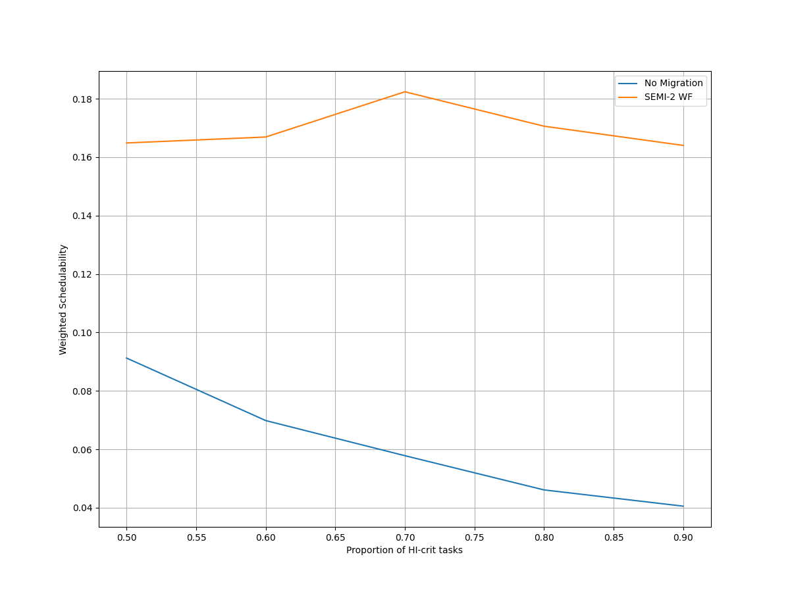
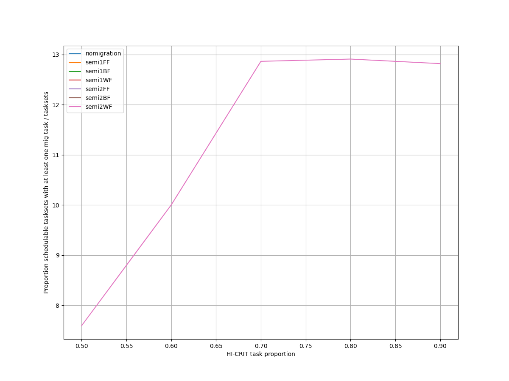
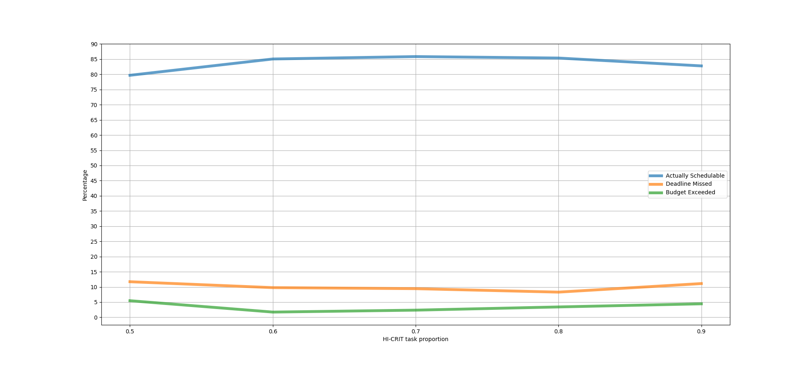
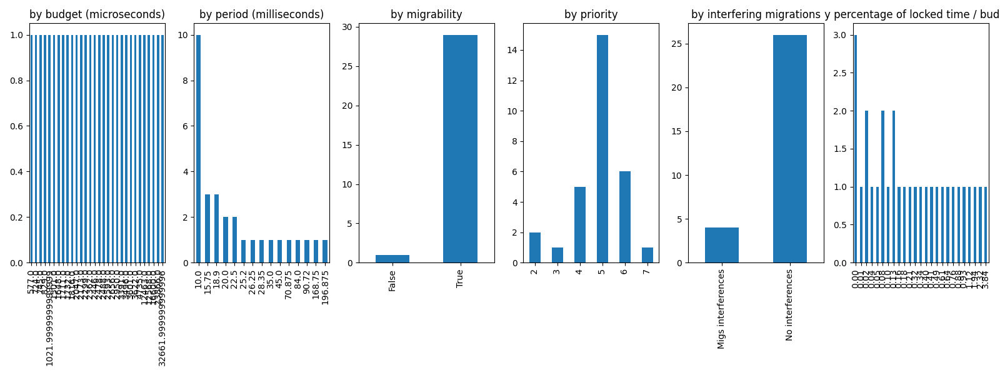
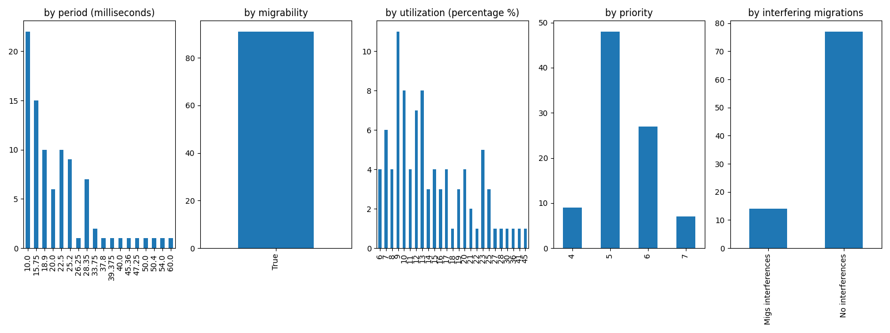
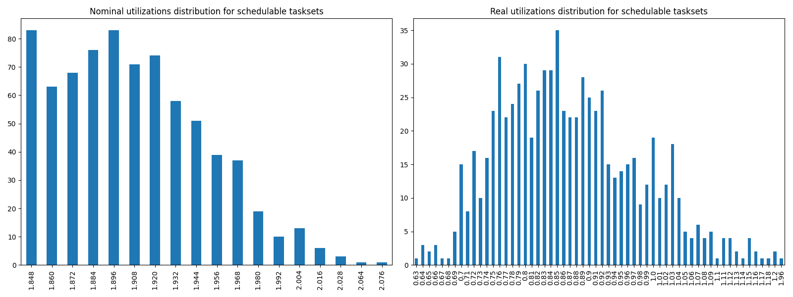
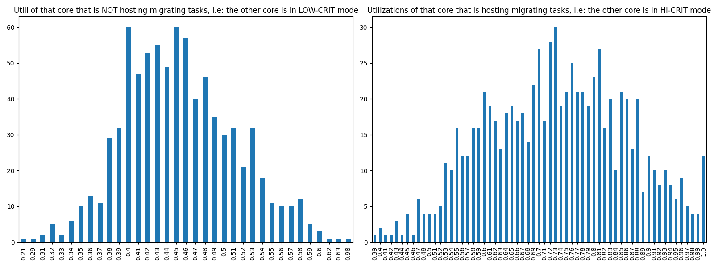

# Report on Experiment 3

## Overall data

   Utilization range = [1.848, 2.1] with step = 0.012

   HI-CRIT proportion range = [0.5, 0.9] with step = 0.1

| Schedulable | Not schedulable | Budget Exceeded | Safe Boundary Exceeded |
| ------ | ------ | ------ | ------ |
| 84.09% | 9.90% | 3.34% | 2.67% |

Number of executions: 899

Schedulable executions: 756/899 = 84.09343715239154 %

_Not_ schedulable executions: 89/899 = 9.899888765294772 %

Budget Exceeded executions: 30/899 = 3.337041156840934 %

Safe Boundary Exceeded executions: 24/899 = 2.6696329254727478 %

NS + BE executions: 119/899 = 13.236929922135706 %

### **Simulations**

#### **Weighted schedulability experiment 3 according to simulations.**

#### **Percentage of (schedulable tasksets with at least one migrating tasks / number of schedulable tasksets) of experiment 3 according to simulations.** 

 

### **Real Executions**

#### **Schedulability for each level**

The tasksets with i) at least one migrating task and ii) marked as schedulable by the RTA are executed on a real target, in order to see how many of them are also schedulable in a real-world scenario. The following graph shows, for each "0.9" level (x-axis), the percentage of:

   - Actually schedulable tasksets, i.e. those that have all tasks that meet their deadlines;
   - Deadline Missed tasksets, i.e. those in which (at least) a tasks did not meet (at least) one of its deadlines; 
   - Budget Exceeded tasksets, i.e. those in which a criticality-level budget exceeding is detected (LO-crit budget for LO-crit tasks and HI-crit budget for HI-crit tasks). This type of event makes experiment invalid.

We want to see, thanks to this graphs, how many tasksets remain schedulable in the real-world. The RTA does not take into account overhead time, so we expect that there will be some tasksets that are not actually schedulable.

#### **Tasksets, grouped by differents parameters, with a Budget_Exceeded task.**

With the following graphs, we sum-up the features of the tasks that have occurred in a Criticality-level Budget Exceeded event. Each graph is like a "group-by" SQL operation.
 In the first one, "by budget", we can see, for each _criticality-level budget value_, how many tasks with that criticality-level budget has exceeded it. In the second one, we can see for each _period_ value, how many tasks has exceeded their criticality-level budget.

#### **Tasksets, grouped by differents parameters, with at least one task missing one (or more) of its deadlines.**

With the following graphs, we sum-up the features of the tasks that have missed (at least) one of them deadlines. As the Budget Exceeded graphs, each graph is like a "group-by" SQL operation.

### **Nominal utilizations VS Real utilizations about schedulable tasksets**

| Average real utilizations | Variance real utilizations | Min | Max |
| ------ | ------ | ------ | ------ |
| 0.871 | 0.013 | 0.630 | 1.960 |

### **Utils of the core that will have to accommodate migrating tasks VS Utils of the core when it is actually accomodating them**

These two graphs show the utilizations level of that core $`c_{i}`$ that, sooner or later, will have to accomodate migrating tasks of the other core $`c_{j}`$. The left one, shows the distribution utilizations levels when the core $`c_{i}`$ is **not** accomodating the other core's $`c_{j}`$ migrating tasks, i.e. $`c_{j}`$ is in **LOW-CRIT mode.**
The right one, shows the distribution utilizations levels when the core $`c_{i}`$ **is** accomodating the other core's $`c_{j}`$ migrating tasks, i.e. $`c_{j}`$ is in **HIGH-CRIT mode**.

| Average utilizations **not** hosting migs | Variance utilizations **not** hosting migs | Min | Max |
| ------ | ------ | ------ | ------ |
| 0.454 | 0.004 | 0.210 | 0.980 |

| Average utilizations hosting migs | Variance utilizations hosting migs | Min | Max |
| ------ | ------ | ------ | ------ |
| 0.731 | 0.017 | 0.390 | 1.000 |

## Bad tasksets

Click here to expand this section.

### **Not schedulable tasksets**

Click here to expand this section.

Ovvero quando almeno un task non completa entra almeno una sua deadline.

  1. Taskset **e3_semi2wf_t1186**

    Taskset execution params:
	 
    "id": "e3_semi2wf_t1186",
    "size": "12",
    "utilization": "1.980",
    "realutilization": 1.06,
    "criticality_factor": "2",
    "hicrit_proportion": "0.5"

   
 
Click here to see the deadlines missed tasks list.

   Time values are expressed as **micro-seconds**.

Task:  1

    
    "id": " 1",
    "basecpu": " 2",
    "priority": " 6",
    "period": 22500.0,
    "C(LO)": 2902.0,
    "C(HI)": 2902.0,
    "criticality": "LOW",
    "migrable": "True",
    "completedruns": " 1553",
    "preemptions": " 0",
    "minresponsejitter": " 0.000000000",
    "maxresponsejitter": " 0.001327015",
    "minreleasejitter": " 0.000000000",
    "maxreleasejitter": " 35.897506462",
    "avgresponsejitter": " 0.001186757",
    "deadlinesmissed": " 1",
    "deadlinemissedtargetcore": " 0",
    "deadlinemissedaftermigration": " 0",
    "budgetexceeded": " 0",
    "budgetexceededtargetcore": " 0",
    "budgetexceededaftermigration": " 0",
    "timesmigrated": " 3",
    "timesrestored": " 3",
    "timesonc1": " 8",
    "timesonc2": " 1543",
    "lockedtime": " 0.000003946"

   

   
 
Click here to see the CPUs log.

   Idle time is expressed as **seconds**.

   Util values are expressed as **percentage** %.

   CPU: 1

    
    "id": 1,
    "hyperperiod": 56700000,
    "lowtohigh": " 12",
    "hightolow": " 12",
    "idletime": 26356581,
    "util": 53.51573015873016,
    "idletimeduringhostingmig": 66658,
    "utilduringhostingmig": 68.88905483550283

   CPU: 2

    
    "id": 2,
    "hyperperiod": 37800000,
    "lowtohigh": " 12",
    "hightolow": " 12",
    "idletime": 26941145,
    "util": 52.48475308641976,
    "idletimeduringhostingmig": 69670,
    "utilduringhostingmig": 55.78360813881167

   Real Utilization: 1.06
   

   
 
Click here to see the whole tasksets.

   Time values are expressed as **micro-seconds**.

   Task:  10

    
    "id": " 10",
    "basecpu": " 1",
    "priority": " 1",
    "period": 175000.0,
    "C(LO)": 16115.0,
    "C(HI)": 32231.000000000004,
    "criticality": "HIGH",
    "migrable": "False",
    "completedruns": " 325",
    "preemptions": " 106",
    "minresponsejitter": " 0.000000000",
    "maxresponsejitter": " 0.050661631",
    "minreleasejitter": " 0.000000000",
    "maxreleasejitter": " 57.525006450",
    "avgresponsejitter": " 0.017161940",
    "deadlinesmissed": " 0",
    "deadlinemissedtargetcore": " 0",
    "deadlinemissedaftermigration": " 0",
    "budgetexceeded": " 2",
    "budgetexceededtargetcore": " 0",
    "budgetexceededaftermigration": " 0",
    "timesmigrated": " 0",
    "timesrestored": " 0",
    "timesonc1": " 432",
    "timesonc2": " 0",
    "lockedtime": " 0.000009748"

   Task:  8

    
    "id": " 8",
    "basecpu": " 1",
    "priority": " 2",
    "period": 100000.0,
    "C(LO)": 7641.0,
    "C(HI)": 15282.0,
    "criticality": "HIGH",
    "migrable": "False",
    "completedruns": " 568",
    "preemptions": " 63",
    "minresponsejitter": " 0.000000000",
    "maxresponsejitter": " 0.040643108",
    "minreleasejitter": " 0.000000000",
    "maxreleasejitter": " 57.600006186",
    "avgresponsejitter": " 0.007240453",
    "deadlinesmissed": " 0",
    "deadlinemissedtargetcore": " 0",
    "deadlinemissedaftermigration": " 0",
    "budgetexceeded": " 8",
    "budgetexceededtargetcore": " 0",
    "budgetexceededaftermigration": " 0",
    "timesmigrated": " 0",
    "timesrestored": " 0",
    "timesonc1": " 638",
    "timesonc2": " 0",
    "lockedtime": " 0.000005946"

   Task:  11

    
    "id": " 11",
    "basecpu": " 1",
    "priority": " 0",
    "period": 567000.0,
    "C(LO)": 29735.0,
    "C(HI)": 59470.0,
    "criticality": "HIGH",
    "migrable": "False",
    "completedruns": " 101",
    "preemptions": " 90",
    "minresponsejitter": " 0.000000000",
    "maxresponsejitter": " 0.094061970",
    "minreleasejitter": " 0.000000000",
    "maxreleasejitter": " 57.137657811",
    "avgresponsejitter": " 0.038030447",
    "deadlinesmissed": " 0",
    "deadlinemissedtargetcore": " 0",
    "deadlinemissedaftermigration": " 0",
    "budgetexceeded": " 2",
    "budgetexceededtargetcore": " 0",
    "budgetexceededaftermigration": " 0",
    "timesmigrated": " 0",
    "timesrestored": " 0",
    "timesonc1": " 192",
    "timesonc2": " 0",
    "lockedtime": " 0.000007730"

   Task:  7

    
    "id": " 7",
    "basecpu": " 1",
    "priority": " 3",
    "period": 84375.0,
    "C(LO)": 38290.0,
    "C(HI)": 38290.0,
    "criticality": "LOW",
    "migrable": "False",
    "completedruns": " 673",
    "preemptions": " 244",
    "minresponsejitter": " 0.000000000",
    "maxresponsejitter": " 0.033183955",
    "minreleasejitter": " 0.000000000",
    "maxreleasejitter": " 57.615631102",
    "avgresponsejitter": " 0.029890180",
    "deadlinesmissed": " 0",
    "deadlinemissedtargetcore": " 0",
    "deadlinemissedaftermigration": " 0",
    "budgetexceeded": " 0",
    "budgetexceededtargetcore": " 0",
    "budgetexceededaftermigration": " 0",
    "timesmigrated": " 0",
    "timesrestored": " 0",
    "timesonc1": " 916",
    "timesonc2": " 0",
    "lockedtime": " 0.000072847"

   Task:  2

    
    "id": " 2",
    "basecpu": " 1",
    "priority": " 4",
    "period": 30240.0,
    "C(LO)": 2491.0,
    "C(HI)": 2491.0,
    "criticality": "LOW",
    "migrable": "True",
    "completedruns": " 673",
    "preemptions": " 0",
    "minresponsejitter": " 0.000000000",
    "maxresponsejitter": " 0.001136279",
    "minreleasejitter": " 0.000000000",
    "maxreleasejitter": " 21.291046429",
    "avgresponsejitter": " 0.001022300",
    "deadlinesmissed": " 0",
    "deadlinemissedtargetcore": " 0",
    "deadlinemissedaftermigration": " 0",
    "budgetexceeded": " 0",
    "budgetexceededtargetcore": " 0",
    "budgetexceededaftermigration": " 0",
    "timesmigrated": " 2",
    "timesrestored": " 1",
    "timesonc1": " 672",
    "timesonc2": " 0",
    "lockedtime": " 0.000007054"

   Task:  12

    
    "id": " 12",
    "basecpu": " 2",
    "priority": " 0",
    "period": 600000.0,
    "C(LO)": 69613.0,
    "C(HI)": 139227.0,
    "criticality": "HIGH",
    "migrable": "False",
    "completedruns": " 96",
    "preemptions": " 601",
    "minresponsejitter": " 0.000000000",
    "maxresponsejitter": " 0.109011898",
    "minreleasejitter": " 0.000000000",
    "maxreleasejitter": " 57.409898357",
    "avgresponsejitter": " 0.091777315",
    "deadlinesmissed": " 0",
    "deadlinemissedtargetcore": " 0",
    "deadlinemissedaftermigration": " 0",
    "budgetexceeded": " 0",
    "budgetexceededtargetcore": " 0",
    "budgetexceededaftermigration": " 0",
    "timesmigrated": " 0",
    "timesrestored": " 0",
    "timesonc1": " 0",
    "timesonc2": " 696",
    "lockedtime": " 0.000012108"

   Task:  9

    
    "id": " 9",
    "basecpu": " 2",
    "priority": " 1",
    "period": 131250.0,
    "C(LO)": 9416.0,
    "C(HI)": 18832.0,
    "criticality": "HIGH",
    "migrable": "False",
    "completedruns": " 433",
    "preemptions": " 260",
    "minresponsejitter": " 0.000000000",
    "maxresponsejitter": " 0.023304498",
    "minreleasejitter": " 0.000000000",
    "maxreleasejitter": " 57.568756048",
    "avgresponsejitter": " 0.009905697",
    "deadlinesmissed": " 0",
    "deadlinemissedtargetcore": " 0",
    "deadlinemissedaftermigration": " 0",
    "budgetexceeded": " 2",
    "budgetexceededtargetcore": " 0",
    "budgetexceededaftermigration": " 0",
    "timesmigrated": " 0",
    "timesrestored": " 0",
    "timesonc1": " 0",
    "timesonc2": " 694",
    "lockedtime": " 0.000001174"

   Task:  6

    
    "id": " 6",
    "basecpu": " 2",
    "priority": " 2",
    "period": 78750.0,
    "C(LO)": 3760.0,
    "C(HI)": 7520.0,
    "criticality": "HIGH",
    "migrable": "False",
    "completedruns": " 721",
    "preemptions": " 15",
    "minresponsejitter": " 0.000000000",
    "maxresponsejitter": " 0.008374432",
    "minreleasejitter": " 0.000000000",
    "maxreleasejitter": " 57.621255952",
    "avgresponsejitter": " 0.003020583",
    "deadlinesmissed": " 0",
    "deadlinemissedtargetcore": " 0",
    "deadlinemissedaftermigration": " 0",
    "budgetexceeded": " 10",
    "budgetexceededtargetcore": " 0",
    "budgetexceededaftermigration": " 0",
    "timesmigrated": " 0",
    "timesrestored": " 0",
    "timesonc1": " 0",
    "timesonc2": " 745",
    "lockedtime": " 0.000000330"

   Task:  4

    
    "id": " 4",
    "basecpu": " 2",
    "priority": " 4",
    "period": 37800.0,
    "C(LO)": 8821.0,
    "C(HI)": 8821.0,
    "criticality": "LOW",
    "migrable": "False",
    "completedruns": " 1501",
    "preemptions": " 459",
    "minresponsejitter": " 0.000000000",
    "maxresponsejitter": " 0.010583802",
    "minreleasejitter": " 0.000000000",
    "maxreleasejitter": " 57.662206096",
    "avgresponsejitter": " 0.007359348",
    "deadlinesmissed": " 0",
    "deadlinemissedtargetcore": " 0",
    "deadlinemissedaftermigration": " 0",
    "budgetexceeded": " 0",
    "budgetexceededtargetcore": " 0",
    "budgetexceededaftermigration": " 0",
    "timesmigrated": " 0",
    "timesrestored": " 0",
    "timesonc1": " 0",
    "timesonc2": " 1959",
    "lockedtime": " 0.000034670"

   Task:  1

    
    "id": " 1",
    "basecpu": " 2",
    "priority": " 6",
    "period": 22500.0,
    "C(LO)": 2902.0,
    "C(HI)": 2902.0,
    "criticality": "LOW",
    "migrable": "True",
    "completedruns": " 1553",
    "preemptions": " 0",
    "minresponsejitter": " 0.000000000",
    "maxresponsejitter": " 0.001327015",
    "minreleasejitter": " 0.000000000",
    "maxreleasejitter": " 35.897506462",
    "avgresponsejitter": " 0.001186757",
    "deadlinesmissed": " 1",
    "deadlinemissedtargetcore": " 0",
    "deadlinemissedaftermigration": " 0",
    "budgetexceeded": " 0",
    "budgetexceededtargetcore": " 0",
    "budgetexceededaftermigration": " 0",
    "timesmigrated": " 3",
    "timesrestored": " 3",
    "timesonc1": " 8",
    "timesonc2": " 1543",
    "lockedtime": " 0.000003946"

   Task:  5

    
    "id": " 5",
    "basecpu": " 2",
    "priority": " 3",
    "period": 75000.0,
    "C(LO)": 6712.0,
    "C(HI)": 6712.0,
    "criticality": "LOW",
    "migrable": "False",
    "completedruns": " 757",
    "preemptions": " 212",
    "minresponsejitter": " 0.000000000",
    "maxresponsejitter": " 0.015897288",
    "minreleasejitter": " 0.000000000",
    "maxreleasejitter": " 57.630880465",
    "avgresponsejitter": " 0.006493814",
    "deadlinesmissed": " 0",
    "deadlinemissedtargetcore": " 0",
    "deadlinemissedaftermigration": " 0",
    "budgetexceeded": " 0",
    "budgetexceededtargetcore": " 0",
    "budgetexceededaftermigration": " 0",
    "timesmigrated": " 0",
    "timesrestored": " 0",
    "timesonc1": " 0",
    "timesonc2": " 968",
    "lockedtime": " 0.000009976"

   Task:  3

    
    "id": " 3",
    "basecpu": " 2",
    "priority": " 5",
    "period": 33750.0,
    "C(LO)": 2665.0,
    "C(HI)": 2665.0,
    "criticality": "LOW",
    "migrable": "False",
    "completedruns": " 1681",
    "preemptions": " 0",
    "minresponsejitter": " 0.000000000",
    "maxresponsejitter": " 0.002173952",
    "minreleasejitter": " 0.000000000",
    "maxreleasejitter": " 57.666256586",
    "avgresponsejitter": " 0.002045312",
    "deadlinesmissed": " 0",
    "deadlinemissedtargetcore": " 0",
    "deadlinemissedaftermigration": " 0",
    "budgetexceeded": " 0",
    "budgetexceededtargetcore": " 0",
    "budgetexceededaftermigration": " 0",
    "timesmigrated": " 0",
    "timesrestored": " 0",
    "timesonc1": " 0",
    "timesonc2": " 1680",
    "lockedtime": " 0.000019381"

   

  2. Taskset **e3_semi2wf_t124**

    Taskset execution params:
	 
    "id": "e3_semi2wf_t124",
    "size": "12",
    "utilization": "1.860",
    "realutilization": 1.08,
    "criticality_factor": "2",
    "hicrit_proportion": "0.5"

   
 
Click here to see the deadlines missed tasks list.

   Time values are expressed as **micro-seconds**.

Task:  1

    
    "id": " 1",
    "basecpu": " 1",
    "priority": " 6",
    "period": 10000.0,
    "C(LO)": 692.0,
    "C(HI)": 692.0,
    "criticality": "LOW",
    "migrable": "True",
    "completedruns": " 570",
    "preemptions": " 0",
    "minresponsejitter": " 0.000000000",
    "maxresponsejitter": " 0.000323342",
    "minreleasejitter": " 0.000000000",
    "maxreleasejitter": " 6.680007622",
    "avgresponsejitter": " 0.000283393",
    "deadlinesmissed": " 1",
    "deadlinemissedtargetcore": " 1",
    "deadlinemissedaftermigration": " 0",
    "budgetexceeded": " 0",
    "budgetexceededtargetcore": " 0",
    "budgetexceededaftermigration": " 0",
    "timesmigrated": " 2",
    "timesrestored": " 2",
    "timesonc1": " 566",
    "timesonc2": " 2",
    "lockedtime": " 0.000021985"

   

   
 
Click here to see the CPUs log.

   Idle time is expressed as **seconds**.

   Util values are expressed as **percentage** %.

   CPU: 1

    
    "id": 1,
    "hyperperiod": 22680000,
    "lowtohigh": " 47",
    "hightolow": " 47",
    "idletime": 26892694,
    "util": 52.570204585537915,
    "idletimeduringhostingmig": 0,
    "utilduringhostingmig": null

   CPU: 2

    
    "id": 2,
    "hyperperiod": 56700000,
    "lowtohigh": " 0",
    "hightolow": " 0",
    "idletime": 25659841,
    "util": 54.744548500881834,
    "idletimeduringhostingmig": 29142,
    "utilduringhostingmig": 85.80149770764007

   Real Utilization: 1.08
   

   
 
Click here to see the whole tasksets.

   Time values are expressed as **micro-seconds**.

   Task:  2

    
    "id": " 2",
    "basecpu": " 1",
    "priority": " 3",
    "period": 18900.0,
    "C(LO)": 1588.0,
    "C(HI)": 3177.0,
    "criticality": "HIGH",
    "migrable": "False",
    "completedruns": " 3001",
    "preemptions": " 40",
    "minresponsejitter": " 0.000000000",
    "maxresponsejitter": " 0.002584949",
    "minreleasejitter": " 0.000000000",
    "maxreleasejitter": " 57.681106264",
    "avgresponsejitter": " 0.001241402",
    "deadlinesmissed": " 0",
    "deadlinemissedtargetcore": " 0",
    "deadlinemissedaftermigration": " 0",
    "budgetexceeded": " 37",
    "budgetexceededtargetcore": " 0",
    "budgetexceededaftermigration": " 0",
    "timesmigrated": " 0",
    "timesrestored": " 0",
    "timesonc1": " 3077",
    "timesonc2": " 0",
    "lockedtime": " 0.000025330"

   Task:  10

    
    "id": " 10",
    "basecpu": " 1",
    "priority": " 0",
    "period": 162000.0,
    "C(LO)": 11317.0,
    "C(HI)": 22635.0,
    "criticality": "HIGH",
    "migrable": "False",
    "completedruns": " 351",
    "preemptions": " 471",
    "minresponsejitter": " 0.000000000",
    "maxresponsejitter": " 0.043711919",
    "minreleasejitter": " 0.000000000",
    "maxreleasejitter": " 57.541769814",
    "avgresponsejitter": " 0.013592276",
    "deadlinesmissed": " 0",
    "deadlinemissedtargetcore": " 0",
    "deadlinemissedaftermigration": " 0",
    "budgetexceeded": " 3",
    "budgetexceededtargetcore": " 0",
    "budgetexceededaftermigration": " 0",
    "timesmigrated": " 0",
    "timesrestored": " 0",
    "timesonc1": " 824",
    "timesonc2": " 0",
    "lockedtime": " 0.000011679"

   Task:  9

    
    "id": " 9",
    "basecpu": " 1",
    "priority": " 1",
    "period": 120000.0,
    "C(LO)": 5225.0,
    "C(HI)": 10451.0,
    "criticality": "HIGH",
    "migrable": "False",
    "completedruns": " 474",
    "preemptions": " 286",
    "minresponsejitter": " 0.000000000",
    "maxresponsejitter": " 0.019499282",
    "minreleasejitter": " 0.000000000",
    "maxreleasejitter": " 57.647543706",
    "avgresponsejitter": " 0.006111039",
    "deadlinesmissed": " 0",
    "deadlinemissedtargetcore": " 0",
    "deadlinemissedaftermigration": " 0",
    "budgetexceeded": " 7",
    "budgetexceededtargetcore": " 0",
    "budgetexceededaftermigration": " 0",
    "timesmigrated": " 0",
    "timesrestored": " 0",
    "timesonc1": " 766",
    "timesonc2": " 0",
    "lockedtime": " 0.000016574"

   Task:  5

    
    "id": " 5",
    "basecpu": " 1",
    "priority": " 4",
    "period": 30240.0,
    "C(LO)": 9196.0,
    "C(HI)": 9196.0,
    "criticality": "LOW",
    "migrable": "False",
    "completedruns": " 1876",
    "preemptions": " 503",
    "minresponsejitter": " 0.000000000",
    "maxresponsejitter": " 0.010144495",
    "minreleasejitter": " 0.000000000",
    "maxreleasejitter": " 57.669766042",
    "avgresponsejitter": " 0.007528835",
    "deadlinesmissed": " 0",
    "deadlinemissedtargetcore": " 0",
    "deadlinemissedaftermigration": " 0",
    "budgetexceeded": " 0",
    "budgetexceededtargetcore": " 0",
    "budgetexceededaftermigration": " 0",
    "timesmigrated": " 0",
    "timesrestored": " 0",
    "timesonc1": " 2378",
    "timesonc2": " 0",
    "lockedtime": " 0.000055438"

   Task:  4

    
    "id": " 4",
    "basecpu": " 1",
    "priority": " 5",
    "period": 25200.0,
    "C(LO)": 2927.0,
    "C(HI)": 2927.0,
    "criticality": "LOW",
    "migrable": "False",
    "completedruns": " 2251",
    "preemptions": " 45",
    "minresponsejitter": " 0.000000000",
    "maxresponsejitter": " 0.002690808",
    "minreleasejitter": " 0.000000000",
    "maxreleasejitter": " 57.674806931",
    "avgresponsejitter": " 0.002255985",
    "deadlinesmissed": " 0",
    "deadlinemissedtargetcore": " 0",
    "deadlinemissedaftermigration": " 0",
    "budgetexceeded": " 0",
    "budgetexceededtargetcore": " 0",
    "budgetexceededaftermigration": " 0",
    "timesmigrated": " 0",
    "timesrestored": " 0",
    "timesonc1": " 2295",
    "timesonc2": " 0",
    "lockedtime": " 0.000015039"

   Task:  1

    
    "id": " 1",
    "basecpu": " 1",
    "priority": " 6",
    "period": 10000.0,
    "C(LO)": 692.0,
    "C(HI)": 692.0,
    "criticality": "LOW",
    "migrable": "True",
    "completedruns": " 570",
    "preemptions": " 0",
    "minresponsejitter": " 0.000000000",
    "maxresponsejitter": " 0.000323342",
    "minreleasejitter": " 0.000000000",
    "maxreleasejitter": " 6.680007622",
    "avgresponsejitter": " 0.000283393",
    "deadlinesmissed": " 1",
    "deadlinemissedtargetcore": " 1",
    "deadlinemissedaftermigration": " 0",
    "budgetexceeded": " 0",
    "budgetexceededtargetcore": " 0",
    "budgetexceededaftermigration": " 0",
    "timesmigrated": " 2",
    "timesrestored": " 2",
    "timesonc1": " 566",
    "timesonc2": " 2",
    "lockedtime": " 0.000021985"

   Task:  11

    
    "id": " 11",
    "basecpu": " 1",
    "priority": " 2",
    "period": 180000.0,
    "C(LO)": 10547.0,
    "C(HI)": 10547.0,
    "criticality": "LOW",
    "migrable": "False",
    "completedruns": " 316",
    "preemptions": " 340",
    "minresponsejitter": " 0.000000000",
    "maxresponsejitter": " 0.019569943",
    "minreleasejitter": " 0.000000000",
    "maxreleasejitter": " 57.528009129",
    "avgresponsejitter": " 0.012080634",
    "deadlinesmissed": " 0",
    "deadlinemissedtargetcore": " 0",
    "deadlinemissedaftermigration": " 0",
    "budgetexceeded": " 0",
    "budgetexceededtargetcore": " 0",
    "budgetexceededaftermigration": " 0",
    "timesmigrated": " 0",
    "timesrestored": " 0",
    "timesonc1": " 655",
    "timesonc2": " 0",
    "lockedtime": " 0.000015429"

   Task:  6

    
    "id": " 6",
    "basecpu": " 2",
    "priority": " 2",
    "period": 75000.0,
    "C(LO)": 9249.0,
    "C(HI)": 18498.0,
    "criticality": "HIGH",
    "migrable": "False",
    "completedruns": " 757",
    "preemptions": " 378",
    "minresponsejitter": " 0.000000000",
    "maxresponsejitter": " 0.008282568",
    "minreleasejitter": " 0.000000000",
    "maxreleasejitter": " 57.625006018",
    "avgresponsejitter": " 0.007463147",
    "deadlinesmissed": " 0",
    "deadlinemissedtargetcore": " 0",
    "deadlinemissedaftermigration": " 0",
    "budgetexceeded": " 0",
    "budgetexceededtargetcore": " 0",
    "budgetexceededaftermigration": " 0",
    "timesmigrated": " 0",
    "timesrestored": " 0",
    "timesonc1": " 0",
    "timesonc2": " 1134",
    "lockedtime": " 0.000021679"

   Task:  3

    
    "id": " 3",
    "basecpu": " 2",
    "priority": " 4",
    "period": 20000.0,
    "C(LO)": 965.0,
    "C(HI)": 1931.0,
    "criticality": "HIGH",
    "migrable": "False",
    "completedruns": " 2836",
    "preemptions": " 0",
    "minresponsejitter": " 0.000000000",
    "maxresponsejitter": " 0.000787673",
    "minreleasejitter": " 0.000000000",
    "maxreleasejitter": " 57.680006087",
    "avgresponsejitter": " 0.000732823",
    "deadlinesmissed": " 0",
    "deadlinemissedtargetcore": " 0",
    "deadlinemissedaftermigration": " 0",
    "budgetexceeded": " 0",
    "budgetexceededtargetcore": " 0",
    "budgetexceededaftermigration": " 0",
    "timesmigrated": " 0",
    "timesrestored": " 0",
    "timesonc1": " 0",
    "timesonc2": " 2835",
    "lockedtime": " 0.000043399"

   Task:  8

    
    "id": " 8",
    "basecpu": " 2",
    "priority": " 1",
    "period": 113400.0,
    "C(LO)": 3948.0,
    "C(HI)": 7896.0,
    "criticality": "HIGH",
    "migrable": "False",
    "completedruns": " 501",
    "preemptions": " 151",
    "minresponsejitter": " 0.000000000",
    "maxresponsejitter": " 0.029952324",
    "minreleasejitter": " 0.000000000",
    "maxreleasejitter": " 57.586606135",
    "avgresponsejitter": " 0.004043237",
    "deadlinesmissed": " 0",
    "deadlinemissedtargetcore": " 0",
    "deadlinemissedaftermigration": " 0",
    "budgetexceeded": " 0",
    "budgetexceededtargetcore": " 0",
    "budgetexceededaftermigration": " 0",
    "timesmigrated": " 0",
    "timesrestored": " 0",
    "timesonc1": " 0",
    "timesonc2": " 651",
    "lockedtime": " 0.000029877"

   Task:  12

    
    "id": " 12",
    "basecpu": " 2",
    "priority": " 0",
    "period": 708750.0,
    "C(LO)": 190194.0,
    "C(HI)": 190194.0,
    "criticality": "LOW",
    "migrable": "False",
    "completedruns": " 81",
    "preemptions": " 985",
    "minresponsejitter": " 0.000000000",
    "maxresponsejitter": " 0.246757724",
    "minreleasejitter": " 0.000000000",
    "maxreleasejitter": " 56.991256018",
    "avgresponsejitter": " 0.220096754",
    "deadlinesmissed": " 0",
    "deadlinemissedtargetcore": " 0",
    "deadlinemissedaftermigration": " 0",
    "budgetexceeded": " 0",
    "budgetexceededtargetcore": " 0",
    "budgetexceededaftermigration": " 0",
    "timesmigrated": " 0",
    "timesrestored": " 0",
    "timesonc1": " 0",
    "timesonc2": " 1065",
    "lockedtime": " 0.000066186"

   Task:  7

    
    "id": " 7",
    "basecpu": " 2",
    "priority": " 3",
    "period": 100000.0,
    "C(LO)": 23573.0,
    "C(HI)": 23573.0,
    "criticality": "LOW",
    "migrable": "False",
    "completedruns": " 568",
    "preemptions": " 0",
    "minresponsejitter": " 0.000000000",
    "maxresponsejitter": " 0.019215733",
    "minreleasejitter": " 0.000000000",
    "maxreleasejitter": " 57.600715808",
    "avgresponsejitter": " 0.018145922",
    "deadlinesmissed": " 0",
    "deadlinemissedtargetcore": " 0",
    "deadlinemissedaftermigration": " 0",
    "budgetexceeded": " 0",
    "budgetexceededtargetcore": " 0",
    "budgetexceededaftermigration": " 0",
    "timesmigrated": " 0",
    "timesrestored": " 0",
    "timesonc1": " 0",
    "timesonc2": " 567",
    "lockedtime": " 0.000025009"

   

  3. Taskset **e3_semi2wf_t1363**

    Taskset execution params:
	 
    "id": "e3_semi2wf_t1363",
    "size": "12",
    "utilization": "2.004",
    "realutilization": 0.94,
    "criticality_factor": "2",
    "hicrit_proportion": "0.5"

   
 
Click here to see the deadlines missed tasks list.

   Time values are expressed as **micro-seconds**.

Task:  2

    
    "id": " 2",
    "basecpu": " 2",
    "priority": " 5",
    "period": 39375.0,
    "C(LO)": 3560.0,
    "C(HI)": 3560.0,
    "criticality": "LOW",
    "migrable": "True",
    "completedruns": " 947",
    "preemptions": " 0",
    "minresponsejitter": " 0.000000000",
    "maxresponsejitter": " 0.001612730",
    "minreleasejitter": " 0.000000000",
    "maxreleasejitter": " 38.209381841",
    "avgresponsejitter": " 0.001450781",
    "deadlinesmissed": " 1",
    "deadlinemissedtargetcore": " 0",
    "deadlinemissedaftermigration": " 0",
    "budgetexceeded": " 0",
    "budgetexceededtargetcore": " 0",
    "budgetexceededaftermigration": " 0",
    "timesmigrated": " 2",
    "timesrestored": " 1",
    "timesonc1": " 5",
    "timesonc2": " 940",
    "lockedtime": " 0.000008940"

   

   
 
Click here to see the CPUs log.

   Idle time is expressed as **seconds**.

   Util values are expressed as **percentage** %.

   CPU: 1

    
    "id": 1,
    "hyperperiod": 56700000,
    "lowtohigh": " 0",
    "hightolow": " 0",
    "idletime": 56293035,
    "util": 50.35887566137566,
    "idletimeduringhostingmig": 333702,
    "utilduringhostingmig": 57.03038887458151

   CPU: 2

    
    "id": 2,
    "hyperperiod": 113400000,
    "lowtohigh": " 15",
    "hightolow": " 15",
    "idletime": 64016634,
    "util": 43.5479417989418,
    "idletimeduringhostingmig": 0,
    "utilduringhostingmig": null

   Real Utilization: 0.94
   

   
 
Click here to see the whole tasksets.

   Time values are expressed as **micro-seconds**.

   Task:  11

    
    "id": " 11",
    "basecpu": " 1",
    "priority": " 0",
    "period": 405000.0,
    "C(LO)": 51971.0,
    "C(HI)": 103943.0,
    "criticality": "HIGH",
    "migrable": "False",
    "completedruns": " 281",
    "preemptions": " 933",
    "minresponsejitter": " 0.000000000",
    "maxresponsejitter": " 0.080165225",
    "minreleasejitter": " 0.000000000",
    "maxreleasejitter": " 114.005923523",
    "avgresponsejitter": " 0.062120901",
    "deadlinesmissed": " 0",
    "deadlinemissedtargetcore": " 0",
    "deadlinemissedaftermigration": " 0",
    "budgetexceeded": " 0",
    "budgetexceededtargetcore": " 0",
    "budgetexceededaftermigration": " 0",
    "timesmigrated": " 0",
    "timesrestored": " 0",
    "timesonc1": " 1213",
    "timesonc2": " 0",
    "lockedtime": " 0.000033526"

   Task:  10

    
    "id": " 10",
    "basecpu": " 1",
    "priority": " 1",
    "period": 140000.0,
    "C(LO)": 12522.0,
    "C(HI)": 25045.0,
    "criticality": "HIGH",
    "migrable": "False",
    "completedruns": " 811",
    "preemptions": " 460",
    "minresponsejitter": " 0.000000000",
    "maxresponsejitter": " 0.021771736",
    "minreleasejitter": " 0.000000000",
    "maxreleasejitter": " 114.260006156",
    "avgresponsejitter": " 0.012440562",
    "deadlinesmissed": " 0",
    "deadlinemissedtargetcore": " 0",
    "deadlinemissedaftermigration": " 0",
    "budgetexceeded": " 0",
    "budgetexceededtargetcore": " 0",
    "budgetexceededaftermigration": " 0",
    "timesmigrated": " 0",
    "timesrestored": " 0",
    "timesonc1": " 1270",
    "timesonc2": " 0",
    "lockedtime": " 0.000013288"

   Task:  9

    
    "id": " 9",
    "basecpu": " 1",
    "priority": " 2",
    "period": 105000.0,
    "C(LO)": 7302.0,
    "C(HI)": 14605.0,
    "criticality": "HIGH",
    "migrable": "False",
    "completedruns": " 1081",
    "preemptions": " 228",
    "minresponsejitter": " 0.000000000",
    "maxresponsejitter": " 0.016009309",
    "minreleasejitter": " 0.000000000",
    "maxreleasejitter": " 114.295006075",
    "avgresponsejitter": " 0.006821168",
    "deadlinesmissed": " 0",
    "deadlinemissedtargetcore": " 0",
    "deadlinemissedaftermigration": " 0",
    "budgetexceeded": " 0",
    "budgetexceededtargetcore": " 0",
    "budgetexceededaftermigration": " 0",
    "timesmigrated": " 0",
    "timesrestored": " 0",
    "timesonc1": " 1308",
    "timesonc2": " 0",
    "lockedtime": " 0.000004405"

   Task:  4

    
    "id": " 4",
    "basecpu": " 1",
    "priority": " 3",
    "period": 63000.0,
    "C(LO)": 1848.0,
    "C(HI)": 3697.0,
    "criticality": "HIGH",
    "migrable": "False",
    "completedruns": " 1801",
    "preemptions": " 48",
    "minresponsejitter": " 0.000000000",
    "maxresponsejitter": " 0.011690045",
    "minreleasejitter": " 0.000000000",
    "maxreleasejitter": " 114.339085441",
    "avgresponsejitter": " 0.001539610",
    "deadlinesmissed": " 0",
    "deadlinemissedtargetcore": " 0",
    "deadlinemissedaftermigration": " 0",
    "budgetexceeded": " 0",
    "budgetexceededtargetcore": " 0",
    "budgetexceededaftermigration": " 0",
    "timesmigrated": " 0",
    "timesrestored": " 0",
    "timesonc1": " 1848",
    "timesonc2": " 0",
    "lockedtime": " 0.000031946"

   Task:  1

    
    "id": " 1",
    "basecpu": " 1",
    "priority": " 5",
    "period": 33750.0,
    "C(LO)": 8887.0,
    "C(HI)": 8887.0,
    "criticality": "LOW",
    "migrable": "False",
    "completedruns": " 3361",
    "preemptions": " 1",
    "minresponsejitter": " 0.000000000",
    "maxresponsejitter": " 0.007237327",
    "minreleasejitter": " 0.000000000",
    "maxreleasejitter": " 114.366256102",
    "avgresponsejitter": " 0.006819826",
    "deadlinesmissed": " 0",
    "deadlinemissedtargetcore": " 0",
    "deadlinemissedaftermigration": " 0",
    "budgetexceeded": " 0",
    "budgetexceededtargetcore": " 0",
    "budgetexceededaftermigration": " 0",
    "timesmigrated": " 0",
    "timesrestored": " 0",
    "timesonc1": " 3361",
    "timesonc2": " 0",
    "lockedtime": " 0.000074108"

   Task:  3

    
    "id": " 3",
    "basecpu": " 1",
    "priority": " 4",
    "period": 50000.0,
    "C(LO)": 3707.0,
    "C(HI)": 3707.0,
    "criticality": "LOW",
    "migrable": "False",
    "completedruns": " 2269",
    "preemptions": " 168",
    "minresponsejitter": " 0.000000000",
    "maxresponsejitter": " 0.010180538",
    "minreleasejitter": " 0.000000000",
    "maxreleasejitter": " 114.350006042",
    "avgresponsejitter": " 0.003356673",
    "deadlinesmissed": " 0",
    "deadlinemissedtargetcore": " 0",
    "deadlinemissedaftermigration": " 0",
    "budgetexceeded": " 0",
    "budgetexceededtargetcore": " 0",
    "budgetexceededaftermigration": " 0",
    "timesmigrated": " 0",
    "timesrestored": " 0",
    "timesonc1": " 2436",
    "timesonc2": " 0",
    "lockedtime": " 0.000025562"

   Task:  12

    
    "id": " 12",
    "basecpu": " 2",
    "priority": " 0",
    "period": 840000.0,
    "C(LO)": 217631.0,
    "C(HI)": 435262.0,
    "criticality": "HIGH",
    "migrable": "False",
    "completedruns": " 136",
    "preemptions": " 1073",
    "minresponsejitter": " 0.000000000",
    "maxresponsejitter": " 0.445490489",
    "minreleasejitter": " 0.000000000",
    "maxreleasejitter": " 113.560006279",
    "avgresponsejitter": " 0.218879988",
    "deadlinesmissed": " 0",
    "deadlinemissedtargetcore": " 0",
    "deadlinemissedaftermigration": " 0",
    "budgetexceeded": " 1",
    "budgetexceededtargetcore": " 0",
    "budgetexceededaftermigration": " 0",
    "timesmigrated": " 0",
    "timesrestored": " 0",
    "timesonc1": " 0",
    "timesonc2": " 1209",
    "lockedtime": " 0.000070189"

   Task:  8

    
    "id": " 8",
    "basecpu": " 2",
    "priority": " 1",
    "period": 94500.0,
    "C(LO)": 5580.0,
    "C(HI)": 11160.0,
    "criticality": "HIGH",
    "migrable": "False",
    "completedruns": " 1201",
    "preemptions": " 69",
    "minresponsejitter": " 0.000000000",
    "maxresponsejitter": " 0.020987345",
    "minreleasejitter": " 0.000000000",
    "maxreleasejitter": " 114.305505916",
    "avgresponsejitter": " 0.004864033",
    "deadlinesmissed": " 0",
    "deadlinemissedtargetcore": " 0",
    "deadlinemissedaftermigration": " 0",
    "budgetexceeded": " 14",
    "budgetexceededtargetcore": " 0",
    "budgetexceededaftermigration": " 0",
    "timesmigrated": " 0",
    "timesrestored": " 0",
    "timesonc1": " 0",
    "timesonc2": " 1283",
    "lockedtime": " 0.000029802"

   Task:  7

    
    "id": " 7",
    "basecpu": " 2",
    "priority": " 2",
    "period": 87500.0,
    "C(LO)": 13602.0,
    "C(HI)": 13602.0,
    "criticality": "LOW",
    "migrable": "False",
    "completedruns": " 1297",
    "preemptions": " 301",
    "minresponsejitter": " 0.000000000",
    "maxresponsejitter": " 0.018816498",
    "minreleasejitter": " 0.000000000",
    "maxreleasejitter": " 114.312506003",
    "avgresponsejitter": " 0.011188471",
    "deadlinesmissed": " 0",
    "deadlinemissedtargetcore": " 0",
    "deadlinemissedaftermigration": " 0",
    "budgetexceeded": " 0",
    "budgetexceededtargetcore": " 0",
    "budgetexceededaftermigration": " 0",
    "timesmigrated": " 0",
    "timesrestored": " 0",
    "timesonc1": " 0",
    "timesonc2": " 1597",
    "lockedtime": " 0.000038727"

   Task:  5

    
    "id": " 5",
    "basecpu": " 2",
    "priority": " 4",
    "period": 70875.0,
    "C(LO)": 6530.0,
    "C(HI)": 6530.0,
    "criticality": "LOW",
    "migrable": "True",
    "completedruns": " 428",
    "preemptions": " 0",
    "minresponsejitter": " 0.000000000",
    "maxresponsejitter": " 0.002951856",
    "minreleasejitter": " 0.000000000",
    "maxreleasejitter": " 31.192756538",
    "avgresponsejitter": " 0.002657529",
    "deadlinesmissed": " 0",
    "deadlinemissedtargetcore": " 0",
    "deadlinemissedaftermigration": " 0",
    "budgetexceeded": " 0",
    "budgetexceededtargetcore": " 0",
    "budgetexceededaftermigration": " 0",
    "timesmigrated": " 1",
    "timesrestored": " 0",
    "timesonc1": " 0",
    "timesonc2": " 427",
    "lockedtime": " 0.000001907"

   Task:  2

    
    "id": " 2",
    "basecpu": " 2",
    "priority": " 5",
    "period": 39375.0,
    "C(LO)": 3560.0,
    "C(HI)": 3560.0,
    "criticality": "LOW",
    "migrable": "True",
    "completedruns": " 947",
    "preemptions": " 0",
    "minresponsejitter": " 0.000000000",
    "maxresponsejitter": " 0.001612730",
    "minreleasejitter": " 0.000000000",
    "maxreleasejitter": " 38.209381841",
    "avgresponsejitter": " 0.001450781",
    "deadlinesmissed": " 1",
    "deadlinemissedtargetcore": " 0",
    "deadlinemissedaftermigration": " 0",
    "budgetexceeded": " 0",
    "budgetexceededtargetcore": " 0",
    "budgetexceededaftermigration": " 0",
    "timesmigrated": " 2",
    "timesrestored": " 1",
    "timesonc1": " 5",
    "timesonc2": " 940",
    "lockedtime": " 0.000008940"

   Task:  6

    
    "id": " 6",
    "basecpu": " 2",
    "priority": " 3",
    "period": 81000.0,
    "C(LO)": 4767.0,
    "C(HI)": 4767.0,
    "criticality": "LOW",
    "migrable": "False",
    "completedruns": " 1401",
    "preemptions": " 39",
    "minresponsejitter": " 0.000000000",
    "maxresponsejitter": " 0.005444541",
    "minreleasejitter": " 0.000000000",
    "maxreleasejitter": " 114.319006595",
    "avgresponsejitter": " 0.003700538",
    "deadlinesmissed": " 0",
    "deadlinemissedtargetcore": " 0",
    "deadlinemissedaftermigration": " 0",
    "budgetexceeded": " 0",
    "budgetexceededtargetcore": " 0",
    "budgetexceededaftermigration": " 0",
    "timesmigrated": " 0",
    "timesrestored": " 0",
    "timesonc1": " 0",
    "timesonc2": " 1439",
    "lockedtime": " 0.000018033"

   

  4. Taskset **e3_semi2wf_t1744**

    Taskset execution params:
	 
    "id": "e3_semi2wf_t1744",
    "size": "12",
    "utilization": "2.052",
    "realutilization": 1.07,
    "criticality_factor": "2",
    "hicrit_proportion": "0.5"

   
 
Click here to see the deadlines missed tasks list.

   Time values are expressed as **micro-seconds**.

Task:  2

    
    "id": " 2",
    "basecpu": " 1",
    "priority": " 5",
    "period": 18900.0,
    "C(LO)": 1991.9999999999998,
    "C(HI)": 1991.9999999999998,
    "criticality": "LOW",
    "migrable": "True",
    "completedruns": " 448",
    "preemptions": " 0",
    "minresponsejitter": " 0.000000000",
    "maxresponsejitter": " 0.000910291",
    "minreleasejitter": " 0.000000000",
    "maxreleasejitter": " 9.429406826",
    "avgresponsejitter": " 0.000818462",
    "deadlinesmissed": " 1",
    "deadlinemissedtargetcore": " 0",
    "deadlinemissedaftermigration": " 1",
    "budgetexceeded": " 0",
    "budgetexceededtargetcore": " 0",
    "budgetexceededaftermigration": " 0",
    "timesmigrated": " 3",
    "timesrestored": " 2",
    "timesonc1": " 446",
    "timesonc2": " 0",
    "lockedtime": " 0.000001363"

   

   
 
Click here to see the CPUs log.

   Idle time is expressed as **seconds**.

   Util values are expressed as **percentage** %.

   CPU: 1

    
    "id": 1,
    "hyperperiod": 18900000,
    "lowtohigh": " 93",
    "hightolow": " 93",
    "idletime": 53306652,
    "util": 52.992370370370374,
    "idletimeduringhostingmig": 256987,
    "utilduringhostingmig": 57.14933628134135

   CPU: 2

    
    "id": 2,
    "hyperperiod": 113400000,
    "lowtohigh": " 29",
    "hightolow": " 29",
    "idletime": 51773204,
    "util": 54.34461728395062,
    "idletimeduringhostingmig": 220359,
    "utilduringhostingmig": 81.60613955056874

   Real Utilization: 1.07
   

   
 
Click here to see the whole tasksets.

   Time values are expressed as **micro-seconds**.

   Task:  1

    
    "id": " 1",
    "basecpu": " 1",
    "priority": " 3",
    "period": 15750.0,
    "C(LO)": 1250.0,
    "C(HI)": 2500.0,
    "criticality": "HIGH",
    "migrable": "False",
    "completedruns": " 7201",
    "preemptions": " 297",
    "minresponsejitter": " 0.000000000",
    "maxresponsejitter": " 0.006000234",
    "minreleasejitter": " 0.000000000",
    "maxreleasejitter": " 114.384256204",
    "avgresponsejitter": " 0.001127946",
    "deadlinesmissed": " 0",
    "deadlinemissedtargetcore": " 0",
    "deadlinemissedaftermigration": " 0",
    "budgetexceeded": " 86",
    "budgetexceededtargetcore": " 0",
    "budgetexceededaftermigration": " 0",
    "timesmigrated": " 0",
    "timesrestored": " 0",
    "timesonc1": " 7583",
    "timesonc2": " 0",
    "lockedtime": " 0.000028667"

   Task:  11

    
    "id": " 11",
    "basecpu": " 1",
    "priority": " 0",
    "period": 590625.0,
    "C(LO)": 46294.0,
    "C(HI)": 92589.0,
    "criticality": "HIGH",
    "migrable": "False",
    "completedruns": " 193",
    "preemptions": " 976",
    "minresponsejitter": " 0.000000000",
    "maxresponsejitter": " 0.113485456",
    "minreleasejitter": " 0.000000000",
    "maxreleasejitter": " 113.834501853",
    "avgresponsejitter": " 0.061598727",
    "deadlinesmissed": " 0",
    "deadlinemissedtargetcore": " 0",
    "deadlinemissedaftermigration": " 0",
    "budgetexceeded": " 1",
    "budgetexceededtargetcore": " 0",
    "budgetexceededaftermigration": " 0",
    "timesmigrated": " 0",
    "timesrestored": " 0",
    "timesonc1": " 1169",
    "timesonc2": " 0",
    "lockedtime": " 0.000018841"

   Task:  10

    
    "id": " 10",
    "basecpu": " 1",
    "priority": " 1",
    "period": 175000.0,
    "C(LO)": 11666.0,
    "C(HI)": 23333.0,
    "criticality": "HIGH",
    "migrable": "False",
    "completedruns": " 649",
    "preemptions": " 678",
    "minresponsejitter": " 0.000000000",
    "maxresponsejitter": " 0.028940919",
    "minreleasejitter": " 0.000000000",
    "maxreleasejitter": " 114.225006096",
    "avgresponsejitter": " 0.011485351",
    "deadlinesmissed": " 0",
    "deadlinemissedtargetcore": " 0",
    "deadlinemissedaftermigration": " 0",
    "budgetexceeded": " 6",
    "budgetexceededtargetcore": " 0",
    "budgetexceededaftermigration": " 0",
    "timesmigrated": " 0",
    "timesrestored": " 0",
    "timesonc1": " 1332",
    "timesonc2": " 0",
    "lockedtime": " 0.000010180"

   Task:  3

    
    "id": " 3",
    "basecpu": " 1",
    "priority": " 4",
    "period": 20000.0,
    "C(LO)": 4862.0,
    "C(HI)": 4862.0,
    "criticality": "LOW",
    "migrable": "False",
    "completedruns": " 5671",
    "preemptions": " 82",
    "minresponsejitter": " 0.000000000",
    "maxresponsejitter": " 0.004842508",
    "minreleasejitter": " 0.000000000",
    "maxreleasejitter": " 114.380006471",
    "avgresponsejitter": " 0.003740703",
    "deadlinesmissed": " 0",
    "deadlinemissedtargetcore": " 0",
    "deadlinemissedaftermigration": " 0",
    "budgetexceeded": " 0",
    "budgetexceededtargetcore": " 0",
    "budgetexceededaftermigration": " 0",
    "timesmigrated": " 0",
    "timesrestored": " 0",
    "timesonc1": " 5752",
    "timesonc2": " 0",
    "lockedtime": " 0.000049180"

   Task:  8

    
    "id": " 8",
    "basecpu": " 1",
    "priority": " 2",
    "period": 150000.0,
    "C(LO)": 31957.0,
    "C(HI)": 31957.0,
    "criticality": "LOW",
    "migrable": "False",
    "completedruns": " 757",
    "preemptions": " 2256",
    "minresponsejitter": " 0.000000000",
    "maxresponsejitter": " 0.037942237",
    "minreleasejitter": " 0.000000000",
    "maxreleasejitter": " 114.250006270",
    "avgresponsejitter": " 0.031546880",
    "deadlinesmissed": " 0",
    "deadlinemissedtargetcore": " 0",
    "deadlinemissedaftermigration": " 0",
    "budgetexceeded": " 0",
    "budgetexceededtargetcore": " 0",
    "budgetexceededaftermigration": " 0",
    "timesmigrated": " 0",
    "timesrestored": " 0",
    "timesonc1": " 3012",
    "timesonc2": " 0",
    "lockedtime": " 0.000036078"

   Task:  2

    
    "id": " 2",
    "basecpu": " 1",
    "priority": " 5",
    "period": 18900.0,
    "C(LO)": 1991.9999999999998,
    "C(HI)": 1991.9999999999998,
    "criticality": "LOW",
    "migrable": "True",
    "completedruns": " 448",
    "preemptions": " 0",
    "minresponsejitter": " 0.000000000",
    "maxresponsejitter": " 0.000910291",
    "minreleasejitter": " 0.000000000",
    "maxreleasejitter": " 9.429406826",
    "avgresponsejitter": " 0.000818462",
    "deadlinesmissed": " 1",
    "deadlinemissedtargetcore": " 0",
    "deadlinemissedaftermigration": " 1",
    "budgetexceeded": " 0",
    "budgetexceededtargetcore": " 0",
    "budgetexceededaftermigration": " 0",
    "timesmigrated": " 3",
    "timesrestored": " 2",
    "timesonc1": " 446",
    "timesonc2": " 0",
    "lockedtime": " 0.000001363"

   Task:  12

    
    "id": " 12",
    "basecpu": " 2",
    "priority": " 0",
    "period": 810000.0,
    "C(LO)": 70096.0,
    "C(HI)": 140192.0,
    "criticality": "HIGH",
    "migrable": "False",
    "completedruns": " 141",
    "preemptions": " 390",
    "minresponsejitter": " 0.000000000",
    "maxresponsejitter": " 0.207599589",
    "minreleasejitter": " 0.000000000",
    "maxreleasejitter": " 113.621202279",
    "avgresponsejitter": " 0.082326583",
    "deadlinesmissed": " 0",
    "deadlinemissedtargetcore": " 0",
    "deadlinemissedaftermigration": " 0",
    "budgetexceeded": " 1",
    "budgetexceededtargetcore": " 0",
    "budgetexceededaftermigration": " 0",
    "timesmigrated": " 0",
    "timesrestored": " 0",
    "timesonc1": " 0",
    "timesonc2": " 531",
    "lockedtime": " 0.000034480"

   Task:  6

    
    "id": " 6",
    "basecpu": " 2",
    "priority": " 2",
    "period": 72000.0,
    "C(LO)": 5486.0,
    "C(HI)": 10973.0,
    "criticality": "HIGH",
    "migrable": "False",
    "completedruns": " 1576",
    "preemptions": " 113",
    "minresponsejitter": " 0.000000000",
    "maxresponsejitter": " 0.029580246",
    "minreleasejitter": " 0.000000000",
    "maxreleasejitter": " 114.343296784",
    "avgresponsejitter": " 0.005232240",
    "deadlinesmissed": " 0",
    "deadlinemissedtargetcore": " 0",
    "deadlinemissedaftermigration": " 0",
    "budgetexceeded": " 10",
    "budgetexceededtargetcore": " 0",
    "budgetexceededaftermigration": " 0",
    "timesmigrated": " 0",
    "timesrestored": " 0",
    "timesonc1": " 0",
    "timesonc2": " 1698",
    "lockedtime": " 0.000021694"

   Task:  5

    
    "id": " 5",
    "basecpu": " 2",
    "priority": " 3",
    "period": 54000.0,
    "C(LO)": 2553.0,
    "C(HI)": 5107.0,
    "criticality": "HIGH",
    "migrable": "False",
    "completedruns": " 2101",
    "preemptions": " 1",
    "minresponsejitter": " 0.000000000",
    "maxresponsejitter": " 0.004141024",
    "minreleasejitter": " 0.000000000",
    "maxreleasejitter": " 114.346006748",
    "avgresponsejitter": " 0.001978333",
    "deadlinesmissed": " 0",
    "deadlinemissedtargetcore": " 0",
    "deadlinemissedaftermigration": " 0",
    "budgetexceeded": " 18",
    "budgetexceededtargetcore": " 0",
    "budgetexceededaftermigration": " 0",
    "timesmigrated": " 0",
    "timesrestored": " 0",
    "timesonc1": " 0",
    "timesonc2": " 2119",
    "lockedtime": " 0.000026637"

   Task:  7

    
    "id": " 7",
    "basecpu": " 2",
    "priority": " 4",
    "period": 75000.0,
    "C(LO)": 23442.0,
    "C(HI)": 23442.0,
    "criticality": "LOW",
    "migrable": "False",
    "completedruns": " 1513",
    "preemptions": " 3",
    "minresponsejitter": " 0.000000000",
    "maxresponsejitter": " 0.020359838",
    "minreleasejitter": " 0.000000000",
    "maxreleasejitter": " 114.325006297",
    "avgresponsejitter": " 0.018064766",
    "deadlinesmissed": " 0",
    "deadlinemissedtargetcore": " 0",
    "deadlinemissedaftermigration": " 0",
    "budgetexceeded": " 0",
    "budgetexceededtargetcore": " 0",
    "budgetexceededaftermigration": " 0",
    "timesmigrated": " 0",
    "timesrestored": " 0",
    "timesonc1": " 0",
    "timesonc2": " 1515",
    "lockedtime": " 0.000115658"

   Task:  9

    
    "id": " 9",
    "basecpu": " 2",
    "priority": " 1",
    "period": 162000.0,
    "C(LO)": 29220.0,
    "C(HI)": 29220.0,
    "criticality": "LOW",
    "migrable": "False",
    "completedruns": " 701",
    "preemptions": " 397",
    "minresponsejitter": " 0.000000000",
    "maxresponsejitter": " 0.047215910",
    "minreleasejitter": " 0.000000000",
    "maxreleasejitter": " 114.239973465",
    "avgresponsejitter": " 0.029541676",
    "deadlinesmissed": " 0",
    "deadlinemissedtargetcore": " 0",
    "deadlinemissedaftermigration": " 0",
    "budgetexceeded": " 0",
    "budgetexceededtargetcore": " 0",
    "budgetexceededaftermigration": " 0",
    "timesmigrated": " 0",
    "timesrestored": " 0",
    "timesonc1": " 0",
    "timesonc2": " 1097",
    "lockedtime": " 0.000038447"

   Task:  4

    
    "id": " 4",
    "basecpu": " 2",
    "priority": " 5",
    "period": 35000.0,
    "C(LO)": 4497.0,
    "C(HI)": 4497.0,
    "criticality": "LOW",
    "migrable": "True",
    "completedruns": " 20",
    "preemptions": " 0",
    "minresponsejitter": " 0.000000000",
    "maxresponsejitter": " 0.002035517",
    "minreleasejitter": " 0.000000000",
    "maxreleasejitter": " 1.630006228",
    "avgresponsejitter": " 0.001849622",
    "deadlinesmissed": " 0",
    "deadlinemissedtargetcore": " 0",
    "deadlinemissedaftermigration": " 0",
    "budgetexceeded": " 0",
    "budgetexceededtargetcore": " 0",
    "budgetexceededaftermigration": " 0",
    "timesmigrated": " 1",
    "timesrestored": " 0",
    "timesonc1": " 0",
    "timesonc2": " 19",
    "lockedtime": " 0.000001153"

   

  5. Taskset **e3_semi2wf_t211**

    Taskset execution params:
	 
    "id": "e3_semi2wf_t211",
    "size": "12",
    "utilization": "1.872",
    "realutilization": 0.98,
    "criticality_factor": "2",
    "hicrit_proportion": "0.5"

   
 
Click here to see the deadlines missed tasks list.

   Time values are expressed as **micro-seconds**.

Task:  1

    
    "id": " 1",
    "basecpu": " 1",
    "priority": " 7",
    "period": 20000.0,
    "C(LO)": 1476.0,
    "C(HI)": 1476.0,
    "criticality": "LOW",
    "migrable": "True",
    "completedruns": " 2435",
    "preemptions": " 0",
    "minresponsejitter": " 0.000000000",
    "maxresponsejitter": " 0.000676982",
    "minreleasejitter": " 0.000000000",
    "maxreleasejitter": " 49.660007036",
    "avgresponsejitter": " 0.000604081",
    "deadlinesmissed": " 1",
    "deadlinemissedtargetcore": " 1",
    "deadlinemissedaftermigration": " 0",
    "budgetexceeded": " 0",
    "budgetexceededtargetcore": " 0",
    "budgetexceededaftermigration": " 0",
    "timesmigrated": " 8",
    "timesrestored": " 7",
    "timesonc1": " 2430",
    "timesonc2": " 3",
    "lockedtime": " 0.000019700"

   

   
 
Click here to see the CPUs log.

   Idle time is expressed as **seconds**.

   Util values are expressed as **percentage** %.

   CPU: 1

    
    "id": 1,
    "hyperperiod": 56700000,
    "lowtohigh": " 69",
    "hightolow": " 69",
    "idletime": 61039023,
    "util": 46.173701058201054,
    "idletimeduringhostingmig": 0,
    "utilduringhostingmig": null

   CPU: 2

    
    "id": 2,
    "hyperperiod": 113400000,
    "lowtohigh": " 0",
    "hightolow": " 0",
    "idletime": 54387869,
    "util": 52.03891622574956,
    "idletimeduringhostingmig": 61745,
    "utilduringhostingmig": 87.03013243989791

   Real Utilization: 0.98
   

   
 
Click here to see the whole tasksets.

   Time values are expressed as **micro-seconds**.

   Task:  10

    
    "id": " 10",
    "basecpu": " 1",
    "priority": " 0",
    "period": 175000.0,
    "C(LO)": 21193.0,
    "C(HI)": 42387.0,
    "criticality": "HIGH",
    "migrable": "False",
    "completedruns": " 649",
    "preemptions": " 1216",
    "minresponsejitter": " 0.000000000",
    "maxresponsejitter": " 0.060231514",
    "minreleasejitter": " 0.000000000",
    "maxreleasejitter": " 114.225006300",
    "avgresponsejitter": " 0.023664150",
    "deadlinesmissed": " 0",
    "deadlinemissedtargetcore": " 0",
    "deadlinemissedaftermigration": " 0",
    "budgetexceeded": " 7",
    "budgetexceededtargetcore": " 0",
    "budgetexceededaftermigration": " 0",
    "timesmigrated": " 0",
    "timesrestored": " 0",
    "timesonc1": " 1871",
    "timesonc2": " 0",
    "lockedtime": " 0.000022447"

   Task:  5

    
    "id": " 5",
    "basecpu": " 1",
    "priority": " 2",
    "period": 65625.0,
    "C(LO)": 5670.0,
    "C(HI)": 11340.0,
    "criticality": "HIGH",
    "migrable": "False",
    "completedruns": " 1729",
    "preemptions": " 697",
    "minresponsejitter": " 0.000000000",
    "maxresponsejitter": " 0.020029414",
    "minreleasejitter": " 0.000000000",
    "maxreleasejitter": " 114.336344435",
    "avgresponsejitter": " 0.005582877",
    "deadlinesmissed": " 0",
    "deadlinemissedtargetcore": " 0",
    "deadlinemissedaftermigration": " 0",
    "budgetexceeded": " 18",
    "budgetexceededtargetcore": " 0",
    "budgetexceededaftermigration": " 0",
    "timesmigrated": " 0",
    "timesrestored": " 0",
    "timesonc1": " 2443",
    "timesonc2": " 0",
    "lockedtime": " 0.000015072"

   Task:  8

    
    "id": " 8",
    "basecpu": " 1",
    "priority": " 1",
    "period": 101250.0,
    "C(LO)": 4092.0,
    "C(HI)": 8184.0,
    "criticality": "HIGH",
    "migrable": "False",
    "completedruns": " 1121",
    "preemptions": " 313",
    "minresponsejitter": " 0.000000000",
    "maxresponsejitter": " 0.016801012",
    "minreleasejitter": " 0.000000000",
    "maxreleasejitter": " 114.298756042",
    "avgresponsejitter": " 0.003875174",
    "deadlinesmissed": " 0",
    "deadlinemissedtargetcore": " 0",
    "deadlinemissedaftermigration": " 0",
    "budgetexceeded": " 15",
    "budgetexceededtargetcore": " 0",
    "budgetexceededaftermigration": " 0",
    "timesmigrated": " 0",
    "timesrestored": " 0",
    "timesonc1": " 1448",
    "timesonc2": " 0",
    "lockedtime": " 0.000013526"

   Task:  2

    
    "id": " 2",
    "basecpu": " 1",
    "priority": " 3",
    "period": 37800.0,
    "C(LO)": 1474.0,
    "C(HI)": 2948.0,
    "criticality": "HIGH",
    "migrable": "False",
    "completedruns": " 3001",
    "preemptions": " 78",
    "minresponsejitter": " 0.000000000",
    "maxresponsejitter": " 0.005688066",
    "minreleasejitter": " 0.000000000",
    "maxreleasejitter": " 114.362206045",
    "avgresponsejitter": " 0.001163514",
    "deadlinesmissed": " 0",
    "deadlinemissedtargetcore": " 0",
    "deadlinemissedaftermigration": " 0",
    "budgetexceeded": " 29",
    "budgetexceededtargetcore": " 0",
    "budgetexceededaftermigration": " 0",
    "timesmigrated": " 0",
    "timesrestored": " 0",
    "timesonc1": " 3107",
    "timesonc2": " 0",
    "lockedtime": " 0.000000000"

   Task:  7

    
    "id": " 7",
    "basecpu": " 1",
    "priority": " 4",
    "period": 70875.0,
    "C(LO)": 9528.0,
    "C(HI)": 9528.0,
    "criticality": "LOW",
    "migrable": "False",
    "completedruns": " 1601",
    "preemptions": " 692",
    "minresponsejitter": " 0.000000000",
    "maxresponsejitter": " 0.014310991",
    "minreleasejitter": " 0.000000000",
    "maxreleasejitter": " 114.329131267",
    "avgresponsejitter": " 0.008311814",
    "deadlinesmissed": " 0",
    "deadlinemissedtargetcore": " 0",
    "deadlinemissedaftermigration": " 0",
    "budgetexceeded": " 0",
    "budgetexceededtargetcore": " 0",
    "budgetexceededaftermigration": " 0",
    "timesmigrated": " 0",
    "timesrestored": " 0",
    "timesonc1": " 2292",
    "timesonc2": " 0",
    "lockedtime": " 0.000052273"

   Task:  3

    
    "id": " 3",
    "basecpu": " 1",
    "priority": " 6",
    "period": 45000.0,
    "C(LO)": 4136.0,
    "C(HI)": 4136.0,
    "criticality": "LOW",
    "migrable": "False",
    "completedruns": " 2521",
    "preemptions": " 1",
    "minresponsejitter": " 0.000000000",
    "maxresponsejitter": " 0.003372048",
    "minreleasejitter": " 0.000000000",
    "maxreleasejitter": " 114.355006339",
    "avgresponsejitter": " 0.003174498",
    "deadlinesmissed": " 0",
    "deadlinemissedtargetcore": " 0",
    "deadlinemissedaftermigration": " 0",
    "budgetexceeded": " 0",
    "budgetexceededtargetcore": " 0",
    "budgetexceededaftermigration": " 0",
    "timesmigrated": " 0",
    "timesrestored": " 0",
    "timesonc1": " 2521",
    "timesonc2": " 0",
    "lockedtime": " 0.000043114"

   Task:  1

    
    "id": " 1",
    "basecpu": " 1",
    "priority": " 7",
    "period": 20000.0,
    "C(LO)": 1476.0,
    "C(HI)": 1476.0,
    "criticality": "LOW",
    "migrable": "True",
    "completedruns": " 2435",
    "preemptions": " 0",
    "minresponsejitter": " 0.000000000",
    "maxresponsejitter": " 0.000676982",
    "minreleasejitter": " 0.000000000",
    "maxreleasejitter": " 49.660007036",
    "avgresponsejitter": " 0.000604081",
    "deadlinesmissed": " 1",
    "deadlinemissedtargetcore": " 1",
    "deadlinemissedaftermigration": " 0",
    "budgetexceeded": " 0",
    "budgetexceededtargetcore": " 0",
    "budgetexceededaftermigration": " 0",
    "timesmigrated": " 8",
    "timesrestored": " 7",
    "timesonc1": " 2430",
    "timesonc2": " 3",
    "lockedtime": " 0.000019700"

   Task:  4

    
    "id": " 4",
    "basecpu": " 1",
    "priority": " 5",
    "period": 54000.0,
    "C(LO)": 3539.0,
    "C(HI)": 3539.0,
    "criticality": "LOW",
    "migrable": "False",
    "completedruns": " 2101",
    "preemptions": " 89",
    "minresponsejitter": " 0.000000000",
    "maxresponsejitter": " 0.003575426",
    "minreleasejitter": " 0.000000000",
    "maxreleasejitter": " 114.346006414",
    "avgresponsejitter": " 0.002750087",
    "deadlinesmissed": " 0",
    "deadlinemissedtargetcore": " 0",
    "deadlinemissedaftermigration": " 0",
    "budgetexceeded": " 0",
    "budgetexceededtargetcore": " 0",
    "budgetexceededaftermigration": " 0",
    "timesmigrated": " 0",
    "timesrestored": " 0",
    "timesonc1": " 2189",
    "timesonc2": " 0",
    "lockedtime": " 0.000007258"

   Task:  12

    
    "id": " 12",
    "basecpu": " 2",
    "priority": " 0",
    "period": 840000.0,
    "C(LO)": 155947.0,
    "C(HI)": 311895.0,
    "criticality": "HIGH",
    "migrable": "False",
    "completedruns": " 136",
    "preemptions": " 510",
    "minresponsejitter": " 0.000000000",
    "maxresponsejitter": " 0.209133994",
    "minreleasejitter": " 0.000000000",
    "maxreleasejitter": " 113.560005976",
    "avgresponsejitter": " 0.186334372",
    "deadlinesmissed": " 0",
    "deadlinemissedtargetcore": " 0",
    "deadlinemissedaftermigration": " 0",
    "budgetexceeded": " 0",
    "budgetexceededtargetcore": " 0",
    "budgetexceededaftermigration": " 0",
    "timesmigrated": " 0",
    "timesrestored": " 0",
    "timesonc1": " 0",
    "timesonc2": " 645",
    "lockedtime": " 0.000107613"

   Task:  11

    
    "id": " 11",
    "basecpu": " 2",
    "priority": " 1",
    "period": 200000.0,
    "C(LO)": 14177.0,
    "C(HI)": 28354.0,
    "criticality": "HIGH",
    "migrable": "False",
    "completedruns": " 568",
    "preemptions": " 128",
    "minresponsejitter": " 0.000000000",
    "maxresponsejitter": " 0.038650477",
    "minreleasejitter": " 0.000000000",
    "maxreleasejitter": " 114.214610634",
    "avgresponsejitter": " 0.014530862",
    "deadlinesmissed": " 0",
    "deadlinemissedtargetcore": " 0",
    "deadlinemissedaftermigration": " 0",
    "budgetexceeded": " 0",
    "budgetexceededtargetcore": " 0",
    "budgetexceededaftermigration": " 0",
    "timesmigrated": " 0",
    "timesrestored": " 0",
    "timesonc1": " 0",
    "timesonc2": " 695",
    "lockedtime": " 0.000030784"

   Task:  6

    
    "id": " 6",
    "basecpu": " 2",
    "priority": " 3",
    "period": 67500.0,
    "C(LO)": 22750.0,
    "C(HI)": 22750.0,
    "criticality": "LOW",
    "migrable": "False",
    "completedruns": " 1681",
    "preemptions": " 1",
    "minresponsejitter": " 0.000000000",
    "maxresponsejitter": " 0.018544991",
    "minreleasejitter": " 0.000000000",
    "maxreleasejitter": " 114.332506210",
    "avgresponsejitter": " 0.017499811",
    "deadlinesmissed": " 0",
    "deadlinemissedtargetcore": " 0",
    "deadlinemissedaftermigration": " 0",
    "budgetexceeded": " 0",
    "budgetexceededtargetcore": " 0",
    "budgetexceededaftermigration": " 0",
    "timesmigrated": " 0",
    "timesrestored": " 0",
    "timesonc1": " 0",
    "timesonc2": " 1681",
    "lockedtime": " 0.000111946"

   Task:  9

    
    "id": " 9",
    "basecpu": " 2",
    "priority": " 2",
    "period": 141750.0,
    "C(LO)": 11657.0,
    "C(HI)": 11657.0,
    "criticality": "LOW",
    "migrable": "False",
    "completedruns": " 801",
    "preemptions": " 81",
    "minresponsejitter": " 0.000000000",
    "maxresponsejitter": " 0.027790790",
    "minreleasejitter": " 0.000000000",
    "maxreleasejitter": " 114.258256787",
    "avgresponsejitter": " 0.010716943",
    "deadlinesmissed": " 0",
    "deadlinemissedtargetcore": " 0",
    "deadlinemissedaftermigration": " 0",
    "budgetexceeded": " 0",
    "budgetexceededtargetcore": " 0",
    "budgetexceededaftermigration": " 0",
    "timesmigrated": " 0",
    "timesrestored": " 0",
    "timesonc1": " 0",
    "timesonc2": " 881",
    "lockedtime": " 0.000045997"

   

  6. Taskset **e3_semi2wf_t2247**

    Taskset execution params:
	 
    "id": "e3_semi2wf_t2247",
    "size": "12",
    "utilization": "1.848",
    "realutilization": 0.83,
    "criticality_factor": "2",
    "hicrit_proportion": "0.6"

   
 
Click here to see the deadlines missed tasks list.

   Time values are expressed as **micro-seconds**.

Task:  2

    
    "id": " 2",
    "basecpu": " 1",
    "priority": " 7",
    "period": 25200.0,
    "C(LO)": 3218.0,
    "C(HI)": 3218.0,
    "criticality": "LOW",
    "migrable": "True",
    "completedruns": " 1159",
    "preemptions": " 0",
    "minresponsejitter": " 0.000000000",
    "maxresponsejitter": " 0.001463820",
    "minreleasejitter": " 0.000000000",
    "maxreleasejitter": " 30.156406700",
    "avgresponsejitter": " 0.001311733",
    "deadlinesmissed": " 1",
    "deadlinemissedtargetcore": " 0",
    "deadlinemissedaftermigration": " 1",
    "budgetexceeded": " 0",
    "budgetexceededtargetcore": " 0",
    "budgetexceededaftermigration": " 0",
    "timesmigrated": " 10",
    "timesrestored": " 9",
    "timesonc1": " 1149",
    "timesonc2": " 8",
    "lockedtime": " 0.000010595"

   

   
 
Click here to see the CPUs log.

   Idle time is expressed as **seconds**.

   Util values are expressed as **percentage** %.

   CPU: 1

    
    "id": 1,
    "hyperperiod": 56700000,
    "lowtohigh": " 53",
    "hightolow": " 53",
    "idletime": 30651481,
    "util": 45.940950617283946,
    "idletimeduringhostingmig": 120662,
    "utilduringhostingmig": 51.0522814305186

   CPU: 2

    
    "id": 2,
    "hyperperiod": 12600000,
    "lowtohigh": " 15",
    "hightolow": " 15",
    "idletime": 35619694,
    "util": 37.17867019400353,
    "idletimeduringhostingmig": 172387,
    "utilduringhostingmig": 77.92776816775137

   Real Utilization: 0.8300000000000001
   

   
 
Click here to see the whole tasksets.

   Time values are expressed as **micro-seconds**.

   Task:  4

    
    "id": " 4",
    "basecpu": " 1",
    "priority": " 3",
    "period": 70000.0,
    "C(LO)": 6296.0,
    "C(HI)": 12592.0,
    "criticality": "HIGH",
    "migrable": "False",
    "completedruns": " 811",
    "preemptions": " 346",
    "minresponsejitter": " 0.000000000",
    "maxresponsejitter": " 0.022263267",
    "minreleasejitter": " 0.000000000",
    "maxreleasejitter": " 57.630006141",
    "avgresponsejitter": " 0.005454820",
    "deadlinesmissed": " 0",
    "deadlinemissedtargetcore": " 0",
    "deadlinemissedaftermigration": " 0",
    "budgetexceeded": " 7",
    "budgetexceededtargetcore": " 0",
    "budgetexceededaftermigration": " 0",
    "timesmigrated": " 0",
    "timesrestored": " 0",
    "timesonc1": " 1163",
    "timesonc2": " 0",
    "lockedtime": " 0.000003402"

   Task:  12

    
    "id": " 12",
    "basecpu": " 1",
    "priority": " 0",
    "period": 787500.0,
    "C(LO)": 49153.0,
    "C(HI)": 98306.0,
    "criticality": "HIGH",
    "migrable": "False",
    "completedruns": " 73",
    "preemptions": " 373",
    "minresponsejitter": " 0.000000000",
    "maxresponsejitter": " 0.124359165",
    "minreleasejitter": " 0.000000000",
    "maxreleasejitter": " 56.918541910",
    "avgresponsejitter": " 0.057942799",
    "deadlinesmissed": " 0",
    "deadlinemissedtargetcore": " 0",
    "deadlinemissedaftermigration": " 0",
    "budgetexceeded": " 2",
    "budgetexceededtargetcore": " 0",
    "budgetexceededaftermigration": " 0",
    "timesmigrated": " 0",
    "timesrestored": " 0",
    "timesonc1": " 447",
    "timesonc2": " 0",
    "lockedtime": " 0.000007967"

   Task:  11

    
    "id": " 11",
    "basecpu": " 1",
    "priority": " 1",
    "period": 708750.0,
    "C(LO)": 37035.0,
    "C(HI)": 74071.0,
    "criticality": "HIGH",
    "migrable": "False",
    "completedruns": " 81",
    "preemptions": " 286",
    "minresponsejitter": " 0.000000000",
    "maxresponsejitter": " 0.085184652",
    "minreleasejitter": " 0.000000000",
    "maxreleasejitter": " 56.991686444",
    "avgresponsejitter": " 0.042689378",
    "deadlinesmissed": " 0",
    "deadlinemissedtargetcore": " 0",
    "deadlinemissedaftermigration": " 0",
    "budgetexceeded": " 1",
    "budgetexceededtargetcore": " 0",
    "budgetexceededaftermigration": " 0",
    "timesmigrated": " 0",
    "timesrestored": " 0",
    "timesonc1": " 367",
    "timesonc2": " 0",
    "lockedtime": " 0.000006520"

   Task:  10

    
    "id": " 10",
    "basecpu": " 1",
    "priority": " 2",
    "period": 126000.0,
    "C(LO)": 5957.0,
    "C(HI)": 11915.0,
    "criticality": "HIGH",
    "migrable": "False",
    "completedruns": " 451",
    "preemptions": " 85",
    "minresponsejitter": " 0.000000000",
    "maxresponsejitter": " 0.020473342",
    "minreleasejitter": " 0.000000000",
    "maxreleasejitter": " 57.574436267",
    "avgresponsejitter": " 0.005508838",
    "deadlinesmissed": " 0",
    "deadlinemissedtargetcore": " 0",
    "deadlinemissedaftermigration": " 0",
    "budgetexceeded": " 2",
    "budgetexceededtargetcore": " 0",
    "budgetexceededaftermigration": " 0",
    "timesmigrated": " 0",
    "timesrestored": " 0",
    "timesonc1": " 537",
    "timesonc2": " 0",
    "lockedtime": " 0.000002006"

   Task:  1

    
    "id": " 1",
    "basecpu": " 1",
    "priority": " 6",
    "period": 15750.0,
    "C(LO)": 527.0,
    "C(HI)": 1054.0,
    "criticality": "HIGH",
    "migrable": "False",
    "completedruns": " 3602",
    "preemptions": " 0",
    "minresponsejitter": " 0.000000000",
    "maxresponsejitter": " 0.000859453",
    "minreleasejitter": " 0.000000000",
    "maxreleasejitter": " 57.700012733",
    "avgresponsejitter": " 0.000406324",
    "deadlinesmissed": " 0",
    "deadlinemissedtargetcore": " 0",
    "deadlinemissedaftermigration": " 0",
    "budgetexceeded": " 41",
    "budgetexceededtargetcore": " 0",
    "budgetexceededaftermigration": " 0",
    "timesmigrated": " 0",
    "timesrestored": " 0",
    "timesonc1": " 3642",
    "timesonc2": " 0",
    "lockedtime": " 0.000001330"

   Task:  3

    
    "id": " 3",
    "basecpu": " 1",
    "priority": " 5",
    "period": 60000.0,
    "C(LO)": 12330.0,
    "C(HI)": 12330.0,
    "criticality": "LOW",
    "migrable": "False",
    "completedruns": " 946",
    "preemptions": " 700",
    "minresponsejitter": " 0.000000000",
    "maxresponsejitter": " 0.011896970",
    "minreleasejitter": " 0.000000000",
    "maxreleasejitter": " 57.640006156",
    "avgresponsejitter": " 0.009991979",
    "deadlinesmissed": " 0",
    "deadlinemissedtargetcore": " 0",
    "deadlinemissedaftermigration": " 0",
    "budgetexceeded": " 0",
    "budgetexceededtargetcore": " 0",
    "budgetexceededaftermigration": " 0",
    "timesmigrated": " 0",
    "timesrestored": " 0",
    "timesonc1": " 1645",
    "timesonc2": " 0",
    "lockedtime": " 0.000023402"

   Task:  2

    
    "id": " 2",
    "basecpu": " 1",
    "priority": " 7",
    "period": 25200.0,
    "C(LO)": 3218.0,
    "C(HI)": 3218.0,
    "criticality": "LOW",
    "migrable": "True",
    "completedruns": " 1159",
    "preemptions": " 0",
    "minresponsejitter": " 0.000000000",
    "maxresponsejitter": " 0.001463820",
    "minreleasejitter": " 0.000000000",
    "maxreleasejitter": " 30.156406700",
    "avgresponsejitter": " 0.001311733",
    "deadlinesmissed": " 1",
    "deadlinemissedtargetcore": " 0",
    "deadlinemissedaftermigration": " 1",
    "budgetexceeded": " 0",
    "budgetexceededtargetcore": " 0",
    "budgetexceededaftermigration": " 0",
    "timesmigrated": " 10",
    "timesrestored": " 9",
    "timesonc1": " 1149",
    "timesonc2": " 8",
    "lockedtime": " 0.000010595"

   Task:  8

    
    "id": " 8",
    "basecpu": " 1",
    "priority": " 4",
    "period": 112500.0,
    "C(LO)": 7337.0,
    "C(HI)": 7337.0,
    "criticality": "LOW",
    "migrable": "False",
    "completedruns": " 505",
    "preemptions": " 208",
    "minresponsejitter": " 0.000000000",
    "maxresponsejitter": " 0.016606520",
    "minreleasejitter": " 0.000000000",
    "maxreleasejitter": " 57.590341396",
    "avgresponsejitter": " 0.005939381",
    "deadlinesmissed": " 0",
    "deadlinemissedtargetcore": " 0",
    "deadlinemissedaftermigration": " 0",
    "budgetexceeded": " 0",
    "budgetexceededtargetcore": " 0",
    "budgetexceededaftermigration": " 0",
    "timesmigrated": " 0",
    "timesrestored": " 0",
    "timesonc1": " 712",
    "timesonc2": " 0",
    "lockedtime": " 0.000003156"

   Task:  9

    
    "id": " 9",
    "basecpu": " 2",
    "priority": " 0",
    "period": 120000.0,
    "C(LO)": 32223.0,
    "C(HI)": 64447.00000000001,
    "criticality": "HIGH",
    "migrable": "False",
    "completedruns": " 474",
    "preemptions": " 240",
    "minresponsejitter": " 0.000000000",
    "maxresponsejitter": " 0.067513057",
    "minreleasejitter": " 0.000000000",
    "maxreleasejitter": " 57.640006700",
    "avgresponsejitter": " 0.029006997",
    "deadlinesmissed": " 0",
    "deadlinemissedtargetcore": " 0",
    "deadlinemissedaftermigration": " 0",
    "budgetexceeded": " 10",
    "budgetexceededtargetcore": " 0",
    "budgetexceededaftermigration": " 0",
    "timesmigrated": " 0",
    "timesrestored": " 0",
    "timesonc1": " 0",
    "timesonc2": " 723",
    "lockedtime": " 0.000036961"

   Task:  5

    
    "id": " 5",
    "basecpu": " 2",
    "priority": " 1",
    "period": 72000.0,
    "C(LO)": 2336.0,
    "C(HI)": 4672.0,
    "criticality": "HIGH",
    "migrable": "False",
    "completedruns": " 789",
    "preemptions": " 0",
    "minresponsejitter": " 0.000000000",
    "maxresponsejitter": " 0.003696721",
    "minreleasejitter": " 0.000000000",
    "maxreleasejitter": " 57.664006544",
    "avgresponsejitter": " 0.001809462",
    "deadlinesmissed": " 0",
    "deadlinemissedtargetcore": " 0",
    "deadlinemissedaftermigration": " 0",
    "budgetexceeded": " 5",
    "budgetexceededtargetcore": " 0",
    "budgetexceededaftermigration": " 0",
    "timesmigrated": " 0",
    "timesrestored": " 0",
    "timesonc1": " 0",
    "timesonc2": " 793",
    "lockedtime": " 0.000016351"

   Task:  7

    
    "id": " 7",
    "basecpu": " 2",
    "priority": " 2",
    "period": 100800.0,
    "C(LO)": 17066.0,
    "C(HI)": 17066.0,
    "criticality": "LOW",
    "migrable": "False",
    "completedruns": " 564",
    "preemptions": " 0",
    "minresponsejitter": " 0.000000000",
    "maxresponsejitter": " 0.013911565",
    "minreleasejitter": " 0.000000000",
    "maxreleasejitter": " 57.649606592",
    "avgresponsejitter": " 0.013090562",
    "deadlinesmissed": " 0",
    "deadlinemissedtargetcore": " 0",
    "deadlinemissedaftermigration": " 0",
    "budgetexceeded": " 0",
    "budgetexceededtargetcore": " 0",
    "budgetexceededaftermigration": " 0",
    "timesmigrated": " 0",
    "timesrestored": " 0",
    "timesonc1": " 0",
    "timesonc2": " 563",
    "lockedtime": " 0.000040652"

   Task:  6

    
    "id": " 6",
    "basecpu": " 2",
    "priority": " 3",
    "period": 100000.0,
    "C(LO)": 10756.0,
    "C(HI)": 10756.0,
    "criticality": "LOW",
    "migrable": "True",
    "completedruns": " 66",
    "preemptions": " 0",
    "minresponsejitter": " 0.000000000",
    "maxresponsejitter": " 0.004862706",
    "minreleasejitter": " 0.000000000",
    "maxreleasejitter": " 7.401988742",
    "avgresponsejitter": " 0.004442739",
    "deadlinesmissed": " 0",
    "deadlinemissedtargetcore": " 0",
    "deadlinemissedaftermigration": " 0",
    "budgetexceeded": " 0",
    "budgetexceededtargetcore": " 0",
    "budgetexceededaftermigration": " 0",
    "timesmigrated": " 1",
    "timesrestored": " 1",
    "timesonc1": " 1",
    "timesonc2": " 64",
    "lockedtime": " 0.000003135"

   

  7. Taskset **e3_semi2wf_t2279**

    Taskset execution params:
	 
    "id": "e3_semi2wf_t2279",
    "size": "12",
    "utilization": "1.848",
    "realutilization": 0.93,
    "criticality_factor": "2",
    "hicrit_proportion": "0.6"

   
 
Click here to see the deadlines missed tasks list.

   Time values are expressed as **micro-seconds**.

Task:  2

    
    "id": " 2",
    "basecpu": " 2",
    "priority": " 6",
    "period": 28350.0,
    "C(LO)": 4452.0,
    "C(HI)": 4452.0,
    "criticality": "LOW",
    "migrable": "True",
    "completedruns": " 654",
    "preemptions": " 0",
    "minresponsejitter": " 0.000000000",
    "maxresponsejitter": " 0.002015592",
    "minreleasejitter": " 0.000000000",
    "maxreleasejitter": " 19.484207592",
    "avgresponsejitter": " 0.001813084",
    "deadlinesmissed": " 1",
    "deadlinemissedtargetcore": " 0",
    "deadlinemissedaftermigration": " 0",
    "budgetexceeded": " 0",
    "budgetexceededtargetcore": " 0",
    "budgetexceededaftermigration": " 0",
    "timesmigrated": " 2",
    "timesrestored": " 1",
    "timesonc1": " 1",
    "timesonc2": " 651",
    "lockedtime": " 0.000019171"

   

   
 
Click here to see the CPUs log.

   Idle time is expressed as **seconds**.

   Util values are expressed as **percentage** %.

   CPU: 1

    
    "id": 1,
    "hyperperiod": 113400000,
    "lowtohigh": " 0",
    "hightolow": " 0",
    "idletime": 55381908,
    "util": 51.162338624338624,
    "idletimeduringhostingmig": 160766,
    "utilduringhostingmig": 67.33108856407245

   CPU: 2

    
    "id": 2,
    "hyperperiod": 113400000,
    "lowtohigh": " 26",
    "hightolow": " 26",
    "idletime": 65895882,
    "util": 41.89075661375662,
    "idletimeduringhostingmig": 0,
    "utilduringhostingmig": null

   Real Utilization: 0.9299999999999999
   

   
 
Click here to see the whole tasksets.

   Time values are expressed as **micro-seconds**.

   Task:  10

    
    "id": " 10",
    "basecpu": " 1",
    "priority": " 0",
    "period": 175000.0,
    "C(LO)": 16756.0,
    "C(HI)": 33512.0,
    "criticality": "HIGH",
    "migrable": "False",
    "completedruns": " 649",
    "preemptions": " 659",
    "minresponsejitter": " 0.000000000",
    "maxresponsejitter": " 0.039069781",
    "minreleasejitter": " 0.000000000",
    "maxreleasejitter": " 114.233170565",
    "avgresponsejitter": " 0.019804099",
    "deadlinesmissed": " 0",
    "deadlinemissedtargetcore": " 0",
    "deadlinemissedaftermigration": " 0",
    "budgetexceeded": " 0",
    "budgetexceededtargetcore": " 0",
    "budgetexceededaftermigration": " 0",
    "timesmigrated": " 0",
    "timesrestored": " 0",
    "timesonc1": " 1307",
    "timesonc2": " 0",
    "lockedtime": " 0.000022432"

   Task:  7

    
    "id": " 7",
    "basecpu": " 1",
    "priority": " 1",
    "period": 120000.0,
    "C(LO)": 8961.0,
    "C(HI)": 17923.0,
    "criticality": "HIGH",
    "migrable": "False",
    "completedruns": " 946",
    "preemptions": " 387",
    "minresponsejitter": " 0.000000000",
    "maxresponsejitter": " 0.024590754",
    "minreleasejitter": " 0.000000000",
    "maxreleasejitter": " 114.280006285",
    "avgresponsejitter": " 0.009576345",
    "deadlinesmissed": " 0",
    "deadlinemissedtargetcore": " 0",
    "deadlinemissedaftermigration": " 0",
    "budgetexceeded": " 0",
    "budgetexceededtargetcore": " 0",
    "budgetexceededaftermigration": " 0",
    "timesmigrated": " 0",
    "timesrestored": " 0",
    "timesonc1": " 1332",
    "timesonc2": " 0",
    "lockedtime": " 0.000007661"

   Task:  4

    
    "id": " 4",
    "basecpu": " 1",
    "priority": " 2",
    "period": 56700.0,
    "C(LO)": 3669.0,
    "C(HI)": 7339.0,
    "criticality": "HIGH",
    "migrable": "False",
    "completedruns": " 2001",
    "preemptions": " 189",
    "minresponsejitter": " 0.000000000",
    "maxresponsejitter": " 0.004572976",
    "minreleasejitter": " 0.000000000",
    "maxreleasejitter": " 114.343306231",
    "avgresponsejitter": " 0.002962505",
    "deadlinesmissed": " 0",
    "deadlinemissedtargetcore": " 0",
    "deadlinemissedaftermigration": " 0",
    "budgetexceeded": " 0",
    "budgetexceededtargetcore": " 0",
    "budgetexceededaftermigration": " 0",
    "timesmigrated": " 0",
    "timesrestored": " 0",
    "timesonc1": " 2189",
    "timesonc2": " 0",
    "lockedtime": " 0.000014544"

   Task:  3

    
    "id": " 3",
    "basecpu": " 1",
    "priority": " 3",
    "period": 45360.0,
    "C(LO)": 16067.000000000002,
    "C(HI)": 16067.000000000002,
    "criticality": "LOW",
    "migrable": "False",
    "completedruns": " 2501",
    "preemptions": " 1164",
    "minresponsejitter": " 0.000000000",
    "maxresponsejitter": " 0.014671655",
    "minreleasejitter": " 0.000000000",
    "maxreleasejitter": " 114.354646141",
    "avgresponsejitter": " 0.013084360",
    "deadlinesmissed": " 0",
    "deadlinemissedtargetcore": " 0",
    "deadlinemissedaftermigration": " 0",
    "budgetexceeded": " 0",
    "budgetexceededtargetcore": " 0",
    "budgetexceededaftermigration": " 0",
    "timesmigrated": " 0",
    "timesrestored": " 0",
    "timesonc1": " 3664",
    "timesonc2": " 0",
    "lockedtime": " 0.000093270"

   Task:  1

    
    "id": " 1",
    "basecpu": " 1",
    "priority": " 4",
    "period": 26250.0,
    "C(LO)": 1947.0,
    "C(HI)": 1947.0,
    "criticality": "LOW",
    "migrable": "False",
    "completedruns": " 4321",
    "preemptions": " 1",
    "minresponsejitter": " 0.000000000",
    "maxresponsejitter": " 0.001600616",
    "minreleasejitter": " 0.000000000",
    "maxreleasejitter": " 114.373756096",
    "avgresponsejitter": " 0.001498847",
    "deadlinesmissed": " 0",
    "deadlinemissedtargetcore": " 0",
    "deadlinemissedaftermigration": " 0",
    "budgetexceeded": " 0",
    "budgetexceededtargetcore": " 0",
    "budgetexceededaftermigration": " 0",
    "timesmigrated": " 0",
    "timesrestored": " 0",
    "timesonc1": " 4321",
    "timesonc2": " 0",
    "lockedtime": " 0.000040592"

   Task:  12

    
    "id": " 12",
    "basecpu": " 2",
    "priority": " 0",
    "period": 525000.0,
    "C(LO)": 51364.0,
    "C(HI)": 102728.0,
    "criticality": "HIGH",
    "migrable": "False",
    "completedruns": " 217",
    "preemptions": " 355",
    "minresponsejitter": " 0.000000000",
    "maxresponsejitter": " 0.139336817",
    "minreleasejitter": " 0.000000000",
    "maxreleasejitter": " 113.885641517",
    "avgresponsejitter": " 0.050629378",
    "deadlinesmissed": " 0",
    "deadlinemissedtargetcore": " 0",
    "deadlinemissedaftermigration": " 0",
    "budgetexceeded": " 2",
    "budgetexceededtargetcore": " 0",
    "budgetexceededaftermigration": " 0",
    "timesmigrated": " 0",
    "timesrestored": " 0",
    "timesonc1": " 0",
    "timesonc2": " 573",
    "lockedtime": " 0.000032285"

   Task:  9

    
    "id": " 9",
    "basecpu": " 2",
    "priority": " 2",
    "period": 141750.0,
    "C(LO)": 9907.0,
    "C(HI)": 19815.0,
    "criticality": "HIGH",
    "migrable": "False",
    "completedruns": " 801",
    "preemptions": " 178",
    "minresponsejitter": " 0.000000000",
    "maxresponsejitter": " 0.033618297",
    "minreleasejitter": " 0.000000000",
    "maxreleasejitter": " 114.258256354",
    "avgresponsejitter": " 0.009482255",
    "deadlinesmissed": " 0",
    "deadlinemissedtargetcore": " 0",
    "deadlinemissedaftermigration": " 0",
    "budgetexceeded": " 9",
    "budgetexceededtargetcore": " 0",
    "budgetexceededaftermigration": " 0",
    "timesmigrated": " 0",
    "timesrestored": " 0",
    "timesonc1": " 0",
    "timesonc2": " 987",
    "lockedtime": " 0.000029652"

   Task:  8

    
    "id": " 8",
    "basecpu": " 2",
    "priority": " 3",
    "period": 126000.0,
    "C(LO)": 8177.0,
    "C(HI)": 16355.000000000002,
    "criticality": "HIGH",
    "migrable": "False",
    "completedruns": " 901",
    "preemptions": " 155",
    "minresponsejitter": " 0.000000000",
    "maxresponsejitter": " 0.028735928",
    "minreleasejitter": " 0.000000000",
    "maxreleasejitter": " 114.274006015",
    "avgresponsejitter": " 0.007439640",
    "deadlinesmissed": " 0",
    "deadlinemissedtargetcore": " 0",
    "deadlinemissedaftermigration": " 0",
    "budgetexceeded": " 12",
    "budgetexceededtargetcore": " 0",
    "budgetexceededaftermigration": " 0",
    "timesmigrated": " 0",
    "timesrestored": " 0",
    "timesonc1": " 0",
    "timesonc2": " 1067",
    "lockedtime": " 0.000016243"

   Task:  11

    
    "id": " 11",
    "basecpu": " 2",
    "priority": " 1",
    "period": 472500.0,
    "C(LO)": 15240.0,
    "C(HI)": 30480.0,
    "criticality": "HIGH",
    "migrable": "False",
    "completedruns": " 241",
    "preemptions": " 92",
    "minresponsejitter": " 0.000000000",
    "maxresponsejitter": " 0.034802544",
    "minreleasejitter": " 0.000000000",
    "maxreleasejitter": " 113.927507396",
    "avgresponsejitter": " 0.014228273",
    "deadlinesmissed": " 0",
    "deadlinemissedtargetcore": " 0",
    "deadlinemissedaftermigration": " 0",
    "budgetexceeded": " 3",
    "budgetexceededtargetcore": " 0",
    "budgetexceededaftermigration": " 0",
    "timesmigrated": " 0",
    "timesrestored": " 0",
    "timesonc1": " 0",
    "timesonc2": " 335",
    "lockedtime": " 0.000013180"

   Task:  6

    
    "id": " 6",
    "basecpu": " 2",
    "priority": " 4",
    "period": 87500.0,
    "C(LO)": 14596.0,
    "C(HI)": 14596.0,
    "criticality": "LOW",
    "migrable": "False",
    "completedruns": " 1297",
    "preemptions": " 321",
    "minresponsejitter": " 0.000000000",
    "maxresponsejitter": " 0.018415180",
    "minreleasejitter": " 0.000000000",
    "maxreleasejitter": " 114.312505991",
    "avgresponsejitter": " 0.012183009",
    "deadlinesmissed": " 0",
    "deadlinemissedtargetcore": " 0",
    "deadlinemissedaftermigration": " 0",
    "budgetexceeded": " 0",
    "budgetexceededtargetcore": " 0",
    "budgetexceededaftermigration": " 0",
    "timesmigrated": " 0",
    "timesrestored": " 0",
    "timesonc1": " 0",
    "timesonc2": " 1617",
    "lockedtime": " 0.000087204"

   Task:  2

    
    "id": " 2",
    "basecpu": " 2",
    "priority": " 6",
    "period": 28350.0,
    "C(LO)": 4452.0,
    "C(HI)": 4452.0,
    "criticality": "LOW",
    "migrable": "True",
    "completedruns": " 654",
    "preemptions": " 0",
    "minresponsejitter": " 0.000000000",
    "maxresponsejitter": " 0.002015592",
    "minreleasejitter": " 0.000000000",
    "maxreleasejitter": " 19.484207592",
    "avgresponsejitter": " 0.001813084",
    "deadlinesmissed": " 1",
    "deadlinemissedtargetcore": " 0",
    "deadlinemissedaftermigration": " 0",
    "budgetexceeded": " 0",
    "budgetexceededtargetcore": " 0",
    "budgetexceededaftermigration": " 0",
    "timesmigrated": " 2",
    "timesrestored": " 1",
    "timesonc1": " 1",
    "timesonc2": " 651",
    "lockedtime": " 0.000019171"

   Task:  5

    
    "id": " 5",
    "basecpu": " 2",
    "priority": " 5",
    "period": 60480.0,
    "C(LO)": 5781.0,
    "C(HI)": 5781.0,
    "criticality": "LOW",
    "migrable": "False",
    "completedruns": " 1876",
    "preemptions": " 40",
    "minresponsejitter": " 0.000000000",
    "maxresponsejitter": " 0.006677643",
    "minreleasejitter": " 0.000000000",
    "maxreleasejitter": " 114.339525925",
    "avgresponsejitter": " 0.004482207",
    "deadlinesmissed": " 0",
    "deadlinemissedtargetcore": " 0",
    "deadlinemissedaftermigration": " 0",
    "budgetexceeded": " 0",
    "budgetexceededtargetcore": " 0",
    "budgetexceededaftermigration": " 0",
    "timesmigrated": " 0",
    "timesrestored": " 0",
    "timesonc1": " 0",
    "timesonc2": " 1915",
    "lockedtime": " 0.000057468"

   

  8. Taskset **e3_semi2wf_t2362**

    Taskset execution params:
	 
    "id": "e3_semi2wf_t2362",
    "size": "12",
    "utilization": "1.860",
    "realutilization": 1.01,
    "criticality_factor": "2",
    "hicrit_proportion": "0.6"

   
 
Click here to see the deadlines missed tasks list.

   Time values are expressed as **micro-seconds**.

Task:  1

    
    "id": " 1",
    "basecpu": " 1",
    "priority": " 6",
    "period": 10000.0,
    "C(LO)": 2275.0,
    "C(HI)": 2275.0,
    "criticality": "LOW",
    "migrable": "True",
    "completedruns": " 3387",
    "preemptions": " 0",
    "minresponsejitter": " 0.000000000",
    "maxresponsejitter": " 0.001040937",
    "minreleasejitter": " 0.000000000",
    "maxreleasejitter": " 34.850007006",
    "avgresponsejitter": " 0.000929081",
    "deadlinesmissed": " 3",
    "deadlinemissedtargetcore": " 1",
    "deadlinemissedaftermigration": " 0",
    "budgetexceeded": " 0",
    "budgetexceededtargetcore": " 0",
    "budgetexceededaftermigration": " 0",
    "timesmigrated": " 5",
    "timesrestored": " 5",
    "timesonc1": " 3376",
    "timesonc2": " 7",
    "lockedtime": " 0.000081171"

   

   
 
Click here to see the CPUs log.

   Idle time is expressed as **seconds**.

   Util values are expressed as **percentage** %.

   CPU: 1

    
    "id": 1,
    "hyperperiod": 37800000,
    "lowtohigh": " 12",
    "hightolow": " 12",
    "idletime": 18389579,
    "util": 51.35032010582011,
    "idletimeduringhostingmig": 0,
    "utilduringhostingmig": null

   CPU: 2

    
    "id": 2,
    "hyperperiod": 18900000,
    "lowtohigh": " 0",
    "hightolow": " 0",
    "idletime": 18781375,
    "util": 50.31382275132275,
    "idletimeduringhostingmig": 31912,
    "utilduringhostingmig": 66.48039998319399

   Real Utilization: 1.01
   

   
 
Click here to see the whole tasksets.

   Time values are expressed as **micro-seconds**.

   Task:  8

    
    "id": " 8",
    "basecpu": " 1",
    "priority": " 2",
    "period": 168000.0,
    "C(LO)": 17232.0,
    "C(HI)": 34465.0,
    "criticality": "HIGH",
    "migrable": "False",
    "completedruns": " 226",
    "preemptions": " 428",
    "minresponsejitter": " 0.000000000",
    "maxresponsejitter": " 0.054200871",
    "minreleasejitter": " 0.000000000",
    "maxreleasejitter": " 38.632006252",
    "avgresponsejitter": " 0.019867877",
    "deadlinesmissed": " 0",
    "deadlinemissedtargetcore": " 0",
    "deadlinemissedaftermigration": " 0",
    "budgetexceeded": " 3",
    "budgetexceededtargetcore": " 0",
    "budgetexceededaftermigration": " 0",
    "timesmigrated": " 0",
    "timesrestored": " 0",
    "timesonc1": " 656",
    "timesonc2": " 0",
    "lockedtime": " 0.000026111"

   Task:  5

    
    "id": " 5",
    "basecpu": " 1",
    "priority": " 3",
    "period": 54000.0,
    "C(LO)": 2955.0,
    "C(HI)": 5910.0,
    "criticality": "HIGH",
    "migrable": "False",
    "completedruns": " 701",
    "preemptions": " 138",
    "minresponsejitter": " 0.000000000",
    "maxresponsejitter": " 0.005693255",
    "minreleasejitter": " 0.000000000",
    "maxreleasejitter": " 38.746006213",
    "avgresponsejitter": " 0.002487126",
    "deadlinesmissed": " 0",
    "deadlinemissedtargetcore": " 0",
    "deadlinemissedaftermigration": " 0",
    "budgetexceeded": " 8",
    "budgetexceededtargetcore": " 0",
    "budgetexceededaftermigration": " 0",
    "timesmigrated": " 0",
    "timesrestored": " 0",
    "timesonc1": " 846",
    "timesonc2": " 0",
    "lockedtime": " 0.000005718"

   Task:  10

    
    "id": " 10",
    "basecpu": " 1",
    "priority": " 1",
    "period": 180000.0,
    "C(LO)": 6948.0,
    "C(HI)": 13896.0,
    "criticality": "HIGH",
    "migrable": "False",
    "completedruns": " 211",
    "preemptions": " 125",
    "minresponsejitter": " 0.000000000",
    "maxresponsejitter": " 0.030188417",
    "minreleasejitter": " 0.000000000",
    "maxreleasejitter": " 38.620006294",
    "avgresponsejitter": " 0.008275520",
    "deadlinesmissed": " 0",
    "deadlinemissedtargetcore": " 0",
    "deadlinemissedaftermigration": " 0",
    "budgetexceeded": " 1",
    "budgetexceededtargetcore": " 0",
    "budgetexceededaftermigration": " 0",
    "timesmigrated": " 0",
    "timesrestored": " 0",
    "timesonc1": " 336",
    "timesonc2": " 0",
    "lockedtime": " 0.000005643"

   Task:  12

    
    "id": " 12",
    "basecpu": " 1",
    "priority": " 0",
    "period": 675000.0,
    "C(LO)": 20451.0,
    "C(HI)": 40902.0,
    "criticality": "HIGH",
    "migrable": "False",
    "completedruns": " 57",
    "preemptions": " 156",
    "minresponsejitter": " 0.000000000",
    "maxresponsejitter": " 0.057618736",
    "minreleasejitter": " 0.000000000",
    "maxreleasejitter": " 38.147173054",
    "avgresponsejitter": " 0.025802604",
    "deadlinesmissed": " 0",
    "deadlinemissedtargetcore": " 0",
    "deadlinemissedaftermigration": " 0",
    "budgetexceeded": " 0",
    "budgetexceededtargetcore": " 0",
    "budgetexceededaftermigration": " 0",
    "timesmigrated": " 0",
    "timesrestored": " 0",
    "timesonc1": " 212",
    "timesonc2": " 0",
    "lockedtime": " 0.000007940"

   Task:  3

    
    "id": " 3",
    "basecpu": " 1",
    "priority": " 5",
    "period": 37800.0,
    "C(LO)": 10214.0,
    "C(HI)": 10214.0,
    "criticality": "LOW",
    "migrable": "False",
    "completedruns": " 1001",
    "preemptions": " 698",
    "minresponsejitter": " 0.000000000",
    "maxresponsejitter": " 0.009364655",
    "minreleasejitter": " 0.000000000",
    "maxreleasejitter": " 38.762206252",
    "avgresponsejitter": " 0.008530622",
    "deadlinesmissed": " 0",
    "deadlinemissedtargetcore": " 0",
    "deadlinemissedaftermigration": " 0",
    "budgetexceeded": " 0",
    "budgetexceededtargetcore": " 0",
    "budgetexceededaftermigration": " 0",
    "timesmigrated": " 0",
    "timesrestored": " 0",
    "timesonc1": " 1698",
    "timesonc2": " 0",
    "lockedtime": " 0.000054985"

   Task:  1

    
    "id": " 1",
    "basecpu": " 1",
    "priority": " 6",
    "period": 10000.0,
    "C(LO)": 2275.0,
    "C(HI)": 2275.0,
    "criticality": "LOW",
    "migrable": "True",
    "completedruns": " 3387",
    "preemptions": " 0",
    "minresponsejitter": " 0.000000000",
    "maxresponsejitter": " 0.001040937",
    "minreleasejitter": " 0.000000000",
    "maxreleasejitter": " 34.850007006",
    "avgresponsejitter": " 0.000929081",
    "deadlinesmissed": " 3",
    "deadlinemissedtargetcore": " 1",
    "deadlinemissedaftermigration": " 0",
    "budgetexceeded": " 0",
    "budgetexceededtargetcore": " 0",
    "budgetexceededaftermigration": " 0",
    "timesmigrated": " 5",
    "timesrestored": " 5",
    "timesonc1": " 3376",
    "timesonc2": " 7",
    "lockedtime": " 0.000081171"

   Task:  7

    
    "id": " 7",
    "basecpu": " 1",
    "priority": " 4",
    "period": 135000.0,
    "C(LO)": 7854.999999999999,
    "C(HI)": 7854.999999999999,
    "criticality": "LOW",
    "migrable": "False",
    "completedruns": " 281",
    "preemptions": " 157",
    "minresponsejitter": " 0.000000000",
    "maxresponsejitter": " 0.016516189",
    "minreleasejitter": " 0.000000000",
    "maxreleasejitter": " 38.665006156",
    "avgresponsejitter": " 0.007671126",
    "deadlinesmissed": " 0",
    "deadlinemissedtargetcore": " 0",
    "deadlinemissedaftermigration": " 0",
    "budgetexceeded": " 0",
    "budgetexceededtargetcore": " 0",
    "budgetexceededaftermigration": " 0",
    "timesmigrated": " 0",
    "timesrestored": " 0",
    "timesonc1": " 437",
    "timesonc2": " 0",
    "lockedtime": " 0.000012706"

   Task:  4

    
    "id": " 4",
    "basecpu": " 2",
    "priority": " 2",
    "period": 50000.0,
    "C(LO)": 5925.0,
    "C(HI)": 11851.0,
    "criticality": "HIGH",
    "migrable": "False",
    "completedruns": " 757",
    "preemptions": " 47",
    "minresponsejitter": " 0.000000000",
    "maxresponsejitter": " 0.020533649",
    "minreleasejitter": " 0.000000000",
    "maxreleasejitter": " 38.750006090",
    "avgresponsejitter": " 0.004929712",
    "deadlinesmissed": " 0",
    "deadlinemissedtargetcore": " 0",
    "deadlinemissedaftermigration": " 0",
    "budgetexceeded": " 0",
    "budgetexceededtargetcore": " 0",
    "budgetexceededaftermigration": " 0",
    "timesmigrated": " 0",
    "timesrestored": " 0",
    "timesonc1": " 0",
    "timesonc2": " 803",
    "lockedtime": " 0.000034790"

   Task:  11

    
    "id": " 11",
    "basecpu": " 2",
    "priority": " 0",
    "period": 189000.0,
    "C(LO)": 8908.0,
    "C(HI)": 17817.0,
    "criticality": "HIGH",
    "migrable": "False",
    "completedruns": " 201",
    "preemptions": " 110",
    "minresponsejitter": " 0.000000000",
    "maxresponsejitter": " 0.021201486",
    "minreleasejitter": " 0.000000000",
    "maxreleasejitter": " 38.611006102",
    "avgresponsejitter": " 0.009967949",
    "deadlinesmissed": " 0",
    "deadlinemissedtargetcore": " 0",
    "deadlinemissedaftermigration": " 0",
    "budgetexceeded": " 0",
    "budgetexceededtargetcore": " 0",
    "budgetexceededaftermigration": " 0",
    "timesmigrated": " 0",
    "timesrestored": " 0",
    "timesonc1": " 0",
    "timesonc2": " 310",
    "lockedtime": " 0.000026129"

   Task:  9

    
    "id": " 9",
    "basecpu": " 2",
    "priority": " 1",
    "period": 175000.0,
    "C(LO)": 5747.0,
    "C(HI)": 11494.0,
    "criticality": "HIGH",
    "migrable": "False",
    "completedruns": " 217",
    "preemptions": " 19",
    "minresponsejitter": " 0.000000000",
    "maxresponsejitter": " 0.010188018",
    "minreleasejitter": " 0.000000000",
    "maxreleasejitter": " 38.625005961",
    "avgresponsejitter": " 0.004866700",
    "deadlinesmissed": " 0",
    "deadlinemissedtargetcore": " 0",
    "deadlinemissedaftermigration": " 0",
    "budgetexceeded": " 0",
    "budgetexceededtargetcore": " 0",
    "budgetexceededaftermigration": " 0",
    "timesmigrated": " 0",
    "timesrestored": " 0",
    "timesonc1": " 0",
    "timesonc2": " 235",
    "lockedtime": " 0.000005685"

   Task:  2

    
    "id": " 2",
    "basecpu": " 2",
    "priority": " 4",
    "period": 20000.0,
    "C(LO)": 6508.0,
    "C(HI)": 6508.0,
    "criticality": "LOW",
    "migrable": "False",
    "completedruns": " 1891",
    "preemptions": " 0",
    "minresponsejitter": " 0.000000000",
    "maxresponsejitter": " 0.005303916",
    "minreleasejitter": " 0.000000000",
    "maxreleasejitter": " 38.780006084",
    "avgresponsejitter": " 0.004997595",
    "deadlinesmissed": " 0",
    "deadlinemissedtargetcore": " 0",
    "deadlinemissedaftermigration": " 0",
    "budgetexceeded": " 0",
    "budgetexceededtargetcore": " 0",
    "budgetexceededaftermigration": " 0",
    "timesmigrated": " 0",
    "timesrestored": " 0",
    "timesonc1": " 0",
    "timesonc2": " 1890",
    "lockedtime": " 0.000168165"

   Task:  6

    
    "id": " 6",
    "basecpu": " 2",
    "priority": " 3",
    "period": 105000.0,
    "C(LO)": 13563.0,
    "C(HI)": 13563.0,
    "criticality": "LOW",
    "migrable": "False",
    "completedruns": " 361",
    "preemptions": " 170",
    "minresponsejitter": " 0.000000000",
    "maxresponsejitter": " 0.016292120",
    "minreleasejitter": " 0.000000000",
    "maxreleasejitter": " 38.695006069",
    "avgresponsejitter": " 0.012796276",
    "deadlinesmissed": " 0",
    "deadlinemissedtargetcore": " 0",
    "deadlinemissedaftermigration": " 0",
    "budgetexceeded": " 0",
    "budgetexceededtargetcore": " 0",
    "budgetexceededaftermigration": " 0",
    "timesmigrated": " 0",
    "timesrestored": " 0",
    "timesonc1": " 0",
    "timesonc2": " 530",
    "lockedtime": " 0.000053946"

   

  9. Taskset **e3_semi2wf_t2383**

    Taskset execution params:
	 
    "id": "e3_semi2wf_t2383",
    "size": "12",
    "utilization": "1.860",
    "realutilization": 1.0,
    "criticality_factor": "2",
    "hicrit_proportion": "0.6"

   
 
Click here to see the deadlines missed tasks list.

   Time values are expressed as **micro-seconds**.

Task:  1

    
    "id": " 1",
    "basecpu": " 1",
    "priority": " 7",
    "period": 25200.0,
    "C(LO)": 2858.0,
    "C(HI)": 2858.0,
    "criticality": "LOW",
    "migrable": "True",
    "completedruns": " 4222",
    "preemptions": " 0",
    "minresponsejitter": " 0.000000000",
    "maxresponsejitter": " 0.001300426",
    "minreleasejitter": " 0.000000000",
    "maxreleasejitter": " 107.344006670",
    "avgresponsejitter": " 0.001165736",
    "deadlinesmissed": " 1",
    "deadlinemissedtargetcore": " 0",
    "deadlinemissedaftermigration": " 0",
    "budgetexceeded": " 0",
    "budgetexceededtargetcore": " 0",
    "budgetexceededaftermigration": " 0",
    "timesmigrated": " 5",
    "timesrestored": " 5",
    "timesonc1": " 4215",
    "timesonc2": " 5",
    "lockedtime": " 0.000015892"

   

   
 
Click here to see the CPUs log.

   Idle time is expressed as **seconds**.

   Util values are expressed as **percentage** %.

   CPU: 1

    
    "id": 1,
    "hyperperiod": 113400000,
    "lowtohigh": " 26",
    "hightolow": " 26",
    "idletime": 54938291,
    "util": 51.5535352733686,
    "idletimeduringhostingmig": 0,
    "utilduringhostingmig": null

   CPU: 2

    
    "id": 2,
    "hyperperiod": 22680000,
    "lowtohigh": " 0",
    "hightolow": " 0",
    "idletime": 59151955,
    "util": 47.83778218694885,
    "idletimeduringhostingmig": 50518,
    "utilduringhostingmig": 84.76749304981819

   Real Utilization: 1.0
   

   
 
Click here to see the whole tasksets.

   Time values are expressed as **micro-seconds**.

   Task:  5

    
    "id": " 5",
    "basecpu": " 1",
    "priority": " 2",
    "period": 105000.0,
    "C(LO)": 9580.0,
    "C(HI)": 19160.0,
    "criticality": "HIGH",
    "migrable": "False",
    "completedruns": " 1081",
    "preemptions": " 414",
    "minresponsejitter": " 0.000000000",
    "maxresponsejitter": " 0.045639348",
    "minreleasejitter": " 0.000000000",
    "maxreleasejitter": " 114.295006162",
    "avgresponsejitter": " 0.010335946",
    "deadlinesmissed": " 0",
    "deadlinemissedtargetcore": " 0",
    "deadlinemissedaftermigration": " 0",
    "budgetexceeded": " 11",
    "budgetexceededtargetcore": " 0",
    "budgetexceededaftermigration": " 0",
    "timesmigrated": " 0",
    "timesrestored": " 0",
    "timesonc1": " 1505",
    "timesonc2": " 0",
    "lockedtime": " 0.000007829"

   Task:  12

    
    "id": " 12",
    "basecpu": " 1",
    "priority": " 0",
    "period": 900000.0,
    "C(LO)": 60506.0,
    "C(HI)": 121013.0,
    "criticality": "HIGH",
    "migrable": "False",
    "completedruns": " 127",
    "preemptions": " 524",
    "minresponsejitter": " 0.000000000",
    "maxresponsejitter": " 0.163475763",
    "minreleasejitter": " 0.000000000",
    "maxreleasejitter": " 113.514630132",
    "avgresponsejitter": " 0.080515538",
    "deadlinesmissed": " 0",
    "deadlinemissedtargetcore": " 0",
    "deadlinemissedaftermigration": " 0",
    "budgetexceeded": " 1",
    "budgetexceededtargetcore": " 0",
    "budgetexceededaftermigration": " 0",
    "timesmigrated": " 0",
    "timesrestored": " 0",
    "timesonc1": " 651",
    "timesonc2": " 0",
    "lockedtime": " 0.000007468"

   Task:  3

    
    "id": " 3",
    "basecpu": " 1",
    "priority": " 3",
    "period": 87500.0,
    "C(LO)": 5351.0,
    "C(HI)": 10702.0,
    "criticality": "HIGH",
    "migrable": "False",
    "completedruns": " 1297",
    "preemptions": " 311",
    "minresponsejitter": " 0.000000000",
    "maxresponsejitter": " 0.038748324",
    "minreleasejitter": " 0.000000000",
    "maxreleasejitter": " 114.312506168",
    "avgresponsejitter": " 0.005663261",
    "deadlinesmissed": " 0",
    "deadlinemissedtargetcore": " 0",
    "deadlinemissedaftermigration": " 0",
    "budgetexceeded": " 8",
    "budgetexceededtargetcore": " 0",
    "budgetexceededaftermigration": " 0",
    "timesmigrated": " 0",
    "timesrestored": " 0",
    "timesonc1": " 1615",
    "timesonc2": " 0",
    "lockedtime": " 0.000009069"

   Task:  9

    
    "id": " 9",
    "basecpu": " 1",
    "priority": " 1",
    "period": 168750.0,
    "C(LO)": 6816.0,
    "C(HI)": 13633.0,
    "criticality": "HIGH",
    "migrable": "False",
    "completedruns": " 673",
    "preemptions": " 242",
    "minresponsejitter": " 0.000000000",
    "maxresponsejitter": " 0.040862390",
    "minreleasejitter": " 0.000000000",
    "maxreleasejitter": " 114.240442586",
    "avgresponsejitter": " 0.007548745",
    "deadlinesmissed": " 0",
    "deadlinemissedtargetcore": " 0",
    "deadlinemissedaftermigration": " 0",
    "budgetexceeded": " 6",
    "budgetexceededtargetcore": " 0",
    "budgetexceededaftermigration": " 0",
    "timesmigrated": " 0",
    "timesrestored": " 0",
    "timesonc1": " 920",
    "timesonc2": " 0",
    "lockedtime": " 0.000005201"

   Task:  2

    
    "id": " 2",
    "basecpu": " 1",
    "priority": " 6",
    "period": 84375.0,
    "C(LO)": 12090.0,
    "C(HI)": 12090.0,
    "criticality": "LOW",
    "migrable": "False",
    "completedruns": " 1345",
    "preemptions": " 460",
    "minresponsejitter": " 0.000000000",
    "maxresponsejitter": " 0.011145718",
    "minreleasejitter": " 0.000000000",
    "maxreleasejitter": " 114.315631610",
    "avgresponsejitter": " 0.009711222",
    "deadlinesmissed": " 0",
    "deadlinemissedtargetcore": " 0",
    "deadlinemissedaftermigration": " 0",
    "budgetexceeded": " 0",
    "budgetexceededtargetcore": " 0",
    "budgetexceededaftermigration": " 0",
    "timesmigrated": " 0",
    "timesrestored": " 0",
    "timesonc1": " 1804",
    "timesonc2": " 0",
    "lockedtime": " 0.000017730"

   Task:  1

    
    "id": " 1",
    "basecpu": " 1",
    "priority": " 7",
    "period": 25200.0,
    "C(LO)": 2858.0,
    "C(HI)": 2858.0,
    "criticality": "LOW",
    "migrable": "True",
    "completedruns": " 4222",
    "preemptions": " 0",
    "minresponsejitter": " 0.000000000",
    "maxresponsejitter": " 0.001300426",
    "minreleasejitter": " 0.000000000",
    "maxreleasejitter": " 107.344006670",
    "avgresponsejitter": " 0.001165736",
    "deadlinesmissed": " 1",
    "deadlinemissedtargetcore": " 0",
    "deadlinemissedaftermigration": " 0",
    "budgetexceeded": " 0",
    "budgetexceededtargetcore": " 0",
    "budgetexceededaftermigration": " 0",
    "timesmigrated": " 5",
    "timesrestored": " 5",
    "timesonc1": " 4215",
    "timesonc2": " 5",
    "lockedtime": " 0.000015892"

   Task:  6

    
    "id": " 6",
    "basecpu": " 1",
    "priority": " 5",
    "period": 129600.0,
    "C(LO)": 14591.0,
    "C(HI)": 14591.0,
    "criticality": "LOW",
    "migrable": "False",
    "completedruns": " 876",
    "preemptions": " 449",
    "minresponsejitter": " 0.000000000",
    "maxresponsejitter": " 0.022796931",
    "minreleasejitter": " 0.000000000",
    "maxreleasejitter": " 114.270406168",
    "avgresponsejitter": " 0.013038360",
    "deadlinesmissed": " 0",
    "deadlinemissedtargetcore": " 0",
    "deadlinemissedaftermigration": " 0",
    "budgetexceeded": " 0",
    "budgetexceededtargetcore": " 0",
    "budgetexceededaftermigration": " 0",
    "timesmigrated": " 0",
    "timesrestored": " 0",
    "timesonc1": " 1324",
    "timesonc2": " 0",
    "lockedtime": " 0.000008916"

   Task:  8

    
    "id": " 8",
    "basecpu": " 1",
    "priority": " 4",
    "period": 151200.0,
    "C(LO)": 14193.0,
    "C(HI)": 14193.0,
    "criticality": "LOW",
    "migrable": "False",
    "completedruns": " 751",
    "preemptions": " 135",
    "minresponsejitter": " 0.000000000",
    "maxresponsejitter": " 0.033159486",
    "minreleasejitter": " 0.000000000",
    "maxreleasejitter": " 114.248806270",
    "avgresponsejitter": " 0.012237339",
    "deadlinesmissed": " 0",
    "deadlinemissedtargetcore": " 0",
    "deadlinemissedaftermigration": " 0",
    "budgetexceeded": " 0",
    "budgetexceededtargetcore": " 0",
    "budgetexceededaftermigration": " 0",
    "timesmigrated": " 0",
    "timesrestored": " 0",
    "timesonc1": " 885",
    "timesonc2": " 0",
    "lockedtime": " 0.000003231"

   Task:  7

    
    "id": " 7",
    "basecpu": " 2",
    "priority": " 2",
    "period": 140000.0,
    "C(LO)": 25051.0,
    "C(HI)": 50103.0,
    "criticality": "HIGH",
    "migrable": "False",
    "completedruns": " 811",
    "preemptions": " 150",
    "minresponsejitter": " 0.000000000",
    "maxresponsejitter": " 0.048221387",
    "minreleasejitter": " 0.000000000",
    "maxreleasejitter": " 114.260006093",
    "avgresponsejitter": " 0.024142922",
    "deadlinesmissed": " 0",
    "deadlinemissedtargetcore": " 0",
    "deadlinemissedaftermigration": " 0",
    "budgetexceeded": " 0",
    "budgetexceededtargetcore": " 0",
    "budgetexceededaftermigration": " 0",
    "timesmigrated": " 0",
    "timesrestored": " 0",
    "timesonc1": " 0",
    "timesonc2": " 960",
    "lockedtime": " 0.000022595"

   Task:  10

    
    "id": " 10",
    "basecpu": " 2",
    "priority": " 1",
    "period": 181440.0,
    "C(LO)": 8863.0,
    "C(HI)": 17726.0,
    "criticality": "HIGH",
    "migrable": "False",
    "completedruns": " 626",
    "preemptions": " 61",
    "minresponsejitter": " 0.000000000",
    "maxresponsejitter": " 0.055111694",
    "minreleasejitter": " 0.000000000",
    "maxreleasejitter": " 114.238483114",
    "avgresponsejitter": " 0.009369396",
    "deadlinesmissed": " 0",
    "deadlinemissedtargetcore": " 0",
    "deadlinemissedaftermigration": " 0",
    "budgetexceeded": " 0",
    "budgetexceededtargetcore": " 0",
    "budgetexceededaftermigration": " 0",
    "timesmigrated": " 0",
    "timesrestored": " 0",
    "timesonc1": " 0",
    "timesonc2": " 686",
    "lockedtime": " 0.000003279"

   Task:  11

    
    "id": " 11",
    "basecpu": " 2",
    "priority": " 0",
    "period": 405000.0,
    "C(LO)": 11664.0,
    "C(HI)": 23329.0,
    "criticality": "HIGH",
    "migrable": "False",
    "completedruns": " 281",
    "preemptions": " 40",
    "minresponsejitter": " 0.000000000",
    "maxresponsejitter": " 0.035464769",
    "minreleasejitter": " 0.000000000",
    "maxreleasejitter": " 114.000370991",
    "avgresponsejitter": " 0.011109721",
    "deadlinesmissed": " 0",
    "deadlinemissedtargetcore": " 0",
    "deadlinemissedaftermigration": " 0",
    "budgetexceeded": " 0",
    "budgetexceededtargetcore": " 0",
    "budgetexceededaftermigration": " 0",
    "timesmigrated": " 0",
    "timesrestored": " 0",
    "timesonc1": " 0",
    "timesonc2": " 320",
    "lockedtime": " 0.000003577"

   Task:  4

    
    "id": " 4",
    "basecpu": " 2",
    "priority": " 3",
    "period": 94500.0,
    "C(LO)": 34360.0,
    "C(HI)": 34360.0,
    "criticality": "LOW",
    "migrable": "False",
    "completedruns": " 1201",
    "preemptions": " 2",
    "minresponsejitter": " 0.000000000",
    "maxresponsejitter": " 0.028842700",
    "minreleasejitter": " 0.000000000",
    "maxreleasejitter": " 114.305506069",
    "avgresponsejitter": " 0.026463829",
    "deadlinesmissed": " 0",
    "deadlinemissedtargetcore": " 0",
    "deadlinemissedaftermigration": " 0",
    "budgetexceeded": " 0",
    "budgetexceededtargetcore": " 0",
    "budgetexceededaftermigration": " 0",
    "timesmigrated": " 0",
    "timesrestored": " 0",
    "timesonc1": " 0",
    "timesonc2": " 1202",
    "lockedtime": " 0.000060820"

   

  10. Taskset **e3_semi2wf_t2397**

    Taskset execution params:
	 
    "id": "e3_semi2wf_t2397",
    "size": "12",
    "utilization": "1.860",
    "realutilization": 0.87,
    "criticality_factor": "2",
    "hicrit_proportion": "0.6"

   
 
Click here to see the deadlines missed tasks list.

   Time values are expressed as **micro-seconds**.

Task:  3

    
    "id": " 3",
    "basecpu": " 1",
    "priority": " 6",
    "period": 28350.0,
    "C(LO)": 1429.0,
    "C(HI)": 1429.0,
    "criticality": "LOW",
    "migrable": "True",
    "completedruns": " 1319",
    "preemptions": " 0",
    "minresponsejitter": " 0.000000000",
    "maxresponsejitter": " 0.000658069",
    "minreleasejitter": " 0.000000000",
    "maxreleasejitter": " 38.336956856",
    "avgresponsejitter": " 0.000588811",
    "deadlinesmissed": " 1",
    "deadlinemissedtargetcore": " 1",
    "deadlinemissedaftermigration": " 0",
    "budgetexceeded": " 0",
    "budgetexceededtargetcore": " 0",
    "budgetexceededaftermigration": " 0",
    "timesmigrated": " 12",
    "timesrestored": " 11",
    "timesonc1": " 1292",
    "timesonc2": " 25",
    "lockedtime": " 0.000012697"

   

   
 
Click here to see the CPUs log.

   Idle time is expressed as **seconds**.

   Util values are expressed as **percentage** %.

   CPU: 1

    
    "id": 1,
    "hyperperiod": 113400000,
    "lowtohigh": " 143",
    "hightolow": " 143",
    "idletime": 62343613,
    "util": 45.023268959435626,
    "idletimeduringhostingmig": 0,
    "utilduringhostingmig": null

   CPU: 2

    
    "id": 2,
    "hyperperiod": 56700000,
    "lowtohigh": " 0",
    "hightolow": " 0",
    "idletime": 66186863,
    "util": 41.63415961199295,
    "idletimeduringhostingmig": 878078,
    "utilduringhostingmig": 53.89751877275386

   Real Utilization: 0.87
   

   
 
Click here to see the whole tasksets.

   Time values are expressed as **micro-seconds**.

   Task:  12

    
    "id": " 12",
    "basecpu": " 1",
    "priority": " 0",
    "period": 472500.0,
    "C(LO)": 83184.0,
    "C(HI)": 166369.0,
    "criticality": "HIGH",
    "migrable": "False",
    "completedruns": " 241",
    "preemptions": " 2299",
    "minresponsejitter": " 0.000000000",
    "maxresponsejitter": " 0.202807724",
    "minreleasejitter": " 0.000000000",
    "maxreleasejitter": " 113.928496754",
    "avgresponsejitter": " 0.091026847",
    "deadlinesmissed": " 0",
    "deadlinemissedtargetcore": " 0",
    "deadlinemissedaftermigration": " 0",
    "budgetexceeded": " 1",
    "budgetexceededtargetcore": " 0",
    "budgetexceededaftermigration": " 0",
    "timesmigrated": " 0",
    "timesrestored": " 0",
    "timesonc1": " 2540",
    "timesonc2": " 0",
    "lockedtime": " 0.000072225"

   Task:  1

    
    "id": " 1",
    "basecpu": " 1",
    "priority": " 4",
    "period": 15750.0,
    "C(LO)": 1354.0,
    "C(HI)": 2708.0,
    "criticality": "HIGH",
    "migrable": "False",
    "completedruns": " 7201",
    "preemptions": " 3",
    "minresponsejitter": " 0.000000000",
    "maxresponsejitter": " 0.002220592",
    "minreleasejitter": " 0.000000000",
    "maxreleasejitter": " 114.384256117",
    "avgresponsejitter": " 0.001051601",
    "deadlinesmissed": " 0",
    "deadlinemissedtargetcore": " 0",
    "deadlinemissedaftermigration": " 0",
    "budgetexceeded": " 86",
    "budgetexceededtargetcore": " 0",
    "budgetexceededaftermigration": " 0",
    "timesmigrated": " 0",
    "timesrestored": " 0",
    "timesonc1": " 7289",
    "timesonc2": " 0",
    "lockedtime": " 0.000074309"

   Task:  6

    
    "id": " 6",
    "basecpu": " 1",
    "priority": " 1",
    "period": 56250.0,
    "C(LO)": 2066.0,
    "C(HI)": 4133.0,
    "criticality": "HIGH",
    "migrable": "False",
    "completedruns": " 2017",
    "preemptions": " 209",
    "minresponsejitter": " 0.000000000",
    "maxresponsejitter": " 0.023421670",
    "minreleasejitter": " 0.000000000",
    "maxreleasejitter": " 114.350612526",
    "avgresponsejitter": " 0.001905123",
    "deadlinesmissed": " 0",
    "deadlinemissedtargetcore": " 0",
    "deadlinemissedaftermigration": " 0",
    "budgetexceeded": " 11",
    "budgetexceededtargetcore": " 0",
    "budgetexceededaftermigration": " 0",
    "timesmigrated": " 0",
    "timesrestored": " 0",
    "timesonc1": " 2236",
    "timesonc2": " 0",
    "lockedtime": " 0.000039231"

   Task:  4

    
    "id": " 4",
    "basecpu": " 1",
    "priority": " 3",
    "period": 30240.0,
    "C(LO)": 810.0,
    "C(HI)": 1621.0,
    "criticality": "HIGH",
    "migrable": "False",
    "completedruns": " 3751",
    "preemptions": " 68",
    "minresponsejitter": " 0.000000000",
    "maxresponsejitter": " 0.002348048",
    "minreleasejitter": " 0.000000000",
    "maxreleasejitter": " 114.369766114",
    "avgresponsejitter": " 0.000643441",
    "deadlinesmissed": " 0",
    "deadlinemissedtargetcore": " 0",
    "deadlinemissedaftermigration": " 0",
    "budgetexceeded": " 45",
    "budgetexceededtargetcore": " 0",
    "budgetexceededaftermigration": " 0",
    "timesmigrated": " 0",
    "timesrestored": " 0",
    "timesonc1": " 3863",
    "timesonc2": " 0",
    "lockedtime": " 0.000019694"

   Task:  7

    
    "id": " 7",
    "basecpu": " 1",
    "priority": " 5",
    "period": 56700.0,
    "C(LO)": 9600.0,
    "C(HI)": 9600.0,
    "criticality": "LOW",
    "migrable": "False",
    "completedruns": " 2001",
    "preemptions": " 24",
    "minresponsejitter": " 0.000000000",
    "maxresponsejitter": " 0.008550018",
    "minreleasejitter": " 0.000000000",
    "maxreleasejitter": " 114.343306276",
    "avgresponsejitter": " 0.007377667",
    "deadlinesmissed": " 0",
    "deadlinemissedtargetcore": " 0",
    "deadlinemissedaftermigration": " 0",
    "budgetexceeded": " 0",
    "budgetexceededtargetcore": " 0",
    "budgetexceededaftermigration": " 0",
    "timesmigrated": " 0",
    "timesrestored": " 0",
    "timesonc1": " 2024",
    "timesonc2": " 0",
    "lockedtime": " 0.000067303"

   Task:  11

    
    "id": " 11",
    "basecpu": " 1",
    "priority": " 2",
    "period": 200000.0,
    "C(LO)": 15151.0,
    "C(HI)": 15151.0,
    "criticality": "LOW",
    "migrable": "False",
    "completedruns": " 568",
    "preemptions": " 792",
    "minresponsejitter": " 0.000000000",
    "maxresponsejitter": " 0.023934754",
    "minreleasejitter": " 0.000000000",
    "maxreleasejitter": " 114.200006324",
    "avgresponsejitter": " 0.014653844",
    "deadlinesmissed": " 0",
    "deadlinemissedtargetcore": " 0",
    "deadlinemissedaftermigration": " 0",
    "budgetexceeded": " 0",
    "budgetexceededtargetcore": " 0",
    "budgetexceededaftermigration": " 0",
    "timesmigrated": " 0",
    "timesrestored": " 0",
    "timesonc1": " 1359",
    "timesonc2": " 0",
    "lockedtime": " 0.000032781"

   Task:  2

    
    "id": " 2",
    "basecpu": " 1",
    "priority": " 7",
    "period": 26250.0,
    "C(LO)": 1637.0,
    "C(HI)": 1637.0,
    "criticality": "LOW",
    "migrable": "True",
    "completedruns": " 189",
    "preemptions": " 0",
    "minresponsejitter": " 0.000000000",
    "maxresponsejitter": " 0.000745165",
    "minreleasejitter": " 0.000000000",
    "maxreleasejitter": " 5.908755973",
    "avgresponsejitter": " 0.000673715",
    "deadlinesmissed": " 0",
    "deadlinemissedtargetcore": " 0",
    "deadlinemissedaftermigration": " 0",
    "budgetexceeded": " 0",
    "budgetexceededtargetcore": " 0",
    "budgetexceededaftermigration": " 0",
    "timesmigrated": " 1",
    "timesrestored": " 1",
    "timesonc1": " 186",
    "timesonc2": " 2",
    "lockedtime": " 0.000003087"

   Task:  3

    
    "id": " 3",
    "basecpu": " 1",
    "priority": " 6",
    "period": 28350.0,
    "C(LO)": 1429.0,
    "C(HI)": 1429.0,
    "criticality": "LOW",
    "migrable": "True",
    "completedruns": " 1319",
    "preemptions": " 0",
    "minresponsejitter": " 0.000000000",
    "maxresponsejitter": " 0.000658069",
    "minreleasejitter": " 0.000000000",
    "maxreleasejitter": " 38.336956856",
    "avgresponsejitter": " 0.000588811",
    "deadlinesmissed": " 1",
    "deadlinemissedtargetcore": " 1",
    "deadlinemissedaftermigration": " 0",
    "budgetexceeded": " 0",
    "budgetexceededtargetcore": " 0",
    "budgetexceededaftermigration": " 0",
    "timesmigrated": " 12",
    "timesrestored": " 11",
    "timesonc1": " 1292",
    "timesonc2": " 25",
    "lockedtime": " 0.000012697"

   Task:  10

    
    "id": " 10",
    "basecpu": " 2",
    "priority": " 0",
    "period": 126000.0,
    "C(LO)": 23189.0,
    "C(HI)": 46379.0,
    "criticality": "HIGH",
    "migrable": "False",
    "completedruns": " 901",
    "preemptions": " 386",
    "minresponsejitter": " 0.000000000",
    "maxresponsejitter": " 0.045730919",
    "minreleasejitter": " 0.000000000",
    "maxreleasejitter": " 114.274006772",
    "avgresponsejitter": " 0.022464658",
    "deadlinesmissed": " 0",
    "deadlinemissedtargetcore": " 0",
    "deadlinemissedaftermigration": " 0",
    "budgetexceeded": " 0",
    "budgetexceededtargetcore": " 0",
    "budgetexceededaftermigration": " 0",
    "timesmigrated": " 0",
    "timesrestored": " 0",
    "timesonc1": " 0",
    "timesonc2": " 1286",
    "lockedtime": " 0.000114252"

   Task:  5

    
    "id": " 5",
    "basecpu": " 2",
    "priority": " 2",
    "period": 50400.0,
    "C(LO)": 3551.0,
    "C(HI)": 7102.0,
    "criticality": "HIGH",
    "migrable": "False",
    "completedruns": " 2251",
    "preemptions": " 46",
    "minresponsejitter": " 0.000000000",
    "maxresponsejitter": " 0.023573889",
    "minreleasejitter": " 0.000000000",
    "maxreleasejitter": " 114.349605952",
    "avgresponsejitter": " 0.003126742",
    "deadlinesmissed": " 0",
    "deadlinemissedtargetcore": " 0",
    "deadlinemissedaftermigration": " 0",
    "budgetexceeded": " 0",
    "budgetexceededtargetcore": " 0",
    "budgetexceededaftermigration": " 0",
    "timesmigrated": " 0",
    "timesrestored": " 0",
    "timesonc1": " 0",
    "timesonc2": " 2296",
    "lockedtime": " 0.000075246"

   Task:  8

    
    "id": " 8",
    "basecpu": " 2",
    "priority": " 1",
    "period": 78750.0,
    "C(LO)": 4547.0,
    "C(HI)": 9094.0,
    "criticality": "HIGH",
    "migrable": "False",
    "completedruns": " 1441",
    "preemptions": " 98",
    "minresponsejitter": " 0.000000000",
    "maxresponsejitter": " 0.006517039",
    "minreleasejitter": " 0.000000000",
    "maxreleasejitter": " 114.321256790",
    "avgresponsejitter": " 0.003681012",
    "deadlinesmissed": " 0",
    "deadlinemissedtargetcore": " 0",
    "deadlinemissedaftermigration": " 0",
    "budgetexceeded": " 0",
    "budgetexceededtargetcore": " 0",
    "budgetexceededaftermigration": " 0",
    "timesmigrated": " 0",
    "timesrestored": " 0",
    "timesonc1": " 0",
    "timesonc2": " 1538",
    "lockedtime": " 0.000070171"

   Task:  9

    
    "id": " 9",
    "basecpu": " 2",
    "priority": " 3",
    "period": 112500.0,
    "C(LO)": 25471.0,
    "C(HI)": 25471.0,
    "criticality": "LOW",
    "migrable": "False",
    "completedruns": " 1009",
    "preemptions": " 6",
    "minresponsejitter": " 0.000000000",
    "maxresponsejitter": " 0.020822261",
    "minreleasejitter": " 0.000000000",
    "maxreleasejitter": " 114.287507514",
    "avgresponsejitter": " 0.019613979",
    "deadlinesmissed": " 0",
    "deadlinemissedtargetcore": " 0",
    "deadlinemissedaftermigration": " 0",
    "budgetexceeded": " 0",
    "budgetexceededtargetcore": " 0",
    "budgetexceededaftermigration": " 0",
    "timesmigrated": " 0",
    "timesrestored": " 0",
    "timesonc1": " 0",
    "timesonc2": " 1014",
    "lockedtime": " 0.000199072"

   

  11. Taskset **e3_semi2wf_t2526**

    Taskset execution params:
	 
    "id": "e3_semi2wf_t2526",
    "size": "12",
    "utilization": "1.884",
    "realutilization": 0.96,
    "criticality_factor": "2",
    "hicrit_proportion": "0.6"

   
 
Click here to see the deadlines missed tasks list.

   Time values are expressed as **micro-seconds**.

Task:  2

    
    "id": " 2",
    "basecpu": " 2",
    "priority": " 5",
    "period": 40000.0,
    "C(LO)": 3210.0,
    "C(HI)": 3210.0,
    "criticality": "LOW",
    "migrable": "True",
    "completedruns": " 2836",
    "preemptions": " 0",
    "minresponsejitter": " 0.000000000",
    "maxresponsejitter": " 0.001456610",
    "minreleasejitter": " 0.000000000",
    "maxreleasejitter": " 114.360006727",
    "avgresponsejitter": " 0.001310129",
    "deadlinesmissed": " 1",
    "deadlinemissedtargetcore": " 0",
    "deadlinemissedaftermigration": " 0",
    "budgetexceeded": " 0",
    "budgetexceededtargetcore": " 0",
    "budgetexceededaftermigration": " 0",
    "timesmigrated": " 11",
    "timesrestored": " 11",
    "timesonc1": " 12",
    "timesonc2": " 2822",
    "lockedtime": " 0.000167967"

   

   
 
Click here to see the CPUs log.

   Idle time is expressed as **seconds**.

   Util values are expressed as **percentage** %.

   CPU: 1

    
    "id": 1,
    "hyperperiod": 37800000,
    "lowtohigh": " 0",
    "hightolow": " 0",
    "idletime": 60879063,
    "util": 46.31475925925926,
    "idletimeduringhostingmig": 135983,
    "utilduringhostingmig": 69.31874588233171

   CPU: 2

    
    "id": 2,
    "hyperperiod": 113400000,
    "lowtohigh": " 23",
    "hightolow": " 23",
    "idletime": 56910175,
    "util": 49.814660493827155,
    "idletimeduringhostingmig": 0,
    "utilduringhostingmig": null

   Real Utilization: 0.96
   

   
 
Click here to see the whole tasksets.

   Time values are expressed as **micro-seconds**.

   Task:  11

    
    "id": " 11",
    "basecpu": " 1",
    "priority": " 0",
    "period": 472500.0,
    "C(LO)": 71065.0,
    "C(HI)": 142131.0,
    "criticality": "HIGH",
    "migrable": "False",
    "completedruns": " 241",
    "preemptions": " 1029",
    "minresponsejitter": " 0.000000000",
    "maxresponsejitter": " 0.075697970",
    "minreleasejitter": " 0.000000000",
    "maxreleasejitter": " 113.944602796",
    "avgresponsejitter": " 0.066596526",
    "deadlinesmissed": " 0",
    "deadlinemissedtargetcore": " 0",
    "deadlinemissedaftermigration": " 0",
    "budgetexceeded": " 0",
    "budgetexceededtargetcore": " 0",
    "budgetexceededaftermigration": " 0",
    "timesmigrated": " 0",
    "timesrestored": " 0",
    "timesonc1": " 1269",
    "timesonc2": " 0",
    "lockedtime": " 0.000090468"

   Task:  3

    
    "id": " 3",
    "basecpu": " 1",
    "priority": " 2",
    "period": 50000.0,
    "C(LO)": 3645.0,
    "C(HI)": 7290.0,
    "criticality": "HIGH",
    "migrable": "False",
    "completedruns": " 2269",
    "preemptions": " 141",
    "minresponsejitter": " 0.000000000",
    "maxresponsejitter": " 0.026458117",
    "minreleasejitter": " 0.000000000",
    "maxreleasejitter": " 114.350006072",
    "avgresponsejitter": " 0.003427048",
    "deadlinesmissed": " 0",
    "deadlinemissedtargetcore": " 0",
    "deadlinemissedaftermigration": " 0",
    "budgetexceeded": " 0",
    "budgetexceededtargetcore": " 0",
    "budgetexceededaftermigration": " 0",
    "timesmigrated": " 0",
    "timesrestored": " 0",
    "timesonc1": " 2409",
    "timesonc2": " 0",
    "lockedtime": " 0.000017207"

   Task:  1

    
    "id": " 1",
    "basecpu": " 1",
    "priority": " 5",
    "period": 20000.0,
    "C(LO)": 1177.0,
    "C(HI)": 2354.0,
    "criticality": "HIGH",
    "migrable": "False",
    "completedruns": " 5671",
    "preemptions": " 1",
    "minresponsejitter": " 0.000000000",
    "maxresponsejitter": " 0.000967450",
    "minreleasejitter": " 0.000000000",
    "maxreleasejitter": " 114.380006180",
    "avgresponsejitter": " 0.000906486",
    "deadlinesmissed": " 0",
    "deadlinemissedtargetcore": " 0",
    "deadlinemissedaftermigration": " 0",
    "budgetexceeded": " 0",
    "budgetexceededtargetcore": " 0",
    "budgetexceededaftermigration": " 0",
    "timesmigrated": " 0",
    "timesrestored": " 0",
    "timesonc1": " 5671",
    "timesonc2": " 0",
    "lockedtime": " 0.000221069"

   Task:  6

    
    "id": " 6",
    "basecpu": " 1",
    "priority": " 1",
    "period": 100000.0,
    "C(LO)": 2672.0,
    "C(HI)": 5344.0,
    "criticality": "HIGH",
    "migrable": "False",
    "completedruns": " 1135",
    "preemptions": " 65",
    "minresponsejitter": " 0.000000000",
    "maxresponsejitter": " 0.019635363",
    "minreleasejitter": " 0.000000000",
    "maxreleasejitter": " 114.303719982",
    "avgresponsejitter": " 0.002347393",
    "deadlinesmissed": " 0",
    "deadlinemissedtargetcore": " 0",
    "deadlinemissedaftermigration": " 0",
    "budgetexceeded": " 0",
    "budgetexceededtargetcore": " 0",
    "budgetexceededaftermigration": " 0",
    "timesmigrated": " 0",
    "timesrestored": " 0",
    "timesonc1": " 1199",
    "timesonc2": " 0",
    "lockedtime": " 0.000004778"

   Task:  5

    
    "id": " 5",
    "basecpu": " 1",
    "priority": " 4",
    "period": 94500.0,
    "C(LO)": 20378.0,
    "C(HI)": 20378.0,
    "criticality": "LOW",
    "migrable": "False",
    "completedruns": " 1201",
    "preemptions": " 929",
    "minresponsejitter": " 0.000000000",
    "maxresponsejitter": " 0.017683384",
    "minreleasejitter": " 0.000000000",
    "maxreleasejitter": " 114.305506829",
    "avgresponsejitter": " 0.016416276",
    "deadlinesmissed": " 0",
    "deadlinemissedtargetcore": " 0",
    "deadlinemissedaftermigration": " 0",
    "budgetexceeded": " 0",
    "budgetexceededtargetcore": " 0",
    "budgetexceededaftermigration": " 0",
    "timesmigrated": " 0",
    "timesrestored": " 0",
    "timesonc1": " 2129",
    "timesonc2": " 0",
    "lockedtime": " 0.000091468"

   Task:  8

    
    "id": " 8",
    "basecpu": " 1",
    "priority": " 3",
    "period": 112500.0,
    "C(LO)": 8579.0,
    "C(HI)": 8579.0,
    "criticality": "LOW",
    "migrable": "False",
    "completedruns": " 1009",
    "preemptions": " 325",
    "minresponsejitter": " 0.000000000",
    "maxresponsejitter": " 0.024958742",
    "minreleasejitter": " 0.000000000",
    "maxreleasejitter": " 114.287506210",
    "avgresponsejitter": " 0.007628958",
    "deadlinesmissed": " 0",
    "deadlinemissedtargetcore": " 0",
    "deadlinemissedaftermigration": " 0",
    "budgetexceeded": " 0",
    "budgetexceededtargetcore": " 0",
    "budgetexceededaftermigration": " 0",
    "timesmigrated": " 0",
    "timesrestored": " 0",
    "timesonc1": " 1333",
    "timesonc2": " 0",
    "lockedtime": " 0.000031547"

   Task:  10

    
    "id": " 10",
    "basecpu": " 2",
    "priority": " 1",
    "period": 181440.0,
    "C(LO)": 36539.0,
    "C(HI)": 73079.0,
    "criticality": "HIGH",
    "migrable": "False",
    "completedruns": " 626",
    "preemptions": " 905",
    "minresponsejitter": " 0.000000000",
    "maxresponsejitter": " 0.107010186",
    "minreleasejitter": " 0.000000000",
    "maxreleasejitter": " 114.218565934",
    "avgresponsejitter": " 0.039225769",
    "deadlinesmissed": " 0",
    "deadlinemissedtargetcore": " 0",
    "deadlinemissedaftermigration": " 0",
    "budgetexceeded": " 9",
    "budgetexceededtargetcore": " 0",
    "budgetexceededaftermigration": " 0",
    "timesmigrated": " 0",
    "timesrestored": " 0",
    "timesonc1": " 0",
    "timesonc2": " 1539",
    "lockedtime": " 0.000121847"

   Task:  7

    
    "id": " 7",
    "basecpu": " 2",
    "priority": " 2",
    "period": 101250.0,
    "C(LO)": 6554.0,
    "C(HI)": 13108.0,
    "criticality": "HIGH",
    "migrable": "False",
    "completedruns": " 1121",
    "preemptions": " 251",
    "minresponsejitter": " 0.000000000",
    "maxresponsejitter": " 0.048947736",
    "minreleasejitter": " 0.000000000",
    "maxreleasejitter": " 114.298756039",
    "avgresponsejitter": " 0.005624303",
    "deadlinesmissed": " 0",
    "deadlinemissedtargetcore": " 0",
    "deadlinemissedaftermigration": " 0",
    "budgetexceeded": " 13",
    "budgetexceededtargetcore": " 0",
    "budgetexceededaftermigration": " 0",
    "timesmigrated": " 0",
    "timesrestored": " 0",
    "timesonc1": " 0",
    "timesonc2": " 1384",
    "lockedtime": " 0.000036583"

   Task:  12

    
    "id": " 12",
    "basecpu": " 2",
    "priority": " 0",
    "period": 600000.0,
    "C(LO)": 17737.0,
    "C(HI)": 35474.0,
    "criticality": "HIGH",
    "migrable": "False",
    "completedruns": " 190",
    "preemptions": " 122",
    "minresponsejitter": " 0.000000000",
    "maxresponsejitter": " 0.055943574",
    "minreleasejitter": " 0.000000000",
    "maxreleasejitter": " 113.802907682",
    "avgresponsejitter": " 0.018611817",
    "deadlinesmissed": " 0",
    "deadlinemissedtargetcore": " 0",
    "deadlinemissedaftermigration": " 0",
    "budgetexceeded": " 1",
    "budgetexceededtargetcore": " 0",
    "budgetexceededaftermigration": " 0",
    "timesmigrated": " 0",
    "timesrestored": " 0",
    "timesonc1": " 0",
    "timesonc2": " 312",
    "lockedtime": " 0.000009898"

   Task:  9

    
    "id": " 9",
    "basecpu": " 2",
    "priority": " 3",
    "period": 180000.0,
    "C(LO)": 42106.0,
    "C(HI)": 42106.0,
    "criticality": "LOW",
    "migrable": "False",
    "completedruns": " 631",
    "preemptions": " 554",
    "minresponsejitter": " 0.000000000",
    "maxresponsejitter": " 0.040569012",
    "minreleasejitter": " 0.000000000",
    "maxreleasejitter": " 114.220006634",
    "avgresponsejitter": " 0.034973919",
    "deadlinesmissed": " 0",
    "deadlinemissedtargetcore": " 0",
    "deadlinemissedaftermigration": " 0",
    "budgetexceeded": " 0",
    "budgetexceededtargetcore": " 0",
    "budgetexceededaftermigration": " 0",
    "timesmigrated": " 0",
    "timesrestored": " 0",
    "timesonc1": " 0",
    "timesonc2": " 1184",
    "lockedtime": " 0.000108279"

   Task:  2

    
    "id": " 2",
    "basecpu": " 2",
    "priority": " 5",
    "period": 40000.0,
    "C(LO)": 3210.0,
    "C(HI)": 3210.0,
    "criticality": "LOW",
    "migrable": "True",
    "completedruns": " 2836",
    "preemptions": " 0",
    "minresponsejitter": " 0.000000000",
    "maxresponsejitter": " 0.001456610",
    "minreleasejitter": " 0.000000000",
    "maxreleasejitter": " 114.360006727",
    "avgresponsejitter": " 0.001310129",
    "deadlinesmissed": " 1",
    "deadlinemissedtargetcore": " 0",
    "deadlinemissedaftermigration": " 0",
    "budgetexceeded": " 0",
    "budgetexceededtargetcore": " 0",
    "budgetexceededaftermigration": " 0",
    "timesmigrated": " 11",
    "timesrestored": " 11",
    "timesonc1": " 12",
    "timesonc2": " 2822",
    "lockedtime": " 0.000167967"

   Task:  4

    
    "id": " 4",
    "basecpu": " 2",
    "priority": " 4",
    "period": 87500.0,
    "C(LO)": 6016.0,
    "C(HI)": 6016.0,
    "criticality": "LOW",
    "migrable": "False",
    "completedruns": " 1297",
    "preemptions": " 80",
    "minresponsejitter": " 0.000000000",
    "maxresponsejitter": " 0.006313514",
    "minreleasejitter": " 0.000000000",
    "maxreleasejitter": " 114.312506027",
    "avgresponsejitter": " 0.004702186",
    "deadlinesmissed": " 0",
    "deadlinemissedtargetcore": " 0",
    "deadlinemissedaftermigration": " 0",
    "budgetexceeded": " 0",
    "budgetexceededtargetcore": " 0",
    "budgetexceededaftermigration": " 0",
    "timesmigrated": " 0",
    "timesrestored": " 0",
    "timesonc1": " 0",
    "timesonc2": " 1376",
    "lockedtime": " 0.000029117"

   

  12. Taskset **e3_semi2wf_t2572**

    Taskset execution params:
	 
    "id": "e3_semi2wf_t2572",
    "size": "12",
    "utilization": "1.884",
    "realutilization": 1.01,
    "criticality_factor": "2",
    "hicrit_proportion": "0.6"

   
 
Click here to see the deadlines missed tasks list.

   Time values are expressed as **micro-seconds**.

Task:  2

    
    "id": " 2",
    "basecpu": " 2",
    "priority": " 5",
    "period": 22500.0,
    "C(LO)": 2787.0,
    "C(HI)": 2787.0,
    "criticality": "LOW",
    "migrable": "True",
    "completedruns": " 202",
    "preemptions": " 0",
    "minresponsejitter": " 0.000000000",
    "maxresponsejitter": " 0.001264474",
    "minreleasejitter": " 0.000000000",
    "maxreleasejitter": " 5.500008577",
    "avgresponsejitter": " 0.001144315",
    "deadlinesmissed": " 1",
    "deadlinemissedtargetcore": " 0",
    "deadlinemissedaftermigration": " 0",
    "budgetexceeded": " 0",
    "budgetexceededtargetcore": " 0",
    "budgetexceededaftermigration": " 0",
    "timesmigrated": " 3",
    "timesrestored": " 2",
    "timesonc1": " 1",
    "timesonc2": " 199",
    "lockedtime": " 0.000004381"

   

   
 
Click here to see the CPUs log.

   Idle time is expressed as **seconds**.

   Util values are expressed as **percentage** %.

   CPU: 1

    
    "id": 1,
    "hyperperiod": 22680000,
    "lowtohigh": " 0",
    "hightolow": " 0",
    "idletime": 17478323,
    "util": 53.76105026455026,
    "idletimeduringhostingmig": 78531,
    "utilduringhostingmig": 69.36093012367836

   CPU: 2

    
    "id": 2,
    "hyperperiod": 37800000,
    "lowtohigh": " 15",
    "hightolow": " 15",
    "idletime": 19971040,
    "util": 47.16656084656085,
    "idletimeduringhostingmig": 0,
    "utilduringhostingmig": null

   Real Utilization: 1.01
   

   
 
Click here to see the whole tasksets.

   Time values are expressed as **micro-seconds**.

   Task:  9

    
    "id": " 9",
    "basecpu": " 1",
    "priority": " 1",
    "period": 129600.0,
    "C(LO)": 15447.0,
    "C(HI)": 30894.0,
    "criticality": "HIGH",
    "migrable": "False",
    "completedruns": " 293",
    "preemptions": " 499",
    "minresponsejitter": " 0.000000000",
    "maxresponsejitter": " 0.048514505",
    "minreleasejitter": " 0.000000000",
    "maxreleasejitter": " 38.715571339",
    "avgresponsejitter": " 0.017592673",
    "deadlinesmissed": " 0",
    "deadlinemissedtargetcore": " 0",
    "deadlinemissedaftermigration": " 0",
    "budgetexceeded": " 0",
    "budgetexceededtargetcore": " 0",
    "budgetexceededaftermigration": " 0",
    "timesmigrated": " 0",
    "timesrestored": " 0",
    "timesonc1": " 791",
    "timesonc2": " 0",
    "lockedtime": " 0.000014610"

   Task:  12

    
    "id": " 12",
    "basecpu": " 1",
    "priority": " 0",
    "period": 420000.0,
    "C(LO)": 19692.0,
    "C(HI)": 39385.0,
    "criticality": "HIGH",
    "migrable": "False",
    "completedruns": " 91",
    "preemptions": " 224",
    "minresponsejitter": " 0.000000000",
    "maxresponsejitter": " 0.037994114",
    "minreleasejitter": " 0.000000000",
    "maxreleasejitter": " 38.389453817",
    "avgresponsejitter": " 0.019537505",
    "deadlinesmissed": " 0",
    "deadlinemissedtargetcore": " 0",
    "deadlinemissedaftermigration": " 0",
    "budgetexceeded": " 0",
    "budgetexceededtargetcore": " 0",
    "budgetexceededaftermigration": " 0",
    "timesmigrated": " 0",
    "timesrestored": " 0",
    "timesonc1": " 314",
    "timesonc2": " 0",
    "lockedtime": " 0.000004243"

   Task:  4

    
    "id": " 4",
    "basecpu": " 1",
    "priority": " 3",
    "period": 37800.0,
    "C(LO)": 1533.0,
    "C(HI)": 3067.0,
    "criticality": "HIGH",
    "migrable": "False",
    "completedruns": " 1001",
    "preemptions": " 65",
    "minresponsejitter": " 0.000000000",
    "maxresponsejitter": " 0.001468018",
    "minreleasejitter": " 0.000000000",
    "maxreleasejitter": " 38.762206075",
    "avgresponsejitter": " 0.001195108",
    "deadlinesmissed": " 0",
    "deadlinemissedtargetcore": " 0",
    "deadlinemissedaftermigration": " 0",
    "budgetexceeded": " 0",
    "budgetexceededtargetcore": " 0",
    "budgetexceededaftermigration": " 0",
    "timesmigrated": " 0",
    "timesrestored": " 0",
    "timesonc1": " 1065",
    "timesonc2": " 0",
    "lockedtime": " 0.000009183"

   Task:  1

    
    "id": " 1",
    "basecpu": " 1",
    "priority": " 5",
    "period": 10000.0,
    "C(LO)": 252.0,
    "C(HI)": 504.0,
    "criticality": "HIGH",
    "migrable": "False",
    "completedruns": " 3781",
    "preemptions": " 1",
    "minresponsejitter": " 0.000000000",
    "maxresponsejitter": " 0.000212889",
    "minreleasejitter": " 0.000000000",
    "maxreleasejitter": " 38.790006153",
    "avgresponsejitter": " 0.000191994",
    "deadlinesmissed": " 0",
    "deadlinemissedtargetcore": " 0",
    "deadlinemissedaftermigration": " 0",
    "budgetexceeded": " 0",
    "budgetexceededtargetcore": " 0",
    "budgetexceededaftermigration": " 0",
    "timesmigrated": " 0",
    "timesrestored": " 0",
    "timesonc1": " 3781",
    "timesonc2": " 0",
    "lockedtime": " 0.000024610"

   Task:  8

    
    "id": " 8",
    "basecpu": " 1",
    "priority": " 2",
    "period": 120000.0,
    "C(LO)": 31325.0,
    "C(HI)": 31325.0,
    "criticality": "LOW",
    "migrable": "False",
    "completedruns": " 316",
    "preemptions": " 1000",
    "minresponsejitter": " 0.000000000",
    "maxresponsejitter": " 0.035859823",
    "minreleasejitter": " 0.000000000",
    "maxreleasejitter": " 38.680196877",
    "avgresponsejitter": " 0.029086261",
    "deadlinesmissed": " 0",
    "deadlinemissedtargetcore": " 0",
    "deadlinemissedaftermigration": " 0",
    "budgetexceeded": " 0",
    "budgetexceededtargetcore": " 0",
    "budgetexceededaftermigration": " 0",
    "timesmigrated": " 0",
    "timesrestored": " 0",
    "timesonc1": " 1315",
    "timesonc2": " 0",
    "lockedtime": " 0.000023775"

   Task:  6

    
    "id": " 6",
    "basecpu": " 1",
    "priority": " 4",
    "period": 52500.0,
    "C(LO)": 10622.0,
    "C(HI)": 10622.0,
    "criticality": "LOW",
    "migrable": "False",
    "completedruns": " 721",
    "preemptions": " 540",
    "minresponsejitter": " 0.000000000",
    "maxresponsejitter": " 0.008871565",
    "minreleasejitter": " 0.000000000",
    "maxreleasejitter": " 38.747506186",
    "avgresponsejitter": " 0.008353862",
    "deadlinesmissed": " 0",
    "deadlinemissedtargetcore": " 0",
    "deadlinemissedaftermigration": " 0",
    "budgetexceeded": " 0",
    "budgetexceededtargetcore": " 0",
    "budgetexceededaftermigration": " 0",
    "timesmigrated": " 0",
    "timesrestored": " 0",
    "timesonc1": " 1260",
    "timesonc2": " 0",
    "lockedtime": " 0.000019874"

   Task:  10

    
    "id": " 10",
    "basecpu": " 2",
    "priority": " 0",
    "period": 150000.0,
    "C(LO)": 24135.0,
    "C(HI)": 48270.0,
    "criticality": "HIGH",
    "migrable": "False",
    "completedruns": " 253",
    "preemptions": " 297",
    "minresponsejitter": " 0.000000000",
    "maxresponsejitter": " 0.045379351",
    "minreleasejitter": " 0.000000000",
    "maxreleasejitter": " 38.652371024",
    "avgresponsejitter": " 0.025854426",
    "deadlinesmissed": " 0",
    "deadlinemissedtargetcore": " 0",
    "deadlinemissedaftermigration": " 0",
    "budgetexceeded": " 0",
    "budgetexceededtargetcore": " 0",
    "budgetexceededaftermigration": " 0",
    "timesmigrated": " 0",
    "timesrestored": " 0",
    "timesonc1": " 0",
    "timesonc2": " 549",
    "lockedtime": " 0.000012790"

   Task:  7

    
    "id": " 7",
    "basecpu": " 2",
    "priority": " 1",
    "period": 75000.0,
    "C(LO)": 3064.0,
    "C(HI)": 6128.0,
    "criticality": "HIGH",
    "migrable": "False",
    "completedruns": " 505",
    "preemptions": " 27",
    "minresponsejitter": " 0.000000000",
    "maxresponsejitter": " 0.013241709",
    "minreleasejitter": " 0.000000000",
    "maxreleasejitter": " 38.725005973",
    "avgresponsejitter": " 0.002506826",
    "deadlinesmissed": " 0",
    "deadlinemissedtargetcore": " 0",
    "deadlinemissedaftermigration": " 0",
    "budgetexceeded": " 8",
    "budgetexceededtargetcore": " 0",
    "budgetexceededaftermigration": " 0",
    "timesmigrated": " 0",
    "timesrestored": " 0",
    "timesonc1": " 0",
    "timesonc2": " 539",
    "lockedtime": " 0.000014474"

   Task:  5

    
    "id": " 5",
    "basecpu": " 2",
    "priority": " 2",
    "period": 47250.0,
    "C(LO)": 1351.0,
    "C(HI)": 2703.0,
    "criticality": "HIGH",
    "migrable": "False",
    "completedruns": " 801",
    "preemptions": " 2",
    "minresponsejitter": " 0.000000000",
    "maxresponsejitter": " 0.009634676",
    "minreleasejitter": " 0.000000000",
    "maxreleasejitter": " 38.752755979",
    "avgresponsejitter": " 0.001064703",
    "deadlinesmissed": " 0",
    "deadlinemissedtargetcore": " 0",
    "deadlinemissedaftermigration": " 0",
    "budgetexceeded": " 7",
    "budgetexceededtargetcore": " 0",
    "budgetexceededaftermigration": " 0",
    "timesmigrated": " 0",
    "timesrestored": " 0",
    "timesonc1": " 0",
    "timesonc2": " 809",
    "lockedtime": " 0.000008694"

   Task:  3

    
    "id": " 3",
    "basecpu": " 2",
    "priority": " 4",
    "period": 33750.0,
    "C(LO)": 10735.0,
    "C(HI)": 10735.0,
    "criticality": "LOW",
    "migrable": "False",
    "completedruns": " 1121",
    "preemptions": " 0",
    "minresponsejitter": " 0.000000000",
    "maxresponsejitter": " 0.008760592",
    "minreleasejitter": " 0.000000000",
    "maxreleasejitter": " 38.766256054",
    "avgresponsejitter": " 0.008261895",
    "deadlinesmissed": " 0",
    "deadlinemissedtargetcore": " 0",
    "deadlinemissedaftermigration": " 0",
    "budgetexceeded": " 0",
    "budgetexceededtargetcore": " 0",
    "budgetexceededaftermigration": " 0",
    "timesmigrated": " 0",
    "timesrestored": " 0",
    "timesonc1": " 0",
    "timesonc2": " 1120",
    "lockedtime": " 0.000044360"

   Task:  2

    
    "id": " 2",
    "basecpu": " 2",
    "priority": " 5",
    "period": 22500.0,
    "C(LO)": 2787.0,
    "C(HI)": 2787.0,
    "criticality": "LOW",
    "migrable": "True",
    "completedruns": " 202",
    "preemptions": " 0",
    "minresponsejitter": " 0.000000000",
    "maxresponsejitter": " 0.001264474",
    "minreleasejitter": " 0.000000000",
    "maxreleasejitter": " 5.500008577",
    "avgresponsejitter": " 0.001144315",
    "deadlinesmissed": " 1",
    "deadlinemissedtargetcore": " 0",
    "deadlinemissedaftermigration": " 0",
    "budgetexceeded": " 0",
    "budgetexceededtargetcore": " 0",
    "budgetexceededaftermigration": " 0",
    "timesmigrated": " 3",
    "timesrestored": " 2",
    "timesonc1": " 1",
    "timesonc2": " 199",
    "lockedtime": " 0.000004381"

   Task:  11

    
    "id": " 11",
    "basecpu": " 2",
    "priority": " 3",
    "period": 168000.0,
    "C(LO)": 9091.0,
    "C(HI)": 9091.0,
    "criticality": "LOW",
    "migrable": "False",
    "completedruns": " 226",
    "preemptions": " 51",
    "minresponsejitter": " 0.000000000",
    "maxresponsejitter": " 0.017199667",
    "minreleasejitter": " 0.000000000",
    "maxreleasejitter": " 38.639221796",
    "avgresponsejitter": " 0.008635835",
    "deadlinesmissed": " 0",
    "deadlinemissedtargetcore": " 0",
    "deadlinemissedaftermigration": " 0",
    "budgetexceeded": " 0",
    "budgetexceededtargetcore": " 0",
    "budgetexceededaftermigration": " 0",
    "timesmigrated": " 0",
    "timesrestored": " 0",
    "timesonc1": " 0",
    "timesonc2": " 276",
    "lockedtime": " 0.000006090"

   

  13. Taskset **e3_semi2wf_t2673**

    Taskset execution params:
	 
    "id": "e3_semi2wf_t2673",
    "size": "12",
    "utilization": "1.896",
    "realutilization": 0.98,
    "criticality_factor": "2",
    "hicrit_proportion": "0.6"

   
 
Click here to see the deadlines missed tasks list.

   Time values are expressed as **micro-seconds**.

Task:  1

    
    "id": " 1",
    "basecpu": " 1",
    "priority": " 5",
    "period": 20000.0,
    "C(LO)": 2591.0,
    "C(HI)": 2591.0,
    "criticality": "LOW",
    "migrable": "True",
    "completedruns": " 415",
    "preemptions": " 0",
    "minresponsejitter": " 0.000000000",
    "maxresponsejitter": " 0.001174471",
    "minreleasejitter": " 0.000000000",
    "maxreleasejitter": " 9.260006943",
    "avgresponsejitter": " 0.001061018",
    "deadlinesmissed": " 1",
    "deadlinemissedtargetcore": " 1",
    "deadlinemissedaftermigration": " 0",
    "budgetexceeded": " 0",
    "budgetexceededtargetcore": " 0",
    "budgetexceededaftermigration": " 0",
    "timesmigrated": " 2",
    "timesrestored": " 1",
    "timesonc1": " 412",
    "timesonc2": " 1",
    "lockedtime": " 0.000003258"

   

   
 
Click here to see the CPUs log.

   Idle time is expressed as **seconds**.

   Util values are expressed as **percentage** %.

   CPU: 1

    
    "id": 1,
    "hyperperiod": 7560000,
    "lowtohigh": " 14",
    "hightolow": " 14",
    "idletime": 27364221,
    "util": 51.7385873015873,
    "idletimeduringhostingmig": 0,
    "utilduringhostingmig": null

   CPU: 2

    
    "id": 2,
    "hyperperiod": 56700000,
    "lowtohigh": " 0",
    "hightolow": " 0",
    "idletime": 30686324,
    "util": 45.87949911816579,
    "idletimeduringhostingmig": 241942,
    "utilduringhostingmig": 55.35499442726287

   Real Utilization: 0.98
   

   
 
Click here to see the whole tasksets.

   Time values are expressed as **micro-seconds**.

   Task:  11

    
    "id": " 11",
    "basecpu": " 1",
    "priority": " 0",
    "period": 630000.0,
    "C(LO)": 86623.0,
    "C(HI)": 173246.0,
    "criticality": "HIGH",
    "migrable": "False",
    "completedruns": " 91",
    "preemptions": " 391",
    "minresponsejitter": " 0.000000000",
    "maxresponsejitter": " 0.214653156",
    "minreleasejitter": " 0.000000000",
    "maxreleasejitter": " 57.080890634",
    "avgresponsejitter": " 0.109568517",
    "deadlinesmissed": " 0",
    "deadlinemissedtargetcore": " 0",
    "deadlinemissedaftermigration": " 0",
    "budgetexceeded": " 1",
    "budgetexceededtargetcore": " 0",
    "budgetexceededaftermigration": " 0",
    "timesmigrated": " 0",
    "timesrestored": " 0",
    "timesonc1": " 482",
    "timesonc2": " 0",
    "lockedtime": " 0.000022228"

   Task:  2

    
    "id": " 2",
    "basecpu": " 1",
    "priority": " 3",
    "period": 47250.0,
    "C(LO)": 2721.0,
    "C(HI)": 5442.0,
    "criticality": "HIGH",
    "migrable": "False",
    "completedruns": " 1201",
    "preemptions": " 18",
    "minresponsejitter": " 0.000000000",
    "maxresponsejitter": " 0.004445423",
    "minreleasejitter": " 0.000000000",
    "maxreleasejitter": " 57.652756739",
    "avgresponsejitter": " 0.002122964",
    "deadlinesmissed": " 0",
    "deadlinemissedtargetcore": " 0",
    "deadlinemissedaftermigration": " 0",
    "budgetexceeded": " 7",
    "budgetexceededtargetcore": " 0",
    "budgetexceededaftermigration": " 0",
    "timesmigrated": " 0",
    "timesrestored": " 0",
    "timesonc1": " 1225",
    "timesonc2": " 0",
    "lockedtime": " 0.000031727"

   Task:  7

    
    "id": " 7",
    "basecpu": " 1",
    "priority": " 1",
    "period": 105000.0,
    "C(LO)": 5001.0,
    "C(HI)": 10003.0,
    "criticality": "HIGH",
    "migrable": "False",
    "completedruns": " 541",
    "preemptions": " 26",
    "minresponsejitter": " 0.000000000",
    "maxresponsejitter": " 0.010170589",
    "minreleasejitter": " 0.000000000",
    "maxreleasejitter": " 57.595006258",
    "avgresponsejitter": " 0.003982066",
    "deadlinesmissed": " 0",
    "deadlinemissedtargetcore": " 0",
    "deadlinemissedaftermigration": " 0",
    "budgetexceeded": " 6",
    "budgetexceededtargetcore": " 0",
    "budgetexceededaftermigration": " 0",
    "timesmigrated": " 0",
    "timesrestored": " 0",
    "timesonc1": " 572",
    "timesonc2": " 0",
    "lockedtime": " 0.000002655"

   Task:  5

    
    "id": " 5",
    "basecpu": " 1",
    "priority": " 2",
    "period": 100800.0,
    "C(LO)": 36709.0,
    "C(HI)": 36709.0,
    "criticality": "LOW",
    "migrable": "False",
    "completedruns": " 564",
    "preemptions": " 603",
    "minresponsejitter": " 0.000000000",
    "maxresponsejitter": " 0.037890793",
    "minreleasejitter": " 0.000000000",
    "maxreleasejitter": " 57.649606192",
    "avgresponsejitter": " 0.030831604",
    "deadlinesmissed": " 0",
    "deadlinemissedtargetcore": " 0",
    "deadlinemissedaftermigration": " 0",
    "budgetexceeded": " 0",
    "budgetexceededtargetcore": " 0",
    "budgetexceededaftermigration": " 0",
    "timesmigrated": " 0",
    "timesrestored": " 0",
    "timesonc1": " 1166",
    "timesonc2": " 0",
    "lockedtime": " 0.000039973"

   Task:  1

    
    "id": " 1",
    "basecpu": " 1",
    "priority": " 5",
    "period": 20000.0,
    "C(LO)": 2591.0,
    "C(HI)": 2591.0,
    "criticality": "LOW",
    "migrable": "True",
    "completedruns": " 415",
    "preemptions": " 0",
    "minresponsejitter": " 0.000000000",
    "maxresponsejitter": " 0.001174471",
    "minreleasejitter": " 0.000000000",
    "maxreleasejitter": " 9.260006943",
    "avgresponsejitter": " 0.001061018",
    "deadlinesmissed": " 1",
    "deadlinemissedtargetcore": " 1",
    "deadlinemissedaftermigration": " 0",
    "budgetexceeded": " 0",
    "budgetexceededtargetcore": " 0",
    "budgetexceededaftermigration": " 0",
    "timesmigrated": " 2",
    "timesrestored": " 1",
    "timesonc1": " 412",
    "timesonc2": " 1",
    "lockedtime": " 0.000003258"

   Task:  3

    
    "id": " 3",
    "basecpu": " 1",
    "priority": " 4",
    "period": 90000.0,
    "C(LO)": 4731.0,
    "C(HI)": 4731.0,
    "criticality": "LOW",
    "migrable": "False",
    "completedruns": " 631",
    "preemptions": " 1",
    "minresponsejitter": " 0.000000000",
    "maxresponsejitter": " 0.003847817",
    "minreleasejitter": " 0.000000000",
    "maxreleasejitter": " 57.610006054",
    "avgresponsejitter": " 0.003634922",
    "deadlinesmissed": " 0",
    "deadlinemissedtargetcore": " 0",
    "deadlinemissedaftermigration": " 0",
    "budgetexceeded": " 0",
    "budgetexceededtargetcore": " 0",
    "budgetexceededaftermigration": " 0",
    "timesmigrated": " 0",
    "timesrestored": " 0",
    "timesonc1": " 631",
    "timesonc2": " 0",
    "lockedtime": " 0.000008363"

   Task:  4

    
    "id": " 4",
    "basecpu": " 2",
    "priority": " 3",
    "period": 100000.0,
    "C(LO)": 15407.0,
    "C(HI)": 30815.0,
    "criticality": "HIGH",
    "migrable": "False",
    "completedruns": " 568",
    "preemptions": " 119",
    "minresponsejitter": " 0.000000000",
    "maxresponsejitter": " 0.045506489",
    "minreleasejitter": " 0.000000000",
    "maxreleasejitter": " 57.600006541",
    "avgresponsejitter": " 0.015444682",
    "deadlinesmissed": " 0",
    "deadlinemissedtargetcore": " 0",
    "deadlinemissedaftermigration": " 0",
    "budgetexceeded": " 0",
    "budgetexceededtargetcore": " 0",
    "budgetexceededaftermigration": " 0",
    "timesmigrated": " 0",
    "timesrestored": " 0",
    "timesonc1": " 0",
    "timesonc2": " 686",
    "lockedtime": " 0.000026532"

   Task:  10

    
    "id": " 10",
    "basecpu": " 2",
    "priority": " 1",
    "period": 151200.0,
    "C(LO)": 7786.0,
    "C(HI)": 15572.0,
    "criticality": "HIGH",
    "migrable": "False",
    "completedruns": " 376",
    "preemptions": " 77",
    "minresponsejitter": " 0.000000000",
    "maxresponsejitter": " 0.051831414",
    "minreleasejitter": " 0.000000000",
    "maxreleasejitter": " 57.548806664",
    "avgresponsejitter": " 0.008243159",
    "deadlinesmissed": " 0",
    "deadlinemissedtargetcore": " 0",
    "deadlinemissedaftermigration": " 0",
    "budgetexceeded": " 0",
    "budgetexceededtargetcore": " 0",
    "budgetexceededaftermigration": " 0",
    "timesmigrated": " 0",
    "timesrestored": " 0",
    "timesonc1": " 0",
    "timesonc2": " 452",
    "lockedtime": " 0.000013387"

   Task:  6

    
    "id": " 6",
    "basecpu": " 2",
    "priority": " 2",
    "period": 101250.0,
    "C(LO)": 3478.0,
    "C(HI)": 6957.0,
    "criticality": "HIGH",
    "migrable": "False",
    "completedruns": " 561",
    "preemptions": " 12",
    "minresponsejitter": " 0.000000000",
    "maxresponsejitter": " 0.015207453",
    "minreleasejitter": " 0.000000000",
    "maxreleasejitter": " 57.598756030",
    "avgresponsejitter": " 0.002933748",
    "deadlinesmissed": " 0",
    "deadlinemissedtargetcore": " 0",
    "deadlinemissedaftermigration": " 0",
    "budgetexceeded": " 0",
    "budgetexceededtargetcore": " 0",
    "budgetexceededaftermigration": " 0",
    "timesmigrated": " 0",
    "timesrestored": " 0",
    "timesonc1": " 0",
    "timesonc2": " 572",
    "lockedtime": " 0.000005318"

   Task:  12

    
    "id": " 12",
    "basecpu": " 2",
    "priority": " 0",
    "period": 700000.0,
    "C(LO)": 21495.0,
    "C(HI)": 42991.0,
    "criticality": "HIGH",
    "migrable": "False",
    "completedruns": " 82",
    "preemptions": " 48",
    "minresponsejitter": " 0.000000000",
    "maxresponsejitter": " 0.058240264",
    "minreleasejitter": " 0.000000000",
    "maxreleasejitter": " 57.036361495",
    "avgresponsejitter": " 0.023147264",
    "deadlinesmissed": " 0",
    "deadlinemissedtargetcore": " 0",
    "deadlinemissedaftermigration": " 0",
    "budgetexceeded": " 0",
    "budgetexceededtargetcore": " 0",
    "budgetexceededaftermigration": " 0",
    "timesmigrated": " 0",
    "timesrestored": " 0",
    "timesonc1": " 0",
    "timesonc2": " 129",
    "lockedtime": " 0.000002559"

   Task:  8

    
    "id": " 8",
    "basecpu": " 2",
    "priority": " 5",
    "period": 118125.0,
    "C(LO)": 21291.0,
    "C(HI)": 21291.0,
    "criticality": "LOW",
    "migrable": "False",
    "completedruns": " 481",
    "preemptions": " 0",
    "minresponsejitter": " 0.000000000",
    "maxresponsejitter": " 0.017368757",
    "minreleasejitter": " 0.000000000",
    "maxreleasejitter": " 57.581881222",
    "avgresponsejitter": " 0.016414619",
    "deadlinesmissed": " 0",
    "deadlinemissedtargetcore": " 0",
    "deadlinemissedaftermigration": " 0",
    "budgetexceeded": " 0",
    "budgetexceededtargetcore": " 0",
    "budgetexceededaftermigration": " 0",
    "timesmigrated": " 0",
    "timesrestored": " 0",
    "timesonc1": " 0",
    "timesonc2": " 480",
    "lockedtime": " 0.000030111"

   Task:  9

    
    "id": " 9",
    "basecpu": " 2",
    "priority": " 4",
    "period": 141750.0,
    "C(LO)": 20229.0,
    "C(HI)": 20229.0,
    "criticality": "LOW",
    "migrable": "False",
    "completedruns": " 401",
    "preemptions": " 0",
    "minresponsejitter": " 0.000000000",
    "maxresponsejitter": " 0.016501051",
    "minreleasejitter": " 0.000000000",
    "maxreleasejitter": " 57.558256162",
    "avgresponsejitter": " 0.015585228",
    "deadlinesmissed": " 0",
    "deadlinemissedtargetcore": " 0",
    "deadlinemissedaftermigration": " 0",
    "budgetexceeded": " 0",
    "budgetexceededtargetcore": " 0",
    "budgetexceededaftermigration": " 0",
    "timesmigrated": " 0",
    "timesrestored": " 0",
    "timesonc1": " 0",
    "timesonc2": " 400",
    "lockedtime": " 0.000038453"

   

  14. Taskset **e3_semi2wf_t2698**

    Taskset execution params:
	 
    "id": "e3_semi2wf_t2698",
    "size": "12",
    "utilization": "1.896",
    "realutilization": 1.02,
    "criticality_factor": "2",
    "hicrit_proportion": "0.6"

   
 
Click here to see the deadlines missed tasks list.

   Time values are expressed as **micro-seconds**.

Task:  1

    
    "id": " 1",
    "basecpu": " 1",
    "priority": " 7",
    "period": 20000.0,
    "C(LO)": 1455.0,
    "C(HI)": 1455.0,
    "criticality": "LOW",
    "migrable": "True",
    "completedruns": " 2824",
    "preemptions": " 0",
    "minresponsejitter": " 0.000000000",
    "maxresponsejitter": " 0.000670940",
    "minreleasejitter": " 0.000000000",
    "maxreleasejitter": " 57.440007060",
    "avgresponsejitter": " 0.000597685",
    "deadlinesmissed": " 3",
    "deadlinemissedtargetcore": " 0",
    "deadlinemissedaftermigration": " 0",
    "budgetexceeded": " 0",
    "budgetexceededtargetcore": " 0",
    "budgetexceededaftermigration": " 0",
    "timesmigrated": " 9",
    "timesrestored": " 8",
    "timesonc1": " 2808",
    "timesonc2": " 12",
    "lockedtime": " 0.000031904"

   

   
 
Click here to see the CPUs log.

   Idle time is expressed as **seconds**.

   Util values are expressed as **percentage** %.

   CPU: 1

    
    "id": 1,
    "hyperperiod": 113400000,
    "lowtohigh": " 49",
    "hightolow": " 49",
    "idletime": 56405323,
    "util": 50.259856261022925,
    "idletimeduringhostingmig": 0,
    "utilduringhostingmig": null

   CPU: 2

    
    "id": 2,
    "hyperperiod": 113400000,
    "lowtohigh": " 0",
    "hightolow": " 0",
    "idletime": 54726200,
    "util": 51.740564373897705,
    "idletimeduringhostingmig": 209709,
    "utilduringhostingmig": 75.10497131318311

   Real Utilization: 1.02
   

   
 
Click here to see the whole tasksets.

   Time values are expressed as **micro-seconds**.

   Task:  8

    
    "id": " 8",
    "basecpu": " 1",
    "priority": " 2",
    "period": 118125.0,
    "C(LO)": 10075.0,
    "C(HI)": 20150.0,
    "criticality": "HIGH",
    "migrable": "False",
    "completedruns": " 961",
    "preemptions": " 429",
    "minresponsejitter": " 0.000000000",
    "maxresponsejitter": " 0.053283357",
    "minreleasejitter": " 0.000000000",
    "maxreleasejitter": " 114.281881156",
    "avgresponsejitter": " 0.010503703",
    "deadlinesmissed": " 0",
    "deadlinemissedtargetcore": " 0",
    "deadlinemissedaftermigration": " 0",
    "budgetexceeded": " 11",
    "budgetexceededtargetcore": " 0",
    "budgetexceededaftermigration": " 0",
    "timesmigrated": " 0",
    "timesrestored": " 0",
    "timesonc1": " 1400",
    "timesonc2": " 0",
    "lockedtime": " 0.000015174"

   Task:  12

    
    "id": " 12",
    "basecpu": " 1",
    "priority": " 0",
    "period": 600000.0,
    "C(LO)": 36155.0,
    "C(HI)": 72310.0,
    "criticality": "HIGH",
    "migrable": "False",
    "completedruns": " 190",
    "preemptions": " 328",
    "minresponsejitter": " 0.000000000",
    "maxresponsejitter": " 0.100666838",
    "minreleasejitter": " 0.000000000",
    "maxreleasejitter": " 113.816906378",
    "avgresponsejitter": " 0.044238474",
    "deadlinesmissed": " 0",
    "deadlinemissedtargetcore": " 0",
    "deadlinemissedaftermigration": " 0",
    "budgetexceeded": " 4",
    "budgetexceededtargetcore": " 0",
    "budgetexceededaftermigration": " 0",
    "timesmigrated": " 0",
    "timesrestored": " 0",
    "timesonc1": " 521",
    "timesonc2": " 0",
    "lockedtime": " 0.000010787"

   Task:  3

    
    "id": " 3",
    "basecpu": " 1",
    "priority": " 5",
    "period": 50000.0,
    "C(LO)": 2305.0,
    "C(HI)": 4611.0,
    "criticality": "HIGH",
    "migrable": "False",
    "completedruns": " 2269",
    "preemptions": " 5",
    "minresponsejitter": " 0.000000000",
    "maxresponsejitter": " 0.005697324",
    "minreleasejitter": " 0.000000000",
    "maxreleasejitter": " 114.350006333",
    "avgresponsejitter": " 0.001801270",
    "deadlinesmissed": " 0",
    "deadlinemissedtargetcore": " 0",
    "deadlinemissedaftermigration": " 0",
    "budgetexceeded": " 26",
    "budgetexceededtargetcore": " 0",
    "budgetexceededaftermigration": " 0",
    "timesmigrated": " 0",
    "timesrestored": " 0",
    "timesonc1": " 2299",
    "timesonc2": " 0",
    "lockedtime": " 0.000010574"

   Task:  9

    
    "id": " 9",
    "basecpu": " 1",
    "priority": " 1",
    "period": 150000.0,
    "C(LO)": 4040.0,
    "C(HI)": 8081.0,
    "criticality": "HIGH",
    "migrable": "False",
    "completedruns": " 757",
    "preemptions": " 99",
    "minresponsejitter": " 0.000000000",
    "maxresponsejitter": " 0.057224252",
    "minreleasejitter": " 0.000000000",
    "maxreleasejitter": " 114.259819456",
    "avgresponsejitter": " 0.004829018",
    "deadlinesmissed": " 0",
    "deadlinemissedtargetcore": " 0",
    "deadlinemissedaftermigration": " 0",
    "budgetexceeded": " 8",
    "budgetexceededtargetcore": " 0",
    "budgetexceededaftermigration": " 0",
    "timesmigrated": " 0",
    "timesrestored": " 0",
    "timesonc1": " 863",
    "timesonc2": " 0",
    "lockedtime": " 0.000001814"

   Task:  7

    
    "id": " 7",
    "basecpu": " 1",
    "priority": " 4",
    "period": 113400.0,
    "C(LO)": 37045.0,
    "C(HI)": 37045.0,
    "criticality": "LOW",
    "migrable": "False",
    "completedruns": " 1001",
    "preemptions": " 1191",
    "minresponsejitter": " 0.000000000",
    "maxresponsejitter": " 0.036810961",
    "minreleasejitter": " 0.000000000",
    "maxreleasejitter": " 114.286606985",
    "avgresponsejitter": " 0.030092354",
    "deadlinesmissed": " 0",
    "deadlinemissedtargetcore": " 0",
    "deadlinemissedaftermigration": " 0",
    "budgetexceeded": " 0",
    "budgetexceededtargetcore": " 0",
    "budgetexceededaftermigration": " 0",
    "timesmigrated": " 0",
    "timesrestored": " 0",
    "timesonc1": " 2191",
    "timesonc2": " 0",
    "lockedtime": " 0.000063288"

   Task:  6

    
    "id": " 6",
    "basecpu": " 1",
    "priority": " 6",
    "period": 90720.0,
    "C(LO)": 9035.0,
    "C(HI)": 9035.0,
    "criticality": "LOW",
    "migrable": "True",
    "completedruns": " 95",
    "preemptions": " 14",
    "minresponsejitter": " 0.000000000",
    "maxresponsejitter": " 0.004678790",
    "minreleasejitter": " 0.000000000",
    "maxreleasejitter": " 9.451132736",
    "avgresponsejitter": " 0.003754844",
    "deadlinesmissed": " 0",
    "deadlinemissedtargetcore": " 0",
    "deadlinemissedaftermigration": " 0",
    "budgetexceeded": " 0",
    "budgetexceededtargetcore": " 0",
    "budgetexceededaftermigration": " 0",
    "timesmigrated": " 1",
    "timesrestored": " 1",
    "timesonc1": " 107",
    "timesonc2": " 1",
    "lockedtime": " 0.000001030"

   Task:  10

    
    "id": " 10",
    "basecpu": " 1",
    "priority": " 3",
    "period": 151200.0,
    "C(LO)": 12060.0,
    "C(HI)": 12060.0,
    "criticality": "LOW",
    "migrable": "False",
    "completedruns": " 751",
    "preemptions": " 282",
    "minresponsejitter": " 0.000000000",
    "maxresponsejitter": " 0.013657565",
    "minreleasejitter": " 0.000000000",
    "maxreleasejitter": " 114.248806393",
    "avgresponsejitter": " 0.009774619",
    "deadlinesmissed": " 0",
    "deadlinemissedtargetcore": " 0",
    "deadlinemissedaftermigration": " 0",
    "budgetexceeded": " 0",
    "budgetexceededtargetcore": " 0",
    "budgetexceededaftermigration": " 0",
    "timesmigrated": " 0",
    "timesrestored": " 0",
    "timesonc1": " 1032",
    "timesonc2": " 0",
    "lockedtime": " 0.000011973"

   Task:  1

    
    "id": " 1",
    "basecpu": " 1",
    "priority": " 7",
    "period": 20000.0,
    "C(LO)": 1455.0,
    "C(HI)": 1455.0,
    "criticality": "LOW",
    "migrable": "True",
    "completedruns": " 2824",
    "preemptions": " 0",
    "minresponsejitter": " 0.000000000",
    "maxresponsejitter": " 0.000670940",
    "minreleasejitter": " 0.000000000",
    "maxreleasejitter": " 57.440007060",
    "avgresponsejitter": " 0.000597685",
    "deadlinesmissed": " 3",
    "deadlinemissedtargetcore": " 0",
    "deadlinemissedaftermigration": " 0",
    "budgetexceeded": " 0",
    "budgetexceededtargetcore": " 0",
    "budgetexceededaftermigration": " 0",
    "timesmigrated": " 9",
    "timesrestored": " 8",
    "timesonc1": " 2808",
    "timesonc2": " 12",
    "lockedtime": " 0.000031904"

   Task:  11

    
    "id": " 11",
    "basecpu": " 2",
    "priority": " 0",
    "period": 196875.0,
    "C(LO)": 21550.0,
    "C(HI)": 43101.0,
    "criticality": "HIGH",
    "migrable": "False",
    "completedruns": " 577",
    "preemptions": " 489",
    "minresponsejitter": " 0.000000000",
    "maxresponsejitter": " 0.048837219",
    "minreleasejitter": " 0.000000000",
    "maxreleasejitter": " 114.213303811",
    "avgresponsejitter": " 0.025004598",
    "deadlinesmissed": " 0",
    "deadlinemissedtargetcore": " 0",
    "deadlinemissedaftermigration": " 0",
    "budgetexceeded": " 0",
    "budgetexceededtargetcore": " 0",
    "budgetexceededaftermigration": " 0",
    "timesmigrated": " 0",
    "timesrestored": " 0",
    "timesonc1": " 0",
    "timesonc2": " 1065",
    "lockedtime": " 0.000030330"

   Task:  2

    
    "id": " 2",
    "basecpu": " 2",
    "priority": " 2",
    "period": 45000.0,
    "C(LO)": 2436.0,
    "C(HI)": 4873.0,
    "criticality": "HIGH",
    "migrable": "False",
    "completedruns": " 2521",
    "preemptions": " 0",
    "minresponsejitter": " 0.000000000",
    "maxresponsejitter": " 0.001985628",
    "minreleasejitter": " 0.000000000",
    "maxreleasejitter": " 114.355006583",
    "avgresponsejitter": " 0.001870216",
    "deadlinesmissed": " 0",
    "deadlinemissedtargetcore": " 0",
    "deadlinemissedaftermigration": " 0",
    "budgetexceeded": " 0",
    "budgetexceededtargetcore": " 0",
    "budgetexceededaftermigration": " 0",
    "timesmigrated": " 0",
    "timesrestored": " 0",
    "timesonc1": " 0",
    "timesonc2": " 2520",
    "lockedtime": " 0.000020318"

   Task:  4

    
    "id": " 4",
    "basecpu": " 2",
    "priority": " 1",
    "period": 70000.0,
    "C(LO)": 3203.0,
    "C(HI)": 6407.0,
    "criticality": "HIGH",
    "migrable": "False",
    "completedruns": " 1621",
    "preemptions": " 149",
    "minresponsejitter": " 0.000000000",
    "maxresponsejitter": " 0.031403535",
    "minreleasejitter": " 0.000000000",
    "maxreleasejitter": " 114.353177613",
    "avgresponsejitter": " 0.003353216",
    "deadlinesmissed": " 0",
    "deadlinemissedtargetcore": " 0",
    "deadlinemissedaftermigration": " 0",
    "budgetexceeded": " 0",
    "budgetexceededtargetcore": " 0",
    "budgetexceededaftermigration": " 0",
    "timesmigrated": " 0",
    "timesrestored": " 0",
    "timesonc1": " 0",
    "timesonc2": " 1769",
    "lockedtime": " 0.000032387"

   Task:  5

    
    "id": " 5",
    "basecpu": " 2",
    "priority": " 3",
    "period": 72000.0,
    "C(LO)": 33206.0,
    "C(HI)": 33206.0,
    "criticality": "LOW",
    "migrable": "False",
    "completedruns": " 1576",
    "preemptions": " 4",
    "minresponsejitter": " 0.000000000",
    "maxresponsejitter": " 0.027102850",
    "minreleasejitter": " 0.000000000",
    "maxreleasejitter": " 114.328006201",
    "avgresponsejitter": " 0.025568889",
    "deadlinesmissed": " 0",
    "deadlinemissedtargetcore": " 0",
    "deadlinemissedaftermigration": " 0",
    "budgetexceeded": " 0",
    "budgetexceededtargetcore": " 0",
    "budgetexceededaftermigration": " 0",
    "timesmigrated": " 0",
    "timesrestored": " 0",
    "timesonc1": " 0",
    "timesonc2": " 1579",
    "lockedtime": " 0.000095613"

   

  15. Taskset **e3_semi2wf_t2779**

    Taskset execution params:
	 
    "id": "e3_semi2wf_t2779",
    "size": "12",
    "utilization": "1.908",
    "realutilization": 0.92,
    "criticality_factor": "2",
    "hicrit_proportion": "0.6"

   
 
Click here to see the deadlines missed tasks list.

   Time values are expressed as **micro-seconds**.

Task:  1

    
    "id": " 1",
    "basecpu": " 2",
    "priority": " 6",
    "period": 10000.0,
    "C(LO)": 628.0,
    "C(HI)": 628.0,
    "criticality": "LOW",
    "migrable": "True",
    "completedruns": " 54",
    "preemptions": " 0",
    "minresponsejitter": " 0.000000000",
    "maxresponsejitter": " 0.000286162",
    "minreleasejitter": " 0.000000000",
    "maxreleasejitter": " 1.520006928",
    "avgresponsejitter": " 0.000256300",
    "deadlinesmissed": " 1",
    "deadlinemissedtargetcore": " 1",
    "deadlinemissedaftermigration": " 0",
    "budgetexceeded": " 0",
    "budgetexceededtargetcore": " 0",
    "budgetexceededaftermigration": " 0",
    "timesmigrated": " 1",
    "timesrestored": " 1",
    "timesonc1": " 2",
    "timesonc2": " 50",
    "lockedtime": " 0.000000559"

   

   
 
Click here to see the CPUs log.

   Idle time is expressed as **seconds**.

   Util values are expressed as **percentage** %.

   CPU: 1

    
    "id": 1,
    "hyperperiod": 18900000,
    "lowtohigh": " 0",
    "hightolow": " 0",
    "idletime": 28461465,
    "util": 49.8034126984127,
    "idletimeduringhostingmig": 97449,
    "utilduringhostingmig": 70.66485646854831

   CPU: 2

    
    "id": 2,
    "hyperperiod": 56700000,
    "lowtohigh": " 29",
    "hightolow": " 29",
    "idletime": 32611068,
    "util": 42.4848888888889,
    "idletimeduringhostingmig": 0,
    "utilduringhostingmig": null

   Real Utilization: 0.9199999999999999
   

   
 
Click here to see the whole tasksets.

   Time values are expressed as **micro-seconds**.

   Task:  9

    
    "id": " 9",
    "basecpu": " 1",
    "priority": " 1",
    "period": 108000.0,
    "C(LO)": 15401.0,
    "C(HI)": 30803.0,
    "criticality": "HIGH",
    "migrable": "False",
    "completedruns": " 526",
    "preemptions": " 517",
    "minresponsejitter": " 0.000000000",
    "maxresponsejitter": " 0.027106868",
    "minreleasejitter": " 0.000000000",
    "maxreleasejitter": " 57.593441021",
    "avgresponsejitter": " 0.016743432",
    "deadlinesmissed": " 0",
    "deadlinemissedtargetcore": " 0",
    "deadlinemissedaftermigration": " 0",
    "budgetexceeded": " 0",
    "budgetexceededtargetcore": " 0",
    "budgetexceededaftermigration": " 0",
    "timesmigrated": " 0",
    "timesrestored": " 0",
    "timesonc1": " 1042",
    "timesonc2": " 0",
    "lockedtime": " 0.000031201"

   Task:  3

    
    "id": " 3",
    "basecpu": " 1",
    "priority": " 3",
    "period": 22500.0,
    "C(LO)": 2471.0,
    "C(HI)": 4942.0,
    "criticality": "HIGH",
    "migrable": "False",
    "completedruns": " 2521",
    "preemptions": " 0",
    "minresponsejitter": " 0.000000000",
    "maxresponsejitter": " 0.002019712",
    "minreleasejitter": " 0.000000000",
    "maxreleasejitter": " 57.677506333",
    "avgresponsejitter": " 0.001901126",
    "deadlinesmissed": " 0",
    "deadlinemissedtargetcore": " 0",
    "deadlinemissedaftermigration": " 0",
    "budgetexceeded": " 0",
    "budgetexceededtargetcore": " 0",
    "budgetexceededaftermigration": " 0",
    "timesmigrated": " 0",
    "timesrestored": " 0",
    "timesonc1": " 2520",
    "timesonc2": " 0",
    "lockedtime": " 0.000000246"

   Task:  8

    
    "id": " 8",
    "basecpu": " 1",
    "priority": " 2",
    "period": 65625.0,
    "C(LO)": 3430.0,
    "C(HI)": 6861.0,
    "criticality": "HIGH",
    "migrable": "False",
    "completedruns": " 865",
    "preemptions": " 144",
    "minresponsejitter": " 0.000000000",
    "maxresponsejitter": " 0.004789147",
    "minreleasejitter": " 0.000000000",
    "maxreleasejitter": " 57.634406432",
    "avgresponsejitter": " 0.002951613",
    "deadlinesmissed": " 0",
    "deadlinemissedtargetcore": " 0",
    "deadlinemissedaftermigration": " 0",
    "budgetexceeded": " 0",
    "budgetexceededtargetcore": " 0",
    "budgetexceededaftermigration": " 0",
    "timesmigrated": " 0",
    "timesrestored": " 0",
    "timesonc1": " 1008",
    "timesonc2": " 0",
    "lockedtime": " 0.000015865"

   Task:  12

    
    "id": " 12",
    "basecpu": " 1",
    "priority": " 0",
    "period": 472500.0,
    "C(LO)": 11893.0,
    "C(HI)": 23787.0,
    "criticality": "HIGH",
    "migrable": "False",
    "completedruns": " 121",
    "preemptions": " 69",
    "minresponsejitter": " 0.000000000",
    "maxresponsejitter": " 0.026583508",
    "minreleasejitter": " 0.000000000",
    "maxreleasejitter": " 57.239413330",
    "avgresponsejitter": " 0.011657372",
    "deadlinesmissed": " 0",
    "deadlinemissedtargetcore": " 0",
    "deadlinemissedaftermigration": " 0",
    "budgetexceeded": " 0",
    "budgetexceededtargetcore": " 0",
    "budgetexceededaftermigration": " 0",
    "timesmigrated": " 0",
    "timesrestored": " 0",
    "timesonc1": " 189",
    "timesonc2": " 0",
    "lockedtime": " 0.000000273"

   Task:  7

    
    "id": " 7",
    "basecpu": " 1",
    "priority": " 4",
    "period": 39375.0,
    "C(LO)": 12460.0,
    "C(HI)": 12460.0,
    "criticality": "LOW",
    "migrable": "False",
    "completedruns": " 1441",
    "preemptions": " 2",
    "minresponsejitter": " 0.000000000",
    "maxresponsejitter": " 0.010164886",
    "minreleasejitter": " 0.000000000",
    "maxreleasejitter": " 57.660631243",
    "avgresponsejitter": " 0.009585853",
    "deadlinesmissed": " 0",
    "deadlinemissedtargetcore": " 0",
    "deadlinemissedaftermigration": " 0",
    "budgetexceeded": " 0",
    "budgetexceededtargetcore": " 0",
    "budgetexceededaftermigration": " 0",
    "timesmigrated": " 0",
    "timesrestored": " 0",
    "timesonc1": " 1442",
    "timesonc2": " 0",
    "lockedtime": " 0.000045024"

   Task:  11

    
    "id": " 11",
    "basecpu": " 2",
    "priority": " 0",
    "period": 151200.0,
    "C(LO)": 33263.0,
    "C(HI)": 66526.0,
    "criticality": "HIGH",
    "migrable": "False",
    "completedruns": " 376",
    "preemptions": " 1408",
    "minresponsejitter": " 0.000000000",
    "maxresponsejitter": " 0.077266697",
    "minreleasejitter": " 0.000000000",
    "maxreleasejitter": " 57.550992096",
    "avgresponsejitter": " 0.032846817",
    "deadlinesmissed": " 0",
    "deadlinemissedtargetcore": " 0",
    "deadlinemissedaftermigration": " 0",
    "budgetexceeded": " 5",
    "budgetexceededtargetcore": " 0",
    "budgetexceededaftermigration": " 0",
    "timesmigrated": " 0",
    "timesrestored": " 0",
    "timesonc1": " 0",
    "timesonc2": " 1788",
    "lockedtime": " 0.000041315"

   Task:  10

    
    "id": " 10",
    "basecpu": " 2",
    "priority": " 1",
    "period": 131250.0,
    "C(LO)": 10268.0,
    "C(HI)": 20537.0,
    "criticality": "HIGH",
    "migrable": "False",
    "completedruns": " 433",
    "preemptions": " 364",
    "minresponsejitter": " 0.000000000",
    "maxresponsejitter": " 0.021161694",
    "minreleasejitter": " 0.000000000",
    "maxreleasejitter": " 57.569980174",
    "avgresponsejitter": " 0.009123360",
    "deadlinesmissed": " 0",
    "deadlinemissedtargetcore": " 0",
    "deadlinemissedaftermigration": " 0",
    "budgetexceeded": " 5",
    "budgetexceededtargetcore": " 0",
    "budgetexceededaftermigration": " 0",
    "timesmigrated": " 0",
    "timesrestored": " 0",
    "timesonc1": " 0",
    "timesonc2": " 801",
    "lockedtime": " 0.000000411"

   Task:  5

    
    "id": " 5",
    "basecpu": " 2",
    "priority": " 2",
    "period": 28350.0,
    "C(LO)": 718.0,
    "C(HI)": 1437.0,
    "criticality": "HIGH",
    "migrable": "False",
    "completedruns": " 2001",
    "preemptions": " 9",
    "minresponsejitter": " 0.000000000",
    "maxresponsejitter": " 0.003406480",
    "minreleasejitter": " 0.000000000",
    "maxreleasejitter": " 57.671656096",
    "avgresponsejitter": " 0.000557610",
    "deadlinesmissed": " 0",
    "deadlinemissedtargetcore": " 0",
    "deadlinemissedaftermigration": " 0",
    "budgetexceeded": " 19",
    "budgetexceededtargetcore": " 0",
    "budgetexceededaftermigration": " 0",
    "timesmigrated": " 0",
    "timesrestored": " 0",
    "timesonc1": " 0",
    "timesonc2": " 2028",
    "lockedtime": " 0.000000363"

   Task:  2

    
    "id": " 2",
    "basecpu": " 2",
    "priority": " 5",
    "period": 15750.0,
    "C(LO)": 1347.0,
    "C(HI)": 1347.0,
    "criticality": "LOW",
    "migrable": "False",
    "completedruns": " 3601",
    "preemptions": " 3",
    "minresponsejitter": " 0.000000000",
    "maxresponsejitter": " 0.001364495",
    "minreleasejitter": " 0.000000000",
    "maxreleasejitter": " 57.684256174",
    "avgresponsejitter": " 0.001036000",
    "deadlinesmissed": " 0",
    "deadlinemissedtargetcore": " 0",
    "deadlinemissedaftermigration": " 0",
    "budgetexceeded": " 0",
    "budgetexceededtargetcore": " 0",
    "budgetexceededaftermigration": " 0",
    "timesmigrated": " 0",
    "timesrestored": " 0",
    "timesonc1": " 0",
    "timesonc2": " 3603",
    "lockedtime": " 0.000052841"

   Task:  6

    
    "id": " 6",
    "basecpu": " 2",
    "priority": " 3",
    "period": 37800.0,
    "C(LO)": 2812.0,
    "C(HI)": 2812.0,
    "criticality": "LOW",
    "migrable": "False",
    "completedruns": " 1501",
    "preemptions": " 110",
    "minresponsejitter": " 0.000000000",
    "maxresponsejitter": " 0.003606931",
    "minreleasejitter": " 0.000000000",
    "maxreleasejitter": " 57.662205931",
    "avgresponsejitter": " 0.002252402",
    "deadlinesmissed": " 0",
    "deadlinemissedtargetcore": " 0",
    "deadlinemissedaftermigration": " 0",
    "budgetexceeded": " 0",
    "budgetexceededtargetcore": " 0",
    "budgetexceededaftermigration": " 0",
    "timesmigrated": " 0",
    "timesrestored": " 0",
    "timesonc1": " 0",
    "timesonc2": " 1610",
    "lockedtime": " 0.000004841"

   Task:  1

    
    "id": " 1",
    "basecpu": " 2",
    "priority": " 6",
    "period": 10000.0,
    "C(LO)": 628.0,
    "C(HI)": 628.0,
    "criticality": "LOW",
    "migrable": "True",
    "completedruns": " 54",
    "preemptions": " 0",
    "minresponsejitter": " 0.000000000",
    "maxresponsejitter": " 0.000286162",
    "minreleasejitter": " 0.000000000",
    "maxreleasejitter": " 1.520006928",
    "avgresponsejitter": " 0.000256300",
    "deadlinesmissed": " 1",
    "deadlinemissedtargetcore": " 1",
    "deadlinemissedaftermigration": " 0",
    "budgetexceeded": " 0",
    "budgetexceededtargetcore": " 0",
    "budgetexceededaftermigration": " 0",
    "timesmigrated": " 1",
    "timesrestored": " 1",
    "timesonc1": " 2",
    "timesonc2": " 50",
    "lockedtime": " 0.000000559"

   Task:  4

    
    "id": " 4",
    "basecpu": " 2",
    "priority": " 4",
    "period": 26250.0,
    "C(LO)": 1622.0,
    "C(HI)": 1622.0,
    "criticality": "LOW",
    "migrable": "False",
    "completedruns": " 2161",
    "preemptions": " 2",
    "minresponsejitter": " 0.000000000",
    "maxresponsejitter": " 0.001536760",
    "minreleasejitter": " 0.000000000",
    "maxreleasejitter": " 57.673756012",
    "avgresponsejitter": " 0.001249366",
    "deadlinesmissed": " 0",
    "deadlinemissedtargetcore": " 0",
    "deadlinemissedaftermigration": " 0",
    "budgetexceeded": " 0",
    "budgetexceededtargetcore": " 0",
    "budgetexceededaftermigration": " 0",
    "timesmigrated": " 0",
    "timesrestored": " 0",
    "timesonc1": " 0",
    "timesonc2": " 2162",
    "lockedtime": " 0.000016865"

   

  16. Taskset **e3_semi2wf_t2812**

    Taskset execution params:
	 
    "id": "e3_semi2wf_t2812",
    "size": "12",
    "utilization": "1.920",
    "realutilization": 0.9,
    "criticality_factor": "2",
    "hicrit_proportion": "0.6"

   
 
Click here to see the deadlines missed tasks list.

   Time values are expressed as **micro-seconds**.

Task:  1

    
    "id": " 1",
    "basecpu": " 2",
    "priority": " 6",
    "period": 10000.0,
    "C(LO)": 1465.0,
    "C(HI)": 1465.0,
    "criticality": "LOW",
    "migrable": "True",
    "completedruns": " 2269",
    "preemptions": " 0",
    "minresponsejitter": " 0.000000000",
    "maxresponsejitter": " 0.000669378",
    "minreleasejitter": " 0.000000000",
    "maxreleasejitter": " 23.670005829",
    "avgresponsejitter": " 0.000599643",
    "deadlinesmissed": " 3",
    "deadlinemissedtargetcore": " 1",
    "deadlinemissedaftermigration": " 0",
    "budgetexceeded": " 0",
    "budgetexceededtargetcore": " 0",
    "budgetexceededaftermigration": " 0",
    "timesmigrated": " 6",
    "timesrestored": " 6",
    "timesonc1": " 7",
    "timesonc2": " 2258",
    "lockedtime": " 0.000024757"

   

   
 
Click here to see the CPUs log.

   Idle time is expressed as **seconds**.

   Util values are expressed as **percentage** %.

   CPU: 1

    
    "id": 1,
    "hyperperiod": 22680000,
    "lowtohigh": " 0",
    "hightolow": " 0",
    "idletime": 11874129,
    "util": 47.64493386243386,
    "idletimeduringhostingmig": 9407,
    "utilduringhostingmig": 92.1597226273722

   CPU: 2

    
    "id": 2,
    "hyperperiod": 22680000,
    "lowtohigh": " 15",
    "hightolow": " 15",
    "idletime": 13165790,
    "util": 41.949779541446205,
    "idletimeduringhostingmig": 0,
    "utilduringhostingmig": null

   Real Utilization: 0.8999999999999999
   

   
 
Click here to see the whole tasksets.

   Time values are expressed as **micro-seconds**.

   Task:  7

    
    "id": " 7",
    "basecpu": " 1",
    "priority": " 2",
    "period": 81000.0,
    "C(LO)": 9789.0,
    "C(HI)": 19578.0,
    "criticality": "HIGH",
    "migrable": "False",
    "completedruns": " 281",
    "preemptions": " 115",
    "minresponsejitter": " 0.000000000",
    "maxresponsejitter": " 0.012154790",
    "minreleasejitter": " 0.000000000",
    "maxreleasejitter": " 23.599006517",
    "avgresponsejitter": " 0.008421673",
    "deadlinesmissed": " 0",
    "deadlinemissedtargetcore": " 0",
    "deadlinemissedaftermigration": " 0",
    "budgetexceeded": " 0",
    "budgetexceededtargetcore": " 0",
    "budgetexceededaftermigration": " 0",
    "timesmigrated": " 0",
    "timesrestored": " 0",
    "timesonc1": " 395",
    "timesonc2": " 0",
    "lockedtime": " 0.000009366"

   Task:  2

    
    "id": " 2",
    "basecpu": " 1",
    "priority": " 4",
    "period": 33750.0,
    "C(LO)": 3079.0,
    "C(HI)": 6159.0,
    "criticality": "HIGH",
    "migrable": "False",
    "completedruns": " 673",
    "preemptions": " 1",
    "minresponsejitter": " 0.000000000",
    "maxresponsejitter": " 0.002514432",
    "minreleasejitter": " 0.000000000",
    "maxreleasejitter": " 23.646256949",
    "avgresponsejitter": " 0.002367144",
    "deadlinesmissed": " 0",
    "deadlinemissedtargetcore": " 0",
    "deadlinemissedaftermigration": " 0",
    "budgetexceeded": " 0",
    "budgetexceededtargetcore": " 0",
    "budgetexceededaftermigration": " 0",
    "timesmigrated": " 0",
    "timesrestored": " 0",
    "timesonc1": " 673",
    "timesonc2": " 0",
    "lockedtime": " 0.000021243"

   Task:  3

    
    "id": " 3",
    "basecpu": " 1",
    "priority": " 3",
    "period": 35000.0,
    "C(LO)": 2320.0,
    "C(HI)": 4640.0,
    "criticality": "HIGH",
    "migrable": "False",
    "completedruns": " 649",
    "preemptions": " 24",
    "minresponsejitter": " 0.000000000",
    "maxresponsejitter": " 0.004370514",
    "minreleasejitter": " 0.000000000",
    "maxreleasejitter": " 23.645006318",
    "avgresponsejitter": " 0.001874592",
    "deadlinesmissed": " 0",
    "deadlinemissedtargetcore": " 0",
    "deadlinemissedaftermigration": " 0",
    "budgetexceeded": " 0",
    "budgetexceededtargetcore": " 0",
    "budgetexceededaftermigration": " 0",
    "timesmigrated": " 0",
    "timesrestored": " 0",
    "timesonc1": " 672",
    "timesonc2": " 0",
    "lockedtime": " 0.000019354"

   Task:  11

    
    "id": " 11",
    "basecpu": " 1",
    "priority": " 1",
    "period": 181440.0,
    "C(LO)": 8362.0,
    "C(HI)": 16724.0,
    "criticality": "HIGH",
    "migrable": "False",
    "completedruns": " 126",
    "preemptions": " 54",
    "minresponsejitter": " 0.000000000",
    "maxresponsejitter": " 0.018232925",
    "minreleasejitter": " 0.000000000",
    "maxreleasejitter": " 23.498566291",
    "avgresponsejitter": " 0.007732384",
    "deadlinesmissed": " 0",
    "deadlinemissedtargetcore": " 0",
    "deadlinemissedaftermigration": " 0",
    "budgetexceeded": " 0",
    "budgetexceededtargetcore": " 0",
    "budgetexceededaftermigration": " 0",
    "timesmigrated": " 0",
    "timesrestored": " 0",
    "timesonc1": " 179",
    "timesonc2": " 0",
    "lockedtime": " 0.000006793"

   Task:  12

    
    "id": " 12",
    "basecpu": " 1",
    "priority": " 0",
    "period": 405000.0,
    "C(LO)": 118733.0,
    "C(HI)": 118733.0,
    "criticality": "LOW",
    "migrable": "False",
    "completedruns": " 57",
    "preemptions": " 392",
    "minresponsejitter": " 0.000000000",
    "maxresponsejitter": " 0.132725718",
    "minreleasejitter": " 0.000000000",
    "maxreleasejitter": " 23.285313198",
    "avgresponsejitter": " 0.116170150",
    "deadlinesmissed": " 0",
    "deadlinemissedtargetcore": " 0",
    "deadlinemissedaftermigration": " 0",
    "budgetexceeded": " 0",
    "budgetexceededtargetcore": " 0",
    "budgetexceededaftermigration": " 0",
    "timesmigrated": " 0",
    "timesrestored": " 0",
    "timesonc1": " 448",
    "timesonc2": " 0",
    "lockedtime": " 0.000042709"

   Task:  5

    
    "id": " 5",
    "basecpu": " 2",
    "priority": " 2",
    "period": 67500.0,
    "C(LO)": 8538.0,
    "C(HI)": 17077.0,
    "criticality": "HIGH",
    "migrable": "False",
    "completedruns": " 337",
    "preemptions": " 345",
    "minresponsejitter": " 0.000000000",
    "maxresponsejitter": " 0.017437538",
    "minreleasejitter": " 0.000000000",
    "maxreleasejitter": " 23.612506607",
    "avgresponsejitter": " 0.007648625",
    "deadlinesmissed": " 0",
    "deadlinemissedtargetcore": " 0",
    "deadlinemissedaftermigration": " 0",
    "budgetexceeded": " 5",
    "budgetexceededtargetcore": " 0",
    "budgetexceededaftermigration": " 0",
    "timesmigrated": " 0",
    "timesrestored": " 0",
    "timesonc1": " 0",
    "timesonc2": " 686",
    "lockedtime": " 0.000019408"

   Task:  10

    
    "id": " 10",
    "basecpu": " 2",
    "priority": " 0",
    "period": 162000.0,
    "C(LO)": 13841.0,
    "C(HI)": 27683.0,
    "criticality": "HIGH",
    "migrable": "False",
    "completedruns": " 141",
    "preemptions": " 204",
    "minresponsejitter": " 0.000000000",
    "maxresponsejitter": " 0.031629775",
    "minreleasejitter": " 0.000000000",
    "maxreleasejitter": " 23.518006736",
    "avgresponsejitter": " 0.013533429",
    "deadlinesmissed": " 0",
    "deadlinemissedtargetcore": " 0",
    "deadlinemissedaftermigration": " 0",
    "budgetexceeded": " 1",
    "budgetexceededtargetcore": " 0",
    "budgetexceededaftermigration": " 0",
    "timesmigrated": " 0",
    "timesrestored": " 0",
    "timesonc1": " 0",
    "timesonc2": " 345",
    "lockedtime": " 0.000013327"

   Task:  8

    
    "id": " 8",
    "basecpu": " 2",
    "priority": " 1",
    "period": 120000.0,
    "C(LO)": 10010.0,
    "C(HI)": 20021.0,
    "criticality": "HIGH",
    "migrable": "False",
    "completedruns": " 190",
    "preemptions": " 101",
    "minresponsejitter": " 0.000000000",
    "maxresponsejitter": " 0.026687712",
    "minreleasejitter": " 0.000000000",
    "maxreleasejitter": " 23.562212775",
    "avgresponsejitter": " 0.009312015",
    "deadlinesmissed": " 0",
    "deadlinemissedtargetcore": " 0",
    "deadlinemissedaftermigration": " 0",
    "budgetexceeded": " 3",
    "budgetexceededtargetcore": " 0",
    "budgetexceededaftermigration": " 0",
    "timesmigrated": " 0",
    "timesrestored": " 0",
    "timesonc1": " 0",
    "timesonc2": " 293",
    "lockedtime": " 0.000005336"

   Task:  4

    
    "id": " 4",
    "basecpu": " 2",
    "priority": " 3",
    "period": 63000.0,
    "C(LO)": 1649.0,
    "C(HI)": 3299.0,
    "criticality": "HIGH",
    "migrable": "False",
    "completedruns": " 361",
    "preemptions": " 48",
    "minresponsejitter": " 0.000000000",
    "maxresponsejitter": " 0.003259153",
    "minreleasejitter": " 0.000000000",
    "maxreleasejitter": " 23.617006706",
    "avgresponsejitter": " 0.001373285",
    "deadlinesmissed": " 0",
    "deadlinemissedtargetcore": " 0",
    "deadlinemissedaftermigration": " 0",
    "budgetexceeded": " 6",
    "budgetexceededtargetcore": " 0",
    "budgetexceededaftermigration": " 0",
    "timesmigrated": " 0",
    "timesrestored": " 0",
    "timesonc1": " 0",
    "timesonc2": " 414",
    "lockedtime": " 0.000001039"

   Task:  1

    
    "id": " 1",
    "basecpu": " 2",
    "priority": " 6",
    "period": 10000.0,
    "C(LO)": 1465.0,
    "C(HI)": 1465.0,
    "criticality": "LOW",
    "migrable": "True",
    "completedruns": " 2269",
    "preemptions": " 0",
    "minresponsejitter": " 0.000000000",
    "maxresponsejitter": " 0.000669378",
    "minreleasejitter": " 0.000000000",
    "maxreleasejitter": " 23.670005829",
    "avgresponsejitter": " 0.000599643",
    "deadlinesmissed": " 3",
    "deadlinemissedtargetcore": " 1",
    "deadlinemissedaftermigration": " 0",
    "budgetexceeded": " 0",
    "budgetexceededtargetcore": " 0",
    "budgetexceededaftermigration": " 0",
    "timesmigrated": " 6",
    "timesrestored": " 6",
    "timesonc1": " 7",
    "timesonc2": " 2258",
    "lockedtime": " 0.000024757"

   Task:  6

    
    "id": " 6",
    "basecpu": " 2",
    "priority": " 5",
    "period": 75600.0,
    "C(LO)": 7979.0,
    "C(HI)": 7979.0,
    "criticality": "LOW",
    "migrable": "True",
    "completedruns": " 301",
    "preemptions": " 91",
    "minresponsejitter": " 0.000000000",
    "maxresponsejitter": " 0.004234369",
    "minreleasejitter": " 0.000000000",
    "maxreleasejitter": " 23.604405820",
    "avgresponsejitter": " 0.003438529",
    "deadlinesmissed": " 0",
    "deadlinemissedtargetcore": " 0",
    "deadlinemissedaftermigration": " 0",
    "budgetexceeded": " 0",
    "budgetexceededtargetcore": " 0",
    "budgetexceededaftermigration": " 0",
    "timesmigrated": " 2",
    "timesrestored": " 2",
    "timesonc1": " 1",
    "timesonc2": " 390",
    "lockedtime": " 0.000003294"

   Task:  9

    
    "id": " 9",
    "basecpu": " 2",
    "priority": " 4",
    "period": 135000.0,
    "C(LO)": 11153.0,
    "C(HI)": 11153.0,
    "criticality": "LOW",
    "migrable": "False",
    "completedruns": " 169",
    "preemptions": " 96",
    "minresponsejitter": " 0.000000000",
    "maxresponsejitter": " 0.013031979",
    "minreleasejitter": " 0.000000000",
    "maxreleasejitter": " 23.545007592",
    "avgresponsejitter": " 0.009170420",
    "deadlinesmissed": " 0",
    "deadlinemissedtargetcore": " 0",
    "deadlinemissedaftermigration": " 0",
    "budgetexceeded": " 0",
    "budgetexceededtargetcore": " 0",
    "budgetexceededaftermigration": " 0",
    "timesmigrated": " 0",
    "timesrestored": " 0",
    "timesonc1": " 0",
    "timesonc2": " 264",
    "lockedtime": " 0.000005835"

   

  17. Taskset **e3_semi2wf_t2880**

    Taskset execution params:
	 
    "id": "e3_semi2wf_t2880",
    "size": "12",
    "utilization": "1.920",
    "realutilization": 0.98,
    "criticality_factor": "2",
    "hicrit_proportion": "0.6"

   
 
Click here to see the deadlines missed tasks list.

   Time values are expressed as **micro-seconds**.

Task:  1

    
    "id": " 1",
    "basecpu": " 2",
    "priority": " 5",
    "period": 10000.0,
    "C(LO)": 2102.0,
    "C(HI)": 2102.0,
    "criticality": "LOW",
    "migrable": "True",
    "completedruns": " 1950",
    "preemptions": " 0",
    "minresponsejitter": " 0.000000000",
    "maxresponsejitter": " 0.000964084",
    "minreleasejitter": " 0.000000000",
    "maxreleasejitter": " 20.480006261",
    "avgresponsejitter": " 0.000860895",
    "deadlinesmissed": " 1",
    "deadlinemissedtargetcore": " 1",
    "deadlinemissedaftermigration": " 0",
    "budgetexceeded": " 0",
    "budgetexceededtargetcore": " 0",
    "budgetexceededaftermigration": " 0",
    "timesmigrated": " 3",
    "timesrestored": " 3",
    "timesonc1": " 4",
    "timesonc2": " 1944",
    "lockedtime": " 0.000004883"

   

   
 
Click here to see the CPUs log.

   Idle time is expressed as **seconds**.

   Util values are expressed as **percentage** %.

   CPU: 1

    
    "id": 1,
    "hyperperiod": 3780000,
    "lowtohigh": " 0",
    "hightolow": " 0",
    "idletime": 10854934,
    "util": 52.138738977072315,
    "idletimeduringhostingmig": 24934,
    "utilduringhostingmig": 74.06598435679814

   CPU: 2

    
    "id": 2,
    "hyperperiod": 22680000,
    "lowtohigh": " 9",
    "hightolow": " 9",
    "idletime": 12209288,
    "util": 46.16716049382716,
    "idletimeduringhostingmig": 0,
    "utilduringhostingmig": null

   Real Utilization: 0.98
   

   
 
Click here to see the whole tasksets.

   Time values are expressed as **micro-seconds**.

   Task:  10

    
    "id": " 10",
    "basecpu": " 1",
    "priority": " 1",
    "period": 135000.0,
    "C(LO)": 19079.0,
    "C(HI)": 38159.0,
    "criticality": "HIGH",
    "migrable": "False",
    "completedruns": " 169",
    "preemptions": " 280",
    "minresponsejitter": " 0.000000000",
    "maxresponsejitter": " 0.042786655",
    "minreleasejitter": " 0.000000000",
    "maxreleasejitter": " 23.545006261",
    "avgresponsejitter": " 0.022143471",
    "deadlinesmissed": " 0",
    "deadlinemissedtargetcore": " 0",
    "deadlinemissedaftermigration": " 0",
    "budgetexceeded": " 0",
    "budgetexceededtargetcore": " 0",
    "budgetexceededaftermigration": " 0",
    "timesmigrated": " 0",
    "timesrestored": " 0",
    "timesonc1": " 448",
    "timesonc2": " 0",
    "lockedtime": " 0.000009015"

   Task:  3

    
    "id": " 3",
    "basecpu": " 1",
    "priority": " 4",
    "period": 26250.0,
    "C(LO)": 1409.0,
    "C(HI)": 2819.0,
    "criticality": "HIGH",
    "migrable": "False",
    "completedruns": " 865",
    "preemptions": " 0",
    "minresponsejitter": " 0.000000000",
    "maxresponsejitter": " 0.001147892",
    "minreleasejitter": " 0.000000000",
    "maxreleasejitter": " 23.653756054",
    "avgresponsejitter": " 0.001080574",
    "deadlinesmissed": " 0",
    "deadlinemissedtargetcore": " 0",
    "deadlinemissedaftermigration": " 0",
    "budgetexceeded": " 0",
    "budgetexceededtargetcore": " 0",
    "budgetexceededaftermigration": " 0",
    "timesmigrated": " 0",
    "timesrestored": " 0",
    "timesonc1": " 864",
    "timesonc2": " 0",
    "lockedtime": " 0.000003517"

   Task:  7

    
    "id": " 7",
    "basecpu": " 1",
    "priority": " 2",
    "period": 78750.0,
    "C(LO)": 3296.0,
    "C(HI)": 6593.0,
    "criticality": "HIGH",
    "migrable": "False",
    "completedruns": " 289",
    "preemptions": " 10",
    "minresponsejitter": " 0.000000000",
    "maxresponsejitter": " 0.022972093",
    "minreleasejitter": " 0.000000000",
    "maxreleasejitter": " 23.619243985",
    "avgresponsejitter": " 0.002788414",
    "deadlinesmissed": " 0",
    "deadlinemissedtargetcore": " 0",
    "deadlinemissedaftermigration": " 0",
    "budgetexceeded": " 0",
    "budgetexceededtargetcore": " 0",
    "budgetexceededaftermigration": " 0",
    "timesmigrated": " 0",
    "timesrestored": " 0",
    "timesonc1": " 298",
    "timesonc2": " 0",
    "lockedtime": " 0.000000000"

   Task:  12

    
    "id": " 12",
    "basecpu": " 1",
    "priority": " 0",
    "period": 756000.0,
    "C(LO)": 21730.0,
    "C(HI)": 43460.0,
    "criticality": "HIGH",
    "migrable": "False",
    "completedruns": " 31",
    "preemptions": " 49",
    "minresponsejitter": " 0.000000000",
    "maxresponsejitter": " 0.035905363",
    "minreleasejitter": " 0.000000000",
    "maxreleasejitter": " 22.947505327",
    "avgresponsejitter": " 0.022949748",
    "deadlinesmissed": " 0",
    "deadlinemissedtargetcore": " 0",
    "deadlinemissedaftermigration": " 0",
    "budgetexceeded": " 0",
    "budgetexceededtargetcore": " 0",
    "budgetexceededaftermigration": " 0",
    "timesmigrated": " 0",
    "timesrestored": " 0",
    "timesonc1": " 79",
    "timesonc2": " 0",
    "lockedtime": " 0.000000925"

   Task:  8

    
    "id": " 8",
    "basecpu": " 1",
    "priority": " 3",
    "period": 84000.0,
    "C(LO)": 23591.0,
    "C(HI)": 23591.0,
    "criticality": "LOW",
    "migrable": "False",
    "completedruns": " 271",
    "preemptions": " 425",
    "minresponsejitter": " 0.000000000",
    "maxresponsejitter": " 0.023573628",
    "minreleasejitter": " 0.000000000",
    "maxreleasejitter": " 23.596006189",
    "avgresponsejitter": " 0.020660916",
    "deadlinesmissed": " 0",
    "deadlinemissedtargetcore": " 0",
    "deadlinemissedaftermigration": " 0",
    "budgetexceeded": " 0",
    "budgetexceededtargetcore": " 0",
    "budgetexceededaftermigration": " 0",
    "timesmigrated": " 0",
    "timesrestored": " 0",
    "timesonc1": " 695",
    "timesonc2": " 0",
    "lockedtime": " 0.000004667"

   Task:  2

    
    "id": " 2",
    "basecpu": " 1",
    "priority": " 5",
    "period": 15750.0,
    "C(LO)": 2040.9999999999998,
    "C(HI)": 2040.9999999999998,
    "criticality": "LOW",
    "migrable": "False",
    "completedruns": " 1441",
    "preemptions": " 1",
    "minresponsejitter": " 0.000000000",
    "maxresponsejitter": " 0.001666559",
    "minreleasejitter": " 0.000000000",
    "maxreleasejitter": " 23.664256159",
    "avgresponsejitter": " 0.001570538",
    "deadlinesmissed": " 0",
    "deadlinemissedtargetcore": " 0",
    "deadlinemissedaftermigration": " 0",
    "budgetexceeded": " 0",
    "budgetexceededtargetcore": " 0",
    "budgetexceededaftermigration": " 0",
    "timesmigrated": " 0",
    "timesrestored": " 0",
    "timesonc1": " 1441",
    "timesonc2": " 0",
    "lockedtime": " 0.000002802"

   Task:  11

    
    "id": " 11",
    "basecpu": " 2",
    "priority": " 0",
    "period": 162000.0,
    "C(LO)": 30171.0,
    "C(HI)": 60343.0,
    "criticality": "HIGH",
    "migrable": "False",
    "completedruns": " 141",
    "preemptions": " 418",
    "minresponsejitter": " 0.000000000",
    "maxresponsejitter": " 0.061582922",
    "minreleasejitter": " 0.000000000",
    "maxreleasejitter": " 23.520431958",
    "avgresponsejitter": " 0.030541733",
    "deadlinesmissed": " 0",
    "deadlinemissedtargetcore": " 0",
    "deadlinemissedaftermigration": " 0",
    "budgetexceeded": " 1",
    "budgetexceededtargetcore": " 0",
    "budgetexceededaftermigration": " 0",
    "timesmigrated": " 0",
    "timesrestored": " 0",
    "timesonc1": " 0",
    "timesonc2": " 559",
    "lockedtime": " 0.000006514"

   Task:  6

    
    "id": " 6",
    "basecpu": " 2",
    "priority": " 2",
    "period": 60480.0,
    "C(LO)": 2563.0,
    "C(HI)": 5127.0,
    "criticality": "HIGH",
    "migrable": "False",
    "completedruns": " 376",
    "preemptions": " 79",
    "minresponsejitter": " 0.000000000",
    "maxresponsejitter": " 0.008880850",
    "minreleasejitter": " 0.000000000",
    "maxreleasejitter": " 23.619525979",
    "avgresponsejitter": " 0.002421745",
    "deadlinesmissed": " 0",
    "deadlinemissedtargetcore": " 0",
    "deadlinemissedaftermigration": " 0",
    "budgetexceeded": " 4",
    "budgetexceededtargetcore": " 0",
    "budgetexceededaftermigration": " 0",
    "timesmigrated": " 0",
    "timesrestored": " 0",
    "timesonc1": " 0",
    "timesonc2": " 458",
    "lockedtime": " 0.000000703"

   Task:  9

    
    "id": " 9",
    "basecpu": " 2",
    "priority": " 1",
    "period": 90000.0,
    "C(LO)": 3747.0,
    "C(HI)": 7494.0,
    "criticality": "HIGH",
    "migrable": "False",
    "completedruns": " 253",
    "preemptions": " 98",
    "minresponsejitter": " 0.000000000",
    "maxresponsejitter": " 0.008964907",
    "minreleasejitter": " 0.000000000",
    "maxreleasejitter": " 23.595764616",
    "avgresponsejitter": " 0.003351318",
    "deadlinesmissed": " 0",
    "deadlinemissedtargetcore": " 0",
    "deadlinemissedaftermigration": " 0",
    "budgetexceeded": " 4",
    "budgetexceededtargetcore": " 0",
    "budgetexceededaftermigration": " 0",
    "timesmigrated": " 0",
    "timesrestored": " 0",
    "timesonc1": " 0",
    "timesonc2": " 354",
    "lockedtime": " 0.000000000"

   Task:  1

    
    "id": " 1",
    "basecpu": " 2",
    "priority": " 5",
    "period": 10000.0,
    "C(LO)": 2102.0,
    "C(HI)": 2102.0,
    "criticality": "LOW",
    "migrable": "True",
    "completedruns": " 1950",
    "preemptions": " 0",
    "minresponsejitter": " 0.000000000",
    "maxresponsejitter": " 0.000964084",
    "minreleasejitter": " 0.000000000",
    "maxreleasejitter": " 20.480006261",
    "avgresponsejitter": " 0.000860895",
    "deadlinesmissed": " 1",
    "deadlinemissedtargetcore": " 1",
    "deadlinemissedaftermigration": " 0",
    "budgetexceeded": " 0",
    "budgetexceededtargetcore": " 0",
    "budgetexceededaftermigration": " 0",
    "timesmigrated": " 3",
    "timesrestored": " 3",
    "timesonc1": " 4",
    "timesonc2": " 1944",
    "lockedtime": " 0.000004883"

   Task:  4

    
    "id": " 4",
    "basecpu": " 2",
    "priority": " 4",
    "period": 45000.0,
    "C(LO)": 7515.0,
    "C(HI)": 7515.0,
    "criticality": "LOW",
    "migrable": "False",
    "completedruns": " 505",
    "preemptions": " 216",
    "minresponsejitter": " 0.000000000",
    "maxresponsejitter": " 0.007030261",
    "minreleasejitter": " 0.000000000",
    "maxreleasejitter": " 23.635006123",
    "avgresponsejitter": " 0.006137565",
    "deadlinesmissed": " 0",
    "deadlinemissedtargetcore": " 0",
    "deadlinemissedaftermigration": " 0",
    "budgetexceeded": " 0",
    "budgetexceededtargetcore": " 0",
    "budgetexceededaftermigration": " 0",
    "timesmigrated": " 0",
    "timesrestored": " 0",
    "timesonc1": " 0",
    "timesonc2": " 720",
    "lockedtime": " 0.000007550"

   Task:  5

    
    "id": " 5",
    "basecpu": " 2",
    "priority": " 3",
    "period": 54000.0,
    "C(LO)": 3263.0,
    "C(HI)": 3263.0,
    "criticality": "LOW",
    "migrable": "False",
    "completedruns": " 421",
    "preemptions": " 72",
    "minresponsejitter": " 0.000000000",
    "maxresponsejitter": " 0.003573003",
    "minreleasejitter": " 0.000000000",
    "maxreleasejitter": " 23.626006126",
    "avgresponsejitter": " 0.002648432",
    "deadlinesmissed": " 0",
    "deadlinemissedtargetcore": " 0",
    "deadlinemissedaftermigration": " 0",
    "budgetexceeded": " 0",
    "budgetexceededtargetcore": " 0",
    "budgetexceededaftermigration": " 0",
    "timesmigrated": " 0",
    "timesrestored": " 0",
    "timesonc1": " 0",
    "timesonc2": " 492",
    "lockedtime": " 0.000002874"

   

  18. Taskset **e3_semi2wf_t2915**

    Taskset execution params:
	 
    "id": "e3_semi2wf_t2915",
    "size": "12",
    "utilization": "1.932",
    "realutilization": 0.89,
    "criticality_factor": "2",
    "hicrit_proportion": "0.6"

   
 
Click here to see the deadlines missed tasks list.

   Time values are expressed as **micro-seconds**.

Task:  1

    
    "id": " 1",
    "basecpu": " 2",
    "priority": " 4",
    "period": 25200.0,
    "C(LO)": 5064.0,
    "C(HI)": 5064.0,
    "criticality": "LOW",
    "migrable": "True",
    "completedruns": " 2251",
    "preemptions": " 0",
    "minresponsejitter": " 0.000000000",
    "maxresponsejitter": " 0.002290970",
    "minreleasejitter": " 0.000000000",
    "maxreleasejitter": " 57.674806102",
    "avgresponsejitter": " 0.002061456",
    "deadlinesmissed": " 1",
    "deadlinemissedtargetcore": " 0",
    "deadlinemissedaftermigration": " 0",
    "budgetexceeded": " 0",
    "budgetexceededtargetcore": " 0",
    "budgetexceededaftermigration": " 0",
    "timesmigrated": " 7",
    "timesrestored": " 7",
    "timesonc1": " 3",
    "timesonc2": " 2246",
    "lockedtime": " 0.000064405"

   

   
 
Click here to see the CPUs log.

   Idle time is expressed as **seconds**.

   Util values are expressed as **percentage** %.

   CPU: 1

    
    "id": 1,
    "hyperperiod": 4536000,
    "lowtohigh": " 0",
    "hightolow": " 0",
    "idletime": 30138883,
    "util": 46.84500352733686,
    "idletimeduringhostingmig": 23112,
    "utilduringhostingmig": 86.45799764456345

   CPU: 2

    
    "id": 2,
    "hyperperiod": 56700000,
    "lowtohigh": " 19",
    "hightolow": " 19",
    "idletime": 32761104,
    "util": 42.220275132275134,
    "idletimeduringhostingmig": 0,
    "utilduringhostingmig": null

   Real Utilization: 0.8899999999999999
   

   
 
Click here to see the whole tasksets.

   Time values are expressed as **micro-seconds**.

   Task:  2

    
    "id": " 2",
    "basecpu": " 1",
    "priority": " 5",
    "period": 54000.0,
    "C(LO)": 6145.0,
    "C(HI)": 12290.0,
    "criticality": "HIGH",
    "migrable": "False",
    "completedruns": " 1051",
    "preemptions": " 0",
    "minresponsejitter": " 0.000000000",
    "maxresponsejitter": " 0.004996096",
    "minreleasejitter": " 0.000000000",
    "maxreleasejitter": " 57.646006237",
    "avgresponsejitter": " 0.004720111",
    "deadlinesmissed": " 0",
    "deadlinemissedtargetcore": " 0",
    "deadlinemissedaftermigration": " 0",
    "budgetexceeded": " 0",
    "budgetexceededtargetcore": " 0",
    "budgetexceededaftermigration": " 0",
    "timesmigrated": " 0",
    "timesrestored": " 0",
    "timesonc1": " 1050",
    "timesonc2": " 0",
    "lockedtime": " 0.000006225"

   Task:  11

    
    "id": " 11",
    "basecpu": " 1",
    "priority": " 1",
    "period": 181440.0,
    "C(LO)": 15606.0,
    "C(HI)": 31213.0,
    "criticality": "HIGH",
    "migrable": "False",
    "completedruns": " 314",
    "preemptions": " 179",
    "minresponsejitter": " 0.000000000",
    "maxresponsejitter": " 0.021298979",
    "minreleasejitter": " 0.000000000",
    "maxreleasejitter": " 57.612307090",
    "avgresponsejitter": " 0.014540360",
    "deadlinesmissed": " 0",
    "deadlinemissedtargetcore": " 0",
    "deadlinemissedaftermigration": " 0",
    "budgetexceeded": " 0",
    "budgetexceededtargetcore": " 0",
    "budgetexceededaftermigration": " 0",
    "timesmigrated": " 0",
    "timesrestored": " 0",
    "timesonc1": " 492",
    "timesonc2": " 0",
    "lockedtime": " 0.000015171"

   Task:  3

    
    "id": " 3",
    "basecpu": " 1",
    "priority": " 4",
    "period": 60480.0,
    "C(LO)": 3993.0,
    "C(HI)": 7986.0,
    "criticality": "HIGH",
    "migrable": "False",
    "completedruns": " 939",
    "preemptions": " 38",
    "minresponsejitter": " 0.000000000",
    "maxresponsejitter": " 0.008193000",
    "minreleasejitter": " 0.000000000",
    "maxreleasejitter": " 57.669766228",
    "avgresponsejitter": " 0.003259787",
    "deadlinesmissed": " 0",
    "deadlinemissedtargetcore": " 0",
    "deadlinemissedaftermigration": " 0",
    "budgetexceeded": " 0",
    "budgetexceededtargetcore": " 0",
    "budgetexceededaftermigration": " 0",
    "timesmigrated": " 0",
    "timesrestored": " 0",
    "timesonc1": " 976",
    "timesonc2": " 0",
    "lockedtime": " 0.000001360"

   Task:  6

    
    "id": " 6",
    "basecpu": " 1",
    "priority": " 3",
    "period": 84000.0,
    "C(LO)": 3824.0,
    "C(HI)": 7648.0,
    "criticality": "HIGH",
    "migrable": "False",
    "completedruns": " 676",
    "preemptions": " 0",
    "minresponsejitter": " 0.000000000",
    "maxresponsejitter": " 0.003108769",
    "minreleasejitter": " 0.000000000",
    "maxreleasejitter": " 57.616006892",
    "avgresponsejitter": " 0.002934721",
    "deadlinesmissed": " 0",
    "deadlinemissedtargetcore": " 0",
    "deadlinemissedaftermigration": " 0",
    "budgetexceeded": " 0",
    "budgetexceededtargetcore": " 0",
    "budgetexceededaftermigration": " 0",
    "timesmigrated": " 0",
    "timesrestored": " 0",
    "timesonc1": " 675",
    "timesonc2": " 0",
    "lockedtime": " 0.000013150"

   Task:  10

    
    "id": " 10",
    "basecpu": " 1",
    "priority": " 2",
    "period": 162000.0,
    "C(LO)": 5170.0,
    "C(HI)": 10341.0,
    "criticality": "HIGH",
    "migrable": "False",
    "completedruns": " 351",
    "preemptions": " 48",
    "minresponsejitter": " 0.000000000",
    "maxresponsejitter": " 0.010335045",
    "minreleasejitter": " 0.000000000",
    "maxreleasejitter": " 57.542947928",
    "avgresponsejitter": " 0.004387850",
    "deadlinesmissed": " 0",
    "deadlinemissedtargetcore": " 0",
    "deadlinemissedaftermigration": " 0",
    "budgetexceeded": " 0",
    "budgetexceededtargetcore": " 0",
    "budgetexceededaftermigration": " 0",
    "timesmigrated": " 0",
    "timesrestored": " 0",
    "timesonc1": " 398",
    "timesonc2": " 0",
    "lockedtime": " 0.000000000"

   Task:  12

    
    "id": " 12",
    "basecpu": " 1",
    "priority": " 0",
    "period": 567000.0,
    "C(LO)": 116406.0,
    "C(HI)": 116406.0,
    "criticality": "LOW",
    "migrable": "False",
    "completedruns": " 101",
    "preemptions": " 595",
    "minresponsejitter": " 0.000000000",
    "maxresponsejitter": " 0.146879126",
    "minreleasejitter": " 0.000000000",
    "maxreleasejitter": " 57.133006150",
    "avgresponsejitter": " 0.123087411",
    "deadlinesmissed": " 0",
    "deadlinemissedtargetcore": " 0",
    "deadlinemissedaftermigration": " 0",
    "budgetexceeded": " 0",
    "budgetexceededtargetcore": " 0",
    "budgetexceededaftermigration": " 0",
    "timesmigrated": " 0",
    "timesrestored": " 0",
    "timesonc1": " 695",
    "timesonc2": " 0",
    "lockedtime": " 0.000048943"

   Task:  5

    
    "id": " 5",
    "basecpu": " 1",
    "priority": " 6",
    "period": 75600.0,
    "C(LO)": 4464.0,
    "C(HI)": 4464.0,
    "criticality": "LOW",
    "migrable": "False",
    "completedruns": " 751",
    "preemptions": " 1",
    "minresponsejitter": " 0.000000000",
    "maxresponsejitter": " 0.003635399",
    "minreleasejitter": " 0.000000000",
    "maxreleasejitter": " 57.624407027",
    "avgresponsejitter": " 0.003435294",
    "deadlinesmissed": " 0",
    "deadlinemissedtargetcore": " 0",
    "deadlinemissedaftermigration": " 0",
    "budgetexceeded": " 0",
    "budgetexceededtargetcore": " 0",
    "budgetexceededaftermigration": " 0",
    "timesmigrated": " 0",
    "timesrestored": " 0",
    "timesonc1": " 751",
    "timesonc2": " 0",
    "lockedtime": " 0.000035652"

   Task:  4

    
    "id": " 4",
    "basecpu": " 2",
    "priority": " 2",
    "period": 64800.0,
    "C(LO)": 16278.999999999998,
    "C(HI)": 32557.999999999996,
    "criticality": "HIGH",
    "migrable": "False",
    "completedruns": " 876",
    "preemptions": " 474",
    "minresponsejitter": " 0.000000000",
    "maxresponsejitter": " 0.028162967",
    "minreleasejitter": " 0.000000000",
    "maxreleasejitter": " 57.635206021",
    "avgresponsejitter": " 0.014690063",
    "deadlinesmissed": " 0",
    "deadlinemissedtargetcore": " 0",
    "deadlinemissedaftermigration": " 0",
    "budgetexceeded": " 10",
    "budgetexceededtargetcore": " 0",
    "budgetexceededaftermigration": " 0",
    "timesmigrated": " 0",
    "timesrestored": " 0",
    "timesonc1": " 0",
    "timesonc2": " 1359",
    "lockedtime": " 0.000034096"

   Task:  8

    
    "id": " 8",
    "basecpu": " 2",
    "priority": " 0",
    "period": 135000.0,
    "C(LO)": 6971.0,
    "C(HI)": 13942.0,
    "criticality": "HIGH",
    "migrable": "False",
    "completedruns": " 421",
    "preemptions": " 134",
    "minresponsejitter": " 0.000000000",
    "maxresponsejitter": " 0.034076673",
    "minreleasejitter": " 0.000000000",
    "maxreleasejitter": " 57.565006006",
    "avgresponsejitter": " 0.006991751",
    "deadlinesmissed": " 0",
    "deadlinemissedtargetcore": " 0",
    "deadlinemissedaftermigration": " 0",
    "budgetexceeded": " 4",
    "budgetexceededtargetcore": " 0",
    "budgetexceededaftermigration": " 0",
    "timesmigrated": " 0",
    "timesrestored": " 0",
    "timesonc1": " 0",
    "timesonc2": " 558",
    "lockedtime": " 0.000010099"

   Task:  7

    
    "id": " 7",
    "basecpu": " 2",
    "priority": " 1",
    "period": 84375.0,
    "C(LO)": 3449.0,
    "C(HI)": 6898.0,
    "criticality": "HIGH",
    "migrable": "False",
    "completedruns": " 673",
    "preemptions": " 105",
    "minresponsejitter": " 0.000000000",
    "maxresponsejitter": " 0.029619378",
    "minreleasejitter": " 0.000000000",
    "maxreleasejitter": " 57.615631075",
    "avgresponsejitter": " 0.003607739",
    "deadlinesmissed": " 0",
    "deadlinemissedtargetcore": " 0",
    "deadlinemissedaftermigration": " 0",
    "budgetexceeded": " 5",
    "budgetexceededtargetcore": " 0",
    "budgetexceededaftermigration": " 0",
    "timesmigrated": " 0",
    "timesrestored": " 0",
    "timesonc1": " 0",
    "timesonc2": " 782",
    "lockedtime": " 0.000002715"

   Task:  1

    
    "id": " 1",
    "basecpu": " 2",
    "priority": " 4",
    "period": 25200.0,
    "C(LO)": 5064.0,
    "C(HI)": 5064.0,
    "criticality": "LOW",
    "migrable": "True",
    "completedruns": " 2251",
    "preemptions": " 0",
    "minresponsejitter": " 0.000000000",
    "maxresponsejitter": " 0.002290970",
    "minreleasejitter": " 0.000000000",
    "maxreleasejitter": " 57.674806102",
    "avgresponsejitter": " 0.002061456",
    "deadlinesmissed": " 1",
    "deadlinemissedtargetcore": " 0",
    "deadlinemissedaftermigration": " 0",
    "budgetexceeded": " 0",
    "budgetexceededtargetcore": " 0",
    "budgetexceededaftermigration": " 0",
    "timesmigrated": " 7",
    "timesrestored": " 7",
    "timesonc1": " 3",
    "timesonc2": " 2246",
    "lockedtime": " 0.000064405"

   Task:  9

    
    "id": " 9",
    "basecpu": " 2",
    "priority": " 3",
    "period": 157500.0,
    "C(LO)": 14586.0,
    "C(HI)": 14586.0,
    "criticality": "LOW",
    "migrable": "False",
    "completedruns": " 361",
    "preemptions": " 90",
    "minresponsejitter": " 0.000000000",
    "maxresponsejitter": " 0.014103544",
    "minreleasejitter": " 0.000000000",
    "maxreleasejitter": " 57.542506138",
    "avgresponsejitter": " 0.011774703",
    "deadlinesmissed": " 0",
    "deadlinemissedtargetcore": " 0",
    "deadlinemissedaftermigration": " 0",
    "budgetexceeded": " 0",
    "budgetexceededtargetcore": " 0",
    "budgetexceededaftermigration": " 0",
    "timesmigrated": " 0",
    "timesrestored": " 0",
    "timesonc1": " 0",
    "timesonc2": " 450",
    "lockedtime": " 0.000005736"

   

  19. Taskset **e3_semi2wf_t2926**

    Taskset execution params:
	 
    "id": "e3_semi2wf_t2926",
    "size": "12",
    "utilization": "1.932",
    "realutilization": 0.86,
    "criticality_factor": "2",
    "hicrit_proportion": "0.6"

   
 
Click here to see the deadlines missed tasks list.

   Time values are expressed as **micro-seconds**.

Task:  1

    
    "id": " 1",
    "basecpu": " 1",
    "priority": " 6",
    "period": 22500.0,
    "C(LO)": 2667.0,
    "C(HI)": 2667.0,
    "criticality": "LOW",
    "migrable": "True",
    "completedruns": " 2202",
    "preemptions": " 0",
    "minresponsejitter": " 0.000000000",
    "maxresponsejitter": " 0.001218135",
    "minreleasejitter": " 0.000000000",
    "maxreleasejitter": " 50.500006961",
    "avgresponsejitter": " 0.001091465",
    "deadlinesmissed": " 1",
    "deadlinemissedtargetcore": " 0",
    "deadlinemissedaftermigration": " 0",
    "budgetexceeded": " 0",
    "budgetexceededtargetcore": " 0",
    "budgetexceededaftermigration": " 0",
    "timesmigrated": " 9",
    "timesrestored": " 8",
    "timesonc1": " 2187",
    "timesonc2": " 13",
    "lockedtime": " 0.000095411"

   

   
 
Click here to see the CPUs log.

   Idle time is expressed as **seconds**.

   Util values are expressed as **percentage** %.

   CPU: 1

    
    "id": 1,
    "hyperperiod": 22680000,
    "lowtohigh": " 48",
    "hightolow": " 48",
    "idletime": 66341249,
    "util": 41.498016754850084,
    "idletimeduringhostingmig": 0,
    "utilduringhostingmig": null

   CPU: 2

    
    "id": 2,
    "hyperperiod": 113400000,
    "lowtohigh": " 0",
    "hightolow": " 0",
    "idletime": 62157863,
    "util": 45.187069664903,
    "idletimeduringhostingmig": 356115,
    "utilduringhostingmig": 57.83121116780482

   Real Utilization: 0.86
   

   
 
Click here to see the whole tasksets.

   Time values are expressed as **micro-seconds**.

   Task:  12

    
    "id": " 12",
    "basecpu": " 1",
    "priority": " 0",
    "period": 504000.0,
    "C(LO)": 77729.0,
    "C(HI)": 155459.0,
    "criticality": "HIGH",
    "migrable": "False",
    "completedruns": " 226",
    "preemptions": " 971",
    "minresponsejitter": " 0.000000000",
    "maxresponsejitter": " 0.184196949",
    "minreleasejitter": " 0.000000000",
    "maxreleasejitter": " 113.903486366",
    "avgresponsejitter": " 0.080336114",
    "deadlinesmissed": " 0",
    "deadlinemissedtargetcore": " 0",
    "deadlinemissedaftermigration": " 0",
    "budgetexceeded": " 5",
    "budgetexceededtargetcore": " 0",
    "budgetexceededaftermigration": " 0",
    "timesmigrated": " 0",
    "timesrestored": " 0",
    "timesonc1": " 1201",
    "timesonc2": " 0",
    "lockedtime": " 0.000056658"

   Task:  6

    
    "id": " 6",
    "basecpu": " 1",
    "priority": " 2",
    "period": 94500.0,
    "C(LO)": 9173.0,
    "C(HI)": 18347.0,
    "criticality": "HIGH",
    "migrable": "False",
    "completedruns": " 1201",
    "preemptions": " 279",
    "minresponsejitter": " 0.000000000",
    "maxresponsejitter": " 0.019164495",
    "minreleasejitter": " 0.000000000",
    "maxreleasejitter": " 114.305506294",
    "avgresponsejitter": " 0.007737691",
    "deadlinesmissed": " 0",
    "deadlinemissedtargetcore": " 0",
    "deadlinemissedaftermigration": " 0",
    "budgetexceeded": " 17",
    "budgetexceededtargetcore": " 0",
    "budgetexceededaftermigration": " 0",
    "timesmigrated": " 0",
    "timesrestored": " 0",
    "timesonc1": " 1496",
    "timesonc2": " 0",
    "lockedtime": " 0.000027943"

   Task:  8

    
    "id": " 8",
    "basecpu": " 1",
    "priority": " 1",
    "period": 120000.0,
    "C(LO)": 9175.0,
    "C(HI)": 18351.0,
    "criticality": "HIGH",
    "migrable": "False",
    "completedruns": " 946",
    "preemptions": " 191",
    "minresponsejitter": " 0.000000000",
    "maxresponsejitter": " 0.023722880",
    "minreleasejitter": " 0.000000000",
    "maxreleasejitter": " 114.280006276",
    "avgresponsejitter": " 0.008001486",
    "deadlinesmissed": " 0",
    "deadlinemissedtargetcore": " 0",
    "deadlinemissedaftermigration": " 0",
    "budgetexceeded": " 12",
    "budgetexceededtargetcore": " 0",
    "budgetexceededaftermigration": " 0",
    "timesmigrated": " 0",
    "timesrestored": " 0",
    "timesonc1": " 1148",
    "timesonc2": " 0",
    "lockedtime": " 0.000014655"

   Task:  5

    
    "id": " 5",
    "basecpu": " 1",
    "priority": " 3",
    "period": 70875.0,
    "C(LO)": 3029.0,
    "C(HI)": 6059.0,
    "criticality": "HIGH",
    "migrable": "False",
    "completedruns": " 1601",
    "preemptions": " 109",
    "minresponsejitter": " 0.000000000",
    "maxresponsejitter": " 0.011619375",
    "minreleasejitter": " 0.000000000",
    "maxreleasejitter": " 114.329131360",
    "avgresponsejitter": " 0.002511880",
    "deadlinesmissed": " 0",
    "deadlinemissedtargetcore": " 0",
    "deadlinemissedaftermigration": " 0",
    "budgetexceeded": " 14",
    "budgetexceededtargetcore": " 0",
    "budgetexceededaftermigration": " 0",
    "timesmigrated": " 0",
    "timesrestored": " 0",
    "timesonc1": " 1723",
    "timesonc2": " 0",
    "lockedtime": " 0.000007366"

   Task:  1

    
    "id": " 1",
    "basecpu": " 1",
    "priority": " 6",
    "period": 22500.0,
    "C(LO)": 2667.0,
    "C(HI)": 2667.0,
    "criticality": "LOW",
    "migrable": "True",
    "completedruns": " 2202",
    "preemptions": " 0",
    "minresponsejitter": " 0.000000000",
    "maxresponsejitter": " 0.001218135",
    "minreleasejitter": " 0.000000000",
    "maxreleasejitter": " 50.500006961",
    "avgresponsejitter": " 0.001091465",
    "deadlinesmissed": " 1",
    "deadlinemissedtargetcore": " 0",
    "deadlinemissedaftermigration": " 0",
    "budgetexceeded": " 0",
    "budgetexceededtargetcore": " 0",
    "budgetexceededaftermigration": " 0",
    "timesmigrated": " 9",
    "timesrestored": " 8",
    "timesonc1": " 2187",
    "timesonc2": " 13",
    "lockedtime": " 0.000095411"

   Task:  4

    
    "id": " 4",
    "basecpu": " 1",
    "priority": " 5",
    "period": 70000.0,
    "C(LO)": 5175.0,
    "C(HI)": 5175.0,
    "criticality": "LOW",
    "migrable": "False",
    "completedruns": " 1621",
    "preemptions": " 78",
    "minresponsejitter": " 0.000000000",
    "maxresponsejitter": " 0.005334841",
    "minreleasejitter": " 0.000000000",
    "maxreleasejitter": " 114.330006712",
    "avgresponsejitter": " 0.004032207",
    "deadlinesmissed": " 0",
    "deadlinemissedtargetcore": " 0",
    "deadlinemissedaftermigration": " 0",
    "budgetexceeded": " 0",
    "budgetexceededtargetcore": " 0",
    "budgetexceededaftermigration": " 0",
    "timesmigrated": " 0",
    "timesrestored": " 0",
    "timesonc1": " 1698",
    "timesonc2": " 0",
    "lockedtime": " 0.000010655"

   Task:  9

    
    "id": " 9",
    "basecpu": " 1",
    "priority": " 4",
    "period": 168000.0,
    "C(LO)": 10148.0,
    "C(HI)": 10148.0,
    "criticality": "LOW",
    "migrable": "False",
    "completedruns": " 676",
    "preemptions": " 97",
    "minresponsejitter": " 0.000000000",
    "maxresponsejitter": " 0.009392700",
    "minreleasejitter": " 0.000000000",
    "maxreleasejitter": " 114.232006580",
    "avgresponsejitter": " 0.007986790",
    "deadlinesmissed": " 0",
    "deadlinemissedtargetcore": " 0",
    "deadlinemissedaftermigration": " 0",
    "budgetexceeded": " 0",
    "budgetexceededtargetcore": " 0",
    "budgetexceededaftermigration": " 0",
    "timesmigrated": " 0",
    "timesrestored": " 0",
    "timesonc1": " 772",
    "timesonc2": " 0",
    "lockedtime": " 0.000007826"

   Task:  10

    
    "id": " 10",
    "basecpu": " 2",
    "priority": " 1",
    "period": 181440.0,
    "C(LO)": 46904.0,
    "C(HI)": 93809.0,
    "criticality": "HIGH",
    "migrable": "False",
    "completedruns": " 626",
    "preemptions": " 885",
    "minresponsejitter": " 0.000000000",
    "maxresponsejitter": " 0.056823426",
    "minreleasejitter": " 0.000000000",
    "maxreleasejitter": " 114.218565961",
    "avgresponsejitter": " 0.045096057",
    "deadlinesmissed": " 0",
    "deadlinemissedtargetcore": " 0",
    "deadlinemissedaftermigration": " 0",
    "budgetexceeded": " 0",
    "budgetexceededtargetcore": " 0",
    "budgetexceededaftermigration": " 0",
    "timesmigrated": " 0",
    "timesrestored": " 0",
    "timesonc1": " 0",
    "timesonc2": " 1510",
    "lockedtime": " 0.000141613"

   Task:  7

    
    "id": " 7",
    "basecpu": " 2",
    "priority": " 2",
    "period": 112500.0,
    "C(LO)": 5468.0,
    "C(HI)": 10937.0,
    "criticality": "HIGH",
    "migrable": "False",
    "completedruns": " 1009",
    "preemptions": " 0",
    "minresponsejitter": " 0.000000000",
    "maxresponsejitter": " 0.004441886",
    "minreleasejitter": " 0.000000000",
    "maxreleasejitter": " 114.287506096",
    "avgresponsejitter": " 0.004190306",
    "deadlinesmissed": " 0",
    "deadlinemissedtargetcore": " 0",
    "deadlinemissedaftermigration": " 0",
    "budgetexceeded": " 0",
    "budgetexceededtargetcore": " 0",
    "budgetexceededaftermigration": " 0",
    "timesmigrated": " 0",
    "timesrestored": " 0",
    "timesonc1": " 0",
    "timesonc2": " 1008",
    "lockedtime": " 0.000010465"

   Task:  11

    
    "id": " 11",
    "basecpu": " 2",
    "priority": " 0",
    "period": 189000.0,
    "C(LO)": 8185.0,
    "C(HI)": 16370.0,
    "criticality": "HIGH",
    "migrable": "False",
    "completedruns": " 601",
    "preemptions": " 55",
    "minresponsejitter": " 0.000000000",
    "maxresponsejitter": " 0.056063877",
    "minreleasejitter": " 0.000000000",
    "maxreleasejitter": " 114.211006096",
    "avgresponsejitter": " 0.007175366",
    "deadlinesmissed": " 0",
    "deadlinemissedtargetcore": " 0",
    "deadlinemissedaftermigration": " 0",
    "budgetexceeded": " 0",
    "budgetexceededtargetcore": " 0",
    "budgetexceededaftermigration": " 0",
    "timesmigrated": " 0",
    "timesrestored": " 0",
    "timesonc1": " 0",
    "timesonc2": " 655",
    "lockedtime": " 0.000025096"

   Task:  3

    
    "id": " 3",
    "basecpu": " 2",
    "priority": " 3",
    "period": 67500.0,
    "C(LO)": 8790.0,
    "C(HI)": 8790.0,
    "criticality": "LOW",
    "migrable": "False",
    "completedruns": " 1681",
    "preemptions": " 0",
    "minresponsejitter": " 0.000000000",
    "maxresponsejitter": " 0.007140511",
    "minreleasejitter": " 0.000000000",
    "maxreleasejitter": " 114.332505985",
    "avgresponsejitter": " 0.006738357",
    "deadlinesmissed": " 0",
    "deadlinemissedtargetcore": " 0",
    "deadlinemissedaftermigration": " 0",
    "budgetexceeded": " 0",
    "budgetexceededtargetcore": " 0",
    "budgetexceededaftermigration": " 0",
    "timesmigrated": " 0",
    "timesrestored": " 0",
    "timesonc1": " 0",
    "timesonc2": " 1680",
    "lockedtime": " 0.000035664"

   Task:  2

    
    "id": " 2",
    "basecpu": " 2",
    "priority": " 4",
    "period": 45000.0,
    "C(LO)": 4813.0,
    "C(HI)": 4813.0,
    "criticality": "LOW",
    "migrable": "False",
    "completedruns": " 2521",
    "preemptions": " 0",
    "minresponsejitter": " 0.000000000",
    "maxresponsejitter": " 0.003927210",
    "minreleasejitter": " 0.000000000",
    "maxreleasejitter": " 114.355005904",
    "avgresponsejitter": " 0.003692198",
    "deadlinesmissed": " 0",
    "deadlinemissedtargetcore": " 0",
    "deadlinemissedaftermigration": " 0",
    "budgetexceeded": " 0",
    "budgetexceededtargetcore": " 0",
    "budgetexceededaftermigration": " 0",
    "timesmigrated": " 0",
    "timesrestored": " 0",
    "timesonc1": " 0",
    "timesonc2": " 2520",
    "lockedtime": " 0.000117084"

   

  20. Taskset **e3_semi2wf_t2979**

    Taskset execution params:
	 
    "id": "e3_semi2wf_t2979",
    "size": "12",
    "utilization": "1.932",
    "realutilization": 1.0,
    "criticality_factor": "2",
    "hicrit_proportion": "0.6"

   
 
Click here to see the deadlines missed tasks list.

   Time values are expressed as **micro-seconds**.

Task:  3

    
    "id": " 3",
    "basecpu": " 1",
    "priority": " 6",
    "period": 28350.0,
    "C(LO)": 3155.0,
    "C(HI)": 3155.0,
    "criticality": "LOW",
    "migrable": "True",
    "completedruns": " 809",
    "preemptions": " 50",
    "minresponsejitter": " 0.000000000",
    "maxresponsejitter": " 0.001822964",
    "minreleasejitter": " 0.000000000",
    "maxreleasejitter": " 23.878456940",
    "avgresponsejitter": " 0.001311577",
    "deadlinesmissed": " 1",
    "deadlinemissedtargetcore": " 1",
    "deadlinemissedaftermigration": " 0",
    "budgetexceeded": " 0",
    "budgetexceededtargetcore": " 0",
    "budgetexceededaftermigration": " 0",
    "timesmigrated": " 9",
    "timesrestored": " 8",
    "timesonc1": " 850",
    "timesonc2": " 7",
    "lockedtime": " 0.000002177"

Task:  1

    
    "id": " 1",
    "basecpu": " 1",
    "priority": " 7",
    "period": 10000.0,
    "C(LO)": 875.0,
    "C(HI)": 875.0,
    "criticality": "LOW",
    "migrable": "True",
    "completedruns": " 1188",
    "preemptions": " 0",
    "minresponsejitter": " 0.000000000",
    "maxresponsejitter": " 0.000404384",
    "minreleasejitter": " 0.000000000",
    "maxreleasejitter": " 12.860006619",
    "avgresponsejitter": " 0.000356973",
    "deadlinesmissed": " 4",
    "deadlinemissedtargetcore": " 2",
    "deadlinemissedaftermigration": " 0",
    "budgetexceeded": " 0",
    "budgetexceededtargetcore": " 0",
    "budgetexceededaftermigration": " 0",
    "timesmigrated": " 6",
    "timesrestored": " 6",
    "timesonc1": " 1174",
    "timesonc2": " 9",
    "lockedtime": " 0.000005120"

   

   
 
Click here to see the CPUs log.

   Idle time is expressed as **seconds**.

   Util values are expressed as **percentage** %.

   CPU: 1

    
    "id": 1,
    "hyperperiod": 22680000,
    "lowtohigh": " 128",
    "hightolow": " 128",
    "idletime": 60273340,
    "util": 46.8489065255732,
    "idletimeduringhostingmig": 0,
    "utilduringhostingmig": null

   CPU: 2

    
    "id": 2,
    "hyperperiod": 113400000,
    "lowtohigh": " 0",
    "hightolow": " 0",
    "idletime": 53663749,
    "util": 52.677470017636686,
    "idletimeduringhostingmig": 492749,
    "utilduringhostingmig": 72.08377547095093

   Real Utilization: 1.0
   

   
 
Click here to see the whole tasksets.

   Time values are expressed as **micro-seconds**.

   Task:  6

    
    "id": " 6",
    "basecpu": " 1",
    "priority": " 2",
    "period": 54000.0,
    "C(LO)": 5493.0,
    "C(HI)": 10986.0,
    "criticality": "HIGH",
    "migrable": "False",
    "completedruns": " 2101",
    "preemptions": " 634",
    "minresponsejitter": " 0.000000000",
    "maxresponsejitter": " 0.014029306",
    "minreleasejitter": " 0.000000000",
    "maxreleasejitter": " 114.346006150",
    "avgresponsejitter": " 0.004701474",
    "deadlinesmissed": " 0",
    "deadlinemissedtargetcore": " 0",
    "deadlinemissedaftermigration": " 0",
    "budgetexceeded": " 30",
    "budgetexceededtargetcore": " 0",
    "budgetexceededaftermigration": " 0",
    "timesmigrated": " 0",
    "timesrestored": " 0",
    "timesonc1": " 2764",
    "timesonc2": " 0",
    "lockedtime": " 0.000016709"

   Task:  2

    
    "id": " 2",
    "basecpu": " 1",
    "priority": " 5",
    "period": 25200.0,
    "C(LO)": 1771.0,
    "C(HI)": 3543.0,
    "criticality": "HIGH",
    "migrable": "False",
    "completedruns": " 4501",
    "preemptions": " 56",
    "minresponsejitter": " 0.000000000",
    "maxresponsejitter": " 0.003232985",
    "minreleasejitter": " 0.000000000",
    "maxreleasejitter": " 114.374806042",
    "avgresponsejitter": " 0.001379006",
    "deadlinesmissed": " 0",
    "deadlinemissedtargetcore": " 0",
    "deadlinemissedaftermigration": " 0",
    "budgetexceeded": " 45",
    "budgetexceededtargetcore": " 0",
    "budgetexceededaftermigration": " 0",
    "timesmigrated": " 0",
    "timesrestored": " 0",
    "timesonc1": " 4601",
    "timesonc2": " 0",
    "lockedtime": " 0.000010733"

   Task:  4

    
    "id": " 4",
    "basecpu": " 1",
    "priority": " 4",
    "period": 40000.0,
    "C(LO)": 1807.0,
    "C(HI)": 3615.0,
    "criticality": "HIGH",
    "migrable": "False",
    "completedruns": " 2836",
    "preemptions": " 168",
    "minresponsejitter": " 0.000000000",
    "maxresponsejitter": " 0.004370763",
    "minreleasejitter": " 0.000000000",
    "maxreleasejitter": " 114.360006048",
    "avgresponsejitter": " 0.001488616",
    "deadlinesmissed": " 0",
    "deadlinemissedtargetcore": " 0",
    "deadlinemissedaftermigration": " 0",
    "budgetexceeded": " 27",
    "budgetexceededtargetcore": " 0",
    "budgetexceededaftermigration": " 0",
    "timesmigrated": " 0",
    "timesrestored": " 0",
    "timesonc1": " 3030",
    "timesonc2": " 0",
    "lockedtime": " 0.000041270"

   Task:  5

    
    "id": " 5",
    "basecpu": " 1",
    "priority": " 3",
    "period": 42000.0,
    "C(LO)": 1171.0,
    "C(HI)": 2342.0,
    "criticality": "HIGH",
    "migrable": "False",
    "completedruns": " 2701",
    "preemptions": " 60",
    "minresponsejitter": " 0.000000000",
    "maxresponsejitter": " 0.003643886",
    "minreleasejitter": " 0.000000000",
    "maxreleasejitter": " 114.358006186",
    "avgresponsejitter": " 0.000937547",
    "deadlinesmissed": " 0",
    "deadlinemissedtargetcore": " 0",
    "deadlinemissedaftermigration": " 0",
    "budgetexceeded": " 26",
    "budgetexceededtargetcore": " 0",
    "budgetexceededaftermigration": " 0",
    "timesmigrated": " 0",
    "timesrestored": " 0",
    "timesonc1": " 2786",
    "timesonc2": " 0",
    "lockedtime": " 0.000002937"

   Task:  10

    
    "id": " 10",
    "basecpu": " 1",
    "priority": " 1",
    "period": 181440.0,
    "C(LO)": 49888.0,
    "C(HI)": 49888.0,
    "criticality": "LOW",
    "migrable": "False",
    "completedruns": " 626",
    "preemptions": " 2839",
    "minresponsejitter": " 0.000000000",
    "maxresponsejitter": " 0.056902495",
    "minreleasejitter": " 0.000000000",
    "maxreleasejitter": " 114.218566276",
    "avgresponsejitter": " 0.047803333",
    "deadlinesmissed": " 0",
    "deadlinemissedtargetcore": " 0",
    "deadlinemissedaftermigration": " 0",
    "budgetexceeded": " 0",
    "budgetexceededtargetcore": " 0",
    "budgetexceededaftermigration": " 0",
    "timesmigrated": " 0",
    "timesrestored": " 0",
    "timesonc1": " 3464",
    "timesonc2": " 0",
    "lockedtime": " 0.000064901"

   Task:  3

    
    "id": " 3",
    "basecpu": " 1",
    "priority": " 6",
    "period": 28350.0,
    "C(LO)": 3155.0,
    "C(HI)": 3155.0,
    "criticality": "LOW",
    "migrable": "True",
    "completedruns": " 809",
    "preemptions": " 50",
    "minresponsejitter": " 0.000000000",
    "maxresponsejitter": " 0.001822964",
    "minreleasejitter": " 0.000000000",
    "maxreleasejitter": " 23.878456940",
    "avgresponsejitter": " 0.001311577",
    "deadlinesmissed": " 1",
    "deadlinemissedtargetcore": " 1",
    "deadlinemissedaftermigration": " 0",
    "budgetexceeded": " 0",
    "budgetexceededtargetcore": " 0",
    "budgetexceededaftermigration": " 0",
    "timesmigrated": " 9",
    "timesrestored": " 8",
    "timesonc1": " 850",
    "timesonc2": " 7",
    "lockedtime": " 0.000002177"

   Task:  1

    
    "id": " 1",
    "basecpu": " 1",
    "priority": " 7",
    "period": 10000.0,
    "C(LO)": 875.0,
    "C(HI)": 875.0,
    "criticality": "LOW",
    "migrable": "True",
    "completedruns": " 1188",
    "preemptions": " 0",
    "minresponsejitter": " 0.000000000",
    "maxresponsejitter": " 0.000404384",
    "minreleasejitter": " 0.000000000",
    "maxreleasejitter": " 12.860006619",
    "avgresponsejitter": " 0.000356973",
    "deadlinesmissed": " 4",
    "deadlinemissedtargetcore": " 2",
    "deadlinemissedaftermigration": " 0",
    "budgetexceeded": " 0",
    "budgetexceededtargetcore": " 0",
    "budgetexceededaftermigration": " 0",
    "timesmigrated": " 6",
    "timesrestored": " 6",
    "timesonc1": " 1174",
    "timesonc2": " 9",
    "lockedtime": " 0.000005120"

   Task:  12

    
    "id": " 12",
    "basecpu": " 1",
    "priority": " 0",
    "period": 840000.0,
    "C(LO)": 55592.0,
    "C(HI)": 55592.0,
    "criticality": "LOW",
    "migrable": "False",
    "completedruns": " 136",
    "preemptions": " 711",
    "minresponsejitter": " 0.000000000",
    "maxresponsejitter": " 0.111155201",
    "minreleasejitter": " 0.000000000",
    "maxreleasejitter": " 113.562366712",
    "avgresponsejitter": " 0.068418270",
    "deadlinesmissed": " 0",
    "deadlinemissedtargetcore": " 0",
    "deadlinemissedaftermigration": " 0",
    "budgetexceeded": " 0",
    "budgetexceededtargetcore": " 0",
    "budgetexceededaftermigration": " 0",
    "timesmigrated": " 0",
    "timesrestored": " 0",
    "timesonc1": " 846",
    "timesonc2": " 0",
    "lockedtime": " 0.000005547"

   Task:  7

    
    "id": " 7",
    "basecpu": " 2",
    "priority": " 2",
    "period": 67500.0,
    "C(LO)": 6950.0,
    "C(HI)": 13901.0,
    "criticality": "HIGH",
    "migrable": "False",
    "completedruns": " 1681",
    "preemptions": " 2",
    "minresponsejitter": " 0.000000000",
    "maxresponsejitter": " 0.006965931",
    "minreleasejitter": " 0.000000000",
    "maxreleasejitter": " 114.352706529",
    "avgresponsejitter": " 0.005336120",
    "deadlinesmissed": " 0",
    "deadlinemissedtargetcore": " 0",
    "deadlinemissedaftermigration": " 0",
    "budgetexceeded": " 0",
    "budgetexceededtargetcore": " 0",
    "budgetexceededaftermigration": " 0",
    "timesmigrated": " 0",
    "timesrestored": " 0",
    "timesonc1": " 0",
    "timesonc2": " 1682",
    "lockedtime": " 0.000044375"

   Task:  11

    
    "id": " 11",
    "basecpu": " 2",
    "priority": " 0",
    "period": 196875.0,
    "C(LO)": 12413.0,
    "C(HI)": 24827.0,
    "criticality": "HIGH",
    "migrable": "False",
    "completedruns": " 577",
    "preemptions": " 148",
    "minresponsejitter": " 0.000000000",
    "maxresponsejitter": " 0.048749114",
    "minreleasejitter": " 0.000000000",
    "maxreleasejitter": " 114.206353480",
    "avgresponsejitter": " 0.013341553",
    "deadlinesmissed": " 0",
    "deadlinemissedtargetcore": " 0",
    "deadlinemissedaftermigration": " 0",
    "budgetexceeded": " 0",
    "budgetexceededtargetcore": " 0",
    "budgetexceededaftermigration": " 0",
    "timesmigrated": " 0",
    "timesrestored": " 0",
    "timesonc1": " 0",
    "timesonc2": " 724",
    "lockedtime": " 0.000012054"

   Task:  9

    
    "id": " 9",
    "basecpu": " 2",
    "priority": " 1",
    "period": 120000.0,
    "C(LO)": 6310.0,
    "C(HI)": 12620.0,
    "criticality": "HIGH",
    "migrable": "False",
    "completedruns": " 946",
    "preemptions": " 42",
    "minresponsejitter": " 0.000000000",
    "maxresponsejitter": " 0.010679757",
    "minreleasejitter": " 0.000000000",
    "maxreleasejitter": " 114.282269270",
    "avgresponsejitter": " 0.005088243",
    "deadlinesmissed": " 0",
    "deadlinemissedtargetcore": " 0",
    "deadlinemissedaftermigration": " 0",
    "budgetexceeded": " 0",
    "budgetexceededtargetcore": " 0",
    "budgetexceededaftermigration": " 0",
    "timesmigrated": " 0",
    "timesrestored": " 0",
    "timesonc1": " 0",
    "timesonc2": " 987",
    "lockedtime": " 0.000036348"

   Task:  8

    
    "id": " 8",
    "basecpu": " 2",
    "priority": " 3",
    "period": 75000.0,
    "C(LO)": 34838.0,
    "C(HI)": 34838.0,
    "criticality": "LOW",
    "migrable": "False",
    "completedruns": " 1513",
    "preemptions": " 4",
    "minresponsejitter": " 0.000000000",
    "maxresponsejitter": " 0.030030003",
    "minreleasejitter": " 0.000000000",
    "maxreleasejitter": " 114.325006024",
    "avgresponsejitter": " 0.026845096",
    "deadlinesmissed": " 0",
    "deadlinemissedtargetcore": " 0",
    "deadlinemissedaftermigration": " 0",
    "budgetexceeded": " 0",
    "budgetexceededtargetcore": " 0",
    "budgetexceededaftermigration": " 0",
    "timesmigrated": " 0",
    "timesrestored": " 0",
    "timesonc1": " 0",
    "timesonc2": " 1516",
    "lockedtime": " 0.000112405"

   

  21. Taskset **e3_semi2wf_t334**

    Taskset execution params:
	 
    "id": "e3_semi2wf_t334",
    "size": "12",
    "utilization": "1.884",
    "realutilization": 0.99,
    "criticality_factor": "2",
    "hicrit_proportion": "0.5"

   
 
Click here to see the deadlines missed tasks list.

   Time values are expressed as **micro-seconds**.

Task:  1

    
    "id": " 1",
    "basecpu": " 1",
    "priority": " 6",
    "period": 15750.0,
    "C(LO)": 2205.0,
    "C(HI)": 2205.0,
    "criticality": "LOW",
    "migrable": "True",
    "completedruns": " 3102",
    "preemptions": " 0",
    "minresponsejitter": " 0.000000000",
    "maxresponsejitter": " 0.001012465",
    "minreleasejitter": " 0.000000000",
    "maxreleasejitter": " 49.825008177",
    "avgresponsejitter": " 0.000901571",
    "deadlinesmissed": " 1",
    "deadlinemissedtargetcore": " 0",
    "deadlinemissedaftermigration": " 1",
    "budgetexceeded": " 0",
    "budgetexceededtargetcore": " 0",
    "budgetexceededaftermigration": " 0",
    "timesmigrated": " 6",
    "timesrestored": " 6",
    "timesonc1": " 3098",
    "timesonc2": " 2",
    "lockedtime": " 0.000030090"

   

   
 
Click here to see the CPUs log.

   Idle time is expressed as **seconds**.

   Util values are expressed as **percentage** %.

   CPU: 1

    
    "id": 1,
    "hyperperiod": 113400000,
    "lowtohigh": " 67",
    "hightolow": " 67",
    "idletime": 66432641,
    "util": 41.4174241622575,
    "idletimeduringhostingmig": 0,
    "utilduringhostingmig": null

   CPU: 2

    
    "id": 2,
    "hyperperiod": 28350000,
    "lowtohigh": " 0",
    "hightolow": " 0",
    "idletime": 47802813,
    "util": 57.84584391534391,
    "idletimeduringhostingmig": 25092,
    "utilduringhostingmig": 93.74237810580499

   Real Utilization: 0.99
   

   
 
Click here to see the whole tasksets.

   Time values are expressed as **micro-seconds**.

   Task:  3

    
    "id": " 3",
    "basecpu": " 1",
    "priority": " 3",
    "period": 54000.0,
    "C(LO)": 6639.0,
    "C(HI)": 13278.0,
    "criticality": "HIGH",
    "migrable": "False",
    "completedruns": " 2101",
    "preemptions": " 485",
    "minresponsejitter": " 0.000000000",
    "maxresponsejitter": " 0.022819523",
    "minreleasejitter": " 0.000000000",
    "maxreleasejitter": " 114.347375616",
    "avgresponsejitter": " 0.005572742",
    "deadlinesmissed": " 0",
    "deadlinemissedtargetcore": " 0",
    "deadlinemissedaftermigration": " 0",
    "budgetexceeded": " 26",
    "budgetexceededtargetcore": " 0",
    "budgetexceededaftermigration": " 0",
    "timesmigrated": " 0",
    "timesrestored": " 0",
    "timesonc1": " 2611",
    "timesonc2": " 0",
    "lockedtime": " 0.000031423"

   Task:  9

    
    "id": " 9",
    "basecpu": " 1",
    "priority": " 0",
    "period": 120000.0,
    "C(LO)": 5600.0,
    "C(HI)": 11200.0,
    "criticality": "HIGH",
    "migrable": "False",
    "completedruns": " 946",
    "preemptions": " 315",
    "minresponsejitter": " 0.000000000",
    "maxresponsejitter": " 0.025829526",
    "minreleasejitter": " 0.000000000",
    "maxreleasejitter": " 114.283654291",
    "avgresponsejitter": " 0.005962336",
    "deadlinesmissed": " 0",
    "deadlinemissedtargetcore": " 0",
    "deadlinemissedaftermigration": " 0",
    "budgetexceeded": " 9",
    "budgetexceededtargetcore": " 0",
    "budgetexceededaftermigration": " 0",
    "timesmigrated": " 0",
    "timesrestored": " 0",
    "timesonc1": " 1269",
    "timesonc2": " 0",
    "lockedtime": " 0.000006480"

   Task:  7

    
    "id": " 7",
    "basecpu": " 1",
    "priority": " 2",
    "period": 100800.0,
    "C(LO)": 4347.0,
    "C(HI)": 8695.0,
    "criticality": "HIGH",
    "migrable": "False",
    "completedruns": " 1126",
    "preemptions": " 181",
    "minresponsejitter": " 0.000000000",
    "maxresponsejitter": " 0.013081559",
    "minreleasejitter": " 0.000000000",
    "maxreleasejitter": " 114.299206072",
    "avgresponsejitter": " 0.003690378",
    "deadlinesmissed": " 0",
    "deadlinemissedtargetcore": " 0",
    "deadlinemissedaftermigration": " 0",
    "budgetexceeded": " 18",
    "budgetexceededtargetcore": " 0",
    "budgetexceededaftermigration": " 0",
    "timesmigrated": " 0",
    "timesrestored": " 0",
    "timesonc1": " 1324",
    "timesonc2": " 0",
    "lockedtime": " 0.000001402"

   Task:  8

    
    "id": " 8",
    "basecpu": " 1",
    "priority": " 1",
    "period": 113400.0,
    "C(LO)": 4285.0,
    "C(HI)": 8571.0,
    "criticality": "HIGH",
    "migrable": "False",
    "completedruns": " 1001",
    "preemptions": " 176",
    "minresponsejitter": " 0.000000000",
    "maxresponsejitter": " 0.016475541",
    "minreleasejitter": " 0.000000000",
    "maxreleasejitter": " 114.286606808",
    "avgresponsejitter": " 0.003751682",
    "deadlinesmissed": " 0",
    "deadlinemissedtargetcore": " 0",
    "deadlinemissedaftermigration": " 0",
    "budgetexceeded": " 14",
    "budgetexceededtargetcore": " 0",
    "budgetexceededaftermigration": " 0",
    "timesmigrated": " 0",
    "timesrestored": " 0",
    "timesonc1": " 1190",
    "timesonc2": " 0",
    "lockedtime": " 0.000000273"

   Task:  4

    
    "id": " 4",
    "basecpu": " 1",
    "priority": " 5",
    "period": 63000.0,
    "C(LO)": 12127.0,
    "C(HI)": 12127.0,
    "criticality": "LOW",
    "migrable": "False",
    "completedruns": " 1801",
    "preemptions": " 1",
    "minresponsejitter": " 0.000000000",
    "maxresponsejitter": " 0.009897748",
    "minreleasejitter": " 0.000000000",
    "maxreleasejitter": " 114.337006823",
    "avgresponsejitter": " 0.009330480",
    "deadlinesmissed": " 0",
    "deadlinemissedtargetcore": " 0",
    "deadlinemissedaftermigration": " 0",
    "budgetexceeded": " 0",
    "budgetexceededtargetcore": " 0",
    "budgetexceededaftermigration": " 0",
    "timesmigrated": " 0",
    "timesrestored": " 0",
    "timesonc1": " 1801",
    "timesonc2": " 0",
    "lockedtime": " 0.000047943"

   Task:  1

    
    "id": " 1",
    "basecpu": " 1",
    "priority": " 6",
    "period": 15750.0,
    "C(LO)": 2205.0,
    "C(HI)": 2205.0,
    "criticality": "LOW",
    "migrable": "True",
    "completedruns": " 3102",
    "preemptions": " 0",
    "minresponsejitter": " 0.000000000",
    "maxresponsejitter": " 0.001012465",
    "minreleasejitter": " 0.000000000",
    "maxreleasejitter": " 49.825008177",
    "avgresponsejitter": " 0.000901571",
    "deadlinesmissed": " 1",
    "deadlinemissedtargetcore": " 0",
    "deadlinemissedaftermigration": " 1",
    "budgetexceeded": " 0",
    "budgetexceededtargetcore": " 0",
    "budgetexceededaftermigration": " 0",
    "timesmigrated": " 6",
    "timesrestored": " 6",
    "timesonc1": " 3098",
    "timesonc2": " 2",
    "lockedtime": " 0.000030090"

   Task:  5

    
    "id": " 5",
    "basecpu": " 1",
    "priority": " 4",
    "period": 65625.0,
    "C(LO)": 3850.0,
    "C(HI)": 3850.0,
    "criticality": "LOW",
    "migrable": "False",
    "completedruns": " 1729",
    "preemptions": " 165",
    "minresponsejitter": " 0.000000000",
    "maxresponsejitter": " 0.013659492",
    "minreleasejitter": " 0.000000000",
    "maxreleasejitter": " 114.334381183",
    "avgresponsejitter": " 0.003420895",
    "deadlinesmissed": " 0",
    "deadlinemissedtargetcore": " 0",
    "deadlinemissedaftermigration": " 0",
    "budgetexceeded": " 0",
    "budgetexceededtargetcore": " 0",
    "budgetexceededaftermigration": " 0",
    "timesmigrated": " 0",
    "timesrestored": " 0",
    "timesonc1": " 1893",
    "timesonc2": " 0",
    "lockedtime": " 0.000030847"

   Task:  12

    
    "id": " 12",
    "basecpu": " 2",
    "priority": " 0",
    "period": 945000.0,
    "C(LO)": 201321.0,
    "C(HI)": 402643.0,
    "criticality": "HIGH",
    "migrable": "False",
    "completedruns": " 121",
    "preemptions": " 952",
    "minresponsejitter": " 0.000000000",
    "maxresponsejitter": " 0.262546333",
    "minreleasejitter": " 0.000000000",
    "maxreleasejitter": " 113.478623426",
    "avgresponsejitter": " 0.245454712",
    "deadlinesmissed": " 0",
    "deadlinemissedtargetcore": " 0",
    "deadlinemissedaftermigration": " 0",
    "budgetexceeded": " 0",
    "budgetexceededtargetcore": " 0",
    "budgetexceededaftermigration": " 0",
    "timesmigrated": " 0",
    "timesrestored": " 0",
    "timesonc1": " 0",
    "timesonc2": " 1072",
    "lockedtime": " 0.000084471"

   Task:  2

    
    "id": " 2",
    "basecpu": " 2",
    "priority": " 3",
    "period": 42000.0,
    "C(LO)": 1245.0,
    "C(HI)": 2490.0,
    "criticality": "HIGH",
    "migrable": "False",
    "completedruns": " 2701",
    "preemptions": " 0",
    "minresponsejitter": " 0.000000000",
    "maxresponsejitter": " 0.001017973",
    "minreleasejitter": " 0.000000000",
    "maxreleasejitter": " 114.358006048",
    "avgresponsejitter": " 0.000959174",
    "deadlinesmissed": " 0",
    "deadlinemissedtargetcore": " 0",
    "deadlinemissedaftermigration": " 0",
    "budgetexceeded": " 0",
    "budgetexceededtargetcore": " 0",
    "budgetexceededaftermigration": " 0",
    "timesmigrated": " 0",
    "timesrestored": " 0",
    "timesonc1": " 0",
    "timesonc2": " 2700",
    "lockedtime": " 0.000038709"

   Task:  6

    
    "id": " 6",
    "basecpu": " 2",
    "priority": " 4",
    "period": 87500.0,
    "C(LO)": 23457.0,
    "C(HI)": 23457.0,
    "criticality": "LOW",
    "migrable": "False",
    "completedruns": " 1297",
    "preemptions": " 0",
    "minresponsejitter": " 0.000000000",
    "maxresponsejitter": " 0.019125075",
    "minreleasejitter": " 0.000000000",
    "maxreleasejitter": " 114.312506090",
    "avgresponsejitter": " 0.018030120",
    "deadlinesmissed": " 0",
    "deadlinemissedtargetcore": " 0",
    "deadlinemissedaftermigration": " 0",
    "budgetexceeded": " 0",
    "budgetexceededtargetcore": " 0",
    "budgetexceededaftermigration": " 0",
    "timesmigrated": " 0",
    "timesrestored": " 0",
    "timesonc1": " 0",
    "timesonc2": " 1296",
    "lockedtime": " 0.000114249"

   Task:  10

    
    "id": " 10",
    "basecpu": " 2",
    "priority": " 2",
    "period": 157500.0,
    "C(LO)": 27481.0,
    "C(HI)": 27481.0,
    "criticality": "LOW",
    "migrable": "False",
    "completedruns": " 721",
    "preemptions": " 433",
    "minresponsejitter": " 0.000000000",
    "maxresponsejitter": " 0.042469363",
    "minreleasejitter": " 0.000000000",
    "maxreleasejitter": " 114.244804541",
    "avgresponsejitter": " 0.025257474",
    "deadlinesmissed": " 0",
    "deadlinemissedtargetcore": " 0",
    "deadlinemissedaftermigration": " 0",
    "budgetexceeded": " 0",
    "budgetexceededtargetcore": " 0",
    "budgetexceededaftermigration": " 0",
    "timesmigrated": " 0",
    "timesrestored": " 0",
    "timesonc1": " 0",
    "timesonc2": " 1153",
    "lockedtime": " 0.000041312"

   Task:  11

    
    "id": " 11",
    "basecpu": " 2",
    "priority": " 1",
    "period": 162000.0,
    "C(LO)": 10328.0,
    "C(HI)": 10328.0,
    "criticality": "LOW",
    "migrable": "False",
    "completedruns": " 701",
    "preemptions": " 170",
    "minresponsejitter": " 0.000000000",
    "maxresponsejitter": " 0.049807132",
    "minreleasejitter": " 0.000000000",
    "maxreleasejitter": " 114.265903574",
    "avgresponsejitter": " 0.010477261",
    "deadlinesmissed": " 0",
    "deadlinemissedtargetcore": " 0",
    "deadlinemissedaftermigration": " 0",
    "budgetexceeded": " 0",
    "budgetexceededtargetcore": " 0",
    "budgetexceededaftermigration": " 0",
    "timesmigrated": " 0",
    "timesrestored": " 0",
    "timesonc1": " 0",
    "timesonc2": " 870",
    "lockedtime": " 0.000036084"

   

  22. Taskset **e3_semi2wf_t3417**

    Taskset execution params:
	 
    "id": "e3_semi2wf_t3417",
    "size": "12",
    "utilization": "1.992",
    "realutilization": 0.91,
    "criticality_factor": "2",
    "hicrit_proportion": "0.6"

   
 
Click here to see the deadlines missed tasks list.

   Time values are expressed as **micro-seconds**.

Task:  4

    
    "id": " 4",
    "basecpu": " 2",
    "priority": " 5",
    "period": 50000.0,
    "C(LO)": 2793.0,
    "C(HI)": 2793.0,
    "criticality": "LOW",
    "migrable": "True",
    "completedruns": " 2269",
    "preemptions": " 0",
    "minresponsejitter": " 0.000000000",
    "maxresponsejitter": " 0.001263589",
    "minreleasejitter": " 0.000000000",
    "maxreleasejitter": " 114.350006138",
    "avgresponsejitter": " 0.001139297",
    "deadlinesmissed": " 1",
    "deadlinemissedtargetcore": " 0",
    "deadlinemissedaftermigration": " 0",
    "budgetexceeded": " 0",
    "budgetexceededtargetcore": " 0",
    "budgetexceededaftermigration": " 0",
    "timesmigrated": " 5",
    "timesrestored": " 5",
    "timesonc1": " 10",
    "timesonc2": " 2257",
    "lockedtime": " 0.000026685"

   

   
 
Click here to see the CPUs log.

   Idle time is expressed as **seconds**.

   Util values are expressed as **percentage** %.

   CPU: 1

    
    "id": 1,
    "hyperperiod": 113400000,
    "lowtohigh": " 60",
    "hightolow": " 60",
    "idletime": 62881437,
    "util": 44.54899735449735,
    "idletimeduringhostingmig": 269512,
    "utilduringhostingmig": 43.19054665334497

   CPU: 2

    
    "id": 2,
    "hyperperiod": 37800000,
    "lowtohigh": " 8",
    "hightolow": " 8",
    "idletime": 61146565,
    "util": 46.07886684303351,
    "idletimeduringhostingmig": 296550,
    "utilduringhostingmig": 63.33053464092859

   Real Utilization: 0.91
   

   
 
Click here to see the whole tasksets.

   Time values are expressed as **micro-seconds**.

   Task:  2

    
    "id": " 2",
    "basecpu": " 1",
    "priority": " 4",
    "period": 37800.0,
    "C(LO)": 4992.0,
    "C(HI)": 9984.0,
    "criticality": "HIGH",
    "migrable": "False",
    "completedruns": " 3001",
    "preemptions": " 19",
    "minresponsejitter": " 0.000000000",
    "maxresponsejitter": " 0.009590721",
    "minreleasejitter": " 0.000000000",
    "maxreleasejitter": " 114.362206042",
    "avgresponsejitter": " 0.003879973",
    "deadlinesmissed": " 0",
    "deadlinemissedtargetcore": " 0",
    "deadlinemissedaftermigration": " 0",
    "budgetexceeded": " 32",
    "budgetexceededtargetcore": " 0",
    "budgetexceededaftermigration": " 0",
    "timesmigrated": " 0",
    "timesrestored": " 0",
    "timesonc1": " 3051",
    "timesonc2": " 0",
    "lockedtime": " 0.000029282"

   Task:  11

    
    "id": " 11",
    "basecpu": " 1",
    "priority": " 0",
    "period": 708750.0,
    "C(LO)": 63243.99999999999,
    "C(HI)": 126487.99999999999,
    "criticality": "HIGH",
    "migrable": "False",
    "completedruns": " 161",
    "preemptions": " 486",
    "minresponsejitter": " 0.000000000",
    "maxresponsejitter": " 0.171107066",
    "minreleasejitter": " 0.000000000",
    "maxreleasejitter": " 113.691256063",
    "avgresponsejitter": " 0.072736937",
    "deadlinesmissed": " 0",
    "deadlinemissedtargetcore": " 0",
    "deadlinemissedaftermigration": " 0",
    "budgetexceeded": " 1",
    "budgetexceededtargetcore": " 0",
    "budgetexceededaftermigration": " 0",
    "timesmigrated": " 0",
    "timesrestored": " 0",
    "timesonc1": " 647",
    "timesonc2": " 0",
    "lockedtime": " 0.000026850"

   Task:  3

    
    "id": " 3",
    "basecpu": " 1",
    "priority": " 3",
    "period": 45000.0,
    "C(LO)": 2609.0,
    "C(HI)": 5219.0,
    "criticality": "HIGH",
    "migrable": "False",
    "completedruns": " 2521",
    "preemptions": " 121",
    "minresponsejitter": " 0.000000000",
    "maxresponsejitter": " 0.010244607",
    "minreleasejitter": " 0.000000000",
    "maxreleasejitter": " 114.355006462",
    "avgresponsejitter": " 0.002212309",
    "deadlinesmissed": " 0",
    "deadlinemissedtargetcore": " 0",
    "deadlinemissedaftermigration": " 0",
    "budgetexceeded": " 21",
    "budgetexceededtargetcore": " 0",
    "budgetexceededaftermigration": " 0",
    "timesmigrated": " 0",
    "timesrestored": " 0",
    "timesonc1": " 2662",
    "timesonc2": " 0",
    "lockedtime": " 0.000064252"

   Task:  9

    
    "id": " 9",
    "basecpu": " 1",
    "priority": " 1",
    "period": 175000.0,
    "C(LO)": 6194.0,
    "C(HI)": 12389.0,
    "criticality": "HIGH",
    "migrable": "False",
    "completedruns": " 649",
    "preemptions": " 117",
    "minresponsejitter": " 0.000000000",
    "maxresponsejitter": " 0.013657264",
    "minreleasejitter": " 0.000000000",
    "maxreleasejitter": " 114.225006195",
    "avgresponsejitter": " 0.005510745",
    "deadlinesmissed": " 0",
    "deadlinemissedtargetcore": " 0",
    "deadlinemissedaftermigration": " 0",
    "budgetexceeded": " 6",
    "budgetexceededtargetcore": " 0",
    "budgetexceededaftermigration": " 0",
    "timesmigrated": " 0",
    "timesrestored": " 0",
    "timesonc1": " 771",
    "timesonc2": " 0",
    "lockedtime": " 0.000022793"

   Task:  6

    
    "id": " 6",
    "basecpu": " 1",
    "priority": " 2",
    "period": 112500.0,
    "C(LO)": 28775.0,
    "C(HI)": 28775.0,
    "criticality": "LOW",
    "migrable": "False",
    "completedruns": " 1009",
    "preemptions": " 953",
    "minresponsejitter": " 0.000000000",
    "maxresponsejitter": " 0.033832547",
    "minreleasejitter": " 0.000000000",
    "maxreleasejitter": " 114.290514643",
    "avgresponsejitter": " 0.025349270",
    "deadlinesmissed": " 0",
    "deadlinemissedtargetcore": " 0",
    "deadlinemissedaftermigration": " 0",
    "budgetexceeded": " 0",
    "budgetexceededtargetcore": " 0",
    "budgetexceededaftermigration": " 0",
    "timesmigrated": " 0",
    "timesrestored": " 0",
    "timesonc1": " 1961",
    "timesonc2": " 0",
    "lockedtime": " 0.000067898"

   Task:  1

    
    "id": " 1",
    "basecpu": " 1",
    "priority": " 5",
    "period": 33750.0,
    "C(LO)": 4272.0,
    "C(HI)": 4272.0,
    "criticality": "LOW",
    "migrable": "True",
    "completedruns": " 234",
    "preemptions": " 0",
    "minresponsejitter": " 0.000000000",
    "maxresponsejitter": " 0.001932700",
    "minreleasejitter": " 0.000000000",
    "maxreleasejitter": " 8.830007799",
    "avgresponsejitter": " 0.001741562",
    "deadlinesmissed": " 0",
    "deadlinemissedtargetcore": " 0",
    "deadlinemissedaftermigration": " 0",
    "budgetexceeded": " 0",
    "budgetexceededtargetcore": " 0",
    "budgetexceededaftermigration": " 0",
    "timesmigrated": " 2",
    "timesrestored": " 2",
    "timesonc1": " 231",
    "timesonc2": " 2",
    "lockedtime": " 0.000002643"

   Task:  10

    
    "id": " 10",
    "basecpu": " 2",
    "priority": " 1",
    "period": 180000.0,
    "C(LO)": 24933.0,
    "C(HI)": 49867.0,
    "criticality": "HIGH",
    "migrable": "False",
    "completedruns": " 631",
    "preemptions": " 253",
    "minresponsejitter": " 0.000000000",
    "maxresponsejitter": " 0.065771303",
    "minreleasejitter": " 0.000000000",
    "maxreleasejitter": " 114.220006706",
    "avgresponsejitter": " 0.020318225",
    "deadlinesmissed": " 0",
    "deadlinemissedtargetcore": " 0",
    "deadlinemissedaftermigration": " 0",
    "budgetexceeded": " 3",
    "budgetexceededtargetcore": " 0",
    "budgetexceededaftermigration": " 0",
    "timesmigrated": " 0",
    "timesrestored": " 0",
    "timesonc1": " 0",
    "timesonc2": " 886",
    "lockedtime": " 0.000033991"

   Task:  12

    
    "id": " 12",
    "basecpu": " 2",
    "priority": " 0",
    "period": 840000.0,
    "C(LO)": 67754.0,
    "C(HI)": 135509.0,
    "criticality": "HIGH",
    "migrable": "False",
    "completedruns": " 136",
    "preemptions": " 231",
    "minresponsejitter": " 0.000000000",
    "maxresponsejitter": " 0.114025387",
    "minreleasejitter": " 0.000000000",
    "maxreleasejitter": " 113.560005973",
    "avgresponsejitter": " 0.068264036",
    "deadlinesmissed": " 0",
    "deadlinemissedtargetcore": " 0",
    "deadlinemissedaftermigration": " 0",
    "budgetexceeded": " 0",
    "budgetexceededtargetcore": " 0",
    "budgetexceededaftermigration": " 0",
    "timesmigrated": " 0",
    "timesrestored": " 0",
    "timesonc1": " 0",
    "timesonc2": " 366",
    "lockedtime": " 0.000022565"

   Task:  8

    
    "id": " 8",
    "basecpu": " 2",
    "priority": " 2",
    "period": 157500.0,
    "C(LO)": 11204.0,
    "C(HI)": 22408.0,
    "criticality": "HIGH",
    "migrable": "False",
    "completedruns": " 721",
    "preemptions": " 128",
    "minresponsejitter": " 0.000000000",
    "maxresponsejitter": " 0.019214574",
    "minreleasejitter": " 0.000000000",
    "maxreleasejitter": " 114.242505970",
    "avgresponsejitter": " 0.008942054",
    "deadlinesmissed": " 0",
    "deadlinemissedtargetcore": " 0",
    "deadlinemissedaftermigration": " 0",
    "budgetexceeded": " 5",
    "budgetexceededtargetcore": " 0",
    "budgetexceededaftermigration": " 0",
    "timesmigrated": " 0",
    "timesrestored": " 0",
    "timesonc1": " 0",
    "timesonc2": " 853",
    "lockedtime": " 0.000022111"

   Task:  7

    
    "id": " 7",
    "basecpu": " 2",
    "priority": " 3",
    "period": 135000.0,
    "C(LO)": 35681.0,
    "C(HI)": 35681.0,
    "criticality": "LOW",
    "migrable": "False",
    "completedruns": " 841",
    "preemptions": " 484",
    "minresponsejitter": " 0.000000000",
    "maxresponsejitter": " 0.033618270",
    "minreleasejitter": " 0.000000000",
    "maxreleasejitter": " 114.265006102",
    "avgresponsejitter": " 0.028308219",
    "deadlinesmissed": " 0",
    "deadlinemissedtargetcore": " 0",
    "deadlinemissedaftermigration": " 0",
    "budgetexceeded": " 0",
    "budgetexceededtargetcore": " 0",
    "budgetexceededaftermigration": " 0",
    "timesmigrated": " 0",
    "timesrestored": " 0",
    "timesonc1": " 0",
    "timesonc2": " 1324",
    "lockedtime": " 0.000087033"

   Task:  5

    
    "id": " 5",
    "basecpu": " 2",
    "priority": " 4",
    "period": 100800.0,
    "C(LO)": 8005.999999999999,
    "C(HI)": 8005.999999999999,
    "criticality": "LOW",
    "migrable": "True",
    "completedruns": " 327",
    "preemptions": " 18",
    "minresponsejitter": " 0.000000000",
    "maxresponsejitter": " 0.004733781",
    "minreleasejitter": " 0.000000000",
    "maxreleasejitter": " 33.760008850",
    "avgresponsejitter": " 0.003309595",
    "deadlinesmissed": " 0",
    "deadlinemissedtargetcore": " 0",
    "deadlinemissedaftermigration": " 0",
    "budgetexceeded": " 0",
    "budgetexceededtargetcore": " 0",
    "budgetexceededaftermigration": " 0",
    "timesmigrated": " 2",
    "timesrestored": " 1",
    "timesonc1": " 1",
    "timesonc2": " 343",
    "lockedtime": " 0.000010360"

   Task:  4

    
    "id": " 4",
    "basecpu": " 2",
    "priority": " 5",
    "period": 50000.0,
    "C(LO)": 2793.0,
    "C(HI)": 2793.0,
    "criticality": "LOW",
    "migrable": "True",
    "completedruns": " 2269",
    "preemptions": " 0",
    "minresponsejitter": " 0.000000000",
    "maxresponsejitter": " 0.001263589",
    "minreleasejitter": " 0.000000000",
    "maxreleasejitter": " 114.350006138",
    "avgresponsejitter": " 0.001139297",
    "deadlinesmissed": " 1",
    "deadlinemissedtargetcore": " 0",
    "deadlinemissedaftermigration": " 0",
    "budgetexceeded": " 0",
    "budgetexceededtargetcore": " 0",
    "budgetexceededaftermigration": " 0",
    "timesmigrated": " 5",
    "timesrestored": " 5",
    "timesonc1": " 10",
    "timesonc2": " 2257",
    "lockedtime": " 0.000026685"

   

  23. Taskset **e3_semi2wf_t3500**

    Taskset execution params:
	 
    "id": "e3_semi2wf_t3500",
    "size": "12",
    "utilization": "1.992",
    "realutilization": 0.97,
    "criticality_factor": "2",
    "hicrit_proportion": "0.6"

   
 
Click here to see the deadlines missed tasks list.

   Time values are expressed as **micro-seconds**.

Task:  1

    
    "id": " 1",
    "basecpu": " 2",
    "priority": " 5",
    "period": 10000.0,
    "C(LO)": 634.0,
    "C(HI)": 634.0,
    "criticality": "LOW",
    "migrable": "True",
    "completedruns": " 11341",
    "preemptions": " 0",
    "minresponsejitter": " 0.000000000",
    "maxresponsejitter": " 0.000296544",
    "minreleasejitter": " 0.000000000",
    "maxreleasejitter": " 114.390005826",
    "avgresponsejitter": " 0.000252919",
    "deadlinesmissed": " 2",
    "deadlinemissedtargetcore": " 2",
    "deadlinemissedaftermigration": " 0",
    "budgetexceeded": " 0",
    "budgetexceededtargetcore": " 0",
    "budgetexceededaftermigration": " 0",
    "timesmigrated": " 9",
    "timesrestored": " 9",
    "timesonc1": " 32",
    "timesonc2": " 11306",
    "lockedtime": " 0.000045814"

   

   
 
Click here to see the CPUs log.

   Idle time is expressed as **seconds**.

   Util values are expressed as **percentage** %.

   CPU: 1

    
    "id": 1,
    "hyperperiod": 56700000,
    "lowtohigh": " 33",
    "hightolow": " 33",
    "idletime": 61863947,
    "util": 45.44625485008819,
    "idletimeduringhostingmig": 163464,
    "utilduringhostingmig": 57.49754939560425

   CPU: 2

    
    "id": 2,
    "hyperperiod": 113400000,
    "lowtohigh": " 21",
    "hightolow": " 21",
    "idletime": 54944129,
    "util": 51.54838712522046,
    "idletimeduringhostingmig": 173921,
    "utilduringhostingmig": 67.41020149269113

   Real Utilization: 0.97
   

   
 
Click here to see the whole tasksets.

   Time values are expressed as **micro-seconds**.

   Task:  10

    
    "id": " 10",
    "basecpu": " 1",
    "priority": " 1",
    "period": 135000.0,
    "C(LO)": 13507.0,
    "C(HI)": 27014.0,
    "criticality": "HIGH",
    "migrable": "False",
    "completedruns": " 841",
    "preemptions": " 256",
    "minresponsejitter": " 0.000000000",
    "maxresponsejitter": " 0.038760111",
    "minreleasejitter": " 0.000000000",
    "maxreleasejitter": " 114.265006363",
    "avgresponsejitter": " 0.014222898",
    "deadlinesmissed": " 0",
    "deadlinemissedtargetcore": " 0",
    "deadlinemissedaftermigration": " 0",
    "budgetexceeded": " 9",
    "budgetexceededtargetcore": " 0",
    "budgetexceededaftermigration": " 0",
    "timesmigrated": " 0",
    "timesrestored": " 0",
    "timesonc1": " 1105",
    "timesonc2": " 0",
    "lockedtime": " 0.000035940"

   Task:  11

    
    "id": " 11",
    "basecpu": " 1",
    "priority": " 0",
    "period": 700000.0,
    "C(LO)": 58414.0,
    "C(HI)": 116829.0,
    "criticality": "HIGH",
    "migrable": "False",
    "completedruns": " 163",
    "preemptions": " 272",
    "minresponsejitter": " 0.000000000",
    "maxresponsejitter": " 0.136022336",
    "minreleasejitter": " 0.000000000",
    "maxreleasejitter": " 113.700006198",
    "avgresponsejitter": " 0.065309775",
    "deadlinesmissed": " 0",
    "deadlinemissedtargetcore": " 0",
    "deadlinemissedaftermigration": " 0",
    "budgetexceeded": " 3",
    "budgetexceededtargetcore": " 0",
    "budgetexceededaftermigration": " 0",
    "timesmigrated": " 0",
    "timesrestored": " 0",
    "timesonc1": " 437",
    "timesonc2": " 0",
    "lockedtime": " 0.000047276"

   Task:  6

    
    "id": " 6",
    "basecpu": " 1",
    "priority": " 3",
    "period": 90720.0,
    "C(LO)": 5866.0,
    "C(HI)": 11733.0,
    "criticality": "HIGH",
    "migrable": "False",
    "completedruns": " 1251",
    "preemptions": " 53",
    "minresponsejitter": " 0.000000000",
    "maxresponsejitter": " 0.029191841",
    "minreleasejitter": " 0.000000000",
    "maxreleasejitter": " 114.309287207",
    "avgresponsejitter": " 0.005321135",
    "deadlinesmissed": " 0",
    "deadlinemissedtargetcore": " 0",
    "deadlinemissedaftermigration": " 0",
    "budgetexceeded": " 9",
    "budgetexceededtargetcore": " 0",
    "budgetexceededaftermigration": " 0",
    "timesmigrated": " 0",
    "timesrestored": " 0",
    "timesonc1": " 1312",
    "timesonc2": " 0",
    "lockedtime": " 0.000089312"

   Task:  8

    
    "id": " 8",
    "basecpu": " 1",
    "priority": " 2",
    "period": 108000.0,
    "C(LO)": 3765.0,
    "C(HI)": 7530.0,
    "criticality": "HIGH",
    "migrable": "False",
    "completedruns": " 1051",
    "preemptions": " 3",
    "minresponsejitter": " 0.000000000",
    "maxresponsejitter": " 0.010381225",
    "minreleasejitter": " 0.000000000",
    "maxreleasejitter": " 114.292007087",
    "avgresponsejitter": " 0.002933694",
    "deadlinesmissed": " 0",
    "deadlinemissedtargetcore": " 0",
    "deadlinemissedaftermigration": " 0",
    "budgetexceeded": " 12",
    "budgetexceededtargetcore": " 0",
    "budgetexceededaftermigration": " 0",
    "timesmigrated": " 0",
    "timesrestored": " 0",
    "timesonc1": " 1065",
    "timesonc2": " 0",
    "lockedtime": " 0.000032850"

   Task:  5

    
    "id": " 5",
    "basecpu": " 1",
    "priority": " 4",
    "period": 84000.0,
    "C(LO)": 25381.0,
    "C(HI)": 25381.0,
    "criticality": "LOW",
    "migrable": "False",
    "completedruns": " 1351",
    "preemptions": " 12",
    "minresponsejitter": " 0.000000000",
    "maxresponsejitter": " 0.022753432",
    "minreleasejitter": " 0.000000000",
    "maxreleasejitter": " 114.316006541",
    "avgresponsejitter": " 0.019569583",
    "deadlinesmissed": " 0",
    "deadlinemissedtargetcore": " 0",
    "deadlinemissedaftermigration": " 0",
    "budgetexceeded": " 0",
    "budgetexceededtargetcore": " 0",
    "budgetexceededaftermigration": " 0",
    "timesmigrated": " 0",
    "timesrestored": " 0",
    "timesonc1": " 1362",
    "timesonc2": " 0",
    "lockedtime": " 0.000122856"

   Task:  3

    
    "id": " 3",
    "basecpu": " 1",
    "priority": " 5",
    "period": 50000.0,
    "C(LO)": 6320.0,
    "C(HI)": 6320.0,
    "criticality": "LOW",
    "migrable": "True",
    "completedruns": " 18",
    "preemptions": " 0",
    "minresponsejitter": " 0.000000000",
    "maxresponsejitter": " 0.002766520",
    "minreleasejitter": " 0.000000000",
    "maxreleasejitter": " 1.800259453",
    "avgresponsejitter": " 0.002486568",
    "deadlinesmissed": " 0",
    "deadlinemissedtargetcore": " 0",
    "deadlinemissedaftermigration": " 0",
    "budgetexceeded": " 0",
    "budgetexceededtargetcore": " 0",
    "budgetexceededaftermigration": " 0",
    "timesmigrated": " 1",
    "timesrestored": " 1",
    "timesonc1": " 16",
    "timesonc2": " 1",
    "lockedtime": " 0.000000643"

   Task:  12

    
    "id": " 12",
    "basecpu": " 2",
    "priority": " 0",
    "period": 787500.0,
    "C(LO)": 176474.0,
    "C(HI)": 352948.0,
    "criticality": "HIGH",
    "migrable": "False",
    "completedruns": " 145",
    "preemptions": " 3494",
    "minresponsejitter": " 0.000000000",
    "maxresponsejitter": " 0.403548300",
    "minreleasejitter": " 0.000000000",
    "maxreleasejitter": " 113.612506189",
    "avgresponsejitter": " 0.204537832",
    "deadlinesmissed": " 0",
    "deadlinemissedtargetcore": " 0",
    "deadlinemissedaftermigration": " 0",
    "budgetexceeded": " 1",
    "budgetexceededtargetcore": " 0",
    "budgetexceededaftermigration": " 0",
    "timesmigrated": " 0",
    "timesrestored": " 0",
    "timesonc1": " 0",
    "timesonc2": " 3639",
    "lockedtime": " 0.000099429"

   Task:  9

    
    "id": " 9",
    "basecpu": " 2",
    "priority": " 1",
    "period": 129600.0,
    "C(LO)": 5722.0,
    "C(HI)": 11444.0,
    "criticality": "HIGH",
    "migrable": "False",
    "completedruns": " 876",
    "preemptions": " 554",
    "minresponsejitter": " 0.000000000",
    "maxresponsejitter": " 0.010838111",
    "minreleasejitter": " 0.000000000",
    "maxreleasejitter": " 114.270405844",
    "avgresponsejitter": " 0.004893426",
    "deadlinesmissed": " 0",
    "deadlinemissedtargetcore": " 0",
    "deadlinemissedaftermigration": " 0",
    "budgetexceeded": " 7",
    "budgetexceededtargetcore": " 0",
    "budgetexceededaftermigration": " 0",
    "timesmigrated": " 0",
    "timesrestored": " 0",
    "timesonc1": " 0",
    "timesonc2": " 1436",
    "lockedtime": " 0.000004997"

   Task:  7

    
    "id": " 7",
    "basecpu": " 2",
    "priority": " 2",
    "period": 94500.0,
    "C(LO)": 3273.0,
    "C(HI)": 6547.0,
    "criticality": "HIGH",
    "migrable": "False",
    "completedruns": " 1201",
    "preemptions": " 295",
    "minresponsejitter": " 0.000000000",
    "maxresponsejitter": " 0.006397697",
    "minreleasejitter": " 0.000000000",
    "maxreleasejitter": " 114.305505919",
    "avgresponsejitter": " 0.002615733",
    "deadlinesmissed": " 0",
    "deadlinemissedtargetcore": " 0",
    "deadlinemissedaftermigration": " 0",
    "budgetexceeded": " 13",
    "budgetexceededtargetcore": " 0",
    "budgetexceededaftermigration": " 0",
    "timesmigrated": " 0",
    "timesrestored": " 0",
    "timesonc1": " 0",
    "timesonc2": " 1508",
    "lockedtime": " 0.000005180"

   Task:  4

    
    "id": " 4",
    "basecpu": " 2",
    "priority": " 3",
    "period": 54000.0,
    "C(LO)": 14831.0,
    "C(HI)": 14831.0,
    "criticality": "LOW",
    "migrable": "False",
    "completedruns": " 2101",
    "preemptions": " 3026",
    "minresponsejitter": " 0.000000000",
    "maxresponsejitter": " 0.013959279",
    "minreleasejitter": " 0.000000000",
    "maxreleasejitter": " 114.346005886",
    "avgresponsejitter": " 0.012179931",
    "deadlinesmissed": " 0",
    "deadlinemissedtargetcore": " 0",
    "deadlinemissedaftermigration": " 0",
    "budgetexceeded": " 0",
    "budgetexceededtargetcore": " 0",
    "budgetexceededaftermigration": " 0",
    "timesmigrated": " 0",
    "timesrestored": " 0",
    "timesonc1": " 0",
    "timesonc2": " 5126",
    "lockedtime": " 0.000105255"

   Task:  1

    
    "id": " 1",
    "basecpu": " 2",
    "priority": " 5",
    "period": 10000.0,
    "C(LO)": 634.0,
    "C(HI)": 634.0,
    "criticality": "LOW",
    "migrable": "True",
    "completedruns": " 11341",
    "preemptions": " 0",
    "minresponsejitter": " 0.000000000",
    "maxresponsejitter": " 0.000296544",
    "minreleasejitter": " 0.000000000",
    "maxreleasejitter": " 114.390005826",
    "avgresponsejitter": " 0.000252919",
    "deadlinesmissed": " 2",
    "deadlinemissedtargetcore": " 2",
    "deadlinemissedaftermigration": " 0",
    "budgetexceeded": " 0",
    "budgetexceededtargetcore": " 0",
    "budgetexceededaftermigration": " 0",
    "timesmigrated": " 9",
    "timesrestored": " 9",
    "timesonc1": " 32",
    "timesonc2": " 11306",
    "lockedtime": " 0.000045814"

   Task:  2

    
    "id": " 2",
    "basecpu": " 2",
    "priority": " 4",
    "period": 30240.0,
    "C(LO)": 1616.0,
    "C(HI)": 1616.0,
    "criticality": "LOW",
    "migrable": "False",
    "completedruns": " 3751",
    "preemptions": " 453",
    "minresponsejitter": " 0.000000000",
    "maxresponsejitter": " 0.001611943",
    "minreleasejitter": " 0.000000000",
    "maxreleasejitter": " 114.369766021",
    "avgresponsejitter": " 0.001276333",
    "deadlinesmissed": " 0",
    "deadlinemissedtargetcore": " 0",
    "deadlinemissedaftermigration": " 0",
    "budgetexceeded": " 0",
    "budgetexceededtargetcore": " 0",
    "budgetexceededaftermigration": " 0",
    "timesmigrated": " 0",
    "timesrestored": " 0",
    "timesonc1": " 0",
    "timesonc2": " 4203",
    "lockedtime": " 0.000076438"

   

  24. Taskset **e3_semi2wf_t43**

    Taskset execution params:
	 
    "id": "e3_semi2wf_t43",
    "size": "12",
    "utilization": "1.848",
    "realutilization": 1.11,
    "criticality_factor": "2",
    "hicrit_proportion": "0.5"

   
 
Click here to see the deadlines missed tasks list.

   Time values are expressed as **micro-seconds**.

Task:  1

    
    "id": " 1",
    "basecpu": " 2",
    "priority": " 4",
    "period": 10000.0,
    "C(LO)": 879.0,
    "C(HI)": 879.0,
    "criticality": "LOW",
    "migrable": "True",
    "completedruns": " 2836",
    "preemptions": " 0",
    "minresponsejitter": " 0.000000000",
    "maxresponsejitter": " 0.000406306",
    "minreleasejitter": " 0.000000000",
    "maxreleasejitter": " 29.340005826",
    "avgresponsejitter": " 0.000356562",
    "deadlinesmissed": " 1",
    "deadlinemissedtargetcore": " 0",
    "deadlinemissedaftermigration": " 1",
    "budgetexceeded": " 0",
    "budgetexceededtargetcore": " 0",
    "budgetexceededaftermigration": " 0",
    "timesmigrated": " 6",
    "timesrestored": " 6",
    "timesonc1": " 1",
    "timesonc2": " 2833",
    "lockedtime": " 0.000023544"

   

   
 
Click here to see the CPUs log.

   Idle time is expressed as **seconds**.

   Util values are expressed as **percentage** %.

   CPU: 1

    
    "id": 1,
    "hyperperiod": 28350000,
    "lowtohigh": " 0",
    "hightolow": " 0",
    "idletime": 11944101,
    "util": 57.86913227513227,
    "idletimeduringhostingmig": 12394,
    "utilduringhostingmig": 76.63008635969378

   CPU: 2

    
    "id": 2,
    "hyperperiod": 7560000,
    "lowtohigh": " 7",
    "hightolow": " 7",
    "idletime": 13448066,
    "util": 52.564141093474426,
    "idletimeduringhostingmig": 0,
    "utilduringhostingmig": null

   Real Utilization: 1.1099999999999999
   

   
 
Click here to see the whole tasksets.

   Time values are expressed as **micro-seconds**.

   Task:  11

    
    "id": " 11",
    "basecpu": " 1",
    "priority": " 1",
    "period": 630000.0,
    "C(LO)": 38809.0,
    "C(HI)": 77618.0,
    "criticality": "HIGH",
    "migrable": "False",
    "completedruns": " 46",
    "preemptions": " 101",
    "minresponsejitter": " 0.000000000",
    "maxresponsejitter": " 0.063577712",
    "minreleasejitter": " 0.000000000",
    "maxreleasejitter": " 28.751362595",
    "avgresponsejitter": " 0.042165670",
    "deadlinesmissed": " 0",
    "deadlinemissedtargetcore": " 0",
    "deadlinemissedaftermigration": " 0",
    "budgetexceeded": " 0",
    "budgetexceededtargetcore": " 0",
    "budgetexceededaftermigration": " 0",
    "timesmigrated": " 0",
    "timesrestored": " 0",
    "timesonc1": " 146",
    "timesonc2": " 0",
    "lockedtime": " 0.000000000"

   Task:  10

    
    "id": " 10",
    "basecpu": " 1",
    "priority": " 2",
    "period": 168750.0,
    "C(LO)": 8817.0,
    "C(HI)": 17634.0,
    "criticality": "HIGH",
    "migrable": "False",
    "completedruns": " 169",
    "preemptions": " 29",
    "minresponsejitter": " 0.000000000",
    "maxresponsejitter": " 0.030871231",
    "minreleasejitter": " 0.000000000",
    "maxreleasejitter": " 29.181256715",
    "avgresponsejitter": " 0.008053216",
    "deadlinesmissed": " 0",
    "deadlinemissedtargetcore": " 0",
    "deadlinemissedaftermigration": " 0",
    "budgetexceeded": " 0",
    "budgetexceededtargetcore": " 0",
    "budgetexceededaftermigration": " 0",
    "timesmigrated": " 0",
    "timesrestored": " 0",
    "timesonc1": " 197",
    "timesonc2": " 0",
    "lockedtime": " 0.000000616"

   Task:  8

    
    "id": " 8",
    "basecpu": " 1",
    "priority": " 3",
    "period": 101250.0,
    "C(LO)": 4632.0,
    "C(HI)": 9265.0,
    "criticality": "HIGH",
    "migrable": "False",
    "completedruns": " 281",
    "preemptions": " 0",
    "minresponsejitter": " 0.000000000",
    "maxresponsejitter": " 0.003766027",
    "minreleasejitter": " 0.000000000",
    "maxreleasejitter": " 29.248756324",
    "avgresponsejitter": " 0.003548402",
    "deadlinesmissed": " 0",
    "deadlinemissedtargetcore": " 0",
    "deadlinemissedaftermigration": " 0",
    "budgetexceeded": " 0",
    "budgetexceededtargetcore": " 0",
    "budgetexceededaftermigration": " 0",
    "timesmigrated": " 0",
    "timesrestored": " 0",
    "timesonc1": " 280",
    "timesonc2": " 0",
    "lockedtime": " 0.000000000"

   Task:  12

    
    "id": " 12",
    "basecpu": " 1",
    "priority": " 0",
    "period": 708750.0,
    "C(LO)": 21012.0,
    "C(HI)": 42024.0,
    "criticality": "HIGH",
    "migrable": "False",
    "completedruns": " 41",
    "preemptions": " 49",
    "minresponsejitter": " 0.000000000",
    "maxresponsejitter": " 0.053298757",
    "minreleasejitter": " 0.000000000",
    "maxreleasejitter": " 28.670075799",
    "avgresponsejitter": " 0.027477907",
    "deadlinesmissed": " 0",
    "deadlinemissedtargetcore": " 0",
    "deadlinemissedaftermigration": " 0",
    "budgetexceeded": " 0",
    "budgetexceededtargetcore": " 0",
    "budgetexceededaftermigration": " 0",
    "timesmigrated": " 0",
    "timesrestored": " 0",
    "timesonc1": " 89",
    "timesonc2": " 0",
    "lockedtime": " 0.000002622"

   Task:  6

    
    "id": " 6",
    "basecpu": " 1",
    "priority": " 4",
    "period": 78750.0,
    "C(LO)": 21710.0,
    "C(HI)": 21710.0,
    "criticality": "LOW",
    "migrable": "False",
    "completedruns": " 361",
    "preemptions": " 240",
    "minresponsejitter": " 0.000000000",
    "maxresponsejitter": " 0.028309459",
    "minreleasejitter": " 0.000000000",
    "maxreleasejitter": " 29.271256240",
    "avgresponsejitter": " 0.020292778",
    "deadlinesmissed": " 0",
    "deadlinemissedtargetcore": " 0",
    "deadlinemissedaftermigration": " 0",
    "budgetexceeded": " 0",
    "budgetexceededtargetcore": " 0",
    "budgetexceededaftermigration": " 0",
    "timesmigrated": " 0",
    "timesrestored": " 0",
    "timesonc1": " 600",
    "timesonc2": " 0",
    "lockedtime": " 0.000026847"

   Task:  3

    
    "id": " 3",
    "basecpu": " 1",
    "priority": " 5",
    "period": 47250.0,
    "C(LO)": 10751.0,
    "C(HI)": 10751.0,
    "criticality": "LOW",
    "migrable": "False",
    "completedruns": " 601",
    "preemptions": " 90",
    "minresponsejitter": " 0.000000000",
    "maxresponsejitter": " 0.010836249",
    "minreleasejitter": " 0.000000000",
    "maxreleasejitter": " 29.302756228",
    "avgresponsejitter": " 0.008577237",
    "deadlinesmissed": " 0",
    "deadlinemissedtargetcore": " 0",
    "deadlinemissedaftermigration": " 0",
    "budgetexceeded": " 0",
    "budgetexceededtargetcore": " 0",
    "budgetexceededaftermigration": " 0",
    "timesmigrated": " 0",
    "timesrestored": " 0",
    "timesonc1": " 690",
    "timesonc2": " 0",
    "lockedtime": " 0.000013468"

   Task:  2

    
    "id": " 2",
    "basecpu": " 1",
    "priority": " 6",
    "period": 45000.0,
    "C(LO)": 2670.0,
    "C(HI)": 2670.0,
    "criticality": "LOW",
    "migrable": "False",
    "completedruns": " 632",
    "preemptions": " 0",
    "minresponsejitter": " 0.000000000",
    "maxresponsejitter": " 0.002173604",
    "minreleasejitter": " 0.000000000",
    "maxreleasejitter": " 29.350013847",
    "avgresponsejitter": " 0.002051835",
    "deadlinesmissed": " 0",
    "deadlinemissedtargetcore": " 0",
    "deadlinemissedaftermigration": " 0",
    "budgetexceeded": " 0",
    "budgetexceededtargetcore": " 0",
    "budgetexceededaftermigration": " 0",
    "timesmigrated": " 0",
    "timesrestored": " 0",
    "timesonc1": " 631",
    "timesonc2": " 0",
    "lockedtime": " 0.000016769"

   Task:  7

    
    "id": " 7",
    "basecpu": " 2",
    "priority": " 1",
    "period": 84000.0,
    "C(LO)": 13740.0,
    "C(HI)": 27480.0,
    "criticality": "HIGH",
    "migrable": "False",
    "completedruns": " 339",
    "preemptions": " 440",
    "minresponsejitter": " 0.000000000",
    "maxresponsejitter": " 0.042884919",
    "minreleasejitter": " 0.000000000",
    "maxreleasejitter": " 29.311625255",
    "avgresponsejitter": " 0.014511763",
    "deadlinesmissed": " 0",
    "deadlinemissedtargetcore": " 0",
    "deadlinemissedaftermigration": " 0",
    "budgetexceeded": " 3",
    "budgetexceededtargetcore": " 0",
    "budgetexceededaftermigration": " 0",
    "timesmigrated": " 0",
    "timesrestored": " 0",
    "timesonc1": " 0",
    "timesonc2": " 781",
    "lockedtime": " 0.000007219"

   Task:  9

    
    "id": " 9",
    "basecpu": " 2",
    "priority": " 0",
    "period": 168000.0,
    "C(LO)": 4237.0,
    "C(HI)": 8475.0,
    "criticality": "HIGH",
    "migrable": "False",
    "completedruns": " 170",
    "preemptions": " 52",
    "minresponsejitter": " 0.000000000",
    "maxresponsejitter": " 0.023315577",
    "minreleasejitter": " 0.000000000",
    "maxreleasejitter": " 29.234607345",
    "avgresponsejitter": " 0.004626030",
    "deadlinesmissed": " 0",
    "deadlinemissedtargetcore": " 0",
    "deadlinemissedaftermigration": " 0",
    "budgetexceeded": " 4",
    "budgetexceededtargetcore": " 0",
    "budgetexceededaftermigration": " 0",
    "timesmigrated": " 0",
    "timesrestored": " 0",
    "timesonc1": " 0",
    "timesonc2": " 225",
    "lockedtime": " 0.000000610"

   Task:  4

    
    "id": " 4",
    "basecpu": " 2",
    "priority": " 3",
    "period": 52500.0,
    "C(LO)": 16777.0,
    "C(HI)": 16777.0,
    "criticality": "LOW",
    "migrable": "False",
    "completedruns": " 541",
    "preemptions": " 674",
    "minresponsejitter": " 0.000000000",
    "maxresponsejitter": " 0.014453703",
    "minreleasejitter": " 0.000000000",
    "maxreleasejitter": " 29.297505826",
    "avgresponsejitter": " 0.013401285",
    "deadlinesmissed": " 0",
    "deadlinemissedtargetcore": " 0",
    "deadlinemissedaftermigration": " 0",
    "budgetexceeded": " 0",
    "budgetexceededtargetcore": " 0",
    "budgetexceededaftermigration": " 0",
    "timesmigrated": " 0",
    "timesrestored": " 0",
    "timesonc1": " 0",
    "timesonc2": " 1214",
    "lockedtime": " 0.000018580"

   Task:  5

    
    "id": " 5",
    "basecpu": " 2",
    "priority": " 2",
    "period": 75600.0,
    "C(LO)": 9207.0,
    "C(HI)": 9207.0,
    "criticality": "LOW",
    "migrable": "False",
    "completedruns": " 376",
    "preemptions": " 313",
    "minresponsejitter": " 0.000000000",
    "maxresponsejitter": " 0.021750357",
    "minreleasejitter": " 0.000000000",
    "maxreleasejitter": " 29.274406003",
    "avgresponsejitter": " 0.008918123",
    "deadlinesmissed": " 0",
    "deadlinemissedtargetcore": " 0",
    "deadlinemissedaftermigration": " 0",
    "budgetexceeded": " 0",
    "budgetexceededtargetcore": " 0",
    "budgetexceededaftermigration": " 0",
    "timesmigrated": " 0",
    "timesrestored": " 0",
    "timesonc1": " 0",
    "timesonc2": " 688",
    "lockedtime": " 0.000007715"

   Task:  1

    
    "id": " 1",
    "basecpu": " 2",
    "priority": " 4",
    "period": 10000.0,
    "C(LO)": 879.0,
    "C(HI)": 879.0,
    "criticality": "LOW",
    "migrable": "True",
    "completedruns": " 2836",
    "preemptions": " 0",
    "minresponsejitter": " 0.000000000",
    "maxresponsejitter": " 0.000406306",
    "minreleasejitter": " 0.000000000",
    "maxreleasejitter": " 29.340005826",
    "avgresponsejitter": " 0.000356562",
    "deadlinesmissed": " 1",
    "deadlinemissedtargetcore": " 0",
    "deadlinemissedaftermigration": " 1",
    "budgetexceeded": " 0",
    "budgetexceededtargetcore": " 0",
    "budgetexceededaftermigration": " 0",
    "timesmigrated": " 6",
    "timesrestored": " 6",
    "timesonc1": " 1",
    "timesonc2": " 2833",
    "lockedtime": " 0.000023544"

   

  25. Taskset **e3_semi2wf_t4481**

    Taskset execution params:
	 
    "id": "e3_semi2wf_t4481",
    "size": "12",
    "utilization": "1.848",
    "realutilization": 0.92,
    "criticality_factor": "2",
    "hicrit_proportion": "0.7"

   
 
Click here to see the deadlines missed tasks list.

   Time values are expressed as **micro-seconds**.

Task:  1

    
    "id": " 1",
    "basecpu": " 1",
    "priority": " 5",
    "period": 22500.0,
    "C(LO)": 3517.0,
    "C(HI)": 3517.0,
    "criticality": "LOW",
    "migrable": "True",
    "completedruns": " 882",
    "preemptions": " 0",
    "minresponsejitter": " 0.000000000",
    "maxresponsejitter": " 0.001592198",
    "minreleasejitter": " 0.000000000",
    "maxreleasejitter": " 20.800007393",
    "avgresponsejitter": " 0.001433474",
    "deadlinesmissed": " 1",
    "deadlinemissedtargetcore": " 0",
    "deadlinemissedaftermigration": " 0",
    "budgetexceeded": " 0",
    "budgetexceededtargetcore": " 0",
    "budgetexceededaftermigration": " 0",
    "timesmigrated": " 5",
    "timesrestored": " 5",
    "timesonc1": " 874",
    "timesonc2": " 6",
    "lockedtime": " 0.000005829"

   

   
 
Click here to see the CPUs log.

   Idle time is expressed as **seconds**.

   Util values are expressed as **percentage** %.

   CPU: 1

    
    "id": 1,
    "hyperperiod": 37800000,
    "lowtohigh": " 13",
    "hightolow": " 13",
    "idletime": 20588298,
    "util": 45.53360317460318,
    "idletimeduringhostingmig": 0,
    "utilduringhostingmig": null

   CPU: 2

    
    "id": 2,
    "hyperperiod": 37800000,
    "lowtohigh": " 0",
    "hightolow": " 0",
    "idletime": 20282349,
    "util": 46.34299206349206,
    "idletimeduringhostingmig": 112515,
    "utilduringhostingmig": 57.748938231550014

   Real Utilization: 0.92
   

   
 
Click here to see the whole tasksets.

   Time values are expressed as **micro-seconds**.

   Task:  11

    
    "id": " 11",
    "basecpu": " 1",
    "priority": " 0",
    "period": 590625.0,
    "C(LO)": 56026.0,
    "C(HI)": 112053.0,
    "criticality": "HIGH",
    "migrable": "False",
    "completedruns": " 65",
    "preemptions": " 166",
    "minresponsejitter": " 0.000000000",
    "maxresponsejitter": " 0.147041994",
    "minreleasejitter": " 0.000000000",
    "maxreleasejitter": " 38.224151021",
    "avgresponsejitter": " 0.063113661",
    "deadlinesmissed": " 0",
    "deadlinemissedtargetcore": " 0",
    "deadlinemissedaftermigration": " 0",
    "budgetexceeded": " 1",
    "budgetexceededtargetcore": " 0",
    "budgetexceededaftermigration": " 0",
    "timesmigrated": " 0",
    "timesrestored": " 0",
    "timesonc1": " 231",
    "timesonc2": " 0",
    "lockedtime": " 0.000005628"

   Task:  10

    
    "id": " 10",
    "basecpu": " 1",
    "priority": " 1",
    "period": 175000.0,
    "C(LO)": 15919.0,
    "C(HI)": 31839.0,
    "criticality": "HIGH",
    "migrable": "False",
    "completedruns": " 217",
    "preemptions": " 96",
    "minresponsejitter": " 0.000000000",
    "maxresponsejitter": " 0.047676351",
    "minreleasejitter": " 0.000000000",
    "maxreleasejitter": " 38.625006270",
    "avgresponsejitter": " 0.013691045",
    "deadlinesmissed": " 0",
    "deadlinemissedtargetcore": " 0",
    "deadlinemissedaftermigration": " 0",
    "budgetexceeded": " 4",
    "budgetexceededtargetcore": " 0",
    "budgetexceededaftermigration": " 0",
    "timesmigrated": " 0",
    "timesrestored": " 0",
    "timesonc1": " 316",
    "timesonc2": " 0",
    "lockedtime": " 0.000004568"

   Task:  8

    
    "id": " 8",
    "basecpu": " 1",
    "priority": " 3",
    "period": 112500.0,
    "C(LO)": 4592.0,
    "C(HI)": 9185.0,
    "criticality": "HIGH",
    "migrable": "False",
    "completedruns": " 337",
    "preemptions": " 0",
    "minresponsejitter": " 0.000000000",
    "maxresponsejitter": " 0.007395772",
    "minreleasejitter": " 0.000000000",
    "maxreleasejitter": " 38.687506153",
    "avgresponsejitter": " 0.003602865",
    "deadlinesmissed": " 0",
    "deadlinemissedtargetcore": " 0",
    "deadlinemissedaftermigration": " 0",
    "budgetexceeded": " 6",
    "budgetexceededtargetcore": " 0",
    "budgetexceededaftermigration": " 0",
    "timesmigrated": " 0",
    "timesrestored": " 0",
    "timesonc1": " 342",
    "timesonc2": " 0",
    "lockedtime": " 0.000000249"

   Task:  9

    
    "id": " 9",
    "basecpu": " 1",
    "priority": " 2",
    "period": 120000.0,
    "C(LO)": 4346.0,
    "C(HI)": 8693.0,
    "criticality": "HIGH",
    "migrable": "False",
    "completedruns": " 316",
    "preemptions": " 21",
    "minresponsejitter": " 0.000000000",
    "maxresponsejitter": " 0.019443135",
    "minreleasejitter": " 0.000000000",
    "maxreleasejitter": " 38.682617739",
    "avgresponsejitter": " 0.003903012",
    "deadlinesmissed": " 0",
    "deadlinemissedtargetcore": " 0",
    "deadlinemissedaftermigration": " 0",
    "budgetexceeded": " 2",
    "budgetexceededtargetcore": " 0",
    "budgetexceededaftermigration": " 0",
    "timesmigrated": " 0",
    "timesrestored": " 0",
    "timesonc1": " 338",
    "timesonc2": " 0",
    "lockedtime": " 0.000003619"

   Task:  2

    
    "id": " 2",
    "basecpu": " 1",
    "priority": " 4",
    "period": 65625.0,
    "C(LO)": 18337.0,
    "C(HI)": 18337.0,
    "criticality": "LOW",
    "migrable": "False",
    "completedruns": " 577",
    "preemptions": " 175",
    "minresponsejitter": " 0.000000000",
    "maxresponsejitter": " 0.016485718",
    "minreleasejitter": " 0.000000000",
    "maxreleasejitter": " 38.734381147",
    "avgresponsejitter": " 0.014558294",
    "deadlinesmissed": " 0",
    "deadlinemissedtargetcore": " 0",
    "deadlinemissedaftermigration": " 0",
    "budgetexceeded": " 0",
    "budgetexceededtargetcore": " 0",
    "budgetexceededaftermigration": " 0",
    "timesmigrated": " 0",
    "timesrestored": " 0",
    "timesonc1": " 751",
    "timesonc2": " 0",
    "lockedtime": " 0.000010613"

   Task:  1

    
    "id": " 1",
    "basecpu": " 1",
    "priority": " 5",
    "period": 22500.0,
    "C(LO)": 3517.0,
    "C(HI)": 3517.0,
    "criticality": "LOW",
    "migrable": "True",
    "completedruns": " 882",
    "preemptions": " 0",
    "minresponsejitter": " 0.000000000",
    "maxresponsejitter": " 0.001592198",
    "minreleasejitter": " 0.000000000",
    "maxreleasejitter": " 20.800007393",
    "avgresponsejitter": " 0.001433474",
    "deadlinesmissed": " 1",
    "deadlinemissedtargetcore": " 0",
    "deadlinemissedaftermigration": " 0",
    "budgetexceeded": " 0",
    "budgetexceededtargetcore": " 0",
    "budgetexceededaftermigration": " 0",
    "timesmigrated": " 5",
    "timesrestored": " 5",
    "timesonc1": " 874",
    "timesonc2": " 6",
    "lockedtime": " 0.000005829"

   Task:  7

    
    "id": " 7",
    "basecpu": " 2",
    "priority": " 1",
    "period": 100800.0,
    "C(LO)": 15542.0,
    "C(HI)": 31085.0,
    "criticality": "HIGH",
    "migrable": "False",
    "completedruns": " 376",
    "preemptions": " 150",
    "minresponsejitter": " 0.000000000",
    "maxresponsejitter": " 0.032637201",
    "minreleasejitter": " 0.000000000",
    "maxreleasejitter": " 38.699205964",
    "avgresponsejitter": " 0.014969538",
    "deadlinesmissed": " 0",
    "deadlinemissedtargetcore": " 0",
    "deadlinemissedaftermigration": " 0",
    "budgetexceeded": " 0",
    "budgetexceededtargetcore": " 0",
    "budgetexceededaftermigration": " 0",
    "timesmigrated": " 0",
    "timesrestored": " 0",
    "timesonc1": " 0",
    "timesonc2": " 525",
    "lockedtime": " 0.000004441"

   Task:  5

    
    "id": " 5",
    "basecpu": " 2",
    "priority": " 3",
    "period": 78750.0,
    "C(LO)": 5051.0,
    "C(HI)": 10103.0,
    "criticality": "HIGH",
    "migrable": "False",
    "completedruns": " 481",
    "preemptions": " 24",
    "minresponsejitter": " 0.000000000",
    "maxresponsejitter": " 0.021724790",
    "minreleasejitter": " 0.000000000",
    "maxreleasejitter": " 38.721256075",
    "avgresponsejitter": " 0.004179613",
    "deadlinesmissed": " 0",
    "deadlinemissedtargetcore": " 0",
    "deadlinemissedaftermigration": " 0",
    "budgetexceeded": " 0",
    "budgetexceededtargetcore": " 0",
    "budgetexceededaftermigration": " 0",
    "timesmigrated": " 0",
    "timesrestored": " 0",
    "timesonc1": " 0",
    "timesonc2": " 504",
    "lockedtime": " 0.000008664"

   Task:  12

    
    "id": " 12",
    "basecpu": " 2",
    "priority": " 0",
    "period": 945000.0,
    "C(LO)": 37436.0,
    "C(HI)": 74873.0,
    "criticality": "HIGH",
    "migrable": "False",
    "completedruns": " 41",
    "preemptions": " 30",
    "minresponsejitter": " 0.000000000",
    "maxresponsejitter": " 0.062279781",
    "minreleasejitter": " 0.000000000",
    "maxreleasejitter": " 37.859098477",
    "avgresponsejitter": " 0.035635366",
    "deadlinesmissed": " 0",
    "deadlinemissedtargetcore": " 0",
    "deadlinemissedaftermigration": " 0",
    "budgetexceeded": " 0",
    "budgetexceededtargetcore": " 0",
    "budgetexceededaftermigration": " 0",
    "timesmigrated": " 0",
    "timesrestored": " 0",
    "timesonc1": " 0",
    "timesonc2": " 70",
    "lockedtime": " 0.000000703"

   Task:  6

    
    "id": " 6",
    "basecpu": " 2",
    "priority": " 2",
    "period": 100000.0,
    "C(LO)": 2860.0,
    "C(HI)": 5720.0,
    "criticality": "HIGH",
    "migrable": "False",
    "completedruns": " 379",
    "preemptions": " 24",
    "minresponsejitter": " 0.000000000",
    "maxresponsejitter": " 0.022695547",
    "minreleasejitter": " 0.000000000",
    "maxreleasejitter": " 38.700006465",
    "avgresponsejitter": " 0.002534535",
    "deadlinesmissed": " 0",
    "deadlinemissedtargetcore": " 0",
    "deadlinemissedaftermigration": " 0",
    "budgetexceeded": " 0",
    "budgetexceededtargetcore": " 0",
    "budgetexceededaftermigration": " 0",
    "timesmigrated": " 0",
    "timesrestored": " 0",
    "timesonc1": " 0",
    "timesonc2": " 402",
    "lockedtime": " 0.000002571"

   Task:  3

    
    "id": " 3",
    "basecpu": " 2",
    "priority": " 5",
    "period": 70000.0,
    "C(LO)": 16319.0,
    "C(HI)": 16319.0,
    "criticality": "LOW",
    "migrable": "False",
    "completedruns": " 541",
    "preemptions": " 0",
    "minresponsejitter": " 0.000000000",
    "maxresponsejitter": " 0.013304556",
    "minreleasejitter": " 0.000000000",
    "maxreleasejitter": " 38.730005937",
    "avgresponsejitter": " 0.012546297",
    "deadlinesmissed": " 0",
    "deadlinemissedtargetcore": " 0",
    "deadlinemissedaftermigration": " 0",
    "budgetexceeded": " 0",
    "budgetexceededtargetcore": " 0",
    "budgetexceededaftermigration": " 0",
    "timesmigrated": " 0",
    "timesrestored": " 0",
    "timesonc1": " 0",
    "timesonc2": " 540",
    "lockedtime": " 0.000013679"

   Task:  4

    
    "id": " 4",
    "basecpu": " 2",
    "priority": " 4",
    "period": 75600.0,
    "C(LO)": 6066.0,
    "C(HI)": 6066.0,
    "criticality": "LOW",
    "migrable": "False",
    "completedruns": " 501",
    "preemptions": " 20",
    "minresponsejitter": " 0.000000000",
    "maxresponsejitter": " 0.018153694",
    "minreleasejitter": " 0.000000000",
    "maxreleasejitter": " 38.724406468",
    "avgresponsejitter": " 0.005173333",
    "deadlinesmissed": " 0",
    "deadlinemissedtargetcore": " 0",
    "deadlinemissedaftermigration": " 0",
    "budgetexceeded": " 0",
    "budgetexceededtargetcore": " 0",
    "budgetexceededaftermigration": " 0",
    "timesmigrated": " 0",
    "timesrestored": " 0",
    "timesonc1": " 0",
    "timesonc2": " 520",
    "lockedtime": " 0.000001345"

   

  26. Taskset **e3_semi2wf_t4498**

    Taskset execution params:
	 
    "id": "e3_semi2wf_t4498",
    "size": "12",
    "utilization": "1.848",
    "realutilization": 0.93,
    "criticality_factor": "2",
    "hicrit_proportion": "0.7"

   
 
Click here to see the deadlines missed tasks list.

   Time values are expressed as **micro-seconds**.

Task:  1

    
    "id": " 1",
    "basecpu": " 1",
    "priority": " 7",
    "period": 10000.0,
    "C(LO)": 1445.0,
    "C(HI)": 1445.0,
    "criticality": "LOW",
    "migrable": "True",
    "completedruns": " 3423",
    "preemptions": " 0",
    "minresponsejitter": " 0.000000000",
    "maxresponsejitter": " 0.000664423",
    "minreleasejitter": " 0.000000000",
    "maxreleasejitter": " 35.210007105",
    "avgresponsejitter": " 0.000591592",
    "deadlinesmissed": " 1",
    "deadlinemissedtargetcore": " 0",
    "deadlinemissedaftermigration": " 1",
    "budgetexceeded": " 0",
    "budgetexceededtargetcore": " 0",
    "budgetexceededaftermigration": " 0",
    "timesmigrated": " 6",
    "timesrestored": " 5",
    "timesonc1": " 3416",
    "timesonc2": " 5",
    "lockedtime": " 0.000022598"

   

   
 
Click here to see the CPUs log.

   Idle time is expressed as **seconds**.

   Util values are expressed as **percentage** %.

   CPU: 1

    
    "id": 1,
    "hyperperiod": 37800000,
    "lowtohigh": " 30",
    "hightolow": " 30",
    "idletime": 19344198,
    "util": 48.82487301587302,
    "idletimeduringhostingmig": 0,
    "utilduringhostingmig": null

   CPU: 2

    
    "id": 2,
    "hyperperiod": 3780000,
    "lowtohigh": " 0",
    "hightolow": " 0",
    "idletime": 21108166,
    "util": 44.158291005291005,
    "idletimeduringhostingmig": 25757,
    "utilduringhostingmig": 84.27495176927397

   Real Utilization: 0.9299999999999999
   

   
 
Click here to see the whole tasksets.

   Time values are expressed as **micro-seconds**.

   Task:  6

    
    "id": " 6",
    "basecpu": " 1",
    "priority": " 3",
    "period": 56250.0,
    "C(LO)": 5502.0,
    "C(HI)": 11005.0,
    "criticality": "HIGH",
    "migrable": "False",
    "completedruns": " 673",
    "preemptions": " 372",
    "minresponsejitter": " 0.000000000",
    "maxresponsejitter": " 0.014654751",
    "minreleasejitter": " 0.000000000",
    "maxreleasejitter": " 38.745042210",
    "avgresponsejitter": " 0.005637778",
    "deadlinesmissed": " 0",
    "deadlinemissedtargetcore": " 0",
    "deadlinemissedaftermigration": " 0",
    "budgetexceeded": " 8",
    "budgetexceededtargetcore": " 0",
    "budgetexceededaftermigration": " 0",
    "timesmigrated": " 0",
    "timesrestored": " 0",
    "timesonc1": " 1052",
    "timesonc2": " 0",
    "lockedtime": " 0.000010931"

   Task:  11

    
    "id": " 11",
    "basecpu": " 1",
    "priority": " 1",
    "period": 600000.0,
    "C(LO)": 38394.0,
    "C(HI)": 76788.0,
    "criticality": "HIGH",
    "migrable": "False",
    "completedruns": " 64",
    "preemptions": " 294",
    "minresponsejitter": " 0.000000000",
    "maxresponsejitter": " 0.054444976",
    "minreleasejitter": " 0.000000000",
    "maxreleasejitter": " 38.205054973",
    "avgresponsejitter": " 0.044167625",
    "deadlinesmissed": " 0",
    "deadlinemissedtargetcore": " 0",
    "deadlinemissedaftermigration": " 0",
    "budgetexceeded": " 0",
    "budgetexceededtargetcore": " 0",
    "budgetexceededaftermigration": " 0",
    "timesmigrated": " 0",
    "timesrestored": " 0",
    "timesonc1": " 357",
    "timesonc2": " 0",
    "lockedtime": " 0.000005799"

   Task:  12

    
    "id": " 12",
    "basecpu": " 1",
    "priority": " 0",
    "period": 787500.0,
    "C(LO)": 48265.0,
    "C(HI)": 96530.0,
    "criticality": "HIGH",
    "migrable": "False",
    "completedruns": " 49",
    "preemptions": " 320",
    "minresponsejitter": " 0.000000000",
    "maxresponsejitter": " 0.105415679",
    "minreleasejitter": " 0.000000000",
    "maxreleasejitter": " 38.022068622",
    "avgresponsejitter": " 0.061195075",
    "deadlinesmissed": " 0",
    "deadlinemissedtargetcore": " 0",
    "deadlinemissedaftermigration": " 0",
    "budgetexceeded": " 0",
    "budgetexceededtargetcore": " 0",
    "budgetexceededaftermigration": " 0",
    "timesmigrated": " 0",
    "timesrestored": " 0",
    "timesonc1": " 368",
    "timesonc2": " 0",
    "lockedtime": " 0.000007306"

   Task:  8

    
    "id": " 8",
    "basecpu": " 1",
    "priority": " 2",
    "period": 75000.0,
    "C(LO)": 3408.0,
    "C(HI)": 6817.0,
    "criticality": "HIGH",
    "migrable": "False",
    "completedruns": " 505",
    "preemptions": " 131",
    "minresponsejitter": " 0.000000000",
    "maxresponsejitter": " 0.010492613",
    "minreleasejitter": " 0.000000000",
    "maxreleasejitter": " 38.725006408",
    "avgresponsejitter": " 0.003353886",
    "deadlinesmissed": " 0",
    "deadlinemissedtargetcore": " 0",
    "deadlinemissedaftermigration": " 0",
    "budgetexceeded": " 2",
    "budgetexceededtargetcore": " 0",
    "budgetexceededaftermigration": " 0",
    "timesmigrated": " 0",
    "timesrestored": " 0",
    "timesonc1": " 637",
    "timesonc2": " 0",
    "lockedtime": " 0.000004018"

   Task:  2

    
    "id": " 2",
    "basecpu": " 1",
    "priority": " 4",
    "period": 20000.0,
    "C(LO)": 500.0,
    "C(HI)": 1000.9999999999999,
    "criticality": "HIGH",
    "migrable": "False",
    "completedruns": " 1891",
    "preemptions": " 20",
    "minresponsejitter": " 0.000000000",
    "maxresponsejitter": " 0.005575354",
    "minreleasejitter": " 0.000000000",
    "maxreleasejitter": " 38.780006216",
    "avgresponsejitter": " 0.000438544",
    "deadlinesmissed": " 0",
    "deadlinemissedtargetcore": " 0",
    "deadlinemissedaftermigration": " 0",
    "budgetexceeded": " 20",
    "budgetexceededtargetcore": " 0",
    "budgetexceededaftermigration": " 0",
    "timesmigrated": " 0",
    "timesrestored": " 0",
    "timesonc1": " 1930",
    "timesonc2": " 0",
    "lockedtime": " 0.000002270"

   Task:  3

    
    "id": " 3",
    "basecpu": " 1",
    "priority": " 6",
    "period": 30240.0,
    "C(LO)": 6498.0,
    "C(HI)": 6498.0,
    "criticality": "LOW",
    "migrable": "False",
    "completedruns": " 1251",
    "preemptions": " 562",
    "minresponsejitter": " 0.000000000",
    "maxresponsejitter": " 0.005941538",
    "minreleasejitter": " 0.000000000",
    "maxreleasejitter": " 38.769766420",
    "avgresponsejitter": " 0.005241673",
    "deadlinesmissed": " 0",
    "deadlinemissedtargetcore": " 0",
    "deadlinemissedaftermigration": " 0",
    "budgetexceeded": " 0",
    "budgetexceededtargetcore": " 0",
    "budgetexceededaftermigration": " 0",
    "timesmigrated": " 0",
    "timesrestored": " 0",
    "timesonc1": " 1812",
    "timesonc2": " 0",
    "lockedtime": " 0.000026745"

   Task:  1

    
    "id": " 1",
    "basecpu": " 1",
    "priority": " 7",
    "period": 10000.0,
    "C(LO)": 1445.0,
    "C(HI)": 1445.0,
    "criticality": "LOW",
    "migrable": "True",
    "completedruns": " 3423",
    "preemptions": " 0",
    "minresponsejitter": " 0.000000000",
    "maxresponsejitter": " 0.000664423",
    "minreleasejitter": " 0.000000000",
    "maxreleasejitter": " 35.210007105",
    "avgresponsejitter": " 0.000591592",
    "deadlinesmissed": " 1",
    "deadlinemissedtargetcore": " 0",
    "deadlinemissedaftermigration": " 1",
    "budgetexceeded": " 0",
    "budgetexceededtargetcore": " 0",
    "budgetexceededaftermigration": " 0",
    "timesmigrated": " 6",
    "timesrestored": " 5",
    "timesonc1": " 3416",
    "timesonc2": " 5",
    "lockedtime": " 0.000022598"

   Task:  4

    
    "id": " 4",
    "basecpu": " 1",
    "priority": " 5",
    "period": 40000.0,
    "C(LO)": 2160.0,
    "C(HI)": 2160.0,
    "criticality": "LOW",
    "migrable": "False",
    "completedruns": " 946",
    "preemptions": " 53",
    "minresponsejitter": " 0.000000000",
    "maxresponsejitter": " 0.006989937",
    "minreleasejitter": " 0.000000000",
    "maxreleasejitter": " 38.760007381",
    "avgresponsejitter": " 0.001937943",
    "deadlinesmissed": " 0",
    "deadlinemissedtargetcore": " 0",
    "deadlinemissedaftermigration": " 0",
    "budgetexceeded": " 0",
    "budgetexceededtargetcore": " 0",
    "budgetexceededaftermigration": " 0",
    "timesmigrated": " 0",
    "timesrestored": " 0",
    "timesonc1": " 998",
    "timesonc2": " 0",
    "lockedtime": " 0.000002057"

   Task:  9

    
    "id": " 9",
    "basecpu": " 2",
    "priority": " 1",
    "period": 75600.0,
    "C(LO)": 14144.0,
    "C(HI)": 28289.0,
    "criticality": "HIGH",
    "migrable": "False",
    "completedruns": " 501",
    "preemptions": " 180",
    "minresponsejitter": " 0.000000000",
    "maxresponsejitter": " 0.025173267",
    "minreleasejitter": " 0.000000000",
    "maxreleasejitter": " 38.724405982",
    "avgresponsejitter": " 0.013555225",
    "deadlinesmissed": " 0",
    "deadlinemissedtargetcore": " 0",
    "deadlinemissedaftermigration": " 0",
    "budgetexceeded": " 0",
    "budgetexceededtargetcore": " 0",
    "budgetexceededaftermigration": " 0",
    "timesmigrated": " 0",
    "timesrestored": " 0",
    "timesonc1": " 0",
    "timesonc2": " 680",
    "lockedtime": " 0.000029799"

   Task:  7

    
    "id": " 7",
    "basecpu": " 2",
    "priority": " 2",
    "period": 70000.0,
    "C(LO)": 3366.0,
    "C(HI)": 6732.0,
    "criticality": "HIGH",
    "migrable": "False",
    "completedruns": " 541",
    "preemptions": " 20",
    "minresponsejitter": " 0.000000000",
    "maxresponsejitter": " 0.013965988",
    "minreleasejitter": " 0.000000000",
    "maxreleasejitter": " 38.730006724",
    "avgresponsejitter": " 0.002978486",
    "deadlinesmissed": " 0",
    "deadlinemissedtargetcore": " 0",
    "deadlinemissedaftermigration": " 0",
    "budgetexceeded": " 0",
    "budgetexceededtargetcore": " 0",
    "budgetexceededaftermigration": " 0",
    "timesmigrated": " 0",
    "timesrestored": " 0",
    "timesonc1": " 0",
    "timesonc2": " 560",
    "lockedtime": " 0.000023111"

   Task:  10

    
    "id": " 10",
    "basecpu": " 2",
    "priority": " 0",
    "period": 84000.0,
    "C(LO)": 3368.0,
    "C(HI)": 6737.0,
    "criticality": "HIGH",
    "migrable": "False",
    "completedruns": " 451",
    "preemptions": " 6",
    "minresponsejitter": " 0.000000000",
    "maxresponsejitter": " 0.014122483",
    "minreleasejitter": " 0.000000000",
    "maxreleasejitter": " 38.716538826",
    "avgresponsejitter": " 0.002711595",
    "deadlinesmissed": " 0",
    "deadlinemissedtargetcore": " 0",
    "deadlinemissedaftermigration": " 0",
    "budgetexceeded": " 0",
    "budgetexceededtargetcore": " 0",
    "budgetexceededaftermigration": " 0",
    "timesmigrated": " 0",
    "timesrestored": " 0",
    "timesonc1": " 0",
    "timesonc2": " 456",
    "lockedtime": " 0.000000000"

   Task:  5

    
    "id": " 5",
    "basecpu": " 2",
    "priority": " 3",
    "period": 47250.0,
    "C(LO)": 14021.0,
    "C(HI)": 14021.0,
    "criticality": "LOW",
    "migrable": "False",
    "completedruns": " 801",
    "preemptions": " 1",
    "minresponsejitter": " 0.000000000",
    "maxresponsejitter": " 0.011648904",
    "minreleasejitter": " 0.000000000",
    "maxreleasejitter": " 38.752756135",
    "avgresponsejitter": " 0.010782844",
    "deadlinesmissed": " 0",
    "deadlinemissedtargetcore": " 0",
    "deadlinemissedaftermigration": " 0",
    "budgetexceeded": " 0",
    "budgetexceededtargetcore": " 0",
    "budgetexceededaftermigration": " 0",
    "timesmigrated": " 0",
    "timesrestored": " 0",
    "timesonc1": " 0",
    "timesonc2": " 801",
    "lockedtime": " 0.000051904"

   

  27. Taskset **e3_semi2wf_t4517**

    Taskset execution params:
	 
    "id": "e3_semi2wf_t4517",
    "size": "12",
    "utilization": "1.860",
    "realutilization": 0.93,
    "criticality_factor": "2",
    "hicrit_proportion": "0.7"

   
 
Click here to see the deadlines missed tasks list.

   Time values are expressed as **micro-seconds**.

Task:  1

    
    "id": " 1",
    "basecpu": " 2",
    "priority": " 5",
    "period": 15750.0,
    "C(LO)": 3466.0,
    "C(HI)": 3466.0,
    "criticality": "LOW",
    "migrable": "True",
    "completedruns": " 2401",
    "preemptions": " 0",
    "minresponsejitter": " 0.000000000",
    "maxresponsejitter": " 0.001574486",
    "minreleasejitter": " 0.000000000",
    "maxreleasejitter": " 38.784255880",
    "avgresponsejitter": " 0.001412087",
    "deadlinesmissed": " 1",
    "deadlinemissedtargetcore": " 0",
    "deadlinemissedaftermigration": " 0",
    "budgetexceeded": " 0",
    "budgetexceededtargetcore": " 0",
    "budgetexceededaftermigration": " 0",
    "timesmigrated": " 2",
    "timesrestored": " 2",
    "timesonc1": " 3",
    "timesonc2": " 2396",
    "lockedtime": " 0.000019769"

   

   
 
Click here to see the CPUs log.

   Idle time is expressed as **seconds**.

   Util values are expressed as **percentage** %.

   CPU: 1

    
    "id": 1,
    "hyperperiod": 18900000,
    "lowtohigh": " 0",
    "hightolow": " 0",
    "idletime": 18342400,
    "util": 51.475132275132275,
    "idletimeduringhostingmig": 0,
    "utilduringhostingmig": 100.0

   CPU: 2

    
    "id": 2,
    "hyperperiod": 37800000,
    "lowtohigh": " 13",
    "hightolow": " 13",
    "idletime": 21757360,
    "util": 42.44084656084656,
    "idletimeduringhostingmig": 0,
    "utilduringhostingmig": null

   Real Utilization: 0.9299999999999999
   

   
 
Click here to see the whole tasksets.

   Time values are expressed as **micro-seconds**.

   Task:  8

    
    "id": " 8",
    "basecpu": " 1",
    "priority": " 2",
    "period": 118125.0,
    "C(LO)": 11987.0,
    "C(HI)": 23975.0,
    "criticality": "HIGH",
    "migrable": "False",
    "completedruns": " 321",
    "preemptions": " 80",
    "minresponsejitter": " 0.000000000",
    "maxresponsejitter": " 0.013742724",
    "minreleasejitter": " 0.000000000",
    "maxreleasejitter": " 38.681881240",
    "avgresponsejitter": " 0.009896318",
    "deadlinesmissed": " 0",
    "deadlinemissedtargetcore": " 0",
    "deadlinemissedaftermigration": " 0",
    "budgetexceeded": " 0",
    "budgetexceededtargetcore": " 0",
    "budgetexceededaftermigration": " 0",
    "timesmigrated": " 0",
    "timesrestored": " 0",
    "timesonc1": " 400",
    "timesonc2": " 0",
    "lockedtime": " 0.000012544"

   Task:  7

    
    "id": " 7",
    "basecpu": " 1",
    "priority": " 3",
    "period": 90000.0,
    "C(LO)": 5393.0,
    "C(HI)": 10787.0,
    "criticality": "HIGH",
    "migrable": "False",
    "completedruns": " 421",
    "preemptions": " 4",
    "minresponsejitter": " 0.000000000",
    "maxresponsejitter": " 0.006527532",
    "minreleasejitter": " 0.000000000",
    "maxreleasejitter": " 38.710006336",
    "avgresponsejitter": " 0.004148904",
    "deadlinesmissed": " 0",
    "deadlinemissedtargetcore": " 0",
    "deadlinemissedaftermigration": " 0",
    "budgetexceeded": " 0",
    "budgetexceededtargetcore": " 0",
    "budgetexceededaftermigration": " 0",
    "timesmigrated": " 0",
    "timesrestored": " 0",
    "timesonc1": " 424",
    "timesonc2": " 0",
    "lockedtime": " 0.000006183"

   Task:  3

    
    "id": " 3",
    "basecpu": " 1",
    "priority": " 4",
    "period": 54000.0,
    "C(LO)": 2808.0,
    "C(HI)": 5616.0,
    "criticality": "HIGH",
    "migrable": "False",
    "completedruns": " 701",
    "preemptions": " 0",
    "minresponsejitter": " 0.000000000",
    "maxresponsejitter": " 0.002282486",
    "minreleasejitter": " 0.000000000",
    "maxreleasejitter": " 38.746006321",
    "avgresponsejitter": " 0.002164724",
    "deadlinesmissed": " 0",
    "deadlinemissedtargetcore": " 0",
    "deadlinemissedaftermigration": " 0",
    "budgetexceeded": " 0",
    "budgetexceededtargetcore": " 0",
    "budgetexceededaftermigration": " 0",
    "timesmigrated": " 0",
    "timesrestored": " 0",
    "timesonc1": " 700",
    "timesonc2": " 0",
    "lockedtime": " 0.000006057"

   Task:  9

    
    "id": " 9",
    "basecpu": " 1",
    "priority": " 1",
    "period": 151200.0,
    "C(LO)": 6110.0,
    "C(HI)": 12220.0,
    "criticality": "HIGH",
    "migrable": "False",
    "completedruns": " 251",
    "preemptions": " 15",
    "minresponsejitter": " 0.000000000",
    "maxresponsejitter": " 0.014527081",
    "minreleasejitter": " 0.000000000",
    "maxreleasejitter": " 38.648806949",
    "avgresponsejitter": " 0.005007694",
    "deadlinesmissed": " 0",
    "deadlinemissedtargetcore": " 0",
    "deadlinemissedaftermigration": " 0",
    "budgetexceeded": " 0",
    "budgetexceededtargetcore": " 0",
    "budgetexceededaftermigration": " 0",
    "timesmigrated": " 0",
    "timesrestored": " 0",
    "timesonc1": " 265",
    "timesonc2": " 0",
    "lockedtime": " 0.000007399"

   Task:  11

    
    "id": " 11",
    "basecpu": " 1",
    "priority": " 0",
    "period": 525000.0,
    "C(LO)": 138292.0,
    "C(HI)": 138292.0,
    "criticality": "LOW",
    "migrable": "False",
    "completedruns": " 73",
    "preemptions": " 385",
    "minresponsejitter": " 0.000000000",
    "maxresponsejitter": " 0.175617300",
    "minreleasejitter": " 0.000000000",
    "maxreleasejitter": " 38.275006183",
    "avgresponsejitter": " 0.147940213",
    "deadlinesmissed": " 0",
    "deadlinemissedtargetcore": " 0",
    "deadlinemissedaftermigration": " 0",
    "budgetexceeded": " 0",
    "budgetexceededtargetcore": " 0",
    "budgetexceededaftermigration": " 0",
    "timesmigrated": " 0",
    "timesrestored": " 0",
    "timesonc1": " 457",
    "timesonc2": " 0",
    "lockedtime": " 0.000059733"

   Task:  10

    
    "id": " 10",
    "basecpu": " 1",
    "priority": " 5",
    "period": 189000.0,
    "C(LO)": 28821.0,
    "C(HI)": 28821.0,
    "criticality": "LOW",
    "migrable": "False",
    "completedruns": " 201",
    "preemptions": " 1",
    "minresponsejitter": " 0.000000000",
    "maxresponsejitter": " 0.023468243",
    "minreleasejitter": " 0.000000000",
    "maxreleasejitter": " 38.611006970",
    "avgresponsejitter": " 0.022202006",
    "deadlinesmissed": " 0",
    "deadlinemissedtargetcore": " 0",
    "deadlinemissedaftermigration": " 0",
    "budgetexceeded": " 0",
    "budgetexceededtargetcore": " 0",
    "budgetexceededaftermigration": " 0",
    "timesmigrated": " 0",
    "timesrestored": " 0",
    "timesonc1": " 201",
    "timesonc2": " 0",
    "lockedtime": " 0.000012165"

   Task:  2

    
    "id": " 2",
    "basecpu": " 2",
    "priority": " 3",
    "period": 50400.0,
    "C(LO)": 7245.0,
    "C(HI)": 14491.0,
    "criticality": "HIGH",
    "migrable": "False",
    "completedruns": " 751",
    "preemptions": " 217",
    "minresponsejitter": " 0.000000000",
    "maxresponsejitter": " 0.015627474",
    "minreleasejitter": " 0.000000000",
    "maxreleasejitter": " 38.749606036",
    "avgresponsejitter": " 0.006381288",
    "deadlinesmissed": " 0",
    "deadlinemissedtargetcore": " 0",
    "deadlinemissedaftermigration": " 0",
    "budgetexceeded": " 2",
    "budgetexceededtargetcore": " 0",
    "budgetexceededaftermigration": " 0",
    "timesmigrated": " 0",
    "timesrestored": " 0",
    "timesonc1": " 0",
    "timesonc2": " 969",
    "lockedtime": " 0.000013892"

   Task:  6

    
    "id": " 6",
    "basecpu": " 2",
    "priority": " 1",
    "period": 72000.0,
    "C(LO)": 4081.9999999999995,
    "C(HI)": 8165.0,
    "criticality": "HIGH",
    "migrable": "False",
    "completedruns": " 526",
    "preemptions": " 162",
    "minresponsejitter": " 0.000000000",
    "maxresponsejitter": " 0.015310541",
    "minreleasejitter": " 0.000000000",
    "maxreleasejitter": " 38.728006054",
    "avgresponsejitter": " 0.004227177",
    "deadlinesmissed": " 0",
    "deadlinemissedtargetcore": " 0",
    "deadlinemissedaftermigration": " 0",
    "budgetexceeded": " 4",
    "budgetexceededtargetcore": " 0",
    "budgetexceededaftermigration": " 0",
    "timesmigrated": " 0",
    "timesrestored": " 0",
    "timesonc1": " 0",
    "timesonc2": " 691",
    "lockedtime": " 0.000013270"

   Task:  12

    
    "id": " 12",
    "basecpu": " 2",
    "priority": " 0",
    "period": 787500.0,
    "C(LO)": 37002.0,
    "C(HI)": 74004.0,
    "criticality": "HIGH",
    "migrable": "False",
    "completedruns": " 49",
    "preemptions": " 197",
    "minresponsejitter": " 0.000000000",
    "maxresponsejitter": " 0.092408655",
    "minreleasejitter": " 0.000000000",
    "maxreleasejitter": " 38.015680384",
    "avgresponsejitter": " 0.043952132",
    "deadlinesmissed": " 0",
    "deadlinemissedtargetcore": " 0",
    "deadlinemissedaftermigration": " 0",
    "budgetexceeded": " 1",
    "budgetexceededtargetcore": " 0",
    "budgetexceededaftermigration": " 0",
    "timesmigrated": " 0",
    "timesrestored": " 0",
    "timesonc1": " 0",
    "timesonc2": " 246",
    "lockedtime": " 0.000002892"

   Task:  4

    
    "id": " 4",
    "basecpu": " 2",
    "priority": " 2",
    "period": 60480.0,
    "C(LO)": 2309.0,
    "C(HI)": 4618.0,
    "criticality": "HIGH",
    "migrable": "False",
    "completedruns": " 626",
    "preemptions": " 99",
    "minresponsejitter": " 0.000000000",
    "maxresponsejitter": " 0.016926655",
    "minreleasejitter": " 0.000000000",
    "maxreleasejitter": " 38.739526550",
    "avgresponsejitter": " 0.002338063",
    "deadlinesmissed": " 0",
    "deadlinemissedtargetcore": " 0",
    "deadlinemissedaftermigration": " 0",
    "budgetexceeded": " 6",
    "budgetexceededtargetcore": " 0",
    "budgetexceededaftermigration": " 0",
    "timesmigrated": " 0",
    "timesrestored": " 0",
    "timesonc1": " 0",
    "timesonc2": " 730",
    "lockedtime": " 0.000001447"

   Task:  1

    
    "id": " 1",
    "basecpu": " 2",
    "priority": " 5",
    "period": 15750.0,
    "C(LO)": 3466.0,
    "C(HI)": 3466.0,
    "criticality": "LOW",
    "migrable": "True",
    "completedruns": " 2401",
    "preemptions": " 0",
    "minresponsejitter": " 0.000000000",
    "maxresponsejitter": " 0.001574486",
    "minreleasejitter": " 0.000000000",
    "maxreleasejitter": " 38.784255880",
    "avgresponsejitter": " 0.001412087",
    "deadlinesmissed": " 1",
    "deadlinemissedtargetcore": " 0",
    "deadlinemissedaftermigration": " 0",
    "budgetexceeded": " 0",
    "budgetexceededtargetcore": " 0",
    "budgetexceededaftermigration": " 0",
    "timesmigrated": " 2",
    "timesrestored": " 2",
    "timesonc1": " 3",
    "timesonc2": " 2396",
    "lockedtime": " 0.000019769"

   Task:  5

    
    "id": " 5",
    "basecpu": " 2",
    "priority": " 4",
    "period": 70000.0,
    "C(LO)": 10151.0,
    "C(HI)": 10151.0,
    "criticality": "LOW",
    "migrable": "False",
    "completedruns": " 541",
    "preemptions": " 240",
    "minresponsejitter": " 0.000000000",
    "maxresponsejitter": " 0.009842084",
    "minreleasejitter": " 0.000000000",
    "maxreleasejitter": " 38.730006468",
    "avgresponsejitter": " 0.008470868",
    "deadlinesmissed": " 0",
    "deadlinemissedtargetcore": " 0",
    "deadlinemissedaftermigration": " 0",
    "budgetexceeded": " 0",
    "budgetexceededtargetcore": " 0",
    "budgetexceededaftermigration": " 0",
    "timesmigrated": " 0",
    "timesrestored": " 0",
    "timesonc1": " 0",
    "timesonc2": " 780",
    "lockedtime": " 0.000011988"

   

  28. Taskset **e3_semi2wf_t4542**

    Taskset execution params:
	 
    "id": "e3_semi2wf_t4542",
    "size": "12",
    "utilization": "1.860",
    "realutilization": 0.91,
    "criticality_factor": "2",
    "hicrit_proportion": "0.7"

   
 
Click here to see the deadlines missed tasks list.

   Time values are expressed as **micro-seconds**.

Task:  1

    
    "id": " 1",
    "basecpu": " 2",
    "priority": " 4",
    "period": 15750.0,
    "C(LO)": 3786.0,
    "C(HI)": 3786.0,
    "criticality": "LOW",
    "migrable": "True",
    "completedruns": " 1441",
    "preemptions": " 0",
    "minresponsejitter": " 0.000000000",
    "maxresponsejitter": " 0.001714862",
    "minreleasejitter": " 0.000000000",
    "maxreleasejitter": " 23.664256099",
    "avgresponsejitter": " 0.001539970",
    "deadlinesmissed": " 1",
    "deadlinemissedtargetcore": " 0",
    "deadlinemissedaftermigration": " 0",
    "budgetexceeded": " 0",
    "budgetexceededtargetcore": " 0",
    "budgetexceededaftermigration": " 0",
    "timesmigrated": " 3",
    "timesrestored": " 3",
    "timesonc1": " 3",
    "timesonc2": " 1436",
    "lockedtime": " 0.000025847"

   

   
 
Click here to see the CPUs log.

   Idle time is expressed as **seconds**.

   Util values are expressed as **percentage** %.

   CPU: 1

    
    "id": 1,
    "hyperperiod": 22680000,
    "lowtohigh": " 0",
    "hightolow": " 0",
    "idletime": 11631689,
    "util": 48.713893298059965,
    "idletimeduringhostingmig": 19676,
    "utilduringhostingmig": 69.68025271592573

   CPU: 2

    
    "id": 2,
    "hyperperiod": 11340000,
    "lowtohigh": " 4",
    "hightolow": " 4",
    "idletime": 13156748,
    "util": 41.98964726631394,
    "idletimeduringhostingmig": 0,
    "utilduringhostingmig": null

   Real Utilization: 0.9099999999999999
   

   
 
Click here to see the whole tasksets.

   Time values are expressed as **micro-seconds**.

   Task:  2

    
    "id": " 2",
    "basecpu": " 1",
    "priority": " 4",
    "period": 28350.0,
    "C(LO)": 2435.0,
    "C(HI)": 4871.0,
    "criticality": "HIGH",
    "migrable": "False",
    "completedruns": " 801",
    "preemptions": " 52",
    "minresponsejitter": " 0.000000000",
    "maxresponsejitter": " 0.014339108",
    "minreleasejitter": " 0.000000000",
    "maxreleasejitter": " 23.651656511",
    "avgresponsejitter": " 0.002266438",
    "deadlinesmissed": " 0",
    "deadlinemissedtargetcore": " 0",
    "deadlinemissedaftermigration": " 0",
    "budgetexceeded": " 0",
    "budgetexceededtargetcore": " 0",
    "budgetexceededaftermigration": " 0",
    "timesmigrated": " 0",
    "timesrestored": " 0",
    "timesonc1": " 852",
    "timesonc2": " 0",
    "lockedtime": " 0.000004853"

   Task:  12

    
    "id": " 12",
    "basecpu": " 1",
    "priority": " 0",
    "period": 540000.0,
    "C(LO)": 43318.0,
    "C(HI)": 86636.0,
    "criticality": "HIGH",
    "migrable": "False",
    "completedruns": " 43",
    "preemptions": " 175",
    "minresponsejitter": " 0.000000000",
    "maxresponsejitter": " 0.067982955",
    "minreleasejitter": " 0.000000000",
    "maxreleasejitter": " 23.144478480",
    "avgresponsejitter": " 0.055214261",
    "deadlinesmissed": " 0",
    "deadlinemissedtargetcore": " 0",
    "deadlinemissedaftermigration": " 0",
    "budgetexceeded": " 0",
    "budgetexceededtargetcore": " 0",
    "budgetexceededaftermigration": " 0",
    "timesmigrated": " 0",
    "timesrestored": " 0",
    "timesonc1": " 217",
    "timesonc2": " 0",
    "lockedtime": " 0.000011829"

   Task:  8

    
    "id": " 8",
    "basecpu": " 1",
    "priority": " 1",
    "period": 126000.0,
    "C(LO)": 8628.0,
    "C(HI)": 17257.0,
    "criticality": "HIGH",
    "migrable": "False",
    "completedruns": " 181",
    "preemptions": " 89",
    "minresponsejitter": " 0.000000000",
    "maxresponsejitter": " 0.024037715",
    "minreleasejitter": " 0.000000000",
    "maxreleasejitter": " 23.554006378",
    "avgresponsejitter": " 0.008726246",
    "deadlinesmissed": " 0",
    "deadlinemissedtargetcore": " 0",
    "deadlinemissedaftermigration": " 0",
    "budgetexceeded": " 0",
    "budgetexceededtargetcore": " 0",
    "budgetexceededaftermigration": " 0",
    "timesmigrated": " 0",
    "timesrestored": " 0",
    "timesonc1": " 269",
    "timesonc2": " 0",
    "lockedtime": " 0.000006483"

   Task:  7

    
    "id": " 7",
    "basecpu": " 1",
    "priority": " 2",
    "period": 81000.0,
    "C(LO)": 2662.0,
    "C(HI)": 5324.0,
    "criticality": "HIGH",
    "migrable": "False",
    "completedruns": " 281",
    "preemptions": " 24",
    "minresponsejitter": " 0.000000000",
    "maxresponsejitter": " 0.014012042",
    "minreleasejitter": " 0.000000000",
    "maxreleasejitter": " 23.599006165",
    "avgresponsejitter": " 0.002541988",
    "deadlinesmissed": " 0",
    "deadlinemissedtargetcore": " 0",
    "deadlinemissedaftermigration": " 0",
    "budgetexceeded": " 0",
    "budgetexceededtargetcore": " 0",
    "budgetexceededaftermigration": " 0",
    "timesmigrated": " 0",
    "timesrestored": " 0",
    "timesonc1": " 304",
    "timesonc2": " 0",
    "lockedtime": " 0.000001925"

   Task:  6

    
    "id": " 6",
    "basecpu": " 1",
    "priority": " 3",
    "period": 70875.0,
    "C(LO)": 2116.0,
    "C(HI)": 4232.0,
    "criticality": "HIGH",
    "migrable": "False",
    "completedruns": " 321",
    "preemptions": " 22",
    "minresponsejitter": " 0.000000000",
    "maxresponsejitter": " 0.013844498",
    "minreleasejitter": " 0.000000000",
    "maxreleasejitter": " 23.609131291",
    "avgresponsejitter": " 0.002083093",
    "deadlinesmissed": " 0",
    "deadlinemissedtargetcore": " 0",
    "deadlinemissedaftermigration": " 0",
    "budgetexceeded": " 0",
    "budgetexceededtargetcore": " 0",
    "budgetexceededaftermigration": " 0",
    "timesmigrated": " 0",
    "timesrestored": " 0",
    "timesonc1": " 342",
    "timesonc2": " 0",
    "lockedtime": " 0.000000426"

   Task:  3

    
    "id": " 3",
    "basecpu": " 1",
    "priority": " 6",
    "period": 35000.0,
    "C(LO)": 6520.0,
    "C(HI)": 6520.0,
    "criticality": "LOW",
    "migrable": "False",
    "completedruns": " 649",
    "preemptions": " 1",
    "minresponsejitter": " 0.000000000",
    "maxresponsejitter": " 0.005304880",
    "minreleasejitter": " 0.000000000",
    "maxreleasejitter": " 23.645006354",
    "avgresponsejitter": " 0.005010592",
    "deadlinesmissed": " 0",
    "deadlinemissedtargetcore": " 0",
    "deadlinemissedaftermigration": " 0",
    "budgetexceeded": " 0",
    "budgetexceededtargetcore": " 0",
    "budgetexceededaftermigration": " 0",
    "timesmigrated": " 0",
    "timesrestored": " 0",
    "timesonc1": " 649",
    "timesonc2": " 0",
    "lockedtime": " 0.000021691"

   Task:  4

    
    "id": " 4",
    "basecpu": " 1",
    "priority": " 5",
    "period": 60480.0,
    "C(LO)": 8958.0,
    "C(HI)": 8958.0,
    "criticality": "LOW",
    "migrable": "False",
    "completedruns": " 376",
    "preemptions": " 74",
    "minresponsejitter": " 0.000000000",
    "maxresponsejitter": " 0.012508132",
    "minreleasejitter": " 0.000000000",
    "maxreleasejitter": " 23.619526471",
    "avgresponsejitter": " 0.007895580",
    "deadlinesmissed": " 0",
    "deadlinemissedtargetcore": " 0",
    "deadlinemissedaftermigration": " 0",
    "budgetexceeded": " 0",
    "budgetexceededtargetcore": " 0",
    "budgetexceededaftermigration": " 0",
    "timesmigrated": " 0",
    "timesrestored": " 0",
    "timesonc1": " 449",
    "timesonc2": " 0",
    "lockedtime": " 0.000009895"

   Task:  11

    
    "id": " 11",
    "basecpu": " 2",
    "priority": " 0",
    "period": 189000.0,
    "C(LO)": 26458.0,
    "C(HI)": 52917.0,
    "criticality": "HIGH",
    "migrable": "False",
    "completedruns": " 121",
    "preemptions": " 166",
    "minresponsejitter": " 0.000000000",
    "maxresponsejitter": " 0.040923814",
    "minreleasejitter": " 0.000000000",
    "maxreleasejitter": " 23.492516640",
    "avgresponsejitter": " 0.025665123",
    "deadlinesmissed": " 0",
    "deadlinemissedtargetcore": " 0",
    "deadlinemissedaftermigration": " 0",
    "budgetexceeded": " 0",
    "budgetexceededtargetcore": " 0",
    "budgetexceededaftermigration": " 0",
    "timesmigrated": " 0",
    "timesrestored": " 0",
    "timesonc1": " 0",
    "timesonc2": " 286",
    "lockedtime": " 0.000007249"

   Task:  9

    
    "id": " 9",
    "basecpu": " 2",
    "priority": " 2",
    "period": 140000.0,
    "C(LO)": 9869.0,
    "C(HI)": 19738.0,
    "criticality": "HIGH",
    "migrable": "False",
    "completedruns": " 163",
    "preemptions": " 89",
    "minresponsejitter": " 0.000000000",
    "maxresponsejitter": " 0.017485817",
    "minreleasejitter": " 0.000000000",
    "maxreleasejitter": " 23.547468535",
    "avgresponsejitter": " 0.008537159",
    "deadlinesmissed": " 0",
    "deadlinemissedtargetcore": " 0",
    "deadlinemissedaftermigration": " 0",
    "budgetexceeded": " 3",
    "budgetexceededtargetcore": " 0",
    "budgetexceededaftermigration": " 0",
    "timesmigrated": " 0",
    "timesrestored": " 0",
    "timesonc1": " 0",
    "timesonc2": " 254",
    "lockedtime": " 0.000006288"

   Task:  10

    
    "id": " 10",
    "basecpu": " 2",
    "priority": " 1",
    "period": 141750.0,
    "C(LO)": 9135.0,
    "C(HI)": 18271.0,
    "criticality": "HIGH",
    "migrable": "False",
    "completedruns": " 161",
    "preemptions": " 35",
    "minresponsejitter": " 0.000000000",
    "maxresponsejitter": " 0.024178183",
    "minreleasejitter": " 0.000000000",
    "maxreleasejitter": " 23.539834444",
    "avgresponsejitter": " 0.008493474",
    "deadlinesmissed": " 0",
    "deadlinemissedtargetcore": " 0",
    "deadlinemissedaftermigration": " 0",
    "budgetexceeded": " 1",
    "budgetexceededtargetcore": " 0",
    "budgetexceededaftermigration": " 0",
    "timesmigrated": " 0",
    "timesrestored": " 0",
    "timesonc1": " 0",
    "timesonc2": " 196",
    "lockedtime": " 0.000004676"

   Task:  1

    
    "id": " 1",
    "basecpu": " 2",
    "priority": " 4",
    "period": 15750.0,
    "C(LO)": 3786.0,
    "C(HI)": 3786.0,
    "criticality": "LOW",
    "migrable": "True",
    "completedruns": " 1441",
    "preemptions": " 0",
    "minresponsejitter": " 0.000000000",
    "maxresponsejitter": " 0.001714862",
    "minreleasejitter": " 0.000000000",
    "maxreleasejitter": " 23.664256099",
    "avgresponsejitter": " 0.001539970",
    "deadlinesmissed": " 1",
    "deadlinemissedtargetcore": " 0",
    "deadlinemissedaftermigration": " 0",
    "budgetexceeded": " 0",
    "budgetexceededtargetcore": " 0",
    "budgetexceededaftermigration": " 0",
    "timesmigrated": " 3",
    "timesrestored": " 3",
    "timesonc1": " 3",
    "timesonc2": " 1436",
    "lockedtime": " 0.000025847"

   Task:  5

    
    "id": " 5",
    "basecpu": " 2",
    "priority": " 3",
    "period": 70000.0,
    "C(LO)": 9840.0,
    "C(HI)": 9840.0,
    "criticality": "LOW",
    "migrable": "False",
    "completedruns": " 325",
    "preemptions": " 144",
    "minresponsejitter": " 0.000000000",
    "maxresponsejitter": " 0.009695865",
    "minreleasejitter": " 0.000000000",
    "maxreleasejitter": " 23.610007243",
    "avgresponsejitter": " 0.008236637",
    "deadlinesmissed": " 0",
    "deadlinemissedtargetcore": " 0",
    "deadlinemissedaftermigration": " 0",
    "budgetexceeded": " 0",
    "budgetexceededtargetcore": " 0",
    "budgetexceededaftermigration": " 0",
    "timesmigrated": " 0",
    "timesrestored": " 0",
    "timesonc1": " 0",
    "timesonc2": " 468",
    "lockedtime": " 0.000024934"

   

  29. Taskset **e3_semi2wf_t4565**

    Taskset execution params:
	 
    "id": "e3_semi2wf_t4565",
    "size": "12",
    "utilization": "1.860",
    "realutilization": 0.77,
    "criticality_factor": "2",
    "hicrit_proportion": "0.7"

   
 
Click here to see the deadlines missed tasks list.

   Time values are expressed as **micro-seconds**.

Task:  1

    
    "id": " 1",
    "basecpu": " 1",
    "priority": " 6",
    "period": 25200.0,
    "C(LO)": 4835.0,
    "C(HI)": 4835.0,
    "criticality": "LOW",
    "migrable": "True",
    "completedruns": " 2230",
    "preemptions": " 0",
    "minresponsejitter": " 0.000000000",
    "maxresponsejitter": " 0.002187928",
    "minreleasejitter": " 0.000000000",
    "maxreleasejitter": " 57.145606198",
    "avgresponsejitter": " 0.001969772",
    "deadlinesmissed": " 2",
    "deadlinemissedtargetcore": " 0",
    "deadlinemissedaftermigration": " 1",
    "budgetexceeded": " 0",
    "budgetexceededtargetcore": " 0",
    "budgetexceededaftermigration": " 0",
    "timesmigrated": " 10",
    "timesrestored": " 9",
    "timesonc1": " 2224",
    "timesonc2": " 3",
    "lockedtime": " 0.000002757"

   

   
 
Click here to see the CPUs log.

   Idle time is expressed as **seconds**.

   Util values are expressed as **percentage** %.

   CPU: 1

    
    "id": 1,
    "hyperperiod": 113400000,
    "lowtohigh": " 37",
    "hightolow": " 37",
    "idletime": 68836262,
    "util": 39.29782892416226,
    "idletimeduringhostingmig": 0,
    "utilduringhostingmig": null

   CPU: 2

    
    "id": 2,
    "hyperperiod": 37800000,
    "lowtohigh": " 0",
    "hightolow": " 0",
    "idletime": 70672587,
    "util": 37.67849470899471,
    "idletimeduringhostingmig": 90773,
    "utilduringhostingmig": 79.02676500217189

   Real Utilization: 0.77
   

   
 
Click here to see the whole tasksets.

   Time values are expressed as **micro-seconds**.

   Task:  4

    
    "id": " 4",
    "basecpu": " 1",
    "priority": " 4",
    "period": 78750.0,
    "C(LO)": 8701.0,
    "C(HI)": 17402.0,
    "criticality": "HIGH",
    "migrable": "False",
    "completedruns": " 1441",
    "preemptions": " 256",
    "minresponsejitter": " 0.000000000",
    "maxresponsejitter": " 0.016566381",
    "minreleasejitter": " 0.000000000",
    "maxreleasejitter": " 114.321256438",
    "avgresponsejitter": " 0.007413051",
    "deadlinesmissed": " 0",
    "deadlinemissedtargetcore": " 0",
    "deadlinemissedaftermigration": " 0",
    "budgetexceeded": " 15",
    "budgetexceededtargetcore": " 0",
    "budgetexceededaftermigration": " 0",
    "timesmigrated": " 0",
    "timesrestored": " 0",
    "timesonc1": " 1711",
    "timesonc2": " 0",
    "lockedtime": " 0.000020246"

   Task:  10

    
    "id": " 10",
    "basecpu": " 1",
    "priority": " 2",
    "period": 180000.0,
    "C(LO)": 18623.0,
    "C(HI)": 37246.0,
    "criticality": "HIGH",
    "migrable": "False",
    "completedruns": " 631",
    "preemptions": " 324",
    "minresponsejitter": " 0.000000000",
    "maxresponsejitter": " 0.047895802",
    "minreleasejitter": " 0.000000000",
    "maxreleasejitter": " 114.220006423",
    "avgresponsejitter": " 0.017340988",
    "deadlinesmissed": " 0",
    "deadlinemissedtargetcore": " 0",
    "deadlinemissedaftermigration": " 0",
    "budgetexceeded": " 6",
    "budgetexceededtargetcore": " 0",
    "budgetexceededaftermigration": " 0",
    "timesmigrated": " 0",
    "timesrestored": " 0",
    "timesonc1": " 960",
    "timesonc2": " 0",
    "lockedtime": " 0.000031477"

   Task:  12

    
    "id": " 12",
    "basecpu": " 1",
    "priority": " 0",
    "period": 648000.0,
    "C(LO)": 48027.0,
    "C(HI)": 96055.0,
    "criticality": "HIGH",
    "migrable": "False",
    "completedruns": " 176",
    "preemptions": " 351",
    "minresponsejitter": " 0.000000000",
    "maxresponsejitter": " 0.092381862",
    "minreleasejitter": " 0.000000000",
    "maxreleasejitter": " 113.755484192",
    "avgresponsejitter": " 0.050770498",
    "deadlinesmissed": " 0",
    "deadlinemissedtargetcore": " 0",
    "deadlinemissedaftermigration": " 0",
    "budgetexceeded": " 1",
    "budgetexceededtargetcore": " 0",
    "budgetexceededaftermigration": " 0",
    "timesmigrated": " 0",
    "timesrestored": " 0",
    "timesonc1": " 527",
    "timesonc2": " 0",
    "lockedtime": " 0.000021432"

   Task:  11

    
    "id": " 11",
    "basecpu": " 1",
    "priority": " 1",
    "period": 200000.0,
    "C(LO)": 8618.0,
    "C(HI)": 17236.0,
    "criticality": "HIGH",
    "migrable": "False",
    "completedruns": " 568",
    "preemptions": " 192",
    "minresponsejitter": " 0.000000000",
    "maxresponsejitter": " 0.038694787",
    "minreleasejitter": " 0.000000000",
    "maxreleasejitter": " 114.200006231",
    "avgresponsejitter": " 0.008469697",
    "deadlinesmissed": " 0",
    "deadlinemissedtargetcore": " 0",
    "deadlinemissedaftermigration": " 0",
    "budgetexceeded": " 6",
    "budgetexceededtargetcore": " 0",
    "budgetexceededaftermigration": " 0",
    "timesmigrated": " 0",
    "timesrestored": " 0",
    "timesonc1": " 765",
    "timesonc2": " 0",
    "lockedtime": " 0.000005081"

   Task:  6

    
    "id": " 6",
    "basecpu": " 1",
    "priority": " 3",
    "period": 108000.0,
    "C(LO)": 4556.0,
    "C(HI)": 9113.0,
    "criticality": "HIGH",
    "migrable": "False",
    "completedruns": " 1051",
    "preemptions": " 54",
    "minresponsejitter": " 0.000000000",
    "maxresponsejitter": " 0.017641883",
    "minreleasejitter": " 0.000000000",
    "maxreleasejitter": " 114.293728177",
    "avgresponsejitter": " 0.003831051",
    "deadlinesmissed": " 0",
    "deadlinemissedtargetcore": " 0",
    "deadlinemissedaftermigration": " 0",
    "budgetexceeded": " 9",
    "budgetexceededtargetcore": " 0",
    "budgetexceededaftermigration": " 0",
    "timesmigrated": " 0",
    "timesrestored": " 0",
    "timesonc1": " 1113",
    "timesonc2": " 0",
    "lockedtime": " 0.000020580"

   Task:  1

    
    "id": " 1",
    "basecpu": " 1",
    "priority": " 6",
    "period": 25200.0,
    "C(LO)": 4835.0,
    "C(HI)": 4835.0,
    "criticality": "LOW",
    "migrable": "True",
    "completedruns": " 2230",
    "preemptions": " 0",
    "minresponsejitter": " 0.000000000",
    "maxresponsejitter": " 0.002187928",
    "minreleasejitter": " 0.000000000",
    "maxreleasejitter": " 57.145606198",
    "avgresponsejitter": " 0.001969772",
    "deadlinesmissed": " 2",
    "deadlinemissedtargetcore": " 0",
    "deadlinemissedaftermigration": " 1",
    "budgetexceeded": " 0",
    "budgetexceededtargetcore": " 0",
    "budgetexceededaftermigration": " 0",
    "timesmigrated": " 10",
    "timesrestored": " 9",
    "timesonc1": " 2224",
    "timesonc2": " 3",
    "lockedtime": " 0.000002757"

   Task:  7

    
    "id": " 7",
    "basecpu": " 1",
    "priority": " 5",
    "period": 113400.0,
    "C(LO)": 9411.0,
    "C(HI)": 9411.0,
    "criticality": "LOW",
    "migrable": "False",
    "completedruns": " 1001",
    "preemptions": " 1",
    "minresponsejitter": " 0.000000000",
    "maxresponsejitter": " 0.007655204",
    "minreleasejitter": " 0.000000000",
    "maxreleasejitter": " 114.286606297",
    "avgresponsejitter": " 0.007230108",
    "deadlinesmissed": " 0",
    "deadlinemissedtargetcore": " 0",
    "deadlinemissedaftermigration": " 0",
    "budgetexceeded": " 0",
    "budgetexceededtargetcore": " 0",
    "budgetexceededaftermigration": " 0",
    "timesmigrated": " 0",
    "timesrestored": " 0",
    "timesonc1": " 1001",
    "timesonc2": " 0",
    "lockedtime": " 0.000014601"

   Task:  2

    
    "id": " 2",
    "basecpu": " 2",
    "priority": " 3",
    "period": 45000.0,
    "C(LO)": 5047.0,
    "C(HI)": 10094.0,
    "criticality": "HIGH",
    "migrable": "False",
    "completedruns": " 2521",
    "preemptions": " 0",
    "minresponsejitter": " 0.000000000",
    "maxresponsejitter": " 0.004110646",
    "minreleasejitter": " 0.000000000",
    "maxreleasejitter": " 114.355005823",
    "avgresponsejitter": " 0.003873550",
    "deadlinesmissed": " 0",
    "deadlinemissedtargetcore": " 0",
    "deadlinemissedaftermigration": " 0",
    "budgetexceeded": " 0",
    "budgetexceededtargetcore": " 0",
    "budgetexceededaftermigration": " 0",
    "timesmigrated": " 0",
    "timesrestored": " 0",
    "timesonc1": " 0",
    "timesonc2": " 2520",
    "lockedtime": " 0.000017874"

   Task:  8

    
    "id": " 8",
    "basecpu": " 2",
    "priority": " 1",
    "period": 120000.0,
    "C(LO)": 10407.0,
    "C(HI)": 20815.0,
    "criticality": "HIGH",
    "migrable": "False",
    "completedruns": " 946",
    "preemptions": " 106",
    "minresponsejitter": " 0.000000000",
    "maxresponsejitter": " 0.012657276",
    "minreleasejitter": " 0.000000000",
    "maxreleasejitter": " 114.280005979",
    "avgresponsejitter": " 0.008442574",
    "deadlinesmissed": " 0",
    "deadlinemissedtargetcore": " 0",
    "deadlinemissedaftermigration": " 0",
    "budgetexceeded": " 0",
    "budgetexceededtargetcore": " 0",
    "budgetexceededaftermigration": " 0",
    "timesmigrated": " 0",
    "timesrestored": " 0",
    "timesonc1": " 0",
    "timesonc2": " 1051",
    "lockedtime": " 0.000012411"

   Task:  3

    
    "id": " 3",
    "basecpu": " 2",
    "priority": " 2",
    "period": 67500.0,
    "C(LO)": 5193.0,
    "C(HI)": 10387.0,
    "criticality": "HIGH",
    "migrable": "False",
    "completedruns": " 1681",
    "preemptions": " 0",
    "minresponsejitter": " 0.000000000",
    "maxresponsejitter": " 0.004222417",
    "minreleasejitter": " 0.000000000",
    "maxreleasejitter": " 114.332506054",
    "avgresponsejitter": " 0.003979844",
    "deadlinesmissed": " 0",
    "deadlinemissedtargetcore": " 0",
    "deadlinemissedaftermigration": " 0",
    "budgetexceeded": " 0",
    "budgetexceededtargetcore": " 0",
    "budgetexceededaftermigration": " 0",
    "timesmigrated": " 0",
    "timesrestored": " 0",
    "timesonc1": " 0",
    "timesonc2": " 1680",
    "lockedtime": " 0.000012078"

   Task:  9

    
    "id": " 9",
    "basecpu": " 2",
    "priority": " 0",
    "period": 168750.0,
    "C(LO)": 12390.0,
    "C(HI)": 24781.0,
    "criticality": "HIGH",
    "migrable": "False",
    "completedruns": " 673",
    "preemptions": " 84",
    "minresponsejitter": " 0.000000000",
    "maxresponsejitter": " 0.018422982",
    "minreleasejitter": " 0.000000000",
    "maxreleasejitter": " 114.233617267",
    "avgresponsejitter": " 0.010429498",
    "deadlinesmissed": " 0",
    "deadlinemissedtargetcore": " 0",
    "deadlinemissedaftermigration": " 0",
    "budgetexceeded": " 0",
    "budgetexceededtargetcore": " 0",
    "budgetexceededaftermigration": " 0",
    "timesmigrated": " 0",
    "timesrestored": " 0",
    "timesonc1": " 0",
    "timesonc2": " 756",
    "lockedtime": " 0.000004168"

   Task:  5

    
    "id": " 5",
    "basecpu": " 2",
    "priority": " 4",
    "period": 90000.0,
    "C(LO)": 12590.0,
    "C(HI)": 12590.0,
    "criticality": "LOW",
    "migrable": "False",
    "completedruns": " 1261",
    "preemptions": " 0",
    "minresponsejitter": " 0.000000000",
    "maxresponsejitter": " 0.010264970",
    "minreleasejitter": " 0.000000000",
    "maxreleasejitter": " 114.310007039",
    "avgresponsejitter": " 0.009680757",
    "deadlinesmissed": " 0",
    "deadlinemissedtargetcore": " 0",
    "deadlinemissedaftermigration": " 0",
    "budgetexceeded": " 0",
    "budgetexceededtargetcore": " 0",
    "budgetexceededaftermigration": " 0",
    "timesmigrated": " 0",
    "timesrestored": " 0",
    "timesonc1": " 0",
    "timesonc2": " 1260",
    "lockedtime": " 0.000024631"

   

  30. Taskset **e3_semi2wf_t4609**

    Taskset execution params:
	 
    "id": "e3_semi2wf_t4609",
    "size": "12",
    "utilization": "1.872",
    "realutilization": 0.96,
    "criticality_factor": "2",
    "hicrit_proportion": "0.7"

   
 
Click here to see the deadlines missed tasks list.

   Time values are expressed as **micro-seconds**.

Task:  4

    
    "id": " 4",
    "basecpu": " 1",
    "priority": " 5",
    "period": 45360.0,
    "C(LO)": 7028.0,
    "C(HI)": 7028.0,
    "criticality": "LOW",
    "migrable": "True",
    "completedruns": " 2501",
    "preemptions": " 1",
    "minresponsejitter": " 0.000000000",
    "maxresponsejitter": " 0.003177523",
    "minreleasejitter": " 0.000000000",
    "maxreleasejitter": " 114.354646435",
    "avgresponsejitter": " 0.002862096",
    "deadlinesmissed": " 1",
    "deadlinemissedtargetcore": " 0",
    "deadlinemissedaftermigration": " 0",
    "budgetexceeded": " 0",
    "budgetexceededtargetcore": " 0",
    "budgetexceededaftermigration": " 0",
    "timesmigrated": " 4",
    "timesrestored": " 4",
    "timesonc1": " 2497",
    "timesonc2": " 3",
    "lockedtime": " 0.000030634"

   

   
 
Click here to see the CPUs log.

   Idle time is expressed as **seconds**.

   Util values are expressed as **percentage** %.

   CPU: 1

    
    "id": 1,
    "hyperperiod": 113400000,
    "lowtohigh": " 18",
    "hightolow": " 18",
    "idletime": 58864826,
    "util": 48.090982363315696,
    "idletimeduringhostingmig": 0,
    "utilduringhostingmig": null

   CPU: 2

    
    "id": 2,
    "hyperperiod": 113400000,
    "lowtohigh": " 0",
    "hightolow": " 0",
    "idletime": 58559773,
    "util": 48.35998853615521,
    "idletimeduringhostingmig": 114170,
    "utilduringhostingmig": 58.116124393312965

   Real Utilization: 0.96
   

   
 
Click here to see the whole tasksets.

   Time values are expressed as **micro-seconds**.

   Task:  8

    
    "id": " 8",
    "basecpu": " 1",
    "priority": " 3",
    "period": 140000.0,
    "C(LO)": 22285.0,
    "C(HI)": 44571.0,
    "criticality": "HIGH",
    "migrable": "False",
    "completedruns": " 811",
    "preemptions": " 428",
    "minresponsejitter": " 0.000000000",
    "maxresponsejitter": " 0.060598300",
    "minreleasejitter": " 0.000000000",
    "maxreleasejitter": " 114.260007006",
    "avgresponsejitter": " 0.021794673",
    "deadlinesmissed": " 0",
    "deadlinemissedtargetcore": " 0",
    "deadlinemissedaftermigration": " 0",
    "budgetexceeded": " 6",
    "budgetexceededtargetcore": " 0",
    "budgetexceededaftermigration": " 0",
    "timesmigrated": " 0",
    "timesrestored": " 0",
    "timesonc1": " 1244",
    "timesonc2": " 0",
    "lockedtime": " 0.000070369"

   Task:  9

    
    "id": " 9",
    "basecpu": " 1",
    "priority": " 2",
    "period": 151200.0,
    "C(LO)": 8909.0,
    "C(HI)": 17819.0,
    "criticality": "HIGH",
    "migrable": "False",
    "completedruns": " 751",
    "preemptions": " 75",
    "minresponsejitter": " 0.000000000",
    "maxresponsejitter": " 0.027904075",
    "minreleasejitter": " 0.000000000",
    "maxreleasejitter": " 114.248806946",
    "avgresponsejitter": " 0.007929757",
    "deadlinesmissed": " 0",
    "deadlinemissedtargetcore": " 0",
    "deadlinemissedaftermigration": " 0",
    "budgetexceeded": " 9",
    "budgetexceededtargetcore": " 0",
    "budgetexceededaftermigration": " 0",
    "timesmigrated": " 0",
    "timesrestored": " 0",
    "timesonc1": " 834",
    "timesonc2": " 0",
    "lockedtime": " 0.000017480"

   Task:  12

    
    "id": " 12",
    "basecpu": " 1",
    "priority": " 0",
    "period": 700000.0,
    "C(LO)": 20300.0,
    "C(HI)": 40601.0,
    "criticality": "HIGH",
    "migrable": "False",
    "completedruns": " 163",
    "preemptions": " 108",
    "minresponsejitter": " 0.000000000",
    "maxresponsejitter": " 0.051788450",
    "minreleasejitter": " 0.000000000",
    "maxreleasejitter": " 113.734694228",
    "avgresponsejitter": " 0.022229492",
    "deadlinesmissed": " 0",
    "deadlinemissedtargetcore": " 0",
    "deadlinemissedaftermigration": " 0",
    "budgetexceeded": " 0",
    "budgetexceededtargetcore": " 0",
    "budgetexceededaftermigration": " 0",
    "timesmigrated": " 0",
    "timesrestored": " 0",
    "timesonc1": " 270",
    "timesonc2": " 0",
    "lockedtime": " 0.000011628"

   Task:  11

    
    "id": " 11",
    "basecpu": " 1",
    "priority": " 1",
    "period": 405000.0,
    "C(LO)": 11448.0,
    "C(HI)": 22897.0,
    "criticality": "HIGH",
    "migrable": "False",
    "completedruns": " 281",
    "preemptions": " 104",
    "minresponsejitter": " 0.000000000",
    "maxresponsejitter": " 0.057226276",
    "minreleasejitter": " 0.000000000",
    "maxreleasejitter": " 114.019729850",
    "avgresponsejitter": " 0.012905727",
    "deadlinesmissed": " 0",
    "deadlinemissedtargetcore": " 0",
    "deadlinemissedaftermigration": " 0",
    "budgetexceeded": " 3",
    "budgetexceededtargetcore": " 0",
    "budgetexceededaftermigration": " 0",
    "timesmigrated": " 0",
    "timesrestored": " 0",
    "timesonc1": " 387",
    "timesonc2": " 0",
    "lockedtime": " 0.000017219"

   Task:  6

    
    "id": " 6",
    "basecpu": " 1",
    "priority": " 4",
    "period": 100800.0,
    "C(LO)": 26586.0,
    "C(HI)": 26586.0,
    "criticality": "LOW",
    "migrable": "False",
    "completedruns": " 1126",
    "preemptions": " 455",
    "minresponsejitter": " 0.000000000",
    "maxresponsejitter": " 0.024828847",
    "minreleasejitter": " 0.000000000",
    "maxreleasejitter": " 114.299206348",
    "avgresponsejitter": " 0.021652240",
    "deadlinesmissed": " 0",
    "deadlinemissedtargetcore": " 0",
    "deadlinemissedaftermigration": " 0",
    "budgetexceeded": " 0",
    "budgetexceededtargetcore": " 0",
    "budgetexceededaftermigration": " 0",
    "timesmigrated": " 0",
    "timesrestored": " 0",
    "timesonc1": " 1580",
    "timesonc2": " 0",
    "lockedtime": " 0.000078964"

   Task:  4

    
    "id": " 4",
    "basecpu": " 1",
    "priority": " 5",
    "period": 45360.0,
    "C(LO)": 7028.0,
    "C(HI)": 7028.0,
    "criticality": "LOW",
    "migrable": "True",
    "completedruns": " 2501",
    "preemptions": " 1",
    "minresponsejitter": " 0.000000000",
    "maxresponsejitter": " 0.003177523",
    "minreleasejitter": " 0.000000000",
    "maxreleasejitter": " 114.354646435",
    "avgresponsejitter": " 0.002862096",
    "deadlinesmissed": " 1",
    "deadlinemissedtargetcore": " 0",
    "deadlinemissedaftermigration": " 0",
    "budgetexceeded": " 0",
    "budgetexceededtargetcore": " 0",
    "budgetexceededaftermigration": " 0",
    "timesmigrated": " 4",
    "timesrestored": " 4",
    "timesonc1": " 2497",
    "timesonc2": " 3",
    "lockedtime": " 0.000030634"

   Task:  2

    
    "id": " 2",
    "basecpu": " 2",
    "priority": " 4",
    "period": 28350.0,
    "C(LO)": 4878.0,
    "C(HI)": 9756.0,
    "criticality": "HIGH",
    "migrable": "False",
    "completedruns": " 4001",
    "preemptions": " 745",
    "minresponsejitter": " 0.000000000",
    "maxresponsejitter": " 0.008479456",
    "minreleasejitter": " 0.000000000",
    "maxreleasejitter": " 114.371655949",
    "avgresponsejitter": " 0.004534321",
    "deadlinesmissed": " 0",
    "deadlinemissedtargetcore": " 0",
    "deadlinemissedaftermigration": " 0",
    "budgetexceeded": " 0",
    "budgetexceededtargetcore": " 0",
    "budgetexceededaftermigration": " 0",
    "timesmigrated": " 0",
    "timesrestored": " 0",
    "timesonc1": " 0",
    "timesonc2": " 4745",
    "lockedtime": " 0.000045535"

   Task:  10

    
    "id": " 10",
    "basecpu": " 2",
    "priority": " 0",
    "period": 168000.0,
    "C(LO)": 6443.0,
    "C(HI)": 12886.0,
    "criticality": "HIGH",
    "migrable": "False",
    "completedruns": " 676",
    "preemptions": " 403",
    "minresponsejitter": " 0.000000000",
    "maxresponsejitter": " 0.022279183",
    "minreleasejitter": " 0.000000000",
    "maxreleasejitter": " 114.234185820",
    "avgresponsejitter": " 0.007415411",
    "deadlinesmissed": " 0",
    "deadlinemissedtargetcore": " 0",
    "deadlinemissedaftermigration": " 0",
    "budgetexceeded": " 0",
    "budgetexceededtargetcore": " 0",
    "budgetexceededaftermigration": " 0",
    "timesmigrated": " 0",
    "timesrestored": " 0",
    "timesonc1": " 0",
    "timesonc2": " 1078",
    "lockedtime": " 0.000010508"

   Task:  7

    
    "id": " 7",
    "basecpu": " 2",
    "priority": " 1",
    "period": 131250.0,
    "C(LO)": 4982.0,
    "C(HI)": 9965.0,
    "criticality": "HIGH",
    "migrable": "False",
    "completedruns": " 865",
    "preemptions": " 353",
    "minresponsejitter": " 0.000000000",
    "maxresponsejitter": " 0.017389982",
    "minreleasejitter": " 0.000000000",
    "maxreleasejitter": " 114.268756045",
    "avgresponsejitter": " 0.005677739",
    "deadlinesmissed": " 0",
    "deadlinemissedtargetcore": " 0",
    "deadlinemissedaftermigration": " 0",
    "budgetexceeded": " 0",
    "budgetexceededtargetcore": " 0",
    "budgetexceededaftermigration": " 0",
    "timesmigrated": " 0",
    "timesrestored": " 0",
    "timesonc1": " 0",
    "timesonc2": " 1217",
    "lockedtime": " 0.000004345"

   Task:  3

    
    "id": " 3",
    "basecpu": " 2",
    "priority": " 3",
    "period": 33750.0,
    "C(LO)": 878.0,
    "C(HI)": 1757.0,
    "criticality": "HIGH",
    "migrable": "False",
    "completedruns": " 3361",
    "preemptions": " 24",
    "minresponsejitter": " 0.000000000",
    "maxresponsejitter": " 0.005180799",
    "minreleasejitter": " 0.000000000",
    "maxreleasejitter": " 114.366255883",
    "avgresponsejitter": " 0.000697973",
    "deadlinesmissed": " 0",
    "deadlinemissedtargetcore": " 0",
    "deadlinemissedaftermigration": " 0",
    "budgetexceeded": " 0",
    "budgetexceededtargetcore": " 0",
    "budgetexceededaftermigration": " 0",
    "timesmigrated": " 0",
    "timesrestored": " 0",
    "timesonc1": " 0",
    "timesonc2": " 3384",
    "lockedtime": " 0.000007141"

   Task:  1

    
    "id": " 1",
    "basecpu": " 2",
    "priority": " 5",
    "period": 20000.0,
    "C(LO)": 5548.0,
    "C(HI)": 5548.0,
    "criticality": "LOW",
    "migrable": "False",
    "completedruns": " 5671",
    "preemptions": " 0",
    "minresponsejitter": " 0.000000000",
    "maxresponsejitter": " 0.004526661",
    "minreleasejitter": " 0.000000000",
    "maxreleasejitter": " 114.380006036",
    "avgresponsejitter": " 0.004261030",
    "deadlinesmissed": " 0",
    "deadlinemissedtargetcore": " 0",
    "deadlinemissedaftermigration": " 0",
    "budgetexceeded": " 0",
    "budgetexceededtargetcore": " 0",
    "budgetexceededaftermigration": " 0",
    "timesmigrated": " 0",
    "timesrestored": " 0",
    "timesonc1": " 0",
    "timesonc2": " 5670",
    "lockedtime": " 0.000115535"

   Task:  5

    
    "id": " 5",
    "basecpu": " 2",
    "priority": " 2",
    "period": 75600.0,
    "C(LO)": 5767.0,
    "C(HI)": 5767.0,
    "criticality": "LOW",
    "migrable": "False",
    "completedruns": " 1501",
    "preemptions": " 518",
    "minresponsejitter": " 0.000000000",
    "maxresponsejitter": " 0.013712874",
    "minreleasejitter": " 0.000000000",
    "maxreleasejitter": " 114.324406018",
    "avgresponsejitter": " 0.005510706",
    "deadlinesmissed": " 0",
    "deadlinemissedtargetcore": " 0",
    "deadlinemissedaftermigration": " 0",
    "budgetexceeded": " 0",
    "budgetexceededtargetcore": " 0",
    "budgetexceededaftermigration": " 0",
    "timesmigrated": " 0",
    "timesrestored": " 0",
    "timesonc1": " 0",
    "timesonc2": " 2018",
    "lockedtime": " 0.000022441"

   

  31. Taskset **e3_semi2wf_t4629**

    Taskset execution params:
	 
    "id": "e3_semi2wf_t4629",
    "size": "12",
    "utilization": "1.872",
    "realutilization": 0.94,
    "criticality_factor": "2",
    "hicrit_proportion": "0.7"

   
 
Click here to see the deadlines missed tasks list.

   Time values are expressed as **micro-seconds**.

Task:  1

    
    "id": " 1",
    "basecpu": " 2",
    "priority": " 4",
    "period": 10000.0,
    "C(LO)": 836.0,
    "C(HI)": 836.0,
    "criticality": "LOW",
    "migrable": "True",
    "completedruns": " 1200",
    "preemptions": " 0",
    "minresponsejitter": " 0.000000000",
    "maxresponsejitter": " 0.000383937",
    "minreleasejitter": " 0.000000000",
    "maxreleasejitter": " 12.980006619",
    "avgresponsejitter": " 0.000340429",
    "deadlinesmissed": " 1",
    "deadlinemissedtargetcore": " 0",
    "deadlinemissedaftermigration": " 0",
    "budgetexceeded": " 0",
    "budgetexceededtargetcore": " 0",
    "budgetexceededaftermigration": " 0",
    "timesmigrated": " 2",
    "timesrestored": " 1",
    "timesonc1": " 1",
    "timesonc2": " 1197",
    "lockedtime": " 0.000019853"

   

   
 
Click here to see the CPUs log.

   Idle time is expressed as **seconds**.

   Util values are expressed as **percentage** %.

   CPU: 1

    
    "id": 1,
    "hyperperiod": 56700000,
    "lowtohigh": " 0",
    "hightolow": " 0",
    "idletime": 32576917,
    "util": 42.545119929453264,
    "idletimeduringhostingmig": 223587,
    "utilduringhostingmig": 56.734754693468425

   CPU: 2

    
    "id": 2,
    "hyperperiod": 11340000,
    "lowtohigh": " 28",
    "hightolow": " 28",
    "idletime": 27887809,
    "util": 50.81515167548501,
    "idletimeduringhostingmig": 0,
    "utilduringhostingmig": null

   Real Utilization: 0.94
   

   
 
Click here to see the whole tasksets.

   Time values are expressed as **micro-seconds**.

   Task:  8

    
    "id": " 8",
    "basecpu": " 1",
    "priority": " 2",
    "period": 140000.0,
    "C(LO)": 15256.0,
    "C(HI)": 30513.0,
    "criticality": "HIGH",
    "migrable": "False",
    "completedruns": " 406",
    "preemptions": " 119",
    "minresponsejitter": " 0.000000000",
    "maxresponsejitter": " 0.017389090",
    "minreleasejitter": " 0.000000000",
    "maxreleasejitter": " 57.560006180",
    "avgresponsejitter": " 0.012611943",
    "deadlinesmissed": " 0",
    "deadlinemissedtargetcore": " 0",
    "deadlinemissedaftermigration": " 0",
    "budgetexceeded": " 0",
    "budgetexceededtargetcore": " 0",
    "budgetexceededaftermigration": " 0",
    "timesmigrated": " 0",
    "timesrestored": " 0",
    "timesonc1": " 524",
    "timesonc2": " 0",
    "lockedtime": " 0.000019559"

   Task:  9

    
    "id": " 9",
    "basecpu": " 1",
    "priority": " 1",
    "period": 151200.0,
    "C(LO)": 12352.0,
    "C(HI)": 24705.0,
    "criticality": "HIGH",
    "migrable": "False",
    "completedruns": " 376",
    "preemptions": " 238",
    "minresponsejitter": " 0.000000000",
    "maxresponsejitter": " 0.033056505",
    "minreleasejitter": " 0.000000000",
    "maxreleasejitter": " 57.548806949",
    "avgresponsejitter": " 0.012882520",
    "deadlinesmissed": " 0",
    "deadlinemissedtargetcore": " 0",
    "deadlinemissedaftermigration": " 0",
    "budgetexceeded": " 0",
    "budgetexceededtargetcore": " 0",
    "budgetexceededaftermigration": " 0",
    "timesmigrated": " 0",
    "timesrestored": " 0",
    "timesonc1": " 613",
    "timesonc2": " 0",
    "lockedtime": " 0.000027039"

   Task:  7

    
    "id": " 7",
    "basecpu": " 1",
    "priority": " 3",
    "period": 81000.0,
    "C(LO)": 3720.0,
    "C(HI)": 7441.0,
    "criticality": "HIGH",
    "migrable": "False",
    "completedruns": " 701",
    "preemptions": " 39",
    "minresponsejitter": " 0.000000000",
    "maxresponsejitter": " 0.013717162",
    "minreleasejitter": " 0.000000000",
    "maxreleasejitter": " 57.619006354",
    "avgresponsejitter": " 0.003164096",
    "deadlinesmissed": " 0",
    "deadlinemissedtargetcore": " 0",
    "deadlinemissedaftermigration": " 0",
    "budgetexceeded": " 0",
    "budgetexceededtargetcore": " 0",
    "budgetexceededaftermigration": " 0",
    "timesmigrated": " 0",
    "timesrestored": " 0",
    "timesonc1": " 739",
    "timesonc2": " 0",
    "lockedtime": " 0.000005459"

   Task:  6

    
    "id": " 6",
    "basecpu": " 1",
    "priority": " 4",
    "period": 67500.0,
    "C(LO)": 2788.0,
    "C(HI)": 5576.0,
    "criticality": "HIGH",
    "migrable": "False",
    "completedruns": " 841",
    "preemptions": " 15",
    "minresponsejitter": " 0.000000000",
    "maxresponsejitter": " 0.006692655",
    "minreleasejitter": " 0.000000000",
    "maxreleasejitter": " 57.632506045",
    "avgresponsejitter": " 0.002221895",
    "deadlinesmissed": " 0",
    "deadlinemissedtargetcore": " 0",
    "deadlinemissedaftermigration": " 0",
    "budgetexceeded": " 0",
    "budgetexceededtargetcore": " 0",
    "budgetexceededaftermigration": " 0",
    "timesmigrated": " 0",
    "timesrestored": " 0",
    "timesonc1": " 855",
    "timesonc2": " 0",
    "lockedtime": " 0.000001453"

   Task:  11

    
    "id": " 11",
    "basecpu": " 1",
    "priority": " 0",
    "period": 168750.0,
    "C(LO)": 4343.0,
    "C(HI)": 8686.0,
    "criticality": "HIGH",
    "migrable": "False",
    "completedruns": " 337",
    "preemptions": " 41",
    "minresponsejitter": " 0.000000000",
    "maxresponsejitter": " 0.034070769",
    "minreleasejitter": " 0.000000000",
    "maxreleasejitter": " 57.531256324",
    "avgresponsejitter": " 0.004642231",
    "deadlinesmissed": " 0",
    "deadlinemissedtargetcore": " 0",
    "deadlinemissedaftermigration": " 0",
    "budgetexceeded": " 0",
    "budgetexceededtargetcore": " 0",
    "budgetexceededaftermigration": " 0",
    "timesmigrated": " 0",
    "timesrestored": " 0",
    "timesonc1": " 377",
    "timesonc2": " 0",
    "lockedtime": " 0.000002081"

   Task:  4

    
    "id": " 4",
    "basecpu": " 1",
    "priority": " 6",
    "period": 52500.0,
    "C(LO)": 8175.999999999999,
    "C(HI)": 8175.999999999999,
    "criticality": "LOW",
    "migrable": "False",
    "completedruns": " 1081",
    "preemptions": " 1",
    "minresponsejitter": " 0.000000000",
    "maxresponsejitter": " 0.006645967",
    "minreleasejitter": " 0.000000000",
    "maxreleasejitter": " 57.647506120",
    "avgresponsejitter": " 0.006270345",
    "deadlinesmissed": " 0",
    "deadlinemissedtargetcore": " 0",
    "deadlinemissedaftermigration": " 0",
    "budgetexceeded": " 0",
    "budgetexceededtargetcore": " 0",
    "budgetexceededaftermigration": " 0",
    "timesmigrated": " 0",
    "timesrestored": " 0",
    "timesonc1": " 1081",
    "timesonc2": " 0",
    "lockedtime": " 0.000014108"

   Task:  5

    
    "id": " 5",
    "basecpu": " 1",
    "priority": " 5",
    "period": 60000.0,
    "C(LO)": 5574.0,
    "C(HI)": 5574.0,
    "criticality": "LOW",
    "migrable": "False",
    "completedruns": " 946",
    "preemptions": " 0",
    "minresponsejitter": " 0.000000000",
    "maxresponsejitter": " 0.004530480",
    "minreleasejitter": " 0.000000000",
    "maxreleasejitter": " 57.640006042",
    "avgresponsejitter": " 0.004280919",
    "deadlinesmissed": " 0",
    "deadlinemissedtargetcore": " 0",
    "deadlinemissedaftermigration": " 0",
    "budgetexceeded": " 0",
    "budgetexceededtargetcore": " 0",
    "budgetexceededaftermigration": " 0",
    "timesmigrated": " 0",
    "timesrestored": " 0",
    "timesonc1": " 945",
    "timesonc2": " 0",
    "lockedtime": " 0.000015514"

   Task:  12

    
    "id": " 12",
    "basecpu": " 2",
    "priority": " 0",
    "period": 630000.0,
    "C(LO)": 116359.0,
    "C(HI)": 232719.0,
    "criticality": "HIGH",
    "migrable": "False",
    "completedruns": " 91",
    "preemptions": " 687",
    "minresponsejitter": " 0.000000000",
    "maxresponsejitter": " 0.283881568",
    "minreleasejitter": " 0.000000000",
    "maxreleasejitter": " 57.079934210",
    "avgresponsejitter": " 0.129032715",
    "deadlinesmissed": " 0",
    "deadlinemissedtargetcore": " 0",
    "deadlinemissedaftermigration": " 0",
    "budgetexceeded": " 1",
    "budgetexceededtargetcore": " 0",
    "budgetexceededaftermigration": " 0",
    "timesmigrated": " 0",
    "timesrestored": " 0",
    "timesonc1": " 0",
    "timesonc2": " 778",
    "lockedtime": " 0.000030964"

   Task:  10

    
    "id": " 10",
    "basecpu": " 2",
    "priority": " 1",
    "period": 157500.0,
    "C(LO)": 12081.0,
    "C(HI)": 24162.0,
    "criticality": "HIGH",
    "migrable": "False",
    "completedruns": " 361",
    "preemptions": " 214",
    "minresponsejitter": " 0.000000000",
    "maxresponsejitter": " 0.035341294",
    "minreleasejitter": " 0.000000000",
    "maxreleasejitter": " 57.542506742",
    "avgresponsejitter": " 0.011566252",
    "deadlinesmissed": " 0",
    "deadlinemissedtargetcore": " 0",
    "deadlinemissedaftermigration": " 0",
    "budgetexceeded": " 5",
    "budgetexceededtargetcore": " 0",
    "budgetexceededaftermigration": " 0",
    "timesmigrated": " 0",
    "timesrestored": " 0",
    "timesonc1": " 0",
    "timesonc2": " 579",
    "lockedtime": " 0.000021823"

   Task:  2

    
    "id": " 2",
    "basecpu": " 2",
    "priority": " 2",
    "period": 28350.0,
    "C(LO)": 743.0,
    "C(HI)": 1486.0,
    "criticality": "HIGH",
    "migrable": "False",
    "completedruns": " 2001",
    "preemptions": " 20",
    "minresponsejitter": " 0.000000000",
    "maxresponsejitter": " 0.001194982",
    "minreleasejitter": " 0.000000000",
    "maxreleasejitter": " 57.671656075",
    "avgresponsejitter": " 0.000574093",
    "deadlinesmissed": " 0",
    "deadlinemissedtargetcore": " 0",
    "deadlinemissedaftermigration": " 0",
    "budgetexceeded": " 22",
    "budgetexceededtargetcore": " 0",
    "budgetexceededaftermigration": " 0",
    "timesmigrated": " 0",
    "timesrestored": " 0",
    "timesonc1": " 0",
    "timesonc2": " 2042",
    "lockedtime": " 0.000005381"

   Task:  3

    
    "id": " 3",
    "basecpu": " 2",
    "priority": " 3",
    "period": 50400.0,
    "C(LO)": 17997.0,
    "C(HI)": 17997.0,
    "criticality": "LOW",
    "migrable": "False",
    "completedruns": " 1126",
    "preemptions": " 329",
    "minresponsejitter": " 0.000000000",
    "maxresponsejitter": " 0.015352853",
    "minreleasejitter": " 0.000000000",
    "maxreleasejitter": " 57.649606069",
    "avgresponsejitter": " 0.013989679",
    "deadlinesmissed": " 0",
    "deadlinemissedtargetcore": " 0",
    "deadlinemissedaftermigration": " 0",
    "budgetexceeded": " 0",
    "budgetexceededtargetcore": " 0",
    "budgetexceededaftermigration": " 0",
    "timesmigrated": " 0",
    "timesrestored": " 0",
    "timesonc1": " 0",
    "timesonc2": " 1454",
    "lockedtime": " 0.000051739"

   Task:  1

    
    "id": " 1",
    "basecpu": " 2",
    "priority": " 4",
    "period": 10000.0,
    "C(LO)": 836.0,
    "C(HI)": 836.0,
    "criticality": "LOW",
    "migrable": "True",
    "completedruns": " 1200",
    "preemptions": " 0",
    "minresponsejitter": " 0.000000000",
    "maxresponsejitter": " 0.000383937",
    "minreleasejitter": " 0.000000000",
    "maxreleasejitter": " 12.980006619",
    "avgresponsejitter": " 0.000340429",
    "deadlinesmissed": " 1",
    "deadlinemissedtargetcore": " 0",
    "deadlinemissedaftermigration": " 0",
    "budgetexceeded": " 0",
    "budgetexceededtargetcore": " 0",
    "budgetexceededaftermigration": " 0",
    "timesmigrated": " 2",
    "timesrestored": " 1",
    "timesonc1": " 1",
    "timesonc2": " 1197",
    "lockedtime": " 0.000019853"

   

  32. Taskset **e3_semi2wf_t4676**

    Taskset execution params:
	 
    "id": "e3_semi2wf_t4676",
    "size": "12",
    "utilization": "1.872",
    "realutilization": 0.87,
    "criticality_factor": "2",
    "hicrit_proportion": "0.7"

   
 
Click here to see the deadlines missed tasks list.

   Time values are expressed as **micro-seconds**.

Task:  2

    
    "id": " 2",
    "basecpu": " 1",
    "priority": " 6",
    "period": 25200.0,
    "C(LO)": 3045.0,
    "C(HI)": 3045.0,
    "criticality": "LOW",
    "migrable": "True",
    "completedruns": " 2251",
    "preemptions": " 1",
    "minresponsejitter": " 0.000000000",
    "maxresponsejitter": " 0.001388820",
    "minreleasejitter": " 0.000000000",
    "maxreleasejitter": " 57.674806303",
    "avgresponsejitter": " 0.001241120",
    "deadlinesmissed": " 1",
    "deadlinemissedtargetcore": " 0",
    "deadlinemissedaftermigration": " 0",
    "budgetexceeded": " 0",
    "budgetexceededtargetcore": " 0",
    "budgetexceededaftermigration": " 0",
    "timesmigrated": " 10",
    "timesrestored": " 10",
    "timesonc1": " 2241",
    "timesonc2": " 9",
    "lockedtime": " 0.000013613"

   

   
 
Click here to see the CPUs log.

   Idle time is expressed as **seconds**.

   Util values are expressed as **percentage** %.

   CPU: 1

    
    "id": 1,
    "hyperperiod": 56700000,
    "lowtohigh": " 33",
    "hightolow": " 33",
    "idletime": 33139359,
    "util": 41.553158730158735,
    "idletimeduringhostingmig": 0,
    "utilduringhostingmig": null

   CPU: 2

    
    "id": 2,
    "hyperperiod": 56700000,
    "lowtohigh": " 0",
    "hightolow": " 0",
    "idletime": 31333037,
    "util": 44.73891181657849,
    "idletimeduringhostingmig": 137045,
    "utilduringhostingmig": 55.059403765244454

   Real Utilization: 0.87
   

   
 
Click here to see the whole tasksets.

   Time values are expressed as **micro-seconds**.

   Task:  10

    
    "id": " 10",
    "basecpu": " 1",
    "priority": " 1",
    "period": 113400.0,
    "C(LO)": 15392.0,
    "C(HI)": 30784.0,
    "criticality": "HIGH",
    "migrable": "False",
    "completedruns": " 501",
    "preemptions": " 384",
    "minresponsejitter": " 0.000000000",
    "maxresponsejitter": " 0.037655435",
    "minreleasejitter": " 0.000000000",
    "maxreleasejitter": " 57.586606408",
    "avgresponsejitter": " 0.014500757",
    "deadlinesmissed": " 0",
    "deadlinemissedtargetcore": " 0",
    "deadlinemissedaftermigration": " 0",
    "budgetexceeded": " 6",
    "budgetexceededtargetcore": " 0",
    "budgetexceededaftermigration": " 0",
    "timesmigrated": " 0",
    "timesrestored": " 0",
    "timesonc1": " 890",
    "timesonc2": " 0",
    "lockedtime": " 0.000012556"

   Task:  11

    
    "id": " 11",
    "basecpu": " 1",
    "priority": " 0",
    "period": 135000.0,
    "C(LO)": 11862.0,
    "C(HI)": 23725.0,
    "criticality": "HIGH",
    "migrable": "False",
    "completedruns": " 421",
    "preemptions": " 391",
    "minresponsejitter": " 0.000000000",
    "maxresponsejitter": " 0.039580955",
    "minreleasejitter": " 0.000000000",
    "maxreleasejitter": " 57.567937970",
    "avgresponsejitter": " 0.012999444",
    "deadlinesmissed": " 0",
    "deadlinemissedtargetcore": " 0",
    "deadlinemissedaftermigration": " 0",
    "budgetexceeded": " 4",
    "budgetexceededtargetcore": " 0",
    "budgetexceededaftermigration": " 0",
    "timesmigrated": " 0",
    "timesrestored": " 0",
    "timesonc1": " 815",
    "timesonc2": " 0",
    "lockedtime": " 0.000004841"

   Task:  7

    
    "id": " 7",
    "basecpu": " 1",
    "priority": " 3",
    "period": 67500.0,
    "C(LO)": 3966.0,
    "C(HI)": 7932.0,
    "criticality": "HIGH",
    "migrable": "False",
    "completedruns": " 841",
    "preemptions": " 127",
    "minresponsejitter": " 0.000000000",
    "maxresponsejitter": " 0.007857249",
    "minreleasejitter": " 0.000000000",
    "maxreleasejitter": " 57.632506357",
    "avgresponsejitter": " 0.003327517",
    "deadlinesmissed": " 0",
    "deadlinemissedtargetcore": " 0",
    "deadlinemissedaftermigration": " 0",
    "budgetexceeded": " 9",
    "budgetexceededtargetcore": " 0",
    "budgetexceededaftermigration": " 0",
    "timesmigrated": " 0",
    "timesrestored": " 0",
    "timesonc1": " 976",
    "timesonc2": " 0",
    "lockedtime": " 0.000004541"

   Task:  6

    
    "id": " 6",
    "basecpu": " 1",
    "priority": " 4",
    "period": 64800.0,
    "C(LO)": 2976.0,
    "C(HI)": 5952.0,
    "criticality": "HIGH",
    "migrable": "False",
    "completedruns": " 876",
    "preemptions": " 43",
    "minresponsejitter": " 0.000000000",
    "maxresponsejitter": " 0.010444703",
    "minreleasejitter": " 0.000000000",
    "maxreleasejitter": " 57.635206772",
    "avgresponsejitter": " 0.002525796",
    "deadlinesmissed": " 0",
    "deadlinemissedtargetcore": " 0",
    "deadlinemissedaftermigration": " 0",
    "budgetexceeded": " 11",
    "budgetexceededtargetcore": " 0",
    "budgetexceededaftermigration": " 0",
    "timesmigrated": " 0",
    "timesrestored": " 0",
    "timesonc1": " 929",
    "timesonc2": " 0",
    "lockedtime": " 0.000006456"

   Task:  8

    
    "id": " 8",
    "basecpu": " 1",
    "priority": " 2",
    "period": 78750.0,
    "C(LO)": 2563.0,
    "C(HI)": 5126.0,
    "criticality": "HIGH",
    "migrable": "False",
    "completedruns": " 721",
    "preemptions": " 42",
    "minresponsejitter": " 0.000000000",
    "maxresponsejitter": " 0.005438595",
    "minreleasejitter": " 0.000000000",
    "maxreleasejitter": " 57.621256267",
    "avgresponsejitter": " 0.002087366",
    "deadlinesmissed": " 0",
    "deadlinemissedtargetcore": " 0",
    "deadlinemissedaftermigration": " 0",
    "budgetexceeded": " 3",
    "budgetexceededtargetcore": " 0",
    "budgetexceededaftermigration": " 0",
    "timesmigrated": " 0",
    "timesrestored": " 0",
    "timesonc1": " 765",
    "timesonc2": " 0",
    "lockedtime": " 0.000002538"

   Task:  2

    
    "id": " 2",
    "basecpu": " 1",
    "priority": " 6",
    "period": 25200.0,
    "C(LO)": 3045.0,
    "C(HI)": 3045.0,
    "criticality": "LOW",
    "migrable": "True",
    "completedruns": " 2251",
    "preemptions": " 1",
    "minresponsejitter": " 0.000000000",
    "maxresponsejitter": " 0.001388820",
    "minreleasejitter": " 0.000000000",
    "maxreleasejitter": " 57.674806303",
    "avgresponsejitter": " 0.001241120",
    "deadlinesmissed": " 1",
    "deadlinemissedtargetcore": " 0",
    "deadlinemissedaftermigration": " 0",
    "budgetexceeded": " 0",
    "budgetexceededtargetcore": " 0",
    "budgetexceededaftermigration": " 0",
    "timesmigrated": " 10",
    "timesrestored": " 10",
    "timesonc1": " 2241",
    "timesonc2": " 9",
    "lockedtime": " 0.000013613"

   Task:  5

    
    "id": " 5",
    "basecpu": " 1",
    "priority": " 5",
    "period": 56250.0,
    "C(LO)": 6200.0,
    "C(HI)": 6200.0,
    "criticality": "LOW",
    "migrable": "False",
    "completedruns": " 1009",
    "preemptions": " 187",
    "minresponsejitter": " 0.000000000",
    "maxresponsejitter": " 0.006393069",
    "minreleasejitter": " 0.000000000",
    "maxreleasejitter": " 57.643756342",
    "avgresponsejitter": " 0.004996441",
    "deadlinesmissed": " 0",
    "deadlinemissedtargetcore": " 0",
    "deadlinemissedaftermigration": " 0",
    "budgetexceeded": " 0",
    "budgetexceededtargetcore": " 0",
    "budgetexceededaftermigration": " 0",
    "timesmigrated": " 0",
    "timesrestored": " 0",
    "timesonc1": " 1195",
    "timesonc2": " 0",
    "lockedtime": " 0.000013847"

   Task:  3

    
    "id": " 3",
    "basecpu": " 2",
    "priority": " 2",
    "period": 35000.0,
    "C(LO)": 7467.0,
    "C(HI)": 14935.0,
    "criticality": "HIGH",
    "migrable": "False",
    "completedruns": " 1621",
    "preemptions": " 962",
    "minresponsejitter": " 0.000000000",
    "maxresponsejitter": " 0.014418748",
    "minreleasejitter": " 0.000000000",
    "maxreleasejitter": " 57.665005862",
    "avgresponsejitter": " 0.006794853",
    "deadlinesmissed": " 0",
    "deadlinemissedtargetcore": " 0",
    "deadlinemissedaftermigration": " 0",
    "budgetexceeded": " 0",
    "budgetexceededtargetcore": " 0",
    "budgetexceededaftermigration": " 0",
    "timesmigrated": " 0",
    "timesrestored": " 0",
    "timesonc1": " 0",
    "timesonc2": " 2582",
    "lockedtime": " 0.000020892"

   Task:  9

    
    "id": " 9",
    "basecpu": " 2",
    "priority": " 1",
    "period": 84000.0,
    "C(LO)": 5620.0,
    "C(HI)": 11241.0,
    "criticality": "HIGH",
    "migrable": "False",
    "completedruns": " 676",
    "preemptions": " 389",
    "minresponsejitter": " 0.000000000",
    "maxresponsejitter": " 0.012383360",
    "minreleasejitter": " 0.000000000",
    "maxreleasejitter": " 57.616005955",
    "avgresponsejitter": " 0.004610147",
    "deadlinesmissed": " 0",
    "deadlinemissedtargetcore": " 0",
    "deadlinemissedaftermigration": " 0",
    "budgetexceeded": " 0",
    "budgetexceededtargetcore": " 0",
    "budgetexceededaftermigration": " 0",
    "timesmigrated": " 0",
    "timesrestored": " 0",
    "timesonc1": " 0",
    "timesonc2": " 1064",
    "lockedtime": " 0.000012817"

   Task:  12

    
    "id": " 12",
    "basecpu": " 2",
    "priority": " 0",
    "period": 506250.0,
    "C(LO)": 29625.0,
    "C(HI)": 59250.0,
    "criticality": "HIGH",
    "migrable": "False",
    "completedruns": " 113",
    "preemptions": " 396",
    "minresponsejitter": " 0.000000000",
    "maxresponsejitter": " 0.048728730",
    "minreleasejitter": " 0.000000000",
    "maxreleasejitter": " 57.193756081",
    "avgresponsejitter": " 0.035681673",
    "deadlinesmissed": " 0",
    "deadlinemissedtargetcore": " 0",
    "deadlinemissedaftermigration": " 0",
    "budgetexceeded": " 0",
    "budgetexceededtargetcore": " 0",
    "budgetexceededaftermigration": " 0",
    "timesmigrated": " 0",
    "timesrestored": " 0",
    "timesonc1": " 0",
    "timesonc2": " 508",
    "lockedtime": " 0.000007351"

   Task:  4

    
    "id": " 4",
    "basecpu": " 2",
    "priority": " 3",
    "period": 54000.0,
    "C(LO)": 9810.0,
    "C(HI)": 9810.0,
    "criticality": "LOW",
    "migrable": "False",
    "completedruns": " 1051",
    "preemptions": " 631",
    "minresponsejitter": " 0.000000000",
    "maxresponsejitter": " 0.008749426",
    "minreleasejitter": " 0.000000000",
    "maxreleasejitter": " 57.646005919",
    "avgresponsejitter": " 0.007825865",
    "deadlinesmissed": " 0",
    "deadlinemissedtargetcore": " 0",
    "deadlinemissedaftermigration": " 0",
    "budgetexceeded": " 0",
    "budgetexceededtargetcore": " 0",
    "budgetexceededaftermigration": " 0",
    "timesmigrated": " 0",
    "timesrestored": " 0",
    "timesonc1": " 0",
    "timesonc2": " 1681",
    "lockedtime": " 0.000017829"

   Task:  1

    
    "id": " 1",
    "basecpu": " 2",
    "priority": " 4",
    "period": 10000.0,
    "C(LO)": 599.0,
    "C(HI)": 599.0,
    "criticality": "LOW",
    "migrable": "False",
    "completedruns": " 5671",
    "preemptions": " 0",
    "minresponsejitter": " 0.000000000",
    "maxresponsejitter": " 0.000485246",
    "minreleasejitter": " 0.000000000",
    "maxreleasejitter": " 57.690006069",
    "avgresponsejitter": " 0.000452354",
    "deadlinesmissed": " 0",
    "deadlinemissedtargetcore": " 0",
    "deadlinemissedaftermigration": " 0",
    "budgetexceeded": " 0",
    "budgetexceededtargetcore": " 0",
    "budgetexceededaftermigration": " 0",
    "timesmigrated": " 0",
    "timesrestored": " 0",
    "timesonc1": " 0",
    "timesonc2": " 5670",
    "lockedtime": " 0.000022922"

   

  33. Taskset **e3_semi2wf_t4786**

    Taskset execution params:
	 
    "id": "e3_semi2wf_t4786",
    "size": "12",
    "utilization": "1.884",
    "realutilization": 0.77,
    "criticality_factor": "2",
    "hicrit_proportion": "0.7"

   
 
Click here to see the deadlines missed tasks list.

   Time values are expressed as **micro-seconds**.

Task:  1

    
    "id": " 1",
    "basecpu": " 2",
    "priority": " 5",
    "period": 25200.0,
    "C(LO)": 2422.0,
    "C(HI)": 2422.0,
    "criticality": "LOW",
    "migrable": "True",
    "completedruns": " 519",
    "preemptions": " 0",
    "minresponsejitter": " 0.000000000",
    "maxresponsejitter": " 0.001100598",
    "minreleasejitter": " 0.000000000",
    "maxreleasejitter": " 14.028406060",
    "avgresponsejitter": " 0.000991556",
    "deadlinesmissed": " 2",
    "deadlinemissedtargetcore": " 0",
    "deadlinemissedaftermigration": " 0",
    "budgetexceeded": " 0",
    "budgetexceededtargetcore": " 0",
    "budgetexceededaftermigration": " 0",
    "timesmigrated": " 5",
    "timesrestored": " 4",
    "timesonc1": " 5",
    "timesonc2": " 511",
    "lockedtime": " 0.000001598"

   

   
 
Click here to see the CPUs log.

   Idle time is expressed as **seconds**.

   Util values are expressed as **percentage** %.

   CPU: 1

    
    "id": 1,
    "hyperperiod": 56700000,
    "lowtohigh": " 26",
    "hightolow": " 26",
    "idletime": 34855505,
    "util": 38.52644620811287,
    "idletimeduringhostingmig": 134416,
    "utilduringhostingmig": 69.51879903850515

   CPU: 2

    
    "id": 2,
    "hyperperiod": 37800000,
    "lowtohigh": " 32",
    "hightolow": " 32",
    "idletime": 35029115,
    "util": 38.22025573192241,
    "idletimeduringhostingmig": 95615,
    "utilduringhostingmig": 71.97208200690622

   Real Utilization: 0.77
   

   
 
Click here to see the whole tasksets.

   Time values are expressed as **micro-seconds**.

   Task:  12

    
    "id": " 12",
    "basecpu": " 1",
    "priority": " 0",
    "period": 590625.0,
    "C(LO)": 90813.0,
    "C(HI)": 181627.0,
    "criticality": "HIGH",
    "migrable": "False",
    "completedruns": " 97",
    "preemptions": " 371",
    "minresponsejitter": " 0.000000000",
    "maxresponsejitter": " 0.110818784",
    "minreleasejitter": " 0.000000000",
    "maxreleasejitter": " 57.109381219",
    "avgresponsejitter": " 0.092224033",
    "deadlinesmissed": " 0",
    "deadlinemissedtargetcore": " 0",
    "deadlinemissedaftermigration": " 0",
    "budgetexceeded": " 0",
    "budgetexceededtargetcore": " 0",
    "budgetexceededaftermigration": " 0",
    "timesmigrated": " 0",
    "timesrestored": " 0",
    "timesonc1": " 467",
    "timesonc2": " 0",
    "lockedtime": " 0.000021667"

   Task:  4

    
    "id": " 4",
    "basecpu": " 1",
    "priority": " 3",
    "period": 45000.0,
    "C(LO)": 4715.0,
    "C(HI)": 9431.0,
    "criticality": "HIGH",
    "migrable": "False",
    "completedruns": " 1261",
    "preemptions": " 68",
    "minresponsejitter": " 0.000000000",
    "maxresponsejitter": " 0.013694351",
    "minreleasejitter": " 0.000000000",
    "maxreleasejitter": " 57.655006363",
    "avgresponsejitter": " 0.003968030",
    "deadlinesmissed": " 0",
    "deadlinemissedtargetcore": " 0",
    "deadlinemissedaftermigration": " 0",
    "budgetexceeded": " 17",
    "budgetexceededtargetcore": " 0",
    "budgetexceededaftermigration": " 0",
    "timesmigrated": " 0",
    "timesrestored": " 0",
    "timesonc1": " 1345",
    "timesonc2": " 0",
    "lockedtime": " 0.000007655"

   Task:  6

    
    "id": " 6",
    "basecpu": " 1",
    "priority": " 2",
    "period": 75000.0,
    "C(LO)": 4706.0,
    "C(HI)": 9413.0,
    "criticality": "HIGH",
    "migrable": "False",
    "completedruns": " 757",
    "preemptions": " 45",
    "minresponsejitter": " 0.000000000",
    "maxresponsejitter": " 0.009924556",
    "minreleasejitter": " 0.000000000",
    "maxreleasejitter": " 57.625006186",
    "avgresponsejitter": " 0.003926198",
    "deadlinesmissed": " 0",
    "deadlinemissedtargetcore": " 0",
    "deadlinemissedaftermigration": " 0",
    "budgetexceeded": " 4",
    "budgetexceededtargetcore": " 0",
    "budgetexceededaftermigration": " 0",
    "timesmigrated": " 0",
    "timesrestored": " 0",
    "timesonc1": " 805",
    "timesonc2": " 0",
    "lockedtime": " 0.000005474"

   Task:  10

    
    "id": " 10",
    "basecpu": " 1",
    "priority": " 1",
    "period": 180000.0,
    "C(LO)": 11219.0,
    "C(HI)": 22439.0,
    "criticality": "HIGH",
    "migrable": "False",
    "completedruns": " 316",
    "preemptions": " 67",
    "minresponsejitter": " 0.000000000",
    "maxresponsejitter": " 0.023710438",
    "minreleasejitter": " 0.000000000",
    "maxreleasejitter": " 57.523813859",
    "avgresponsejitter": " 0.009743568",
    "deadlinesmissed": " 0",
    "deadlinemissedtargetcore": " 0",
    "deadlinemissedaftermigration": " 0",
    "budgetexceeded": " 5",
    "budgetexceededtargetcore": " 0",
    "budgetexceededaftermigration": " 0",
    "timesmigrated": " 0",
    "timesrestored": " 0",
    "timesonc1": " 387",
    "timesonc2": " 0",
    "lockedtime": " 0.000002964"

   Task:  5

    
    "id": " 5",
    "basecpu": " 1",
    "priority": " 4",
    "period": 70875.0,
    "C(LO)": 7670.0,
    "C(HI)": 7670.0,
    "criticality": "LOW",
    "migrable": "False",
    "completedruns": " 801",
    "preemptions": " 24",
    "minresponsejitter": " 0.000000000",
    "maxresponsejitter": " 0.007093595",
    "minreleasejitter": " 0.000000000",
    "maxreleasejitter": " 57.629131207",
    "avgresponsejitter": " 0.005907456",
    "deadlinesmissed": " 0",
    "deadlinemissedtargetcore": " 0",
    "deadlinemissedaftermigration": " 0",
    "budgetexceeded": " 0",
    "budgetexceededtargetcore": " 0",
    "budgetexceededaftermigration": " 0",
    "timesmigrated": " 0",
    "timesrestored": " 0",
    "timesonc1": " 824",
    "timesonc2": " 0",
    "lockedtime": " 0.000020024"

   Task:  2

    
    "id": " 2",
    "basecpu": " 1",
    "priority": " 5",
    "period": 26250.0,
    "C(LO)": 2105.0,
    "C(HI)": 2105.0,
    "criticality": "LOW",
    "migrable": "True",
    "completedruns": " 297",
    "preemptions": " 0",
    "minresponsejitter": " 0.000000000",
    "maxresponsejitter": " 0.000955772",
    "minreleasejitter": " 0.000000000",
    "maxreleasejitter": " 8.743756745",
    "avgresponsejitter": " 0.000860435",
    "deadlinesmissed": " 0",
    "deadlinemissedtargetcore": " 0",
    "deadlinemissedaftermigration": " 0",
    "budgetexceeded": " 0",
    "budgetexceededtargetcore": " 0",
    "budgetexceededaftermigration": " 0",
    "timesmigrated": " 1",
    "timesrestored": " 0",
    "timesonc1": " 296",
    "timesonc2": " 0",
    "lockedtime": " 0.000001514"

   Task:  11

    
    "id": " 11",
    "basecpu": " 2",
    "priority": " 0",
    "period": 189000.0,
    "C(LO)": 31589.0,
    "C(HI)": 63178.0,
    "criticality": "HIGH",
    "migrable": "False",
    "completedruns": " 301",
    "preemptions": " 393",
    "minresponsejitter": " 0.000000000",
    "maxresponsejitter": " 0.063471279",
    "minreleasejitter": " 0.000000000",
    "maxreleasejitter": " 57.511006066",
    "avgresponsejitter": " 0.031680964",
    "deadlinesmissed": " 0",
    "deadlinemissedtargetcore": " 0",
    "deadlinemissedaftermigration": " 0",
    "budgetexceeded": " 2",
    "budgetexceededtargetcore": " 0",
    "budgetexceededaftermigration": " 0",
    "timesmigrated": " 0",
    "timesrestored": " 0",
    "timesonc1": " 0",
    "timesonc2": " 695",
    "lockedtime": " 0.000020117"

   Task:  3

    
    "id": " 3",
    "basecpu": " 2",
    "priority": " 3",
    "period": 40000.0,
    "C(LO)": 3185.0,
    "C(HI)": 6370.0,
    "criticality": "HIGH",
    "migrable": "False",
    "completedruns": " 1419",
    "preemptions": " 43",
    "minresponsejitter": " 0.000000000",
    "maxresponsejitter": " 0.016471511",
    "minreleasejitter": " 0.000000000",
    "maxreleasejitter": " 57.680006177",
    "avgresponsejitter": " 0.002600396",
    "deadlinesmissed": " 0",
    "deadlinemissedtargetcore": " 0",
    "deadlinemissedaftermigration": " 0",
    "budgetexceeded": " 17",
    "budgetexceededtargetcore": " 0",
    "budgetexceededaftermigration": " 0",
    "timesmigrated": " 0",
    "timesrestored": " 0",
    "timesonc1": " 0",
    "timesonc2": " 1478",
    "lockedtime": " 0.000013120"

   Task:  9

    
    "id": " 9",
    "basecpu": " 2",
    "priority": " 1",
    "period": 175000.0,
    "C(LO)": 13316.0,
    "C(HI)": 26632.0,
    "criticality": "HIGH",
    "migrable": "False",
    "completedruns": " 325",
    "preemptions": " 140",
    "minresponsejitter": " 0.000000000",
    "maxresponsejitter": " 0.037948210",
    "minreleasejitter": " 0.000000000",
    "maxreleasejitter": " 57.525085577",
    "avgresponsejitter": " 0.011837192",
    "deadlinesmissed": " 0",
    "deadlinemissedtargetcore": " 0",
    "deadlinemissedaftermigration": " 0",
    "budgetexceeded": " 7",
    "budgetexceededtargetcore": " 0",
    "budgetexceededaftermigration": " 0",
    "timesmigrated": " 0",
    "timesrestored": " 0",
    "timesonc1": " 0",
    "timesonc2": " 471",
    "lockedtime": " 0.000007757"

   Task:  8

    
    "id": " 8",
    "basecpu": " 2",
    "priority": " 2",
    "period": 118125.0,
    "C(LO)": 3612.0,
    "C(HI)": 7225.0,
    "criticality": "HIGH",
    "migrable": "False",
    "completedruns": " 481",
    "preemptions": " 41",
    "minresponsejitter": " 0.000000000",
    "maxresponsejitter": " 0.006663922",
    "minreleasejitter": " 0.000000000",
    "maxreleasejitter": " 57.581881138",
    "avgresponsejitter": " 0.002986009",
    "deadlinesmissed": " 0",
    "deadlinemissedtargetcore": " 0",
    "deadlinemissedaftermigration": " 0",
    "budgetexceeded": " 6",
    "budgetexceededtargetcore": " 0",
    "budgetexceededaftermigration": " 0",
    "timesmigrated": " 0",
    "timesrestored": " 0",
    "timesonc1": " 0",
    "timesonc2": " 527",
    "lockedtime": " 0.000015754"

   Task:  7

    
    "id": " 7",
    "basecpu": " 2",
    "priority": " 4",
    "period": 112500.0,
    "C(LO)": 14090.0,
    "C(HI)": 14090.0,
    "criticality": "LOW",
    "migrable": "False",
    "completedruns": " 505",
    "preemptions": " 46",
    "minresponsejitter": " 0.000000000",
    "maxresponsejitter": " 0.012529135",
    "minreleasejitter": " 0.000000000",
    "maxreleasejitter": " 57.587506009",
    "avgresponsejitter": " 0.010944333",
    "deadlinesmissed": " 0",
    "deadlinemissedtargetcore": " 0",
    "deadlinemissedaftermigration": " 0",
    "budgetexceeded": " 0",
    "budgetexceededtargetcore": " 0",
    "budgetexceededaftermigration": " 0",
    "timesmigrated": " 0",
    "timesrestored": " 0",
    "timesonc1": " 0",
    "timesonc2": " 550",
    "lockedtime": " 0.000009643"

   Task:  1

    
    "id": " 1",
    "basecpu": " 2",
    "priority": " 5",
    "period": 25200.0,
    "C(LO)": 2422.0,
    "C(HI)": 2422.0,
    "criticality": "LOW",
    "migrable": "True",
    "completedruns": " 519",
    "preemptions": " 0",
    "minresponsejitter": " 0.000000000",
    "maxresponsejitter": " 0.001100598",
    "minreleasejitter": " 0.000000000",
    "maxreleasejitter": " 14.028406060",
    "avgresponsejitter": " 0.000991556",
    "deadlinesmissed": " 2",
    "deadlinemissedtargetcore": " 0",
    "deadlinemissedaftermigration": " 0",
    "budgetexceeded": " 0",
    "budgetexceededtargetcore": " 0",
    "budgetexceededaftermigration": " 0",
    "timesmigrated": " 5",
    "timesrestored": " 4",
    "timesonc1": " 5",
    "timesonc2": " 511",
    "lockedtime": " 0.000001598"

   

  34. Taskset **e3_semi2wf_t4836**

    Taskset execution params:
	 
    "id": "e3_semi2wf_t4836",
    "size": "12",
    "utilization": "1.896",
    "realutilization": 1.0,
    "criticality_factor": "2",
    "hicrit_proportion": "0.7"

   
 
Click here to see the deadlines missed tasks list.

   Time values are expressed as **micro-seconds**.

Task:  1

    
    "id": " 1",
    "basecpu": " 1",
    "priority": " 6",
    "period": 10000.0,
    "C(LO)": 672.0,
    "C(HI)": 672.0,
    "criticality": "LOW",
    "migrable": "True",
    "completedruns": " 1123",
    "preemptions": " 0",
    "minresponsejitter": " 0.000000000",
    "maxresponsejitter": " 0.000307399",
    "minreleasejitter": " 0.000000000",
    "maxreleasejitter": " 12.210006844",
    "avgresponsejitter": " 0.000276135",
    "deadlinesmissed": " 2",
    "deadlinemissedtargetcore": " 0",
    "deadlinemissedaftermigration": " 0",
    "budgetexceeded": " 0",
    "budgetexceededtargetcore": " 0",
    "budgetexceededaftermigration": " 0",
    "timesmigrated": " 5",
    "timesrestored": " 4",
    "timesonc1": " 1117",
    "timesonc2": " 3",
    "lockedtime": " 0.000004156"

   

   
 
Click here to see the CPUs log.

   Idle time is expressed as **seconds**.

   Util values are expressed as **percentage** %.

   CPU: 1

    
    "id": 1,
    "hyperperiod": 28350000,
    "lowtohigh": " 15",
    "hightolow": " 15",
    "idletime": 14799606,
    "util": 47.796804232804234,
    "idletimeduringhostingmig": 0,
    "utilduringhostingmig": null

   CPU: 2

    
    "id": 2,
    "hyperperiod": 22680000,
    "lowtohigh": " 0",
    "hightolow": " 0",
    "idletime": 13632465,
    "util": 51.9137037037037,
    "idletimeduringhostingmig": 48592,
    "utilduringhostingmig": 63.84308589797012

   Real Utilization: 1.0
   

   
 
Click here to see the whole tasksets.

   Time values are expressed as **micro-seconds**.

   Task:  9

    
    "id": " 9",
    "basecpu": " 1",
    "priority": " 2",
    "period": 175000.0,
    "C(LO)": 13334.0,
    "C(HI)": 26669.0,
    "criticality": "HIGH",
    "migrable": "False",
    "completedruns": " 163",
    "preemptions": " 95",
    "minresponsejitter": " 0.000000000",
    "maxresponsejitter": " 0.040959964",
    "minreleasejitter": " 0.000000000",
    "maxreleasejitter": " 29.175006748",
    "avgresponsejitter": " 0.011215270",
    "deadlinesmissed": " 0",
    "deadlinemissedtargetcore": " 0",
    "deadlinemissedaftermigration": " 0",
    "budgetexceeded": " 2",
    "budgetexceededtargetcore": " 0",
    "budgetexceededaftermigration": " 0",
    "timesmigrated": " 0",
    "timesrestored": " 0",
    "timesonc1": " 259",
    "timesonc2": " 0",
    "lockedtime": " 0.000001339"

   Task:  10

    
    "id": " 10",
    "basecpu": " 1",
    "priority": " 1",
    "period": 196875.0,
    "C(LO)": 12518.0,
    "C(HI)": 25037.0,
    "criticality": "HIGH",
    "migrable": "False",
    "completedruns": " 145",
    "preemptions": " 104",
    "minresponsejitter": " 0.000000000",
    "maxresponsejitter": " 0.036822414",
    "minreleasejitter": " 0.000000000",
    "maxreleasejitter": " 29.168950333",
    "avgresponsejitter": " 0.011980384",
    "deadlinesmissed": " 0",
    "deadlinemissedtargetcore": " 0",
    "deadlinemissedaftermigration": " 0",
    "budgetexceeded": " 3",
    "budgetexceededtargetcore": " 0",
    "budgetexceededaftermigration": " 0",
    "timesmigrated": " 0",
    "timesrestored": " 0",
    "timesonc1": " 251",
    "timesonc2": " 0",
    "lockedtime": " 0.000002207"

   Task:  3

    
    "id": " 3",
    "basecpu": " 1",
    "priority": " 4",
    "period": 54000.0,
    "C(LO)": 3261.0,
    "C(HI)": 6522.0,
    "criticality": "HIGH",
    "migrable": "False",
    "completedruns": " 526",
    "preemptions": " 64",
    "minresponsejitter": " 0.000000000",
    "maxresponsejitter": " 0.019958949",
    "minreleasejitter": " 0.000000000",
    "maxreleasejitter": " 29.299750357",
    "avgresponsejitter": " 0.003192595",
    "deadlinesmissed": " 0",
    "deadlinemissedtargetcore": " 0",
    "deadlinemissedaftermigration": " 0",
    "budgetexceeded": " 7",
    "budgetexceededtargetcore": " 0",
    "budgetexceededaftermigration": " 0",
    "timesmigrated": " 0",
    "timesrestored": " 0",
    "timesonc1": " 596",
    "timesonc2": " 0",
    "lockedtime": " 0.000001541"

   Task:  11

    
    "id": " 11",
    "basecpu": " 1",
    "priority": " 0",
    "period": 405000.0,
    "C(LO)": 19816.0,
    "C(HI)": 39633.0,
    "criticality": "HIGH",
    "migrable": "False",
    "completedruns": " 71",
    "preemptions": " 81",
    "minresponsejitter": " 0.000000000",
    "maxresponsejitter": " 0.049143574",
    "minreleasejitter": " 0.000000000",
    "maxreleasejitter": " 28.945006207",
    "avgresponsejitter": " 0.022557468",
    "deadlinesmissed": " 0",
    "deadlinemissedtargetcore": " 0",
    "deadlinemissedaftermigration": " 0",
    "budgetexceeded": " 0",
    "budgetexceededtargetcore": " 0",
    "budgetexceededaftermigration": " 0",
    "timesmigrated": " 0",
    "timesrestored": " 0",
    "timesonc1": " 151",
    "timesonc2": " 0",
    "lockedtime": " 0.000001297"

   Task:  8

    
    "id": " 8",
    "basecpu": " 1",
    "priority": " 3",
    "period": 157500.0,
    "C(LO)": 4488.0,
    "C(HI)": 8976.0,
    "criticality": "HIGH",
    "migrable": "False",
    "completedruns": " 181",
    "preemptions": " 28",
    "minresponsejitter": " 0.000000000",
    "maxresponsejitter": " 0.007287556",
    "minreleasejitter": " 0.000000000",
    "maxreleasejitter": " 29.192506240",
    "avgresponsejitter": " 0.003649381",
    "deadlinesmissed": " 0",
    "deadlinemissedtargetcore": " 0",
    "deadlinemissedaftermigration": " 0",
    "budgetexceeded": " 3",
    "budgetexceededtargetcore": " 0",
    "budgetexceededaftermigration": " 0",
    "timesmigrated": " 0",
    "timesrestored": " 0",
    "timesonc1": " 211",
    "timesonc2": " 0",
    "lockedtime": " 0.000000408"

   Task:  4

    
    "id": " 4",
    "basecpu": " 1",
    "priority": " 5",
    "period": 65625.0,
    "C(LO)": 21148.0,
    "C(HI)": 21148.0,
    "criticality": "LOW",
    "migrable": "False",
    "completedruns": " 433",
    "preemptions": " 279",
    "minresponsejitter": " 0.000000000",
    "maxresponsejitter": " 0.017826928",
    "minreleasejitter": " 0.000000000",
    "maxreleasejitter": " 29.284381231",
    "avgresponsejitter": " 0.016509850",
    "deadlinesmissed": " 0",
    "deadlinemissedtargetcore": " 0",
    "deadlinemissedaftermigration": " 0",
    "budgetexceeded": " 0",
    "budgetexceededtargetcore": " 0",
    "budgetexceededaftermigration": " 0",
    "timesmigrated": " 0",
    "timesrestored": " 0",
    "timesonc1": " 711",
    "timesonc2": " 0",
    "lockedtime": " 0.000011426"

   Task:  1

    
    "id": " 1",
    "basecpu": " 1",
    "priority": " 6",
    "period": 10000.0,
    "C(LO)": 672.0,
    "C(HI)": 672.0,
    "criticality": "LOW",
    "migrable": "True",
    "completedruns": " 1123",
    "preemptions": " 0",
    "minresponsejitter": " 0.000000000",
    "maxresponsejitter": " 0.000307399",
    "minreleasejitter": " 0.000000000",
    "maxreleasejitter": " 12.210006844",
    "avgresponsejitter": " 0.000276135",
    "deadlinesmissed": " 2",
    "deadlinemissedtargetcore": " 0",
    "deadlinemissedaftermigration": " 0",
    "budgetexceeded": " 0",
    "budgetexceededtargetcore": " 0",
    "budgetexceededaftermigration": " 0",
    "timesmigrated": " 5",
    "timesrestored": " 4",
    "timesonc1": " 1117",
    "timesonc2": " 3",
    "lockedtime": " 0.000004156"

   Task:  12

    
    "id": " 12",
    "basecpu": " 2",
    "priority": " 0",
    "period": 420000.0,
    "C(LO)": 92928.0,
    "C(HI)": 185857.0,
    "criticality": "HIGH",
    "migrable": "False",
    "completedruns": " 69",
    "preemptions": " 217",
    "minresponsejitter": " 0.000000000",
    "maxresponsejitter": " 0.107663625",
    "minreleasejitter": " 0.000000000",
    "maxreleasejitter": " 29.155267604",
    "avgresponsejitter": " 0.093709339",
    "deadlinesmissed": " 0",
    "deadlinemissedtargetcore": " 0",
    "deadlinemissedaftermigration": " 0",
    "budgetexceeded": " 0",
    "budgetexceededtargetcore": " 0",
    "budgetexceededaftermigration": " 0",
    "timesmigrated": " 0",
    "timesrestored": " 0",
    "timesonc1": " 0",
    "timesonc2": " 285",
    "lockedtime": " 0.000002811"

   Task:  6

    
    "id": " 6",
    "basecpu": " 2",
    "priority": " 1",
    "period": 126000.0,
    "C(LO)": 4315.0,
    "C(HI)": 8631.0,
    "criticality": "HIGH",
    "migrable": "False",
    "completedruns": " 226",
    "preemptions": " 6",
    "minresponsejitter": " 0.000000000",
    "maxresponsejitter": " 0.012442823",
    "minreleasejitter": " 0.000000000",
    "maxreleasejitter": " 29.225974177",
    "avgresponsejitter": " 0.003546102",
    "deadlinesmissed": " 0",
    "deadlinemissedtargetcore": " 0",
    "deadlinemissedaftermigration": " 0",
    "budgetexceeded": " 0",
    "budgetexceededtargetcore": " 0",
    "budgetexceededaftermigration": " 0",
    "timesmigrated": " 0",
    "timesrestored": " 0",
    "timesonc1": " 0",
    "timesonc2": " 231",
    "lockedtime": " 0.000003324"

   Task:  5

    
    "id": " 5",
    "basecpu": " 2",
    "priority": " 2",
    "period": 100800.0,
    "C(LO)": 2576.0,
    "C(HI)": 5152.0,
    "criticality": "HIGH",
    "migrable": "False",
    "completedruns": " 283",
    "preemptions": " 3",
    "minresponsejitter": " 0.000000000",
    "maxresponsejitter": " 0.011110285",
    "minreleasejitter": " 0.000000000",
    "maxreleasejitter": " 29.324805886",
    "avgresponsejitter": " 0.002074417",
    "deadlinesmissed": " 0",
    "deadlinemissedtargetcore": " 0",
    "deadlinemissedaftermigration": " 0",
    "budgetexceeded": " 0",
    "budgetexceededtargetcore": " 0",
    "budgetexceededaftermigration": " 0",
    "timesmigrated": " 0",
    "timesrestored": " 0",
    "timesonc1": " 0",
    "timesonc2": " 285",
    "lockedtime": " 0.000000652"

   Task:  2

    
    "id": " 2",
    "basecpu": " 2",
    "priority": " 4",
    "period": 45360.0,
    "C(LO)": 11414.0,
    "C(HI)": 11414.0,
    "criticality": "LOW",
    "migrable": "False",
    "completedruns": " 626",
    "preemptions": " 1",
    "minresponsejitter": " 0.000000000",
    "maxresponsejitter": " 0.009312117",
    "minreleasejitter": " 0.000000000",
    "maxreleasejitter": " 29.304646183",
    "avgresponsejitter": " 0.008784985",
    "deadlinesmissed": " 0",
    "deadlinemissedtargetcore": " 0",
    "deadlinemissedaftermigration": " 0",
    "budgetexceeded": " 0",
    "budgetexceededtargetcore": " 0",
    "budgetexceededaftermigration": " 0",
    "timesmigrated": " 0",
    "timesrestored": " 0",
    "timesonc1": " 0",
    "timesonc2": " 626",
    "lockedtime": " 0.000004607"

   Task:  7

    
    "id": " 7",
    "basecpu": " 2",
    "priority": " 3",
    "period": 140000.0,
    "C(LO)": 19239.0,
    "C(HI)": 19239.0,
    "criticality": "LOW",
    "migrable": "False",
    "completedruns": " 204",
    "preemptions": " 65",
    "minresponsejitter": " 0.000000000",
    "maxresponsejitter": " 0.024749946",
    "minreleasejitter": " 0.000000000",
    "maxreleasejitter": " 29.280005847",
    "avgresponsejitter": " 0.017639012",
    "deadlinesmissed": " 0",
    "deadlinemissedtargetcore": " 0",
    "deadlinemissedaftermigration": " 0",
    "budgetexceeded": " 0",
    "budgetexceededtargetcore": " 0",
    "budgetexceededaftermigration": " 0",
    "timesmigrated": " 0",
    "timesrestored": " 0",
    "timesonc1": " 0",
    "timesonc2": " 268",
    "lockedtime": " 0.000009354"

   

  35. Taskset **e3_semi2wf_t4955**

    Taskset execution params:
	 
    "id": "e3_semi2wf_t4955",
    "size": "12",
    "utilization": "1.908",
    "realutilization": 0.9,
    "criticality_factor": "2",
    "hicrit_proportion": "0.7"

   
 
Click here to see the deadlines missed tasks list.

   Time values are expressed as **micro-seconds**.

Task:  1

    
    "id": " 1",
    "basecpu": " 2",
    "priority": " 5",
    "period": 22500.0,
    "C(LO)": 1991.9999999999998,
    "C(HI)": 1991.9999999999998,
    "criticality": "LOW",
    "migrable": "True",
    "completedruns": " 460",
    "preemptions": " 0",
    "minresponsejitter": " 0.000000000",
    "maxresponsejitter": " 0.000901565",
    "minreleasejitter": " 0.000000000",
    "maxreleasejitter": " 11.305006673",
    "avgresponsejitter": " 0.000813727",
    "deadlinesmissed": " 1",
    "deadlinemissedtargetcore": " 0",
    "deadlinemissedaftermigration": " 0",
    "budgetexceeded": " 0",
    "budgetexceededtargetcore": " 0",
    "budgetexceededaftermigration": " 0",
    "timesmigrated": " 2",
    "timesrestored": " 1",
    "timesonc1": " 1",
    "timesonc2": " 457",
    "lockedtime": " 0.000010198"

   

   
 
Click here to see the CPUs log.

   Idle time is expressed as **seconds**.

   Util values are expressed as **percentage** %.

   CPU: 1

    
    "id": 1,
    "hyperperiod": 113400000,
    "lowtohigh": " 0",
    "hightolow": " 0",
    "idletime": 59543639,
    "util": 47.492381834215166,
    "idletimeduringhostingmig": 213866,
    "utilduringhostingmig": 73.85772872012078

   CPU: 2

    
    "id": 2,
    "hyperperiod": 9450000,
    "lowtohigh": " 60",
    "hightolow": " 60",
    "idletime": 64504062,
    "util": 43.11811111111111,
    "idletimeduringhostingmig": 0,
    "utilduringhostingmig": null

   Real Utilization: 0.8999999999999999
   

   
 
Click here to see the whole tasksets.

   Time values are expressed as **micro-seconds**.

   Task:  3

    
    "id": " 3",
    "basecpu": " 1",
    "priority": " 5",
    "period": 54000.0,
    "C(LO)": 4399.0,
    "C(HI)": 8798.0,
    "criticality": "HIGH",
    "migrable": "False",
    "completedruns": " 2101",
    "preemptions": " 1",
    "minresponsejitter": " 0.000000000",
    "maxresponsejitter": " 0.003573505",
    "minreleasejitter": " 0.000000000",
    "maxreleasejitter": " 114.346006180",
    "avgresponsejitter": " 0.003371832",
    "deadlinesmissed": " 0",
    "deadlinemissedtargetcore": " 0",
    "deadlinemissedaftermigration": " 0",
    "budgetexceeded": " 0",
    "budgetexceededtargetcore": " 0",
    "budgetexceededaftermigration": " 0",
    "timesmigrated": " 0",
    "timesrestored": " 0",
    "timesonc1": " 2101",
    "timesonc2": " 0",
    "lockedtime": " 0.000014655"

   Task:  5

    
    "id": " 5",
    "basecpu": " 1",
    "priority": " 4",
    "period": 112500.0,
    "C(LO)": 8019.999999999999,
    "C(HI)": 16041.0,
    "criticality": "HIGH",
    "migrable": "False",
    "completedruns": " 1009",
    "preemptions": " 84",
    "minresponsejitter": " 0.000000000",
    "maxresponsejitter": " 0.010031408",
    "minreleasejitter": " 0.000000000",
    "maxreleasejitter": " 114.287507018",
    "avgresponsejitter": " 0.006430465",
    "deadlinesmissed": " 0",
    "deadlinemissedtargetcore": " 0",
    "deadlinemissedaftermigration": " 0",
    "budgetexceeded": " 0",
    "budgetexceededtargetcore": " 0",
    "budgetexceededaftermigration": " 0",
    "timesmigrated": " 0",
    "timesrestored": " 0",
    "timesonc1": " 1092",
    "timesonc2": " 0",
    "lockedtime": " 0.000050285"

   Task:  7

    
    "id": " 7",
    "basecpu": " 1",
    "priority": " 2",
    "period": 120000.0,
    "C(LO)": 7680.0,
    "C(HI)": 15360.0,
    "criticality": "HIGH",
    "migrable": "False",
    "completedruns": " 946",
    "preemptions": " 91",
    "minresponsejitter": " 0.000000000",
    "maxresponsejitter": " 0.019833637",
    "minreleasejitter": " 0.000000000",
    "maxreleasejitter": " 114.280006243",
    "avgresponsejitter": " 0.006283688",
    "deadlinesmissed": " 0",
    "deadlinemissedtargetcore": " 0",
    "deadlinemissedaftermigration": " 0",
    "budgetexceeded": " 0",
    "budgetexceededtargetcore": " 0",
    "budgetexceededaftermigration": " 0",
    "timesmigrated": " 0",
    "timesrestored": " 0",
    "timesonc1": " 1036",
    "timesonc2": " 0",
    "lockedtime": " 0.000011925"

   Task:  8

    
    "id": " 8",
    "basecpu": " 1",
    "priority": " 1",
    "period": 135000.0,
    "C(LO)": 8151.0,
    "C(HI)": 16302.0,
    "criticality": "HIGH",
    "migrable": "False",
    "completedruns": " 841",
    "preemptions": " 44",
    "minresponsejitter": " 0.000000000",
    "maxresponsejitter": " 0.015964255",
    "minreleasejitter": " 0.000000000",
    "maxreleasejitter": " 114.265007069",
    "avgresponsejitter": " 0.006476997",
    "deadlinesmissed": " 0",
    "deadlinemissedtargetcore": " 0",
    "deadlinemissedaftermigration": " 0",
    "budgetexceeded": " 0",
    "budgetexceededtargetcore": " 0",
    "budgetexceededaftermigration": " 0",
    "timesmigrated": " 0",
    "timesrestored": " 0",
    "timesonc1": " 884",
    "timesonc2": " 0",
    "lockedtime": " 0.000020568"

   Task:  6

    
    "id": " 6",
    "basecpu": " 1",
    "priority": " 3",
    "period": 113400.0,
    "C(LO)": 5414.0,
    "C(HI)": 10829.0,
    "criticality": "HIGH",
    "migrable": "False",
    "completedruns": " 1001",
    "preemptions": " 40",
    "minresponsejitter": " 0.000000000",
    "maxresponsejitter": " 0.013801688",
    "minreleasejitter": " 0.000000000",
    "maxreleasejitter": " 114.286606147",
    "avgresponsejitter": " 0.004398733",
    "deadlinesmissed": " 0",
    "deadlinemissedtargetcore": " 0",
    "deadlinemissedaftermigration": " 0",
    "budgetexceeded": " 0",
    "budgetexceededtargetcore": " 0",
    "budgetexceededaftermigration": " 0",
    "timesmigrated": " 0",
    "timesrestored": " 0",
    "timesonc1": " 1040",
    "timesonc2": " 0",
    "lockedtime": " 0.000006264"

   Task:  12

    
    "id": " 12",
    "basecpu": " 1",
    "priority": " 0",
    "period": 840000.0,
    "C(LO)": 245368.0,
    "C(HI)": 245368.0,
    "criticality": "LOW",
    "migrable": "False",
    "completedruns": " 136",
    "preemptions": " 1391",
    "minresponsejitter": " 0.000000000",
    "maxresponsejitter": " 0.272272934",
    "minreleasejitter": " 0.000000000",
    "maxreleasejitter": " 113.565833871",
    "avgresponsejitter": " 0.250465559",
    "deadlinesmissed": " 0",
    "deadlinemissedtargetcore": " 0",
    "deadlinemissedaftermigration": " 0",
    "budgetexceeded": " 0",
    "budgetexceededtargetcore": " 0",
    "budgetexceededaftermigration": " 0",
    "timesmigrated": " 0",
    "timesrestored": " 0",
    "timesonc1": " 1526",
    "timesonc2": " 0",
    "lockedtime": " 0.000118769"

   Task:  10

    
    "id": " 10",
    "basecpu": " 2",
    "priority": " 1",
    "period": 168750.0,
    "C(LO)": 27980.0,
    "C(HI)": 55960.0,
    "criticality": "HIGH",
    "migrable": "False",
    "completedruns": " 673",
    "preemptions": " 253",
    "minresponsejitter": " 0.000000000",
    "maxresponsejitter": " 0.076473267",
    "minreleasejitter": " 0.000000000",
    "maxreleasejitter": " 114.234777477",
    "avgresponsejitter": " 0.025555712",
    "deadlinesmissed": " 0",
    "deadlinemissedtargetcore": " 0",
    "deadlinemissedaftermigration": " 0",
    "budgetexceeded": " 10",
    "budgetexceededtargetcore": " 0",
    "budgetexceededaftermigration": " 0",
    "timesmigrated": " 0",
    "timesrestored": " 0",
    "timesonc1": " 0",
    "timesonc2": " 935",
    "lockedtime": " 0.000008192"

   Task:  11

    
    "id": " 11",
    "basecpu": " 2",
    "priority": " 0",
    "period": 472500.0,
    "C(LO)": 30106.0,
    "C(HI)": 60212.0,
    "criticality": "HIGH",
    "migrable": "False",
    "completedruns": " 241",
    "preemptions": " 259",
    "minresponsejitter": " 0.000000000",
    "maxresponsejitter": " 0.078647396",
    "minreleasejitter": " 0.000000000",
    "maxreleasejitter": " 113.928612841",
    "avgresponsejitter": " 0.031555811",
    "deadlinesmissed": " 0",
    "deadlinemissedtargetcore": " 0",
    "deadlinemissedaftermigration": " 0",
    "budgetexceeded": " 1",
    "budgetexceededtargetcore": " 0",
    "budgetexceededaftermigration": " 0",
    "timesmigrated": " 0",
    "timesrestored": " 0",
    "timesonc1": " 0",
    "timesonc2": " 500",
    "lockedtime": " 0.000016910"

   Task:  4

    
    "id": " 4",
    "basecpu": " 2",
    "priority": " 2",
    "period": 56250.0,
    "C(LO)": 3177.0,
    "C(HI)": 6355.0,
    "criticality": "HIGH",
    "migrable": "False",
    "completedruns": " 2017",
    "preemptions": " 16",
    "minresponsejitter": " 0.000000000",
    "maxresponsejitter": " 0.005154357",
    "minreleasejitter": " 0.000000000",
    "maxreleasejitter": " 114.343756348",
    "avgresponsejitter": " 0.002467267",
    "deadlinesmissed": " 0",
    "deadlinemissedtargetcore": " 0",
    "deadlinemissedaftermigration": " 0",
    "budgetexceeded": " 17",
    "budgetexceededtargetcore": " 0",
    "budgetexceededaftermigration": " 0",
    "timesmigrated": " 0",
    "timesrestored": " 0",
    "timesonc1": " 0",
    "timesonc2": " 2049",
    "lockedtime": " 0.000041402"

   Task:  2

    
    "id": " 2",
    "basecpu": " 2",
    "priority": " 4",
    "period": 33750.0,
    "C(LO)": 1366.0,
    "C(HI)": 2733.0,
    "criticality": "HIGH",
    "migrable": "False",
    "completedruns": " 3361",
    "preemptions": " 0",
    "minresponsejitter": " 0.000000000",
    "maxresponsejitter": " 0.002233288",
    "minreleasejitter": " 0.000000000",
    "maxreleasejitter": " 114.366256069",
    "avgresponsejitter": " 0.001063817",
    "deadlinesmissed": " 0",
    "deadlinemissedtargetcore": " 0",
    "deadlinemissedaftermigration": " 0",
    "budgetexceeded": " 32",
    "budgetexceededtargetcore": " 0",
    "budgetexceededaftermigration": " 0",
    "timesmigrated": " 0",
    "timesrestored": " 0",
    "timesonc1": " 0",
    "timesonc2": " 3392",
    "lockedtime": " 0.000053435"

   Task:  9

    
    "id": " 9",
    "basecpu": " 2",
    "priority": " 3",
    "period": 150000.0,
    "C(LO)": 33677.0,
    "C(HI)": 33677.0,
    "criticality": "LOW",
    "migrable": "False",
    "completedruns": " 757",
    "preemptions": " 585",
    "minresponsejitter": " 0.000000000",
    "maxresponsejitter": " 0.029440772",
    "minreleasejitter": " 0.000000000",
    "maxreleasejitter": " 114.250006886",
    "avgresponsejitter": " 0.026774153",
    "deadlinesmissed": " 0",
    "deadlinemissedtargetcore": " 0",
    "deadlinemissedaftermigration": " 0",
    "budgetexceeded": " 0",
    "budgetexceededtargetcore": " 0",
    "budgetexceededaftermigration": " 0",
    "timesmigrated": " 0",
    "timesrestored": " 0",
    "timesonc1": " 0",
    "timesonc2": " 1341",
    "lockedtime": " 0.000034210"

   Task:  1

    
    "id": " 1",
    "basecpu": " 2",
    "priority": " 5",
    "period": 22500.0,
    "C(LO)": 1991.9999999999998,
    "C(HI)": 1991.9999999999998,
    "criticality": "LOW",
    "migrable": "True",
    "completedruns": " 460",
    "preemptions": " 0",
    "minresponsejitter": " 0.000000000",
    "maxresponsejitter": " 0.000901565",
    "minreleasejitter": " 0.000000000",
    "maxreleasejitter": " 11.305006673",
    "avgresponsejitter": " 0.000813727",
    "deadlinesmissed": " 1",
    "deadlinemissedtargetcore": " 0",
    "deadlinemissedaftermigration": " 0",
    "budgetexceeded": " 0",
    "budgetexceededtargetcore": " 0",
    "budgetexceededaftermigration": " 0",
    "timesmigrated": " 2",
    "timesrestored": " 1",
    "timesonc1": " 1",
    "timesonc2": " 457",
    "lockedtime": " 0.000010198"

   

  36. Taskset **e3_semi2wf_t4967**

    Taskset execution params:
	 
    "id": "e3_semi2wf_t4967",
    "size": "12",
    "utilization": "1.908",
    "realutilization": 0.8,
    "criticality_factor": "2",
    "hicrit_proportion": "0.7"

   
 
Click here to see the deadlines missed tasks list.

   Time values are expressed as **micro-seconds**.

Task:  2

    
    "id": " 2",
    "basecpu": " 1",
    "priority": " 5",
    "period": 22500.0,
    "C(LO)": 2583.0,
    "C(HI)": 2583.0,
    "criticality": "LOW",
    "migrable": "True",
    "completedruns": " 3523",
    "preemptions": " 0",
    "minresponsejitter": " 0.000000000",
    "maxresponsejitter": " 0.001177087",
    "minreleasejitter": " 0.000000000",
    "maxreleasejitter": " 80.222507141",
    "avgresponsejitter": " 0.001052327",
    "deadlinesmissed": " 4",
    "deadlinemissedtargetcore": " 0",
    "deadlinemissedaftermigration": " 0",
    "budgetexceeded": " 0",
    "budgetexceededtargetcore": " 0",
    "budgetexceededaftermigration": " 0",
    "timesmigrated": " 25",
    "timesrestored": " 25",
    "timesonc1": " 3500",
    "timesonc2": " 18",
    "lockedtime": " 0.000030135"

   

   
 
Click here to see the CPUs log.

   Idle time is expressed as **seconds**.

   Util values are expressed as **percentage** %.

   CPU: 1

    
    "id": 1,
    "hyperperiod": 113400000,
    "lowtohigh": " 57",
    "hightolow": " 57",
    "idletime": 68540995,
    "util": 39.55820546737213,
    "idletimeduringhostingmig": 0,
    "utilduringhostingmig": null

   CPU: 2

    
    "id": 2,
    "hyperperiod": 113400000,
    "lowtohigh": " 0",
    "hightolow": " 0",
    "idletime": 67936900,
    "util": 40.09091710758378,
    "idletimeduringhostingmig": 174467,
    "utilduringhostingmig": 70.38887021931656

   Real Utilization: 0.8
   

   
 
Click here to see the whole tasksets.

   Time values are expressed as **micro-seconds**.

   Task:  8

    
    "id": " 8",
    "basecpu": " 1",
    "priority": " 2",
    "period": 84000.0,
    "C(LO)": 15548.0,
    "C(HI)": 31096.0,
    "criticality": "HIGH",
    "migrable": "False",
    "completedruns": " 1351",
    "preemptions": " 1031",
    "minresponsejitter": " 0.000000000",
    "maxresponsejitter": " 0.032800312",
    "minreleasejitter": " 0.000000000",
    "maxreleasejitter": " 114.316006396",
    "avgresponsejitter": " 0.014519826",
    "deadlinesmissed": " 0",
    "deadlinemissedtargetcore": " 0",
    "deadlinemissedaftermigration": " 0",
    "budgetexceeded": " 15",
    "budgetexceededtargetcore": " 0",
    "budgetexceededaftermigration": " 0",
    "timesmigrated": " 0",
    "timesrestored": " 0",
    "timesonc1": " 2396",
    "timesonc2": " 0",
    "lockedtime": " 0.000065276"

   Task:  4

    
    "id": " 4",
    "basecpu": " 1",
    "priority": " 3",
    "period": 45360.0,
    "C(LO)": 5642.0,
    "C(HI)": 11284.0,
    "criticality": "HIGH",
    "migrable": "False",
    "completedruns": " 2501",
    "preemptions": " 453",
    "minresponsejitter": " 0.000000000",
    "maxresponsejitter": " 0.013444255",
    "minreleasejitter": " 0.000000000",
    "maxreleasejitter": " 114.354646532",
    "avgresponsejitter": " 0.004756808",
    "deadlinesmissed": " 0",
    "deadlinemissedtargetcore": " 0",
    "deadlinemissedaftermigration": " 0",
    "budgetexceeded": " 21",
    "budgetexceededtargetcore": " 0",
    "budgetexceededaftermigration": " 0",
    "timesmigrated": " 0",
    "timesrestored": " 0",
    "timesonc1": " 2974",
    "timesonc2": " 0",
    "lockedtime": " 0.000038964"

   Task:  9

    
    "id": " 9",
    "basecpu": " 1",
    "priority": " 1",
    "period": 120000.0,
    "C(LO)": 5961.0,
    "C(HI)": 11922.0,
    "criticality": "HIGH",
    "migrable": "False",
    "completedruns": " 946",
    "preemptions": " 214",
    "minresponsejitter": " 0.000000000",
    "maxresponsejitter": " 0.025924315",
    "minreleasejitter": " 0.000000000",
    "maxreleasejitter": " 114.280006204",
    "avgresponsejitter": " 0.005489252",
    "deadlinesmissed": " 0",
    "deadlinemissedtargetcore": " 0",
    "deadlinemissedaftermigration": " 0",
    "budgetexceeded": " 17",
    "budgetexceededtargetcore": " 0",
    "budgetexceededaftermigration": " 0",
    "timesmigrated": " 0",
    "timesrestored": " 0",
    "timesonc1": " 1176",
    "timesonc2": " 0",
    "lockedtime": " 0.000007997"

   Task:  11

    
    "id": " 11",
    "basecpu": " 1",
    "priority": " 0",
    "period": 504000.0,
    "C(LO)": 17394.0,
    "C(HI)": 34788.0,
    "criticality": "HIGH",
    "migrable": "False",
    "completedruns": " 226",
    "preemptions": " 262",
    "minresponsejitter": " 0.000000000",
    "maxresponsejitter": " 0.032388862",
    "minreleasejitter": " 0.000000000",
    "maxreleasejitter": " 113.913804474",
    "avgresponsejitter": " 0.017722991",
    "deadlinesmissed": " 0",
    "deadlinemissedtargetcore": " 0",
    "deadlinemissedaftermigration": " 0",
    "budgetexceeded": " 4",
    "budgetexceededtargetcore": " 0",
    "budgetexceededaftermigration": " 0",
    "timesmigrated": " 0",
    "timesrestored": " 0",
    "timesonc1": " 491",
    "timesonc2": " 0",
    "lockedtime": " 0.000014592"

   Task:  2

    
    "id": " 2",
    "basecpu": " 1",
    "priority": " 5",
    "period": 22500.0,
    "C(LO)": 2583.0,
    "C(HI)": 2583.0,
    "criticality": "LOW",
    "migrable": "True",
    "completedruns": " 3523",
    "preemptions": " 0",
    "minresponsejitter": " 0.000000000",
    "maxresponsejitter": " 0.001177087",
    "minreleasejitter": " 0.000000000",
    "maxreleasejitter": " 80.222507141",
    "avgresponsejitter": " 0.001052327",
    "deadlinesmissed": " 4",
    "deadlinemissedtargetcore": " 0",
    "deadlinemissedaftermigration": " 0",
    "budgetexceeded": " 0",
    "budgetexceededtargetcore": " 0",
    "budgetexceededaftermigration": " 0",
    "timesmigrated": " 25",
    "timesrestored": " 25",
    "timesonc1": " 3500",
    "timesonc2": " 18",
    "lockedtime": " 0.000030135"

   Task:  5

    
    "id": " 5",
    "basecpu": " 1",
    "priority": " 4",
    "period": 56250.0,
    "C(LO)": 4014.0,
    "C(HI)": 4014.0,
    "criticality": "LOW",
    "migrable": "False",
    "completedruns": " 2017",
    "preemptions": " 1",
    "minresponsejitter": " 0.000000000",
    "maxresponsejitter": " 0.003268652",
    "minreleasejitter": " 0.000000000",
    "maxreleasejitter": " 114.343756144",
    "avgresponsejitter": " 0.003081222",
    "deadlinesmissed": " 0",
    "deadlinemissedtargetcore": " 0",
    "deadlinemissedaftermigration": " 0",
    "budgetexceeded": " 0",
    "budgetexceededtargetcore": " 0",
    "budgetexceededaftermigration": " 0",
    "timesmigrated": " 0",
    "timesrestored": " 0",
    "timesonc1": " 2017",
    "timesonc2": " 0",
    "lockedtime": " 0.000020955"

   Task:  12

    
    "id": " 12",
    "basecpu": " 2",
    "priority": " 0",
    "period": 525000.0,
    "C(LO)": 113182.0,
    "C(HI)": 226364.0,
    "criticality": "HIGH",
    "migrable": "False",
    "completedruns": " 217",
    "preemptions": " 2405",
    "minresponsejitter": " 0.000000000",
    "maxresponsejitter": " 0.127005928",
    "minreleasejitter": " 0.000000000",
    "maxreleasejitter": " 113.878319225",
    "avgresponsejitter": " 0.110435616",
    "deadlinesmissed": " 0",
    "deadlinemissedtargetcore": " 0",
    "deadlinemissedaftermigration": " 0",
    "budgetexceeded": " 0",
    "budgetexceededtargetcore": " 0",
    "budgetexceededaftermigration": " 0",
    "timesmigrated": " 0",
    "timesrestored": " 0",
    "timesonc1": " 0",
    "timesonc2": " 2621",
    "lockedtime": " 0.000066733"

   Task:  3

    
    "id": " 3",
    "basecpu": " 2",
    "priority": " 3",
    "period": 28350.0,
    "C(LO)": 2084.0,
    "C(HI)": 4169.0,
    "criticality": "HIGH",
    "migrable": "False",
    "completedruns": " 4001",
    "preemptions": " 67",
    "minresponsejitter": " 0.000000000",
    "maxresponsejitter": " 0.018499916",
    "minreleasejitter": " 0.000000000",
    "maxreleasejitter": " 114.371656024",
    "avgresponsejitter": " 0.001735757",
    "deadlinesmissed": " 0",
    "deadlinemissedtargetcore": " 0",
    "deadlinemissedaftermigration": " 0",
    "budgetexceeded": " 0",
    "budgetexceededtargetcore": " 0",
    "budgetexceededaftermigration": " 0",
    "timesmigrated": " 0",
    "timesrestored": " 0",
    "timesonc1": " 0",
    "timesonc2": " 4067",
    "lockedtime": " 0.000034727"

   Task:  7

    
    "id": " 7",
    "basecpu": " 2",
    "priority": " 1",
    "period": 75000.0,
    "C(LO)": 4428.0,
    "C(HI)": 8856.0,
    "criticality": "HIGH",
    "migrable": "False",
    "completedruns": " 1513",
    "preemptions": " 497",
    "minresponsejitter": " 0.000000000",
    "maxresponsejitter": " 0.007634889",
    "minreleasejitter": " 0.000000000",
    "maxreleasejitter": " 114.325005928",
    "avgresponsejitter": " 0.003765108",
    "deadlinesmissed": " 0",
    "deadlinemissedtargetcore": " 0",
    "deadlinemissedaftermigration": " 0",
    "budgetexceeded": " 0",
    "budgetexceededtargetcore": " 0",
    "budgetexceededaftermigration": " 0",
    "timesmigrated": " 0",
    "timesrestored": " 0",
    "timesonc1": " 0",
    "timesonc2": " 2009",
    "lockedtime": " 0.000030348"

   Task:  6

    
    "id": " 6",
    "basecpu": " 2",
    "priority": " 2",
    "period": 70875.0,
    "C(LO)": 2468.0,
    "C(HI)": 4936.0,
    "criticality": "HIGH",
    "migrable": "False",
    "completedruns": " 1601",
    "preemptions": " 39",
    "minresponsejitter": " 0.000000000",
    "maxresponsejitter": " 0.019830805",
    "minreleasejitter": " 0.000000000",
    "maxreleasejitter": " 114.329130910",
    "avgresponsejitter": " 0.002062691",
    "deadlinesmissed": " 0",
    "deadlinemissedtargetcore": " 0",
    "deadlinemissedaftermigration": " 0",
    "budgetexceeded": " 0",
    "budgetexceededtargetcore": " 0",
    "budgetexceededaftermigration": " 0",
    "timesmigrated": " 0",
    "timesrestored": " 0",
    "timesonc1": " 0",
    "timesonc2": " 1639",
    "lockedtime": " 0.000003102"

   Task:  1

    
    "id": " 1",
    "basecpu": " 2",
    "priority": " 5",
    "period": 15750.0,
    "C(LO)": 525.0,
    "C(HI)": 1051.0,
    "criticality": "HIGH",
    "migrable": "False",
    "completedruns": " 7201",
    "preemptions": " 0",
    "minresponsejitter": " 0.000000000",
    "maxresponsejitter": " 0.000430802",
    "minreleasejitter": " 0.000000000",
    "maxreleasejitter": " 114.384255976",
    "avgresponsejitter": " 0.000398973",
    "deadlinesmissed": " 0",
    "deadlinemissedtargetcore": " 0",
    "deadlinemissedaftermigration": " 0",
    "budgetexceeded": " 0",
    "budgetexceededtargetcore": " 0",
    "budgetexceededaftermigration": " 0",
    "timesmigrated": " 0",
    "timesrestored": " 0",
    "timesonc1": " 0",
    "timesonc2": " 7200",
    "lockedtime": " 0.000074246"

   Task:  10

    
    "id": " 10",
    "basecpu": " 2",
    "priority": " 4",
    "period": 200000.0,
    "C(LO)": 20345.0,
    "C(HI)": 20345.0,
    "criticality": "LOW",
    "migrable": "False",
    "completedruns": " 568",
    "preemptions": " 575",
    "minresponsejitter": " 0.000000000",
    "maxresponsejitter": " 0.019651036",
    "minreleasejitter": " 0.000000000",
    "maxreleasejitter": " 114.200006027",
    "avgresponsejitter": " 0.016128135",
    "deadlinesmissed": " 0",
    "deadlinemissedtargetcore": " 0",
    "deadlinemissedaftermigration": " 0",
    "budgetexceeded": " 0",
    "budgetexceededtargetcore": " 0",
    "budgetexceededaftermigration": " 0",
    "timesmigrated": " 0",
    "timesrestored": " 0",
    "timesonc1": " 0",
    "timesonc2": " 1142",
    "lockedtime": " 0.000025159"

   

  37. Taskset **e3_semi2wf_t5059**

    Taskset execution params:
	 
    "id": "e3_semi2wf_t5059",
    "size": "12",
    "utilization": "1.920",
    "realutilization": 0.83,
    "criticality_factor": "2",
    "hicrit_proportion": "0.7"

   
 
Click here to see the deadlines missed tasks list.

   Time values are expressed as **micro-seconds**.

Task:  2

    
    "id": " 2",
    "basecpu": " 2",
    "priority": " 6",
    "period": 26250.0,
    "C(LO)": 2427.0,
    "C(HI)": 2427.0,
    "criticality": "LOW",
    "migrable": "True",
    "completedruns": " 255",
    "preemptions": " 0",
    "minresponsejitter": " 0.000000000",
    "maxresponsejitter": " 0.001100006",
    "minreleasejitter": " 0.000000000",
    "maxreleasejitter": " 7.641256766",
    "avgresponsejitter": " 0.000992327",
    "deadlinesmissed": " 1",
    "deadlinemissedtargetcore": " 0",
    "deadlinemissedaftermigration": " 0",
    "budgetexceeded": " 0",
    "budgetexceededtargetcore": " 0",
    "budgetexceededaftermigration": " 0",
    "timesmigrated": " 2",
    "timesrestored": " 2",
    "timesonc1": " 4",
    "timesonc2": " 249",
    "lockedtime": " 0.000002309"

   

   
 
Click here to see the CPUs log.

   Idle time is expressed as **seconds**.

   Util values are expressed as **percentage** %.

   CPU: 1

    
    "id": 1,
    "hyperperiod": 12600000,
    "lowtohigh": " 0",
    "hightolow": " 0",
    "idletime": 67205181,
    "util": 40.736171957671964,
    "idletimeduringhostingmig": 279801,
    "utilduringhostingmig": 54.51499634235552

   CPU: 2

    
    "id": 2,
    "hyperperiod": 113400000,
    "lowtohigh": " 32",
    "hightolow": " 32",
    "idletime": 65609423,
    "util": 42.143365961199294,
    "idletimeduringhostingmig": 0,
    "utilduringhostingmig": null

   Real Utilization: 0.83
   

   
 
Click here to see the whole tasksets.

   Time values are expressed as **micro-seconds**.

   Task:  8

    
    "id": " 8",
    "basecpu": " 1",
    "priority": " 1",
    "period": 112500.0,
    "C(LO)": 16785.0,
    "C(HI)": 33570.0,
    "criticality": "HIGH",
    "migrable": "False",
    "completedruns": " 1009",
    "preemptions": " 315",
    "minresponsejitter": " 0.000000000",
    "maxresponsejitter": " 0.015206339",
    "minreleasejitter": " 0.000000000",
    "maxreleasejitter": " 114.290376736",
    "avgresponsejitter": " 0.013416495",
    "deadlinesmissed": " 0",
    "deadlinemissedtargetcore": " 0",
    "deadlinemissedaftermigration": " 0",
    "budgetexceeded": " 0",
    "budgetexceededtargetcore": " 0",
    "budgetexceededaftermigration": " 0",
    "timesmigrated": " 0",
    "timesrestored": " 0",
    "timesonc1": " 1323",
    "timesonc2": " 0",
    "lockedtime": " 0.000023787"

   Task:  10

    
    "id": " 10",
    "basecpu": " 1",
    "priority": " 0",
    "period": 140000.0,
    "C(LO)": 19718.0,
    "C(HI)": 39437.0,
    "criticality": "HIGH",
    "migrable": "False",
    "completedruns": " 811",
    "preemptions": " 695",
    "minresponsejitter": " 0.000000000",
    "maxresponsejitter": " 0.037584736",
    "minreleasejitter": " 0.000000000",
    "maxreleasejitter": " 114.260006156",
    "avgresponsejitter": " 0.019604318",
    "deadlinesmissed": " 0",
    "deadlinemissedtargetcore": " 0",
    "deadlinemissedaftermigration": " 0",
    "budgetexceeded": " 0",
    "budgetexceededtargetcore": " 0",
    "budgetexceededaftermigration": " 0",
    "timesmigrated": " 0",
    "timesrestored": " 0",
    "timesonc1": " 1505",
    "timesonc2": " 0",
    "lockedtime": " 0.000041237"

   Task:  3

    
    "id": " 3",
    "basecpu": " 1",
    "priority": " 3",
    "period": 40000.0,
    "C(LO)": 1914.0,
    "C(HI)": 3828.0,
    "criticality": "HIGH",
    "migrable": "False",
    "completedruns": " 2836",
    "preemptions": " 1",
    "minresponsejitter": " 0.000000000",
    "maxresponsejitter": " 0.002462682",
    "minreleasejitter": " 0.000000000",
    "maxreleasejitter": " 114.360006093",
    "avgresponsejitter": " 0.001469937",
    "deadlinesmissed": " 0",
    "deadlinemissedtargetcore": " 0",
    "deadlinemissedaftermigration": " 0",
    "budgetexceeded": " 0",
    "budgetexceededtargetcore": " 0",
    "budgetexceededaftermigration": " 0",
    "timesmigrated": " 0",
    "timesrestored": " 0",
    "timesonc1": " 2836",
    "timesonc2": " 0",
    "lockedtime": " 0.000035150"

   Task:  4

    
    "id": " 4",
    "basecpu": " 1",
    "priority": " 2",
    "period": 45000.0,
    "C(LO)": 1503.0,
    "C(HI)": 3006.0,
    "criticality": "HIGH",
    "migrable": "False",
    "completedruns": " 2521",
    "preemptions": " 0",
    "minresponsejitter": " 0.000000000",
    "maxresponsejitter": " 0.001225772",
    "minreleasejitter": " 0.000000000",
    "maxreleasejitter": " 114.357649514",
    "avgresponsejitter": " 0.001154682",
    "deadlinesmissed": " 0",
    "deadlinemissedtargetcore": " 0",
    "deadlinemissedaftermigration": " 0",
    "budgetexceeded": " 0",
    "budgetexceededtargetcore": " 0",
    "budgetexceededaftermigration": " 0",
    "timesmigrated": " 0",
    "timesrestored": " 0",
    "timesonc1": " 2520",
    "timesonc2": " 0",
    "lockedtime": " 0.000000000"

   Task:  1

    
    "id": " 1",
    "basecpu": " 1",
    "priority": " 4",
    "period": 22500.0,
    "C(LO)": 3524.0,
    "C(HI)": 3524.0,
    "criticality": "LOW",
    "migrable": "False",
    "completedruns": " 5041",
    "preemptions": " 1",
    "minresponsejitter": " 0.000000000",
    "maxresponsejitter": " 0.002879003",
    "minreleasejitter": " 0.000000000",
    "maxreleasejitter": " 114.377506093",
    "avgresponsejitter": " 0.002708453",
    "deadlinesmissed": " 0",
    "deadlinemissedtargetcore": " 0",
    "deadlinemissedaftermigration": " 0",
    "budgetexceeded": " 0",
    "budgetexceededtargetcore": " 0",
    "budgetexceededaftermigration": " 0",
    "timesmigrated": " 0",
    "timesrestored": " 0",
    "timesonc1": " 5041",
    "timesonc2": " 0",
    "lockedtime": " 0.000075970"

   Task:  7

    
    "id": " 7",
    "basecpu": " 2",
    "priority": " 2",
    "period": 101250.0,
    "C(LO)": 15542.0,
    "C(HI)": 31084.0,
    "criticality": "HIGH",
    "migrable": "False",
    "completedruns": " 1121",
    "preemptions": " 237",
    "minresponsejitter": " 0.000000000",
    "maxresponsejitter": " 0.035476886",
    "minreleasejitter": " 0.000000000",
    "maxreleasejitter": " 114.298756048",
    "avgresponsejitter": " 0.013279141",
    "deadlinesmissed": " 0",
    "deadlinemissedtargetcore": " 0",
    "deadlinemissedaftermigration": " 0",
    "budgetexceeded": " 9",
    "budgetexceededtargetcore": " 0",
    "budgetexceededaftermigration": " 0",
    "timesmigrated": " 0",
    "timesrestored": " 0",
    "timesonc1": " 0",
    "timesonc2": " 1366",
    "lockedtime": " 0.000027562"

   Task:  12

    
    "id": " 12",
    "basecpu": " 2",
    "priority": " 0",
    "period": 590625.0,
    "C(LO)": 62603.00000000001,
    "C(HI)": 125207.00000000001,
    "criticality": "HIGH",
    "migrable": "False",
    "completedruns": " 193",
    "preemptions": " 358",
    "minresponsejitter": " 0.000000000",
    "maxresponsejitter": " 0.161942883",
    "minreleasejitter": " 0.000000000",
    "maxreleasejitter": " 113.821696988",
    "avgresponsejitter": " 0.066562354",
    "deadlinesmissed": " 0",
    "deadlinemissedtargetcore": " 0",
    "deadlinemissedaftermigration": " 0",
    "budgetexceeded": " 2",
    "budgetexceededtargetcore": " 0",
    "budgetexceededaftermigration": " 0",
    "timesmigrated": " 0",
    "timesrestored": " 0",
    "timesonc1": " 0",
    "timesonc2": " 552",
    "lockedtime": " 0.000053583"

   Task:  5

    
    "id": " 5",
    "basecpu": " 2",
    "priority": " 3",
    "period": 67500.0,
    "C(LO)": 6510.0,
    "C(HI)": 13020.0,
    "criticality": "HIGH",
    "migrable": "False",
    "completedruns": " 1681",
    "preemptions": " 37",
    "minresponsejitter": " 0.000000000",
    "maxresponsejitter": " 0.016830601",
    "minreleasejitter": " 0.000000000",
    "maxreleasejitter": " 114.332506682",
    "avgresponsejitter": " 0.005153835",
    "deadlinesmissed": " 0",
    "deadlinemissedtargetcore": " 0",
    "deadlinemissedaftermigration": " 0",
    "budgetexceeded": " 17",
    "budgetexceededtargetcore": " 0",
    "budgetexceededaftermigration": " 0",
    "timesmigrated": " 0",
    "timesrestored": " 0",
    "timesonc1": " 0",
    "timesonc2": " 1734",
    "lockedtime": " 0.000073486"

   Task:  11

    
    "id": " 11",
    "basecpu": " 2",
    "priority": " 1",
    "period": 420000.0,
    "C(LO)": 13679.0,
    "C(HI)": 27358.0,
    "criticality": "HIGH",
    "migrable": "False",
    "completedruns": " 271",
    "preemptions": " 89",
    "minresponsejitter": " 0.000000000",
    "maxresponsejitter": " 0.034212129",
    "minreleasejitter": " 0.000000000",
    "maxreleasejitter": " 113.983235426",
    "avgresponsejitter": " 0.013519841",
    "deadlinesmissed": " 0",
    "deadlinemissedtargetcore": " 0",
    "deadlinemissedaftermigration": " 0",
    "budgetexceeded": " 4",
    "budgetexceededtargetcore": " 0",
    "budgetexceededaftermigration": " 0",
    "timesmigrated": " 0",
    "timesrestored": " 0",
    "timesonc1": " 0",
    "timesonc2": " 363",
    "lockedtime": " 0.000013697"

   Task:  2

    
    "id": " 2",
    "basecpu": " 2",
    "priority": " 6",
    "period": 26250.0,
    "C(LO)": 2427.0,
    "C(HI)": 2427.0,
    "criticality": "LOW",
    "migrable": "True",
    "completedruns": " 255",
    "preemptions": " 0",
    "minresponsejitter": " 0.000000000",
    "maxresponsejitter": " 0.001100006",
    "minreleasejitter": " 0.000000000",
    "maxreleasejitter": " 7.641256766",
    "avgresponsejitter": " 0.000992327",
    "deadlinesmissed": " 1",
    "deadlinemissedtargetcore": " 0",
    "deadlinemissedaftermigration": " 0",
    "budgetexceeded": " 0",
    "budgetexceededtargetcore": " 0",
    "budgetexceededaftermigration": " 0",
    "timesmigrated": " 2",
    "timesrestored": " 2",
    "timesonc1": " 4",
    "timesonc2": " 249",
    "lockedtime": " 0.000002309"

   Task:  6

    
    "id": " 6",
    "basecpu": " 2",
    "priority": " 5",
    "period": 84375.0,
    "C(LO)": 6653.0,
    "C(HI)": 6653.0,
    "criticality": "LOW",
    "migrable": "False",
    "completedruns": " 1345",
    "preemptions": " 11",
    "minresponsejitter": " 0.000000000",
    "maxresponsejitter": " 0.006449144",
    "minreleasejitter": " 0.000000000",
    "maxreleasejitter": " 114.315631036",
    "avgresponsejitter": " 0.005110144",
    "deadlinesmissed": " 0",
    "deadlinemissedtargetcore": " 0",
    "deadlinemissedaftermigration": " 0",
    "budgetexceeded": " 0",
    "budgetexceededtargetcore": " 0",
    "budgetexceededaftermigration": " 0",
    "timesmigrated": " 0",
    "timesrestored": " 0",
    "timesonc1": " 0",
    "timesonc2": " 1355",
    "lockedtime": " 0.000021381"

   Task:  9

    
    "id": " 9",
    "basecpu": " 2",
    "priority": " 4",
    "period": 120000.0,
    "C(LO)": 8686.0,
    "C(HI)": 8686.0,
    "criticality": "LOW",
    "migrable": "False",
    "completedruns": " 946",
    "preemptions": " 72",
    "minresponsejitter": " 0.000000000",
    "maxresponsejitter": " 0.012771375",
    "minreleasejitter": " 0.000000000",
    "maxreleasejitter": " 114.280006781",
    "avgresponsejitter": " 0.007028015",
    "deadlinesmissed": " 0",
    "deadlinemissedtargetcore": " 0",
    "deadlinemissedaftermigration": " 0",
    "budgetexceeded": " 0",
    "budgetexceededtargetcore": " 0",
    "budgetexceededaftermigration": " 0",
    "timesmigrated": " 0",
    "timesrestored": " 0",
    "timesonc1": " 0",
    "timesonc2": " 1017",
    "lockedtime": " 0.000053279"

   

  38. Taskset **e3_semi2wf_t512**

    Taskset execution params:
	 
    "id": "e3_semi2wf_t512",
    "size": "12",
    "utilization": "1.908",
    "realutilization": 0.97,
    "criticality_factor": "2",
    "hicrit_proportion": "0.5"

   
 
Click here to see the deadlines missed tasks list.

   Time values are expressed as **micro-seconds**.

Task:  2

    
    "id": " 2",
    "basecpu": " 2",
    "priority": " 5",
    "period": 22500.0,
    "C(LO)": 2851.0,
    "C(HI)": 2851.0,
    "criticality": "LOW",
    "migrable": "True",
    "completedruns": " 3000",
    "preemptions": " 0",
    "minresponsejitter": " 0.000000000",
    "maxresponsejitter": " 0.001300153",
    "minreleasejitter": " 0.000000000",
    "maxreleasejitter": " 68.458166018",
    "avgresponsejitter": " 0.001163511",
    "deadlinesmissed": " 1",
    "deadlinemissedtargetcore": " 0",
    "deadlinemissedaftermigration": " 0",
    "budgetexceeded": " 0",
    "budgetexceededtargetcore": " 0",
    "budgetexceededaftermigration": " 0",
    "timesmigrated": " 3",
    "timesrestored": " 3",
    "timesonc1": " 4",
    "timesonc2": " 2994",
    "lockedtime": " 0.000047946"

   

   
 
Click here to see the CPUs log.

   Idle time is expressed as **seconds**.

   Util values are expressed as **percentage** %.

   CPU: 1

    
    "id": 1,
    "hyperperiod": 37800000,
    "lowtohigh": " 0",
    "hightolow": " 0",
    "idletime": 58098546,
    "util": 48.766714285714286,
    "idletimeduringhostingmig": 46308,
    "utilduringhostingmig": 74.31400282885431

   CPU: 2

    
    "id": 2,
    "hyperperiod": 113400000,
    "lowtohigh": " 6",
    "hightolow": " 6",
    "idletime": 58898798,
    "util": 48.06102469135802,
    "idletimeduringhostingmig": 0,
    "utilduringhostingmig": null

   Real Utilization: 0.97
   

   
 
Click here to see the whole tasksets.

   Time values are expressed as **micro-seconds**.

   Task:  3

    
    "id": " 3",
    "basecpu": " 1",
    "priority": " 3",
    "period": 54000.0,
    "C(LO)": 5656.0,
    "C(HI)": 11313.0,
    "criticality": "HIGH",
    "migrable": "False",
    "completedruns": " 2101",
    "preemptions": " 320",
    "minresponsejitter": " 0.000000000",
    "maxresponsejitter": " 0.015039808",
    "minreleasejitter": " 0.000000000",
    "maxreleasejitter": " 114.347428619",
    "avgresponsejitter": " 0.005034432",
    "deadlinesmissed": " 0",
    "deadlinemissedtargetcore": " 0",
    "deadlinemissedaftermigration": " 0",
    "budgetexceeded": " 0",
    "budgetexceededtargetcore": " 0",
    "budgetexceededaftermigration": " 0",
    "timesmigrated": " 0",
    "timesrestored": " 0",
    "timesonc1": " 2420",
    "timesonc2": " 0",
    "lockedtime": " 0.000030261"

   Task:  6

    
    "id": " 6",
    "basecpu": " 1",
    "priority": " 2",
    "period": 72000.0,
    "C(LO)": 5241.0,
    "C(HI)": 10483.0,
    "criticality": "HIGH",
    "migrable": "False",
    "completedruns": " 1576",
    "preemptions": " 378",
    "minresponsejitter": " 0.000000000",
    "maxresponsejitter": " 0.009528991",
    "minreleasejitter": " 0.000000000",
    "maxreleasejitter": " 114.328738565",
    "avgresponsejitter": " 0.005021649",
    "deadlinesmissed": " 0",
    "deadlinemissedtargetcore": " 0",
    "deadlinemissedaftermigration": " 0",
    "budgetexceeded": " 0",
    "budgetexceededtargetcore": " 0",
    "budgetexceededaftermigration": " 0",
    "timesmigrated": " 0",
    "timesrestored": " 0",
    "timesonc1": " 1953",
    "timesonc2": " 0",
    "lockedtime": " 0.000024408"

   Task:  11

    
    "id": " 11",
    "basecpu": " 1",
    "priority": " 0",
    "period": 196875.0,
    "C(LO)": 11308.0,
    "C(HI)": 22616.0,
    "criticality": "HIGH",
    "migrable": "False",
    "completedruns": " 577",
    "preemptions": " 487",
    "minresponsejitter": " 0.000000000",
    "maxresponsejitter": " 0.039197237",
    "minreleasejitter": " 0.000000000",
    "maxreleasejitter": " 114.203131153",
    "avgresponsejitter": " 0.014018946",
    "deadlinesmissed": " 0",
    "deadlinemissedtargetcore": " 0",
    "deadlinemissedaftermigration": " 0",
    "budgetexceeded": " 0",
    "budgetexceededtargetcore": " 0",
    "budgetexceededaftermigration": " 0",
    "timesmigrated": " 0",
    "timesrestored": " 0",
    "timesonc1": " 1063",
    "timesonc2": " 0",
    "lockedtime": " 0.000029724"

   Task:  10

    
    "id": " 10",
    "basecpu": " 1",
    "priority": " 1",
    "period": 189000.0,
    "C(LO)": 8808.0,
    "C(HI)": 17616.0,
    "criticality": "HIGH",
    "migrable": "False",
    "completedruns": " 601",
    "preemptions": " 189",
    "minresponsejitter": " 0.000000000",
    "maxresponsejitter": " 0.021101862",
    "minreleasejitter": " 0.000000000",
    "maxreleasejitter": " 114.215160808",
    "avgresponsejitter": " 0.008284862",
    "deadlinesmissed": " 0",
    "deadlinemissedtargetcore": " 0",
    "deadlinemissedaftermigration": " 0",
    "budgetexceeded": " 0",
    "budgetexceededtargetcore": " 0",
    "budgetexceededaftermigration": " 0",
    "timesmigrated": " 0",
    "timesrestored": " 0",
    "timesonc1": " 789",
    "timesonc2": " 0",
    "lockedtime": " 0.000006889"

   Task:  1

    
    "id": " 1",
    "basecpu": " 1",
    "priority": " 5",
    "period": 18900.0,
    "C(LO)": 5424.0,
    "C(HI)": 5424.0,
    "criticality": "LOW",
    "migrable": "False",
    "completedruns": " 6001",
    "preemptions": " 1",
    "minresponsejitter": " 0.000000000",
    "maxresponsejitter": " 0.004416547",
    "minreleasejitter": " 0.000000000",
    "maxreleasejitter": " 114.381106132",
    "avgresponsejitter": " 0.004158892",
    "deadlinesmissed": " 0",
    "deadlinemissedtargetcore": " 0",
    "deadlinemissedaftermigration": " 0",
    "budgetexceeded": " 0",
    "budgetexceededtargetcore": " 0",
    "budgetexceededaftermigration": " 0",
    "timesmigrated": " 0",
    "timesrestored": " 0",
    "timesonc1": " 6001",
    "timesonc2": " 0",
    "lockedtime": " 0.000180769"

   Task:  7

    
    "id": " 7",
    "basecpu": " 1",
    "priority": " 4",
    "period": 120000.0,
    "C(LO)": 7889.0,
    "C(HI)": 7889.0,
    "criticality": "LOW",
    "migrable": "False",
    "completedruns": " 946",
    "preemptions": " 297",
    "minresponsejitter": " 0.000000000",
    "maxresponsejitter": " 0.011432069",
    "minreleasejitter": " 0.000000000",
    "maxreleasejitter": " 114.280006192",
    "avgresponsejitter": " 0.007372718",
    "deadlinesmissed": " 0",
    "deadlinemissedtargetcore": " 0",
    "deadlinemissedaftermigration": " 0",
    "budgetexceeded": " 0",
    "budgetexceededtargetcore": " 0",
    "budgetexceededaftermigration": " 0",
    "timesmigrated": " 0",
    "timesrestored": " 0",
    "timesonc1": " 1242",
    "timesonc2": " 0",
    "lockedtime": " 0.000031240"

   Task:  9

    
    "id": " 9",
    "basecpu": " 2",
    "priority": " 1",
    "period": 175000.0,
    "C(LO)": 41874.0,
    "C(HI)": 83749.0,
    "criticality": "HIGH",
    "migrable": "False",
    "completedruns": " 649",
    "preemptions": " 1383",
    "minresponsejitter": " 0.000000000",
    "maxresponsejitter": " 0.096018676",
    "minreleasejitter": " 0.000000000",
    "maxreleasejitter": " 114.226816177",
    "avgresponsejitter": " 0.042381270",
    "deadlinesmissed": " 0",
    "deadlinemissedtargetcore": " 0",
    "deadlinemissedaftermigration": " 0",
    "budgetexceeded": " 4",
    "budgetexceededtargetcore": " 0",
    "budgetexceededaftermigration": " 0",
    "timesmigrated": " 0",
    "timesrestored": " 0",
    "timesonc1": " 0",
    "timesonc2": " 2035",
    "lockedtime": " 0.000103006"

   Task:  12

    
    "id": " 12",
    "basecpu": " 2",
    "priority": " 0",
    "period": 700000.0,
    "C(LO)": 31238.0,
    "C(HI)": 62477.0,
    "criticality": "HIGH",
    "migrable": "False",
    "completedruns": " 163",
    "preemptions": " 296",
    "minresponsejitter": " 0.000000000",
    "maxresponsejitter": " 0.063837568",
    "minreleasejitter": " 0.000000000",
    "maxreleasejitter": " 113.742932246",
    "avgresponsejitter": " 0.033500919",
    "deadlinesmissed": " 0",
    "deadlinemissedtargetcore": " 0",
    "deadlinemissedaftermigration": " 0",
    "budgetexceeded": " 2",
    "budgetexceededtargetcore": " 0",
    "budgetexceededaftermigration": " 0",
    "timesmigrated": " 0",
    "timesrestored": " 0",
    "timesonc1": " 0",
    "timesonc2": " 460",
    "lockedtime": " 0.000022769"

   Task:  5

    
    "id": " 5",
    "basecpu": " 2",
    "priority": " 3",
    "period": 60480.0,
    "C(LO)": 10935.0,
    "C(HI)": 10935.0,
    "criticality": "LOW",
    "migrable": "False",
    "completedruns": " 1876",
    "preemptions": " 659",
    "minresponsejitter": " 0.000000000",
    "maxresponsejitter": " 0.012845024",
    "minreleasejitter": " 0.000000000",
    "maxreleasejitter": " 114.339526024",
    "avgresponsejitter": " 0.009049547",
    "deadlinesmissed": " 0",
    "deadlinemissedtargetcore": " 0",
    "deadlinemissedaftermigration": " 0",
    "budgetexceeded": " 0",
    "budgetexceededtargetcore": " 0",
    "budgetexceededaftermigration": " 0",
    "timesmigrated": " 0",
    "timesrestored": " 0",
    "timesonc1": " 0",
    "timesonc2": " 2534",
    "lockedtime": " 0.000073129"

   Task:  2

    
    "id": " 2",
    "basecpu": " 2",
    "priority": " 5",
    "period": 22500.0,
    "C(LO)": 2851.0,
    "C(HI)": 2851.0,
    "criticality": "LOW",
    "migrable": "True",
    "completedruns": " 3000",
    "preemptions": " 0",
    "minresponsejitter": " 0.000000000",
    "maxresponsejitter": " 0.001300153",
    "minreleasejitter": " 0.000000000",
    "maxreleasejitter": " 68.458166018",
    "avgresponsejitter": " 0.001163511",
    "deadlinesmissed": " 1",
    "deadlinemissedtargetcore": " 0",
    "deadlinemissedaftermigration": " 0",
    "budgetexceeded": " 0",
    "budgetexceededtargetcore": " 0",
    "budgetexceededaftermigration": " 0",
    "timesmigrated": " 3",
    "timesrestored": " 3",
    "timesonc1": " 4",
    "timesonc2": " 2994",
    "lockedtime": " 0.000047946"

   Task:  4

    
    "id": " 4",
    "basecpu": " 2",
    "priority": " 4",
    "period": 56700.0,
    "C(LO)": 3405.0,
    "C(HI)": 3405.0,
    "criticality": "LOW",
    "migrable": "False",
    "completedruns": " 2001",
    "preemptions": " 107",
    "minresponsejitter": " 0.000000000",
    "maxresponsejitter": " 0.004070643",
    "minreleasejitter": " 0.000000000",
    "maxreleasejitter": " 114.343306631",
    "avgresponsejitter": " 0.002681036",
    "deadlinesmissed": " 0",
    "deadlinemissedtargetcore": " 0",
    "deadlinemissedaftermigration": " 0",
    "budgetexceeded": " 0",
    "budgetexceededtargetcore": " 0",
    "budgetexceededaftermigration": " 0",
    "timesmigrated": " 0",
    "timesrestored": " 0",
    "timesonc1": " 0",
    "timesonc2": " 2107",
    "lockedtime": " 0.000132937"

   Task:  8

    
    "id": " 8",
    "basecpu": " 2",
    "priority": " 2",
    "period": 141750.0,
    "C(LO)": 8023.000000000001,
    "C(HI)": 8023.000000000001,
    "criticality": "LOW",
    "migrable": "False",
    "completedruns": " 801",
    "preemptions": " 206",
    "minresponsejitter": " 0.000000000",
    "maxresponsejitter": " 0.016420405",
    "minreleasejitter": " 0.000000000",
    "maxreleasejitter": " 114.258256736",
    "avgresponsejitter": " 0.007380763",
    "deadlinesmissed": " 0",
    "deadlinemissedtargetcore": " 0",
    "deadlinemissedaftermigration": " 0",
    "budgetexceeded": " 0",
    "budgetexceededtargetcore": " 0",
    "budgetexceededaftermigration": " 0",
    "timesmigrated": " 0",
    "timesrestored": " 0",
    "timesonc1": " 0",
    "timesonc2": " 1006",
    "lockedtime": " 0.000002378"

   

  39. Taskset **e3_semi2wf_t5284**

    Taskset execution params:
	 
    "id": "e3_semi2wf_t5284",
    "size": "12",
    "utilization": "1.944",
    "realutilization": 0.79,
    "criticality_factor": "2",
    "hicrit_proportion": "0.7"

   
 
Click here to see the deadlines missed tasks list.

   Time values are expressed as **micro-seconds**.

Task:  1

    
    "id": " 1",
    "basecpu": " 1",
    "priority": " 5",
    "period": 15750.0,
    "C(LO)": 2593.0,
    "C(HI)": 2593.0,
    "criticality": "LOW",
    "migrable": "True",
    "completedruns": " 5692",
    "preemptions": " 0",
    "minresponsejitter": " 0.000000000",
    "maxresponsejitter": " 0.001184595",
    "minreleasejitter": " 0.000000000",
    "maxreleasejitter": " 90.617507727",
    "avgresponsejitter": " 0.001057060",
    "deadlinesmissed": " 2",
    "deadlinemissedtargetcore": " 0",
    "deadlinemissedaftermigration": " 2",
    "budgetexceeded": " 0",
    "budgetexceededtargetcore": " 0",
    "budgetexceededaftermigration": " 0",
    "timesmigrated": " 11",
    "timesrestored": " 10",
    "timesonc1": " 5683",
    "timesonc2": " 6",
    "lockedtime": " 0.000040889"

   

   
 
Click here to see the CPUs log.

   Idle time is expressed as **seconds**.

   Util values are expressed as **percentage** %.

   CPU: 1

    
    "id": 1,
    "hyperperiod": 56700000,
    "lowtohigh": " 26",
    "hightolow": " 26",
    "idletime": 69207812,
    "util": 38.97018342151676,
    "idletimeduringhostingmig": 245210,
    "utilduringhostingmig": 49.50734605207615

   CPU: 2

    
    "id": 2,
    "hyperperiod": 113400000,
    "lowtohigh": " 23",
    "hightolow": " 23",
    "idletime": 68574749,
    "util": 39.52844003527337,
    "idletimeduringhostingmig": 50810,
    "utilduringhostingmig": 83.86574368093484

   Real Utilization: 0.79
   

   
 
Click here to see the whole tasksets.

   Time values are expressed as **micro-seconds**.

   Task:  9

    
    "id": " 9",
    "basecpu": " 1",
    "priority": " 1",
    "period": 168750.0,
    "C(LO)": 19511.0,
    "C(HI)": 39023.0,
    "criticality": "HIGH",
    "migrable": "False",
    "completedruns": " 673",
    "preemptions": " 1096",
    "minresponsejitter": " 0.000000000",
    "maxresponsejitter": " 0.053692907",
    "minreleasejitter": " 0.000000000",
    "maxreleasejitter": " 114.231256279",
    "avgresponsejitter": " 0.019668739",
    "deadlinesmissed": " 0",
    "deadlinemissedtargetcore": " 0",
    "deadlinemissedaftermigration": " 0",
    "budgetexceeded": " 6",
    "budgetexceededtargetcore": " 0",
    "budgetexceededaftermigration": " 0",
    "timesmigrated": " 0",
    "timesrestored": " 0",
    "timesonc1": " 1774",
    "timesonc2": " 0",
    "lockedtime": " 0.000021937"

   Task:  5

    
    "id": " 5",
    "basecpu": " 1",
    "priority": " 3",
    "period": 78750.0,
    "C(LO)": 8361.0,
    "C(HI)": 16722.0,
    "criticality": "HIGH",
    "migrable": "False",
    "completedruns": " 1441",
    "preemptions": " 481",
    "minresponsejitter": " 0.000000000",
    "maxresponsejitter": " 0.014690198",
    "minreleasejitter": " 0.000000000",
    "maxreleasejitter": " 114.321256099",
    "avgresponsejitter": " 0.006849556",
    "deadlinesmissed": " 0",
    "deadlinemissedtargetcore": " 0",
    "deadlinemissedaftermigration": " 0",
    "budgetexceeded": " 14",
    "budgetexceededtargetcore": " 0",
    "budgetexceededaftermigration": " 0",
    "timesmigrated": " 0",
    "timesrestored": " 0",
    "timesonc1": " 1935",
    "timesonc2": " 0",
    "lockedtime": " 0.000021453"

   Task:  8

    
    "id": " 8",
    "basecpu": " 1",
    "priority": " 2",
    "period": 151200.0,
    "C(LO)": 14814.0,
    "C(HI)": 29629.0,
    "criticality": "HIGH",
    "migrable": "False",
    "completedruns": " 751",
    "preemptions": " 906",
    "minresponsejitter": " 0.000000000",
    "maxresponsejitter": " 0.027177006",
    "minreleasejitter": " 0.000000000",
    "maxreleasejitter": " 114.248973012",
    "avgresponsejitter": " 0.013604195",
    "deadlinesmissed": " 0",
    "deadlinemissedtargetcore": " 0",
    "deadlinemissedaftermigration": " 0",
    "budgetexceeded": " 4",
    "budgetexceededtargetcore": " 0",
    "budgetexceededaftermigration": " 0",
    "timesmigrated": " 0",
    "timesrestored": " 0",
    "timesonc1": " 1660",
    "timesonc2": " 0",
    "lockedtime": " 0.000041153"

   Task:  11

    
    "id": " 11",
    "basecpu": " 1",
    "priority": " 0",
    "period": 405000.0,
    "C(LO)": 17274.0,
    "C(HI)": 34549.0,
    "criticality": "HIGH",
    "migrable": "False",
    "completedruns": " 281",
    "preemptions": " 395",
    "minresponsejitter": " 0.000000000",
    "maxresponsejitter": " 0.037315637",
    "minreleasejitter": " 0.000000000",
    "maxreleasejitter": " 113.995006186",
    "avgresponsejitter": " 0.017047676",
    "deadlinesmissed": " 0",
    "deadlinemissedtargetcore": " 0",
    "deadlinemissedaftermigration": " 0",
    "budgetexceeded": " 2",
    "budgetexceededtargetcore": " 0",
    "budgetexceededaftermigration": " 0",
    "timesmigrated": " 0",
    "timesrestored": " 0",
    "timesonc1": " 677",
    "timesonc2": " 0",
    "lockedtime": " 0.000007264"

   Task:  1

    
    "id": " 1",
    "basecpu": " 1",
    "priority": " 5",
    "period": 15750.0,
    "C(LO)": 2593.0,
    "C(HI)": 2593.0,
    "criticality": "LOW",
    "migrable": "True",
    "completedruns": " 5692",
    "preemptions": " 0",
    "minresponsejitter": " 0.000000000",
    "maxresponsejitter": " 0.001184595",
    "minreleasejitter": " 0.000000000",
    "maxreleasejitter": " 90.617507727",
    "avgresponsejitter": " 0.001057060",
    "deadlinesmissed": " 2",
    "deadlinemissedtargetcore": " 0",
    "deadlinemissedaftermigration": " 2",
    "budgetexceeded": " 0",
    "budgetexceededtargetcore": " 0",
    "budgetexceededaftermigration": " 0",
    "timesmigrated": " 11",
    "timesrestored": " 10",
    "timesonc1": " 5683",
    "timesonc2": " 6",
    "lockedtime": " 0.000040889"

   Task:  2

    
    "id": " 2",
    "basecpu": " 1",
    "priority": " 4",
    "period": 20000.0,
    "C(LO)": 1398.0,
    "C(HI)": 1398.0,
    "criticality": "LOW",
    "migrable": "False",
    "completedruns": " 5671",
    "preemptions": " 286",
    "minresponsejitter": " 0.000000000",
    "maxresponsejitter": " 0.002322228",
    "minreleasejitter": " 0.000000000",
    "maxreleasejitter": " 114.380006099",
    "avgresponsejitter": " 0.001127970",
    "deadlinesmissed": " 0",
    "deadlinemissedtargetcore": " 0",
    "deadlinemissedaftermigration": " 0",
    "budgetexceeded": " 0",
    "budgetexceededtargetcore": " 0",
    "budgetexceededaftermigration": " 0",
    "timesmigrated": " 0",
    "timesrestored": " 0",
    "timesonc1": " 5956",
    "timesonc2": " 0",
    "lockedtime": " 0.000058898"

   Task:  10

    
    "id": " 10",
    "basecpu": " 2",
    "priority": " 1",
    "period": 175000.0,
    "C(LO)": 43131.0,
    "C(HI)": 86262.0,
    "criticality": "HIGH",
    "migrable": "False",
    "completedruns": " 649",
    "preemptions": " 777",
    "minresponsejitter": " 0.000000000",
    "maxresponsejitter": " 0.087305339",
    "minreleasejitter": " 0.000000000",
    "maxreleasejitter": " 114.225005931",
    "avgresponsejitter": " 0.038976505",
    "deadlinesmissed": " 0",
    "deadlinemissedtargetcore": " 0",
    "deadlinemissedaftermigration": " 0",
    "budgetexceeded": " 5",
    "budgetexceededtargetcore": " 0",
    "budgetexceededaftermigration": " 0",
    "timesmigrated": " 0",
    "timesrestored": " 0",
    "timesonc1": " 0",
    "timesonc2": " 1430",
    "lockedtime": " 0.000073351"

   Task:  6

    
    "id": " 6",
    "basecpu": " 2",
    "priority": " 3",
    "period": 100000.0,
    "C(LO)": 5468.0,
    "C(HI)": 10937.0,
    "criticality": "HIGH",
    "migrable": "False",
    "completedruns": " 1135",
    "preemptions": " 97",
    "minresponsejitter": " 0.000000000",
    "maxresponsejitter": " 0.011267787",
    "minreleasejitter": " 0.000000000",
    "maxreleasejitter": " 114.300005994",
    "avgresponsejitter": " 0.004606958",
    "deadlinesmissed": " 0",
    "deadlinemissedtargetcore": " 0",
    "deadlinemissedaftermigration": " 0",
    "budgetexceeded": " 8",
    "budgetexceededtargetcore": " 0",
    "budgetexceededaftermigration": " 0",
    "timesmigrated": " 0",
    "timesrestored": " 0",
    "timesonc1": " 0",
    "timesonc2": " 1239",
    "lockedtime": " 0.000107571"

   Task:  12

    
    "id": " 12",
    "basecpu": " 2",
    "priority": " 0",
    "period": 787500.0,
    "C(LO)": 38167.0,
    "C(HI)": 76334.0,
    "criticality": "HIGH",
    "migrable": "False",
    "completedruns": " 145",
    "preemptions": " 159",
    "minresponsejitter": " 0.000000000",
    "maxresponsejitter": " 0.046107099",
    "minreleasejitter": " 0.000000000",
    "maxreleasejitter": " 113.612506195",
    "avgresponsejitter": " 0.034499492",
    "deadlinesmissed": " 0",
    "deadlinemissedtargetcore": " 0",
    "deadlinemissedaftermigration": " 0",
    "budgetexceeded": " 0",
    "budgetexceededtargetcore": " 0",
    "budgetexceededaftermigration": " 0",
    "timesmigrated": " 0",
    "timesrestored": " 0",
    "timesonc1": " 0",
    "timesonc2": " 303",
    "lockedtime": " 0.000018670"

   Task:  7

    
    "id": " 7",
    "basecpu": " 2",
    "priority": " 2",
    "period": 141750.0,
    "C(LO)": 5185.0,
    "C(HI)": 10371.0,
    "criticality": "HIGH",
    "migrable": "False",
    "completedruns": " 801",
    "preemptions": " 83",
    "minresponsejitter": " 0.000000000",
    "maxresponsejitter": " 0.014835967",
    "minreleasejitter": " 0.000000000",
    "maxreleasejitter": " 114.258255847",
    "avgresponsejitter": " 0.004551120",
    "deadlinesmissed": " 0",
    "deadlinemissedtargetcore": " 0",
    "deadlinemissedaftermigration": " 0",
    "budgetexceeded": " 10",
    "budgetexceededtargetcore": " 0",
    "budgetexceededaftermigration": " 0",
    "timesmigrated": " 0",
    "timesrestored": " 0",
    "timesonc1": " 0",
    "timesonc2": " 893",
    "lockedtime": " 0.000043586"

   Task:  4

    
    "id": " 4",
    "basecpu": " 2",
    "priority": " 4",
    "period": 60480.0,
    "C(LO)": 6484.0,
    "C(HI)": 6484.0,
    "criticality": "LOW",
    "migrable": "False",
    "completedruns": " 1876",
    "preemptions": " 0",
    "minresponsejitter": " 0.000000000",
    "maxresponsejitter": " 0.005277619",
    "minreleasejitter": " 0.000000000",
    "maxreleasejitter": " 114.339526300",
    "avgresponsejitter": " 0.004977736",
    "deadlinesmissed": " 0",
    "deadlinemissedtargetcore": " 0",
    "deadlinemissedaftermigration": " 0",
    "budgetexceeded": " 0",
    "budgetexceededtargetcore": " 0",
    "budgetexceededaftermigration": " 0",
    "timesmigrated": " 0",
    "timesrestored": " 0",
    "timesonc1": " 0",
    "timesonc2": " 1875",
    "lockedtime": " 0.000062877"

   Task:  3

    
    "id": " 3",
    "basecpu": " 2",
    "priority": " 5",
    "period": 45360.0,
    "C(LO)": 4758.0,
    "C(HI)": 4758.0,
    "criticality": "LOW",
    "migrable": "True",
    "completedruns": " 744",
    "preemptions": " 1",
    "minresponsejitter": " 0.000000000",
    "maxresponsejitter": " 0.003028772",
    "minreleasejitter": " 0.000000000",
    "maxreleasejitter": " 34.658828111",
    "avgresponsejitter": " 0.001943330",
    "deadlinesmissed": " 0",
    "deadlinemissedtargetcore": " 0",
    "deadlinemissedaftermigration": " 0",
    "budgetexceeded": " 0",
    "budgetexceededtargetcore": " 0",
    "budgetexceededaftermigration": " 0",
    "timesmigrated": " 3",
    "timesrestored": " 3",
    "timesonc1": " 3",
    "timesonc2": " 741",
    "lockedtime": " 0.000012327"

   

  40. Taskset **e3_semi2wf_t5295**

    Taskset execution params:
	 
    "id": "e3_semi2wf_t5295",
    "size": "12",
    "utilization": "1.944",
    "realutilization": 0.93,
    "criticality_factor": "2",
    "hicrit_proportion": "0.7"

   
 
Click here to see the deadlines missed tasks list.

   Time values are expressed as **micro-seconds**.

Task:  1

    
    "id": " 1",
    "basecpu": " 2",
    "priority": " 5",
    "period": 18900.0,
    "C(LO)": 2056.0,
    "C(HI)": 2056.0,
    "criticality": "LOW",
    "migrable": "True",
    "completedruns": " 2724",
    "preemptions": " 0",
    "minresponsejitter": " 0.000000000",
    "maxresponsejitter": " 0.000936420",
    "minreleasejitter": " 0.000000000",
    "maxreleasejitter": " 52.450007462",
    "avgresponsejitter": " 0.000841691",
    "deadlinesmissed": " 2",
    "deadlinemissedtargetcore": " 1",
    "deadlinemissedaftermigration": " 0",
    "budgetexceeded": " 0",
    "budgetexceededtargetcore": " 0",
    "budgetexceededaftermigration": " 0",
    "timesmigrated": " 15",
    "timesrestored": " 15",
    "timesonc1": " 14",
    "timesonc2": " 2707",
    "lockedtime": " 0.000075393"

   

   
 
Click here to see the CPUs log.

   Idle time is expressed as **seconds**.

   Util values are expressed as **percentage** %.

   CPU: 1

    
    "id": 1,
    "hyperperiod": 56700000,
    "lowtohigh": " 0",
    "hightolow": " 0",
    "idletime": 30846936,
    "util": 45.596232804232805,
    "idletimeduringhostingmig": 121646,
    "utilduringhostingmig": 70.94542145452027

   CPU: 2

    
    "id": 2,
    "hyperperiod": 9450000,
    "lowtohigh": " 31",
    "hightolow": " 31",
    "idletime": 29994962,
    "util": 47.09883245149912,
    "idletimeduringhostingmig": 0,
    "utilduringhostingmig": null

   Real Utilization: 0.9299999999999999
   

   
 
Click here to see the whole tasksets.

   Time values are expressed as **micro-seconds**.

   Task:  9

    
    "id": " 9",
    "basecpu": " 1",
    "priority": " 2",
    "period": 189000.0,
    "C(LO)": 28671.0,
    "C(HI)": 57342.0,
    "criticality": "HIGH",
    "migrable": "False",
    "completedruns": " 301",
    "preemptions": " 475",
    "minresponsejitter": " 0.000000000",
    "maxresponsejitter": " 0.033076216",
    "minreleasejitter": " 0.000000000",
    "maxreleasejitter": " 57.511006447",
    "avgresponsejitter": " 0.027718982",
    "deadlinesmissed": " 0",
    "deadlinemissedtargetcore": " 0",
    "deadlinemissedaftermigration": " 0",
    "budgetexceeded": " 0",
    "budgetexceededtargetcore": " 0",
    "budgetexceededaftermigration": " 0",
    "timesmigrated": " 0",
    "timesrestored": " 0",
    "timesonc1": " 775",
    "timesonc2": " 0",
    "lockedtime": " 0.000058360"

   Task:  11

    
    "id": " 11",
    "basecpu": " 1",
    "priority": " 0",
    "period": 540000.0,
    "C(LO)": 71702.0,
    "C(HI)": 143404.0,
    "criticality": "HIGH",
    "migrable": "False",
    "completedruns": " 106",
    "preemptions": " 434",
    "minresponsejitter": " 0.000000000",
    "maxresponsejitter": " 0.110971958",
    "minreleasejitter": " 0.000000000",
    "maxreleasejitter": " 57.168024465",
    "avgresponsejitter": " 0.079890171",
    "deadlinesmissed": " 0",
    "deadlinemissedtargetcore": " 0",
    "deadlinemissedaftermigration": " 0",
    "budgetexceeded": " 0",
    "budgetexceededtargetcore": " 0",
    "budgetexceededaftermigration": " 0",
    "timesmigrated": " 0",
    "timesrestored": " 0",
    "timesonc1": " 539",
    "timesonc2": " 0",
    "lockedtime": " 0.000048171"

   Task:  5

    
    "id": " 5",
    "basecpu": " 1",
    "priority": " 3",
    "period": 70000.0,
    "C(LO)": 2683.0,
    "C(HI)": 5367.0,
    "criticality": "HIGH",
    "migrable": "False",
    "completedruns": " 811",
    "preemptions": " 62",
    "minresponsejitter": " 0.000000000",
    "maxresponsejitter": " 0.009594498",
    "minreleasejitter": " 0.000000000",
    "maxreleasejitter": " 57.632616003",
    "avgresponsejitter": " 0.002406039",
    "deadlinesmissed": " 0",
    "deadlinemissedtargetcore": " 0",
    "deadlinemissedaftermigration": " 0",
    "budgetexceeded": " 0",
    "budgetexceededtargetcore": " 0",
    "budgetexceededaftermigration": " 0",
    "timesmigrated": " 0",
    "timesrestored": " 0",
    "timesonc1": " 872",
    "timesonc2": " 0",
    "lockedtime": " 0.000018207"

   Task:  10

    
    "id": " 10",
    "basecpu": " 1",
    "priority": " 1",
    "period": 196875.0,
    "C(LO)": 5251.0,
    "C(HI)": 10502.0,
    "criticality": "HIGH",
    "migrable": "False",
    "completedruns": " 289",
    "preemptions": " 35",
    "minresponsejitter": " 0.000000000",
    "maxresponsejitter": " 0.011284264",
    "minreleasejitter": " 0.000000000",
    "maxreleasejitter": " 57.505405309",
    "avgresponsejitter": " 0.004462411",
    "deadlinesmissed": " 0",
    "deadlinemissedtargetcore": " 0",
    "deadlinemissedaftermigration": " 0",
    "budgetexceeded": " 0",
    "budgetexceededtargetcore": " 0",
    "budgetexceededaftermigration": " 0",
    "timesmigrated": " 0",
    "timesrestored": " 0",
    "timesonc1": " 323",
    "timesonc2": " 0",
    "lockedtime": " 0.000010712"

   Task:  2

    
    "id": " 2",
    "basecpu": " 1",
    "priority": " 5",
    "period": 28350.0,
    "C(LO)": 5051.0,
    "C(HI)": 5051.0,
    "criticality": "LOW",
    "migrable": "False",
    "completedruns": " 2001",
    "preemptions": " 1",
    "minresponsejitter": " 0.000000000",
    "maxresponsejitter": " 0.004117186",
    "minreleasejitter": " 0.000000000",
    "maxreleasejitter": " 57.671656483",
    "avgresponsejitter": " 0.003877643",
    "deadlinesmissed": " 0",
    "deadlinemissedtargetcore": " 0",
    "deadlinemissedaftermigration": " 0",
    "budgetexceeded": " 0",
    "budgetexceededtargetcore": " 0",
    "budgetexceededaftermigration": " 0",
    "timesmigrated": " 0",
    "timesrestored": " 0",
    "timesonc1": " 2001",
    "timesonc2": " 0",
    "lockedtime": " 0.000076144"

   Task:  6

    
    "id": " 6",
    "basecpu": " 1",
    "priority": " 4",
    "period": 70875.0,
    "C(LO)": 4512.0,
    "C(HI)": 4512.0,
    "criticality": "LOW",
    "migrable": "False",
    "completedruns": " 801",
    "preemptions": " 0",
    "minresponsejitter": " 0.000000000",
    "maxresponsejitter": " 0.003667201",
    "minreleasejitter": " 0.000000000",
    "maxreleasejitter": " 57.629131505",
    "avgresponsejitter": " 0.003463180",
    "deadlinesmissed": " 0",
    "deadlinemissedtargetcore": " 0",
    "deadlinemissedaftermigration": " 0",
    "budgetexceeded": " 0",
    "budgetexceededtargetcore": " 0",
    "budgetexceededaftermigration": " 0",
    "timesmigrated": " 0",
    "timesrestored": " 0",
    "timesonc1": " 800",
    "timesonc2": " 0",
    "lockedtime": " 0.000010450"

   Task:  3

    
    "id": " 3",
    "basecpu": " 2",
    "priority": " 4",
    "period": 39375.0,
    "C(LO)": 8310.0,
    "C(HI)": 16620.0,
    "criticality": "HIGH",
    "migrable": "False",
    "completedruns": " 1441",
    "preemptions": " 393",
    "minresponsejitter": " 0.000000000",
    "maxresponsejitter": " 0.014369117",
    "minreleasejitter": " 0.000000000",
    "maxreleasejitter": " 57.660630823",
    "avgresponsejitter": " 0.006670021",
    "deadlinesmissed": " 0",
    "deadlinemissedtargetcore": " 0",
    "deadlinemissedaftermigration": " 0",
    "budgetexceeded": " 14",
    "budgetexceededtargetcore": " 0",
    "budgetexceededaftermigration": " 0",
    "timesmigrated": " 0",
    "timesrestored": " 0",
    "timesonc1": " 0",
    "timesonc2": " 1847",
    "lockedtime": " 0.000041423"

   Task:  8

    
    "id": " 8",
    "basecpu": " 2",
    "priority": " 1",
    "period": 157500.0,
    "C(LO)": 11593.0,
    "C(HI)": 23186.0,
    "criticality": "HIGH",
    "migrable": "False",
    "completedruns": " 361",
    "preemptions": " 336",
    "minresponsejitter": " 0.000000000",
    "maxresponsejitter": " 0.046253189",
    "minreleasejitter": " 0.000000000",
    "maxreleasejitter": " 57.548813084",
    "avgresponsejitter": " 0.010896565",
    "deadlinesmissed": " 0",
    "deadlinemissedtargetcore": " 0",
    "deadlinemissedaftermigration": " 0",
    "budgetexceeded": " 4",
    "budgetexceededtargetcore": " 0",
    "budgetexceededaftermigration": " 0",
    "timesmigrated": " 0",
    "timesrestored": " 0",
    "timesonc1": " 0",
    "timesonc2": " 700",
    "lockedtime": " 0.000012156"

   Task:  12

    
    "id": " 12",
    "basecpu": " 2",
    "priority": " 0",
    "period": 675000.0,
    "C(LO)": 19611.0,
    "C(HI)": 39222.0,
    "criticality": "HIGH",
    "migrable": "False",
    "completedruns": " 85",
    "preemptions": " 115",
    "minresponsejitter": " 0.000000000",
    "maxresponsejitter": " 0.038745850",
    "minreleasejitter": " 0.000000000",
    "maxreleasejitter": " 57.052933979",
    "avgresponsejitter": " 0.020959688",
    "deadlinesmissed": " 0",
    "deadlinemissedtargetcore": " 0",
    "deadlinemissedaftermigration": " 0",
    "budgetexceeded": " 1",
    "budgetexceededtargetcore": " 0",
    "budgetexceededaftermigration": " 0",
    "timesmigrated": " 0",
    "timesrestored": " 0",
    "timesonc1": " 0",
    "timesonc2": " 200",
    "lockedtime": " 0.000007895"

   Task:  4

    
    "id": " 4",
    "basecpu": " 2",
    "priority": " 3",
    "period": 42000.0,
    "C(LO)": 1134.0,
    "C(HI)": 2269.0,
    "criticality": "HIGH",
    "migrable": "False",
    "completedruns": " 1351",
    "preemptions": " 7",
    "minresponsejitter": " 0.000000000",
    "maxresponsejitter": " 0.001849586",
    "minreleasejitter": " 0.000000000",
    "maxreleasejitter": " 57.658006054",
    "avgresponsejitter": " 0.000884649",
    "deadlinesmissed": " 0",
    "deadlinemissedtargetcore": " 0",
    "deadlinemissedaftermigration": " 0",
    "budgetexceeded": " 12",
    "budgetexceededtargetcore": " 0",
    "budgetexceededaftermigration": " 0",
    "timesmigrated": " 0",
    "timesrestored": " 0",
    "timesonc1": " 0",
    "timesonc2": " 1369",
    "lockedtime": " 0.000007727"

   Task:  7

    
    "id": " 7",
    "basecpu": " 2",
    "priority": " 2",
    "period": 135000.0,
    "C(LO)": 28745.0,
    "C(HI)": 28745.0,
    "criticality": "LOW",
    "migrable": "False",
    "completedruns": " 421",
    "preemptions": " 950",
    "minresponsejitter": " 0.000000000",
    "maxresponsejitter": " 0.032543817",
    "minreleasejitter": " 0.000000000",
    "maxreleasejitter": " 57.565006613",
    "avgresponsejitter": " 0.027197520",
    "deadlinesmissed": " 0",
    "deadlinemissedtargetcore": " 0",
    "deadlinemissedaftermigration": " 0",
    "budgetexceeded": " 0",
    "budgetexceededtargetcore": " 0",
    "budgetexceededaftermigration": " 0",
    "timesmigrated": " 0",
    "timesrestored": " 0",
    "timesonc1": " 0",
    "timesonc2": " 1370",
    "lockedtime": " 0.000051559"

   Task:  1

    
    "id": " 1",
    "basecpu": " 2",
    "priority": " 5",
    "period": 18900.0,
    "C(LO)": 2056.0,
    "C(HI)": 2056.0,
    "criticality": "LOW",
    "migrable": "True",
    "completedruns": " 2724",
    "preemptions": " 0",
    "minresponsejitter": " 0.000000000",
    "maxresponsejitter": " 0.000936420",
    "minreleasejitter": " 0.000000000",
    "maxreleasejitter": " 52.450007462",
    "avgresponsejitter": " 0.000841691",
    "deadlinesmissed": " 2",
    "deadlinemissedtargetcore": " 1",
    "deadlinemissedaftermigration": " 0",
    "budgetexceeded": " 0",
    "budgetexceededtargetcore": " 0",
    "budgetexceededaftermigration": " 0",
    "timesmigrated": " 15",
    "timesrestored": " 15",
    "timesonc1": " 14",
    "timesonc2": " 2707",
    "lockedtime": " 0.000075393"

   

  41. Taskset **e3_semi2wf_t5382**

    Taskset execution params:
	 
    "id": "e3_semi2wf_t5382",
    "size": "12",
    "utilization": "1.956",
    "realutilization": 0.86,
    "criticality_factor": "2",
    "hicrit_proportion": "0.7"

   
 
Click here to see the deadlines missed tasks list.

   Time values are expressed as **micro-seconds**.

Task:  1

    
    "id": " 1",
    "basecpu": " 2",
    "priority": " 6",
    "period": 10000.0,
    "C(LO)": 849.0,
    "C(HI)": 849.0,
    "criticality": "LOW",
    "migrable": "True",
    "completedruns": " 2657",
    "preemptions": " 0",
    "minresponsejitter": " 0.000000000",
    "maxresponsejitter": " 0.000389898",
    "minreleasejitter": " 0.000000000",
    "maxreleasejitter": " 27.550008003",
    "avgresponsejitter": " 0.000346018",
    "deadlinesmissed": " 2",
    "deadlinemissedtargetcore": " 0",
    "deadlinemissedaftermigration": " 1",
    "budgetexceeded": " 0",
    "budgetexceededtargetcore": " 0",
    "budgetexceededaftermigration": " 0",
    "timesmigrated": " 10",
    "timesrestored": " 9",
    "timesonc1": " 4",
    "timesonc2": " 2650",
    "lockedtime": " 0.000021477"

   

   
 
Click here to see the CPUs log.

   Idle time is expressed as **seconds**.

   Util values are expressed as **percentage** %.

   CPU: 1

    
    "id": 1,
    "hyperperiod": 113400000,
    "lowtohigh": " 0",
    "hightolow": " 0",
    "idletime": 61667300,
    "util": 45.61966490299824,
    "idletimeduringhostingmig": 41272,
    "utilduringhostingmig": 91.85025897425265

   CPU: 2

    
    "id": 2,
    "hyperperiod": 56700000,
    "lowtohigh": " 88",
    "hightolow": " 88",
    "idletime": 68550555,
    "util": 39.54977513227513,
    "idletimeduringhostingmig": 0,
    "utilduringhostingmig": null

   Real Utilization: 0.8600000000000001
   

   
 
Click here to see the whole tasksets.

   Time values are expressed as **micro-seconds**.

   Task:  11

    
    "id": " 11",
    "basecpu": " 1",
    "priority": " 1",
    "period": 472500.0,
    "C(LO)": 67845.0,
    "C(HI)": 135691.0,
    "criticality": "HIGH",
    "migrable": "False",
    "completedruns": " 241",
    "preemptions": " 300",
    "minresponsejitter": " 0.000000000",
    "maxresponsejitter": " 0.092247547",
    "minreleasejitter": " 0.000000000",
    "maxreleasejitter": " 113.927506964",
    "avgresponsejitter": " 0.070399090",
    "deadlinesmissed": " 0",
    "deadlinemissedtargetcore": " 0",
    "deadlinemissedaftermigration": " 0",
    "budgetexceeded": " 0",
    "budgetexceededtargetcore": " 0",
    "budgetexceededaftermigration": " 0",
    "timesmigrated": " 0",
    "timesrestored": " 0",
    "timesonc1": " 540",
    "timesonc2": " 0",
    "lockedtime": " 0.000037351"

   Task:  10

    
    "id": " 10",
    "basecpu": " 1",
    "priority": " 2",
    "period": 150000.0,
    "C(LO)": 18744.0,
    "C(HI)": 37488.0,
    "criticality": "HIGH",
    "migrable": "False",
    "completedruns": " 757",
    "preemptions": " 107",
    "minresponsejitter": " 0.000000000",
    "maxresponsejitter": " 0.036463622",
    "minreleasejitter": " 0.000000000",
    "maxreleasejitter": " 114.250006453",
    "avgresponsejitter": " 0.017138775",
    "deadlinesmissed": " 0",
    "deadlinemissedtargetcore": " 0",
    "deadlinemissedaftermigration": " 0",
    "budgetexceeded": " 0",
    "budgetexceededtargetcore": " 0",
    "budgetexceededaftermigration": " 0",
    "timesmigrated": " 0",
    "timesrestored": " 0",
    "timesonc1": " 863",
    "timesonc2": " 0",
    "lockedtime": " 0.000023913"

   Task:  12

    
    "id": " 12",
    "basecpu": " 1",
    "priority": " 0",
    "period": 907200.0,
    "C(LO)": 39711.0,
    "C(HI)": 79423.0,
    "criticality": "HIGH",
    "migrable": "False",
    "completedruns": " 126",
    "preemptions": " 72",
    "minresponsejitter": " 0.000000000",
    "maxresponsejitter": " 0.122371535",
    "minreleasejitter": " 0.000000000",
    "maxreleasejitter": " 113.540306141",
    "avgresponsejitter": " 0.040964387",
    "deadlinesmissed": " 0",
    "deadlinemissedtargetcore": " 0",
    "deadlinemissedaftermigration": " 0",
    "budgetexceeded": " 0",
    "budgetexceededtargetcore": " 0",
    "budgetexceededaftermigration": " 0",
    "timesmigrated": " 0",
    "timesrestored": " 0",
    "timesonc1": " 197",
    "timesonc2": " 0",
    "lockedtime": " 0.000010237"

   Task:  6

    
    "id": " 6",
    "basecpu": " 1",
    "priority": " 3",
    "period": 100000.0,
    "C(LO)": 3164.0,
    "C(HI)": 6329.0,
    "criticality": "HIGH",
    "migrable": "False",
    "completedruns": " 1135",
    "preemptions": " 25",
    "minresponsejitter": " 0.000000000",
    "maxresponsejitter": " 0.022637727",
    "minreleasejitter": " 0.000000000",
    "maxreleasejitter": " 114.319276682",
    "avgresponsejitter": " 0.002854592",
    "deadlinesmissed": " 0",
    "deadlinemissedtargetcore": " 0",
    "deadlinemissedaftermigration": " 0",
    "budgetexceeded": " 0",
    "budgetexceededtargetcore": " 0",
    "budgetexceededaftermigration": " 0",
    "timesmigrated": " 0",
    "timesrestored": " 0",
    "timesonc1": " 1159",
    "timesonc2": " 0",
    "lockedtime": " 0.000015670"

   Task:  7

    
    "id": " 7",
    "basecpu": " 1",
    "priority": " 4",
    "period": 100800.0,
    "C(LO)": 25035.0,
    "C(HI)": 25035.0,
    "criticality": "LOW",
    "migrable": "False",
    "completedruns": " 1126",
    "preemptions": " 1",
    "minresponsejitter": " 0.000000000",
    "maxresponsejitter": " 0.020419111",
    "minreleasejitter": " 0.000000000",
    "maxreleasejitter": " 114.299206661",
    "avgresponsejitter": " 0.019260760",
    "deadlinesmissed": " 0",
    "deadlinemissedtargetcore": " 0",
    "deadlinemissedaftermigration": " 0",
    "budgetexceeded": " 0",
    "budgetexceededtargetcore": " 0",
    "budgetexceededaftermigration": " 0",
    "timesmigrated": " 0",
    "timesrestored": " 0",
    "timesonc1": " 1126",
    "timesonc2": " 0",
    "lockedtime": " 0.000072751"

   Task:  8

    
    "id": " 8",
    "basecpu": " 2",
    "priority": " 1",
    "period": 112500.0,
    "C(LO)": 16298.0,
    "C(HI)": 32597.0,
    "criticality": "HIGH",
    "migrable": "False",
    "completedruns": " 1009",
    "preemptions": " 1206",
    "minresponsejitter": " 0.000000000",
    "maxresponsejitter": " 0.037953874",
    "minreleasejitter": " 0.000000000",
    "maxreleasejitter": " 114.288686799",
    "avgresponsejitter": " 0.015679724",
    "deadlinesmissed": " 0",
    "deadlinemissedtargetcore": " 0",
    "deadlinemissedaftermigration": " 0",
    "budgetexceeded": " 13",
    "budgetexceededtargetcore": " 0",
    "budgetexceededaftermigration": " 0",
    "timesmigrated": " 0",
    "timesrestored": " 0",
    "timesonc1": " 0",
    "timesonc2": " 2227",
    "lockedtime": " 0.000009742"

   Task:  2

    
    "id": " 2",
    "basecpu": " 2",
    "priority": " 3",
    "period": 22500.0,
    "C(LO)": 1559.0,
    "C(HI)": 3118.0,
    "criticality": "HIGH",
    "migrable": "False",
    "completedruns": " 5041",
    "preemptions": " 273",
    "minresponsejitter": " 0.000000000",
    "maxresponsejitter": " 0.008569264",
    "minreleasejitter": " 0.000000000",
    "maxreleasejitter": " 114.377506192",
    "avgresponsejitter": " 0.001362502",
    "deadlinesmissed": " 0",
    "deadlinemissedtargetcore": " 0",
    "deadlinemissedaftermigration": " 0",
    "budgetexceeded": " 45",
    "budgetexceededtargetcore": " 0",
    "budgetexceededaftermigration": " 0",
    "timesmigrated": " 0",
    "timesrestored": " 0",
    "timesonc1": " 0",
    "timesonc2": " 5358",
    "lockedtime": " 0.000018805"

   Task:  4

    
    "id": " 4",
    "basecpu": " 2",
    "priority": " 2",
    "period": 47250.0,
    "C(LO)": 3262.0,
    "C(HI)": 6525.0,
    "criticality": "HIGH",
    "migrable": "False",
    "completedruns": " 2401",
    "preemptions": " 575",
    "minresponsejitter": " 0.000000000",
    "maxresponsejitter": " 0.011235150",
    "minreleasejitter": " 0.000000000",
    "maxreleasejitter": " 114.352756090",
    "avgresponsejitter": " 0.002979646",
    "deadlinesmissed": " 0",
    "deadlinemissedtargetcore": " 0",
    "deadlinemissedaftermigration": " 0",
    "budgetexceeded": " 22",
    "budgetexceededtargetcore": " 0",
    "budgetexceededaftermigration": " 0",
    "timesmigrated": " 0",
    "timesrestored": " 0",
    "timesonc1": " 0",
    "timesonc2": " 2997",
    "lockedtime": " 0.000004081"

   Task:  9

    
    "id": " 9",
    "basecpu": " 2",
    "priority": " 0",
    "period": 126000.0,
    "C(LO)": 5274.0,
    "C(HI)": 10549.0,
    "criticality": "HIGH",
    "migrable": "False",
    "completedruns": " 901",
    "preemptions": " 313",
    "minresponsejitter": " 0.000000000",
    "maxresponsejitter": " 0.032871474",
    "minreleasejitter": " 0.000000000",
    "maxreleasejitter": " 114.274656270",
    "avgresponsejitter": " 0.005098502",
    "deadlinesmissed": " 0",
    "deadlinemissedtargetcore": " 0",
    "deadlinemissedaftermigration": " 0",
    "budgetexceeded": " 8",
    "budgetexceededtargetcore": " 0",
    "budgetexceededaftermigration": " 0",
    "timesmigrated": " 0",
    "timesrestored": " 0",
    "timesonc1": " 0",
    "timesonc2": " 1221",
    "lockedtime": " 0.000009658"

   Task:  3

    
    "id": " 3",
    "basecpu": " 2",
    "priority": " 5",
    "period": 30240.0,
    "C(LO)": 6062.0,
    "C(HI)": 6062.0,
    "criticality": "LOW",
    "migrable": "True",
    "completedruns": " 3112",
    "preemptions": " 214",
    "minresponsejitter": " 0.000000000",
    "maxresponsejitter": " 0.003086781",
    "minreleasejitter": " 0.000000000",
    "maxreleasejitter": " 95.046406096",
    "avgresponsejitter": " 0.002492045",
    "deadlinesmissed": " 0",
    "deadlinemissedtargetcore": " 0",
    "deadlinemissedaftermigration": " 0",
    "budgetexceeded": " 0",
    "budgetexceededtargetcore": " 0",
    "budgetexceededaftermigration": " 0",
    "timesmigrated": " 15",
    "timesrestored": " 14",
    "timesonc1": " 3",
    "timesonc2": " 3322",
    "lockedtime": " 0.000032907"

   Task:  1

    
    "id": " 1",
    "basecpu": " 2",
    "priority": " 6",
    "period": 10000.0,
    "C(LO)": 849.0,
    "C(HI)": 849.0,
    "criticality": "LOW",
    "migrable": "True",
    "completedruns": " 2657",
    "preemptions": " 0",
    "minresponsejitter": " 0.000000000",
    "maxresponsejitter": " 0.000389898",
    "minreleasejitter": " 0.000000000",
    "maxreleasejitter": " 27.550008003",
    "avgresponsejitter": " 0.000346018",
    "deadlinesmissed": " 2",
    "deadlinemissedtargetcore": " 0",
    "deadlinemissedaftermigration": " 1",
    "budgetexceeded": " 0",
    "budgetexceededtargetcore": " 0",
    "budgetexceededaftermigration": " 0",
    "timesmigrated": " 10",
    "timesrestored": " 9",
    "timesonc1": " 4",
    "timesonc2": " 2650",
    "lockedtime": " 0.000021477"

   Task:  5

    
    "id": " 5",
    "basecpu": " 2",
    "priority": " 4",
    "period": 64800.0,
    "C(LO)": 5447.0,
    "C(HI)": 5447.0,
    "criticality": "LOW",
    "migrable": "False",
    "completedruns": " 1751",
    "preemptions": " 230",
    "minresponsejitter": " 0.000000000",
    "maxresponsejitter": " 0.007434604",
    "minreleasejitter": " 0.000000000",
    "maxreleasejitter": " 114.335206030",
    "avgresponsejitter": " 0.004312354",
    "deadlinesmissed": " 0",
    "deadlinemissedtargetcore": " 0",
    "deadlinemissedaftermigration": " 0",
    "budgetexceeded": " 0",
    "budgetexceededtargetcore": " 0",
    "budgetexceededaftermigration": " 0",
    "timesmigrated": " 0",
    "timesrestored": " 0",
    "timesonc1": " 0",
    "timesonc2": " 1980",
    "lockedtime": " 0.000010486"

   

  42. Taskset **e3_semi2wf_t5563**

    Taskset execution params:
	 
    "id": "e3_semi2wf_t5563",
    "size": "12",
    "utilization": "1.980",
    "realutilization": 0.84,
    "criticality_factor": "2",
    "hicrit_proportion": "0.7"

   
 
Click here to see the deadlines missed tasks list.

   Time values are expressed as **micro-seconds**.

Task:  1

    
    "id": " 1",
    "basecpu": " 2",
    "priority": " 4",
    "period": 20000.0,
    "C(LO)": 5213.0,
    "C(HI)": 5213.0,
    "criticality": "LOW",
    "migrable": "True",
    "completedruns": " 4376",
    "preemptions": " 0",
    "minresponsejitter": " 0.000000000",
    "maxresponsejitter": " 0.002364916",
    "minreleasejitter": " 0.000000000",
    "maxreleasejitter": " 88.480007489",
    "avgresponsejitter": " 0.002119033",
    "deadlinesmissed": " 1",
    "deadlinemissedtargetcore": " 0",
    "deadlinemissedaftermigration": " 0",
    "budgetexceeded": " 0",
    "budgetexceededtargetcore": " 0",
    "budgetexceededaftermigration": " 0",
    "timesmigrated": " 8",
    "timesrestored": " 7",
    "timesonc1": " 4",
    "timesonc2": " 4370",
    "lockedtime": " 0.000201072"

   

   
 
Click here to see the CPUs log.

   Idle time is expressed as **seconds**.

   Util values are expressed as **percentage** %.

   CPU: 1

    
    "id": 1,
    "hyperperiod": 22680000,
    "lowtohigh": " 0",
    "hightolow": " 0",
    "idletime": 59869710,
    "util": 47.20484126984127,
    "idletimeduringhostingmig": 70047,
    "utilduringhostingmig": 79.12845266827568

   CPU: 2

    
    "id": 2,
    "hyperperiod": 113400000,
    "lowtohigh": " 61",
    "hightolow": " 61",
    "idletime": 71627934,
    "util": 36.83603703703704,
    "idletimeduringhostingmig": 0,
    "utilduringhostingmig": null

   Real Utilization: 0.84
   

   
 
Click here to see the whole tasksets.

   Time values are expressed as **micro-seconds**.

   Task:  3

    
    "id": " 3",
    "basecpu": " 1",
    "priority": " 3",
    "period": 40000.0,
    "C(LO)": 5498.0,
    "C(HI)": 10997.0,
    "criticality": "HIGH",
    "migrable": "False",
    "completedruns": " 2836",
    "preemptions": " 721",
    "minresponsejitter": " 0.000000000",
    "maxresponsejitter": " 0.013269468",
    "minreleasejitter": " 0.000000000",
    "maxreleasejitter": " 114.360118616",
    "avgresponsejitter": " 0.005030910",
    "deadlinesmissed": " 0",
    "deadlinemissedtargetcore": " 0",
    "deadlinemissedaftermigration": " 0",
    "budgetexceeded": " 0",
    "budgetexceededtargetcore": " 0",
    "budgetexceededaftermigration": " 0",
    "timesmigrated": " 0",
    "timesrestored": " 0",
    "timesonc1": " 3556",
    "timesonc2": " 0",
    "lockedtime": " 0.000126868"

   Task:  10

    
    "id": " 10",
    "basecpu": " 1",
    "priority": " 1",
    "period": 162000.0,
    "C(LO)": 18068.0,
    "C(HI)": 36136.0,
    "criticality": "HIGH",
    "migrable": "False",
    "completedruns": " 701",
    "preemptions": " 989",
    "minresponsejitter": " 0.000000000",
    "maxresponsejitter": " 0.031036249",
    "minreleasejitter": " 0.000000000",
    "maxreleasejitter": " 114.238006189",
    "avgresponsejitter": " 0.019618051",
    "deadlinesmissed": " 0",
    "deadlinemissedtargetcore": " 0",
    "deadlinemissedaftermigration": " 0",
    "budgetexceeded": " 0",
    "budgetexceededtargetcore": " 0",
    "budgetexceededaftermigration": " 0",
    "timesmigrated": " 0",
    "timesrestored": " 0",
    "timesonc1": " 1689",
    "timesonc2": " 0",
    "lockedtime": " 0.000055850"

   Task:  11

    
    "id": " 11",
    "basecpu": " 1",
    "priority": " 0",
    "period": 630000.0,
    "C(LO)": 43431.0,
    "C(HI)": 86863.0,
    "criticality": "HIGH",
    "migrable": "False",
    "completedruns": " 181",
    "preemptions": " 639",
    "minresponsejitter": " 0.000000000",
    "maxresponsejitter": " 0.072671033",
    "minreleasejitter": " 0.000000000",
    "maxreleasejitter": " 113.778479595",
    "avgresponsejitter": " 0.052254366",
    "deadlinesmissed": " 0",
    "deadlinemissedtargetcore": " 0",
    "deadlinemissedaftermigration": " 0",
    "budgetexceeded": " 0",
    "budgetexceededtargetcore": " 0",
    "budgetexceededaftermigration": " 0",
    "timesmigrated": " 0",
    "timesrestored": " 0",
    "timesonc1": " 819",
    "timesonc2": " 0",
    "lockedtime": " 0.000035222"

   Task:  8

    
    "id": " 8",
    "basecpu": " 1",
    "priority": " 2",
    "period": 78750.0,
    "C(LO)": 4193.0,
    "C(HI)": 8387.0,
    "criticality": "HIGH",
    "migrable": "False",
    "completedruns": " 1441",
    "preemptions": " 295",
    "minresponsejitter": " 0.000000000",
    "maxresponsejitter": " 0.013893489",
    "minreleasejitter": " 0.000000000",
    "maxreleasejitter": " 114.324011553",
    "avgresponsejitter": " 0.004052772",
    "deadlinesmissed": " 0",
    "deadlinemissedtargetcore": " 0",
    "deadlinemissedaftermigration": " 0",
    "budgetexceeded": " 0",
    "budgetexceededtargetcore": " 0",
    "budgetexceededaftermigration": " 0",
    "timesmigrated": " 0",
    "timesrestored": " 0",
    "timesonc1": " 1735",
    "timesonc2": " 0",
    "lockedtime": " 0.000026024"

   Task:  6

    
    "id": " 6",
    "basecpu": " 1",
    "priority": " 4",
    "period": 50400.0,
    "C(LO)": 4760.0,
    "C(HI)": 4760.0,
    "criticality": "LOW",
    "migrable": "False",
    "completedruns": " 2251",
    "preemptions": " 50",
    "minresponsejitter": " 0.000000000",
    "maxresponsejitter": " 0.006698907",
    "minreleasejitter": " 0.000000000",
    "maxreleasejitter": " 114.349606276",
    "avgresponsejitter": " 0.003716994",
    "deadlinesmissed": " 0",
    "deadlinemissedtargetcore": " 0",
    "deadlinemissedaftermigration": " 0",
    "budgetexceeded": " 0",
    "budgetexceededtargetcore": " 0",
    "budgetexceededaftermigration": " 0",
    "timesmigrated": " 0",
    "timesrestored": " 0",
    "timesonc1": " 2300",
    "timesonc2": " 0",
    "lockedtime": " 0.000055913"

   Task:  5

    
    "id": " 5",
    "basecpu": " 1",
    "priority": " 5",
    "period": 45360.0,
    "C(LO)": 3588.0,
    "C(HI)": 3588.0,
    "criticality": "LOW",
    "migrable": "False",
    "completedruns": " 2501",
    "preemptions": " 100",
    "minresponsejitter": " 0.000000000",
    "maxresponsejitter": " 0.005179114",
    "minreleasejitter": " 0.000000000",
    "maxreleasejitter": " 114.354646096",
    "avgresponsejitter": " 0.002841495",
    "deadlinesmissed": " 0",
    "deadlinemissedtargetcore": " 0",
    "deadlinemissedaftermigration": " 0",
    "budgetexceeded": " 0",
    "budgetexceededtargetcore": " 0",
    "budgetexceededaftermigration": " 0",
    "timesmigrated": " 0",
    "timesrestored": " 0",
    "timesonc1": " 2600",
    "timesonc2": " 0",
    "lockedtime": " 0.000024111"

   Task:  4

    
    "id": " 4",
    "basecpu": " 1",
    "priority": " 6",
    "period": 42000.0,
    "C(LO)": 2830.0,
    "C(HI)": 2830.0,
    "criticality": "LOW",
    "migrable": "False",
    "completedruns": " 2701",
    "preemptions": " 2",
    "minresponsejitter": " 0.000000000",
    "maxresponsejitter": " 0.004050438",
    "minreleasejitter": " 0.000000000",
    "maxreleasejitter": " 114.358006174",
    "avgresponsejitter": " 0.002178165",
    "deadlinesmissed": " 0",
    "deadlinemissedtargetcore": " 0",
    "deadlinemissedaftermigration": " 0",
    "budgetexceeded": " 0",
    "budgetexceededtargetcore": " 0",
    "budgetexceededaftermigration": " 0",
    "timesmigrated": " 0",
    "timesrestored": " 0",
    "timesonc1": " 2702",
    "timesonc2": " 0",
    "lockedtime": " 0.000037625"

   Task:  7

    
    "id": " 7",
    "basecpu": " 2",
    "priority": " 2",
    "period": 65625.0,
    "C(LO)": 11344.0,
    "C(HI)": 22688.0,
    "criticality": "HIGH",
    "migrable": "False",
    "completedruns": " 1729",
    "preemptions": " 947",
    "minresponsejitter": " 0.000000000",
    "maxresponsejitter": " 0.022122964",
    "minreleasejitter": " 0.000000000",
    "maxreleasejitter": " 114.334380970",
    "avgresponsejitter": " 0.009941529",
    "deadlinesmissed": " 0",
    "deadlinemissedtargetcore": " 0",
    "deadlinemissedaftermigration": " 0",
    "budgetexceeded": " 11",
    "budgetexceededtargetcore": " 0",
    "budgetexceededaftermigration": " 0",
    "timesmigrated": " 0",
    "timesrestored": " 0",
    "timesonc1": " 0",
    "timesonc2": " 2686",
    "lockedtime": " 0.000100610"

   Task:  12

    
    "id": " 12",
    "basecpu": " 2",
    "priority": " 0",
    "period": 907200.0,
    "C(LO)": 86433.0,
    "C(HI)": 172866.0,
    "criticality": "HIGH",
    "migrable": "False",
    "completedruns": " 126",
    "preemptions": " 758",
    "minresponsejitter": " 0.000000000",
    "maxresponsejitter": " 0.109076057",
    "minreleasejitter": " 0.000000000",
    "maxreleasejitter": " 113.495749790",
    "avgresponsejitter": " 0.090664312",
    "deadlinesmissed": " 0",
    "deadlinemissedtargetcore": " 0",
    "deadlinemissedaftermigration": " 0",
    "budgetexceeded": " 0",
    "budgetexceededtargetcore": " 0",
    "budgetexceededaftermigration": " 0",
    "timesmigrated": " 0",
    "timesrestored": " 0",
    "timesonc1": " 0",
    "timesonc2": " 883",
    "lockedtime": " 0.000065033"

   Task:  2

    
    "id": " 2",
    "basecpu": " 2",
    "priority": " 3",
    "period": 35000.0,
    "C(LO)": 2124.0,
    "C(HI)": 4248.0,
    "criticality": "HIGH",
    "migrable": "False",
    "completedruns": " 3241",
    "preemptions": " 0",
    "minresponsejitter": " 0.000000000",
    "maxresponsejitter": " 0.003461778",
    "minreleasejitter": " 0.000000000",
    "maxreleasejitter": " 114.365006147",
    "avgresponsejitter": " 0.001656574",
    "deadlinesmissed": " 0",
    "deadlinemissedtargetcore": " 0",
    "deadlinemissedaftermigration": " 0",
    "budgetexceeded": " 41",
    "budgetexceededtargetcore": " 0",
    "budgetexceededaftermigration": " 0",
    "timesmigrated": " 0",
    "timesrestored": " 0",
    "timesonc1": " 0",
    "timesonc2": " 3281",
    "lockedtime": " 0.000055985"

   Task:  9

    
    "id": " 9",
    "basecpu": " 2",
    "priority": " 1",
    "period": 100800.0,
    "C(LO)": 3948.0,
    "C(HI)": 7896.0,
    "criticality": "HIGH",
    "migrable": "False",
    "completedruns": " 1126",
    "preemptions": " 273",
    "minresponsejitter": " 0.000000000",
    "maxresponsejitter": " 0.016937141",
    "minreleasejitter": " 0.000000000",
    "maxreleasejitter": " 114.299206685",
    "avgresponsejitter": " 0.003978219",
    "deadlinesmissed": " 0",
    "deadlinemissedtargetcore": " 0",
    "deadlinemissedaftermigration": " 0",
    "budgetexceeded": " 9",
    "budgetexceededtargetcore": " 0",
    "budgetexceededaftermigration": " 0",
    "timesmigrated": " 0",
    "timesrestored": " 0",
    "timesonc1": " 0",
    "timesonc2": " 1407",
    "lockedtime": " 0.000069117"

   Task:  1

    
    "id": " 1",
    "basecpu": " 2",
    "priority": " 4",
    "period": 20000.0,
    "C(LO)": 5213.0,
    "C(HI)": 5213.0,
    "criticality": "LOW",
    "migrable": "True",
    "completedruns": " 4376",
    "preemptions": " 0",
    "minresponsejitter": " 0.000000000",
    "maxresponsejitter": " 0.002364916",
    "minreleasejitter": " 0.000000000",
    "maxreleasejitter": " 88.480007489",
    "avgresponsejitter": " 0.002119033",
    "deadlinesmissed": " 1",
    "deadlinemissedtargetcore": " 0",
    "deadlinemissedaftermigration": " 0",
    "budgetexceeded": " 0",
    "budgetexceededtargetcore": " 0",
    "budgetexceededaftermigration": " 0",
    "timesmigrated": " 8",
    "timesrestored": " 7",
    "timesonc1": " 4",
    "timesonc2": " 4370",
    "lockedtime": " 0.000201072"

   

  43. Taskset **e3_semi2wf_t558**

    Taskset execution params:
	 
    "id": "e3_semi2wf_t558",
    "size": "12",
    "utilization": "1.908",
    "realutilization": 1.0,
    "criticality_factor": "2",
    "hicrit_proportion": "0.5"

   
 
Click here to see the deadlines missed tasks list.

   Time values are expressed as **micro-seconds**.

Task:  2

    
    "id": " 2",
    "basecpu": " 2",
    "priority": " 5",
    "period": 50400.0,
    "C(LO)": 6753.0,
    "C(HI)": 6753.0,
    "criticality": "LOW",
    "migrable": "True",
    "completedruns": " 751",
    "preemptions": " 0",
    "minresponsejitter": " 0.000000000",
    "maxresponsejitter": " 0.003054351",
    "minreleasejitter": " 0.000000000",
    "maxreleasejitter": " 38.749606105",
    "avgresponsejitter": " 0.002747420",
    "deadlinesmissed": " 1",
    "deadlinemissedtargetcore": " 0",
    "deadlinemissedaftermigration": " 0",
    "budgetexceeded": " 0",
    "budgetexceededtargetcore": " 0",
    "budgetexceededaftermigration": " 0",
    "timesmigrated": " 2",
    "timesrestored": " 2",
    "timesonc1": " 1",
    "timesonc2": " 748",
    "lockedtime": " 0.000038198"

   

   
 
Click here to see the CPUs log.

   Idle time is expressed as **seconds**.

   Util values are expressed as **percentage** %.

   CPU: 1

    
    "id": 1,
    "hyperperiod": 22680000,
    "lowtohigh": " 0",
    "hightolow": " 0",
    "idletime": 18673929,
    "util": 50.59807142857143,
    "idletimeduringhostingmig": 22553,
    "utilduringhostingmig": 71.13289899778565

   CPU: 2

    
    "id": 2,
    "hyperperiod": 37800000,
    "lowtohigh": " 3",
    "hightolow": " 3",
    "idletime": 19234247,
    "util": 49.115748677248675,
    "idletimeduringhostingmig": 0,
    "utilduringhostingmig": null

   Real Utilization: 1.0
   

   
 
Click here to see the whole tasksets.

   Time values are expressed as **micro-seconds**.

   Task:  9

    
    "id": " 9",
    "basecpu": " 1",
    "priority": " 1",
    "period": 162000.0,
    "C(LO)": 16087.0,
    "C(HI)": 32174.0,
    "criticality": "HIGH",
    "migrable": "False",
    "completedruns": " 235",
    "preemptions": " 200",
    "minresponsejitter": " 0.000000000",
    "maxresponsejitter": " 0.030316505",
    "minreleasejitter": " 0.000000000",
    "maxreleasejitter": " 38.746006168",
    "avgresponsejitter": " 0.017832447",
    "deadlinesmissed": " 0",
    "deadlinemissedtargetcore": " 0",
    "deadlinemissedaftermigration": " 0",
    "budgetexceeded": " 0",
    "budgetexceededtargetcore": " 0",
    "budgetexceededaftermigration": " 0",
    "timesmigrated": " 0",
    "timesrestored": " 0",
    "timesonc1": " 434",
    "timesonc2": " 0",
    "lockedtime": " 0.000011589"

   Task:  5

    
    "id": " 5",
    "basecpu": " 1",
    "priority": " 2",
    "period": 75600.0,
    "C(LO)": 5162.0,
    "C(HI)": 10325.0,
    "criticality": "HIGH",
    "migrable": "False",
    "completedruns": " 501",
    "preemptions": " 54",
    "minresponsejitter": " 0.000000000",
    "maxresponsejitter": " 0.011738661",
    "minreleasejitter": " 0.000000000",
    "maxreleasejitter": " 38.729695132",
    "avgresponsejitter": " 0.004416357",
    "deadlinesmissed": " 0",
    "deadlinemissedtargetcore": " 0",
    "deadlinemissedaftermigration": " 0",
    "budgetexceeded": " 0",
    "budgetexceededtargetcore": " 0",
    "budgetexceededaftermigration": " 0",
    "timesmigrated": " 0",
    "timesrestored": " 0",
    "timesonc1": " 554",
    "timesonc2": " 0",
    "lockedtime": " 0.000001736"

   Task:  11

    
    "id": " 11",
    "basecpu": " 1",
    "priority": " 0",
    "period": 504000.0,
    "C(LO)": 32422.0,
    "C(HI)": 64845.0,
    "criticality": "HIGH",
    "migrable": "False",
    "completedruns": " 76",
    "preemptions": " 142",
    "minresponsejitter": " 0.000000000",
    "maxresponsejitter": " 0.061332411",
    "minreleasejitter": " 0.000000000",
    "maxreleasejitter": " 38.302672640",
    "avgresponsejitter": " 0.040041465",
    "deadlinesmissed": " 0",
    "deadlinemissedtargetcore": " 0",
    "deadlinemissedaftermigration": " 0",
    "budgetexceeded": " 0",
    "budgetexceededtargetcore": " 0",
    "budgetexceededaftermigration": " 0",
    "timesmigrated": " 0",
    "timesrestored": " 0",
    "timesonc1": " 217",
    "timesonc2": " 0",
    "lockedtime": " 0.000006628"

   Task:  3

    
    "id": " 3",
    "basecpu": " 1",
    "priority": " 3",
    "period": 63000.0,
    "C(LO)": 1731.0,
    "C(HI)": 3462.0,
    "criticality": "HIGH",
    "migrable": "False",
    "completedruns": " 601",
    "preemptions": " 0",
    "minresponsejitter": " 0.000000000",
    "maxresponsejitter": " 0.001409823",
    "minreleasejitter": " 0.000000000",
    "maxreleasejitter": " 38.737006817",
    "avgresponsejitter": " 0.001331640",
    "deadlinesmissed": " 0",
    "deadlinemissedtargetcore": " 0",
    "deadlinemissedaftermigration": " 0",
    "budgetexceeded": " 0",
    "budgetexceededtargetcore": " 0",
    "budgetexceededaftermigration": " 0",
    "timesmigrated": " 0",
    "timesrestored": " 0",
    "timesonc1": " 600",
    "timesonc2": " 0",
    "lockedtime": " 0.000001667"

   Task:  1

    
    "id": " 1",
    "basecpu": " 1",
    "priority": " 5",
    "period": 25200.0,
    "C(LO)": 7205.0,
    "C(HI)": 7205.0,
    "criticality": "LOW",
    "migrable": "False",
    "completedruns": " 1501",
    "preemptions": " 1",
    "minresponsejitter": " 0.000000000",
    "maxresponsejitter": " 0.005863556",
    "minreleasejitter": " 0.000000000",
    "maxreleasejitter": " 38.774806060",
    "avgresponsejitter": " 0.005534748",
    "deadlinesmissed": " 0",
    "deadlinemissedtargetcore": " 0",
    "deadlinemissedaftermigration": " 0",
    "budgetexceeded": " 0",
    "budgetexceededtargetcore": " 0",
    "budgetexceededaftermigration": " 0",
    "timesmigrated": " 0",
    "timesrestored": " 0",
    "timesonc1": " 1501",
    "timesonc2": " 0",
    "lockedtime": " 0.000052405"

   Task:  4

    
    "id": " 4",
    "basecpu": " 1",
    "priority": " 4",
    "period": 70000.0,
    "C(LO)": 7816.999999999999,
    "C(HI)": 7816.999999999999,
    "criticality": "LOW",
    "migrable": "False",
    "completedruns": " 541",
    "preemptions": " 120",
    "minresponsejitter": " 0.000000000",
    "maxresponsejitter": " 0.012146553",
    "minreleasejitter": " 0.000000000",
    "maxreleasejitter": " 38.730006718",
    "avgresponsejitter": " 0.007216766",
    "deadlinesmissed": " 0",
    "deadlinemissedtargetcore": " 0",
    "deadlinemissedaftermigration": " 0",
    "budgetexceeded": " 0",
    "budgetexceededtargetcore": " 0",
    "budgetexceededaftermigration": " 0",
    "timesmigrated": " 0",
    "timesrestored": " 0",
    "timesonc1": " 660",
    "timesonc2": " 0",
    "lockedtime": " 0.000014138"

   Task:  8

    
    "id": " 8",
    "basecpu": " 2",
    "priority": " 1",
    "period": 150000.0,
    "C(LO)": 33122.0,
    "C(HI)": 66245.0,
    "criticality": "HIGH",
    "migrable": "False",
    "completedruns": " 253",
    "preemptions": " 212",
    "minresponsejitter": " 0.000000000",
    "maxresponsejitter": " 0.085369973",
    "minreleasejitter": " 0.000000000",
    "maxreleasejitter": " 38.653390853",
    "avgresponsejitter": " 0.032825279",
    "deadlinesmissed": " 0",
    "deadlinemissedtargetcore": " 0",
    "deadlinemissedaftermigration": " 0",
    "budgetexceeded": " 3",
    "budgetexceededtargetcore": " 0",
    "budgetexceededaftermigration": " 0",
    "timesmigrated": " 0",
    "timesrestored": " 0",
    "timesonc1": " 0",
    "timesonc2": " 467",
    "lockedtime": " 0.000028018"

   Task:  12

    
    "id": " 12",
    "basecpu": " 2",
    "priority": " 0",
    "period": 945000.0,
    "C(LO)": 38793.0,
    "C(HI)": 77587.0,
    "criticality": "HIGH",
    "migrable": "False",
    "completedruns": " 41",
    "preemptions": " 54",
    "minresponsejitter": " 0.000000000",
    "maxresponsejitter": " 0.085593565",
    "minreleasejitter": " 0.000000000",
    "maxreleasejitter": " 37.866513940",
    "avgresponsejitter": " 0.045901144",
    "deadlinesmissed": " 0",
    "deadlinemissedtargetcore": " 0",
    "deadlinemissedaftermigration": " 0",
    "budgetexceeded": " 0",
    "budgetexceededtargetcore": " 0",
    "budgetexceededaftermigration": " 0",
    "timesmigrated": " 0",
    "timesrestored": " 0",
    "timesonc1": " 0",
    "timesonc2": " 94",
    "lockedtime": " 0.000005529"

   Task:  10

    
    "id": " 10",
    "basecpu": " 2",
    "priority": " 2",
    "period": 168000.0,
    "C(LO)": 25692.0,
    "C(HI)": 25692.0,
    "criticality": "LOW",
    "migrable": "False",
    "completedruns": " 226",
    "preemptions": " 105",
    "minresponsejitter": " 0.000000000",
    "maxresponsejitter": " 0.034971204",
    "minreleasejitter": " 0.000000000",
    "maxreleasejitter": " 38.632006207",
    "avgresponsejitter": " 0.022338297",
    "deadlinesmissed": " 0",
    "deadlinemissedtargetcore": " 0",
    "deadlinemissedaftermigration": " 0",
    "budgetexceeded": " 0",
    "budgetexceededtargetcore": " 0",
    "budgetexceededaftermigration": " 0",
    "timesmigrated": " 0",
    "timesrestored": " 0",
    "timesonc1": " 0",
    "timesonc2": " 330",
    "lockedtime": " 0.000014309"

   Task:  2

    
    "id": " 2",
    "basecpu": " 2",
    "priority": " 5",
    "period": 50400.0,
    "C(LO)": 6753.0,
    "C(HI)": 6753.0,
    "criticality": "LOW",
    "migrable": "True",
    "completedruns": " 751",
    "preemptions": " 0",
    "minresponsejitter": " 0.000000000",
    "maxresponsejitter": " 0.003054351",
    "minreleasejitter": " 0.000000000",
    "maxreleasejitter": " 38.749606105",
    "avgresponsejitter": " 0.002747420",
    "deadlinesmissed": " 1",
    "deadlinemissedtargetcore": " 0",
    "deadlinemissedaftermigration": " 0",
    "budgetexceeded": " 0",
    "budgetexceededtargetcore": " 0",
    "budgetexceededaftermigration": " 0",
    "timesmigrated": " 2",
    "timesrestored": " 2",
    "timesonc1": " 1",
    "timesonc2": " 748",
    "lockedtime": " 0.000038198"

   Task:  7

    
    "id": " 7",
    "basecpu": " 2",
    "priority": " 3",
    "period": 135000.0,
    "C(LO)": 14702.0,
    "C(HI)": 14702.0,
    "criticality": "LOW",
    "migrable": "False",
    "completedruns": " 281",
    "preemptions": " 65",
    "minresponsejitter": " 0.000000000",
    "maxresponsejitter": " 0.015025535",
    "minreleasejitter": " 0.000000000",
    "maxreleasejitter": " 38.665006826",
    "avgresponsejitter": " 0.011960835",
    "deadlinesmissed": " 0",
    "deadlinemissedtargetcore": " 0",
    "deadlinemissedaftermigration": " 0",
    "budgetexceeded": " 0",
    "budgetexceededtargetcore": " 0",
    "budgetexceededaftermigration": " 0",
    "timesmigrated": " 0",
    "timesrestored": " 0",
    "timesonc1": " 0",
    "timesonc2": " 345",
    "lockedtime": " 0.000011429"

   Task:  6

    
    "id": " 6",
    "basecpu": " 2",
    "priority": " 4",
    "period": 120000.0,
    "C(LO)": 8639.0,
    "C(HI)": 8639.0,
    "criticality": "LOW",
    "migrable": "True",
    "completedruns": " 316",
    "preemptions": " 15",
    "minresponsejitter": " 0.000000000",
    "maxresponsejitter": " 0.006653201",
    "minreleasejitter": " 0.000000000",
    "maxreleasejitter": " 38.680006601",
    "avgresponsejitter": " 0.003645679",
    "deadlinesmissed": " 0",
    "deadlinemissedtargetcore": " 0",
    "deadlinemissedaftermigration": " 0",
    "budgetexceeded": " 0",
    "budgetexceededtargetcore": " 0",
    "budgetexceededaftermigration": " 0",
    "timesmigrated": " 0",
    "timesrestored": " 0",
    "timesonc1": " 0",
    "timesonc2": " 330",
    "lockedtime": " 0.000003544"

   

  44. Taskset **e3_semi2wf_t5720**

    Taskset execution params:
	 
    "id": "e3_semi2wf_t5720",
    "size": "12",
    "utilization": "2.004",
    "realutilization": 0.9,
    "criticality_factor": "2",
    "hicrit_proportion": "0.7"

   
 
Click here to see the deadlines missed tasks list.

   Time values are expressed as **micro-seconds**.

Task:  1

    
    "id": " 1",
    "basecpu": " 2",
    "priority": " 5",
    "period": 28350.0,
    "C(LO)": 5197.0,
    "C(HI)": 5197.0,
    "criticality": "LOW",
    "migrable": "True",
    "completedruns": " 790",
    "preemptions": " 0",
    "minresponsejitter": " 0.000000000",
    "maxresponsejitter": " 0.002360234",
    "minreleasejitter": " 0.000000000",
    "maxreleasejitter": " 23.339807850",
    "avgresponsejitter": " 0.002115183",
    "deadlinesmissed": " 1",
    "deadlinemissedtargetcore": " 0",
    "deadlinemissedaftermigration": " 0",
    "budgetexceeded": " 0",
    "budgetexceededtargetcore": " 0",
    "budgetexceededaftermigration": " 0",
    "timesmigrated": " 6",
    "timesrestored": " 5",
    "timesonc1": " 8",
    "timesonc2": " 780",
    "lockedtime": " 0.000021270"

   

   
 
Click here to see the CPUs log.

   Idle time is expressed as **seconds**.

   Util values are expressed as **percentage** %.

   CPU: 1

    
    "id": 1,
    "hyperperiod": 56700000,
    "lowtohigh": " 0",
    "hightolow": " 0",
    "idletime": 59523832,
    "util": 47.50984832451499,
    "idletimeduringhostingmig": 314012,
    "utilduringhostingmig": 60.622590733871554

   CPU: 2

    
    "id": 2,
    "hyperperiod": 113400000,
    "lowtohigh": " 43",
    "hightolow": " 43",
    "idletime": 65788262,
    "util": 41.98565961199294,
    "idletimeduringhostingmig": 0,
    "utilduringhostingmig": null

   Real Utilization: 0.8999999999999999
   

   
 
Click here to see the whole tasksets.

   Time values are expressed as **micro-seconds**.

   Task:  12

    
    "id": " 12",
    "basecpu": " 1",
    "priority": " 0",
    "period": 525000.0,
    "C(LO)": 62437.0,
    "C(HI)": 124874.0,
    "criticality": "HIGH",
    "migrable": "False",
    "completedruns": " 217",
    "preemptions": " 618",
    "minresponsejitter": " 0.000000000",
    "maxresponsejitter": " 0.099094520",
    "minreleasejitter": " 0.000000000",
    "maxreleasejitter": " 113.875006462",
    "avgresponsejitter": " 0.069445721",
    "deadlinesmissed": " 0",
    "deadlinemissedtargetcore": " 0",
    "deadlinemissedaftermigration": " 0",
    "budgetexceeded": " 0",
    "budgetexceededtargetcore": " 0",
    "budgetexceededaftermigration": " 0",
    "timesmigrated": " 0",
    "timesrestored": " 0",
    "timesonc1": " 834",
    "timesonc2": " 0",
    "lockedtime": " 0.000025285"

   Task:  5

    
    "id": " 5",
    "basecpu": " 1",
    "priority": " 2",
    "period": 90720.0,
    "C(LO)": 8942.0,
    "C(HI)": 17885.0,
    "criticality": "HIGH",
    "migrable": "False",
    "completedruns": " 1251",
    "preemptions": " 201",
    "minresponsejitter": " 0.000000000",
    "maxresponsejitter": " 0.009147249",
    "minreleasejitter": " 0.000000000",
    "maxreleasejitter": " 114.309286237",
    "avgresponsejitter": " 0.007046547",
    "deadlinesmissed": " 0",
    "deadlinemissedtargetcore": " 0",
    "deadlinemissedaftermigration": " 0",
    "budgetexceeded": " 0",
    "budgetexceededtargetcore": " 0",
    "budgetexceededaftermigration": " 0",
    "timesmigrated": " 0",
    "timesrestored": " 0",
    "timesonc1": " 1451",
    "timesonc2": " 0",
    "lockedtime": " 0.000010928"

   Task:  9

    
    "id": " 9",
    "basecpu": " 1",
    "priority": " 1",
    "period": 150000.0,
    "C(LO)": 13087.0,
    "C(HI)": 26174.0,
    "criticality": "HIGH",
    "migrable": "False",
    "completedruns": " 757",
    "preemptions": " 384",
    "minresponsejitter": " 0.000000000",
    "maxresponsejitter": " 0.041872054",
    "minreleasejitter": " 0.000000000",
    "maxreleasejitter": " 114.252427078",
    "avgresponsejitter": " 0.013671273",
    "deadlinesmissed": " 0",
    "deadlinemissedtargetcore": " 0",
    "deadlinemissedaftermigration": " 0",
    "budgetexceeded": " 0",
    "budgetexceededtargetcore": " 0",
    "budgetexceededaftermigration": " 0",
    "timesmigrated": " 0",
    "timesrestored": " 0",
    "timesonc1": " 1140",
    "timesonc2": " 0",
    "lockedtime": " 0.000039246"

   Task:  2

    
    "id": " 2",
    "basecpu": " 1",
    "priority": " 3",
    "period": 47250.0,
    "C(LO)": 1383.0,
    "C(HI)": 2766.0,
    "criticality": "HIGH",
    "migrable": "False",
    "completedruns": " 2401",
    "preemptions": " 0",
    "minresponsejitter": " 0.000000000",
    "maxresponsejitter": " 0.001136679",
    "minreleasejitter": " 0.000000000",
    "maxreleasejitter": " 114.352756198",
    "avgresponsejitter": " 0.001064721",
    "deadlinesmissed": " 0",
    "deadlinemissedtargetcore": " 0",
    "deadlinemissedaftermigration": " 0",
    "budgetexceeded": " 0",
    "budgetexceededtargetcore": " 0",
    "budgetexceededaftermigration": " 0",
    "timesmigrated": " 0",
    "timesrestored": " 0",
    "timesonc1": " 2400",
    "timesonc2": " 0",
    "lockedtime": " 0.000011336"

   Task:  7

    
    "id": " 7",
    "basecpu": " 1",
    "priority": " 4",
    "period": 113400.0,
    "C(LO)": 25241.0,
    "C(HI)": 25241.0,
    "criticality": "LOW",
    "migrable": "False",
    "completedruns": " 1001",
    "preemptions": " 0",
    "minresponsejitter": " 0.000000000",
    "maxresponsejitter": " 0.020581592",
    "minreleasejitter": " 0.000000000",
    "maxreleasejitter": " 114.286606495",
    "avgresponsejitter": " 0.019417093",
    "deadlinesmissed": " 0",
    "deadlinemissedtargetcore": " 0",
    "deadlinemissedaftermigration": " 0",
    "budgetexceeded": " 0",
    "budgetexceededtargetcore": " 0",
    "budgetexceededaftermigration": " 0",
    "timesmigrated": " 0",
    "timesrestored": " 0",
    "timesonc1": " 1000",
    "timesonc2": " 0",
    "lockedtime": " 0.000036045"

   Task:  4

    
    "id": " 4",
    "basecpu": " 1",
    "priority": " 5",
    "period": 75600.0,
    "C(LO)": 4538.0,
    "C(HI)": 4538.0,
    "criticality": "LOW",
    "migrable": "False",
    "completedruns": " 1501",
    "preemptions": " 1",
    "minresponsejitter": " 0.000000000",
    "maxresponsejitter": " 0.003698667",
    "minreleasejitter": " 0.000000000",
    "maxreleasejitter": " 114.324406192",
    "avgresponsejitter": " 0.003485039",
    "deadlinesmissed": " 0",
    "deadlinemissedtargetcore": " 0",
    "deadlinemissedaftermigration": " 0",
    "budgetexceeded": " 0",
    "budgetexceededtargetcore": " 0",
    "budgetexceededaftermigration": " 0",
    "timesmigrated": " 0",
    "timesrestored": " 0",
    "timesonc1": " 1501",
    "timesonc2": " 0",
    "lockedtime": " 0.000010733"

   Task:  6

    
    "id": " 6",
    "basecpu": " 2",
    "priority": " 3",
    "period": 105000.0,
    "C(LO)": 26363.0,
    "C(HI)": 52726.0,
    "criticality": "HIGH",
    "migrable": "False",
    "completedruns": " 1081",
    "preemptions": " 361",
    "minresponsejitter": " 0.000000000",
    "maxresponsejitter": " 0.046559691",
    "minreleasejitter": " 0.000000000",
    "maxreleasejitter": " 114.295006267",
    "avgresponsejitter": " 0.021229943",
    "deadlinesmissed": " 0",
    "deadlinemissedtargetcore": " 0",
    "deadlinemissedaftermigration": " 0",
    "budgetexceeded": " 11",
    "budgetexceededtargetcore": " 0",
    "budgetexceededaftermigration": " 0",
    "timesmigrated": " 0",
    "timesrestored": " 0",
    "timesonc1": " 0",
    "timesonc2": " 1452",
    "lockedtime": " 0.000033727"

   Task:  8

    
    "id": " 8",
    "basecpu": " 2",
    "priority": " 2",
    "period": 135000.0,
    "C(LO)": 5326.0,
    "C(HI)": 10652.0,
    "criticality": "HIGH",
    "migrable": "False",
    "completedruns": " 841",
    "preemptions": " 33",
    "minresponsejitter": " 0.000000000",
    "maxresponsejitter": " 0.008652198",
    "minreleasejitter": " 0.000000000",
    "maxreleasejitter": " 114.265006087",
    "avgresponsejitter": " 0.004224315",
    "deadlinesmissed": " 0",
    "deadlinemissedtargetcore": " 0",
    "deadlinemissedaftermigration": " 0",
    "budgetexceeded": " 10",
    "budgetexceededtargetcore": " 0",
    "budgetexceededaftermigration": " 0",
    "timesmigrated": " 0",
    "timesrestored": " 0",
    "timesonc1": " 0",
    "timesonc2": " 883",
    "lockedtime": " 0.000000000"

   Task:  3

    
    "id": " 3",
    "basecpu": " 2",
    "priority": " 4",
    "period": 75000.0,
    "C(LO)": 2435.0,
    "C(HI)": 4870.0,
    "criticality": "HIGH",
    "migrable": "False",
    "completedruns": " 1513",
    "preemptions": " 18",
    "minresponsejitter": " 0.000000000",
    "maxresponsejitter": " 0.004173871",
    "minreleasejitter": " 0.000000000",
    "maxreleasejitter": " 114.325005970",
    "avgresponsejitter": " 0.001921051",
    "deadlinesmissed": " 0",
    "deadlinemissedtargetcore": " 0",
    "deadlinemissedaftermigration": " 0",
    "budgetexceeded": " 18",
    "budgetexceededtargetcore": " 0",
    "budgetexceededaftermigration": " 0",
    "timesmigrated": " 0",
    "timesrestored": " 0",
    "timesonc1": " 0",
    "timesonc2": " 1548",
    "lockedtime": " 0.000050901"

   Task:  10

    
    "id": " 10",
    "basecpu": " 2",
    "priority": " 1",
    "period": 168000.0,
    "C(LO)": 4294.0,
    "C(HI)": 8588.0,
    "criticality": "HIGH",
    "migrable": "False",
    "completedruns": " 676",
    "preemptions": " 53",
    "minresponsejitter": " 0.000000000",
    "maxresponsejitter": " 0.011811183",
    "minreleasejitter": " 0.000000000",
    "maxreleasejitter": " 114.232006285",
    "avgresponsejitter": " 0.003541144",
    "deadlinesmissed": " 0",
    "deadlinemissedtargetcore": " 0",
    "deadlinemissedaftermigration": " 0",
    "budgetexceeded": " 4",
    "budgetexceededtargetcore": " 0",
    "budgetexceededaftermigration": " 0",
    "timesmigrated": " 0",
    "timesrestored": " 0",
    "timesonc1": " 0",
    "timesonc2": " 732",
    "lockedtime": " 0.000001976"

   Task:  1

    
    "id": " 1",
    "basecpu": " 2",
    "priority": " 5",
    "period": 28350.0,
    "C(LO)": 5197.0,
    "C(HI)": 5197.0,
    "criticality": "LOW",
    "migrable": "True",
    "completedruns": " 790",
    "preemptions": " 0",
    "minresponsejitter": " 0.000000000",
    "maxresponsejitter": " 0.002360234",
    "minreleasejitter": " 0.000000000",
    "maxreleasejitter": " 23.339807850",
    "avgresponsejitter": " 0.002115183",
    "deadlinesmissed": " 1",
    "deadlinemissedtargetcore": " 0",
    "deadlinemissedaftermigration": " 0",
    "budgetexceeded": " 0",
    "budgetexceededtargetcore": " 0",
    "budgetexceededaftermigration": " 0",
    "timesmigrated": " 6",
    "timesrestored": " 5",
    "timesonc1": " 8",
    "timesonc2": " 780",
    "lockedtime": " 0.000021270"

   Task:  11

    
    "id": " 11",
    "basecpu": " 2",
    "priority": " 0",
    "period": 506250.0,
    "C(LO)": 87520.0,
    "C(HI)": 87520.0,
    "criticality": "LOW",
    "migrable": "False",
    "completedruns": " 225",
    "preemptions": " 605",
    "minresponsejitter": " 0.000000000",
    "maxresponsejitter": " 0.119296616",
    "minreleasejitter": " 0.000000000",
    "maxreleasejitter": " 113.899662237",
    "avgresponsejitter": " 0.089036745",
    "deadlinesmissed": " 0",
    "deadlinemissedtargetcore": " 0",
    "deadlinemissedaftermigration": " 0",
    "budgetexceeded": " 0",
    "budgetexceededtargetcore": " 0",
    "budgetexceededaftermigration": " 0",
    "timesmigrated": " 0",
    "timesrestored": " 0",
    "timesonc1": " 0",
    "timesonc2": " 829",
    "lockedtime": " 0.000046751"

   

  45. Taskset **e3_semi2wf_t5772**

    Taskset execution params:
	 
    "id": "e3_semi2wf_t5772",
    "size": "12",
    "utilization": "2.004",
    "realutilization": 0.82,
    "criticality_factor": "2",
    "hicrit_proportion": "0.7"

   
 
Click here to see the deadlines missed tasks list.

   Time values are expressed as **micro-seconds**.

Task:  1

    
    "id": " 1",
    "basecpu": " 2",
    "priority": " 5",
    "period": 28350.0,
    "C(LO)": 1836.0,
    "C(HI)": 1836.0,
    "criticality": "LOW",
    "migrable": "True",
    "completedruns": " 927",
    "preemptions": " 0",
    "minresponsejitter": " 0.000000000",
    "maxresponsejitter": " 0.000834282",
    "minreleasejitter": " 0.000000000",
    "maxreleasejitter": " 27.223757712",
    "avgresponsejitter": " 0.000753321",
    "deadlinesmissed": " 1",
    "deadlinemissedtargetcore": " 1",
    "deadlinemissedaftermigration": " 0",
    "budgetexceeded": " 0",
    "budgetexceededtargetcore": " 0",
    "budgetexceededaftermigration": " 0",
    "timesmigrated": " 5",
    "timesrestored": " 4",
    "timesonc1": " 14",
    "timesonc2": " 911",
    "lockedtime": " 0.000013363"

   

   
 
Click here to see the CPUs log.

   Idle time is expressed as **seconds**.

   Util values are expressed as **percentage** %.

   CPU: 1

    
    "id": 1,
    "hyperperiod": 28350000,
    "lowtohigh": " 36",
    "hightolow": " 36",
    "idletime": 66908485,
    "util": 40.99780864197531,
    "idletimeduringhostingmig": 1226325,
    "utilduringhostingmig": 41.03364759294957

   CPU: 2

    
    "id": 2,
    "hyperperiod": 113400000,
    "lowtohigh": " 54",
    "hightolow": " 54",
    "idletime": 67390078,
    "util": 40.57312345679013,
    "idletimeduringhostingmig": 194128,
    "utilduringhostingmig": 62.91969575996975

   Real Utilization: 0.82
   

   
 
Click here to see the whole tasksets.

   Time values are expressed as **micro-seconds**.

   Task:  8

    
    "id": " 8",
    "basecpu": " 1",
    "priority": " 2",
    "period": 131250.0,
    "C(LO)": 28909.0,
    "C(HI)": 57818.0,
    "criticality": "HIGH",
    "migrable": "False",
    "completedruns": " 865",
    "preemptions": " 611",
    "minresponsejitter": " 0.000000000",
    "maxresponsejitter": " 0.056192276",
    "minreleasejitter": " 0.000000000",
    "maxreleasejitter": " 114.268756958",
    "avgresponsejitter": " 0.024725351",
    "deadlinesmissed": " 0",
    "deadlinemissedtargetcore": " 0",
    "deadlinemissedaftermigration": " 0",
    "budgetexceeded": " 7",
    "budgetexceededtargetcore": " 0",
    "budgetexceededaftermigration": " 0",
    "timesmigrated": " 0",
    "timesrestored": " 0",
    "timesonc1": " 1482",
    "timesonc2": " 0",
    "lockedtime": " 0.000023985"

   Task:  11

    
    "id": " 11",
    "basecpu": " 1",
    "priority": " 0",
    "period": 630000.0,
    "C(LO)": 72471.0,
    "C(HI)": 144943.0,
    "criticality": "HIGH",
    "migrable": "False",
    "completedruns": " 181",
    "preemptions": " 448",
    "minresponsejitter": " 0.000000000",
    "maxresponsejitter": " 0.118438480",
    "minreleasejitter": " 0.000000000",
    "maxreleasejitter": " 113.774951078",
    "avgresponsejitter": " 0.073859438",
    "deadlinesmissed": " 0",
    "deadlinemissedtargetcore": " 0",
    "deadlinemissedaftermigration": " 0",
    "budgetexceeded": " 0",
    "budgetexceededtargetcore": " 0",
    "budgetexceededaftermigration": " 0",
    "timesmigrated": " 0",
    "timesrestored": " 0",
    "timesonc1": " 628",
    "timesonc2": " 0",
    "lockedtime": " 0.000021222"

   Task:  9

    
    "id": " 9",
    "basecpu": " 1",
    "priority": " 1",
    "period": 141750.0,
    "C(LO)": 6342.0,
    "C(HI)": 12685.0,
    "criticality": "HIGH",
    "migrable": "False",
    "completedruns": " 801",
    "preemptions": " 82",
    "minresponsejitter": " 0.000000000",
    "maxresponsejitter": " 0.057226955",
    "minreleasejitter": " 0.000000000",
    "maxreleasejitter": " 114.258256345",
    "avgresponsejitter": " 0.005735351",
    "deadlinesmissed": " 0",
    "deadlinemissedtargetcore": " 0",
    "deadlinemissedaftermigration": " 0",
    "budgetexceeded": " 6",
    "budgetexceededtargetcore": " 0",
    "budgetexceededaftermigration": " 0",
    "timesmigrated": " 0",
    "timesrestored": " 0",
    "timesonc1": " 888",
    "timesonc2": " 0",
    "lockedtime": " 0.000012180"

   Task:  5

    
    "id": " 5",
    "basecpu": " 1",
    "priority": " 3",
    "period": 67500.0,
    "C(LO)": 2539.0,
    "C(HI)": 5078.0,
    "criticality": "HIGH",
    "migrable": "False",
    "completedruns": " 1681",
    "preemptions": " 11",
    "minresponsejitter": " 0.000000000",
    "maxresponsejitter": " 0.004177240",
    "minreleasejitter": " 0.000000000",
    "maxreleasejitter": " 114.334924724",
    "avgresponsejitter": " 0.001995949",
    "deadlinesmissed": " 0",
    "deadlinemissedtargetcore": " 0",
    "deadlinemissedaftermigration": " 0",
    "budgetexceeded": " 23",
    "budgetexceededtargetcore": " 0",
    "budgetexceededaftermigration": " 0",
    "timesmigrated": " 0",
    "timesrestored": " 0",
    "timesonc1": " 1714",
    "timesonc2": " 0",
    "lockedtime": " 0.000011417"

   Task:  6

    
    "id": " 6",
    "basecpu": " 1",
    "priority": " 4",
    "period": 70000.0,
    "C(LO)": 6583.0,
    "C(HI)": 6583.0,
    "criticality": "LOW",
    "migrable": "False",
    "completedruns": " 1621",
    "preemptions": " 2",
    "minresponsejitter": " 0.000000000",
    "maxresponsejitter": " 0.005609637",
    "minreleasejitter": " 0.000000000",
    "maxreleasejitter": " 114.330006267",
    "avgresponsejitter": " 0.005053378",
    "deadlinesmissed": " 0",
    "deadlinemissedtargetcore": " 0",
    "deadlinemissedaftermigration": " 0",
    "budgetexceeded": " 0",
    "budgetexceededtargetcore": " 0",
    "budgetexceededaftermigration": " 0",
    "timesmigrated": " 0",
    "timesrestored": " 0",
    "timesonc1": " 1622",
    "timesonc2": " 0",
    "lockedtime": " 0.000018553"

   Task:  4

    
    "id": " 4",
    "basecpu": " 1",
    "priority": " 5",
    "period": 63000.0,
    "C(LO)": 4965.0,
    "C(HI)": 4965.0,
    "criticality": "LOW",
    "migrable": "True",
    "completedruns": " 743",
    "preemptions": " 0",
    "minresponsejitter": " 0.000000000",
    "maxresponsejitter": " 0.002248141",
    "minreleasejitter": " 0.000000000",
    "maxreleasejitter": " 47.683006577",
    "avgresponsejitter": " 0.002016159",
    "deadlinesmissed": " 0",
    "deadlinemissedtargetcore": " 0",
    "deadlinemissedaftermigration": " 0",
    "budgetexceeded": " 0",
    "budgetexceededtargetcore": " 0",
    "budgetexceededaftermigration": " 0",
    "timesmigrated": " 4",
    "timesrestored": " 4",
    "timesonc1": " 739",
    "timesonc2": " 3",
    "lockedtime": " 0.000010919"

   Task:  12

    
    "id": " 12",
    "basecpu": " 2",
    "priority": " 0",
    "period": 840000.0,
    "C(LO)": 220192.0,
    "C(HI)": 440385.0,
    "criticality": "HIGH",
    "migrable": "False",
    "completedruns": " 136",
    "preemptions": " 1495",
    "minresponsejitter": " 0.000000000",
    "maxresponsejitter": " 0.430302958",
    "minreleasejitter": " 0.000000000",
    "maxreleasejitter": " 113.560006126",
    "avgresponsejitter": " 0.213835294",
    "deadlinesmissed": " 0",
    "deadlinemissedtargetcore": " 0",
    "deadlinemissedaftermigration": " 0",
    "budgetexceeded": " 2",
    "budgetexceededtargetcore": " 0",
    "budgetexceededaftermigration": " 0",
    "timesmigrated": " 0",
    "timesrestored": " 0",
    "timesonc1": " 0",
    "timesonc2": " 1632",
    "lockedtime": " 0.000048733"

   Task:  3

    
    "id": " 3",
    "basecpu": " 2",
    "priority": " 2",
    "period": 50000.0,
    "C(LO)": 2997.0,
    "C(HI)": 5995.0,
    "criticality": "HIGH",
    "migrable": "False",
    "completedruns": " 2269",
    "preemptions": " 162",
    "minresponsejitter": " 0.000000000",
    "maxresponsejitter": " 0.013192550",
    "minreleasejitter": " 0.000000000",
    "maxreleasejitter": " 114.350006078",
    "avgresponsejitter": " 0.002587120",
    "deadlinesmissed": " 0",
    "deadlinemissedtargetcore": " 0",
    "deadlinemissedaftermigration": " 0",
    "budgetexceeded": " 18",
    "budgetexceededtargetcore": " 0",
    "budgetexceededaftermigration": " 0",
    "timesmigrated": " 0",
    "timesrestored": " 0",
    "timesonc1": " 0",
    "timesonc2": " 2448",
    "lockedtime": " 0.000030363"

   Task:  2

    
    "id": " 2",
    "basecpu": " 2",
    "priority": " 3",
    "period": 37800.0,
    "C(LO)": 2115.0,
    "C(HI)": 4231.0,
    "criticality": "HIGH",
    "migrable": "False",
    "completedruns": " 3001",
    "preemptions": " 0",
    "minresponsejitter": " 0.000000000",
    "maxresponsejitter": " 0.003446195",
    "minreleasejitter": " 0.000000000",
    "maxreleasejitter": " 114.362205937",
    "avgresponsejitter": " 0.001641574",
    "deadlinesmissed": " 0",
    "deadlinemissedtargetcore": " 0",
    "deadlinemissedaftermigration": " 0",
    "budgetexceeded": " 29",
    "budgetexceededtargetcore": " 0",
    "budgetexceededaftermigration": " 0",
    "timesmigrated": " 0",
    "timesrestored": " 0",
    "timesonc1": " 0",
    "timesonc2": " 3029",
    "lockedtime": " 0.000016114"

   Task:  10

    
    "id": " 10",
    "basecpu": " 2",
    "priority": " 1",
    "period": 162000.0,
    "C(LO)": 6675.0,
    "C(HI)": 13350.0,
    "criticality": "HIGH",
    "migrable": "False",
    "completedruns": " 701",
    "preemptions": " 97",
    "minresponsejitter": " 0.000000000",
    "maxresponsejitter": " 0.014257048",
    "minreleasejitter": " 0.000000000",
    "maxreleasejitter": " 114.238005856",
    "avgresponsejitter": " 0.005426949",
    "deadlinesmissed": " 0",
    "deadlinemissedtargetcore": " 0",
    "deadlinemissedaftermigration": " 0",
    "budgetexceeded": " 5",
    "budgetexceededtargetcore": " 0",
    "budgetexceededaftermigration": " 0",
    "timesmigrated": " 0",
    "timesrestored": " 0",
    "timesonc1": " 0",
    "timesonc2": " 802",
    "lockedtime": " 0.000007294"

   Task:  7

    
    "id": " 7",
    "basecpu": " 2",
    "priority": " 4",
    "period": 113400.0,
    "C(LO)": 10491.0,
    "C(HI)": 10491.0,
    "criticality": "LOW",
    "migrable": "False",
    "completedruns": " 1001",
    "preemptions": " 0",
    "minresponsejitter": " 0.000000000",
    "maxresponsejitter": " 0.008563096",
    "minreleasejitter": " 0.000000000",
    "maxreleasejitter": " 114.286606937",
    "avgresponsejitter": " 0.008080919",
    "deadlinesmissed": " 0",
    "deadlinemissedtargetcore": " 0",
    "deadlinemissedaftermigration": " 0",
    "budgetexceeded": " 0",
    "budgetexceededtargetcore": " 0",
    "budgetexceededaftermigration": " 0",
    "timesmigrated": " 0",
    "timesrestored": " 0",
    "timesonc1": " 0",
    "timesonc2": " 1000",
    "lockedtime": " 0.000009742"

   Task:  1

    
    "id": " 1",
    "basecpu": " 2",
    "priority": " 5",
    "period": 28350.0,
    "C(LO)": 1836.0,
    "C(HI)": 1836.0,
    "criticality": "LOW",
    "migrable": "True",
    "completedruns": " 927",
    "preemptions": " 0",
    "minresponsejitter": " 0.000000000",
    "maxresponsejitter": " 0.000834282",
    "minreleasejitter": " 0.000000000",
    "maxreleasejitter": " 27.223757712",
    "avgresponsejitter": " 0.000753321",
    "deadlinesmissed": " 1",
    "deadlinemissedtargetcore": " 1",
    "deadlinemissedaftermigration": " 0",
    "budgetexceeded": " 0",
    "budgetexceededtargetcore": " 0",
    "budgetexceededaftermigration": " 0",
    "timesmigrated": " 5",
    "timesrestored": " 4",
    "timesonc1": " 14",
    "timesonc2": " 911",
    "lockedtime": " 0.000013363"

   

  46. Taskset **e3_semi2wf_t5868**

    Taskset execution params:
	 
    "id": "e3_semi2wf_t5868",
    "size": "12",
    "utilization": "2.016",
    "realutilization": 0.95,
    "criticality_factor": "2",
    "hicrit_proportion": "0.7"

   
 
Click here to see the deadlines missed tasks list.

   Time values are expressed as **micro-seconds**.

Task:  1

    
    "id": " 1",
    "basecpu": " 2",
    "priority": " 6",
    "period": 15750.0,
    "C(LO)": 1315.0,
    "C(HI)": 1315.0,
    "criticality": "LOW",
    "migrable": "True",
    "completedruns": " 5402",
    "preemptions": " 0",
    "minresponsejitter": " 0.000000000",
    "maxresponsejitter": " 0.000609006",
    "minreleasejitter": " 0.000000000",
    "maxreleasejitter": " 86.050011628",
    "avgresponsejitter": " 0.000537156",
    "deadlinesmissed": " 2",
    "deadlinemissedtargetcore": " 1",
    "deadlinemissedaftermigration": " 0",
    "budgetexceeded": " 0",
    "budgetexceededtargetcore": " 0",
    "budgetexceededaftermigration": " 0",
    "timesmigrated": " 23",
    "timesrestored": " 22",
    "timesonc1": " 12",
    "timesonc2": " 5387",
    "lockedtime": " 0.000034994"

   

   
 
Click here to see the CPUs log.

   Idle time is expressed as **seconds**.

   Util values are expressed as **percentage** %.

   CPU: 1

    
    "id": 1,
    "hyperperiod": 22680000,
    "lowtohigh": " 0",
    "hightolow": " 0",
    "idletime": 61576500,
    "util": 45.69973544973544,
    "idletimeduringhostingmig": 175016,
    "utilduringhostingmig": 70.55169303872015

   CPU: 2

    
    "id": 2,
    "hyperperiod": 113400000,
    "lowtohigh": " 59",
    "hightolow": " 59",
    "idletime": 58231044,
    "util": 48.64987301587301,
    "idletimeduringhostingmig": 0,
    "utilduringhostingmig": null

   Real Utilization: 0.95
   

   
 
Click here to see the whole tasksets.

   Time values are expressed as **micro-seconds**.

   Task:  11

    
    "id": " 11",
    "basecpu": " 1",
    "priority": " 0",
    "period": 810000.0,
    "C(LO)": 150152.0,
    "C(HI)": 300305.0,
    "criticality": "HIGH",
    "migrable": "False",
    "completedruns": " 141",
    "preemptions": " 1256",
    "minresponsejitter": " 0.000000000",
    "maxresponsejitter": " 0.182700760",
    "minreleasejitter": " 0.000000000",
    "maxreleasejitter": " 113.590006234",
    "avgresponsejitter": " 0.166447802",
    "deadlinesmissed": " 0",
    "deadlinemissedtargetcore": " 0",
    "deadlinemissedaftermigration": " 0",
    "budgetexceeded": " 0",
    "budgetexceededtargetcore": " 0",
    "budgetexceededaftermigration": " 0",
    "timesmigrated": " 0",
    "timesrestored": " 0",
    "timesonc1": " 1396",
    "timesonc2": " 0",
    "lockedtime": " 0.000200862"

   Task:  10

    
    "id": " 10",
    "basecpu": " 1",
    "priority": " 1",
    "period": 120000.0,
    "C(LO)": 9290.0,
    "C(HI)": 18581.0,
    "criticality": "HIGH",
    "migrable": "False",
    "completedruns": " 946",
    "preemptions": " 343",
    "minresponsejitter": " 0.000000000",
    "maxresponsejitter": " 0.014707781",
    "minreleasejitter": " 0.000000000",
    "maxreleasejitter": " 114.284150547",
    "avgresponsejitter": " 0.008637396",
    "deadlinesmissed": " 0",
    "deadlinemissedtargetcore": " 0",
    "deadlinemissedaftermigration": " 0",
    "budgetexceeded": " 0",
    "budgetexceededtargetcore": " 0",
    "budgetexceededaftermigration": " 0",
    "timesmigrated": " 0",
    "timesrestored": " 0",
    "timesonc1": " 1288",
    "timesonc2": " 0",
    "lockedtime": " 0.000048619"

   Task:  8

    
    "id": " 8",
    "basecpu": " 1",
    "priority": " 2",
    "period": 105000.0,
    "C(LO)": 7182.0,
    "C(HI)": 14365.0,
    "criticality": "HIGH",
    "migrable": "False",
    "completedruns": " 1081",
    "preemptions": " 261",
    "minresponsejitter": " 0.000000000",
    "maxresponsejitter": " 0.012899339",
    "minreleasejitter": " 0.000000000",
    "maxreleasejitter": " 114.295006228",
    "avgresponsejitter": " 0.006573925",
    "deadlinesmissed": " 0",
    "deadlinemissedtargetcore": " 0",
    "deadlinemissedaftermigration": " 0",
    "budgetexceeded": " 0",
    "budgetexceededtargetcore": " 0",
    "budgetexceededaftermigration": " 0",
    "timesmigrated": " 0",
    "timesrestored": " 0",
    "timesonc1": " 1341",
    "timesonc2": " 0",
    "lockedtime": " 0.000038021"

   Task:  6

    
    "id": " 6",
    "basecpu": " 1",
    "priority": " 3",
    "period": 56700.0,
    "C(LO)": 2274.0,
    "C(HI)": 4549.0,
    "criticality": "HIGH",
    "migrable": "False",
    "completedruns": " 2001",
    "preemptions": " 0",
    "minresponsejitter": " 0.000000000",
    "maxresponsejitter": " 0.001852117",
    "minreleasejitter": " 0.000000000",
    "maxreleasejitter": " 114.344958955",
    "avgresponsejitter": " 0.001749886",
    "deadlinesmissed": " 0",
    "deadlinemissedtargetcore": " 0",
    "deadlinemissedaftermigration": " 0",
    "budgetexceeded": " 0",
    "budgetexceededtargetcore": " 0",
    "budgetexceededaftermigration": " 0",
    "timesmigrated": " 0",
    "timesrestored": " 0",
    "timesonc1": " 2000",
    "timesonc2": " 0",
    "lockedtime": " 0.000044330"

   Task:  2

    
    "id": " 2",
    "basecpu": " 1",
    "priority": " 4",
    "period": 30240.0,
    "C(LO)": 6708.0,
    "C(HI)": 6708.0,
    "criticality": "LOW",
    "migrable": "False",
    "completedruns": " 3751",
    "preemptions": " 2",
    "minresponsejitter": " 0.000000000",
    "maxresponsejitter": " 0.005526498",
    "minreleasejitter": " 0.000000000",
    "maxreleasejitter": " 114.369766426",
    "avgresponsejitter": " 0.005147435",
    "deadlinesmissed": " 0",
    "deadlinemissedtargetcore": " 0",
    "deadlinemissedaftermigration": " 0",
    "budgetexceeded": " 0",
    "budgetexceededtargetcore": " 0",
    "budgetexceededaftermigration": " 0",
    "timesmigrated": " 0",
    "timesrestored": " 0",
    "timesonc1": " 3752",
    "timesonc2": " 0",
    "lockedtime": " 0.000167183"

   Task:  3

    
    "id": " 3",
    "basecpu": " 2",
    "priority": " 3",
    "period": 39375.0,
    "C(LO)": 7538.0,
    "C(HI)": 15076.0,
    "criticality": "HIGH",
    "migrable": "False",
    "completedruns": " 2881",
    "preemptions": " 834",
    "minresponsejitter": " 0.000000000",
    "maxresponsejitter": " 0.021679508",
    "minreleasejitter": " 0.000000000",
    "maxreleasejitter": " 114.360630922",
    "avgresponsejitter": " 0.006968589",
    "deadlinesmissed": " 0",
    "deadlinemissedtargetcore": " 0",
    "deadlinemissedaftermigration": " 0",
    "budgetexceeded": " 24",
    "budgetexceededtargetcore": " 0",
    "budgetexceededaftermigration": " 0",
    "timesmigrated": " 0",
    "timesrestored": " 0",
    "timesonc1": " 0",
    "timesonc2": " 3738",
    "lockedtime": " 0.000065889"

   Task:  4

    
    "id": " 4",
    "basecpu": " 2",
    "priority": " 2",
    "period": 45000.0,
    "C(LO)": 3311.0,
    "C(HI)": 6622.0,
    "criticality": "HIGH",
    "migrable": "False",
    "completedruns": " 2521",
    "preemptions": " 429",
    "minresponsejitter": " 0.000000000",
    "maxresponsejitter": " 0.019837772",
    "minreleasejitter": " 0.000000000",
    "maxreleasejitter": " 114.355005904",
    "avgresponsejitter": " 0.003055934",
    "deadlinesmissed": " 0",
    "deadlinemissedtargetcore": " 0",
    "deadlinemissedaftermigration": " 0",
    "budgetexceeded": " 25",
    "budgetexceededtargetcore": " 0",
    "budgetexceededaftermigration": " 0",
    "timesmigrated": " 0",
    "timesrestored": " 0",
    "timesonc1": " 0",
    "timesonc2": " 2974",
    "lockedtime": " 0.000030171"

   Task:  12

    
    "id": " 12",
    "basecpu": " 2",
    "priority": " 0",
    "period": 945000.0,
    "C(LO)": 62471.0,
    "C(HI)": 124942.0,
    "criticality": "HIGH",
    "migrable": "False",
    "completedruns": " 121",
    "preemptions": " 742",
    "minresponsejitter": " 0.000000000",
    "maxresponsejitter": " 0.169512529",
    "minreleasejitter": " 0.000000000",
    "maxreleasejitter": " 113.463607985",
    "avgresponsejitter": " 0.083028060",
    "deadlinesmissed": " 0",
    "deadlinemissedtargetcore": " 0",
    "deadlinemissedaftermigration": " 0",
    "budgetexceeded": " 2",
    "budgetexceededtargetcore": " 0",
    "budgetexceededaftermigration": " 0",
    "timesmigrated": " 0",
    "timesrestored": " 0",
    "timesonc1": " 0",
    "timesonc2": " 864",
    "lockedtime": " 0.000027105"

   Task:  9

    
    "id": " 9",
    "basecpu": " 2",
    "priority": " 1",
    "period": 113400.0,
    "C(LO)": 5093.0,
    "C(HI)": 10186.0,
    "criticality": "HIGH",
    "migrable": "False",
    "completedruns": " 1001",
    "preemptions": " 445",
    "minresponsejitter": " 0.000000000",
    "maxresponsejitter": " 0.026061207",
    "minreleasejitter": " 0.000000000",
    "maxreleasejitter": " 114.289555441",
    "avgresponsejitter": " 0.005577820",
    "deadlinesmissed": " 0",
    "deadlinemissedtargetcore": " 0",
    "deadlinemissedaftermigration": " 0",
    "budgetexceeded": " 8",
    "budgetexceededtargetcore": " 0",
    "budgetexceededaftermigration": " 0",
    "timesmigrated": " 0",
    "timesrestored": " 0",
    "timesonc1": " 0",
    "timesonc2": " 1453",
    "lockedtime": " 0.000042529"

   Task:  5

    
    "id": " 5",
    "basecpu": " 2",
    "priority": " 5",
    "period": 50000.0,
    "C(LO)": 5626.0,
    "C(HI)": 5626.0,
    "criticality": "LOW",
    "migrable": "False",
    "completedruns": " 2269",
    "preemptions": " 453",
    "minresponsejitter": " 0.000000000",
    "maxresponsejitter": " 0.005175309",
    "minreleasejitter": " 0.000000000",
    "maxreleasejitter": " 114.350006189",
    "avgresponsejitter": " 0.004430634",
    "deadlinesmissed": " 0",
    "deadlinemissedtargetcore": " 0",
    "deadlinemissedaftermigration": " 0",
    "budgetexceeded": " 0",
    "budgetexceededtargetcore": " 0",
    "budgetexceededaftermigration": " 0",
    "timesmigrated": " 0",
    "timesrestored": " 0",
    "timesonc1": " 0",
    "timesonc2": " 2721",
    "lockedtime": " 0.000044225"

   Task:  7

    
    "id": " 7",
    "basecpu": " 2",
    "priority": " 4",
    "period": 60480.0,
    "C(LO)": 6254.0,
    "C(HI)": 6254.0,
    "criticality": "LOW",
    "migrable": "False",
    "completedruns": " 1876",
    "preemptions": " 578",
    "minresponsejitter": " 0.000000000",
    "maxresponsejitter": " 0.010099667",
    "minreleasejitter": " 0.000000000",
    "maxreleasejitter": " 114.339526267",
    "avgresponsejitter": " 0.005353877",
    "deadlinesmissed": " 0",
    "deadlinemissedtargetcore": " 0",
    "deadlinemissedaftermigration": " 0",
    "budgetexceeded": " 0",
    "budgetexceededtargetcore": " 0",
    "budgetexceededaftermigration": " 0",
    "timesmigrated": " 0",
    "timesrestored": " 0",
    "timesonc1": " 0",
    "timesonc2": " 2453",
    "lockedtime": " 0.000138327"

   Task:  1

    
    "id": " 1",
    "basecpu": " 2",
    "priority": " 6",
    "period": 15750.0,
    "C(LO)": 1315.0,
    "C(HI)": 1315.0,
    "criticality": "LOW",
    "migrable": "True",
    "completedruns": " 5402",
    "preemptions": " 0",
    "minresponsejitter": " 0.000000000",
    "maxresponsejitter": " 0.000609006",
    "minreleasejitter": " 0.000000000",
    "maxreleasejitter": " 86.050011628",
    "avgresponsejitter": " 0.000537156",
    "deadlinesmissed": " 2",
    "deadlinemissedtargetcore": " 1",
    "deadlinemissedaftermigration": " 0",
    "budgetexceeded": " 0",
    "budgetexceededtargetcore": " 0",
    "budgetexceededaftermigration": " 0",
    "timesmigrated": " 23",
    "timesrestored": " 22",
    "timesonc1": " 12",
    "timesonc2": " 5387",
    "lockedtime": " 0.000034994"

   

  47. Taskset **e3_semi2wf_t6660**

    Taskset execution params:
	 
    "id": "e3_semi2wf_t6660",
    "size": "12",
    "utilization": "1.848",
    "realutilization": 0.76,
    "criticality_factor": "2",
    "hicrit_proportion": "0.8"

   
 
Click here to see the deadlines missed tasks list.

   Time values are expressed as **micro-seconds**.

Task:  1

    
    "id": " 1",
    "basecpu": " 2",
    "priority": " 5",
    "period": 18900.0,
    "C(LO)": 2417.0,
    "C(HI)": 2417.0,
    "criticality": "LOW",
    "migrable": "True",
    "completedruns": " 1716",
    "preemptions": " 0",
    "minresponsejitter": " 0.000000000",
    "maxresponsejitter": " 0.001108625",
    "minreleasejitter": " 0.000000000",
    "maxreleasejitter": " 33.394606144",
    "avgresponsejitter": " 0.000991625",
    "deadlinesmissed": " 1",
    "deadlinemissedtargetcore": " 1",
    "deadlinemissedaftermigration": " 0",
    "budgetexceeded": " 0",
    "budgetexceededtargetcore": " 0",
    "budgetexceededaftermigration": " 0",
    "timesmigrated": " 12",
    "timesrestored": " 11",
    "timesonc1": " 6",
    "timesonc2": " 1708",
    "lockedtime": " 0.000018826"

   

   
 
Click here to see the CPUs log.

   Idle time is expressed as **seconds**.

   Util values are expressed as **percentage** %.

   CPU: 1

    
    "id": 1,
    "hyperperiod": 113400000,
    "lowtohigh": " 0",
    "hightolow": " 0",
    "idletime": 69783863,
    "util": 38.46220194003528,
    "idletimeduringhostingmig": 176395,
    "utilduringhostingmig": 75.24503062181081

   CPU: 2

    
    "id": 2,
    "hyperperiod": 7560000,
    "lowtohigh": " 71",
    "hightolow": " 71",
    "idletime": 69965051,
    "util": 38.302424162257495,
    "idletimeduringhostingmig": 0,
    "utilduringhostingmig": null

   Real Utilization: 0.76
   

   
 
Click here to see the whole tasksets.

   Time values are expressed as **micro-seconds**.

   Task:  8

    
    "id": " 8",
    "basecpu": " 1",
    "priority": " 2",
    "period": 112500.0,
    "C(LO)": 12735.0,
    "C(HI)": 25471.0,
    "criticality": "HIGH",
    "migrable": "False",
    "completedruns": " 1009",
    "preemptions": " 220",
    "minresponsejitter": " 0.000000000",
    "maxresponsejitter": " 0.018570700",
    "minreleasejitter": " 0.000000000",
    "maxreleasejitter": " 114.287506303",
    "avgresponsejitter": " 0.010828949",
    "deadlinesmissed": " 0",
    "deadlinemissedtargetcore": " 0",
    "deadlinemissedaftermigration": " 0",
    "budgetexceeded": " 0",
    "budgetexceededtargetcore": " 0",
    "budgetexceededaftermigration": " 0",
    "timesmigrated": " 0",
    "timesrestored": " 0",
    "timesonc1": " 1228",
    "timesonc2": " 0",
    "lockedtime": " 0.000008502"

   Task:  12

    
    "id": " 12",
    "basecpu": " 1",
    "priority": " 0",
    "period": 907200.0,
    "C(LO)": 92556.0,
    "C(HI)": 185112.0,
    "criticality": "HIGH",
    "migrable": "False",
    "completedruns": " 126",
    "preemptions": " 391",
    "minresponsejitter": " 0.000000000",
    "maxresponsejitter": " 0.146956844",
    "minreleasejitter": " 0.000000000",
    "maxreleasejitter": " 113.495163856",
    "avgresponsejitter": " 0.098981282",
    "deadlinesmissed": " 0",
    "deadlinemissedtargetcore": " 0",
    "deadlinemissedaftermigration": " 0",
    "budgetexceeded": " 0",
    "budgetexceededtargetcore": " 0",
    "budgetexceededaftermigration": " 0",
    "timesmigrated": " 0",
    "timesrestored": " 0",
    "timesonc1": " 516",
    "timesonc2": " 0",
    "lockedtime": " 0.000032198"

   Task:  6

    
    "id": " 6",
    "basecpu": " 1",
    "priority": " 4",
    "period": 75000.0,
    "C(LO)": 6067.0,
    "C(HI)": 12134.0,
    "criticality": "HIGH",
    "migrable": "False",
    "completedruns": " 1513",
    "preemptions": " 72",
    "minresponsejitter": " 0.000000000",
    "maxresponsejitter": " 0.010750315",
    "minreleasejitter": " 0.000000000",
    "maxreleasejitter": " 114.325006222",
    "avgresponsejitter": " 0.004923294",
    "deadlinesmissed": " 0",
    "deadlinemissedtargetcore": " 0",
    "deadlinemissedaftermigration": " 0",
    "budgetexceeded": " 0",
    "budgetexceededtargetcore": " 0",
    "budgetexceededaftermigration": " 0",
    "timesmigrated": " 0",
    "timesrestored": " 0",
    "timesonc1": " 1584",
    "timesonc2": " 0",
    "lockedtime": " 0.000039249"

   Task:  11

    
    "id": " 11",
    "basecpu": " 1",
    "priority": " 1",
    "period": 700000.0,
    "C(LO)": 38451.0,
    "C(HI)": 76903.0,
    "criticality": "HIGH",
    "migrable": "False",
    "completedruns": " 163",
    "preemptions": " 200",
    "minresponsejitter": " 0.000000000",
    "maxresponsejitter": " 0.053271817",
    "minreleasejitter": " 0.000000000",
    "maxreleasejitter": " 113.700006192",
    "avgresponsejitter": " 0.037834871",
    "deadlinesmissed": " 0",
    "deadlinemissedtargetcore": " 0",
    "deadlinemissedaftermigration": " 0",
    "budgetexceeded": " 0",
    "budgetexceededtargetcore": " 0",
    "budgetexceededaftermigration": " 0",
    "timesmigrated": " 0",
    "timesrestored": " 0",
    "timesonc1": " 362",
    "timesonc2": " 0",
    "lockedtime": " 0.000015330"

   Task:  7

    
    "id": " 7",
    "basecpu": " 1",
    "priority": " 3",
    "period": 100800.0,
    "C(LO)": 3152.0,
    "C(HI)": 6304.0,
    "criticality": "HIGH",
    "migrable": "False",
    "completedruns": " 1126",
    "preemptions": " 41",
    "minresponsejitter": " 0.000000000",
    "maxresponsejitter": " 0.007407544",
    "minreleasejitter": " 0.000000000",
    "maxreleasejitter": " 114.299206042",
    "avgresponsejitter": " 0.002591700",
    "deadlinesmissed": " 0",
    "deadlinemissedtargetcore": " 0",
    "deadlinemissedaftermigration": " 0",
    "budgetexceeded": " 0",
    "budgetexceededtargetcore": " 0",
    "budgetexceededaftermigration": " 0",
    "timesmigrated": " 0",
    "timesrestored": " 0",
    "timesonc1": " 1166",
    "timesonc2": " 0",
    "lockedtime": " 0.000006994"

   Task:  5

    
    "id": " 5",
    "basecpu": " 1",
    "priority": " 5",
    "period": 63000.0,
    "C(LO)": 7366.0,
    "C(HI)": 7366.0,
    "criticality": "LOW",
    "migrable": "False",
    "completedruns": " 1801",
    "preemptions": " 1",
    "minresponsejitter": " 0.000000000",
    "maxresponsejitter": " 0.005995712",
    "minreleasejitter": " 0.000000000",
    "maxreleasejitter": " 114.337006078",
    "avgresponsejitter": " 0.005656883",
    "deadlinesmissed": " 0",
    "deadlinemissedtargetcore": " 0",
    "deadlinemissedaftermigration": " 0",
    "budgetexceeded": " 0",
    "budgetexceededtargetcore": " 0",
    "budgetexceededaftermigration": " 0",
    "timesmigrated": " 0",
    "timesrestored": " 0",
    "timesonc1": " 1801",
    "timesonc2": " 0",
    "lockedtime": " 0.000031132"

   Task:  4

    
    "id": " 4",
    "basecpu": " 2",
    "priority": " 2",
    "period": 60000.0,
    "C(LO)": 10283.0,
    "C(HI)": 20567.0,
    "criticality": "HIGH",
    "migrable": "False",
    "completedruns": " 1891",
    "preemptions": " 232",
    "minresponsejitter": " 0.000000000",
    "maxresponsejitter": " 0.020529646",
    "minreleasejitter": " 0.000000000",
    "maxreleasejitter": " 114.341529327",
    "avgresponsejitter": " 0.008173018",
    "deadlinesmissed": " 0",
    "deadlinemissedtargetcore": " 0",
    "deadlinemissedaftermigration": " 0",
    "budgetexceeded": " 29",
    "budgetexceededtargetcore": " 0",
    "budgetexceededaftermigration": " 0",
    "timesmigrated": " 0",
    "timesrestored": " 0",
    "timesonc1": " 0",
    "timesonc2": " 2151",
    "lockedtime": " 0.000008450"

   Task:  9

    
    "id": " 9",
    "basecpu": " 2",
    "priority": " 1",
    "period": 168000.0,
    "C(LO)": 14650.0,
    "C(HI)": 29301.0,
    "criticality": "HIGH",
    "migrable": "False",
    "completedruns": " 676",
    "preemptions": " 707",
    "minresponsejitter": " 0.000000000",
    "maxresponsejitter": " 0.036177817",
    "minreleasejitter": " 0.000000000",
    "maxreleasejitter": " 114.232006988",
    "avgresponsejitter": " 0.013126952",
    "deadlinesmissed": " 0",
    "deadlinemissedtargetcore": " 0",
    "deadlinemissedaftermigration": " 0",
    "budgetexceeded": " 5",
    "budgetexceededtargetcore": " 0",
    "budgetexceededaftermigration": " 0",
    "timesmigrated": " 0",
    "timesrestored": " 0",
    "timesonc1": " 0",
    "timesonc2": " 1387",
    "lockedtime": " 0.000007586"

   Task:  10

    
    "id": " 10",
    "basecpu": " 2",
    "priority": " 0",
    "period": 180000.0,
    "C(LO)": 13632.0,
    "C(HI)": 27264.0,
    "criticality": "HIGH",
    "migrable": "False",
    "completedruns": " 631",
    "preemptions": " 691",
    "minresponsejitter": " 0.000000000",
    "maxresponsejitter": " 0.026156766",
    "minreleasejitter": " 0.000000000",
    "maxreleasejitter": " 114.230809468",
    "avgresponsejitter": " 0.013289147",
    "deadlinesmissed": " 0",
    "deadlinemissedtargetcore": " 0",
    "deadlinemissedaftermigration": " 0",
    "budgetexceeded": " 6",
    "budgetexceededtargetcore": " 0",
    "budgetexceededaftermigration": " 0",
    "timesmigrated": " 0",
    "timesrestored": " 0",
    "timesonc1": " 0",
    "timesonc2": " 1327",
    "lockedtime": " 0.000005754"

   Task:  3

    
    "id": " 3",
    "basecpu": " 2",
    "priority": " 3",
    "period": 45000.0,
    "C(LO)": 1474.0,
    "C(HI)": 2949.0,
    "criticality": "HIGH",
    "migrable": "False",
    "completedruns": " 2521",
    "preemptions": " 41",
    "minresponsejitter": " 0.000000000",
    "maxresponsejitter": " 0.002401760",
    "minreleasejitter": " 0.000000000",
    "maxreleasejitter": " 114.355005895",
    "avgresponsejitter": " 0.001164763",
    "deadlinesmissed": " 0",
    "deadlinemissedtargetcore": " 0",
    "deadlinemissedaftermigration": " 0",
    "budgetexceeded": " 31",
    "budgetexceededtargetcore": " 0",
    "budgetexceededaftermigration": " 0",
    "timesmigrated": " 0",
    "timesrestored": " 0",
    "timesonc1": " 0",
    "timesonc2": " 2592",
    "lockedtime": " 0.000023985"

   Task:  1

    
    "id": " 1",
    "basecpu": " 2",
    "priority": " 5",
    "period": 18900.0,
    "C(LO)": 2417.0,
    "C(HI)": 2417.0,
    "criticality": "LOW",
    "migrable": "True",
    "completedruns": " 1716",
    "preemptions": " 0",
    "minresponsejitter": " 0.000000000",
    "maxresponsejitter": " 0.001108625",
    "minreleasejitter": " 0.000000000",
    "maxreleasejitter": " 33.394606144",
    "avgresponsejitter": " 0.000991625",
    "deadlinesmissed": " 1",
    "deadlinemissedtargetcore": " 1",
    "deadlinemissedaftermigration": " 0",
    "budgetexceeded": " 0",
    "budgetexceededtargetcore": " 0",
    "budgetexceededaftermigration": " 0",
    "timesmigrated": " 12",
    "timesrestored": " 11",
    "timesonc1": " 6",
    "timesonc2": " 1708",
    "lockedtime": " 0.000018826"

   Task:  2

    
    "id": " 2",
    "basecpu": " 2",
    "priority": " 4",
    "period": 20000.0,
    "C(LO)": 2086.0,
    "C(HI)": 2086.0,
    "criticality": "LOW",
    "migrable": "False",
    "completedruns": " 5671",
    "preemptions": " 134",
    "minresponsejitter": " 0.000000000",
    "maxresponsejitter": " 0.002800450",
    "minreleasejitter": " 0.000000000",
    "maxreleasejitter": " 114.380005925",
    "avgresponsejitter": " 0.001626132",
    "deadlinesmissed": " 0",
    "deadlinemissedtargetcore": " 0",
    "deadlinemissedaftermigration": " 0",
    "budgetexceeded": " 0",
    "budgetexceededtargetcore": " 0",
    "budgetexceededaftermigration": " 0",
    "timesmigrated": " 0",
    "timesrestored": " 0",
    "timesonc1": " 0",
    "timesonc2": " 5804",
    "lockedtime": " 0.000035006"

   

  48. Taskset **e3_semi2wf_t6768**

    Taskset execution params:
	 
    "id": "e3_semi2wf_t6768",
    "size": "12",
    "utilization": "1.860",
    "realutilization": 0.75,
    "criticality_factor": "2",
    "hicrit_proportion": "0.8"

   
 
Click here to see the deadlines missed tasks list.

   Time values are expressed as **micro-seconds**.

Task:  1

    
    "id": " 1",
    "basecpu": " 1",
    "priority": " 6",
    "period": 22500.0,
    "C(LO)": 3056.0,
    "C(HI)": 3056.0,
    "criticality": "LOW",
    "migrable": "True",
    "completedruns": " 1816",
    "preemptions": " 0",
    "minresponsejitter": " 0.000000000",
    "maxresponsejitter": " 0.001386832",
    "minreleasejitter": " 0.000000000",
    "maxreleasejitter": " 41.815006147",
    "avgresponsejitter": " 0.001247781",
    "deadlinesmissed": " 1",
    "deadlinemissedtargetcore": " 0",
    "deadlinemissedaftermigration": " 1",
    "budgetexceeded": " 0",
    "budgetexceededtargetcore": " 0",
    "budgetexceededaftermigration": " 0",
    "timesmigrated": " 10",
    "timesrestored": " 9",
    "timesonc1": " 1812",
    "timesonc2": " 2",
    "lockedtime": " 0.000017595"

   

   
 
Click here to see the CPUs log.

   Idle time is expressed as **seconds**.

   Util values are expressed as **percentage** %.

   CPU: 1

    
    "id": 1,
    "hyperperiod": 22680000,
    "lowtohigh": " 126",
    "hightolow": " 126",
    "idletime": 75111452,
    "util": 33.76415167548501,
    "idletimeduringhostingmig": 0,
    "utilduringhostingmig": null

   CPU: 2

    
    "id": 2,
    "hyperperiod": 113400000,
    "lowtohigh": " 0",
    "hightolow": " 0",
    "idletime": 66580113,
    "util": 41.28737830687831,
    "idletimeduringhostingmig": 118505,
    "utilduringhostingmig": 82.59841028133586

   Real Utilization: 0.75
   

   
 
Click here to see the whole tasksets.

   Time values are expressed as **micro-seconds**.

   Task:  10

    
    "id": " 10",
    "basecpu": " 1",
    "priority": " 0",
    "period": 162000.0,
    "C(LO)": 26720.0,
    "C(HI)": 53441.0,
    "criticality": "HIGH",
    "migrable": "False",
    "completedruns": " 701",
    "preemptions": " 1642",
    "minresponsejitter": " 0.000000000",
    "maxresponsejitter": " 0.053684739",
    "minreleasejitter": " 0.000000000",
    "maxreleasejitter": " 114.238006222",
    "avgresponsejitter": " 0.025869895",
    "deadlinesmissed": " 0",
    "deadlinemissedtargetcore": " 0",
    "deadlinemissedaftermigration": " 0",
    "budgetexceeded": " 10",
    "budgetexceededtargetcore": " 0",
    "budgetexceededaftermigration": " 0",
    "timesmigrated": " 0",
    "timesrestored": " 0",
    "timesonc1": " 2352",
    "timesonc2": " 0",
    "lockedtime": " 0.000042832"

   Task:  5

    
    "id": " 5",
    "basecpu": " 1",
    "priority": " 1",
    "period": 60480.0,
    "C(LO)": 5907.0,
    "C(HI)": 11814.0,
    "criticality": "HIGH",
    "migrable": "False",
    "completedruns": " 1876",
    "preemptions": " 839",
    "minresponsejitter": " 0.000000000",
    "maxresponsejitter": " 0.014185667",
    "minreleasejitter": " 0.000000000",
    "maxreleasejitter": " 114.339526297",
    "avgresponsejitter": " 0.005224826",
    "deadlinesmissed": " 0",
    "deadlinemissedtargetcore": " 0",
    "deadlinemissedaftermigration": " 0",
    "budgetexceeded": " 19",
    "budgetexceededtargetcore": " 0",
    "budgetexceededaftermigration": " 0",
    "timesmigrated": " 0",
    "timesrestored": " 0",
    "timesonc1": " 2733",
    "timesonc2": " 0",
    "lockedtime": " 0.000022733"

   Task:  4

    
    "id": " 4",
    "basecpu": " 1",
    "priority": " 2",
    "period": 40000.0,
    "C(LO)": 1831.0,
    "C(HI)": 3662.0,
    "criticality": "HIGH",
    "migrable": "False",
    "completedruns": " 2836",
    "preemptions": " 213",
    "minresponsejitter": " 0.000000000",
    "maxresponsejitter": " 0.008161219",
    "minreleasejitter": " 0.000000000",
    "maxreleasejitter": " 114.360006333",
    "avgresponsejitter": " 0.001527348",
    "deadlinesmissed": " 0",
    "deadlinemissedtargetcore": " 0",
    "deadlinemissedaftermigration": " 0",
    "budgetexceeded": " 29",
    "budgetexceededtargetcore": " 0",
    "budgetexceededaftermigration": " 0",
    "timesmigrated": " 0",
    "timesrestored": " 0",
    "timesonc1": " 3077",
    "timesonc2": " 0",
    "lockedtime": " 0.000072210"

   Task:  3

    
    "id": " 3",
    "basecpu": " 1",
    "priority": " 3",
    "period": 39375.0,
    "C(LO)": 1475.0,
    "C(HI)": 2950.0,
    "criticality": "HIGH",
    "migrable": "False",
    "completedruns": " 2881",
    "preemptions": " 0",
    "minresponsejitter": " 0.000000000",
    "maxresponsejitter": " 0.002398886",
    "minreleasejitter": " 0.000000000",
    "maxreleasejitter": " 114.360631598",
    "avgresponsejitter": " 0.001142285",
    "deadlinesmissed": " 0",
    "deadlinemissedtargetcore": " 0",
    "deadlinemissedaftermigration": " 0",
    "budgetexceeded": " 25",
    "budgetexceededtargetcore": " 0",
    "budgetexceededaftermigration": " 0",
    "timesmigrated": " 0",
    "timesrestored": " 0",
    "timesonc1": " 2905",
    "timesonc2": " 0",
    "lockedtime": " 0.000009240"

   Task:  2

    
    "id": " 2",
    "basecpu": " 1",
    "priority": " 4",
    "period": 26250.0,
    "C(LO)": 805.0,
    "C(HI)": 1610.0,
    "criticality": "HIGH",
    "migrable": "False",
    "completedruns": " 4321",
    "preemptions": " 1",
    "minresponsejitter": " 0.000000000",
    "maxresponsejitter": " 0.001303195",
    "minreleasejitter": " 0.000000000",
    "maxreleasejitter": " 114.373756033",
    "avgresponsejitter": " 0.000616339",
    "deadlinesmissed": " 0",
    "deadlinemissedtargetcore": " 0",
    "deadlinemissedaftermigration": " 0",
    "budgetexceeded": " 43",
    "budgetexceededtargetcore": " 0",
    "budgetexceededaftermigration": " 0",
    "timesmigrated": " 0",
    "timesrestored": " 0",
    "timesonc1": " 4364",
    "timesonc2": " 0",
    "lockedtime": " 0.000019156"

   Task:  1

    
    "id": " 1",
    "basecpu": " 1",
    "priority": " 6",
    "period": 22500.0,
    "C(LO)": 3056.0,
    "C(HI)": 3056.0,
    "criticality": "LOW",
    "migrable": "True",
    "completedruns": " 1816",
    "preemptions": " 0",
    "minresponsejitter": " 0.000000000",
    "maxresponsejitter": " 0.001386832",
    "minreleasejitter": " 0.000000000",
    "maxreleasejitter": " 41.815006147",
    "avgresponsejitter": " 0.001247781",
    "deadlinesmissed": " 1",
    "deadlinemissedtargetcore": " 0",
    "deadlinemissedaftermigration": " 1",
    "budgetexceeded": " 0",
    "budgetexceededtargetcore": " 0",
    "budgetexceededaftermigration": " 0",
    "timesmigrated": " 10",
    "timesrestored": " 9",
    "timesonc1": " 1812",
    "timesonc2": " 2",
    "lockedtime": " 0.000017595"

   Task:  8

    
    "id": " 8",
    "basecpu": " 1",
    "priority": " 5",
    "period": 141750.0,
    "C(LO)": 11527.0,
    "C(HI)": 11527.0,
    "criticality": "LOW",
    "migrable": "True",
    "completedruns": " 552",
    "preemptions": " 47",
    "minresponsejitter": " 0.000000000",
    "maxresponsejitter": " 0.006434976",
    "minreleasejitter": " 0.000000000",
    "maxreleasejitter": " 78.962506294",
    "avgresponsejitter": " 0.004802859",
    "deadlinesmissed": " 0",
    "deadlinemissedtargetcore": " 0",
    "deadlinemissedaftermigration": " 0",
    "budgetexceeded": " 0",
    "budgetexceededtargetcore": " 0",
    "budgetexceededaftermigration": " 0",
    "timesmigrated": " 2",
    "timesrestored": " 2",
    "timesonc1": " 597",
    "timesonc2": " 1",
    "lockedtime": " 0.000008532"

   Task:  11

    
    "id": " 11",
    "basecpu": " 2",
    "priority": " 1",
    "period": 200000.0,
    "C(LO)": 33124.0,
    "C(HI)": 66248.0,
    "criticality": "HIGH",
    "migrable": "False",
    "completedruns": " 568",
    "preemptions": " 314",
    "minresponsejitter": " 0.000000000",
    "maxresponsejitter": " 0.044995459",
    "minreleasejitter": " 0.000000000",
    "maxreleasejitter": " 114.206680261",
    "avgresponsejitter": " 0.031042264",
    "deadlinesmissed": " 0",
    "deadlinemissedtargetcore": " 0",
    "deadlinemissedaftermigration": " 0",
    "budgetexceeded": " 0",
    "budgetexceededtargetcore": " 0",
    "budgetexceededaftermigration": " 0",
    "timesmigrated": " 0",
    "timesrestored": " 0",
    "timesonc1": " 0",
    "timesonc2": " 881",
    "lockedtime": " 0.000022447"

   Task:  7

    
    "id": " 7",
    "basecpu": " 2",
    "priority": " 3",
    "period": 100000.0,
    "C(LO)": 8648.0,
    "C(HI)": 17297.0,
    "criticality": "HIGH",
    "migrable": "False",
    "completedruns": " 1135",
    "preemptions": " 109",
    "minresponsejitter": " 0.000000000",
    "maxresponsejitter": " 0.016247532",
    "minreleasejitter": " 0.000000000",
    "maxreleasejitter": " 114.300006096",
    "avgresponsejitter": " 0.007471354",
    "deadlinesmissed": " 0",
    "deadlinemissedtargetcore": " 0",
    "deadlinemissedaftermigration": " 0",
    "budgetexceeded": " 0",
    "budgetexceededtargetcore": " 0",
    "budgetexceededaftermigration": " 0",
    "timesmigrated": " 0",
    "timesrestored": " 0",
    "timesonc1": " 0",
    "timesonc2": " 1243",
    "lockedtime": " 0.000036147"

   Task:  9

    
    "id": " 9",
    "basecpu": " 2",
    "priority": " 2",
    "period": 157500.0,
    "C(LO)": 10978.0,
    "C(HI)": 21956.0,
    "criticality": "HIGH",
    "migrable": "False",
    "completedruns": " 721",
    "preemptions": " 73",
    "minresponsejitter": " 0.000000000",
    "maxresponsejitter": " 0.159658892",
    "minreleasejitter": " 0.000000000",
    "maxreleasejitter": " 114.242506601",
    "avgresponsejitter": " 0.009322270",
    "deadlinesmissed": " 0",
    "deadlinemissedtargetcore": " 0",
    "deadlinemissedaftermigration": " 0",
    "budgetexceeded": " 0",
    "budgetexceededtargetcore": " 0",
    "budgetexceededaftermigration": " 0",
    "timesmigrated": " 0",
    "timesrestored": " 0",
    "timesonc1": " 0",
    "timesonc2": " 793",
    "lockedtime": " 0.000016970"

   Task:  12

    
    "id": " 12",
    "basecpu": " 2",
    "priority": " 0",
    "period": 756000.0,
    "C(LO)": 24697.0,
    "C(HI)": 49395.0,
    "criticality": "HIGH",
    "migrable": "False",
    "completedruns": " 151",
    "preemptions": " 43",
    "minresponsejitter": " 0.000000000",
    "maxresponsejitter": " 0.069976315",
    "minreleasejitter": " 0.000000000",
    "maxreleasejitter": " 113.652481853",
    "avgresponsejitter": " 0.023680180",
    "deadlinesmissed": " 0",
    "deadlinemissedtargetcore": " 0",
    "deadlinemissedaftermigration": " 0",
    "budgetexceeded": " 0",
    "budgetexceededtargetcore": " 0",
    "budgetexceededaftermigration": " 0",
    "timesmigrated": " 0",
    "timesrestored": " 0",
    "timesonc1": " 0",
    "timesonc2": " 193",
    "lockedtime": " 0.000005093"

   Task:  6

    
    "id": " 6",
    "basecpu": " 2",
    "priority": " 4",
    "period": 63000.0,
    "C(LO)": 11390.0,
    "C(HI)": 11390.0,
    "criticality": "LOW",
    "migrable": "False",
    "completedruns": " 1801",
    "preemptions": " 0",
    "minresponsejitter": " 0.000000000",
    "maxresponsejitter": " 0.009290024",
    "minreleasejitter": " 0.000000000",
    "maxreleasejitter": " 114.337006039",
    "avgresponsejitter": " 0.008770144",
    "deadlinesmissed": " 0",
    "deadlinemissedtargetcore": " 0",
    "deadlinemissedaftermigration": " 0",
    "budgetexceeded": " 0",
    "budgetexceededtargetcore": " 0",
    "budgetexceededaftermigration": " 0",
    "timesmigrated": " 0",
    "timesrestored": " 0",
    "timesonc1": " 0",
    "timesonc2": " 1800",
    "lockedtime": " 0.000052601"

   

  49. Taskset **e3_semi2wf_t6846**

    Taskset execution params:
	 
    "id": "e3_semi2wf_t6846",
    "size": "12",
    "utilization": "1.872",
    "realutilization": 0.78,
    "criticality_factor": "2",
    "hicrit_proportion": "0.8"

   
 
Click here to see the deadlines missed tasks list.

   Time values are expressed as **micro-seconds**.

Task:  1

    
    "id": " 1",
    "basecpu": " 2",
    "priority": " 5",
    "period": 15750.0,
    "C(LO)": 1397.0,
    "C(HI)": 1397.0,
    "criticality": "LOW",
    "migrable": "True",
    "completedruns": " 1408",
    "preemptions": " 0",
    "minresponsejitter": " 0.000000000",
    "maxresponsejitter": " 0.000643174",
    "minreleasejitter": " 0.000000000",
    "maxreleasejitter": " 23.144506541",
    "avgresponsejitter": " 0.000573279",
    "deadlinesmissed": " 5",
    "deadlinemissedtargetcore": " 2",
    "deadlinemissedaftermigration": " 2",
    "budgetexceeded": " 0",
    "budgetexceededtargetcore": " 0",
    "budgetexceededaftermigration": " 0",
    "timesmigrated": " 8",
    "timesrestored": " 7",
    "timesonc1": " 6",
    "timesonc2": " 1396",
    "lockedtime": " 0.000011384"

   

   
 
Click here to see the CPUs log.

   Idle time is expressed as **seconds**.

   Util values are expressed as **percentage** %.

   CPU: 1

    
    "id": 1,
    "hyperperiod": 22680000,
    "lowtohigh": " 7",
    "hightolow": " 7",
    "idletime": 13448017,
    "util": 40.70539241622575,
    "idletimeduringhostingmig": 66117,
    "utilduringhostingmig": 73.67807123008448

   CPU: 2

    
    "id": 2,
    "hyperperiod": 22680000,
    "lowtohigh": " 14",
    "hightolow": " 14",
    "idletime": 14387277,
    "util": 36.56403439153439,
    "idletimeduringhostingmig": 41388,
    "utilduringhostingmig": 46.99147006839315

   Real Utilization: 0.78
   

   
 
Click here to see the whole tasksets.

   Time values are expressed as **micro-seconds**.

   Task:  9

    
    "id": " 9",
    "basecpu": " 1",
    "priority": " 2",
    "period": 141750.0,
    "C(LO)": 22785.0,
    "C(HI)": 45571.0,
    "criticality": "HIGH",
    "migrable": "False",
    "completedruns": " 161",
    "preemptions": " 57",
    "minresponsejitter": " 0.000000000",
    "maxresponsejitter": " 0.035310360",
    "minreleasejitter": " 0.000000000",
    "maxreleasejitter": " 23.542886465",
    "avgresponsejitter": " 0.020010610",
    "deadlinesmissed": " 0",
    "deadlinemissedtargetcore": " 0",
    "deadlinemissedaftermigration": " 0",
    "budgetexceeded": " 2",
    "budgetexceededtargetcore": " 0",
    "budgetexceededaftermigration": " 0",
    "timesmigrated": " 0",
    "timesrestored": " 0",
    "timesonc1": " 219",
    "timesonc2": " 0",
    "lockedtime": " 0.000005114"

   Task:  12

    
    "id": " 12",
    "basecpu": " 1",
    "priority": " 0",
    "period": 630000.0,
    "C(LO)": 64430.0,
    "C(HI)": 128860.0,
    "criticality": "HIGH",
    "migrable": "False",
    "completedruns": " 37",
    "preemptions": " 62",
    "minresponsejitter": " 0.000000000",
    "maxresponsejitter": " 0.085266511",
    "minreleasejitter": " 0.000000000",
    "maxreleasejitter": " 23.050006141",
    "avgresponsejitter": " 0.063798207",
    "deadlinesmissed": " 0",
    "deadlinemissedtargetcore": " 0",
    "deadlinemissedaftermigration": " 0",
    "budgetexceeded": " 0",
    "budgetexceededtargetcore": " 0",
    "budgetexceededaftermigration": " 0",
    "timesmigrated": " 0",
    "timesrestored": " 0",
    "timesonc1": " 98",
    "timesonc2": " 0",
    "lockedtime": " 0.000004414"

   Task:  8

    
    "id": " 8",
    "basecpu": " 1",
    "priority": " 3",
    "period": 135000.0,
    "C(LO)": 10463.0,
    "C(HI)": 20927.0,
    "criticality": "HIGH",
    "migrable": "False",
    "completedruns": " 169",
    "preemptions": " 20",
    "minresponsejitter": " 0.000000000",
    "maxresponsejitter": " 0.016906384",
    "minreleasejitter": " 0.000000000",
    "maxreleasejitter": " 23.545006637",
    "avgresponsejitter": " 0.008544399",
    "deadlinesmissed": " 0",
    "deadlinemissedtargetcore": " 0",
    "deadlinemissedaftermigration": " 0",
    "budgetexceeded": " 5",
    "budgetexceededtargetcore": " 0",
    "budgetexceededaftermigration": " 0",
    "timesmigrated": " 0",
    "timesrestored": " 0",
    "timesonc1": " 193",
    "timesonc2": " 0",
    "lockedtime": " 0.000002688"

   Task:  11

    
    "id": " 11",
    "basecpu": " 1",
    "priority": " 1",
    "period": 567000.0,
    "C(LO)": 31548.0,
    "C(HI)": 63096.0,
    "criticality": "HIGH",
    "migrable": "False",
    "completedruns": " 41",
    "preemptions": " 19",
    "minresponsejitter": " 0.000000000",
    "maxresponsejitter": " 0.041044258",
    "minreleasejitter": " 0.000000000",
    "maxreleasejitter": " 23.131954486",
    "avgresponsejitter": " 0.027681135",
    "deadlinesmissed": " 0",
    "deadlinemissedtargetcore": " 0",
    "deadlinemissedaftermigration": " 0",
    "budgetexceeded": " 0",
    "budgetexceededtargetcore": " 0",
    "budgetexceededaftermigration": " 0",
    "timesmigrated": " 0",
    "timesrestored": " 0",
    "timesonc1": " 59",
    "timesonc2": " 0",
    "lockedtime": " 0.000001646"

   Task:  5

    
    "id": " 5",
    "basecpu": " 1",
    "priority": " 4",
    "period": 72000.0,
    "C(LO)": 6813.0,
    "C(HI)": 6813.0,
    "criticality": "LOW",
    "migrable": "False",
    "completedruns": " 316",
    "preemptions": " 20",
    "minresponsejitter": " 0.000000000",
    "maxresponsejitter": " 0.007294910",
    "minreleasejitter": " 0.000000000",
    "maxreleasejitter": " 23.608006333",
    "avgresponsejitter": " 0.005357132",
    "deadlinesmissed": " 0",
    "deadlinemissedtargetcore": " 0",
    "deadlinemissedaftermigration": " 0",
    "budgetexceeded": " 0",
    "budgetexceededtargetcore": " 0",
    "budgetexceededaftermigration": " 0",
    "timesmigrated": " 0",
    "timesrestored": " 0",
    "timesonc1": " 335",
    "timesonc2": " 0",
    "lockedtime": " 0.000005679"

   Task:  4

    
    "id": " 4",
    "basecpu": " 1",
    "priority": " 5",
    "period": 70875.0,
    "C(LO)": 4238.0,
    "C(HI)": 4238.0,
    "criticality": "LOW",
    "migrable": "True",
    "completedruns": " 321",
    "preemptions": " 1",
    "minresponsejitter": " 0.000000000",
    "maxresponsejitter": " 0.001918637",
    "minreleasejitter": " 0.000000000",
    "maxreleasejitter": " 23.609131967",
    "avgresponsejitter": " 0.001729508",
    "deadlinesmissed": " 0",
    "deadlinemissedtargetcore": " 0",
    "deadlinemissedaftermigration": " 0",
    "budgetexceeded": " 0",
    "budgetexceededtargetcore": " 0",
    "budgetexceededaftermigration": " 0",
    "timesmigrated": " 0",
    "timesrestored": " 0",
    "timesonc1": " 321",
    "timesonc2": " 0",
    "lockedtime": " 0.000003988"

   Task:  10

    
    "id": " 10",
    "basecpu": " 2",
    "priority": " 0",
    "period": 180000.0,
    "C(LO)": 34065.0,
    "C(HI)": 68131.0,
    "criticality": "HIGH",
    "migrable": "False",
    "completedruns": " 127",
    "preemptions": " 336",
    "minresponsejitter": " 0.000000000",
    "maxresponsejitter": " 0.071667625",
    "minreleasejitter": " 0.000000000",
    "maxreleasejitter": " 23.500005850",
    "avgresponsejitter": " 0.032913748",
    "deadlinesmissed": " 0",
    "deadlinemissedtargetcore": " 0",
    "deadlinemissedaftermigration": " 0",
    "budgetexceeded": " 3",
    "budgetexceededtargetcore": " 0",
    "budgetexceededaftermigration": " 0",
    "timesmigrated": " 0",
    "timesrestored": " 0",
    "timesonc1": " 0",
    "timesonc2": " 465",
    "lockedtime": " 0.000005315"

   Task:  2

    
    "id": " 2",
    "basecpu": " 2",
    "priority": " 4",
    "period": 40000.0,
    "C(LO)": 3800.0,
    "C(HI)": 7601.0,
    "criticality": "HIGH",
    "migrable": "False",
    "completedruns": " 568",
    "preemptions": " 99",
    "minresponsejitter": " 0.000000000",
    "maxresponsejitter": " 0.006476369",
    "minreleasejitter": " 0.000000000",
    "maxreleasejitter": " 23.640005928",
    "avgresponsejitter": " 0.003045159",
    "deadlinesmissed": " 0",
    "deadlinemissedtargetcore": " 0",
    "deadlinemissedaftermigration": " 0",
    "budgetexceeded": " 4",
    "budgetexceededtargetcore": " 0",
    "budgetexceededaftermigration": " 0",
    "timesmigrated": " 0",
    "timesrestored": " 0",
    "timesonc1": " 0",
    "timesonc2": " 670",
    "lockedtime": " 0.000006021"

   Task:  7

    
    "id": " 7",
    "basecpu": " 2",
    "priority": " 1",
    "period": 129600.0,
    "C(LO)": 7832.0,
    "C(HI)": 15664.999999999998,
    "criticality": "HIGH",
    "migrable": "False",
    "completedruns": " 176",
    "preemptions": " 88",
    "minresponsejitter": " 0.000000000",
    "maxresponsejitter": " 0.011857360",
    "minreleasejitter": " 0.000000000",
    "maxreleasejitter": " 23.550406078",
    "avgresponsejitter": " 0.006827613",
    "deadlinesmissed": " 0",
    "deadlinemissedtargetcore": " 0",
    "deadlinemissedaftermigration": " 0",
    "budgetexceeded": " 0",
    "budgetexceededtargetcore": " 0",
    "budgetexceededaftermigration": " 0",
    "timesmigrated": " 0",
    "timesrestored": " 0",
    "timesonc1": " 0",
    "timesonc2": " 263",
    "lockedtime": " 0.000003934"

   Task:  3

    
    "id": " 3",
    "basecpu": " 2",
    "priority": " 3",
    "period": 63000.0,
    "C(LO)": 2756.0,
    "C(HI)": 5512.0,
    "criticality": "HIGH",
    "migrable": "False",
    "completedruns": " 361",
    "preemptions": " 18",
    "minresponsejitter": " 0.000000000",
    "maxresponsejitter": " 0.007210661",
    "minreleasejitter": " 0.000000000",
    "maxreleasejitter": " 23.617006057",
    "avgresponsejitter": " 0.002273435",
    "deadlinesmissed": " 0",
    "deadlinemissedtargetcore": " 0",
    "deadlinemissedaftermigration": " 0",
    "budgetexceeded": " 3",
    "budgetexceededtargetcore": " 0",
    "budgetexceededaftermigration": " 0",
    "timesmigrated": " 0",
    "timesrestored": " 0",
    "timesonc1": " 0",
    "timesonc2": " 381",
    "lockedtime": " 0.000000225"

   Task:  6

    
    "id": " 6",
    "basecpu": " 2",
    "priority": " 2",
    "period": 75600.0,
    "C(LO)": 2252.0,
    "C(HI)": 4505.0,
    "criticality": "HIGH",
    "migrable": "False",
    "completedruns": " 301",
    "preemptions": " 17",
    "minresponsejitter": " 0.000000000",
    "maxresponsejitter": " 0.005423048",
    "minreleasejitter": " 0.000000000",
    "maxreleasejitter": " 23.604405937",
    "avgresponsejitter": " 0.001913363",
    "deadlinesmissed": " 0",
    "deadlinemissedtargetcore": " 0",
    "deadlinemissedaftermigration": " 0",
    "budgetexceeded": " 4",
    "budgetexceededtargetcore": " 0",
    "budgetexceededaftermigration": " 0",
    "timesmigrated": " 0",
    "timesrestored": " 0",
    "timesonc1": " 0",
    "timesonc2": " 321",
    "lockedtime": " 0.000000000"

   Task:  1

    
    "id": " 1",
    "basecpu": " 2",
    "priority": " 5",
    "period": 15750.0,
    "C(LO)": 1397.0,
    "C(HI)": 1397.0,
    "criticality": "LOW",
    "migrable": "True",
    "completedruns": " 1408",
    "preemptions": " 0",
    "minresponsejitter": " 0.000000000",
    "maxresponsejitter": " 0.000643174",
    "minreleasejitter": " 0.000000000",
    "maxreleasejitter": " 23.144506541",
    "avgresponsejitter": " 0.000573279",
    "deadlinesmissed": " 5",
    "deadlinemissedtargetcore": " 2",
    "deadlinemissedaftermigration": " 2",
    "budgetexceeded": " 0",
    "budgetexceededtargetcore": " 0",
    "budgetexceededaftermigration": " 0",
    "timesmigrated": " 8",
    "timesrestored": " 7",
    "timesonc1": " 6",
    "timesonc2": " 1396",
    "lockedtime": " 0.000011384"

   

  50. Taskset **e3_semi2wf_t6882**

    Taskset execution params:
	 
    "id": "e3_semi2wf_t6882",
    "size": "12",
    "utilization": "1.872",
    "realutilization": 0.72,
    "criticality_factor": "2",
    "hicrit_proportion": "0.8"

   
 
Click here to see the deadlines missed tasks list.

   Time values are expressed as **micro-seconds**.

Task:  3

    
    "id": " 3",
    "basecpu": " 2",
    "priority": " 4",
    "period": 54000.0,
    "C(LO)": 13090.0,
    "C(HI)": 13090.0,
    "criticality": "LOW",
    "migrable": "True",
    "completedruns": " 650",
    "preemptions": " 1",
    "minresponsejitter": " 0.000000000",
    "maxresponsejitter": " 0.008715808",
    "minreleasejitter": " 0.000000000",
    "maxreleasejitter": " 35.992007375",
    "avgresponsejitter": " 0.005351790",
    "deadlinesmissed": " 1",
    "deadlinemissedtargetcore": " 0",
    "deadlinemissedaftermigration": " 0",
    "budgetexceeded": " 0",
    "budgetexceededtargetcore": " 0",
    "budgetexceededaftermigration": " 0",
    "timesmigrated": " 5",
    "timesrestored": " 5",
    "timesonc1": " 5",
    "timesonc2": " 644",
    "lockedtime": " 0.000023366"

   

   
 
Click here to see the CPUs log.

   Idle time is expressed as **seconds**.

   Util values are expressed as **percentage** %.

   CPU: 1

    
    "id": 1,
    "hyperperiod": 22680000,
    "lowtohigh": " 0",
    "hightolow": " 0",
    "idletime": 66528940,
    "util": 41.33250440917108,
    "idletimeduringhostingmig": 143526,
    "utilduringhostingmig": 66.29207149953146

   CPU: 2

    
    "id": 2,
    "hyperperiod": 113400000,
    "lowtohigh": " 28",
    "hightolow": " 28",
    "idletime": 78013159,
    "util": 31.205327160493823,
    "idletimeduringhostingmig": 0,
    "utilduringhostingmig": null

   Real Utilization: 0.72
   

   
 
Click here to see the whole tasksets.

   Time values are expressed as **micro-seconds**.

   Task:  4

    
    "id": " 4",
    "basecpu": " 1",
    "priority": " 4",
    "period": 70875.0,
    "C(LO)": 8488.0,
    "C(HI)": 16976.0,
    "criticality": "HIGH",
    "migrable": "False",
    "completedruns": " 1601",
    "preemptions": " 380",
    "minresponsejitter": " 0.000000000",
    "maxresponsejitter": " 0.013338514",
    "minreleasejitter": " 0.000000000",
    "maxreleasejitter": " 114.329131165",
    "avgresponsejitter": " 0.007301372",
    "deadlinesmissed": " 0",
    "deadlinemissedtargetcore": " 0",
    "deadlinemissedaftermigration": " 0",
    "budgetexceeded": " 0",
    "budgetexceededtargetcore": " 0",
    "budgetexceededaftermigration": " 0",
    "timesmigrated": " 0",
    "timesrestored": " 0",
    "timesonc1": " 1980",
    "timesonc2": " 0",
    "lockedtime": " 0.000011733"

   Task:  8

    
    "id": " 8",
    "basecpu": " 1",
    "priority": " 2",
    "period": 157500.0,
    "C(LO)": 13794.0,
    "C(HI)": 27588.0,
    "criticality": "HIGH",
    "migrable": "False",
    "completedruns": " 721",
    "preemptions": " 422",
    "minresponsejitter": " 0.000000000",
    "maxresponsejitter": " 0.024655664",
    "minreleasejitter": " 0.000000000",
    "maxreleasejitter": " 114.245396120",
    "avgresponsejitter": " 0.013127192",
    "deadlinesmissed": " 0",
    "deadlinemissedtargetcore": " 0",
    "deadlinemissedaftermigration": " 0",
    "budgetexceeded": " 0",
    "budgetexceededtargetcore": " 0",
    "budgetexceededaftermigration": " 0",
    "timesmigrated": " 0",
    "timesrestored": " 0",
    "timesonc1": " 1142",
    "timesonc2": " 0",
    "lockedtime": " 0.000009691"

   Task:  12

    
    "id": " 12",
    "basecpu": " 1",
    "priority": " 0",
    "period": 540000.0,
    "C(LO)": 43050.0,
    "C(HI)": 86101.0,
    "criticality": "HIGH",
    "migrable": "False",
    "completedruns": " 211",
    "preemptions": " 519",
    "minresponsejitter": " 0.000000000",
    "maxresponsejitter": " 0.068425748",
    "minreleasejitter": " 0.000000000",
    "maxreleasejitter": " 113.860006066",
    "avgresponsejitter": " 0.047857264",
    "deadlinesmissed": " 0",
    "deadlinemissedtargetcore": " 0",
    "deadlinemissedaftermigration": " 0",
    "budgetexceeded": " 0",
    "budgetexceededtargetcore": " 0",
    "budgetexceededaftermigration": " 0",
    "timesmigrated": " 0",
    "timesrestored": " 0",
    "timesonc1": " 729",
    "timesonc2": " 0",
    "lockedtime": " 0.000014135"

   Task:  6

    
    "id": " 6",
    "basecpu": " 1",
    "priority": " 3",
    "period": 81000.0,
    "C(LO)": 4420.0,
    "C(HI)": 8841.0,
    "criticality": "HIGH",
    "migrable": "False",
    "completedruns": " 1401",
    "preemptions": " 191",
    "minresponsejitter": " 0.000000000",
    "maxresponsejitter": " 0.016290520",
    "minreleasejitter": " 0.000000000",
    "maxreleasejitter": " 114.319006072",
    "avgresponsejitter": " 0.003850718",
    "deadlinesmissed": " 0",
    "deadlinemissedtargetcore": " 0",
    "deadlinemissedaftermigration": " 0",
    "budgetexceeded": " 0",
    "budgetexceededtargetcore": " 0",
    "budgetexceededaftermigration": " 0",
    "timesmigrated": " 0",
    "timesrestored": " 0",
    "timesonc1": " 1591",
    "timesonc2": " 0",
    "lockedtime": " 0.000017667"

   Task:  9

    
    "id": " 9",
    "basecpu": " 1",
    "priority": " 1",
    "period": 168000.0,
    "C(LO)": 4773.0,
    "C(HI)": 9547.0,
    "criticality": "HIGH",
    "migrable": "False",
    "completedruns": " 676",
    "preemptions": " 104",
    "minresponsejitter": " 0.000000000",
    "maxresponsejitter": " 0.010707264",
    "minreleasejitter": " 0.000000000",
    "maxreleasejitter": " 114.232006168",
    "avgresponsejitter": " 0.004324754",
    "deadlinesmissed": " 0",
    "deadlinemissedtargetcore": " 0",
    "deadlinemissedaftermigration": " 0",
    "budgetexceeded": " 0",
    "budgetexceededtargetcore": " 0",
    "budgetexceededaftermigration": " 0",
    "timesmigrated": " 0",
    "timesrestored": " 0",
    "timesonc1": " 779",
    "timesonc2": " 0",
    "lockedtime": " 0.000006315"

   Task:  1

    
    "id": " 1",
    "basecpu": " 1",
    "priority": " 6",
    "period": 45360.0,
    "C(LO)": 4246.0,
    "C(HI)": 4246.0,
    "criticality": "LOW",
    "migrable": "False",
    "completedruns": " 2501",
    "preemptions": " 1",
    "minresponsejitter": " 0.000000000",
    "maxresponsejitter": " 0.003460934",
    "minreleasejitter": " 0.000000000",
    "maxreleasejitter": " 114.354646045",
    "avgresponsejitter": " 0.003257069",
    "deadlinesmissed": " 0",
    "deadlinemissedtargetcore": " 0",
    "deadlinemissedaftermigration": " 0",
    "budgetexceeded": " 0",
    "budgetexceededtargetcore": " 0",
    "budgetexceededaftermigration": " 0",
    "timesmigrated": " 0",
    "timesrestored": " 0",
    "timesonc1": " 2501",
    "timesonc2": " 0",
    "lockedtime": " 0.000017775"

   Task:  2

    
    "id": " 2",
    "basecpu": " 1",
    "priority": " 5",
    "period": 52500.0,
    "C(LO)": 3792.0,
    "C(HI)": 3792.0,
    "criticality": "LOW",
    "migrable": "False",
    "completedruns": " 2161",
    "preemptions": " 129",
    "minresponsejitter": " 0.000000000",
    "maxresponsejitter": " 0.006510994",
    "minreleasejitter": " 0.000000000",
    "maxreleasejitter": " 114.347506069",
    "avgresponsejitter": " 0.003103829",
    "deadlinesmissed": " 0",
    "deadlinemissedtargetcore": " 0",
    "deadlinemissedaftermigration": " 0",
    "budgetexceeded": " 0",
    "budgetexceededtargetcore": " 0",
    "budgetexceededaftermigration": " 0",
    "timesmigrated": " 0",
    "timesrestored": " 0",
    "timesonc1": " 2289",
    "timesonc2": " 0",
    "lockedtime": " 0.000022339"

   Task:  11

    
    "id": " 11",
    "basecpu": " 2",
    "priority": " 0",
    "period": 453600.0,
    "C(LO)": 73731.0,
    "C(HI)": 147463.0,
    "criticality": "HIGH",
    "migrable": "False",
    "completedruns": " 251",
    "preemptions": " 459",
    "minresponsejitter": " 0.000000000",
    "maxresponsejitter": " 0.127804856",
    "minreleasejitter": " 0.000000000",
    "maxreleasejitter": " 113.946406988",
    "avgresponsejitter": " 0.068826739",
    "deadlinesmissed": " 0",
    "deadlinemissedtargetcore": " 0",
    "deadlinemissedaftermigration": " 0",
    "budgetexceeded": " 1",
    "budgetexceededtargetcore": " 0",
    "budgetexceededaftermigration": " 0",
    "timesmigrated": " 0",
    "timesrestored": " 0",
    "timesonc1": " 0",
    "timesonc2": " 710",
    "lockedtime": " 0.000041078"

   Task:  7

    
    "id": " 7",
    "basecpu": " 2",
    "priority": " 2",
    "period": 131250.0,
    "C(LO)": 10988.0,
    "C(HI)": 21976.0,
    "criticality": "HIGH",
    "migrable": "False",
    "completedruns": " 865",
    "preemptions": " 128",
    "minresponsejitter": " 0.000000000",
    "maxresponsejitter": " 0.022567009",
    "minreleasejitter": " 0.000000000",
    "maxreleasejitter": " 114.268756057",
    "avgresponsejitter": " 0.008995243",
    "deadlinesmissed": " 0",
    "deadlinemissedtargetcore": " 0",
    "deadlinemissedaftermigration": " 0",
    "budgetexceeded": " 6",
    "budgetexceededtargetcore": " 0",
    "budgetexceededaftermigration": " 0",
    "timesmigrated": " 0",
    "timesrestored": " 0",
    "timesonc1": " 0",
    "timesonc2": " 998",
    "lockedtime": " 0.000039814"

   Task:  10

    
    "id": " 10",
    "basecpu": " 2",
    "priority": " 1",
    "period": 168750.0,
    "C(LO)": 13382.0,
    "C(HI)": 26764.0,
    "criticality": "HIGH",
    "migrable": "False",
    "completedruns": " 673",
    "preemptions": " 109",
    "minresponsejitter": " 0.000000000",
    "maxresponsejitter": " 0.036218925",
    "minreleasejitter": " 0.000000000",
    "maxreleasejitter": " 114.231256024",
    "avgresponsejitter": " 0.010914817",
    "deadlinesmissed": " 0",
    "deadlinemissedtargetcore": " 0",
    "deadlinemissedaftermigration": " 0",
    "budgetexceeded": " 6",
    "budgetexceededtargetcore": " 0",
    "budgetexceededaftermigration": " 0",
    "timesmigrated": " 0",
    "timesrestored": " 0",
    "timesonc1": " 0",
    "timesonc2": " 787",
    "lockedtime": " 0.000010360"

   Task:  5

    
    "id": " 5",
    "basecpu": " 2",
    "priority": " 3",
    "period": 72000.0,
    "C(LO)": 2609.0,
    "C(HI)": 5218.0,
    "criticality": "HIGH",
    "migrable": "False",
    "completedruns": " 1576",
    "preemptions": " 0",
    "minresponsejitter": " 0.000000000",
    "maxresponsejitter": " 0.004215508",
    "minreleasejitter": " 0.000000000",
    "maxreleasejitter": " 114.328006420",
    "avgresponsejitter": " 0.002027853",
    "deadlinesmissed": " 0",
    "deadlinemissedtargetcore": " 0",
    "deadlinemissedaftermigration": " 0",
    "budgetexceeded": " 15",
    "budgetexceededtargetcore": " 0",
    "budgetexceededaftermigration": " 0",
    "timesmigrated": " 0",
    "timesrestored": " 0",
    "timesonc1": " 0",
    "timesonc2": " 1590",
    "lockedtime": " 0.000028691"

   Task:  3

    
    "id": " 3",
    "basecpu": " 2",
    "priority": " 4",
    "period": 54000.0,
    "C(LO)": 13090.0,
    "C(HI)": 13090.0,
    "criticality": "LOW",
    "migrable": "True",
    "completedruns": " 650",
    "preemptions": " 1",
    "minresponsejitter": " 0.000000000",
    "maxresponsejitter": " 0.008715808",
    "minreleasejitter": " 0.000000000",
    "maxreleasejitter": " 35.992007375",
    "avgresponsejitter": " 0.005351790",
    "deadlinesmissed": " 1",
    "deadlinemissedtargetcore": " 0",
    "deadlinemissedaftermigration": " 0",
    "budgetexceeded": " 0",
    "budgetexceededtargetcore": " 0",
    "budgetexceededaftermigration": " 0",
    "timesmigrated": " 5",
    "timesrestored": " 5",
    "timesonc1": " 5",
    "timesonc2": " 644",
    "lockedtime": " 0.000023366"

   

  51. Taskset **e3_semi2wf_t6925**

    Taskset execution params:
	 
    "id": "e3_semi2wf_t6925",
    "size": "12",
    "utilization": "1.884",
    "realutilization": 0.73,
    "criticality_factor": "2",
    "hicrit_proportion": "0.8"

   
 
Click here to see the deadlines missed tasks list.

   Time values are expressed as **micro-seconds**.

Task:  1

    
    "id": " 1",
    "basecpu": " 1",
    "priority": " 6",
    "period": 10000.0,
    "C(LO)": 831.0,
    "C(HI)": 831.0,
    "criticality": "LOW",
    "migrable": "True",
    "completedruns": " 329",
    "preemptions": " 0",
    "minresponsejitter": " 0.000000000",
    "maxresponsejitter": " 0.000385712",
    "minreleasejitter": " 0.000000000",
    "maxreleasejitter": " 4.270006982",
    "avgresponsejitter": " 0.000341150",
    "deadlinesmissed": " 1",
    "deadlinemissedtargetcore": " 0",
    "deadlinemissedaftermigration": " 0",
    "budgetexceeded": " 0",
    "budgetexceededtargetcore": " 0",
    "budgetexceededaftermigration": " 0",
    "timesmigrated": " 2",
    "timesrestored": " 1",
    "timesonc1": " 326",
    "timesonc2": " 1",
    "lockedtime": " 0.000002030"

   

   
 
Click here to see the CPUs log.

   Idle time is expressed as **seconds**.

   Util values are expressed as **percentage** %.

   CPU: 1

    
    "id": 1,
    "hyperperiod": 56700000,
    "lowtohigh": " 47",
    "hightolow": " 47",
    "idletime": 74504159,
    "util": 34.29968342151676,
    "idletimeduringhostingmig": 0,
    "utilduringhostingmig": null

   CPU: 2

    
    "id": 2,
    "hyperperiod": 113400000,
    "lowtohigh": " 0",
    "hightolow": " 0",
    "idletime": 69502414,
    "util": 38.71039329805996,
    "idletimeduringhostingmig": 75791,
    "utilduringhostingmig": 82.96636243704334

   Real Utilization: 0.73
   

   
 
Click here to see the whole tasksets.

   Time values are expressed as **micro-seconds**.

   Task:  7

    
    "id": " 7",
    "basecpu": " 1",
    "priority": " 3",
    "period": 90720.0,
    "C(LO)": 12705.0,
    "C(HI)": 25411.0,
    "criticality": "HIGH",
    "migrable": "False",
    "completedruns": " 1251",
    "preemptions": " 375",
    "minresponsejitter": " 0.000000000",
    "maxresponsejitter": " 0.028667003",
    "minreleasejitter": " 0.000000000",
    "maxreleasejitter": " 114.309286069",
    "avgresponsejitter": " 0.011109586",
    "deadlinesmissed": " 0",
    "deadlinemissedtargetcore": " 0",
    "deadlinemissedaftermigration": " 0",
    "budgetexceeded": " 11",
    "budgetexceededtargetcore": " 0",
    "budgetexceededaftermigration": " 0",
    "timesmigrated": " 0",
    "timesrestored": " 0",
    "timesonc1": " 1636",
    "timesonc2": " 0",
    "lockedtime": " 0.000008486"

   Task:  3

    
    "id": " 3",
    "basecpu": " 1",
    "priority": " 4",
    "period": 60000.0,
    "C(LO)": 7809.0,
    "C(HI)": 15619.0,
    "criticality": "HIGH",
    "migrable": "False",
    "completedruns": " 1891",
    "preemptions": " 74",
    "minresponsejitter": " 0.000000000",
    "maxresponsejitter": " 0.014275760",
    "minreleasejitter": " 0.000000000",
    "maxreleasejitter": " 114.340006162",
    "avgresponsejitter": " 0.006123811",
    "deadlinesmissed": " 0",
    "deadlinemissedtargetcore": " 0",
    "deadlinemissedaftermigration": " 0",
    "budgetexceeded": " 18",
    "budgetexceededtargetcore": " 0",
    "budgetexceededaftermigration": " 0",
    "timesmigrated": " 0",
    "timesrestored": " 0",
    "timesonc1": " 1982",
    "timesonc2": " 0",
    "lockedtime": " 0.000017943"

   Task:  9

    
    "id": " 9",
    "basecpu": " 1",
    "priority": " 1",
    "period": 108000.0,
    "C(LO)": 8976.0,
    "C(HI)": 17953.0,
    "criticality": "HIGH",
    "migrable": "False",
    "completedruns": " 1051",
    "preemptions": " 194",
    "minresponsejitter": " 0.000000000",
    "maxresponsejitter": " 0.029531378",
    "minreleasejitter": " 0.000000000",
    "maxreleasejitter": " 114.292006195",
    "avgresponsejitter": " 0.008052850",
    "deadlinesmissed": " 0",
    "deadlinemissedtargetcore": " 0",
    "deadlinemissedaftermigration": " 0",
    "budgetexceeded": " 10",
    "budgetexceededtargetcore": " 0",
    "budgetexceededaftermigration": " 0",
    "timesmigrated": " 0",
    "timesrestored": " 0",
    "timesonc1": " 1254",
    "timesonc2": " 0",
    "lockedtime": " 0.000002084"

   Task:  11

    
    "id": " 11",
    "basecpu": " 1",
    "priority": " 0",
    "period": 567000.0,
    "C(LO)": 16011.000000000002,
    "C(HI)": 32023.000000000004,
    "criticality": "HIGH",
    "migrable": "False",
    "completedruns": " 201",
    "preemptions": " 61",
    "minresponsejitter": " 0.000000000",
    "maxresponsejitter": " 0.031241577",
    "minreleasejitter": " 0.000000000",
    "maxreleasejitter": " 113.833006189",
    "avgresponsejitter": " 0.013907372",
    "deadlinesmissed": " 0",
    "deadlinemissedtargetcore": " 0",
    "deadlinemissedaftermigration": " 0",
    "budgetexceeded": " 2",
    "budgetexceededtargetcore": " 0",
    "budgetexceededaftermigration": " 0",
    "timesmigrated": " 0",
    "timesrestored": " 0",
    "timesonc1": " 263",
    "timesonc2": " 0",
    "lockedtime": " 0.000004183"

   Task:  8

    
    "id": " 8",
    "basecpu": " 1",
    "priority": " 2",
    "period": 100000.0,
    "C(LO)": 2660.0,
    "C(HI)": 5321.0,
    "criticality": "HIGH",
    "migrable": "False",
    "completedruns": " 1135",
    "preemptions": " 63",
    "minresponsejitter": " 0.000000000",
    "maxresponsejitter": " 0.014588354",
    "minreleasejitter": " 0.000000000",
    "maxreleasejitter": " 114.300006195",
    "avgresponsejitter": " 0.002349276",
    "deadlinesmissed": " 0",
    "deadlinemissedtargetcore": " 0",
    "deadlinemissedaftermigration": " 0",
    "budgetexceeded": " 6",
    "budgetexceededtargetcore": " 0",
    "budgetexceededaftermigration": " 0",
    "timesmigrated": " 0",
    "timesrestored": " 0",
    "timesonc1": " 1203",
    "timesonc2": " 0",
    "lockedtime": " 0.000000880"

   Task:  2

    
    "id": " 2",
    "basecpu": " 1",
    "priority": " 5",
    "period": 54000.0,
    "C(LO)": 4494.0,
    "C(HI)": 4494.0,
    "criticality": "LOW",
    "migrable": "True",
    "completedruns": " 1488",
    "preemptions": " 0",
    "minresponsejitter": " 0.000000000",
    "maxresponsejitter": " 0.002035417",
    "minreleasejitter": " 0.000000000",
    "maxreleasejitter": " 81.244007267",
    "avgresponsejitter": " 0.001826652",
    "deadlinesmissed": " 0",
    "deadlinemissedtargetcore": " 0",
    "deadlinemissedaftermigration": " 0",
    "budgetexceeded": " 0",
    "budgetexceededtargetcore": " 0",
    "budgetexceededaftermigration": " 0",
    "timesmigrated": " 4",
    "timesrestored": " 3",
    "timesonc1": " 1487",
    "timesonc2": " 0",
    "lockedtime": " 0.000013174"

   Task:  1

    
    "id": " 1",
    "basecpu": " 1",
    "priority": " 6",
    "period": 10000.0,
    "C(LO)": 831.0,
    "C(HI)": 831.0,
    "criticality": "LOW",
    "migrable": "True",
    "completedruns": " 329",
    "preemptions": " 0",
    "minresponsejitter": " 0.000000000",
    "maxresponsejitter": " 0.000385712",
    "minreleasejitter": " 0.000000000",
    "maxreleasejitter": " 4.270006982",
    "avgresponsejitter": " 0.000341150",
    "deadlinesmissed": " 1",
    "deadlinemissedtargetcore": " 0",
    "deadlinemissedaftermigration": " 0",
    "budgetexceeded": " 0",
    "budgetexceededtargetcore": " 0",
    "budgetexceededaftermigration": " 0",
    "timesmigrated": " 2",
    "timesrestored": " 1",
    "timesonc1": " 326",
    "timesonc2": " 1",
    "lockedtime": " 0.000002030"

   Task:  10

    
    "id": " 10",
    "basecpu": " 2",
    "priority": " 1",
    "period": 113400.0,
    "C(LO)": 16020.0,
    "C(HI)": 32040.0,
    "criticality": "HIGH",
    "migrable": "False",
    "completedruns": " 1001",
    "preemptions": " 278",
    "minresponsejitter": " 0.000000000",
    "maxresponsejitter": " 0.024554156",
    "minreleasejitter": " 0.000000000",
    "maxreleasejitter": " 114.286606168",
    "avgresponsejitter": " 0.013889895",
    "deadlinesmissed": " 0",
    "deadlinemissedtargetcore": " 0",
    "deadlinemissedaftermigration": " 0",
    "budgetexceeded": " 0",
    "budgetexceededtargetcore": " 0",
    "budgetexceededaftermigration": " 0",
    "timesmigrated": " 0",
    "timesrestored": " 0",
    "timesonc1": " 0",
    "timesonc2": " 1278",
    "lockedtime": " 0.000022595"

   Task:  5

    
    "id": " 5",
    "basecpu": " 2",
    "priority": " 3",
    "period": 70875.0,
    "C(LO)": 7839.000000000001,
    "C(HI)": 15678.999999999998,
    "criticality": "HIGH",
    "migrable": "False",
    "completedruns": " 1601",
    "preemptions": " 0",
    "minresponsejitter": " 0.000000000",
    "maxresponsejitter": " 0.006370291",
    "minreleasejitter": " 0.000000000",
    "maxreleasejitter": " 114.329131508",
    "avgresponsejitter": " 0.006014829",
    "deadlinesmissed": " 0",
    "deadlinemissedtargetcore": " 0",
    "deadlinemissedaftermigration": " 0",
    "budgetexceeded": " 0",
    "budgetexceededtargetcore": " 0",
    "budgetexceededaftermigration": " 0",
    "timesmigrated": " 0",
    "timesrestored": " 0",
    "timesonc1": " 0",
    "timesonc2": " 1600",
    "lockedtime": " 0.000004201"

   Task:  6

    
    "id": " 6",
    "basecpu": " 2",
    "priority": " 2",
    "period": 75000.0,
    "C(LO)": 6741.0,
    "C(HI)": 13483.0,
    "criticality": "HIGH",
    "migrable": "False",
    "completedruns": " 1513",
    "preemptions": " 195",
    "minresponsejitter": " 0.000000000",
    "maxresponsejitter": " 0.016842075",
    "minreleasejitter": " 0.000000000",
    "maxreleasejitter": " 114.325006024",
    "avgresponsejitter": " 0.005920045",
    "deadlinesmissed": " 0",
    "deadlinemissedtargetcore": " 0",
    "deadlinemissedaftermigration": " 0",
    "budgetexceeded": " 0",
    "budgetexceededtargetcore": " 0",
    "budgetexceededaftermigration": " 0",
    "timesmigrated": " 0",
    "timesrestored": " 0",
    "timesonc1": " 0",
    "timesonc2": " 1707",
    "lockedtime": " 0.000021477"

   Task:  12

    
    "id": " 12",
    "basecpu": " 2",
    "priority": " 0",
    "period": 600000.0,
    "C(LO)": 34342.0,
    "C(HI)": 68684.0,
    "criticality": "HIGH",
    "migrable": "False",
    "completedruns": " 190",
    "preemptions": " 214",
    "minresponsejitter": " 0.000000000",
    "maxresponsejitter": " 0.051952610",
    "minreleasejitter": " 0.000000000",
    "maxreleasejitter": " 113.804897351",
    "avgresponsejitter": " 0.035247772",
    "deadlinesmissed": " 0",
    "deadlinemissedtargetcore": " 0",
    "deadlinemissedaftermigration": " 0",
    "budgetexceeded": " 0",
    "budgetexceededtargetcore": " 0",
    "budgetexceededaftermigration": " 0",
    "timesmigrated": " 0",
    "timesrestored": " 0",
    "timesonc1": " 0",
    "timesonc2": " 403",
    "lockedtime": " 0.000005024"

   Task:  4

    
    "id": " 4",
    "basecpu": " 2",
    "priority": " 4",
    "period": 63000.0,
    "C(LO)": 6504.0,
    "C(HI)": 6504.0,
    "criticality": "LOW",
    "migrable": "False",
    "completedruns": " 1801",
    "preemptions": " 0",
    "minresponsejitter": " 0.000000000",
    "maxresponsejitter": " 0.005297724",
    "minreleasejitter": " 0.000000000",
    "maxreleasejitter": " 114.337005988",
    "avgresponsejitter": " 0.004994718",
    "deadlinesmissed": " 0",
    "deadlinemissedtargetcore": " 0",
    "deadlinemissedaftermigration": " 0",
    "budgetexceeded": " 0",
    "budgetexceededtargetcore": " 0",
    "budgetexceededaftermigration": " 0",
    "timesmigrated": " 0",
    "timesrestored": " 0",
    "timesonc1": " 0",
    "timesonc2": " 1800",
    "lockedtime": " 0.000023366"

   

  52. Taskset **e3_semi2wf_t6952**

    Taskset execution params:
	 
    "id": "e3_semi2wf_t6952",
    "size": "12",
    "utilization": "1.884",
    "realutilization": 0.77,
    "criticality_factor": "2",
    "hicrit_proportion": "0.8"

   
 
Click here to see the deadlines missed tasks list.

   Time values are expressed as **micro-seconds**.

Task:  2

    
    "id": " 2",
    "basecpu": " 1",
    "priority": " 5",
    "period": 60000.0,
    "C(LO)": 6747.0,
    "C(HI)": 6747.0,
    "criticality": "LOW",
    "migrable": "True",
    "completedruns": " 1891",
    "preemptions": " 1",
    "minresponsejitter": " 0.000000000",
    "maxresponsejitter": " 0.003055931",
    "minreleasejitter": " 0.000000000",
    "maxreleasejitter": " 114.340006360",
    "avgresponsejitter": " 0.002747054",
    "deadlinesmissed": " 1",
    "deadlinemissedtargetcore": " 0",
    "deadlinemissedaftermigration": " 0",
    "budgetexceeded": " 0",
    "budgetexceededtargetcore": " 0",
    "budgetexceededaftermigration": " 0",
    "timesmigrated": " 5",
    "timesrestored": " 5",
    "timesonc1": " 1888",
    "timesonc2": " 2",
    "lockedtime": " 0.000011321"

   

   
 
Click here to see the CPUs log.

   Idle time is expressed as **seconds**.

   Util values are expressed as **percentage** %.

   CPU: 1

    
    "id": 1,
    "hyperperiod": 12600000,
    "lowtohigh": " 45",
    "hightolow": " 45",
    "idletime": 75288410,
    "util": 33.6081040564374,
    "idletimeduringhostingmig": 0,
    "utilduringhostingmig": null

   CPU: 2

    
    "id": 2,
    "hyperperiod": 113400000,
    "lowtohigh": " 0",
    "hightolow": " 0",
    "idletime": 64370132,
    "util": 43.236215167548494,
    "idletimeduringhostingmig": 77406,
    "utilduringhostingmig": 83.4337433199715

   Real Utilization: 0.77
   

   
 
Click here to see the whole tasksets.

   Time values are expressed as **micro-seconds**.

   Task:  5

    
    "id": " 5",
    "basecpu": " 1",
    "priority": " 3",
    "period": 100800.0,
    "C(LO)": 14213.0,
    "C(HI)": 28427.0,
    "criticality": "HIGH",
    "migrable": "False",
    "completedruns": " 1126",
    "preemptions": " 209",
    "minresponsejitter": " 0.000000000",
    "maxresponsejitter": " 0.025515342",
    "minreleasejitter": " 0.000000000",
    "maxreleasejitter": " 114.299206210",
    "avgresponsejitter": " 0.011635264",
    "deadlinesmissed": " 0",
    "deadlinemissedtargetcore": " 0",
    "deadlinemissedaftermigration": " 0",
    "budgetexceeded": " 14",
    "budgetexceededtargetcore": " 0",
    "budgetexceededaftermigration": " 0",
    "timesmigrated": " 0",
    "timesrestored": " 0",
    "timesonc1": " 1348",
    "timesonc2": " 0",
    "lockedtime": " 0.000017979"

   Task:  6

    
    "id": " 6",
    "basecpu": " 1",
    "priority": " 2",
    "period": 120000.0,
    "C(LO)": 16791.0,
    "C(HI)": 33582.0,
    "criticality": "HIGH",
    "migrable": "False",
    "completedruns": " 946",
    "preemptions": " 170",
    "minresponsejitter": " 0.000000000",
    "maxresponsejitter": " 0.037658874",
    "minreleasejitter": " 0.000000000",
    "maxreleasejitter": " 114.282753613",
    "avgresponsejitter": " 0.014759700",
    "deadlinesmissed": " 0",
    "deadlinemissedtargetcore": " 0",
    "deadlinemissedaftermigration": " 0",
    "budgetexceeded": " 9",
    "budgetexceededtargetcore": " 0",
    "budgetexceededaftermigration": " 0",
    "timesmigrated": " 0",
    "timesrestored": " 0",
    "timesonc1": " 1124",
    "timesonc2": " 0",
    "lockedtime": " 0.000033805"

   Task:  9

    
    "id": " 9",
    "basecpu": " 1",
    "priority": " 0",
    "period": 157500.0,
    "C(LO)": 6852.0,
    "C(HI)": 13705.0,
    "criticality": "HIGH",
    "migrable": "False",
    "completedruns": " 721",
    "preemptions": " 6",
    "minresponsejitter": " 0.000000000",
    "maxresponsejitter": " 0.022275574",
    "minreleasejitter": " 0.000000000",
    "maxreleasejitter": " 114.242506285",
    "avgresponsejitter": " 0.005375321",
    "deadlinesmissed": " 0",
    "deadlinemissedtargetcore": " 0",
    "deadlinemissedaftermigration": " 0",
    "budgetexceeded": " 7",
    "budgetexceededtargetcore": " 0",
    "budgetexceededaftermigration": " 0",
    "timesmigrated": " 0",
    "timesrestored": " 0",
    "timesonc1": " 733",
    "timesonc2": " 0",
    "lockedtime": " 0.000007997"

   Task:  7

    
    "id": " 7",
    "basecpu": " 1",
    "priority": " 1",
    "period": 126000.0,
    "C(LO)": 4146.0,
    "C(HI)": 8293.0,
    "criticality": "HIGH",
    "migrable": "False",
    "completedruns": " 901",
    "preemptions": " 51",
    "minresponsejitter": " 0.000000000",
    "maxresponsejitter": " 0.019566535",
    "minreleasejitter": " 0.000000000",
    "maxreleasejitter": " 114.274006997",
    "avgresponsejitter": " 0.003420147",
    "deadlinesmissed": " 0",
    "deadlinemissedtargetcore": " 0",
    "deadlinemissedaftermigration": " 0",
    "budgetexceeded": " 15",
    "budgetexceededtargetcore": " 0",
    "budgetexceededaftermigration": " 0",
    "timesmigrated": " 0",
    "timesrestored": " 0",
    "timesonc1": " 966",
    "timesonc2": " 0",
    "lockedtime": " 0.000027934"

   Task:  2

    
    "id": " 2",
    "basecpu": " 1",
    "priority": " 5",
    "period": 60000.0,
    "C(LO)": 6747.0,
    "C(HI)": 6747.0,
    "criticality": "LOW",
    "migrable": "True",
    "completedruns": " 1891",
    "preemptions": " 1",
    "minresponsejitter": " 0.000000000",
    "maxresponsejitter": " 0.003055931",
    "minreleasejitter": " 0.000000000",
    "maxreleasejitter": " 114.340006360",
    "avgresponsejitter": " 0.002747054",
    "deadlinesmissed": " 1",
    "deadlinemissedtargetcore": " 0",
    "deadlinemissedaftermigration": " 0",
    "budgetexceeded": " 0",
    "budgetexceededtargetcore": " 0",
    "budgetexceededaftermigration": " 0",
    "timesmigrated": " 5",
    "timesrestored": " 5",
    "timesonc1": " 1888",
    "timesonc2": " 2",
    "lockedtime": " 0.000011321"

   Task:  4

    
    "id": " 4",
    "basecpu": " 1",
    "priority": " 4",
    "period": 75000.0,
    "C(LO)": 8155.000000000001,
    "C(HI)": 8155.000000000001,
    "criticality": "LOW",
    "migrable": "True",
    "completedruns": " 372",
    "preemptions": " 0",
    "minresponsejitter": " 0.000000000",
    "maxresponsejitter": " 0.003682441",
    "minreleasejitter": " 0.000000000",
    "maxreleasejitter": " 28.756006462",
    "avgresponsejitter": " 0.003335517",
    "deadlinesmissed": " 0",
    "deadlinemissedtargetcore": " 0",
    "deadlinemissedaftermigration": " 0",
    "budgetexceeded": " 0",
    "budgetexceededtargetcore": " 0",
    "budgetexceededaftermigration": " 0",
    "timesmigrated": " 1",
    "timesrestored": " 1",
    "timesonc1": " 370",
    "timesonc2": " 1",
    "lockedtime": " 0.000003441"

   Task:  1

    
    "id": " 1",
    "basecpu": " 2",
    "priority": " 4",
    "period": 54000.0,
    "C(LO)": 10853.0,
    "C(HI)": 21706.0,
    "criticality": "HIGH",
    "migrable": "False",
    "completedruns": " 2101",
    "preemptions": " 0",
    "minresponsejitter": " 0.000000000",
    "maxresponsejitter": " 0.008859051",
    "minreleasejitter": " 0.000000000",
    "maxreleasejitter": " 114.346005967",
    "avgresponsejitter": " 0.008368252",
    "deadlinesmissed": " 0",
    "deadlinemissedtargetcore": " 0",
    "deadlinemissedaftermigration": " 0",
    "budgetexceeded": " 0",
    "budgetexceededtargetcore": " 0",
    "budgetexceededaftermigration": " 0",
    "timesmigrated": " 0",
    "timesrestored": " 0",
    "timesonc1": " 0",
    "timesonc2": " 2100",
    "lockedtime": " 0.000018694"

   Task:  10

    
    "id": " 10",
    "basecpu": " 2",
    "priority": " 2",
    "period": 196875.0,
    "C(LO)": 12850.0,
    "C(HI)": 25700.0,
    "criticality": "HIGH",
    "migrable": "False",
    "completedruns": " 577",
    "preemptions": " 232",
    "minresponsejitter": " 0.000000000",
    "maxresponsejitter": " 0.031251498",
    "minreleasejitter": " 0.000000000",
    "maxreleasejitter": " 114.203131595",
    "avgresponsejitter": " 0.013340601",
    "deadlinesmissed": " 0",
    "deadlinemissedtargetcore": " 0",
    "deadlinemissedaftermigration": " 0",
    "budgetexceeded": " 0",
    "budgetexceededtargetcore": " 0",
    "budgetexceededaftermigration": " 0",
    "timesmigrated": " 0",
    "timesrestored": " 0",
    "timesonc1": " 0",
    "timesonc2": " 808",
    "lockedtime": " 0.000013477"

   Task:  12

    
    "id": " 12",
    "basecpu": " 2",
    "priority": " 0",
    "period": 540000.0,
    "C(LO)": 30166.0,
    "C(HI)": 60333.0,
    "criticality": "HIGH",
    "migrable": "False",
    "completedruns": " 211",
    "preemptions": " 201",
    "minresponsejitter": " 0.000000000",
    "maxresponsejitter": " 0.058358426",
    "minreleasejitter": " 0.000000000",
    "maxreleasejitter": " 113.868413396",
    "avgresponsejitter": " 0.031409255",
    "deadlinesmissed": " 0",
    "deadlinemissedtargetcore": " 0",
    "deadlinemissedaftermigration": " 0",
    "budgetexceeded": " 0",
    "budgetexceededtargetcore": " 0",
    "budgetexceededaftermigration": " 0",
    "timesmigrated": " 0",
    "timesrestored": " 0",
    "timesonc1": " 0",
    "timesonc2": " 411",
    "lockedtime": " 0.000009009"

   Task:  11

    
    "id": " 11",
    "basecpu": " 2",
    "priority": " 1",
    "period": 200000.0,
    "C(LO)": 6729.0,
    "C(HI)": 13458.0,
    "criticality": "HIGH",
    "migrable": "False",
    "completedruns": " 568",
    "preemptions": " 129",
    "minresponsejitter": " 0.000000000",
    "maxresponsejitter": " 0.035556372",
    "minreleasejitter": " 0.000000000",
    "maxreleasejitter": " 114.200006000",
    "avgresponsejitter": " 0.007466802",
    "deadlinesmissed": " 0",
    "deadlinemissedtargetcore": " 0",
    "deadlinemissedaftermigration": " 0",
    "budgetexceeded": " 0",
    "budgetexceededtargetcore": " 0",
    "budgetexceededaftermigration": " 0",
    "timesmigrated": " 0",
    "timesrestored": " 0",
    "timesonc1": " 0",
    "timesonc2": " 696",
    "lockedtime": " 0.000004423"

   Task:  8

    
    "id": " 8",
    "basecpu": " 2",
    "priority": " 3",
    "period": 141750.0,
    "C(LO)": 4599.0,
    "C(HI)": 9199.0,
    "criticality": "HIGH",
    "migrable": "False",
    "completedruns": " 801",
    "preemptions": " 0",
    "minresponsejitter": " 0.000000000",
    "maxresponsejitter": " 0.003744874",
    "minreleasejitter": " 0.000000000",
    "maxreleasejitter": " 114.258256081",
    "avgresponsejitter": " 0.003540213",
    "deadlinesmissed": " 0",
    "deadlinemissedtargetcore": " 0",
    "deadlinemissedaftermigration": " 0",
    "budgetexceeded": " 0",
    "budgetexceededtargetcore": " 0",
    "budgetexceededaftermigration": " 0",
    "timesmigrated": " 0",
    "timesrestored": " 0",
    "timesonc1": " 0",
    "timesonc2": " 800",
    "lockedtime": " 0.000002991"

   Task:  3

    
    "id": " 3",
    "basecpu": " 2",
    "priority": " 5",
    "period": 63000.0,
    "C(LO)": 10814.0,
    "C(HI)": 10814.0,
    "criticality": "LOW",
    "migrable": "False",
    "completedruns": " 1801",
    "preemptions": " 1",
    "minresponsejitter": " 0.000000000",
    "maxresponsejitter": " 0.010941832",
    "minreleasejitter": " 0.000000000",
    "maxreleasejitter": " 114.337006084",
    "avgresponsejitter": " 0.008337261",
    "deadlinesmissed": " 0",
    "deadlinemissedtargetcore": " 0",
    "deadlinemissedaftermigration": " 0",
    "budgetexceeded": " 0",
    "budgetexceededtargetcore": " 0",
    "budgetexceededaftermigration": " 0",
    "timesmigrated": " 0",
    "timesrestored": " 0",
    "timesonc1": " 0",
    "timesonc2": " 1801",
    "lockedtime": " 0.000057189"

   

  53. Taskset **e3_semi2wf_t6989**

    Taskset execution params:
	 
    "id": "e3_semi2wf_t6989",
    "size": "12",
    "utilization": "1.884",
    "realutilization": 0.73,
    "criticality_factor": "2",
    "hicrit_proportion": "0.8"

   
 
Click here to see the deadlines missed tasks list.

   Time values are expressed as **micro-seconds**.

Task:  1

    
    "id": " 1",
    "basecpu": " 2",
    "priority": " 4",
    "period": 25200.0,
    "C(LO)": 5745.0,
    "C(HI)": 5745.0,
    "criticality": "LOW",
    "migrable": "True",
    "completedruns": " 1550",
    "preemptions": " 0",
    "minresponsejitter": " 0.000000000",
    "maxresponsejitter": " 0.002597874",
    "minreleasejitter": " 0.000000000",
    "maxreleasejitter": " 40.009608288",
    "avgresponsejitter": " 0.002340312",
    "deadlinesmissed": " 1",
    "deadlinemissedtargetcore": " 0",
    "deadlinemissedaftermigration": " 0",
    "budgetexceeded": " 0",
    "budgetexceededtargetcore": " 0",
    "budgetexceededaftermigration": " 0",
    "timesmigrated": " 3",
    "timesrestored": " 2",
    "timesonc1": " 1",
    "timesonc2": " 1547",
    "lockedtime": " 0.000090063"

   

   
 
Click here to see the CPUs log.

   Idle time is expressed as **seconds**.

   Util values are expressed as **percentage** %.

   CPU: 1

    
    "id": 1,
    "hyperperiod": 113400000,
    "lowtohigh": " 0",
    "hightolow": " 0",
    "idletime": 67779118,
    "util": 40.23005467372134,
    "idletimeduringhostingmig": 142847,
    "utilduringhostingmig": 61.63821810681906

   CPU: 2

    
    "id": 2,
    "hyperperiod": 12600000,
    "lowtohigh": " 30",
    "hightolow": " 30",
    "idletime": 76316210,
    "util": 32.70175485008818,
    "idletimeduringhostingmig": 0,
    "utilduringhostingmig": null

   Real Utilization: 0.73
   

   
 
Click here to see the whole tasksets.

   Time values are expressed as **micro-seconds**.

   Task:  2

    
    "id": " 2",
    "basecpu": " 1",
    "priority": " 5",
    "period": 26250.0,
    "C(LO)": 3333.0,
    "C(HI)": 6667.0,
    "criticality": "HIGH",
    "migrable": "False",
    "completedruns": " 4321",
    "preemptions": " 180",
    "minresponsejitter": " 0.000000000",
    "maxresponsejitter": " 0.006335934",
    "minreleasejitter": " 0.000000000",
    "maxreleasejitter": " 114.373756105",
    "avgresponsejitter": " 0.002698405",
    "deadlinesmissed": " 0",
    "deadlinemissedtargetcore": " 0",
    "deadlinemissedaftermigration": " 0",
    "budgetexceeded": " 0",
    "budgetexceededtargetcore": " 0",
    "budgetexceededaftermigration": " 0",
    "timesmigrated": " 0",
    "timesrestored": " 0",
    "timesonc1": " 4500",
    "timesonc2": " 0",
    "lockedtime": " 0.000021634"

   Task:  5

    
    "id": " 5",
    "basecpu": " 1",
    "priority": " 3",
    "period": 56700.0,
    "C(LO)": 5944.0,
    "C(HI)": 11889.0,
    "criticality": "HIGH",
    "migrable": "False",
    "completedruns": " 2001",
    "preemptions": " 585",
    "minresponsejitter": " 0.000000000",
    "maxresponsejitter": " 0.011923832",
    "minreleasejitter": " 0.000000000",
    "maxreleasejitter": " 114.343306045",
    "avgresponsejitter": " 0.005175252",
    "deadlinesmissed": " 0",
    "deadlinemissedtargetcore": " 0",
    "deadlinemissedaftermigration": " 0",
    "budgetexceeded": " 0",
    "budgetexceededtargetcore": " 0",
    "budgetexceededaftermigration": " 0",
    "timesmigrated": " 0",
    "timesrestored": " 0",
    "timesonc1": " 2585",
    "timesonc2": " 0",
    "lockedtime": " 0.000016889"

   Task:  10

    
    "id": " 10",
    "basecpu": " 1",
    "priority": " 1",
    "period": 168750.0,
    "C(LO)": 12813.0,
    "C(HI)": 25627.0,
    "criticality": "HIGH",
    "migrable": "False",
    "completedruns": " 673",
    "preemptions": " 669",
    "minresponsejitter": " 0.000000000",
    "maxresponsejitter": " 0.026825330",
    "minreleasejitter": " 0.000000000",
    "maxreleasejitter": " 114.234520447",
    "avgresponsejitter": " 0.013439483",
    "deadlinesmissed": " 0",
    "deadlinemissedtargetcore": " 0",
    "deadlinemissedaftermigration": " 0",
    "budgetexceeded": " 0",
    "budgetexceededtargetcore": " 0",
    "budgetexceededaftermigration": " 0",
    "timesmigrated": " 0",
    "timesrestored": " 0",
    "timesonc1": " 1341",
    "timesonc2": " 0",
    "lockedtime": " 0.000034637"

   Task:  9

    
    "id": " 9",
    "basecpu": " 1",
    "priority": " 2",
    "period": 129600.0,
    "C(LO)": 6014.0,
    "C(HI)": 12028.0,
    "criticality": "HIGH",
    "migrable": "False",
    "completedruns": " 876",
    "preemptions": " 244",
    "minresponsejitter": " 0.000000000",
    "maxresponsejitter": " 0.012942679",
    "minreleasejitter": " 0.000000000",
    "maxreleasejitter": " 114.271346249",
    "avgresponsejitter": " 0.005210895",
    "deadlinesmissed": " 0",
    "deadlinemissedtargetcore": " 0",
    "deadlinemissedaftermigration": " 0",
    "budgetexceeded": " 0",
    "budgetexceededtargetcore": " 0",
    "budgetexceededaftermigration": " 0",
    "timesmigrated": " 0",
    "timesrestored": " 0",
    "timesonc1": " 1119",
    "timesonc2": " 0",
    "lockedtime": " 0.000001480"

   Task:  3

    
    "id": " 3",
    "basecpu": " 1",
    "priority": " 4",
    "period": 40000.0,
    "C(LO)": 1008.0,
    "C(HI)": 2016.0,
    "criticality": "HIGH",
    "migrable": "False",
    "completedruns": " 2836",
    "preemptions": " 19",
    "minresponsejitter": " 0.000000000",
    "maxresponsejitter": " 0.004447327",
    "minreleasejitter": " 0.000000000",
    "maxreleasejitter": " 114.360006225",
    "avgresponsejitter": " 0.000802562",
    "deadlinesmissed": " 0",
    "deadlinemissedtargetcore": " 0",
    "deadlinemissedaftermigration": " 0",
    "budgetexceeded": " 0",
    "budgetexceededtargetcore": " 0",
    "budgetexceededaftermigration": " 0",
    "timesmigrated": " 0",
    "timesrestored": " 0",
    "timesonc1": " 2854",
    "timesonc2": " 0",
    "lockedtime": " 0.000017171"

   Task:  4

    
    "id": " 4",
    "basecpu": " 1",
    "priority": " 6",
    "period": 50400.0,
    "C(LO)": 4458.0,
    "C(HI)": 4458.0,
    "criticality": "LOW",
    "migrable": "False",
    "completedruns": " 2251",
    "preemptions": " 1",
    "minresponsejitter": " 0.000000000",
    "maxresponsejitter": " 0.003636480",
    "minreleasejitter": " 0.000000000",
    "maxreleasejitter": " 114.349606811",
    "avgresponsejitter": " 0.003421009",
    "deadlinesmissed": " 0",
    "deadlinemissedtargetcore": " 0",
    "deadlinemissedaftermigration": " 0",
    "budgetexceeded": " 0",
    "budgetexceededtargetcore": " 0",
    "budgetexceededaftermigration": " 0",
    "timesmigrated": " 0",
    "timesrestored": " 0",
    "timesonc1": " 2251",
    "timesonc2": " 0",
    "lockedtime": " 0.000111165"

   Task:  12

    
    "id": " 12",
    "basecpu": " 1",
    "priority": " 0",
    "period": 787500.0,
    "C(LO)": 43153.0,
    "C(HI)": 43153.0,
    "criticality": "LOW",
    "migrable": "False",
    "completedruns": " 145",
    "preemptions": " 520",
    "minresponsejitter": " 0.000000000",
    "maxresponsejitter": " 0.062999706",
    "minreleasejitter": " 0.000000000",
    "maxreleasejitter": " 113.614952631",
    "avgresponsejitter": " 0.045999027",
    "deadlinesmissed": " 0",
    "deadlinemissedtargetcore": " 0",
    "deadlinemissedaftermigration": " 0",
    "budgetexceeded": " 0",
    "budgetexceededtargetcore": " 0",
    "budgetexceededaftermigration": " 0",
    "timesmigrated": " 0",
    "timesrestored": " 0",
    "timesonc1": " 664",
    "timesonc2": " 0",
    "lockedtime": " 0.000015547"

   Task:  8

    
    "id": " 8",
    "basecpu": " 2",
    "priority": " 1",
    "period": 120000.0,
    "C(LO)": 27881.0,
    "C(HI)": 55762.0,
    "criticality": "HIGH",
    "migrable": "False",
    "completedruns": " 946",
    "preemptions": " 567",
    "minresponsejitter": " 0.000000000",
    "maxresponsejitter": " 0.057136877",
    "minreleasejitter": " 0.000000000",
    "maxreleasejitter": " 114.280006766",
    "avgresponsejitter": " 0.023858180",
    "deadlinesmissed": " 0",
    "deadlinemissedtargetcore": " 0",
    "deadlinemissedaftermigration": " 0",
    "budgetexceeded": " 12",
    "budgetexceededtargetcore": " 0",
    "budgetexceededaftermigration": " 0",
    "timesmigrated": " 0",
    "timesrestored": " 0",
    "timesonc1": " 0",
    "timesonc2": " 1524",
    "lockedtime": " 0.000172556"

   Task:  11

    
    "id": " 11",
    "basecpu": " 2",
    "priority": " 0",
    "period": 450000.0,
    "C(LO)": 25093.0,
    "C(HI)": 50186.0,
    "criticality": "HIGH",
    "migrable": "False",
    "completedruns": " 253",
    "preemptions": " 120",
    "minresponsejitter": " 0.000000000",
    "maxresponsejitter": " 0.061631667",
    "minreleasejitter": " 0.000000000",
    "maxreleasejitter": " 113.953477090",
    "avgresponsejitter": " 0.021484634",
    "deadlinesmissed": " 0",
    "deadlinemissedtargetcore": " 0",
    "deadlinemissedaftermigration": " 0",
    "budgetexceeded": " 4",
    "budgetexceededtargetcore": " 0",
    "budgetexceededaftermigration": " 0",
    "timesmigrated": " 0",
    "timesrestored": " 0",
    "timesonc1": " 0",
    "timesonc2": " 376",
    "lockedtime": " 0.000019886"

   Task:  6

    
    "id": " 6",
    "basecpu": " 2",
    "priority": " 3",
    "period": 100800.0,
    "C(LO)": 4843.0,
    "C(HI)": 9686.0,
    "criticality": "HIGH",
    "migrable": "False",
    "completedruns": " 1126",
    "preemptions": " 0",
    "minresponsejitter": " 0.000000000",
    "maxresponsejitter": " 0.007834994",
    "minreleasejitter": " 0.000000000",
    "maxreleasejitter": " 114.299207547",
    "avgresponsejitter": " 0.003750781",
    "deadlinesmissed": " 0",
    "deadlinemissedtargetcore": " 0",
    "deadlinemissedaftermigration": " 0",
    "budgetexceeded": " 8",
    "budgetexceededtargetcore": " 0",
    "budgetexceededaftermigration": " 0",
    "timesmigrated": " 0",
    "timesrestored": " 0",
    "timesonc1": " 0",
    "timesonc2": " 1133",
    "lockedtime": " 0.000075730"

   Task:  7

    
    "id": " 7",
    "basecpu": " 2",
    "priority": " 2",
    "period": 112500.0,
    "C(LO)": 4595.0,
    "C(HI)": 9190.0,
    "criticality": "HIGH",
    "migrable": "False",
    "completedruns": " 1009",
    "preemptions": " 59",
    "minresponsejitter": " 0.000000000",
    "maxresponsejitter": " 0.009763219",
    "minreleasejitter": " 0.000000000",
    "maxreleasejitter": " 114.287506730",
    "avgresponsejitter": " 0.003748757",
    "deadlinesmissed": " 0",
    "deadlinemissedtargetcore": " 0",
    "deadlinemissedaftermigration": " 0",
    "budgetexceeded": " 6",
    "budgetexceededtargetcore": " 0",
    "budgetexceededaftermigration": " 0",
    "timesmigrated": " 0",
    "timesrestored": " 0",
    "timesonc1": " 0",
    "timesonc2": " 1073",
    "lockedtime": " 0.000032480"

   Task:  1

    
    "id": " 1",
    "basecpu": " 2",
    "priority": " 4",
    "period": 25200.0,
    "C(LO)": 5745.0,
    "C(HI)": 5745.0,
    "criticality": "LOW",
    "migrable": "True",
    "completedruns": " 1550",
    "preemptions": " 0",
    "minresponsejitter": " 0.000000000",
    "maxresponsejitter": " 0.002597874",
    "minreleasejitter": " 0.000000000",
    "maxreleasejitter": " 40.009608288",
    "avgresponsejitter": " 0.002340312",
    "deadlinesmissed": " 1",
    "deadlinemissedtargetcore": " 0",
    "deadlinemissedaftermigration": " 0",
    "budgetexceeded": " 0",
    "budgetexceededtargetcore": " 0",
    "budgetexceededaftermigration": " 0",
    "timesmigrated": " 3",
    "timesrestored": " 2",
    "timesonc1": " 1",
    "timesonc2": " 1547",
    "lockedtime": " 0.000090063"

   

  54. Taskset **e3_semi2wf_t7020**

    Taskset execution params:
	 
    "id": "e3_semi2wf_t7020",
    "size": "12",
    "utilization": "1.896",
    "realutilization": 0.98,
    "criticality_factor": "2",
    "hicrit_proportion": "0.8"

   
 
Click here to see the deadlines missed tasks list.

   Time values are expressed as **micro-seconds**.

Task:  1

    
    "id": " 1",
    "basecpu": " 1",
    "priority": " 6",
    "period": 10000.0,
    "C(LO)": 1113.0,
    "C(HI)": 1113.0,
    "criticality": "LOW",
    "migrable": "True",
    "completedruns": " 1891",
    "preemptions": " 1",
    "minresponsejitter": " 0.000000000",
    "maxresponsejitter": " 0.000505637",
    "minreleasejitter": " 0.000000000",
    "maxreleasejitter": " 19.890006246",
    "avgresponsejitter": " 0.000457180",
    "deadlinesmissed": " 1",
    "deadlinemissedtargetcore": " 0",
    "deadlinemissedaftermigration": " 0",
    "budgetexceeded": " 0",
    "budgetexceededtargetcore": " 0",
    "budgetexceededaftermigration": " 0",
    "timesmigrated": " 2",
    "timesrestored": " 2",
    "timesonc1": " 1882",
    "timesonc2": " 8",
    "lockedtime": " 0.000003625"

   

   
 
Click here to see the CPUs log.

   Idle time is expressed as **seconds**.

   Util values are expressed as **percentage** %.

   CPU: 1

    
    "id": 1,
    "hyperperiod": 18900000,
    "lowtohigh": " 3",
    "hightolow": " 3",
    "idletime": 9822784,
    "util": 48.027597883597885,
    "idletimeduringhostingmig": 0,
    "utilduringhostingmig": null

   CPU: 2

    
    "id": 2,
    "hyperperiod": 3780000,
    "lowtohigh": " 0",
    "hightolow": " 0",
    "idletime": 9469568,
    "util": 49.89646560846561,
    "idletimeduringhostingmig": 33968,
    "utilduringhostingmig": 61.5237361666459

   Real Utilization: 0.98
   

   
 
Click here to see the whole tasksets.

   Time values are expressed as **micro-seconds**.

   Task:  11

    
    "id": " 11",
    "basecpu": " 1",
    "priority": " 1",
    "period": 540000.0,
    "C(LO)": 68072.0,
    "C(HI)": 136145.0,
    "criticality": "HIGH",
    "migrable": "False",
    "completedruns": " 36",
    "preemptions": " 241",
    "minresponsejitter": " 0.000000000",
    "maxresponsejitter": " 0.091338604",
    "minreleasejitter": " 0.000000000",
    "maxreleasejitter": " 19.362065691",
    "avgresponsejitter": " 0.078263802",
    "deadlinesmissed": " 0",
    "deadlinemissedtargetcore": " 0",
    "deadlinemissedaftermigration": " 0",
    "budgetexceeded": " 0",
    "budgetexceededtargetcore": " 0",
    "budgetexceededaftermigration": " 0",
    "timesmigrated": " 0",
    "timesrestored": " 0",
    "timesonc1": " 276",
    "timesonc2": " 0",
    "lockedtime": " 0.000006853"

   Task:  9

    
    "id": " 9",
    "basecpu": " 1",
    "priority": " 3",
    "period": 87500.0,
    "C(LO)": 5348.0,
    "C(HI)": 10697.0,
    "criticality": "HIGH",
    "migrable": "False",
    "completedruns": " 217",
    "preemptions": " 61",
    "minresponsejitter": " 0.000000000",
    "maxresponsejitter": " 0.008998333",
    "minreleasejitter": " 0.000000000",
    "maxreleasejitter": " 19.812506045",
    "avgresponsejitter": " 0.004269081",
    "deadlinesmissed": " 0",
    "deadlinemissedtargetcore": " 0",
    "deadlinemissedaftermigration": " 0",
    "budgetexceeded": " 2",
    "budgetexceededtargetcore": " 0",
    "budgetexceededaftermigration": " 0",
    "timesmigrated": " 0",
    "timesrestored": " 0",
    "timesonc1": " 279",
    "timesonc2": " 0",
    "lockedtime": " 0.000000850"

   Task:  10

    
    "id": " 10",
    "basecpu": " 1",
    "priority": " 2",
    "period": 131250.0,
    "C(LO)": 5179.0,
    "C(HI)": 10359.0,
    "criticality": "HIGH",
    "migrable": "False",
    "completedruns": " 145",
    "preemptions": " 49",
    "minresponsejitter": " 0.000000000",
    "maxresponsejitter": " 0.008776339",
    "minreleasejitter": " 0.000000000",
    "maxreleasejitter": " 19.768756889",
    "avgresponsejitter": " 0.004185580",
    "deadlinesmissed": " 0",
    "deadlinemissedtargetcore": " 0",
    "deadlinemissedaftermigration": " 0",
    "budgetexceeded": " 1",
    "budgetexceededtargetcore": " 0",
    "budgetexceededaftermigration": " 0",
    "timesmigrated": " 0",
    "timesrestored": " 0",
    "timesonc1": " 194",
    "timesonc2": " 0",
    "lockedtime": " 0.000001757"

   Task:  12

    
    "id": " 12",
    "basecpu": " 1",
    "priority": " 0",
    "period": 700000.0,
    "C(LO)": 25127.0,
    "C(HI)": 50254.0,
    "criticality": "HIGH",
    "migrable": "False",
    "completedruns": " 28",
    "preemptions": " 64",
    "minresponsejitter": " 0.000000000",
    "maxresponsejitter": " 0.110456844",
    "minreleasejitter": " 0.000000000",
    "maxreleasejitter": " 19.215839369",
    "avgresponsejitter": " 0.025245294",
    "deadlinesmissed": " 0",
    "deadlinemissedtargetcore": " 0",
    "deadlinemissedaftermigration": " 0",
    "budgetexceeded": " 0",
    "budgetexceededtargetcore": " 0",
    "budgetexceededaftermigration": " 0",
    "timesmigrated": " 0",
    "timesrestored": " 0",
    "timesonc1": " 91",
    "timesonc2": " 0",
    "lockedtime": " 0.000002411"

   Task:  8

    
    "id": " 8",
    "basecpu": " 1",
    "priority": " 4",
    "period": 78750.0,
    "C(LO)": 2169.0,
    "C(HI)": 4338.0,
    "criticality": "HIGH",
    "migrable": "False",
    "completedruns": " 241",
    "preemptions": " 23",
    "minresponsejitter": " 0.000000000",
    "maxresponsejitter": " 0.013445096",
    "minreleasejitter": " 0.000000000",
    "maxreleasejitter": " 19.821256180",
    "avgresponsejitter": " 0.001981144",
    "deadlinesmissed": " 0",
    "deadlinemissedtargetcore": " 0",
    "deadlinemissedaftermigration": " 0",
    "budgetexceeded": " 0",
    "budgetexceededtargetcore": " 0",
    "budgetexceededaftermigration": " 0",
    "timesmigrated": " 0",
    "timesrestored": " 0",
    "timesonc1": " 263",
    "timesonc2": " 0",
    "lockedtime": " 0.000006426"

   Task:  5

    
    "id": " 5",
    "basecpu": " 1",
    "priority": " 5",
    "period": 50000.0,
    "C(LO)": 13544.0,
    "C(HI)": 13544.0,
    "criticality": "LOW",
    "migrable": "False",
    "completedruns": " 379",
    "preemptions": " 377",
    "minresponsejitter": " 0.000000000",
    "maxresponsejitter": " 0.011562450",
    "minreleasejitter": " 0.000000000",
    "maxreleasejitter": " 19.850442895",
    "avgresponsejitter": " 0.010897541",
    "deadlinesmissed": " 0",
    "deadlinemissedtargetcore": " 0",
    "deadlinemissedaftermigration": " 0",
    "budgetexceeded": " 0",
    "budgetexceededtargetcore": " 0",
    "budgetexceededaftermigration": " 0",
    "timesmigrated": " 0",
    "timesrestored": " 0",
    "timesonc1": " 755",
    "timesonc2": " 0",
    "lockedtime": " 0.000018366"

   Task:  1

    
    "id": " 1",
    "basecpu": " 1",
    "priority": " 6",
    "period": 10000.0,
    "C(LO)": 1113.0,
    "C(HI)": 1113.0,
    "criticality": "LOW",
    "migrable": "True",
    "completedruns": " 1891",
    "preemptions": " 1",
    "minresponsejitter": " 0.000000000",
    "maxresponsejitter": " 0.000505637",
    "minreleasejitter": " 0.000000000",
    "maxreleasejitter": " 19.890006246",
    "avgresponsejitter": " 0.000457180",
    "deadlinesmissed": " 1",
    "deadlinemissedtargetcore": " 0",
    "deadlinemissedaftermigration": " 0",
    "budgetexceeded": " 0",
    "budgetexceededtargetcore": " 0",
    "budgetexceededaftermigration": " 0",
    "timesmigrated": " 2",
    "timesrestored": " 2",
    "timesonc1": " 1882",
    "timesonc2": " 8",
    "lockedtime": " 0.000003625"

   Task:  7

    
    "id": " 7",
    "basecpu": " 2",
    "priority": " 0",
    "period": 75600.0,
    "C(LO)": 13265.0,
    "C(HI)": 26531.0,
    "criticality": "HIGH",
    "migrable": "False",
    "completedruns": " 251",
    "preemptions": " 357",
    "minresponsejitter": " 0.000000000",
    "maxresponsejitter": " 0.017783898",
    "minreleasejitter": " 0.000000000",
    "maxreleasejitter": " 19.827623030",
    "avgresponsejitter": " 0.014762378",
    "deadlinesmissed": " 0",
    "deadlinemissedtargetcore": " 0",
    "deadlinemissedaftermigration": " 0",
    "budgetexceeded": " 0",
    "budgetexceededtargetcore": " 0",
    "budgetexceededaftermigration": " 0",
    "timesmigrated": " 0",
    "timesrestored": " 0",
    "timesonc1": " 0",
    "timesonc2": " 607",
    "lockedtime": " 0.000013937"

   Task:  3

    
    "id": " 3",
    "basecpu": " 2",
    "priority": " 3",
    "period": 26250.0,
    "C(LO)": 1236.0,
    "C(HI)": 2472.0,
    "criticality": "HIGH",
    "migrable": "False",
    "completedruns": " 721",
    "preemptions": " 0",
    "minresponsejitter": " 0.000000000",
    "maxresponsejitter": " 0.001011153",
    "minreleasejitter": " 0.000000000",
    "maxreleasejitter": " 19.873755958",
    "avgresponsejitter": " 0.000955309",
    "deadlinesmissed": " 0",
    "deadlinemissedtargetcore": " 0",
    "deadlinemissedaftermigration": " 0",
    "budgetexceeded": " 0",
    "budgetexceededtargetcore": " 0",
    "budgetexceededaftermigration": " 0",
    "timesmigrated": " 0",
    "timesrestored": " 0",
    "timesonc1": " 0",
    "timesonc2": " 720",
    "lockedtime": " 0.000009946"

   Task:  6

    
    "id": " 6",
    "basecpu": " 2",
    "priority": " 1",
    "period": 50400.0,
    "C(LO)": 1826.0,
    "C(HI)": 3652.0,
    "criticality": "HIGH",
    "migrable": "False",
    "completedruns": " 376",
    "preemptions": " 45",
    "minresponsejitter": " 0.000000000",
    "maxresponsejitter": " 0.002498730",
    "minreleasejitter": " 0.000000000",
    "maxreleasejitter": " 19.849605829",
    "avgresponsejitter": " 0.001527234",
    "deadlinesmissed": " 0",
    "deadlinemissedtargetcore": " 0",
    "deadlinemissedaftermigration": " 0",
    "budgetexceeded": " 0",
    "budgetexceededtargetcore": " 0",
    "budgetexceededaftermigration": " 0",
    "timesmigrated": " 0",
    "timesrestored": " 0",
    "timesonc1": " 0",
    "timesonc2": " 420",
    "lockedtime": " 0.000001589"

   Task:  4

    
    "id": " 4",
    "basecpu": " 2",
    "priority": " 2",
    "period": 39375.0,
    "C(LO)": 1153.0,
    "C(HI)": 2307.0,
    "criticality": "HIGH",
    "migrable": "False",
    "completedruns": " 481",
    "preemptions": " 0",
    "minresponsejitter": " 0.000000000",
    "maxresponsejitter": " 0.000942468",
    "minreleasejitter": " 0.000000000",
    "maxreleasejitter": " 19.860631003",
    "avgresponsejitter": " 0.000890039",
    "deadlinesmissed": " 0",
    "deadlinemissedtargetcore": " 0",
    "deadlinemissedaftermigration": " 0",
    "budgetexceeded": " 0",
    "budgetexceededtargetcore": " 0",
    "budgetexceededaftermigration": " 0",
    "timesmigrated": " 0",
    "timesrestored": " 0",
    "timesonc1": " 0",
    "timesonc2": " 480",
    "lockedtime": " 0.000000000"

   Task:  2

    
    "id": " 2",
    "basecpu": " 2",
    "priority": " 4",
    "period": 15750.0,
    "C(LO)": 5627.0,
    "C(HI)": 5627.0,
    "criticality": "LOW",
    "migrable": "False",
    "completedruns": " 1201",
    "preemptions": " 3",
    "minresponsejitter": " 0.000000000",
    "maxresponsejitter": " 0.004993078",
    "minreleasejitter": " 0.000000000",
    "maxreleasejitter": " 19.884256285",
    "avgresponsejitter": " 0.004317628",
    "deadlinesmissed": " 0",
    "deadlinemissedtargetcore": " 0",
    "deadlinemissedaftermigration": " 0",
    "budgetexceeded": " 0",
    "budgetexceededtargetcore": " 0",
    "budgetexceededaftermigration": " 0",
    "timesmigrated": " 0",
    "timesrestored": " 0",
    "timesonc1": " 0",
    "timesonc2": " 1203",
    "lockedtime": " 0.000007429"

   

  55. Taskset **e3_semi2wf_t7022**

    Taskset execution params:
	 
    "id": "e3_semi2wf_t7022",
    "size": "12",
    "utilization": "1.896",
    "realutilization": 0.8,
    "criticality_factor": "2",
    "hicrit_proportion": "0.8"

   
 
Click here to see the deadlines missed tasks list.

   Time values are expressed as **micro-seconds**.

Task:  3

    
    "id": " 3",
    "basecpu": " 1",
    "priority": " 5",
    "period": 37800.0,
    "C(LO)": 3586.0,
    "C(HI)": 3586.0,
    "criticality": "LOW",
    "migrable": "True",
    "completedruns": " 1022",
    "preemptions": " 0",
    "minresponsejitter": " 0.000000000",
    "maxresponsejitter": " 0.001625351",
    "minreleasejitter": " 0.000000000",
    "maxreleasejitter": " 39.556009147",
    "avgresponsejitter": " 0.001462889",
    "deadlinesmissed": " 2",
    "deadlinemissedtargetcore": " 0",
    "deadlinemissedaftermigration": " 0",
    "budgetexceeded": " 0",
    "budgetexceededtargetcore": " 0",
    "budgetexceededaftermigration": " 0",
    "timesmigrated": " 6",
    "timesrestored": " 5",
    "timesonc1": " 1013",
    "timesonc2": " 6",
    "lockedtime": " 0.000003652"

   

   
 
Click here to see the CPUs log.

   Idle time is expressed as **seconds**.

   Util values are expressed as **percentage** %.

   CPU: 1

    
    "id": 1,
    "hyperperiod": 113400000,
    "lowtohigh": " 38",
    "hightolow": " 38",
    "idletime": 69926698,
    "util": 38.33624514991182,
    "idletimeduringhostingmig": 0,
    "utilduringhostingmig": null

   CPU: 2

    
    "id": 2,
    "hyperperiod": 56700000,
    "lowtohigh": " 0",
    "hightolow": " 0",
    "idletime": 65953422,
    "util": 41.840015873015865,
    "idletimeduringhostingmig": 285306,
    "utilduringhostingmig": 60.81149944714196

   Real Utilization: 0.8
   

   
 
Click here to see the whole tasksets.

   Time values are expressed as **micro-seconds**.

   Task:  8

    
    "id": " 8",
    "basecpu": " 1",
    "priority": " 2",
    "period": 141750.0,
    "C(LO)": 22596.0,
    "C(HI)": 45193.0,
    "criticality": "HIGH",
    "migrable": "False",
    "completedruns": " 801",
    "preemptions": " 464",
    "minresponsejitter": " 0.000000000",
    "maxresponsejitter": " 0.041736946",
    "minreleasejitter": " 0.000000000",
    "maxreleasejitter": " 114.258256480",
    "avgresponsejitter": " 0.019432111",
    "deadlinesmissed": " 0",
    "deadlinemissedtargetcore": " 0",
    "deadlinemissedaftermigration": " 0",
    "budgetexceeded": " 12",
    "budgetexceededtargetcore": " 0",
    "budgetexceededaftermigration": " 0",
    "timesmigrated": " 0",
    "timesrestored": " 0",
    "timesonc1": " 1276",
    "timesonc2": " 0",
    "lockedtime": " 0.000021802"

   Task:  10

    
    "id": " 10",
    "basecpu": " 1",
    "priority": " 1",
    "period": 189000.0,
    "C(LO)": 29300.0,
    "C(HI)": 58601.0,
    "criticality": "HIGH",
    "migrable": "False",
    "completedruns": " 601",
    "preemptions": " 421",
    "minresponsejitter": " 0.000000000",
    "maxresponsejitter": " 0.073545144",
    "minreleasejitter": " 0.000000000",
    "maxreleasejitter": " 114.211006550",
    "avgresponsejitter": " 0.025181204",
    "deadlinesmissed": " 0",
    "deadlinemissedtargetcore": " 0",
    "deadlinemissedaftermigration": " 0",
    "budgetexceeded": " 9",
    "budgetexceededtargetcore": " 0",
    "budgetexceededaftermigration": " 0",
    "timesmigrated": " 0",
    "timesrestored": " 0",
    "timesonc1": " 1030",
    "timesonc2": " 0",
    "lockedtime": " 0.000019081"

   Task:  11

    
    "id": " 11",
    "basecpu": " 1",
    "priority": " 0",
    "period": 840000.0,
    "C(LO)": 36674.0,
    "C(HI)": 73349.0,
    "criticality": "HIGH",
    "migrable": "False",
    "completedruns": " 136",
    "preemptions": " 209",
    "minresponsejitter": " 0.000000000",
    "maxresponsejitter": " 0.095752520",
    "minreleasejitter": " 0.000000000",
    "maxreleasejitter": " 113.570029120",
    "avgresponsejitter": " 0.040498231",
    "deadlinesmissed": " 0",
    "deadlinemissedtargetcore": " 0",
    "deadlinemissedaftermigration": " 0",
    "budgetexceeded": " 2",
    "budgetexceededtargetcore": " 0",
    "budgetexceededaftermigration": " 0",
    "timesmigrated": " 0",
    "timesrestored": " 0",
    "timesonc1": " 346",
    "timesonc2": " 0",
    "lockedtime": " 0.000007715"

   Task:  5

    
    "id": " 5",
    "basecpu": " 1",
    "priority": " 3",
    "period": 87500.0,
    "C(LO)": 2921.0,
    "C(HI)": 5843.0,
    "criticality": "HIGH",
    "migrable": "False",
    "completedruns": " 1297",
    "preemptions": " 69",
    "minresponsejitter": " 0.000000000",
    "maxresponsejitter": " 0.008611598",
    "minreleasejitter": " 0.000000000",
    "maxreleasejitter": " 114.312506369",
    "avgresponsejitter": " 0.002443856",
    "deadlinesmissed": " 0",
    "deadlinemissedtargetcore": " 0",
    "deadlinemissedaftermigration": " 0",
    "budgetexceeded": " 15",
    "budgetexceededtargetcore": " 0",
    "budgetexceededaftermigration": " 0",
    "timesmigrated": " 0",
    "timesrestored": " 0",
    "timesonc1": " 1380",
    "timesonc2": " 0",
    "lockedtime": " 0.000017895"

   Task:  3

    
    "id": " 3",
    "basecpu": " 1",
    "priority": " 5",
    "period": 37800.0,
    "C(LO)": 3586.0,
    "C(HI)": 3586.0,
    "criticality": "LOW",
    "migrable": "True",
    "completedruns": " 1022",
    "preemptions": " 0",
    "minresponsejitter": " 0.000000000",
    "maxresponsejitter": " 0.001625351",
    "minreleasejitter": " 0.000000000",
    "maxreleasejitter": " 39.556009147",
    "avgresponsejitter": " 0.001462889",
    "deadlinesmissed": " 2",
    "deadlinemissedtargetcore": " 0",
    "deadlinemissedaftermigration": " 0",
    "budgetexceeded": " 0",
    "budgetexceededtargetcore": " 0",
    "budgetexceededaftermigration": " 0",
    "timesmigrated": " 6",
    "timesrestored": " 5",
    "timesonc1": " 1013",
    "timesonc2": " 6",
    "lockedtime": " 0.000003652"

   Task:  4

    
    "id": " 4",
    "basecpu": " 1",
    "priority": " 4",
    "period": 60480.0,
    "C(LO)": 5049.0,
    "C(HI)": 5049.0,
    "criticality": "LOW",
    "migrable": "False",
    "completedruns": " 1876",
    "preemptions": " 1",
    "minresponsejitter": " 0.000000000",
    "maxresponsejitter": " 0.004115306",
    "minreleasejitter": " 0.000000000",
    "maxreleasejitter": " 114.339526414",
    "avgresponsejitter": " 0.003873366",
    "deadlinesmissed": " 0",
    "deadlinemissedtargetcore": " 0",
    "deadlinemissedaftermigration": " 0",
    "budgetexceeded": " 0",
    "budgetexceededtargetcore": " 0",
    "budgetexceededaftermigration": " 0",
    "timesmigrated": " 0",
    "timesrestored": " 0",
    "timesonc1": " 1876",
    "timesonc2": " 0",
    "lockedtime": " 0.000006183"

   Task:  6

    
    "id": " 6",
    "basecpu": " 2",
    "priority": " 3",
    "period": 112500.0,
    "C(LO)": 20360.0,
    "C(HI)": 40720.0,
    "criticality": "HIGH",
    "migrable": "False",
    "completedruns": " 1009",
    "preemptions": " 606",
    "minresponsejitter": " 0.000000000",
    "maxresponsejitter": " 0.019125892",
    "minreleasejitter": " 0.000000000",
    "maxreleasejitter": " 114.290100988",
    "avgresponsejitter": " 0.016620769",
    "deadlinesmissed": " 0",
    "deadlinemissedtargetcore": " 0",
    "deadlinemissedaftermigration": " 0",
    "budgetexceeded": " 0",
    "budgetexceededtargetcore": " 0",
    "budgetexceededaftermigration": " 0",
    "timesmigrated": " 0",
    "timesrestored": " 0",
    "timesonc1": " 0",
    "timesonc2": " 1614",
    "lockedtime": " 0.000007685"

   Task:  2

    
    "id": " 2",
    "basecpu": " 2",
    "priority": " 4",
    "period": 26250.0,
    "C(LO)": 2112.0,
    "C(HI)": 4224.0,
    "criticality": "HIGH",
    "migrable": "False",
    "completedruns": " 4321",
    "preemptions": " 0",
    "minresponsejitter": " 0.000000000",
    "maxresponsejitter": " 0.001723030",
    "minreleasejitter": " 0.000000000",
    "maxreleasejitter": " 114.373755934",
    "avgresponsejitter": " 0.001619940",
    "deadlinesmissed": " 0",
    "deadlinemissedtargetcore": " 0",
    "deadlinemissedaftermigration": " 0",
    "budgetexceeded": " 0",
    "budgetexceededtargetcore": " 0",
    "budgetexceededaftermigration": " 0",
    "timesmigrated": " 0",
    "timesrestored": " 0",
    "timesonc1": " 0",
    "timesonc2": " 4320",
    "lockedtime": " 0.000029303"

   Task:  7

    
    "id": " 7",
    "basecpu": " 2",
    "priority": " 2",
    "period": 135000.0,
    "C(LO)": 7135.0,
    "C(HI)": 14270.0,
    "criticality": "HIGH",
    "migrable": "False",
    "completedruns": " 841",
    "preemptions": " 403",
    "minresponsejitter": " 0.000000000",
    "maxresponsejitter": " 0.010198730",
    "minreleasejitter": " 0.000000000",
    "maxreleasejitter": " 114.267662619",
    "avgresponsejitter": " 0.006502994",
    "deadlinesmissed": " 0",
    "deadlinemissedtargetcore": " 0",
    "deadlinemissedaftermigration": " 0",
    "budgetexceeded": " 0",
    "budgetexceededtargetcore": " 0",
    "budgetexceededaftermigration": " 0",
    "timesmigrated": " 0",
    "timesrestored": " 0",
    "timesonc1": " 0",
    "timesonc2": " 1243",
    "lockedtime": " 0.000004964"

   Task:  12

    
    "id": " 12",
    "basecpu": " 2",
    "priority": " 0",
    "period": 900000.0,
    "C(LO)": 44300.0,
    "C(HI)": 88601.0,
    "criticality": "HIGH",
    "migrable": "False",
    "completedruns": " 127",
    "preemptions": " 448",
    "minresponsejitter": " 0.000000000",
    "maxresponsejitter": " 0.056481622",
    "minreleasejitter": " 0.000000000",
    "maxreleasejitter": " 113.520581646",
    "avgresponsejitter": " 0.044804369",
    "deadlinesmissed": " 0",
    "deadlinemissedtargetcore": " 0",
    "deadlinemissedaftermigration": " 0",
    "budgetexceeded": " 0",
    "budgetexceededtargetcore": " 0",
    "budgetexceededaftermigration": " 0",
    "timesmigrated": " 0",
    "timesrestored": " 0",
    "timesonc1": " 0",
    "timesonc2": " 574",
    "lockedtime": " 0.000007249"

   Task:  9

    
    "id": " 9",
    "basecpu": " 2",
    "priority": " 1",
    "period": 162000.0,
    "C(LO)": 4468.0,
    "C(HI)": 8937.0,
    "criticality": "HIGH",
    "migrable": "False",
    "completedruns": " 701",
    "preemptions": " 211",
    "minresponsejitter": " 0.000000000",
    "maxresponsejitter": " 0.023449189",
    "minreleasejitter": " 0.000000000",
    "maxreleasejitter": " 114.238006141",
    "avgresponsejitter": " 0.004164649",
    "deadlinesmissed": " 0",
    "deadlinemissedtargetcore": " 0",
    "deadlinemissedaftermigration": " 0",
    "budgetexceeded": " 0",
    "budgetexceededtargetcore": " 0",
    "budgetexceededaftermigration": " 0",
    "timesmigrated": " 0",
    "timesrestored": " 0",
    "timesonc1": " 0",
    "timesonc2": " 911",
    "lockedtime": " 0.000001856"

   Task:  1

    
    "id": " 1",
    "basecpu": " 2",
    "priority": " 5",
    "period": 22500.0,
    "C(LO)": 3429.0,
    "C(HI)": 3429.0,
    "criticality": "LOW",
    "migrable": "False",
    "completedruns": " 5041",
    "preemptions": " 0",
    "minresponsejitter": " 0.000000000",
    "maxresponsejitter": " 0.002787174",
    "minreleasejitter": " 0.000000000",
    "maxreleasejitter": " 114.377505937",
    "avgresponsejitter": " 0.002630381",
    "deadlinesmissed": " 0",
    "deadlinemissedtargetcore": " 0",
    "deadlinemissedaftermigration": " 0",
    "budgetexceeded": " 0",
    "budgetexceededtargetcore": " 0",
    "budgetexceededaftermigration": " 0",
    "timesmigrated": " 0",
    "timesrestored": " 0",
    "timesonc1": " 0",
    "timesonc2": " 5040",
    "lockedtime": " 0.000010748"

   

  56. Taskset **e3_semi2wf_t7083**

    Taskset execution params:
	 
    "id": "e3_semi2wf_t7083",
    "size": "12",
    "utilization": "1.896",
    "realutilization": 0.86,
    "criticality_factor": "2",
    "hicrit_proportion": "0.8"

   
 
Click here to see the deadlines missed tasks list.

   Time values are expressed as **micro-seconds**.

Task:  1

    
    "id": " 1",
    "basecpu": " 1",
    "priority": " 5",
    "period": 15750.0,
    "C(LO)": 1935.0,
    "C(HI)": 1935.0,
    "criticality": "LOW",
    "migrable": "True",
    "completedruns": " 1007",
    "preemptions": " 0",
    "minresponsejitter": " 0.000000000",
    "maxresponsejitter": " 0.000882456",
    "minreleasejitter": " 0.000000000",
    "maxreleasejitter": " 16.828756892",
    "avgresponsejitter": " 0.000792369",
    "deadlinesmissed": " 1",
    "deadlinemissedtargetcore": " 0",
    "deadlinemissedaftermigration": " 0",
    "budgetexceeded": " 0",
    "budgetexceededtargetcore": " 0",
    "budgetexceededaftermigration": " 0",
    "timesmigrated": " 4",
    "timesrestored": " 3",
    "timesonc1": " 1004",
    "timesonc2": " 1",
    "lockedtime": " 0.000010703"

   

   
 
Click here to see the CPUs log.

   Idle time is expressed as **seconds**.

   Util values are expressed as **percentage** %.

   CPU: 1

    
    "id": 1,
    "hyperperiod": 56700000,
    "lowtohigh": " 18",
    "hightolow": " 18",
    "idletime": 31341866,
    "util": 44.72334038800706,
    "idletimeduringhostingmig": 0,
    "utilduringhostingmig": null

   CPU: 2

    
    "id": 2,
    "hyperperiod": 22680000,
    "lowtohigh": " 0",
    "hightolow": " 0",
    "idletime": 33425604,
    "util": 41.04831746031746,
    "idletimeduringhostingmig": 53262,
    "utilduringhostingmig": 71.63248241077562

   Real Utilization: 0.86
   

   
 
Click here to see the whole tasksets.

   Time values are expressed as **micro-seconds**.

   Task:  4

    
    "id": " 4",
    "basecpu": " 1",
    "priority": " 3",
    "period": 56250.0,
    "C(LO)": 5617.0,
    "C(HI)": 11234.0,
    "criticality": "HIGH",
    "migrable": "False",
    "completedruns": " 1009",
    "preemptions": " 149",
    "minresponsejitter": " 0.000000000",
    "maxresponsejitter": " 0.017982577",
    "minreleasejitter": " 0.000000000",
    "maxreleasejitter": " 57.643756255",
    "avgresponsejitter": " 0.005195676",
    "deadlinesmissed": " 0",
    "deadlinemissedtargetcore": " 0",
    "deadlinemissedaftermigration": " 0",
    "budgetexceeded": " 4",
    "budgetexceededtargetcore": " 0",
    "budgetexceededaftermigration": " 0",
    "timesmigrated": " 0",
    "timesrestored": " 0",
    "timesonc1": " 1161",
    "timesonc2": " 0",
    "lockedtime": " 0.000013162"

   Task:  9

    
    "id": " 9",
    "basecpu": " 1",
    "priority": " 1",
    "period": 135000.0,
    "C(LO)": 12691.0,
    "C(HI)": 25383.0,
    "criticality": "HIGH",
    "migrable": "False",
    "completedruns": " 421",
    "preemptions": " 203",
    "minresponsejitter": " 0.000000000",
    "maxresponsejitter": " 0.032727399",
    "minreleasejitter": " 0.000000000",
    "maxreleasejitter": " 57.572545529",
    "avgresponsejitter": " 0.012538832",
    "deadlinesmissed": " 0",
    "deadlinemissedtargetcore": " 0",
    "deadlinemissedaftermigration": " 0",
    "budgetexceeded": " 7",
    "budgetexceededtargetcore": " 0",
    "budgetexceededaftermigration": " 0",
    "timesmigrated": " 0",
    "timesrestored": " 0",
    "timesonc1": " 630",
    "timesonc2": " 0",
    "lockedtime": " 0.000012471"

   Task:  8

    
    "id": " 8",
    "basecpu": " 1",
    "priority": " 2",
    "period": 108000.0,
    "C(LO)": 6576.0,
    "C(HI)": 13153.0,
    "criticality": "HIGH",
    "migrable": "False",
    "completedruns": " 526",
    "preemptions": " 142",
    "minresponsejitter": " 0.000000000",
    "maxresponsejitter": " 0.019203715",
    "minreleasejitter": " 0.000000000",
    "maxreleasejitter": " 57.592006138",
    "avgresponsejitter": " 0.006519511",
    "deadlinesmissed": " 0",
    "deadlinemissedtargetcore": " 0",
    "deadlinemissedaftermigration": " 0",
    "budgetexceeded": " 6",
    "budgetexceededtargetcore": " 0",
    "budgetexceededaftermigration": " 0",
    "timesmigrated": " 0",
    "timesrestored": " 0",
    "timesonc1": " 673",
    "timesonc2": " 0",
    "lockedtime": " 0.000010087"

   Task:  12

    
    "id": " 12",
    "basecpu": " 1",
    "priority": " 0",
    "period": 787500.0,
    "C(LO)": 46339.0,
    "C(HI)": 92678.0,
    "criticality": "HIGH",
    "migrable": "False",
    "completedruns": " 73",
    "preemptions": " 198",
    "minresponsejitter": " 0.000000000",
    "maxresponsejitter": " 0.120784736",
    "minreleasejitter": " 0.000000000",
    "maxreleasejitter": " 56.916932952",
    "avgresponsejitter": " 0.055769105",
    "deadlinesmissed": " 0",
    "deadlinemissedtargetcore": " 0",
    "deadlinemissedaftermigration": " 0",
    "budgetexceeded": " 1",
    "budgetexceededtargetcore": " 0",
    "budgetexceededaftermigration": " 0",
    "timesmigrated": " 0",
    "timesrestored": " 0",
    "timesonc1": " 271",
    "timesonc2": " 0",
    "lockedtime": " 0.000014745"

   Task:  3

    
    "id": " 3",
    "basecpu": " 1",
    "priority": " 4",
    "period": 45360.0,
    "C(LO)": 11081.0,
    "C(HI)": 11081.0,
    "criticality": "LOW",
    "migrable": "False",
    "completedruns": " 1251",
    "preemptions": " 185",
    "minresponsejitter": " 0.000000000",
    "maxresponsejitter": " 0.009924258",
    "minreleasejitter": " 0.000000000",
    "maxreleasejitter": " 57.654646075",
    "avgresponsejitter": " 0.008674333",
    "deadlinesmissed": " 0",
    "deadlinemissedtargetcore": " 0",
    "deadlinemissedaftermigration": " 0",
    "budgetexceeded": " 0",
    "budgetexceededtargetcore": " 0",
    "budgetexceededaftermigration": " 0",
    "timesmigrated": " 0",
    "timesrestored": " 0",
    "timesonc1": " 1435",
    "timesonc2": " 0",
    "lockedtime": " 0.000031414"

   Task:  1

    
    "id": " 1",
    "basecpu": " 1",
    "priority": " 5",
    "period": 15750.0,
    "C(LO)": 1935.0,
    "C(HI)": 1935.0,
    "criticality": "LOW",
    "migrable": "True",
    "completedruns": " 1007",
    "preemptions": " 0",
    "minresponsejitter": " 0.000000000",
    "maxresponsejitter": " 0.000882456",
    "minreleasejitter": " 0.000000000",
    "maxreleasejitter": " 16.828756892",
    "avgresponsejitter": " 0.000792369",
    "deadlinesmissed": " 1",
    "deadlinemissedtargetcore": " 0",
    "deadlinemissedaftermigration": " 0",
    "budgetexceeded": " 0",
    "budgetexceededtargetcore": " 0",
    "budgetexceededaftermigration": " 0",
    "timesmigrated": " 4",
    "timesrestored": " 3",
    "timesonc1": " 1004",
    "timesonc2": " 1",
    "lockedtime": " 0.000010703"

   Task:  6

    
    "id": " 6",
    "basecpu": " 2",
    "priority": " 3",
    "period": 70875.0,
    "C(LO)": 7670.0,
    "C(HI)": 15340.0,
    "criticality": "HIGH",
    "migrable": "False",
    "completedruns": " 801",
    "preemptions": " 280",
    "minresponsejitter": " 0.000000000",
    "maxresponsejitter": " 0.012327150",
    "minreleasejitter": " 0.000000000",
    "maxreleasejitter": " 57.629130820",
    "avgresponsejitter": " 0.006881547",
    "deadlinesmissed": " 0",
    "deadlinemissedtargetcore": " 0",
    "deadlinemissedaftermigration": " 0",
    "budgetexceeded": " 0",
    "budgetexceededtargetcore": " 0",
    "budgetexceededaftermigration": " 0",
    "timesmigrated": " 0",
    "timesrestored": " 0",
    "timesonc1": " 0",
    "timesonc2": " 1080",
    "lockedtime": " 0.000018024"

   Task:  10

    
    "id": " 10",
    "basecpu": " 2",
    "priority": " 1",
    "period": 180000.0,
    "C(LO)": 14651.0,
    "C(HI)": 29302.0,
    "criticality": "HIGH",
    "migrable": "False",
    "completedruns": " 316",
    "preemptions": " 144",
    "minresponsejitter": " 0.000000000",
    "maxresponsejitter": " 0.028036315",
    "minreleasejitter": " 0.000000000",
    "maxreleasejitter": " 57.522377255",
    "avgresponsejitter": " 0.013518267",
    "deadlinesmissed": " 0",
    "deadlinemissedtargetcore": " 0",
    "deadlinemissedaftermigration": " 0",
    "budgetexceeded": " 0",
    "budgetexceededtargetcore": " 0",
    "budgetexceededaftermigration": " 0",
    "timesmigrated": " 0",
    "timesrestored": " 0",
    "timesonc1": " 0",
    "timesonc2": " 459",
    "lockedtime": " 0.000006090"

   Task:  5

    
    "id": " 5",
    "basecpu": " 2",
    "priority": " 4",
    "period": 67500.0,
    "C(LO)": 4314.0,
    "C(HI)": 8629.0,
    "criticality": "HIGH",
    "migrable": "False",
    "completedruns": " 841",
    "preemptions": " 105",
    "minresponsejitter": " 0.000000000",
    "maxresponsejitter": " 0.006143733",
    "minreleasejitter": " 0.000000000",
    "maxreleasejitter": " 57.632506495",
    "avgresponsejitter": " 0.003628949",
    "deadlinesmissed": " 0",
    "deadlinemissedtargetcore": " 0",
    "deadlinemissedaftermigration": " 0",
    "budgetexceeded": " 0",
    "budgetexceededtargetcore": " 0",
    "budgetexceededaftermigration": " 0",
    "timesmigrated": " 0",
    "timesrestored": " 0",
    "timesonc1": " 0",
    "timesonc2": " 945",
    "lockedtime": " 0.000029781"

   Task:  7

    
    "id": " 7",
    "basecpu": " 2",
    "priority": " 2",
    "period": 94500.0,
    "C(LO)": 5648.0,
    "C(HI)": 11296.0,
    "criticality": "HIGH",
    "migrable": "False",
    "completedruns": " 601",
    "preemptions": " 134",
    "minresponsejitter": " 0.000000000",
    "maxresponsejitter": " 0.007205267",
    "minreleasejitter": " 0.000000000",
    "maxreleasejitter": " 57.605506096",
    "avgresponsejitter": " 0.004883489",
    "deadlinesmissed": " 0",
    "deadlinemissedtargetcore": " 0",
    "deadlinemissedaftermigration": " 0",
    "budgetexceeded": " 0",
    "budgetexceededtargetcore": " 0",
    "budgetexceededaftermigration": " 0",
    "timesmigrated": " 0",
    "timesrestored": " 0",
    "timesonc1": " 0",
    "timesonc2": " 734",
    "lockedtime": " 0.000012489"

   Task:  11

    
    "id": " 11",
    "basecpu": " 2",
    "priority": " 0",
    "period": 181440.0,
    "C(LO)": 10103.0,
    "C(HI)": 20206.0,
    "criticality": "HIGH",
    "migrable": "False",
    "completedruns": " 314",
    "preemptions": " 216",
    "minresponsejitter": " 0.000000000",
    "maxresponsejitter": " 0.037326730",
    "minreleasejitter": " 0.000000000",
    "maxreleasejitter": " 57.609953916",
    "avgresponsejitter": " 0.011280526",
    "deadlinesmissed": " 0",
    "deadlinemissedtargetcore": " 0",
    "deadlinemissedaftermigration": " 0",
    "budgetexceeded": " 0",
    "budgetexceededtargetcore": " 0",
    "budgetexceededaftermigration": " 0",
    "timesmigrated": " 0",
    "timesrestored": " 0",
    "timesonc1": " 0",
    "timesonc2": " 529",
    "lockedtime": " 0.000027057"

   Task:  2

    
    "id": " 2",
    "basecpu": " 2",
    "priority": " 5",
    "period": 20000.0,
    "C(LO)": 3272.0,
    "C(HI)": 3272.0,
    "criticality": "LOW",
    "migrable": "False",
    "completedruns": " 2836",
    "preemptions": " 0",
    "minresponsejitter": " 0.000000000",
    "maxresponsejitter": " 0.002669069",
    "minreleasejitter": " 0.000000000",
    "maxreleasejitter": " 57.680006039",
    "avgresponsejitter": " 0.002512883",
    "deadlinesmissed": " 0",
    "deadlinemissedtargetcore": " 0",
    "deadlinemissedaftermigration": " 0",
    "budgetexceeded": " 0",
    "budgetexceededtargetcore": " 0",
    "budgetexceededaftermigration": " 0",
    "timesmigrated": " 0",
    "timesrestored": " 0",
    "timesonc1": " 0",
    "timesonc2": " 2835",
    "lockedtime": " 0.000016892"

   

  57. Taskset **e3_semi2wf_t7102**

    Taskset execution params:
	 
    "id": "e3_semi2wf_t7102",
    "size": "12",
    "utilization": "1.908",
    "realutilization": 0.77,
    "criticality_factor": "2",
    "hicrit_proportion": "0.8"

   
 
Click here to see the deadlines missed tasks list.

   Time values are expressed as **micro-seconds**.

Task:  1

    
    "id": " 1",
    "basecpu": " 1",
    "priority": " 5",
    "period": 20000.0,
    "C(LO)": 1860.0,
    "C(HI)": 1860.0,
    "criticality": "LOW",
    "migrable": "True",
    "completedruns": " 1458",
    "preemptions": " 0",
    "minresponsejitter": " 0.000000000",
    "maxresponsejitter": " 0.000855910",
    "minreleasejitter": " 0.000000000",
    "maxreleasejitter": " 30.120006339",
    "avgresponsejitter": " 0.000762847",
    "deadlinesmissed": " 2",
    "deadlinemissedtargetcore": " 0",
    "deadlinemissedaftermigration": " 0",
    "budgetexceeded": " 0",
    "budgetexceededtargetcore": " 0",
    "budgetexceededaftermigration": " 0",
    "timesmigrated": " 7",
    "timesrestored": " 7",
    "timesonc1": " 1445",
    "timesonc2": " 10",
    "lockedtime": " 0.000015736"

   

   
 
Click here to see the CPUs log.

   Idle time is expressed as **seconds**.

   Util values are expressed as **percentage** %.

   CPU: 1

    
    "id": 1,
    "hyperperiod": 113400000,
    "lowtohigh": " 53",
    "hightolow": " 53",
    "idletime": 70144715,
    "util": 38.143990299823635,
    "idletimeduringhostingmig": 0,
    "utilduringhostingmig": null

   CPU: 2

    
    "id": 2,
    "hyperperiod": 37800000,
    "lowtohigh": " 0",
    "hightolow": " 0",
    "idletime": 69392531,
    "util": 38.80729188712522,
    "idletimeduringhostingmig": 287382,
    "utilduringhostingmig": 58.90868119203745

   Real Utilization: 0.77
   

   
 
Click here to see the whole tasksets.

   Time values are expressed as **micro-seconds**.

   Task:  6

    
    "id": " 6",
    "basecpu": " 1",
    "priority": " 2",
    "period": 87500.0,
    "C(LO)": 13981.0,
    "C(HI)": 27963.0,
    "criticality": "HIGH",
    "migrable": "False",
    "completedruns": " 1297",
    "preemptions": " 489",
    "minresponsejitter": " 0.000000000",
    "maxresponsejitter": " 0.024508177",
    "minreleasejitter": " 0.000000000",
    "maxreleasejitter": " 114.312506300",
    "avgresponsejitter": " 0.011248285",
    "deadlinesmissed": " 0",
    "deadlinemissedtargetcore": " 0",
    "deadlinemissedaftermigration": " 0",
    "budgetexceeded": " 12",
    "budgetexceededtargetcore": " 0",
    "budgetexceededaftermigration": " 0",
    "timesmigrated": " 0",
    "timesrestored": " 0",
    "timesonc1": " 1797",
    "timesonc2": " 0",
    "lockedtime": " 0.000020180"

   Task:  12

    
    "id": " 12",
    "basecpu": " 1",
    "priority": " 0",
    "period": 675000.0,
    "C(LO)": 86538.0,
    "C(HI)": 173077.0,
    "criticality": "HIGH",
    "migrable": "False",
    "completedruns": " 169",
    "preemptions": " 693",
    "minresponsejitter": " 0.000000000",
    "maxresponsejitter": " 0.187765426",
    "minreleasejitter": " 0.000000000",
    "maxreleasejitter": " 113.725006393",
    "avgresponsejitter": " 0.090194775",
    "deadlinesmissed": " 0",
    "deadlinemissedtargetcore": " 0",
    "deadlinemissedaftermigration": " 0",
    "budgetexceeded": " 1",
    "budgetexceededtargetcore": " 0",
    "budgetexceededaftermigration": " 0",
    "timesmigrated": " 0",
    "timesrestored": " 0",
    "timesonc1": " 862",
    "timesonc2": " 0",
    "lockedtime": " 0.000039802"

   Task:  9

    
    "id": " 9",
    "basecpu": " 1",
    "priority": " 1",
    "period": 181440.0,
    "C(LO)": 15203.0,
    "C(HI)": 30407.0,
    "criticality": "HIGH",
    "migrable": "False",
    "completedruns": " 626",
    "preemptions": " 400",
    "minresponsejitter": " 0.000000000",
    "maxresponsejitter": " 0.037662790",
    "minreleasejitter": " 0.000000000",
    "maxreleasejitter": " 114.218566276",
    "avgresponsejitter": " 0.014707721",
    "deadlinesmissed": " 0",
    "deadlinemissedtargetcore": " 0",
    "deadlinemissedaftermigration": " 0",
    "budgetexceeded": " 7",
    "budgetexceededtargetcore": " 0",
    "budgetexceededaftermigration": " 0",
    "timesmigrated": " 0",
    "timesrestored": " 0",
    "timesonc1": " 1032",
    "timesonc2": " 0",
    "lockedtime": " 0.000046342"

   Task:  2

    
    "id": " 2",
    "basecpu": " 1",
    "priority": " 3",
    "period": 39375.0,
    "C(LO)": 1375.0,
    "C(HI)": 2751.0,
    "criticality": "HIGH",
    "migrable": "False",
    "completedruns": " 2881",
    "preemptions": " 23",
    "minresponsejitter": " 0.000000000",
    "maxresponsejitter": " 0.002246099",
    "minreleasejitter": " 0.000000000",
    "maxreleasejitter": " 114.360631381",
    "avgresponsejitter": " 0.001077730",
    "deadlinesmissed": " 0",
    "deadlinemissedtargetcore": " 0",
    "deadlinemissedaftermigration": " 0",
    "budgetexceeded": " 33",
    "budgetexceededtargetcore": " 0",
    "budgetexceededaftermigration": " 0",
    "timesmigrated": " 0",
    "timesrestored": " 0",
    "timesonc1": " 2936",
    "timesonc2": " 0",
    "lockedtime": " 0.000022282"

   Task:  1

    
    "id": " 1",
    "basecpu": " 1",
    "priority": " 5",
    "period": 20000.0,
    "C(LO)": 1860.0,
    "C(HI)": 1860.0,
    "criticality": "LOW",
    "migrable": "True",
    "completedruns": " 1458",
    "preemptions": " 0",
    "minresponsejitter": " 0.000000000",
    "maxresponsejitter": " 0.000855910",
    "minreleasejitter": " 0.000000000",
    "maxreleasejitter": " 30.120006339",
    "avgresponsejitter": " 0.000762847",
    "deadlinesmissed": " 2",
    "deadlinemissedtargetcore": " 0",
    "deadlinemissedaftermigration": " 0",
    "budgetexceeded": " 0",
    "budgetexceededtargetcore": " 0",
    "budgetexceededaftermigration": " 0",
    "timesmigrated": " 7",
    "timesrestored": " 7",
    "timesonc1": " 1445",
    "timesonc2": " 10",
    "lockedtime": " 0.000015736"

   Task:  8

    
    "id": " 8",
    "basecpu": " 1",
    "priority": " 4",
    "period": 140000.0,
    "C(LO)": 10035.0,
    "C(HI)": 10035.0,
    "criticality": "LOW",
    "migrable": "False",
    "completedruns": " 811",
    "preemptions": " 1",
    "minresponsejitter": " 0.000000000",
    "maxresponsejitter": " 0.008189538",
    "minreleasejitter": " 0.000000000",
    "maxreleasejitter": " 114.260006360",
    "avgresponsejitter": " 0.007728075",
    "deadlinesmissed": " 0",
    "deadlinemissedtargetcore": " 0",
    "deadlinemissedaftermigration": " 0",
    "budgetexceeded": " 0",
    "budgetexceededtargetcore": " 0",
    "budgetexceededaftermigration": " 0",
    "timesmigrated": " 0",
    "timesrestored": " 0",
    "timesonc1": " 811",
    "timesonc2": " 0",
    "lockedtime": " 0.000013607"

   Task:  10

    
    "id": " 10",
    "basecpu": " 2",
    "priority": " 1",
    "period": 200000.0,
    "C(LO)": 37969.0,
    "C(HI)": 75939.0,
    "criticality": "HIGH",
    "migrable": "False",
    "completedruns": " 568",
    "preemptions": " 1059",
    "minresponsejitter": " 0.000000000",
    "maxresponsejitter": " 0.047996535",
    "minreleasejitter": " 0.000000000",
    "maxreleasejitter": " 114.200005862",
    "avgresponsejitter": " 0.035704321",
    "deadlinesmissed": " 0",
    "deadlinemissedtargetcore": " 0",
    "deadlinemissedaftermigration": " 0",
    "budgetexceeded": " 0",
    "budgetexceededtargetcore": " 0",
    "budgetexceededaftermigration": " 0",
    "timesmigrated": " 0",
    "timesrestored": " 0",
    "timesonc1": " 0",
    "timesonc2": " 1626",
    "lockedtime": " 0.000047057"

   Task:  7

    
    "id": " 7",
    "basecpu": " 2",
    "priority": " 2",
    "period": 112500.0,
    "C(LO)": 14075.0,
    "C(HI)": 28151.0,
    "criticality": "HIGH",
    "migrable": "False",
    "completedruns": " 1009",
    "preemptions": " 369",
    "minresponsejitter": " 0.000000000",
    "maxresponsejitter": " 0.014737685",
    "minreleasejitter": " 0.000000000",
    "maxreleasejitter": " 114.287506270",
    "avgresponsejitter": " 0.011443829",
    "deadlinesmissed": " 0",
    "deadlinemissedtargetcore": " 0",
    "deadlinemissedaftermigration": " 0",
    "budgetexceeded": " 0",
    "budgetexceededtargetcore": " 0",
    "budgetexceededaftermigration": " 0",
    "timesmigrated": " 0",
    "timesrestored": " 0",
    "timesonc1": " 0",
    "timesonc2": " 1377",
    "lockedtime": " 0.000015547"

   Task:  5

    
    "id": " 5",
    "basecpu": " 2",
    "priority": " 3",
    "period": 60480.0,
    "C(LO)": 2772.0,
    "C(HI)": 5544.0,
    "criticality": "HIGH",
    "migrable": "False",
    "completedruns": " 1876",
    "preemptions": " 80",
    "minresponsejitter": " 0.000000000",
    "maxresponsejitter": " 0.005042682",
    "minreleasejitter": " 0.000000000",
    "maxreleasejitter": " 114.339526135",
    "avgresponsejitter": " 0.002237595",
    "deadlinesmissed": " 0",
    "deadlinemissedtargetcore": " 0",
    "deadlinemissedaftermigration": " 0",
    "budgetexceeded": " 0",
    "budgetexceededtargetcore": " 0",
    "budgetexceededaftermigration": " 0",
    "timesmigrated": " 0",
    "timesrestored": " 0",
    "timesonc1": " 0",
    "timesonc2": " 1955",
    "lockedtime": " 0.000032646"

   Task:  11

    
    "id": " 11",
    "basecpu": " 2",
    "priority": " 0",
    "period": 540000.0,
    "C(LO)": 20795.0,
    "C(HI)": 41591.0,
    "criticality": "HIGH",
    "migrable": "False",
    "completedruns": " 211",
    "preemptions": " 134",
    "minresponsejitter": " 0.000000000",
    "maxresponsejitter": " 0.066114943",
    "minreleasejitter": " 0.000000000",
    "maxreleasejitter": " 113.862499868",
    "avgresponsejitter": " 0.019290363",
    "deadlinesmissed": " 0",
    "deadlinemissedtargetcore": " 0",
    "deadlinemissedaftermigration": " 0",
    "budgetexceeded": " 0",
    "budgetexceededtargetcore": " 0",
    "budgetexceededaftermigration": " 0",
    "timesmigrated": " 0",
    "timesrestored": " 0",
    "timesonc1": " 0",
    "timesonc2": " 344",
    "lockedtime": " 0.000005048"

   Task:  4

    
    "id": " 4",
    "basecpu": " 2",
    "priority": " 4",
    "period": 50400.0,
    "C(LO)": 1391.0,
    "C(HI)": 2783.0,
    "criticality": "HIGH",
    "migrable": "False",
    "completedruns": " 2251",
    "preemptions": " 0",
    "minresponsejitter": " 0.000000000",
    "maxresponsejitter": " 0.001142832",
    "minreleasejitter": " 0.000000000",
    "maxreleasejitter": " 114.349605994",
    "avgresponsejitter": " 0.001071550",
    "deadlinesmissed": " 0",
    "deadlinemissedtargetcore": " 0",
    "deadlinemissedaftermigration": " 0",
    "budgetexceeded": " 0",
    "budgetexceededtargetcore": " 0",
    "budgetexceededaftermigration": " 0",
    "timesmigrated": " 0",
    "timesrestored": " 0",
    "timesonc1": " 0",
    "timesonc2": " 2250",
    "lockedtime": " 0.000007934"

   Task:  3

    
    "id": " 3",
    "basecpu": " 2",
    "priority": " 5",
    "period": 45000.0,
    "C(LO)": 3419.0,
    "C(HI)": 3419.0,
    "criticality": "LOW",
    "migrable": "False",
    "completedruns": " 2521",
    "preemptions": " 0",
    "minresponsejitter": " 0.000000000",
    "maxresponsejitter": " 0.002791312",
    "minreleasejitter": " 0.000000000",
    "maxreleasejitter": " 114.355005970",
    "avgresponsejitter": " 0.002629670",
    "deadlinesmissed": " 0",
    "deadlinemissedtargetcore": " 0",
    "deadlinemissedaftermigration": " 0",
    "budgetexceeded": " 0",
    "budgetexceededtargetcore": " 0",
    "budgetexceededaftermigration": " 0",
    "timesmigrated": " 0",
    "timesrestored": " 0",
    "timesonc1": " 0",
    "timesonc2": " 2520",
    "lockedtime": " 0.000055748"

   

  58. Taskset **e3_semi2wf_t7324**

    Taskset execution params:
	 
    "id": "e3_semi2wf_t7324",
    "size": "12",
    "utilization": "1.932",
    "realutilization": 0.84,
    "criticality_factor": "2",
    "hicrit_proportion": "0.8"

   
 
Click here to see the deadlines missed tasks list.

   Time values are expressed as **micro-seconds**.

Task:  1

    
    "id": " 1",
    "basecpu": " 2",
    "priority": " 5",
    "period": 10000.0,
    "C(LO)": 849.0,
    "C(HI)": 849.0,
    "criticality": "LOW",
    "migrable": "True",
    "completedruns": " 2432",
    "preemptions": " 0",
    "minresponsejitter": " 0.000000000",
    "maxresponsejitter": " 0.000382949",
    "minreleasejitter": " 0.000000000",
    "maxreleasejitter": " 25.300009132",
    "avgresponsejitter": " 0.000346234",
    "deadlinesmissed": " 2",
    "deadlinemissedtargetcore": " 0",
    "deadlinemissedaftermigration": " 0",
    "budgetexceeded": " 0",
    "budgetexceededtargetcore": " 0",
    "budgetexceededaftermigration": " 0",
    "timesmigrated": " 5",
    "timesrestored": " 4",
    "timesonc1": " 2",
    "timesonc2": " 2427",
    "lockedtime": " 0.000015841"

   

   
 
Click here to see the CPUs log.

   Idle time is expressed as **seconds**.

   Util values are expressed as **percentage** %.

   CPU: 1

    
    "id": 1,
    "hyperperiod": 113400000,
    "lowtohigh": " 0",
    "hightolow": " 0",
    "idletime": 62065280,
    "util": 45.26871252204585,
    "idletimeduringhostingmig": 155804,
    "utilduringhostingmig": 68.60467693671728

   CPU: 2

    
    "id": 2,
    "hyperperiod": 22680000,
    "lowtohigh": " 60",
    "hightolow": " 60",
    "idletime": 68943736,
    "util": 39.20305467372134,
    "idletimeduringhostingmig": 0,
    "utilduringhostingmig": null

   Real Utilization: 0.8400000000000001
   

   
 
Click here to see the whole tasksets.

   Time values are expressed as **micro-seconds**.

   Task:  5

    
    "id": " 5",
    "basecpu": " 1",
    "priority": " 2",
    "period": 45360.0,
    "C(LO)": 5329.0,
    "C(HI)": 10659.0,
    "criticality": "HIGH",
    "migrable": "False",
    "completedruns": " 2501",
    "preemptions": " 879",
    "minresponsejitter": " 0.000000000",
    "maxresponsejitter": " 0.015114577",
    "minreleasejitter": " 0.000000000",
    "maxreleasejitter": " 114.355317231",
    "avgresponsejitter": " 0.004867183",
    "deadlinesmissed": " 0",
    "deadlinemissedtargetcore": " 0",
    "deadlinemissedaftermigration": " 0",
    "budgetexceeded": " 0",
    "budgetexceededtargetcore": " 0",
    "budgetexceededaftermigration": " 0",
    "timesmigrated": " 0",
    "timesrestored": " 0",
    "timesonc1": " 3379",
    "timesonc2": " 0",
    "lockedtime": " 0.000030766"

   Task:  8

    
    "id": " 8",
    "basecpu": " 1",
    "priority": " 1",
    "period": 141750.0,
    "C(LO)": 15085.0,
    "C(HI)": 30170.0,
    "criticality": "HIGH",
    "migrable": "False",
    "completedruns": " 801",
    "preemptions": " 895",
    "minresponsejitter": " 0.000000000",
    "maxresponsejitter": " 0.027406435",
    "minreleasejitter": " 0.000000000",
    "maxreleasejitter": " 114.258256126",
    "avgresponsejitter": " 0.016104132",
    "deadlinesmissed": " 0",
    "deadlinemissedtargetcore": " 0",
    "deadlinemissedaftermigration": " 0",
    "budgetexceeded": " 0",
    "budgetexceededtargetcore": " 0",
    "budgetexceededaftermigration": " 0",
    "timesmigrated": " 0",
    "timesrestored": " 0",
    "timesonc1": " 1695",
    "timesonc2": " 0",
    "lockedtime": " 0.000021688"

   Task:  2

    
    "id": " 2",
    "basecpu": " 1",
    "priority": " 4",
    "period": 18900.0,
    "C(LO)": 1669.0,
    "C(HI)": 3339.0,
    "criticality": "HIGH",
    "migrable": "False",
    "completedruns": " 6001",
    "preemptions": " 0",
    "minresponsejitter": " 0.000000000",
    "maxresponsejitter": " 0.001368123",
    "minreleasejitter": " 0.000000000",
    "maxreleasejitter": " 114.381106288",
    "avgresponsejitter": " 0.001282291",
    "deadlinesmissed": " 0",
    "deadlinemissedtargetcore": " 0",
    "deadlinemissedaftermigration": " 0",
    "budgetexceeded": " 0",
    "budgetexceededtargetcore": " 0",
    "budgetexceededaftermigration": " 0",
    "timesmigrated": " 0",
    "timesrestored": " 0",
    "timesonc1": " 6000",
    "timesonc2": " 0",
    "lockedtime": " 0.000021850"

   Task:  12

    
    "id": " 12",
    "basecpu": " 1",
    "priority": " 0",
    "period": 600000.0,
    "C(LO)": 24403.0,
    "C(HI)": 48806.0,
    "criticality": "HIGH",
    "migrable": "False",
    "completedruns": " 190",
    "preemptions": " 510",
    "minresponsejitter": " 0.000000000",
    "maxresponsejitter": " 0.052522465",
    "minreleasejitter": " 0.000000000",
    "maxreleasejitter": " 113.800006141",
    "avgresponsejitter": " 0.029916258",
    "deadlinesmissed": " 0",
    "deadlinemissedtargetcore": " 0",
    "deadlinemissedaftermigration": " 0",
    "budgetexceeded": " 0",
    "budgetexceededtargetcore": " 0",
    "budgetexceededaftermigration": " 0",
    "timesmigrated": " 0",
    "timesrestored": " 0",
    "timesonc1": " 699",
    "timesonc2": " 0",
    "lockedtime": " 0.000016336"

   Task:  4

    
    "id": " 4",
    "basecpu": " 1",
    "priority": " 3",
    "period": 26250.0,
    "C(LO)": 768.0,
    "C(HI)": 1536.0,
    "criticality": "HIGH",
    "migrable": "False",
    "completedruns": " 4321",
    "preemptions": " 15",
    "minresponsejitter": " 0.000000000",
    "maxresponsejitter": " 0.001964000",
    "minreleasejitter": " 0.000000000",
    "maxreleasejitter": " 114.373756441",
    "avgresponsejitter": " 0.000585165",
    "deadlinesmissed": " 0",
    "deadlinemissedtargetcore": " 0",
    "deadlinemissedaftermigration": " 0",
    "budgetexceeded": " 0",
    "budgetexceededtargetcore": " 0",
    "budgetexceededaftermigration": " 0",
    "timesmigrated": " 0",
    "timesrestored": " 0",
    "timesonc1": " 4335",
    "timesonc2": " 0",
    "lockedtime": " 0.000032508"

   Task:  6

    
    "id": " 6",
    "basecpu": " 1",
    "priority": " 5",
    "period": 54000.0,
    "C(LO)": 11056.0,
    "C(HI)": 11056.0,
    "criticality": "LOW",
    "migrable": "False",
    "completedruns": " 2101",
    "preemptions": " 1",
    "minresponsejitter": " 0.000000000",
    "maxresponsejitter": " 0.009030664",
    "minreleasejitter": " 0.000000000",
    "maxreleasejitter": " 114.346006153",
    "avgresponsejitter": " 0.008518495",
    "deadlinesmissed": " 0",
    "deadlinemissedtargetcore": " 0",
    "deadlinemissedaftermigration": " 0",
    "budgetexceeded": " 0",
    "budgetexceededtargetcore": " 0",
    "budgetexceededaftermigration": " 0",
    "timesmigrated": " 0",
    "timesrestored": " 0",
    "timesonc1": " 2101",
    "timesonc2": " 0",
    "lockedtime": " 0.000070517"

   Task:  11

    
    "id": " 11",
    "basecpu": " 2",
    "priority": " 0",
    "period": 181440.0,
    "C(LO)": 32442.0,
    "C(HI)": 64885.0,
    "criticality": "HIGH",
    "migrable": "False",
    "completedruns": " 626",
    "preemptions": " 1404",
    "minresponsejitter": " 0.000000000",
    "maxresponsejitter": " 0.074289357",
    "minreleasejitter": " 0.000000000",
    "maxreleasejitter": " 114.218566769",
    "avgresponsejitter": " 0.032231967",
    "deadlinesmissed": " 0",
    "deadlinemissedtargetcore": " 0",
    "deadlinemissedaftermigration": " 0",
    "budgetexceeded": " 4",
    "budgetexceededtargetcore": " 0",
    "budgetexceededaftermigration": " 0",
    "timesmigrated": " 0",
    "timesrestored": " 0",
    "timesonc1": " 0",
    "timesonc2": " 2033",
    "lockedtime": " 0.000078135"

   Task:  7

    
    "id": " 7",
    "basecpu": " 2",
    "priority": " 2",
    "period": 64800.0,
    "C(LO)": 6039.0,
    "C(HI)": 12078.0,
    "criticality": "HIGH",
    "migrable": "False",
    "completedruns": " 1751",
    "preemptions": " 556",
    "minresponsejitter": " 0.000000000",
    "maxresponsejitter": " 0.022074363",
    "minreleasejitter": " 0.000000000",
    "maxreleasejitter": " 114.335205973",
    "avgresponsejitter": " 0.005297084",
    "deadlinesmissed": " 0",
    "deadlinemissedtargetcore": " 0",
    "deadlinemissedaftermigration": " 0",
    "budgetexceeded": " 14",
    "budgetexceededtargetcore": " 0",
    "budgetexceededaftermigration": " 0",
    "timesmigrated": " 0",
    "timesrestored": " 0",
    "timesonc1": " 0",
    "timesonc2": " 2320",
    "lockedtime": " 0.000041535"

   Task:  3

    
    "id": " 3",
    "basecpu": " 2",
    "priority": " 4",
    "period": 22500.0,
    "C(LO)": 1657.0,
    "C(HI)": 3314.0,
    "criticality": "HIGH",
    "migrable": "False",
    "completedruns": " 5041",
    "preemptions": " 0",
    "minresponsejitter": " 0.000000000",
    "maxresponsejitter": " 0.002703667",
    "minreleasejitter": " 0.000000000",
    "maxreleasejitter": " 114.377505982",
    "avgresponsejitter": " 0.001282375",
    "deadlinesmissed": " 0",
    "deadlinemissedtargetcore": " 0",
    "deadlinemissedaftermigration": " 0",
    "budgetexceeded": " 37",
    "budgetexceededtargetcore": " 0",
    "budgetexceededaftermigration": " 0",
    "timesmigrated": " 0",
    "timesrestored": " 0",
    "timesonc1": " 0",
    "timesonc2": " 5077",
    "lockedtime": " 0.000070874"

   Task:  10

    
    "id": " 10",
    "basecpu": " 2",
    "priority": " 1",
    "period": 180000.0,
    "C(LO)": 6698.0,
    "C(HI)": 13396.0,
    "criticality": "HIGH",
    "migrable": "False",
    "completedruns": " 631",
    "preemptions": " 46",
    "minresponsejitter": " 0.000000000",
    "maxresponsejitter": " 0.015129640",
    "minreleasejitter": " 0.000000000",
    "maxreleasejitter": " 114.221297405",
    "avgresponsejitter": " 0.005279324",
    "deadlinesmissed": " 0",
    "deadlinemissedtargetcore": " 0",
    "deadlinemissedaftermigration": " 0",
    "budgetexceeded": " 5",
    "budgetexceededtargetcore": " 0",
    "budgetexceededaftermigration": " 0",
    "timesmigrated": " 0",
    "timesrestored": " 0",
    "timesonc1": " 0",
    "timesonc2": " 681",
    "lockedtime": " 0.000002961"

   Task:  9

    
    "id": " 9",
    "basecpu": " 2",
    "priority": " 3",
    "period": 168000.0,
    "C(LO)": 18836.0,
    "C(HI)": 18836.0,
    "criticality": "LOW",
    "migrable": "False",
    "completedruns": " 676",
    "preemptions": " 615",
    "minresponsejitter": " 0.000000000",
    "maxresponsejitter": " 0.017400946",
    "minreleasejitter": " 0.000000000",
    "maxreleasejitter": " 114.232006670",
    "avgresponsejitter": " 0.015423553",
    "deadlinesmissed": " 0",
    "deadlinemissedtargetcore": " 0",
    "deadlinemissedaftermigration": " 0",
    "budgetexceeded": " 0",
    "budgetexceededtargetcore": " 0",
    "budgetexceededaftermigration": " 0",
    "timesmigrated": " 0",
    "timesrestored": " 0",
    "timesonc1": " 0",
    "timesonc2": " 1290",
    "lockedtime": " 0.000033547"

   Task:  1

    
    "id": " 1",
    "basecpu": " 2",
    "priority": " 5",
    "period": 10000.0,
    "C(LO)": 849.0,
    "C(HI)": 849.0,
    "criticality": "LOW",
    "migrable": "True",
    "completedruns": " 2432",
    "preemptions": " 0",
    "minresponsejitter": " 0.000000000",
    "maxresponsejitter": " 0.000382949",
    "minreleasejitter": " 0.000000000",
    "maxreleasejitter": " 25.300009132",
    "avgresponsejitter": " 0.000346234",
    "deadlinesmissed": " 2",
    "deadlinemissedtargetcore": " 0",
    "deadlinemissedaftermigration": " 0",
    "budgetexceeded": " 0",
    "budgetexceededtargetcore": " 0",
    "budgetexceededaftermigration": " 0",
    "timesmigrated": " 5",
    "timesrestored": " 4",
    "timesonc1": " 2",
    "timesonc2": " 2427",
    "lockedtime": " 0.000015841"

   

  59. Taskset **e3_semi2wf_t736**

    Taskset execution params:
	 
    "id": "e3_semi2wf_t736",
    "size": "12",
    "utilization": "1.932",
    "realutilization": 1.03,
    "criticality_factor": "2",
    "hicrit_proportion": "0.5"

   
 
Click here to see the deadlines missed tasks list.

   Time values are expressed as **micro-seconds**.

Task:  1

    
    "id": " 1",
    "basecpu": " 1",
    "priority": " 7",
    "period": 28350.0,
    "C(LO)": 2833.0,
    "C(HI)": 2833.0,
    "criticality": "LOW",
    "migrable": "True",
    "completedruns": " 1194",
    "preemptions": " 0",
    "minresponsejitter": " 0.000000000",
    "maxresponsejitter": " 0.001284426",
    "minreleasejitter": " 0.000000000",
    "maxreleasejitter": " 34.793209805",
    "avgresponsejitter": " 0.001153730",
    "deadlinesmissed": " 2",
    "deadlinemissedtargetcore": " 2",
    "deadlinemissedaftermigration": " 0",
    "budgetexceeded": " 0",
    "budgetexceededtargetcore": " 0",
    "budgetexceededaftermigration": " 0",
    "timesmigrated": " 9",
    "timesrestored": " 8",
    "timesonc1": " 1183",
    "timesonc2": " 8",
    "lockedtime": " 0.000035877"

   

   
 
Click here to see the CPUs log.

   Idle time is expressed as **seconds**.

   Util values are expressed as **percentage** %.

   CPU: 1

    
    "id": 1,
    "hyperperiod": 113400000,
    "lowtohigh": " 39",
    "hightolow": " 39",
    "idletime": 55647820,
    "util": 50.92784832451499,
    "idletimeduringhostingmig": 0,
    "utilduringhostingmig": null

   CPU: 2

    
    "id": 2,
    "hyperperiod": 113400000,
    "lowtohigh": " 0",
    "hightolow": " 0",
    "idletime": 54842732,
    "util": 51.6378024691358,
    "idletimeduringhostingmig": 378268,
    "utilduringhostingmig": 61.96354304928767

   Real Utilization: 1.03
   

   
 
Click here to see the whole tasksets.

   Time values are expressed as **micro-seconds**.

   Task:  11

    
    "id": " 11",
    "basecpu": " 1",
    "priority": " 0",
    "period": 675000.0,
    "C(LO)": 102256.0,
    "C(HI)": 204513.0,
    "criticality": "HIGH",
    "migrable": "False",
    "completedruns": " 169",
    "preemptions": " 1172",
    "minresponsejitter": " 0.000000000",
    "maxresponsejitter": " 0.272118051",
    "minreleasejitter": " 0.000000000",
    "maxreleasejitter": " 113.737436162",
    "avgresponsejitter": " 0.125422892",
    "deadlinesmissed": " 0",
    "deadlinemissedtargetcore": " 0",
    "deadlinemissedaftermigration": " 0",
    "budgetexceeded": " 1",
    "budgetexceededtargetcore": " 0",
    "budgetexceededaftermigration": " 0",
    "timesmigrated": " 0",
    "timesrestored": " 0",
    "timesonc1": " 1341",
    "timesonc2": " 0",
    "lockedtime": " 0.000040604"

   Task:  2

    
    "id": " 2",
    "basecpu": " 1",
    "priority": " 3",
    "period": 37800.0,
    "C(LO)": 2595.0,
    "C(HI)": 5190.0,
    "criticality": "HIGH",
    "migrable": "False",
    "completedruns": " 3001",
    "preemptions": " 80",
    "minresponsejitter": " 0.000000000",
    "maxresponsejitter": " 0.011796111",
    "minreleasejitter": " 0.000000000",
    "maxreleasejitter": " 114.362206309",
    "avgresponsejitter": " 0.002097688",
    "deadlinesmissed": " 0",
    "deadlinemissedtargetcore": " 0",
    "deadlinemissedaftermigration": " 0",
    "budgetexceeded": " 30",
    "budgetexceededtargetcore": " 0",
    "budgetexceededaftermigration": " 0",
    "timesmigrated": " 0",
    "timesrestored": " 0",
    "timesonc1": " 3110",
    "timesonc2": " 0",
    "lockedtime": " 0.000013880"

   Task:  8

    
    "id": " 8",
    "basecpu": " 1",
    "priority": " 1",
    "period": 175000.0,
    "C(LO)": 7687.0,
    "C(HI)": 15374.0,
    "criticality": "HIGH",
    "migrable": "False",
    "completedruns": " 649",
    "preemptions": " 256",
    "minresponsejitter": " 0.000000000",
    "maxresponsejitter": " 0.028935880",
    "minreleasejitter": " 0.000000000",
    "maxreleasejitter": " 114.225006288",
    "avgresponsejitter": " 0.007976177",
    "deadlinesmissed": " 0",
    "deadlinemissedtargetcore": " 0",
    "deadlinemissedaftermigration": " 0",
    "budgetexceeded": " 8",
    "budgetexceededtargetcore": " 0",
    "budgetexceededaftermigration": " 0",
    "timesmigrated": " 0",
    "timesrestored": " 0",
    "timesonc1": " 912",
    "timesonc2": " 0",
    "lockedtime": " 0.000010982"

   Task:  3

    
    "id": " 3",
    "basecpu": " 1",
    "priority": " 6",
    "period": 47250.0,
    "C(LO)": 8527.0,
    "C(HI)": 8527.0,
    "criticality": "LOW",
    "migrable": "False",
    "completedruns": " 2401",
    "preemptions": " 1",
    "minresponsejitter": " 0.000000000",
    "maxresponsejitter": " 0.006937255",
    "minreleasejitter": " 0.000000000",
    "maxreleasejitter": " 114.352756180",
    "avgresponsejitter": " 0.006540910",
    "deadlinesmissed": " 0",
    "deadlinemissedtargetcore": " 0",
    "deadlinemissedaftermigration": " 0",
    "budgetexceeded": " 0",
    "budgetexceededtargetcore": " 0",
    "budgetexceededaftermigration": " 0",
    "timesmigrated": " 0",
    "timesrestored": " 0",
    "timesonc1": " 2401",
    "timesonc2": " 0",
    "lockedtime": " 0.000021808"

   Task:  1

    
    "id": " 1",
    "basecpu": " 1",
    "priority": " 7",
    "period": 28350.0,
    "C(LO)": 2833.0,
    "C(HI)": 2833.0,
    "criticality": "LOW",
    "migrable": "True",
    "completedruns": " 1194",
    "preemptions": " 0",
    "minresponsejitter": " 0.000000000",
    "maxresponsejitter": " 0.001284426",
    "minreleasejitter": " 0.000000000",
    "maxreleasejitter": " 34.793209805",
    "avgresponsejitter": " 0.001153730",
    "deadlinesmissed": " 2",
    "deadlinemissedtargetcore": " 2",
    "deadlinemissedaftermigration": " 0",
    "budgetexceeded": " 0",
    "budgetexceededtargetcore": " 0",
    "budgetexceededaftermigration": " 0",
    "timesmigrated": " 9",
    "timesrestored": " 8",
    "timesonc1": " 1183",
    "timesonc2": " 8",
    "lockedtime": " 0.000035877"

   Task:  7

    
    "id": " 7",
    "basecpu": " 1",
    "priority": " 2",
    "period": 168000.0,
    "C(LO)": 12335.0,
    "C(HI)": 12335.0,
    "criticality": "LOW",
    "migrable": "False",
    "completedruns": " 676",
    "preemptions": " 362",
    "minresponsejitter": " 0.000000000",
    "maxresponsejitter": " 0.020673607",
    "minreleasejitter": " 0.000000000",
    "maxreleasejitter": " 114.232006051",
    "avgresponsejitter": " 0.011892742",
    "deadlinesmissed": " 0",
    "deadlinemissedtargetcore": " 0",
    "deadlinemissedaftermigration": " 0",
    "budgetexceeded": " 0",
    "budgetexceededtargetcore": " 0",
    "budgetexceededaftermigration": " 0",
    "timesmigrated": " 0",
    "timesrestored": " 0",
    "timesonc1": " 1037",
    "timesonc2": " 0",
    "lockedtime": " 0.000015402"

   Task:  6

    
    "id": " 6",
    "basecpu": " 1",
    "priority": " 4",
    "period": 75600.0,
    "C(LO)": 5541.0,
    "C(HI)": 5541.0,
    "criticality": "LOW",
    "migrable": "False",
    "completedruns": " 1501",
    "preemptions": " 110",
    "minresponsejitter": " 0.000000000",
    "maxresponsejitter": " 0.008023249",
    "minreleasejitter": " 0.000000000",
    "maxreleasejitter": " 114.324407024",
    "avgresponsejitter": " 0.004436949",
    "deadlinesmissed": " 0",
    "deadlinemissedtargetcore": " 0",
    "deadlinemissedaftermigration": " 0",
    "budgetexceeded": " 0",
    "budgetexceededtargetcore": " 0",
    "budgetexceededaftermigration": " 0",
    "timesmigrated": " 0",
    "timesrestored": " 0",
    "timesonc1": " 1610",
    "timesonc2": " 0",
    "lockedtime": " 0.000012039"

   Task:  5

    
    "id": " 5",
    "basecpu": " 1",
    "priority": " 5",
    "period": 75000.0,
    "C(LO)": 3857.0,
    "C(HI)": 3857.0,
    "criticality": "LOW",
    "migrable": "False",
    "completedruns": " 1513",
    "preemptions": " 131",
    "minresponsejitter": " 0.000000000",
    "maxresponsejitter": " 0.011106090",
    "minreleasejitter": " 0.000000000",
    "maxreleasejitter": " 114.325006733",
    "avgresponsejitter": " 0.003373477",
    "deadlinesmissed": " 0",
    "deadlinemissedtargetcore": " 0",
    "deadlinemissedaftermigration": " 0",
    "budgetexceeded": " 0",
    "budgetexceededtargetcore": " 0",
    "budgetexceededaftermigration": " 0",
    "timesmigrated": " 0",
    "timesrestored": " 0",
    "timesonc1": " 1643",
    "timesonc2": " 0",
    "lockedtime": " 0.000019447"

   Task:  10

    
    "id": " 10",
    "basecpu": " 2",
    "priority": " 1",
    "period": 200000.0,
    "C(LO)": 34237.0,
    "C(HI)": 68475.0,
    "criticality": "HIGH",
    "migrable": "False",
    "completedruns": " 568",
    "preemptions": " 336",
    "minresponsejitter": " 0.000000000",
    "maxresponsejitter": " 0.051549255",
    "minreleasejitter": " 0.000000000",
    "maxreleasejitter": " 114.200006312",
    "avgresponsejitter": " 0.035727733",
    "deadlinesmissed": " 0",
    "deadlinemissedtargetcore": " 0",
    "deadlinemissedaftermigration": " 0",
    "budgetexceeded": " 0",
    "budgetexceededtargetcore": " 0",
    "budgetexceededaftermigration": " 0",
    "timesmigrated": " 0",
    "timesrestored": " 0",
    "timesonc1": " 0",
    "timesonc2": " 903",
    "lockedtime": " 0.000052673"

   Task:  12

    
    "id": " 12",
    "basecpu": " 2",
    "priority": " 0",
    "period": 756000.0,
    "C(LO)": 37285.0,
    "C(HI)": 74570.0,
    "criticality": "HIGH",
    "migrable": "False",
    "completedruns": " 151",
    "preemptions": " 103",
    "minresponsejitter": " 0.000000000",
    "maxresponsejitter": " 0.095934108",
    "minreleasejitter": " 0.000000000",
    "maxreleasejitter": " 113.644855477",
    "avgresponsejitter": " 0.044356255",
    "deadlinesmissed": " 0",
    "deadlinemissedtargetcore": " 0",
    "deadlinemissedaftermigration": " 0",
    "budgetexceeded": " 0",
    "budgetexceededtargetcore": " 0",
    "budgetexceededaftermigration": " 0",
    "timesmigrated": " 0",
    "timesrestored": " 0",
    "timesonc1": " 0",
    "timesonc2": " 253",
    "lockedtime": " 0.000010213"

   Task:  9

    
    "id": " 9",
    "basecpu": " 2",
    "priority": " 2",
    "period": 180000.0,
    "C(LO)": 6158.0,
    "C(HI)": 12316.0,
    "criticality": "HIGH",
    "migrable": "False",
    "completedruns": " 631",
    "preemptions": " 50",
    "minresponsejitter": " 0.000000000",
    "maxresponsejitter": " 0.024087685",
    "minreleasejitter": " 0.000000000",
    "maxreleasejitter": " 114.220006877",
    "avgresponsejitter": " 0.006165937",
    "deadlinesmissed": " 0",
    "deadlinemissedtargetcore": " 0",
    "deadlinemissedaftermigration": " 0",
    "budgetexceeded": " 0",
    "budgetexceededtargetcore": " 0",
    "budgetexceededaftermigration": " 0",
    "timesmigrated": " 0",
    "timesrestored": " 0",
    "timesonc1": " 0",
    "timesonc2": " 680",
    "lockedtime": " 0.000011625"

   Task:  4

    
    "id": " 4",
    "basecpu": " 2",
    "priority": " 3",
    "period": 56700.0,
    "C(LO)": 23577.0,
    "C(HI)": 23577.0,
    "criticality": "LOW",
    "migrable": "False",
    "completedruns": " 2001",
    "preemptions": " 0",
    "minresponsejitter": " 0.000000000",
    "maxresponsejitter": " 0.019215823",
    "minreleasejitter": " 0.000000000",
    "maxreleasejitter": " 114.343306084",
    "avgresponsejitter": " 0.018129610",
    "deadlinesmissed": " 0",
    "deadlinemissedtargetcore": " 0",
    "deadlinemissedaftermigration": " 0",
    "budgetexceeded": " 0",
    "budgetexceededtargetcore": " 0",
    "budgetexceededaftermigration": " 0",
    "timesmigrated": " 0",
    "timesrestored": " 0",
    "timesonc1": " 0",
    "timesonc2": " 2000",
    "lockedtime": " 0.000112462"

   

  60. Taskset **e3_semi2wf_t7681**

    Taskset execution params:
	 
    "id": "e3_semi2wf_t7681",
    "size": "12",
    "utilization": "1.968",
    "realutilization": 0.74,
    "criticality_factor": "2",
    "hicrit_proportion": "0.8"

   
 
Click here to see the deadlines missed tasks list.

   Time values are expressed as **micro-seconds**.

Task:  1

    
    "id": " 1",
    "basecpu": " 2",
    "priority": " 5",
    "period": 15750.0,
    "C(LO)": 2207.0,
    "C(HI)": 2207.0,
    "criticality": "LOW",
    "migrable": "True",
    "completedruns": " 1008",
    "preemptions": " 0",
    "minresponsejitter": " 0.000000000",
    "maxresponsejitter": " 0.001004447",
    "minreleasejitter": " 0.000000000",
    "maxreleasejitter": " 16.844506637",
    "avgresponsejitter": " 0.000902610",
    "deadlinesmissed": " 2",
    "deadlinemissedtargetcore": " 1",
    "deadlinemissedaftermigration": " 0",
    "budgetexceeded": " 0",
    "budgetexceededtargetcore": " 0",
    "budgetexceededaftermigration": " 0",
    "timesmigrated": " 2",
    "timesrestored": " 1",
    "timesonc1": " 1",
    "timesonc2": " 1004",
    "lockedtime": " 0.000006144"

   

   
 
Click here to see the CPUs log.

   Idle time is expressed as **seconds**.

   Util values are expressed as **percentage** %.

   CPU: 1

    
    "id": 1,
    "hyperperiod": 113400000,
    "lowtohigh": " 0",
    "hightolow": " 0",
    "idletime": 70272796,
    "util": 38.031044091710754,
    "idletimeduringhostingmig": 210636,
    "utilduringhostingmig": 65.10181866982121

   CPU: 2

    
    "id": 2,
    "hyperperiod": 113400000,
    "lowtohigh": " 46",
    "hightolow": " 46",
    "idletime": 72429594,
    "util": 36.12910582010582,
    "idletimeduringhostingmig": 0,
    "utilduringhostingmig": null

   Real Utilization: 0.74
   

   
 
Click here to see the whole tasksets.

   Time values are expressed as **micro-seconds**.

   Task:  8

    
    "id": " 8",
    "basecpu": " 1",
    "priority": " 2",
    "period": 180000.0,
    "C(LO)": 21161.0,
    "C(HI)": 42322.0,
    "criticality": "HIGH",
    "migrable": "False",
    "completedruns": " 631",
    "preemptions": " 630",
    "minresponsejitter": " 0.000000000",
    "maxresponsejitter": " 0.018513736",
    "minreleasejitter": " 0.000000000",
    "maxreleasejitter": " 114.225159402",
    "avgresponsejitter": " 0.017492736",
    "deadlinesmissed": " 0",
    "deadlinemissedtargetcore": " 0",
    "deadlinemissedaftermigration": " 0",
    "budgetexceeded": " 0",
    "budgetexceededtargetcore": " 0",
    "budgetexceededaftermigration": " 0",
    "timesmigrated": " 0",
    "timesrestored": " 0",
    "timesonc1": " 1260",
    "timesonc2": " 0",
    "lockedtime": " 0.000016090"

   Task:  3

    
    "id": " 3",
    "basecpu": " 1",
    "priority": " 3",
    "period": 45000.0,
    "C(LO)": 5087.0,
    "C(HI)": 10174.0,
    "criticality": "HIGH",
    "migrable": "False",
    "completedruns": " 2521",
    "preemptions": " 1",
    "minresponsejitter": " 0.000000000",
    "maxresponsejitter": " 0.005146667",
    "minreleasejitter": " 0.000000000",
    "maxreleasejitter": " 114.355006508",
    "avgresponsejitter": " 0.003897649",
    "deadlinesmissed": " 0",
    "deadlinemissedtargetcore": " 0",
    "deadlinemissedaftermigration": " 0",
    "budgetexceeded": " 0",
    "budgetexceededtargetcore": " 0",
    "budgetexceededaftermigration": " 0",
    "timesmigrated": " 0",
    "timesrestored": " 0",
    "timesonc1": " 2521",
    "timesonc2": " 0",
    "lockedtime": " 0.000029892"

   Task:  11

    
    "id": " 11",
    "basecpu": " 1",
    "priority": " 1",
    "period": 590625.0,
    "C(LO)": 53511.0,
    "C(HI)": 107022.0,
    "criticality": "HIGH",
    "migrable": "False",
    "completedruns": " 193",
    "preemptions": " 774",
    "minresponsejitter": " 0.000000000",
    "maxresponsejitter": " 0.076578823",
    "minreleasejitter": " 0.000000000",
    "maxreleasejitter": " 113.809381333",
    "avgresponsejitter": " 0.056191165",
    "deadlinesmissed": " 0",
    "deadlinemissedtargetcore": " 0",
    "deadlinemissedaftermigration": " 0",
    "budgetexceeded": " 0",
    "budgetexceededtargetcore": " 0",
    "budgetexceededaftermigration": " 0",
    "timesmigrated": " 0",
    "timesrestored": " 0",
    "timesonc1": " 966",
    "timesonc2": " 0",
    "lockedtime": " 0.000033216"

   Task:  2

    
    "id": " 2",
    "basecpu": " 1",
    "priority": " 4",
    "period": 20000.0,
    "C(LO)": 1572.0,
    "C(HI)": 3144.0,
    "criticality": "HIGH",
    "migrable": "False",
    "completedruns": " 5671",
    "preemptions": " 0",
    "minresponsejitter": " 0.000000000",
    "maxresponsejitter": " 0.001284105",
    "minreleasejitter": " 0.000000000",
    "maxreleasejitter": " 114.380006228",
    "avgresponsejitter": " 0.001206961",
    "deadlinesmissed": " 0",
    "deadlinemissedtargetcore": " 0",
    "deadlinemissedaftermigration": " 0",
    "budgetexceeded": " 0",
    "budgetexceededtargetcore": " 0",
    "budgetexceededaftermigration": " 0",
    "timesmigrated": " 0",
    "timesrestored": " 0",
    "timesonc1": " 5670",
    "timesonc2": " 0",
    "lockedtime": " 0.000027757"

   Task:  12

    
    "id": " 12",
    "basecpu": " 1",
    "priority": " 0",
    "period": 900000.0,
    "C(LO)": 28477.0,
    "C(HI)": 56954.0,
    "criticality": "HIGH",
    "migrable": "False",
    "completedruns": " 127",
    "preemptions": " 323",
    "minresponsejitter": " 0.000000000",
    "maxresponsejitter": " 0.081464556",
    "minreleasejitter": " 0.000000000",
    "maxreleasejitter": " 113.521992664",
    "avgresponsejitter": " 0.031119282",
    "deadlinesmissed": " 0",
    "deadlinemissedtargetcore": " 0",
    "deadlinemissedaftermigration": " 0",
    "budgetexceeded": " 0",
    "budgetexceededtargetcore": " 0",
    "budgetexceededaftermigration": " 0",
    "timesmigrated": " 0",
    "timesrestored": " 0",
    "timesonc1": " 449",
    "timesonc2": " 0",
    "lockedtime": " 0.000003291"

   Task:  5

    
    "id": " 5",
    "basecpu": " 1",
    "priority": " 5",
    "period": 72000.0,
    "C(LO)": 4428.0,
    "C(HI)": 4428.0,
    "criticality": "LOW",
    "migrable": "False",
    "completedruns": " 1576",
    "preemptions": " 1",
    "minresponsejitter": " 0.000000000",
    "maxresponsejitter": " 0.003602592",
    "minreleasejitter": " 0.000000000",
    "maxreleasejitter": " 114.328006180",
    "avgresponsejitter": " 0.003400156",
    "deadlinesmissed": " 0",
    "deadlinemissedtargetcore": " 0",
    "deadlinemissedaftermigration": " 0",
    "budgetexceeded": " 0",
    "budgetexceededtargetcore": " 0",
    "budgetexceededaftermigration": " 0",
    "timesmigrated": " 0",
    "timesrestored": " 0",
    "timesonc1": " 1576",
    "timesonc2": " 0",
    "lockedtime": " 0.000002402"

   Task:  10

    
    "id": " 10",
    "basecpu": " 2",
    "priority": " 0",
    "period": 200000.0,
    "C(LO)": 45354.0,
    "C(HI)": 90709.0,
    "criticality": "HIGH",
    "migrable": "False",
    "completedruns": " 568",
    "preemptions": " 871",
    "minresponsejitter": " 0.000000000",
    "maxresponsejitter": " 0.095890775",
    "minreleasejitter": " 0.000000000",
    "maxreleasejitter": " 114.200006613",
    "avgresponsejitter": " 0.042606802",
    "deadlinesmissed": " 0",
    "deadlinemissedtargetcore": " 0",
    "deadlinemissedaftermigration": " 0",
    "budgetexceeded": " 7",
    "budgetexceededtargetcore": " 0",
    "budgetexceededaftermigration": " 0",
    "timesmigrated": " 0",
    "timesrestored": " 0",
    "timesonc1": " 0",
    "timesonc2": " 1445",
    "lockedtime": " 0.000086114"

   Task:  4

    
    "id": " 4",
    "basecpu": " 2",
    "priority": " 3",
    "period": 45360.0,
    "C(LO)": 4821.0,
    "C(HI)": 9643.0,
    "criticality": "HIGH",
    "migrable": "False",
    "completedruns": " 2501",
    "preemptions": " 78",
    "minresponsejitter": " 0.000000000",
    "maxresponsejitter": " 0.008347246",
    "minreleasejitter": " 0.000000000",
    "maxreleasejitter": " 114.354646120",
    "avgresponsejitter": " 0.003762658",
    "deadlinesmissed": " 0",
    "deadlinemissedtargetcore": " 0",
    "deadlinemissedaftermigration": " 0",
    "budgetexceeded": " 21",
    "budgetexceededtargetcore": " 0",
    "budgetexceededaftermigration": " 0",
    "timesmigrated": " 0",
    "timesrestored": " 0",
    "timesonc1": " 0",
    "timesonc2": " 2599",
    "lockedtime": " 0.000038631"

   Task:  6

    
    "id": " 6",
    "basecpu": " 2",
    "priority": " 2",
    "period": 90000.0,
    "C(LO)": 5333.0,
    "C(HI)": 10666.0,
    "criticality": "HIGH",
    "migrable": "False",
    "completedruns": " 1261",
    "preemptions": " 128",
    "minresponsejitter": " 0.000000000",
    "maxresponsejitter": " 0.014118066",
    "minreleasejitter": " 0.000000000",
    "maxreleasejitter": " 114.314921336",
    "avgresponsejitter": " 0.004545123",
    "deadlinesmissed": " 0",
    "deadlinemissedtargetcore": " 0",
    "deadlinemissedaftermigration": " 0",
    "budgetexceeded": " 13",
    "budgetexceededtargetcore": " 0",
    "budgetexceededaftermigration": " 0",
    "timesmigrated": " 0",
    "timesrestored": " 0",
    "timesonc1": " 0",
    "timesonc2": " 1401",
    "lockedtime": " 0.000054937"

   Task:  9

    
    "id": " 9",
    "basecpu": " 2",
    "priority": " 1",
    "period": 181440.0,
    "C(LO)": 6004.0,
    "C(HI)": 12009.0,
    "criticality": "HIGH",
    "migrable": "False",
    "completedruns": " 626",
    "preemptions": " 64",
    "minresponsejitter": " 0.000000000",
    "maxresponsejitter": " 0.009737444",
    "minreleasejitter": " 0.000000000",
    "maxreleasejitter": " 114.228084399",
    "avgresponsejitter": " 0.004913745",
    "deadlinesmissed": " 0",
    "deadlinemissedtargetcore": " 0",
    "deadlinemissedaftermigration": " 0",
    "budgetexceeded": " 5",
    "budgetexceededtargetcore": " 0",
    "budgetexceededaftermigration": " 0",
    "timesmigrated": " 0",
    "timesrestored": " 0",
    "timesonc1": " 0",
    "timesonc2": " 694",
    "lockedtime": " 0.000006357"

   Task:  1

    
    "id": " 1",
    "basecpu": " 2",
    "priority": " 5",
    "period": 15750.0,
    "C(LO)": 2207.0,
    "C(HI)": 2207.0,
    "criticality": "LOW",
    "migrable": "True",
    "completedruns": " 1008",
    "preemptions": " 0",
    "minresponsejitter": " 0.000000000",
    "maxresponsejitter": " 0.001004447",
    "minreleasejitter": " 0.000000000",
    "maxreleasejitter": " 16.844506637",
    "avgresponsejitter": " 0.000902610",
    "deadlinesmissed": " 2",
    "deadlinemissedtargetcore": " 1",
    "deadlinemissedaftermigration": " 0",
    "budgetexceeded": " 0",
    "budgetexceededtargetcore": " 0",
    "budgetexceededaftermigration": " 0",
    "timesmigrated": " 2",
    "timesrestored": " 1",
    "timesonc1": " 1",
    "timesonc2": " 1004",
    "lockedtime": " 0.000006144"

   Task:  7

    
    "id": " 7",
    "basecpu": " 2",
    "priority": " 4",
    "period": 90720.0,
    "C(LO)": 4770.0,
    "C(HI)": 4770.0,
    "criticality": "LOW",
    "migrable": "True",
    "completedruns": " 1251",
    "preemptions": " 20",
    "minresponsejitter": " 0.000000000",
    "maxresponsejitter": " 0.003134135",
    "minreleasejitter": " 0.000000000",
    "maxreleasejitter": " 114.309287033",
    "avgresponsejitter": " 0.001953135",
    "deadlinesmissed": " 0",
    "deadlinemissedtargetcore": " 0",
    "deadlinemissedaftermigration": " 0",
    "budgetexceeded": " 0",
    "budgetexceededtargetcore": " 0",
    "budgetexceededaftermigration": " 0",
    "timesmigrated": " 6",
    "timesrestored": " 6",
    "timesonc1": " 6",
    "timesonc2": " 1264",
    "lockedtime": " 0.000006856"

   

  61. Taskset **e3_semi2wf_t7717**

    Taskset execution params:
	 
    "id": "e3_semi2wf_t7717",
    "size": "12",
    "utilization": "1.980",
    "realutilization": 0.79,
    "criticality_factor": "2",
    "hicrit_proportion": "0.8"

   
 
Click here to see the deadlines missed tasks list.

   Time values are expressed as **micro-seconds**.

Task:  1

    
    "id": " 1",
    "basecpu": " 1",
    "priority": " 6",
    "period": 15750.0,
    "C(LO)": 816.0,
    "C(HI)": 816.0,
    "criticality": "LOW",
    "migrable": "True",
    "completedruns": " 1201",
    "preemptions": " 1",
    "minresponsejitter": " 0.000000000",
    "maxresponsejitter": " 0.000378477",
    "minreleasejitter": " 0.000000000",
    "maxreleasejitter": " 19.884256150",
    "avgresponsejitter": " 0.000335030",
    "deadlinesmissed": " 1",
    "deadlinemissedtargetcore": " 1",
    "deadlinemissedaftermigration": " 0",
    "budgetexceeded": " 0",
    "budgetexceededtargetcore": " 0",
    "budgetexceededaftermigration": " 0",
    "timesmigrated": " 1",
    "timesrestored": " 1",
    "timesonc1": " 1198",
    "timesonc2": " 2",
    "lockedtime": " 0.000014985"

   

   
 
Click here to see the CPUs log.

   Idle time is expressed as **seconds**.

   Util values are expressed as **percentage** %.

   CPU: 1

    
    "id": 1,
    "hyperperiod": 18900000,
    "lowtohigh": " 5",
    "hightolow": " 5",
    "idletime": 11227021,
    "util": 40.597772486772485,
    "idletimeduringhostingmig": 83791,
    "utilduringhostingmig": 49.81523073698081

   CPU: 2

    
    "id": 2,
    "hyperperiod": 1890000,
    "lowtohigh": " 13",
    "hightolow": " 13",
    "idletime": 11804167,
    "util": 37.544089947089944,
    "idletimeduringhostingmig": 36910,
    "utilduringhostingmig": 41.301824080405844

   Real Utilization: 0.79
   

   
 
Click here to see the whole tasksets.

   Time values are expressed as **micro-seconds**.

   Task:  7

    
    "id": " 7",
    "basecpu": " 1",
    "priority": " 4",
    "period": 126000.0,
    "C(LO)": 18502.0,
    "C(HI)": 37004.0,
    "criticality": "HIGH",
    "migrable": "False",
    "completedruns": " 151",
    "preemptions": " 145",
    "minresponsejitter": " 0.000000000",
    "maxresponsejitter": " 0.016282042",
    "minreleasejitter": " 0.000000000",
    "maxreleasejitter": " 19.774362036",
    "avgresponsejitter": " 0.014895375",
    "deadlinesmissed": " 0",
    "deadlinemissedtargetcore": " 0",
    "deadlinemissedaftermigration": " 0",
    "budgetexceeded": " 0",
    "budgetexceededtargetcore": " 0",
    "budgetexceededaftermigration": " 0",
    "timesmigrated": " 0",
    "timesrestored": " 0",
    "timesonc1": " 295",
    "timesonc2": " 0",
    "lockedtime": " 0.000014336"

   Task:  11

    
    "id": " 11",
    "basecpu": " 1",
    "priority": " 1",
    "period": 450000.0,
    "C(LO)": 64220.0,
    "C(HI)": 128441.0,
    "criticality": "HIGH",
    "migrable": "False",
    "completedruns": " 43",
    "preemptions": " 248",
    "minresponsejitter": " 0.000000000",
    "maxresponsejitter": " 0.078586000",
    "minreleasejitter": " 0.000000000",
    "maxreleasejitter": " 19.450491417",
    "avgresponsejitter": " 0.060111982",
    "deadlinesmissed": " 0",
    "deadlinemissedtargetcore": " 0",
    "deadlinemissedaftermigration": " 0",
    "budgetexceeded": " 0",
    "budgetexceededtargetcore": " 0",
    "budgetexceededaftermigration": " 0",
    "timesmigrated": " 0",
    "timesrestored": " 0",
    "timesonc1": " 290",
    "timesonc2": " 0",
    "lockedtime": " 0.000020135"

   Task:  12

    
    "id": " 12",
    "basecpu": " 1",
    "priority": " 0",
    "period": 945000.0,
    "C(LO)": 80415.0,
    "C(HI)": 160831.0,
    "criticality": "HIGH",
    "migrable": "False",
    "completedruns": " 21",
    "preemptions": " 152",
    "minresponsejitter": " 0.000000000",
    "maxresponsejitter": " 0.141994432",
    "minreleasejitter": " 0.000000000",
    "maxreleasejitter": " 18.956163547",
    "avgresponsejitter": " 0.086211907",
    "deadlinesmissed": " 0",
    "deadlinemissedtargetcore": " 0",
    "deadlinemissedaftermigration": " 0",
    "budgetexceeded": " 0",
    "budgetexceededtargetcore": " 0",
    "budgetexceededaftermigration": " 0",
    "timesmigrated": " 0",
    "timesrestored": " 0",
    "timesonc1": " 172",
    "timesonc2": " 0",
    "lockedtime": " 0.000011961"

   Task:  10

    
    "id": " 10",
    "basecpu": " 1",
    "priority": " 2",
    "period": 196875.0,
    "C(LO)": 6766.0,
    "C(HI)": 13532.0,
    "criticality": "HIGH",
    "migrable": "False",
    "completedruns": " 97",
    "preemptions": " 34",
    "minresponsejitter": " 0.000000000",
    "maxresponsejitter": " 0.014475045",
    "minreleasejitter": " 0.000000000",
    "maxreleasejitter": " 19.703131099",
    "avgresponsejitter": " 0.005705793",
    "deadlinesmissed": " 0",
    "deadlinemissedtargetcore": " 0",
    "deadlinemissedaftermigration": " 0",
    "budgetexceeded": " 2",
    "budgetexceededtargetcore": " 0",
    "budgetexceededaftermigration": " 0",
    "timesmigrated": " 0",
    "timesrestored": " 0",
    "timesonc1": " 132",
    "timesonc2": " 0",
    "lockedtime": " 0.000001697"

   Task:  8

    
    "id": " 8",
    "basecpu": " 1",
    "priority": " 3",
    "period": 151200.0,
    "C(LO)": 4178.0,
    "C(HI)": 8357.0,
    "criticality": "HIGH",
    "migrable": "False",
    "completedruns": " 126",
    "preemptions": " 55",
    "minresponsejitter": " 0.000000000",
    "maxresponsejitter": " 0.007330712",
    "minreleasejitter": " 0.000000000",
    "maxreleasejitter": " 19.749675048",
    "avgresponsejitter": " 0.003516985",
    "deadlinesmissed": " 0",
    "deadlinemissedtargetcore": " 0",
    "deadlinemissedaftermigration": " 0",
    "budgetexceeded": " 3",
    "budgetexceededtargetcore": " 0",
    "budgetexceededaftermigration": " 0",
    "timesmigrated": " 0",
    "timesrestored": " 0",
    "timesonc1": " 183",
    "timesonc2": " 0",
    "lockedtime": " 0.000000000"

   Task:  2

    
    "id": " 2",
    "basecpu": " 1",
    "priority": " 5",
    "period": 18900.0,
    "C(LO)": 1078.0,
    "C(HI)": 1078.0,
    "criticality": "LOW",
    "migrable": "False",
    "completedruns": " 1001",
    "preemptions": " 0",
    "minresponsejitter": " 0.000000000",
    "maxresponsejitter": " 0.000881781",
    "minreleasejitter": " 0.000000000",
    "maxreleasejitter": " 19.881106231",
    "avgresponsejitter": " 0.000832225",
    "deadlinesmissed": " 0",
    "deadlinemissedtargetcore": " 0",
    "deadlinemissedaftermigration": " 0",
    "budgetexceeded": " 0",
    "budgetexceededtargetcore": " 0",
    "budgetexceededaftermigration": " 0",
    "timesmigrated": " 0",
    "timesrestored": " 0",
    "timesonc1": " 1000",
    "timesonc2": " 0",
    "lockedtime": " 0.000018775"

   Task:  1

    
    "id": " 1",
    "basecpu": " 1",
    "priority": " 6",
    "period": 15750.0,
    "C(LO)": 816.0,
    "C(HI)": 816.0,
    "criticality": "LOW",
    "migrable": "True",
    "completedruns": " 1201",
    "preemptions": " 1",
    "minresponsejitter": " 0.000000000",
    "maxresponsejitter": " 0.000378477",
    "minreleasejitter": " 0.000000000",
    "maxreleasejitter": " 19.884256150",
    "avgresponsejitter": " 0.000335030",
    "deadlinesmissed": " 1",
    "deadlinemissedtargetcore": " 1",
    "deadlinemissedaftermigration": " 0",
    "budgetexceeded": " 0",
    "budgetexceededtargetcore": " 0",
    "budgetexceededaftermigration": " 0",
    "timesmigrated": " 1",
    "timesrestored": " 1",
    "timesonc1": " 1198",
    "timesonc2": " 2",
    "lockedtime": " 0.000014985"

   Task:  9

    
    "id": " 9",
    "basecpu": " 2",
    "priority": " 0",
    "period": 189000.0,
    "C(LO)": 30262.0,
    "C(HI)": 60525.0,
    "criticality": "HIGH",
    "migrable": "False",
    "completedruns": " 101",
    "preemptions": " 151",
    "minresponsejitter": " 0.000000000",
    "maxresponsejitter": " 0.056654958",
    "minreleasejitter": " 0.000000000",
    "maxreleasejitter": " 19.719503817",
    "avgresponsejitter": " 0.027758117",
    "deadlinesmissed": " 0",
    "deadlinemissedtargetcore": " 0",
    "deadlinemissedaftermigration": " 0",
    "budgetexceeded": " 3",
    "budgetexceededtargetcore": " 0",
    "budgetexceededaftermigration": " 0",
    "timesmigrated": " 0",
    "timesrestored": " 0",
    "timesonc1": " 0",
    "timesonc2": " 254",
    "lockedtime": " 0.000006532"

   Task:  5

    
    "id": " 5",
    "basecpu": " 2",
    "priority": " 2",
    "period": 42000.0,
    "C(LO)": 4365.0,
    "C(HI)": 8731.0,
    "criticality": "HIGH",
    "migrable": "False",
    "completedruns": " 451",
    "preemptions": " 53",
    "minresponsejitter": " 0.000000000",
    "maxresponsejitter": " 0.007150228",
    "minreleasejitter": " 0.000000000",
    "maxreleasejitter": " 19.858006003",
    "avgresponsejitter": " 0.003550553",
    "deadlinesmissed": " 0",
    "deadlinemissedtargetcore": " 0",
    "deadlinemissedaftermigration": " 0",
    "budgetexceeded": " 5",
    "budgetexceededtargetcore": " 0",
    "budgetexceededaftermigration": " 0",
    "timesmigrated": " 0",
    "timesrestored": " 0",
    "timesonc1": " 0",
    "timesonc2": " 508",
    "lockedtime": " 0.000003267"

   Task:  6

    
    "id": " 6",
    "basecpu": " 2",
    "priority": " 1",
    "period": 94500.0,
    "C(LO)": 8127.000000000001,
    "C(HI)": 16254.999999999998,
    "criticality": "HIGH",
    "migrable": "False",
    "completedruns": " 201",
    "preemptions": " 26",
    "minresponsejitter": " 0.000000000",
    "maxresponsejitter": " 0.013805847",
    "minreleasejitter": " 0.000000000",
    "maxreleasejitter": " 19.805506835",
    "avgresponsejitter": " 0.006462592",
    "deadlinesmissed": " 0",
    "deadlinemissedtargetcore": " 0",
    "deadlinemissedaftermigration": " 0",
    "budgetexceeded": " 2",
    "budgetexceededtargetcore": " 0",
    "budgetexceededaftermigration": " 0",
    "timesmigrated": " 0",
    "timesrestored": " 0",
    "timesonc1": " 0",
    "timesonc2": " 228",
    "lockedtime": " 0.000001766"

   Task:  4

    
    "id": " 4",
    "basecpu": " 2",
    "priority": " 3",
    "period": 37800.0,
    "C(LO)": 3086.0,
    "C(HI)": 6172.0,
    "criticality": "HIGH",
    "migrable": "False",
    "completedruns": " 501",
    "preemptions": " 26",
    "minresponsejitter": " 0.000000000",
    "maxresponsejitter": " 0.006178961",
    "minreleasejitter": " 0.000000000",
    "maxreleasejitter": " 19.862206135",
    "avgresponsejitter": " 0.002452213",
    "deadlinesmissed": " 0",
    "deadlinemissedtargetcore": " 0",
    "deadlinemissedaftermigration": " 0",
    "budgetexceeded": " 3",
    "budgetexceededtargetcore": " 0",
    "budgetexceededaftermigration": " 0",
    "timesmigrated": " 0",
    "timesrestored": " 0",
    "timesonc1": " 0",
    "timesonc2": " 529",
    "lockedtime": " 0.000032619"

   Task:  3

    
    "id": " 3",
    "basecpu": " 2",
    "priority": " 4",
    "period": 22500.0,
    "C(LO)": 3022.0,
    "C(HI)": 3022.0,
    "criticality": "LOW",
    "migrable": "True",
    "completedruns": " 542",
    "preemptions": " 0",
    "minresponsejitter": " 0.000000000",
    "maxresponsejitter": " 0.001365625",
    "minreleasejitter": " 0.000000000",
    "maxreleasejitter": " 13.150007432",
    "avgresponsejitter": " 0.001238099",
    "deadlinesmissed": " 0",
    "deadlinemissedtargetcore": " 0",
    "deadlinemissedaftermigration": " 0",
    "budgetexceeded": " 0",
    "budgetexceededtargetcore": " 0",
    "budgetexceededaftermigration": " 0",
    "timesmigrated": " 5",
    "timesrestored": " 5",
    "timesonc1": " 5",
    "timesonc2": " 536",
    "lockedtime": " 0.000007832"

   

  62. Taskset **e3_semi2wf_t7734**

    Taskset execution params:
	 
    "id": "e3_semi2wf_t7734",
    "size": "12",
    "utilization": "1.980",
    "realutilization": 0.87,
    "criticality_factor": "2",
    "hicrit_proportion": "0.8"

   
 
Click here to see the deadlines missed tasks list.

   Time values are expressed as **micro-seconds**.

Task:  2

    
    "id": " 2",
    "basecpu": " 2",
    "priority": " 5",
    "period": 25200.0,
    "C(LO)": 1476.0,
    "C(HI)": 1476.0,
    "criticality": "LOW",
    "migrable": "True",
    "completedruns": " 1993",
    "preemptions": " 0",
    "minresponsejitter": " 0.000000000",
    "maxresponsejitter": " 0.000670123",
    "minreleasejitter": " 0.000000000",
    "maxreleasejitter": " 51.190007544",
    "avgresponsejitter": " 0.000605781",
    "deadlinesmissed": " 1",
    "deadlinemissedtargetcore": " 1",
    "deadlinemissedaftermigration": " 0",
    "budgetexceeded": " 0",
    "budgetexceededtargetcore": " 0",
    "budgetexceededaftermigration": " 0",
    "timesmigrated": " 10",
    "timesrestored": " 10",
    "timesonc1": " 7",
    "timesonc2": " 1984",
    "lockedtime": " 0.000044462"

   

   
 
Click here to see the CPUs log.

   Idle time is expressed as **seconds**.

   Util values are expressed as **percentage** %.

   CPU: 1

    
    "id": 1,
    "hyperperiod": 37800000,
    "lowtohigh": " 0",
    "hightolow": " 0",
    "idletime": 64463628,
    "util": 43.1537671957672,
    "idletimeduringhostingmig": 197913,
    "utilduringhostingmig": 70.65399192185193

   CPU: 2

    
    "id": 2,
    "hyperperiod": 113400000,
    "lowtohigh": " 75",
    "hightolow": " 75",
    "idletime": 63208980,
    "util": 44.26015873015873,
    "idletimeduringhostingmig": 0,
    "utilduringhostingmig": null

   Real Utilization: 0.87
   

   
 
Click here to see the whole tasksets.

   Time values are expressed as **micro-seconds**.

   Task:  6

    
    "id": " 6",
    "basecpu": " 1",
    "priority": " 2",
    "period": 75600.0,
    "C(LO)": 10571.0,
    "C(HI)": 21142.0,
    "criticality": "HIGH",
    "migrable": "False",
    "completedruns": " 1501",
    "preemptions": " 394",
    "minresponsejitter": " 0.000000000",
    "maxresponsejitter": " 0.023225096",
    "minreleasejitter": " 0.000000000",
    "maxreleasejitter": " 114.324406544",
    "avgresponsejitter": " 0.009000120",
    "deadlinesmissed": " 0",
    "deadlinemissedtargetcore": " 0",
    "deadlinemissedaftermigration": " 0",
    "budgetexceeded": " 0",
    "budgetexceededtargetcore": " 0",
    "budgetexceededaftermigration": " 0",
    "timesmigrated": " 0",
    "timesrestored": " 0",
    "timesonc1": " 1894",
    "timesonc2": " 0",
    "lockedtime": " 0.000048129"

   Task:  5

    
    "id": " 5",
    "basecpu": " 1",
    "priority": " 3",
    "period": 70000.0,
    "C(LO)": 7896.999999999999,
    "C(HI)": 15793.999999999998,
    "criticality": "HIGH",
    "migrable": "False",
    "completedruns": " 1621",
    "preemptions": " 189",
    "minresponsejitter": " 0.000000000",
    "maxresponsejitter": " 0.014453120",
    "minreleasejitter": " 0.000000000",
    "maxreleasejitter": " 114.330006772",
    "avgresponsejitter": " 0.006730664",
    "deadlinesmissed": " 0",
    "deadlinemissedtargetcore": " 0",
    "deadlinemissedaftermigration": " 0",
    "budgetexceeded": " 0",
    "budgetexceededtargetcore": " 0",
    "budgetexceededaftermigration": " 0",
    "timesmigrated": " 0",
    "timesrestored": " 0",
    "timesonc1": " 1809",
    "timesonc2": " 0",
    "lockedtime": " 0.000021483"

   Task:  12

    
    "id": " 12",
    "basecpu": " 1",
    "priority": " 0",
    "period": 900000.0,
    "C(LO)": 86277.0,
    "C(HI)": 172555.0,
    "criticality": "HIGH",
    "migrable": "False",
    "completedruns": " 127",
    "preemptions": " 578",
    "minresponsejitter": " 0.000000000",
    "maxresponsejitter": " 0.117729216",
    "minreleasejitter": " 0.000000000",
    "maxreleasejitter": " 113.511675267",
    "avgresponsejitter": " 0.099849862",
    "deadlinesmissed": " 0",
    "deadlinemissedtargetcore": " 0",
    "deadlinemissedaftermigration": " 0",
    "budgetexceeded": " 0",
    "budgetexceededtargetcore": " 0",
    "budgetexceededaftermigration": " 0",
    "timesmigrated": " 0",
    "timesrestored": " 0",
    "timesonc1": " 704",
    "timesonc2": " 0",
    "lockedtime": " 0.000029970"

   Task:  8

    
    "id": " 8",
    "basecpu": " 1",
    "priority": " 1",
    "period": 105000.0,
    "C(LO)": 3682.0,
    "C(HI)": 7365.0,
    "criticality": "HIGH",
    "migrable": "False",
    "completedruns": " 1081",
    "preemptions": " 135",
    "minresponsejitter": " 0.000000000",
    "maxresponsejitter": " 0.019682447",
    "minreleasejitter": " 0.000000000",
    "maxreleasejitter": " 114.295006378",
    "avgresponsejitter": " 0.003786318",
    "deadlinesmissed": " 0",
    "deadlinemissedtargetcore": " 0",
    "deadlinemissedaftermigration": " 0",
    "budgetexceeded": " 0",
    "budgetexceededtargetcore": " 0",
    "budgetexceededaftermigration": " 0",
    "timesmigrated": " 0",
    "timesrestored": " 0",
    "timesonc1": " 1215",
    "timesonc2": " 0",
    "lockedtime": " 0.000022435"

   Task:  3

    
    "id": " 3",
    "basecpu": " 1",
    "priority": " 4",
    "period": 50000.0,
    "C(LO)": 1532.0,
    "C(HI)": 3064.0,
    "criticality": "HIGH",
    "migrable": "False",
    "completedruns": " 2269",
    "preemptions": " 45",
    "minresponsejitter": " 0.000000000",
    "maxresponsejitter": " 0.008392186",
    "minreleasejitter": " 0.000000000",
    "maxreleasejitter": " 114.350006096",
    "avgresponsejitter": " 0.001316069",
    "deadlinesmissed": " 0",
    "deadlinemissedtargetcore": " 0",
    "deadlinemissedaftermigration": " 0",
    "budgetexceeded": " 0",
    "budgetexceededtargetcore": " 0",
    "budgetexceededaftermigration": " 0",
    "timesmigrated": " 0",
    "timesrestored": " 0",
    "timesonc1": " 2313",
    "timesonc2": " 0",
    "lockedtime": " 0.000024120"

   Task:  4

    
    "id": " 4",
    "basecpu": " 1",
    "priority": " 5",
    "period": 60480.0,
    "C(LO)": 8804.0,
    "C(HI)": 8804.0,
    "criticality": "LOW",
    "migrable": "False",
    "completedruns": " 1876",
    "preemptions": " 1",
    "minresponsejitter": " 0.000000000",
    "maxresponsejitter": " 0.007172435",
    "minreleasejitter": " 0.000000000",
    "maxreleasejitter": " 114.339526207",
    "avgresponsejitter": " 0.006758559",
    "deadlinesmissed": " 0",
    "deadlinemissedtargetcore": " 0",
    "deadlinemissedaftermigration": " 0",
    "budgetexceeded": " 0",
    "budgetexceededtargetcore": " 0",
    "budgetexceededaftermigration": " 0",
    "timesmigrated": " 0",
    "timesrestored": " 0",
    "timesonc1": " 1876",
    "timesonc2": " 0",
    "lockedtime": " 0.000041354"

   Task:  1

    
    "id": " 1",
    "basecpu": " 2",
    "priority": " 4",
    "period": 22500.0,
    "C(LO)": 3508.0,
    "C(HI)": 7017.0,
    "criticality": "HIGH",
    "migrable": "False",
    "completedruns": " 5041",
    "preemptions": " 199",
    "minresponsejitter": " 0.000000000",
    "maxresponsejitter": " 0.006289847",
    "minreleasejitter": " 0.000000000",
    "maxreleasejitter": " 114.377505949",
    "avgresponsejitter": " 0.002745670",
    "deadlinesmissed": " 0",
    "deadlinemissedtargetcore": " 0",
    "deadlinemissedaftermigration": " 0",
    "budgetexceeded": " 45",
    "budgetexceededtargetcore": " 0",
    "budgetexceededaftermigration": " 0",
    "timesmigrated": " 0",
    "timesrestored": " 0",
    "timesonc1": " 0",
    "timesonc2": " 5284",
    "lockedtime": " 0.000044249"

   Task:  7

    
    "id": " 7",
    "basecpu": " 2",
    "priority": " 2",
    "period": 90720.0,
    "C(LO)": 9739.0,
    "C(HI)": 19479.0,
    "criticality": "HIGH",
    "migrable": "False",
    "completedruns": " 1251",
    "preemptions": " 740",
    "minresponsejitter": " 0.000000000",
    "maxresponsejitter": " 0.036037997",
    "minreleasejitter": " 0.000000000",
    "maxreleasejitter": " 114.309285928",
    "avgresponsejitter": " 0.009975724",
    "deadlinesmissed": " 0",
    "deadlinemissedtargetcore": " 0",
    "deadlinemissedaftermigration": " 0",
    "budgetexceeded": " 17",
    "budgetexceededtargetcore": " 0",
    "budgetexceededaftermigration": " 0",
    "timesmigrated": " 0",
    "timesrestored": " 0",
    "timesonc1": " 0",
    "timesonc2": " 2007",
    "lockedtime": " 0.000052291"

   Task:  10

    
    "id": " 10",
    "basecpu": " 2",
    "priority": " 1",
    "period": 120000.0,
    "C(LO)": 7977.0,
    "C(HI)": 15955.0,
    "criticality": "HIGH",
    "migrable": "False",
    "completedruns": " 946",
    "preemptions": " 322",
    "minresponsejitter": " 0.000000000",
    "maxresponsejitter": " 0.048169246",
    "minreleasejitter": " 0.000000000",
    "maxreleasejitter": " 114.280005955",
    "avgresponsejitter": " 0.007563165",
    "deadlinesmissed": " 0",
    "deadlinemissedtargetcore": " 0",
    "deadlinemissedaftermigration": " 0",
    "budgetexceeded": " 12",
    "budgetexceededtargetcore": " 0",
    "budgetexceededaftermigration": " 0",
    "timesmigrated": " 0",
    "timesrestored": " 0",
    "timesonc1": " 0",
    "timesonc2": " 1279",
    "lockedtime": " 0.000020243"

   Task:  11

    
    "id": " 11",
    "basecpu": " 2",
    "priority": " 0",
    "period": 472500.0,
    "C(LO)": 29112.0,
    "C(HI)": 58225.0,
    "criticality": "HIGH",
    "migrable": "False",
    "completedruns": " 241",
    "preemptions": " 445",
    "minresponsejitter": " 0.000000000",
    "maxresponsejitter": " 0.068500964",
    "minreleasejitter": " 0.000000000",
    "maxreleasejitter": " 113.930191363",
    "avgresponsejitter": " 0.033356099",
    "deadlinesmissed": " 0",
    "deadlinemissedtargetcore": " 0",
    "deadlinemissedaftermigration": " 0",
    "budgetexceeded": " 1",
    "budgetexceededtargetcore": " 0",
    "budgetexceededaftermigration": " 0",
    "timesmigrated": " 0",
    "timesrestored": " 0",
    "timesonc1": " 0",
    "timesonc2": " 686",
    "lockedtime": " 0.000011453"

   Task:  9

    
    "id": " 9",
    "basecpu": " 2",
    "priority": " 3",
    "period": 112500.0,
    "C(LO)": 18511.0,
    "C(HI)": 18511.0,
    "criticality": "LOW",
    "migrable": "False",
    "completedruns": " 1009",
    "preemptions": " 253",
    "minresponsejitter": " 0.000000000",
    "maxresponsejitter": " 0.015763225",
    "minreleasejitter": " 0.000000000",
    "maxreleasejitter": " 114.290095628",
    "avgresponsejitter": " 0.014400607",
    "deadlinesmissed": " 0",
    "deadlinemissedtargetcore": " 0",
    "deadlinemissedaftermigration": " 0",
    "budgetexceeded": " 0",
    "budgetexceededtargetcore": " 0",
    "budgetexceededaftermigration": " 0",
    "timesmigrated": " 0",
    "timesrestored": " 0",
    "timesonc1": " 0",
    "timesonc2": " 1261",
    "lockedtime": " 0.000023129"

   Task:  2

    
    "id": " 2",
    "basecpu": " 2",
    "priority": " 5",
    "period": 25200.0,
    "C(LO)": 1476.0,
    "C(HI)": 1476.0,
    "criticality": "LOW",
    "migrable": "True",
    "completedruns": " 1993",
    "preemptions": " 0",
    "minresponsejitter": " 0.000000000",
    "maxresponsejitter": " 0.000670123",
    "minreleasejitter": " 0.000000000",
    "maxreleasejitter": " 51.190007544",
    "avgresponsejitter": " 0.000605781",
    "deadlinesmissed": " 1",
    "deadlinemissedtargetcore": " 1",
    "deadlinemissedaftermigration": " 0",
    "budgetexceeded": " 0",
    "budgetexceededtargetcore": " 0",
    "budgetexceededaftermigration": " 0",
    "timesmigrated": " 10",
    "timesrestored": " 10",
    "timesonc1": " 7",
    "timesonc2": " 1984",
    "lockedtime": " 0.000044462"

   

  63. Taskset **e3_semi2wf_t79**

    Taskset execution params:
	 
    "id": "e3_semi2wf_t79",
    "size": "12",
    "utilization": "1.848",
    "realutilization": 1.04,
    "criticality_factor": "2",
    "hicrit_proportion": "0.5"

   
 
Click here to see the deadlines missed tasks list.

   Time values are expressed as **micro-seconds**.

Task:  1

    
    "id": " 1",
    "basecpu": " 1",
    "priority": " 6",
    "period": 10000.0,
    "C(LO)": 1006.0,
    "C(HI)": 1006.0,
    "criticality": "LOW",
    "migrable": "True",
    "completedruns": " 2030",
    "preemptions": " 0",
    "minresponsejitter": " 0.000000000",
    "maxresponsejitter": " 0.000465967",
    "minreleasejitter": " 0.000000000",
    "maxreleasejitter": " 21.280007964",
    "avgresponsejitter": " 0.000414562",
    "deadlinesmissed": " 1",
    "deadlinemissedtargetcore": " 0",
    "deadlinemissedaftermigration": " 0",
    "budgetexceeded": " 0",
    "budgetexceededtargetcore": " 0",
    "budgetexceededaftermigration": " 0",
    "timesmigrated": " 5",
    "timesrestored": " 4",
    "timesonc1": " 2016",
    "timesonc2": " 12",
    "lockedtime": " 0.000003850"

   

   
 
Click here to see the CPUs log.

   Idle time is expressed as **seconds**.

   Util values are expressed as **percentage** %.

   CPU: 1

    
    "id": 1,
    "hyperperiod": 113400000,
    "lowtohigh": " 80",
    "hightolow": " 80",
    "idletime": 50118610,
    "util": 55.80369488536155,
    "idletimeduringhostingmig": 0,
    "utilduringhostingmig": null

   CPU: 2

    
    "id": 2,
    "hyperperiod": 28350000,
    "lowtohigh": " 0",
    "hightolow": " 0",
    "idletime": 59155446,
    "util": 47.83470370370371,
    "idletimeduringhostingmig": 529082,
    "utilduringhostingmig": 56.80268581967876

   Real Utilization: 1.04
   

   
 
Click here to see the whole tasksets.

   Time values are expressed as **micro-seconds**.

   Task:  3

    
    "id": " 3",
    "basecpu": " 1",
    "priority": " 4",
    "period": 35000.0,
    "C(LO)": 3023.0,
    "C(HI)": 6046.0,
    "criticality": "HIGH",
    "migrable": "False",
    "completedruns": " 3241",
    "preemptions": " 116",
    "minresponsejitter": " 0.000000000",
    "maxresponsejitter": " 0.020337898",
    "minreleasejitter": " 0.000000000",
    "maxreleasejitter": " 114.365006072",
    "avgresponsejitter": " 0.002758544",
    "deadlinesmissed": " 0",
    "deadlinemissedtargetcore": " 0",
    "deadlinemissedaftermigration": " 0",
    "budgetexceeded": " 33",
    "budgetexceededtargetcore": " 0",
    "budgetexceededaftermigration": " 0",
    "timesmigrated": " 0",
    "timesrestored": " 0",
    "timesonc1": " 3389",
    "timesonc2": " 0",
    "lockedtime": " 0.000024895"

   Task:  4

    
    "id": " 4",
    "basecpu": " 1",
    "priority": " 3",
    "period": 40000.0,
    "C(LO)": 2893.0,
    "C(HI)": 5787.0,
    "criticality": "HIGH",
    "migrable": "False",
    "completedruns": " 2836",
    "preemptions": " 156",
    "minresponsejitter": " 0.000000000",
    "maxresponsejitter": " 0.022631183",
    "minreleasejitter": " 0.000000000",
    "maxreleasejitter": " 114.360006294",
    "avgresponsejitter": " 0.002787204",
    "deadlinesmissed": " 0",
    "deadlinemissedtargetcore": " 0",
    "deadlinemissedaftermigration": " 0",
    "budgetexceeded": " 29",
    "budgetexceededtargetcore": " 0",
    "budgetexceededaftermigration": " 0",
    "timesmigrated": " 0",
    "timesrestored": " 0",
    "timesonc1": " 3020",
    "timesonc2": " 0",
    "lockedtime": " 0.000006252"

   Task:  8

    
    "id": " 8",
    "basecpu": " 1",
    "priority": " 1",
    "period": 75000.0,
    "C(LO)": 3317.0,
    "C(HI)": 6634.0,
    "criticality": "HIGH",
    "migrable": "False",
    "completedruns": " 1513",
    "preemptions": " 161",
    "minresponsejitter": " 0.000000000",
    "maxresponsejitter": " 0.031633946",
    "minreleasejitter": " 0.000000000",
    "maxreleasejitter": " 114.325006144",
    "avgresponsejitter": " 0.003452889",
    "deadlinesmissed": " 0",
    "deadlinemissedtargetcore": " 0",
    "deadlinemissedaftermigration": " 0",
    "budgetexceeded": " 18",
    "budgetexceededtargetcore": " 0",
    "budgetexceededaftermigration": " 0",
    "timesmigrated": " 0",
    "timesrestored": " 0",
    "timesonc1": " 1691",
    "timesonc2": " 0",
    "lockedtime": " 0.000003066"

   Task:  7

    
    "id": " 7",
    "basecpu": " 1",
    "priority": " 5",
    "period": 70875.0,
    "C(LO)": 19651.0,
    "C(HI)": 19651.0,
    "criticality": "LOW",
    "migrable": "False",
    "completedruns": " 1601",
    "preemptions": " 439",
    "minresponsejitter": " 0.000000000",
    "maxresponsejitter": " 0.016819210",
    "minreleasejitter": " 0.000000000",
    "maxreleasejitter": " 114.329131231",
    "avgresponsejitter": " 0.015243213",
    "deadlinesmissed": " 0",
    "deadlinemissedtargetcore": " 0",
    "deadlinemissedaftermigration": " 0",
    "budgetexceeded": " 0",
    "budgetexceededtargetcore": " 0",
    "budgetexceededaftermigration": " 0",
    "timesmigrated": " 0",
    "timesrestored": " 0",
    "timesonc1": " 2039",
    "timesonc2": " 0",
    "lockedtime": " 0.000086000"

   Task:  12

    
    "id": " 12",
    "basecpu": " 1",
    "priority": " 0",
    "period": 567000.0,
    "C(LO)": 81320.0,
    "C(HI)": 81320.0,
    "criticality": "LOW",
    "migrable": "False",
    "completedruns": " 201",
    "preemptions": " 1246",
    "minresponsejitter": " 0.000000000",
    "maxresponsejitter": " 0.121706586",
    "minreleasejitter": " 0.000000000",
    "maxreleasejitter": " 113.852813829",
    "avgresponsejitter": " 0.101637619",
    "deadlinesmissed": " 0",
    "deadlinemissedtargetcore": " 0",
    "deadlinemissedaftermigration": " 0",
    "budgetexceeded": " 0",
    "budgetexceededtargetcore": " 0",
    "budgetexceededaftermigration": " 0",
    "timesmigrated": " 0",
    "timesrestored": " 0",
    "timesonc1": " 1446",
    "timesonc2": " 0",
    "lockedtime": " 0.000027342"

   Task:  1

    
    "id": " 1",
    "basecpu": " 1",
    "priority": " 6",
    "period": 10000.0,
    "C(LO)": 1006.0,
    "C(HI)": 1006.0,
    "criticality": "LOW",
    "migrable": "True",
    "completedruns": " 2030",
    "preemptions": " 0",
    "minresponsejitter": " 0.000000000",
    "maxresponsejitter": " 0.000465967",
    "minreleasejitter": " 0.000000000",
    "maxreleasejitter": " 21.280007964",
    "avgresponsejitter": " 0.000414562",
    "deadlinesmissed": " 1",
    "deadlinemissedtargetcore": " 0",
    "deadlinemissedaftermigration": " 0",
    "budgetexceeded": " 0",
    "budgetexceededtargetcore": " 0",
    "budgetexceededaftermigration": " 0",
    "timesmigrated": " 5",
    "timesrestored": " 4",
    "timesonc1": " 2016",
    "timesonc2": " 12",
    "lockedtime": " 0.000003850"

   Task:  9

    
    "id": " 9",
    "basecpu": " 1",
    "priority": " 2",
    "period": 105000.0,
    "C(LO)": 9390.0,
    "C(HI)": 9390.0,
    "criticality": "LOW",
    "migrable": "False",
    "completedruns": " 1081",
    "preemptions": " 396",
    "minresponsejitter": " 0.000000000",
    "maxresponsejitter": " 0.027799240",
    "minreleasejitter": " 0.000000000",
    "maxreleasejitter": " 114.297444967",
    "avgresponsejitter": " 0.009467877",
    "deadlinesmissed": " 0",
    "deadlinemissedtargetcore": " 0",
    "deadlinemissedaftermigration": " 0",
    "budgetexceeded": " 0",
    "budgetexceededtargetcore": " 0",
    "budgetexceededaftermigration": " 0",
    "timesmigrated": " 0",
    "timesrestored": " 0",
    "timesonc1": " 1476",
    "timesonc2": " 0",
    "lockedtime": " 0.000004919"

   Task:  6

    
    "id": " 6",
    "basecpu": " 2",
    "priority": " 1",
    "period": 65625.0,
    "C(LO)": 8670.0,
    "C(HI)": 17340.0,
    "criticality": "HIGH",
    "migrable": "False",
    "completedruns": " 1729",
    "preemptions": " 664",
    "minresponsejitter": " 0.000000000",
    "maxresponsejitter": " 0.031851940",
    "minreleasejitter": " 0.000000000",
    "maxreleasejitter": " 114.334381054",
    "avgresponsejitter": " 0.007846495",
    "deadlinesmissed": " 0",
    "deadlinemissedtargetcore": " 0",
    "deadlinemissedaftermigration": " 0",
    "budgetexceeded": " 0",
    "budgetexceededtargetcore": " 0",
    "budgetexceededaftermigration": " 0",
    "timesmigrated": " 0",
    "timesrestored": " 0",
    "timesonc1": " 0",
    "timesonc2": " 2392",
    "lockedtime": " 0.000015141"

   Task:  2

    
    "id": " 2",
    "basecpu": " 2",
    "priority": " 4",
    "period": 25200.0,
    "C(LO)": 1251.0,
    "C(HI)": 2503.0,
    "criticality": "HIGH",
    "migrable": "False",
    "completedruns": " 4501",
    "preemptions": " 0",
    "minresponsejitter": " 0.000000000",
    "maxresponsejitter": " 0.001031916",
    "minreleasejitter": " 0.000000000",
    "maxreleasejitter": " 114.374806063",
    "avgresponsejitter": " 0.000964096",
    "deadlinesmissed": " 0",
    "deadlinemissedtargetcore": " 0",
    "deadlinemissedaftermigration": " 0",
    "budgetexceeded": " 0",
    "budgetexceededtargetcore": " 0",
    "budgetexceededaftermigration": " 0",
    "timesmigrated": " 0",
    "timesrestored": " 0",
    "timesonc1": " 0",
    "timesonc2": " 4500",
    "lockedtime": " 0.000008444"

   Task:  5

    
    "id": " 5",
    "basecpu": " 2",
    "priority": " 2",
    "period": 42000.0,
    "C(LO)": 1224.0,
    "C(HI)": 2448.0,
    "criticality": "HIGH",
    "migrable": "False",
    "completedruns": " 2701",
    "preemptions": " 43",
    "minresponsejitter": " 0.000000000",
    "maxresponsejitter": " 0.002017066",
    "minreleasejitter": " 0.000000000",
    "maxreleasejitter": " 114.358005856",
    "avgresponsejitter": " 0.000956703",
    "deadlinesmissed": " 0",
    "deadlinemissedtargetcore": " 0",
    "deadlinemissedaftermigration": " 0",
    "budgetexceeded": " 0",
    "budgetexceededtargetcore": " 0",
    "budgetexceededaftermigration": " 0",
    "timesmigrated": " 0",
    "timesrestored": " 0",
    "timesonc1": " 0",
    "timesonc2": " 2743",
    "lockedtime": " 0.000011619"

   Task:  11

    
    "id": " 11",
    "basecpu": " 2",
    "priority": " 0",
    "period": 157500.0,
    "C(LO)": 34094.0,
    "C(HI)": 34094.0,
    "criticality": "LOW",
    "migrable": "False",
    "completedruns": " 721",
    "preemptions": " 1456",
    "minresponsejitter": " 0.000000000",
    "maxresponsejitter": " 0.059728886",
    "minreleasejitter": " 0.000000000",
    "maxreleasejitter": " 114.242506063",
    "avgresponsejitter": " 0.034801580",
    "deadlinesmissed": " 0",
    "deadlinemissedtargetcore": " 0",
    "deadlinemissedaftermigration": " 0",
    "budgetexceeded": " 0",
    "budgetexceededtargetcore": " 0",
    "budgetexceededaftermigration": " 0",
    "timesmigrated": " 0",
    "timesrestored": " 0",
    "timesonc1": " 0",
    "timesonc2": " 2176",
    "lockedtime": " 0.000028952"

   Task:  10

    
    "id": " 10",
    "basecpu": " 2",
    "priority": " 3",
    "period": 141750.0,
    "C(LO)": 27349.0,
    "C(HI)": 27349.0,
    "criticality": "LOW",
    "migrable": "False",
    "completedruns": " 801",
    "preemptions": " 605",
    "minresponsejitter": " 0.000000000",
    "maxresponsejitter": " 0.023320547",
    "minreleasejitter": " 0.000000000",
    "maxreleasejitter": " 114.258257634",
    "avgresponsejitter": " 0.021756084",
    "deadlinesmissed": " 0",
    "deadlinemissedtargetcore": " 0",
    "deadlinemissedaftermigration": " 0",
    "budgetexceeded": " 0",
    "budgetexceededtargetcore": " 0",
    "budgetexceededaftermigration": " 0",
    "timesmigrated": " 0",
    "timesrestored": " 0",
    "timesonc1": " 0",
    "timesonc2": " 1405",
    "lockedtime": " 0.000074453"

   

  64. Taskset **e3_semi2wf_t7903**

    Taskset execution params:
	 
    "id": "e3_semi2wf_t7903",
    "size": "12",
    "utilization": "2.004",
    "realutilization": 0.81,
    "criticality_factor": "2",
    "hicrit_proportion": "0.8"

   
 
Click here to see the deadlines missed tasks list.

   Time values are expressed as **micro-seconds**.

Task:  1

    
    "id": " 1",
    "basecpu": " 1",
    "priority": " 6",
    "period": 10000.0,
    "C(LO)": 1903.0,
    "C(HI)": 1903.0,
    "criticality": "LOW",
    "migrable": "True",
    "completedruns": " 1263",
    "preemptions": " 0",
    "minresponsejitter": " 0.000000000",
    "maxresponsejitter": " 0.000875483",
    "minreleasejitter": " 0.000000000",
    "maxreleasejitter": " 13.610006856",
    "avgresponsejitter": " 0.000780643",
    "deadlinesmissed": " 2",
    "deadlinemissedtargetcore": " 0",
    "deadlinemissedaftermigration": " 0",
    "budgetexceeded": " 0",
    "budgetexceededtargetcore": " 0",
    "budgetexceededaftermigration": " 0",
    "timesmigrated": " 4",
    "timesrestored": " 3",
    "timesonc1": " 1257",
    "timesonc2": " 3",
    "lockedtime": " 0.000002363"

   

   
 
Click here to see the CPUs log.

   Idle time is expressed as **seconds**.

   Util values are expressed as **percentage** %.

   CPU: 1

    
    "id": 1,
    "hyperperiod": 113400000,
    "lowtohigh": " 76",
    "hightolow": " 76",
    "idletime": 71405316,
    "util": 37.0323492063492,
    "idletimeduringhostingmig": 0,
    "utilduringhostingmig": null

   CPU: 2

    
    "id": 2,
    "hyperperiod": 113400000,
    "lowtohigh": " 0",
    "hightolow": " 0",
    "idletime": 63431146,
    "util": 44.06424514991182,
    "idletimeduringhostingmig": 169228,
    "utilduringhostingmig": 72.5653329874846

   Real Utilization: 0.81
   

   
 
Click here to see the whole tasksets.

   Time values are expressed as **micro-seconds**.

   Task:  6

    
    "id": " 6",
    "basecpu": " 1",
    "priority": " 3",
    "period": 70000.0,
    "C(LO)": 9635.0,
    "C(HI)": 19270.0,
    "criticality": "HIGH",
    "migrable": "False",
    "completedruns": " 1621",
    "preemptions": " 506",
    "minresponsejitter": " 0.000000000",
    "maxresponsejitter": " 0.022725721",
    "minreleasejitter": " 0.000000000",
    "maxreleasejitter": " 114.330006195",
    "avgresponsejitter": " 0.008497360",
    "deadlinesmissed": " 0",
    "deadlinemissedtargetcore": " 0",
    "deadlinemissedaftermigration": " 0",
    "budgetexceeded": " 24",
    "budgetexceededtargetcore": " 0",
    "budgetexceededaftermigration": " 0",
    "timesmigrated": " 0",
    "timesrestored": " 0",
    "timesonc1": " 2150",
    "timesonc2": " 0",
    "lockedtime": " 0.000029907"

   Task:  3

    
    "id": " 3",
    "basecpu": " 1",
    "priority": " 4",
    "period": 39375.0,
    "C(LO)": 5407.0,
    "C(HI)": 10814.0,
    "criticality": "HIGH",
    "migrable": "False",
    "completedruns": " 2881",
    "preemptions": " 124",
    "minresponsejitter": " 0.000000000",
    "maxresponsejitter": " 0.011704964",
    "minreleasejitter": " 0.000000000",
    "maxreleasejitter": " 114.360631237",
    "avgresponsejitter": " 0.004243691",
    "deadlinesmissed": " 0",
    "deadlinemissedtargetcore": " 0",
    "deadlinemissedaftermigration": " 0",
    "budgetexceeded": " 37",
    "budgetexceededtargetcore": " 0",
    "budgetexceededaftermigration": " 0",
    "timesmigrated": " 0",
    "timesrestored": " 0",
    "timesonc1": " 3041",
    "timesonc2": " 0",
    "lockedtime": " 0.000054907"

   Task:  10

    
    "id": " 10",
    "basecpu": " 1",
    "priority": " 1",
    "period": 168000.0,
    "C(LO)": 8156.999999999999,
    "C(HI)": 16315.0,
    "criticality": "HIGH",
    "migrable": "False",
    "completedruns": " 676",
    "preemptions": " 348",
    "minresponsejitter": " 0.000000000",
    "maxresponsejitter": " 0.026671667",
    "minreleasejitter": " 0.000000000",
    "maxreleasejitter": " 114.232006396",
    "avgresponsejitter": " 0.008114556",
    "deadlinesmissed": " 0",
    "deadlinemissedtargetcore": " 0",
    "deadlinemissedaftermigration": " 0",
    "budgetexceeded": " 7",
    "budgetexceededtargetcore": " 0",
    "budgetexceededaftermigration": " 0",
    "timesmigrated": " 0",
    "timesrestored": " 0",
    "timesonc1": " 1030",
    "timesonc2": " 0",
    "lockedtime": " 0.000013363"

   Task:  8

    
    "id": " 8",
    "basecpu": " 1",
    "priority": " 2",
    "period": 101250.0,
    "C(LO)": 3176.0,
    "C(HI)": 6352.0,
    "criticality": "HIGH",
    "migrable": "False",
    "completedruns": " 1121",
    "preemptions": " 99",
    "minresponsejitter": " 0.000000000",
    "maxresponsejitter": " 0.018670375",
    "minreleasejitter": " 0.000000000",
    "maxreleasejitter": " 114.298756273",
    "avgresponsejitter": " 0.002945147",
    "deadlinesmissed": " 0",
    "deadlinemissedtargetcore": " 0",
    "deadlinemissedaftermigration": " 0",
    "budgetexceeded": " 8",
    "budgetexceededtargetcore": " 0",
    "budgetexceededaftermigration": " 0",
    "timesmigrated": " 0",
    "timesrestored": " 0",
    "timesonc1": " 1227",
    "timesonc2": " 0",
    "lockedtime": " 0.000002375"

   Task:  12

    
    "id": " 12",
    "basecpu": " 1",
    "priority": " 0",
    "period": 590625.0,
    "C(LO)": 16566.0,
    "C(HI)": 33132.0,
    "criticality": "HIGH",
    "migrable": "False",
    "completedruns": " 193",
    "preemptions": " 135",
    "minresponsejitter": " 0.000000000",
    "maxresponsejitter": " 0.032244117",
    "minreleasejitter": " 0.000000000",
    "maxreleasejitter": " 113.813338192",
    "avgresponsejitter": " 0.016088348",
    "deadlinesmissed": " 0",
    "deadlinemissedtargetcore": " 0",
    "deadlinemissedaftermigration": " 0",
    "budgetexceeded": " 0",
    "budgetexceededtargetcore": " 0",
    "budgetexceededaftermigration": " 0",
    "timesmigrated": " 0",
    "timesrestored": " 0",
    "timesonc1": " 327",
    "timesonc2": " 0",
    "lockedtime": " 0.000003697"

   Task:  1

    
    "id": " 1",
    "basecpu": " 1",
    "priority": " 6",
    "period": 10000.0,
    "C(LO)": 1903.0,
    "C(HI)": 1903.0,
    "criticality": "LOW",
    "migrable": "True",
    "completedruns": " 1263",
    "preemptions": " 0",
    "minresponsejitter": " 0.000000000",
    "maxresponsejitter": " 0.000875483",
    "minreleasejitter": " 0.000000000",
    "maxreleasejitter": " 13.610006856",
    "avgresponsejitter": " 0.000780643",
    "deadlinesmissed": " 2",
    "deadlinemissedtargetcore": " 0",
    "deadlinemissedaftermigration": " 0",
    "budgetexceeded": " 0",
    "budgetexceededtargetcore": " 0",
    "budgetexceededaftermigration": " 0",
    "timesmigrated": " 4",
    "timesrestored": " 3",
    "timesonc1": " 1257",
    "timesonc2": " 3",
    "lockedtime": " 0.000002363"

   Task:  4

    
    "id": " 4",
    "basecpu": " 1",
    "priority": " 5",
    "period": 47250.0,
    "C(LO)": 3874.0,
    "C(HI)": 3874.0,
    "criticality": "LOW",
    "migrable": "False",
    "completedruns": " 2401",
    "preemptions": " 78",
    "minresponsejitter": " 0.000000000",
    "maxresponsejitter": " 0.004019012",
    "minreleasejitter": " 0.000000000",
    "maxreleasejitter": " 114.352757126",
    "avgresponsejitter": " 0.003000480",
    "deadlinesmissed": " 0",
    "deadlinemissedtargetcore": " 0",
    "deadlinemissedaftermigration": " 0",
    "budgetexceeded": " 0",
    "budgetexceededtargetcore": " 0",
    "budgetexceededaftermigration": " 0",
    "timesmigrated": " 0",
    "timesrestored": " 0",
    "timesonc1": " 2478",
    "timesonc2": " 0",
    "lockedtime": " 0.000125583"

   Task:  2

    
    "id": " 2",
    "basecpu": " 2",
    "priority": " 4",
    "period": 15750.0,
    "C(LO)": 3327.0,
    "C(HI)": 6654.0,
    "criticality": "HIGH",
    "migrable": "False",
    "completedruns": " 7201",
    "preemptions": " 0",
    "minresponsejitter": " 0.000000000",
    "maxresponsejitter": " 0.002720450",
    "minreleasejitter": " 0.000000000",
    "maxreleasejitter": " 114.384255868",
    "avgresponsejitter": " 0.002555547",
    "deadlinesmissed": " 0",
    "deadlinemissedtargetcore": " 0",
    "deadlinemissedaftermigration": " 0",
    "budgetexceeded": " 0",
    "budgetexceededtargetcore": " 0",
    "budgetexceededaftermigration": " 0",
    "timesmigrated": " 0",
    "timesrestored": " 0",
    "timesonc1": " 0",
    "timesonc2": " 7200",
    "lockedtime": " 0.000240342"

   Task:  11

    
    "id": " 11",
    "basecpu": " 2",
    "priority": " 0",
    "period": 525000.0,
    "C(LO)": 67845.0,
    "C(HI)": 135690.0,
    "criticality": "HIGH",
    "migrable": "False",
    "completedruns": " 217",
    "preemptions": " 1039",
    "minresponsejitter": " 0.000000000",
    "maxresponsejitter": " 0.089763994",
    "minreleasejitter": " 0.000000000",
    "maxreleasejitter": " 113.875005907",
    "avgresponsejitter": " 0.075695174",
    "deadlinesmissed": " 0",
    "deadlinemissedtargetcore": " 0",
    "deadlinemissedaftermigration": " 0",
    "budgetexceeded": " 0",
    "budgetexceededtargetcore": " 0",
    "budgetexceededaftermigration": " 0",
    "timesmigrated": " 0",
    "timesrestored": " 0",
    "timesonc1": " 0",
    "timesonc2": " 1255",
    "lockedtime": " 0.000084228"

   Task:  9

    
    "id": " 9",
    "basecpu": " 2",
    "priority": " 1",
    "period": 129600.0,
    "C(LO)": 3639.0,
    "C(HI)": 7278.0,
    "criticality": "HIGH",
    "migrable": "False",
    "completedruns": " 876",
    "preemptions": " 147",
    "minresponsejitter": " 0.000000000",
    "maxresponsejitter": " 0.006829213",
    "minreleasejitter": " 0.000000000",
    "maxreleasejitter": " 114.270406369",
    "avgresponsejitter": " 0.003261102",
    "deadlinesmissed": " 0",
    "deadlinemissedtargetcore": " 0",
    "deadlinemissedaftermigration": " 0",
    "budgetexceeded": " 0",
    "budgetexceededtargetcore": " 0",
    "budgetexceededaftermigration": " 0",
    "timesmigrated": " 0",
    "timesrestored": " 0",
    "timesonc1": " 0",
    "timesonc2": " 1022",
    "lockedtime": " 0.000008622"

   Task:  5

    
    "id": " 5",
    "basecpu": " 2",
    "priority": " 2",
    "period": 63000.0,
    "C(LO)": 1641.0,
    "C(HI)": 3283.0,
    "criticality": "HIGH",
    "migrable": "False",
    "completedruns": " 1801",
    "preemptions": " 35",
    "minresponsejitter": " 0.000000000",
    "maxresponsejitter": " 0.003965814",
    "minreleasejitter": " 0.000000000",
    "maxreleasejitter": " 114.339678480",
    "avgresponsejitter": " 0.001308057",
    "deadlinesmissed": " 0",
    "deadlinemissedtargetcore": " 0",
    "deadlinemissedaftermigration": " 0",
    "budgetexceeded": " 0",
    "budgetexceededtargetcore": " 0",
    "budgetexceededaftermigration": " 0",
    "timesmigrated": " 0",
    "timesrestored": " 0",
    "timesonc1": " 0",
    "timesonc2": " 1835",
    "lockedtime": " 0.000001483"

   Task:  7

    
    "id": " 7",
    "basecpu": " 2",
    "priority": " 3",
    "period": 100800.0,
    "C(LO)": 17787.0,
    "C(HI)": 17787.0,
    "criticality": "LOW",
    "migrable": "False",
    "completedruns": " 1126",
    "preemptions": " 1090",
    "minresponsejitter": " 0.000000000",
    "maxresponsejitter": " 0.017210123",
    "minreleasejitter": " 0.000000000",
    "maxreleasejitter": " 114.299206144",
    "avgresponsejitter": " 0.016188799",
    "deadlinesmissed": " 0",
    "deadlinemissedtargetcore": " 0",
    "deadlinemissedaftermigration": " 0",
    "budgetexceeded": " 0",
    "budgetexceededtargetcore": " 0",
    "budgetexceededaftermigration": " 0",
    "timesmigrated": " 0",
    "timesrestored": " 0",
    "timesonc1": " 0",
    "timesonc2": " 2215",
    "lockedtime": " 0.000081754"

   

  65. Taskset **e3_semi2wf_t808**

    Taskset execution params:
	 
    "id": "e3_semi2wf_t808",
    "size": "12",
    "utilization": "1.944",
    "realutilization": 0.98,
    "criticality_factor": "2",
    "hicrit_proportion": "0.5"

   
 
Click here to see the deadlines missed tasks list.

   Time values are expressed as **micro-seconds**.

Task:  1

    
    "id": " 1",
    "basecpu": " 2",
    "priority": " 5",
    "period": 10000.0,
    "C(LO)": 1647.0,
    "C(HI)": 1647.0,
    "criticality": "LOW",
    "migrable": "True",
    "completedruns": " 2312",
    "preemptions": " 0",
    "minresponsejitter": " 0.000000000",
    "maxresponsejitter": " 0.000758303",
    "minreleasejitter": " 0.000000000",
    "maxreleasejitter": " 24.100008033",
    "avgresponsejitter": " 0.000674312",
    "deadlinesmissed": " 1",
    "deadlinemissedtargetcore": " 0",
    "deadlinemissedaftermigration": " 1",
    "budgetexceeded": " 0",
    "budgetexceededtargetcore": " 0",
    "budgetexceededaftermigration": " 0",
    "timesmigrated": " 4",
    "timesrestored": " 3",
    "timesonc1": " 13",
    "timesonc2": " 2297",
    "lockedtime": " 0.000024907"

   

   
 
Click here to see the CPUs log.

   Idle time is expressed as **seconds**.

   Util values are expressed as **percentage** %.

   CPU: 1

    
    "id": 1,
    "hyperperiod": 11340000,
    "lowtohigh": " 37",
    "hightolow": " 37",
    "idletime": 56550829,
    "util": 50.13154409171076,
    "idletimeduringhostingmig": 122196,
    "utilduringhostingmig": 70.08050615059156

   CPU: 2

    
    "id": 2,
    "hyperperiod": 113400000,
    "lowtohigh": " 17",
    "hightolow": " 17",
    "idletime": 59172447,
    "util": 47.81971164021164,
    "idletimeduringhostingmig": 35597,
    "utilduringhostingmig": 92.77593778665303

   Real Utilization: 0.98
   

   
 
Click here to see the whole tasksets.

   Time values are expressed as **micro-seconds**.

   Task:  5

    
    "id": " 5",
    "basecpu": " 1",
    "priority": " 2",
    "period": 78750.0,
    "C(LO)": 7170.0,
    "C(HI)": 14341.0,
    "criticality": "HIGH",
    "migrable": "False",
    "completedruns": " 1441",
    "preemptions": " 58",
    "minresponsejitter": " 0.000000000",
    "maxresponsejitter": " 0.014844721",
    "minreleasejitter": " 0.000000000",
    "maxreleasejitter": " 114.321256177",
    "avgresponsejitter": " 0.005689517",
    "deadlinesmissed": " 0",
    "deadlinemissedtargetcore": " 0",
    "deadlinemissedaftermigration": " 0",
    "budgetexceeded": " 11",
    "budgetexceededtargetcore": " 0",
    "budgetexceededaftermigration": " 0",
    "timesmigrated": " 0",
    "timesrestored": " 0",
    "timesonc1": " 1509",
    "timesonc2": " 0",
    "lockedtime": " 0.000009204"

   Task:  4

    
    "id": " 4",
    "basecpu": " 1",
    "priority": " 3",
    "period": 70000.0,
    "C(LO)": 4887.0,
    "C(HI)": 9774.0,
    "criticality": "HIGH",
    "migrable": "False",
    "completedruns": " 1621",
    "preemptions": " 8",
    "minresponsejitter": " 0.000000000",
    "maxresponsejitter": " 0.027921300",
    "minreleasejitter": " 0.000000000",
    "maxreleasejitter": " 114.330006084",
    "avgresponsejitter": " 0.003837492",
    "deadlinesmissed": " 0",
    "deadlinemissedtargetcore": " 0",
    "deadlinemissedaftermigration": " 0",
    "budgetexceeded": " 25",
    "budgetexceededtargetcore": " 0",
    "budgetexceededaftermigration": " 0",
    "timesmigrated": " 0",
    "timesrestored": " 0",
    "timesonc1": " 1653",
    "timesonc2": " 0",
    "lockedtime": " 0.000042670"

   Task:  11

    
    "id": " 11",
    "basecpu": " 1",
    "priority": " 0",
    "period": 405000.0,
    "C(LO)": 19155.0,
    "C(HI)": 38310.0,
    "criticality": "HIGH",
    "migrable": "False",
    "completedruns": " 281",
    "preemptions": " 164",
    "minresponsejitter": " 0.000000000",
    "maxresponsejitter": " 0.073388063",
    "minreleasejitter": " 0.000000000",
    "maxreleasejitter": " 114.019950468",
    "avgresponsejitter": " 0.021691120",
    "deadlinesmissed": " 0",
    "deadlinemissedtargetcore": " 0",
    "deadlinemissedaftermigration": " 0",
    "budgetexceeded": " 1",
    "budgetexceededtargetcore": " 0",
    "budgetexceededaftermigration": " 0",
    "timesmigrated": " 0",
    "timesrestored": " 0",
    "timesonc1": " 445",
    "timesonc2": " 0",
    "lockedtime": " 0.000013387"

   Task:  9

    
    "id": " 9",
    "basecpu": " 1",
    "priority": " 1",
    "period": 151200.0,
    "C(LO)": 37175.0,
    "C(HI)": 37175.0,
    "criticality": "LOW",
    "migrable": "False",
    "completedruns": " 751",
    "preemptions": " 771",
    "minresponsejitter": " 0.000000000",
    "maxresponsejitter": " 0.063844423",
    "minreleasejitter": " 0.000000000",
    "maxreleasejitter": " 114.248806090",
    "avgresponsejitter": " 0.037530288",
    "deadlinesmissed": " 0",
    "deadlinemissedtargetcore": " 0",
    "deadlinemissedaftermigration": " 0",
    "budgetexceeded": " 0",
    "budgetexceededtargetcore": " 0",
    "budgetexceededaftermigration": " 0",
    "timesmigrated": " 0",
    "timesrestored": " 0",
    "timesonc1": " 1521",
    "timesonc2": " 0",
    "lockedtime": " 0.000049931"

   Task:  7

    
    "id": " 7",
    "basecpu": " 1",
    "priority": " 4",
    "period": 135000.0,
    "C(LO)": 25070.0,
    "C(HI)": 25070.0,
    "criticality": "LOW",
    "migrable": "False",
    "completedruns": " 841",
    "preemptions": " 3",
    "minresponsejitter": " 0.000000000",
    "maxresponsejitter": " 0.020806066",
    "minreleasejitter": " 0.000000000",
    "maxreleasejitter": " 114.265006832",
    "avgresponsejitter": " 0.019303249",
    "deadlinesmissed": " 0",
    "deadlinemissedtargetcore": " 0",
    "deadlinemissedaftermigration": " 0",
    "budgetexceeded": " 0",
    "budgetexceededtargetcore": " 0",
    "budgetexceededaftermigration": " 0",
    "timesmigrated": " 0",
    "timesrestored": " 0",
    "timesonc1": " 843",
    "timesonc2": " 0",
    "lockedtime": " 0.000025312"

   Task:  3

    
    "id": " 3",
    "basecpu": " 1",
    "priority": " 5",
    "period": 54000.0,
    "C(LO)": 6666.0,
    "C(HI)": 6666.0,
    "criticality": "LOW",
    "migrable": "True",
    "completedruns": " 257",
    "preemptions": " 0",
    "minresponsejitter": " 0.000000000",
    "maxresponsejitter": " 0.003005544",
    "minreleasejitter": " 0.000000000",
    "maxreleasejitter": " 14.770009901",
    "avgresponsejitter": " 0.002698955",
    "deadlinesmissed": " 0",
    "deadlinemissedtargetcore": " 0",
    "deadlinemissedaftermigration": " 0",
    "budgetexceeded": " 0",
    "budgetexceededtargetcore": " 0",
    "budgetexceededaftermigration": " 0",
    "timesmigrated": " 3",
    "timesrestored": " 2",
    "timesonc1": " 255",
    "timesonc2": " 1",
    "lockedtime": " 0.000004859"

   Task:  10

    
    "id": " 10",
    "basecpu": " 2",
    "priority": " 1",
    "period": 189000.0,
    "C(LO)": 22752.0,
    "C(HI)": 45504.0,
    "criticality": "HIGH",
    "migrable": "False",
    "completedruns": " 601",
    "preemptions": " 505",
    "minresponsejitter": " 0.000000000",
    "maxresponsejitter": " 0.041896595",
    "minreleasejitter": " 0.000000000",
    "maxreleasejitter": " 114.211006045",
    "avgresponsejitter": " 0.019640793",
    "deadlinesmissed": " 0",
    "deadlinemissedtargetcore": " 0",
    "deadlinemissedaftermigration": " 0",
    "budgetexceeded": " 2",
    "budgetexceededtargetcore": " 0",
    "budgetexceededaftermigration": " 0",
    "timesmigrated": " 0",
    "timesrestored": " 0",
    "timesonc1": " 0",
    "timesonc2": " 1107",
    "lockedtime": " 0.000013886"

   Task:  8

    
    "id": " 8",
    "basecpu": " 2",
    "priority": " 2",
    "period": 141750.0,
    "C(LO)": 8460.0,
    "C(HI)": 16921.0,
    "criticality": "HIGH",
    "migrable": "False",
    "completedruns": " 801",
    "preemptions": " 242",
    "minresponsejitter": " 0.000000000",
    "maxresponsejitter": " 0.016902153",
    "minreleasejitter": " 0.000000000",
    "maxreleasejitter": " 114.258255946",
    "avgresponsejitter": " 0.007281616",
    "deadlinesmissed": " 0",
    "deadlinemissedtargetcore": " 0",
    "deadlinemissedaftermigration": " 0",
    "budgetexceeded": " 5",
    "budgetexceededtargetcore": " 0",
    "budgetexceededaftermigration": " 0",
    "timesmigrated": " 0",
    "timesrestored": " 0",
    "timesonc1": " 0",
    "timesonc2": " 1047",
    "lockedtime": " 0.000016646"

   Task:  6

    
    "id": " 6",
    "basecpu": " 2",
    "priority": " 3",
    "period": 100000.0,
    "C(LO)": 2520.0,
    "C(HI)": 5041.0,
    "criticality": "HIGH",
    "migrable": "False",
    "completedruns": " 1135",
    "preemptions": " 0",
    "minresponsejitter": " 0.000000000",
    "maxresponsejitter": " 0.004083775",
    "minreleasejitter": " 0.000000000",
    "maxreleasejitter": " 114.300005973",
    "avgresponsejitter": " 0.001953841",
    "deadlinesmissed": " 0",
    "deadlinemissedtargetcore": " 0",
    "deadlinemissedaftermigration": " 0",
    "budgetexceeded": " 10",
    "budgetexceededtargetcore": " 0",
    "budgetexceededaftermigration": " 0",
    "timesmigrated": " 0",
    "timesrestored": " 0",
    "timesonc1": " 0",
    "timesonc2": " 1144",
    "lockedtime": " 0.000004736"

   Task:  12

    
    "id": " 12",
    "basecpu": " 2",
    "priority": " 0",
    "period": 525000.0,
    "C(LO)": 153393.0,
    "C(HI)": 153393.0,
    "criticality": "LOW",
    "migrable": "False",
    "completedruns": " 217",
    "preemptions": " 1548",
    "minresponsejitter": " 0.000000000",
    "maxresponsejitter": " 0.182926234",
    "minreleasejitter": " 0.000000000",
    "maxreleasejitter": " 113.875006096",
    "avgresponsejitter": " 0.153440946",
    "deadlinesmissed": " 0",
    "deadlinemissedtargetcore": " 0",
    "deadlinemissedaftermigration": " 0",
    "budgetexceeded": " 0",
    "budgetexceededtargetcore": " 0",
    "budgetexceededaftermigration": " 0",
    "timesmigrated": " 0",
    "timesrestored": " 0",
    "timesonc1": " 0",
    "timesonc2": " 1764",
    "lockedtime": " 0.000044505"

   Task:  1

    
    "id": " 1",
    "basecpu": " 2",
    "priority": " 5",
    "period": 10000.0,
    "C(LO)": 1647.0,
    "C(HI)": 1647.0,
    "criticality": "LOW",
    "migrable": "True",
    "completedruns": " 2312",
    "preemptions": " 0",
    "minresponsejitter": " 0.000000000",
    "maxresponsejitter": " 0.000758303",
    "minreleasejitter": " 0.000000000",
    "maxreleasejitter": " 24.100008033",
    "avgresponsejitter": " 0.000674312",
    "deadlinesmissed": " 1",
    "deadlinemissedtargetcore": " 0",
    "deadlinemissedaftermigration": " 1",
    "budgetexceeded": " 0",
    "budgetexceededtargetcore": " 0",
    "budgetexceededaftermigration": " 0",
    "timesmigrated": " 4",
    "timesrestored": " 3",
    "timesonc1": " 13",
    "timesonc2": " 2297",
    "lockedtime": " 0.000024907"

   Task:  2

    
    "id": " 2",
    "basecpu": " 2",
    "priority": " 4",
    "period": 40000.0,
    "C(LO)": 4207.0,
    "C(HI)": 4207.0,
    "criticality": "LOW",
    "migrable": "False",
    "completedruns": " 2836",
    "preemptions": " 0",
    "minresponsejitter": " 0.000000000",
    "maxresponsejitter": " 0.003425180",
    "minreleasejitter": " 0.000000000",
    "maxreleasejitter": " 114.360006123",
    "avgresponsejitter": " 0.003233360",
    "deadlinesmissed": " 0",
    "deadlinemissedtargetcore": " 0",
    "deadlinemissedaftermigration": " 0",
    "budgetexceeded": " 0",
    "budgetexceededtargetcore": " 0",
    "budgetexceededaftermigration": " 0",
    "timesmigrated": " 0",
    "timesrestored": " 0",
    "timesonc1": " 0",
    "timesonc2": " 2835",
    "lockedtime": " 0.000029505"

   

  66. Taskset **e3_semi2wf_t8136**

    Taskset execution params:
	 
    "id": "e3_semi2wf_t8136",
    "size": "12",
    "utilization": "2.028",
    "realutilization": 0.89,
    "criticality_factor": "2",
    "hicrit_proportion": "0.8"

   
 
Click here to see the deadlines missed tasks list.

   Time values are expressed as **micro-seconds**.

Task:  1

    
    "id": " 1",
    "basecpu": " 2",
    "priority": " 6",
    "period": 15750.0,
    "C(LO)": 3119.0,
    "C(HI)": 3119.0,
    "criticality": "LOW",
    "migrable": "True",
    "completedruns": " 1256",
    "preemptions": " 0",
    "minresponsejitter": " 0.000000000",
    "maxresponsejitter": " 0.001414907",
    "minreleasejitter": " 0.000000000",
    "maxreleasejitter": " 20.750506502",
    "avgresponsejitter": " 0.001274553",
    "deadlinesmissed": " 1",
    "deadlinemissedtargetcore": " 0",
    "deadlinemissedaftermigration": " 1",
    "budgetexceeded": " 0",
    "budgetexceededtargetcore": " 0",
    "budgetexceededaftermigration": " 0",
    "timesmigrated": " 5",
    "timesrestored": " 4",
    "timesonc1": " 0",
    "timesonc2": " 1254",
    "lockedtime": " 0.000024739"

   

   
 
Click here to see the CPUs log.

   Idle time is expressed as **seconds**.

   Util values are expressed as **percentage** %.

   CPU: 1

    
    "id": 1,
    "hyperperiod": 5670000,
    "lowtohigh": " 0",
    "hightolow": " 0",
    "idletime": 59290817,
    "util": 47.71532892416226,
    "idletimeduringhostingmig": 239010,
    "utilduringhostingmig": 61.014557762100885

   CPU: 2

    
    "id": 2,
    "hyperperiod": 113400000,
    "lowtohigh": " 43",
    "hightolow": " 43",
    "idletime": 67138849,
    "util": 40.79466578483245,
    "idletimeduringhostingmig": 0,
    "utilduringhostingmig": null

   Real Utilization: 0.8899999999999999
   

   
 
Click here to see the whole tasksets.

   Time values are expressed as **micro-seconds**.

   Task:  12

    
    "id": " 12",
    "basecpu": " 1",
    "priority": " 0",
    "period": 810000.0,
    "C(LO)": 97591.0,
    "C(HI)": 195182.0,
    "criticality": "HIGH",
    "migrable": "False",
    "completedruns": " 141",
    "preemptions": " 863",
    "minresponsejitter": " 0.000000000",
    "maxresponsejitter": " 0.126366480",
    "minreleasejitter": " 0.000000000",
    "maxreleasejitter": " 113.602247024",
    "avgresponsejitter": " 0.117997511",
    "deadlinesmissed": " 0",
    "deadlinemissedtargetcore": " 0",
    "deadlinemissedaftermigration": " 0",
    "budgetexceeded": " 0",
    "budgetexceededtargetcore": " 0",
    "budgetexceededaftermigration": " 0",
    "timesmigrated": " 0",
    "timesrestored": " 0",
    "timesonc1": " 1003",
    "timesonc2": " 0",
    "lockedtime": " 0.000051778"

   Task:  6

    
    "id": " 6",
    "basecpu": " 1",
    "priority": " 1",
    "period": 63000.0,
    "C(LO)": 7270.0,
    "C(HI)": 14541.0,
    "criticality": "HIGH",
    "migrable": "False",
    "completedruns": " 1801",
    "preemptions": " 103",
    "minresponsejitter": " 0.000000000",
    "maxresponsejitter": " 0.019877348",
    "minreleasejitter": " 0.000000000",
    "maxreleasejitter": " 114.337006324",
    "avgresponsejitter": " 0.005786619",
    "deadlinesmissed": " 0",
    "deadlinemissedtargetcore": " 0",
    "deadlinemissedaftermigration": " 0",
    "budgetexceeded": " 0",
    "budgetexceededtargetcore": " 0",
    "budgetexceededaftermigration": " 0",
    "timesmigrated": " 0",
    "timesrestored": " 0",
    "timesonc1": " 1903",
    "timesonc2": " 0",
    "lockedtime": " 0.000040724"

   Task:  2

    
    "id": " 2",
    "basecpu": " 1",
    "priority": " 3",
    "period": 52500.0,
    "C(LO)": 3126.0,
    "C(HI)": 6252.0,
    "criticality": "HIGH",
    "migrable": "False",
    "completedruns": " 2161",
    "preemptions": " 60",
    "minresponsejitter": " 0.000000000",
    "maxresponsejitter": " 0.015037324",
    "minreleasejitter": " 0.000000000",
    "maxreleasejitter": " 114.358399012",
    "avgresponsejitter": " 0.002732288",
    "deadlinesmissed": " 0",
    "deadlinemissedtargetcore": " 0",
    "deadlinemissedaftermigration": " 0",
    "budgetexceeded": " 0",
    "budgetexceededtargetcore": " 0",
    "budgetexceededaftermigration": " 0",
    "timesmigrated": " 0",
    "timesrestored": " 0",
    "timesonc1": " 2220",
    "timesonc2": " 0",
    "lockedtime": " 0.000013721"

   Task:  4

    
    "id": " 4",
    "basecpu": " 1",
    "priority": " 2",
    "period": 56700.0,
    "C(LO)": 2163.0,
    "C(HI)": 4327.0,
    "criticality": "HIGH",
    "migrable": "False",
    "completedruns": " 2001",
    "preemptions": " 0",
    "minresponsejitter": " 0.000000000",
    "maxresponsejitter": " 0.001763144",
    "minreleasejitter": " 0.000000000",
    "maxreleasejitter": " 114.343306165",
    "avgresponsejitter": " 0.001663667",
    "deadlinesmissed": " 0",
    "deadlinemissedtargetcore": " 0",
    "deadlinemissedaftermigration": " 0",
    "budgetexceeded": " 0",
    "budgetexceededtargetcore": " 0",
    "budgetexceededaftermigration": " 0",
    "timesmigrated": " 0",
    "timesrestored": " 0",
    "timesonc1": " 2000",
    "timesonc2": " 0",
    "lockedtime": " 0.000003754"

   Task:  3

    
    "id": " 3",
    "basecpu": " 1",
    "priority": " 4",
    "period": 54000.0,
    "C(LO)": 15422.0,
    "C(HI)": 15422.0,
    "criticality": "LOW",
    "migrable": "False",
    "completedruns": " 2101",
    "preemptions": " 1",
    "minresponsejitter": " 0.000000000",
    "maxresponsejitter": " 0.012583766",
    "minreleasejitter": " 0.000000000",
    "maxreleasejitter": " 114.346006372",
    "avgresponsejitter": " 0.011875763",
    "deadlinesmissed": " 0",
    "deadlinemissedtargetcore": " 0",
    "deadlinemissedaftermigration": " 0",
    "budgetexceeded": " 0",
    "budgetexceededtargetcore": " 0",
    "budgetexceededaftermigration": " 0",
    "timesmigrated": " 0",
    "timesrestored": " 0",
    "timesonc1": " 2101",
    "timesonc2": " 0",
    "lockedtime": " 0.000044246"

   Task:  10

    
    "id": " 10",
    "basecpu": " 2",
    "priority": " 1",
    "period": 189000.0,
    "C(LO)": 23455.0,
    "C(HI)": 46910.0,
    "criticality": "HIGH",
    "migrable": "False",
    "completedruns": " 601",
    "preemptions": " 422",
    "minresponsejitter": " 0.000000000",
    "maxresponsejitter": " 0.051704489",
    "minreleasejitter": " 0.000000000",
    "maxreleasejitter": " 114.211006736",
    "avgresponsejitter": " 0.020137336",
    "deadlinesmissed": " 0",
    "deadlinemissedtargetcore": " 0",
    "deadlinemissedaftermigration": " 0",
    "budgetexceeded": " 3",
    "budgetexceededtargetcore": " 0",
    "budgetexceededaftermigration": " 0",
    "timesmigrated": " 0",
    "timesrestored": " 0",
    "timesonc1": " 0",
    "timesonc2": " 1025",
    "lockedtime": " 0.000019739"

   Task:  7

    
    "id": " 7",
    "basecpu": " 2",
    "priority": " 3",
    "period": 84000.0,
    "C(LO)": 9552.0,
    "C(HI)": 19104.0,
    "criticality": "HIGH",
    "migrable": "False",
    "completedruns": " 1351",
    "preemptions": " 350",
    "minresponsejitter": " 0.000000000",
    "maxresponsejitter": " 0.018326144",
    "minreleasejitter": " 0.000000000",
    "maxreleasejitter": " 114.316006108",
    "avgresponsejitter": " 0.007809282",
    "deadlinesmissed": " 0",
    "deadlinemissedtargetcore": " 0",
    "deadlinemissedaftermigration": " 0",
    "budgetexceeded": " 12",
    "budgetexceededtargetcore": " 0",
    "budgetexceededaftermigration": " 0",
    "timesmigrated": " 0",
    "timesrestored": " 0",
    "timesonc1": " 0",
    "timesonc2": " 1712",
    "lockedtime": " 0.000017027"

   Task:  11

    
    "id": " 11",
    "basecpu": " 2",
    "priority": " 0",
    "period": 506250.0,
    "C(LO)": 28168.0,
    "C(HI)": 56336.0,
    "criticality": "HIGH",
    "migrable": "False",
    "completedruns": " 225",
    "preemptions": " 243",
    "minresponsejitter": " 0.000000000",
    "maxresponsejitter": " 0.085325778",
    "minreleasejitter": " 0.000000000",
    "maxreleasejitter": " 113.921045129",
    "avgresponsejitter": " 0.030220060",
    "deadlinesmissed": " 0",
    "deadlinemissedtargetcore": " 0",
    "deadlinemissedaftermigration": " 0",
    "budgetexceeded": " 2",
    "budgetexceededtargetcore": " 0",
    "budgetexceededaftermigration": " 0",
    "timesmigrated": " 0",
    "timesrestored": " 0",
    "timesonc1": " 0",
    "timesonc2": " 469",
    "lockedtime": " 0.000012664"

   Task:  5

    
    "id": " 5",
    "basecpu": " 2",
    "priority": " 4",
    "period": 60480.0,
    "C(LO)": 2360.0,
    "C(HI)": 4721.0,
    "criticality": "HIGH",
    "migrable": "False",
    "completedruns": " 1876",
    "preemptions": " 64",
    "minresponsejitter": " 0.000000000",
    "maxresponsejitter": " 0.003823375",
    "minreleasejitter": " 0.000000000",
    "maxreleasejitter": " 114.339526099",
    "avgresponsejitter": " 0.001875498",
    "deadlinesmissed": " 0",
    "deadlinemissedtargetcore": " 0",
    "deadlinemissedaftermigration": " 0",
    "budgetexceeded": " 17",
    "budgetexceededtargetcore": " 0",
    "budgetexceededaftermigration": " 0",
    "timesmigrated": " 0",
    "timesrestored": " 0",
    "timesonc1": " 0",
    "timesonc2": " 1956",
    "lockedtime": " 0.000007123"

   Task:  9

    
    "id": " 9",
    "basecpu": " 2",
    "priority": " 2",
    "period": 168750.0,
    "C(LO)": 6258.0,
    "C(HI)": 12517.0,
    "criticality": "HIGH",
    "migrable": "False",
    "completedruns": " 673",
    "preemptions": " 134",
    "minresponsejitter": " 0.000000000",
    "maxresponsejitter": " 0.032329120",
    "minreleasejitter": " 0.000000000",
    "maxreleasejitter": " 114.231256733",
    "avgresponsejitter": " 0.006070033",
    "deadlinesmissed": " 0",
    "deadlinemissedtargetcore": " 0",
    "deadlinemissedaftermigration": " 0",
    "budgetexceeded": " 9",
    "budgetexceededtargetcore": " 0",
    "budgetexceededaftermigration": " 0",
    "timesmigrated": " 0",
    "timesrestored": " 0",
    "timesonc1": " 0",
    "timesonc2": " 815",
    "lockedtime": " 0.000014631"

   Task:  1

    
    "id": " 1",
    "basecpu": " 2",
    "priority": " 6",
    "period": 15750.0,
    "C(LO)": 3119.0,
    "C(HI)": 3119.0,
    "criticality": "LOW",
    "migrable": "True",
    "completedruns": " 1256",
    "preemptions": " 0",
    "minresponsejitter": " 0.000000000",
    "maxresponsejitter": " 0.001414907",
    "minreleasejitter": " 0.000000000",
    "maxreleasejitter": " 20.750506502",
    "avgresponsejitter": " 0.001274553",
    "deadlinesmissed": " 1",
    "deadlinemissedtargetcore": " 0",
    "deadlinemissedaftermigration": " 1",
    "budgetexceeded": " 0",
    "budgetexceededtargetcore": " 0",
    "budgetexceededaftermigration": " 0",
    "timesmigrated": " 5",
    "timesrestored": " 4",
    "timesonc1": " 0",
    "timesonc2": " 1254",
    "lockedtime": " 0.000024739"

   Task:  8

    
    "id": " 8",
    "basecpu": " 2",
    "priority": " 5",
    "period": 126000.0,
    "C(LO)": 17381.0,
    "C(HI)": 17381.0,
    "criticality": "LOW",
    "migrable": "False",
    "completedruns": " 901",
    "preemptions": " 0",
    "minresponsejitter": " 0.000000000",
    "maxresponsejitter": " 0.014176961",
    "minreleasejitter": " 0.000000000",
    "maxreleasejitter": " 114.274006886",
    "avgresponsejitter": " 0.013361264",
    "deadlinesmissed": " 0",
    "deadlinemissedtargetcore": " 0",
    "deadlinemissedaftermigration": " 0",
    "budgetexceeded": " 0",
    "budgetexceededtargetcore": " 0",
    "budgetexceededaftermigration": " 0",
    "timesmigrated": " 0",
    "timesrestored": " 0",
    "timesonc1": " 0",
    "timesonc2": " 900",
    "lockedtime": " 0.000058751"

   

  67. Taskset **e3_semi2wf_t8835**

    Taskset execution params:
	 
    "id": "e3_semi2wf_t8835",
    "size": "12",
    "utilization": "1.848",
    "realutilization": 0.73,
    "criticality_factor": "2",
    "hicrit_proportion": "0.9"

   
 
Click here to see the deadlines missed tasks list.

   Time values are expressed as **micro-seconds**.

Task:  3

    
    "id": " 3",
    "basecpu": " 1",
    "priority": " 6",
    "period": 47250.0,
    "C(LO)": 3457.0,
    "C(HI)": 3457.0,
    "criticality": "LOW",
    "migrable": "True",
    "completedruns": " 601",
    "preemptions": " 1",
    "minresponsejitter": " 0.000000000",
    "maxresponsejitter": " 0.001564267",
    "minreleasejitter": " 0.000000000",
    "maxreleasejitter": " 29.302756285",
    "avgresponsejitter": " 0.001411889",
    "deadlinesmissed": " 1",
    "deadlinemissedtargetcore": " 0",
    "deadlinemissedaftermigration": " 0",
    "budgetexceeded": " 0",
    "budgetexceededtargetcore": " 0",
    "budgetexceededaftermigration": " 0",
    "timesmigrated": " 5",
    "timesrestored": " 5",
    "timesonc1": " 593",
    "timesonc2": " 7",
    "lockedtime": " 0.000004622"

   

   
 
Click here to see the CPUs log.

   Idle time is expressed as **seconds**.

   Util values are expressed as **percentage** %.

   CPU: 1

    
    "id": 1,
    "hyperperiod": 28350000,
    "lowtohigh": " 9",
    "hightolow": " 9",
    "idletime": 16890628,
    "util": 40.421065255731925,
    "idletimeduringhostingmig": 0,
    "utilduringhostingmig": null

   CPU: 2

    
    "id": 2,
    "hyperperiod": 9450000,
    "lowtohigh": " 0",
    "hightolow": " 0",
    "idletime": 18889741,
    "util": 33.369520282186954,
    "idletimeduringhostingmig": 140224,
    "utilduringhostingmig": 43.67450884303463

   Real Utilization: 0.73
   

   
 
Click here to see the whole tasksets.

   Time values are expressed as **micro-seconds**.

   Task:  10

    
    "id": " 10",
    "basecpu": " 1",
    "priority": " 1",
    "period": 162000.0,
    "C(LO)": 18985.0,
    "C(HI)": 37970.0,
    "criticality": "HIGH",
    "migrable": "False",
    "completedruns": " 176",
    "preemptions": " 101",
    "minresponsejitter": " 0.000000000",
    "maxresponsejitter": " 0.041892495",
    "minreleasejitter": " 0.000000000",
    "maxreleasejitter": " 29.188006360",
    "avgresponsejitter": " 0.018354234",
    "deadlinesmissed": " 0",
    "deadlinemissedtargetcore": " 0",
    "deadlinemissedaftermigration": " 0",
    "budgetexceeded": " 2",
    "budgetexceededtargetcore": " 0",
    "budgetexceededaftermigration": " 0",
    "timesmigrated": " 0",
    "timesrestored": " 0",
    "timesonc1": " 278",
    "timesonc2": " 0",
    "lockedtime": " 0.000009207"

   Task:  12

    
    "id": " 12",
    "basecpu": " 1",
    "priority": " 0",
    "period": 787500.0,
    "C(LO)": 88243.0,
    "C(HI)": 176486.0,
    "criticality": "HIGH",
    "migrable": "False",
    "completedruns": " 37",
    "preemptions": " 97",
    "minresponsejitter": " 0.000000000",
    "maxresponsejitter": " 0.126514574",
    "minreleasejitter": " 0.000000000",
    "maxreleasejitter": " 28.573647306",
    "avgresponsejitter": " 0.087947583",
    "deadlinesmissed": " 0",
    "deadlinemissedtargetcore": " 0",
    "deadlinemissedaftermigration": " 0",
    "budgetexceeded": " 0",
    "budgetexceededtargetcore": " 0",
    "budgetexceededaftermigration": " 0",
    "timesmigrated": " 0",
    "timesrestored": " 0",
    "timesonc1": " 133",
    "timesonc2": " 0",
    "lockedtime": " 0.000007988"

   Task:  6

    
    "id": " 6",
    "basecpu": " 1",
    "priority": " 4",
    "period": 112500.0,
    "C(LO)": 10303.0,
    "C(HI)": 20607.0,
    "criticality": "HIGH",
    "migrable": "False",
    "completedruns": " 253",
    "preemptions": " 37",
    "minresponsejitter": " 0.000000000",
    "maxresponsejitter": " 0.019877273",
    "minreleasejitter": " 0.000000000",
    "maxreleasejitter": " 29.237506865",
    "avgresponsejitter": " 0.008468042",
    "deadlinesmissed": " 0",
    "deadlinemissedtargetcore": " 0",
    "deadlinemissedaftermigration": " 0",
    "budgetexceeded": " 4",
    "budgetexceededtargetcore": " 0",
    "budgetexceededaftermigration": " 0",
    "timesmigrated": " 0",
    "timesrestored": " 0",
    "timesonc1": " 293",
    "timesonc2": " 0",
    "lockedtime": " 0.000007375"

   Task:  7

    
    "id": " 7",
    "basecpu": " 1",
    "priority": " 3",
    "period": 118125.0,
    "C(LO)": 9176.0,
    "C(HI)": 18352.0,
    "criticality": "HIGH",
    "migrable": "False",
    "completedruns": " 241",
    "preemptions": " 12",
    "minresponsejitter": " 0.000000000",
    "maxresponsejitter": " 0.023407492",
    "minreleasejitter": " 0.000000000",
    "maxreleasejitter": " 29.231881177",
    "avgresponsejitter": " 0.007557913",
    "deadlinesmissed": " 0",
    "deadlinemissedtargetcore": " 0",
    "deadlinemissedaftermigration": " 0",
    "budgetexceeded": " 3",
    "budgetexceededtargetcore": " 0",
    "budgetexceededaftermigration": " 0",
    "timesmigrated": " 0",
    "timesrestored": " 0",
    "timesonc1": " 255",
    "timesonc2": " 0",
    "lockedtime": " 0.000001580"

   Task:  9

    
    "id": " 9",
    "basecpu": " 1",
    "priority": " 2",
    "period": 131250.0,
    "C(LO)": 4091.0,
    "C(HI)": 8182.999999999999,
    "criticality": "HIGH",
    "migrable": "False",
    "completedruns": " 217",
    "preemptions": " 0",
    "minresponsejitter": " 0.000000000",
    "maxresponsejitter": " 0.003327631",
    "minreleasejitter": " 0.000000000",
    "maxreleasejitter": " 29.218756886",
    "avgresponsejitter": " 0.003137294",
    "deadlinesmissed": " 0",
    "deadlinemissedtargetcore": " 0",
    "deadlinemissedaftermigration": " 0",
    "budgetexceeded": " 0",
    "budgetexceededtargetcore": " 0",
    "budgetexceededaftermigration": " 0",
    "timesmigrated": " 0",
    "timesrestored": " 0",
    "timesonc1": " 216",
    "timesonc2": " 0",
    "lockedtime": " 0.000011198"

   Task:  3

    
    "id": " 3",
    "basecpu": " 1",
    "priority": " 6",
    "period": 47250.0,
    "C(LO)": 3457.0,
    "C(HI)": 3457.0,
    "criticality": "LOW",
    "migrable": "True",
    "completedruns": " 601",
    "preemptions": " 1",
    "minresponsejitter": " 0.000000000",
    "maxresponsejitter": " 0.001564267",
    "minreleasejitter": " 0.000000000",
    "maxreleasejitter": " 29.302756285",
    "avgresponsejitter": " 0.001411889",
    "deadlinesmissed": " 1",
    "deadlinemissedtargetcore": " 0",
    "deadlinemissedaftermigration": " 0",
    "budgetexceeded": " 0",
    "budgetexceededtargetcore": " 0",
    "budgetexceededaftermigration": " 0",
    "timesmigrated": " 5",
    "timesrestored": " 5",
    "timesonc1": " 593",
    "timesonc2": " 7",
    "lockedtime": " 0.000004622"

   Task:  5

    
    "id": " 5",
    "basecpu": " 1",
    "priority": " 5",
    "period": 94500.0,
    "C(LO)": 5087.0,
    "C(HI)": 5087.0,
    "criticality": "LOW",
    "migrable": "False",
    "completedruns": " 301",
    "preemptions": " 0",
    "minresponsejitter": " 0.000000000",
    "maxresponsejitter": " 0.004139315",
    "minreleasejitter": " 0.000000000",
    "maxreleasejitter": " 29.257036147",
    "avgresponsejitter": " 0.003904384",
    "deadlinesmissed": " 0",
    "deadlinemissedtargetcore": " 0",
    "deadlinemissedaftermigration": " 0",
    "budgetexceeded": " 0",
    "budgetexceededtargetcore": " 0",
    "budgetexceededaftermigration": " 0",
    "timesmigrated": " 0",
    "timesrestored": " 0",
    "timesonc1": " 300",
    "timesonc2": " 0",
    "lockedtime": " 0.000002904"

   Task:  2

    
    "id": " 2",
    "basecpu": " 2",
    "priority": " 3",
    "period": 45000.0,
    "C(LO)": 7403.0,
    "C(HI)": 14807.0,
    "criticality": "HIGH",
    "migrable": "False",
    "completedruns": " 631",
    "preemptions": " 90",
    "minresponsejitter": " 0.000000000",
    "maxresponsejitter": " 0.006837721",
    "minreleasejitter": " 0.000000000",
    "maxreleasejitter": " 29.305005979",
    "avgresponsejitter": " 0.005798715",
    "deadlinesmissed": " 0",
    "deadlinemissedtargetcore": " 0",
    "deadlinemissedaftermigration": " 0",
    "budgetexceeded": " 0",
    "budgetexceededtargetcore": " 0",
    "budgetexceededaftermigration": " 0",
    "timesmigrated": " 0",
    "timesrestored": " 0",
    "timesonc1": " 0",
    "timesonc2": " 720",
    "lockedtime": " 0.000012886"

   Task:  4

    
    "id": " 4",
    "basecpu": " 2",
    "priority": " 2",
    "period": 78750.0,
    "C(LO)": 8565.0,
    "C(HI)": 17131.0,
    "criticality": "HIGH",
    "migrable": "False",
    "completedruns": " 361",
    "preemptions": " 0",
    "minresponsejitter": " 0.000000000",
    "maxresponsejitter": " 0.006947976",
    "minreleasejitter": " 0.000000000",
    "maxreleasejitter": " 29.272068228",
    "avgresponsejitter": " 0.006550646",
    "deadlinesmissed": " 0",
    "deadlinemissedtargetcore": " 0",
    "deadlinemissedaftermigration": " 0",
    "budgetexceeded": " 0",
    "budgetexceededtargetcore": " 0",
    "budgetexceededaftermigration": " 0",
    "timesmigrated": " 0",
    "timesrestored": " 0",
    "timesonc1": " 0",
    "timesonc2": " 360",
    "lockedtime": " 0.000000000"

   Task:  8

    
    "id": " 8",
    "basecpu": " 2",
    "priority": " 1",
    "period": 126000.0,
    "C(LO)": 11433.0,
    "C(HI)": 22866.0,
    "criticality": "HIGH",
    "migrable": "False",
    "completedruns": " 226",
    "preemptions": " 90",
    "minresponsejitter": " 0.000000000",
    "maxresponsejitter": " 0.016015309",
    "minreleasejitter": " 0.000000000",
    "maxreleasejitter": " 29.224005952",
    "avgresponsejitter": " 0.010121042",
    "deadlinesmissed": " 0",
    "deadlinemissedtargetcore": " 0",
    "deadlinemissedaftermigration": " 0",
    "budgetexceeded": " 0",
    "budgetexceededtargetcore": " 0",
    "budgetexceededaftermigration": " 0",
    "timesmigrated": " 0",
    "timesrestored": " 0",
    "timesonc1": " 0",
    "timesonc2": " 315",
    "lockedtime": " 0.000002541"

   Task:  1

    
    "id": " 1",
    "basecpu": " 2",
    "priority": " 4",
    "period": 26250.0,
    "C(LO)": 1010.0,
    "C(HI)": 2020.9999999999998,
    "criticality": "HIGH",
    "migrable": "False",
    "completedruns": " 1081",
    "preemptions": " 0",
    "minresponsejitter": " 0.000000000",
    "maxresponsejitter": " 0.000828967",
    "minreleasejitter": " 0.000000000",
    "maxreleasejitter": " 29.323755832",
    "avgresponsejitter": " 0.000779321",
    "deadlinesmissed": " 0",
    "deadlinemissedtargetcore": " 0",
    "deadlinemissedaftermigration": " 0",
    "budgetexceeded": " 0",
    "budgetexceededtargetcore": " 0",
    "budgetexceededaftermigration": " 0",
    "timesmigrated": " 0",
    "timesrestored": " 0",
    "timesonc1": " 0",
    "timesonc2": " 1080",
    "lockedtime": " 0.000024381"

   Task:  11

    
    "id": " 11",
    "basecpu": " 2",
    "priority": " 0",
    "period": 175000.0,
    "C(LO)": 4944.0,
    "C(HI)": 9889.0,
    "criticality": "HIGH",
    "migrable": "False",
    "completedruns": " 163",
    "preemptions": " 3",
    "minresponsejitter": " 0.000000000",
    "maxresponsejitter": " 0.004770072",
    "minreleasejitter": " 0.000000000",
    "maxreleasejitter": " 29.175657102",
    "avgresponsejitter": " 0.003814799",
    "deadlinesmissed": " 0",
    "deadlinemissedtargetcore": " 0",
    "deadlinemissedaftermigration": " 0",
    "budgetexceeded": " 0",
    "budgetexceededtargetcore": " 0",
    "budgetexceededaftermigration": " 0",
    "timesmigrated": " 0",
    "timesrestored": " 0",
    "timesonc1": " 0",
    "timesonc2": " 165",
    "lockedtime": " 0.000000000"

   

  68. Taskset **e3_semi2wf_t8861**

    Taskset execution params:
	 
    "id": "e3_semi2wf_t8861",
    "size": "12",
    "utilization": "1.848",
    "realutilization": 0.61,
    "criticality_factor": "2",
    "hicrit_proportion": "0.9"

   
 
Click here to see the deadlines missed tasks list.

   Time values are expressed as **micro-seconds**.

Task:  1

    
    "id": " 1",
    "basecpu": " 1",
    "priority": " 5",
    "period": 15750.0,
    "C(LO)": 5666.0,
    "C(HI)": 5666.0,
    "criticality": "LOW",
    "migrable": "True",
    "completedruns": " 552",
    "preemptions": " 0",
    "minresponsejitter": " 0.000000000",
    "maxresponsejitter": " 0.002569195",
    "minreleasejitter": " 0.000000000",
    "maxreleasejitter": " 9.662508429",
    "avgresponsejitter": " 0.002299541",
    "deadlinesmissed": " 1",
    "deadlinemissedtargetcore": " 1",
    "deadlinemissedaftermigration": " 0",
    "budgetexceeded": " 0",
    "budgetexceededtargetcore": " 0",
    "budgetexceededaftermigration": " 0",
    "timesmigrated": " 4",
    "timesrestored": " 3",
    "timesonc1": " 549",
    "timesonc2": " 1",
    "lockedtime": " 0.000003351"

   

   
 
Click here to see the CPUs log.

   Idle time is expressed as **seconds**.

   Util values are expressed as **percentage** %.

   CPU: 1

    
    "id": 1,
    "hyperperiod": 9450000,
    "lowtohigh": " 78",
    "hightolow": " 78",
    "idletime": 80549356,
    "util": 28.968821869488536,
    "idletimeduringhostingmig": 0,
    "utilduringhostingmig": null

   CPU: 2

    
    "id": 2,
    "hyperperiod": 113400000,
    "lowtohigh": " 0",
    "hightolow": " 0",
    "idletime": 76803461,
    "util": 32.272080246913575,
    "idletimeduringhostingmig": 246439,
    "utilduringhostingmig": 60.76911566185273

   Real Utilization: 0.61
   

   
 
Click here to see the whole tasksets.

   Time values are expressed as **micro-seconds**.

   Task:  10

    
    "id": " 10",
    "basecpu": " 1",
    "priority": " 1",
    "period": 157500.0,
    "C(LO)": 17827.0,
    "C(HI)": 35654.0,
    "criticality": "HIGH",
    "migrable": "False",
    "completedruns": " 721",
    "preemptions": " 462",
    "minresponsejitter": " 0.000000000",
    "maxresponsejitter": " 0.038788985",
    "minreleasejitter": " 0.000000000",
    "maxreleasejitter": " 114.242506381",
    "avgresponsejitter": " 0.015381934",
    "deadlinesmissed": " 0",
    "deadlinemissedtargetcore": " 0",
    "deadlinemissedaftermigration": " 0",
    "budgetexceeded": " 8",
    "budgetexceededtargetcore": " 0",
    "budgetexceededaftermigration": " 0",
    "timesmigrated": " 0",
    "timesrestored": " 0",
    "timesonc1": " 1190",
    "timesonc2": " 0",
    "lockedtime": " 0.000021141"

   Task:  2

    
    "id": " 2",
    "basecpu": " 1",
    "priority": " 4",
    "period": 25200.0,
    "C(LO)": 2676.0,
    "C(HI)": 5353.0,
    "criticality": "HIGH",
    "migrable": "False",
    "completedruns": " 4501",
    "preemptions": " 1",
    "minresponsejitter": " 0.000000000",
    "maxresponsejitter": " 0.004373456",
    "minreleasejitter": " 0.000000000",
    "maxreleasejitter": " 114.374806210",
    "avgresponsejitter": " 0.002076691",
    "deadlinesmissed": " 0",
    "deadlinemissedtargetcore": " 0",
    "deadlinemissedaftermigration": " 0",
    "budgetexceeded": " 41",
    "budgetexceededtargetcore": " 0",
    "budgetexceededaftermigration": " 0",
    "timesmigrated": " 0",
    "timesrestored": " 0",
    "timesonc1": " 4542",
    "timesonc2": " 0",
    "lockedtime": " 0.000049865"

   Task:  8

    
    "id": " 8",
    "basecpu": " 1",
    "priority": " 2",
    "period": 90000.0,
    "C(LO)": 4535.0,
    "C(HI)": 9071.0,
    "criticality": "HIGH",
    "migrable": "False",
    "completedruns": " 1261",
    "preemptions": " 93",
    "minresponsejitter": " 0.000000000",
    "maxresponsejitter": " 0.010558477",
    "minreleasejitter": " 0.000000000",
    "maxreleasejitter": " 114.310006039",
    "avgresponsejitter": " 0.003742925",
    "deadlinesmissed": " 0",
    "deadlinemissedtargetcore": " 0",
    "deadlinemissedaftermigration": " 0",
    "budgetexceeded": " 14",
    "budgetexceededtargetcore": " 0",
    "budgetexceededaftermigration": " 0",
    "timesmigrated": " 0",
    "timesrestored": " 0",
    "timesonc1": " 1367",
    "timesonc2": " 0",
    "lockedtime": " 0.000045270"

   Task:  7

    
    "id": " 7",
    "basecpu": " 1",
    "priority": " 3",
    "period": 87500.0,
    "C(LO)": 4291.0,
    "C(HI)": 8583.0,
    "criticality": "HIGH",
    "migrable": "False",
    "completedruns": " 1297",
    "preemptions": " 161",
    "minresponsejitter": " 0.000000000",
    "maxresponsejitter": " 0.008962123",
    "minreleasejitter": " 0.000000000",
    "maxreleasejitter": " 114.312506793",
    "avgresponsejitter": " 0.003590802",
    "deadlinesmissed": " 0",
    "deadlinemissedtargetcore": " 0",
    "deadlinemissedaftermigration": " 0",
    "budgetexceeded": " 12",
    "budgetexceededtargetcore": " 0",
    "budgetexceededaftermigration": " 0",
    "timesmigrated": " 0",
    "timesrestored": " 0",
    "timesonc1": " 1469",
    "timesonc2": " 0",
    "lockedtime": " 0.000025601"

   Task:  12

    
    "id": " 12",
    "basecpu": " 1",
    "priority": " 0",
    "period": 945000.0,
    "C(LO)": 35369.0,
    "C(HI)": 70738.0,
    "criticality": "HIGH",
    "migrable": "False",
    "completedruns": " 121",
    "preemptions": " 251",
    "minresponsejitter": " 0.000000000",
    "maxresponsejitter": " 0.068427658",
    "minreleasejitter": " 0.000000000",
    "maxreleasejitter": " 113.470122850",
    "avgresponsejitter": " 0.033877724",
    "deadlinesmissed": " 0",
    "deadlinemissedtargetcore": " 0",
    "deadlinemissedaftermigration": " 0",
    "budgetexceeded": " 3",
    "budgetexceededtargetcore": " 0",
    "budgetexceededaftermigration": " 0",
    "timesmigrated": " 0",
    "timesrestored": " 0",
    "timesonc1": " 374",
    "timesonc2": " 0",
    "lockedtime": " 0.000020033"

   Task:  1

    
    "id": " 1",
    "basecpu": " 1",
    "priority": " 5",
    "period": 15750.0,
    "C(LO)": 5666.0,
    "C(HI)": 5666.0,
    "criticality": "LOW",
    "migrable": "True",
    "completedruns": " 552",
    "preemptions": " 0",
    "minresponsejitter": " 0.000000000",
    "maxresponsejitter": " 0.002569195",
    "minreleasejitter": " 0.000000000",
    "maxreleasejitter": " 9.662508429",
    "avgresponsejitter": " 0.002299541",
    "deadlinesmissed": " 1",
    "deadlinemissedtargetcore": " 1",
    "deadlinemissedaftermigration": " 0",
    "budgetexceeded": " 0",
    "budgetexceededtargetcore": " 0",
    "budgetexceededaftermigration": " 0",
    "timesmigrated": " 4",
    "timesrestored": " 3",
    "timesonc1": " 549",
    "timesonc2": " 1",
    "lockedtime": " 0.000003351"

   Task:  9

    
    "id": " 9",
    "basecpu": " 2",
    "priority": " 1",
    "period": 131250.0,
    "C(LO)": 16275.999999999998,
    "C(HI)": 32551.999999999996,
    "criticality": "HIGH",
    "migrable": "False",
    "completedruns": " 865",
    "preemptions": " 711",
    "minresponsejitter": " 0.000000000",
    "maxresponsejitter": " 0.026158541",
    "minreleasejitter": " 0.000000000",
    "maxreleasejitter": " 114.268755931",
    "avgresponsejitter": " 0.015248228",
    "deadlinesmissed": " 0",
    "deadlinemissedtargetcore": " 0",
    "deadlinemissedaftermigration": " 0",
    "budgetexceeded": " 0",
    "budgetexceededtargetcore": " 0",
    "budgetexceededaftermigration": " 0",
    "timesmigrated": " 0",
    "timesrestored": " 0",
    "timesonc1": " 0",
    "timesonc2": " 1575",
    "lockedtime": " 0.000065700"

   Task:  5

    
    "id": " 5",
    "basecpu": " 2",
    "priority": " 3",
    "period": 75600.0,
    "C(LO)": 7697.0,
    "C(HI)": 15394.0,
    "criticality": "HIGH",
    "migrable": "False",
    "completedruns": " 1501",
    "preemptions": " 372",
    "minresponsejitter": " 0.000000000",
    "maxresponsejitter": " 0.008412724",
    "minreleasejitter": " 0.000000000",
    "maxreleasejitter": " 114.324406024",
    "avgresponsejitter": " 0.006342649",
    "deadlinesmissed": " 0",
    "deadlinemissedtargetcore": " 0",
    "deadlinemissedaftermigration": " 0",
    "budgetexceeded": " 0",
    "budgetexceededtargetcore": " 0",
    "budgetexceededaftermigration": " 0",
    "timesmigrated": " 0",
    "timesrestored": " 0",
    "timesonc1": " 0",
    "timesonc2": " 1872",
    "lockedtime": " 0.000141474"

   Task:  6

    
    "id": " 6",
    "basecpu": " 2",
    "priority": " 2",
    "period": 81000.0,
    "C(LO)": 4028.0000000000005,
    "C(HI)": 8057.0,
    "criticality": "HIGH",
    "migrable": "False",
    "completedruns": " 1401",
    "preemptions": " 77",
    "minresponsejitter": " 0.000000000",
    "maxresponsejitter": " 0.005452228",
    "minreleasejitter": " 0.000000000",
    "maxreleasejitter": " 114.319006129",
    "avgresponsejitter": " 0.003206628",
    "deadlinesmissed": " 0",
    "deadlinemissedtargetcore": " 0",
    "deadlinemissedaftermigration": " 0",
    "budgetexceeded": " 0",
    "budgetexceededtargetcore": " 0",
    "budgetexceededaftermigration": " 0",
    "timesmigrated": " 0",
    "timesrestored": " 0",
    "timesonc1": " 0",
    "timesonc2": " 1477",
    "lockedtime": " 0.000003751"

   Task:  4

    
    "id": " 4",
    "basecpu": " 2",
    "priority": " 4",
    "period": 60000.0,
    "C(LO)": 2699.0,
    "C(HI)": 5399.0,
    "criticality": "HIGH",
    "migrable": "False",
    "completedruns": " 1891",
    "preemptions": " 0",
    "minresponsejitter": " 0.000000000",
    "maxresponsejitter": " 0.002203009",
    "minreleasejitter": " 0.000000000",
    "maxreleasejitter": " 114.340006096",
    "avgresponsejitter": " 0.002073682",
    "deadlinesmissed": " 0",
    "deadlinemissedtargetcore": " 0",
    "deadlinemissedaftermigration": " 0",
    "budgetexceeded": " 0",
    "budgetexceededtargetcore": " 0",
    "budgetexceededaftermigration": " 0",
    "timesmigrated": " 0",
    "timesrestored": " 0",
    "timesonc1": " 0",
    "timesonc2": " 1890",
    "lockedtime": " 0.000034387"

   Task:  11

    
    "id": " 11",
    "basecpu": " 2",
    "priority": " 0",
    "period": 907200.0,
    "C(LO)": 33256.0,
    "C(HI)": 66512.0,
    "criticality": "HIGH",
    "migrable": "False",
    "completedruns": " 126",
    "preemptions": " 202",
    "minresponsejitter": " 0.000000000",
    "maxresponsejitter": " 0.047161508",
    "minreleasejitter": " 0.000000000",
    "maxreleasejitter": " 113.502925946",
    "avgresponsejitter": " 0.032201658",
    "deadlinesmissed": " 0",
    "deadlinemissedtargetcore": " 0",
    "deadlinemissedaftermigration": " 0",
    "budgetexceeded": " 0",
    "budgetexceededtargetcore": " 0",
    "budgetexceededaftermigration": " 0",
    "timesmigrated": " 0",
    "timesrestored": " 0",
    "timesonc1": " 0",
    "timesonc2": " 327",
    "lockedtime": " 0.000014739"

   Task:  3

    
    "id": " 3",
    "basecpu": " 2",
    "priority": " 5",
    "period": 33750.0,
    "C(LO)": 2065.0,
    "C(HI)": 2065.0,
    "criticality": "LOW",
    "migrable": "False",
    "completedruns": " 3361",
    "preemptions": " 0",
    "minresponsejitter": " 0.000000000",
    "maxresponsejitter": " 0.001689982",
    "minreleasejitter": " 0.000000000",
    "maxreleasejitter": " 114.366256168",
    "avgresponsejitter": " 0.001586432",
    "deadlinesmissed": " 0",
    "deadlinemissedtargetcore": " 0",
    "deadlinemissedaftermigration": " 0",
    "budgetexceeded": " 0",
    "budgetexceededtargetcore": " 0",
    "budgetexceededaftermigration": " 0",
    "timesmigrated": " 0",
    "timesrestored": " 0",
    "timesonc1": " 0",
    "timesonc2": " 3360",
    "lockedtime": " 0.000049715"

   

  69. Taskset **e3_semi2wf_t8871**

    Taskset execution params:
	 
    "id": "e3_semi2wf_t8871",
    "size": "12",
    "utilization": "1.848",
    "realutilization": 0.74,
    "criticality_factor": "2",
    "hicrit_proportion": "0.9"

   
 
Click here to see the deadlines missed tasks list.

   Time values are expressed as **micro-seconds**.

Task:  1

    
    "id": " 1",
    "basecpu": " 2",
    "priority": " 5",
    "period": 10000.0,
    "C(LO)": 4002.0000000000005,
    "C(HI)": 4002.0000000000005,
    "criticality": "LOW",
    "migrable": "True",
    "completedruns": " 2033",
    "preemptions": " 0",
    "minresponsejitter": " 0.000000000",
    "maxresponsejitter": " 0.001819078",
    "minreleasejitter": " 0.000000000",
    "maxreleasejitter": " 21.310006498",
    "avgresponsejitter": " 0.001631847",
    "deadlinesmissed": " 2",
    "deadlinemissedtargetcore": " 0",
    "deadlinemissedaftermigration": " 2",
    "budgetexceeded": " 0",
    "budgetexceededtargetcore": " 0",
    "budgetexceededaftermigration": " 0",
    "timesmigrated": " 5",
    "timesrestored": " 4",
    "timesonc1": " 1",
    "timesonc2": " 2029",
    "lockedtime": " 0.000013586"

   

   
 
Click here to see the CPUs log.

   Idle time is expressed as **seconds**.

   Util values are expressed as **percentage** %.

   CPU: 1

    
    "id": 1,
    "hyperperiod": 22680000,
    "lowtohigh": " 0",
    "hightolow": " 0",
    "idletime": 15113353,
    "util": 33.36264109347444,
    "idletimeduringhostingmig": 4558,
    "utilduringhostingmig": 92.91642060112517

   CPU: 2

    
    "id": 2,
    "hyperperiod": 3150000,
    "lowtohigh": " 12",
    "hightolow": " 12",
    "idletime": 13420961,
    "util": 40.82468694885362,
    "idletimeduringhostingmig": 0,
    "utilduringhostingmig": null

   Real Utilization: 0.74
   

   
 
Click here to see the whole tasksets.

   Time values are expressed as **micro-seconds**.

   Task:  9

    
    "id": " 9",
    "basecpu": " 1",
    "priority": " 1",
    "period": 108000.0,
    "C(LO)": 13069.0,
    "C(HI)": 26138.0,
    "criticality": "HIGH",
    "migrable": "False",
    "completedruns": " 211",
    "preemptions": " 128",
    "minresponsejitter": " 0.000000000",
    "maxresponsejitter": " 0.020415351",
    "minreleasejitter": " 0.000000000",
    "maxreleasejitter": " 23.572006165",
    "avgresponsejitter": " 0.011689417",
    "deadlinesmissed": " 0",
    "deadlinemissedtargetcore": " 0",
    "deadlinemissedaftermigration": " 0",
    "budgetexceeded": " 0",
    "budgetexceededtargetcore": " 0",
    "budgetexceededaftermigration": " 0",
    "timesmigrated": " 0",
    "timesrestored": " 0",
    "timesonc1": " 338",
    "timesonc2": " 0",
    "lockedtime": " 0.000013078"

   Task:  8

    
    "id": " 8",
    "basecpu": " 1",
    "priority": " 2",
    "period": 90720.0,
    "C(LO)": 8881.0,
    "C(HI)": 17762.0,
    "criticality": "HIGH",
    "migrable": "False",
    "completedruns": " 251",
    "preemptions": " 75",
    "minresponsejitter": " 0.000000000",
    "maxresponsejitter": " 0.010301979",
    "minreleasejitter": " 0.000000000",
    "maxreleasejitter": " 23.589286261",
    "avgresponsejitter": " 0.007428925",
    "deadlinesmissed": " 0",
    "deadlinemissedtargetcore": " 0",
    "deadlinemissedaftermigration": " 0",
    "budgetexceeded": " 0",
    "budgetexceededtargetcore": " 0",
    "budgetexceededaftermigration": " 0",
    "timesmigrated": " 0",
    "timesrestored": " 0",
    "timesonc1": " 325",
    "timesonc2": " 0",
    "lockedtime": " 0.000009459"

   Task:  12

    
    "id": " 12",
    "basecpu": " 1",
    "priority": " 0",
    "period": 648000.0,
    "C(LO)": 43612.0,
    "C(HI)": 87225.0,
    "criticality": "HIGH",
    "migrable": "False",
    "completedruns": " 36",
    "preemptions": " 88",
    "minresponsejitter": " 0.000000000",
    "maxresponsejitter": " 0.048521483",
    "minreleasejitter": " 0.000000000",
    "maxreleasejitter": " 23.041894036",
    "avgresponsejitter": " 0.041181258",
    "deadlinesmissed": " 0",
    "deadlinemissedtargetcore": " 0",
    "deadlinemissedaftermigration": " 0",
    "budgetexceeded": " 0",
    "budgetexceededtargetcore": " 0",
    "budgetexceededaftermigration": " 0",
    "timesmigrated": " 0",
    "timesrestored": " 0",
    "timesonc1": " 123",
    "timesonc2": " 0",
    "lockedtime": " 0.000010297"

   Task:  5

    
    "id": " 5",
    "basecpu": " 1",
    "priority": " 4",
    "period": 67500.0,
    "C(LO)": 2065.0,
    "C(HI)": 4130.0,
    "criticality": "HIGH",
    "migrable": "False",
    "completedruns": " 337",
    "preemptions": " 0",
    "minresponsejitter": " 0.000000000",
    "maxresponsejitter": " 0.001685544",
    "minreleasejitter": " 0.000000000",
    "maxreleasejitter": " 23.614009694",
    "avgresponsejitter": " 0.001586886",
    "deadlinesmissed": " 0",
    "deadlinemissedtargetcore": " 0",
    "deadlinemissedaftermigration": " 0",
    "budgetexceeded": " 0",
    "budgetexceededtargetcore": " 0",
    "budgetexceededaftermigration": " 0",
    "timesmigrated": " 0",
    "timesrestored": " 0",
    "timesonc1": " 336",
    "timesonc2": " 0",
    "lockedtime": " 0.000000000"

   Task:  6

    
    "id": " 6",
    "basecpu": " 1",
    "priority": " 3",
    "period": 75600.0,
    "C(LO)": 2163.0,
    "C(HI)": 4327.0,
    "criticality": "HIGH",
    "migrable": "False",
    "completedruns": " 301",
    "preemptions": " 11",
    "minresponsejitter": " 0.000000000",
    "maxresponsejitter": " 0.003299682",
    "minreleasejitter": " 0.000000000",
    "maxreleasejitter": " 23.604406237",
    "avgresponsejitter": " 0.001719892",
    "deadlinesmissed": " 0",
    "deadlinemissedtargetcore": " 0",
    "deadlinemissedaftermigration": " 0",
    "budgetexceeded": " 0",
    "budgetexceededtargetcore": " 0",
    "budgetexceededaftermigration": " 0",
    "timesmigrated": " 0",
    "timesrestored": " 0",
    "timesonc1": " 311",
    "timesonc2": " 0",
    "lockedtime": " 0.000001330"

   Task:  2

    
    "id": " 2",
    "basecpu": " 1",
    "priority": " 5",
    "period": 22500.0,
    "C(LO)": 1947.0,
    "C(HI)": 1947.0,
    "criticality": "LOW",
    "migrable": "False",
    "completedruns": " 1009",
    "preemptions": " 1",
    "minresponsejitter": " 0.000000000",
    "maxresponsejitter": " 0.001591910",
    "minreleasejitter": " 0.000000000",
    "maxreleasejitter": " 23.657506033",
    "avgresponsejitter": " 0.001501351",
    "deadlinesmissed": " 0",
    "deadlinemissedtargetcore": " 0",
    "deadlinemissedaftermigration": " 0",
    "budgetexceeded": " 0",
    "budgetexceededtargetcore": " 0",
    "budgetexceededaftermigration": " 0",
    "timesmigrated": " 0",
    "timesrestored": " 0",
    "timesonc1": " 1009",
    "timesonc2": " 0",
    "lockedtime": " 0.000025967"

   Task:  4

    
    "id": " 4",
    "basecpu": " 2",
    "priority": " 3",
    "period": 56250.0,
    "C(LO)": 7966.000000000001,
    "C(HI)": 15933.0,
    "criticality": "HIGH",
    "migrable": "False",
    "completedruns": " 405",
    "preemptions": " 199",
    "minresponsejitter": " 0.000000000",
    "maxresponsejitter": " 0.014290505",
    "minreleasejitter": " 0.000000000",
    "maxreleasejitter": " 23.668755997",
    "avgresponsejitter": " 0.006974324",
    "deadlinesmissed": " 0",
    "deadlinemissedtargetcore": " 0",
    "deadlinemissedaftermigration": " 0",
    "budgetexceeded": " 3",
    "budgetexceededtargetcore": " 0",
    "budgetexceededaftermigration": " 0",
    "timesmigrated": " 0",
    "timesrestored": " 0",
    "timesonc1": " 0",
    "timesonc2": " 606",
    "lockedtime": " 0.000009799"

   Task:  10

    
    "id": " 10",
    "basecpu": " 2",
    "priority": " 1",
    "period": 126000.0,
    "C(LO)": 10421.0,
    "C(HI)": 20843.0,
    "criticality": "HIGH",
    "migrable": "False",
    "completedruns": " 181",
    "preemptions": " 216",
    "minresponsejitter": " 0.000000000",
    "maxresponsejitter": " 0.020067604",
    "minreleasejitter": " 0.000000000",
    "maxreleasejitter": " 23.554006159",
    "avgresponsejitter": " 0.011209607",
    "deadlinesmissed": " 0",
    "deadlinemissedtargetcore": " 0",
    "deadlinemissedaftermigration": " 0",
    "budgetexceeded": " 1",
    "budgetexceededtargetcore": " 0",
    "budgetexceededaftermigration": " 0",
    "timesmigrated": " 0",
    "timesrestored": " 0",
    "timesonc1": " 0",
    "timesonc2": " 397",
    "lockedtime": " 0.000006432"

   Task:  3

    
    "id": " 3",
    "basecpu": " 2",
    "priority": " 4",
    "period": 45000.0,
    "C(LO)": 1977.0,
    "C(HI)": 3954.0,
    "criticality": "HIGH",
    "migrable": "False",
    "completedruns": " 505",
    "preemptions": " 0",
    "minresponsejitter": " 0.000000000",
    "maxresponsejitter": " 0.003188826",
    "minreleasejitter": " 0.000000000",
    "maxreleasejitter": " 23.635006150",
    "avgresponsejitter": " 0.001533279",
    "deadlinesmissed": " 0",
    "deadlinemissedtargetcore": " 0",
    "deadlinemissedaftermigration": " 0",
    "budgetexceeded": " 6",
    "budgetexceededtargetcore": " 0",
    "budgetexceededaftermigration": " 0",
    "timesmigrated": " 0",
    "timesrestored": " 0",
    "timesonc1": " 0",
    "timesonc2": " 510",
    "lockedtime": " 0.000018423"

   Task:  7

    
    "id": " 7",
    "basecpu": " 2",
    "priority": " 2",
    "period": 78750.0,
    "C(LO)": 2859.0,
    "C(HI)": 5718.0,
    "criticality": "HIGH",
    "migrable": "False",
    "completedruns": " 289",
    "preemptions": " 47",
    "minresponsejitter": " 0.000000000",
    "maxresponsejitter": " 0.004608090",
    "minreleasejitter": " 0.000000000",
    "maxreleasejitter": " 23.601256042",
    "avgresponsejitter": " 0.002479270",
    "deadlinesmissed": " 0",
    "deadlinemissedtargetcore": " 0",
    "deadlinemissedaftermigration": " 0",
    "budgetexceeded": " 1",
    "budgetexceededtargetcore": " 0",
    "budgetexceededaftermigration": " 0",
    "timesmigrated": " 0",
    "timesrestored": " 0",
    "timesonc1": " 0",
    "timesonc2": " 336",
    "lockedtime": " 0.000003117"

   Task:  11

    
    "id": " 11",
    "basecpu": " 2",
    "priority": " 0",
    "period": 175000.0,
    "C(LO)": 5350.0,
    "C(HI)": 10700.0,
    "criticality": "HIGH",
    "migrable": "False",
    "completedruns": " 131",
    "preemptions": " 28",
    "minresponsejitter": " 0.000000000",
    "maxresponsejitter": " 0.011339529",
    "minreleasejitter": " 0.000000000",
    "maxreleasejitter": " 23.575005997",
    "avgresponsejitter": " 0.004618480",
    "deadlinesmissed": " 0",
    "deadlinemissedtargetcore": " 0",
    "deadlinemissedaftermigration": " 0",
    "budgetexceeded": " 1",
    "budgetexceededtargetcore": " 0",
    "budgetexceededaftermigration": " 0",
    "timesmigrated": " 0",
    "timesrestored": " 0",
    "timesonc1": " 0",
    "timesonc2": " 159",
    "lockedtime": " 0.000002372"

   Task:  1

    
    "id": " 1",
    "basecpu": " 2",
    "priority": " 5",
    "period": 10000.0,
    "C(LO)": 4002.0000000000005,
    "C(HI)": 4002.0000000000005,
    "criticality": "LOW",
    "migrable": "True",
    "completedruns": " 2033",
    "preemptions": " 0",
    "minresponsejitter": " 0.000000000",
    "maxresponsejitter": " 0.001819078",
    "minreleasejitter": " 0.000000000",
    "maxreleasejitter": " 21.310006498",
    "avgresponsejitter": " 0.001631847",
    "deadlinesmissed": " 2",
    "deadlinemissedtargetcore": " 0",
    "deadlinemissedaftermigration": " 2",
    "budgetexceeded": " 0",
    "budgetexceededtargetcore": " 0",
    "budgetexceededaftermigration": " 0",
    "timesmigrated": " 5",
    "timesrestored": " 4",
    "timesonc1": " 1",
    "timesonc2": " 2029",
    "lockedtime": " 0.000013586"

   

  70. Taskset **e3_semi2wf_t8911**

    Taskset execution params:
	 
    "id": "e3_semi2wf_t8911",
    "size": "12",
    "utilization": "1.860",
    "realutilization": 0.74,
    "criticality_factor": "2",
    "hicrit_proportion": "0.9"

   
 
Click here to see the deadlines missed tasks list.

   Time values are expressed as **micro-seconds**.

Task:  1

    
    "id": " 1",
    "basecpu": " 2",
    "priority": " 5",
    "period": 25200.0,
    "C(LO)": 3344.0,
    "C(HI)": 3344.0,
    "criticality": "LOW",
    "migrable": "True",
    "completedruns": " 1501",
    "preemptions": " 0",
    "minresponsejitter": " 0.000000000",
    "maxresponsejitter": " 0.001523733",
    "minreleasejitter": " 0.000000000",
    "maxreleasejitter": " 38.774806261",
    "avgresponsejitter": " 0.001364706",
    "deadlinesmissed": " 1",
    "deadlinemissedtargetcore": " 0",
    "deadlinemissedaftermigration": " 0",
    "budgetexceeded": " 0",
    "budgetexceededtargetcore": " 0",
    "budgetexceededaftermigration": " 0",
    "timesmigrated": " 9",
    "timesrestored": " 9",
    "timesonc1": " 9",
    "timesonc2": " 1490",
    "lockedtime": " 0.000023267"

   

   
 
Click here to see the CPUs log.

   Idle time is expressed as **seconds**.

   Util values are expressed as **percentage** %.

   CPU: 1

    
    "id": 1,
    "hyperperiod": 22680000,
    "lowtohigh": " 0",
    "hightolow": " 0",
    "idletime": 24024271,
    "util": 36.44372751322751,
    "idletimeduringhostingmig": 117559,
    "utilduringhostingmig": 66.15945721103886

   CPU: 2

    
    "id": 2,
    "hyperperiod": 37800000,
    "lowtohigh": " 22",
    "hightolow": " 22",
    "idletime": 23417099,
    "util": 38.050002645502644,
    "idletimeduringhostingmig": 0,
    "utilduringhostingmig": null

   Real Utilization: 0.74
   

   
 
Click here to see the whole tasksets.

   Time values are expressed as **micro-seconds**.

   Task:  2

    
    "id": " 2",
    "basecpu": " 1",
    "priority": " 4",
    "period": 33750.0,
    "C(LO)": 5711.0,
    "C(HI)": 11423.0,
    "criticality": "HIGH",
    "migrable": "False",
    "completedruns": " 1121",
    "preemptions": " 82",
    "minresponsejitter": " 0.000000000",
    "maxresponsejitter": " 0.007920736",
    "minreleasejitter": " 0.000000000",
    "maxreleasejitter": " 38.766256423",
    "avgresponsejitter": " 0.004541631",
    "deadlinesmissed": " 0",
    "deadlinemissedtargetcore": " 0",
    "deadlinemissedaftermigration": " 0",
    "budgetexceeded": " 0",
    "budgetexceededtargetcore": " 0",
    "budgetexceededaftermigration": " 0",
    "timesmigrated": " 0",
    "timesrestored": " 0",
    "timesonc1": " 1202",
    "timesonc2": " 0",
    "lockedtime": " 0.000023565"

   Task:  9

    
    "id": " 9",
    "basecpu": " 1",
    "priority": " 1",
    "period": 180000.0,
    "C(LO)": 23239.0,
    "C(HI)": 46478.0,
    "criticality": "HIGH",
    "migrable": "False",
    "completedruns": " 211",
    "preemptions": " 190",
    "minresponsejitter": " 0.000000000",
    "maxresponsejitter": " 0.035753916",
    "minreleasejitter": " 0.000000000",
    "maxreleasejitter": " 38.620006324",
    "avgresponsejitter": " 0.022089138",
    "deadlinesmissed": " 0",
    "deadlinemissedtargetcore": " 0",
    "deadlinemissedaftermigration": " 0",
    "budgetexceeded": " 0",
    "budgetexceededtargetcore": " 0",
    "budgetexceededaftermigration": " 0",
    "timesmigrated": " 0",
    "timesrestored": " 0",
    "timesonc1": " 400",
    "timesonc2": " 0",
    "lockedtime": " 0.000018072"

   Task:  7

    
    "id": " 7",
    "basecpu": " 1",
    "priority": " 3",
    "period": 140000.0,
    "C(LO)": 8988.0,
    "C(HI)": 17976.0,
    "criticality": "HIGH",
    "migrable": "False",
    "completedruns": " 271",
    "preemptions": " 83",
    "minresponsejitter": " 0.000000000",
    "maxresponsejitter": " 0.014247351",
    "minreleasejitter": " 0.000000000",
    "maxreleasejitter": " 38.660007036",
    "avgresponsejitter": " 0.008058916",
    "deadlinesmissed": " 0",
    "deadlinemissedtargetcore": " 0",
    "deadlinemissedaftermigration": " 0",
    "budgetexceeded": " 0",
    "budgetexceededtargetcore": " 0",
    "budgetexceededaftermigration": " 0",
    "timesmigrated": " 0",
    "timesrestored": " 0",
    "timesonc1": " 353",
    "timesonc2": " 0",
    "lockedtime": " 0.000015559"

   Task:  11

    
    "id": " 11",
    "basecpu": " 1",
    "priority": " 0",
    "period": 504000.0,
    "C(LO)": 15970.000000000002,
    "C(HI)": 31940.000000000004,
    "criticality": "HIGH",
    "migrable": "False",
    "completedruns": " 76",
    "preemptions": " 44",
    "minresponsejitter": " 0.000000000",
    "maxresponsejitter": " 0.019604342",
    "minreleasejitter": " 0.000000000",
    "maxreleasejitter": " 38.298171985",
    "avgresponsejitter": " 0.014450955",
    "deadlinesmissed": " 0",
    "deadlinemissedtargetcore": " 0",
    "deadlinemissedaftermigration": " 0",
    "budgetexceeded": " 0",
    "budgetexceededtargetcore": " 0",
    "budgetexceededaftermigration": " 0",
    "timesmigrated": " 0",
    "timesrestored": " 0",
    "timesonc1": " 119",
    "timesonc2": " 0",
    "lockedtime": " 0.000005294"

   Task:  8

    
    "id": " 8",
    "basecpu": " 1",
    "priority": " 2",
    "period": 151200.0,
    "C(LO)": 3992.0,
    "C(HI)": 7984.0,
    "criticality": "HIGH",
    "migrable": "False",
    "completedruns": " 251",
    "preemptions": " 21",
    "minresponsejitter": " 0.000000000",
    "maxresponsejitter": " 0.007843126",
    "minreleasejitter": " 0.000000000",
    "maxreleasejitter": " 38.650924099",
    "avgresponsejitter": " 0.003416165",
    "deadlinesmissed": " 0",
    "deadlinemissedtargetcore": " 0",
    "deadlinemissedaftermigration": " 0",
    "budgetexceeded": " 0",
    "budgetexceededtargetcore": " 0",
    "budgetexceededaftermigration": " 0",
    "timesmigrated": " 0",
    "timesrestored": " 0",
    "timesonc1": " 271",
    "timesonc2": " 0",
    "lockedtime": " 0.000007568"

   Task:  3

    
    "id": " 3",
    "basecpu": " 1",
    "priority": " 5",
    "period": 56700.0,
    "C(LO)": 2885.0,
    "C(HI)": 2885.0,
    "criticality": "LOW",
    "migrable": "False",
    "completedruns": " 668",
    "preemptions": " 0",
    "minresponsejitter": " 0.000000000",
    "maxresponsejitter": " 0.002343607",
    "minreleasejitter": " 0.000000000",
    "maxreleasejitter": " 38.762206324",
    "avgresponsejitter": " 0.002215649",
    "deadlinesmissed": " 0",
    "deadlinemissedtargetcore": " 0",
    "deadlinemissedaftermigration": " 0",
    "budgetexceeded": " 0",
    "budgetexceededtargetcore": " 0",
    "budgetexceededaftermigration": " 0",
    "timesmigrated": " 0",
    "timesrestored": " 0",
    "timesonc1": " 667",
    "timesonc2": " 0",
    "lockedtime": " 0.000008568"

   Task:  6

    
    "id": " 6",
    "basecpu": " 2",
    "priority": " 2",
    "period": 118125.0,
    "C(LO)": 23594.0,
    "C(HI)": 47189.0,
    "criticality": "HIGH",
    "migrable": "False",
    "completedruns": " 321",
    "preemptions": " 385",
    "minresponsejitter": " 0.000000000",
    "maxresponsejitter": " 0.044366538",
    "minreleasejitter": " 0.000000000",
    "maxreleasejitter": " 38.681881234",
    "avgresponsejitter": " 0.020692012",
    "deadlinesmissed": " 0",
    "deadlinemissedtargetcore": " 0",
    "deadlinemissedaftermigration": " 0",
    "budgetexceeded": " 4",
    "budgetexceededtargetcore": " 0",
    "budgetexceededaftermigration": " 0",
    "timesmigrated": " 0",
    "timesrestored": " 0",
    "timesonc1": " 0",
    "timesonc2": " 709",
    "lockedtime": " 0.000033763"

   Task:  12

    
    "id": " 12",
    "basecpu": " 2",
    "priority": " 0",
    "period": 756000.0,
    "C(LO)": 76082.0,
    "C(HI)": 152164.0,
    "criticality": "HIGH",
    "migrable": "False",
    "completedruns": " 51",
    "preemptions": " 194",
    "minresponsejitter": " 0.000000000",
    "maxresponsejitter": " 0.095475435",
    "minreleasejitter": " 0.000000000",
    "maxreleasejitter": " 38.045311285",
    "avgresponsejitter": " 0.077072955",
    "deadlinesmissed": " 0",
    "deadlinemissedtargetcore": " 0",
    "deadlinemissedaftermigration": " 0",
    "budgetexceeded": " 0",
    "budgetexceededtargetcore": " 0",
    "budgetexceededaftermigration": " 0",
    "timesmigrated": " 0",
    "timesrestored": " 0",
    "timesonc1": " 0",
    "timesonc2": " 244",
    "lockedtime": " 0.000005063"

   Task:  4

    
    "id": " 4",
    "basecpu": " 2",
    "priority": " 4",
    "period": 70000.0,
    "C(LO)": 3280.0,
    "C(HI)": 6560.0,
    "criticality": "HIGH",
    "migrable": "False",
    "completedruns": " 541",
    "preemptions": " 0",
    "minresponsejitter": " 0.000000000",
    "maxresponsejitter": " 0.005322541",
    "minreleasejitter": " 0.000000000",
    "maxreleasejitter": " 38.730006553",
    "avgresponsejitter": " 0.002557318",
    "deadlinesmissed": " 0",
    "deadlinemissedtargetcore": " 0",
    "deadlinemissedaftermigration": " 0",
    "budgetexceeded": " 8",
    "budgetexceededtargetcore": " 0",
    "budgetexceededaftermigration": " 0",
    "timesmigrated": " 0",
    "timesrestored": " 0",
    "timesonc1": " 0",
    "timesonc2": " 548",
    "lockedtime": " 0.000017700"

   Task:  5

    
    "id": " 5",
    "basecpu": " 2",
    "priority": " 3",
    "period": 72000.0,
    "C(LO)": 3038.0,
    "C(HI)": 6076.0,
    "criticality": "HIGH",
    "migrable": "False",
    "completedruns": " 526",
    "preemptions": " 15",
    "minresponsejitter": " 0.000000000",
    "maxresponsejitter": " 0.005027832",
    "minreleasejitter": " 0.000000000",
    "maxreleasejitter": " 38.728005937",
    "avgresponsejitter": " 0.002460682",
    "deadlinesmissed": " 0",
    "deadlinemissedtargetcore": " 0",
    "deadlinemissedaftermigration": " 0",
    "budgetexceeded": " 10",
    "budgetexceededtargetcore": " 0",
    "budgetexceededaftermigration": " 0",
    "timesmigrated": " 0",
    "timesrestored": " 0",
    "timesonc1": " 0",
    "timesonc2": " 550",
    "lockedtime": " 0.000006006"

   Task:  10

    
    "id": " 10",
    "basecpu": " 2",
    "priority": " 1",
    "period": 200000.0,
    "C(LO)": 5621.0,
    "C(HI)": 11242.0,
    "criticality": "HIGH",
    "migrable": "False",
    "completedruns": " 190",
    "preemptions": " 48",
    "minresponsejitter": " 0.000000000",
    "maxresponsejitter": " 0.028000772",
    "minreleasejitter": " 0.000000000",
    "maxreleasejitter": " 38.600005850",
    "avgresponsejitter": " 0.005522159",
    "deadlinesmissed": " 0",
    "deadlinemissedtargetcore": " 0",
    "deadlinemissedaftermigration": " 0",
    "budgetexceeded": " 0",
    "budgetexceededtargetcore": " 0",
    "budgetexceededaftermigration": " 0",
    "timesmigrated": " 0",
    "timesrestored": " 0",
    "timesonc1": " 0",
    "timesonc2": " 237",
    "lockedtime": " 0.000001489"

   Task:  1

    
    "id": " 1",
    "basecpu": " 2",
    "priority": " 5",
    "period": 25200.0,
    "C(LO)": 3344.0,
    "C(HI)": 3344.0,
    "criticality": "LOW",
    "migrable": "True",
    "completedruns": " 1501",
    "preemptions": " 0",
    "minresponsejitter": " 0.000000000",
    "maxresponsejitter": " 0.001523733",
    "minreleasejitter": " 0.000000000",
    "maxreleasejitter": " 38.774806261",
    "avgresponsejitter": " 0.001364706",
    "deadlinesmissed": " 1",
    "deadlinemissedtargetcore": " 0",
    "deadlinemissedaftermigration": " 0",
    "budgetexceeded": " 0",
    "budgetexceededtargetcore": " 0",
    "budgetexceededaftermigration": " 0",
    "timesmigrated": " 9",
    "timesrestored": " 9",
    "timesonc1": " 9",
    "timesonc2": " 1490",
    "lockedtime": " 0.000023267"

   

  71. Taskset **e3_semi2wf_t8917**

    Taskset execution params:
	 
    "id": "e3_semi2wf_t8917",
    "size": "12",
    "utilization": "1.860",
    "realutilization": 0.76,
    "criticality_factor": "2",
    "hicrit_proportion": "0.9"

   
 
Click here to see the deadlines missed tasks list.

   Time values are expressed as **micro-seconds**.

Task:  2

    
    "id": " 2",
    "basecpu": " 2",
    "priority": " 5",
    "period": 18900.0,
    "C(LO)": 1240.0,
    "C(HI)": 1240.0,
    "criticality": "LOW",
    "migrable": "True",
    "completedruns": " 2001",
    "preemptions": " 0",
    "minresponsejitter": " 0.000000000",
    "maxresponsejitter": " 0.000566991",
    "minreleasejitter": " 0.000000000",
    "maxreleasejitter": " 38.781106051",
    "avgresponsejitter": " 0.000510096",
    "deadlinesmissed": " 1",
    "deadlinemissedtargetcore": " 0",
    "deadlinemissedaftermigration": " 0",
    "budgetexceeded": " 0",
    "budgetexceededtargetcore": " 0",
    "budgetexceededaftermigration": " 0",
    "timesmigrated": " 6",
    "timesrestored": " 6",
    "timesonc1": " 4",
    "timesonc2": " 1995",
    "lockedtime": " 0.000016559"

   

   
 
Click here to see the CPUs log.

   Idle time is expressed as **seconds**.

   Util values are expressed as **percentage** %.

   CPU: 1

    
    "id": 1,
    "hyperperiod": 9450000,
    "lowtohigh": " 0",
    "hightolow": " 0",
    "idletime": 22320204,
    "util": 40.951841269841275,
    "idletimeduringhostingmig": 50633,
    "utilduringhostingmig": 67.01368756392634

   CPU: 2

    
    "id": 2,
    "hyperperiod": 37800000,
    "lowtohigh": " 20",
    "hightolow": " 20",
    "idletime": 24479886,
    "util": 35.23839682539682,
    "idletimeduringhostingmig": 0,
    "utilduringhostingmig": null

   Real Utilization: 0.76
   

   
 
Click here to see the whole tasksets.

   Time values are expressed as **micro-seconds**.

   Task:  12

    
    "id": " 12",
    "basecpu": " 1",
    "priority": " 0",
    "period": 472500.0,
    "C(LO)": 61887.0,
    "C(HI)": 123774.0,
    "criticality": "HIGH",
    "migrable": "False",
    "completedruns": " 81",
    "preemptions": " 669",
    "minresponsejitter": " 0.000000000",
    "maxresponsejitter": " 0.071243057",
    "minreleasejitter": " 0.000000000",
    "maxreleasejitter": " 38.336317363",
    "avgresponsejitter": " 0.064829856",
    "deadlinesmissed": " 0",
    "deadlinemissedtargetcore": " 0",
    "deadlinemissedaftermigration": " 0",
    "budgetexceeded": " 0",
    "budgetexceededtargetcore": " 0",
    "budgetexceededaftermigration": " 0",
    "timesmigrated": " 0",
    "timesrestored": " 0",
    "timesonc1": " 749",
    "timesonc2": " 0",
    "lockedtime": " 0.000014955"

   Task:  3

    
    "id": " 3",
    "basecpu": " 1",
    "priority": " 4",
    "period": 26250.0,
    "C(LO)": 2577.0,
    "C(HI)": 5154.0,
    "criticality": "HIGH",
    "migrable": "False",
    "completedruns": " 1441",
    "preemptions": " 180",
    "minresponsejitter": " 0.000000000",
    "maxresponsejitter": " 0.002903258",
    "minreleasejitter": " 0.000000000",
    "maxreleasejitter": " 38.773756075",
    "avgresponsejitter": " 0.002081219",
    "deadlinesmissed": " 0",
    "deadlinemissedtargetcore": " 0",
    "deadlinemissedaftermigration": " 0",
    "budgetexceeded": " 0",
    "budgetexceededtargetcore": " 0",
    "budgetexceededaftermigration": " 0",
    "timesmigrated": " 0",
    "timesrestored": " 0",
    "timesonc1": " 1620",
    "timesonc2": " 0",
    "lockedtime": " 0.000011772"

   Task:  6

    
    "id": " 6",
    "basecpu": " 1",
    "priority": " 2",
    "period": 63000.0,
    "C(LO)": 5459.0,
    "C(HI)": 10918.0,
    "criticality": "HIGH",
    "migrable": "False",
    "completedruns": " 601",
    "preemptions": " 300",
    "minresponsejitter": " 0.000000000",
    "maxresponsejitter": " 0.009807871",
    "minreleasejitter": " 0.000000000",
    "maxreleasejitter": " 38.737006081",
    "avgresponsejitter": " 0.004890291",
    "deadlinesmissed": " 0",
    "deadlinemissedtargetcore": " 0",
    "deadlinemissedaftermigration": " 0",
    "budgetexceeded": " 0",
    "budgetexceededtargetcore": " 0",
    "budgetexceededaftermigration": " 0",
    "timesmigrated": " 0",
    "timesrestored": " 0",
    "timesonc1": " 900",
    "timesonc2": " 0",
    "lockedtime": " 0.000007517"

   Task:  4

    
    "id": " 4",
    "basecpu": " 1",
    "priority": " 3",
    "period": 50000.0,
    "C(LO)": 3404.0,
    "C(HI)": 6808.0,
    "criticality": "HIGH",
    "migrable": "False",
    "completedruns": " 757",
    "preemptions": " 72",
    "minresponsejitter": " 0.000000000",
    "maxresponsejitter": " 0.004842033",
    "minreleasejitter": " 0.000000000",
    "maxreleasejitter": " 38.750790985",
    "avgresponsejitter": " 0.002808147",
    "deadlinesmissed": " 0",
    "deadlinemissedtargetcore": " 0",
    "deadlinemissedaftermigration": " 0",
    "budgetexceeded": " 0",
    "budgetexceededtargetcore": " 0",
    "budgetexceededaftermigration": " 0",
    "timesmigrated": " 0",
    "timesrestored": " 0",
    "timesonc1": " 828",
    "timesonc2": " 0",
    "lockedtime": " 0.000002727"

   Task:  10

    
    "id": " 10",
    "basecpu": " 1",
    "priority": " 1",
    "period": 157500.0,
    "C(LO)": 7432.0,
    "C(HI)": 14864.0,
    "criticality": "HIGH",
    "migrable": "False",
    "completedruns": " 241",
    "preemptions": " 183",
    "minresponsejitter": " 0.000000000",
    "maxresponsejitter": " 0.009523598",
    "minreleasejitter": " 0.000000000",
    "maxreleasejitter": " 38.644418907",
    "avgresponsejitter": " 0.006681877",
    "deadlinesmissed": " 0",
    "deadlinemissedtargetcore": " 0",
    "deadlinemissedaftermigration": " 0",
    "budgetexceeded": " 0",
    "budgetexceededtargetcore": " 0",
    "budgetexceededaftermigration": " 0",
    "timesmigrated": " 0",
    "timesrestored": " 0",
    "timesonc1": " 423",
    "timesonc2": " 0",
    "lockedtime": " 0.000000000"

   Task:  1

    
    "id": " 1",
    "basecpu": " 1",
    "priority": " 5",
    "period": 10000.0,
    "C(LO)": 997.0,
    "C(HI)": 997.0,
    "criticality": "LOW",
    "migrable": "False",
    "completedruns": " 3781",
    "preemptions": " 1",
    "minresponsejitter": " 0.000000000",
    "maxresponsejitter": " 0.000805964",
    "minreleasejitter": " 0.000000000",
    "maxreleasejitter": " 38.790006243",
    "avgresponsejitter": " 0.000755390",
    "deadlinesmissed": " 0",
    "deadlinemissedtargetcore": " 0",
    "deadlinemissedaftermigration": " 0",
    "budgetexceeded": " 0",
    "budgetexceededtargetcore": " 0",
    "budgetexceededaftermigration": " 0",
    "timesmigrated": " 0",
    "timesrestored": " 0",
    "timesonc1": " 3781",
    "timesonc2": " 0",
    "lockedtime": " 0.000009192"

   Task:  5

    
    "id": " 5",
    "basecpu": " 2",
    "priority": " 4",
    "period": 60480.0,
    "C(LO)": 8619.0,
    "C(HI)": 17238.0,
    "criticality": "HIGH",
    "migrable": "False",
    "completedruns": " 626",
    "preemptions": " 127",
    "minresponsejitter": " 0.000000000",
    "maxresponsejitter": " 0.014409306",
    "minreleasejitter": " 0.000000000",
    "maxreleasejitter": " 38.739526096",
    "avgresponsejitter": " 0.006807258",
    "deadlinesmissed": " 0",
    "deadlinemissedtargetcore": " 0",
    "deadlinemissedaftermigration": " 0",
    "budgetexceeded": " 7",
    "budgetexceededtargetcore": " 0",
    "budgetexceededaftermigration": " 0",
    "timesmigrated": " 0",
    "timesrestored": " 0",
    "timesonc1": " 0",
    "timesonc2": " 759",
    "lockedtime": " 0.000021994"

   Task:  8

    
    "id": " 8",
    "basecpu": " 2",
    "priority": " 2",
    "period": 131250.0,
    "C(LO)": 12483.0,
    "C(HI)": 24966.0,
    "criticality": "HIGH",
    "migrable": "False",
    "completedruns": " 289",
    "preemptions": " 186",
    "minresponsejitter": " 0.000000000",
    "maxresponsejitter": " 0.026584787",
    "minreleasejitter": " 0.000000000",
    "maxreleasejitter": " 38.668756628",
    "avgresponsejitter": " 0.011089054",
    "deadlinesmissed": " 0",
    "deadlinemissedtargetcore": " 0",
    "deadlinemissedaftermigration": " 0",
    "budgetexceeded": " 3",
    "budgetexceededtargetcore": " 0",
    "budgetexceededaftermigration": " 0",
    "timesmigrated": " 0",
    "timesrestored": " 0",
    "timesonc1": " 0",
    "timesonc2": " 477",
    "lockedtime": " 0.000028345"

   Task:  7

    
    "id": " 7",
    "basecpu": " 2",
    "priority": " 3",
    "period": 112500.0,
    "C(LO)": 8853.0,
    "C(HI)": 17707.0,
    "criticality": "HIGH",
    "migrable": "False",
    "completedruns": " 337",
    "preemptions": " 153",
    "minresponsejitter": " 0.000000000",
    "maxresponsejitter": " 0.020600105",
    "minreleasejitter": " 0.000000000",
    "maxreleasejitter": " 38.693462862",
    "avgresponsejitter": " 0.007863411",
    "deadlinesmissed": " 0",
    "deadlinemissedtargetcore": " 0",
    "deadlinemissedaftermigration": " 0",
    "budgetexceeded": " 6",
    "budgetexceededtargetcore": " 0",
    "budgetexceededaftermigration": " 0",
    "timesmigrated": " 0",
    "timesrestored": " 0",
    "timesonc1": " 0",
    "timesonc2": " 495",
    "lockedtime": " 0.000004468"

   Task:  9

    
    "id": " 9",
    "basecpu": " 2",
    "priority": " 1",
    "period": 135000.0,
    "C(LO)": 6881.0,
    "C(HI)": 13762.0,
    "criticality": "HIGH",
    "migrable": "False",
    "completedruns": " 281",
    "preemptions": " 106",
    "minresponsejitter": " 0.000000000",
    "maxresponsejitter": " 0.037621276",
    "minreleasejitter": " 0.000000000",
    "maxreleasejitter": " 38.665006033",
    "avgresponsejitter": " 0.006494300",
    "deadlinesmissed": " 0",
    "deadlinemissedtargetcore": " 0",
    "deadlinemissedaftermigration": " 0",
    "budgetexceeded": " 2",
    "budgetexceededtargetcore": " 0",
    "budgetexceededaftermigration": " 0",
    "timesmigrated": " 0",
    "timesrestored": " 0",
    "timesonc1": " 0",
    "timesonc2": " 388",
    "lockedtime": " 0.000008408"

   Task:  11

    
    "id": " 11",
    "basecpu": " 2",
    "priority": " 0",
    "period": 180000.0,
    "C(LO)": 8803.0,
    "C(HI)": 17606.0,
    "criticality": "HIGH",
    "migrable": "False",
    "completedruns": " 211",
    "preemptions": " 118",
    "minresponsejitter": " 0.000000000",
    "maxresponsejitter": " 0.030337589",
    "minreleasejitter": " 0.000000000",
    "maxreleasejitter": " 38.624868541",
    "avgresponsejitter": " 0.008458973",
    "deadlinesmissed": " 0",
    "deadlinemissedtargetcore": " 0",
    "deadlinemissedaftermigration": " 0",
    "budgetexceeded": " 2",
    "budgetexceededtargetcore": " 0",
    "budgetexceededaftermigration": " 0",
    "timesmigrated": " 0",
    "timesrestored": " 0",
    "timesonc1": " 0",
    "timesonc2": " 330",
    "lockedtime": " 0.000009586"

   Task:  2

    
    "id": " 2",
    "basecpu": " 2",
    "priority": " 5",
    "period": 18900.0,
    "C(LO)": 1240.0,
    "C(HI)": 1240.0,
    "criticality": "LOW",
    "migrable": "True",
    "completedruns": " 2001",
    "preemptions": " 0",
    "minresponsejitter": " 0.000000000",
    "maxresponsejitter": " 0.000566991",
    "minreleasejitter": " 0.000000000",
    "maxreleasejitter": " 38.781106051",
    "avgresponsejitter": " 0.000510096",
    "deadlinesmissed": " 1",
    "deadlinemissedtargetcore": " 0",
    "deadlinemissedaftermigration": " 0",
    "budgetexceeded": " 0",
    "budgetexceededtargetcore": " 0",
    "budgetexceededaftermigration": " 0",
    "timesmigrated": " 6",
    "timesrestored": " 6",
    "timesonc1": " 4",
    "timesonc2": " 1995",
    "lockedtime": " 0.000016559"

   

  72. Taskset **e3_semi2wf_t9020**

    Taskset execution params:
	 
    "id": "e3_semi2wf_t9020",
    "size": "12",
    "utilization": "1.872",
    "realutilization": 0.75,
    "criticality_factor": "2",
    "hicrit_proportion": "0.9"

   
 
Click here to see the deadlines missed tasks list.

   Time values are expressed as **micro-seconds**.

Task:  1

    
    "id": " 1",
    "basecpu": " 1",
    "priority": " 5",
    "period": 10000.0,
    "C(LO)": 2703.0,
    "C(HI)": 2703.0,
    "criticality": "LOW",
    "migrable": "True",
    "completedruns": " 1817",
    "preemptions": " 0",
    "minresponsejitter": " 0.000000000",
    "maxresponsejitter": " 0.001232550",
    "minreleasejitter": " 0.000000000",
    "maxreleasejitter": " 19.150007628",
    "avgresponsejitter": " 0.001104673",
    "deadlinesmissed": " 1",
    "deadlinemissedtargetcore": " 0",
    "deadlinemissedaftermigration": " 0",
    "budgetexceeded": " 0",
    "budgetexceededtargetcore": " 0",
    "budgetexceededaftermigration": " 0",
    "timesmigrated": " 5",
    "timesrestored": " 4",
    "timesonc1": " 1813",
    "timesonc2": " 2",
    "lockedtime": " 0.000014171"

   

   
 
Click here to see the CPUs log.

   Idle time is expressed as **seconds**.

   Util values are expressed as **percentage** %.

   CPU: 1

    
    "id": 1,
    "hyperperiod": 9450000,
    "lowtohigh": " 9",
    "hightolow": " 9",
    "idletime": 11278288,
    "util": 40.32651851851852,
    "idletimeduringhostingmig": 0,
    "utilduringhostingmig": null

   CPU: 2

    
    "id": 2,
    "hyperperiod": 18900000,
    "lowtohigh": " 0",
    "hightolow": " 0",
    "idletime": 12301845,
    "util": 34.91087301587301,
    "idletimeduringhostingmig": 9371,
    "utilduringhostingmig": 86.39893176969187

   Real Utilization: 0.75
   

   
 
Click here to see the whole tasksets.

   Time values are expressed as **micro-seconds**.

   Task:  8

    
    "id": " 8",
    "basecpu": " 1",
    "priority": " 1",
    "period": 94500.0,
    "C(LO)": 8699.0,
    "C(HI)": 17399.0,
    "criticality": "HIGH",
    "migrable": "False",
    "completedruns": " 201",
    "preemptions": " 156",
    "minresponsejitter": " 0.000000000",
    "maxresponsejitter": " 0.017477898",
    "minreleasejitter": " 0.000000000",
    "maxreleasejitter": " 19.805506033",
    "avgresponsejitter": " 0.008311264",
    "deadlinesmissed": " 0",
    "deadlinemissedtargetcore": " 0",
    "deadlinemissedaftermigration": " 0",
    "budgetexceeded": " 1",
    "budgetexceededtargetcore": " 0",
    "budgetexceededaftermigration": " 0",
    "timesmigrated": " 0",
    "timesrestored": " 0",
    "timesonc1": " 357",
    "timesonc2": " 0",
    "lockedtime": " 0.000003378"

   Task:  7

    
    "id": " 7",
    "basecpu": " 1",
    "priority": " 2",
    "period": 87500.0,
    "C(LO)": 7480.0,
    "C(HI)": 14961.0,
    "criticality": "HIGH",
    "migrable": "False",
    "completedruns": " 217",
    "preemptions": " 123",
    "minresponsejitter": " 0.000000000",
    "maxresponsejitter": " 0.015250171",
    "minreleasejitter": " 0.000000000",
    "maxreleasejitter": " 19.812506129",
    "avgresponsejitter": " 0.006468889",
    "deadlinesmissed": " 0",
    "deadlinemissedtargetcore": " 0",
    "deadlinemissedaftermigration": " 0",
    "budgetexceeded": " 3",
    "budgetexceededtargetcore": " 0",
    "budgetexceededaftermigration": " 0",
    "timesmigrated": " 0",
    "timesrestored": " 0",
    "timesonc1": " 342",
    "timesonc2": " 0",
    "lockedtime": " 0.000003078"

   Task:  10

    
    "id": " 10",
    "basecpu": " 1",
    "priority": " 0",
    "period": 189000.0,
    "C(LO)": 14375.0,
    "C(HI)": 28751.0,
    "criticality": "HIGH",
    "migrable": "False",
    "completedruns": " 101",
    "preemptions": " 162",
    "minresponsejitter": " 0.000000000",
    "maxresponsejitter": " 0.024294904",
    "minreleasejitter": " 0.000000000",
    "maxreleasejitter": " 19.717821973",
    "avgresponsejitter": " 0.015039676",
    "deadlinesmissed": " 0",
    "deadlinemissedtargetcore": " 0",
    "deadlinemissedaftermigration": " 0",
    "budgetexceeded": " 0",
    "budgetexceededtargetcore": " 0",
    "budgetexceededaftermigration": " 0",
    "timesmigrated": " 0",
    "timesrestored": " 0",
    "timesonc1": " 262",
    "timesonc2": " 0",
    "lockedtime": " 0.000007814"

   Task:  4

    
    "id": " 4",
    "basecpu": " 1",
    "priority": " 3",
    "period": 52500.0,
    "C(LO)": 3623.0,
    "C(HI)": 7246.0,
    "criticality": "HIGH",
    "migrable": "False",
    "completedruns": " 361",
    "preemptions": " 87",
    "minresponsejitter": " 0.000000000",
    "maxresponsejitter": " 0.006907465",
    "minreleasejitter": " 0.000000000",
    "maxreleasejitter": " 19.847507003",
    "avgresponsejitter": " 0.003201375",
    "deadlinesmissed": " 0",
    "deadlinemissedtargetcore": " 0",
    "deadlinemissedaftermigration": " 0",
    "budgetexceeded": " 3",
    "budgetexceededtargetcore": " 0",
    "budgetexceededaftermigration": " 0",
    "timesmigrated": " 0",
    "timesrestored": " 0",
    "timesonc1": " 450",
    "timesonc2": " 0",
    "lockedtime": " 0.000009637"

   Task:  3

    
    "id": " 3",
    "basecpu": " 1",
    "priority": " 4",
    "period": 50000.0,
    "C(LO)": 2922.0,
    "C(HI)": 5845.0,
    "criticality": "HIGH",
    "migrable": "False",
    "completedruns": " 379",
    "preemptions": " 1",
    "minresponsejitter": " 0.000000000",
    "maxresponsejitter": " 0.004669652",
    "minreleasejitter": " 0.000000000",
    "maxreleasejitter": " 19.850006985",
    "avgresponsejitter": " 0.002251997",
    "deadlinesmissed": " 0",
    "deadlinemissedtargetcore": " 0",
    "deadlinemissedaftermigration": " 0",
    "budgetexceeded": " 2",
    "budgetexceededtargetcore": " 0",
    "budgetexceededaftermigration": " 0",
    "timesmigrated": " 0",
    "timesrestored": " 0",
    "timesonc1": " 381",
    "timesonc2": " 0",
    "lockedtime": " 0.000003267"

   Task:  1

    
    "id": " 1",
    "basecpu": " 1",
    "priority": " 5",
    "period": 10000.0,
    "C(LO)": 2703.0,
    "C(HI)": 2703.0,
    "criticality": "LOW",
    "migrable": "True",
    "completedruns": " 1817",
    "preemptions": " 0",
    "minresponsejitter": " 0.000000000",
    "maxresponsejitter": " 0.001232550",
    "minreleasejitter": " 0.000000000",
    "maxreleasejitter": " 19.150007628",
    "avgresponsejitter": " 0.001104673",
    "deadlinesmissed": " 1",
    "deadlinemissedtargetcore": " 0",
    "deadlinemissedaftermigration": " 0",
    "budgetexceeded": " 0",
    "budgetexceededtargetcore": " 0",
    "budgetexceededaftermigration": " 0",
    "timesmigrated": " 5",
    "timesrestored": " 4",
    "timesonc1": " 1813",
    "timesonc2": " 2",
    "lockedtime": " 0.000014171"

   Task:  5

    
    "id": " 5",
    "basecpu": " 2",
    "priority": " 3",
    "period": 60000.0,
    "C(LO)": 7622.0,
    "C(HI)": 15244.0,
    "criticality": "HIGH",
    "migrable": "False",
    "completedruns": " 316",
    "preemptions": " 53",
    "minresponsejitter": " 0.000000000",
    "maxresponsejitter": " 0.010745775",
    "minreleasejitter": " 0.000000000",
    "maxreleasejitter": " 19.840005919",
    "avgresponsejitter": " 0.006157865",
    "deadlinesmissed": " 0",
    "deadlinemissedtargetcore": " 0",
    "deadlinemissedaftermigration": " 0",
    "budgetexceeded": " 0",
    "budgetexceededtargetcore": " 0",
    "budgetexceededaftermigration": " 0",
    "timesmigrated": " 0",
    "timesrestored": " 0",
    "timesonc1": " 0",
    "timesonc2": " 368",
    "lockedtime": " 0.000019769"

   Task:  2

    
    "id": " 2",
    "basecpu": " 2",
    "priority": " 4",
    "period": 26250.0,
    "C(LO)": 2101.0,
    "C(HI)": 4203.0,
    "criticality": "HIGH",
    "migrable": "False",
    "completedruns": " 721",
    "preemptions": " 0",
    "minresponsejitter": " 0.000000000",
    "maxresponsejitter": " 0.001714877",
    "minreleasejitter": " 0.000000000",
    "maxreleasejitter": " 19.873756021",
    "avgresponsejitter": " 0.001616886",
    "deadlinesmissed": " 0",
    "deadlinemissedtargetcore": " 0",
    "deadlinemissedaftermigration": " 0",
    "budgetexceeded": " 0",
    "budgetexceededtargetcore": " 0",
    "budgetexceededaftermigration": " 0",
    "timesmigrated": " 0",
    "timesrestored": " 0",
    "timesonc1": " 0",
    "timesonc2": " 720",
    "lockedtime": " 0.000019511"

   Task:  9

    
    "id": " 9",
    "basecpu": " 2",
    "priority": " 2",
    "period": 168750.0,
    "C(LO)": 12831.0,
    "C(HI)": 25662.0,
    "criticality": "HIGH",
    "migrable": "False",
    "completedruns": " 113",
    "preemptions": " 55",
    "minresponsejitter": " 0.000000000",
    "maxresponsejitter": " 0.017943417",
    "minreleasejitter": " 0.000000000",
    "maxreleasejitter": " 19.731256054",
    "avgresponsejitter": " 0.011305805",
    "deadlinesmissed": " 0",
    "deadlinemissedtargetcore": " 0",
    "deadlinemissedaftermigration": " 0",
    "budgetexceeded": " 0",
    "budgetexceededtargetcore": " 0",
    "budgetexceededaftermigration": " 0",
    "timesmigrated": " 0",
    "timesrestored": " 0",
    "timesonc1": " 0",
    "timesonc2": " 167",
    "lockedtime": " 0.000005180"

   Task:  11

    
    "id": " 11",
    "basecpu": " 2",
    "priority": " 1",
    "period": 675000.0,
    "C(LO)": 40039.0,
    "C(HI)": 80079.0,
    "criticality": "HIGH",
    "migrable": "False",
    "completedruns": " 29",
    "preemptions": " 57",
    "minresponsejitter": " 0.000000000",
    "maxresponsejitter": " 0.041557643",
    "minreleasejitter": " 0.000000000",
    "maxreleasejitter": " 19.237777604",
    "avgresponsejitter": " 0.037710006",
    "deadlinesmissed": " 0",
    "deadlinemissedtargetcore": " 0",
    "deadlinemissedaftermigration": " 0",
    "budgetexceeded": " 0",
    "budgetexceededtargetcore": " 0",
    "budgetexceededaftermigration": " 0",
    "timesmigrated": " 0",
    "timesrestored": " 0",
    "timesonc1": " 0",
    "timesonc2": " 85",
    "lockedtime": " 0.000006411"

   Task:  12

    
    "id": " 12",
    "basecpu": " 2",
    "priority": " 0",
    "period": 700000.0,
    "C(LO)": 32331.0,
    "C(HI)": 64662.0,
    "criticality": "HIGH",
    "migrable": "False",
    "completedruns": " 28",
    "preemptions": " 53",
    "minresponsejitter": " 0.000000000",
    "maxresponsejitter": " 0.080710228",
    "minreleasejitter": " 0.000000000",
    "maxreleasejitter": " 19.200005961",
    "avgresponsejitter": " 0.033950955",
    "deadlinesmissed": " 0",
    "deadlinemissedtargetcore": " 0",
    "deadlinemissedaftermigration": " 0",
    "budgetexceeded": " 0",
    "budgetexceededtargetcore": " 0",
    "budgetexceededaftermigration": " 0",
    "timesmigrated": " 0",
    "timesrestored": " 0",
    "timesonc1": " 0",
    "timesonc2": " 80",
    "lockedtime": " 0.000005024"

   Task:  6

    
    "id": " 6",
    "basecpu": " 2",
    "priority": " 5",
    "period": 67500.0,
    "C(LO)": 4195.0,
    "C(HI)": 4195.0,
    "criticality": "LOW",
    "migrable": "False",
    "completedruns": " 281",
    "preemptions": " 0",
    "minresponsejitter": " 0.000000000",
    "maxresponsejitter": " 0.003408553",
    "minreleasejitter": " 0.000000000",
    "maxreleasejitter": " 19.832506051",
    "avgresponsejitter": " 0.003224132",
    "deadlinesmissed": " 0",
    "deadlinemissedtargetcore": " 0",
    "deadlinemissedaftermigration": " 0",
    "budgetexceeded": " 0",
    "budgetexceededtargetcore": " 0",
    "budgetexceededaftermigration": " 0",
    "timesmigrated": " 0",
    "timesrestored": " 0",
    "timesonc1": " 0",
    "timesonc2": " 280",
    "lockedtime": " 0.000005330"

   

  73. Taskset **e3_semi2wf_t9048**

    Taskset execution params:
	 
    "id": "e3_semi2wf_t9048",
    "size": "12",
    "utilization": "1.872",
    "realutilization": 0.68,
    "criticality_factor": "2",
    "hicrit_proportion": "0.9"

   
 
Click here to see the deadlines missed tasks list.

   Time values are expressed as **micro-seconds**.

Task:  2

    
    "id": " 2",
    "basecpu": " 1",
    "priority": " 5",
    "period": 28350.0,
    "C(LO)": 5322.0,
    "C(HI)": 5322.0,
    "criticality": "LOW",
    "migrable": "True",
    "completedruns": " 392",
    "preemptions": " 0",
    "minresponsejitter": " 0.000000000",
    "maxresponsejitter": " 0.002404375",
    "minreleasejitter": " 0.000000000",
    "maxreleasejitter": " 12.056506225",
    "avgresponsejitter": " 0.002145243",
    "deadlinesmissed": " 1",
    "deadlinemissedtargetcore": " 0",
    "deadlinemissedaftermigration": " 0",
    "budgetexceeded": " 0",
    "budgetexceededtargetcore": " 0",
    "budgetexceededaftermigration": " 0",
    "timesmigrated": " 2",
    "timesrestored": " 1",
    "timesonc1": " 389",
    "timesonc2": " 1",
    "lockedtime": " 0.000006532"

   

   
 
Click here to see the CPUs log.

   Idle time is expressed as **seconds**.

   Util values are expressed as **percentage** %.

   CPU: 1

    
    "id": 1,
    "hyperperiod": 113400000,
    "lowtohigh": " 43",
    "hightolow": " 43",
    "idletime": 76664120,
    "util": 32.39495590828925,
    "idletimeduringhostingmig": 0,
    "utilduringhostingmig": null

   CPU: 2

    
    "id": 2,
    "hyperperiod": 56700000,
    "lowtohigh": " 0",
    "hightolow": " 0",
    "idletime": 73037429,
    "util": 35.593096119929456,
    "idletimeduringhostingmig": 150622,
    "utilduringhostingmig": 67.41236591476527

   Real Utilization: 0.6799999999999999
   

   
 
Click here to see the whole tasksets.

   Time values are expressed as **micro-seconds**.

   Task:  6

    
    "id": " 6",
    "basecpu": " 1",
    "priority": " 4",
    "period": 105000.0,
    "C(LO)": 15306.0,
    "C(HI)": 30613.0,
    "criticality": "HIGH",
    "migrable": "False",
    "completedruns": " 1081",
    "preemptions": " 42",
    "minresponsejitter": " 0.000000000",
    "maxresponsejitter": " 0.025890652",
    "minreleasejitter": " 0.000000000",
    "maxreleasejitter": " 114.295006781",
    "avgresponsejitter": " 0.012044417",
    "deadlinesmissed": " 0",
    "deadlinemissedtargetcore": " 0",
    "deadlinemissedaftermigration": " 0",
    "budgetexceeded": " 15",
    "budgetexceededtargetcore": " 0",
    "budgetexceededaftermigration": " 0",
    "timesmigrated": " 0",
    "timesrestored": " 0",
    "timesonc1": " 1137",
    "timesonc2": " 0",
    "lockedtime": " 0.000023676"

   Task:  7

    
    "id": " 7",
    "basecpu": " 1",
    "priority": " 3",
    "period": 113400.0,
    "C(LO)": 12195.0,
    "C(HI)": 24391.0,
    "criticality": "HIGH",
    "migrable": "False",
    "completedruns": " 1001",
    "preemptions": " 81",
    "minresponsejitter": " 0.000000000",
    "maxresponsejitter": " 0.032175408",
    "minreleasejitter": " 0.000000000",
    "maxreleasejitter": " 114.286606108",
    "avgresponsejitter": " 0.010469919",
    "deadlinesmissed": " 0",
    "deadlinemissedtargetcore": " 0",
    "deadlinemissedaftermigration": " 0",
    "budgetexceeded": " 12",
    "budgetexceededtargetcore": " 0",
    "budgetexceededaftermigration": " 0",
    "timesmigrated": " 0",
    "timesrestored": " 0",
    "timesonc1": " 1093",
    "timesonc2": " 0",
    "lockedtime": " 0.000037952"

   Task:  9

    
    "id": " 9",
    "basecpu": " 1",
    "priority": " 1",
    "period": 135000.0,
    "C(LO)": 10240.0,
    "C(HI)": 20480.0,
    "criticality": "HIGH",
    "migrable": "False",
    "completedruns": " 841",
    "preemptions": " 82",
    "minresponsejitter": " 0.000000000",
    "maxresponsejitter": " 0.029421511",
    "minreleasejitter": " 0.000000000",
    "maxreleasejitter": " 114.265006246",
    "avgresponsejitter": " 0.008685081",
    "deadlinesmissed": " 0",
    "deadlinemissedtargetcore": " 0",
    "deadlinemissedaftermigration": " 0",
    "budgetexceeded": " 7",
    "budgetexceededtargetcore": " 0",
    "budgetexceededaftermigration": " 0",
    "timesmigrated": " 0",
    "timesrestored": " 0",
    "timesonc1": " 929",
    "timesonc2": " 0",
    "lockedtime": " 0.000011324"

   Task:  8

    
    "id": " 8",
    "basecpu": " 1",
    "priority": " 2",
    "period": 120000.0,
    "C(LO)": 5405.0,
    "C(HI)": 10811.0,
    "criticality": "HIGH",
    "migrable": "False",
    "completedruns": " 946",
    "preemptions": " 46",
    "minresponsejitter": " 0.000000000",
    "maxresponsejitter": " 0.027010321",
    "minreleasejitter": " 0.000000000",
    "maxreleasejitter": " 114.280007093",
    "avgresponsejitter": " 0.004588066",
    "deadlinesmissed": " 0",
    "deadlinemissedtargetcore": " 0",
    "deadlinemissedaftermigration": " 0",
    "budgetexceeded": " 8",
    "budgetexceededtargetcore": " 0",
    "budgetexceededaftermigration": " 0",
    "timesmigrated": " 0",
    "timesrestored": " 0",
    "timesonc1": " 999",
    "timesonc2": " 0",
    "lockedtime": " 0.000025402"

   Task:  12

    
    "id": " 12",
    "basecpu": " 1",
    "priority": " 0",
    "period": 700000.0,
    "C(LO)": 22353.0,
    "C(HI)": 44707.0,
    "criticality": "HIGH",
    "migrable": "False",
    "completedruns": " 163",
    "preemptions": " 66",
    "minresponsejitter": " 0.000000000",
    "maxresponsejitter": " 0.050868685",
    "minreleasejitter": " 0.000000000",
    "maxreleasejitter": " 113.700006886",
    "avgresponsejitter": " 0.020332312",
    "deadlinesmissed": " 0",
    "deadlinemissedtargetcore": " 0",
    "deadlinemissedaftermigration": " 0",
    "budgetexceeded": " 1",
    "budgetexceededtargetcore": " 0",
    "budgetexceededaftermigration": " 0",
    "timesmigrated": " 0",
    "timesrestored": " 0",
    "timesonc1": " 229",
    "timesonc2": " 0",
    "lockedtime": " 0.000009868"

   Task:  2

    
    "id": " 2",
    "basecpu": " 1",
    "priority": " 5",
    "period": 28350.0,
    "C(LO)": 5322.0,
    "C(HI)": 5322.0,
    "criticality": "LOW",
    "migrable": "True",
    "completedruns": " 392",
    "preemptions": " 0",
    "minresponsejitter": " 0.000000000",
    "maxresponsejitter": " 0.002404375",
    "minreleasejitter": " 0.000000000",
    "maxreleasejitter": " 12.056506225",
    "avgresponsejitter": " 0.002145243",
    "deadlinesmissed": " 1",
    "deadlinemissedtargetcore": " 0",
    "deadlinemissedaftermigration": " 0",
    "budgetexceeded": " 0",
    "budgetexceededtargetcore": " 0",
    "budgetexceededaftermigration": " 0",
    "timesmigrated": " 2",
    "timesrestored": " 1",
    "timesonc1": " 389",
    "timesonc2": " 1",
    "lockedtime": " 0.000006532"

   Task:  1

    
    "id": " 1",
    "basecpu": " 2",
    "priority": " 4",
    "period": 20000.0,
    "C(LO)": 3855.0,
    "C(HI)": 7711.0,
    "criticality": "HIGH",
    "migrable": "False",
    "completedruns": " 5671",
    "preemptions": " 162",
    "minresponsejitter": " 0.000000000",
    "maxresponsejitter": " 0.006786138",
    "minreleasejitter": " 0.000000000",
    "maxreleasejitter": " 114.380005937",
    "avgresponsejitter": " 0.003056994",
    "deadlinesmissed": " 0",
    "deadlinemissedtargetcore": " 0",
    "deadlinemissedaftermigration": " 0",
    "budgetexceeded": " 0",
    "budgetexceededtargetcore": " 0",
    "budgetexceededaftermigration": " 0",
    "timesmigrated": " 0",
    "timesrestored": " 0",
    "timesonc1": " 0",
    "timesonc2": " 5832",
    "lockedtime": " 0.000072568"

   Task:  10

    
    "id": " 10",
    "basecpu": " 2",
    "priority": " 1",
    "period": 157500.0,
    "C(LO)": 13306.0,
    "C(HI)": 26613.0,
    "criticality": "HIGH",
    "migrable": "False",
    "completedruns": " 721",
    "preemptions": " 520",
    "minresponsejitter": " 0.000000000",
    "maxresponsejitter": " 0.018993027",
    "minreleasejitter": " 0.000000000",
    "maxreleasejitter": " 114.242958063",
    "avgresponsejitter": " 0.012484880",
    "deadlinesmissed": " 0",
    "deadlinemissedtargetcore": " 0",
    "deadlinemissedaftermigration": " 0",
    "budgetexceeded": " 0",
    "budgetexceededtargetcore": " 0",
    "budgetexceededaftermigration": " 0",
    "timesmigrated": " 0",
    "timesrestored": " 0",
    "timesonc1": " 0",
    "timesonc2": " 1240",
    "lockedtime": " 0.000020228"

   Task:  3

    
    "id": " 3",
    "basecpu": " 2",
    "priority": " 3",
    "period": 64800.0,
    "C(LO)": 4372.0,
    "C(HI)": 8745.0,
    "criticality": "HIGH",
    "migrable": "False",
    "completedruns": " 1751",
    "preemptions": " 331",
    "minresponsejitter": " 0.000000000",
    "maxresponsejitter": " 0.010187303",
    "minreleasejitter": " 0.000000000",
    "maxreleasejitter": " 114.335206703",
    "avgresponsejitter": " 0.003982790",
    "deadlinesmissed": " 0",
    "deadlinemissedtargetcore": " 0",
    "deadlinemissedaftermigration": " 0",
    "budgetexceeded": " 0",
    "budgetexceededtargetcore": " 0",
    "budgetexceededaftermigration": " 0",
    "timesmigrated": " 0",
    "timesrestored": " 0",
    "timesonc1": " 0",
    "timesonc2": " 2081",
    "lockedtime": " 0.000023087"

   Task:  11

    
    "id": " 11",
    "basecpu": " 2",
    "priority": " 0",
    "period": 168750.0,
    "C(LO)": 5893.0,
    "C(HI)": 11787.0,
    "criticality": "HIGH",
    "migrable": "False",
    "completedruns": " 673",
    "preemptions": " 205",
    "minresponsejitter": " 0.000000000",
    "maxresponsejitter": " 0.014658486",
    "minreleasejitter": " 0.000000000",
    "maxreleasejitter": " 114.231255937",
    "avgresponsejitter": " 0.005604721",
    "deadlinesmissed": " 0",
    "deadlinemissedtargetcore": " 0",
    "deadlinemissedaftermigration": " 0",
    "budgetexceeded": " 0",
    "budgetexceededtargetcore": " 0",
    "budgetexceededaftermigration": " 0",
    "timesmigrated": " 0",
    "timesrestored": " 0",
    "timesonc1": " 0",
    "timesonc2": " 877",
    "lockedtime": " 0.000012246"

   Task:  4

    
    "id": " 4",
    "basecpu": " 2",
    "priority": " 2",
    "period": 65625.0,
    "C(LO)": 1990.0,
    "C(HI)": 3981.0,
    "criticality": "HIGH",
    "migrable": "False",
    "completedruns": " 1729",
    "preemptions": " 180",
    "minresponsejitter": " 0.000000000",
    "maxresponsejitter": " 0.008189492",
    "minreleasejitter": " 0.000000000",
    "maxreleasejitter": " 114.334380925",
    "avgresponsejitter": " 0.001867084",
    "deadlinesmissed": " 0",
    "deadlinemissedtargetcore": " 0",
    "deadlinemissedaftermigration": " 0",
    "budgetexceeded": " 0",
    "budgetexceededtargetcore": " 0",
    "budgetexceededaftermigration": " 0",
    "timesmigrated": " 0",
    "timesrestored": " 0",
    "timesonc1": " 0",
    "timesonc2": " 1908",
    "lockedtime": " 0.000001315"

   Task:  5

    
    "id": " 5",
    "basecpu": " 2",
    "priority": " 5",
    "period": 87500.0,
    "C(LO)": 4540.0,
    "C(HI)": 4540.0,
    "criticality": "LOW",
    "migrable": "False",
    "completedruns": " 1297",
    "preemptions": " 0",
    "minresponsejitter": " 0.000000000",
    "maxresponsejitter": " 0.003698505",
    "minreleasejitter": " 0.000000000",
    "maxreleasejitter": " 114.312505925",
    "avgresponsejitter": " 0.003487447",
    "deadlinesmissed": " 0",
    "deadlinemissedtargetcore": " 0",
    "deadlinemissedaftermigration": " 0",
    "budgetexceeded": " 0",
    "budgetexceededtargetcore": " 0",
    "budgetexceededaftermigration": " 0",
    "timesmigrated": " 0",
    "timesrestored": " 0",
    "timesonc1": " 0",
    "timesonc2": " 1296",
    "lockedtime": " 0.000021234"

   

  74. Taskset **e3_semi2wf_t9126**

    Taskset execution params:
	 
    "id": "e3_semi2wf_t9126",
    "size": "12",
    "utilization": "1.884",
    "realutilization": 0.75,
    "criticality_factor": "2",
    "hicrit_proportion": "0.9"

   
 
Click here to see the deadlines missed tasks list.

   Time values are expressed as **micro-seconds**.

Task:  1

    
    "id": " 1",
    "basecpu": " 2",
    "priority": " 5",
    "period": 18900.0,
    "C(LO)": 1503.0,
    "C(HI)": 1503.0,
    "criticality": "LOW",
    "migrable": "True",
    "completedruns": " 332",
    "preemptions": " 0",
    "minresponsejitter": " 0.000000000",
    "maxresponsejitter": " 0.000690727",
    "minreleasejitter": " 0.000000000",
    "maxreleasejitter": " 7.237008631",
    "avgresponsejitter": " 0.000619489",
    "deadlinesmissed": " 1",
    "deadlinemissedtargetcore": " 0",
    "deadlinemissedaftermigration": " 0",
    "budgetexceeded": " 0",
    "budgetexceededtargetcore": " 0",
    "budgetexceededaftermigration": " 0",
    "timesmigrated": " 4",
    "timesrestored": " 3",
    "timesonc1": " 2",
    "timesonc2": " 328",
    "lockedtime": " 0.000003970"

   

   
 
Click here to see the CPUs log.

   Idle time is expressed as **seconds**.

   Util values are expressed as **percentage** %.

   CPU: 1

    
    "id": 1,
    "hyperperiod": 56700000,
    "lowtohigh": " 0",
    "hightolow": " 0",
    "idletime": 65700130,
    "util": 42.06337742504409,
    "idletimeduringhostingmig": 152742,
    "utilduringhostingmig": 75.28570573320755

   CPU: 2

    
    "id": 2,
    "hyperperiod": 113400000,
    "lowtohigh": " 62",
    "hightolow": " 62",
    "idletime": 75972068,
    "util": 33.00523104056438,
    "idletimeduringhostingmig": 0,
    "utilduringhostingmig": null

   Real Utilization: 0.75
   

   
 
Click here to see the whole tasksets.

   Time values are expressed as **micro-seconds**.

   Task:  8

    
    "id": " 8",
    "basecpu": " 1",
    "priority": " 2",
    "period": 135000.0,
    "C(LO)": 17829.0,
    "C(HI)": 35658.0,
    "criticality": "HIGH",
    "migrable": "False",
    "completedruns": " 841",
    "preemptions": " 636",
    "minresponsejitter": " 0.000000000",
    "maxresponsejitter": " 0.023977426",
    "minreleasejitter": " 0.000000000",
    "maxreleasejitter": " 114.265006754",
    "avgresponsejitter": " 0.016237477",
    "deadlinesmissed": " 0",
    "deadlinemissedtargetcore": " 0",
    "deadlinemissedaftermigration": " 0",
    "budgetexceeded": " 0",
    "budgetexceededtargetcore": " 0",
    "budgetexceededaftermigration": " 0",
    "timesmigrated": " 0",
    "timesrestored": " 0",
    "timesonc1": " 1476",
    "timesonc2": " 0",
    "lockedtime": " 0.000015390"

   Task:  9

    
    "id": " 9",
    "basecpu": " 1",
    "priority": " 1",
    "period": 141750.0,
    "C(LO)": 17672.0,
    "C(HI)": 35345.0,
    "criticality": "HIGH",
    "migrable": "False",
    "completedruns": " 801",
    "preemptions": " 781",
    "minresponsejitter": " 0.000000000",
    "maxresponsejitter": " 0.041339865",
    "minreleasejitter": " 0.000000000",
    "maxreleasejitter": " 114.258256523",
    "avgresponsejitter": " 0.018365204",
    "deadlinesmissed": " 0",
    "deadlinemissedtargetcore": " 0",
    "deadlinemissedaftermigration": " 0",
    "budgetexceeded": " 0",
    "budgetexceededtargetcore": " 0",
    "budgetexceededaftermigration": " 0",
    "timesmigrated": " 0",
    "timesrestored": " 0",
    "timesonc1": " 1581",
    "timesonc2": " 0",
    "lockedtime": " 0.000029093"

   Task:  4

    
    "id": " 4",
    "basecpu": " 1",
    "priority": " 3",
    "period": 56250.0,
    "C(LO)": 5473.0,
    "C(HI)": 10946.0,
    "criticality": "HIGH",
    "migrable": "False",
    "completedruns": " 2017",
    "preemptions": " 378",
    "minresponsejitter": " 0.000000000",
    "maxresponsejitter": " 0.009474598",
    "minreleasejitter": " 0.000000000",
    "maxreleasejitter": " 114.343756589",
    "avgresponsejitter": " 0.004728111",
    "deadlinesmissed": " 0",
    "deadlinemissedtargetcore": " 0",
    "deadlinemissedaftermigration": " 0",
    "budgetexceeded": " 0",
    "budgetexceededtargetcore": " 0",
    "budgetexceededaftermigration": " 0",
    "timesmigrated": " 0",
    "timesrestored": " 0",
    "timesonc1": " 2394",
    "timesonc2": " 0",
    "lockedtime": " 0.000016568"

   Task:  3

    
    "id": " 3",
    "basecpu": " 1",
    "priority": " 4",
    "period": 50400.0,
    "C(LO)": 1925.0,
    "C(HI)": 3851.0,
    "criticality": "HIGH",
    "migrable": "False",
    "completedruns": " 2251",
    "preemptions": " 90",
    "minresponsejitter": " 0.000000000",
    "maxresponsejitter": " 0.005159123",
    "minreleasejitter": " 0.000000000",
    "maxreleasejitter": " 114.349606186",
    "avgresponsejitter": " 0.001618087",
    "deadlinesmissed": " 0",
    "deadlinemissedtargetcore": " 0",
    "deadlinemissedaftermigration": " 0",
    "budgetexceeded": " 0",
    "budgetexceededtargetcore": " 0",
    "budgetexceededaftermigration": " 0",
    "timesmigrated": " 0",
    "timesrestored": " 0",
    "timesonc1": " 2340",
    "timesonc2": " 0",
    "lockedtime": " 0.000037769"

   Task:  12

    
    "id": " 12",
    "basecpu": " 1",
    "priority": " 0",
    "period": 810000.0,
    "C(LO)": 21943.0,
    "C(HI)": 43887.0,
    "criticality": "HIGH",
    "migrable": "False",
    "completedruns": " 141",
    "preemptions": " 210",
    "minresponsejitter": " 0.000000000",
    "maxresponsejitter": " 0.044655453",
    "minreleasejitter": " 0.000000000",
    "maxreleasejitter": " 113.608689994",
    "avgresponsejitter": " 0.023178357",
    "deadlinesmissed": " 0",
    "deadlinemissedtargetcore": " 0",
    "deadlinemissedaftermigration": " 0",
    "budgetexceeded": " 0",
    "budgetexceededtargetcore": " 0",
    "budgetexceededaftermigration": " 0",
    "timesmigrated": " 0",
    "timesrestored": " 0",
    "timesonc1": " 350",
    "timesonc2": " 0",
    "lockedtime": " 0.000008051"

   Task:  2

    
    "id": " 2",
    "basecpu": " 1",
    "priority": " 5",
    "period": 35000.0,
    "C(LO)": 4418.0,
    "C(HI)": 4418.0,
    "criticality": "LOW",
    "migrable": "False",
    "completedruns": " 3241",
    "preemptions": " 1",
    "minresponsejitter": " 0.000000000",
    "maxresponsejitter": " 0.003603700",
    "minreleasejitter": " 0.000000000",
    "maxreleasejitter": " 114.365006096",
    "avgresponsejitter": " 0.003394778",
    "deadlinesmissed": " 0",
    "deadlinemissedtargetcore": " 0",
    "deadlinemissedaftermigration": " 0",
    "budgetexceeded": " 0",
    "budgetexceededtargetcore": " 0",
    "budgetexceededaftermigration": " 0",
    "timesmigrated": " 0",
    "timesrestored": " 0",
    "timesonc1": " 3241",
    "timesonc2": " 0",
    "lockedtime": " 0.000019096"

   Task:  5

    
    "id": " 5",
    "basecpu": " 2",
    "priority": " 4",
    "period": 65625.0,
    "C(LO)": 11981.0,
    "C(HI)": 23963.0,
    "criticality": "HIGH",
    "migrable": "False",
    "completedruns": " 1729",
    "preemptions": " 46",
    "minresponsejitter": " 0.000000000",
    "maxresponsejitter": " 0.020118282",
    "minreleasejitter": " 0.000000000",
    "maxreleasejitter": " 114.334381186",
    "avgresponsejitter": " 0.009353748",
    "deadlinesmissed": " 0",
    "deadlinemissedtargetcore": " 0",
    "deadlinemissedaftermigration": " 0",
    "budgetexceeded": " 18",
    "budgetexceededtargetcore": " 0",
    "budgetexceededaftermigration": " 0",
    "timesmigrated": " 0",
    "timesrestored": " 0",
    "timesonc1": " 0",
    "timesonc2": " 1792",
    "lockedtime": " 0.000052144"

   Task:  6

    
    "id": " 6",
    "basecpu": " 2",
    "priority": " 3",
    "period": 84000.0,
    "C(LO)": 8727.0,
    "C(HI)": 17454.0,
    "criticality": "HIGH",
    "migrable": "False",
    "completedruns": " 1351",
    "preemptions": " 139",
    "minresponsejitter": " 0.000000000",
    "maxresponsejitter": " 0.023359571",
    "minreleasejitter": " 0.000000000",
    "maxreleasejitter": " 114.316006345",
    "avgresponsejitter": " 0.007561709",
    "deadlinesmissed": " 0",
    "deadlinemissedtargetcore": " 0",
    "deadlinemissedaftermigration": " 0",
    "budgetexceeded": " 14",
    "budgetexceededtargetcore": " 0",
    "budgetexceededaftermigration": " 0",
    "timesmigrated": " 0",
    "timesrestored": " 0",
    "timesonc1": " 0",
    "timesonc2": " 1503",
    "lockedtime": " 0.000047751"

   Task:  11

    
    "id": " 11",
    "basecpu": " 2",
    "priority": " 0",
    "period": 189000.0,
    "C(LO)": 14218.0,
    "C(HI)": 28436.0,
    "criticality": "HIGH",
    "migrable": "False",
    "completedruns": " 601",
    "preemptions": " 150",
    "minresponsejitter": " 0.000000000",
    "maxresponsejitter": " 0.040843808",
    "minreleasejitter": " 0.000000000",
    "maxreleasejitter": " 114.212763330",
    "avgresponsejitter": " 0.013174628",
    "deadlinesmissed": " 0",
    "deadlinemissedtargetcore": " 0",
    "deadlinemissedaftermigration": " 0",
    "budgetexceeded": " 11",
    "budgetexceededtargetcore": " 0",
    "budgetexceededaftermigration": " 0",
    "timesmigrated": " 0",
    "timesrestored": " 0",
    "timesonc1": " 0",
    "timesonc2": " 761",
    "lockedtime": " 0.000003039"

   Task:  10

    
    "id": " 10",
    "basecpu": " 2",
    "priority": " 1",
    "period": 181440.0,
    "C(LO)": 5866.0,
    "C(HI)": 11733.0,
    "criticality": "HIGH",
    "migrable": "False",
    "completedruns": " 626",
    "preemptions": " 81",
    "minresponsejitter": " 0.000000000",
    "maxresponsejitter": " 0.026460498",
    "minreleasejitter": " 0.000000000",
    "maxreleasejitter": " 114.218566538",
    "avgresponsejitter": " 0.005652667",
    "deadlinesmissed": " 0",
    "deadlinemissedtargetcore": " 0",
    "deadlinemissedaftermigration": " 0",
    "budgetexceeded": " 10",
    "budgetexceededtargetcore": " 0",
    "budgetexceededaftermigration": " 0",
    "timesmigrated": " 0",
    "timesrestored": " 0",
    "timesonc1": " 0",
    "timesonc2": " 716",
    "lockedtime": " 0.000001366"

   Task:  7

    
    "id": " 7",
    "basecpu": " 2",
    "priority": " 2",
    "period": 113400.0,
    "C(LO)": 2916.0,
    "C(HI)": 5832.0,
    "criticality": "HIGH",
    "migrable": "False",
    "completedruns": " 1001",
    "preemptions": " 38",
    "minresponsejitter": " 0.000000000",
    "maxresponsejitter": " 0.020336841",
    "minreleasejitter": " 0.000000000",
    "maxreleasejitter": " 114.286605901",
    "avgresponsejitter": " 0.002633574",
    "deadlinesmissed": " 0",
    "deadlinemissedtargetcore": " 0",
    "deadlinemissedaftermigration": " 0",
    "budgetexceeded": " 9",
    "budgetexceededtargetcore": " 0",
    "budgetexceededaftermigration": " 0",
    "timesmigrated": " 0",
    "timesrestored": " 0",
    "timesonc1": " 0",
    "timesonc2": " 1047",
    "lockedtime": " 0.000022613"

   Task:  1

    
    "id": " 1",
    "basecpu": " 2",
    "priority": " 5",
    "period": 18900.0,
    "C(LO)": 1503.0,
    "C(HI)": 1503.0,
    "criticality": "LOW",
    "migrable": "True",
    "completedruns": " 332",
    "preemptions": " 0",
    "minresponsejitter": " 0.000000000",
    "maxresponsejitter": " 0.000690727",
    "minreleasejitter": " 0.000000000",
    "maxreleasejitter": " 7.237008631",
    "avgresponsejitter": " 0.000619489",
    "deadlinesmissed": " 1",
    "deadlinemissedtargetcore": " 0",
    "deadlinemissedaftermigration": " 0",
    "budgetexceeded": " 0",
    "budgetexceededtargetcore": " 0",
    "budgetexceededaftermigration": " 0",
    "timesmigrated": " 4",
    "timesrestored": " 3",
    "timesonc1": " 2",
    "timesonc2": " 328",
    "lockedtime": " 0.000003970"

   

  75. Taskset **e3_semi2wf_t9143**

    Taskset execution params:
	 
    "id": "e3_semi2wf_t9143",
    "size": "12",
    "utilization": "1.884",
    "realutilization": 0.76,
    "criticality_factor": "2",
    "hicrit_proportion": "0.9"

   
 
Click here to see the deadlines missed tasks list.

   Time values are expressed as **micro-seconds**.

Task:  1

    
    "id": " 1",
    "basecpu": " 2",
    "priority": " 5",
    "period": 10000.0,
    "C(LO)": 1112.0,
    "C(HI)": 1112.0,
    "criticality": "LOW",
    "migrable": "True",
    "completedruns": " 1400",
    "preemptions": " 0",
    "minresponsejitter": " 0.000000000",
    "maxresponsejitter": " 0.000513321",
    "minreleasejitter": " 0.000000000",
    "maxreleasejitter": " 14.980006646",
    "avgresponsejitter": " 0.000456526",
    "deadlinesmissed": " 3",
    "deadlinemissedtargetcore": " 0",
    "deadlinemissedaftermigration": " 0",
    "budgetexceeded": " 0",
    "budgetexceededtargetcore": " 0",
    "budgetexceededaftermigration": " 0",
    "timesmigrated": " 9",
    "timesrestored": " 8",
    "timesonc1": " 7",
    "timesonc2": " 1389",
    "lockedtime": " 0.000063979"

   

   
 
Click here to see the CPUs log.

   Idle time is expressed as **seconds**.

   Util values are expressed as **percentage** %.

   CPU: 1

    
    "id": 1,
    "hyperperiod": 18900000,
    "lowtohigh": " 0",
    "hightolow": " 0",
    "idletime": 22481272,
    "util": 40.52573544973544,
    "idletimeduringhostingmig": 27079,
    "utilduringhostingmig": 84.23283627280297

   CPU: 2

    
    "id": 2,
    "hyperperiod": 37800000,
    "lowtohigh": " 31",
    "hightolow": " 31",
    "idletime": 24541171,
    "util": 35.0762671957672,
    "idletimeduringhostingmig": 0,
    "utilduringhostingmig": null

   Real Utilization: 0.76
   

   
 
Click here to see the whole tasksets.

   Time values are expressed as **micro-seconds**.

   Task:  3

    
    "id": " 3",
    "basecpu": " 1",
    "priority": " 4",
    "period": 37800.0,
    "C(LO)": 5690.0,
    "C(HI)": 11380.0,
    "criticality": "HIGH",
    "migrable": "False",
    "completedruns": " 1001",
    "preemptions": " 216",
    "minresponsejitter": " 0.000000000",
    "maxresponsejitter": " 0.006742928",
    "minreleasejitter": " 0.000000000",
    "maxreleasejitter": " 38.762206276",
    "avgresponsejitter": " 0.004798712",
    "deadlinesmissed": " 0",
    "deadlinemissedtargetcore": " 0",
    "deadlinemissedaftermigration": " 0",
    "budgetexceeded": " 0",
    "budgetexceededtargetcore": " 0",
    "budgetexceededaftermigration": " 0",
    "timesmigrated": " 0",
    "timesrestored": " 0",
    "timesonc1": " 1216",
    "timesonc2": " 0",
    "lockedtime": " 0.000031303"

   Task:  12

    
    "id": " 12",
    "basecpu": " 1",
    "priority": " 0",
    "period": 472500.0,
    "C(LO)": 46336.0,
    "C(HI)": 92673.0,
    "criticality": "HIGH",
    "migrable": "False",
    "completedruns": " 81",
    "preemptions": " 272",
    "minresponsejitter": " 0.000000000",
    "maxresponsejitter": " 0.065929580",
    "minreleasejitter": " 0.000000000",
    "maxreleasejitter": " 38.327506168",
    "avgresponsejitter": " 0.050435243",
    "deadlinesmissed": " 0",
    "deadlinemissedtargetcore": " 0",
    "deadlinemissedaftermigration": " 0",
    "budgetexceeded": " 0",
    "budgetexceededtargetcore": " 0",
    "budgetexceededaftermigration": " 0",
    "timesmigrated": " 0",
    "timesrestored": " 0",
    "timesonc1": " 352",
    "timesonc2": " 0",
    "lockedtime": " 0.000030258"

   Task:  10

    
    "id": " 10",
    "basecpu": " 1",
    "priority": " 1",
    "period": 180000.0,
    "C(LO)": 10317.0,
    "C(HI)": 20634.0,
    "criticality": "HIGH",
    "migrable": "False",
    "completedruns": " 211",
    "preemptions": " 79",
    "minresponsejitter": " 0.000000000",
    "maxresponsejitter": " 0.016692517",
    "minreleasejitter": " 0.000000000",
    "maxreleasejitter": " 38.622123616",
    "avgresponsejitter": " 0.009348036",
    "deadlinesmissed": " 0",
    "deadlinemissedtargetcore": " 0",
    "deadlinemissedaftermigration": " 0",
    "budgetexceeded": " 0",
    "budgetexceededtargetcore": " 0",
    "budgetexceededaftermigration": " 0",
    "timesmigrated": " 0",
    "timesrestored": " 0",
    "timesonc1": " 289",
    "timesonc2": " 0",
    "lockedtime": " 0.000001423"

   Task:  6

    
    "id": " 6",
    "basecpu": " 1",
    "priority": " 3",
    "period": 50000.0,
    "C(LO)": 2658.0,
    "C(HI)": 5316.0,
    "criticality": "HIGH",
    "migrable": "False",
    "completedruns": " 757",
    "preemptions": " 40",
    "minresponsejitter": " 0.000000000",
    "maxresponsejitter": " 0.006738348",
    "minreleasejitter": " 0.000000000",
    "maxreleasejitter": " 38.750006237",
    "avgresponsejitter": " 0.002270264",
    "deadlinesmissed": " 0",
    "deadlinemissedtargetcore": " 0",
    "deadlinemissedaftermigration": " 0",
    "budgetexceeded": " 0",
    "budgetexceededtargetcore": " 0",
    "budgetexceededaftermigration": " 0",
    "timesmigrated": " 0",
    "timesrestored": " 0",
    "timesonc1": " 796",
    "timesonc2": " 0",
    "lockedtime": " 0.000007892"

   Task:  9

    
    "id": " 9",
    "basecpu": " 1",
    "priority": " 2",
    "period": 140000.0,
    "C(LO)": 5060.0,
    "C(HI)": 10121.0,
    "criticality": "HIGH",
    "migrable": "False",
    "completedruns": " 271",
    "preemptions": " 39",
    "minresponsejitter": " 0.000000000",
    "maxresponsejitter": " 0.010603751",
    "minreleasejitter": " 0.000000000",
    "maxreleasejitter": " 38.661980757",
    "avgresponsejitter": " 0.004440571",
    "deadlinesmissed": " 0",
    "deadlinemissedtargetcore": " 0",
    "deadlinemissedaftermigration": " 0",
    "budgetexceeded": " 0",
    "budgetexceededtargetcore": " 0",
    "budgetexceededaftermigration": " 0",
    "timesmigrated": " 0",
    "timesrestored": " 0",
    "timesonc1": " 309",
    "timesonc2": " 0",
    "lockedtime": " 0.000000661"

   Task:  2

    
    "id": " 2",
    "basecpu": " 1",
    "priority": " 5",
    "period": 20000.0,
    "C(LO)": 2606.0,
    "C(HI)": 2606.0,
    "criticality": "LOW",
    "migrable": "False",
    "completedruns": " 1891",
    "preemptions": " 1",
    "minresponsejitter": " 0.000000000",
    "maxresponsejitter": " 0.002125183",
    "minreleasejitter": " 0.000000000",
    "maxreleasejitter": " 38.780006195",
    "avgresponsejitter": " 0.001999550",
    "deadlinesmissed": " 0",
    "deadlinemissedtargetcore": " 0",
    "deadlinemissedaftermigration": " 0",
    "budgetexceeded": " 0",
    "budgetexceededtargetcore": " 0",
    "budgetexceededaftermigration": " 0",
    "timesmigrated": " 0",
    "timesrestored": " 0",
    "timesonc1": " 1891",
    "timesonc2": " 0",
    "lockedtime": " 0.000033625"

   Task:  4

    
    "id": " 4",
    "basecpu": " 2",
    "priority": " 4",
    "period": 39375.0,
    "C(LO)": 8467.0,
    "C(HI)": 16935.0,
    "criticality": "HIGH",
    "migrable": "False",
    "completedruns": " 961",
    "preemptions": " 223",
    "minresponsejitter": " 0.000000000",
    "maxresponsejitter": " 0.014154021",
    "minreleasejitter": " 0.000000000",
    "maxreleasejitter": " 38.760631033",
    "avgresponsejitter": " 0.006702498",
    "deadlinesmissed": " 0",
    "deadlinemissedtargetcore": " 0",
    "deadlinemissedaftermigration": " 0",
    "budgetexceeded": " 13",
    "budgetexceededtargetcore": " 0",
    "budgetexceededaftermigration": " 0",
    "timesmigrated": " 0",
    "timesrestored": " 0",
    "timesonc1": " 0",
    "timesonc2": " 1196",
    "lockedtime": " 0.000019114"

   Task:  11

    
    "id": " 11",
    "basecpu": " 2",
    "priority": " 0",
    "period": 200000.0,
    "C(LO)": 19107.0,
    "C(HI)": 38215.0,
    "criticality": "HIGH",
    "migrable": "False",
    "completedruns": " 190",
    "preemptions": " 258",
    "minresponsejitter": " 0.000000000",
    "maxresponsejitter": " 0.038810652",
    "minreleasejitter": " 0.000000000",
    "maxreleasejitter": " 38.600006153",
    "avgresponsejitter": " 0.019236273",
    "deadlinesmissed": " 0",
    "deadlinemissedtargetcore": " 0",
    "deadlinemissedaftermigration": " 0",
    "budgetexceeded": " 2",
    "budgetexceededtargetcore": " 0",
    "budgetexceededaftermigration": " 0",
    "timesmigrated": " 0",
    "timesrestored": " 0",
    "timesonc1": " 0",
    "timesonc2": " 449",
    "lockedtime": " 0.000012940"

   Task:  8

    
    "id": " 8",
    "basecpu": " 2",
    "priority": " 1",
    "period": 105000.0,
    "C(LO)": 4692.0,
    "C(HI)": 9384.0,
    "criticality": "HIGH",
    "migrable": "False",
    "completedruns": " 361",
    "preemptions": " 13",
    "minresponsejitter": " 0.000000000",
    "maxresponsejitter": " 0.007921357",
    "minreleasejitter": " 0.000000000",
    "maxreleasejitter": " 38.695006057",
    "avgresponsejitter": " 0.003685898",
    "deadlinesmissed": " 0",
    "deadlinemissedtargetcore": " 0",
    "deadlinemissedaftermigration": " 0",
    "budgetexceeded": " 6",
    "budgetexceededtargetcore": " 0",
    "budgetexceededaftermigration": " 0",
    "timesmigrated": " 0",
    "timesrestored": " 0",
    "timesonc1": " 0",
    "timesonc2": " 379",
    "lockedtime": " 0.000000700"

   Task:  5

    
    "id": " 5",
    "basecpu": " 2",
    "priority": " 3",
    "period": 42000.0,
    "C(LO)": 1574.0,
    "C(HI)": 3148.0,
    "criticality": "HIGH",
    "migrable": "False",
    "completedruns": " 901",
    "preemptions": " 0",
    "minresponsejitter": " 0.000000000",
    "maxresponsejitter": " 0.002554336",
    "minreleasejitter": " 0.000000000",
    "maxreleasejitter": " 38.758006087",
    "avgresponsejitter": " 0.001219715",
    "deadlinesmissed": " 0",
    "deadlinemissedtargetcore": " 0",
    "deadlinemissedaftermigration": " 0",
    "budgetexceeded": " 6",
    "budgetexceededtargetcore": " 0",
    "budgetexceededaftermigration": " 0",
    "timesmigrated": " 0",
    "timesrestored": " 0",
    "timesonc1": " 0",
    "timesonc2": " 906",
    "lockedtime": " 0.000008498"

   Task:  7

    
    "id": " 7",
    "basecpu": " 2",
    "priority": " 2",
    "period": 94500.0,
    "C(LO)": 3137.0,
    "C(HI)": 6275.0,
    "criticality": "HIGH",
    "migrable": "False",
    "completedruns": " 401",
    "preemptions": " 47",
    "minresponsejitter": " 0.000000000",
    "maxresponsejitter": " 0.006185042",
    "minreleasejitter": " 0.000000000",
    "maxreleasejitter": " 38.705506192",
    "avgresponsejitter": " 0.002500925",
    "deadlinesmissed": " 0",
    "deadlinemissedtargetcore": " 0",
    "deadlinemissedaftermigration": " 0",
    "budgetexceeded": " 4",
    "budgetexceededtargetcore": " 0",
    "budgetexceededaftermigration": " 0",
    "timesmigrated": " 0",
    "timesrestored": " 0",
    "timesonc1": " 0",
    "timesonc2": " 451",
    "lockedtime": " 0.000010357"

   Task:  1

    
    "id": " 1",
    "basecpu": " 2",
    "priority": " 5",
    "period": 10000.0,
    "C(LO)": 1112.0,
    "C(HI)": 1112.0,
    "criticality": "LOW",
    "migrable": "True",
    "completedruns": " 1400",
    "preemptions": " 0",
    "minresponsejitter": " 0.000000000",
    "maxresponsejitter": " 0.000513321",
    "minreleasejitter": " 0.000000000",
    "maxreleasejitter": " 14.980006646",
    "avgresponsejitter": " 0.000456526",
    "deadlinesmissed": " 3",
    "deadlinemissedtargetcore": " 0",
    "deadlinemissedaftermigration": " 0",
    "budgetexceeded": " 0",
    "budgetexceededtargetcore": " 0",
    "budgetexceededaftermigration": " 0",
    "timesmigrated": " 9",
    "timesrestored": " 8",
    "timesonc1": " 7",
    "timesonc2": " 1389",
    "lockedtime": " 0.000063979"

   

  76. Taskset **e3_semi2wf_t9150**

    Taskset execution params:
	 
    "id": "e3_semi2wf_t9150",
    "size": "12",
    "utilization": "1.884",
    "realutilization": 0.77,
    "criticality_factor": "2",
    "hicrit_proportion": "0.9"

   
 
Click here to see the deadlines missed tasks list.

   Time values are expressed as **micro-seconds**.

Task:  1

    
    "id": " 1",
    "basecpu": " 1",
    "priority": " 5",
    "period": 18900.0,
    "C(LO)": 8486.0,
    "C(HI)": 8486.0,
    "criticality": "LOW",
    "migrable": "True",
    "completedruns": " 1201",
    "preemptions": " 1",
    "minresponsejitter": " 0.000000000",
    "maxresponsejitter": " 0.003841850",
    "minreleasejitter": " 0.000000000",
    "maxreleasejitter": " 23.661106039",
    "avgresponsejitter": " 0.003450508",
    "deadlinesmissed": " 2",
    "deadlinemissedtargetcore": " 0",
    "deadlinemissedaftermigration": " 0",
    "budgetexceeded": " 0",
    "budgetexceededtargetcore": " 0",
    "budgetexceededaftermigration": " 0",
    "timesmigrated": " 3",
    "timesrestored": " 3",
    "timesonc1": " 1197",
    "timesonc2": " 2",
    "lockedtime": " 0.000058625"

   

   
 
Click here to see the CPUs log.

   Idle time is expressed as **seconds**.

   Util values are expressed as **percentage** %.

   CPU: 1

    
    "id": 1,
    "hyperperiod": 18900000,
    "lowtohigh": " 20",
    "hightolow": " 20",
    "idletime": 12716365,
    "util": 43.931371252204585,
    "idletimeduringhostingmig": 0,
    "utilduringhostingmig": null

   CPU: 2

    
    "id": 2,
    "hyperperiod": 22680000,
    "lowtohigh": " 0",
    "hightolow": " 0",
    "idletime": 15197767,
    "util": 32.99044532627866,
    "idletimeduringhostingmig": 5927,
    "utilduringhostingmig": 93.3413472340808

   Real Utilization: 0.77
   

   
 
Click here to see the whole tasksets.

   Time values are expressed as **micro-seconds**.

   Task:  8

    
    "id": " 8",
    "basecpu": " 1",
    "priority": " 1",
    "period": 108000.0,
    "C(LO)": 9985.0,
    "C(HI)": 19970.0,
    "criticality": "HIGH",
    "migrable": "False",
    "completedruns": " 211",
    "preemptions": " 172",
    "minresponsejitter": " 0.000000000",
    "maxresponsejitter": " 0.019715829",
    "minreleasejitter": " 0.000000000",
    "maxreleasejitter": " 23.572006150",
    "avgresponsejitter": " 0.010098562",
    "deadlinesmissed": " 0",
    "deadlinemissedtargetcore": " 0",
    "deadlinemissedaftermigration": " 0",
    "budgetexceeded": " 1",
    "budgetexceededtargetcore": " 0",
    "budgetexceededaftermigration": " 0",
    "timesmigrated": " 0",
    "timesrestored": " 0",
    "timesonc1": " 383",
    "timesonc2": " 0",
    "lockedtime": " 0.000006814"

   Task:  4

    
    "id": " 4",
    "basecpu": " 1",
    "priority": " 3",
    "period": 39375.0,
    "C(LO)": 3002.0,
    "C(HI)": 6004.0,
    "criticality": "HIGH",
    "migrable": "False",
    "completedruns": " 577",
    "preemptions": " 71",
    "minresponsejitter": " 0.000000000",
    "maxresponsejitter": " 0.009480234",
    "minreleasejitter": " 0.000000000",
    "maxreleasejitter": " 23.640632321",
    "avgresponsejitter": " 0.002688369",
    "deadlinesmissed": " 0",
    "deadlinemissedtargetcore": " 0",
    "deadlinemissedaftermigration": " 0",
    "budgetexceeded": " 6",
    "budgetexceededtargetcore": " 0",
    "budgetexceededaftermigration": " 0",
    "timesmigrated": " 0",
    "timesrestored": " 0",
    "timesonc1": " 653",
    "timesonc2": " 0",
    "lockedtime": " 0.000006796"

   Task:  2

    
    "id": " 2",
    "basecpu": " 1",
    "priority": " 4",
    "period": 25200.0,
    "C(LO)": 1526.0,
    "C(HI)": 3052.0,
    "criticality": "HIGH",
    "migrable": "False",
    "completedruns": " 901",
    "preemptions": " 0",
    "minresponsejitter": " 0.000000000",
    "maxresponsejitter": " 0.002485387",
    "minreleasejitter": " 0.000000000",
    "maxreleasejitter": " 23.654806069",
    "avgresponsejitter": " 0.001188090",
    "deadlinesmissed": " 0",
    "deadlinemissedtargetcore": " 0",
    "deadlinemissedaftermigration": " 0",
    "budgetexceeded": " 10",
    "budgetexceededtargetcore": " 0",
    "budgetexceededaftermigration": " 0",
    "timesmigrated": " 0",
    "timesrestored": " 0",
    "timesonc1": " 910",
    "timesonc2": " 0",
    "lockedtime": " 0.000000000"

   Task:  5

    
    "id": " 5",
    "basecpu": " 1",
    "priority": " 2",
    "period": 50400.0,
    "C(LO)": 2569.0,
    "C(HI)": 5139.0,
    "criticality": "HIGH",
    "migrable": "False",
    "completedruns": " 451",
    "preemptions": " 32",
    "minresponsejitter": " 0.000000000",
    "maxresponsejitter": " 0.004534129",
    "minreleasejitter": " 0.000000000",
    "maxreleasejitter": " 23.630822835",
    "avgresponsejitter": " 0.002142444",
    "deadlinesmissed": " 0",
    "deadlinemissedtargetcore": " 0",
    "deadlinemissedaftermigration": " 0",
    "budgetexceeded": " 1",
    "budgetexceededtargetcore": " 0",
    "budgetexceededaftermigration": " 0",
    "timesmigrated": " 0",
    "timesrestored": " 0",
    "timesonc1": " 483",
    "timesonc2": " 0",
    "lockedtime": " 0.000000000"

   Task:  11

    
    "id": " 11",
    "basecpu": " 1",
    "priority": " 0",
    "period": 196875.0,
    "C(LO)": 9669.0,
    "C(HI)": 19339.0,
    "criticality": "HIGH",
    "migrable": "False",
    "completedruns": " 117",
    "preemptions": " 102",
    "minresponsejitter": " 0.000000000",
    "maxresponsejitter": " 0.025250198",
    "minreleasejitter": " 0.000000000",
    "maxreleasejitter": " 23.646112898",
    "avgresponsejitter": " 0.011065129",
    "deadlinesmissed": " 0",
    "deadlinemissedtargetcore": " 0",
    "deadlinemissedaftermigration": " 0",
    "budgetexceeded": " 2",
    "budgetexceededtargetcore": " 0",
    "budgetexceededaftermigration": " 0",
    "timesmigrated": " 0",
    "timesrestored": " 0",
    "timesonc1": " 220",
    "timesonc2": " 0",
    "lockedtime": " 0.000006087"

   Task:  1

    
    "id": " 1",
    "basecpu": " 1",
    "priority": " 5",
    "period": 18900.0,
    "C(LO)": 8486.0,
    "C(HI)": 8486.0,
    "criticality": "LOW",
    "migrable": "True",
    "completedruns": " 1201",
    "preemptions": " 1",
    "minresponsejitter": " 0.000000000",
    "maxresponsejitter": " 0.003841850",
    "minreleasejitter": " 0.000000000",
    "maxreleasejitter": " 23.661106039",
    "avgresponsejitter": " 0.003450508",
    "deadlinesmissed": " 2",
    "deadlinemissedtargetcore": " 0",
    "deadlinemissedaftermigration": " 0",
    "budgetexceeded": " 0",
    "budgetexceededtargetcore": " 0",
    "budgetexceededaftermigration": " 0",
    "timesmigrated": " 3",
    "timesrestored": " 3",
    "timesonc1": " 1197",
    "timesonc2": " 2",
    "lockedtime": " 0.000058625"

   Task:  7

    
    "id": " 7",
    "basecpu": " 2",
    "priority": " 3",
    "period": 64800.0,
    "C(LO)": 11571.0,
    "C(HI)": 23142.0,
    "criticality": "HIGH",
    "migrable": "False",
    "completedruns": " 351",
    "preemptions": " 100",
    "minresponsejitter": " 0.000000000",
    "maxresponsejitter": " 0.014778799",
    "minreleasejitter": " 0.000000000",
    "maxreleasejitter": " 23.615206009",
    "avgresponsejitter": " 0.009425057",
    "deadlinesmissed": " 0",
    "deadlinemissedtargetcore": " 0",
    "deadlinemissedaftermigration": " 0",
    "budgetexceeded": " 0",
    "budgetexceededtargetcore": " 0",
    "budgetexceededaftermigration": " 0",
    "timesmigrated": " 0",
    "timesrestored": " 0",
    "timesonc1": " 0",
    "timesonc2": " 450",
    "lockedtime": " 0.000025369"

   Task:  9

    
    "id": " 9",
    "basecpu": " 2",
    "priority": " 2",
    "period": 113400.0,
    "C(LO)": 6804.0,
    "C(HI)": 13608.0,
    "criticality": "HIGH",
    "migrable": "False",
    "completedruns": " 201",
    "preemptions": " 0",
    "minresponsejitter": " 0.000000000",
    "maxresponsejitter": " 0.005522072",
    "minreleasejitter": " 0.000000000",
    "maxreleasejitter": " 23.569957517",
    "avgresponsejitter": " 0.005226721",
    "deadlinesmissed": " 0",
    "deadlinemissedtargetcore": " 0",
    "deadlinemissedaftermigration": " 0",
    "budgetexceeded": " 0",
    "budgetexceededtargetcore": " 0",
    "budgetexceededaftermigration": " 0",
    "timesmigrated": " 0",
    "timesrestored": " 0",
    "timesonc1": " 0",
    "timesonc2": " 200",
    "lockedtime": " 0.000000000"

   Task:  12

    
    "id": " 12",
    "basecpu": " 2",
    "priority": " 0",
    "period": 945000.0,
    "C(LO)": 48134.0,
    "C(HI)": 96268.0,
    "criticality": "HIGH",
    "migrable": "False",
    "completedruns": " 25",
    "preemptions": " 44",
    "minresponsejitter": " 0.000000000",
    "maxresponsejitter": " 0.058536390",
    "minreleasejitter": " 0.000000000",
    "maxreleasejitter": " 22.737118204",
    "avgresponsejitter": " 0.048312556",
    "deadlinesmissed": " 0",
    "deadlinemissedtargetcore": " 0",
    "deadlinemissedaftermigration": " 0",
    "budgetexceeded": " 0",
    "budgetexceededtargetcore": " 0",
    "budgetexceededaftermigration": " 0",
    "timesmigrated": " 0",
    "timesrestored": " 0",
    "timesonc1": " 0",
    "timesonc2": " 68",
    "lockedtime": " 0.000006420"

   Task:  10

    
    "id": " 10",
    "basecpu": " 2",
    "priority": " 1",
    "period": 129600.0,
    "C(LO)": 4261.0,
    "C(HI)": 8522.0,
    "criticality": "HIGH",
    "migrable": "False",
    "completedruns": " 176",
    "preemptions": " 25",
    "minresponsejitter": " 0.000000000",
    "maxresponsejitter": " 0.005681066",
    "minreleasejitter": " 0.000000000",
    "maxreleasejitter": " 23.559646315",
    "avgresponsejitter": " 0.003586706",
    "deadlinesmissed": " 0",
    "deadlinemissedtargetcore": " 0",
    "deadlinemissedaftermigration": " 0",
    "budgetexceeded": " 0",
    "budgetexceededtargetcore": " 0",
    "budgetexceededaftermigration": " 0",
    "timesmigrated": " 0",
    "timesrestored": " 0",
    "timesonc1": " 0",
    "timesonc2": " 200",
    "lockedtime": " 0.000005550"

   Task:  6

    
    "id": " 6",
    "basecpu": " 2",
    "priority": " 4",
    "period": 56700.0,
    "C(LO)": 1614.0,
    "C(HI)": 3229.0,
    "criticality": "HIGH",
    "migrable": "False",
    "completedruns": " 401",
    "preemptions": " 0",
    "minresponsejitter": " 0.000000000",
    "maxresponsejitter": " 0.001318766",
    "minreleasejitter": " 0.000000000",
    "maxreleasejitter": " 23.623306739",
    "avgresponsejitter": " 0.001244306",
    "deadlinesmissed": " 0",
    "deadlinemissedtargetcore": " 0",
    "deadlinemissedaftermigration": " 0",
    "budgetexceeded": " 0",
    "budgetexceededtargetcore": " 0",
    "budgetexceededaftermigration": " 0",
    "timesmigrated": " 0",
    "timesrestored": " 0",
    "timesonc1": " 0",
    "timesonc2": " 400",
    "lockedtime": " 0.000015408"

   Task:  3

    
    "id": " 3",
    "basecpu": " 2",
    "priority": " 5",
    "period": 37800.0,
    "C(LO)": 2816.0,
    "C(HI)": 2816.0,
    "criticality": "LOW",
    "migrable": "False",
    "completedruns": " 601",
    "preemptions": " 0",
    "minresponsejitter": " 0.000000000",
    "maxresponsejitter": " 0.002289120",
    "minreleasejitter": " 0.000000000",
    "maxreleasejitter": " 23.642207225",
    "avgresponsejitter": " 0.002160366",
    "deadlinesmissed": " 0",
    "deadlinemissedtargetcore": " 0",
    "deadlinemissedaftermigration": " 0",
    "budgetexceeded": " 0",
    "budgetexceededtargetcore": " 0",
    "budgetexceededaftermigration": " 0",
    "timesmigrated": " 0",
    "timesrestored": " 0",
    "timesonc1": " 0",
    "timesonc2": " 600",
    "lockedtime": " 0.000025667"

   

  77. Taskset **e3_semi2wf_t9212**

    Taskset execution params:
	 
    "id": "e3_semi2wf_t9212",
    "size": "12",
    "utilization": "1.896",
    "realutilization": 0.72,
    "criticality_factor": "2",
    "hicrit_proportion": "0.9"

   
 
Click here to see the deadlines missed tasks list.

   Time values are expressed as **micro-seconds**.

Task:  1

    
    "id": " 1",
    "basecpu": " 1",
    "priority": " 5",
    "period": 18900.0,
    "C(LO)": 3128.0,
    "C(HI)": 3128.0,
    "criticality": "LOW",
    "migrable": "True",
    "completedruns": " 670",
    "preemptions": " 0",
    "minresponsejitter": " 0.000000000",
    "maxresponsejitter": " 0.001414474",
    "minreleasejitter": " 0.000000000",
    "maxreleasejitter": " 13.625207829",
    "avgresponsejitter": " 0.001273060",
    "deadlinesmissed": " 1",
    "deadlinemissedtargetcore": " 0",
    "deadlinemissedaftermigration": " 0",
    "budgetexceeded": " 0",
    "budgetexceededtargetcore": " 0",
    "budgetexceededaftermigration": " 0",
    "timesmigrated": " 5",
    "timesrestored": " 4",
    "timesonc1": " 666",
    "timesonc2": " 2",
    "lockedtime": " 0.000002670"

   

   
 
Click here to see the CPUs log.

   Idle time is expressed as **seconds**.

   Util values are expressed as **percentage** %.

   CPU: 1

    
    "id": 1,
    "hyperperiod": 56700000,
    "lowtohigh": " 43",
    "hightolow": " 43",
    "idletime": 37871247,
    "util": 33.20767724867724,
    "idletimeduringhostingmig": 0,
    "utilduringhostingmig": null

   CPU: 2

    
    "id": 2,
    "hyperperiod": 56700000,
    "lowtohigh": " 0",
    "hightolow": " 0",
    "idletime": 34829890,
    "util": 38.57162257495591,
    "idletimeduringhostingmig": 88892,
    "utilduringhostingmig": 75.75648483757564

   Real Utilization: 0.72
   

   
 
Click here to see the whole tasksets.

   Time values are expressed as **micro-seconds**.

   Task:  11

    
    "id": " 11",
    "basecpu": " 1",
    "priority": " 0",
    "period": 196875.0,
    "C(LO)": 26156.0,
    "C(HI)": 52312.0,
    "criticality": "HIGH",
    "migrable": "False",
    "completedruns": " 289",
    "preemptions": " 360",
    "minresponsejitter": " 0.000000000",
    "maxresponsejitter": " 0.047693841",
    "minreleasejitter": " 0.000000000",
    "maxreleasejitter": " 57.503132063",
    "avgresponsejitter": " 0.025646874",
    "deadlinesmissed": " 0",
    "deadlinemissedtargetcore": " 0",
    "deadlinemissedaftermigration": " 0",
    "budgetexceeded": " 2",
    "budgetexceededtargetcore": " 0",
    "budgetexceededaftermigration": " 0",
    "timesmigrated": " 0",
    "timesrestored": " 0",
    "timesonc1": " 650",
    "timesonc2": " 0",
    "lockedtime": " 0.000027505"

   Task:  9

    
    "id": " 9",
    "basecpu": " 1",
    "priority": " 1",
    "period": 113400.0,
    "C(LO)": 10485.0,
    "C(HI)": 20970.0,
    "criticality": "HIGH",
    "migrable": "False",
    "completedruns": " 501",
    "preemptions": " 62",
    "minresponsejitter": " 0.000000000",
    "maxresponsejitter": " 0.022429781",
    "minreleasejitter": " 0.000000000",
    "maxreleasejitter": " 57.588334931",
    "avgresponsejitter": " 0.008797105",
    "deadlinesmissed": " 0",
    "deadlinemissedtargetcore": " 0",
    "deadlinemissedaftermigration": " 0",
    "budgetexceeded": " 7",
    "budgetexceededtargetcore": " 0",
    "budgetexceededaftermigration": " 0",
    "timesmigrated": " 0",
    "timesrestored": " 0",
    "timesonc1": " 569",
    "timesonc2": " 0",
    "lockedtime": " 0.000005580"

   Task:  6

    
    "id": " 6",
    "basecpu": " 1",
    "priority": " 2",
    "period": 90000.0,
    "C(LO)": 7215.0,
    "C(HI)": 14431.0,
    "criticality": "HIGH",
    "migrable": "False",
    "completedruns": " 631",
    "preemptions": " 137",
    "minresponsejitter": " 0.000000000",
    "maxresponsejitter": " 0.014052156",
    "minreleasejitter": " 0.000000000",
    "maxreleasejitter": " 57.610006333",
    "avgresponsejitter": " 0.006067544",
    "deadlinesmissed": " 0",
    "deadlinemissedtargetcore": " 0",
    "deadlinemissedaftermigration": " 0",
    "budgetexceeded": " 9",
    "budgetexceededtargetcore": " 0",
    "budgetexceededaftermigration": " 0",
    "timesmigrated": " 0",
    "timesrestored": " 0",
    "timesonc1": " 776",
    "timesonc2": " 0",
    "lockedtime": " 0.000012775"

   Task:  2

    
    "id": " 2",
    "basecpu": " 1",
    "priority": " 4",
    "period": 37800.0,
    "C(LO)": 2172.0,
    "C(HI)": 4344.0,
    "criticality": "HIGH",
    "migrable": "False",
    "completedruns": " 1501",
    "preemptions": " 1",
    "minresponsejitter": " 0.000000000",
    "maxresponsejitter": " 0.003530697",
    "minreleasejitter": " 0.000000000",
    "maxreleasejitter": " 57.662206333",
    "avgresponsejitter": " 0.001691760",
    "deadlinesmissed": " 0",
    "deadlinemissedtargetcore": " 0",
    "deadlinemissedaftermigration": " 0",
    "budgetexceeded": " 19",
    "budgetexceededtargetcore": " 0",
    "budgetexceededaftermigration": " 0",
    "timesmigrated": " 0",
    "timesrestored": " 0",
    "timesonc1": " 1520",
    "timesonc2": " 0",
    "lockedtime": " 0.000010240"

   Task:  4

    
    "id": " 4",
    "basecpu": " 1",
    "priority": " 3",
    "period": 64800.0,
    "C(LO)": 2817.0,
    "C(HI)": 5634.0,
    "criticality": "HIGH",
    "migrable": "False",
    "completedruns": " 876",
    "preemptions": " 1",
    "minresponsejitter": " 0.000000000",
    "maxresponsejitter": " 0.005691186",
    "minreleasejitter": " 0.000000000",
    "maxreleasejitter": " 57.635206189",
    "avgresponsejitter": " 0.002179225",
    "deadlinesmissed": " 0",
    "deadlinemissedtargetcore": " 0",
    "deadlinemissedaftermigration": " 0",
    "budgetexceeded": " 6",
    "budgetexceededtargetcore": " 0",
    "budgetexceededaftermigration": " 0",
    "timesmigrated": " 0",
    "timesrestored": " 0",
    "timesonc1": " 882",
    "timesonc2": " 0",
    "lockedtime": " 0.000006303"

   Task:  1

    
    "id": " 1",
    "basecpu": " 1",
    "priority": " 5",
    "period": 18900.0,
    "C(LO)": 3128.0,
    "C(HI)": 3128.0,
    "criticality": "LOW",
    "migrable": "True",
    "completedruns": " 670",
    "preemptions": " 0",
    "minresponsejitter": " 0.000000000",
    "maxresponsejitter": " 0.001414474",
    "minreleasejitter": " 0.000000000",
    "maxreleasejitter": " 13.625207829",
    "avgresponsejitter": " 0.001273060",
    "deadlinesmissed": " 1",
    "deadlinemissedtargetcore": " 0",
    "deadlinemissedaftermigration": " 0",
    "budgetexceeded": " 0",
    "budgetexceededtargetcore": " 0",
    "budgetexceededaftermigration": " 0",
    "timesmigrated": " 5",
    "timesrestored": " 4",
    "timesonc1": " 666",
    "timesonc2": " 2",
    "lockedtime": " 0.000002670"

   Task:  10

    
    "id": " 10",
    "basecpu": " 2",
    "priority": " 1",
    "period": 141750.0,
    "C(LO)": 23208.0,
    "C(HI)": 46416.0,
    "criticality": "HIGH",
    "migrable": "False",
    "completedruns": " 401",
    "preemptions": " 358",
    "minresponsejitter": " 0.000000000",
    "maxresponsejitter": " 0.029026336",
    "minreleasejitter": " 0.000000000",
    "maxreleasejitter": " 57.558256024",
    "avgresponsejitter": " 0.021461784",
    "deadlinesmissed": " 0",
    "deadlinemissedtargetcore": " 0",
    "deadlinemissedaftermigration": " 0",
    "budgetexceeded": " 0",
    "budgetexceededtargetcore": " 0",
    "budgetexceededaftermigration": " 0",
    "timesmigrated": " 0",
    "timesrestored": " 0",
    "timesonc1": " 0",
    "timesonc2": " 758",
    "lockedtime": " 0.000017634"

   Task:  5

    
    "id": " 5",
    "basecpu": " 2",
    "priority": " 4",
    "period": 84000.0,
    "C(LO)": 6986.0,
    "C(HI)": 13972.0,
    "criticality": "HIGH",
    "migrable": "False",
    "completedruns": " 676",
    "preemptions": " 82",
    "minresponsejitter": " 0.000000000",
    "maxresponsejitter": " 0.008362547",
    "minreleasejitter": " 0.000000000",
    "maxreleasejitter": " 57.616006072",
    "avgresponsejitter": " 0.005672811",
    "deadlinesmissed": " 0",
    "deadlinemissedtargetcore": " 0",
    "deadlinemissedaftermigration": " 0",
    "budgetexceeded": " 0",
    "budgetexceededtargetcore": " 0",
    "budgetexceededaftermigration": " 0",
    "timesmigrated": " 0",
    "timesrestored": " 0",
    "timesonc1": " 0",
    "timesonc2": " 757",
    "lockedtime": " 0.000005165"

   Task:  8

    
    "id": " 8",
    "basecpu": " 2",
    "priority": " 2",
    "period": 108000.0,
    "C(LO)": 8611.0,
    "C(HI)": 17222.0,
    "criticality": "HIGH",
    "migrable": "False",
    "completedruns": " 526",
    "preemptions": " 109",
    "minresponsejitter": " 0.000000000",
    "maxresponsejitter": " 0.012077021",
    "minreleasejitter": " 0.000000000",
    "maxreleasejitter": " 57.592006087",
    "avgresponsejitter": " 0.007162183",
    "deadlinesmissed": " 0",
    "deadlinemissedtargetcore": " 0",
    "deadlinemissedaftermigration": " 0",
    "budgetexceeded": " 0",
    "budgetexceededtargetcore": " 0",
    "budgetexceededaftermigration": " 0",
    "timesmigrated": " 0",
    "timesrestored": " 0",
    "timesonc1": " 0",
    "timesonc2": " 634",
    "lockedtime": " 0.000016273"

   Task:  12

    
    "id": " 12",
    "basecpu": " 2",
    "priority": " 0",
    "period": 450000.0,
    "C(LO)": 24833.0,
    "C(HI)": 49666.0,
    "criticality": "HIGH",
    "migrable": "False",
    "completedruns": " 127",
    "preemptions": " 144",
    "minresponsejitter": " 0.000000000",
    "maxresponsejitter": " 0.055536832",
    "minreleasejitter": " 0.000000000",
    "maxreleasejitter": " 57.250006246",
    "avgresponsejitter": " 0.027084634",
    "deadlinesmissed": " 0",
    "deadlinemissedtargetcore": " 0",
    "deadlinemissedaftermigration": " 0",
    "budgetexceeded": " 0",
    "budgetexceededtargetcore": " 0",
    "budgetexceededaftermigration": " 0",
    "timesmigrated": " 0",
    "timesrestored": " 0",
    "timesonc1": " 0",
    "timesonc2": " 270",
    "lockedtime": " 0.000013423"

   Task:  7

    
    "id": " 7",
    "basecpu": " 2",
    "priority": " 3",
    "period": 90720.0,
    "C(LO)": 3189.0,
    "C(HI)": 6379.0,
    "criticality": "HIGH",
    "migrable": "False",
    "completedruns": " 626",
    "preemptions": " 35",
    "minresponsejitter": " 0.000000000",
    "maxresponsejitter": " 0.005175631",
    "minreleasejitter": " 0.000000000",
    "maxreleasejitter": " 57.609285895",
    "avgresponsejitter": " 0.002587670",
    "deadlinesmissed": " 0",
    "deadlinemissedtargetcore": " 0",
    "deadlinemissedaftermigration": " 0",
    "budgetexceeded": " 0",
    "budgetexceededtargetcore": " 0",
    "budgetexceededaftermigration": " 0",
    "timesmigrated": " 0",
    "timesrestored": " 0",
    "timesonc1": " 0",
    "timesonc2": " 660",
    "lockedtime": " 0.000002895"

   Task:  3

    
    "id": " 3",
    "basecpu": " 2",
    "priority": " 5",
    "period": 39375.0,
    "C(LO)": 3294.0,
    "C(HI)": 3294.0,
    "criticality": "LOW",
    "migrable": "False",
    "completedruns": " 1441",
    "preemptions": " 0",
    "minresponsejitter": " 0.000000000",
    "maxresponsejitter": " 0.002684832",
    "minreleasejitter": " 0.000000000",
    "maxreleasejitter": " 57.660631300",
    "avgresponsejitter": " 0.002529471",
    "deadlinesmissed": " 0",
    "deadlinemissedtargetcore": " 0",
    "deadlinemissedaftermigration": " 0",
    "budgetexceeded": " 0",
    "budgetexceededtargetcore": " 0",
    "budgetexceededaftermigration": " 0",
    "timesmigrated": " 0",
    "timesrestored": " 0",
    "timesonc1": " 0",
    "timesonc2": " 1440",
    "lockedtime": " 0.000030559"

   

  78. Taskset **e3_semi2wf_t9227**

    Taskset execution params:
	 
    "id": "e3_semi2wf_t9227",
    "size": "12",
    "utilization": "1.896",
    "realutilization": 0.68,
    "criticality_factor": "2",
    "hicrit_proportion": "0.9"

   
 
Click here to see the deadlines missed tasks list.

   Time values are expressed as **micro-seconds**.

Task:  2

    
    "id": " 2",
    "basecpu": " 1",
    "priority": " 5",
    "period": 18900.0,
    "C(LO)": 5541.0,
    "C(HI)": 5541.0,
    "criticality": "LOW",
    "migrable": "True",
    "completedruns": " 502",
    "preemptions": " 0",
    "minresponsejitter": " 0.000000000",
    "maxresponsejitter": " 0.002514348",
    "minreleasejitter": " 0.000000000",
    "maxreleasejitter": " 10.450009135",
    "avgresponsejitter": " 0.002250925",
    "deadlinesmissed": " 1",
    "deadlinemissedtargetcore": " 0",
    "deadlinemissedaftermigration": " 0",
    "budgetexceeded": " 0",
    "budgetexceededtargetcore": " 0",
    "budgetexceededaftermigration": " 0",
    "timesmigrated": " 2",
    "timesrestored": " 1",
    "timesonc1": " 495",
    "timesonc2": " 5",
    "lockedtime": " 0.000016748"

   

   
 
Click here to see the CPUs log.

   Idle time is expressed as **seconds**.

   Util values are expressed as **percentage** %.

   CPU: 1

    
    "id": 1,
    "hyperperiod": 56700000,
    "lowtohigh": " 22",
    "hightolow": " 22",
    "idletime": 39192861,
    "util": 30.876788359788364,
    "idletimeduringhostingmig": 0,
    "utilduringhostingmig": null

   CPU: 2

    
    "id": 2,
    "hyperperiod": 5670000,
    "lowtohigh": " 0",
    "hightolow": " 0",
    "idletime": 35578226,
    "util": 37.25180599647266,
    "idletimeduringhostingmig": 226037,
    "utilduringhostingmig": 48.81999587909911

   Real Utilization: 0.6799999999999999
   

   
 
Click here to see the whole tasksets.

   Time values are expressed as **micro-seconds**.

   Task:  12

    
    "id": " 12",
    "basecpu": " 1",
    "priority": " 0",
    "period": 700000.0,
    "C(LO)": 97143.0,
    "C(HI)": 194287.0,
    "criticality": "HIGH",
    "migrable": "False",
    "completedruns": " 82",
    "preemptions": " 222",
    "minresponsejitter": " 0.000000000",
    "maxresponsejitter": " 0.217175453",
    "minreleasejitter": " 0.000000000",
    "maxreleasejitter": " 57.000006162",
    "avgresponsejitter": " 0.091926237",
    "deadlinesmissed": " 0",
    "deadlinemissedtargetcore": " 0",
    "deadlinemissedaftermigration": " 0",
    "budgetexceeded": " 1",
    "budgetexceededtargetcore": " 0",
    "budgetexceededaftermigration": " 0",
    "timesmigrated": " 0",
    "timesrestored": " 0",
    "timesonc1": " 304",
    "timesonc2": " 0",
    "lockedtime": " 0.000023928"

   Task:  11

    
    "id": " 11",
    "basecpu": " 1",
    "priority": " 1",
    "period": 675000.0,
    "C(LO)": 61461.0,
    "C(HI)": 122923.0,
    "criticality": "HIGH",
    "migrable": "False",
    "completedruns": " 85",
    "preemptions": " 141",
    "minresponsejitter": " 0.000000000",
    "maxresponsejitter": " 0.108252790",
    "minreleasejitter": " 0.000000000",
    "maxreleasejitter": " 57.025007745",
    "avgresponsejitter": " 0.054068231",
    "deadlinesmissed": " 0",
    "deadlinemissedtargetcore": " 0",
    "deadlinemissedaftermigration": " 0",
    "budgetexceeded": " 2",
    "budgetexceededtargetcore": " 0",
    "budgetexceededaftermigration": " 0",
    "timesmigrated": " 0",
    "timesrestored": " 0",
    "timesonc1": " 227",
    "timesonc2": " 0",
    "lockedtime": " 0.000013874"

   Task:  7

    
    "id": " 7",
    "basecpu": " 1",
    "priority": " 3",
    "period": 101250.0,
    "C(LO)": 5925.0,
    "C(HI)": 11850.0,
    "criticality": "HIGH",
    "migrable": "False",
    "completedruns": " 561",
    "preemptions": " 47",
    "minresponsejitter": " 0.000000000",
    "maxresponsejitter": " 0.009535069",
    "minreleasejitter": " 0.000000000",
    "maxreleasejitter": " 57.598756141",
    "avgresponsejitter": " 0.004787087",
    "deadlinesmissed": " 0",
    "deadlinemissedtargetcore": " 0",
    "deadlinemissedaftermigration": " 0",
    "budgetexceeded": " 3",
    "budgetexceededtargetcore": " 0",
    "budgetexceededaftermigration": " 0",
    "timesmigrated": " 0",
    "timesrestored": " 0",
    "timesonc1": " 610",
    "timesonc2": " 0",
    "lockedtime": " 0.000007700"

   Task:  9

    
    "id": " 9",
    "basecpu": " 1",
    "priority": " 2",
    "period": 131250.0,
    "C(LO)": 5676.0,
    "C(HI)": 11352.0,
    "criticality": "HIGH",
    "migrable": "False",
    "completedruns": " 433",
    "preemptions": " 38",
    "minresponsejitter": " 0.000000000",
    "maxresponsejitter": " 0.013760120",
    "minreleasejitter": " 0.000000000",
    "maxreleasejitter": " 57.568756363",
    "avgresponsejitter": " 0.004766961",
    "deadlinesmissed": " 0",
    "deadlinemissedtargetcore": " 0",
    "deadlinemissedaftermigration": " 0",
    "budgetexceeded": " 9",
    "budgetexceededtargetcore": " 0",
    "budgetexceededaftermigration": " 0",
    "timesmigrated": " 0",
    "timesrestored": " 0",
    "timesonc1": " 479",
    "timesonc2": " 0",
    "lockedtime": " 0.000002529"

   Task:  6

    
    "id": " 6",
    "basecpu": " 1",
    "priority": " 4",
    "period": 84000.0,
    "C(LO)": 3153.0,
    "C(HI)": 6307.0,
    "criticality": "HIGH",
    "migrable": "False",
    "completedruns": " 676",
    "preemptions": " 14",
    "minresponsejitter": " 0.000000000",
    "maxresponsejitter": " 0.005101240",
    "minreleasejitter": " 0.000000000",
    "maxreleasejitter": " 57.616006360",
    "avgresponsejitter": " 0.002494754",
    "deadlinesmissed": " 0",
    "deadlinemissedtargetcore": " 0",
    "deadlinemissedaftermigration": " 0",
    "budgetexceeded": " 7",
    "budgetexceededtargetcore": " 0",
    "budgetexceededaftermigration": " 0",
    "timesmigrated": " 0",
    "timesrestored": " 0",
    "timesonc1": " 696",
    "timesonc2": " 0",
    "lockedtime": " 0.000007072"

   Task:  2

    
    "id": " 2",
    "basecpu": " 1",
    "priority": " 5",
    "period": 18900.0,
    "C(LO)": 5541.0,
    "C(HI)": 5541.0,
    "criticality": "LOW",
    "migrable": "True",
    "completedruns": " 502",
    "preemptions": " 0",
    "minresponsejitter": " 0.000000000",
    "maxresponsejitter": " 0.002514348",
    "minreleasejitter": " 0.000000000",
    "maxreleasejitter": " 10.450009135",
    "avgresponsejitter": " 0.002250925",
    "deadlinesmissed": " 1",
    "deadlinemissedtargetcore": " 0",
    "deadlinemissedaftermigration": " 0",
    "budgetexceeded": " 0",
    "budgetexceededtargetcore": " 0",
    "budgetexceededaftermigration": " 0",
    "timesmigrated": " 2",
    "timesrestored": " 1",
    "timesonc1": " 495",
    "timesonc2": " 5",
    "lockedtime": " 0.000016748"

   Task:  1

    
    "id": " 1",
    "basecpu": " 2",
    "priority": " 4",
    "period": 10000.0,
    "C(LO)": 1857.0,
    "C(HI)": 3714.0,
    "criticality": "HIGH",
    "migrable": "False",
    "completedruns": " 5671",
    "preemptions": " 197",
    "minresponsejitter": " 0.000000000",
    "maxresponsejitter": " 0.004577075",
    "minreleasejitter": " 0.000000000",
    "maxreleasejitter": " 57.690005832",
    "avgresponsejitter": " 0.001529123",
    "deadlinesmissed": " 0",
    "deadlinemissedtargetcore": " 0",
    "deadlinemissedaftermigration": " 0",
    "budgetexceeded": " 0",
    "budgetexceededtargetcore": " 0",
    "budgetexceededaftermigration": " 0",
    "timesmigrated": " 0",
    "timesrestored": " 0",
    "timesonc1": " 0",
    "timesonc2": " 5867",
    "lockedtime": " 0.000025547"

   Task:  4

    
    "id": " 4",
    "basecpu": " 2",
    "priority": " 3",
    "period": 45000.0,
    "C(LO)": 3067.0,
    "C(HI)": 6134.0,
    "criticality": "HIGH",
    "migrable": "False",
    "completedruns": " 1261",
    "preemptions": " 149",
    "minresponsejitter": " 0.000000000",
    "maxresponsejitter": " 0.007029270",
    "minreleasejitter": " 0.000000000",
    "maxreleasejitter": " 57.655005835",
    "avgresponsejitter": " 0.002630165",
    "deadlinesmissed": " 0",
    "deadlinemissedtargetcore": " 0",
    "deadlinemissedaftermigration": " 0",
    "budgetexceeded": " 0",
    "budgetexceededtargetcore": " 0",
    "budgetexceededaftermigration": " 0",
    "timesmigrated": " 0",
    "timesrestored": " 0",
    "timesonc1": " 0",
    "timesonc2": " 1409",
    "lockedtime": " 0.000009072"

   Task:  8

    
    "id": " 8",
    "basecpu": " 2",
    "priority": " 1",
    "period": 105000.0,
    "C(LO)": 5974.0,
    "C(HI)": 11948.0,
    "criticality": "HIGH",
    "migrable": "False",
    "completedruns": " 541",
    "preemptions": " 219",
    "minresponsejitter": " 0.000000000",
    "maxresponsejitter": " 0.009276835",
    "minreleasejitter": " 0.000000000",
    "maxreleasejitter": " 57.595005865",
    "avgresponsejitter": " 0.005429333",
    "deadlinesmissed": " 0",
    "deadlinemissedtargetcore": " 0",
    "deadlinemissedaftermigration": " 0",
    "budgetexceeded": " 0",
    "budgetexceededtargetcore": " 0",
    "budgetexceededaftermigration": " 0",
    "timesmigrated": " 0",
    "timesrestored": " 0",
    "timesonc1": " 0",
    "timesonc2": " 759",
    "lockedtime": " 0.000005532"

   Task:  10

    
    "id": " 10",
    "basecpu": " 2",
    "priority": " 0",
    "period": 189000.0,
    "C(LO)": 7825.0,
    "C(HI)": 15650.0,
    "criticality": "HIGH",
    "migrable": "False",
    "completedruns": " 301",
    "preemptions": " 250",
    "minresponsejitter": " 0.000000000",
    "maxresponsejitter": " 0.010294456",
    "minreleasejitter": " 0.000000000",
    "maxreleasejitter": " 57.514488075",
    "avgresponsejitter": " 0.007527985",
    "deadlinesmissed": " 0",
    "deadlinemissedtargetcore": " 0",
    "deadlinemissedaftermigration": " 0",
    "budgetexceeded": " 0",
    "budgetexceededtargetcore": " 0",
    "budgetexceededaftermigration": " 0",
    "timesmigrated": " 0",
    "timesrestored": " 0",
    "timesonc1": " 0",
    "timesonc2": " 550",
    "lockedtime": " 0.000000408"

   Task:  5

    
    "id": " 5",
    "basecpu": " 2",
    "priority": " 2",
    "period": 70875.0,
    "C(LO)": 2133.0,
    "C(HI)": 4267.0,
    "criticality": "HIGH",
    "migrable": "False",
    "completedruns": " 801",
    "preemptions": " 145",
    "minresponsejitter": " 0.000000000",
    "maxresponsejitter": " 0.008639408",
    "minreleasejitter": " 0.000000000",
    "maxreleasejitter": " 57.629130829",
    "avgresponsejitter": " 0.001980036",
    "deadlinesmissed": " 0",
    "deadlinemissedtargetcore": " 0",
    "deadlinemissedaftermigration": " 0",
    "budgetexceeded": " 0",
    "budgetexceededtargetcore": " 0",
    "budgetexceededaftermigration": " 0",
    "timesmigrated": " 0",
    "timesrestored": " 0",
    "timesonc1": " 0",
    "timesonc2": " 945",
    "lockedtime": " 0.000006270"

   Task:  3

    
    "id": " 3",
    "basecpu": " 2",
    "priority": " 5",
    "period": 37800.0,
    "C(LO)": 3776.0,
    "C(HI)": 3776.0,
    "criticality": "LOW",
    "migrable": "False",
    "completedruns": " 1501",
    "preemptions": " 1",
    "minresponsejitter": " 0.000000000",
    "maxresponsejitter": " 0.004337667",
    "minreleasejitter": " 0.000000000",
    "maxreleasejitter": " 57.662205832",
    "avgresponsejitter": " 0.002903958",
    "deadlinesmissed": " 0",
    "deadlinemissedtargetcore": " 0",
    "deadlinemissedaftermigration": " 0",
    "budgetexceeded": " 0",
    "budgetexceededtargetcore": " 0",
    "budgetexceededaftermigration": " 0",
    "timesmigrated": " 0",
    "timesrestored": " 0",
    "timesonc1": " 0",
    "timesonc2": " 1501",
    "lockedtime": " 0.000024523"

   

  79. Taskset **e3_semi2wf_t926**

    Taskset execution params:
	 
    "id": "e3_semi2wf_t926",
    "size": "12",
    "utilization": "1.956",
    "realutilization": 1.04,
    "criticality_factor": "2",
    "hicrit_proportion": "0.5"

   
 
Click here to see the deadlines missed tasks list.

   Time values are expressed as **micro-seconds**.

Task:  1

    
    "id": " 1",
    "basecpu": " 1",
    "priority": " 6",
    "period": 15750.0,
    "C(LO)": 1694.0,
    "C(HI)": 1694.0,
    "criticality": "LOW",
    "migrable": "True",
    "completedruns": " 198",
    "preemptions": " 0",
    "minresponsejitter": " 0.000000000",
    "maxresponsejitter": " 0.000771489",
    "minreleasejitter": " 0.000000000",
    "maxreleasejitter": " 4.087006859",
    "avgresponsejitter": " 0.000690571",
    "deadlinesmissed": " 1",
    "deadlinemissedtargetcore": " 1",
    "deadlinemissedaftermigration": " 0",
    "budgetexceeded": " 0",
    "budgetexceededtargetcore": " 0",
    "budgetexceededaftermigration": " 0",
    "timesmigrated": " 1",
    "timesrestored": " 1",
    "timesonc1": " 193",
    "timesonc2": " 3",
    "lockedtime": " 0.000001411"

   

   
 
Click here to see the CPUs log.

   Idle time is expressed as **seconds**.

   Util values are expressed as **percentage** %.

   CPU: 1

    
    "id": 1,
    "hyperperiod": 113400000,
    "lowtohigh": " 49",
    "hightolow": " 49",
    "idletime": 59094011,
    "util": 47.88887918871252,
    "idletimeduringhostingmig": 0,
    "utilduringhostingmig": null

   CPU: 2

    
    "id": 2,
    "hyperperiod": 28350000,
    "lowtohigh": " 0",
    "hightolow": " 0",
    "idletime": 49393669,
    "util": 56.44297266313933,
    "idletimeduringhostingmig": 197433,
    "utilduringhostingmig": 72.83067006478817

   Real Utilization: 1.04
   

   
 
Click here to see the whole tasksets.

   Time values are expressed as **micro-seconds**.

   Task:  5

    
    "id": " 5",
    "basecpu": " 1",
    "priority": " 2",
    "period": 84375.0,
    "C(LO)": 8326.0,
    "C(HI)": 16653.0,
    "criticality": "HIGH",
    "migrable": "False",
    "completedruns": " 1345",
    "preemptions": " 277",
    "minresponsejitter": " 0.000000000",
    "maxresponsejitter": " 0.016106495",
    "minreleasejitter": " 0.000000000",
    "maxreleasejitter": " 114.315631264",
    "avgresponsejitter": " 0.007146432",
    "deadlinesmissed": " 0",
    "deadlinemissedtargetcore": " 0",
    "deadlinemissedaftermigration": " 0",
    "budgetexceeded": " 13",
    "budgetexceededtargetcore": " 0",
    "budgetexceededaftermigration": " 0",
    "timesmigrated": " 0",
    "timesrestored": " 0",
    "timesonc1": " 1634",
    "timesonc2": " 0",
    "lockedtime": " 0.000060486"

   Task:  4

    
    "id": " 4",
    "basecpu": " 1",
    "priority": " 3",
    "period": 75600.0,
    "C(LO)": 6910.0,
    "C(HI)": 13820.0,
    "criticality": "HIGH",
    "migrable": "False",
    "completedruns": " 1501",
    "preemptions": " 33",
    "minresponsejitter": " 0.000000000",
    "maxresponsejitter": " 0.013032240",
    "minreleasejitter": " 0.000000000",
    "maxreleasejitter": " 114.324406075",
    "avgresponsejitter": " 0.005406018",
    "deadlinesmissed": " 0",
    "deadlinemissedtargetcore": " 0",
    "deadlinemissedaftermigration": " 0",
    "budgetexceeded": " 15",
    "budgetexceededtargetcore": " 0",
    "budgetexceededaftermigration": " 0",
    "timesmigrated": " 0",
    "timesrestored": " 0",
    "timesonc1": " 1548",
    "timesonc2": " 0",
    "lockedtime": " 0.000033904"

   Task:  3

    
    "id": " 3",
    "basecpu": " 1",
    "priority": " 4",
    "period": 64800.0,
    "C(LO)": 2359.0,
    "C(HI)": 4718.0,
    "criticality": "HIGH",
    "migrable": "False",
    "completedruns": " 1751",
    "preemptions": " 5",
    "minresponsejitter": " 0.000000000",
    "maxresponsejitter": " 0.003846096",
    "minreleasejitter": " 0.000000000",
    "maxreleasejitter": " 114.335206303",
    "avgresponsejitter": " 0.001839024",
    "deadlinesmissed": " 0",
    "deadlinemissedtargetcore": " 0",
    "deadlinemissedaftermigration": " 0",
    "budgetexceeded": " 21",
    "budgetexceededtargetcore": " 0",
    "budgetexceededaftermigration": " 0",
    "timesmigrated": " 0",
    "timesrestored": " 0",
    "timesonc1": " 1776",
    "timesonc2": " 0",
    "lockedtime": " 0.000013580"

   Task:  10

    
    "id": " 10",
    "basecpu": " 1",
    "priority": " 1",
    "period": 175000.0,
    "C(LO)": 42046.0,
    "C(HI)": 42046.0,
    "criticality": "LOW",
    "migrable": "False",
    "completedruns": " 649",
    "preemptions": " 953",
    "minresponsejitter": " 0.000000000",
    "maxresponsejitter": " 0.052295261",
    "minreleasejitter": " 0.000000000",
    "maxreleasejitter": " 114.225006297",
    "avgresponsejitter": " 0.039076045",
    "deadlinesmissed": " 0",
    "deadlinemissedtargetcore": " 0",
    "deadlinemissedaftermigration": " 0",
    "budgetexceeded": " 0",
    "budgetexceededtargetcore": " 0",
    "budgetexceededaftermigration": " 0",
    "timesmigrated": " 0",
    "timesrestored": " 0",
    "timesonc1": " 1601",
    "timesonc2": " 0",
    "lockedtime": " 0.000084673"

   Task:  11

    
    "id": " 11",
    "basecpu": " 1",
    "priority": " 0",
    "period": 600000.0,
    "C(LO)": 83755.0,
    "C(HI)": 83755.0,
    "criticality": "LOW",
    "migrable": "False",
    "completedruns": " 190",
    "preemptions": " 641",
    "minresponsejitter": " 0.000000000",
    "maxresponsejitter": " 0.131170459",
    "minreleasejitter": " 0.000000000",
    "maxreleasejitter": " 113.800559423",
    "avgresponsejitter": " 0.094737598",
    "deadlinesmissed": " 0",
    "deadlinemissedtargetcore": " 0",
    "deadlinemissedaftermigration": " 0",
    "budgetexceeded": " 0",
    "budgetexceededtargetcore": " 0",
    "budgetexceededaftermigration": " 0",
    "timesmigrated": " 0",
    "timesrestored": " 0",
    "timesonc1": " 830",
    "timesonc2": " 0",
    "lockedtime": " 0.000055249"

   Task:  1

    
    "id": " 1",
    "basecpu": " 1",
    "priority": " 6",
    "period": 15750.0,
    "C(LO)": 1694.0,
    "C(HI)": 1694.0,
    "criticality": "LOW",
    "migrable": "True",
    "completedruns": " 198",
    "preemptions": " 0",
    "minresponsejitter": " 0.000000000",
    "maxresponsejitter": " 0.000771489",
    "minreleasejitter": " 0.000000000",
    "maxreleasejitter": " 4.087006859",
    "avgresponsejitter": " 0.000690571",
    "deadlinesmissed": " 1",
    "deadlinemissedtargetcore": " 1",
    "deadlinemissedaftermigration": " 0",
    "budgetexceeded": " 0",
    "budgetexceededtargetcore": " 0",
    "budgetexceededaftermigration": " 0",
    "timesmigrated": " 1",
    "timesrestored": " 1",
    "timesonc1": " 193",
    "timesonc2": " 3",
    "lockedtime": " 0.000001411"

   Task:  7

    
    "id": " 7",
    "basecpu": " 1",
    "priority": " 5",
    "period": 90000.0,
    "C(LO)": 5683.0,
    "C(HI)": 5683.0,
    "criticality": "LOW",
    "migrable": "True",
    "completedruns": " 429",
    "preemptions": " 2",
    "minresponsejitter": " 0.000000000",
    "maxresponsejitter": " 0.003155303",
    "minreleasejitter": " 0.000000000",
    "maxreleasejitter": " 39.430007132",
    "avgresponsejitter": " 0.002316592",
    "deadlinesmissed": " 0",
    "deadlinemissedtargetcore": " 0",
    "deadlinemissedaftermigration": " 0",
    "budgetexceeded": " 0",
    "budgetexceededtargetcore": " 0",
    "budgetexceededaftermigration": " 0",
    "timesmigrated": " 5",
    "timesrestored": " 5",
    "timesonc1": " 426",
    "timesonc2": " 4",
    "lockedtime": " 0.000014099"

   Task:  6

    
    "id": " 6",
    "basecpu": " 2",
    "priority": " 3",
    "period": 87500.0,
    "C(LO)": 11683.0,
    "C(HI)": 23366.0,
    "criticality": "HIGH",
    "migrable": "False",
    "completedruns": " 1297",
    "preemptions": " 318",
    "minresponsejitter": " 0.000000000",
    "maxresponsejitter": " 0.011636703",
    "minreleasejitter": " 0.000000000",
    "maxreleasejitter": " 114.312506075",
    "avgresponsejitter": " 0.009490937",
    "deadlinesmissed": " 0",
    "deadlinemissedtargetcore": " 0",
    "deadlinemissedaftermigration": " 0",
    "budgetexceeded": " 0",
    "budgetexceededtargetcore": " 0",
    "budgetexceededaftermigration": " 0",
    "timesmigrated": " 0",
    "timesrestored": " 0",
    "timesonc1": " 0",
    "timesonc2": " 1614",
    "lockedtime": " 0.000058751"

   Task:  9

    
    "id": " 9",
    "basecpu": " 2",
    "priority": " 1",
    "period": 157500.0,
    "C(LO)": 9264.0,
    "C(HI)": 18529.0,
    "criticality": "HIGH",
    "migrable": "False",
    "completedruns": " 721",
    "preemptions": " 80",
    "minresponsejitter": " 0.000000000",
    "maxresponsejitter": " 0.011610390",
    "minreleasejitter": " 0.000000000",
    "maxreleasejitter": " 114.242506090",
    "avgresponsejitter": " 0.007360003",
    "deadlinesmissed": " 0",
    "deadlinemissedtargetcore": " 0",
    "deadlinemissedaftermigration": " 0",
    "budgetexceeded": " 0",
    "budgetexceededtargetcore": " 0",
    "budgetexceededaftermigration": " 0",
    "timesmigrated": " 0",
    "timesrestored": " 0",
    "timesonc1": " 0",
    "timesonc2": " 800",
    "lockedtime": " 0.000003637"

   Task:  8

    
    "id": " 8",
    "basecpu": " 2",
    "priority": " 2",
    "period": 113400.0,
    "C(LO)": 3027.0,
    "C(HI)": 6054.0,
    "criticality": "HIGH",
    "migrable": "False",
    "completedruns": " 1001",
    "preemptions": " 58",
    "minresponsejitter": " 0.000000000",
    "maxresponsejitter": " 0.013829562",
    "minreleasejitter": " 0.000000000",
    "maxreleasejitter": " 114.286606099",
    "avgresponsejitter": " 0.002611078",
    "deadlinesmissed": " 0",
    "deadlinemissedtargetcore": " 0",
    "deadlinemissedaftermigration": " 0",
    "budgetexceeded": " 0",
    "budgetexceededtargetcore": " 0",
    "budgetexceededaftermigration": " 0",
    "timesmigrated": " 0",
    "timesrestored": " 0",
    "timesonc1": " 0",
    "timesonc2": " 1058",
    "lockedtime": " 0.000027216"

   Task:  12

    
    "id": " 12",
    "basecpu": " 2",
    "priority": " 0",
    "period": 945000.0,
    "C(LO)": 412975.0,
    "C(HI)": 412975.0,
    "criticality": "LOW",
    "migrable": "False",
    "completedruns": " 121",
    "preemptions": " 2301",
    "minresponsejitter": " 0.000000000",
    "maxresponsejitter": " 0.432427201",
    "minreleasejitter": " 0.000000000",
    "maxreleasejitter": " 113.464051153",
    "avgresponsejitter": " 0.404284934",
    "deadlinesmissed": " 0",
    "deadlinemissedtargetcore": " 0",
    "deadlinemissedaftermigration": " 0",
    "budgetexceeded": " 0",
    "budgetexceededtargetcore": " 0",
    "budgetexceededaftermigration": " 0",
    "timesmigrated": " 0",
    "timesrestored": " 0",
    "timesonc1": " 0",
    "timesonc2": " 2421",
    "lockedtime": " 0.000129976"

   Task:  2

    
    "id": " 2",
    "basecpu": " 2",
    "priority": " 4",
    "period": 33750.0,
    "C(LO)": 2608.0,
    "C(HI)": 2608.0,
    "criticality": "LOW",
    "migrable": "False",
    "completedruns": " 3361",
    "preemptions": " 0",
    "minresponsejitter": " 0.000000000",
    "maxresponsejitter": " 0.002132219",
    "minreleasejitter": " 0.000000000",
    "maxreleasejitter": " 114.366256138",
    "avgresponsejitter": " 0.002005559",
    "deadlinesmissed": " 0",
    "deadlinemissedtargetcore": " 0",
    "deadlinemissedaftermigration": " 0",
    "budgetexceeded": " 0",
    "budgetexceededtargetcore": " 0",
    "budgetexceededaftermigration": " 0",
    "timesmigrated": " 0",
    "timesrestored": " 0",
    "timesonc1": " 0",
    "timesonc2": " 3360",
    "lockedtime": " 0.000065577"

   

  80. Taskset **e3_semi2wf_t9383**

    Taskset execution params:
	 
    "id": "e3_semi2wf_t9383",
    "size": "12",
    "utilization": "1.908",
    "realutilization": 0.79,
    "criticality_factor": "2",
    "hicrit_proportion": "0.9"

   
 
Click here to see the deadlines missed tasks list.

   Time values are expressed as **micro-seconds**.

Task:  1

    
    "id": " 1",
    "basecpu": " 1",
    "priority": " 5",
    "period": 15750.0,
    "C(LO)": 2902.0,
    "C(HI)": 2902.0,
    "criticality": "LOW",
    "migrable": "True",
    "completedruns": " 3601",
    "preemptions": " 1",
    "minresponsejitter": " 0.000000000",
    "maxresponsejitter": " 0.001319204",
    "minreleasejitter": " 0.000000000",
    "maxreleasejitter": " 57.684256462",
    "avgresponsejitter": " 0.001186640",
    "deadlinesmissed": " 2",
    "deadlinemissedtargetcore": " 0",
    "deadlinemissedaftermigration": " 0",
    "budgetexceeded": " 0",
    "budgetexceededtargetcore": " 0",
    "budgetexceededaftermigration": " 0",
    "timesmigrated": " 15",
    "timesrestored": " 15",
    "timesonc1": " 3594",
    "timesonc2": " 5",
    "lockedtime": " 0.000027544"

   

   
 
Click here to see the CPUs log.

   Idle time is expressed as **seconds**.

   Util values are expressed as **percentage** %.

   CPU: 1

    
    "id": 1,
    "hyperperiod": 22680000,
    "lowtohigh": " 41",
    "hightolow": " 41",
    "idletime": 34603980,
    "util": 38.970052910052914,
    "idletimeduringhostingmig": 0,
    "utilduringhostingmig": null

   CPU: 2

    
    "id": 2,
    "hyperperiod": 56700000,
    "lowtohigh": " 0",
    "hightolow": " 0",
    "idletime": 34085217,
    "util": 39.884978835978835,
    "idletimeduringhostingmig": 52089,
    "utilduringhostingmig": 78.10365338456171

   Real Utilization: 0.79
   

   
 
Click here to see the whole tasksets.

   Time values are expressed as **micro-seconds**.

   Task:  9

    
    "id": " 9",
    "basecpu": " 1",
    "priority": " 2",
    "period": 94500.0,
    "C(LO)": 12262.0,
    "C(HI)": 24525.0,
    "criticality": "HIGH",
    "migrable": "False",
    "completedruns": " 601",
    "preemptions": " 11",
    "minresponsejitter": " 0.000000000",
    "maxresponsejitter": " 0.023787297",
    "minreleasejitter": " 0.000000000",
    "maxreleasejitter": " 57.606826105",
    "avgresponsejitter": " 0.009550751",
    "deadlinesmissed": " 0",
    "deadlinemissedtargetcore": " 0",
    "deadlinemissedaftermigration": " 0",
    "budgetexceeded": " 5",
    "budgetexceededtargetcore": " 0",
    "budgetexceededaftermigration": " 0",
    "timesmigrated": " 0",
    "timesrestored": " 0",
    "timesonc1": " 616",
    "timesonc2": " 0",
    "lockedtime": " 0.000041508"

   Task:  4

    
    "id": " 4",
    "basecpu": " 1",
    "priority": " 4",
    "period": 37800.0,
    "C(LO)": 4015.0000000000005,
    "C(HI)": 8030.000000000001,
    "criticality": "HIGH",
    "migrable": "False",
    "completedruns": " 1501",
    "preemptions": " 98",
    "minresponsejitter": " 0.000000000",
    "maxresponsejitter": " 0.007640471",
    "minreleasejitter": " 0.000000000",
    "maxreleasejitter": " 57.662206252",
    "avgresponsejitter": " 0.003182252",
    "deadlinesmissed": " 0",
    "deadlinemissedtargetcore": " 0",
    "deadlinemissedaftermigration": " 0",
    "budgetexceeded": " 12",
    "budgetexceededtargetcore": " 0",
    "budgetexceededaftermigration": " 0",
    "timesmigrated": " 0",
    "timesrestored": " 0",
    "timesonc1": " 1610",
    "timesonc2": " 0",
    "lockedtime": " 0.000045198"

   Task:  10

    
    "id": " 10",
    "basecpu": " 1",
    "priority": " 1",
    "period": 100800.0,
    "C(LO)": 9023.0,
    "C(HI)": 18047.0,
    "criticality": "HIGH",
    "migrable": "False",
    "completedruns": " 564",
    "preemptions": " 472",
    "minresponsejitter": " 0.000000000",
    "maxresponsejitter": " 0.018623613",
    "minreleasejitter": " 0.000000000",
    "maxreleasejitter": " 57.649607345",
    "avgresponsejitter": " 0.008770492",
    "deadlinesmissed": " 0",
    "deadlinemissedtargetcore": " 0",
    "deadlinemissedaftermigration": " 0",
    "budgetexceeded": " 4",
    "budgetexceededtargetcore": " 0",
    "budgetexceededaftermigration": " 0",
    "timesmigrated": " 0",
    "timesrestored": " 0",
    "timesonc1": " 1039",
    "timesonc2": " 0",
    "lockedtime": " 0.000031757"

   Task:  11

    
    "id": " 11",
    "basecpu": " 1",
    "priority": " 0",
    "period": 101250.0,
    "C(LO)": 4417.0,
    "C(HI)": 8834.0,
    "criticality": "HIGH",
    "migrable": "False",
    "completedruns": " 561",
    "preemptions": " 210",
    "minresponsejitter": " 0.000000000",
    "maxresponsejitter": " 0.021344069",
    "minreleasejitter": " 0.000000000",
    "maxreleasejitter": " 57.598756063",
    "avgresponsejitter": " 0.004325489",
    "deadlinesmissed": " 0",
    "deadlinemissedtargetcore": " 0",
    "deadlinemissedaftermigration": " 0",
    "budgetexceeded": " 9",
    "budgetexceededtargetcore": " 0",
    "budgetexceededaftermigration": " 0",
    "timesmigrated": " 0",
    "timesrestored": " 0",
    "timesonc1": " 779",
    "timesonc2": " 0",
    "lockedtime": " 0.000010724"

   Task:  7

    
    "id": " 7",
    "basecpu": " 1",
    "priority": " 3",
    "period": 54000.0,
    "C(LO)": 1765.0,
    "C(HI)": 3531.0,
    "criticality": "HIGH",
    "migrable": "False",
    "completedruns": " 1051",
    "preemptions": " 0",
    "minresponsejitter": " 0.000000000",
    "maxresponsejitter": " 0.002834408",
    "minreleasejitter": " 0.000000000",
    "maxreleasejitter": " 57.646006411",
    "avgresponsejitter": " 0.001370291",
    "deadlinesmissed": " 0",
    "deadlinemissedtargetcore": " 0",
    "deadlinemissedaftermigration": " 0",
    "budgetexceeded": " 11",
    "budgetexceededtargetcore": " 0",
    "budgetexceededaftermigration": " 0",
    "timesmigrated": " 0",
    "timesrestored": " 0",
    "timesonc1": " 1061",
    "timesonc2": " 0",
    "lockedtime": " 0.000001898"

   Task:  1

    
    "id": " 1",
    "basecpu": " 1",
    "priority": " 5",
    "period": 15750.0,
    "C(LO)": 2902.0,
    "C(HI)": 2902.0,
    "criticality": "LOW",
    "migrable": "True",
    "completedruns": " 3601",
    "preemptions": " 1",
    "minresponsejitter": " 0.000000000",
    "maxresponsejitter": " 0.001319204",
    "minreleasejitter": " 0.000000000",
    "maxreleasejitter": " 57.684256462",
    "avgresponsejitter": " 0.001186640",
    "deadlinesmissed": " 2",
    "deadlinemissedtargetcore": " 0",
    "deadlinemissedaftermigration": " 0",
    "budgetexceeded": " 0",
    "budgetexceededtargetcore": " 0",
    "budgetexceededaftermigration": " 0",
    "timesmigrated": " 15",
    "timesrestored": " 15",
    "timesonc1": " 3594",
    "timesonc2": " 5",
    "lockedtime": " 0.000027544"

   Task:  12

    
    "id": " 12",
    "basecpu": " 2",
    "priority": " 0",
    "period": 590625.0,
    "C(LO)": 94060.0,
    "C(HI)": 188120.0,
    "criticality": "HIGH",
    "migrable": "False",
    "completedruns": " 97",
    "preemptions": " 822",
    "minresponsejitter": " 0.000000000",
    "maxresponsejitter": " 0.110206628",
    "minreleasejitter": " 0.000000000",
    "maxreleasejitter": " 57.109381099",
    "avgresponsejitter": " 0.098885348",
    "deadlinesmissed": " 0",
    "deadlinemissedtargetcore": " 0",
    "deadlinemissedaftermigration": " 0",
    "budgetexceeded": " 0",
    "budgetexceededtargetcore": " 0",
    "budgetexceededaftermigration": " 0",
    "timesmigrated": " 0",
    "timesrestored": " 0",
    "timesonc1": " 0",
    "timesonc2": " 918",
    "lockedtime": " 0.000056673"

   Task:  6

    
    "id": " 6",
    "basecpu": " 2",
    "priority": " 2",
    "period": 50400.0,
    "C(LO)": 4687.0,
    "C(HI)": 9375.0,
    "criticality": "HIGH",
    "migrable": "False",
    "completedruns": " 1126",
    "preemptions": " 210",
    "minresponsejitter": " 0.000000000",
    "maxresponsejitter": " 0.008031204",
    "minreleasejitter": " 0.000000000",
    "maxreleasejitter": " 57.655191159",
    "avgresponsejitter": " 0.003932508",
    "deadlinesmissed": " 0",
    "deadlinemissedtargetcore": " 0",
    "deadlinemissedaftermigration": " 0",
    "budgetexceeded": " 0",
    "budgetexceededtargetcore": " 0",
    "budgetexceededaftermigration": " 0",
    "timesmigrated": " 0",
    "timesrestored": " 0",
    "timesonc1": " 0",
    "timesonc2": " 1335",
    "lockedtime": " 0.000009631"

   Task:  5

    
    "id": " 5",
    "basecpu": " 2",
    "priority": " 3",
    "period": 50000.0,
    "C(LO)": 4350.0,
    "C(HI)": 8701.0,
    "criticality": "HIGH",
    "migrable": "False",
    "completedruns": " 1135",
    "preemptions": " 276",
    "minresponsejitter": " 0.000000000",
    "maxresponsejitter": " 0.006530511",
    "minreleasejitter": " 0.000000000",
    "maxreleasejitter": " 57.651827934",
    "avgresponsejitter": " 0.003726243",
    "deadlinesmissed": " 0",
    "deadlinemissedtargetcore": " 0",
    "deadlinemissedaftermigration": " 0",
    "budgetexceeded": " 0",
    "budgetexceededtargetcore": " 0",
    "budgetexceededaftermigration": " 0",
    "timesmigrated": " 0",
    "timesrestored": " 0",
    "timesonc1": " 0",
    "timesonc2": " 1410",
    "lockedtime": " 0.000024318"

   Task:  3

    
    "id": " 3",
    "basecpu": " 2",
    "priority": " 4",
    "period": 28350.0,
    "C(LO)": 988.0,
    "C(HI)": 1977.0,
    "criticality": "HIGH",
    "migrable": "False",
    "completedruns": " 2001",
    "preemptions": " 0",
    "minresponsejitter": " 0.000000000",
    "maxresponsejitter": " 0.000807739",
    "minreleasejitter": " 0.000000000",
    "maxreleasejitter": " 57.671656381",
    "avgresponsejitter": " 0.000751664",
    "deadlinesmissed": " 0",
    "deadlinemissedtargetcore": " 0",
    "deadlinemissedaftermigration": " 0",
    "budgetexceeded": " 0",
    "budgetexceededtargetcore": " 0",
    "budgetexceededaftermigration": " 0",
    "timesmigrated": " 0",
    "timesrestored": " 0",
    "timesonc1": " 0",
    "timesonc2": " 2000",
    "lockedtime": " 0.000037300"

   Task:  8

    
    "id": " 8",
    "basecpu": " 2",
    "priority": " 1",
    "period": 56250.0,
    "C(LO)": 1667.0,
    "C(HI)": 3335.0,
    "criticality": "HIGH",
    "migrable": "False",
    "completedruns": " 1009",
    "preemptions": " 105",
    "minresponsejitter": " 0.000000000",
    "maxresponsejitter": " 0.007985514",
    "minreleasejitter": " 0.000000000",
    "maxreleasejitter": " 57.644050916",
    "avgresponsejitter": " 0.001558195",
    "deadlinesmissed": " 0",
    "deadlinemissedtargetcore": " 0",
    "deadlinemissedaftermigration": " 0",
    "budgetexceeded": " 0",
    "budgetexceededtargetcore": " 0",
    "budgetexceededaftermigration": " 0",
    "timesmigrated": " 0",
    "timesrestored": " 0",
    "timesonc1": " 0",
    "timesonc2": " 1113",
    "lockedtime": " 0.000020252"

   Task:  2

    
    "id": " 2",
    "basecpu": " 2",
    "priority": " 5",
    "period": 25200.0,
    "C(LO)": 2833.0,
    "C(HI)": 2833.0,
    "criticality": "LOW",
    "migrable": "False",
    "completedruns": " 2251",
    "preemptions": " 0",
    "minresponsejitter": " 0.000000000",
    "maxresponsejitter": " 0.002311234",
    "minreleasejitter": " 0.000000000",
    "maxreleasejitter": " 57.674805823",
    "avgresponsejitter": " 0.002178369",
    "deadlinesmissed": " 0",
    "deadlinemissedtargetcore": " 0",
    "deadlinemissedaftermigration": " 0",
    "budgetexceeded": " 0",
    "budgetexceededtargetcore": " 0",
    "budgetexceededaftermigration": " 0",
    "timesmigrated": " 0",
    "timesrestored": " 0",
    "timesonc1": " 0",
    "timesonc2": " 2250",
    "lockedtime": " 0.000083892"

   

  81. Taskset **e3_semi2wf_t94**

    Taskset execution params:
	 
    "id": "e3_semi2wf_t94",
    "size": "12",
    "utilization": "1.848",
    "realutilization": 1.08,
    "criticality_factor": "2",
    "hicrit_proportion": "0.5"

   
 
Click here to see the deadlines missed tasks list.

   Time values are expressed as **micro-seconds**.

Task:  2

    
    "id": " 2",
    "basecpu": " 1",
    "priority": " 6",
    "period": 33750.0,
    "C(LO)": 5843.0,
    "C(HI)": 5843.0,
    "criticality": "LOW",
    "migrable": "True",
    "completedruns": " 1681",
    "preemptions": " 1",
    "minresponsejitter": " 0.000000000",
    "maxresponsejitter": " 0.002647237",
    "minreleasejitter": " 0.000000000",
    "maxreleasejitter": " 57.666256282",
    "avgresponsejitter": " 0.002383853",
    "deadlinesmissed": " 1",
    "deadlinemissedtargetcore": " 0",
    "deadlinemissedaftermigration": " 0",
    "budgetexceeded": " 0",
    "budgetexceededtargetcore": " 0",
    "budgetexceededaftermigration": " 0",
    "timesmigrated": " 3",
    "timesrestored": " 3",
    "timesonc1": " 1678",
    "timesonc2": " 2",
    "lockedtime": " 0.000023093"

   

   
 
Click here to see the CPUs log.

   Idle time is expressed as **seconds**.

   Util values are expressed as **percentage** %.

   CPU: 1

    
    "id": 1,
    "hyperperiod": 37800000,
    "lowtohigh": " 12",
    "hightolow": " 12",
    "idletime": 26194627,
    "util": 53.80136331569665,
    "idletimeduringhostingmig": 0,
    "utilduringhostingmig": null

   CPU: 2

    
    "id": 2,
    "hyperperiod": 56700000,
    "lowtohigh": " 0",
    "hightolow": " 0",
    "idletime": 26213736,
    "util": 53.767661375661376,
    "idletimeduringhostingmig": 31864,
    "utilduringhostingmig": 73.05575051370298

   Real Utilization: 1.08
   

   
 
Click here to see the whole tasksets.

   Time values are expressed as **micro-seconds**.

   Task:  11

    
    "id": " 11",
    "basecpu": " 1",
    "priority": " 1",
    "period": 175000.0,
    "C(LO)": 16209.000000000002,
    "C(HI)": 32418.000000000004,
    "criticality": "HIGH",
    "migrable": "False",
    "completedruns": " 325",
    "preemptions": " 257",
    "minresponsejitter": " 0.000000000",
    "maxresponsejitter": " 0.049715523",
    "minreleasejitter": " 0.000000000",
    "maxreleasejitter": " 57.526955243",
    "avgresponsejitter": " 0.014878568",
    "deadlinesmissed": " 0",
    "deadlinemissedtargetcore": " 0",
    "deadlinemissedaftermigration": " 0",
    "budgetexceeded": " 2",
    "budgetexceededtargetcore": " 0",
    "budgetexceededaftermigration": " 0",
    "timesmigrated": " 0",
    "timesrestored": " 0",
    "timesonc1": " 583",
    "timesonc2": " 0",
    "lockedtime": " 0.000015132"

   Task:  12

    
    "id": " 12",
    "basecpu": " 1",
    "priority": " 0",
    "period": 600000.0,
    "C(LO)": 46252.0,
    "C(HI)": 92504.0,
    "criticality": "HIGH",
    "migrable": "False",
    "completedruns": " 96",
    "preemptions": " 216",
    "minresponsejitter": " 0.000000000",
    "maxresponsejitter": " 0.062359610",
    "minreleasejitter": " 0.000000000",
    "maxreleasejitter": " 57.429680051",
    "avgresponsejitter": " 0.044423159",
    "deadlinesmissed": " 0",
    "deadlinemissedtargetcore": " 0",
    "deadlinemissedaftermigration": " 0",
    "budgetexceeded": " 0",
    "budgetexceededtargetcore": " 0",
    "budgetexceededaftermigration": " 0",
    "timesmigrated": " 0",
    "timesrestored": " 0",
    "timesonc1": " 311",
    "timesonc2": " 0",
    "lockedtime": " 0.000016790"

   Task:  7

    
    "id": " 7",
    "basecpu": " 1",
    "priority": " 2",
    "period": 120000.0,
    "C(LO)": 3087.0,
    "C(HI)": 6174.0,
    "criticality": "HIGH",
    "migrable": "False",
    "completedruns": " 474",
    "preemptions": " 21",
    "minresponsejitter": " 0.000000000",
    "maxresponsejitter": " 0.007367511",
    "minreleasejitter": " 0.000000000",
    "maxreleasejitter": " 57.640006261",
    "avgresponsejitter": " 0.002538904",
    "deadlinesmissed": " 0",
    "deadlinemissedtargetcore": " 0",
    "deadlinemissedaftermigration": " 0",
    "budgetexceeded": " 10",
    "budgetexceededtargetcore": " 0",
    "budgetexceededaftermigration": " 0",
    "timesmigrated": " 0",
    "timesrestored": " 0",
    "timesonc1": " 504",
    "timesonc2": " 0",
    "lockedtime": " 0.000004844"

   Task:  6

    
    "id": " 6",
    "basecpu": " 1",
    "priority": " 3",
    "period": 100000.0,
    "C(LO)": 27877.0,
    "C(HI)": 27877.0,
    "criticality": "LOW",
    "migrable": "False",
    "completedruns": " 568",
    "preemptions": " 595",
    "minresponsejitter": " 0.000000000",
    "maxresponsejitter": " 0.032482793",
    "minreleasejitter": " 0.000000000",
    "maxreleasejitter": " 57.601033399",
    "avgresponsejitter": " 0.024365679",
    "deadlinesmissed": " 0",
    "deadlinemissedtargetcore": " 0",
    "deadlinemissedaftermigration": " 0",
    "budgetexceeded": " 0",
    "budgetexceededtargetcore": " 0",
    "budgetexceededaftermigration": " 0",
    "timesmigrated": " 0",
    "timesrestored": " 0",
    "timesonc1": " 1162",
    "timesonc2": " 0",
    "lockedtime": " 0.000045087"

   Task:  2

    
    "id": " 2",
    "basecpu": " 1",
    "priority": " 6",
    "period": 33750.0,
    "C(LO)": 5843.0,
    "C(HI)": 5843.0,
    "criticality": "LOW",
    "migrable": "True",
    "completedruns": " 1681",
    "preemptions": " 1",
    "minresponsejitter": " 0.000000000",
    "maxresponsejitter": " 0.002647237",
    "minreleasejitter": " 0.000000000",
    "maxreleasejitter": " 57.666256282",
    "avgresponsejitter": " 0.002383853",
    "deadlinesmissed": " 1",
    "deadlinemissedtargetcore": " 0",
    "deadlinemissedaftermigration": " 0",
    "budgetexceeded": " 0",
    "budgetexceededtargetcore": " 0",
    "budgetexceededaftermigration": " 0",
    "timesmigrated": " 3",
    "timesrestored": " 3",
    "timesonc1": " 1678",
    "timesonc2": " 2",
    "lockedtime": " 0.000023093"

   Task:  5

    
    "id": " 5",
    "basecpu": " 1",
    "priority": " 4",
    "period": 75000.0,
    "C(LO)": 6082.0,
    "C(HI)": 6082.0,
    "criticality": "LOW",
    "migrable": "False",
    "completedruns": " 757",
    "preemptions": " 127",
    "minresponsejitter": " 0.000000000",
    "maxresponsejitter": " 0.010027556",
    "minreleasejitter": " 0.000000000",
    "maxreleasejitter": " 57.625006417",
    "avgresponsejitter": " 0.005071532",
    "deadlinesmissed": " 0",
    "deadlinemissedtargetcore": " 0",
    "deadlinemissedaftermigration": " 0",
    "budgetexceeded": " 0",
    "budgetexceededtargetcore": " 0",
    "budgetexceededaftermigration": " 0",
    "timesmigrated": " 0",
    "timesrestored": " 0",
    "timesonc1": " 883",
    "timesonc2": " 0",
    "lockedtime": " 0.000020745"

   Task:  4

    
    "id": " 4",
    "basecpu": " 1",
    "priority": " 5",
    "period": 63000.0,
    "C(LO)": 3159.0,
    "C(HI)": 3159.0,
    "criticality": "LOW",
    "migrable": "False",
    "completedruns": " 901",
    "preemptions": " 60",
    "minresponsejitter": " 0.000000000",
    "maxresponsejitter": " 0.005214739",
    "minreleasejitter": " 0.000000000",
    "maxreleasejitter": " 57.637006255",
    "avgresponsejitter": " 0.002589673",
    "deadlinesmissed": " 0",
    "deadlinemissedtargetcore": " 0",
    "deadlinemissedaftermigration": " 0",
    "budgetexceeded": " 0",
    "budgetexceededtargetcore": " 0",
    "budgetexceededaftermigration": " 0",
    "timesmigrated": " 0",
    "timesrestored": " 0",
    "timesonc1": " 960",
    "timesonc2": " 0",
    "lockedtime": " 0.000013165"

   Task:  9

    
    "id": " 9",
    "basecpu": " 2",
    "priority": " 1",
    "period": 150000.0,
    "C(LO)": 15021.0,
    "C(HI)": 30042.0,
    "criticality": "HIGH",
    "migrable": "False",
    "completedruns": " 379",
    "preemptions": " 246",
    "minresponsejitter": " 0.000000000",
    "maxresponsejitter": " 0.029791327",
    "minreleasejitter": " 0.000000000",
    "maxreleasejitter": " 57.550007733",
    "avgresponsejitter": " 0.016971159",
    "deadlinesmissed": " 0",
    "deadlinemissedtargetcore": " 0",
    "deadlinemissedaftermigration": " 0",
    "budgetexceeded": " 0",
    "budgetexceededtargetcore": " 0",
    "budgetexceededaftermigration": " 0",
    "timesmigrated": " 0",
    "timesrestored": " 0",
    "timesonc1": " 0",
    "timesonc2": " 624",
    "lockedtime": " 0.000017444"

   Task:  8

    
    "id": " 8",
    "basecpu": " 2",
    "priority": " 2",
    "period": 131250.0,
    "C(LO)": 6004.0,
    "C(HI)": 12009.0,
    "criticality": "HIGH",
    "migrable": "False",
    "completedruns": " 433",
    "preemptions": " 96",
    "minresponsejitter": " 0.000000000",
    "maxresponsejitter": " 0.018112498",
    "minreleasejitter": " 0.000000000",
    "maxreleasejitter": " 57.571584330",
    "avgresponsejitter": " 0.006438520",
    "deadlinesmissed": " 0",
    "deadlinemissedtargetcore": " 0",
    "deadlinemissedaftermigration": " 0",
    "budgetexceeded": " 0",
    "budgetexceededtargetcore": " 0",
    "budgetexceededaftermigration": " 0",
    "timesmigrated": " 0",
    "timesrestored": " 0",
    "timesonc1": " 0",
    "timesonc2": " 528",
    "lockedtime": " 0.000004889"

   Task:  10

    
    "id": " 10",
    "basecpu": " 2",
    "priority": " 0",
    "period": 151200.0,
    "C(LO)": 4689.0,
    "C(HI)": 9378.0,
    "criticality": "HIGH",
    "migrable": "False",
    "completedruns": " 376",
    "preemptions": " 47",
    "minresponsejitter": " 0.000000000",
    "maxresponsejitter": " 0.032857733",
    "minreleasejitter": " 0.000000000",
    "maxreleasejitter": " 57.548806264",
    "avgresponsejitter": " 0.004602276",
    "deadlinesmissed": " 0",
    "deadlinemissedtargetcore": " 0",
    "deadlinemissedaftermigration": " 0",
    "budgetexceeded": " 0",
    "budgetexceededtargetcore": " 0",
    "budgetexceededaftermigration": " 0",
    "timesmigrated": " 0",
    "timesrestored": " 0",
    "timesonc1": " 0",
    "timesonc2": " 422",
    "lockedtime": " 0.000005991"

   Task:  1

    
    "id": " 1",
    "basecpu": " 2",
    "priority": " 4",
    "period": 28350.0,
    "C(LO)": 11380.0,
    "C(HI)": 11380.0,
    "criticality": "LOW",
    "migrable": "False",
    "completedruns": " 2001",
    "preemptions": " 0",
    "minresponsejitter": " 0.000000000",
    "maxresponsejitter": " 0.009284679",
    "minreleasejitter": " 0.000000000",
    "maxreleasejitter": " 57.671656063",
    "avgresponsejitter": " 0.008771532",
    "deadlinesmissed": " 0",
    "deadlinemissedtargetcore": " 0",
    "deadlinemissedaftermigration": " 0",
    "budgetexceeded": " 0",
    "budgetexceededtargetcore": " 0",
    "budgetexceededaftermigration": " 0",
    "timesmigrated": " 0",
    "timesrestored": " 0",
    "timesonc1": " 0",
    "timesonc2": " 2000",
    "lockedtime": " 0.000061931"

   Task:  3

    
    "id": " 3",
    "basecpu": " 2",
    "priority": " 3",
    "period": 45000.0,
    "C(LO)": 5341.0,
    "C(HI)": 5341.0,
    "criticality": "LOW",
    "migrable": "False",
    "completedruns": " 1261",
    "preemptions": " 175",
    "minresponsejitter": " 0.000000000",
    "maxresponsejitter": " 0.013602550",
    "minreleasejitter": " 0.000000000",
    "maxreleasejitter": " 57.655006003",
    "avgresponsejitter": " 0.005324084",
    "deadlinesmissed": " 0",
    "deadlinemissedtargetcore": " 0",
    "deadlinemissedaftermigration": " 0",
    "budgetexceeded": " 0",
    "budgetexceededtargetcore": " 0",
    "budgetexceededaftermigration": " 0",
    "timesmigrated": " 0",
    "timesrestored": " 0",
    "timesonc1": " 0",
    "timesonc2": " 1435",
    "lockedtime": " 0.000038165"

   

  82. Taskset **e3_semi2wf_t9459**

    Taskset execution params:
	 
    "id": "e3_semi2wf_t9459",
    "size": "12",
    "utilization": "1.920",
    "realutilization": 0.72,
    "criticality_factor": "2",
    "hicrit_proportion": "0.9"

   
 
Click here to see the deadlines missed tasks list.

   Time values are expressed as **micro-seconds**.

Task:  1

    
    "id": " 1",
    "basecpu": " 2",
    "priority": " 5",
    "period": 18900.0,
    "C(LO)": 4331.0,
    "C(HI)": 4331.0,
    "criticality": "LOW",
    "migrable": "True",
    "completedruns": " 2835",
    "preemptions": " 0",
    "minresponsejitter": " 0.000000000",
    "maxresponsejitter": " 0.001963177",
    "minreleasejitter": " 0.000000000",
    "maxreleasejitter": " 54.543706204",
    "avgresponsejitter": " 0.001762910",
    "deadlinesmissed": " 4",
    "deadlinemissedtargetcore": " 1",
    "deadlinemissedaftermigration": " 0",
    "budgetexceeded": " 0",
    "budgetexceededtargetcore": " 0",
    "budgetexceededaftermigration": " 0",
    "timesmigrated": " 14",
    "timesrestored": " 13",
    "timesonc1": " 3",
    "timesonc2": " 2827",
    "lockedtime": " 0.000014462"

   

   
 
Click here to see the CPUs log.

   Idle time is expressed as **seconds**.

   Util values are expressed as **percentage** %.

   CPU: 1

    
    "id": 1,
    "hyperperiod": 113400000,
    "lowtohigh": " 0",
    "hightolow": " 0",
    "idletime": 72021539,
    "util": 36.48894268077601,
    "idletimeduringhostingmig": 81433,
    "utilduringhostingmig": 81.78228586641133

   CPU: 2

    
    "id": 2,
    "hyperperiod": 113400000,
    "lowtohigh": " 44",
    "hightolow": " 44",
    "idletime": 72473490,
    "util": 36.09039682539682,
    "idletimeduringhostingmig": 0,
    "utilduringhostingmig": null

   Real Utilization: 0.72
   

   
 
Click here to see the whole tasksets.

   Time values are expressed as **micro-seconds**.

   Task:  6

    
    "id": " 6",
    "basecpu": " 1",
    "priority": " 3",
    "period": 100000.0,
    "C(LO)": 15706.000000000002,
    "C(HI)": 31413.000000000004,
    "criticality": "HIGH",
    "migrable": "False",
    "completedruns": " 1135",
    "preemptions": " 340",
    "minresponsejitter": " 0.000000000",
    "maxresponsejitter": " 0.017855285",
    "minreleasejitter": " 0.000000000",
    "maxreleasejitter": " 114.300006396",
    "avgresponsejitter": " 0.012870042",
    "deadlinesmissed": " 0",
    "deadlinemissedtargetcore": " 0",
    "deadlinemissedaftermigration": " 0",
    "budgetexceeded": " 0",
    "budgetexceededtargetcore": " 0",
    "budgetexceededaftermigration": " 0",
    "timesmigrated": " 0",
    "timesrestored": " 0",
    "timesonc1": " 1474",
    "timesonc2": " 0",
    "lockedtime": " 0.000010784"

   Task:  12

    
    "id": " 12",
    "basecpu": " 1",
    "priority": " 0",
    "period": 907200.0,
    "C(LO)": 84413.0,
    "C(HI)": 168827.0,
    "criticality": "HIGH",
    "migrable": "False",
    "completedruns": " 126",
    "preemptions": " 376",
    "minresponsejitter": " 0.000000000",
    "maxresponsejitter": " 0.105222072",
    "minreleasejitter": " 0.000000000",
    "maxreleasejitter": " 113.493498982",
    "avgresponsejitter": " 0.089266093",
    "deadlinesmissed": " 0",
    "deadlinemissedtargetcore": " 0",
    "deadlinemissedaftermigration": " 0",
    "budgetexceeded": " 0",
    "budgetexceededtargetcore": " 0",
    "budgetexceededaftermigration": " 0",
    "timesmigrated": " 0",
    "timesrestored": " 0",
    "timesonc1": " 501",
    "timesonc2": " 0",
    "lockedtime": " 0.000018120"

   Task:  8

    
    "id": " 8",
    "basecpu": " 1",
    "priority": " 2",
    "period": 131250.0,
    "C(LO)": 11757.0,
    "C(HI)": 23514.0,
    "criticality": "HIGH",
    "migrable": "False",
    "completedruns": " 865",
    "preemptions": " 176",
    "minresponsejitter": " 0.000000000",
    "maxresponsejitter": " 0.023752486",
    "minreleasejitter": " 0.000000000",
    "maxreleasejitter": " 114.271885616",
    "avgresponsejitter": " 0.010387354",
    "deadlinesmissed": " 0",
    "deadlinemissedtargetcore": " 0",
    "deadlinemissedaftermigration": " 0",
    "budgetexceeded": " 0",
    "budgetexceededtargetcore": " 0",
    "budgetexceededaftermigration": " 0",
    "timesmigrated": " 0",
    "timesrestored": " 0",
    "timesonc1": " 1040",
    "timesonc2": " 0",
    "lockedtime": " 0.000004829"

   Task:  9

    
    "id": " 9",
    "basecpu": " 1",
    "priority": " 1",
    "period": 141750.0,
    "C(LO)": 6052.0,
    "C(HI)": 12105.0,
    "criticality": "HIGH",
    "migrable": "False",
    "completedruns": " 801",
    "preemptions": " 81",
    "minresponsejitter": " 0.000000000",
    "maxresponsejitter": " 0.031581174",
    "minreleasejitter": " 0.000000000",
    "maxreleasejitter": " 114.258256363",
    "avgresponsejitter": " 0.005571571",
    "deadlinesmissed": " 0",
    "deadlinemissedtargetcore": " 0",
    "deadlinemissedaftermigration": " 0",
    "budgetexceeded": " 0",
    "budgetexceededtargetcore": " 0",
    "budgetexceededaftermigration": " 0",
    "timesmigrated": " 0",
    "timesrestored": " 0",
    "timesonc1": " 881",
    "timesonc2": " 0",
    "lockedtime": " 0.000008724"

   Task:  4

    
    "id": " 4",
    "basecpu": " 1",
    "priority": " 4",
    "period": 81000.0,
    "C(LO)": 2055.0,
    "C(HI)": 4110.0,
    "criticality": "HIGH",
    "migrable": "False",
    "completedruns": " 1401",
    "preemptions": " 31",
    "minresponsejitter": " 0.000000000",
    "maxresponsejitter": " 0.005111327",
    "minreleasejitter": " 0.000000000",
    "maxreleasejitter": " 114.319006279",
    "avgresponsejitter": " 0.001655273",
    "deadlinesmissed": " 0",
    "deadlinemissedtargetcore": " 0",
    "deadlinemissedaftermigration": " 0",
    "budgetexceeded": " 0",
    "budgetexceededtargetcore": " 0",
    "budgetexceededaftermigration": " 0",
    "timesmigrated": " 0",
    "timesrestored": " 0",
    "timesonc1": " 1431",
    "timesonc2": " 0",
    "lockedtime": " 0.000006661"

   Task:  2

    
    "id": " 2",
    "basecpu": " 1",
    "priority": " 5",
    "period": 65625.0,
    "C(LO)": 4250.0,
    "C(HI)": 4250.0,
    "criticality": "LOW",
    "migrable": "False",
    "completedruns": " 1729",
    "preemptions": " 1",
    "minresponsejitter": " 0.000000000",
    "maxresponsejitter": " 0.003457607",
    "minreleasejitter": " 0.000000000",
    "maxreleasejitter": " 114.334381249",
    "avgresponsejitter": " 0.003259120",
    "deadlinesmissed": " 0",
    "deadlinemissedtargetcore": " 0",
    "deadlinemissedaftermigration": " 0",
    "budgetexceeded": " 0",
    "budgetexceededtargetcore": " 0",
    "budgetexceededaftermigration": " 0",
    "timesmigrated": " 0",
    "timesrestored": " 0",
    "timesonc1": " 1729",
    "timesonc2": " 0",
    "lockedtime": " 0.000018559"

   Task:  5

    
    "id": " 5",
    "basecpu": " 2",
    "priority": " 3",
    "period": 84375.0,
    "C(LO)": 14256.0,
    "C(HI)": 28513.0,
    "criticality": "HIGH",
    "migrable": "False",
    "completedruns": " 1345",
    "preemptions": " 487",
    "minresponsejitter": " 0.000000000",
    "maxresponsejitter": " 0.030527489",
    "minreleasejitter": " 0.000000000",
    "maxreleasejitter": " 114.315631078",
    "avgresponsejitter": " 0.012166246",
    "deadlinesmissed": " 0",
    "deadlinemissedtargetcore": " 0",
    "deadlinemissedaftermigration": " 0",
    "budgetexceeded": " 12",
    "budgetexceededtargetcore": " 0",
    "budgetexceededaftermigration": " 0",
    "timesmigrated": " 0",
    "timesrestored": " 0",
    "timesonc1": " 0",
    "timesonc2": " 1843",
    "lockedtime": " 0.000019526"

   Task:  3

    
    "id": " 3",
    "basecpu": " 2",
    "priority": " 4",
    "period": 78750.0,
    "C(LO)": 7153.0,
    "C(HI)": 14306.0,
    "criticality": "HIGH",
    "migrable": "False",
    "completedruns": " 1441",
    "preemptions": " 115",
    "minresponsejitter": " 0.000000000",
    "maxresponsejitter": " 0.013115414",
    "minreleasejitter": " 0.000000000",
    "maxreleasejitter": " 114.321256691",
    "avgresponsejitter": " 0.005711763",
    "deadlinesmissed": " 0",
    "deadlinemissedtargetcore": " 0",
    "deadlinemissedaftermigration": " 0",
    "budgetexceeded": " 19",
    "budgetexceededtargetcore": " 0",
    "budgetexceededaftermigration": " 0",
    "timesmigrated": " 0",
    "timesrestored": " 0",
    "timesonc1": " 0",
    "timesonc2": " 1574",
    "lockedtime": " 0.000018243"

   Task:  10

    
    "id": " 10",
    "basecpu": " 2",
    "priority": " 1",
    "period": 181440.0,
    "C(LO)": 10258.0,
    "C(HI)": 20517.0,
    "criticality": "HIGH",
    "migrable": "False",
    "completedruns": " 626",
    "preemptions": " 255",
    "minresponsejitter": " 0.000000000",
    "maxresponsejitter": " 0.034064526",
    "minreleasejitter": " 0.000000000",
    "maxreleasejitter": " 114.218566063",
    "avgresponsejitter": " 0.010540090",
    "deadlinesmissed": " 0",
    "deadlinemissedtargetcore": " 0",
    "deadlinemissedaftermigration": " 0",
    "budgetexceeded": " 3",
    "budgetexceededtargetcore": " 0",
    "budgetexceededaftermigration": " 0",
    "timesmigrated": " 0",
    "timesrestored": " 0",
    "timesonc1": " 0",
    "timesonc2": " 883",
    "lockedtime": " 0.000007616"

   Task:  7

    
    "id": " 7",
    "basecpu": " 2",
    "priority": " 2",
    "period": 126000.0,
    "C(LO)": 6997.0,
    "C(HI)": 13995.0,
    "criticality": "HIGH",
    "migrable": "False",
    "completedruns": " 901",
    "preemptions": " 121",
    "minresponsejitter": " 0.000000000",
    "maxresponsejitter": " 0.028384883",
    "minreleasejitter": " 0.000000000",
    "maxreleasejitter": " 114.274006300",
    "avgresponsejitter": " 0.006410033",
    "deadlinesmissed": " 0",
    "deadlinemissedtargetcore": " 0",
    "deadlinemissedaftermigration": " 0",
    "budgetexceeded": " 8",
    "budgetexceededtargetcore": " 0",
    "budgetexceededaftermigration": " 0",
    "timesmigrated": " 0",
    "timesrestored": " 0",
    "timesonc1": " 0",
    "timesonc2": " 1029",
    "lockedtime": " 0.000001985"

   Task:  11

    
    "id": " 11",
    "basecpu": " 2",
    "priority": " 0",
    "period": 420000.0,
    "C(LO)": 14022.0,
    "C(HI)": 28044.0,
    "criticality": "HIGH",
    "migrable": "False",
    "completedruns": " 271",
    "preemptions": " 137",
    "minresponsejitter": " 0.000000000",
    "maxresponsejitter": " 0.041175676",
    "minreleasejitter": " 0.000000000",
    "maxreleasejitter": " 113.989183456",
    "avgresponsejitter": " 0.013931189",
    "deadlinesmissed": " 0",
    "deadlinemissedtargetcore": " 0",
    "deadlinemissedaftermigration": " 0",
    "budgetexceeded": " 2",
    "budgetexceededtargetcore": " 0",
    "budgetexceededaftermigration": " 0",
    "timesmigrated": " 0",
    "timesrestored": " 0",
    "timesonc1": " 0",
    "timesonc2": " 409",
    "lockedtime": " 0.000000628"

   Task:  1

    
    "id": " 1",
    "basecpu": " 2",
    "priority": " 5",
    "period": 18900.0,
    "C(LO)": 4331.0,
    "C(HI)": 4331.0,
    "criticality": "LOW",
    "migrable": "True",
    "completedruns": " 2835",
    "preemptions": " 0",
    "minresponsejitter": " 0.000000000",
    "maxresponsejitter": " 0.001963177",
    "minreleasejitter": " 0.000000000",
    "maxreleasejitter": " 54.543706204",
    "avgresponsejitter": " 0.001762910",
    "deadlinesmissed": " 4",
    "deadlinemissedtargetcore": " 1",
    "deadlinemissedaftermigration": " 0",
    "budgetexceeded": " 0",
    "budgetexceededtargetcore": " 0",
    "budgetexceededaftermigration": " 0",
    "timesmigrated": " 14",
    "timesrestored": " 13",
    "timesonc1": " 3",
    "timesonc2": " 2827",
    "lockedtime": " 0.000014462"

   

  83. Taskset **e3_semi2wf_t9467**

    Taskset execution params:
	 
    "id": "e3_semi2wf_t9467",
    "size": "12",
    "utilization": "1.920",
    "realutilization": 0.74,
    "criticality_factor": "2",
    "hicrit_proportion": "0.9"

   
 
Click here to see the deadlines missed tasks list.

   Time values are expressed as **micro-seconds**.

Task:  1

    
    "id": " 1",
    "basecpu": " 2",
    "priority": " 6",
    "period": 22500.0,
    "C(LO)": 1818.0,
    "C(HI)": 1818.0,
    "criticality": "LOW",
    "migrable": "True",
    "completedruns": " 804",
    "preemptions": " 0",
    "minresponsejitter": " 0.000000000",
    "maxresponsejitter": " 0.000826087",
    "minreleasejitter": " 0.000000000",
    "maxreleasejitter": " 19.045006459",
    "avgresponsejitter": " 0.000743877",
    "deadlinesmissed": " 1",
    "deadlinemissedtargetcore": " 0",
    "deadlinemissedaftermigration": " 1",
    "budgetexceeded": " 0",
    "budgetexceededtargetcore": " 0",
    "budgetexceededaftermigration": " 0",
    "timesmigrated": " 3",
    "timesrestored": " 2",
    "timesonc1": " 3",
    "timesonc2": " 799",
    "lockedtime": " 0.000007402"

   

   
 
Click here to see the CPUs log.

   Idle time is expressed as **seconds**.

   Util values are expressed as **percentage** %.

   CPU: 1

    
    "id": 1,
    "hyperperiod": 113400000,
    "lowtohigh": " 0",
    "hightolow": " 0",
    "idletime": 74345696,
    "util": 34.43942151675485,
    "idletimeduringhostingmig": 615971,
    "utilduringhostingmig": 54.76492442228931

   CPU: 2

    
    "id": 2,
    "hyperperiod": 56700000,
    "lowtohigh": " 86",
    "hightolow": " 86",
    "idletime": 67812009,
    "util": 40.20105026455026,
    "idletimeduringhostingmig": 0,
    "utilduringhostingmig": null

   Real Utilization: 0.74
   

   
 
Click here to see the whole tasksets.

   Time values are expressed as **micro-seconds**.

   Task:  9

    
    "id": " 9",
    "basecpu": " 1",
    "priority": " 2",
    "period": 129600.0,
    "C(LO)": 19852.0,
    "C(HI)": 39705.0,
    "criticality": "HIGH",
    "migrable": "False",
    "completedruns": " 876",
    "preemptions": " 263",
    "minresponsejitter": " 0.000000000",
    "maxresponsejitter": " 0.027430087",
    "minreleasejitter": " 0.000000000",
    "maxreleasejitter": " 114.270406333",
    "avgresponsejitter": " 0.017253823",
    "deadlinesmissed": " 0",
    "deadlinemissedtargetcore": " 0",
    "deadlinemissedaftermigration": " 0",
    "budgetexceeded": " 0",
    "budgetexceededtargetcore": " 0",
    "budgetexceededaftermigration": " 0",
    "timesmigrated": " 0",
    "timesrestored": " 0",
    "timesonc1": " 1138",
    "timesonc2": " 0",
    "lockedtime": " 0.000020859"

   Task:  4

    
    "id": " 4",
    "basecpu": " 1",
    "priority": " 4",
    "period": 84000.0,
    "C(LO)": 11977.0,
    "C(HI)": 23955.0,
    "criticality": "HIGH",
    "migrable": "False",
    "completedruns": " 1351",
    "preemptions": " 1",
    "minresponsejitter": " 0.000000000",
    "maxresponsejitter": " 0.009761700",
    "minreleasejitter": " 0.000000000",
    "maxreleasejitter": " 114.316006237",
    "avgresponsejitter": " 0.009231697",
    "deadlinesmissed": " 0",
    "deadlinemissedtargetcore": " 0",
    "deadlinemissedaftermigration": " 0",
    "budgetexceeded": " 0",
    "budgetexceededtargetcore": " 0",
    "budgetexceededaftermigration": " 0",
    "timesmigrated": " 0",
    "timesrestored": " 0",
    "timesonc1": " 1351",
    "timesonc2": " 0",
    "lockedtime": " 0.000030595"

   Task:  10

    
    "id": " 10",
    "basecpu": " 1",
    "priority": " 1",
    "period": 180000.0,
    "C(LO)": 12425.0,
    "C(HI)": 24851.0,
    "criticality": "HIGH",
    "migrable": "False",
    "completedruns": " 631",
    "preemptions": " 117",
    "minresponsejitter": " 0.000000000",
    "maxresponsejitter": " 0.036727357",
    "minreleasejitter": " 0.000000000",
    "maxreleasejitter": " 114.220405381",
    "avgresponsejitter": " 0.010954348",
    "deadlinesmissed": " 0",
    "deadlinemissedtargetcore": " 0",
    "deadlinemissedaftermigration": " 0",
    "budgetexceeded": " 0",
    "budgetexceededtargetcore": " 0",
    "budgetexceededaftermigration": " 0",
    "timesmigrated": " 0",
    "timesrestored": " 0",
    "timesonc1": " 747",
    "timesonc2": " 0",
    "lockedtime": " 0.000006429"

   Task:  12

    
    "id": " 12",
    "basecpu": " 1",
    "priority": " 0",
    "period": 787500.0,
    "C(LO)": 44308.0,
    "C(HI)": 88616.0,
    "criticality": "HIGH",
    "migrable": "False",
    "completedruns": " 145",
    "preemptions": " 158",
    "minresponsejitter": " 0.000000000",
    "maxresponsejitter": " 0.072963751",
    "minreleasejitter": " 0.000000000",
    "maxreleasejitter": " 113.612506273",
    "avgresponsejitter": " 0.045304733",
    "deadlinesmissed": " 0",
    "deadlinemissedtargetcore": " 0",
    "deadlinemissedaftermigration": " 0",
    "budgetexceeded": " 0",
    "budgetexceededtargetcore": " 0",
    "budgetexceededaftermigration": " 0",
    "timesmigrated": " 0",
    "timesrestored": " 0",
    "timesonc1": " 302",
    "timesonc2": " 0",
    "lockedtime": " 0.000012126"

   Task:  5

    
    "id": " 5",
    "basecpu": " 1",
    "priority": " 3",
    "period": 90720.0,
    "C(LO)": 2292.0,
    "C(HI)": 4585.0,
    "criticality": "HIGH",
    "migrable": "False",
    "completedruns": " 1251",
    "preemptions": " 0",
    "minresponsejitter": " 0.000000000",
    "maxresponsejitter": " 0.001865432",
    "minreleasejitter": " 0.000000000",
    "maxreleasejitter": " 114.309286474",
    "avgresponsejitter": " 0.001761622",
    "deadlinesmissed": " 0",
    "deadlinemissedtargetcore": " 0",
    "deadlinemissedaftermigration": " 0",
    "budgetexceeded": " 0",
    "budgetexceededtargetcore": " 0",
    "budgetexceededaftermigration": " 0",
    "timesmigrated": " 0",
    "timesrestored": " 0",
    "timesonc1": " 1250",
    "timesonc2": " 0",
    "lockedtime": " 0.000010150"

   Task:  11

    
    "id": " 11",
    "basecpu": " 2",
    "priority": " 0",
    "period": 450000.0,
    "C(LO)": 81270.0,
    "C(HI)": 162540.0,
    "criticality": "HIGH",
    "migrable": "False",
    "completedruns": " 253",
    "preemptions": " 1667",
    "minresponsejitter": " 0.000000000",
    "maxresponsejitter": " 0.177443826",
    "minreleasejitter": " 0.000000000",
    "maxreleasejitter": " 113.955526937",
    "avgresponsejitter": " 0.082469571",
    "deadlinesmissed": " 0",
    "deadlinemissedtargetcore": " 0",
    "deadlinemissedaftermigration": " 0",
    "budgetexceeded": " 2",
    "budgetexceededtargetcore": " 0",
    "budgetexceededaftermigration": " 0",
    "timesmigrated": " 0",
    "timesrestored": " 0",
    "timesonc1": " 0",
    "timesonc2": " 1921",
    "lockedtime": " 0.000014438"

   Task:  3

    
    "id": " 3",
    "basecpu": " 2",
    "priority": " 3",
    "period": 35000.0,
    "C(LO)": 3079.0,
    "C(HI)": 6159.0,
    "criticality": "HIGH",
    "migrable": "False",
    "completedruns": " 3241",
    "preemptions": " 212",
    "minresponsejitter": " 0.000000000",
    "maxresponsejitter": " 0.011680766",
    "minreleasejitter": " 0.000000000",
    "maxreleasejitter": " 114.365005931",
    "avgresponsejitter": " 0.002552622",
    "deadlinesmissed": " 0",
    "deadlinemissedtargetcore": " 0",
    "deadlinemissedaftermigration": " 0",
    "budgetexceeded": " 27",
    "budgetexceededtargetcore": " 0",
    "budgetexceededaftermigration": " 0",
    "timesmigrated": " 0",
    "timesrestored": " 0",
    "timesonc1": " 0",
    "timesonc2": " 3479",
    "lockedtime": " 0.000016417"

   Task:  2

    
    "id": " 2",
    "basecpu": " 2",
    "priority": " 4",
    "period": 25200.0,
    "C(LO)": 1787.0,
    "C(HI)": 3574.0,
    "criticality": "HIGH",
    "migrable": "False",
    "completedruns": " 4501",
    "preemptions": " 29",
    "minresponsejitter": " 0.000000000",
    "maxresponsejitter": " 0.002896360",
    "minreleasejitter": " 0.000000000",
    "maxreleasejitter": " 114.374805829",
    "avgresponsejitter": " 0.001385715",
    "deadlinesmissed": " 0",
    "deadlinemissedtargetcore": " 0",
    "deadlinemissedaftermigration": " 0",
    "budgetexceeded": " 34",
    "budgetexceededtargetcore": " 0",
    "budgetexceededaftermigration": " 0",
    "timesmigrated": " 0",
    "timesrestored": " 0",
    "timesonc1": " 0",
    "timesonc2": " 4563",
    "lockedtime": " 0.000032252"

   Task:  6

    
    "id": " 6",
    "basecpu": " 2",
    "priority": " 2",
    "period": 100000.0,
    "C(LO)": 5740.0,
    "C(HI)": 11481.0,
    "criticality": "HIGH",
    "migrable": "False",
    "completedruns": " 1135",
    "preemptions": " 319",
    "minresponsejitter": " 0.000000000",
    "maxresponsejitter": " 0.015532243",
    "minreleasejitter": " 0.000000000",
    "maxreleasejitter": " 114.300524429",
    "avgresponsejitter": " 0.005135790",
    "deadlinesmissed": " 0",
    "deadlinemissedtargetcore": " 0",
    "deadlinemissedaftermigration": " 0",
    "budgetexceeded": " 15",
    "budgetexceededtargetcore": " 0",
    "budgetexceededaftermigration": " 0",
    "timesmigrated": " 0",
    "timesrestored": " 0",
    "timesonc1": " 0",
    "timesonc2": " 1468",
    "lockedtime": " 0.000007297"

   Task:  8

    
    "id": " 8",
    "basecpu": " 2",
    "priority": " 1",
    "period": 118125.0,
    "C(LO)": 4521.0,
    "C(HI)": 9043.0,
    "criticality": "HIGH",
    "migrable": "False",
    "completedruns": " 961",
    "preemptions": " 237",
    "minresponsejitter": " 0.000000000",
    "maxresponsejitter": " 0.018137559",
    "minreleasejitter": " 0.000000000",
    "maxreleasejitter": " 114.281880910",
    "avgresponsejitter": " 0.004078471",
    "deadlinesmissed": " 0",
    "deadlinemissedtargetcore": " 0",
    "deadlinemissedaftermigration": " 0",
    "budgetexceeded": " 8",
    "budgetexceededtargetcore": " 0",
    "budgetexceededaftermigration": " 0",
    "timesmigrated": " 0",
    "timesrestored": " 0",
    "timesonc1": " 0",
    "timesonc2": " 1205",
    "lockedtime": " 0.000001745"

   Task:  1

    
    "id": " 1",
    "basecpu": " 2",
    "priority": " 6",
    "period": 22500.0,
    "C(LO)": 1818.0,
    "C(HI)": 1818.0,
    "criticality": "LOW",
    "migrable": "True",
    "completedruns": " 804",
    "preemptions": " 0",
    "minresponsejitter": " 0.000000000",
    "maxresponsejitter": " 0.000826087",
    "minreleasejitter": " 0.000000000",
    "maxreleasejitter": " 19.045006459",
    "avgresponsejitter": " 0.000743877",
    "deadlinesmissed": " 1",
    "deadlinemissedtargetcore": " 0",
    "deadlinemissedaftermigration": " 1",
    "budgetexceeded": " 0",
    "budgetexceededtargetcore": " 0",
    "budgetexceededaftermigration": " 0",
    "timesmigrated": " 3",
    "timesrestored": " 2",
    "timesonc1": " 3",
    "timesonc2": " 799",
    "lockedtime": " 0.000007402"

   Task:  7

    
    "id": " 7",
    "basecpu": " 2",
    "priority": " 5",
    "period": 113400.0,
    "C(LO)": 8627.0,
    "C(HI)": 8627.0,
    "criticality": "LOW",
    "migrable": "False",
    "completedruns": " 1001",
    "preemptions": " 42",
    "minresponsejitter": " 0.000000000",
    "maxresponsejitter": " 0.007831492",
    "minreleasejitter": " 0.000000000",
    "maxreleasejitter": " 114.286605976",
    "avgresponsejitter": " 0.006658703",
    "deadlinesmissed": " 0",
    "deadlinemissedtargetcore": " 0",
    "deadlinemissedaftermigration": " 0",
    "budgetexceeded": " 0",
    "budgetexceededtargetcore": " 0",
    "budgetexceededaftermigration": " 0",
    "timesmigrated": " 0",
    "timesrestored": " 0",
    "timesonc1": " 0",
    "timesonc2": " 1042",
    "lockedtime": " 0.000017180"

   

  84. Taskset **e3_semi2wf_t9520**

    Taskset execution params:
	 
    "id": "e3_semi2wf_t9520",
    "size": "12",
    "utilization": "1.932",
    "realutilization": 0.71,
    "criticality_factor": "2",
    "hicrit_proportion": "0.9"

   
 
Click here to see the deadlines missed tasks list.

   Time values are expressed as **micro-seconds**.

Task:  1

    
    "id": " 1",
    "basecpu": " 1",
    "priority": " 5",
    "period": 22500.0,
    "C(LO)": 5478.0,
    "C(HI)": 5478.0,
    "criticality": "LOW",
    "migrable": "True",
    "completedruns": " 789",
    "preemptions": " 0",
    "minresponsejitter": " 0.000000000",
    "maxresponsejitter": " 0.002481399",
    "minreleasejitter": " 0.000000000",
    "maxreleasejitter": " 18.707506093",
    "avgresponsejitter": " 0.002240312",
    "deadlinesmissed": " 2",
    "deadlinemissedtargetcore": " 0",
    "deadlinemissedaftermigration": " 0",
    "budgetexceeded": " 0",
    "budgetexceededtargetcore": " 0",
    "budgetexceededaftermigration": " 0",
    "timesmigrated": " 6",
    "timesrestored": " 5",
    "timesonc1": " 784",
    "timesonc2": " 2",
    "lockedtime": " 0.000005231"

   

   
 
Click here to see the CPUs log.

   Idle time is expressed as **seconds**.

   Util values are expressed as **percentage** %.

   CPU: 1

    
    "id": 1,
    "hyperperiod": 56700000,
    "lowtohigh": " 30",
    "hightolow": " 30",
    "idletime": 37349013,
    "util": 34.12872486772487,
    "idletimeduringhostingmig": 0,
    "utilduringhostingmig": null

   CPU: 2

    
    "id": 2,
    "hyperperiod": 18900000,
    "lowtohigh": " 0",
    "hightolow": " 0",
    "idletime": 35555650,
    "util": 37.29162257495591,
    "idletimeduringhostingmig": 10063,
    "utilduringhostingmig": 96.35394587622329

   Real Utilization: 0.71
   

   
 
Click here to see the whole tasksets.

   Time values are expressed as **micro-seconds**.

   Task:  6

    
    "id": " 6",
    "basecpu": " 1",
    "priority": " 2",
    "period": 84375.0,
    "C(LO)": 10281.0,
    "C(HI)": 20562.0,
    "criticality": "HIGH",
    "migrable": "False",
    "completedruns": " 673",
    "preemptions": " 209",
    "minresponsejitter": " 0.000000000",
    "maxresponsejitter": " 0.017350330",
    "minreleasejitter": " 0.000000000",
    "maxreleasejitter": " 57.615631075",
    "avgresponsejitter": " 0.008838742",
    "deadlinesmissed": " 0",
    "deadlinemissedtargetcore": " 0",
    "deadlinemissedaftermigration": " 0",
    "budgetexceeded": " 2",
    "budgetexceededtargetcore": " 0",
    "budgetexceededaftermigration": " 0",
    "timesmigrated": " 0",
    "timesrestored": " 0",
    "timesonc1": " 883",
    "timesonc2": " 0",
    "lockedtime": " 0.000013808"

   Task:  4

    
    "id": " 4",
    "basecpu": " 1",
    "priority": " 3",
    "period": 78750.0,
    "C(LO)": 8834.0,
    "C(HI)": 17669.0,
    "criticality": "HIGH",
    "migrable": "False",
    "completedruns": " 721",
    "preemptions": " 2",
    "minresponsejitter": " 0.000000000",
    "maxresponsejitter": " 0.015529288",
    "minreleasejitter": " 0.000000000",
    "maxreleasejitter": " 57.621256973",
    "avgresponsejitter": " 0.006882889",
    "deadlinesmissed": " 0",
    "deadlinemissedtargetcore": " 0",
    "deadlinemissedaftermigration": " 0",
    "budgetexceeded": " 10",
    "budgetexceededtargetcore": " 0",
    "budgetexceededaftermigration": " 0",
    "timesmigrated": " 0",
    "timesrestored": " 0",
    "timesonc1": " 732",
    "timesonc2": " 0",
    "lockedtime": " 0.000005492"

   Task:  8

    
    "id": " 8",
    "basecpu": " 1",
    "priority": " 1",
    "period": 140000.0,
    "C(LO)": 9820.0,
    "C(HI)": 19641.0,
    "criticality": "HIGH",
    "migrable": "False",
    "completedruns": " 406",
    "preemptions": " 141",
    "minresponsejitter": " 0.000000000",
    "maxresponsejitter": " 0.027042688",
    "minreleasejitter": " 0.000000000",
    "maxreleasejitter": " 57.561131883",
    "avgresponsejitter": " 0.008925156",
    "deadlinesmissed": " 0",
    "deadlinemissedtargetcore": " 0",
    "deadlinemissedaftermigration": " 0",
    "budgetexceeded": " 4",
    "budgetexceededtargetcore": " 0",
    "budgetexceededaftermigration": " 0",
    "timesmigrated": " 0",
    "timesrestored": " 0",
    "timesonc1": " 550",
    "timesonc2": " 0",
    "lockedtime": " 0.000029009"

   Task:  9

    
    "id": " 9",
    "basecpu": " 1",
    "priority": " 0",
    "period": 141750.0,
    "C(LO)": 8170.999999999999,
    "C(HI)": 16343.0,
    "criticality": "HIGH",
    "migrable": "False",
    "completedruns": " 401",
    "preemptions": " 103",
    "minresponsejitter": " 0.000000000",
    "maxresponsejitter": " 0.028945309",
    "minreleasejitter": " 0.000000000",
    "maxreleasejitter": " 57.568990532",
    "avgresponsejitter": " 0.007971297",
    "deadlinesmissed": " 0",
    "deadlinemissedtargetcore": " 0",
    "deadlinemissedaftermigration": " 0",
    "budgetexceeded": " 2",
    "budgetexceededtargetcore": " 0",
    "budgetexceededaftermigration": " 0",
    "timesmigrated": " 0",
    "timesrestored": " 0",
    "timesonc1": " 505",
    "timesonc2": " 0",
    "lockedtime": " 0.000004192"

   Task:  2

    
    "id": " 2",
    "basecpu": " 1",
    "priority": " 4",
    "period": 47250.0,
    "C(LO)": 1754.0,
    "C(HI)": 3508.0,
    "criticality": "HIGH",
    "migrable": "False",
    "completedruns": " 1201",
    "preemptions": " 1",
    "minresponsejitter": " 0.000000000",
    "maxresponsejitter": " 0.002868492",
    "minreleasejitter": " 0.000000000",
    "maxreleasejitter": " 57.652756471",
    "avgresponsejitter": " 0.001365895",
    "deadlinesmissed": " 0",
    "deadlinemissedtargetcore": " 0",
    "deadlinemissedaftermigration": " 0",
    "budgetexceeded": " 12",
    "budgetexceededtargetcore": " 0",
    "budgetexceededaftermigration": " 0",
    "timesmigrated": " 0",
    "timesrestored": " 0",
    "timesonc1": " 1213",
    "timesonc2": " 0",
    "lockedtime": " 0.000005129"

   Task:  1

    
    "id": " 1",
    "basecpu": " 1",
    "priority": " 5",
    "period": 22500.0,
    "C(LO)": 5478.0,
    "C(HI)": 5478.0,
    "criticality": "LOW",
    "migrable": "True",
    "completedruns": " 789",
    "preemptions": " 0",
    "minresponsejitter": " 0.000000000",
    "maxresponsejitter": " 0.002481399",
    "minreleasejitter": " 0.000000000",
    "maxreleasejitter": " 18.707506093",
    "avgresponsejitter": " 0.002240312",
    "deadlinesmissed": " 2",
    "deadlinemissedtargetcore": " 0",
    "deadlinemissedaftermigration": " 0",
    "budgetexceeded": " 0",
    "budgetexceededtargetcore": " 0",
    "budgetexceededaftermigration": " 0",
    "timesmigrated": " 6",
    "timesrestored": " 5",
    "timesonc1": " 784",
    "timesonc2": " 2",
    "lockedtime": " 0.000005231"

   Task:  12

    
    "id": " 12",
    "basecpu": " 2",
    "priority": " 0",
    "period": 945000.0,
    "C(LO)": 118463.0,
    "C(HI)": 236926.0,
    "criticality": "HIGH",
    "migrable": "False",
    "completedruns": " 61",
    "preemptions": " 242",
    "minresponsejitter": " 0.000000000",
    "maxresponsejitter": " 0.139555607",
    "minreleasejitter": " 0.000000000",
    "maxreleasejitter": " 56.755006120",
    "avgresponsejitter": " 0.119630658",
    "deadlinesmissed": " 0",
    "deadlinemissedtargetcore": " 0",
    "deadlinemissedaftermigration": " 0",
    "budgetexceeded": " 0",
    "budgetexceededtargetcore": " 0",
    "budgetexceededaftermigration": " 0",
    "timesmigrated": " 0",
    "timesrestored": " 0",
    "timesonc1": " 0",
    "timesonc2": " 302",
    "lockedtime": " 0.000023255"

   Task:  10

    
    "id": " 10",
    "basecpu": " 2",
    "priority": " 2",
    "period": 168750.0,
    "C(LO)": 17370.0,
    "C(HI)": 34741.0,
    "criticality": "HIGH",
    "migrable": "False",
    "completedruns": " 337",
    "preemptions": " 137",
    "minresponsejitter": " 0.000000000",
    "maxresponsejitter": " 0.022447051",
    "minreleasejitter": " 0.000000000",
    "maxreleasejitter": " 57.531256712",
    "avgresponsejitter": " 0.014917135",
    "deadlinesmissed": " 0",
    "deadlinemissedtargetcore": " 0",
    "deadlinemissedaftermigration": " 0",
    "budgetexceeded": " 0",
    "budgetexceededtargetcore": " 0",
    "budgetexceededaftermigration": " 0",
    "timesmigrated": " 0",
    "timesrestored": " 0",
    "timesonc1": " 0",
    "timesonc2": " 473",
    "lockedtime": " 0.000032066"

   Task:  11

    
    "id": " 11",
    "basecpu": " 2",
    "priority": " 1",
    "period": 196875.0,
    "C(LO)": 19827.0,
    "C(HI)": 39655.0,
    "criticality": "HIGH",
    "migrable": "False",
    "completedruns": " 289",
    "preemptions": " 148",
    "minresponsejitter": " 0.000000000",
    "maxresponsejitter": " 0.026076201",
    "minreleasejitter": " 0.000000000",
    "maxreleasejitter": " 57.503130865",
    "avgresponsejitter": " 0.017077898",
    "deadlinesmissed": " 0",
    "deadlinemissedtargetcore": " 0",
    "deadlinemissedaftermigration": " 0",
    "budgetexceeded": " 0",
    "budgetexceededtargetcore": " 0",
    "budgetexceededaftermigration": " 0",
    "timesmigrated": " 0",
    "timesrestored": " 0",
    "timesonc1": " 0",
    "timesonc2": " 436",
    "lockedtime": " 0.000018580"

   Task:  7

    
    "id": " 7",
    "basecpu": " 2",
    "priority": " 3",
    "period": 108000.0,
    "C(LO)": 5576.0,
    "C(HI)": 11153.0,
    "criticality": "HIGH",
    "migrable": "False",
    "completedruns": " 526",
    "preemptions": " 30",
    "minresponsejitter": " 0.000000000",
    "maxresponsejitter": " 0.008611315",
    "minreleasejitter": " 0.000000000",
    "maxreleasejitter": " 57.592006237",
    "avgresponsejitter": " 0.004507799",
    "deadlinesmissed": " 0",
    "deadlinemissedtargetcore": " 0",
    "deadlinemissedaftermigration": " 0",
    "budgetexceeded": " 0",
    "budgetexceededtargetcore": " 0",
    "budgetexceededaftermigration": " 0",
    "timesmigrated": " 0",
    "timesrestored": " 0",
    "timesonc1": " 0",
    "timesonc2": " 555",
    "lockedtime": " 0.000005916"

   Task:  5

    
    "id": " 5",
    "basecpu": " 2",
    "priority": " 4",
    "period": 84000.0,
    "C(LO)": 2362.0,
    "C(HI)": 4725.0,
    "criticality": "HIGH",
    "migrable": "False",
    "completedruns": " 676",
    "preemptions": " 0",
    "minresponsejitter": " 0.000000000",
    "maxresponsejitter": " 0.001920339",
    "minreleasejitter": " 0.000000000",
    "maxreleasejitter": " 57.616006039",
    "avgresponsejitter": " 0.001815937",
    "deadlinesmissed": " 0",
    "deadlinemissedtargetcore": " 0",
    "deadlinemissedaftermigration": " 0",
    "budgetexceeded": " 0",
    "budgetexceededtargetcore": " 0",
    "budgetexceededaftermigration": " 0",
    "timesmigrated": " 0",
    "timesrestored": " 0",
    "timesonc1": " 0",
    "timesonc2": " 675",
    "lockedtime": " 0.000006105"

   Task:  3

    
    "id": " 3",
    "basecpu": " 2",
    "priority": " 5",
    "period": 70000.0,
    "C(LO)": 5114.0,
    "C(HI)": 5114.0,
    "criticality": "LOW",
    "migrable": "False",
    "completedruns": " 811",
    "preemptions": " 0",
    "minresponsejitter": " 0.000000000",
    "maxresponsejitter": " 0.004162201",
    "minreleasejitter": " 0.000000000",
    "maxreleasejitter": " 57.630006003",
    "avgresponsejitter": " 0.003934201",
    "deadlinesmissed": " 0",
    "deadlinemissedtargetcore": " 0",
    "deadlinemissedaftermigration": " 0",
    "budgetexceeded": " 0",
    "budgetexceededtargetcore": " 0",
    "budgetexceededaftermigration": " 0",
    "timesmigrated": " 0",
    "timesrestored": " 0",
    "timesonc1": " 0",
    "timesonc2": " 810",
    "lockedtime": " 0.000036330"

   

  85. Taskset **e3_semi2wf_t9549**

    Taskset execution params:
	 
    "id": "e3_semi2wf_t9549",
    "size": "12",
    "utilization": "1.932",
    "realutilization": 0.59,
    "criticality_factor": "2",
    "hicrit_proportion": "0.9"

   
 
Click here to see the deadlines missed tasks list.

   Time values are expressed as **micro-seconds**.

Task:  2

    
    "id": " 2",
    "basecpu": " 1",
    "priority": " 5",
    "period": 20000.0,
    "C(LO)": 4429.0,
    "C(HI)": 4429.0,
    "criticality": "LOW",
    "migrable": "True",
    "completedruns": " 354",
    "preemptions": " 0",
    "minresponsejitter": " 0.000000000",
    "maxresponsejitter": " 0.002002090",
    "minreleasejitter": " 0.000000000",
    "maxreleasejitter": " 8.040006736",
    "avgresponsejitter": " 0.001797970",
    "deadlinesmissed": " 1",
    "deadlinemissedtargetcore": " 0",
    "deadlinemissedaftermigration": " 0",
    "budgetexceeded": " 0",
    "budgetexceededtargetcore": " 0",
    "budgetexceededaftermigration": " 0",
    "timesmigrated": " 3",
    "timesrestored": " 2",
    "timesonc1": " 351",
    "timesonc2": " 1",
    "lockedtime": " 0.000003718"

Task:  1

    
    "id": " 1",
    "basecpu": " 2",
    "priority": " 5",
    "period": 10000.0,
    "C(LO)": 2084.0,
    "C(HI)": 2084.0,
    "criticality": "LOW",
    "migrable": "True",
    "completedruns": " 120",
    "preemptions": " 0",
    "minresponsejitter": " 0.000000000",
    "maxresponsejitter": " 0.000948417",
    "minreleasejitter": " 0.000000000",
    "maxreleasejitter": " 2.180007381",
    "avgresponsejitter": " 0.000847940",
    "deadlinesmissed": " 1",
    "deadlinemissedtargetcore": " 0",
    "deadlinemissedaftermigration": " 0",
    "budgetexceeded": " 0",
    "budgetexceededtargetcore": " 0",
    "budgetexceededaftermigration": " 0",
    "timesmigrated": " 3",
    "timesrestored": " 2",
    "timesonc1": " 1",
    "timesonc2": " 117",
    "lockedtime": " 0.000004676"

   

   
 
Click here to see the CPUs log.

   Idle time is expressed as **seconds**.

   Util values are expressed as **percentage** %.

   CPU: 1

    
    "id": 1,
    "hyperperiod": 37800000,
    "lowtohigh": " 44",
    "hightolow": " 44",
    "idletime": 79842429,
    "util": 29.59221428571429,
    "idletimeduringhostingmig": 98760,
    "utilduringhostingmig": 83.46268806671188

   CPU: 2

    
    "id": 2,
    "hyperperiod": 113400000,
    "lowtohigh": " 50",
    "hightolow": " 50",
    "idletime": 80068255,
    "util": 29.393073192239854,
    "idletimeduringhostingmig": 166332,
    "utilduringhostingmig": 66.22158681291009

   Real Utilization: 0.59
   

   
 
Click here to see the whole tasksets.

   Time values are expressed as **micro-seconds**.

   Task:  7

    
    "id": " 7",
    "basecpu": " 1",
    "priority": " 2",
    "period": 131250.0,
    "C(LO)": 14356.0,
    "C(HI)": 28712.0,
    "criticality": "HIGH",
    "migrable": "False",
    "completedruns": " 865",
    "preemptions": " 236",
    "minresponsejitter": " 0.000000000",
    "maxresponsejitter": " 0.030261682",
    "minreleasejitter": " 0.000000000",
    "maxreleasejitter": " 114.268756826",
    "avgresponsejitter": " 0.012048414",
    "deadlinesmissed": " 0",
    "deadlinemissedtargetcore": " 0",
    "deadlinemissedaftermigration": " 0",
    "budgetexceeded": " 8",
    "budgetexceededtargetcore": " 0",
    "budgetexceededaftermigration": " 0",
    "timesmigrated": " 0",
    "timesrestored": " 0",
    "timesonc1": " 1108",
    "timesonc2": " 0",
    "lockedtime": " 0.000024550"

   Task:  11

    
    "id": " 11",
    "basecpu": " 1",
    "priority": " 0",
    "period": 540000.0,
    "C(LO)": 57512.0,
    "C(HI)": 115024.0,
    "criticality": "HIGH",
    "migrable": "False",
    "completedruns": " 211",
    "preemptions": " 296",
    "minresponsejitter": " 0.000000000",
    "maxresponsejitter": " 0.075024357",
    "minreleasejitter": " 0.000000000",
    "maxreleasejitter": " 113.865643574",
    "avgresponsejitter": " 0.052452423",
    "deadlinesmissed": " 0",
    "deadlinemissedtargetcore": " 0",
    "deadlinemissedaftermigration": " 0",
    "budgetexceeded": " 0",
    "budgetexceededtargetcore": " 0",
    "budgetexceededaftermigration": " 0",
    "timesmigrated": " 0",
    "timesrestored": " 0",
    "timesonc1": " 506",
    "timesonc2": " 0",
    "lockedtime": " 0.000017904"

   Task:  6

    
    "id": " 6",
    "basecpu": " 1",
    "priority": " 3",
    "period": 100000.0,
    "C(LO)": 5960.0,
    "C(HI)": 11921.0,
    "criticality": "HIGH",
    "migrable": "False",
    "completedruns": " 1135",
    "preemptions": " 63",
    "minresponsejitter": " 0.000000000",
    "maxresponsejitter": " 0.009586243",
    "minreleasejitter": " 0.000000000",
    "maxreleasejitter": " 114.300006099",
    "avgresponsejitter": " 0.004758766",
    "deadlinesmissed": " 0",
    "deadlinemissedtargetcore": " 0",
    "deadlinemissedaftermigration": " 0",
    "budgetexceeded": " 7",
    "budgetexceededtargetcore": " 0",
    "budgetexceededaftermigration": " 0",
    "timesmigrated": " 0",
    "timesrestored": " 0",
    "timesonc1": " 1204",
    "timesonc2": " 0",
    "lockedtime": " 0.000006120"

   Task:  8

    
    "id": " 8",
    "basecpu": " 1",
    "priority": " 1",
    "period": 135000.0,
    "C(LO)": 6948.0,
    "C(HI)": 13897.0,
    "criticality": "HIGH",
    "migrable": "False",
    "completedruns": " 841",
    "preemptions": " 85",
    "minresponsejitter": " 0.000000000",
    "maxresponsejitter": " 0.025998219",
    "minreleasejitter": " 0.000000000",
    "maxreleasejitter": " 114.265006147",
    "avgresponsejitter": " 0.006179189",
    "deadlinesmissed": " 0",
    "deadlinemissedtargetcore": " 0",
    "deadlinemissedaftermigration": " 0",
    "budgetexceeded": " 5",
    "budgetexceededtargetcore": " 0",
    "budgetexceededaftermigration": " 0",
    "timesmigrated": " 0",
    "timesrestored": " 0",
    "timesonc1": " 930",
    "timesonc2": " 0",
    "lockedtime": " 0.000003514"

   Task:  4

    
    "id": " 4",
    "basecpu": " 1",
    "priority": " 4",
    "period": 72000.0,
    "C(LO)": 3408.0,
    "C(HI)": 6816.0,
    "criticality": "HIGH",
    "migrable": "False",
    "completedruns": " 1576",
    "preemptions": " 1",
    "minresponsejitter": " 0.000000000",
    "maxresponsejitter": " 0.005534336",
    "minreleasejitter": " 0.000000000",
    "maxreleasejitter": " 114.328006303",
    "avgresponsejitter": " 0.002657339",
    "deadlinesmissed": " 0",
    "deadlinemissedtargetcore": " 0",
    "deadlinemissedaftermigration": " 0",
    "budgetexceeded": " 24",
    "budgetexceededtargetcore": " 0",
    "budgetexceededaftermigration": " 0",
    "timesmigrated": " 0",
    "timesrestored": " 0",
    "timesonc1": " 1600",
    "timesonc2": " 0",
    "lockedtime": " 0.000011165"

   Task:  2

    
    "id": " 2",
    "basecpu": " 1",
    "priority": " 5",
    "period": 20000.0,
    "C(LO)": 4429.0,
    "C(HI)": 4429.0,
    "criticality": "LOW",
    "migrable": "True",
    "completedruns": " 354",
    "preemptions": " 0",
    "minresponsejitter": " 0.000000000",
    "maxresponsejitter": " 0.002002090",
    "minreleasejitter": " 0.000000000",
    "maxreleasejitter": " 8.040006736",
    "avgresponsejitter": " 0.001797970",
    "deadlinesmissed": " 1",
    "deadlinemissedtargetcore": " 0",
    "deadlinemissedaftermigration": " 0",
    "budgetexceeded": " 0",
    "budgetexceededtargetcore": " 0",
    "budgetexceededaftermigration": " 0",
    "timesmigrated": " 3",
    "timesrestored": " 2",
    "timesonc1": " 351",
    "timesonc2": " 1",
    "lockedtime": " 0.000003718"

   Task:  5

    
    "id": " 5",
    "basecpu": " 2",
    "priority": " 3",
    "period": 87500.0,
    "C(LO)": 10962.0,
    "C(HI)": 21925.0,
    "criticality": "HIGH",
    "migrable": "False",
    "completedruns": " 1297",
    "preemptions": " 217",
    "minresponsejitter": " 0.000000000",
    "maxresponsejitter": " 0.020572312",
    "minreleasejitter": " 0.000000000",
    "maxreleasejitter": " 114.312505964",
    "avgresponsejitter": " 0.008961565",
    "deadlinesmissed": " 0",
    "deadlinemissedtargetcore": " 0",
    "deadlinemissedaftermigration": " 0",
    "budgetexceeded": " 9",
    "budgetexceededtargetcore": " 0",
    "budgetexceededaftermigration": " 0",
    "timesmigrated": " 0",
    "timesrestored": " 0",
    "timesonc1": " 0",
    "timesonc2": " 1522",
    "lockedtime": " 0.000046279"

   Task:  12

    
    "id": " 12",
    "basecpu": " 2",
    "priority": " 0",
    "period": 567000.0,
    "C(LO)": 48403.0,
    "C(HI)": 96807.0,
    "criticality": "HIGH",
    "migrable": "False",
    "completedruns": " 201",
    "preemptions": " 253",
    "minresponsejitter": " 0.000000000",
    "maxresponsejitter": " 0.097640853",
    "minreleasejitter": " 0.000000000",
    "maxreleasejitter": " 113.840459688",
    "avgresponsejitter": " 0.045239781",
    "deadlinesmissed": " 0",
    "deadlinemissedtargetcore": " 0",
    "deadlinemissedaftermigration": " 0",
    "budgetexceeded": " 1",
    "budgetexceededtargetcore": " 0",
    "budgetexceededaftermigration": " 0",
    "timesmigrated": " 0",
    "timesrestored": " 0",
    "timesonc1": " 0",
    "timesonc2": " 454",
    "lockedtime": " 0.000009649"

   Task:  3

    
    "id": " 3",
    "basecpu": " 2",
    "priority": " 4",
    "period": 47250.0,
    "C(LO)": 3606.0,
    "C(HI)": 7212.0,
    "criticality": "HIGH",
    "migrable": "False",
    "completedruns": " 2401",
    "preemptions": " 7",
    "minresponsejitter": " 0.000000000",
    "maxresponsejitter": " 0.005851498",
    "minreleasejitter": " 0.000000000",
    "maxreleasejitter": " 114.352756024",
    "avgresponsejitter": " 0.002802643",
    "deadlinesmissed": " 0",
    "deadlinemissedtargetcore": " 0",
    "deadlinemissedaftermigration": " 0",
    "budgetexceeded": " 25",
    "budgetexceededtargetcore": " 0",
    "budgetexceededaftermigration": " 0",
    "timesmigrated": " 0",
    "timesrestored": " 0",
    "timesonc1": " 0",
    "timesonc2": " 2432",
    "lockedtime": " 0.000018805"

   Task:  10

    
    "id": " 10",
    "basecpu": " 2",
    "priority": " 1",
    "period": 168000.0,
    "C(LO)": 8044.000000000001,
    "C(HI)": 16088.000000000002,
    "criticality": "HIGH",
    "migrable": "False",
    "completedruns": " 676",
    "preemptions": " 114",
    "minresponsejitter": " 0.000000000",
    "maxresponsejitter": " 0.023954544",
    "minreleasejitter": " 0.000000000",
    "maxreleasejitter": " 114.233823339",
    "avgresponsejitter": " 0.007234559",
    "deadlinesmissed": " 0",
    "deadlinemissedtargetcore": " 0",
    "deadlinemissedaftermigration": " 0",
    "budgetexceeded": " 7",
    "budgetexceededtargetcore": " 0",
    "budgetexceededaftermigration": " 0",
    "timesmigrated": " 0",
    "timesrestored": " 0",
    "timesonc1": " 0",
    "timesonc2": " 796",
    "lockedtime": " 0.000015255"

   Task:  9

    
    "id": " 9",
    "basecpu": " 2",
    "priority": " 2",
    "period": 141750.0,
    "C(LO)": 5933.0,
    "C(HI)": 11866.0,
    "criticality": "HIGH",
    "migrable": "False",
    "completedruns": " 801",
    "preemptions": " 53",
    "minresponsejitter": " 0.000000000",
    "maxresponsejitter": " 0.014862360",
    "minreleasejitter": " 0.000000000",
    "maxreleasejitter": " 114.261186456",
    "avgresponsejitter": " 0.005129730",
    "deadlinesmissed": " 0",
    "deadlinemissedtargetcore": " 0",
    "deadlinemissedaftermigration": " 0",
    "budgetexceeded": " 8",
    "budgetexceededtargetcore": " 0",
    "budgetexceededaftermigration": " 0",
    "timesmigrated": " 0",
    "timesrestored": " 0",
    "timesonc1": " 0",
    "timesonc2": " 861",
    "lockedtime": " 0.000002880"

   Task:  1

    
    "id": " 1",
    "basecpu": " 2",
    "priority": " 5",
    "period": 10000.0,
    "C(LO)": 2084.0,
    "C(HI)": 2084.0,
    "criticality": "LOW",
    "migrable": "True",
    "completedruns": " 120",
    "preemptions": " 0",
    "minresponsejitter": " 0.000000000",
    "maxresponsejitter": " 0.000948417",
    "minreleasejitter": " 0.000000000",
    "maxreleasejitter": " 2.180007381",
    "avgresponsejitter": " 0.000847940",
    "deadlinesmissed": " 1",
    "deadlinemissedtargetcore": " 0",
    "deadlinemissedaftermigration": " 0",
    "budgetexceeded": " 0",
    "budgetexceededtargetcore": " 0",
    "budgetexceededaftermigration": " 0",
    "timesmigrated": " 3",
    "timesrestored": " 2",
    "timesonc1": " 1",
    "timesonc2": " 117",
    "lockedtime": " 0.000004676"

   

  86. Taskset **e3_semi2wf_t9558**

    Taskset execution params:
	 
    "id": "e3_semi2wf_t9558",
    "size": "12",
    "utilization": "1.932",
    "realutilization": 0.73,
    "criticality_factor": "2",
    "hicrit_proportion": "0.9"

   
 
Click here to see the deadlines missed tasks list.

   Time values are expressed as **micro-seconds**.

Task:  1

    
    "id": " 1",
    "basecpu": " 2",
    "priority": " 4",
    "period": 15750.0,
    "C(LO)": 3128.0,
    "C(HI)": 3128.0,
    "criticality": "LOW",
    "migrable": "True",
    "completedruns": " 1672",
    "preemptions": " 0",
    "minresponsejitter": " 0.000000000",
    "maxresponsejitter": " 0.001414829",
    "minreleasejitter": " 0.000000000",
    "maxreleasejitter": " 27.302506255",
    "avgresponsejitter": " 0.001279258",
    "deadlinesmissed": " 1",
    "deadlinemissedtargetcore": " 0",
    "deadlinemissedaftermigration": " 0",
    "budgetexceeded": " 0",
    "budgetexceededtargetcore": " 0",
    "budgetexceededaftermigration": " 0",
    "timesmigrated": " 3",
    "timesrestored": " 2",
    "timesonc1": " 6",
    "timesonc2": " 1664",
    "lockedtime": " 0.000013862"

   

   
 
Click here to see the CPUs log.

   Idle time is expressed as **seconds**.

   Util values are expressed as **percentage** %.

   CPU: 1

    
    "id": 1,
    "hyperperiod": 113400000,
    "lowtohigh": " 0",
    "hightolow": " 0",
    "idletime": 67243114,
    "util": 40.702721340388,
    "idletimeduringhostingmig": 225203,
    "utilduringhostingmig": 54.87673417701229

   CPU: 2

    
    "id": 2,
    "hyperperiod": 56700000,
    "lowtohigh": " 25",
    "hightolow": " 25",
    "idletime": 76772728,
    "util": 32.29918165784832,
    "idletimeduringhostingmig": 0,
    "utilduringhostingmig": null

   Real Utilization: 0.73
   

   
 
Click here to see the whole tasksets.

   Time values are expressed as **micro-seconds**.

   Task:  10

    
    "id": " 10",
    "basecpu": " 1",
    "priority": " 1",
    "period": 162000.0,
    "C(LO)": 21148.0,
    "C(HI)": 42297.0,
    "criticality": "HIGH",
    "migrable": "False",
    "completedruns": " 701",
    "preemptions": " 1001",
    "minresponsejitter": " 0.000000000",
    "maxresponsejitter": " 0.034088060",
    "minreleasejitter": " 0.000000000",
    "maxreleasejitter": " 114.238006390",
    "avgresponsejitter": " 0.021057084",
    "deadlinesmissed": " 0",
    "deadlinemissedtargetcore": " 0",
    "deadlinemissedaftermigration": " 0",
    "budgetexceeded": " 0",
    "budgetexceededtargetcore": " 0",
    "budgetexceededaftermigration": " 0",
    "timesmigrated": " 0",
    "timesrestored": " 0",
    "timesonc1": " 1701",
    "timesonc2": " 0",
    "lockedtime": " 0.000018336"

   Task:  4

    
    "id": " 4",
    "basecpu": " 1",
    "priority": " 4",
    "period": 60480.0,
    "C(LO)": 6244.0,
    "C(HI)": 12489.0,
    "criticality": "HIGH",
    "migrable": "False",
    "completedruns": " 1876",
    "preemptions": " 542",
    "minresponsejitter": " 0.000000000",
    "maxresponsejitter": " 0.010751874",
    "minreleasejitter": " 0.000000000",
    "maxreleasejitter": " 114.339526189",
    "avgresponsejitter": " 0.005310709",
    "deadlinesmissed": " 0",
    "deadlinemissedtargetcore": " 0",
    "deadlinemissedaftermigration": " 0",
    "budgetexceeded": " 0",
    "budgetexceededtargetcore": " 0",
    "budgetexceededaftermigration": " 0",
    "timesmigrated": " 0",
    "timesrestored": " 0",
    "timesonc1": " 2417",
    "timesonc2": " 0",
    "lockedtime": " 0.000039189"

   Task:  6

    
    "id": " 6",
    "basecpu": " 1",
    "priority": " 2",
    "period": 67500.0,
    "C(LO)": 3995.0000000000005,
    "C(HI)": 7990.000000000001,
    "criticality": "HIGH",
    "migrable": "False",
    "completedruns": " 1681",
    "preemptions": " 169",
    "minresponsejitter": " 0.000000000",
    "maxresponsejitter": " 0.015893607",
    "minreleasejitter": " 0.000000000",
    "maxreleasejitter": " 114.333113853",
    "avgresponsejitter": " 0.003517336",
    "deadlinesmissed": " 0",
    "deadlinemissedtargetcore": " 0",
    "deadlinemissedaftermigration": " 0",
    "budgetexceeded": " 0",
    "budgetexceededtargetcore": " 0",
    "budgetexceededaftermigration": " 0",
    "timesmigrated": " 0",
    "timesrestored": " 0",
    "timesonc1": " 1849",
    "timesonc2": " 0",
    "lockedtime": " 0.000002676"

   Task:  5

    
    "id": " 5",
    "basecpu": " 1",
    "priority": " 3",
    "period": 65625.0,
    "C(LO)": 3543.0,
    "C(HI)": 7087.0,
    "criticality": "HIGH",
    "migrable": "False",
    "completedruns": " 1729",
    "preemptions": " 295",
    "minresponsejitter": " 0.000000000",
    "maxresponsejitter": " 0.013484730",
    "minreleasejitter": " 0.000000000",
    "maxreleasejitter": " 114.334382255",
    "avgresponsejitter": " 0.003200153",
    "deadlinesmissed": " 0",
    "deadlinemissedtargetcore": " 0",
    "deadlinemissedaftermigration": " 0",
    "budgetexceeded": " 0",
    "budgetexceededtargetcore": " 0",
    "budgetexceededaftermigration": " 0",
    "timesmigrated": " 0",
    "timesrestored": " 0",
    "timesonc1": " 2023",
    "timesonc2": " 0",
    "lockedtime": " 0.000002901"

   Task:  12

    
    "id": " 12",
    "basecpu": " 1",
    "priority": " 0",
    "period": 810000.0,
    "C(LO)": 32058.999999999996,
    "C(HI)": 64118.99999999999,
    "criticality": "HIGH",
    "migrable": "False",
    "completedruns": " 141",
    "preemptions": " 329",
    "minresponsejitter": " 0.000000000",
    "maxresponsejitter": " 0.042313492",
    "minreleasejitter": " 0.000000000",
    "maxreleasejitter": " 113.610443532",
    "avgresponsejitter": " 0.031797363",
    "deadlinesmissed": " 0",
    "deadlinemissedtargetcore": " 0",
    "deadlinemissedaftermigration": " 0",
    "budgetexceeded": " 0",
    "budgetexceededtargetcore": " 0",
    "budgetexceededaftermigration": " 0",
    "timesmigrated": " 0",
    "timesrestored": " 0",
    "timesonc1": " 469",
    "timesonc2": " 0",
    "lockedtime": " 0.000004090"

   Task:  2

    
    "id": " 2",
    "basecpu": " 1",
    "priority": " 5",
    "period": 22500.0,
    "C(LO)": 776.0,
    "C(HI)": 1552.0,
    "criticality": "HIGH",
    "migrable": "False",
    "completedruns": " 5041",
    "preemptions": " 0",
    "minresponsejitter": " 0.000000000",
    "maxresponsejitter": " 0.000629252",
    "minreleasejitter": " 0.000000000",
    "maxreleasejitter": " 114.377506465",
    "avgresponsejitter": " 0.000585898",
    "deadlinesmissed": " 0",
    "deadlinemissedtargetcore": " 0",
    "deadlinemissedaftermigration": " 0",
    "budgetexceeded": " 0",
    "budgetexceededtargetcore": " 0",
    "budgetexceededaftermigration": " 0",
    "timesmigrated": " 0",
    "timesrestored": " 0",
    "timesonc1": " 5040",
    "timesonc2": " 0",
    "lockedtime": " 0.000013628"

   Task:  3

    
    "id": " 3",
    "basecpu": " 1",
    "priority": " 6",
    "period": 60000.0,
    "C(LO)": 6457.0,
    "C(HI)": 6457.0,
    "criticality": "LOW",
    "migrable": "False",
    "completedruns": " 1891",
    "preemptions": " 1",
    "minresponsejitter": " 0.000000000",
    "maxresponsejitter": " 0.005254282",
    "minreleasejitter": " 0.000000000",
    "maxreleasejitter": " 114.340006832",
    "avgresponsejitter": " 0.004953859",
    "deadlinesmissed": " 0",
    "deadlinemissedtargetcore": " 0",
    "deadlinemissedaftermigration": " 0",
    "budgetexceeded": " 0",
    "budgetexceededtargetcore": " 0",
    "budgetexceededaftermigration": " 0",
    "timesmigrated": " 0",
    "timesrestored": " 0",
    "timesonc1": " 1891",
    "timesonc2": " 0",
    "lockedtime": " 0.000012267"

   Task:  11

    
    "id": " 11",
    "basecpu": " 2",
    "priority": " 0",
    "period": 450000.0,
    "C(LO)": 87874.0,
    "C(HI)": 175749.0,
    "criticality": "HIGH",
    "migrable": "False",
    "completedruns": " 253",
    "preemptions": " 623",
    "minresponsejitter": " 0.000000000",
    "maxresponsejitter": " 0.162386216",
    "minreleasejitter": " 0.000000000",
    "maxreleasejitter": " 113.958389676",
    "avgresponsejitter": " 0.081223180",
    "deadlinesmissed": " 0",
    "deadlinemissedtargetcore": " 0",
    "deadlinemissedaftermigration": " 0",
    "budgetexceeded": " 1",
    "budgetexceededtargetcore": " 0",
    "budgetexceededaftermigration": " 0",
    "timesmigrated": " 0",
    "timesrestored": " 0",
    "timesonc1": " 0",
    "timesonc2": " 876",
    "lockedtime": " 0.000034982"

   Task:  7

    
    "id": " 7",
    "basecpu": " 2",
    "priority": " 3",
    "period": 75600.0,
    "C(LO)": 7672.0,
    "C(HI)": 15345.0,
    "criticality": "HIGH",
    "migrable": "False",
    "completedruns": " 1501",
    "preemptions": " 71",
    "minresponsejitter": " 0.000000000",
    "maxresponsejitter": " 0.013484357",
    "minreleasejitter": " 0.000000000",
    "maxreleasejitter": " 114.324406177",
    "avgresponsejitter": " 0.006021964",
    "deadlinesmissed": " 0",
    "deadlinemissedtargetcore": " 0",
    "deadlinemissedaftermigration": " 0",
    "budgetexceeded": " 16",
    "budgetexceededtargetcore": " 0",
    "budgetexceededaftermigration": " 0",
    "timesmigrated": " 0",
    "timesrestored": " 0",
    "timesonc1": " 0",
    "timesonc2": " 1587",
    "lockedtime": " 0.000035688"

   Task:  9

    
    "id": " 9",
    "basecpu": " 2",
    "priority": " 1",
    "period": 151200.0,
    "C(LO)": 7504.0,
    "C(HI)": 15008.0,
    "criticality": "HIGH",
    "migrable": "False",
    "completedruns": " 751",
    "preemptions": " 120",
    "minresponsejitter": " 0.000000000",
    "maxresponsejitter": " 0.013133330",
    "minreleasejitter": " 0.000000000",
    "maxreleasejitter": " 114.254709598",
    "avgresponsejitter": " 0.006265300",
    "deadlinesmissed": " 0",
    "deadlinemissedtargetcore": " 0",
    "deadlinemissedaftermigration": " 0",
    "budgetexceeded": " 5",
    "budgetexceededtargetcore": " 0",
    "budgetexceededaftermigration": " 0",
    "timesmigrated": " 0",
    "timesrestored": " 0",
    "timesonc1": " 0",
    "timesonc2": " 875",
    "lockedtime": " 0.000003033"

   Task:  8

    
    "id": " 8",
    "basecpu": " 2",
    "priority": " 2",
    "period": 141750.0,
    "C(LO)": 6434.0,
    "C(HI)": 12869.0,
    "criticality": "HIGH",
    "migrable": "False",
    "completedruns": " 801",
    "preemptions": " 0",
    "minresponsejitter": " 0.000000000",
    "maxresponsejitter": " 0.010383736",
    "minreleasejitter": " 0.000000000",
    "maxreleasejitter": " 114.258256694",
    "avgresponsejitter": " 0.004966850",
    "deadlinesmissed": " 0",
    "deadlinemissedtargetcore": " 0",
    "deadlinemissedaftermigration": " 0",
    "budgetexceeded": " 3",
    "budgetexceededtargetcore": " 0",
    "budgetexceededaftermigration": " 0",
    "timesmigrated": " 0",
    "timesrestored": " 0",
    "timesonc1": " 0",
    "timesonc2": " 803",
    "lockedtime": " 0.000003556"

   Task:  1

    
    "id": " 1",
    "basecpu": " 2",
    "priority": " 4",
    "period": 15750.0,
    "C(LO)": 3128.0,
    "C(HI)": 3128.0,
    "criticality": "LOW",
    "migrable": "True",
    "completedruns": " 1672",
    "preemptions": " 0",
    "minresponsejitter": " 0.000000000",
    "maxresponsejitter": " 0.001414829",
    "minreleasejitter": " 0.000000000",
    "maxreleasejitter": " 27.302506255",
    "avgresponsejitter": " 0.001279258",
    "deadlinesmissed": " 1",
    "deadlinemissedtargetcore": " 0",
    "deadlinemissedaftermigration": " 0",
    "budgetexceeded": " 0",
    "budgetexceededtargetcore": " 0",
    "budgetexceededaftermigration": " 0",
    "timesmigrated": " 3",
    "timesrestored": " 2",
    "timesonc1": " 6",
    "timesonc2": " 1664",
    "lockedtime": " 0.000013862"

   

  87. Taskset **e3_semi2wf_t963**

    Taskset execution params:
	 
    "id": "e3_semi2wf_t963",
    "size": "12",
    "utilization": "1.956",
    "realutilization": 1.1,
    "criticality_factor": "2",
    "hicrit_proportion": "0.5"

   
 
Click here to see the deadlines missed tasks list.

   Time values are expressed as **micro-seconds**.

Task:  1

    
    "id": " 1",
    "basecpu": " 2",
    "priority": " 5",
    "period": 18900.0,
    "C(LO)": 1737.0,
    "C(HI)": 1737.0,
    "criticality": "LOW",
    "migrable": "True",
    "completedruns": " 3174",
    "preemptions": " 0",
    "minresponsejitter": " 0.000000000",
    "maxresponsejitter": " 0.000792679",
    "minreleasejitter": " 0.000000000",
    "maxreleasejitter": " 60.950806535",
    "avgresponsejitter": " 0.000710324",
    "deadlinesmissed": " 1",
    "deadlinemissedtargetcore": " 0",
    "deadlinemissedaftermigration": " 0",
    "budgetexceeded": " 0",
    "budgetexceededtargetcore": " 0",
    "budgetexceededaftermigration": " 0",
    "timesmigrated": " 5",
    "timesrestored": " 4",
    "timesonc1": " 21",
    "timesonc2": " 3151",
    "lockedtime": " 0.000074676"

   

   
 
Click here to see the CPUs log.

   Idle time is expressed as **seconds**.

   Util values are expressed as **percentage** %.

   CPU: 1

    
    "id": 1,
    "hyperperiod": 113400000,
    "lowtohigh": " 0",
    "hightolow": " 0",
    "idletime": 53946658,
    "util": 52.427991181657845,
    "idletimeduringhostingmig": 300090,
    "utilduringhostingmig": 62.29172425925461

   CPU: 2

    
    "id": 2,
    "hyperperiod": 22680000,
    "lowtohigh": " 25",
    "hightolow": " 25",
    "idletime": 47947623,
    "util": 57.7181455026455,
    "idletimeduringhostingmig": 0,
    "utilduringhostingmig": null

   Real Utilization: 1.1
   

   
 
Click here to see the whole tasksets.

   Time values are expressed as **micro-seconds**.

   Task:  6

    
    "id": " 6",
    "basecpu": " 1",
    "priority": " 2",
    "period": 56700.0,
    "C(LO)": 7015.0,
    "C(HI)": 14031.0,
    "criticality": "HIGH",
    "migrable": "False",
    "completedruns": " 2001",
    "preemptions": " 714",
    "minresponsejitter": " 0.000000000",
    "maxresponsejitter": " 0.026673613",
    "minreleasejitter": " 0.000000000",
    "maxreleasejitter": " 114.343306357",
    "avgresponsejitter": " 0.007460024",
    "deadlinesmissed": " 0",
    "deadlinemissedtargetcore": " 0",
    "deadlinemissedaftermigration": " 0",
    "budgetexceeded": " 0",
    "budgetexceededtargetcore": " 0",
    "budgetexceededaftermigration": " 0",
    "timesmigrated": " 0",
    "timesrestored": " 0",
    "timesonc1": " 2714",
    "timesonc2": " 0",
    "lockedtime": " 0.000062790"

   Task:  10

    
    "id": " 10",
    "basecpu": " 1",
    "priority": " 0",
    "period": 131250.0,
    "C(LO)": 8686.0,
    "C(HI)": 17372.0,
    "criticality": "HIGH",
    "migrable": "False",
    "completedruns": " 865",
    "preemptions": " 334",
    "minresponsejitter": " 0.000000000",
    "maxresponsejitter": " 0.037034619",
    "minreleasejitter": " 0.000000000",
    "maxreleasejitter": " 114.272583766",
    "avgresponsejitter": " 0.009060826",
    "deadlinesmissed": " 0",
    "deadlinemissedtargetcore": " 0",
    "deadlinemissedaftermigration": " 0",
    "budgetexceeded": " 0",
    "budgetexceededtargetcore": " 0",
    "budgetexceededaftermigration": " 0",
    "timesmigrated": " 0",
    "timesrestored": " 0",
    "timesonc1": " 1198",
    "timesonc2": " 0",
    "lockedtime": " 0.000021718"

   Task:  9

    
    "id": " 9",
    "basecpu": " 1",
    "priority": " 1",
    "period": 113400.0,
    "C(LO)": 5282.0,
    "C(HI)": 10564.0,
    "criticality": "HIGH",
    "migrable": "False",
    "completedruns": " 1001",
    "preemptions": " 310",
    "minresponsejitter": " 0.000000000",
    "maxresponsejitter": " 0.025334922",
    "minreleasejitter": " 0.000000000",
    "maxreleasejitter": " 114.308940640",
    "avgresponsejitter": " 0.005800829",
    "deadlinesmissed": " 0",
    "deadlinemissedtargetcore": " 0",
    "deadlinemissedaftermigration": " 0",
    "budgetexceeded": " 0",
    "budgetexceededtargetcore": " 0",
    "budgetexceededaftermigration": " 0",
    "timesmigrated": " 0",
    "timesrestored": " 0",
    "timesonc1": " 1310",
    "timesonc2": " 0",
    "lockedtime": " 0.000008363"

   Task:  2

    
    "id": " 2",
    "basecpu": " 1",
    "priority": " 5",
    "period": 26250.0,
    "C(LO)": 5088.0,
    "C(HI)": 5088.0,
    "criticality": "LOW",
    "migrable": "False",
    "completedruns": " 4321",
    "preemptions": " 1",
    "minresponsejitter": " 0.000000000",
    "maxresponsejitter": " 0.004152829",
    "minreleasejitter": " 0.000000000",
    "maxreleasejitter": " 114.373756270",
    "avgresponsejitter": " 0.003908387",
    "deadlinesmissed": " 0",
    "deadlinemissedtargetcore": " 0",
    "deadlinemissedaftermigration": " 0",
    "budgetexceeded": " 0",
    "budgetexceededtargetcore": " 0",
    "budgetexceededaftermigration": " 0",
    "timesmigrated": " 0",
    "timesrestored": " 0",
    "timesonc1": " 4321",
    "timesonc2": " 0",
    "lockedtime": " 0.000091595"

   Task:  8

    
    "id": " 8",
    "basecpu": " 1",
    "priority": " 3",
    "period": 112500.0,
    "C(LO)": 17148.0,
    "C(HI)": 17148.0,
    "criticality": "LOW",
    "migrable": "False",
    "completedruns": " 1009",
    "preemptions": " 753",
    "minresponsejitter": " 0.000000000",
    "maxresponsejitter": " 0.021303003",
    "minreleasejitter": " 0.000000000",
    "maxreleasejitter": " 114.287506835",
    "avgresponsejitter": " 0.016141958",
    "deadlinesmissed": " 0",
    "deadlinemissedtargetcore": " 0",
    "deadlinemissedaftermigration": " 0",
    "budgetexceeded": " 0",
    "budgetexceededtargetcore": " 0",
    "budgetexceededaftermigration": " 0",
    "timesmigrated": " 0",
    "timesrestored": " 0",
    "timesonc1": " 1761",
    "timesonc2": " 0",
    "lockedtime": " 0.000055462"

   Task:  4

    
    "id": " 4",
    "basecpu": " 1",
    "priority": " 4",
    "period": 40000.0,
    "C(LO)": 3911.0000000000005,
    "C(HI)": 3911.0000000000005,
    "criticality": "LOW",
    "migrable": "False",
    "completedruns": " 2836",
    "preemptions": " 272",
    "minresponsejitter": " 0.000000000",
    "maxresponsejitter": " 0.007326225",
    "minreleasejitter": " 0.000000000",
    "maxreleasejitter": " 114.360006258",
    "avgresponsejitter": " 0.003379865",
    "deadlinesmissed": " 0",
    "deadlinemissedtargetcore": " 0",
    "deadlinemissedaftermigration": " 0",
    "budgetexceeded": " 0",
    "budgetexceededtargetcore": " 0",
    "budgetexceededaftermigration": " 0",
    "timesmigrated": " 0",
    "timesrestored": " 0",
    "timesonc1": " 3107",
    "timesonc2": " 0",
    "lockedtime": " 0.000036664"

   Task:  12

    
    "id": " 12",
    "basecpu": " 2",
    "priority": " 0",
    "period": 630000.0,
    "C(LO)": 86192.0,
    "C(HI)": 172384.0,
    "criticality": "HIGH",
    "migrable": "False",
    "completedruns": " 181",
    "preemptions": " 1274",
    "minresponsejitter": " 0.000000000",
    "maxresponsejitter": " 0.270604766",
    "minreleasejitter": " 0.000000000",
    "maxreleasejitter": " 113.781958144",
    "avgresponsejitter": " 0.117777937",
    "deadlinesmissed": " 0",
    "deadlinemissedtargetcore": " 0",
    "deadlinemissedaftermigration": " 0",
    "budgetexceeded": " 3",
    "budgetexceededtargetcore": " 0",
    "budgetexceededaftermigration": " 0",
    "timesmigrated": " 0",
    "timesrestored": " 0",
    "timesonc1": " 0",
    "timesonc2": " 1457",
    "lockedtime": " 0.000047631"

   Task:  11

    
    "id": " 11",
    "basecpu": " 2",
    "priority": " 1",
    "period": 162000.0,
    "C(LO)": 9957.0,
    "C(HI)": 19915.0,
    "criticality": "HIGH",
    "migrable": "False",
    "completedruns": " 701",
    "preemptions": " 329",
    "minresponsejitter": " 0.000000000",
    "maxresponsejitter": " 0.032127273",
    "minreleasejitter": " 0.000000000",
    "maxreleasejitter": " 114.238005904",
    "avgresponsejitter": " 0.009640249",
    "deadlinesmissed": " 0",
    "deadlinemissedtargetcore": " 0",
    "deadlinemissedaftermigration": " 0",
    "budgetexceeded": " 2",
    "budgetexceededtargetcore": " 0",
    "budgetexceededaftermigration": " 0",
    "timesmigrated": " 0",
    "timesrestored": " 0",
    "timesonc1": " 0",
    "timesonc2": " 1031",
    "lockedtime": " 0.000005601"

   Task:  7

    
    "id": " 7",
    "basecpu": " 2",
    "priority": " 2",
    "period": 60480.0,
    "C(LO)": 1787.0,
    "C(HI)": 3575.0,
    "criticality": "HIGH",
    "migrable": "False",
    "completedruns": " 1876",
    "preemptions": " 218",
    "minresponsejitter": " 0.000000000",
    "maxresponsejitter": " 0.014867841",
    "minreleasejitter": " 0.000000000",
    "maxreleasejitter": " 114.343126898",
    "avgresponsejitter": " 0.001816480",
    "deadlinesmissed": " 0",
    "deadlinemissedtargetcore": " 0",
    "deadlinemissedaftermigration": " 0",
    "budgetexceeded": " 20",
    "budgetexceededtargetcore": " 0",
    "budgetexceededaftermigration": " 0",
    "timesmigrated": " 0",
    "timesrestored": " 0",
    "timesonc1": " 0",
    "timesonc2": " 2113",
    "lockedtime": " 0.000009892"

   Task:  5

    
    "id": " 5",
    "basecpu": " 2",
    "priority": " 3",
    "period": 45000.0,
    "C(LO)": 15434.0,
    "C(HI)": 15434.0,
    "criticality": "LOW",
    "migrable": "False",
    "completedruns": " 2521",
    "preemptions": " 1817",
    "minresponsejitter": " 0.000000000",
    "maxresponsejitter": " 0.016972390",
    "minreleasejitter": " 0.000000000",
    "maxreleasejitter": " 114.355006027",
    "avgresponsejitter": " 0.013540123",
    "deadlinesmissed": " 0",
    "deadlinemissedtargetcore": " 0",
    "deadlinemissedaftermigration": " 0",
    "budgetexceeded": " 0",
    "budgetexceededtargetcore": " 0",
    "budgetexceededaftermigration": " 0",
    "timesmigrated": " 0",
    "timesrestored": " 0",
    "timesonc1": " 0",
    "timesonc2": " 4337",
    "lockedtime": " 0.000119207"

   Task:  3

    
    "id": " 3",
    "basecpu": " 2",
    "priority": " 4",
    "period": 30240.0,
    "C(LO)": 4484.0,
    "C(HI)": 4484.0,
    "criticality": "LOW",
    "migrable": "False",
    "completedruns": " 3751",
    "preemptions": " 0",
    "minresponsejitter": " 0.000000000",
    "maxresponsejitter": " 0.003650384",
    "minreleasejitter": " 0.000000000",
    "maxreleasejitter": " 114.369765997",
    "avgresponsejitter": " 0.003440042",
    "deadlinesmissed": " 0",
    "deadlinemissedtargetcore": " 0",
    "deadlinemissedaftermigration": " 0",
    "budgetexceeded": " 0",
    "budgetexceededtargetcore": " 0",
    "budgetexceededaftermigration": " 0",
    "timesmigrated": " 0",
    "timesrestored": " 0",
    "timesonc1": " 0",
    "timesonc2": " 3750",
    "lockedtime": " 0.000029505"

   Task:  1

    
    "id": " 1",
    "basecpu": " 2",
    "priority": " 5",
    "period": 18900.0,
    "C(LO)": 1737.0,
    "C(HI)": 1737.0,
    "criticality": "LOW",
    "migrable": "True",
    "completedruns": " 3174",
    "preemptions": " 0",
    "minresponsejitter": " 0.000000000",
    "maxresponsejitter": " 0.000792679",
    "minreleasejitter": " 0.000000000",
    "maxreleasejitter": " 60.950806535",
    "avgresponsejitter": " 0.000710324",
    "deadlinesmissed": " 1",
    "deadlinemissedtargetcore": " 0",
    "deadlinemissedaftermigration": " 0",
    "budgetexceeded": " 0",
    "budgetexceededtargetcore": " 0",
    "budgetexceededaftermigration": " 0",
    "timesmigrated": " 5",
    "timesrestored": " 4",
    "timesonc1": " 21",
    "timesonc2": " 3151",
    "lockedtime": " 0.000074676"

   

  88. Taskset **e3_semi2wf_t9803**

    Taskset execution params:
	 
    "id": "e3_semi2wf_t9803",
    "size": "12",
    "utilization": "1.968",
    "realutilization": 0.81,
    "criticality_factor": "2",
    "hicrit_proportion": "0.9"

   
 
Click here to see the deadlines missed tasks list.

   Time values are expressed as **micro-seconds**.

Task:  1

    
    "id": " 1",
    "basecpu": " 2",
    "priority": " 4",
    "period": 15750.0,
    "C(LO)": 2586.0,
    "C(HI)": 2586.0,
    "criticality": "LOW",
    "migrable": "True",
    "completedruns": " 2401",
    "preemptions": " 0",
    "minresponsejitter": " 0.000000000",
    "maxresponsejitter": " 0.001182871",
    "minreleasejitter": " 0.000000000",
    "maxreleasejitter": " 38.784256027",
    "avgresponsejitter": " 0.001056156",
    "deadlinesmissed": " 2",
    "deadlinemissedtargetcore": " 1",
    "deadlinemissedaftermigration": " 0",
    "budgetexceeded": " 0",
    "budgetexceededtargetcore": " 0",
    "budgetexceededaftermigration": " 0",
    "timesmigrated": " 7",
    "timesrestored": " 7",
    "timesonc1": " 7",
    "timesonc2": " 2391",
    "lockedtime": " 0.000029324"

   

   
 
Click here to see the CPUs log.

   Idle time is expressed as **seconds**.

   Util values are expressed as **percentage** %.

   CPU: 1

    
    "id": 1,
    "hyperperiod": 22680000,
    "lowtohigh": " 0",
    "hightolow": " 0",
    "idletime": 22021732,
    "util": 41.741449735449734,
    "idletimeduringhostingmig": 62662,
    "utilduringhostingmig": 61.66594275157069

   CPU: 2

    
    "id": 2,
    "hyperperiod": 37800000,
    "lowtohigh": " 21",
    "hightolow": " 21",
    "idletime": 23074275,
    "util": 38.95694444444444,
    "idletimeduringhostingmig": 0,
    "utilduringhostingmig": null

   Real Utilization: 0.81
   

   
 
Click here to see the whole tasksets.

   Time values are expressed as **micro-seconds**.

   Task:  3

    
    "id": " 3",
    "basecpu": " 1",
    "priority": " 5",
    "period": 22500.0,
    "C(LO)": 3033.0,
    "C(HI)": 6067.0,
    "criticality": "HIGH",
    "migrable": "False",
    "completedruns": " 1681",
    "preemptions": " 1",
    "minresponsejitter": " 0.000000000",
    "maxresponsejitter": " 0.004034505",
    "minreleasejitter": " 0.000000000",
    "maxreleasejitter": " 38.777506213",
    "avgresponsejitter": " 0.002334931",
    "deadlinesmissed": " 0",
    "deadlinemissedtargetcore": " 0",
    "deadlinemissedaftermigration": " 0",
    "budgetexceeded": " 0",
    "budgetexceededtargetcore": " 0",
    "budgetexceededaftermigration": " 0",
    "timesmigrated": " 0",
    "timesrestored": " 0",
    "timesonc1": " 1681",
    "timesonc2": " 0",
    "lockedtime": " 0.000018547"

   Task:  5

    
    "id": " 5",
    "basecpu": " 1",
    "priority": " 4",
    "period": 40000.0,
    "C(LO)": 4271.0,
    "C(HI)": 8543.0,
    "criticality": "HIGH",
    "migrable": "False",
    "completedruns": " 946",
    "preemptions": " 125",
    "minresponsejitter": " 0.000000000",
    "maxresponsejitter": " 0.005926901",
    "minreleasejitter": " 0.000000000",
    "maxreleasejitter": " 38.761509225",
    "avgresponsejitter": " 0.003590210",
    "deadlinesmissed": " 0",
    "deadlinemissedtargetcore": " 0",
    "deadlinemissedaftermigration": " 0",
    "budgetexceeded": " 0",
    "budgetexceededtargetcore": " 0",
    "budgetexceededaftermigration": " 0",
    "timesmigrated": " 0",
    "timesrestored": " 0",
    "timesonc1": " 1070",
    "timesonc2": " 0",
    "lockedtime": " 0.000009820"

   Task:  8

    
    "id": " 8",
    "basecpu": " 1",
    "priority": " 2",
    "period": 75600.0,
    "C(LO)": 6079.0,
    "C(HI)": 12158.0,
    "criticality": "HIGH",
    "migrable": "False",
    "completedruns": " 501",
    "preemptions": " 225",
    "minresponsejitter": " 0.000000000",
    "maxresponsejitter": " 0.012308961",
    "minreleasejitter": " 0.000000000",
    "maxreleasejitter": " 38.725040039",
    "avgresponsejitter": " 0.006042892",
    "deadlinesmissed": " 0",
    "deadlinemissedtargetcore": " 0",
    "deadlinemissedaftermigration": " 0",
    "budgetexceeded": " 0",
    "budgetexceededtargetcore": " 0",
    "budgetexceededaftermigration": " 0",
    "timesmigrated": " 0",
    "timesrestored": " 0",
    "timesonc1": " 725",
    "timesonc2": " 0",
    "lockedtime": " 0.000013147"

   Task:  12

    
    "id": " 12",
    "basecpu": " 1",
    "priority": " 0",
    "period": 540000.0,
    "C(LO)": 26207.0,
    "C(HI)": 52414.0,
    "criticality": "HIGH",
    "migrable": "False",
    "completedruns": " 71",
    "preemptions": " 194",
    "minresponsejitter": " 0.000000000",
    "maxresponsejitter": " 0.038640060",
    "minreleasejitter": " 0.000000000",
    "maxreleasejitter": " 38.269599060",
    "avgresponsejitter": " 0.030799988",
    "deadlinesmissed": " 0",
    "deadlinemissedtargetcore": " 0",
    "deadlinemissedaftermigration": " 0",
    "budgetexceeded": " 0",
    "budgetexceededtargetcore": " 0",
    "budgetexceededaftermigration": " 0",
    "timesmigrated": " 0",
    "timesrestored": " 0",
    "timesonc1": " 264",
    "timesonc2": " 0",
    "lockedtime": " 0.000004961"

   Task:  9

    
    "id": " 9",
    "basecpu": " 1",
    "priority": " 1",
    "period": 180000.0,
    "C(LO)": 7089.0,
    "C(HI)": 14179.0,
    "criticality": "HIGH",
    "migrable": "False",
    "completedruns": " 211",
    "preemptions": " 28",
    "minresponsejitter": " 0.000000000",
    "maxresponsejitter": " 0.011497946",
    "minreleasejitter": " 0.000000000",
    "maxreleasejitter": " 38.624033688",
    "avgresponsejitter": " 0.005800435",
    "deadlinesmissed": " 0",
    "deadlinemissedtargetcore": " 0",
    "deadlinemissedaftermigration": " 0",
    "budgetexceeded": " 0",
    "budgetexceededtargetcore": " 0",
    "budgetexceededaftermigration": " 0",
    "timesmigrated": " 0",
    "timesrestored": " 0",
    "timesonc1": " 238",
    "timesonc2": " 0",
    "lockedtime": " 0.000002799"

   Task:  6

    
    "id": " 6",
    "basecpu": " 1",
    "priority": " 3",
    "period": 56700.0,
    "C(LO)": 1599.0,
    "C(HI)": 3199.0,
    "criticality": "HIGH",
    "migrable": "False",
    "completedruns": " 668",
    "preemptions": " 76",
    "minresponsejitter": " 0.000000000",
    "maxresponsejitter": " 0.008605462",
    "minreleasejitter": " 0.000000000",
    "maxreleasejitter": " 38.764854820",
    "avgresponsejitter": " 0.001583778",
    "deadlinesmissed": " 0",
    "deadlinemissedtargetcore": " 0",
    "deadlinemissedaftermigration": " 0",
    "budgetexceeded": " 0",
    "budgetexceededtargetcore": " 0",
    "budgetexceededaftermigration": " 0",
    "timesmigrated": " 0",
    "timesrestored": " 0",
    "timesonc1": " 743",
    "timesonc2": " 0",
    "lockedtime": " 0.000008619"

   Task:  2

    
    "id": " 2",
    "basecpu": " 1",
    "priority": " 6",
    "period": 20000.0,
    "C(LO)": 2043.9999999999998,
    "C(HI)": 2043.9999999999998,
    "criticality": "LOW",
    "migrable": "False",
    "completedruns": " 1891",
    "preemptions": " 1",
    "minresponsejitter": " 0.000000000",
    "maxresponsejitter": " 0.001668408",
    "minreleasejitter": " 0.000000000",
    "maxreleasejitter": " 38.780006075",
    "avgresponsejitter": " 0.001569156",
    "deadlinesmissed": " 0",
    "deadlinemissedtargetcore": " 0",
    "deadlinemissedaftermigration": " 0",
    "budgetexceeded": " 0",
    "budgetexceededtargetcore": " 0",
    "budgetexceededaftermigration": " 0",
    "timesmigrated": " 0",
    "timesrestored": " 0",
    "timesonc1": " 1891",
    "timesonc2": " 0",
    "lockedtime": " 0.000009363"

   Task:  7

    
    "id": " 7",
    "basecpu": " 2",
    "priority": " 2",
    "period": 75000.0,
    "C(LO)": 16330.0,
    "C(HI)": 32661.000000000004,
    "criticality": "HIGH",
    "migrable": "False",
    "completedruns": " 505",
    "preemptions": " 601",
    "minresponsejitter": " 0.000000000",
    "maxresponsejitter": " 0.029130069",
    "minreleasejitter": " 0.000000000",
    "maxreleasejitter": " 38.725005937",
    "avgresponsejitter": " 0.014247655",
    "deadlinesmissed": " 0",
    "deadlinemissedtargetcore": " 0",
    "deadlinemissedaftermigration": " 0",
    "budgetexceeded": " 4",
    "budgetexceededtargetcore": " 0",
    "budgetexceededaftermigration": " 0",
    "timesmigrated": " 0",
    "timesrestored": " 0",
    "timesonc1": " 0",
    "timesonc2": " 1109",
    "lockedtime": " 0.000034832"

   Task:  11

    
    "id": " 11",
    "basecpu": " 2",
    "priority": " 0",
    "period": 200000.0,
    "C(LO)": 17167.0,
    "C(HI)": 34334.0,
    "criticality": "HIGH",
    "migrable": "False",
    "completedruns": " 190",
    "preemptions": " 267",
    "minresponsejitter": " 0.000000000",
    "maxresponsejitter": " 0.042268492",
    "minreleasejitter": " 0.000000000",
    "maxreleasejitter": " 38.600006643",
    "avgresponsejitter": " 0.015917817",
    "deadlinesmissed": " 0",
    "deadlinemissedtargetcore": " 0",
    "deadlinemissedaftermigration": " 0",
    "budgetexceeded": " 3",
    "budgetexceededtargetcore": " 0",
    "budgetexceededaftermigration": " 0",
    "timesmigrated": " 0",
    "timesrestored": " 0",
    "timesonc1": " 0",
    "timesonc2": " 459",
    "lockedtime": " 0.000012264"

   Task:  4

    
    "id": " 4",
    "basecpu": " 2",
    "priority": " 3",
    "period": 30240.0,
    "C(LO)": 1991.0000000000002,
    "C(HI)": 3982.0000000000005,
    "criticality": "HIGH",
    "migrable": "False",
    "completedruns": " 1251",
    "preemptions": " 100",
    "minresponsejitter": " 0.000000000",
    "maxresponsejitter": " 0.004210631",
    "minreleasejitter": " 0.000000000",
    "maxreleasejitter": " 38.769765862",
    "avgresponsejitter": " 0.001628498",
    "deadlinesmissed": " 0",
    "deadlinemissedtargetcore": " 0",
    "deadlinemissedaftermigration": " 0",
    "budgetexceeded": " 13",
    "budgetexceededtargetcore": " 0",
    "budgetexceededaftermigration": " 0",
    "timesmigrated": " 0",
    "timesrestored": " 0",
    "timesonc1": " 0",
    "timesonc2": " 1363",
    "lockedtime": " 0.000015901"

   Task:  10

    
    "id": " 10",
    "basecpu": " 2",
    "priority": " 1",
    "period": 189000.0,
    "C(LO)": 8156.0,
    "C(HI)": 16313.000000000002,
    "criticality": "HIGH",
    "migrable": "False",
    "completedruns": " 201",
    "preemptions": " 46",
    "minresponsejitter": " 0.000000000",
    "maxresponsejitter": " 0.022624111",
    "minreleasejitter": " 0.000000000",
    "maxreleasejitter": " 38.611989868",
    "avgresponsejitter": " 0.007742282",
    "deadlinesmissed": " 0",
    "deadlinemissedtargetcore": " 0",
    "deadlinemissedaftermigration": " 0",
    "budgetexceeded": " 1",
    "budgetexceededtargetcore": " 0",
    "budgetexceededaftermigration": " 0",
    "timesmigrated": " 0",
    "timesrestored": " 0",
    "timesonc1": " 0",
    "timesonc2": " 247",
    "lockedtime": " 0.000002204"

   Task:  1

    
    "id": " 1",
    "basecpu": " 2",
    "priority": " 4",
    "period": 15750.0,
    "C(LO)": 2586.0,
    "C(HI)": 2586.0,
    "criticality": "LOW",
    "migrable": "True",
    "completedruns": " 2401",
    "preemptions": " 0",
    "minresponsejitter": " 0.000000000",
    "maxresponsejitter": " 0.001182871",
    "minreleasejitter": " 0.000000000",
    "maxreleasejitter": " 38.784256027",
    "avgresponsejitter": " 0.001056156",
    "deadlinesmissed": " 2",
    "deadlinemissedtargetcore": " 1",
    "deadlinemissedaftermigration": " 0",
    "budgetexceeded": " 0",
    "budgetexceededtargetcore": " 0",
    "budgetexceededaftermigration": " 0",
    "timesmigrated": " 7",
    "timesrestored": " 7",
    "timesonc1": " 7",
    "timesonc2": " 2391",
    "lockedtime": " 0.000029324"

   

  89. Taskset **e3_semi2wf_t9908**

    Taskset execution params:
	 
    "id": "e3_semi2wf_t9908",
    "size": "12",
    "utilization": "1.980",
    "realutilization": 0.81,
    "criticality_factor": "2",
    "hicrit_proportion": "0.9"

   
 
Click here to see the deadlines missed tasks list.

   Time values are expressed as **micro-seconds**.

Task:  1

    
    "id": " 1",
    "basecpu": " 2",
    "priority": " 5",
    "period": 33750.0,
    "C(LO)": 3284.0,
    "C(HI)": 3284.0,
    "criticality": "LOW",
    "migrable": "True",
    "completedruns": " 2287",
    "preemptions": " 0",
    "minresponsejitter": " 0.000000000",
    "maxresponsejitter": " 0.001496580",
    "minreleasejitter": " 0.000000000",
    "maxreleasejitter": " 78.118756727",
    "avgresponsejitter": " 0.001343523",
    "deadlinesmissed": " 1",
    "deadlinemissedtargetcore": " 0",
    "deadlinemissedaftermigration": " 0",
    "budgetexceeded": " 0",
    "budgetexceededtargetcore": " 0",
    "budgetexceededaftermigration": " 0",
    "timesmigrated": " 10",
    "timesrestored": " 9",
    "timesonc1": " 5",
    "timesonc2": " 2280",
    "lockedtime": " 0.000024315"

   

   
 
Click here to see the CPUs log.

   Idle time is expressed as **seconds**.

   Util values are expressed as **percentage** %.

   CPU: 1

    
    "id": 1,
    "hyperperiod": 56700000,
    "lowtohigh": " 0",
    "hightolow": " 0",
    "idletime": 64490228,
    "util": 43.13031040564373,
    "idletimeduringhostingmig": 205567,
    "utilduringhostingmig": 60.94473438726016

   CPU: 2

    
    "id": 2,
    "hyperperiod": 113400000,
    "lowtohigh": " 44",
    "hightolow": " 44",
    "idletime": 70601894,
    "util": 37.74083421516755,
    "idletimeduringhostingmig": 0,
    "utilduringhostingmig": null

   Real Utilization: 0.81
   

   
 
Click here to see the whole tasksets.

   Time values are expressed as **micro-seconds**.

   Task:  2

    
    "id": " 2",
    "basecpu": " 1",
    "priority": " 4",
    "period": 50000.0,
    "C(LO)": 6975.0,
    "C(HI)": 13950.0,
    "criticality": "HIGH",
    "migrable": "False",
    "completedruns": " 2269",
    "preemptions": " 168",
    "minresponsejitter": " 0.000000000",
    "maxresponsejitter": " 0.013493517",
    "minreleasejitter": " 0.000000000",
    "maxreleasejitter": " 114.350007114",
    "avgresponsejitter": " 0.005906805",
    "deadlinesmissed": " 0",
    "deadlinemissedtargetcore": " 0",
    "deadlinemissedaftermigration": " 0",
    "budgetexceeded": " 0",
    "budgetexceededtargetcore": " 0",
    "budgetexceededaftermigration": " 0",
    "timesmigrated": " 0",
    "timesrestored": " 0",
    "timesonc1": " 2436",
    "timesonc2": " 0",
    "lockedtime": " 0.000050189"

   Task:  9

    
    "id": " 9",
    "basecpu": " 1",
    "priority": " 1",
    "period": 175000.0,
    "C(LO)": 21308.0,
    "C(HI)": 42616.0,
    "criticality": "HIGH",
    "migrable": "False",
    "completedruns": " 649",
    "preemptions": " 477",
    "minresponsejitter": " 0.000000000",
    "maxresponsejitter": " 0.036259273",
    "minreleasejitter": " 0.000000000",
    "maxreleasejitter": " 114.225006429",
    "avgresponsejitter": " 0.019742222",
    "deadlinesmissed": " 0",
    "deadlinemissedtargetcore": " 0",
    "deadlinemissedaftermigration": " 0",
    "budgetexceeded": " 0",
    "budgetexceededtargetcore": " 0",
    "budgetexceededaftermigration": " 0",
    "timesmigrated": " 0",
    "timesrestored": " 0",
    "timesonc1": " 1125",
    "timesonc2": " 0",
    "lockedtime": " 0.000026580"

   Task:  11

    
    "id": " 11",
    "basecpu": " 1",
    "priority": " 0",
    "period": 700000.0,
    "C(LO)": 52252.0,
    "C(HI)": 104505.0,
    "criticality": "HIGH",
    "migrable": "False",
    "completedruns": " 163",
    "preemptions": " 426",
    "minresponsejitter": " 0.000000000",
    "maxresponsejitter": " 0.062957925",
    "minreleasejitter": " 0.000000000",
    "maxreleasejitter": " 113.725911174",
    "avgresponsejitter": " 0.055132757",
    "deadlinesmissed": " 0",
    "deadlinemissedtargetcore": " 0",
    "deadlinemissedaftermigration": " 0",
    "budgetexceeded": " 0",
    "budgetexceededtargetcore": " 0",
    "budgetexceededaftermigration": " 0",
    "timesmigrated": " 0",
    "timesrestored": " 0",
    "timesonc1": " 588",
    "timesonc2": " 0",
    "lockedtime": " 0.000029183"

   Task:  7

    
    "id": " 7",
    "basecpu": " 1",
    "priority": " 2",
    "period": 118125.0,
    "C(LO)": 6417.0,
    "C(HI)": 12835.0,
    "criticality": "HIGH",
    "migrable": "False",
    "completedruns": " 961",
    "preemptions": " 181",
    "minresponsejitter": " 0.000000000",
    "maxresponsejitter": " 0.011986270",
    "minreleasejitter": " 0.000000000",
    "maxreleasejitter": " 114.281881282",
    "avgresponsejitter": " 0.005573790",
    "deadlinesmissed": " 0",
    "deadlinemissedtargetcore": " 0",
    "deadlinemissedaftermigration": " 0",
    "budgetexceeded": " 0",
    "budgetexceededtargetcore": " 0",
    "budgetexceededaftermigration": " 0",
    "timesmigrated": " 0",
    "timesrestored": " 0",
    "timesonc1": " 1141",
    "timesonc2": " 0",
    "lockedtime": " 0.000018733"

   Task:  3

    
    "id": " 3",
    "basecpu": " 1",
    "priority": " 3",
    "period": 50400.0,
    "C(LO)": 1644.0,
    "C(HI)": 3288.0,
    "criticality": "HIGH",
    "migrable": "False",
    "completedruns": " 2251",
    "preemptions": " 55",
    "minresponsejitter": " 0.000000000",
    "maxresponsejitter": " 0.014652498",
    "minreleasejitter": " 0.000000000",
    "maxreleasejitter": " 114.349606402",
    "avgresponsejitter": " 0.001419387",
    "deadlinesmissed": " 0",
    "deadlinemissedtargetcore": " 0",
    "deadlinemissedaftermigration": " 0",
    "budgetexceeded": " 0",
    "budgetexceededtargetcore": " 0",
    "budgetexceededaftermigration": " 0",
    "timesmigrated": " 0",
    "timesrestored": " 0",
    "timesonc1": " 2305",
    "timesonc2": " 0",
    "lockedtime": " 0.000018634"

   Task:  5

    
    "id": " 5",
    "basecpu": " 1",
    "priority": " 5",
    "period": 70875.0,
    "C(LO)": 9719.0,
    "C(HI)": 9719.0,
    "criticality": "LOW",
    "migrable": "False",
    "completedruns": " 1601",
    "preemptions": " 1",
    "minresponsejitter": " 0.000000000",
    "maxresponsejitter": " 0.007903429",
    "minreleasejitter": " 0.000000000",
    "maxreleasejitter": " 114.329131069",
    "avgresponsejitter": " 0.007460922",
    "deadlinesmissed": " 0",
    "deadlinemissedtargetcore": " 0",
    "deadlinemissedaftermigration": " 0",
    "budgetexceeded": " 0",
    "budgetexceededtargetcore": " 0",
    "budgetexceededaftermigration": " 0",
    "timesmigrated": " 0",
    "timesrestored": " 0",
    "timesonc1": " 1601",
    "timesonc2": " 0",
    "lockedtime": " 0.000039318"

   Task:  8

    
    "id": " 8",
    "basecpu": " 2",
    "priority": " 2",
    "period": 150000.0,
    "C(LO)": 36596.0,
    "C(HI)": 73192.0,
    "criticality": "HIGH",
    "migrable": "False",
    "completedruns": " 757",
    "preemptions": " 941",
    "minresponsejitter": " 0.000000000",
    "maxresponsejitter": " 0.065381060",
    "minreleasejitter": " 0.000000000",
    "maxreleasejitter": " 114.250006159",
    "avgresponsejitter": " 0.030568468",
    "deadlinesmissed": " 0",
    "deadlinemissedtargetcore": " 0",
    "deadlinemissedaftermigration": " 0",
    "budgetexceeded": " 4",
    "budgetexceededtargetcore": " 0",
    "budgetexceededaftermigration": " 0",
    "timesmigrated": " 0",
    "timesrestored": " 0",
    "timesonc1": " 0",
    "timesonc2": " 1701",
    "lockedtime": " 0.000084243"

   Task:  12

    
    "id": " 12",
    "basecpu": " 2",
    "priority": " 0",
    "period": 756000.0,
    "C(LO)": 76805.0,
    "C(HI)": 153610.0,
    "criticality": "HIGH",
    "migrable": "False",
    "completedruns": " 151",
    "preemptions": " 535",
    "minresponsejitter": " 0.000000000",
    "maxresponsejitter": " 0.106281318",
    "minreleasejitter": " 0.000000000",
    "maxreleasejitter": " 113.644006051",
    "avgresponsejitter": " 0.079281634",
    "deadlinesmissed": " 0",
    "deadlinemissedtargetcore": " 0",
    "deadlinemissedaftermigration": " 0",
    "budgetexceeded": " 0",
    "budgetexceededtargetcore": " 0",
    "budgetexceededaftermigration": " 0",
    "timesmigrated": " 0",
    "timesrestored": " 0",
    "timesonc1": " 0",
    "timesonc2": " 685",
    "lockedtime": " 0.000028477"

   Task:  4

    
    "id": " 4",
    "basecpu": " 2",
    "priority": " 4",
    "period": 56700.0,
    "C(LO)": 2341.0,
    "C(HI)": 4683.0,
    "criticality": "HIGH",
    "migrable": "False",
    "completedruns": " 2001",
    "preemptions": " 54",
    "minresponsejitter": " 0.000000000",
    "maxresponsejitter": " 0.003822066",
    "minreleasejitter": " 0.000000000",
    "maxreleasejitter": " 114.343306033",
    "avgresponsejitter": " 0.001857468",
    "deadlinesmissed": " 0",
    "deadlinemissedtargetcore": " 0",
    "deadlinemissedaftermigration": " 0",
    "budgetexceeded": " 21",
    "budgetexceededtargetcore": " 0",
    "budgetexceededaftermigration": " 0",
    "timesmigrated": " 0",
    "timesrestored": " 0",
    "timesonc1": " 0",
    "timesonc2": " 2075",
    "lockedtime": " 0.000051535"

   Task:  10

    
    "id": " 10",
    "basecpu": " 2",
    "priority": " 1",
    "period": 181440.0,
    "C(LO)": 6240.0,
    "C(HI)": 12481.0,
    "criticality": "HIGH",
    "migrable": "False",
    "completedruns": " 626",
    "preemptions": " 119",
    "minresponsejitter": " 0.000000000",
    "maxresponsejitter": " 0.040483246",
    "minreleasejitter": " 0.000000000",
    "maxreleasejitter": " 114.218566117",
    "avgresponsejitter": " 0.006103087",
    "deadlinesmissed": " 0",
    "deadlinemissedtargetcore": " 0",
    "deadlinemissedaftermigration": " 0",
    "budgetexceeded": " 6",
    "budgetexceededtargetcore": " 0",
    "budgetexceededaftermigration": " 0",
    "timesmigrated": " 0",
    "timesrestored": " 0",
    "timesonc1": " 0",
    "timesonc2": " 750",
    "lockedtime": " 0.000005243"

   Task:  6

    
    "id": " 6",
    "basecpu": " 2",
    "priority": " 3",
    "period": 105000.0,
    "C(LO)": 3007.0,
    "C(HI)": 6014.0,
    "criticality": "HIGH",
    "migrable": "False",
    "completedruns": " 1081",
    "preemptions": " 41",
    "minresponsejitter": " 0.000000000",
    "maxresponsejitter": " 0.006445183",
    "minreleasejitter": " 0.000000000",
    "maxreleasejitter": " 114.295005880",
    "avgresponsejitter": " 0.002404003",
    "deadlinesmissed": " 0",
    "deadlinemissedtargetcore": " 0",
    "deadlinemissedaftermigration": " 0",
    "budgetexceeded": " 13",
    "budgetexceededtargetcore": " 0",
    "budgetexceededaftermigration": " 0",
    "timesmigrated": " 0",
    "timesrestored": " 0",
    "timesonc1": " 0",
    "timesonc2": " 1134",
    "lockedtime": " 0.000016228"

   Task:  1

    
    "id": " 1",
    "basecpu": " 2",
    "priority": " 5",
    "period": 33750.0,
    "C(LO)": 3284.0,
    "C(HI)": 3284.0,
    "criticality": "LOW",
    "migrable": "True",
    "completedruns": " 2287",
    "preemptions": " 0",
    "minresponsejitter": " 0.000000000",
    "maxresponsejitter": " 0.001496580",
    "minreleasejitter": " 0.000000000",
    "maxreleasejitter": " 78.118756727",
    "avgresponsejitter": " 0.001343523",
    "deadlinesmissed": " 1",
    "deadlinemissedtargetcore": " 0",
    "deadlinemissedaftermigration": " 0",
    "budgetexceeded": " 0",
    "budgetexceededtargetcore": " 0",
    "budgetexceededaftermigration": " 0",
    "timesmigrated": " 10",
    "timesrestored": " 9",
    "timesonc1": " 5",
    "timesonc2": " 2280",
    "lockedtime": " 0.000024315"

   

### **Criticality Level Budget Exceeded**

Click here to expand this section.

Ovvero quando un task di un taskset ha ecceduto il suo criticality-level budget, cioè un LO-crit task che eccede il suo LO-crit budget, oppure un HI-crit task che eccede il suo HI-crit budget.

  2. Taskset **e3_semi2wf_t1138**

    Taskset execution params:
	 
    "id": "e3_semi2wf_t1138",
    "size": "12",
    "utilization": "1.980",
    "realutilization": 1.74,
    "criticality_factor": "2",
    "hicrit_proportion": "0.5"

   
 
Click here to see the guilty task.

   Time values are expressed as **micro-seconds**.

Task:  1

    
    "id": " 1",
    "basecpu": " 2",
    "priority": " 5",
    "period": 10000.0,
    "C(LO)": 1021.9999999999999,
    "C(HI)": 1021.9999999999999,
    "criticality": "LOW",
    "migrable": "True",
    "completedruns": " 2935",
    "preemptions": " 1",
    "minresponsejitter": " 0.000000000",
    "maxresponsejitter": " 0.000472120",
    "minreleasejitter": " 0.000000000",
    "maxreleasejitter": " 30.342670928",
    "avgresponsejitter": " 0.000419249",
    "deadlinesmissed": " 2",
    "deadlinemissedtargetcore": " 0",
    "deadlinemissedaftermigration": " 0",
    "budgetexceeded": " 1",
    "budgetexceededtargetcore": " 0",
    "budgetexceededaftermigration": " 0",
    "timesmigrated": " 3",
    "timesrestored": " 3",
    "timesonc1": " 11",
    "timesonc2": " 2922",
    "lockedtime": " 0.000006225"

   

   
 
Click here to see the CPUs log.

   Idle time is expressed as **seconds**.

   Util values are expressed as **percentage** %.

   CPU: 1

    
    "id": 1,
    "hyperperiod": 113400000,
    "lowtohigh": " 10",
    "hightolow": " 10",
    "idletime": 14720438,
    "util": 87.01901410934744,
    "idletimeduringhostingmig": 58327,
    "utilduringhostingmig": 55.06706006517268

   CPU: 2

    
    "id": 2,
    "hyperperiod": 56700000,
    "lowtohigh": " 8",
    "hightolow": " 8",
    "idletime": 14945056,
    "util": 86.82093827160494,
    "idletimeduringhostingmig": 7530,
    "utilduringhostingmig": 89.11094400740399

   Real Utilization: 1.74
   

   
 
Click here to see the whole tasksets.

   Time values are expressed as **micro-seconds**.

   Task:  9

    
    "id": " 9",
    "basecpu": " 1",
    "priority": " 1",
    "period": 126000.0,
    "C(LO)": 16004.0,
    "C(HI)": 32009.000000000004,
    "criticality": "HIGH",
    "migrable": "False",
    "completedruns": " 234",
    "preemptions": " 87",
    "minresponsejitter": " 0.000000000",
    "maxresponsejitter": " 0.029469760",
    "minreleasejitter": " 0.000000000",
    "maxreleasejitter": " 30.232006246",
    "avgresponsejitter": " 0.015533766",
    "deadlinesmissed": " 0",
    "deadlinemissedtargetcore": " 0",
    "deadlinemissedaftermigration": " 0",
    "budgetexceeded": " 2",
    "budgetexceededtargetcore": " 0",
    "budgetexceededaftermigration": " 0",
    "timesmigrated": " 0",
    "timesrestored": " 0",
    "timesonc1": " 322",
    "timesonc2": " 0",
    "lockedtime": " 0.000002309"

   Task:  11

    
    "id": " 11",
    "basecpu": " 1",
    "priority": " 0",
    "period": 506250.0,
    "C(LO)": 48973.0,
    "C(HI)": 97946.0,
    "criticality": "HIGH",
    "migrable": "False",
    "completedruns": " 59",
    "preemptions": " 118",
    "minresponsejitter": " 0.000000000",
    "maxresponsejitter": " 0.088115691",
    "minreleasejitter": " 0.000000000",
    "maxreleasejitter": " 29.866324601",
    "avgresponsejitter": " 0.060906580",
    "deadlinesmissed": " 0",
    "deadlinemissedtargetcore": " 0",
    "deadlinemissedaftermigration": " 0",
    "budgetexceeded": " 0",
    "budgetexceededtargetcore": " 0",
    "budgetexceededaftermigration": " 0",
    "timesmigrated": " 0",
    "timesrestored": " 0",
    "timesonc1": " 176",
    "timesonc2": " 0",
    "lockedtime": " 0.000007492"

   Task:  6

    
    "id": " 6",
    "basecpu": " 1",
    "priority": " 2",
    "period": 60480.0,
    "C(LO)": 4583.0,
    "C(HI)": 9167.0,
    "criticality": "HIGH",
    "migrable": "False",
    "completedruns": " 487",
    "preemptions": " 34",
    "minresponsejitter": " 0.000000000",
    "maxresponsejitter": " 0.020381342",
    "minreleasejitter": " 0.000000000",
    "maxreleasejitter": " 30.332806129",
    "avgresponsejitter": " 0.004506012",
    "deadlinesmissed": " 0",
    "deadlinemissedtargetcore": " 0",
    "deadlinemissedaftermigration": " 0",
    "budgetexceeded": " 8",
    "budgetexceededtargetcore": " 0",
    "budgetexceededaftermigration": " 0",
    "timesmigrated": " 0",
    "timesrestored": " 0",
    "timesonc1": " 528",
    "timesonc2": " 0",
    "lockedtime": " 0.000003057"

   Task:  5

    
    "id": " 5",
    "basecpu": " 1",
    "priority": " 4",
    "period": 52500.0,
    "C(LO)": 15313.0,
    "C(HI)": 15313.0,
    "criticality": "LOW",
    "migrable": "False",
    "completedruns": " 560",
    "preemptions": " 17",
    "minresponsejitter": " 0.000000000",
    "maxresponsejitter": " 0.012984042",
    "minreleasejitter": " 0.000000000",
    "maxreleasejitter": " 30.295007850",
    "avgresponsejitter": " 0.011797925",
    "deadlinesmissed": " 0",
    "deadlinemissedtargetcore": " 0",
    "deadlinemissedaftermigration": " 0",
    "budgetexceeded": " 0",
    "budgetexceededtargetcore": " 0",
    "budgetexceededaftermigration": " 0",
    "timesmigrated": " 0",
    "timesrestored": " 0",
    "timesonc1": " 576",
    "timesonc2": " 0",
    "lockedtime": " 0.000018985"

   Task:  2

    
    "id": " 2",
    "basecpu": " 1",
    "priority": " 5",
    "period": 25200.0,
    "C(LO)": 1319.0,
    "C(HI)": 1319.0,
    "criticality": "LOW",
    "migrable": "True",
    "completedruns": " 78",
    "preemptions": " 0",
    "minresponsejitter": " 0.000000000",
    "maxresponsejitter": " 0.000600535",
    "minreleasejitter": " 0.000000000",
    "maxreleasejitter": " 2.915207075",
    "avgresponsejitter": " 0.000539381",
    "deadlinesmissed": " 0",
    "deadlinemissedtargetcore": " 0",
    "deadlinemissedaftermigration": " 0",
    "budgetexceeded": " 0",
    "budgetexceededtargetcore": " 0",
    "budgetexceededaftermigration": " 0",
    "timesmigrated": " 1",
    "timesrestored": " 0",
    "timesonc1": " 77",
    "timesonc2": " 0",
    "lockedtime": " 0.000000799"

   Task:  7

    
    "id": " 7",
    "basecpu": " 1",
    "priority": " 3",
    "period": 105000.0,
    "C(LO)": 5346.0,
    "C(HI)": 5346.0,
    "criticality": "LOW",
    "migrable": "False",
    "completedruns": " 281",
    "preemptions": " 4",
    "minresponsejitter": " 0.000000000",
    "maxresponsejitter": " 0.004708820",
    "minreleasejitter": " 0.000000000",
    "maxreleasejitter": " 30.307568529",
    "avgresponsejitter": " 0.004109712",
    "deadlinesmissed": " 0",
    "deadlinemissedtargetcore": " 0",
    "deadlinemissedaftermigration": " 0",
    "budgetexceeded": " 0",
    "budgetexceededtargetcore": " 0",
    "budgetexceededaftermigration": " 0",
    "timesmigrated": " 0",
    "timesrestored": " 0",
    "timesonc1": " 284",
    "timesonc2": " 0",
    "lockedtime": " 0.000001159"

   Task:  12

    
    "id": " 12",
    "basecpu": " 2",
    "priority": " 0",
    "period": 787500.0,
    "C(LO)": 151471.0,
    "C(HI)": 302943.0,
    "criticality": "HIGH",
    "migrable": "False",
    "completedruns": " 39",
    "preemptions": " 780",
    "minresponsejitter": " 0.000000000",
    "maxresponsejitter": " 0.184438772",
    "minreleasejitter": " 0.000000000",
    "maxreleasejitter": " 30.137506084",
    "avgresponsejitter": " 0.172456895",
    "deadlinesmissed": " 0",
    "deadlinemissedtargetcore": " 0",
    "deadlinemissedaftermigration": " 0",
    "budgetexceeded": " 0",
    "budgetexceededtargetcore": " 0",
    "budgetexceededaftermigration": " 0",
    "timesmigrated": " 0",
    "timesrestored": " 0",
    "timesonc1": " 0",
    "timesonc2": " 818",
    "lockedtime": " 0.000005399"

   Task:  10

    
    "id": " 10",
    "basecpu": " 2",
    "priority": " 1",
    "period": 150000.0,
    "C(LO)": 13138.0,
    "C(HI)": 26277.0,
    "criticality": "HIGH",
    "migrable": "False",
    "completedruns": " 197",
    "preemptions": " 296",
    "minresponsejitter": " 0.000000000",
    "maxresponsejitter": " 0.038811763",
    "minreleasejitter": " 0.000000000",
    "maxreleasejitter": " 30.253457126",
    "avgresponsejitter": " 0.013096901",
    "deadlinesmissed": " 0",
    "deadlinemissedtargetcore": " 0",
    "deadlinemissedaftermigration": " 0",
    "budgetexceeded": " 2",
    "budgetexceededtargetcore": " 0",
    "budgetexceededaftermigration": " 0",
    "timesmigrated": " 0",
    "timesrestored": " 0",
    "timesonc1": " 0",
    "timesonc2": " 494",
    "lockedtime": " 0.000001036"

   Task:  3

    
    "id": " 3",
    "basecpu": " 2",
    "priority": " 2",
    "period": 28350.0,
    "C(LO)": 827.0,
    "C(HI)": 1655.0,
    "criticality": "HIGH",
    "migrable": "False",
    "completedruns": " 1036",
    "preemptions": " 67",
    "minresponsejitter": " 0.000000000",
    "maxresponsejitter": " 0.010836465",
    "minreleasejitter": " 0.000000000",
    "maxreleasejitter": " 30.313906925",
    "avgresponsejitter": " 0.000669766",
    "deadlinesmissed": " 0",
    "deadlinemissedtargetcore": " 0",
    "deadlinemissedaftermigration": " 0",
    "budgetexceeded": " 6",
    "budgetexceededtargetcore": " 0",
    "budgetexceededaftermigration": " 0",
    "timesmigrated": " 0",
    "timesrestored": " 0",
    "timesonc1": " 0",
    "timesonc2": " 1108",
    "lockedtime": " 0.000001829"

   Task:  4

    
    "id": " 4",
    "basecpu": " 2",
    "priority": " 4",
    "period": 47250.0,
    "C(LO)": 7193.0,
    "C(HI)": 7193.0,
    "criticality": "LOW",
    "migrable": "False",
    "completedruns": " 622",
    "preemptions": " 333",
    "minresponsejitter": " 0.000000000",
    "maxresponsejitter": " 0.006307195",
    "minreleasejitter": " 0.000000000",
    "maxreleasejitter": " 30.295007366",
    "avgresponsejitter": " 0.005761847",
    "deadlinesmissed": " 0",
    "deadlinemissedtargetcore": " 0",
    "deadlinemissedaftermigration": " 0",
    "budgetexceeded": " 0",
    "budgetexceededtargetcore": " 0",
    "budgetexceededaftermigration": " 0",
    "timesmigrated": " 0",
    "timesrestored": " 0",
    "timesonc1": " 0",
    "timesonc2": " 954",
    "lockedtime": " 0.000008715"

   Task:  8

    
    "id": " 8",
    "basecpu": " 2",
    "priority": " 3",
    "period": 108000.0,
    "C(LO)": 12222.0,
    "C(HI)": 12222.0,
    "criticality": "LOW",
    "migrable": "False",
    "completedruns": " 273",
    "preemptions": " 279",
    "minresponsejitter": " 0.000000000",
    "maxresponsejitter": " 0.016424192",
    "minreleasejitter": " 0.000000000",
    "maxreleasejitter": " 30.268006667",
    "avgresponsejitter": " 0.010663492",
    "deadlinesmissed": " 0",
    "deadlinemissedtargetcore": " 0",
    "deadlinemissedaftermigration": " 0",
    "budgetexceeded": " 0",
    "budgetexceededtargetcore": " 0",
    "budgetexceededaftermigration": " 0",
    "timesmigrated": " 0",
    "timesrestored": " 0",
    "timesonc1": " 0",
    "timesonc2": " 551",
    "lockedtime": " 0.000001315"

   Task:  1

    
    "id": " 1",
    "basecpu": " 2",
    "priority": " 5",
    "period": 10000.0,
    "C(LO)": 1021.9999999999999,
    "C(HI)": 1021.9999999999999,
    "criticality": "LOW",
    "migrable": "True",
    "completedruns": " 2935",
    "preemptions": " 1",
    "minresponsejitter": " 0.000000000",
    "maxresponsejitter": " 0.000472120",
    "minreleasejitter": " 0.000000000",
    "maxreleasejitter": " 30.342670928",
    "avgresponsejitter": " 0.000419249",
    "deadlinesmissed": " 2",
    "deadlinemissedtargetcore": " 0",
    "deadlinemissedaftermigration": " 0",
    "budgetexceeded": " 1",
    "budgetexceededtargetcore": " 0",
    "budgetexceededaftermigration": " 0",
    "timesmigrated": " 3",
    "timesrestored": " 3",
    "timesonc1": " 11",
    "timesonc2": " 2922",
    "lockedtime": " 0.000006225"

   

  3. Taskset **e3_semi2wf_t1297**

    Taskset execution params:
	 
    "id": "e3_semi2wf_t1297",
    "size": "12",
    "utilization": "1.992",
    "realutilization": 1.94,
    "criticality_factor": "2",
    "hicrit_proportion": "0.5"

   
 
Click here to see the guilty task.

   Time values are expressed as **micro-seconds**.

Task:  3

    
    "id": " 3",
    "basecpu": " 1",
    "priority": " 5",
    "period": 45000.0,
    "C(LO)": 3395.0,
    "C(HI)": 3395.0,
    "criticality": "LOW",
    "migrable": "True",
    "completedruns": " 240",
    "preemptions": " 1",
    "minresponsejitter": " 0.000000000",
    "maxresponsejitter": " 0.001537138",
    "minreleasejitter": " 0.000000000",
    "maxreleasejitter": " 11.754915222",
    "avgresponsejitter": " 0.001389420",
    "deadlinesmissed": " 2",
    "deadlinemissedtargetcore": " 0",
    "deadlinemissedaftermigration": " 2",
    "budgetexceeded": " 1",
    "budgetexceededtargetcore": " 0",
    "budgetexceededaftermigration": " 0",
    "timesmigrated": " 1",
    "timesrestored": " 1",
    "timesonc1": " 238",
    "timesonc2": " 0",
    "lockedtime": " 0.000001438"

   

   
 
Click here to see the CPUs log.

   Idle time is expressed as **seconds**.

   Util values are expressed as **percentage** %.

   CPU: 1

    
    "id": 1,
    "hyperperiod": 113400000,
    "lowtohigh": " 4",
    "hightolow": " 4",
    "idletime": 5560146,
    "util": 95.09687301587302,
    "idletimeduringhostingmig": 6341,
    "utilduringhostingmig": 78.59144468077923

   CPU: 2

    
    "id": 2,
    "hyperperiod": 22680000,
    "lowtohigh": " 1",
    "hightolow": " 1",
    "idletime": 1686952,
    "util": 98.51238800705467,
    "idletimeduringhostingmig": 17062,
    "utilduringhostingmig": 89.47757926351689

   Real Utilization: 1.94
   

   
 
Click here to see the whole tasksets.

   Time values are expressed as **micro-seconds**.

   Task:  12

    
    "id": " 12",
    "basecpu": " 1",
    "priority": " 0",
    "period": 590625.0,
    "C(LO)": 66299.0,
    "C(HI)": 132598.0,
    "criticality": "HIGH",
    "migrable": "False",
    "completedruns": " 20",
    "preemptions": " 54",
    "minresponsejitter": " 0.000000000",
    "maxresponsejitter": " 0.118032027",
    "minreleasejitter": " 0.000000000",
    "maxreleasejitter": " 11.649271544",
    "avgresponsejitter": " 0.074635060",
    "deadlinesmissed": " 0",
    "deadlinemissedtargetcore": " 0",
    "deadlinemissedaftermigration": " 0",
    "budgetexceeded": " 0",
    "budgetexceededtargetcore": " 0",
    "budgetexceededaftermigration": " 0",
    "timesmigrated": " 0",
    "timesrestored": " 0",
    "timesonc1": " 73",
    "timesonc2": " 0",
    "lockedtime": " 0.000002198"

   Task:  6

    
    "id": " 6",
    "basecpu": " 1",
    "priority": " 2",
    "period": 101250.0,
    "C(LO)": 11312.0,
    "C(HI)": 22624.0,
    "criticality": "HIGH",
    "migrable": "False",
    "completedruns": " 108",
    "preemptions": " 24",
    "minresponsejitter": " 0.000000000",
    "maxresponsejitter": " 0.047218372",
    "minreleasejitter": " 0.000000000",
    "maxreleasejitter": " 11.739058928",
    "avgresponsejitter": " 0.011001889",
    "deadlinesmissed": " 0",
    "deadlinemissedtargetcore": " 0",
    "deadlinemissedaftermigration": " 0",
    "budgetexceeded": " 3",
    "budgetexceededtargetcore": " 0",
    "budgetexceededaftermigration": " 0",
    "timesmigrated": " 0",
    "timesrestored": " 0",
    "timesonc1": " 134",
    "timesonc2": " 0",
    "lockedtime": " 0.000001111"

   Task:  9

    
    "id": " 9",
    "basecpu": " 1",
    "priority": " 1",
    "period": 162000.0,
    "C(LO)": 11954.0,
    "C(HI)": 23908.0,
    "criticality": "HIGH",
    "migrable": "False",
    "completedruns": " 68",
    "preemptions": " 22",
    "minresponsejitter": " 0.000000000",
    "maxresponsejitter": " 0.047420661",
    "minreleasejitter": " 0.000000000",
    "maxreleasejitter": " 11.692006865",
    "avgresponsejitter": " 0.011541595",
    "deadlinesmissed": " 0",
    "deadlinemissedtargetcore": " 0",
    "deadlinemissedaftermigration": " 0",
    "budgetexceeded": " 1",
    "budgetexceededtargetcore": " 0",
    "budgetexceededaftermigration": " 0",
    "timesmigrated": " 0",
    "timesrestored": " 0",
    "timesonc1": " 90",
    "timesonc2": " 0",
    "lockedtime": " 0.000000162"

   Task:  10

    
    "id": " 10",
    "basecpu": " 1",
    "priority": " 3",
    "period": 181440.0,
    "C(LO)": 43454.0,
    "C(HI)": 43454.0,
    "criticality": "LOW",
    "migrable": "False",
    "completedruns": " 61",
    "preemptions": " 63",
    "minresponsejitter": " 0.000000000",
    "maxresponsejitter": " 0.040441697",
    "minreleasejitter": " 0.000000000",
    "maxreleasejitter": " 11.704966691",
    "avgresponsejitter": " 0.035223508",
    "deadlinesmissed": " 0",
    "deadlinemissedtargetcore": " 0",
    "deadlinemissedaftermigration": " 0",
    "budgetexceeded": " 0",
    "budgetexceededtargetcore": " 0",
    "budgetexceededaftermigration": " 0",
    "timesmigrated": " 0",
    "timesrestored": " 0",
    "timesonc1": " 123",
    "timesonc2": " 0",
    "lockedtime": " 0.000002246"

   Task:  3

    
    "id": " 3",
    "basecpu": " 1",
    "priority": " 5",
    "period": 45000.0,
    "C(LO)": 3395.0,
    "C(HI)": 3395.0,
    "criticality": "LOW",
    "migrable": "True",
    "completedruns": " 240",
    "preemptions": " 1",
    "minresponsejitter": " 0.000000000",
    "maxresponsejitter": " 0.001537138",
    "minreleasejitter": " 0.000000000",
    "maxreleasejitter": " 11.754915222",
    "avgresponsejitter": " 0.001389420",
    "deadlinesmissed": " 2",
    "deadlinemissedtargetcore": " 0",
    "deadlinemissedaftermigration": " 2",
    "budgetexceeded": " 1",
    "budgetexceededtargetcore": " 0",
    "budgetexceededaftermigration": " 0",
    "timesmigrated": " 1",
    "timesrestored": " 1",
    "timesonc1": " 238",
    "timesonc2": " 0",
    "lockedtime": " 0.000001438"

   Task:  5

    
    "id": " 5",
    "basecpu": " 1",
    "priority": " 4",
    "period": 84000.0,
    "C(LO)": 5758.0,
    "C(HI)": 5758.0,
    "criticality": "LOW",
    "migrable": "True",
    "completedruns": " 128",
    "preemptions": " 0",
    "minresponsejitter": " 0.000000000",
    "maxresponsejitter": " 0.002589204",
    "minreleasejitter": " 0.000000000",
    "maxreleasejitter": " 11.584006225",
    "avgresponsejitter": " 0.002339417",
    "deadlinesmissed": " 0",
    "deadlinemissedtargetcore": " 0",
    "deadlinemissedaftermigration": " 0",
    "budgetexceeded": " 0",
    "budgetexceededtargetcore": " 0",
    "budgetexceededaftermigration": " 0",
    "timesmigrated": " 1",
    "timesrestored": " 1",
    "timesonc1": " 127",
    "timesonc2": " 0",
    "lockedtime": " 0.000000682"

   Task:  8

    
    "id": " 8",
    "basecpu": " 2",
    "priority": " 1",
    "period": 135000.0,
    "C(LO)": 31489.999999999996,
    "C(HI)": 62980.99999999999,
    "criticality": "HIGH",
    "migrable": "False",
    "completedruns": " 26",
    "preemptions": " 32",
    "minresponsejitter": " 0.000000000",
    "maxresponsejitter": " 0.035546261",
    "minreleasejitter": " 0.000000000",
    "maxreleasejitter": " 4.251870018",
    "avgresponsejitter": " 0.027503574",
    "deadlinesmissed": " 0",
    "deadlinemissedtargetcore": " 0",
    "deadlinemissedaftermigration": " 0",
    "budgetexceeded": " 0",
    "budgetexceededtargetcore": " 0",
    "budgetexceededaftermigration": " 0",
    "timesmigrated": " 0",
    "timesrestored": " 0",
    "timesonc1": " 0",
    "timesonc2": " 57",
    "lockedtime": " 0.000001844"

   Task:  4

    
    "id": " 4",
    "basecpu": " 2",
    "priority": " 2",
    "period": 60000.0,
    "C(LO)": 3657.0,
    "C(HI)": 7314.0,
    "criticality": "HIGH",
    "migrable": "False",
    "completedruns": " 56",
    "preemptions": " 3",
    "minresponsejitter": " 0.000000000",
    "maxresponsejitter": " 0.004553520",
    "minreleasejitter": " 0.000000000",
    "maxreleasejitter": " 4.248964252",
    "avgresponsejitter": " 0.002892835",
    "deadlinesmissed": " 0",
    "deadlinemissedtargetcore": " 0",
    "deadlinemissedaftermigration": " 0",
    "budgetexceeded": " 0",
    "budgetexceededtargetcore": " 0",
    "budgetexceededaftermigration": " 0",
    "timesmigrated": " 0",
    "timesrestored": " 0",
    "timesonc1": " 0",
    "timesonc2": " 58",
    "lockedtime": " 0.000001030"

   Task:  2

    
    "id": " 2",
    "basecpu": " 2",
    "priority": " 3",
    "period": 40000.0,
    "C(LO)": 1988.9999999999998,
    "C(HI)": 3979.0,
    "criticality": "HIGH",
    "migrable": "False",
    "completedruns": " 83",
    "preemptions": " 3",
    "minresponsejitter": " 0.000000000",
    "maxresponsejitter": " 0.003359511",
    "minreleasejitter": " 0.000000000",
    "maxreleasejitter": " 4.245736994",
    "avgresponsejitter": " 0.001623964",
    "deadlinesmissed": " 0",
    "deadlinemissedtargetcore": " 0",
    "deadlinemissedaftermigration": " 0",
    "budgetexceeded": " 1",
    "budgetexceededtargetcore": " 0",
    "budgetexceededaftermigration": " 0",
    "timesmigrated": " 0",
    "timesrestored": " 0",
    "timesonc1": " 0",
    "timesonc2": " 86",
    "lockedtime": " 0.000000550"

   Task:  11

    
    "id": " 11",
    "basecpu": " 2",
    "priority": " 0",
    "period": 567000.0,
    "C(LO)": 90339.0,
    "C(HI)": 90339.0,
    "criticality": "LOW",
    "migrable": "False",
    "completedruns": " 7",
    "preemptions": " 38",
    "minresponsejitter": " 0.000000000",
    "maxresponsejitter": " 0.111106871",
    "minreleasejitter": " 0.000000000",
    "maxreleasejitter": " 3.861040348",
    "avgresponsejitter": " 0.097308826",
    "deadlinesmissed": " 0",
    "deadlinemissedtargetcore": " 0",
    "deadlinemissedaftermigration": " 0",
    "budgetexceeded": " 0",
    "budgetexceededtargetcore": " 0",
    "budgetexceededaftermigration": " 0",
    "timesmigrated": " 0",
    "timesrestored": " 0",
    "timesonc1": " 0",
    "timesonc2": " 44",
    "lockedtime": " 0.000003375"

   Task:  1

    
    "id": " 1",
    "basecpu": " 2",
    "priority": " 5",
    "period": 33750.0,
    "C(LO)": 3863.0,
    "C(HI)": 3863.0,
    "criticality": "LOW",
    "migrable": "True",
    "completedruns": " 99",
    "preemptions": " 0",
    "minresponsejitter": " 0.000000000",
    "maxresponsejitter": " 0.001742925",
    "minreleasejitter": " 0.000000000",
    "maxreleasejitter": " 4.276007198",
    "avgresponsejitter": " 0.001573943",
    "deadlinesmissed": " 0",
    "deadlinemissedtargetcore": " 0",
    "deadlinemissedaftermigration": " 0",
    "budgetexceeded": " 0",
    "budgetexceededtargetcore": " 0",
    "budgetexceededaftermigration": " 0",
    "timesmigrated": " 1",
    "timesrestored": " 1",
    "timesonc1": " 1",
    "timesonc2": " 97",
    "lockedtime": " 0.000003135"

   Task:  7

    
    "id": " 7",
    "basecpu": " 2",
    "priority": " 4",
    "period": 108000.0,
    "C(LO)": 5534.0,
    "C(HI)": 5534.0,
    "criticality": "LOW",
    "migrable": "False",
    "completedruns": " 32",
    "preemptions": " 0",
    "minresponsejitter": " 0.000000000",
    "maxresponsejitter": " 0.004495327",
    "minreleasejitter": " 0.000000000",
    "maxreleasejitter": " 4.241566387",
    "avgresponsejitter": " 0.004213712",
    "deadlinesmissed": " 0",
    "deadlinemissedtargetcore": " 0",
    "deadlinemissedaftermigration": " 0",
    "budgetexceeded": " 0",
    "budgetexceededtargetcore": " 0",
    "budgetexceededaftermigration": " 0",
    "timesmigrated": " 0",
    "timesrestored": " 0",
    "timesonc1": " 0",
    "timesonc2": " 31",
    "lockedtime": " 0.000001078"

   

  4. Taskset **e3_semi2wf_t136**

    Taskset execution params:
	 
    "id": "e3_semi2wf_t136",
    "size": "12",
    "utilization": "1.860",
    "realutilization": 1.07,
    "criticality_factor": "2",
    "hicrit_proportion": "0.5"

   
 
Click here to see the guilty task.

   Time values are expressed as **micro-seconds**.

Task:  2

    
    "id": " 2",
    "basecpu": " 1",
    "priority": " 6",
    "period": 28350.0,
    "C(LO)": 2478.0,
    "C(HI)": 2478.0,
    "criticality": "LOW",
    "migrable": "True",
    "completedruns": " 870",
    "preemptions": " 6",
    "minresponsejitter": " 0.000000000",
    "maxresponsejitter": " 0.002088640",
    "minreleasejitter": " 0.000000000",
    "maxreleasejitter": " 25.708514835",
    "avgresponsejitter": " 0.001018027",
    "deadlinesmissed": " 2",
    "deadlinemissedtargetcore": " 0",
    "deadlinemissedaftermigration": " 2",
    "budgetexceeded": " 1",
    "budgetexceededtargetcore": " 0",
    "budgetexceededaftermigration": " 0",
    "timesmigrated": " 3",
    "timesrestored": " 3",
    "timesonc1": " 869",
    "timesonc2": " 4",
    "lockedtime": " 0.000010228"

   

   
 
Click here to see the CPUs log.

   Idle time is expressed as **seconds**.

   Util values are expressed as **percentage** %.

   CPU: 1

    
    "id": 1,
    "hyperperiod": 22680000,
    "lowtohigh": " 9",
    "hightolow": " 9",
    "idletime": 12903767,
    "util": 54.48406701940035,
    "idletimeduringhostingmig": 14102,
    "utilduringhostingmig": 75.31551401214794

   CPU: 2

    
    "id": 2,
    "hyperperiod": 28350000,
    "lowtohigh": " 4",
    "hightolow": " 4",
    "idletime": 13279481,
    "util": 53.15879717813051,
    "idletimeduringhostingmig": 63477,
    "utilduringhostingmig": 76.59135078124712

   Real Utilization: 1.07
   

   
 
Click here to see the whole tasksets.

   Time values are expressed as **micro-seconds**.

   Task:  12

    
    "id": " 12",
    "basecpu": " 1",
    "priority": " 0",
    "period": 945000.0,
    "C(LO)": 105330.0,
    "C(HI)": 210660.0,
    "criticality": "HIGH",
    "migrable": "False",
    "completedruns": " 28",
    "preemptions": " 223",
    "minresponsejitter": " 0.000000000",
    "maxresponsejitter": " 0.173141682",
    "minreleasejitter": " 0.000000000",
    "maxreleasejitter": " 25.575376568",
    "avgresponsejitter": " 0.118902961",
    "deadlinesmissed": " 0",
    "deadlinemissedtargetcore": " 0",
    "deadlinemissedaftermigration": " 0",
    "budgetexceeded": " 0",
    "budgetexceededtargetcore": " 0",
    "budgetexceededaftermigration": " 0",
    "timesmigrated": " 0",
    "timesrestored": " 0",
    "timesonc1": " 250",
    "timesonc2": " 0",
    "lockedtime": " 0.000003090"

   Task:  3

    
    "id": " 3",
    "basecpu": " 1",
    "priority": " 4",
    "period": 37800.0,
    "C(LO)": 3329.0,
    "C(HI)": 6658.0,
    "criticality": "HIGH",
    "migrable": "False",
    "completedruns": " 655",
    "preemptions": " 54",
    "minresponsejitter": " 0.000000000",
    "maxresponsejitter": " 0.007661279",
    "minreleasejitter": " 0.000000000",
    "maxreleasejitter": " 25.683406724",
    "avgresponsejitter": " 0.002739033",
    "deadlinesmissed": " 0",
    "deadlinemissedtargetcore": " 0",
    "deadlinemissedaftermigration": " 0",
    "budgetexceeded": " 8",
    "budgetexceededtargetcore": " 0",
    "budgetexceededaftermigration": " 0",
    "timesmigrated": " 0",
    "timesrestored": " 0",
    "timesonc1": " 716",
    "timesonc2": " 0",
    "lockedtime": " 0.000003922"

   Task:  11

    
    "id": " 11",
    "basecpu": " 1",
    "priority": " 1",
    "period": 840000.0,
    "C(LO)": 34507.0,
    "C(HI)": 69014.0,
    "criticality": "HIGH",
    "migrable": "False",
    "completedruns": " 31",
    "preemptions": " 70",
    "minresponsejitter": " 0.000000000",
    "maxresponsejitter": " 0.036091237",
    "minreleasejitter": " 0.000000000",
    "maxreleasejitter": " 25.362398111",
    "avgresponsejitter": " 0.031717646",
    "deadlinesmissed": " 0",
    "deadlinemissedtargetcore": " 0",
    "deadlinemissedaftermigration": " 0",
    "budgetexceeded": " 0",
    "budgetexceededtargetcore": " 0",
    "budgetexceededaftermigration": " 0",
    "timesmigrated": " 0",
    "timesrestored": " 0",
    "timesonc1": " 100",
    "timesonc2": " 0",
    "lockedtime": " 0.000001180"

   Task:  6

    
    "id": " 6",
    "basecpu": " 1",
    "priority": " 2",
    "period": 100800.0,
    "C(LO)": 3328.0,
    "C(HI)": 6656.0,
    "criticality": "HIGH",
    "migrable": "False",
    "completedruns": " 247",
    "preemptions": " 28",
    "minresponsejitter": " 0.000000000",
    "maxresponsejitter": " 0.005963291",
    "minreleasejitter": " 0.000000000",
    "maxreleasejitter": " 25.696006823",
    "avgresponsejitter": " 0.002746634",
    "deadlinesmissed": " 0",
    "deadlinemissedtargetcore": " 0",
    "deadlinemissedaftermigration": " 0",
    "budgetexceeded": " 1",
    "budgetexceededtargetcore": " 0",
    "budgetexceededaftermigration": " 0",
    "timesmigrated": " 0",
    "timesrestored": " 0",
    "timesonc1": " 275",
    "timesonc2": " 0",
    "lockedtime": " 0.000001021"

   Task:  9

    
    "id": " 9",
    "basecpu": " 1",
    "priority": " 3",
    "period": 180000.0,
    "C(LO)": 39523.0,
    "C(HI)": 39523.0,
    "criticality": "LOW",
    "migrable": "False",
    "completedruns": " 139",
    "preemptions": " 311",
    "minresponsejitter": " 0.000000000",
    "maxresponsejitter": " 0.037634294",
    "minreleasejitter": " 0.000000000",
    "maxreleasejitter": " 25.662528832",
    "avgresponsejitter": " 0.034536273",
    "deadlinesmissed": " 0",
    "deadlinemissedtargetcore": " 0",
    "deadlinemissedaftermigration": " 0",
    "budgetexceeded": " 0",
    "budgetexceededtargetcore": " 0",
    "budgetexceededaftermigration": " 0",
    "timesmigrated": " 0",
    "timesrestored": " 0",
    "timesonc1": " 449",
    "timesonc2": " 0",
    "lockedtime": " 0.000004625"

   Task:  1

    
    "id": " 1",
    "basecpu": " 1",
    "priority": " 7",
    "period": 26250.0,
    "C(LO)": 2299.0,
    "C(HI)": 2299.0,
    "criticality": "LOW",
    "migrable": "True",
    "completedruns": " 386",
    "preemptions": " 0",
    "minresponsejitter": " 0.000000000",
    "maxresponsejitter": " 0.001045114",
    "minreleasejitter": " 0.000000000",
    "maxreleasejitter": " 11.080010438",
    "avgresponsejitter": " 0.000936291",
    "deadlinesmissed": " 0",
    "deadlinemissedtargetcore": " 0",
    "deadlinemissedaftermigration": " 0",
    "budgetexceeded": " 0",
    "budgetexceededtargetcore": " 0",
    "budgetexceededaftermigration": " 0",
    "timesmigrated": " 1",
    "timesrestored": " 0",
    "timesonc1": " 385",
    "timesonc2": " 0",
    "lockedtime": " 0.000001556"

   Task:  2

    
    "id": " 2",
    "basecpu": " 1",
    "priority": " 6",
    "period": 28350.0,
    "C(LO)": 2478.0,
    "C(HI)": 2478.0,
    "criticality": "LOW",
    "migrable": "True",
    "completedruns": " 870",
    "preemptions": " 6",
    "minresponsejitter": " 0.000000000",
    "maxresponsejitter": " 0.002088640",
    "minreleasejitter": " 0.000000000",
    "maxreleasejitter": " 25.708514835",
    "avgresponsejitter": " 0.001018027",
    "deadlinesmissed": " 2",
    "deadlinemissedtargetcore": " 0",
    "deadlinemissedaftermigration": " 2",
    "budgetexceeded": " 1",
    "budgetexceededtargetcore": " 0",
    "budgetexceededaftermigration": " 0",
    "timesmigrated": " 3",
    "timesrestored": " 3",
    "timesonc1": " 869",
    "timesonc2": " 4",
    "lockedtime": " 0.000010228"

   Task:  4

    
    "id": " 4",
    "basecpu": " 1",
    "priority": " 5",
    "period": 60000.0,
    "C(LO)": 3210.0,
    "C(HI)": 3210.0,
    "criticality": "LOW",
    "migrable": "False",
    "completedruns": " 413",
    "preemptions": " 37",
    "minresponsejitter": " 0.000000000",
    "maxresponsejitter": " 0.003716613",
    "minreleasejitter": " 0.000000000",
    "maxreleasejitter": " 25.660007829",
    "avgresponsejitter": " 0.002563195",
    "deadlinesmissed": " 0",
    "deadlinemissedtargetcore": " 0",
    "deadlinemissedaftermigration": " 0",
    "budgetexceeded": " 0",
    "budgetexceededtargetcore": " 0",
    "budgetexceededaftermigration": " 0",
    "timesmigrated": " 0",
    "timesrestored": " 0",
    "timesonc1": " 449",
    "timesonc2": " 0",
    "lockedtime": " 0.000001096"

   Task:  10

    
    "id": " 10",
    "basecpu": " 2",
    "priority": " 0",
    "period": 196875.0,
    "C(LO)": 52432.0,
    "C(HI)": 104865.0,
    "criticality": "HIGH",
    "migrable": "False",
    "completedruns": " 118",
    "preemptions": " 140",
    "minresponsejitter": " 0.000000000",
    "maxresponsejitter": " 0.074275919",
    "minreleasejitter": " 0.000000000",
    "maxreleasejitter": " 23.837505967",
    "avgresponsejitter": " 0.049459802",
    "deadlinesmissed": " 0",
    "deadlinemissedtargetcore": " 0",
    "deadlinemissedaftermigration": " 0",
    "budgetexceeded": " 0",
    "budgetexceededtargetcore": " 0",
    "budgetexceededaftermigration": " 0",
    "timesmigrated": " 0",
    "timesrestored": " 0",
    "timesonc1": " 0",
    "timesonc2": " 257",
    "lockedtime": " 0.000023477"

   Task:  5

    
    "id": " 5",
    "basecpu": " 2",
    "priority": " 1",
    "period": 63000.0,
    "C(LO)": 1973.0,
    "C(HI)": 3946.0,
    "criticality": "HIGH",
    "migrable": "False",
    "completedruns": " 365",
    "preemptions": " 0",
    "minresponsejitter": " 0.000000000",
    "maxresponsejitter": " 0.003190697",
    "minreleasejitter": " 0.000000000",
    "maxreleasejitter": " 23.869593883",
    "avgresponsejitter": " 0.001536991",
    "deadlinesmissed": " 0",
    "deadlinemissedtargetcore": " 0",
    "deadlinemissedaftermigration": " 0",
    "budgetexceeded": " 4",
    "budgetexceededtargetcore": " 0",
    "budgetexceededaftermigration": " 0",
    "timesmigrated": " 0",
    "timesrestored": " 0",
    "timesonc1": " 0",
    "timesonc2": " 368",
    "lockedtime": " 0.000008054"

   Task:  8

    
    "id": " 8",
    "basecpu": " 2",
    "priority": " 2",
    "period": 162000.0,
    "C(LO)": 34459.0,
    "C(HI)": 34459.0,
    "criticality": "LOW",
    "migrable": "False",
    "completedruns": " 143",
    "preemptions": " 20",
    "minresponsejitter": " 0.000000000",
    "maxresponsejitter": " 0.030550784",
    "minreleasejitter": " 0.000000000",
    "maxreleasejitter": " 23.842006634",
    "avgresponsejitter": " 0.026828634",
    "deadlinesmissed": " 0",
    "deadlinemissedtargetcore": " 0",
    "deadlinemissedaftermigration": " 0",
    "budgetexceeded": " 0",
    "budgetexceededtargetcore": " 0",
    "budgetexceededaftermigration": " 0",
    "timesmigrated": " 0",
    "timesrestored": " 0",
    "timesonc1": " 0",
    "timesonc2": " 162",
    "lockedtime": " 0.000008961"

   Task:  7

    
    "id": " 7",
    "basecpu": " 2",
    "priority": " 3",
    "period": 113400.0,
    "C(LO)": 6421.0,
    "C(HI)": 6421.0,
    "criticality": "LOW",
    "migrable": "True",
    "completedruns": " 204",
    "preemptions": " 0",
    "minresponsejitter": " 0.000000000",
    "maxresponsejitter": " 0.002903162",
    "minreleasejitter": " 0.000000000",
    "maxreleasejitter": " 23.907824072",
    "avgresponsejitter": " 0.002624183",
    "deadlinesmissed": " 0",
    "deadlinemissedtargetcore": " 0",
    "deadlinemissedaftermigration": " 0",
    "budgetexceeded": " 0",
    "budgetexceededtargetcore": " 0",
    "budgetexceededaftermigration": " 0",
    "timesmigrated": " 1",
    "timesrestored": " 1",
    "timesonc1": " 1",
    "timesonc2": " 202",
    "lockedtime": " 0.000015682"

   

  5. Taskset **e3_semi2wf_t1377**

    Taskset execution params:
	 
    "id": "e3_semi2wf_t1377",
    "size": "12",
    "utilization": "2.004",
    "realutilization": 1.71,
    "criticality_factor": "2",
    "hicrit_proportion": "0.5"

   
 
Click here to see the guilty task.

   Time values are expressed as **micro-seconds**.

Task:  10

    
    "id": " 10",
    "basecpu": " 2",
    "priority": " 2",
    "period": 196875.0,
    "C(LO)": 23862.0,
    "C(HI)": 23862.0,
    "criticality": "LOW",
    "migrable": "False",
    "completedruns": " 176",
    "preemptions": " 264",
    "minresponsejitter": " 0.000000000",
    "maxresponsejitter": " 0.050086342",
    "minreleasejitter": " 0.000000000",
    "maxreleasejitter": " 35.275402369",
    "avgresponsejitter": " 0.024526366",
    "deadlinesmissed": " 0",
    "deadlinemissedtargetcore": " 0",
    "deadlinemissedaftermigration": " 0",
    "budgetexceeded": " 1",
    "budgetexceededtargetcore": " 0",
    "budgetexceededaftermigration": " 0",
    "timesmigrated": " 0",
    "timesrestored": " 0",
    "timesonc1": " 0",
    "timesonc2": " 439",
    "lockedtime": " 0.000019456"

   

   
 
Click here to see the CPUs log.

   Idle time is expressed as **seconds**.

   Util values are expressed as **percentage** %.

   CPU: 1

    
    "id": 1,
    "hyperperiod": 37800000,
    "lowtohigh": " 0",
    "hightolow": " 0",
    "idletime": 16076760,
    "util": 85.82296296296296,
    "idletimeduringhostingmig": 20536,
    "utilduringhostingmig": 83.4705688229944

   CPU: 2

    
    "id": 2,
    "hyperperiod": 113400000,
    "lowtohigh": " 21",
    "hightolow": " 20",
    "idletime": 17192453,
    "util": 84.83910670194004,
    "idletimeduringhostingmig": 0,
    "utilduringhostingmig": null

   Real Utilization: 1.71
   

   
 
Click here to see the whole tasksets.

   Time values are expressed as **micro-seconds**.

   Task:  11

    
    "id": " 11",
    "basecpu": " 1",
    "priority": " 0",
    "period": 700000.0,
    "C(LO)": 129274.0,
    "C(HI)": 258548.0,
    "criticality": "HIGH",
    "migrable": "False",
    "completedruns": " 51",
    "preemptions": " 539",
    "minresponsejitter": " 0.000000000",
    "maxresponsejitter": " 0.168201177",
    "minreleasejitter": " 0.000000000",
    "maxreleasejitter": " 35.300006171",
    "avgresponsejitter": " 0.159308643",
    "deadlinesmissed": " 0",
    "deadlinemissedtargetcore": " 0",
    "deadlinemissedaftermigration": " 0",
    "budgetexceeded": " 0",
    "budgetexceededtargetcore": " 0",
    "budgetexceededaftermigration": " 0",
    "timesmigrated": " 0",
    "timesrestored": " 0",
    "timesonc1": " 589",
    "timesonc2": " 0",
    "lockedtime": " 0.000023943"

   Task:  4

    
    "id": " 4",
    "basecpu": " 1",
    "priority": " 2",
    "period": 56250.0,
    "C(LO)": 3228.0,
    "C(HI)": 6457.0,
    "criticality": "HIGH",
    "migrable": "False",
    "completedruns": " 615",
    "preemptions": " 75",
    "minresponsejitter": " 0.000000000",
    "maxresponsejitter": " 0.003229520",
    "minreleasejitter": " 0.000000000",
    "maxreleasejitter": " 35.481256222",
    "avgresponsejitter": " 0.002547489",
    "deadlinesmissed": " 0",
    "deadlinemissedtargetcore": " 0",
    "deadlinemissedaftermigration": " 0",
    "budgetexceeded": " 0",
    "budgetexceededtargetcore": " 0",
    "budgetexceededaftermigration": " 0",
    "timesmigrated": " 0",
    "timesrestored": " 0",
    "timesonc1": " 689",
    "timesonc2": " 0",
    "lockedtime": " 0.000013778"

   Task:  1

    
    "id": " 1",
    "basecpu": " 1",
    "priority": " 3",
    "period": 18900.0,
    "C(LO)": 742.0,
    "C(HI)": 1484.0,
    "criticality": "HIGH",
    "migrable": "False",
    "completedruns": " 1826",
    "preemptions": " 0",
    "minresponsejitter": " 0.000000000",
    "maxresponsejitter": " 0.000601486",
    "minreleasejitter": " 0.000000000",
    "maxreleasejitter": " 35.473606354",
    "avgresponsejitter": " 0.000565393",
    "deadlinesmissed": " 0",
    "deadlinemissedtargetcore": " 0",
    "deadlinemissedaftermigration": " 0",
    "budgetexceeded": " 0",
    "budgetexceededtargetcore": " 0",
    "budgetexceededaftermigration": " 0",
    "timesmigrated": " 0",
    "timesrestored": " 0",
    "timesonc1": " 1825",
    "timesonc2": " 0",
    "lockedtime": " 0.000013583"

   Task:  6

    
    "id": " 6",
    "basecpu": " 1",
    "priority": " 1",
    "period": 150000.0,
    "C(LO)": 44318.0,
    "C(HI)": 44318.0,
    "criticality": "LOW",
    "migrable": "False",
    "completedruns": " 231",
    "preemptions": " 760",
    "minresponsejitter": " 0.000000000",
    "maxresponsejitter": " 0.047342177",
    "minreleasejitter": " 0.000000000",
    "maxreleasejitter": " 35.350007060",
    "avgresponsejitter": " 0.040157865",
    "deadlinesmissed": " 0",
    "deadlinemissedtargetcore": " 0",
    "deadlinemissedaftermigration": " 0",
    "budgetexceeded": " 0",
    "budgetexceededtargetcore": " 0",
    "budgetexceededaftermigration": " 0",
    "timesmigrated": " 0",
    "timesrestored": " 0",
    "timesonc1": " 990",
    "timesonc2": " 0",
    "lockedtime": " 0.000036471"

   Task:  3

    
    "id": " 3",
    "basecpu": " 1",
    "priority": " 4",
    "period": 39375.0,
    "C(LO)": 4440.0,
    "C(HI)": 4440.0,
    "criticality": "LOW",
    "migrable": "False",
    "completedruns": " 877",
    "preemptions": " 1",
    "minresponsejitter": " 0.000000000",
    "maxresponsejitter": " 0.003623535",
    "minreleasejitter": " 0.000000000",
    "maxreleasejitter": " 35.453132814",
    "avgresponsejitter": " 0.003409108",
    "deadlinesmissed": " 0",
    "deadlinemissedtargetcore": " 0",
    "deadlinemissedaftermigration": " 0",
    "budgetexceeded": " 0",
    "budgetexceededtargetcore": " 0",
    "budgetexceededaftermigration": " 0",
    "timesmigrated": " 0",
    "timesrestored": " 0",
    "timesonc1": " 877",
    "timesonc2": " 0",
    "lockedtime": " 0.000013312"

   Task:  2

    
    "id": " 2",
    "basecpu": " 2",
    "priority": " 5",
    "period": 20000.0,
    "C(LO)": 4413.0,
    "C(HI)": 8827.0,
    "criticality": "HIGH",
    "migrable": "False",
    "completedruns": " 1726",
    "preemptions": " 96",
    "minresponsejitter": " 0.000000000",
    "maxresponsejitter": " 0.008774261",
    "minreleasejitter": " 0.000000000",
    "maxreleasejitter": " 35.480007057",
    "avgresponsejitter": " 0.003513294",
    "deadlinesmissed": " 0",
    "deadlinemissedtargetcore": " 0",
    "deadlinemissedaftermigration": " 0",
    "budgetexceeded": " 20",
    "budgetexceededtargetcore": " 0",
    "budgetexceededaftermigration": " 0",
    "timesmigrated": " 0",
    "timesrestored": " 0",
    "timesonc1": " 0",
    "timesonc2": " 1841",
    "lockedtime": " 0.000027006"

   Task:  8

    
    "id": " 8",
    "basecpu": " 2",
    "priority": " 1",
    "period": 162000.0,
    "C(LO)": 7708.0,
    "C(HI)": 15417.0,
    "criticality": "HIGH",
    "migrable": "False",
    "completedruns": " 214",
    "preemptions": " 84",
    "minresponsejitter": " 0.000000000",
    "maxresponsejitter": " 0.049232276",
    "minreleasejitter": " 0.000000000",
    "maxreleasejitter": " 35.344006051",
    "avgresponsejitter": " 0.009090577",
    "deadlinesmissed": " 0",
    "deadlinemissedtargetcore": " 0",
    "deadlinemissedaftermigration": " 0",
    "budgetexceeded": " 1",
    "budgetexceededtargetcore": " 0",
    "budgetexceededaftermigration": " 0",
    "timesmigrated": " 0",
    "timesrestored": " 0",
    "timesonc1": " 0",
    "timesonc2": " 298",
    "lockedtime": " 0.000004057"

   Task:  12

    
    "id": " 12",
    "basecpu": " 2",
    "priority": " 0",
    "period": 810000.0,
    "C(LO)": 28617.0,
    "C(HI)": 57235.0,
    "criticality": "HIGH",
    "migrable": "False",
    "completedruns": " 44",
    "preemptions": " 95",
    "minresponsejitter": " 0.000000000",
    "maxresponsejitter": " 0.081700955",
    "minreleasejitter": " 0.000000000",
    "maxreleasejitter": " 35.036807102",
    "avgresponsejitter": " 0.038241066",
    "deadlinesmissed": " 0",
    "deadlinemissedtargetcore": " 0",
    "deadlinemissedaftermigration": " 0",
    "budgetexceeded": " 0",
    "budgetexceededtargetcore": " 0",
    "budgetexceededaftermigration": " 0",
    "timesmigrated": " 0",
    "timesrestored": " 0",
    "timesonc1": " 0",
    "timesonc2": " 138",
    "lockedtime": " 0.000003441"

   Task:  9

    
    "id": " 9",
    "basecpu": " 2",
    "priority": " 3",
    "period": 168750.0,
    "C(LO)": 21500.0,
    "C(HI)": 21500.0,
    "criticality": "LOW",
    "migrable": "False",
    "completedruns": " 206",
    "preemptions": " 263",
    "minresponsejitter": " 0.000000000",
    "maxresponsejitter": " 0.033220360",
    "minreleasejitter": " 0.000000000",
    "maxreleasejitter": " 35.425006402",
    "avgresponsejitter": " 0.021485922",
    "deadlinesmissed": " 0",
    "deadlinemissedtargetcore": " 0",
    "deadlinemissedaftermigration": " 0",
    "budgetexceeded": " 0",
    "budgetexceededtargetcore": " 0",
    "budgetexceededaftermigration": " 0",
    "timesmigrated": " 0",
    "timesrestored": " 0",
    "timesonc1": " 0",
    "timesonc2": " 468",
    "lockedtime": " 0.000021225"

   Task:  10

    
    "id": " 10",
    "basecpu": " 2",
    "priority": " 2",
    "period": 196875.0,
    "C(LO)": 23862.0,
    "C(HI)": 23862.0,
    "criticality": "LOW",
    "migrable": "False",
    "completedruns": " 176",
    "preemptions": " 264",
    "minresponsejitter": " 0.000000000",
    "maxresponsejitter": " 0.050086342",
    "minreleasejitter": " 0.000000000",
    "maxreleasejitter": " 35.275402369",
    "avgresponsejitter": " 0.024526366",
    "deadlinesmissed": " 0",
    "deadlinemissedtargetcore": " 0",
    "deadlinemissedaftermigration": " 0",
    "budgetexceeded": " 1",
    "budgetexceededtargetcore": " 0",
    "budgetexceededaftermigration": " 0",
    "timesmigrated": " 0",
    "timesrestored": " 0",
    "timesonc1": " 0",
    "timesonc2": " 439",
    "lockedtime": " 0.000019456"

   Task:  7

    
    "id": " 7",
    "basecpu": " 2",
    "priority": " 4",
    "period": 151200.0,
    "C(LO)": 17556.0,
    "C(HI)": 17556.0,
    "criticality": "LOW",
    "migrable": "True",
    "completedruns": " 229",
    "preemptions": " 81",
    "minresponsejitter": " 0.000000000",
    "maxresponsejitter": " 0.011484841",
    "minreleasejitter": " 0.000000000",
    "maxreleasejitter": " 35.323332994",
    "avgresponsejitter": " 0.008339264",
    "deadlinesmissed": " 0",
    "deadlinemissedtargetcore": " 0",
    "deadlinemissedaftermigration": " 0",
    "budgetexceeded": " 0",
    "budgetexceededtargetcore": " 0",
    "budgetexceededaftermigration": " 0",
    "timesmigrated": " 2",
    "timesrestored": " 1",
    "timesonc1": " 0",
    "timesonc2": " 309",
    "lockedtime": " 0.000012033"

   Task:  5

    
    "id": " 5",
    "basecpu": " 2",
    "priority": " 6",
    "period": 60480.0,
    "C(LO)": 3696.0,
    "C(HI)": 3696.0,
    "criticality": "LOW",
    "migrable": "True",
    "completedruns": " 572",
    "preemptions": " 0",
    "minresponsejitter": " 0.000000000",
    "maxresponsejitter": " 0.001673784",
    "minreleasejitter": " 0.000000000",
    "maxreleasejitter": " 35.473608471",
    "avgresponsejitter": " 0.001508483",
    "deadlinesmissed": " 0",
    "deadlinemissedtargetcore": " 0",
    "deadlinemissedaftermigration": " 0",
    "budgetexceeded": " 0",
    "budgetexceededtargetcore": " 0",
    "budgetexceededaftermigration": " 0",
    "timesmigrated": " 2",
    "timesrestored": " 1",
    "timesonc1": " 0",
    "timesonc2": " 571",
    "lockedtime": " 0.000008045"

   

  6. Taskset **e3_semi2wf_t2703**

    Taskset execution params:
	 
    "id": "e3_semi2wf_t2703",
    "size": "12",
    "utilization": "1.908",
    "realutilization": 1.62,
    "criticality_factor": "2",
    "hicrit_proportion": "0.6"

   
 
Click here to see the guilty task.

   Time values are expressed as **micro-seconds**.

Task:  1

    
    "id": " 1",
    "basecpu": " 1",
    "priority": " 7",
    "period": 10000.0,
    "C(LO)": 733.0,
    "C(HI)": 733.0,
    "criticality": "LOW",
    "migrable": "True",
    "completedruns": " 932",
    "preemptions": " 1",
    "minresponsejitter": " 0.000000000",
    "maxresponsejitter": " 0.000342514",
    "minreleasejitter": " 0.000000000",
    "maxreleasejitter": " 10.311105676",
    "avgresponsejitter": " 0.000300003",
    "deadlinesmissed": " 2",
    "deadlinemissedtargetcore": " 0",
    "deadlinemissedaftermigration": " 2",
    "budgetexceeded": " 1",
    "budgetexceededtargetcore": " 0",
    "budgetexceededaftermigration": " 0",
    "timesmigrated": " 2",
    "timesrestored": " 2",
    "timesonc1": " 930",
    "timesonc2": " 0",
    "lockedtime": " 0.000002508"

   

   
 
Click here to see the CPUs log.

   Idle time is expressed as **seconds**.

   Util values are expressed as **percentage** %.

   CPU: 1

    
    "id": 1,
    "hyperperiod": 22680000,
    "lowtohigh": " 5",
    "hightolow": " 5",
    "idletime": 4866886,
    "util": 78.54106701940036,
    "idletimeduringhostingmig": 0,
    "utilduringhostingmig": null

   CPU: 2

    
    "id": 2,
    "hyperperiod": 22680000,
    "lowtohigh": " 0",
    "hightolow": " 0",
    "idletime": 3961751,
    "util": 82.53196208112875,
    "idletimeduringhostingmig": 0,
    "utilduringhostingmig": 100.0

   Real Utilization: 1.62
   

   
 
Click here to see the whole tasksets.

   Time values are expressed as **micro-seconds**.

   Task:  6

    
    "id": " 6",
    "basecpu": " 1",
    "priority": " 2",
    "period": 90000.0,
    "C(LO)": 9730.0,
    "C(HI)": 19461.0,
    "criticality": "HIGH",
    "migrable": "False",
    "completedruns": " 105",
    "preemptions": " 57",
    "minresponsejitter": " 0.000000000",
    "maxresponsejitter": " 0.016079138",
    "minreleasejitter": " 0.000000000",
    "maxreleasejitter": " 10.270293330",
    "avgresponsejitter": " 0.008353952",
    "deadlinesmissed": " 0",
    "deadlinemissedtargetcore": " 0",
    "deadlinemissedaftermigration": " 0",
    "budgetexceeded": " 2",
    "budgetexceededtargetcore": " 0",
    "budgetexceededaftermigration": " 0",
    "timesmigrated": " 0",
    "timesrestored": " 0",
    "timesonc1": " 163",
    "timesonc2": " 0",
    "lockedtime": " 0.000000207"

   Task:  9

    
    "id": " 9",
    "basecpu": " 1",
    "priority": " 1",
    "period": 141750.0,
    "C(LO)": 10357.0,
    "C(HI)": 20715.0,
    "criticality": "HIGH",
    "migrable": "False",
    "completedruns": " 67",
    "preemptions": " 73",
    "minresponsejitter": " 0.000000000",
    "maxresponsejitter": " 0.040847799",
    "minreleasejitter": " 0.000000000",
    "maxreleasejitter": " 10.213756066",
    "avgresponsejitter": " 0.010734853",
    "deadlinesmissed": " 0",
    "deadlinemissedtargetcore": " 0",
    "deadlinemissedaftermigration": " 0",
    "budgetexceeded": " 0",
    "budgetexceededtargetcore": " 0",
    "budgetexceededaftermigration": " 0",
    "timesmigrated": " 0",
    "timesrestored": " 0",
    "timesonc1": " 139",
    "timesonc2": " 0",
    "lockedtime": " 0.000001219"

   Task:  11

    
    "id": " 11",
    "basecpu": " 1",
    "priority": " 0",
    "period": 840000.0,
    "C(LO)": 39989.0,
    "C(HI)": 79979.0,
    "criticality": "HIGH",
    "migrable": "False",
    "completedruns": " 13",
    "preemptions": " 69",
    "minresponsejitter": " 0.000000000",
    "maxresponsejitter": " 0.073117643",
    "minreleasejitter": " 0.000000000",
    "maxreleasejitter": " 10.240293823",
    "avgresponsejitter": " 0.052989529",
    "deadlinesmissed": " 0",
    "deadlinemissedtargetcore": " 0",
    "deadlinemissedaftermigration": " 0",
    "budgetexceeded": " 0",
    "budgetexceededtargetcore": " 0",
    "budgetexceededaftermigration": " 0",
    "timesmigrated": " 0",
    "timesrestored": " 0",
    "timesonc1": " 81",
    "timesonc2": " 0",
    "lockedtime": " 0.000000228"

   Task:  4

    
    "id": " 4",
    "basecpu": " 1",
    "priority": " 3",
    "period": 67500.0,
    "C(LO)": 2822.0,
    "C(HI)": 5645.0,
    "criticality": "HIGH",
    "migrable": "False",
    "completedruns": " 139",
    "preemptions": " 9",
    "minresponsejitter": " 0.000000000",
    "maxresponsejitter": " 0.004880414",
    "minreleasejitter": " 0.000000000",
    "maxreleasejitter": " 10.247506895",
    "avgresponsejitter": " 0.002232195",
    "deadlinesmissed": " 0",
    "deadlinemissedtargetcore": " 0",
    "deadlinemissedaftermigration": " 0",
    "budgetexceeded": " 3",
    "budgetexceededtargetcore": " 0",
    "budgetexceededaftermigration": " 0",
    "timesmigrated": " 0",
    "timesrestored": " 0",
    "timesonc1": " 150",
    "timesonc2": " 0",
    "lockedtime": " 0.000000000"

   Task:  7

    
    "id": " 7",
    "basecpu": " 1",
    "priority": " 4",
    "period": 108000.0,
    "C(LO)": 21373.0,
    "C(HI)": 21373.0,
    "criticality": "LOW",
    "migrable": "False",
    "completedruns": " 88",
    "preemptions": " 174",
    "minresponsejitter": " 0.000000000",
    "maxresponsejitter": " 0.022651093",
    "minreleasejitter": " 0.000000000",
    "maxreleasejitter": " 10.288006811",
    "avgresponsejitter": " 0.018015586",
    "deadlinesmissed": " 0",
    "deadlinemissedtargetcore": " 0",
    "deadlinemissedaftermigration": " 0",
    "budgetexceeded": " 0",
    "budgetexceededtargetcore": " 0",
    "budgetexceededaftermigration": " 0",
    "timesmigrated": " 0",
    "timesrestored": " 0",
    "timesonc1": " 261",
    "timesonc2": " 0",
    "lockedtime": " 0.000000865"

   Task:  1

    
    "id": " 1",
    "basecpu": " 1",
    "priority": " 7",
    "period": 10000.0,
    "C(LO)": 733.0,
    "C(HI)": 733.0,
    "criticality": "LOW",
    "migrable": "True",
    "completedruns": " 932",
    "preemptions": " 1",
    "minresponsejitter": " 0.000000000",
    "maxresponsejitter": " 0.000342514",
    "minreleasejitter": " 0.000000000",
    "maxreleasejitter": " 10.311105676",
    "avgresponsejitter": " 0.000300003",
    "deadlinesmissed": " 2",
    "deadlinemissedtargetcore": " 0",
    "deadlinemissedaftermigration": " 2",
    "budgetexceeded": " 1",
    "budgetexceededtargetcore": " 0",
    "budgetexceededaftermigration": " 0",
    "timesmigrated": " 2",
    "timesrestored": " 2",
    "timesonc1": " 930",
    "timesonc2": " 0",
    "lockedtime": " 0.000002508"

   Task:  5

    
    "id": " 5",
    "basecpu": " 1",
    "priority": " 5",
    "period": 75600.0,
    "C(LO)": 4935.0,
    "C(HI)": 4935.0,
    "criticality": "LOW",
    "migrable": "False",
    "completedruns": " 125",
    "preemptions": " 44",
    "minresponsejitter": " 0.000000000",
    "maxresponsejitter": " 0.004334760",
    "minreleasejitter": " 0.000000000",
    "maxreleasejitter": " 10.298807498",
    "avgresponsejitter": " 0.003909850",
    "deadlinesmissed": " 0",
    "deadlinemissedtargetcore": " 0",
    "deadlinemissedaftermigration": " 0",
    "budgetexceeded": " 0",
    "budgetexceededtargetcore": " 0",
    "budgetexceededaftermigration": " 0",
    "timesmigrated": " 0",
    "timesrestored": " 0",
    "timesonc1": " 168",
    "timesonc2": " 0",
    "lockedtime": " 0.000000321"

   Task:  2

    
    "id": " 2",
    "basecpu": " 1",
    "priority": " 6",
    "period": 37800.0,
    "C(LO)": 2334.0,
    "C(HI)": 2334.0,
    "criticality": "LOW",
    "migrable": "True",
    "completedruns": " 247",
    "preemptions": " 21",
    "minresponsejitter": " 0.000000000",
    "maxresponsejitter": " 0.001392829",
    "minreleasejitter": " 0.000000000",
    "maxreleasejitter": " 10.261007646",
    "avgresponsejitter": " 0.000981027",
    "deadlinesmissed": " 0",
    "deadlinemissedtargetcore": " 0",
    "deadlinemissedaftermigration": " 0",
    "budgetexceeded": " 0",
    "budgetexceededtargetcore": " 0",
    "budgetexceededaftermigration": " 0",
    "timesmigrated": " 1",
    "timesrestored": " 1",
    "timesonc1": " 267",
    "timesonc2": " 0",
    "lockedtime": " 0.000004574"

   Task:  12

    
    "id": " 12",
    "basecpu": " 2",
    "priority": " 0",
    "period": 907200.0,
    "C(LO)": 114003.0,
    "C(HI)": 228006.0,
    "criticality": "HIGH",
    "migrable": "False",
    "completedruns": " 12",
    "preemptions": " 34",
    "minresponsejitter": " 0.000000000",
    "maxresponsejitter": " 0.172657174",
    "minreleasejitter": " 0.000000000",
    "maxreleasejitter": " 10.102063423",
    "avgresponsejitter": " 0.148648264",
    "deadlinesmissed": " 0",
    "deadlinemissedtargetcore": " 0",
    "deadlinemissedaftermigration": " 0",
    "budgetexceeded": " 0",
    "budgetexceededtargetcore": " 0",
    "budgetexceededaftermigration": " 0",
    "timesmigrated": " 0",
    "timesrestored": " 0",
    "timesonc1": " 0",
    "timesonc2": " 45",
    "lockedtime": " 0.000005324"

   Task:  8

    
    "id": " 8",
    "basecpu": " 2",
    "priority": " 2",
    "period": 120000.0,
    "C(LO)": 6642.0,
    "C(HI)": 13284.0,
    "criticality": "HIGH",
    "migrable": "False",
    "completedruns": " 79",
    "preemptions": " 4",
    "minresponsejitter": " 0.000000000",
    "maxresponsejitter": " 0.029899580",
    "minreleasejitter": " 0.000000000",
    "maxreleasejitter": " 10.240007405",
    "avgresponsejitter": " 0.006284447",
    "deadlinesmissed": " 0",
    "deadlinemissedtargetcore": " 0",
    "deadlinemissedaftermigration": " 0",
    "budgetexceeded": " 0",
    "budgetexceededtargetcore": " 0",
    "budgetexceededaftermigration": " 0",
    "timesmigrated": " 0",
    "timesrestored": " 0",
    "timesonc1": " 0",
    "timesonc2": " 82",
    "lockedtime": " 0.000003348"

   Task:  10

    
    "id": " 10",
    "basecpu": " 2",
    "priority": " 1",
    "period": 181440.0,
    "C(LO)": 9695.0,
    "C(HI)": 19390.0,
    "criticality": "HIGH",
    "migrable": "False",
    "completedruns": " 53",
    "preemptions": " 8",
    "minresponsejitter": " 0.000000000",
    "maxresponsejitter": " 0.032963129",
    "minreleasejitter": " 0.000000000",
    "maxreleasejitter": " 10.253445934",
    "avgresponsejitter": " 0.010400480",
    "deadlinesmissed": " 0",
    "deadlinemissedtargetcore": " 0",
    "deadlinemissedaftermigration": " 0",
    "budgetexceeded": " 0",
    "budgetexceededtargetcore": " 0",
    "budgetexceededaftermigration": " 0",
    "timesmigrated": " 0",
    "timesrestored": " 0",
    "timesonc1": " 0",
    "timesonc2": " 60",
    "lockedtime": " 0.000001249"

   Task:  3

    
    "id": " 3",
    "basecpu": " 2",
    "priority": " 3",
    "period": 63000.0,
    "C(LO)": 31473.0,
    "C(HI)": 31473.0,
    "criticality": "LOW",
    "migrable": "False",
    "completedruns": " 149",
    "preemptions": " 0",
    "minresponsejitter": " 0.000000000",
    "maxresponsejitter": " 0.025663210",
    "minreleasejitter": " 0.000000000",
    "maxreleasejitter": " 10.261006309",
    "avgresponsejitter": " 0.024165511",
    "deadlinesmissed": " 0",
    "deadlinemissedtargetcore": " 0",
    "deadlinemissedaftermigration": " 0",
    "budgetexceeded": " 0",
    "budgetexceededtargetcore": " 0",
    "budgetexceededaftermigration": " 0",
    "timesmigrated": " 0",
    "timesrestored": " 0",
    "timesonc1": " 0",
    "timesonc2": " 148",
    "lockedtime": " 0.000009871"

   

  7. Taskset **e3_semi2wf_t3174**

    Taskset execution params:
	 
    "id": "e3_semi2wf_t3174",
    "size": "12",
    "utilization": "1.956",
    "realutilization": 1.53,
    "criticality_factor": "2",
    "hicrit_proportion": "0.6"

   
 
Click here to see the guilty task.

   Time values are expressed as **micro-seconds**.

Task:  1

    
    "id": " 1",
    "basecpu": " 2",
    "priority": " 4",
    "period": 25200.0,
    "C(LO)": 4736.0,
    "C(HI)": 4736.0,
    "criticality": "LOW",
    "migrable": "True",
    "completedruns": " 2144",
    "preemptions": " 1",
    "minresponsejitter": " 0.000000000",
    "maxresponsejitter": " 0.002145508",
    "minreleasejitter": " 0.000000000",
    "maxreleasejitter": " 55.002020820",
    "avgresponsejitter": " 0.001927748",
    "deadlinesmissed": " 2",
    "deadlinemissedtargetcore": " 0",
    "deadlinemissedaftermigration": " 0",
    "budgetexceeded": " 1",
    "budgetexceededtargetcore": " 0",
    "budgetexceededaftermigration": " 0",
    "timesmigrated": " 1",
    "timesrestored": " 1",
    "timesonc1": " 2",
    "timesonc2": " 2140",
    "lockedtime": " 0.000030249"

   

   
 
Click here to see the CPUs log.

   Idle time is expressed as **seconds**.

   Util values are expressed as **percentage** %.

   CPU: 1

    
    "id": 1,
    "hyperperiod": 113400000,
    "lowtohigh": " 0",
    "hightolow": " 0",
    "idletime": 24966948,
    "util": 77.98329100529101,
    "idletimeduringhostingmig": 27567,
    "utilduringhostingmig": 56.24007873515779

   CPU: 2

    
    "id": 2,
    "hyperperiod": 22680000,
    "lowtohigh": " 5",
    "hightolow": " 5",
    "idletime": 28226218,
    "util": 75.10915520282187,
    "idletimeduringhostingmig": 0,
    "utilduringhostingmig": null

   Real Utilization: 1.53
   

   
 
Click here to see the whole tasksets.

   Time values are expressed as **micro-seconds**.

   Task:  11

    
    "id": " 11",
    "basecpu": " 1",
    "priority": " 0",
    "period": 787500.0,
    "C(LO)": 79694.0,
    "C(HI)": 159389.0,
    "criticality": "HIGH",
    "migrable": "False",
    "completedruns": " 70",
    "preemptions": " 712",
    "minresponsejitter": " 0.000000000",
    "maxresponsejitter": " 0.124136003",
    "minreleasejitter": " 0.000000000",
    "maxreleasejitter": " 54.552268943",
    "avgresponsejitter": " 0.108512159",
    "deadlinesmissed": " 0",
    "deadlinemissedtargetcore": " 0",
    "deadlinemissedaftermigration": " 0",
    "budgetexceeded": " 0",
    "budgetexceededtargetcore": " 0",
    "budgetexceededaftermigration": " 0",
    "timesmigrated": " 0",
    "timesrestored": " 0",
    "timesonc1": " 781",
    "timesonc2": " 0",
    "lockedtime": " 0.000021453"

   Task:  2

    
    "id": " 2",
    "basecpu": " 1",
    "priority": " 3",
    "period": 28350.0,
    "C(LO)": 2003.0,
    "C(HI)": 4007.0,
    "criticality": "HIGH",
    "migrable": "False",
    "completedruns": " 1906",
    "preemptions": " 138",
    "minresponsejitter": " 0.000000000",
    "maxresponsejitter": " 0.016961351",
    "minreleasejitter": " 0.000000000",
    "maxreleasejitter": " 54.978407108",
    "avgresponsejitter": " 0.002033438",
    "deadlinesmissed": " 0",
    "deadlinemissedtargetcore": " 0",
    "deadlinemissedaftermigration": " 0",
    "budgetexceeded": " 0",
    "budgetexceededtargetcore": " 0",
    "budgetexceededaftermigration": " 0",
    "timesmigrated": " 0",
    "timesrestored": " 0",
    "timesonc1": " 2043",
    "timesonc2": " 0",
    "lockedtime": " 0.000015417"

   Task:  3

    
    "id": " 3",
    "basecpu": " 1",
    "priority": " 2",
    "period": 30240.0,
    "C(LO)": 1812.0,
    "C(HI)": 3624.0,
    "criticality": "HIGH",
    "migrable": "False",
    "completedruns": " 1787",
    "preemptions": " 183",
    "minresponsejitter": " 0.000000000",
    "maxresponsejitter": " 0.018760024",
    "minreleasejitter": " 0.000000000",
    "maxreleasejitter": " 54.980045778",
    "avgresponsejitter": " 0.001974535",
    "deadlinesmissed": " 0",
    "deadlinemissedtargetcore": " 0",
    "deadlinemissedaftermigration": " 0",
    "budgetexceeded": " 0",
    "budgetexceededtargetcore": " 0",
    "budgetexceededaftermigration": " 0",
    "timesmigrated": " 0",
    "timesrestored": " 0",
    "timesonc1": " 1969",
    "timesonc2": " 0",
    "lockedtime": " 0.000009964"

   Task:  6

    
    "id": " 6",
    "basecpu": " 1",
    "priority": " 1",
    "period": 54000.0,
    "C(LO)": 2410.0,
    "C(HI)": 4821.0,
    "criticality": "HIGH",
    "migrable": "False",
    "completedruns": " 1001",
    "preemptions": " 127",
    "minresponsejitter": " 0.000000000",
    "maxresponsejitter": " 0.016741820",
    "minreleasejitter": " 0.000000000",
    "maxreleasejitter": " 54.946129631",
    "avgresponsejitter": " 0.002296432",
    "deadlinesmissed": " 0",
    "deadlinemissedtargetcore": " 0",
    "deadlinemissedaftermigration": " 0",
    "budgetexceeded": " 0",
    "budgetexceededtargetcore": " 0",
    "budgetexceededaftermigration": " 0",
    "timesmigrated": " 0",
    "timesrestored": " 0",
    "timesonc1": " 1127",
    "timesonc2": " 0",
    "lockedtime": " 0.000017994"

   Task:  5

    
    "id": " 5",
    "basecpu": " 1",
    "priority": " 5",
    "period": 40000.0,
    "C(LO)": 11393.0,
    "C(HI)": 11393.0,
    "criticality": "LOW",
    "migrable": "False",
    "completedruns": " 1351",
    "preemptions": " 288",
    "minresponsejitter": " 0.000000000",
    "maxresponsejitter": " 0.011670435",
    "minreleasejitter": " 0.000000000",
    "maxreleasejitter": " 54.960006192",
    "avgresponsejitter": " 0.009259231",
    "deadlinesmissed": " 0",
    "deadlinemissedtargetcore": " 0",
    "deadlinemissedaftermigration": " 0",
    "budgetexceeded": " 0",
    "budgetexceededtargetcore": " 0",
    "budgetexceededaftermigration": " 0",
    "timesmigrated": " 0",
    "timesrestored": " 0",
    "timesonc1": " 1638",
    "timesonc2": " 0",
    "lockedtime": " 0.000040799"

   Task:  4

    
    "id": " 4",
    "basecpu": " 1",
    "priority": " 6",
    "period": 39375.0,
    "C(LO)": 2918.0,
    "C(HI)": 2918.0,
    "criticality": "LOW",
    "migrable": "False",
    "completedruns": " 1373",
    "preemptions": " 0",
    "minresponsejitter": " 0.000000000",
    "maxresponsejitter": " 0.002394658",
    "minreleasejitter": " 0.000000000",
    "maxreleasejitter": " 54.983131237",
    "avgresponsejitter": " 0.002244835",
    "deadlinesmissed": " 0",
    "deadlinemissedtargetcore": " 0",
    "deadlinemissedaftermigration": " 0",
    "budgetexceeded": " 0",
    "budgetexceededtargetcore": " 0",
    "budgetexceededaftermigration": " 0",
    "timesmigrated": " 0",
    "timesrestored": " 0",
    "timesonc1": " 1372",
    "timesonc2": " 0",
    "lockedtime": " 0.000010291"

   Task:  7

    
    "id": " 7",
    "basecpu": " 1",
    "priority": " 4",
    "period": 84375.0,
    "C(LO)": 5130.0,
    "C(HI)": 5130.0,
    "criticality": "LOW",
    "migrable": "False",
    "completedruns": " 641",
    "preemptions": " 79",
    "minresponsejitter": " 0.000000000",
    "maxresponsejitter": " 0.017775619",
    "minreleasejitter": " 0.000000000",
    "maxreleasejitter": " 54.915631616",
    "avgresponsejitter": " 0.004908688",
    "deadlinesmissed": " 0",
    "deadlinemissedtargetcore": " 0",
    "deadlinemissedaftermigration": " 0",
    "budgetexceeded": " 0",
    "budgetexceededtargetcore": " 0",
    "budgetexceededaftermigration": " 0",
    "timesmigrated": " 0",
    "timesrestored": " 0",
    "timesonc1": " 719",
    "timesonc2": " 0",
    "lockedtime": " 0.000010189"

   Task:  12

    
    "id": " 12",
    "basecpu": " 2",
    "priority": " 0",
    "period": 840000.0,
    "C(LO)": 131383.0,
    "C(HI)": 262767.0,
    "criticality": "HIGH",
    "migrable": "False",
    "completedruns": " 66",
    "preemptions": " 439",
    "minresponsejitter": " 0.000000000",
    "maxresponsejitter": " 0.185014372",
    "minreleasejitter": " 0.000000000",
    "maxreleasejitter": " 54.760007099",
    "avgresponsejitter": " 0.154176682",
    "deadlinesmissed": " 0",
    "deadlinemissedtargetcore": " 0",
    "deadlinemissedaftermigration": " 0",
    "budgetexceeded": " 0",
    "budgetexceededtargetcore": " 0",
    "budgetexceededaftermigration": " 0",
    "timesmigrated": " 0",
    "timesrestored": " 0",
    "timesonc1": " 0",
    "timesonc2": " 504",
    "lockedtime": " 0.000035568"

   Task:  8

    
    "id": " 8",
    "basecpu": " 2",
    "priority": " 2",
    "period": 108000.0,
    "C(LO)": 6781.0,
    "C(HI)": 13563.0,
    "criticality": "HIGH",
    "migrable": "False",
    "completedruns": " 501",
    "preemptions": " 77",
    "minresponsejitter": " 0.000000000",
    "maxresponsejitter": " 0.012737135",
    "minreleasejitter": " 0.000000000",
    "maxreleasejitter": " 54.892007511",
    "avgresponsejitter": " 0.005540550",
    "deadlinesmissed": " 0",
    "deadlinemissedtargetcore": " 0",
    "deadlinemissedaftermigration": " 0",
    "budgetexceeded": " 4",
    "budgetexceededtargetcore": " 0",
    "budgetexceededaftermigration": " 0",
    "timesmigrated": " 0",
    "timesrestored": " 0",
    "timesonc1": " 0",
    "timesonc2": " 581",
    "lockedtime": " 0.000013189"

   Task:  10

    
    "id": " 10",
    "basecpu": " 2",
    "priority": " 1",
    "period": 135000.0,
    "C(LO)": 7852.0,
    "C(HI)": 15704.0,
    "criticality": "HIGH",
    "migrable": "False",
    "completedruns": " 401",
    "preemptions": " 110",
    "minresponsejitter": " 0.000000000",
    "maxresponsejitter": " 0.039071562",
    "minreleasejitter": " 0.000000000",
    "maxreleasejitter": " 54.865007453",
    "avgresponsejitter": " 0.007774177",
    "deadlinesmissed": " 0",
    "deadlinemissedtargetcore": " 0",
    "deadlinemissedaftermigration": " 0",
    "budgetexceeded": " 1",
    "budgetexceededtargetcore": " 0",
    "budgetexceededaftermigration": " 0",
    "timesmigrated": " 0",
    "timesrestored": " 0",
    "timesonc1": " 0",
    "timesonc2": " 511",
    "lockedtime": " 0.000008694"

   Task:  9

    
    "id": " 9",
    "basecpu": " 2",
    "priority": " 3",
    "period": 129600.0,
    "C(LO)": 31183.0,
    "C(HI)": 31183.0,
    "criticality": "LOW",
    "migrable": "False",
    "completedruns": " 418",
    "preemptions": " 399",
    "minresponsejitter": " 0.000000000",
    "maxresponsejitter": " 0.027483375",
    "minreleasejitter": " 0.000000000",
    "maxreleasejitter": " 54.913607027",
    "avgresponsejitter": " 0.025851697",
    "deadlinesmissed": " 0",
    "deadlinemissedtargetcore": " 0",
    "deadlinemissedaftermigration": " 0",
    "budgetexceeded": " 0",
    "budgetexceededtargetcore": " 0",
    "budgetexceededaftermigration": " 0",
    "timesmigrated": " 0",
    "timesrestored": " 0",
    "timesonc1": " 0",
    "timesonc2": " 816",
    "lockedtime": " 0.000051613"

   Task:  1

    
    "id": " 1",
    "basecpu": " 2",
    "priority": " 4",
    "period": 25200.0,
    "C(LO)": 4736.0,
    "C(HI)": 4736.0,
    "criticality": "LOW",
    "migrable": "True",
    "completedruns": " 2144",
    "preemptions": " 1",
    "minresponsejitter": " 0.000000000",
    "maxresponsejitter": " 0.002145508",
    "minreleasejitter": " 0.000000000",
    "maxreleasejitter": " 55.002020820",
    "avgresponsejitter": " 0.001927748",
    "deadlinesmissed": " 2",
    "deadlinemissedtargetcore": " 0",
    "deadlinemissedaftermigration": " 0",
    "budgetexceeded": " 1",
    "budgetexceededtargetcore": " 0",
    "budgetexceededaftermigration": " 0",
    "timesmigrated": " 1",
    "timesrestored": " 1",
    "timesonc1": " 2",
    "timesonc2": " 2140",
    "lockedtime": " 0.000030249"

   

  8. Taskset **e3_semi2wf_t3328**

    Taskset execution params:
	 
    "id": "e3_semi2wf_t3328",
    "size": "12",
    "utilization": "1.980",
    "realutilization": 1.7,
    "criticality_factor": "2",
    "hicrit_proportion": "0.6"

   
 
Click here to see the guilty task.

   Time values are expressed as **micro-seconds**.

Task:  1

    
    "id": " 1",
    "basecpu": " 1",
    "priority": " 5",
    "period": 35000.0,
    "C(LO)": 3631.0,
    "C(HI)": 3631.0,
    "criticality": "LOW",
    "migrable": "True",
    "completedruns": " 1833",
    "preemptions": " 1",
    "minresponsejitter": " 0.000000000",
    "maxresponsejitter": " 0.001646910",
    "minreleasejitter": " 0.000000000",
    "maxreleasejitter": " 65.130549991",
    "avgresponsejitter": " 0.001480913",
    "deadlinesmissed": " 3",
    "deadlinemissedtargetcore": " 0",
    "deadlinemissedaftermigration": " 3",
    "budgetexceeded": " 1",
    "budgetexceededtargetcore": " 0",
    "budgetexceededaftermigration": " 0",
    "timesmigrated": " 7",
    "timesrestored": " 7",
    "timesonc1": " 1830",
    "timesonc2": " 0",
    "lockedtime": " 0.000000571"

   

   
 
Click here to see the CPUs log.

   Idle time is expressed as **seconds**.

   Util values are expressed as **percentage** %.

   CPU: 1

    
    "id": 1,
    "hyperperiod": 113400000,
    "lowtohigh": " 15",
    "hightolow": " 15",
    "idletime": 32689144,
    "util": 71.17359435626102,
    "idletimeduringhostingmig": 0,
    "utilduringhostingmig": null

   CPU: 2

    
    "id": 2,
    "hyperperiod": 113400000,
    "lowtohigh": " 0",
    "hightolow": " 0",
    "idletime": 1674230,
    "util": 98.52360670194004,
    "idletimeduringhostingmig": 2510,
    "utilduringhostingmig": 99.23752008724472

   Real Utilization: 1.7
   

   
 
Click here to see the whole tasksets.

   Time values are expressed as **micro-seconds**.

   Task:  6

    
    "id": " 6",
    "basecpu": " 1",
    "priority": " 1",
    "period": 108000.0,
    "C(LO)": 14699.0,
    "C(HI)": 29398.0,
    "criticality": "HIGH",
    "migrable": "False",
    "completedruns": " 595",
    "preemptions": " 402",
    "minresponsejitter": " 0.000000000",
    "maxresponsejitter": " 0.047202763",
    "minreleasejitter": " 0.000000000",
    "maxreleasejitter": " 65.044006787",
    "avgresponsejitter": " 0.014739309",
    "deadlinesmissed": " 0",
    "deadlinemissedtargetcore": " 0",
    "deadlinemissedaftermigration": " 0",
    "budgetexceeded": " 8",
    "budgetexceededtargetcore": " 0",
    "budgetexceededaftermigration": " 0",
    "timesmigrated": " 0",
    "timesrestored": " 0",
    "timesonc1": " 1004",
    "timesonc2": " 0",
    "lockedtime": " 0.000001745"

   Task:  12

    
    "id": " 12",
    "basecpu": " 1",
    "priority": " 0",
    "period": 840000.0,
    "C(LO)": 113810.0,
    "C(HI)": 227621.0,
    "criticality": "HIGH",
    "migrable": "False",
    "completedruns": " 78",
    "preemptions": " 446",
    "minresponsejitter": " 0.000000000",
    "maxresponsejitter": " 0.287682805",
    "minreleasejitter": " 0.000000000",
    "maxreleasejitter": " 64.841427835",
    "avgresponsejitter": " 0.140528940",
    "deadlinesmissed": " 0",
    "deadlinemissedtargetcore": " 0",
    "deadlinemissedaftermigration": " 0",
    "budgetexceeded": " 1",
    "budgetexceededtargetcore": " 0",
    "budgetexceededaftermigration": " 0",
    "timesmigrated": " 0",
    "timesrestored": " 0",
    "timesonc1": " 524",
    "timesonc2": " 0",
    "lockedtime": " 0.000000940"

   Task:  3

    
    "id": " 3",
    "basecpu": " 1",
    "priority": " 2",
    "period": 65625.0,
    "C(LO)": 4991.0,
    "C(HI)": 9983.0,
    "criticality": "HIGH",
    "migrable": "False",
    "completedruns": " 979",
    "preemptions": " 89",
    "minresponsejitter": " 0.000000000",
    "maxresponsejitter": " 0.024886291",
    "minreleasejitter": " 0.000000000",
    "maxreleasejitter": " 65.115631754",
    "avgresponsejitter": " 0.004649234",
    "deadlinesmissed": " 0",
    "deadlinemissedtargetcore": " 0",
    "deadlinemissedaftermigration": " 0",
    "budgetexceeded": " 6",
    "budgetexceededtargetcore": " 0",
    "budgetexceededaftermigration": " 0",
    "timesmigrated": " 0",
    "timesrestored": " 0",
    "timesonc1": " 1073",
    "timesonc2": " 0",
    "lockedtime": " 0.000000456"

   Task:  7

    
    "id": " 7",
    "basecpu": " 1",
    "priority": " 3",
    "period": 113400.0,
    "C(LO)": 16865.0,
    "C(HI)": 16865.0,
    "criticality": "LOW",
    "migrable": "False",
    "completedruns": " 567",
    "preemptions": " 251",
    "minresponsejitter": " 0.000000000",
    "maxresponsejitter": " 0.021374120",
    "minreleasejitter": " 0.000000000",
    "maxreleasejitter": " 65.071006838",
    "avgresponsejitter": " 0.014133955",
    "deadlinesmissed": " 0",
    "deadlinemissedtargetcore": " 0",
    "deadlinemissedaftermigration": " 0",
    "budgetexceeded": " 0",
    "budgetexceededtargetcore": " 0",
    "budgetexceededaftermigration": " 0",
    "timesmigrated": " 0",
    "timesrestored": " 0",
    "timesonc1": " 817",
    "timesonc2": " 0",
    "lockedtime": " 0.000001402"

   Task:  1

    
    "id": " 1",
    "basecpu": " 1",
    "priority": " 5",
    "period": 35000.0,
    "C(LO)": 3631.0,
    "C(HI)": 3631.0,
    "criticality": "LOW",
    "migrable": "True",
    "completedruns": " 1833",
    "preemptions": " 1",
    "minresponsejitter": " 0.000000000",
    "maxresponsejitter": " 0.001646910",
    "minreleasejitter": " 0.000000000",
    "maxreleasejitter": " 65.130549991",
    "avgresponsejitter": " 0.001480913",
    "deadlinesmissed": " 3",
    "deadlinemissedtargetcore": " 0",
    "deadlinemissedaftermigration": " 3",
    "budgetexceeded": " 1",
    "budgetexceededtargetcore": " 0",
    "budgetexceededaftermigration": " 0",
    "timesmigrated": " 7",
    "timesrestored": " 7",
    "timesonc1": " 1830",
    "timesonc2": " 0",
    "lockedtime": " 0.000000571"

   Task:  5

    
    "id": " 5",
    "basecpu": " 1",
    "priority": " 4",
    "period": 100800.0,
    "C(LO)": 7844.999999999999,
    "C(HI)": 7844.999999999999,
    "criticality": "LOW",
    "migrable": "False",
    "completedruns": " 638",
    "preemptions": " 101",
    "minresponsejitter": " 0.000000000",
    "maxresponsejitter": " 0.007932291",
    "minreleasejitter": " 0.000000000",
    "maxreleasejitter": " 65.108806778",
    "avgresponsejitter": " 0.006257012",
    "deadlinesmissed": " 0",
    "deadlinemissedtargetcore": " 0",
    "deadlinemissedaftermigration": " 0",
    "budgetexceeded": " 0",
    "budgetexceededtargetcore": " 0",
    "budgetexceededaftermigration": " 0",
    "timesmigrated": " 0",
    "timesrestored": " 0",
    "timesonc1": " 738",
    "timesonc2": " 0",
    "lockedtime": " 0.000000952"

   Task:  10

    
    "id": " 10",
    "basecpu": " 2",
    "priority": " 1",
    "period": 200000.0,
    "C(LO)": 33252.0,
    "C(HI)": 66504.0,
    "criticality": "HIGH",
    "migrable": "False",
    "completedruns": " 16",
    "preemptions": " 13",
    "minresponsejitter": " 0.000000000",
    "maxresponsejitter": " 0.048048784",
    "minreleasejitter": " 0.000000000",
    "maxreleasejitter": " 3.802227754",
    "avgresponsejitter": " 0.032809805",
    "deadlinesmissed": " 0",
    "deadlinemissedtargetcore": " 0",
    "deadlinemissedaftermigration": " 0",
    "budgetexceeded": " 0",
    "budgetexceededtargetcore": " 0",
    "budgetexceededaftermigration": " 0",
    "timesmigrated": " 0",
    "timesrestored": " 0",
    "timesonc1": " 0",
    "timesonc2": " 28",
    "lockedtime": " 0.000001973"

   Task:  9

    
    "id": " 9",
    "basecpu": " 2",
    "priority": " 2",
    "period": 151200.0,
    "C(LO)": 18434.0,
    "C(HI)": 36869.0,
    "criticality": "HIGH",
    "migrable": "False",
    "completedruns": " 20",
    "preemptions": " 13",
    "minresponsejitter": " 0.000000000",
    "maxresponsejitter": " 0.023291228",
    "minreleasejitter": " 0.000000000",
    "maxreleasejitter": " 3.722070502",
    "avgresponsejitter": " 0.016615210",
    "deadlinesmissed": " 0",
    "deadlinemissedtargetcore": " 0",
    "deadlinemissedaftermigration": " 0",
    "budgetexceeded": " 0",
    "budgetexceededtargetcore": " 0",
    "budgetexceededaftermigration": " 0",
    "timesmigrated": " 0",
    "timesrestored": " 0",
    "timesonc1": " 0",
    "timesonc2": " 32",
    "lockedtime": " 0.000000691"

   Task:  11

    
    "id": " 11",
    "basecpu": " 2",
    "priority": " 0",
    "period": 420000.0,
    "C(LO)": 17944.0,
    "C(HI)": 35888.0,
    "criticality": "HIGH",
    "migrable": "False",
    "completedruns": " 8",
    "preemptions": " 3",
    "minresponsejitter": " 0.000000000",
    "maxresponsejitter": " 0.037337252",
    "minreleasejitter": " 0.000000000",
    "maxreleasejitter": " 3.522206222",
    "avgresponsejitter": " 0.016749796",
    "deadlinesmissed": " 0",
    "deadlinemissedtargetcore": " 0",
    "deadlinemissedaftermigration": " 0",
    "budgetexceeded": " 0",
    "budgetexceededtargetcore": " 0",
    "budgetexceededaftermigration": " 0",
    "timesmigrated": " 0",
    "timesrestored": " 0",
    "timesonc1": " 0",
    "timesonc2": " 10",
    "lockedtime": " 0.000000000"

   Task:  8

    
    "id": " 8",
    "basecpu": " 2",
    "priority": " 3",
    "period": 131250.0,
    "C(LO)": 4013.0,
    "C(HI)": 8026.999999999999,
    "criticality": "HIGH",
    "migrable": "False",
    "completedruns": " 24",
    "preemptions": " 3",
    "minresponsejitter": " 0.000000000",
    "maxresponsejitter": " 0.008764384",
    "minreleasejitter": " 0.000000000",
    "maxreleasejitter": " 3.887506667",
    "avgresponsejitter": " 0.003512297",
    "deadlinesmissed": " 0",
    "deadlinemissedtargetcore": " 0",
    "deadlinemissedaftermigration": " 0",
    "budgetexceeded": " 0",
    "budgetexceededtargetcore": " 0",
    "budgetexceededaftermigration": " 0",
    "timesmigrated": " 0",
    "timesrestored": " 0",
    "timesonc1": " 0",
    "timesonc2": " 26",
    "lockedtime": " 0.000001324"

   Task:  2

    
    "id": " 2",
    "basecpu": " 2",
    "priority": " 5",
    "period": 40000.0,
    "C(LO)": 5351.0,
    "C(HI)": 5351.0,
    "criticality": "LOW",
    "migrable": "True",
    "completedruns": " 74",
    "preemptions": " 0",
    "minresponsejitter": " 0.000000000",
    "maxresponsejitter": " 0.002412042",
    "minreleasejitter": " 0.000000000",
    "maxreleasejitter": " 3.880006727",
    "avgresponsejitter": " 0.002195715",
    "deadlinesmissed": " 0",
    "deadlinemissedtargetcore": " 0",
    "deadlinemissedaftermigration": " 0",
    "budgetexceeded": " 0",
    "budgetexceededtargetcore": " 0",
    "budgetexceededaftermigration": " 0",
    "timesmigrated": " 0",
    "timesrestored": " 0",
    "timesonc1": " 0",
    "timesonc2": " 73",
    "lockedtime": " 0.000001943"

   Task:  4

    
    "id": " 4",
    "basecpu": " 2",
    "priority": " 4",
    "period": 81000.0,
    "C(LO)": 7904.0,
    "C(HI)": 7904.0,
    "criticality": "LOW",
    "migrable": "False",
    "completedruns": " 38",
    "preemptions": " 2",
    "minresponsejitter": " 0.000000000",
    "maxresponsejitter": " 0.044061784",
    "minreleasejitter": " 0.000000000",
    "maxreleasejitter": " 3.835006354",
    "avgresponsejitter": " 0.007171718",
    "deadlinesmissed": " 0",
    "deadlinemissedtargetcore": " 0",
    "deadlinemissedaftermigration": " 0",
    "budgetexceeded": " 0",
    "budgetexceededtargetcore": " 0",
    "budgetexceededaftermigration": " 0",
    "timesmigrated": " 0",
    "timesrestored": " 0",
    "timesonc1": " 0",
    "timesonc2": " 39",
    "lockedtime": " 0.000001655"

   

  9. Taskset **e3_semi2wf_t4462**

    Taskset execution params:
	 
    "id": "e3_semi2wf_t4462",
    "size": "12",
    "utilization": "1.848",
    "realutilization": 1.86,
    "criticality_factor": "2",
    "hicrit_proportion": "0.7"

   
 
Click here to see the guilty task.

   Time values are expressed as **micro-seconds**.

Task:  2

    
    "id": " 2",
    "basecpu": " 1",
    "priority": " 6",
    "period": 20000.0,
    "C(LO)": 3505.0,
    "C(HI)": 3505.0,
    "criticality": "LOW",
    "migrable": "True",
    "completedruns": " 637",
    "preemptions": " 1",
    "minresponsejitter": " 0.000000000",
    "maxresponsejitter": " 0.001585697",
    "minreleasejitter": " 0.000000000",
    "maxreleasejitter": " 13.721576547",
    "avgresponsejitter": " 0.001429742",
    "deadlinesmissed": " 3",
    "deadlinemissedtargetcore": " 0",
    "deadlinemissedaftermigration": " 0",
    "budgetexceeded": " 1",
    "budgetexceededtargetcore": " 0",
    "budgetexceededaftermigration": " 0",
    "timesmigrated": " 3",
    "timesrestored": " 3",
    "timesonc1": " 631",
    "timesonc2": " 3",
    "lockedtime": " 0.000032625"

   

   
 
Click here to see the CPUs log.

   Idle time is expressed as **seconds**.

   Util values are expressed as **percentage** %.

   CPU: 1

    
    "id": 1,
    "hyperperiod": 113400000,
    "lowtohigh": " 3",
    "hightolow": " 3",
    "idletime": 7731533,
    "util": 93.182069664903,
    "idletimeduringhostingmig": 0,
    "utilduringhostingmig": 100.0

   CPU: 2

    
    "id": 2,
    "hyperperiod": 6300000,
    "lowtohigh": " 3",
    "hightolow": " 3",
    "idletime": 7861445,
    "util": 93.06750881834215,
    "idletimeduringhostingmig": 28071,
    "utilduringhostingmig": 56.59011830201809

   Real Utilization: 1.86
   

   
 
Click here to see the whole tasksets.

   Time values are expressed as **micro-seconds**.

   Task:  6

    
    "id": " 6",
    "basecpu": " 1",
    "priority": " 4",
    "period": 120000.0,
    "C(LO)": 15993.0,
    "C(HI)": 31987.0,
    "criticality": "HIGH",
    "migrable": "False",
    "completedruns": " 107",
    "preemptions": " 11",
    "minresponsejitter": " 0.000000000",
    "maxresponsejitter": " 0.030501024",
    "minreleasejitter": " 0.000000000",
    "maxreleasejitter": " 13.606711526",
    "avgresponsejitter": " 0.012980246",
    "deadlinesmissed": " 0",
    "deadlinemissedtargetcore": " 0",
    "deadlinemissedaftermigration": " 0",
    "budgetexceeded": " 1",
    "budgetexceededtargetcore": " 0",
    "budgetexceededaftermigration": " 0",
    "timesmigrated": " 0",
    "timesrestored": " 0",
    "timesonc1": " 118",
    "timesonc2": " 0",
    "lockedtime": " 0.000002946"

   Task:  10

    
    "id": " 10",
    "basecpu": " 1",
    "priority": " 2",
    "period": 200000.0,
    "C(LO)": 19848.0,
    "C(HI)": 39696.0,
    "criticality": "HIGH",
    "migrable": "False",
    "completedruns": " 65",
    "preemptions": " 45",
    "minresponsejitter": " 0.000000000",
    "maxresponsejitter": " 0.032249862",
    "minreleasejitter": " 0.000000000",
    "maxreleasejitter": " 13.625177964",
    "avgresponsejitter": " 0.017264721",
    "deadlinesmissed": " 0",
    "deadlinemissedtargetcore": " 0",
    "deadlinemissedaftermigration": " 0",
    "budgetexceeded": " 1",
    "budgetexceededtargetcore": " 0",
    "budgetexceededaftermigration": " 0",
    "timesmigrated": " 0",
    "timesrestored": " 0",
    "timesonc1": " 110",
    "timesonc2": " 0",
    "lockedtime": " 0.000011042"

   Task:  11

    
    "id": " 11",
    "basecpu": " 1",
    "priority": " 1",
    "period": 504000.0,
    "C(LO)": 22154.0,
    "C(HI)": 44308.0,
    "criticality": "HIGH",
    "migrable": "False",
    "completedruns": " 27",
    "preemptions": " 26",
    "minresponsejitter": " 0.000000000",
    "maxresponsejitter": " 0.035342342",
    "minreleasejitter": " 0.000000000",
    "maxreleasejitter": " 13.657434700",
    "avgresponsejitter": " 0.020993541",
    "deadlinesmissed": " 0",
    "deadlinemissedtargetcore": " 0",
    "deadlinemissedaftermigration": " 0",
    "budgetexceeded": " 0",
    "budgetexceededtargetcore": " 0",
    "budgetexceededaftermigration": " 0",
    "timesmigrated": " 0",
    "timesrestored": " 0",
    "timesonc1": " 52",
    "timesonc2": " 0",
    "lockedtime": " 0.000003042"

   Task:  12

    
    "id": " 12",
    "basecpu": " 1",
    "priority": " 0",
    "period": 567000.0,
    "C(LO)": 24698.0,
    "C(HI)": 49397.0,
    "criticality": "HIGH",
    "migrable": "False",
    "completedruns": " 24",
    "preemptions": " 31",
    "minresponsejitter": " 0.000000000",
    "maxresponsejitter": " 0.039135691",
    "minreleasejitter": " 0.000000000",
    "maxreleasejitter": " 13.479214156",
    "avgresponsejitter": " 0.024647745",
    "deadlinesmissed": " 0",
    "deadlinemissedtargetcore": " 0",
    "deadlinemissedaftermigration": " 0",
    "budgetexceeded": " 0",
    "budgetexceededtargetcore": " 0",
    "budgetexceededaftermigration": " 0",
    "timesmigrated": " 0",
    "timesrestored": " 0",
    "timesonc1": " 54",
    "timesonc2": " 0",
    "lockedtime": " 0.000007505"

   Task:  9

    
    "id": " 9",
    "basecpu": " 1",
    "priority": " 3",
    "period": 175000.0,
    "C(LO)": 6327.0,
    "C(HI)": 12654.0,
    "criticality": "HIGH",
    "migrable": "False",
    "completedruns": " 74",
    "preemptions": " 10",
    "minresponsejitter": " 0.000000000",
    "maxresponsejitter": " 0.019132685",
    "minreleasejitter": " 0.000000000",
    "maxreleasejitter": " 13.618846027",
    "avgresponsejitter": " 0.005342586",
    "deadlinesmissed": " 0",
    "deadlinemissedtargetcore": " 0",
    "deadlinemissedaftermigration": " 0",
    "budgetexceeded": " 1",
    "budgetexceededtargetcore": " 0",
    "budgetexceededaftermigration": " 0",
    "timesmigrated": " 0",
    "timesrestored": " 0",
    "timesonc1": " 84",
    "timesonc2": " 0",
    "lockedtime": " 0.000003192"

   Task:  2

    
    "id": " 2",
    "basecpu": " 1",
    "priority": " 6",
    "period": 20000.0,
    "C(LO)": 3505.0,
    "C(HI)": 3505.0,
    "criticality": "LOW",
    "migrable": "True",
    "completedruns": " 637",
    "preemptions": " 1",
    "minresponsejitter": " 0.000000000",
    "maxresponsejitter": " 0.001585697",
    "minreleasejitter": " 0.000000000",
    "maxreleasejitter": " 13.721576547",
    "avgresponsejitter": " 0.001429742",
    "deadlinesmissed": " 3",
    "deadlinemissedtargetcore": " 0",
    "deadlinemissedaftermigration": " 0",
    "budgetexceeded": " 1",
    "budgetexceededtargetcore": " 0",
    "budgetexceededaftermigration": " 0",
    "timesmigrated": " 3",
    "timesrestored": " 3",
    "timesonc1": " 631",
    "timesonc2": " 3",
    "lockedtime": " 0.000032625"

   Task:  7

    
    "id": " 7",
    "basecpu": " 1",
    "priority": " 5",
    "period": 126000.0,
    "C(LO)": 6445.0,
    "C(HI)": 6445.0,
    "criticality": "LOW",
    "migrable": "False",
    "completedruns": " 102",
    "preemptions": " 20",
    "minresponsejitter": " 0.000000000",
    "maxresponsejitter": " 0.006779345",
    "minreleasejitter": " 0.000000000",
    "maxreleasejitter": " 13.601576159",
    "avgresponsejitter": " 0.005213832",
    "deadlinesmissed": " 0",
    "deadlinemissedtargetcore": " 0",
    "deadlinemissedaftermigration": " 0",
    "budgetexceeded": " 0",
    "budgetexceededtargetcore": " 0",
    "budgetexceededaftermigration": " 0",
    "timesmigrated": " 0",
    "timesrestored": " 0",
    "timesonc1": " 121",
    "timesonc2": " 0",
    "lockedtime": " 0.000006535"

   Task:  5

    
    "id": " 5",
    "basecpu": " 2",
    "priority": " 1",
    "period": 75000.0,
    "C(LO)": 15782.0,
    "C(HI)": 31565.000000000004,
    "criticality": "HIGH",
    "migrable": "False",
    "completedruns": " 171",
    "preemptions": " 244",
    "minresponsejitter": " 0.000000000",
    "maxresponsejitter": " 0.019730547",
    "minreleasejitter": " 0.000000000",
    "maxreleasejitter": " 13.675006105",
    "avgresponsejitter": " 0.014135919",
    "deadlinesmissed": " 0",
    "deadlinemissedtargetcore": " 0",
    "deadlinemissedaftermigration": " 0",
    "budgetexceeded": " 0",
    "budgetexceededtargetcore": " 0",
    "budgetexceededaftermigration": " 0",
    "timesmigrated": " 0",
    "timesrestored": " 0",
    "timesonc1": " 0",
    "timesonc2": " 414",
    "lockedtime": " 0.000011640"

   Task:  4

    
    "id": " 4",
    "basecpu": " 2",
    "priority": " 2",
    "period": 50400.0,
    "C(LO)": 4038.0,
    "C(HI)": 8077.000000000001,
    "criticality": "HIGH",
    "migrable": "False",
    "completedruns": " 254",
    "preemptions": " 90",
    "minresponsejitter": " 0.000000000",
    "maxresponsejitter": " 0.007327652",
    "minreleasejitter": " 0.000000000",
    "maxreleasejitter": " 13.700806024",
    "avgresponsejitter": " 0.003480183",
    "deadlinesmissed": " 0",
    "deadlinemissedtargetcore": " 0",
    "deadlinemissedaftermigration": " 0",
    "budgetexceeded": " 3",
    "budgetexceededtargetcore": " 0",
    "budgetexceededaftermigration": " 0",
    "timesmigrated": " 0",
    "timesrestored": " 0",
    "timesonc1": " 0",
    "timesonc2": " 346",
    "lockedtime": " 0.000005850"

   Task:  8

    
    "id": " 8",
    "basecpu": " 2",
    "priority": " 0",
    "period": 131250.0,
    "C(LO)": 5170.0,
    "C(HI)": 10340.0,
    "criticality": "HIGH",
    "migrable": "False",
    "completedruns": " 98",
    "preemptions": " 65",
    "minresponsejitter": " 0.000000000",
    "maxresponsejitter": " 0.010464730",
    "minreleasejitter": " 0.000000000",
    "maxreleasejitter": " 13.619648568",
    "avgresponsejitter": " 0.004986646",
    "deadlinesmissed": " 0",
    "deadlinemissedtargetcore": " 0",
    "deadlinemissedaftermigration": " 0",
    "budgetexceeded": " 0",
    "budgetexceededtargetcore": " 0",
    "budgetexceededaftermigration": " 0",
    "timesmigrated": " 0",
    "timesrestored": " 0",
    "timesonc1": " 0",
    "timesonc2": " 162",
    "lockedtime": " 0.000002174"

   Task:  1

    
    "id": " 1",
    "basecpu": " 2",
    "priority": " 4",
    "period": 10000.0,
    "C(LO)": 1865.0,
    "C(HI)": 1865.0,
    "criticality": "LOW",
    "migrable": "True",
    "completedruns": " 1274",
    "preemptions": " 0",
    "minresponsejitter": " 0.000000000",
    "maxresponsejitter": " 0.000847480",
    "minreleasejitter": " 0.000000000",
    "maxreleasejitter": " 13.720006084",
    "avgresponsejitter": " 0.000765577",
    "deadlinesmissed": " 0",
    "deadlinemissedtargetcore": " 0",
    "deadlinemissedaftermigration": " 0",
    "budgetexceeded": " 0",
    "budgetexceededtargetcore": " 0",
    "budgetexceededaftermigration": " 0",
    "timesmigrated": " 0",
    "timesrestored": " 0",
    "timesonc1": " 0",
    "timesonc2": " 1273",
    "lockedtime": " 0.000042775"

   Task:  3

    
    "id": " 3",
    "basecpu": " 2",
    "priority": " 3",
    "period": 45000.0,
    "C(LO)": 2821.0,
    "C(HI)": 2821.0,
    "criticality": "LOW",
    "migrable": "False",
    "completedruns": " 284",
    "preemptions": " 0",
    "minresponsejitter": " 0.000000000",
    "maxresponsejitter": " 0.002295892",
    "minreleasejitter": " 0.000000000",
    "maxreleasejitter": " 13.690764255",
    "avgresponsejitter": " 0.002164871",
    "deadlinesmissed": " 0",
    "deadlinemissedtargetcore": " 0",
    "deadlinemissedaftermigration": " 0",
    "budgetexceeded": " 0",
    "budgetexceededtargetcore": " 0",
    "budgetexceededaftermigration": " 0",
    "timesmigrated": " 0",
    "timesrestored": " 0",
    "timesonc1": " 0",
    "timesonc2": " 283",
    "lockedtime": " 0.000000000"

   

  10. Taskset **e3_semi2wf_t4483**

    Taskset execution params:
	 
    "id": "e3_semi2wf_t4483",
    "size": "12",
    "utilization": "1.848",
    "realutilization": 1.98,
    "criticality_factor": "2",
    "hicrit_proportion": "0.7"

   
 
Click here to see the guilty task.

   Time values are expressed as **micro-seconds**.

Task:  9

    
    "id": " 9",
    "basecpu": " 2",
    "priority": " 2",
    "period": 168750.0,
    "C(LO)": 32661.999999999996,
    "C(HI)": 32661.999999999996,
    "criticality": "LOW",
    "migrable": "True",
    "completedruns": " 9",
    "preemptions": " 7",
    "minresponsejitter": " 0.000000000",
    "maxresponsejitter": " 0.016667465",
    "minreleasejitter": " 0.000000000",
    "maxreleasejitter": " 2.185174844",
    "avgresponsejitter": " 0.014335030",
    "deadlinesmissed": " 0",
    "deadlinemissedtargetcore": " 0",
    "deadlinemissedaftermigration": " 0",
    "budgetexceeded": " 1",
    "budgetexceededtargetcore": " 1",
    "budgetexceededaftermigration": " 1",
    "timesmigrated": " 2",
    "timesrestored": " 1",
    "timesonc1": " 4",
    "timesonc2": " 11",
    "lockedtime": " 0.000001066"

   

   
 
Click here to see the CPUs log.

   Idle time is expressed as **seconds**.

   Util values are expressed as **percentage** %.

   CPU: 1

    
    "id": 1,
    "hyperperiod": 18900000,
    "lowtohigh": " 0",
    "hightolow": " 0",
    "idletime": 769468,
    "util": 98.64291358024691,
    "idletimeduringhostingmig": 46070,
    "utilduringhostingmig": 60.044751266218

   CPU: 2

    
    "id": 2,
    "hyperperiod": 56700000,
    "lowtohigh": " 5",
    "hightolow": " 4",
    "idletime": 710525,
    "util": 98.74686948853615,
    "idletimeduringhostingmig": 0,
    "utilduringhostingmig": null

   Real Utilization: 1.98
   

   
 
Click here to see the whole tasksets.

   Time values are expressed as **micro-seconds**.

   Task:  7

    
    "id": " 7",
    "basecpu": " 1",
    "priority": " 1",
    "period": 78750.0,
    "C(LO)": 7882.999999999999,
    "C(HI)": 15767.0,
    "criticality": "HIGH",
    "migrable": "False",
    "completedruns": " 19",
    "preemptions": " 5",
    "minresponsejitter": " 0.000000000",
    "maxresponsejitter": " 0.007399357",
    "minreleasejitter": " 0.000000000",
    "maxreleasejitter": " 2.338756192",
    "avgresponsejitter": " 0.006429565",
    "deadlinesmissed": " 0",
    "deadlinemissedtargetcore": " 0",
    "deadlinemissedaftermigration": " 0",
    "budgetexceeded": " 0",
    "budgetexceededtargetcore": " 0",
    "budgetexceededaftermigration": " 0",
    "timesmigrated": " 0",
    "timesrestored": " 0",
    "timesonc1": " 23",
    "timesonc2": " 0",
    "lockedtime": " 0.000000162"

   Task:  11

    
    "id": " 11",
    "basecpu": " 1",
    "priority": " 0",
    "period": 756000.0,
    "C(LO)": 68178.0,
    "C(HI)": 136356.0,
    "criticality": "HIGH",
    "migrable": "False",
    "completedruns": " 3",
    "preemptions": " 7",
    "minresponsejitter": " 0.000000000",
    "maxresponsejitter": " 0.084009027",
    "minreleasejitter": " 0.000000000",
    "maxreleasejitter": " 1.757189949",
    "avgresponsejitter": " 0.070124796",
    "deadlinesmissed": " 0",
    "deadlinemissedtargetcore": " 0",
    "deadlinemissedaftermigration": " 0",
    "budgetexceeded": " 0",
    "budgetexceededtargetcore": " 0",
    "budgetexceededaftermigration": " 0",
    "timesmigrated": " 0",
    "timesrestored": " 0",
    "timesonc1": " 9",
    "timesonc2": " 0",
    "lockedtime": " 0.000000180"

   Task:  1

    
    "id": " 1",
    "basecpu": " 1",
    "priority": " 4",
    "period": 25200.0,
    "C(LO)": 1462.0,
    "C(HI)": 2925.0,
    "criticality": "HIGH",
    "migrable": "False",
    "completedruns": " 57",
    "preemptions": " 0",
    "minresponsejitter": " 0.000000000",
    "maxresponsejitter": " 0.001187928",
    "minreleasejitter": " 0.000000000",
    "maxreleasejitter": " 2.386007081",
    "avgresponsejitter": " 0.001127420",
    "deadlinesmissed": " 0",
    "deadlinemissedtargetcore": " 0",
    "deadlinemissedaftermigration": " 0",
    "budgetexceeded": " 0",
    "budgetexceededtargetcore": " 0",
    "budgetexceededaftermigration": " 0",
    "timesmigrated": " 0",
    "timesrestored": " 0",
    "timesonc1": " 56",
    "timesonc2": " 0",
    "lockedtime": " 0.000001580"

   Task:  6

    
    "id": " 6",
    "basecpu": " 1",
    "priority": " 2",
    "period": 56250.0,
    "C(LO)": 2786.0,
    "C(HI)": 5572.0,
    "criticality": "HIGH",
    "migrable": "False",
    "completedruns": " 26",
    "preemptions": " 2",
    "minresponsejitter": " 0.000000000",
    "maxresponsejitter": " 0.003341916",
    "minreleasejitter": " 0.000000000",
    "maxreleasejitter": " 2.372477664",
    "avgresponsejitter": " 0.002218508",
    "deadlinesmissed": " 0",
    "deadlinemissedtargetcore": " 0",
    "deadlinemissedaftermigration": " 0",
    "budgetexceeded": " 0",
    "budgetexceededtargetcore": " 0",
    "budgetexceededaftermigration": " 0",
    "timesmigrated": " 0",
    "timesrestored": " 0",
    "timesonc1": " 27",
    "timesonc2": " 0",
    "lockedtime": " 0.000000405"

   Task:  8

    
    "id": " 8",
    "basecpu": " 1",
    "priority": " 3",
    "period": 112500.0,
    "C(LO)": 27208.0,
    "C(HI)": 27208.0,
    "criticality": "LOW",
    "migrable": "False",
    "completedruns": " 14",
    "preemptions": " 11",
    "minresponsejitter": " 0.000000000",
    "maxresponsejitter": " 0.023175763",
    "minreleasejitter": " 0.000000000",
    "maxreleasejitter": " 2.350007384",
    "avgresponsejitter": " 0.021783721",
    "deadlinesmissed": " 0",
    "deadlinemissedtargetcore": " 0",
    "deadlinemissedaftermigration": " 0",
    "budgetexceeded": " 0",
    "budgetexceededtargetcore": " 0",
    "budgetexceededaftermigration": " 0",
    "timesmigrated": " 0",
    "timesrestored": " 0",
    "timesonc1": " 24",
    "timesonc2": " 0",
    "lockedtime": " 0.000002781"

   Task:  5

    
    "id": " 5",
    "basecpu": " 2",
    "priority": " 3",
    "period": 50400.0,
    "C(LO)": 5324.0,
    "C(HI)": 10648.0,
    "criticality": "HIGH",
    "migrable": "False",
    "completedruns": " 29",
    "preemptions": " 3",
    "minresponsejitter": " 0.000000000",
    "maxresponsejitter": " 0.008488715",
    "minreleasejitter": " 0.000000000",
    "maxreleasejitter": " 2.366648078",
    "avgresponsejitter": " 0.004627697",
    "deadlinesmissed": " 0",
    "deadlinemissedtargetcore": " 0",
    "deadlinemissedaftermigration": " 0",
    "budgetexceeded": " 2",
    "budgetexceededtargetcore": " 0",
    "budgetexceededaftermigration": " 0",
    "timesmigrated": " 0",
    "timesrestored": " 0",
    "timesonc1": " 0",
    "timesonc2": " 33",
    "lockedtime": " 0.000002252"

   Task:  3

    
    "id": " 3",
    "basecpu": " 2",
    "priority": " 5",
    "period": 45360.0,
    "C(LO)": 3714.0,
    "C(HI)": 7428.0,
    "criticality": "HIGH",
    "migrable": "False",
    "completedruns": " 32",
    "preemptions": " 2",
    "minresponsejitter": " 0.000000000",
    "maxresponsejitter": " 0.005852568",
    "minreleasejitter": " 0.000000000",
    "maxreleasejitter": " 2.360808288",
    "avgresponsejitter": " 0.003115862",
    "deadlinesmissed": " 0",
    "deadlinemissedtargetcore": " 0",
    "deadlinemissedaftermigration": " 0",
    "budgetexceeded": " 2",
    "budgetexceededtargetcore": " 0",
    "budgetexceededaftermigration": " 0",
    "timesmigrated": " 0",
    "timesrestored": " 0",
    "timesonc1": " 0",
    "timesonc2": " 35",
    "lockedtime": " 0.000000387"

   Task:  10

    
    "id": " 10",
    "basecpu": " 2",
    "priority": " 1",
    "period": 175000.0,
    "C(LO)": 10715.0,
    "C(HI)": 21431.0,
    "criticality": "HIGH",
    "migrable": "False",
    "completedruns": " 9",
    "preemptions": " 7",
    "minresponsejitter": " 0.000000000",
    "maxresponsejitter": " 0.016867207",
    "minreleasejitter": " 0.000000000",
    "maxreleasejitter": " 2.227583084",
    "avgresponsejitter": " 0.011055477",
    "deadlinesmissed": " 0",
    "deadlinemissedtargetcore": " 0",
    "deadlinemissedaftermigration": " 0",
    "budgetexceeded": " 0",
    "budgetexceededtargetcore": " 0",
    "budgetexceededaftermigration": " 0",
    "timesmigrated": " 0",
    "timesrestored": " 0",
    "timesonc1": " 0",
    "timesonc2": " 15",
    "lockedtime": " 0.000000000"

   Task:  2

    
    "id": " 2",
    "basecpu": " 2",
    "priority": " 6",
    "period": 39375.0,
    "C(LO)": 1734.0,
    "C(HI)": 3469.0,
    "criticality": "HIGH",
    "migrable": "False",
    "completedruns": " 36",
    "preemptions": " 0",
    "minresponsejitter": " 0.000000000",
    "maxresponsejitter": " 0.002819781",
    "minreleasejitter": " 0.000000000",
    "maxreleasejitter": " 2.338756913",
    "avgresponsejitter": " 0.001393039",
    "deadlinesmissed": " 0",
    "deadlinemissedtargetcore": " 0",
    "deadlinemissedaftermigration": " 0",
    "budgetexceeded": " 1",
    "budgetexceededtargetcore": " 0",
    "budgetexceededaftermigration": " 0",
    "timesmigrated": " 0",
    "timesrestored": " 0",
    "timesonc1": " 0",
    "timesonc2": " 36",
    "lockedtime": " 0.000000778"

   Task:  4

    
    "id": " 4",
    "basecpu": " 2",
    "priority": " 4",
    "period": 47250.0,
    "C(LO)": 1746.0,
    "C(HI)": 3492.0,
    "criticality": "HIGH",
    "migrable": "False",
    "completedruns": " 31",
    "preemptions": " 0",
    "minresponsejitter": " 0.000000000",
    "maxresponsejitter": " 0.001419219",
    "minreleasejitter": " 0.000000000",
    "maxreleasejitter": " 2.370256709",
    "avgresponsejitter": " 0.001343099",
    "deadlinesmissed": " 0",
    "deadlinemissedtargetcore": " 0",
    "deadlinemissedaftermigration": " 0",
    "budgetexceeded": " 0",
    "budgetexceededtargetcore": " 0",
    "budgetexceededaftermigration": " 0",
    "timesmigrated": " 0",
    "timesrestored": " 0",
    "timesonc1": " 0",
    "timesonc2": " 30",
    "lockedtime": " 0.000000000"

   Task:  9

    
    "id": " 9",
    "basecpu": " 2",
    "priority": " 2",
    "period": 168750.0,
    "C(LO)": 32661.999999999996,
    "C(HI)": 32661.999999999996,
    "criticality": "LOW",
    "migrable": "True",
    "completedruns": " 9",
    "preemptions": " 7",
    "minresponsejitter": " 0.000000000",
    "maxresponsejitter": " 0.016667465",
    "minreleasejitter": " 0.000000000",
    "maxreleasejitter": " 2.185174844",
    "avgresponsejitter": " 0.014335030",
    "deadlinesmissed": " 0",
    "deadlinemissedtargetcore": " 0",
    "deadlinemissedaftermigration": " 0",
    "budgetexceeded": " 1",
    "budgetexceededtargetcore": " 1",
    "budgetexceededaftermigration": " 1",
    "timesmigrated": " 2",
    "timesrestored": " 1",
    "timesonc1": " 4",
    "timesonc2": " 11",
    "lockedtime": " 0.000001066"

   Task:  12

    
    "id": " 12",
    "basecpu": " 2",
    "priority": " 0",
    "period": 787500.0,
    "C(LO)": 123880.0,
    "C(HI)": 123880.0,
    "criticality": "LOW",
    "migrable": "False",
    "completedruns": " 3",
    "preemptions": " 22",
    "minresponsejitter": " 0.000000000",
    "maxresponsejitter": " 0.131841589",
    "minreleasejitter": " 0.000000000",
    "maxreleasejitter": " 1.788792006",
    "avgresponsejitter": " 0.121423721",
    "deadlinesmissed": " 0",
    "deadlinemissedtargetcore": " 0",
    "deadlinemissedaftermigration": " 0",
    "budgetexceeded": " 0",
    "budgetexceededtargetcore": " 0",
    "budgetexceededaftermigration": " 0",
    "timesmigrated": " 0",
    "timesrestored": " 0",
    "timesonc1": " 0",
    "timesonc2": " 24",
    "lockedtime": " 0.000001018"

   

  11. Taskset **e3_semi2wf_t4900**

    Taskset execution params:
	 
    "id": "e3_semi2wf_t4900",
    "size": "12",
    "utilization": "1.896",
    "realutilization": 1.38,
    "criticality_factor": "2",
    "hicrit_proportion": "0.7"

   
 
Click here to see the guilty task.

   Time values are expressed as **micro-seconds**.

Task:  2

    
    "id": " 2",
    "basecpu": " 1",
    "priority": " 5",
    "period": 20000.0,
    "C(LO)": 1654.0,
    "C(HI)": 1654.0,
    "criticality": "LOW",
    "migrable": "True",
    "completedruns": " 2935",
    "preemptions": " 1",
    "minresponsejitter": " 0.000000000",
    "maxresponsejitter": " 0.000761895",
    "minreleasejitter": " 0.000000000",
    "maxreleasejitter": " 59.680748649",
    "avgresponsejitter": " 0.000676916",
    "deadlinesmissed": " 2",
    "deadlinemissedtargetcore": " 0",
    "deadlinemissedaftermigration": " 0",
    "budgetexceeded": " 1",
    "budgetexceededtargetcore": " 0",
    "budgetexceededaftermigration": " 0",
    "timesmigrated": " 3",
    "timesrestored": " 3",
    "timesonc1": " 2928",
    "timesonc2": " 5",
    "lockedtime": " 0.000008171"

   

   
 
Click here to see the CPUs log.

   Idle time is expressed as **seconds**.

   Util values are expressed as **percentage** %.

   CPU: 1

    
    "id": 1,
    "hyperperiod": 113400000,
    "lowtohigh": " 7",
    "hightolow": " 7",
    "idletime": 36264772,
    "util": 68.0204832451499,
    "idletimeduringhostingmig": 0,
    "utilduringhostingmig": null

   CPU: 2

    
    "id": 2,
    "hyperperiod": 11340000,
    "lowtohigh": " 0",
    "hightolow": " 0",
    "idletime": 33532639,
    "util": 70.42977160493828,
    "idletimeduringhostingmig": 64470,
    "utilduringhostingmig": 54.11747123001046

   Real Utilization: 1.38
   

   
 
Click here to see the whole tasksets.

   Time values are expressed as **micro-seconds**.

   Task:  11

    
    "id": " 11",
    "basecpu": " 1",
    "priority": " 1",
    "period": 450000.0,
    "C(LO)": 62445.0,
    "C(HI)": 124891.0,
    "criticality": "HIGH",
    "migrable": "False",
    "completedruns": " 132",
    "preemptions": " 464",
    "minresponsejitter": " 0.000000000",
    "maxresponsejitter": " 0.130926664",
    "minreleasejitter": " 0.000000000",
    "maxreleasejitter": " 59.500702474",
    "avgresponsejitter": " 0.057310622",
    "deadlinesmissed": " 0",
    "deadlinemissedtargetcore": " 0",
    "deadlinemissedaftermigration": " 0",
    "budgetexceeded": " 1",
    "budgetexceededtargetcore": " 0",
    "budgetexceededaftermigration": " 0",
    "timesmigrated": " 0",
    "timesrestored": " 0",
    "timesonc1": " 596",
    "timesonc2": " 0",
    "lockedtime": " 0.000019979"

   Task:  10

    
    "id": " 10",
    "basecpu": " 1",
    "priority": " 2",
    "period": 168750.0,
    "C(LO)": 22474.0,
    "C(HI)": 44948.0,
    "criticality": "HIGH",
    "migrable": "False",
    "completedruns": " 349",
    "preemptions": " 427",
    "minresponsejitter": " 0.000000000",
    "maxresponsejitter": " 0.039390270",
    "minreleasejitter": " 0.000000000",
    "maxreleasejitter": " 59.556257135",
    "avgresponsejitter": " 0.019606312",
    "deadlinesmissed": " 0",
    "deadlinemissedtargetcore": " 0",
    "deadlinemissedaftermigration": " 0",
    "budgetexceeded": " 1",
    "budgetexceededtargetcore": " 0",
    "budgetexceededaftermigration": " 0",
    "timesmigrated": " 0",
    "timesrestored": " 0",
    "timesonc1": " 776",
    "timesonc2": " 0",
    "lockedtime": " 0.000017252"

   Task:  8

    
    "id": " 8",
    "basecpu": " 1",
    "priority": " 3",
    "period": 141750.0,
    "C(LO)": 9285.0,
    "C(HI)": 18570.0,
    "criticality": "HIGH",
    "migrable": "False",
    "completedruns": " 415",
    "preemptions": " 182",
    "minresponsejitter": " 0.000000000",
    "maxresponsejitter": " 0.015602048",
    "minreleasejitter": " 0.000000000",
    "maxreleasejitter": " 59.542757069",
    "avgresponsejitter": " 0.007757937",
    "deadlinesmissed": " 0",
    "deadlinemissedtargetcore": " 0",
    "deadlinemissedaftermigration": " 0",
    "budgetexceeded": " 5",
    "budgetexceededtargetcore": " 0",
    "budgetexceededaftermigration": " 0",
    "timesmigrated": " 0",
    "timesrestored": " 0",
    "timesonc1": " 601",
    "timesonc2": " 0",
    "lockedtime": " 0.000028387"

   Task:  12

    
    "id": " 12",
    "basecpu": " 1",
    "priority": " 0",
    "period": 600000.0,
    "C(LO)": 32303.0,
    "C(HI)": 64607.0,
    "criticality": "HIGH",
    "migrable": "False",
    "completedruns": " 99",
    "preemptions": " 181",
    "minresponsejitter": " 0.000000000",
    "maxresponsejitter": " 0.055244480",
    "minreleasejitter": " 0.000000000",
    "maxreleasejitter": " 59.200661994",
    "avgresponsejitter": " 0.032054985",
    "deadlinesmissed": " 0",
    "deadlinemissedtargetcore": " 0",
    "deadlinemissedaftermigration": " 0",
    "budgetexceeded": " 0",
    "budgetexceededtargetcore": " 0",
    "budgetexceededaftermigration": " 0",
    "timesmigrated": " 0",
    "timesrestored": " 0",
    "timesonc1": " 279",
    "timesonc2": " 0",
    "lockedtime": " 0.000007147"

   Task:  2

    
    "id": " 2",
    "basecpu": " 1",
    "priority": " 5",
    "period": 20000.0,
    "C(LO)": 1654.0,
    "C(HI)": 1654.0,
    "criticality": "LOW",
    "migrable": "True",
    "completedruns": " 2935",
    "preemptions": " 1",
    "minresponsejitter": " 0.000000000",
    "maxresponsejitter": " 0.000761895",
    "minreleasejitter": " 0.000000000",
    "maxreleasejitter": " 59.680748649",
    "avgresponsejitter": " 0.000676916",
    "deadlinesmissed": " 2",
    "deadlinemissedtargetcore": " 0",
    "deadlinemissedaftermigration": " 0",
    "budgetexceeded": " 1",
    "budgetexceededtargetcore": " 0",
    "budgetexceededaftermigration": " 0",
    "timesmigrated": " 3",
    "timesrestored": " 3",
    "timesonc1": " 2928",
    "timesonc2": " 5",
    "lockedtime": " 0.000008171"

   Task:  6

    
    "id": " 6",
    "basecpu": " 1",
    "priority": " 4",
    "period": 72000.0,
    "C(LO)": 4007.0,
    "C(HI)": 4007.0,
    "criticality": "LOW",
    "migrable": "False",
    "completedruns": " 816",
    "preemptions": " 0",
    "minresponsejitter": " 0.000000000",
    "maxresponsejitter": " 0.003263643",
    "minreleasejitter": " 0.000000000",
    "maxreleasejitter": " 59.608006928",
    "avgresponsejitter": " 0.003073303",
    "deadlinesmissed": " 0",
    "deadlinemissedtargetcore": " 0",
    "deadlinemissedaftermigration": " 0",
    "budgetexceeded": " 0",
    "budgetexceededtargetcore": " 0",
    "budgetexceededaftermigration": " 0",
    "timesmigrated": " 0",
    "timesrestored": " 0",
    "timesonc1": " 815",
    "timesonc2": " 0",
    "lockedtime": " 0.000012514"

   Task:  3

    
    "id": " 3",
    "basecpu": " 2",
    "priority": " 2",
    "period": 26250.0,
    "C(LO)": 5798.0,
    "C(HI)": 11597.0,
    "criticality": "HIGH",
    "migrable": "False",
    "completedruns": " 2237",
    "preemptions": " 440",
    "minresponsejitter": " 0.000000000",
    "maxresponsejitter": " 0.009568580",
    "minreleasejitter": " 0.000000000",
    "maxreleasejitter": " 59.669288459",
    "avgresponsejitter": " 0.004981030",
    "deadlinesmissed": " 0",
    "deadlinemissedtargetcore": " 0",
    "deadlinemissedaftermigration": " 0",
    "budgetexceeded": " 0",
    "budgetexceededtargetcore": " 0",
    "budgetexceededaftermigration": " 0",
    "timesmigrated": " 0",
    "timesrestored": " 0",
    "timesonc1": " 0",
    "timesonc2": " 2676",
    "lockedtime": " 0.000010012"

   Task:  9

    
    "id": " 9",
    "basecpu": " 2",
    "priority": " 0",
    "period": 162000.0,
    "C(LO)": 15361.0,
    "C(HI)": 30722.0,
    "criticality": "HIGH",
    "migrable": "False",
    "completedruns": " 364",
    "preemptions": " 535",
    "minresponsejitter": " 0.000000000",
    "maxresponsejitter": " 0.023731961",
    "minreleasejitter": " 0.000000000",
    "maxreleasejitter": " 59.653886694",
    "avgresponsejitter": " 0.016154246",
    "deadlinesmissed": " 0",
    "deadlinemissedtargetcore": " 0",
    "deadlinemissedaftermigration": " 0",
    "budgetexceeded": " 0",
    "budgetexceededtargetcore": " 0",
    "budgetexceededaftermigration": " 0",
    "timesmigrated": " 0",
    "timesrestored": " 0",
    "timesonc1": " 0",
    "timesonc2": " 898",
    "lockedtime": " 0.000010961"

   Task:  4

    
    "id": " 4",
    "basecpu": " 2",
    "priority": " 1",
    "period": 52500.0,
    "C(LO)": 3257.0,
    "C(HI)": 6515.0,
    "criticality": "HIGH",
    "migrable": "False",
    "completedruns": " 1119",
    "preemptions": " 402",
    "minresponsejitter": " 0.000000000",
    "maxresponsejitter": " 0.007425486",
    "minreleasejitter": " 0.000000000",
    "maxreleasejitter": " 59.650845021",
    "avgresponsejitter": " 0.002878640",
    "deadlinesmissed": " 0",
    "deadlinemissedtargetcore": " 0",
    "deadlinemissedaftermigration": " 0",
    "budgetexceeded": " 0",
    "budgetexceededtargetcore": " 0",
    "budgetexceededaftermigration": " 0",
    "timesmigrated": " 0",
    "timesrestored": " 0",
    "timesonc1": " 0",
    "timesonc2": " 1520",
    "lockedtime": " 0.000007529"

   Task:  1

    
    "id": " 1",
    "basecpu": " 2",
    "priority": " 3",
    "period": 15750.0,
    "C(LO)": 651.0,
    "C(HI)": 1303.0,
    "criticality": "HIGH",
    "migrable": "False",
    "completedruns": " 3727",
    "preemptions": " 0",
    "minresponsejitter": " 0.000000000",
    "maxresponsejitter": " 0.000526586",
    "minreleasejitter": " 0.000000000",
    "maxreleasejitter": " 59.668756832",
    "avgresponsejitter": " 0.000493958",
    "deadlinesmissed": " 0",
    "deadlinemissedtargetcore": " 0",
    "deadlinemissedaftermigration": " 0",
    "budgetexceeded": " 0",
    "budgetexceededtargetcore": " 0",
    "budgetexceededaftermigration": " 0",
    "timesmigrated": " 0",
    "timesrestored": " 0",
    "timesonc1": " 0",
    "timesonc2": " 3726",
    "lockedtime": " 0.000028108"

   Task:  5

    
    "id": " 5",
    "basecpu": " 2",
    "priority": " 5",
    "period": 56700.0,
    "C(LO)": 4009.0000000000005,
    "C(HI)": 4009.0000000000005,
    "criticality": "LOW",
    "migrable": "False",
    "completedruns": " 1036",
    "preemptions": " 0",
    "minresponsejitter": " 0.000000000",
    "maxresponsejitter": " 0.003272778",
    "minreleasejitter": " 0.000000000",
    "maxreleasejitter": " 59.627806021",
    "avgresponsejitter": " 0.003079880",
    "deadlinesmissed": " 0",
    "deadlinemissedtargetcore": " 0",
    "deadlinemissedaftermigration": " 0",
    "budgetexceeded": " 0",
    "budgetexceededtargetcore": " 0",
    "budgetexceededaftermigration": " 0",
    "timesmigrated": " 0",
    "timesrestored": " 0",
    "timesonc1": " 0",
    "timesonc2": " 1035",
    "lockedtime": " 0.000012132"

   Task:  7

    
    "id": " 7",
    "basecpu": " 2",
    "priority": " 4",
    "period": 81000.0,
    "C(LO)": 5346.0,
    "C(HI)": 5346.0,
    "criticality": "LOW",
    "migrable": "False",
    "completedruns": " 726",
    "preemptions": " 0",
    "minresponsejitter": " 0.000000000",
    "maxresponsejitter": " 0.004348907",
    "minreleasejitter": " 0.000000000",
    "maxreleasejitter": " 59.644007523",
    "avgresponsejitter": " 0.004108844",
    "deadlinesmissed": " 0",
    "deadlinemissedtargetcore": " 0",
    "deadlinemissedaftermigration": " 0",
    "budgetexceeded": " 0",
    "budgetexceededtargetcore": " 0",
    "budgetexceededaftermigration": " 0",
    "timesmigrated": " 0",
    "timesrestored": " 0",
    "timesonc1": " 0",
    "timesonc2": " 725",
    "lockedtime": " 0.000008670"

   

  12. Taskset **e3_semi2wf_t493**

    Taskset execution params:
	 
    "id": "e3_semi2wf_t493",
    "size": "12",
    "utilization": "1.896",
    "realutilization": 1.98,
    "criticality_factor": "2",
    "hicrit_proportion": "0.5"

   
 
Click here to see the guilty task.

   Time values are expressed as **micro-seconds**.

Task:  9

    
    "id": " 9",
    "basecpu": " 2",
    "priority": " 3",
    "period": 90720.0,
    "C(LO)": 12462.0,
    "C(HI)": 12462.0,
    "criticality": "LOW",
    "migrable": "True",
    "completedruns": " 22",
    "preemptions": " 13",
    "minresponsejitter": " 0.000000000",
    "maxresponsejitter": " 0.006469997",
    "minreleasejitter": " 0.000000000",
    "maxreleasejitter": " 2.814406300",
    "avgresponsejitter": " 0.005467336",
    "deadlinesmissed": " 0",
    "deadlinemissedtargetcore": " 0",
    "deadlinemissedaftermigration": " 0",
    "budgetexceeded": " 1",
    "budgetexceededtargetcore": " 1",
    "budgetexceededaftermigration": " 1",
    "timesmigrated": " 1",
    "timesrestored": " 0",
    "timesonc1": " 2",
    "timesonc2": " 32",
    "lockedtime": " 0.000000453"

   

   
 
Click here to see the CPUs log.

   Idle time is expressed as **seconds**.

   Util values are expressed as **percentage** %.

   CPU: 1

    
    "id": 1,
    "hyperperiod": 113400000,
    "lowtohigh": " 0",
    "hightolow": " 0",
    "idletime": 686501,
    "util": 99.39461992945326,
    "idletimeduringhostingmig": 8994,
    "utilduringhostingmig": null

   CPU: 2

    
    "id": 2,
    "hyperperiod": 56700000,
    "lowtohigh": " 1",
    "hightolow": " 0",
    "idletime": 876700,
    "util": 99.22689594356261,
    "idletimeduringhostingmig": 0,
    "utilduringhostingmig": null

   Real Utilization: 1.98
   

   
 
Click here to see the whole tasksets.

   Time values are expressed as **micro-seconds**.

   Task:  4

    
    "id": " 4",
    "basecpu": " 1",
    "priority": " 4",
    "period": 40000.0,
    "C(LO)": 3438.0,
    "C(HI)": 6876.0,
    "criticality": "HIGH",
    "migrable": "False",
    "completedruns": " 50",
    "preemptions": " 2",
    "minresponsejitter": " 0.000000000",
    "maxresponsejitter": " 0.017034393",
    "minreleasejitter": " 0.000000000",
    "maxreleasejitter": " 2.920006910",
    "avgresponsejitter": " 0.003200523",
    "deadlinesmissed": " 0",
    "deadlinemissedtargetcore": " 0",
    "deadlinemissedaftermigration": " 0",
    "budgetexceeded": " 0",
    "budgetexceededtargetcore": " 0",
    "budgetexceededaftermigration": " 0",
    "timesmigrated": " 0",
    "timesrestored": " 0",
    "timesonc1": " 51",
    "timesonc2": " 0",
    "lockedtime": " 0.000004210"

   Task:  7

    
    "id": " 7",
    "basecpu": " 1",
    "priority": " 1",
    "period": 63000.0,
    "C(LO)": 2809.0,
    "C(HI)": 5619.0,
    "criticality": "HIGH",
    "migrable": "False",
    "completedruns": " 32",
    "preemptions": " 0",
    "minresponsejitter": " 0.000000000",
    "maxresponsejitter": " 0.002246931",
    "minreleasejitter": " 0.000000000",
    "maxreleasejitter": " 2.891347294",
    "avgresponsejitter": " 0.002149811",
    "deadlinesmissed": " 0",
    "deadlinemissedtargetcore": " 0",
    "deadlinemissedaftermigration": " 0",
    "budgetexceeded": " 0",
    "budgetexceededtargetcore": " 0",
    "budgetexceededaftermigration": " 0",
    "timesmigrated": " 0",
    "timesrestored": " 0",
    "timesonc1": " 31",
    "timesonc2": " 0",
    "lockedtime": " 0.000000000"

   Task:  5

    
    "id": " 5",
    "basecpu": " 1",
    "priority": " 3",
    "period": 42000.0,
    "C(LO)": 1696.0,
    "C(HI)": 3392.0,
    "criticality": "HIGH",
    "migrable": "False",
    "completedruns": " 47",
    "preemptions": " 0",
    "minresponsejitter": " 0.000000000",
    "maxresponsejitter": " 0.001380336",
    "minreleasejitter": " 0.000000000",
    "maxreleasejitter": " 2.890008081",
    "avgresponsejitter": " 0.001300985",
    "deadlinesmissed": " 0",
    "deadlinemissedtargetcore": " 0",
    "deadlinemissedaftermigration": " 0",
    "budgetexceeded": " 0",
    "budgetexceededtargetcore": " 0",
    "budgetexceededaftermigration": " 0",
    "timesmigrated": " 0",
    "timesrestored": " 0",
    "timesonc1": " 46",
    "timesonc2": " 0",
    "lockedtime": " 0.000000441"

   Task:  8

    
    "id": " 8",
    "basecpu": " 1",
    "priority": " 5",
    "period": 81000.0,
    "C(LO)": 19337.0,
    "C(HI)": 19337.0,
    "criticality": "LOW",
    "migrable": "False",
    "completedruns": " 25",
    "preemptions": " 0",
    "minresponsejitter": " 0.000000000",
    "maxresponsejitter": " 0.015770081",
    "minreleasejitter": " 0.000000000",
    "maxreleasejitter": " 2.863006330",
    "avgresponsejitter": " 0.014964772",
    "deadlinesmissed": " 0",
    "deadlinemissedtargetcore": " 0",
    "deadlinemissedaftermigration": " 0",
    "budgetexceeded": " 0",
    "budgetexceededtargetcore": " 0",
    "budgetexceededaftermigration": " 0",
    "timesmigrated": " 0",
    "timesrestored": " 0",
    "timesonc1": " 24",
    "timesonc2": " 0",
    "lockedtime": " 0.000000724"

   Task:  12

    
    "id": " 12",
    "basecpu": " 1",
    "priority": " 0",
    "period": 787500.0,
    "C(LO)": 161401.0,
    "C(HI)": 161401.0,
    "criticality": "LOW",
    "migrable": "False",
    "completedruns": " 4",
    "preemptions": " 36",
    "minresponsejitter": " 0.000000000",
    "maxresponsejitter": " 0.239430348",
    "minreleasejitter": " 0.000000000",
    "maxreleasejitter": " 2.577172835",
    "avgresponsejitter": " 0.231575360",
    "deadlinesmissed": " 0",
    "deadlinemissedtargetcore": " 0",
    "deadlinemissedaftermigration": " 0",
    "budgetexceeded": " 0",
    "budgetexceededtargetcore": " 0",
    "budgetexceededaftermigration": " 0",
    "timesmigrated": " 0",
    "timesrestored": " 0",
    "timesonc1": " 39",
    "timesonc2": " 0",
    "lockedtime": " 0.000005811"

   Task:  10

    
    "id": " 10",
    "basecpu": " 1",
    "priority": " 2",
    "period": 100800.0,
    "C(LO)": 16334.999999999998,
    "C(HI)": 16334.999999999998,
    "criticality": "LOW",
    "migrable": "False",
    "completedruns": " 20",
    "preemptions": " 12",
    "minresponsejitter": " 0.000000000",
    "maxresponsejitter": " 0.032004435",
    "minreleasejitter": " 0.000000000",
    "maxreleasejitter": " 2.814406961",
    "avgresponsejitter": " 0.016590763",
    "deadlinesmissed": " 0",
    "deadlinemissedtargetcore": " 0",
    "deadlinemissedaftermigration": " 0",
    "budgetexceeded": " 0",
    "budgetexceededtargetcore": " 0",
    "budgetexceededaftermigration": " 0",
    "timesmigrated": " 0",
    "timesrestored": " 0",
    "timesonc1": " 31",
    "timesonc2": " 0",
    "lockedtime": " 0.000003444"

   Task:  1

    
    "id": " 1",
    "basecpu": " 2",
    "priority": " 4",
    "period": 10000.0,
    "C(LO)": 995.0,
    "C(HI)": 1990.0,
    "criticality": "HIGH",
    "migrable": "False",
    "completedruns": " 193",
    "preemptions": " 0",
    "minresponsejitter": " 0.000000000",
    "maxresponsejitter": " 0.001543024",
    "minreleasejitter": " 0.000000000",
    "maxreleasejitter": " 2.910006508",
    "avgresponsejitter": " 0.000762207",
    "deadlinesmissed": " 0",
    "deadlinemissedtargetcore": " 0",
    "deadlinemissedaftermigration": " 0",
    "budgetexceeded": " 1",
    "budgetexceededtargetcore": " 0",
    "budgetexceededaftermigration": " 0",
    "timesmigrated": " 0",
    "timesrestored": " 0",
    "timesonc1": " 0",
    "timesonc2": " 193",
    "lockedtime": " 0.000003153"

   Task:  2

    
    "id": " 2",
    "basecpu": " 2",
    "priority": " 2",
    "period": 22500.0,
    "C(LO)": 916.0,
    "C(HI)": 1832.0,
    "criticality": "HIGH",
    "migrable": "False",
    "completedruns": " 86",
    "preemptions": " 1",
    "minresponsejitter": " 0.000000000",
    "maxresponsejitter": " 0.006396634",
    "minreleasejitter": " 0.000000000",
    "maxreleasejitter": " 2.891458751",
    "avgresponsejitter": " 0.000763072",
    "deadlinesmissed": " 0",
    "deadlinemissedtargetcore": " 0",
    "deadlinemissedaftermigration": " 0",
    "budgetexceeded": " 0",
    "budgetexceededtargetcore": " 0",
    "budgetexceededaftermigration": " 0",
    "timesmigrated": " 0",
    "timesrestored": " 0",
    "timesonc1": " 0",
    "timesonc2": " 86",
    "lockedtime": " 0.000000162"

   Task:  6

    
    "id": " 6",
    "basecpu": " 2",
    "priority": " 1",
    "period": 47250.0,
    "C(LO)": 1395.0,
    "C(HI)": 2791.0,
    "criticality": "HIGH",
    "migrable": "False",
    "completedruns": " 42",
    "preemptions": " 5",
    "minresponsejitter": " 0.000000000",
    "maxresponsejitter": " 0.001915108",
    "minreleasejitter": " 0.000000000",
    "maxreleasejitter": " 2.892164339",
    "avgresponsejitter": " 0.001160577",
    "deadlinesmissed": " 0",
    "deadlinemissedtargetcore": " 0",
    "deadlinemissedaftermigration": " 0",
    "budgetexceeded": " 0",
    "budgetexceededtargetcore": " 0",
    "budgetexceededaftermigration": " 0",
    "timesmigrated": " 0",
    "timesrestored": " 0",
    "timesonc1": " 0",
    "timesonc2": " 46",
    "lockedtime": " 0.000000616"

   Task:  11

    
    "id": " 11",
    "basecpu": " 2",
    "priority": " 0",
    "period": 131250.0,
    "C(LO)": 53224.0,
    "C(HI)": 53224.0,
    "criticality": "LOW",
    "migrable": "False",
    "completedruns": " 16",
    "preemptions": " 138",
    "minresponsejitter": " 0.000000000",
    "maxresponsejitter": " 0.058153898",
    "minreleasejitter": " 0.000000000",
    "maxreleasejitter": " 2.838223679",
    "avgresponsejitter": " 0.051427691",
    "deadlinesmissed": " 0",
    "deadlinemissedtargetcore": " 0",
    "deadlinemissedaftermigration": " 0",
    "budgetexceeded": " 0",
    "budgetexceededtargetcore": " 0",
    "budgetexceededaftermigration": " 0",
    "timesmigrated": " 0",
    "timesrestored": " 0",
    "timesonc1": " 0",
    "timesonc2": " 153",
    "lockedtime": " 0.000003399"

   Task:  9

    
    "id": " 9",
    "basecpu": " 2",
    "priority": " 3",
    "period": 90720.0,
    "C(LO)": 12462.0,
    "C(HI)": 12462.0,
    "criticality": "LOW",
    "migrable": "True",
    "completedruns": " 22",
    "preemptions": " 13",
    "minresponsejitter": " 0.000000000",
    "maxresponsejitter": " 0.006469997",
    "minreleasejitter": " 0.000000000",
    "maxreleasejitter": " 2.814406300",
    "avgresponsejitter": " 0.005467336",
    "deadlinesmissed": " 0",
    "deadlinemissedtargetcore": " 0",
    "deadlinemissedaftermigration": " 0",
    "budgetexceeded": " 1",
    "budgetexceededtargetcore": " 1",
    "budgetexceededaftermigration": " 1",
    "timesmigrated": " 1",
    "timesrestored": " 0",
    "timesonc1": " 2",
    "timesonc2": " 32",
    "lockedtime": " 0.000000453"

   Task:  3

    
    "id": " 3",
    "basecpu": " 2",
    "priority": " 5",
    "period": 26250.0,
    "C(LO)": 1729.0,
    "C(HI)": 1729.0,
    "criticality": "LOW",
    "migrable": "True",
    "completedruns": " 74",
    "preemptions": " 0",
    "minresponsejitter": " 0.000000000",
    "maxresponsejitter": " 0.000785138",
    "minreleasejitter": " 0.000000000",
    "maxreleasejitter": " 2.890009174",
    "avgresponsejitter": " 0.000713796",
    "deadlinesmissed": " 0",
    "deadlinemissedtargetcore": " 0",
    "deadlinemissedaftermigration": " 0",
    "budgetexceeded": " 0",
    "budgetexceededtargetcore": " 0",
    "budgetexceededaftermigration": " 0",
    "timesmigrated": " 0",
    "timesrestored": " 0",
    "timesonc1": " 0",
    "timesonc2": " 73",
    "lockedtime": " 0.000000607"

   

  13. Taskset **e3_semi2wf_t5646**

    Taskset execution params:
	 
    "id": "e3_semi2wf_t5646",
    "size": "12",
    "utilization": "1.992",
    "realutilization": 1.94,
    "criticality_factor": "2",
    "hicrit_proportion": "0.7"

   
 
Click here to see the guilty task.

   Time values are expressed as **micro-seconds**.

Task:  1

    
    "id": " 1",
    "basecpu": " 1",
    "priority": " 5",
    "period": 15750.0,
    "C(LO)": 2354.0,
    "C(HI)": 2354.0,
    "criticality": "LOW",
    "migrable": "True",
    "completedruns": " 396",
    "preemptions": " 1",
    "minresponsejitter": " 0.000000000",
    "maxresponsejitter": " 0.001066192",
    "minreleasejitter": " 0.000000000",
    "maxreleasejitter": " 7.237942679",
    "avgresponsejitter": " 0.000959949",
    "deadlinesmissed": " 3",
    "deadlinemissedtargetcore": " 1",
    "deadlinemissedaftermigration": " 0",
    "budgetexceeded": " 1",
    "budgetexceededtargetcore": " 0",
    "budgetexceededaftermigration": " 0",
    "timesmigrated": " 1",
    "timesrestored": " 1",
    "timesonc1": " 390",
    "timesonc2": " 3",
    "lockedtime": " 0.000003859"

   

   
 
Click here to see the CPUs log.

   Idle time is expressed as **seconds**.

   Util values are expressed as **percentage** %.

   CPU: 1

    
    "id": 1,
    "hyperperiod": 28350000,
    "lowtohigh": " 1",
    "hightolow": " 1",
    "idletime": 3261879,
    "util": 97.1235634920635,
    "idletimeduringhostingmig": 8283,
    "utilduringhostingmig": 63.477225627232244

   CPU: 2

    
    "id": 2,
    "hyperperiod": 113400000,
    "lowtohigh": " 4",
    "hightolow": " 4",
    "idletime": 3347026,
    "util": 97.04847795414462,
    "idletimeduringhostingmig": 41495,
    "utilduringhostingmig": 42.14305633017289

   Real Utilization: 1.94
   

   
 
Click here to see the whole tasksets.

   Time values are expressed as **micro-seconds**.

   Task:  10

    
    "id": " 10",
    "basecpu": " 1",
    "priority": " 1",
    "period": 168750.0,
    "C(LO)": 25090.0,
    "C(HI)": 50181.0,
    "criticality": "HIGH",
    "migrable": "False",
    "completedruns": " 38",
    "preemptions": " 74",
    "minresponsejitter": " 0.000000000",
    "maxresponsejitter": " 0.045580892",
    "minreleasejitter": " 0.000000000",
    "maxreleasejitter": " 7.087817715",
    "avgresponsejitter": " 0.026761243",
    "deadlinesmissed": " 0",
    "deadlinemissedtargetcore": " 0",
    "deadlinemissedaftermigration": " 0",
    "budgetexceeded": " 1",
    "budgetexceededtargetcore": " 0",
    "budgetexceededaftermigration": " 0",
    "timesmigrated": " 0",
    "timesrestored": " 0",
    "timesonc1": " 112",
    "timesonc2": " 0",
    "lockedtime": " 0.000005306"

   Task:  7

    
    "id": " 7",
    "basecpu": " 1",
    "priority": " 2",
    "period": 126000.0,
    "C(LO)": 11962.0,
    "C(HI)": 23925.0,
    "criticality": "HIGH",
    "migrable": "False",
    "completedruns": " 51",
    "preemptions": " 17",
    "minresponsejitter": " 0.000000000",
    "maxresponsejitter": " 0.022150438",
    "minreleasejitter": " 0.000000000",
    "maxreleasejitter": " 7.174006928",
    "avgresponsejitter": " 0.010727859",
    "deadlinesmissed": " 0",
    "deadlinemissedtargetcore": " 0",
    "deadlinemissedaftermigration": " 0",
    "budgetexceeded": " 0",
    "budgetexceededtargetcore": " 0",
    "budgetexceededaftermigration": " 0",
    "timesmigrated": " 0",
    "timesrestored": " 0",
    "timesonc1": " 67",
    "timesonc2": " 0",
    "lockedtime": " 0.000002544"

   Task:  11

    
    "id": " 11",
    "basecpu": " 1",
    "priority": " 0",
    "period": 675000.0,
    "C(LO)": 41369.0,
    "C(HI)": 82738.0,
    "criticality": "HIGH",
    "migrable": "False",
    "completedruns": " 11",
    "preemptions": " 29",
    "minresponsejitter": " 0.000000000",
    "maxresponsejitter": " 0.057645354",
    "minreleasejitter": " 0.000000000",
    "maxreleasejitter": " 7.132149339",
    "avgresponsejitter": " 0.045351267",
    "deadlinesmissed": " 0",
    "deadlinemissedtargetcore": " 0",
    "deadlinemissedaftermigration": " 0",
    "budgetexceeded": " 0",
    "budgetexceededtargetcore": " 0",
    "budgetexceededaftermigration": " 0",
    "timesmigrated": " 0",
    "timesrestored": " 0",
    "timesonc1": " 39",
    "timesonc2": " 0",
    "lockedtime": " 0.000002273"

   Task:  3

    
    "id": " 3",
    "basecpu": " 1",
    "priority": " 3",
    "period": 56700.0,
    "C(LO)": 2319.0,
    "C(HI)": 4639.0,
    "criticality": "HIGH",
    "migrable": "False",
    "completedruns": " 111",
    "preemptions": " 2",
    "minresponsejitter": " 0.000000000",
    "maxresponsejitter": " 0.002857450",
    "minreleasejitter": " 0.000000000",
    "maxreleasejitter": " 7.180307661",
    "avgresponsejitter": " 0.001799607",
    "deadlinesmissed": " 0",
    "deadlinemissedtargetcore": " 0",
    "deadlinemissedaftermigration": " 0",
    "budgetexceeded": " 0",
    "budgetexceededtargetcore": " 0",
    "budgetexceededaftermigration": " 0",
    "timesmigrated": " 0",
    "timesrestored": " 0",
    "timesonc1": " 112",
    "timesonc2": " 0",
    "lockedtime": " 0.000004694"

   Task:  6

    
    "id": " 6",
    "basecpu": " 1",
    "priority": " 4",
    "period": 81000.0,
    "C(LO)": 15043.0,
    "C(HI)": 15043.0,
    "criticality": "LOW",
    "migrable": "False",
    "completedruns": " 78",
    "preemptions": " 52",
    "minresponsejitter": " 0.000000000",
    "maxresponsejitter": " 0.013276156",
    "minreleasejitter": " 0.000000000",
    "maxreleasejitter": " 7.156006964",
    "avgresponsejitter": " 0.012229958",
    "deadlinesmissed": " 0",
    "deadlinemissedtargetcore": " 0",
    "deadlinemissedaftermigration": " 0",
    "budgetexceeded": " 0",
    "budgetexceededtargetcore": " 0",
    "budgetexceededaftermigration": " 0",
    "timesmigrated": " 0",
    "timesrestored": " 0",
    "timesonc1": " 129",
    "timesonc2": " 0",
    "lockedtime": " 0.000003547"

   Task:  1

    
    "id": " 1",
    "basecpu": " 1",
    "priority": " 5",
    "period": 15750.0,
    "C(LO)": 2354.0,
    "C(HI)": 2354.0,
    "criticality": "LOW",
    "migrable": "True",
    "completedruns": " 396",
    "preemptions": " 1",
    "minresponsejitter": " 0.000000000",
    "maxresponsejitter": " 0.001066192",
    "minreleasejitter": " 0.000000000",
    "maxreleasejitter": " 7.237942679",
    "avgresponsejitter": " 0.000959949",
    "deadlinesmissed": " 3",
    "deadlinemissedtargetcore": " 1",
    "deadlinemissedaftermigration": " 0",
    "budgetexceeded": " 1",
    "budgetexceededtargetcore": " 0",
    "budgetexceededaftermigration": " 0",
    "timesmigrated": " 1",
    "timesrestored": " 1",
    "timesonc1": " 390",
    "timesonc2": " 3",
    "lockedtime": " 0.000003859"

   Task:  8

    
    "id": " 8",
    "basecpu": " 2",
    "priority": " 2",
    "period": 129600.0,
    "C(LO)": 21010.0,
    "C(HI)": 42021.0,
    "criticality": "HIGH",
    "migrable": "False",
    "completedruns": " 50",
    "preemptions": " 53",
    "minresponsejitter": " 0.000000000",
    "maxresponsejitter": " 0.047920991",
    "minreleasejitter": " 0.000000000",
    "maxreleasejitter": " 7.221078309",
    "avgresponsejitter": " 0.020303297",
    "deadlinesmissed": " 0",
    "deadlinemissedtargetcore": " 0",
    "deadlinemissedaftermigration": " 0",
    "budgetexceeded": " 1",
    "budgetexceededtargetcore": " 0",
    "budgetexceededaftermigration": " 0",
    "timesmigrated": " 0",
    "timesrestored": " 0",
    "timesonc1": " 0",
    "timesonc2": " 103",
    "lockedtime": " 0.000007219"

   Task:  12

    
    "id": " 12",
    "basecpu": " 2",
    "priority": " 0",
    "period": 700000.0,
    "C(LO)": 60609.0,
    "C(HI)": 121219.0,
    "criticality": "HIGH",
    "migrable": "False",
    "completedruns": " 10",
    "preemptions": " 27",
    "minresponsejitter": " 0.000000000",
    "maxresponsejitter": " 0.085633051",
    "minreleasejitter": " 0.000000000",
    "maxreleasejitter": " 6.600006072",
    "avgresponsejitter": " 0.063530538",
    "deadlinesmissed": " 0",
    "deadlinemissedtargetcore": " 0",
    "deadlinemissedaftermigration": " 0",
    "budgetexceeded": " 0",
    "budgetexceededtargetcore": " 0",
    "budgetexceededaftermigration": " 0",
    "timesmigrated": " 0",
    "timesrestored": " 0",
    "timesonc1": " 0",
    "timesonc2": " 36",
    "lockedtime": " 0.000002120"

   Task:  4

    
    "id": " 4",
    "basecpu": " 2",
    "priority": " 3",
    "period": 60000.0,
    "C(LO)": 3245.0,
    "C(HI)": 6490.0,
    "criticality": "HIGH",
    "migrable": "False",
    "completedruns": " 105",
    "preemptions": " 8",
    "minresponsejitter": " 0.000000000",
    "maxresponsejitter": " 0.005917273",
    "minreleasejitter": " 0.000000000",
    "maxreleasejitter": " 7.180006192",
    "avgresponsejitter": " 0.002607225",
    "deadlinesmissed": " 0",
    "deadlinemissedtargetcore": " 0",
    "deadlinemissedaftermigration": " 0",
    "budgetexceeded": " 2",
    "budgetexceededtargetcore": " 0",
    "budgetexceededaftermigration": " 0",
    "timesmigrated": " 0",
    "timesrestored": " 0",
    "timesonc1": " 0",
    "timesonc2": " 114",
    "lockedtime": " 0.000001456"

   Task:  9

    
    "id": " 9",
    "basecpu": " 2",
    "priority": " 1",
    "period": 157500.0,
    "C(LO)": 6756.0,
    "C(HI)": 13513.0,
    "criticality": "HIGH",
    "migrable": "False",
    "completedruns": " 41",
    "preemptions": " 15",
    "minresponsejitter": " 0.000000000",
    "maxresponsejitter": " 0.023205670",
    "minreleasejitter": " 0.000000000",
    "maxreleasejitter": " 7.155430958",
    "avgresponsejitter": " 0.006864565",
    "deadlinesmissed": " 0",
    "deadlinemissedtargetcore": " 0",
    "deadlinemissedaftermigration": " 0",
    "budgetexceeded": " 1",
    "budgetexceededtargetcore": " 0",
    "budgetexceededaftermigration": " 0",
    "timesmigrated": " 0",
    "timesrestored": " 0",
    "timesonc1": " 0",
    "timesonc2": " 56",
    "lockedtime": " 0.000002483"

   Task:  5

    
    "id": " 5",
    "basecpu": " 2",
    "priority": " 4",
    "period": 67500.0,
    "C(LO)": 13785.0,
    "C(HI)": 13785.0,
    "criticality": "LOW",
    "migrable": "False",
    "completedruns": " 94",
    "preemptions": " 31",
    "minresponsejitter": " 0.000000000",
    "maxresponsejitter": " 0.012034568",
    "minreleasejitter": " 0.000000000",
    "maxreleasejitter": " 7.210006099",
    "avgresponsejitter": " 0.010939309",
    "deadlinesmissed": " 0",
    "deadlinemissedtargetcore": " 0",
    "deadlinemissedaftermigration": " 0",
    "budgetexceeded": " 0",
    "budgetexceededtargetcore": " 0",
    "budgetexceededaftermigration": " 0",
    "timesmigrated": " 0",
    "timesrestored": " 0",
    "timesonc1": " 0",
    "timesonc2": " 124",
    "lockedtime": " 0.000004679"

   Task:  2

    
    "id": " 2",
    "basecpu": " 2",
    "priority": " 5",
    "period": 28350.0,
    "C(LO)": 1970.0,
    "C(HI)": 1970.0,
    "criticality": "LOW",
    "migrable": "True",
    "completedruns": " 222",
    "preemptions": " 0",
    "minresponsejitter": " 0.000000000",
    "maxresponsejitter": " 0.000894742",
    "minreleasejitter": " 0.000000000",
    "maxreleasejitter": " 7.237006724",
    "avgresponsejitter": " 0.000811841",
    "deadlinesmissed": " 0",
    "deadlinemissedtargetcore": " 0",
    "deadlinemissedaftermigration": " 0",
    "budgetexceeded": " 0",
    "budgetexceededtargetcore": " 0",
    "budgetexceededaftermigration": " 0",
    "timesmigrated": " 0",
    "timesrestored": " 0",
    "timesonc1": " 0",
    "timesonc2": " 221",
    "lockedtime": " 0.000010165"

   

  14. Taskset **e3_semi2wf_t5756**

    Taskset execution params:
	 
    "id": "e3_semi2wf_t5756",
    "size": "12",
    "utilization": "2.004",
    "realutilization": 1.88,
    "criticality_factor": "2",
    "hicrit_proportion": "0.7"

   
 
Click here to see the guilty task.

   Time values are expressed as **micro-seconds**.

Task:  1

    
    "id": " 1",
    "basecpu": " 1",
    "priority": " 6",
    "period": 10000.0,
    "C(LO)": 1709.0,
    "C(HI)": 1709.0,
    "criticality": "LOW",
    "migrable": "True",
    "completedruns": " 1395",
    "preemptions": " 1",
    "minresponsejitter": " 0.000000000",
    "maxresponsejitter": " 0.000782225",
    "minreleasejitter": " 0.000000000",
    "maxreleasejitter": " 14.940076868",
    "avgresponsejitter": " 0.000701120",
    "deadlinesmissed": " 4",
    "deadlinemissedtargetcore": " 1",
    "deadlinemissedaftermigration": " 3",
    "budgetexceeded": " 1",
    "budgetexceededtargetcore": " 0",
    "budgetexceededaftermigration": " 0",
    "timesmigrated": " 7",
    "timesrestored": " 7",
    "timesonc1": " 1389",
    "timesonc2": " 2",
    "lockedtime": " 0.000012982"

   

   
 
Click here to see the CPUs log.

   Idle time is expressed as **seconds**.

   Util values are expressed as **percentage** %.

   CPU: 1

    
    "id": 1,
    "hyperperiod": 22680000,
    "lowtohigh": " 11",
    "hightolow": " 11",
    "idletime": 6063448,
    "util": 94.65304409171075,
    "idletimeduringhostingmig": 0,
    "utilduringhostingmig": null

   CPU: 2

    
    "id": 2,
    "hyperperiod": 113400000,
    "lowtohigh": " 0",
    "hightolow": " 0",
    "idletime": 7970900,
    "util": 92.970987654321,
    "idletimeduringhostingmig": 11670,
    "utilduringhostingmig": 84.90707569741726

   Real Utilization: 1.88
   

   
 
Click here to see the whole tasksets.

   Time values are expressed as **micro-seconds**.

   Task:  6

    
    "id": " 6",
    "basecpu": " 1",
    "priority": " 2",
    "period": 75600.0,
    "C(LO)": 6458.0,
    "C(HI)": 12917.0,
    "criticality": "HIGH",
    "migrable": "False",
    "completedruns": " 186",
    "preemptions": " 145",
    "minresponsejitter": " 0.000000000",
    "maxresponsejitter": " 0.010321607",
    "minreleasejitter": " 0.000000000",
    "maxreleasejitter": " 14.910676174",
    "avgresponsejitter": " 0.005921775",
    "deadlinesmissed": " 0",
    "deadlinemissedtargetcore": " 0",
    "deadlinemissedaftermigration": " 0",
    "budgetexceeded": " 2",
    "budgetexceededtargetcore": " 0",
    "budgetexceededaftermigration": " 0",
    "timesmigrated": " 0",
    "timesrestored": " 0",
    "timesonc1": " 332",
    "timesonc2": " 0",
    "lockedtime": " 0.000001108"

   Task:  2

    
    "id": " 2",
    "basecpu": " 1",
    "priority": " 4",
    "period": 22500.0,
    "C(LO)": 1858.0,
    "C(HI)": 3716.0,
    "criticality": "HIGH",
    "migrable": "False",
    "completedruns": " 621",
    "preemptions": " 37",
    "minresponsejitter": " 0.000000000",
    "maxresponsejitter": " 0.004732799",
    "minreleasejitter": " 0.000000000",
    "maxreleasejitter": " 14.927506721",
    "avgresponsejitter": " 0.001546369",
    "deadlinesmissed": " 0",
    "deadlinemissedtargetcore": " 0",
    "deadlinemissedaftermigration": " 0",
    "budgetexceeded": " 5",
    "budgetexceededtargetcore": " 0",
    "budgetexceededaftermigration": " 0",
    "timesmigrated": " 0",
    "timesrestored": " 0",
    "timesonc1": " 662",
    "timesonc2": " 0",
    "lockedtime": " 0.000000541"

   Task:  11

    
    "id": " 11",
    "basecpu": " 1",
    "priority": " 0",
    "period": 840000.0,
    "C(LO)": 47669.0,
    "C(HI)": 95339.0,
    "criticality": "HIGH",
    "migrable": "False",
    "completedruns": " 18",
    "preemptions": " 154",
    "minresponsejitter": " 0.000000000",
    "maxresponsejitter": " 0.071059562",
    "minreleasejitter": " 0.000000000",
    "maxreleasejitter": " 14.445476402",
    "avgresponsejitter": " 0.068966772",
    "deadlinesmissed": " 0",
    "deadlinemissedtargetcore": " 0",
    "deadlinemissedaftermigration": " 0",
    "budgetexceeded": " 0",
    "budgetexceededtargetcore": " 0",
    "budgetexceededaftermigration": " 0",
    "timesmigrated": " 0",
    "timesrestored": " 0",
    "timesonc1": " 171",
    "timesonc2": " 0",
    "lockedtime": " 0.000004000"

   Task:  9

    
    "id": " 9",
    "basecpu": " 1",
    "priority": " 1",
    "period": 120000.0,
    "C(LO)": 6231.0,
    "C(HI)": 12463.0,
    "criticality": "HIGH",
    "migrable": "False",
    "completedruns": " 118",
    "preemptions": " 81",
    "minresponsejitter": " 0.000000000",
    "maxresponsejitter": " 0.029326375",
    "minreleasejitter": " 0.000000000",
    "maxreleasejitter": " 14.920715949",
    "avgresponsejitter": " 0.007656171",
    "deadlinesmissed": " 0",
    "deadlinemissedtargetcore": " 0",
    "deadlinemissedaftermigration": " 0",
    "budgetexceeded": " 4",
    "budgetexceededtargetcore": " 0",
    "budgetexceededaftermigration": " 0",
    "timesmigrated": " 0",
    "timesrestored": " 0",
    "timesonc1": " 202",
    "timesonc2": " 0",
    "lockedtime": " 0.000001745"

   Task:  5

    
    "id": " 5",
    "basecpu": " 1",
    "priority": " 3",
    "period": 63000.0,
    "C(LO)": 17084.0,
    "C(HI)": 17084.0,
    "criticality": "LOW",
    "migrable": "False",
    "completedruns": " 223",
    "preemptions": " 514",
    "minresponsejitter": " 0.000000000",
    "maxresponsejitter": " 0.018710441",
    "minreleasejitter": " 0.000000000",
    "maxreleasejitter": " 14.923006874",
    "avgresponsejitter": " 0.015931826",
    "deadlinesmissed": " 0",
    "deadlinemissedtargetcore": " 0",
    "deadlinemissedaftermigration": " 0",
    "budgetexceeded": " 0",
    "budgetexceededtargetcore": " 0",
    "budgetexceededaftermigration": " 0",
    "timesmigrated": " 0",
    "timesrestored": " 0",
    "timesonc1": " 736",
    "timesonc2": " 0",
    "lockedtime": " 0.000011483"

   Task:  1

    
    "id": " 1",
    "basecpu": " 1",
    "priority": " 6",
    "period": 10000.0,
    "C(LO)": 1709.0,
    "C(HI)": 1709.0,
    "criticality": "LOW",
    "migrable": "True",
    "completedruns": " 1395",
    "preemptions": " 1",
    "minresponsejitter": " 0.000000000",
    "maxresponsejitter": " 0.000782225",
    "minreleasejitter": " 0.000000000",
    "maxreleasejitter": " 14.940076868",
    "avgresponsejitter": " 0.000701120",
    "deadlinesmissed": " 4",
    "deadlinemissedtargetcore": " 1",
    "deadlinemissedaftermigration": " 3",
    "budgetexceeded": " 1",
    "budgetexceededtargetcore": " 0",
    "budgetexceededaftermigration": " 0",
    "timesmigrated": " 7",
    "timesrestored": " 7",
    "timesonc1": " 1389",
    "timesonc2": " 2",
    "lockedtime": " 0.000012982"

   Task:  3

    
    "id": " 3",
    "basecpu": " 1",
    "priority": " 5",
    "period": 28350.0,
    "C(LO)": 4428.0,
    "C(HI)": 4428.0,
    "criticality": "LOW",
    "migrable": "True",
    "completedruns": " 492",
    "preemptions": " 87",
    "minresponsejitter": " 0.000000000",
    "maxresponsejitter": " 0.002759787",
    "minreleasejitter": " 0.000000000",
    "maxreleasejitter": " 14.891506138",
    "avgresponsejitter": " 0.001933724",
    "deadlinesmissed": " 0",
    "deadlinemissedtargetcore": " 0",
    "deadlinemissedaftermigration": " 0",
    "budgetexceeded": " 0",
    "budgetexceededtargetcore": " 0",
    "budgetexceededaftermigration": " 0",
    "timesmigrated": " 3",
    "timesrestored": " 3",
    "timesonc1": " 577",
    "timesonc2": " 1",
    "lockedtime": " 0.000005865"

   Task:  8

    
    "id": " 8",
    "basecpu": " 2",
    "priority": " 2",
    "period": 113400.0,
    "C(LO)": 18907.0,
    "C(HI)": 37814.0,
    "criticality": "HIGH",
    "migrable": "False",
    "completedruns": " 124",
    "preemptions": " 53",
    "minresponsejitter": " 0.000000000",
    "maxresponsejitter": " 0.029799946",
    "minreleasejitter": " 0.000000000",
    "maxreleasejitter": " 14.834806637",
    "avgresponsejitter": " 0.018181526",
    "deadlinesmissed": " 0",
    "deadlinemissedtargetcore": " 0",
    "deadlinemissedaftermigration": " 0",
    "budgetexceeded": " 0",
    "budgetexceededtargetcore": " 0",
    "budgetexceededaftermigration": " 0",
    "timesmigrated": " 0",
    "timesrestored": " 0",
    "timesonc1": " 0",
    "timesonc2": " 176",
    "lockedtime": " 0.000014411"

   Task:  7

    
    "id": " 7",
    "basecpu": " 2",
    "priority": " 3",
    "period": 84000.0,
    "C(LO)": 5542.0,
    "C(HI)": 11085.0,
    "criticality": "HIGH",
    "migrable": "False",
    "completedruns": " 167",
    "preemptions": " 12",
    "minresponsejitter": " 0.000000000",
    "maxresponsejitter": " 0.014368441",
    "minreleasejitter": " 0.000000000",
    "maxreleasejitter": " 14.860006823",
    "avgresponsejitter": " 0.004924033",
    "deadlinesmissed": " 0",
    "deadlinemissedtargetcore": " 0",
    "deadlinemissedaftermigration": " 0",
    "budgetexceeded": " 0",
    "budgetexceededtargetcore": " 0",
    "budgetexceededaftermigration": " 0",
    "timesmigrated": " 0",
    "timesrestored": " 0",
    "timesonc1": " 0",
    "timesonc2": " 178",
    "lockedtime": " 0.000005970"

   Task:  12

    
    "id": " 12",
    "basecpu": " 2",
    "priority": " 0",
    "period": 945000.0,
    "C(LO)": 35783.0,
    "C(HI)": 71567.0,
    "criticality": "HIGH",
    "migrable": "False",
    "completedruns": " 16",
    "preemptions": " 15",
    "minresponsejitter": " 0.000000000",
    "maxresponsejitter": " 0.071869856",
    "minreleasejitter": " 0.000000000",
    "maxreleasejitter": " 14.230006646",
    "avgresponsejitter": " 0.038151423",
    "deadlinesmissed": " 0",
    "deadlinemissedtargetcore": " 0",
    "deadlinemissedaftermigration": " 0",
    "budgetexceeded": " 0",
    "budgetexceededtargetcore": " 0",
    "budgetexceededaftermigration": " 0",
    "timesmigrated": " 0",
    "timesrestored": " 0",
    "timesonc1": " 0",
    "timesonc2": " 30",
    "lockedtime": " 0.000003342"

   Task:  10

    
    "id": " 10",
    "basecpu": " 2",
    "priority": " 1",
    "period": 168000.0,
    "C(LO)": 5010.0,
    "C(HI)": 10020.0,
    "criticality": "HIGH",
    "migrable": "False",
    "completedruns": " 84",
    "preemptions": " 6",
    "minresponsejitter": " 0.000000000",
    "maxresponsejitter": " 0.029433207",
    "minreleasejitter": " 0.000000000",
    "maxreleasejitter": " 14.780176288",
    "avgresponsejitter": " 0.005004462",
    "deadlinesmissed": " 0",
    "deadlinemissedtargetcore": " 0",
    "deadlinemissedaftermigration": " 0",
    "budgetexceeded": " 0",
    "budgetexceededtargetcore": " 0",
    "budgetexceededaftermigration": " 0",
    "timesmigrated": " 0",
    "timesrestored": " 0",
    "timesonc1": " 0",
    "timesonc2": " 89",
    "lockedtime": " 0.000001120"

   Task:  4

    
    "id": " 4",
    "basecpu": " 2",
    "priority": " 4",
    "period": 50000.0,
    "C(LO)": 12573.0,
    "C(HI)": 12573.0,
    "criticality": "LOW",
    "migrable": "False",
    "completedruns": " 280",
    "preemptions": " 1",
    "minresponsejitter": " 0.000000000",
    "maxresponsejitter": " 0.010406829",
    "minreleasejitter": " 0.000000000",
    "maxreleasejitter": " 14.900006640",
    "avgresponsejitter": " 0.009688132",
    "deadlinesmissed": " 0",
    "deadlinemissedtargetcore": " 0",
    "deadlinemissedaftermigration": " 0",
    "budgetexceeded": " 0",
    "budgetexceededtargetcore": " 0",
    "budgetexceededaftermigration": " 0",
    "timesmigrated": " 0",
    "timesrestored": " 0",
    "timesonc1": " 0",
    "timesonc2": " 280",
    "lockedtime": " 0.000031925"

   

  15. Taskset **e3_semi2wf_t633**

    Taskset execution params:
	 
    "id": "e3_semi2wf_t633",
    "size": "12",
    "utilization": "1.920",
    "realutilization": 1.9,
    "criticality_factor": "2",
    "hicrit_proportion": "0.5"

   
 
Click here to see the guilty task.

   Time values are expressed as **micro-seconds**.

Task:  1

    
    "id": " 1",
    "basecpu": " 1",
    "priority": " 6",
    "period": 10000.0,
    "C(LO)": 574.0,
    "C(HI)": 574.0,
    "criticality": "LOW",
    "migrable": "True",
    "completedruns": " 1027",
    "preemptions": " 1",
    "minresponsejitter": " 0.000000000",
    "maxresponsejitter": " 0.000267688",
    "minreleasejitter": " 0.000000000",
    "maxreleasejitter": " 11.260229592",
    "avgresponsejitter": " 0.000236147",
    "deadlinesmissed": " 2",
    "deadlinemissedtargetcore": " 0",
    "deadlinemissedaftermigration": " 0",
    "budgetexceeded": " 1",
    "budgetexceededtargetcore": " 0",
    "budgetexceededaftermigration": " 0",
    "timesmigrated": " 3",
    "timesrestored": " 3",
    "timesonc1": " 1021",
    "timesonc2": " 4",
    "lockedtime": " 0.000006408"

   

   
 
Click here to see the CPUs log.

   Idle time is expressed as **seconds**.

   Util values are expressed as **percentage** %.

   CPU: 1

    
    "id": 1,
    "hyperperiod": 113400000,
    "lowtohigh": " 4",
    "hightolow": " 4",
    "idletime": 6074993,
    "util": 94.64286331569664,
    "idletimeduringhostingmig": 0,
    "utilduringhostingmig": null

   CPU: 2

    
    "id": 2,
    "hyperperiod": 113400000,
    "lowtohigh": " 0",
    "hightolow": " 0",
    "idletime": 5215170,
    "util": 95.40108465608466,
    "idletimeduringhostingmig": 15864,
    "utilduringhostingmig": 74.50419465783807

   Real Utilization: 1.9
   

   
 
Click here to see the whole tasksets.

   Time values are expressed as **micro-seconds**.

   Task:  3

    
    "id": " 3",
    "basecpu": " 1",
    "priority": " 3",
    "period": 33750.0,
    "C(LO)": 4151.0,
    "C(HI)": 8303.0,
    "criticality": "HIGH",
    "migrable": "False",
    "completedruns": " 305",
    "preemptions": " 78",
    "minresponsejitter": " 0.000000000",
    "maxresponsejitter": " 0.006548015",
    "minreleasejitter": " 0.000000000",
    "maxreleasejitter": " 11.226257769",
    "avgresponsejitter": " 0.003272862",
    "deadlinesmissed": " 0",
    "deadlinemissedtargetcore": " 0",
    "deadlinemissedaftermigration": " 0",
    "budgetexceeded": " 2",
    "budgetexceededtargetcore": " 0",
    "budgetexceededaftermigration": " 0",
    "timesmigrated": " 0",
    "timesrestored": " 0",
    "timesonc1": " 384",
    "timesonc2": " 0",
    "lockedtime": " 0.000005724"

   Task:  11

    
    "id": " 11",
    "basecpu": " 1",
    "priority": " 0",
    "period": 200000.0,
    "C(LO)": 19478.0,
    "C(HI)": 38956.0,
    "criticality": "HIGH",
    "migrable": "False",
    "completedruns": " 53",
    "preemptions": " 116",
    "minresponsejitter": " 0.000000000",
    "maxresponsejitter": " 0.038942943",
    "minreleasejitter": " 0.000000000",
    "maxreleasejitter": " 11.215837336",
    "avgresponsejitter": " 0.020246889",
    "deadlinesmissed": " 0",
    "deadlinemissedtargetcore": " 0",
    "deadlinemissedaftermigration": " 0",
    "budgetexceeded": " 0",
    "budgetexceededtargetcore": " 0",
    "budgetexceededaftermigration": " 0",
    "timesmigrated": " 0",
    "timesrestored": " 0",
    "timesonc1": " 168",
    "timesonc2": " 0",
    "lockedtime": " 0.000007856"

   Task:  10

    
    "id": " 10",
    "basecpu": " 1",
    "priority": " 1",
    "period": 181440.0,
    "C(LO)": 17166.0,
    "C(HI)": 34332.0,
    "criticality": "HIGH",
    "migrable": "False",
    "completedruns": " 58",
    "preemptions": " 113",
    "minresponsejitter": " 0.000000000",
    "maxresponsejitter": " 0.042368790",
    "minreleasejitter": " 0.000000000",
    "maxreleasejitter": " 11.162070090",
    "avgresponsejitter": " 0.016907375",
    "deadlinesmissed": " 0",
    "deadlinemissedtargetcore": " 0",
    "deadlinemissedaftermigration": " 0",
    "budgetexceeded": " 1",
    "budgetexceededtargetcore": " 0",
    "budgetexceededaftermigration": " 0",
    "timesmigrated": " 0",
    "timesrestored": " 0",
    "timesonc1": " 171",
    "timesonc2": " 0",
    "lockedtime": " 0.000004087"

   Task:  5

    
    "id": " 5",
    "basecpu": " 1",
    "priority": " 2",
    "period": 100000.0,
    "C(LO)": 6174.0,
    "C(HI)": 12349.0,
    "criticality": "HIGH",
    "migrable": "False",
    "completedruns": " 104",
    "preemptions": " 27",
    "minresponsejitter": " 0.000000000",
    "maxresponsejitter": " 0.015570997",
    "minreleasejitter": " 0.000000000",
    "maxreleasejitter": " 11.200259766",
    "avgresponsejitter": " 0.005653610",
    "deadlinesmissed": " 0",
    "deadlinemissedtargetcore": " 0",
    "deadlinemissedaftermigration": " 0",
    "budgetexceeded": " 1",
    "budgetexceededtargetcore": " 0",
    "budgetexceededaftermigration": " 0",
    "timesmigrated": " 0",
    "timesrestored": " 0",
    "timesonc1": " 131",
    "timesonc2": " 0",
    "lockedtime": " 0.000001492"

   Task:  7

    
    "id": " 7",
    "basecpu": " 1",
    "priority": " 5",
    "period": 105000.0,
    "C(LO)": 11943.0,
    "C(HI)": 11943.0,
    "criticality": "LOW",
    "migrable": "True",
    "completedruns": " 99",
    "preemptions": " 13",
    "minresponsejitter": " 0.000000000",
    "maxresponsejitter": " 0.005610937",
    "minreleasejitter": " 0.000000000",
    "maxreleasejitter": " 11.185006297",
    "avgresponsejitter": " 0.004858850",
    "deadlinesmissed": " 0",
    "deadlinemissedtargetcore": " 0",
    "deadlinemissedaftermigration": " 0",
    "budgetexceeded": " 0",
    "budgetexceededtargetcore": " 0",
    "budgetexceededaftermigration": " 0",
    "timesmigrated": " 0",
    "timesrestored": " 0",
    "timesonc1": " 111",
    "timesonc2": " 0",
    "lockedtime": " 0.000001486"

   Task:  1

    
    "id": " 1",
    "basecpu": " 1",
    "priority": " 6",
    "period": 10000.0,
    "C(LO)": 574.0,
    "C(HI)": 574.0,
    "criticality": "LOW",
    "migrable": "True",
    "completedruns": " 1027",
    "preemptions": " 1",
    "minresponsejitter": " 0.000000000",
    "maxresponsejitter": " 0.000267688",
    "minreleasejitter": " 0.000000000",
    "maxreleasejitter": " 11.260229592",
    "avgresponsejitter": " 0.000236147",
    "deadlinesmissed": " 2",
    "deadlinemissedtargetcore": " 0",
    "deadlinemissedaftermigration": " 0",
    "budgetexceeded": " 1",
    "budgetexceededtargetcore": " 0",
    "budgetexceededaftermigration": " 0",
    "timesmigrated": " 3",
    "timesrestored": " 3",
    "timesonc1": " 1021",
    "timesonc2": " 4",
    "lockedtime": " 0.000006408"

   Task:  8

    
    "id": " 8",
    "basecpu": " 1",
    "priority": " 4",
    "period": 141750.0,
    "C(LO)": 7823.0,
    "C(HI)": 7823.0,
    "criticality": "LOW",
    "migrable": "False",
    "completedruns": " 74",
    "preemptions": " 46",
    "minresponsejitter": " 0.000000000",
    "maxresponsejitter": " 0.011438402",
    "minreleasejitter": " 0.000000000",
    "maxreleasejitter": " 11.206007159",
    "avgresponsejitter": " 0.006323856",
    "deadlinesmissed": " 0",
    "deadlinemissedtargetcore": " 0",
    "deadlinemissedaftermigration": " 0",
    "budgetexceeded": " 0",
    "budgetexceededtargetcore": " 0",
    "budgetexceededaftermigration": " 0",
    "timesmigrated": " 0",
    "timesrestored": " 0",
    "timesonc1": " 119",
    "timesonc2": " 0",
    "lockedtime": " 0.000004252"

   Task:  9

    
    "id": " 9",
    "basecpu": " 2",
    "priority": " 1",
    "period": 175000.0,
    "C(LO)": 38726.0,
    "C(HI)": 77453.0,
    "criticality": "HIGH",
    "migrable": "False",
    "completedruns": " 60",
    "preemptions": " 123",
    "minresponsejitter": " 0.000000000",
    "maxresponsejitter": " 0.049930126",
    "minreleasejitter": " 0.000000000",
    "maxreleasejitter": " 11.157884550",
    "avgresponsejitter": " 0.034632916",
    "deadlinesmissed": " 0",
    "deadlinemissedtargetcore": " 0",
    "deadlinemissedaftermigration": " 0",
    "budgetexceeded": " 0",
    "budgetexceededtargetcore": " 0",
    "budgetexceededaftermigration": " 0",
    "timesmigrated": " 0",
    "timesrestored": " 0",
    "timesonc1": " 0",
    "timesonc2": " 182",
    "lockedtime": " 0.000007159"

   Task:  12

    
    "id": " 12",
    "basecpu": " 2",
    "priority": " 0",
    "period": 840000.0,
    "C(LO)": 79176.0,
    "C(HI)": 158352.0,
    "criticality": "HIGH",
    "migrable": "False",
    "completedruns": " 14",
    "preemptions": " 65",
    "minresponsejitter": " 0.000000000",
    "maxresponsejitter": " 0.115291408",
    "minreleasejitter": " 0.000000000",
    "maxreleasejitter": " 11.088538928",
    "avgresponsejitter": " 0.094563571",
    "deadlinesmissed": " 0",
    "deadlinemissedtargetcore": " 0",
    "deadlinemissedaftermigration": " 0",
    "budgetexceeded": " 0",
    "budgetexceededtargetcore": " 0",
    "budgetexceededaftermigration": " 0",
    "timesmigrated": " 0",
    "timesrestored": " 0",
    "timesonc1": " 0",
    "timesonc2": " 78",
    "lockedtime": " 0.000006634"

   Task:  4

    
    "id": " 4",
    "basecpu": " 2",
    "priority": " 3",
    "period": 70000.0,
    "C(LO)": 10632.0,
    "C(HI)": 10632.0,
    "criticality": "LOW",
    "migrable": "False",
    "completedruns": " 148",
    "preemptions": " 61",
    "minresponsejitter": " 0.000000000",
    "maxresponsejitter": " 0.009542363",
    "minreleasejitter": " 0.000000000",
    "maxreleasejitter": " 11.220238375",
    "avgresponsejitter": " 0.008573739",
    "deadlinesmissed": " 0",
    "deadlinemissedtargetcore": " 0",
    "deadlinemissedaftermigration": " 0",
    "budgetexceeded": " 0",
    "budgetexceededtargetcore": " 0",
    "budgetexceededaftermigration": " 0",
    "timesmigrated": " 0",
    "timesrestored": " 0",
    "timesonc1": " 0",
    "timesonc2": " 208",
    "lockedtime": " 0.000011099"

   Task:  6

    
    "id": " 6",
    "basecpu": " 2",
    "priority": " 2",
    "period": 101250.0,
    "C(LO)": 10076.0,
    "C(HI)": 10076.0,
    "criticality": "LOW",
    "migrable": "False",
    "completedruns": " 103",
    "preemptions": " 51",
    "minresponsejitter": " 0.000000000",
    "maxresponsejitter": " 0.017534417",
    "minreleasejitter": " 0.000000000",
    "maxreleasejitter": " 11.229190105",
    "avgresponsejitter": " 0.008995595",
    "deadlinesmissed": " 0",
    "deadlinemissedtargetcore": " 0",
    "deadlinemissedaftermigration": " 0",
    "budgetexceeded": " 0",
    "budgetexceededtargetcore": " 0",
    "budgetexceededaftermigration": " 0",
    "timesmigrated": " 0",
    "timesrestored": " 0",
    "timesonc1": " 0",
    "timesonc2": " 153",
    "lockedtime": " 0.000007601"

   Task:  2

    
    "id": " 2",
    "basecpu": " 2",
    "priority": " 4",
    "period": 18900.0,
    "C(LO)": 1087.0,
    "C(HI)": 1087.0,
    "criticality": "LOW",
    "migrable": "False",
    "completedruns": " 544",
    "preemptions": " 0",
    "minresponsejitter": " 0.000000000",
    "maxresponsejitter": " 0.000887718",
    "minreleasejitter": " 0.000000000",
    "maxreleasejitter": " 11.243805826",
    "avgresponsejitter": " 0.000840009",
    "deadlinesmissed": " 0",
    "deadlinemissedtargetcore": " 0",
    "deadlinemissedaftermigration": " 0",
    "budgetexceeded": " 0",
    "budgetexceededtargetcore": " 0",
    "budgetexceededaftermigration": " 0",
    "timesmigrated": " 0",
    "timesrestored": " 0",
    "timesonc1": " 0",
    "timesonc2": " 543",
    "lockedtime": " 0.000004889"

   

  16. Taskset **e3_semi2wf_t6617**

    Taskset execution params:
	 
    "id": "e3_semi2wf_t6617",
    "size": "12",
    "utilization": "1.848",
    "realutilization": 0.92,
    "criticality_factor": "2",
    "hicrit_proportion": "0.8"

   
 
Click here to see the guilty task.

   Time values are expressed as **micro-seconds**.

Task:  1

    
    "id": " 1",
    "basecpu": " 2",
    "priority": " 5",
    "period": 18900.0,
    "C(LO)": 1502.0,
    "C(HI)": 1502.0,
    "criticality": "LOW",
    "migrable": "True",
    "completedruns": " 1073",
    "preemptions": " 1",
    "minresponsejitter": " 0.000000000",
    "maxresponsejitter": " 0.000684330",
    "minreleasejitter": " 0.000000000",
    "maxreleasejitter": " 21.261425141",
    "avgresponsejitter": " 0.000616934",
    "deadlinesmissed": " 4",
    "deadlinemissedtargetcore": " 0",
    "deadlinemissedaftermigration": " 0",
    "budgetexceeded": " 1",
    "budgetexceededtargetcore": " 0",
    "budgetexceededaftermigration": " 0",
    "timesmigrated": " 7",
    "timesrestored": " 7",
    "timesonc1": " 6",
    "timesonc2": " 1063",
    "lockedtime": " 0.000029195"

   

   
 
Click here to see the CPUs log.

   Idle time is expressed as **seconds**.

   Util values are expressed as **percentage** %.

   CPU: 1

    
    "id": 1,
    "hyperperiod": 22680000,
    "lowtohigh": " 0",
    "hightolow": " 0",
    "idletime": 11529898,
    "util": 49.16270723104056,
    "idletimeduringhostingmig": 40055,
    "utilduringhostingmig": 69.65622253871095

   CPU: 2

    
    "id": 2,
    "hyperperiod": 22680000,
    "lowtohigh": " 10",
    "hightolow": " 10",
    "idletime": 12820890,
    "util": 43.47050264550264,
    "idletimeduringhostingmig": 0,
    "utilduringhostingmig": null

   Real Utilization: 0.9199999999999999
   

   
 
Click here to see the whole tasksets.

   Time values are expressed as **micro-seconds**.

   Task:  11

    
    "id": " 11",
    "basecpu": " 1",
    "priority": " 1",
    "period": 453600.0,
    "C(LO)": 54085.0,
    "C(HI)": 108170.0,
    "criticality": "HIGH",
    "migrable": "False",
    "completedruns": " 46",
    "preemptions": " 127",
    "minresponsejitter": " 0.000000000",
    "maxresponsejitter": " 0.068372429",
    "minreleasejitter": " 0.000000000",
    "maxreleasejitter": " 20.962455276",
    "avgresponsejitter": " 0.054409186",
    "deadlinesmissed": " 0",
    "deadlinemissedtargetcore": " 0",
    "deadlinemissedaftermigration": " 0",
    "budgetexceeded": " 0",
    "budgetexceededtargetcore": " 0",
    "budgetexceededaftermigration": " 0",
    "timesmigrated": " 0",
    "timesrestored": " 0",
    "timesonc1": " 172",
    "timesonc2": " 0",
    "lockedtime": " 0.000013751"

   Task:  10

    
    "id": " 10",
    "basecpu": " 1",
    "priority": " 2",
    "period": 168000.0,
    "C(LO)": 16285.0,
    "C(HI)": 32571.000000000004,
    "criticality": "HIGH",
    "migrable": "False",
    "completedruns": " 122",
    "preemptions": " 93",
    "minresponsejitter": " 0.000000000",
    "maxresponsejitter": " 0.018856940",
    "minreleasejitter": " 0.000000000",
    "maxreleasejitter": " 21.161802832",
    "avgresponsejitter": " 0.014856703",
    "deadlinesmissed": " 0",
    "deadlinemissedtargetcore": " 0",
    "deadlinemissedaftermigration": " 0",
    "budgetexceeded": " 0",
    "budgetexceededtargetcore": " 0",
    "budgetexceededaftermigration": " 0",
    "timesmigrated": " 0",
    "timesrestored": " 0",
    "timesonc1": " 214",
    "timesonc2": " 0",
    "lockedtime": " 0.000009069"

   Task:  12

    
    "id": " 12",
    "basecpu": " 1",
    "priority": " 0",
    "period": 907200.0,
    "C(LO)": 67233.0,
    "C(HI)": 134467.0,
    "criticality": "HIGH",
    "migrable": "False",
    "completedruns": " 24",
    "preemptions": " 102",
    "minresponsejitter": " 0.000000000",
    "maxresponsejitter": " 0.084510817",
    "minreleasejitter": " 0.000000000",
    "maxreleasejitter": " 21.030834592",
    "avgresponsejitter": " 0.069884006",
    "deadlinesmissed": " 0",
    "deadlinemissedtargetcore": " 0",
    "deadlinemissedaftermigration": " 0",
    "budgetexceeded": " 0",
    "budgetexceededtargetcore": " 0",
    "budgetexceededaftermigration": " 0",
    "timesmigrated": " 0",
    "timesrestored": " 0",
    "timesonc1": " 125",
    "timesonc2": " 0",
    "lockedtime": " 0.000013694"

   Task:  6

    
    "id": " 6",
    "basecpu": " 1",
    "priority": " 3",
    "period": 81000.0,
    "C(LO)": 3779.0,
    "C(HI)": 7559.0,
    "criticality": "HIGH",
    "migrable": "False",
    "completedruns": " 252",
    "preemptions": " 3",
    "minresponsejitter": " 0.000000000",
    "maxresponsejitter": " 0.007117514",
    "minreleasejitter": " 0.000000000",
    "maxreleasejitter": " 21.251106462",
    "avgresponsejitter": " 0.002944940",
    "deadlinesmissed": " 0",
    "deadlinemissedtargetcore": " 0",
    "deadlinemissedaftermigration": " 0",
    "budgetexceeded": " 0",
    "budgetexceededtargetcore": " 0",
    "budgetexceededaftermigration": " 0",
    "timesmigrated": " 0",
    "timesrestored": " 0",
    "timesonc1": " 254",
    "timesonc2": " 0",
    "lockedtime": " 0.000002099"

   Task:  3

    
    "id": " 3",
    "basecpu": " 1",
    "priority": " 4",
    "period": 45000.0,
    "C(LO)": 1378.0,
    "C(HI)": 2756.0,
    "criticality": "HIGH",
    "migrable": "False",
    "completedruns": " 452",
    "preemptions": " 14",
    "minresponsejitter": " 0.000000000",
    "maxresponsejitter": " 0.005338309",
    "minreleasejitter": " 0.000000000",
    "maxreleasejitter": " 21.250007390",
    "avgresponsejitter": " 0.001186628",
    "deadlinesmissed": " 0",
    "deadlinemissedtargetcore": " 0",
    "deadlinemissedaftermigration": " 0",
    "budgetexceeded": " 0",
    "budgetexceededtargetcore": " 0",
    "budgetexceededaftermigration": " 0",
    "timesmigrated": " 0",
    "timesrestored": " 0",
    "timesonc1": " 465",
    "timesonc2": " 0",
    "lockedtime": " 0.000005414"

   Task:  2

    
    "id": " 2",
    "basecpu": " 1",
    "priority": " 5",
    "period": 28350.0,
    "C(LO)": 5241.0,
    "C(HI)": 5241.0,
    "criticality": "LOW",
    "migrable": "False",
    "completedruns": " 716",
    "preemptions": " 0",
    "minresponsejitter": " 0.000000000",
    "maxresponsejitter": " 0.004262447",
    "minreleasejitter": " 0.000000000",
    "maxreleasejitter": " 21.241906198",
    "avgresponsejitter": " 0.004029745",
    "deadlinesmissed": " 0",
    "deadlinemissedtargetcore": " 0",
    "deadlinemissedaftermigration": " 0",
    "budgetexceeded": " 0",
    "budgetexceededtargetcore": " 0",
    "budgetexceededaftermigration": " 0",
    "timesmigrated": " 0",
    "timesrestored": " 0",
    "timesonc1": " 715",
    "timesonc2": " 0",
    "lockedtime": " 0.000030568"

   Task:  9

    
    "id": " 9",
    "basecpu": " 2",
    "priority": " 0",
    "period": 140000.0,
    "C(LO)": 24662.0,
    "C(HI)": 49324.0,
    "criticality": "HIGH",
    "migrable": "False",
    "completedruns": " 146",
    "preemptions": " 256",
    "minresponsejitter": " 0.000000000",
    "maxresponsejitter": " 0.051756132",
    "minreleasejitter": " 0.000000000",
    "maxreleasejitter": " 21.165067222",
    "avgresponsejitter": " 0.024315339",
    "deadlinesmissed": " 0",
    "deadlinemissedtargetcore": " 0",
    "deadlinemissedaftermigration": " 0",
    "budgetexceeded": " 1",
    "budgetexceededtargetcore": " 0",
    "budgetexceededaftermigration": " 0",
    "timesmigrated": " 0",
    "timesrestored": " 0",
    "timesonc1": " 0",
    "timesonc2": " 402",
    "lockedtime": " 0.000016976"

   Task:  5

    
    "id": " 5",
    "basecpu": " 2",
    "priority": " 3",
    "period": 70875.0,
    "C(LO)": 6173.0,
    "C(HI)": 12347.0,
    "criticality": "HIGH",
    "migrable": "False",
    "completedruns": " 287",
    "preemptions": " 65",
    "minresponsejitter": " 0.000000000",
    "maxresponsejitter": " 0.010255018",
    "minreleasejitter": " 0.000000000",
    "maxreleasejitter": " 21.199381502",
    "avgresponsejitter": " 0.005093120",
    "deadlinesmissed": " 0",
    "deadlinemissedtargetcore": " 0",
    "deadlinemissedaftermigration": " 0",
    "budgetexceeded": " 2",
    "budgetexceededtargetcore": " 0",
    "budgetexceededaftermigration": " 0",
    "timesmigrated": " 0",
    "timesrestored": " 0",
    "timesonc1": " 0",
    "timesonc2": " 353",
    "lockedtime": " 0.000006853"

   Task:  8

    
    "id": " 8",
    "basecpu": " 2",
    "priority": " 1",
    "period": 108000.0,
    "C(LO)": 7725.0,
    "C(HI)": 15451.0,
    "criticality": "HIGH",
    "migrable": "False",
    "completedruns": " 189",
    "preemptions": " 71",
    "minresponsejitter": " 0.000000000",
    "maxresponsejitter": " 0.017835096",
    "minreleasejitter": " 0.000000000",
    "maxreleasejitter": " 21.196006586",
    "avgresponsejitter": " 0.006689285",
    "deadlinesmissed": " 0",
    "deadlinemissedtargetcore": " 0",
    "deadlinemissedaftermigration": " 0",
    "budgetexceeded": " 6",
    "budgetexceededtargetcore": " 0",
    "budgetexceededaftermigration": " 0",
    "timesmigrated": " 0",
    "timesrestored": " 0",
    "timesonc1": " 0",
    "timesonc2": " 265",
    "lockedtime": " 0.000007324"

   Task:  7

    
    "id": " 7",
    "basecpu": " 2",
    "priority": " 2",
    "period": 100800.0,
    "C(LO)": 3099.0,
    "C(HI)": 6198.0,
    "criticality": "HIGH",
    "migrable": "False",
    "completedruns": " 202",
    "preemptions": " 12",
    "minresponsejitter": " 0.000000000",
    "maxresponsejitter": " 0.010673009",
    "minreleasejitter": " 0.000000000",
    "maxreleasejitter": " 21.162611192",
    "avgresponsejitter": " 0.002597492",
    "deadlinesmissed": " 0",
    "deadlinemissedtargetcore": " 0",
    "deadlinemissedaftermigration": " 0",
    "budgetexceeded": " 1",
    "budgetexceededtargetcore": " 0",
    "budgetexceededaftermigration": " 0",
    "timesmigrated": " 0",
    "timesrestored": " 0",
    "timesonc1": " 0",
    "timesonc2": " 214",
    "lockedtime": " 0.000000916"

   Task:  4

    
    "id": " 4",
    "basecpu": " 2",
    "priority": " 4",
    "period": 60000.0,
    "C(LO)": 7041.0,
    "C(HI)": 7041.0,
    "criticality": "LOW",
    "migrable": "True",
    "completedruns": " 339",
    "preemptions": " 50",
    "minresponsejitter": " 0.000000000",
    "maxresponsejitter": " 0.003839186",
    "minreleasejitter": " 0.000000000",
    "maxreleasejitter": " 21.220006342",
    "avgresponsejitter": " 0.002940916",
    "deadlinesmissed": " 0",
    "deadlinemissedtargetcore": " 0",
    "deadlinemissedaftermigration": " 0",
    "budgetexceeded": " 0",
    "budgetexceededtargetcore": " 0",
    "budgetexceededaftermigration": " 0",
    "timesmigrated": " 2",
    "timesrestored": " 2",
    "timesonc1": " 1",
    "timesonc2": " 387",
    "lockedtime": " 0.000015447"

   Task:  1

    
    "id": " 1",
    "basecpu": " 2",
    "priority": " 5",
    "period": 18900.0,
    "C(LO)": 1502.0,
    "C(HI)": 1502.0,
    "criticality": "LOW",
    "migrable": "True",
    "completedruns": " 1073",
    "preemptions": " 1",
    "minresponsejitter": " 0.000000000",
    "maxresponsejitter": " 0.000684330",
    "minreleasejitter": " 0.000000000",
    "maxreleasejitter": " 21.261425141",
    "avgresponsejitter": " 0.000616934",
    "deadlinesmissed": " 4",
    "deadlinemissedtargetcore": " 0",
    "deadlinemissedaftermigration": " 0",
    "budgetexceeded": " 1",
    "budgetexceededtargetcore": " 0",
    "budgetexceededaftermigration": " 0",
    "timesmigrated": " 7",
    "timesrestored": " 7",
    "timesonc1": " 6",
    "timesonc2": " 1063",
    "lockedtime": " 0.000029195"

   

  17. Taskset **e3_semi2wf_t6753**

    Taskset execution params:
	 
    "id": "e3_semi2wf_t6753",
    "size": "12",
    "utilization": "1.860",
    "realutilization": 1.55,
    "criticality_factor": "2",
    "hicrit_proportion": "0.8"

   
 
Click here to see the guilty task.

   Time values are expressed as **micro-seconds**.

Task:  1

    
    "id": " 1",
    "basecpu": " 1",
    "priority": " 5",
    "period": 22500.0,
    "C(LO)": 2593.0,
    "C(HI)": 2593.0,
    "criticality": "LOW",
    "migrable": "True",
    "completedruns": " 3615",
    "preemptions": " 1",
    "minresponsejitter": " 0.000000000",
    "maxresponsejitter": " 0.001182832",
    "minreleasejitter": " 0.000000000",
    "maxreleasejitter": " 82.349871486",
    "avgresponsejitter": " 0.001057958",
    "deadlinesmissed": " 6",
    "deadlinemissedtargetcore": " 0",
    "deadlinemissedaftermigration": " 5",
    "budgetexceeded": " 1",
    "budgetexceededtargetcore": " 0",
    "budgetexceededaftermigration": " 0",
    "timesmigrated": " 15",
    "timesrestored": " 15",
    "timesonc1": " 3607",
    "timesonc2": " 2",
    "lockedtime": " 0.000010336"

   

   
 
Click here to see the CPUs log.

   Idle time is expressed as **seconds**.

   Util values are expressed as **percentage** %.

   CPU: 1

    
    "id": 1,
    "hyperperiod": 113400000,
    "lowtohigh": " 25",
    "hightolow": " 25",
    "idletime": 43615647,
    "util": 61.53823015873016,
    "idletimeduringhostingmig": 3718,
    "utilduringhostingmig": 74.90550755939525

   CPU: 2

    
    "id": 2,
    "hyperperiod": 56700000,
    "lowtohigh": " 4",
    "hightolow": " 4",
    "idletime": 8247494,
    "util": 92.72707760141094,
    "idletimeduringhostingmig": 5942,
    "utilduringhostingmig": 98.45324462006617

   Real Utilization: 1.55
   

   
 
Click here to see the whole tasksets.

   Time values are expressed as **micro-seconds**.

   Task:  10

    
    "id": " 10",
    "basecpu": " 1",
    "priority": " 2",
    "period": 196875.0,
    "C(LO)": 27744.0,
    "C(HI)": 55489.0,
    "criticality": "HIGH",
    "migrable": "False",
    "completedruns": " 415",
    "preemptions": " 586",
    "minresponsejitter": " 0.000000000",
    "maxresponsejitter": " 0.060228003",
    "minreleasejitter": " 0.000000000",
    "maxreleasejitter": " 82.309381880",
    "avgresponsejitter": " 0.025647538",
    "deadlinesmissed": " 0",
    "deadlinemissedtargetcore": " 0",
    "deadlinemissedaftermigration": " 0",
    "budgetexceeded": " 6",
    "budgetexceededtargetcore": " 0",
    "budgetexceededaftermigration": " 0",
    "timesmigrated": " 0",
    "timesrestored": " 0",
    "timesonc1": " 1006",
    "timesonc2": " 0",
    "lockedtime": " 0.000007757"

   Task:  5

    
    "id": " 5",
    "basecpu": " 1",
    "priority": " 3",
    "period": 64800.0,
    "C(LO)": 7542.0,
    "C(HI)": 15085.0,
    "criticality": "HIGH",
    "migrable": "False",
    "completedruns": " 1257",
    "preemptions": " 463",
    "minresponsejitter": " 0.000000000",
    "maxresponsejitter": " 0.021390285",
    "minreleasejitter": " 0.000000000",
    "maxreleasejitter": " 82.324006886",
    "avgresponsejitter": " 0.007050090",
    "deadlinesmissed": " 0",
    "deadlinemissedtargetcore": " 0",
    "deadlinemissedaftermigration": " 0",
    "budgetexceeded": " 16",
    "budgetexceededtargetcore": " 0",
    "budgetexceededaftermigration": " 0",
    "timesmigrated": " 0",
    "timesrestored": " 0",
    "timesonc1": " 1735",
    "timesonc2": " 0",
    "lockedtime": " 0.000006775"

   Task:  12

    
    "id": " 12",
    "basecpu": " 1",
    "priority": " 0",
    "period": 945000.0,
    "C(LO)": 41430.0,
    "C(HI)": 82860.0,
    "criticality": "HIGH",
    "migrable": "False",
    "completedruns": " 88",
    "preemptions": " 234",
    "minresponsejitter": " 0.000000000",
    "maxresponsejitter": " 0.101216066",
    "minreleasejitter": " 0.000000000",
    "maxreleasejitter": " 82.271314405",
    "avgresponsejitter": " 0.052075757",
    "deadlinesmissed": " 0",
    "deadlinemissedtargetcore": " 0",
    "deadlinemissedaftermigration": " 0",
    "budgetexceeded": " 1",
    "budgetexceededtargetcore": " 0",
    "budgetexceededaftermigration": " 0",
    "timesmigrated": " 0",
    "timesrestored": " 0",
    "timesonc1": " 322",
    "timesonc2": " 0",
    "lockedtime": " 0.000002474"

   Task:  11

    
    "id": " 11",
    "basecpu": " 1",
    "priority": " 1",
    "period": 504000.0,
    "C(LO)": 18013.0,
    "C(HI)": 36027.0,
    "criticality": "HIGH",
    "migrable": "False",
    "completedruns": " 163",
    "preemptions": " 180",
    "minresponsejitter": " 0.000000000",
    "maxresponsejitter": " 0.065953474",
    "minreleasejitter": " 0.000000000",
    "maxreleasejitter": " 82.149136135",
    "avgresponsejitter": " 0.020757441",
    "deadlinesmissed": " 0",
    "deadlinemissedtargetcore": " 0",
    "deadlinemissedaftermigration": " 0",
    "budgetexceeded": " 2",
    "budgetexceededtargetcore": " 0",
    "budgetexceededaftermigration": " 0",
    "timesmigrated": " 0",
    "timesrestored": " 0",
    "timesonc1": " 344",
    "timesonc2": " 0",
    "lockedtime": " 0.000002069"

   Task:  3

    
    "id": " 3",
    "basecpu": " 1",
    "priority": " 4",
    "period": 56250.0,
    "C(LO)": 11059.0,
    "C(HI)": 11059.0,
    "criticality": "LOW",
    "migrable": "False",
    "completedruns": " 1448",
    "preemptions": " 0",
    "minresponsejitter": " 0.000000000",
    "maxresponsejitter": " 0.009018760",
    "minreleasejitter": " 0.000000000",
    "maxreleasejitter": " 82.337506706",
    "avgresponsejitter": " 0.008511529",
    "deadlinesmissed": " 0",
    "deadlinemissedtargetcore": " 0",
    "deadlinemissedaftermigration": " 0",
    "budgetexceeded": " 0",
    "budgetexceededtargetcore": " 0",
    "budgetexceededaftermigration": " 0",
    "timesmigrated": " 0",
    "timesrestored": " 0",
    "timesonc1": " 1447",
    "timesonc2": " 0",
    "lockedtime": " 0.000002339"

   Task:  1

    
    "id": " 1",
    "basecpu": " 1",
    "priority": " 5",
    "period": 22500.0,
    "C(LO)": 2593.0,
    "C(HI)": 2593.0,
    "criticality": "LOW",
    "migrable": "True",
    "completedruns": " 3615",
    "preemptions": " 1",
    "minresponsejitter": " 0.000000000",
    "maxresponsejitter": " 0.001182832",
    "minreleasejitter": " 0.000000000",
    "maxreleasejitter": " 82.349871486",
    "avgresponsejitter": " 0.001057958",
    "deadlinesmissed": " 6",
    "deadlinemissedtargetcore": " 0",
    "deadlinemissedaftermigration": " 5",
    "budgetexceeded": " 1",
    "budgetexceededtargetcore": " 0",
    "budgetexceededaftermigration": " 0",
    "timesmigrated": " 15",
    "timesrestored": " 15",
    "timesonc1": " 3607",
    "timesonc2": " 2",
    "lockedtime": " 0.000010336"

   Task:  8

    
    "id": " 8",
    "basecpu": " 2",
    "priority": " 1",
    "period": 78750.0,
    "C(LO)": 11300.0,
    "C(HI)": 22600.0,
    "criticality": "HIGH",
    "migrable": "False",
    "completedruns": " 162",
    "preemptions": " 70",
    "minresponsejitter": " 0.000000000",
    "maxresponsejitter": " 0.025437685",
    "minreleasejitter": " 0.000000000",
    "maxreleasejitter": " 13.606198682",
    "avgresponsejitter": " 0.009834333",
    "deadlinesmissed": " 0",
    "deadlinemissedtargetcore": " 0",
    "deadlinemissedaftermigration": " 0",
    "budgetexceeded": " 1",
    "budgetexceededtargetcore": " 0",
    "budgetexceededaftermigration": " 0",
    "timesmigrated": " 0",
    "timesrestored": " 0",
    "timesonc1": " 0",
    "timesonc2": " 232",
    "lockedtime": " 0.000004090"

   Task:  4

    
    "id": " 4",
    "basecpu": " 2",
    "priority": " 3",
    "period": 60000.0,
    "C(LO)": 5023.0,
    "C(HI)": 10046.0,
    "criticality": "HIGH",
    "migrable": "False",
    "completedruns": " 212",
    "preemptions": " 19",
    "minresponsejitter": " 0.000000000",
    "maxresponsejitter": " 0.007923934",
    "minreleasejitter": " 0.000000000",
    "maxreleasejitter": " 13.600010210",
    "avgresponsejitter": " 0.003973162",
    "deadlinesmissed": " 0",
    "deadlinemissedtargetcore": " 0",
    "deadlinemissedaftermigration": " 0",
    "budgetexceeded": " 1",
    "budgetexceededtargetcore": " 0",
    "budgetexceededaftermigration": " 0",
    "timesmigrated": " 0",
    "timesrestored": " 0",
    "timesonc1": " 0",
    "timesonc2": " 231",
    "lockedtime": " 0.000003048"

   Task:  9

    
    "id": " 9",
    "basecpu": " 2",
    "priority": " 0",
    "period": 126000.0,
    "C(LO)": 5812.0,
    "C(HI)": 11625.0,
    "criticality": "HIGH",
    "migrable": "False",
    "completedruns": " 102",
    "preemptions": " 8",
    "minresponsejitter": " 0.000000000",
    "maxresponsejitter": " 0.011066303",
    "minreleasejitter": " 0.000000000",
    "maxreleasejitter": " 13.616299622",
    "avgresponsejitter": " 0.004742532",
    "deadlinesmissed": " 0",
    "deadlinemissedtargetcore": " 0",
    "deadlinemissedaftermigration": " 0",
    "budgetexceeded": " 1",
    "budgetexceededtargetcore": " 0",
    "budgetexceededaftermigration": " 0",
    "timesmigrated": " 0",
    "timesrestored": " 0",
    "timesonc1": " 0",
    "timesonc2": " 110",
    "lockedtime": " 0.000001312"

   Task:  7

    
    "id": " 7",
    "basecpu": " 2",
    "priority": " 2",
    "period": 75000.0,
    "C(LO)": 2939.0,
    "C(HI)": 5878.0,
    "criticality": "HIGH",
    "migrable": "False",
    "completedruns": " 170",
    "preemptions": " 9",
    "minresponsejitter": " 0.000000000",
    "maxresponsejitter": " 0.004635063",
    "minreleasejitter": " 0.000000000",
    "maxreleasejitter": " 13.604072928",
    "avgresponsejitter": " 0.002333297",
    "deadlinesmissed": " 0",
    "deadlinemissedtargetcore": " 0",
    "deadlinemissedaftermigration": " 0",
    "budgetexceeded": " 1",
    "budgetexceededtargetcore": " 0",
    "budgetexceededaftermigration": " 0",
    "timesmigrated": " 0",
    "timesrestored": " 0",
    "timesonc1": " 0",
    "timesonc2": " 179",
    "lockedtime": " 0.000001042"

   Task:  2

    
    "id": " 2",
    "basecpu": " 2",
    "priority": " 4",
    "period": 45360.0,
    "C(LO)": 1373.0,
    "C(HI)": 2747.0,
    "criticality": "HIGH",
    "migrable": "False",
    "completedruns": " 280",
    "preemptions": " 3",
    "minresponsejitter": " 0.000000000",
    "maxresponsejitter": " 0.006846649",
    "minreleasejitter": " 0.000000000",
    "maxreleasejitter": " 13.610086565",
    "avgresponsejitter": " 0.001120123",
    "deadlinesmissed": " 0",
    "deadlinemissedtargetcore": " 0",
    "deadlinemissedaftermigration": " 0",
    "budgetexceeded": " 0",
    "budgetexceededtargetcore": " 0",
    "budgetexceededaftermigration": " 0",
    "timesmigrated": " 0",
    "timesrestored": " 0",
    "timesonc1": " 0",
    "timesonc2": " 282",
    "lockedtime": " 0.000002964"

   Task:  6

    
    "id": " 6",
    "basecpu": " 2",
    "priority": " 5",
    "period": 67500.0,
    "C(LO)": 12735.0,
    "C(HI)": 12735.0,
    "criticality": "LOW",
    "migrable": "True",
    "completedruns": " 189",
    "preemptions": " 0",
    "minresponsejitter": " 0.000000000",
    "maxresponsejitter": " 0.005773243",
    "minreleasejitter": " 0.000000000",
    "maxreleasejitter": " 13.623585967",
    "avgresponsejitter": " 0.005199417",
    "deadlinesmissed": " 0",
    "deadlinemissedtargetcore": " 0",
    "deadlinemissedaftermigration": " 0",
    "budgetexceeded": " 0",
    "budgetexceededtargetcore": " 0",
    "budgetexceededaftermigration": " 0",
    "timesmigrated": " 2",
    "timesrestored": " 2",
    "timesonc1": " 1",
    "timesonc2": " 187",
    "lockedtime": " 0.000015673"

   

  18. Taskset **e3_semi2wf_t6789**

    Taskset execution params:
	 
    "id": "e3_semi2wf_t6789",
    "size": "12",
    "utilization": "1.860",
    "realutilization": 1.84,
    "criticality_factor": "2",
    "hicrit_proportion": "0.8"

   
 
Click here to see the guilty task.

   Time values are expressed as **micro-seconds**.

Task:  4

    
    "id": " 4",
    "basecpu": " 2",
    "priority": " 4",
    "period": 84000.0,
    "C(LO)": 12567.0,
    "C(HI)": 12567.0,
    "criticality": "LOW",
    "migrable": "True",
    "completedruns": " 93",
    "preemptions": " 40",
    "minresponsejitter": " 0.000000000",
    "maxresponsejitter": " 0.005936568",
    "minreleasejitter": " 0.000000000",
    "maxreleasejitter": " 8.644005958",
    "avgresponsejitter": " 0.005278907",
    "deadlinesmissed": " 0",
    "deadlinemissedtargetcore": " 0",
    "deadlinemissedaftermigration": " 0",
    "budgetexceeded": " 1",
    "budgetexceededtargetcore": " 1",
    "budgetexceededaftermigration": " 1",
    "timesmigrated": " 2",
    "timesrestored": " 1",
    "timesonc1": " 2",
    "timesonc2": " 130",
    "lockedtime": " 0.000001288"

   

   
 
Click here to see the CPUs log.

   Idle time is expressed as **seconds**.

   Util values are expressed as **percentage** %.

   CPU: 1

    
    "id": 1,
    "hyperperiod": 18900000,
    "lowtohigh": " 0",
    "hightolow": " 0",
    "idletime": 4539419,
    "util": 91.99397001763668,
    "idletimeduringhostingmig": 24050,
    "utilduringhostingmig": 40.73727268247006

   CPU: 2

    
    "id": 2,
    "hyperperiod": 56700000,
    "lowtohigh": " 9",
    "hightolow": " 8",
    "idletime": 4432121,
    "util": 92.18320811287478,
    "idletimeduringhostingmig": 0,
    "utilduringhostingmig": null

   Real Utilization: 1.84
   

   
 
Click here to see the whole tasksets.

   Time values are expressed as **micro-seconds**.

   Task:  9

    
    "id": " 9",
    "basecpu": " 1",
    "priority": " 2",
    "period": 168750.0,
    "C(LO)": 17105.0,
    "C(HI)": 34210.0,
    "criticality": "HIGH",
    "migrable": "False",
    "completedruns": " 47",
    "preemptions": " 13",
    "minresponsejitter": " 0.000000000",
    "maxresponsejitter": " 0.029182309",
    "minreleasejitter": " 0.000000000",
    "maxreleasejitter": " 8.593756135",
    "avgresponsejitter": " 0.015635330",
    "deadlinesmissed": " 0",
    "deadlinemissedtargetcore": " 0",
    "deadlinemissedaftermigration": " 0",
    "budgetexceeded": " 0",
    "budgetexceededtargetcore": " 0",
    "budgetexceededaftermigration": " 0",
    "timesmigrated": " 0",
    "timesrestored": " 0",
    "timesonc1": " 59",
    "timesonc2": " 0",
    "lockedtime": " 0.000003595"

   Task:  10

    
    "id": " 10",
    "basecpu": " 1",
    "priority": " 1",
    "period": 175000.0,
    "C(LO)": 15353.0,
    "C(HI)": 30706.0,
    "criticality": "HIGH",
    "migrable": "False",
    "completedruns": " 46",
    "preemptions": " 16",
    "minresponsejitter": " 0.000000000",
    "maxresponsejitter": " 0.030878526",
    "minreleasejitter": " 0.000000000",
    "maxreleasejitter": " 8.700006183",
    "avgresponsejitter": " 0.014913360",
    "deadlinesmissed": " 0",
    "deadlinemissedtargetcore": " 0",
    "deadlinemissedaftermigration": " 0",
    "budgetexceeded": " 0",
    "budgetexceededtargetcore": " 0",
    "budgetexceededaftermigration": " 0",
    "timesmigrated": " 0",
    "timesrestored": " 0",
    "timesonc1": " 61",
    "timesonc2": " 0",
    "lockedtime": " 0.000003571"

   Task:  6

    
    "id": " 6",
    "basecpu": " 1",
    "priority": " 4",
    "period": 90000.0,
    "C(LO)": 7849.0,
    "C(HI)": 15698.0,
    "criticality": "HIGH",
    "migrable": "False",
    "completedruns": " 87",
    "preemptions": " 0",
    "minresponsejitter": " 0.000000000",
    "maxresponsejitter": " 0.006382027",
    "minreleasejitter": " 0.000000000",
    "maxreleasejitter": " 8.650007078",
    "avgresponsejitter": " 0.006040658",
    "deadlinesmissed": " 0",
    "deadlinemissedtargetcore": " 0",
    "deadlinemissedaftermigration": " 0",
    "budgetexceeded": " 0",
    "budgetexceededtargetcore": " 0",
    "budgetexceededaftermigration": " 0",
    "timesmigrated": " 0",
    "timesrestored": " 0",
    "timesonc1": " 86",
    "timesonc2": " 0",
    "lockedtime": " 0.000003595"

   Task:  11

    
    "id": " 11",
    "basecpu": " 1",
    "priority": " 0",
    "period": 472500.0,
    "C(LO)": 16208.0,
    "C(HI)": 32417.0,
    "criticality": "HIGH",
    "migrable": "False",
    "completedruns": " 18",
    "preemptions": " 3",
    "minresponsejitter": " 0.000000000",
    "maxresponsejitter": " 0.027657760",
    "minreleasejitter": " 0.000000000",
    "maxreleasejitter": " 8.578354423",
    "avgresponsejitter": " 0.013778120",
    "deadlinesmissed": " 0",
    "deadlinemissedtargetcore": " 0",
    "deadlinemissedaftermigration": " 0",
    "budgetexceeded": " 0",
    "budgetexceededtargetcore": " 0",
    "budgetexceededaftermigration": " 0",
    "timesmigrated": " 0",
    "timesrestored": " 0",
    "timesonc1": " 20",
    "timesonc2": " 0",
    "lockedtime": " 0.000000682"

   Task:  7

    
    "id": " 7",
    "basecpu": " 1",
    "priority": " 3",
    "period": 135000.0,
    "C(LO)": 4534.0,
    "C(HI)": 9069.0,
    "criticality": "HIGH",
    "migrable": "False",
    "completedruns": " 59",
    "preemptions": " 4",
    "minresponsejitter": " 0.000000000",
    "maxresponsejitter": " 0.012753141",
    "minreleasejitter": " 0.000000000",
    "maxreleasejitter": " 8.695006273",
    "avgresponsejitter": " 0.004068432",
    "deadlinesmissed": " 0",
    "deadlinemissedtargetcore": " 0",
    "deadlinemissedaftermigration": " 0",
    "budgetexceeded": " 0",
    "budgetexceededtargetcore": " 0",
    "budgetexceededaftermigration": " 0",
    "timesmigrated": " 0",
    "timesrestored": " 0",
    "timesonc1": " 62",
    "timesonc2": " 0",
    "lockedtime": " 0.000000000"

   Task:  3

    
    "id": " 3",
    "basecpu": " 1",
    "priority": " 5",
    "period": 63000.0,
    "C(LO)": 11916.0,
    "C(HI)": 11916.0,
    "criticality": "LOW",
    "migrable": "False",
    "completedruns": " 125",
    "preemptions": " 0",
    "minresponsejitter": " 0.000000000",
    "maxresponsejitter": " 0.009711480",
    "minreleasejitter": " 0.000000000",
    "maxreleasejitter": " 8.749006955",
    "avgresponsejitter": " 0.009231829",
    "deadlinesmissed": " 0",
    "deadlinemissedtargetcore": " 0",
    "deadlinemissedaftermigration": " 0",
    "budgetexceeded": " 0",
    "budgetexceededtargetcore": " 0",
    "budgetexceededaftermigration": " 0",
    "timesmigrated": " 0",
    "timesrestored": " 0",
    "timesonc1": " 124",
    "timesonc2": " 0",
    "lockedtime": " 0.000004991"

   Task:  2

    
    "id": " 2",
    "basecpu": " 2",
    "priority": " 2",
    "period": 45360.0,
    "C(LO)": 9122.0,
    "C(HI)": 18245.0,
    "criticality": "HIGH",
    "migrable": "False",
    "completedruns": " 172",
    "preemptions": " 136",
    "minresponsejitter": " 0.000000000",
    "maxresponsejitter": " 0.019025529",
    "minreleasejitter": " 0.000000000",
    "maxreleasejitter": " 8.711206730",
    "avgresponsejitter": " 0.008174372",
    "deadlinesmissed": " 0",
    "deadlinemissedtargetcore": " 0",
    "deadlinemissedaftermigration": " 0",
    "budgetexceeded": " 0",
    "budgetexceededtargetcore": " 0",
    "budgetexceededaftermigration": " 0",
    "timesmigrated": " 0",
    "timesrestored": " 0",
    "timesonc1": " 0",
    "timesonc2": " 307",
    "lockedtime": " 0.000003964"

   Task:  12

    
    "id": " 12",
    "basecpu": " 2",
    "priority": " 0",
    "period": 525000.0,
    "C(LO)": 35737.0,
    "C(HI)": 71475.0,
    "criticality": "HIGH",
    "migrable": "False",
    "completedruns": " 16",
    "preemptions": " 57",
    "minresponsejitter": " 0.000000000",
    "maxresponsejitter": " 0.049550372",
    "minreleasejitter": " 0.000000000",
    "maxreleasejitter": " 8.362696820",
    "avgresponsejitter": " 0.037772745",
    "deadlinesmissed": " 0",
    "deadlinemissedtargetcore": " 0",
    "deadlinemissedaftermigration": " 0",
    "budgetexceeded": " 0",
    "budgetexceededtargetcore": " 0",
    "budgetexceededaftermigration": " 0",
    "timesmigrated": " 0",
    "timesrestored": " 0",
    "timesonc1": " 0",
    "timesonc2": " 72",
    "lockedtime": " 0.000001405"

   Task:  8

    
    "id": " 8",
    "basecpu": " 2",
    "priority": " 1",
    "period": 151200.0,
    "C(LO)": 9762.0,
    "C(HI)": 19524.0,
    "criticality": "HIGH",
    "migrable": "False",
    "completedruns": " 53",
    "preemptions": " 45",
    "minresponsejitter": " 0.000000000",
    "maxresponsejitter": " 0.029647354",
    "minreleasejitter": " 0.000000000",
    "maxreleasejitter": " 8.718135709",
    "avgresponsejitter": " 0.008641829",
    "deadlinesmissed": " 0",
    "deadlinemissedtargetcore": " 0",
    "deadlinemissedaftermigration": " 0",
    "budgetexceeded": " 1",
    "budgetexceededtargetcore": " 0",
    "budgetexceededaftermigration": " 0",
    "timesmigrated": " 0",
    "timesrestored": " 0",
    "timesonc1": " 0",
    "timesonc2": " 98",
    "lockedtime": " 0.000000324"

   Task:  1

    
    "id": " 1",
    "basecpu": " 2",
    "priority": " 5",
    "period": 10000.0,
    "C(LO)": 320.0,
    "C(HI)": 641.0,
    "criticality": "HIGH",
    "migrable": "False",
    "completedruns": " 775",
    "preemptions": " 0",
    "minresponsejitter": " 0.000000000",
    "maxresponsejitter": " 0.000522886",
    "minreleasejitter": " 0.000000000",
    "maxreleasejitter": " 8.730006715",
    "avgresponsejitter": " 0.000249772",
    "deadlinesmissed": " 0",
    "deadlinemissedtargetcore": " 0",
    "deadlinemissedaftermigration": " 0",
    "budgetexceeded": " 8",
    "budgetexceededtargetcore": " 0",
    "budgetexceededaftermigration": " 0",
    "timesmigrated": " 0",
    "timesrestored": " 0",
    "timesonc1": " 0",
    "timesonc2": " 782",
    "lockedtime": " 0.000007165"

   Task:  4

    
    "id": " 4",
    "basecpu": " 2",
    "priority": " 4",
    "period": 84000.0,
    "C(LO)": 12567.0,
    "C(HI)": 12567.0,
    "criticality": "LOW",
    "migrable": "True",
    "completedruns": " 93",
    "preemptions": " 40",
    "minresponsejitter": " 0.000000000",
    "maxresponsejitter": " 0.005936568",
    "minreleasejitter": " 0.000000000",
    "maxreleasejitter": " 8.644005958",
    "avgresponsejitter": " 0.005278907",
    "deadlinesmissed": " 0",
    "deadlinemissedtargetcore": " 0",
    "deadlinemissedaftermigration": " 0",
    "budgetexceeded": " 1",
    "budgetexceededtargetcore": " 1",
    "budgetexceededaftermigration": " 1",
    "timesmigrated": " 2",
    "timesrestored": " 1",
    "timesonc1": " 2",
    "timesonc2": " 130",
    "lockedtime": " 0.000001288"

   Task:  5

    
    "id": " 5",
    "basecpu": " 2",
    "priority": " 3",
    "period": 87500.0,
    "C(LO)": 8855.0,
    "C(HI)": 8855.0,
    "criticality": "LOW",
    "migrable": "False",
    "completedruns": " 90",
    "preemptions": " 54",
    "minresponsejitter": " 0.000000000",
    "maxresponsejitter": " 0.012831502",
    "minreleasejitter": " 0.000000000",
    "maxreleasejitter": " 8.700265847",
    "avgresponsejitter": " 0.007265270",
    "deadlinesmissed": " 0",
    "deadlinemissedtargetcore": " 0",
    "deadlinemissedaftermigration": " 0",
    "budgetexceeded": " 0",
    "budgetexceededtargetcore": " 0",
    "budgetexceededaftermigration": " 0",
    "timesmigrated": " 0",
    "timesrestored": " 0",
    "timesonc1": " 0",
    "timesonc2": " 143",
    "lockedtime": " 0.000001802"

   

  19. Taskset **e3_semi2wf_t6868**

    Taskset execution params:
	 
    "id": "e3_semi2wf_t6868",
    "size": "12",
    "utilization": "1.872",
    "realutilization": 1.86,
    "criticality_factor": "2",
    "hicrit_proportion": "0.8"

   
 
Click here to see the guilty task.

   Time values are expressed as **micro-seconds**.

Task:  1

    
    "id": " 1",
    "basecpu": " 1",
    "priority": " 6",
    "period": 10000.0,
    "C(LO)": 831.0,
    "C(HI)": 831.0,
    "criticality": "LOW",
    "migrable": "True",
    "completedruns": " 1393",
    "preemptions": " 1",
    "minresponsejitter": " 0.000000000",
    "maxresponsejitter": " 0.000376048",
    "minreleasejitter": " 0.000000000",
    "maxreleasejitter": " 14.932373351",
    "avgresponsejitter": " 0.000340913",
    "deadlinesmissed": " 2",
    "deadlinemissedtargetcore": " 0",
    "deadlinemissedaftermigration": " 0",
    "budgetexceeded": " 1",
    "budgetexceededtargetcore": " 0",
    "budgetexceededaftermigration": " 0",
    "timesmigrated": " 1",
    "timesrestored": " 1",
    "timesonc1": " 1388",
    "timesonc2": " 3",
    "lockedtime": " 0.000001111"

   

   
 
Click here to see the CPUs log.

   Idle time is expressed as **seconds**.

   Util values are expressed as **percentage** %.

   CPU: 1

    
    "id": 1,
    "hyperperiod": 113400000,
    "lowtohigh": " 3",
    "hightolow": " 3",
    "idletime": 8106856,
    "util": 92.85109700176366,
    "idletimeduringhostingmig": 0,
    "utilduringhostingmig": null

   CPU: 2

    
    "id": 2,
    "hyperperiod": 11340000,
    "lowtohigh": " 0",
    "hightolow": " 0",
    "idletime": 8415934,
    "util": 92.5785414462081,
    "idletimeduringhostingmig": 9359,
    "utilduringhostingmig": 70.50332503388067

   Real Utilization: 1.86
   

   
 
Click here to see the whole tasksets.

   Time values are expressed as **micro-seconds**.

   Task:  9

    
    "id": " 9",
    "basecpu": " 1",
    "priority": " 3",
    "period": 140000.0,
    "C(LO)": 16185.000000000002,
    "C(HI)": 32370.000000000004,
    "criticality": "HIGH",
    "migrable": "False",
    "completedruns": " 101",
    "preemptions": " 126",
    "minresponsejitter": " 0.000000000",
    "maxresponsejitter": " 0.018477814",
    "minreleasejitter": " 0.000000000",
    "maxreleasejitter": " 14.874093075",
    "avgresponsejitter": " 0.013907204",
    "deadlinesmissed": " 0",
    "deadlinemissedtargetcore": " 0",
    "deadlinemissedaftermigration": " 0",
    "budgetexceeded": " 0",
    "budgetexceededtargetcore": " 0",
    "budgetexceededaftermigration": " 0",
    "timesmigrated": " 0",
    "timesrestored": " 0",
    "timesonc1": " 226",
    "timesonc2": " 0",
    "lockedtime": " 0.000001363"

   Task:  6

    
    "id": " 6",
    "basecpu": " 1",
    "priority": " 4",
    "period": 105000.0,
    "C(LO)": 8648.0,
    "C(HI)": 17296.0,
    "criticality": "HIGH",
    "migrable": "False",
    "completedruns": " 134",
    "preemptions": " 82",
    "minresponsejitter": " 0.000000000",
    "maxresponsejitter": " 0.013758634",
    "minreleasejitter": " 0.000000000",
    "maxreleasejitter": " 14.860327784",
    "avgresponsejitter": " 0.007496111",
    "deadlinesmissed": " 0",
    "deadlinemissedtargetcore": " 0",
    "deadlinemissedaftermigration": " 0",
    "budgetexceeded": " 2",
    "budgetexceededtargetcore": " 0",
    "budgetexceededaftermigration": " 0",
    "timesmigrated": " 0",
    "timesrestored": " 0",
    "timesonc1": " 217",
    "timesonc2": " 0",
    "lockedtime": " 0.000000958"

   Task:  11

    
    "id": " 11",
    "basecpu": " 1",
    "priority": " 1",
    "period": 648000.0,
    "C(LO)": 48775.0,
    "C(HI)": 97551.0,
    "criticality": "HIGH",
    "migrable": "False",
    "completedruns": " 23",
    "preemptions": " 107",
    "minresponsejitter": " 0.000000000",
    "maxresponsejitter": " 0.069969871",
    "minreleasejitter": " 0.000000000",
    "maxreleasejitter": " 14.613255441",
    "avgresponsejitter": " 0.048820462",
    "deadlinesmissed": " 0",
    "deadlinemissedtargetcore": " 0",
    "deadlinemissedaftermigration": " 0",
    "budgetexceeded": " 0",
    "budgetexceededtargetcore": " 0",
    "budgetexceededaftermigration": " 0",
    "timesmigrated": " 0",
    "timesrestored": " 0",
    "timesonc1": " 129",
    "timesonc2": " 0",
    "lockedtime": " 0.000000655"

   Task:  12

    
    "id": " 12",
    "basecpu": " 1",
    "priority": " 0",
    "period": 700000.0,
    "C(LO)": 46754.0,
    "C(HI)": 93508.0,
    "criticality": "HIGH",
    "migrable": "False",
    "completedruns": " 21",
    "preemptions": " 100",
    "minresponsejitter": " 0.000000000",
    "maxresponsejitter": " 0.099965492",
    "minreleasejitter": " 0.000000000",
    "maxreleasejitter": " 14.312900240",
    "avgresponsejitter": " 0.048398198",
    "deadlinesmissed": " 0",
    "deadlinemissedtargetcore": " 0",
    "deadlinemissedaftermigration": " 0",
    "budgetexceeded": " 0",
    "budgetexceededtargetcore": " 0",
    "budgetexceededaftermigration": " 0",
    "timesmigrated": " 0",
    "timesrestored": " 0",
    "timesonc1": " 120",
    "timesonc2": " 0",
    "lockedtime": " 0.000003330"

   Task:  10

    
    "id": " 10",
    "basecpu": " 1",
    "priority": " 2",
    "period": 196875.0,
    "C(LO)": 7775.0,
    "C(HI)": 15550.0,
    "criticality": "HIGH",
    "migrable": "False",
    "completedruns": " 72",
    "preemptions": " 46",
    "minresponsejitter": " 0.000000000",
    "maxresponsejitter": " 0.019622378",
    "minreleasejitter": " 0.000000000",
    "maxreleasejitter": " 14.781256039",
    "avgresponsejitter": " 0.007128117",
    "deadlinesmissed": " 0",
    "deadlinemissedtargetcore": " 0",
    "deadlinemissedaftermigration": " 0",
    "budgetexceeded": " 1",
    "budgetexceededtargetcore": " 0",
    "budgetexceededaftermigration": " 0",
    "timesmigrated": " 0",
    "timesrestored": " 0",
    "timesonc1": " 118",
    "timesonc2": " 0",
    "lockedtime": " 0.000001694"

   Task:  4

    
    "id": " 4",
    "basecpu": " 1",
    "priority": " 5",
    "period": 54000.0,
    "C(LO)": 6095.0,
    "C(HI)": 6095.0,
    "criticality": "LOW",
    "migrable": "False",
    "completedruns": " 259",
    "preemptions": " 102",
    "minresponsejitter": " 0.000000000",
    "maxresponsejitter": " 0.005316715",
    "minreleasejitter": " 0.000000000",
    "maxreleasejitter": " 14.878007054",
    "avgresponsejitter": " 0.004827246",
    "deadlinesmissed": " 0",
    "deadlinemissedtargetcore": " 0",
    "deadlinemissedaftermigration": " 0",
    "budgetexceeded": " 0",
    "budgetexceededtargetcore": " 0",
    "budgetexceededaftermigration": " 0",
    "timesmigrated": " 0",
    "timesrestored": " 0",
    "timesonc1": " 360",
    "timesonc2": " 0",
    "lockedtime": " 0.000005838"

   Task:  1

    
    "id": " 1",
    "basecpu": " 1",
    "priority": " 6",
    "period": 10000.0,
    "C(LO)": 831.0,
    "C(HI)": 831.0,
    "criticality": "LOW",
    "migrable": "True",
    "completedruns": " 1393",
    "preemptions": " 1",
    "minresponsejitter": " 0.000000000",
    "maxresponsejitter": " 0.000376048",
    "minreleasejitter": " 0.000000000",
    "maxreleasejitter": " 14.932373351",
    "avgresponsejitter": " 0.000340913",
    "deadlinesmissed": " 2",
    "deadlinemissedtargetcore": " 0",
    "deadlinemissedaftermigration": " 0",
    "budgetexceeded": " 1",
    "budgetexceededtargetcore": " 0",
    "budgetexceededaftermigration": " 0",
    "timesmigrated": " 1",
    "timesrestored": " 1",
    "timesonc1": " 1388",
    "timesonc2": " 3",
    "lockedtime": " 0.000001111"

   Task:  5

    
    "id": " 5",
    "basecpu": " 2",
    "priority": " 2",
    "period": 64800.0,
    "C(LO)": 19216.0,
    "C(HI)": 38432.0,
    "criticality": "HIGH",
    "migrable": "False",
    "completedruns": " 216",
    "preemptions": " 198",
    "minresponsejitter": " 0.000000000",
    "maxresponsejitter": " 0.018500087",
    "minreleasejitter": " 0.000000000",
    "maxreleasejitter": " 14.867206090",
    "avgresponsejitter": " 0.016381084",
    "deadlinesmissed": " 0",
    "deadlinemissedtargetcore": " 0",
    "deadlinemissedaftermigration": " 0",
    "budgetexceeded": " 0",
    "budgetexceededtargetcore": " 0",
    "budgetexceededaftermigration": " 0",
    "timesmigrated": " 0",
    "timesrestored": " 0",
    "timesonc1": " 0",
    "timesonc2": " 413",
    "lockedtime": " 0.000006258"

   Task:  7

    
    "id": " 7",
    "basecpu": " 2",
    "priority": " 1",
    "period": 108000.0,
    "C(LO)": 4808.0,
    "C(HI)": 9616.0,
    "criticality": "HIGH",
    "migrable": "False",
    "completedruns": " 130",
    "preemptions": " 23",
    "minresponsejitter": " 0.000000000",
    "maxresponsejitter": " 0.005513444",
    "minreleasejitter": " 0.000000000",
    "maxreleasejitter": " 14.824006709",
    "avgresponsejitter": " 0.003969703",
    "deadlinesmissed": " 0",
    "deadlinemissedtargetcore": " 0",
    "deadlinemissedaftermigration": " 0",
    "budgetexceeded": " 0",
    "budgetexceededtargetcore": " 0",
    "budgetexceededaftermigration": " 0",
    "timesmigrated": " 0",
    "timesrestored": " 0",
    "timesonc1": " 0",
    "timesonc2": " 152",
    "lockedtime": " 0.000007480"

   Task:  3

    
    "id": " 3",
    "basecpu": " 2",
    "priority": " 3",
    "period": 47250.0,
    "C(LO)": 1646.0,
    "C(HI)": 3292.0,
    "criticality": "HIGH",
    "migrable": "False",
    "completedruns": " 296",
    "preemptions": " 0",
    "minresponsejitter": " 0.000000000",
    "maxresponsejitter": " 0.001339342",
    "minreleasejitter": " 0.000000000",
    "maxreleasejitter": " 14.893118006",
    "avgresponsejitter": " 0.001269514",
    "deadlinesmissed": " 0",
    "deadlinemissedtargetcore": " 0",
    "deadlinemissedaftermigration": " 0",
    "budgetexceeded": " 0",
    "budgetexceededtargetcore": " 0",
    "budgetexceededaftermigration": " 0",
    "timesmigrated": " 0",
    "timesrestored": " 0",
    "timesonc1": " 0",
    "timesonc2": " 295",
    "lockedtime": " 0.000000450"

   Task:  8

    
    "id": " 8",
    "basecpu": " 2",
    "priority": " 0",
    "period": 135000.0,
    "C(LO)": 3969.0000000000005,
    "C(HI)": 7938.000000000001,
    "criticality": "HIGH",
    "migrable": "False",
    "completedruns": " 105",
    "preemptions": " 17",
    "minresponsejitter": " 0.000000000",
    "maxresponsejitter": " 0.019143222",
    "minreleasejitter": " 0.000000000",
    "maxreleasejitter": " 14.905005967",
    "avgresponsejitter": " 0.003432556",
    "deadlinesmissed": " 0",
    "deadlinemissedtargetcore": " 0",
    "deadlinemissedaftermigration": " 0",
    "budgetexceeded": " 0",
    "budgetexceededtargetcore": " 0",
    "budgetexceededaftermigration": " 0",
    "timesmigrated": " 0",
    "timesrestored": " 0",
    "timesonc1": " 0",
    "timesonc2": " 121",
    "lockedtime": " 0.000000000"

   Task:  2

    
    "id": " 2",
    "basecpu": " 2",
    "priority": " 4",
    "period": 18900.0,
    "C(LO)": 2007.9999999999998,
    "C(HI)": 2007.9999999999998,
    "criticality": "LOW",
    "migrable": "False",
    "completedruns": " 739",
    "preemptions": " 0",
    "minresponsejitter": " 0.000000000",
    "maxresponsejitter": " 0.001640339",
    "minreleasejitter": " 0.000000000",
    "maxreleasejitter": " 14.929305973",
    "avgresponsejitter": " 0.001548829",
    "deadlinesmissed": " 0",
    "deadlinemissedtargetcore": " 0",
    "deadlinemissedaftermigration": " 0",
    "budgetexceeded": " 0",
    "budgetexceededtargetcore": " 0",
    "budgetexceededaftermigration": " 0",
    "timesmigrated": " 0",
    "timesrestored": " 0",
    "timesonc1": " 0",
    "timesonc2": " 738",
    "lockedtime": " 0.000003009"

   

  20. Taskset **e3_semi2wf_t6942**

    Taskset execution params:
	 
    "id": "e3_semi2wf_t6942",
    "size": "12",
    "utilization": "1.884",
    "realutilization": 1.88,
    "criticality_factor": "2",
    "hicrit_proportion": "0.8"

   
 
Click here to see the guilty task.

   Time values are expressed as **micro-seconds**.

Task:  1

    
    "id": " 1",
    "basecpu": " 1",
    "priority": " 6",
    "period": 15750.0,
    "C(LO)": 2179.0,
    "C(HI)": 2179.0,
    "criticality": "LOW",
    "migrable": "True",
    "completedruns": " 737",
    "preemptions": " 1",
    "minresponsejitter": " 0.000000000",
    "maxresponsejitter": " 0.000990796",
    "minreleasejitter": " 0.000000000",
    "maxreleasejitter": " 12.600926820",
    "avgresponsejitter": " 0.000889694",
    "deadlinesmissed": " 3",
    "deadlinemissedtargetcore": " 0",
    "deadlinemissedaftermigration": " 0",
    "budgetexceeded": " 1",
    "budgetexceededtargetcore": " 0",
    "budgetexceededaftermigration": " 0",
    "timesmigrated": " 2",
    "timesrestored": " 2",
    "timesonc1": " 729",
    "timesonc2": " 5",
    "lockedtime": " 0.000003850"

   

   
 
Click here to see the CPUs log.

   Idle time is expressed as **seconds**.

   Util values are expressed as **percentage** %.

   CPU: 1

    
    "id": 1,
    "hyperperiod": 113400000,
    "lowtohigh": " 3",
    "hightolow": " 3",
    "idletime": 6733407,
    "util": 94.06225132275132,
    "idletimeduringhostingmig": 0,
    "utilduringhostingmig": null

   CPU: 2

    
    "id": 2,
    "hyperperiod": 113400000,
    "lowtohigh": " 0",
    "hightolow": " 0",
    "idletime": 6481394,
    "util": 94.28448500881834,
    "idletimeduringhostingmig": 55445,
    "utilduringhostingmig": 32.06018943989021

   Real Utilization: 1.88
   

   
 
Click here to see the whole tasksets.

   Time values are expressed as **micro-seconds**.

   Task:  9

    
    "id": " 9",
    "basecpu": " 1",
    "priority": " 2",
    "period": 151200.0,
    "C(LO)": 19458.0,
    "C(HI)": 38916.0,
    "criticality": "HIGH",
    "migrable": "False",
    "completedruns": " 78",
    "preemptions": " 96",
    "minresponsejitter": " 0.000000000",
    "maxresponsejitter": " 0.039169288",
    "minreleasejitter": " 0.000000000",
    "maxreleasejitter": " 12.493422721",
    "avgresponsejitter": " 0.017814417",
    "deadlinesmissed": " 0",
    "deadlinemissedtargetcore": " 0",
    "deadlinemissedaftermigration": " 0",
    "budgetexceeded": " 1",
    "budgetexceededtargetcore": " 0",
    "budgetexceededaftermigration": " 0",
    "timesmigrated": " 0",
    "timesrestored": " 0",
    "timesonc1": " 174",
    "timesonc2": " 0",
    "lockedtime": " 0.000003060"

   Task:  4

    
    "id": " 4",
    "basecpu": " 1",
    "priority": " 4",
    "period": 70000.0,
    "C(LO)": 8101.000000000001,
    "C(HI)": 16202.000000000002,
    "criticality": "HIGH",
    "migrable": "False",
    "completedruns": " 167",
    "preemptions": " 66",
    "minresponsejitter": " 0.000000000",
    "maxresponsejitter": " 0.018811544",
    "minreleasejitter": " 0.000000000",
    "maxreleasejitter": " 12.550006498",
    "avgresponsejitter": " 0.007138613",
    "deadlinesmissed": " 0",
    "deadlinemissedtargetcore": " 0",
    "deadlinemissedaftermigration": " 0",
    "budgetexceeded": " 2",
    "budgetexceededtargetcore": " 0",
    "budgetexceededaftermigration": " 0",
    "timesmigrated": " 0",
    "timesrestored": " 0",
    "timesonc1": " 234",
    "timesonc2": " 0",
    "lockedtime": " 0.000000544"

   Task:  12

    
    "id": " 12",
    "basecpu": " 1",
    "priority": " 0",
    "period": 675000.0,
    "C(LO)": 42460.0,
    "C(HI)": 84921.0,
    "criticality": "HIGH",
    "migrable": "False",
    "completedruns": " 19",
    "preemptions": " 58",
    "minresponsejitter": " 0.000000000",
    "maxresponsejitter": " 0.071919535",
    "minreleasejitter": " 0.000000000",
    "maxreleasejitter": " 12.475006231",
    "avgresponsejitter": " 0.047061973",
    "deadlinesmissed": " 0",
    "deadlinemissedtargetcore": " 0",
    "deadlinemissedaftermigration": " 0",
    "budgetexceeded": " 0",
    "budgetexceededtargetcore": " 0",
    "budgetexceededaftermigration": " 0",
    "timesmigrated": " 0",
    "timesrestored": " 0",
    "timesonc1": " 76",
    "timesonc2": " 0",
    "lockedtime": " 0.000002724"

   Task:  11

    
    "id": " 11",
    "basecpu": " 1",
    "priority": " 1",
    "period": 648000.0,
    "C(LO)": 20408.0,
    "C(HI)": 40816.0,
    "criticality": "HIGH",
    "migrable": "False",
    "completedruns": " 19",
    "preemptions": " 25",
    "minresponsejitter": " 0.000000000",
    "maxresponsejitter": " 0.057278396",
    "minreleasejitter": " 0.000000000",
    "maxreleasejitter": " 12.026251249",
    "avgresponsejitter": " 0.021751877",
    "deadlinesmissed": " 0",
    "deadlinemissedtargetcore": " 0",
    "deadlinemissedaftermigration": " 0",
    "budgetexceeded": " 0",
    "budgetexceededtargetcore": " 0",
    "budgetexceededaftermigration": " 0",
    "timesmigrated": " 0",
    "timesrestored": " 0",
    "timesonc1": " 43",
    "timesonc2": " 0",
    "lockedtime": " 0.000000000"

   Task:  6

    
    "id": " 6",
    "basecpu": " 1",
    "priority": " 3",
    "period": 100000.0,
    "C(LO)": 2870.0,
    "C(HI)": 5741.0,
    "criticality": "HIGH",
    "migrable": "False",
    "completedruns": " 117",
    "preemptions": " 15",
    "minresponsejitter": " 0.000000000",
    "maxresponsejitter": " 0.013063670",
    "minreleasejitter": " 0.000000000",
    "maxreleasejitter": " 12.500006940",
    "avgresponsejitter": " 0.002476835",
    "deadlinesmissed": " 0",
    "deadlinemissedtargetcore": " 0",
    "deadlinemissedaftermigration": " 0",
    "budgetexceeded": " 0",
    "budgetexceededtargetcore": " 0",
    "budgetexceededaftermigration": " 0",
    "timesmigrated": " 0",
    "timesrestored": " 0",
    "timesonc1": " 131",
    "timesonc2": " 0",
    "lockedtime": " 0.000001486"

   Task:  1

    
    "id": " 1",
    "basecpu": " 1",
    "priority": " 6",
    "period": 15750.0,
    "C(LO)": 2179.0,
    "C(HI)": 2179.0,
    "criticality": "LOW",
    "migrable": "True",
    "completedruns": " 737",
    "preemptions": " 1",
    "minresponsejitter": " 0.000000000",
    "maxresponsejitter": " 0.000990796",
    "minreleasejitter": " 0.000000000",
    "maxreleasejitter": " 12.600926820",
    "avgresponsejitter": " 0.000889694",
    "deadlinesmissed": " 3",
    "deadlinemissedtargetcore": " 0",
    "deadlinemissedaftermigration": " 0",
    "budgetexceeded": " 1",
    "budgetexceededtargetcore": " 0",
    "budgetexceededaftermigration": " 0",
    "timesmigrated": " 2",
    "timesrestored": " 2",
    "timesonc1": " 729",
    "timesonc2": " 5",
    "lockedtime": " 0.000003850"

   Task:  8

    
    "id": " 8",
    "basecpu": " 1",
    "priority": " 5",
    "period": 129600.0,
    "C(LO)": 12654.0,
    "C(HI)": 12654.0,
    "criticality": "LOW",
    "migrable": "False",
    "completedruns": " 91",
    "preemptions": " 53",
    "minresponsejitter": " 0.000000000",
    "maxresponsejitter": " 0.011181198",
    "minreleasejitter": " 0.000000000",
    "maxreleasejitter": " 12.534406940",
    "avgresponsejitter": " 0.010243904",
    "deadlinesmissed": " 0",
    "deadlinemissedtargetcore": " 0",
    "deadlinemissedaftermigration": " 0",
    "budgetexceeded": " 0",
    "budgetexceededtargetcore": " 0",
    "budgetexceededaftermigration": " 0",
    "timesmigrated": " 0",
    "timesrestored": " 0",
    "timesonc1": " 143",
    "timesonc2": " 0",
    "lockedtime": " 0.000002925"

   Task:  10

    
    "id": " 10",
    "basecpu": " 2",
    "priority": " 0",
    "period": 200000.0,
    "C(LO)": 33325.0,
    "C(HI)": 66651.0,
    "criticality": "HIGH",
    "migrable": "False",
    "completedruns": " 59",
    "preemptions": " 112",
    "minresponsejitter": " 0.000000000",
    "maxresponsejitter": " 0.047541426",
    "minreleasejitter": " 0.000000000",
    "maxreleasejitter": " 12.400006688",
    "avgresponsejitter": " 0.035117580",
    "deadlinesmissed": " 0",
    "deadlinemissedtargetcore": " 0",
    "deadlinemissedaftermigration": " 0",
    "budgetexceeded": " 0",
    "budgetexceededtargetcore": " 0",
    "budgetexceededaftermigration": " 0",
    "timesmigrated": " 0",
    "timesrestored": " 0",
    "timesonc1": " 0",
    "timesonc2": " 170",
    "lockedtime": " 0.000007592"

   Task:  7

    
    "id": " 7",
    "basecpu": " 2",
    "priority": " 1",
    "period": 112500.0,
    "C(LO)": 9325.0,
    "C(HI)": 18650.0,
    "criticality": "HIGH",
    "migrable": "False",
    "completedruns": " 105",
    "preemptions": " 17",
    "minresponsejitter": " 0.000000000",
    "maxresponsejitter": " 0.015108099",
    "minreleasejitter": " 0.000000000",
    "maxreleasejitter": " 12.587505853",
    "avgresponsejitter": " 0.007552483",
    "deadlinesmissed": " 0",
    "deadlinemissedtargetcore": " 0",
    "deadlinemissedaftermigration": " 0",
    "budgetexceeded": " 0",
    "budgetexceededtargetcore": " 0",
    "budgetexceededaftermigration": " 0",
    "timesmigrated": " 0",
    "timesrestored": " 0",
    "timesonc1": " 0",
    "timesonc2": " 121",
    "lockedtime": " 0.000001874"

   Task:  3

    
    "id": " 3",
    "basecpu": " 2",
    "priority": " 3",
    "period": 45360.0,
    "C(LO)": 2558.0,
    "C(HI)": 5117.0,
    "criticality": "HIGH",
    "migrable": "False",
    "completedruns": " 257",
    "preemptions": " 13",
    "minresponsejitter": " 0.000000000",
    "maxresponsejitter": " 0.008334709",
    "minreleasejitter": " 0.000000000",
    "maxreleasejitter": " 12.566805823",
    "avgresponsejitter": " 0.002270021",
    "deadlinesmissed": " 0",
    "deadlinemissedtargetcore": " 0",
    "deadlinemissedaftermigration": " 0",
    "budgetexceeded": " 0",
    "budgetexceededtargetcore": " 0",
    "budgetexceededaftermigration": " 0",
    "timesmigrated": " 0",
    "timesrestored": " 0",
    "timesonc1": " 0",
    "timesonc2": " 269",
    "lockedtime": " 0.000002066"

   Task:  5

    
    "id": " 5",
    "basecpu": " 2",
    "priority": " 2",
    "period": 90000.0,
    "C(LO)": 3195.0,
    "C(HI)": 6390.0,
    "criticality": "HIGH",
    "migrable": "False",
    "completedruns": " 130",
    "preemptions": " 8",
    "minresponsejitter": " 0.000000000",
    "maxresponsejitter": " 0.004562282",
    "minreleasejitter": " 0.000000000",
    "maxreleasejitter": " 12.520006165",
    "avgresponsejitter": " 0.002580108",
    "deadlinesmissed": " 0",
    "deadlinemissedtargetcore": " 0",
    "deadlinemissedaftermigration": " 0",
    "budgetexceeded": " 0",
    "budgetexceededtargetcore": " 0",
    "budgetexceededaftermigration": " 0",
    "timesmigrated": " 0",
    "timesrestored": " 0",
    "timesonc1": " 0",
    "timesonc2": " 137",
    "lockedtime": " 0.000000928"

   Task:  2

    
    "id": " 2",
    "basecpu": " 2",
    "priority": " 4",
    "period": 33750.0,
    "C(LO)": 7763.0,
    "C(HI)": 7763.0,
    "criticality": "LOW",
    "migrable": "False",
    "completedruns": " 345",
    "preemptions": " 2",
    "minresponsejitter": " 0.000000000",
    "maxresponsejitter": " 0.007021222",
    "minreleasejitter": " 0.000000000",
    "maxreleasejitter": " 12.576255820",
    "avgresponsejitter": " 0.005977078",
    "deadlinesmissed": " 0",
    "deadlinemissedtargetcore": " 0",
    "deadlinemissedaftermigration": " 0",
    "budgetexceeded": " 0",
    "budgetexceededtargetcore": " 0",
    "budgetexceededaftermigration": " 0",
    "timesmigrated": " 0",
    "timesrestored": " 0",
    "timesonc1": " 0",
    "timesonc2": " 346",
    "lockedtime": " 0.000005658"

   

  21. Taskset **e3_semi2wf_t7298**

    Taskset execution params:
	 
    "id": "e3_semi2wf_t7298",
    "size": "12",
    "utilization": "1.920",
    "realutilization": 1.83,
    "criticality_factor": "2",
    "hicrit_proportion": "0.8"

   
 
Click here to see the guilty task.

   Time values are expressed as **micro-seconds**.

Task:  1

    
    "id": " 1",
    "basecpu": " 2",
    "priority": " 5",
    "period": 18900.0,
    "C(LO)": 2292.0,
    "C(HI)": 2292.0,
    "criticality": "LOW",
    "migrable": "True",
    "completedruns": " 852",
    "preemptions": " 1",
    "minresponsejitter": " 0.000000000",
    "maxresponsejitter": " 0.001045781",
    "minreleasejitter": " 0.000000000",
    "maxreleasejitter": " 17.100940246",
    "avgresponsejitter": " 0.000934213",
    "deadlinesmissed": " 3",
    "deadlinemissedtargetcore": " 0",
    "deadlinemissedaftermigration": " 0",
    "budgetexceeded": " 1",
    "budgetexceededtargetcore": " 0",
    "budgetexceededaftermigration": " 0",
    "timesmigrated": " 3",
    "timesrestored": " 3",
    "timesonc1": " 4",
    "timesonc2": " 845",
    "lockedtime": " 0.000020099"

   

   
 
Click here to see the CPUs log.

   Idle time is expressed as **seconds**.

   Util values are expressed as **percentage** %.

   CPU: 1

    
    "id": 1,
    "hyperperiod": 22680000,
    "lowtohigh": " 0",
    "hightolow": " 0",
    "idletime": 8756750,
    "util": 92.27799823633157,
    "idletimeduringhostingmig": 22944,
    "utilduringhostingmig": 72.96794184525844

   CPU: 2

    
    "id": 2,
    "hyperperiod": 113400000,
    "lowtohigh": " 6",
    "hightolow": " 6",
    "idletime": 10521653,
    "util": 90.72164638447971,
    "idletimeduringhostingmig": 0,
    "utilduringhostingmig": null

   Real Utilization: 1.83
   

   
 
Click here to see the whole tasksets.

   Time values are expressed as **micro-seconds**.

   Task:  11

    
    "id": " 11",
    "basecpu": " 1",
    "priority": " 1",
    "period": 189000.0,
    "C(LO)": 17616.0,
    "C(HI)": 35232.0,
    "criticality": "HIGH",
    "migrable": "False",
    "completedruns": " 87",
    "preemptions": " 57",
    "minresponsejitter": " 0.000000000",
    "maxresponsejitter": " 0.028999009",
    "minreleasejitter": " 0.000000000",
    "maxreleasejitter": " 17.071432069",
    "avgresponsejitter": " 0.017577243",
    "deadlinesmissed": " 0",
    "deadlinemissedtargetcore": " 0",
    "deadlinemissedaftermigration": " 0",
    "budgetexceeded": " 0",
    "budgetexceededtargetcore": " 0",
    "budgetexceededaftermigration": " 0",
    "timesmigrated": " 0",
    "timesrestored": " 0",
    "timesonc1": " 143",
    "timesonc2": " 0",
    "lockedtime": " 0.000000249"

   Task:  12

    
    "id": " 12",
    "basecpu": " 1",
    "priority": " 0",
    "period": 540000.0,
    "C(LO)": 39390.0,
    "C(HI)": 78780.0,
    "criticality": "HIGH",
    "migrable": "False",
    "completedruns": " 31",
    "preemptions": " 75",
    "minresponsejitter": " 0.000000000",
    "maxresponsejitter": " 0.072713276",
    "minreleasejitter": " 0.000000000",
    "maxreleasejitter": " 16.660006192",
    "avgresponsejitter": " 0.046886192",
    "deadlinesmissed": " 0",
    "deadlinemissedtargetcore": " 0",
    "deadlinemissedaftermigration": " 0",
    "budgetexceeded": " 0",
    "budgetexceededtargetcore": " 0",
    "budgetexceededaftermigration": " 0",
    "timesmigrated": " 0",
    "timesrestored": " 0",
    "timesonc1": " 105",
    "timesonc2": " 0",
    "lockedtime": " 0.000005607"

   Task:  6

    
    "id": " 6",
    "basecpu": " 1",
    "priority": " 2",
    "period": 78750.0,
    "C(LO)": 5476.0,
    "C(HI)": 10953.0,
    "criticality": "HIGH",
    "migrable": "False",
    "completedruns": " 206",
    "preemptions": " 35",
    "minresponsejitter": " 0.000000000",
    "maxresponsejitter": " 0.015042559",
    "minreleasejitter": " 0.000000000",
    "maxreleasejitter": " 17.067125532",
    "avgresponsejitter": " 0.005169171",
    "deadlinesmissed": " 0",
    "deadlinemissedtargetcore": " 0",
    "deadlinemissedaftermigration": " 0",
    "budgetexceeded": " 0",
    "budgetexceededtargetcore": " 0",
    "budgetexceededaftermigration": " 0",
    "timesmigrated": " 0",
    "timesrestored": " 0",
    "timesonc1": " 240",
    "timesonc2": " 0",
    "lockedtime": " 0.000000502"

   Task:  5

    
    "id": " 5",
    "basecpu": " 1",
    "priority": " 3",
    "period": 50400.0,
    "C(LO)": 3399.0,
    "C(HI)": 6798.0,
    "criticality": "HIGH",
    "migrable": "False",
    "completedruns": " 321",
    "preemptions": " 7",
    "minresponsejitter": " 0.000000000",
    "maxresponsejitter": " 0.004894652",
    "minreleasejitter": " 0.000000000",
    "maxreleasejitter": " 17.077606928",
    "avgresponsejitter": " 0.002658880",
    "deadlinesmissed": " 0",
    "deadlinemissedtargetcore": " 0",
    "deadlinemissedaftermigration": " 0",
    "budgetexceeded": " 0",
    "budgetexceededtargetcore": " 0",
    "budgetexceededaftermigration": " 0",
    "timesmigrated": " 0",
    "timesrestored": " 0",
    "timesonc1": " 327",
    "timesonc2": " 0",
    "lockedtime": " 0.000002664"

   Task:  4

    
    "id": " 4",
    "basecpu": " 1",
    "priority": " 4",
    "period": 47250.0,
    "C(LO)": 2825.0,
    "C(HI)": 5650.0,
    "criticality": "HIGH",
    "migrable": "False",
    "completedruns": " 342",
    "preemptions": " 14",
    "minresponsejitter": " 0.000000000",
    "maxresponsejitter": " 0.010480964",
    "minreleasejitter": " 0.000000000",
    "maxreleasejitter": " 17.065008090",
    "avgresponsejitter": " 0.002494381",
    "deadlinesmissed": " 0",
    "deadlinemissedtargetcore": " 0",
    "deadlinemissedaftermigration": " 0",
    "budgetexceeded": " 0",
    "budgetexceededtargetcore": " 0",
    "budgetexceededaftermigration": " 0",
    "timesmigrated": " 0",
    "timesrestored": " 0",
    "timesonc1": " 355",
    "timesonc2": " 0",
    "lockedtime": " 0.000004625"

   Task:  3

    
    "id": " 3",
    "basecpu": " 1",
    "priority": " 5",
    "period": 45360.0,
    "C(LO)": 10214.0,
    "C(HI)": 10214.0,
    "criticality": "LOW",
    "migrable": "False",
    "completedruns": " 356",
    "preemptions": " 0",
    "minresponsejitter": " 0.000000000",
    "maxresponsejitter": " 0.008337919",
    "minreleasejitter": " 0.000000000",
    "maxreleasejitter": " 17.057446042",
    "avgresponsejitter": " 0.007864075",
    "deadlinesmissed": " 0",
    "deadlinemissedtargetcore": " 0",
    "deadlinemissedaftermigration": " 0",
    "budgetexceeded": " 0",
    "budgetexceededtargetcore": " 0",
    "budgetexceededaftermigration": " 0",
    "timesmigrated": " 0",
    "timesrestored": " 0",
    "timesonc1": " 355",
    "timesonc2": " 0",
    "lockedtime": " 0.000010450"

   Task:  9

    
    "id": " 9",
    "basecpu": " 2",
    "priority": " 1",
    "period": 126000.0,
    "C(LO)": 19568.0,
    "C(HI)": 39136.0,
    "criticality": "HIGH",
    "migrable": "False",
    "completedruns": " 129",
    "preemptions": " 133",
    "minresponsejitter": " 0.000000000",
    "maxresponsejitter": " 0.024092000",
    "minreleasejitter": " 0.000000000",
    "maxreleasejitter": " 17.003039604",
    "avgresponsejitter": " 0.017519823",
    "deadlinesmissed": " 0",
    "deadlinemissedtargetcore": " 0",
    "deadlinemissedaftermigration": " 0",
    "budgetexceeded": " 0",
    "budgetexceededtargetcore": " 0",
    "budgetexceededaftermigration": " 0",
    "timesmigrated": " 0",
    "timesrestored": " 0",
    "timesonc1": " 0",
    "timesonc2": " 261",
    "lockedtime": " 0.000002667"

   Task:  8

    
    "id": " 8",
    "basecpu": " 2",
    "priority": " 2",
    "period": 113400.0,
    "C(LO)": 8040.0,
    "C(HI)": 16081.000000000002,
    "criticality": "HIGH",
    "migrable": "False",
    "completedruns": " 143",
    "preemptions": " 18",
    "minresponsejitter": " 0.000000000",
    "maxresponsejitter": " 0.018804477",
    "minreleasejitter": " 0.000000000",
    "maxreleasejitter": " 16.990341315",
    "avgresponsejitter": " 0.006743222",
    "deadlinesmissed": " 0",
    "deadlinemissedtargetcore": " 0",
    "deadlinemissedaftermigration": " 0",
    "budgetexceeded": " 3",
    "budgetexceededtargetcore": " 0",
    "budgetexceededaftermigration": " 0",
    "timesmigrated": " 0",
    "timesrestored": " 0",
    "timesonc1": " 0",
    "timesonc2": " 163",
    "lockedtime": " 0.000000327"

   Task:  10

    
    "id": " 10",
    "basecpu": " 2",
    "priority": " 0",
    "period": 180000.0,
    "C(LO)": 12515.0,
    "C(HI)": 25031.0,
    "criticality": "HIGH",
    "migrable": "False",
    "completedruns": " 91",
    "preemptions": " 61",
    "minresponsejitter": " 0.000000000",
    "maxresponsejitter": " 0.037032703",
    "minreleasejitter": " 0.000000000",
    "maxreleasejitter": " 17.021889048",
    "avgresponsejitter": " 0.011824342",
    "deadlinesmissed": " 0",
    "deadlinemissedtargetcore": " 0",
    "deadlinemissedaftermigration": " 0",
    "budgetexceeded": " 1",
    "budgetexceededtargetcore": " 0",
    "budgetexceededaftermigration": " 0",
    "timesmigrated": " 0",
    "timesrestored": " 0",
    "timesonc1": " 0",
    "timesonc2": " 152",
    "lockedtime": " 0.000003859"

   Task:  7

    
    "id": " 7",
    "basecpu": " 2",
    "priority": " 3",
    "period": 87500.0,
    "C(LO)": 5366.0,
    "C(HI)": 10732.0,
    "criticality": "HIGH",
    "migrable": "False",
    "completedruns": " 185",
    "preemptions": " 41",
    "minresponsejitter": " 0.000000000",
    "maxresponsejitter": " 0.009484946",
    "minreleasejitter": " 0.000000000",
    "maxreleasejitter": " 17.012506943",
    "avgresponsejitter": " 0.004410408",
    "deadlinesmissed": " 0",
    "deadlinemissedtargetcore": " 0",
    "deadlinemissedaftermigration": " 0",
    "budgetexceeded": " 2",
    "budgetexceededtargetcore": " 0",
    "budgetexceededaftermigration": " 0",
    "timesmigrated": " 0",
    "timesrestored": " 0",
    "timesonc1": " 0",
    "timesonc2": " 227",
    "lockedtime": " 0.000002108"

   Task:  2

    
    "id": " 2",
    "basecpu": " 2",
    "priority": " 4",
    "period": 40000.0,
    "C(LO)": 5340.0,
    "C(HI)": 5340.0,
    "criticality": "LOW",
    "migrable": "True",
    "completedruns": " 137",
    "preemptions": " 15",
    "minresponsejitter": " 0.000000000",
    "maxresponsejitter": " 0.003359123",
    "minreleasejitter": " 0.000000000",
    "maxreleasejitter": " 6.400007090",
    "avgresponsejitter": " 0.002287012",
    "deadlinesmissed": " 0",
    "deadlinemissedtargetcore": " 0",
    "deadlinemissedaftermigration": " 0",
    "budgetexceeded": " 0",
    "budgetexceededtargetcore": " 0",
    "budgetexceededaftermigration": " 0",
    "timesmigrated": " 1",
    "timesrestored": " 0",
    "timesonc1": " 0",
    "timesonc2": " 151",
    "lockedtime": " 0.000000634"

   Task:  1

    
    "id": " 1",
    "basecpu": " 2",
    "priority": " 5",
    "period": 18900.0,
    "C(LO)": 2292.0,
    "C(HI)": 2292.0,
    "criticality": "LOW",
    "migrable": "True",
    "completedruns": " 852",
    "preemptions": " 1",
    "minresponsejitter": " 0.000000000",
    "maxresponsejitter": " 0.001045781",
    "minreleasejitter": " 0.000000000",
    "maxreleasejitter": " 17.100940246",
    "avgresponsejitter": " 0.000934213",
    "deadlinesmissed": " 3",
    "deadlinemissedtargetcore": " 0",
    "deadlinemissedaftermigration": " 0",
    "budgetexceeded": " 1",
    "budgetexceededtargetcore": " 0",
    "budgetexceededaftermigration": " 0",
    "timesmigrated": " 3",
    "timesrestored": " 3",
    "timesonc1": " 4",
    "timesonc2": " 845",
    "lockedtime": " 0.000020099"

   

  22. Taskset **e3_semi2wf_t7605**

    Taskset execution params:
	 
    "id": "e3_semi2wf_t7605",
    "size": "12",
    "utilization": "1.968",
    "realutilization": 1.54,
    "criticality_factor": "2",
    "hicrit_proportion": "0.8"

   
 
Click here to see the guilty task.

   Time values are expressed as **micro-seconds**.

Task:  1

    
    "id": " 1",
    "basecpu": " 2",
    "priority": " 5",
    "period": 26250.0,
    "C(LO)": 1816.0,
    "C(HI)": 1816.0,
    "criticality": "LOW",
    "migrable": "True",
    "completedruns": " 1690",
    "preemptions": " 1",
    "minresponsejitter": " 0.000000000",
    "maxresponsejitter": " 0.000826703",
    "minreleasejitter": " 0.000000000",
    "maxreleasejitter": " 45.340183318",
    "avgresponsejitter": " 0.000744237",
    "deadlinesmissed": " 5",
    "deadlinemissedtargetcore": " 0",
    "deadlinemissedaftermigration": " 0",
    "budgetexceeded": " 1",
    "budgetexceededtargetcore": " 0",
    "budgetexceededaftermigration": " 0",
    "timesmigrated": " 7",
    "timesrestored": " 7",
    "timesonc1": " 15",
    "timesonc2": " 1670",
    "lockedtime": " 0.000069697"

   

   
 
Click here to see the CPUs log.

   Idle time is expressed as **seconds**.

   Util values are expressed as **percentage** %.

   CPU: 1

    
    "id": 1,
    "hyperperiod": 113400000,
    "lowtohigh": " 19",
    "hightolow": " 19",
    "idletime": 27583742,
    "util": 75.67571252204586,
    "idletimeduringhostingmig": 174491,
    "utilduringhostingmig": 56.95034848578302

   CPU: 2

    
    "id": 2,
    "hyperperiod": 56700000,
    "lowtohigh": " 13",
    "hightolow": " 13",
    "idletime": 25150020,
    "util": 77.82185185185185,
    "idletimeduringhostingmig": 55793,
    "utilduringhostingmig": 76.03537587945742

   Real Utilization: 1.54
   

   
 
Click here to see the whole tasksets.

   Time values are expressed as **micro-seconds**.

   Task:  8

    
    "id": " 8",
    "basecpu": " 1",
    "priority": " 2",
    "period": 135000.0,
    "C(LO)": 15643.0,
    "C(HI)": 31287.000000000004,
    "criticality": "HIGH",
    "migrable": "False",
    "completedruns": " 330",
    "preemptions": " 112",
    "minresponsejitter": " 0.000000000",
    "maxresponsejitter": " 0.039948216",
    "minreleasejitter": " 0.000000000",
    "maxreleasejitter": " 45.292037024",
    "avgresponsejitter": " 0.013204360",
    "deadlinesmissed": " 0",
    "deadlinemissedtargetcore": " 0",
    "deadlinemissedaftermigration": " 0",
    "budgetexceeded": " 2",
    "budgetexceededtargetcore": " 0",
    "budgetexceededaftermigration": " 0",
    "timesmigrated": " 0",
    "timesrestored": " 0",
    "timesonc1": " 443",
    "timesonc2": " 0",
    "lockedtime": " 0.000009769"

   Task:  5

    
    "id": " 5",
    "basecpu": " 1",
    "priority": " 3",
    "period": 108000.0,
    "C(LO)": 12202.0,
    "C(HI)": 24405.0,
    "criticality": "HIGH",
    "migrable": "False",
    "completedruns": " 412",
    "preemptions": " 129",
    "minresponsejitter": " 0.000000000",
    "maxresponsejitter": " 0.025338126",
    "minreleasejitter": " 0.000000000",
    "maxreleasejitter": " 45.280007159",
    "avgresponsejitter": " 0.010467018",
    "deadlinesmissed": " 0",
    "deadlinemissedtargetcore": " 0",
    "deadlinemissedaftermigration": " 0",
    "budgetexceeded": " 6",
    "budgetexceededtargetcore": " 0",
    "budgetexceededaftermigration": " 0",
    "timesmigrated": " 0",
    "timesrestored": " 0",
    "timesonc1": " 546",
    "timesonc2": " 0",
    "lockedtime": " 0.000016574"

   Task:  10

    
    "id": " 10",
    "basecpu": " 1",
    "priority": " 1",
    "period": 200000.0,
    "C(LO)": 18877.0,
    "C(HI)": 37755.0,
    "criticality": "HIGH",
    "migrable": "False",
    "completedruns": " 223",
    "preemptions": " 164",
    "minresponsejitter": " 0.000000000",
    "maxresponsejitter": " 0.044481580",
    "minreleasejitter": " 0.000000000",
    "maxreleasejitter": " 45.200006225",
    "avgresponsejitter": " 0.018999339",
    "deadlinesmissed": " 0",
    "deadlinemissedtargetcore": " 0",
    "deadlinemissedaftermigration": " 0",
    "budgetexceeded": " 1",
    "budgetexceededtargetcore": " 0",
    "budgetexceededaftermigration": " 0",
    "timesmigrated": " 0",
    "timesrestored": " 0",
    "timesonc1": " 387",
    "timesonc2": " 0",
    "lockedtime": " 0.000015057"

   Task:  3

    
    "id": " 3",
    "basecpu": " 1",
    "priority": " 4",
    "period": 56700.0,
    "C(LO)": 3486.0,
    "C(HI)": 6973.0,
    "criticality": "HIGH",
    "migrable": "False",
    "completedruns": " 783",
    "preemptions": " 32",
    "minresponsejitter": " 0.000000000",
    "maxresponsejitter": " 0.005889943",
    "minreleasejitter": " 0.000000000",
    "maxreleasejitter": " 45.282707114",
    "avgresponsejitter": " 0.002825342",
    "deadlinesmissed": " 0",
    "deadlinemissedtargetcore": " 0",
    "deadlinemissedaftermigration": " 0",
    "budgetexceeded": " 10",
    "budgetexceededtargetcore": " 0",
    "budgetexceededaftermigration": " 0",
    "timesmigrated": " 0",
    "timesrestored": " 0",
    "timesonc1": " 824",
    "timesonc2": " 0",
    "lockedtime": " 0.000034339"

   Task:  11

    
    "id": " 11",
    "basecpu": " 1",
    "priority": " 0",
    "period": 504000.0,
    "C(LO)": 14289.0,
    "C(HI)": 28579.0,
    "criticality": "HIGH",
    "migrable": "False",
    "completedruns": " 89",
    "preemptions": " 51",
    "minresponsejitter": " 0.000000000",
    "maxresponsejitter": " 0.052651393",
    "minreleasejitter": " 0.000000000",
    "maxreleasejitter": " 44.856932294",
    "avgresponsejitter": " 0.014747508",
    "deadlinesmissed": " 0",
    "deadlinemissedtargetcore": " 0",
    "deadlinemissedaftermigration": " 0",
    "budgetexceeded": " 0",
    "budgetexceededtargetcore": " 0",
    "budgetexceededaftermigration": " 0",
    "timesmigrated": " 0",
    "timesrestored": " 0",
    "timesonc1": " 139",
    "timesonc2": " 0",
    "lockedtime": " 0.000004354"

   Task:  2

    
    "id": " 2",
    "basecpu": " 1",
    "priority": " 5",
    "period": 52500.0,
    "C(LO)": 7195.0,
    "C(HI)": 7195.0,
    "criticality": "LOW",
    "migrable": "True",
    "completedruns": " 846",
    "preemptions": " 0",
    "minresponsejitter": " 0.000000000",
    "maxresponsejitter": " 0.003261033",
    "minreleasejitter": " 0.000000000",
    "maxreleasejitter": " 45.310006123",
    "avgresponsejitter": " 0.002928108",
    "deadlinesmissed": " 0",
    "deadlinemissedtargetcore": " 0",
    "deadlinemissedaftermigration": " 0",
    "budgetexceeded": " 0",
    "budgetexceededtargetcore": " 0",
    "budgetexceededaftermigration": " 0",
    "timesmigrated": " 4",
    "timesrestored": " 4",
    "timesonc1": " 841",
    "timesonc2": " 4",
    "lockedtime": " 0.000043649"

   Task:  7

    
    "id": " 7",
    "basecpu": " 2",
    "priority": " 2",
    "period": 131250.0,
    "C(LO)": 24664.0,
    "C(HI)": 49329.0,
    "criticality": "HIGH",
    "migrable": "False",
    "completedruns": " 339",
    "preemptions": " 163",
    "minresponsejitter": " 0.000000000",
    "maxresponsejitter": " 0.040738883",
    "minreleasejitter": " 0.000000000",
    "maxreleasejitter": " 45.232048132",
    "avgresponsejitter": " 0.019990144",
    "deadlinesmissed": " 0",
    "deadlinemissedtargetcore": " 0",
    "deadlinemissedaftermigration": " 0",
    "budgetexceeded": " 4",
    "budgetexceededtargetcore": " 0",
    "budgetexceededaftermigration": " 0",
    "timesmigrated": " 0",
    "timesrestored": " 0",
    "timesonc1": " 0",
    "timesonc2": " 505",
    "lockedtime": " 0.000009532"

   Task:  9

    
    "id": " 9",
    "basecpu": " 2",
    "priority": " 1",
    "period": 168750.0,
    "C(LO)": 18900.0,
    "C(HI)": 37801.0,
    "criticality": "HIGH",
    "migrable": "False",
    "completedruns": " 264",
    "preemptions": " 221",
    "minresponsejitter": " 0.000000000",
    "maxresponsejitter": " 0.050560267",
    "minreleasejitter": " 0.000000000",
    "maxreleasejitter": " 45.212505940",
    "avgresponsejitter": " 0.016700709",
    "deadlinesmissed": " 0",
    "deadlinemissedtargetcore": " 0",
    "deadlinemissedaftermigration": " 0",
    "budgetexceeded": " 5",
    "budgetexceededtargetcore": " 0",
    "budgetexceededaftermigration": " 0",
    "timesmigrated": " 0",
    "timesrestored": " 0",
    "timesonc1": " 0",
    "timesonc2": " 489",
    "lockedtime": " 0.000021480"

   Task:  12

    
    "id": " 12",
    "basecpu": " 2",
    "priority": " 0",
    "period": 900000.0,
    "C(LO)": 83040.0,
    "C(HI)": 166080.0,
    "criticality": "HIGH",
    "migrable": "False",
    "completedruns": " 51",
    "preemptions": " 223",
    "minresponsejitter": " 0.000000000",
    "maxresponsejitter": " 0.188902994",
    "minreleasejitter": " 0.000000000",
    "maxreleasejitter": " 45.128350312",
    "avgresponsejitter": " 0.091755607",
    "deadlinesmissed": " 0",
    "deadlinemissedtargetcore": " 0",
    "deadlinemissedaftermigration": " 0",
    "budgetexceeded": " 1",
    "budgetexceededtargetcore": " 0",
    "budgetexceededaftermigration": " 0",
    "timesmigrated": " 0",
    "timesrestored": " 0",
    "timesonc1": " 0",
    "timesonc2": " 274",
    "lockedtime": " 0.000020721"

   Task:  6

    
    "id": " 6",
    "basecpu": " 2",
    "priority": " 3",
    "period": 113400.0,
    "C(LO)": 3148.0,
    "C(HI)": 6296.0,
    "criticality": "HIGH",
    "migrable": "False",
    "completedruns": " 392",
    "preemptions": " 47",
    "minresponsejitter": " 0.000000000",
    "maxresponsejitter": " 0.009866955",
    "minreleasejitter": " 0.000000000",
    "maxreleasejitter": " 45.226007138",
    "avgresponsejitter": " 0.002668787",
    "deadlinesmissed": " 0",
    "deadlinemissedtargetcore": " 0",
    "deadlinemissedaftermigration": " 0",
    "budgetexceeded": " 3",
    "budgetexceededtargetcore": " 0",
    "budgetexceededaftermigration": " 0",
    "timesmigrated": " 0",
    "timesrestored": " 0",
    "timesonc1": " 0",
    "timesonc2": " 441",
    "lockedtime": " 0.000024907"

   Task:  4

    
    "id": " 4",
    "basecpu": " 2",
    "priority": " 4",
    "period": 87500.0,
    "C(LO)": 8368.0,
    "C(HI)": 8368.0,
    "criticality": "LOW",
    "migrable": "False",
    "completedruns": " 508",
    "preemptions": " 0",
    "minresponsejitter": " 0.000000000",
    "maxresponsejitter": " 0.006795207",
    "minreleasejitter": " 0.000000000",
    "maxreleasejitter": " 45.275006210",
    "avgresponsejitter": " 0.006412450",
    "deadlinesmissed": " 0",
    "deadlinemissedtargetcore": " 0",
    "deadlinemissedaftermigration": " 0",
    "budgetexceeded": " 0",
    "budgetexceededtargetcore": " 0",
    "budgetexceededaftermigration": " 0",
    "timesmigrated": " 0",
    "timesrestored": " 0",
    "timesonc1": " 0",
    "timesonc2": " 507",
    "lockedtime": " 0.000005255"

   Task:  1

    
    "id": " 1",
    "basecpu": " 2",
    "priority": " 5",
    "period": 26250.0,
    "C(LO)": 1816.0,
    "C(HI)": 1816.0,
    "criticality": "LOW",
    "migrable": "True",
    "completedruns": " 1690",
    "preemptions": " 1",
    "minresponsejitter": " 0.000000000",
    "maxresponsejitter": " 0.000826703",
    "minreleasejitter": " 0.000000000",
    "maxreleasejitter": " 45.340183318",
    "avgresponsejitter": " 0.000744237",
    "deadlinesmissed": " 5",
    "deadlinemissedtargetcore": " 0",
    "deadlinemissedaftermigration": " 0",
    "budgetexceeded": " 1",
    "budgetexceededtargetcore": " 0",
    "budgetexceededaftermigration": " 0",
    "timesmigrated": " 7",
    "timesrestored": " 7",
    "timesonc1": " 15",
    "timesonc2": " 1670",
    "lockedtime": " 0.000069697"

   

  23. Taskset **e3_semi2wf_t8993**

    Taskset execution params:
	 
    "id": "e3_semi2wf_t8993",
    "size": "12",
    "utilization": "1.860",
    "realutilization": 1.94,
    "criticality_factor": "2",
    "hicrit_proportion": "0.9"

   
 
Click here to see the guilty task.

   Time values are expressed as **micro-seconds**.

Task:  5

    
    "id": " 5",
    "basecpu": " 2",
    "priority": " 4",
    "period": 70875.0,
    "C(LO)": 16606.0,
    "C(HI)": 16606.0,
    "criticality": "LOW",
    "migrable": "True",
    "completedruns": " 74",
    "preemptions": " 48",
    "minresponsejitter": " 0.000000000",
    "maxresponsejitter": " 0.008712580",
    "minreleasejitter": " 0.000000000",
    "maxreleasejitter": " 6.103006766",
    "avgresponsejitter": " 0.007522751",
    "deadlinesmissed": " 0",
    "deadlinemissedtargetcore": " 0",
    "deadlinemissedaftermigration": " 0",
    "budgetexceeded": " 1",
    "budgetexceededtargetcore": " 1",
    "budgetexceededaftermigration": " 1",
    "timesmigrated": " 1",
    "timesrestored": " 0",
    "timesonc1": " 1",
    "timesonc2": " 120",
    "lockedtime": " 0.000002673"

   

   
 
Click here to see the CPUs log.

   Idle time is expressed as **seconds**.

   Util values are expressed as **percentage** %.

   CPU: 1

    
    "id": 1,
    "hyperperiod": 113400000,
    "lowtohigh": " 0",
    "hightolow": " 0",
    "idletime": 3294831,
    "util": 97.09450529100529,
    "idletimeduringhostingmig": 2415,
    "utilduringhostingmig": 89.63786149489403

   CPU: 2

    
    "id": 2,
    "hyperperiod": 56700000,
    "lowtohigh": " 8",
    "hightolow": " 7",
    "idletime": 3095285,
    "util": 97.27047178130512,
    "idletimeduringhostingmig": 0,
    "utilduringhostingmig": null

   Real Utilization: 1.94
   

   
 
Click here to see the whole tasksets.

   Time values are expressed as **micro-seconds**.

   Task:  4

    
    "id": " 4",
    "basecpu": " 1",
    "priority": " 3",
    "period": 54000.0,
    "C(LO)": 6734.0,
    "C(HI)": 13468.0,
    "criticality": "HIGH",
    "migrable": "False",
    "completedruns": " 97",
    "preemptions": " 29",
    "minresponsejitter": " 0.000000000",
    "maxresponsejitter": " 0.007544021",
    "minreleasejitter": " 0.000000000",
    "maxreleasejitter": " 6.130006180",
    "avgresponsejitter": " 0.005497934",
    "deadlinesmissed": " 0",
    "deadlinemissedtargetcore": " 0",
    "deadlinemissedaftermigration": " 0",
    "budgetexceeded": " 0",
    "budgetexceededtargetcore": " 0",
    "budgetexceededaftermigration": " 0",
    "timesmigrated": " 0",
    "timesrestored": " 0",
    "timesonc1": " 125",
    "timesonc2": " 0",
    "lockedtime": " 0.000005204"

   Task:  9

    
    "id": " 9",
    "basecpu": " 1",
    "priority": " 1",
    "period": 175000.0,
    "C(LO)": 17945.0,
    "C(HI)": 35890.0,
    "criticality": "HIGH",
    "migrable": "False",
    "completedruns": " 31",
    "preemptions": " 34",
    "minresponsejitter": " 0.000000000",
    "maxresponsejitter": " 0.021294249",
    "minreleasejitter": " 0.000000000",
    "maxreleasejitter": " 6.075007799",
    "avgresponsejitter": " 0.016523264",
    "deadlinesmissed": " 0",
    "deadlinemissedtargetcore": " 0",
    "deadlinemissedaftermigration": " 0",
    "budgetexceeded": " 0",
    "budgetexceededtargetcore": " 0",
    "budgetexceededaftermigration": " 0",
    "timesmigrated": " 0",
    "timesrestored": " 0",
    "timesonc1": " 64",
    "timesonc2": " 0",
    "lockedtime": " 0.000004402"

   Task:  11

    
    "id": " 11",
    "basecpu": " 1",
    "priority": " 0",
    "period": 504000.0,
    "C(LO)": 42011.0,
    "C(HI)": 84022.0,
    "criticality": "HIGH",
    "migrable": "False",
    "completedruns": " 12",
    "preemptions": " 37",
    "minresponsejitter": " 0.000000000",
    "maxresponsejitter": " 0.060512210",
    "minreleasejitter": " 0.000000000",
    "maxreleasejitter": " 6.046261318",
    "avgresponsejitter": " 0.045153580",
    "deadlinesmissed": " 0",
    "deadlinemissedtargetcore": " 0",
    "deadlinemissedaftermigration": " 0",
    "budgetexceeded": " 0",
    "budgetexceededtargetcore": " 0",
    "budgetexceededaftermigration": " 0",
    "timesmigrated": " 0",
    "timesrestored": " 0",
    "timesonc1": " 48",
    "timesonc2": " 0",
    "lockedtime": " 0.000005904"

   Task:  8

    
    "id": " 8",
    "basecpu": " 1",
    "priority": " 2",
    "period": 120000.0,
    "C(LO)": 6315.0,
    "C(HI)": 12630.0,
    "criticality": "HIGH",
    "migrable": "False",
    "completedruns": " 45",
    "preemptions": " 10",
    "minresponsejitter": " 0.000000000",
    "maxresponsejitter": " 0.011048189",
    "minreleasejitter": " 0.000000000",
    "maxreleasejitter": " 6.161208231",
    "avgresponsejitter": " 0.005518580",
    "deadlinesmissed": " 0",
    "deadlinemissedtargetcore": " 0",
    "deadlinemissedaftermigration": " 0",
    "budgetexceeded": " 0",
    "budgetexceededtargetcore": " 0",
    "budgetexceededaftermigration": " 0",
    "timesmigrated": " 0",
    "timesrestored": " 0",
    "timesonc1": " 54",
    "timesonc2": " 0",
    "lockedtime": " 0.000000793"

   Task:  3

    
    "id": " 3",
    "basecpu": " 1",
    "priority": " 4",
    "period": 45360.0,
    "C(LO)": 1245.0,
    "C(HI)": 2490.0,
    "criticality": "HIGH",
    "migrable": "False",
    "completedruns": " 116",
    "preemptions": " 5",
    "minresponsejitter": " 0.000000000",
    "maxresponsejitter": " 0.002193252",
    "minreleasejitter": " 0.000000000",
    "maxreleasejitter": " 6.171046279",
    "avgresponsejitter": " 0.001006447",
    "deadlinesmissed": " 0",
    "deadlinemissedtargetcore": " 0",
    "deadlinemissedaftermigration": " 0",
    "budgetexceeded": " 0",
    "budgetexceededtargetcore": " 0",
    "budgetexceededaftermigration": " 0",
    "timesmigrated": " 0",
    "timesrestored": " 0",
    "timesonc1": " 120",
    "timesonc2": " 0",
    "lockedtime": " 0.000001453"

   Task:  2

    
    "id": " 2",
    "basecpu": " 1",
    "priority": " 5",
    "period": 20000.0,
    "C(LO)": 1477.0,
    "C(HI)": 1477.0,
    "criticality": "LOW",
    "migrable": "False",
    "completedruns": " 261",
    "preemptions": " 0",
    "minresponsejitter": " 0.000000000",
    "maxresponsejitter": " 0.001210270",
    "minreleasejitter": " 0.000000000",
    "maxreleasejitter": " 6.180006919",
    "avgresponsejitter": " 0.001134318",
    "deadlinesmissed": " 0",
    "deadlinemissedtargetcore": " 0",
    "deadlinemissedaftermigration": " 0",
    "budgetexceeded": " 0",
    "budgetexceededtargetcore": " 0",
    "budgetexceededaftermigration": " 0",
    "timesmigrated": " 0",
    "timesrestored": " 0",
    "timesonc1": " 260",
    "timesonc2": " 0",
    "lockedtime": " 0.000013730"

   Task:  1

    
    "id": " 1",
    "basecpu": " 2",
    "priority": " 5",
    "period": 10000.0,
    "C(LO)": 1579.0,
    "C(HI)": 3158.0,
    "criticality": "HIGH",
    "migrable": "False",
    "completedruns": " 520",
    "preemptions": " 0",
    "minresponsejitter": " 0.000000000",
    "maxresponsejitter": " 0.002552937",
    "minreleasejitter": " 0.000000000",
    "maxreleasejitter": " 6.180006736",
    "avgresponsejitter": " 0.001231595",
    "deadlinesmissed": " 0",
    "deadlinemissedtargetcore": " 0",
    "deadlinemissedaftermigration": " 0",
    "budgetexceeded": " 6",
    "budgetexceededtargetcore": " 0",
    "budgetexceededaftermigration": " 0",
    "timesmigrated": " 0",
    "timesrestored": " 0",
    "timesonc1": " 0",
    "timesonc2": " 525",
    "lockedtime": " 0.000020682"

   Task:  7

    
    "id": " 7",
    "basecpu": " 2",
    "priority": " 2",
    "period": 101250.0,
    "C(LO)": 9260.0,
    "C(HI)": 18520.0,
    "criticality": "HIGH",
    "migrable": "False",
    "completedruns": " 53",
    "preemptions": " 37",
    "minresponsejitter": " 0.000000000",
    "maxresponsejitter": " 0.016312694",
    "minreleasejitter": " 0.000000000",
    "maxreleasejitter": " 6.164412784",
    "avgresponsejitter": " 0.008233562",
    "deadlinesmissed": " 0",
    "deadlinemissedtargetcore": " 0",
    "deadlinemissedaftermigration": " 0",
    "budgetexceeded": " 1",
    "budgetexceededtargetcore": " 0",
    "budgetexceededaftermigration": " 0",
    "timesmigrated": " 0",
    "timesrestored": " 0",
    "timesonc1": " 0",
    "timesonc2": " 90",
    "lockedtime": " 0.000003474"

   Task:  10

    
    "id": " 10",
    "basecpu": " 2",
    "priority": " 1",
    "period": 189000.0,
    "C(LO)": 12516.0,
    "C(HI)": 25033.0,
    "criticality": "HIGH",
    "migrable": "False",
    "completedruns": " 29",
    "preemptions": " 35",
    "minresponsejitter": " 0.000000000",
    "maxresponsejitter": " 0.020985264",
    "minreleasejitter": " 0.000000000",
    "maxreleasejitter": " 6.109948129",
    "avgresponsejitter": " 0.011990871",
    "deadlinesmissed": " 0",
    "deadlinemissedtargetcore": " 0",
    "deadlinemissedaftermigration": " 0",
    "budgetexceeded": " 0",
    "budgetexceededtargetcore": " 0",
    "budgetexceededaftermigration": " 0",
    "timesmigrated": " 0",
    "timesrestored": " 0",
    "timesonc1": " 0",
    "timesonc2": " 63",
    "lockedtime": " 0.000003547"

   Task:  12

    
    "id": " 12",
    "basecpu": " 2",
    "priority": " 0",
    "period": 700000.0,
    "C(LO)": 29319.0,
    "C(HI)": 58639.0,
    "criticality": "HIGH",
    "migrable": "False",
    "completedruns": " 9",
    "preemptions": " 21",
    "minresponsejitter": " 0.000000000",
    "maxresponsejitter": " 0.041423207",
    "minreleasejitter": " 0.000000000",
    "maxreleasejitter": " 5.903104751",
    "avgresponsejitter": " 0.032037402",
    "deadlinesmissed": " 0",
    "deadlinemissedtargetcore": " 0",
    "deadlinemissedaftermigration": " 0",
    "budgetexceeded": " 0",
    "budgetexceededtargetcore": " 0",
    "budgetexceededaftermigration": " 0",
    "timesmigrated": " 0",
    "timesrestored": " 0",
    "timesonc1": " 0",
    "timesonc2": " 29",
    "lockedtime": " 0.000001517"

   Task:  6

    
    "id": " 6",
    "basecpu": " 2",
    "priority": " 3",
    "period": 87500.0,
    "C(LO)": 2425.0,
    "C(HI)": 4850.0,
    "criticality": "HIGH",
    "migrable": "False",
    "completedruns": " 61",
    "preemptions": " 4",
    "minresponsejitter": " 0.000000000",
    "maxresponsejitter": " 0.010090544",
    "minreleasejitter": " 0.000000000",
    "maxreleasejitter": " 6.162506075",
    "avgresponsejitter": " 0.002230483",
    "deadlinesmissed": " 0",
    "deadlinemissedtargetcore": " 0",
    "deadlinemissedaftermigration": " 0",
    "budgetexceeded": " 1",
    "budgetexceededtargetcore": " 0",
    "budgetexceededaftermigration": " 0",
    "timesmigrated": " 0",
    "timesrestored": " 0",
    "timesonc1": " 0",
    "timesonc2": " 65",
    "lockedtime": " 0.000000297"

   Task:  5

    
    "id": " 5",
    "basecpu": " 2",
    "priority": " 4",
    "period": 70875.0,
    "C(LO)": 16606.0,
    "C(HI)": 16606.0,
    "criticality": "LOW",
    "migrable": "True",
    "completedruns": " 74",
    "preemptions": " 48",
    "minresponsejitter": " 0.000000000",
    "maxresponsejitter": " 0.008712580",
    "minreleasejitter": " 0.000000000",
    "maxreleasejitter": " 6.103006766",
    "avgresponsejitter": " 0.007522751",
    "deadlinesmissed": " 0",
    "deadlinemissedtargetcore": " 0",
    "deadlinemissedaftermigration": " 0",
    "budgetexceeded": " 1",
    "budgetexceededtargetcore": " 1",
    "budgetexceededaftermigration": " 1",
    "timesmigrated": " 1",
    "timesrestored": " 0",
    "timesonc1": " 1",
    "timesonc2": " 120",
    "lockedtime": " 0.000002673"

   

  24. Taskset **e3_semi2wf_t9098**

    Taskset execution params:
	 
    "id": "e3_semi2wf_t9098",
    "size": "12",
    "utilization": "1.872",
    "realutilization": 1.43,
    "criticality_factor": "2",
    "hicrit_proportion": "0.9"

   
 
Click here to see the guilty task.

   Time values are expressed as **micro-seconds**.

Task:  1

    
    "id": " 1",
    "basecpu": " 1",
    "priority": " 5",
    "period": 10000.0,
    "C(LO)": 2045.0,
    "C(HI)": 2045.0,
    "criticality": "LOW",
    "migrable": "True",
    "completedruns": " 1756",
    "preemptions": " 1",
    "minresponsejitter": " 0.000000000",
    "maxresponsejitter": " 0.000937724",
    "minreleasejitter": " 0.000000000",
    "maxreleasejitter": " 18.555143691",
    "avgresponsejitter": " 0.000835643",
    "deadlinesmissed": " 3",
    "deadlinemissedtargetcore": " 0",
    "deadlinemissedaftermigration": " 0",
    "budgetexceeded": " 1",
    "budgetexceededtargetcore": " 0",
    "budgetexceededaftermigration": " 0",
    "timesmigrated": " 4",
    "timesrestored": " 4",
    "timesonc1": " 1750",
    "timesonc2": " 3",
    "lockedtime": " 0.000047387"

   

   
 
Click here to see the CPUs log.

   Idle time is expressed as **seconds**.

   Util values are expressed as **percentage** %.

   CPU: 1

    
    "id": 1,
    "hyperperiod": 11340000,
    "lowtohigh": " 9",
    "hightolow": " 9",
    "idletime": 10982521,
    "util": 70.94571164021164,
    "idletimeduringhostingmig": 0,
    "utilduringhostingmig": null

   CPU: 2

    
    "id": 2,
    "hyperperiod": 37800000,
    "lowtohigh": " 0",
    "hightolow": " 0",
    "idletime": 10515766,
    "util": 72.18051322751323,
    "idletimeduringhostingmig": 3157,
    "utilduringhostingmig": 92.11262679258482

   Real Utilization: 1.43
   

   
 
Click here to see the whole tasksets.

   Time values are expressed as **micro-seconds**.

   Task:  9

    
    "id": " 9",
    "basecpu": " 1",
    "priority": " 1",
    "period": 108000.0,
    "C(LO)": 19136.0,
    "C(HI)": 38273.0,
    "criticality": "HIGH",
    "migrable": "False",
    "completedruns": " 164",
    "preemptions": " 327",
    "minresponsejitter": " 0.000000000",
    "maxresponsejitter": " 0.031185748",
    "minreleasejitter": " 0.000000000",
    "maxreleasejitter": " 18.496006171",
    "avgresponsejitter": " 0.017568619",
    "deadlinesmissed": " 0",
    "deadlinemissedtargetcore": " 0",
    "deadlinemissedaftermigration": " 0",
    "budgetexceeded": " 1",
    "budgetexceededtargetcore": " 0",
    "budgetexceededaftermigration": " 0",
    "timesmigrated": " 0",
    "timesrestored": " 0",
    "timesonc1": " 491",
    "timesonc2": " 0",
    "lockedtime": " 0.000030682"

   Task:  10

    
    "id": " 10",
    "basecpu": " 1",
    "priority": " 0",
    "period": 157500.0,
    "C(LO)": 11701.0,
    "C(HI)": 23403.0,
    "criticality": "HIGH",
    "migrable": "False",
    "completedruns": " 113",
    "preemptions": " 154",
    "minresponsejitter": " 0.000000000",
    "maxresponsejitter": " 0.042164048",
    "minreleasejitter": " 0.000000000",
    "maxreleasejitter": " 18.482506994",
    "avgresponsejitter": " 0.012585441",
    "deadlinesmissed": " 0",
    "deadlinemissedtargetcore": " 0",
    "deadlinemissedaftermigration": " 0",
    "budgetexceeded": " 1",
    "budgetexceededtargetcore": " 0",
    "budgetexceededaftermigration": " 0",
    "timesmigrated": " 0",
    "timesrestored": " 0",
    "timesonc1": " 267",
    "timesonc2": " 0",
    "lockedtime": " 0.000011456"

   Task:  4

    
    "id": " 4",
    "basecpu": " 1",
    "priority": " 4",
    "period": 45360.0,
    "C(LO)": 2039.0,
    "C(HI)": 4079.0,
    "criticality": "HIGH",
    "migrable": "False",
    "completedruns": " 388",
    "preemptions": " 58",
    "minresponsejitter": " 0.000000000",
    "maxresponsejitter": " 0.003273048",
    "minreleasejitter": " 0.000000000",
    "maxreleasejitter": " 18.508966916",
    "avgresponsejitter": " 0.001723123",
    "deadlinesmissed": " 0",
    "deadlinemissedtargetcore": " 0",
    "deadlinemissedaftermigration": " 0",
    "budgetexceeded": " 5",
    "budgetexceededtargetcore": " 0",
    "budgetexceededaftermigration": " 0",
    "timesmigrated": " 0",
    "timesrestored": " 0",
    "timesonc1": " 450",
    "timesonc2": " 0",
    "lockedtime": " 0.000012547"

   Task:  6

    
    "id": " 6",
    "basecpu": " 1",
    "priority": " 3",
    "period": 84000.0,
    "C(LO)": 3307.0,
    "C(HI)": 6615.0,
    "criticality": "HIGH",
    "migrable": "False",
    "completedruns": " 210",
    "preemptions": " 54",
    "minresponsejitter": " 0.000000000",
    "maxresponsejitter": " 0.005981640",
    "minreleasejitter": " 0.000000000",
    "maxreleasejitter": " 18.472006168",
    "avgresponsejitter": " 0.002812610",
    "deadlinesmissed": " 0",
    "deadlinemissedtargetcore": " 0",
    "deadlinemissedaftermigration": " 0",
    "budgetexceeded": " 1",
    "budgetexceededtargetcore": " 0",
    "budgetexceededaftermigration": " 0",
    "timesmigrated": " 0",
    "timesrestored": " 0",
    "timesonc1": " 264",
    "timesonc2": " 0",
    "lockedtime": " 0.000001267"

   Task:  8

    
    "id": " 8",
    "basecpu": " 1",
    "priority": " 2",
    "period": 101250.0,
    "C(LO)": 3642.0,
    "C(HI)": 7285.0,
    "criticality": "HIGH",
    "migrable": "False",
    "completedruns": " 175",
    "preemptions": " 51",
    "minresponsejitter": " 0.000000000",
    "maxresponsejitter": " 0.007190144",
    "minreleasejitter": " 0.000000000",
    "maxreleasejitter": " 18.516256054",
    "avgresponsejitter": " 0.003163249",
    "deadlinesmissed": " 0",
    "deadlinemissedtargetcore": " 0",
    "deadlinemissedaftermigration": " 0",
    "budgetexceeded": " 1",
    "budgetexceededtargetcore": " 0",
    "budgetexceededaftermigration": " 0",
    "timesmigrated": " 0",
    "timesrestored": " 0",
    "timesonc1": " 226",
    "timesonc2": " 0",
    "lockedtime": " 0.000003396"

   Task:  1

    
    "id": " 1",
    "basecpu": " 1",
    "priority": " 5",
    "period": 10000.0,
    "C(LO)": 2045.0,
    "C(HI)": 2045.0,
    "criticality": "LOW",
    "migrable": "True",
    "completedruns": " 1756",
    "preemptions": " 1",
    "minresponsejitter": " 0.000000000",
    "maxresponsejitter": " 0.000937724",
    "minreleasejitter": " 0.000000000",
    "maxreleasejitter": " 18.555143691",
    "avgresponsejitter": " 0.000835643",
    "deadlinesmissed": " 3",
    "deadlinemissedtargetcore": " 0",
    "deadlinemissedaftermigration": " 0",
    "budgetexceeded": " 1",
    "budgetexceededtargetcore": " 0",
    "budgetexceededaftermigration": " 0",
    "timesmigrated": " 4",
    "timesrestored": " 4",
    "timesonc1": " 1750",
    "timesonc2": " 3",
    "lockedtime": " 0.000047387"

   Task:  7

    
    "id": " 7",
    "basecpu": " 2",
    "priority": " 2",
    "period": 100000.0,
    "C(LO)": 22876.0,
    "C(HI)": 45753.0,
    "criticality": "HIGH",
    "migrable": "False",
    "completedruns": " 177",
    "preemptions": " 216",
    "minresponsejitter": " 0.000000000",
    "maxresponsejitter": " 0.024207318",
    "minreleasejitter": " 0.000000000",
    "maxreleasejitter": " 18.500675937",
    "avgresponsejitter": " 0.020004333",
    "deadlinesmissed": " 0",
    "deadlinemissedtargetcore": " 0",
    "deadlinemissedaftermigration": " 0",
    "budgetexceeded": " 0",
    "budgetexceededtargetcore": " 0",
    "budgetexceededaftermigration": " 0",
    "timesmigrated": " 0",
    "timesrestored": " 0",
    "timesonc1": " 0",
    "timesonc2": " 392",
    "lockedtime": " 0.000022108"

   Task:  12

    
    "id": " 12",
    "basecpu": " 2",
    "priority": " 0",
    "period": 630000.0,
    "C(LO)": 40614.0,
    "C(HI)": 81229.0,
    "criticality": "HIGH",
    "migrable": "False",
    "completedruns": " 29",
    "preemptions": " 81",
    "minresponsejitter": " 0.000000000",
    "maxresponsejitter": " 0.058572084",
    "minreleasejitter": " 0.000000000",
    "maxreleasejitter": " 18.034600664",
    "avgresponsejitter": " 0.042736607",
    "deadlinesmissed": " 0",
    "deadlinemissedtargetcore": " 0",
    "deadlinemissedaftermigration": " 0",
    "budgetexceeded": " 0",
    "budgetexceededtargetcore": " 0",
    "budgetexceededaftermigration": " 0",
    "timesmigrated": " 0",
    "timesrestored": " 0",
    "timesonc1": " 0",
    "timesonc2": " 109",
    "lockedtime": " 0.000008327"

   Task:  2

    
    "id": " 2",
    "basecpu": " 2",
    "priority": " 4",
    "period": 20000.0,
    "C(LO)": 836.0,
    "C(HI)": 1672.0,
    "criticality": "HIGH",
    "migrable": "False",
    "completedruns": " 879",
    "preemptions": " 15",
    "minresponsejitter": " 0.000000000",
    "maxresponsejitter": " 0.004050435",
    "minreleasejitter": " 0.000000000",
    "maxreleasejitter": " 18.542294589",
    "avgresponsejitter": " 0.000690607",
    "deadlinesmissed": " 0",
    "deadlinemissedtargetcore": " 0",
    "deadlinemissedaftermigration": " 0",
    "budgetexceeded": " 0",
    "budgetexceededtargetcore": " 0",
    "budgetexceededaftermigration": " 0",
    "timesmigrated": " 0",
    "timesrestored": " 0",
    "timesonc1": " 0",
    "timesonc2": " 893",
    "lockedtime": " 0.000063559"

   Task:  11

    
    "id": " 11",
    "basecpu": " 2",
    "priority": " 1",
    "period": 472500.0,
    "C(LO)": 17293.0,
    "C(HI)": 34586.0,
    "criticality": "HIGH",
    "migrable": "False",
    "completedruns": " 39",
    "preemptions": " 39",
    "minresponsejitter": " 0.000000000",
    "maxresponsejitter": " 0.036735982",
    "minreleasejitter": " 0.000000000",
    "maxreleasejitter": " 18.482506318",
    "avgresponsejitter": " 0.017482294",
    "deadlinesmissed": " 0",
    "deadlinemissedtargetcore": " 0",
    "deadlinemissedaftermigration": " 0",
    "budgetexceeded": " 0",
    "budgetexceededtargetcore": " 0",
    "budgetexceededaftermigration": " 0",
    "timesmigrated": " 0",
    "timesrestored": " 0",
    "timesonc1": " 0",
    "timesonc2": " 77",
    "lockedtime": " 0.000005093"

   Task:  5

    
    "id": " 5",
    "basecpu": " 2",
    "priority": " 3",
    "period": 60480.0,
    "C(LO)": 2071.0,
    "C(HI)": 4142.0,
    "criticality": "HIGH",
    "migrable": "False",
    "completedruns": " 292",
    "preemptions": " 22",
    "minresponsejitter": " 0.000000000",
    "maxresponsejitter": " 0.002343015",
    "minreleasejitter": " 0.000000000",
    "maxreleasejitter": " 18.542931432",
    "avgresponsejitter": " 0.001646444",
    "deadlinesmissed": " 0",
    "deadlinemissedtargetcore": " 0",
    "deadlinemissedaftermigration": " 0",
    "budgetexceeded": " 0",
    "budgetexceededtargetcore": " 0",
    "budgetexceededaftermigration": " 0",
    "timesmigrated": " 0",
    "timesrestored": " 0",
    "timesonc1": " 0",
    "timesonc2": " 313",
    "lockedtime": " 0.000010015"

   Task:  3

    
    "id": " 3",
    "basecpu": " 2",
    "priority": " 5",
    "period": 37800.0,
    "C(LO)": 4235.0,
    "C(HI)": 4235.0,
    "criticality": "LOW",
    "migrable": "False",
    "completedruns": " 466",
    "preemptions": " 1",
    "minresponsejitter": " 0.000000000",
    "maxresponsejitter": " 0.004303622",
    "minreleasejitter": " 0.000000000",
    "maxreleasejitter": " 18.539206901",
    "avgresponsejitter": " 0.003257739",
    "deadlinesmissed": " 0",
    "deadlinemissedtargetcore": " 0",
    "deadlinemissedaftermigration": " 0",
    "budgetexceeded": " 0",
    "budgetexceededtargetcore": " 0",
    "budgetexceededaftermigration": " 0",
    "timesmigrated": " 0",
    "timesrestored": " 0",
    "timesonc1": " 0",
    "timesonc2": " 466",
    "lockedtime": " 0.000023105"

   

  25. Taskset **e3_semi2wf_t9281**

    Taskset execution params:
	 
    "id": "e3_semi2wf_t9281",
    "size": "12",
    "utilization": "1.896",
    "realutilization": 1.94,
    "criticality_factor": "2",
    "hicrit_proportion": "0.9"

   
 
Click here to see the guilty task.

   Time values are expressed as **micro-seconds**.

Task:  1

    
    "id": " 1",
    "basecpu": " 2",
    "priority": " 5",
    "period": 10000.0,
    "C(LO)": 2660.0,
    "C(HI)": 2660.0,
    "criticality": "LOW",
    "migrable": "True",
    "completedruns": " 243",
    "preemptions": " 1",
    "minresponsejitter": " 0.000000000",
    "maxresponsejitter": " 0.001208838",
    "minreleasejitter": " 0.000000000",
    "maxreleasejitter": " 3.430995201",
    "avgresponsejitter": " 0.001091333",
    "deadlinesmissed": " 2",
    "deadlinemissedtargetcore": " 0",
    "deadlinemissedaftermigration": " 0",
    "budgetexceeded": " 1",
    "budgetexceededtargetcore": " 0",
    "budgetexceededaftermigration": " 0",
    "timesmigrated": " 1",
    "timesrestored": " 1",
    "timesonc1": " 2",
    "timesonc2": " 239",
    "lockedtime": " 0.000002153"

   

   
 
Click here to see the CPUs log.

   Idle time is expressed as **seconds**.

   Util values are expressed as **percentage** %.

   CPU: 1

    
    "id": 1,
    "hyperperiod": 56700000,
    "lowtohigh": " 0",
    "hightolow": " 0",
    "idletime": 1530807,
    "util": 97.30016402116402,
    "idletimeduringhostingmig": 2371,
    "utilduringhostingmig": 87.22728007326401

   CPU: 2

    
    "id": 2,
    "hyperperiod": 18900000,
    "lowtohigh": " 1",
    "hightolow": " 1",
    "idletime": 1427407,
    "util": 97.48252733686067,
    "idletimeduringhostingmig": 0,
    "utilduringhostingmig": null

   Real Utilization: 1.94
   

   
 
Click here to see the whole tasksets.

   Time values are expressed as **micro-seconds**.

   Task:  5

    
    "id": " 5",
    "basecpu": " 1",
    "priority": " 3",
    "period": 70875.0,
    "C(LO)": 9677.0,
    "C(HI)": 19355.0,
    "criticality": "HIGH",
    "migrable": "False",
    "completedruns": " 36",
    "preemptions": " 6",
    "minresponsejitter": " 0.000000000",
    "maxresponsejitter": " 0.011402526",
    "minreleasejitter": " 0.000000000",
    "maxreleasejitter": " 3.410556294",
    "avgresponsejitter": " 0.007766586",
    "deadlinesmissed": " 0",
    "deadlinemissedtargetcore": " 0",
    "deadlinemissedaftermigration": " 0",
    "budgetexceeded": " 0",
    "budgetexceededtargetcore": " 0",
    "budgetexceededaftermigration": " 0",
    "timesmigrated": " 0",
    "timesrestored": " 0",
    "timesonc1": " 41",
    "timesonc2": " 0",
    "lockedtime": " 0.000000447"

   Task:  9

    
    "id": " 9",
    "basecpu": " 1",
    "priority": " 1",
    "period": 113400.0,
    "C(LO)": 13395.0,
    "C(HI)": 26791.0,
    "criticality": "HIGH",
    "migrable": "False",
    "completedruns": " 23",
    "preemptions": " 22",
    "minresponsejitter": " 0.000000000",
    "maxresponsejitter": " 0.013846682",
    "minreleasejitter": " 0.000000000",
    "maxreleasejitter": " 3.382554526",
    "avgresponsejitter": " 0.011330486",
    "deadlinesmissed": " 0",
    "deadlinemissedtargetcore": " 0",
    "deadlinemissedaftermigration": " 0",
    "budgetexceeded": " 0",
    "budgetexceededtargetcore": " 0",
    "budgetexceededaftermigration": " 0",
    "timesmigrated": " 0",
    "timesrestored": " 0",
    "timesonc1": " 44",
    "timesonc2": " 0",
    "lockedtime": " 0.000000000"

   Task:  2

    
    "id": " 2",
    "basecpu": " 1",
    "priority": " 4",
    "period": 15750.0,
    "C(LO)": 1018.0,
    "C(HI)": 2036.0,
    "criticality": "HIGH",
    "migrable": "False",
    "completedruns": " 156",
    "preemptions": " 0",
    "minresponsejitter": " 0.000000000",
    "maxresponsejitter": " 0.000833297",
    "minreleasejitter": " 0.000000000",
    "maxreleasejitter": " 3.425506150",
    "avgresponsejitter": " 0.000786480",
    "deadlinesmissed": " 0",
    "deadlinemissedtargetcore": " 0",
    "deadlinemissedaftermigration": " 0",
    "budgetexceeded": " 0",
    "budgetexceededtargetcore": " 0",
    "budgetexceededaftermigration": " 0",
    "timesmigrated": " 0",
    "timesrestored": " 0",
    "timesonc1": " 155",
    "timesonc2": " 0",
    "lockedtime": " 0.000000946"

   Task:  12

    
    "id": " 12",
    "basecpu": " 1",
    "priority": " 0",
    "period": 506250.0,
    "C(LO)": 19996.0,
    "C(HI)": 39992.0,
    "criticality": "HIGH",
    "migrable": "False",
    "completedruns": " 6",
    "preemptions": " 9",
    "minresponsejitter": " 0.000000000",
    "maxresponsejitter": " 0.036434922",
    "minreleasejitter": " 0.000000000",
    "maxreleasejitter": " 3.027899102",
    "avgresponsejitter": " 0.021226006",
    "deadlinesmissed": " 0",
    "deadlinemissedtargetcore": " 0",
    "deadlinemissedaftermigration": " 0",
    "budgetexceeded": " 0",
    "budgetexceededtargetcore": " 0",
    "budgetexceededaftermigration": " 0",
    "timesmigrated": " 0",
    "timesrestored": " 0",
    "timesonc1": " 14",
    "timesonc2": " 0",
    "lockedtime": " 0.000000321"

   Task:  6

    
    "id": " 6",
    "basecpu": " 1",
    "priority": " 2",
    "period": 84000.0,
    "C(LO)": 3148.0,
    "C(HI)": 6296.0,
    "criticality": "HIGH",
    "migrable": "False",
    "completedruns": " 30",
    "preemptions": " 4",
    "minresponsejitter": " 0.000000000",
    "maxresponsejitter": " 0.005531634",
    "minreleasejitter": " 0.000000000",
    "maxreleasejitter": " 3.352006240",
    "avgresponsejitter": " 0.002719628",
    "deadlinesmissed": " 0",
    "deadlinemissedtargetcore": " 0",
    "deadlinemissedaftermigration": " 0",
    "budgetexceeded": " 0",
    "budgetexceededtargetcore": " 0",
    "budgetexceededaftermigration": " 0",
    "timesmigrated": " 0",
    "timesrestored": " 0",
    "timesonc1": " 33",
    "timesonc2": " 0",
    "lockedtime": " 0.000000000"

   Task:  3

    
    "id": " 3",
    "basecpu": " 1",
    "priority": " 5",
    "period": 56250.0,
    "C(LO)": 3781.0,
    "C(HI)": 3781.0,
    "criticality": "LOW",
    "migrable": "False",
    "completedruns": " 45",
    "preemptions": " 0",
    "minresponsejitter": " 0.000000000",
    "maxresponsejitter": " 0.003069904",
    "minreleasejitter": " 0.000000000",
    "maxreleasejitter": " 3.418756207",
    "avgresponsejitter": " 0.002910502",
    "deadlinesmissed": " 0",
    "deadlinemissedtargetcore": " 0",
    "deadlinemissedaftermigration": " 0",
    "budgetexceeded": " 0",
    "budgetexceededtargetcore": " 0",
    "budgetexceededaftermigration": " 0",
    "timesmigrated": " 0",
    "timesrestored": " 0",
    "timesonc1": " 44",
    "timesonc2": " 0",
    "lockedtime": " 0.000000709"

   Task:  10

    
    "id": " 10",
    "basecpu": " 2",
    "priority": " 1",
    "period": 168750.0,
    "C(LO)": 25843.0,
    "C(HI)": 51687.0,
    "criticality": "HIGH",
    "migrable": "False",
    "completedruns": " 16",
    "preemptions": " 37",
    "minresponsejitter": " 0.000000000",
    "maxresponsejitter": " 0.031590294",
    "minreleasejitter": " 0.000000000",
    "maxreleasejitter": " 3.373340348",
    "avgresponsejitter": " 0.024487411",
    "deadlinesmissed": " 0",
    "deadlinemissedtargetcore": " 0",
    "deadlinemissedaftermigration": " 0",
    "budgetexceeded": " 0",
    "budgetexceededtargetcore": " 0",
    "budgetexceededaftermigration": " 0",
    "timesmigrated": " 0",
    "timesrestored": " 0",
    "timesonc1": " 0",
    "timesonc2": " 52",
    "lockedtime": " 0.000000955"

   Task:  7

    
    "id": " 7",
    "basecpu": " 2",
    "priority": " 3",
    "period": 94500.0,
    "C(LO)": 8156.0,
    "C(HI)": 16313.000000000002,
    "criticality": "HIGH",
    "migrable": "False",
    "completedruns": " 27",
    "preemptions": " 19",
    "minresponsejitter": " 0.000000000",
    "maxresponsejitter": " 0.007680156",
    "minreleasejitter": " 0.000000000",
    "maxreleasejitter": " 3.366176183",
    "avgresponsejitter": " 0.007063315",
    "deadlinesmissed": " 0",
    "deadlinemissedtargetcore": " 0",
    "deadlinemissedaftermigration": " 0",
    "budgetexceeded": " 0",
    "budgetexceededtargetcore": " 0",
    "budgetexceededaftermigration": " 0",
    "timesmigrated": " 0",
    "timesrestored": " 0",
    "timesonc1": " 0",
    "timesonc2": " 45",
    "lockedtime": " 0.000001096"

   Task:  4

    
    "id": " 4",
    "basecpu": " 2",
    "priority": " 4",
    "period": 67500.0,
    "C(LO)": 4557.0,
    "C(HI)": 9114.0,
    "criticality": "HIGH",
    "migrable": "False",
    "completedruns": " 37",
    "preemptions": " 9",
    "minresponsejitter": " 0.000000000",
    "maxresponsejitter": " 0.004917886",
    "minreleasejitter": " 0.000000000",
    "maxreleasejitter": " 3.362508661",
    "avgresponsejitter": " 0.003797898",
    "deadlinesmissed": " 0",
    "deadlinemissedtargetcore": " 0",
    "deadlinemissedaftermigration": " 0",
    "budgetexceeded": " 0",
    "budgetexceededtargetcore": " 0",
    "budgetexceededaftermigration": " 0",
    "timesmigrated": " 0",
    "timesrestored": " 0",
    "timesonc1": " 0",
    "timesonc2": " 45",
    "lockedtime": " 0.000000886"

   Task:  11

    
    "id": " 11",
    "basecpu": " 2",
    "priority": " 0",
    "period": 175000.0,
    "C(LO)": 9176.0,
    "C(HI)": 18352.0,
    "criticality": "HIGH",
    "migrable": "False",
    "completedruns": " 15",
    "preemptions": " 14",
    "minresponsejitter": " 0.000000000",
    "maxresponsejitter": " 0.014201357",
    "minreleasejitter": " 0.000000000",
    "maxreleasejitter": " 3.277521520",
    "avgresponsejitter": " 0.009215498",
    "deadlinesmissed": " 0",
    "deadlinemissedtargetcore": " 0",
    "deadlinemissedaftermigration": " 0",
    "budgetexceeded": " 0",
    "budgetexceededtargetcore": " 0",
    "budgetexceededaftermigration": " 0",
    "timesmigrated": " 0",
    "timesrestored": " 0",
    "timesonc1": " 0",
    "timesonc2": " 28",
    "lockedtime": " 0.000000453"

   Task:  8

    
    "id": " 8",
    "basecpu": " 2",
    "priority": " 2",
    "period": 108000.0,
    "C(LO)": 2769.0,
    "C(HI)": 5538.0,
    "criticality": "HIGH",
    "migrable": "False",
    "completedruns": " 24",
    "preemptions": " 4",
    "minresponsejitter": " 0.000000000",
    "maxresponsejitter": " 0.004270432",
    "minreleasejitter": " 0.000000000",
    "maxreleasejitter": " 3.376006646",
    "avgresponsejitter": " 0.002400586",
    "deadlinesmissed": " 0",
    "deadlinemissedtargetcore": " 0",
    "deadlinemissedaftermigration": " 0",
    "budgetexceeded": " 1",
    "budgetexceededtargetcore": " 0",
    "budgetexceededaftermigration": " 0",
    "timesmigrated": " 0",
    "timesrestored": " 0",
    "timesonc1": " 0",
    "timesonc2": " 28",
    "lockedtime": " 0.000000471"

   Task:  1

    
    "id": " 1",
    "basecpu": " 2",
    "priority": " 5",
    "period": 10000.0,
    "C(LO)": 2660.0,
    "C(HI)": 2660.0,
    "criticality": "LOW",
    "migrable": "True",
    "completedruns": " 243",
    "preemptions": " 1",
    "minresponsejitter": " 0.000000000",
    "maxresponsejitter": " 0.001208838",
    "minreleasejitter": " 0.000000000",
    "maxreleasejitter": " 3.430995201",
    "avgresponsejitter": " 0.001091333",
    "deadlinesmissed": " 2",
    "deadlinemissedtargetcore": " 0",
    "deadlinemissedaftermigration": " 0",
    "budgetexceeded": " 1",
    "budgetexceededtargetcore": " 0",
    "budgetexceededaftermigration": " 0",
    "timesmigrated": " 1",
    "timesrestored": " 1",
    "timesonc1": " 2",
    "timesonc2": " 239",
    "lockedtime": " 0.000002153"

   

  26. Taskset **e3_semi2wf_t9365**

    Taskset execution params:
	 
    "id": "e3_semi2wf_t9365",
    "size": "12",
    "utilization": "1.908",
    "realutilization": 1.96,
    "criticality_factor": "2",
    "hicrit_proportion": "0.9"

   
 
Click here to see the guilty task.

   Time values are expressed as **micro-seconds**.

Task:  1

    
    "id": " 1",
    "basecpu": " 2",
    "priority": " 5",
    "period": 10000.0,
    "C(LO)": 1734.0,
    "C(HI)": 1734.0,
    "criticality": "LOW",
    "migrable": "True",
    "completedruns": " 432",
    "preemptions": " 1",
    "minresponsejitter": " 0.000000000",
    "maxresponsejitter": " 0.000784925",
    "minreleasejitter": " 0.000000000",
    "maxreleasejitter": " 5.309928195",
    "avgresponsejitter": " 0.000709865",
    "deadlinesmissed": " 2",
    "deadlinemissedtargetcore": " 0",
    "deadlinemissedaftermigration": " 0",
    "budgetexceeded": " 1",
    "budgetexceededtargetcore": " 0",
    "budgetexceededaftermigration": " 0",
    "timesmigrated": " 1",
    "timesrestored": " 1",
    "timesonc1": " 9",
    "timesonc2": " 421",
    "lockedtime": " 0.000000952"

   

   
 
Click here to see the CPUs log.

   Idle time is expressed as **seconds**.

   Util values are expressed as **percentage** %.

   CPU: 1

    
    "id": 1,
    "hyperperiod": 113400000,
    "lowtohigh": " 0",
    "hightolow": " 0",
    "idletime": 2669801,
    "util": 97.64567813051147,
    "idletimeduringhostingmig": 671,
    "utilduringhostingmig": 99.24450549450549

   CPU: 2

    
    "id": 2,
    "hyperperiod": 37800000,
    "lowtohigh": " 1",
    "hightolow": " 1",
    "idletime": 2552646,
    "util": 97.74898941798942,
    "idletimeduringhostingmig": 0,
    "utilduringhostingmig": null

   Real Utilization: 1.96
   

   
 
Click here to see the whole tasksets.

   Time values are expressed as **micro-seconds**.

   Task:  12

    
    "id": " 12",
    "basecpu": " 1",
    "priority": " 0",
    "period": 840000.0,
    "C(LO)": 127793.99999999999,
    "C(HI)": 255589.0,
    "criticality": "HIGH",
    "migrable": "False",
    "completedruns": " 6",
    "preemptions": " 48",
    "minresponsejitter": " 0.000000000",
    "maxresponsejitter": " 0.137117523",
    "minreleasejitter": " 0.000000000",
    "maxreleasejitter": " 4.360006192",
    "avgresponsejitter": " 0.128471727",
    "deadlinesmissed": " 0",
    "deadlinemissedtargetcore": " 0",
    "deadlinemissedaftermigration": " 0",
    "budgetexceeded": " 0",
    "budgetexceededtargetcore": " 0",
    "budgetexceededaftermigration": " 0",
    "timesmigrated": " 0",
    "timesrestored": " 0",
    "timesonc1": " 53",
    "timesonc2": " 0",
    "lockedtime": " 0.000002426"

   Task:  4

    
    "id": " 4",
    "basecpu": " 1",
    "priority": " 4",
    "period": 84375.0,
    "C(LO)": 8862.0,
    "C(HI)": 17725.0,
    "criticality": "HIGH",
    "migrable": "False",
    "completedruns": " 53",
    "preemptions": " 6",
    "minresponsejitter": " 0.000000000",
    "maxresponsejitter": " 0.009103808",
    "minreleasejitter": " 0.000000000",
    "maxreleasejitter": " 5.303131742",
    "avgresponsejitter": " 0.006978700",
    "deadlinesmissed": " 0",
    "deadlinemissedtargetcore": " 0",
    "deadlinemissedaftermigration": " 0",
    "budgetexceeded": " 0",
    "budgetexceededtargetcore": " 0",
    "budgetexceededaftermigration": " 0",
    "timesmigrated": " 0",
    "timesrestored": " 0",
    "timesonc1": " 58",
    "timesonc2": " 0",
    "lockedtime": " 0.000000865"

   Task:  6

    
    "id": " 6",
    "basecpu": " 1",
    "priority": " 3",
    "period": 101250.0,
    "C(LO)": 7110.0,
    "C(HI)": 14220.0,
    "criticality": "HIGH",
    "migrable": "False",
    "completedruns": " 44",
    "preemptions": " 1",
    "minresponsejitter": " 0.000000000",
    "maxresponsejitter": " 0.007415733",
    "minreleasejitter": " 0.000000000",
    "maxreleasejitter": " 5.254330757",
    "avgresponsejitter": " 0.005433871",
    "deadlinesmissed": " 0",
    "deadlinemissedtargetcore": " 0",
    "deadlinemissedaftermigration": " 0",
    "budgetexceeded": " 0",
    "budgetexceededtargetcore": " 0",
    "budgetexceededaftermigration": " 0",
    "timesmigrated": " 0",
    "timesrestored": " 0",
    "timesonc1": " 44",
    "timesonc2": " 0",
    "lockedtime": " 0.000000502"

   Task:  8

    
    "id": " 8",
    "basecpu": " 1",
    "priority": " 2",
    "period": 126000.0,
    "C(LO)": 6955.0,
    "C(HI)": 13911.0,
    "criticality": "HIGH",
    "migrable": "False",
    "completedruns": " 36",
    "preemptions": " 6",
    "minresponsejitter": " 0.000000000",
    "maxresponsejitter": " 0.019555297",
    "minreleasejitter": " 0.000000000",
    "maxreleasejitter": " 5.284006784",
    "avgresponsejitter": " 0.006813673",
    "deadlinesmissed": " 0",
    "deadlinemissedtargetcore": " 0",
    "deadlinemissedaftermigration": " 0",
    "budgetexceeded": " 0",
    "budgetexceededtargetcore": " 0",
    "budgetexceededaftermigration": " 0",
    "timesmigrated": " 0",
    "timesrestored": " 0",
    "timesonc1": " 41",
    "timesonc2": " 0",
    "lockedtime": " 0.000000000"

   Task:  9

    
    "id": " 9",
    "basecpu": " 1",
    "priority": " 1",
    "period": 131250.0,
    "C(LO)": 5245.0,
    "C(HI)": 10490.0,
    "criticality": "HIGH",
    "migrable": "False",
    "completedruns": " 34",
    "preemptions": " 1",
    "minresponsejitter": " 0.000000000",
    "maxresponsejitter": " 0.009299252",
    "minreleasejitter": " 0.000000000",
    "maxreleasejitter": " 5.200698273",
    "avgresponsejitter": " 0.004177895",
    "deadlinesmissed": " 0",
    "deadlinemissedtargetcore": " 0",
    "deadlinemissedaftermigration": " 0",
    "budgetexceeded": " 0",
    "budgetexceededtargetcore": " 0",
    "budgetexceededaftermigration": " 0",
    "timesmigrated": " 0",
    "timesrestored": " 0",
    "timesonc1": " 34",
    "timesonc2": " 0",
    "lockedtime": " 0.000000141"

   Task:  3

    
    "id": " 3",
    "basecpu": " 1",
    "priority": " 5",
    "period": 47250.0,
    "C(LO)": 2443.0,
    "C(HI)": 2443.0,
    "criticality": "LOW",
    "migrable": "False",
    "completedruns": " 93",
    "preemptions": " 0",
    "minresponsejitter": " 0.000000000",
    "maxresponsejitter": " 0.001987712",
    "minreleasejitter": " 0.000000000",
    "maxreleasejitter": " 5.299756766",
    "avgresponsejitter": " 0.001873511",
    "deadlinesmissed": " 0",
    "deadlinemissedtargetcore": " 0",
    "deadlinemissedaftermigration": " 0",
    "budgetexceeded": " 0",
    "budgetexceededtargetcore": " 0",
    "budgetexceededaftermigration": " 0",
    "timesmigrated": " 0",
    "timesrestored": " 0",
    "timesonc1": " 92",
    "timesonc2": " 0",
    "lockedtime": " 0.000001366"

   Task:  11

    
    "id": " 11",
    "basecpu": " 2",
    "priority": " 0",
    "period": 525000.0,
    "C(LO)": 94266.0,
    "C(HI)": 188533.0,
    "criticality": "HIGH",
    "migrable": "False",
    "completedruns": " 10",
    "preemptions": " 89",
    "minresponsejitter": " 0.000000000",
    "maxresponsejitter": " 0.106006550",
    "minreleasejitter": " 0.000000000",
    "maxreleasejitter": " 5.204902682",
    "avgresponsejitter": " 0.094073907",
    "deadlinesmissed": " 0",
    "deadlinemissedtargetcore": " 0",
    "deadlinemissedaftermigration": " 0",
    "budgetexceeded": " 0",
    "budgetexceededtargetcore": " 0",
    "budgetexceededaftermigration": " 0",
    "timesmigrated": " 0",
    "timesrestored": " 0",
    "timesonc1": " 0",
    "timesonc2": " 98",
    "lockedtime": " 0.000001757"

   Task:  2

    
    "id": " 2",
    "basecpu": " 2",
    "priority": " 4",
    "period": 37800.0,
    "C(LO)": 3525.0,
    "C(HI)": 7051.0,
    "criticality": "HIGH",
    "migrable": "False",
    "completedruns": " 115",
    "preemptions": " 29",
    "minresponsejitter": " 0.000000000",
    "maxresponsejitter": " 0.005705577",
    "minreleasejitter": " 0.000000000",
    "maxreleasejitter": " 5.271406853",
    "avgresponsejitter": " 0.002916928",
    "deadlinesmissed": " 0",
    "deadlinemissedtargetcore": " 0",
    "deadlinemissedaftermigration": " 0",
    "budgetexceeded": " 1",
    "budgetexceededtargetcore": " 0",
    "budgetexceededaftermigration": " 0",
    "timesmigrated": " 0",
    "timesrestored": " 0",
    "timesonc1": " 0",
    "timesonc2": " 144",
    "lockedtime": " 0.000001360"

   Task:  10

    
    "id": " 10",
    "basecpu": " 2",
    "priority": " 1",
    "period": 135000.0,
    "C(LO)": 9182.0,
    "C(HI)": 18364.0,
    "criticality": "HIGH",
    "migrable": "False",
    "completedruns": " 33",
    "preemptions": " 26",
    "minresponsejitter": " 0.000000000",
    "maxresponsejitter": " 0.011056003",
    "minreleasejitter": " 0.000000000",
    "maxreleasejitter": " 5.185005961",
    "avgresponsejitter": " 0.007987895",
    "deadlinesmissed": " 0",
    "deadlinemissedtargetcore": " 0",
    "deadlinemissedaftermigration": " 0",
    "budgetexceeded": " 0",
    "budgetexceededtargetcore": " 0",
    "budgetexceededaftermigration": " 0",
    "timesmigrated": " 0",
    "timesrestored": " 0",
    "timesonc1": " 0",
    "timesonc2": " 58",
    "lockedtime": " 0.000000000"

   Task:  5

    
    "id": " 5",
    "basecpu": " 2",
    "priority": " 3",
    "period": 100800.0,
    "C(LO)": 4330.0,
    "C(HI)": 8660.0,
    "criticality": "HIGH",
    "migrable": "False",
    "completedruns": " 44",
    "preemptions": " 12",
    "minresponsejitter": " 0.000000000",
    "maxresponsejitter": " 0.004241003",
    "minreleasejitter": " 0.000000000",
    "maxreleasejitter": " 5.236351772",
    "avgresponsejitter": " 0.003489622",
    "deadlinesmissed": " 0",
    "deadlinemissedtargetcore": " 0",
    "deadlinemissedaftermigration": " 0",
    "budgetexceeded": " 0",
    "budgetexceededtargetcore": " 0",
    "budgetexceededaftermigration": " 0",
    "timesmigrated": " 0",
    "timesrestored": " 0",
    "timesonc1": " 0",
    "timesonc2": " 55",
    "lockedtime": " 0.000000135"

   Task:  7

    
    "id": " 7",
    "basecpu": " 2",
    "priority": " 2",
    "period": 120000.0,
    "C(LO)": 4206.0,
    "C(HI)": 8412.0,
    "criticality": "HIGH",
    "migrable": "False",
    "completedruns": " 37",
    "preemptions": " 4",
    "minresponsejitter": " 0.000000000",
    "maxresponsejitter": " 0.006074769",
    "minreleasejitter": " 0.000000000",
    "maxreleasejitter": " 5.201518099",
    "avgresponsejitter": " 0.003503619",
    "deadlinesmissed": " 0",
    "deadlinemissedtargetcore": " 0",
    "deadlinemissedaftermigration": " 0",
    "budgetexceeded": " 0",
    "budgetexceededtargetcore": " 0",
    "budgetexceededaftermigration": " 0",
    "timesmigrated": " 0",
    "timesrestored": " 0",
    "timesonc1": " 0",
    "timesonc2": " 40",
    "lockedtime": " 0.000000246"

   Task:  1

    
    "id": " 1",
    "basecpu": " 2",
    "priority": " 5",
    "period": 10000.0,
    "C(LO)": 1734.0,
    "C(HI)": 1734.0,
    "criticality": "LOW",
    "migrable": "True",
    "completedruns": " 432",
    "preemptions": " 1",
    "minresponsejitter": " 0.000000000",
    "maxresponsejitter": " 0.000784925",
    "minreleasejitter": " 0.000000000",
    "maxreleasejitter": " 5.309928195",
    "avgresponsejitter": " 0.000709865",
    "deadlinesmissed": " 2",
    "deadlinemissedtargetcore": " 0",
    "deadlinemissedaftermigration": " 0",
    "budgetexceeded": " 1",
    "budgetexceededtargetcore": " 0",
    "budgetexceededaftermigration": " 0",
    "timesmigrated": " 1",
    "timesrestored": " 1",
    "timesonc1": " 9",
    "timesonc2": " 421",
    "lockedtime": " 0.000000952"

   

  27. Taskset **e3_semi2wf_t9367**

    Taskset execution params:
	 
    "id": "e3_semi2wf_t9367",
    "size": "12",
    "utilization": "1.908",
    "realutilization": 1.88,
    "criticality_factor": "2",
    "hicrit_proportion": "0.9"

   
 
Click here to see the guilty task.

   Time values are expressed as **micro-seconds**.

Task:  1

    
    "id": " 1",
    "basecpu": " 2",
    "priority": " 4",
    "period": 15750.0,
    "C(LO)": 3606.0,
    "C(HI)": 3606.0,
    "criticality": "LOW",
    "migrable": "True",
    "completedruns": " 656",
    "preemptions": " 1",
    "minresponsejitter": " 0.000000000",
    "maxresponsejitter": " 0.001636300",
    "minreleasejitter": " 0.000000000",
    "maxreleasejitter": " 11.303132045",
    "avgresponsejitter": " 0.001469952",
    "deadlinesmissed": " 1",
    "deadlinemissedtargetcore": " 1",
    "deadlinemissedaftermigration": " 0",
    "budgetexceeded": " 1",
    "budgetexceededtargetcore": " 0",
    "budgetexceededaftermigration": " 0",
    "timesmigrated": " 6",
    "timesrestored": " 6",
    "timesonc1": " 4",
    "timesonc2": " 651",
    "lockedtime": " 0.000007544"

   

   
 
Click here to see the CPUs log.

   Idle time is expressed as **seconds**.

   Util values are expressed as **percentage** %.

   CPU: 1

    
    "id": 1,
    "hyperperiod": 113400000,
    "lowtohigh": " 0",
    "hightolow": " 0",
    "idletime": 6346674,
    "util": 94.40328571428572,
    "idletimeduringhostingmig": 18781,
    "utilduringhostingmig": 76.62921068677592

   CPU: 2

    
    "id": 2,
    "hyperperiod": 28350000,
    "lowtohigh": " 6",
    "hightolow": " 6",
    "idletime": 6251336,
    "util": 94.48735802469136,
    "idletimeduringhostingmig": 0,
    "utilduringhostingmig": null

   Real Utilization: 1.88
   

   
 
Click here to see the whole tasksets.

   Time values are expressed as **micro-seconds**.

   Task:  11

    
    "id": " 11",
    "basecpu": " 1",
    "priority": " 1",
    "period": 168750.0,
    "C(LO)": 18777.0,
    "C(HI)": 37554.0,
    "criticality": "HIGH",
    "migrable": "False",
    "completedruns": " 63",
    "preemptions": " 54",
    "minresponsejitter": " 0.000000000",
    "maxresponsejitter": " 0.022833556",
    "minreleasejitter": " 0.000000000",
    "maxreleasejitter": " 11.293756141",
    "avgresponsejitter": " 0.016549009",
    "deadlinesmissed": " 0",
    "deadlinemissedtargetcore": " 0",
    "deadlinemissedaftermigration": " 0",
    "budgetexceeded": " 0",
    "budgetexceededtargetcore": " 0",
    "budgetexceededaftermigration": " 0",
    "timesmigrated": " 0",
    "timesrestored": " 0",
    "timesonc1": " 116",
    "timesonc2": " 0",
    "lockedtime": " 0.000002000"

   Task:  12

    
    "id": " 12",
    "basecpu": " 1",
    "priority": " 0",
    "period": 630000.0,
    "C(LO)": 67880.0,
    "C(HI)": 135760.0,
    "criticality": "HIGH",
    "migrable": "False",
    "completedruns": " 18",
    "preemptions": " 70",
    "minresponsejitter": " 0.000000000",
    "maxresponsejitter": " 0.094867432",
    "minreleasejitter": " 0.000000000",
    "maxreleasejitter": " 11.097206901",
    "avgresponsejitter": " 0.069061483",
    "deadlinesmissed": " 0",
    "deadlinemissedtargetcore": " 0",
    "deadlinemissedaftermigration": " 0",
    "budgetexceeded": " 0",
    "budgetexceededtargetcore": " 0",
    "budgetexceededaftermigration": " 0",
    "timesmigrated": " 0",
    "timesrestored": " 0",
    "timesonc1": " 87",
    "timesonc2": " 0",
    "lockedtime": " 0.000002523"

   Task:  10

    
    "id": " 10",
    "basecpu": " 1",
    "priority": " 2",
    "period": 168000.0,
    "C(LO)": 15539.0,
    "C(HI)": 31078.0,
    "criticality": "HIGH",
    "migrable": "False",
    "completedruns": " 63",
    "preemptions": " 43",
    "minresponsejitter": " 0.000000000",
    "maxresponsejitter": " 0.021026748",
    "minreleasejitter": " 0.000000000",
    "maxreleasejitter": " 11.248006408",
    "avgresponsejitter": " 0.013805718",
    "deadlinesmissed": " 0",
    "deadlinemissedtargetcore": " 0",
    "deadlinemissedaftermigration": " 0",
    "budgetexceeded": " 0",
    "budgetexceededtargetcore": " 0",
    "budgetexceededaftermigration": " 0",
    "timesmigrated": " 0",
    "timesrestored": " 0",
    "timesonc1": " 105",
    "timesonc2": " 0",
    "lockedtime": " 0.000002138"

   Task:  8

    
    "id": " 8",
    "basecpu": " 1",
    "priority": " 3",
    "period": 118125.0,
    "C(LO)": 4839.0,
    "C(HI)": 9678.0,
    "criticality": "HIGH",
    "migrable": "False",
    "completedruns": " 89",
    "preemptions": " 11",
    "minresponsejitter": " 0.000000000",
    "maxresponsejitter": " 0.008426697",
    "minreleasejitter": " 0.000000000",
    "maxreleasejitter": " 11.276881207",
    "avgresponsejitter": " 0.003878958",
    "deadlinesmissed": " 0",
    "deadlinemissedtargetcore": " 0",
    "deadlinemissedaftermigration": " 0",
    "budgetexceeded": " 0",
    "budgetexceededtargetcore": " 0",
    "budgetexceededaftermigration": " 0",
    "timesmigrated": " 0",
    "timesrestored": " 0",
    "timesonc1": " 99",
    "timesonc2": " 0",
    "lockedtime": " 0.000001246"

   Task:  4

    
    "id": " 4",
    "basecpu": " 1",
    "priority": " 4",
    "period": 65625.0,
    "C(LO)": 1988.0000000000002,
    "C(HI)": 3976.9999999999995,
    "criticality": "HIGH",
    "migrable": "False",
    "completedruns": " 160",
    "preemptions": " 10",
    "minresponsejitter": " 0.000000000",
    "maxresponsejitter": " 0.005431495",
    "minreleasejitter": " 0.000000000",
    "maxreleasejitter": " 11.368756033",
    "avgresponsejitter": " 0.001676859",
    "deadlinesmissed": " 0",
    "deadlinemissedtargetcore": " 0",
    "deadlinemissedaftermigration": " 0",
    "budgetexceeded": " 0",
    "budgetexceededtargetcore": " 0",
    "budgetexceededaftermigration": " 0",
    "timesmigrated": " 0",
    "timesrestored": " 0",
    "timesonc1": " 169",
    "timesonc2": " 0",
    "lockedtime": " 0.000002123"

   Task:  2

    
    "id": " 2",
    "basecpu": " 1",
    "priority": " 5",
    "period": 40000.0,
    "C(LO)": 1100.0,
    "C(HI)": 2200.0,
    "criticality": "HIGH",
    "migrable": "False",
    "completedruns": " 261",
    "preemptions": " 4",
    "minresponsejitter": " 0.000000000",
    "maxresponsejitter": " 0.004844312",
    "minreleasejitter": " 0.000000000",
    "maxreleasejitter": " 11.360006042",
    "avgresponsejitter": " 0.000911285",
    "deadlinesmissed": " 0",
    "deadlinemissedtargetcore": " 0",
    "deadlinemissedaftermigration": " 0",
    "budgetexceeded": " 0",
    "budgetexceededtargetcore": " 0",
    "budgetexceededaftermigration": " 0",
    "timesmigrated": " 0",
    "timesrestored": " 0",
    "timesonc1": " 264",
    "timesonc2": " 0",
    "lockedtime": " 0.000000736"

   Task:  3

    
    "id": " 3",
    "basecpu": " 1",
    "priority": " 6",
    "period": 56700.0,
    "C(LO)": 4975.0,
    "C(HI)": 4975.0,
    "criticality": "LOW",
    "migrable": "False",
    "completedruns": " 184",
    "preemptions": " 0",
    "minresponsejitter": " 0.000000000",
    "maxresponsejitter": " 0.004038381",
    "minreleasejitter": " 0.000000000",
    "maxreleasejitter": " 11.319406252",
    "avgresponsejitter": " 0.003812706",
    "deadlinesmissed": " 0",
    "deadlinemissedtargetcore": " 0",
    "deadlinemissedaftermigration": " 0",
    "budgetexceeded": " 0",
    "budgetexceededtargetcore": " 0",
    "budgetexceededaftermigration": " 0",
    "timesmigrated": " 0",
    "timesrestored": " 0",
    "timesonc1": " 183",
    "timesonc2": " 0",
    "lockedtime": " 0.000003105"

   Task:  9

    
    "id": " 9",
    "basecpu": " 2",
    "priority": " 0",
    "period": 150000.0,
    "C(LO)": 29115.0,
    "C(HI)": 58230.0,
    "criticality": "HIGH",
    "migrable": "False",
    "completedruns": " 70",
    "preemptions": " 150",
    "minresponsejitter": " 0.000000000",
    "maxresponsejitter": " 0.054588150",
    "minreleasejitter": " 0.000000000",
    "maxreleasejitter": " 11.200006015",
    "avgresponsejitter": " 0.028861390",
    "deadlinesmissed": " 0",
    "deadlinemissedtargetcore": " 0",
    "deadlinemissedaftermigration": " 0",
    "budgetexceeded": " 2",
    "budgetexceededtargetcore": " 0",
    "budgetexceededaftermigration": " 0",
    "timesmigrated": " 0",
    "timesrestored": " 0",
    "timesonc1": " 0",
    "timesonc2": " 221",
    "lockedtime": " 0.000006949"

   Task:  5

    
    "id": " 5",
    "basecpu": " 2",
    "priority": " 3",
    "period": 81000.0,
    "C(LO)": 8106.0,
    "C(HI)": 16213.000000000002,
    "criticality": "HIGH",
    "migrable": "False",
    "completedruns": " 129",
    "preemptions": " 36",
    "minresponsejitter": " 0.000000000",
    "maxresponsejitter": " 0.013081997",
    "minreleasejitter": " 0.000000000",
    "maxreleasejitter": " 11.287005850",
    "avgresponsejitter": " 0.006733910",
    "deadlinesmissed": " 0",
    "deadlinemissedtargetcore": " 0",
    "deadlinemissedaftermigration": " 0",
    "budgetexceeded": " 2",
    "budgetexceededtargetcore": " 0",
    "budgetexceededaftermigration": " 0",
    "timesmigrated": " 0",
    "timesrestored": " 0",
    "timesonc1": " 0",
    "timesonc2": " 166",
    "lockedtime": " 0.000002210"

   Task:  7

    
    "id": " 7",
    "basecpu": " 2",
    "priority": " 1",
    "period": 105000.0,
    "C(LO)": 6061.0,
    "C(HI)": 12123.0,
    "criticality": "HIGH",
    "migrable": "False",
    "completedruns": " 100",
    "preemptions": " 11",
    "minresponsejitter": " 0.000000000",
    "maxresponsejitter": " 0.012981195",
    "minreleasejitter": " 0.000000000",
    "maxreleasejitter": " 11.293478330",
    "avgresponsejitter": " 0.005192631",
    "deadlinesmissed": " 0",
    "deadlinemissedtargetcore": " 0",
    "deadlinemissedaftermigration": " 0",
    "budgetexceeded": " 1",
    "budgetexceededtargetcore": " 0",
    "budgetexceededaftermigration": " 0",
    "timesmigrated": " 0",
    "timesrestored": " 0",
    "timesonc1": " 0",
    "timesonc2": " 111",
    "lockedtime": " 0.000000000"

   Task:  6

    
    "id": " 6",
    "basecpu": " 2",
    "priority": " 2",
    "period": 87500.0,
    "C(LO)": 2925.0,
    "C(HI)": 5851.0,
    "criticality": "HIGH",
    "migrable": "False",
    "completedruns": " 119",
    "preemptions": " 16",
    "minresponsejitter": " 0.000000000",
    "maxresponsejitter": " 0.008664934",
    "minreleasejitter": " 0.000000000",
    "maxreleasejitter": " 11.238982535",
    "avgresponsejitter": " 0.002591405",
    "deadlinesmissed": " 0",
    "deadlinemissedtargetcore": " 0",
    "deadlinemissedaftermigration": " 0",
    "budgetexceeded": " 1",
    "budgetexceededtargetcore": " 0",
    "budgetexceededaftermigration": " 0",
    "timesmigrated": " 0",
    "timesrestored": " 0",
    "timesonc1": " 0",
    "timesonc2": " 135",
    "lockedtime": " 0.000002204"

   Task:  1

    
    "id": " 1",
    "basecpu": " 2",
    "priority": " 4",
    "period": 15750.0,
    "C(LO)": 3606.0,
    "C(HI)": 3606.0,
    "criticality": "LOW",
    "migrable": "True",
    "completedruns": " 656",
    "preemptions": " 1",
    "minresponsejitter": " 0.000000000",
    "maxresponsejitter": " 0.001636300",
    "minreleasejitter": " 0.000000000",
    "maxreleasejitter": " 11.303132045",
    "avgresponsejitter": " 0.001469952",
    "deadlinesmissed": " 1",
    "deadlinemissedtargetcore": " 1",
    "deadlinemissedaftermigration": " 0",
    "budgetexceeded": " 1",
    "budgetexceededtargetcore": " 0",
    "budgetexceededaftermigration": " 0",
    "timesmigrated": " 6",
    "timesrestored": " 6",
    "timesonc1": " 4",
    "timesonc2": " 651",
    "lockedtime": " 0.000007544"

   

  28. Taskset **e3_semi2wf_t9447**

    Taskset execution params:
	 
    "id": "e3_semi2wf_t9447",
    "size": "12",
    "utilization": "1.920",
    "realutilization": 1.96,
    "criticality_factor": "2",
    "hicrit_proportion": "0.9"

   
 
Click here to see the guilty task.

   Time values are expressed as **micro-seconds**.

Task:  1

    
    "id": " 1",
    "basecpu": " 2",
    "priority": " 4",
    "period": 10000.0,
    "C(LO)": 2450.0,
    "C(HI)": 2450.0,
    "criticality": "LOW",
    "migrable": "True",
    "completedruns": " 346",
    "preemptions": " 1",
    "minresponsejitter": " 0.000000000",
    "maxresponsejitter": " 0.001114297",
    "minreleasejitter": " 0.000000000",
    "maxreleasejitter": " 4.466057447",
    "avgresponsejitter": " 0.001001757",
    "deadlinesmissed": " 3",
    "deadlinemissedtargetcore": " 1",
    "deadlinemissedaftermigration": " 0",
    "budgetexceeded": " 1",
    "budgetexceededtargetcore": " 0",
    "budgetexceededaftermigration": " 0",
    "timesmigrated": " 1",
    "timesrestored": " 1",
    "timesonc1": " 1",
    "timesonc2": " 342",
    "lockedtime": " 0.000007919"

   

   
 
Click here to see the CPUs log.

   Idle time is expressed as **seconds**.

   Util values are expressed as **percentage** %.

   CPU: 1

    
    "id": 1,
    "hyperperiod": 113400000,
    "lowtohigh": " 0",
    "hightolow": " 0",
    "idletime": 1899322,
    "util": 98.32511287477953,
    "idletimeduringhostingmig": 0,
    "utilduringhostingmig": 100.0

   CPU: 2

    
    "id": 2,
    "hyperperiod": 28350000,
    "lowtohigh": " 1",
    "hightolow": " 1",
    "idletime": 2126277,
    "util": 98.12497619047619,
    "idletimeduringhostingmig": 0,
    "utilduringhostingmig": null

   Real Utilization: 1.96
   

   
 
Click here to see the whole tasksets.

   Time values are expressed as **micro-seconds**.

   Task:  4

    
    "id": " 4",
    "basecpu": " 1",
    "priority": " 4",
    "period": 70875.0,
    "C(LO)": 7556.0,
    "C(HI)": 15113.0,
    "criticality": "HIGH",
    "migrable": "False",
    "completedruns": " 50",
    "preemptions": " 13",
    "minresponsejitter": " 0.000000000",
    "maxresponsejitter": " 0.014192087",
    "minreleasejitter": " 0.000000000",
    "maxreleasejitter": " 4.402007489",
    "avgresponsejitter": " 0.006941742",
    "deadlinesmissed": " 0",
    "deadlinemissedtargetcore": " 0",
    "deadlinemissedaftermigration": " 0",
    "budgetexceeded": " 0",
    "budgetexceededtargetcore": " 0",
    "budgetexceededaftermigration": " 0",
    "timesmigrated": " 0",
    "timesrestored": " 0",
    "timesonc1": " 62",
    "timesonc2": " 0",
    "lockedtime": " 0.000000970"

   Task:  3

    
    "id": " 3",
    "basecpu": " 1",
    "priority": " 5",
    "period": 45000.0,
    "C(LO)": 4456.0,
    "C(HI)": 8913.0,
    "criticality": "HIGH",
    "migrable": "False",
    "completedruns": " 78",
    "preemptions": " 0",
    "minresponsejitter": " 0.000000000",
    "maxresponsejitter": " 0.003621483",
    "minreleasejitter": " 0.000000000",
    "maxreleasejitter": " 4.422070300",
    "avgresponsejitter": " 0.003443207",
    "deadlinesmissed": " 0",
    "deadlinemissedtargetcore": " 0",
    "deadlinemissedaftermigration": " 0",
    "budgetexceeded": " 0",
    "budgetexceededtargetcore": " 0",
    "budgetexceededaftermigration": " 0",
    "timesmigrated": " 0",
    "timesrestored": " 0",
    "timesonc1": " 77",
    "timesonc2": " 0",
    "lockedtime": " 0.000001907"

   Task:  11

    
    "id": " 11",
    "basecpu": " 1",
    "priority": " 1",
    "period": 840000.0,
    "C(LO)": 57790.0,
    "C(HI)": 115580.0,
    "criticality": "HIGH",
    "migrable": "False",
    "completedruns": " 6",
    "preemptions": " 17",
    "minresponsejitter": " 0.000000000",
    "maxresponsejitter": " 0.083899640",
    "minreleasejitter": " 0.000000000",
    "maxreleasejitter": " 4.364995982",
    "avgresponsejitter": " 0.069807378",
    "deadlinesmissed": " 0",
    "deadlinemissedtargetcore": " 0",
    "deadlinemissedaftermigration": " 0",
    "budgetexceeded": " 0",
    "budgetexceededtargetcore": " 0",
    "budgetexceededaftermigration": " 0",
    "timesmigrated": " 0",
    "timesrestored": " 0",
    "timesonc1": " 22",
    "timesonc2": " 0",
    "lockedtime": " 0.000002814"

   Task:  9

    
    "id": " 9",
    "basecpu": " 1",
    "priority": " 3",
    "period": 150000.0,
    "C(LO)": 7335.0,
    "C(HI)": 14670.0,
    "criticality": "HIGH",
    "migrable": "False",
    "completedruns": " 25",
    "preemptions": " 5",
    "minresponsejitter": " 0.000000000",
    "maxresponsejitter": " 0.019503465",
    "minreleasejitter": " 0.000000000",
    "maxreleasejitter": " 4.450006474",
    "avgresponsejitter": " 0.006812925",
    "deadlinesmissed": " 0",
    "deadlinemissedtargetcore": " 0",
    "deadlinemissedaftermigration": " 0",
    "budgetexceeded": " 0",
    "budgetexceededtargetcore": " 0",
    "budgetexceededaftermigration": " 0",
    "timesmigrated": " 0",
    "timesrestored": " 0",
    "timesonc1": " 29",
    "timesonc2": " 0",
    "lockedtime": " 0.000001006"

   Task:  12

    
    "id": " 12",
    "basecpu": " 1",
    "priority": " 0",
    "period": 945000.0,
    "C(LO)": 29795.0,
    "C(HI)": 59591.0,
    "criticality": "HIGH",
    "migrable": "False",
    "completedruns": " 5",
    "preemptions": " 7",
    "minresponsejitter": " 0.000000000",
    "maxresponsejitter": " 0.040942511",
    "minreleasejitter": " 0.000000000",
    "maxreleasejitter": " 3.849163937",
    "avgresponsejitter": " 0.032454592",
    "deadlinesmissed": " 0",
    "deadlinemissedtargetcore": " 0",
    "deadlinemissedaftermigration": " 0",
    "budgetexceeded": " 0",
    "budgetexceededtargetcore": " 0",
    "budgetexceededaftermigration": " 0",
    "timesmigrated": " 0",
    "timesrestored": " 0",
    "timesonc1": " 11",
    "timesonc2": " 0",
    "lockedtime": " 0.000000408"

   Task:  10

    
    "id": " 10",
    "basecpu": " 1",
    "priority": " 2",
    "period": 180000.0,
    "C(LO)": 5196.0,
    "C(HI)": 10392.0,
    "criticality": "HIGH",
    "migrable": "False",
    "completedruns": " 21",
    "preemptions": " 3",
    "minresponsejitter": " 0.000000000",
    "maxresponsejitter": " 0.009629538",
    "minreleasejitter": " 0.000000000",
    "maxreleasejitter": " 4.425462129",
    "avgresponsejitter": " 0.004691904",
    "deadlinesmissed": " 0",
    "deadlinemissedtargetcore": " 0",
    "deadlinemissedaftermigration": " 0",
    "budgetexceeded": " 0",
    "budgetexceededtargetcore": " 0",
    "budgetexceededaftermigration": " 0",
    "timesmigrated": " 0",
    "timesrestored": " 0",
    "timesonc1": " 23",
    "timesonc2": " 0",
    "lockedtime": " 0.000000000"

   Task:  2

    
    "id": " 2",
    "basecpu": " 1",
    "priority": " 6",
    "period": 35000.0,
    "C(LO)": 6275.0,
    "C(HI)": 6275.0,
    "criticality": "LOW",
    "migrable": "False",
    "completedruns": " 100",
    "preemptions": " 1",
    "minresponsejitter": " 0.000000000",
    "maxresponsejitter": " 0.005086198",
    "minreleasejitter": " 0.000000000",
    "maxreleasejitter": " 4.430007589",
    "avgresponsejitter": " 0.004804937",
    "deadlinesmissed": " 0",
    "deadlinemissedtargetcore": " 0",
    "deadlinemissedaftermigration": " 0",
    "budgetexceeded": " 0",
    "budgetexceededtargetcore": " 0",
    "budgetexceededaftermigration": " 0",
    "timesmigrated": " 0",
    "timesrestored": " 0",
    "timesonc1": " 100",
    "timesonc2": " 0",
    "lockedtime": " 0.000003015"

   Task:  5

    
    "id": " 5",
    "basecpu": " 2",
    "priority": " 3",
    "period": 78750.0,
    "C(LO)": 15913.0,
    "C(HI)": 31827.0,
    "criticality": "HIGH",
    "migrable": "False",
    "completedruns": " 45",
    "preemptions": " 57",
    "minresponsejitter": " 0.000000000",
    "maxresponsejitter": " 0.026977952",
    "minreleasejitter": " 0.000000000",
    "maxreleasejitter": " 4.386255874",
    "avgresponsejitter": " 0.013858661",
    "deadlinesmissed": " 0",
    "deadlinemissedtargetcore": " 0",
    "deadlinemissedaftermigration": " 0",
    "budgetexceeded": " 1",
    "budgetexceededtargetcore": " 0",
    "budgetexceededaftermigration": " 0",
    "timesmigrated": " 0",
    "timesrestored": " 0",
    "timesonc1": " 0",
    "timesonc2": " 102",
    "lockedtime": " 0.000002036"

   Task:  6

    
    "id": " 6",
    "basecpu": " 2",
    "priority": " 2",
    "period": 131250.0,
    "C(LO)": 11171.0,
    "C(HI)": 22343.0,
    "criticality": "HIGH",
    "migrable": "False",
    "completedruns": " 28",
    "preemptions": " 21",
    "minresponsejitter": " 0.000000000",
    "maxresponsejitter": " 0.009966351",
    "minreleasejitter": " 0.000000000",
    "maxreleasejitter": " 4.413240195",
    "avgresponsejitter": " 0.009370024",
    "deadlinesmissed": " 0",
    "deadlinemissedtargetcore": " 0",
    "deadlinemissedaftermigration": " 0",
    "budgetexceeded": " 0",
    "budgetexceededtargetcore": " 0",
    "budgetexceededaftermigration": " 0",
    "timesmigrated": " 0",
    "timesrestored": " 0",
    "timesonc1": " 0",
    "timesonc2": " 48",
    "lockedtime": " 0.000001937"

   Task:  8

    
    "id": " 8",
    "basecpu": " 2",
    "priority": " 0",
    "period": 141750.0,
    "C(LO)": 6529.0,
    "C(HI)": 13058.0,
    "criticality": "HIGH",
    "migrable": "False",
    "completedruns": " 26",
    "preemptions": " 12",
    "minresponsejitter": " 0.000000000",
    "maxresponsejitter": " 0.015071913",
    "minreleasejitter": " 0.000000000",
    "maxreleasejitter": " 4.421389462",
    "avgresponsejitter": " 0.005899679",
    "deadlinesmissed": " 0",
    "deadlinemissedtargetcore": " 0",
    "deadlinemissedaftermigration": " 0",
    "budgetexceeded": " 0",
    "budgetexceededtargetcore": " 0",
    "budgetexceededaftermigration": " 0",
    "timesmigrated": " 0",
    "timesrestored": " 0",
    "timesonc1": " 0",
    "timesonc2": " 37",
    "lockedtime": " 0.000001306"

   Task:  7

    
    "id": " 7",
    "basecpu": " 2",
    "priority": " 1",
    "period": 135000.0,
    "C(LO)": 4156.0,
    "C(HI)": 8313.0,
    "criticality": "HIGH",
    "migrable": "False",
    "completedruns": " 27",
    "preemptions": " 5",
    "minresponsejitter": " 0.000000000",
    "maxresponsejitter": " 0.004412655",
    "minreleasejitter": " 0.000000000",
    "maxreleasejitter": " 4.375006075",
    "avgresponsejitter": " 0.003380856",
    "deadlinesmissed": " 0",
    "deadlinemissedtargetcore": " 0",
    "deadlinemissedaftermigration": " 0",
    "budgetexceeded": " 0",
    "budgetexceededtargetcore": " 0",
    "budgetexceededaftermigration": " 0",
    "timesmigrated": " 0",
    "timesrestored": " 0",
    "timesonc1": " 0",
    "timesonc2": " 31",
    "lockedtime": " 0.000001502"

   Task:  1

    
    "id": " 1",
    "basecpu": " 2",
    "priority": " 4",
    "period": 10000.0,
    "C(LO)": 2450.0,
    "C(HI)": 2450.0,
    "criticality": "LOW",
    "migrable": "True",
    "completedruns": " 346",
    "preemptions": " 1",
    "minresponsejitter": " 0.000000000",
    "maxresponsejitter": " 0.001114297",
    "minreleasejitter": " 0.000000000",
    "maxreleasejitter": " 4.466057447",
    "avgresponsejitter": " 0.001001757",
    "deadlinesmissed": " 3",
    "deadlinemissedtargetcore": " 1",
    "deadlinemissedaftermigration": " 0",
    "budgetexceeded": " 1",
    "budgetexceededtargetcore": " 0",
    "budgetexceededaftermigration": " 0",
    "timesmigrated": " 1",
    "timesrestored": " 1",
    "timesonc1": " 1",
    "timesonc2": " 342",
    "lockedtime": " 0.000007919"

   

  29. Taskset **e3_semi2wf_t9697**

    Taskset execution params:
	 
    "id": "e3_semi2wf_t9697",
    "size": "12",
    "utilization": "1.944",
    "realutilization": 2.0,
    "criticality_factor": "2",
    "hicrit_proportion": "0.9"

   
 
Click here to see the guilty task.

   Time values are expressed as **micro-seconds**.

Task:  1

    
    "id": " 1",
    "basecpu": " 2",
    "priority": " 5",
    "period": 18900.0,
    "C(LO)": 2951.0,
    "C(HI)": 2951.0,
    "criticality": "LOW",
    "migrable": "True",
    "completedruns": " 9",
    "preemptions": " 1",
    "minresponsejitter": " 0.000000000",
    "maxresponsejitter": " 0.001306724",
    "minreleasejitter": " 0.000000000",
    "maxreleasejitter": " 1.169977327",
    "avgresponsejitter": " 0.001195769",
    "deadlinesmissed": " 3",
    "deadlinemissedtargetcore": " 1",
    "deadlinemissedaftermigration": " 0",
    "budgetexceeded": " 1",
    "budgetexceededtargetcore": " 0",
    "budgetexceededaftermigration": " 0",
    "timesmigrated": " 1",
    "timesrestored": " 1",
    "timesonc1": " 3",
    "timesonc2": " 3",
    "lockedtime": " 0.000000000"

   

   
 
Click here to see the CPUs log.

   Idle time is expressed as **seconds**.

   Util values are expressed as **percentage** %.

   CPU: 1

    
    "id": 1,
    "hyperperiod": 113400000,
    "lowtohigh": " 0",
    "hightolow": " 0",
    "idletime": 35711,
    "util": 99.96850881834216,
    "idletimeduringhostingmig": 25533,
    "utilduringhostingmig": 70.82843008443109

   CPU: 2

    
    "id": 2,
    "hyperperiod": 113400000,
    "lowtohigh": " 1",
    "hightolow": " 1",
    "idletime": 57653,
    "util": 99.94915961199294,
    "idletimeduringhostingmig": 0,
    "utilduringhostingmig": null

   Real Utilization: 2.0
   

   
 
Click here to see the whole tasksets.

   Time values are expressed as **micro-seconds**.

   Task:  3

    
    "id": " 3",
    "basecpu": " 1",
    "priority": " 5",
    "period": 60480.0,
    "C(LO)": 10012.0,
    "C(HI)": 20024.0,
    "criticality": "HIGH",
    "migrable": "False",
    "completedruns": " 4",
    "preemptions": " 0",
    "minresponsejitter": " 0.000000000",
    "maxresponsejitter": " 0.008061973",
    "minreleasejitter": " 0.000000000",
    "maxreleasejitter": " 1.120966045",
    "avgresponsejitter": " 0.007675459",
    "deadlinesmissed": " 0",
    "deadlinemissedtargetcore": " 0",
    "deadlinemissedaftermigration": " 0",
    "budgetexceeded": " 0",
    "budgetexceededtargetcore": " 0",
    "budgetexceededaftermigration": " 0",
    "timesmigrated": " 0",
    "timesrestored": " 0",
    "timesonc1": " 3",
    "timesonc2": " 0",
    "lockedtime": " 0.000000000"

   Task:  9

    
    "id": " 9",
    "basecpu": " 1",
    "priority": " 1",
    "period": 180000.0,
    "C(LO)": 14624.0,
    "C(HI)": 29248.0,
    "criticality": "HIGH",
    "migrable": "False",
    "completedruns": " 2",
    "preemptions": " 0",
    "minresponsejitter": " 0.000000000",
    "maxresponsejitter": " 0.011380508",
    "minreleasejitter": " 0.000000000",
    "maxreleasejitter": " 1.015806637",
    "avgresponsejitter": " 0.011380508",
    "deadlinesmissed": " 0",
    "deadlinemissedtargetcore": " 0",
    "deadlinemissedaftermigration": " 0",
    "budgetexceeded": " 0",
    "budgetexceededtargetcore": " 0",
    "budgetexceededaftermigration": " 0",
    "timesmigrated": " 0",
    "timesrestored": " 0",
    "timesonc1": " 1",
    "timesonc2": " 0",
    "lockedtime": " 0.000000000"

   Task:  12

    
    "id": " 12",
    "basecpu": " 1",
    "priority": " 0",
    "period": 787500.0,
    "C(LO)": 44613.0,
    "C(HI)": 89226.0,
    "criticality": "HIGH",
    "migrable": "False",
    "completedruns": " 2",
    "preemptions": " 1",
    "minresponsejitter": " 0.000000000",
    "maxresponsejitter": " 0.050475228",
    "minreleasejitter": " 0.000000000",
    "maxreleasejitter": " 1.027191480",
    "avgresponsejitter": " 0.050475228",
    "deadlinesmissed": " 0",
    "deadlinemissedtargetcore": " 0",
    "deadlinemissedaftermigration": " 0",
    "budgetexceeded": " 0",
    "budgetexceededtargetcore": " 0",
    "budgetexceededaftermigration": " 0",
    "timesmigrated": " 0",
    "timesrestored": " 0",
    "timesonc1": " 2",
    "timesonc2": " 0",
    "lockedtime": " 0.000000000"

   Task:  7

    
    "id": " 7",
    "basecpu": " 1",
    "priority": " 2",
    "period": 108000.0,
    "C(LO)": 6062.0,
    "C(HI)": 12124.0,
    "criticality": "HIGH",
    "migrable": "False",
    "completedruns": " 3",
    "preemptions": " 0",
    "minresponsejitter": " 0.000000000",
    "maxresponsejitter": " 0.004806324",
    "minreleasejitter": " 0.000000000",
    "maxreleasejitter": " 1.108006165",
    "avgresponsejitter": " 0.004759535",
    "deadlinesmissed": " 0",
    "deadlinemissedtargetcore": " 0",
    "deadlinemissedaftermigration": " 0",
    "budgetexceeded": " 0",
    "budgetexceededtargetcore": " 0",
    "budgetexceededaftermigration": " 0",
    "timesmigrated": " 0",
    "timesrestored": " 0",
    "timesonc1": " 2",
    "timesonc2": " 0",
    "lockedtime": " 0.000000000"

   Task:  6

    
    "id": " 6",
    "basecpu": " 1",
    "priority": " 3",
    "period": 90000.0,
    "C(LO)": 2588.0,
    "C(HI)": 5176.0,
    "criticality": "HIGH",
    "migrable": "False",
    "completedruns": " 3",
    "preemptions": " 0",
    "minresponsejitter": " 0.000000000",
    "maxresponsejitter": " 0.002031204",
    "minreleasejitter": " 0.000000000",
    "maxreleasejitter": " 1.090006270",
    "avgresponsejitter": " 0.001979808",
    "deadlinesmissed": " 0",
    "deadlinemissedtargetcore": " 0",
    "deadlinemissedaftermigration": " 0",
    "budgetexceeded": " 0",
    "budgetexceededtargetcore": " 0",
    "budgetexceededaftermigration": " 0",
    "timesmigrated": " 0",
    "timesrestored": " 0",
    "timesonc1": " 2",
    "timesonc2": " 0",
    "lockedtime": " 0.000000000"

   Task:  4

    
    "id": " 4",
    "basecpu": " 1",
    "priority": " 4",
    "period": 65625.0,
    "C(LO)": 1874.0,
    "C(HI)": 3749.0,
    "criticality": "HIGH",
    "migrable": "False",
    "completedruns": " 4",
    "preemptions": " 1",
    "minresponsejitter": " 0.000000000",
    "maxresponsejitter": " 0.002714928",
    "minreleasejitter": " 0.000000000",
    "maxreleasejitter": " 1.131256327",
    "avgresponsejitter": " 0.001785420",
    "deadlinesmissed": " 0",
    "deadlinemissedtargetcore": " 0",
    "deadlinemissedaftermigration": " 0",
    "budgetexceeded": " 0",
    "budgetexceededtargetcore": " 0",
    "budgetexceededaftermigration": " 0",
    "timesmigrated": " 0",
    "timesrestored": " 0",
    "timesonc1": " 4",
    "timesonc2": " 0",
    "lockedtime": " 0.000000000"

   Task:  11

    
    "id": " 11",
    "basecpu": " 2",
    "priority": " 0",
    "period": 420000.0,
    "C(LO)": 100005.0,
    "C(HI)": 200011.0,
    "criticality": "HIGH",
    "migrable": "False",
    "completedruns": " 2",
    "preemptions": " 1",
    "minresponsejitter": " 0.000000000",
    "maxresponsejitter": " 0.082432586",
    "minreleasejitter": " 0.000000000",
    "maxreleasejitter": " 1.028679396",
    "avgresponsejitter": " 0.082432586",
    "deadlinesmissed": " 0",
    "deadlinemissedtargetcore": " 0",
    "deadlinemissedaftermigration": " 0",
    "budgetexceeded": " 0",
    "budgetexceededtargetcore": " 0",
    "budgetexceededaftermigration": " 0",
    "timesmigrated": " 0",
    "timesrestored": " 0",
    "timesonc1": " 0",
    "timesonc2": " 2",
    "lockedtime": " 0.000000000"

   Task:  5

    
    "id": " 5",
    "basecpu": " 2",
    "priority": " 3",
    "period": 84375.0,
    "C(LO)": 5633.0,
    "C(HI)": 11266.0,
    "criticality": "HIGH",
    "migrable": "False",
    "completedruns": " 3",
    "preemptions": " 0",
    "minresponsejitter": " 0.000000000",
    "maxresponsejitter": " 0.004164354",
    "minreleasejitter": " 0.000000000",
    "maxreleasejitter": " 1.084381784",
    "avgresponsejitter": " 0.004162880",
    "deadlinesmissed": " 0",
    "deadlinemissedtargetcore": " 0",
    "deadlinemissedaftermigration": " 0",
    "budgetexceeded": " 0",
    "budgetexceededtargetcore": " 0",
    "budgetexceededaftermigration": " 0",
    "timesmigrated": " 0",
    "timesrestored": " 0",
    "timesonc1": " 0",
    "timesonc2": " 2",
    "lockedtime": " 0.000000000"

   Task:  10

    
    "id": " 10",
    "basecpu": " 2",
    "priority": " 1",
    "period": 181440.0,
    "C(LO)": 9339.0,
    "C(HI)": 18678.0,
    "criticality": "HIGH",
    "migrable": "False",
    "completedruns": " 2",
    "preemptions": " 1",
    "minresponsejitter": " 0.000000000",
    "maxresponsejitter": " 0.015552556",
    "minreleasejitter": " 0.000000000",
    "maxreleasejitter": " 1.013122556",
    "avgresponsejitter": " 0.015552556",
    "deadlinesmissed": " 0",
    "deadlinemissedtargetcore": " 0",
    "deadlinemissedaftermigration": " 0",
    "budgetexceeded": " 1",
    "budgetexceededtargetcore": " 0",
    "budgetexceededaftermigration": " 0",
    "timesmigrated": " 0",
    "timesrestored": " 0",
    "timesonc1": " 0",
    "timesonc2": " 3",
    "lockedtime": " 0.000000000"

   Task:  8

    
    "id": " 8",
    "basecpu": " 2",
    "priority": " 2",
    "period": 175000.0,
    "C(LO)": 7666.0,
    "C(HI)": 15333.0,
    "criticality": "HIGH",
    "migrable": "False",
    "completedruns": " 2",
    "preemptions": " 0",
    "minresponsejitter": " 0.000000000",
    "maxresponsejitter": " 0.006063622",
    "minreleasejitter": " 0.000000000",
    "maxreleasejitter": " 1.007054742",
    "avgresponsejitter": " 0.006063622",
    "deadlinesmissed": " 0",
    "deadlinemissedtargetcore": " 0",
    "deadlinemissedaftermigration": " 0",
    "budgetexceeded": " 0",
    "budgetexceededtargetcore": " 0",
    "budgetexceededaftermigration": " 0",
    "timesmigrated": " 0",
    "timesrestored": " 0",
    "timesonc1": " 0",
    "timesonc2": " 1",
    "lockedtime": " 0.000000000"

   Task:  1

    
    "id": " 1",
    "basecpu": " 2",
    "priority": " 5",
    "period": 18900.0,
    "C(LO)": 2951.0,
    "C(HI)": 2951.0,
    "criticality": "LOW",
    "migrable": "True",
    "completedruns": " 9",
    "preemptions": " 1",
    "minresponsejitter": " 0.000000000",
    "maxresponsejitter": " 0.001306724",
    "minreleasejitter": " 0.000000000",
    "maxreleasejitter": " 1.169977327",
    "avgresponsejitter": " 0.001195769",
    "deadlinesmissed": " 3",
    "deadlinemissedtargetcore": " 1",
    "deadlinemissedaftermigration": " 0",
    "budgetexceeded": " 1",
    "budgetexceededtargetcore": " 0",
    "budgetexceededaftermigration": " 0",
    "timesmigrated": " 1",
    "timesrestored": " 1",
    "timesonc1": " 3",
    "timesonc2": " 3",
    "lockedtime": " 0.000000000"

   Task:  2

    
    "id": " 2",
    "basecpu": " 2",
    "priority": " 4",
    "period": 28350.0,
    "C(LO)": 4358.0,
    "C(HI)": 4358.0,
    "criticality": "LOW",
    "migrable": "True",
    "completedruns": " 5",
    "preemptions": " 0",
    "minresponsejitter": " 0.000000000",
    "maxresponsejitter": " 0.001908892",
    "minreleasejitter": " 0.000000000",
    "maxreleasejitter": " 1.085056486",
    "avgresponsejitter": " 0.001748880",
    "deadlinesmissed": " 1",
    "deadlinemissedtargetcore": " 1",
    "deadlinemissedaftermigration": " 0",
    "budgetexceeded": " 0",
    "budgetexceededtargetcore": " 0",
    "budgetexceededaftermigration": " 0",
    "timesmigrated": " 1",
    "timesrestored": " 1",
    "timesonc1": " 2",
    "timesonc2": " 1",
    "lockedtime": " 0.000000000"

   

  30. Taskset **e3_semi2wf_t9848**

    Taskset execution params:
	 
    "id": "e3_semi2wf_t9848",
    "size": "12",
    "utilization": "1.968",
    "realutilization": 1.98,
    "criticality_factor": "2",
    "hicrit_proportion": "0.9"

   
 
Click here to see the guilty task.

   Time values are expressed as **micro-seconds**.

Task:  1

    
    "id": " 1",
    "basecpu": " 2",
    "priority": " 5",
    "period": 10000.0,
    "C(LO)": 747.0,
    "C(HI)": 747.0,
    "criticality": "LOW",
    "migrable": "True",
    "completedruns": " 126",
    "preemptions": " 1",
    "minresponsejitter": " 0.000000000",
    "maxresponsejitter": " 0.000340393",
    "minreleasejitter": " 0.000000000",
    "maxreleasejitter": " 2.260332640",
    "avgresponsejitter": " 0.000305862",
    "deadlinesmissed": " 2",
    "deadlinemissedtargetcore": " 0",
    "deadlinemissedaftermigration": " 0",
    "budgetexceeded": " 1",
    "budgetexceededtargetcore": " 0",
    "budgetexceededaftermigration": " 0",
    "timesmigrated": " 1",
    "timesrestored": " 1",
    "timesonc1": " 4",
    "timesonc2": " 120",
    "lockedtime": " 0.000000973"

   

   
 
Click here to see the CPUs log.

   Idle time is expressed as **seconds**.

   Util values are expressed as **percentage** %.

   CPU: 1

    
    "id": 1,
    "hyperperiod": 7560000,
    "lowtohigh": " 0",
    "hightolow": " 0",
    "idletime": 742684,
    "util": 99.3450758377425,
    "idletimeduringhostingmig": 23441,
    "utilduringhostingmig": 46.48906542482764

   CPU: 2

    
    "id": 2,
    "hyperperiod": 113400000,
    "lowtohigh": " 1",
    "hightolow": " 1",
    "idletime": 748229,
    "util": 99.3401860670194,
    "idletimeduringhostingmig": 0,
    "utilduringhostingmig": null

   Real Utilization: 1.98
   

   
 
Click here to see the whole tasksets.

   Time values are expressed as **micro-seconds**.

   Task:  2

    
    "id": " 2",
    "basecpu": " 1",
    "priority": " 4",
    "period": 26250.0,
    "C(LO)": 4065.0,
    "C(HI)": 8130.0,
    "criticality": "HIGH",
    "migrable": "False",
    "completedruns": " 49",
    "preemptions": " 1",
    "minresponsejitter": " 0.000000000",
    "maxresponsejitter": " 0.003628348",
    "minreleasejitter": " 0.000000000",
    "maxreleasejitter": " 2.233756042",
    "avgresponsejitter": " 0.003137628",
    "deadlinesmissed": " 0",
    "deadlinemissedtargetcore": " 0",
    "deadlinemissedaftermigration": " 0",
    "budgetexceeded": " 0",
    "budgetexceededtargetcore": " 0",
    "budgetexceededaftermigration": " 0",
    "timesmigrated": " 0",
    "timesrestored": " 0",
    "timesonc1": " 49",
    "timesonc2": " 0",
    "lockedtime": " 0.000000529"

   Task:  11

    
    "id": " 11",
    "basecpu": " 1",
    "priority": " 0",
    "period": 504000.0,
    "C(LO)": 55738.0,
    "C(HI)": 111476.0,
    "criticality": "HIGH",
    "migrable": "False",
    "completedruns": " 4",
    "preemptions": " 17",
    "minresponsejitter": " 0.000000000",
    "maxresponsejitter": " 0.064232405",
    "minreleasejitter": " 0.000000000",
    "maxreleasejitter": " 2.009898583",
    "avgresponsejitter": " 0.059055177",
    "deadlinesmissed": " 0",
    "deadlinemissedtargetcore": " 0",
    "deadlinemissedaftermigration": " 0",
    "budgetexceeded": " 0",
    "budgetexceededtargetcore": " 0",
    "budgetexceededaftermigration": " 0",
    "timesmigrated": " 0",
    "timesrestored": " 0",
    "timesonc1": " 20",
    "timesonc2": " 0",
    "lockedtime": " 0.000001045"

   Task:  3

    
    "id": " 3",
    "basecpu": " 1",
    "priority": " 3",
    "period": 30240.0,
    "C(LO)": 2578.0,
    "C(HI)": 5156.0,
    "criticality": "HIGH",
    "migrable": "False",
    "completedruns": " 43",
    "preemptions": " 3",
    "minresponsejitter": " 0.000000000",
    "maxresponsejitter": " 0.007066946",
    "minreleasejitter": " 0.000000000",
    "maxreleasejitter": " 2.239846030",
    "avgresponsejitter": " 0.002328237",
    "deadlinesmissed": " 0",
    "deadlinemissedtargetcore": " 0",
    "deadlinemissedaftermigration": " 0",
    "budgetexceeded": " 0",
    "budgetexceededtargetcore": " 0",
    "budgetexceededaftermigration": " 0",
    "timesmigrated": " 0",
    "timesrestored": " 0",
    "timesonc1": " 45",
    "timesonc2": " 0",
    "lockedtime": " 0.000000502"

   Task:  6

    
    "id": " 6",
    "basecpu": " 1",
    "priority": " 1",
    "period": 70000.0,
    "C(LO)": 3077.0,
    "C(HI)": 6154.0,
    "criticality": "HIGH",
    "migrable": "False",
    "completedruns": " 19",
    "preemptions": " 1",
    "minresponsejitter": " 0.000000000",
    "maxresponsejitter": " 0.004300015",
    "minreleasejitter": " 0.000000000",
    "maxreleasejitter": " 2.190347514",
    "avgresponsejitter": " 0.002481033",
    "deadlinesmissed": " 0",
    "deadlinemissedtargetcore": " 0",
    "deadlinemissedaftermigration": " 0",
    "budgetexceeded": " 0",
    "budgetexceededtargetcore": " 0",
    "budgetexceededaftermigration": " 0",
    "timesmigrated": " 0",
    "timesrestored": " 0",
    "timesonc1": " 19",
    "timesonc2": " 0",
    "lockedtime": " 0.000000913"

   Task:  5

    
    "id": " 5",
    "basecpu": " 1",
    "priority": " 2",
    "period": 63000.0,
    "C(LO)": 2433.0,
    "C(HI)": 4866.0,
    "criticality": "HIGH",
    "migrable": "False",
    "completedruns": " 21",
    "preemptions": " 0",
    "minresponsejitter": " 0.000000000",
    "maxresponsejitter": " 0.001973228",
    "minreleasejitter": " 0.000000000",
    "maxreleasejitter": " 2.197006156",
    "avgresponsejitter": " 0.001866520",
    "deadlinesmissed": " 0",
    "deadlinemissedtargetcore": " 0",
    "deadlinemissedaftermigration": " 0",
    "budgetexceeded": " 0",
    "budgetexceededtargetcore": " 0",
    "budgetexceededaftermigration": " 0",
    "timesmigrated": " 0",
    "timesrestored": " 0",
    "timesonc1": " 20",
    "timesonc2": " 0",
    "lockedtime": " 0.000000000"

   Task:  4

    
    "id": " 4",
    "basecpu": " 1",
    "priority": " 5",
    "period": 39375.0,
    "C(LO)": 4849.0,
    "C(HI)": 4849.0,
    "criticality": "LOW",
    "migrable": "True",
    "completedruns": " 33",
    "preemptions": " 1",
    "minresponsejitter": " 0.000000000",
    "maxresponsejitter": " 0.002191853",
    "minreleasejitter": " 0.000000000",
    "maxreleasejitter": " 2.220631312",
    "avgresponsejitter": " 0.001965108",
    "deadlinesmissed": " 0",
    "deadlinemissedtargetcore": " 0",
    "deadlinemissedaftermigration": " 0",
    "budgetexceeded": " 0",
    "budgetexceededtargetcore": " 0",
    "budgetexceededaftermigration": " 0",
    "timesmigrated": " 0",
    "timesrestored": " 0",
    "timesonc1": " 33",
    "timesonc2": " 0",
    "lockedtime": " 0.000000655"

   Task:  9

    
    "id": " 9",
    "basecpu": " 2",
    "priority": " 2",
    "period": 129600.0,
    "C(LO)": 36709.0,
    "C(HI)": 73418.0,
    "criticality": "HIGH",
    "migrable": "False",
    "completedruns": " 11",
    "preemptions": " 36",
    "minresponsejitter": " 0.000000000",
    "maxresponsejitter": " 0.036601138",
    "minreleasejitter": " 0.000000000",
    "maxreleasejitter": " 2.166405880",
    "avgresponsejitter": " 0.031466075",
    "deadlinesmissed": " 0",
    "deadlinemissedtargetcore": " 0",
    "deadlinemissedaftermigration": " 0",
    "budgetexceeded": " 0",
    "budgetexceededtargetcore": " 0",
    "budgetexceededaftermigration": " 0",
    "timesmigrated": " 0",
    "timesrestored": " 0",
    "timesonc1": " 0",
    "timesonc2": " 46",
    "lockedtime": " 0.000002556"

   Task:  7

    
    "id": " 7",
    "basecpu": " 2",
    "priority": " 4",
    "period": 78750.0,
    "C(LO)": 4678.0,
    "C(HI)": 9356.0,
    "criticality": "HIGH",
    "migrable": "False",
    "completedruns": " 17",
    "preemptions": " 4",
    "minresponsejitter": " 0.000000000",
    "maxresponsejitter": " 0.007252021",
    "minreleasejitter": " 0.000000000",
    "maxreleasejitter": " 2.181258838",
    "avgresponsejitter": " 0.003885342",
    "deadlinesmissed": " 0",
    "deadlinemissedtargetcore": " 0",
    "deadlinemissedaftermigration": " 0",
    "budgetexceeded": " 1",
    "budgetexceededtargetcore": " 0",
    "budgetexceededaftermigration": " 0",
    "timesmigrated": " 0",
    "timesrestored": " 0",
    "timesonc1": " 0",
    "timesonc2": " 21",
    "lockedtime": " 0.000000000"

   Task:  12

    
    "id": " 12",
    "basecpu": " 2",
    "priority": " 0",
    "period": 590625.0,
    "C(LO)": 31162.0,
    "C(HI)": 62324.0,
    "criticality": "HIGH",
    "migrable": "False",
    "completedruns": " 4",
    "preemptions": " 8",
    "minresponsejitter": " 0.000000000",
    "maxresponsejitter": " 0.028228970",
    "minreleasejitter": " 0.000000000",
    "maxreleasejitter": " 2.201512231",
    "avgresponsejitter": " 0.026869508",
    "deadlinesmissed": " 0",
    "deadlinemissedtargetcore": " 0",
    "deadlinemissedaftermigration": " 0",
    "budgetexceeded": " 0",
    "budgetexceededtargetcore": " 0",
    "budgetexceededaftermigration": " 0",
    "timesmigrated": " 0",
    "timesrestored": " 0",
    "timesonc1": " 0",
    "timesonc2": " 11",
    "lockedtime": " 0.000000141"

   Task:  8

    
    "id": " 8",
    "basecpu": " 2",
    "priority": " 3",
    "period": 87500.0,
    "C(LO)": 2687.0,
    "C(HI)": 5375.0,
    "criticality": "HIGH",
    "migrable": "False",
    "completedruns": " 16",
    "preemptions": " 0",
    "minresponsejitter": " 0.000000000",
    "maxresponsejitter": " 0.002114853",
    "minreleasejitter": " 0.000000000",
    "maxreleasejitter": " 2.225006769",
    "avgresponsejitter": " 0.002055051",
    "deadlinesmissed": " 0",
    "deadlinemissedtargetcore": " 0",
    "deadlinemissedaftermigration": " 0",
    "budgetexceeded": " 0",
    "budgetexceededtargetcore": " 0",
    "budgetexceededaftermigration": " 0",
    "timesmigrated": " 0",
    "timesrestored": " 0",
    "timesonc1": " 0",
    "timesonc2": " 15",
    "lockedtime": " 0.000000228"

   Task:  10

    
    "id": " 10",
    "basecpu": " 2",
    "priority": " 1",
    "period": 135000.0,
    "C(LO)": 3450.0,
    "C(HI)": 6901.0,
    "criticality": "HIGH",
    "migrable": "False",
    "completedruns": " 11",
    "preemptions": " 5",
    "minresponsejitter": " 0.000000000",
    "maxresponsejitter": " 0.006459898",
    "minreleasejitter": " 0.000000000",
    "maxreleasejitter": " 2.215006796",
    "avgresponsejitter": " 0.003086613",
    "deadlinesmissed": " 0",
    "deadlinemissedtargetcore": " 0",
    "deadlinemissedaftermigration": " 0",
    "budgetexceeded": " 0",
    "budgetexceededtargetcore": " 0",
    "budgetexceededaftermigration": " 0",
    "timesmigrated": " 0",
    "timesrestored": " 0",
    "timesonc1": " 0",
    "timesonc2": " 15",
    "lockedtime": " 0.000000000"

   Task:  1

    
    "id": " 1",
    "basecpu": " 2",
    "priority": " 5",
    "period": 10000.0,
    "C(LO)": 747.0,
    "C(HI)": 747.0,
    "criticality": "LOW",
    "migrable": "True",
    "completedruns": " 126",
    "preemptions": " 1",
    "minresponsejitter": " 0.000000000",
    "maxresponsejitter": " 0.000340393",
    "minreleasejitter": " 0.000000000",
    "maxreleasejitter": " 2.260332640",
    "avgresponsejitter": " 0.000305862",
    "deadlinesmissed": " 2",
    "deadlinemissedtargetcore": " 0",
    "deadlinemissedaftermigration": " 0",
    "budgetexceeded": " 1",
    "budgetexceededtargetcore": " 0",
    "budgetexceededaftermigration": " 0",
    "timesmigrated": " 1",
    "timesrestored": " 1",
    "timesonc1": " 4",
    "timesonc2": " 120",
    "lockedtime": " 0.000000973"

   

  31. Taskset **e3_semi2wf_t999**

    Taskset execution params:
	 
    "id": "e3_semi2wf_t999",
    "size": "12",
    "utilization": "1.956",
    "realutilization": 1.92,
    "criticality_factor": "2",
    "hicrit_proportion": "0.5"

   
 
Click here to see the guilty task.

   Time values are expressed as **micro-seconds**.

Task:  1

    
    "id": " 1",
    "basecpu": " 1",
    "priority": " 5",
    "period": 22500.0,
    "C(LO)": 2485.0,
    "C(HI)": 2485.0,
    "criticality": "LOW",
    "migrable": "True",
    "completedruns": " 360",
    "preemptions": " 1",
    "minresponsejitter": " 0.000000000",
    "maxresponsejitter": " 0.001127153",
    "minreleasejitter": " 0.000000000",
    "maxreleasejitter": " 9.080717303",
    "avgresponsejitter": " 0.001017480",
    "deadlinesmissed": " 2",
    "deadlinemissedtargetcore": " 0",
    "deadlinemissedaftermigration": " 0",
    "budgetexceeded": " 1",
    "budgetexceededtargetcore": " 0",
    "budgetexceededaftermigration": " 0",
    "timesmigrated": " 1",
    "timesrestored": " 1",
    "timesonc1": " 357",
    "timesonc2": " 1",
    "lockedtime": " 0.000002483"

   

   
 
Click here to see the CPUs log.

   Idle time is expressed as **seconds**.

   Util values are expressed as **percentage** %.

   CPU: 1

    
    "id": 1,
    "hyperperiod": 28350000,
    "lowtohigh": " 1",
    "hightolow": " 1",
    "idletime": 4214774,
    "util": 96.2832680776014,
    "idletimeduringhostingmig": 0,
    "utilduringhostingmig": null

   CPU: 2

    
    "id": 2,
    "hyperperiod": 113400000,
    "lowtohigh": " 0",
    "hightolow": " 0",
    "idletime": 4222169,
    "util": 96.27674691358024,
    "idletimeduringhostingmig": 18313,
    "utilduringhostingmig": 17.33399539565748

   Real Utilization: 1.92
   

   
 
Click here to see the whole tasksets.

   Time values are expressed as **micro-seconds**.

   Task:  8

    
    "id": " 8",
    "basecpu": " 1",
    "priority": " 1",
    "period": 141750.0,
    "C(LO)": 23030.0,
    "C(HI)": 46061.0,
    "criticality": "HIGH",
    "migrable": "False",
    "completedruns": " 58",
    "preemptions": " 69",
    "minresponsejitter": " 0.000000000",
    "maxresponsejitter": " 0.046351946",
    "minreleasejitter": " 0.000000000",
    "maxreleasejitter": " 8.946320700",
    "avgresponsejitter": " 0.023720814",
    "deadlinesmissed": " 0",
    "deadlinemissedtargetcore": " 0",
    "deadlinemissedaftermigration": " 0",
    "budgetexceeded": " 0",
    "budgetexceededtargetcore": " 0",
    "budgetexceededaftermigration": " 0",
    "timesmigrated": " 0",
    "timesrestored": " 0",
    "timesonc1": " 126",
    "timesonc2": " 0",
    "lockedtime": " 0.000002514"

   Task:  7

    
    "id": " 7",
    "basecpu": " 1",
    "priority": " 2",
    "period": 131250.0,
    "C(LO)": 11473.0,
    "C(HI)": 22947.0,
    "criticality": "HIGH",
    "migrable": "False",
    "completedruns": " 63",
    "preemptions": " 27",
    "minresponsejitter": " 0.000000000",
    "maxresponsejitter": " 0.024212243",
    "minreleasejitter": " 0.000000000",
    "maxreleasejitter": " 9.006257739",
    "avgresponsejitter": " 0.010325195",
    "deadlinesmissed": " 0",
    "deadlinemissedtargetcore": " 0",
    "deadlinemissedaftermigration": " 0",
    "budgetexceeded": " 0",
    "budgetexceededtargetcore": " 0",
    "budgetexceededaftermigration": " 0",
    "timesmigrated": " 0",
    "timesrestored": " 0",
    "timesonc1": " 89",
    "timesonc2": " 0",
    "lockedtime": " 0.000000000"

   Task:  12

    
    "id": " 12",
    "basecpu": " 1",
    "priority": " 0",
    "period": 567000.0,
    "C(LO)": 23512.0,
    "C(HI)": 47025.0,
    "criticality": "HIGH",
    "migrable": "False",
    "completedruns": " 16",
    "preemptions": " 23",
    "minresponsejitter": " 0.000000000",
    "maxresponsejitter": " 0.051965216",
    "minreleasejitter": " 0.000000000",
    "maxreleasejitter": " 8.963164132",
    "avgresponsejitter": " 0.028005601",
    "deadlinesmissed": " 0",
    "deadlinemissedtargetcore": " 0",
    "deadlinemissedaftermigration": " 0",
    "budgetexceeded": " 1",
    "budgetexceededtargetcore": " 0",
    "budgetexceededaftermigration": " 0",
    "timesmigrated": " 0",
    "timesrestored": " 0",
    "timesonc1": " 39",
    "timesonc2": " 0",
    "lockedtime": " 0.000001333"

   Task:  4

    
    "id": " 4",
    "basecpu": " 1",
    "priority": " 4",
    "period": 84375.0,
    "C(LO)": 18019.0,
    "C(HI)": 18019.0,
    "criticality": "LOW",
    "migrable": "False",
    "completedruns": " 97",
    "preemptions": " 48",
    "minresponsejitter": " 0.000000000",
    "maxresponsejitter": " 0.015767057",
    "minreleasejitter": " 0.000000000",
    "maxreleasejitter": " 9.015631835",
    "avgresponsejitter": " 0.014380703",
    "deadlinesmissed": " 0",
    "deadlinemissedtargetcore": " 0",
    "deadlinemissedaftermigration": " 0",
    "budgetexceeded": " 0",
    "budgetexceededtargetcore": " 0",
    "budgetexceededaftermigration": " 0",
    "timesmigrated": " 0",
    "timesrestored": " 0",
    "timesonc1": " 144",
    "timesonc2": " 0",
    "lockedtime": " 0.000002616"

   Task:  1

    
    "id": " 1",
    "basecpu": " 1",
    "priority": " 5",
    "period": 22500.0,
    "C(LO)": 2485.0,
    "C(HI)": 2485.0,
    "criticality": "LOW",
    "migrable": "True",
    "completedruns": " 360",
    "preemptions": " 1",
    "minresponsejitter": " 0.000000000",
    "maxresponsejitter": " 0.001127153",
    "minreleasejitter": " 0.000000000",
    "maxreleasejitter": " 9.080717303",
    "avgresponsejitter": " 0.001017480",
    "deadlinesmissed": " 2",
    "deadlinemissedtargetcore": " 0",
    "deadlinemissedaftermigration": " 0",
    "budgetexceeded": " 1",
    "budgetexceededtargetcore": " 0",
    "budgetexceededaftermigration": " 0",
    "timesmigrated": " 1",
    "timesrestored": " 1",
    "timesonc1": " 357",
    "timesonc2": " 1",
    "lockedtime": " 0.000002483"

   Task:  6

    
    "id": " 6",
    "basecpu": " 1",
    "priority": " 3",
    "period": 105000.0,
    "C(LO)": 5300.0,
    "C(HI)": 5300.0,
    "criticality": "LOW",
    "migrable": "False",
    "completedruns": " 78",
    "preemptions": " 7",
    "minresponsejitter": " 0.000000000",
    "maxresponsejitter": " 0.018759670",
    "minreleasejitter": " 0.000000000",
    "maxreleasejitter": " 8.980006880",
    "avgresponsejitter": " 0.004845282",
    "deadlinesmissed": " 0",
    "deadlinemissedtargetcore": " 0",
    "deadlinemissedaftermigration": " 0",
    "budgetexceeded": " 0",
    "budgetexceededtargetcore": " 0",
    "budgetexceededaftermigration": " 0",
    "timesmigrated": " 0",
    "timesrestored": " 0",
    "timesonc1": " 84",
    "timesonc2": " 0",
    "lockedtime": " 0.000000000"

   Task:  9

    
    "id": " 9",
    "basecpu": " 2",
    "priority": " 2",
    "period": 151200.0,
    "C(LO)": 30879.0,
    "C(HI)": 61759.0,
    "criticality": "HIGH",
    "migrable": "False",
    "completedruns": " 55",
    "preemptions": " 19",
    "minresponsejitter": " 0.000000000",
    "maxresponsejitter": " 0.027621387",
    "minreleasejitter": " 0.000000000",
    "maxreleasejitter": " 9.018563664",
    "avgresponsejitter": " 0.024774471",
    "deadlinesmissed": " 0",
    "deadlinemissedtargetcore": " 0",
    "deadlinemissedaftermigration": " 0",
    "budgetexceeded": " 0",
    "budgetexceededtargetcore": " 0",
    "budgetexceededaftermigration": " 0",
    "timesmigrated": " 0",
    "timesrestored": " 0",
    "timesonc1": " 0",
    "timesonc2": " 73",
    "lockedtime": " 0.000002084"

   Task:  11

    
    "id": " 11",
    "basecpu": " 2",
    "priority": " 0",
    "period": 506250.0,
    "C(LO)": 42394.0,
    "C(HI)": 84789.0,
    "criticality": "HIGH",
    "migrable": "False",
    "completedruns": " 17",
    "preemptions": " 27",
    "minresponsejitter": " 0.000000000",
    "maxresponsejitter": " 0.080366291",
    "minreleasejitter": " 0.000000000",
    "maxreleasejitter": " 8.604015342",
    "avgresponsejitter": " 0.045749354",
    "deadlinesmissed": " 0",
    "deadlinemissedtargetcore": " 0",
    "deadlinemissedaftermigration": " 0",
    "budgetexceeded": " 0",
    "budgetexceededtargetcore": " 0",
    "budgetexceededaftermigration": " 0",
    "timesmigrated": " 0",
    "timesrestored": " 0",
    "timesonc1": " 0",
    "timesonc2": " 43",
    "lockedtime": " 0.000000652"

   Task:  10

    
    "id": " 10",
    "basecpu": " 2",
    "priority": " 1",
    "period": 157500.0,
    "C(LO)": 5751.0,
    "C(HI)": 11502.0,
    "criticality": "HIGH",
    "migrable": "False",
    "completedruns": " 53",
    "preemptions": " 4",
    "minresponsejitter": " 0.000000000",
    "maxresponsejitter": " 0.007380231",
    "minreleasejitter": " 0.000000000",
    "maxreleasejitter": " 9.041601955",
    "avgresponsejitter": " 0.004603402",
    "deadlinesmissed": " 0",
    "deadlinemissedtargetcore": " 0",
    "deadlinemissedaftermigration": " 0",
    "budgetexceeded": " 0",
    "budgetexceededtargetcore": " 0",
    "budgetexceededaftermigration": " 0",
    "timesmigrated": " 0",
    "timesrestored": " 0",
    "timesonc1": " 0",
    "timesonc2": " 56",
    "lockedtime": " 0.000001303"

   Task:  2

    
    "id": " 2",
    "basecpu": " 2",
    "priority": " 5",
    "period": 50000.0,
    "C(LO)": 6317.0,
    "C(HI)": 6317.0,
    "criticality": "LOW",
    "migrable": "True",
    "completedruns": " 163",
    "preemptions": " 0",
    "minresponsejitter": " 0.000000000",
    "maxresponsejitter": " 0.002856150",
    "minreleasejitter": " 0.000000000",
    "maxreleasejitter": " 9.050005826",
    "avgresponsejitter": " 0.002569378",
    "deadlinesmissed": " 0",
    "deadlinemissedtargetcore": " 0",
    "deadlinemissedaftermigration": " 0",
    "budgetexceeded": " 0",
    "budgetexceededtargetcore": " 0",
    "budgetexceededaftermigration": " 0",
    "timesmigrated": " 0",
    "timesrestored": " 0",
    "timesonc1": " 0",
    "timesonc2": " 162",
    "lockedtime": " 0.000001613"

   Task:  5

    
    "id": " 5",
    "basecpu": " 2",
    "priority": " 3",
    "period": 100800.0,
    "C(LO)": 11990.0,
    "C(HI)": 11990.0,
    "criticality": "LOW",
    "migrable": "False",
    "completedruns": " 82",
    "preemptions": " 11",
    "minresponsejitter": " 0.000000000",
    "maxresponsejitter": " 0.012068417",
    "minreleasejitter": " 0.000000000",
    "maxreleasejitter": " 9.068025697",
    "avgresponsejitter": " 0.009573036",
    "deadlinesmissed": " 0",
    "deadlinemissedtargetcore": " 0",
    "deadlinemissedaftermigration": " 0",
    "budgetexceeded": " 0",
    "budgetexceededtargetcore": " 0",
    "budgetexceededaftermigration": " 0",
    "timesmigrated": " 0",
    "timesrestored": " 0",
    "timesonc1": " 0",
    "timesonc2": " 92",
    "lockedtime": " 0.000001925"

   Task:  3

    
    "id": " 3",
    "basecpu": " 2",
    "priority": " 4",
    "period": 50400.0,
    "C(LO)": 5265.0,
    "C(HI)": 5265.0,
    "criticality": "LOW",
    "migrable": "False",
    "completedruns": " 162",
    "preemptions": " 9",
    "minresponsejitter": " 0.000000000",
    "maxresponsejitter": " 0.007107096",
    "minreleasejitter": " 0.000000000",
    "maxreleasejitter": " 9.064006904",
    "avgresponsejitter": " 0.004191577",
    "deadlinesmissed": " 0",
    "deadlinemissedtargetcore": " 0",
    "deadlinemissedaftermigration": " 0",
    "budgetexceeded": " 0",
    "budgetexceededtargetcore": " 0",
    "budgetexceededaftermigration": " 0",
    "timesmigrated": " 0",
    "timesrestored": " 0",
    "timesonc1": " 0",
    "timesonc2": " 170",
    "lockedtime": " 0.000001492"

   

### **Safe Boundary Exceeded**

Click here to expand this section.

Ovvero quando un taskset ha troppi core (2 nel contesto dual-core) eseguenti in HI-crit mode.

  1. Taskset **e3_semi2wf_t10055**

    Taskset execution params:
	 
    "id": "e3_semi2wf_t10055",
    "size": "12",
    "utilization": "1.992",
    "realutilization": 1.54,
    "criticality_factor": "2",
    "hicrit_proportion": "0.9"

   
 
Click here to see the CPUs log.

   Idle time is expressed as **seconds**.

   Util values are expressed as **percentage** %.

   CPU: 1

    
    "id": 1,
    "hyperperiod": 113400000,
    "lowtohigh": " 35",
    "hightolow": " 34",
    "idletime": 26862780,
    "util": 76.31148148148148,
    "idletimeduringhostingmig": 14146,
    "utilduringhostingmig": 90.97221335852043

   CPU: 2

    
    "id": 2,
    "hyperperiod": 56700000,
    "lowtohigh": " 17",
    "hightolow": " 16",
    "idletime": 25241788,
    "util": 77.74092768959436,
    "idletimeduringhostingmig": 87738,
    "utilduringhostingmig": 70.00225654912097

   Real Utilization: 1.54
   

   
 
Click here to see the whole tasksets.

   Time values are expressed as **micro-seconds**.

   Task:  1

    
    "id": " 1",
    "basecpu": " 1",
    "priority": " 4",
    "period": 25200.0,
    "C(LO)": 3843.0,
    "C(HI)": 7686.0,
    "criticality": "HIGH",
    "migrable": "False",
    "completedruns": " 1663",
    "preemptions": " 37",
    "minresponsejitter": " 0.000000000",
    "maxresponsejitter": " 0.006265225",
    "minreleasejitter": " 0.000000000",
    "maxreleasejitter": " 42.857206174",
    "avgresponsejitter": " 0.003052012",
    "deadlinesmissed": " 0",
    "deadlinemissedtargetcore": " 0",
    "deadlinemissedaftermigration": " 0",
    "budgetexceeded": " 17",
    "budgetexceededtargetcore": " 0",
    "budgetexceededaftermigration": " 0",
    "timesmigrated": " 0",
    "timesrestored": " 0",
    "timesonc1": " 1716",
    "timesonc2": " 0",
    "lockedtime": " 0.000029114"

   Task:  12

    
    "id": " 12",
    "basecpu": " 1",
    "priority": " 0",
    "period": 540000.0,
    "C(LO)": 47191.0,
    "C(HI)": 94383.0,
    "criticality": "HIGH",
    "migrable": "False",
    "completedruns": " 79",
    "preemptions": " 241",
    "minresponsejitter": " 0.000000000",
    "maxresponsejitter": " 0.093265694",
    "minreleasejitter": " 0.000000000",
    "maxreleasejitter": " 42.587485559",
    "avgresponsejitter": " 0.048983348",
    "deadlinesmissed": " 0",
    "deadlinemissedtargetcore": " 0",
    "deadlinemissedaftermigration": " 0",
    "budgetexceeded": " 1",
    "budgetexceededtargetcore": " 0",
    "budgetexceededaftermigration": " 0",
    "timesmigrated": " 0",
    "timesrestored": " 0",
    "timesonc1": " 320",
    "timesonc2": " 0",
    "lockedtime": " 0.000008916"

   Task:  3

    
    "id": " 3",
    "basecpu": " 1",
    "priority": " 3",
    "period": 40000.0,
    "C(LO)": 3433.0,
    "C(HI)": 6867.0,
    "criticality": "HIGH",
    "migrable": "False",
    "completedruns": " 1048",
    "preemptions": " 124",
    "minresponsejitter": " 0.000000000",
    "maxresponsejitter": " 0.011523898",
    "minreleasejitter": " 0.000000000",
    "maxreleasejitter": " 42.840006339",
    "avgresponsejitter": " 0.003038117",
    "deadlinesmissed": " 0",
    "deadlinemissedtargetcore": " 0",
    "deadlinemissedaftermigration": " 0",
    "budgetexceeded": " 11",
    "budgetexceededtargetcore": " 0",
    "budgetexceededaftermigration": " 0",
    "timesmigrated": " 0",
    "timesrestored": " 0",
    "timesonc1": " 1182",
    "timesonc2": " 0",
    "lockedtime": " 0.000007841"

   Task:  7

    
    "id": " 7",
    "basecpu": " 1",
    "priority": " 2",
    "period": 129600.0,
    "C(LO)": 8682.0,
    "C(HI)": 17364.0,
    "criticality": "HIGH",
    "migrable": "False",
    "completedruns": " 324",
    "preemptions": " 121",
    "minresponsejitter": " 0.000000000",
    "maxresponsejitter": " 0.019228294",
    "minreleasejitter": " 0.000000000",
    "maxreleasejitter": " 42.734130787",
    "avgresponsejitter": " 0.007957408",
    "deadlinesmissed": " 0",
    "deadlinemissedtargetcore": " 0",
    "deadlinemissedaftermigration": " 0",
    "budgetexceeded": " 4",
    "budgetexceededtargetcore": " 0",
    "budgetexceededaftermigration": " 0",
    "timesmigrated": " 0",
    "timesrestored": " 0",
    "timesonc1": " 448",
    "timesonc2": " 0",
    "lockedtime": " 0.000001225"

   Task:  9

    
    "id": " 9",
    "basecpu": " 1",
    "priority": " 1",
    "period": 180000.0,
    "C(LO)": 6320.0,
    "C(HI)": 12641.0,
    "criticality": "HIGH",
    "migrable": "False",
    "completedruns": " 234",
    "preemptions": " 54",
    "minresponsejitter": " 0.000000000",
    "maxresponsejitter": " 0.014748520",
    "minreleasejitter": " 0.000000000",
    "maxreleasejitter": " 42.762513700",
    "avgresponsejitter": " 0.005720231",
    "deadlinesmissed": " 0",
    "deadlinemissedtargetcore": " 0",
    "deadlinemissedaftermigration": " 0",
    "budgetexceeded": " 2",
    "budgetexceededtargetcore": " 0",
    "budgetexceededaftermigration": " 0",
    "timesmigrated": " 0",
    "timesrestored": " 0",
    "timesonc1": " 289",
    "timesonc2": " 0",
    "lockedtime": " 0.000002673"

   Task:  4

    
    "id": " 4",
    "basecpu": " 1",
    "priority": " 5",
    "period": 56250.0,
    "C(LO)": 7078.0,
    "C(HI)": 7078.0,
    "criticality": "LOW",
    "migrable": "True",
    "completedruns": " 349",
    "preemptions": " 0",
    "minresponsejitter": " 0.000000000",
    "maxresponsejitter": " 0.003205982",
    "minreleasejitter": " 0.000000000",
    "maxreleasejitter": " 20.536405574",
    "avgresponsejitter": " 0.002885799",
    "deadlinesmissed": " 0",
    "deadlinemissedtargetcore": " 0",
    "deadlinemissedaftermigration": " 0",
    "budgetexceeded": " 0",
    "budgetexceededtargetcore": " 0",
    "budgetexceededaftermigration": " 0",
    "timesmigrated": " 3",
    "timesrestored": " 3",
    "timesonc1": " 346",
    "timesonc2": " 2",
    "lockedtime": " 0.000006126"

   Task:  5

    
    "id": " 5",
    "basecpu": " 2",
    "priority": " 4",
    "period": 75000.0,
    "C(LO)": 15942.000000000002,
    "C(HI)": 31884.999999999996,
    "criticality": "HIGH",
    "migrable": "False",
    "completedruns": " 559",
    "preemptions": " 228",
    "minresponsejitter": " 0.000000000",
    "maxresponsejitter": " 0.027186486",
    "minreleasejitter": " 0.000000000",
    "maxreleasejitter": " 42.775006075",
    "avgresponsejitter": " 0.012919420",
    "deadlinesmissed": " 0",
    "deadlinemissedtargetcore": " 0",
    "deadlinemissedaftermigration": " 0",
    "budgetexceeded": " 6",
    "budgetexceededtargetcore": " 0",
    "budgetexceededaftermigration": " 0",
    "timesmigrated": " 0",
    "timesrestored": " 0",
    "timesonc1": " 0",
    "timesonc2": " 792",
    "lockedtime": " 0.000022814"

   Task:  8

    
    "id": " 8",
    "basecpu": " 2",
    "priority": " 2",
    "period": 135000.0,
    "C(LO)": 11780.0,
    "C(HI)": 23561.0,
    "criticality": "HIGH",
    "migrable": "False",
    "completedruns": " 311",
    "preemptions": " 103",
    "minresponsejitter": " 0.000000000",
    "maxresponsejitter": " 0.020230255",
    "minreleasejitter": " 0.000000000",
    "maxreleasejitter": " 42.715005952",
    "avgresponsejitter": " 0.009745306",
    "deadlinesmissed": " 0",
    "deadlinemissedtargetcore": " 0",
    "deadlinemissedaftermigration": " 0",
    "budgetexceeded": " 2",
    "budgetexceededtargetcore": " 0",
    "budgetexceededaftermigration": " 0",
    "timesmigrated": " 0",
    "timesrestored": " 0",
    "timesonc1": " 0",
    "timesonc2": " 415",
    "lockedtime": " 0.000004270"

   Task:  11

    
    "id": " 11",
    "basecpu": " 2",
    "priority": " 0",
    "period": 525000.0,
    "C(LO)": 40629.0,
    "C(HI)": 81259.0,
    "criticality": "HIGH",
    "migrable": "False",
    "completedruns": " 81",
    "preemptions": " 138",
    "minresponsejitter": " 0.000000000",
    "maxresponsejitter": " 0.055783820",
    "minreleasejitter": " 0.000000000",
    "maxreleasejitter": " 42.486946730",
    "avgresponsejitter": " 0.037929465",
    "deadlinesmissed": " 0",
    "deadlinemissedtargetcore": " 0",
    "deadlinemissedaftermigration": " 0",
    "budgetexceeded": " 0",
    "budgetexceededtargetcore": " 0",
    "budgetexceededaftermigration": " 0",
    "timesmigrated": " 0",
    "timesrestored": " 0",
    "timesonc1": " 0",
    "timesonc2": " 218",
    "lockedtime": " 0.000008697"

   Task:  6

    
    "id": " 6",
    "basecpu": " 2",
    "priority": " 3",
    "period": 113400.0,
    "C(LO)": 5512.0,
    "C(HI)": 11025.0,
    "criticality": "HIGH",
    "migrable": "False",
    "completedruns": " 371",
    "preemptions": " 27",
    "minresponsejitter": " 0.000000000",
    "maxresponsejitter": " 0.018284204",
    "minreleasejitter": " 0.000000000",
    "maxreleasejitter": " 42.844606117",
    "avgresponsejitter": " 0.004974610",
    "deadlinesmissed": " 0",
    "deadlinemissedtargetcore": " 0",
    "deadlinemissedaftermigration": " 0",
    "budgetexceeded": " 6",
    "budgetexceededtargetcore": " 0",
    "budgetexceededaftermigration": " 0",
    "timesmigrated": " 0",
    "timesrestored": " 0",
    "timesonc1": " 0",
    "timesonc2": " 403",
    "lockedtime": " 0.000006679"

   Task:  10

    
    "id": " 10",
    "basecpu": " 2",
    "priority": " 1",
    "period": 189000.0,
    "C(LO)": 5447.0,
    "C(HI)": 10895.0,
    "criticality": "HIGH",
    "migrable": "False",
    "completedruns": " 223",
    "preemptions": " 33",
    "minresponsejitter": " 0.000000000",
    "maxresponsejitter": " 0.020685489",
    "minreleasejitter": " 0.000000000",
    "maxreleasejitter": " 42.769006081",
    "avgresponsejitter": " 0.005139682",
    "deadlinesmissed": " 0",
    "deadlinemissedtargetcore": " 0",
    "deadlinemissedaftermigration": " 0",
    "budgetexceeded": " 3",
    "budgetexceededtargetcore": " 0",
    "budgetexceededaftermigration": " 0",
    "timesmigrated": " 0",
    "timesrestored": " 0",
    "timesonc1": " 0",
    "timesonc2": " 258",
    "lockedtime": " 0.000002492"

   Task:  2

    
    "id": " 2",
    "basecpu": " 2",
    "priority": " 5",
    "period": 30240.0,
    "C(LO)": 3057.0,
    "C(HI)": 3057.0,
    "criticality": "LOW",
    "migrable": "True",
    "completedruns": " 1386",
    "preemptions": " 0",
    "minresponsejitter": " 0.000000000",
    "maxresponsejitter": " 0.001387114",
    "minreleasejitter": " 0.000000000",
    "maxreleasejitter": " 42.852166862",
    "avgresponsejitter": " 0.001251075",
    "deadlinesmissed": " 0",
    "deadlinemissedtargetcore": " 0",
    "deadlinemissedaftermigration": " 0",
    "budgetexceeded": " 0",
    "budgetexceededtargetcore": " 0",
    "budgetexceededaftermigration": " 0",
    "timesmigrated": " 7",
    "timesrestored": " 7",
    "timesonc1": " 4",
    "timesonc2": " 1381",
    "lockedtime": " 0.000021048"

   

  2. Taskset **e3_semi2wf_t1106**

    Taskset execution params:
	 
    "id": "e3_semi2wf_t1106",
    "size": "12",
    "utilization": "1.980",
    "realutilization": 1.96,
    "criticality_factor": "2",
    "hicrit_proportion": "0.5"

   
 
Click here to see the CPUs log.

   Idle time is expressed as **seconds**.

   Util values are expressed as **percentage** %.

   CPU: 1

    
    "id": 1,
    "hyperperiod": 37800000,
    "lowtohigh": " 3",
    "hightolow": " 2",
    "idletime": 1812426,
    "util": 98.40174074074073,
    "idletimeduringhostingmig": 0,
    "utilduringhostingmig": null

   CPU: 2

    
    "id": 2,
    "hyperperiod": 113400000,
    "lowtohigh": " 1",
    "hightolow": " 0",
    "idletime": 1788937,
    "util": 98.42245414462081,
    "idletimeduringhostingmig": 51291,
    "utilduringhostingmig": -6720.61170212766

   Real Utilization: 1.96
   

   
 
Click here to see the whole tasksets.

   Time values are expressed as **micro-seconds**.

   Task:  8

    
    "id": " 8",
    "basecpu": " 1",
    "priority": " 2",
    "period": 168000.0,
    "C(LO)": 18614.0,
    "C(HI)": 37229.0,
    "criticality": "HIGH",
    "migrable": "False",
    "completedruns": " 25",
    "preemptions": " 27",
    "minresponsejitter": " 0.000000000",
    "maxresponsejitter": " 0.033521949",
    "minreleasejitter": " 0.000000000",
    "maxreleasejitter": " 4.864007084",
    "avgresponsejitter": " 0.016395877",
    "deadlinesmissed": " 0",
    "deadlinemissedtargetcore": " 0",
    "deadlinemissedaftermigration": " 0",
    "budgetexceeded": " 0",
    "budgetexceededtargetcore": " 0",
    "budgetexceededaftermigration": " 0",
    "timesmigrated": " 0",
    "timesrestored": " 0",
    "timesonc1": " 51",
    "timesonc2": " 0",
    "lockedtime": " 0.000000141"

   Task:  9

    
    "id": " 9",
    "basecpu": " 1",
    "priority": " 1",
    "period": 175000.0,
    "C(LO)": 13324.0,
    "C(HI)": 26648.0,
    "criticality": "HIGH",
    "migrable": "False",
    "completedruns": " 24",
    "preemptions": " 21",
    "minresponsejitter": " 0.000000000",
    "maxresponsejitter": " 0.033886219",
    "minreleasejitter": " 0.000000000",
    "maxreleasejitter": " 4.850006919",
    "avgresponsejitter": " 0.011994736",
    "deadlinesmissed": " 0",
    "deadlinemissedtargetcore": " 0",
    "deadlinemissedaftermigration": " 0",
    "budgetexceeded": " 0",
    "budgetexceededtargetcore": " 0",
    "budgetexceededaftermigration": " 0",
    "timesmigrated": " 0",
    "timesrestored": " 0",
    "timesonc1": " 44",
    "timesonc2": " 0",
    "lockedtime": " 0.000000775"

   Task:  5

    
    "id": " 5",
    "basecpu": " 1",
    "priority": " 3",
    "period": 75000.0,
    "C(LO)": 3551.0,
    "C(HI)": 7103.0,
    "criticality": "HIGH",
    "migrable": "False",
    "completedruns": " 54",
    "preemptions": " 8",
    "minresponsejitter": " 0.000000000",
    "maxresponsejitter": " 0.003736949",
    "minreleasejitter": " 0.000000000",
    "maxreleasejitter": " 4.900007027",
    "avgresponsejitter": " 0.002811655",
    "deadlinesmissed": " 0",
    "deadlinemissedtargetcore": " 0",
    "deadlinemissedaftermigration": " 0",
    "budgetexceeded": " 0",
    "budgetexceededtargetcore": " 0",
    "budgetexceededaftermigration": " 0",
    "timesmigrated": " 0",
    "timesrestored": " 0",
    "timesonc1": " 61",
    "timesonc2": " 0",
    "lockedtime": " 0.000000288"

   Task:  1

    
    "id": " 1",
    "basecpu": " 1",
    "priority": " 6",
    "period": 15750.0,
    "C(LO)": 617.0,
    "C(HI)": 1234.0,
    "criticality": "HIGH",
    "migrable": "False",
    "completedruns": " 251",
    "preemptions": " 0",
    "minresponsejitter": " 0.000000000",
    "maxresponsejitter": " 0.000998267",
    "minreleasejitter": " 0.000000000",
    "maxreleasejitter": " 4.921757285",
    "avgresponsejitter": " 0.000483760",
    "deadlinesmissed": " 0",
    "deadlinemissedtargetcore": " 0",
    "deadlinemissedaftermigration": " 0",
    "budgetexceeded": " 3",
    "budgetexceededtargetcore": " 0",
    "budgetexceededaftermigration": " 0",
    "timesmigrated": " 0",
    "timesrestored": " 0",
    "timesonc1": " 253",
    "timesonc2": " 0",
    "lockedtime": " 0.000001426"

   Task:  12

    
    "id": " 12",
    "basecpu": " 1",
    "priority": " 0",
    "period": 945000.0,
    "C(LO)": 209587.0,
    "C(HI)": 209587.0,
    "criticality": "LOW",
    "migrable": "False",
    "completedruns": " 5",
    "preemptions": " 75",
    "minresponsejitter": " 0.000000000",
    "maxresponsejitter": " 0.241271282",
    "minreleasejitter": " 0.000000000",
    "maxreleasejitter": " 3.847567453",
    "avgresponsejitter": " 0.234067970",
    "deadlinesmissed": " 0",
    "deadlinemissedtargetcore": " 0",
    "deadlinemissedaftermigration": " 0",
    "budgetexceeded": " 0",
    "budgetexceededtargetcore": " 0",
    "budgetexceededaftermigration": " 0",
    "timesmigrated": " 0",
    "timesrestored": " 0",
    "timesonc1": " 79",
    "timesonc2": " 0",
    "lockedtime": " 0.000004973"

   Task:  6

    
    "id": " 6",
    "basecpu": " 1",
    "priority": " 5",
    "period": 108000.0,
    "C(LO)": 16931.0,
    "C(HI)": 16931.0,
    "criticality": "LOW",
    "migrable": "True",
    "completedruns": " 38",
    "preemptions": " 13",
    "minresponsejitter": " 0.000000000",
    "maxresponsejitter": " 0.008149114",
    "minreleasejitter": " 0.000000000",
    "maxreleasejitter": " 4.888006517",
    "avgresponsejitter": " 0.007093763",
    "deadlinesmissed": " 0",
    "deadlinemissedtargetcore": " 0",
    "deadlinemissedaftermigration": " 0",
    "budgetexceeded": " 0",
    "budgetexceededtargetcore": " 0",
    "budgetexceededaftermigration": " 0",
    "timesmigrated": " 1",
    "timesrestored": " 0",
    "timesonc1": " 49",
    "timesonc2": " 1",
    "lockedtime": " 0.000002015"

   Task:  7

    
    "id": " 7",
    "basecpu": " 1",
    "priority": " 4",
    "period": 157500.0,
    "C(LO)": 15592.0,
    "C(HI)": 15592.0,
    "criticality": "LOW",
    "migrable": "False",
    "completedruns": " 26",
    "preemptions": " 5",
    "minresponsejitter": " 0.000000000",
    "maxresponsejitter": " 0.019665844",
    "minreleasejitter": " 0.000000000",
    "maxreleasejitter": " 4.787340820",
    "avgresponsejitter": " 0.012569237",
    "deadlinesmissed": " 0",
    "deadlinemissedtargetcore": " 0",
    "deadlinemissedaftermigration": " 0",
    "budgetexceeded": " 0",
    "budgetexceededtargetcore": " 0",
    "budgetexceededaftermigration": " 0",
    "timesmigrated": " 0",
    "timesrestored": " 0",
    "timesonc1": " 30",
    "timesonc2": " 0",
    "lockedtime": " 0.000000429"

   Task:  4

    
    "id": " 4",
    "basecpu": " 2",
    "priority": " 2",
    "period": 54000.0,
    "C(LO)": 8786.0,
    "C(HI)": 17572.0,
    "criticality": "HIGH",
    "migrable": "False",
    "completedruns": " 74",
    "preemptions": " 13",
    "minresponsejitter": " 0.000000000",
    "maxresponsejitter": " 0.010279721",
    "minreleasejitter": " 0.000000000",
    "maxreleasejitter": " 4.896864673",
    "avgresponsejitter": " 0.007110718",
    "deadlinesmissed": " 0",
    "deadlinemissedtargetcore": " 0",
    "deadlinemissedaftermigration": " 0",
    "budgetexceeded": " 0",
    "budgetexceededtargetcore": " 0",
    "budgetexceededaftermigration": " 0",
    "timesmigrated": " 0",
    "timesrestored": " 0",
    "timesonc1": " 0",
    "timesonc2": " 86",
    "lockedtime": " 0.000001679"

   Task:  2

    
    "id": " 2",
    "basecpu": " 2",
    "priority": " 3",
    "period": 37800.0,
    "C(LO)": 2828.0,
    "C(HI)": 5656.0,
    "criticality": "HIGH",
    "migrable": "False",
    "completedruns": " 105",
    "preemptions": " 5",
    "minresponsejitter": " 0.000000000",
    "maxresponsejitter": " 0.003292363",
    "minreleasejitter": " 0.000000000",
    "maxreleasejitter": " 4.894709571",
    "avgresponsejitter": " 0.002221435",
    "deadlinesmissed": " 0",
    "deadlinemissedtargetcore": " 0",
    "deadlinemissedaftermigration": " 0",
    "budgetexceeded": " 1",
    "budgetexceededtargetcore": " 0",
    "budgetexceededaftermigration": " 0",
    "timesmigrated": " 0",
    "timesrestored": " 0",
    "timesonc1": " 0",
    "timesonc2": " 110",
    "lockedtime": " 0.000000628"

   Task:  10

    
    "id": " 10",
    "basecpu": " 2",
    "priority": " 1",
    "period": 181440.0,
    "C(LO)": 49390.0,
    "C(HI)": 49390.0,
    "criticality": "LOW",
    "migrable": "False",
    "completedruns": " 23",
    "preemptions": " 56",
    "minresponsejitter": " 0.000000000",
    "maxresponsejitter": " 0.052180138",
    "minreleasejitter": " 0.000000000",
    "maxreleasejitter": " 4.810246303",
    "avgresponsejitter": " 0.046749225",
    "deadlinesmissed": " 0",
    "deadlinemissedtargetcore": " 0",
    "deadlinemissedaftermigration": " 0",
    "budgetexceeded": " 0",
    "budgetexceededtargetcore": " 0",
    "budgetexceededaftermigration": " 0",
    "timesmigrated": " 0",
    "timesrestored": " 0",
    "timesonc1": " 0",
    "timesonc2": " 78",
    "lockedtime": " 0.000003426"

   Task:  11

    
    "id": " 11",
    "basecpu": " 2",
    "priority": " 0",
    "period": 450000.0,
    "C(LO)": 70170.0,
    "C(HI)": 70170.0,
    "criticality": "LOW",
    "migrable": "False",
    "completedruns": " 10",
    "preemptions": " 32",
    "minresponsejitter": " 0.000000000",
    "maxresponsejitter": " 0.117573904",
    "minreleasejitter": " 0.000000000",
    "maxreleasejitter": " 4.600880679",
    "avgresponsejitter": " 0.086643571",
    "deadlinesmissed": " 0",
    "deadlinemissedtargetcore": " 0",
    "deadlinemissedaftermigration": " 0",
    "budgetexceeded": " 0",
    "budgetexceededtargetcore": " 0",
    "budgetexceededaftermigration": " 0",
    "timesmigrated": " 0",
    "timesrestored": " 0",
    "timesonc1": " 0",
    "timesonc2": " 41",
    "lockedtime": " 0.000000366"

   Task:  3

    
    "id": " 3",
    "basecpu": " 2",
    "priority": " 4",
    "period": 45000.0,
    "C(LO)": 2352.0,
    "C(HI)": 2352.0,
    "criticality": "LOW",
    "migrable": "True",
    "completedruns": " 89",
    "preemptions": " 0",
    "minresponsejitter": " 0.000000000",
    "maxresponsejitter": " 0.001065180",
    "minreleasejitter": " 0.000000000",
    "maxreleasejitter": " 4.915006117",
    "avgresponsejitter": " 0.000962514",
    "deadlinesmissed": " 0",
    "deadlinemissedtargetcore": " 0",
    "deadlinemissedaftermigration": " 0",
    "budgetexceeded": " 0",
    "budgetexceededtargetcore": " 0",
    "budgetexceededaftermigration": " 0",
    "timesmigrated": " 0",
    "timesrestored": " 0",
    "timesonc1": " 0",
    "timesonc2": " 88",
    "lockedtime": " 0.000001339"

   

  3. Taskset **e3_semi2wf_t1214**

    Taskset execution params:
	 
    "id": "e3_semi2wf_t1214",
    "size": "12",
    "utilization": "1.992",
    "realutilization": 1.68,
    "criticality_factor": "2",
    "hicrit_proportion": "0.5"

   
 
Click here to see the CPUs log.

   Idle time is expressed as **seconds**.

   Util values are expressed as **percentage** %.

   CPU: 1

    
    "id": 1,
    "hyperperiod": 28350000,
    "lowtohigh": " 12",
    "hightolow": " 11",
    "idletime": 17855627,
    "util": 84.25429717813051,
    "idletimeduringhostingmig": 265000,
    "utilduringhostingmig": 50.98755453790512

   CPU: 2

    
    "id": 2,
    "hyperperiod": 113400000,
    "lowtohigh": " 40",
    "hightolow": " 39",
    "idletime": 18081418,
    "util": 84.05518694885362,
    "idletimeduringhostingmig": 140886,
    "utilduringhostingmig": 48.438546473966014

   Real Utilization: 1.68
   

   
 
Click here to see the whole tasksets.

   Time values are expressed as **micro-seconds**.

   Task:  12

    
    "id": " 12",
    "basecpu": " 1",
    "priority": " 0",
    "period": 810000.0,
    "C(LO)": 116848.0,
    "C(HI)": 233696.0,
    "criticality": "HIGH",
    "migrable": "False",
    "completedruns": " 42",
    "preemptions": " 194",
    "minresponsejitter": " 0.000000000",
    "maxresponsejitter": " 0.152416165",
    "minreleasejitter": " 0.000000000",
    "maxreleasejitter": " 33.406207270",
    "avgresponsejitter": " 0.130071051",
    "deadlinesmissed": " 0",
    "deadlinemissedtargetcore": " 0",
    "deadlinemissedaftermigration": " 0",
    "budgetexceeded": " 0",
    "budgetexceededtargetcore": " 0",
    "budgetexceededaftermigration": " 0",
    "timesmigrated": " 0",
    "timesrestored": " 0",
    "timesonc1": " 235",
    "timesonc2": " 0",
    "lockedtime": " 0.000011826"

   Task:  4

    
    "id": " 4",
    "basecpu": " 1",
    "priority": " 2",
    "period": 67500.0,
    "C(LO)": 8507.0,
    "C(HI)": 17014.0,
    "criticality": "HIGH",
    "migrable": "False",
    "completedruns": " 491",
    "preemptions": " 55",
    "minresponsejitter": " 0.000000000",
    "maxresponsejitter": " 0.025208300",
    "minreleasejitter": " 0.000000000",
    "maxreleasejitter": " 34.007506150",
    "avgresponsejitter": " 0.007588222",
    "deadlinesmissed": " 0",
    "deadlinemissedtargetcore": " 0",
    "deadlinemissedaftermigration": " 0",
    "budgetexceeded": " 10",
    "budgetexceededtargetcore": " 0",
    "budgetexceededaftermigration": " 0",
    "timesmigrated": " 0",
    "timesrestored": " 0",
    "timesonc1": " 555",
    "timesonc2": " 0",
    "lockedtime": " 0.000014967"

   Task:  7

    
    "id": " 7",
    "basecpu": " 1",
    "priority": " 1",
    "period": 87500.0,
    "C(LO)": 2354.0,
    "C(HI)": 4708.0,
    "criticality": "HIGH",
    "migrable": "False",
    "completedruns": " 379",
    "preemptions": " 10",
    "minresponsejitter": " 0.000000000",
    "maxresponsejitter": " 0.008745381",
    "minreleasejitter": " 0.000000000",
    "maxreleasejitter": " 33.987506264",
    "avgresponsejitter": " 0.001985607",
    "deadlinesmissed": " 0",
    "deadlinemissedtargetcore": " 0",
    "deadlinemissedaftermigration": " 0",
    "budgetexceeded": " 2",
    "budgetexceededtargetcore": " 0",
    "budgetexceededaftermigration": " 0",
    "timesmigrated": " 0",
    "timesrestored": " 0",
    "timesonc1": " 390",
    "timesonc2": " 0",
    "lockedtime": " 0.000005396"

   Task:  5

    
    "id": " 5",
    "basecpu": " 1",
    "priority": " 5",
    "period": 70875.0,
    "C(LO)": 14851.0,
    "C(HI)": 14851.0,
    "criticality": "LOW",
    "migrable": "True",
    "completedruns": " 469",
    "preemptions": " 0",
    "minresponsejitter": " 0.000000000",
    "maxresponsejitter": " 0.006731691",
    "minreleasejitter": " 0.000000000",
    "maxreleasejitter": " 34.098631805",
    "avgresponsejitter": " 0.006026679",
    "deadlinesmissed": " 0",
    "deadlinemissedtargetcore": " 0",
    "deadlinemissedaftermigration": " 0",
    "budgetexceeded": " 0",
    "budgetexceededtargetcore": " 0",
    "budgetexceededaftermigration": " 0",
    "timesmigrated": " 3",
    "timesrestored": " 3",
    "timesonc1": " 465",
    "timesonc2": " 3",
    "lockedtime": " 0.000007288"

   Task:  8

    
    "id": " 8",
    "basecpu": " 1",
    "priority": " 4",
    "period": 157500.0,
    "C(LO)": 17086.0,
    "C(HI)": 17086.0,
    "criticality": "LOW",
    "migrable": "False",
    "completedruns": " 212",
    "preemptions": " 23",
    "minresponsejitter": " 0.000000000",
    "maxresponsejitter": " 0.020360321",
    "minreleasejitter": " 0.000000000",
    "maxreleasejitter": " 34.075010018",
    "avgresponsejitter": " 0.013787054",
    "deadlinesmissed": " 0",
    "deadlinemissedtargetcore": " 0",
    "deadlinemissedaftermigration": " 0",
    "budgetexceeded": " 0",
    "budgetexceededtargetcore": " 0",
    "budgetexceededaftermigration": " 0",
    "timesmigrated": " 0",
    "timesrestored": " 0",
    "timesonc1": " 234",
    "timesonc2": " 0",
    "lockedtime": " 0.000003039"

   Task:  10

    
    "id": " 10",
    "basecpu": " 1",
    "priority": " 3",
    "period": 196875.0,
    "C(LO)": 15392.0,
    "C(HI)": 15392.0,
    "criticality": "LOW",
    "migrable": "False",
    "completedruns": " 170",
    "preemptions": " 25",
    "minresponsejitter": " 0.000000000",
    "maxresponsejitter": " 0.019211261",
    "minreleasejitter": " 0.000000000",
    "maxreleasejitter": " 34.088774805",
    "avgresponsejitter": " 0.012785589",
    "deadlinesmissed": " 0",
    "deadlinemissedtargetcore": " 0",
    "deadlinemissedaftermigration": " 0",
    "budgetexceeded": " 0",
    "budgetexceededtargetcore": " 0",
    "budgetexceededaftermigration": " 0",
    "timesmigrated": " 0",
    "timesrestored": " 0",
    "timesonc1": " 194",
    "timesonc2": " 0",
    "lockedtime": " 0.000003799"

   Task:  6

    
    "id": " 6",
    "basecpu": " 2",
    "priority": " 2",
    "period": 84375.0,
    "C(LO)": 17842.0,
    "C(HI)": 35685.0,
    "criticality": "HIGH",
    "migrable": "False",
    "completedruns": " 394",
    "preemptions": " 672",
    "minresponsejitter": " 0.000000000",
    "maxresponsejitter": " 0.036358186",
    "minreleasejitter": " 0.000000000",
    "maxreleasejitter": " 34.075007862",
    "avgresponsejitter": " 0.015638667",
    "deadlinesmissed": " 0",
    "deadlinemissedtargetcore": " 0",
    "deadlinemissedaftermigration": " 0",
    "budgetexceeded": " 6",
    "budgetexceededtargetcore": " 0",
    "budgetexceededaftermigration": " 0",
    "timesmigrated": " 0",
    "timesrestored": " 0",
    "timesonc1": " 0",
    "timesonc2": " 1071",
    "lockedtime": " 0.000014033"

   Task:  9

    
    "id": " 9",
    "basecpu": " 2",
    "priority": " 1",
    "period": 175000.0,
    "C(LO)": 9689.0,
    "C(HI)": 19379.0,
    "criticality": "HIGH",
    "migrable": "False",
    "completedruns": " 191",
    "preemptions": " 148",
    "minresponsejitter": " 0.000000000",
    "maxresponsejitter": " 0.041833276",
    "minreleasejitter": " 0.000000000",
    "maxreleasejitter": " 34.089523018",
    "avgresponsejitter": " 0.009784733",
    "deadlinesmissed": " 0",
    "deadlinemissedtargetcore": " 0",
    "deadlinemissedaftermigration": " 0",
    "budgetexceeded": " 1",
    "budgetexceededtargetcore": " 0",
    "budgetexceededaftermigration": " 0",
    "timesmigrated": " 0",
    "timesrestored": " 0",
    "timesonc1": " 0",
    "timesonc2": " 339",
    "lockedtime": " 0.000006282"

   Task:  1

    
    "id": " 1",
    "basecpu": " 2",
    "priority": " 4",
    "period": 10000.0,
    "C(LO)": 373.0,
    "C(HI)": 747.0,
    "criticality": "HIGH",
    "migrable": "False",
    "completedruns": " 3313",
    "preemptions": " 0",
    "minresponsejitter": " 0.000000000",
    "maxresponsejitter": " 0.000611637",
    "minreleasejitter": " 0.000000000",
    "maxreleasejitter": " 34.110006754",
    "avgresponsejitter": " 0.000288123",
    "deadlinesmissed": " 0",
    "deadlinemissedtargetcore": " 0",
    "deadlinemissedaftermigration": " 0",
    "budgetexceeded": " 33",
    "budgetexceededtargetcore": " 0",
    "budgetexceededaftermigration": " 0",
    "timesmigrated": " 0",
    "timesrestored": " 0",
    "timesonc1": " 0",
    "timesonc2": " 3345",
    "lockedtime": " 0.000013270"

   Task:  11

    
    "id": " 11",
    "basecpu": " 2",
    "priority": " 0",
    "period": 600000.0,
    "C(LO)": 95370.0,
    "C(HI)": 95370.0,
    "criticality": "LOW",
    "migrable": "False",
    "completedruns": " 56",
    "preemptions": " 586",
    "minresponsejitter": " 0.000000000",
    "maxresponsejitter": " 0.135553009",
    "minreleasejitter": " 0.000000000",
    "maxreleasejitter": " 33.420472637",
    "avgresponsejitter": " 0.107146781",
    "deadlinesmissed": " 0",
    "deadlinemissedtargetcore": " 0",
    "deadlinemissedaftermigration": " 0",
    "budgetexceeded": " 0",
    "budgetexceededtargetcore": " 0",
    "budgetexceededaftermigration": " 0",
    "timesmigrated": " 0",
    "timesrestored": " 0",
    "timesonc1": " 0",
    "timesonc2": " 641",
    "lockedtime": " 0.000011153"

   Task:  2

    
    "id": " 2",
    "basecpu": " 2",
    "priority": " 5",
    "period": 25200.0,
    "C(LO)": 3319.0,
    "C(HI)": 3319.0,
    "criticality": "LOW",
    "migrable": "True",
    "completedruns": " 267",
    "preemptions": " 0",
    "minresponsejitter": " 0.000000000",
    "maxresponsejitter": " 0.001511631",
    "minreleasejitter": " 0.000000000",
    "maxreleasejitter": " 7.678006477",
    "avgresponsejitter": " 0.001364718",
    "deadlinesmissed": " 1",
    "deadlinemissedtargetcore": " 1",
    "deadlinemissedaftermigration": " 0",
    "budgetexceeded": " 0",
    "budgetexceededtargetcore": " 0",
    "budgetexceededaftermigration": " 0",
    "timesmigrated": " 4",
    "timesrestored": " 3",
    "timesonc1": " 4",
    "timesonc2": " 261",
    "lockedtime": " 0.000001637"

   Task:  3

    
    "id": " 3",
    "basecpu": " 2",
    "priority": " 3",
    "period": 64800.0,
    "C(LO)": 6627.0,
    "C(HI)": 6627.0,
    "criticality": "LOW",
    "migrable": "False",
    "completedruns": " 512",
    "preemptions": " 266",
    "minresponsejitter": " 0.000000000",
    "maxresponsejitter": " 0.006912973",
    "minreleasejitter": " 0.000000000",
    "maxreleasejitter": " 34.048006568",
    "avgresponsejitter": " 0.005273517",
    "deadlinesmissed": " 0",
    "deadlinemissedtargetcore": " 0",
    "deadlinemissedaftermigration": " 0",
    "budgetexceeded": " 0",
    "budgetexceededtargetcore": " 0",
    "budgetexceededaftermigration": " 0",
    "timesmigrated": " 0",
    "timesrestored": " 0",
    "timesonc1": " 0",
    "timesonc2": " 777",
    "lockedtime": " 0.000004706"

   

  4. Taskset **e3_semi2wf_t2547**

    Taskset execution params:
	 
    "id": "e3_semi2wf_t2547",
    "size": "12",
    "utilization": "1.884",
    "realutilization": 1.42,
    "criticality_factor": "2",
    "hicrit_proportion": "0.6"

   
 
Click here to see the CPUs log.

   Idle time is expressed as **seconds**.

   Util values are expressed as **percentage** %.

   CPU: 1

    
    "id": 1,
    "hyperperiod": 113400000,
    "lowtohigh": " 21",
    "hightolow": " 20",
    "idletime": 34094885,
    "util": 69.93396384479718,
    "idletimeduringhostingmig": 26653,
    "utilduringhostingmig": 87.30525403304549

   CPU: 2

    
    "id": 2,
    "hyperperiod": 28350000,
    "lowtohigh": " 40",
    "hightolow": " 39",
    "idletime": 32169221,
    "util": 71.63208024691357,
    "idletimeduringhostingmig": 172691,
    "utilduringhostingmig": 50.38940742847458

   Real Utilization: 1.42
   

   
 
Click here to see the whole tasksets.

   Time values are expressed as **micro-seconds**.

   Task:  9

    
    "id": " 9",
    "basecpu": " 1",
    "priority": " 2",
    "period": 129600.0,
    "C(LO)": 21753.0,
    "C(HI)": 43506.0,
    "criticality": "HIGH",
    "migrable": "False",
    "completedruns": " 443",
    "preemptions": " 178",
    "minresponsejitter": " 0.000000000",
    "maxresponsejitter": " 0.043081577",
    "minreleasejitter": " 0.000000000",
    "maxreleasejitter": " 58.153607718",
    "avgresponsejitter": " 0.019433508",
    "deadlinesmissed": " 0",
    "deadlinemissedtargetcore": " 0",
    "deadlinemissedaftermigration": " 0",
    "budgetexceeded": " 6",
    "budgetexceededtargetcore": " 0",
    "budgetexceededaftermigration": " 0",
    "timesmigrated": " 0",
    "timesrestored": " 0",
    "timesonc1": " 626",
    "timesonc2": " 0",
    "lockedtime": " 0.000027643"

   Task:  12

    
    "id": " 12",
    "basecpu": " 1",
    "priority": " 0",
    "period": 420000.0,
    "C(LO)": 53166.0,
    "C(HI)": 106332.0,
    "criticality": "HIGH",
    "migrable": "False",
    "completedruns": " 138",
    "preemptions": " 198",
    "minresponsejitter": " 0.000000000",
    "maxresponsejitter": " 0.117845610",
    "minreleasejitter": " 0.000000000",
    "maxreleasejitter": " 58.126984336",
    "avgresponsejitter": " 0.052366775",
    "deadlinesmissed": " 0",
    "deadlinemissedtargetcore": " 0",
    "deadlinemissedaftermigration": " 0",
    "budgetexceeded": " 1",
    "budgetexceededtargetcore": " 0",
    "budgetexceededaftermigration": " 0",
    "timesmigrated": " 0",
    "timesrestored": " 0",
    "timesonc1": " 336",
    "timesonc2": " 0",
    "lockedtime": " 0.000025772"

   Task:  7

    
    "id": " 7",
    "basecpu": " 1",
    "priority": " 3",
    "period": 108000.0,
    "C(LO)": 3150.0,
    "C(HI)": 6301.0,
    "criticality": "HIGH",
    "migrable": "False",
    "completedruns": " 531",
    "preemptions": " 10",
    "minresponsejitter": " 0.000000000",
    "maxresponsejitter": " 0.008108559",
    "minreleasejitter": " 0.000000000",
    "maxreleasejitter": " 58.132006850",
    "avgresponsejitter": " 0.002561066",
    "deadlinesmissed": " 0",
    "deadlinemissedtargetcore": " 0",
    "deadlinemissedaftermigration": " 0",
    "budgetexceeded": " 9",
    "budgetexceededtargetcore": " 0",
    "budgetexceededaftermigration": " 0",
    "timesmigrated": " 0",
    "timesrestored": " 0",
    "timesonc1": " 549",
    "timesonc2": " 0",
    "lockedtime": " 0.000007991"

   Task:  11

    
    "id": " 11",
    "basecpu": " 1",
    "priority": " 1",
    "period": 175000.0,
    "C(LO)": 5085.0,
    "C(HI)": 10171.0,
    "criticality": "HIGH",
    "migrable": "False",
    "completedruns": " 328",
    "preemptions": " 28",
    "minresponsejitter": " 0.000000000",
    "maxresponsejitter": " 0.029705613",
    "minreleasejitter": " 0.000000000",
    "maxreleasejitter": " 58.050006297",
    "avgresponsejitter": " 0.004802721",
    "deadlinesmissed": " 0",
    "deadlinemissedtargetcore": " 0",
    "deadlinemissedaftermigration": " 0",
    "budgetexceeded": " 5",
    "budgetexceededtargetcore": " 0",
    "budgetexceededaftermigration": " 0",
    "timesmigrated": " 0",
    "timesrestored": " 0",
    "timesonc1": " 360",
    "timesonc2": " 0",
    "lockedtime": " 0.000002126"

   Task:  5

    
    "id": " 5",
    "basecpu": " 1",
    "priority": " 6",
    "period": 94500.0,
    "C(LO)": 9850.0,
    "C(HI)": 9850.0,
    "criticality": "LOW",
    "migrable": "True",
    "completedruns": " 314",
    "preemptions": " 0",
    "minresponsejitter": " 0.000000000",
    "maxresponsejitter": " 0.004449922",
    "minreleasejitter": " 0.000000000",
    "maxreleasejitter": " 30.487269207",
    "avgresponsejitter": " 0.003991841",
    "deadlinesmissed": " 0",
    "deadlinemissedtargetcore": " 0",
    "deadlinemissedaftermigration": " 0",
    "budgetexceeded": " 0",
    "budgetexceededtargetcore": " 0",
    "budgetexceededaftermigration": " 0",
    "timesmigrated": " 2",
    "timesrestored": " 2",
    "timesonc1": " 311",
    "timesonc2": " 2",
    "lockedtime": " 0.000015520"

   Task:  6

    
    "id": " 6",
    "basecpu": " 1",
    "priority": " 5",
    "period": 105000.0,
    "C(LO)": 8805.0,
    "C(HI)": 8805.0,
    "criticality": "LOW",
    "migrable": "False",
    "completedruns": " 546",
    "preemptions": " 0",
    "minresponsejitter": " 0.000000000",
    "maxresponsejitter": " 0.007156889",
    "minreleasejitter": " 0.000000000",
    "maxreleasejitter": " 58.120007330",
    "avgresponsejitter": " 0.006743529",
    "deadlinesmissed": " 0",
    "deadlinemissedtargetcore": " 0",
    "deadlinemissedaftermigration": " 0",
    "budgetexceeded": " 0",
    "budgetexceededtargetcore": " 0",
    "budgetexceededaftermigration": " 0",
    "timesmigrated": " 0",
    "timesrestored": " 0",
    "timesonc1": " 545",
    "timesonc2": " 0",
    "lockedtime": " 0.000008787"

   Task:  10

    
    "id": " 10",
    "basecpu": " 1",
    "priority": " 4",
    "period": 131250.0,
    "C(LO)": 7044.0,
    "C(HI)": 7044.0,
    "criticality": "LOW",
    "migrable": "False",
    "completedruns": " 437",
    "preemptions": " 15",
    "minresponsejitter": " 0.000000000",
    "maxresponsejitter": " 0.010070985",
    "minreleasejitter": " 0.000000000",
    "maxreleasejitter": " 58.093756868",
    "avgresponsejitter": " 0.005555943",
    "deadlinesmissed": " 0",
    "deadlinemissedtargetcore": " 0",
    "deadlinemissedaftermigration": " 0",
    "budgetexceeded": " 0",
    "budgetexceededtargetcore": " 0",
    "budgetexceededaftermigration": " 0",
    "timesmigrated": " 0",
    "timesrestored": " 0",
    "timesonc1": " 451",
    "timesonc2": " 0",
    "lockedtime": " 0.000020679"

   Task:  1

    
    "id": " 1",
    "basecpu": " 2",
    "priority": " 3",
    "period": 15750.0,
    "C(LO)": 3190.0,
    "C(HI)": 6380.0,
    "criticality": "HIGH",
    "migrable": "False",
    "completedruns": " 3632",
    "preemptions": " 5",
    "minresponsejitter": " 0.000000000",
    "maxresponsejitter": " 0.005901282",
    "minreleasejitter": " 0.000000000",
    "maxreleasejitter": " 58.172506051",
    "avgresponsejitter": " 0.002475495",
    "deadlinesmissed": " 0",
    "deadlinemissedtargetcore": " 0",
    "deadlinemissedaftermigration": " 0",
    "budgetexceeded": " 32",
    "budgetexceededtargetcore": " 0",
    "budgetexceededaftermigration": " 0",
    "timesmigrated": " 0",
    "timesrestored": " 0",
    "timesonc1": " 0",
    "timesonc2": " 3668",
    "lockedtime": " 0.000034441"

   Task:  8

    
    "id": " 8",
    "basecpu": " 2",
    "priority": " 0",
    "period": 112500.0,
    "C(LO)": 8873.0,
    "C(HI)": 17747.0,
    "criticality": "HIGH",
    "migrable": "False",
    "completedruns": " 510",
    "preemptions": " 525",
    "minresponsejitter": " 0.000000000",
    "maxresponsejitter": " 0.026000075",
    "minreleasejitter": " 0.000000000",
    "maxreleasejitter": " 58.150005847",
    "avgresponsejitter": " 0.009953006",
    "deadlinesmissed": " 0",
    "deadlinemissedtargetcore": " 0",
    "deadlinemissedaftermigration": " 0",
    "budgetexceeded": " 4",
    "budgetexceededtargetcore": " 0",
    "budgetexceededaftermigration": " 0",
    "timesmigrated": " 0",
    "timesrestored": " 0",
    "timesonc1": " 0",
    "timesonc2": " 1038",
    "lockedtime": " 0.000006598"

   Task:  4

    
    "id": " 4",
    "basecpu": " 2",
    "priority": " 1",
    "period": 81000.0,
    "C(LO)": 4604.0,
    "C(HI)": 9208.0,
    "criticality": "HIGH",
    "migrable": "False",
    "completedruns": " 707",
    "preemptions": " 283",
    "minresponsejitter": " 0.000000000",
    "maxresponsejitter": " 0.021631462",
    "minreleasejitter": " 0.000000000",
    "maxreleasejitter": " 58.106702526",
    "avgresponsejitter": " 0.004818526",
    "deadlinesmissed": " 0",
    "deadlinemissedtargetcore": " 0",
    "deadlinemissedaftermigration": " 0",
    "budgetexceeded": " 4",
    "budgetexceededtargetcore": " 0",
    "budgetexceededaftermigration": " 0",
    "timesmigrated": " 0",
    "timesrestored": " 0",
    "timesonc1": " 0",
    "timesonc2": " 993",
    "lockedtime": " 0.000008267"

   Task:  3

    
    "id": " 3",
    "basecpu": " 2",
    "priority": " 2",
    "period": 65625.0,
    "C(LO)": 12036.0,
    "C(HI)": 12036.0,
    "criticality": "LOW",
    "migrable": "False",
    "completedruns": " 873",
    "preemptions": " 748",
    "minresponsejitter": " 0.000000000",
    "maxresponsejitter": " 0.015203949",
    "minreleasejitter": " 0.000000000",
    "maxreleasejitter": " 58.159381411",
    "avgresponsejitter": " 0.010880706",
    "deadlinesmissed": " 0",
    "deadlinemissedtargetcore": " 0",
    "deadlinemissedaftermigration": " 0",
    "budgetexceeded": " 0",
    "budgetexceededtargetcore": " 0",
    "budgetexceededaftermigration": " 0",
    "timesmigrated": " 0",
    "timesrestored": " 0",
    "timesonc1": " 0",
    "timesonc2": " 1620",
    "lockedtime": " 0.000029165"

   Task:  2

    
    "id": " 2",
    "basecpu": " 2",
    "priority": " 4",
    "period": 25200.0,
    "C(LO)": 1939.0,
    "C(HI)": 1939.0,
    "criticality": "LOW",
    "migrable": "True",
    "completedruns": " 2271",
    "preemptions": " 0",
    "minresponsejitter": " 0.000000000",
    "maxresponsejitter": " 0.000882396",
    "minreleasejitter": " 0.000000000",
    "maxreleasejitter": " 58.178806087",
    "avgresponsejitter": " 0.000791414",
    "deadlinesmissed": " 0",
    "deadlinemissedtargetcore": " 0",
    "deadlinemissedaftermigration": " 0",
    "budgetexceeded": " 0",
    "budgetexceededtargetcore": " 0",
    "budgetexceededaftermigration": " 0",
    "timesmigrated": " 10",
    "timesrestored": " 10",
    "timesonc1": " 2",
    "timesonc2": " 2268",
    "lockedtime": " 0.000014631"

   

  5. Taskset **e3_semi2wf_t2607**

    Taskset execution params:
	 
    "id": "e3_semi2wf_t2607",
    "size": "12",
    "utilization": "1.896",
    "realutilization": 1.88,
    "criticality_factor": "2",
    "hicrit_proportion": "0.6"

   
 
Click here to see the CPUs log.

   Idle time is expressed as **seconds**.

   Util values are expressed as **percentage** %.

   CPU: 1

    
    "id": 1,
    "hyperperiod": 113400000,
    "lowtohigh": " 3",
    "hightolow": " 2",
    "idletime": 6535535,
    "util": 94.23674162257495,
    "idletimeduringhostingmig": 33572,
    "utilduringhostingmig": 67.41468338704041

   CPU: 2

    
    "id": 2,
    "hyperperiod": 113400000,
    "lowtohigh": " 4",
    "hightolow": " 3",
    "idletime": 6465452,
    "util": 94.29854320987654,
    "idletimeduringhostingmig": 0,
    "utilduringhostingmig": 100.0

   Real Utilization: 1.88
   

   
 
Click here to see the whole tasksets.

   Time values are expressed as **micro-seconds**.

   Task:  10

    
    "id": " 10",
    "basecpu": " 1",
    "priority": " 0",
    "period": 196875.0,
    "C(LO)": 17717.0,
    "C(HI)": 35435.0,
    "criticality": "HIGH",
    "migrable": "False",
    "completedruns": " 66",
    "preemptions": " 44",
    "minresponsejitter": " 0.000000000",
    "maxresponsejitter": " 0.049675357",
    "minreleasejitter": " 0.000000000",
    "maxreleasejitter": " 13.624904904",
    "avgresponsejitter": " 0.019101420",
    "deadlinesmissed": " 0",
    "deadlinemissedtargetcore": " 0",
    "deadlinemissedaftermigration": " 0",
    "budgetexceeded": " 1",
    "budgetexceededtargetcore": " 0",
    "budgetexceededaftermigration": " 0",
    "timesmigrated": " 0",
    "timesrestored": " 0",
    "timesonc1": " 110",
    "timesonc2": " 0",
    "lockedtime": " 0.000002820"

   Task:  5

    
    "id": " 5",
    "basecpu": " 1",
    "priority": " 3",
    "period": 75600.0,
    "C(LO)": 6218.0,
    "C(HI)": 12437.0,
    "criticality": "HIGH",
    "migrable": "False",
    "completedruns": " 171",
    "preemptions": " 12",
    "minresponsejitter": " 0.000000000",
    "maxresponsejitter": " 0.025841441",
    "minreleasejitter": " 0.000000000",
    "maxreleasejitter": " 13.776406793",
    "avgresponsejitter": " 0.005786667",
    "deadlinesmissed": " 0",
    "deadlinemissedtargetcore": " 0",
    "deadlinemissedaftermigration": " 0",
    "budgetexceeded": " 0",
    "budgetexceededtargetcore": " 0",
    "budgetexceededaftermigration": " 0",
    "timesmigrated": " 0",
    "timesrestored": " 0",
    "timesonc1": " 182",
    "timesonc2": " 0",
    "lockedtime": " 0.000002294"

   Task:  7

    
    "id": " 7",
    "basecpu": " 1",
    "priority": " 1",
    "period": 100800.0,
    "C(LO)": 5189.0,
    "C(HI)": 10378.0,
    "criticality": "HIGH",
    "migrable": "False",
    "completedruns": " 129",
    "preemptions": " 18",
    "minresponsejitter": " 0.000000000",
    "maxresponsejitter": " 0.028061985",
    "minreleasejitter": " 0.000000000",
    "maxreleasejitter": " 13.801606997",
    "avgresponsejitter": " 0.005373928",
    "deadlinesmissed": " 0",
    "deadlinemissedtargetcore": " 0",
    "deadlinemissedaftermigration": " 0",
    "budgetexceeded": " 1",
    "budgetexceededtargetcore": " 0",
    "budgetexceededaftermigration": " 0",
    "timesmigrated": " 0",
    "timesrestored": " 0",
    "timesonc1": " 147",
    "timesonc2": " 0",
    "lockedtime": " 0.000001075"

   Task:  6

    
    "id": " 6",
    "basecpu": " 1",
    "priority": " 2",
    "period": 87500.0,
    "C(LO)": 3344.0,
    "C(HI)": 6689.0,
    "criticality": "HIGH",
    "migrable": "False",
    "completedruns": " 148",
    "preemptions": " 10",
    "minresponsejitter": " 0.000000000",
    "maxresponsejitter": " 0.009964691",
    "minreleasejitter": " 0.000000000",
    "maxreleasejitter": " 13.775006213",
    "avgresponsejitter": " 0.002884177",
    "deadlinesmissed": " 0",
    "deadlinemissedtargetcore": " 0",
    "deadlinemissedaftermigration": " 0",
    "budgetexceeded": " 1",
    "budgetexceededtargetcore": " 0",
    "budgetexceededaftermigration": " 0",
    "timesmigrated": " 0",
    "timesrestored": " 0",
    "timesonc1": " 158",
    "timesonc2": " 0",
    "lockedtime": " 0.000002165"

   Task:  4

    
    "id": " 4",
    "basecpu": " 1",
    "priority": " 4",
    "period": 75000.0,
    "C(LO)": 23883.0,
    "C(HI)": 23883.0,
    "criticality": "LOW",
    "migrable": "False",
    "completedruns": " 172",
    "preemptions": " 47",
    "minresponsejitter": " 0.000000000",
    "maxresponsejitter": " 0.022194237",
    "minreleasejitter": " 0.000000000",
    "maxreleasejitter": " 13.750006204",
    "avgresponsejitter": " 0.019103237",
    "deadlinesmissed": " 0",
    "deadlinemissedtargetcore": " 0",
    "deadlinemissedaftermigration": " 0",
    "budgetexceeded": " 0",
    "budgetexceededtargetcore": " 0",
    "budgetexceededaftermigration": " 0",
    "timesmigrated": " 0",
    "timesrestored": " 0",
    "timesonc1": " 218",
    "timesonc2": " 0",
    "lockedtime": " 0.000007108"

   Task:  2

    
    "id": " 2",
    "basecpu": " 1",
    "priority": " 5",
    "period": 64800.0,
    "C(LO)": 6325.0,
    "C(HI)": 6325.0,
    "criticality": "LOW",
    "migrable": "True",
    "completedruns": " 199",
    "preemptions": " 0",
    "minresponsejitter": " 0.000000000",
    "maxresponsejitter": " 0.002863922",
    "minreleasejitter": " 0.000000000",
    "maxreleasejitter": " 13.765606883",
    "avgresponsejitter": " 0.002569174",
    "deadlinesmissed": " 0",
    "deadlinemissedtargetcore": " 0",
    "deadlinemissedaftermigration": " 0",
    "budgetexceeded": " 0",
    "budgetexceededtargetcore": " 0",
    "budgetexceededaftermigration": " 0",
    "timesmigrated": " 0",
    "timesrestored": " 0",
    "timesonc1": " 198",
    "timesonc2": " 0",
    "lockedtime": " 0.000002168"

   Task:  8

    
    "id": " 8",
    "basecpu": " 2",
    "priority": " 2",
    "period": 168750.0,
    "C(LO)": 28791.0,
    "C(HI)": 57583.0,
    "criticality": "HIGH",
    "migrable": "False",
    "completedruns": " 77",
    "preemptions": " 96",
    "minresponsejitter": " 0.000000000",
    "maxresponsejitter": " 0.078130757",
    "minreleasejitter": " 0.000000000",
    "maxreleasejitter": " 13.656256198",
    "avgresponsejitter": " 0.031605607",
    "deadlinesmissed": " 0",
    "deadlinemissedtargetcore": " 0",
    "deadlinemissedaftermigration": " 0",
    "budgetexceeded": " 3",
    "budgetexceededtargetcore": " 0",
    "budgetexceededaftermigration": " 0",
    "timesmigrated": " 0",
    "timesrestored": " 0",
    "timesonc1": " 0",
    "timesonc2": " 175",
    "lockedtime": " 0.000004282"

   Task:  11

    
    "id": " 11",
    "basecpu": " 2",
    "priority": " 1",
    "period": 200000.0,
    "C(LO)": 12524.0,
    "C(HI)": 25048.0,
    "criticality": "HIGH",
    "migrable": "False",
    "completedruns": " 65",
    "preemptions": " 23",
    "minresponsejitter": " 0.000000000",
    "maxresponsejitter": " 0.045809036",
    "minreleasejitter": " 0.000000000",
    "maxreleasejitter": " 13.606737363",
    "avgresponsejitter": " 0.013436144",
    "deadlinesmissed": " 0",
    "deadlinemissedtargetcore": " 0",
    "deadlinemissedaftermigration": " 0",
    "budgetexceeded": " 1",
    "budgetexceededtargetcore": " 0",
    "budgetexceededaftermigration": " 0",
    "timesmigrated": " 0",
    "timesrestored": " 0",
    "timesonc1": " 0",
    "timesonc2": " 88",
    "lockedtime": " 0.000002267"

   Task:  12

    
    "id": " 12",
    "basecpu": " 2",
    "priority": " 0",
    "period": 756000.0,
    "C(LO)": 26851.0,
    "C(HI)": 53702.0,
    "criticality": "HIGH",
    "migrable": "False",
    "completedruns": " 18",
    "preemptions": " 20",
    "minresponsejitter": " 0.000000000",
    "maxresponsejitter": " 0.074060462",
    "minreleasejitter": " 0.000000000",
    "maxreleasejitter": " 13.096006691",
    "avgresponsejitter": " 0.031697706",
    "deadlinesmissed": " 0",
    "deadlinemissedtargetcore": " 0",
    "deadlinemissedaftermigration": " 0",
    "budgetexceeded": " 0",
    "budgetexceededtargetcore": " 0",
    "budgetexceededaftermigration": " 0",
    "timesmigrated": " 0",
    "timesrestored": " 0",
    "timesonc1": " 0",
    "timesonc2": " 37",
    "lockedtime": " 0.000000820"

   Task:  9

    
    "id": " 9",
    "basecpu": " 2",
    "priority": " 3",
    "period": 181440.0,
    "C(LO)": 35338.0,
    "C(HI)": 35338.0,
    "criticality": "LOW",
    "migrable": "False",
    "completedruns": " 72",
    "preemptions": " 100",
    "minresponsejitter": " 0.000000000",
    "maxresponsejitter": " 0.036842991",
    "minreleasejitter": " 0.000000000",
    "maxreleasejitter": " 13.700806634",
    "avgresponsejitter": " 0.030801234",
    "deadlinesmissed": " 0",
    "deadlinemissedtargetcore": " 0",
    "deadlinemissedaftermigration": " 0",
    "budgetexceeded": " 0",
    "budgetexceededtargetcore": " 0",
    "budgetexceededaftermigration": " 0",
    "timesmigrated": " 0",
    "timesrestored": " 0",
    "timesonc1": " 0",
    "timesonc2": " 171",
    "lockedtime": " 0.000003892"

   Task:  3

    
    "id": " 3",
    "basecpu": " 2",
    "priority": " 4",
    "period": 65625.0,
    "C(LO)": 8850.0,
    "C(HI)": 8850.0,
    "criticality": "LOW",
    "migrable": "False",
    "completedruns": " 197",
    "preemptions": " 45",
    "minresponsejitter": " 0.000000000",
    "maxresponsejitter": " 0.007931261",
    "minreleasejitter": " 0.000000000",
    "maxreleasejitter": " 13.796881784",
    "avgresponsejitter": " 0.006962276",
    "deadlinesmissed": " 0",
    "deadlinemissedtargetcore": " 0",
    "deadlinemissedaftermigration": " 0",
    "budgetexceeded": " 0",
    "budgetexceededtargetcore": " 0",
    "budgetexceededaftermigration": " 0",
    "timesmigrated": " 0",
    "timesrestored": " 0",
    "timesonc1": " 0",
    "timesonc2": " 241",
    "lockedtime": " 0.000005438"

   Task:  1

    
    "id": " 1",
    "basecpu": " 2",
    "priority": " 5",
    "period": 20000.0,
    "C(LO)": 1777.0,
    "C(HI)": 1777.0,
    "criticality": "LOW",
    "migrable": "True",
    "completedruns": " 459",
    "preemptions": " 0",
    "minresponsejitter": " 0.000000000",
    "maxresponsejitter": " 0.000805766",
    "minreleasejitter": " 0.000000000",
    "maxreleasejitter": " 10.140006874",
    "avgresponsejitter": " 0.000731075",
    "deadlinesmissed": " 1",
    "deadlinemissedtargetcore": " 0",
    "deadlinemissedaftermigration": " 0",
    "budgetexceeded": " 0",
    "budgetexceededtargetcore": " 0",
    "budgetexceededaftermigration": " 0",
    "timesmigrated": " 2",
    "timesrestored": " 1",
    "timesonc1": " 1",
    "timesonc2": " 456",
    "lockedtime": " 0.000004715"

   

  6. Taskset **e3_semi2wf_t2775**

    Taskset execution params:
	 
    "id": "e3_semi2wf_t2775",
    "size": "12",
    "utilization": "1.908",
    "realutilization": 1.83,
    "criticality_factor": "2",
    "hicrit_proportion": "0.6"

   
 
Click here to see the CPUs log.

   Idle time is expressed as **seconds**.

   Util values are expressed as **percentage** %.

   CPU: 1

    
    "id": 1,
    "hyperperiod": 113400000,
    "lowtohigh": " 24",
    "hightolow": " 23",
    "idletime": 10685373,
    "util": 90.57727248677249,
    "idletimeduringhostingmig": 77685,
    "utilduringhostingmig": -2.9349410361733135

   CPU: 2

    
    "id": 2,
    "hyperperiod": 56700000,
    "lowtohigh": " 7",
    "hightolow": " 6",
    "idletime": 9127767,
    "util": 91.95082275132275,
    "idletimeduringhostingmig": 17525,
    "utilduringhostingmig": 86.69435354678045

   Real Utilization: 1.83
   

   
 
Click here to see the whole tasksets.

   Time values are expressed as **micro-seconds**.

   Task:  9

    
    "id": " 9",
    "basecpu": " 1",
    "priority": " 2",
    "period": 100000.0,
    "C(LO)": 9857.0,
    "C(HI)": 19714.0,
    "criticality": "HIGH",
    "migrable": "False",
    "completedruns": " 192",
    "preemptions": " 139",
    "minresponsejitter": " 0.000000000",
    "maxresponsejitter": " 0.022446411",
    "minreleasejitter": " 0.000000000",
    "maxreleasejitter": " 20.001918955",
    "avgresponsejitter": " 0.009703802",
    "deadlinesmissed": " 0",
    "deadlinemissedtargetcore": " 0",
    "deadlinemissedaftermigration": " 0",
    "budgetexceeded": " 1",
    "budgetexceededtargetcore": " 0",
    "budgetexceededaftermigration": " 0",
    "timesmigrated": " 0",
    "timesrestored": " 0",
    "timesonc1": " 331",
    "timesonc2": " 0",
    "lockedtime": " 0.000014267"

   Task:  10

    
    "id": " 10",
    "basecpu": " 1",
    "priority": " 1",
    "period": 129600.0,
    "C(LO)": 8758.0,
    "C(HI)": 17516.0,
    "criticality": "HIGH",
    "migrable": "False",
    "completedruns": " 148",
    "preemptions": " 99",
    "minresponsejitter": " 0.000000000",
    "maxresponsejitter": " 0.028855450",
    "minreleasejitter": " 0.000000000",
    "maxreleasejitter": " 19.921606225",
    "avgresponsejitter": " 0.009079003",
    "deadlinesmissed": " 0",
    "deadlinemissedtargetcore": " 0",
    "deadlinemissedaftermigration": " 0",
    "budgetexceeded": " 4",
    "budgetexceededtargetcore": " 0",
    "budgetexceededaftermigration": " 0",
    "timesmigrated": " 0",
    "timesrestored": " 0",
    "timesonc1": " 250",
    "timesonc2": " 0",
    "lockedtime": " 0.000009682"

   Task:  2

    
    "id": " 2",
    "basecpu": " 1",
    "priority": " 3",
    "period": 15750.0,
    "C(LO)": 943.0,
    "C(HI)": 1886.0,
    "criticality": "HIGH",
    "migrable": "False",
    "completedruns": " 1212",
    "preemptions": " 0",
    "minresponsejitter": " 0.000000000",
    "maxresponsejitter": " 0.001517393",
    "minreleasejitter": " 0.000000000",
    "maxreleasejitter": " 20.058777309",
    "avgresponsejitter": " 0.000725297",
    "deadlinesmissed": " 0",
    "deadlinemissedtargetcore": " 0",
    "deadlinemissedaftermigration": " 0",
    "budgetexceeded": " 13",
    "budgetexceededtargetcore": " 0",
    "budgetexceededaftermigration": " 0",
    "timesmigrated": " 0",
    "timesrestored": " 0",
    "timesonc1": " 1224",
    "timesonc2": " 0",
    "lockedtime": " 0.000006622"

   Task:  11

    
    "id": " 11",
    "basecpu": " 1",
    "priority": " 0",
    "period": 131250.0,
    "C(LO)": 6443.0,
    "C(HI)": 12887.0,
    "criticality": "HIGH",
    "migrable": "False",
    "completedruns": " 147",
    "preemptions": " 55",
    "minresponsejitter": " 0.000000000",
    "maxresponsejitter": " 0.027578489",
    "minreleasejitter": " 0.000000000",
    "maxreleasejitter": " 20.031256276",
    "avgresponsejitter": " 0.007256508",
    "deadlinesmissed": " 0",
    "deadlinemissedtargetcore": " 0",
    "deadlinemissedaftermigration": " 0",
    "budgetexceeded": " 6",
    "budgetexceededtargetcore": " 0",
    "budgetexceededaftermigration": " 0",
    "timesmigrated": " 0",
    "timesrestored": " 0",
    "timesonc1": " 207",
    "timesonc2": " 0",
    "lockedtime": " 0.000002435"

   Task:  3

    
    "id": " 3",
    "basecpu": " 1",
    "priority": " 4",
    "period": 28350.0,
    "C(LO)": 8251.0,
    "C(HI)": 8251.0,
    "criticality": "LOW",
    "migrable": "False",
    "completedruns": " 674",
    "preemptions": " 0",
    "minresponsejitter": " 0.000000000",
    "maxresponsejitter": " 0.006713153",
    "minreleasejitter": " 0.000000000",
    "maxreleasejitter": " 20.051209162",
    "avgresponsejitter": " 0.006329874",
    "deadlinesmissed": " 0",
    "deadlinemissedtargetcore": " 0",
    "deadlinemissedaftermigration": " 0",
    "budgetexceeded": " 0",
    "budgetexceededtargetcore": " 0",
    "budgetexceededaftermigration": " 0",
    "timesmigrated": " 0",
    "timesrestored": " 0",
    "timesonc1": " 673",
    "timesonc2": " 0",
    "lockedtime": " 0.000021640"

   Task:  1

    
    "id": " 1",
    "basecpu": " 1",
    "priority": " 5",
    "period": 10000.0,
    "C(LO)": 717.0,
    "C(HI)": 717.0,
    "criticality": "LOW",
    "migrable": "True",
    "completedruns": " 2",
    "preemptions": " 0",
    "minresponsejitter": " 0.000000000",
    "maxresponsejitter": " 0.000330568",
    "minreleasejitter": " 0.000000000",
    "maxreleasejitter": " 1.000016886",
    "avgresponsejitter": " 0.000330568",
    "deadlinesmissed": " 0",
    "deadlinemissedtargetcore": " 0",
    "deadlinemissedaftermigration": " 0",
    "budgetexceeded": " 0",
    "budgetexceededtargetcore": " 0",
    "budgetexceededaftermigration": " 0",
    "timesmigrated": " 1",
    "timesrestored": " 0",
    "timesonc1": " 1",
    "timesonc2": " 0",
    "lockedtime": " 0.000000000"

   Task:  12

    
    "id": " 12",
    "basecpu": " 2",
    "priority": " 0",
    "period": 756000.0,
    "C(LO)": 154098.0,
    "C(HI)": 308196.0,
    "criticality": "HIGH",
    "migrable": "False",
    "completedruns": " 26",
    "preemptions": " 293",
    "minresponsejitter": " 0.000000000",
    "maxresponsejitter": " 0.193963556",
    "minreleasejitter": " 0.000000000",
    "maxreleasejitter": " 19.166060015",
    "avgresponsejitter": " 0.181012015",
    "deadlinesmissed": " 0",
    "deadlinemissedtargetcore": " 0",
    "deadlinemissedaftermigration": " 0",
    "budgetexceeded": " 0",
    "budgetexceededtargetcore": " 0",
    "budgetexceededaftermigration": " 0",
    "timesmigrated": " 0",
    "timesrestored": " 0",
    "timesonc1": " 0",
    "timesonc2": " 318",
    "lockedtime": " 0.000022658"

   Task:  8

    
    "id": " 8",
    "basecpu": " 2",
    "priority": " 1",
    "period": 90720.0,
    "C(LO)": 4930.0,
    "C(HI)": 9860.0,
    "criticality": "HIGH",
    "migrable": "False",
    "completedruns": " 211",
    "preemptions": " 28",
    "minresponsejitter": " 0.000000000",
    "maxresponsejitter": " 0.010814195",
    "minreleasejitter": " 0.000000000",
    "maxreleasejitter": " 19.960486625",
    "avgresponsejitter": " 0.004381348",
    "deadlinesmissed": " 0",
    "deadlinemissedtargetcore": " 0",
    "deadlinemissedaftermigration": " 0",
    "budgetexceeded": " 4",
    "budgetexceededtargetcore": " 0",
    "budgetexceededaftermigration": " 0",
    "timesmigrated": " 0",
    "timesrestored": " 0",
    "timesonc1": " 0",
    "timesonc2": " 242",
    "lockedtime": " 0.000001880"

   Task:  7

    
    "id": " 7",
    "basecpu": " 2",
    "priority": " 2",
    "period": 81000.0,
    "C(LO)": 2025.0,
    "C(HI)": 4050.0,
    "criticality": "HIGH",
    "migrable": "False",
    "completedruns": " 237",
    "preemptions": " 16",
    "minresponsejitter": " 0.000000000",
    "maxresponsejitter": " 0.008282850",
    "minreleasejitter": " 0.000000000",
    "maxreleasejitter": " 20.035006733",
    "avgresponsejitter": " 0.001809700",
    "deadlinesmissed": " 0",
    "deadlinemissedtargetcore": " 0",
    "deadlinemissedaftermigration": " 0",
    "budgetexceeded": " 3",
    "budgetexceededtargetcore": " 0",
    "budgetexceededaftermigration": " 0",
    "timesmigrated": " 0",
    "timesrestored": " 0",
    "timesonc1": " 0",
    "timesonc2": " 255",
    "lockedtime": " 0.000000517"

   Task:  6

    
    "id": " 6",
    "basecpu": " 2",
    "priority": " 3",
    "period": 64800.0,
    "C(LO)": 12738.0,
    "C(HI)": 12738.0,
    "criticality": "LOW",
    "migrable": "False",
    "completedruns": " 296",
    "preemptions": " 103",
    "minresponsejitter": " 0.000000000",
    "maxresponsejitter": " 0.017234294",
    "minreleasejitter": " 0.000000000",
    "maxreleasejitter": " 20.055584529",
    "avgresponsejitter": " 0.011166619",
    "deadlinesmissed": " 0",
    "deadlinemissedtargetcore": " 0",
    "deadlinemissedaftermigration": " 0",
    "budgetexceeded": " 0",
    "budgetexceededtargetcore": " 0",
    "budgetexceededaftermigration": " 0",
    "timesmigrated": " 0",
    "timesrestored": " 0",
    "timesonc1": " 0",
    "timesonc2": " 398",
    "lockedtime": " 0.000014694"

   Task:  5

    
    "id": " 5",
    "basecpu": " 2",
    "priority": " 4",
    "period": 50000.0,
    "C(LO)": 6849.0,
    "C(HI)": 6849.0,
    "criticality": "LOW",
    "migrable": "False",
    "completedruns": " 383",
    "preemptions": " 51",
    "minresponsejitter": " 0.000000000",
    "maxresponsejitter": " 0.007091249",
    "minreleasejitter": " 0.000000000",
    "maxreleasejitter": " 20.050006679",
    "avgresponsejitter": " 0.005458045",
    "deadlinesmissed": " 0",
    "deadlinemissedtargetcore": " 0",
    "deadlinemissedaftermigration": " 0",
    "budgetexceeded": " 0",
    "budgetexceededtargetcore": " 0",
    "budgetexceededaftermigration": " 0",
    "timesmigrated": " 0",
    "timesrestored": " 0",
    "timesonc1": " 0",
    "timesonc2": " 433",
    "lockedtime": " 0.000020778"

   Task:  4

    
    "id": " 4",
    "basecpu": " 2",
    "priority": " 5",
    "period": 37800.0,
    "C(LO)": 3590.0,
    "C(HI)": 3590.0,
    "criticality": "LOW",
    "migrable": "True",
    "completedruns": " 506",
    "preemptions": " 0",
    "minresponsejitter": " 0.000000000",
    "maxresponsejitter": " 0.001626015",
    "minreleasejitter": " 0.000000000",
    "maxreleasejitter": " 20.057209042",
    "avgresponsejitter": " 0.001472378",
    "deadlinesmissed": " 0",
    "deadlinemissedtargetcore": " 0",
    "deadlinemissedaftermigration": " 0",
    "budgetexceeded": " 0",
    "budgetexceededtargetcore": " 0",
    "budgetexceededaftermigration": " 0",
    "timesmigrated": " 4",
    "timesrestored": " 3",
    "timesonc1": " 4",
    "timesonc2": " 501",
    "lockedtime": " 0.000016535"

   

  7. Taskset **e3_semi2wf_t2971**

    Taskset execution params:
	 
    "id": "e3_semi2wf_t2971",
    "size": "12",
    "utilization": "1.932",
    "realutilization": 1.94,
    "criticality_factor": "2",
    "hicrit_proportion": "0.6"

   
 
Click here to see the CPUs log.

   Idle time is expressed as **seconds**.

   Util values are expressed as **percentage** %.

   CPU: 1

    
    "id": 1,
    "hyperperiod": 113400000,
    "lowtohigh": " 1",
    "hightolow": " 0",
    "idletime": 3819872,
    "util": 96.63150617283951,
    "idletimeduringhostingmig": 32127,
    "utilduringhostingmig": null

   CPU: 2

    
    "id": 2,
    "hyperperiod": 18900000,
    "lowtohigh": " 1",
    "hightolow": " 0",
    "idletime": 3310243,
    "util": 97.08091446208113,
    "idletimeduringhostingmig": 0,
    "utilduringhostingmig": null

   Real Utilization: 1.94
   

   
 
Click here to see the whole tasksets.

   Time values are expressed as **micro-seconds**.

   Task:  3

    
    "id": " 3",
    "basecpu": " 1",
    "priority": " 5",
    "period": 63000.0,
    "C(LO)": 6031.0,
    "C(HI)": 12062.0,
    "criticality": "HIGH",
    "migrable": "False",
    "completedruns": " 112",
    "preemptions": " 0",
    "minresponsejitter": " 0.000000000",
    "maxresponsejitter": " 0.004900619",
    "minreleasejitter": " 0.000000000",
    "maxreleasejitter": " 7.930006228",
    "avgresponsejitter": " 0.004630655",
    "deadlinesmissed": " 0",
    "deadlinemissedtargetcore": " 0",
    "deadlinemissedaftermigration": " 0",
    "budgetexceeded": " 0",
    "budgetexceededtargetcore": " 0",
    "budgetexceededaftermigration": " 0",
    "timesmigrated": " 0",
    "timesrestored": " 0",
    "timesonc1": " 111",
    "timesonc2": " 0",
    "lockedtime": " 0.000000688"

   Task:  10

    
    "id": " 10",
    "basecpu": " 1",
    "priority": " 1",
    "period": 200000.0,
    "C(LO)": 16371.0,
    "C(HI)": 32742.0,
    "criticality": "HIGH",
    "migrable": "False",
    "completedruns": " 36",
    "preemptions": " 23",
    "minresponsejitter": " 0.000000000",
    "maxresponsejitter": " 0.028847676",
    "minreleasejitter": " 0.000000000",
    "maxreleasejitter": " 7.800006255",
    "avgresponsejitter": " 0.015537820",
    "deadlinesmissed": " 0",
    "deadlinemissedtargetcore": " 0",
    "deadlinemissedaftermigration": " 0",
    "budgetexceeded": " 0",
    "budgetexceededtargetcore": " 0",
    "budgetexceededaftermigration": " 0",
    "timesmigrated": " 0",
    "timesrestored": " 0",
    "timesonc1": " 58",
    "timesonc2": " 0",
    "lockedtime": " 0.000000526"

   Task:  7

    
    "id": " 7",
    "basecpu": " 1",
    "priority": " 2",
    "period": 108000.0,
    "C(LO)": 6043.0,
    "C(HI)": 12087.0,
    "criticality": "HIGH",
    "migrable": "False",
    "completedruns": " 66",
    "preemptions": " 6",
    "minresponsejitter": " 0.000000000",
    "maxresponsejitter": " 0.007780369",
    "minreleasejitter": " 0.000000000",
    "maxreleasejitter": " 7.912006426",
    "avgresponsejitter": " 0.004826541",
    "deadlinesmissed": " 0",
    "deadlinemissedtargetcore": " 0",
    "deadlinemissedaftermigration": " 0",
    "budgetexceeded": " 0",
    "budgetexceededtargetcore": " 0",
    "budgetexceededaftermigration": " 0",
    "timesmigrated": " 0",
    "timesrestored": " 0",
    "timesonc1": " 71",
    "timesonc2": " 0",
    "lockedtime": " 0.000000387"

   Task:  6

    
    "id": " 6",
    "basecpu": " 1",
    "priority": " 3",
    "period": 90720.0,
    "C(LO)": 3908.0,
    "C(HI)": 7816.999999999999,
    "criticality": "HIGH",
    "migrable": "False",
    "completedruns": " 78",
    "preemptions": " 9",
    "minresponsejitter": " 0.000000000",
    "maxresponsejitter": " 0.007768177",
    "minreleasejitter": " 0.000000000",
    "maxreleasejitter": " 7.894726396",
    "avgresponsejitter": " 0.003324664",
    "deadlinesmissed": " 0",
    "deadlinemissedtargetcore": " 0",
    "deadlinemissedaftermigration": " 0",
    "budgetexceeded": " 0",
    "budgetexceededtargetcore": " 0",
    "budgetexceededaftermigration": " 0",
    "timesmigrated": " 0",
    "timesrestored": " 0",
    "timesonc1": " 86",
    "timesonc2": " 0",
    "lockedtime": " 0.000000000"

   Task:  4

    
    "id": " 4",
    "basecpu": " 1",
    "priority": " 4",
    "period": 70875.0,
    "C(LO)": 2010.0,
    "C(HI)": 4021.0000000000005,
    "criticality": "HIGH",
    "migrable": "False",
    "completedruns": " 99",
    "preemptions": " 1",
    "minresponsejitter": " 0.000000000",
    "maxresponsejitter": " 0.001632162",
    "minreleasejitter": " 0.000000000",
    "maxreleasejitter": " 7.874881168",
    "avgresponsejitter": " 0.001539637",
    "deadlinesmissed": " 0",
    "deadlinemissedtargetcore": " 0",
    "deadlinemissedaftermigration": " 0",
    "budgetexceeded": " 1",
    "budgetexceededtargetcore": " 0",
    "budgetexceededaftermigration": " 0",
    "timesmigrated": " 0",
    "timesrestored": " 0",
    "timesonc1": " 100",
    "timesonc2": " 0",
    "lockedtime": " 0.000000000"

   Task:  11

    
    "id": " 11",
    "basecpu": " 1",
    "priority": " 0",
    "period": 504000.0,
    "C(LO)": 106689.0,
    "C(HI)": 106689.0,
    "criticality": "LOW",
    "migrable": "False",
    "completedruns": " 15",
    "preemptions": " 77",
    "minresponsejitter": " 0.000000000",
    "maxresponsejitter": " 0.126649952",
    "minreleasejitter": " 0.000000000",
    "maxreleasejitter": " 7.556767748",
    "avgresponsejitter": " 0.107425841",
    "deadlinesmissed": " 0",
    "deadlinemissedtargetcore": " 0",
    "deadlinemissedaftermigration": " 0",
    "budgetexceeded": " 0",
    "budgetexceededtargetcore": " 0",
    "budgetexceededaftermigration": " 0",
    "timesmigrated": " 0",
    "timesrestored": " 0",
    "timesonc1": " 91",
    "timesonc2": " 0",
    "lockedtime": " 0.000001060"

   Task:  2

    
    "id": " 2",
    "basecpu": " 1",
    "priority": " 6",
    "period": 47250.0,
    "C(LO)": 5987.0,
    "C(HI)": 5987.0,
    "criticality": "LOW",
    "migrable": "True",
    "completedruns": " 149",
    "preemptions": " 0",
    "minresponsejitter": " 0.000000000",
    "maxresponsejitter": " 0.002706150",
    "minreleasejitter": " 0.000000000",
    "maxreleasejitter": " 7.945757273",
    "avgresponsejitter": " 0.002448805",
    "deadlinesmissed": " 0",
    "deadlinemissedtargetcore": " 0",
    "deadlinemissedaftermigration": " 0",
    "budgetexceeded": " 0",
    "budgetexceededtargetcore": " 0",
    "budgetexceededaftermigration": " 0",
    "timesmigrated": " 0",
    "timesrestored": " 0",
    "timesonc1": " 148",
    "timesonc2": " 0",
    "lockedtime": " 0.000000000"

   Task:  1

    
    "id": " 1",
    "basecpu": " 2",
    "priority": " 3",
    "period": 45000.0,
    "C(LO)": 9394.0,
    "C(HI)": 18789.0,
    "criticality": "HIGH",
    "migrable": "False",
    "completedruns": " 156",
    "preemptions": " 0",
    "minresponsejitter": " 0.000000000",
    "maxresponsejitter": " 0.015139297",
    "minreleasejitter": " 0.000000000",
    "maxreleasejitter": " 7.930008219",
    "avgresponsejitter": " 0.007276511",
    "deadlinesmissed": " 0",
    "deadlinemissedtargetcore": " 0",
    "deadlinemissedaftermigration": " 0",
    "budgetexceeded": " 1",
    "budgetexceededtargetcore": " 0",
    "budgetexceededaftermigration": " 0",
    "timesmigrated": " 0",
    "timesrestored": " 0",
    "timesonc1": " 0",
    "timesonc2": " 156",
    "lockedtime": " 0.000002574"

   Task:  8

    
    "id": " 8",
    "basecpu": " 2",
    "priority": " 1",
    "period": 140000.0,
    "C(LO)": 6940.0,
    "C(HI)": 13880.0,
    "criticality": "HIGH",
    "migrable": "False",
    "completedruns": " 51",
    "preemptions": " 5",
    "minresponsejitter": " 0.000000000",
    "maxresponsejitter": " 0.012823862",
    "minreleasejitter": " 0.000000000",
    "maxreleasejitter": " 7.860006646",
    "avgresponsejitter": " 0.006084003",
    "deadlinesmissed": " 0",
    "deadlinemissedtargetcore": " 0",
    "deadlinemissedaftermigration": " 0",
    "budgetexceeded": " 0",
    "budgetexceededtargetcore": " 0",
    "budgetexceededaftermigration": " 0",
    "timesmigrated": " 0",
    "timesrestored": " 0",
    "timesonc1": " 0",
    "timesonc2": " 55",
    "lockedtime": " 0.000000000"

   Task:  5

    
    "id": " 5",
    "basecpu": " 2",
    "priority": " 2",
    "period": 90000.0,
    "C(LO)": 3391.0,
    "C(HI)": 6783.0,
    "criticality": "HIGH",
    "migrable": "False",
    "completedruns": " 79",
    "preemptions": " 0",
    "minresponsejitter": " 0.000000000",
    "maxresponsejitter": " 0.002755276",
    "minreleasejitter": " 0.000000000",
    "maxreleasejitter": " 7.936968168",
    "avgresponsejitter": " 0.002597222",
    "deadlinesmissed": " 0",
    "deadlinemissedtargetcore": " 0",
    "deadlinemissedaftermigration": " 0",
    "budgetexceeded": " 0",
    "budgetexceededtargetcore": " 0",
    "budgetexceededaftermigration": " 0",
    "timesmigrated": " 0",
    "timesrestored": " 0",
    "timesonc1": " 0",
    "timesonc2": " 78",
    "lockedtime": " 0.000000000"

   Task:  12

    
    "id": " 12",
    "basecpu": " 2",
    "priority": " 0",
    "period": 675000.0,
    "C(LO)": 216659.0,
    "C(HI)": 216659.0,
    "criticality": "LOW",
    "migrable": "False",
    "completedruns": " 11",
    "preemptions": " 72",
    "minresponsejitter": " 0.000000000",
    "maxresponsejitter": " 0.238241249",
    "minreleasejitter": " 0.000000000",
    "maxreleasejitter": " 7.081830216",
    "avgresponsejitter": " 0.224297447",
    "deadlinesmissed": " 0",
    "deadlinemissedtargetcore": " 0",
    "deadlinemissedaftermigration": " 0",
    "budgetexceeded": " 0",
    "budgetexceededtargetcore": " 0",
    "budgetexceededaftermigration": " 0",
    "timesmigrated": " 0",
    "timesrestored": " 0",
    "timesonc1": " 0",
    "timesonc2": " 82",
    "lockedtime": " 0.000003192"

   Task:  9

    
    "id": " 9",
    "basecpu": " 2",
    "priority": " 4",
    "period": 150000.0,
    "C(LO)": 10580.0,
    "C(HI)": 10580.0,
    "criticality": "LOW",
    "migrable": "True",
    "completedruns": " 48",
    "preemptions": " 0",
    "minresponsejitter": " 0.000000000",
    "maxresponsejitter": " 0.004783802",
    "minreleasejitter": " 0.000000000",
    "maxreleasejitter": " 7.901157571",
    "avgresponsejitter": " 0.004230213",
    "deadlinesmissed": " 0",
    "deadlinemissedtargetcore": " 0",
    "deadlinemissedaftermigration": " 0",
    "budgetexceeded": " 0",
    "budgetexceededtargetcore": " 0",
    "budgetexceededaftermigration": " 0",
    "timesmigrated": " 1",
    "timesrestored": " 0",
    "timesonc1": " 1",
    "timesonc2": " 46",
    "lockedtime": " 0.000000631"

   

  8. Taskset **e3_semi2wf_t3248**

    Taskset execution params:
	 
    "id": "e3_semi2wf_t3248",
    "size": "12",
    "utilization": "1.968",
    "realutilization": 1.86,
    "criticality_factor": "2",
    "hicrit_proportion": "0.6"

   
 
Click here to see the CPUs log.

   Idle time is expressed as **seconds**.

   Util values are expressed as **percentage** %.

   CPU: 1

    
    "id": 1,
    "hyperperiod": 37800000,
    "lowtohigh": " 3",
    "hightolow": " 2",
    "idletime": 2718832,
    "util": 92.80732275132276,
    "idletimeduringhostingmig": 7896,
    "utilduringhostingmig": 61.74789264606143

   CPU: 2

    
    "id": 2,
    "hyperperiod": 3150000,
    "lowtohigh": " 4",
    "hightolow": " 3",
    "idletime": 2676864,
    "util": 92.9183492063492,
    "idletimeduringhostingmig": 1209,
    "utilduringhostingmig": 89.1928130866184

   Real Utilization: 1.86
   

   
 
Click here to see the whole tasksets.

   Time values are expressed as **micro-seconds**.

   Task:  2

    
    "id": " 2",
    "basecpu": " 1",
    "priority": " 4",
    "period": 47250.0,
    "C(LO)": 8282.0,
    "C(HI)": 16565.0,
    "criticality": "HIGH",
    "migrable": "False",
    "completedruns": " 98",
    "preemptions": " 4",
    "minresponsejitter": " 0.000000000",
    "maxresponsejitter": " 0.013157159",
    "minreleasejitter": " 0.000000000",
    "maxreleasejitter": " 5.538655213",
    "avgresponsejitter": " 0.006559273",
    "deadlinesmissed": " 0",
    "deadlinemissedtargetcore": " 0",
    "deadlinemissedaftermigration": " 0",
    "budgetexceeded": " 1",
    "budgetexceededtargetcore": " 0",
    "budgetexceededaftermigration": " 0",
    "timesmigrated": " 0",
    "timesrestored": " 0",
    "timesonc1": " 102",
    "timesonc2": " 0",
    "lockedtime": " 0.000001261"

   Task:  9

    
    "id": " 9",
    "basecpu": " 1",
    "priority": " 1",
    "period": 140000.0,
    "C(LO)": 13401.0,
    "C(HI)": 26803.0,
    "criticality": "HIGH",
    "migrable": "False",
    "completedruns": " 34",
    "preemptions": " 31",
    "minresponsejitter": " 0.000000000",
    "maxresponsejitter": " 0.021554021",
    "minreleasejitter": " 0.000000000",
    "maxreleasejitter": " 5.480006216",
    "avgresponsejitter": " 0.014033535",
    "deadlinesmissed": " 0",
    "deadlinemissedtargetcore": " 0",
    "deadlinemissedaftermigration": " 0",
    "budgetexceeded": " 0",
    "budgetexceededtargetcore": " 0",
    "budgetexceededaftermigration": " 0",
    "timesmigrated": " 0",
    "timesrestored": " 0",
    "timesonc1": " 64",
    "timesonc2": " 0",
    "lockedtime": " 0.000000000"

   Task:  4

    
    "id": " 4",
    "basecpu": " 1",
    "priority": " 3",
    "period": 54000.0,
    "C(LO)": 3283.0,
    "C(HI)": 6566.0,
    "criticality": "HIGH",
    "migrable": "False",
    "completedruns": " 86",
    "preemptions": " 4",
    "minresponsejitter": " 0.000000000",
    "maxresponsejitter": " 0.006505832",
    "minreleasejitter": " 0.000000000",
    "maxreleasejitter": " 5.544781129",
    "avgresponsejitter": " 0.002721733",
    "deadlinesmissed": " 0",
    "deadlinemissedtargetcore": " 0",
    "deadlinemissedaftermigration": " 0",
    "budgetexceeded": " 1",
    "budgetexceededtargetcore": " 0",
    "budgetexceededaftermigration": " 0",
    "timesmigrated": " 0",
    "timesrestored": " 0",
    "timesonc1": " 90",
    "timesonc2": " 0",
    "lockedtime": " 0.000001489"

   Task:  5

    
    "id": " 5",
    "basecpu": " 1",
    "priority": " 2",
    "period": 60480.0,
    "C(LO)": 1887.0,
    "C(HI)": 3774.0,
    "criticality": "HIGH",
    "migrable": "False",
    "completedruns": " 76",
    "preemptions": " 2",
    "minresponsejitter": " 0.000000000",
    "maxresponsejitter": " 0.005222099",
    "minreleasejitter": " 0.000000000",
    "maxreleasejitter": " 5.475526033",
    "avgresponsejitter": " 0.001508532",
    "deadlinesmissed": " 0",
    "deadlinemissedtargetcore": " 0",
    "deadlinemissedaftermigration": " 0",
    "budgetexceeded": " 1",
    "budgetexceededtargetcore": " 0",
    "budgetexceededaftermigration": " 0",
    "timesmigrated": " 0",
    "timesrestored": " 0",
    "timesonc1": " 78",
    "timesonc2": " 0",
    "lockedtime": " 0.000000544"

   Task:  6

    
    "id": " 6",
    "basecpu": " 1",
    "priority": " 6",
    "period": 63000.0,
    "C(LO)": 5851.0,
    "C(HI)": 5851.0,
    "criticality": "LOW",
    "migrable": "True",
    "completedruns": " 74",
    "preemptions": " 0",
    "minresponsejitter": " 0.000000000",
    "maxresponsejitter": " 0.002638240",
    "minreleasejitter": " 0.000000000",
    "maxreleasejitter": " 5.536010556",
    "avgresponsejitter": " 0.002351081",
    "deadlinesmissed": " 0",
    "deadlinemissedtargetcore": " 0",
    "deadlinemissedaftermigration": " 0",
    "budgetexceeded": " 0",
    "budgetexceededtargetcore": " 0",
    "budgetexceededaftermigration": " 0",
    "timesmigrated": " 0",
    "timesrestored": " 0",
    "timesonc1": " 73",
    "timesonc2": " 0",
    "lockedtime": " 0.000001477"

   Task:  8

    
    "id": " 8",
    "basecpu": " 1",
    "priority": " 5",
    "period": 131250.0,
    "C(LO)": 9413.0,
    "C(HI)": 9413.0,
    "criticality": "LOW",
    "migrable": "True",
    "completedruns": " 36",
    "preemptions": " 0",
    "minresponsejitter": " 0.000000000",
    "maxresponsejitter": " 0.004236456",
    "minreleasejitter": " 0.000000000",
    "maxreleasejitter": " 5.462507051",
    "avgresponsejitter": " 0.003767159",
    "deadlinesmissed": " 0",
    "deadlinemissedtargetcore": " 0",
    "deadlinemissedaftermigration": " 0",
    "budgetexceeded": " 0",
    "budgetexceededtargetcore": " 0",
    "budgetexceededaftermigration": " 0",
    "timesmigrated": " 0",
    "timesrestored": " 0",
    "timesonc1": " 35",
    "timesonc2": " 0",
    "lockedtime": " 0.000000646"

   Task:  12

    
    "id": " 12",
    "basecpu": " 1",
    "priority": " 0",
    "period": 756000.0,
    "C(LO)": 52605.0,
    "C(HI)": 52605.0,
    "criticality": "LOW",
    "migrable": "False",
    "completedruns": " 7",
    "preemptions": " 22",
    "minresponsejitter": " 0.000000000",
    "maxresponsejitter": " 0.065544520",
    "minreleasejitter": " 0.000000000",
    "maxreleasejitter": " 4.801506976",
    "avgresponsejitter": " 0.056503363",
    "deadlinesmissed": " 0",
    "deadlinemissedtargetcore": " 0",
    "deadlinemissedaftermigration": " 0",
    "budgetexceeded": " 0",
    "budgetexceededtargetcore": " 0",
    "budgetexceededaftermigration": " 0",
    "timesmigrated": " 0",
    "timesrestored": " 0",
    "timesonc1": " 28",
    "timesonc2": " 0",
    "lockedtime": " 0.000000000"

   Task:  3

    
    "id": " 3",
    "basecpu": " 2",
    "priority": " 3",
    "period": 52500.0,
    "C(LO)": 9990.0,
    "C(HI)": 19981.0,
    "criticality": "HIGH",
    "migrable": "False",
    "completedruns": " 88",
    "preemptions": " 21",
    "minresponsejitter": " 0.000000000",
    "maxresponsejitter": " 0.016175550",
    "minreleasejitter": " 0.000000000",
    "maxreleasejitter": " 5.515006489",
    "avgresponsejitter": " 0.007919087",
    "deadlinesmissed": " 0",
    "deadlinemissedtargetcore": " 0",
    "deadlinemissedaftermigration": " 0",
    "budgetexceeded": " 1",
    "budgetexceededtargetcore": " 0",
    "budgetexceededaftermigration": " 0",
    "timesmigrated": " 0",
    "timesrestored": " 0",
    "timesonc1": " 0",
    "timesonc2": " 109",
    "lockedtime": " 0.000001228"

   Task:  7

    
    "id": " 7",
    "basecpu": " 2",
    "priority": " 2",
    "period": 126000.0,
    "C(LO)": 8082.000000000001,
    "C(HI)": 16164.999999999998,
    "criticality": "HIGH",
    "migrable": "False",
    "completedruns": " 37",
    "preemptions": " 8",
    "minresponsejitter": " 0.000000000",
    "maxresponsejitter": " 0.006823195",
    "minreleasejitter": " 0.000000000",
    "maxreleasejitter": " 5.418366790",
    "avgresponsejitter": " 0.006326084",
    "deadlinesmissed": " 0",
    "deadlinemissedtargetcore": " 0",
    "deadlinemissedaftermigration": " 0",
    "budgetexceeded": " 1",
    "budgetexceededtargetcore": " 0",
    "budgetexceededaftermigration": " 0",
    "timesmigrated": " 0",
    "timesrestored": " 0",
    "timesonc1": " 0",
    "timesonc2": " 45",
    "lockedtime": " 0.000001598"

   Task:  10

    
    "id": " 10",
    "basecpu": " 2",
    "priority": " 1",
    "period": 196875.0,
    "C(LO)": 12228.0,
    "C(HI)": 24456.0,
    "criticality": "HIGH",
    "migrable": "False",
    "completedruns": " 24",
    "preemptions": " 11",
    "minresponsejitter": " 0.000000000",
    "maxresponsejitter": " 0.020571222",
    "minreleasejitter": " 0.000000000",
    "maxreleasejitter": " 5.331256736",
    "avgresponsejitter": " 0.010299946",
    "deadlinesmissed": " 0",
    "deadlinemissedtargetcore": " 0",
    "deadlinemissedaftermigration": " 0",
    "budgetexceeded": " 1",
    "budgetexceededtargetcore": " 0",
    "budgetexceededaftermigration": " 0",
    "timesmigrated": " 0",
    "timesrestored": " 0",
    "timesonc1": " 0",
    "timesonc2": " 35",
    "lockedtime": " 0.000000955"

   Task:  1

    
    "id": " 1",
    "basecpu": " 2",
    "priority": " 4",
    "period": 22500.0,
    "C(LO)": 774.0,
    "C(HI)": 1549.0,
    "criticality": "HIGH",
    "migrable": "False",
    "completedruns": " 204",
    "preemptions": " 0",
    "minresponsejitter": " 0.000000000",
    "maxresponsejitter": " 0.001233934",
    "minreleasejitter": " 0.000000000",
    "maxreleasejitter": " 5.545006577",
    "avgresponsejitter": " 0.000595805",
    "deadlinesmissed": " 0",
    "deadlinemissedtargetcore": " 0",
    "deadlinemissedaftermigration": " 0",
    "budgetexceeded": " 1",
    "budgetexceededtargetcore": " 0",
    "budgetexceededaftermigration": " 0",
    "timesmigrated": " 0",
    "timesrestored": " 0",
    "timesonc1": " 0",
    "timesonc2": " 204",
    "lockedtime": " 0.000002694"

   Task:  11

    
    "id": " 11",
    "basecpu": " 2",
    "priority": " 0",
    "period": 450000.0,
    "C(LO)": 137598.0,
    "C(HI)": 137598.0,
    "criticality": "LOW",
    "migrable": "True",
    "completedruns": " 11",
    "preemptions": " 44",
    "minresponsejitter": " 0.000000000",
    "maxresponsejitter": " 0.091653952",
    "minreleasejitter": " 0.000000000",
    "maxreleasejitter": " 5.051102808",
    "avgresponsejitter": " 0.074549147",
    "deadlinesmissed": " 0",
    "deadlinemissedtargetcore": " 0",
    "deadlinemissedaftermigration": " 0",
    "budgetexceeded": " 0",
    "budgetexceededtargetcore": " 0",
    "budgetexceededaftermigration": " 0",
    "timesmigrated": " 2",
    "timesrestored": " 0",
    "timesonc1": " 0",
    "timesonc2": " 54",
    "lockedtime": " 0.000002520"

   

  9. Taskset **e3_semi2wf_t3467**

    Taskset execution params:
	 
    "id": "e3_semi2wf_t3467",
    "size": "12",
    "utilization": "1.992",
    "realutilization": 1.72,
    "criticality_factor": "2",
    "hicrit_proportion": "0.6"

   
 
Click here to see the CPUs log.

   Idle time is expressed as **seconds**.

   Util values are expressed as **percentage** %.

   CPU: 1

    
    "id": 1,
    "hyperperiod": 113400000,
    "lowtohigh": " 22",
    "hightolow": " 21",
    "idletime": 17089237,
    "util": 84.93012610229277,
    "idletimeduringhostingmig": 3842,
    "utilduringhostingmig": 72.69755542922115

   CPU: 2

    
    "id": 2,
    "hyperperiod": 113400000,
    "lowtohigh": " 7",
    "hightolow": " 6",
    "idletime": 15227679,
    "util": 86.57171164021165,
    "idletimeduringhostingmig": 20712,
    "utilduringhostingmig": 86.50429071290341

   Real Utilization: 1.72
   

   
 
Click here to see the whole tasksets.

   Time values are expressed as **micro-seconds**.

   Task:  9

    
    "id": " 9",
    "basecpu": " 1",
    "priority": " 1",
    "period": 101250.0,
    "C(LO)": 9073.0,
    "C(HI)": 18146.0,
    "criticality": "HIGH",
    "migrable": "False",
    "completedruns": " 325",
    "preemptions": " 152",
    "minresponsejitter": " 0.000000000",
    "maxresponsejitter": " 0.033119183",
    "minreleasejitter": " 0.000000000",
    "maxreleasejitter": " 33.703756264",
    "avgresponsejitter": " 0.009719045",
    "deadlinesmissed": " 0",
    "deadlinemissedtargetcore": " 0",
    "deadlinemissedaftermigration": " 0",
    "budgetexceeded": " 4",
    "budgetexceededtargetcore": " 0",
    "budgetexceededaftermigration": " 0",
    "timesmigrated": " 0",
    "timesrestored": " 0",
    "timesonc1": " 480",
    "timesonc2": " 0",
    "lockedtime": " 0.000002486"

   Task:  5

    
    "id": " 5",
    "basecpu": " 1",
    "priority": " 3",
    "period": 56250.0,
    "C(LO)": 4887.0,
    "C(HI)": 9774.0,
    "criticality": "HIGH",
    "migrable": "False",
    "completedruns": " 584",
    "preemptions": " 113",
    "minresponsejitter": " 0.000000000",
    "maxresponsejitter": " 0.019199952",
    "minreleasejitter": " 0.000000000",
    "maxreleasejitter": " 33.738471282",
    "avgresponsejitter": " 0.004992862",
    "deadlinesmissed": " 0",
    "deadlinemissedtargetcore": " 0",
    "deadlinemissedaftermigration": " 0",
    "budgetexceeded": " 11",
    "budgetexceededtargetcore": " 0",
    "budgetexceededaftermigration": " 0",
    "timesmigrated": " 0",
    "timesrestored": " 0",
    "timesonc1": " 707",
    "timesonc2": " 0",
    "lockedtime": " 0.000006024"

   Task:  11

    
    "id": " 11",
    "basecpu": " 1",
    "priority": " 0",
    "period": 453600.0,
    "C(LO)": 20715.0,
    "C(HI)": 41431.0,
    "criticality": "HIGH",
    "migrable": "False",
    "completedruns": " 74",
    "preemptions": " 74",
    "minresponsejitter": " 0.000000000",
    "maxresponsejitter": " 0.041566544",
    "minreleasejitter": " 0.000000000",
    "maxreleasejitter": " 33.672386324",
    "avgresponsejitter": " 0.020934450",
    "deadlinesmissed": " 0",
    "deadlinemissedtargetcore": " 0",
    "deadlinemissedaftermigration": " 0",
    "budgetexceeded": " 0",
    "budgetexceededtargetcore": " 0",
    "budgetexceededaftermigration": " 0",
    "timesmigrated": " 0",
    "timesrestored": " 0",
    "timesonc1": " 147",
    "timesonc2": " 0",
    "lockedtime": " 0.000003234"

   Task:  8

    
    "id": " 8",
    "basecpu": " 1",
    "priority": " 2",
    "period": 70875.0,
    "C(LO)": 2710.0,
    "C(HI)": 5421.0,
    "criticality": "HIGH",
    "migrable": "False",
    "completedruns": " 463",
    "preemptions": " 32",
    "minresponsejitter": " 0.000000000",
    "maxresponsejitter": " 0.019187186",
    "minreleasejitter": " 0.000000000",
    "maxreleasejitter": " 33.673381853",
    "avgresponsejitter": " 0.002706009",
    "deadlinesmissed": " 0",
    "deadlinemissedtargetcore": " 0",
    "deadlinemissedaftermigration": " 0",
    "budgetexceeded": " 7",
    "budgetexceededtargetcore": " 0",
    "budgetexceededaftermigration": " 0",
    "timesmigrated": " 0",
    "timesrestored": " 0",
    "timesonc1": " 501",
    "timesonc2": " 0",
    "lockedtime": " 0.000002399"

   Task:  6

    
    "id": " 6",
    "basecpu": " 1",
    "priority": " 4",
    "period": 60480.0,
    "C(LO)": 12385.0,
    "C(HI)": 12385.0,
    "criticality": "LOW",
    "migrable": "False",
    "completedruns": " 543",
    "preemptions": " 160",
    "minresponsejitter": " 0.000000000",
    "maxresponsejitter": " 0.015352168",
    "minreleasejitter": " 0.000000000",
    "maxreleasejitter": " 33.719686219",
    "avgresponsejitter": " 0.010469922",
    "deadlinesmissed": " 0",
    "deadlinemissedtargetcore": " 0",
    "deadlinemissedaftermigration": " 0",
    "budgetexceeded": " 0",
    "budgetexceededtargetcore": " 0",
    "budgetexceededaftermigration": " 0",
    "timesmigrated": " 0",
    "timesrestored": " 0",
    "timesonc1": " 702",
    "timesonc2": " 0",
    "lockedtime": " 0.000016480"

   Task:  1

    
    "id": " 1",
    "basecpu": " 1",
    "priority": " 6",
    "period": 28350.0,
    "C(LO)": 4241.0,
    "C(HI)": 4241.0,
    "criticality": "LOW",
    "migrable": "True",
    "completedruns": " 419",
    "preemptions": " 0",
    "minresponsejitter": " 0.000000000",
    "maxresponsejitter": " 0.001920489",
    "minreleasejitter": " 0.000000000",
    "maxreleasejitter": " 12.830006859",
    "avgresponsejitter": " 0.001730234",
    "deadlinesmissed": " 0",
    "deadlinemissedtargetcore": " 0",
    "deadlinemissedaftermigration": " 0",
    "budgetexceeded": " 0",
    "budgetexceededtargetcore": " 0",
    "budgetexceededaftermigration": " 0",
    "timesmigrated": " 2",
    "timesrestored": " 2",
    "timesonc1": " 417",
    "timesonc2": " 1",
    "lockedtime": " 0.000000529"

   Task:  2

    
    "id": " 2",
    "basecpu": " 1",
    "priority": " 5",
    "period": 37800.0,
    "C(LO)": 4573.0,
    "C(HI)": 4573.0,
    "criticality": "LOW",
    "migrable": "False",
    "completedruns": " 868",
    "preemptions": " 0",
    "minresponsejitter": " 0.000000000",
    "maxresponsejitter": " 0.003727616",
    "minreleasejitter": " 0.000000000",
    "maxreleasejitter": " 33.734806057",
    "avgresponsejitter": " 0.003519078",
    "deadlinesmissed": " 0",
    "deadlinemissedtargetcore": " 0",
    "deadlinemissedaftermigration": " 0",
    "budgetexceeded": " 0",
    "budgetexceededtargetcore": " 0",
    "budgetexceededaftermigration": " 0",
    "timesmigrated": " 0",
    "timesrestored": " 0",
    "timesonc1": " 867",
    "timesonc2": " 0",
    "lockedtime": " 0.000004027"

   Task:  10

    
    "id": " 10",
    "basecpu": " 2",
    "priority": " 1",
    "period": 189000.0,
    "C(LO)": 31232.0,
    "C(HI)": 62465.0,
    "criticality": "HIGH",
    "migrable": "False",
    "completedruns": " 174",
    "preemptions": " 257",
    "minresponsejitter": " 0.000000000",
    "maxresponsejitter": " 0.051863682",
    "minreleasejitter": " 0.000000000",
    "maxreleasejitter": " 33.508006679",
    "avgresponsejitter": " 0.032715456",
    "deadlinesmissed": " 0",
    "deadlinemissedtargetcore": " 0",
    "deadlinemissedaftermigration": " 0",
    "budgetexceeded": " 1",
    "budgetexceededtargetcore": " 0",
    "budgetexceededaftermigration": " 0",
    "timesmigrated": " 0",
    "timesrestored": " 0",
    "timesonc1": " 0",
    "timesonc2": " 431",
    "lockedtime": " 0.000010589"

   Task:  12

    
    "id": " 12",
    "basecpu": " 2",
    "priority": " 0",
    "period": 787500.0,
    "C(LO)": 44466.0,
    "C(HI)": 88933.0,
    "criticality": "HIGH",
    "migrable": "False",
    "completedruns": " 43",
    "preemptions": " 83",
    "minresponsejitter": " 0.000000000",
    "maxresponsejitter": " 0.108965529",
    "minreleasejitter": " 0.000000000",
    "maxreleasejitter": " 33.293490027",
    "avgresponsejitter": " 0.056362772",
    "deadlinesmissed": " 0",
    "deadlinemissedtargetcore": " 0",
    "deadlinemissedaftermigration": " 0",
    "budgetexceeded": " 0",
    "budgetexceededtargetcore": " 0",
    "budgetexceededaftermigration": " 0",
    "timesmigrated": " 0",
    "timesrestored": " 0",
    "timesonc1": " 0",
    "timesonc2": " 125",
    "lockedtime": " 0.000002183"

   Task:  3

    
    "id": " 3",
    "basecpu": " 2",
    "priority": " 2",
    "period": 39375.0,
    "C(LO)": 1509.0,
    "C(HI)": 3018.0,
    "criticality": "HIGH",
    "migrable": "False",
    "completedruns": " 833",
    "preemptions": " 29",
    "minresponsejitter": " 0.000000000",
    "maxresponsejitter": " 0.002901916",
    "minreleasejitter": " 0.000000000",
    "maxreleasejitter": " 33.721634288",
    "avgresponsejitter": " 0.001226694",
    "deadlinesmissed": " 0",
    "deadlinemissedtargetcore": " 0",
    "deadlinemissedaftermigration": " 0",
    "budgetexceeded": " 6",
    "budgetexceededtargetcore": " 0",
    "budgetexceededaftermigration": " 0",
    "timesmigrated": " 0",
    "timesrestored": " 0",
    "timesonc1": " 0",
    "timesonc2": " 867",
    "lockedtime": " 0.000008063"

   Task:  7

    
    "id": " 7",
    "basecpu": " 2",
    "priority": " 3",
    "period": 70000.0,
    "C(LO)": 26801.0,
    "C(HI)": 26801.0,
    "criticality": "LOW",
    "migrable": "False",
    "completedruns": " 469",
    "preemptions": " 204",
    "minresponsejitter": " 0.000000000",
    "maxresponsejitter": " 0.023486508",
    "minreleasejitter": " 0.000000000",
    "maxreleasejitter": " 33.690006027",
    "avgresponsejitter": " 0.021279453",
    "deadlinesmissed": " 0",
    "deadlinemissedtargetcore": " 0",
    "deadlinemissedaftermigration": " 0",
    "budgetexceeded": " 0",
    "budgetexceededtargetcore": " 0",
    "budgetexceededaftermigration": " 0",
    "timesmigrated": " 0",
    "timesrestored": " 0",
    "timesonc1": " 0",
    "timesonc2": " 672",
    "lockedtime": " 0.000024186"

   Task:  4

    
    "id": " 4",
    "basecpu": " 2",
    "priority": " 4",
    "period": 40000.0,
    "C(LO)": 3713.0,
    "C(HI)": 3713.0,
    "criticality": "LOW",
    "migrable": "True",
    "completedruns": " 820",
    "preemptions": " 0",
    "minresponsejitter": " 0.000000000",
    "maxresponsejitter": " 0.001681261",
    "minreleasejitter": " 0.000000000",
    "maxreleasejitter": " 33.720006691",
    "avgresponsejitter": " 0.001516144",
    "deadlinesmissed": " 0",
    "deadlinemissedtargetcore": " 0",
    "deadlinemissedaftermigration": " 0",
    "budgetexceeded": " 0",
    "budgetexceededtargetcore": " 0",
    "budgetexceededaftermigration": " 0",
    "timesmigrated": " 0",
    "timesrestored": " 0",
    "timesonc1": " 0",
    "timesonc2": " 819",
    "lockedtime": " 0.000003048"

   

  10. Taskset **e3_semi2wf_t5306**

    Taskset execution params:
	 
    "id": "e3_semi2wf_t5306",
    "size": "12",
    "utilization": "1.956",
    "realutilization": 1.7,
    "criticality_factor": "2",
    "hicrit_proportion": "0.7"

   
 
Click here to see the CPUs log.

   Idle time is expressed as **seconds**.

   Util values are expressed as **percentage** %.

   CPU: 1

    
    "id": 1,
    "hyperperiod": 18900000,
    "lowtohigh": " 17",
    "hightolow": " 16",
    "idletime": 17160793,
    "util": 84.86702557319224,
    "idletimeduringhostingmig": 1561,
    "utilduringhostingmig": 95.86829358672348

   CPU: 2

    
    "id": 2,
    "hyperperiod": 113400000,
    "lowtohigh": " 10",
    "hightolow": " 9",
    "idletime": 17363199,
    "util": 84.68853703703704,
    "idletimeduringhostingmig": 272414,
    "utilduringhostingmig": 62.15441981428278

   Real Utilization: 1.7
   

   
 
Click here to see the whole tasksets.

   Time values are expressed as **micro-seconds**.

   Task:  1

    
    "id": " 1",
    "basecpu": " 1",
    "priority": " 4",
    "period": 39375.0,
    "C(LO)": 4005.0,
    "C(HI)": 8010.0,
    "criticality": "HIGH",
    "migrable": "False",
    "completedruns": " 808",
    "preemptions": " 2",
    "minresponsejitter": " 0.000000000",
    "maxresponsejitter": " 0.007043925",
    "minreleasejitter": " 0.000000000",
    "maxreleasejitter": " 32.736256808",
    "avgresponsejitter": " 0.003106075",
    "deadlinesmissed": " 0",
    "deadlinemissedtargetcore": " 0",
    "deadlinemissedaftermigration": " 0",
    "budgetexceeded": " 5",
    "budgetexceededtargetcore": " 0",
    "budgetexceededaftermigration": " 0",
    "timesmigrated": " 0",
    "timesrestored": " 0",
    "timesonc1": " 814",
    "timesonc2": " 0",
    "lockedtime": " 0.000006402"

   Task:  10

    
    "id": " 10",
    "basecpu": " 1",
    "priority": " 1",
    "period": 175000.0,
    "C(LO)": 14964.0,
    "C(HI)": 29928.0,
    "criticality": "HIGH",
    "migrable": "False",
    "completedruns": " 183",
    "preemptions": " 82",
    "minresponsejitter": " 0.000000000",
    "maxresponsejitter": " 0.026809697",
    "minreleasejitter": " 0.000000000",
    "maxreleasejitter": " 32.675006306",
    "avgresponsejitter": " 0.013014039",
    "deadlinesmissed": " 0",
    "deadlinemissedtargetcore": " 0",
    "deadlinemissedaftermigration": " 0",
    "budgetexceeded": " 3",
    "budgetexceededtargetcore": " 0",
    "budgetexceededaftermigration": " 0",
    "timesmigrated": " 0",
    "timesrestored": " 0",
    "timesonc1": " 267",
    "timesonc2": " 0",
    "lockedtime": " 0.000002111"

   Task:  3

    
    "id": " 3",
    "basecpu": " 1",
    "priority": " 3",
    "period": 67500.0,
    "C(LO)": 3228.0,
    "C(HI)": 6457.0,
    "criticality": "HIGH",
    "migrable": "False",
    "completedruns": " 472",
    "preemptions": " 0",
    "minresponsejitter": " 0.000000000",
    "maxresponsejitter": " 0.005224550",
    "minreleasejitter": " 0.000000000",
    "maxreleasejitter": " 32.725007375",
    "avgresponsejitter": " 0.002520480",
    "deadlinesmissed": " 0",
    "deadlinemissedtargetcore": " 0",
    "deadlinemissedaftermigration": " 0",
    "budgetexceeded": " 7",
    "budgetexceededtargetcore": " 0",
    "budgetexceededaftermigration": " 0",
    "timesmigrated": " 0",
    "timesrestored": " 0",
    "timesonc1": " 478",
    "timesonc2": " 0",
    "lockedtime": " 0.000010904"

   Task:  8

    
    "id": " 8",
    "basecpu": " 1",
    "priority": " 2",
    "period": 140000.0,
    "C(LO)": 5300.0,
    "C(HI)": 10601.0,
    "criticality": "HIGH",
    "migrable": "False",
    "completedruns": " 228",
    "preemptions": " 8",
    "minresponsejitter": " 0.000000000",
    "maxresponsejitter": " 0.008212880",
    "minreleasejitter": " 0.000000000",
    "maxreleasejitter": " 32.640006249",
    "avgresponsejitter": " 0.004199877",
    "deadlinesmissed": " 0",
    "deadlinemissedtargetcore": " 0",
    "deadlinemissedaftermigration": " 0",
    "budgetexceeded": " 2",
    "budgetexceededtargetcore": " 0",
    "budgetexceededaftermigration": " 0",
    "timesmigrated": " 0",
    "timesrestored": " 0",
    "timesonc1": " 237",
    "timesonc2": " 0",
    "lockedtime": " 0.000000000"

   Task:  12

    
    "id": " 12",
    "basecpu": " 1",
    "priority": " 0",
    "period": 675000.0,
    "C(LO)": 211273.0,
    "C(HI)": 211273.0,
    "criticality": "LOW",
    "migrable": "False",
    "completedruns": " 48",
    "preemptions": " 435",
    "minresponsejitter": " 0.000000000",
    "maxresponsejitter": " 0.228663523",
    "minreleasejitter": " 0.000000000",
    "maxreleasejitter": " 32.052411745",
    "avgresponsejitter": " 0.205673526",
    "deadlinesmissed": " 0",
    "deadlinemissedtargetcore": " 0",
    "deadlinemissedaftermigration": " 0",
    "budgetexceeded": " 0",
    "budgetexceededtargetcore": " 0",
    "budgetexceededaftermigration": " 0",
    "timesmigrated": " 0",
    "timesrestored": " 0",
    "timesonc1": " 482",
    "timesonc2": " 0",
    "lockedtime": " 0.000017883"

   Task:  4

    
    "id": " 4",
    "basecpu": " 1",
    "priority": " 5",
    "period": 75000.0,
    "C(LO)": 9672.0,
    "C(HI)": 9672.0,
    "criticality": "LOW",
    "migrable": "True",
    "completedruns": " 47",
    "preemptions": " 0",
    "minresponsejitter": " 0.000000000",
    "maxresponsejitter": " 0.004353667",
    "minreleasejitter": " 0.000000000",
    "maxreleasejitter": " 4.375008213",
    "avgresponsejitter": " 0.003864508",
    "deadlinesmissed": " 0",
    "deadlinemissedtargetcore": " 0",
    "deadlinemissedaftermigration": " 0",
    "budgetexceeded": " 0",
    "budgetexceededtargetcore": " 0",
    "budgetexceededaftermigration": " 0",
    "timesmigrated": " 2",
    "timesrestored": " 1",
    "timesonc1": " 44",
    "timesonc2": " 2",
    "lockedtime": " 0.000001141"

   Task:  9

    
    "id": " 9",
    "basecpu": " 2",
    "priority": " 1",
    "period": 162000.0,
    "C(LO)": 26119.0,
    "C(HI)": 52238.0,
    "criticality": "HIGH",
    "migrable": "False",
    "completedruns": " 197",
    "preemptions": " 133",
    "minresponsejitter": " 0.000000000",
    "maxresponsejitter": " 0.044906619",
    "minreleasejitter": " 0.000000000",
    "maxreleasejitter": " 32.605532237",
    "avgresponsejitter": " 0.025373799",
    "deadlinesmissed": " 0",
    "deadlinemissedtargetcore": " 0",
    "deadlinemissedaftermigration": " 0",
    "budgetexceeded": " 1",
    "budgetexceededtargetcore": " 0",
    "budgetexceededaftermigration": " 0",
    "timesmigrated": " 0",
    "timesrestored": " 0",
    "timesonc1": " 0",
    "timesonc2": " 330",
    "lockedtime": " 0.000002144"

   Task:  11

    
    "id": " 11",
    "basecpu": " 2",
    "priority": " 0",
    "period": 504000.0,
    "C(LO)": 30395.0,
    "C(HI)": 60791.0,
    "criticality": "HIGH",
    "migrable": "False",
    "completedruns": " 64",
    "preemptions": " 54",
    "minresponsejitter": " 0.000000000",
    "maxresponsejitter": " 0.067699186",
    "minreleasejitter": " 0.000000000",
    "maxreleasejitter": " 32.252944841",
    "avgresponsejitter": " 0.031150408",
    "deadlinesmissed": " 0",
    "deadlinemissedtargetcore": " 0",
    "deadlinemissedaftermigration": " 0",
    "budgetexceeded": " 0",
    "budgetexceededtargetcore": " 0",
    "budgetexceededaftermigration": " 0",
    "timesmigrated": " 0",
    "timesrestored": " 0",
    "timesonc1": " 0",
    "timesonc2": " 117",
    "lockedtime": " 0.000003396"

   Task:  6

    
    "id": " 6",
    "basecpu": " 2",
    "priority": " 3",
    "period": 90720.0,
    "C(LO)": 3641.0,
    "C(HI)": 7282.0,
    "criticality": "HIGH",
    "migrable": "False",
    "completedruns": " 351",
    "preemptions": " 18",
    "minresponsejitter": " 0.000000000",
    "maxresponsejitter": " 0.019369237",
    "minreleasejitter": " 0.000000000",
    "maxreleasejitter": " 32.661286270",
    "avgresponsejitter": " 0.003227625",
    "deadlinesmissed": " 0",
    "deadlinemissedtargetcore": " 0",
    "deadlinemissedaftermigration": " 0",
    "budgetexceeded": " 6",
    "budgetexceededtargetcore": " 0",
    "budgetexceededaftermigration": " 0",
    "timesmigrated": " 0",
    "timesrestored": " 0",
    "timesonc1": " 0",
    "timesonc2": " 374",
    "lockedtime": " 0.000001321"

   Task:  7

    
    "id": " 7",
    "basecpu": " 2",
    "priority": " 2",
    "period": 135000.0,
    "C(LO)": 3593.0,
    "C(HI)": 7187.0,
    "criticality": "HIGH",
    "migrable": "False",
    "completedruns": " 237",
    "preemptions": " 11",
    "minresponsejitter": " 0.000000000",
    "maxresponsejitter": " 0.008600159",
    "minreleasejitter": " 0.000000000",
    "maxreleasejitter": " 32.725006739",
    "avgresponsejitter": " 0.002949733",
    "deadlinesmissed": " 0",
    "deadlinemissedtargetcore": " 0",
    "deadlinemissedaftermigration": " 0",
    "budgetexceeded": " 3",
    "budgetexceededtargetcore": " 0",
    "budgetexceededaftermigration": " 0",
    "timesmigrated": " 0",
    "timesrestored": " 0",
    "timesonc1": " 0",
    "timesonc2": " 250",
    "lockedtime": " 0.000008087"

   Task:  2

    
    "id": " 2",
    "basecpu": " 2",
    "priority": " 5",
    "period": 63000.0,
    "C(LO)": 12714.0,
    "C(HI)": 12714.0,
    "criticality": "LOW",
    "migrable": "True",
    "completedruns": " 506",
    "preemptions": " 0",
    "minresponsejitter": " 0.000000000",
    "maxresponsejitter": " 0.005758471",
    "minreleasejitter": " 0.000000000",
    "maxreleasejitter": " 32.752008889",
    "avgresponsejitter": " 0.005208802",
    "deadlinesmissed": " 0",
    "deadlinemissedtargetcore": " 0",
    "deadlinemissedaftermigration": " 0",
    "budgetexceeded": " 0",
    "budgetexceededtargetcore": " 0",
    "budgetexceededaftermigration": " 0",
    "timesmigrated": " 0",
    "timesrestored": " 0",
    "timesonc1": " 0",
    "timesonc2": " 505",
    "lockedtime": " 0.000007030"

   Task:  5

    
    "id": " 5",
    "basecpu": " 2",
    "priority": " 4",
    "period": 90000.0,
    "C(LO)": 17081.0,
    "C(HI)": 17081.0,
    "criticality": "LOW",
    "migrable": "False",
    "completedruns": " 354",
    "preemptions": " 51",
    "minresponsejitter": " 0.000000000",
    "maxresponsejitter": " 0.019506859",
    "minreleasejitter": " 0.000000000",
    "maxreleasejitter": " 32.680006027",
    "avgresponsejitter": " 0.013887195",
    "deadlinesmissed": " 0",
    "deadlinemissedtargetcore": " 0",
    "deadlinemissedaftermigration": " 0",
    "budgetexceeded": " 0",
    "budgetexceededtargetcore": " 0",
    "budgetexceededaftermigration": " 0",
    "timesmigrated": " 0",
    "timesrestored": " 0",
    "timesonc1": " 0",
    "timesonc2": " 404",
    "lockedtime": " 0.000006661"

   

  11. Taskset **e3_semi2wf_t5597**

    Taskset execution params:
	 
    "id": "e3_semi2wf_t5597",
    "size": "12",
    "utilization": "1.980",
    "realutilization": 1.31,
    "criticality_factor": "2",
    "hicrit_proportion": "0.7"

   
 
Click here to see the CPUs log.

   Idle time is expressed as **seconds**.

   Util values are expressed as **percentage** %.

   CPU: 1

    
    "id": 1,
    "hyperperiod": 4536000,
    "lowtohigh": " 67",
    "hightolow": " 66",
    "idletime": 40451783,
    "util": 64.32823368606702,
    "idletimeduringhostingmig": 119415,
    "utilduringhostingmig": 60.42007782410691

   CPU: 2

    
    "id": 2,
    "hyperperiod": 113400000,
    "lowtohigh": " 29",
    "hightolow": " 28",
    "idletime": 37699143,
    "util": 66.75560582010581,
    "idletimeduringhostingmig": 10712,
    "utilduringhostingmig": 96.53885548299962

   Real Utilization: 1.31
   

   
 
Click here to see the whole tasksets.

   Time values are expressed as **micro-seconds**.

   Task:  10

    
    "id": " 10",
    "basecpu": " 1",
    "priority": " 0",
    "period": 129600.0,
    "C(LO)": 14005.0,
    "C(HI)": 28011.0,
    "criticality": "HIGH",
    "migrable": "False",
    "completedruns": " 558",
    "preemptions": " 601",
    "minresponsejitter": " 0.000000000",
    "maxresponsejitter": " 0.037198069",
    "minreleasejitter": " 0.000000000",
    "maxreleasejitter": " 73.058633922",
    "avgresponsejitter": " 0.015434922",
    "deadlinesmissed": " 0",
    "deadlinemissedtargetcore": " 0",
    "deadlinemissedaftermigration": " 0",
    "budgetexceeded": " 3",
    "budgetexceededtargetcore": " 0",
    "budgetexceededaftermigration": " 0",
    "timesmigrated": " 0",
    "timesrestored": " 0",
    "timesonc1": " 1161",
    "timesonc2": " 0",
    "lockedtime": " 0.000013970"

   Task:  1

    
    "id": " 1",
    "basecpu": " 1",
    "priority": " 3",
    "period": 28350.0,
    "C(LO)": 2789.0,
    "C(HI)": 5578.0,
    "criticality": "HIGH",
    "migrable": "False",
    "completedruns": " 2546",
    "preemptions": " 11",
    "minresponsejitter": " 0.000000000",
    "maxresponsejitter": " 0.004539940",
    "minreleasejitter": " 0.000000000",
    "maxreleasejitter": " 73.124039997",
    "avgresponsejitter": " 0.002175745",
    "deadlinesmissed": " 0",
    "deadlinemissedtargetcore": " 0",
    "deadlinemissedaftermigration": " 0",
    "budgetexceeded": " 26",
    "budgetexceededtargetcore": " 0",
    "budgetexceededaftermigration": " 0",
    "timesmigrated": " 0",
    "timesrestored": " 0",
    "timesonc1": " 2582",
    "timesonc2": " 0",
    "lockedtime": " 0.000008222"

   Task:  8

    
    "id": " 8",
    "basecpu": " 1",
    "priority": " 1",
    "period": 72000.0,
    "C(LO)": 6318.0,
    "C(HI)": 12637.0,
    "criticality": "HIGH",
    "migrable": "False",
    "completedruns": " 1003",
    "preemptions": " 393",
    "minresponsejitter": " 0.000000000",
    "maxresponsejitter": " 0.022008123",
    "minreleasejitter": " 0.000000000",
    "maxreleasejitter": " 73.072006033",
    "avgresponsejitter": " 0.006328925",
    "deadlinesmissed": " 0",
    "deadlinemissedtargetcore": " 0",
    "deadlinemissedaftermigration": " 0",
    "budgetexceeded": " 13",
    "budgetexceededtargetcore": " 0",
    "budgetexceededaftermigration": " 0",
    "timesmigrated": " 0",
    "timesrestored": " 0",
    "timesonc1": " 1408",
    "timesonc2": " 0",
    "lockedtime": " 0.000017574"

   Task:  3

    
    "id": " 3",
    "basecpu": " 1",
    "priority": " 2",
    "period": 47250.0,
    "C(LO)": 2913.0,
    "C(HI)": 5827.0,
    "criticality": "HIGH",
    "migrable": "False",
    "completedruns": " 1528",
    "preemptions": " 115",
    "minresponsejitter": " 0.000000000",
    "maxresponsejitter": " 0.006279456",
    "minreleasejitter": " 0.000000000",
    "maxreleasejitter": " 73.103506054",
    "avgresponsejitter": " 0.002401315",
    "deadlinesmissed": " 0",
    "deadlinemissedtargetcore": " 0",
    "deadlinemissedaftermigration": " 0",
    "budgetexceeded": " 25",
    "budgetexceededtargetcore": " 0",
    "budgetexceededaftermigration": " 0",
    "timesmigrated": " 0",
    "timesrestored": " 0",
    "timesonc1": " 1667",
    "timesonc2": " 0",
    "lockedtime": " 0.000016330"

   Task:  7

    
    "id": " 7",
    "basecpu": " 1",
    "priority": " 4",
    "period": 70875.0,
    "C(LO)": 11592.0,
    "C(HI)": 11592.0,
    "criticality": "LOW",
    "migrable": "False",
    "completedruns": " 1020",
    "preemptions": " 182",
    "minresponsejitter": " 0.000000000",
    "maxresponsejitter": " 0.011194222",
    "minreleasejitter": " 0.000000000",
    "maxreleasejitter": " 73.150758700",
    "avgresponsejitter": " 0.009193787",
    "deadlinesmissed": " 0",
    "deadlinemissedtargetcore": " 0",
    "deadlinemissedaftermigration": " 0",
    "budgetexceeded": " 0",
    "budgetexceededtargetcore": " 0",
    "budgetexceededaftermigration": " 0",
    "timesmigrated": " 0",
    "timesrestored": " 0",
    "timesonc1": " 1201",
    "timesonc2": " 0",
    "lockedtime": " 0.000031892"

   Task:  2

    
    "id": " 2",
    "basecpu": " 1",
    "priority": " 5",
    "period": 45360.0,
    "C(LO)": 3949.0000000000005,
    "C(HI)": 3949.0000000000005,
    "criticality": "LOW",
    "migrable": "True",
    "completedruns": " 1592",
    "preemptions": " 0",
    "minresponsejitter": " 0.000000000",
    "maxresponsejitter": " 0.001790498",
    "minreleasejitter": " 0.000000000",
    "maxreleasejitter": " 73.122407892",
    "avgresponsejitter": " 0.001613492",
    "deadlinesmissed": " 0",
    "deadlinemissedtargetcore": " 0",
    "deadlinemissedaftermigration": " 0",
    "budgetexceeded": " 0",
    "budgetexceededtargetcore": " 0",
    "budgetexceededaftermigration": " 0",
    "timesmigrated": " 6",
    "timesrestored": " 5",
    "timesonc1": " 1588",
    "timesonc2": " 3",
    "lockedtime": " 0.000022649"

   Task:  12

    
    "id": " 12",
    "basecpu": " 2",
    "priority": " 0",
    "period": 900000.0,
    "C(LO)": 128474.0,
    "C(HI)": 256948.99999999997,
    "criticality": "HIGH",
    "migrable": "False",
    "completedruns": " 82",
    "preemptions": " 468",
    "minresponsejitter": " 0.000000000",
    "maxresponsejitter": " 0.180182733",
    "minreleasejitter": " 0.000000000",
    "maxreleasejitter": " 73.005011075",
    "avgresponsejitter": " 0.152189228",
    "deadlinesmissed": " 0",
    "deadlinemissedtargetcore": " 0",
    "deadlinemissedaftermigration": " 0",
    "budgetexceeded": " 0",
    "budgetexceededtargetcore": " 0",
    "budgetexceededaftermigration": " 0",
    "timesmigrated": " 0",
    "timesrestored": " 0",
    "timesonc1": " 0",
    "timesonc2": " 549",
    "lockedtime": " 0.000033877"

   Task:  11

    
    "id": " 11",
    "basecpu": " 2",
    "priority": " 1",
    "period": 135000.0,
    "C(LO)": 12651.0,
    "C(HI)": 25302.0,
    "criticality": "HIGH",
    "migrable": "False",
    "completedruns": " 536",
    "preemptions": " 164",
    "minresponsejitter": " 0.000000000",
    "maxresponsejitter": " 0.030480258",
    "minreleasejitter": " 0.000000000",
    "maxreleasejitter": " 73.096248414",
    "avgresponsejitter": " 0.012224291",
    "deadlinesmissed": " 0",
    "deadlinemissedtargetcore": " 0",
    "deadlinemissedaftermigration": " 0",
    "budgetexceeded": " 5",
    "budgetexceededtargetcore": " 0",
    "budgetexceededaftermigration": " 0",
    "timesmigrated": " 0",
    "timesrestored": " 0",
    "timesonc1": " 0",
    "timesonc2": " 704",
    "lockedtime": " 0.000015571"

   Task:  5

    
    "id": " 5",
    "basecpu": " 2",
    "priority": " 3",
    "period": 60480.0,
    "C(LO)": 5303.0,
    "C(HI)": 10606.0,
    "criticality": "HIGH",
    "migrable": "False",
    "completedruns": " 1194",
    "preemptions": " 15",
    "minresponsejitter": " 0.000000000",
    "maxresponsejitter": " 0.008606312",
    "minreleasejitter": " 0.000000000",
    "maxreleasejitter": " 73.092166523",
    "avgresponsejitter": " 0.004134441",
    "deadlinesmissed": " 0",
    "deadlinemissedtargetcore": " 0",
    "deadlinemissedaftermigration": " 0",
    "budgetexceeded": " 13",
    "budgetexceededtargetcore": " 0",
    "budgetexceededaftermigration": " 0",
    "timesmigrated": " 0",
    "timesrestored": " 0",
    "timesonc1": " 0",
    "timesonc2": " 1221",
    "lockedtime": " 0.000028054"

   Task:  9

    
    "id": " 9",
    "basecpu": " 2",
    "priority": " 2",
    "period": 81000.0,
    "C(LO)": 2768.0,
    "C(HI)": 5537.0,
    "criticality": "HIGH",
    "migrable": "False",
    "completedruns": " 892",
    "preemptions": " 38",
    "minresponsejitter": " 0.000000000",
    "maxresponsejitter": " 0.006542589",
    "minreleasejitter": " 0.000000000",
    "maxreleasejitter": " 73.090007799",
    "avgresponsejitter": " 0.002328489",
    "deadlinesmissed": " 0",
    "deadlinemissedtargetcore": " 0",
    "deadlinemissedaftermigration": " 0",
    "budgetexceeded": " 11",
    "budgetexceededtargetcore": " 0",
    "budgetexceededaftermigration": " 0",
    "timesmigrated": " 0",
    "timesrestored": " 0",
    "timesonc1": " 0",
    "timesonc2": " 940",
    "lockedtime": " 0.000003309"

   Task:  6

    
    "id": " 6",
    "basecpu": " 2",
    "priority": " 4",
    "period": 64800.0,
    "C(LO)": 15821.000000000002,
    "C(HI)": 15821.000000000002,
    "criticality": "LOW",
    "migrable": "False",
    "completedruns": " 1115",
    "preemptions": " 97",
    "minresponsejitter": " 0.000000000",
    "maxresponsejitter": " 0.014225604",
    "minreleasejitter": " 0.000000000",
    "maxreleasejitter": " 73.122406640",
    "avgresponsejitter": " 0.012280781",
    "deadlinesmissed": " 0",
    "deadlinemissedtargetcore": " 0",
    "deadlinemissedaftermigration": " 0",
    "budgetexceeded": " 0",
    "budgetexceededtargetcore": " 0",
    "budgetexceededaftermigration": " 0",
    "timesmigrated": " 0",
    "timesrestored": " 0",
    "timesonc1": " 0",
    "timesonc2": " 1211",
    "lockedtime": " 0.000038204"

   Task:  4

    
    "id": " 4",
    "basecpu": " 2",
    "priority": " 5",
    "period": 54000.0,
    "C(LO)": 3066.0,
    "C(HI)": 3066.0,
    "criticality": "LOW",
    "migrable": "True",
    "completedruns": " 588",
    "preemptions": " 0",
    "minresponsejitter": " 0.000000000",
    "maxresponsejitter": " 0.001386898",
    "minreleasejitter": " 0.000000000",
    "maxreleasejitter": " 32.657506580",
    "avgresponsejitter": " 0.001254565",
    "deadlinesmissed": " 0",
    "deadlinemissedtargetcore": " 0",
    "deadlinemissedaftermigration": " 0",
    "budgetexceeded": " 0",
    "budgetexceededtargetcore": " 0",
    "budgetexceededaftermigration": " 0",
    "timesmigrated": " 2",
    "timesrestored": " 2",
    "timesonc1": " 2",
    "timesonc2": " 585",
    "lockedtime": " 0.000009489"

   

  12. Taskset **e3_semi2wf_t571**

    Taskset execution params:
	 
    "id": "e3_semi2wf_t571",
    "size": "12",
    "utilization": "1.908",
    "realutilization": 1.97,
    "criticality_factor": "2",
    "hicrit_proportion": "0.5"

   
 
Click here to see the CPUs log.

   Idle time is expressed as **seconds**.

   Util values are expressed as **percentage** %.

   CPU: 1

    
    "id": 1,
    "hyperperiod": 113400000,
    "lowtohigh": " 1",
    "hightolow": " 0",
    "idletime": 1665548,
    "util": 98.53126278659612,
    "idletimeduringhostingmig": 13528,
    "utilduringhostingmig": 31.239198942767104

   CPU: 2

    
    "id": 2,
    "hyperperiod": 9450000,
    "lowtohigh": " 2",
    "hightolow": " 1",
    "idletime": 1929472,
    "util": 98.29852557319224,
    "idletimeduringhostingmig": 58805,
    "utilduringhostingmig": null

   Real Utilization: 1.97
   

   
 
Click here to see the whole tasksets.

   Time values are expressed as **micro-seconds**.

   Task:  12

    
    "id": " 12",
    "basecpu": " 1",
    "priority": " 0",
    "period": 840000.0,
    "C(LO)": 119111.0,
    "C(HI)": 238223.0,
    "criticality": "HIGH",
    "migrable": "False",
    "completedruns": " 5",
    "preemptions": " 74",
    "minresponsejitter": " 0.000000000",
    "maxresponsejitter": " 0.159571312",
    "minreleasejitter": " 0.000000000",
    "maxreleasejitter": " 3.534820012",
    "avgresponsejitter": " 0.149287895",
    "deadlinesmissed": " 0",
    "deadlinemissedtargetcore": " 0",
    "deadlinemissedaftermigration": " 0",
    "budgetexceeded": " 0",
    "budgetexceededtargetcore": " 0",
    "budgetexceededaftermigration": " 0",
    "timesmigrated": " 0",
    "timesrestored": " 0",
    "timesonc1": " 78",
    "timesonc2": " 0",
    "lockedtime": " 0.000001649"

   Task:  9

    
    "id": " 9",
    "basecpu": " 1",
    "priority": " 1",
    "period": 120000.0,
    "C(LO)": 13786.0,
    "C(HI)": 27573.0,
    "criticality": "HIGH",
    "migrable": "False",
    "completedruns": " 31",
    "preemptions": " 36",
    "minresponsejitter": " 0.000000000",
    "maxresponsejitter": " 0.018810913",
    "minreleasejitter": " 0.000000000",
    "maxreleasejitter": " 4.480006841",
    "avgresponsejitter": " 0.013071294",
    "deadlinesmissed": " 0",
    "deadlinemissedtargetcore": " 0",
    "deadlinemissedaftermigration": " 0",
    "budgetexceeded": " 0",
    "budgetexceededtargetcore": " 0",
    "budgetexceededaftermigration": " 0",
    "timesmigrated": " 0",
    "timesrestored": " 0",
    "timesonc1": " 66",
    "timesonc2": " 0",
    "lockedtime": " 0.000000000"

   Task:  6

    
    "id": " 6",
    "basecpu": " 1",
    "priority": " 2",
    "period": 54000.0,
    "C(LO)": 2930.0,
    "C(HI)": 5860.0,
    "criticality": "HIGH",
    "migrable": "False",
    "completedruns": " 67",
    "preemptions": " 7",
    "minresponsejitter": " 0.000000000",
    "maxresponsejitter": " 0.011064973",
    "minreleasejitter": " 0.000000000",
    "maxreleasejitter": " 4.510007117",
    "avgresponsejitter": " 0.002604514",
    "deadlinesmissed": " 0",
    "deadlinemissedtargetcore": " 0",
    "deadlinemissedaftermigration": " 0",
    "budgetexceeded": " 1",
    "budgetexceededtargetcore": " 0",
    "budgetexceededaftermigration": " 0",
    "timesmigrated": " 0",
    "timesrestored": " 0",
    "timesonc1": " 74",
    "timesonc2": " 0",
    "lockedtime": " 0.000000390"

   Task:  3

    
    "id": " 3",
    "basecpu": " 1",
    "priority": " 5",
    "period": 28350.0,
    "C(LO)": 3458.0,
    "C(HI)": 3458.0,
    "criticality": "LOW",
    "migrable": "False",
    "completedruns": " 126",
    "preemptions": " 0",
    "minresponsejitter": " 0.000000000",
    "maxresponsejitter": " 0.002814105",
    "minreleasejitter": " 0.000000000",
    "maxreleasejitter": " 4.515406820",
    "avgresponsejitter": " 0.002660880",
    "deadlinesmissed": " 0",
    "deadlinemissedtargetcore": " 0",
    "deadlinemissedaftermigration": " 0",
    "budgetexceeded": " 0",
    "budgetexceededtargetcore": " 0",
    "budgetexceededaftermigration": " 0",
    "timesmigrated": " 0",
    "timesrestored": " 0",
    "timesonc1": " 125",
    "timesonc2": " 0",
    "lockedtime": " 0.000001850"

   Task:  8

    
    "id": " 8",
    "basecpu": " 1",
    "priority": " 3",
    "period": 100000.0,
    "C(LO)": 11097.0,
    "C(HI)": 11097.0,
    "criticality": "LOW",
    "migrable": "False",
    "completedruns": " 37",
    "preemptions": " 30",
    "minresponsejitter": " 0.000000000",
    "maxresponsejitter": " 0.014233892",
    "minreleasejitter": " 0.000000000",
    "maxreleasejitter": " 4.500006901",
    "avgresponsejitter": " 0.010179811",
    "deadlinesmissed": " 0",
    "deadlinemissedtargetcore": " 0",
    "deadlinemissedaftermigration": " 0",
    "budgetexceeded": " 0",
    "budgetexceededtargetcore": " 0",
    "budgetexceededaftermigration": " 0",
    "timesmigrated": " 0",
    "timesrestored": " 0",
    "timesonc1": " 66",
    "timesonc2": " 0",
    "lockedtime": " 0.000000682"

   Task:  2

    
    "id": " 2",
    "basecpu": " 1",
    "priority": " 6",
    "period": 25200.0,
    "C(LO)": 2311.0,
    "C(HI)": 2311.0,
    "criticality": "LOW",
    "migrable": "True",
    "completedruns": " 141",
    "preemptions": " 0",
    "minresponsejitter": " 0.000000000",
    "maxresponsejitter": " 0.001051937",
    "minreleasejitter": " 0.000000000",
    "maxreleasejitter": " 4.502806979",
    "avgresponsejitter": " 0.000942511",
    "deadlinesmissed": " 0",
    "deadlinemissedtargetcore": " 0",
    "deadlinemissedaftermigration": " 0",
    "budgetexceeded": " 0",
    "budgetexceededtargetcore": " 0",
    "budgetexceededaftermigration": " 0",
    "timesmigrated": " 1",
    "timesrestored": " 0",
    "timesonc1": " 136",
    "timesonc2": " 4",
    "lockedtime": " 0.000000456"

   Task:  4

    
    "id": " 4",
    "basecpu": " 1",
    "priority": " 4",
    "period": 45360.0,
    "C(LO)": 2379.0,
    "C(HI)": 2379.0,
    "criticality": "LOW",
    "migrable": "False",
    "completedruns": " 79",
    "preemptions": " 0",
    "minresponsejitter": " 0.000000000",
    "maxresponsejitter": " 0.001936015",
    "minreleasejitter": " 0.000000000",
    "maxreleasejitter": " 4.492726808",
    "avgresponsejitter": " 0.001835709",
    "deadlinesmissed": " 0",
    "deadlinemissedtargetcore": " 0",
    "deadlinemissedaftermigration": " 0",
    "budgetexceeded": " 0",
    "budgetexceededtargetcore": " 0",
    "budgetexceededaftermigration": " 0",
    "timesmigrated": " 0",
    "timesrestored": " 0",
    "timesonc1": " 78",
    "timesonc2": " 0",
    "lockedtime": " 0.000000000"

   Task:  11

    
    "id": " 11",
    "basecpu": " 2",
    "priority": " 0",
    "period": 196875.0,
    "C(LO)": 32658.0,
    "C(HI)": 65317.0,
    "criticality": "HIGH",
    "migrable": "False",
    "completedruns": " 19",
    "preemptions": " 35",
    "minresponsejitter": " 0.000000000",
    "maxresponsejitter": " 0.071899589",
    "minreleasejitter": " 0.000000000",
    "maxreleasejitter": " 4.346880946",
    "avgresponsejitter": " 0.034562435",
    "deadlinesmissed": " 0",
    "deadlinemissedtargetcore": " 0",
    "deadlinemissedaftermigration": " 0",
    "budgetexceeded": " 1",
    "budgetexceededtargetcore": " 0",
    "budgetexceededaftermigration": " 0",
    "timesmigrated": " 0",
    "timesrestored": " 0",
    "timesonc1": " 0",
    "timesonc2": " 54",
    "lockedtime": " 0.000001700"

   Task:  10

    
    "id": " 10",
    "basecpu": " 2",
    "priority": " 1",
    "period": 150000.0,
    "C(LO)": 13155.0,
    "C(HI)": 26311.0,
    "criticality": "HIGH",
    "migrable": "False",
    "completedruns": " 25",
    "preemptions": " 15",
    "minresponsejitter": " 0.000000000",
    "maxresponsejitter": " 0.029300790",
    "minreleasejitter": " 0.000000000",
    "maxreleasejitter": " 4.451354288",
    "avgresponsejitter": " 0.012932631",
    "deadlinesmissed": " 0",
    "deadlinemissedtargetcore": " 0",
    "deadlinemissedaftermigration": " 0",
    "budgetexceeded": " 0",
    "budgetexceededtargetcore": " 0",
    "budgetexceededaftermigration": " 0",
    "timesmigrated": " 0",
    "timesrestored": " 0",
    "timesonc1": " 0",
    "timesonc2": " 39",
    "lockedtime": " 0.000001138"

   Task:  5

    
    "id": " 5",
    "basecpu": " 2",
    "priority": " 2",
    "period": 47250.0,
    "C(LO)": 2672.0,
    "C(HI)": 5344.0,
    "criticality": "HIGH",
    "migrable": "False",
    "completedruns": " 75",
    "preemptions": " 2",
    "minresponsejitter": " 0.000000000",
    "maxresponsejitter": " 0.002721267",
    "minreleasejitter": " 0.000000000",
    "maxreleasejitter": " 4.449256078",
    "avgresponsejitter": " 0.002073886",
    "deadlinesmissed": " 0",
    "deadlinemissedtargetcore": " 0",
    "deadlinemissedaftermigration": " 0",
    "budgetexceeded": " 1",
    "budgetexceededtargetcore": " 0",
    "budgetexceededaftermigration": " 0",
    "timesmigrated": " 0",
    "timesrestored": " 0",
    "timesonc1": " 0",
    "timesonc2": " 77",
    "lockedtime": " 0.000001216"

   Task:  7

    
    "id": " 7",
    "basecpu": " 2",
    "priority": " 3",
    "period": 94500.0,
    "C(LO)": 20385.0,
    "C(HI)": 20385.0,
    "criticality": "LOW",
    "migrable": "False",
    "completedruns": " 39",
    "preemptions": " 23",
    "minresponsejitter": " 0.000000000",
    "maxresponsejitter": " 0.017523937",
    "minreleasejitter": " 0.000000000",
    "maxreleasejitter": " 4.496507045",
    "avgresponsejitter": " 0.016079637",
    "deadlinesmissed": " 0",
    "deadlinemissedtargetcore": " 0",
    "deadlinemissedaftermigration": " 0",
    "budgetexceeded": " 0",
    "budgetexceededtargetcore": " 0",
    "budgetexceededaftermigration": " 0",
    "timesmigrated": " 0",
    "timesrestored": " 0",
    "timesonc1": " 0",
    "timesonc2": " 61",
    "lockedtime": " 0.000001432"

   Task:  1

    
    "id": " 1",
    "basecpu": " 2",
    "priority": " 4",
    "period": 22500.0,
    "C(LO)": 1640.0,
    "C(HI)": 1640.0,
    "criticality": "LOW",
    "migrable": "True",
    "completedruns": " 158",
    "preemptions": " 0",
    "minresponsejitter": " 0.000000000",
    "maxresponsejitter": " 0.000744156",
    "minreleasejitter": " 0.000000000",
    "maxreleasejitter": " 4.510007456",
    "avgresponsejitter": " 0.000670673",
    "deadlinesmissed": " 1",
    "deadlinemissedtargetcore": " 0",
    "deadlinemissedaftermigration": " 0",
    "budgetexceeded": " 0",
    "budgetexceededtargetcore": " 0",
    "budgetexceededaftermigration": " 0",
    "timesmigrated": " 1",
    "timesrestored": " 1",
    "timesonc1": " 1",
    "timesonc2": " 155",
    "lockedtime": " 0.000002183"

   

  13. Taskset **e3_semi2wf_t5925**

    Taskset execution params:
	 
    "id": "e3_semi2wf_t5925",
    "size": "12",
    "utilization": "2.028",
    "realutilization": 1.55,
    "criticality_factor": "2",
    "hicrit_proportion": "0.7"

   
 
Click here to see the CPUs log.

   Idle time is expressed as **seconds**.

   Util values are expressed as **percentage** %.

   CPU: 1

    
    "id": 1,
    "hyperperiod": 113400000,
    "lowtohigh": " 17",
    "hightolow": " 16",
    "idletime": 25881806,
    "util": 77.17653791887125,
    "idletimeduringhostingmig": 94255,
    "utilduringhostingmig": 62.93915265899931

   CPU: 2

    
    "id": 2,
    "hyperperiod": 113400000,
    "lowtohigh": " 21",
    "hightolow": " 20",
    "idletime": 24884379,
    "util": 78.05610317460318,
    "idletimeduringhostingmig": 94002,
    "utilduringhostingmig": 71.53386791995736

   Real Utilization: 1.55
   

   
 
Click here to see the whole tasksets.

   Time values are expressed as **micro-seconds**.

   Task:  9

    
    "id": " 9",
    "basecpu": " 1",
    "priority": " 1",
    "period": 168000.0,
    "C(LO)": 23089.0,
    "C(HI)": 46178.0,
    "criticality": "HIGH",
    "migrable": "False",
    "completedruns": " 285",
    "preemptions": " 225",
    "minresponsejitter": " 0.000000000",
    "maxresponsejitter": " 0.055981408",
    "minreleasejitter": " 0.000000000",
    "maxreleasejitter": " 48.544006168",
    "avgresponsejitter": " 0.022921177",
    "deadlinesmissed": " 0",
    "deadlinemissedtargetcore": " 0",
    "deadlinemissedaftermigration": " 0",
    "budgetexceeded": " 5",
    "budgetexceededtargetcore": " 0",
    "budgetexceededaftermigration": " 0",
    "timesmigrated": " 0",
    "timesrestored": " 0",
    "timesonc1": " 514",
    "timesonc2": " 0",
    "lockedtime": " 0.000013306"

   Task:  12

    
    "id": " 12",
    "basecpu": " 1",
    "priority": " 0",
    "period": 945000.0,
    "C(LO)": 86000.0,
    "C(HI)": 172001.0,
    "criticality": "HIGH",
    "migrable": "False",
    "completedruns": " 52",
    "preemptions": " 222",
    "minresponsejitter": " 0.000000000",
    "maxresponsejitter": " 0.207373928",
    "minreleasejitter": " 0.000000000",
    "maxreleasejitter": " 48.263688381",
    "avgresponsejitter": " 0.102752255",
    "deadlinesmissed": " 0",
    "deadlinemissedtargetcore": " 0",
    "deadlinemissedaftermigration": " 0",
    "budgetexceeded": " 1",
    "budgetexceededtargetcore": " 0",
    "budgetexceededaftermigration": " 0",
    "timesmigrated": " 0",
    "timesrestored": " 0",
    "timesonc1": " 274",
    "timesonc2": " 0",
    "lockedtime": " 0.000013309"

   Task:  7

    
    "id": " 7",
    "basecpu": " 1",
    "priority": " 3",
    "period": 120000.0,
    "C(LO)": 6985.0,
    "C(HI)": 13971.0,
    "criticality": "HIGH",
    "migrable": "False",
    "completedruns": " 398",
    "preemptions": " 49",
    "minresponsejitter": " 0.000000000",
    "maxresponsejitter": " 0.019948132",
    "minreleasejitter": " 0.000000000",
    "maxreleasejitter": " 48.520006438",
    "avgresponsejitter": " 0.006132772",
    "deadlinesmissed": " 0",
    "deadlinemissedtargetcore": " 0",
    "deadlinemissedaftermigration": " 0",
    "budgetexceeded": " 4",
    "budgetexceededtargetcore": " 0",
    "budgetexceededaftermigration": " 0",
    "timesmigrated": " 0",
    "timesrestored": " 0",
    "timesonc1": " 450",
    "timesonc2": " 0",
    "lockedtime": " 0.000003568"

   Task:  6

    
    "id": " 6",
    "basecpu": " 1",
    "priority": " 4",
    "period": 75000.0,
    "C(LO)": 3329.0,
    "C(HI)": 6658.0,
    "criticality": "HIGH",
    "migrable": "False",
    "completedruns": " 636",
    "preemptions": " 19",
    "minresponsejitter": " 0.000000000",
    "maxresponsejitter": " 0.007904474",
    "minreleasejitter": " 0.000000000",
    "maxreleasejitter": " 48.550006916",
    "avgresponsejitter": " 0.002652652",
    "deadlinesmissed": " 0",
    "deadlinemissedtargetcore": " 0",
    "deadlinemissedaftermigration": " 0",
    "budgetexceeded": " 4",
    "budgetexceededtargetcore": " 0",
    "budgetexceededaftermigration": " 0",
    "timesmigrated": " 0",
    "timesrestored": " 0",
    "timesonc1": " 658",
    "timesonc2": " 0",
    "lockedtime": " 0.000013258"

   Task:  8

    
    "id": " 8",
    "basecpu": " 1",
    "priority": " 2",
    "period": 126000.0,
    "C(LO)": 3451.0,
    "C(HI)": 6903.0,
    "criticality": "HIGH",
    "migrable": "False",
    "completedruns": " 379",
    "preemptions": " 18",
    "minresponsejitter": " 0.000000000",
    "maxresponsejitter": " 0.016481637",
    "minreleasejitter": " 0.000000000",
    "maxreleasejitter": " 48.502006213",
    "avgresponsejitter": " 0.003093592",
    "deadlinesmissed": " 0",
    "deadlinemissedtargetcore": " 0",
    "deadlinemissedaftermigration": " 0",
    "budgetexceeded": " 3",
    "budgetexceededtargetcore": " 0",
    "budgetexceededaftermigration": " 0",
    "timesmigrated": " 0",
    "timesrestored": " 0",
    "timesonc1": " 399",
    "timesonc2": " 0",
    "lockedtime": " 0.000005898"

   Task:  5

    
    "id": " 5",
    "basecpu": " 1",
    "priority": " 5",
    "period": 56250.0,
    "C(LO)": 10691.0,
    "C(HI)": 10691.0,
    "criticality": "LOW",
    "migrable": "False",
    "completedruns": " 847",
    "preemptions": " 76",
    "minresponsejitter": " 0.000000000",
    "maxresponsejitter": " 0.011440300",
    "minreleasejitter": " 0.000000000",
    "maxreleasejitter": " 48.531256105",
    "avgresponsejitter": " 0.008473039",
    "deadlinesmissed": " 0",
    "deadlinemissedtargetcore": " 0",
    "deadlinemissedaftermigration": " 0",
    "budgetexceeded": " 0",
    "budgetexceededtargetcore": " 0",
    "budgetexceededaftermigration": " 0",
    "timesmigrated": " 0",
    "timesrestored": " 0",
    "timesonc1": " 922",
    "timesonc2": " 0",
    "lockedtime": " 0.000013958"

   Task:  2

    
    "id": " 2",
    "basecpu": " 1",
    "priority": " 6",
    "period": 45360.0,
    "C(LO)": 6147.0,
    "C(HI)": 6147.0,
    "criticality": "LOW",
    "migrable": "True",
    "completedruns": " 527",
    "preemptions": " 0",
    "minresponsejitter": " 0.000000000",
    "maxresponsejitter": " 0.002784943",
    "minreleasejitter": " 0.000000000",
    "maxreleasejitter": " 24.814007270",
    "avgresponsejitter": " 0.002487270",
    "deadlinesmissed": " 0",
    "deadlinemissedtargetcore": " 0",
    "deadlinemissedaftermigration": " 0",
    "budgetexceeded": " 0",
    "budgetexceededtargetcore": " 0",
    "budgetexceededaftermigration": " 0",
    "timesmigrated": " 4",
    "timesrestored": " 4",
    "timesonc1": " 522",
    "timesonc2": " 4",
    "lockedtime": " 0.000019033"

   Task:  11

    
    "id": " 11",
    "basecpu": " 2",
    "priority": " 0",
    "period": 600000.0,
    "C(LO)": 153460.0,
    "C(HI)": 306921.0,
    "criticality": "HIGH",
    "migrable": "False",
    "completedruns": " 81",
    "preemptions": " 771",
    "minresponsejitter": " 0.000000000",
    "maxresponsejitter": " 0.169378793",
    "minreleasejitter": " 0.000000000",
    "maxreleasejitter": " 48.408940018",
    "avgresponsejitter": " 0.160686150",
    "deadlinesmissed": " 0",
    "deadlinemissedtargetcore": " 0",
    "deadlinemissedaftermigration": " 0",
    "budgetexceeded": " 0",
    "budgetexceededtargetcore": " 0",
    "budgetexceededaftermigration": " 0",
    "timesmigrated": " 0",
    "timesrestored": " 0",
    "timesonc1": " 0",
    "timesonc2": " 851",
    "lockedtime": " 0.000033694"

   Task:  10

    
    "id": " 10",
    "basecpu": " 2",
    "priority": " 1",
    "period": 175000.0,
    "C(LO)": 9334.0,
    "C(HI)": 18668.0,
    "criticality": "HIGH",
    "migrable": "False",
    "completedruns": " 273",
    "preemptions": " 104",
    "minresponsejitter": " 0.000000000",
    "maxresponsejitter": " 0.015835748",
    "minreleasejitter": " 0.000000000",
    "maxreleasejitter": " 48.425006730",
    "avgresponsejitter": " 0.007684778",
    "deadlinesmissed": " 0",
    "deadlinemissedtargetcore": " 0",
    "deadlinemissedaftermigration": " 0",
    "budgetexceeded": " 3",
    "budgetexceededtargetcore": " 0",
    "budgetexceededaftermigration": " 0",
    "timesmigrated": " 0",
    "timesrestored": " 0",
    "timesonc1": " 0",
    "timesonc2": " 379",
    "lockedtime": " 0.000007387"

   Task:  4

    
    "id": " 4",
    "basecpu": " 2",
    "priority": " 2",
    "period": 54000.0,
    "C(LO)": 1491.0,
    "C(HI)": 2983.0,
    "criticality": "HIGH",
    "migrable": "False",
    "completedruns": " 882",
    "preemptions": " 8",
    "minresponsejitter": " 0.000000000",
    "maxresponsejitter": " 0.010521111",
    "minreleasejitter": " 0.000000000",
    "maxreleasejitter": " 48.520007517",
    "avgresponsejitter": " 0.001214838",
    "deadlinesmissed": " 0",
    "deadlinemissedtargetcore": " 0",
    "deadlinemissedaftermigration": " 0",
    "budgetexceeded": " 18",
    "budgetexceededtargetcore": " 0",
    "budgetexceededaftermigration": " 0",
    "timesmigrated": " 0",
    "timesrestored": " 0",
    "timesonc1": " 0",
    "timesonc2": " 907",
    "lockedtime": " 0.000003357"

   Task:  3

    
    "id": " 3",
    "basecpu": " 2",
    "priority": " 3",
    "period": 50000.0,
    "C(LO)": 11692.0,
    "C(HI)": 11692.0,
    "criticality": "LOW",
    "migrable": "False",
    "completedruns": " 953",
    "preemptions": " 280",
    "minresponsejitter": " 0.000000000",
    "maxresponsejitter": " 0.010612462",
    "minreleasejitter": " 0.000000000",
    "maxreleasejitter": " 48.550007520",
    "avgresponsejitter": " 0.009297889",
    "deadlinesmissed": " 0",
    "deadlinemissedtargetcore": " 0",
    "deadlinemissedaftermigration": " 0",
    "budgetexceeded": " 0",
    "budgetexceededtargetcore": " 0",
    "budgetexceededaftermigration": " 0",
    "timesmigrated": " 0",
    "timesrestored": " 0",
    "timesonc1": " 0",
    "timesonc2": " 1232",
    "lockedtime": " 0.000031559"

   Task:  1

    
    "id": " 1",
    "basecpu": " 2",
    "priority": " 4",
    "period": 30240.0,
    "C(LO)": 2364.0,
    "C(HI)": 2364.0,
    "criticality": "LOW",
    "migrable": "True",
    "completedruns": " 1575",
    "preemptions": " 0",
    "minresponsejitter": " 0.000000000",
    "maxresponsejitter": " 0.001081321",
    "minreleasejitter": " 0.000000000",
    "maxreleasejitter": " 48.567526102",
    "avgresponsejitter": " 0.000969126",
    "deadlinesmissed": " 0",
    "deadlinemissedtargetcore": " 0",
    "deadlinemissedaftermigration": " 0",
    "budgetexceeded": " 0",
    "budgetexceededtargetcore": " 0",
    "budgetexceededaftermigration": " 0",
    "timesmigrated": " 3",
    "timesrestored": " 3",
    "timesonc1": " 6",
    "timesonc2": " 1568",
    "lockedtime": " 0.000025811"

   

  14. Taskset **e3_semi2wf_t6126**

    Taskset execution params:
	 
    "id": "e3_semi2wf_t6126",
    "size": "12",
    "utilization": "2.052",
    "realutilization": 1.8,
    "criticality_factor": "2",
    "hicrit_proportion": "0.7"

   
 
Click here to see the CPUs log.

   Idle time is expressed as **seconds**.

   Util values are expressed as **percentage** %.

   CPU: 1

    
    "id": 1,
    "hyperperiod": 22680000,
    "lowtohigh": " 1",
    "hightolow": " 0",
    "idletime": 2177242,
    "util": 90.40016754850089,
    "idletimeduringhostingmig": 35624,
    "utilduringhostingmig": 57.89374150463921

   CPU: 2

    
    "id": 2,
    "hyperperiod": 12600000,
    "lowtohigh": " 6",
    "hightolow": " 5",
    "idletime": 2178418,
    "util": 90.39498236331569,
    "idletimeduringhostingmig": 21491,
    "utilduringhostingmig": null

   Real Utilization: 1.8
   

   
 
Click here to see the whole tasksets.

   Time values are expressed as **micro-seconds**.

   Task:  7

    
    "id": " 7",
    "basecpu": " 1",
    "priority": " 1",
    "period": 75600.0,
    "C(LO)": 12283.0,
    "C(HI)": 24566.0,
    "criticality": "HIGH",
    "migrable": "False",
    "completedruns": " 52",
    "preemptions": " 18",
    "minresponsejitter": " 0.000000000",
    "maxresponsejitter": " 0.017682093",
    "minreleasejitter": " 0.000000000",
    "maxreleasejitter": " 4.783994297",
    "avgresponsejitter": " 0.010784300",
    "deadlinesmissed": " 0",
    "deadlinemissedtargetcore": " 0",
    "deadlinemissedaftermigration": " 0",
    "budgetexceeded": " 0",
    "budgetexceededtargetcore": " 0",
    "budgetexceededaftermigration": " 0",
    "timesmigrated": " 0",
    "timesrestored": " 0",
    "timesonc1": " 69",
    "timesonc2": " 0",
    "lockedtime": " 0.000000000"

   Task:  12

    
    "id": " 12",
    "basecpu": " 1",
    "priority": " 0",
    "period": 945000.0,
    "C(LO)": 108066.0,
    "C(HI)": 216133.0,
    "criticality": "HIGH",
    "migrable": "False",
    "completedruns": " 5",
    "preemptions": " 31",
    "minresponsejitter": " 0.000000000",
    "maxresponsejitter": " 0.129302306",
    "minreleasejitter": " 0.000000000",
    "maxreleasejitter": " 3.847543625",
    "avgresponsejitter": " 0.118982529",
    "deadlinesmissed": " 0",
    "deadlinemissedtargetcore": " 0",
    "deadlinemissedaftermigration": " 0",
    "budgetexceeded": " 0",
    "budgetexceededtargetcore": " 0",
    "budgetexceededaftermigration": " 0",
    "timesmigrated": " 0",
    "timesrestored": " 0",
    "timesonc1": " 35",
    "timesonc2": " 0",
    "lockedtime": " 0.000000000"

   Task:  3

    
    "id": " 3",
    "basecpu": " 1",
    "priority": " 3",
    "period": 37800.0,
    "C(LO)": 3109.0,
    "C(HI)": 6218.0,
    "criticality": "HIGH",
    "migrable": "False",
    "completedruns": " 103",
    "preemptions": " 6",
    "minresponsejitter": " 0.000000000",
    "maxresponsejitter": " 0.008909871",
    "minreleasejitter": " 0.000000000",
    "maxreleasejitter": " 4.817807006",
    "avgresponsejitter": " 0.002593387",
    "deadlinesmissed": " 0",
    "deadlinemissedtargetcore": " 0",
    "deadlinemissedaftermigration": " 0",
    "budgetexceeded": " 1",
    "budgetexceededtargetcore": " 0",
    "budgetexceededaftermigration": " 0",
    "timesmigrated": " 0",
    "timesrestored": " 0",
    "timesonc1": " 109",
    "timesonc2": " 0",
    "lockedtime": " 0.000000000"

   Task:  6

    
    "id": " 6",
    "basecpu": " 1",
    "priority": " 2",
    "period": 60480.0,
    "C(LO)": 3170.0,
    "C(HI)": 6340.0,
    "criticality": "HIGH",
    "migrable": "False",
    "completedruns": " 65",
    "preemptions": " 5",
    "minresponsejitter": " 0.000000000",
    "maxresponsejitter": " 0.009091946",
    "minreleasejitter": " 0.000000000",
    "maxreleasejitter": " 4.810246979",
    "avgresponsejitter": " 0.002720637",
    "deadlinesmissed": " 0",
    "deadlinemissedtargetcore": " 0",
    "deadlinemissedaftermigration": " 0",
    "budgetexceeded": " 0",
    "budgetexceededtargetcore": " 0",
    "budgetexceededaftermigration": " 0",
    "timesmigrated": " 0",
    "timesrestored": " 0",
    "timesonc1": " 69",
    "timesonc2": " 0",
    "lockedtime": " 0.000000000"

   Task:  4

    
    "id": " 4",
    "basecpu": " 1",
    "priority": " 5",
    "period": 39375.0,
    "C(LO)": 4160.0,
    "C(HI)": 4160.0,
    "criticality": "LOW",
    "migrable": "True",
    "completedruns": " 99",
    "preemptions": " 0",
    "minresponsejitter": " 0.000000000",
    "maxresponsejitter": " 0.001887796",
    "minreleasejitter": " 0.000000000",
    "maxreleasejitter": " 4.819381940",
    "avgresponsejitter": " 0.001697751",
    "deadlinesmissed": " 0",
    "deadlinemissedtargetcore": " 0",
    "deadlinemissedaftermigration": " 0",
    "budgetexceeded": " 0",
    "budgetexceededtargetcore": " 0",
    "budgetexceededaftermigration": " 0",
    "timesmigrated": " 1",
    "timesrestored": " 0",
    "timesonc1": " 98",
    "timesonc2": " 0",
    "lockedtime": " 0.000000931"

   Task:  8

    
    "id": " 8",
    "basecpu": " 1",
    "priority": " 4",
    "period": 101250.0,
    "C(LO)": 8064.999999999999,
    "C(HI)": 8064.999999999999,
    "criticality": "LOW",
    "migrable": "False",
    "completedruns": " 40",
    "preemptions": " 5",
    "minresponsejitter": " 0.000000000",
    "maxresponsejitter": " 0.008254661",
    "minreleasejitter": " 0.000000000",
    "maxreleasejitter": " 4.847507102",
    "avgresponsejitter": " 0.006396997",
    "deadlinesmissed": " 0",
    "deadlinemissedtargetcore": " 0",
    "deadlinemissedaftermigration": " 0",
    "budgetexceeded": " 0",
    "budgetexceededtargetcore": " 0",
    "budgetexceededaftermigration": " 0",
    "timesmigrated": " 0",
    "timesrestored": " 0",
    "timesonc1": " 44",
    "timesonc2": " 0",
    "lockedtime": " 0.000000000"

   Task:  9

    
    "id": " 9",
    "basecpu": " 2",
    "priority": " 2",
    "period": 105000.0,
    "C(LO)": 23636.0,
    "C(HI)": 47272.0,
    "criticality": "HIGH",
    "migrable": "False",
    "completedruns": " 38",
    "preemptions": " 23",
    "minresponsejitter": " 0.000000000",
    "maxresponsejitter": " 0.043704916",
    "minreleasejitter": " 0.000000000",
    "maxreleasejitter": " 4.782847730",
    "avgresponsejitter": " 0.020841787",
    "deadlinesmissed": " 0",
    "deadlinemissedtargetcore": " 0",
    "deadlinemissedaftermigration": " 0",
    "budgetexceeded": " 2",
    "budgetexceededtargetcore": " 0",
    "budgetexceededaftermigration": " 0",
    "timesmigrated": " 0",
    "timesrestored": " 0",
    "timesonc1": " 0",
    "timesonc2": " 62",
    "lockedtime": " 0.000000000"

   Task:  2

    
    "id": " 2",
    "basecpu": " 2",
    "priority": " 3",
    "period": 35000.0,
    "C(LO)": 3646.0,
    "C(HI)": 7292.0,
    "criticality": "HIGH",
    "migrable": "False",
    "completedruns": " 111",
    "preemptions": " 1",
    "minresponsejitter": " 0.000000000",
    "maxresponsejitter": " 0.005865351",
    "minreleasejitter": " 0.000000000",
    "maxreleasejitter": " 4.815006030",
    "avgresponsejitter": " 0.002887973",
    "deadlinesmissed": " 0",
    "deadlinemissedtargetcore": " 0",
    "deadlinemissedaftermigration": " 0",
    "budgetexceeded": " 4",
    "budgetexceededtargetcore": " 0",
    "budgetexceededaftermigration": " 0",
    "timesmigrated": " 0",
    "timesrestored": " 0",
    "timesonc1": " 0",
    "timesonc2": " 115",
    "lockedtime": " 0.000001156"

   Task:  11

    
    "id": " 11",
    "basecpu": " 2",
    "priority": " 0",
    "period": 900000.0,
    "C(LO)": 69185.0,
    "C(HI)": 138370.0,
    "criticality": "HIGH",
    "migrable": "False",
    "completedruns": " 6",
    "preemptions": " 18",
    "minresponsejitter": " 0.000000000",
    "maxresponsejitter": " 0.086311931",
    "minreleasejitter": " 0.000000000",
    "maxreleasejitter": " 4.608677414",
    "avgresponsejitter": " 0.072358538",
    "deadlinesmissed": " 0",
    "deadlinemissedtargetcore": " 0",
    "deadlinemissedaftermigration": " 0",
    "budgetexceeded": " 0",
    "budgetexceededtargetcore": " 0",
    "budgetexceededaftermigration": " 0",
    "timesmigrated": " 0",
    "timesrestored": " 0",
    "timesonc1": " 0",
    "timesonc2": " 23",
    "lockedtime": " 0.000000279"

   Task:  10

    
    "id": " 10",
    "basecpu": " 2",
    "priority": " 1",
    "period": 120000.0,
    "C(LO)": 4050.0,
    "C(HI)": 8101.000000000001,
    "criticality": "HIGH",
    "migrable": "False",
    "completedruns": " 34",
    "preemptions": " 5",
    "minresponsejitter": " 0.000000000",
    "maxresponsejitter": " 0.006123126",
    "minreleasejitter": " 0.000000000",
    "maxreleasejitter": " 4.842868435",
    "avgresponsejitter": " 0.003524892",
    "deadlinesmissed": " 0",
    "deadlinemissedtargetcore": " 0",
    "deadlinemissedaftermigration": " 0",
    "budgetexceeded": " 0",
    "budgetexceededtargetcore": " 0",
    "budgetexceededaftermigration": " 0",
    "timesmigrated": " 0",
    "timesrestored": " 0",
    "timesonc1": " 0",
    "timesonc2": " 38",
    "lockedtime": " 0.000000000"

   Task:  5

    
    "id": " 5",
    "basecpu": " 2",
    "priority": " 4",
    "period": 40000.0,
    "C(LO)": 3613.0,
    "C(HI)": 3613.0,
    "criticality": "LOW",
    "migrable": "False",
    "completedruns": " 98",
    "preemptions": " 0",
    "minresponsejitter": " 0.000000000",
    "maxresponsejitter": " 0.002937769",
    "minreleasejitter": " 0.000000000",
    "maxreleasejitter": " 4.840007438",
    "avgresponsejitter": " 0.002773904",
    "deadlinesmissed": " 0",
    "deadlinemissedtargetcore": " 0",
    "deadlinemissedaftermigration": " 0",
    "budgetexceeded": " 0",
    "budgetexceededtargetcore": " 0",
    "budgetexceededaftermigration": " 0",
    "timesmigrated": " 0",
    "timesrestored": " 0",
    "timesonc1": " 0",
    "timesonc2": " 97",
    "lockedtime": " 0.000000270"

   Task:  1

    
    "id": " 1",
    "basecpu": " 2",
    "priority": " 5",
    "period": 10000.0,
    "C(LO)": 734.0,
    "C(HI)": 734.0,
    "criticality": "LOW",
    "migrable": "True",
    "completedruns": " 9",
    "preemptions": " 0",
    "minresponsejitter": " 0.000000000",
    "maxresponsejitter": " 0.000337309",
    "minreleasejitter": " 0.000000000",
    "maxreleasejitter": " 1.070007535",
    "avgresponsejitter": " 0.000306661",
    "deadlinesmissed": " 0",
    "deadlinemissedtargetcore": " 0",
    "deadlinemissedaftermigration": " 0",
    "budgetexceeded": " 0",
    "budgetexceededtargetcore": " 0",
    "budgetexceededaftermigration": " 0",
    "timesmigrated": " 1",
    "timesrestored": " 0",
    "timesonc1": " 0",
    "timesonc2": " 8",
    "lockedtime": " 0.000000000"

   

  15. Taskset **e3_semi2wf_t6457**

    Taskset execution params:
	 
    "id": "e3_semi2wf_t6457",
    "size": "12",
    "utilization": "2.088",
    "realutilization": 1.6,
    "criticality_factor": "2",
    "hicrit_proportion": "0.7"

   
 
Click here to see the CPUs log.

   Idle time is expressed as **seconds**.

   Util values are expressed as **percentage** %.

   CPU: 1

    
    "id": 1,
    "hyperperiod": 113400000,
    "lowtohigh": " 67",
    "hightolow": " 66",
    "idletime": 22055926,
    "util": 80.55032980599647,
    "idletimeduringhostingmig": 123302,
    "utilduringhostingmig": 61.81028101354428

   CPU: 2

    
    "id": 2,
    "hyperperiod": 22680000,
    "lowtohigh": " 21",
    "hightolow": " 20",
    "idletime": 24093512,
    "util": 78.7535167548501,
    "idletimeduringhostingmig": 109050,
    "utilduringhostingmig": 69.81649090758117

   Real Utilization: 1.6
   

   
 
Click here to see the whole tasksets.

   Time values are expressed as **micro-seconds**.

   Task:  1

    
    "id": " 1",
    "basecpu": " 1",
    "priority": " 4",
    "period": 10000.0,
    "C(LO)": 1517.0,
    "C(HI)": 3035.0,
    "criticality": "HIGH",
    "migrable": "False",
    "completedruns": " 4143",
    "preemptions": " 0",
    "minresponsejitter": " 0.000000000",
    "maxresponsejitter": " 0.002478402",
    "minreleasejitter": " 0.000000000",
    "maxreleasejitter": " 42.410006847",
    "avgresponsejitter": " 0.001184784",
    "deadlinesmissed": " 0",
    "deadlinemissedtargetcore": " 0",
    "deadlinemissedaftermigration": " 0",
    "budgetexceeded": " 52",
    "budgetexceededtargetcore": " 0",
    "budgetexceededaftermigration": " 0",
    "timesmigrated": " 0",
    "timesrestored": " 0",
    "timesonc1": " 4194",
    "timesonc2": " 0",
    "lockedtime": " 0.000050024"

   Task:  10

    
    "id": " 10",
    "basecpu": " 1",
    "priority": " 1",
    "period": 200000.0,
    "C(LO)": 22131.0,
    "C(HI)": 44262.0,
    "criticality": "HIGH",
    "migrable": "False",
    "completedruns": " 208",
    "preemptions": " 565",
    "minresponsejitter": " 0.000000000",
    "maxresponsejitter": " 0.050987030",
    "minreleasejitter": " 0.000000000",
    "maxreleasejitter": " 42.201182177",
    "avgresponsejitter": " 0.024222991",
    "deadlinesmissed": " 0",
    "deadlinemissedtargetcore": " 0",
    "deadlinemissedaftermigration": " 0",
    "budgetexceeded": " 1",
    "budgetexceededtargetcore": " 0",
    "budgetexceededaftermigration": " 0",
    "timesmigrated": " 0",
    "timesrestored": " 0",
    "timesonc1": " 773",
    "timesonc2": " 0",
    "lockedtime": " 0.000022991"

   Task:  4

    
    "id": " 4",
    "basecpu": " 1",
    "priority": " 2",
    "period": 30240.0,
    "C(LO)": 1751.0,
    "C(HI)": 3503.0,
    "criticality": "HIGH",
    "migrable": "False",
    "completedruns": " 1371",
    "preemptions": " 239",
    "minresponsejitter": " 0.000000000",
    "maxresponsejitter": " 0.011057216",
    "minreleasejitter": " 0.000000000",
    "maxreleasejitter": " 42.398566252",
    "avgresponsejitter": " 0.001633937",
    "deadlinesmissed": " 0",
    "deadlinemissedtargetcore": " 0",
    "deadlinemissedaftermigration": " 0",
    "budgetexceeded": " 14",
    "budgetexceededtargetcore": " 0",
    "budgetexceededaftermigration": " 0",
    "timesmigrated": " 0",
    "timesrestored": " 0",
    "timesonc1": " 1623",
    "timesonc2": " 0",
    "lockedtime": " 0.000021613"

   Task:  12

    
    "id": " 12",
    "basecpu": " 1",
    "priority": " 0",
    "period": 648000.0,
    "C(LO)": 27249.0,
    "C(HI)": 54499.0,
    "criticality": "HIGH",
    "migrable": "False",
    "completedruns": " 65",
    "preemptions": " 256",
    "minresponsejitter": " 0.000000000",
    "maxresponsejitter": " 0.067020667",
    "minreleasejitter": " 0.000000000",
    "maxreleasejitter": " 41.833369742",
    "avgresponsejitter": " 0.035060571",
    "deadlinesmissed": " 0",
    "deadlinemissedtargetcore": " 0",
    "deadlinemissedaftermigration": " 0",
    "budgetexceeded": " 0",
    "budgetexceededtargetcore": " 0",
    "budgetexceededaftermigration": " 0",
    "timesmigrated": " 0",
    "timesrestored": " 0",
    "timesonc1": " 320",
    "timesonc2": " 0",
    "lockedtime": " 0.000015859"

   Task:  7

    
    "id": " 7",
    "basecpu": " 1",
    "priority": " 3",
    "period": 42000.0,
    "C(LO)": 9141.0,
    "C(HI)": 9141.0,
    "criticality": "LOW",
    "migrable": "False",
    "completedruns": " 987",
    "preemptions": " 686",
    "minresponsejitter": " 0.000000000",
    "maxresponsejitter": " 0.009988453",
    "minreleasejitter": " 0.000000000",
    "maxreleasejitter": " 42.371119658",
    "avgresponsejitter": " 0.007860790",
    "deadlinesmissed": " 0",
    "deadlinemissedtargetcore": " 0",
    "deadlinemissedaftermigration": " 0",
    "budgetexceeded": " 0",
    "budgetexceededtargetcore": " 0",
    "budgetexceededaftermigration": " 0",
    "timesmigrated": " 0",
    "timesrestored": " 0",
    "timesonc1": " 1672",
    "timesonc2": " 0",
    "lockedtime": " 0.000067508"

   Task:  5

    
    "id": " 5",
    "basecpu": " 1",
    "priority": " 5",
    "period": 35000.0,
    "C(LO)": 2970.0,
    "C(HI)": 2970.0,
    "criticality": "LOW",
    "migrable": "True",
    "completedruns": " 556",
    "preemptions": " 0",
    "minresponsejitter": " 0.000000000",
    "maxresponsejitter": " 0.001346853",
    "minreleasejitter": " 0.000000000",
    "maxreleasejitter": " 20.390007258",
    "avgresponsejitter": " 0.001222850",
    "deadlinesmissed": " 0",
    "deadlinemissedtargetcore": " 0",
    "deadlinemissedaftermigration": " 0",
    "budgetexceeded": " 0",
    "budgetexceededtargetcore": " 0",
    "budgetexceededaftermigration": " 0",
    "timesmigrated": " 2",
    "timesrestored": " 1",
    "timesonc1": " 555",
    "timesonc2": " 0",
    "lockedtime": " 0.000004273"

   Task:  6

    
    "id": " 6",
    "basecpu": " 2",
    "priority": " 3",
    "period": 40000.0,
    "C(LO)": 7037.0,
    "C(HI)": 14075.0,
    "criticality": "HIGH",
    "migrable": "False",
    "completedruns": " 1037",
    "preemptions": " 244",
    "minresponsejitter": " 0.000000000",
    "maxresponsejitter": " 0.013675520",
    "minreleasejitter": " 0.000000000",
    "maxreleasejitter": " 42.400006601",
    "avgresponsejitter": " 0.006127105",
    "deadlinesmissed": " 0",
    "deadlinemissedtargetcore": " 0",
    "deadlinemissedaftermigration": " 0",
    "budgetexceeded": " 8",
    "budgetexceededtargetcore": " 0",
    "budgetexceededaftermigration": " 0",
    "timesmigrated": " 0",
    "timesrestored": " 0",
    "timesonc1": " 0",
    "timesonc2": " 1288",
    "lockedtime": " 0.000092228"

   Task:  11

    
    "id": " 11",
    "basecpu": " 2",
    "priority": " 0",
    "period": 472500.0,
    "C(LO)": 46187.0,
    "C(HI)": 92375.0,
    "criticality": "HIGH",
    "migrable": "False",
    "completedruns": " 89",
    "preemptions": " 357",
    "minresponsejitter": " 0.000000000",
    "maxresponsejitter": " 0.118637688",
    "minreleasejitter": " 0.000000000",
    "maxreleasejitter": " 42.107506048",
    "avgresponsejitter": " 0.054022429",
    "deadlinesmissed": " 0",
    "deadlinemissedtargetcore": " 0",
    "deadlinemissedaftermigration": " 0",
    "budgetexceeded": " 2",
    "budgetexceededtargetcore": " 0",
    "budgetexceededaftermigration": " 0",
    "timesmigrated": " 0",
    "timesrestored": " 0",
    "timesonc1": " 0",
    "timesonc2": " 447",
    "lockedtime": " 0.000035724"

   Task:  8

    
    "id": " 8",
    "basecpu": " 2",
    "priority": " 2",
    "period": 64800.0,
    "C(LO)": 3527.0,
    "C(HI)": 7054.0,
    "criticality": "HIGH",
    "migrable": "False",
    "completedruns": " 640",
    "preemptions": " 75",
    "minresponsejitter": " 0.000000000",
    "maxresponsejitter": " 0.014238210",
    "minreleasejitter": " 0.000000000",
    "maxreleasejitter": " 42.342406204",
    "avgresponsejitter": " 0.003293979",
    "deadlinesmissed": " 0",
    "deadlinemissedtargetcore": " 0",
    "deadlinemissedaftermigration": " 0",
    "budgetexceeded": " 8",
    "budgetexceededtargetcore": " 0",
    "budgetexceededaftermigration": " 0",
    "timesmigrated": " 0",
    "timesrestored": " 0",
    "timesonc1": " 0",
    "timesonc2": " 722",
    "lockedtime": " 0.000014411"

   Task:  9

    
    "id": " 9",
    "basecpu": " 2",
    "priority": " 1",
    "period": 84000.0,
    "C(LO)": 3481.0,
    "C(HI)": 6962.0,
    "criticality": "HIGH",
    "migrable": "False",
    "completedruns": " 494",
    "preemptions": " 47",
    "minresponsejitter": " 0.000000000",
    "maxresponsejitter": " 0.011094562",
    "minreleasejitter": " 0.000000000",
    "maxreleasejitter": " 42.331150432",
    "avgresponsejitter": " 0.003094267",
    "deadlinesmissed": " 0",
    "deadlinemissedtargetcore": " 0",
    "deadlinemissedaftermigration": " 0",
    "budgetexceeded": " 3",
    "budgetexceededtargetcore": " 0",
    "budgetexceededaftermigration": " 0",
    "timesmigrated": " 0",
    "timesrestored": " 0",
    "timesonc1": " 0",
    "timesonc2": " 543",
    "lockedtime": " 0.000021769"

   Task:  2

    
    "id": " 2",
    "basecpu": " 2",
    "priority": " 5",
    "period": 22500.0,
    "C(LO)": 3755.0,
    "C(HI)": 3755.0,
    "criticality": "LOW",
    "migrable": "True",
    "completedruns": " 278",
    "preemptions": " 0",
    "minresponsejitter": " 0.000000000",
    "maxresponsejitter": " 0.001704664",
    "minreleasejitter": " 0.000000000",
    "maxreleasejitter": " 7.210006700",
    "avgresponsejitter": " 0.001528976",
    "deadlinesmissed": " 0",
    "deadlinemissedtargetcore": " 0",
    "deadlinemissedaftermigration": " 0",
    "budgetexceeded": " 0",
    "budgetexceededtargetcore": " 0",
    "budgetexceededaftermigration": " 0",
    "timesmigrated": " 3",
    "timesrestored": " 2",
    "timesonc1": " 4",
    "timesonc2": " 273",
    "lockedtime": " 0.000008237"

   Task:  3

    
    "id": " 3",
    "basecpu": " 2",
    "priority": " 4",
    "period": 25200.0,
    "C(LO)": 3895.0,
    "C(HI)": 3895.0,
    "criticality": "LOW",
    "migrable": "False",
    "completedruns": " 1645",
    "preemptions": " 29",
    "minresponsejitter": " 0.000000000",
    "maxresponsejitter": " 0.004795360",
    "minreleasejitter": " 0.000000000",
    "maxreleasejitter": " 42.403606772",
    "avgresponsejitter": " 0.003024030",
    "deadlinesmissed": " 0",
    "deadlinemissedtargetcore": " 0",
    "deadlinemissedaftermigration": " 0",
    "budgetexceeded": " 0",
    "budgetexceededtargetcore": " 0",
    "budgetexceededaftermigration": " 0",
    "timesmigrated": " 0",
    "timesrestored": " 0",
    "timesonc1": " 0",
    "timesonc2": " 1673",
    "lockedtime": " 0.000063697"

   

  16. Taskset **e3_semi2wf_t687**

    Taskset execution params:
	 
    "id": "e3_semi2wf_t687",
    "size": "12",
    "utilization": "1.920",
    "realutilization": 1.46,
    "criticality_factor": "2",
    "hicrit_proportion": "0.5"

   
 
Click here to see the CPUs log.

   Idle time is expressed as **seconds**.

   Util values are expressed as **percentage** %.

   CPU: 1

    
    "id": 1,
    "hyperperiod": 113400000,
    "lowtohigh": " 61",
    "hightolow": " 60",
    "idletime": 30054679,
    "util": 73.4967557319224,
    "idletimeduringhostingmig": 130221,
    "utilduringhostingmig": 62.224671839872364

   CPU: 2

    
    "id": 2,
    "hyperperiod": 56700000,
    "lowtohigh": " 9",
    "hightolow": " 8",
    "idletime": 31099066,
    "util": 72.57577954144621,
    "idletimeduringhostingmig": 170420,
    "utilduringhostingmig": 64.96868312917927

   Real Utilization: 1.46
   

   
 
Click here to see the whole tasksets.

   Time values are expressed as **micro-seconds**.

   Task:  2

    
    "id": " 2",
    "basecpu": " 1",
    "priority": " 5",
    "period": 28350.0,
    "C(LO)": 3030.0,
    "C(HI)": 6060.0,
    "criticality": "HIGH",
    "migrable": "False",
    "completedruns": " 2048",
    "preemptions": " 65",
    "minresponsejitter": " 0.000000000",
    "maxresponsejitter": " 0.008447009",
    "minreleasejitter": " 0.000000000",
    "maxreleasejitter": " 59.004106607",
    "avgresponsejitter": " 0.002460231",
    "deadlinesmissed": " 0",
    "deadlinemissedtargetcore": " 0",
    "deadlinemissedaftermigration": " 0",
    "budgetexceeded": " 21",
    "budgetexceededtargetcore": " 0",
    "budgetexceededaftermigration": " 0",
    "timesmigrated": " 0",
    "timesrestored": " 0",
    "timesonc1": " 2133",
    "timesonc2": " 0",
    "lockedtime": " 0.000011517"

   Task:  6

    
    "id": " 6",
    "basecpu": " 1",
    "priority": " 2",
    "period": 70875.0,
    "C(LO)": 3243.0,
    "C(HI)": 6487.0,
    "criticality": "HIGH",
    "migrable": "False",
    "completedruns": " 820",
    "preemptions": " 128",
    "minresponsejitter": " 0.000000000",
    "maxresponsejitter": " 0.009801066",
    "minreleasejitter": " 0.000000000",
    "maxreleasejitter": " 58.978162276",
    "avgresponsejitter": " 0.002780090",
    "deadlinesmissed": " 0",
    "deadlinemissedtargetcore": " 0",
    "deadlinemissedaftermigration": " 0",
    "budgetexceeded": " 7",
    "budgetexceededtargetcore": " 0",
    "budgetexceededaftermigration": " 0",
    "timesmigrated": " 0",
    "timesrestored": " 0",
    "timesonc1": " 954",
    "timesonc2": " 0",
    "lockedtime": " 0.000000321"

   Task:  5

    
    "id": " 5",
    "basecpu": " 1",
    "priority": " 3",
    "period": 52500.0,
    "C(LO)": 2389.0,
    "C(HI)": 4778.0,
    "criticality": "HIGH",
    "migrable": "False",
    "completedruns": " 1107",
    "preemptions": " 90",
    "minresponsejitter": " 0.000000000",
    "maxresponsejitter": " 0.008788468",
    "minreleasejitter": " 0.000000000",
    "maxreleasejitter": " 59.012507063",
    "avgresponsejitter": " 0.002074366",
    "deadlinesmissed": " 0",
    "deadlinemissedtargetcore": " 0",
    "deadlinemissedaftermigration": " 0",
    "budgetexceeded": " 15",
    "budgetexceededtargetcore": " 0",
    "budgetexceededaftermigration": " 0",
    "timesmigrated": " 0",
    "timesrestored": " 0",
    "timesonc1": " 1211",
    "timesonc2": " 0",
    "lockedtime": " 0.000002045"

   Task:  8

    
    "id": " 8",
    "basecpu": " 1",
    "priority": " 1",
    "period": 78750.0,
    "C(LO)": 2396.0,
    "C(HI)": 4792.0,
    "criticality": "HIGH",
    "migrable": "False",
    "completedruns": " 738",
    "preemptions": " 78",
    "minresponsejitter": " 0.000000000",
    "maxresponsejitter": " 0.008947435",
    "minreleasejitter": " 0.000000000",
    "maxreleasejitter": " 58.965661676",
    "avgresponsejitter": " 0.002075000",
    "deadlinesmissed": " 0",
    "deadlinemissedtargetcore": " 0",
    "deadlinemissedaftermigration": " 0",
    "budgetexceeded": " 7",
    "budgetexceededtargetcore": " 0",
    "budgetexceededaftermigration": " 0",
    "timesmigrated": " 0",
    "timesrestored": " 0",
    "timesonc1": " 822",
    "timesonc2": " 0",
    "lockedtime": " 0.000000000"

   Task:  4

    
    "id": " 4",
    "basecpu": " 1",
    "priority": " 4",
    "period": 50000.0,
    "C(LO)": 1333.0,
    "C(HI)": 2666.0,
    "criticality": "HIGH",
    "migrable": "False",
    "completedruns": " 1162",
    "preemptions": " 65",
    "minresponsejitter": " 0.000000000",
    "maxresponsejitter": " 0.007208559",
    "minreleasejitter": " 0.000000000",
    "maxreleasejitter": " 59.000006820",
    "avgresponsejitter": " 0.001156369",
    "deadlinesmissed": " 0",
    "deadlinemissedtargetcore": " 0",
    "deadlinemissedaftermigration": " 0",
    "budgetexceeded": " 11",
    "budgetexceededtargetcore": " 0",
    "budgetexceededaftermigration": " 0",
    "timesmigrated": " 0",
    "timesrestored": " 0",
    "timesonc1": " 1237",
    "timesonc2": " 0",
    "lockedtime": " 0.000001604"

   Task:  10

    
    "id": " 10",
    "basecpu": " 1",
    "priority": " 0",
    "period": 162000.0,
    "C(LO)": 46704.0,
    "C(HI)": 46704.0,
    "criticality": "LOW",
    "migrable": "False",
    "completedruns": " 359",
    "preemptions": " 1550",
    "minresponsejitter": " 0.000000000",
    "maxresponsejitter": " 0.057056877",
    "minreleasejitter": " 0.000000000",
    "maxreleasejitter": " 58.838916345",
    "avgresponsejitter": " 0.047106982",
    "deadlinesmissed": " 0",
    "deadlinemissedtargetcore": " 0",
    "deadlinemissedaftermigration": " 0",
    "budgetexceeded": " 0",
    "budgetexceededtargetcore": " 0",
    "budgetexceededaftermigration": " 0",
    "timesmigrated": " 0",
    "timesrestored": " 0",
    "timesonc1": " 1908",
    "timesonc2": " 0",
    "lockedtime": " 0.000017739"

   Task:  1

    
    "id": " 1",
    "basecpu": " 1",
    "priority": " 7",
    "period": 25200.0,
    "C(LO)": 1834.0,
    "C(HI)": 1834.0,
    "criticality": "LOW",
    "migrable": "True",
    "completedruns": " 779",
    "preemptions": " 0",
    "minresponsejitter": " 0.000000000",
    "maxresponsejitter": " 0.000833589",
    "minreleasejitter": " 0.000000000",
    "maxreleasejitter": " 20.580406156",
    "avgresponsejitter": " 0.000753036",
    "deadlinesmissed": " 0",
    "deadlinemissedtargetcore": " 0",
    "deadlinemissedaftermigration": " 0",
    "budgetexceeded": " 0",
    "budgetexceededtargetcore": " 0",
    "budgetexceededaftermigration": " 0",
    "timesmigrated": " 8",
    "timesrestored": " 7",
    "timesonc1": " 772",
    "timesonc2": " 6",
    "lockedtime": " 0.000004868"

   Task:  7

    
    "id": " 7",
    "basecpu": " 1",
    "priority": " 6",
    "period": 72000.0,
    "C(LO)": 4607.0,
    "C(HI)": 4607.0,
    "criticality": "LOW",
    "migrable": "False",
    "completedruns": " 807",
    "preemptions": " 9",
    "minresponsejitter": " 0.000000000",
    "maxresponsejitter": " 0.004556808",
    "minreleasejitter": " 0.000000000",
    "maxreleasejitter": " 58.960008012",
    "avgresponsejitter": " 0.003545547",
    "deadlinesmissed": " 0",
    "deadlinemissedtargetcore": " 0",
    "deadlinemissedaftermigration": " 0",
    "budgetexceeded": " 0",
    "budgetexceededtargetcore": " 0",
    "budgetexceededaftermigration": " 0",
    "timesmigrated": " 0",
    "timesrestored": " 0",
    "timesonc1": " 815",
    "timesonc2": " 0",
    "lockedtime": " 0.000001589"

   Task:  3

    
    "id": " 3",
    "basecpu": " 2",
    "priority": " 2",
    "period": 45360.0,
    "C(LO)": 13000.0,
    "C(HI)": 26000.0,
    "criticality": "HIGH",
    "migrable": "False",
    "completedruns": " 1280",
    "preemptions": " 2",
    "minresponsejitter": " 0.000000000",
    "maxresponsejitter": " 0.020740937",
    "minreleasejitter": " 0.000000000",
    "maxreleasejitter": " 58.970086168",
    "avgresponsejitter": " 0.010084631",
    "deadlinesmissed": " 0",
    "deadlinemissedtargetcore": " 0",
    "deadlinemissedaftermigration": " 0",
    "budgetexceeded": " 9",
    "budgetexceededtargetcore": " 0",
    "budgetexceededaftermigration": " 0",
    "timesmigrated": " 0",
    "timesrestored": " 0",
    "timesonc1": " 0",
    "timesonc2": " 1290",
    "lockedtime": " 0.000021634"

   Task:  12

    
    "id": " 12",
    "basecpu": " 2",
    "priority": " 0",
    "period": 525000.0,
    "C(LO)": 114889.0,
    "C(HI)": 114889.0,
    "criticality": "LOW",
    "migrable": "False",
    "completedruns": " 112",
    "preemptions": " 300",
    "minresponsejitter": " 0.000000000",
    "maxresponsejitter": " 0.163746622",
    "minreleasejitter": " 0.000000000",
    "maxreleasejitter": " 58.753245402",
    "avgresponsejitter": " 0.123139619",
    "deadlinesmissed": " 0",
    "deadlinemissedtargetcore": " 0",
    "deadlinemissedaftermigration": " 0",
    "budgetexceeded": " 0",
    "budgetexceededtargetcore": " 0",
    "budgetexceededaftermigration": " 0",
    "timesmigrated": " 0",
    "timesrestored": " 0",
    "timesonc1": " 0",
    "timesonc2": " 411",
    "lockedtime": " 0.000017643"

   Task:  9

    
    "id": " 9",
    "basecpu": " 2",
    "priority": " 3",
    "period": 90720.0,
    "C(LO)": 12452.0,
    "C(HI)": 12452.0,
    "criticality": "LOW",
    "migrable": "True",
    "completedruns": " 332",
    "preemptions": " 1",
    "minresponsejitter": " 0.000000000",
    "maxresponsejitter": " 0.006240820",
    "minreleasejitter": " 0.000000000",
    "maxreleasejitter": " 30.937608399",
    "avgresponsejitter": " 0.005091742",
    "deadlinesmissed": " 0",
    "deadlinemissedtargetcore": " 0",
    "deadlinemissedaftermigration": " 0",
    "budgetexceeded": " 0",
    "budgetexceededtargetcore": " 0",
    "budgetexceededaftermigration": " 0",
    "timesmigrated": " 2",
    "timesrestored": " 1",
    "timesonc1": " 1",
    "timesonc2": " 331",
    "lockedtime": " 0.000003598"

   Task:  11

    
    "id": " 11",
    "basecpu": " 2",
    "priority": " 1",
    "period": 405000.0,
    "C(LO)": 22321.0,
    "C(HI)": 22321.0,
    "criticality": "LOW",
    "migrable": "False",
    "completedruns": " 145",
    "preemptions": " 53",
    "minresponsejitter": " 0.000000000",
    "maxresponsejitter": " 0.038319294",
    "minreleasejitter": " 0.000000000",
    "maxreleasejitter": " 58.915006000",
    "avgresponsejitter": " 0.021439492",
    "deadlinesmissed": " 0",
    "deadlinemissedtargetcore": " 0",
    "deadlinemissedaftermigration": " 0",
    "budgetexceeded": " 0",
    "budgetexceededtargetcore": " 0",
    "budgetexceededaftermigration": " 0",
    "timesmigrated": " 0",
    "timesrestored": " 0",
    "timesonc1": " 0",
    "timesonc2": " 197",
    "lockedtime": " 0.000006192"

   

  17. Taskset **e3_semi2wf_t7122**

    Taskset execution params:
	 
    "id": "e3_semi2wf_t7122",
    "size": "12",
    "utilization": "1.908",
    "realutilization": 1.3,
    "criticality_factor": "2",
    "hicrit_proportion": "0.8"

   
 
Click here to see the CPUs log.

   Idle time is expressed as **seconds**.

   Util values are expressed as **percentage** %.

   CPU: 1

    
    "id": 1,
    "hyperperiod": 22680000,
    "lowtohigh": " 20",
    "hightolow": " 19",
    "idletime": 40138578,
    "util": 64.60442857142857,
    "idletimeduringhostingmig": 110254,
    "utilduringhostingmig": 69.06323217868317

   CPU: 2

    
    "id": 2,
    "hyperperiod": 113400000,
    "lowtohigh": " 27",
    "hightolow": " 26",
    "idletime": 39195095,
    "util": 65.4364241622575,
    "idletimeduringhostingmig": 56244,
    "utilduringhostingmig": 69.0990802905271

   Real Utilization: 1.3
   

   
 
Click here to see the whole tasksets.

   Time values are expressed as **micro-seconds**.

   Task:  11

    
    "id": " 11",
    "basecpu": " 1",
    "priority": " 0",
    "period": 405000.0,
    "C(LO)": 46983.0,
    "C(HI)": 93966.0,
    "criticality": "HIGH",
    "migrable": "False",
    "completedruns": " 159",
    "preemptions": " 340",
    "minresponsejitter": " 0.000000000",
    "maxresponsejitter": " 0.107319186",
    "minreleasejitter": " 0.000000000",
    "maxreleasejitter": " 64.585006411",
    "avgresponsejitter": " 0.049007294",
    "deadlinesmissed": " 0",
    "deadlinemissedtargetcore": " 0",
    "deadlinemissedaftermigration": " 0",
    "budgetexceeded": " 3",
    "budgetexceededtargetcore": " 0",
    "budgetexceededaftermigration": " 0",
    "timesmigrated": " 0",
    "timesrestored": " 0",
    "timesonc1": " 501",
    "timesonc2": " 0",
    "lockedtime": " 0.000026589"

   Task:  4

    
    "id": " 4",
    "basecpu": " 1",
    "priority": " 3",
    "period": 47250.0,
    "C(LO)": 5134.0,
    "C(HI)": 10269.0,
    "criticality": "HIGH",
    "migrable": "False",
    "completedruns": " 1351",
    "preemptions": " 129",
    "minresponsejitter": " 0.000000000",
    "maxresponsejitter": " 0.010982099",
    "minreleasejitter": " 0.000000000",
    "maxreleasejitter": " 64.740256270",
    "avgresponsejitter": " 0.004229447",
    "deadlinesmissed": " 0",
    "deadlinemissedtargetcore": " 0",
    "deadlinemissedaftermigration": " 0",
    "budgetexceeded": " 10",
    "budgetexceededtargetcore": " 0",
    "budgetexceededaftermigration": " 0",
    "timesmigrated": " 0",
    "timesrestored": " 0",
    "timesonc1": " 1489",
    "timesonc2": " 0",
    "lockedtime": " 0.000038943"

   Task:  8

    
    "id": " 8",
    "basecpu": " 1",
    "priority": " 2",
    "period": 151200.0,
    "C(LO)": 15417.0,
    "C(HI)": 30835.0,
    "criticality": "HIGH",
    "migrable": "False",
    "completedruns": " 423",
    "preemptions": " 202",
    "minresponsejitter": " 0.000000000",
    "maxresponsejitter": " 0.030881498",
    "minreleasejitter": " 0.000000000",
    "maxreleasejitter": " 64.655206964",
    "avgresponsejitter": " 0.013624652",
    "deadlinesmissed": " 0",
    "deadlinemissedtargetcore": " 0",
    "deadlinemissedaftermigration": " 0",
    "budgetexceeded": " 2",
    "budgetexceededtargetcore": " 0",
    "budgetexceededaftermigration": " 0",
    "timesmigrated": " 0",
    "timesrestored": " 0",
    "timesonc1": " 626",
    "timesonc2": " 0",
    "lockedtime": " 0.000018964"

   Task:  9

    
    "id": " 9",
    "basecpu": " 1",
    "priority": " 1",
    "period": 157500.0,
    "C(LO)": 9227.0,
    "C(HI)": 18455.0,
    "criticality": "HIGH",
    "migrable": "False",
    "completedruns": " 406",
    "preemptions": " 78",
    "minresponsejitter": " 0.000000000",
    "maxresponsejitter": " 0.030251126",
    "minreleasejitter": " 0.000000000",
    "maxreleasejitter": " 64.630007159",
    "avgresponsejitter": " 0.008291366",
    "deadlinesmissed": " 0",
    "deadlinemissedtargetcore": " 0",
    "deadlinemissedaftermigration": " 0",
    "budgetexceeded": " 5",
    "budgetexceededtargetcore": " 0",
    "budgetexceededaftermigration": " 0",
    "timesmigrated": " 0",
    "timesrestored": " 0",
    "timesonc1": " 488",
    "timesonc2": " 0",
    "lockedtime": " 0.000004775"

   Task:  3

    
    "id": " 3",
    "basecpu": " 1",
    "priority": " 4",
    "period": 40000.0,
    "C(LO)": 6777.0,
    "C(HI)": 6777.0,
    "criticality": "LOW",
    "migrable": "True",
    "completedruns": " 1596",
    "preemptions": " 0",
    "minresponsejitter": " 0.000000000",
    "maxresponsejitter": " 0.003068462",
    "minreleasejitter": " 0.000000000",
    "maxreleasejitter": " 64.760006255",
    "avgresponsejitter": " 0.002757850",
    "deadlinesmissed": " 0",
    "deadlinemissedtargetcore": " 0",
    "deadlinemissedaftermigration": " 0",
    "budgetexceeded": " 0",
    "budgetexceededtargetcore": " 0",
    "budgetexceededaftermigration": " 0",
    "timesmigrated": " 6",
    "timesrestored": " 6",
    "timesonc1": " 1593",
    "timesonc2": " 2",
    "lockedtime": " 0.000018330"

   Task:  6

    
    "id": " 6",
    "basecpu": " 2",
    "priority": " 3",
    "period": 84000.0,
    "C(LO)": 12338.0,
    "C(HI)": 24676.0,
    "criticality": "HIGH",
    "migrable": "False",
    "completedruns": " 761",
    "preemptions": " 266",
    "minresponsejitter": " 0.000000000",
    "maxresponsejitter": " 0.022493063",
    "minreleasejitter": " 0.000000000",
    "maxreleasejitter": " 64.756007039",
    "avgresponsejitter": " 0.010351492",
    "deadlinesmissed": " 0",
    "deadlinemissedtargetcore": " 0",
    "deadlinemissedaftermigration": " 0",
    "budgetexceeded": " 4",
    "budgetexceededtargetcore": " 0",
    "budgetexceededaftermigration": " 0",
    "timesmigrated": " 0",
    "timesrestored": " 0",
    "timesonc1": " 0",
    "timesonc2": " 1030",
    "lockedtime": " 0.000012544"

   Task:  7

    
    "id": " 7",
    "basecpu": " 2",
    "priority": " 2",
    "period": 126000.0,
    "C(LO)": 12850.0,
    "C(HI)": 25700.0,
    "criticality": "HIGH",
    "migrable": "False",
    "completedruns": " 508",
    "preemptions": " 156",
    "minresponsejitter": " 0.000000000",
    "maxresponsejitter": " 0.023415502",
    "minreleasejitter": " 0.000000000",
    "maxreleasejitter": " 64.765763916",
    "avgresponsejitter": " 0.010656099",
    "deadlinesmissed": " 0",
    "deadlinemissedtargetcore": " 0",
    "deadlinemissedaftermigration": " 0",
    "budgetexceeded": " 4",
    "budgetexceededtargetcore": " 0",
    "budgetexceededaftermigration": " 0",
    "timesmigrated": " 0",
    "timesrestored": " 0",
    "timesonc1": " 0",
    "timesonc2": " 667",
    "lockedtime": " 0.000008429"

   Task:  12

    
    "id": " 12",
    "basecpu": " 2",
    "priority": " 0",
    "period": 708750.0,
    "C(LO)": 58985.0,
    "C(HI)": 117970.0,
    "criticality": "HIGH",
    "migrable": "False",
    "completedruns": " 91",
    "preemptions": " 249",
    "minresponsejitter": " 0.000000000",
    "maxresponsejitter": " 0.127604562",
    "minreleasejitter": " 0.000000000",
    "maxreleasejitter": " 64.080806865",
    "avgresponsejitter": " 0.063277363",
    "deadlinesmissed": " 0",
    "deadlinemissedtargetcore": " 0",
    "deadlinemissedaftermigration": " 0",
    "budgetexceeded": " 1",
    "budgetexceededtargetcore": " 0",
    "budgetexceededaftermigration": " 0",
    "timesmigrated": " 0",
    "timesrestored": " 0",
    "timesonc1": " 0",
    "timesonc2": " 340",
    "lockedtime": " 0.000013126"

   Task:  10

    
    "id": " 10",
    "basecpu": " 2",
    "priority": " 1",
    "period": 175000.0,
    "C(LO)": 7100.0,
    "C(HI)": 14201.0,
    "criticality": "HIGH",
    "migrable": "False",
    "completedruns": " 366",
    "preemptions": " 92",
    "minresponsejitter": " 0.000000000",
    "maxresponsejitter": " 0.019105102",
    "minreleasejitter": " 0.000000000",
    "maxreleasejitter": " 64.700005946",
    "avgresponsejitter": " 0.006168748",
    "deadlinesmissed": " 0",
    "deadlinemissedtargetcore": " 0",
    "deadlinemissedaftermigration": " 0",
    "budgetexceeded": " 2",
    "budgetexceededtargetcore": " 0",
    "budgetexceededaftermigration": " 0",
    "timesmigrated": " 0",
    "timesrestored": " 0",
    "timesonc1": " 0",
    "timesonc2": " 459",
    "lockedtime": " 0.000006820"

   Task:  5

    
    "id": " 5",
    "basecpu": " 2",
    "priority": " 4",
    "period": 70875.0,
    "C(LO)": 2528.0,
    "C(HI)": 5057.0,
    "criticality": "HIGH",
    "migrable": "False",
    "completedruns": " 902",
    "preemptions": " 0",
    "minresponsejitter": " 0.000000000",
    "maxresponsejitter": " 0.004062841",
    "minreleasejitter": " 0.000000000",
    "maxreleasejitter": " 64.787507222",
    "avgresponsejitter": " 0.001979381",
    "deadlinesmissed": " 0",
    "deadlinemissedtargetcore": " 0",
    "deadlinemissedaftermigration": " 0",
    "budgetexceeded": " 16",
    "budgetexceededtargetcore": " 0",
    "budgetexceededaftermigration": " 0",
    "timesmigrated": " 0",
    "timesrestored": " 0",
    "timesonc1": " 0",
    "timesonc2": " 917",
    "lockedtime": " 0.000018883"

   Task:  2

    
    "id": " 2",
    "basecpu": " 2",
    "priority": " 5",
    "period": 37800.0,
    "C(LO)": 3232.0,
    "C(HI)": 3232.0,
    "criticality": "LOW",
    "migrable": "False",
    "completedruns": " 1689",
    "preemptions": " 0",
    "minresponsejitter": " 0.000000000",
    "maxresponsejitter": " 0.002638318",
    "minreleasejitter": " 0.000000000",
    "maxreleasejitter": " 64.768606733",
    "avgresponsejitter": " 0.002482808",
    "deadlinesmissed": " 0",
    "deadlinemissedtargetcore": " 0",
    "deadlinemissedaftermigration": " 0",
    "budgetexceeded": " 0",
    "budgetexceededtargetcore": " 0",
    "budgetexceededaftermigration": " 0",
    "timesmigrated": " 0",
    "timesrestored": " 0",
    "timesonc1": " 0",
    "timesonc2": " 1688",
    "lockedtime": " 0.000043709"

   Task:  1

    
    "id": " 1",
    "basecpu": " 2",
    "priority": " 6",
    "period": 18900.0,
    "C(LO)": 1245.0,
    "C(HI)": 1245.0,
    "criticality": "LOW",
    "migrable": "True",
    "completedruns": " 243",
    "preemptions": " 0",
    "minresponsejitter": " 0.000000000",
    "maxresponsejitter": " 0.000566357",
    "minreleasejitter": " 0.000000000",
    "maxreleasejitter": " 5.554906769",
    "avgresponsejitter": " 0.000511550",
    "deadlinesmissed": " 0",
    "deadlinemissedtargetcore": " 0",
    "deadlinemissedaftermigration": " 0",
    "budgetexceeded": " 0",
    "budgetexceededtargetcore": " 0",
    "budgetexceededaftermigration": " 0",
    "timesmigrated": " 1",
    "timesrestored": " 0",
    "timesonc1": " 0",
    "timesonc2": " 242",
    "lockedtime": " 0.000004883"

   

  18. Taskset **e3_semi2wf_t7559**

    Taskset execution params:
	 
    "id": "e3_semi2wf_t7559",
    "size": "12",
    "utilization": "1.956",
    "realutilization": 1.67,
    "criticality_factor": "2",
    "hicrit_proportion": "0.8"

   
 
Click here to see the CPUs log.

   Idle time is expressed as **seconds**.

   Util values are expressed as **percentage** %.

   CPU: 1

    
    "id": 1,
    "hyperperiod": 18900000,
    "lowtohigh": " 12",
    "hightolow": " 11",
    "idletime": 10086666,
    "util": 82.21046560846561,
    "idletimeduringhostingmig": 16436,
    "utilduringhostingmig": 67.50365771679387

   CPU: 2

    
    "id": 2,
    "hyperperiod": 56700000,
    "lowtohigh": " 3",
    "hightolow": " 2",
    "idletime": 8740338,
    "util": 84.5849417989418,
    "idletimeduringhostingmig": 0,
    "utilduringhostingmig": 100.0

   Real Utilization: 1.67
   

   
 
Click here to see the whole tasksets.

   Time values are expressed as **micro-seconds**.

   Task:  1

    
    "id": " 1",
    "basecpu": " 1",
    "priority": " 4",
    "period": 20000.0,
    "C(LO)": 2933.0,
    "C(HI)": 5867.0,
    "criticality": "HIGH",
    "migrable": "False",
    "completedruns": " 782",
    "preemptions": " 32",
    "minresponsejitter": " 0.000000000",
    "maxresponsejitter": " 0.006292790",
    "minreleasejitter": " 0.000000000",
    "maxreleasejitter": " 16.600008613",
    "avgresponsejitter": " 0.002340796",
    "deadlinesmissed": " 0",
    "deadlinemissedtargetcore": " 0",
    "deadlinemissedaftermigration": " 0",
    "budgetexceeded": " 9",
    "budgetexceededtargetcore": " 0",
    "budgetexceededaftermigration": " 0",
    "timesmigrated": " 0",
    "timesrestored": " 0",
    "timesonc1": " 822",
    "timesonc2": " 0",
    "lockedtime": " 0.000012775"

   Task:  6

    
    "id": " 6",
    "basecpu": " 1",
    "priority": " 3",
    "period": 78750.0,
    "C(LO)": 10992.0,
    "C(HI)": 21985.0,
    "criticality": "HIGH",
    "migrable": "False",
    "completedruns": " 199",
    "preemptions": " 108",
    "minresponsejitter": " 0.000000000",
    "maxresponsejitter": " 0.017098273",
    "minreleasejitter": " 0.000000000",
    "maxreleasejitter": " 16.513756279",
    "avgresponsejitter": " 0.009673781",
    "deadlinesmissed": " 0",
    "deadlinemissedtargetcore": " 0",
    "deadlinemissedaftermigration": " 0",
    "budgetexceeded": " 2",
    "budgetexceededtargetcore": " 0",
    "budgetexceededaftermigration": " 0",
    "timesmigrated": " 0",
    "timesrestored": " 0",
    "timesonc1": " 308",
    "timesonc2": " 0",
    "lockedtime": " 0.000008483"

   Task:  8

    
    "id": " 8",
    "basecpu": " 1",
    "priority": " 1",
    "period": 150000.0,
    "C(LO)": 9807.0,
    "C(HI)": 19614.0,
    "criticality": "HIGH",
    "migrable": "False",
    "completedruns": " 105",
    "preemptions": " 36",
    "minresponsejitter": " 0.000000000",
    "maxresponsejitter": " 0.021038757",
    "minreleasejitter": " 0.000000000",
    "maxreleasejitter": " 16.450006955",
    "avgresponsejitter": " 0.009134511",
    "deadlinesmissed": " 0",
    "deadlinemissedtargetcore": " 0",
    "deadlinemissedaftermigration": " 0",
    "budgetexceeded": " 0",
    "budgetexceededtargetcore": " 0",
    "budgetexceededaftermigration": " 0",
    "timesmigrated": " 0",
    "timesrestored": " 0",
    "timesonc1": " 140",
    "timesonc2": " 0",
    "lockedtime": " 0.000004339"

   Task:  7

    
    "id": " 7",
    "basecpu": " 1",
    "priority": " 2",
    "period": 105000.0,
    "C(LO)": 4634.0,
    "C(HI)": 9268.0,
    "criticality": "HIGH",
    "migrable": "False",
    "completedruns": " 150",
    "preemptions": " 21",
    "minresponsejitter": " 0.000000000",
    "maxresponsejitter": " 0.007452943",
    "minreleasejitter": " 0.000000000",
    "maxreleasejitter": " 16.542336489",
    "avgresponsejitter": " 0.003869583",
    "deadlinesmissed": " 0",
    "deadlinemissedtargetcore": " 0",
    "deadlinemissedaftermigration": " 0",
    "budgetexceeded": " 1",
    "budgetexceededtargetcore": " 0",
    "budgetexceededaftermigration": " 0",
    "timesmigrated": " 0",
    "timesrestored": " 0",
    "timesonc1": " 171",
    "timesonc2": " 0",
    "lockedtime": " 0.000001610"

   Task:  10

    
    "id": " 10",
    "basecpu": " 1",
    "priority": " 0",
    "period": 168750.0,
    "C(LO)": 4448.0,
    "C(HI)": 8896.0,
    "criticality": "HIGH",
    "migrable": "False",
    "completedruns": " 94",
    "preemptions": " 29",
    "minresponsejitter": " 0.000000000",
    "maxresponsejitter": " 0.008204736",
    "minreleasejitter": " 0.000000000",
    "maxreleasejitter": " 16.525006141",
    "avgresponsejitter": " 0.004114270",
    "deadlinesmissed": " 0",
    "deadlinemissedtargetcore": " 0",
    "deadlinemissedaftermigration": " 0",
    "budgetexceeded": " 0",
    "budgetexceededtargetcore": " 0",
    "budgetexceededaftermigration": " 0",
    "timesmigrated": " 0",
    "timesrestored": " 0",
    "timesonc1": " 122",
    "timesonc2": " 0",
    "lockedtime": " 0.000005159"

   Task:  2

    
    "id": " 2",
    "basecpu": " 1",
    "priority": " 5",
    "period": 30240.0,
    "C(LO)": 3595.0,
    "C(HI)": 3595.0,
    "criticality": "LOW",
    "migrable": "True",
    "completedruns": " 269",
    "preemptions": " 0",
    "minresponsejitter": " 0.000000000",
    "maxresponsejitter": " 0.001629673",
    "minreleasejitter": " 0.000000000",
    "maxreleasejitter": " 9.074086375",
    "avgresponsejitter": " 0.001470559",
    "deadlinesmissed": " 0",
    "deadlinemissedtargetcore": " 0",
    "deadlinemissedaftermigration": " 0",
    "budgetexceeded": " 0",
    "budgetexceededtargetcore": " 0",
    "budgetexceededaftermigration": " 0",
    "timesmigrated": " 1",
    "timesrestored": " 0",
    "timesonc1": " 268",
    "timesonc2": " 0",
    "lockedtime": " 0.000003498"

   Task:  5

    
    "id": " 5",
    "basecpu": " 2",
    "priority": " 3",
    "period": 67500.0,
    "C(LO)": 15523.0,
    "C(HI)": 31047.0,
    "criticality": "HIGH",
    "migrable": "False",
    "completedruns": " 232",
    "preemptions": " 54",
    "minresponsejitter": " 0.000000000",
    "maxresponsejitter": " 0.025219976",
    "minreleasejitter": " 0.000000000",
    "maxreleasejitter": " 16.525791790",
    "avgresponsejitter": " 0.013196417",
    "deadlinesmissed": " 0",
    "deadlinemissedtargetcore": " 0",
    "deadlinemissedaftermigration": " 0",
    "budgetexceeded": " 1",
    "budgetexceededtargetcore": " 0",
    "budgetexceededaftermigration": " 0",
    "timesmigrated": " 0",
    "timesrestored": " 0",
    "timesonc1": " 0",
    "timesonc2": " 286",
    "lockedtime": " 0.000004354"

   Task:  9

    
    "id": " 9",
    "basecpu": " 2",
    "priority": " 2",
    "period": 151200.0,
    "C(LO)": 13999.0,
    "C(HI)": 27998.0,
    "criticality": "HIGH",
    "migrable": "False",
    "completedruns": " 104",
    "preemptions": " 48",
    "minresponsejitter": " 0.000000000",
    "maxresponsejitter": " 0.029557742",
    "minreleasejitter": " 0.000000000",
    "maxreleasejitter": " 16.422406748",
    "avgresponsejitter": " 0.013952970",
    "deadlinesmissed": " 0",
    "deadlinemissedtargetcore": " 0",
    "deadlinemissedaftermigration": " 0",
    "budgetexceeded": " 2",
    "budgetexceededtargetcore": " 0",
    "budgetexceededaftermigration": " 0",
    "timesmigrated": " 0",
    "timesrestored": " 0",
    "timesonc1": " 0",
    "timesonc2": " 153",
    "lockedtime": " 0.000005222"

   Task:  11

    
    "id": " 11",
    "basecpu": " 2",
    "priority": " 1",
    "period": 405000.0,
    "C(LO)": 19985.0,
    "C(HI)": 39970.0,
    "criticality": "HIGH",
    "migrable": "False",
    "completedruns": " 40",
    "preemptions": " 26",
    "minresponsejitter": " 0.000000000",
    "maxresponsejitter": " 0.032362399",
    "minreleasejitter": " 0.000000000",
    "maxreleasejitter": " 16.407405420",
    "avgresponsejitter": " 0.018909619",
    "deadlinesmissed": " 0",
    "deadlinemissedtargetcore": " 0",
    "deadlinemissedaftermigration": " 0",
    "budgetexceeded": " 0",
    "budgetexceededtargetcore": " 0",
    "budgetexceededaftermigration": " 0",
    "timesmigrated": " 0",
    "timesrestored": " 0",
    "timesonc1": " 0",
    "timesonc2": " 65",
    "lockedtime": " 0.000002288"

   Task:  12

    
    "id": " 12",
    "basecpu": " 2",
    "priority": " 0",
    "period": 700000.0,
    "C(LO)": 21578.0,
    "C(HI)": 43156.0,
    "criticality": "HIGH",
    "migrable": "False",
    "completedruns": " 24",
    "preemptions": " 16",
    "minresponsejitter": " 0.000000000",
    "maxresponsejitter": " 0.029417976",
    "minreleasejitter": " 0.000000000",
    "maxreleasejitter": " 16.434864066",
    "avgresponsejitter": " 0.020541129",
    "deadlinesmissed": " 0",
    "deadlinemissedtargetcore": " 0",
    "deadlinemissedaftermigration": " 0",
    "budgetexceeded": " 0",
    "budgetexceededtargetcore": " 0",
    "budgetexceededaftermigration": " 0",
    "timesmigrated": " 0",
    "timesrestored": " 0",
    "timesonc1": " 0",
    "timesonc2": " 39",
    "lockedtime": " 0.000001715"

   Task:  4

    
    "id": " 4",
    "basecpu": " 2",
    "priority": " 4",
    "period": 50000.0,
    "C(LO)": 6721.0,
    "C(HI)": 6721.0,
    "criticality": "LOW",
    "migrable": "False",
    "completedruns": " 314",
    "preemptions": " 43",
    "minresponsejitter": " 0.000000000",
    "maxresponsejitter": " 0.006259156",
    "minreleasejitter": " 0.000000000",
    "maxreleasejitter": " 16.600006661",
    "avgresponsejitter": " 0.005258886",
    "deadlinesmissed": " 0",
    "deadlinemissedtargetcore": " 0",
    "deadlinemissedaftermigration": " 0",
    "budgetexceeded": " 0",
    "budgetexceededtargetcore": " 0",
    "budgetexceededaftermigration": " 0",
    "timesmigrated": " 0",
    "timesrestored": " 0",
    "timesonc1": " 0",
    "timesonc2": " 356",
    "lockedtime": " 0.000015366"

   Task:  3

    
    "id": " 3",
    "basecpu": " 2",
    "priority": " 5",
    "period": 33750.0,
    "C(LO)": 1785.0,
    "C(HI)": 1785.0,
    "criticality": "LOW",
    "migrable": "True",
    "completedruns": " 464",
    "preemptions": " 0",
    "minresponsejitter": " 0.000000000",
    "maxresponsejitter": " 0.000813201",
    "minreleasejitter": " 0.000000000",
    "maxreleasejitter": " 16.592507511",
    "avgresponsejitter": " 0.000734787",
    "deadlinesmissed": " 0",
    "deadlinemissedtargetcore": " 0",
    "deadlinemissedaftermigration": " 0",
    "budgetexceeded": " 0",
    "budgetexceededtargetcore": " 0",
    "budgetexceededaftermigration": " 0",
    "timesmigrated": " 2",
    "timesrestored": " 1",
    "timesonc1": " 2",
    "timesonc2": " 461",
    "lockedtime": " 0.000008856"

   

  19. Taskset **e3_semi2wf_t7611**

    Taskset execution params:
	 
    "id": "e3_semi2wf_t7611",
    "size": "12",
    "utilization": "1.968",
    "realutilization": 1.98,
    "criticality_factor": "2",
    "hicrit_proportion": "0.8"

   
 
Click here to see the CPUs log.

   Idle time is expressed as **seconds**.

   Util values are expressed as **percentage** %.

   CPU: 1

    
    "id": 1,
    "hyperperiod": 11340000,
    "lowtohigh": " 1",
    "hightolow": " 0",
    "idletime": 86063,
    "util": 99.24106701940035,
    "idletimeduringhostingmig": 0,
    "utilduringhostingmig": null

   CPU: 2

    
    "id": 2,
    "hyperperiod": 7560000,
    "lowtohigh": " 1",
    "hightolow": " 0",
    "idletime": 73598,
    "util": 99.35098765432099,
    "idletimeduringhostingmig": 3242,
    "utilduringhostingmig": null

   Real Utilization: 1.98
   

   
 
Click here to see the whole tasksets.

   Time values are expressed as **micro-seconds**.

   Task:  10

    
    "id": " 10",
    "basecpu": " 1",
    "priority": " 1",
    "period": 151200.0,
    "C(LO)": 21908.0,
    "C(HI)": 43816.0,
    "criticality": "HIGH",
    "migrable": "False",
    "completedruns": " 2",
    "preemptions": " 6",
    "minresponsejitter": " 0.000000000",
    "maxresponsejitter": " 0.017857655",
    "minreleasejitter": " 0.000000000",
    "maxreleasejitter": " 1.008156051",
    "avgresponsejitter": " 0.017857655",
    "deadlinesmissed": " 0",
    "deadlinemissedtargetcore": " 0",
    "deadlinemissedaftermigration": " 0",
    "budgetexceeded": " 1",
    "budgetexceededtargetcore": " 0",
    "budgetexceededaftermigration": " 0",
    "timesmigrated": " 0",
    "timesrestored": " 0",
    "timesonc1": " 8",
    "timesonc2": " 0",
    "lockedtime": " 0.000000772"

   Task:  11

    
    "id": " 11",
    "basecpu": " 1",
    "priority": " 0",
    "period": 180000.0,
    "C(LO)": 19869.0,
    "C(HI)": 39739.0,
    "criticality": "HIGH",
    "migrable": "False",
    "completedruns": " 2",
    "preemptions": " 2",
    "minresponsejitter": " 0.000000000",
    "maxresponsejitter": " 0.017532721",
    "minreleasejitter": " 0.000000000",
    "maxreleasejitter": " 1.026018159",
    "avgresponsejitter": " 0.017532721",
    "deadlinesmissed": " 0",
    "deadlinemissedtargetcore": " 0",
    "deadlinemissedaftermigration": " 0",
    "budgetexceeded": " 0",
    "budgetexceededtargetcore": " 0",
    "budgetexceededaftermigration": " 0",
    "timesmigrated": " 0",
    "timesrestored": " 0",
    "timesonc1": " 3",
    "timesonc2": " 0",
    "lockedtime": " 0.000000000"

   Task:  5

    
    "id": " 5",
    "basecpu": " 1",
    "priority": " 2",
    "period": 52500.0,
    "C(LO)": 3204.0,
    "C(HI)": 6409.0,
    "criticality": "HIGH",
    "migrable": "False",
    "completedruns": " 5",
    "preemptions": " 0",
    "minresponsejitter": " 0.000000000",
    "maxresponsejitter": " 0.002600039",
    "minreleasejitter": " 0.000000000",
    "maxreleasejitter": " 1.158223721",
    "avgresponsejitter": " 0.002468628",
    "deadlinesmissed": " 0",
    "deadlinemissedtargetcore": " 0",
    "deadlinemissedaftermigration": " 0",
    "budgetexceeded": " 0",
    "budgetexceededtargetcore": " 0",
    "budgetexceededaftermigration": " 0",
    "timesmigrated": " 0",
    "timesrestored": " 0",
    "timesonc1": " 4",
    "timesonc2": " 0",
    "lockedtime": " 0.000000000"

   Task:  4

    
    "id": " 4",
    "basecpu": " 1",
    "priority": " 3",
    "period": 45000.0,
    "C(LO)": 1330.0,
    "C(HI)": 2661.0,
    "criticality": "HIGH",
    "migrable": "False",
    "completedruns": " 6",
    "preemptions": " 0",
    "minresponsejitter": " 0.000000000",
    "maxresponsejitter": " 0.001079565",
    "minreleasejitter": " 0.000000000",
    "maxreleasejitter": " 1.180008628",
    "avgresponsejitter": " 0.001005898",
    "deadlinesmissed": " 0",
    "deadlinemissedtargetcore": " 0",
    "deadlinemissedaftermigration": " 0",
    "budgetexceeded": " 0",
    "budgetexceededtargetcore": " 0",
    "budgetexceededaftermigration": " 0",
    "timesmigrated": " 0",
    "timesrestored": " 0",
    "timesonc1": " 5",
    "timesonc2": " 0",
    "lockedtime": " 0.000000000"

   Task:  3

    
    "id": " 3",
    "basecpu": " 1",
    "priority": " 4",
    "period": 28350.0,
    "C(LO)": 759.0,
    "C(HI)": 1518.0,
    "criticality": "HIGH",
    "migrable": "False",
    "completedruns": " 8",
    "preemptions": " 0",
    "minresponsejitter": " 0.000000000",
    "maxresponsejitter": " 0.000607300",
    "minreleasejitter": " 0.000000000",
    "maxreleasejitter": " 1.170107646",
    "avgresponsejitter": " 0.000593369",
    "deadlinesmissed": " 0",
    "deadlinemissedtargetcore": " 0",
    "deadlinemissedaftermigration": " 0",
    "budgetexceeded": " 0",
    "budgetexceededtargetcore": " 0",
    "budgetexceededaftermigration": " 0",
    "timesmigrated": " 0",
    "timesrestored": " 0",
    "timesonc1": " 7",
    "timesonc2": " 0",
    "lockedtime": " 0.000000000"

   Task:  7

    
    "id": " 7",
    "basecpu": " 1",
    "priority": " 5",
    "period": 67500.0,
    "C(LO)": 7913.999999999999,
    "C(HI)": 7913.999999999999,
    "criticality": "LOW",
    "migrable": "True",
    "completedruns": " 4",
    "preemptions": " 0",
    "minresponsejitter": " 0.000000000",
    "maxresponsejitter": " 0.003519081",
    "minreleasejitter": " 0.000000000",
    "maxreleasejitter": " 1.135007333",
    "avgresponsejitter": " 0.003244724",
    "deadlinesmissed": " 0",
    "deadlinemissedtargetcore": " 0",
    "deadlinemissedaftermigration": " 0",
    "budgetexceeded": " 0",
    "budgetexceededtargetcore": " 0",
    "budgetexceededaftermigration": " 0",
    "timesmigrated": " 1",
    "timesrestored": " 0",
    "timesonc1": " 3",
    "timesonc2": " 0",
    "lockedtime": " 0.000000000"

   Task:  1

    
    "id": " 1",
    "basecpu": " 1",
    "priority": " 6",
    "period": 15750.0,
    "C(LO)": 1691.0,
    "C(HI)": 1691.0,
    "criticality": "LOW",
    "migrable": "True",
    "completedruns": " 14",
    "preemptions": " 0",
    "minresponsejitter": " 0.000000000",
    "maxresponsejitter": " 0.000764604",
    "minreleasejitter": " 0.000000000",
    "maxreleasejitter": " 1.189006462",
    "avgresponsejitter": " 0.000704327",
    "deadlinesmissed": " 0",
    "deadlinemissedtargetcore": " 0",
    "deadlinemissedaftermigration": " 0",
    "budgetexceeded": " 0",
    "budgetexceededtargetcore": " 0",
    "budgetexceededaftermigration": " 0",
    "timesmigrated": " 1",
    "timesrestored": " 0",
    "timesonc1": " 12",
    "timesonc2": " 1",
    "lockedtime": " 0.000000000"

   Task:  9

    
    "id": " 9",
    "basecpu": " 2",
    "priority": " 1",
    "period": 100800.0,
    "C(LO)": 15900.999999999998,
    "C(HI)": 31802.999999999996,
    "criticality": "HIGH",
    "migrable": "False",
    "completedruns": " 3",
    "preemptions": " 1",
    "minresponsejitter": " 0.000000000",
    "maxresponsejitter": " 0.012476844",
    "minreleasejitter": " 0.000000000",
    "maxreleasejitter": " 1.100805904",
    "avgresponsejitter": " 0.012347736",
    "deadlinesmissed": " 0",
    "deadlinemissedtargetcore": " 0",
    "deadlinemissedaftermigration": " 0",
    "budgetexceeded": " 0",
    "budgetexceededtargetcore": " 0",
    "budgetexceededaftermigration": " 0",
    "timesmigrated": " 0",
    "timesrestored": " 0",
    "timesonc1": " 0",
    "timesonc2": " 3",
    "lockedtime": " 0.000000000"

   Task:  6

    
    "id": " 6",
    "basecpu": " 2",
    "priority": " 3",
    "period": 60000.0,
    "C(LO)": 4889.0,
    "C(HI)": 9778.0,
    "criticality": "HIGH",
    "migrable": "False",
    "completedruns": " 5",
    "preemptions": " 0",
    "minresponsejitter": " 0.000000000",
    "maxresponsejitter": " 0.003907042",
    "minreleasejitter": " 0.000000000",
    "maxreleasejitter": " 1.180008736",
    "avgresponsejitter": " 0.003771724",
    "deadlinesmissed": " 0",
    "deadlinemissedtargetcore": " 0",
    "deadlinemissedaftermigration": " 0",
    "budgetexceeded": " 0",
    "budgetexceededtargetcore": " 0",
    "budgetexceededaftermigration": " 0",
    "timesmigrated": " 0",
    "timesrestored": " 0",
    "timesonc1": " 0",
    "timesonc2": " 4",
    "lockedtime": " 0.000000231"

   Task:  8

    
    "id": " 8",
    "basecpu": " 2",
    "priority": " 2",
    "period": 90000.0,
    "C(LO)": 6022.0,
    "C(HI)": 12044.0,
    "criticality": "HIGH",
    "migrable": "False",
    "completedruns": " 4",
    "preemptions": " 1",
    "minresponsejitter": " 0.000000000",
    "maxresponsejitter": " 0.005501258",
    "minreleasejitter": " 0.000000000",
    "maxreleasejitter": " 1.183692847",
    "avgresponsejitter": " 0.004784309",
    "deadlinesmissed": " 0",
    "deadlinemissedtargetcore": " 0",
    "deadlinemissedaftermigration": " 0",
    "budgetexceeded": " 0",
    "budgetexceededtargetcore": " 0",
    "budgetexceededaftermigration": " 0",
    "timesmigrated": " 0",
    "timesrestored": " 0",
    "timesonc1": " 0",
    "timesonc2": " 4",
    "lockedtime": " 0.000000589"

   Task:  2

    
    "id": " 2",
    "basecpu": " 2",
    "priority": " 4",
    "period": 18900.0,
    "C(LO)": 1043.0,
    "C(HI)": 2086.0,
    "criticality": "HIGH",
    "migrable": "False",
    "completedruns": " 11",
    "preemptions": " 1",
    "minresponsejitter": " 0.000000000",
    "maxresponsejitter": " 0.000846321",
    "minreleasejitter": " 0.000000000",
    "maxreleasejitter": " 1.170106363",
    "avgresponsejitter": " 0.000809396",
    "deadlinesmissed": " 0",
    "deadlinemissedtargetcore": " 0",
    "deadlinemissedaftermigration": " 0",
    "budgetexceeded": " 1",
    "budgetexceededtargetcore": " 0",
    "budgetexceededaftermigration": " 0",
    "timesmigrated": " 0",
    "timesrestored": " 0",
    "timesonc1": " 0",
    "timesonc2": " 12",
    "lockedtime": " 0.000000700"

   Task:  12

    
    "id": " 12",
    "basecpu": " 2",
    "priority": " 0",
    "period": 540000.0,
    "C(LO)": 148648.0,
    "C(HI)": 148648.0,
    "criticality": "LOW",
    "migrable": "True",
    "completedruns": " 2",
    "preemptions": " 4",
    "minresponsejitter": " 0.000000000",
    "maxresponsejitter": " 0.060939646",
    "minreleasejitter": " 0.000000000",
    "maxreleasejitter": " 1.021793655",
    "avgresponsejitter": " 0.060939646",
    "deadlinesmissed": " 0",
    "deadlinemissedtargetcore": " 0",
    "deadlinemissedaftermigration": " 0",
    "budgetexceeded": " 0",
    "budgetexceededtargetcore": " 0",
    "budgetexceededaftermigration": " 0",
    "timesmigrated": " 0",
    "timesrestored": " 0",
    "timesonc1": " 0",
    "timesonc2": " 5",
    "lockedtime": " 0.000000270"

   

  20. Taskset **e3_semi2wf_t7735**

    Taskset execution params:
	 
    "id": "e3_semi2wf_t7735",
    "size": "12",
    "utilization": "1.980",
    "realutilization": 1.18,
    "criticality_factor": "2",
    "hicrit_proportion": "0.8"

   
 
Click here to see the CPUs log.

   Idle time is expressed as **seconds**.

   Util values are expressed as **percentage** %.

   CPU: 1

    
    "id": 1,
    "hyperperiod": 113400000,
    "lowtohigh": " 74",
    "hightolow": " 73",
    "idletime": 44825472,
    "util": 60.47136507936508,
    "idletimeduringhostingmig": 332968,
    "utilduringhostingmig": 53.37614365448542

   CPU: 2

    
    "id": 2,
    "hyperperiod": 113400000,
    "lowtohigh": " 43",
    "hightolow": " 42",
    "idletime": 48064981,
    "util": 57.614655202821865,
    "idletimeduringhostingmig": 135527,
    "utilduringhostingmig": 75.37157883068289

   Real Utilization: 1.18
   

   
 
Click here to see the whole tasksets.

   Time values are expressed as **micro-seconds**.

   Task:  7

    
    "id": " 7",
    "basecpu": " 1",
    "priority": " 2",
    "period": 100800.0,
    "C(LO)": 14726.0,
    "C(HI)": 29452.0,
    "criticality": "HIGH",
    "migrable": "False",
    "completedruns": " 758",
    "preemptions": " 711",
    "minresponsejitter": " 0.000000000",
    "maxresponsejitter": " 0.033030865",
    "minreleasejitter": " 0.000000000",
    "maxreleasejitter": " 77.205088276",
    "avgresponsejitter": " 0.013756787",
    "deadlinesmissed": " 0",
    "deadlinemissedtargetcore": " 0",
    "deadlinemissedaftermigration": " 0",
    "budgetexceeded": " 17",
    "budgetexceededtargetcore": " 0",
    "budgetexceededaftermigration": " 0",
    "timesmigrated": " 0",
    "timesrestored": " 0",
    "timesonc1": " 1485",
    "timesonc2": " 0",
    "lockedtime": " 0.000013592"

   Task:  1

    
    "id": " 1",
    "basecpu": " 1",
    "priority": " 3",
    "period": 15750.0,
    "C(LO)": 2142.0,
    "C(HI)": 4285.0,
    "criticality": "HIGH",
    "migrable": "False",
    "completedruns": " 4845",
    "preemptions": " 114",
    "minresponsejitter": " 0.000000000",
    "maxresponsejitter": " 0.008005985",
    "minreleasejitter": " 0.000000000",
    "maxreleasejitter": " 77.279763916",
    "avgresponsejitter": " 0.001759814",
    "deadlinesmissed": " 0",
    "deadlinemissedtargetcore": " 0",
    "deadlinemissedaftermigration": " 0",
    "budgetexceeded": " 51",
    "budgetexceededtargetcore": " 0",
    "budgetexceededaftermigration": " 0",
    "timesmigrated": " 0",
    "timesrestored": " 0",
    "timesonc1": " 5009",
    "timesonc2": " 0",
    "lockedtime": " 0.000010342"

   Task:  8

    
    "id": " 8",
    "basecpu": " 1",
    "priority": " 1",
    "period": 105000.0,
    "C(LO)": 9463.0,
    "C(HI)": 18927.0,
    "criticality": "HIGH",
    "migrable": "False",
    "completedruns": " 728",
    "preemptions": " 387",
    "minresponsejitter": " 0.000000000",
    "maxresponsejitter": " 0.028111180",
    "minreleasejitter": " 0.000000000",
    "maxreleasejitter": " 77.231584408",
    "avgresponsejitter": " 0.009260342",
    "deadlinesmissed": " 0",
    "deadlinemissedtargetcore": " 0",
    "deadlinemissedaftermigration": " 0",
    "budgetexceeded": " 5",
    "budgetexceededtargetcore": " 0",
    "budgetexceededaftermigration": " 0",
    "timesmigrated": " 0",
    "timesrestored": " 0",
    "timesonc1": " 1119",
    "timesonc2": " 0",
    "lockedtime": " 0.000002892"

   Task:  12

    
    "id": " 12",
    "basecpu": " 1",
    "priority": " 0",
    "period": 810000.0,
    "C(LO)": 43174.0,
    "C(HI)": 86349.0,
    "criticality": "HIGH",
    "migrable": "False",
    "completedruns": " 96",
    "preemptions": " 366",
    "minresponsejitter": " 0.000000000",
    "maxresponsejitter": " 0.120710213",
    "minreleasejitter": " 0.000000000",
    "maxreleasejitter": " 77.140006249",
    "avgresponsejitter": " 0.049961006",
    "deadlinesmissed": " 0",
    "deadlinemissedtargetcore": " 0",
    "deadlinemissedaftermigration": " 0",
    "budgetexceeded": " 1",
    "budgetexceededtargetcore": " 0",
    "budgetexceededaftermigration": " 0",
    "timesmigrated": " 0",
    "timesrestored": " 0",
    "timesonc1": " 462",
    "timesonc2": " 0",
    "lockedtime": " 0.000007177"

   Task:  5

    
    "id": " 5",
    "basecpu": " 1",
    "priority": " 4",
    "period": 75000.0,
    "C(LO)": 6067.0,
    "C(HI)": 6067.0,
    "criticality": "LOW",
    "migrable": "False",
    "completedruns": " 1019",
    "preemptions": " 46",
    "minresponsejitter": " 0.000000000",
    "maxresponsejitter": " 0.006081682",
    "minreleasejitter": " 0.000000000",
    "maxreleasejitter": " 77.275006297",
    "avgresponsejitter": " 0.004711607",
    "deadlinesmissed": " 0",
    "deadlinemissedtargetcore": " 0",
    "deadlinemissedaftermigration": " 0",
    "budgetexceeded": " 0",
    "budgetexceededtargetcore": " 0",
    "budgetexceededaftermigration": " 0",
    "timesmigrated": " 0",
    "timesrestored": " 0",
    "timesonc1": " 1064",
    "timesonc2": " 0",
    "lockedtime": " 0.000014754"

   Task:  3

    
    "id": " 3",
    "basecpu": " 1",
    "priority": " 5",
    "period": 42000.0,
    "C(LO)": 2638.0,
    "C(HI)": 2638.0,
    "criticality": "LOW",
    "migrable": "True",
    "completedruns": " 1160",
    "preemptions": " 0",
    "minresponsejitter": " 0.000000000",
    "maxresponsejitter": " 0.001195568",
    "minreleasejitter": " 0.000000000",
    "maxreleasejitter": " 49.648606619",
    "avgresponsejitter": " 0.001076691",
    "deadlinesmissed": " 0",
    "deadlinemissedtargetcore": " 0",
    "deadlinemissedaftermigration": " 0",
    "budgetexceeded": " 0",
    "budgetexceededtargetcore": " 0",
    "budgetexceededaftermigration": " 0",
    "timesmigrated": " 3",
    "timesrestored": " 3",
    "timesonc1": " 1157",
    "timesonc2": " 2",
    "lockedtime": " 0.000010736"

   Task:  9

    
    "id": " 9",
    "basecpu": " 2",
    "priority": " 2",
    "period": 113400.0,
    "C(LO)": 22726.0,
    "C(HI)": 45453.0,
    "criticality": "HIGH",
    "migrable": "False",
    "completedruns": " 674",
    "preemptions": " 414",
    "minresponsejitter": " 0.000000000",
    "maxresponsejitter": " 0.041022934",
    "minreleasejitter": " 0.000000000",
    "maxreleasejitter": " 77.204806736",
    "avgresponsejitter": " 0.019250045",
    "deadlinesmissed": " 0",
    "deadlinemissedtargetcore": " 0",
    "deadlinemissedaftermigration": " 0",
    "budgetexceeded": " 10",
    "budgetexceededtargetcore": " 0",
    "budgetexceededaftermigration": " 0",
    "timesmigrated": " 0",
    "timesrestored": " 0",
    "timesonc1": " 0",
    "timesonc2": " 1097",
    "lockedtime": " 0.000029105"

   Task:  11

    
    "id": " 11",
    "basecpu": " 2",
    "priority": " 0",
    "period": 590625.0,
    "C(LO)": 65296.00000000001,
    "C(HI)": 130592.99999999999,
    "criticality": "HIGH",
    "migrable": "False",
    "completedruns": " 130",
    "preemptions": " 303",
    "minresponsejitter": " 0.000000000",
    "maxresponsejitter": " 0.137532586",
    "minreleasejitter": " 0.000000000",
    "maxreleasejitter": " 76.609740748",
    "avgresponsejitter": " 0.066727502",
    "deadlinesmissed": " 0",
    "deadlinemissedtargetcore": " 0",
    "deadlinemissedaftermigration": " 0",
    "budgetexceeded": " 5",
    "budgetexceededtargetcore": " 0",
    "budgetexceededaftermigration": " 0",
    "timesmigrated": " 0",
    "timesrestored": " 0",
    "timesonc1": " 0",
    "timesonc2": " 437",
    "lockedtime": " 0.000021015"

   Task:  4

    
    "id": " 4",
    "basecpu": " 2",
    "priority": " 4",
    "period": 54000.0,
    "C(LO)": 3370.0,
    "C(HI)": 6741.0,
    "criticality": "HIGH",
    "migrable": "False",
    "completedruns": " 1414",
    "preemptions": " 19",
    "minresponsejitter": " 0.000000000",
    "maxresponsejitter": " 0.005811393",
    "minreleasejitter": " 0.000000000",
    "maxreleasejitter": " 77.248007036",
    "avgresponsejitter": " 0.002619814",
    "deadlinesmissed": " 0",
    "deadlinemissedtargetcore": " 0",
    "deadlinemissedaftermigration": " 0",
    "budgetexceeded": " 15",
    "budgetexceededtargetcore": " 0",
    "budgetexceededaftermigration": " 0",
    "timesmigrated": " 0",
    "timesrestored": " 0",
    "timesonc1": " 0",
    "timesonc2": " 1447",
    "lockedtime": " 0.000018841"

   Task:  10

    
    "id": " 10",
    "basecpu": " 2",
    "priority": " 1",
    "period": 120000.0,
    "C(LO)": 5744.0,
    "C(HI)": 11488.0,
    "criticality": "HIGH",
    "migrable": "False",
    "completedruns": " 637",
    "preemptions": " 70",
    "minresponsejitter": " 0.000000000",
    "maxresponsejitter": " 0.029675655",
    "minreleasejitter": " 0.000000000",
    "maxreleasejitter": " 77.200007309",
    "avgresponsejitter": " 0.005448024",
    "deadlinesmissed": " 0",
    "deadlinemissedtargetcore": " 0",
    "deadlinemissedaftermigration": " 0",
    "budgetexceeded": " 6",
    "budgetexceededtargetcore": " 0",
    "budgetexceededaftermigration": " 0",
    "timesmigrated": " 0",
    "timesrestored": " 0",
    "timesonc1": " 0",
    "timesonc2": " 712",
    "lockedtime": " 0.000009468"

   Task:  6

    
    "id": " 6",
    "basecpu": " 2",
    "priority": " 3",
    "period": 84375.0,
    "C(LO)": 3793.0,
    "C(HI)": 7587.0,
    "criticality": "HIGH",
    "migrable": "False",
    "completedruns": " 906",
    "preemptions": " 16",
    "minresponsejitter": " 0.000000000",
    "maxresponsejitter": " 0.006420760",
    "minreleasejitter": " 0.000000000",
    "maxreleasejitter": " 77.275007520",
    "avgresponsejitter": " 0.002946565",
    "deadlinesmissed": " 0",
    "deadlinemissedtargetcore": " 0",
    "deadlinemissedaftermigration": " 0",
    "budgetexceeded": " 7",
    "budgetexceededtargetcore": " 0",
    "budgetexceededaftermigration": " 0",
    "timesmigrated": " 0",
    "timesrestored": " 0",
    "timesonc1": " 0",
    "timesonc2": " 928",
    "lockedtime": " 0.000008790"

   Task:  2

    
    "id": " 2",
    "basecpu": " 2",
    "priority": " 5",
    "period": 20000.0,
    "C(LO)": 1054.0,
    "C(HI)": 1054.0,
    "criticality": "LOW",
    "migrable": "True",
    "completedruns": " 529",
    "preemptions": " 0",
    "minresponsejitter": " 0.000000000",
    "maxresponsejitter": " 0.000484871",
    "minreleasejitter": " 0.000000000",
    "maxreleasejitter": " 11.540006210",
    "avgresponsejitter": " 0.000436357",
    "deadlinesmissed": " 0",
    "deadlinemissedtargetcore": " 0",
    "deadlinemissedaftermigration": " 0",
    "budgetexceeded": " 0",
    "budgetexceededtargetcore": " 0",
    "budgetexceededaftermigration": " 0",
    "timesmigrated": " 2",
    "timesrestored": " 1",
    "timesonc1": " 1",
    "timesonc2": " 527",
    "lockedtime": " 0.000003129"

   

  21. Taskset **e3_semi2wf_t7891**

    Taskset execution params:
	 
    "id": "e3_semi2wf_t7891",
    "size": "12",
    "utilization": "1.992",
    "realutilization": 1.76,
    "criticality_factor": "2",
    "hicrit_proportion": "0.8"

   
 
Click here to see the CPUs log.

   Idle time is expressed as **seconds**.

   Util values are expressed as **percentage** %.

   CPU: 1

    
    "id": 1,
    "hyperperiod": 22680000,
    "lowtohigh": " 7",
    "hightolow": " 6",
    "idletime": 7103104,
    "util": 87.47247971781306,
    "idletimeduringhostingmig": 183627,
    "utilduringhostingmig": 9.031145811143531

   CPU: 2

    
    "id": 2,
    "hyperperiod": 56700000,
    "lowtohigh": " 5",
    "hightolow": " 4",
    "idletime": 6120120,
    "util": 89.20613756613757,
    "idletimeduringhostingmig": 2211,
    "utilduringhostingmig": 94.0554928214228

   Real Utilization: 1.76
   

   
 
Click here to see the whole tasksets.

   Time values are expressed as **micro-seconds**.

   Task:  10

    
    "id": " 10",
    "basecpu": " 1",
    "priority": " 1",
    "period": 126000.0,
    "C(LO)": 13369.0,
    "C(HI)": 26738.0,
    "criticality": "HIGH",
    "migrable": "False",
    "completedruns": " 90",
    "preemptions": " 87",
    "minresponsejitter": " 0.000000000",
    "maxresponsejitter": " 0.028165745",
    "minreleasejitter": " 0.000000000",
    "maxreleasejitter": " 12.088006225",
    "avgresponsejitter": " 0.012860279",
    "deadlinesmissed": " 0",
    "deadlinemissedtargetcore": " 0",
    "deadlinemissedaftermigration": " 0",
    "budgetexceeded": " 1",
    "budgetexceededtargetcore": " 0",
    "budgetexceededaftermigration": " 0",
    "timesmigrated": " 0",
    "timesrestored": " 0",
    "timesonc1": " 177",
    "timesonc2": " 0",
    "lockedtime": " 0.000001895"

   Task:  2

    
    "id": " 2",
    "basecpu": " 1",
    "priority": " 3",
    "period": 30240.0,
    "C(LO)": 3024.0,
    "C(HI)": 6049.0,
    "criticality": "HIGH",
    "migrable": "False",
    "completedruns": " 371",
    "preemptions": " 60",
    "minresponsejitter": " 0.000000000",
    "maxresponsejitter": " 0.005611219",
    "minreleasejitter": " 0.000000000",
    "maxreleasejitter": " 12.158567051",
    "avgresponsejitter": " 0.002555691",
    "deadlinesmissed": " 0",
    "deadlinemissedtargetcore": " 0",
    "deadlinemissedaftermigration": " 0",
    "budgetexceeded": " 1",
    "budgetexceededtargetcore": " 0",
    "budgetexceededaftermigration": " 0",
    "timesmigrated": " 0",
    "timesrestored": " 0",
    "timesonc1": " 431",
    "timesonc2": " 0",
    "lockedtime": " 0.000010607"

   Task:  1

    
    "id": " 1",
    "basecpu": " 1",
    "priority": " 4",
    "period": 20000.0,
    "C(LO)": 1597.0,
    "C(HI)": 3195.0,
    "criticality": "HIGH",
    "migrable": "False",
    "completedruns": " 561",
    "preemptions": " 6",
    "minresponsejitter": " 0.000000000",
    "maxresponsejitter": " 0.003415718",
    "minreleasejitter": " 0.000000000",
    "maxreleasejitter": " 12.180006330",
    "avgresponsejitter": " 0.001257156",
    "deadlinesmissed": " 0",
    "deadlinemissedtargetcore": " 0",
    "deadlinemissedaftermigration": " 0",
    "budgetexceeded": " 2",
    "budgetexceededtargetcore": " 0",
    "budgetexceededaftermigration": " 0",
    "timesmigrated": " 0",
    "timesrestored": " 0",
    "timesonc1": " 568",
    "timesonc2": " 0",
    "lockedtime": " 0.000006775"

   Task:  11

    
    "id": " 11",
    "basecpu": " 1",
    "priority": " 0",
    "period": 129600.0,
    "C(LO)": 9461.0,
    "C(HI)": 18923.0,
    "criticality": "HIGH",
    "migrable": "False",
    "completedruns": " 88",
    "preemptions": " 68",
    "minresponsejitter": " 0.000000000",
    "maxresponsejitter": " 0.025798432",
    "minreleasejitter": " 0.000000000",
    "maxreleasejitter": " 12.145606168",
    "avgresponsejitter": " 0.009750414",
    "deadlinesmissed": " 0",
    "deadlinemissedtargetcore": " 0",
    "deadlinemissedaftermigration": " 0",
    "budgetexceeded": " 1",
    "budgetexceededtargetcore": " 0",
    "budgetexceededaftermigration": " 0",
    "timesmigrated": " 0",
    "timesrestored": " 0",
    "timesonc1": " 156",
    "timesonc2": " 0",
    "lockedtime": " 0.000000802"

   Task:  4

    
    "id": " 4",
    "basecpu": " 1",
    "priority": " 2",
    "period": 40000.0,
    "C(LO)": 2367.0,
    "C(HI)": 4735.0,
    "criticality": "HIGH",
    "migrable": "False",
    "completedruns": " 281",
    "preemptions": " 30",
    "minresponsejitter": " 0.000000000",
    "maxresponsejitter": " 0.006432781",
    "minreleasejitter": " 0.000000000",
    "maxreleasejitter": " 12.162085862",
    "avgresponsejitter": " 0.002093982",
    "deadlinesmissed": " 0",
    "deadlinemissedtargetcore": " 0",
    "deadlinemissedaftermigration": " 0",
    "budgetexceeded": " 2",
    "budgetexceededtargetcore": " 0",
    "budgetexceededaftermigration": " 0",
    "timesmigrated": " 0",
    "timesrestored": " 0",
    "timesonc1": " 312",
    "timesonc2": " 0",
    "lockedtime": " 0.000000429"

   Task:  3

    
    "id": " 3",
    "basecpu": " 1",
    "priority": " 5",
    "period": 33750.0,
    "C(LO)": 4687.0,
    "C(HI)": 4687.0,
    "criticality": "LOW",
    "migrable": "True",
    "completedruns": " 222",
    "preemptions": " 0",
    "minresponsejitter": " 0.000000000",
    "maxresponsejitter": " 0.002126715",
    "minreleasejitter": " 0.000000000",
    "maxreleasejitter": " 8.425006042",
    "avgresponsejitter": " 0.001921399",
    "deadlinesmissed": " 0",
    "deadlinemissedtargetcore": " 0",
    "deadlinemissedaftermigration": " 0",
    "budgetexceeded": " 0",
    "budgetexceededtargetcore": " 0",
    "budgetexceededaftermigration": " 0",
    "timesmigrated": " 1",
    "timesrestored": " 0",
    "timesonc1": " 221",
    "timesonc2": " 0",
    "lockedtime": " 0.000002667"

   Task:  12

    
    "id": " 12",
    "basecpu": " 2",
    "priority": " 0",
    "period": 787500.0,
    "C(LO)": 162197.0,
    "C(HI)": 324394.0,
    "criticality": "HIGH",
    "migrable": "False",
    "completedruns": " 15",
    "preemptions": " 124",
    "minresponsejitter": " 0.000000000",
    "maxresponsejitter": " 0.175823832",
    "minreleasejitter": " 0.000000000",
    "maxreleasejitter": " 11.247508634",
    "avgresponsejitter": " 0.169708051",
    "deadlinesmissed": " 0",
    "deadlinemissedtargetcore": " 0",
    "deadlinemissedaftermigration": " 0",
    "budgetexceeded": " 0",
    "budgetexceededtargetcore": " 0",
    "budgetexceededaftermigration": " 0",
    "timesmigrated": " 0",
    "timesrestored": " 0",
    "timesonc1": " 0",
    "timesonc2": " 138",
    "lockedtime": " 0.000011129"

   Task:  8

    
    "id": " 8",
    "basecpu": " 2",
    "priority": " 2",
    "period": 90720.0,
    "C(LO)": 8268.0,
    "C(HI)": 16537.0,
    "criticality": "HIGH",
    "migrable": "False",
    "completedruns": " 125",
    "preemptions": " 27",
    "minresponsejitter": " 0.000000000",
    "maxresponsejitter": " 0.022736556",
    "minreleasejitter": " 0.000000000",
    "maxreleasejitter": " 12.159510934",
    "avgresponsejitter": " 0.007720991",
    "deadlinesmissed": " 0",
    "deadlinemissedtargetcore": " 0",
    "deadlinemissedaftermigration": " 0",
    "budgetexceeded": " 3",
    "budgetexceededtargetcore": " 0",
    "budgetexceededaftermigration": " 0",
    "timesmigrated": " 0",
    "timesrestored": " 0",
    "timesonc1": " 0",
    "timesonc2": " 154",
    "lockedtime": " 0.000007514"

   Task:  7

    
    "id": " 7",
    "basecpu": " 2",
    "priority": " 3",
    "period": 65625.0,
    "C(LO)": 4185.0,
    "C(HI)": 8371.0,
    "criticality": "HIGH",
    "migrable": "False",
    "completedruns": " 172",
    "preemptions": " 6",
    "minresponsejitter": " 0.000000000",
    "maxresponsejitter": " 0.006778682",
    "minreleasejitter": " 0.000000000",
    "maxreleasejitter": " 12.156256847",
    "avgresponsejitter": " 0.003289420",
    "deadlinesmissed": " 0",
    "deadlinemissedtargetcore": " 0",
    "deadlinemissedaftermigration": " 0",
    "budgetexceeded": " 2",
    "budgetexceededtargetcore": " 0",
    "budgetexceededaftermigration": " 0",
    "timesmigrated": " 0",
    "timesrestored": " 0",
    "timesonc1": " 0",
    "timesonc2": " 179",
    "lockedtime": " 0.000000790"

   Task:  9

    
    "id": " 9",
    "basecpu": " 2",
    "priority": " 1",
    "period": 100000.0,
    "C(LO)": 3240.0,
    "C(HI)": 6480.0,
    "criticality": "HIGH",
    "migrable": "False",
    "completedruns": " 113",
    "preemptions": " 5",
    "minresponsejitter": " 0.000000000",
    "maxresponsejitter": " 0.010172405",
    "minreleasejitter": " 0.000000000",
    "maxreleasejitter": " 12.100007381",
    "avgresponsejitter": " 0.002738886",
    "deadlinesmissed": " 0",
    "deadlinemissedtargetcore": " 0",
    "deadlinemissedaftermigration": " 0",
    "budgetexceeded": " 0",
    "budgetexceededtargetcore": " 0",
    "budgetexceededaftermigration": " 0",
    "timesmigrated": " 0",
    "timesrestored": " 0",
    "timesonc1": " 0",
    "timesonc2": " 117",
    "lockedtime": " 0.000006871"

   Task:  6

    
    "id": " 6",
    "basecpu": " 2",
    "priority": " 4",
    "period": 52500.0,
    "C(LO)": 8770.0,
    "C(HI)": 8770.0,
    "criticality": "LOW",
    "migrable": "False",
    "completedruns": " 215",
    "preemptions": " 14",
    "minresponsejitter": " 0.000000000",
    "maxresponsejitter": " 0.008214700",
    "minreleasejitter": " 0.000000000",
    "maxreleasejitter": " 12.182506736",
    "avgresponsejitter": " 0.006817748",
    "deadlinesmissed": " 0",
    "deadlinemissedtargetcore": " 0",
    "deadlinemissedaftermigration": " 0",
    "budgetexceeded": " 0",
    "budgetexceededtargetcore": " 0",
    "budgetexceededaftermigration": " 0",
    "timesmigrated": " 0",
    "timesrestored": " 0",
    "timesonc1": " 0",
    "timesonc2": " 228",
    "lockedtime": " 0.000007751"

   Task:  5

    
    "id": " 5",
    "basecpu": " 2",
    "priority": " 5",
    "period": 45360.0,
    "C(LO)": 2860.0,
    "C(HI)": 2860.0,
    "criticality": "LOW",
    "migrable": "True",
    "completedruns": " 106",
    "preemptions": " 0",
    "minresponsejitter": " 0.000000000",
    "maxresponsejitter": " 0.001296808",
    "minreleasejitter": " 0.000000000",
    "maxreleasejitter": " 5.717447544",
    "avgresponsejitter": " 0.001167315",
    "deadlinesmissed": " 0",
    "deadlinemissedtargetcore": " 0",
    "deadlinemissedaftermigration": " 0",
    "budgetexceeded": " 0",
    "budgetexceededtargetcore": " 0",
    "budgetexceededaftermigration": " 0",
    "timesmigrated": " 1",
    "timesrestored": " 0",
    "timesonc1": " 0",
    "timesonc2": " 105",
    "lockedtime": " 0.000001901"

   

  22. Taskset **e3_semi2wf_t8118**

    Taskset execution params:
	 
    "id": "e3_semi2wf_t8118",
    "size": "12",
    "utilization": "2.028",
    "realutilization": 1.96,
    "criticality_factor": "2",
    "hicrit_proportion": "0.8"

   
 
Click here to see the CPUs log.

   Idle time is expressed as **seconds**.

   Util values are expressed as **percentage** %.

   CPU: 1

    
    "id": 1,
    "hyperperiod": 113400000,
    "lowtohigh": " 5",
    "hightolow": " 4",
    "idletime": 2556614,
    "util": 97.74549029982363,
    "idletimeduringhostingmig": 29697,
    "utilduringhostingmig": -63.15240083507308

   CPU: 2

    
    "id": 2,
    "hyperperiod": 113400000,
    "lowtohigh": " 2",
    "hightolow": " 1",
    "idletime": 2712216,
    "util": 97.60827513227514,
    "idletimeduringhostingmig": 1913,
    "utilduringhostingmig": 93.85657856707023

   Real Utilization: 1.96
   

   
 
Click here to see the whole tasksets.

   Time values are expressed as **micro-seconds**.

   Task:  3

    
    "id": " 3",
    "basecpu": " 1",
    "priority": " 3",
    "period": 45000.0,
    "C(LO)": 9332.0,
    "C(HI)": 18664.0,
    "criticality": "HIGH",
    "migrable": "False",
    "completedruns": " 105",
    "preemptions": " 24",
    "minresponsejitter": " 0.000000000",
    "maxresponsejitter": " 0.015407072",
    "minreleasejitter": " 0.000000000",
    "maxreleasejitter": " 5.635006126",
    "avgresponsejitter": " 0.007613351",
    "deadlinesmissed": " 0",
    "deadlinemissedtargetcore": " 0",
    "deadlinemissedaftermigration": " 0",
    "budgetexceeded": " 5",
    "budgetexceededtargetcore": " 0",
    "budgetexceededaftermigration": " 0",
    "timesmigrated": " 0",
    "timesrestored": " 0",
    "timesonc1": " 133",
    "timesonc2": " 0",
    "lockedtime": " 0.000001000"

   Task:  7

    
    "id": " 7",
    "basecpu": " 1",
    "priority": " 2",
    "period": 112500.0,
    "C(LO)": 12310.0,
    "C(HI)": 24620.0,
    "criticality": "HIGH",
    "migrable": "False",
    "completedruns": " 43",
    "preemptions": " 15",
    "minresponsejitter": " 0.000000000",
    "maxresponsejitter": " 0.010644589",
    "minreleasejitter": " 0.000000000",
    "maxreleasejitter": " 5.612506285",
    "avgresponsejitter": " 0.009819024",
    "deadlinesmissed": " 0",
    "deadlinemissedtargetcore": " 0",
    "deadlinemissedaftermigration": " 0",
    "budgetexceeded": " 0",
    "budgetexceededtargetcore": " 0",
    "budgetexceededaftermigration": " 0",
    "timesmigrated": " 0",
    "timesrestored": " 0",
    "timesonc1": " 57",
    "timesonc2": " 0",
    "lockedtime": " 0.000001535"

   Task:  11

    
    "id": " 11",
    "basecpu": " 1",
    "priority": " 0",
    "period": 506250.0,
    "C(LO)": 32599.000000000004,
    "C(HI)": 65198.00000000001,
    "criticality": "HIGH",
    "migrable": "False",
    "completedruns": " 11",
    "preemptions": " 21",
    "minresponsejitter": " 0.000000000",
    "maxresponsejitter": " 0.043018775",
    "minreleasejitter": " 0.000000000",
    "maxreleasejitter": " 5.556256201",
    "avgresponsejitter": " 0.035696538",
    "deadlinesmissed": " 0",
    "deadlinemissedtargetcore": " 0",
    "deadlinemissedaftermigration": " 0",
    "budgetexceeded": " 0",
    "budgetexceededtargetcore": " 0",
    "budgetexceededaftermigration": " 0",
    "timesmigrated": " 0",
    "timesrestored": " 0",
    "timesonc1": " 31",
    "timesonc2": " 0",
    "lockedtime": " 0.000000249"

   Task:  8

    
    "id": " 8",
    "basecpu": " 1",
    "priority": " 1",
    "period": 120000.0,
    "C(LO)": 4757.0,
    "C(HI)": 9515.0,
    "criticality": "HIGH",
    "migrable": "False",
    "completedruns": " 40",
    "preemptions": " 6",
    "minresponsejitter": " 0.000000000",
    "maxresponsejitter": " 0.004520547",
    "minreleasejitter": " 0.000000000",
    "maxreleasejitter": " 5.560007114",
    "avgresponsejitter": " 0.003758315",
    "deadlinesmissed": " 0",
    "deadlinemissedtargetcore": " 0",
    "deadlinemissedaftermigration": " 0",
    "budgetexceeded": " 0",
    "budgetexceededtargetcore": " 0",
    "budgetexceededaftermigration": " 0",
    "timesmigrated": " 0",
    "timesrestored": " 0",
    "timesonc1": " 45",
    "timesonc2": " 0",
    "lockedtime": " 0.000000523"

   Task:  5

    
    "id": " 5",
    "basecpu": " 1",
    "priority": " 4",
    "period": 75000.0,
    "C(LO)": 9116.0,
    "C(HI)": 9116.0,
    "criticality": "LOW",
    "migrable": "False",
    "completedruns": " 64",
    "preemptions": " 15",
    "minresponsejitter": " 0.000000000",
    "maxresponsejitter": " 0.008035898",
    "minreleasejitter": " 0.000000000",
    "maxreleasejitter": " 5.650068943",
    "avgresponsejitter": " 0.007102093",
    "deadlinesmissed": " 0",
    "deadlinemissedtargetcore": " 0",
    "deadlinemissedaftermigration": " 0",
    "budgetexceeded": " 0",
    "budgetexceededtargetcore": " 0",
    "budgetexceededaftermigration": " 0",
    "timesmigrated": " 0",
    "timesrestored": " 0",
    "timesonc1": " 78",
    "timesonc2": " 0",
    "lockedtime": " 0.000001186"

   Task:  1

    
    "id": " 1",
    "basecpu": " 1",
    "priority": " 5",
    "period": 28350.0,
    "C(LO)": 1612.0,
    "C(HI)": 1612.0,
    "criticality": "LOW",
    "migrable": "True",
    "completedruns": " 167",
    "preemptions": " 0",
    "minresponsejitter": " 0.000000000",
    "maxresponsejitter": " 0.000730613",
    "minreleasejitter": " 0.000000000",
    "maxreleasejitter": " 5.677756291",
    "avgresponsejitter": " 0.000656769",
    "deadlinesmissed": " 0",
    "deadlinemissedtargetcore": " 0",
    "deadlinemissedaftermigration": " 0",
    "budgetexceeded": " 0",
    "budgetexceededtargetcore": " 0",
    "budgetexceededaftermigration": " 0",
    "timesmigrated": " 0",
    "timesrestored": " 0",
    "timesonc1": " 166",
    "timesonc2": " 0",
    "lockedtime": " 0.000002727"

   Task:  9

    
    "id": " 9",
    "basecpu": " 2",
    "priority": " 2",
    "period": 140000.0,
    "C(LO)": 32449.0,
    "C(HI)": 64898.0,
    "criticality": "HIGH",
    "migrable": "False",
    "completedruns": " 35",
    "preemptions": " 38",
    "minresponsejitter": " 0.000000000",
    "maxresponsejitter": " 0.054273541",
    "minreleasejitter": " 0.000000000",
    "maxreleasejitter": " 5.620006637",
    "avgresponsejitter": " 0.028812471",
    "deadlinesmissed": " 0",
    "deadlinemissedtargetcore": " 0",
    "deadlinemissedaftermigration": " 0",
    "budgetexceeded": " 1",
    "budgetexceededtargetcore": " 0",
    "budgetexceededaftermigration": " 0",
    "timesmigrated": " 0",
    "timesrestored": " 0",
    "timesonc1": " 0",
    "timesonc2": " 73",
    "lockedtime": " 0.000004423"

   Task:  12

    
    "id": " 12",
    "basecpu": " 2",
    "priority": " 0",
    "period": 907200.0,
    "C(LO)": 70464.0,
    "C(HI)": 140929.0,
    "criticality": "HIGH",
    "migrable": "False",
    "completedruns": " 6",
    "preemptions": " 24",
    "minresponsejitter": " 0.000000000",
    "maxresponsejitter": " 0.094525718",
    "minreleasejitter": " 0.000000000",
    "maxreleasejitter": " 4.628806093",
    "avgresponsejitter": " 0.070167940",
    "deadlinesmissed": " 0",
    "deadlinemissedtargetcore": " 0",
    "deadlinemissedaftermigration": " 0",
    "budgetexceeded": " 1",
    "budgetexceededtargetcore": " 0",
    "budgetexceededaftermigration": " 0",
    "timesmigrated": " 0",
    "timesrestored": " 0",
    "timesonc1": " 0",
    "timesonc2": " 30",
    "lockedtime": " 0.000001474"

   Task:  6

    
    "id": " 6",
    "basecpu": " 2",
    "priority": " 3",
    "period": 100000.0,
    "C(LO)": 6697.0,
    "C(HI)": 13395.0,
    "criticality": "HIGH",
    "migrable": "False",
    "completedruns": " 48",
    "preemptions": " 8",
    "minresponsejitter": " 0.000000000",
    "maxresponsejitter": " 0.007230544",
    "minreleasejitter": " 0.000000000",
    "maxreleasejitter": " 5.600006751",
    "avgresponsejitter": " 0.005435165",
    "deadlinesmissed": " 0",
    "deadlinemissedtargetcore": " 0",
    "deadlinemissedaftermigration": " 0",
    "budgetexceeded": " 0",
    "budgetexceededtargetcore": " 0",
    "budgetexceededaftermigration": " 0",
    "timesmigrated": " 0",
    "timesrestored": " 0",
    "timesonc1": " 0",
    "timesonc2": " 55",
    "lockedtime": " 0.000001342"

   Task:  10

    
    "id": " 10",
    "basecpu": " 2",
    "priority": " 1",
    "period": 168750.0,
    "C(LO)": 6756.0,
    "C(HI)": 13513.0,
    "criticality": "HIGH",
    "migrable": "False",
    "completedruns": " 29",
    "preemptions": " 4",
    "minresponsejitter": " 0.000000000",
    "maxresponsejitter": " 0.013530544",
    "minreleasejitter": " 0.000000000",
    "maxreleasejitter": " 5.556257547",
    "avgresponsejitter": " 0.005644495",
    "deadlinesmissed": " 0",
    "deadlinemissedtargetcore": " 0",
    "deadlinemissedaftermigration": " 0",
    "budgetexceeded": " 0",
    "budgetexceededtargetcore": " 0",
    "budgetexceededaftermigration": " 0",
    "timesmigrated": " 0",
    "timesrestored": " 0",
    "timesonc1": " 0",
    "timesonc2": " 32",
    "lockedtime": " 0.000001003"

   Task:  4

    
    "id": " 4",
    "basecpu": " 2",
    "priority": " 4",
    "period": 70875.0,
    "C(LO)": 2440.0,
    "C(HI)": 4880.0,
    "criticality": "HIGH",
    "migrable": "False",
    "completedruns": " 68",
    "preemptions": " 0",
    "minresponsejitter": " 0.000000000",
    "maxresponsejitter": " 0.001988000",
    "minreleasejitter": " 0.000000000",
    "maxreleasejitter": " 5.677757357",
    "avgresponsejitter": " 0.001870015",
    "deadlinesmissed": " 0",
    "deadlinemissedtargetcore": " 0",
    "deadlinemissedaftermigration": " 0",
    "budgetexceeded": " 0",
    "budgetexceededtargetcore": " 0",
    "budgetexceededaftermigration": " 0",
    "timesmigrated": " 0",
    "timesrestored": " 0",
    "timesonc1": " 0",
    "timesonc2": " 67",
    "lockedtime": " 0.000001477"

   Task:  2

    
    "id": " 2",
    "basecpu": " 2",
    "priority": " 5",
    "period": 39375.0,
    "C(LO)": 4176.0,
    "C(HI)": 4176.0,
    "criticality": "LOW",
    "migrable": "True",
    "completedruns": " 120",
    "preemptions": " 0",
    "minresponsejitter": " 0.000000000",
    "maxresponsejitter": " 0.001885399",
    "minreleasejitter": " 0.000000000",
    "maxreleasejitter": " 5.646256670",
    "avgresponsejitter": " 0.001702030",
    "deadlinesmissed": " 0",
    "deadlinemissedtargetcore": " 0",
    "deadlinemissedaftermigration": " 0",
    "budgetexceeded": " 0",
    "budgetexceededtargetcore": " 0",
    "budgetexceededaftermigration": " 0",
    "timesmigrated": " 2",
    "timesrestored": " 0",
    "timesonc1": " 0",
    "timesonc2": " 119",
    "lockedtime": " 0.000002453"

   

  23. Taskset **e3_semi2wf_t9853**

    Taskset execution params:
	 
    "id": "e3_semi2wf_t9853",
    "size": "12",
    "utilization": "1.968",
    "realutilization": 1.56,
    "criticality_factor": "2",
    "hicrit_proportion": "0.9"

   
 
Click here to see the CPUs log.

   Idle time is expressed as **seconds**.

   Util values are expressed as **percentage** %.

   CPU: 1

    
    "id": 1,
    "hyperperiod": 113400000,
    "lowtohigh": " 30",
    "hightolow": " 29",
    "idletime": 24412907,
    "util": 78.47186331569665,
    "idletimeduringhostingmig": 69251,
    "utilduringhostingmig": 65.37103710371036

   CPU: 2

    
    "id": 2,
    "hyperperiod": 113400000,
    "lowtohigh": " 18",
    "hightolow": " 17",
    "idletime": 24460443,
    "util": 78.42994444444444,
    "idletimeduringhostingmig": 75218,
    "utilduringhostingmig": 79.9796117719393

   Real Utilization: 1.56
   

   
 
Click here to see the whole tasksets.

   Time values are expressed as **micro-seconds**.

   Task:  9

    
    "id": " 9",
    "basecpu": " 1",
    "priority": " 1",
    "period": 135000.0,
    "C(LO)": 19079.0,
    "C(HI)": 38158.0,
    "criticality": "HIGH",
    "migrable": "False",
    "completedruns": " 281",
    "preemptions": " 127",
    "minresponsejitter": " 0.000000000",
    "maxresponsejitter": " 0.034822408",
    "minreleasejitter": " 0.000000000",
    "maxreleasejitter": " 38.665818607",
    "avgresponsejitter": " 0.016419910",
    "deadlinesmissed": " 0",
    "deadlinemissedtargetcore": " 0",
    "deadlinemissedaftermigration": " 0",
    "budgetexceeded": " 5",
    "budgetexceededtargetcore": " 0",
    "budgetexceededaftermigration": " 0",
    "timesmigrated": " 0",
    "timesrestored": " 0",
    "timesonc1": " 412",
    "timesonc2": " 0",
    "lockedtime": " 0.000006751"

   Task:  11

    
    "id": " 11",
    "basecpu": " 1",
    "priority": " 0",
    "period": 600000.0,
    "C(LO)": 80675.0,
    "C(HI)": 161351.0,
    "criticality": "HIGH",
    "migrable": "False",
    "completedruns": " 64",
    "preemptions": " 280",
    "minresponsejitter": " 0.000000000",
    "maxresponsejitter": " 0.158179610",
    "minreleasejitter": " 0.000000000",
    "maxreleasejitter": " 38.203074138",
    "avgresponsejitter": " 0.080571829",
    "deadlinesmissed": " 0",
    "deadlinemissedtargetcore": " 0",
    "deadlinemissedaftermigration": " 0",
    "budgetexceeded": " 1",
    "budgetexceededtargetcore": " 0",
    "budgetexceededaftermigration": " 0",
    "timesmigrated": " 0",
    "timesrestored": " 0",
    "timesonc1": " 344",
    "timesonc2": " 0",
    "lockedtime": " 0.000002252"

   Task:  4

    
    "id": " 4",
    "basecpu": " 1",
    "priority": " 3",
    "period": 60000.0,
    "C(LO)": 4013.0,
    "C(HI)": 8026.0,
    "criticality": "HIGH",
    "migrable": "False",
    "completedruns": " 632",
    "preemptions": " 0",
    "minresponsejitter": " 0.000000000",
    "maxresponsejitter": " 0.006522069",
    "minreleasejitter": " 0.000000000",
    "maxreleasejitter": " 38.800876381",
    "avgresponsejitter": " 0.003119306",
    "deadlinesmissed": " 0",
    "deadlinemissedtargetcore": " 0",
    "deadlinemissedaftermigration": " 0",
    "budgetexceeded": " 8",
    "budgetexceededtargetcore": " 0",
    "budgetexceededaftermigration": " 0",
    "timesmigrated": " 0",
    "timesrestored": " 0",
    "timesonc1": " 639",
    "timesonc2": " 0",
    "lockedtime": " 0.000012021"

   Task:  5

    
    "id": " 5",
    "basecpu": " 1",
    "priority": " 2",
    "period": 70875.0,
    "C(LO)": 4409.0,
    "C(HI)": 8819.0,
    "criticality": "HIGH",
    "migrable": "False",
    "completedruns": " 535",
    "preemptions": " 69",
    "minresponsejitter": " 0.000000000",
    "maxresponsejitter": " 0.010496309",
    "minreleasejitter": " 0.000000000",
    "maxreleasejitter": " 38.776381039",
    "avgresponsejitter": " 0.003683949",
    "deadlinesmissed": " 0",
    "deadlinemissedtargetcore": " 0",
    "deadlinemissedaftermigration": " 0",
    "budgetexceeded": " 2",
    "budgetexceededtargetcore": " 0",
    "budgetexceededaftermigration": " 0",
    "timesmigrated": " 0",
    "timesrestored": " 0",
    "timesonc1": " 605",
    "timesonc2": " 0",
    "lockedtime": " 0.000003844"

   Task:  2

    
    "id": " 2",
    "basecpu": " 1",
    "priority": " 4",
    "period": 33750.0,
    "C(LO)": 1064.0,
    "C(HI)": 2128.0,
    "criticality": "HIGH",
    "migrable": "False",
    "completedruns": " 1122",
    "preemptions": " 0",
    "minresponsejitter": " 0.000000000",
    "maxresponsejitter": " 0.001739607",
    "minreleasejitter": " 0.000000000",
    "maxreleasejitter": " 38.800009363",
    "avgresponsejitter": " 0.000831505",
    "deadlinesmissed": " 0",
    "deadlinemissedtargetcore": " 0",
    "deadlinemissedaftermigration": " 0",
    "budgetexceeded": " 14",
    "budgetexceededtargetcore": " 0",
    "budgetexceededaftermigration": " 0",
    "timesmigrated": " 0",
    "timesrestored": " 0",
    "timesonc1": " 1135",
    "timesonc2": " 0",
    "lockedtime": " 0.000004201"

   Task:  3

    
    "id": " 3",
    "basecpu": " 1",
    "priority": " 5",
    "period": 45000.0,
    "C(LO)": 4814.0,
    "C(HI)": 4814.0,
    "criticality": "LOW",
    "migrable": "True",
    "completedruns": " 255",
    "preemptions": " 0",
    "minresponsejitter": " 0.000000000",
    "maxresponsejitter": " 0.002172796",
    "minreleasejitter": " 0.000000000",
    "maxreleasejitter": " 12.385006207",
    "avgresponsejitter": " 0.001960261",
    "deadlinesmissed": " 0",
    "deadlinemissedtargetcore": " 0",
    "deadlinemissedaftermigration": " 0",
    "budgetexceeded": " 0",
    "budgetexceededtargetcore": " 0",
    "budgetexceededaftermigration": " 0",
    "timesmigrated": " 1",
    "timesrestored": " 0",
    "timesonc1": " 254",
    "timesonc2": " 0",
    "lockedtime": " 0.000003045"

   Task:  10

    
    "id": " 10",
    "basecpu": " 2",
    "priority": " 1",
    "period": 168000.0,
    "C(LO)": 34606.0,
    "C(HI)": 69212.0,
    "criticality": "HIGH",
    "migrable": "False",
    "completedruns": " 227",
    "preemptions": " 177",
    "minresponsejitter": " 0.000000000",
    "maxresponsejitter": " 0.065633018",
    "minreleasejitter": " 0.000000000",
    "maxreleasejitter": " 38.820236027",
    "avgresponsejitter": " 0.030272976",
    "deadlinesmissed": " 0",
    "deadlinemissedtargetcore": " 0",
    "deadlinemissedaftermigration": " 0",
    "budgetexceeded": " 2",
    "budgetexceededtargetcore": " 0",
    "budgetexceededaftermigration": " 0",
    "timesmigrated": " 0",
    "timesrestored": " 0",
    "timesonc1": " 0",
    "timesonc2": " 405",
    "lockedtime": " 0.000013447"

   Task:  6

    
    "id": " 6",
    "basecpu": " 2",
    "priority": " 4",
    "period": 87500.0,
    "C(LO)": 7374.0,
    "C(HI)": 14748.0,
    "criticality": "HIGH",
    "migrable": "False",
    "completedruns": " 434",
    "preemptions": " 0",
    "minresponsejitter": " 0.000000000",
    "maxresponsejitter": " 0.011782393",
    "minreleasejitter": " 0.000000000",
    "maxreleasejitter": " 38.800010177",
    "avgresponsejitter": " 0.005733072",
    "deadlinesmissed": " 0",
    "deadlinemissedtargetcore": " 0",
    "deadlinemissedaftermigration": " 0",
    "budgetexceeded": " 4",
    "budgetexceededtargetcore": " 0",
    "budgetexceededaftermigration": " 0",
    "timesmigrated": " 0",
    "timesrestored": " 0",
    "timesonc1": " 0",
    "timesonc2": " 437",
    "lockedtime": " 0.000003769"

   Task:  7

    
    "id": " 7",
    "basecpu": " 2",
    "priority": " 3",
    "period": 100800.0,
    "C(LO)": 6519.0,
    "C(HI)": 13039.0,
    "criticality": "HIGH",
    "migrable": "False",
    "completedruns": " 377",
    "preemptions": " 34",
    "minresponsejitter": " 0.000000000",
    "maxresponsejitter": " 0.015676195",
    "minreleasejitter": " 0.000000000",
    "maxreleasejitter": " 38.805900378",
    "avgresponsejitter": " 0.005446757",
    "deadlinesmissed": " 0",
    "deadlinemissedtargetcore": " 0",
    "deadlinemissedaftermigration": " 0",
    "budgetexceeded": " 6",
    "budgetexceededtargetcore": " 0",
    "budgetexceededaftermigration": " 0",
    "timesmigrated": " 0",
    "timesrestored": " 0",
    "timesonc1": " 0",
    "timesonc2": " 416",
    "lockedtime": " 0.000004270"

   Task:  8

    
    "id": " 8",
    "basecpu": " 2",
    "priority": " 2",
    "period": 120000.0,
    "C(LO)": 5960.0,
    "C(HI)": 11920.0,
    "criticality": "HIGH",
    "migrable": "False",
    "completedruns": " 317",
    "preemptions": " 23",
    "minresponsejitter": " 0.000000000",
    "maxresponsejitter": " 0.016048369",
    "minreleasejitter": " 0.000000000",
    "maxreleasejitter": " 38.810884577",
    "avgresponsejitter": " 0.004975480",
    "deadlinesmissed": " 0",
    "deadlinemissedtargetcore": " 0",
    "deadlinemissedaftermigration": " 0",
    "budgetexceeded": " 6",
    "budgetexceededtargetcore": " 0",
    "budgetexceededaftermigration": " 0",
    "timesmigrated": " 0",
    "timesrestored": " 0",
    "timesonc1": " 0",
    "timesonc2": " 345",
    "lockedtime": " 0.000015637"

   Task:  12

    
    "id": " 12",
    "basecpu": " 2",
    "priority": " 0",
    "period": 907200.0,
    "C(LO)": 34178.0,
    "C(HI)": 68356.0,
    "criticality": "HIGH",
    "migrable": "False",
    "completedruns": " 43",
    "preemptions": " 28",
    "minresponsejitter": " 0.000000000",
    "maxresponsejitter": " 0.065963547",
    "minreleasejitter": " 0.000000000",
    "maxreleasejitter": " 38.204921700",
    "avgresponsejitter": " 0.031326769",
    "deadlinesmissed": " 0",
    "deadlinemissedtargetcore": " 0",
    "deadlinemissedaftermigration": " 0",
    "budgetexceeded": " 0",
    "budgetexceededtargetcore": " 0",
    "budgetexceededaftermigration": " 0",
    "timesmigrated": " 0",
    "timesrestored": " 0",
    "timesonc1": " 0",
    "timesonc2": " 70",
    "lockedtime": " 0.000002622"

   Task:  1

    
    "id": " 1",
    "basecpu": " 2",
    "priority": " 5",
    "period": 26250.0,
    "C(LO)": 2718.0,
    "C(HI)": 2718.0,
    "criticality": "LOW",
    "migrable": "True",
    "completedruns": " 278",
    "preemptions": " 0",
    "minresponsejitter": " 0.000000000",
    "maxresponsejitter": " 0.001230345",
    "minreleasejitter": " 0.000000000",
    "maxreleasejitter": " 8.245007330",
    "avgresponsejitter": " 0.001111099",
    "deadlinesmissed": " 0",
    "deadlinemissedtargetcore": " 0",
    "deadlinemissedaftermigration": " 0",
    "budgetexceeded": " 0",
    "budgetexceededtargetcore": " 0",
    "budgetexceededaftermigration": " 0",
    "timesmigrated": " 3",
    "timesrestored": " 2",
    "timesonc1": " 1",
    "timesonc2": " 276",
    "lockedtime": " 0.000004162"

   

  24. Taskset **e3_semi2wf_t9968**

    Taskset execution params:
	 
    "id": "e3_semi2wf_t9968",
    "size": "12",
    "utilization": "1.980",
    "realutilization": 0.89,
    "criticality_factor": "2",
    "hicrit_proportion": "0.9"

   
 
Click here to see the CPUs log.

   Idle time is expressed as **seconds**.

   Util values are expressed as **percentage** %.

   CPU: 1

    
    "id": 1,
    "hyperperiod": 56700000,
    "lowtohigh": " 30",
    "hightolow": " 29",
    "idletime": 31268369,
    "util": 44.85296472663139,
    "idletimeduringhostingmig": 117774,
    "utilduringhostingmig": 69.43142354351923

   CPU: 2

    
    "id": 2,
    "hyperperiod": 22680000,
    "lowtohigh": " 48",
    "hightolow": " 47",
    "idletime": 31970989,
    "util": 43.61377601410935,
    "idletimeduringhostingmig": 89614,
    "utilduringhostingmig": 74.97549601373899

   Real Utilization: 0.89
   

   
 
Click here to see the whole tasksets.

   Time values are expressed as **micro-seconds**.

   Task:  4

    
    "id": " 4",
    "basecpu": " 1",
    "priority": " 4",
    "period": 30240.0,
    "C(LO)": 3743.0,
    "C(HI)": 7486.0,
    "criticality": "HIGH",
    "migrable": "False",
    "completedruns": " 1568",
    "preemptions": " 36",
    "minresponsejitter": " 0.000000000",
    "maxresponsejitter": " 0.006076682",
    "minreleasejitter": " 0.000000000",
    "maxreleasejitter": " 48.355846186",
    "avgresponsejitter": " 0.002938862",
    "deadlinesmissed": " 0",
    "deadlinemissedtargetcore": " 0",
    "deadlinemissedaftermigration": " 0",
    "budgetexceeded": " 18",
    "budgetexceededtargetcore": " 0",
    "budgetexceededaftermigration": " 0",
    "timesmigrated": " 0",
    "timesrestored": " 0",
    "timesonc1": " 1621",
    "timesonc2": " 0",
    "lockedtime": " 0.000005177"

   Task:  10

    
    "id": " 10",
    "basecpu": " 1",
    "priority": " 1",
    "period": 189000.0,
    "C(LO)": 23178.0,
    "C(HI)": 46357.0,
    "criticality": "HIGH",
    "migrable": "False",
    "completedruns": " 252",
    "preemptions": " 243",
    "minresponsejitter": " 0.000000000",
    "maxresponsejitter": " 0.046358580",
    "minreleasejitter": " 0.000000000",
    "maxreleasejitter": " 48.260545360",
    "avgresponsejitter": " 0.020835682",
    "deadlinesmissed": " 0",
    "deadlinemissedtargetcore": " 0",
    "deadlinemissedaftermigration": " 0",
    "budgetexceeded": " 1",
    "budgetexceededtargetcore": " 0",
    "budgetexceededaftermigration": " 0",
    "timesmigrated": " 0",
    "timesrestored": " 0",
    "timesonc1": " 495",
    "timesonc2": " 0",
    "lockedtime": " 0.000004688"

   Task:  7

    
    "id": " 7",
    "basecpu": " 1",
    "priority": " 2",
    "period": 126000.0,
    "C(LO)": 10256.0,
    "C(HI)": 20512.0,
    "criticality": "HIGH",
    "migrable": "False",
    "completedruns": " 378",
    "preemptions": " 113",
    "minresponsejitter": " 0.000000000",
    "maxresponsejitter": " 0.022563796",
    "minreleasejitter": " 0.000000000",
    "maxreleasejitter": " 48.376006898",
    "avgresponsejitter": " 0.008902940",
    "deadlinesmissed": " 0",
    "deadlinemissedtargetcore": " 0",
    "deadlinemissedaftermigration": " 0",
    "budgetexceeded": " 5",
    "budgetexceededtargetcore": " 0",
    "budgetexceededaftermigration": " 0",
    "timesmigrated": " 0",
    "timesrestored": " 0",
    "timesonc1": " 495",
    "timesonc2": " 0",
    "lockedtime": " 0.000003880"

   Task:  11

    
    "id": " 11",
    "basecpu": " 1",
    "priority": " 0",
    "period": 405000.0,
    "C(LO)": 20309.0,
    "C(HI)": 40618.0,
    "criticality": "HIGH",
    "migrable": "False",
    "completedruns": " 118",
    "preemptions": " 99",
    "minresponsejitter": " 0.000000000",
    "maxresponsejitter": " 0.038269850",
    "minreleasejitter": " 0.000000000",
    "maxreleasejitter": " 47.980006168",
    "avgresponsejitter": " 0.019032667",
    "deadlinesmissed": " 0",
    "deadlinemissedtargetcore": " 0",
    "deadlinemissedaftermigration": " 0",
    "budgetexceeded": " 0",
    "budgetexceededtargetcore": " 0",
    "budgetexceededaftermigration": " 0",
    "timesmigrated": " 0",
    "timesrestored": " 0",
    "timesonc1": " 216",
    "timesonc2": " 0",
    "lockedtime": " 0.000004832"

   Task:  6

    
    "id": " 6",
    "basecpu": " 1",
    "priority": " 3",
    "period": 87500.0,
    "C(LO)": 3842.0,
    "C(HI)": 7685.0,
    "criticality": "HIGH",
    "migrable": "False",
    "completedruns": " 543",
    "preemptions": " 64",
    "minresponsejitter": " 0.000000000",
    "maxresponsejitter": " 0.008925739",
    "minreleasejitter": " 0.000000000",
    "maxreleasejitter": " 48.337506078",
    "avgresponsejitter": " 0.003321351",
    "deadlinesmissed": " 0",
    "deadlinemissedtargetcore": " 0",
    "deadlinemissedaftermigration": " 0",
    "budgetexceeded": " 6",
    "budgetexceededtargetcore": " 0",
    "budgetexceededaftermigration": " 0",
    "timesmigrated": " 0",
    "timesrestored": " 0",
    "timesonc1": " 612",
    "timesonc2": " 0",
    "lockedtime": " 0.000006811"

   Task:  3

    
    "id": " 3",
    "basecpu": " 1",
    "priority": " 5",
    "period": 22500.0,
    "C(LO)": 3258.0,
    "C(HI)": 3258.0,
    "criticality": "LOW",
    "migrable": "True",
    "completedruns": " 398",
    "preemptions": " 0",
    "minresponsejitter": " 0.000000000",
    "maxresponsejitter": " 0.001484102",
    "minreleasejitter": " 0.000000000",
    "maxreleasejitter": " 9.910007057",
    "avgresponsejitter": " 0.001335213",
    "deadlinesmissed": " 0",
    "deadlinemissedtargetcore": " 0",
    "deadlinemissedaftermigration": " 0",
    "budgetexceeded": " 0",
    "budgetexceededtargetcore": " 0",
    "budgetexceededaftermigration": " 0",
    "timesmigrated": " 1",
    "timesrestored": " 0",
    "timesonc1": " 397",
    "timesonc2": " 0",
    "lockedtime": " 0.000002661"

   Task:  2

    
    "id": " 2",
    "basecpu": " 2",
    "priority": " 4",
    "period": 20000.0,
    "C(LO)": 2945.0,
    "C(HI)": 5890.0,
    "criticality": "HIGH",
    "migrable": "False",
    "completedruns": " 2371",
    "preemptions": " 0",
    "minresponsejitter": " 0.000000000",
    "maxresponsejitter": " 0.004793489",
    "minreleasejitter": " 0.000000000",
    "maxreleasejitter": " 48.380006874",
    "avgresponsejitter": " 0.002289589",
    "deadlinesmissed": " 0",
    "deadlinemissedtargetcore": " 0",
    "deadlinemissedaftermigration": " 0",
    "budgetexceeded": " 30",
    "budgetexceededtargetcore": " 0",
    "budgetexceededaftermigration": " 0",
    "timesmigrated": " 0",
    "timesrestored": " 0",
    "timesonc1": " 0",
    "timesonc2": " 2400",
    "lockedtime": " 0.000013126"

   Task:  5

    
    "id": " 5",
    "basecpu": " 2",
    "priority": " 3",
    "period": 52500.0,
    "C(LO)": 5003.0,
    "C(HI)": 10006.0,
    "criticality": "HIGH",
    "migrable": "False",
    "completedruns": " 904",
    "preemptions": " 123",
    "minresponsejitter": " 0.000000000",
    "maxresponsejitter": " 0.010205790",
    "minreleasejitter": " 0.000000000",
    "maxreleasejitter": " 48.355005916",
    "avgresponsejitter": " 0.004179703",
    "deadlinesmissed": " 0",
    "deadlinemissedtargetcore": " 0",
    "deadlinemissedaftermigration": " 0",
    "budgetexceeded": " 7",
    "budgetexceededtargetcore": " 0",
    "budgetexceededaftermigration": " 0",
    "timesmigrated": " 0",
    "timesrestored": " 0",
    "timesonc1": " 0",
    "timesonc2": " 1033",
    "lockedtime": " 0.000022303"

   Task:  12

    
    "id": " 12",
    "basecpu": " 2",
    "priority": " 0",
    "period": 504000.0,
    "C(LO)": 47491.0,
    "C(HI)": 94983.0,
    "criticality": "HIGH",
    "migrable": "False",
    "completedruns": " 95",
    "preemptions": " 341",
    "minresponsejitter": " 0.000000000",
    "maxresponsejitter": " 0.055485640",
    "minreleasejitter": " 0.000000000",
    "maxreleasejitter": " 47.878088568",
    "avgresponsejitter": " 0.046933339",
    "deadlinesmissed": " 0",
    "deadlinemissedtargetcore": " 0",
    "deadlinemissedaftermigration": " 0",
    "budgetexceeded": " 0",
    "budgetexceededtargetcore": " 0",
    "budgetexceededaftermigration": " 0",
    "timesmigrated": " 0",
    "timesrestored": " 0",
    "timesonc1": " 0",
    "timesonc2": " 435",
    "lockedtime": " 0.000003165"

   Task:  9

    
    "id": " 9",
    "basecpu": " 2",
    "priority": " 1",
    "period": 168000.0,
    "C(LO)": 8078.0,
    "C(HI)": 16157.000000000002,
    "criticality": "HIGH",
    "migrable": "False",
    "completedruns": " 283",
    "preemptions": " 89",
    "minresponsejitter": " 0.000000000",
    "maxresponsejitter": " 0.021740616",
    "minreleasejitter": " 0.000000000",
    "maxreleasejitter": " 48.208006075",
    "avgresponsejitter": " 0.007136793",
    "deadlinesmissed": " 0",
    "deadlinemissedtargetcore": " 0",
    "deadlinemissedaftermigration": " 0",
    "budgetexceeded": " 7",
    "budgetexceededtargetcore": " 0",
    "budgetexceededaftermigration": " 0",
    "timesmigrated": " 0",
    "timesrestored": " 0",
    "timesonc1": " 0",
    "timesonc2": " 378",
    "lockedtime": " 0.000003760"

   Task:  8

    
    "id": " 8",
    "basecpu": " 2",
    "priority": " 2",
    "period": 141750.0,
    "C(LO)": 3678.0,
    "C(HI)": 7357.0,
    "criticality": "HIGH",
    "migrable": "False",
    "completedruns": " 336",
    "preemptions": " 50",
    "minresponsejitter": " 0.000000000",
    "maxresponsejitter": " 0.011882177",
    "minreleasejitter": " 0.000000000",
    "maxreleasejitter": " 48.344506036",
    "avgresponsejitter": " 0.003232601",
    "deadlinesmissed": " 0",
    "deadlinemissedtargetcore": " 0",
    "deadlinemissedaftermigration": " 0",
    "budgetexceeded": " 4",
    "budgetexceededtargetcore": " 0",
    "budgetexceededaftermigration": " 0",
    "timesmigrated": " 0",
    "timesrestored": " 0",
    "timesonc1": " 0",
    "timesonc2": " 389",
    "lockedtime": " 0.000004306"

   Task:  1

    
    "id": " 1",
    "basecpu": " 2",
    "priority": " 5",
    "period": 10000.0,
    "C(LO)": 1697.0,
    "C(HI)": 1697.0,
    "criticality": "LOW",
    "migrable": "True",
    "completedruns": " 358",
    "preemptions": " 0",
    "minresponsejitter": " 0.000000000",
    "maxresponsejitter": " 0.000771655",
    "minreleasejitter": " 0.000000000",
    "maxreleasejitter": " 4.560007634",
    "avgresponsejitter": " 0.000698676",
    "deadlinesmissed": " 1",
    "deadlinemissedtargetcore": " 0",
    "deadlinemissedaftermigration": " 0",
    "budgetexceeded": " 0",
    "budgetexceededtargetcore": " 0",
    "budgetexceededaftermigration": " 0",
    "timesmigrated": " 2",
    "timesrestored": " 1",
    "timesonc1": " 5",
    "timesonc2": " 351",
    "lockedtime": " 0.000003429"

   

## Focus for each HI-CRIT task proportion level.

Click here to expand this section.

### Level 0.5

   Tasksets executed: 128

   - Tasksets actually schedulable: 102/128 = 79.6875 %

   - Tasksets **not** schedulable: 15/128 = 11.71875 %

   - Tasksets exceeding level-criticality budget: 7/128 = 5.46875 %

   - Tasksets exceeding safe boundary: 4/128 = 3.125 %

### Level 0.6

   Tasksets executed: 174

   - Tasksets actually schedulable: 148/174 = 85.0574712643678 %

   - Tasksets **not** schedulable: 17/174 = 9.770114942528735 %

   - Tasksets exceeding level-criticality budget: 3/174 = 1.7241379310344827 %

   - Tasksets exceeding safe boundary: 6/174 = 3.4482758620689653 %

### Level 0.7

   Tasksets executed: 212

   - Tasksets actually schedulable: 182/212 = 85.84905660377359 %

   - Tasksets **not** schedulable: 20/212 = 9.433962264150944 %

   - Tasksets exceeding level-criticality budget: 5/212 = 2.358490566037736 %

   - Tasksets exceeding safe boundary: 5/212 = 2.358490566037736 %

### Level 0.8

   Tasksets executed: 205

   - Tasksets actually schedulable: 175/205 = 85.36585365853658 %

   - Tasksets **not** schedulable: 17/205 = 8.292682926829269 %

   - Tasksets exceeding level-criticality budget: 7/205 = 3.414634146341464 %

   - Tasksets exceeding safe boundary: 6/205 = 2.9268292682926833 %

### Level 0.9

   Tasksets executed: 180

   - Tasksets actually schedulable: 149/180 = 82.77777777777777 %

   - Tasksets **not** schedulable: 20/180 = 11.11111111111111 %

   - Tasksets exceeding level-criticality budget: 8/180 = 4.444444444444445 %

   - Tasksets exceeding safe boundary: 3/180 = 1.6666666666666667 %

