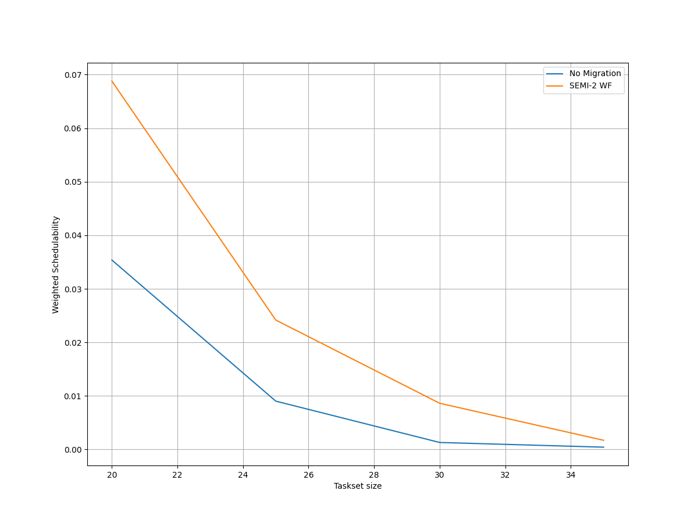
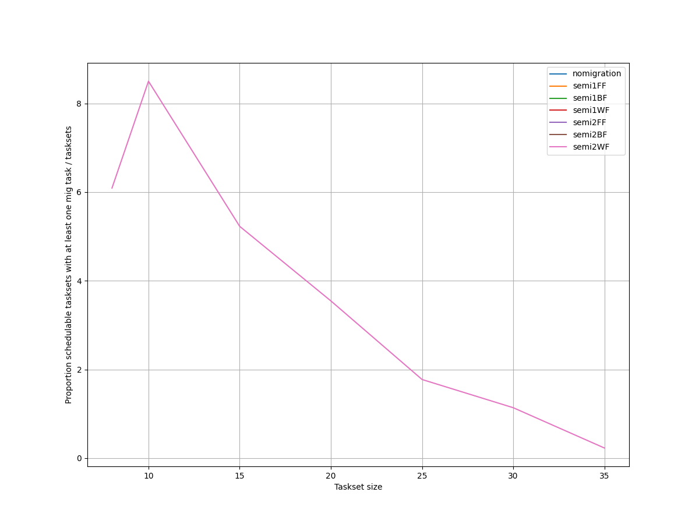
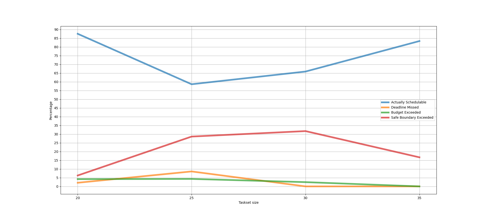
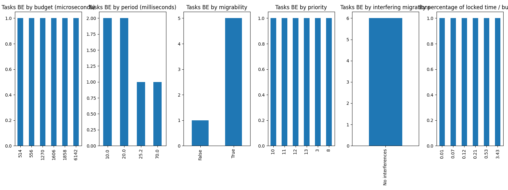
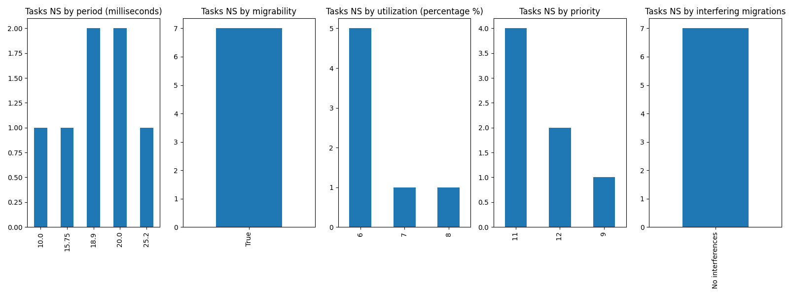
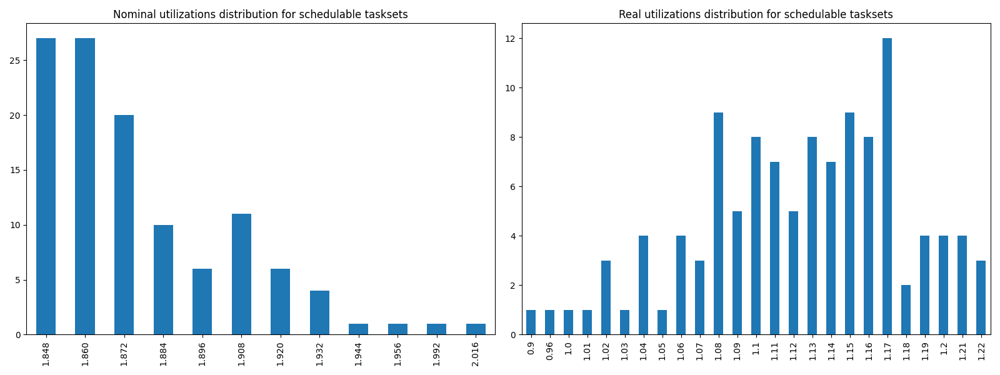
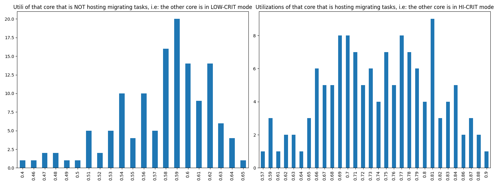

# Report on Experiment 4

## Overall data

   Utilization range = [1.848, 2.1] with step = 0.012

 Taskset sizes = [20, 25, 30, 35]

| Schedulable | Not schedulable | Budget Exceeded | Safe Boundary Exceeded |
| ------ | ------ | ------ | ------ |
| 69.70% | 4.24% | 3.64% | 22.42% |

Number of executions: 165

Schedulable executions: 115/165 = 69.6969696969697 %

_Not_ schedulable executions: 7/165 = 4.242424242424243 %

Budget Exceeded executions: 6/165 = 3.6363636363636362 %

Safe Boundary Exceeded executions: 37/165 = 22.424242424242426 %

NS + BE executions: 13/165 = 7.878787878787878 %

### **Simulations**

#### **Weighted schedulability experiment 4 according to simulations.**

#### **Percentage of (schedulable tasksets with at least one migrating tasks / number of schedulable tasksets) of experiment 4 according to simulations.** 

 

### **Real Executions**

#### **Schedulability for each level**

The tasksets with i) at least one migrating task and ii) marked as schedulable by the RTA are executed on a real target, in order to see how many of them are also schedulable in a real-world scenario. The following graph shows, for each "35" level (x-axis), the percentage of:

   - Actually schedulable tasksets, i.e. those that have all tasks that meet their deadlines;
   - Deadline Missed tasksets, i.e. those in which (at least) a tasks did not meet (at least) one of its deadlines; 
   - Budget Exceeded tasksets, i.e. those in which a criticality-level budget exceeding is detected (LO-crit budget for LO-crit tasks and HI-crit budget for HI-crit tasks). This type of event makes experiment invalid;
   - Safe Boundary Exceeded tasksets, i.e. those in which the number of core executing in HI-crit mode is too high. This type of event makes experiment invalid.

We want to see, thanks to this graphs, how many tasksets remain schedulable in the real-world. The RTA does not take into account overhead time, so we expect that there will be some tasksets that are not actually schedulable.

#### **Tasksets, grouped by differents parameters, with a Budget_Exceeded task.**

With the following graphs, we sum-up the features of the tasks that have occurred in a Criticality-level Budget Exceeded event. Each graph is like a "group-by" SQL operation.
 In the first one, "by budget", we can see, for each _criticality-level budget value_, how many tasks with that criticality-level budget has exceeded it. In the second one, we can see for each _period_ value, how many tasks has exceeded their criticality-level budget.

#### **Tasksets, grouped by differents parameters, with at least one task missing one (or more) of its deadlines.**

With the following graphs, we sum-up the features of the tasks that have missed (at least) one of them deadlines. As the Budget Exceeded graphs, each graph is like a "group-by" SQL operation.

### **Nominal utilizations VS Real utilizations about schedulable tasksets**

| Average real utilizations | Variance real utilizations | Min | Max |
| ------ | ------ | ------ | ------ |
| 1.122 | 0.003 | 0.900 | 1.220 |

### **Utils of the core that will have to accommodate migrating tasks VS Utils of the core when it is actually accomodating them**

These two graphs show the utilizations level of that core $`c_{i}`$ that, sooner or later, will have to accomodate migrating tasks of the other core $`c_{j}`$. The left one, shows the distribution utilizations levels when the core $`c_{i}`$ is **not** accomodating the other core's $`c_{j}`$ migrating tasks, i.e. $`c_{i}`$ and $`c_{j}`$ are both in **LOW-CRIT mode.**
The right one, shows the distribution utilizations levels when the core $`c_{i}`$ **is** accomodating the other core's $`c_{j}`$ migrating tasks, i.e. $`c_{i}`$ in in LO-CRIT mode, while $`c_{j}`$ is in **HIGH-CRIT mode**.

| Average utilizations **not** hosting migs | Variance utilizations **not** hosting migs | Min | Max |
| ------ | ------ | ------ | ------ |
| 0.577 | 0.002 | 0.400 | 0.650 |

| Average utilizations hosting migs | Variance utilizations hosting migs | Min | Max |
| ------ | ------ | ------ | ------ |
| 0.742 | 0.005 | 0.570 | 0.900 |

## Bad tasksets

Click here to expand this section.

### **Not schedulable tasksets**

Click here to expand this section.

Ovvero quando almeno un task non completa entra almeno una sua deadline.

  1. Taskset **e4_semi2wf_t161**

    Taskset execution params:
	 
    "id": "e4_semi2wf_t161",
    "size": "20",
    "utilization": "1.860",
    "realutilization": 1.02,
    "criticality_factor": "2",
    "hicrit_proportion": "0.5"

   
 
Click here to see the deadlines missed tasks list.

   Time values are expressed as **micro-seconds**.

Task:  1

    
    "id": " 1",
    "basecpu": " 1",
    "priority": " 9",
    "period": 15750.0,
    "C(LO)": 824.0,
    "C(HI)": 824.0,
    "criticality": "LOW",
    "migrable": "True",
    "completedruns": " 454",
    "preemptions": " 0",
    "minresponsejitter": " 0.000000000",
    "maxresponsejitter": " 0.000420270",
    "minreleasejitter": " 0.000000000",
    "maxreleasejitter": " 8.119006844",
    "avgresponsejitter": " 0.000378769",
    "deadlinesmissed": " 1",
    "deadlinemissedtargetcore": " 0",
    "deadlinemissedaftermigration": " 0",
    "budgetexceeded": " 0",
    "budgetexceededtargetcore": " 0",
    "budgetexceededaftermigration": " 0",
    "timesmigrated": " 2",
    "timesrestored": " 1",
    "timesonc1": " 450",
    "timesonc2": " 2",
    "lockedtime": " 0.000006393"

   

   
 
Click here to see the CPUs log.

   Idle time is expressed as **seconds**.

   Util values are expressed as **percentage** %.

   CPU: 1

    
    "id": 1,
    "hyperperiod": 113400000,
    "lowtohigh": " 53",
    "hightolow": " 53",
    "idletime": 64970986,
    "util": 42.70636155202821,
    "idletimeduringhostingmig": 0,
    "utilduringhostingmig": null

   CPU: 2

    
    "id": 2,
    "hyperperiod": 113400000,
    "lowtohigh": " 0",
    "hightolow": " 0",
    "idletime": 46247414,
    "util": 59.217447971781304,
    "idletimeduringhostingmig": 61829,
    "utilduringhostingmig": 86.1353790127997

   Real Utilization: 1.02
   

   
 
Click here to see the whole tasksets.

   Time values are expressed as **micro-seconds**.

   Task:  15

    
    "id": " 15",
    "basecpu": " 1",
    "priority": " 2",
    "period": 141750.0,
    "C(LO)": 11868.0,
    "C(HI)": 23737.0,
    "criticality": "HIGH",
    "migrable": "False",
    "completedruns": " 801",
    "preemptions": " 481",
    "minresponsejitter": " 0.000000000",
    "maxresponsejitter": " 0.042138069",
    "minreleasejitter": " 0.000000000",
    "maxreleasejitter": " 114.269794345",
    "avgresponsejitter": " 0.013178426",
    "deadlinesmissed": " 0",
    "deadlinemissedtargetcore": " 0",
    "deadlinemissedaftermigration": " 0",
    "budgetexceeded": " 6",
    "budgetexceededtargetcore": " 0",
    "budgetexceededaftermigration": " 0",
    "timesmigrated": " 0",
    "timesrestored": " 0",
    "timesonc1": " 1287",
    "timesonc2": " 0",
    "lockedtime": " 0.000021541"

   Task:  19

    
    "id": " 19",
    "basecpu": " 1",
    "priority": " 0",
    "period": 181440.0,
    "C(LO)": 9568.0,
    "C(HI)": 19136.0,
    "criticality": "HIGH",
    "migrable": "False",
    "completedruns": " 626",
    "preemptions": " 313",
    "minresponsejitter": " 0.000000000",
    "maxresponsejitter": " 0.033559162",
    "minreleasejitter": " 0.000000000",
    "maxreleasejitter": " 114.220723838",
    "avgresponsejitter": " 0.010936228",
    "deadlinesmissed": " 0",
    "deadlinemissedtargetcore": " 0",
    "deadlinemissedaftermigration": " 0",
    "budgetexceeded": " 9",
    "budgetexceededtargetcore": " 0",
    "budgetexceededaftermigration": " 0",
    "timesmigrated": " 0",
    "timesrestored": " 0",
    "timesonc1": " 947",
    "timesonc2": " 0",
    "lockedtime": " 0.000027273"

   Task:  18

    
    "id": " 18",
    "basecpu": " 1",
    "priority": " 1",
    "period": 162000.0,
    "C(LO)": 6452.0,
    "C(HI)": 12905.0,
    "criticality": "HIGH",
    "migrable": "False",
    "completedruns": " 701",
    "preemptions": " 183",
    "minresponsejitter": " 0.000000000",
    "maxresponsejitter": " 0.039468961",
    "minreleasejitter": " 0.000000000",
    "maxreleasejitter": " 114.238006291",
    "avgresponsejitter": " 0.006530535",
    "deadlinesmissed": " 0",
    "deadlinemissedtargetcore": " 0",
    "deadlinemissedaftermigration": " 0",
    "budgetexceeded": " 11",
    "budgetexceededtargetcore": " 0",
    "budgetexceededaftermigration": " 0",
    "timesmigrated": " 0",
    "timesrestored": " 0",
    "timesonc1": " 894",
    "timesonc2": " 0",
    "lockedtime": " 0.000023997"

   Task:  11

    
    "id": " 11",
    "basecpu": " 1",
    "priority": " 4",
    "period": 84375.0,
    "C(LO)": 2943.0,
    "C(HI)": 5887.0,
    "criticality": "HIGH",
    "migrable": "False",
    "completedruns": " 1345",
    "preemptions": " 120",
    "minresponsejitter": " 0.000000000",
    "maxresponsejitter": " 0.023343045",
    "minreleasejitter": " 0.000000000",
    "maxreleasejitter": " 114.315631240",
    "avgresponsejitter": " 0.002923057",
    "deadlinesmissed": " 0",
    "deadlinemissedtargetcore": " 0",
    "deadlinemissedaftermigration": " 0",
    "budgetexceeded": " 17",
    "budgetexceededtargetcore": " 0",
    "budgetexceededaftermigration": " 0",
    "timesmigrated": " 0",
    "timesrestored": " 0",
    "timesonc1": " 1481",
    "timesonc2": " 0",
    "lockedtime": " 0.000006967"

   Task:  14

    
    "id": " 14",
    "basecpu": " 1",
    "priority": " 3",
    "period": 135000.0,
    "C(LO)": 3738.0,
    "C(HI)": 7477.0,
    "criticality": "HIGH",
    "migrable": "False",
    "completedruns": " 841",
    "preemptions": " 97",
    "minresponsejitter": " 0.000000000",
    "maxresponsejitter": " 0.017965288",
    "minreleasejitter": " 0.000000000",
    "maxreleasejitter": " 114.266729411",
    "avgresponsejitter": " 0.003610129",
    "deadlinesmissed": " 0",
    "deadlinemissedtargetcore": " 0",
    "deadlinemissedaftermigration": " 0",
    "budgetexceeded": " 10",
    "budgetexceededtargetcore": " 0",
    "budgetexceededaftermigration": " 0",
    "timesmigrated": " 0",
    "timesrestored": " 0",
    "timesonc1": " 947",
    "timesonc2": " 0",
    "lockedtime": " 0.000022333"

   Task:  3

    
    "id": " 3",
    "basecpu": " 1",
    "priority": " 8",
    "period": 37800.0,
    "C(LO)": 5994.0,
    "C(HI)": 5994.0,
    "criticality": "LOW",
    "migrable": "True",
    "completedruns": " 430",
    "preemptions": " 0",
    "minresponsejitter": " 0.000000000",
    "maxresponsejitter": " 0.003040931",
    "minreleasejitter": " 0.000000000",
    "maxreleasejitter": " 17.178407150",
    "avgresponsejitter": " 0.002742679",
    "deadlinesmissed": " 0",
    "deadlinemissedtargetcore": " 0",
    "deadlinemissedaftermigration": " 0",
    "budgetexceeded": " 0",
    "budgetexceededtargetcore": " 0",
    "budgetexceededaftermigration": " 0",
    "timesmigrated": " 2",
    "timesrestored": " 1",
    "timesonc1": " 428",
    "timesonc2": " 1",
    "lockedtime": " 0.000004673"

   Task:  16

    
    "id": " 16",
    "basecpu": " 1",
    "priority": " 5",
    "period": 151200.0,
    "C(LO)": 13805.0,
    "C(HI)": 13805.0,
    "criticality": "LOW",
    "migrable": "False",
    "completedruns": " 751",
    "preemptions": " 280",
    "minresponsejitter": " 0.000000000",
    "maxresponsejitter": " 0.018898084",
    "minreleasejitter": " 0.000000000",
    "maxreleasejitter": " 114.248806168",
    "avgresponsejitter": " 0.013089772",
    "deadlinesmissed": " 0",
    "deadlinemissedtargetcore": " 0",
    "deadlinemissedaftermigration": " 0",
    "budgetexceeded": " 0",
    "budgetexceededtargetcore": " 0",
    "budgetexceededaftermigration": " 0",
    "timesmigrated": " 0",
    "timesrestored": " 0",
    "timesonc1": " 1030",
    "timesonc2": " 0",
    "lockedtime": " 0.000054093"

   Task:  7

    
    "id": " 7",
    "basecpu": " 1",
    "priority": " 6",
    "period": 50000.0,
    "C(LO)": 4450.0,
    "C(HI)": 4450.0,
    "criticality": "LOW",
    "migrable": "False",
    "completedruns": " 2269",
    "preemptions": " 256",
    "minresponsejitter": " 0.000000000",
    "maxresponsejitter": " 0.009720748",
    "minreleasejitter": " 0.000000000",
    "maxreleasejitter": " 114.350006237",
    "avgresponsejitter": " 0.004072688",
    "deadlinesmissed": " 0",
    "deadlinemissedtargetcore": " 0",
    "deadlinemissedaftermigration": " 0",
    "budgetexceeded": " 0",
    "budgetexceededtargetcore": " 0",
    "budgetexceededaftermigration": " 0",
    "timesmigrated": " 0",
    "timesrestored": " 0",
    "timesonc1": " 2524",
    "timesonc2": " 0",
    "lockedtime": " 0.000050541"

   Task:  6

    
    "id": " 6",
    "basecpu": " 1",
    "priority": " 7",
    "period": 45360.0,
    "C(LO)": 2640.0,
    "C(HI)": 2640.0,
    "criticality": "LOW",
    "migrable": "False",
    "completedruns": " 2501",
    "preemptions": " 26",
    "minresponsejitter": " 0.000000000",
    "maxresponsejitter": " 0.002835679",
    "minreleasejitter": " 0.000000000",
    "maxreleasejitter": " 114.354646063",
    "avgresponsejitter": " 0.002275979",
    "deadlinesmissed": " 0",
    "deadlinemissedtargetcore": " 0",
    "deadlinemissedaftermigration": " 0",
    "budgetexceeded": " 0",
    "budgetexceededtargetcore": " 0",
    "budgetexceededaftermigration": " 0",
    "timesmigrated": " 0",
    "timesrestored": " 0",
    "timesonc1": " 2526",
    "timesonc2": " 0",
    "lockedtime": " 0.000027477"

   Task:  1

    
    "id": " 1",
    "basecpu": " 1",
    "priority": " 9",
    "period": 15750.0,
    "C(LO)": 824.0,
    "C(HI)": 824.0,
    "criticality": "LOW",
    "migrable": "True",
    "completedruns": " 454",
    "preemptions": " 0",
    "minresponsejitter": " 0.000000000",
    "maxresponsejitter": " 0.000420270",
    "minreleasejitter": " 0.000000000",
    "maxreleasejitter": " 8.119006844",
    "avgresponsejitter": " 0.000378769",
    "deadlinesmissed": " 1",
    "deadlinemissedtargetcore": " 0",
    "deadlinemissedaftermigration": " 0",
    "budgetexceeded": " 0",
    "budgetexceededtargetcore": " 0",
    "budgetexceededaftermigration": " 0",
    "timesmigrated": " 2",
    "timesrestored": " 1",
    "timesonc1": " 450",
    "timesonc2": " 2",
    "lockedtime": " 0.000006393"

   Task:  20

    
    "id": " 20",
    "basecpu": " 2",
    "priority": " 0",
    "period": 506250.0,
    "C(LO)": 52565.0,
    "C(HI)": 105131.0,
    "criticality": "HIGH",
    "migrable": "False",
    "completedruns": " 225",
    "preemptions": " 1273",
    "minresponsejitter": " 0.000000000",
    "maxresponsejitter": " 0.115985009",
    "minreleasejitter": " 0.000000000",
    "maxreleasejitter": " 113.893756225",
    "avgresponsejitter": " 0.086778871",
    "deadlinesmissed": " 0",
    "deadlinemissedtargetcore": " 0",
    "deadlinemissedaftermigration": " 0",
    "budgetexceeded": " 0",
    "budgetexceededtargetcore": " 0",
    "budgetexceededaftermigration": " 0",
    "timesmigrated": " 0",
    "timesrestored": " 0",
    "timesonc1": " 0",
    "timesonc2": " 1497",
    "lockedtime": " 0.000066102"

   Task:  5

    
    "id": " 5",
    "basecpu": " 2",
    "priority": " 4",
    "period": 45000.0,
    "C(LO)": 2207.0,
    "C(HI)": 4414.0,
    "criticality": "HIGH",
    "migrable": "False",
    "completedruns": " 2521",
    "preemptions": " 27",
    "minresponsejitter": " 0.000000000",
    "maxresponsejitter": " 0.011527574",
    "minreleasejitter": " 0.000000000",
    "maxreleasejitter": " 114.355005964",
    "avgresponsejitter": " 0.001972441",
    "deadlinesmissed": " 0",
    "deadlinemissedtargetcore": " 0",
    "deadlinemissedaftermigration": " 0",
    "budgetexceeded": " 0",
    "budgetexceededtargetcore": " 0",
    "budgetexceededaftermigration": " 0",
    "timesmigrated": " 0",
    "timesrestored": " 0",
    "timesonc1": " 0",
    "timesonc2": " 2547",
    "lockedtime": " 0.000030303"

   Task:  17

    
    "id": " 17",
    "basecpu": " 2",
    "priority": " 1",
    "period": 157500.0,
    "C(LO)": 5802.0,
    "C(HI)": 11605.0,
    "criticality": "HIGH",
    "migrable": "False",
    "completedruns": " 721",
    "preemptions": " 122",
    "minresponsejitter": " 0.000000000",
    "maxresponsejitter": " 0.026433910",
    "minreleasejitter": " 0.000000000",
    "maxreleasejitter": " 114.247972378",
    "avgresponsejitter": " 0.006383940",
    "deadlinesmissed": " 0",
    "deadlinemissedtargetcore": " 0",
    "deadlinemissedaftermigration": " 0",
    "budgetexceeded": " 0",
    "budgetexceededtargetcore": " 0",
    "budgetexceededaftermigration": " 0",
    "timesmigrated": " 0",
    "timesrestored": " 0",
    "timesonc1": " 0",
    "timesonc2": " 842",
    "lockedtime": " 0.000013901"

   Task:  8

    
    "id": " 8",
    "basecpu": " 2",
    "priority": " 3",
    "period": 70000.0,
    "C(LO)": 2183.0,
    "C(HI)": 4367.0,
    "criticality": "HIGH",
    "migrable": "False",
    "completedruns": " 1621",
    "preemptions": " 46",
    "minresponsejitter": " 0.000000000",
    "maxresponsejitter": " 0.011045511",
    "minreleasejitter": " 0.000000000",
    "maxreleasejitter": " 114.334254904",
    "avgresponsejitter": " 0.001998204",
    "deadlinesmissed": " 0",
    "deadlinemissedtargetcore": " 0",
    "deadlinemissedaftermigration": " 0",
    "budgetexceeded": " 0",
    "budgetexceededtargetcore": " 0",
    "budgetexceededaftermigration": " 0",
    "timesmigrated": " 0",
    "timesrestored": " 0",
    "timesonc1": " 0",
    "timesonc2": " 1666",
    "lockedtime": " 0.000008153"

   Task:  13

    
    "id": " 13",
    "basecpu": " 2",
    "priority": " 2",
    "period": 129600.0,
    "C(LO)": 3295.0,
    "C(HI)": 6591.0,
    "criticality": "HIGH",
    "migrable": "False",
    "completedruns": " 876",
    "preemptions": " 196",
    "minresponsejitter": " 0.000000000",
    "maxresponsejitter": " 0.027121721",
    "minreleasejitter": " 0.000000000",
    "maxreleasejitter": " 114.270405943",
    "avgresponsejitter": " 0.004124691",
    "deadlinesmissed": " 0",
    "deadlinemissedtargetcore": " 0",
    "deadlinemissedaftermigration": " 0",
    "budgetexceeded": " 0",
    "budgetexceededtargetcore": " 0",
    "budgetexceededaftermigration": " 0",
    "timesmigrated": " 0",
    "timesrestored": " 0",
    "timesonc1": " 0",
    "timesonc2": " 1071",
    "lockedtime": " 0.000012709"

   Task:  4

    
    "id": " 4",
    "basecpu": " 2",
    "priority": " 8",
    "period": 42000.0,
    "C(LO)": 4858.0,
    "C(HI)": 4858.0,
    "criticality": "LOW",
    "migrable": "False",
    "completedruns": " 2701",
    "preemptions": " 0",
    "minresponsejitter": " 0.000000000",
    "maxresponsejitter": " 0.004435538",
    "minreleasejitter": " 0.000000000",
    "maxreleasejitter": " 114.358005841",
    "avgresponsejitter": " 0.004180925",
    "deadlinesmissed": " 0",
    "deadlinemissedtargetcore": " 0",
    "deadlinemissedaftermigration": " 0",
    "budgetexceeded": " 0",
    "budgetexceededtargetcore": " 0",
    "budgetexceededaftermigration": " 0",
    "timesmigrated": " 0",
    "timesrestored": " 0",
    "timesonc1": " 0",
    "timesonc2": " 2700",
    "lockedtime": " 0.000041883"

   Task:  9

    
    "id": " 9",
    "basecpu": " 2",
    "priority": " 7",
    "period": 81000.0,
    "C(LO)": 8043.0,
    "C(HI)": 8043.0,
    "criticality": "LOW",
    "migrable": "False",
    "completedruns": " 1401",
    "preemptions": " 472",
    "minresponsejitter": " 0.000000000",
    "maxresponsejitter": " 0.014366835",
    "minreleasejitter": " 0.000000000",
    "maxreleasejitter": " 114.320048709",
    "avgresponsejitter": " 0.008140111",
    "deadlinesmissed": " 0",
    "deadlinemissedtargetcore": " 0",
    "deadlinemissedaftermigration": " 0",
    "budgetexceeded": " 0",
    "budgetexceededtargetcore": " 0",
    "budgetexceededaftermigration": " 0",
    "timesmigrated": " 0",
    "timesrestored": " 0",
    "timesonc1": " 0",
    "timesonc2": " 1872",
    "lockedtime": " 0.000040117"

   Task:  2

    
    "id": " 2",
    "basecpu": " 2",
    "priority": " 9",
    "period": 35000.0,
    "C(LO)": 3149.0,
    "C(HI)": 3149.0,
    "criticality": "LOW",
    "migrable": "False",
    "completedruns": " 3241",
    "preemptions": " 0",
    "minresponsejitter": " 0.000000000",
    "maxresponsejitter": " 0.002879150",
    "minreleasejitter": " 0.000000000",
    "maxreleasejitter": " 114.365005847",
    "avgresponsejitter": " 0.002706222",
    "deadlinesmissed": " 0",
    "deadlinemissedtargetcore": " 0",
    "deadlinemissedaftermigration": " 0",
    "budgetexceeded": " 0",
    "budgetexceededtargetcore": " 0",
    "budgetexceededaftermigration": " 0",
    "timesmigrated": " 0",
    "timesrestored": " 0",
    "timesonc1": " 0",
    "timesonc2": " 3240",
    "lockedtime": " 0.000029838"

   Task:  10

    
    "id": " 10",
    "basecpu": " 2",
    "priority": " 6",
    "period": 84000.0,
    "C(LO)": 5806.0,
    "C(HI)": 5806.0,
    "criticality": "LOW",
    "migrable": "False",
    "completedruns": " 1351",
    "preemptions": " 338",
    "minresponsejitter": " 0.000000000",
    "maxresponsejitter": " 0.015341279",
    "minreleasejitter": " 0.000000000",
    "maxreleasejitter": " 114.326889970",
    "avgresponsejitter": " 0.006009964",
    "deadlinesmissed": " 0",
    "deadlinemissedtargetcore": " 0",
    "deadlinemissedaftermigration": " 0",
    "budgetexceeded": " 0",
    "budgetexceededtargetcore": " 0",
    "budgetexceededaftermigration": " 0",
    "timesmigrated": " 0",
    "timesrestored": " 0",
    "timesonc1": " 0",
    "timesonc2": " 1688",
    "lockedtime": " 0.000040144"

   Task:  12

    
    "id": " 12",
    "basecpu": " 2",
    "priority": " 5",
    "period": 105000.0,
    "C(LO)": 6925.0,
    "C(HI)": 6925.0,
    "criticality": "LOW",
    "migrable": "False",
    "completedruns": " 1081",
    "preemptions": " 86",
    "minresponsejitter": " 0.000000000",
    "maxresponsejitter": " 0.013389517",
    "minreleasejitter": " 0.000000000",
    "maxreleasejitter": " 114.297661123",
    "avgresponsejitter": " 0.006505297",
    "deadlinesmissed": " 0",
    "deadlinemissedtargetcore": " 0",
    "deadlinemissedaftermigration": " 0",
    "budgetexceeded": " 0",
    "budgetexceededtargetcore": " 0",
    "budgetexceededaftermigration": " 0",
    "timesmigrated": " 0",
    "timesrestored": " 0",
    "timesonc1": " 0",
    "timesonc2": " 1166",
    "lockedtime": " 0.000031901"

   

  2. Taskset **e4_semi2wf_t2218_v1**

    Taskset execution params:
	 
    "id": "e4_semi2wf_t2218_v1",
    "size": "25",
    "utilization": "1.848",
    "realutilization": 1.15,
    "criticality_factor": "2",
    "hicrit_proportion": "0.5"

   
 
Click here to see the deadlines missed tasks list.

   Time values are expressed as **micro-seconds**.

Task:  2

    
    "id": " 2",
    "basecpu": " 1",
    "priority": " 12",
    "period": 20000.0,
    "C(LO)": 1039.0,
    "C(HI)": 1039.0,
    "criticality": "LOW",
    "migrable": "True",
    "completedruns": " 572",
    "preemptions": " 0",
    "minresponsejitter": " 0.000000000",
    "maxresponsejitter": " 0.000534667",
    "minreleasejitter": " 0.000000000",
    "maxreleasejitter": " 12.400008315",
    "avgresponsejitter": " 0.000481219",
    "deadlinesmissed": " 1",
    "deadlinemissedtargetcore": " 0",
    "deadlinemissedaftermigration": " 0",
    "budgetexceeded": " 0",
    "budgetexceededtargetcore": " 0",
    "budgetexceededaftermigration": " 0",
    "timesmigrated": " 5",
    "timesrestored": " 5",
    "timesonc1": " 564",
    "timesonc2": " 6",
    "lockedtime": " 0.000024303"

   

   
 
Click here to see the CPUs log.

   Idle time is expressed as **seconds**.

   Util values are expressed as **percentage** %.

   CPU: 1

    
    "id": 1,
    "hyperperiod": 113400000,
    "lowtohigh": " 71",
    "hightolow": " 71",
    "idletime": 47470067,
    "util": 58.13927072310406,
    "idletimeduringhostingmig": 0,
    "utilduringhostingmig": null

   CPU: 2

    
    "id": 2,
    "hyperperiod": 113400000,
    "lowtohigh": " 0",
    "hightolow": " 0",
    "idletime": 48526517,
    "util": 57.2076569664903,
    "idletimeduringhostingmig": 323334,
    "utilduringhostingmig": 66.7236822605345

   Real Utilization: 1.15
   

   
 
Click here to see the whole tasksets.

   Time values are expressed as **micro-seconds**.

   Task:  9

    
    "id": " 9",
    "basecpu": " 1",
    "priority": " 6",
    "period": 50000.0,
    "C(LO)": 2518.0,
    "C(HI)": 5037.0,
    "criticality": "HIGH",
    "migrable": "False",
    "completedruns": " 2269",
    "preemptions": " 172",
    "minresponsejitter": " 0.000000000",
    "maxresponsejitter": " 0.029554372",
    "minreleasejitter": " 0.000000000",
    "maxreleasejitter": " 114.350006892",
    "avgresponsejitter": " 0.002580300",
    "deadlinesmissed": " 0",
    "deadlinemissedtargetcore": " 0",
    "deadlinemissedaftermigration": " 0",
    "budgetexceeded": " 28",
    "budgetexceededtargetcore": " 0",
    "budgetexceededaftermigration": " 0",
    "timesmigrated": " 0",
    "timesrestored": " 0",
    "timesonc1": " 2468",
    "timesonc2": " 0",
    "lockedtime": " 0.000089814"

   Task:  22

    
    "id": " 22",
    "basecpu": " 1",
    "priority": " 2",
    "period": 196875.0,
    "C(LO)": 9178.0,
    "C(HI)": 18356.0,
    "criticality": "HIGH",
    "migrable": "False",
    "completedruns": " 577",
    "preemptions": " 404",
    "minresponsejitter": " 0.000000000",
    "maxresponsejitter": " 0.042014931",
    "minreleasejitter": " 0.000000000",
    "maxreleasejitter": " 114.204154583",
    "avgresponsejitter": " 0.012566706",
    "deadlinesmissed": " 0",
    "deadlinemissedtargetcore": " 0",
    "deadlinemissedaftermigration": " 0",
    "budgetexceeded": " 9",
    "budgetexceededtargetcore": " 0",
    "budgetexceededaftermigration": " 0",
    "timesmigrated": " 0",
    "timesrestored": " 0",
    "timesonc1": " 989",
    "timesonc2": " 0",
    "lockedtime": " 0.000057817"

   Task:  25

    
    "id": " 25",
    "basecpu": " 1",
    "priority": " 0",
    "period": 700000.0,
    "C(LO)": 25630.0,
    "C(HI)": 51260.0,
    "criticality": "HIGH",
    "migrable": "False",
    "completedruns": " 163",
    "preemptions": " 394",
    "minresponsejitter": " 0.000000000",
    "maxresponsejitter": " 0.108826835",
    "minreleasejitter": " 0.000000000",
    "maxreleasejitter": " 113.708821219",
    "avgresponsejitter": " 0.038310922",
    "deadlinesmissed": " 0",
    "deadlinemissedtargetcore": " 0",
    "deadlinemissedaftermigration": " 0",
    "budgetexceeded": " 2",
    "budgetexceededtargetcore": " 0",
    "budgetexceededaftermigration": " 0",
    "timesmigrated": " 0",
    "timesrestored": " 0",
    "timesonc1": " 558",
    "timesonc2": " 0",
    "lockedtime": " 0.000049991"

   Task:  16

    
    "id": " 16",
    "basecpu": " 1",
    "priority": " 3",
    "period": 113400.0,
    "C(LO)": 4048.0000000000005,
    "C(HI)": 8096.000000000001,
    "criticality": "HIGH",
    "migrable": "False",
    "completedruns": " 1001",
    "preemptions": " 263",
    "minresponsejitter": " 0.000000000",
    "maxresponsejitter": " 0.036747508",
    "minreleasejitter": " 0.000000000",
    "maxreleasejitter": " 114.286606871",
    "avgresponsejitter": " 0.005205832",
    "deadlinesmissed": " 0",
    "deadlinemissedtargetcore": " 0",
    "deadlinemissedaftermigration": " 0",
    "budgetexceeded": " 12",
    "budgetexceededtargetcore": " 0",
    "budgetexceededaftermigration": " 0",
    "timesmigrated": " 0",
    "timesrestored": " 0",
    "timesonc1": " 1275",
    "timesonc2": " 0",
    "lockedtime": " 0.000044919"

   Task:  14

    
    "id": " 14",
    "basecpu": " 1",
    "priority": " 4",
    "period": 75000.0,
    "C(LO)": 2533.0,
    "C(HI)": 5066.0,
    "criticality": "HIGH",
    "migrable": "False",
    "completedruns": " 1513",
    "preemptions": " 156",
    "minresponsejitter": " 0.000000000",
    "maxresponsejitter": " 0.018195432",
    "minreleasejitter": " 0.000000000",
    "maxreleasejitter": " 114.325006213",
    "avgresponsejitter": " 0.002665273",
    "deadlinesmissed": " 0",
    "deadlinemissedtargetcore": " 0",
    "deadlinemissedaftermigration": " 0",
    "budgetexceeded": " 18",
    "budgetexceededtargetcore": " 0",
    "budgetexceededaftermigration": " 0",
    "timesmigrated": " 0",
    "timesrestored": " 0",
    "timesonc1": " 1686",
    "timesonc2": " 0",
    "lockedtime": " 0.000017664"

   Task:  24

    
    "id": " 24",
    "basecpu": " 1",
    "priority": " 1",
    "period": 630000.0,
    "C(LO)": 18927.0,
    "C(HI)": 37855.0,
    "criticality": "HIGH",
    "migrable": "False",
    "completedruns": " 181",
    "preemptions": " 316",
    "minresponsejitter": " 0.000000000",
    "maxresponsejitter": " 0.055566526",
    "minreleasejitter": " 0.000000000",
    "maxreleasejitter": " 113.782122535",
    "avgresponsejitter": " 0.025933883",
    "deadlinesmissed": " 0",
    "deadlinemissedtargetcore": " 0",
    "deadlinemissedaftermigration": " 0",
    "budgetexceeded": " 2",
    "budgetexceededtargetcore": " 0",
    "budgetexceededaftermigration": " 0",
    "timesmigrated": " 0",
    "timesrestored": " 0",
    "timesonc1": " 498",
    "timesonc2": " 0",
    "lockedtime": " 0.000033471"

   Task:  12

    
    "id": " 12",
    "basecpu": " 1",
    "priority": " 10",
    "period": 70000.0,
    "C(LO)": 7687.0,
    "C(HI)": 7687.0,
    "criticality": "LOW",
    "migrable": "False",
    "completedruns": " 1621",
    "preemptions": " 184",
    "minresponsejitter": " 0.000000000",
    "maxresponsejitter": " 0.009829399",
    "minreleasejitter": " 0.000000000",
    "maxreleasejitter": " 114.330006754",
    "avgresponsejitter": " 0.006932889",
    "deadlinesmissed": " 0",
    "deadlinemissedtargetcore": " 0",
    "deadlinemissedaftermigration": " 0",
    "budgetexceeded": " 0",
    "budgetexceededtargetcore": " 0",
    "budgetexceededaftermigration": " 0",
    "timesmigrated": " 0",
    "timesrestored": " 0",
    "timesonc1": " 1804",
    "timesonc2": " 0",
    "lockedtime": " 0.000122060"

   Task:  20

    
    "id": " 20",
    "basecpu": " 1",
    "priority": " 5",
    "period": 180000.0,
    "C(LO)": 13957.0,
    "C(HI)": 13957.0,
    "criticality": "LOW",
    "migrable": "False",
    "completedruns": " 631",
    "preemptions": " 438",
    "minresponsejitter": " 0.000000000",
    "maxresponsejitter": " 0.028643279",
    "minreleasejitter": " 0.000000000",
    "maxreleasejitter": " 114.220006919",
    "avgresponsejitter": " 0.015612399",
    "deadlinesmissed": " 0",
    "deadlinemissedtargetcore": " 0",
    "deadlinemissedaftermigration": " 0",
    "budgetexceeded": " 0",
    "budgetexceededtargetcore": " 0",
    "budgetexceededaftermigration": " 0",
    "timesmigrated": " 0",
    "timesrestored": " 0",
    "timesonc1": " 1068",
    "timesonc2": " 0",
    "lockedtime": " 0.000085673"

   Task:  8

    
    "id": " 8",
    "basecpu": " 1",
    "priority": " 11",
    "period": 47250.0,
    "C(LO)": 3215.0,
    "C(HI)": 3215.0,
    "criticality": "LOW",
    "migrable": "False",
    "completedruns": " 2401",
    "preemptions": " 32",
    "minresponsejitter": " 0.000000000",
    "maxresponsejitter": " 0.003402826",
    "minreleasejitter": " 0.000000000",
    "maxreleasejitter": " 114.352756198",
    "avgresponsejitter": " 0.002775201",
    "deadlinesmissed": " 0",
    "deadlinemissedtargetcore": " 0",
    "deadlinemissedaftermigration": " 0",
    "budgetexceeded": " 0",
    "budgetexceededtargetcore": " 0",
    "budgetexceededaftermigration": " 0",
    "timesmigrated": " 0",
    "timesrestored": " 0",
    "timesonc1": " 2432",
    "timesonc2": " 0",
    "lockedtime": " 0.000097267"

   Task:  13

    
    "id": " 13",
    "basecpu": " 1",
    "priority": " 9",
    "period": 72000.0,
    "C(LO)": 4729.0,
    "C(HI)": 4729.0,
    "criticality": "LOW",
    "migrable": "False",
    "completedruns": " 1576",
    "preemptions": " 208",
    "minresponsejitter": " 0.000000000",
    "maxresponsejitter": " 0.014460162",
    "minreleasejitter": " 0.000000000",
    "maxreleasejitter": " 114.328006051",
    "avgresponsejitter": " 0.004636267",
    "deadlinesmissed": " 0",
    "deadlinemissedtargetcore": " 0",
    "deadlinemissedaftermigration": " 0",
    "budgetexceeded": " 0",
    "budgetexceededtargetcore": " 0",
    "budgetexceededaftermigration": " 0",
    "timesmigrated": " 0",
    "timesrestored": " 0",
    "timesonc1": " 1783",
    "timesonc2": " 0",
    "lockedtime": " 0.000076847"

   Task:  15

    
    "id": " 15",
    "basecpu": " 1",
    "priority": " 8",
    "period": 105000.0,
    "C(LO)": 6281.0,
    "C(HI)": 6281.0,
    "criticality": "LOW",
    "migrable": "False",
    "completedruns": " 1081",
    "preemptions": " 228",
    "minresponsejitter": " 0.000000000",
    "maxresponsejitter": " 0.012764700",
    "minreleasejitter": " 0.000000000",
    "maxreleasejitter": " 114.295006411",
    "avgresponsejitter": " 0.006014129",
    "deadlinesmissed": " 0",
    "deadlinemissedtargetcore": " 0",
    "deadlinemissedaftermigration": " 0",
    "budgetexceeded": " 0",
    "budgetexceededtargetcore": " 0",
    "budgetexceededaftermigration": " 0",
    "timesmigrated": " 0",
    "timesrestored": " 0",
    "timesonc1": " 1308",
    "timesonc2": " 0",
    "lockedtime": " 0.000078784"

   Task:  17

    
    "id": " 17",
    "basecpu": " 1",
    "priority": " 7",
    "period": 151200.0,
    "C(LO)": 8137.999999999999,
    "C(HI)": 8137.999999999999,
    "criticality": "LOW",
    "migrable": "False",
    "completedruns": " 751",
    "preemptions": " 168",
    "minresponsejitter": " 0.000000000",
    "maxresponsejitter": " 0.021244078",
    "minreleasejitter": " 0.000000000",
    "maxreleasejitter": " 114.248806354",
    "avgresponsejitter": " 0.008363907",
    "deadlinesmissed": " 0",
    "deadlinemissedtargetcore": " 0",
    "deadlinemissedaftermigration": " 0",
    "budgetexceeded": " 0",
    "budgetexceededtargetcore": " 0",
    "budgetexceededaftermigration": " 0",
    "timesmigrated": " 0",
    "timesrestored": " 0",
    "timesonc1": " 918",
    "timesonc2": " 0",
    "lockedtime": " 0.000053072"

   Task:  2

    
    "id": " 2",
    "basecpu": " 1",
    "priority": " 12",
    "period": 20000.0,
    "C(LO)": 1039.0,
    "C(HI)": 1039.0,
    "criticality": "LOW",
    "migrable": "True",
    "completedruns": " 572",
    "preemptions": " 0",
    "minresponsejitter": " 0.000000000",
    "maxresponsejitter": " 0.000534667",
    "minreleasejitter": " 0.000000000",
    "maxreleasejitter": " 12.400008315",
    "avgresponsejitter": " 0.000481219",
    "deadlinesmissed": " 1",
    "deadlinemissedtargetcore": " 0",
    "deadlinemissedaftermigration": " 0",
    "budgetexceeded": " 0",
    "budgetexceededtargetcore": " 0",
    "budgetexceededaftermigration": " 0",
    "timesmigrated": " 5",
    "timesrestored": " 5",
    "timesonc1": " 564",
    "timesonc2": " 6",
    "lockedtime": " 0.000024303"

   Task:  19

    
    "id": " 19",
    "basecpu": " 2",
    "priority": " 1",
    "period": 168000.0,
    "C(LO)": 11914.0,
    "C(HI)": 23829.0,
    "criticality": "HIGH",
    "migrable": "False",
    "completedruns": " 676",
    "preemptions": " 1769",
    "minresponsejitter": " 0.000000000",
    "maxresponsejitter": " 0.034845438",
    "minreleasejitter": " 0.000000000",
    "maxreleasejitter": " 114.236691589",
    "avgresponsejitter": " 0.015922423",
    "deadlinesmissed": " 0",
    "deadlinemissedtargetcore": " 0",
    "deadlinemissedaftermigration": " 0",
    "budgetexceeded": " 0",
    "budgetexceededtargetcore": " 0",
    "budgetexceededaftermigration": " 0",
    "timesmigrated": " 0",
    "timesrestored": " 0",
    "timesonc1": " 0",
    "timesonc2": " 2444",
    "lockedtime": " 0.000082640"

   Task:  4

    
    "id": " 4",
    "basecpu": " 2",
    "priority": " 5",
    "period": 28350.0,
    "C(LO)": 1041.0,
    "C(HI)": 2082.0,
    "criticality": "HIGH",
    "migrable": "False",
    "completedruns": " 4001",
    "preemptions": " 528",
    "minresponsejitter": " 0.000000000",
    "maxresponsejitter": " 0.010267474",
    "minreleasejitter": " 0.000000000",
    "maxreleasejitter": " 114.371655922",
    "avgresponsejitter": " 0.000997877",
    "deadlinesmissed": " 0",
    "deadlinemissedtargetcore": " 0",
    "deadlinemissedaftermigration": " 0",
    "budgetexceeded": " 0",
    "budgetexceededtargetcore": " 0",
    "budgetexceededaftermigration": " 0",
    "timesmigrated": " 0",
    "timesrestored": " 0",
    "timesonc1": " 0",
    "timesonc2": " 4528",
    "lockedtime": " 0.000090733"

   Task:  7

    
    "id": " 7",
    "basecpu": " 2",
    "priority": " 3",
    "period": 45360.0,
    "C(LO)": 1658.0,
    "C(HI)": 3317.0,
    "criticality": "HIGH",
    "migrable": "False",
    "completedruns": " 2501",
    "preemptions": " 768",
    "minresponsejitter": " 0.000000000",
    "maxresponsejitter": " 0.020517402",
    "minreleasejitter": " 0.000000000",
    "maxreleasejitter": " 114.354646150",
    "avgresponsejitter": " 0.002002940",
    "deadlinesmissed": " 0",
    "deadlinemissedtargetcore": " 0",
    "deadlinemissedaftermigration": " 0",
    "budgetexceeded": " 0",
    "budgetexceededtargetcore": " 0",
    "budgetexceededaftermigration": " 0",
    "timesmigrated": " 0",
    "timesrestored": " 0",
    "timesonc1": " 0",
    "timesonc2": " 3268",
    "lockedtime": " 0.000016796"

   Task:  23

    
    "id": " 23",
    "basecpu": " 2",
    "priority": " 0",
    "period": 200000.0,
    "C(LO)": 6875.0,
    "C(HI)": 13751.0,
    "criticality": "HIGH",
    "migrable": "False",
    "completedruns": " 568",
    "preemptions": " 745",
    "minresponsejitter": " 0.000000000",
    "maxresponsejitter": " 0.051694360",
    "minreleasejitter": " 0.000000000",
    "maxreleasejitter": " 114.208692492",
    "avgresponsejitter": " 0.010337508",
    "deadlinesmissed": " 0",
    "deadlinemissedtargetcore": " 0",
    "deadlinemissedaftermigration": " 0",
    "budgetexceeded": " 0",
    "budgetexceededtargetcore": " 0",
    "budgetexceededaftermigration": " 0",
    "timesmigrated": " 0",
    "timesrestored": " 0",
    "timesonc1": " 0",
    "timesonc2": " 1312",
    "lockedtime": " 0.000018616"

   Task:  1

    
    "id": " 1",
    "basecpu": " 2",
    "priority": " 9",
    "period": 10000.0,
    "C(LO)": 301.0,
    "C(HI)": 602.0,
    "criticality": "HIGH",
    "migrable": "False",
    "completedruns": " 11341",
    "preemptions": " 0",
    "minresponsejitter": " 0.000000000",
    "maxresponsejitter": " 0.000285748",
    "minreleasejitter": " 0.000000000",
    "maxreleasejitter": " 114.390005838",
    "avgresponsejitter": " 0.000253874",
    "deadlinesmissed": " 0",
    "deadlinemissedtargetcore": " 0",
    "deadlinemissedaftermigration": " 0",
    "budgetexceeded": " 0",
    "budgetexceededtargetcore": " 0",
    "budgetexceededaftermigration": " 0",
    "timesmigrated": " 0",
    "timesrestored": " 0",
    "timesonc1": " 0",
    "timesonc2": " 11340",
    "lockedtime": " 0.000209078"

   Task:  3

    
    "id": " 3",
    "basecpu": " 2",
    "priority": " 6",
    "period": 22500.0,
    "C(LO)": 576.0,
    "C(HI)": 1152.0,
    "criticality": "HIGH",
    "migrable": "False",
    "completedruns": " 5041",
    "preemptions": " 62",
    "minresponsejitter": " 0.000000000",
    "maxresponsejitter": " 0.004464270",
    "minreleasejitter": " 0.000000000",
    "maxreleasejitter": " 114.377505928",
    "avgresponsejitter": " 0.000508498",
    "deadlinesmissed": " 0",
    "deadlinemissedtargetcore": " 0",
    "deadlinemissedaftermigration": " 0",
    "budgetexceeded": " 0",
    "budgetexceededtargetcore": " 0",
    "budgetexceededaftermigration": " 0",
    "timesmigrated": " 0",
    "timesrestored": " 0",
    "timesonc1": " 0",
    "timesonc2": " 5102",
    "lockedtime": " 0.000018072"

   Task:  5

    
    "id": " 5",
    "basecpu": " 2",
    "priority": " 11",
    "period": 33750.0,
    "C(LO)": 3008.0,
    "C(HI)": 3008.0,
    "criticality": "LOW",
    "migrable": "False",
    "completedruns": " 3361",
    "preemptions": " 0",
    "minresponsejitter": " 0.000000000",
    "maxresponsejitter": " 0.002762646",
    "minreleasejitter": " 0.000000000",
    "maxreleasejitter": " 114.366255949",
    "avgresponsejitter": " 0.002594958",
    "deadlinesmissed": " 0",
    "deadlinemissedtargetcore": " 0",
    "deadlinemissedaftermigration": " 0",
    "budgetexceeded": " 0",
    "budgetexceededtargetcore": " 0",
    "budgetexceededaftermigration": " 0",
    "timesmigrated": " 0",
    "timesrestored": " 0",
    "timesonc1": " 0",
    "timesonc2": " 3360",
    "lockedtime": " 0.000071480"

   Task:  6

    
    "id": " 6",
    "basecpu": " 2",
    "priority": " 10",
    "period": 42000.0,
    "C(LO)": 3493.0,
    "C(HI)": 3493.0,
    "criticality": "LOW",
    "migrable": "False",
    "completedruns": " 2701",
    "preemptions": " 215",
    "minresponsejitter": " 0.000000000",
    "maxresponsejitter": " 0.005922366",
    "minreleasejitter": " 0.000000000",
    "maxreleasejitter": " 114.358006045",
    "avgresponsejitter": " 0.003216913",
    "deadlinesmissed": " 0",
    "deadlinemissedtargetcore": " 0",
    "deadlinemissedaftermigration": " 0",
    "budgetexceeded": " 0",
    "budgetexceededtargetcore": " 0",
    "budgetexceededaftermigration": " 0",
    "timesmigrated": " 0",
    "timesrestored": " 0",
    "timesonc1": " 0",
    "timesonc2": " 2915",
    "lockedtime": " 0.000069207"

   Task:  18

    
    "id": " 18",
    "basecpu": " 2",
    "priority": " 4",
    "period": 157500.0,
    "C(LO)": 11165.0,
    "C(HI)": 11165.0,
    "criticality": "LOW",
    "migrable": "False",
    "completedruns": " 721",
    "preemptions": " 1267",
    "minresponsejitter": " 0.000000000",
    "maxresponsejitter": " 0.021015039",
    "minreleasejitter": " 0.000000000",
    "maxreleasejitter": " 114.242993435",
    "avgresponsejitter": " 0.011965583",
    "deadlinesmissed": " 0",
    "deadlinemissedtargetcore": " 0",
    "deadlinemissedaftermigration": " 0",
    "budgetexceeded": " 0",
    "budgetexceededtargetcore": " 0",
    "budgetexceededaftermigration": " 0",
    "timesmigrated": " 0",
    "timesrestored": " 0",
    "timesonc1": " 0",
    "timesonc2": " 1987",
    "lockedtime": " 0.000037838"

   Task:  21

    
    "id": " 21",
    "basecpu": " 2",
    "priority": " 2",
    "period": 189000.0,
    "C(LO)": 12429.0,
    "C(HI)": 12429.0,
    "criticality": "LOW",
    "migrable": "False",
    "completedruns": " 601",
    "preemptions": " 1629",
    "minresponsejitter": " 0.000000000",
    "maxresponsejitter": " 0.026949883",
    "minreleasejitter": " 0.000000000",
    "maxreleasejitter": " 114.211007712",
    "avgresponsejitter": " 0.015038520",
    "deadlinesmissed": " 0",
    "deadlinemissedtargetcore": " 0",
    "deadlinemissedaftermigration": " 0",
    "budgetexceeded": " 0",
    "budgetexceededtargetcore": " 0",
    "budgetexceededaftermigration": " 0",
    "timesmigrated": " 0",
    "timesrestored": " 0",
    "timesonc1": " 0",
    "timesonc2": " 2229",
    "lockedtime": " 0.000059904"

   Task:  10

    
    "id": " 10",
    "basecpu": " 2",
    "priority": " 8",
    "period": 65625.0,
    "C(LO)": 4137.0,
    "C(HI)": 4137.0,
    "criticality": "LOW",
    "migrable": "False",
    "completedruns": " 1729",
    "preemptions": " 775",
    "minresponsejitter": " 0.000000000",
    "maxresponsejitter": " 0.009819432",
    "minreleasejitter": " 0.000000000",
    "maxreleasejitter": " 114.335192219",
    "avgresponsejitter": " 0.004087946",
    "deadlinesmissed": " 0",
    "deadlinemissedtargetcore": " 0",
    "deadlinemissedaftermigration": " 0",
    "budgetexceeded": " 0",
    "budgetexceededtargetcore": " 0",
    "budgetexceededaftermigration": " 0",
    "timesmigrated": " 0",
    "timesrestored": " 0",
    "timesonc1": " 0",
    "timesonc2": " 2503",
    "lockedtime": " 0.000063009"

   Task:  11

    
    "id": " 11",
    "basecpu": " 2",
    "priority": " 7",
    "period": 67500.0,
    "C(LO)": 3665.0,
    "C(HI)": 3665.0,
    "criticality": "LOW",
    "migrable": "False",
    "completedruns": " 1681",
    "preemptions": " 729",
    "minresponsejitter": " 0.000000000",
    "maxresponsejitter": " 0.010412279",
    "minreleasejitter": " 0.000000000",
    "maxreleasejitter": " 114.338562204",
    "avgresponsejitter": " 0.003706285",
    "deadlinesmissed": " 0",
    "deadlinemissedtargetcore": " 0",
    "deadlinemissedaftermigration": " 0",
    "budgetexceeded": " 0",
    "budgetexceededtargetcore": " 0",
    "budgetexceededaftermigration": " 0",
    "timesmigrated": " 0",
    "timesrestored": " 0",
    "timesonc1": " 0",
    "timesonc2": " 2409",
    "lockedtime": " 0.000034189"

   

  3. Taskset **e4_semi2wf_t2418_v2**

    Taskset execution params:
	 
    "id": "e4_semi2wf_t2418_v2",
    "size": "25",
    "utilization": "1.872",
    "realutilization": 1.08,
    "criticality_factor": "2",
    "hicrit_proportion": "0.5"

   
 
Click here to see the deadlines missed tasks list.

   Time values are expressed as **micro-seconds**.

Task:  1

    
    "id": " 1",
    "basecpu": " 2",
    "priority": " 11",
    "period": 20000.0,
    "C(LO)": 1139.0,
    "C(HI)": 1139.0,
    "criticality": "LOW",
    "migrable": "True",
    "completedruns": " 618",
    "preemptions": " 0",
    "minresponsejitter": " 0.000000000",
    "maxresponsejitter": " 0.000580270",
    "minreleasejitter": " 0.000000000",
    "maxreleasejitter": " 13.320007342",
    "avgresponsejitter": " 0.000526270",
    "deadlinesmissed": " 1",
    "deadlinemissedtargetcore": " 0",
    "deadlinemissedaftermigration": " 0",
    "budgetexceeded": " 0",
    "budgetexceededtargetcore": " 0",
    "budgetexceededaftermigration": " 0",
    "timesmigrated": " 3",
    "timesrestored": " 2",
    "timesonc1": " 2",
    "timesonc2": " 614",
    "lockedtime": " 0.000006586"

   

   
 
Click here to see the CPUs log.

   Idle time is expressed as **seconds**.

   Util values are expressed as **percentage** %.

   CPU: 1

    
    "id": 1,
    "hyperperiod": 113400000,
    "lowtohigh": " 56",
    "hightolow": " 56",
    "idletime": 46384852,
    "util": 59.09625044091711,
    "idletimeduringhostingmig": 53841,
    "utilduringhostingmig": 90.35392760205316

   CPU: 2

    
    "id": 2,
    "hyperperiod": 113400000,
    "lowtohigh": " 77",
    "hightolow": " 77",
    "idletime": 57637438,
    "util": 49.17333509700177,
    "idletimeduringhostingmig": 272677,
    "utilduringhostingmig": 62.60262174031111

   Real Utilization: 1.08
   

   
 
Click here to see the whole tasksets.

   Time values are expressed as **micro-seconds**.

   Task:  25

    
    "id": " 25",
    "basecpu": " 1",
    "priority": " 0",
    "period": 900000.0,
    "C(LO)": 47046.0,
    "C(HI)": 94093.0,
    "criticality": "HIGH",
    "migrable": "False",
    "completedruns": " 127",
    "preemptions": " 623",
    "minresponsejitter": " 0.000000000",
    "maxresponsejitter": " 0.159711270",
    "minreleasejitter": " 0.000000000",
    "maxreleasejitter": " 113.507074928",
    "avgresponsejitter": " 0.078878129",
    "deadlinesmissed": " 0",
    "deadlinemissedtargetcore": " 0",
    "deadlinemissedaftermigration": " 0",
    "budgetexceeded": " 2",
    "budgetexceededtargetcore": " 0",
    "budgetexceededaftermigration": " 0",
    "timesmigrated": " 0",
    "timesrestored": " 0",
    "timesonc1": " 751",
    "timesonc2": " 0",
    "lockedtime": " 0.000046144"

   Task:  17

    
    "id": " 17",
    "basecpu": " 1",
    "priority": " 4",
    "period": 140000.0,
    "C(LO)": 5999.0,
    "C(HI)": 11999.0,
    "criticality": "HIGH",
    "migrable": "False",
    "completedruns": " 811",
    "preemptions": " 347",
    "minresponsejitter": " 0.000000000",
    "maxresponsejitter": " 0.035306574",
    "minreleasejitter": " 0.000000000",
    "maxreleasejitter": " 114.260006186",
    "avgresponsejitter": " 0.006786456",
    "deadlinesmissed": " 0",
    "deadlinemissedtargetcore": " 0",
    "deadlinemissedaftermigration": " 0",
    "budgetexceeded": " 8",
    "budgetexceededtargetcore": " 0",
    "budgetexceededaftermigration": " 0",
    "timesmigrated": " 0",
    "timesrestored": " 0",
    "timesonc1": " 1165",
    "timesonc2": " 0",
    "lockedtime": " 0.000012252"

   Task:  24

    
    "id": " 24",
    "basecpu": " 1",
    "priority": " 1",
    "period": 567000.0,
    "C(LO)": 22665.0,
    "C(HI)": 45331.0,
    "criticality": "HIGH",
    "migrable": "False",
    "completedruns": " 201",
    "preemptions": " 418",
    "minresponsejitter": " 0.000000000",
    "maxresponsejitter": " 0.089281826",
    "minreleasejitter": " 0.000000000",
    "maxreleasejitter": " 113.837662592",
    "avgresponsejitter": " 0.031005943",
    "deadlinesmissed": " 0",
    "deadlinemissedtargetcore": " 0",
    "deadlinemissedaftermigration": " 0",
    "budgetexceeded": " 3",
    "budgetexceededtargetcore": " 0",
    "budgetexceededaftermigration": " 0",
    "timesmigrated": " 0",
    "timesrestored": " 0",
    "timesonc1": " 621",
    "timesonc2": " 0",
    "lockedtime": " 0.000031919"

   Task:  21

    
    "id": " 21",
    "basecpu": " 1",
    "priority": " 2",
    "period": 162000.0,
    "C(LO)": 5949.0,
    "C(HI)": 11899.0,
    "criticality": "HIGH",
    "migrable": "False",
    "completedruns": " 701",
    "preemptions": " 252",
    "minresponsejitter": " 0.000000000",
    "maxresponsejitter": " 0.031796108",
    "minreleasejitter": " 0.000000000",
    "maxreleasejitter": " 114.238006360",
    "avgresponsejitter": " 0.007009189",
    "deadlinesmissed": " 0",
    "deadlinemissedtargetcore": " 0",
    "deadlinemissedaftermigration": " 0",
    "budgetexceeded": " 4",
    "budgetexceededtargetcore": " 0",
    "budgetexceededaftermigration": " 0",
    "timesmigrated": " 0",
    "timesrestored": " 0",
    "timesonc1": " 956",
    "timesonc2": " 0",
    "lockedtime": " 0.000014772"

   Task:  3

    
    "id": " 3",
    "basecpu": " 1",
    "priority": " 8",
    "period": 33750.0,
    "C(LO)": 1217.0,
    "C(HI)": 2434.0,
    "criticality": "HIGH",
    "migrable": "False",
    "completedruns": " 3361",
    "preemptions": " 52",
    "minresponsejitter": " 0.000000000",
    "maxresponsejitter": " 0.007206156",
    "minreleasejitter": " 0.000000000",
    "maxreleasejitter": " 114.366256318",
    "avgresponsejitter": " 0.001137859",
    "deadlinesmissed": " 0",
    "deadlinemissedtargetcore": " 0",
    "deadlinemissedaftermigration": " 0",
    "budgetexceeded": " 32",
    "budgetexceededtargetcore": " 0",
    "budgetexceededaftermigration": " 0",
    "timesmigrated": " 0",
    "timesrestored": " 0",
    "timesonc1": " 3444",
    "timesonc2": " 0",
    "lockedtime": " 0.000054694"

   Task:  20

    
    "id": " 20",
    "basecpu": " 1",
    "priority": " 3",
    "period": 157500.0,
    "C(LO)": 4040.0,
    "C(HI)": 8080.0,
    "criticality": "HIGH",
    "migrable": "False",
    "completedruns": " 721",
    "preemptions": " 98",
    "minresponsejitter": " 0.000000000",
    "maxresponsejitter": " 0.041023703",
    "minreleasejitter": " 0.000000000",
    "maxreleasejitter": " 114.242507580",
    "avgresponsejitter": " 0.004294913",
    "deadlinesmissed": " 0",
    "deadlinemissedtargetcore": " 0",
    "deadlinemissedaftermigration": " 0",
    "budgetexceeded": " 7",
    "budgetexceededtargetcore": " 0",
    "budgetexceededaftermigration": " 0",
    "timesmigrated": " 0",
    "timesrestored": " 0",
    "timesonc1": " 825",
    "timesonc2": " 0",
    "lockedtime": " 0.000019213"

   Task:  15

    
    "id": " 15",
    "basecpu": " 1",
    "priority": " 7",
    "period": 126000.0,
    "C(LO)": 14929.0,
    "C(HI)": 14929.0,
    "criticality": "LOW",
    "migrable": "False",
    "completedruns": " 901",
    "preemptions": " 563",
    "minresponsejitter": " 0.000000000",
    "maxresponsejitter": " 0.020513324",
    "minreleasejitter": " 0.000000000",
    "maxreleasejitter": " 114.274006877",
    "avgresponsejitter": " 0.014275925",
    "deadlinesmissed": " 0",
    "deadlinemissedtargetcore": " 0",
    "deadlinemissedaftermigration": " 0",
    "budgetexceeded": " 0",
    "budgetexceededtargetcore": " 0",
    "budgetexceededaftermigration": " 0",
    "timesmigrated": " 0",
    "timesrestored": " 0",
    "timesonc1": " 1463",
    "timesonc2": " 0",
    "lockedtime": " 0.000057811"

   Task:  8

    
    "id": " 8",
    "basecpu": " 1",
    "priority": " 11",
    "period": 65625.0,
    "C(LO)": 5200.0,
    "C(HI)": 5200.0,
    "criticality": "LOW",
    "migrable": "False",
    "completedruns": " 1729",
    "preemptions": " 26",
    "minresponsejitter": " 0.000000000",
    "maxresponsejitter": " 0.006192808",
    "minreleasejitter": " 0.000000000",
    "maxreleasejitter": " 114.334381255",
    "avgresponsejitter": " 0.004503700",
    "deadlinesmissed": " 0",
    "deadlinemissedtargetcore": " 0",
    "deadlinemissedaftermigration": " 0",
    "budgetexceeded": " 0",
    "budgetexceededtargetcore": " 0",
    "budgetexceededaftermigration": " 0",
    "timesmigrated": " 0",
    "timesrestored": " 0",
    "timesonc1": " 1754",
    "timesonc2": " 0",
    "lockedtime": " 0.000052210"

   Task:  10

    
    "id": " 10",
    "basecpu": " 1",
    "priority": " 10",
    "period": 84000.0,
    "C(LO)": 6238.0,
    "C(HI)": 6238.0,
    "criticality": "LOW",
    "migrable": "False",
    "completedruns": " 1351",
    "preemptions": " 113",
    "minresponsejitter": " 0.000000000",
    "maxresponsejitter": " 0.011597147",
    "minreleasejitter": " 0.000000000",
    "maxreleasejitter": " 114.316006246",
    "avgresponsejitter": " 0.005702883",
    "deadlinesmissed": " 0",
    "deadlinemissedtargetcore": " 0",
    "deadlinemissedaftermigration": " 0",
    "budgetexceeded": " 0",
    "budgetexceededtargetcore": " 0",
    "budgetexceededaftermigration": " 0",
    "timesmigrated": " 0",
    "timesrestored": " 0",
    "timesonc1": " 1463",
    "timesonc2": " 0",
    "lockedtime": " 0.000077048"

   Task:  16

    
    "id": " 16",
    "basecpu": " 1",
    "priority": " 6",
    "period": 129600.0,
    "C(LO)": 7851.0,
    "C(HI)": 7851.0,
    "criticality": "LOW",
    "migrable": "False",
    "completedruns": " 876",
    "preemptions": " 402",
    "minresponsejitter": " 0.000000000",
    "maxresponsejitter": " 0.030658021",
    "minreleasejitter": " 0.000000000",
    "maxreleasejitter": " 114.273089399",
    "avgresponsejitter": " 0.008915477",
    "deadlinesmissed": " 0",
    "deadlinemissedtargetcore": " 0",
    "deadlinemissedaftermigration": " 0",
    "budgetexceeded": " 0",
    "budgetexceededtargetcore": " 0",
    "budgetexceededaftermigration": " 0",
    "timesmigrated": " 0",
    "timesrestored": " 0",
    "timesonc1": " 1277",
    "timesonc2": " 0",
    "lockedtime": " 0.000035348"

   Task:  13

    
    "id": " 13",
    "basecpu": " 1",
    "priority": " 9",
    "period": 94500.0,
    "C(LO)": 5412.0,
    "C(HI)": 5412.0,
    "criticality": "LOW",
    "migrable": "False",
    "completedruns": " 1201",
    "preemptions": " 51",
    "minresponsejitter": " 0.000000000",
    "maxresponsejitter": " 0.015002646",
    "minreleasejitter": " 0.000000000",
    "maxreleasejitter": " 114.305506198",
    "avgresponsejitter": " 0.004850168",
    "deadlinesmissed": " 0",
    "deadlinemissedtargetcore": " 0",
    "deadlinemissedaftermigration": " 0",
    "budgetexceeded": " 0",
    "budgetexceededtargetcore": " 0",
    "budgetexceededaftermigration": " 0",
    "timesmigrated": " 0",
    "timesrestored": " 0",
    "timesonc1": " 1251",
    "timesonc2": " 0",
    "lockedtime": " 0.000020096"

   Task:  19

    
    "id": " 19",
    "basecpu": " 1",
    "priority": " 5",
    "period": 150000.0,
    "C(LO)": 7929.0,
    "C(HI)": 7929.0,
    "criticality": "LOW",
    "migrable": "False",
    "completedruns": " 757",
    "preemptions": " 304",
    "minresponsejitter": " 0.000000000",
    "maxresponsejitter": " 0.037594580",
    "minreleasejitter": " 0.000000000",
    "maxreleasejitter": " 114.250006345",
    "avgresponsejitter": " 0.009213994",
    "deadlinesmissed": " 0",
    "deadlinemissedtargetcore": " 0",
    "deadlinemissedaftermigration": " 0",
    "budgetexceeded": " 0",
    "budgetexceededtargetcore": " 0",
    "budgetexceededaftermigration": " 0",
    "timesmigrated": " 0",
    "timesrestored": " 0",
    "timesonc1": " 1060",
    "timesonc2": " 0",
    "lockedtime": " 0.000043595"

   Task:  7

    
    "id": " 7",
    "basecpu": " 1",
    "priority": " 12",
    "period": 56700.0,
    "C(LO)": 2983.0,
    "C(HI)": 2983.0,
    "criticality": "LOW",
    "migrable": "True",
    "completedruns": " 388",
    "preemptions": " 0",
    "minresponsejitter": " 0.000000000",
    "maxresponsejitter": " 0.001515321",
    "minreleasejitter": " 0.000000000",
    "maxreleasejitter": " 22.886206273",
    "avgresponsejitter": " 0.001362060",
    "deadlinesmissed": " 0",
    "deadlinemissedtargetcore": " 0",
    "deadlinemissedaftermigration": " 0",
    "budgetexceeded": " 0",
    "budgetexceededtargetcore": " 0",
    "budgetexceededaftermigration": " 0",
    "timesmigrated": " 4",
    "timesrestored": " 3",
    "timesonc1": " 385",
    "timesonc2": " 2",
    "lockedtime": " 0.000002730"

   Task:  22

    
    "id": " 22",
    "basecpu": " 2",
    "priority": " 1",
    "period": 180000.0,
    "C(LO)": 9580.0,
    "C(HI)": 19160.0,
    "criticality": "HIGH",
    "migrable": "False",
    "completedruns": " 631",
    "preemptions": " 537",
    "minresponsejitter": " 0.000000000",
    "maxresponsejitter": " 0.029617769",
    "minreleasejitter": " 0.000000000",
    "maxreleasejitter": " 114.227610538",
    "avgresponsejitter": " 0.011839255",
    "deadlinesmissed": " 0",
    "deadlinemissedtargetcore": " 0",
    "deadlinemissedaftermigration": " 0",
    "budgetexceeded": " 7",
    "budgetexceededtargetcore": " 0",
    "budgetexceededaftermigration": " 0",
    "timesmigrated": " 0",
    "timesrestored": " 0",
    "timesonc1": " 0",
    "timesonc2": " 1174",
    "lockedtime": " 0.000040219"

   Task:  23

    
    "id": " 23",
    "basecpu": " 2",
    "priority": " 0",
    "period": 200000.0,
    "C(LO)": 8235.0,
    "C(HI)": 16470.0,
    "criticality": "HIGH",
    "migrable": "False",
    "completedruns": " 568",
    "preemptions": " 340",
    "minresponsejitter": " 0.000000000",
    "maxresponsejitter": " 0.030578796",
    "minreleasejitter": " 0.000000000",
    "maxreleasejitter": " 114.200006126",
    "avgresponsejitter": " 0.009875529",
    "deadlinesmissed": " 0",
    "deadlinemissedtargetcore": " 0",
    "deadlinemissedaftermigration": " 0",
    "budgetexceeded": " 7",
    "budgetexceededtargetcore": " 0",
    "budgetexceededaftermigration": " 0",
    "timesmigrated": " 0",
    "timesrestored": " 0",
    "timesonc1": " 0",
    "timesonc2": " 914",
    "lockedtime": " 0.000021087"

   Task:  11

    
    "id": " 11",
    "basecpu": " 2",
    "priority": " 4",
    "period": 84375.0,
    "C(LO)": 3379.0,
    "C(HI)": 6759.0,
    "criticality": "HIGH",
    "migrable": "False",
    "completedruns": " 1345",
    "preemptions": " 224",
    "minresponsejitter": " 0.000000000",
    "maxresponsejitter": " 0.017809357",
    "minreleasejitter": " 0.000000000",
    "maxreleasejitter": " 114.322416441",
    "avgresponsejitter": " 0.003492210",
    "deadlinesmissed": " 0",
    "deadlinemissedtargetcore": " 0",
    "deadlinemissedaftermigration": " 0",
    "budgetexceeded": " 15",
    "budgetexceededtargetcore": " 0",
    "budgetexceededaftermigration": " 0",
    "timesmigrated": " 0",
    "timesrestored": " 0",
    "timesonc1": " 0",
    "timesonc2": " 1583",
    "lockedtime": " 0.000019216"

   Task:  18

    
    "id": " 18",
    "basecpu": " 2",
    "priority": " 2",
    "period": 141750.0,
    "C(LO)": 5531.0,
    "C(HI)": 11063.0,
    "criticality": "HIGH",
    "migrable": "False",
    "completedruns": " 801",
    "preemptions": " 255",
    "minresponsejitter": " 0.000000000",
    "maxresponsejitter": " 0.023770369",
    "minreleasejitter": " 0.000000000",
    "maxreleasejitter": " 114.258256318",
    "avgresponsejitter": " 0.006501949",
    "deadlinesmissed": " 0",
    "deadlinemissedtargetcore": " 0",
    "deadlinemissedaftermigration": " 0",
    "budgetexceeded": " 7",
    "budgetexceededtargetcore": " 0",
    "budgetexceededaftermigration": " 0",
    "timesmigrated": " 0",
    "timesrestored": " 0",
    "timesonc1": " 0",
    "timesonc2": " 1062",
    "lockedtime": " 0.000024087"

   Task:  5

    
    "id": " 5",
    "basecpu": " 2",
    "priority": " 5",
    "period": 52500.0,
    "C(LO)": 1644.0,
    "C(HI)": 3288.0,
    "criticality": "HIGH",
    "migrable": "False",
    "completedruns": " 2161",
    "preemptions": " 6",
    "minresponsejitter": " 0.000000000",
    "maxresponsejitter": " 0.006463931",
    "minreleasejitter": " 0.000000000",
    "maxreleasejitter": " 114.347505970",
    "avgresponsejitter": " 0.001440541",
    "deadlinesmissed": " 0",
    "deadlinemissedtargetcore": " 0",
    "deadlinemissedaftermigration": " 0",
    "budgetexceeded": " 26",
    "budgetexceededtargetcore": " 0",
    "budgetexceededaftermigration": " 0",
    "timesmigrated": " 0",
    "timesrestored": " 0",
    "timesonc1": " 0",
    "timesonc2": " 2192",
    "lockedtime": " 0.000032222"

   Task:  14

    
    "id": " 14",
    "basecpu": " 2",
    "priority": " 3",
    "period": 105000.0,
    "C(LO)": 2720.0,
    "C(HI)": 5441.0,
    "criticality": "HIGH",
    "migrable": "False",
    "completedruns": " 1081",
    "preemptions": " 114",
    "minresponsejitter": " 0.000000000",
    "maxresponsejitter": " 0.008934159",
    "minreleasejitter": " 0.000000000",
    "maxreleasejitter": " 114.296404850",
    "avgresponsejitter": " 0.002732604",
    "deadlinesmissed": " 0",
    "deadlinemissedtargetcore": " 0",
    "deadlinemissedaftermigration": " 0",
    "budgetexceeded": " 15",
    "budgetexceededtargetcore": " 0",
    "budgetexceededaftermigration": " 0",
    "timesmigrated": " 0",
    "timesrestored": " 0",
    "timesonc1": " 0",
    "timesonc2": " 1209",
    "lockedtime": " 0.000004390"

   Task:  4

    
    "id": " 4",
    "basecpu": " 2",
    "priority": " 9",
    "period": 42000.0,
    "C(LO)": 5144.0,
    "C(HI)": 5144.0,
    "criticality": "LOW",
    "migrable": "False",
    "completedruns": " 2701",
    "preemptions": " 61",
    "minresponsejitter": " 0.000000000",
    "maxresponsejitter": " 0.005644604",
    "minreleasejitter": " 0.000000000",
    "maxreleasejitter": " 114.358005895",
    "avgresponsejitter": " 0.004445607",
    "deadlinesmissed": " 0",
    "deadlinemissedtargetcore": " 0",
    "deadlinemissedaftermigration": " 0",
    "budgetexceeded": " 0",
    "budgetexceededtargetcore": " 0",
    "budgetexceededaftermigration": " 0",
    "timesmigrated": " 0",
    "timesrestored": " 0",
    "timesonc1": " 0",
    "timesonc2": " 2761",
    "lockedtime": " 0.000134468"

   Task:  12

    
    "id": " 12",
    "basecpu": " 2",
    "priority": " 6",
    "period": 90000.0,
    "C(LO)": 8716.0,
    "C(HI)": 8716.0,
    "criticality": "LOW",
    "migrable": "False",
    "completedruns": " 1261",
    "preemptions": " 281",
    "minresponsejitter": " 0.000000000",
    "maxresponsejitter": " 0.016144162",
    "minreleasejitter": " 0.000000000",
    "maxreleasejitter": " 114.310006075",
    "avgresponsejitter": " 0.008330147",
    "deadlinesmissed": " 0",
    "deadlinemissedtargetcore": " 0",
    "deadlinemissedaftermigration": " 0",
    "budgetexceeded": " 0",
    "budgetexceededtargetcore": " 0",
    "budgetexceededaftermigration": " 0",
    "timesmigrated": " 0",
    "timesrestored": " 0",
    "timesonc1": " 0",
    "timesonc2": " 1541",
    "lockedtime": " 0.000057432"

   Task:  6

    
    "id": " 6",
    "basecpu": " 2",
    "priority": " 8",
    "period": 56250.0,
    "C(LO)": 3469.0,
    "C(HI)": 3469.0,
    "criticality": "LOW",
    "migrable": "False",
    "completedruns": " 2017",
    "preemptions": " 155",
    "minresponsejitter": " 0.000000000",
    "maxresponsejitter": " 0.008391724",
    "minreleasejitter": " 0.000000000",
    "maxreleasejitter": " 114.343756132",
    "avgresponsejitter": " 0.003270766",
    "deadlinesmissed": " 0",
    "deadlinemissedtargetcore": " 0",
    "deadlinemissedaftermigration": " 0",
    "budgetexceeded": " 0",
    "budgetexceededtargetcore": " 0",
    "budgetexceededaftermigration": " 0",
    "timesmigrated": " 0",
    "timesrestored": " 0",
    "timesonc1": " 0",
    "timesonc2": " 2171",
    "lockedtime": " 0.000055372"

   Task:  2

    
    "id": " 2",
    "basecpu": " 2",
    "priority": " 10",
    "period": 30240.0,
    "C(LO)": 1785.0,
    "C(HI)": 1785.0,
    "criticality": "LOW",
    "migrable": "True",
    "completedruns": " 44",
    "preemptions": " 2",
    "minresponsejitter": " 0.000000000",
    "maxresponsejitter": " 0.001448189",
    "minreleasejitter": " 0.000000000",
    "maxreleasejitter": " 2.270086580",
    "avgresponsejitter": " 0.000854532",
    "deadlinesmissed": " 0",
    "deadlinemissedtargetcore": " 0",
    "deadlinemissedaftermigration": " 0",
    "budgetexceeded": " 0",
    "budgetexceededtargetcore": " 0",
    "budgetexceededaftermigration": " 0",
    "timesmigrated": " 1",
    "timesrestored": " 0",
    "timesonc1": " 0",
    "timesonc2": " 45",
    "lockedtime": " 0.000000646"

   Task:  1

    
    "id": " 1",
    "basecpu": " 2",
    "priority": " 11",
    "period": 20000.0,
    "C(LO)": 1139.0,
    "C(HI)": 1139.0,
    "criticality": "LOW",
    "migrable": "True",
    "completedruns": " 618",
    "preemptions": " 0",
    "minresponsejitter": " 0.000000000",
    "maxresponsejitter": " 0.000580270",
    "minreleasejitter": " 0.000000000",
    "maxreleasejitter": " 13.320007342",
    "avgresponsejitter": " 0.000526270",
    "deadlinesmissed": " 1",
    "deadlinemissedtargetcore": " 0",
    "deadlinemissedaftermigration": " 0",
    "budgetexceeded": " 0",
    "budgetexceededtargetcore": " 0",
    "budgetexceededaftermigration": " 0",
    "timesmigrated": " 3",
    "timesrestored": " 2",
    "timesonc1": " 2",
    "timesonc2": " 614",
    "lockedtime": " 0.000006586"

   Task:  9

    
    "id": " 9",
    "basecpu": " 2",
    "priority": " 7",
    "period": 75000.0,
    "C(LO)": 3831.0,
    "C(HI)": 3831.0,
    "criticality": "LOW",
    "migrable": "False",
    "completedruns": " 1513",
    "preemptions": " 139",
    "minresponsejitter": " 0.000000000",
    "maxresponsejitter": " 0.008628592",
    "minreleasejitter": " 0.000000000",
    "maxreleasejitter": " 114.325006556",
    "avgresponsejitter": " 0.003667156",
    "deadlinesmissed": " 0",
    "deadlinemissedtargetcore": " 0",
    "deadlinemissedaftermigration": " 0",
    "budgetexceeded": " 0",
    "budgetexceededtargetcore": " 0",
    "budgetexceededaftermigration": " 0",
    "timesmigrated": " 0",
    "timesrestored": " 0",
    "timesonc1": " 0",
    "timesonc2": " 1651",
    "lockedtime": " 0.000041201"

   

  4. Taskset **e4_semi2wf_t2489_v2**

    Taskset execution params:
	 
    "id": "e4_semi2wf_t2489_v2",
    "size": "25",
    "utilization": "1.872",
    "realutilization": 1.05,
    "criticality_factor": "2",
    "hicrit_proportion": "0.5"

   
 
Click here to see the deadlines missed tasks list.

   Time values are expressed as **micro-seconds**.

Task:  1

    
    "id": " 1",
    "basecpu": " 2",
    "priority": " 11",
    "period": 18900.0,
    "C(LO)": 1361.0,
    "C(HI)": 1361.0,
    "criticality": "LOW",
    "migrable": "True",
    "completedruns": " 1590",
    "preemptions": " 0",
    "minresponsejitter": " 0.000000000",
    "maxresponsejitter": " 0.000695210",
    "minreleasejitter": " 0.000000000",
    "maxreleasejitter": " 31.013206658",
    "avgresponsejitter": " 0.000624604",
    "deadlinesmissed": " 1",
    "deadlinemissedtargetcore": " 0",
    "deadlinemissedaftermigration": " 0",
    "budgetexceeded": " 0",
    "budgetexceededtargetcore": " 0",
    "budgetexceededaftermigration": " 0",
    "timesmigrated": " 3",
    "timesrestored": " 2",
    "timesonc1": " 3",
    "timesonc2": " 1585",
    "lockedtime": " 0.000018144"

   

   
 
Click here to see the CPUs log.

   Idle time is expressed as **seconds**.

   Util values are expressed as **percentage** %.

   CPU: 1

    
    "id": 1,
    "hyperperiod": 113400000,
    "lowtohigh": " 0",
    "hightolow": " 0",
    "idletime": 47845290,
    "util": 57.808386243386245,
    "idletimeduringhostingmig": 108966,
    "utilduringhostingmig": 75.49855756150319

   CPU: 2

    
    "id": 2,
    "hyperperiod": 113400000,
    "lowtohigh": " 41",
    "hightolow": " 41",
    "idletime": 59575667,
    "util": 47.464138447971784,
    "idletimeduringhostingmig": 0,
    "utilduringhostingmig": null

   Real Utilization: 1.0499999999999998
   

   
 
Click here to see the whole tasksets.

   Time values are expressed as **micro-seconds**.

   Task:  25

    
    "id": " 25",
    "basecpu": " 1",
    "priority": " 0",
    "period": 810000.0,
    "C(LO)": 39837.0,
    "C(HI)": 79675.0,
    "criticality": "HIGH",
    "migrable": "False",
    "completedruns": " 141",
    "preemptions": " 849",
    "minresponsejitter": " 0.000000000",
    "maxresponsejitter": " 0.088651946",
    "minreleasejitter": " 0.000000000",
    "maxreleasejitter": " 113.592858859",
    "avgresponsejitter": " 0.067507544",
    "deadlinesmissed": " 0",
    "deadlinemissedtargetcore": " 0",
    "deadlinemissedaftermigration": " 0",
    "budgetexceeded": " 0",
    "budgetexceededtargetcore": " 0",
    "budgetexceededaftermigration": " 0",
    "timesmigrated": " 0",
    "timesrestored": " 0",
    "timesonc1": " 989",
    "timesonc2": " 0",
    "lockedtime": " 0.000036063"

   Task:  13

    
    "id": " 13",
    "basecpu": " 1",
    "priority": " 4",
    "period": 75600.0,
    "C(LO)": 3010.0,
    "C(HI)": 6021.0,
    "criticality": "HIGH",
    "migrable": "False",
    "completedruns": " 1501",
    "preemptions": " 362",
    "minresponsejitter": " 0.000000000",
    "maxresponsejitter": " 0.008751471",
    "minreleasejitter": " 0.000000000",
    "maxreleasejitter": " 114.325713586",
    "avgresponsejitter": " 0.003159123",
    "deadlinesmissed": " 0",
    "deadlinemissedtargetcore": " 0",
    "deadlinemissedaftermigration": " 0",
    "budgetexceeded": " 0",
    "budgetexceededtargetcore": " 0",
    "budgetexceededaftermigration": " 0",
    "timesmigrated": " 0",
    "timesrestored": " 0",
    "timesonc1": " 1862",
    "timesonc2": " 0",
    "lockedtime": " 0.000010165"

   Task:  18

    
    "id": " 18",
    "basecpu": " 1",
    "priority": " 3",
    "period": 105000.0,
    "C(LO)": 3883.0,
    "C(HI)": 7767.0,
    "criticality": "HIGH",
    "migrable": "False",
    "completedruns": " 1081",
    "preemptions": " 415",
    "minresponsejitter": " 0.000000000",
    "maxresponsejitter": " 0.029296036",
    "minreleasejitter": " 0.000000000",
    "maxreleasejitter": " 114.297409796",
    "avgresponsejitter": " 0.005302435",
    "deadlinesmissed": " 0",
    "deadlinemissedtargetcore": " 0",
    "deadlinemissedaftermigration": " 0",
    "budgetexceeded": " 0",
    "budgetexceededtargetcore": " 0",
    "budgetexceededaftermigration": " 0",
    "timesmigrated": " 0",
    "timesrestored": " 0",
    "timesonc1": " 1495",
    "timesonc2": " 0",
    "lockedtime": " 0.000014625"

   Task:  19

    
    "id": " 19",
    "basecpu": " 1",
    "priority": " 2",
    "period": 108000.0,
    "C(LO)": 3847.0,
    "C(HI)": 7694.0,
    "criticality": "HIGH",
    "migrable": "False",
    "completedruns": " 1051",
    "preemptions": " 304",
    "minresponsejitter": " 0.000000000",
    "maxresponsejitter": " 0.031450979",
    "minreleasejitter": " 0.000000000",
    "maxreleasejitter": " 114.292006303",
    "avgresponsejitter": " 0.004579529",
    "deadlinesmissed": " 0",
    "deadlinemissedtargetcore": " 0",
    "deadlinemissedaftermigration": " 0",
    "budgetexceeded": " 0",
    "budgetexceededtargetcore": " 0",
    "budgetexceededaftermigration": " 0",
    "timesmigrated": " 0",
    "timesrestored": " 0",
    "timesonc1": " 1354",
    "timesonc2": " 0",
    "lockedtime": " 0.000030189"

   Task:  10

    
    "id": " 10",
    "basecpu": " 1",
    "priority": " 5",
    "period": 70000.0,
    "C(LO)": 2050.0,
    "C(HI)": 4100.0,
    "criticality": "HIGH",
    "migrable": "False",
    "completedruns": " 1621",
    "preemptions": " 185",
    "minresponsejitter": " 0.000000000",
    "maxresponsejitter": " 0.014651405",
    "minreleasejitter": " 0.000000000",
    "maxreleasejitter": " 114.330006189",
    "avgresponsejitter": " 0.002158754",
    "deadlinesmissed": " 0",
    "deadlinemissedtargetcore": " 0",
    "deadlinemissedaftermigration": " 0",
    "budgetexceeded": " 0",
    "budgetexceededtargetcore": " 0",
    "budgetexceededaftermigration": " 0",
    "timesmigrated": " 0",
    "timesrestored": " 0",
    "timesonc1": " 1805",
    "timesonc2": " 0",
    "lockedtime": " 0.000003661"

   Task:  21

    
    "id": " 21",
    "basecpu": " 1",
    "priority": " 1",
    "period": 131250.0,
    "C(LO)": 3664.0,
    "C(HI)": 7329.0,
    "criticality": "HIGH",
    "migrable": "False",
    "completedruns": " 865",
    "preemptions": " 343",
    "minresponsejitter": " 0.000000000",
    "maxresponsejitter": " 0.032215216",
    "minreleasejitter": " 0.000000000",
    "maxreleasejitter": " 114.268756186",
    "avgresponsejitter": " 0.004901489",
    "deadlinesmissed": " 0",
    "deadlinemissedtargetcore": " 0",
    "deadlinemissedaftermigration": " 0",
    "budgetexceeded": " 0",
    "budgetexceededtargetcore": " 0",
    "budgetexceededaftermigration": " 0",
    "timesmigrated": " 0",
    "timesrestored": " 0",
    "timesonc1": " 1207",
    "timesonc2": " 0",
    "lockedtime": " 0.000011057"

   Task:  7

    
    "id": " 7",
    "basecpu": " 1",
    "priority": " 6",
    "period": 50400.0,
    "C(LO)": 1269.0,
    "C(HI)": 2538.0,
    "criticality": "HIGH",
    "migrable": "False",
    "completedruns": " 2251",
    "preemptions": " 213",
    "minresponsejitter": " 0.000000000",
    "maxresponsejitter": " 0.013427811",
    "minreleasejitter": " 0.000000000",
    "maxreleasejitter": " 114.351122664",
    "avgresponsejitter": " 0.001423790",
    "deadlinesmissed": " 0",
    "deadlinemissedtargetcore": " 0",
    "deadlinemissedaftermigration": " 0",
    "budgetexceeded": " 0",
    "budgetexceededtargetcore": " 0",
    "budgetexceededaftermigration": " 0",
    "timesmigrated": " 0",
    "timesrestored": " 0",
    "timesonc1": " 2463",
    "timesonc2": " 0",
    "lockedtime": " 0.000011952"

   Task:  16

    
    "id": " 16",
    "basecpu": " 1",
    "priority": " 8",
    "period": 90720.0,
    "C(LO)": 8712.0,
    "C(HI)": 8712.0,
    "criticality": "LOW",
    "migrable": "False",
    "completedruns": " 1251",
    "preemptions": " 968",
    "minresponsejitter": " 0.000000000",
    "maxresponsejitter": " 0.017299580",
    "minreleasejitter": " 0.000000000",
    "maxreleasejitter": " 114.309286622",
    "avgresponsejitter": " 0.009214793",
    "deadlinesmissed": " 0",
    "deadlinemissedtargetcore": " 0",
    "deadlinemissedaftermigration": " 0",
    "budgetexceeded": " 0",
    "budgetexceededtargetcore": " 0",
    "budgetexceededaftermigration": " 0",
    "timesmigrated": " 0",
    "timesrestored": " 0",
    "timesonc1": " 2218",
    "timesonc2": " 0",
    "lockedtime": " 0.000040994"

   Task:  17

    
    "id": " 17",
    "basecpu": " 1",
    "priority": " 7",
    "period": 100800.0,
    "C(LO)": 9132.0,
    "C(HI)": 9132.0,
    "criticality": "LOW",
    "migrable": "False",
    "completedruns": " 1126",
    "preemptions": " 774",
    "minresponsejitter": " 0.000000000",
    "maxresponsejitter": " 0.022554748",
    "minreleasejitter": " 0.000000000",
    "maxreleasejitter": " 114.301845084",
    "avgresponsejitter": " 0.009874075",
    "deadlinesmissed": " 0",
    "deadlinemissedtargetcore": " 0",
    "deadlinemissedaftermigration": " 0",
    "budgetexceeded": " 0",
    "budgetexceededtargetcore": " 0",
    "budgetexceededaftermigration": " 0",
    "timesmigrated": " 0",
    "timesrestored": " 0",
    "timesonc1": " 1899",
    "timesonc2": " 0",
    "lockedtime": " 0.000033465"

   Task:  5

    
    "id": " 5",
    "basecpu": " 1",
    "priority": " 11",
    "period": 33750.0,
    "C(LO)": 2270.0,
    "C(HI)": 2270.0,
    "criticality": "LOW",
    "migrable": "False",
    "completedruns": " 3361",
    "preemptions": " 241",
    "minresponsejitter": " 0.000000000",
    "maxresponsejitter": " 0.003389769",
    "minreleasejitter": " 0.000000000",
    "maxreleasejitter": " 114.366256060",
    "avgresponsejitter": " 0.002043820",
    "deadlinesmissed": " 0",
    "deadlinemissedtargetcore": " 0",
    "deadlinemissedaftermigration": " 0",
    "budgetexceeded": " 0",
    "budgetexceededtargetcore": " 0",
    "budgetexceededaftermigration": " 0",
    "timesmigrated": " 0",
    "timesrestored": " 0",
    "timesonc1": " 3601",
    "timesonc2": " 0",
    "lockedtime": " 0.000060940"

   Task:  6

    
    "id": " 6",
    "basecpu": " 1",
    "priority": " 10",
    "period": 40000.0,
    "C(LO)": 2368.0,
    "C(HI)": 2368.0,
    "criticality": "LOW",
    "migrable": "False",
    "completedruns": " 2836",
    "preemptions": " 321",
    "minresponsejitter": " 0.000000000",
    "maxresponsejitter": " 0.005468270",
    "minreleasejitter": " 0.000000000",
    "maxreleasejitter": " 114.360006180",
    "avgresponsejitter": " 0.002225787",
    "deadlinesmissed": " 0",
    "deadlinemissedtargetcore": " 0",
    "deadlinemissedaftermigration": " 0",
    "budgetexceeded": " 0",
    "budgetexceededtargetcore": " 0",
    "budgetexceededaftermigration": " 0",
    "timesmigrated": " 0",
    "timesrestored": " 0",
    "timesonc1": " 3156",
    "timesonc2": " 0",
    "lockedtime": " 0.000025366"

   Task:  3

    
    "id": " 3",
    "basecpu": " 1",
    "priority": " 12",
    "period": 25200.0,
    "C(LO)": 1425.0,
    "C(HI)": 1425.0,
    "criticality": "LOW",
    "migrable": "False",
    "completedruns": " 4501",
    "preemptions": " 1",
    "minresponsejitter": " 0.000000000",
    "maxresponsejitter": " 0.001317162",
    "minreleasejitter": " 0.000000000",
    "maxreleasejitter": " 114.374806285",
    "avgresponsejitter": " 0.001230357",
    "deadlinesmissed": " 0",
    "deadlinemissedtargetcore": " 0",
    "deadlinemissedaftermigration": " 0",
    "budgetexceeded": " 0",
    "budgetexceededtargetcore": " 0",
    "budgetexceededaftermigration": " 0",
    "timesmigrated": " 0",
    "timesrestored": " 0",
    "timesonc1": " 4501",
    "timesonc2": " 0",
    "lockedtime": " 0.000032754"

   Task:  8

    
    "id": " 8",
    "basecpu": " 1",
    "priority": " 9",
    "period": 52500.0,
    "C(LO)": 2864.0,
    "C(HI)": 2864.0,
    "criticality": "LOW",
    "migrable": "False",
    "completedruns": " 2161",
    "preemptions": " 249",
    "minresponsejitter": " 0.000000000",
    "maxresponsejitter": " 0.006615547",
    "minreleasejitter": " 0.000000000",
    "maxreleasejitter": " 114.347506432",
    "avgresponsejitter": " 0.002685949",
    "deadlinesmissed": " 0",
    "deadlinemissedtargetcore": " 0",
    "deadlinemissedaftermigration": " 0",
    "budgetexceeded": " 0",
    "budgetexceededtargetcore": " 0",
    "budgetexceededaftermigration": " 0",
    "timesmigrated": " 0",
    "timesrestored": " 0",
    "timesonc1": " 2409",
    "timesonc2": " 0",
    "lockedtime": " 0.000032375"

   Task:  20

    
    "id": " 20",
    "basecpu": " 2",
    "priority": " 2",
    "period": 118125.0,
    "C(LO)": 11995.0,
    "C(HI)": 23990.0,
    "criticality": "HIGH",
    "migrable": "False",
    "completedruns": " 961",
    "preemptions": " 830",
    "minresponsejitter": " 0.000000000",
    "maxresponsejitter": " 0.046007306",
    "minreleasejitter": " 0.000000000",
    "maxreleasejitter": " 114.281881216",
    "avgresponsejitter": " 0.014329985",
    "deadlinesmissed": " 0",
    "deadlinemissedtargetcore": " 0",
    "deadlinemissedaftermigration": " 0",
    "budgetexceeded": " 13",
    "budgetexceededtargetcore": " 0",
    "budgetexceededaftermigration": " 0",
    "timesmigrated": " 0",
    "timesrestored": " 0",
    "timesonc1": " 0",
    "timesonc2": " 1803",
    "lockedtime": " 0.000053009"

   Task:  15

    
    "id": " 15",
    "basecpu": " 2",
    "priority": " 3",
    "period": 84375.0,
    "C(LO)": 3019.0,
    "C(HI)": 6039.0,
    "criticality": "HIGH",
    "migrable": "False",
    "completedruns": " 1345",
    "preemptions": " 185",
    "minresponsejitter": " 0.000000000",
    "maxresponsejitter": " 0.026373282",
    "minreleasejitter": " 0.000000000",
    "maxreleasejitter": " 114.315631174",
    "avgresponsejitter": " 0.002921147",
    "deadlinesmissed": " 0",
    "deadlinemissedtargetcore": " 0",
    "deadlinemissedaftermigration": " 0",
    "budgetexceeded": " 12",
    "budgetexceededtargetcore": " 0",
    "budgetexceededaftermigration": " 0",
    "timesmigrated": " 0",
    "timesrestored": " 0",
    "timesonc1": " 0",
    "timesonc2": " 1541",
    "lockedtime": " 0.000042036"

   Task:  22

    
    "id": " 22",
    "basecpu": " 2",
    "priority": " 1",
    "period": 135000.0,
    "C(LO)": 4578.0,
    "C(HI)": 9157.0,
    "criticality": "HIGH",
    "migrable": "False",
    "completedruns": " 841",
    "preemptions": " 193",
    "minresponsejitter": " 0.000000000",
    "maxresponsejitter": " 0.034071318",
    "minreleasejitter": " 0.000000000",
    "maxreleasejitter": " 114.265006189",
    "avgresponsejitter": " 0.004766802",
    "deadlinesmissed": " 0",
    "deadlinemissedtargetcore": " 0",
    "deadlinemissedaftermigration": " 0",
    "budgetexceeded": " 5",
    "budgetexceededtargetcore": " 0",
    "budgetexceededaftermigration": " 0",
    "timesmigrated": " 0",
    "timesrestored": " 0",
    "timesonc1": " 0",
    "timesonc2": " 1038",
    "lockedtime": " 0.000020417"

   Task:  24

    
    "id": " 24",
    "basecpu": " 2",
    "priority": " 0",
    "period": 600000.0,
    "C(LO)": 17199.0,
    "C(HI)": 34398.0,
    "criticality": "HIGH",
    "migrable": "False",
    "completedruns": " 190",
    "preemptions": " 308",
    "minresponsejitter": " 0.000000000",
    "maxresponsejitter": " 0.055557429",
    "minreleasejitter": " 0.000000000",
    "maxreleasejitter": " 113.825849979",
    "avgresponsejitter": " 0.022540967",
    "deadlinesmissed": " 0",
    "deadlinemissedtargetcore": " 0",
    "deadlinemissedaftermigration": " 0",
    "budgetexceeded": " 1",
    "budgetexceededtargetcore": " 0",
    "budgetexceededaftermigration": " 0",
    "timesmigrated": " 0",
    "timesrestored": " 0",
    "timesonc1": " 0",
    "timesonc2": " 498",
    "lockedtime": " 0.000019267"

   Task:  11

    
    "id": " 11",
    "basecpu": " 2",
    "priority": " 4",
    "period": 72000.0,
    "C(LO)": 2007.9999999999998,
    "C(HI)": 4016.9999999999995,
    "criticality": "HIGH",
    "migrable": "False",
    "completedruns": " 1576",
    "preemptions": " 118",
    "minresponsejitter": " 0.000000000",
    "maxresponsejitter": " 0.018772099",
    "minreleasejitter": " 0.000000000",
    "maxreleasejitter": " 114.330435613",
    "avgresponsejitter": " 0.001930691",
    "deadlinesmissed": " 0",
    "deadlinemissedtargetcore": " 0",
    "deadlinemissedaftermigration": " 0",
    "budgetexceeded": " 10",
    "budgetexceededtargetcore": " 0",
    "budgetexceededaftermigration": " 0",
    "timesmigrated": " 0",
    "timesrestored": " 0",
    "timesonc1": " 0",
    "timesonc2": " 1703",
    "lockedtime": " 0.000028646"

   Task:  14

    
    "id": " 14",
    "basecpu": " 2",
    "priority": " 6",
    "period": 81000.0,
    "C(LO)": 9335.0,
    "C(HI)": 9335.0,
    "criticality": "LOW",
    "migrable": "False",
    "completedruns": " 1401",
    "preemptions": " 534",
    "minresponsejitter": " 0.000000000",
    "maxresponsejitter": " 0.017171916",
    "minreleasejitter": " 0.000000000",
    "maxreleasejitter": " 114.319006075",
    "avgresponsejitter": " 0.008815303",
    "deadlinesmissed": " 0",
    "deadlinemissedtargetcore": " 0",
    "deadlinemissedaftermigration": " 0",
    "budgetexceeded": " 0",
    "budgetexceededtargetcore": " 0",
    "budgetexceededaftermigration": " 0",
    "timesmigrated": " 0",
    "timesrestored": " 0",
    "timesonc1": " 0",
    "timesonc2": " 1934",
    "lockedtime": " 0.000051477"

   Task:  4

    
    "id": " 4",
    "basecpu": " 2",
    "priority": " 9",
    "period": 26250.0,
    "C(LO)": 2381.0,
    "C(HI)": 2381.0,
    "criticality": "LOW",
    "migrable": "True",
    "completedruns": " 1146",
    "preemptions": " 41",
    "minresponsejitter": " 0.000000000",
    "maxresponsejitter": " 0.001899985",
    "minreleasejitter": " 0.000000000",
    "maxreleasejitter": " 31.030009429",
    "avgresponsejitter": " 0.001114468",
    "deadlinesmissed": " 0",
    "deadlinemissedtargetcore": " 0",
    "deadlinemissedaftermigration": " 0",
    "budgetexceeded": " 0",
    "budgetexceededtargetcore": " 0",
    "budgetexceededaftermigration": " 0",
    "timesmigrated": " 4",
    "timesrestored": " 4",
    "timesonc1": " 5",
    "timesonc2": " 1181",
    "lockedtime": " 0.000030919"

   Task:  1

    
    "id": " 1",
    "basecpu": " 2",
    "priority": " 11",
    "period": 18900.0,
    "C(LO)": 1361.0,
    "C(HI)": 1361.0,
    "criticality": "LOW",
    "migrable": "True",
    "completedruns": " 1590",
    "preemptions": " 0",
    "minresponsejitter": " 0.000000000",
    "maxresponsejitter": " 0.000695210",
    "minreleasejitter": " 0.000000000",
    "maxreleasejitter": " 31.013206658",
    "avgresponsejitter": " 0.000624604",
    "deadlinesmissed": " 1",
    "deadlinemissedtargetcore": " 0",
    "deadlinemissedaftermigration": " 0",
    "budgetexceeded": " 0",
    "budgetexceededtargetcore": " 0",
    "budgetexceededaftermigration": " 0",
    "timesmigrated": " 3",
    "timesrestored": " 2",
    "timesonc1": " 3",
    "timesonc2": " 1585",
    "lockedtime": " 0.000018144"

   Task:  9

    
    "id": " 9",
    "basecpu": " 2",
    "priority": " 8",
    "period": 56700.0,
    "C(LO)": 3462.0,
    "C(HI)": 3462.0,
    "criticality": "LOW",
    "migrable": "False",
    "completedruns": " 2001",
    "preemptions": " 140",
    "minresponsejitter": " 0.000000000",
    "maxresponsejitter": " 0.004288039",
    "minreleasejitter": " 0.000000000",
    "maxreleasejitter": " 114.343306264",
    "avgresponsejitter": " 0.003034489",
    "deadlinesmissed": " 0",
    "deadlinemissedtargetcore": " 0",
    "deadlinemissedaftermigration": " 0",
    "budgetexceeded": " 0",
    "budgetexceededtargetcore": " 0",
    "budgetexceededaftermigration": " 0",
    "timesmigrated": " 0",
    "timesrestored": " 0",
    "timesonc1": " 0",
    "timesonc2": " 2140",
    "lockedtime": " 0.000039381"

   Task:  23

    
    "id": " 23",
    "basecpu": " 2",
    "priority": " 5",
    "period": 150000.0,
    "C(LO)": 8750.0,
    "C(HI)": 8750.0,
    "criticality": "LOW",
    "migrable": "False",
    "completedruns": " 757",
    "preemptions": " 347",
    "minresponsejitter": " 0.000000000",
    "maxresponsejitter": " 0.021860105",
    "minreleasejitter": " 0.000000000",
    "maxreleasejitter": " 114.253573273",
    "avgresponsejitter": " 0.008927462",
    "deadlinesmissed": " 0",
    "deadlinemissedtargetcore": " 0",
    "deadlinemissedaftermigration": " 0",
    "budgetexceeded": " 0",
    "budgetexceededtargetcore": " 0",
    "budgetexceededaftermigration": " 0",
    "timesmigrated": " 0",
    "timesrestored": " 0",
    "timesonc1": " 0",
    "timesonc2": " 1103",
    "lockedtime": " 0.000022357"

   Task:  12

    
    "id": " 12",
    "basecpu": " 2",
    "priority": " 7",
    "period": 75000.0,
    "C(LO)": 4047.0000000000005,
    "C(HI)": 4047.0000000000005,
    "criticality": "LOW",
    "migrable": "False",
    "completedruns": " 1513",
    "preemptions": " 178",
    "minresponsejitter": " 0.000000000",
    "maxresponsejitter": " 0.008485817",
    "minreleasejitter": " 0.000000000",
    "maxreleasejitter": " 114.325006616",
    "avgresponsejitter": " 0.003732138",
    "deadlinesmissed": " 0",
    "deadlinemissedtargetcore": " 0",
    "deadlinemissedaftermigration": " 0",
    "budgetexceeded": " 0",
    "budgetexceededtargetcore": " 0",
    "budgetexceededaftermigration": " 0",
    "timesmigrated": " 0",
    "timesrestored": " 0",
    "timesonc1": " 0",
    "timesonc2": " 1690",
    "lockedtime": " 0.000025649"

   Task:  2

    
    "id": " 2",
    "basecpu": " 2",
    "priority": " 10",
    "period": 22500.0,
    "C(LO)": 1185.0,
    "C(HI)": 1185.0,
    "criticality": "LOW",
    "migrable": "True",
    "completedruns": " 1337",
    "preemptions": " 0",
    "minresponsejitter": " 0.000000000",
    "maxresponsejitter": " 0.000603441",
    "minreleasejitter": " 0.000000000",
    "maxreleasejitter": " 31.037507868",
    "avgresponsejitter": " 0.000545538",
    "deadlinesmissed": " 0",
    "deadlinemissedtargetcore": " 0",
    "deadlinemissedaftermigration": " 0",
    "budgetexceeded": " 0",
    "budgetexceededtargetcore": " 0",
    "budgetexceededaftermigration": " 0",
    "timesmigrated": " 4",
    "timesrestored": " 4",
    "timesonc1": " 4",
    "timesonc2": " 1332",
    "lockedtime": " 0.000034841"

   

  5. Taskset **e4_semi2wf_t2553_v1**

    Taskset execution params:
	 
    "id": "e4_semi2wf_t2553_v1",
    "size": "25",
    "utilization": "1.884",
    "realutilization": 1.04,
    "criticality_factor": "2",
    "hicrit_proportion": "0.5"

   
 
Click here to see the deadlines missed tasks list.

   Time values are expressed as **micro-seconds**.

Task:  1

    
    "id": " 1",
    "basecpu": " 2",
    "priority": " 12",
    "period": 10000.0,
    "C(LO)": 579.0,
    "C(HI)": 579.0,
    "criticality": "LOW",
    "migrable": "True",
    "completedruns": " 1653",
    "preemptions": " 0",
    "minresponsejitter": " 0.000000000",
    "maxresponsejitter": " 0.000304526",
    "minreleasejitter": " 0.000000000",
    "maxreleasejitter": " 17.510006384",
    "avgresponsejitter": " 0.000266216",
    "deadlinesmissed": " 1",
    "deadlinemissedtargetcore": " 0",
    "deadlinemissedaftermigration": " 0",
    "budgetexceeded": " 0",
    "budgetexceededtargetcore": " 0",
    "budgetexceededaftermigration": " 0",
    "timesmigrated": " 4",
    "timesrestored": " 4",
    "timesonc1": " 10",
    "timesonc2": " 1641",
    "lockedtime": " 0.000024907"

   

   
 
Click here to see the CPUs log.

   Idle time is expressed as **seconds**.

   Util values are expressed as **percentage** %.

   CPU: 1

    
    "id": 1,
    "hyperperiod": 113400000,
    "lowtohigh": " 84",
    "hightolow": " 84",
    "idletime": 61085338,
    "util": 46.13285890652558,
    "idletimeduringhostingmig": 325401,
    "utilduringhostingmig": 56.431256928935234

   CPU: 2

    
    "id": 2,
    "hyperperiod": 113400000,
    "lowtohigh": " 52",
    "hightolow": " 52",
    "idletime": 47984499,
    "util": 57.68562698412698,
    "idletimeduringhostingmig": 58103,
    "utilduringhostingmig": 85.26613414479523

   Real Utilization: 1.04
   

   
 
Click here to see the whole tasksets.

   Time values are expressed as **micro-seconds**.

   Task:  14

    
    "id": " 14",
    "basecpu": " 1",
    "priority": " 4",
    "period": 75600.0,
    "C(LO)": 4300.0,
    "C(HI)": 8601.0,
    "criticality": "HIGH",
    "migrable": "False",
    "completedruns": " 1501",
    "preemptions": " 364",
    "minresponsejitter": " 0.000000000",
    "maxresponsejitter": " 0.018381189",
    "minreleasejitter": " 0.000000000",
    "maxreleasejitter": " 114.335799444",
    "avgresponsejitter": " 0.004570520",
    "deadlinesmissed": " 0",
    "deadlinemissedtargetcore": " 0",
    "deadlinemissedaftermigration": " 0",
    "budgetexceeded": " 13",
    "budgetexceededtargetcore": " 0",
    "budgetexceededaftermigration": " 0",
    "timesmigrated": " 0",
    "timesrestored": " 0",
    "timesonc1": " 1877",
    "timesonc2": " 0",
    "lockedtime": " 0.000079387"

   Task:  16

    
    "id": " 16",
    "basecpu": " 1",
    "priority": " 3",
    "period": 87500.0,
    "C(LO)": 4850.0,
    "C(HI)": 9701.0,
    "criticality": "HIGH",
    "migrable": "False",
    "completedruns": " 1297",
    "preemptions": " 381",
    "minresponsejitter": " 0.000000000",
    "maxresponsejitter": " 0.026431610",
    "minreleasejitter": " 0.000000000",
    "maxreleasejitter": " 114.312506336",
    "avgresponsejitter": " 0.005065141",
    "deadlinesmissed": " 0",
    "deadlinemissedtargetcore": " 0",
    "deadlinemissedaftermigration": " 0",
    "budgetexceeded": " 4",
    "budgetexceededtargetcore": " 0",
    "budgetexceededaftermigration": " 0",
    "timesmigrated": " 0",
    "timesrestored": " 0",
    "timesonc1": " 1681",
    "timesonc2": " 0",
    "lockedtime": " 0.000025084"

   Task:  21

    
    "id": " 21",
    "basecpu": " 1",
    "priority": " 1",
    "period": 135000.0,
    "C(LO)": 4873.0,
    "C(HI)": 9746.0,
    "criticality": "HIGH",
    "migrable": "False",
    "completedruns": " 841",
    "preemptions": " 152",
    "minresponsejitter": " 0.000000000",
    "maxresponsejitter": " 0.022688718",
    "minreleasejitter": " 0.000000000",
    "maxreleasejitter": " 114.265992613",
    "avgresponsejitter": " 0.005024063",
    "deadlinesmissed": " 0",
    "deadlinemissedtargetcore": " 0",
    "deadlinemissedaftermigration": " 0",
    "budgetexceeded": " 12",
    "budgetexceededtargetcore": " 0",
    "budgetexceededaftermigration": " 0",
    "timesmigrated": " 0",
    "timesrestored": " 0",
    "timesonc1": " 1004",
    "timesonc2": " 0",
    "lockedtime": " 0.000009949"

   Task:  4

    
    "id": " 4",
    "basecpu": " 1",
    "priority": " 5",
    "period": 33750.0,
    "C(LO)": 1149.0,
    "C(HI)": 2298.0,
    "criticality": "HIGH",
    "migrable": "False",
    "completedruns": " 3361",
    "preemptions": " 18",
    "minresponsejitter": " 0.000000000",
    "maxresponsejitter": " 0.011433492",
    "minreleasejitter": " 0.000000000",
    "maxreleasejitter": " 114.366256459",
    "avgresponsejitter": " 0.001015441",
    "deadlinesmissed": " 0",
    "deadlinemissedtargetcore": " 0",
    "deadlinemissedaftermigration": " 0",
    "budgetexceeded": " 37",
    "budgetexceededtargetcore": " 0",
    "budgetexceededaftermigration": " 0",
    "timesmigrated": " 0",
    "timesrestored": " 0",
    "timesonc1": " 3415",
    "timesonc2": " 0",
    "lockedtime": " 0.000065099"

   Task:  22

    
    "id": " 22",
    "basecpu": " 1",
    "priority": " 0",
    "period": 140000.0,
    "C(LO)": 4172.0,
    "C(HI)": 8345.0,
    "criticality": "HIGH",
    "migrable": "False",
    "completedruns": " 811",
    "preemptions": " 214",
    "minresponsejitter": " 0.000000000",
    "maxresponsejitter": " 0.032502351",
    "minreleasejitter": " 0.000000000",
    "maxreleasejitter": " 114.263106399",
    "avgresponsejitter": " 0.005136838",
    "deadlinesmissed": " 0",
    "deadlinemissedtargetcore": " 0",
    "deadlinemissedaftermigration": " 0",
    "budgetexceeded": " 9",
    "budgetexceededtargetcore": " 0",
    "budgetexceededaftermigration": " 0",
    "timesmigrated": " 0",
    "timesrestored": " 0",
    "timesonc1": " 1033",
    "timesonc2": " 0",
    "lockedtime": " 0.000016279"

   Task:  19

    
    "id": " 19",
    "basecpu": " 1",
    "priority": " 2",
    "period": 120000.0,
    "C(LO)": 3295.0,
    "C(HI)": 6590.0,
    "criticality": "HIGH",
    "migrable": "False",
    "completedruns": " 946",
    "preemptions": " 211",
    "minresponsejitter": " 0.000000000",
    "maxresponsejitter": " 0.027561144",
    "minreleasejitter": " 0.000000000",
    "maxreleasejitter": " 114.281436321",
    "avgresponsejitter": " 0.004194511",
    "deadlinesmissed": " 0",
    "deadlinemissedtargetcore": " 0",
    "deadlinemissedaftermigration": " 0",
    "budgetexceeded": " 9",
    "budgetexceededtargetcore": " 0",
    "budgetexceededaftermigration": " 0",
    "timesmigrated": " 0",
    "timesrestored": " 0",
    "timesonc1": " 1165",
    "timesonc2": " 0",
    "lockedtime": " 0.000009375"

   Task:  15

    
    "id": " 15",
    "basecpu": " 1",
    "priority": " 7",
    "period": 78750.0,
    "C(LO)": 11427.0,
    "C(HI)": 11427.0,
    "criticality": "LOW",
    "migrable": "False",
    "completedruns": " 1441",
    "preemptions": " 433",
    "minresponsejitter": " 0.000000000",
    "maxresponsejitter": " 0.014212078",
    "minreleasejitter": " 0.000000000",
    "maxreleasejitter": " 114.321256351",
    "avgresponsejitter": " 0.010483865",
    "deadlinesmissed": " 0",
    "deadlinemissedtargetcore": " 0",
    "deadlinemissedaftermigration": " 0",
    "budgetexceeded": " 0",
    "budgetexceededtargetcore": " 0",
    "budgetexceededaftermigration": " 0",
    "timesmigrated": " 0",
    "timesrestored": " 0",
    "timesonc1": " 1873",
    "timesonc2": " 0",
    "lockedtime": " 0.000084508"

   Task:  2

    
    "id": " 2",
    "basecpu": " 1",
    "priority": " 11",
    "period": 18900.0,
    "C(LO)": 1410.0,
    "C(HI)": 1410.0,
    "criticality": "LOW",
    "migrable": "True",
    "completedruns": " 594",
    "preemptions": " 0",
    "minresponsejitter": " 0.000000000",
    "maxresponsejitter": " 0.000728249",
    "minreleasejitter": " 0.000000000",
    "maxreleasejitter": " 12.188807814",
    "avgresponsejitter": " 0.000649877",
    "deadlinesmissed": " 0",
    "deadlinemissedtargetcore": " 0",
    "deadlinemissedaftermigration": " 0",
    "budgetexceeded": " 0",
    "budgetexceededtargetcore": " 0",
    "budgetexceededaftermigration": " 0",
    "timesmigrated": " 4",
    "timesrestored": " 3",
    "timesonc1": " 591",
    "timesonc2": " 2",
    "lockedtime": " 0.000025312"

   Task:  7

    
    "id": " 7",
    "basecpu": " 1",
    "priority": " 10",
    "period": 47250.0,
    "C(LO)": 2943.0,
    "C(HI)": 2943.0,
    "criticality": "LOW",
    "migrable": "True",
    "completedruns": " 204",
    "preemptions": " 0",
    "minresponsejitter": " 0.000000000",
    "maxresponsejitter": " 0.001491790",
    "minreleasejitter": " 0.000000000",
    "maxreleasejitter": " 10.545147745",
    "avgresponsejitter": " 0.001344994",
    "deadlinesmissed": " 0",
    "deadlinemissedtargetcore": " 0",
    "deadlinemissedaftermigration": " 0",
    "budgetexceeded": " 0",
    "budgetexceededtargetcore": " 0",
    "budgetexceededaftermigration": " 0",
    "timesmigrated": " 4",
    "timesrestored": " 3",
    "timesonc1": " 201",
    "timesonc2": " 2",
    "lockedtime": " 0.000000420"

   Task:  18

    
    "id": " 18",
    "basecpu": " 1",
    "priority": " 6",
    "period": 113400.0,
    "C(LO)": 6944.0,
    "C(HI)": 6944.0,
    "criticality": "LOW",
    "migrable": "False",
    "completedruns": " 1001",
    "preemptions": " 217",
    "minresponsejitter": " 0.000000000",
    "maxresponsejitter": " 0.017772207",
    "minreleasejitter": " 0.000000000",
    "maxreleasejitter": " 114.286607003",
    "avgresponsejitter": " 0.006814195",
    "deadlinesmissed": " 0",
    "deadlinemissedtargetcore": " 0",
    "deadlinemissedaftermigration": " 0",
    "budgetexceeded": " 0",
    "budgetexceededtargetcore": " 0",
    "budgetexceededaftermigration": " 0",
    "timesmigrated": " 0",
    "timesrestored": " 0",
    "timesonc1": " 1217",
    "timesonc2": " 0",
    "lockedtime": " 0.000094781"

   Task:  10

    
    "id": " 10",
    "basecpu": " 1",
    "priority": " 9",
    "period": 60000.0,
    "C(LO)": 3124.0,
    "C(HI)": 3124.0,
    "criticality": "LOW",
    "migrable": "True",
    "completedruns": " 1891",
    "preemptions": " 18",
    "minresponsejitter": " 0.000000000",
    "maxresponsejitter": " 0.003742357",
    "minreleasejitter": " 0.000000000",
    "maxreleasejitter": " 114.340006363",
    "avgresponsejitter": " 0.001443111",
    "deadlinesmissed": " 0",
    "deadlinemissedtargetcore": " 0",
    "deadlinemissedaftermigration": " 0",
    "budgetexceeded": " 0",
    "budgetexceededtargetcore": " 0",
    "budgetexceededaftermigration": " 0",
    "timesmigrated": " 4",
    "timesrestored": " 4",
    "timesonc1": " 1906",
    "timesonc2": " 2",
    "lockedtime": " 0.000060366"

   Task:  12

    
    "id": " 12",
    "basecpu": " 1",
    "priority": " 8",
    "period": 70000.0,
    "C(LO)": 3556.0,
    "C(HI)": 3556.0,
    "criticality": "LOW",
    "migrable": "False",
    "completedruns": " 1621",
    "preemptions": " 32",
    "minresponsejitter": " 0.000000000",
    "maxresponsejitter": " 0.004444450",
    "minreleasejitter": " 0.000000000",
    "maxreleasejitter": " 114.330006823",
    "avgresponsejitter": " 0.003078390",
    "deadlinesmissed": " 0",
    "deadlinemissedtargetcore": " 0",
    "deadlinemissedaftermigration": " 0",
    "budgetexceeded": " 0",
    "budgetexceededtargetcore": " 0",
    "budgetexceededaftermigration": " 0",
    "timesmigrated": " 0",
    "timesrestored": " 0",
    "timesonc1": " 1652",
    "timesonc2": " 0",
    "lockedtime": " 0.000045895"

   Task:  23

    
    "id": " 23",
    "basecpu": " 2",
    "priority": " 2",
    "period": 180000.0,
    "C(LO)": 10607.0,
    "C(HI)": 21215.0,
    "criticality": "HIGH",
    "migrable": "False",
    "completedruns": " 631",
    "preemptions": " 825",
    "minresponsejitter": " 0.000000000",
    "maxresponsejitter": " 0.030092544",
    "minreleasejitter": " 0.000000000",
    "maxreleasejitter": " 114.223113916",
    "avgresponsejitter": " 0.012996979",
    "deadlinesmissed": " 0",
    "deadlinemissedtargetcore": " 0",
    "deadlinemissedaftermigration": " 0",
    "budgetexceeded": " 6",
    "budgetexceededtargetcore": " 0",
    "budgetexceededaftermigration": " 0",
    "timesmigrated": " 0",
    "timesrestored": " 0",
    "timesonc1": " 0",
    "timesonc2": " 1461",
    "lockedtime": " 0.000031036"

   Task:  24

    
    "id": " 24",
    "basecpu": " 2",
    "priority": " 1",
    "period": 630000.0,
    "C(LO)": 33277.0,
    "C(HI)": 66554.0,
    "criticality": "HIGH",
    "migrable": "False",
    "completedruns": " 181",
    "preemptions": " 1013",
    "minresponsejitter": " 0.000000000",
    "maxresponsejitter": " 0.119838453",
    "minreleasejitter": " 0.000000000",
    "maxreleasejitter": " 113.775444015",
    "avgresponsejitter": " 0.052594363",
    "deadlinesmissed": " 0",
    "deadlinemissedtargetcore": " 0",
    "deadlinemissedaftermigration": " 0",
    "budgetexceeded": " 3",
    "budgetexceededtargetcore": " 0",
    "budgetexceededaftermigration": " 0",
    "timesmigrated": " 0",
    "timesrestored": " 0",
    "timesonc1": " 0",
    "timesonc2": " 1196",
    "lockedtime": " 0.000045709"

   Task:  11

    
    "id": " 11",
    "basecpu": " 2",
    "priority": " 4",
    "period": 67500.0,
    "C(LO)": 2943.0,
    "C(HI)": 5886.0,
    "criticality": "HIGH",
    "migrable": "False",
    "completedruns": " 1681",
    "preemptions": " 357",
    "minresponsejitter": " 0.000000000",
    "maxresponsejitter": " 0.013730459",
    "minreleasejitter": " 0.000000000",
    "maxreleasejitter": " 114.333262598",
    "avgresponsejitter": " 0.003121333",
    "deadlinesmissed": " 0",
    "deadlinemissedtargetcore": " 0",
    "deadlinemissedaftermigration": " 0",
    "budgetexceeded": " 16",
    "budgetexceededtargetcore": " 0",
    "budgetexceededaftermigration": " 0",
    "timesmigrated": " 0",
    "timesrestored": " 0",
    "timesonc1": " 0",
    "timesonc2": " 2053",
    "lockedtime": " 0.000047036"

   Task:  8

    
    "id": " 8",
    "basecpu": " 2",
    "priority": " 5",
    "period": 56250.0,
    "C(LO)": 1753.0,
    "C(HI)": 3506.0,
    "criticality": "HIGH",
    "migrable": "False",
    "completedruns": " 2017",
    "preemptions": " 269",
    "minresponsejitter": " 0.000000000",
    "maxresponsejitter": " 0.012082087",
    "minreleasejitter": " 0.000000000",
    "maxreleasejitter": " 114.345938234",
    "avgresponsejitter": " 0.001884955",
    "deadlinesmissed": " 0",
    "deadlinemissedtargetcore": " 0",
    "deadlinemissedaftermigration": " 0",
    "budgetexceeded": " 14",
    "budgetexceededtargetcore": " 0",
    "budgetexceededaftermigration": " 0",
    "timesmigrated": " 0",
    "timesrestored": " 0",
    "timesonc1": " 0",
    "timesonc2": " 2299",
    "lockedtime": " 0.000037429"

   Task:  25

    
    "id": " 25",
    "basecpu": " 2",
    "priority": " 0",
    "period": 756000.0,
    "C(LO)": 22388.0,
    "C(HI)": 44776.0,
    "criticality": "HIGH",
    "migrable": "False",
    "completedruns": " 151",
    "preemptions": " 572",
    "minresponsejitter": " 0.000000000",
    "maxresponsejitter": " 0.075059477",
    "minreleasejitter": " 0.000000000",
    "maxreleasejitter": " 113.660174592",
    "avgresponsejitter": " 0.037395943",
    "deadlinesmissed": " 0",
    "deadlinemissedtargetcore": " 0",
    "deadlinemissedaftermigration": " 0",
    "budgetexceeded": " 6",
    "budgetexceededtargetcore": " 0",
    "budgetexceededaftermigration": " 0",
    "timesmigrated": " 0",
    "timesrestored": " 0",
    "timesonc1": " 0",
    "timesonc2": " 728",
    "lockedtime": " 0.000023435"

   Task:  20

    
    "id": " 20",
    "basecpu": " 2",
    "priority": " 3",
    "period": 129600.0,
    "C(LO)": 3295.0,
    "C(HI)": 6591.0,
    "criticality": "HIGH",
    "migrable": "False",
    "completedruns": " 876",
    "preemptions": " 266",
    "minresponsejitter": " 0.000000000",
    "maxresponsejitter": " 0.016596676",
    "minreleasejitter": " 0.000000000",
    "maxreleasejitter": " 114.270842787",
    "avgresponsejitter": " 0.003803859",
    "deadlinesmissed": " 0",
    "deadlinemissedtargetcore": " 0",
    "deadlinemissedaftermigration": " 0",
    "budgetexceeded": " 7",
    "budgetexceededtargetcore": " 0",
    "budgetexceededaftermigration": " 0",
    "timesmigrated": " 0",
    "timesrestored": " 0",
    "timesonc1": " 0",
    "timesonc2": " 1148",
    "lockedtime": " 0.000010078"

   Task:  3

    
    "id": " 3",
    "basecpu": " 2",
    "priority": " 11",
    "period": 25200.0,
    "C(LO)": 2589.0,
    "C(HI)": 2589.0,
    "criticality": "LOW",
    "migrable": "False",
    "completedruns": " 4501",
    "preemptions": " 130",
    "minresponsejitter": " 0.000000000",
    "maxresponsejitter": " 0.002652333",
    "minreleasejitter": " 0.000000000",
    "maxreleasejitter": " 114.374806279",
    "avgresponsejitter": " 0.002235237",
    "deadlinesmissed": " 0",
    "deadlinemissedtargetcore": " 0",
    "deadlinemissedaftermigration": " 0",
    "budgetexceeded": " 0",
    "budgetexceededtargetcore": " 0",
    "budgetexceededaftermigration": " 0",
    "timesmigrated": " 0",
    "timesrestored": " 0",
    "timesonc1": " 0",
    "timesonc2": " 4630",
    "lockedtime": " 0.000093033"

   Task:  6

    
    "id": " 6",
    "basecpu": " 2",
    "priority": " 9",
    "period": 45000.0,
    "C(LO)": 3527.0,
    "C(HI)": 3527.0,
    "criticality": "LOW",
    "migrable": "False",
    "completedruns": " 2521",
    "preemptions": " 273",
    "minresponsejitter": " 0.000000000",
    "maxresponsejitter": " 0.007785033",
    "minreleasejitter": " 0.000000000",
    "maxreleasejitter": " 114.355006027",
    "avgresponsejitter": " 0.003297120",
    "deadlinesmissed": " 0",
    "deadlinemissedtargetcore": " 0",
    "deadlinemissedaftermigration": " 0",
    "budgetexceeded": " 0",
    "budgetexceededtargetcore": " 0",
    "budgetexceededaftermigration": " 0",
    "timesmigrated": " 0",
    "timesrestored": " 0",
    "timesonc1": " 0",
    "timesonc2": " 2793",
    "lockedtime": " 0.000068574"

   Task:  13

    
    "id": " 13",
    "basecpu": " 2",
    "priority": " 7",
    "period": 75000.0,
    "C(LO)": 4997.0,
    "C(HI)": 4997.0,
    "criticality": "LOW",
    "migrable": "False",
    "completedruns": " 1513",
    "preemptions": " 508",
    "minresponsejitter": " 0.000000000",
    "maxresponsejitter": " 0.011693498",
    "minreleasejitter": " 0.000000000",
    "maxreleasejitter": " 114.328817180",
    "avgresponsejitter": " 0.005211592",
    "deadlinesmissed": " 0",
    "deadlinemissedtargetcore": " 0",
    "deadlinemissedaftermigration": " 0",
    "budgetexceeded": " 0",
    "budgetexceededtargetcore": " 0",
    "budgetexceededaftermigration": " 0",
    "timesmigrated": " 0",
    "timesrestored": " 0",
    "timesonc1": " 0",
    "timesonc2": " 2020",
    "lockedtime": " 0.000043006"

   Task:  5

    
    "id": " 5",
    "basecpu": " 2",
    "priority": " 10",
    "period": 37800.0,
    "C(LO)": 2340.0,
    "C(HI)": 2340.0,
    "criticality": "LOW",
    "migrable": "False",
    "completedruns": " 3001",
    "preemptions": " 85",
    "minresponsejitter": " 0.000000000",
    "maxresponsejitter": " 0.002433829",
    "minreleasejitter": " 0.000000000",
    "maxreleasejitter": " 114.362205979",
    "avgresponsejitter": " 0.002018658",
    "deadlinesmissed": " 0",
    "deadlinemissedtargetcore": " 0",
    "deadlinemissedaftermigration": " 0",
    "budgetexceeded": " 0",
    "budgetexceededtargetcore": " 0",
    "budgetexceededaftermigration": " 0",
    "timesmigrated": " 0",
    "timesrestored": " 0",
    "timesonc1": " 0",
    "timesonc2": " 3085",
    "lockedtime": " 0.000066294"

   Task:  1

    
    "id": " 1",
    "basecpu": " 2",
    "priority": " 12",
    "period": 10000.0,
    "C(LO)": 579.0,
    "C(HI)": 579.0,
    "criticality": "LOW",
    "migrable": "True",
    "completedruns": " 1653",
    "preemptions": " 0",
    "minresponsejitter": " 0.000000000",
    "maxresponsejitter": " 0.000304526",
    "minreleasejitter": " 0.000000000",
    "maxreleasejitter": " 17.510006384",
    "avgresponsejitter": " 0.000266216",
    "deadlinesmissed": " 1",
    "deadlinemissedtargetcore": " 0",
    "deadlinemissedaftermigration": " 0",
    "budgetexceeded": " 0",
    "budgetexceededtargetcore": " 0",
    "budgetexceededaftermigration": " 0",
    "timesmigrated": " 4",
    "timesrestored": " 4",
    "timesonc1": " 10",
    "timesonc2": " 1641",
    "lockedtime": " 0.000024907"

   Task:  17

    
    "id": " 17",
    "basecpu": " 2",
    "priority": " 6",
    "period": 108000.0,
    "C(LO)": 6064.0,
    "C(HI)": 6064.0,
    "criticality": "LOW",
    "migrable": "False",
    "completedruns": " 1051",
    "preemptions": " 447",
    "minresponsejitter": " 0.000000000",
    "maxresponsejitter": " 0.014215571",
    "minreleasejitter": " 0.000000000",
    "maxreleasejitter": " 114.292006613",
    "avgresponsejitter": " 0.006287703",
    "deadlinesmissed": " 0",
    "deadlinemissedtargetcore": " 0",
    "deadlinemissedaftermigration": " 0",
    "budgetexceeded": " 0",
    "budgetexceededtargetcore": " 0",
    "budgetexceededaftermigration": " 0",
    "timesmigrated": " 0",
    "timesrestored": " 0",
    "timesonc1": " 0",
    "timesonc2": " 1497",
    "lockedtime": " 0.000009949"

   Task:  9

    
    "id": " 9",
    "basecpu": " 2",
    "priority": " 8",
    "period": 56700.0,
    "C(LO)": 2916.0,
    "C(HI)": 2916.0,
    "criticality": "LOW",
    "migrable": "False",
    "completedruns": " 2001",
    "preemptions": " 158",
    "minresponsejitter": " 0.000000000",
    "maxresponsejitter": " 0.008176682",
    "minreleasejitter": " 0.000000000",
    "maxreleasejitter": " 114.343306150",
    "avgresponsejitter": " 0.002646381",
    "deadlinesmissed": " 0",
    "deadlinemissedtargetcore": " 0",
    "deadlinemissedaftermigration": " 0",
    "budgetexceeded": " 0",
    "budgetexceededtargetcore": " 0",
    "budgetexceededaftermigration": " 0",
    "timesmigrated": " 0",
    "timesrestored": " 0",
    "timesonc1": " 0",
    "timesonc2": " 2158",
    "lockedtime": " 0.000020592"

   

  6. Taskset **e4_semi2wf_t2725_v3**

    Taskset execution params:
	 
    "id": "e4_semi2wf_t2725_v3",
    "size": "25",
    "utilization": "1.908",
    "realutilization": 1.11,
    "criticality_factor": "2",
    "hicrit_proportion": "0.5"

   
 
Click here to see the deadlines missed tasks list.

   Time values are expressed as **micro-seconds**.

Task:  3

    
    "id": " 3",
    "basecpu": " 2",
    "priority": " 11",
    "period": 18900.0,
    "C(LO)": 1025.0,
    "C(HI)": 1025.0,
    "criticality": "LOW",
    "migrable": "True",
    "completedruns": " 907",
    "preemptions": " 0",
    "minresponsejitter": " 0.000000000",
    "maxresponsejitter": " 0.000527913",
    "minreleasejitter": " 0.000000000",
    "maxreleasejitter": " 18.105293805",
    "avgresponsejitter": " 0.000473862",
    "deadlinesmissed": " 1",
    "deadlinemissedtargetcore": " 0",
    "deadlinemissedaftermigration": " 0",
    "budgetexceeded": " 0",
    "budgetexceededtargetcore": " 0",
    "budgetexceededaftermigration": " 0",
    "timesmigrated": " 5",
    "timesrestored": " 5",
    "timesonc1": " 5",
    "timesonc2": " 900",
    "lockedtime": " 0.000040850"

   

   
 
Click here to see the CPUs log.

   Idle time is expressed as **seconds**.

   Util values are expressed as **percentage** %.

   CPU: 1

    
    "id": 1,
    "hyperperiod": 113400000,
    "lowtohigh": " 0",
    "hightolow": " 0",
    "idletime": 42149160,
    "util": 62.831428571428575,
    "idletimeduringhostingmig": 101987,
    "utilduringhostingmig": 86.33356515633312

   CPU: 2

    
    "id": 2,
    "hyperperiod": 113400000,
    "lowtohigh": " 150",
    "hightolow": " 150",
    "idletime": 59484603,
    "util": 47.5444417989418,
    "idletimeduringhostingmig": 0,
    "utilduringhostingmig": null

   Real Utilization: 1.1099999999999999
   

   
 
Click here to see the whole tasksets.

   Time values are expressed as **micro-seconds**.

   Task:  19

    
    "id": " 19",
    "basecpu": " 1",
    "priority": " 4",
    "period": 140000.0,
    "C(LO)": 7536.0,
    "C(HI)": 15073.0,
    "criticality": "HIGH",
    "migrable": "False",
    "completedruns": " 811",
    "preemptions": " 768",
    "minresponsejitter": " 0.000000000",
    "maxresponsejitter": " 0.022804087",
    "minreleasejitter": " 0.000000000",
    "maxreleasejitter": " 114.261902556",
    "avgresponsejitter": " 0.009755426",
    "deadlinesmissed": " 0",
    "deadlinemissedtargetcore": " 0",
    "deadlinemissedaftermigration": " 0",
    "budgetexceeded": " 0",
    "budgetexceededtargetcore": " 0",
    "budgetexceededaftermigration": " 0",
    "timesmigrated": " 0",
    "timesrestored": " 0",
    "timesonc1": " 1578",
    "timesonc2": " 0",
    "lockedtime": " 0.000049465"

   Task:  22

    
    "id": " 22",
    "basecpu": " 1",
    "priority": " 3",
    "period": 181440.0,
    "C(LO)": 9357.0,
    "C(HI)": 18714.0,
    "criticality": "HIGH",
    "migrable": "False",
    "completedruns": " 626",
    "preemptions": " 808",
    "minresponsejitter": " 0.000000000",
    "maxresponsejitter": " 0.042238811",
    "minreleasejitter": " 0.000000000",
    "maxreleasejitter": " 114.220084610",
    "avgresponsejitter": " 0.014461138",
    "deadlinesmissed": " 0",
    "deadlinemissedtargetcore": " 0",
    "deadlinemissedaftermigration": " 0",
    "budgetexceeded": " 0",
    "budgetexceededtargetcore": " 0",
    "budgetexceededaftermigration": " 0",
    "timesmigrated": " 0",
    "timesrestored": " 0",
    "timesonc1": " 1433",
    "timesonc2": " 0",
    "lockedtime": " 0.000056033"

   Task:  25

    
    "id": " 25",
    "basecpu": " 1",
    "priority": " 0",
    "period": 700000.0,
    "C(LO)": 23403.0,
    "C(HI)": 46807.0,
    "criticality": "HIGH",
    "migrable": "False",
    "completedruns": " 163",
    "preemptions": " 599",
    "minresponsejitter": " 0.000000000",
    "maxresponsejitter": " 0.072816498",
    "minreleasejitter": " 0.000000000",
    "maxreleasejitter": " 113.710251865",
    "avgresponsejitter": " 0.041054571",
    "deadlinesmissed": " 0",
    "deadlinemissedtargetcore": " 0",
    "deadlinemissedaftermigration": " 0",
    "budgetexceeded": " 0",
    "budgetexceededtargetcore": " 0",
    "budgetexceededaftermigration": " 0",
    "timesmigrated": " 0",
    "timesrestored": " 0",
    "timesonc1": " 761",
    "timesonc2": " 0",
    "lockedtime": " 0.000036619"

   Task:  12

    
    "id": " 12",
    "basecpu": " 1",
    "priority": " 5",
    "period": 67500.0,
    "C(LO)": 2148.0,
    "C(HI)": 4296.0,
    "criticality": "HIGH",
    "migrable": "False",
    "completedruns": " 1681",
    "preemptions": " 130",
    "minresponsejitter": " 0.000000000",
    "maxresponsejitter": " 0.010362225",
    "minreleasejitter": " 0.000000000",
    "maxreleasejitter": " 114.332507057",
    "avgresponsejitter": " 0.002053480",
    "deadlinesmissed": " 0",
    "deadlinemissedtargetcore": " 0",
    "deadlinemissedaftermigration": " 0",
    "budgetexceeded": " 0",
    "budgetexceededtargetcore": " 0",
    "budgetexceededaftermigration": " 0",
    "timesmigrated": " 0",
    "timesrestored": " 0",
    "timesonc1": " 1810",
    "timesonc2": " 0",
    "lockedtime": " 0.000043532"

   Task:  24

    
    "id": " 24",
    "basecpu": " 1",
    "priority": " 1",
    "period": 450000.0,
    "C(LO)": 12233.0,
    "C(HI)": 24467.0,
    "criticality": "HIGH",
    "migrable": "False",
    "completedruns": " 253",
    "preemptions": " 448",
    "minresponsejitter": " 0.000000000",
    "maxresponsejitter": " 0.063208994",
    "minreleasejitter": " 0.000000000",
    "maxreleasejitter": " 113.955107676",
    "avgresponsejitter": " 0.019556853",
    "deadlinesmissed": " 0",
    "deadlinemissedtargetcore": " 0",
    "deadlinemissedaftermigration": " 0",
    "budgetexceeded": " 0",
    "budgetexceededtargetcore": " 0",
    "budgetexceededaftermigration": " 0",
    "timesmigrated": " 0",
    "timesrestored": " 0",
    "timesonc1": " 700",
    "timesonc2": " 0",
    "lockedtime": " 0.000023402"

   Task:  23

    
    "id": " 23",
    "basecpu": " 1",
    "priority": " 2",
    "period": 189000.0,
    "C(LO)": 5038.0,
    "C(HI)": 10076.0,
    "criticality": "HIGH",
    "migrable": "False",
    "completedruns": " 601",
    "preemptions": " 444",
    "minresponsejitter": " 0.000000000",
    "maxresponsejitter": " 0.039956054",
    "minreleasejitter": " 0.000000000",
    "maxreleasejitter": " 114.228873769",
    "avgresponsejitter": " 0.006956336",
    "deadlinesmissed": " 0",
    "deadlinemissedtargetcore": " 0",
    "deadlinemissedaftermigration": " 0",
    "budgetexceeded": " 0",
    "budgetexceededtargetcore": " 0",
    "budgetexceededaftermigration": " 0",
    "timesmigrated": " 0",
    "timesrestored": " 0",
    "timesonc1": " 1044",
    "timesonc2": " 0",
    "lockedtime": " 0.000014483"

   Task:  7

    
    "id": " 7",
    "basecpu": " 1",
    "priority": " 10",
    "period": 37800.0,
    "C(LO)": 6411.0,
    "C(HI)": 6411.0,
    "criticality": "LOW",
    "migrable": "False",
    "completedruns": " 3001",
    "preemptions": " 600",
    "minresponsejitter": " 0.000000000",
    "maxresponsejitter": " 0.006681799",
    "minreleasejitter": " 0.000000000",
    "maxreleasejitter": " 114.362206414",
    "avgresponsejitter": " 0.005677508",
    "deadlinesmissed": " 0",
    "deadlinemissedtargetcore": " 0",
    "deadlinemissedaftermigration": " 0",
    "budgetexceeded": " 0",
    "budgetexceededtargetcore": " 0",
    "budgetexceededaftermigration": " 0",
    "timesmigrated": " 0",
    "timesrestored": " 0",
    "timesonc1": " 3600",
    "timesonc2": " 0",
    "lockedtime": " 0.000144318"

   Task:  18

    
    "id": " 18",
    "basecpu": " 1",
    "priority": " 6",
    "period": 131250.0,
    "C(LO)": 10919.0,
    "C(HI)": 10919.0,
    "criticality": "LOW",
    "migrable": "False",
    "completedruns": " 865",
    "preemptions": " 972",
    "minresponsejitter": " 0.000000000",
    "maxresponsejitter": " 0.022692532",
    "minreleasejitter": " 0.000000000",
    "maxreleasejitter": " 114.268756745",
    "avgresponsejitter": " 0.013038877",
    "deadlinesmissed": " 0",
    "deadlinemissedtargetcore": " 0",
    "deadlinemissedaftermigration": " 0",
    "budgetexceeded": " 0",
    "budgetexceededtargetcore": " 0",
    "budgetexceededaftermigration": " 0",
    "timesmigrated": " 0",
    "timesrestored": " 0",
    "timesonc1": " 1836",
    "timesonc2": " 0",
    "lockedtime": " 0.000069366"

   Task:  10

    
    "id": " 10",
    "basecpu": " 1",
    "priority": " 8",
    "period": 50000.0,
    "C(LO)": 3431.0,
    "C(HI)": 3431.0,
    "criticality": "LOW",
    "migrable": "False",
    "completedruns": " 2269",
    "preemptions": " 594",
    "minresponsejitter": " 0.000000000",
    "maxresponsejitter": " 0.012430577",
    "minreleasejitter": " 0.000000000",
    "maxreleasejitter": " 114.350006342",
    "avgresponsejitter": " 0.003727333",
    "deadlinesmissed": " 0",
    "deadlinemissedtargetcore": " 0",
    "deadlinemissedaftermigration": " 0",
    "budgetexceeded": " 0",
    "budgetexceededtargetcore": " 0",
    "budgetexceededaftermigration": " 0",
    "timesmigrated": " 0",
    "timesrestored": " 0",
    "timesonc1": " 2862",
    "timesonc2": " 0",
    "lockedtime": " 0.000067511"

   Task:  9

    
    "id": " 9",
    "basecpu": " 1",
    "priority": " 9",
    "period": 47250.0,
    "C(LO)": 3137.0,
    "C(HI)": 3137.0,
    "criticality": "LOW",
    "migrable": "False",
    "completedruns": " 2401",
    "preemptions": " 0",
    "minresponsejitter": " 0.000000000",
    "maxresponsejitter": " 0.002867880",
    "minreleasejitter": " 0.000000000",
    "maxreleasejitter": " 114.353504411",
    "avgresponsejitter": " 0.002696498",
    "deadlinesmissed": " 0",
    "deadlinemissedtargetcore": " 0",
    "deadlinemissedaftermigration": " 0",
    "budgetexceeded": " 0",
    "budgetexceededtargetcore": " 0",
    "budgetexceededaftermigration": " 0",
    "timesmigrated": " 0",
    "timesrestored": " 0",
    "timesonc1": " 2400",
    "timesonc2": " 0",
    "lockedtime": " 0.000023676"

   Task:  2

    
    "id": " 2",
    "basecpu": " 1",
    "priority": " 11",
    "period": 15750.0,
    "C(LO)": 918.0,
    "C(HI)": 918.0,
    "criticality": "LOW",
    "migrable": "False",
    "completedruns": " 7201",
    "preemptions": " 1",
    "minresponsejitter": " 0.000000000",
    "maxresponsejitter": " 0.000840844",
    "minreleasejitter": " 0.000000000",
    "maxreleasejitter": " 114.384256375",
    "avgresponsejitter": " 0.000778793",
    "deadlinesmissed": " 0",
    "deadlinemissedtargetcore": " 0",
    "deadlinemissedaftermigration": " 0",
    "budgetexceeded": " 0",
    "budgetexceededtargetcore": " 0",
    "budgetexceededaftermigration": " 0",
    "timesmigrated": " 0",
    "timesrestored": " 0",
    "timesonc1": " 7201",
    "timesonc2": " 0",
    "lockedtime": " 0.000043411"

   Task:  11

    
    "id": " 11",
    "basecpu": " 1",
    "priority": " 7",
    "period": 52500.0,
    "C(LO)": 3013.0,
    "C(HI)": 3013.0,
    "criticality": "LOW",
    "migrable": "False",
    "completedruns": " 2161",
    "preemptions": " 275",
    "minresponsejitter": " 0.000000000",
    "maxresponsejitter": " 0.012286766",
    "minreleasejitter": " 0.000000000",
    "maxreleasejitter": " 114.347506553",
    "avgresponsejitter": " 0.003203679",
    "deadlinesmissed": " 0",
    "deadlinemissedtargetcore": " 0",
    "deadlinemissedaftermigration": " 0",
    "budgetexceeded": " 0",
    "budgetexceededtargetcore": " 0",
    "budgetexceededaftermigration": " 0",
    "timesmigrated": " 0",
    "timesrestored": " 0",
    "timesonc1": " 2435",
    "timesonc2": " 0",
    "lockedtime": " 0.000037051"

   Task:  20

    
    "id": " 20",
    "basecpu": " 2",
    "priority": " 1",
    "period": 151200.0,
    "C(LO)": 8527.0,
    "C(HI)": 17054.0,
    "criticality": "HIGH",
    "migrable": "False",
    "completedruns": " 751",
    "preemptions": " 732",
    "minresponsejitter": " 0.000000000",
    "maxresponsejitter": " 0.030767709",
    "minreleasejitter": " 0.000000000",
    "maxreleasejitter": " 114.249501093",
    "avgresponsejitter": " 0.011017631",
    "deadlinesmissed": " 0",
    "deadlinemissedtargetcore": " 0",
    "deadlinemissedaftermigration": " 0",
    "budgetexceeded": " 10",
    "budgetexceededtargetcore": " 0",
    "budgetexceededaftermigration": " 0",
    "timesmigrated": " 0",
    "timesrestored": " 0",
    "timesonc1": " 0",
    "timesonc2": " 1492",
    "lockedtime": " 0.000041000"

   Task:  4

    
    "id": " 4",
    "basecpu": " 2",
    "priority": " 6",
    "period": 22500.0,
    "C(LO)": 961.0,
    "C(HI)": 1922.0,
    "criticality": "HIGH",
    "migrable": "False",
    "completedruns": " 5041",
    "preemptions": " 68",
    "minresponsejitter": " 0.000000000",
    "maxresponsejitter": " 0.008925859",
    "minreleasejitter": " 0.000000000",
    "maxreleasejitter": " 114.377506069",
    "avgresponsejitter": " 0.000865766",
    "deadlinesmissed": " 0",
    "deadlinemissedtargetcore": " 0",
    "deadlinemissedaftermigration": " 0",
    "budgetexceeded": " 57",
    "budgetexceededtargetcore": " 0",
    "budgetexceededaftermigration": " 0",
    "timesmigrated": " 0",
    "timesrestored": " 0",
    "timesonc1": " 0",
    "timesonc2": " 5165",
    "lockedtime": " 0.000108039"

   Task:  21

    
    "id": " 21",
    "basecpu": " 2",
    "priority": " 0",
    "period": 162000.0,
    "C(LO)": 6842.0,
    "C(HI)": 13684.0,
    "criticality": "HIGH",
    "migrable": "False",
    "completedruns": " 701",
    "preemptions": " 687",
    "minresponsejitter": " 0.000000000",
    "maxresponsejitter": " 0.033858006",
    "minreleasejitter": " 0.000000000",
    "maxreleasejitter": " 114.246955249",
    "avgresponsejitter": " 0.009515135",
    "deadlinesmissed": " 0",
    "deadlinemissedtargetcore": " 0",
    "deadlinemissedaftermigration": " 0",
    "budgetexceeded": " 9",
    "budgetexceededtargetcore": " 0",
    "budgetexceededaftermigration": " 0",
    "timesmigrated": " 0",
    "timesrestored": " 0",
    "timesonc1": " 0",
    "timesonc2": " 1396",
    "lockedtime": " 0.000031556"

   Task:  13

    
    "id": " 13",
    "basecpu": " 2",
    "priority": " 3",
    "period": 70875.0,
    "C(LO)": 2254.0,
    "C(HI)": 4508.0,
    "criticality": "HIGH",
    "migrable": "False",
    "completedruns": " 1601",
    "preemptions": " 380",
    "minresponsejitter": " 0.000000000",
    "maxresponsejitter": " 0.017697186",
    "minreleasejitter": " 0.000000000",
    "maxreleasejitter": " 114.329131153",
    "avgresponsejitter": " 0.002585907",
    "deadlinesmissed": " 0",
    "deadlinemissedtargetcore": " 0",
    "deadlinemissedaftermigration": " 0",
    "budgetexceeded": " 23",
    "budgetexceededtargetcore": " 0",
    "budgetexceededaftermigration": " 0",
    "timesmigrated": " 0",
    "timesrestored": " 0",
    "timesonc1": " 0",
    "timesonc2": " 2003",
    "lockedtime": " 0.000030604"

   Task:  5

    
    "id": " 5",
    "basecpu": " 2",
    "priority": " 5",
    "period": 30240.0,
    "C(LO)": 809.0,
    "C(HI)": 1619.0,
    "criticality": "HIGH",
    "migrable": "False",
    "completedruns": " 3751",
    "preemptions": " 202",
    "minresponsejitter": " 0.000000000",
    "maxresponsejitter": " 0.013850580",
    "minreleasejitter": " 0.000000000",
    "maxreleasejitter": " 114.369766270",
    "avgresponsejitter": " 0.000830405",
    "deadlinesmissed": " 0",
    "deadlinemissedtargetcore": " 0",
    "deadlinemissedaftermigration": " 0",
    "budgetexceeded": " 44",
    "budgetexceededtargetcore": " 0",
    "budgetexceededaftermigration": " 0",
    "timesmigrated": " 0",
    "timesrestored": " 0",
    "timesonc1": " 0",
    "timesonc2": " 3996",
    "lockedtime": " 0.000055489"

   Task:  17

    
    "id": " 17",
    "basecpu": " 2",
    "priority": " 2",
    "period": 118125.0,
    "C(LO)": 2985.0,
    "C(HI)": 5970.0,
    "criticality": "HIGH",
    "migrable": "False",
    "completedruns": " 961",
    "preemptions": " 166",
    "minresponsejitter": " 0.000000000",
    "maxresponsejitter": " 0.011929417",
    "minreleasejitter": " 0.000000000",
    "maxreleasejitter": " 114.283281456",
    "avgresponsejitter": " 0.003051039",
    "deadlinesmissed": " 0",
    "deadlinemissedtargetcore": " 0",
    "deadlinemissedaftermigration": " 0",
    "budgetexceeded": " 7",
    "budgetexceededtargetcore": " 0",
    "budgetexceededaftermigration": " 0",
    "timesmigrated": " 0",
    "timesrestored": " 0",
    "timesonc1": " 0",
    "timesonc2": " 1133",
    "lockedtime": " 0.000008832"

   Task:  8

    
    "id": " 8",
    "basecpu": " 2",
    "priority": " 9",
    "period": 40000.0,
    "C(LO)": 3955.0,
    "C(HI)": 3955.0,
    "criticality": "LOW",
    "migrable": "False",
    "completedruns": " 2836",
    "preemptions": " 71",
    "minresponsejitter": " 0.000000000",
    "maxresponsejitter": " 0.004146610",
    "minreleasejitter": " 0.000000000",
    "maxreleasejitter": " 114.360006306",
    "avgresponsejitter": " 0.003423108",
    "deadlinesmissed": " 0",
    "deadlinemissedtargetcore": " 0",
    "deadlinemissedaftermigration": " 0",
    "budgetexceeded": " 0",
    "budgetexceededtargetcore": " 0",
    "budgetexceededaftermigration": " 0",
    "timesmigrated": " 0",
    "timesrestored": " 0",
    "timesonc1": " 0",
    "timesonc2": " 2906",
    "lockedtime": " 0.000103658"

   Task:  16

    
    "id": " 16",
    "basecpu": " 2",
    "priority": " 4",
    "period": 105000.0,
    "C(LO)": 9731.0,
    "C(HI)": 9731.0,
    "criticality": "LOW",
    "migrable": "False",
    "completedruns": " 1081",
    "preemptions": " 978",
    "minresponsejitter": " 0.000000000",
    "maxresponsejitter": " 0.022886994",
    "minreleasejitter": " 0.000000000",
    "maxreleasejitter": " 114.295006255",
    "avgresponsejitter": " 0.010077715",
    "deadlinesmissed": " 0",
    "deadlinemissedtargetcore": " 0",
    "deadlinemissedaftermigration": " 0",
    "budgetexceeded": " 0",
    "budgetexceededtargetcore": " 0",
    "budgetexceededaftermigration": " 0",
    "timesmigrated": " 0",
    "timesrestored": " 0",
    "timesonc1": " 0",
    "timesonc2": " 2058",
    "lockedtime": " 0.000085844"

   Task:  1

    
    "id": " 1",
    "basecpu": " 2",
    "priority": " 12",
    "period": 10000.0,
    "C(LO)": 757.0,
    "C(HI)": 757.0,
    "criticality": "LOW",
    "migrable": "True",
    "completedruns": " 5",
    "preemptions": " 0",
    "minresponsejitter": " 0.000000000",
    "maxresponsejitter": " 0.000372703",
    "minreleasejitter": " 0.000000000",
    "maxreleasejitter": " 1.030006390",
    "avgresponsejitter": " 0.000354796",
    "deadlinesmissed": " 0",
    "deadlinemissedtargetcore": " 0",
    "deadlinemissedaftermigration": " 0",
    "budgetexceeded": " 0",
    "budgetexceededtargetcore": " 0",
    "budgetexceededaftermigration": " 0",
    "timesmigrated": " 1",
    "timesrestored": " 0",
    "timesonc1": " 0",
    "timesonc2": " 4",
    "lockedtime": " 0.000000243"

   Task:  14

    
    "id": " 14",
    "basecpu": " 2",
    "priority": " 8",
    "period": 81000.0,
    "C(LO)": 5459.0,
    "C(HI)": 5459.0,
    "criticality": "LOW",
    "migrable": "False",
    "completedruns": " 1401",
    "preemptions": " 175",
    "minresponsejitter": " 0.000000000",
    "maxresponsejitter": " 0.008959417",
    "minreleasejitter": " 0.000000000",
    "maxreleasejitter": " 114.319006174",
    "avgresponsejitter": " 0.005066613",
    "deadlinesmissed": " 0",
    "deadlinemissedtargetcore": " 0",
    "deadlinemissedaftermigration": " 0",
    "budgetexceeded": " 0",
    "budgetexceededtargetcore": " 0",
    "budgetexceededaftermigration": " 0",
    "timesmigrated": " 0",
    "timesrestored": " 0",
    "timesonc1": " 0",
    "timesonc2": " 1575",
    "lockedtime": " 0.000035685"

   Task:  15

    
    "id": " 15",
    "basecpu": " 2",
    "priority": " 7",
    "period": 87500.0,
    "C(LO)": 5210.0,
    "C(HI)": 5210.0,
    "criticality": "LOW",
    "migrable": "False",
    "completedruns": " 1297",
    "preemptions": " 204",
    "minresponsejitter": " 0.000000000",
    "maxresponsejitter": " 0.013268195",
    "minreleasejitter": " 0.000000000",
    "maxreleasejitter": " 114.312505931",
    "avgresponsejitter": " 0.005020703",
    "deadlinesmissed": " 0",
    "deadlinemissedtargetcore": " 0",
    "deadlinemissedaftermigration": " 0",
    "budgetexceeded": " 0",
    "budgetexceededtargetcore": " 0",
    "budgetexceededaftermigration": " 0",
    "timesmigrated": " 0",
    "timesrestored": " 0",
    "timesonc1": " 0",
    "timesonc2": " 1500",
    "lockedtime": " 0.000061117"

   Task:  6

    
    "id": " 6",
    "basecpu": " 2",
    "priority": " 10",
    "period": 33750.0,
    "C(LO)": 1908.0,
    "C(HI)": 1908.0,
    "criticality": "LOW",
    "migrable": "True",
    "completedruns": " 2",
    "preemptions": " 0",
    "minresponsejitter": " 0.000000000",
    "maxresponsejitter": " 0.000882916",
    "minreleasejitter": " 0.000000000",
    "maxreleasejitter": " 1.000840907",
    "avgresponsejitter": " 0.000882916",
    "deadlinesmissed": " 0",
    "deadlinemissedtargetcore": " 0",
    "deadlinemissedaftermigration": " 0",
    "budgetexceeded": " 0",
    "budgetexceededtargetcore": " 0",
    "budgetexceededaftermigration": " 0",
    "timesmigrated": " 1",
    "timesrestored": " 0",
    "timesonc1": " 0",
    "timesonc2": " 1",
    "lockedtime": " 0.000000000"

   Task:  3

    
    "id": " 3",
    "basecpu": " 2",
    "priority": " 11",
    "period": 18900.0,
    "C(LO)": 1025.0,
    "C(HI)": 1025.0,
    "criticality": "LOW",
    "migrable": "True",
    "completedruns": " 907",
    "preemptions": " 0",
    "minresponsejitter": " 0.000000000",
    "maxresponsejitter": " 0.000527913",
    "minreleasejitter": " 0.000000000",
    "maxreleasejitter": " 18.105293805",
    "avgresponsejitter": " 0.000473862",
    "deadlinesmissed": " 1",
    "deadlinemissedtargetcore": " 0",
    "deadlinemissedaftermigration": " 0",
    "budgetexceeded": " 0",
    "budgetexceededtargetcore": " 0",
    "budgetexceededaftermigration": " 0",
    "timesmigrated": " 5",
    "timesrestored": " 5",
    "timesonc1": " 5",
    "timesonc2": " 900",
    "lockedtime": " 0.000040850"

   

  7. Taskset **e4_semi2wf_t2734_v1**

    Taskset execution params:
	 
    "id": "e4_semi2wf_t2734_v1",
    "size": "25",
    "utilization": "1.908",
    "realutilization": 1.04,
    "criticality_factor": "2",
    "hicrit_proportion": "0.5"

   
 
Click here to see the deadlines missed tasks list.

   Time values are expressed as **micro-seconds**.

Task:  1

    
    "id": " 1",
    "basecpu": " 2",
    "priority": " 11",
    "period": 25200.0,
    "C(LO)": 1588.0,
    "C(HI)": 1588.0,
    "criticality": "LOW",
    "migrable": "True",
    "completedruns": " 902",
    "preemptions": " 0",
    "minresponsejitter": " 0.000000000",
    "maxresponsejitter": " 0.000812378",
    "minreleasejitter": " 0.000000000",
    "maxreleasejitter": " 23.680012955",
    "avgresponsejitter": " 0.000730093",
    "deadlinesmissed": " 1",
    "deadlinemissedtargetcore": " 0",
    "deadlinemissedaftermigration": " 0",
    "budgetexceeded": " 0",
    "budgetexceededtargetcore": " 0",
    "budgetexceededaftermigration": " 0",
    "timesmigrated": " 3",
    "timesrestored": " 2",
    "timesonc1": " 3",
    "timesonc2": " 897",
    "lockedtime": " 0.000034568"

   

   
 
Click here to see the CPUs log.

   Idle time is expressed as **seconds**.

   Util values are expressed as **percentage** %.

   CPU: 1

    
    "id": 1,
    "hyperperiod": 56700000,
    "lowtohigh": " 44",
    "hightolow": " 44",
    "idletime": 55512049,
    "util": 51.04757583774251,
    "idletimeduringhostingmig": 156130,
    "utilduringhostingmig": 69.4275772534752

   CPU: 2

    
    "id": 2,
    "hyperperiod": 113400000,
    "lowtohigh": " 51",
    "hightolow": " 51",
    "idletime": 52912228,
    "util": 53.340186948853614,
    "idletimeduringhostingmig": 168948,
    "utilduringhostingmig": 64.01456900040469

   Real Utilization: 1.04
   

   
 
Click here to see the whole tasksets.

   Time values are expressed as **micro-seconds**.

   Task:  7

    
    "id": " 7",
    "basecpu": " 1",
    "priority": " 5",
    "period": 56250.0,
    "C(LO)": 3390.0,
    "C(HI)": 6780.0,
    "criticality": "HIGH",
    "migrable": "False",
    "completedruns": " 2017",
    "preemptions": " 336",
    "minresponsejitter": " 0.000000000",
    "maxresponsejitter": " 0.025649664",
    "minreleasejitter": " 0.000000000",
    "maxreleasejitter": " 114.343756084",
    "avgresponsejitter": " 0.003832087",
    "deadlinesmissed": " 0",
    "deadlinemissedtargetcore": " 0",
    "deadlinemissedaftermigration": " 0",
    "budgetexceeded": " 13",
    "budgetexceededtargetcore": " 0",
    "budgetexceededaftermigration": " 0",
    "timesmigrated": " 0",
    "timesrestored": " 0",
    "timesonc1": " 2365",
    "timesonc2": " 0",
    "lockedtime": " 0.000050685"

   Task:  8

    
    "id": " 8",
    "basecpu": " 1",
    "priority": " 4",
    "period": 64800.0,
    "C(LO)": 3335.0,
    "C(HI)": 6670.0,
    "criticality": "HIGH",
    "migrable": "False",
    "completedruns": " 1751",
    "preemptions": " 245",
    "minresponsejitter": " 0.000000000",
    "maxresponsejitter": " 0.016460991",
    "minreleasejitter": " 0.000000000",
    "maxreleasejitter": " 114.335206219",
    "avgresponsejitter": " 0.003352003",
    "deadlinesmissed": " 0",
    "deadlinemissedtargetcore": " 0",
    "deadlinemissedaftermigration": " 0",
    "budgetexceeded": " 16",
    "budgetexceededtargetcore": " 0",
    "budgetexceededaftermigration": " 0",
    "timesmigrated": " 0",
    "timesrestored": " 0",
    "timesonc1": " 2011",
    "timesonc2": " 0",
    "lockedtime": " 0.000011249"

   Task:  25

    
    "id": " 25",
    "basecpu": " 1",
    "priority": " 0",
    "period": 900000.0,
    "C(LO)": 44941.0,
    "C(HI)": 89882.0,
    "criticality": "HIGH",
    "migrable": "False",
    "completedruns": " 127",
    "preemptions": " 579",
    "minresponsejitter": " 0.000000000",
    "maxresponsejitter": " 0.088396030",
    "minreleasejitter": " 0.000000000",
    "maxreleasejitter": " 113.518835141",
    "avgresponsejitter": " 0.066324601",
    "deadlinesmissed": " 0",
    "deadlinemissedtargetcore": " 0",
    "deadlinemissedaftermigration": " 0",
    "budgetexceeded": " 0",
    "budgetexceededtargetcore": " 0",
    "budgetexceededaftermigration": " 0",
    "timesmigrated": " 0",
    "timesrestored": " 0",
    "timesonc1": " 705",
    "timesonc2": " 0",
    "lockedtime": " 0.000036084"

   Task:  19

    
    "id": " 19",
    "basecpu": " 1",
    "priority": " 3",
    "period": 140000.0,
    "C(LO)": 4648.0,
    "C(HI)": 9297.0,
    "criticality": "HIGH",
    "migrable": "False",
    "completedruns": " 811",
    "preemptions": " 324",
    "minresponsejitter": " 0.000000000",
    "maxresponsejitter": " 0.024869216",
    "minreleasejitter": " 0.000000000",
    "maxreleasejitter": " 114.263420502",
    "avgresponsejitter": " 0.005918453",
    "deadlinesmissed": " 0",
    "deadlinemissedtargetcore": " 0",
    "deadlinemissedaftermigration": " 0",
    "budgetexceeded": " 5",
    "budgetexceededtargetcore": " 0",
    "budgetexceededaftermigration": " 0",
    "timesmigrated": " 0",
    "timesrestored": " 0",
    "timesonc1": " 1139",
    "timesonc2": " 0",
    "lockedtime": " 0.000019625"

   Task:  20

    
    "id": " 20",
    "basecpu": " 1",
    "priority": " 2",
    "period": 162000.0,
    "C(LO)": 5228.0,
    "C(HI)": 10457.0,
    "criticality": "HIGH",
    "migrable": "False",
    "completedruns": " 701",
    "preemptions": " 266",
    "minresponsejitter": " 0.000000000",
    "maxresponsejitter": " 0.021325811",
    "minreleasejitter": " 0.000000000",
    "maxreleasejitter": " 114.243297505",
    "avgresponsejitter": " 0.006325913",
    "deadlinesmissed": " 0",
    "deadlinemissedtargetcore": " 0",
    "deadlinemissedaftermigration": " 0",
    "budgetexceeded": " 7",
    "budgetexceededtargetcore": " 0",
    "budgetexceededaftermigration": " 0",
    "timesmigrated": " 0",
    "timesrestored": " 0",
    "timesonc1": " 973",
    "timesonc2": " 0",
    "lockedtime": " 0.000010426"

   Task:  22

    
    "id": " 22",
    "basecpu": " 1",
    "priority": " 1",
    "period": 180000.0,
    "C(LO)": 5366.0,
    "C(HI)": 10733.0,
    "criticality": "HIGH",
    "migrable": "False",
    "completedruns": " 631",
    "preemptions": " 190",
    "minresponsejitter": " 0.000000000",
    "maxresponsejitter": " 0.026533210",
    "minreleasejitter": " 0.000000000",
    "maxreleasejitter": " 114.220006297",
    "avgresponsejitter": " 0.005919012",
    "deadlinesmissed": " 0",
    "deadlinemissedtargetcore": " 0",
    "deadlinemissedaftermigration": " 0",
    "budgetexceeded": " 3",
    "budgetexceededtargetcore": " 0",
    "budgetexceededaftermigration": " 0",
    "timesmigrated": " 0",
    "timesrestored": " 0",
    "timesonc1": " 823",
    "timesonc2": " 0",
    "lockedtime": " 0.000005982"

   Task:  2

    
    "id": " 2",
    "basecpu": " 1",
    "priority": " 12",
    "period": 39375.0,
    "C(LO)": 3253.0,
    "C(HI)": 3253.0,
    "criticality": "LOW",
    "migrable": "True",
    "completedruns": " 734",
    "preemptions": " 0",
    "minresponsejitter": " 0.000000000",
    "maxresponsejitter": " 0.001652637",
    "minreleasejitter": " 0.000000000",
    "maxreleasejitter": " 29.822508003",
    "avgresponsejitter": " 0.001490664",
    "deadlinesmissed": " 0",
    "deadlinemissedtargetcore": " 0",
    "deadlinemissedaftermigration": " 0",
    "budgetexceeded": " 0",
    "budgetexceededtargetcore": " 0",
    "budgetexceededaftermigration": " 0",
    "timesmigrated": " 3",
    "timesrestored": " 2",
    "timesonc1": " 731",
    "timesonc2": " 2",
    "lockedtime": " 0.000015090"

   Task:  12

    
    "id": " 12",
    "basecpu": " 1",
    "priority": " 8",
    "period": 81000.0,
    "C(LO)": 6443.0,
    "C(HI)": 6443.0,
    "criticality": "LOW",
    "migrable": "False",
    "completedruns": " 1401",
    "preemptions": " 286",
    "minresponsejitter": " 0.000000000",
    "maxresponsejitter": " 0.012920829",
    "minreleasejitter": " 0.000000000",
    "maxreleasejitter": " 114.319006489",
    "avgresponsejitter": " 0.006084739",
    "deadlinesmissed": " 0",
    "deadlinemissedtargetcore": " 0",
    "deadlinemissedaftermigration": " 0",
    "budgetexceeded": " 0",
    "budgetexceededtargetcore": " 0",
    "budgetexceededaftermigration": " 0",
    "timesmigrated": " 0",
    "timesrestored": " 0",
    "timesonc1": " 1686",
    "timesonc2": " 0",
    "lockedtime": " 0.000045222"

   Task:  3

    
    "id": " 3",
    "basecpu": " 1",
    "priority": " 11",
    "period": 45000.0,
    "C(LO)": 3098.0,
    "C(HI)": 3098.0,
    "criticality": "LOW",
    "migrable": "True",
    "completedruns": " 462",
    "preemptions": " 0",
    "minresponsejitter": " 0.000000000",
    "maxresponsejitter": " 0.001568901",
    "minreleasejitter": " 0.000000000",
    "maxreleasejitter": " 21.700010189",
    "avgresponsejitter": " 0.001411589",
    "deadlinesmissed": " 0",
    "deadlinemissedtargetcore": " 0",
    "deadlinemissedaftermigration": " 0",
    "budgetexceeded": " 0",
    "budgetexceededtargetcore": " 0",
    "budgetexceededaftermigration": " 0",
    "timesmigrated": " 1",
    "timesrestored": " 0",
    "timesonc1": " 461",
    "timesonc2": " 0",
    "lockedtime": " 0.000007108"

   Task:  16

    
    "id": " 16",
    "basecpu": " 1",
    "priority": " 6",
    "period": 113400.0,
    "C(LO)": 7587.0,
    "C(HI)": 7587.0,
    "criticality": "LOW",
    "migrable": "False",
    "completedruns": " 1001",
    "preemptions": " 287",
    "minresponsejitter": " 0.000000000",
    "maxresponsejitter": " 0.020392946",
    "minreleasejitter": " 0.000000000",
    "maxreleasejitter": " 114.286606520",
    "avgresponsejitter": " 0.007419108",
    "deadlinesmissed": " 0",
    "deadlinemissedtargetcore": " 0",
    "deadlinemissedaftermigration": " 0",
    "budgetexceeded": " 0",
    "budgetexceededtargetcore": " 0",
    "budgetexceededaftermigration": " 0",
    "timesmigrated": " 0",
    "timesrestored": " 0",
    "timesonc1": " 1287",
    "timesonc2": " 0",
    "lockedtime": " 0.000020841"

   Task:  11

    
    "id": " 11",
    "basecpu": " 1",
    "priority": " 9",
    "period": 70000.0,
    "C(LO)": 4163.0,
    "C(HI)": 4163.0,
    "criticality": "LOW",
    "migrable": "False",
    "completedruns": " 1621",
    "preemptions": " 90",
    "minresponsejitter": " 0.000000000",
    "maxresponsejitter": " 0.007927162",
    "minreleasejitter": " 0.000000000",
    "maxreleasejitter": " 114.330006192",
    "avgresponsejitter": " 0.003737288",
    "deadlinesmissed": " 0",
    "deadlinemissedtargetcore": " 0",
    "deadlinemissedaftermigration": " 0",
    "budgetexceeded": " 0",
    "budgetexceededtargetcore": " 0",
    "budgetexceededaftermigration": " 0",
    "timesmigrated": " 0",
    "timesrestored": " 0",
    "timesonc1": " 1710",
    "timesonc2": " 0",
    "lockedtime": " 0.000021162"

   Task:  5

    
    "id": " 5",
    "basecpu": " 1",
    "priority": " 10",
    "period": 50400.0,
    "C(LO)": 2844.0,
    "C(HI)": 2844.0,
    "criticality": "LOW",
    "migrable": "False",
    "completedruns": " 2251",
    "preemptions": " 41",
    "minresponsejitter": " 0.000000000",
    "maxresponsejitter": " 0.004184339",
    "minreleasejitter": " 0.000000000",
    "maxreleasejitter": " 114.349606465",
    "avgresponsejitter": " 0.002477673",
    "deadlinesmissed": " 0",
    "deadlinemissedtargetcore": " 0",
    "deadlinemissedaftermigration": " 0",
    "budgetexceeded": " 0",
    "budgetexceededtargetcore": " 0",
    "budgetexceededaftermigration": " 0",
    "timesmigrated": " 0",
    "timesrestored": " 0",
    "timesonc1": " 2291",
    "timesonc2": " 0",
    "lockedtime": " 0.000040012"

   Task:  14

    
    "id": " 14",
    "basecpu": " 1",
    "priority": " 7",
    "period": 108000.0,
    "C(LO)": 5711.0,
    "C(HI)": 5711.0,
    "criticality": "LOW",
    "migrable": "False",
    "completedruns": " 1051",
    "preemptions": " 170",
    "minresponsejitter": " 0.000000000",
    "maxresponsejitter": " 0.012933553",
    "minreleasejitter": " 0.000000000",
    "maxreleasejitter": " 114.292007480",
    "avgresponsejitter": " 0.005343736",
    "deadlinesmissed": " 0",
    "deadlinemissedtargetcore": " 0",
    "deadlinemissedaftermigration": " 0",
    "budgetexceeded": " 0",
    "budgetexceededtargetcore": " 0",
    "budgetexceededaftermigration": " 0",
    "timesmigrated": " 0",
    "timesrestored": " 0",
    "timesonc1": " 1220",
    "timesonc2": " 0",
    "lockedtime": " 0.000041520"

   Task:  17

    
    "id": " 17",
    "basecpu": " 2",
    "priority": " 3",
    "period": 120000.0,
    "C(LO)": 8052.999999999999,
    "C(HI)": 16105.999999999998,
    "criticality": "HIGH",
    "migrable": "False",
    "completedruns": " 946",
    "preemptions": " 486",
    "minresponsejitter": " 0.000000000",
    "maxresponsejitter": " 0.030924685",
    "minreleasejitter": " 0.000000000",
    "maxreleasejitter": " 114.280006066",
    "avgresponsejitter": " 0.008613231",
    "deadlinesmissed": " 0",
    "deadlinemissedtargetcore": " 0",
    "deadlinemissedaftermigration": " 0",
    "budgetexceeded": " 8",
    "budgetexceededtargetcore": " 0",
    "budgetexceededaftermigration": " 0",
    "timesmigrated": " 0",
    "timesrestored": " 0",
    "timesonc1": " 0",
    "timesonc2": " 1439",
    "lockedtime": " 0.000038736"

   Task:  21

    
    "id": " 21",
    "basecpu": " 2",
    "priority": " 2",
    "period": 168750.0,
    "C(LO)": 8563.0,
    "C(HI)": 17126.0,
    "criticality": "HIGH",
    "migrable": "False",
    "completedruns": " 673",
    "preemptions": " 414",
    "minresponsejitter": " 0.000000000",
    "maxresponsejitter": " 0.021735844",
    "minreleasejitter": " 0.000000000",
    "maxreleasejitter": " 114.231256772",
    "avgresponsejitter": " 0.010035390",
    "deadlinesmissed": " 0",
    "deadlinemissedtargetcore": " 0",
    "deadlinemissedaftermigration": " 0",
    "budgetexceeded": " 2",
    "budgetexceededtargetcore": " 0",
    "budgetexceededaftermigration": " 0",
    "timesmigrated": " 0",
    "timesrestored": " 0",
    "timesonc1": " 0",
    "timesonc2": " 1088",
    "lockedtime": " 0.000045874"

   Task:  24

    
    "id": " 24",
    "basecpu": " 2",
    "priority": " 0",
    "period": 590625.0,
    "C(LO)": 25598.0,
    "C(HI)": 51197.0,
    "criticality": "HIGH",
    "migrable": "False",
    "completedruns": " 193",
    "preemptions": " 488",
    "minresponsejitter": " 0.000000000",
    "maxresponsejitter": " 0.092185489",
    "minreleasejitter": " 0.000000000",
    "maxreleasejitter": " 113.815926625",
    "avgresponsejitter": " 0.038811069",
    "deadlinesmissed": " 0",
    "deadlinemissedtargetcore": " 0",
    "deadlinemissedaftermigration": " 0",
    "budgetexceeded": " 2",
    "budgetexceededtargetcore": " 0",
    "budgetexceededaftermigration": " 0",
    "timesmigrated": " 0",
    "timesrestored": " 0",
    "timesonc1": " 0",
    "timesonc2": " 682",
    "lockedtime": " 0.000026204"

   Task:  23

    
    "id": " 23",
    "basecpu": " 2",
    "priority": " 1",
    "period": 181440.0,
    "C(LO)": 6249.0,
    "C(HI)": 12498.0,
    "criticality": "HIGH",
    "migrable": "False",
    "completedruns": " 626",
    "preemptions": " 365",
    "minresponsejitter": " 0.000000000",
    "maxresponsejitter": " 0.052769303",
    "minreleasejitter": " 0.000000000",
    "maxreleasejitter": " 114.218565838",
    "avgresponsejitter": " 0.009184592",
    "deadlinesmissed": " 0",
    "deadlinemissedtargetcore": " 0",
    "deadlinemissedaftermigration": " 0",
    "budgetexceeded": " 7",
    "budgetexceededtargetcore": " 0",
    "budgetexceededaftermigration": " 0",
    "timesmigrated": " 0",
    "timesrestored": " 0",
    "timesonc1": " 0",
    "timesonc2": " 997",
    "lockedtime": " 0.000018243"

   Task:  6

    
    "id": " 6",
    "basecpu": " 2",
    "priority": " 5",
    "period": 54000.0,
    "C(LO)": 1703.0,
    "C(HI)": 3406.0,
    "criticality": "HIGH",
    "migrable": "False",
    "completedruns": " 2101",
    "preemptions": " 53",
    "minresponsejitter": " 0.000000000",
    "maxresponsejitter": " 0.020980063",
    "minreleasejitter": " 0.000000000",
    "maxreleasejitter": " 114.346006051",
    "avgresponsejitter": " 0.001612631",
    "deadlinesmissed": " 0",
    "deadlinemissedtargetcore": " 0",
    "deadlinemissedaftermigration": " 0",
    "budgetexceeded": " 14",
    "budgetexceededtargetcore": " 0",
    "budgetexceededaftermigration": " 0",
    "timesmigrated": " 0",
    "timesrestored": " 0",
    "timesonc1": " 0",
    "timesonc2": " 2167",
    "lockedtime": " 0.000063736"

   Task:  9

    
    "id": " 9",
    "basecpu": " 2",
    "priority": " 4",
    "period": 65625.0,
    "C(LO)": 1829.0,
    "C(HI)": 3659.0,
    "criticality": "HIGH",
    "migrable": "False",
    "completedruns": " 1729",
    "preemptions": " 85",
    "minresponsejitter": " 0.000000000",
    "maxresponsejitter": " 0.013350327",
    "minreleasejitter": " 0.000000000",
    "maxreleasejitter": " 114.335980811",
    "avgresponsejitter": " 0.001694745",
    "deadlinesmissed": " 0",
    "deadlinemissedtargetcore": " 0",
    "deadlinemissedaftermigration": " 0",
    "budgetexceeded": " 18",
    "budgetexceededtargetcore": " 0",
    "budgetexceededaftermigration": " 0",
    "timesmigrated": " 0",
    "timesrestored": " 0",
    "timesonc1": " 0",
    "timesonc2": " 1831",
    "lockedtime": " 0.000017856"

   Task:  4

    
    "id": " 4",
    "basecpu": " 2",
    "priority": " 10",
    "period": 47250.0,
    "C(LO)": 4779.0,
    "C(HI)": 4779.0,
    "criticality": "LOW",
    "migrable": "False",
    "completedruns": " 2401",
    "preemptions": " 59",
    "minresponsejitter": " 0.000000000",
    "maxresponsejitter": " 0.005103120",
    "minreleasejitter": " 0.000000000",
    "maxreleasejitter": " 114.352756009",
    "avgresponsejitter": " 0.004127255",
    "deadlinesmissed": " 0",
    "deadlinemissedtargetcore": " 0",
    "deadlinemissedaftermigration": " 0",
    "budgetexceeded": " 0",
    "budgetexceededtargetcore": " 0",
    "budgetexceededaftermigration": " 0",
    "timesmigrated": " 0",
    "timesrestored": " 0",
    "timesonc1": " 0",
    "timesonc2": " 2459",
    "lockedtime": " 0.000031279"

   Task:  15

    
    "id": " 15",
    "basecpu": " 2",
    "priority": " 7",
    "period": 112500.0,
    "C(LO)": 7827.000000000001,
    "C(HI)": 7827.000000000001,
    "criticality": "LOW",
    "migrable": "False",
    "completedruns": " 1009",
    "preemptions": " 199",
    "minresponsejitter": " 0.000000000",
    "maxresponsejitter": " 0.016929168",
    "minreleasejitter": " 0.000000000",
    "maxreleasejitter": " 114.287507045",
    "avgresponsejitter": " 0.007433096",
    "deadlinesmissed": " 0",
    "deadlinemissedtargetcore": " 0",
    "deadlinemissedaftermigration": " 0",
    "budgetexceeded": " 0",
    "budgetexceededtargetcore": " 0",
    "budgetexceededaftermigration": " 0",
    "timesmigrated": " 0",
    "timesrestored": " 0",
    "timesonc1": " 0",
    "timesonc2": " 1207",
    "lockedtime": " 0.000056895"

   Task:  13

    
    "id": " 13",
    "basecpu": " 2",
    "priority": " 8",
    "period": 100000.0,
    "C(LO)": 6781.0,
    "C(HI)": 6781.0,
    "criticality": "LOW",
    "migrable": "False",
    "completedruns": " 1135",
    "preemptions": " 282",
    "minresponsejitter": " 0.000000000",
    "maxresponsejitter": " 0.014433997",
    "minreleasejitter": " 0.000000000",
    "maxreleasejitter": " 114.300006171",
    "avgresponsejitter": " 0.006711751",
    "deadlinesmissed": " 0",
    "deadlinemissedtargetcore": " 0",
    "deadlinemissedaftermigration": " 0",
    "budgetexceeded": " 0",
    "budgetexceededtargetcore": " 0",
    "budgetexceededaftermigration": " 0",
    "timesmigrated": " 0",
    "timesrestored": " 0",
    "timesonc1": " 0",
    "timesonc2": " 1416",
    "lockedtime": " 0.000032541"

   Task:  1

    
    "id": " 1",
    "basecpu": " 2",
    "priority": " 11",
    "period": 25200.0,
    "C(LO)": 1588.0,
    "C(HI)": 1588.0,
    "criticality": "LOW",
    "migrable": "True",
    "completedruns": " 902",
    "preemptions": " 0",
    "minresponsejitter": " 0.000000000",
    "maxresponsejitter": " 0.000812378",
    "minreleasejitter": " 0.000000000",
    "maxreleasejitter": " 23.680012955",
    "avgresponsejitter": " 0.000730093",
    "deadlinesmissed": " 1",
    "deadlinemissedtargetcore": " 0",
    "deadlinemissedaftermigration": " 0",
    "budgetexceeded": " 0",
    "budgetexceededtargetcore": " 0",
    "budgetexceededaftermigration": " 0",
    "timesmigrated": " 3",
    "timesrestored": " 2",
    "timesonc1": " 3",
    "timesonc2": " 897",
    "lockedtime": " 0.000034568"

   Task:  10

    
    "id": " 10",
    "basecpu": " 2",
    "priority": " 9",
    "period": 67500.0,
    "C(LO)": 4129.0,
    "C(HI)": 4129.0,
    "criticality": "LOW",
    "migrable": "False",
    "completedruns": " 1681",
    "preemptions": " 52",
    "minresponsejitter": " 0.000000000",
    "maxresponsejitter": " 0.004543895",
    "minreleasejitter": " 0.000000000",
    "maxreleasejitter": " 114.332506057",
    "avgresponsejitter": " 0.003578808",
    "deadlinesmissed": " 0",
    "deadlinemissedtargetcore": " 0",
    "deadlinemissedaftermigration": " 0",
    "budgetexceeded": " 0",
    "budgetexceededtargetcore": " 0",
    "budgetexceededaftermigration": " 0",
    "timesmigrated": " 0",
    "timesrestored": " 0",
    "timesonc1": " 0",
    "timesonc2": " 1732",
    "lockedtime": " 0.000029976"

   Task:  18

    
    "id": " 18",
    "basecpu": " 2",
    "priority": " 6",
    "period": 135000.0,
    "C(LO)": 7351.0,
    "C(HI)": 7351.0,
    "criticality": "LOW",
    "migrable": "False",
    "completedruns": " 841",
    "preemptions": " 229",
    "minresponsejitter": " 0.000000000",
    "maxresponsejitter": " 0.017101411",
    "minreleasejitter": " 0.000000000",
    "maxreleasejitter": " 114.268626784",
    "avgresponsejitter": " 0.007399120",
    "deadlinesmissed": " 0",
    "deadlinemissedtargetcore": " 0",
    "deadlinemissedaftermigration": " 0",
    "budgetexceeded": " 0",
    "budgetexceededtargetcore": " 0",
    "budgetexceededaftermigration": " 0",
    "timesmigrated": " 0",
    "timesrestored": " 0",
    "timesonc1": " 0",
    "timesonc2": " 1069",
    "lockedtime": " 0.000008219"

   

### **Criticality Level Budget Exceeded**

Click here to expand this section.

Ovvero quando un task di un taskset ha ecceduto il suo criticality-level budget, cioè un LO-crit task che eccede il suo LO-crit budget, oppure un HI-crit task che eccede il suo HI-crit budget.

  2. Taskset **e4_semi2wf_t101**

    Taskset execution params:
	 
    "id": "e4_semi2wf_t101",
    "size": "20",
    "utilization": "1.860",
    "realutilization": 1.34,
    "criticality_factor": "2",
    "hicrit_proportion": "0.5"

   
 
Click here to see the guilty task.

   Time values are expressed as **micro-seconds**.

Task:  7

    
    "id": " 7",
    "basecpu": " 2",
    "priority": " 3",
    "period": 70000.0,
    "C(LO)": 3074.0,
    "C(HI)": 6148.0,
    "criticality": "HIGH",
    "migrable": "False",
    "completedruns": " 1190",
    "preemptions": " 303",
    "minresponsejitter": " 0.000000000",
    "maxresponsejitter": " 0.028643234",
    "minreleasejitter": " 0.000000000",
    "maxreleasejitter": " 84.174975342",
    "avgresponsejitter": " 0.003697381",
    "deadlinesmissed": " 0",
    "deadlinemissedtargetcore": " 0",
    "deadlinemissedaftermigration": " 0",
    "budgetexceeded": " 2",
    "budgetexceededtargetcore": " 0",
    "budgetexceededaftermigration": " 0",
    "timesmigrated": " 0",
    "timesrestored": " 0",
    "timesonc1": " 0",
    "timesonc2": " 1493",
    "lockedtime": " 0.000016438"

   

   
 
Click here to see the CPUs log.

   Idle time is expressed as **seconds**.

   Util values are expressed as **percentage** %.

   CPU: 1

    
    "id": 1,
    "hyperperiod": 113400000,
    "lowtohigh": " 50",
    "hightolow": " 50",
    "idletime": 41645221,
    "util": 63.27581922398589,
    "idletimeduringhostingmig": 0,
    "utilduringhostingmig": null

   CPU: 2

    
    "id": 2,
    "hyperperiod": 113400000,
    "lowtohigh": " 1",
    "hightolow": " 0",
    "idletime": 32923128,
    "util": 70.96725925925927,
    "idletimeduringhostingmig": 59850,
    "utilduringhostingmig": 80.19130204540942

   Real Utilization: 1.3399999999999999
   

   
 
Click here to see the whole tasksets.

   Time values are expressed as **micro-seconds**.

   Task:  6

    
    "id": " 6",
    "basecpu": " 1",
    "priority": " 4",
    "period": 63000.0,
    "C(LO)": 4357.0,
    "C(HI)": 8715.0,
    "criticality": "HIGH",
    "migrable": "False",
    "completedruns": " 1323",
    "preemptions": " 113",
    "minresponsejitter": " 0.000000000",
    "maxresponsejitter": " 0.015774565",
    "minreleasejitter": " 0.000000000",
    "maxreleasejitter": " 84.223863982",
    "avgresponsejitter": " 0.004132643",
    "deadlinesmissed": " 0",
    "deadlinemissedtargetcore": " 0",
    "deadlinemissedaftermigration": " 0",
    "budgetexceeded": " 19",
    "budgetexceededtargetcore": " 0",
    "budgetexceededaftermigration": " 0",
    "timesmigrated": " 0",
    "timesrestored": " 0",
    "timesonc1": " 1454",
    "timesonc2": " 0",
    "lockedtime": " 0.000016847"

   Task:  10

    
    "id": " 10",
    "basecpu": " 1",
    "priority": " 3",
    "period": 75600.0,
    "C(LO)": 4450.0,
    "C(HI)": 8901.0,
    "criticality": "HIGH",
    "migrable": "False",
    "completedruns": " 1102",
    "preemptions": " 182",
    "minresponsejitter": " 0.000000000",
    "maxresponsejitter": " 0.022075607",
    "minreleasejitter": " 0.000000000",
    "maxreleasejitter": " 84.174054553",
    "avgresponsejitter": " 0.004929087",
    "deadlinesmissed": " 0",
    "deadlinemissedtargetcore": " 0",
    "deadlinemissedaftermigration": " 0",
    "budgetexceeded": " 12",
    "budgetexceededtargetcore": " 0",
    "budgetexceededaftermigration": " 0",
    "timesmigrated": " 0",
    "timesrestored": " 0",
    "timesonc1": " 1295",
    "timesonc2": " 0",
    "lockedtime": " 0.000016336"

   Task:  11

    
    "id": " 11",
    "basecpu": " 1",
    "priority": " 2",
    "period": 94500.0,
    "C(LO)": 3754.0,
    "C(HI)": 7509.0,
    "criticality": "HIGH",
    "migrable": "False",
    "completedruns": " 882",
    "preemptions": " 61",
    "minresponsejitter": " 0.000000000",
    "maxresponsejitter": " 0.012696165",
    "minreleasejitter": " 0.000000000",
    "maxreleasejitter": " 84.178068180",
    "avgresponsejitter": " 0.003508727",
    "deadlinesmissed": " 0",
    "deadlinemissedtargetcore": " 0",
    "deadlinemissedaftermigration": " 0",
    "budgetexceeded": " 12",
    "budgetexceededtargetcore": " 0",
    "budgetexceededaftermigration": " 0",
    "timesmigrated": " 0",
    "timesrestored": " 0",
    "timesonc1": " 954",
    "timesonc2": " 0",
    "lockedtime": " 0.000005333"

   Task:  17

    
    "id": " 17",
    "basecpu": " 1",
    "priority": " 1",
    "period": 162000.0,
    "C(LO)": 4968.0,
    "C(HI)": 9937.0,
    "criticality": "HIGH",
    "migrable": "False",
    "completedruns": " 515",
    "preemptions": " 114",
    "minresponsejitter": " 0.000000000",
    "maxresponsejitter": " 0.020053498",
    "minreleasejitter": " 0.000000000",
    "maxreleasejitter": " 84.106006075",
    "avgresponsejitter": " 0.005386901",
    "deadlinesmissed": " 0",
    "deadlinemissedtargetcore": " 0",
    "deadlinemissedaftermigration": " 0",
    "budgetexceeded": " 4",
    "budgetexceededtargetcore": " 0",
    "budgetexceededaftermigration": " 0",
    "timesmigrated": " 0",
    "timesrestored": " 0",
    "timesonc1": " 632",
    "timesonc2": " 0",
    "lockedtime": " 0.000006733"

   Task:  19

    
    "id": " 19",
    "basecpu": " 1",
    "priority": " 0",
    "period": 196875.0,
    "C(LO)": 5820.0,
    "C(HI)": 11641.0,
    "criticality": "HIGH",
    "migrable": "False",
    "completedruns": " 424",
    "preemptions": " 179",
    "minresponsejitter": " 0.000000000",
    "maxresponsejitter": " 0.040061643",
    "minreleasejitter": " 0.000000000",
    "maxreleasejitter": " 84.081256111",
    "avgresponsejitter": " 0.007878955",
    "deadlinesmissed": " 0",
    "deadlinemissedtargetcore": " 0",
    "deadlinemissedaftermigration": " 0",
    "budgetexceeded": " 3",
    "budgetexceededtargetcore": " 0",
    "budgetexceededaftermigration": " 0",
    "timesmigrated": " 0",
    "timesrestored": " 0",
    "timesonc1": " 605",
    "timesonc2": " 0",
    "lockedtime": " 0.000008973"

   Task:  5

    
    "id": " 5",
    "basecpu": " 1",
    "priority": " 8",
    "period": 60000.0,
    "C(LO)": 9010.0,
    "C(HI)": 9010.0,
    "criticality": "LOW",
    "migrable": "True",
    "completedruns": " 1389",
    "preemptions": " 0",
    "minresponsejitter": " 0.000000000",
    "maxresponsejitter": " 0.004569201",
    "minreleasejitter": " 0.000000000",
    "maxreleasejitter": " 84.220006177",
    "avgresponsejitter": " 0.004100880",
    "deadlinesmissed": " 0",
    "deadlinemissedtargetcore": " 0",
    "deadlinemissedaftermigration": " 0",
    "budgetexceeded": " 0",
    "budgetexceededtargetcore": " 0",
    "budgetexceededaftermigration": " 0",
    "timesmigrated": " 3",
    "timesrestored": " 3",
    "timesonc1": " 1388",
    "timesonc2": " 0",
    "lockedtime": " 0.000033937"

   Task:  8

    
    "id": " 8",
    "basecpu": " 1",
    "priority": " 7",
    "period": 70875.0,
    "C(LO)": 7601.0,
    "C(HI)": 7601.0,
    "criticality": "LOW",
    "migrable": "False",
    "completedruns": " 1176",
    "preemptions": " 169",
    "minresponsejitter": " 0.000000000",
    "maxresponsejitter": " 0.012241267",
    "minreleasejitter": " 0.000000000",
    "maxreleasejitter": " 84.207256444",
    "avgresponsejitter": " 0.007049661",
    "deadlinesmissed": " 0",
    "deadlinemissedtargetcore": " 0",
    "deadlinemissedaftermigration": " 0",
    "budgetexceeded": " 0",
    "budgetexceededtargetcore": " 0",
    "budgetexceededaftermigration": " 0",
    "timesmigrated": " 0",
    "timesrestored": " 0",
    "timesonc1": " 1344",
    "timesonc2": " 0",
    "lockedtime": " 0.000031934"

   Task:  14

    
    "id": " 14",
    "basecpu": " 1",
    "priority": " 5",
    "period": 113400.0,
    "C(LO)": 9491.0,
    "C(HI)": 9491.0,
    "criticality": "LOW",
    "migrable": "False",
    "completedruns": " 735",
    "preemptions": " 158",
    "minresponsejitter": " 0.000000000",
    "maxresponsejitter": " 0.022746532",
    "minreleasejitter": " 0.000000000",
    "maxreleasejitter": " 84.122206189",
    "avgresponsejitter": " 0.009110901",
    "deadlinesmissed": " 0",
    "deadlinemissedtargetcore": " 0",
    "deadlinemissedaftermigration": " 0",
    "budgetexceeded": " 0",
    "budgetexceededtargetcore": " 0",
    "budgetexceededaftermigration": " 0",
    "timesmigrated": " 0",
    "timesrestored": " 0",
    "timesonc1": " 892",
    "timesonc2": " 0",
    "lockedtime": " 0.000021042"

   Task:  13

    
    "id": " 13",
    "basecpu": " 1",
    "priority": " 6",
    "period": 108000.0,
    "C(LO)": 7265.0,
    "C(HI)": 7265.0,
    "criticality": "LOW",
    "migrable": "False",
    "completedruns": " 772",
    "preemptions": " 87",
    "minresponsejitter": " 0.000000000",
    "maxresponsejitter": " 0.017705580",
    "minreleasejitter": " 0.000000000",
    "maxreleasejitter": " 84.164120168",
    "avgresponsejitter": " 0.006745456",
    "deadlinesmissed": " 0",
    "deadlinemissedtargetcore": " 0",
    "deadlinemissedaftermigration": " 0",
    "budgetexceeded": " 0",
    "budgetexceededtargetcore": " 0",
    "budgetexceededaftermigration": " 0",
    "timesmigrated": " 0",
    "timesrestored": " 0",
    "timesonc1": " 858",
    "timesonc2": " 0",
    "lockedtime": " 0.000014970"

   Task:  3

    
    "id": " 3",
    "basecpu": " 1",
    "priority": " 9",
    "period": 40000.0,
    "C(LO)": 2315.0,
    "C(HI)": 2315.0,
    "criticality": "LOW",
    "migrable": "True",
    "completedruns": " 725",
    "preemptions": " 0",
    "minresponsejitter": " 0.000000000",
    "maxresponsejitter": " 0.001185595",
    "minreleasejitter": " 0.000000000",
    "maxreleasejitter": " 29.920007622",
    "avgresponsejitter": " 0.001061799",
    "deadlinesmissed": " 0",
    "deadlinemissedtargetcore": " 0",
    "deadlinemissedaftermigration": " 0",
    "budgetexceeded": " 0",
    "budgetexceededtargetcore": " 0",
    "budgetexceededaftermigration": " 0",
    "timesmigrated": " 5",
    "timesrestored": " 4",
    "timesonc1": " 723",
    "timesonc2": " 1",
    "lockedtime": " 0.000011324"

   Task:  20

    
    "id": " 20",
    "basecpu": " 2",
    "priority": " 0",
    "period": 506250.0,
    "C(LO)": 49661.0,
    "C(HI)": 99323.0,
    "criticality": "HIGH",
    "migrable": "False",
    "completedruns": " 166",
    "preemptions": " 1023",
    "minresponsejitter": " 0.000000000",
    "maxresponsejitter": " 0.108294489",
    "minreleasejitter": " 0.000000000",
    "maxreleasejitter": " 84.026526712",
    "avgresponsejitter": " 0.083108273",
    "deadlinesmissed": " 0",
    "deadlinemissedtargetcore": " 0",
    "deadlinemissedaftermigration": " 0",
    "budgetexceeded": " 0",
    "budgetexceededtargetcore": " 0",
    "budgetexceededaftermigration": " 0",
    "timesmigrated": " 0",
    "timesrestored": " 0",
    "timesonc1": " 0",
    "timesonc2": " 1188",
    "lockedtime": " 0.000064333"

   Task:  7

    
    "id": " 7",
    "basecpu": " 2",
    "priority": " 3",
    "period": 70000.0,
    "C(LO)": 3074.0,
    "C(HI)": 6148.0,
    "criticality": "HIGH",
    "migrable": "False",
    "completedruns": " 1190",
    "preemptions": " 303",
    "minresponsejitter": " 0.000000000",
    "maxresponsejitter": " 0.028643234",
    "minreleasejitter": " 0.000000000",
    "maxreleasejitter": " 84.174975342",
    "avgresponsejitter": " 0.003697381",
    "deadlinesmissed": " 0",
    "deadlinemissedtargetcore": " 0",
    "deadlinemissedaftermigration": " 0",
    "budgetexceeded": " 2",
    "budgetexceededtargetcore": " 0",
    "budgetexceededaftermigration": " 0",
    "timesmigrated": " 0",
    "timesrestored": " 0",
    "timesonc1": " 0",
    "timesonc2": " 1493",
    "lockedtime": " 0.000016438"

   Task:  9

    
    "id": " 9",
    "basecpu": " 2",
    "priority": " 2",
    "period": 72000.0,
    "C(LO)": 2801.0,
    "C(HI)": 5603.0,
    "criticality": "HIGH",
    "migrable": "False",
    "completedruns": " 1157",
    "preemptions": " 209",
    "minresponsejitter": " 0.000000000",
    "maxresponsejitter": " 0.031799114",
    "minreleasejitter": " 0.000000000",
    "maxreleasejitter": " 84.177770523",
    "avgresponsejitter": " 0.003283066",
    "deadlinesmissed": " 0",
    "deadlinemissedtargetcore": " 0",
    "deadlinemissedaftermigration": " 0",
    "budgetexceeded": " 0",
    "budgetexceededtargetcore": " 0",
    "budgetexceededaftermigration": " 0",
    "timesmigrated": " 0",
    "timesrestored": " 0",
    "timesonc1": " 0",
    "timesonc2": " 1365",
    "lockedtime": " 0.000017102"

   Task:  18

    
    "id": " 18",
    "basecpu": " 2",
    "priority": " 1",
    "period": 189000.0,
    "C(LO)": 5643.0,
    "C(HI)": 11287.0,
    "criticality": "HIGH",
    "migrable": "False",
    "completedruns": " 442",
    "preemptions": " 231",
    "minresponsejitter": " 0.000000000",
    "maxresponsejitter": " 0.027257201",
    "minreleasejitter": " 0.000000000",
    "maxreleasejitter": " 84.180267871",
    "avgresponsejitter": " 0.006612336",
    "deadlinesmissed": " 0",
    "deadlinemissedtargetcore": " 0",
    "deadlinemissedaftermigration": " 0",
    "budgetexceeded": " 0",
    "budgetexceededtargetcore": " 0",
    "budgetexceededaftermigration": " 0",
    "timesmigrated": " 0",
    "timesrestored": " 0",
    "timesonc1": " 0",
    "timesonc2": " 672",
    "lockedtime": " 0.000009562"

   Task:  2

    
    "id": " 2",
    "basecpu": " 2",
    "priority": " 5",
    "period": 35000.0,
    "C(LO)": 946.0,
    "C(HI)": 1892.0,
    "criticality": "HIGH",
    "migrable": "False",
    "completedruns": " 2380",
    "preemptions": " 137",
    "minresponsejitter": " 0.000000000",
    "maxresponsejitter": " 0.017009877",
    "minreleasejitter": " 0.000000000",
    "maxreleasejitter": " 84.230007517",
    "avgresponsejitter": " 0.001003661",
    "deadlinesmissed": " 0",
    "deadlinemissedtargetcore": " 0",
    "deadlinemissedaftermigration": " 0",
    "budgetexceeded": " 0",
    "budgetexceededtargetcore": " 0",
    "budgetexceededaftermigration": " 0",
    "timesmigrated": " 0",
    "timesrestored": " 0",
    "timesonc1": " 0",
    "timesonc2": " 2516",
    "lockedtime": " 0.000006832"

   Task:  4

    
    "id": " 4",
    "basecpu": " 2",
    "priority": " 8",
    "period": 52500.0,
    "C(LO)": 7815.000000000001,
    "C(HI)": 7815.000000000001,
    "criticality": "LOW",
    "migrable": "False",
    "completedruns": " 1587",
    "preemptions": " 0",
    "minresponsejitter": " 0.000000000",
    "maxresponsejitter": " 0.007122294",
    "minreleasejitter": " 0.000000000",
    "maxreleasejitter": " 84.212506712",
    "avgresponsejitter": " 0.006725144",
    "deadlinesmissed": " 0",
    "deadlinemissedtargetcore": " 0",
    "deadlinemissedaftermigration": " 0",
    "budgetexceeded": " 0",
    "budgetexceededtargetcore": " 0",
    "budgetexceededaftermigration": " 0",
    "timesmigrated": " 0",
    "timesrestored": " 0",
    "timesonc1": " 0",
    "timesonc2": " 1586",
    "lockedtime": " 0.000065180"

   Task:  16

    
    "id": " 16",
    "basecpu": " 2",
    "priority": " 4",
    "period": 141750.0,
    "C(LO)": 12973.0,
    "C(HI)": 12973.0,
    "criticality": "LOW",
    "migrable": "False",
    "completedruns": " 589",
    "preemptions": " 673",
    "minresponsejitter": " 0.000000000",
    "maxresponsejitter": " 0.030834324",
    "minreleasejitter": " 0.000000000",
    "maxreleasejitter": " 84.219599321",
    "avgresponsejitter": " 0.015482015",
    "deadlinesmissed": " 0",
    "deadlinemissedtargetcore": " 0",
    "deadlinemissedaftermigration": " 0",
    "budgetexceeded": " 0",
    "budgetexceededtargetcore": " 0",
    "budgetexceededaftermigration": " 0",
    "timesmigrated": " 0",
    "timesrestored": " 0",
    "timesonc1": " 0",
    "timesonc2": " 1261",
    "lockedtime": " 0.000055012"

   Task:  15

    
    "id": " 15",
    "basecpu": " 2",
    "priority": " 6",
    "period": 129600.0,
    "C(LO)": 9839.0,
    "C(HI)": 9839.0,
    "criticality": "LOW",
    "migrable": "False",
    "completedruns": " 644",
    "preemptions": " 368",
    "minresponsejitter": " 0.000000000",
    "maxresponsejitter": " 0.023496000",
    "minreleasejitter": " 0.000000000",
    "maxreleasejitter": " 84.203205844",
    "avgresponsejitter": " 0.010452835",
    "deadlinesmissed": " 0",
    "deadlinemissedtargetcore": " 0",
    "deadlinemissedaftermigration": " 0",
    "budgetexceeded": " 0",
    "budgetexceededtargetcore": " 0",
    "budgetexceededaftermigration": " 0",
    "timesmigrated": " 0",
    "timesrestored": " 0",
    "timesonc1": " 0",
    "timesonc2": " 1011",
    "lockedtime": " 0.000041252"

   Task:  1

    
    "id": " 1",
    "basecpu": " 2",
    "priority": " 9",
    "period": 22500.0,
    "C(LO)": 1673.0,
    "C(HI)": 1673.0,
    "criticality": "LOW",
    "migrable": "False",
    "completedruns": " 3701",
    "preemptions": " 0",
    "minresponsejitter": " 0.000000000",
    "maxresponsejitter": " 0.001531658",
    "minreleasejitter": " 0.000000000",
    "maxreleasejitter": " 84.227506931",
    "avgresponsejitter": " 0.001439114",
    "deadlinesmissed": " 0",
    "deadlinemissedtargetcore": " 0",
    "deadlinemissedaftermigration": " 0",
    "budgetexceeded": " 0",
    "budgetexceededtargetcore": " 0",
    "budgetexceededaftermigration": " 0",
    "timesmigrated": " 0",
    "timesrestored": " 0",
    "timesonc1": " 0",
    "timesonc2": " 3700",
    "lockedtime": " 0.000044760"

   Task:  12

    
    "id": " 12",
    "basecpu": " 2",
    "priority": " 7",
    "period": 100800.0,
    "C(LO)": 7190.0,
    "C(HI)": 7190.0,
    "criticality": "LOW",
    "migrable": "False",
    "completedruns": " 827",
    "preemptions": " 306",
    "minresponsejitter": " 0.000000000",
    "maxresponsejitter": " 0.015069832",
    "minreleasejitter": " 0.000000000",
    "maxreleasejitter": " 84.168265511",
    "avgresponsejitter": " 0.007208856",
    "deadlinesmissed": " 0",
    "deadlinemissedtargetcore": " 0",
    "deadlinemissedaftermigration": " 0",
    "budgetexceeded": " 0",
    "budgetexceededtargetcore": " 0",
    "budgetexceededaftermigration": " 0",
    "timesmigrated": " 0",
    "timesrestored": " 0",
    "timesonc1": " 0",
    "timesonc2": " 1132",
    "lockedtime": " 0.000030982"

   

  3. Taskset **e4_semi2wf_t2260_v2**

    Taskset execution params:
	 
    "id": "e4_semi2wf_t2260_v2",
    "size": "25",
    "utilization": "1.848",
    "realutilization": 2.0,
    "criticality_factor": "2",
    "hicrit_proportion": "0.5"

   
 
Click here to see the guilty task.

   Time values are expressed as **micro-seconds**.

Task:  1

    
    "id": " 1",
    "basecpu": " 2",
    "priority": " 11",
    "period": 10000.0,
    "C(LO)": 516.0,
    "C(HI)": 516.0,
    "criticality": "LOW",
    "migrable": "True",
    "completedruns": " 85",
    "preemptions": " 1",
    "minresponsejitter": " 0.000000000",
    "maxresponsejitter": " 0.000266937",
    "minreleasejitter": " 0.000000000",
    "maxreleasejitter": " 1.840007483",
    "avgresponsejitter": " 0.000241979",
    "deadlinesmissed": " 1",
    "deadlinemissedtargetcore": " 0",
    "deadlinemissedaftermigration": " 0",
    "budgetexceeded": " 1",
    "budgetexceededtargetcore": " 0",
    "budgetexceededaftermigration": " 0",
    "timesmigrated": " 1",
    "timesrestored": " 1",
    "timesonc1": " 2",
    "timesonc2": " 82",
    "lockedtime": " 0.000000613"

   

   
 
Click here to see the CPUs log.

   Idle time is expressed as **seconds**.

   Util values are expressed as **percentage** %.

   CPU: 1

    
    "id": 1,
    "hyperperiod": 37800000,
    "lowtohigh": " 0",
    "hightolow": " 0",
    "idletime": 318357,
    "util": 99.71926190476191,
    "idletimeduringhostingmig": 15037,
    "utilduringhostingmig": 32.617852661767344

   CPU: 2

    
    "id": 2,
    "hyperperiod": 113400000,
    "lowtohigh": " 1",
    "hightolow": " 1",
    "idletime": 373863,
    "util": 99.67031481481482,
    "idletimeduringhostingmig": 0,
    "utilduringhostingmig": null

   Real Utilization: 2.0
   

   
 
Click here to see the whole tasksets.

   Time values are expressed as **micro-seconds**.

   Task:  10

    
    "id": " 10",
    "basecpu": " 1",
    "priority": " 5",
    "period": 65625.0,
    "C(LO)": 3421.0,
    "C(HI)": 6842.0,
    "criticality": "HIGH",
    "migrable": "False",
    "completedruns": " 14",
    "preemptions": " 9",
    "minresponsejitter": " 0.000000000",
    "maxresponsejitter": " 0.004758886",
    "minreleasejitter": " 0.000000000",
    "maxreleasejitter": " 1.792663628",
    "avgresponsejitter": " 0.003729865",
    "deadlinesmissed": " 0",
    "deadlinemissedtargetcore": " 0",
    "deadlinemissedaftermigration": " 0",
    "budgetexceeded": " 0",
    "budgetexceededtargetcore": " 0",
    "budgetexceededaftermigration": " 0",
    "timesmigrated": " 0",
    "timesrestored": " 0",
    "timesonc1": " 22",
    "timesonc2": " 0",
    "lockedtime": " 0.000001060"

   Task:  18

    
    "id": " 18",
    "basecpu": " 1",
    "priority": " 3",
    "period": 108000.0,
    "C(LO)": 4990.0,
    "C(HI)": 9980.0,
    "criticality": "HIGH",
    "migrable": "False",
    "completedruns": " 9",
    "preemptions": " 6",
    "minresponsejitter": " 0.000000000",
    "maxresponsejitter": " 0.018287102",
    "minreleasejitter": " 0.000000000",
    "maxreleasejitter": " 1.757942643",
    "avgresponsejitter": " 0.007064207",
    "deadlinesmissed": " 0",
    "deadlinemissedtargetcore": " 0",
    "deadlinemissedaftermigration": " 0",
    "budgetexceeded": " 0",
    "budgetexceededtargetcore": " 0",
    "budgetexceededaftermigration": " 0",
    "timesmigrated": " 0",
    "timesrestored": " 0",
    "timesonc1": " 14",
    "timesonc2": " 0",
    "lockedtime": " 0.000000000"

   Task:  14

    
    "id": " 14",
    "basecpu": " 1",
    "priority": " 4",
    "period": 87500.0,
    "C(LO)": 3514.0,
    "C(HI)": 7028.0,
    "criticality": "HIGH",
    "migrable": "False",
    "completedruns": " 11",
    "preemptions": " 4",
    "minresponsejitter": " 0.000000000",
    "maxresponsejitter": " 0.004076994",
    "minreleasejitter": " 0.000000000",
    "maxreleasejitter": " 1.797011345",
    "avgresponsejitter": " 0.003321640",
    "deadlinesmissed": " 0",
    "deadlinemissedtargetcore": " 0",
    "deadlinemissedaftermigration": " 0",
    "budgetexceeded": " 0",
    "budgetexceededtargetcore": " 0",
    "budgetexceededaftermigration": " 0",
    "timesmigrated": " 0",
    "timesrestored": " 0",
    "timesonc1": " 14",
    "timesonc2": " 0",
    "lockedtime": " 0.000000402"

   Task:  25

    
    "id": " 25",
    "basecpu": " 1",
    "priority": " 0",
    "period": 675000.0,
    "C(LO)": 27030.0,
    "C(HI)": 54061.0,
    "criticality": "HIGH",
    "migrable": "False",
    "completedruns": " 3",
    "preemptions": " 12",
    "minresponsejitter": " 0.000000000",
    "maxresponsejitter": " 0.037759574",
    "minreleasejitter": " 0.000000000",
    "maxreleasejitter": " 1.678529369",
    "avgresponsejitter": " 0.036162763",
    "deadlinesmissed": " 0",
    "deadlinemissedtargetcore": " 0",
    "deadlinemissedaftermigration": " 0",
    "budgetexceeded": " 0",
    "budgetexceededtargetcore": " 0",
    "budgetexceededaftermigration": " 0",
    "timesmigrated": " 0",
    "timesrestored": " 0",
    "timesonc1": " 14",
    "timesonc2": " 0",
    "lockedtime": " 0.000000541"

   Task:  19

    
    "id": " 19",
    "basecpu": " 1",
    "priority": " 2",
    "period": 112500.0,
    "C(LO)": 3106.0,
    "C(HI)": 6212.0,
    "criticality": "HIGH",
    "migrable": "False",
    "completedruns": " 9",
    "preemptions": " 5",
    "minresponsejitter": " 0.000000000",
    "maxresponsejitter": " 0.009320066",
    "minreleasejitter": " 0.000000000",
    "maxreleasejitter": " 1.800175411",
    "avgresponsejitter": " 0.004814339",
    "deadlinesmissed": " 0",
    "deadlinemissedtargetcore": " 0",
    "deadlinemissedaftermigration": " 0",
    "budgetexceeded": " 0",
    "budgetexceededtargetcore": " 0",
    "budgetexceededaftermigration": " 0",
    "timesmigrated": " 0",
    "timesrestored": " 0",
    "timesonc1": " 13",
    "timesonc2": " 0",
    "lockedtime": " 0.000000303"

   Task:  5

    
    "id": " 5",
    "basecpu": " 1",
    "priority": " 7",
    "period": 25200.0,
    "C(LO)": 691.0,
    "C(HI)": 1383.0,
    "criticality": "HIGH",
    "migrable": "False",
    "completedruns": " 35",
    "preemptions": " 0",
    "minresponsejitter": " 0.000000000",
    "maxresponsejitter": " 0.000622030",
    "minreleasejitter": " 0.000000000",
    "maxreleasejitter": " 1.833940640",
    "avgresponsejitter": " 0.000585541",
    "deadlinesmissed": " 0",
    "deadlinemissedtargetcore": " 0",
    "deadlinemissedaftermigration": " 0",
    "budgetexceeded": " 0",
    "budgetexceededtargetcore": " 0",
    "budgetexceededaftermigration": " 0",
    "timesmigrated": " 0",
    "timesrestored": " 0",
    "timesonc1": " 34",
    "timesonc2": " 0",
    "lockedtime": " 0.000000255"

   Task:  22

    
    "id": " 22",
    "basecpu": " 1",
    "priority": " 1",
    "period": 180000.0,
    "C(LO)": 4703.0,
    "C(HI)": 9406.0,
    "criticality": "HIGH",
    "migrable": "False",
    "completedruns": " 6",
    "preemptions": " 4",
    "minresponsejitter": " 0.000000000",
    "maxresponsejitter": " 0.013845796",
    "minreleasejitter": " 0.000000000",
    "maxreleasejitter": " 1.733230333",
    "avgresponsejitter": " 0.006512583",
    "deadlinesmissed": " 0",
    "deadlinemissedtargetcore": " 0",
    "deadlinemissedaftermigration": " 0",
    "budgetexceeded": " 0",
    "budgetexceededtargetcore": " 0",
    "budgetexceededaftermigration": " 0",
    "timesmigrated": " 0",
    "timesrestored": " 0",
    "timesonc1": " 9",
    "timesonc2": " 0",
    "lockedtime": " 0.000000000"

   Task:  20

    
    "id": " 20",
    "basecpu": " 1",
    "priority": " 6",
    "period": 120000.0,
    "C(LO)": 10317.0,
    "C(HI)": 10317.0,
    "criticality": "LOW",
    "migrable": "False",
    "completedruns": " 8",
    "preemptions": " 9",
    "minresponsejitter": " 0.000000000",
    "maxresponsejitter": " 0.013599297",
    "minreleasejitter": " 0.000000000",
    "maxreleasejitter": " 1.721046868",
    "avgresponsejitter": " 0.010534498",
    "deadlinesmissed": " 0",
    "deadlinemissedtargetcore": " 0",
    "deadlinemissedaftermigration": " 0",
    "budgetexceeded": " 0",
    "budgetexceededtargetcore": " 0",
    "budgetexceededaftermigration": " 0",
    "timesmigrated": " 0",
    "timesrestored": " 0",
    "timesonc1": " 16",
    "timesonc2": " 0",
    "lockedtime": " 0.000000814"

   Task:  7

    
    "id": " 7",
    "basecpu": " 1",
    "priority": " 9",
    "period": 39375.0,
    "C(LO)": 3213.0,
    "C(HI)": 3213.0,
    "criticality": "LOW",
    "migrable": "False",
    "completedruns": " 23",
    "preemptions": " 2",
    "minresponsejitter": " 0.000000000",
    "maxresponsejitter": " 0.004019132",
    "minreleasejitter": " 0.000000000",
    "maxreleasejitter": " 1.826881243",
    "avgresponsejitter": " 0.002892147",
    "deadlinesmissed": " 0",
    "deadlinemissedtargetcore": " 0",
    "deadlinemissedaftermigration": " 0",
    "budgetexceeded": " 0",
    "budgetexceededtargetcore": " 0",
    "budgetexceededaftermigration": " 0",
    "timesmigrated": " 0",
    "timesrestored": " 0",
    "timesonc1": " 24",
    "timesonc2": " 0",
    "lockedtime": " 0.000000402"

   Task:  2

    
    "id": " 2",
    "basecpu": " 1",
    "priority": " 12",
    "period": 18900.0,
    "C(LO)": 1481.0,
    "C(HI)": 1481.0,
    "criticality": "LOW",
    "migrable": "False",
    "completedruns": " 46",
    "preemptions": " 0",
    "minresponsejitter": " 0.000000000",
    "maxresponsejitter": " 0.001353631",
    "minreleasejitter": " 0.000000000",
    "maxreleasejitter": " 1.831607027",
    "avgresponsejitter": " 0.001284006",
    "deadlinesmissed": " 0",
    "deadlinemissedtargetcore": " 0",
    "deadlinemissedaftermigration": " 0",
    "budgetexceeded": " 0",
    "budgetexceededtargetcore": " 0",
    "budgetexceededaftermigration": " 0",
    "timesmigrated": " 0",
    "timesrestored": " 0",
    "timesonc1": " 45",
    "timesonc2": " 0",
    "lockedtime": " 0.000000808"

   Task:  17

    
    "id": " 17",
    "basecpu": " 1",
    "priority": " 8",
    "period": 105000.0,
    "C(LO)": 6885.0,
    "C(HI)": 6885.0,
    "criticality": "LOW",
    "migrable": "False",
    "completedruns": " 9",
    "preemptions": " 4",
    "minresponsejitter": " 0.000000000",
    "maxresponsejitter": " 0.008525144",
    "minreleasejitter": " 0.000000000",
    "maxreleasejitter": " 1.736298589",
    "avgresponsejitter": " 0.006509736",
    "deadlinesmissed": " 0",
    "deadlinemissedtargetcore": " 0",
    "deadlinemissedaftermigration": " 0",
    "budgetexceeded": " 0",
    "budgetexceededtargetcore": " 0",
    "budgetexceededaftermigration": " 0",
    "timesmigrated": " 0",
    "timesrestored": " 0",
    "timesonc1": " 12",
    "timesonc2": " 0",
    "lockedtime": " 0.000000832"

   Task:  6

    
    "id": " 6",
    "basecpu": " 1",
    "priority": " 10",
    "period": 26250.0,
    "C(LO)": 1460.0,
    "C(HI)": 1460.0,
    "criticality": "LOW",
    "migrable": "False",
    "completedruns": " 33",
    "preemptions": " 3",
    "minresponsejitter": " 0.000000000",
    "maxresponsejitter": " 0.002599039",
    "minreleasejitter": " 0.000000000",
    "maxreleasejitter": " 1.814035808",
    "avgresponsejitter": " 0.001327754",
    "deadlinesmissed": " 0",
    "deadlinemissedtargetcore": " 0",
    "deadlinemissedaftermigration": " 0",
    "budgetexceeded": " 0",
    "budgetexceededtargetcore": " 0",
    "budgetexceededaftermigration": " 0",
    "timesmigrated": " 0",
    "timesrestored": " 0",
    "timesonc1": " 35",
    "timesonc2": " 0",
    "lockedtime": " 0.000000240"

   Task:  4

    
    "id": " 4",
    "basecpu": " 1",
    "priority": " 11",
    "period": 22500.0,
    "C(LO)": 1169.0,
    "C(HI)": 1169.0,
    "criticality": "LOW",
    "migrable": "False",
    "completedruns": " 39",
    "preemptions": " 2",
    "minresponsejitter": " 0.000000000",
    "maxresponsejitter": " 0.002329574",
    "minreleasejitter": " 0.000000000",
    "maxreleasejitter": " 1.832952033",
    "avgresponsejitter": " 0.001070907",
    "deadlinesmissed": " 0",
    "deadlinemissedtargetcore": " 0",
    "deadlinemissedaftermigration": " 0",
    "budgetexceeded": " 0",
    "budgetexceededtargetcore": " 0",
    "budgetexceededaftermigration": " 0",
    "timesmigrated": " 0",
    "timesrestored": " 0",
    "timesonc1": " 40",
    "timesonc2": " 0",
    "lockedtime": " 0.000001051"

   Task:  21

    
    "id": " 21",
    "basecpu": " 2",
    "priority": " 1",
    "period": 157500.0,
    "C(LO)": 8621.0,
    "C(HI)": 17242.0,
    "criticality": "HIGH",
    "migrable": "False",
    "completedruns": " 7",
    "preemptions": " 11",
    "minresponsejitter": " 0.000000000",
    "maxresponsejitter": " 0.036519934",
    "minreleasejitter": " 0.000000000",
    "maxreleasejitter": " 1.787506859",
    "avgresponsejitter": " 0.012860027",
    "deadlinesmissed": " 0",
    "deadlinemissedtargetcore": " 0",
    "deadlinemissedaftermigration": " 0",
    "budgetexceeded": " 1",
    "budgetexceededtargetcore": " 0",
    "budgetexceededaftermigration": " 0",
    "timesmigrated": " 0",
    "timesrestored": " 0",
    "timesonc1": " 0",
    "timesonc2": " 18",
    "lockedtime": " 0.000000144"

   Task:  8

    
    "id": " 8",
    "basecpu": " 2",
    "priority": " 5",
    "period": 50000.0,
    "C(LO)": 2173.0,
    "C(HI)": 4346.0,
    "criticality": "HIGH",
    "migrable": "False",
    "completedruns": " 18",
    "preemptions": " 1",
    "minresponsejitter": " 0.000000000",
    "maxresponsejitter": " 0.006746757",
    "minreleasejitter": " 0.000000000",
    "maxreleasejitter": " 1.801131477",
    "avgresponsejitter": " 0.002130838",
    "deadlinesmissed": " 0",
    "deadlinemissedtargetcore": " 0",
    "deadlinemissedaftermigration": " 0",
    "budgetexceeded": " 0",
    "budgetexceededtargetcore": " 0",
    "budgetexceededaftermigration": " 0",
    "timesmigrated": " 0",
    "timesrestored": " 0",
    "timesonc1": " 0",
    "timesonc2": " 18",
    "lockedtime": " 0.000000420"

   Task:  16

    
    "id": " 16",
    "basecpu": " 2",
    "priority": " 2",
    "period": 100800.0,
    "C(LO)": 4200.0,
    "C(HI)": 8401.0,
    "criticality": "HIGH",
    "migrable": "False",
    "completedruns": " 10",
    "preemptions": " 7",
    "minresponsejitter": " 0.000000000",
    "maxresponsejitter": " 0.008643886",
    "minreleasejitter": " 0.000000000",
    "maxreleasejitter": " 1.806406988",
    "avgresponsejitter": " 0.005646063",
    "deadlinesmissed": " 0",
    "deadlinemissedtargetcore": " 0",
    "deadlinemissedaftermigration": " 0",
    "budgetexceeded": " 0",
    "budgetexceededtargetcore": " 0",
    "budgetexceededaftermigration": " 0",
    "timesmigrated": " 0",
    "timesrestored": " 0",
    "timesonc1": " 0",
    "timesonc2": " 16",
    "lockedtime": " 0.000000703"

   Task:  9

    
    "id": " 9",
    "basecpu": " 2",
    "priority": " 4",
    "period": 56700.0,
    "C(LO)": 2033.0,
    "C(HI)": 4066.0,
    "criticality": "HIGH",
    "migrable": "False",
    "completedruns": " 16",
    "preemptions": " 2",
    "minresponsejitter": " 0.000000000",
    "maxresponsejitter": " 0.002824207",
    "minreleasejitter": " 0.000000000",
    "maxreleasejitter": " 1.797187739",
    "avgresponsejitter": " 0.001867895",
    "deadlinesmissed": " 0",
    "deadlinemissedtargetcore": " 0",
    "deadlinemissedaftermigration": " 0",
    "budgetexceeded": " 0",
    "budgetexceededtargetcore": " 0",
    "budgetexceededaftermigration": " 0",
    "timesmigrated": " 0",
    "timesrestored": " 0",
    "timesonc1": " 0",
    "timesonc2": " 17",
    "lockedtime": " 0.000001285"

   Task:  15

    
    "id": " 15",
    "basecpu": " 2",
    "priority": " 3",
    "period": 90720.0,
    "C(LO)": 3139.0,
    "C(HI)": 6279.0,
    "criticality": "HIGH",
    "migrable": "False",
    "completedruns": " 11",
    "preemptions": " 3",
    "minresponsejitter": " 0.000000000",
    "maxresponsejitter": " 0.007480796",
    "minreleasejitter": " 0.000000000",
    "maxreleasejitter": " 1.816486883",
    "avgresponsejitter": " 0.003640580",
    "deadlinesmissed": " 0",
    "deadlinemissedtargetcore": " 0",
    "deadlinemissedaftermigration": " 0",
    "budgetexceeded": " 0",
    "budgetexceededtargetcore": " 0",
    "budgetexceededaftermigration": " 0",
    "timesmigrated": " 0",
    "timesrestored": " 0",
    "timesonc1": " 0",
    "timesonc2": " 13",
    "lockedtime": " 0.000000000"

   Task:  24

    
    "id": " 24",
    "basecpu": " 2",
    "priority": " 0",
    "period": 200000.0,
    "C(LO)": 5478.0,
    "C(HI)": 10956.0,
    "criticality": "HIGH",
    "migrable": "False",
    "completedruns": " 6",
    "preemptions": " 4",
    "minresponsejitter": " 0.000000000",
    "maxresponsejitter": " 0.013224312",
    "minreleasejitter": " 0.000000000",
    "maxreleasejitter": " 1.824033847",
    "avgresponsejitter": " 0.009154123",
    "deadlinesmissed": " 0",
    "deadlinemissedtargetcore": " 0",
    "deadlinemissedaftermigration": " 0",
    "budgetexceeded": " 0",
    "budgetexceededtargetcore": " 0",
    "budgetexceededaftermigration": " 0",
    "timesmigrated": " 0",
    "timesrestored": " 0",
    "timesonc1": " 0",
    "timesonc2": " 9",
    "lockedtime": " 0.000000378"

   Task:  3

    
    "id": " 3",
    "basecpu": " 2",
    "priority": " 10",
    "period": 20000.0,
    "C(LO)": 1864.0,
    "C(HI)": 1864.0,
    "criticality": "LOW",
    "migrable": "True",
    "completedruns": " 43",
    "preemptions": " 0",
    "minresponsejitter": " 0.000000000",
    "maxresponsejitter": " 0.000943628",
    "minreleasejitter": " 0.000000000",
    "maxreleasejitter": " 1.820007381",
    "avgresponsejitter": " 0.000839117",
    "deadlinesmissed": " 0",
    "deadlinemissedtargetcore": " 0",
    "deadlinemissedaftermigration": " 0",
    "budgetexceeded": " 0",
    "budgetexceededtargetcore": " 0",
    "budgetexceededaftermigration": " 0",
    "timesmigrated": " 1",
    "timesrestored": " 1",
    "timesonc1": " 1",
    "timesonc2": " 41",
    "lockedtime": " 0.000000000"

   Task:  13

    
    "id": " 13",
    "basecpu": " 2",
    "priority": " 7",
    "period": 72000.0,
    "C(LO)": 5955.0,
    "C(HI)": 5955.0,
    "criticality": "LOW",
    "migrable": "False",
    "completedruns": " 13",
    "preemptions": " 6",
    "minresponsejitter": " 0.000000000",
    "maxresponsejitter": " 0.006426676",
    "minreleasejitter": " 0.000000000",
    "maxreleasejitter": " 1.792006471",
    "avgresponsejitter": " 0.005403811",
    "deadlinesmissed": " 0",
    "deadlinemissedtargetcore": " 0",
    "deadlinemissedaftermigration": " 0",
    "budgetexceeded": " 0",
    "budgetexceededtargetcore": " 0",
    "budgetexceededaftermigration": " 0",
    "timesmigrated": " 0",
    "timesrestored": " 0",
    "timesonc1": " 0",
    "timesonc2": " 18",
    "lockedtime": " 0.000000279"

   Task:  11

    
    "id": " 11",
    "basecpu": " 2",
    "priority": " 9",
    "period": 67500.0,
    "C(LO)": 5398.0,
    "C(HI)": 5398.0,
    "criticality": "LOW",
    "migrable": "False",
    "completedruns": " 14",
    "preemptions": " 3",
    "minresponsejitter": " 0.000000000",
    "maxresponsejitter": " 0.005516844",
    "minreleasejitter": " 0.000000000",
    "maxreleasejitter": " 1.810008429",
    "avgresponsejitter": " 0.004763354",
    "deadlinesmissed": " 0",
    "deadlinemissedtargetcore": " 0",
    "deadlinemissedaftermigration": " 0",
    "budgetexceeded": " 0",
    "budgetexceededtargetcore": " 0",
    "budgetexceededaftermigration": " 0",
    "timesmigrated": " 0",
    "timesrestored": " 0",
    "timesonc1": " 0",
    "timesonc2": " 16",
    "lockedtime": " 0.000000640"

   Task:  23

    
    "id": " 23",
    "basecpu": " 2",
    "priority": " 6",
    "period": 181440.0,
    "C(LO)": 13779.0,
    "C(HI)": 13779.0,
    "criticality": "LOW",
    "migrable": "False",
    "completedruns": " 6",
    "preemptions": " 5",
    "minresponsejitter": " 0.000000000",
    "maxresponsejitter": " 0.012590177",
    "minreleasejitter": " 0.000000000",
    "maxreleasejitter": " 1.726447658",
    "avgresponsejitter": " 0.012306715",
    "deadlinesmissed": " 0",
    "deadlinemissedtargetcore": " 0",
    "deadlinemissedaftermigration": " 0",
    "budgetexceeded": " 0",
    "budgetexceededtargetcore": " 0",
    "budgetexceededaftermigration": " 0",
    "timesmigrated": " 0",
    "timesrestored": " 0",
    "timesonc1": " 0",
    "timesonc2": " 10",
    "lockedtime": " 0.000000312"

   Task:  1

    
    "id": " 1",
    "basecpu": " 2",
    "priority": " 11",
    "period": 10000.0,
    "C(LO)": 516.0,
    "C(HI)": 516.0,
    "criticality": "LOW",
    "migrable": "True",
    "completedruns": " 85",
    "preemptions": " 1",
    "minresponsejitter": " 0.000000000",
    "maxresponsejitter": " 0.000266937",
    "minreleasejitter": " 0.000000000",
    "maxreleasejitter": " 1.840007483",
    "avgresponsejitter": " 0.000241979",
    "deadlinesmissed": " 1",
    "deadlinemissedtargetcore": " 0",
    "deadlinemissedaftermigration": " 0",
    "budgetexceeded": " 1",
    "budgetexceededtargetcore": " 0",
    "budgetexceededaftermigration": " 0",
    "timesmigrated": " 1",
    "timesrestored": " 1",
    "timesonc1": " 2",
    "timesonc2": " 82",
    "lockedtime": " 0.000000613"

   Task:  12

    
    "id": " 12",
    "basecpu": " 2",
    "priority": " 8",
    "period": 70000.0,
    "C(LO)": 3527.0,
    "C(HI)": 3527.0,
    "criticality": "LOW",
    "migrable": "False",
    "completedruns": " 13",
    "preemptions": " 0",
    "minresponsejitter": " 0.000000000",
    "maxresponsejitter": " 0.003187255",
    "minreleasejitter": " 0.000000000",
    "maxreleasejitter": " 1.770263598",
    "avgresponsejitter": " 0.003058916",
    "deadlinesmissed": " 0",
    "deadlinemissedtargetcore": " 0",
    "deadlinemissedaftermigration": " 0",
    "budgetexceeded": " 0",
    "budgetexceededtargetcore": " 0",
    "budgetexceededaftermigration": " 0",
    "timesmigrated": " 0",
    "timesrestored": " 0",
    "timesonc1": " 0",
    "timesonc2": " 12",
    "lockedtime": " 0.000000000"

   

  4. Taskset **e4_semi2wf_t2260_v3**

    Taskset execution params:
	 
    "id": "e4_semi2wf_t2260_v3",
    "size": "25",
    "utilization": "1.848",
    "realutilization": 1.98,
    "criticality_factor": "2",
    "hicrit_proportion": "0.5"

   
 
Click here to see the guilty task.

   Time values are expressed as **micro-seconds**.

Task:  3

    
    "id": " 3",
    "basecpu": " 2",
    "priority": " 10",
    "period": 20000.0,
    "C(LO)": 1864.0,
    "C(HI)": 1864.0,
    "criticality": "LOW",
    "migrable": "True",
    "completedruns": " 104",
    "preemptions": " 1",
    "minresponsejitter": " 0.000000000",
    "maxresponsejitter": " 0.000944267",
    "minreleasejitter": " 0.000000000",
    "maxreleasejitter": " 3.040007108",
    "avgresponsejitter": " 0.000855204",
    "deadlinesmissed": " 0",
    "deadlinemissedtargetcore": " 0",
    "deadlinemissedaftermigration": " 0",
    "budgetexceeded": " 1",
    "budgetexceededtargetcore": " 0",
    "budgetexceededaftermigration": " 0",
    "timesmigrated": " 1",
    "timesrestored": " 1",
    "timesonc1": " 1",
    "timesonc2": " 103",
    "lockedtime": " 0.000000138"

   

   
 
Click here to see the CPUs log.

   Idle time is expressed as **seconds**.

   Util values are expressed as **percentage** %.

   CPU: 1

    
    "id": 1,
    "hyperperiod": 37800000,
    "lowtohigh": " 0",
    "hightolow": " 0",
    "idletime": 816578,
    "util": 99.27991358024691,
    "idletimeduringhostingmig": 0,
    "utilduringhostingmig": 100.0

   CPU: 2

    
    "id": 2,
    "hyperperiod": 113400000,
    "lowtohigh": " 1",
    "hightolow": " 1",
    "idletime": 946372,
    "util": 99.16545679012346,
    "idletimeduringhostingmig": 0,
    "utilduringhostingmig": null

   Real Utilization: 1.98
   

   
 
Click here to see the whole tasksets.

   Time values are expressed as **micro-seconds**.

   Task:  10

    
    "id": " 10",
    "basecpu": " 1",
    "priority": " 5",
    "period": 65625.0,
    "C(LO)": 3421.0,
    "C(HI)": 6842.0,
    "criticality": "HIGH",
    "migrable": "False",
    "completedruns": " 33",
    "preemptions": " 21",
    "minresponsejitter": " 0.000000000",
    "maxresponsejitter": " 0.008591586",
    "minreleasejitter": " 0.000000000",
    "maxreleasejitter": " 3.034381886",
    "avgresponsejitter": " 0.003852216",
    "deadlinesmissed": " 0",
    "deadlinemissedtargetcore": " 0",
    "deadlinemissedaftermigration": " 0",
    "budgetexceeded": " 0",
    "budgetexceededtargetcore": " 0",
    "budgetexceededaftermigration": " 0",
    "timesmigrated": " 0",
    "timesrestored": " 0",
    "timesonc1": " 53",
    "timesonc2": " 0",
    "lockedtime": " 0.000000805"

   Task:  18

    
    "id": " 18",
    "basecpu": " 1",
    "priority": " 3",
    "period": 108000.0,
    "C(LO)": 4990.0,
    "C(HI)": 9980.0,
    "criticality": "HIGH",
    "migrable": "False",
    "completedruns": " 20",
    "preemptions": " 16",
    "minresponsejitter": " 0.000000000",
    "maxresponsejitter": " 0.025675790",
    "minreleasejitter": " 0.000000000",
    "maxreleasejitter": " 2.944006958",
    "avgresponsejitter": " 0.007247502",
    "deadlinesmissed": " 0",
    "deadlinemissedtargetcore": " 0",
    "deadlinemissedaftermigration": " 0",
    "budgetexceeded": " 0",
    "budgetexceededtargetcore": " 0",
    "budgetexceededaftermigration": " 0",
    "timesmigrated": " 0",
    "timesrestored": " 0",
    "timesonc1": " 35",
    "timesonc2": " 0",
    "lockedtime": " 0.000001054"

   Task:  14

    
    "id": " 14",
    "basecpu": " 1",
    "priority": " 4",
    "period": 87500.0,
    "C(LO)": 3514.0,
    "C(HI)": 7028.0,
    "criticality": "HIGH",
    "migrable": "False",
    "completedruns": " 25",
    "preemptions": " 8",
    "minresponsejitter": " 0.000000000",
    "maxresponsejitter": " 0.006101961",
    "minreleasejitter": " 0.000000000",
    "maxreleasejitter": " 3.012506099",
    "avgresponsejitter": " 0.003381871",
    "deadlinesmissed": " 0",
    "deadlinemissedtargetcore": " 0",
    "deadlinemissedaftermigration": " 0",
    "budgetexceeded": " 0",
    "budgetexceededtargetcore": " 0",
    "budgetexceededaftermigration": " 0",
    "timesmigrated": " 0",
    "timesrestored": " 0",
    "timesonc1": " 32",
    "timesonc2": " 0",
    "lockedtime": " 0.000000000"

   Task:  25

    
    "id": " 25",
    "basecpu": " 1",
    "priority": " 0",
    "period": 675000.0,
    "C(LO)": 27030.0,
    "C(HI)": 54061.0,
    "criticality": "HIGH",
    "migrable": "False",
    "completedruns": " 4",
    "preemptions": " 21",
    "minresponsejitter": " 0.000000000",
    "maxresponsejitter": " 0.043316102",
    "minreleasejitter": " 0.000000000",
    "maxreleasejitter": " 2.353720378",
    "avgresponsejitter": " 0.038377492",
    "deadlinesmissed": " 0",
    "deadlinemissedtargetcore": " 0",
    "deadlinemissedaftermigration": " 0",
    "budgetexceeded": " 0",
    "budgetexceededtargetcore": " 0",
    "budgetexceededaftermigration": " 0",
    "timesmigrated": " 0",
    "timesrestored": " 0",
    "timesonc1": " 24",
    "timesonc2": " 0",
    "lockedtime": " 0.000001420"

   Task:  19

    
    "id": " 19",
    "basecpu": " 1",
    "priority": " 2",
    "period": 112500.0,
    "C(LO)": 3106.0,
    "C(HI)": 6212.0,
    "criticality": "HIGH",
    "migrable": "False",
    "completedruns": " 20",
    "preemptions": " 8",
    "minresponsejitter": " 0.000000000",
    "maxresponsejitter": " 0.008682535",
    "minreleasejitter": " 0.000000000",
    "maxreleasejitter": " 3.026077523",
    "avgresponsejitter": " 0.003739760",
    "deadlinesmissed": " 0",
    "deadlinemissedtargetcore": " 0",
    "deadlinemissedaftermigration": " 0",
    "budgetexceeded": " 0",
    "budgetexceededtargetcore": " 0",
    "budgetexceededaftermigration": " 0",
    "timesmigrated": " 0",
    "timesrestored": " 0",
    "timesonc1": " 27",
    "timesonc2": " 0",
    "lockedtime": " 0.000000616"

   Task:  5

    
    "id": " 5",
    "basecpu": " 1",
    "priority": " 7",
    "period": 25200.0,
    "C(LO)": 691.0,
    "C(HI)": 1383.0,
    "criticality": "HIGH",
    "migrable": "False",
    "completedruns": " 83",
    "preemptions": " 2",
    "minresponsejitter": " 0.000000000",
    "maxresponsejitter": " 0.003490811",
    "minreleasejitter": " 0.000000000",
    "maxreleasejitter": " 3.042422213",
    "avgresponsejitter": " 0.000633447",
    "deadlinesmissed": " 0",
    "deadlinemissedtargetcore": " 0",
    "deadlinemissedaftermigration": " 0",
    "budgetexceeded": " 0",
    "budgetexceededtargetcore": " 0",
    "budgetexceededaftermigration": " 0",
    "timesmigrated": " 0",
    "timesrestored": " 0",
    "timesonc1": " 84",
    "timesonc2": " 0",
    "lockedtime": " 0.000000495"

   Task:  22

    
    "id": " 22",
    "basecpu": " 1",
    "priority": " 1",
    "period": 180000.0,
    "C(LO)": 4703.0,
    "C(HI)": 9406.0,
    "criticality": "HIGH",
    "migrable": "False",
    "completedruns": " 13",
    "preemptions": " 13",
    "minresponsejitter": " 0.000000000",
    "maxresponsejitter": " 0.013839096",
    "minreleasejitter": " 0.000000000",
    "maxreleasejitter": " 2.981014901",
    "avgresponsejitter": " 0.006509294",
    "deadlinesmissed": " 0",
    "deadlinemissedtargetcore": " 0",
    "deadlinemissedaftermigration": " 0",
    "budgetexceeded": " 0",
    "budgetexceededtargetcore": " 0",
    "budgetexceededaftermigration": " 0",
    "timesmigrated": " 0",
    "timesrestored": " 0",
    "timesonc1": " 25",
    "timesonc2": " 0",
    "lockedtime": " 0.000000318"

   Task:  20

    
    "id": " 20",
    "basecpu": " 1",
    "priority": " 6",
    "period": 120000.0,
    "C(LO)": 10317.0,
    "C(HI)": 10317.0,
    "criticality": "LOW",
    "migrable": "False",
    "completedruns": " 19",
    "preemptions": " 29",
    "minresponsejitter": " 0.000000000",
    "maxresponsejitter": " 0.015900354",
    "minreleasejitter": " 0.000000000",
    "maxreleasejitter": " 3.040946222",
    "avgresponsejitter": " 0.011345255",
    "deadlinesmissed": " 0",
    "deadlinemissedtargetcore": " 0",
    "deadlinemissedaftermigration": " 0",
    "budgetexceeded": " 0",
    "budgetexceededtargetcore": " 0",
    "budgetexceededaftermigration": " 0",
    "timesmigrated": " 0",
    "timesrestored": " 0",
    "timesonc1": " 47",
    "timesonc2": " 0",
    "lockedtime": " 0.000002456"

   Task:  7

    
    "id": " 7",
    "basecpu": " 1",
    "priority": " 9",
    "period": 39375.0,
    "C(LO)": 3213.0,
    "C(HI)": 3213.0,
    "criticality": "LOW",
    "migrable": "False",
    "completedruns": " 54",
    "preemptions": " 8",
    "minresponsejitter": " 0.000000000",
    "maxresponsejitter": " 0.004274694",
    "minreleasejitter": " 0.000000000",
    "maxreleasejitter": " 3.049865372",
    "avgresponsejitter": " 0.002974898",
    "deadlinesmissed": " 0",
    "deadlinemissedtargetcore": " 0",
    "deadlinemissedaftermigration": " 0",
    "budgetexceeded": " 0",
    "budgetexceededtargetcore": " 0",
    "budgetexceededaftermigration": " 0",
    "timesmigrated": " 0",
    "timesrestored": " 0",
    "timesonc1": " 61",
    "timesonc2": " 0",
    "lockedtime": " 0.000001535"

   Task:  2

    
    "id": " 2",
    "basecpu": " 1",
    "priority": " 12",
    "period": 18900.0,
    "C(LO)": 1481.0,
    "C(HI)": 1481.0,
    "criticality": "LOW",
    "migrable": "False",
    "completedruns": " 111",
    "preemptions": " 0",
    "minresponsejitter": " 0.000000000",
    "maxresponsejitter": " 0.001354273",
    "minreleasejitter": " 0.000000000",
    "maxreleasejitter": " 3.060106778",
    "avgresponsejitter": " 0.001286108",
    "deadlinesmissed": " 0",
    "deadlinemissedtargetcore": " 0",
    "deadlinemissedaftermigration": " 0",
    "budgetexceeded": " 0",
    "budgetexceededtargetcore": " 0",
    "budgetexceededaftermigration": " 0",
    "timesmigrated": " 0",
    "timesrestored": " 0",
    "timesonc1": " 110",
    "timesonc2": " 0",
    "lockedtime": " 0.000001820"

   Task:  17

    
    "id": " 17",
    "basecpu": " 1",
    "priority": " 8",
    "period": 105000.0,
    "C(LO)": 6885.0,
    "C(HI)": 6885.0,
    "criticality": "LOW",
    "migrable": "False",
    "completedruns": " 21",
    "preemptions": " 8",
    "minresponsejitter": " 0.000000000",
    "maxresponsejitter": " 0.008456877",
    "minreleasejitter": " 0.000000000",
    "maxreleasejitter": " 2.996297997",
    "avgresponsejitter": " 0.006439168",
    "deadlinesmissed": " 0",
    "deadlinemissedtargetcore": " 0",
    "deadlinemissedaftermigration": " 0",
    "budgetexceeded": " 0",
    "budgetexceededtargetcore": " 0",
    "budgetexceededaftermigration": " 0",
    "timesmigrated": " 0",
    "timesrestored": " 0",
    "timesonc1": " 28",
    "timesonc2": " 0",
    "lockedtime": " 0.000001249"

   Task:  6

    
    "id": " 6",
    "basecpu": " 1",
    "priority": " 10",
    "period": 26250.0,
    "C(LO)": 1460.0,
    "C(HI)": 1460.0,
    "criticality": "LOW",
    "migrable": "False",
    "completedruns": " 80",
    "preemptions": " 5",
    "minresponsejitter": " 0.000000000",
    "maxresponsejitter": " 0.002566967",
    "minreleasejitter": " 0.000000000",
    "maxreleasejitter": " 3.048547769",
    "avgresponsejitter": " 0.001342330",
    "deadlinesmissed": " 0",
    "deadlinemissedtargetcore": " 0",
    "deadlinemissedaftermigration": " 0",
    "budgetexceeded": " 0",
    "budgetexceededtargetcore": " 0",
    "budgetexceededaftermigration": " 0",
    "timesmigrated": " 0",
    "timesrestored": " 0",
    "timesonc1": " 84",
    "timesonc2": " 0",
    "lockedtime": " 0.000000901"

   Task:  4

    
    "id": " 4",
    "basecpu": " 1",
    "priority": " 11",
    "period": 22500.0,
    "C(LO)": 1169.0,
    "C(HI)": 1169.0,
    "criticality": "LOW",
    "migrable": "False",
    "completedruns": " 93",
    "preemptions": " 5",
    "minresponsejitter": " 0.000000000",
    "maxresponsejitter": " 0.002392258",
    "minreleasejitter": " 0.000000000",
    "maxreleasejitter": " 3.047509805",
    "avgresponsejitter": " 0.001080174",
    "deadlinesmissed": " 0",
    "deadlinemissedtargetcore": " 0",
    "deadlinemissedaftermigration": " 0",
    "budgetexceeded": " 0",
    "budgetexceededtargetcore": " 0",
    "budgetexceededaftermigration": " 0",
    "timesmigrated": " 0",
    "timesrestored": " 0",
    "timesonc1": " 97",
    "timesonc2": " 0",
    "lockedtime": " 0.000001066"

   Task:  21

    
    "id": " 21",
    "basecpu": " 2",
    "priority": " 1",
    "period": 157500.0,
    "C(LO)": 8621.0,
    "C(HI)": 17242.0,
    "criticality": "HIGH",
    "migrable": "False",
    "completedruns": " 15",
    "preemptions": " 19",
    "minresponsejitter": " 0.000000000",
    "maxresponsejitter": " 0.028233147",
    "minreleasejitter": " 0.000000000",
    "maxreleasejitter": " 3.047506949",
    "avgresponsejitter": " 0.011125474",
    "deadlinesmissed": " 0",
    "deadlinemissedtargetcore": " 0",
    "deadlinemissedaftermigration": " 0",
    "budgetexceeded": " 0",
    "budgetexceededtargetcore": " 0",
    "budgetexceededaftermigration": " 0",
    "timesmigrated": " 0",
    "timesrestored": " 0",
    "timesonc1": " 0",
    "timesonc2": " 33",
    "lockedtime": " 0.000000144"

   Task:  8

    
    "id": " 8",
    "basecpu": " 2",
    "priority": " 5",
    "period": 50000.0,
    "C(LO)": 2173.0,
    "C(HI)": 4346.0,
    "criticality": "HIGH",
    "migrable": "False",
    "completedruns": " 43",
    "preemptions": " 4",
    "minresponsejitter": " 0.000000000",
    "maxresponsejitter": " 0.014546964",
    "minreleasejitter": " 0.000000000",
    "maxreleasejitter": " 3.050007345",
    "avgresponsejitter": " 0.002389261",
    "deadlinesmissed": " 0",
    "deadlinemissedtargetcore": " 0",
    "deadlinemissedaftermigration": " 0",
    "budgetexceeded": " 0",
    "budgetexceededtargetcore": " 0",
    "budgetexceededaftermigration": " 0",
    "timesmigrated": " 0",
    "timesrestored": " 0",
    "timesonc1": " 0",
    "timesonc2": " 46",
    "lockedtime": " 0.000000547"

   Task:  16

    
    "id": " 16",
    "basecpu": " 2",
    "priority": " 2",
    "period": 100800.0,
    "C(LO)": 4200.0,
    "C(HI)": 8401.0,
    "criticality": "HIGH",
    "migrable": "False",
    "completedruns": " 22",
    "preemptions": " 13",
    "minresponsejitter": " 0.000000000",
    "maxresponsejitter": " 0.011259426",
    "minreleasejitter": " 0.000000000",
    "maxreleasejitter": " 3.022318565",
    "avgresponsejitter": " 0.004879574",
    "deadlinesmissed": " 0",
    "deadlinemissedtargetcore": " 0",
    "deadlinemissedaftermigration": " 0",
    "budgetexceeded": " 0",
    "budgetexceededtargetcore": " 0",
    "budgetexceededaftermigration": " 0",
    "timesmigrated": " 0",
    "timesrestored": " 0",
    "timesonc1": " 0",
    "timesonc2": " 34",
    "lockedtime": " 0.000000619"

   Task:  9

    
    "id": " 9",
    "basecpu": " 2",
    "priority": " 4",
    "period": 56700.0,
    "C(LO)": 2033.0,
    "C(HI)": 4066.0,
    "criticality": "HIGH",
    "migrable": "False",
    "completedruns": " 38",
    "preemptions": " 4",
    "minresponsejitter": " 0.000000000",
    "maxresponsejitter": " 0.006525505",
    "minreleasejitter": " 0.000000000",
    "maxreleasejitter": " 3.041208880",
    "avgresponsejitter": " 0.001935709",
    "deadlinesmissed": " 0",
    "deadlinemissedtargetcore": " 0",
    "deadlinemissedaftermigration": " 0",
    "budgetexceeded": " 0",
    "budgetexceededtargetcore": " 0",
    "budgetexceededaftermigration": " 0",
    "timesmigrated": " 0",
    "timesrestored": " 0",
    "timesonc1": " 0",
    "timesonc2": " 41",
    "lockedtime": " 0.000001562"

   Task:  15

    
    "id": " 15",
    "basecpu": " 2",
    "priority": " 3",
    "period": 90720.0,
    "C(LO)": 3139.0,
    "C(HI)": 6279.0,
    "criticality": "HIGH",
    "migrable": "False",
    "completedruns": " 24",
    "preemptions": " 9",
    "minresponsejitter": " 0.000000000",
    "maxresponsejitter": " 0.008849120",
    "minreleasejitter": " 0.000000000",
    "maxreleasejitter": " 3.010672703",
    "avgresponsejitter": " 0.003490919",
    "deadlinesmissed": " 0",
    "deadlinemissedtargetcore": " 0",
    "deadlinemissedaftermigration": " 0",
    "budgetexceeded": " 0",
    "budgetexceededtargetcore": " 0",
    "budgetexceededaftermigration": " 0",
    "timesmigrated": " 0",
    "timesrestored": " 0",
    "timesonc1": " 0",
    "timesonc2": " 32",
    "lockedtime": " 0.000001135"

   Task:  24

    
    "id": " 24",
    "basecpu": " 2",
    "priority": " 0",
    "period": 200000.0,
    "C(LO)": 5478.0,
    "C(HI)": 10956.0,
    "criticality": "HIGH",
    "migrable": "False",
    "completedruns": " 12",
    "preemptions": " 11",
    "minresponsejitter": " 0.000000000",
    "maxresponsejitter": " 0.027422850",
    "minreleasejitter": " 0.000000000",
    "maxreleasejitter": " 3.013346369",
    "avgresponsejitter": " 0.010935688",
    "deadlinesmissed": " 0",
    "deadlinemissedtargetcore": " 0",
    "deadlinemissedaftermigration": " 0",
    "budgetexceeded": " 1",
    "budgetexceededtargetcore": " 0",
    "budgetexceededaftermigration": " 0",
    "timesmigrated": " 0",
    "timesrestored": " 0",
    "timesonc1": " 0",
    "timesonc2": " 23",
    "lockedtime": " 0.000001267"

   Task:  3

    
    "id": " 3",
    "basecpu": " 2",
    "priority": " 10",
    "period": 20000.0,
    "C(LO)": 1864.0,
    "C(HI)": 1864.0,
    "criticality": "LOW",
    "migrable": "True",
    "completedruns": " 104",
    "preemptions": " 1",
    "minresponsejitter": " 0.000000000",
    "maxresponsejitter": " 0.000944267",
    "minreleasejitter": " 0.000000000",
    "maxreleasejitter": " 3.040007108",
    "avgresponsejitter": " 0.000855204",
    "deadlinesmissed": " 0",
    "deadlinemissedtargetcore": " 0",
    "deadlinemissedaftermigration": " 0",
    "budgetexceeded": " 1",
    "budgetexceededtargetcore": " 0",
    "budgetexceededaftermigration": " 0",
    "timesmigrated": " 1",
    "timesrestored": " 1",
    "timesonc1": " 1",
    "timesonc2": " 103",
    "lockedtime": " 0.000000138"

   Task:  13

    
    "id": " 13",
    "basecpu": " 2",
    "priority": " 7",
    "period": 72000.0,
    "C(LO)": 5955.0,
    "C(HI)": 5955.0,
    "criticality": "LOW",
    "migrable": "False",
    "completedruns": " 30",
    "preemptions": " 15",
    "minresponsejitter": " 0.000000000",
    "maxresponsejitter": " 0.010113354",
    "minreleasejitter": " 0.000000000",
    "maxreleasejitter": " 3.016008135",
    "avgresponsejitter": " 0.005609790",
    "deadlinesmissed": " 0",
    "deadlinemissedtargetcore": " 0",
    "deadlinemissedaftermigration": " 0",
    "budgetexceeded": " 0",
    "budgetexceededtargetcore": " 0",
    "budgetexceededaftermigration": " 0",
    "timesmigrated": " 0",
    "timesrestored": " 0",
    "timesonc1": " 0",
    "timesonc2": " 44",
    "lockedtime": " 0.000001715"

   Task:  11

    
    "id": " 11",
    "basecpu": " 2",
    "priority": " 9",
    "period": 67500.0,
    "C(LO)": 5398.0,
    "C(HI)": 5398.0,
    "criticality": "LOW",
    "migrable": "False",
    "completedruns": " 32",
    "preemptions": " 8",
    "minresponsejitter": " 0.000000000",
    "maxresponsejitter": " 0.005990856",
    "minreleasejitter": " 0.000000000",
    "maxreleasejitter": " 3.025006601",
    "avgresponsejitter": " 0.004770898",
    "deadlinesmissed": " 0",
    "deadlinemissedtargetcore": " 0",
    "deadlinemissedaftermigration": " 0",
    "budgetexceeded": " 0",
    "budgetexceededtargetcore": " 0",
    "budgetexceededaftermigration": " 0",
    "timesmigrated": " 0",
    "timesrestored": " 0",
    "timesonc1": " 0",
    "timesonc2": " 39",
    "lockedtime": " 0.000002222"

   Task:  23

    
    "id": " 23",
    "basecpu": " 2",
    "priority": " 6",
    "period": 181440.0,
    "C(LO)": 13779.0,
    "C(HI)": 13779.0,
    "criticality": "LOW",
    "migrable": "False",
    "completedruns": " 13",
    "preemptions": " 15",
    "minresponsejitter": " 0.000000000",
    "maxresponsejitter": " 0.021293922",
    "minreleasejitter": " 0.000000000",
    "maxreleasejitter": " 2.995846958",
    "avgresponsejitter": " 0.013973865",
    "deadlinesmissed": " 0",
    "deadlinemissedtargetcore": " 0",
    "deadlinemissedaftermigration": " 0",
    "budgetexceeded": " 0",
    "budgetexceededtargetcore": " 0",
    "budgetexceededaftermigration": " 0",
    "timesmigrated": " 0",
    "timesrestored": " 0",
    "timesonc1": " 0",
    "timesonc2": " 27",
    "lockedtime": " 0.000000372"

   Task:  1

    
    "id": " 1",
    "basecpu": " 2",
    "priority": " 11",
    "period": 10000.0,
    "C(LO)": 516.0,
    "C(HI)": 516.0,
    "criticality": "LOW",
    "migrable": "True",
    "completedruns": " 205",
    "preemptions": " 0",
    "minresponsejitter": " 0.000000000",
    "maxresponsejitter": " 0.000266195",
    "minreleasejitter": " 0.000000000",
    "maxreleasejitter": " 3.030007369",
    "avgresponsejitter": " 0.000239438",
    "deadlinesmissed": " 0",
    "deadlinemissedtargetcore": " 0",
    "deadlinemissedaftermigration": " 0",
    "budgetexceeded": " 0",
    "budgetexceededtargetcore": " 0",
    "budgetexceededaftermigration": " 0",
    "timesmigrated": " 1",
    "timesrestored": " 0",
    "timesonc1": " 0",
    "timesonc2": " 204",
    "lockedtime": " 0.000001937"

   Task:  12

    
    "id": " 12",
    "basecpu": " 2",
    "priority": " 8",
    "period": 70000.0,
    "C(LO)": 3527.0,
    "C(HI)": 3527.0,
    "criticality": "LOW",
    "migrable": "False",
    "completedruns": " 31",
    "preemptions": " 1",
    "minresponsejitter": " 0.000000000",
    "maxresponsejitter": " 0.007618237",
    "minreleasejitter": " 0.000000000",
    "maxreleasejitter": " 3.030233030",
    "avgresponsejitter": " 0.003185051",
    "deadlinesmissed": " 0",
    "deadlinemissedtargetcore": " 0",
    "deadlinemissedaftermigration": " 0",
    "budgetexceeded": " 0",
    "budgetexceededtargetcore": " 0",
    "budgetexceededaftermigration": " 0",
    "timesmigrated": " 0",
    "timesrestored": " 0",
    "timesonc1": " 0",
    "timesonc2": " 31",
    "lockedtime": " 0.000000000"

   

  5. Taskset **e4_semi2wf_t2723_v2**

    Taskset execution params:
	 
    "id": "e4_semi2wf_t2723_v2",
    "size": "25",
    "utilization": "1.908",
    "realutilization": 1.91,
    "criticality_factor": "2",
    "hicrit_proportion": "0.5"

   
 
Click here to see the guilty task.

   Time values are expressed as **micro-seconds**.

Task:  2

    
    "id": " 2",
    "basecpu": " 1",
    "priority": " 12",
    "period": 25200.0,
    "C(LO)": 1276.0,
    "C(HI)": 1276.0,
    "criticality": "LOW",
    "migrable": "True",
    "completedruns": " 907",
    "preemptions": " 1",
    "minresponsejitter": " 0.000000000",
    "maxresponsejitter": " 0.000658180",
    "minreleasejitter": " 0.000000000",
    "maxreleasejitter": " 23.831362526",
    "avgresponsejitter": " 0.000587243",
    "deadlinesmissed": " 2",
    "deadlinemissedtargetcore": " 0",
    "deadlinemissedaftermigration": " 2",
    "budgetexceeded": " 1",
    "budgetexceededtargetcore": " 0",
    "budgetexceededaftermigration": " 0",
    "timesmigrated": " 4",
    "timesrestored": " 4",
    "timesonc1": " 905",
    "timesonc2": " 0",
    "lockedtime": " 0.000000883"

   

   
 
Click here to see the CPUs log.

   Idle time is expressed as **seconds**.

   Util values are expressed as **percentage** %.

   CPU: 1

    
    "id": 1,
    "hyperperiod": 113400000,
    "lowtohigh": " 14",
    "hightolow": " 14",
    "idletime": 8700829,
    "util": 92.32731128747795,
    "idletimeduringhostingmig": 220,
    "utilduringhostingmig": 98.94957983193277

   CPU: 2

    
    "id": 2,
    "hyperperiod": 22680000,
    "lowtohigh": " 4",
    "hightolow": " 4",
    "idletime": 976282,
    "util": 99.13908112874779,
    "idletimeduringhostingmig": 0,
    "utilduringhostingmig": 100.0

   Real Utilization: 1.9100000000000001
   

   
 
Click here to see the whole tasksets.

   Time values are expressed as **micro-seconds**.

   Task:  25

    
    "id": " 25",
    "basecpu": " 1",
    "priority": " 0",
    "period": 945000.0,
    "C(LO)": 58296.0,
    "C(HI)": 116592.0,
    "criticality": "HIGH",
    "migrable": "False",
    "completedruns": " 26",
    "preemptions": " 274",
    "minresponsejitter": " 0.000000000",
    "maxresponsejitter": " 0.127788060",
    "minreleasejitter": " 0.000000000",
    "maxreleasejitter": " 23.718072045",
    "avgresponsejitter": " 0.111174048",
    "deadlinesmissed": " 0",
    "deadlinemissedtargetcore": " 0",
    "deadlinemissedaftermigration": " 0",
    "budgetexceeded": " 0",
    "budgetexceededtargetcore": " 0",
    "budgetexceededaftermigration": " 0",
    "timesmigrated": " 0",
    "timesrestored": " 0",
    "timesonc1": " 299",
    "timesonc2": " 0",
    "lockedtime": " 0.000001775"

   Task:  24

    
    "id": " 24",
    "basecpu": " 1",
    "priority": " 1",
    "period": 200000.0,
    "C(LO)": 9593.0,
    "C(HI)": 19187.0,
    "criticality": "HIGH",
    "migrable": "False",
    "completedruns": " 116",
    "preemptions": " 176",
    "minresponsejitter": " 0.000000000",
    "maxresponsejitter": " 0.044796174",
    "minreleasejitter": " 0.000000000",
    "maxreleasejitter": " 23.814677757",
    "avgresponsejitter": " 0.015325688",
    "deadlinesmissed": " 0",
    "deadlinemissedtargetcore": " 0",
    "deadlinemissedaftermigration": " 0",
    "budgetexceeded": " 1",
    "budgetexceededtargetcore": " 0",
    "budgetexceededaftermigration": " 0",
    "timesmigrated": " 0",
    "timesrestored": " 0",
    "timesonc1": " 292",
    "timesonc2": " 0",
    "lockedtime": " 0.000001456"

   Task:  17

    
    "id": " 17",
    "basecpu": " 1",
    "priority": " 3",
    "period": 100000.0,
    "C(LO)": 3781.0,
    "C(HI)": 7562.0,
    "criticality": "HIGH",
    "migrable": "False",
    "completedruns": " 230",
    "preemptions": " 113",
    "minresponsejitter": " 0.000000000",
    "maxresponsejitter": " 0.031785123",
    "minreleasejitter": " 0.000000000",
    "maxreleasejitter": " 23.800007622",
    "avgresponsejitter": " 0.004840042",
    "deadlinesmissed": " 0",
    "deadlinemissedtargetcore": " 0",
    "deadlinemissedaftermigration": " 0",
    "budgetexceeded": " 3",
    "budgetexceededtargetcore": " 0",
    "budgetexceededaftermigration": " 0",
    "timesmigrated": " 0",
    "timesrestored": " 0",
    "timesonc1": " 345",
    "timesonc2": " 0",
    "lockedtime": " 0.000000967"

   Task:  14

    
    "id": " 14",
    "basecpu": " 1",
    "priority": " 4",
    "period": 75600.0,
    "C(LO)": 2634.0,
    "C(HI)": 5269.0,
    "criticality": "HIGH",
    "migrable": "False",
    "completedruns": " 303",
    "preemptions": " 44",
    "minresponsejitter": " 0.000000000",
    "maxresponsejitter": " 0.013945541",
    "minreleasejitter": " 0.000000000",
    "maxreleasejitter": " 23.756201829",
    "avgresponsejitter": " 0.002595255",
    "deadlinesmissed": " 0",
    "deadlinemissedtargetcore": " 0",
    "deadlinemissedaftermigration": " 0",
    "budgetexceeded": " 1",
    "budgetexceededtargetcore": " 0",
    "budgetexceededaftermigration": " 0",
    "timesmigrated": " 0",
    "timesrestored": " 0",
    "timesonc1": " 347",
    "timesonc2": " 0",
    "lockedtime": " 0.000000000"

   Task:  7

    
    "id": " 7",
    "basecpu": " 1",
    "priority": " 5",
    "period": 45360.0,
    "C(LO)": 1514.0,
    "C(HI)": 3029.0,
    "criticality": "HIGH",
    "migrable": "False",
    "completedruns": " 505",
    "preemptions": " 48",
    "minresponsejitter": " 0.000000000",
    "maxresponsejitter": " 0.012429535",
    "minreleasejitter": " 0.000000000",
    "maxreleasejitter": " 23.816086700",
    "avgresponsejitter": " 0.001498853",
    "deadlinesmissed": " 0",
    "deadlinemissedtargetcore": " 0",
    "deadlinemissedaftermigration": " 0",
    "budgetexceeded": " 7",
    "budgetexceededtargetcore": " 0",
    "budgetexceededaftermigration": " 0",
    "timesmigrated": " 0",
    "timesrestored": " 0",
    "timesonc1": " 559",
    "timesonc2": " 0",
    "lockedtime": " 0.000000381"

   Task:  20

    
    "id": " 20",
    "basecpu": " 1",
    "priority": " 2",
    "period": 131250.0,
    "C(LO)": 3910.0000000000005,
    "C(HI)": 7820.000000000001,
    "criticality": "HIGH",
    "migrable": "False",
    "completedruns": " 175",
    "preemptions": " 79",
    "minresponsejitter": " 0.000000000",
    "maxresponsejitter": " 0.031634411",
    "minreleasejitter": " 0.000000000",
    "maxreleasejitter": " 23.714716312",
    "avgresponsejitter": " 0.005348243",
    "deadlinesmissed": " 0",
    "deadlinemissedtargetcore": " 0",
    "deadlinemissedaftermigration": " 0",
    "budgetexceeded": " 2",
    "budgetexceededtargetcore": " 0",
    "budgetexceededaftermigration": " 0",
    "timesmigrated": " 0",
    "timesrestored": " 0",
    "timesonc1": " 255",
    "timesonc2": " 0",
    "lockedtime": " 0.000000000"

   Task:  19

    
    "id": " 19",
    "basecpu": " 1",
    "priority": " 6",
    "period": 108000.0,
    "C(LO)": 10123.0,
    "C(HI)": 10123.0,
    "criticality": "LOW",
    "migrable": "False",
    "completedruns": " 213",
    "preemptions": " 189",
    "minresponsejitter": " 0.000000000",
    "maxresponsejitter": " 0.017744420",
    "minreleasejitter": " 0.000000000",
    "maxreleasejitter": " 23.788006610",
    "avgresponsejitter": " 0.010501922",
    "deadlinesmissed": " 0",
    "deadlinemissedtargetcore": " 0",
    "deadlinemissedaftermigration": " 0",
    "budgetexceeded": " 0",
    "budgetexceededtargetcore": " 0",
    "budgetexceededaftermigration": " 0",
    "timesmigrated": " 0",
    "timesrestored": " 0",
    "timesonc1": " 401",
    "timesonc2": " 0",
    "lockedtime": " 0.000000784"

   Task:  15

    
    "id": " 15",
    "basecpu": " 1",
    "priority": " 7",
    "period": 81000.0,
    "C(LO)": 6954.0,
    "C(HI)": 6954.0,
    "criticality": "LOW",
    "migrable": "False",
    "completedruns": " 283",
    "preemptions": " 197",
    "minresponsejitter": " 0.000000000",
    "maxresponsejitter": " 0.014345246",
    "minreleasejitter": " 0.000000000",
    "maxreleasejitter": " 23.761006916",
    "avgresponsejitter": " 0.007320847",
    "deadlinesmissed": " 0",
    "deadlinemissedtargetcore": " 0",
    "deadlinemissedaftermigration": " 0",
    "budgetexceeded": " 0",
    "budgetexceededtargetcore": " 0",
    "budgetexceededaftermigration": " 0",
    "timesmigrated": " 0",
    "timesrestored": " 0",
    "timesonc1": " 479",
    "timesonc2": " 0",
    "lockedtime": " 0.000001318"

   Task:  11

    
    "id": " 11",
    "basecpu": " 1",
    "priority": " 9",
    "period": 60480.0,
    "C(LO)": 4655.0,
    "C(HI)": 4655.0,
    "criticality": "LOW",
    "migrable": "False",
    "completedruns": " 379",
    "preemptions": " 98",
    "minresponsejitter": " 0.000000000",
    "maxresponsejitter": " 0.007715489",
    "minreleasejitter": " 0.000000000",
    "maxreleasejitter": " 23.800966604",
    "avgresponsejitter": " 0.004437949",
    "deadlinesmissed": " 0",
    "deadlinemissedtargetcore": " 0",
    "deadlinemissedaftermigration": " 0",
    "budgetexceeded": " 0",
    "budgetexceededtargetcore": " 0",
    "budgetexceededaftermigration": " 0",
    "timesmigrated": " 0",
    "timesrestored": " 0",
    "timesonc1": " 476",
    "timesonc2": " 0",
    "lockedtime": " 0.000000315"

   Task:  3

    
    "id": " 3",
    "basecpu": " 1",
    "priority": " 11",
    "period": 26250.0,
    "C(LO)": 1734.0,
    "C(HI)": 1734.0,
    "criticality": "LOW",
    "migrable": "False",
    "completedruns": " 871",
    "preemptions": " 36",
    "minresponsejitter": " 0.000000000",
    "maxresponsejitter": " 0.002217204",
    "minreleasejitter": " 0.000000000",
    "maxreleasejitter": " 23.811256685",
    "avgresponsejitter": " 0.001520745",
    "deadlinesmissed": " 0",
    "deadlinemissedtargetcore": " 0",
    "deadlinemissedaftermigration": " 0",
    "budgetexceeded": " 0",
    "budgetexceededtargetcore": " 0",
    "budgetexceededaftermigration": " 0",
    "timesmigrated": " 0",
    "timesrestored": " 0",
    "timesonc1": " 906",
    "timesonc2": " 0",
    "lockedtime": " 0.000003051"

   Task:  12

    
    "id": " 12",
    "basecpu": " 1",
    "priority": " 8",
    "period": 64800.0,
    "C(LO)": 3889.0,
    "C(HI)": 3889.0,
    "criticality": "LOW",
    "migrable": "False",
    "completedruns": " 354",
    "preemptions": " 74",
    "minresponsejitter": " 0.000000000",
    "maxresponsejitter": " 0.010770141",
    "minreleasejitter": " 0.000000000",
    "maxreleasejitter": " 23.809606628",
    "avgresponsejitter": " 0.003734363",
    "deadlinesmissed": " 0",
    "deadlinemissedtargetcore": " 0",
    "deadlinemissedaftermigration": " 0",
    "budgetexceeded": " 0",
    "budgetexceededtargetcore": " 0",
    "budgetexceededaftermigration": " 0",
    "timesmigrated": " 0",
    "timesrestored": " 0",
    "timesonc1": " 427",
    "timesonc2": " 0",
    "lockedtime": " 0.000000000"

   Task:  6

    
    "id": " 6",
    "basecpu": " 1",
    "priority": " 10",
    "period": 42000.0,
    "C(LO)": 2364.0,
    "C(HI)": 2364.0,
    "criticality": "LOW",
    "migrable": "False",
    "completedruns": " 545",
    "preemptions": " 0",
    "minresponsejitter": " 0.000000000",
    "maxresponsejitter": " 0.002162658",
    "minreleasejitter": " 0.000000000",
    "maxreleasejitter": " 23.806006685",
    "avgresponsejitter": " 0.002040655",
    "deadlinesmissed": " 0",
    "deadlinemissedtargetcore": " 0",
    "deadlinemissedaftermigration": " 0",
    "budgetexceeded": " 0",
    "budgetexceededtargetcore": " 0",
    "budgetexceededaftermigration": " 0",
    "timesmigrated": " 0",
    "timesrestored": " 0",
    "timesonc1": " 544",
    "timesonc2": " 0",
    "lockedtime": " 0.000000000"

   Task:  2

    
    "id": " 2",
    "basecpu": " 1",
    "priority": " 12",
    "period": 25200.0,
    "C(LO)": 1276.0,
    "C(HI)": 1276.0,
    "criticality": "LOW",
    "migrable": "True",
    "completedruns": " 907",
    "preemptions": " 1",
    "minresponsejitter": " 0.000000000",
    "maxresponsejitter": " 0.000658180",
    "minreleasejitter": " 0.000000000",
    "maxreleasejitter": " 23.831362526",
    "avgresponsejitter": " 0.000587243",
    "deadlinesmissed": " 2",
    "deadlinemissedtargetcore": " 0",
    "deadlinemissedaftermigration": " 2",
    "budgetexceeded": " 1",
    "budgetexceededtargetcore": " 0",
    "budgetexceededaftermigration": " 0",
    "timesmigrated": " 4",
    "timesrestored": " 4",
    "timesonc1": " 905",
    "timesonc2": " 0",
    "lockedtime": " 0.000000883"

   Task:  13

    
    "id": " 13",
    "basecpu": " 2",
    "priority": " 3",
    "period": 67500.0,
    "C(LO)": 4177.0,
    "C(HI)": 8355.0,
    "criticality": "HIGH",
    "migrable": "False",
    "completedruns": " 33",
    "preemptions": " 12",
    "minresponsejitter": " 0.000000000",
    "maxresponsejitter": " 0.009159667",
    "minreleasejitter": " 0.000000000",
    "maxreleasejitter": " 3.092506063",
    "avgresponsejitter": " 0.004554553",
    "deadlinesmissed": " 0",
    "deadlinemissedtargetcore": " 0",
    "deadlinemissedaftermigration": " 0",
    "budgetexceeded": " 0",
    "budgetexceededtargetcore": " 0",
    "budgetexceededaftermigration": " 0",
    "timesmigrated": " 0",
    "timesrestored": " 0",
    "timesonc1": " 0",
    "timesonc2": " 44",
    "lockedtime": " 0.000000000"

   Task:  22

    
    "id": " 22",
    "basecpu": " 2",
    "priority": " 1",
    "period": 141750.0,
    "C(LO)": 6659.0,
    "C(HI)": 13319.0,
    "criticality": "HIGH",
    "migrable": "False",
    "completedruns": " 16",
    "preemptions": " 9",
    "minresponsejitter": " 0.000000000",
    "maxresponsejitter": " 0.015651003",
    "minreleasejitter": " 0.000000000",
    "maxreleasejitter": " 2.990788907",
    "avgresponsejitter": " 0.007908408",
    "deadlinesmissed": " 0",
    "deadlinemissedtargetcore": " 0",
    "deadlinemissedaftermigration": " 0",
    "budgetexceeded": " 0",
    "budgetexceededtargetcore": " 0",
    "budgetexceededaftermigration": " 0",
    "timesmigrated": " 0",
    "timesrestored": " 0",
    "timesonc1": " 0",
    "timesonc2": " 24",
    "lockedtime": " 0.000000306"

   Task:  21

    
    "id": " 21",
    "basecpu": " 2",
    "priority": " 2",
    "period": 135000.0,
    "C(LO)": 5543.0,
    "C(HI)": 11087.0,
    "criticality": "HIGH",
    "migrable": "False",
    "completedruns": " 17",
    "preemptions": " 11",
    "minresponsejitter": " 0.000000000",
    "maxresponsejitter": " 0.016461760",
    "minreleasejitter": " 0.000000000",
    "maxreleasejitter": " 3.037306315",
    "avgresponsejitter": " 0.007572252",
    "deadlinesmissed": " 0",
    "deadlinemissedtargetcore": " 0",
    "deadlinemissedaftermigration": " 0",
    "budgetexceeded": " 0",
    "budgetexceededtargetcore": " 0",
    "budgetexceededaftermigration": " 0",
    "timesmigrated": " 0",
    "timesrestored": " 0",
    "timesonc1": " 0",
    "timesonc2": " 27",
    "lockedtime": " 0.000000000"

   Task:  23

    
    "id": " 23",
    "basecpu": " 2",
    "priority": " 0",
    "period": 162000.0,
    "C(LO)": 5635.0,
    "C(HI)": 11270.0,
    "criticality": "HIGH",
    "migrable": "False",
    "completedruns": " 14",
    "preemptions": " 7",
    "minresponsejitter": " 0.000000000",
    "maxresponsejitter": " 0.008832087",
    "minreleasejitter": " 0.000000000",
    "maxreleasejitter": " 2.944938823",
    "avgresponsejitter": " 0.006189102",
    "deadlinesmissed": " 0",
    "deadlinemissedtargetcore": " 0",
    "deadlinemissedaftermigration": " 0",
    "budgetexceeded": " 0",
    "budgetexceededtargetcore": " 0",
    "budgetexceededaftermigration": " 0",
    "timesmigrated": " 0",
    "timesrestored": " 0",
    "timesonc1": " 0",
    "timesonc2": " 20",
    "lockedtime": " 0.000000661"

   Task:  10

    
    "id": " 10",
    "basecpu": " 2",
    "priority": " 4",
    "period": 56700.0,
    "C(LO)": 1879.0,
    "C(HI)": 3758.0,
    "criticality": "HIGH",
    "migrable": "False",
    "completedruns": " 39",
    "preemptions": " 4",
    "minresponsejitter": " 0.000000000",
    "maxresponsejitter": " 0.005481366",
    "minreleasejitter": " 0.000000000",
    "maxreleasejitter": " 3.097905931",
    "avgresponsejitter": " 0.001916228",
    "deadlinesmissed": " 0",
    "deadlinemissedtargetcore": " 0",
    "deadlinemissedaftermigration": " 0",
    "budgetexceeded": " 3",
    "budgetexceededtargetcore": " 0",
    "budgetexceededaftermigration": " 0",
    "timesmigrated": " 0",
    "timesrestored": " 0",
    "timesonc1": " 0",
    "timesonc2": " 45",
    "lockedtime": " 0.000000688"

   Task:  9

    
    "id": " 9",
    "basecpu": " 2",
    "priority": " 5",
    "period": 52500.0,
    "C(LO)": 1340.0,
    "C(HI)": 2680.0,
    "criticality": "HIGH",
    "migrable": "False",
    "completedruns": " 42",
    "preemptions": " 0",
    "minresponsejitter": " 0.000000000",
    "maxresponsejitter": " 0.002424811",
    "minreleasejitter": " 0.000000000",
    "maxreleasejitter": " 3.100009492",
    "avgresponsejitter": " 0.001176850",
    "deadlinesmissed": " 0",
    "deadlinemissedtargetcore": " 0",
    "deadlinemissedaftermigration": " 0",
    "budgetexceeded": " 1",
    "budgetexceededtargetcore": " 0",
    "budgetexceededaftermigration": " 0",
    "timesmigrated": " 0",
    "timesrestored": " 0",
    "timesonc1": " 0",
    "timesonc2": " 42",
    "lockedtime": " 0.000001988"

   Task:  1

    
    "id": " 1",
    "basecpu": " 2",
    "priority": " 11",
    "period": 20000.0,
    "C(LO)": 2081.0,
    "C(HI)": 2081.0,
    "criticality": "LOW",
    "migrable": "True",
    "completedruns": " 107",
    "preemptions": " 0",
    "minresponsejitter": " 0.000000000",
    "maxresponsejitter": " 0.001062583",
    "minreleasejitter": " 0.000000000",
    "maxreleasejitter": " 3.100010417",
    "avgresponsejitter": " 0.000959345",
    "deadlinesmissed": " 0",
    "deadlinemissedtargetcore": " 0",
    "deadlinemissedaftermigration": " 0",
    "budgetexceeded": " 0",
    "budgetexceededtargetcore": " 0",
    "budgetexceededaftermigration": " 0",
    "timesmigrated": " 1",
    "timesrestored": " 1",
    "timesonc1": " 1",
    "timesonc2": " 105",
    "lockedtime": " 0.000001643"

   Task:  5

    
    "id": " 5",
    "basecpu": " 2",
    "priority": " 9",
    "period": 40000.0,
    "C(LO)": 3372.0,
    "C(HI)": 3372.0,
    "criticality": "LOW",
    "migrable": "False",
    "completedruns": " 54",
    "preemptions": " 0",
    "minresponsejitter": " 0.000000000",
    "maxresponsejitter": " 0.003073730",
    "minreleasejitter": " 0.000000000",
    "maxreleasejitter": " 3.081052844",
    "avgresponsejitter": " 0.002918201",
    "deadlinesmissed": " 0",
    "deadlinemissedtargetcore": " 0",
    "deadlinemissedaftermigration": " 0",
    "budgetexceeded": " 0",
    "budgetexceededtargetcore": " 0",
    "budgetexceededaftermigration": " 0",
    "timesmigrated": " 0",
    "timesrestored": " 0",
    "timesonc1": " 0",
    "timesonc2": " 53",
    "lockedtime": " 0.000000399"

   Task:  16

    
    "id": " 16",
    "basecpu": " 2",
    "priority": " 7",
    "period": 90000.0,
    "C(LO)": 6807.0,
    "C(HI)": 6807.0,
    "criticality": "LOW",
    "migrable": "False",
    "completedruns": " 25",
    "preemptions": " 7",
    "minresponsejitter": " 0.000000000",
    "maxresponsejitter": " 0.009254357",
    "minreleasejitter": " 0.000000000",
    "maxreleasejitter": " 3.070006039",
    "avgresponsejitter": " 0.006272844",
    "deadlinesmissed": " 0",
    "deadlinemissedtargetcore": " 0",
    "deadlinemissedaftermigration": " 0",
    "budgetexceeded": " 0",
    "budgetexceededtargetcore": " 0",
    "budgetexceededaftermigration": " 0",
    "timesmigrated": " 0",
    "timesrestored": " 0",
    "timesonc1": " 0",
    "timesonc2": " 31",
    "lockedtime": " 0.000000844"

   Task:  18

    
    "id": " 18",
    "basecpu": " 2",
    "priority": " 6",
    "period": 101250.0,
    "C(LO)": 6585.0,
    "C(HI)": 6585.0,
    "criticality": "LOW",
    "migrable": "False",
    "completedruns": " 22",
    "preemptions": " 9",
    "minresponsejitter": " 0.000000000",
    "maxresponsejitter": " 0.011845495",
    "minreleasejitter": " 0.000000000",
    "maxreleasejitter": " 3.025008643",
    "avgresponsejitter": " 0.006342213",
    "deadlinesmissed": " 0",
    "deadlinemissedtargetcore": " 0",
    "deadlinemissedaftermigration": " 0",
    "budgetexceeded": " 0",
    "budgetexceededtargetcore": " 0",
    "budgetexceededaftermigration": " 0",
    "timesmigrated": " 0",
    "timesrestored": " 0",
    "timesonc1": " 0",
    "timesonc2": " 30",
    "lockedtime": " 0.000000372"

   Task:  4

    
    "id": " 4",
    "basecpu": " 2",
    "priority": " 10",
    "period": 35000.0,
    "C(LO)": 2035.0,
    "C(HI)": 2035.0,
    "criticality": "LOW",
    "migrable": "True",
    "completedruns": " 62",
    "preemptions": " 0",
    "minresponsejitter": " 0.000000000",
    "maxresponsejitter": " 0.001024477",
    "minreleasejitter": " 0.000000000",
    "maxreleasejitter": " 3.102421508",
    "avgresponsejitter": " 0.000937769",
    "deadlinesmissed": " 0",
    "deadlinemissedtargetcore": " 0",
    "deadlinemissedaftermigration": " 0",
    "budgetexceeded": " 0",
    "budgetexceededtargetcore": " 0",
    "budgetexceededaftermigration": " 0",
    "timesmigrated": " 1",
    "timesrestored": " 1",
    "timesonc1": " 1",
    "timesonc2": " 60",
    "lockedtime": " 0.000000144"

   Task:  8

    
    "id": " 8",
    "basecpu": " 2",
    "priority": " 8",
    "period": 47250.0,
    "C(LO)": 2517.0,
    "C(HI)": 2517.0,
    "criticality": "LOW",
    "migrable": "False",
    "completedruns": " 46",
    "preemptions": " 8",
    "minresponsejitter": " 0.000000000",
    "maxresponsejitter": " 0.007184498",
    "minreleasejitter": " 0.000000000",
    "maxreleasejitter": " 3.079006114",
    "avgresponsejitter": " 0.002595736",
    "deadlinesmissed": " 0",
    "deadlinemissedtargetcore": " 0",
    "deadlinemissedaftermigration": " 0",
    "budgetexceeded": " 0",
    "budgetexceededtargetcore": " 0",
    "budgetexceededaftermigration": " 0",
    "timesmigrated": " 0",
    "timesrestored": " 0",
    "timesonc1": " 0",
    "timesonc2": " 53",
    "lockedtime": " 0.000000246"

   

  6. Taskset **e4_semi2wf_t4443_v2**

    Taskset execution params:
	 
    "id": "e4_semi2wf_t4443_v2",
    "size": "30",
    "utilization": "1.848",
    "realutilization": 1.86,
    "criticality_factor": "2",
    "hicrit_proportion": "0.5"

   
 
Click here to see the guilty task.

   Time values are expressed as **micro-seconds**.

Task:  1

    
    "id": " 1",
    "basecpu": " 2",
    "priority": " 13",
    "period": 10000.0,
    "C(LO)": 563.0,
    "C(HI)": 563.0,
    "criticality": "LOW",
    "migrable": "True",
    "completedruns": " 1826",
    "preemptions": " 1",
    "minresponsejitter": " 0.000000000",
    "maxresponsejitter": " 0.000296691",
    "minreleasejitter": " 0.000000000",
    "maxreleasejitter": " 19.240007318",
    "avgresponsejitter": " 0.000260036",
    "deadlinesmissed": " 0",
    "deadlinemissedtargetcore": " 0",
    "deadlinemissedaftermigration": " 0",
    "budgetexceeded": " 1",
    "budgetexceededtargetcore": " 0",
    "budgetexceededaftermigration": " 0",
    "timesmigrated": " 8",
    "timesrestored": " 8",
    "timesonc1": " 11",
    "timesonc2": " 1815",
    "lockedtime": " 0.000019336"

   

   
 
Click here to see the CPUs log.

   Idle time is expressed as **seconds**.

   Util values are expressed as **percentage** %.

   CPU: 1

    
    "id": 1,
    "hyperperiod": 113400000,
    "lowtohigh": " 18",
    "hightolow": " 18",
    "idletime": 7401610,
    "util": 93.47300705467372,
    "idletimeduringhostingmig": 29667,
    "utilduringhostingmig": 74.79353588907014

   CPU: 2

    
    "id": 2,
    "hyperperiod": 113400000,
    "lowtohigh": " 15",
    "hightolow": " 15",
    "idletime": 7991944,
    "util": 92.952430335097,
    "idletimeduringhostingmig": 89839,
    "utilduringhostingmig": 63.84908515116031

   Real Utilization: 1.86
   

   
 
Click here to see the whole tasksets.

   Time values are expressed as **micro-seconds**.

   Task:  30

    
    "id": " 30",
    "basecpu": " 1",
    "priority": " 0",
    "period": 900000.0,
    "C(LO)": 32502.999999999996,
    "C(HI)": 65005.99999999999,
    "criticality": "HIGH",
    "migrable": "False",
    "completedruns": " 22",
    "preemptions": " 95",
    "minresponsejitter": " 0.000000000",
    "maxresponsejitter": " 0.137430574",
    "minreleasejitter": " 0.000000000",
    "maxreleasejitter": " 19.011149814",
    "avgresponsejitter": " 0.061973502",
    "deadlinesmissed": " 0",
    "deadlinemissedtargetcore": " 0",
    "deadlinemissedaftermigration": " 0",
    "budgetexceeded": " 1",
    "budgetexceededtargetcore": " 0",
    "budgetexceededaftermigration": " 0",
    "timesmigrated": " 0",
    "timesrestored": " 0",
    "timesonc1": " 117",
    "timesonc2": " 0",
    "lockedtime": " 0.000018174"

   Task:  7

    
    "id": " 7",
    "basecpu": " 1",
    "priority": " 8",
    "period": 42000.0,
    "C(LO)": 1315.0,
    "C(HI)": 2631.0,
    "criticality": "HIGH",
    "migrable": "False",
    "completedruns": " 436",
    "preemptions": " 7",
    "minresponsejitter": " 0.000000000",
    "maxresponsejitter": " 0.013524763",
    "minreleasejitter": " 0.000000000",
    "maxreleasejitter": " 19.228007366",
    "avgresponsejitter": " 0.001236234",
    "deadlinesmissed": " 0",
    "deadlinemissedtargetcore": " 0",
    "deadlinemissedaftermigration": " 0",
    "budgetexceeded": " 6",
    "budgetexceededtargetcore": " 0",
    "budgetexceededaftermigration": " 0",
    "timesmigrated": " 0",
    "timesrestored": " 0",
    "timesonc1": " 448",
    "timesonc2": " 0",
    "lockedtime": " 0.000001111"

   Task:  18

    
    "id": " 18",
    "basecpu": " 1",
    "priority": " 4",
    "period": 100800.0,
    "C(LO)": 2925.0,
    "C(HI)": 5850.0,
    "criticality": "HIGH",
    "migrable": "False",
    "completedruns": " 182",
    "preemptions": " 38",
    "minresponsejitter": " 0.000000000",
    "maxresponsejitter": " 0.037253880",
    "minreleasejitter": " 0.000000000",
    "maxreleasejitter": " 19.155775751",
    "avgresponsejitter": " 0.003721898",
    "deadlinesmissed": " 0",
    "deadlinemissedtargetcore": " 0",
    "deadlinemissedaftermigration": " 0",
    "budgetexceeded": " 1",
    "budgetexceededtargetcore": " 0",
    "budgetexceededaftermigration": " 0",
    "timesmigrated": " 0",
    "timesrestored": " 0",
    "timesonc1": " 220",
    "timesonc2": " 0",
    "lockedtime": " 0.000007724"

   Task:  29

    
    "id": " 29",
    "basecpu": " 1",
    "priority": " 1",
    "period": 453600.0,
    "C(LO)": 12540.0,
    "C(HI)": 25080.0,
    "criticality": "HIGH",
    "migrable": "False",
    "completedruns": " 42",
    "preemptions": " 53",
    "minresponsejitter": " 0.000000000",
    "maxresponsejitter": " 0.048052754",
    "minreleasejitter": " 0.000000000",
    "maxreleasejitter": " 19.161658526",
    "avgresponsejitter": " 0.017068207",
    "deadlinesmissed": " 0",
    "deadlinemissedtargetcore": " 0",
    "deadlinemissedaftermigration": " 0",
    "budgetexceeded": " 0",
    "budgetexceededtargetcore": " 0",
    "budgetexceededaftermigration": " 0",
    "timesmigrated": " 0",
    "timesrestored": " 0",
    "timesonc1": " 94",
    "timesonc2": " 0",
    "lockedtime": " 0.000006628"

   Task:  25

    
    "id": " 25",
    "basecpu": " 1",
    "priority": " 2",
    "period": 175000.0,
    "C(LO)": 4793.0,
    "C(HI)": 9587.0,
    "criticality": "HIGH",
    "migrable": "False",
    "completedruns": " 106",
    "preemptions": " 56",
    "minresponsejitter": " 0.000000000",
    "maxresponsejitter": " 0.028050517",
    "minreleasejitter": " 0.000000000",
    "maxreleasejitter": " 19.200006919",
    "avgresponsejitter": " 0.006497958",
    "deadlinesmissed": " 0",
    "deadlinemissedtargetcore": " 0",
    "deadlinemissedaftermigration": " 0",
    "budgetexceeded": " 0",
    "budgetexceededtargetcore": " 0",
    "budgetexceededaftermigration": " 0",
    "timesmigrated": " 0",
    "timesrestored": " 0",
    "timesonc1": " 161",
    "timesonc2": " 0",
    "lockedtime": " 0.000009204"

   Task:  24

    
    "id": " 24",
    "basecpu": " 1",
    "priority": " 3",
    "period": 162000.0,
    "C(LO)": 4247.0,
    "C(HI)": 8495.0,
    "criticality": "HIGH",
    "migrable": "False",
    "completedruns": " 114",
    "preemptions": " 58",
    "minresponsejitter": " 0.000000000",
    "maxresponsejitter": " 0.042333793",
    "minreleasejitter": " 0.000000000",
    "maxreleasejitter": " 19.158157652",
    "avgresponsejitter": " 0.006203658",
    "deadlinesmissed": " 0",
    "deadlinemissedtargetcore": " 0",
    "deadlinemissedaftermigration": " 0",
    "budgetexceeded": " 2",
    "budgetexceededtargetcore": " 0",
    "budgetexceededaftermigration": " 0",
    "timesmigrated": " 0",
    "timesrestored": " 0",
    "timesonc1": " 173",
    "timesonc2": " 0",
    "lockedtime": " 0.000008640"

   Task:  15

    
    "id": " 15",
    "basecpu": " 1",
    "priority": " 5",
    "period": 84000.0,
    "C(LO)": 2167.0,
    "C(HI)": 4335.0,
    "criticality": "HIGH",
    "migrable": "False",
    "completedruns": " 219",
    "preemptions": " 37",
    "minresponsejitter": " 0.000000000",
    "maxresponsejitter": " 0.020741979",
    "minreleasejitter": " 0.000000000",
    "maxreleasejitter": " 19.229183255",
    "avgresponsejitter": " 0.002663625",
    "deadlinesmissed": " 0",
    "deadlinemissedtargetcore": " 0",
    "deadlinemissedaftermigration": " 0",
    "budgetexceeded": " 3",
    "budgetexceededtargetcore": " 0",
    "budgetexceededaftermigration": " 0",
    "timesmigrated": " 0",
    "timesrestored": " 0",
    "timesonc1": " 258",
    "timesonc2": " 0",
    "lockedtime": " 0.000002805"

   Task:  12

    
    "id": " 12",
    "basecpu": " 1",
    "priority": " 6",
    "period": 65625.0,
    "C(LO)": 1673.0,
    "C(HI)": 3346.0,
    "criticality": "HIGH",
    "migrable": "False",
    "completedruns": " 279",
    "preemptions": " 34",
    "minresponsejitter": " 0.000000000",
    "maxresponsejitter": " 0.010154508",
    "minreleasejitter": " 0.000000000",
    "maxreleasejitter": " 19.178131309",
    "avgresponsejitter": " 0.001811799",
    "deadlinesmissed": " 0",
    "deadlinemissedtargetcore": " 0",
    "deadlinemissedaftermigration": " 0",
    "budgetexceeded": " 5",
    "budgetexceededtargetcore": " 0",
    "budgetexceededaftermigration": " 0",
    "timesmigrated": " 0",
    "timesrestored": " 0",
    "timesonc1": " 317",
    "timesonc2": " 0",
    "lockedtime": " 0.000004444"

   Task:  11

    
    "id": " 11",
    "basecpu": " 1",
    "priority": " 12",
    "period": 64800.0,
    "C(LO)": 5232.0,
    "C(HI)": 5232.0,
    "criticality": "LOW",
    "migrable": "False",
    "completedruns": " 283",
    "preemptions": " 41",
    "minresponsejitter": " 0.000000000",
    "maxresponsejitter": " 0.006245679",
    "minreleasejitter": " 0.000000000",
    "maxreleasejitter": " 19.208806174",
    "avgresponsejitter": " 0.004679252",
    "deadlinesmissed": " 0",
    "deadlinemissedtargetcore": " 0",
    "deadlinemissedaftermigration": " 0",
    "budgetexceeded": " 0",
    "budgetexceededtargetcore": " 0",
    "budgetexceededaftermigration": " 0",
    "timesmigrated": " 0",
    "timesrestored": " 0",
    "timesonc1": " 323",
    "timesonc2": " 0",
    "lockedtime": " 0.000012348"

   Task:  22

    
    "id": " 22",
    "basecpu": " 1",
    "priority": " 7",
    "period": 131250.0,
    "C(LO)": 9535.0,
    "C(HI)": 9535.0,
    "criticality": "LOW",
    "migrable": "False",
    "completedruns": " 140",
    "preemptions": " 122",
    "minresponsejitter": " 0.000000000",
    "maxresponsejitter": " 0.029626886",
    "minreleasejitter": " 0.000000000",
    "maxreleasejitter": " 19.116013628",
    "avgresponsejitter": " 0.011273790",
    "deadlinesmissed": " 0",
    "deadlinemissedtargetcore": " 0",
    "deadlinemissedaftermigration": " 0",
    "budgetexceeded": " 0",
    "budgetexceededtargetcore": " 0",
    "budgetexceededaftermigration": " 0",
    "timesmigrated": " 0",
    "timesrestored": " 0",
    "timesonc1": " 261",
    "timesonc2": " 0",
    "lockedtime": " 0.000021330"

   Task:  10

    
    "id": " 10",
    "basecpu": " 1",
    "priority": " 13",
    "period": 56700.0,
    "C(LO)": 3744.0,
    "C(HI)": 3744.0,
    "criticality": "LOW",
    "migrable": "False",
    "completedruns": " 323",
    "preemptions": " 0",
    "minresponsejitter": " 0.000000000",
    "maxresponsejitter": " 0.003409135",
    "minreleasejitter": " 0.000000000",
    "maxreleasejitter": " 19.200706838",
    "avgresponsejitter": " 0.003227219",
    "deadlinesmissed": " 0",
    "deadlinemissedtargetcore": " 0",
    "deadlinemissedaftermigration": " 0",
    "budgetexceeded": " 0",
    "budgetexceededtargetcore": " 0",
    "budgetexceededaftermigration": " 0",
    "timesmigrated": " 0",
    "timesrestored": " 0",
    "timesonc1": " 322",
    "timesonc2": " 0",
    "lockedtime": " 0.000011721"

   Task:  21

    
    "id": " 21",
    "basecpu": " 1",
    "priority": " 9",
    "period": 120000.0,
    "C(LO)": 7615.0,
    "C(HI)": 7615.0,
    "criticality": "LOW",
    "migrable": "False",
    "completedruns": " 154",
    "preemptions": " 91",
    "minresponsejitter": " 0.000000000",
    "maxresponsejitter": " 0.018973348",
    "minreleasejitter": " 0.000000000",
    "maxreleasejitter": " 19.240264273",
    "avgresponsejitter": " 0.008363631",
    "deadlinesmissed": " 0",
    "deadlinemissedtargetcore": " 0",
    "deadlinemissedaftermigration": " 0",
    "budgetexceeded": " 0",
    "budgetexceededtargetcore": " 0",
    "budgetexceededaftermigration": " 0",
    "timesmigrated": " 0",
    "timesrestored": " 0",
    "timesonc1": " 244",
    "timesonc2": " 0",
    "lockedtime": " 0.000026138"

   Task:  3

    
    "id": " 3",
    "basecpu": " 1",
    "priority": " 15",
    "period": 20000.0,
    "C(LO)": 1222.0,
    "C(HI)": 1222.0,
    "criticality": "LOW",
    "migrable": "True",
    "completedruns": " 9",
    "preemptions": " 0",
    "minresponsejitter": " 0.000000000",
    "maxresponsejitter": " 0.000618099",
    "minreleasejitter": " 0.000000000",
    "maxreleasejitter": " 1.140249375",
    "avgresponsejitter": " 0.000571132",
    "deadlinesmissed": " 0",
    "deadlinemissedtargetcore": " 0",
    "deadlinemissedaftermigration": " 0",
    "budgetexceeded": " 0",
    "budgetexceededtargetcore": " 0",
    "budgetexceededaftermigration": " 0",
    "timesmigrated": " 1",
    "timesrestored": " 1",
    "timesonc1": " 7",
    "timesonc2": " 1",
    "lockedtime": " 0.000000240"

   Task:  4

    
    "id": " 4",
    "basecpu": " 1",
    "priority": " 14",
    "period": 25200.0,
    "C(LO)": 1480.0,
    "C(HI)": 1480.0,
    "criticality": "LOW",
    "migrable": "False",
    "completedruns": " 726",
    "preemptions": " 0",
    "minresponsejitter": " 0.000000000",
    "maxresponsejitter": " 0.001355937",
    "minreleasejitter": " 0.000000000",
    "maxreleasejitter": " 19.244808742",
    "avgresponsejitter": " 0.001279601",
    "deadlinesmissed": " 0",
    "deadlinemissedtargetcore": " 0",
    "deadlinemissedaftermigration": " 0",
    "budgetexceeded": " 0",
    "budgetexceededtargetcore": " 0",
    "budgetexceededaftermigration": " 0",
    "timesmigrated": " 0",
    "timesrestored": " 0",
    "timesonc1": " 725",
    "timesonc2": " 0",
    "lockedtime": " 0.000018405"

   Task:  16

    
    "id": " 16",
    "basecpu": " 1",
    "priority": " 10",
    "period": 90000.0,
    "C(LO)": 5239.0,
    "C(HI)": 5239.0,
    "criticality": "LOW",
    "migrable": "False",
    "completedruns": " 204",
    "preemptions": " 57",
    "minresponsejitter": " 0.000000000",
    "maxresponsejitter": " 0.013838709",
    "minreleasejitter": " 0.000000000",
    "maxreleasejitter": " 19.180007009",
    "avgresponsejitter": " 0.005339688",
    "deadlinesmissed": " 0",
    "deadlinemissedtargetcore": " 0",
    "deadlinemissedaftermigration": " 0",
    "budgetexceeded": " 0",
    "budgetexceededtargetcore": " 0",
    "budgetexceededaftermigration": " 0",
    "timesmigrated": " 0",
    "timesrestored": " 0",
    "timesonc1": " 260",
    "timesonc2": " 0",
    "lockedtime": " 0.000016655"

   Task:  14

    
    "id": " 14",
    "basecpu": " 1",
    "priority": " 11",
    "period": 78750.0,
    "C(LO)": 4048.9999999999995,
    "C(HI)": 4048.9999999999995,
    "criticality": "LOW",
    "migrable": "False",
    "completedruns": " 233",
    "preemptions": " 54",
    "minresponsejitter": " 0.000000000",
    "maxresponsejitter": " 0.012964327",
    "minreleasejitter": " 0.000000000",
    "maxreleasejitter": " 19.191257030",
    "avgresponsejitter": " 0.004091147",
    "deadlinesmissed": " 0",
    "deadlinemissedtargetcore": " 0",
    "deadlinemissedaftermigration": " 0",
    "budgetexceeded": " 0",
    "budgetexceededtargetcore": " 0",
    "budgetexceededaftermigration": " 0",
    "timesmigrated": " 0",
    "timesrestored": " 0",
    "timesonc1": " 286",
    "timesonc2": " 0",
    "lockedtime": " 0.000017489"

   Task:  8

    
    "id": " 8",
    "basecpu": " 2",
    "priority": " 5",
    "period": 50400.0,
    "C(LO)": 1981.0000000000002,
    "C(HI)": 3962.0000000000005,
    "criticality": "HIGH",
    "migrable": "False",
    "completedruns": " 364",
    "preemptions": " 135",
    "minresponsejitter": " 0.000000000",
    "maxresponsejitter": " 0.012756922",
    "minreleasejitter": " 0.000000000",
    "maxreleasejitter": " 19.245239901",
    "avgresponsejitter": " 0.002130796",
    "deadlinesmissed": " 0",
    "deadlinemissedtargetcore": " 0",
    "deadlinemissedaftermigration": " 0",
    "budgetexceeded": " 1",
    "budgetexceededtargetcore": " 0",
    "budgetexceededaftermigration": " 0",
    "timesmigrated": " 0",
    "timesrestored": " 0",
    "timesonc1": " 0",
    "timesonc2": " 499",
    "lockedtime": " 0.000008724"

   Task:  13

    
    "id": " 13",
    "basecpu": " 2",
    "priority": " 4",
    "period": 75600.0,
    "C(LO)": 2214.0,
    "C(HI)": 4429.0,
    "criticality": "HIGH",
    "migrable": "False",
    "completedruns": " 243",
    "preemptions": " 95",
    "minresponsejitter": " 0.000000000",
    "maxresponsejitter": " 0.022678823",
    "minreleasejitter": " 0.000000000",
    "maxreleasejitter": " 19.219606240",
    "avgresponsejitter": " 0.002598583",
    "deadlinesmissed": " 0",
    "deadlinemissedtargetcore": " 0",
    "deadlinemissedaftermigration": " 0",
    "budgetexceeded": " 3",
    "budgetexceededtargetcore": " 0",
    "budgetexceededaftermigration": " 0",
    "timesmigrated": " 0",
    "timesrestored": " 0",
    "timesonc1": " 0",
    "timesonc2": " 340",
    "lockedtime": " 0.000006568"

   Task:  17

    
    "id": " 17",
    "basecpu": " 2",
    "priority": " 3",
    "period": 90720.0,
    "C(LO)": 2600.0,
    "C(HI)": 5200.0,
    "criticality": "HIGH",
    "migrable": "False",
    "completedruns": " 203",
    "preemptions": " 103",
    "minresponsejitter": " 0.000000000",
    "maxresponsejitter": " 0.022935099",
    "minreleasejitter": " 0.000000000",
    "maxreleasejitter": " 19.234725958",
    "avgresponsejitter": " 0.003025517",
    "deadlinesmissed": " 0",
    "deadlinemissedtargetcore": " 0",
    "deadlinemissedaftermigration": " 0",
    "budgetexceeded": " 2",
    "budgetexceededtargetcore": " 0",
    "budgetexceededaftermigration": " 0",
    "timesmigrated": " 0",
    "timesrestored": " 0",
    "timesonc1": " 0",
    "timesonc2": " 307",
    "lockedtime": " 0.000003429"

   Task:  28

    
    "id": " 28",
    "basecpu": " 2",
    "priority": " 0",
    "period": 200000.0,
    "C(LO)": 5503.0,
    "C(HI)": 11006.0,
    "criticality": "HIGH",
    "migrable": "False",
    "completedruns": " 93",
    "preemptions": " 89",
    "minresponsejitter": " 0.000000000",
    "maxresponsejitter": " 0.041315934",
    "minreleasejitter": " 0.000000000",
    "maxreleasejitter": " 19.204287273",
    "avgresponsejitter": " 0.008791195",
    "deadlinesmissed": " 0",
    "deadlinemissedtargetcore": " 0",
    "deadlinemissedaftermigration": " 0",
    "budgetexceeded": " 1",
    "budgetexceededtargetcore": " 0",
    "budgetexceededaftermigration": " 0",
    "timesmigrated": " 0",
    "timesrestored": " 0",
    "timesonc1": " 0",
    "timesonc2": " 182",
    "lockedtime": " 0.000004363"

   Task:  27

    
    "id": " 27",
    "basecpu": " 2",
    "priority": " 1",
    "period": 196875.0,
    "C(LO)": 5383.0,
    "C(HI)": 10767.0,
    "criticality": "HIGH",
    "migrable": "False",
    "completedruns": " 94",
    "preemptions": " 108",
    "minresponsejitter": " 0.000000000",
    "maxresponsejitter": " 0.028089592",
    "minreleasejitter": " 0.000000000",
    "maxreleasejitter": " 19.114243592",
    "avgresponsejitter": " 0.007735297",
    "deadlinesmissed": " 0",
    "deadlinemissedtargetcore": " 0",
    "deadlinemissedaftermigration": " 0",
    "budgetexceeded": " 1",
    "budgetexceededtargetcore": " 0",
    "budgetexceededaftermigration": " 0",
    "timesmigrated": " 0",
    "timesrestored": " 0",
    "timesonc1": " 0",
    "timesonc2": " 202",
    "lockedtime": " 0.000007649"

   Task:  2

    
    "id": " 2",
    "basecpu": " 2",
    "priority": " 9",
    "period": 15750.0,
    "C(LO)": 408.0,
    "C(HI)": 817.0,
    "criticality": "HIGH",
    "migrable": "False",
    "completedruns": " 1160",
    "preemptions": " 44",
    "minresponsejitter": " 0.000000000",
    "maxresponsejitter": " 0.003007832",
    "minreleasejitter": " 0.000000000",
    "maxreleasejitter": " 19.238506495",
    "avgresponsejitter": " 0.000379874",
    "deadlinesmissed": " 0",
    "deadlinemissedtargetcore": " 0",
    "deadlinemissedaftermigration": " 0",
    "budgetexceeded": " 7",
    "budgetexceededtargetcore": " 0",
    "budgetexceededaftermigration": " 0",
    "timesmigrated": " 0",
    "timesrestored": " 0",
    "timesonc1": " 0",
    "timesonc2": " 1210",
    "lockedtime": " 0.000006327"

   Task:  26

    
    "id": " 26",
    "basecpu": " 2",
    "priority": " 2",
    "period": 181440.0,
    "C(LO)": 4678.0,
    "C(HI)": 9357.0,
    "criticality": "HIGH",
    "migrable": "False",
    "completedruns": " 102",
    "preemptions": " 97",
    "minresponsejitter": " 0.000000000",
    "maxresponsejitter": " 0.020350622",
    "minreleasejitter": " 0.000000000",
    "maxreleasejitter": " 19.179888039",
    "avgresponsejitter": " 0.005831919",
    "deadlinesmissed": " 0",
    "deadlinemissedtargetcore": " 0",
    "deadlinemissedaftermigration": " 0",
    "budgetexceeded": " 0",
    "budgetexceededtargetcore": " 0",
    "budgetexceededaftermigration": " 0",
    "timesmigrated": " 0",
    "timesrestored": " 0",
    "timesonc1": " 0",
    "timesonc2": " 198",
    "lockedtime": " 0.000002865"

   Task:  9

    
    "id": " 9",
    "basecpu": " 2",
    "priority": " 10",
    "period": 54000.0,
    "C(LO)": 4360.0,
    "C(HI)": 4360.0,
    "criticality": "LOW",
    "migrable": "False",
    "completedruns": " 339",
    "preemptions": " 141",
    "minresponsejitter": " 0.000000000",
    "maxresponsejitter": " 0.007754303",
    "minreleasejitter": " 0.000000000",
    "maxreleasejitter": " 19.198005976",
    "avgresponsejitter": " 0.004221222",
    "deadlinesmissed": " 0",
    "deadlinemissedtargetcore": " 0",
    "deadlinemissedaftermigration": " 0",
    "budgetexceeded": " 0",
    "budgetexceededtargetcore": " 0",
    "budgetexceededaftermigration": " 0",
    "timesmigrated": " 0",
    "timesrestored": " 0",
    "timesonc1": " 0",
    "timesonc2": " 479",
    "lockedtime": " 0.000014003"

   Task:  6

    
    "id": " 6",
    "basecpu": " 2",
    "priority": " 11",
    "period": 35000.0,
    "C(LO)": 2626.0,
    "C(HI)": 2626.0,
    "criticality": "LOW",
    "migrable": "False",
    "completedruns": " 523",
    "preemptions": " 0",
    "minresponsejitter": " 0.000000000",
    "maxresponsejitter": " 0.002402712",
    "minreleasejitter": " 0.000000000",
    "maxreleasejitter": " 19.235006492",
    "avgresponsejitter": " 0.002257441",
    "deadlinesmissed": " 0",
    "deadlinemissedtargetcore": " 0",
    "deadlinemissedaftermigration": " 0",
    "budgetexceeded": " 0",
    "budgetexceededtargetcore": " 0",
    "budgetexceededaftermigration": " 0",
    "timesmigrated": " 0",
    "timesrestored": " 0",
    "timesonc1": " 0",
    "timesonc2": " 522",
    "lockedtime": " 0.000004580"

   Task:  19

    
    "id": " 19",
    "basecpu": " 2",
    "priority": " 8",
    "period": 105000.0,
    "C(LO)": 7402.0,
    "C(HI)": 7402.0,
    "criticality": "LOW",
    "migrable": "False",
    "completedruns": " 175",
    "preemptions": " 251",
    "minresponsejitter": " 0.000000000",
    "maxresponsejitter": " 0.010947027",
    "minreleasejitter": " 0.000000000",
    "maxreleasejitter": " 19.168883063",
    "avgresponsejitter": " 0.007227048",
    "deadlinesmissed": " 0",
    "deadlinemissedtargetcore": " 0",
    "deadlinemissedaftermigration": " 0",
    "budgetexceeded": " 0",
    "budgetexceededtargetcore": " 0",
    "budgetexceededaftermigration": " 0",
    "timesmigrated": " 0",
    "timesrestored": " 0",
    "timesonc1": " 0",
    "timesonc2": " 425",
    "lockedtime": " 0.000004847"

   Task:  5

    
    "id": " 5",
    "basecpu": " 2",
    "priority": " 12",
    "period": 26250.0,
    "C(LO)": 1666.0,
    "C(HI)": 1666.0,
    "criticality": "LOW",
    "migrable": "False",
    "completedruns": " 697",
    "preemptions": " 86",
    "minresponsejitter": " 0.000000000",
    "maxresponsejitter": " 0.001799913",
    "minreleasejitter": " 0.000000000",
    "maxreleasejitter": " 19.243758075",
    "avgresponsejitter": " 0.001467270",
    "deadlinesmissed": " 0",
    "deadlinemissedtargetcore": " 0",
    "deadlinemissedaftermigration": " 0",
    "budgetexceeded": " 0",
    "budgetexceededtargetcore": " 0",
    "budgetexceededaftermigration": " 0",
    "timesmigrated": " 0",
    "timesrestored": " 0",
    "timesonc1": " 0",
    "timesonc2": " 782",
    "lockedtime": " 0.000015526"

   Task:  23

    
    "id": " 23",
    "basecpu": " 2",
    "priority": " 6",
    "period": 151200.0,
    "C(LO)": 9531.0,
    "C(HI)": 9531.0,
    "criticality": "LOW",
    "migrable": "False",
    "completedruns": " 122",
    "preemptions": " 199",
    "minresponsejitter": " 0.000000000",
    "maxresponsejitter": " 0.020194625",
    "minreleasejitter": " 0.000000000",
    "maxreleasejitter": " 19.154099495",
    "avgresponsejitter": " 0.010844168",
    "deadlinesmissed": " 0",
    "deadlinemissedtargetcore": " 0",
    "deadlinemissedaftermigration": " 0",
    "budgetexceeded": " 0",
    "budgetexceededtargetcore": " 0",
    "budgetexceededaftermigration": " 0",
    "timesmigrated": " 0",
    "timesrestored": " 0",
    "timesonc1": " 0",
    "timesonc2": " 320",
    "lockedtime": " 0.000016369"

   Task:  20

    
    "id": " 20",
    "basecpu": " 2",
    "priority": " 7",
    "period": 108000.0,
    "C(LO)": 6553.0,
    "C(HI)": 6553.0,
    "criticality": "LOW",
    "migrable": "False",
    "completedruns": " 170",
    "preemptions": " 207",
    "minresponsejitter": " 0.000000000",
    "maxresponsejitter": " 0.016779511",
    "minreleasejitter": " 0.000000000",
    "maxreleasejitter": " 19.148260276",
    "avgresponsejitter": " 0.006993796",
    "deadlinesmissed": " 0",
    "deadlinemissedtargetcore": " 0",
    "deadlinemissedaftermigration": " 0",
    "budgetexceeded": " 0",
    "budgetexceededtargetcore": " 0",
    "budgetexceededaftermigration": " 0",
    "timesmigrated": " 0",
    "timesrestored": " 0",
    "timesonc1": " 0",
    "timesonc2": " 376",
    "lockedtime": " 0.000014147"

   Task:  1

    
    "id": " 1",
    "basecpu": " 2",
    "priority": " 13",
    "period": 10000.0,
    "C(LO)": 563.0,
    "C(HI)": 563.0,
    "criticality": "LOW",
    "migrable": "True",
    "completedruns": " 1826",
    "preemptions": " 1",
    "minresponsejitter": " 0.000000000",
    "maxresponsejitter": " 0.000296691",
    "minreleasejitter": " 0.000000000",
    "maxreleasejitter": " 19.240007318",
    "avgresponsejitter": " 0.000260036",
    "deadlinesmissed": " 0",
    "deadlinemissedtargetcore": " 0",
    "deadlinemissedaftermigration": " 0",
    "budgetexceeded": " 1",
    "budgetexceededtargetcore": " 0",
    "budgetexceededaftermigration": " 0",
    "timesmigrated": " 8",
    "timesrestored": " 8",
    "timesonc1": " 11",
    "timesonc2": " 1815",
    "lockedtime": " 0.000019336"

   

  7. Taskset **e4_semi2wf_t507**

    Taskset execution params:
	 
    "id": "e4_semi2wf_t507",
    "size": "20",
    "utilization": "1.908",
    "realutilization": 1.97,
    "criticality_factor": "2",
    "hicrit_proportion": "0.5"

   
 
Click here to see the guilty task.

   Time values are expressed as **micro-seconds**.

Task:  2

    
    "id": " 2",
    "basecpu": " 1",
    "priority": " 8",
    "period": 20000.0,
    "C(LO)": 1612.0,
    "C(HI)": 1612.0,
    "criticality": "LOW",
    "migrable": "True",
    "completedruns": " 188",
    "preemptions": " 1",
    "minresponsejitter": " 0.000000000",
    "maxresponsejitter": " 0.000819057",
    "minreleasejitter": " 0.000000000",
    "maxreleasejitter": " 4.740631739",
    "avgresponsejitter": " 0.000737730",
    "deadlinesmissed": " 1",
    "deadlinemissedtargetcore": " 0",
    "deadlinemissedaftermigration": " 0",
    "budgetexceeded": " 1",
    "budgetexceededtargetcore": " 0",
    "budgetexceededaftermigration": " 0",
    "timesmigrated": " 1",
    "timesrestored": " 1",
    "timesonc1": " 186",
    "timesonc2": " 1",
    "lockedtime": " 0.000003378"

   

   
 
Click here to see the CPUs log.

   Idle time is expressed as **seconds**.

   Util values are expressed as **percentage** %.

   CPU: 1

    
    "id": 1,
    "hyperperiod": 113400000,
    "lowtohigh": " 3",
    "hightolow": " 3",
    "idletime": 1732632,
    "util": 98.47210582010582,
    "idletimeduringhostingmig": 67439,
    "utilduringhostingmig": 57.948394981667626

   CPU: 2

    
    "id": 2,
    "hyperperiod": 113400000,
    "lowtohigh": " 3",
    "hightolow": " 3",
    "idletime": 1645419,
    "util": 98.54901322751323,
    "idletimeduringhostingmig": 8729,
    "utilduringhostingmig": 57.08878183069511

   Real Utilization: 1.97
   

   
 
Click here to see the whole tasksets.

   Time values are expressed as **micro-seconds**.

   Task:  13

    
    "id": " 13",
    "basecpu": " 1",
    "priority": " 2",
    "period": 100000.0,
    "C(LO)": 8785.0,
    "C(HI)": 17571.0,
    "criticality": "HIGH",
    "migrable": "False",
    "completedruns": " 39",
    "preemptions": " 28",
    "minresponsejitter": " 0.000000000",
    "maxresponsejitter": " 0.028660871",
    "minreleasejitter": " 0.000000000",
    "maxreleasejitter": " 4.700007676",
    "avgresponsejitter": " 0.010386024",
    "deadlinesmissed": " 0",
    "deadlinemissedtargetcore": " 0",
    "deadlinemissedaftermigration": " 0",
    "budgetexceeded": " 0",
    "budgetexceededtargetcore": " 0",
    "budgetexceededaftermigration": " 0",
    "timesmigrated": " 0",
    "timesrestored": " 0",
    "timesonc1": " 66",
    "timesonc2": " 0",
    "lockedtime": " 0.000001012"

   Task:  17

    
    "id": " 17",
    "basecpu": " 1",
    "priority": " 1",
    "period": 175000.0,
    "C(LO)": 10070.0,
    "C(HI)": 20140.0,
    "criticality": "HIGH",
    "migrable": "False",
    "completedruns": " 23",
    "preemptions": " 24",
    "minresponsejitter": " 0.000000000",
    "maxresponsejitter": " 0.033771420",
    "minreleasejitter": " 0.000000000",
    "maxreleasejitter": " 4.693148616",
    "avgresponsejitter": " 0.011784327",
    "deadlinesmissed": " 0",
    "deadlinemissedtargetcore": " 0",
    "deadlinemissedaftermigration": " 0",
    "budgetexceeded": " 0",
    "budgetexceededtargetcore": " 0",
    "budgetexceededaftermigration": " 0",
    "timesmigrated": " 0",
    "timesrestored": " 0",
    "timesonc1": " 46",
    "timesonc2": " 0",
    "lockedtime": " 0.000000943"

   Task:  3

    
    "id": " 3",
    "basecpu": " 1",
    "priority": " 4",
    "period": 28350.0,
    "C(LO)": 1510.0,
    "C(HI)": 3021.0,
    "criticality": "HIGH",
    "migrable": "False",
    "completedruns": " 133",
    "preemptions": " 16",
    "minresponsejitter": " 0.000000000",
    "maxresponsejitter": " 0.011452841",
    "minreleasejitter": " 0.000000000",
    "maxreleasejitter": " 4.713856435",
    "avgresponsejitter": " 0.001601763",
    "deadlinesmissed": " 0",
    "deadlinemissedtargetcore": " 0",
    "deadlinemissedaftermigration": " 0",
    "budgetexceeded": " 2",
    "budgetexceededtargetcore": " 0",
    "budgetexceededaftermigration": " 0",
    "timesmigrated": " 0",
    "timesrestored": " 0",
    "timesonc1": " 150",
    "timesonc2": " 0",
    "lockedtime": " 0.000000517"

   Task:  19

    
    "id": " 19",
    "basecpu": " 1",
    "priority": " 0",
    "period": 181440.0,
    "C(LO)": 7224.0,
    "C(HI)": 14448.0,
    "criticality": "HIGH",
    "migrable": "False",
    "completedruns": " 22",
    "preemptions": " 18",
    "minresponsejitter": " 0.000000000",
    "maxresponsejitter": " 0.027653799",
    "minreleasejitter": " 0.000000000",
    "maxreleasejitter": " 4.634412898",
    "avgresponsejitter": " 0.009170925",
    "deadlinesmissed": " 0",
    "deadlinemissedtargetcore": " 0",
    "deadlinemissedaftermigration": " 0",
    "budgetexceeded": " 0",
    "budgetexceededtargetcore": " 0",
    "budgetexceededaftermigration": " 0",
    "timesmigrated": " 0",
    "timesrestored": " 0",
    "timesonc1": " 39",
    "timesonc2": " 0",
    "lockedtime": " 0.000000240"

   Task:  5

    
    "id": " 5",
    "basecpu": " 1",
    "priority": " 3",
    "period": 39375.0,
    "C(LO)": 1033.0,
    "C(HI)": 2067.0,
    "criticality": "HIGH",
    "migrable": "False",
    "completedruns": " 96",
    "preemptions": " 6",
    "minresponsejitter": " 0.000000000",
    "maxresponsejitter": " 0.001830508",
    "minreleasejitter": " 0.000000000",
    "maxreleasejitter": " 4.701256964",
    "avgresponsejitter": " 0.000950862",
    "deadlinesmissed": " 0",
    "deadlinemissedtargetcore": " 0",
    "deadlinemissedaftermigration": " 0",
    "budgetexceeded": " 1",
    "budgetexceededtargetcore": " 0",
    "budgetexceededaftermigration": " 0",
    "timesmigrated": " 0",
    "timesrestored": " 0",
    "timesonc1": " 102",
    "timesonc2": " 0",
    "lockedtime": " 0.000000739"

   Task:  7

    
    "id": " 7",
    "basecpu": " 1",
    "priority": " 6",
    "period": 72000.0,
    "C(LO)": 11181.0,
    "C(HI)": 11181.0,
    "criticality": "LOW",
    "migrable": "False",
    "completedruns": " 53",
    "preemptions": " 30",
    "minresponsejitter": " 0.000000000",
    "maxresponsejitter": " 0.015487787",
    "minreleasejitter": " 0.000000000",
    "maxreleasejitter": " 4.672006063",
    "avgresponsejitter": " 0.010655598",
    "deadlinesmissed": " 0",
    "deadlinemissedtargetcore": " 0",
    "deadlinemissedaftermigration": " 0",
    "budgetexceeded": " 0",
    "budgetexceededtargetcore": " 0",
    "budgetexceededaftermigration": " 0",
    "timesmigrated": " 0",
    "timesrestored": " 0",
    "timesonc1": " 82",
    "timesonc2": " 0",
    "lockedtime": " 0.000005396"

   Task:  6

    
    "id": " 6",
    "basecpu": " 1",
    "priority": " 7",
    "period": 56700.0,
    "C(LO)": 5235.0,
    "C(HI)": 5235.0,
    "criticality": "LOW",
    "migrable": "False",
    "completedruns": " 67",
    "preemptions": " 12",
    "minresponsejitter": " 0.000000000",
    "maxresponsejitter": " 0.005588072",
    "minreleasejitter": " 0.000000000",
    "maxreleasejitter": " 4.685508387",
    "avgresponsejitter": " 0.004643426",
    "deadlinesmissed": " 0",
    "deadlinemissedtargetcore": " 0",
    "deadlinemissedaftermigration": " 0",
    "budgetexceeded": " 0",
    "budgetexceededtargetcore": " 0",
    "budgetexceededaftermigration": " 0",
    "timesmigrated": " 0",
    "timesrestored": " 0",
    "timesonc1": " 78",
    "timesonc2": " 0",
    "lockedtime": " 0.000001502"

   Task:  2

    
    "id": " 2",
    "basecpu": " 1",
    "priority": " 8",
    "period": 20000.0,
    "C(LO)": 1612.0,
    "C(HI)": 1612.0,
    "criticality": "LOW",
    "migrable": "True",
    "completedruns": " 188",
    "preemptions": " 1",
    "minresponsejitter": " 0.000000000",
    "maxresponsejitter": " 0.000819057",
    "minreleasejitter": " 0.000000000",
    "maxreleasejitter": " 4.740631739",
    "avgresponsejitter": " 0.000737730",
    "deadlinesmissed": " 1",
    "deadlinemissedtargetcore": " 0",
    "deadlinemissedaftermigration": " 0",
    "budgetexceeded": " 1",
    "budgetexceededtargetcore": " 0",
    "budgetexceededaftermigration": " 0",
    "timesmigrated": " 1",
    "timesrestored": " 1",
    "timesonc1": " 186",
    "timesonc2": " 1",
    "lockedtime": " 0.000003378"

   Task:  8

    
    "id": " 8",
    "basecpu": " 1",
    "priority": " 5",
    "period": 75000.0,
    "C(LO)": 4282.0,
    "C(HI)": 4282.0,
    "criticality": "LOW",
    "migrable": "False",
    "completedruns": " 51",
    "preemptions": " 10",
    "minresponsejitter": " 0.000000000",
    "maxresponsejitter": " 0.013744495",
    "minreleasejitter": " 0.000000000",
    "maxreleasejitter": " 4.682578982",
    "avgresponsejitter": " 0.004666363",
    "deadlinesmissed": " 0",
    "deadlinemissedtargetcore": " 0",
    "deadlinemissedaftermigration": " 0",
    "budgetexceeded": " 0",
    "budgetexceededtargetcore": " 0",
    "budgetexceededaftermigration": " 0",
    "timesmigrated": " 0",
    "timesrestored": " 0",
    "timesonc1": " 60",
    "timesonc2": " 0",
    "lockedtime": " 0.000002036"

   Task:  10

    
    "id": " 10",
    "basecpu": " 2",
    "priority": " 4",
    "period": 81000.0,
    "C(LO)": 8630.0,
    "C(HI)": 17261.0,
    "criticality": "HIGH",
    "migrable": "False",
    "completedruns": " 48",
    "preemptions": " 16",
    "minresponsejitter": " 0.000000000",
    "maxresponsejitter": " 0.025532213",
    "minreleasejitter": " 0.000000000",
    "maxreleasejitter": " 4.726005838",
    "avgresponsejitter": " 0.009141384",
    "deadlinesmissed": " 0",
    "deadlinemissedtargetcore": " 0",
    "deadlinemissedaftermigration": " 0",
    "budgetexceeded": " 1",
    "budgetexceededtargetcore": " 0",
    "budgetexceededaftermigration": " 0",
    "timesmigrated": " 0",
    "timesrestored": " 0",
    "timesonc1": " 0",
    "timesonc2": " 64",
    "lockedtime": " 0.000000961"

   Task:  20

    
    "id": " 20",
    "basecpu": " 2",
    "priority": " 0",
    "period": 648000.0,
    "C(LO)": 36733.0,
    "C(HI)": 73466.0,
    "criticality": "HIGH",
    "migrable": "False",
    "completedruns": " 7",
    "preemptions": " 27",
    "minresponsejitter": " 0.000000000",
    "maxresponsejitter": " 0.068159664",
    "minreleasejitter": " 0.000000000",
    "maxreleasejitter": " 4.271071183",
    "avgresponsejitter": " 0.060422931",
    "deadlinesmissed": " 0",
    "deadlinemissedtargetcore": " 0",
    "deadlinemissedaftermigration": " 0",
    "budgetexceeded": " 0",
    "budgetexceededtargetcore": " 0",
    "budgetexceededaftermigration": " 0",
    "timesmigrated": " 0",
    "timesrestored": " 0",
    "timesonc1": " 0",
    "timesonc2": " 33",
    "lockedtime": " 0.000003297"

   Task:  15

    
    "id": " 15",
    "basecpu": " 2",
    "priority": " 3",
    "period": 113400.0,
    "C(LO)": 4932.0,
    "C(HI)": 9865.0,
    "criticality": "HIGH",
    "migrable": "False",
    "completedruns": " 34",
    "preemptions": " 6",
    "minresponsejitter": " 0.000000000",
    "maxresponsejitter": " 0.012963441",
    "minreleasejitter": " 0.000000000",
    "maxreleasejitter": " 4.633155363",
    "avgresponsejitter": " 0.005497529",
    "deadlinesmissed": " 0",
    "deadlinemissedtargetcore": " 0",
    "deadlinemissedaftermigration": " 0",
    "budgetexceeded": " 1",
    "budgetexceededtargetcore": " 0",
    "budgetexceededaftermigration": " 0",
    "timesmigrated": " 0",
    "timesrestored": " 0",
    "timesonc1": " 0",
    "timesonc2": " 40",
    "lockedtime": " 0.000000964"

   Task:  16

    
    "id": " 16",
    "basecpu": " 2",
    "priority": " 2",
    "period": 131250.0,
    "C(LO)": 3929.0,
    "C(HI)": 7858.0,
    "criticality": "HIGH",
    "migrable": "False",
    "completedruns": " 30",
    "preemptions": " 4",
    "minresponsejitter": " 0.000000000",
    "maxresponsejitter": " 0.011600619",
    "minreleasejitter": " 0.000000000",
    "maxreleasejitter": " 4.678297619",
    "avgresponsejitter": " 0.004149850",
    "deadlinesmissed": " 0",
    "deadlinemissedtargetcore": " 0",
    "deadlinemissedaftermigration": " 0",
    "budgetexceeded": " 0",
    "budgetexceededtargetcore": " 0",
    "budgetexceededaftermigration": " 0",
    "timesmigrated": " 0",
    "timesrestored": " 0",
    "timesonc1": " 0",
    "timesonc2": " 33",
    "lockedtime": " 0.000000405"

   Task:  18

    
    "id": " 18",
    "basecpu": " 2",
    "priority": " 1",
    "period": 180000.0,
    "C(LO)": 5217.0,
    "C(HI)": 10435.0,
    "criticality": "HIGH",
    "migrable": "False",
    "completedruns": " 22",
    "preemptions": " 10",
    "minresponsejitter": " 0.000000000",
    "maxresponsejitter": " 0.025093471",
    "minreleasejitter": " 0.000000000",
    "maxreleasejitter": " 4.609351874",
    "avgresponsejitter": " 0.007925763",
    "deadlinesmissed": " 0",
    "deadlinemissedtargetcore": " 0",
    "deadlinemissedaftermigration": " 0",
    "budgetexceeded": " 1",
    "budgetexceededtargetcore": " 0",
    "budgetexceededaftermigration": " 0",
    "timesmigrated": " 0",
    "timesrestored": " 0",
    "timesonc1": " 0",
    "timesonc2": " 32",
    "lockedtime": " 0.000000502"

   Task:  4

    
    "id": " 4",
    "basecpu": " 2",
    "priority": " 9",
    "period": 35000.0,
    "C(LO)": 3742.0,
    "C(HI)": 3742.0,
    "criticality": "LOW",
    "migrable": "False",
    "completedruns": " 108",
    "preemptions": " 1",
    "minresponsejitter": " 0.000000000",
    "maxresponsejitter": " 0.004237264",
    "minreleasejitter": " 0.000000000",
    "maxreleasejitter": " 4.710006084",
    "avgresponsejitter": " 0.003215240",
    "deadlinesmissed": " 0",
    "deadlinemissedtargetcore": " 0",
    "deadlinemissedaftermigration": " 0",
    "budgetexceeded": " 0",
    "budgetexceededtargetcore": " 0",
    "budgetexceededaftermigration": " 0",
    "timesmigrated": " 0",
    "timesrestored": " 0",
    "timesonc1": " 0",
    "timesonc2": " 108",
    "lockedtime": " 0.000003369"

   Task:  1

    
    "id": " 1",
    "basecpu": " 2",
    "priority": " 10",
    "period": 18900.0,
    "C(LO)": 1747.0,
    "C(HI)": 1747.0,
    "criticality": "LOW",
    "migrable": "True",
    "completedruns": " 8",
    "preemptions": " 0",
    "minresponsejitter": " 0.000000000",
    "maxresponsejitter": " 0.000886709",
    "minreleasejitter": " 0.000000000",
    "maxreleasejitter": " 1.113408961",
    "avgresponsejitter": " 0.000817441",
    "deadlinesmissed": " 0",
    "deadlinemissedtargetcore": " 0",
    "deadlinemissedaftermigration": " 0",
    "budgetexceeded": " 0",
    "budgetexceededtargetcore": " 0",
    "budgetexceededaftermigration": " 0",
    "timesmigrated": " 1",
    "timesrestored": " 1",
    "timesonc1": " 4",
    "timesonc2": " 3",
    "lockedtime": " 0.000000000"

   Task:  11

    
    "id": " 11",
    "basecpu": " 2",
    "priority": " 7",
    "period": 90000.0,
    "C(LO)": 7336.0,
    "C(HI)": 7336.0,
    "criticality": "LOW",
    "migrable": "False",
    "completedruns": " 43",
    "preemptions": " 6",
    "minresponsejitter": " 0.000000000",
    "maxresponsejitter": " 0.014023586",
    "minreleasejitter": " 0.000000000",
    "maxreleasejitter": " 4.690006628",
    "avgresponsejitter": " 0.007002913",
    "deadlinesmissed": " 0",
    "deadlinemissedtargetcore": " 0",
    "deadlinemissedaftermigration": " 0",
    "budgetexceeded": " 0",
    "budgetexceededtargetcore": " 0",
    "budgetexceededaftermigration": " 0",
    "timesmigrated": " 0",
    "timesrestored": " 0",
    "timesonc1": " 0",
    "timesonc2": " 48",
    "lockedtime": " 0.000002081"

   Task:  9

    
    "id": " 9",
    "basecpu": " 2",
    "priority": " 8",
    "period": 75600.0,
    "C(LO)": 4894.0,
    "C(HI)": 4894.0,
    "criticality": "LOW",
    "migrable": "False",
    "completedruns": " 51",
    "preemptions": " 6",
    "minresponsejitter": " 0.000000000",
    "maxresponsejitter": " 0.007807201",
    "minreleasejitter": " 0.000000000",
    "maxreleasejitter": " 4.705168628",
    "avgresponsejitter": " 0.004605411",
    "deadlinesmissed": " 0",
    "deadlinemissedtargetcore": " 0",
    "deadlinemissedaftermigration": " 0",
    "budgetexceeded": " 0",
    "budgetexceededtargetcore": " 0",
    "budgetexceededaftermigration": " 0",
    "timesmigrated": " 0",
    "timesrestored": " 0",
    "timesonc1": " 0",
    "timesonc2": " 56",
    "lockedtime": " 0.000001264"

   Task:  12

    
    "id": " 12",
    "basecpu": " 2",
    "priority": " 6",
    "period": 94500.0,
    "C(LO)": 5591.0,
    "C(HI)": 5591.0,
    "criticality": "LOW",
    "migrable": "False",
    "completedruns": " 41",
    "preemptions": " 9",
    "minresponsejitter": " 0.000000000",
    "maxresponsejitter": " 0.011508676",
    "minreleasejitter": " 0.000000000",
    "maxreleasejitter": " 4.685505994",
    "avgresponsejitter": " 0.005663162",
    "deadlinesmissed": " 0",
    "deadlinemissedtargetcore": " 0",
    "deadlinemissedaftermigration": " 0",
    "budgetexceeded": " 0",
    "budgetexceededtargetcore": " 0",
    "budgetexceededaftermigration": " 0",
    "timesmigrated": " 0",
    "timesrestored": " 0",
    "timesonc1": " 0",
    "timesonc2": " 49",
    "lockedtime": " 0.000001345"

   Task:  14

    
    "id": " 14",
    "basecpu": " 2",
    "priority": " 5",
    "period": 101250.0,
    "C(LO)": 5770.0,
    "C(HI)": 5770.0,
    "criticality": "LOW",
    "migrable": "False",
    "completedruns": " 38",
    "preemptions": " 5",
    "minresponsejitter": " 0.000000000",
    "maxresponsejitter": " 0.012633066",
    "minreleasejitter": " 0.000000000",
    "maxreleasejitter": " 4.645006829",
    "avgresponsejitter": " 0.005446508",
    "deadlinesmissed": " 0",
    "deadlinemissedtargetcore": " 0",
    "deadlinemissedaftermigration": " 0",
    "budgetexceeded": " 0",
    "budgetexceededtargetcore": " 0",
    "budgetexceededaftermigration": " 0",
    "timesmigrated": " 0",
    "timesrestored": " 0",
    "timesonc1": " 0",
    "timesonc2": " 42",
    "lockedtime": " 0.000000511"

   

### **Safe Boundary Exceeded**

Click here to expand this section.

Ovvero quando un taskset ha troppi core (2 nel contesto dual-core) eseguenti in HI-crit mode.

  1. Taskset **e4_semi2wf_t1173**

    Taskset execution params:
	 
    "id": "e4_semi2wf_t1173",
    "size": "20",
    "utilization": "1.980",
    "realutilization": 1.88,
    "criticality_factor": "2",
    "hicrit_proportion": "0.5"

   
 
Click here to see the CPUs log.

   Idle time is expressed as **seconds**.

   Util values are expressed as **percentage** %.

   CPU: 1

    
    "id": 1,
    "hyperperiod": 56700000,
    "lowtohigh": " 13",
    "hightolow": " 12",
    "idletime": 7158100,
    "util": 93.68774250440917,
    "idletimeduringhostingmig": 133871,
    "utilduringhostingmig": 68.25888718438729

   CPU: 2

    
    "id": 2,
    "hyperperiod": 113400000,
    "lowtohigh": " 29",
    "hightolow": " 28",
    "idletime": 7043576,
    "util": 93.78873368606702,
    "idletimeduringhostingmig": 47173,
    "utilduringhostingmig": 68.0258921611821

   Real Utilization: 1.88
   

   
 
Click here to see the whole tasksets.

   Time values are expressed as **micro-seconds**.

   Task:  17

    
    "id": " 17",
    "basecpu": " 1",
    "priority": " 1",
    "period": 150000.0,
    "C(LO)": 11638.0,
    "C(HI)": 23277.0,
    "criticality": "HIGH",
    "migrable": "False",
    "completedruns": " 114",
    "preemptions": " 92",
    "minresponsejitter": " 0.000000000",
    "maxresponsejitter": " 0.036272369",
    "minreleasejitter": " 0.000000000",
    "maxreleasejitter": " 17.807134174",
    "avgresponsejitter": " 0.015394940",
    "deadlinesmissed": " 0",
    "deadlinemissedtargetcore": " 0",
    "deadlinemissedaftermigration": " 0",
    "budgetexceeded": " 1",
    "budgetexceededtargetcore": " 0",
    "budgetexceededaftermigration": " 0",
    "timesmigrated": " 0",
    "timesrestored": " 0",
    "timesonc1": " 206",
    "timesonc2": " 0",
    "lockedtime": " 0.000009547"

   Task:  19

    
    "id": " 19",
    "basecpu": " 1",
    "priority": " 0",
    "period": 567000.0,
    "C(LO)": 40824.0,
    "C(HI)": 81648.0,
    "criticality": "HIGH",
    "migrable": "False",
    "completedruns": " 31",
    "preemptions": " 96",
    "minresponsejitter": " 0.000000000",
    "maxresponsejitter": " 0.095654622",
    "minreleasejitter": " 0.000000000",
    "maxreleasejitter": " 17.445715637",
    "avgresponsejitter": " 0.063485685",
    "deadlinesmissed": " 0",
    "deadlinemissedtargetcore": " 0",
    "deadlinemissedaftermigration": " 0",
    "budgetexceeded": " 0",
    "budgetexceededtargetcore": " 0",
    "budgetexceededaftermigration": " 0",
    "timesmigrated": " 0",
    "timesrestored": " 0",
    "timesonc1": " 126",
    "timesonc2": " 0",
    "lockedtime": " 0.000009312"

   Task:  7

    
    "id": " 7",
    "basecpu": " 1",
    "priority": " 4",
    "period": 64800.0,
    "C(LO)": 3103.0,
    "C(HI)": 6207.0,
    "criticality": "HIGH",
    "migrable": "False",
    "completedruns": " 261",
    "preemptions": " 29",
    "minresponsejitter": " 0.000000000",
    "maxresponsejitter": " 0.020732829",
    "minreleasejitter": " 0.000000000",
    "maxreleasejitter": " 17.790983480",
    "avgresponsejitter": " 0.003704643",
    "deadlinesmissed": " 0",
    "deadlinemissedtargetcore": " 0",
    "deadlinemissedaftermigration": " 0",
    "budgetexceeded": " 4",
    "budgetexceededtargetcore": " 0",
    "budgetexceededaftermigration": " 0",
    "timesmigrated": " 0",
    "timesrestored": " 0",
    "timesonc1": " 293",
    "timesonc2": " 0",
    "lockedtime": " 0.000005315"

   Task:  12

    
    "id": " 12",
    "basecpu": " 1",
    "priority": " 2",
    "period": 81000.0,
    "C(LO)": 3075.0,
    "C(HI)": 6150.0,
    "criticality": "HIGH",
    "migrable": "False",
    "completedruns": " 209",
    "preemptions": " 33",
    "minresponsejitter": " 0.000000000",
    "maxresponsejitter": " 0.018014934",
    "minreleasejitter": " 0.000000000",
    "maxreleasejitter": " 17.767006267",
    "avgresponsejitter": " 0.003528505",
    "deadlinesmissed": " 0",
    "deadlinemissedtargetcore": " 0",
    "deadlinemissedaftermigration": " 0",
    "budgetexceeded": " 7",
    "budgetexceededtargetcore": " 0",
    "budgetexceededaftermigration": " 0",
    "timesmigrated": " 0",
    "timesrestored": " 0",
    "timesonc1": " 248",
    "timesonc2": " 0",
    "lockedtime": " 0.000004667"

   Task:  10

    
    "id": " 10",
    "basecpu": " 1",
    "priority": " 3",
    "period": 75600.0,
    "C(LO)": 2571.0,
    "C(HI)": 5142.0,
    "criticality": "HIGH",
    "migrable": "False",
    "completedruns": " 224",
    "preemptions": " 15",
    "minresponsejitter": " 0.000000000",
    "maxresponsejitter": " 0.014954706",
    "minreleasejitter": " 0.000000000",
    "maxreleasejitter": " 17.793526574",
    "avgresponsejitter": " 0.002636565",
    "deadlinesmissed": " 0",
    "deadlinemissedtargetcore": " 0",
    "deadlinemissedaftermigration": " 0",
    "budgetexceeded": " 1",
    "budgetexceededtargetcore": " 0",
    "budgetexceededaftermigration": " 0",
    "timesmigrated": " 0",
    "timesrestored": " 0",
    "timesonc1": " 239",
    "timesonc2": " 0",
    "lockedtime": " 0.000006264"

   Task:  8

    
    "id": " 8",
    "basecpu": " 1",
    "priority": " 8",
    "period": 65625.0,
    "C(LO)": 7854.999999999999,
    "C(HI)": 7854.999999999999,
    "criticality": "LOW",
    "migrable": "False",
    "completedruns": " 258",
    "preemptions": " 14",
    "minresponsejitter": " 0.000000000",
    "maxresponsejitter": " 0.007812336",
    "minreleasejitter": " 0.000000000",
    "maxreleasejitter": " 17.800007982",
    "avgresponsejitter": " 0.006780607",
    "deadlinesmissed": " 0",
    "deadlinemissedtargetcore": " 0",
    "deadlinemissedaftermigration": " 0",
    "budgetexceeded": " 0",
    "budgetexceededtargetcore": " 0",
    "budgetexceededaftermigration": " 0",
    "timesmigrated": " 0",
    "timesrestored": " 0",
    "timesonc1": " 271",
    "timesonc2": " 0",
    "lockedtime": " 0.000011084"

   Task:  15

    
    "id": " 15",
    "basecpu": " 1",
    "priority": " 5",
    "period": 118125.0,
    "C(LO)": 13061.0,
    "C(HI)": 13061.0,
    "criticality": "LOW",
    "migrable": "False",
    "completedruns": " 144",
    "preemptions": " 47",
    "minresponsejitter": " 0.000000000",
    "maxresponsejitter": " 0.025308012",
    "minreleasejitter": " 0.000000000",
    "maxreleasejitter": " 17.780218709",
    "avgresponsejitter": " 0.012869357",
    "deadlinesmissed": " 0",
    "deadlinemissedtargetcore": " 0",
    "deadlinemissedaftermigration": " 0",
    "budgetexceeded": " 0",
    "budgetexceededtargetcore": " 0",
    "budgetexceededaftermigration": " 0",
    "timesmigrated": " 0",
    "timesrestored": " 0",
    "timesonc1": " 190",
    "timesonc2": " 0",
    "lockedtime": " 0.000014099"

   Task:  11

    
    "id": " 11",
    "basecpu": " 1",
    "priority": " 7",
    "period": 78750.0,
    "C(LO)": 7152.0,
    "C(HI)": 7152.0,
    "criticality": "LOW",
    "migrable": "False",
    "completedruns": " 216",
    "preemptions": " 7",
    "minresponsejitter": " 0.000000000",
    "maxresponsejitter": " 0.007229817",
    "minreleasejitter": " 0.000000000",
    "maxreleasejitter": " 17.852506745",
    "avgresponsejitter": " 0.006166078",
    "deadlinesmissed": " 0",
    "deadlinemissedtargetcore": " 0",
    "deadlinemissedaftermigration": " 0",
    "budgetexceeded": " 0",
    "budgetexceededtargetcore": " 0",
    "budgetexceededaftermigration": " 0",
    "timesmigrated": " 0",
    "timesrestored": " 0",
    "timesonc1": " 222",
    "timesonc2": " 0",
    "lockedtime": " 0.000007505"

   Task:  14

    
    "id": " 14",
    "basecpu": " 1",
    "priority": " 6",
    "period": 108000.0,
    "C(LO)": 7020.0,
    "C(HI)": 7020.0,
    "criticality": "LOW",
    "migrable": "False",
    "completedruns": " 158",
    "preemptions": " 29",
    "minresponsejitter": " 0.000000000",
    "maxresponsejitter": " 0.018929631",
    "minreleasejitter": " 0.000000000",
    "maxreleasejitter": " 17.848009012",
    "avgresponsejitter": " 0.007023949",
    "deadlinesmissed": " 0",
    "deadlinemissedtargetcore": " 0",
    "deadlinemissedaftermigration": " 0",
    "budgetexceeded": " 0",
    "budgetexceededtargetcore": " 0",
    "budgetexceededaftermigration": " 0",
    "timesmigrated": " 0",
    "timesrestored": " 0",
    "timesonc1": " 186",
    "timesonc2": " 0",
    "lockedtime": " 0.000007057"

   Task:  2

    
    "id": " 2",
    "basecpu": " 1",
    "priority": " 9",
    "period": 28350.0,
    "C(LO)": 1425.0,
    "C(HI)": 1425.0,
    "criticality": "LOW",
    "migrable": "True",
    "completedruns": " 144",
    "preemptions": " 0",
    "minresponsejitter": " 0.000000000",
    "maxresponsejitter": " 0.000725979",
    "minreleasejitter": " 0.000000000",
    "maxreleasejitter": " 5.025707553",
    "avgresponsejitter": " 0.000651775",
    "deadlinesmissed": " 0",
    "deadlinemissedtargetcore": " 0",
    "deadlinemissedaftermigration": " 0",
    "budgetexceeded": " 0",
    "budgetexceededtargetcore": " 0",
    "budgetexceededaftermigration": " 0",
    "timesmigrated": " 1",
    "timesrestored": " 0",
    "timesonc1": " 143",
    "timesonc2": " 0",
    "lockedtime": " 0.000003973"

   Task:  20

    
    "id": " 20",
    "basecpu": " 2",
    "priority": " 0",
    "period": 600000.0,
    "C(LO)": 66388.0,
    "C(HI)": 132777.0,
    "criticality": "HIGH",
    "migrable": "False",
    "completedruns": " 29",
    "preemptions": " 361",
    "minresponsejitter": " 0.000000000",
    "maxresponsejitter": " 0.213240832",
    "minreleasejitter": " 0.000000000",
    "maxreleasejitter": " 17.221658976",
    "avgresponsejitter": " 0.110857195",
    "deadlinesmissed": " 0",
    "deadlinemissedtargetcore": " 0",
    "deadlinemissedaftermigration": " 0",
    "budgetexceeded": " 2",
    "budgetexceededtargetcore": " 0",
    "budgetexceededaftermigration": " 0",
    "timesmigrated": " 0",
    "timesrestored": " 0",
    "timesonc1": " 0",
    "timesonc2": " 391",
    "lockedtime": " 0.000010438"

   Task:  1

    
    "id": " 1",
    "basecpu": " 2",
    "priority": " 7",
    "period": 10000.0,
    "C(LO)": 479.0,
    "C(HI)": 958.0,
    "criticality": "HIGH",
    "migrable": "False",
    "completedruns": " 1688",
    "preemptions": " 12",
    "minresponsejitter": " 0.000000000",
    "maxresponsejitter": " 0.003578303",
    "minreleasejitter": " 0.000000000",
    "maxreleasejitter": " 17.860006628",
    "avgresponsejitter": " 0.000437733",
    "deadlinesmissed": " 0",
    "deadlinemissedtargetcore": " 0",
    "deadlinemissedaftermigration": " 0",
    "budgetexceeded": " 18",
    "budgetexceededtargetcore": " 0",
    "budgetexceededaftermigration": " 0",
    "timesmigrated": " 0",
    "timesrestored": " 0",
    "timesonc1": " 0",
    "timesonc2": " 1717",
    "lockedtime": " 0.000011282"

   Task:  3

    
    "id": " 3",
    "basecpu": " 2",
    "priority": " 5",
    "period": 30240.0,
    "C(LO)": 1353.0,
    "C(HI)": 2707.0,
    "criticality": "HIGH",
    "migrable": "False",
    "completedruns": " 559",
    "preemptions": " 65",
    "minresponsejitter": " 0.000000000",
    "maxresponsejitter": " 0.003043237",
    "minreleasejitter": " 0.000000000",
    "maxreleasejitter": " 17.843686444",
    "avgresponsejitter": " 0.001239144",
    "deadlinesmissed": " 0",
    "deadlinemissedtargetcore": " 0",
    "deadlinemissedaftermigration": " 0",
    "budgetexceeded": " 5",
    "budgetexceededtargetcore": " 0",
    "budgetexceededaftermigration": " 0",
    "timesmigrated": " 0",
    "timesrestored": " 0",
    "timesonc1": " 0",
    "timesonc2": " 628",
    "lockedtime": " 0.000001724"

   Task:  18

    
    "id": " 18",
    "basecpu": " 2",
    "priority": " 1",
    "period": 168750.0,
    "C(LO)": 5892.0,
    "C(HI)": 11785.0,
    "criticality": "HIGH",
    "migrable": "False",
    "completedruns": " 101",
    "preemptions": " 93",
    "minresponsejitter": " 0.000000000",
    "maxresponsejitter": " 0.046029739",
    "minreleasejitter": " 0.000000000",
    "maxreleasejitter": " 17.717476111",
    "avgresponsejitter": " 0.007672135",
    "deadlinesmissed": " 0",
    "deadlinemissedtargetcore": " 0",
    "deadlinemissedaftermigration": " 0",
    "budgetexceeded": " 2",
    "budgetexceededtargetcore": " 0",
    "budgetexceededaftermigration": " 0",
    "timesmigrated": " 0",
    "timesrestored": " 0",
    "timesonc1": " 0",
    "timesonc2": " 195",
    "lockedtime": " 0.000001589"

   Task:  9

    
    "id": " 9",
    "basecpu": " 2",
    "priority": " 2",
    "period": 72000.0,
    "C(LO)": 1875.0,
    "C(HI)": 3750.0,
    "criticality": "HIGH",
    "migrable": "False",
    "completedruns": " 236",
    "preemptions": " 49",
    "minresponsejitter": " 0.000000000",
    "maxresponsejitter": " 0.024697982",
    "minreleasejitter": " 0.000000000",
    "maxreleasejitter": " 17.858500246",
    "avgresponsejitter": " 0.002052261",
    "deadlinesmissed": " 0",
    "deadlinemissedtargetcore": " 0",
    "deadlinemissedaftermigration": " 0",
    "budgetexceeded": " 2",
    "budgetexceededtargetcore": " 0",
    "budgetexceededaftermigration": " 0",
    "timesmigrated": " 0",
    "timesrestored": " 0",
    "timesonc1": " 0",
    "timesonc2": " 286",
    "lockedtime": " 0.000002991"

   Task:  13

    
    "id": " 13",
    "basecpu": " 2",
    "priority": " 4",
    "period": 105000.0,
    "C(LO)": 18812.0,
    "C(HI)": 18812.0,
    "criticality": "LOW",
    "migrable": "False",
    "completedruns": " 162",
    "preemptions": " 409",
    "minresponsejitter": " 0.000000000",
    "maxresponsejitter": " 0.025204150",
    "minreleasejitter": " 0.000000000",
    "maxreleasejitter": " 17.800448976",
    "avgresponsejitter": " 0.018923069",
    "deadlinesmissed": " 0",
    "deadlinemissedtargetcore": " 0",
    "deadlinemissedaftermigration": " 0",
    "budgetexceeded": " 0",
    "budgetexceededtargetcore": " 0",
    "budgetexceededaftermigration": " 0",
    "timesmigrated": " 0",
    "timesrestored": " 0",
    "timesonc1": " 0",
    "timesonc2": " 570",
    "lockedtime": " 0.000015231"

   Task:  4

    
    "id": " 4",
    "basecpu": " 2",
    "priority": " 9",
    "period": 35000.0,
    "C(LO)": 3280.0,
    "C(HI)": 3280.0,
    "criticality": "LOW",
    "migrable": "True",
    "completedruns": " 140",
    "preemptions": " 0",
    "minresponsejitter": " 0.000000000",
    "maxresponsejitter": " 0.001659769",
    "minreleasejitter": " 0.000000000",
    "maxreleasejitter": " 5.830008438",
    "avgresponsejitter": " 0.001494928",
    "deadlinesmissed": " 0",
    "deadlinemissedtargetcore": " 0",
    "deadlinemissedaftermigration": " 0",
    "budgetexceeded": " 0",
    "budgetexceededtargetcore": " 0",
    "budgetexceededaftermigration": " 0",
    "timesmigrated": " 2",
    "timesrestored": " 1",
    "timesonc1": " 0",
    "timesonc2": " 139",
    "lockedtime": " 0.000001219"

   Task:  16

    
    "id": " 16",
    "basecpu": " 2",
    "priority": " 3",
    "period": 129600.0,
    "C(LO)": 11407.0,
    "C(HI)": 11407.0,
    "criticality": "LOW",
    "migrable": "False",
    "completedruns": " 132",
    "preemptions": " 232",
    "minresponsejitter": " 0.000000000",
    "maxresponsejitter": " 0.037213880",
    "minreleasejitter": " 0.000000000",
    "maxreleasejitter": " 17.848007550",
    "avgresponsejitter": " 0.014001607",
    "deadlinesmissed": " 0",
    "deadlinemissedtargetcore": " 0",
    "deadlinemissedaftermigration": " 0",
    "budgetexceeded": " 0",
    "budgetexceededtargetcore": " 0",
    "budgetexceededaftermigration": " 0",
    "timesmigrated": " 0",
    "timesrestored": " 0",
    "timesonc1": " 0",
    "timesonc2": " 363",
    "lockedtime": " 0.000006808"

   Task:  5

    
    "id": " 5",
    "basecpu": " 2",
    "priority": " 8",
    "period": 56700.0,
    "C(LO)": 3482.0,
    "C(HI)": 3482.0,
    "criticality": "LOW",
    "migrable": "False",
    "completedruns": " 299",
    "preemptions": " 7",
    "minresponsejitter": " 0.000000000",
    "maxresponsejitter": " 0.004719162",
    "minreleasejitter": " 0.000000000",
    "maxreleasejitter": " 17.839906495",
    "avgresponsejitter": " 0.003037180",
    "deadlinesmissed": " 0",
    "deadlinemissedtargetcore": " 0",
    "deadlinemissedaftermigration": " 0",
    "budgetexceeded": " 0",
    "budgetexceededtargetcore": " 0",
    "budgetexceededaftermigration": " 0",
    "timesmigrated": " 0",
    "timesrestored": " 0",
    "timesonc1": " 0",
    "timesonc2": " 305",
    "lockedtime": " 0.000009138"

   Task:  6

    
    "id": " 6",
    "basecpu": " 2",
    "priority": " 6",
    "period": 63000.0,
    "C(LO)": 3387.0,
    "C(HI)": 3387.0,
    "criticality": "LOW",
    "migrable": "False",
    "completedruns": " 269",
    "preemptions": " 66",
    "minresponsejitter": " 0.000000000",
    "maxresponsejitter": " 0.003709913",
    "minreleasejitter": " 0.000000000",
    "maxreleasejitter": " 17.821006841",
    "avgresponsejitter": " 0.003028267",
    "deadlinesmissed": " 0",
    "deadlinemissedtargetcore": " 0",
    "deadlinemissedaftermigration": " 0",
    "budgetexceeded": " 0",
    "budgetexceededtargetcore": " 0",
    "budgetexceededaftermigration": " 0",
    "timesmigrated": " 0",
    "timesrestored": " 0",
    "timesonc1": " 0",
    "timesonc2": " 334",
    "lockedtime": " 0.000004249"

   

  2. Taskset **e4_semi2wf_t2227_v1**

    Taskset execution params:
	 
    "id": "e4_semi2wf_t2227_v1",
    "size": "25",
    "utilization": "1.848",
    "realutilization": 1.51,
    "criticality_factor": "2",
    "hicrit_proportion": "0.5"

   
 
Click here to see the CPUs log.

   Idle time is expressed as **seconds**.

   Util values are expressed as **percentage** %.

   CPU: 1

    
    "id": 1,
    "hyperperiod": 113400000,
    "lowtohigh": " 77",
    "hightolow": " 76",
    "idletime": 28948945,
    "util": 74.47182980599646,
    "idletimeduringhostingmig": 355410,
    "utilduringhostingmig": 54.80113184751852

   CPU: 2

    
    "id": 2,
    "hyperperiod": 22680000,
    "lowtohigh": " 47",
    "hightolow": " 46",
    "idletime": 25604096,
    "util": 77.42143209876544,
    "idletimeduringhostingmig": 82671,
    "utilduringhostingmig": 82.34676119195824

   Real Utilization: 1.51
   

   
 
Click here to see the whole tasksets.

   Time values are expressed as **micro-seconds**.

   Task:  19

    
    "id": " 19",
    "basecpu": " 1",
    "priority": " 2",
    "period": 150000.0,
    "C(LO)": 7638.0,
    "C(HI)": 15277.0,
    "criticality": "HIGH",
    "migrable": "False",
    "completedruns": " 383",
    "preemptions": " 286",
    "minresponsejitter": " 0.000000000",
    "maxresponsejitter": " 0.023104318",
    "minreleasejitter": " 0.000000000",
    "maxreleasejitter": " 58.152938814",
    "avgresponsejitter": " 0.008307868",
    "deadlinesmissed": " 0",
    "deadlinemissedtargetcore": " 0",
    "deadlinemissedaftermigration": " 0",
    "budgetexceeded": " 5",
    "budgetexceededtargetcore": " 0",
    "budgetexceededaftermigration": " 0",
    "timesmigrated": " 0",
    "timesrestored": " 0",
    "timesonc1": " 673",
    "timesonc2": " 0",
    "lockedtime": " 0.000004219"

   Task:  23

    
    "id": " 23",
    "basecpu": " 1",
    "priority": " 0",
    "period": 200000.0,
    "C(LO)": 10034.0,
    "C(HI)": 20069.0,
    "criticality": "HIGH",
    "migrable": "False",
    "completedruns": " 287",
    "preemptions": " 413",
    "minresponsejitter": " 0.000000000",
    "maxresponsejitter": " 0.038469943",
    "minreleasejitter": " 0.000000000",
    "maxreleasejitter": " 58.009543892",
    "avgresponsejitter": " 0.012222081",
    "deadlinesmissed": " 0",
    "deadlinemissedtargetcore": " 0",
    "deadlinemissedaftermigration": " 0",
    "budgetexceeded": " 2",
    "budgetexceededtargetcore": " 0",
    "budgetexceededaftermigration": " 0",
    "timesmigrated": " 0",
    "timesrestored": " 0",
    "timesonc1": " 701",
    "timesonc2": " 0",
    "lockedtime": " 0.000005946"

   Task:  16

    
    "id": " 16",
    "basecpu": " 1",
    "priority": " 3",
    "period": 118125.0,
    "C(LO)": 3989.0000000000005,
    "C(HI)": 7979.0,
    "criticality": "HIGH",
    "migrable": "False",
    "completedruns": " 486",
    "preemptions": " 234",
    "minresponsejitter": " 0.000000000",
    "maxresponsejitter": " 0.029406174",
    "minreleasejitter": " 0.000000000",
    "maxreleasejitter": " 58.175240432",
    "avgresponsejitter": " 0.004273748",
    "deadlinesmissed": " 0",
    "deadlinemissedtargetcore": " 0",
    "deadlinemissedaftermigration": " 0",
    "budgetexceeded": " 10",
    "budgetexceededtargetcore": " 0",
    "budgetexceededaftermigration": " 0",
    "timesmigrated": " 0",
    "timesrestored": " 0",
    "timesonc1": " 729",
    "timesonc2": " 0",
    "lockedtime": " 0.000017952"

   Task:  1

    
    "id": " 1",
    "basecpu": " 1",
    "priority": " 7",
    "period": 10000.0,
    "C(LO)": 331.0,
    "C(HI)": 662.0,
    "criticality": "HIGH",
    "migrable": "False",
    "completedruns": " 5720",
    "preemptions": " 1",
    "minresponsejitter": " 0.000000000",
    "maxresponsejitter": " 0.000617003",
    "minreleasejitter": " 0.000000000",
    "maxreleasejitter": " 58.180007739",
    "avgresponsejitter": " 0.000286652",
    "deadlinesmissed": " 0",
    "deadlinemissedtargetcore": " 0",
    "deadlinemissedaftermigration": " 0",
    "budgetexceeded": " 53",
    "budgetexceededtargetcore": " 0",
    "budgetexceededaftermigration": " 0",
    "timesmigrated": " 0",
    "timesrestored": " 0",
    "timesonc1": " 5773",
    "timesonc2": " 0",
    "lockedtime": " 0.000008282"

   Task:  13

    
    "id": " 13",
    "basecpu": " 1",
    "priority": " 4",
    "period": 87500.0,
    "C(LO)": 2631.0,
    "C(HI)": 5263.0,
    "criticality": "HIGH",
    "migrable": "False",
    "completedruns": " 655",
    "preemptions": " 152",
    "minresponsejitter": " 0.000000000",
    "maxresponsejitter": " 0.011544123",
    "minreleasejitter": " 0.000000000",
    "maxreleasejitter": " 58.137506270",
    "avgresponsejitter": " 0.002759264",
    "deadlinesmissed": " 0",
    "deadlinemissedtargetcore": " 0",
    "deadlinemissedaftermigration": " 0",
    "budgetexceeded": " 6",
    "budgetexceededtargetcore": " 0",
    "budgetexceededaftermigration": " 0",
    "timesmigrated": " 0",
    "timesrestored": " 0",
    "timesonc1": " 812",
    "timesonc2": " 0",
    "lockedtime": " 0.000005372"

   Task:  20

    
    "id": " 20",
    "basecpu": " 1",
    "priority": " 1",
    "period": 157500.0,
    "C(LO)": 4479.0,
    "C(HI)": 8959.0,
    "criticality": "HIGH",
    "migrable": "False",
    "completedruns": " 365",
    "preemptions": " 168",
    "minresponsejitter": " 0.000000000",
    "maxresponsejitter": " 0.014561655",
    "minreleasejitter": " 0.000000000",
    "maxreleasejitter": " 58.178826021",
    "avgresponsejitter": " 0.004585520",
    "deadlinesmissed": " 0",
    "deadlinemissedtargetcore": " 0",
    "deadlinemissedaftermigration": " 0",
    "budgetexceeded": " 1",
    "budgetexceededtargetcore": " 0",
    "budgetexceededaftermigration": " 0",
    "timesmigrated": " 0",
    "timesrestored": " 0",
    "timesonc1": " 533",
    "timesonc2": " 0",
    "lockedtime": " 0.000000492"

   Task:  3

    
    "id": " 3",
    "basecpu": " 1",
    "priority": " 9",
    "period": 22500.0,
    "C(LO)": 2991.0,
    "C(HI)": 2991.0,
    "criticality": "LOW",
    "migrable": "False",
    "completedruns": " 2543",
    "preemptions": " 1",
    "minresponsejitter": " 0.000000000",
    "maxresponsejitter": " 0.003342583",
    "minreleasejitter": " 0.000000000",
    "maxreleasejitter": " 58.172509198",
    "avgresponsejitter": " 0.002573000",
    "deadlinesmissed": " 0",
    "deadlinemissedtargetcore": " 0",
    "deadlinemissedaftermigration": " 0",
    "budgetexceeded": " 0",
    "budgetexceededtargetcore": " 0",
    "budgetexceededaftermigration": " 0",
    "timesmigrated": " 0",
    "timesrestored": " 0",
    "timesonc1": " 2543",
    "timesonc2": " 0",
    "lockedtime": " 0.000022297"

   Task:  22

    
    "id": " 22",
    "basecpu": " 1",
    "priority": " 5",
    "period": 175000.0,
    "C(LO)": 16178.999999999998,
    "C(HI)": 16178.999999999998,
    "criticality": "LOW",
    "migrable": "False",
    "completedruns": " 328",
    "preemptions": " 696",
    "minresponsejitter": " 0.000000000",
    "maxresponsejitter": " 0.024141099",
    "minreleasejitter": " 0.000000000",
    "maxreleasejitter": " 58.050318420",
    "avgresponsejitter": " 0.017858486",
    "deadlinesmissed": " 0",
    "deadlinemissedtargetcore": " 0",
    "deadlinemissedaftermigration": " 0",
    "budgetexceeded": " 0",
    "budgetexceededtargetcore": " 0",
    "budgetexceededaftermigration": " 0",
    "timesmigrated": " 0",
    "timesrestored": " 0",
    "timesonc1": " 1023",
    "timesonc2": " 0",
    "lockedtime": " 0.000011823"

   Task:  2

    
    "id": " 2",
    "basecpu": " 1",
    "priority": " 10",
    "period": 20000.0,
    "C(LO)": 1506.0,
    "C(HI)": 1506.0,
    "criticality": "LOW",
    "migrable": "True",
    "completedruns": " 17",
    "preemptions": " 0",
    "minresponsejitter": " 0.000000000",
    "maxresponsejitter": " 0.000764147",
    "minreleasejitter": " 0.000000000",
    "maxreleasejitter": " 1.300009405",
    "avgresponsejitter": " 0.000695952",
    "deadlinesmissed": " 0",
    "deadlinemissedtargetcore": " 0",
    "deadlinemissedaftermigration": " 0",
    "budgetexceeded": " 0",
    "budgetexceededtargetcore": " 0",
    "budgetexceededaftermigration": " 0",
    "timesmigrated": " 1",
    "timesrestored": " 0",
    "timesonc1": " 16",
    "timesonc2": " 0",
    "lockedtime": " 0.000000480"

   Task:  10

    
    "id": " 10",
    "basecpu": " 1",
    "priority": " 6",
    "period": 64800.0,
    "C(LO)": 3957.9999999999995,
    "C(HI)": 3957.9999999999995,
    "criticality": "LOW",
    "migrable": "False",
    "completedruns": " 884",
    "preemptions": " 373",
    "minresponsejitter": " 0.000000000",
    "maxresponsejitter": " 0.006806072",
    "minreleasejitter": " 0.000000000",
    "maxreleasejitter": " 58.153606811",
    "avgresponsejitter": " 0.003934120",
    "deadlinesmissed": " 0",
    "deadlinemissedtargetcore": " 0",
    "deadlinemissedaftermigration": " 0",
    "budgetexceeded": " 0",
    "budgetexceededtargetcore": " 0",
    "budgetexceededaftermigration": " 0",
    "timesmigrated": " 0",
    "timesrestored": " 0",
    "timesonc1": " 1256",
    "timesonc2": " 0",
    "lockedtime": " 0.000014952"

   Task:  8

    
    "id": " 8",
    "basecpu": " 1",
    "priority": " 8",
    "period": 60000.0,
    "C(LO)": 3228.0,
    "C(HI)": 3228.0,
    "criticality": "LOW",
    "migrable": "False",
    "completedruns": " 955",
    "preemptions": " 0",
    "minresponsejitter": " 0.000000000",
    "maxresponsejitter": " 0.002948219",
    "minreleasejitter": " 0.000000000",
    "maxreleasejitter": " 58.180302757",
    "avgresponsejitter": " 0.002783495",
    "deadlinesmissed": " 0",
    "deadlinemissedtargetcore": " 0",
    "deadlinemissedaftermigration": " 0",
    "budgetexceeded": " 0",
    "budgetexceededtargetcore": " 0",
    "budgetexceededaftermigration": " 0",
    "timesmigrated": " 0",
    "timesrestored": " 0",
    "timesonc1": " 954",
    "timesonc2": " 0",
    "lockedtime": " 0.000006198"

   Task:  17

    
    "id": " 17",
    "basecpu": " 2",
    "priority": " 3",
    "period": 140000.0,
    "C(LO)": 7941.0,
    "C(HI)": 15882.0,
    "criticality": "HIGH",
    "migrable": "False",
    "completedruns": " 410",
    "preemptions": " 358",
    "minresponsejitter": " 0.000000000",
    "maxresponsejitter": " 0.036649027",
    "minreleasejitter": " 0.000000000",
    "maxreleasejitter": " 58.122962246",
    "avgresponsejitter": " 0.009798288",
    "deadlinesmissed": " 0",
    "deadlinemissedtargetcore": " 0",
    "deadlinemissedaftermigration": " 0",
    "budgetexceeded": " 3",
    "budgetexceededtargetcore": " 0",
    "budgetexceededaftermigration": " 0",
    "timesmigrated": " 0",
    "timesrestored": " 0",
    "timesonc1": " 0",
    "timesonc2": " 770",
    "lockedtime": " 0.000013012"

   Task:  12

    
    "id": " 12",
    "basecpu": " 2",
    "priority": " 4",
    "period": 84000.0,
    "C(LO)": 3336.0,
    "C(HI)": 6672.0,
    "criticality": "HIGH",
    "migrable": "False",
    "completedruns": " 682",
    "preemptions": " 139",
    "minresponsejitter": " 0.000000000",
    "maxresponsejitter": " 0.008895498",
    "minreleasejitter": " 0.000000000",
    "maxreleasejitter": " 58.120008483",
    "avgresponsejitter": " 0.003239393",
    "deadlinesmissed": " 0",
    "deadlinemissedtargetcore": " 0",
    "deadlinemissedaftermigration": " 0",
    "budgetexceeded": " 4",
    "budgetexceededtargetcore": " 0",
    "budgetexceededaftermigration": " 0",
    "timesmigrated": " 0",
    "timesrestored": " 0",
    "timesonc1": " 0",
    "timesonc2": " 824",
    "lockedtime": " 0.000008222"

   Task:  24

    
    "id": " 24",
    "basecpu": " 2",
    "priority": " 0",
    "period": 756000.0,
    "C(LO)": 26341.0,
    "C(HI)": 52682.0,
    "criticality": "HIGH",
    "migrable": "False",
    "completedruns": " 77",
    "preemptions": " 275",
    "minresponsejitter": " 0.000000000",
    "maxresponsejitter": " 0.079772216",
    "minreleasejitter": " 0.000000000",
    "maxreleasejitter": " 57.735350321",
    "avgresponsejitter": " 0.037840772",
    "deadlinesmissed": " 0",
    "deadlinemissedtargetcore": " 0",
    "deadlinemissedaftermigration": " 0",
    "budgetexceeded": " 1",
    "budgetexceededtargetcore": " 0",
    "budgetexceededaftermigration": " 0",
    "timesmigrated": " 0",
    "timesrestored": " 0",
    "timesonc1": " 0",
    "timesonc2": " 352",
    "lockedtime": " 0.000008583"

   Task:  21

    
    "id": " 21",
    "basecpu": " 2",
    "priority": " 2",
    "period": 168000.0,
    "C(LO)": 5602.0,
    "C(HI)": 11204.0,
    "criticality": "HIGH",
    "migrable": "False",
    "completedruns": " 342",
    "preemptions": " 291",
    "minresponsejitter": " 0.000000000",
    "maxresponsejitter": " 0.024464706",
    "minreleasejitter": " 0.000000000",
    "maxreleasejitter": " 58.149533234",
    "avgresponsejitter": " 0.007691186",
    "deadlinesmissed": " 0",
    "deadlinemissedtargetcore": " 0",
    "deadlinemissedaftermigration": " 0",
    "budgetexceeded": " 2",
    "budgetexceededtargetcore": " 0",
    "budgetexceededaftermigration": " 0",
    "timesmigrated": " 0",
    "timesrestored": " 0",
    "timesonc1": " 0",
    "timesonc2": " 634",
    "lockedtime": " 0.000005420"

   Task:  6

    
    "id": " 6",
    "basecpu": " 2",
    "priority": " 8",
    "period": 30240.0,
    "C(LO)": 941.0,
    "C(HI)": 1882.0,
    "criticality": "HIGH",
    "migrable": "False",
    "completedruns": " 1893",
    "preemptions": " 61",
    "minresponsejitter": " 0.000000000",
    "maxresponsejitter": " 0.007944805",
    "minreleasejitter": " 0.000000000",
    "maxreleasejitter": " 58.183846486",
    "avgresponsejitter": " 0.000886084",
    "deadlinesmissed": " 0",
    "deadlinemissedtargetcore": " 0",
    "deadlinemissedaftermigration": " 0",
    "budgetexceeded": " 22",
    "budgetexceededtargetcore": " 0",
    "budgetexceededaftermigration": " 0",
    "timesmigrated": " 0",
    "timesrestored": " 0",
    "timesonc1": " 0",
    "timesonc2": " 1975",
    "lockedtime": " 0.000001661"

   Task:  11

    
    "id": " 11",
    "basecpu": " 2",
    "priority": " 5",
    "period": 72000.0,
    "C(LO)": 2086.0,
    "C(HI)": 4173.0,
    "criticality": "HIGH",
    "migrable": "False",
    "completedruns": " 796",
    "preemptions": " 153",
    "minresponsejitter": " 0.000000000",
    "maxresponsejitter": " 0.012979219",
    "minreleasejitter": " 0.000000000",
    "maxreleasejitter": " 58.168006814",
    "avgresponsejitter": " 0.002313832",
    "deadlinesmissed": " 0",
    "deadlinemissedtargetcore": " 0",
    "deadlinemissedaftermigration": " 0",
    "budgetexceeded": " 8",
    "budgetexceededtargetcore": " 0",
    "budgetexceededaftermigration": " 0",
    "timesmigrated": " 0",
    "timesrestored": " 0",
    "timesonc1": " 0",
    "timesonc2": " 956",
    "lockedtime": " 0.000002769"

   Task:  9

    
    "id": " 9",
    "basecpu": " 2",
    "priority": " 6",
    "period": 63000.0,
    "C(LO)": 1733.0,
    "C(HI)": 3466.0,
    "criticality": "HIGH",
    "migrable": "False",
    "completedruns": " 909",
    "preemptions": " 74",
    "minresponsejitter": " 0.000000000",
    "maxresponsejitter": " 0.007067532",
    "minreleasejitter": " 0.000000000",
    "maxreleasejitter": " 58.141065468",
    "avgresponsejitter": " 0.001648820",
    "deadlinesmissed": " 0",
    "deadlinemissedtargetcore": " 0",
    "deadlinemissedaftermigration": " 0",
    "budgetexceeded": " 7",
    "budgetexceededtargetcore": " 0",
    "budgetexceededaftermigration": " 0",
    "timesmigrated": " 0",
    "timesrestored": " 0",
    "timesonc1": " 0",
    "timesonc2": " 989",
    "lockedtime": " 0.000000000"

   Task:  4

    
    "id": " 4",
    "basecpu": " 2",
    "priority": " 13",
    "period": 26250.0,
    "C(LO)": 2779.0,
    "C(HI)": 2779.0,
    "criticality": "LOW",
    "migrable": "True",
    "completedruns": " 573",
    "preemptions": " 0",
    "minresponsejitter": " 0.000000000",
    "maxresponsejitter": " 0.001414814",
    "minreleasejitter": " 0.000000000",
    "maxreleasejitter": " 15.988756607",
    "avgresponsejitter": " 0.001270748",
    "deadlinesmissed": " 0",
    "deadlinemissedtargetcore": " 0",
    "deadlinemissedaftermigration": " 0",
    "budgetexceeded": " 0",
    "budgetexceededtargetcore": " 0",
    "budgetexceededaftermigration": " 0",
    "timesmigrated": " 4",
    "timesrestored": " 4",
    "timesonc1": " 4",
    "timesonc2": " 568",
    "lockedtime": " 0.000009282"

   Task:  25

    
    "id": " 25",
    "basecpu": " 2",
    "priority": " 1",
    "period": 907200.0,
    "C(LO)": 69304.0,
    "C(HI)": 69304.0,
    "criticality": "LOW",
    "migrable": "False",
    "completedruns": " 64",
    "preemptions": " 645",
    "minresponsejitter": " 0.000000000",
    "maxresponsejitter": " 0.124484883",
    "minreleasejitter": " 0.000000000",
    "maxreleasejitter": " 57.253277580",
    "avgresponsejitter": " 0.104517634",
    "deadlinesmissed": " 0",
    "deadlinemissedtargetcore": " 0",
    "deadlinemissedaftermigration": " 0",
    "budgetexceeded": " 0",
    "budgetexceededtargetcore": " 0",
    "budgetexceededaftermigration": " 0",
    "timesmigrated": " 0",
    "timesrestored": " 0",
    "timesonc1": " 0",
    "timesonc2": " 708",
    "lockedtime": " 0.000021832"

   Task:  7

    
    "id": " 7",
    "basecpu": " 2",
    "priority": " 11",
    "period": 39375.0,
    "C(LO)": 2540.0,
    "C(HI)": 2540.0,
    "criticality": "LOW",
    "migrable": "False",
    "completedruns": " 1454",
    "preemptions": " 102",
    "minresponsejitter": " 0.000000000",
    "maxresponsejitter": " 0.003700634",
    "minreleasejitter": " 0.000000000",
    "maxreleasejitter": " 58.172506667",
    "avgresponsejitter": " 0.002284369",
    "deadlinesmissed": " 0",
    "deadlinemissedtargetcore": " 0",
    "deadlinemissedaftermigration": " 0",
    "budgetexceeded": " 0",
    "budgetexceededtargetcore": " 0",
    "budgetexceededaftermigration": " 0",
    "timesmigrated": " 0",
    "timesrestored": " 0",
    "timesonc1": " 0",
    "timesonc2": " 1555",
    "lockedtime": " 0.000030042"

   Task:  15

    
    "id": " 15",
    "basecpu": " 2",
    "priority": " 9",
    "period": 108000.0,
    "C(LO)": 6784.0,
    "C(HI)": 6784.0,
    "criticality": "LOW",
    "migrable": "False",
    "completedruns": " 531",
    "preemptions": " 213",
    "minresponsejitter": " 0.000000000",
    "maxresponsejitter": " 0.013064108",
    "minreleasejitter": " 0.000000000",
    "maxreleasejitter": " 58.132006673",
    "avgresponsejitter": " 0.006707616",
    "deadlinesmissed": " 0",
    "deadlinemissedtargetcore": " 0",
    "deadlinemissedaftermigration": " 0",
    "budgetexceeded": " 0",
    "budgetexceededtargetcore": " 0",
    "budgetexceededaftermigration": " 0",
    "timesmigrated": " 0",
    "timesrestored": " 0",
    "timesonc1": " 0",
    "timesonc2": " 743",
    "lockedtime": " 0.000017973"

   Task:  14

    
    "id": " 14",
    "basecpu": " 2",
    "priority": " 10",
    "period": 90720.0,
    "C(LO)": 5307.0,
    "C(HI)": 5307.0,
    "criticality": "LOW",
    "migrable": "False",
    "completedruns": " 632",
    "preemptions": " 113",
    "minresponsejitter": " 0.000000000",
    "maxresponsejitter": " 0.009428574",
    "minreleasejitter": " 0.000000000",
    "maxreleasejitter": " 58.154871817",
    "avgresponsejitter": " 0.004948189",
    "deadlinesmissed": " 0",
    "deadlinemissedtargetcore": " 0",
    "deadlinemissedaftermigration": " 0",
    "budgetexceeded": " 0",
    "budgetexceededtargetcore": " 0",
    "budgetexceededaftermigration": " 0",
    "timesmigrated": " 0",
    "timesrestored": " 0",
    "timesonc1": " 0",
    "timesonc2": " 744",
    "lockedtime": " 0.000014934"

   Task:  5

    
    "id": " 5",
    "basecpu": " 2",
    "priority": " 12",
    "period": 28350.0,
    "C(LO)": 1534.0,
    "C(HI)": 1534.0,
    "criticality": "LOW",
    "migrable": "False",
    "completedruns": " 2019",
    "preemptions": " 21",
    "minresponsejitter": " 0.000000000",
    "maxresponsejitter": " 0.002758366",
    "minreleasejitter": " 0.000000000",
    "maxreleasejitter": " 58.181956655",
    "avgresponsejitter": " 0.001336565",
    "deadlinesmissed": " 0",
    "deadlinemissedtargetcore": " 0",
    "deadlinemissedaftermigration": " 0",
    "budgetexceeded": " 0",
    "budgetexceededtargetcore": " 0",
    "budgetexceededaftermigration": " 0",
    "timesmigrated": " 0",
    "timesrestored": " 0",
    "timesonc1": " 0",
    "timesonc2": " 2039",
    "lockedtime": " 0.000008339"

   Task:  18

    
    "id": " 18",
    "basecpu": " 2",
    "priority": " 7",
    "period": 141750.0,
    "C(LO)": 7452.0,
    "C(HI)": 7452.0,
    "criticality": "LOW",
    "migrable": "False",
    "completedruns": " 405",
    "preemptions": " 174",
    "minresponsejitter": " 0.000000000",
    "maxresponsejitter": " 0.015208033",
    "minreleasejitter": " 0.000000000",
    "maxreleasejitter": " 58.126563396",
    "avgresponsejitter": " 0.007629694",
    "deadlinesmissed": " 0",
    "deadlinemissedtargetcore": " 0",
    "deadlinemissedaftermigration": " 0",
    "budgetexceeded": " 0",
    "budgetexceededtargetcore": " 0",
    "budgetexceededaftermigration": " 0",
    "timesmigrated": " 0",
    "timesrestored": " 0",
    "timesonc1": " 0",
    "timesonc2": " 578",
    "lockedtime": " 0.000006327"

   

  3. Taskset **e4_semi2wf_t2227_v2**

    Taskset execution params:
	 
    "id": "e4_semi2wf_t2227_v2",
    "size": "25",
    "utilization": "1.848",
    "realutilization": 1.96,
    "criticality_factor": "2",
    "hicrit_proportion": "0.5"

   
 
Click here to see the CPUs log.

   Idle time is expressed as **seconds**.

   Util values are expressed as **percentage** %.

   CPU: 1

    
    "id": 1,
    "hyperperiod": 113400000,
    "lowtohigh": " 4",
    "hightolow": " 3",
    "idletime": 2146986,
    "util": 98.10671428571429,
    "idletimeduringhostingmig": 17405,
    "utilduringhostingmig": 57.30720172684459

   CPU: 2

    
    "id": 2,
    "hyperperiod": 22680000,
    "lowtohigh": " 6",
    "hightolow": " 5",
    "idletime": 1864744,
    "util": 98.35560493827161,
    "idletimeduringhostingmig": 3280,
    "utilduringhostingmig": 56.722522760258606

   Real Utilization: 1.96
   

   
 
Click here to see the whole tasksets.

   Time values are expressed as **micro-seconds**.

   Task:  19

    
    "id": " 19",
    "basecpu": " 1",
    "priority": " 2",
    "period": 150000.0,
    "C(LO)": 7638.0,
    "C(HI)": 15277.0,
    "criticality": "HIGH",
    "migrable": "False",
    "completedruns": " 32",
    "preemptions": " 28",
    "minresponsejitter": " 0.000000000",
    "maxresponsejitter": " 0.016401204",
    "minreleasejitter": " 0.000000000",
    "maxreleasejitter": " 5.506228267",
    "avgresponsejitter": " 0.008510595",
    "deadlinesmissed": " 0",
    "deadlinemissedtargetcore": " 0",
    "deadlinemissedaftermigration": " 0",
    "budgetexceeded": " 0",
    "budgetexceededtargetcore": " 0",
    "budgetexceededaftermigration": " 0",
    "timesmigrated": " 0",
    "timesrestored": " 0",
    "timesonc1": " 59",
    "timesonc2": " 0",
    "lockedtime": " 0.000001078"

   Task:  23

    
    "id": " 23",
    "basecpu": " 1",
    "priority": " 0",
    "period": 200000.0,
    "C(LO)": 10034.0,
    "C(HI)": 20069.0,
    "criticality": "HIGH",
    "migrable": "False",
    "completedruns": " 24",
    "preemptions": " 33",
    "minresponsejitter": " 0.000000000",
    "maxresponsejitter": " 0.021559414",
    "minreleasejitter": " 0.000000000",
    "maxreleasejitter": " 5.401046598",
    "avgresponsejitter": " 0.012140643",
    "deadlinesmissed": " 0",
    "deadlinemissedtargetcore": " 0",
    "deadlinemissedaftermigration": " 0",
    "budgetexceeded": " 0",
    "budgetexceededtargetcore": " 0",
    "budgetexceededaftermigration": " 0",
    "timesmigrated": " 0",
    "timesrestored": " 0",
    "timesonc1": " 56",
    "timesonc2": " 0",
    "lockedtime": " 0.000000844"

   Task:  16

    
    "id": " 16",
    "basecpu": " 1",
    "priority": " 3",
    "period": 118125.0,
    "C(LO)": 3989.0000000000005,
    "C(HI)": 7979.0,
    "criticality": "HIGH",
    "migrable": "False",
    "completedruns": " 40",
    "preemptions": " 16",
    "minresponsejitter": " 0.000000000",
    "maxresponsejitter": " 0.030547562",
    "minreleasejitter": " 0.000000000",
    "maxreleasejitter": " 5.488756856",
    "avgresponsejitter": " 0.004596177",
    "deadlinesmissed": " 0",
    "deadlinemissedtargetcore": " 0",
    "deadlinemissedaftermigration": " 0",
    "budgetexceeded": " 0",
    "budgetexceededtargetcore": " 0",
    "budgetexceededaftermigration": " 0",
    "timesmigrated": " 0",
    "timesrestored": " 0",
    "timesonc1": " 55",
    "timesonc2": " 0",
    "lockedtime": " 0.000001180"

   Task:  1

    
    "id": " 1",
    "basecpu": " 1",
    "priority": " 7",
    "period": 10000.0,
    "C(LO)": 331.0,
    "C(HI)": 662.0,
    "criticality": "HIGH",
    "migrable": "False",
    "completedruns": " 460",
    "preemptions": " 1",
    "minresponsejitter": " 0.000000000",
    "maxresponsejitter": " 0.000606955",
    "minreleasejitter": " 0.000000000",
    "maxreleasejitter": " 5.580761862",
    "avgresponsejitter": " 0.000287886",
    "deadlinesmissed": " 0",
    "deadlinemissedtargetcore": " 0",
    "deadlinemissedaftermigration": " 0",
    "budgetexceeded": " 3",
    "budgetexceededtargetcore": " 0",
    "budgetexceededaftermigration": " 0",
    "timesmigrated": " 0",
    "timesrestored": " 0",
    "timesonc1": " 463",
    "timesonc2": " 0",
    "lockedtime": " 0.000001291"

   Task:  13

    
    "id": " 13",
    "basecpu": " 1",
    "priority": " 4",
    "period": 87500.0,
    "C(LO)": 2631.0,
    "C(HI)": 5263.0,
    "criticality": "HIGH",
    "migrable": "False",
    "completedruns": " 54",
    "preemptions": " 12",
    "minresponsejitter": " 0.000000000",
    "maxresponsejitter": " 0.008597547",
    "minreleasejitter": " 0.000000000",
    "maxreleasejitter": " 5.567193931",
    "avgresponsejitter": " 0.002878441",
    "deadlinesmissed": " 0",
    "deadlinemissedtargetcore": " 0",
    "deadlinemissedaftermigration": " 0",
    "budgetexceeded": " 0",
    "budgetexceededtargetcore": " 0",
    "budgetexceededaftermigration": " 0",
    "timesmigrated": " 0",
    "timesrestored": " 0",
    "timesonc1": " 65",
    "timesonc2": " 0",
    "lockedtime": " 0.000000967"

   Task:  20

    
    "id": " 20",
    "basecpu": " 1",
    "priority": " 1",
    "period": 157500.0,
    "C(LO)": 4479.0,
    "C(HI)": 8959.0,
    "criticality": "HIGH",
    "migrable": "False",
    "completedruns": " 31",
    "preemptions": " 18",
    "minresponsejitter": " 0.000000000",
    "maxresponsejitter": " 0.013964877",
    "minreleasejitter": " 0.000000000",
    "maxreleasejitter": " 5.573513114",
    "avgresponsejitter": " 0.005332441",
    "deadlinesmissed": " 0",
    "deadlinemissedtargetcore": " 0",
    "deadlinemissedaftermigration": " 0",
    "budgetexceeded": " 1",
    "budgetexceededtargetcore": " 0",
    "budgetexceededaftermigration": " 0",
    "timesmigrated": " 0",
    "timesrestored": " 0",
    "timesonc1": " 49",
    "timesonc2": " 0",
    "lockedtime": " 0.000000261"

   Task:  3

    
    "id": " 3",
    "basecpu": " 1",
    "priority": " 9",
    "period": 22500.0,
    "C(LO)": 2991.0,
    "C(HI)": 2991.0,
    "criticality": "LOW",
    "migrable": "False",
    "completedruns": " 206",
    "preemptions": " 22",
    "minresponsejitter": " 0.000000000",
    "maxresponsejitter": " 0.003465051",
    "minreleasejitter": " 0.000000000",
    "maxreleasejitter": " 5.590007261",
    "avgresponsejitter": " 0.002652694",
    "deadlinesmissed": " 0",
    "deadlinemissedtargetcore": " 0",
    "deadlinemissedaftermigration": " 0",
    "budgetexceeded": " 0",
    "budgetexceededtargetcore": " 0",
    "budgetexceededaftermigration": " 0",
    "timesmigrated": " 0",
    "timesrestored": " 0",
    "timesonc1": " 227",
    "timesonc2": " 0",
    "lockedtime": " 0.000001700"

   Task:  22

    
    "id": " 22",
    "basecpu": " 1",
    "priority": " 5",
    "period": 175000.0,
    "C(LO)": 16178.999999999998,
    "C(HI)": 16178.999999999998,
    "criticality": "LOW",
    "migrable": "False",
    "completedruns": " 28",
    "preemptions": " 62",
    "minresponsejitter": " 0.000000000",
    "maxresponsejitter": " 0.025337282",
    "minreleasejitter": " 0.000000000",
    "maxreleasejitter": " 5.550295408",
    "avgresponsejitter": " 0.018672778",
    "deadlinesmissed": " 0",
    "deadlinemissedtargetcore": " 0",
    "deadlinemissedaftermigration": " 0",
    "budgetexceeded": " 0",
    "budgetexceededtargetcore": " 0",
    "budgetexceededaftermigration": " 0",
    "timesmigrated": " 0",
    "timesrestored": " 0",
    "timesonc1": " 89",
    "timesonc2": " 0",
    "lockedtime": " 0.000000835"

   Task:  2

    
    "id": " 2",
    "basecpu": " 1",
    "priority": " 10",
    "period": 20000.0,
    "C(LO)": 1506.0,
    "C(HI)": 1506.0,
    "criticality": "LOW",
    "migrable": "True",
    "completedruns": " 231",
    "preemptions": " 0",
    "minresponsejitter": " 0.000000000",
    "maxresponsejitter": " 0.000764069",
    "minreleasejitter": " 0.000000000",
    "maxreleasejitter": " 5.580007147",
    "avgresponsejitter": " 0.000699928",
    "deadlinesmissed": " 0",
    "deadlinemissedtargetcore": " 0",
    "deadlinemissedaftermigration": " 0",
    "budgetexceeded": " 0",
    "budgetexceededtargetcore": " 0",
    "budgetexceededaftermigration": " 0",
    "timesmigrated": " 0",
    "timesrestored": " 0",
    "timesonc1": " 230",
    "timesonc2": " 0",
    "lockedtime": " 0.000002225"

   Task:  10

    
    "id": " 10",
    "basecpu": " 1",
    "priority": " 6",
    "period": 64800.0,
    "C(LO)": 3957.9999999999995,
    "C(HI)": 3957.9999999999995,
    "criticality": "LOW",
    "migrable": "False",
    "completedruns": " 72",
    "preemptions": " 30",
    "minresponsejitter": " 0.000000000",
    "maxresponsejitter": " 0.007466670",
    "minreleasejitter": " 0.000000000",
    "maxreleasejitter": " 5.536006228",
    "avgresponsejitter": " 0.004016685",
    "deadlinesmissed": " 0",
    "deadlinemissedtargetcore": " 0",
    "deadlinemissedaftermigration": " 0",
    "budgetexceeded": " 0",
    "budgetexceededtargetcore": " 0",
    "budgetexceededaftermigration": " 0",
    "timesmigrated": " 0",
    "timesrestored": " 0",
    "timesonc1": " 101",
    "timesonc2": " 0",
    "lockedtime": " 0.000001468"

   Task:  8

    
    "id": " 8",
    "basecpu": " 1",
    "priority": " 8",
    "period": 60000.0,
    "C(LO)": 3228.0,
    "C(HI)": 3228.0,
    "criticality": "LOW",
    "migrable": "False",
    "completedruns": " 78",
    "preemptions": " 0",
    "minresponsejitter": " 0.000000000",
    "maxresponsejitter": " 0.002935736",
    "minreleasejitter": " 0.000000000",
    "maxreleasejitter": " 5.561047087",
    "avgresponsejitter": " 0.002779970",
    "deadlinesmissed": " 0",
    "deadlinemissedtargetcore": " 0",
    "deadlinemissedaftermigration": " 0",
    "budgetexceeded": " 0",
    "budgetexceededtargetcore": " 0",
    "budgetexceededaftermigration": " 0",
    "timesmigrated": " 0",
    "timesrestored": " 0",
    "timesonc1": " 77",
    "timesonc2": " 0",
    "lockedtime": " 0.000000817"

   Task:  17

    
    "id": " 17",
    "basecpu": " 2",
    "priority": " 3",
    "period": 140000.0,
    "C(LO)": 7941.0,
    "C(HI)": 15882.0,
    "criticality": "HIGH",
    "migrable": "False",
    "completedruns": " 34",
    "preemptions": " 32",
    "minresponsejitter": " 0.000000000",
    "maxresponsejitter": " 0.031142781",
    "minreleasejitter": " 0.000000000",
    "maxreleasejitter": " 5.480698201",
    "avgresponsejitter": " 0.011664634",
    "deadlinesmissed": " 0",
    "deadlinemissedtargetcore": " 0",
    "deadlinemissedaftermigration": " 0",
    "budgetexceeded": " 1",
    "budgetexceededtargetcore": " 0",
    "budgetexceededaftermigration": " 0",
    "timesmigrated": " 0",
    "timesrestored": " 0",
    "timesonc1": " 0",
    "timesonc2": " 66",
    "lockedtime": " 0.000001631"

   Task:  12

    
    "id": " 12",
    "basecpu": " 2",
    "priority": " 4",
    "period": 84000.0,
    "C(LO)": 3336.0,
    "C(HI)": 6672.0,
    "criticality": "HIGH",
    "migrable": "False",
    "completedruns": " 56",
    "preemptions": " 16",
    "minresponsejitter": " 0.000000000",
    "maxresponsejitter": " 0.006288760",
    "minreleasejitter": " 0.000000000",
    "maxreleasejitter": " 5.560668057",
    "avgresponsejitter": " 0.003345601",
    "deadlinesmissed": " 0",
    "deadlinemissedtargetcore": " 0",
    "deadlinemissedaftermigration": " 0",
    "budgetexceeded": " 0",
    "budgetexceededtargetcore": " 0",
    "budgetexceededaftermigration": " 0",
    "timesmigrated": " 0",
    "timesrestored": " 0",
    "timesonc1": " 0",
    "timesonc2": " 71",
    "lockedtime": " 0.000000727"

   Task:  24

    
    "id": " 24",
    "basecpu": " 2",
    "priority": " 0",
    "period": 756000.0,
    "C(LO)": 26341.0,
    "C(HI)": 52682.0,
    "criticality": "HIGH",
    "migrable": "False",
    "completedruns": " 7",
    "preemptions": " 28",
    "minresponsejitter": " 0.000000000",
    "maxresponsejitter": " 0.051276375",
    "minreleasejitter": " 0.000000000",
    "maxreleasejitter": " 4.803028141",
    "avgresponsejitter": " 0.038447898",
    "deadlinesmissed": " 0",
    "deadlinemissedtargetcore": " 0",
    "deadlinemissedaftermigration": " 0",
    "budgetexceeded": " 0",
    "budgetexceededtargetcore": " 0",
    "budgetexceededaftermigration": " 0",
    "timesmigrated": " 0",
    "timesrestored": " 0",
    "timesonc1": " 0",
    "timesonc2": " 34",
    "lockedtime": " 0.000000502"

   Task:  21

    
    "id": " 21",
    "basecpu": " 2",
    "priority": " 2",
    "period": 168000.0,
    "C(LO)": 5602.0,
    "C(HI)": 11204.0,
    "criticality": "HIGH",
    "migrable": "False",
    "completedruns": " 29",
    "preemptions": " 36",
    "minresponsejitter": " 0.000000000",
    "maxresponsejitter": " 0.024534489",
    "minreleasejitter": " 0.000000000",
    "maxreleasejitter": " 5.563664057",
    "avgresponsejitter": " 0.009299483",
    "deadlinesmissed": " 0",
    "deadlinemissedtargetcore": " 0",
    "deadlinemissedaftermigration": " 0",
    "budgetexceeded": " 1",
    "budgetexceededtargetcore": " 0",
    "budgetexceededaftermigration": " 0",
    "timesmigrated": " 0",
    "timesrestored": " 0",
    "timesonc1": " 0",
    "timesonc2": " 65",
    "lockedtime": " 0.000001174"

   Task:  6

    
    "id": " 6",
    "basecpu": " 2",
    "priority": " 8",
    "period": 30240.0,
    "C(LO)": 941.0,
    "C(HI)": 1882.0,
    "criticality": "HIGH",
    "migrable": "False",
    "completedruns": " 153",
    "preemptions": " 8",
    "minresponsejitter": " 0.000000000",
    "maxresponsejitter": " 0.007682763",
    "minreleasejitter": " 0.000000000",
    "maxreleasejitter": " 5.566246462",
    "avgresponsejitter": " 0.000972075",
    "deadlinesmissed": " 0",
    "deadlinemissedtargetcore": " 0",
    "deadlinemissedaftermigration": " 0",
    "budgetexceeded": " 2",
    "budgetexceededtargetcore": " 0",
    "budgetexceededaftermigration": " 0",
    "timesmigrated": " 0",
    "timesrestored": " 0",
    "timesonc1": " 0",
    "timesonc2": " 162",
    "lockedtime": " 0.000000000"

   Task:  11

    
    "id": " 11",
    "basecpu": " 2",
    "priority": " 5",
    "period": 72000.0,
    "C(LO)": 2086.0,
    "C(HI)": 4173.0,
    "criticality": "HIGH",
    "migrable": "False",
    "completedruns": " 65",
    "preemptions": " 13",
    "minresponsejitter": " 0.000000000",
    "maxresponsejitter": " 0.010153423",
    "minreleasejitter": " 0.000000000",
    "maxreleasejitter": " 5.558950865",
    "avgresponsejitter": " 0.002344483",
    "deadlinesmissed": " 0",
    "deadlinemissedtargetcore": " 0",
    "deadlinemissedaftermigration": " 0",
    "budgetexceeded": " 1",
    "budgetexceededtargetcore": " 0",
    "budgetexceededaftermigration": " 0",
    "timesmigrated": " 0",
    "timesrestored": " 0",
    "timesonc1": " 0",
    "timesonc2": " 78",
    "lockedtime": " 0.000000375"

   Task:  9

    
    "id": " 9",
    "basecpu": " 2",
    "priority": " 6",
    "period": 63000.0,
    "C(LO)": 1733.0,
    "C(HI)": 3466.0,
    "criticality": "HIGH",
    "migrable": "False",
    "completedruns": " 74",
    "preemptions": " 9",
    "minresponsejitter": " 0.000000000",
    "maxresponsejitter": " 0.007198643",
    "minreleasejitter": " 0.000000000",
    "maxreleasejitter": " 5.555918757",
    "avgresponsejitter": " 0.001767342",
    "deadlinesmissed": " 0",
    "deadlinemissedtargetcore": " 0",
    "deadlinemissedaftermigration": " 0",
    "budgetexceeded": " 1",
    "budgetexceededtargetcore": " 0",
    "budgetexceededaftermigration": " 0",
    "timesmigrated": " 0",
    "timesrestored": " 0",
    "timesonc1": " 0",
    "timesonc2": " 83",
    "lockedtime": " 0.000000000"

   Task:  4

    
    "id": " 4",
    "basecpu": " 2",
    "priority": " 13",
    "period": 26250.0,
    "C(LO)": 2779.0,
    "C(HI)": 2779.0,
    "criticality": "LOW",
    "migrable": "True",
    "completedruns": " 176",
    "preemptions": " 0",
    "minresponsejitter": " 0.000000000",
    "maxresponsejitter": " 0.001408324",
    "minreleasejitter": " 0.000000000",
    "maxreleasejitter": " 5.569963610",
    "avgresponsejitter": " 0.001280514",
    "deadlinesmissed": " 0",
    "deadlinemissedtargetcore": " 0",
    "deadlinemissedaftermigration": " 0",
    "budgetexceeded": " 0",
    "budgetexceededtargetcore": " 0",
    "budgetexceededaftermigration": " 0",
    "timesmigrated": " 2",
    "timesrestored": " 1",
    "timesonc1": " 2",
    "timesonc2": " 173",
    "lockedtime": " 0.000003754"

   Task:  25

    
    "id": " 25",
    "basecpu": " 2",
    "priority": " 1",
    "period": 907200.0,
    "C(LO)": 69304.0,
    "C(HI)": 69304.0,
    "criticality": "LOW",
    "migrable": "False",
    "completedruns": " 6",
    "preemptions": " 67",
    "minresponsejitter": " 0.000000000",
    "maxresponsejitter": " 0.121732655",
    "minreleasejitter": " 0.000000000",
    "maxreleasejitter": " 4.635631483",
    "avgresponsejitter": " 0.113637619",
    "deadlinesmissed": " 0",
    "deadlinemissedtargetcore": " 0",
    "deadlinemissedaftermigration": " 0",
    "budgetexceeded": " 0",
    "budgetexceededtargetcore": " 0",
    "budgetexceededaftermigration": " 0",
    "timesmigrated": " 0",
    "timesrestored": " 0",
    "timesonc1": " 0",
    "timesonc2": " 72",
    "lockedtime": " 0.000002267"

   Task:  7

    
    "id": " 7",
    "basecpu": " 2",
    "priority": " 11",
    "period": 39375.0,
    "C(LO)": 2540.0,
    "C(HI)": 2540.0,
    "criticality": "LOW",
    "migrable": "False",
    "completedruns": " 118",
    "preemptions": " 13",
    "minresponsejitter": " 0.000000000",
    "maxresponsejitter": " 0.003693423",
    "minreleasejitter": " 0.000000000",
    "maxreleasejitter": " 5.567508634",
    "avgresponsejitter": " 0.002336790",
    "deadlinesmissed": " 0",
    "deadlinemissedtargetcore": " 0",
    "deadlinemissedaftermigration": " 0",
    "budgetexceeded": " 0",
    "budgetexceededtargetcore": " 0",
    "budgetexceededaftermigration": " 0",
    "timesmigrated": " 0",
    "timesrestored": " 0",
    "timesonc1": " 0",
    "timesonc2": " 130",
    "lockedtime": " 0.000001372"

   Task:  15

    
    "id": " 15",
    "basecpu": " 2",
    "priority": " 9",
    "period": 108000.0,
    "C(LO)": 6784.0,
    "C(HI)": 6784.0,
    "criticality": "LOW",
    "migrable": "False",
    "completedruns": " 44",
    "preemptions": " 23",
    "minresponsejitter": " 0.000000000",
    "maxresponsejitter": " 0.011839736",
    "minreleasejitter": " 0.000000000",
    "maxreleasejitter": " 5.542940264",
    "avgresponsejitter": " 0.006840712",
    "deadlinesmissed": " 0",
    "deadlinemissedtargetcore": " 0",
    "deadlinemissedaftermigration": " 0",
    "budgetexceeded": " 0",
    "budgetexceededtargetcore": " 0",
    "budgetexceededaftermigration": " 0",
    "timesmigrated": " 0",
    "timesrestored": " 0",
    "timesonc1": " 0",
    "timesonc2": " 66",
    "lockedtime": " 0.000000862"

   Task:  14

    
    "id": " 14",
    "basecpu": " 2",
    "priority": " 10",
    "period": 90720.0,
    "C(LO)": 5307.0,
    "C(HI)": 5307.0,
    "criticality": "LOW",
    "migrable": "False",
    "completedruns": " 52",
    "preemptions": " 14",
    "minresponsejitter": " 0.000000000",
    "maxresponsejitter": " 0.008444694",
    "minreleasejitter": " 0.000000000",
    "maxreleasejitter": " 5.537307435",
    "avgresponsejitter": " 0.005158814",
    "deadlinesmissed": " 0",
    "deadlinemissedtargetcore": " 0",
    "deadlinemissedaftermigration": " 0",
    "budgetexceeded": " 0",
    "budgetexceededtargetcore": " 0",
    "budgetexceededaftermigration": " 0",
    "timesmigrated": " 0",
    "timesrestored": " 0",
    "timesonc1": " 0",
    "timesonc2": " 65",
    "lockedtime": " 0.000000967"

   Task:  5

    
    "id": " 5",
    "basecpu": " 2",
    "priority": " 12",
    "period": 28350.0,
    "C(LO)": 1534.0,
    "C(HI)": 1534.0,
    "criticality": "LOW",
    "migrable": "False",
    "completedruns": " 163",
    "preemptions": " 7",
    "minresponsejitter": " 0.000000000",
    "maxresponsejitter": " 0.002673895",
    "minreleasejitter": " 0.000000000",
    "maxreleasejitter": " 5.564357057",
    "avgresponsejitter": " 0.001366321",
    "deadlinesmissed": " 0",
    "deadlinemissedtargetcore": " 0",
    "deadlinemissedaftermigration": " 0",
    "budgetexceeded": " 0",
    "budgetexceededtargetcore": " 0",
    "budgetexceededaftermigration": " 0",
    "timesmigrated": " 0",
    "timesrestored": " 0",
    "timesonc1": " 0",
    "timesonc2": " 169",
    "lockedtime": " 0.000001640"

   Task:  18

    
    "id": " 18",
    "basecpu": " 2",
    "priority": " 7",
    "period": 141750.0,
    "C(LO)": 7452.0,
    "C(HI)": 7452.0,
    "criticality": "LOW",
    "migrable": "False",
    "completedruns": " 34",
    "preemptions": " 15",
    "minresponsejitter": " 0.000000000",
    "maxresponsejitter": " 0.014412399",
    "minreleasejitter": " 0.000000000",
    "maxreleasejitter": " 5.549643847",
    "avgresponsejitter": " 0.007703943",
    "deadlinesmissed": " 0",
    "deadlinemissedtargetcore": " 0",
    "deadlinemissedaftermigration": " 0",
    "budgetexceeded": " 0",
    "budgetexceededtargetcore": " 0",
    "budgetexceededaftermigration": " 0",
    "timesmigrated": " 0",
    "timesrestored": " 0",
    "timesonc1": " 0",
    "timesonc2": " 48",
    "lockedtime": " 0.000000000"

   

  4. Taskset **e4_semi2wf_t2227_v3**

    Taskset execution params:
	 
    "id": "e4_semi2wf_t2227_v3",
    "size": "25",
    "utilization": "1.848",
    "realutilization": 1.33,
    "criticality_factor": "2",
    "hicrit_proportion": "0.5"

   
 
Click here to see the CPUs log.

   Idle time is expressed as **seconds**.

   Util values are expressed as **percentage** %.

   CPU: 1

    
    "id": 1,
    "hyperperiod": 113400000,
    "lowtohigh": " 126",
    "hightolow": " 125",
    "idletime": 40205500,
    "util": 64.54541446208113,
    "idletimeduringhostingmig": 481511,
    "utilduringhostingmig": 56.228620464902335

   CPU: 2

    
    "id": 2,
    "hyperperiod": 22680000,
    "lowtohigh": " 87",
    "hightolow": " 86",
    "idletime": 36311138,
    "util": 67.97959611992945,
    "idletimeduringhostingmig": 201051,
    "utilduringhostingmig": 74.93032773087239

   Real Utilization: 1.33
   

   
 
Click here to see the whole tasksets.

   Time values are expressed as **micro-seconds**.

   Task:  19

    
    "id": " 19",
    "basecpu": " 1",
    "priority": " 2",
    "period": 150000.0,
    "C(LO)": 7638.0,
    "C(HI)": 15277.0,
    "criticality": "HIGH",
    "migrable": "False",
    "completedruns": " 540",
    "preemptions": " 429",
    "minresponsejitter": " 0.000000000",
    "maxresponsejitter": " 0.023559048",
    "minreleasejitter": " 0.000000000",
    "maxreleasejitter": " 81.711042865",
    "avgresponsejitter": " 0.008368378",
    "deadlinesmissed": " 0",
    "deadlinemissedtargetcore": " 0",
    "deadlinemissedaftermigration": " 0",
    "budgetexceeded": " 9",
    "budgetexceededtargetcore": " 0",
    "budgetexceededaftermigration": " 0",
    "timesmigrated": " 0",
    "timesrestored": " 0",
    "timesonc1": " 977",
    "timesonc2": " 0",
    "lockedtime": " 0.000006703"

   Task:  23

    
    "id": " 23",
    "basecpu": " 1",
    "priority": " 0",
    "period": 200000.0,
    "C(LO)": 10034.0,
    "C(HI)": 20069.0,
    "criticality": "HIGH",
    "migrable": "False",
    "completedruns": " 405",
    "preemptions": " 563",
    "minresponsejitter": " 0.000000000",
    "maxresponsejitter": " 0.046394162",
    "minreleasejitter": " 0.000000000",
    "maxreleasejitter": " 81.600309814",
    "avgresponsejitter": " 0.012376694",
    "deadlinesmissed": " 0",
    "deadlinemissedtargetcore": " 0",
    "deadlinemissedaftermigration": " 0",
    "budgetexceeded": " 6",
    "budgetexceededtargetcore": " 0",
    "budgetexceededaftermigration": " 0",
    "timesmigrated": " 0",
    "timesrestored": " 0",
    "timesonc1": " 973",
    "timesonc2": " 0",
    "lockedtime": " 0.000010736"

   Task:  16

    
    "id": " 16",
    "basecpu": " 1",
    "priority": " 3",
    "period": 118125.0,
    "C(LO)": 3989.0000000000005,
    "C(HI)": 7979.0,
    "criticality": "HIGH",
    "migrable": "False",
    "completedruns": " 685",
    "preemptions": " 316",
    "minresponsejitter": " 0.000000000",
    "maxresponsejitter": " 0.031155399",
    "minreleasejitter": " 0.000000000",
    "maxreleasejitter": " 81.697779237",
    "avgresponsejitter": " 0.004287276",
    "deadlinesmissed": " 0",
    "deadlinemissedtargetcore": " 0",
    "deadlinemissedaftermigration": " 0",
    "budgetexceeded": " 11",
    "budgetexceededtargetcore": " 0",
    "budgetexceededaftermigration": " 0",
    "timesmigrated": " 0",
    "timesrestored": " 0",
    "timesonc1": " 1011",
    "timesonc2": " 0",
    "lockedtime": " 0.000024450"

   Task:  1

    
    "id": " 1",
    "basecpu": " 1",
    "priority": " 7",
    "period": 10000.0,
    "C(LO)": 331.0,
    "C(HI)": 662.0,
    "criticality": "HIGH",
    "migrable": "False",
    "completedruns": " 8073",
    "preemptions": " 0",
    "minresponsejitter": " 0.000000000",
    "maxresponsejitter": " 0.000616787",
    "minreleasejitter": " 0.000000000",
    "maxreleasejitter": " 81.710086216",
    "avgresponsejitter": " 0.000285195",
    "deadlinesmissed": " 0",
    "deadlinemissedtargetcore": " 0",
    "deadlinemissedaftermigration": " 0",
    "budgetexceeded": " 89",
    "budgetexceededtargetcore": " 0",
    "budgetexceededaftermigration": " 0",
    "timesmigrated": " 0",
    "timesrestored": " 0",
    "timesonc1": " 8161",
    "timesonc2": " 0",
    "lockedtime": " 0.000008216"

   Task:  13

    
    "id": " 13",
    "basecpu": " 1",
    "priority": " 4",
    "period": 87500.0,
    "C(LO)": 2631.0,
    "C(HI)": 5263.0,
    "criticality": "HIGH",
    "migrable": "False",
    "completedruns": " 924",
    "preemptions": " 232",
    "minresponsejitter": " 0.000000000",
    "maxresponsejitter": " 0.011940435",
    "minreleasejitter": " 0.000000000",
    "maxreleasejitter": " 81.695633724",
    "avgresponsejitter": " 0.002820324",
    "deadlinesmissed": " 0",
    "deadlinemissedtargetcore": " 0",
    "deadlinemissedaftermigration": " 0",
    "budgetexceeded": " 8",
    "budgetexceededtargetcore": " 0",
    "budgetexceededaftermigration": " 0",
    "timesmigrated": " 0",
    "timesrestored": " 0",
    "timesonc1": " 1163",
    "timesonc2": " 0",
    "lockedtime": " 0.000004462"

   Task:  20

    
    "id": " 20",
    "basecpu": " 1",
    "priority": " 1",
    "period": 157500.0,
    "C(LO)": 4479.0,
    "C(HI)": 8959.0,
    "criticality": "HIGH",
    "migrable": "False",
    "completedruns": " 514",
    "preemptions": " 246",
    "minresponsejitter": " 0.000000000",
    "maxresponsejitter": " 0.016260550",
    "minreleasejitter": " 0.000000000",
    "maxreleasejitter": " 81.645782366",
    "avgresponsejitter": " 0.004648775",
    "deadlinesmissed": " 0",
    "deadlinemissedtargetcore": " 0",
    "deadlinemissedaftermigration": " 0",
    "budgetexceeded": " 3",
    "budgetexceededtargetcore": " 0",
    "budgetexceededaftermigration": " 0",
    "timesmigrated": " 0",
    "timesrestored": " 0",
    "timesonc1": " 762",
    "timesonc2": " 0",
    "lockedtime": " 0.000003114"

   Task:  3

    
    "id": " 3",
    "basecpu": " 1",
    "priority": " 9",
    "period": 22500.0,
    "C(LO)": 2991.0,
    "C(HI)": 2991.0,
    "criticality": "LOW",
    "migrable": "False",
    "completedruns": " 3589",
    "preemptions": " 73",
    "minresponsejitter": " 0.000000000",
    "maxresponsejitter": " 0.003495940",
    "minreleasejitter": " 0.000000000",
    "maxreleasejitter": " 81.707506904",
    "avgresponsejitter": " 0.002587862",
    "deadlinesmissed": " 0",
    "deadlinemissedtargetcore": " 0",
    "deadlinemissedaftermigration": " 0",
    "budgetexceeded": " 0",
    "budgetexceededtargetcore": " 0",
    "budgetexceededaftermigration": " 0",
    "timesmigrated": " 0",
    "timesrestored": " 0",
    "timesonc1": " 3661",
    "timesonc2": " 0",
    "lockedtime": " 0.000032691"

   Task:  22

    
    "id": " 22",
    "basecpu": " 1",
    "priority": " 5",
    "period": 175000.0,
    "C(LO)": 16178.999999999998,
    "C(HI)": 16178.999999999998,
    "criticality": "LOW",
    "migrable": "False",
    "completedruns": " 463",
    "preemptions": " 977",
    "minresponsejitter": " 0.000000000",
    "maxresponsejitter": " 0.024893556",
    "minreleasejitter": " 0.000000000",
    "maxreleasejitter": " 81.675007186",
    "avgresponsejitter": " 0.017901498",
    "deadlinesmissed": " 0",
    "deadlinemissedtargetcore": " 0",
    "deadlinemissedaftermigration": " 0",
    "budgetexceeded": " 0",
    "budgetexceededtargetcore": " 0",
    "budgetexceededaftermigration": " 0",
    "timesmigrated": " 0",
    "timesrestored": " 0",
    "timesonc1": " 1439",
    "timesonc2": " 0",
    "lockedtime": " 0.000016562"

   Task:  2

    
    "id": " 2",
    "basecpu": " 1",
    "priority": " 10",
    "period": 20000.0,
    "C(LO)": 1506.0,
    "C(HI)": 1506.0,
    "criticality": "LOW",
    "migrable": "True",
    "completedruns": " 849",
    "preemptions": " 0",
    "minresponsejitter": " 0.000000000",
    "maxresponsejitter": " 0.000770030",
    "minreleasejitter": " 0.000000000",
    "maxreleasejitter": " 17.940008715",
    "avgresponsejitter": " 0.000691868",
    "deadlinesmissed": " 0",
    "deadlinemissedtargetcore": " 0",
    "deadlinemissedaftermigration": " 0",
    "budgetexceeded": " 0",
    "budgetexceededtargetcore": " 0",
    "budgetexceededaftermigration": " 0",
    "timesmigrated": " 2",
    "timesrestored": " 1",
    "timesonc1": " 847",
    "timesonc2": " 1",
    "lockedtime": " 0.000004150"

   Task:  10

    
    "id": " 10",
    "basecpu": " 1",
    "priority": " 6",
    "period": 64800.0,
    "C(LO)": 3957.9999999999995,
    "C(HI)": 3957.9999999999995,
    "criticality": "LOW",
    "migrable": "False",
    "completedruns": " 1247",
    "preemptions": " 527",
    "minresponsejitter": " 0.000000000",
    "maxresponsejitter": " 0.007397919",
    "minreleasejitter": " 0.000000000",
    "maxreleasejitter": " 81.676006808",
    "avgresponsejitter": " 0.003953511",
    "deadlinesmissed": " 0",
    "deadlinemissedtargetcore": " 0",
    "deadlinemissedaftermigration": " 0",
    "budgetexceeded": " 0",
    "budgetexceededtargetcore": " 0",
    "budgetexceededaftermigration": " 0",
    "timesmigrated": " 0",
    "timesrestored": " 0",
    "timesonc1": " 1773",
    "timesonc2": " 0",
    "lockedtime": " 0.000016189"

   Task:  8

    
    "id": " 8",
    "basecpu": " 1",
    "priority": " 8",
    "period": 60000.0,
    "C(LO)": 3228.0,
    "C(HI)": 3228.0,
    "criticality": "LOW",
    "migrable": "False",
    "completedruns": " 1347",
    "preemptions": " 0",
    "minresponsejitter": " 0.000000000",
    "maxresponsejitter": " 0.002955640",
    "minreleasejitter": " 0.000000000",
    "maxreleasejitter": " 81.700008784",
    "avgresponsejitter": " 0.002781913",
    "deadlinesmissed": " 0",
    "deadlinemissedtargetcore": " 0",
    "deadlinemissedaftermigration": " 0",
    "budgetexceeded": " 0",
    "budgetexceededtargetcore": " 0",
    "budgetexceededaftermigration": " 0",
    "timesmigrated": " 0",
    "timesrestored": " 0",
    "timesonc1": " 1346",
    "timesonc2": " 0",
    "lockedtime": " 0.000011763"

   Task:  17

    
    "id": " 17",
    "basecpu": " 2",
    "priority": " 3",
    "period": 140000.0,
    "C(LO)": 7941.0,
    "C(HI)": 15882.0,
    "criticality": "HIGH",
    "migrable": "False",
    "completedruns": " 578",
    "preemptions": " 506",
    "minresponsejitter": " 0.000000000",
    "maxresponsejitter": " 0.027022913",
    "minreleasejitter": " 0.000000000",
    "maxreleasejitter": " 81.648642772",
    "avgresponsejitter": " 0.009715456",
    "deadlinesmissed": " 0",
    "deadlinemissedtargetcore": " 0",
    "deadlinemissedaftermigration": " 0",
    "budgetexceeded": " 5",
    "budgetexceededtargetcore": " 0",
    "budgetexceededaftermigration": " 0",
    "timesmigrated": " 0",
    "timesrestored": " 0",
    "timesonc1": " 0",
    "timesonc2": " 1088",
    "lockedtime": " 0.000018646"

   Task:  12

    
    "id": " 12",
    "basecpu": " 2",
    "priority": " 4",
    "period": 84000.0,
    "C(LO)": 3336.0,
    "C(HI)": 6672.0,
    "criticality": "HIGH",
    "migrable": "False",
    "completedruns": " 962",
    "preemptions": " 193",
    "minresponsejitter": " 0.000000000",
    "maxresponsejitter": " 0.025333153",
    "minreleasejitter": " 0.000000000",
    "maxreleasejitter": " 81.645769559",
    "avgresponsejitter": " 0.003264697",
    "deadlinesmissed": " 0",
    "deadlinemissedtargetcore": " 0",
    "deadlinemissedaftermigration": " 0",
    "budgetexceeded": " 10",
    "budgetexceededtargetcore": " 0",
    "budgetexceededaftermigration": " 0",
    "timesmigrated": " 0",
    "timesrestored": " 0",
    "timesonc1": " 0",
    "timesonc2": " 1164",
    "lockedtime": " 0.000010057"

   Task:  24

    
    "id": " 24",
    "basecpu": " 2",
    "priority": " 0",
    "period": 756000.0,
    "C(LO)": 26341.0,
    "C(HI)": 52682.0,
    "criticality": "HIGH",
    "migrable": "False",
    "completedruns": " 108",
    "preemptions": " 373",
    "minresponsejitter": " 0.000000000",
    "maxresponsejitter": " 0.080988505",
    "minreleasejitter": " 0.000000000",
    "maxreleasejitter": " 81.155271775",
    "avgresponsejitter": " 0.036810348",
    "deadlinesmissed": " 0",
    "deadlinemissedtargetcore": " 0",
    "deadlinemissedaftermigration": " 0",
    "budgetexceeded": " 2",
    "budgetexceededtargetcore": " 0",
    "budgetexceededaftermigration": " 0",
    "timesmigrated": " 0",
    "timesrestored": " 0",
    "timesonc1": " 0",
    "timesonc2": " 482",
    "lockedtime": " 0.000011174"

   Task:  21

    
    "id": " 21",
    "basecpu": " 2",
    "priority": " 2",
    "period": 168000.0,
    "C(LO)": 5602.0,
    "C(HI)": 11204.0,
    "criticality": "HIGH",
    "migrable": "False",
    "completedruns": " 482",
    "preemptions": " 390",
    "minresponsejitter": " 0.000000000",
    "maxresponsejitter": " 0.027035760",
    "minreleasejitter": " 0.000000000",
    "maxreleasejitter": " 81.668062069",
    "avgresponsejitter": " 0.007563985",
    "deadlinesmissed": " 0",
    "deadlinemissedtargetcore": " 0",
    "deadlinemissedaftermigration": " 0",
    "budgetexceeded": " 7",
    "budgetexceededtargetcore": " 0",
    "budgetexceededaftermigration": " 0",
    "timesmigrated": " 0",
    "timesrestored": " 0",
    "timesonc1": " 0",
    "timesonc2": " 878",
    "lockedtime": " 0.000010943"

   Task:  6

    
    "id": " 6",
    "basecpu": " 2",
    "priority": " 8",
    "period": 30240.0,
    "C(LO)": 941.0,
    "C(HI)": 1882.0,
    "criticality": "HIGH",
    "migrable": "False",
    "completedruns": " 2670",
    "preemptions": " 80",
    "minresponsejitter": " 0.000000000",
    "maxresponsejitter": " 0.008144417",
    "minreleasejitter": " 0.000000000",
    "maxreleasejitter": " 81.685372739",
    "avgresponsejitter": " 0.000881330",
    "deadlinesmissed": " 0",
    "deadlinemissedtargetcore": " 0",
    "deadlinemissedaftermigration": " 0",
    "budgetexceeded": " 36",
    "budgetexceededtargetcore": " 0",
    "budgetexceededaftermigration": " 0",
    "timesmigrated": " 0",
    "timesrestored": " 0",
    "timesonc1": " 0",
    "timesonc2": " 2785",
    "lockedtime": " 0.000003096"

   Task:  11

    
    "id": " 11",
    "basecpu": " 2",
    "priority": " 5",
    "period": 72000.0,
    "C(LO)": 2086.0,
    "C(HI)": 4173.0,
    "criticality": "HIGH",
    "migrable": "False",
    "completedruns": " 1122",
    "preemptions": " 216",
    "minresponsejitter": " 0.000000000",
    "maxresponsejitter": " 0.013791973",
    "minreleasejitter": " 0.000000000",
    "maxreleasejitter": " 81.643861453",
    "avgresponsejitter": " 0.002312679",
    "deadlinesmissed": " 0",
    "deadlinemissedtargetcore": " 0",
    "deadlinemissedaftermigration": " 0",
    "budgetexceeded": " 7",
    "budgetexceededtargetcore": " 0",
    "budgetexceededaftermigration": " 0",
    "timesmigrated": " 0",
    "timesrestored": " 0",
    "timesonc1": " 0",
    "timesonc2": " 1344",
    "lockedtime": " 0.000004282"

   Task:  9

    
    "id": " 9",
    "basecpu": " 2",
    "priority": " 6",
    "period": 63000.0,
    "C(LO)": 1733.0,
    "C(HI)": 3466.0,
    "criticality": "HIGH",
    "migrable": "False",
    "completedruns": " 1283",
    "preemptions": " 108",
    "minresponsejitter": " 0.000000000",
    "maxresponsejitter": " 0.007021889",
    "minreleasejitter": " 0.000000000",
    "maxreleasejitter": " 81.703006051",
    "avgresponsejitter": " 0.001660066",
    "deadlinesmissed": " 0",
    "deadlinemissedtargetcore": " 0",
    "deadlinemissedaftermigration": " 0",
    "budgetexceeded": " 20",
    "budgetexceededtargetcore": " 0",
    "budgetexceededaftermigration": " 0",
    "timesmigrated": " 0",
    "timesrestored": " 0",
    "timesonc1": " 0",
    "timesonc2": " 1410",
    "lockedtime": " 0.000000640"

   Task:  4

    
    "id": " 4",
    "basecpu": " 2",
    "priority": " 13",
    "period": 26250.0,
    "C(LO)": 2779.0,
    "C(HI)": 2779.0,
    "criticality": "LOW",
    "migrable": "True",
    "completedruns": " 680",
    "preemptions": " 0",
    "minresponsejitter": " 0.000000000",
    "maxresponsejitter": " 0.001416462",
    "minreleasejitter": " 0.000000000",
    "maxreleasejitter": " 18.799995258",
    "avgresponsejitter": " 0.001276021",
    "deadlinesmissed": " 0",
    "deadlinemissedtargetcore": " 0",
    "deadlinemissedaftermigration": " 0",
    "budgetexceeded": " 0",
    "budgetexceededtargetcore": " 0",
    "budgetexceededaftermigration": " 0",
    "timesmigrated": " 4",
    "timesrestored": " 4",
    "timesonc1": " 5",
    "timesonc2": " 674",
    "lockedtime": " 0.000013084"

   Task:  25

    
    "id": " 25",
    "basecpu": " 2",
    "priority": " 1",
    "period": 907200.0,
    "C(LO)": 69304.0,
    "C(HI)": 69304.0,
    "criticality": "LOW",
    "migrable": "False",
    "completedruns": " 90",
    "preemptions": " 895",
    "minresponsejitter": " 0.000000000",
    "maxresponsejitter": " 0.121849189",
    "minreleasejitter": " 0.000000000",
    "maxreleasejitter": " 80.840308982",
    "avgresponsejitter": " 0.104025763",
    "deadlinesmissed": " 0",
    "deadlinemissedtargetcore": " 0",
    "deadlinemissedaftermigration": " 0",
    "budgetexceeded": " 0",
    "budgetexceededtargetcore": " 0",
    "budgetexceededaftermigration": " 0",
    "timesmigrated": " 0",
    "timesrestored": " 0",
    "timesonc1": " 0",
    "timesonc2": " 984",
    "lockedtime": " 0.000029069"

   Task:  7

    
    "id": " 7",
    "basecpu": " 2",
    "priority": " 11",
    "period": 39375.0,
    "C(LO)": 2540.0,
    "C(HI)": 2540.0,
    "criticality": "LOW",
    "migrable": "False",
    "completedruns": " 2051",
    "preemptions": " 139",
    "minresponsejitter": " 0.000000000",
    "maxresponsejitter": " 0.003724240",
    "minreleasejitter": " 0.000000000",
    "maxreleasejitter": " 81.679381994",
    "avgresponsejitter": " 0.002277441",
    "deadlinesmissed": " 0",
    "deadlinemissedtargetcore": " 0",
    "deadlinemissedaftermigration": " 0",
    "budgetexceeded": " 0",
    "budgetexceededtargetcore": " 0",
    "budgetexceededaftermigration": " 0",
    "timesmigrated": " 0",
    "timesrestored": " 0",
    "timesonc1": " 0",
    "timesonc2": " 2189",
    "lockedtime": " 0.000042282"

   Task:  15

    
    "id": " 15",
    "basecpu": " 2",
    "priority": " 9",
    "period": 108000.0,
    "C(LO)": 6784.0,
    "C(HI)": 6784.0,
    "criticality": "LOW",
    "migrable": "False",
    "completedruns": " 749",
    "preemptions": " 301",
    "minresponsejitter": " 0.000000000",
    "maxresponsejitter": " 0.012921901",
    "minreleasejitter": " 0.000000000",
    "maxreleasejitter": " 81.676007429",
    "avgresponsejitter": " 0.006707495",
    "deadlinesmissed": " 0",
    "deadlinemissedtargetcore": " 0",
    "deadlinemissedaftermigration": " 0",
    "budgetexceeded": " 0",
    "budgetexceededtargetcore": " 0",
    "budgetexceededaftermigration": " 0",
    "timesmigrated": " 0",
    "timesrestored": " 0",
    "timesonc1": " 0",
    "timesonc2": " 1049",
    "lockedtime": " 0.000028429"

   Task:  14

    
    "id": " 14",
    "basecpu": " 2",
    "priority": " 10",
    "period": 90720.0,
    "C(LO)": 5307.0,
    "C(HI)": 5307.0,
    "criticality": "LOW",
    "migrable": "False",
    "completedruns": " 891",
    "preemptions": " 153",
    "minresponsejitter": " 0.000000000",
    "maxresponsejitter": " 0.009680610",
    "minreleasejitter": " 0.000000000",
    "maxreleasejitter": " 81.650087429",
    "avgresponsejitter": " 0.004932694",
    "deadlinesmissed": " 0",
    "deadlinemissedtargetcore": " 0",
    "deadlinemissedaftermigration": " 0",
    "budgetexceeded": " 0",
    "budgetexceededtargetcore": " 0",
    "budgetexceededaftermigration": " 0",
    "timesmigrated": " 0",
    "timesrestored": " 0",
    "timesonc1": " 0",
    "timesonc2": " 1043",
    "lockedtime": " 0.000013901"

   Task:  5

    
    "id": " 5",
    "basecpu": " 2",
    "priority": " 12",
    "period": 28350.0,
    "C(LO)": 1534.0,
    "C(HI)": 1534.0,
    "criticality": "LOW",
    "migrable": "False",
    "completedruns": " 2848",
    "preemptions": " 25",
    "minresponsejitter": " 0.000000000",
    "maxresponsejitter": " 0.002773610",
    "minreleasejitter": " 0.000000000",
    "maxreleasejitter": " 81.684106589",
    "avgresponsejitter": " 0.001333646",
    "deadlinesmissed": " 0",
    "deadlinemissedtargetcore": " 0",
    "deadlinemissedaftermigration": " 0",
    "budgetexceeded": " 0",
    "budgetexceededtargetcore": " 0",
    "budgetexceededaftermigration": " 0",
    "timesmigrated": " 0",
    "timesrestored": " 0",
    "timesonc1": " 0",
    "timesonc2": " 2872",
    "lockedtime": " 0.000012616"

   Task:  18

    
    "id": " 18",
    "basecpu": " 2",
    "priority": " 7",
    "period": 141750.0,
    "C(LO)": 7452.0,
    "C(HI)": 7452.0,
    "criticality": "LOW",
    "migrable": "False",
    "completedruns": " 571",
    "preemptions": " 236",
    "minresponsejitter": " 0.000000000",
    "maxresponsejitter": " 0.014778369",
    "minreleasejitter": " 0.000000000",
    "maxreleasejitter": " 81.657025294",
    "avgresponsejitter": " 0.007579471",
    "deadlinesmissed": " 0",
    "deadlinemissedtargetcore": " 0",
    "deadlinemissedaftermigration": " 0",
    "budgetexceeded": " 0",
    "budgetexceededtargetcore": " 0",
    "budgetexceededaftermigration": " 0",
    "timesmigrated": " 0",
    "timesrestored": " 0",
    "timesonc1": " 0",
    "timesonc2": " 806",
    "lockedtime": " 0.000008937"

   

  5. Taskset **e4_semi2wf_t2254_v3**

    Taskset execution params:
	 
    "id": "e4_semi2wf_t2254_v3",
    "size": "25",
    "utilization": "1.848",
    "realutilization": 1.14,
    "criticality_factor": "2",
    "hicrit_proportion": "0.5"

   
 
Click here to see the CPUs log.

   Idle time is expressed as **seconds**.

   Util values are expressed as **percentage** %.

   CPU: 1

    
    "id": 1,
    "hyperperiod": 113400000,
    "lowtohigh": " 83",
    "hightolow": " 82",
    "idletime": 47199511,
    "util": 58.37785626102293,
    "idletimeduringhostingmig": 57767,
    "utilduringhostingmig": 88.7636887047519

   CPU: 2

    
    "id": 2,
    "hyperperiod": 56700000,
    "lowtohigh": " 89",
    "hightolow": " 88",
    "idletime": 49770401,
    "util": 56.11075749559083,
    "idletimeduringhostingmig": 472123,
    "utilduringhostingmig": 58.04007550818716

   Real Utilization: 1.1400000000000001
   

   
 
Click here to see the whole tasksets.

   Time values are expressed as **micro-seconds**.

   Task:  23

    
    "id": " 23",
    "basecpu": " 1",
    "priority": " 1",
    "period": 168750.0,
    "C(LO)": 7626.0,
    "C(HI)": 15253.0,
    "criticality": "HIGH",
    "migrable": "False",
    "completedruns": " 585",
    "preemptions": " 255",
    "minresponsejitter": " 0.000000000",
    "maxresponsejitter": " 0.033067312",
    "minreleasejitter": " 0.000000000",
    "maxreleasejitter": " 99.381256529",
    "avgresponsejitter": " 0.008739495",
    "deadlinesmissed": " 0",
    "deadlinemissedtargetcore": " 0",
    "deadlinemissedaftermigration": " 0",
    "budgetexceeded": " 3",
    "budgetexceededtargetcore": " 0",
    "budgetexceededaftermigration": " 0",
    "timesmigrated": " 0",
    "timesrestored": " 0",
    "timesonc1": " 842",
    "timesonc2": " 0",
    "lockedtime": " 0.000015135"

   Task:  18

    
    "id": " 18",
    "basecpu": " 1",
    "priority": " 4",
    "period": 135000.0,
    "C(LO)": 5889.0,
    "C(HI)": 11779.0,
    "criticality": "HIGH",
    "migrable": "False",
    "completedruns": " 731",
    "preemptions": " 212",
    "minresponsejitter": " 0.000000000",
    "maxresponsejitter": " 0.033516754",
    "minreleasejitter": " 0.000000000",
    "maxreleasejitter": " 99.415055228",
    "avgresponsejitter": " 0.006228829",
    "deadlinesmissed": " 0",
    "deadlinemissedtargetcore": " 0",
    "deadlinemissedaftermigration": " 0",
    "budgetexceeded": " 10",
    "budgetexceededtargetcore": " 0",
    "budgetexceededaftermigration": " 0",
    "timesmigrated": " 0",
    "timesrestored": " 0",
    "timesonc1": " 952",
    "timesonc2": " 0",
    "lockedtime": " 0.000032673"

   Task:  13

    
    "id": " 13",
    "basecpu": " 1",
    "priority": " 6",
    "period": 90720.0,
    "C(LO)": 3275.0,
    "C(HI)": 6550.0,
    "criticality": "HIGH",
    "migrable": "False",
    "completedruns": " 1087",
    "preemptions": " 180",
    "minresponsejitter": " 0.000000000",
    "maxresponsejitter": " 0.018265069",
    "minreleasejitter": " 0.000000000",
    "maxreleasejitter": " 99.431206453",
    "avgresponsejitter": " 0.003456904",
    "deadlinesmissed": " 0",
    "deadlinemissedtargetcore": " 0",
    "deadlinemissedaftermigration": " 0",
    "budgetexceeded": " 13",
    "budgetexceededtargetcore": " 0",
    "budgetexceededaftermigration": " 0",
    "timesmigrated": " 0",
    "timesrestored": " 0",
    "timesonc1": " 1279",
    "timesonc2": " 0",
    "lockedtime": " 0.000011489"

   Task:  19

    
    "id": " 19",
    "basecpu": " 1",
    "priority": " 3",
    "period": 140000.0,
    "C(LO)": 4689.0,
    "C(HI)": 9379.0,
    "criticality": "HIGH",
    "migrable": "False",
    "completedruns": " 705",
    "preemptions": " 107",
    "minresponsejitter": " 0.000000000",
    "maxresponsejitter": " 0.029231213",
    "minreleasejitter": " 0.000000000",
    "maxreleasejitter": " 99.420074378",
    "avgresponsejitter": " 0.004707186",
    "deadlinesmissed": " 0",
    "deadlinemissedtargetcore": " 0",
    "deadlinemissedaftermigration": " 0",
    "budgetexceeded": " 4",
    "budgetexceededtargetcore": " 0",
    "budgetexceededaftermigration": " 0",
    "timesmigrated": " 0",
    "timesrestored": " 0",
    "timesonc1": " 815",
    "timesonc2": " 0",
    "lockedtime": " 0.000001931"

   Task:  15

    
    "id": " 15",
    "basecpu": " 1",
    "priority": " 5",
    "period": 100000.0,
    "C(LO)": 3007.0,
    "C(HI)": 6015.0,
    "criticality": "HIGH",
    "migrable": "False",
    "completedruns": " 986",
    "preemptions": " 96",
    "minresponsejitter": " 0.000000000",
    "maxresponsejitter": " 0.017433021",
    "minreleasejitter": " 0.000000000",
    "maxreleasejitter": " 99.412363700",
    "avgresponsejitter": " 0.003008865",
    "deadlinesmissed": " 0",
    "deadlinemissedtargetcore": " 0",
    "deadlinemissedaftermigration": " 0",
    "budgetexceeded": " 11",
    "budgetexceededtargetcore": " 0",
    "budgetexceededaftermigration": " 0",
    "timesmigrated": " 0",
    "timesrestored": " 0",
    "timesonc1": " 1092",
    "timesonc2": " 0",
    "lockedtime": " 0.000012039"

   Task:  2

    
    "id": " 2",
    "basecpu": " 1",
    "priority": " 8",
    "period": 26250.0,
    "C(LO)": 724.0,
    "C(HI)": 1449.0,
    "criticality": "HIGH",
    "migrable": "False",
    "completedruns": " 3752",
    "preemptions": " 95",
    "minresponsejitter": " 0.000000000",
    "maxresponsejitter": " 0.004635297",
    "minreleasejitter": " 0.000000000",
    "maxreleasejitter": " 99.439703757",
    "avgresponsejitter": " 0.000708697",
    "deadlinesmissed": " 0",
    "deadlinemissedtargetcore": " 0",
    "deadlinemissedaftermigration": " 0",
    "budgetexceeded": " 33",
    "budgetexceededtargetcore": " 0",
    "budgetexceededaftermigration": " 0",
    "timesmigrated": " 0",
    "timesrestored": " 0",
    "timesonc1": " 3879",
    "timesonc2": " 0",
    "lockedtime": " 0.000000000"

   Task:  21

    
    "id": " 21",
    "basecpu": " 1",
    "priority": " 2",
    "period": 157500.0,
    "C(LO)": 4078.0,
    "C(HI)": 8156.0,
    "criticality": "HIGH",
    "migrable": "False",
    "completedruns": " 627",
    "preemptions": " 78",
    "minresponsejitter": " 0.000000000",
    "maxresponsejitter": " 0.035625691",
    "minreleasejitter": " 0.000000000",
    "maxreleasejitter": " 99.440293847",
    "avgresponsejitter": " 0.004488153",
    "deadlinesmissed": " 0",
    "deadlinemissedtargetcore": " 0",
    "deadlinemissedaftermigration": " 0",
    "budgetexceeded": " 9",
    "budgetexceededtargetcore": " 0",
    "budgetexceededaftermigration": " 0",
    "timesmigrated": " 0",
    "timesrestored": " 0",
    "timesonc1": " 713",
    "timesonc2": " 0",
    "lockedtime": " 0.000001514"

   Task:  25

    
    "id": " 25",
    "basecpu": " 1",
    "priority": " 0",
    "period": 472500.0,
    "C(LO)": 51624.0,
    "C(HI)": 51624.0,
    "criticality": "LOW",
    "migrable": "False",
    "completedruns": " 210",
    "preemptions": " 915",
    "minresponsejitter": " 0.000000000",
    "maxresponsejitter": " 0.104551898",
    "minreleasejitter": " 0.000000000",
    "maxreleasejitter": " 99.295867865",
    "avgresponsejitter": " 0.070593276",
    "deadlinesmissed": " 0",
    "deadlinemissedtargetcore": " 0",
    "deadlinemissedaftermigration": " 0",
    "budgetexceeded": " 0",
    "budgetexceededtargetcore": " 0",
    "budgetexceededaftermigration": " 0",
    "timesmigrated": " 0",
    "timesrestored": " 0",
    "timesonc1": " 1124",
    "timesonc2": " 0",
    "lockedtime": " 0.000041402"

   Task:  6

    
    "id": " 6",
    "basecpu": " 1",
    "priority": " 12",
    "period": 45000.0,
    "C(LO)": 3700.0,
    "C(HI)": 3700.0,
    "criticality": "LOW",
    "migrable": "True",
    "completedruns": " 2",
    "preemptions": " 0",
    "minresponsejitter": " 0.000000000",
    "maxresponsejitter": " 0.001854318",
    "minreleasejitter": " 0.000000000",
    "maxreleasejitter": " 1.000023411",
    "avgresponsejitter": " 0.001854318",
    "deadlinesmissed": " 0",
    "deadlinemissedtargetcore": " 0",
    "deadlinemissedaftermigration": " 0",
    "budgetexceeded": " 0",
    "budgetexceededtargetcore": " 0",
    "budgetexceededaftermigration": " 0",
    "timesmigrated": " 1",
    "timesrestored": " 0",
    "timesonc1": " 1",
    "timesonc2": " 0",
    "lockedtime": " 0.000000000"

   Task:  7

    
    "id": " 7",
    "basecpu": " 1",
    "priority": " 11",
    "period": 50000.0,
    "C(LO)": 3953.0,
    "C(HI)": 3953.0,
    "criticality": "LOW",
    "migrable": "False",
    "completedruns": " 1970",
    "preemptions": " 0",
    "minresponsejitter": " 0.000000000",
    "maxresponsejitter": " 0.003608024",
    "minreleasejitter": " 0.000000000",
    "maxreleasejitter": " 99.400008408",
    "avgresponsejitter": " 0.003407153",
    "deadlinesmissed": " 0",
    "deadlinemissedtargetcore": " 0",
    "deadlinemissedaftermigration": " 0",
    "budgetexceeded": " 0",
    "budgetexceededtargetcore": " 0",
    "budgetexceededaftermigration": " 0",
    "timesmigrated": " 0",
    "timesrestored": " 0",
    "timesonc1": " 1969",
    "timesonc2": " 0",
    "lockedtime": " 0.000023541"

   Task:  20

    
    "id": " 20",
    "basecpu": " 1",
    "priority": " 9",
    "period": 150000.0,
    "C(LO)": 9655.0,
    "C(HI)": 9655.0,
    "criticality": "LOW",
    "migrable": "False",
    "completedruns": " 658",
    "preemptions": " 94",
    "minresponsejitter": " 0.000000000",
    "maxresponsejitter": " 0.011144120",
    "minreleasejitter": " 0.000000000",
    "maxreleasejitter": " 99.403505856",
    "avgresponsejitter": " 0.008617174",
    "deadlinesmissed": " 0",
    "deadlinemissedtargetcore": " 0",
    "deadlinemissedaftermigration": " 0",
    "budgetexceeded": " 0",
    "budgetexceededtargetcore": " 0",
    "budgetexceededaftermigration": " 0",
    "timesmigrated": " 0",
    "timesrestored": " 0",
    "timesonc1": " 751",
    "timesonc2": " 0",
    "lockedtime": " 0.000007943"

   Task:  24

    
    "id": " 24",
    "basecpu": " 1",
    "priority": " 7",
    "period": 181440.0,
    "C(LO)": 9967.0,
    "C(HI)": 9967.0,
    "criticality": "LOW",
    "migrable": "False",
    "completedruns": " 544",
    "preemptions": " 262",
    "minresponsejitter": " 0.000000000",
    "maxresponsejitter": " 0.024411201",
    "minreleasejitter": " 0.000000000",
    "maxreleasejitter": " 99.340487802",
    "avgresponsejitter": " 0.010303526",
    "deadlinesmissed": " 0",
    "deadlinemissedtargetcore": " 0",
    "deadlinemissedaftermigration": " 0",
    "budgetexceeded": " 0",
    "budgetexceededtargetcore": " 0",
    "budgetexceededaftermigration": " 0",
    "timesmigrated": " 0",
    "timesrestored": " 0",
    "timesonc1": " 805",
    "timesonc2": " 0",
    "lockedtime": " 0.000017414"

   Task:  9

    
    "id": " 9",
    "basecpu": " 1",
    "priority": " 10",
    "period": 52500.0,
    "C(LO)": 2675.0,
    "C(HI)": 2675.0,
    "criticality": "LOW",
    "migrable": "False",
    "completedruns": " 1877",
    "preemptions": " 0",
    "minresponsejitter": " 0.000000000",
    "maxresponsejitter": " 0.002449390",
    "minreleasejitter": " 0.000000000",
    "maxreleasejitter": " 99.437508931",
    "avgresponsejitter": " 0.002302868",
    "deadlinesmissed": " 0",
    "deadlinemissedtargetcore": " 0",
    "deadlinemissedaftermigration": " 0",
    "budgetexceeded": " 0",
    "budgetexceededtargetcore": " 0",
    "budgetexceededaftermigration": " 0",
    "timesmigrated": " 0",
    "timesrestored": " 0",
    "timesonc1": " 1876",
    "timesonc2": " 0",
    "lockedtime": " 0.000035820"

   Task:  14

    
    "id": " 14",
    "basecpu": " 2",
    "priority": " 2",
    "period": 94500.0,
    "C(LO)": 5435.0,
    "C(HI)": 10870.0,
    "criticality": "HIGH",
    "migrable": "False",
    "completedruns": " 1043",
    "preemptions": " 318",
    "minresponsejitter": " 0.000000000",
    "maxresponsejitter": " 0.020089099",
    "minreleasejitter": " 0.000000000",
    "maxreleasejitter": " 99.375644664",
    "avgresponsejitter": " 0.005722201",
    "deadlinesmissed": " 0",
    "deadlinemissedtargetcore": " 0",
    "deadlinemissedaftermigration": " 0",
    "budgetexceeded": " 9",
    "budgetexceededtargetcore": " 0",
    "budgetexceededaftermigration": " 0",
    "timesmigrated": " 0",
    "timesrestored": " 0",
    "timesonc1": " 0",
    "timesonc2": " 1369",
    "lockedtime": " 0.000005270"

   Task:  11

    
    "id": " 11",
    "basecpu": " 2",
    "priority": " 4",
    "period": 87500.0,
    "C(LO)": 3515.0,
    "C(HI)": 7030.0,
    "criticality": "HIGH",
    "migrable": "False",
    "completedruns": " 1127",
    "preemptions": " 340",
    "minresponsejitter": " 0.000000000",
    "maxresponsejitter": " 0.012781667",
    "minreleasejitter": " 0.000000000",
    "maxreleasejitter": " 99.438553177",
    "avgresponsejitter": " 0.003817625",
    "deadlinesmissed": " 0",
    "deadlinemissedtargetcore": " 0",
    "deadlinemissedaftermigration": " 0",
    "budgetexceeded": " 12",
    "budgetexceededtargetcore": " 0",
    "budgetexceededaftermigration": " 0",
    "timesmigrated": " 0",
    "timesrestored": " 0",
    "timesonc1": " 0",
    "timesonc2": " 1478",
    "lockedtime": " 0.000017832"

   Task:  22

    
    "id": " 22",
    "basecpu": " 2",
    "priority": " 0",
    "period": 162000.0,
    "C(LO)": 5454.0,
    "C(HI)": 10908.0,
    "criticality": "HIGH",
    "migrable": "False",
    "completedruns": " 609",
    "preemptions": " 271",
    "minresponsejitter": " 0.000000000",
    "maxresponsejitter": " 0.039014562",
    "minreleasejitter": " 0.000000000",
    "maxreleasejitter": " 99.336983721",
    "avgresponsejitter": " 0.007075670",
    "deadlinesmissed": " 0",
    "deadlinemissedtargetcore": " 0",
    "deadlinemissedaftermigration": " 0",
    "budgetexceeded": " 10",
    "budgetexceededtargetcore": " 0",
    "budgetexceededaftermigration": " 0",
    "timesmigrated": " 0",
    "timesrestored": " 0",
    "timesonc1": " 0",
    "timesonc2": " 889",
    "lockedtime": " 0.000006441"

   Task:  1

    
    "id": " 1",
    "basecpu": " 2",
    "priority": " 7",
    "period": 22500.0,
    "C(LO)": 738.0,
    "C(HI)": 1476.0,
    "criticality": "HIGH",
    "migrable": "False",
    "completedruns": " 4377",
    "preemptions": " 0",
    "minresponsejitter": " 0.000000000",
    "maxresponsejitter": " 0.001327820",
    "minreleasejitter": " 0.000000000",
    "maxreleasejitter": " 99.437886213",
    "avgresponsejitter": " 0.000630943",
    "deadlinesmissed": " 0",
    "deadlinemissedtargetcore": " 0",
    "deadlinemissedaftermigration": " 0",
    "budgetexceeded": " 44",
    "budgetexceededtargetcore": " 0",
    "budgetexceededaftermigration": " 0",
    "timesmigrated": " 0",
    "timesrestored": " 0",
    "timesonc1": " 0",
    "timesonc2": " 4420",
    "lockedtime": " 0.000054997"

   Task:  17

    
    "id": " 17",
    "basecpu": " 2",
    "priority": " 1",
    "period": 112500.0,
    "C(LO)": 3212.0,
    "C(HI)": 6424.0,
    "criticality": "HIGH",
    "migrable": "False",
    "completedruns": " 876",
    "preemptions": " 195",
    "minresponsejitter": " 0.000000000",
    "maxresponsejitter": " 0.019881027",
    "minreleasejitter": " 0.000000000",
    "maxreleasejitter": " 99.325638583",
    "avgresponsejitter": " 0.004141724",
    "deadlinesmissed": " 0",
    "deadlinemissedtargetcore": " 0",
    "deadlinemissedaftermigration": " 0",
    "budgetexceeded": " 5",
    "budgetexceededtargetcore": " 0",
    "budgetexceededaftermigration": " 0",
    "timesmigrated": " 0",
    "timesrestored": " 0",
    "timesonc1": " 0",
    "timesonc2": " 1075",
    "lockedtime": " 0.000002174"

   Task:  12

    
    "id": " 12",
    "basecpu": " 2",
    "priority": " 3",
    "period": 90000.0,
    "C(LO)": 2420.0,
    "C(HI)": 4840.0,
    "criticality": "HIGH",
    "migrable": "False",
    "completedruns": " 1095",
    "preemptions": " 69",
    "minresponsejitter": " 0.000000000",
    "maxresponsejitter": " 0.007377763",
    "minreleasejitter": " 0.000000000",
    "maxreleasejitter": " 99.373583111",
    "avgresponsejitter": " 0.002212628",
    "deadlinesmissed": " 0",
    "deadlinemissedtargetcore": " 0",
    "deadlinemissedaftermigration": " 0",
    "budgetexceeded": " 9",
    "budgetexceededtargetcore": " 0",
    "budgetexceededaftermigration": " 0",
    "timesmigrated": " 0",
    "timesrestored": " 0",
    "timesonc1": " 0",
    "timesonc2": " 1172",
    "lockedtime": " 0.000000378"

   Task:  8

    
    "id": " 8",
    "basecpu": " 2",
    "priority": " 8",
    "period": 50400.0,
    "C(LO)": 7524.0,
    "C(HI)": 7524.0,
    "criticality": "LOW",
    "migrable": "False",
    "completedruns": " 1955",
    "preemptions": " 2",
    "minresponsejitter": " 0.000000000",
    "maxresponsejitter": " 0.007387766",
    "minreleasejitter": " 0.000000000",
    "maxreleasejitter": " 99.431206820",
    "avgresponsejitter": " 0.006482613",
    "deadlinesmissed": " 0",
    "deadlinemissedtargetcore": " 0",
    "deadlinemissedaftermigration": " 0",
    "budgetexceeded": " 0",
    "budgetexceededtargetcore": " 0",
    "budgetexceededaftermigration": " 0",
    "timesmigrated": " 0",
    "timesrestored": " 0",
    "timesonc1": " 0",
    "timesonc2": " 1956",
    "lockedtime": " 0.000052246"

   Task:  10

    
    "id": " 10",
    "basecpu": " 2",
    "priority": " 6",
    "period": 84000.0,
    "C(LO)": 8359.0,
    "C(HI)": 8359.0,
    "criticality": "LOW",
    "migrable": "False",
    "completedruns": " 1173",
    "preemptions": " 391",
    "minresponsejitter": " 0.000000000",
    "maxresponsejitter": " 0.008691982",
    "minreleasejitter": " 0.000000000",
    "maxreleasejitter": " 99.365795961",
    "avgresponsejitter": " 0.007406231",
    "deadlinesmissed": " 0",
    "deadlinemissedtargetcore": " 0",
    "deadlinemissedaftermigration": " 0",
    "budgetexceeded": " 0",
    "budgetexceededtargetcore": " 0",
    "budgetexceededaftermigration": " 0",
    "timesmigrated": " 0",
    "timesrestored": " 0",
    "timesonc1": " 0",
    "timesonc2": " 1563",
    "lockedtime": " 0.000013342"

   Task:  4

    
    "id": " 4",
    "basecpu": " 2",
    "priority": " 10",
    "period": 35000.0,
    "C(LO)": 2604.0,
    "C(HI)": 2604.0,
    "criticality": "LOW",
    "migrable": "True",
    "completedruns": " 6",
    "preemptions": " 0",
    "minresponsejitter": " 0.000000000",
    "maxresponsejitter": " 0.001320201",
    "minreleasejitter": " 0.000000000",
    "maxreleasejitter": " 1.140006946",
    "avgresponsejitter": " 0.001227673",
    "deadlinesmissed": " 0",
    "deadlinemissedtargetcore": " 0",
    "deadlinemissedaftermigration": " 0",
    "budgetexceeded": " 0",
    "budgetexceededtargetcore": " 0",
    "budgetexceededaftermigration": " 0",
    "timesmigrated": " 1",
    "timesrestored": " 0",
    "timesonc1": " 0",
    "timesonc2": " 5",
    "lockedtime": " 0.000000144"

   Task:  3

    
    "id": " 3",
    "basecpu": " 2",
    "priority": " 11",
    "period": 28350.0,
    "C(LO)": 1649.0,
    "C(HI)": 1649.0,
    "criticality": "LOW",
    "migrable": "True",
    "completedruns": " 7",
    "preemptions": " 0",
    "minresponsejitter": " 0.000000000",
    "maxresponsejitter": " 0.000801715",
    "minreleasejitter": " 0.000000000",
    "maxreleasejitter": " 1.141755970",
    "avgresponsejitter": " 0.000748336",
    "deadlinesmissed": " 0",
    "deadlinemissedtargetcore": " 0",
    "deadlinemissedaftermigration": " 0",
    "budgetexceeded": " 0",
    "budgetexceededtargetcore": " 0",
    "budgetexceededaftermigration": " 0",
    "timesmigrated": " 1",
    "timesrestored": " 0",
    "timesonc1": " 0",
    "timesonc2": " 6",
    "lockedtime": " 0.000000000"

   Task:  5

    
    "id": " 5",
    "basecpu": " 2",
    "priority": " 9",
    "period": 42000.0,
    "C(LO)": 2166.0,
    "C(HI)": 2166.0,
    "criticality": "LOW",
    "migrable": "False",
    "completedruns": " 2345",
    "preemptions": " 1",
    "minresponsejitter": " 0.000000000",
    "maxresponsejitter": " 0.002720321",
    "minreleasejitter": " 0.000000000",
    "maxreleasejitter": " 99.406005922",
    "avgresponsejitter": " 0.001864426",
    "deadlinesmissed": " 0",
    "deadlinemissedtargetcore": " 0",
    "deadlinemissedaftermigration": " 0",
    "budgetexceeded": " 0",
    "budgetexceededtargetcore": " 0",
    "budgetexceededaftermigration": " 0",
    "timesmigrated": " 0",
    "timesrestored": " 0",
    "timesonc1": " 0",
    "timesonc2": " 2345",
    "lockedtime": " 0.000034688"

   Task:  16

    
    "id": " 16",
    "basecpu": " 2",
    "priority": " 5",
    "period": 105000.0,
    "C(LO)": 5348.0,
    "C(HI)": 5348.0,
    "criticality": "LOW",
    "migrable": "False",
    "completedruns": " 939",
    "preemptions": " 81",
    "minresponsejitter": " 0.000000000",
    "maxresponsejitter": " 0.011523096",
    "minreleasejitter": " 0.000000000",
    "maxreleasejitter": " 99.387254453",
    "avgresponsejitter": " 0.005140661",
    "deadlinesmissed": " 0",
    "deadlinemissedtargetcore": " 0",
    "deadlinemissedaftermigration": " 0",
    "budgetexceeded": " 0",
    "budgetexceededtargetcore": " 0",
    "budgetexceededaftermigration": " 0",
    "timesmigrated": " 0",
    "timesrestored": " 0",
    "timesonc1": " 0",
    "timesonc2": " 1019",
    "lockedtime": " 0.000020264"

   

  6. Taskset **e4_semi2wf_t2337_v3**

    Taskset execution params:
	 
    "id": "e4_semi2wf_t2337_v3",
    "size": "25",
    "utilization": "1.860",
    "realutilization": 1.95,
    "criticality_factor": "2",
    "hicrit_proportion": "0.5"

   
 
Click here to see the CPUs log.

   Idle time is expressed as **seconds**.

   Util values are expressed as **percentage** %.

   CPU: 1

    
    "id": 1,
    "hyperperiod": 113400000,
    "lowtohigh": " 7",
    "hightolow": " 6",
    "idletime": 3328073,
    "util": 97.06519135802469,
    "idletimeduringhostingmig": 21908,
    "utilduringhostingmig": -94.32322157175804

   CPU: 2

    
    "id": 2,
    "hyperperiod": 113400000,
    "lowtohigh": " 3",
    "hightolow": " 2",
    "idletime": 2584751,
    "util": 97.72067813051146,
    "idletimeduringhostingmig": 0,
    "utilduringhostingmig": 100.0

   Real Utilization: 1.95
   

   
 
Click here to see the whole tasksets.

   Time values are expressed as **micro-seconds**.

   Task:  19

    
    "id": " 19",
    "basecpu": " 1",
    "priority": " 1",
    "period": 141750.0,
    "C(LO)": 7177.0,
    "C(HI)": 14354.0,
    "criticality": "HIGH",
    "migrable": "False",
    "completedruns": " 47",
    "preemptions": " 34",
    "minresponsejitter": " 0.000000000",
    "maxresponsejitter": " 0.023102225",
    "minreleasejitter": " 0.000000000",
    "maxreleasejitter": " 7.378757102",
    "avgresponsejitter": " 0.009291670",
    "deadlinesmissed": " 0",
    "deadlinemissedtargetcore": " 0",
    "deadlinemissedaftermigration": " 0",
    "budgetexceeded": " 0",
    "budgetexceededtargetcore": " 0",
    "budgetexceededaftermigration": " 0",
    "timesmigrated": " 0",
    "timesrestored": " 0",
    "timesonc1": " 80",
    "timesonc2": " 0",
    "lockedtime": " 0.000001363"

   Task:  2

    
    "id": " 2",
    "basecpu": " 1",
    "priority": " 7",
    "period": 18900.0,
    "C(LO)": 898.0,
    "C(HI)": 1797.0,
    "criticality": "HIGH",
    "migrable": "False",
    "completedruns": " 341",
    "preemptions": " 8",
    "minresponsejitter": " 0.000000000",
    "maxresponsejitter": " 0.007627754",
    "minreleasejitter": " 0.000000000",
    "maxreleasejitter": " 7.407106577",
    "avgresponsejitter": " 0.000831318",
    "deadlinesmissed": " 0",
    "deadlinemissedtargetcore": " 0",
    "deadlinemissedaftermigration": " 0",
    "budgetexceeded": " 5",
    "budgetexceededtargetcore": " 0",
    "budgetexceededaftermigration": " 0",
    "timesmigrated": " 0",
    "timesrestored": " 0",
    "timesonc1": " 353",
    "timesonc2": " 0",
    "lockedtime": " 0.000001778"

   Task:  22

    
    "id": " 22",
    "basecpu": " 1",
    "priority": " 0",
    "period": 196875.0,
    "C(LO)": 8129.000000000001,
    "C(HI)": 16259.0,
    "criticality": "HIGH",
    "migrable": "False",
    "completedruns": " 34",
    "preemptions": " 39",
    "minresponsejitter": " 0.000000000",
    "maxresponsejitter": " 0.021583366",
    "minreleasejitter": " 0.000000000",
    "maxreleasejitter": " 7.319190081",
    "avgresponsejitter": " 0.010072739",
    "deadlinesmissed": " 0",
    "deadlinemissedtargetcore": " 0",
    "deadlinemissedaftermigration": " 0",
    "budgetexceeded": " 0",
    "budgetexceededtargetcore": " 0",
    "budgetexceededaftermigration": " 0",
    "timesmigrated": " 0",
    "timesrestored": " 0",
    "timesonc1": " 72",
    "timesonc2": " 0",
    "lockedtime": " 0.000001438"

   Task:  14

    
    "id": " 14",
    "basecpu": " 1",
    "priority": " 3",
    "period": 108000.0,
    "C(LO)": 3870.0,
    "C(HI)": 7740.0,
    "criticality": "HIGH",
    "migrable": "False",
    "completedruns": " 61",
    "preemptions": " 17",
    "minresponsejitter": " 0.000000000",
    "maxresponsejitter": " 0.009393673",
    "minreleasejitter": " 0.000000000",
    "maxreleasejitter": " 7.372006210",
    "avgresponsejitter": " 0.003835102",
    "deadlinesmissed": " 0",
    "deadlinemissedtargetcore": " 0",
    "deadlinemissedaftermigration": " 0",
    "budgetexceeded": " 0",
    "budgetexceededtargetcore": " 0",
    "budgetexceededaftermigration": " 0",
    "timesmigrated": " 0",
    "timesrestored": " 0",
    "timesonc1": " 77",
    "timesonc2": " 0",
    "lockedtime": " 0.000000405"

   Task:  9

    
    "id": " 9",
    "basecpu": " 1",
    "priority": " 4",
    "period": 60000.0,
    "C(LO)": 1859.0,
    "C(HI)": 3719.0,
    "criticality": "HIGH",
    "migrable": "False",
    "completedruns": " 108",
    "preemptions": " 16",
    "minresponsejitter": " 0.000000000",
    "maxresponsejitter": " 0.012191718",
    "minreleasejitter": " 0.000000000",
    "maxreleasejitter": " 7.367183583",
    "avgresponsejitter": " 0.001886922",
    "deadlinesmissed": " 0",
    "deadlinemissedtargetcore": " 0",
    "deadlinemissedaftermigration": " 0",
    "budgetexceeded": " 1",
    "budgetexceededtargetcore": " 0",
    "budgetexceededaftermigration": " 0",
    "timesmigrated": " 0",
    "timesrestored": " 0",
    "timesonc1": " 124",
    "timesonc2": " 0",
    "lockedtime": " 0.000001607"

   Task:  18

    
    "id": " 18",
    "basecpu": " 1",
    "priority": " 2",
    "period": 140000.0,
    "C(LO)": 4024.0,
    "C(HI)": 8049.000000000001,
    "criticality": "HIGH",
    "migrable": "False",
    "completedruns": " 47",
    "preemptions": " 22",
    "minresponsejitter": " 0.000000000",
    "maxresponsejitter": " 0.011853321",
    "minreleasejitter": " 0.000000000",
    "maxreleasejitter": " 7.315918243",
    "avgresponsejitter": " 0.004887225",
    "deadlinesmissed": " 0",
    "deadlinemissedtargetcore": " 0",
    "deadlinemissedaftermigration": " 0",
    "budgetexceeded": " 1",
    "budgetexceededtargetcore": " 0",
    "budgetexceededaftermigration": " 0",
    "timesmigrated": " 0",
    "timesrestored": " 0",
    "timesonc1": " 69",
    "timesonc2": " 0",
    "lockedtime": " 0.000001928"

   Task:  15

    
    "id": " 15",
    "basecpu": " 1",
    "priority": " 6",
    "period": 112500.0,
    "C(LO)": 8421.0,
    "C(HI)": 8421.0,
    "criticality": "LOW",
    "migrable": "False",
    "completedruns": " 59",
    "preemptions": " 47",
    "minresponsejitter": " 0.000000000",
    "maxresponsejitter": " 0.012902267",
    "minreleasejitter": " 0.000000000",
    "maxreleasejitter": " 7.413001853",
    "avgresponsejitter": " 0.008745465",
    "deadlinesmissed": " 0",
    "deadlinemissedtargetcore": " 0",
    "deadlinemissedaftermigration": " 0",
    "budgetexceeded": " 0",
    "budgetexceededtargetcore": " 0",
    "budgetexceededaftermigration": " 0",
    "timesmigrated": " 0",
    "timesrestored": " 0",
    "timesonc1": " 105",
    "timesonc2": " 0",
    "lockedtime": " 0.000005715"

   Task:  6

    
    "id": " 6",
    "basecpu": " 1",
    "priority": " 9",
    "period": 42000.0,
    "C(LO)": 3116.0,
    "C(HI)": 3116.0,
    "criticality": "LOW",
    "migrable": "False",
    "completedruns": " 154",
    "preemptions": " 7",
    "minresponsejitter": " 0.000000000",
    "maxresponsejitter": " 0.004820474",
    "minreleasejitter": " 0.000000000",
    "maxreleasejitter": " 7.384007622",
    "avgresponsejitter": " 0.002772159",
    "deadlinesmissed": " 0",
    "deadlinemissedtargetcore": " 0",
    "deadlinemissedaftermigration": " 0",
    "budgetexceeded": " 0",
    "budgetexceededtargetcore": " 0",
    "budgetexceededaftermigration": " 0",
    "timesmigrated": " 0",
    "timesrestored": " 0",
    "timesonc1": " 160",
    "timesonc2": " 0",
    "lockedtime": " 0.000004769"

   Task:  1

    
    "id": " 1",
    "basecpu": " 1",
    "priority": " 12",
    "period": 15750.0,
    "C(LO)": 1159.0,
    "C(HI)": 1159.0,
    "criticality": "LOW",
    "migrable": "True",
    "completedruns": " 4",
    "preemptions": " 0",
    "minresponsejitter": " 0.000000000",
    "maxresponsejitter": " 0.000557745",
    "minreleasejitter": " 0.000000000",
    "maxreleasejitter": " 1.031506934",
    "avgresponsejitter": " 0.000508793",
    "deadlinesmissed": " 0",
    "deadlinemissedtargetcore": " 0",
    "deadlinemissedaftermigration": " 0",
    "budgetexceeded": " 0",
    "budgetexceededtargetcore": " 0",
    "budgetexceededaftermigration": " 0",
    "timesmigrated": " 1",
    "timesrestored": " 0",
    "timesonc1": " 3",
    "timesonc2": " 0",
    "lockedtime": " 0.000000000"

   Task:  7

    
    "id": " 7",
    "basecpu": " 1",
    "priority": " 8",
    "period": 45360.0,
    "C(LO)": 2712.0,
    "C(HI)": 2712.0,
    "criticality": "LOW",
    "migrable": "False",
    "completedruns": " 143",
    "preemptions": " 13",
    "minresponsejitter": " 0.000000000",
    "maxresponsejitter": " 0.007108189",
    "minreleasejitter": " 0.000000000",
    "maxreleasejitter": " 7.395766529",
    "avgresponsejitter": " 0.002549670",
    "deadlinesmissed": " 0",
    "deadlinemissedtargetcore": " 0",
    "deadlinemissedaftermigration": " 0",
    "budgetexceeded": " 0",
    "budgetexceededtargetcore": " 0",
    "budgetexceededaftermigration": " 0",
    "timesmigrated": " 0",
    "timesrestored": " 0",
    "timesonc1": " 155",
    "timesonc2": " 0",
    "lockedtime": " 0.000001733"

   Task:  4

    
    "id": " 4",
    "basecpu": " 1",
    "priority": " 11",
    "period": 35000.0,
    "C(LO)": 1996.0,
    "C(HI)": 1996.0,
    "criticality": "LOW",
    "migrable": "True",
    "completedruns": " 2",
    "preemptions": " 0",
    "minresponsejitter": " 0.000000000",
    "maxresponsejitter": " 0.000885078",
    "minreleasejitter": " 0.000000000",
    "maxreleasejitter": " 1.000529078",
    "avgresponsejitter": " 0.000885078",
    "deadlinesmissed": " 0",
    "deadlinemissedtargetcore": " 0",
    "deadlinemissedaftermigration": " 0",
    "budgetexceeded": " 0",
    "budgetexceededtargetcore": " 0",
    "budgetexceededaftermigration": " 0",
    "timesmigrated": " 1",
    "timesrestored": " 0",
    "timesonc1": " 1",
    "timesonc2": " 0",
    "lockedtime": " 0.000000000"

   Task:  5

    
    "id": " 5",
    "basecpu": " 1",
    "priority": " 10",
    "period": 40000.0,
    "C(LO)": 2260.0,
    "C(HI)": 2260.0,
    "criticality": "LOW",
    "migrable": "False",
    "completedruns": " 162",
    "preemptions": " 0",
    "minresponsejitter": " 0.000000000",
    "maxresponsejitter": " 0.002065940",
    "minreleasejitter": " 0.000000000",
    "maxreleasejitter": " 7.400007231",
    "avgresponsejitter": " 0.001957994",
    "deadlinesmissed": " 0",
    "deadlinemissedtargetcore": " 0",
    "deadlinemissedaftermigration": " 0",
    "budgetexceeded": " 0",
    "budgetexceededtargetcore": " 0",
    "budgetexceededaftermigration": " 0",
    "timesmigrated": " 0",
    "timesrestored": " 0",
    "timesonc1": " 161",
    "timesonc2": " 0",
    "lockedtime": " 0.000006252"

   Task:  16

    
    "id": " 16",
    "basecpu": " 1",
    "priority": " 5",
    "period": 120000.0,
    "C(LO)": 6249.0,
    "C(HI)": 6249.0,
    "criticality": "LOW",
    "migrable": "False",
    "completedruns": " 55",
    "preemptions": " 29",
    "minresponsejitter": " 0.000000000",
    "maxresponsejitter": " 0.018600063",
    "minreleasejitter": " 0.000000000",
    "maxreleasejitter": " 7.362026901",
    "avgresponsejitter": " 0.006714847",
    "deadlinesmissed": " 0",
    "deadlinemissedtargetcore": " 0",
    "deadlinemissedaftermigration": " 0",
    "budgetexceeded": " 0",
    "budgetexceededtargetcore": " 0",
    "budgetexceededaftermigration": " 0",
    "timesmigrated": " 0",
    "timesrestored": " 0",
    "timesonc1": " 83",
    "timesonc2": " 0",
    "lockedtime": " 0.000000592"

   Task:  24

    
    "id": " 24",
    "basecpu": " 2",
    "priority": " 1",
    "period": 453600.0,
    "C(LO)": 28103.0,
    "C(HI)": 56206.0,
    "criticality": "HIGH",
    "migrable": "False",
    "completedruns": " 16",
    "preemptions": " 52",
    "minresponsejitter": " 0.000000000",
    "maxresponsejitter": " 0.066229117",
    "minreleasejitter": " 0.000000000",
    "maxreleasejitter": " 7.351389198",
    "avgresponsejitter": " 0.043868231",
    "deadlinesmissed": " 0",
    "deadlinemissedtargetcore": " 0",
    "deadlinemissedaftermigration": " 0",
    "budgetexceeded": " 0",
    "budgetexceededtargetcore": " 0",
    "budgetexceededaftermigration": " 0",
    "timesmigrated": " 0",
    "timesrestored": " 0",
    "timesonc1": " 0",
    "timesonc2": " 67",
    "lockedtime": " 0.000002459"

   Task:  13

    
    "id": " 13",
    "basecpu": " 2",
    "priority": " 4",
    "period": 87500.0,
    "C(LO)": 3996.0000000000005,
    "C(HI)": 7993.0,
    "criticality": "HIGH",
    "migrable": "False",
    "completedruns": " 75",
    "preemptions": " 18",
    "minresponsejitter": " 0.000000000",
    "maxresponsejitter": " 0.016151976",
    "minreleasejitter": " 0.000000000",
    "maxreleasejitter": " 7.387506610",
    "avgresponsejitter": " 0.004287835",
    "deadlinesmissed": " 0",
    "deadlinemissedtargetcore": " 0",
    "deadlinemissedaftermigration": " 0",
    "budgetexceeded": " 1",
    "budgetexceededtargetcore": " 0",
    "budgetexceededaftermigration": " 0",
    "timesmigrated": " 0",
    "timesrestored": " 0",
    "timesonc1": " 0",
    "timesonc2": " 93",
    "lockedtime": " 0.000000000"

   Task:  23

    
    "id": " 23",
    "basecpu": " 2",
    "priority": " 2",
    "period": 200000.0,
    "C(LO)": 7167.0,
    "C(HI)": 14335.0,
    "criticality": "HIGH",
    "migrable": "False",
    "completedruns": " 34",
    "preemptions": " 14",
    "minresponsejitter": " 0.000000000",
    "maxresponsejitter": " 0.039145477",
    "minreleasejitter": " 0.000000000",
    "maxreleasejitter": " 7.402167123",
    "avgresponsejitter": " 0.008085165",
    "deadlinesmissed": " 0",
    "deadlinemissedtargetcore": " 0",
    "deadlinemissedaftermigration": " 0",
    "budgetexceeded": " 0",
    "budgetexceededtargetcore": " 0",
    "budgetexceededaftermigration": " 0",
    "timesmigrated": " 0",
    "timesrestored": " 0",
    "timesonc1": " 0",
    "timesonc2": " 47",
    "lockedtime": " 0.000000799"

   Task:  8

    
    "id": " 8",
    "basecpu": " 2",
    "priority": " 5",
    "period": 50000.0,
    "C(LO)": 1612.0,
    "C(HI)": 3224.0,
    "criticality": "HIGH",
    "migrable": "False",
    "completedruns": " 130",
    "preemptions": " 14",
    "minresponsejitter": " 0.000000000",
    "maxresponsejitter": " 0.019714538",
    "minreleasejitter": " 0.000000000",
    "maxreleasejitter": " 7.400008000",
    "avgresponsejitter": " 0.002005342",
    "deadlinesmissed": " 0",
    "deadlinemissedtargetcore": " 0",
    "deadlinemissedaftermigration": " 0",
    "budgetexceeded": " 1",
    "budgetexceededtargetcore": " 0",
    "budgetexceededaftermigration": " 0",
    "timesmigrated": " 0",
    "timesrestored": " 0",
    "timesonc1": " 0",
    "timesonc2": " 144",
    "lockedtime": " 0.000001324"

   Task:  21

    
    "id": " 21",
    "basecpu": " 2",
    "priority": " 3",
    "period": 168000.0,
    "C(LO)": 4914.0,
    "C(HI)": 9829.0,
    "criticality": "HIGH",
    "migrable": "False",
    "completedruns": " 40",
    "preemptions": " 19",
    "minresponsejitter": " 0.000000000",
    "maxresponsejitter": " 0.027111267",
    "minreleasejitter": " 0.000000000",
    "maxreleasejitter": " 7.384006736",
    "avgresponsejitter": " 0.006025820",
    "deadlinesmissed": " 0",
    "deadlinemissedtargetcore": " 0",
    "deadlinemissedaftermigration": " 0",
    "budgetexceeded": " 1",
    "budgetexceededtargetcore": " 0",
    "budgetexceededaftermigration": " 0",
    "timesmigrated": " 0",
    "timesrestored": " 0",
    "timesonc1": " 0",
    "timesonc2": " 59",
    "lockedtime": " 0.000001970"

   Task:  25

    
    "id": " 25",
    "basecpu": " 2",
    "priority": " 0",
    "period": 708750.0,
    "C(LO)": 20548.0,
    "C(HI)": 41096.0,
    "criticality": "HIGH",
    "migrable": "False",
    "completedruns": " 10",
    "preemptions": " 21",
    "minresponsejitter": " 0.000000000",
    "maxresponsejitter": " 0.108001390",
    "minreleasejitter": " 0.000000000",
    "maxreleasejitter": " 6.707643078",
    "avgresponsejitter": " 0.032264072",
    "deadlinesmissed": " 0",
    "deadlinemissedtargetcore": " 0",
    "deadlinemissedaftermigration": " 0",
    "budgetexceeded": " 0",
    "budgetexceededtargetcore": " 0",
    "budgetexceededaftermigration": " 0",
    "timesmigrated": " 0",
    "timesrestored": " 0",
    "timesonc1": " 0",
    "timesonc2": " 30",
    "lockedtime": " 0.000002664"

   Task:  10

    
    "id": " 10",
    "basecpu": " 2",
    "priority": " 10",
    "period": 63000.0,
    "C(LO)": 11613.0,
    "C(HI)": 11613.0,
    "criticality": "LOW",
    "migrable": "False",
    "completedruns": " 103",
    "preemptions": " 41",
    "minresponsejitter": " 0.000000000",
    "maxresponsejitter": " 0.011168255",
    "minreleasejitter": " 0.000000000",
    "maxreleasejitter": " 7.363006538",
    "avgresponsejitter": " 0.010275075",
    "deadlinesmissed": " 0",
    "deadlinemissedtargetcore": " 0",
    "deadlinemissedaftermigration": " 0",
    "budgetexceeded": " 0",
    "budgetexceededtargetcore": " 0",
    "budgetexceededaftermigration": " 0",
    "timesmigrated": " 0",
    "timesrestored": " 0",
    "timesonc1": " 0",
    "timesonc2": " 143",
    "lockedtime": " 0.000006261"

   Task:  11

    
    "id": " 11",
    "basecpu": " 2",
    "priority": " 9",
    "period": 70000.0,
    "C(LO)": 4997.0,
    "C(HI)": 4997.0,
    "criticality": "LOW",
    "migrable": "False",
    "completedruns": " 93",
    "preemptions": " 10",
    "minresponsejitter": " 0.000000000",
    "maxresponsejitter": " 0.004995532",
    "minreleasejitter": " 0.000000000",
    "maxreleasejitter": " 7.373553333",
    "avgresponsejitter": " 0.004357697",
    "deadlinesmissed": " 0",
    "deadlinemissedtargetcore": " 0",
    "deadlinemissedaftermigration": " 0",
    "budgetexceeded": " 0",
    "budgetexceededtargetcore": " 0",
    "budgetexceededaftermigration": " 0",
    "timesmigrated": " 0",
    "timesrestored": " 0",
    "timesonc1": " 0",
    "timesonc2": " 102",
    "lockedtime": " 0.000002823"

   Task:  17

    
    "id": " 17",
    "basecpu": " 2",
    "priority": " 7",
    "period": 126000.0,
    "C(LO)": 7377.0,
    "C(HI)": 7377.0,
    "criticality": "LOW",
    "migrable": "False",
    "completedruns": " 52",
    "preemptions": " 41",
    "minresponsejitter": " 0.000000000",
    "maxresponsejitter": " 0.010945042",
    "minreleasejitter": " 0.000000000",
    "maxreleasejitter": " 7.319000102",
    "avgresponsejitter": " 0.008061838",
    "deadlinesmissed": " 0",
    "deadlinemissedtargetcore": " 0",
    "deadlinemissedaftermigration": " 0",
    "budgetexceeded": " 0",
    "budgetexceededtargetcore": " 0",
    "budgetexceededaftermigration": " 0",
    "timesmigrated": " 0",
    "timesrestored": " 0",
    "timesonc1": " 0",
    "timesonc2": " 92",
    "lockedtime": " 0.000001384"

   Task:  20

    
    "id": " 20",
    "basecpu": " 2",
    "priority": " 6",
    "period": 162000.0,
    "C(LO)": 9207.0,
    "C(HI)": 9207.0,
    "criticality": "LOW",
    "migrable": "False",
    "completedruns": " 41",
    "preemptions": " 17",
    "minresponsejitter": " 0.000000000",
    "maxresponsejitter": " 0.023839393",
    "minreleasejitter": " 0.000000000",
    "maxreleasejitter": " 7.327200700",
    "avgresponsejitter": " 0.008927156",
    "deadlinesmissed": " 0",
    "deadlinemissedtargetcore": " 0",
    "deadlinemissedaftermigration": " 0",
    "budgetexceeded": " 0",
    "budgetexceededtargetcore": " 0",
    "budgetexceededaftermigration": " 0",
    "timesmigrated": " 0",
    "timesrestored": " 0",
    "timesonc1": " 0",
    "timesonc2": " 57",
    "lockedtime": " 0.000002598"

   Task:  3

    
    "id": " 3",
    "basecpu": " 2",
    "priority": " 11",
    "period": 22500.0,
    "C(LO)": 1172.0,
    "C(HI)": 1172.0,
    "criticality": "LOW",
    "migrable": "True",
    "completedruns": " 287",
    "preemptions": " 0",
    "minresponsejitter": " 0.000000000",
    "maxresponsejitter": " 0.000595288",
    "minreleasejitter": " 0.000000000",
    "maxreleasejitter": " 7.412507366",
    "avgresponsejitter": " 0.000533667",
    "deadlinesmissed": " 0",
    "deadlinemissedtargetcore": " 0",
    "deadlinemissedaftermigration": " 0",
    "budgetexceeded": " 0",
    "budgetexceededtargetcore": " 0",
    "budgetexceededaftermigration": " 0",
    "timesmigrated": " 1",
    "timesrestored": " 0",
    "timesonc1": " 1",
    "timesonc2": " 285",
    "lockedtime": " 0.000002285"

   Task:  12

    
    "id": " 12",
    "basecpu": " 2",
    "priority": " 8",
    "period": 78750.0,
    "C(LO)": 3985.0,
    "C(HI)": 3985.0,
    "criticality": "LOW",
    "migrable": "False",
    "completedruns": " 83",
    "preemptions": " 0",
    "minresponsejitter": " 0.000000000",
    "maxresponsejitter": " 0.003641069",
    "minreleasejitter": " 0.000000000",
    "maxreleasejitter": " 7.378758108",
    "avgresponsejitter": " 0.003438832",
    "deadlinesmissed": " 0",
    "deadlinemissedtargetcore": " 0",
    "deadlinemissedaftermigration": " 0",
    "budgetexceeded": " 0",
    "budgetexceededtargetcore": " 0",
    "budgetexceededaftermigration": " 0",
    "timesmigrated": " 0",
    "timesrestored": " 0",
    "timesonc1": " 0",
    "timesonc2": " 82",
    "lockedtime": " 0.000001877"

   

  7. Taskset **e4_semi2wf_t2346_v1**

    Taskset execution params:
	 
    "id": "e4_semi2wf_t2346_v1",
    "size": "25",
    "utilization": "1.860",
    "realutilization": 1.83,
    "criticality_factor": "2",
    "hicrit_proportion": "0.5"

   
 
Click here to see the CPUs log.

   Idle time is expressed as **seconds**.

   Util values are expressed as **percentage** %.

   CPU: 1

    
    "id": 1,
    "hyperperiod": 56700000,
    "lowtohigh": " 24",
    "hightolow": " 23",
    "idletime": 8933337,
    "util": 92.12227777777778,
    "idletimeduringhostingmig": 44419,
    "utilduringhostingmig": 82.28420099628686

   CPU: 2

    
    "id": 2,
    "hyperperiod": 113400000,
    "lowtohigh": " 21",
    "hightolow": " 20",
    "idletime": 10640970,
    "util": 90.61642857142857,
    "idletimeduringhostingmig": 66792,
    "utilduringhostingmig": 67.65066280494597

   Real Utilization: 1.83
   

   
 
Click here to see the whole tasksets.

   Time values are expressed as **micro-seconds**.

   Task:  15

    
    "id": " 15",
    "basecpu": " 1",
    "priority": " 2",
    "period": 84375.0,
    "C(LO)": 4390.0,
    "C(HI)": 8781.0,
    "criticality": "HIGH",
    "migrable": "False",
    "completedruns": " 243",
    "preemptions": " 80",
    "minresponsejitter": " 0.000000000",
    "maxresponsejitter": " 0.021617778",
    "minreleasejitter": " 0.000000000",
    "maxreleasejitter": " 21.334381162",
    "avgresponsejitter": " 0.005167766",
    "deadlinesmissed": " 0",
    "deadlinemissedtargetcore": " 0",
    "deadlinemissedaftermigration": " 0",
    "budgetexceeded": " 2",
    "budgetexceededtargetcore": " 0",
    "budgetexceededaftermigration": " 0",
    "timesmigrated": " 0",
    "timesrestored": " 0",
    "timesonc1": " 324",
    "timesonc2": " 0",
    "lockedtime": " 0.000002138"

   Task:  2

    
    "id": " 2",
    "basecpu": " 1",
    "priority": " 7",
    "period": 22500.0,
    "C(LO)": 1107.0,
    "C(HI)": 2215.0,
    "criticality": "HIGH",
    "migrable": "False",
    "completedruns": " 910",
    "preemptions": " 41",
    "minresponsejitter": " 0.000000000",
    "maxresponsejitter": " 0.011364075",
    "minreleasejitter": " 0.000000000",
    "maxreleasejitter": " 21.433519691",
    "avgresponsejitter": " 0.001209339",
    "deadlinesmissed": " 0",
    "deadlinemissedtargetcore": " 0",
    "deadlinemissedaftermigration": " 0",
    "budgetexceeded": " 10",
    "budgetexceededtargetcore": " 0",
    "budgetexceededaftermigration": " 0",
    "timesmigrated": " 0",
    "timesrestored": " 0",
    "timesonc1": " 960",
    "timesonc2": " 0",
    "lockedtime": " 0.000005468"

   Task:  20

    
    "id": " 20",
    "basecpu": " 1",
    "priority": " 1",
    "period": 118125.0,
    "C(LO)": 4376.0,
    "C(HI)": 8753.0,
    "criticality": "HIGH",
    "migrable": "False",
    "completedruns": " 174",
    "preemptions": " 80",
    "minresponsejitter": " 0.000000000",
    "maxresponsejitter": " 0.015258000",
    "minreleasejitter": " 0.000000000",
    "maxreleasejitter": " 21.323680078",
    "avgresponsejitter": " 0.005428120",
    "deadlinesmissed": " 0",
    "deadlinemissedtargetcore": " 0",
    "deadlinemissedaftermigration": " 0",
    "budgetexceeded": " 1",
    "budgetexceededtargetcore": " 0",
    "budgetexceededaftermigration": " 0",
    "timesmigrated": " 0",
    "timesrestored": " 0",
    "timesonc1": " 254",
    "timesonc2": " 0",
    "lockedtime": " 0.000001553"

   Task:  13

    
    "id": " 13",
    "basecpu": " 1",
    "priority": " 3",
    "period": 75000.0,
    "C(LO)": 2414.0,
    "C(HI)": 4828.0,
    "criticality": "HIGH",
    "migrable": "False",
    "completedruns": " 274",
    "preemptions": " 61",
    "minresponsejitter": " 0.000000000",
    "maxresponsejitter": " 0.014030261",
    "minreleasejitter": " 0.000000000",
    "maxreleasejitter": " 21.401443649",
    "avgresponsejitter": " 0.002955228",
    "deadlinesmissed": " 0",
    "deadlinemissedtargetcore": " 0",
    "deadlinemissedaftermigration": " 0",
    "budgetexceeded": " 3",
    "budgetexceededtargetcore": " 0",
    "budgetexceededaftermigration": " 0",
    "timesmigrated": " 0",
    "timesrestored": " 0",
    "timesonc1": " 337",
    "timesonc2": " 0",
    "lockedtime": " 0.000002174"

   Task:  10

    
    "id": " 10",
    "basecpu": " 1",
    "priority": " 4",
    "period": 60000.0,
    "C(LO)": 1649.0,
    "C(HI)": 3299.0,
    "criticality": "HIGH",
    "migrable": "False",
    "completedruns": " 342",
    "preemptions": " 41",
    "minresponsejitter": " 0.000000000",
    "maxresponsejitter": " 0.006634351",
    "minreleasejitter": " 0.000000000",
    "maxreleasejitter": " 21.400007207",
    "avgresponsejitter": " 0.001641598",
    "deadlinesmissed": " 0",
    "deadlinemissedtargetcore": " 0",
    "deadlinemissedaftermigration": " 0",
    "budgetexceeded": " 4",
    "budgetexceededtargetcore": " 0",
    "budgetexceededaftermigration": " 0",
    "timesmigrated": " 0",
    "timesrestored": " 0",
    "timesonc1": " 386",
    "timesonc2": " 0",
    "lockedtime": " 0.000003541"

   Task:  6

    
    "id": " 6",
    "basecpu": " 1",
    "priority": " 5",
    "period": 39375.0,
    "C(LO)": 1067.0,
    "C(HI)": 2134.0,
    "criticality": "HIGH",
    "migrable": "False",
    "completedruns": " 520",
    "preemptions": " 10",
    "minresponsejitter": " 0.000000000",
    "maxresponsejitter": " 0.001950520",
    "minreleasejitter": " 0.000000000",
    "maxreleasejitter": " 21.396256360",
    "avgresponsejitter": " 0.000943652",
    "deadlinesmissed": " 0",
    "deadlinemissedtargetcore": " 0",
    "deadlinemissedaftermigration": " 0",
    "budgetexceeded": " 4",
    "budgetexceededtargetcore": " 0",
    "budgetexceededaftermigration": " 0",
    "timesmigrated": " 0",
    "timesrestored": " 0",
    "timesonc1": " 533",
    "timesonc2": " 0",
    "lockedtime": " 0.000000402"

   Task:  9

    
    "id": " 9",
    "basecpu": " 1",
    "priority": " 9",
    "period": 50400.0,
    "C(LO)": 5794.0,
    "C(HI)": 5794.0,
    "criticality": "LOW",
    "migrable": "False",
    "completedruns": " 407",
    "preemptions": " 34",
    "minresponsejitter": " 0.000000000",
    "maxresponsejitter": " 0.008909955",
    "minreleasejitter": " 0.000000000",
    "maxreleasejitter": " 21.412009228",
    "avgresponsejitter": " 0.005271081",
    "deadlinesmissed": " 0",
    "deadlinemissedtargetcore": " 0",
    "deadlinemissedaftermigration": " 0",
    "budgetexceeded": " 0",
    "budgetexceededtargetcore": " 0",
    "budgetexceededaftermigration": " 0",
    "timesmigrated": " 0",
    "timesrestored": " 0",
    "timesonc1": " 440",
    "timesonc2": " 0",
    "lockedtime": " 0.000006871"

   Task:  8

    
    "id": " 8",
    "basecpu": " 1",
    "priority": " 10",
    "period": 45000.0,
    "C(LO)": 4123.0,
    "C(HI)": 4123.0,
    "criticality": "LOW",
    "migrable": "False",
    "completedruns": " 456",
    "preemptions": " 14",
    "minresponsejitter": " 0.000000000",
    "maxresponsejitter": " 0.004642228",
    "minreleasejitter": " 0.000000000",
    "maxreleasejitter": " 21.430007700",
    "avgresponsejitter": " 0.003578045",
    "deadlinesmissed": " 0",
    "deadlinemissedtargetcore": " 0",
    "deadlinemissedaftermigration": " 0",
    "budgetexceeded": " 0",
    "budgetexceededtargetcore": " 0",
    "budgetexceededaftermigration": " 0",
    "timesmigrated": " 0",
    "timesrestored": " 0",
    "timesonc1": " 469",
    "timesonc2": " 0",
    "lockedtime": " 0.000008997"

   Task:  24

    
    "id": " 24",
    "basecpu": " 1",
    "priority": " 0",
    "period": 567000.0,
    "C(LO)": 50972.0,
    "C(HI)": 50972.0,
    "criticality": "LOW",
    "migrable": "False",
    "completedruns": " 37",
    "preemptions": " 264",
    "minresponsejitter": " 0.000000000",
    "maxresponsejitter": " 0.094668036",
    "minreleasejitter": " 0.000000000",
    "maxreleasejitter": " 20.865188604",
    "avgresponsejitter": " 0.080255138",
    "deadlinesmissed": " 0",
    "deadlinemissedtargetcore": " 0",
    "deadlinemissedaftermigration": " 0",
    "budgetexceeded": " 0",
    "budgetexceededtargetcore": " 0",
    "budgetexceededaftermigration": " 0",
    "timesmigrated": " 0",
    "timesrestored": " 0",
    "timesonc1": " 300",
    "timesonc2": " 0",
    "lockedtime": " 0.000011676"

   Task:  14

    
    "id": " 14",
    "basecpu": " 1",
    "priority": " 8",
    "period": 75600.0,
    "C(LO)": 4917.0,
    "C(HI)": 4917.0,
    "criticality": "LOW",
    "migrable": "False",
    "completedruns": " 272",
    "preemptions": " 25",
    "minresponsejitter": " 0.000000000",
    "maxresponsejitter": " 0.008113081",
    "minreleasejitter": " 0.000000000",
    "maxreleasejitter": " 21.416869363",
    "avgresponsejitter": " 0.004566655",
    "deadlinesmissed": " 0",
    "deadlinemissedtargetcore": " 0",
    "deadlinemissedaftermigration": " 0",
    "budgetexceeded": " 0",
    "budgetexceededtargetcore": " 0",
    "budgetexceededaftermigration": " 0",
    "timesmigrated": " 0",
    "timesrestored": " 0",
    "timesonc1": " 296",
    "timesonc2": " 0",
    "lockedtime": " 0.000009072"

   Task:  3

    
    "id": " 3",
    "basecpu": " 1",
    "priority": " 11",
    "period": 30240.0,
    "C(LO)": 1809.0,
    "C(HI)": 1809.0,
    "criticality": "LOW",
    "migrable": "True",
    "completedruns": " 193",
    "preemptions": " 0",
    "minresponsejitter": " 0.000000000",
    "maxresponsejitter": " 0.000917613",
    "minreleasejitter": " 0.000000000",
    "maxreleasejitter": " 6.775846042",
    "avgresponsejitter": " 0.000835574",
    "deadlinesmissed": " 0",
    "deadlinemissedtargetcore": " 0",
    "deadlinemissedaftermigration": " 0",
    "budgetexceeded": " 0",
    "budgetexceededtargetcore": " 0",
    "budgetexceededaftermigration": " 0",
    "timesmigrated": " 1",
    "timesrestored": " 1",
    "timesonc1": " 190",
    "timesonc2": " 2",
    "lockedtime": " 0.000004105"

   Task:  17

    
    "id": " 17",
    "basecpu": " 1",
    "priority": " 6",
    "period": 94500.0,
    "C(LO)": 4875.0,
    "C(HI)": 4875.0,
    "criticality": "LOW",
    "migrable": "False",
    "completedruns": " 218",
    "preemptions": " 18",
    "minresponsejitter": " 0.000000000",
    "maxresponsejitter": " 0.009454078",
    "minreleasejitter": " 0.000000000",
    "maxreleasejitter": " 21.421335006",
    "avgresponsejitter": " 0.004303511",
    "deadlinesmissed": " 0",
    "deadlinemissedtargetcore": " 0",
    "deadlinemissedaftermigration": " 0",
    "budgetexceeded": " 0",
    "budgetexceededtargetcore": " 0",
    "budgetexceededaftermigration": " 0",
    "timesmigrated": " 0",
    "timesrestored": " 0",
    "timesonc1": " 235",
    "timesonc2": " 0",
    "lockedtime": " 0.000005405"

   Task:  21

    
    "id": " 21",
    "basecpu": " 2",
    "priority": " 2",
    "period": 120000.0,
    "C(LO)": 7326.0,
    "C(HI)": 14653.0,
    "criticality": "HIGH",
    "migrable": "False",
    "completedruns": " 172",
    "preemptions": " 101",
    "minresponsejitter": " 0.000000000",
    "maxresponsejitter": " 0.032699547",
    "minreleasejitter": " 0.000000000",
    "maxreleasejitter": " 21.402394231",
    "avgresponsejitter": " 0.008741808",
    "deadlinesmissed": " 0",
    "deadlinemissedtargetcore": " 0",
    "deadlinemissedaftermigration": " 0",
    "budgetexceeded": " 1",
    "budgetexceededtargetcore": " 0",
    "budgetexceededaftermigration": " 0",
    "timesmigrated": " 0",
    "timesrestored": " 0",
    "timesonc1": " 0",
    "timesonc2": " 273",
    "lockedtime": " 0.000012781"

   Task:  16

    
    "id": " 16",
    "basecpu": " 2",
    "priority": " 4",
    "period": 90720.0,
    "C(LO)": 4037.0,
    "C(HI)": 8074.0,
    "criticality": "HIGH",
    "migrable": "False",
    "completedruns": " 226",
    "preemptions": " 55",
    "minresponsejitter": " 0.000000000",
    "maxresponsejitter": " 0.021452652",
    "minreleasejitter": " 0.000000000",
    "maxreleasejitter": " 21.321285988",
    "avgresponsejitter": " 0.004305390",
    "deadlinesmissed": " 0",
    "deadlinemissedtargetcore": " 0",
    "deadlinemissedaftermigration": " 0",
    "budgetexceeded": " 1",
    "budgetexceededtargetcore": " 0",
    "budgetexceededaftermigration": " 0",
    "timesmigrated": " 0",
    "timesrestored": " 0",
    "timesonc1": " 0",
    "timesonc2": " 281",
    "lockedtime": " 0.000005616"

   Task:  23

    
    "id": " 23",
    "basecpu": " 2",
    "priority": " 1",
    "period": 168000.0,
    "C(LO)": 5464.0,
    "C(HI)": 10928.0,
    "criticality": "HIGH",
    "migrable": "False",
    "completedruns": " 123",
    "preemptions": " 56",
    "minresponsejitter": " 0.000000000",
    "maxresponsejitter": " 0.014346384",
    "minreleasejitter": " 0.000000000",
    "maxreleasejitter": " 21.330492183",
    "avgresponsejitter": " 0.005893399",
    "deadlinesmissed": " 0",
    "deadlinemissedtargetcore": " 0",
    "deadlinemissedaftermigration": " 0",
    "budgetexceeded": " 1",
    "budgetexceededtargetcore": " 0",
    "budgetexceededaftermigration": " 0",
    "timesmigrated": " 0",
    "timesrestored": " 0",
    "timesonc1": " 0",
    "timesonc2": " 179",
    "lockedtime": " 0.000003006"

   Task:  12

    
    "id": " 12",
    "basecpu": " 2",
    "priority": " 5",
    "period": 67500.0,
    "C(LO)": 2180.0,
    "C(HI)": 4361.0,
    "criticality": "HIGH",
    "migrable": "False",
    "completedruns": " 304",
    "preemptions": " 36",
    "minresponsejitter": " 0.000000000",
    "maxresponsejitter": " 0.006821462",
    "minreleasejitter": " 0.000000000",
    "maxreleasejitter": " 21.385006769",
    "avgresponsejitter": " 0.002118093",
    "deadlinesmissed": " 0",
    "deadlinemissedtargetcore": " 0",
    "deadlinemissedaftermigration": " 0",
    "budgetexceeded": " 3",
    "budgetexceededtargetcore": " 0",
    "budgetexceededaftermigration": " 0",
    "timesmigrated": " 0",
    "timesrestored": " 0",
    "timesonc1": " 0",
    "timesonc2": " 342",
    "lockedtime": " 0.000009532"

   Task:  18

    
    "id": " 18",
    "basecpu": " 2",
    "priority": " 3",
    "period": 100000.0,
    "C(LO)": 2915.0,
    "C(HI)": 5830.0,
    "criticality": "HIGH",
    "migrable": "False",
    "completedruns": " 206",
    "preemptions": " 42",
    "minresponsejitter": " 0.000000000",
    "maxresponsejitter": " 0.029520928",
    "minreleasejitter": " 0.000000000",
    "maxreleasejitter": " 21.400007760",
    "avgresponsejitter": " 0.003330258",
    "deadlinesmissed": " 0",
    "deadlinemissedtargetcore": " 0",
    "deadlinemissedaftermigration": " 0",
    "budgetexceeded": " 1",
    "budgetexceededtargetcore": " 0",
    "budgetexceededaftermigration": " 0",
    "timesmigrated": " 0",
    "timesrestored": " 0",
    "timesonc1": " 0",
    "timesonc2": " 248",
    "lockedtime": " 0.000004895"

   Task:  11

    
    "id": " 11",
    "basecpu": " 2",
    "priority": " 6",
    "period": 63000.0,
    "C(LO)": 1601.0,
    "C(HI)": 3203.0,
    "criticality": "HIGH",
    "migrable": "False",
    "completedruns": " 326",
    "preemptions": " 4",
    "minresponsejitter": " 0.000000000",
    "maxresponsejitter": " 0.006476505",
    "minreleasejitter": " 0.000000000",
    "maxreleasejitter": " 21.432603081",
    "avgresponsejitter": " 0.001451471",
    "deadlinesmissed": " 0",
    "deadlinemissedtargetcore": " 0",
    "deadlinemissedaftermigration": " 0",
    "budgetexceeded": " 5",
    "budgetexceededtargetcore": " 0",
    "budgetexceededaftermigration": " 0",
    "timesmigrated": " 0",
    "timesrestored": " 0",
    "timesonc1": " 0",
    "timesonc2": " 334",
    "lockedtime": " 0.000000000"

   Task:  5

    
    "id": " 5",
    "basecpu": " 2",
    "priority": " 7",
    "period": 37800.0,
    "C(LO)": 952.0,
    "C(HI)": 1905.0,
    "criticality": "HIGH",
    "migrable": "False",
    "completedruns": " 542",
    "preemptions": " 0",
    "minresponsejitter": " 0.000000000",
    "maxresponsejitter": " 0.001717913",
    "minreleasejitter": " 0.000000000",
    "maxreleasejitter": " 21.430965817",
    "avgresponsejitter": " 0.000823216",
    "deadlinesmissed": " 0",
    "deadlinemissedtargetcore": " 0",
    "deadlinemissedaftermigration": " 0",
    "budgetexceeded": " 9",
    "budgetexceededtargetcore": " 0",
    "budgetexceededaftermigration": " 0",
    "timesmigrated": " 0",
    "timesrestored": " 0",
    "timesonc1": " 0",
    "timesonc2": " 550",
    "lockedtime": " 0.000016045"

   Task:  22

    
    "id": " 22",
    "basecpu": " 2",
    "priority": " 8",
    "period": 126000.0,
    "C(LO)": 13764.0,
    "C(HI)": 13764.0,
    "criticality": "LOW",
    "migrable": "False",
    "completedruns": " 164",
    "preemptions": " 30",
    "minresponsejitter": " 0.000000000",
    "maxresponsejitter": " 0.014339231",
    "minreleasejitter": " 0.000000000",
    "maxreleasejitter": " 21.419530354",
    "avgresponsejitter": " 0.011974535",
    "deadlinesmissed": " 0",
    "deadlinemissedtargetcore": " 0",
    "deadlinemissedaftermigration": " 0",
    "budgetexceeded": " 0",
    "budgetexceededtargetcore": " 0",
    "budgetexceededaftermigration": " 0",
    "timesmigrated": " 0",
    "timesrestored": " 0",
    "timesonc1": " 0",
    "timesonc2": " 193",
    "lockedtime": " 0.000009249"

   Task:  4

    
    "id": " 4",
    "basecpu": " 2",
    "priority": " 11",
    "period": 35000.0,
    "C(LO)": 3164.0,
    "C(HI)": 3164.0,
    "criticality": "LOW",
    "migrable": "True",
    "completedruns": " 89",
    "preemptions": " 4",
    "minresponsejitter": " 0.000000000",
    "maxresponsejitter": " 0.002091162",
    "minreleasejitter": " 0.000000000",
    "maxreleasejitter": " 4.045006438",
    "avgresponsejitter": " 0.001468991",
    "deadlinesmissed": " 0",
    "deadlinemissedtargetcore": " 0",
    "deadlinemissedaftermigration": " 0",
    "budgetexceeded": " 0",
    "budgetexceededtargetcore": " 0",
    "budgetexceededaftermigration": " 0",
    "timesmigrated": " 2",
    "timesrestored": " 1",
    "timesonc1": " 0",
    "timesonc2": " 92",
    "lockedtime": " 0.000001105"

   Task:  7

    
    "id": " 7",
    "basecpu": " 2",
    "priority": " 10",
    "period": 42000.0,
    "C(LO)": 2845.0,
    "C(HI)": 2845.0,
    "criticality": "LOW",
    "migrable": "False",
    "completedruns": " 488",
    "preemptions": " 8",
    "minresponsejitter": " 0.000000000",
    "maxresponsejitter": " 0.003048261",
    "minreleasejitter": " 0.000000000",
    "maxreleasejitter": " 21.412012649",
    "avgresponsejitter": " 0.002450183",
    "deadlinesmissed": " 0",
    "deadlinemissedtargetcore": " 0",
    "deadlinemissedaftermigration": " 0",
    "budgetexceeded": " 0",
    "budgetexceededtargetcore": " 0",
    "budgetexceededaftermigration": " 0",
    "timesmigrated": " 0",
    "timesrestored": " 0",
    "timesonc1": " 0",
    "timesonc2": " 495",
    "lockedtime": " 0.000007529"

   Task:  25

    
    "id": " 25",
    "basecpu": " 2",
    "priority": " 0",
    "period": 756000.0,
    "C(LO)": 45756.0,
    "C(HI)": 45756.0,
    "criticality": "LOW",
    "migrable": "False",
    "completedruns": " 28",
    "preemptions": " 150",
    "minresponsejitter": " 0.000000000",
    "maxresponsejitter": " 0.065629054",
    "minreleasejitter": " 0.000000000",
    "maxreleasejitter": " 20.691066258",
    "avgresponsejitter": " 0.054380072",
    "deadlinesmissed": " 0",
    "deadlinemissedtargetcore": " 0",
    "deadlinemissedaftermigration": " 0",
    "budgetexceeded": " 0",
    "budgetexceededtargetcore": " 0",
    "budgetexceededaftermigration": " 0",
    "timesmigrated": " 0",
    "timesrestored": " 0",
    "timesonc1": " 0",
    "timesonc2": " 177",
    "lockedtime": " 0.000010360"

   Task:  1

    
    "id": " 1",
    "basecpu": " 2",
    "priority": " 12",
    "period": 18900.0,
    "C(LO)": 1050.0,
    "C(HI)": 1050.0,
    "criticality": "LOW",
    "migrable": "True",
    "completedruns": " 164",
    "preemptions": " 0",
    "minresponsejitter": " 0.000000000",
    "maxresponsejitter": " 0.000533835",
    "minreleasejitter": " 0.000000000",
    "maxreleasejitter": " 4.061807396",
    "avgresponsejitter": " 0.000482871",
    "deadlinesmissed": " 0",
    "deadlinemissedtargetcore": " 0",
    "deadlinemissedaftermigration": " 0",
    "budgetexceeded": " 0",
    "budgetexceededtargetcore": " 0",
    "budgetexceededaftermigration": " 0",
    "timesmigrated": " 1",
    "timesrestored": " 0",
    "timesonc1": " 0",
    "timesonc2": " 163",
    "lockedtime": " 0.000003892"

   Task:  19

    
    "id": " 19",
    "basecpu": " 2",
    "priority": " 9",
    "period": 108000.0,
    "C(LO)": 5719.0,
    "C(HI)": 5719.0,
    "criticality": "LOW",
    "migrable": "False",
    "completedruns": " 191",
    "preemptions": " 9",
    "minresponsejitter": " 0.000000000",
    "maxresponsejitter": " 0.006972583",
    "minreleasejitter": " 0.000000000",
    "maxreleasejitter": " 21.414612934",
    "avgresponsejitter": " 0.004953210",
    "deadlinesmissed": " 0",
    "deadlinemissedtargetcore": " 0",
    "deadlinemissedaftermigration": " 0",
    "budgetexceeded": " 0",
    "budgetexceededtargetcore": " 0",
    "budgetexceededaftermigration": " 0",
    "timesmigrated": " 0",
    "timesrestored": " 0",
    "timesonc1": " 0",
    "timesonc2": " 199",
    "lockedtime": " 0.000001628"

   

  8. Taskset **e4_semi2wf_t2376_v1**

    Taskset execution params:
	 
    "id": "e4_semi2wf_t2376_v1",
    "size": "25",
    "utilization": "1.860",
    "realutilization": 1.65,
    "criticality_factor": "2",
    "hicrit_proportion": "0.5"

   
 
Click here to see the CPUs log.

   Idle time is expressed as **seconds**.

   Util values are expressed as **percentage** %.

   CPU: 1

    
    "id": 1,
    "hyperperiod": 113400000,
    "lowtohigh": " 36",
    "hightolow": " 35",
    "idletime": 17418861,
    "util": 84.63945238095238,
    "idletimeduringhostingmig": 7397,
    "utilduringhostingmig": 92.30745231805986

   CPU: 2

    
    "id": 2,
    "hyperperiod": 113400000,
    "lowtohigh": " 15",
    "hightolow": " 14",
    "idletime": 22538231,
    "util": 80.1250167548501,
    "idletimeduringhostingmig": 239531,
    "utilduringhostingmig": 56.193957926038635

   Real Utilization: 1.65
   

   
 
Click here to see the whole tasksets.

   Time values are expressed as **micro-seconds**.

   Task:  20

    
    "id": " 20",
    "basecpu": " 1",
    "priority": " 2",
    "period": 175000.0,
    "C(LO)": 9970.0,
    "C(HI)": 19940.0,
    "criticality": "HIGH",
    "migrable": "False",
    "completedruns": " 238",
    "preemptions": " 338",
    "minresponsejitter": " 0.000000000",
    "maxresponsejitter": " 0.033267153",
    "minreleasejitter": " 0.000000000",
    "maxreleasejitter": " 42.306499613",
    "avgresponsejitter": " 0.013060526",
    "deadlinesmissed": " 0",
    "deadlinemissedtargetcore": " 0",
    "deadlinemissedaftermigration": " 0",
    "budgetexceeded": " 2",
    "budgetexceededtargetcore": " 0",
    "budgetexceededaftermigration": " 0",
    "timesmigrated": " 0",
    "timesrestored": " 0",
    "timesonc1": " 577",
    "timesonc2": " 0",
    "lockedtime": " 0.000011444"

   Task:  24

    
    "id": " 24",
    "basecpu": " 1",
    "priority": " 1",
    "period": 648000.0,
    "C(LO)": 28239.0,
    "C(HI)": 56479.0,
    "criticality": "HIGH",
    "migrable": "False",
    "completedruns": " 65",
    "preemptions": " 276",
    "minresponsejitter": " 0.000000000",
    "maxresponsejitter": " 0.082783258",
    "minreleasejitter": " 0.000000000",
    "maxreleasejitter": " 41.836493826",
    "avgresponsejitter": " 0.044574183",
    "deadlinesmissed": " 0",
    "deadlinemissedtargetcore": " 0",
    "deadlinemissedaftermigration": " 0",
    "budgetexceeded": " 1",
    "budgetexceededtargetcore": " 0",
    "budgetexceededaftermigration": " 0",
    "timesmigrated": " 0",
    "timesrestored": " 0",
    "timesonc1": " 341",
    "timesonc2": " 0",
    "lockedtime": " 0.000005865"

   Task:  25

    
    "id": " 25",
    "basecpu": " 1",
    "priority": " 0",
    "period": 787500.0,
    "C(LO)": 28458.0,
    "C(HI)": 56917.0,
    "criticality": "HIGH",
    "migrable": "False",
    "completedruns": " 54",
    "preemptions": " 264",
    "minresponsejitter": " 0.000000000",
    "maxresponsejitter": " 0.115680414",
    "minreleasejitter": " 0.000000000",
    "maxreleasejitter": " 41.987972237",
    "avgresponsejitter": " 0.046612348",
    "deadlinesmissed": " 0",
    "deadlinemissedtargetcore": " 0",
    "deadlinemissedaftermigration": " 0",
    "budgetexceeded": " 1",
    "budgetexceededtargetcore": " 0",
    "budgetexceededaftermigration": " 0",
    "timesmigrated": " 0",
    "timesrestored": " 0",
    "timesonc1": " 318",
    "timesonc2": " 0",
    "lockedtime": " 0.000006526"

   Task:  9

    
    "id": " 9",
    "basecpu": " 1",
    "priority": " 3",
    "period": 60000.0,
    "C(LO)": 1988.9999999999998,
    "C(HI)": 3979.0,
    "criticality": "HIGH",
    "migrable": "False",
    "completedruns": " 691",
    "preemptions": " 147",
    "minresponsejitter": " 0.000000000",
    "maxresponsejitter": " 0.026212357",
    "minreleasejitter": " 0.000000000",
    "maxreleasejitter": " 42.340006348",
    "avgresponsejitter": " 0.002258471",
    "deadlinesmissed": " 0",
    "deadlinemissedtargetcore": " 0",
    "deadlinemissedaftermigration": " 0",
    "budgetexceeded": " 5",
    "budgetexceededtargetcore": " 0",
    "budgetexceededaftermigration": " 0",
    "timesmigrated": " 0",
    "timesrestored": " 0",
    "timesonc1": " 842",
    "timesonc2": " 0",
    "lockedtime": " 0.000004943"

   Task:  8

    
    "id": " 8",
    "basecpu": " 1",
    "priority": " 4",
    "period": 54000.0,
    "C(LO)": 1531.0,
    "C(HI)": 3063.0,
    "criticality": "HIGH",
    "migrable": "False",
    "completedruns": " 768",
    "preemptions": " 63",
    "minresponsejitter": " 0.000000000",
    "maxresponsejitter": " 0.014171120",
    "minreleasejitter": " 0.000000000",
    "maxreleasejitter": " 42.364006342",
    "avgresponsejitter": " 0.001601694",
    "deadlinesmissed": " 0",
    "deadlinemissedtargetcore": " 0",
    "deadlinemissedaftermigration": " 0",
    "budgetexceeded": " 10",
    "budgetexceededtargetcore": " 0",
    "budgetexceededaftermigration": " 0",
    "timesmigrated": " 0",
    "timesrestored": " 0",
    "timesonc1": " 840",
    "timesonc2": " 0",
    "lockedtime": " 0.000007021"

   Task:  2

    
    "id": " 2",
    "basecpu": " 1",
    "priority": " 6",
    "period": 25200.0,
    "C(LO)": 639.0,
    "C(HI)": 1279.0,
    "criticality": "HIGH",
    "migrable": "False",
    "completedruns": " 1643",
    "preemptions": " 60",
    "minresponsejitter": " 0.000000000",
    "maxresponsejitter": " 0.013944568",
    "minreleasejitter": " 0.000000000",
    "maxreleasejitter": " 42.353206096",
    "avgresponsejitter": " 0.000692550",
    "deadlinesmissed": " 0",
    "deadlinemissedtargetcore": " 0",
    "deadlinemissedaftermigration": " 0",
    "budgetexceeded": " 17",
    "budgetexceededtargetcore": " 0",
    "budgetexceededaftermigration": " 0",
    "timesmigrated": " 0",
    "timesrestored": " 0",
    "timesonc1": " 1719",
    "timesonc2": " 0",
    "lockedtime": " 0.000007342"

   Task:  5

    
    "id": " 5",
    "basecpu": " 1",
    "priority": " 10",
    "period": 33750.0,
    "C(LO)": 4198.0,
    "C(HI)": 4198.0,
    "criticality": "LOW",
    "migrable": "False",
    "completedruns": " 1228",
    "preemptions": " 143",
    "minresponsejitter": " 0.000000000",
    "maxresponsejitter": " 0.005240045",
    "minreleasejitter": " 0.000000000",
    "maxreleasejitter": " 42.377506384",
    "avgresponsejitter": " 0.003777351",
    "deadlinesmissed": " 0",
    "deadlinemissedtargetcore": " 0",
    "deadlinemissedaftermigration": " 0",
    "budgetexceeded": " 0",
    "budgetexceededtargetcore": " 0",
    "budgetexceededaftermigration": " 0",
    "timesmigrated": " 0",
    "timesrestored": " 0",
    "timesonc1": " 1370",
    "timesonc2": " 0",
    "lockedtime": " 0.000019541"

   Task:  15

    
    "id": " 15",
    "basecpu": " 1",
    "priority": " 7",
    "period": 87500.0,
    "C(LO)": 6580.0,
    "C(HI)": 6580.0,
    "criticality": "LOW",
    "migrable": "False",
    "completedruns": " 474",
    "preemptions": " 196",
    "minresponsejitter": " 0.000000000",
    "maxresponsejitter": " 0.013445285",
    "minreleasejitter": " 0.000000000",
    "maxreleasejitter": " 42.300008021",
    "avgresponsejitter": " 0.006866511",
    "deadlinesmissed": " 0",
    "deadlinemissedtargetcore": " 0",
    "deadlinemissedaftermigration": " 0",
    "budgetexceeded": " 0",
    "budgetexceededtargetcore": " 0",
    "budgetexceededaftermigration": " 0",
    "timesmigrated": " 0",
    "timesrestored": " 0",
    "timesonc1": " 669",
    "timesonc2": " 0",
    "lockedtime": " 0.000012114"

   Task:  18

    
    "id": " 18",
    "basecpu": " 1",
    "priority": " 5",
    "period": 141750.0,
    "C(LO)": 10600.0,
    "C(HI)": 10600.0,
    "criticality": "LOW",
    "migrable": "False",
    "completedruns": " 293",
    "preemptions": " 355",
    "minresponsejitter": " 0.000000000",
    "maxresponsejitter": " 0.027073294",
    "minreleasejitter": " 0.000000000",
    "maxreleasejitter": " 42.249256294",
    "avgresponsejitter": " 0.012977754",
    "deadlinesmissed": " 0",
    "deadlinemissedtargetcore": " 0",
    "deadlinemissedaftermigration": " 0",
    "budgetexceeded": " 0",
    "budgetexceededtargetcore": " 0",
    "budgetexceededaftermigration": " 0",
    "timesmigrated": " 0",
    "timesrestored": " 0",
    "timesonc1": " 647",
    "timesonc2": " 0",
    "lockedtime": " 0.000016138"

   Task:  1

    
    "id": " 1",
    "basecpu": " 1",
    "priority": " 12",
    "period": 20000.0,
    "C(LO)": 1290.0,
    "C(HI)": 1290.0,
    "criticality": "LOW",
    "migrable": "True",
    "completedruns": " 8",
    "preemptions": " 0",
    "minresponsejitter": " 0.000000000",
    "maxresponsejitter": " 0.000656751",
    "minreleasejitter": " 0.000000000",
    "maxreleasejitter": " 1.120006201",
    "avgresponsejitter": " 0.000613393",
    "deadlinesmissed": " 0",
    "deadlinemissedtargetcore": " 0",
    "deadlinemissedaftermigration": " 0",
    "budgetexceeded": " 0",
    "budgetexceededtargetcore": " 0",
    "budgetexceededaftermigration": " 0",
    "timesmigrated": " 1",
    "timesrestored": " 1",
    "timesonc1": " 3",
    "timesonc2": " 4",
    "lockedtime": " 0.000000000"

   Task:  13

    
    "id": " 13",
    "basecpu": " 1",
    "priority": " 8",
    "period": 75000.0,
    "C(LO)": 4425.0,
    "C(HI)": 4425.0,
    "criticality": "LOW",
    "migrable": "False",
    "completedruns": " 553",
    "preemptions": " 107",
    "minresponsejitter": " 0.000000000",
    "maxresponsejitter": " 0.009028210",
    "minreleasejitter": " 0.000000000",
    "maxreleasejitter": " 42.325006423",
    "avgresponsejitter": " 0.004268273",
    "deadlinesmissed": " 0",
    "deadlinemissedtargetcore": " 0",
    "deadlinemissedaftermigration": " 0",
    "budgetexceeded": " 0",
    "budgetexceededtargetcore": " 0",
    "budgetexceededaftermigration": " 0",
    "timesmigrated": " 0",
    "timesrestored": " 0",
    "timesonc1": " 659",
    "timesonc2": " 0",
    "lockedtime": " 0.000007054"

   Task:  7

    
    "id": " 7",
    "basecpu": " 1",
    "priority": " 9",
    "period": 45000.0,
    "C(LO)": 2544.0,
    "C(HI)": 2544.0,
    "criticality": "LOW",
    "migrable": "False",
    "completedruns": " 921",
    "preemptions": " 66",
    "minresponsejitter": " 0.000000000",
    "maxresponsejitter": " 0.003730922",
    "minreleasejitter": " 0.000000000",
    "maxreleasejitter": " 42.355006177",
    "avgresponsejitter": " 0.002288901",
    "deadlinesmissed": " 0",
    "deadlinemissedtargetcore": " 0",
    "deadlinemissedaftermigration": " 0",
    "budgetexceeded": " 0",
    "budgetexceededtargetcore": " 0",
    "budgetexceededaftermigration": " 0",
    "timesmigrated": " 0",
    "timesrestored": " 0",
    "timesonc1": " 986",
    "timesonc2": " 0",
    "lockedtime": " 0.000009973"

   Task:  4

    
    "id": " 4",
    "basecpu": " 1",
    "priority": " 11",
    "period": 30240.0,
    "C(LO)": 1582.0,
    "C(HI)": 1582.0,
    "criticality": "LOW",
    "migrable": "False",
    "completedruns": " 1370",
    "preemptions": " 0",
    "minresponsejitter": " 0.000000000",
    "maxresponsejitter": " 0.001449204",
    "minreleasejitter": " 0.000000000",
    "maxreleasejitter": " 42.368326994",
    "avgresponsejitter": " 0.001365204",
    "deadlinesmissed": " 0",
    "deadlinemissedtargetcore": " 0",
    "deadlinemissedaftermigration": " 0",
    "budgetexceeded": " 0",
    "budgetexceededtargetcore": " 0",
    "budgetexceededaftermigration": " 0",
    "timesmigrated": " 0",
    "timesrestored": " 0",
    "timesonc1": " 1369",
    "timesonc2": " 0",
    "lockedtime": " 0.000009444"

   Task:  23

    
    "id": " 23",
    "basecpu": " 2",
    "priority": " 0",
    "period": 196875.0,
    "C(LO)": 13537.0,
    "C(HI)": 27074.0,
    "criticality": "HIGH",
    "migrable": "False",
    "completedruns": " 212",
    "preemptions": " 228",
    "minresponsejitter": " 0.000000000",
    "maxresponsejitter": " 0.040393261",
    "minreleasejitter": " 0.000000000",
    "maxreleasejitter": " 42.346235096",
    "avgresponsejitter": " 0.016481114",
    "deadlinesmissed": " 0",
    "deadlinemissedtargetcore": " 0",
    "deadlinemissedaftermigration": " 0",
    "budgetexceeded": " 3",
    "budgetexceededtargetcore": " 0",
    "budgetexceededaftermigration": " 0",
    "timesmigrated": " 0",
    "timesrestored": " 0",
    "timesonc1": " 0",
    "timesonc2": " 442",
    "lockedtime": " 0.000019150"

   Task:  22

    
    "id": " 22",
    "basecpu": " 2",
    "priority": " 1",
    "period": 181440.0,
    "C(LO)": 6907.0,
    "C(HI)": 13814.0,
    "criticality": "HIGH",
    "migrable": "False",
    "completedruns": " 229",
    "preemptions": " 135",
    "minresponsejitter": " 0.000000000",
    "maxresponsejitter": " 0.026940970",
    "minreleasejitter": " 0.000000000",
    "maxreleasejitter": " 42.188619276",
    "avgresponsejitter": " 0.008526733",
    "deadlinesmissed": " 0",
    "deadlinemissedtargetcore": " 0",
    "deadlinemissedaftermigration": " 0",
    "budgetexceeded": " 3",
    "budgetexceededtargetcore": " 0",
    "budgetexceededaftermigration": " 0",
    "timesmigrated": " 0",
    "timesrestored": " 0",
    "timesonc1": " 0",
    "timesonc2": " 366",
    "lockedtime": " 0.000024856"

   Task:  14

    
    "id": " 14",
    "basecpu": " 2",
    "priority": " 5",
    "period": 78750.0,
    "C(LO)": 2800.0,
    "C(HI)": 5601.0,
    "criticality": "HIGH",
    "migrable": "False",
    "completedruns": " 527",
    "preemptions": " 3",
    "minresponsejitter": " 0.000000000",
    "maxresponsejitter": " 0.006950619",
    "minreleasejitter": " 0.000000000",
    "maxreleasejitter": " 42.343757733",
    "avgresponsejitter": " 0.002452976",
    "deadlinesmissed": " 0",
    "deadlinemissedtargetcore": " 0",
    "deadlinemissedaftermigration": " 0",
    "budgetexceeded": " 5",
    "budgetexceededtargetcore": " 0",
    "budgetexceededaftermigration": " 0",
    "timesmigrated": " 0",
    "timesrestored": " 0",
    "timesonc1": " 0",
    "timesonc2": " 534",
    "lockedtime": " 0.000008204"

   Task:  19

    
    "id": " 19",
    "basecpu": " 2",
    "priority": " 3",
    "period": 168000.0,
    "C(LO)": 5020.0,
    "C(HI)": 10040.0,
    "criticality": "HIGH",
    "migrable": "False",
    "completedruns": " 248",
    "preemptions": " 42",
    "minresponsejitter": " 0.000000000",
    "maxresponsejitter": " 0.014492117",
    "minreleasejitter": " 0.000000000",
    "maxreleasejitter": " 42.331006462",
    "avgresponsejitter": " 0.004993940",
    "deadlinesmissed": " 0",
    "deadlinemissedtargetcore": " 0",
    "deadlinemissedaftermigration": " 0",
    "budgetexceeded": " 2",
    "budgetexceededtargetcore": " 0",
    "budgetexceededaftermigration": " 0",
    "timesmigrated": " 0",
    "timesrestored": " 0",
    "timesonc1": " 0",
    "timesonc2": " 291",
    "lockedtime": " 0.000002541"

   Task:  16

    
    "id": " 16",
    "basecpu": " 2",
    "priority": " 4",
    "period": 108000.0,
    "C(LO)": 3045.0,
    "C(HI)": 6090.0,
    "criticality": "HIGH",
    "migrable": "False",
    "completedruns": " 385",
    "preemptions": " 56",
    "minresponsejitter": " 0.000000000",
    "maxresponsejitter": " 0.016667757",
    "minreleasejitter": " 0.000000000",
    "maxreleasejitter": " 42.364006733",
    "avgresponsejitter": " 0.003101339",
    "deadlinesmissed": " 0",
    "deadlinemissedtargetcore": " 0",
    "deadlinemissedaftermigration": " 0",
    "budgetexceeded": " 2",
    "budgetexceededtargetcore": " 0",
    "budgetexceededaftermigration": " 0",
    "timesmigrated": " 0",
    "timesrestored": " 0",
    "timesonc1": " 0",
    "timesonc2": " 442",
    "lockedtime": " 0.000013207"

   Task:  21

    
    "id": " 21",
    "basecpu": " 2",
    "priority": " 2",
    "period": 180000.0,
    "C(LO)": 4512.0,
    "C(HI)": 9024.0,
    "criticality": "HIGH",
    "migrable": "False",
    "completedruns": " 231",
    "preemptions": " 41",
    "minresponsejitter": " 0.000000000",
    "maxresponsejitter": " 0.011824931",
    "minreleasejitter": " 0.000000000",
    "maxreleasejitter": " 42.220006817",
    "avgresponsejitter": " 0.004401012",
    "deadlinesmissed": " 0",
    "deadlinemissedtargetcore": " 0",
    "deadlinemissedaftermigration": " 0",
    "budgetexceeded": " 0",
    "budgetexceededtargetcore": " 0",
    "budgetexceededaftermigration": " 0",
    "timesmigrated": " 0",
    "timesrestored": " 0",
    "timesonc1": " 0",
    "timesonc2": " 271",
    "lockedtime": " 0.000011907"

   Task:  6

    
    "id": " 6",
    "basecpu": " 2",
    "priority": " 10",
    "period": 42000.0,
    "C(LO)": 4919.0,
    "C(HI)": 4919.0,
    "criticality": "LOW",
    "migrable": "True",
    "completedruns": " 72",
    "preemptions": " 0",
    "minresponsejitter": " 0.000000000",
    "maxresponsejitter": " 0.002480099",
    "minreleasejitter": " 0.000000000",
    "maxreleasejitter": " 3.940701520",
    "avgresponsejitter": " 0.002226264",
    "deadlinesmissed": " 0",
    "deadlinemissedtargetcore": " 0",
    "deadlinemissedaftermigration": " 0",
    "budgetexceeded": " 0",
    "budgetexceededtargetcore": " 0",
    "budgetexceededaftermigration": " 0",
    "timesmigrated": " 1",
    "timesrestored": " 0",
    "timesonc1": " 0",
    "timesonc2": " 71",
    "lockedtime": " 0.000000862"

   Task:  11

    
    "id": " 11",
    "basecpu": " 2",
    "priority": " 8",
    "period": 70000.0,
    "C(LO)": 6290.0,
    "C(HI)": 6290.0,
    "criticality": "LOW",
    "migrable": "False",
    "completedruns": " 593",
    "preemptions": " 0",
    "minresponsejitter": " 0.000000000",
    "maxresponsejitter": " 0.005735529",
    "minreleasejitter": " 0.000000000",
    "maxreleasejitter": " 42.370006685",
    "avgresponsejitter": " 0.005415267",
    "deadlinesmissed": " 0",
    "deadlinemissedtargetcore": " 0",
    "deadlinemissedaftermigration": " 0",
    "budgetexceeded": " 0",
    "budgetexceededtargetcore": " 0",
    "budgetexceededaftermigration": " 0",
    "timesmigrated": " 0",
    "timesrestored": " 0",
    "timesonc1": " 0",
    "timesonc2": " 592",
    "lockedtime": " 0.000013940"

   Task:  12

    
    "id": " 12",
    "basecpu": " 2",
    "priority": " 7",
    "period": 70875.0,
    "C(LO)": 5254.0,
    "C(HI)": 5254.0,
    "criticality": "LOW",
    "migrable": "False",
    "completedruns": " 585",
    "preemptions": " 102",
    "minresponsejitter": " 0.000000000",
    "maxresponsejitter": " 0.013667129",
    "minreleasejitter": " 0.000000000",
    "maxreleasejitter": " 42.320131336",
    "avgresponsejitter": " 0.005020120",
    "deadlinesmissed": " 0",
    "deadlinemissedtargetcore": " 0",
    "deadlinemissedaftermigration": " 0",
    "budgetexceeded": " 0",
    "budgetexceededtargetcore": " 0",
    "budgetexceededaftermigration": " 0",
    "timesmigrated": " 0",
    "timesrestored": " 0",
    "timesonc1": " 0",
    "timesonc2": " 686",
    "lockedtime": " 0.000023291"

   Task:  3

    
    "id": " 3",
    "basecpu": " 2",
    "priority": " 11",
    "period": 26250.0,
    "C(LO)": 1668.0,
    "C(HI)": 1668.0,
    "criticality": "LOW",
    "migrable": "True",
    "completedruns": " 968",
    "preemptions": " 0",
    "minresponsejitter": " 0.000000000",
    "maxresponsejitter": " 0.000848330",
    "minreleasejitter": " 0.000000000",
    "maxreleasejitter": " 26.357507075",
    "avgresponsejitter": " 0.000768742",
    "deadlinesmissed": " 0",
    "deadlinemissedtargetcore": " 0",
    "deadlinemissedaftermigration": " 0",
    "budgetexceeded": " 0",
    "budgetexceededtargetcore": " 0",
    "budgetexceededaftermigration": " 0",
    "timesmigrated": " 2",
    "timesrestored": " 1",
    "timesonc1": " 1",
    "timesonc2": " 966",
    "lockedtime": " 0.000016757"

   Task:  10

    
    "id": " 10",
    "basecpu": " 2",
    "priority": " 9",
    "period": 63000.0,
    "C(LO)": 3640.0,
    "C(HI)": 3640.0,
    "criticality": "LOW",
    "migrable": "False",
    "completedruns": " 658",
    "preemptions": " 4",
    "minresponsejitter": " 0.000000000",
    "maxresponsejitter": " 0.004057898",
    "minreleasejitter": " 0.000000000",
    "maxreleasejitter": " 42.328007658",
    "avgresponsejitter": " 0.003140592",
    "deadlinesmissed": " 0",
    "deadlinemissedtargetcore": " 0",
    "deadlinemissedaftermigration": " 0",
    "budgetexceeded": " 0",
    "budgetexceededtargetcore": " 0",
    "budgetexceededaftermigration": " 0",
    "timesmigrated": " 0",
    "timesrestored": " 0",
    "timesonc1": " 0",
    "timesonc2": " 661",
    "lockedtime": " 0.000022532"

   Task:  17

    
    "id": " 17",
    "basecpu": " 2",
    "priority": " 6",
    "period": 112500.0,
    "C(LO)": 5895.0,
    "C(HI)": 5895.0,
    "criticality": "LOW",
    "migrable": "False",
    "completedruns": " 369",
    "preemptions": " 106",
    "minresponsejitter": " 0.000000000",
    "maxresponsejitter": " 0.016360060",
    "minreleasejitter": " 0.000000000",
    "maxreleasejitter": " 42.287506093",
    "avgresponsejitter": " 0.006104646",
    "deadlinesmissed": " 0",
    "deadlinemissedtargetcore": " 0",
    "deadlinemissedaftermigration": " 0",
    "budgetexceeded": " 0",
    "budgetexceededtargetcore": " 0",
    "budgetexceededaftermigration": " 0",
    "timesmigrated": " 0",
    "timesrestored": " 0",
    "timesonc1": " 0",
    "timesonc2": " 474",
    "lockedtime": " 0.000017087"

   

  9. Taskset **e4_semi2wf_t2376_v2**

    Taskset execution params:
	 
    "id": "e4_semi2wf_t2376_v2",
    "size": "25",
    "utilization": "1.860",
    "realutilization": 1.88,
    "criticality_factor": "2",
    "hicrit_proportion": "0.5"

   
 
Click here to see the CPUs log.

   Idle time is expressed as **seconds**.

   Util values are expressed as **percentage** %.

   CPU: 1

    
    "id": 1,
    "hyperperiod": 113400000,
    "lowtohigh": " 9",
    "hightolow": " 8",
    "idletime": 5596954,
    "util": 95.06441446208113,
    "idletimeduringhostingmig": 7569,
    "utilduringhostingmig": 87.82786292073396

   CPU: 2

    
    "id": 2,
    "hyperperiod": 113400000,
    "lowtohigh": " 7",
    "hightolow": " 6",
    "idletime": 7763173,
    "util": 93.15416843033509,
    "idletimeduringhostingmig": 6092,
    "utilduringhostingmig": 85.48901910342528

   Real Utilization: 1.88
   

   
 
Click here to see the whole tasksets.

   Time values are expressed as **micro-seconds**.

   Task:  20

    
    "id": " 20",
    "basecpu": " 1",
    "priority": " 2",
    "period": 175000.0,
    "C(LO)": 9970.0,
    "C(HI)": 19940.0,
    "criticality": "HIGH",
    "migrable": "False",
    "completedruns": " 84",
    "preemptions": " 140",
    "minresponsejitter": " 0.000000000",
    "maxresponsejitter": " 0.032049979",
    "minreleasejitter": " 0.000000000",
    "maxreleasejitter": " 15.357497237",
    "avgresponsejitter": " 0.013268712",
    "deadlinesmissed": " 0",
    "deadlinemissedtargetcore": " 0",
    "deadlinemissedaftermigration": " 0",
    "budgetexceeded": " 0",
    "budgetexceededtargetcore": " 0",
    "budgetexceededaftermigration": " 0",
    "timesmigrated": " 0",
    "timesrestored": " 0",
    "timesonc1": " 223",
    "timesonc2": " 0",
    "lockedtime": " 0.000005300"

   Task:  24

    
    "id": " 24",
    "basecpu": " 1",
    "priority": " 1",
    "period": 648000.0,
    "C(LO)": 28239.0,
    "C(HI)": 56479.0,
    "criticality": "HIGH",
    "migrable": "False",
    "completedruns": " 24",
    "preemptions": " 119",
    "minresponsejitter": " 0.000000000",
    "maxresponsejitter": " 0.073937688",
    "minreleasejitter": " 0.000000000",
    "maxreleasejitter": " 15.257314378",
    "avgresponsejitter": " 0.045605309",
    "deadlinesmissed": " 0",
    "deadlinemissedtargetcore": " 0",
    "deadlinemissedaftermigration": " 0",
    "budgetexceeded": " 0",
    "budgetexceededtargetcore": " 0",
    "budgetexceededaftermigration": " 0",
    "timesmigrated": " 0",
    "timesrestored": " 0",
    "timesonc1": " 142",
    "timesonc2": " 0",
    "lockedtime": " 0.000002279"

   Task:  25

    
    "id": " 25",
    "basecpu": " 1",
    "priority": " 0",
    "period": 787500.0,
    "C(LO)": 28458.0,
    "C(HI)": 56917.0,
    "criticality": "HIGH",
    "migrable": "False",
    "completedruns": " 20",
    "preemptions": " 119",
    "minresponsejitter": " 0.000000000",
    "maxresponsejitter": " 0.104596399",
    "minreleasejitter": " 0.000000000",
    "maxreleasejitter": " 15.217597396",
    "avgresponsejitter": " 0.049906823",
    "deadlinesmissed": " 0",
    "deadlinemissedtargetcore": " 0",
    "deadlinemissedaftermigration": " 0",
    "budgetexceeded": " 0",
    "budgetexceededtargetcore": " 0",
    "budgetexceededaftermigration": " 0",
    "timesmigrated": " 0",
    "timesrestored": " 0",
    "timesonc1": " 138",
    "timesonc2": " 0",
    "lockedtime": " 0.000003859"

   Task:  9

    
    "id": " 9",
    "basecpu": " 1",
    "priority": " 3",
    "period": 60000.0,
    "C(LO)": 1988.9999999999998,
    "C(HI)": 3979.0,
    "criticality": "HIGH",
    "migrable": "False",
    "completedruns": " 242",
    "preemptions": " 62",
    "minresponsejitter": " 0.000000000",
    "maxresponsejitter": " 0.024669763",
    "minreleasejitter": " 0.000000000",
    "maxreleasejitter": " 15.406609036",
    "avgresponsejitter": " 0.002520270",
    "deadlinesmissed": " 0",
    "deadlinemissedtargetcore": " 0",
    "deadlinemissedaftermigration": " 0",
    "budgetexceeded": " 1",
    "budgetexceededtargetcore": " 0",
    "budgetexceededaftermigration": " 0",
    "timesmigrated": " 0",
    "timesrestored": " 0",
    "timesonc1": " 304",
    "timesonc2": " 0",
    "lockedtime": " 0.000000255"

   Task:  8

    
    "id": " 8",
    "basecpu": " 1",
    "priority": " 4",
    "period": 54000.0,
    "C(LO)": 1531.0,
    "C(HI)": 3063.0,
    "criticality": "HIGH",
    "migrable": "False",
    "completedruns": " 268",
    "preemptions": " 37",
    "minresponsejitter": " 0.000000000",
    "maxresponsejitter": " 0.015239925",
    "minreleasejitter": " 0.000000000",
    "maxreleasejitter": " 15.365989423",
    "avgresponsejitter": " 0.001729111",
    "deadlinesmissed": " 0",
    "deadlinemissedtargetcore": " 0",
    "deadlinemissedaftermigration": " 0",
    "budgetexceeded": " 5",
    "budgetexceededtargetcore": " 0",
    "budgetexceededaftermigration": " 0",
    "timesmigrated": " 0",
    "timesrestored": " 0",
    "timesonc1": " 309",
    "timesonc2": " 0",
    "lockedtime": " 0.000002273"

   Task:  2

    
    "id": " 2",
    "basecpu": " 1",
    "priority": " 6",
    "period": 25200.0,
    "C(LO)": 639.0,
    "C(HI)": 1279.0,
    "criticality": "HIGH",
    "migrable": "False",
    "completedruns": " 573",
    "preemptions": " 36",
    "minresponsejitter": " 0.000000000",
    "maxresponsejitter": " 0.007774802",
    "minreleasejitter": " 0.000000000",
    "maxreleasejitter": " 15.389206465",
    "avgresponsejitter": " 0.000727574",
    "deadlinesmissed": " 0",
    "deadlinemissedtargetcore": " 0",
    "deadlinemissedaftermigration": " 0",
    "budgetexceeded": " 3",
    "budgetexceededtargetcore": " 0",
    "budgetexceededaftermigration": " 0",
    "timesmigrated": " 0",
    "timesrestored": " 0",
    "timesonc1": " 611",
    "timesonc2": " 0",
    "lockedtime": " 0.000002748"

   Task:  5

    
    "id": " 5",
    "basecpu": " 1",
    "priority": " 10",
    "period": 33750.0,
    "C(LO)": 4198.0,
    "C(HI)": 4198.0,
    "criticality": "LOW",
    "migrable": "False",
    "completedruns": " 429",
    "preemptions": " 115",
    "minresponsejitter": " 0.000000000",
    "maxresponsejitter": " 0.005854048",
    "minreleasejitter": " 0.000000000",
    "maxreleasejitter": " 15.411256658",
    "avgresponsejitter": " 0.003883327",
    "deadlinesmissed": " 0",
    "deadlinemissedtargetcore": " 0",
    "deadlinemissedaftermigration": " 0",
    "budgetexceeded": " 0",
    "budgetexceededtargetcore": " 0",
    "budgetexceededaftermigration": " 0",
    "timesmigrated": " 0",
    "timesrestored": " 0",
    "timesonc1": " 543",
    "timesonc2": " 0",
    "lockedtime": " 0.000007318"

   Task:  15

    
    "id": " 15",
    "basecpu": " 1",
    "priority": " 7",
    "period": 87500.0,
    "C(LO)": 6580.0,
    "C(HI)": 6580.0,
    "criticality": "LOW",
    "migrable": "False",
    "completedruns": " 166",
    "preemptions": " 113",
    "minresponsejitter": " 0.000000000",
    "maxresponsejitter": " 0.013310652",
    "minreleasejitter": " 0.000000000",
    "maxreleasejitter": " 15.350007793",
    "avgresponsejitter": " 0.007136156",
    "deadlinesmissed": " 0",
    "deadlinemissedtargetcore": " 0",
    "deadlinemissedaftermigration": " 0",
    "budgetexceeded": " 0",
    "budgetexceededtargetcore": " 0",
    "budgetexceededaftermigration": " 0",
    "timesmigrated": " 0",
    "timesrestored": " 0",
    "timesonc1": " 278",
    "timesonc2": " 0",
    "lockedtime": " 0.000004492"

   Task:  18

    
    "id": " 18",
    "basecpu": " 1",
    "priority": " 5",
    "period": 141750.0,
    "C(LO)": 10600.0,
    "C(HI)": 10600.0,
    "criticality": "LOW",
    "migrable": "False",
    "completedruns": " 103",
    "preemptions": " 168",
    "minresponsejitter": " 0.000000000",
    "maxresponsejitter": " 0.027436514",
    "minreleasejitter": " 0.000000000",
    "maxreleasejitter": " 15.316756892",
    "avgresponsejitter": " 0.013389934",
    "deadlinesmissed": " 0",
    "deadlinemissedtargetcore": " 0",
    "deadlinemissedaftermigration": " 0",
    "budgetexceeded": " 0",
    "budgetexceededtargetcore": " 0",
    "budgetexceededaftermigration": " 0",
    "timesmigrated": " 0",
    "timesrestored": " 0",
    "timesonc1": " 270",
    "timesonc2": " 0",
    "lockedtime": " 0.000008480"

   Task:  1

    
    "id": " 1",
    "basecpu": " 1",
    "priority": " 12",
    "period": 20000.0,
    "C(LO)": 1290.0,
    "C(HI)": 1290.0,
    "criticality": "LOW",
    "migrable": "True",
    "completedruns": " 722",
    "preemptions": " 0",
    "minresponsejitter": " 0.000000000",
    "maxresponsejitter": " 0.000664856",
    "minreleasejitter": " 0.000000000",
    "maxreleasejitter": " 15.400009480",
    "avgresponsejitter": " 0.000595724",
    "deadlinesmissed": " 0",
    "deadlinemissedtargetcore": " 0",
    "deadlinemissedaftermigration": " 0",
    "budgetexceeded": " 0",
    "budgetexceededtargetcore": " 0",
    "budgetexceededaftermigration": " 0",
    "timesmigrated": " 2",
    "timesrestored": " 2",
    "timesonc1": " 721",
    "timesonc2": " 0",
    "lockedtime": " 0.000005150"

   Task:  13

    
    "id": " 13",
    "basecpu": " 1",
    "priority": " 8",
    "period": 75000.0,
    "C(LO)": 4425.0,
    "C(HI)": 4425.0,
    "criticality": "LOW",
    "migrable": "False",
    "completedruns": " 194",
    "preemptions": " 52",
    "minresponsejitter": " 0.000000000",
    "maxresponsejitter": " 0.009674207",
    "minreleasejitter": " 0.000000000",
    "maxreleasejitter": " 15.402633126",
    "avgresponsejitter": " 0.004382129",
    "deadlinesmissed": " 0",
    "deadlinemissedtargetcore": " 0",
    "deadlinemissedaftermigration": " 0",
    "budgetexceeded": " 0",
    "budgetexceededtargetcore": " 0",
    "budgetexceededaftermigration": " 0",
    "timesmigrated": " 0",
    "timesrestored": " 0",
    "timesonc1": " 245",
    "timesonc2": " 0",
    "lockedtime": " 0.000003450"

   Task:  7

    
    "id": " 7",
    "basecpu": " 1",
    "priority": " 9",
    "period": 45000.0,
    "C(LO)": 2544.0,
    "C(HI)": 2544.0,
    "criticality": "LOW",
    "migrable": "False",
    "completedruns": " 322",
    "preemptions": " 48",
    "minresponsejitter": " 0.000000000",
    "maxresponsejitter": " 0.003663114",
    "minreleasejitter": " 0.000000000",
    "maxreleasejitter": " 15.400549763",
    "avgresponsejitter": " 0.002330267",
    "deadlinesmissed": " 0",
    "deadlinemissedtargetcore": " 0",
    "deadlinemissedaftermigration": " 0",
    "budgetexceeded": " 0",
    "budgetexceededtargetcore": " 0",
    "budgetexceededaftermigration": " 0",
    "timesmigrated": " 0",
    "timesrestored": " 0",
    "timesonc1": " 369",
    "timesonc2": " 0",
    "lockedtime": " 0.000002174"

   Task:  4

    
    "id": " 4",
    "basecpu": " 1",
    "priority": " 11",
    "period": 30240.0,
    "C(LO)": 1582.0,
    "C(HI)": 1582.0,
    "criticality": "LOW",
    "migrable": "False",
    "completedruns": " 478",
    "preemptions": " 30",
    "minresponsejitter": " 0.000000000",
    "maxresponsejitter": " 0.002071919",
    "minreleasejitter": " 0.000000000",
    "maxreleasejitter": " 15.394246399",
    "avgresponsejitter": " 0.001399117",
    "deadlinesmissed": " 0",
    "deadlinemissedtargetcore": " 0",
    "deadlinemissedaftermigration": " 0",
    "budgetexceeded": " 0",
    "budgetexceededtargetcore": " 0",
    "budgetexceededaftermigration": " 0",
    "timesmigrated": " 0",
    "timesrestored": " 0",
    "timesonc1": " 507",
    "timesonc2": " 0",
    "lockedtime": " 0.000004498"

   Task:  23

    
    "id": " 23",
    "basecpu": " 2",
    "priority": " 0",
    "period": 196875.0,
    "C(LO)": 13537.0,
    "C(HI)": 27074.0,
    "criticality": "HIGH",
    "migrable": "False",
    "completedruns": " 75",
    "preemptions": " 87",
    "minresponsejitter": " 0.000000000",
    "maxresponsejitter": " 0.038414231",
    "minreleasejitter": " 0.000000000",
    "maxreleasejitter": " 15.371881084",
    "avgresponsejitter": " 0.016212910",
    "deadlinesmissed": " 0",
    "deadlinemissedtargetcore": " 0",
    "deadlinemissedaftermigration": " 0",
    "budgetexceeded": " 0",
    "budgetexceededtargetcore": " 0",
    "budgetexceededaftermigration": " 0",
    "timesmigrated": " 0",
    "timesrestored": " 0",
    "timesonc1": " 0",
    "timesonc2": " 161",
    "lockedtime": " 0.000006078"

   Task:  22

    
    "id": " 22",
    "basecpu": " 2",
    "priority": " 1",
    "period": 181440.0,
    "C(LO)": 6907.0,
    "C(HI)": 13814.0,
    "criticality": "HIGH",
    "migrable": "False",
    "completedruns": " 81",
    "preemptions": " 53",
    "minresponsejitter": " 0.000000000",
    "maxresponsejitter": " 0.023021871",
    "minreleasejitter": " 0.000000000",
    "maxreleasejitter": " 15.335014967",
    "avgresponsejitter": " 0.008730766",
    "deadlinesmissed": " 0",
    "deadlinemissedtargetcore": " 0",
    "deadlinemissedaftermigration": " 0",
    "budgetexceeded": " 2",
    "budgetexceededtargetcore": " 0",
    "budgetexceededaftermigration": " 0",
    "timesmigrated": " 0",
    "timesrestored": " 0",
    "timesonc1": " 0",
    "timesonc2": " 135",
    "lockedtime": " 0.000008354"

   Task:  14

    
    "id": " 14",
    "basecpu": " 2",
    "priority": " 5",
    "period": 78750.0,
    "C(LO)": 2800.0,
    "C(HI)": 5601.0,
    "criticality": "HIGH",
    "migrable": "False",
    "completedruns": " 184",
    "preemptions": " 2",
    "minresponsejitter": " 0.000000000",
    "maxresponsejitter": " 0.007006502",
    "minreleasejitter": " 0.000000000",
    "maxreleasejitter": " 15.332506285",
    "avgresponsejitter": " 0.002465270",
    "deadlinesmissed": " 0",
    "deadlinemissedtargetcore": " 0",
    "deadlinemissedaftermigration": " 0",
    "budgetexceeded": " 3",
    "budgetexceededtargetcore": " 0",
    "budgetexceededaftermigration": " 0",
    "timesmigrated": " 0",
    "timesrestored": " 0",
    "timesonc1": " 0",
    "timesonc2": " 188",
    "lockedtime": " 0.000003177"

   Task:  19

    
    "id": " 19",
    "basecpu": " 2",
    "priority": " 3",
    "period": 168000.0,
    "C(LO)": 5020.0,
    "C(HI)": 10040.0,
    "criticality": "HIGH",
    "migrable": "False",
    "completedruns": " 87",
    "preemptions": " 17",
    "minresponsejitter": " 0.000000000",
    "maxresponsejitter": " 0.013834465",
    "minreleasejitter": " 0.000000000",
    "maxreleasejitter": " 15.285533474",
    "avgresponsejitter": " 0.005080862",
    "deadlinesmissed": " 0",
    "deadlinemissedtargetcore": " 0",
    "deadlinemissedaftermigration": " 0",
    "budgetexceeded": " 0",
    "budgetexceededtargetcore": " 0",
    "budgetexceededaftermigration": " 0",
    "timesmigrated": " 0",
    "timesrestored": " 0",
    "timesonc1": " 0",
    "timesonc2": " 103",
    "lockedtime": " 0.000000450"

   Task:  16

    
    "id": " 16",
    "basecpu": " 2",
    "priority": " 4",
    "period": 108000.0,
    "C(LO)": 3045.0,
    "C(HI)": 6090.0,
    "criticality": "HIGH",
    "migrable": "False",
    "completedruns": " 135",
    "preemptions": " 22",
    "minresponsejitter": " 0.000000000",
    "maxresponsejitter": " 0.011312228",
    "minreleasejitter": " 0.000000000",
    "maxreleasejitter": " 15.367229396",
    "avgresponsejitter": " 0.003084102",
    "deadlinesmissed": " 0",
    "deadlinemissedtargetcore": " 0",
    "deadlinemissedaftermigration": " 0",
    "budgetexceeded": " 2",
    "budgetexceededtargetcore": " 0",
    "budgetexceededaftermigration": " 0",
    "timesmigrated": " 0",
    "timesrestored": " 0",
    "timesonc1": " 0",
    "timesonc2": " 158",
    "lockedtime": " 0.000004411"

   Task:  21

    
    "id": " 21",
    "basecpu": " 2",
    "priority": " 2",
    "period": 180000.0,
    "C(LO)": 4512.0,
    "C(HI)": 9024.0,
    "criticality": "HIGH",
    "migrable": "False",
    "completedruns": " 82",
    "preemptions": " 16",
    "minresponsejitter": " 0.000000000",
    "maxresponsejitter": " 0.009003694",
    "minreleasejitter": " 0.000000000",
    "maxreleasejitter": " 15.404890733",
    "avgresponsejitter": " 0.004233925",
    "deadlinesmissed": " 0",
    "deadlinemissedtargetcore": " 0",
    "deadlinemissedaftermigration": " 0",
    "budgetexceeded": " 0",
    "budgetexceededtargetcore": " 0",
    "budgetexceededaftermigration": " 0",
    "timesmigrated": " 0",
    "timesrestored": " 0",
    "timesonc1": " 0",
    "timesonc2": " 97",
    "lockedtime": " 0.000000700"

   Task:  6

    
    "id": " 6",
    "basecpu": " 2",
    "priority": " 10",
    "period": 42000.0,
    "C(LO)": 4919.0,
    "C(HI)": 4919.0,
    "criticality": "LOW",
    "migrable": "True",
    "completedruns": " 3",
    "preemptions": " 0",
    "minresponsejitter": " 0.000000000",
    "maxresponsejitter": " 0.002326246",
    "minreleasejitter": " 0.000000000",
    "maxreleasejitter": " 1.042006760",
    "avgresponsejitter": " 0.002135928",
    "deadlinesmissed": " 0",
    "deadlinemissedtargetcore": " 0",
    "deadlinemissedaftermigration": " 0",
    "budgetexceeded": " 0",
    "budgetexceededtargetcore": " 0",
    "budgetexceededaftermigration": " 0",
    "timesmigrated": " 1",
    "timesrestored": " 0",
    "timesonc1": " 0",
    "timesonc2": " 2",
    "lockedtime": " 0.000000000"

   Task:  11

    
    "id": " 11",
    "basecpu": " 2",
    "priority": " 8",
    "period": 70000.0,
    "C(LO)": 6290.0,
    "C(HI)": 6290.0,
    "criticality": "LOW",
    "migrable": "False",
    "completedruns": " 207",
    "preemptions": " 0",
    "minresponsejitter": " 0.000000000",
    "maxresponsejitter": " 0.005735952",
    "minreleasejitter": " 0.000000000",
    "maxreleasejitter": " 15.350006721",
    "avgresponsejitter": " 0.005403598",
    "deadlinesmissed": " 0",
    "deadlinemissedtargetcore": " 0",
    "deadlinemissedaftermigration": " 0",
    "budgetexceeded": " 0",
    "budgetexceededtargetcore": " 0",
    "budgetexceededaftermigration": " 0",
    "timesmigrated": " 0",
    "timesrestored": " 0",
    "timesonc1": " 0",
    "timesonc2": " 206",
    "lockedtime": " 0.000010616"

   Task:  12

    
    "id": " 12",
    "basecpu": " 2",
    "priority": " 7",
    "period": 70875.0,
    "C(LO)": 5254.0,
    "C(HI)": 5254.0,
    "criticality": "LOW",
    "migrable": "False",
    "completedruns": " 205",
    "preemptions": " 38",
    "minresponsejitter": " 0.000000000",
    "maxresponsejitter": " 0.013346021",
    "minreleasejitter": " 0.000000000",
    "maxreleasejitter": " 15.387631297",
    "avgresponsejitter": " 0.004963970",
    "deadlinesmissed": " 0",
    "deadlinemissedtargetcore": " 0",
    "deadlinemissedaftermigration": " 0",
    "budgetexceeded": " 0",
    "budgetexceededtargetcore": " 0",
    "budgetexceededaftermigration": " 0",
    "timesmigrated": " 0",
    "timesrestored": " 0",
    "timesonc1": " 0",
    "timesonc2": " 242",
    "lockedtime": " 0.000006480"

   Task:  3

    
    "id": " 3",
    "basecpu": " 2",
    "priority": " 11",
    "period": 26250.0,
    "C(LO)": 1668.0,
    "C(HI)": 1668.0,
    "criticality": "LOW",
    "migrable": "True",
    "completedruns": " 495",
    "preemptions": " 1",
    "minresponsejitter": " 0.000000000",
    "maxresponsejitter": " 0.001404745",
    "minreleasejitter": " 0.000000000",
    "maxreleasejitter": " 13.941256628",
    "avgresponsejitter": " 0.000769456",
    "deadlinesmissed": " 0",
    "deadlinemissedtargetcore": " 0",
    "deadlinemissedaftermigration": " 0",
    "budgetexceeded": " 0",
    "budgetexceededtargetcore": " 0",
    "budgetexceededaftermigration": " 0",
    "timesmigrated": " 4",
    "timesrestored": " 3",
    "timesonc1": " 4",
    "timesonc2": " 491",
    "lockedtime": " 0.000006751"

   Task:  10

    
    "id": " 10",
    "basecpu": " 2",
    "priority": " 9",
    "period": 63000.0,
    "C(LO)": 3640.0,
    "C(HI)": 3640.0,
    "criticality": "LOW",
    "migrable": "False",
    "completedruns": " 230",
    "preemptions": " 0",
    "minresponsejitter": " 0.000000000",
    "maxresponsejitter": " 0.003322844",
    "minreleasejitter": " 0.000000000",
    "maxreleasejitter": " 15.364007808",
    "avgresponsejitter": " 0.003128691",
    "deadlinesmissed": " 0",
    "deadlinemissedtargetcore": " 0",
    "deadlinemissedaftermigration": " 0",
    "budgetexceeded": " 0",
    "budgetexceededtargetcore": " 0",
    "budgetexceededaftermigration": " 0",
    "timesmigrated": " 0",
    "timesrestored": " 0",
    "timesonc1": " 0",
    "timesonc2": " 229",
    "lockedtime": " 0.000008309"

   Task:  17

    
    "id": " 17",
    "basecpu": " 2",
    "priority": " 6",
    "period": 112500.0,
    "C(LO)": 5895.0,
    "C(HI)": 5895.0,
    "criticality": "LOW",
    "migrable": "False",
    "completedruns": " 130",
    "preemptions": " 42",
    "minresponsejitter": " 0.000000000",
    "maxresponsejitter": " 0.016067892",
    "minreleasejitter": " 0.000000000",
    "maxreleasejitter": " 15.400007823",
    "avgresponsejitter": " 0.006132520",
    "deadlinesmissed": " 0",
    "deadlinemissedtargetcore": " 0",
    "deadlinemissedaftermigration": " 0",
    "budgetexceeded": " 0",
    "budgetexceededtargetcore": " 0",
    "budgetexceededaftermigration": " 0",
    "timesmigrated": " 0",
    "timesrestored": " 0",
    "timesonc1": " 0",
    "timesonc2": " 171",
    "lockedtime": " 0.000005492"

   

  10. Taskset **e4_semi2wf_t2376_v3**

    Taskset execution params:
	 
    "id": "e4_semi2wf_t2376_v3",
    "size": "25",
    "utilization": "1.860",
    "realutilization": 1.96,
    "criticality_factor": "2",
    "hicrit_proportion": "0.5"

   
 
Click here to see the CPUs log.

   Idle time is expressed as **seconds**.

   Util values are expressed as **percentage** %.

   CPU: 1

    
    "id": 1,
    "hyperperiod": 113400000,
    "lowtohigh": " 2",
    "hightolow": " 1",
    "idletime": 1871094,
    "util": 98.35000529100529,
    "idletimeduringhostingmig": 2197,
    "utilduringhostingmig": 88.56622430392922

   CPU: 2

    
    "id": 2,
    "hyperperiod": 113400000,
    "lowtohigh": " 2",
    "hightolow": " 1",
    "idletime": 2329476,
    "util": 97.94578835978837,
    "idletimeduringhostingmig": 7754,
    "utilduringhostingmig": 10.492900842664199

   Real Utilization: 1.96
   

   
 
Click here to see the whole tasksets.

   Time values are expressed as **micro-seconds**.

   Task:  20

    
    "id": " 20",
    "basecpu": " 1",
    "priority": " 2",
    "period": 175000.0,
    "C(LO)": 9970.0,
    "C(HI)": 19940.0,
    "criticality": "HIGH",
    "migrable": "False",
    "completedruns": " 29",
    "preemptions": " 47",
    "minresponsejitter": " 0.000000000",
    "maxresponsejitter": " 0.028276826",
    "minreleasejitter": " 0.000000000",
    "maxreleasejitter": " 5.743429117",
    "avgresponsejitter": " 0.013658072",
    "deadlinesmissed": " 0",
    "deadlinemissedtargetcore": " 0",
    "deadlinemissedaftermigration": " 0",
    "budgetexceeded": " 0",
    "budgetexceededtargetcore": " 0",
    "budgetexceededaftermigration": " 0",
    "timesmigrated": " 0",
    "timesrestored": " 0",
    "timesonc1": " 75",
    "timesonc2": " 0",
    "lockedtime": " 0.000001096"

   Task:  24

    
    "id": " 24",
    "basecpu": " 1",
    "priority": " 1",
    "period": 648000.0,
    "C(LO)": 28239.0,
    "C(HI)": 56479.0,
    "criticality": "HIGH",
    "migrable": "False",
    "completedruns": " 9",
    "preemptions": " 40",
    "minresponsejitter": " 0.000000000",
    "maxresponsejitter": " 0.060168060",
    "minreleasejitter": " 0.000000000",
    "maxreleasejitter": " 5.573285601",
    "avgresponsejitter": " 0.044816526",
    "deadlinesmissed": " 0",
    "deadlinemissedtargetcore": " 0",
    "deadlinemissedaftermigration": " 0",
    "budgetexceeded": " 0",
    "budgetexceededtargetcore": " 0",
    "budgetexceededaftermigration": " 0",
    "timesmigrated": " 0",
    "timesrestored": " 0",
    "timesonc1": " 48",
    "timesonc2": " 0",
    "lockedtime": " 0.000001063"

   Task:  25

    
    "id": " 25",
    "basecpu": " 1",
    "priority": " 0",
    "period": 787500.0,
    "C(LO)": 28458.0,
    "C(HI)": 56917.0,
    "criticality": "HIGH",
    "migrable": "False",
    "completedruns": " 8",
    "preemptions": " 42",
    "minresponsejitter": " 0.000000000",
    "maxresponsejitter": " 0.055847754",
    "minreleasejitter": " 0.000000000",
    "maxreleasejitter": " 5.754781988",
    "avgresponsejitter": " 0.043638742",
    "deadlinesmissed": " 0",
    "deadlinemissedtargetcore": " 0",
    "deadlinemissedaftermigration": " 0",
    "budgetexceeded": " 0",
    "budgetexceededtargetcore": " 0",
    "budgetexceededaftermigration": " 0",
    "timesmigrated": " 0",
    "timesrestored": " 0",
    "timesonc1": " 49",
    "timesonc2": " 0",
    "lockedtime": " 0.000001769"

   Task:  9

    
    "id": " 9",
    "basecpu": " 1",
    "priority": " 3",
    "period": 60000.0,
    "C(LO)": 1988.9999999999998,
    "C(HI)": 3979.0,
    "criticality": "HIGH",
    "migrable": "False",
    "completedruns": " 82",
    "preemptions": " 23",
    "minresponsejitter": " 0.000000000",
    "maxresponsejitter": " 0.018612267",
    "minreleasejitter": " 0.000000000",
    "maxreleasejitter": " 5.804386826",
    "avgresponsejitter": " 0.002345048",
    "deadlinesmissed": " 0",
    "deadlinemissedtargetcore": " 0",
    "deadlinemissedaftermigration": " 0",
    "budgetexceeded": " 0",
    "budgetexceededtargetcore": " 0",
    "budgetexceededaftermigration": " 0",
    "timesmigrated": " 0",
    "timesrestored": " 0",
    "timesonc1": " 104",
    "timesonc2": " 0",
    "lockedtime": " 0.000000790"

   Task:  8

    
    "id": " 8",
    "basecpu": " 1",
    "priority": " 4",
    "period": 54000.0,
    "C(LO)": 1531.0,
    "C(HI)": 3063.0,
    "criticality": "HIGH",
    "migrable": "False",
    "completedruns": " 91",
    "preemptions": " 14",
    "minresponsejitter": " 0.000000000",
    "maxresponsejitter": " 0.011150961",
    "minreleasejitter": " 0.000000000",
    "maxreleasejitter": " 5.806006985",
    "avgresponsejitter": " 0.001601228",
    "deadlinesmissed": " 0",
    "deadlinemissedtargetcore": " 0",
    "deadlinemissedaftermigration": " 0",
    "budgetexceeded": " 0",
    "budgetexceededtargetcore": " 0",
    "budgetexceededaftermigration": " 0",
    "timesmigrated": " 0",
    "timesrestored": " 0",
    "timesonc1": " 104",
    "timesonc2": " 0",
    "lockedtime": " 0.000000399"

   Task:  2

    
    "id": " 2",
    "basecpu": " 1",
    "priority": " 6",
    "period": 25200.0,
    "C(LO)": 639.0,
    "C(HI)": 1279.0,
    "criticality": "HIGH",
    "migrable": "False",
    "completedruns": " 194",
    "preemptions": " 12",
    "minresponsejitter": " 0.000000000",
    "maxresponsejitter": " 0.007001276",
    "minreleasejitter": " 0.000000000",
    "maxreleasejitter": " 5.839851574",
    "avgresponsejitter": " 0.000694913",
    "deadlinesmissed": " 0",
    "deadlinemissedtargetcore": " 0",
    "deadlinemissedaftermigration": " 0",
    "budgetexceeded": " 2",
    "budgetexceededtargetcore": " 0",
    "budgetexceededaftermigration": " 0",
    "timesmigrated": " 0",
    "timesrestored": " 0",
    "timesonc1": " 207",
    "timesonc2": " 0",
    "lockedtime": " 0.000001366"

   Task:  5

    
    "id": " 5",
    "basecpu": " 1",
    "priority": " 10",
    "period": 33750.0,
    "C(LO)": 4198.0,
    "C(HI)": 4198.0,
    "criticality": "LOW",
    "migrable": "False",
    "completedruns": " 146",
    "preemptions": " 37",
    "minresponsejitter": " 0.000000000",
    "maxresponsejitter": " 0.005804616",
    "minreleasejitter": " 0.000000000",
    "maxreleasejitter": " 5.860551339",
    "avgresponsejitter": " 0.003882384",
    "deadlinesmissed": " 0",
    "deadlinemissedtargetcore": " 0",
    "deadlinemissedaftermigration": " 0",
    "budgetexceeded": " 0",
    "budgetexceededtargetcore": " 0",
    "budgetexceededaftermigration": " 0",
    "timesmigrated": " 0",
    "timesrestored": " 0",
    "timesonc1": " 182",
    "timesonc2": " 0",
    "lockedtime": " 0.000003667"

   Task:  15

    
    "id": " 15",
    "basecpu": " 1",
    "priority": " 7",
    "period": 87500.0,
    "C(LO)": 6580.0,
    "C(HI)": 6580.0,
    "criticality": "LOW",
    "migrable": "False",
    "completedruns": " 57",
    "preemptions": " 33",
    "minresponsejitter": " 0.000000000",
    "maxresponsejitter": " 0.013579192",
    "minreleasejitter": " 0.000000000",
    "maxreleasejitter": " 5.812506192",
    "avgresponsejitter": " 0.006962312",
    "deadlinesmissed": " 0",
    "deadlinemissedtargetcore": " 0",
    "deadlinemissedaftermigration": " 0",
    "budgetexceeded": " 0",
    "budgetexceededtargetcore": " 0",
    "budgetexceededaftermigration": " 0",
    "timesmigrated": " 0",
    "timesrestored": " 0",
    "timesonc1": " 89",
    "timesonc2": " 0",
    "lockedtime": " 0.000001177"

   Task:  18

    
    "id": " 18",
    "basecpu": " 1",
    "priority": " 5",
    "period": 141750.0,
    "C(LO)": 10600.0,
    "C(HI)": 10600.0,
    "criticality": "LOW",
    "migrable": "False",
    "completedruns": " 36",
    "preemptions": " 59",
    "minresponsejitter": " 0.000000000",
    "maxresponsejitter": " 0.025417342",
    "minreleasejitter": " 0.000000000",
    "maxreleasejitter": " 5.821227063",
    "avgresponsejitter": " 0.013421964",
    "deadlinesmissed": " 0",
    "deadlinemissedtargetcore": " 0",
    "deadlinemissedaftermigration": " 0",
    "budgetexceeded": " 0",
    "budgetexceededtargetcore": " 0",
    "budgetexceededaftermigration": " 0",
    "timesmigrated": " 0",
    "timesrestored": " 0",
    "timesonc1": " 94",
    "timesonc2": " 0",
    "lockedtime": " 0.000002207"

   Task:  1

    
    "id": " 1",
    "basecpu": " 1",
    "priority": " 12",
    "period": 20000.0,
    "C(LO)": 1290.0,
    "C(HI)": 1290.0,
    "criticality": "LOW",
    "migrable": "True",
    "completedruns": " 245",
    "preemptions": " 0",
    "minresponsejitter": " 0.000000000",
    "maxresponsejitter": " 0.000660243",
    "minreleasejitter": " 0.000000000",
    "maxreleasejitter": " 5.860011090",
    "avgresponsejitter": " 0.000598327",
    "deadlinesmissed": " 0",
    "deadlinemissedtargetcore": " 0",
    "deadlinemissedaftermigration": " 0",
    "budgetexceeded": " 0",
    "budgetexceededtargetcore": " 0",
    "budgetexceededaftermigration": " 0",
    "timesmigrated": " 0",
    "timesrestored": " 0",
    "timesonc1": " 244",
    "timesonc2": " 0",
    "lockedtime": " 0.000001225"

   Task:  13

    
    "id": " 13",
    "basecpu": " 1",
    "priority": " 8",
    "period": 75000.0,
    "C(LO)": 4425.0,
    "C(HI)": 4425.0,
    "criticality": "LOW",
    "migrable": "False",
    "completedruns": " 66",
    "preemptions": " 18",
    "minresponsejitter": " 0.000000000",
    "maxresponsejitter": " 0.009216610",
    "minreleasejitter": " 0.000000000",
    "maxreleasejitter": " 5.800579210",
    "avgresponsejitter": " 0.004427538",
    "deadlinesmissed": " 0",
    "deadlinemissedtargetcore": " 0",
    "deadlinemissedaftermigration": " 0",
    "budgetexceeded": " 0",
    "budgetexceededtargetcore": " 0",
    "budgetexceededaftermigration": " 0",
    "timesmigrated": " 0",
    "timesrestored": " 0",
    "timesonc1": " 83",
    "timesonc2": " 0",
    "lockedtime": " 0.000000985"

   Task:  7

    
    "id": " 7",
    "basecpu": " 1",
    "priority": " 9",
    "period": 45000.0,
    "C(LO)": 2544.0,
    "C(HI)": 2544.0,
    "criticality": "LOW",
    "migrable": "False",
    "completedruns": " 110",
    "preemptions": " 17",
    "minresponsejitter": " 0.000000000",
    "maxresponsejitter": " 0.003685679",
    "minreleasejitter": " 0.000000000",
    "maxreleasejitter": " 5.864313087",
    "avgresponsejitter": " 0.002340366",
    "deadlinesmissed": " 0",
    "deadlinemissedtargetcore": " 0",
    "deadlinemissedaftermigration": " 0",
    "budgetexceeded": " 0",
    "budgetexceededtargetcore": " 0",
    "budgetexceededaftermigration": " 0",
    "timesmigrated": " 0",
    "timesrestored": " 0",
    "timesonc1": " 126",
    "timesonc2": " 0",
    "lockedtime": " 0.000000898"

   Task:  4

    
    "id": " 4",
    "basecpu": " 1",
    "priority": " 11",
    "period": 30240.0,
    "C(LO)": 1582.0,
    "C(HI)": 1582.0,
    "criticality": "LOW",
    "migrable": "False",
    "completedruns": " 162",
    "preemptions": " 8",
    "minresponsejitter": " 0.000000000",
    "maxresponsejitter": " 0.002099297",
    "minreleasejitter": " 0.000000000",
    "maxreleasejitter": " 5.838407426",
    "avgresponsejitter": " 0.001392354",
    "deadlinesmissed": " 0",
    "deadlinemissedtargetcore": " 0",
    "deadlinemissedaftermigration": " 0",
    "budgetexceeded": " 0",
    "budgetexceededtargetcore": " 0",
    "budgetexceededaftermigration": " 0",
    "timesmigrated": " 0",
    "timesrestored": " 0",
    "timesonc1": " 169",
    "timesonc2": " 0",
    "lockedtime": " 0.000002315"

   Task:  23

    
    "id": " 23",
    "basecpu": " 2",
    "priority": " 0",
    "period": 196875.0,
    "C(LO)": 13537.0,
    "C(HI)": 27074.0,
    "criticality": "HIGH",
    "migrable": "False",
    "completedruns": " 26",
    "preemptions": " 40",
    "minresponsejitter": " 0.000000000",
    "maxresponsejitter": " 0.044179625",
    "minreleasejitter": " 0.000000000",
    "maxreleasejitter": " 5.736496505",
    "avgresponsejitter": " 0.019295405",
    "deadlinesmissed": " 0",
    "deadlinemissedtargetcore": " 0",
    "deadlinemissedaftermigration": " 0",
    "budgetexceeded": " 1",
    "budgetexceededtargetcore": " 0",
    "budgetexceededaftermigration": " 0",
    "timesmigrated": " 0",
    "timesrestored": " 0",
    "timesonc1": " 0",
    "timesonc2": " 66",
    "lockedtime": " 0.000002471"

   Task:  22

    
    "id": " 22",
    "basecpu": " 2",
    "priority": " 1",
    "period": 181440.0,
    "C(LO)": 6907.0,
    "C(HI)": 13814.0,
    "criticality": "HIGH",
    "migrable": "False",
    "completedruns": " 28",
    "preemptions": " 20",
    "minresponsejitter": " 0.000000000",
    "maxresponsejitter": " 0.019247204",
    "minreleasejitter": " 0.000000000",
    "maxreleasejitter": " 5.717446213",
    "avgresponsejitter": " 0.008580745",
    "deadlinesmissed": " 0",
    "deadlinemissedtargetcore": " 0",
    "deadlinemissedaftermigration": " 0",
    "budgetexceeded": " 0",
    "budgetexceededtargetcore": " 0",
    "budgetexceededaftermigration": " 0",
    "timesmigrated": " 0",
    "timesrestored": " 0",
    "timesonc1": " 0",
    "timesonc2": " 47",
    "lockedtime": " 0.000002291"

   Task:  14

    
    "id": " 14",
    "basecpu": " 2",
    "priority": " 5",
    "period": 78750.0,
    "C(LO)": 2800.0,
    "C(HI)": 5601.0,
    "criticality": "HIGH",
    "migrable": "False",
    "completedruns": " 63",
    "preemptions": " 1",
    "minresponsejitter": " 0.000000000",
    "maxresponsejitter": " 0.004744730",
    "minreleasejitter": " 0.000000000",
    "maxreleasejitter": " 5.804527048",
    "avgresponsejitter": " 0.002430994",
    "deadlinesmissed": " 0",
    "deadlinemissedtargetcore": " 0",
    "deadlinemissedaftermigration": " 0",
    "budgetexceeded": " 0",
    "budgetexceededtargetcore": " 0",
    "budgetexceededaftermigration": " 0",
    "timesmigrated": " 0",
    "timesrestored": " 0",
    "timesonc1": " 0",
    "timesonc2": " 63",
    "lockedtime": " 0.000000420"

   Task:  19

    
    "id": " 19",
    "basecpu": " 2",
    "priority": " 3",
    "period": 168000.0,
    "C(LO)": 5020.0,
    "C(HI)": 10040.0,
    "criticality": "HIGH",
    "migrable": "False",
    "completedruns": " 30",
    "preemptions": " 14",
    "minresponsejitter": " 0.000000000",
    "maxresponsejitter": " 0.014798715",
    "minreleasejitter": " 0.000000000",
    "maxreleasejitter": " 5.706354655",
    "avgresponsejitter": " 0.006294486",
    "deadlinesmissed": " 0",
    "deadlinemissedtargetcore": " 0",
    "deadlinemissedaftermigration": " 0",
    "budgetexceeded": " 0",
    "budgetexceededtargetcore": " 0",
    "budgetexceededaftermigration": " 0",
    "timesmigrated": " 0",
    "timesrestored": " 0",
    "timesonc1": " 0",
    "timesonc2": " 43",
    "lockedtime": " 0.000001126"

   Task:  16

    
    "id": " 16",
    "basecpu": " 2",
    "priority": " 4",
    "period": 108000.0,
    "C(LO)": 3045.0,
    "C(HI)": 6090.0,
    "criticality": "HIGH",
    "migrable": "False",
    "completedruns": " 47",
    "preemptions": " 8",
    "minresponsejitter": " 0.000000000",
    "maxresponsejitter": " 0.007882405",
    "minreleasejitter": " 0.000000000",
    "maxreleasejitter": " 5.860006994",
    "avgresponsejitter": " 0.003072661",
    "deadlinesmissed": " 0",
    "deadlinemissedtargetcore": " 0",
    "deadlinemissedaftermigration": " 0",
    "budgetexceeded": " 0",
    "budgetexceededtargetcore": " 0",
    "budgetexceededaftermigration": " 0",
    "timesmigrated": " 0",
    "timesrestored": " 0",
    "timesonc1": " 0",
    "timesonc2": " 54",
    "lockedtime": " 0.000002174"

   Task:  21

    
    "id": " 21",
    "basecpu": " 2",
    "priority": " 2",
    "period": 180000.0,
    "C(LO)": 4512.0,
    "C(HI)": 9024.0,
    "criticality": "HIGH",
    "migrable": "False",
    "completedruns": " 28",
    "preemptions": " 9",
    "minresponsejitter": " 0.000000000",
    "maxresponsejitter": " 0.014121183",
    "minreleasejitter": " 0.000000000",
    "maxreleasejitter": " 5.682355781",
    "avgresponsejitter": " 0.004718363",
    "deadlinesmissed": " 0",
    "deadlinemissedtargetcore": " 0",
    "deadlinemissedaftermigration": " 0",
    "budgetexceeded": " 1",
    "budgetexceededtargetcore": " 0",
    "budgetexceededaftermigration": " 0",
    "timesmigrated": " 0",
    "timesrestored": " 0",
    "timesonc1": " 0",
    "timesonc2": " 37",
    "lockedtime": " 0.000002189"

   Task:  6

    
    "id": " 6",
    "basecpu": " 2",
    "priority": " 10",
    "period": 42000.0,
    "C(LO)": 4919.0,
    "C(HI)": 4919.0,
    "criticality": "LOW",
    "migrable": "True",
    "completedruns": " 117",
    "preemptions": " 0",
    "minresponsejitter": " 0.000000000",
    "maxresponsejitter": " 0.002491042",
    "minreleasejitter": " 0.000000000",
    "maxreleasejitter": " 5.830754682",
    "avgresponsejitter": " 0.002240658",
    "deadlinesmissed": " 0",
    "deadlinemissedtargetcore": " 0",
    "deadlinemissedaftermigration": " 0",
    "budgetexceeded": " 0",
    "budgetexceededtargetcore": " 0",
    "budgetexceededaftermigration": " 0",
    "timesmigrated": " 0",
    "timesrestored": " 0",
    "timesonc1": " 0",
    "timesonc2": " 116",
    "lockedtime": " 0.000002589"

   Task:  11

    
    "id": " 11",
    "basecpu": " 2",
    "priority": " 8",
    "period": 70000.0,
    "C(LO)": 6290.0,
    "C(HI)": 6290.0,
    "criticality": "LOW",
    "migrable": "False",
    "completedruns": " 71",
    "preemptions": " 0",
    "minresponsejitter": " 0.000000000",
    "maxresponsejitter": " 0.005726907",
    "minreleasejitter": " 0.000000000",
    "maxreleasejitter": " 5.833045324",
    "avgresponsejitter": " 0.005379571",
    "deadlinesmissed": " 0",
    "deadlinemissedtargetcore": " 0",
    "deadlinemissedaftermigration": " 0",
    "budgetexceeded": " 0",
    "budgetexceededtargetcore": " 0",
    "budgetexceededaftermigration": " 0",
    "timesmigrated": " 0",
    "timesrestored": " 0",
    "timesonc1": " 0",
    "timesonc2": " 70",
    "lockedtime": " 0.000004231"

   Task:  12

    
    "id": " 12",
    "basecpu": " 2",
    "priority": " 7",
    "period": 70875.0,
    "C(LO)": 5254.0,
    "C(HI)": 5254.0,
    "criticality": "LOW",
    "migrable": "False",
    "completedruns": " 70",
    "preemptions": " 14",
    "minresponsejitter": " 0.000000000",
    "maxresponsejitter": " 0.007008162",
    "minreleasejitter": " 0.000000000",
    "maxreleasejitter": " 5.819506408",
    "avgresponsejitter": " 0.004810153",
    "deadlinesmissed": " 0",
    "deadlinemissedtargetcore": " 0",
    "deadlinemissedaftermigration": " 0",
    "budgetexceeded": " 0",
    "budgetexceededtargetcore": " 0",
    "budgetexceededaftermigration": " 0",
    "timesmigrated": " 0",
    "timesrestored": " 0",
    "timesonc1": " 0",
    "timesonc2": " 83",
    "lockedtime": " 0.000001541"

   Task:  3

    
    "id": " 3",
    "basecpu": " 2",
    "priority": " 11",
    "period": 26250.0,
    "C(LO)": 1668.0,
    "C(HI)": 1668.0,
    "criticality": "LOW",
    "migrable": "True",
    "completedruns": " 187",
    "preemptions": " 0",
    "minresponsejitter": " 0.000000000",
    "maxresponsejitter": " 0.000847796",
    "minreleasejitter": " 0.000000000",
    "maxreleasejitter": " 5.856256099",
    "avgresponsejitter": " 0.000767063",
    "deadlinesmissed": " 0",
    "deadlinemissedtargetcore": " 0",
    "deadlinemissedaftermigration": " 0",
    "budgetexceeded": " 0",
    "budgetexceededtargetcore": " 0",
    "budgetexceededaftermigration": " 0",
    "timesmigrated": " 0",
    "timesrestored": " 0",
    "timesonc1": " 0",
    "timesonc2": " 186",
    "lockedtime": " 0.000002724"

   Task:  10

    
    "id": " 10",
    "basecpu": " 2",
    "priority": " 9",
    "period": 63000.0,
    "C(LO)": 3640.0,
    "C(HI)": 3640.0,
    "criticality": "LOW",
    "migrable": "False",
    "completedruns": " 79",
    "preemptions": " 6",
    "minresponsejitter": " 0.000000000",
    "maxresponsejitter": " 0.004095312",
    "minreleasejitter": " 0.000000000",
    "maxreleasejitter": " 5.851006006",
    "avgresponsejitter": " 0.003193096",
    "deadlinesmissed": " 0",
    "deadlinemissedtargetcore": " 0",
    "deadlinemissedaftermigration": " 0",
    "budgetexceeded": " 0",
    "budgetexceededtargetcore": " 0",
    "budgetexceededaftermigration": " 0",
    "timesmigrated": " 0",
    "timesrestored": " 0",
    "timesonc1": " 0",
    "timesonc2": " 84",
    "lockedtime": " 0.000001018"

   Task:  17

    
    "id": " 17",
    "basecpu": " 2",
    "priority": " 6",
    "period": 112500.0,
    "C(LO)": 5895.0,
    "C(HI)": 5895.0,
    "criticality": "LOW",
    "migrable": "False",
    "completedruns": " 45",
    "preemptions": " 17",
    "minresponsejitter": " 0.000000000",
    "maxresponsejitter": " 0.014033589",
    "minreleasejitter": " 0.000000000",
    "maxreleasejitter": " 5.838568961",
    "avgresponsejitter": " 0.006233544",
    "deadlinesmissed": " 0",
    "deadlinemissedtargetcore": " 0",
    "deadlinemissedaftermigration": " 0",
    "budgetexceeded": " 0",
    "budgetexceededtargetcore": " 0",
    "budgetexceededaftermigration": " 0",
    "timesmigrated": " 0",
    "timesrestored": " 0",
    "timesonc1": " 0",
    "timesonc2": " 61",
    "lockedtime": " 0.000001502"

   

  11. Taskset **e4_semi2wf_t2395_v2**

    Taskset execution params:
	 
    "id": "e4_semi2wf_t2395_v2",
    "size": "25",
    "utilization": "1.860",
    "realutilization": 1.55,
    "criticality_factor": "2",
    "hicrit_proportion": "0.5"

   
 
Click here to see the CPUs log.

   Idle time is expressed as **seconds**.

   Util values are expressed as **percentage** %.

   CPU: 1

    
    "id": 1,
    "hyperperiod": 113400000,
    "lowtohigh": " 33",
    "hightolow": " 32",
    "idletime": 27929911,
    "util": 75.37044885361553,
    "idletimeduringhostingmig": 0,
    "utilduringhostingmig": null

   CPU: 2

    
    "id": 2,
    "hyperperiod": 113400000,
    "lowtohigh": " 1",
    "hightolow": " 0",
    "idletime": 22174241,
    "util": 80.44599559082893,
    "idletimeduringhostingmig": 79898,
    "utilduringhostingmig": 71.19671800196113

   Real Utilization: 1.55
   

   
 
Click here to see the whole tasksets.

   Time values are expressed as **micro-seconds**.

   Task:  3

    
    "id": " 3",
    "basecpu": " 1",
    "priority": " 6",
    "period": 35000.0,
    "C(LO)": 1778.0,
    "C(HI)": 3557.0,
    "criticality": "HIGH",
    "migrable": "False",
    "completedruns": " 1683",
    "preemptions": " 125",
    "minresponsejitter": " 0.000000000",
    "maxresponsejitter": " 0.015109426",
    "minreleasejitter": " 0.000000000",
    "maxreleasejitter": " 59.841007258",
    "avgresponsejitter": " 0.001777820",
    "deadlinesmissed": " 0",
    "deadlinemissedtargetcore": " 0",
    "deadlinemissedaftermigration": " 0",
    "budgetexceeded": " 18",
    "budgetexceededtargetcore": " 0",
    "budgetexceededaftermigration": " 0",
    "timesmigrated": " 0",
    "timesrestored": " 0",
    "timesonc1": " 1825",
    "timesonc2": " 0",
    "lockedtime": " 0.000037820"

   Task:  12

    
    "id": " 12",
    "basecpu": " 1",
    "priority": " 4",
    "period": 72000.0,
    "C(LO)": 2867.0,
    "C(HI)": 5734.0,
    "criticality": "HIGH",
    "migrable": "False",
    "completedruns": " 819",
    "preemptions": " 151",
    "minresponsejitter": " 0.000000000",
    "maxresponsejitter": " 0.035340084",
    "minreleasejitter": " 0.000000000",
    "maxreleasejitter": " 59.824006387",
    "avgresponsejitter": " 0.003278348",
    "deadlinesmissed": " 0",
    "deadlinemissedtargetcore": " 0",
    "deadlinemissedaftermigration": " 0",
    "budgetexceeded": " 3",
    "budgetexceededtargetcore": " 0",
    "budgetexceededaftermigration": " 0",
    "timesmigrated": " 0",
    "timesrestored": " 0",
    "timesonc1": " 972",
    "timesonc2": " 0",
    "lockedtime": " 0.000021877"

   Task:  20

    
    "id": " 20",
    "basecpu": " 1",
    "priority": " 2",
    "period": 168750.0,
    "C(LO)": 6272.0,
    "C(HI)": 12545.0,
    "criticality": "HIGH",
    "migrable": "False",
    "completedruns": " 350",
    "preemptions": " 198",
    "minresponsejitter": " 0.000000000",
    "maxresponsejitter": " 0.030985742",
    "minreleasejitter": " 0.000000000",
    "maxreleasejitter": " 59.736316769",
    "avgresponsejitter": " 0.007167141",
    "deadlinesmissed": " 0",
    "deadlinemissedtargetcore": " 0",
    "deadlinemissedaftermigration": " 0",
    "budgetexceeded": " 0",
    "budgetexceededtargetcore": " 0",
    "budgetexceededaftermigration": " 0",
    "timesmigrated": " 0",
    "timesrestored": " 0",
    "timesonc1": " 547",
    "timesonc2": " 0",
    "lockedtime": " 0.000015309"

   Task:  24

    
    "id": " 24",
    "basecpu": " 1",
    "priority": " 0",
    "period": 567000.0,
    "C(LO)": 19444.0,
    "C(HI)": 38889.0,
    "criticality": "HIGH",
    "migrable": "False",
    "completedruns": " 105",
    "preemptions": " 169",
    "minresponsejitter": " 0.000000000",
    "maxresponsejitter": " 0.074538634",
    "minreleasejitter": " 0.000000000",
    "maxreleasejitter": " 59.403316886",
    "avgresponsejitter": " 0.026460589",
    "deadlinesmissed": " 0",
    "deadlinemissedtargetcore": " 0",
    "deadlinemissedaftermigration": " 0",
    "budgetexceeded": " 1",
    "budgetexceededtargetcore": " 0",
    "budgetexceededaftermigration": " 0",
    "timesmigrated": " 0",
    "timesrestored": " 0",
    "timesonc1": " 274",
    "timesonc2": " 0",
    "lockedtime": " 0.000013498"

   Task:  21

    
    "id": " 21",
    "basecpu": " 1",
    "priority": " 1",
    "period": 181440.0,
    "C(LO)": 5466.0,
    "C(HI)": 10933.0,
    "criticality": "HIGH",
    "migrable": "False",
    "completedruns": " 326",
    "preemptions": " 198",
    "minresponsejitter": " 0.000000000",
    "maxresponsejitter": " 0.035291273",
    "minreleasejitter": " 0.000000000",
    "maxreleasejitter": " 59.791198955",
    "avgresponsejitter": " 0.007173093",
    "deadlinesmissed": " 0",
    "deadlinemissedtargetcore": " 0",
    "deadlinemissedaftermigration": " 0",
    "budgetexceeded": " 4",
    "budgetexceededtargetcore": " 0",
    "budgetexceededaftermigration": " 0",
    "timesmigrated": " 0",
    "timesrestored": " 0",
    "timesonc1": " 527",
    "timesonc2": " 0",
    "lockedtime": " 0.000009913"

   Task:  16

    
    "id": " 16",
    "basecpu": " 1",
    "priority": " 3",
    "period": 112500.0,
    "C(LO)": 3025.0,
    "C(HI)": 6050.0,
    "criticality": "HIGH",
    "migrable": "False",
    "completedruns": " 524",
    "preemptions": " 148",
    "minresponsejitter": " 0.000000000",
    "maxresponsejitter": " 0.029112604",
    "minreleasejitter": " 0.000000000",
    "maxreleasejitter": " 59.725007967",
    "avgresponsejitter": " 0.003625991",
    "deadlinesmissed": " 0",
    "deadlinemissedtargetcore": " 0",
    "deadlinemissedaftermigration": " 0",
    "budgetexceeded": " 7",
    "budgetexceededtargetcore": " 0",
    "budgetexceededaftermigration": " 0",
    "timesmigrated": " 0",
    "timesrestored": " 0",
    "timesonc1": " 678",
    "timesonc2": " 0",
    "lockedtime": " 0.000011706"

   Task:  17

    
    "id": " 17",
    "basecpu": " 1",
    "priority": " 7",
    "period": 118125.0,
    "C(LO)": 15275.0,
    "C(HI)": 15275.0,
    "criticality": "LOW",
    "migrable": "False",
    "completedruns": " 500",
    "preemptions": " 250",
    "minresponsejitter": " 0.000000000",
    "maxresponsejitter": " 0.020523204",
    "minreleasejitter": " 0.000000000",
    "maxreleasejitter": " 59.828551342",
    "avgresponsejitter": " 0.014510327",
    "deadlinesmissed": " 0",
    "deadlinemissedtargetcore": " 0",
    "deadlinemissedaftermigration": " 0",
    "budgetexceeded": " 0",
    "budgetexceededtargetcore": " 0",
    "budgetexceededaftermigration": " 0",
    "timesmigrated": " 0",
    "timesrestored": " 0",
    "timesonc1": " 749",
    "timesonc2": " 0",
    "lockedtime": " 0.000075279"

   Task:  10

    
    "id": " 10",
    "basecpu": " 1",
    "priority": " 8",
    "period": 60480.0,
    "C(LO)": 5646.0,
    "C(HI)": 5646.0,
    "criticality": "LOW",
    "migrable": "False",
    "completedruns": " 974",
    "preemptions": " 104",
    "minresponsejitter": " 0.000000000",
    "maxresponsejitter": " 0.008192946",
    "minreleasejitter": " 0.000000000",
    "maxreleasejitter": " 59.786568075",
    "avgresponsejitter": " 0.005068372",
    "deadlinesmissed": " 0",
    "deadlinemissedtargetcore": " 0",
    "deadlinemissedaftermigration": " 0",
    "budgetexceeded": " 0",
    "budgetexceededtargetcore": " 0",
    "budgetexceededaftermigration": " 0",
    "timesmigrated": " 0",
    "timesrestored": " 0",
    "timesonc1": " 1077",
    "timesonc2": " 0",
    "lockedtime": " 0.000065535"

   Task:  19

    
    "id": " 19",
    "basecpu": " 1",
    "priority": " 5",
    "period": 150000.0,
    "C(LO)": 12525.0,
    "C(HI)": 12525.0,
    "criticality": "LOW",
    "migrable": "False",
    "completedruns": " 394",
    "preemptions": " 406",
    "minresponsejitter": " 0.000000000",
    "maxresponsejitter": " 0.035138261",
    "minreleasejitter": " 0.000000000",
    "maxreleasejitter": " 59.801528808",
    "avgresponsejitter": " 0.014783054",
    "deadlinesmissed": " 0",
    "deadlinemissedtargetcore": " 0",
    "deadlinemissedaftermigration": " 0",
    "budgetexceeded": " 0",
    "budgetexceededtargetcore": " 0",
    "budgetexceededaftermigration": " 0",
    "timesmigrated": " 0",
    "timesrestored": " 0",
    "timesonc1": " 799",
    "timesonc2": " 0",
    "lockedtime": " 0.000035676"

   Task:  6

    
    "id": " 6",
    "basecpu": " 1",
    "priority": " 9",
    "period": 47250.0,
    "C(LO)": 2725.0,
    "C(HI)": 2725.0,
    "criticality": "LOW",
    "migrable": "False",
    "completedruns": " 1247",
    "preemptions": " 0",
    "minresponsejitter": " 0.000000000",
    "maxresponsejitter": " 0.002496315",
    "minreleasejitter": " 0.000000000",
    "maxreleasejitter": " 59.826257763",
    "avgresponsejitter": " 0.002346820",
    "deadlinesmissed": " 0",
    "deadlinemissedtargetcore": " 0",
    "deadlinemissedaftermigration": " 0",
    "budgetexceeded": " 0",
    "budgetexceededtargetcore": " 0",
    "budgetexceededaftermigration": " 0",
    "timesmigrated": " 0",
    "timesrestored": " 0",
    "timesonc1": " 1246",
    "timesonc2": " 0",
    "lockedtime": " 0.000023354"

   Task:  4

    
    "id": " 4",
    "basecpu": " 1",
    "priority": " 10",
    "period": 37800.0,
    "C(LO)": 2049.0,
    "C(HI)": 2049.0,
    "criticality": "LOW",
    "migrable": "True",
    "completedruns": " 808",
    "preemptions": " 0",
    "minresponsejitter": " 0.000000000",
    "maxresponsejitter": " 0.001044081",
    "minreleasejitter": " 0.000000000",
    "maxreleasejitter": " 31.466806285",
    "avgresponsejitter": " 0.000937210",
    "deadlinesmissed": " 0",
    "deadlinemissedtargetcore": " 0",
    "deadlinemissedaftermigration": " 0",
    "budgetexceeded": " 0",
    "budgetexceededtargetcore": " 0",
    "budgetexceededaftermigration": " 0",
    "timesmigrated": " 1",
    "timesrestored": " 0",
    "timesonc1": " 807",
    "timesonc2": " 0",
    "lockedtime": " 0.000012282"

   Task:  1

    
    "id": " 1",
    "basecpu": " 1",
    "priority": " 11",
    "period": 25200.0,
    "C(LO)": 1261.0,
    "C(HI)": 1261.0,
    "criticality": "LOW",
    "migrable": "True",
    "completedruns": " 744",
    "preemptions": " 0",
    "minresponsejitter": " 0.000000000",
    "maxresponsejitter": " 0.000641997",
    "minreleasejitter": " 0.000000000",
    "maxreleasejitter": " 19.698406643",
    "avgresponsejitter": " 0.000582144",
    "deadlinesmissed": " 0",
    "deadlinemissedtargetcore": " 0",
    "deadlinemissedaftermigration": " 0",
    "budgetexceeded": " 0",
    "budgetexceededtargetcore": " 0",
    "budgetexceededaftermigration": " 0",
    "timesmigrated": " 3",
    "timesrestored": " 2",
    "timesonc1": " 742",
    "timesonc2": " 1",
    "lockedtime": " 0.000013246"

   Task:  8

    
    "id": " 8",
    "basecpu": " 2",
    "priority": " 5",
    "period": 56250.0,
    "C(LO)": 4086.0,
    "C(HI)": 8173.0,
    "criticality": "HIGH",
    "migrable": "False",
    "completedruns": " 1047",
    "preemptions": " 318",
    "minresponsejitter": " 0.000000000",
    "maxresponsejitter": " 0.024576330",
    "minreleasejitter": " 0.000000000",
    "maxreleasejitter": " 59.781256453",
    "avgresponsejitter": " 0.004956916",
    "deadlinesmissed": " 0",
    "deadlinemissedtargetcore": " 0",
    "deadlinemissedaftermigration": " 0",
    "budgetexceeded": " 1",
    "budgetexceededtargetcore": " 0",
    "budgetexceededaftermigration": " 0",
    "timesmigrated": " 0",
    "timesrestored": " 0",
    "timesonc1": " 0",
    "timesonc2": " 1365",
    "lockedtime": " 0.000040730"

   Task:  25

    
    "id": " 25",
    "basecpu": " 2",
    "priority": " 0",
    "period": 810000.0,
    "C(LO)": 30448.0,
    "C(HI)": 60896.0,
    "criticality": "HIGH",
    "migrable": "False",
    "completedruns": " 74",
    "preemptions": " 317",
    "minresponsejitter": " 0.000000000",
    "maxresponsejitter": " 0.082009204",
    "minreleasejitter": " 0.000000000",
    "maxreleasejitter": " 59.345984246",
    "avgresponsejitter": " 0.055071270",
    "deadlinesmissed": " 0",
    "deadlinemissedtargetcore": " 0",
    "deadlinemissedaftermigration": " 0",
    "budgetexceeded": " 0",
    "budgetexceededtargetcore": " 0",
    "budgetexceededaftermigration": " 0",
    "timesmigrated": " 0",
    "timesrestored": " 0",
    "timesonc1": " 0",
    "timesonc2": " 390",
    "lockedtime": " 0.000025354"

   Task:  22

    
    "id": " 22",
    "basecpu": " 2",
    "priority": " 2",
    "period": 189000.0,
    "C(LO)": 6673.0,
    "C(HI)": 13346.0,
    "criticality": "HIGH",
    "migrable": "False",
    "completedruns": " 313",
    "preemptions": " 253",
    "minresponsejitter": " 0.000000000",
    "maxresponsejitter": " 0.033561144",
    "minreleasejitter": " 0.000000000",
    "maxreleasejitter": " 59.779006300",
    "avgresponsejitter": " 0.008960150",
    "deadlinesmissed": " 0",
    "deadlinemissedtargetcore": " 0",
    "deadlinemissedaftermigration": " 0",
    "budgetexceeded": " 0",
    "budgetexceededtargetcore": " 0",
    "budgetexceededaftermigration": " 0",
    "timesmigrated": " 0",
    "timesrestored": " 0",
    "timesonc1": " 0",
    "timesonc2": " 565",
    "lockedtime": " 0.000021730"

   Task:  15

    
    "id": " 15",
    "basecpu": " 2",
    "priority": " 3",
    "period": 108000.0,
    "C(LO)": 3358.0,
    "C(HI)": 6717.0,
    "criticality": "HIGH",
    "migrable": "False",
    "completedruns": " 546",
    "preemptions": " 165",
    "minresponsejitter": " 0.000000000",
    "maxresponsejitter": " 0.019929667",
    "minreleasejitter": " 0.000000000",
    "maxreleasejitter": " 59.752006186",
    "avgresponsejitter": " 0.004030462",
    "deadlinesmissed": " 0",
    "deadlinemissedtargetcore": " 0",
    "deadlinemissedaftermigration": " 0",
    "budgetexceeded": " 0",
    "budgetexceededtargetcore": " 0",
    "budgetexceededaftermigration": " 0",
    "timesmigrated": " 0",
    "timesrestored": " 0",
    "timesonc1": " 0",
    "timesonc2": " 710",
    "lockedtime": " 0.000014198"

   Task:  11

    
    "id": " 11",
    "basecpu": " 2",
    "priority": " 4",
    "period": 64800.0,
    "C(LO)": 1920.0,
    "C(HI)": 3841.0,
    "criticality": "HIGH",
    "migrable": "False",
    "completedruns": " 909",
    "preemptions": " 130",
    "minresponsejitter": " 0.000000000",
    "maxresponsejitter": " 0.021916736",
    "minreleasejitter": " 0.000000000",
    "maxreleasejitter": " 59.775637883",
    "avgresponsejitter": " 0.002228739",
    "deadlinesmissed": " 0",
    "deadlinemissedtargetcore": " 0",
    "deadlinemissedaftermigration": " 0",
    "budgetexceeded": " 0",
    "budgetexceededtargetcore": " 0",
    "budgetexceededaftermigration": " 0",
    "timesmigrated": " 0",
    "timesrestored": " 0",
    "timesonc1": " 0",
    "timesonc2": " 1038",
    "lockedtime": " 0.000006652"

   Task:  23

    
    "id": " 23",
    "basecpu": " 2",
    "priority": " 1",
    "period": 196875.0,
    "C(LO)": 5042.0,
    "C(HI)": 10084.0,
    "criticality": "HIGH",
    "migrable": "False",
    "completedruns": " 300",
    "preemptions": " 163",
    "minresponsejitter": " 0.000000000",
    "maxresponsejitter": " 0.032642976",
    "minreleasejitter": " 0.000000000",
    "maxreleasejitter": " 59.689230661",
    "avgresponsejitter": " 0.007194213",
    "deadlinesmissed": " 0",
    "deadlinemissedtargetcore": " 0",
    "deadlinemissedaftermigration": " 0",
    "budgetexceeded": " 0",
    "budgetexceededtargetcore": " 0",
    "budgetexceededaftermigration": " 0",
    "timesmigrated": " 0",
    "timesrestored": " 0",
    "timesonc1": " 0",
    "timesonc2": " 462",
    "lockedtime": " 0.000008363"

   Task:  5

    
    "id": " 5",
    "basecpu": " 2",
    "priority": " 11",
    "period": 40000.0,
    "C(LO)": 4047.0000000000005,
    "C(HI)": 4047.0000000000005,
    "criticality": "LOW",
    "migrable": "False",
    "completedruns": " 1473",
    "preemptions": " 164",
    "minresponsejitter": " 0.000000000",
    "maxresponsejitter": " 0.005124826",
    "minreleasejitter": " 0.000000000",
    "maxreleasejitter": " 59.840006378",
    "avgresponsejitter": " 0.003633327",
    "deadlinesmissed": " 0",
    "deadlinemissedtargetcore": " 0",
    "deadlinemissedaftermigration": " 0",
    "budgetexceeded": " 0",
    "budgetexceededtargetcore": " 0",
    "budgetexceededaftermigration": " 0",
    "timesmigrated": " 0",
    "timesrestored": " 0",
    "timesonc1": " 0",
    "timesonc2": " 1636",
    "lockedtime": " 0.000026886"

   Task:  14

    
    "id": " 14",
    "basecpu": " 2",
    "priority": " 7",
    "period": 100800.0,
    "C(LO)": 10102.0,
    "C(HI)": 10102.0,
    "criticality": "LOW",
    "migrable": "False",
    "completedruns": " 585",
    "preemptions": " 341",
    "minresponsejitter": " 0.000000000",
    "maxresponsejitter": " 0.019743832",
    "minreleasejitter": " 0.000000000",
    "maxreleasejitter": " 59.766406045",
    "avgresponsejitter": " 0.010702757",
    "deadlinesmissed": " 0",
    "deadlinemissedtargetcore": " 0",
    "deadlinemissedaftermigration": " 0",
    "budgetexceeded": " 0",
    "budgetexceededtargetcore": " 0",
    "budgetexceededaftermigration": " 0",
    "timesmigrated": " 0",
    "timesrestored": " 0",
    "timesonc1": " 0",
    "timesonc2": " 925",
    "lockedtime": " 0.000031748"

   Task:  18

    
    "id": " 18",
    "basecpu": " 2",
    "priority": " 6",
    "period": 126000.0,
    "C(LO)": 8837.0,
    "C(HI)": 8837.0,
    "criticality": "LOW",
    "migrable": "False",
    "completedruns": " 468",
    "preemptions": " 329",
    "minresponsejitter": " 0.000000000",
    "maxresponsejitter": " 0.015820240",
    "minreleasejitter": " 0.000000000",
    "maxreleasejitter": " 59.716005943",
    "avgresponsejitter": " 0.009560237",
    "deadlinesmissed": " 0",
    "deadlinemissedtargetcore": " 0",
    "deadlinemissedaftermigration": " 0",
    "budgetexceeded": " 0",
    "budgetexceededtargetcore": " 0",
    "budgetexceededaftermigration": " 0",
    "timesmigrated": " 0",
    "timesrestored": " 0",
    "timesonc1": " 0",
    "timesonc2": " 796",
    "lockedtime": " 0.000025447"

   Task:  7

    
    "id": " 7",
    "basecpu": " 2",
    "priority": " 10",
    "period": 52500.0,
    "C(LO)": 3171.0,
    "C(HI)": 3171.0,
    "criticality": "LOW",
    "migrable": "False",
    "completedruns": " 1122",
    "preemptions": " 173",
    "minresponsejitter": " 0.000000000",
    "maxresponsejitter": " 0.007907150",
    "minreleasejitter": " 0.000000000",
    "maxreleasejitter": " 59.803306489",
    "avgresponsejitter": " 0.003081607",
    "deadlinesmissed": " 0",
    "deadlinemissedtargetcore": " 0",
    "deadlinemissedaftermigration": " 0",
    "budgetexceeded": " 0",
    "budgetexceededtargetcore": " 0",
    "budgetexceededaftermigration": " 0",
    "timesmigrated": " 0",
    "timesrestored": " 0",
    "timesonc1": " 0",
    "timesonc2": " 1294",
    "lockedtime": " 0.000042381"

   Task:  9

    
    "id": " 9",
    "basecpu": " 2",
    "priority": " 9",
    "period": 60000.0,
    "C(LO)": 3266.0,
    "C(HI)": 3266.0,
    "criticality": "LOW",
    "migrable": "False",
    "completedruns": " 982",
    "preemptions": " 110",
    "minresponsejitter": " 0.000000000",
    "maxresponsejitter": " 0.007136333",
    "minreleasejitter": " 0.000000000",
    "maxreleasejitter": " 59.806125447",
    "avgresponsejitter": " 0.002994952",
    "deadlinesmissed": " 0",
    "deadlinemissedtargetcore": " 0",
    "deadlinemissedaftermigration": " 0",
    "budgetexceeded": " 0",
    "budgetexceededtargetcore": " 0",
    "budgetexceededaftermigration": " 0",
    "timesmigrated": " 0",
    "timesrestored": " 0",
    "timesonc1": " 0",
    "timesonc2": " 1091",
    "lockedtime": " 0.000017462"

   Task:  2

    
    "id": " 2",
    "basecpu": " 2",
    "priority": " 12",
    "period": 30240.0,
    "C(LO)": 1565.0,
    "C(HI)": 1565.0,
    "criticality": "LOW",
    "migrable": "False",
    "completedruns": " 1948",
    "preemptions": " 0",
    "minresponsejitter": " 0.000000000",
    "maxresponsejitter": " 0.001439258",
    "minreleasejitter": " 0.000000000",
    "maxreleasejitter": " 59.847047799",
    "avgresponsejitter": " 0.001349018",
    "deadlinesmissed": " 0",
    "deadlinemissedtargetcore": " 0",
    "deadlinemissedaftermigration": " 0",
    "budgetexceeded": " 0",
    "budgetexceededtargetcore": " 0",
    "budgetexceededaftermigration": " 0",
    "timesmigrated": " 0",
    "timesrestored": " 0",
    "timesonc1": " 0",
    "timesonc2": " 1947",
    "lockedtime": " 0.000082225"

   Task:  13

    
    "id": " 13",
    "basecpu": " 2",
    "priority": " 8",
    "period": 75600.0,
    "C(LO)": 3901.0,
    "C(HI)": 3901.0,
    "criticality": "LOW",
    "migrable": "False",
    "completedruns": " 780",
    "preemptions": " 123",
    "minresponsejitter": " 0.000000000",
    "maxresponsejitter": " 0.010131162",
    "minreleasejitter": " 0.000000000",
    "maxreleasejitter": " 59.818211985",
    "avgresponsejitter": " 0.003914787",
    "deadlinesmissed": " 0",
    "deadlinemissedtargetcore": " 0",
    "deadlinemissedaftermigration": " 0",
    "budgetexceeded": " 0",
    "budgetexceededtargetcore": " 0",
    "budgetexceededaftermigration": " 0",
    "timesmigrated": " 0",
    "timesrestored": " 0",
    "timesonc1": " 0",
    "timesonc2": " 902",
    "lockedtime": " 0.000023312"

   

  12. Taskset **e4_semi2wf_t2418_v1**

    Taskset execution params:
	 
    "id": "e4_semi2wf_t2418_v1",
    "size": "25",
    "utilization": "1.872",
    "realutilization": 1.27,
    "criticality_factor": "2",
    "hicrit_proportion": "0.5"

   
 
Click here to see the CPUs log.

   Idle time is expressed as **seconds**.

   Util values are expressed as **percentage** %.

   CPU: 1

    
    "id": 1,
    "hyperperiod": 113400000,
    "lowtohigh": " 42",
    "hightolow": " 41",
    "idletime": 37047301,
    "util": 67.33042239858906,
    "idletimeduringhostingmig": 42939,
    "utilduringhostingmig": 87.62133193419031

   CPU: 2

    
    "id": 2,
    "hyperperiod": 113400000,
    "lowtohigh": " 47",
    "hightolow": " 46",
    "idletime": 45577886,
    "util": 59.807860670194,
    "idletimeduringhostingmig": 243772,
    "utilduringhostingmig": 65.61409448041414

   Real Utilization: 1.27
   

   
 
Click here to see the whole tasksets.

   Time values are expressed as **micro-seconds**.

   Task:  25

    
    "id": " 25",
    "basecpu": " 1",
    "priority": " 0",
    "period": 900000.0,
    "C(LO)": 47046.0,
    "C(HI)": 94093.0,
    "criticality": "HIGH",
    "migrable": "False",
    "completedruns": " 101",
    "preemptions": " 488",
    "minresponsejitter": " 0.000000000",
    "maxresponsejitter": " 0.123791477",
    "minreleasejitter": " 0.000000000",
    "maxreleasejitter": " 90.113122796",
    "avgresponsejitter": " 0.078537940",
    "deadlinesmissed": " 0",
    "deadlinemissedtargetcore": " 0",
    "deadlinemissedaftermigration": " 0",
    "budgetexceeded": " 0",
    "budgetexceededtargetcore": " 0",
    "budgetexceededaftermigration": " 0",
    "timesmigrated": " 0",
    "timesrestored": " 0",
    "timesonc1": " 588",
    "timesonc2": " 0",
    "lockedtime": " 0.000034823"

   Task:  17

    
    "id": " 17",
    "basecpu": " 1",
    "priority": " 4",
    "period": 140000.0,
    "C(LO)": 5999.0,
    "C(HI)": 11999.0,
    "criticality": "HIGH",
    "migrable": "False",
    "completedruns": " 643",
    "preemptions": " 272",
    "minresponsejitter": " 0.000000000",
    "maxresponsejitter": " 0.034232547",
    "minreleasejitter": " 0.000000000",
    "maxreleasejitter": " 90.740006300",
    "avgresponsejitter": " 0.006746586",
    "deadlinesmissed": " 0",
    "deadlinemissedtargetcore": " 0",
    "deadlinemissedaftermigration": " 0",
    "budgetexceeded": " 5",
    "budgetexceededtargetcore": " 0",
    "budgetexceededaftermigration": " 0",
    "timesmigrated": " 0",
    "timesrestored": " 0",
    "timesonc1": " 919",
    "timesonc2": " 0",
    "lockedtime": " 0.000009369"

   Task:  24

    
    "id": " 24",
    "basecpu": " 1",
    "priority": " 1",
    "period": 567000.0,
    "C(LO)": 22665.0,
    "C(HI)": 45331.0,
    "criticality": "HIGH",
    "migrable": "False",
    "completedruns": " 160",
    "preemptions": " 311",
    "minresponsejitter": " 0.000000000",
    "maxresponsejitter": " 0.050420024",
    "minreleasejitter": " 0.000000000",
    "maxreleasejitter": " 90.614542144",
    "avgresponsejitter": " 0.030096219",
    "deadlinesmissed": " 0",
    "deadlinemissedtargetcore": " 0",
    "deadlinemissedaftermigration": " 0",
    "budgetexceeded": " 0",
    "budgetexceededtargetcore": " 0",
    "budgetexceededaftermigration": " 0",
    "timesmigrated": " 0",
    "timesrestored": " 0",
    "timesonc1": " 470",
    "timesonc2": " 0",
    "lockedtime": " 0.000026060"

   Task:  21

    
    "id": " 21",
    "basecpu": " 1",
    "priority": " 2",
    "period": 162000.0,
    "C(LO)": 5949.0,
    "C(HI)": 11899.0,
    "criticality": "HIGH",
    "migrable": "False",
    "completedruns": " 556",
    "preemptions": " 178",
    "minresponsejitter": " 0.000000000",
    "maxresponsejitter": " 0.031947907",
    "minreleasejitter": " 0.000000000",
    "maxreleasejitter": " 90.748006093",
    "avgresponsejitter": " 0.006751195",
    "deadlinesmissed": " 0",
    "deadlinemissedtargetcore": " 0",
    "deadlinemissedaftermigration": " 0",
    "budgetexceeded": " 3",
    "budgetexceededtargetcore": " 0",
    "budgetexceededaftermigration": " 0",
    "timesmigrated": " 0",
    "timesrestored": " 0",
    "timesonc1": " 736",
    "timesonc2": " 0",
    "lockedtime": " 0.000010574"

   Task:  3

    
    "id": " 3",
    "basecpu": " 1",
    "priority": " 8",
    "period": 33750.0,
    "C(LO)": 1217.0,
    "C(HI)": 2434.0,
    "criticality": "HIGH",
    "migrable": "False",
    "completedruns": " 2664",
    "preemptions": " 42",
    "minresponsejitter": " 0.000000000",
    "maxresponsejitter": " 0.007423649",
    "minreleasejitter": " 0.000000000",
    "maxreleasejitter": " 90.845217823",
    "avgresponsejitter": " 0.001141414",
    "deadlinesmissed": " 0",
    "deadlinemissedtargetcore": " 0",
    "deadlinemissedaftermigration": " 0",
    "budgetexceeded": " 27",
    "budgetexceededtargetcore": " 0",
    "budgetexceededaftermigration": " 0",
    "timesmigrated": " 0",
    "timesrestored": " 0",
    "timesonc1": " 2732",
    "timesonc2": " 0",
    "lockedtime": " 0.000044471"

   Task:  20

    
    "id": " 20",
    "basecpu": " 1",
    "priority": " 3",
    "period": 157500.0,
    "C(LO)": 4040.0,
    "C(HI)": 8080.0,
    "criticality": "HIGH",
    "migrable": "False",
    "completedruns": " 572",
    "preemptions": " 77",
    "minresponsejitter": " 0.000000000",
    "maxresponsejitter": " 0.040898835",
    "minreleasejitter": " 0.000000000",
    "maxreleasejitter": " 90.785127288",
    "avgresponsejitter": " 0.004299910",
    "deadlinesmissed": " 0",
    "deadlinemissedtargetcore": " 0",
    "deadlinemissedaftermigration": " 0",
    "budgetexceeded": " 7",
    "budgetexceededtargetcore": " 0",
    "budgetexceededaftermigration": " 0",
    "timesmigrated": " 0",
    "timesrestored": " 0",
    "timesonc1": " 655",
    "timesonc2": " 0",
    "lockedtime": " 0.000016718"

   Task:  15

    
    "id": " 15",
    "basecpu": " 1",
    "priority": " 7",
    "period": 126000.0,
    "C(LO)": 14929.0,
    "C(HI)": 14929.0,
    "criticality": "LOW",
    "migrable": "False",
    "completedruns": " 715",
    "preemptions": " 434",
    "minresponsejitter": " 0.000000000",
    "maxresponsejitter": " 0.020532847",
    "minreleasejitter": " 0.000000000",
    "maxreleasejitter": " 90.838006901",
    "avgresponsejitter": " 0.014284754",
    "deadlinesmissed": " 0",
    "deadlinemissedtargetcore": " 0",
    "deadlinemissedaftermigration": " 0",
    "budgetexceeded": " 0",
    "budgetexceededtargetcore": " 0",
    "budgetexceededaftermigration": " 0",
    "timesmigrated": " 0",
    "timesrestored": " 0",
    "timesonc1": " 1148",
    "timesonc2": " 0",
    "lockedtime": " 0.000044811"

   Task:  8

    
    "id": " 8",
    "basecpu": " 1",
    "priority": " 11",
    "period": 65625.0,
    "C(LO)": 5200.0,
    "C(HI)": 5200.0,
    "criticality": "LOW",
    "migrable": "False",
    "completedruns": " 1371",
    "preemptions": " 13",
    "minresponsejitter": " 0.000000000",
    "maxresponsejitter": " 0.005992808",
    "minreleasejitter": " 0.000000000",
    "maxreleasejitter": " 90.840631751",
    "avgresponsejitter": " 0.004490387",
    "deadlinesmissed": " 0",
    "deadlinemissedtargetcore": " 0",
    "deadlinemissedaftermigration": " 0",
    "budgetexceeded": " 0",
    "budgetexceededtargetcore": " 0",
    "budgetexceededaftermigration": " 0",
    "timesmigrated": " 0",
    "timesrestored": " 0",
    "timesonc1": " 1383",
    "timesonc2": " 0",
    "lockedtime": " 0.000036426"

   Task:  10

    
    "id": " 10",
    "basecpu": " 1",
    "priority": " 10",
    "period": 84000.0,
    "C(LO)": 6238.0,
    "C(HI)": 6238.0,
    "criticality": "LOW",
    "migrable": "False",
    "completedruns": " 1071",
    "preemptions": " 79",
    "minresponsejitter": " 0.000000000",
    "maxresponsejitter": " 0.011114396",
    "minreleasejitter": " 0.000000000",
    "maxreleasejitter": " 90.796006432",
    "avgresponsejitter": " 0.005679060",
    "deadlinesmissed": " 0",
    "deadlinemissedtargetcore": " 0",
    "deadlinemissedaftermigration": " 0",
    "budgetexceeded": " 0",
    "budgetexceededtargetcore": " 0",
    "budgetexceededaftermigration": " 0",
    "timesmigrated": " 0",
    "timesrestored": " 0",
    "timesonc1": " 1149",
    "timesonc2": " 0",
    "lockedtime": " 0.000065874"

   Task:  16

    
    "id": " 16",
    "basecpu": " 1",
    "priority": " 6",
    "period": 129600.0,
    "C(LO)": 7851.0,
    "C(HI)": 7851.0,
    "criticality": "LOW",
    "migrable": "False",
    "completedruns": " 695",
    "preemptions": " 323",
    "minresponsejitter": " 0.000000000",
    "maxresponsejitter": " 0.030710919",
    "minreleasejitter": " 0.000000000",
    "maxreleasejitter": " 90.812806093",
    "avgresponsejitter": " 0.008881691",
    "deadlinesmissed": " 0",
    "deadlinemissedtargetcore": " 0",
    "deadlinemissedaftermigration": " 0",
    "budgetexceeded": " 0",
    "budgetexceededtargetcore": " 0",
    "budgetexceededaftermigration": " 0",
    "timesmigrated": " 0",
    "timesrestored": " 0",
    "timesonc1": " 1017",
    "timesonc2": " 0",
    "lockedtime": " 0.000025381"

   Task:  13

    
    "id": " 13",
    "basecpu": " 1",
    "priority": " 9",
    "period": 94500.0,
    "C(LO)": 5412.0,
    "C(HI)": 5412.0,
    "criticality": "LOW",
    "migrable": "False",
    "completedruns": " 952",
    "preemptions": " 43",
    "minresponsejitter": " 0.000000000",
    "maxresponsejitter": " 0.009586324",
    "minreleasejitter": " 0.000000000",
    "maxreleasejitter": " 90.779304405",
    "avgresponsejitter": " 0.004860793",
    "deadlinesmissed": " 0",
    "deadlinemissedtargetcore": " 0",
    "deadlinemissedaftermigration": " 0",
    "budgetexceeded": " 0",
    "budgetexceededtargetcore": " 0",
    "budgetexceededaftermigration": " 0",
    "timesmigrated": " 0",
    "timesrestored": " 0",
    "timesonc1": " 994",
    "timesonc2": " 0",
    "lockedtime": " 0.000016279"

   Task:  19

    
    "id": " 19",
    "basecpu": " 1",
    "priority": " 5",
    "period": 150000.0,
    "C(LO)": 7929.0,
    "C(HI)": 7929.0,
    "criticality": "LOW",
    "migrable": "False",
    "completedruns": " 601",
    "preemptions": " 228",
    "minresponsejitter": " 0.000000000",
    "maxresponsejitter": " 0.043353216",
    "minreleasejitter": " 0.000000000",
    "maxreleasejitter": " 90.857483733",
    "avgresponsejitter": " 0.009163057",
    "deadlinesmissed": " 0",
    "deadlinemissedtargetcore": " 0",
    "deadlinemissedaftermigration": " 0",
    "budgetexceeded": " 0",
    "budgetexceededtargetcore": " 0",
    "budgetexceededaftermigration": " 0",
    "timesmigrated": " 0",
    "timesrestored": " 0",
    "timesonc1": " 828",
    "timesonc2": " 0",
    "lockedtime": " 0.000026502"

   Task:  7

    
    "id": " 7",
    "basecpu": " 1",
    "priority": " 12",
    "period": 56700.0,
    "C(LO)": 2983.0,
    "C(HI)": 2983.0,
    "criticality": "LOW",
    "migrable": "True",
    "completedruns": " 179",
    "preemptions": " 1",
    "minresponsejitter": " 0.000000000",
    "maxresponsejitter": " 0.002794147",
    "minreleasejitter": " 0.000000000",
    "maxreleasejitter": " 11.035906366",
    "avgresponsejitter": " 0.001367081",
    "deadlinesmissed": " 0",
    "deadlinemissedtargetcore": " 0",
    "deadlinemissedaftermigration": " 0",
    "budgetexceeded": " 0",
    "budgetexceededtargetcore": " 0",
    "budgetexceededaftermigration": " 0",
    "timesmigrated": " 2",
    "timesrestored": " 1",
    "timesonc1": " 175",
    "timesonc2": " 4",
    "lockedtime": " 0.000001246"

   Task:  22

    
    "id": " 22",
    "basecpu": " 2",
    "priority": " 1",
    "period": 180000.0,
    "C(LO)": 9580.0,
    "C(HI)": 19160.0,
    "criticality": "HIGH",
    "migrable": "False",
    "completedruns": " 501",
    "preemptions": " 437",
    "minresponsejitter": " 0.000000000",
    "maxresponsejitter": " 0.031627297",
    "minreleasejitter": " 0.000000000",
    "maxreleasejitter": " 90.829112571",
    "avgresponsejitter": " 0.011852480",
    "deadlinesmissed": " 0",
    "deadlinemissedtargetcore": " 0",
    "deadlinemissedaftermigration": " 0",
    "budgetexceeded": " 5",
    "budgetexceededtargetcore": " 0",
    "budgetexceededaftermigration": " 0",
    "timesmigrated": " 0",
    "timesrestored": " 0",
    "timesonc1": " 0",
    "timesonc2": " 942",
    "lockedtime": " 0.000032159"

   Task:  23

    
    "id": " 23",
    "basecpu": " 2",
    "priority": " 0",
    "period": 200000.0,
    "C(LO)": 8235.0,
    "C(HI)": 16470.0,
    "criticality": "HIGH",
    "migrable": "False",
    "completedruns": " 451",
    "preemptions": " 272",
    "minresponsejitter": " 0.000000000",
    "maxresponsejitter": " 0.029304703",
    "minreleasejitter": " 0.000000000",
    "maxreleasejitter": " 90.800591850",
    "avgresponsejitter": " 0.009873066",
    "deadlinesmissed": " 0",
    "deadlinemissedtargetcore": " 0",
    "deadlinemissedaftermigration": " 0",
    "budgetexceeded": " 6",
    "budgetexceededtargetcore": " 0",
    "budgetexceededaftermigration": " 0",
    "timesmigrated": " 0",
    "timesrestored": " 0",
    "timesonc1": " 0",
    "timesonc2": " 728",
    "lockedtime": " 0.000018874"

   Task:  11

    
    "id": " 11",
    "basecpu": " 2",
    "priority": " 4",
    "period": 84375.0,
    "C(LO)": 3379.0,
    "C(HI)": 6759.0,
    "criticality": "HIGH",
    "migrable": "False",
    "completedruns": " 1066",
    "preemptions": " 179",
    "minresponsejitter": " 0.000000000",
    "maxresponsejitter": " 0.013695988",
    "minreleasejitter": " 0.000000000",
    "maxreleasejitter": " 90.782454192",
    "avgresponsejitter": " 0.003469339",
    "deadlinesmissed": " 0",
    "deadlinemissedtargetcore": " 0",
    "deadlinemissedaftermigration": " 0",
    "budgetexceeded": " 12",
    "budgetexceededtargetcore": " 0",
    "budgetexceededaftermigration": " 0",
    "timesmigrated": " 0",
    "timesrestored": " 0",
    "timesonc1": " 0",
    "timesonc2": " 1256",
    "lockedtime": " 0.000014321"

   Task:  18

    
    "id": " 18",
    "basecpu": " 2",
    "priority": " 2",
    "period": 141750.0,
    "C(LO)": 5531.0,
    "C(HI)": 11063.0,
    "criticality": "HIGH",
    "migrable": "False",
    "completedruns": " 635",
    "preemptions": " 206",
    "minresponsejitter": " 0.000000000",
    "maxresponsejitter": " 0.023201589",
    "minreleasejitter": " 0.000000000",
    "maxreleasejitter": " 90.727755997",
    "avgresponsejitter": " 0.006454745",
    "deadlinesmissed": " 0",
    "deadlinemissedtargetcore": " 0",
    "deadlinemissedaftermigration": " 0",
    "budgetexceeded": " 4",
    "budgetexceededtargetcore": " 0",
    "budgetexceededaftermigration": " 0",
    "timesmigrated": " 0",
    "timesrestored": " 0",
    "timesonc1": " 0",
    "timesonc2": " 844",
    "lockedtime": " 0.000019060"

   Task:  5

    
    "id": " 5",
    "basecpu": " 2",
    "priority": " 5",
    "period": 52500.0,
    "C(LO)": 1644.0,
    "C(HI)": 3288.0,
    "criticality": "HIGH",
    "migrable": "False",
    "completedruns": " 1713",
    "preemptions": " 8",
    "minresponsejitter": " 0.000000000",
    "maxresponsejitter": " 0.006116637",
    "minreleasejitter": " 0.000000000",
    "maxreleasejitter": " 90.827679712",
    "avgresponsejitter": " 0.001438456",
    "deadlinesmissed": " 0",
    "deadlinemissedtargetcore": " 0",
    "deadlinemissedaftermigration": " 0",
    "budgetexceeded": " 14",
    "budgetexceededtargetcore": " 0",
    "budgetexceededaftermigration": " 0",
    "timesmigrated": " 0",
    "timesrestored": " 0",
    "timesonc1": " 0",
    "timesonc2": " 1734",
    "lockedtime": " 0.000031102"

   Task:  14

    
    "id": " 14",
    "basecpu": " 2",
    "priority": " 3",
    "period": 105000.0,
    "C(LO)": 2720.0,
    "C(HI)": 5441.0,
    "criticality": "HIGH",
    "migrable": "False",
    "completedruns": " 857",
    "preemptions": " 95",
    "minresponsejitter": " 0.000000000",
    "maxresponsejitter": " 0.009233363",
    "minreleasejitter": " 0.000000000",
    "maxreleasejitter": " 90.785358351",
    "avgresponsejitter": " 0.002704799",
    "deadlinesmissed": " 0",
    "deadlinemissedtargetcore": " 0",
    "deadlinemissedaftermigration": " 0",
    "budgetexceeded": " 6",
    "budgetexceededtargetcore": " 0",
    "budgetexceededaftermigration": " 0",
    "timesmigrated": " 0",
    "timesrestored": " 0",
    "timesonc1": " 0",
    "timesonc2": " 957",
    "lockedtime": " 0.000003751"

   Task:  4

    
    "id": " 4",
    "basecpu": " 2",
    "priority": " 9",
    "period": 42000.0,
    "C(LO)": 5144.0,
    "C(HI)": 5144.0,
    "criticality": "LOW",
    "migrable": "False",
    "completedruns": " 2141",
    "preemptions": " 73",
    "minresponsejitter": " 0.000000000",
    "maxresponsejitter": " 0.005742468",
    "minreleasejitter": " 0.000000000",
    "maxreleasejitter": " 90.838006712",
    "avgresponsejitter": " 0.004450694",
    "deadlinesmissed": " 0",
    "deadlinemissedtargetcore": " 0",
    "deadlinemissedaftermigration": " 0",
    "budgetexceeded": " 0",
    "budgetexceededtargetcore": " 0",
    "budgetexceededaftermigration": " 0",
    "timesmigrated": " 0",
    "timesrestored": " 0",
    "timesonc1": " 0",
    "timesonc2": " 2213",
    "lockedtime": " 0.000094697"

   Task:  12

    
    "id": " 12",
    "basecpu": " 2",
    "priority": " 6",
    "period": 90000.0,
    "C(LO)": 8716.0,
    "C(HI)": 8716.0,
    "criticality": "LOW",
    "migrable": "False",
    "completedruns": " 1000",
    "preemptions": " 233",
    "minresponsejitter": " 0.000000000",
    "maxresponsejitter": " 0.016541279",
    "minreleasejitter": " 0.000000000",
    "maxreleasejitter": " 90.820007027",
    "avgresponsejitter": " 0.008339045",
    "deadlinesmissed": " 0",
    "deadlinemissedtargetcore": " 0",
    "deadlinemissedaftermigration": " 0",
    "budgetexceeded": " 0",
    "budgetexceededtargetcore": " 0",
    "budgetexceededaftermigration": " 0",
    "timesmigrated": " 0",
    "timesrestored": " 0",
    "timesonc1": " 0",
    "timesonc2": " 1232",
    "lockedtime": " 0.000045456"

   Task:  6

    
    "id": " 6",
    "basecpu": " 2",
    "priority": " 8",
    "period": 56250.0,
    "C(LO)": 3469.0,
    "C(HI)": 3469.0,
    "criticality": "LOW",
    "migrable": "False",
    "completedruns": " 1599",
    "preemptions": " 124",
    "minresponsejitter": " 0.000000000",
    "maxresponsejitter": " 0.008276979",
    "minreleasejitter": " 0.000000000",
    "maxreleasejitter": " 90.831256489",
    "avgresponsejitter": " 0.003249060",
    "deadlinesmissed": " 0",
    "deadlinemissedtargetcore": " 0",
    "deadlinemissedaftermigration": " 0",
    "budgetexceeded": " 0",
    "budgetexceededtargetcore": " 0",
    "budgetexceededaftermigration": " 0",
    "timesmigrated": " 0",
    "timesrestored": " 0",
    "timesonc1": " 0",
    "timesonc2": " 1722",
    "lockedtime": " 0.000048799"

   Task:  2

    
    "id": " 2",
    "basecpu": " 2",
    "priority": " 10",
    "period": 30240.0,
    "C(LO)": 1785.0,
    "C(HI)": 1785.0,
    "criticality": "LOW",
    "migrable": "True",
    "completedruns": " 74",
    "preemptions": " 2",
    "minresponsejitter": " 0.000000000",
    "maxresponsejitter": " 0.001463282",
    "minreleasejitter": " 0.000000000",
    "maxreleasejitter": " 3.177286363",
    "avgresponsejitter": " 0.000839261",
    "deadlinesmissed": " 0",
    "deadlinemissedtargetcore": " 0",
    "deadlinemissedaftermigration": " 0",
    "budgetexceeded": " 0",
    "budgetexceededtargetcore": " 0",
    "budgetexceededaftermigration": " 0",
    "timesmigrated": " 1",
    "timesrestored": " 0",
    "timesonc1": " 0",
    "timesonc2": " 75",
    "lockedtime": " 0.000000628"

   Task:  1

    
    "id": " 1",
    "basecpu": " 2",
    "priority": " 11",
    "period": 20000.0,
    "C(LO)": 1139.0,
    "C(HI)": 1139.0,
    "criticality": "LOW",
    "migrable": "True",
    "completedruns": " 714",
    "preemptions": " 0",
    "minresponsejitter": " 0.000000000",
    "maxresponsejitter": " 0.000580189",
    "minreleasejitter": " 0.000000000",
    "maxreleasejitter": " 15.240632180",
    "avgresponsejitter": " 0.000527300",
    "deadlinesmissed": " 0",
    "deadlinemissedtargetcore": " 0",
    "deadlinemissedaftermigration": " 0",
    "budgetexceeded": " 0",
    "budgetexceededtargetcore": " 0",
    "budgetexceededaftermigration": " 0",
    "timesmigrated": " 5",
    "timesrestored": " 5",
    "timesonc1": " 3",
    "timesonc2": " 710",
    "lockedtime": " 0.000005135"

   Task:  9

    
    "id": " 9",
    "basecpu": " 2",
    "priority": " 7",
    "period": 75000.0,
    "C(LO)": 3831.0,
    "C(HI)": 3831.0,
    "criticality": "LOW",
    "migrable": "False",
    "completedruns": " 1200",
    "preemptions": " 127",
    "minresponsejitter": " 0.000000000",
    "maxresponsejitter": " 0.008629015",
    "minreleasejitter": " 0.000000000",
    "maxreleasejitter": " 90.850006324",
    "avgresponsejitter": " 0.003699568",
    "deadlinesmissed": " 0",
    "deadlinemissedtargetcore": " 0",
    "deadlinemissedaftermigration": " 0",
    "budgetexceeded": " 0",
    "budgetexceededtargetcore": " 0",
    "budgetexceededaftermigration": " 0",
    "timesmigrated": " 0",
    "timesrestored": " 0",
    "timesonc1": " 0",
    "timesonc2": " 1326",
    "lockedtime": " 0.000033796"

   

  13. Taskset **e4_semi2wf_t2418_v3**

    Taskset execution params:
	 
    "id": "e4_semi2wf_t2418_v3",
    "size": "25",
    "utilization": "1.872",
    "realutilization": 1.59,
    "criticality_factor": "2",
    "hicrit_proportion": "0.5"

   
 
Click here to see the CPUs log.

   Idle time is expressed as **seconds**.

   Util values are expressed as **percentage** %.

   CPU: 1

    
    "id": 1,
    "hyperperiod": 113400000,
    "lowtohigh": " 34",
    "hightolow": " 33",
    "idletime": 20986361,
    "util": 81.49350881834215,
    "idletimeduringhostingmig": 22742,
    "utilduringhostingmig": 88.20527448590617

   CPU: 2

    
    "id": 2,
    "hyperperiod": 113400000,
    "lowtohigh": " 31",
    "hightolow": " 30",
    "idletime": 24930691,
    "util": 78.01526366843034,
    "idletimeduringhostingmig": 213515,
    "utilduringhostingmig": 65.08585659552966

   Real Utilization: 1.59
   

   
 
Click here to see the whole tasksets.

   Time values are expressed as **micro-seconds**.

   Task:  25

    
    "id": " 25",
    "basecpu": " 1",
    "priority": " 0",
    "period": 900000.0,
    "C(LO)": 47046.0,
    "C(HI)": 94093.0,
    "criticality": "HIGH",
    "migrable": "False",
    "completedruns": " 58",
    "preemptions": " 281",
    "minresponsejitter": " 0.000000000",
    "maxresponsejitter": " 0.129800781",
    "minreleasejitter": " 0.000000000",
    "maxreleasejitter": " 51.445008123",
    "avgresponsejitter": " 0.078737012",
    "deadlinesmissed": " 0",
    "deadlinemissedtargetcore": " 0",
    "deadlinemissedaftermigration": " 0",
    "budgetexceeded": " 0",
    "budgetexceededtargetcore": " 0",
    "budgetexceededaftermigration": " 0",
    "timesmigrated": " 0",
    "timesrestored": " 0",
    "timesonc1": " 338",
    "timesonc2": " 0",
    "lockedtime": " 0.000021988"

   Task:  17

    
    "id": " 17",
    "basecpu": " 1",
    "priority": " 4",
    "period": 140000.0,
    "C(LO)": 5999.0,
    "C(HI)": 11999.0,
    "criticality": "HIGH",
    "migrable": "False",
    "completedruns": " 365",
    "preemptions": " 146",
    "minresponsejitter": " 0.000000000",
    "maxresponsejitter": " 0.034539772",
    "minreleasejitter": " 0.000000000",
    "maxreleasejitter": " 51.825152610",
    "avgresponsejitter": " 0.006733649",
    "deadlinesmissed": " 0",
    "deadlinemissedtargetcore": " 0",
    "deadlinemissedaftermigration": " 0",
    "budgetexceeded": " 3",
    "budgetexceededtargetcore": " 0",
    "budgetexceededaftermigration": " 0",
    "timesmigrated": " 0",
    "timesrestored": " 0",
    "timesonc1": " 513",
    "timesonc2": " 0",
    "lockedtime": " 0.000014078"

   Task:  24

    
    "id": " 24",
    "basecpu": " 1",
    "priority": " 1",
    "period": 567000.0,
    "C(LO)": 22665.0,
    "C(HI)": 45331.0,
    "criticality": "HIGH",
    "migrable": "False",
    "completedruns": " 91",
    "preemptions": " 173",
    "minresponsejitter": " 0.000000000",
    "maxresponsejitter": " 0.092695141",
    "minreleasejitter": " 0.000000000",
    "maxreleasejitter": " 51.472255517",
    "avgresponsejitter": " 0.031197015",
    "deadlinesmissed": " 0",
    "deadlinemissedtargetcore": " 0",
    "deadlinemissedaftermigration": " 0",
    "budgetexceeded": " 3",
    "budgetexceededtargetcore": " 0",
    "budgetexceededaftermigration": " 0",
    "timesmigrated": " 0",
    "timesrestored": " 0",
    "timesonc1": " 266",
    "timesonc2": " 0",
    "lockedtime": " 0.000013970"

   Task:  21

    
    "id": " 21",
    "basecpu": " 1",
    "priority": " 2",
    "period": 162000.0,
    "C(LO)": 5949.0,
    "C(HI)": 11899.0,
    "criticality": "HIGH",
    "migrable": "False",
    "completedruns": " 316",
    "preemptions": " 113",
    "minresponsejitter": " 0.000000000",
    "maxresponsejitter": " 0.025015676",
    "minreleasejitter": " 0.000000000",
    "maxreleasejitter": " 51.868006297",
    "avgresponsejitter": " 0.006847817",
    "deadlinesmissed": " 0",
    "deadlinemissedtargetcore": " 0",
    "deadlinemissedaftermigration": " 0",
    "budgetexceeded": " 3",
    "budgetexceededtargetcore": " 0",
    "budgetexceededaftermigration": " 0",
    "timesmigrated": " 0",
    "timesrestored": " 0",
    "timesonc1": " 431",
    "timesonc2": " 0",
    "lockedtime": " 0.000009276"

   Task:  3

    
    "id": " 3",
    "basecpu": " 1",
    "priority": " 8",
    "period": 33750.0,
    "C(LO)": 1217.0,
    "C(HI)": 2434.0,
    "criticality": "HIGH",
    "migrable": "False",
    "completedruns": " 1511",
    "preemptions": " 24",
    "minresponsejitter": " 0.000000000",
    "maxresponsejitter": " 0.006727607",
    "minreleasejitter": " 0.000000000",
    "maxreleasejitter": " 51.929285898",
    "avgresponsejitter": " 0.001141183",
    "deadlinesmissed": " 0",
    "deadlinemissedtargetcore": " 0",
    "deadlinemissedaftermigration": " 0",
    "budgetexceeded": " 23",
    "budgetexceededtargetcore": " 0",
    "budgetexceededaftermigration": " 0",
    "timesmigrated": " 0",
    "timesrestored": " 0",
    "timesonc1": " 1557",
    "timesonc2": " 0",
    "lockedtime": " 0.000022670"

   Task:  20

    
    "id": " 20",
    "basecpu": " 1",
    "priority": " 3",
    "period": 157500.0,
    "C(LO)": 4040.0,
    "C(HI)": 8080.0,
    "criticality": "HIGH",
    "migrable": "False",
    "completedruns": " 325",
    "preemptions": " 42",
    "minresponsejitter": " 0.000000000",
    "maxresponsejitter": " 0.027010441",
    "minreleasejitter": " 0.000000000",
    "maxreleasejitter": " 51.872507613",
    "avgresponsejitter": " 0.004305324",
    "deadlinesmissed": " 0",
    "deadlinemissedtargetcore": " 0",
    "deadlinemissedaftermigration": " 0",
    "budgetexceeded": " 2",
    "budgetexceededtargetcore": " 0",
    "budgetexceededaftermigration": " 0",
    "timesmigrated": " 0",
    "timesrestored": " 0",
    "timesonc1": " 368",
    "timesonc2": " 0",
    "lockedtime": " 0.000010592"

   Task:  15

    
    "id": " 15",
    "basecpu": " 1",
    "priority": " 7",
    "period": 126000.0,
    "C(LO)": 14929.0,
    "C(HI)": 14929.0,
    "criticality": "LOW",
    "migrable": "False",
    "completedruns": " 406",
    "preemptions": " 237",
    "minresponsejitter": " 0.000000000",
    "maxresponsejitter": " 0.019890667",
    "minreleasejitter": " 0.000000000",
    "maxreleasejitter": " 51.909688559",
    "avgresponsejitter": " 0.014269859",
    "deadlinesmissed": " 0",
    "deadlinemissedtargetcore": " 0",
    "deadlinemissedaftermigration": " 0",
    "budgetexceeded": " 0",
    "budgetexceededtargetcore": " 0",
    "budgetexceededaftermigration": " 0",
    "timesmigrated": " 0",
    "timesrestored": " 0",
    "timesonc1": " 642",
    "timesonc2": " 0",
    "lockedtime": " 0.000037471"

   Task:  8

    
    "id": " 8",
    "basecpu": " 1",
    "priority": " 11",
    "period": 65625.0,
    "C(LO)": 5200.0,
    "C(HI)": 5200.0,
    "criticality": "LOW",
    "migrable": "False",
    "completedruns": " 778",
    "preemptions": " 5",
    "minresponsejitter": " 0.000000000",
    "maxresponsejitter": " 0.006093003",
    "minreleasejitter": " 0.000000000",
    "maxreleasejitter": " 51.925006240",
    "avgresponsejitter": " 0.004477673",
    "deadlinesmissed": " 0",
    "deadlinemissedtargetcore": " 0",
    "deadlinemissedaftermigration": " 0",
    "budgetexceeded": " 0",
    "budgetexceededtargetcore": " 0",
    "budgetexceededaftermigration": " 0",
    "timesmigrated": " 0",
    "timesrestored": " 0",
    "timesonc1": " 782",
    "timesonc2": " 0",
    "lockedtime": " 0.000026159"

   Task:  10

    
    "id": " 10",
    "basecpu": " 1",
    "priority": " 10",
    "period": 84000.0,
    "C(LO)": 6238.0,
    "C(HI)": 6238.0,
    "criticality": "LOW",
    "migrable": "False",
    "completedruns": " 608",
    "preemptions": " 47",
    "minresponsejitter": " 0.000000000",
    "maxresponsejitter": " 0.010406483",
    "minreleasejitter": " 0.000000000",
    "maxreleasejitter": " 51.904007417",
    "avgresponsejitter": " 0.005698462",
    "deadlinesmissed": " 0",
    "deadlinemissedtargetcore": " 0",
    "deadlinemissedaftermigration": " 0",
    "budgetexceeded": " 0",
    "budgetexceededtargetcore": " 0",
    "budgetexceededaftermigration": " 0",
    "timesmigrated": " 0",
    "timesrestored": " 0",
    "timesonc1": " 654",
    "timesonc2": " 0",
    "lockedtime": " 0.000035643"

   Task:  16

    
    "id": " 16",
    "basecpu": " 1",
    "priority": " 6",
    "period": 129600.0,
    "C(LO)": 7851.0,
    "C(HI)": 7851.0,
    "criticality": "LOW",
    "migrable": "False",
    "completedruns": " 395",
    "preemptions": " 179",
    "minresponsejitter": " 0.000000000",
    "maxresponsejitter": " 0.029594604",
    "minreleasejitter": " 0.000000000",
    "maxreleasejitter": " 51.932806303",
    "avgresponsejitter": " 0.008817462",
    "deadlinesmissed": " 0",
    "deadlinemissedtargetcore": " 0",
    "deadlinemissedaftermigration": " 0",
    "budgetexceeded": " 0",
    "budgetexceededtargetcore": " 0",
    "budgetexceededaftermigration": " 0",
    "timesmigrated": " 0",
    "timesrestored": " 0",
    "timesonc1": " 573",
    "timesonc2": " 0",
    "lockedtime": " 0.000017610"

   Task:  13

    
    "id": " 13",
    "basecpu": " 1",
    "priority": " 9",
    "period": 94500.0,
    "C(LO)": 5412.0,
    "C(HI)": 5412.0,
    "criticality": "LOW",
    "migrable": "False",
    "completedruns": " 541",
    "preemptions": " 23",
    "minresponsejitter": " 0.000000000",
    "maxresponsejitter": " 0.009643252",
    "minreleasejitter": " 0.000000000",
    "maxreleasejitter": " 51.935506748",
    "avgresponsejitter": " 0.004845586",
    "deadlinesmissed": " 0",
    "deadlinemissedtargetcore": " 0",
    "deadlinemissedaftermigration": " 0",
    "budgetexceeded": " 0",
    "budgetexceededtargetcore": " 0",
    "budgetexceededaftermigration": " 0",
    "timesmigrated": " 0",
    "timesrestored": " 0",
    "timesonc1": " 563",
    "timesonc2": " 0",
    "lockedtime": " 0.000016661"

   Task:  19

    
    "id": " 19",
    "basecpu": " 1",
    "priority": " 5",
    "period": 150000.0,
    "C(LO)": 7929.0,
    "C(HI)": 7929.0,
    "criticality": "LOW",
    "migrable": "False",
    "completedruns": " 341",
    "preemptions": " 129",
    "minresponsejitter": " 0.000000000",
    "maxresponsejitter": " 0.043031826",
    "minreleasejitter": " 0.000000000",
    "maxreleasejitter": " 51.850007072",
    "avgresponsejitter": " 0.009140616",
    "deadlinesmissed": " 0",
    "deadlinemissedtargetcore": " 0",
    "deadlinemissedaftermigration": " 0",
    "budgetexceeded": " 0",
    "budgetexceededtargetcore": " 0",
    "budgetexceededaftermigration": " 0",
    "timesmigrated": " 0",
    "timesrestored": " 0",
    "timesonc1": " 469",
    "timesonc2": " 0",
    "lockedtime": " 0.000017423"

   Task:  7

    
    "id": " 7",
    "basecpu": " 1",
    "priority": " 12",
    "period": 56700.0,
    "C(LO)": 2983.0,
    "C(HI)": 2983.0,
    "criticality": "LOW",
    "migrable": "True",
    "completedruns": " 50",
    "preemptions": " 0",
    "minresponsejitter": " 0.000000000",
    "maxresponsejitter": " 0.001514480",
    "minreleasejitter": " 0.000000000",
    "maxreleasejitter": " 3.721608577",
    "avgresponsejitter": " 0.001369279",
    "deadlinesmissed": " 0",
    "deadlinemissedtargetcore": " 0",
    "deadlinemissedaftermigration": " 0",
    "budgetexceeded": " 0",
    "budgetexceededtargetcore": " 0",
    "budgetexceededaftermigration": " 0",
    "timesmigrated": " 1",
    "timesrestored": " 0",
    "timesonc1": " 49",
    "timesonc2": " 0",
    "lockedtime": " 0.000000480"

   Task:  22

    
    "id": " 22",
    "basecpu": " 2",
    "priority": " 1",
    "period": 180000.0,
    "C(LO)": 9580.0,
    "C(HI)": 19160.0,
    "criticality": "HIGH",
    "migrable": "False",
    "completedruns": " 284",
    "preemptions": " 335",
    "minresponsejitter": " 0.000000000",
    "maxresponsejitter": " 0.027175357",
    "minreleasejitter": " 0.000000000",
    "maxreleasejitter": " 51.769059724",
    "avgresponsejitter": " 0.012217363",
    "deadlinesmissed": " 0",
    "deadlinemissedtargetcore": " 0",
    "deadlinemissedaftermigration": " 0",
    "budgetexceeded": " 5",
    "budgetexceededtargetcore": " 0",
    "budgetexceededaftermigration": " 0",
    "timesmigrated": " 0",
    "timesrestored": " 0",
    "timesonc1": " 0",
    "timesonc2": " 623",
    "lockedtime": " 0.000021249"

   Task:  23

    
    "id": " 23",
    "basecpu": " 2",
    "priority": " 0",
    "period": 200000.0,
    "C(LO)": 8235.0,
    "C(HI)": 16470.0,
    "criticality": "HIGH",
    "migrable": "False",
    "completedruns": " 256",
    "preemptions": " 172",
    "minresponsejitter": " 0.000000000",
    "maxresponsejitter": " 0.029262703",
    "minreleasejitter": " 0.000000000",
    "maxreleasejitter": " 51.800005871",
    "avgresponsejitter": " 0.010090955",
    "deadlinesmissed": " 0",
    "deadlinemissedtargetcore": " 0",
    "deadlinemissedaftermigration": " 0",
    "budgetexceeded": " 3",
    "budgetexceededtargetcore": " 0",
    "budgetexceededaftermigration": " 0",
    "timesmigrated": " 0",
    "timesrestored": " 0",
    "timesonc1": " 0",
    "timesonc2": " 430",
    "lockedtime": " 0.000011574"

   Task:  11

    
    "id": " 11",
    "basecpu": " 2",
    "priority": " 4",
    "period": 84375.0,
    "C(LO)": 3379.0,
    "C(HI)": 6759.0,
    "criticality": "HIGH",
    "migrable": "False",
    "completedruns": " 605",
    "preemptions": " 154",
    "minresponsejitter": " 0.000000000",
    "maxresponsejitter": " 0.013704225",
    "minreleasejitter": " 0.000000000",
    "maxreleasejitter": " 51.878131267",
    "avgresponsejitter": " 0.003538697",
    "deadlinesmissed": " 0",
    "deadlinemissedtargetcore": " 0",
    "deadlinemissedaftermigration": " 0",
    "budgetexceeded": " 5",
    "budgetexceededtargetcore": " 0",
    "budgetexceededaftermigration": " 0",
    "timesmigrated": " 0",
    "timesrestored": " 0",
    "timesonc1": " 0",
    "timesonc2": " 763",
    "lockedtime": " 0.000007853"

   Task:  18

    
    "id": " 18",
    "basecpu": " 2",
    "priority": " 2",
    "period": 141750.0,
    "C(LO)": 5531.0,
    "C(HI)": 11063.0,
    "criticality": "HIGH",
    "migrable": "False",
    "completedruns": " 361",
    "preemptions": " 173",
    "minresponsejitter": " 0.000000000",
    "maxresponsejitter": " 0.024062111",
    "minreleasejitter": " 0.000000000",
    "maxreleasejitter": " 51.888255991",
    "avgresponsejitter": " 0.006635066",
    "deadlinesmissed": " 0",
    "deadlinemissedtargetcore": " 0",
    "deadlinemissedaftermigration": " 0",
    "budgetexceeded": " 3",
    "budgetexceededtargetcore": " 0",
    "budgetexceededaftermigration": " 0",
    "timesmigrated": " 0",
    "timesrestored": " 0",
    "timesonc1": " 0",
    "timesonc2": " 536",
    "lockedtime": " 0.000013264"

   Task:  5

    
    "id": " 5",
    "basecpu": " 2",
    "priority": " 5",
    "period": 52500.0,
    "C(LO)": 1644.0,
    "C(HI)": 3288.0,
    "criticality": "HIGH",
    "migrable": "False",
    "completedruns": " 972",
    "preemptions": " 8",
    "minresponsejitter": " 0.000000000",
    "maxresponsejitter": " 0.003001865",
    "minreleasejitter": " 0.000000000",
    "maxreleasejitter": " 51.928467492",
    "avgresponsejitter": " 0.001444733",
    "deadlinesmissed": " 0",
    "deadlinemissedtargetcore": " 0",
    "deadlinemissedaftermigration": " 0",
    "budgetexceeded": " 11",
    "budgetexceededtargetcore": " 0",
    "budgetexceededaftermigration": " 0",
    "timesmigrated": " 0",
    "timesrestored": " 0",
    "timesonc1": " 0",
    "timesonc2": " 990",
    "lockedtime": " 0.000012270"

   Task:  14

    
    "id": " 14",
    "basecpu": " 2",
    "priority": " 3",
    "period": 105000.0,
    "C(LO)": 2720.0,
    "C(HI)": 5441.0,
    "criticality": "HIGH",
    "migrable": "False",
    "completedruns": " 487",
    "preemptions": " 88",
    "minresponsejitter": " 0.000000000",
    "maxresponsejitter": " 0.010907907",
    "minreleasejitter": " 0.000000000",
    "maxreleasejitter": " 51.929885258",
    "avgresponsejitter": " 0.002783408",
    "deadlinesmissed": " 0",
    "deadlinemissedtargetcore": " 0",
    "deadlinemissedaftermigration": " 0",
    "budgetexceeded": " 4",
    "budgetexceededtargetcore": " 0",
    "budgetexceededaftermigration": " 0",
    "timesmigrated": " 0",
    "timesrestored": " 0",
    "timesonc1": " 0",
    "timesonc2": " 578",
    "lockedtime": " 0.000001964"

   Task:  4

    
    "id": " 4",
    "basecpu": " 2",
    "priority": " 9",
    "period": 42000.0,
    "C(LO)": 5144.0,
    "C(HI)": 5144.0,
    "criticality": "LOW",
    "migrable": "False",
    "completedruns": " 1215",
    "preemptions": " 182",
    "minresponsejitter": " 0.000000000",
    "maxresponsejitter": " 0.005740180",
    "minreleasejitter": " 0.000000000",
    "maxreleasejitter": " 51.946006655",
    "avgresponsejitter": " 0.004513348",
    "deadlinesmissed": " 0",
    "deadlinemissedtargetcore": " 0",
    "deadlinemissedaftermigration": " 0",
    "budgetexceeded": " 0",
    "budgetexceededtargetcore": " 0",
    "budgetexceededaftermigration": " 0",
    "timesmigrated": " 0",
    "timesrestored": " 0",
    "timesonc1": " 0",
    "timesonc2": " 1396",
    "lockedtime": " 0.000046670"

   Task:  12

    
    "id": " 12",
    "basecpu": " 2",
    "priority": " 6",
    "period": 90000.0,
    "C(LO)": 8716.0,
    "C(HI)": 8716.0,
    "criticality": "LOW",
    "migrable": "False",
    "completedruns": " 568",
    "preemptions": " 181",
    "minresponsejitter": " 0.000000000",
    "maxresponsejitter": " 0.016488805",
    "minreleasejitter": " 0.000000000",
    "maxreleasejitter": " 51.940007081",
    "avgresponsejitter": " 0.008417979",
    "deadlinesmissed": " 0",
    "deadlinemissedtargetcore": " 0",
    "deadlinemissedaftermigration": " 0",
    "budgetexceeded": " 0",
    "budgetexceededtargetcore": " 0",
    "budgetexceededaftermigration": " 0",
    "timesmigrated": " 0",
    "timesrestored": " 0",
    "timesonc1": " 0",
    "timesonc2": " 748",
    "lockedtime": " 0.000025375"

   Task:  6

    
    "id": " 6",
    "basecpu": " 2",
    "priority": " 8",
    "period": 56250.0,
    "C(LO)": 3469.0,
    "C(HI)": 3469.0,
    "criticality": "LOW",
    "migrable": "False",
    "completedruns": " 907",
    "preemptions": " 142",
    "minresponsejitter": " 0.000000000",
    "maxresponsejitter": " 0.008784565",
    "minreleasejitter": " 0.000000000",
    "maxreleasejitter": " 51.908422952",
    "avgresponsejitter": " 0.003329688",
    "deadlinesmissed": " 0",
    "deadlinemissedtargetcore": " 0",
    "deadlinemissedaftermigration": " 0",
    "budgetexceeded": " 0",
    "budgetexceededtargetcore": " 0",
    "budgetexceededaftermigration": " 0",
    "timesmigrated": " 0",
    "timesrestored": " 0",
    "timesonc1": " 0",
    "timesonc2": " 1048",
    "lockedtime": " 0.000026270"

   Task:  2

    
    "id": " 2",
    "basecpu": " 2",
    "priority": " 10",
    "period": 30240.0,
    "C(LO)": 1785.0,
    "C(HI)": 1785.0,
    "criticality": "LOW",
    "migrable": "True",
    "completedruns": " 133",
    "preemptions": " 4",
    "minresponsejitter": " 0.000000000",
    "maxresponsejitter": " 0.001417441",
    "minreleasejitter": " 0.000000000",
    "maxreleasejitter": " 4.961446571",
    "avgresponsejitter": " 0.000838165",
    "deadlinesmissed": " 0",
    "deadlinemissedtargetcore": " 0",
    "deadlinemissedaftermigration": " 0",
    "budgetexceeded": " 0",
    "budgetexceededtargetcore": " 0",
    "budgetexceededaftermigration": " 0",
    "timesmigrated": " 1",
    "timesrestored": " 0",
    "timesonc1": " 0",
    "timesonc2": " 136",
    "lockedtime": " 0.000001279"

   Task:  1

    
    "id": " 1",
    "basecpu": " 2",
    "priority": " 11",
    "period": 20000.0,
    "C(LO)": 1139.0,
    "C(HI)": 1139.0,
    "criticality": "LOW",
    "migrable": "True",
    "completedruns": " 1844",
    "preemptions": " 0",
    "minresponsejitter": " 0.000000000",
    "maxresponsejitter": " 0.000591159",
    "minreleasejitter": " 0.000000000",
    "maxreleasejitter": " 37.840005985",
    "avgresponsejitter": " 0.000524321",
    "deadlinesmissed": " 0",
    "deadlinemissedtargetcore": " 0",
    "deadlinemissedaftermigration": " 0",
    "budgetexceeded": " 0",
    "budgetexceededtargetcore": " 0",
    "budgetexceededaftermigration": " 0",
    "timesmigrated": " 8",
    "timesrestored": " 7",
    "timesonc1": " 2",
    "timesonc2": " 1841",
    "lockedtime": " 0.000017195"

   Task:  9

    
    "id": " 9",
    "basecpu": " 2",
    "priority": " 7",
    "period": 75000.0,
    "C(LO)": 3831.0,
    "C(HI)": 3831.0,
    "criticality": "LOW",
    "migrable": "False",
    "completedruns": " 681",
    "preemptions": " 103",
    "minresponsejitter": " 0.000000000",
    "maxresponsejitter": " 0.008717793",
    "minreleasejitter": " 0.000000000",
    "maxreleasejitter": " 51.925008673",
    "avgresponsejitter": " 0.003716219",
    "deadlinesmissed": " 0",
    "deadlinemissedtargetcore": " 0",
    "deadlinemissedaftermigration": " 0",
    "budgetexceeded": " 0",
    "budgetexceededtargetcore": " 0",
    "budgetexceededaftermigration": " 0",
    "timesmigrated": " 0",
    "timesrestored": " 0",
    "timesonc1": " 0",
    "timesonc2": " 783",
    "lockedtime": " 0.000017219"

   

  14. Taskset **e4_semi2wf_t2446_v2**

    Taskset execution params:
	 
    "id": "e4_semi2wf_t2446_v2",
    "size": "25",
    "utilization": "1.872",
    "realutilization": 1.68,
    "criticality_factor": "2",
    "hicrit_proportion": "0.5"

   
 
Click here to see the CPUs log.

   Idle time is expressed as **seconds**.

   Util values are expressed as **percentage** %.

   CPU: 1

    
    "id": 1,
    "hyperperiod": 113400000,
    "lowtohigh": " 37",
    "hightolow": " 36",
    "idletime": 19881640,
    "util": 82.46768959435626,
    "idletimeduringhostingmig": 144717,
    "utilduringhostingmig": 67.76056959289969

   CPU: 2

    
    "id": 2,
    "hyperperiod": 113400000,
    "lowtohigh": " 53",
    "hightolow": " 52",
    "idletime": 15755978,
    "util": 86.10583950617284,
    "idletimeduringhostingmig": 20205,
    "utilduringhostingmig": 89.05435712970086

   Real Utilization: 1.68
   

   
 
Click here to see the whole tasksets.

   Time values are expressed as **micro-seconds**.

   Task:  12

    
    "id": " 12",
    "basecpu": " 1",
    "priority": " 4",
    "period": 70000.0,
    "C(LO)": 4205.0,
    "C(HI)": 8410.0,
    "criticality": "HIGH",
    "migrable": "False",
    "completedruns": " 542",
    "preemptions": " 118",
    "minresponsejitter": " 0.000000000",
    "maxresponsejitter": " 0.026017706",
    "minreleasejitter": " 0.000000000",
    "maxreleasejitter": " 38.818462799",
    "avgresponsejitter": " 0.004949426",
    "deadlinesmissed": " 0",
    "deadlinemissedtargetcore": " 0",
    "deadlinemissedaftermigration": " 0",
    "budgetexceeded": " 11",
    "budgetexceededtargetcore": " 0",
    "budgetexceededaftermigration": " 0",
    "timesmigrated": " 0",
    "timesrestored": " 0",
    "timesonc1": " 670",
    "timesonc2": " 0",
    "lockedtime": " 0.000022535"

   Task:  19

    
    "id": " 19",
    "basecpu": " 1",
    "priority": " 2",
    "period": 113400.0,
    "C(LO)": 4490.0,
    "C(HI)": 8980.0,
    "criticality": "HIGH",
    "migrable": "False",
    "completedruns": " 335",
    "preemptions": " 88",
    "minresponsejitter": " 0.000000000",
    "maxresponsejitter": " 0.031365336",
    "minreleasejitter": " 0.000000000",
    "maxreleasejitter": " 38.765842592",
    "avgresponsejitter": " 0.005404952",
    "deadlinesmissed": " 0",
    "deadlinemissedtargetcore": " 0",
    "deadlinemissedaftermigration": " 0",
    "budgetexceeded": " 6",
    "budgetexceededtargetcore": " 0",
    "budgetexceededaftermigration": " 0",
    "timesmigrated": " 0",
    "timesrestored": " 0",
    "timesonc1": " 428",
    "timesonc2": " 0",
    "lockedtime": " 0.000007874"

   Task:  23

    
    "id": " 23",
    "basecpu": " 1",
    "priority": " 0",
    "period": 180000.0,
    "C(LO)": 6112.0,
    "C(HI)": 12225.0,
    "criticality": "HIGH",
    "migrable": "False",
    "completedruns": " 212",
    "preemptions": " 70",
    "minresponsejitter": " 0.000000000",
    "maxresponsejitter": " 0.030177544",
    "minreleasejitter": " 0.000000000",
    "maxreleasejitter": " 38.833393186",
    "avgresponsejitter": " 0.006886120",
    "deadlinesmissed": " 0",
    "deadlinemissedtargetcore": " 0",
    "deadlinemissedaftermigration": " 0",
    "budgetexceeded": " 1",
    "budgetexceededtargetcore": " 0",
    "budgetexceededaftermigration": " 0",
    "timesmigrated": " 0",
    "timesrestored": " 0",
    "timesonc1": " 282",
    "timesonc2": " 0",
    "lockedtime": " 0.000009670"

   Task:  15

    
    "id": " 15",
    "basecpu": " 1",
    "priority": " 3",
    "period": 84375.0,
    "C(LO)": 2442.0,
    "C(HI)": 4884.0,
    "criticality": "HIGH",
    "migrable": "False",
    "completedruns": " 450",
    "preemptions": " 74",
    "minresponsejitter": " 0.000000000",
    "maxresponsejitter": " 0.026560342",
    "minreleasejitter": " 0.000000000",
    "maxreleasejitter": " 38.825537571",
    "avgresponsejitter": " 0.002961282",
    "deadlinesmissed": " 0",
    "deadlinemissedtargetcore": " 0",
    "deadlinemissedaftermigration": " 0",
    "budgetexceeded": " 9",
    "budgetexceededtargetcore": " 0",
    "budgetexceededaftermigration": " 0",
    "timesmigrated": " 0",
    "timesrestored": " 0",
    "timesonc1": " 532",
    "timesonc2": " 0",
    "lockedtime": " 0.000007132"

   Task:  8

    
    "id": " 8",
    "basecpu": " 1",
    "priority": " 5",
    "period": 52500.0,
    "C(LO)": 1503.0,
    "C(HI)": 3006.0,
    "criticality": "HIGH",
    "migrable": "False",
    "completedruns": " 723",
    "preemptions": " 30",
    "minresponsejitter": " 0.000000000",
    "maxresponsejitter": " 0.011768793",
    "minreleasejitter": " 0.000000000",
    "maxreleasejitter": " 38.852506366",
    "avgresponsejitter": " 0.001420568",
    "deadlinesmissed": " 0",
    "deadlinemissedtargetcore": " 0",
    "deadlinemissedaftermigration": " 0",
    "budgetexceeded": " 7",
    "budgetexceededtargetcore": " 0",
    "budgetexceededaftermigration": " 0",
    "timesmigrated": " 0",
    "timesrestored": " 0",
    "timesonc1": " 759",
    "timesonc2": " 0",
    "lockedtime": " 0.000019703"

   Task:  22

    
    "id": " 22",
    "basecpu": " 1",
    "priority": " 1",
    "period": 157500.0,
    "C(LO)": 3974.0,
    "C(HI)": 7948.0,
    "criticality": "HIGH",
    "migrable": "False",
    "completedruns": " 242",
    "preemptions": " 58",
    "minresponsejitter": " 0.000000000",
    "maxresponsejitter": " 0.020461688",
    "minreleasejitter": " 0.000000000",
    "maxreleasejitter": " 38.827629072",
    "avgresponsejitter": " 0.004608435",
    "deadlinesmissed": " 0",
    "deadlinemissedtargetcore": " 0",
    "deadlinemissedaftermigration": " 0",
    "budgetexceeded": " 3",
    "budgetexceededtargetcore": " 0",
    "budgetexceededaftermigration": " 0",
    "timesmigrated": " 0",
    "timesrestored": " 0",
    "timesonc1": " 302",
    "timesonc2": " 0",
    "lockedtime": " 0.000003679"

   Task:  16

    
    "id": " 16",
    "basecpu": " 1",
    "priority": " 7",
    "period": 100800.0,
    "C(LO)": 11165.0,
    "C(HI)": 11165.0,
    "criticality": "LOW",
    "migrable": "False",
    "completedruns": " 377",
    "preemptions": " 96",
    "minresponsejitter": " 0.000000000",
    "maxresponsejitter": " 0.015231916",
    "minreleasejitter": " 0.000000000",
    "maxreleasejitter": " 38.800012754",
    "avgresponsejitter": " 0.010348192",
    "deadlinesmissed": " 0",
    "deadlinemissedtargetcore": " 0",
    "deadlinemissedaftermigration": " 0",
    "budgetexceeded": " 0",
    "budgetexceededtargetcore": " 0",
    "budgetexceededaftermigration": " 0",
    "timesmigrated": " 0",
    "timesrestored": " 0",
    "timesonc1": " 472",
    "timesonc2": " 0",
    "lockedtime": " 0.000031168"

   Task:  17

    
    "id": " 17",
    "basecpu": " 1",
    "priority": " 6",
    "period": 108000.0,
    "C(LO)": 9451.0,
    "C(HI)": 9451.0,
    "criticality": "LOW",
    "migrable": "False",
    "completedruns": " 352",
    "preemptions": " 152",
    "minresponsejitter": " 0.000000000",
    "maxresponsejitter": " 0.025693171",
    "minreleasejitter": " 0.000000000",
    "maxreleasejitter": " 38.809437703",
    "avgresponsejitter": " 0.009881781",
    "deadlinesmissed": " 0",
    "deadlinemissedtargetcore": " 0",
    "deadlinemissedaftermigration": " 0",
    "budgetexceeded": " 0",
    "budgetexceededtargetcore": " 0",
    "budgetexceededaftermigration": " 0",
    "timesmigrated": " 0",
    "timesrestored": " 0",
    "timesonc1": " 503",
    "timesonc2": " 0",
    "lockedtime": " 0.000026090"

   Task:  6

    
    "id": " 6",
    "basecpu": " 1",
    "priority": " 10",
    "period": 40000.0,
    "C(LO)": 2956.0,
    "C(HI)": 2956.0,
    "criticality": "LOW",
    "migrable": "True",
    "completedruns": " 34",
    "preemptions": " 1",
    "minresponsejitter": " 0.000000000",
    "maxresponsejitter": " 0.001962967",
    "minreleasejitter": " 0.000000000",
    "maxreleasejitter": " 2.280317646",
    "avgresponsejitter": " 0.001375757",
    "deadlinesmissed": " 0",
    "deadlinemissedtargetcore": " 0",
    "deadlinemissedaftermigration": " 0",
    "budgetexceeded": " 0",
    "budgetexceededtargetcore": " 0",
    "budgetexceededaftermigration": " 0",
    "timesmigrated": " 1",
    "timesrestored": " 1",
    "timesonc1": " 33",
    "timesonc2": " 1",
    "lockedtime": " 0.000002201"

   Task:  9

    
    "id": " 9",
    "basecpu": " 1",
    "priority": " 8",
    "period": 56700.0,
    "C(LO)": 4066.0,
    "C(HI)": 4066.0,
    "criticality": "LOW",
    "migrable": "False",
    "completedruns": " 670",
    "preemptions": " 3",
    "minresponsejitter": " 0.000000000",
    "maxresponsejitter": " 0.004934790",
    "minreleasejitter": " 0.000000000",
    "maxreleasejitter": " 38.877758393",
    "avgresponsejitter": " 0.003506676",
    "deadlinesmissed": " 0",
    "deadlinemissedtargetcore": " 0",
    "deadlinemissedaftermigration": " 0",
    "budgetexceeded": " 0",
    "budgetexceededtargetcore": " 0",
    "budgetexceededaftermigration": " 0",
    "timesmigrated": " 0",
    "timesrestored": " 0",
    "timesonc1": " 672",
    "timesonc2": " 0",
    "lockedtime": " 0.000013273"

   Task:  7

    
    "id": " 7",
    "basecpu": " 1",
    "priority": " 9",
    "period": 45360.0,
    "C(LO)": 2512.0,
    "C(HI)": 2512.0,
    "criticality": "LOW",
    "migrable": "False",
    "completedruns": " 837",
    "preemptions": " 1",
    "minresponsejitter": " 0.000000000",
    "maxresponsejitter": " 0.003521177",
    "minreleasejitter": " 0.000000000",
    "maxreleasejitter": " 38.875609213",
    "avgresponsejitter": " 0.002162309",
    "deadlinesmissed": " 0",
    "deadlinemissedtargetcore": " 0",
    "deadlinemissedaftermigration": " 0",
    "budgetexceeded": " 0",
    "budgetexceededtargetcore": " 0",
    "budgetexceededaftermigration": " 0",
    "timesmigrated": " 0",
    "timesrestored": " 0",
    "timesonc1": " 837",
    "timesonc2": " 0",
    "lockedtime": " 0.000013426"

   Task:  4

    
    "id": " 4",
    "basecpu": " 1",
    "priority": " 11",
    "period": 30240.0,
    "C(LO)": 1569.0,
    "C(HI)": 1569.0,
    "criticality": "LOW",
    "migrable": "True",
    "completedruns": " 128",
    "preemptions": " 0",
    "minresponsejitter": " 0.000000000",
    "maxresponsejitter": " 0.000802943",
    "minreleasejitter": " 0.000000000",
    "maxreleasejitter": " 4.810246889",
    "avgresponsejitter": " 0.000719174",
    "deadlinesmissed": " 0",
    "deadlinemissedtargetcore": " 0",
    "deadlinemissedaftermigration": " 0",
    "budgetexceeded": " 0",
    "budgetexceededtargetcore": " 0",
    "budgetexceededaftermigration": " 0",
    "timesmigrated": " 1",
    "timesrestored": " 1",
    "timesonc1": " 126",
    "timesonc2": " 1",
    "lockedtime": " 0.000003853"

   Task:  25

    
    "id": " 25",
    "basecpu": " 2",
    "priority": " 0",
    "period": 453600.0,
    "C(LO)": 29334.0,
    "C(HI)": 58669.0,
    "criticality": "HIGH",
    "migrable": "False",
    "completedruns": " 85",
    "preemptions": " 484",
    "minresponsejitter": " 0.000000000",
    "maxresponsejitter": " 0.087837366",
    "minreleasejitter": " 0.000000000",
    "maxreleasejitter": " 38.653211934",
    "avgresponsejitter": " 0.047510363",
    "deadlinesmissed": " 0",
    "deadlinemissedtargetcore": " 0",
    "deadlinemissedaftermigration": " 0",
    "budgetexceeded": " 1",
    "budgetexceededtargetcore": " 0",
    "budgetexceededaftermigration": " 0",
    "timesmigrated": " 0",
    "timesrestored": " 0",
    "timesonc1": " 0",
    "timesonc2": " 569",
    "lockedtime": " 0.000017670"

   Task:  1

    
    "id": " 1",
    "basecpu": " 2",
    "priority": " 9",
    "period": 10000.0,
    "C(LO)": 371.0,
    "C(HI)": 742.0,
    "criticality": "HIGH",
    "migrable": "False",
    "completedruns": " 3789",
    "preemptions": " 2",
    "minresponsejitter": " 0.000000000",
    "maxresponsejitter": " 0.000981850",
    "minreleasejitter": " 0.000000000",
    "maxreleasejitter": " 38.872248147",
    "avgresponsejitter": " 0.000322282",
    "deadlinesmissed": " 0",
    "deadlinemissedtargetcore": " 0",
    "deadlinemissedaftermigration": " 0",
    "budgetexceeded": " 43",
    "budgetexceededtargetcore": " 0",
    "budgetexceededaftermigration": " 0",
    "timesmigrated": " 0",
    "timesrestored": " 0",
    "timesonc1": " 0",
    "timesonc2": " 3833",
    "lockedtime": " 0.000011399"

   Task:  13

    
    "id": " 13",
    "basecpu": " 2",
    "priority": " 4",
    "period": 78750.0,
    "C(LO)": 2453.0,
    "C(HI)": 4907.0,
    "criticality": "HIGH",
    "migrable": "False",
    "completedruns": " 482",
    "preemptions": " 105",
    "minresponsejitter": " 0.000000000",
    "maxresponsejitter": " 0.024583192",
    "minreleasejitter": " 0.000000000",
    "maxreleasejitter": " 38.830472381",
    "avgresponsejitter": " 0.002642030",
    "deadlinesmissed": " 0",
    "deadlinemissedtargetcore": " 0",
    "deadlinemissedaftermigration": " 0",
    "budgetexceeded": " 2",
    "budgetexceededtargetcore": " 0",
    "budgetexceededaftermigration": " 0",
    "timesmigrated": " 0",
    "timesrestored": " 0",
    "timesonc1": " 0",
    "timesonc2": " 588",
    "lockedtime": " 0.000004087"

   Task:  21

    
    "id": " 21",
    "basecpu": " 2",
    "priority": " 2",
    "period": 151200.0,
    "C(LO)": 4642.0,
    "C(HI)": 9285.0,
    "criticality": "HIGH",
    "migrable": "False",
    "completedruns": " 252",
    "preemptions": " 199",
    "minresponsejitter": " 0.000000000",
    "maxresponsejitter": " 0.028187553",
    "minreleasejitter": " 0.000000000",
    "maxreleasejitter": " 38.834432958",
    "avgresponsejitter": " 0.005735694",
    "deadlinesmissed": " 0",
    "deadlinemissedtargetcore": " 0",
    "deadlinemissedaftermigration": " 0",
    "budgetexceeded": " 3",
    "budgetexceededtargetcore": " 0",
    "budgetexceededaftermigration": " 0",
    "timesmigrated": " 0",
    "timesrestored": " 0",
    "timesonc1": " 0",
    "timesonc2": " 453",
    "lockedtime": " 0.000007925"

   Task:  14

    
    "id": " 14",
    "basecpu": " 2",
    "priority": " 3",
    "period": 81000.0,
    "C(LO)": 2123.0,
    "C(HI)": 4246.0,
    "criticality": "HIGH",
    "migrable": "False",
    "completedruns": " 469",
    "preemptions": " 114",
    "minresponsejitter": " 0.000000000",
    "maxresponsejitter": " 0.022029814",
    "minreleasejitter": " 0.000000000",
    "maxreleasejitter": " 38.832502450",
    "avgresponsejitter": " 0.002588063",
    "deadlinesmissed": " 0",
    "deadlinemissedtargetcore": " 0",
    "deadlinemissedaftermigration": " 0",
    "budgetexceeded": " 4",
    "budgetexceededtargetcore": " 0",
    "budgetexceededaftermigration": " 0",
    "timesmigrated": " 0",
    "timesrestored": " 0",
    "timesonc1": " 0",
    "timesonc2": " 586",
    "lockedtime": " 0.000005598"

   Task:  24

    
    "id": " 24",
    "basecpu": " 2",
    "priority": " 1",
    "period": 196875.0,
    "C(LO)": 5128.0,
    "C(HI)": 10256.0,
    "criticality": "HIGH",
    "migrable": "False",
    "completedruns": " 194",
    "preemptions": " 150",
    "minresponsejitter": " 0.000000000",
    "maxresponsejitter": " 0.032059631",
    "minreleasejitter": " 0.000000000",
    "maxreleasejitter": " 38.841103021",
    "avgresponsejitter": " 0.006343994",
    "deadlinesmissed": " 0",
    "deadlinemissedtargetcore": " 0",
    "deadlinemissedaftermigration": " 0",
    "budgetexceeded": " 0",
    "budgetexceededtargetcore": " 0",
    "budgetexceededaftermigration": " 0",
    "timesmigrated": " 0",
    "timesrestored": " 0",
    "timesonc1": " 0",
    "timesonc2": " 343",
    "lockedtime": " 0.000005207"

   Task:  10

    
    "id": " 10",
    "basecpu": " 2",
    "priority": " 8",
    "period": 60480.0,
    "C(LO)": 9699.0,
    "C(HI)": 9699.0,
    "criticality": "LOW",
    "migrable": "False",
    "completedruns": " 628",
    "preemptions": " 747",
    "minresponsejitter": " 0.000000000",
    "maxresponsejitter": " 0.012567592",
    "minreleasejitter": " 0.000000000",
    "maxreleasejitter": " 38.860486207",
    "avgresponsejitter": " 0.009334823",
    "deadlinesmissed": " 0",
    "deadlinemissedtargetcore": " 0",
    "deadlinemissedaftermigration": " 0",
    "budgetexceeded": " 0",
    "budgetexceededtargetcore": " 0",
    "budgetexceededaftermigration": " 0",
    "timesmigrated": " 0",
    "timesrestored": " 0",
    "timesonc1": " 0",
    "timesonc2": " 1374",
    "lockedtime": " 0.000050556"

   Task:  18

    
    "id": " 18",
    "basecpu": " 2",
    "priority": " 6",
    "period": 112500.0,
    "C(LO)": 8828.0,
    "C(HI)": 8828.0,
    "criticality": "LOW",
    "migrable": "False",
    "completedruns": " 338",
    "preemptions": " 394",
    "minresponsejitter": " 0.000000000",
    "maxresponsejitter": " 0.020927772",
    "minreleasejitter": " 0.000000000",
    "maxreleasejitter": " 38.814500856",
    "avgresponsejitter": " 0.009993444",
    "deadlinesmissed": " 0",
    "deadlinemissedtargetcore": " 0",
    "deadlinemissedaftermigration": " 0",
    "budgetexceeded": " 0",
    "budgetexceededtargetcore": " 0",
    "budgetexceededaftermigration": " 0",
    "timesmigrated": " 0",
    "timesrestored": " 0",
    "timesonc1": " 0",
    "timesonc2": " 731",
    "lockedtime": " 0.000015694"

   Task:  5

    
    "id": " 5",
    "basecpu": " 2",
    "priority": " 10",
    "period": 35000.0,
    "C(LO)": 2562.0,
    "C(HI)": 2562.0,
    "criticality": "LOW",
    "migrable": "False",
    "completedruns": " 1084",
    "preemptions": " 2",
    "minresponsejitter": " 0.000000000",
    "maxresponsejitter": " 0.002979940",
    "minreleasejitter": " 0.000000000",
    "maxreleasejitter": " 38.870007931",
    "avgresponsejitter": " 0.002210718",
    "deadlinesmissed": " 0",
    "deadlinemissedtargetcore": " 0",
    "deadlinemissedaftermigration": " 0",
    "budgetexceeded": " 0",
    "budgetexceededtargetcore": " 0",
    "budgetexceededaftermigration": " 0",
    "timesmigrated": " 0",
    "timesrestored": " 0",
    "timesonc1": " 0",
    "timesonc2": " 1085",
    "lockedtime": " 0.000023661"

   Task:  20

    
    "id": " 20",
    "basecpu": " 2",
    "priority": " 5",
    "period": 140000.0,
    "C(LO)": 9440.0,
    "C(HI)": 9440.0,
    "criticality": "LOW",
    "migrable": "False",
    "completedruns": " 272",
    "preemptions": " 364",
    "minresponsejitter": " 0.000000000",
    "maxresponsejitter": " 0.029793913",
    "minreleasejitter": " 0.000000000",
    "maxreleasejitter": " 38.822072817",
    "avgresponsejitter": " 0.011150114",
    "deadlinesmissed": " 0",
    "deadlinemissedtargetcore": " 0",
    "deadlinemissedaftermigration": " 0",
    "budgetexceeded": " 0",
    "budgetexceededtargetcore": " 0",
    "budgetexceededaftermigration": " 0",
    "timesmigrated": " 0",
    "timesrestored": " 0",
    "timesonc1": " 0",
    "timesonc2": " 635",
    "lockedtime": " 0.000009886"

   Task:  2

    
    "id": " 2",
    "basecpu": " 2",
    "priority": " 12",
    "period": 25200.0,
    "C(LO)": 1604.0,
    "C(HI)": 1604.0,
    "criticality": "LOW",
    "migrable": "True",
    "completedruns": " 58",
    "preemptions": " 0",
    "minresponsejitter": " 0.000000000",
    "maxresponsejitter": " 0.000817309",
    "minreleasejitter": " 0.000000000",
    "maxreleasejitter": " 2.411207862",
    "avgresponsejitter": " 0.000725634",
    "deadlinesmissed": " 0",
    "deadlinemissedtargetcore": " 0",
    "deadlinemissedaftermigration": " 0",
    "budgetexceeded": " 0",
    "budgetexceededtargetcore": " 0",
    "budgetexceededaftermigration": " 0",
    "timesmigrated": " 1",
    "timesrestored": " 1",
    "timesonc1": " 2",
    "timesonc2": " 55",
    "lockedtime": " 0.000000763"

   Task:  11

    
    "id": " 11",
    "basecpu": " 2",
    "priority": " 7",
    "period": 63000.0,
    "C(LO)": 3874.0,
    "C(HI)": 3874.0,
    "criticality": "LOW",
    "migrable": "False",
    "completedruns": " 603",
    "preemptions": " 268",
    "minresponsejitter": " 0.000000000",
    "maxresponsejitter": " 0.014438988",
    "minreleasejitter": " 0.000000000",
    "maxreleasejitter": " 38.868511114",
    "avgresponsejitter": " 0.003942667",
    "deadlinesmissed": " 0",
    "deadlinemissedtargetcore": " 0",
    "deadlinemissedaftermigration": " 0",
    "budgetexceeded": " 0",
    "budgetexceededtargetcore": " 0",
    "budgetexceededaftermigration": " 0",
    "timesmigrated": " 0",
    "timesrestored": " 0",
    "timesonc1": " 0",
    "timesonc2": " 870",
    "lockedtime": " 0.000007393"

   Task:  3

    
    "id": " 3",
    "basecpu": " 2",
    "priority": " 11",
    "period": 26250.0,
    "C(LO)": 1350.0,
    "C(HI)": 1350.0,
    "criticality": "LOW",
    "migrable": "True",
    "completedruns": " 722",
    "preemptions": " 0",
    "minresponsejitter": " 0.000000000",
    "maxresponsejitter": " 0.000695045",
    "minreleasejitter": " 0.000000000",
    "maxreleasejitter": " 19.900014664",
    "avgresponsejitter": " 0.000623132",
    "deadlinesmissed": " 0",
    "deadlinemissedtargetcore": " 0",
    "deadlinemissedaftermigration": " 0",
    "budgetexceeded": " 0",
    "budgetexceededtargetcore": " 0",
    "budgetexceededaftermigration": " 0",
    "timesmigrated": " 6",
    "timesrestored": " 5",
    "timesonc1": " 4",
    "timesonc2": " 717",
    "lockedtime": " 0.000014084"

   

  15. Taskset **e4_semi2wf_t2450_v1**

    Taskset execution params:
	 
    "id": "e4_semi2wf_t2450_v1",
    "size": "25",
    "utilization": "1.872",
    "realutilization": 2.0,
    "criticality_factor": "2",
    "hicrit_proportion": "0.5"

   
 
Click here to see the CPUs log.

   Idle time is expressed as **seconds**.

   Util values are expressed as **percentage** %.

   CPU: 1

    
    "id": 1,
    "hyperperiod": 113400000,
    "lowtohigh": " 1",
    "hightolow": " 0",
    "idletime": 21,
    "util": 99.99998148148148,
    "idletimeduringhostingmig": 0,
    "utilduringhostingmig": null

   CPU: 2

    
    "id": 2,
    "hyperperiod": 113400000,
    "lowtohigh": " 1",
    "hightolow": " 0",
    "idletime": 17323,
    "util": 99.98472398589065,
    "idletimeduringhostingmig": 17304,
    "utilduringhostingmig": null

   Real Utilization: 2.0
   

   
 
Click here to see the whole tasksets.

   Time values are expressed as **micro-seconds**.

   Task:  20

    
    "id": " 20",
    "basecpu": " 1",
    "priority": " 4",
    "period": 150000.0,
    "C(LO)": 10124.0,
    "C(HI)": 20248.0,
    "criticality": "HIGH",
    "migrable": "False",
    "completedruns": " 2",
    "preemptions": " 4",
    "minresponsejitter": " 0.000000000",
    "maxresponsejitter": " 0.029588288",
    "minreleasejitter": " 0.000000000",
    "maxreleasejitter": " 1.029149381",
    "avgresponsejitter": " 0.029588288",
    "deadlinesmissed": " 0",
    "deadlinemissedtargetcore": " 0",
    "deadlinemissedaftermigration": " 0",
    "budgetexceeded": " 1",
    "budgetexceededtargetcore": " 0",
    "budgetexceededaftermigration": " 0",
    "timesmigrated": " 0",
    "timesrestored": " 0",
    "timesonc1": " 6",
    "timesonc2": " 0",
    "lockedtime": " 0.000000000"

   Task:  25

    
    "id": " 25",
    "basecpu": " 1",
    "priority": " 0",
    "period": 675000.0,
    "C(LO)": 32473.000000000004,
    "C(HI)": 64946.00000000001,
    "criticality": "HIGH",
    "migrable": "False",
    "completedruns": " 1",
    "preemptions": " 4",
    "minresponsejitter": " 0.000000000",
    "maxresponsejitter": " 0.000000000",
    "minreleasejitter": " 0.000000000",
    "maxreleasejitter": " 0.000000000",
    "avgresponsejitter": " 0.000000000",
    "deadlinesmissed": " 0",
    "deadlinemissedtargetcore": " 0",
    "deadlinemissedaftermigration": " 0",
    "budgetexceeded": " 0",
    "budgetexceededtargetcore": " 0",
    "budgetexceededaftermigration": " 0",
    "timesmigrated": " 0",
    "timesrestored": " 0",
    "timesonc1": " 4",
    "timesonc2": " 0",
    "lockedtime": " 0.000000303"

   Task:  21

    
    "id": " 21",
    "basecpu": " 1",
    "priority": " 3",
    "period": 151200.0,
    "C(LO)": 5301.0,
    "C(HI)": 10602.0,
    "criticality": "HIGH",
    "migrable": "False",
    "completedruns": " 2",
    "preemptions": " 1",
    "minresponsejitter": " 0.000000000",
    "maxresponsejitter": " 0.005130655",
    "minreleasejitter": " 0.000000000",
    "maxreleasejitter": " 1.058741946",
    "avgresponsejitter": " 0.005130655",
    "deadlinesmissed": " 0",
    "deadlinemissedtargetcore": " 0",
    "deadlinemissedaftermigration": " 0",
    "budgetexceeded": " 0",
    "budgetexceededtargetcore": " 0",
    "budgetexceededaftermigration": " 0",
    "timesmigrated": " 0",
    "timesrestored": " 0",
    "timesonc1": " 2",
    "timesonc2": " 0",
    "lockedtime": " 0.000000000"

   Task:  3

    
    "id": " 3",
    "basecpu": " 1",
    "priority": " 6",
    "period": 30240.0,
    "C(LO)": 940.0,
    "C(HI)": 1880.0,
    "criticality": "HIGH",
    "migrable": "False",
    "completedruns": " 5",
    "preemptions": " 0",
    "minresponsejitter": " 0.000000000",
    "maxresponsejitter": " 0.000844438",
    "minreleasejitter": " 0.000000000",
    "maxreleasejitter": " 1.094525006",
    "avgresponsejitter": " 0.000823114",
    "deadlinesmissed": " 0",
    "deadlinemissedtargetcore": " 0",
    "deadlinemissedaftermigration": " 0",
    "budgetexceeded": " 0",
    "budgetexceededtargetcore": " 0",
    "budgetexceededaftermigration": " 0",
    "timesmigrated": " 0",
    "timesrestored": " 0",
    "timesonc1": " 4",
    "timesonc2": " 0",
    "lockedtime": " 0.000000000"

   Task:  22

    
    "id": " 22",
    "basecpu": " 1",
    "priority": " 2",
    "period": 162000.0,
    "C(LO)": 4536.0,
    "C(HI)": 9072.0,
    "criticality": "HIGH",
    "migrable": "False",
    "completedruns": " 2",
    "preemptions": " 0",
    "minresponsejitter": " 0.000000000",
    "maxresponsejitter": " 0.003993300",
    "minreleasejitter": " 0.000000000",
    "maxreleasejitter": " 1.063876781",
    "avgresponsejitter": " 0.003993300",
    "deadlinesmissed": " 0",
    "deadlinemissedtargetcore": " 0",
    "deadlinemissedaftermigration": " 0",
    "budgetexceeded": " 0",
    "budgetexceededtargetcore": " 0",
    "budgetexceededaftermigration": " 0",
    "timesmigrated": " 0",
    "timesrestored": " 0",
    "timesonc1": " 1",
    "timesonc2": " 0",
    "lockedtime": " 0.000000000"

   Task:  23

    
    "id": " 23",
    "basecpu": " 1",
    "priority": " 1",
    "period": 181440.0,
    "C(LO)": 4638.0,
    "C(HI)": 9277.0,
    "criticality": "HIGH",
    "migrable": "False",
    "completedruns": " 2",
    "preemptions": " 0",
    "minresponsejitter": " 0.000000000",
    "maxresponsejitter": " 0.004100231",
    "minreleasejitter": " 0.000000000",
    "maxreleasejitter": " 1.067874087",
    "avgresponsejitter": " 0.004100231",
    "deadlinesmissed": " 0",
    "deadlinemissedtargetcore": " 0",
    "deadlinemissedaftermigration": " 0",
    "budgetexceeded": " 0",
    "budgetexceededtargetcore": " 0",
    "budgetexceededaftermigration": " 0",
    "timesmigrated": " 0",
    "timesrestored": " 0",
    "timesonc1": " 1",
    "timesonc2": " 0",
    "lockedtime": " 0.000000000"

   Task:  5

    
    "id": " 5",
    "basecpu": " 1",
    "priority": " 10",
    "period": 45000.0,
    "C(LO)": 5120.0,
    "C(HI)": 5120.0,
    "criticality": "LOW",
    "migrable": "False",
    "completedruns": " 4",
    "preemptions": " 0",
    "minresponsejitter": " 0.000000000",
    "maxresponsejitter": " 0.004511577",
    "minreleasejitter": " 0.000000000",
    "maxreleasejitter": " 1.090006817",
    "avgresponsejitter": " 0.004325162",
    "deadlinesmissed": " 0",
    "deadlinemissedtargetcore": " 0",
    "deadlinemissedaftermigration": " 0",
    "budgetexceeded": " 0",
    "budgetexceededtargetcore": " 0",
    "budgetexceededaftermigration": " 0",
    "timesmigrated": " 0",
    "timesrestored": " 0",
    "timesonc1": " 3",
    "timesonc2": " 0",
    "lockedtime": " 0.000000255"

   Task:  7

    
    "id": " 7",
    "basecpu": " 1",
    "priority": " 9",
    "period": 54000.0,
    "C(LO)": 4100.0,
    "C(HI)": 4100.0,
    "criticality": "LOW",
    "migrable": "False",
    "completedruns": " 4",
    "preemptions": " 0",
    "minresponsejitter": " 0.000000000",
    "maxresponsejitter": " 0.003674691",
    "minreleasejitter": " 0.000000000",
    "maxreleasejitter": " 1.108007853",
    "avgresponsejitter": " 0.003545120",
    "deadlinesmissed": " 0",
    "deadlinemissedtargetcore": " 0",
    "deadlinemissedaftermigration": " 0",
    "budgetexceeded": " 0",
    "budgetexceededtargetcore": " 0",
    "budgetexceededaftermigration": " 0",
    "timesmigrated": " 0",
    "timesrestored": " 0",
    "timesonc1": " 3",
    "timesonc2": " 0",
    "lockedtime": " 0.000000000"

   Task:  4

    
    "id": " 4",
    "basecpu": " 1",
    "priority": " 11",
    "period": 40000.0,
    "C(LO)": 2984.0,
    "C(HI)": 2984.0,
    "criticality": "LOW",
    "migrable": "False",
    "completedruns": " 4",
    "preemptions": " 0",
    "minresponsejitter": " 0.000000000",
    "maxresponsejitter": " 0.002630847",
    "minreleasejitter": " 0.000000000",
    "maxreleasejitter": " 1.080007006",
    "avgresponsejitter": " 0.002595820",
    "deadlinesmissed": " 0",
    "deadlinemissedtargetcore": " 0",
    "deadlinemissedaftermigration": " 0",
    "budgetexceeded": " 0",
    "budgetexceededtargetcore": " 0",
    "budgetexceededaftermigration": " 0",
    "timesmigrated": " 0",
    "timesrestored": " 0",
    "timesonc1": " 3",
    "timesonc2": " 0",
    "lockedtime": " 0.000000000"

   Task:  18

    
    "id": " 18",
    "basecpu": " 1",
    "priority": " 5",
    "period": 131250.0,
    "C(LO)": 8332.0,
    "C(HI)": 8332.0,
    "criticality": "LOW",
    "migrable": "False",
    "completedruns": " 2",
    "preemptions": " 1",
    "minresponsejitter": " 0.000000000",
    "maxresponsejitter": " 0.007922372",
    "minreleasejitter": " 0.000000000",
    "maxreleasejitter": " 1.021222664",
    "avgresponsejitter": " 0.007922372",
    "deadlinesmissed": " 0",
    "deadlinemissedtargetcore": " 0",
    "deadlinemissedaftermigration": " 0",
    "budgetexceeded": " 0",
    "budgetexceededtargetcore": " 0",
    "budgetexceededaftermigration": " 0",
    "timesmigrated": " 0",
    "timesrestored": " 0",
    "timesonc1": " 2",
    "timesonc2": " 0",
    "lockedtime": " 0.000000000"

   Task:  16

    
    "id": " 16",
    "basecpu": " 1",
    "priority": " 7",
    "period": 108000.0,
    "C(LO)": 6117.0,
    "C(HI)": 6117.0,
    "criticality": "LOW",
    "migrable": "False",
    "completedruns": " 3",
    "preemptions": " 0",
    "minresponsejitter": " 0.000000000",
    "maxresponsejitter": " 0.005448550",
    "minreleasejitter": " 0.000000000",
    "maxreleasejitter": " 1.111689108",
    "avgresponsejitter": " 0.005239306",
    "deadlinesmissed": " 0",
    "deadlinemissedtargetcore": " 0",
    "deadlinemissedaftermigration": " 0",
    "budgetexceeded": " 0",
    "budgetexceededtargetcore": " 0",
    "budgetexceededaftermigration": " 0",
    "timesmigrated": " 0",
    "timesrestored": " 0",
    "timesonc1": " 2",
    "timesonc2": " 0",
    "lockedtime": " 0.000000000"

   Task:  9

    
    "id": " 9",
    "basecpu": " 1",
    "priority": " 8",
    "period": 81000.0,
    "C(LO)": 4567.0,
    "C(HI)": 4567.0,
    "criticality": "LOW",
    "migrable": "False",
    "completedruns": " 3",
    "preemptions": " 0",
    "minresponsejitter": " 0.000000000",
    "maxresponsejitter": " 0.004093015",
    "minreleasejitter": " 0.000000000",
    "maxreleasejitter": " 1.082555222",
    "avgresponsejitter": " 0.004064784",
    "deadlinesmissed": " 0",
    "deadlinemissedtargetcore": " 0",
    "deadlinemissedaftermigration": " 0",
    "budgetexceeded": " 0",
    "budgetexceededtargetcore": " 0",
    "budgetexceededaftermigration": " 0",
    "timesmigrated": " 0",
    "timesrestored": " 0",
    "timesonc1": " 2",
    "timesonc2": " 0",
    "lockedtime": " 0.000000000"

   Task:  2

    
    "id": " 2",
    "basecpu": " 1",
    "priority": " 12",
    "period": 28350.0,
    "C(LO)": 1435.0,
    "C(HI)": 1435.0,
    "criticality": "LOW",
    "migrable": "True",
    "completedruns": " 6",
    "preemptions": " 0",
    "minresponsejitter": " 0.000000000",
    "maxresponsejitter": " 0.000728625",
    "minreleasejitter": " 0.000000000",
    "maxreleasejitter": " 1.113407429",
    "avgresponsejitter": " 0.000667916",
    "deadlinesmissed": " 0",
    "deadlinemissedtargetcore": " 0",
    "deadlinemissedaftermigration": " 0",
    "budgetexceeded": " 0",
    "budgetexceededtargetcore": " 0",
    "budgetexceededaftermigration": " 0",
    "timesmigrated": " 1",
    "timesrestored": " 0",
    "timesonc1": " 2",
    "timesonc2": " 3",
    "lockedtime": " 0.000000000"

   Task:  8

    
    "id": " 8",
    "basecpu": " 2",
    "priority": " 5",
    "period": 56700.0,
    "C(LO)": 4216.0,
    "C(HI)": 8432.0,
    "criticality": "HIGH",
    "migrable": "False",
    "completedruns": " 4",
    "preemptions": " 0",
    "minresponsejitter": " 0.000000000",
    "maxresponsejitter": " 0.003694120",
    "minreleasejitter": " 0.000000000",
    "maxreleasejitter": " 1.114047123",
    "avgresponsejitter": " 0.003569805",
    "deadlinesmissed": " 0",
    "deadlinemissedtargetcore": " 0",
    "deadlinemissedaftermigration": " 0",
    "budgetexceeded": " 0",
    "budgetexceededtargetcore": " 0",
    "budgetexceededaftermigration": " 0",
    "timesmigrated": " 0",
    "timesrestored": " 0",
    "timesonc1": " 0",
    "timesonc2": " 3",
    "lockedtime": " 0.000000000"

   Task:  12

    
    "id": " 12",
    "basecpu": " 2",
    "priority": " 3",
    "period": 94500.0,
    "C(LO)": 4177.0,
    "C(HI)": 8355.0,
    "criticality": "HIGH",
    "migrable": "False",
    "completedruns": " 2",
    "preemptions": " 2",
    "minresponsejitter": " 0.000000000",
    "maxresponsejitter": " 0.003609357",
    "minreleasejitter": " 0.000000000",
    "maxreleasejitter": " 1.036668141",
    "avgresponsejitter": " 0.003609357",
    "deadlinesmissed": " 0",
    "deadlinemissedtargetcore": " 0",
    "deadlinemissedaftermigration": " 0",
    "budgetexceeded": " 1",
    "budgetexceededtargetcore": " 0",
    "budgetexceededaftermigration": " 0",
    "timesmigrated": " 0",
    "timesrestored": " 0",
    "timesonc1": " 0",
    "timesonc2": " 4",
    "lockedtime": " 0.000000000"

   Task:  11

    
    "id": " 11",
    "basecpu": " 2",
    "priority": " 4",
    "period": 90720.0,
    "C(LO)": 3052.0,
    "C(HI)": 6105.0,
    "criticality": "HIGH",
    "migrable": "False",
    "completedruns": " 3",
    "preemptions": " 1",
    "minresponsejitter": " 0.000000000",
    "maxresponsejitter": " 0.013024874",
    "minreleasejitter": " 0.000000000",
    "maxreleasejitter": " 1.097887315",
    "avgresponsejitter": " 0.006191946",
    "deadlinesmissed": " 0",
    "deadlinemissedtargetcore": " 0",
    "deadlinemissedaftermigration": " 0",
    "budgetexceeded": " 0",
    "budgetexceededtargetcore": " 0",
    "budgetexceededaftermigration": " 0",
    "timesmigrated": " 0",
    "timesrestored": " 0",
    "timesonc1": " 0",
    "timesonc2": " 3",
    "lockedtime": " 0.000000000"

   Task:  17

    
    "id": " 17",
    "basecpu": " 2",
    "priority": " 1",
    "period": 120000.0,
    "C(LO)": 3551.0,
    "C(HI)": 7102.0,
    "criticality": "HIGH",
    "migrable": "False",
    "completedruns": " 2",
    "preemptions": " 1",
    "minresponsejitter": " 0.000000000",
    "maxresponsejitter": " 0.005895502",
    "minreleasejitter": " 0.000000000",
    "maxreleasejitter": " 1.042693237",
    "avgresponsejitter": " 0.005895502",
    "deadlinesmissed": " 0",
    "deadlinemissedtargetcore": " 0",
    "deadlinemissedaftermigration": " 0",
    "budgetexceeded": " 0",
    "budgetexceededtargetcore": " 0",
    "budgetexceededaftermigration": " 0",
    "timesmigrated": " 0",
    "timesrestored": " 0",
    "timesonc1": " 0",
    "timesonc2": " 2",
    "lockedtime": " 0.000000000"

   Task:  15

    
    "id": " 15",
    "basecpu": " 2",
    "priority": " 2",
    "period": 101250.0,
    "C(LO)": 2782.0,
    "C(HI)": 5564.0,
    "criticality": "HIGH",
    "migrable": "False",
    "completedruns": " 2",
    "preemptions": " 0",
    "minresponsejitter": " 0.000000000",
    "maxresponsejitter": " 0.002407444",
    "minreleasejitter": " 0.000000000",
    "maxreleasejitter": " 1.040281538",
    "avgresponsejitter": " 0.002407444",
    "deadlinesmissed": " 0",
    "deadlinemissedtargetcore": " 0",
    "deadlinemissedaftermigration": " 0",
    "budgetexceeded": " 0",
    "budgetexceededtargetcore": " 0",
    "budgetexceededaftermigration": " 0",
    "timesmigrated": " 0",
    "timesrestored": " 0",
    "timesonc1": " 0",
    "timesonc2": " 1",
    "lockedtime": " 0.000000000"

   Task:  24

    
    "id": " 24",
    "basecpu": " 2",
    "priority": " 0",
    "period": 648000.0,
    "C(LO)": 17148.0,
    "C(HI)": 34296.0,
    "criticality": "HIGH",
    "migrable": "False",
    "completedruns": " 2",
    "preemptions": " 2",
    "minresponsejitter": " 0.000000000",
    "maxresponsejitter": " 0.019802210",
    "minreleasejitter": " 0.000000000",
    "maxreleasejitter": " 1.048593006",
    "avgresponsejitter": " 0.019802210",
    "deadlinesmissed": " 0",
    "deadlinemissedtargetcore": " 0",
    "deadlinemissedaftermigration": " 0",
    "budgetexceeded": " 0",
    "budgetexceededtargetcore": " 0",
    "budgetexceededaftermigration": " 0",
    "timesmigrated": " 0",
    "timesrestored": " 0",
    "timesonc1": " 0",
    "timesonc2": " 3",
    "lockedtime": " 0.000000297"

   Task:  10

    
    "id": " 10",
    "basecpu": " 2",
    "priority": " 9",
    "period": 87500.0,
    "C(LO)": 9008.0,
    "C(HI)": 9008.0,
    "criticality": "LOW",
    "migrable": "False",
    "completedruns": " 3",
    "preemptions": " 1",
    "minresponsejitter": " 0.000000000",
    "maxresponsejitter": " 0.010374303",
    "minreleasejitter": " 0.000000000",
    "maxreleasejitter": " 1.087506177",
    "avgresponsejitter": " 0.008469321",
    "deadlinesmissed": " 0",
    "deadlinemissedtargetcore": " 0",
    "deadlinemissedaftermigration": " 0",
    "budgetexceeded": " 0",
    "budgetexceededtargetcore": " 0",
    "budgetexceededaftermigration": " 0",
    "timesmigrated": " 0",
    "timesrestored": " 0",
    "timesonc1": " 0",
    "timesonc2": " 3",
    "lockedtime": " 0.000000240"

   Task:  1

    
    "id": " 1",
    "basecpu": " 2",
    "priority": " 11",
    "period": 25200.0,
    "C(LO)": 2279.0,
    "C(HI)": 2279.0,
    "criticality": "LOW",
    "migrable": "True",
    "completedruns": " 6",
    "preemptions": " 0",
    "minresponsejitter": " 0.000000000",
    "maxresponsejitter": " 0.001146937",
    "minreleasejitter": " 0.000000000",
    "maxreleasejitter": " 1.100807282",
    "avgresponsejitter": " 0.001079042",
    "deadlinesmissed": " 0",
    "deadlinemissedtargetcore": " 0",
    "deadlinemissedaftermigration": " 0",
    "budgetexceeded": " 0",
    "budgetexceededtargetcore": " 0",
    "budgetexceededaftermigration": " 0",
    "timesmigrated": " 0",
    "timesrestored": " 0",
    "timesonc1": " 0",
    "timesonc2": " 5",
    "lockedtime": " 0.000000000"

   Task:  6

    
    "id": " 6",
    "basecpu": " 2",
    "priority": " 10",
    "period": 45360.0,
    "C(LO)": 3160.0,
    "C(HI)": 3160.0,
    "criticality": "LOW",
    "migrable": "False",
    "completedruns": " 4",
    "preemptions": " 0",
    "minresponsejitter": " 0.000000000",
    "maxresponsejitter": " 0.002875495",
    "minreleasejitter": " 0.000000000",
    "maxreleasejitter": " 1.090728339",
    "avgresponsejitter": " 0.002777189",
    "deadlinesmissed": " 0",
    "deadlinemissedtargetcore": " 0",
    "deadlinemissedaftermigration": " 0",
    "budgetexceeded": " 0",
    "budgetexceededtargetcore": " 0",
    "budgetexceededaftermigration": " 0",
    "timesmigrated": " 0",
    "timesrestored": " 0",
    "timesonc1": " 0",
    "timesonc2": " 3",
    "lockedtime": " 0.000000000"

   Task:  19

    
    "id": " 19",
    "basecpu": " 2",
    "priority": " 6",
    "period": 135000.0,
    "C(LO)": 8576.0,
    "C(HI)": 8576.0,
    "criticality": "LOW",
    "migrable": "False",
    "completedruns": " 2",
    "preemptions": " 1",
    "minresponsejitter": " 0.000000000",
    "maxresponsejitter": " 0.008808613",
    "minreleasejitter": " 0.000000000",
    "maxreleasejitter": " 1.021591910",
    "avgresponsejitter": " 0.008808613",
    "deadlinesmissed": " 0",
    "deadlinemissedtargetcore": " 0",
    "deadlinemissedaftermigration": " 0",
    "budgetexceeded": " 0",
    "budgetexceededtargetcore": " 0",
    "budgetexceededaftermigration": " 0",
    "timesmigrated": " 0",
    "timesrestored": " 0",
    "timesonc1": " 0",
    "timesonc2": " 2",
    "lockedtime": " 0.000000000"

   Task:  13

    
    "id": " 13",
    "basecpu": " 2",
    "priority": " 8",
    "period": 100000.0,
    "C(LO)": 5919.0,
    "C(HI)": 5919.0,
    "criticality": "LOW",
    "migrable": "False",
    "completedruns": " 3",
    "preemptions": " 1",
    "minresponsejitter": " 0.000000000",
    "maxresponsejitter": " 0.006114312",
    "minreleasejitter": " 0.000000000",
    "maxreleasejitter": " 1.100006601",
    "avgresponsejitter": " 0.005578066",
    "deadlinesmissed": " 0",
    "deadlinemissedtargetcore": " 0",
    "deadlinemissedaftermigration": " 0",
    "budgetexceeded": " 0",
    "budgetexceededtargetcore": " 0",
    "budgetexceededaftermigration": " 0",
    "timesmigrated": " 0",
    "timesrestored": " 0",
    "timesonc1": " 0",
    "timesonc2": " 3",
    "lockedtime": " 0.000000000"

   Task:  14

    
    "id": " 14",
    "basecpu": " 2",
    "priority": " 7",
    "period": 100800.0,
    "C(LO)": 5296.0,
    "C(HI)": 5296.0,
    "criticality": "LOW",
    "migrable": "False",
    "completedruns": " 3",
    "preemptions": " 0",
    "minresponsejitter": " 0.000000000",
    "maxresponsejitter": " 0.004728474",
    "minreleasejitter": " 0.000000000",
    "maxreleasejitter": " 1.106127619",
    "avgresponsejitter": " 0.004590574",
    "deadlinesmissed": " 0",
    "deadlinemissedtargetcore": " 0",
    "deadlinemissedaftermigration": " 0",
    "budgetexceeded": " 0",
    "budgetexceededtargetcore": " 0",
    "budgetexceededaftermigration": " 0",
    "timesmigrated": " 0",
    "timesrestored": " 0",
    "timesonc1": " 0",
    "timesonc2": " 2",
    "lockedtime": " 0.000000000"

   

  16. Taskset **e4_semi2wf_t2641_v1**

    Taskset execution params:
	 
    "id": "e4_semi2wf_t2641_v1",
    "size": "25",
    "utilization": "1.896",
    "realutilization": 1.57,
    "criticality_factor": "2",
    "hicrit_proportion": "0.5"

   
 
Click here to see the CPUs log.

   Idle time is expressed as **seconds**.

   Util values are expressed as **percentage** %.

   CPU: 1

    
    "id": 1,
    "hyperperiod": 113400000,
    "lowtohigh": " 30",
    "hightolow": " 29",
    "idletime": 24527379,
    "util": 78.37091798941799,
    "idletimeduringhostingmig": 209513,
    "utilduringhostingmig": 66.04817133347053

   CPU: 2

    
    "id": 2,
    "hyperperiod": 56700000,
    "lowtohigh": " 69",
    "hightolow": " 68",
    "idletime": 23278331,
    "util": 79.47237125220458,
    "idletimeduringhostingmig": 59176,
    "utilduringhostingmig": 79.62483472895549

   Real Utilization: 1.57
   

   
 
Click here to see the whole tasksets.

   Time values are expressed as **micro-seconds**.

   Task:  16

    
    "id": " 16",
    "basecpu": " 1",
    "priority": " 4",
    "period": 94500.0,
    "C(LO)": 5787.0,
    "C(HI)": 11574.0,
    "criticality": "HIGH",
    "migrable": "False",
    "completedruns": " 519",
    "preemptions": " 183",
    "minresponsejitter": " 0.000000000",
    "maxresponsejitter": " 0.027062330",
    "minreleasejitter": " 0.000000000",
    "maxreleasejitter": " 49.856506375",
    "avgresponsejitter": " 0.006326438",
    "deadlinesmissed": " 0",
    "deadlinemissedtargetcore": " 0",
    "deadlinemissedaftermigration": " 0",
    "budgetexceeded": " 3",
    "budgetexceededtargetcore": " 0",
    "budgetexceededaftermigration": " 0",
    "timesmigrated": " 0",
    "timesrestored": " 0",
    "timesonc1": " 704",
    "timesonc2": " 0",
    "lockedtime": " 0.000010526"

   Task:  5

    
    "id": " 5",
    "basecpu": " 1",
    "priority": " 6",
    "period": 30240.0,
    "C(LO)": 1628.0,
    "C(HI)": 3256.0,
    "criticality": "HIGH",
    "migrable": "False",
    "completedruns": " 1617",
    "preemptions": " 120",
    "minresponsejitter": " 0.000000000",
    "maxresponsejitter": " 0.017237279",
    "minreleasejitter": " 0.000000000",
    "maxreleasejitter": " 49.837608703",
    "avgresponsejitter": " 0.001688874",
    "deadlinesmissed": " 0",
    "deadlinemissedtargetcore": " 0",
    "deadlinemissedaftermigration": " 0",
    "budgetexceeded": " 21",
    "budgetexceededtargetcore": " 0",
    "budgetexceededaftermigration": " 0",
    "timesmigrated": " 0",
    "timesrestored": " 0",
    "timesonc1": " 1757",
    "timesonc2": " 0",
    "lockedtime": " 0.000018688"

   Task:  22

    
    "id": " 22",
    "basecpu": " 1",
    "priority": " 1",
    "period": 196875.0,
    "C(LO)": 8830.0,
    "C(HI)": 17661.0,
    "criticality": "HIGH",
    "migrable": "False",
    "completedruns": " 250",
    "preemptions": " 168",
    "minresponsejitter": " 0.000000000",
    "maxresponsejitter": " 0.040762844",
    "minreleasejitter": " 0.000000000",
    "maxreleasejitter": " 49.830796369",
    "avgresponsejitter": " 0.011455997",
    "deadlinesmissed": " 0",
    "deadlinemissedtargetcore": " 0",
    "deadlinemissedaftermigration": " 0",
    "budgetexceeded": " 2",
    "budgetexceededtargetcore": " 0",
    "budgetexceededaftermigration": " 0",
    "timesmigrated": " 0",
    "timesrestored": " 0",
    "timesonc1": " 419",
    "timesonc2": " 0",
    "lockedtime": " 0.000010039"

   Task:  19

    
    "id": " 19",
    "basecpu": " 1",
    "priority": " 3",
    "period": 135000.0,
    "C(LO)": 4730.0,
    "C(HI)": 9461.0,
    "criticality": "HIGH",
    "migrable": "False",
    "completedruns": " 363",
    "preemptions": " 101",
    "minresponsejitter": " 0.000000000",
    "maxresponsejitter": " 0.020255315",
    "minreleasejitter": " 0.000000000",
    "maxreleasejitter": " 49.735006366",
    "avgresponsejitter": " 0.004835625",
    "deadlinesmissed": " 0",
    "deadlinemissedtargetcore": " 0",
    "deadlinemissedaftermigration": " 0",
    "budgetexceeded": " 1",
    "budgetexceededtargetcore": " 0",
    "budgetexceededaftermigration": " 0",
    "timesmigrated": " 0",
    "timesrestored": " 0",
    "timesonc1": " 464",
    "timesonc2": " 0",
    "lockedtime": " 0.000004943"

   Task:  25

    
    "id": " 25",
    "basecpu": " 1",
    "priority": " 0",
    "period": 540000.0,
    "C(LO)": 15817.999999999998,
    "C(HI)": 31637.0,
    "criticality": "HIGH",
    "migrable": "False",
    "completedruns": " 92",
    "preemptions": " 143",
    "minresponsejitter": " 0.000000000",
    "maxresponsejitter": " 0.062472547",
    "minreleasejitter": " 0.000000000",
    "maxreleasejitter": " 49.642143150",
    "avgresponsejitter": " 0.021837925",
    "deadlinesmissed": " 0",
    "deadlinemissedtargetcore": " 0",
    "deadlinemissedaftermigration": " 0",
    "budgetexceeded": " 1",
    "budgetexceededtargetcore": " 0",
    "budgetexceededaftermigration": " 0",
    "timesmigrated": " 0",
    "timesrestored": " 0",
    "timesonc1": " 235",
    "timesonc2": " 0",
    "lockedtime": " 0.000011405"

   Task:  20

    
    "id": " 20",
    "basecpu": " 1",
    "priority": " 2",
    "period": 151200.0,
    "C(LO)": 4099.0,
    "C(HI)": 8198.0,
    "criticality": "HIGH",
    "migrable": "False",
    "completedruns": " 325",
    "preemptions": " 105",
    "minresponsejitter": " 0.000000000",
    "maxresponsejitter": " 0.028022072",
    "minreleasejitter": " 0.000000000",
    "maxreleasejitter": " 49.838937538",
    "avgresponsejitter": " 0.004978769",
    "deadlinesmissed": " 0",
    "deadlinemissedtargetcore": " 0",
    "deadlinemissedaftermigration": " 0",
    "budgetexceeded": " 2",
    "budgetexceededtargetcore": " 0",
    "budgetexceededaftermigration": " 0",
    "timesmigrated": " 0",
    "timesrestored": " 0",
    "timesonc1": " 431",
    "timesonc2": " 0",
    "lockedtime": " 0.000007988"

   Task:  3

    
    "id": " 3",
    "basecpu": " 1",
    "priority": " 11",
    "period": 22500.0,
    "C(LO)": 2150.0,
    "C(HI)": 2150.0,
    "criticality": "LOW",
    "migrable": "True",
    "completedruns": " 9",
    "preemptions": " 0",
    "minresponsejitter": " 0.000000000",
    "maxresponsejitter": " 0.001089162",
    "minreleasejitter": " 0.000000000",
    "maxreleasejitter": " 1.160006375",
    "avgresponsejitter": " 0.000980970",
    "deadlinesmissed": " 0",
    "deadlinemissedtargetcore": " 0",
    "deadlinemissedaftermigration": " 0",
    "budgetexceeded": " 0",
    "budgetexceededtargetcore": " 0",
    "budgetexceededaftermigration": " 0",
    "timesmigrated": " 1",
    "timesrestored": " 1",
    "timesonc1": " 7",
    "timesonc2": " 1",
    "lockedtime": " 0.000000135"

   Task:  11

    
    "id": " 11",
    "basecpu": " 1",
    "priority": " 9",
    "period": 60000.0,
    "C(LO)": 4736.0,
    "C(HI)": 4736.0,
    "criticality": "LOW",
    "migrable": "False",
    "completedruns": " 816",
    "preemptions": " 76",
    "minresponsejitter": " 0.000000000",
    "maxresponsejitter": " 0.006893456",
    "minreleasejitter": " 0.000000000",
    "maxreleasejitter": " 49.840006838",
    "avgresponsejitter": " 0.004308279",
    "deadlinesmissed": " 0",
    "deadlinemissedtargetcore": " 0",
    "deadlinemissedaftermigration": " 0",
    "budgetexceeded": " 0",
    "budgetexceededtargetcore": " 0",
    "budgetexceededaftermigration": " 0",
    "timesmigrated": " 0",
    "timesrestored": " 0",
    "timesonc1": " 891",
    "timesonc2": " 0",
    "lockedtime": " 0.000040087"

   Task:  6

    
    "id": " 6",
    "basecpu": " 1",
    "priority": " 10",
    "period": 39375.0,
    "C(LO)": 2843.0,
    "C(HI)": 2843.0,
    "criticality": "LOW",
    "migrable": "False",
    "completedruns": " 1243",
    "preemptions": " 0",
    "minresponsejitter": " 0.000000000",
    "maxresponsejitter": " 0.002602679",
    "minreleasejitter": " 0.000000000",
    "maxreleasejitter": " 49.864381174",
    "avgresponsejitter": " 0.002452393",
    "deadlinesmissed": " 0",
    "deadlinemissedtargetcore": " 0",
    "deadlinemissedaftermigration": " 0",
    "budgetexceeded": " 0",
    "budgetexceededtargetcore": " 0",
    "budgetexceededaftermigration": " 0",
    "timesmigrated": " 0",
    "timesrestored": " 0",
    "timesonc1": " 1242",
    "timesonc2": " 0",
    "lockedtime": " 0.000015375"

   Task:  21

    
    "id": " 21",
    "basecpu": " 1",
    "priority": " 7",
    "period": 162000.0,
    "C(LO)": 9966.0,
    "C(HI)": 9966.0,
    "criticality": "LOW",
    "migrable": "False",
    "completedruns": " 303",
    "preemptions": " 111",
    "minresponsejitter": " 0.000000000",
    "maxresponsejitter": " 0.018839658",
    "minreleasejitter": " 0.000000000",
    "maxreleasejitter": " 49.762007889",
    "avgresponsejitter": " 0.009822652",
    "deadlinesmissed": " 0",
    "deadlinemissedtargetcore": " 0",
    "deadlinemissedaftermigration": " 0",
    "budgetexceeded": " 0",
    "budgetexceededtargetcore": " 0",
    "budgetexceededaftermigration": " 0",
    "timesmigrated": " 0",
    "timesrestored": " 0",
    "timesonc1": " 413",
    "timesonc2": " 0",
    "lockedtime": " 0.000023018"

   Task:  23

    
    "id": " 23",
    "basecpu": " 1",
    "priority": " 5",
    "period": 200000.0,
    "C(LO)": 11566.0,
    "C(HI)": 11566.0,
    "criticality": "LOW",
    "migrable": "False",
    "completedruns": " 246",
    "preemptions": " 159",
    "minresponsejitter": " 0.000000000",
    "maxresponsejitter": " 0.027049000",
    "minreleasejitter": " 0.000000000",
    "maxreleasejitter": " 49.800006622",
    "avgresponsejitter": " 0.011899003",
    "deadlinesmissed": " 0",
    "deadlinemissedtargetcore": " 0",
    "deadlinemissedaftermigration": " 0",
    "budgetexceeded": " 0",
    "budgetexceededtargetcore": " 0",
    "budgetexceededaftermigration": " 0",
    "timesmigrated": " 0",
    "timesrestored": " 0",
    "timesonc1": " 404",
    "timesonc2": " 0",
    "lockedtime": " 0.000014511"

   Task:  12

    
    "id": " 12",
    "basecpu": " 1",
    "priority": " 8",
    "period": 75000.0,
    "C(LO)": 3881.0,
    "C(HI)": 3881.0,
    "criticality": "LOW",
    "migrable": "False",
    "completedruns": " 653",
    "preemptions": " 33",
    "minresponsejitter": " 0.000000000",
    "maxresponsejitter": " 0.006096793",
    "minreleasejitter": " 0.000000000",
    "maxreleasejitter": " 49.827472306",
    "avgresponsejitter": " 0.003468544",
    "deadlinesmissed": " 0",
    "deadlinemissedtargetcore": " 0",
    "deadlinemissedaftermigration": " 0",
    "budgetexceeded": " 0",
    "budgetexceededtargetcore": " 0",
    "budgetexceededaftermigration": " 0",
    "timesmigrated": " 0",
    "timesrestored": " 0",
    "timesonc1": " 685",
    "timesonc2": " 0",
    "lockedtime": " 0.000015691"

   Task:  10

    
    "id": " 10",
    "basecpu": " 2",
    "priority": " 4",
    "period": 56700.0,
    "C(LO)": 4238.0,
    "C(HI)": 8477.0,
    "criticality": "HIGH",
    "migrable": "False",
    "completedruns": " 863",
    "preemptions": " 295",
    "minresponsejitter": " 0.000000000",
    "maxresponsejitter": " 0.015216057",
    "minreleasejitter": " 0.000000000",
    "maxreleasejitter": " 49.818706132",
    "avgresponsejitter": " 0.004376222",
    "deadlinesmissed": " 0",
    "deadlinemissedtargetcore": " 0",
    "deadlinemissedaftermigration": " 0",
    "budgetexceeded": " 11",
    "budgetexceededtargetcore": " 0",
    "budgetexceededaftermigration": " 0",
    "timesmigrated": " 0",
    "timesrestored": " 0",
    "timesonc1": " 0",
    "timesonc2": " 1168",
    "lockedtime": " 0.000015784"

   Task:  17

    
    "id": " 17",
    "basecpu": " 2",
    "priority": " 1",
    "period": 100000.0,
    "C(LO)": 4974.0,
    "C(HI)": 9948.0,
    "criticality": "HIGH",
    "migrable": "False",
    "completedruns": " 490",
    "preemptions": " 217",
    "minresponsejitter": " 0.000000000",
    "maxresponsejitter": " 0.025869018",
    "minreleasejitter": " 0.000000000",
    "maxreleasejitter": " 49.802019441",
    "avgresponsejitter": " 0.006381045",
    "deadlinesmissed": " 0",
    "deadlinemissedtargetcore": " 0",
    "deadlinemissedaftermigration": " 0",
    "budgetexceeded": " 6",
    "budgetexceededtargetcore": " 0",
    "budgetexceededaftermigration": " 0",
    "timesmigrated": " 0",
    "timesrestored": " 0",
    "timesonc1": " 0",
    "timesonc2": " 712",
    "lockedtime": " 0.000007219"

   Task:  2

    
    "id": " 2",
    "basecpu": " 2",
    "priority": " 7",
    "period": 20000.0,
    "C(LO)": 849.0,
    "C(HI)": 1698.0,
    "criticality": "HIGH",
    "migrable": "False",
    "completedruns": " 2445",
    "preemptions": " 9",
    "minresponsejitter": " 0.000000000",
    "maxresponsejitter": " 0.008354739",
    "minreleasejitter": " 0.000000000",
    "maxreleasejitter": " 49.860006556",
    "avgresponsejitter": " 0.000742997",
    "deadlinesmissed": " 0",
    "deadlinemissedtargetcore": " 0",
    "deadlinemissedaftermigration": " 0",
    "budgetexceeded": " 27",
    "budgetexceededtargetcore": " 0",
    "budgetexceededaftermigration": " 0",
    "timesmigrated": " 0",
    "timesrestored": " 0",
    "timesonc1": " 0",
    "timesonc2": " 2480",
    "lockedtime": " 0.000054721"

   Task:  15

    
    "id": " 15",
    "basecpu": " 2",
    "priority": " 2",
    "period": 87500.0,
    "C(LO)": 2902.0,
    "C(HI)": 5804.0,
    "criticality": "HIGH",
    "migrable": "False",
    "completedruns": " 560",
    "preemptions": " 149",
    "minresponsejitter": " 0.000000000",
    "maxresponsejitter": " 0.017217147",
    "minreleasejitter": " 0.000000000",
    "maxreleasejitter": " 49.830227321",
    "avgresponsejitter": " 0.003408219",
    "deadlinesmissed": " 0",
    "deadlinemissedtargetcore": " 0",
    "deadlinemissedaftermigration": " 0",
    "budgetexceeded": " 4",
    "budgetexceededtargetcore": " 0",
    "budgetexceededaftermigration": " 0",
    "timesmigrated": " 0",
    "timesrestored": " 0",
    "timesonc1": " 0",
    "timesonc2": " 712",
    "lockedtime": " 0.000003799"

   Task:  7

    
    "id": " 7",
    "basecpu": " 2",
    "priority": " 5",
    "period": 50000.0,
    "C(LO)": 1383.0,
    "C(HI)": 2767.0,
    "criticality": "HIGH",
    "migrable": "False",
    "completedruns": " 979",
    "preemptions": " 60",
    "minresponsejitter": " 0.000000000",
    "maxresponsejitter": " 0.015192805",
    "minreleasejitter": " 0.000000000",
    "maxreleasejitter": " 49.850006700",
    "avgresponsejitter": " 0.001473468",
    "deadlinesmissed": " 0",
    "deadlinemissedtargetcore": " 0",
    "deadlinemissedaftermigration": " 0",
    "budgetexceeded": " 14",
    "budgetexceededtargetcore": " 0",
    "budgetexceededaftermigration": " 0",
    "timesmigrated": " 0",
    "timesrestored": " 0",
    "timesonc1": " 0",
    "timesonc2": " 1052",
    "lockedtime": " 0.000011829"

   Task:  14

    
    "id": " 14",
    "basecpu": " 2",
    "priority": " 3",
    "period": 84000.0,
    "C(LO)": 2251.0,
    "C(HI)": 4503.0,
    "criticality": "HIGH",
    "migrable": "False",
    "completedruns": " 583",
    "preemptions": " 94",
    "minresponsejitter": " 0.000000000",
    "maxresponsejitter": " 0.014678450",
    "minreleasejitter": " 0.000000000",
    "maxreleasejitter": " 49.807979523",
    "avgresponsejitter": " 0.002476489",
    "deadlinesmissed": " 0",
    "deadlinemissedtargetcore": " 0",
    "deadlinemissedaftermigration": " 0",
    "budgetexceeded": " 7",
    "budgetexceededtargetcore": " 0",
    "budgetexceededaftermigration": " 0",
    "timesmigrated": " 0",
    "timesrestored": " 0",
    "timesonc1": " 0",
    "timesonc2": " 683",
    "lockedtime": " 0.000000387"

   Task:  8

    
    "id": " 8",
    "basecpu": " 2",
    "priority": " 10",
    "period": 50400.0,
    "C(LO)": 4372.0,
    "C(HI)": 4372.0,
    "criticality": "LOW",
    "migrable": "False",
    "completedruns": " 971",
    "preemptions": " 0",
    "minresponsejitter": " 0.000000000",
    "maxresponsejitter": " 0.003998078",
    "minreleasejitter": " 0.000000000",
    "maxreleasejitter": " 49.837606742",
    "avgresponsejitter": " 0.003768015",
    "deadlinesmissed": " 0",
    "deadlinemissedtargetcore": " 0",
    "deadlinemissedaftermigration": " 0",
    "budgetexceeded": " 0",
    "budgetexceededtargetcore": " 0",
    "budgetexceededaftermigration": " 0",
    "timesmigrated": " 0",
    "timesrestored": " 0",
    "timesonc1": " 0",
    "timesonc2": " 970",
    "lockedtime": " 0.000033405"

   Task:  24

    
    "id": " 24",
    "basecpu": " 2",
    "priority": " 0",
    "period": 525000.0,
    "C(LO)": 43968.0,
    "C(HI)": 43968.0,
    "criticality": "LOW",
    "migrable": "False",
    "completedruns": " 94",
    "preemptions": " 607",
    "minresponsejitter": " 0.000000000",
    "maxresponsejitter": " 0.079513508",
    "minreleasejitter": " 0.000000000",
    "maxreleasejitter": " 49.315466111",
    "avgresponsejitter": " 0.064181865",
    "deadlinesmissed": " 0",
    "deadlinemissedtargetcore": " 0",
    "deadlinemissedaftermigration": " 0",
    "budgetexceeded": " 0",
    "budgetexceededtargetcore": " 0",
    "budgetexceededaftermigration": " 0",
    "timesmigrated": " 0",
    "timesrestored": " 0",
    "timesonc1": " 0",
    "timesonc2": " 700",
    "lockedtime": " 0.000026474"

   Task:  1

    
    "id": " 1",
    "basecpu": " 2",
    "priority": " 12",
    "period": 18900.0,
    "C(LO)": 1311.0,
    "C(HI)": 1311.0,
    "criticality": "LOW",
    "migrable": "True",
    "completedruns": " 7",
    "preemptions": " 0",
    "minresponsejitter": " 0.000000000",
    "maxresponsejitter": " 0.000660598",
    "minreleasejitter": " 0.000000000",
    "maxreleasejitter": " 1.094507237",
    "avgresponsejitter": " 0.000607174",
    "deadlinesmissed": " 0",
    "deadlinemissedtargetcore": " 0",
    "deadlinemissedaftermigration": " 0",
    "budgetexceeded": " 0",
    "budgetexceededtargetcore": " 0",
    "budgetexceededaftermigration": " 0",
    "timesmigrated": " 1",
    "timesrestored": " 0",
    "timesonc1": " 0",
    "timesonc2": " 6",
    "lockedtime": " 0.000000000"

   Task:  9

    
    "id": " 9",
    "basecpu": " 2",
    "priority": " 9",
    "period": 56250.0,
    "C(LO)": 3480.0,
    "C(HI)": 3480.0,
    "criticality": "LOW",
    "migrable": "False",
    "completedruns": " 870",
    "preemptions": " 50",
    "minresponsejitter": " 0.000000000",
    "maxresponsejitter": " 0.007584243",
    "minreleasejitter": " 0.000000000",
    "maxreleasejitter": " 49.825008838",
    "avgresponsejitter": " 0.003201721",
    "deadlinesmissed": " 0",
    "deadlinemissedtargetcore": " 0",
    "deadlinemissedaftermigration": " 0",
    "budgetexceeded": " 0",
    "budgetexceededtargetcore": " 0",
    "budgetexceededaftermigration": " 0",
    "timesmigrated": " 0",
    "timesrestored": " 0",
    "timesonc1": " 0",
    "timesonc2": " 919",
    "lockedtime": " 0.000023787"

   Task:  18

    
    "id": " 18",
    "basecpu": " 2",
    "priority": " 6",
    "period": 101250.0,
    "C(LO)": 6221.0,
    "C(HI)": 6221.0,
    "criticality": "LOW",
    "migrable": "False",
    "completedruns": " 484",
    "preemptions": " 175",
    "minresponsejitter": " 0.000000000",
    "maxresponsejitter": " 0.013261682",
    "minreleasejitter": " 0.000000000",
    "maxreleasejitter": " 49.802506517",
    "avgresponsejitter": " 0.005963423",
    "deadlinesmissed": " 0",
    "deadlinemissedtargetcore": " 0",
    "deadlinemissedaftermigration": " 0",
    "budgetexceeded": " 0",
    "budgetexceededtargetcore": " 0",
    "budgetexceededaftermigration": " 0",
    "timesmigrated": " 0",
    "timesrestored": " 0",
    "timesonc1": " 0",
    "timesonc2": " 658",
    "lockedtime": " 0.000011928"

   Task:  13

    
    "id": " 13",
    "basecpu": " 2",
    "priority": " 8",
    "period": 81000.0,
    "C(LO)": 4245.0,
    "C(HI)": 4245.0,
    "criticality": "LOW",
    "migrable": "False",
    "completedruns": " 605",
    "preemptions": " 69",
    "minresponsejitter": " 0.000000000",
    "maxresponsejitter": " 0.010915342",
    "minreleasejitter": " 0.000000000",
    "maxreleasejitter": " 49.843006844",
    "avgresponsejitter": " 0.004050952",
    "deadlinesmissed": " 0",
    "deadlinemissedtargetcore": " 0",
    "deadlinemissedaftermigration": " 0",
    "budgetexceeded": " 0",
    "budgetexceededtargetcore": " 0",
    "budgetexceededaftermigration": " 0",
    "timesmigrated": " 0",
    "timesrestored": " 0",
    "timesonc1": " 0",
    "timesonc2": " 673",
    "lockedtime": " 0.000028054"

   Task:  4

    
    "id": " 4",
    "basecpu": " 2",
    "priority": " 11",
    "period": 25200.0,
    "C(LO)": 1271.0,
    "C(HI)": 1271.0,
    "criticality": "LOW",
    "migrable": "True",
    "completedruns": " 132",
    "preemptions": " 0",
    "minresponsejitter": " 0.000000000",
    "maxresponsejitter": " 0.000648907",
    "minreleasejitter": " 0.000000000",
    "maxreleasejitter": " 4.276008039",
    "avgresponsejitter": " 0.000582411",
    "deadlinesmissed": " 0",
    "deadlinemissedtargetcore": " 0",
    "deadlinemissedaftermigration": " 0",
    "budgetexceeded": " 0",
    "budgetexceededtargetcore": " 0",
    "budgetexceededaftermigration": " 0",
    "timesmigrated": " 1",
    "timesrestored": " 0",
    "timesonc1": " 0",
    "timesonc2": " 131",
    "lockedtime": " 0.000001688"

   

  17. Taskset **e4_semi2wf_t2641_v2**

    Taskset execution params:
	 
    "id": "e4_semi2wf_t2641_v2",
    "size": "25",
    "utilization": "1.896",
    "realutilization": 1.8,
    "criticality_factor": "2",
    "hicrit_proportion": "0.5"

   
 
Click here to see the CPUs log.

   Idle time is expressed as **seconds**.

   Util values are expressed as **percentage** %.

   CPU: 1

    
    "id": 1,
    "hyperperiod": 113400000,
    "lowtohigh": " 10",
    "hightolow": " 9",
    "idletime": 11386771,
    "util": 89.9587557319224,
    "idletimeduringhostingmig": 77261,
    "utilduringhostingmig": 70.2423411417611

   CPU: 2

    
    "id": 2,
    "hyperperiod": 56700000,
    "lowtohigh": " 26",
    "hightolow": " 25",
    "idletime": 11411938,
    "util": 89.93656261022927,
    "idletimeduringhostingmig": 17142,
    "utilduringhostingmig": 36.81999115435648

   Real Utilization: 1.8
   

   
 
Click here to see the whole tasksets.

   Time values are expressed as **micro-seconds**.

   Task:  16

    
    "id": " 16",
    "basecpu": " 1",
    "priority": " 4",
    "period": 94500.0,
    "C(LO)": 5787.0,
    "C(HI)": 11574.0,
    "criticality": "HIGH",
    "migrable": "False",
    "completedruns": " 265",
    "preemptions": " 142",
    "minresponsejitter": " 0.000000000",
    "maxresponsejitter": " 0.027111607",
    "minreleasejitter": " 0.000000000",
    "maxreleasejitter": " 25.853507069",
    "avgresponsejitter": " 0.006766700",
    "deadlinesmissed": " 0",
    "deadlinemissedtargetcore": " 0",
    "deadlinemissedaftermigration": " 0",
    "budgetexceeded": " 1",
    "budgetexceededtargetcore": " 0",
    "budgetexceededaftermigration": " 0",
    "timesmigrated": " 0",
    "timesrestored": " 0",
    "timesonc1": " 407",
    "timesonc2": " 0",
    "lockedtime": " 0.000009964"

   Task:  5

    
    "id": " 5",
    "basecpu": " 1",
    "priority": " 6",
    "period": 30240.0,
    "C(LO)": 1628.0,
    "C(HI)": 3256.0,
    "criticality": "HIGH",
    "migrable": "False",
    "completedruns": " 824",
    "preemptions": " 103",
    "minresponsejitter": " 0.000000000",
    "maxresponsejitter": " 0.012600411",
    "minreleasejitter": " 0.000000000",
    "maxreleasejitter": " 25.857286892",
    "avgresponsejitter": " 0.001735847",
    "deadlinesmissed": " 0",
    "deadlinemissedtargetcore": " 0",
    "deadlinemissedaftermigration": " 0",
    "budgetexceeded": " 7",
    "budgetexceededtargetcore": " 0",
    "budgetexceededaftermigration": " 0",
    "timesmigrated": " 0",
    "timesrestored": " 0",
    "timesonc1": " 933",
    "timesonc2": " 0",
    "lockedtime": " 0.000007949"

   Task:  22

    
    "id": " 22",
    "basecpu": " 1",
    "priority": " 1",
    "period": 196875.0,
    "C(LO)": 8830.0,
    "C(HI)": 17661.0,
    "criticality": "HIGH",
    "migrable": "False",
    "completedruns": " 128",
    "preemptions": " 125",
    "minresponsejitter": " 0.000000000",
    "maxresponsejitter": " 0.030812231",
    "minreleasejitter": " 0.000000000",
    "maxreleasejitter": " 25.813816817",
    "avgresponsejitter": " 0.012103432",
    "deadlinesmissed": " 0",
    "deadlinemissedtargetcore": " 0",
    "deadlinemissedaftermigration": " 0",
    "budgetexceeded": " 0",
    "budgetexceededtargetcore": " 0",
    "budgetexceededaftermigration": " 0",
    "timesmigrated": " 0",
    "timesrestored": " 0",
    "timesonc1": " 252",
    "timesonc2": " 0",
    "lockedtime": " 0.000006216"

   Task:  19

    
    "id": " 19",
    "basecpu": " 1",
    "priority": " 3",
    "period": 135000.0,
    "C(LO)": 4730.0,
    "C(HI)": 9461.0,
    "criticality": "HIGH",
    "migrable": "False",
    "completedruns": " 186",
    "preemptions": " 67",
    "minresponsejitter": " 0.000000000",
    "maxresponsejitter": " 0.022945820",
    "minreleasejitter": " 0.000000000",
    "maxreleasejitter": " 25.844861267",
    "avgresponsejitter": " 0.005135195",
    "deadlinesmissed": " 0",
    "deadlinemissedtargetcore": " 0",
    "deadlinemissedaftermigration": " 0",
    "budgetexceeded": " 1",
    "budgetexceededtargetcore": " 0",
    "budgetexceededaftermigration": " 0",
    "timesmigrated": " 0",
    "timesrestored": " 0",
    "timesonc1": " 253",
    "timesonc2": " 0",
    "lockedtime": " 0.000002577"

   Task:  25

    
    "id": " 25",
    "basecpu": " 1",
    "priority": " 0",
    "period": 540000.0,
    "C(LO)": 15817.999999999998,
    "C(HI)": 31637.0,
    "criticality": "HIGH",
    "migrable": "False",
    "completedruns": " 47",
    "preemptions": " 98",
    "minresponsejitter": " 0.000000000",
    "maxresponsejitter": " 0.046727769",
    "minreleasejitter": " 0.000000000",
    "maxreleasejitter": " 25.323664480",
    "avgresponsejitter": " 0.022619282",
    "deadlinesmissed": " 0",
    "deadlinemissedtargetcore": " 0",
    "deadlinemissedaftermigration": " 0",
    "budgetexceeded": " 0",
    "budgetexceededtargetcore": " 0",
    "budgetexceededaftermigration": " 0",
    "timesmigrated": " 0",
    "timesrestored": " 0",
    "timesonc1": " 144",
    "timesonc2": " 0",
    "lockedtime": " 0.000007925"

   Task:  20

    
    "id": " 20",
    "basecpu": " 1",
    "priority": " 2",
    "period": 151200.0,
    "C(LO)": 4099.0,
    "C(HI)": 8198.0,
    "criticality": "HIGH",
    "migrable": "False",
    "completedruns": " 166",
    "preemptions": " 76",
    "minresponsejitter": " 0.000000000",
    "maxresponsejitter": " 0.031008336",
    "minreleasejitter": " 0.000000000",
    "maxreleasejitter": " 25.798266559",
    "avgresponsejitter": " 0.005270670",
    "deadlinesmissed": " 0",
    "deadlinemissedtargetcore": " 0",
    "deadlinemissedaftermigration": " 0",
    "budgetexceeded": " 1",
    "budgetexceededtargetcore": " 0",
    "budgetexceededaftermigration": " 0",
    "timesmigrated": " 0",
    "timesrestored": " 0",
    "timesonc1": " 242",
    "timesonc2": " 0",
    "lockedtime": " 0.000005474"

   Task:  3

    
    "id": " 3",
    "basecpu": " 1",
    "priority": " 11",
    "period": 22500.0,
    "C(LO)": 2150.0,
    "C(HI)": 2150.0,
    "criticality": "LOW",
    "migrable": "True",
    "completedruns": " 1106",
    "preemptions": " 0",
    "minresponsejitter": " 0.000000000",
    "maxresponsejitter": " 0.001101282",
    "minreleasejitter": " 0.000000000",
    "maxreleasejitter": " 25.840009450",
    "avgresponsejitter": " 0.000985862",
    "deadlinesmissed": " 1",
    "deadlinemissedtargetcore": " 0",
    "deadlinemissedaftermigration": " 0",
    "budgetexceeded": " 0",
    "budgetexceededtargetcore": " 0",
    "budgetexceededaftermigration": " 0",
    "timesmigrated": " 3",
    "timesrestored": " 2",
    "timesonc1": " 1103",
    "timesonc2": " 1",
    "lockedtime": " 0.000015694"

   Task:  11

    
    "id": " 11",
    "basecpu": " 1",
    "priority": " 9",
    "period": 60000.0,
    "C(LO)": 4736.0,
    "C(HI)": 4736.0,
    "criticality": "LOW",
    "migrable": "False",
    "completedruns": " 416",
    "preemptions": " 38",
    "minresponsejitter": " 0.000000000",
    "maxresponsejitter": " 0.006878276",
    "minreleasejitter": " 0.000000000",
    "maxreleasejitter": " 25.840917231",
    "avgresponsejitter": " 0.004302541",
    "deadlinesmissed": " 0",
    "deadlinemissedtargetcore": " 0",
    "deadlinemissedaftermigration": " 0",
    "budgetexceeded": " 0",
    "budgetexceededtargetcore": " 0",
    "budgetexceededaftermigration": " 0",
    "timesmigrated": " 0",
    "timesrestored": " 0",
    "timesonc1": " 453",
    "timesonc2": " 0",
    "lockedtime": " 0.000016291"

   Task:  6

    
    "id": " 6",
    "basecpu": " 1",
    "priority": " 10",
    "period": 39375.0,
    "C(LO)": 2843.0,
    "C(HI)": 2843.0,
    "criticality": "LOW",
    "migrable": "False",
    "completedruns": " 633",
    "preemptions": " 0",
    "minresponsejitter": " 0.000000000",
    "maxresponsejitter": " 0.002602426",
    "minreleasejitter": " 0.000000000",
    "maxreleasejitter": " 25.845631616",
    "avgresponsejitter": " 0.002443814",
    "deadlinesmissed": " 0",
    "deadlinemissedtargetcore": " 0",
    "deadlinemissedaftermigration": " 0",
    "budgetexceeded": " 0",
    "budgetexceededtargetcore": " 0",
    "budgetexceededaftermigration": " 0",
    "timesmigrated": " 0",
    "timesrestored": " 0",
    "timesonc1": " 632",
    "timesonc2": " 0",
    "lockedtime": " 0.000006453"

   Task:  21

    
    "id": " 21",
    "basecpu": " 1",
    "priority": " 7",
    "period": 162000.0,
    "C(LO)": 9966.0,
    "C(HI)": 9966.0,
    "criticality": "LOW",
    "migrable": "False",
    "completedruns": " 155",
    "preemptions": " 94",
    "minresponsejitter": " 0.000000000",
    "maxresponsejitter": " 0.019756087",
    "minreleasejitter": " 0.000000000",
    "maxreleasejitter": " 25.786007027",
    "avgresponsejitter": " 0.010145907",
    "deadlinesmissed": " 0",
    "deadlinemissedtargetcore": " 0",
    "deadlinemissedaftermigration": " 0",
    "budgetexceeded": " 0",
    "budgetexceededtargetcore": " 0",
    "budgetexceededaftermigration": " 0",
    "timesmigrated": " 0",
    "timesrestored": " 0",
    "timesonc1": " 248",
    "timesonc2": " 0",
    "lockedtime": " 0.000012994"

   Task:  23

    
    "id": " 23",
    "basecpu": " 1",
    "priority": " 5",
    "period": 200000.0,
    "C(LO)": 11566.0,
    "C(HI)": 11566.0,
    "criticality": "LOW",
    "migrable": "False",
    "completedruns": " 126",
    "preemptions": " 130",
    "minresponsejitter": " 0.000000000",
    "maxresponsejitter": " 0.027984631",
    "minreleasejitter": " 0.000000000",
    "maxreleasejitter": " 25.800006790",
    "avgresponsejitter": " 0.012555589",
    "deadlinesmissed": " 0",
    "deadlinemissedtargetcore": " 0",
    "deadlinemissedaftermigration": " 0",
    "budgetexceeded": " 0",
    "budgetexceededtargetcore": " 0",
    "budgetexceededaftermigration": " 0",
    "timesmigrated": " 0",
    "timesrestored": " 0",
    "timesonc1": " 255",
    "timesonc2": " 0",
    "lockedtime": " 0.000009574"

   Task:  12

    
    "id": " 12",
    "basecpu": " 1",
    "priority": " 8",
    "period": 75000.0,
    "C(LO)": 3881.0,
    "C(HI)": 3881.0,
    "criticality": "LOW",
    "migrable": "False",
    "completedruns": " 333",
    "preemptions": " 29",
    "minresponsejitter": " 0.000000000",
    "maxresponsejitter": " 0.007075520",
    "minreleasejitter": " 0.000000000",
    "maxreleasejitter": " 25.825006114",
    "avgresponsejitter": " 0.003513405",
    "deadlinesmissed": " 0",
    "deadlinemissedtargetcore": " 0",
    "deadlinemissedaftermigration": " 0",
    "budgetexceeded": " 0",
    "budgetexceededtargetcore": " 0",
    "budgetexceededaftermigration": " 0",
    "timesmigrated": " 0",
    "timesrestored": " 0",
    "timesonc1": " 361",
    "timesonc2": " 0",
    "lockedtime": " 0.000006168"

   Task:  10

    
    "id": " 10",
    "basecpu": " 2",
    "priority": " 4",
    "period": 56700.0,
    "C(LO)": 4238.0,
    "C(HI)": 8477.0,
    "criticality": "HIGH",
    "migrable": "False",
    "completedruns": " 440",
    "preemptions": " 150",
    "minresponsejitter": " 0.000000000",
    "maxresponsejitter": " 0.015568559",
    "minreleasejitter": " 0.000000000",
    "maxreleasejitter": " 25.834606096",
    "avgresponsejitter": " 0.004394033",
    "deadlinesmissed": " 0",
    "deadlinemissedtargetcore": " 0",
    "deadlinemissedaftermigration": " 0",
    "budgetexceeded": " 6",
    "budgetexceededtargetcore": " 0",
    "budgetexceededaftermigration": " 0",
    "timesmigrated": " 0",
    "timesrestored": " 0",
    "timesonc1": " 0",
    "timesonc2": " 595",
    "lockedtime": " 0.000005099"

   Task:  17

    
    "id": " 17",
    "basecpu": " 2",
    "priority": " 1",
    "period": 100000.0,
    "C(LO)": 4974.0,
    "C(HI)": 9948.0,
    "criticality": "HIGH",
    "migrable": "False",
    "completedruns": " 250",
    "preemptions": " 121",
    "minresponsejitter": " 0.000000000",
    "maxresponsejitter": " 0.026086099",
    "minreleasejitter": " 0.000000000",
    "maxreleasejitter": " 25.802681682",
    "avgresponsejitter": " 0.006689826",
    "deadlinesmissed": " 0",
    "deadlinemissedtargetcore": " 0",
    "deadlinemissedaftermigration": " 0",
    "budgetexceeded": " 1",
    "budgetexceededtargetcore": " 0",
    "budgetexceededaftermigration": " 0",
    "timesmigrated": " 0",
    "timesrestored": " 0",
    "timesonc1": " 0",
    "timesonc2": " 371",
    "lockedtime": " 0.000005973"

   Task:  2

    
    "id": " 2",
    "basecpu": " 2",
    "priority": " 7",
    "period": 20000.0,
    "C(LO)": 849.0,
    "C(HI)": 1698.0,
    "criticality": "HIGH",
    "migrable": "False",
    "completedruns": " 1244",
    "preemptions": " 23",
    "minresponsejitter": " 0.000000000",
    "maxresponsejitter": " 0.004527553",
    "minreleasejitter": " 0.000000000",
    "maxreleasejitter": " 25.840006664",
    "avgresponsejitter": " 0.000744712",
    "deadlinesmissed": " 0",
    "deadlinemissedtargetcore": " 0",
    "deadlinemissedaftermigration": " 0",
    "budgetexceeded": " 11",
    "budgetexceededtargetcore": " 0",
    "budgetexceededaftermigration": " 0",
    "timesmigrated": " 0",
    "timesrestored": " 0",
    "timesonc1": " 0",
    "timesonc2": " 1277",
    "lockedtime": " 0.000024724"

   Task:  15

    
    "id": " 15",
    "basecpu": " 2",
    "priority": " 2",
    "period": 87500.0,
    "C(LO)": 2902.0,
    "C(HI)": 5804.0,
    "criticality": "HIGH",
    "migrable": "False",
    "completedruns": " 286",
    "preemptions": " 82",
    "minresponsejitter": " 0.000000000",
    "maxresponsejitter": " 0.014944832",
    "minreleasejitter": " 0.000000000",
    "maxreleasejitter": " 25.851983405",
    "avgresponsejitter": " 0.003409601",
    "deadlinesmissed": " 0",
    "deadlinemissedtargetcore": " 0",
    "deadlinemissedaftermigration": " 0",
    "budgetexceeded": " 2",
    "budgetexceededtargetcore": " 0",
    "budgetexceededaftermigration": " 0",
    "timesmigrated": " 0",
    "timesrestored": " 0",
    "timesonc1": " 0",
    "timesonc2": " 369",
    "lockedtime": " 0.000003210"

   Task:  7

    
    "id": " 7",
    "basecpu": " 2",
    "priority": " 5",
    "period": 50000.0,
    "C(LO)": 1383.0,
    "C(HI)": 2767.0,
    "criticality": "HIGH",
    "migrable": "False",
    "completedruns": " 499",
    "preemptions": " 42",
    "minresponsejitter": " 0.000000000",
    "maxresponsejitter": " 0.012733826",
    "minreleasejitter": " 0.000000000",
    "maxreleasejitter": " 25.850788291",
    "avgresponsejitter": " 0.001531126",
    "deadlinesmissed": " 0",
    "deadlinemissedtargetcore": " 0",
    "deadlinemissedaftermigration": " 0",
    "budgetexceeded": " 2",
    "budgetexceededtargetcore": " 0",
    "budgetexceededaftermigration": " 0",
    "timesmigrated": " 0",
    "timesrestored": " 0",
    "timesonc1": " 0",
    "timesonc2": " 542",
    "lockedtime": " 0.000006318"

   Task:  14

    
    "id": " 14",
    "basecpu": " 2",
    "priority": " 3",
    "period": 84000.0,
    "C(LO)": 2251.0,
    "C(HI)": 4503.0,
    "criticality": "HIGH",
    "migrable": "False",
    "completedruns": " 297",
    "preemptions": " 52",
    "minresponsejitter": " 0.000000000",
    "maxresponsejitter": " 0.015371009",
    "minreleasejitter": " 0.000000000",
    "maxreleasejitter": " 25.782150183",
    "avgresponsejitter": " 0.002558970",
    "deadlinesmissed": " 0",
    "deadlinemissedtargetcore": " 0",
    "deadlinemissedaftermigration": " 0",
    "budgetexceeded": " 4",
    "budgetexceededtargetcore": " 0",
    "budgetexceededaftermigration": " 0",
    "timesmigrated": " 0",
    "timesrestored": " 0",
    "timesonc1": " 0",
    "timesonc2": " 352",
    "lockedtime": " 0.000000565"

   Task:  8

    
    "id": " 8",
    "basecpu": " 2",
    "priority": " 10",
    "period": 50400.0,
    "C(LO)": 4372.0,
    "C(HI)": 4372.0,
    "criticality": "LOW",
    "migrable": "False",
    "completedruns": " 495",
    "preemptions": " 0",
    "minresponsejitter": " 0.000000000",
    "maxresponsejitter": " 0.003996288",
    "minreleasejitter": " 0.000000000",
    "maxreleasejitter": " 25.847205922",
    "avgresponsejitter": " 0.003773844",
    "deadlinesmissed": " 0",
    "deadlinemissedtargetcore": " 0",
    "deadlinemissedaftermigration": " 0",
    "budgetexceeded": " 0",
    "budgetexceededtargetcore": " 0",
    "budgetexceededaftermigration": " 0",
    "timesmigrated": " 0",
    "timesrestored": " 0",
    "timesonc1": " 0",
    "timesonc2": " 494",
    "lockedtime": " 0.000010288"

   Task:  24

    
    "id": " 24",
    "basecpu": " 2",
    "priority": " 0",
    "period": 525000.0,
    "C(LO)": 43968.0,
    "C(HI)": 43968.0,
    "criticality": "LOW",
    "migrable": "False",
    "completedruns": " 49",
    "preemptions": " 345",
    "minresponsejitter": " 0.000000000",
    "maxresponsejitter": " 0.081259042",
    "minreleasejitter": " 0.000000000",
    "maxreleasejitter": " 25.677607817",
    "avgresponsejitter": " 0.066045198",
    "deadlinesmissed": " 0",
    "deadlinemissedtargetcore": " 0",
    "deadlinemissedaftermigration": " 0",
    "budgetexceeded": " 0",
    "budgetexceededtargetcore": " 0",
    "budgetexceededaftermigration": " 0",
    "timesmigrated": " 0",
    "timesrestored": " 0",
    "timesonc1": " 0",
    "timesonc2": " 393",
    "lockedtime": " 0.000015583"

   Task:  1

    
    "id": " 1",
    "basecpu": " 2",
    "priority": " 12",
    "period": 18900.0,
    "C(LO)": 1311.0,
    "C(HI)": 1311.0,
    "criticality": "LOW",
    "migrable": "True",
    "completedruns": " 228",
    "preemptions": " 0",
    "minresponsejitter": " 0.000000000",
    "maxresponsejitter": " 0.000679790",
    "minreleasejitter": " 0.000000000",
    "maxreleasejitter": " 5.275008162",
    "avgresponsejitter": " 0.000605838",
    "deadlinesmissed": " 0",
    "deadlinemissedtargetcore": " 0",
    "deadlinemissedaftermigration": " 0",
    "budgetexceeded": " 0",
    "budgetexceededtargetcore": " 0",
    "budgetexceededaftermigration": " 0",
    "timesmigrated": " 1",
    "timesrestored": " 1",
    "timesonc1": " 1",
    "timesonc2": " 226",
    "lockedtime": " 0.000003856"

   Task:  9

    
    "id": " 9",
    "basecpu": " 2",
    "priority": " 9",
    "period": 56250.0,
    "C(LO)": 3480.0,
    "C(HI)": 3480.0,
    "criticality": "LOW",
    "migrable": "False",
    "completedruns": " 443",
    "preemptions": " 48",
    "minresponsejitter": " 0.000000000",
    "maxresponsejitter": " 0.008107646",
    "minreleasejitter": " 0.000000000",
    "maxreleasejitter": " 25.806257658",
    "avgresponsejitter": " 0.003264781",
    "deadlinesmissed": " 0",
    "deadlinemissedtargetcore": " 0",
    "deadlinemissedaftermigration": " 0",
    "budgetexceeded": " 0",
    "budgetexceededtargetcore": " 0",
    "budgetexceededaftermigration": " 0",
    "timesmigrated": " 0",
    "timesrestored": " 0",
    "timesonc1": " 0",
    "timesonc2": " 490",
    "lockedtime": " 0.000017087"

   Task:  18

    
    "id": " 18",
    "basecpu": " 2",
    "priority": " 6",
    "period": 101250.0,
    "C(LO)": 6221.0,
    "C(HI)": 6221.0,
    "criticality": "LOW",
    "migrable": "False",
    "completedruns": " 247",
    "preemptions": " 115",
    "minresponsejitter": " 0.000000000",
    "maxresponsejitter": " 0.012773766",
    "minreleasejitter": " 0.000000000",
    "maxreleasejitter": " 25.809125982",
    "avgresponsejitter": " 0.006107399",
    "deadlinesmissed": " 0",
    "deadlinemissedtargetcore": " 0",
    "deadlinemissedaftermigration": " 0",
    "budgetexceeded": " 0",
    "budgetexceededtargetcore": " 0",
    "budgetexceededaftermigration": " 0",
    "timesmigrated": " 0",
    "timesrestored": " 0",
    "timesonc1": " 0",
    "timesonc2": " 361",
    "lockedtime": " 0.000009333"

   Task:  13

    
    "id": " 13",
    "basecpu": " 2",
    "priority": " 8",
    "period": 81000.0,
    "C(LO)": 4245.0,
    "C(HI)": 4245.0,
    "criticality": "LOW",
    "migrable": "False",
    "completedruns": " 308",
    "preemptions": " 51",
    "minresponsejitter": " 0.000000000",
    "maxresponsejitter": " 0.011498925",
    "minreleasejitter": " 0.000000000",
    "maxreleasejitter": " 25.786006084",
    "avgresponsejitter": " 0.004105459",
    "deadlinesmissed": " 0",
    "deadlinemissedtargetcore": " 0",
    "deadlinemissedaftermigration": " 0",
    "budgetexceeded": " 0",
    "budgetexceededtargetcore": " 0",
    "budgetexceededaftermigration": " 0",
    "timesmigrated": " 0",
    "timesrestored": " 0",
    "timesonc1": " 0",
    "timesonc2": " 358",
    "lockedtime": " 0.000014237"

   Task:  4

    
    "id": " 4",
    "basecpu": " 2",
    "priority": " 11",
    "period": 25200.0,
    "C(LO)": 1271.0,
    "C(HI)": 1271.0,
    "criticality": "LOW",
    "migrable": "True",
    "completedruns": " 528",
    "preemptions": " 0",
    "minresponsejitter": " 0.000000000",
    "maxresponsejitter": " 0.000648778",
    "minreleasejitter": " 0.000000000",
    "maxreleasejitter": " 14.255206904",
    "avgresponsejitter": " 0.000584799",
    "deadlinesmissed": " 0",
    "deadlinemissedtargetcore": " 0",
    "deadlinemissedaftermigration": " 0",
    "budgetexceeded": " 0",
    "budgetexceededtargetcore": " 0",
    "budgetexceededaftermigration": " 0",
    "timesmigrated": " 4",
    "timesrestored": " 3",
    "timesonc1": " 1",
    "timesonc2": " 526",
    "lockedtime": " 0.000003426"

   

  18. Taskset **e4_semi2wf_t2641_v3**

    Taskset execution params:
	 
    "id": "e4_semi2wf_t2641_v3",
    "size": "25",
    "utilization": "1.896",
    "realutilization": 1.98,
    "criticality_factor": "2",
    "hicrit_proportion": "0.5"

   
 
Click here to see the CPUs log.

   Idle time is expressed as **seconds**.

   Util values are expressed as **percentage** %.

   CPU: 1

    
    "id": 1,
    "hyperperiod": 113400000,
    "lowtohigh": " 3",
    "hightolow": " 2",
    "idletime": 1270414,
    "util": 98.87970546737213,
    "idletimeduringhostingmig": 0,
    "utilduringhostingmig": 100.0

   CPU: 2

    
    "id": 2,
    "hyperperiod": 56700000,
    "lowtohigh": " 2",
    "hightolow": " 1",
    "idletime": 1164947,
    "util": 98.9727098765432,
    "idletimeduringhostingmig": 21960,
    "utilduringhostingmig": 57.50773993808049

   Real Utilization: 1.98
   

   
 
Click here to see the whole tasksets.

   Time values are expressed as **micro-seconds**.

   Task:  16

    
    "id": " 16",
    "basecpu": " 1",
    "priority": " 4",
    "period": 94500.0,
    "C(LO)": 5787.0,
    "C(HI)": 11574.0,
    "criticality": "HIGH",
    "migrable": "False",
    "completedruns": " 31",
    "preemptions": " 18",
    "minresponsejitter": " 0.000000000",
    "maxresponsejitter": " 0.028309213",
    "minreleasejitter": " 0.000000000",
    "maxreleasejitter": " 3.740506922",
    "avgresponsejitter": " 0.007160063",
    "deadlinesmissed": " 0",
    "deadlinemissedtargetcore": " 0",
    "deadlinemissedaftermigration": " 0",
    "budgetexceeded": " 0",
    "budgetexceededtargetcore": " 0",
    "budgetexceededaftermigration": " 0",
    "timesmigrated": " 0",
    "timesrestored": " 0",
    "timesonc1": " 48",
    "timesonc2": " 0",
    "lockedtime": " 0.000001141"

   Task:  5

    
    "id": " 5",
    "basecpu": " 1",
    "priority": " 6",
    "period": 30240.0,
    "C(LO)": 1628.0,
    "C(HI)": 3256.0,
    "criticality": "HIGH",
    "migrable": "False",
    "completedruns": " 95",
    "preemptions": " 14",
    "minresponsejitter": " 0.000000000",
    "maxresponsejitter": " 0.018401159",
    "minreleasejitter": " 0.000000000",
    "maxreleasejitter": " 3.812326330",
    "avgresponsejitter": " 0.001844784",
    "deadlinesmissed": " 0",
    "deadlinemissedtargetcore": " 0",
    "deadlinemissedaftermigration": " 0",
    "budgetexceeded": " 3",
    "budgetexceededtargetcore": " 0",
    "budgetexceededaftermigration": " 0",
    "timesmigrated": " 0",
    "timesrestored": " 0",
    "timesonc1": " 111",
    "timesonc2": " 0",
    "lockedtime": " 0.000001207"

   Task:  22

    
    "id": " 22",
    "basecpu": " 1",
    "priority": " 1",
    "period": 196875.0,
    "C(LO)": 8830.0,
    "C(HI)": 17661.0,
    "criticality": "HIGH",
    "migrable": "False",
    "completedruns": " 16",
    "preemptions": " 15",
    "minresponsejitter": " 0.000000000",
    "maxresponsejitter": " 0.030988628",
    "minreleasejitter": " 0.000000000",
    "maxreleasejitter": " 3.770253805",
    "avgresponsejitter": " 0.014032649",
    "deadlinesmissed": " 0",
    "deadlinemissedtargetcore": " 0",
    "deadlinemissedaftermigration": " 0",
    "budgetexceeded": " 0",
    "budgetexceededtargetcore": " 0",
    "budgetexceededaftermigration": " 0",
    "timesmigrated": " 0",
    "timesrestored": " 0",
    "timesonc1": " 30",
    "timesonc2": " 0",
    "lockedtime": " 0.000000916"

   Task:  19

    
    "id": " 19",
    "basecpu": " 1",
    "priority": " 3",
    "period": 135000.0,
    "C(LO)": 4730.0,
    "C(HI)": 9461.0,
    "criticality": "HIGH",
    "migrable": "False",
    "completedruns": " 22",
    "preemptions": " 10",
    "minresponsejitter": " 0.000000000",
    "maxresponsejitter": " 0.009612553",
    "minreleasejitter": " 0.000000000",
    "maxreleasejitter": " 3.708462285",
    "avgresponsejitter": " 0.005276093",
    "deadlinesmissed": " 0",
    "deadlinemissedtargetcore": " 0",
    "deadlinemissedaftermigration": " 0",
    "budgetexceeded": " 0",
    "budgetexceededtargetcore": " 0",
    "budgetexceededaftermigration": " 0",
    "timesmigrated": " 0",
    "timesrestored": " 0",
    "timesonc1": " 31",
    "timesonc2": " 0",
    "lockedtime": " 0.000000000"

   Task:  25

    
    "id": " 25",
    "basecpu": " 1",
    "priority": " 0",
    "period": 540000.0,
    "C(LO)": 15817.999999999998,
    "C(HI)": 31637.0,
    "criticality": "HIGH",
    "migrable": "False",
    "completedruns": " 7",
    "preemptions": " 13",
    "minresponsejitter": " 0.000000000",
    "maxresponsejitter": " 0.027492805",
    "minreleasejitter": " 0.000000000",
    "maxreleasejitter": " 3.712346207",
    "avgresponsejitter": " 0.022305486",
    "deadlinesmissed": " 0",
    "deadlinemissedtargetcore": " 0",
    "deadlinemissedaftermigration": " 0",
    "budgetexceeded": " 0",
    "budgetexceededtargetcore": " 0",
    "budgetexceededaftermigration": " 0",
    "timesmigrated": " 0",
    "timesrestored": " 0",
    "timesonc1": " 19",
    "timesonc2": " 0",
    "lockedtime": " 0.000001823"

   Task:  20

    
    "id": " 20",
    "basecpu": " 1",
    "priority": " 2",
    "period": 151200.0,
    "C(LO)": 4099.0,
    "C(HI)": 8198.0,
    "criticality": "HIGH",
    "migrable": "False",
    "completedruns": " 20",
    "preemptions": " 6",
    "minresponsejitter": " 0.000000000",
    "maxresponsejitter": " 0.008476553",
    "minreleasejitter": " 0.000000000",
    "maxreleasejitter": " 3.723898565",
    "avgresponsejitter": " 0.004262246",
    "deadlinesmissed": " 0",
    "deadlinemissedtargetcore": " 0",
    "deadlinemissedaftermigration": " 0",
    "budgetexceeded": " 0",
    "budgetexceededtargetcore": " 0",
    "budgetexceededaftermigration": " 0",
    "timesmigrated": " 0",
    "timesrestored": " 0",
    "timesonc1": " 25",
    "timesonc2": " 0",
    "lockedtime": " 0.000000243"

   Task:  3

    
    "id": " 3",
    "basecpu": " 1",
    "priority": " 11",
    "period": 22500.0,
    "C(LO)": 2150.0,
    "C(HI)": 2150.0,
    "criticality": "LOW",
    "migrable": "True",
    "completedruns": " 128",
    "preemptions": " 0",
    "minresponsejitter": " 0.000000000",
    "maxresponsejitter": " 0.001092937",
    "minreleasejitter": " 0.000000000",
    "maxreleasejitter": " 3.835010120",
    "avgresponsejitter": " 0.000987889",
    "deadlinesmissed": " 0",
    "deadlinemissedtargetcore": " 0",
    "deadlinemissedaftermigration": " 0",
    "budgetexceeded": " 0",
    "budgetexceededtargetcore": " 0",
    "budgetexceededaftermigration": " 0",
    "timesmigrated": " 2",
    "timesrestored": " 2",
    "timesonc1": " 125",
    "timesonc2": " 2",
    "lockedtime": " 0.000002697"

   Task:  11

    
    "id": " 11",
    "basecpu": " 1",
    "priority": " 9",
    "period": 60000.0,
    "C(LO)": 4736.0,
    "C(HI)": 4736.0,
    "criticality": "LOW",
    "migrable": "False",
    "completedruns": " 49",
    "preemptions": " 4",
    "minresponsejitter": " 0.000000000",
    "maxresponsejitter": " 0.006671997",
    "minreleasejitter": " 0.000000000",
    "maxreleasejitter": " 3.820006913",
    "avgresponsejitter": " 0.004313973",
    "deadlinesmissed": " 0",
    "deadlinemissedtargetcore": " 0",
    "deadlinemissedaftermigration": " 0",
    "budgetexceeded": " 0",
    "budgetexceededtargetcore": " 0",
    "budgetexceededaftermigration": " 0",
    "timesmigrated": " 0",
    "timesrestored": " 0",
    "timesonc1": " 52",
    "timesonc2": " 0",
    "lockedtime": " 0.000001979"

   Task:  6

    
    "id": " 6",
    "basecpu": " 1",
    "priority": " 10",
    "period": 39375.0,
    "C(LO)": 2843.0,
    "C(HI)": 2843.0,
    "criticality": "LOW",
    "migrable": "False",
    "completedruns": " 74",
    "preemptions": " 0",
    "minresponsejitter": " 0.000000000",
    "maxresponsejitter": " 0.002594009",
    "minreleasejitter": " 0.000000000",
    "maxreleasejitter": " 3.836025165",
    "avgresponsejitter": " 0.002443673",
    "deadlinesmissed": " 0",
    "deadlinemissedtargetcore": " 0",
    "deadlinemissedaftermigration": " 0",
    "budgetexceeded": " 0",
    "budgetexceededtargetcore": " 0",
    "budgetexceededaftermigration": " 0",
    "timesmigrated": " 0",
    "timesrestored": " 0",
    "timesonc1": " 73",
    "timesonc2": " 0",
    "lockedtime": " 0.000002309"

   Task:  21

    
    "id": " 21",
    "basecpu": " 1",
    "priority": " 7",
    "period": 162000.0,
    "C(LO)": 9966.0,
    "C(HI)": 9966.0,
    "criticality": "LOW",
    "migrable": "False",
    "completedruns": " 19",
    "preemptions": " 13",
    "minresponsejitter": " 0.000000000",
    "maxresponsejitter": " 0.016568030",
    "minreleasejitter": " 0.000000000",
    "maxreleasejitter": " 3.754008177",
    "avgresponsejitter": " 0.010320207",
    "deadlinesmissed": " 0",
    "deadlinemissedtargetcore": " 0",
    "deadlinemissedaftermigration": " 0",
    "budgetexceeded": " 0",
    "budgetexceededtargetcore": " 0",
    "budgetexceededaftermigration": " 0",
    "timesmigrated": " 0",
    "timesrestored": " 0",
    "timesonc1": " 31",
    "timesonc2": " 0",
    "lockedtime": " 0.000002408"

   Task:  23

    
    "id": " 23",
    "basecpu": " 1",
    "priority": " 5",
    "period": 200000.0,
    "C(LO)": 11566.0,
    "C(HI)": 11566.0,
    "criticality": "LOW",
    "migrable": "False",
    "completedruns": " 16",
    "preemptions": " 14",
    "minresponsejitter": " 0.000000000",
    "maxresponsejitter": " 0.021199105",
    "minreleasejitter": " 0.000000000",
    "maxreleasejitter": " 3.800006489",
    "avgresponsejitter": " 0.012294372",
    "deadlinesmissed": " 0",
    "deadlinemissedtargetcore": " 0",
    "deadlinemissedaftermigration": " 0",
    "budgetexceeded": " 0",
    "budgetexceededtargetcore": " 0",
    "budgetexceededaftermigration": " 0",
    "timesmigrated": " 0",
    "timesrestored": " 0",
    "timesonc1": " 29",
    "timesonc2": " 0",
    "lockedtime": " 0.000001318"

   Task:  12

    
    "id": " 12",
    "basecpu": " 1",
    "priority": " 8",
    "period": 75000.0,
    "C(LO)": 3881.0,
    "C(HI)": 3881.0,
    "criticality": "LOW",
    "migrable": "False",
    "completedruns": " 39",
    "preemptions": " 3",
    "minresponsejitter": " 0.000000000",
    "maxresponsejitter": " 0.005805003",
    "minreleasejitter": " 0.000000000",
    "maxreleasejitter": " 3.775006703",
    "avgresponsejitter": " 0.003520009",
    "deadlinesmissed": " 0",
    "deadlinemissedtargetcore": " 0",
    "deadlinemissedaftermigration": " 0",
    "budgetexceeded": " 0",
    "budgetexceededtargetcore": " 0",
    "budgetexceededaftermigration": " 0",
    "timesmigrated": " 0",
    "timesrestored": " 0",
    "timesonc1": " 41",
    "timesonc2": " 0",
    "lockedtime": " 0.000001015"

   Task:  10

    
    "id": " 10",
    "basecpu": " 2",
    "priority": " 4",
    "period": 56700.0,
    "C(LO)": 4238.0,
    "C(HI)": 8477.0,
    "criticality": "HIGH",
    "migrable": "False",
    "completedruns": " 51",
    "preemptions": " 19",
    "minresponsejitter": " 0.000000000",
    "maxresponsejitter": " 0.009912306",
    "minreleasejitter": " 0.000000000",
    "maxreleasejitter": " 3.778885502",
    "avgresponsejitter": " 0.004164832",
    "deadlinesmissed": " 0",
    "deadlinemissedtargetcore": " 0",
    "deadlinemissedaftermigration": " 0",
    "budgetexceeded": " 0",
    "budgetexceededtargetcore": " 0",
    "budgetexceededaftermigration": " 0",
    "timesmigrated": " 0",
    "timesrestored": " 0",
    "timesonc1": " 0",
    "timesonc2": " 69",
    "lockedtime": " 0.000000420"

   Task:  17

    
    "id": " 17",
    "basecpu": " 2",
    "priority": " 1",
    "period": 100000.0,
    "C(LO)": 4974.0,
    "C(HI)": 9948.0,
    "criticality": "HIGH",
    "migrable": "False",
    "completedruns": " 30",
    "preemptions": " 19",
    "minresponsejitter": " 0.000000000",
    "maxresponsejitter": " 0.026423171",
    "minreleasejitter": " 0.000000000",
    "maxreleasejitter": " 3.804273027",
    "avgresponsejitter": " 0.008685610",
    "deadlinesmissed": " 0",
    "deadlinemissedtargetcore": " 0",
    "deadlinemissedaftermigration": " 0",
    "budgetexceeded": " 0",
    "budgetexceededtargetcore": " 0",
    "budgetexceededaftermigration": " 0",
    "timesmigrated": " 0",
    "timesrestored": " 0",
    "timesonc1": " 0",
    "timesonc2": " 48",
    "lockedtime": " 0.000001222"

   Task:  2

    
    "id": " 2",
    "basecpu": " 2",
    "priority": " 7",
    "period": 20000.0,
    "C(LO)": 849.0,
    "C(HI)": 1698.0,
    "criticality": "HIGH",
    "migrable": "False",
    "completedruns": " 144",
    "preemptions": " 7",
    "minresponsejitter": " 0.000000000",
    "maxresponsejitter": " 0.002016733",
    "minreleasejitter": " 0.000000000",
    "maxreleasejitter": " 3.840006622",
    "avgresponsejitter": " 0.000765775",
    "deadlinesmissed": " 0",
    "deadlinemissedtargetcore": " 0",
    "deadlinemissedaftermigration": " 0",
    "budgetexceeded": " 1",
    "budgetexceededtargetcore": " 0",
    "budgetexceededaftermigration": " 0",
    "timesmigrated": " 0",
    "timesrestored": " 0",
    "timesonc1": " 0",
    "timesonc2": " 151",
    "lockedtime": " 0.000002565"

   Task:  15

    
    "id": " 15",
    "basecpu": " 2",
    "priority": " 2",
    "period": 87500.0,
    "C(LO)": 2902.0,
    "C(HI)": 5804.0,
    "criticality": "HIGH",
    "migrable": "False",
    "completedruns": " 34",
    "preemptions": " 13",
    "minresponsejitter": " 0.000000000",
    "maxresponsejitter": " 0.009287613",
    "minreleasejitter": " 0.000000000",
    "maxreleasejitter": " 3.801905961",
    "avgresponsejitter": " 0.003393219",
    "deadlinesmissed": " 0",
    "deadlinemissedtargetcore": " 0",
    "deadlinemissedaftermigration": " 0",
    "budgetexceeded": " 1",
    "budgetexceededtargetcore": " 0",
    "budgetexceededaftermigration": " 0",
    "timesmigrated": " 0",
    "timesrestored": " 0",
    "timesonc1": " 0",
    "timesonc2": " 47",
    "lockedtime": " 0.000000372"

   Task:  7

    
    "id": " 7",
    "basecpu": " 2",
    "priority": " 5",
    "period": 50000.0,
    "C(LO)": 1383.0,
    "C(HI)": 2767.0,
    "criticality": "HIGH",
    "migrable": "False",
    "completedruns": " 58",
    "preemptions": " 8",
    "minresponsejitter": " 0.000000000",
    "maxresponsejitter": " 0.011498601",
    "minreleasejitter": " 0.000000000",
    "maxreleasejitter": " 3.800710381",
    "avgresponsejitter": " 0.001875126",
    "deadlinesmissed": " 0",
    "deadlinemissedtargetcore": " 0",
    "deadlinemissedaftermigration": " 0",
    "budgetexceeded": " 0",
    "budgetexceededtargetcore": " 0",
    "budgetexceededaftermigration": " 0",
    "timesmigrated": " 0",
    "timesrestored": " 0",
    "timesonc1": " 0",
    "timesonc2": " 65",
    "lockedtime": " 0.000001237"

   Task:  14

    
    "id": " 14",
    "basecpu": " 2",
    "priority": " 3",
    "period": 84000.0,
    "C(LO)": 2251.0,
    "C(HI)": 4503.0,
    "criticality": "HIGH",
    "migrable": "False",
    "completedruns": " 35",
    "preemptions": " 12",
    "minresponsejitter": " 0.000000000",
    "maxresponsejitter": " 0.011050907",
    "minreleasejitter": " 0.000000000",
    "maxreleasejitter": " 3.777413300",
    "avgresponsejitter": " 0.003058279",
    "deadlinesmissed": " 0",
    "deadlinemissedtargetcore": " 0",
    "deadlinemissedaftermigration": " 0",
    "budgetexceeded": " 0",
    "budgetexceededtargetcore": " 0",
    "budgetexceededaftermigration": " 0",
    "timesmigrated": " 0",
    "timesrestored": " 0",
    "timesonc1": " 0",
    "timesonc2": " 46",
    "lockedtime": " 0.000000000"

   Task:  8

    
    "id": " 8",
    "basecpu": " 2",
    "priority": " 10",
    "period": 50400.0,
    "C(LO)": 4372.0,
    "C(HI)": 4372.0,
    "criticality": "LOW",
    "migrable": "False",
    "completedruns": " 58",
    "preemptions": " 0",
    "minresponsejitter": " 0.000000000",
    "maxresponsejitter": " 0.003985198",
    "minreleasejitter": " 0.000000000",
    "maxreleasejitter": " 3.822977670",
    "avgresponsejitter": " 0.003786763",
    "deadlinesmissed": " 0",
    "deadlinemissedtargetcore": " 0",
    "deadlinemissedaftermigration": " 0",
    "budgetexceeded": " 0",
    "budgetexceededtargetcore": " 0",
    "budgetexceededaftermigration": " 0",
    "timesmigrated": " 0",
    "timesrestored": " 0",
    "timesonc1": " 0",
    "timesonc2": " 57",
    "lockedtime": " 0.000000264"

   Task:  24

    
    "id": " 24",
    "basecpu": " 2",
    "priority": " 0",
    "period": 525000.0,
    "C(LO)": 43968.0,
    "C(HI)": 43968.0,
    "criticality": "LOW",
    "migrable": "False",
    "completedruns": " 7",
    "preemptions": " 63",
    "minresponsejitter": " 0.000000000",
    "maxresponsejitter": " 0.088827018",
    "minreleasejitter": " 0.000000000",
    "maxreleasejitter": " 3.628140147",
    "avgresponsejitter": " 0.068450547",
    "deadlinesmissed": " 0",
    "deadlinemissedtargetcore": " 0",
    "deadlinemissedaftermigration": " 0",
    "budgetexceeded": " 0",
    "budgetexceededtargetcore": " 0",
    "budgetexceededaftermigration": " 0",
    "timesmigrated": " 0",
    "timesrestored": " 0",
    "timesonc1": " 0",
    "timesonc2": " 69",
    "lockedtime": " 0.000002471"

   Task:  1

    
    "id": " 1",
    "basecpu": " 2",
    "priority": " 12",
    "period": 18900.0,
    "C(LO)": 1311.0,
    "C(HI)": 1311.0,
    "criticality": "LOW",
    "migrable": "True",
    "completedruns": " 152",
    "preemptions": " 0",
    "minresponsejitter": " 0.000000000",
    "maxresponsejitter": " 0.000671733",
    "minreleasejitter": " 0.000000000",
    "maxreleasejitter": " 3.835009324",
    "avgresponsejitter": " 0.000611907",
    "deadlinesmissed": " 0",
    "deadlinemissedtargetcore": " 0",
    "deadlinemissedaftermigration": " 0",
    "budgetexceeded": " 0",
    "budgetexceededtargetcore": " 0",
    "budgetexceededaftermigration": " 0",
    "timesmigrated": " 0",
    "timesrestored": " 0",
    "timesonc1": " 0",
    "timesonc2": " 151",
    "lockedtime": " 0.000001982"

   Task:  9

    
    "id": " 9",
    "basecpu": " 2",
    "priority": " 9",
    "period": 56250.0,
    "C(LO)": 3480.0,
    "C(HI)": 3480.0,
    "criticality": "LOW",
    "migrable": "False",
    "completedruns": " 52",
    "preemptions": " 16",
    "minresponsejitter": " 0.000000000",
    "maxresponsejitter": " 0.008061583",
    "minreleasejitter": " 0.000000000",
    "maxreleasejitter": " 3.812507258",
    "avgresponsejitter": " 0.003437093",
    "deadlinesmissed": " 0",
    "deadlinemissedtargetcore": " 0",
    "deadlinemissedaftermigration": " 0",
    "budgetexceeded": " 0",
    "budgetexceededtargetcore": " 0",
    "budgetexceededaftermigration": " 0",
    "timesmigrated": " 0",
    "timesrestored": " 0",
    "timesonc1": " 0",
    "timesonc2": " 67",
    "lockedtime": " 0.000001363"

   Task:  18

    
    "id": " 18",
    "basecpu": " 2",
    "priority": " 6",
    "period": 101250.0,
    "C(LO)": 6221.0,
    "C(HI)": 6221.0,
    "criticality": "LOW",
    "migrable": "False",
    "completedruns": " 29",
    "preemptions": " 15",
    "minresponsejitter": " 0.000000000",
    "maxresponsejitter": " 0.006802637",
    "minreleasejitter": " 0.000000000",
    "maxreleasejitter": " 3.733756369",
    "avgresponsejitter": " 0.005640003",
    "deadlinesmissed": " 0",
    "deadlinemissedtargetcore": " 0",
    "deadlinemissedaftermigration": " 0",
    "budgetexceeded": " 0",
    "budgetexceededtargetcore": " 0",
    "budgetexceededaftermigration": " 0",
    "timesmigrated": " 0",
    "timesrestored": " 0",
    "timesonc1": " 0",
    "timesonc2": " 43",
    "lockedtime": " 0.000000165"

   Task:  13

    
    "id": " 13",
    "basecpu": " 2",
    "priority": " 8",
    "period": 81000.0,
    "C(LO)": 4245.0,
    "C(HI)": 4245.0,
    "criticality": "LOW",
    "migrable": "False",
    "completedruns": " 37",
    "preemptions": " 12",
    "minresponsejitter": " 0.000000000",
    "maxresponsejitter": " 0.011269150",
    "minreleasejitter": " 0.000000000",
    "maxreleasejitter": " 3.835626039",
    "avgresponsejitter": " 0.004285048",
    "deadlinesmissed": " 0",
    "deadlinemissedtargetcore": " 0",
    "deadlinemissedaftermigration": " 0",
    "budgetexceeded": " 0",
    "budgetexceededtargetcore": " 0",
    "budgetexceededaftermigration": " 0",
    "timesmigrated": " 0",
    "timesrestored": " 0",
    "timesonc1": " 0",
    "timesonc2": " 48",
    "lockedtime": " 0.000002081"

   Task:  4

    
    "id": " 4",
    "basecpu": " 2",
    "priority": " 11",
    "period": 25200.0,
    "C(LO)": 1271.0,
    "C(HI)": 1271.0,
    "criticality": "LOW",
    "migrable": "True",
    "completedruns": " 114",
    "preemptions": " 0",
    "minresponsejitter": " 0.000000000",
    "maxresponsejitter": " 0.000648562",
    "minreleasejitter": " 0.000000000",
    "maxreleasejitter": " 3.822406964",
    "avgresponsejitter": " 0.000585306",
    "deadlinesmissed": " 0",
    "deadlinemissedtargetcore": " 0",
    "deadlinemissedaftermigration": " 0",
    "budgetexceeded": " 0",
    "budgetexceededtargetcore": " 0",
    "budgetexceededaftermigration": " 0",
    "timesmigrated": " 0",
    "timesrestored": " 0",
    "timesonc1": " 0",
    "timesonc2": " 113",
    "lockedtime": " 0.000000000"

   

  19. Taskset **e4_semi2wf_t2723_v1**

    Taskset execution params:
	 
    "id": "e4_semi2wf_t2723_v1",
    "size": "25",
    "utilization": "1.908",
    "realutilization": 1.72,
    "criticality_factor": "2",
    "hicrit_proportion": "0.5"

   
 
Click here to see the CPUs log.

   Idle time is expressed as **seconds**.

   Util values are expressed as **percentage** %.

   CPU: 1

    
    "id": 1,
    "hyperperiod": 113400000,
    "lowtohigh": " 17",
    "hightolow": " 16",
    "idletime": 13952254,
    "util": 87.69642504409171,
    "idletimeduringhostingmig": 50496,
    "utilduringhostingmig": 75.46355685131195

   CPU: 2

    
    "id": 2,
    "hyperperiod": 22680000,
    "lowtohigh": " 37",
    "hightolow": " 36",
    "idletime": 18701909,
    "util": 83.50801675485009,
    "idletimeduringhostingmig": 168533,
    "utilduringhostingmig": 55.11507997805464

   Real Utilization: 1.72
   

   
 
Click here to see the whole tasksets.

   Time values are expressed as **micro-seconds**.

   Task:  25

    
    "id": " 25",
    "basecpu": " 1",
    "priority": " 0",
    "period": 945000.0,
    "C(LO)": 58296.0,
    "C(HI)": 116592.0,
    "criticality": "HIGH",
    "migrable": "False",
    "completedruns": " 39",
    "preemptions": " 376",
    "minresponsejitter": " 0.000000000",
    "maxresponsejitter": " 0.127412420",
    "minreleasejitter": " 0.000000000",
    "maxreleasejitter": " 35.966429820",
    "avgresponsejitter": " 0.107392835",
    "deadlinesmissed": " 0",
    "deadlinemissedtargetcore": " 0",
    "deadlinemissedaftermigration": " 0",
    "budgetexceeded": " 0",
    "budgetexceededtargetcore": " 0",
    "budgetexceededaftermigration": " 0",
    "timesmigrated": " 0",
    "timesrestored": " 0",
    "timesonc1": " 414",
    "timesonc2": " 0",
    "lockedtime": " 0.000018114"

   Task:  24

    
    "id": " 24",
    "basecpu": " 1",
    "priority": " 1",
    "period": 200000.0,
    "C(LO)": 9593.0,
    "C(HI)": 19187.0,
    "criticality": "HIGH",
    "migrable": "False",
    "completedruns": " 180",
    "preemptions": " 256",
    "minresponsejitter": " 0.000000000",
    "maxresponsejitter": " 0.056174694",
    "minreleasejitter": " 0.000000000",
    "maxreleasejitter": " 36.603236853",
    "avgresponsejitter": " 0.014995183",
    "deadlinesmissed": " 0",
    "deadlinemissedtargetcore": " 0",
    "deadlinemissedaftermigration": " 0",
    "budgetexceeded": " 3",
    "budgetexceededtargetcore": " 0",
    "budgetexceededaftermigration": " 0",
    "timesmigrated": " 0",
    "timesrestored": " 0",
    "timesonc1": " 438",
    "timesonc2": " 0",
    "lockedtime": " 0.000007435"

   Task:  17

    
    "id": " 17",
    "basecpu": " 1",
    "priority": " 3",
    "period": 100000.0,
    "C(LO)": 3781.0,
    "C(HI)": 7562.0,
    "criticality": "HIGH",
    "migrable": "False",
    "completedruns": " 358",
    "preemptions": " 160",
    "minresponsejitter": " 0.000000000",
    "maxresponsejitter": " 0.031953790",
    "minreleasejitter": " 0.000000000",
    "maxreleasejitter": " 36.600008051",
    "avgresponsejitter": " 0.004785243",
    "deadlinesmissed": " 0",
    "deadlinemissedtargetcore": " 0",
    "deadlinemissedaftermigration": " 0",
    "budgetexceeded": " 2",
    "budgetexceededtargetcore": " 0",
    "budgetexceededaftermigration": " 0",
    "timesmigrated": " 0",
    "timesrestored": " 0",
    "timesonc1": " 519",
    "timesonc2": " 0",
    "lockedtime": " 0.000009105"

   Task:  14

    
    "id": " 14",
    "basecpu": " 1",
    "priority": " 4",
    "period": 75600.0,
    "C(LO)": 2634.0,
    "C(HI)": 5269.0,
    "criticality": "HIGH",
    "migrable": "False",
    "completedruns": " 473",
    "preemptions": " 70",
    "minresponsejitter": " 0.000000000",
    "maxresponsejitter": " 0.013258342",
    "minreleasejitter": " 0.000000000",
    "maxreleasejitter": " 36.608967604",
    "avgresponsejitter": " 0.002599583",
    "deadlinesmissed": " 0",
    "deadlinemissedtargetcore": " 0",
    "deadlinemissedaftermigration": " 0",
    "budgetexceeded": " 2",
    "budgetexceededtargetcore": " 0",
    "budgetexceededaftermigration": " 0",
    "timesmigrated": " 0",
    "timesrestored": " 0",
    "timesonc1": " 544",
    "timesonc2": " 0",
    "lockedtime": " 0.000004012"

   Task:  7

    
    "id": " 7",
    "basecpu": " 1",
    "priority": " 5",
    "period": 45360.0,
    "C(LO)": 1514.0,
    "C(HI)": 3029.0,
    "criticality": "HIGH",
    "migrable": "False",
    "completedruns": " 787",
    "preemptions": " 67",
    "minresponsejitter": " 0.000000000",
    "maxresponsejitter": " 0.011993784",
    "minreleasejitter": " 0.000000000",
    "maxreleasejitter": " 36.607607835",
    "avgresponsejitter": " 0.001478712",
    "deadlinesmissed": " 0",
    "deadlinemissedtargetcore": " 0",
    "deadlinemissedaftermigration": " 0",
    "budgetexceeded": " 10",
    "budgetexceededtargetcore": " 0",
    "budgetexceededaftermigration": " 0",
    "timesmigrated": " 0",
    "timesrestored": " 0",
    "timesonc1": " 863",
    "timesonc2": " 0",
    "lockedtime": " 0.000003300"

   Task:  20

    
    "id": " 20",
    "basecpu": " 1",
    "priority": " 2",
    "period": 131250.0,
    "C(LO)": 3910.0000000000005,
    "C(HI)": 7820.000000000001,
    "criticality": "HIGH",
    "migrable": "False",
    "completedruns": " 273",
    "preemptions": " 121",
    "minresponsejitter": " 0.000000000",
    "maxresponsejitter": " 0.031397916",
    "minreleasejitter": " 0.000000000",
    "maxreleasejitter": " 36.571604925",
    "avgresponsejitter": " 0.005562282",
    "deadlinesmissed": " 0",
    "deadlinemissedtargetcore": " 0",
    "deadlinemissedaftermigration": " 0",
    "budgetexceeded": " 0",
    "budgetexceededtargetcore": " 0",
    "budgetexceededaftermigration": " 0",
    "timesmigrated": " 0",
    "timesrestored": " 0",
    "timesonc1": " 393",
    "timesonc2": " 0",
    "lockedtime": " 0.000001952"

   Task:  19

    
    "id": " 19",
    "basecpu": " 1",
    "priority": " 6",
    "period": 108000.0,
    "C(LO)": 10123.0,
    "C(HI)": 10123.0,
    "criticality": "LOW",
    "migrable": "False",
    "completedruns": " 331",
    "preemptions": " 251",
    "minresponsejitter": " 0.000000000",
    "maxresponsejitter": " 0.017150051",
    "minreleasejitter": " 0.000000000",
    "maxreleasejitter": " 36.533951459",
    "avgresponsejitter": " 0.010407544",
    "deadlinesmissed": " 0",
    "deadlinemissedtargetcore": " 0",
    "deadlinemissedaftermigration": " 0",
    "budgetexceeded": " 0",
    "budgetexceededtargetcore": " 0",
    "budgetexceededaftermigration": " 0",
    "timesmigrated": " 0",
    "timesrestored": " 0",
    "timesonc1": " 581",
    "timesonc2": " 0",
    "lockedtime": " 0.000012829"

   Task:  15

    
    "id": " 15",
    "basecpu": " 1",
    "priority": " 7",
    "period": 81000.0,
    "C(LO)": 6954.0,
    "C(HI)": 6954.0,
    "criticality": "LOW",
    "migrable": "False",
    "completedruns": " 442",
    "preemptions": " 266",
    "minresponsejitter": " 0.000000000",
    "maxresponsejitter": " 0.014346108",
    "minreleasejitter": " 0.000000000",
    "maxreleasejitter": " 36.643238183",
    "avgresponsejitter": " 0.007251730",
    "deadlinesmissed": " 0",
    "deadlinemissedtargetcore": " 0",
    "deadlinemissedaftermigration": " 0",
    "budgetexceeded": " 0",
    "budgetexceededtargetcore": " 0",
    "budgetexceededaftermigration": " 0",
    "timesmigrated": " 0",
    "timesrestored": " 0",
    "timesonc1": " 707",
    "timesonc2": " 0",
    "lockedtime": " 0.000014309"

   Task:  11

    
    "id": " 11",
    "basecpu": " 1",
    "priority": " 9",
    "period": 60480.0,
    "C(LO)": 4655.0,
    "C(HI)": 4655.0,
    "criticality": "LOW",
    "migrable": "False",
    "completedruns": " 591",
    "preemptions": " 149",
    "minresponsejitter": " 0.000000000",
    "maxresponsejitter": " 0.007877889",
    "minreleasejitter": " 0.000000000",
    "maxreleasejitter": " 36.622726291",
    "avgresponsejitter": " 0.004445084",
    "deadlinesmissed": " 0",
    "deadlinemissedtargetcore": " 0",
    "deadlinemissedaftermigration": " 0",
    "budgetexceeded": " 0",
    "budgetexceededtargetcore": " 0",
    "budgetexceededaftermigration": " 0",
    "timesmigrated": " 0",
    "timesrestored": " 0",
    "timesonc1": " 739",
    "timesonc2": " 0",
    "lockedtime": " 0.000012120"

   Task:  3

    
    "id": " 3",
    "basecpu": " 1",
    "priority": " 11",
    "period": 26250.0,
    "C(LO)": 1734.0,
    "C(HI)": 1734.0,
    "criticality": "LOW",
    "migrable": "False",
    "completedruns": " 1360",
    "preemptions": " 34",
    "minresponsejitter": " 0.000000000",
    "maxresponsejitter": " 0.002192556",
    "minreleasejitter": " 0.000000000",
    "maxreleasejitter": " 36.647507562",
    "avgresponsejitter": " 0.001508868",
    "deadlinesmissed": " 0",
    "deadlinemissedtargetcore": " 0",
    "deadlinemissedaftermigration": " 0",
    "budgetexceeded": " 0",
    "budgetexceededtargetcore": " 0",
    "budgetexceededaftermigration": " 0",
    "timesmigrated": " 0",
    "timesrestored": " 0",
    "timesonc1": " 1393",
    "timesonc2": " 0",
    "lockedtime": " 0.000025601"

   Task:  12

    
    "id": " 12",
    "basecpu": " 1",
    "priority": " 8",
    "period": 64800.0,
    "C(LO)": 3889.0,
    "C(HI)": 3889.0,
    "criticality": "LOW",
    "migrable": "False",
    "completedruns": " 552",
    "preemptions": " 114",
    "minresponsejitter": " 0.000000000",
    "maxresponsejitter": " 0.010901114",
    "minreleasejitter": " 0.000000000",
    "maxreleasejitter": " 36.640008973",
    "avgresponsejitter": " 0.003746745",
    "deadlinesmissed": " 0",
    "deadlinemissedtargetcore": " 0",
    "deadlinemissedaftermigration": " 0",
    "budgetexceeded": " 0",
    "budgetexceededtargetcore": " 0",
    "budgetexceededaftermigration": " 0",
    "timesmigrated": " 0",
    "timesrestored": " 0",
    "timesonc1": " 665",
    "timesonc2": " 0",
    "lockedtime": " 0.000010712"

   Task:  6

    
    "id": " 6",
    "basecpu": " 1",
    "priority": " 10",
    "period": 42000.0,
    "C(LO)": 2364.0,
    "C(HI)": 2364.0,
    "criticality": "LOW",
    "migrable": "False",
    "completedruns": " 851",
    "preemptions": " 0",
    "minresponsejitter": " 0.000000000",
    "maxresponsejitter": " 0.002166492",
    "minreleasejitter": " 0.000000000",
    "maxreleasejitter": " 36.658007078",
    "avgresponsejitter": " 0.002042366",
    "deadlinesmissed": " 0",
    "deadlinemissedtargetcore": " 0",
    "deadlinemissedaftermigration": " 0",
    "budgetexceeded": " 0",
    "budgetexceededtargetcore": " 0",
    "budgetexceededaftermigration": " 0",
    "timesmigrated": " 0",
    "timesrestored": " 0",
    "timesonc1": " 850",
    "timesonc2": " 0",
    "lockedtime": " 0.000001655"

   Task:  2

    
    "id": " 2",
    "basecpu": " 1",
    "priority": " 12",
    "period": 25200.0,
    "C(LO)": 1276.0,
    "C(HI)": 1276.0,
    "criticality": "LOW",
    "migrable": "True",
    "completedruns": " 869",
    "preemptions": " 0",
    "minresponsejitter": " 0.000000000",
    "maxresponsejitter": " 0.000649462",
    "minreleasejitter": " 0.000000000",
    "maxreleasejitter": " 22.848406264",
    "avgresponsejitter": " 0.000589784",
    "deadlinesmissed": " 0",
    "deadlinemissedtargetcore": " 0",
    "deadlinemissedaftermigration": " 0",
    "budgetexceeded": " 0",
    "budgetexceededtargetcore": " 0",
    "budgetexceededaftermigration": " 0",
    "timesmigrated": " 5",
    "timesrestored": " 5",
    "timesonc1": " 860",
    "timesonc2": " 8",
    "lockedtime": " 0.000006520"

   Task:  13

    
    "id": " 13",
    "basecpu": " 2",
    "priority": " 3",
    "period": 67500.0,
    "C(LO)": 4177.0,
    "C(HI)": 8355.0,
    "criticality": "HIGH",
    "migrable": "False",
    "completedruns": " 530",
    "preemptions": " 159",
    "minresponsejitter": " 0.000000000",
    "maxresponsejitter": " 0.014219480",
    "minreleasejitter": " 0.000000000",
    "maxreleasejitter": " 36.657027787",
    "avgresponsejitter": " 0.004303586",
    "deadlinesmissed": " 0",
    "deadlinemissedtargetcore": " 0",
    "deadlinemissedaftermigration": " 0",
    "budgetexceeded": " 5",
    "budgetexceededtargetcore": " 0",
    "budgetexceededaftermigration": " 0",
    "timesmigrated": " 0",
    "timesrestored": " 0",
    "timesonc1": " 0",
    "timesonc2": " 693",
    "lockedtime": " 0.000005631"

   Task:  22

    
    "id": " 22",
    "basecpu": " 2",
    "priority": " 1",
    "period": 141750.0,
    "C(LO)": 6659.0,
    "C(HI)": 13319.0,
    "criticality": "HIGH",
    "migrable": "False",
    "completedruns": " 253",
    "preemptions": " 134",
    "minresponsejitter": " 0.000000000",
    "maxresponsejitter": " 0.031420468",
    "minreleasejitter": " 0.000000000",
    "maxreleasejitter": " 36.581452228",
    "avgresponsejitter": " 0.008084898",
    "deadlinesmissed": " 0",
    "deadlinemissedtargetcore": " 0",
    "deadlinemissedaftermigration": " 0",
    "budgetexceeded": " 4",
    "budgetexceededtargetcore": " 0",
    "budgetexceededaftermigration": " 0",
    "timesmigrated": " 0",
    "timesrestored": " 0",
    "timesonc1": " 0",
    "timesonc2": " 390",
    "lockedtime": " 0.000008432"

   Task:  21

    
    "id": " 21",
    "basecpu": " 2",
    "priority": " 2",
    "period": 135000.0,
    "C(LO)": 5543.0,
    "C(HI)": 11087.0,
    "criticality": "HIGH",
    "migrable": "False",
    "completedruns": " 265",
    "preemptions": " 131",
    "minresponsejitter": " 0.000000000",
    "maxresponsejitter": " 0.015631664",
    "minreleasejitter": " 0.000000000",
    "maxreleasejitter": " 36.508665240",
    "avgresponsejitter": " 0.006109775",
    "deadlinesmissed": " 0",
    "deadlinemissedtargetcore": " 0",
    "deadlinemissedaftermigration": " 0",
    "budgetexceeded": " 4",
    "budgetexceededtargetcore": " 0",
    "budgetexceededaftermigration": " 0",
    "timesmigrated": " 0",
    "timesrestored": " 0",
    "timesonc1": " 0",
    "timesonc2": " 399",
    "lockedtime": " 0.000006919"

   Task:  23

    
    "id": " 23",
    "basecpu": " 2",
    "priority": " 0",
    "period": 162000.0,
    "C(LO)": 5635.0,
    "C(HI)": 11270.0,
    "criticality": "HIGH",
    "migrable": "False",
    "completedruns": " 221",
    "preemptions": " 87",
    "minresponsejitter": " 0.000000000",
    "maxresponsejitter": " 0.019858634",
    "minreleasejitter": " 0.000000000",
    "maxreleasejitter": " 36.478006664",
    "avgresponsejitter": " 0.005954985",
    "deadlinesmissed": " 0",
    "deadlinemissedtargetcore": " 0",
    "deadlinemissedaftermigration": " 0",
    "budgetexceeded": " 5",
    "budgetexceededtargetcore": " 0",
    "budgetexceededaftermigration": " 0",
    "timesmigrated": " 0",
    "timesrestored": " 0",
    "timesonc1": " 0",
    "timesonc2": " 312",
    "lockedtime": " 0.000016108"

   Task:  10

    
    "id": " 10",
    "basecpu": " 2",
    "priority": " 4",
    "period": 56700.0,
    "C(LO)": 1879.0,
    "C(HI)": 3758.0,
    "criticality": "HIGH",
    "migrable": "False",
    "completedruns": " 630",
    "preemptions": " 49",
    "minresponsejitter": " 0.000000000",
    "maxresponsejitter": " 0.011743538",
    "minreleasejitter": " 0.000000000",
    "maxreleasejitter": " 36.607606772",
    "avgresponsejitter": " 0.001892793",
    "deadlinesmissed": " 0",
    "deadlinemissedtargetcore": " 0",
    "deadlinemissedaftermigration": " 0",
    "budgetexceeded": " 11",
    "budgetexceededtargetcore": " 0",
    "budgetexceededaftermigration": " 0",
    "timesmigrated": " 0",
    "timesrestored": " 0",
    "timesonc1": " 0",
    "timesonc2": " 689",
    "lockedtime": " 0.000003880"

   Task:  9

    
    "id": " 9",
    "basecpu": " 2",
    "priority": " 5",
    "period": 52500.0,
    "C(LO)": 1340.0,
    "C(HI)": 2680.0,
    "criticality": "HIGH",
    "migrable": "False",
    "completedruns": " 681",
    "preemptions": " 10",
    "minresponsejitter": " 0.000000000",
    "maxresponsejitter": " 0.009100102",
    "minreleasejitter": " 0.000000000",
    "maxreleasejitter": " 36.654693255",
    "avgresponsejitter": " 0.001214766",
    "deadlinesmissed": " 0",
    "deadlinemissedtargetcore": " 0",
    "deadlinemissedaftermigration": " 0",
    "budgetexceeded": " 8",
    "budgetexceededtargetcore": " 0",
    "budgetexceededaftermigration": " 0",
    "timesmigrated": " 0",
    "timesrestored": " 0",
    "timesonc1": " 0",
    "timesonc2": " 698",
    "lockedtime": " 0.000032363"

   Task:  1

    
    "id": " 1",
    "basecpu": " 2",
    "priority": " 11",
    "period": 20000.0,
    "C(LO)": 2081.0,
    "C(HI)": 2081.0,
    "criticality": "LOW",
    "migrable": "True",
    "completedruns": " 739",
    "preemptions": " 0",
    "minresponsejitter": " 0.000000000",
    "maxresponsejitter": " 0.001062574",
    "minreleasejitter": " 0.000000000",
    "maxreleasejitter": " 15.740006087",
    "avgresponsejitter": " 0.000952637",
    "deadlinesmissed": " 0",
    "deadlinemissedtargetcore": " 0",
    "deadlinemissedaftermigration": " 0",
    "budgetexceeded": " 0",
    "budgetexceededtargetcore": " 0",
    "budgetexceededaftermigration": " 0",
    "timesmigrated": " 6",
    "timesrestored": " 5",
    "timesonc1": " 4",
    "timesonc2": " 734",
    "lockedtime": " 0.000007580"

   Task:  5

    
    "id": " 5",
    "basecpu": " 2",
    "priority": " 9",
    "period": 40000.0,
    "C(LO)": 3372.0,
    "C(HI)": 3372.0,
    "criticality": "LOW",
    "migrable": "False",
    "completedruns": " 893",
    "preemptions": " 0",
    "minresponsejitter": " 0.000000000",
    "maxresponsejitter": " 0.003085988",
    "minreleasejitter": " 0.000000000",
    "maxreleasejitter": " 36.640011150",
    "avgresponsejitter": " 0.002905964",
    "deadlinesmissed": " 0",
    "deadlinemissedtargetcore": " 0",
    "deadlinemissedaftermigration": " 0",
    "budgetexceeded": " 0",
    "budgetexceededtargetcore": " 0",
    "budgetexceededaftermigration": " 0",
    "timesmigrated": " 0",
    "timesrestored": " 0",
    "timesonc1": " 0",
    "timesonc2": " 892",
    "lockedtime": " 0.000019925"

   Task:  16

    
    "id": " 16",
    "basecpu": " 2",
    "priority": " 7",
    "period": 90000.0,
    "C(LO)": 6807.0,
    "C(HI)": 6807.0,
    "criticality": "LOW",
    "migrable": "False",
    "completedruns": " 398",
    "preemptions": " 43",
    "minresponsejitter": " 0.000000000",
    "maxresponsejitter": " 0.008672246",
    "minreleasejitter": " 0.000000000",
    "maxreleasejitter": " 36.643041018",
    "avgresponsejitter": " 0.006077967",
    "deadlinesmissed": " 0",
    "deadlinemissedtargetcore": " 0",
    "deadlinemissedaftermigration": " 0",
    "budgetexceeded": " 0",
    "budgetexceededtargetcore": " 0",
    "budgetexceededaftermigration": " 0",
    "timesmigrated": " 0",
    "timesrestored": " 0",
    "timesonc1": " 0",
    "timesonc2": " 440",
    "lockedtime": " 0.000009772"

   Task:  18

    
    "id": " 18",
    "basecpu": " 2",
    "priority": " 6",
    "period": 101250.0,
    "C(LO)": 6585.0,
    "C(HI)": 6585.0,
    "criticality": "LOW",
    "migrable": "False",
    "completedruns": " 354",
    "preemptions": " 100",
    "minresponsejitter": " 0.000000000",
    "maxresponsejitter": " 0.017833757",
    "minreleasejitter": " 0.000000000",
    "maxreleasejitter": " 36.648864351",
    "avgresponsejitter": " 0.006398300",
    "deadlinesmissed": " 0",
    "deadlinemissedtargetcore": " 0",
    "deadlinemissedaftermigration": " 0",
    "budgetexceeded": " 0",
    "budgetexceededtargetcore": " 0",
    "budgetexceededaftermigration": " 0",
    "timesmigrated": " 0",
    "timesrestored": " 0",
    "timesonc1": " 0",
    "timesonc2": " 453",
    "lockedtime": " 0.000008492"

   Task:  4

    
    "id": " 4",
    "basecpu": " 2",
    "priority": " 10",
    "period": 35000.0,
    "C(LO)": 2035.0,
    "C(HI)": 2035.0,
    "criticality": "LOW",
    "migrable": "True",
    "completedruns": " 59",
    "preemptions": " 0",
    "minresponsejitter": " 0.000000000",
    "maxresponsejitter": " 0.001028523",
    "minreleasejitter": " 0.000000000",
    "maxreleasejitter": " 2.996507691",
    "avgresponsejitter": " 0.000931048",
    "deadlinesmissed": " 0",
    "deadlinemissedtargetcore": " 0",
    "deadlinemissedaftermigration": " 0",
    "budgetexceeded": " 0",
    "budgetexceededtargetcore": " 0",
    "budgetexceededaftermigration": " 0",
    "timesmigrated": " 1",
    "timesrestored": " 1",
    "timesonc1": " 1",
    "timesonc2": " 57",
    "lockedtime": " 0.000000907"

   Task:  8

    
    "id": " 8",
    "basecpu": " 2",
    "priority": " 8",
    "period": 47250.0,
    "C(LO)": 2517.0,
    "C(HI)": 2517.0,
    "criticality": "LOW",
    "migrable": "False",
    "completedruns": " 756",
    "preemptions": " 58",
    "minresponsejitter": " 0.000000000",
    "maxresponsejitter": " 0.007053670",
    "minreleasejitter": " 0.000000000",
    "maxreleasejitter": " 36.626505958",
    "avgresponsejitter": " 0.002368697",
    "deadlinesmissed": " 0",
    "deadlinemissedtargetcore": " 0",
    "deadlinemissedaftermigration": " 0",
    "budgetexceeded": " 0",
    "budgetexceededtargetcore": " 0",
    "budgetexceededaftermigration": " 0",
    "timesmigrated": " 0",
    "timesrestored": " 0",
    "timesonc1": " 0",
    "timesonc2": " 813",
    "lockedtime": " 0.000009793"

   

  20. Taskset **e4_semi2wf_t2723_v3**

    Taskset execution params:
	 
    "id": "e4_semi2wf_t2723_v3",
    "size": "25",
    "utilization": "1.908",
    "realutilization": 1.54,
    "criticality_factor": "2",
    "hicrit_proportion": "0.5"

   
 
Click here to see the CPUs log.

   Idle time is expressed as **seconds**.

   Util values are expressed as **percentage** %.

   CPU: 1

    
    "id": 1,
    "hyperperiod": 113400000,
    "lowtohigh": " 25",
    "hightolow": " 24",
    "idletime": 22890016,
    "util": 79.81480070546738,
    "idletimeduringhostingmig": 42402,
    "utilduringhostingmig": 79.08377441138894

   CPU: 2

    
    "id": 2,
    "hyperperiod": 22680000,
    "lowtohigh": " 36",
    "hightolow": " 35",
    "idletime": 29622963,
    "util": 73.87745767195767,
    "idletimeduringhostingmig": 149724,
    "utilduringhostingmig": 55.99239322444397

   Real Utilization: 1.54
   

   
 
Click here to see the whole tasksets.

   Time values are expressed as **micro-seconds**.

   Task:  25

    
    "id": " 25",
    "basecpu": " 1",
    "priority": " 0",
    "period": 945000.0,
    "C(LO)": 58296.0,
    "C(HI)": 116592.0,
    "criticality": "HIGH",
    "migrable": "False",
    "completedruns": " 61",
    "preemptions": " 568",
    "minresponsejitter": " 0.000000000",
    "maxresponsejitter": " 0.144905168",
    "minreleasejitter": " 0.000000000",
    "maxreleasejitter": " 56.756507502",
    "avgresponsejitter": " 0.105924288",
    "deadlinesmissed": " 0",
    "deadlinemissedtargetcore": " 0",
    "deadlinemissedaftermigration": " 0",
    "budgetexceeded": " 0",
    "budgetexceededtargetcore": " 0",
    "budgetexceededaftermigration": " 0",
    "timesmigrated": " 0",
    "timesrestored": " 0",
    "timesonc1": " 628",
    "timesonc2": " 0",
    "lockedtime": " 0.000035147"

   Task:  24

    
    "id": " 24",
    "basecpu": " 1",
    "priority": " 1",
    "period": 200000.0,
    "C(LO)": 9593.0,
    "C(HI)": 19187.0,
    "criticality": "HIGH",
    "migrable": "False",
    "completedruns": " 286",
    "preemptions": " 397",
    "minresponsejitter": " 0.000000000",
    "maxresponsejitter": " 0.041931459",
    "minreleasejitter": " 0.000000000",
    "maxreleasejitter": " 57.803122447",
    "avgresponsejitter": " 0.015122694",
    "deadlinesmissed": " 0",
    "deadlinemissedtargetcore": " 0",
    "deadlinemissedaftermigration": " 0",
    "budgetexceeded": " 5",
    "budgetexceededtargetcore": " 0",
    "budgetexceededaftermigration": " 0",
    "timesmigrated": " 0",
    "timesrestored": " 0",
    "timesonc1": " 687",
    "timesonc2": " 0",
    "lockedtime": " 0.000010955"

   Task:  17

    
    "id": " 17",
    "basecpu": " 1",
    "priority": " 3",
    "period": 100000.0,
    "C(LO)": 3781.0,
    "C(HI)": 7562.0,
    "criticality": "HIGH",
    "migrable": "False",
    "completedruns": " 570",
    "preemptions": " 236",
    "minresponsejitter": " 0.000000000",
    "maxresponsejitter": " 0.031748916",
    "minreleasejitter": " 0.000000000",
    "maxreleasejitter": " 57.800008622",
    "avgresponsejitter": " 0.004777336",
    "deadlinesmissed": " 0",
    "deadlinemissedtargetcore": " 0",
    "deadlinemissedaftermigration": " 0",
    "budgetexceeded": " 6",
    "budgetexceededtargetcore": " 0",
    "budgetexceededaftermigration": " 0",
    "timesmigrated": " 0",
    "timesrestored": " 0",
    "timesonc1": " 811",
    "timesonc2": " 0",
    "lockedtime": " 0.000014063"

   Task:  14

    
    "id": " 14",
    "basecpu": " 1",
    "priority": " 4",
    "period": 75600.0,
    "C(LO)": 2634.0,
    "C(HI)": 5269.0,
    "criticality": "HIGH",
    "migrable": "False",
    "completedruns": " 753",
    "preemptions": " 104",
    "minresponsejitter": " 0.000000000",
    "maxresponsejitter": " 0.013833874",
    "minreleasejitter": " 0.000000000",
    "maxreleasejitter": " 57.775606913",
    "avgresponsejitter": " 0.002601793",
    "deadlinesmissed": " 0",
    "deadlinemissedtargetcore": " 0",
    "deadlinemissedaftermigration": " 0",
    "budgetexceeded": " 5",
    "budgetexceededtargetcore": " 0",
    "budgetexceededaftermigration": " 0",
    "timesmigrated": " 0",
    "timesrestored": " 0",
    "timesonc1": " 861",
    "timesonc2": " 0",
    "lockedtime": " 0.000004787"

   Task:  7

    
    "id": " 7",
    "basecpu": " 1",
    "priority": " 5",
    "period": 45360.0,
    "C(LO)": 1514.0,
    "C(HI)": 3029.0,
    "criticality": "HIGH",
    "migrable": "False",
    "completedruns": " 1255",
    "preemptions": " 80",
    "minresponsejitter": " 0.000000000",
    "maxresponsejitter": " 0.011246916",
    "minreleasejitter": " 0.000000000",
    "maxreleasejitter": " 57.836086949",
    "avgresponsejitter": " 0.001431474",
    "deadlinesmissed": " 0",
    "deadlinemissedtargetcore": " 0",
    "deadlinemissedaftermigration": " 0",
    "budgetexceeded": " 6",
    "budgetexceededtargetcore": " 0",
    "budgetexceededaftermigration": " 0",
    "timesmigrated": " 0",
    "timesrestored": " 0",
    "timesonc1": " 1340",
    "timesonc2": " 0",
    "lockedtime": " 0.000004991"

   Task:  20

    
    "id": " 20",
    "basecpu": " 1",
    "priority": " 2",
    "period": 131250.0,
    "C(LO)": 3910.0000000000005,
    "C(HI)": 7820.000000000001,
    "criticality": "HIGH",
    "migrable": "False",
    "completedruns": " 435",
    "preemptions": " 144",
    "minresponsejitter": " 0.000000000",
    "maxresponsejitter": " 0.030730315",
    "minreleasejitter": " 0.000000000",
    "maxreleasejitter": " 57.834511694",
    "avgresponsejitter": " 0.005084820",
    "deadlinesmissed": " 0",
    "deadlinemissedtargetcore": " 0",
    "deadlinemissedaftermigration": " 0",
    "budgetexceeded": " 3",
    "budgetexceededtargetcore": " 0",
    "budgetexceededaftermigration": " 0",
    "timesmigrated": " 0",
    "timesrestored": " 0",
    "timesonc1": " 581",
    "timesonc2": " 0",
    "lockedtime": " 0.000003051"

   Task:  19

    
    "id": " 19",
    "basecpu": " 1",
    "priority": " 6",
    "period": 108000.0,
    "C(LO)": 10123.0,
    "C(HI)": 10123.0,
    "criticality": "LOW",
    "migrable": "False",
    "completedruns": " 528",
    "preemptions": " 318",
    "minresponsejitter": " 0.000000000",
    "maxresponsejitter": " 0.017079688",
    "minreleasejitter": " 0.000000000",
    "maxreleasejitter": " 57.808006712",
    "avgresponsejitter": " 0.010281294",
    "deadlinesmissed": " 0",
    "deadlinemissedtargetcore": " 0",
    "deadlinemissedaftermigration": " 0",
    "budgetexceeded": " 0",
    "budgetexceededtargetcore": " 0",
    "budgetexceededaftermigration": " 0",
    "timesmigrated": " 0",
    "timesrestored": " 0",
    "timesonc1": " 845",
    "timesonc2": " 0",
    "lockedtime": " 0.000017291"

   Task:  15

    
    "id": " 15",
    "basecpu": " 1",
    "priority": " 7",
    "period": 81000.0,
    "C(LO)": 6954.0,
    "C(HI)": 6954.0,
    "criticality": "LOW",
    "migrable": "False",
    "completedruns": " 703",
    "preemptions": " 335",
    "minresponsejitter": " 0.000000000",
    "maxresponsejitter": " 0.014211598",
    "minreleasejitter": " 0.000000000",
    "maxreleasejitter": " 57.781006715",
    "avgresponsejitter": " 0.007147396",
    "deadlinesmissed": " 0",
    "deadlinemissedtargetcore": " 0",
    "deadlinemissedaftermigration": " 0",
    "budgetexceeded": " 0",
    "budgetexceededtargetcore": " 0",
    "budgetexceededaftermigration": " 0",
    "timesmigrated": " 0",
    "timesrestored": " 0",
    "timesonc1": " 1037",
    "timesonc2": " 0",
    "lockedtime": " 0.000020610"

   Task:  11

    
    "id": " 11",
    "basecpu": " 1",
    "priority": " 9",
    "period": 60480.0,
    "C(LO)": 4655.0,
    "C(HI)": 4655.0,
    "criticality": "LOW",
    "migrable": "False",
    "completedruns": " 942",
    "preemptions": " 222",
    "minresponsejitter": " 0.000000000",
    "maxresponsejitter": " 0.007784604",
    "minreleasejitter": " 0.000000000",
    "maxreleasejitter": " 57.851207838",
    "avgresponsejitter": " 0.004434910",
    "deadlinesmissed": " 0",
    "deadlinemissedtargetcore": " 0",
    "deadlinemissedaftermigration": " 0",
    "budgetexceeded": " 0",
    "budgetexceededtargetcore": " 0",
    "budgetexceededaftermigration": " 0",
    "timesmigrated": " 0",
    "timesrestored": " 0",
    "timesonc1": " 1163",
    "timesonc2": " 0",
    "lockedtime": " 0.000016502"

   Task:  3

    
    "id": " 3",
    "basecpu": " 1",
    "priority": " 11",
    "period": 26250.0,
    "C(LO)": 1734.0,
    "C(HI)": 1734.0,
    "criticality": "LOW",
    "migrable": "False",
    "completedruns": " 2167",
    "preemptions": " 14",
    "minresponsejitter": " 0.000000000",
    "maxresponsejitter": " 0.002191712",
    "minreleasejitter": " 0.000000000",
    "maxreleasejitter": " 57.831257868",
    "avgresponsejitter": " 0.001495709",
    "deadlinesmissed": " 0",
    "deadlinemissedtargetcore": " 0",
    "deadlinemissedaftermigration": " 0",
    "budgetexceeded": " 0",
    "budgetexceededtargetcore": " 0",
    "budgetexceededaftermigration": " 0",
    "timesmigrated": " 0",
    "timesrestored": " 0",
    "timesonc1": " 2180",
    "timesonc2": " 0",
    "lockedtime": " 0.000047399"

   Task:  12

    
    "id": " 12",
    "basecpu": " 1",
    "priority": " 8",
    "period": 64800.0,
    "C(LO)": 3889.0,
    "C(HI)": 3889.0,
    "criticality": "LOW",
    "migrable": "False",
    "completedruns": " 879",
    "preemptions": " 170",
    "minresponsejitter": " 0.000000000",
    "maxresponsejitter": " 0.011330438",
    "minreleasejitter": " 0.000000000",
    "maxreleasejitter": " 57.829607468",
    "avgresponsejitter": " 0.003728447",
    "deadlinesmissed": " 0",
    "deadlinemissedtargetcore": " 0",
    "deadlinemissedaftermigration": " 0",
    "budgetexceeded": " 0",
    "budgetexceededtargetcore": " 0",
    "budgetexceededaftermigration": " 0",
    "timesmigrated": " 0",
    "timesrestored": " 0",
    "timesonc1": " 1048",
    "timesonc2": " 0",
    "lockedtime": " 0.000020601"

   Task:  6

    
    "id": " 6",
    "basecpu": " 1",
    "priority": " 10",
    "period": 42000.0,
    "C(LO)": 2364.0,
    "C(HI)": 2364.0,
    "criticality": "LOW",
    "migrable": "False",
    "completedruns": " 1355",
    "preemptions": " 0",
    "minresponsejitter": " 0.000000000",
    "maxresponsejitter": " 0.002166535",
    "minreleasejitter": " 0.000000000",
    "maxreleasejitter": " 57.826006949",
    "avgresponsejitter": " 0.002040937",
    "deadlinesmissed": " 0",
    "deadlinemissedtargetcore": " 0",
    "deadlinemissedaftermigration": " 0",
    "budgetexceeded": " 0",
    "budgetexceededtargetcore": " 0",
    "budgetexceededaftermigration": " 0",
    "timesmigrated": " 0",
    "timesrestored": " 0",
    "timesonc1": " 1354",
    "timesonc2": " 0",
    "lockedtime": " 0.000003541"

   Task:  2

    
    "id": " 2",
    "basecpu": " 1",
    "priority": " 12",
    "period": 25200.0,
    "C(LO)": 1276.0,
    "C(HI)": 1276.0,
    "criticality": "LOW",
    "migrable": "True",
    "completedruns": " 345",
    "preemptions": " 0",
    "minresponsejitter": " 0.000000000",
    "maxresponsejitter": " 0.000648913",
    "minreleasejitter": " 0.000000000",
    "maxreleasejitter": " 9.643606474",
    "avgresponsejitter": " 0.000587018",
    "deadlinesmissed": " 0",
    "deadlinemissedtargetcore": " 0",
    "deadlinemissedaftermigration": " 0",
    "budgetexceeded": " 0",
    "budgetexceededtargetcore": " 0",
    "budgetexceededaftermigration": " 0",
    "timesmigrated": " 2",
    "timesrestored": " 2",
    "timesonc1": " 342",
    "timesonc2": " 2",
    "lockedtime": " 0.000001685"

   Task:  13

    
    "id": " 13",
    "basecpu": " 2",
    "priority": " 3",
    "period": 67500.0,
    "C(LO)": 4177.0,
    "C(HI)": 8355.0,
    "criticality": "HIGH",
    "migrable": "False",
    "completedruns": " 844",
    "preemptions": " 262",
    "minresponsejitter": " 0.000000000",
    "maxresponsejitter": " 0.012455682",
    "minreleasejitter": " 0.000000000",
    "maxreleasejitter": " 57.835007222",
    "avgresponsejitter": " 0.004320784",
    "deadlinesmissed": " 0",
    "deadlinemissedtargetcore": " 0",
    "deadlinemissedaftermigration": " 0",
    "budgetexceeded": " 10",
    "budgetexceededtargetcore": " 0",
    "budgetexceededaftermigration": " 0",
    "timesmigrated": " 0",
    "timesrestored": " 0",
    "timesonc1": " 0",
    "timesonc2": " 1115",
    "lockedtime": " 0.000012273"

   Task:  22

    
    "id": " 22",
    "basecpu": " 2",
    "priority": " 1",
    "period": 141750.0,
    "C(LO)": 6659.0,
    "C(HI)": 13319.0,
    "criticality": "HIGH",
    "migrable": "False",
    "completedruns": " 403",
    "preemptions": " 217",
    "minresponsejitter": " 0.000000000",
    "maxresponsejitter": " 0.024148817",
    "minreleasejitter": " 0.000000000",
    "maxreleasejitter": " 57.848484063",
    "avgresponsejitter": " 0.008109988",
    "deadlinesmissed": " 0",
    "deadlinemissedtargetcore": " 0",
    "deadlinemissedaftermigration": " 0",
    "budgetexceeded": " 7",
    "budgetexceededtargetcore": " 0",
    "budgetexceededaftermigration": " 0",
    "timesmigrated": " 0",
    "timesrestored": " 0",
    "timesonc1": " 0",
    "timesonc2": " 626",
    "lockedtime": " 0.000010832"

   Task:  21

    
    "id": " 21",
    "basecpu": " 2",
    "priority": " 2",
    "period": 135000.0,
    "C(LO)": 5543.0,
    "C(HI)": 11087.0,
    "criticality": "HIGH",
    "migrable": "False",
    "completedruns": " 423",
    "preemptions": " 226",
    "minresponsejitter": " 0.000000000",
    "maxresponsejitter": " 0.015436838",
    "minreleasejitter": " 0.000000000",
    "maxreleasejitter": " 57.838581090",
    "avgresponsejitter": " 0.006146357",
    "deadlinesmissed": " 0",
    "deadlinemissedtargetcore": " 0",
    "deadlinemissedaftermigration": " 0",
    "budgetexceeded": " 4",
    "budgetexceededtargetcore": " 0",
    "budgetexceededaftermigration": " 0",
    "timesmigrated": " 0",
    "timesrestored": " 0",
    "timesonc1": " 0",
    "timesonc2": " 652",
    "lockedtime": " 0.000017625"

   Task:  23

    
    "id": " 23",
    "basecpu": " 2",
    "priority": " 0",
    "period": 162000.0,
    "C(LO)": 5635.0,
    "C(HI)": 11270.0,
    "criticality": "HIGH",
    "migrable": "False",
    "completedruns": " 352",
    "preemptions": " 135",
    "minresponsejitter": " 0.000000000",
    "maxresponsejitter": " 0.015807943",
    "minreleasejitter": " 0.000000000",
    "maxreleasejitter": " 57.734205180",
    "avgresponsejitter": " 0.005765378",
    "deadlinesmissed": " 0",
    "deadlinemissedtargetcore": " 0",
    "deadlinemissedaftermigration": " 0",
    "budgetexceeded": " 1",
    "budgetexceededtargetcore": " 0",
    "budgetexceededaftermigration": " 0",
    "timesmigrated": " 0",
    "timesrestored": " 0",
    "timesonc1": " 0",
    "timesonc2": " 487",
    "lockedtime": " 0.000024072"

   Task:  10

    
    "id": " 10",
    "basecpu": " 2",
    "priority": " 4",
    "period": 56700.0,
    "C(LO)": 1879.0,
    "C(HI)": 3758.0,
    "criticality": "HIGH",
    "migrable": "False",
    "completedruns": " 1004",
    "preemptions": " 87",
    "minresponsejitter": " 0.000000000",
    "maxresponsejitter": " 0.018078862",
    "minreleasejitter": " 0.000000000",
    "maxreleasejitter": " 57.813405943",
    "avgresponsejitter": " 0.001896955",
    "deadlinesmissed": " 0",
    "deadlinemissedtargetcore": " 0",
    "deadlinemissedaftermigration": " 0",
    "budgetexceeded": " 10",
    "budgetexceededtargetcore": " 0",
    "budgetexceededaftermigration": " 0",
    "timesmigrated": " 0",
    "timesrestored": " 0",
    "timesonc1": " 0",
    "timesonc2": " 1100",
    "lockedtime": " 0.000010532"

   Task:  9

    
    "id": " 9",
    "basecpu": " 2",
    "priority": " 5",
    "period": 52500.0,
    "C(LO)": 1340.0,
    "C(HI)": 2680.0,
    "criticality": "HIGH",
    "migrable": "False",
    "completedruns": " 1084",
    "preemptions": " 19",
    "minresponsejitter": " 0.000000000",
    "maxresponsejitter": " 0.006952126",
    "minreleasejitter": " 0.000000000",
    "maxreleasejitter": " 57.808239246",
    "avgresponsejitter": " 0.001207324",
    "deadlinesmissed": " 0",
    "deadlinemissedtargetcore": " 0",
    "deadlinemissedaftermigration": " 0",
    "budgetexceeded": " 4",
    "budgetexceededtargetcore": " 0",
    "budgetexceededaftermigration": " 0",
    "timesmigrated": " 0",
    "timesrestored": " 0",
    "timesonc1": " 0",
    "timesonc2": " 1106",
    "lockedtime": " 0.000048294"

   Task:  1

    
    "id": " 1",
    "basecpu": " 2",
    "priority": " 11",
    "period": 20000.0,
    "C(LO)": 2081.0,
    "C(HI)": 2081.0,
    "criticality": "LOW",
    "migrable": "True",
    "completedruns": " 1250",
    "preemptions": " 0",
    "minresponsejitter": " 0.000000000",
    "maxresponsejitter": " 0.001065844",
    "minreleasejitter": " 0.000000000",
    "maxreleasejitter": " 25.960007456",
    "avgresponsejitter": " 0.000955607",
    "deadlinesmissed": " 0",
    "deadlinemissedtargetcore": " 0",
    "deadlinemissedaftermigration": " 0",
    "budgetexceeded": " 0",
    "budgetexceededtargetcore": " 0",
    "budgetexceededaftermigration": " 0",
    "timesmigrated": " 4",
    "timesrestored": " 3",
    "timesonc1": " 2",
    "timesonc2": " 1247",
    "lockedtime": " 0.000015069"

   Task:  5

    
    "id": " 5",
    "basecpu": " 2",
    "priority": " 9",
    "period": 40000.0,
    "C(LO)": 3372.0,
    "C(HI)": 3372.0,
    "criticality": "LOW",
    "migrable": "False",
    "completedruns": " 1423",
    "preemptions": " 1",
    "minresponsejitter": " 0.000000000",
    "maxresponsejitter": " 0.003413474",
    "minreleasejitter": " 0.000000000",
    "maxreleasejitter": " 57.840006511",
    "avgresponsejitter": " 0.002909072",
    "deadlinesmissed": " 0",
    "deadlinemissedtargetcore": " 0",
    "deadlinemissedaftermigration": " 0",
    "budgetexceeded": " 0",
    "budgetexceededtargetcore": " 0",
    "budgetexceededaftermigration": " 0",
    "timesmigrated": " 0",
    "timesrestored": " 0",
    "timesonc1": " 0",
    "timesonc2": " 1423",
    "lockedtime": " 0.000029595"

   Task:  16

    
    "id": " 16",
    "basecpu": " 2",
    "priority": " 7",
    "period": 90000.0,
    "C(LO)": 6807.0,
    "C(HI)": 6807.0,
    "criticality": "LOW",
    "migrable": "False",
    "completedruns": " 633",
    "preemptions": " 86",
    "minresponsejitter": " 0.000000000",
    "maxresponsejitter": " 0.009013411",
    "minreleasejitter": " 0.000000000",
    "maxreleasejitter": " 57.790005958",
    "avgresponsejitter": " 0.006134787",
    "deadlinesmissed": " 0",
    "deadlinemissedtargetcore": " 0",
    "deadlinemissedaftermigration": " 0",
    "budgetexceeded": " 0",
    "budgetexceededtargetcore": " 0",
    "budgetexceededaftermigration": " 0",
    "timesmigrated": " 0",
    "timesrestored": " 0",
    "timesonc1": " 0",
    "timesonc2": " 718",
    "lockedtime": " 0.000011390"

   Task:  18

    
    "id": " 18",
    "basecpu": " 2",
    "priority": " 6",
    "period": 101250.0,
    "C(LO)": 6585.0,
    "C(HI)": 6585.0,
    "criticality": "LOW",
    "migrable": "False",
    "completedruns": " 563",
    "preemptions": " 169",
    "minresponsejitter": " 0.000000000",
    "maxresponsejitter": " 0.017503832",
    "minreleasejitter": " 0.000000000",
    "maxreleasejitter": " 57.802768177",
    "avgresponsejitter": " 0.006421495",
    "deadlinesmissed": " 0",
    "deadlinemissedtargetcore": " 0",
    "deadlinemissedaftermigration": " 0",
    "budgetexceeded": " 0",
    "budgetexceededtargetcore": " 0",
    "budgetexceededaftermigration": " 0",
    "timesmigrated": " 0",
    "timesrestored": " 0",
    "timesonc1": " 0",
    "timesonc2": " 731",
    "lockedtime": " 0.000017408"

   Task:  4

    
    "id": " 4",
    "basecpu": " 2",
    "priority": " 10",
    "period": 35000.0,
    "C(LO)": 2035.0,
    "C(HI)": 2035.0,
    "criticality": "LOW",
    "migrable": "True",
    "completedruns": " 302",
    "preemptions": " 0",
    "minresponsejitter": " 0.000000000",
    "maxresponsejitter": " 0.001032006",
    "minreleasejitter": " 0.000000000",
    "maxreleasejitter": " 11.502407195",
    "avgresponsejitter": " 0.000932823",
    "deadlinesmissed": " 0",
    "deadlinemissedtargetcore": " 0",
    "deadlinemissedaftermigration": " 0",
    "budgetexceeded": " 0",
    "budgetexceededtargetcore": " 0",
    "budgetexceededaftermigration": " 0",
    "timesmigrated": " 2",
    "timesrestored": " 2",
    "timesonc1": " 2",
    "timesonc2": " 299",
    "lockedtime": " 0.000005213"

   Task:  8

    
    "id": " 8",
    "basecpu": " 2",
    "priority": " 8",
    "period": 47250.0,
    "C(LO)": 2517.0,
    "C(HI)": 2517.0,
    "criticality": "LOW",
    "migrable": "False",
    "completedruns": " 1205",
    "preemptions": " 105",
    "minresponsejitter": " 0.000000000",
    "maxresponsejitter": " 0.007260583",
    "minreleasejitter": " 0.000000000",
    "maxreleasejitter": " 57.842892532",
    "avgresponsejitter": " 0.002383883",
    "deadlinesmissed": " 0",
    "deadlinemissedtargetcore": " 0",
    "deadlinemissedaftermigration": " 0",
    "budgetexceeded": " 0",
    "budgetexceededtargetcore": " 0",
    "budgetexceededaftermigration": " 0",
    "timesmigrated": " 0",
    "timesrestored": " 0",
    "timesonc1": " 0",
    "timesonc2": " 1309",
    "lockedtime": " 0.000018489"

   

  21. Taskset **e4_semi2wf_t3625_v2**

    Taskset execution params:
	 
    "id": "e4_semi2wf_t3625_v2",
    "size": "25",
    "utilization": "2.016",
    "realutilization": 1.28,
    "criticality_factor": "2",
    "hicrit_proportion": "0.5"

   
 
Click here to see the CPUs log.

   Idle time is expressed as **seconds**.

   Util values are expressed as **percentage** %.

   CPU: 1

    
    "id": 1,
    "hyperperiod": 56700000,
    "lowtohigh": " 40",
    "hightolow": " 39",
    "idletime": 40551626,
    "util": 64.24018871252204,
    "idletimeduringhostingmig": 144101,
    "utilduringhostingmig": 68.62130687756951

   CPU: 2

    
    "id": 2,
    "hyperperiod": 113400000,
    "lowtohigh": " 26",
    "hightolow": " 25",
    "idletime": 40449357,
    "util": 64.33037301587302,
    "idletimeduringhostingmig": 149906,
    "utilduringhostingmig": 76.4451330270328

   Real Utilization: 1.28
   

   
 
Click here to see the whole tasksets.

   Time values are expressed as **micro-seconds**.

   Task:  23

    
    "id": " 23",
    "basecpu": " 1",
    "priority": " 1",
    "period": 189000.0,
    "C(LO)": 12366.0,
    "C(HI)": 24732.0,
    "criticality": "HIGH",
    "migrable": "False",
    "completedruns": " 468",
    "preemptions": " 495",
    "minresponsejitter": " 0.000000000",
    "maxresponsejitter": " 0.048501498",
    "minreleasejitter": " 0.000000000",
    "maxreleasejitter": " 89.082978462",
    "avgresponsejitter": " 0.015464754",
    "deadlinesmissed": " 0",
    "deadlinemissedtargetcore": " 0",
    "deadlinemissedaftermigration": " 0",
    "budgetexceeded": " 3",
    "budgetexceededtargetcore": " 0",
    "budgetexceededaftermigration": " 0",
    "timesmigrated": " 0",
    "timesrestored": " 0",
    "timesonc1": " 965",
    "timesonc2": " 0",
    "lockedtime": " 0.000012252"

   Task:  25

    
    "id": " 25",
    "basecpu": " 1",
    "priority": " 0",
    "period": 945000.0,
    "C(LO)": 60218.0,
    "C(HI)": 120436.0,
    "criticality": "HIGH",
    "migrable": "False",
    "completedruns": " 94",
    "preemptions": " 572",
    "minresponsejitter": " 0.000000000",
    "maxresponsejitter": " 0.104340796",
    "minreleasejitter": " 0.000000000",
    "maxreleasejitter": " 87.981012495",
    "avgresponsejitter": " 0.083150060",
    "deadlinesmissed": " 0",
    "deadlinemissedtargetcore": " 0",
    "deadlinemissedaftermigration": " 0",
    "budgetexceeded": " 1",
    "budgetexceededtargetcore": " 0",
    "budgetexceededaftermigration": " 0",
    "timesmigrated": " 0",
    "timesrestored": " 0",
    "timesonc1": " 666",
    "timesonc2": " 0",
    "lockedtime": " 0.000020787"

   Task:  18

    
    "id": " 18",
    "basecpu": " 1",
    "priority": " 2",
    "period": 140000.0,
    "C(LO)": 7701.0,
    "C(HI)": 15402.0,
    "criticality": "HIGH",
    "migrable": "False",
    "completedruns": " 631",
    "preemptions": " 395",
    "minresponsejitter": " 0.000000000",
    "maxresponsejitter": " 0.023909952",
    "minreleasejitter": " 0.000000000",
    "maxreleasejitter": " 89.068071195",
    "avgresponsejitter": " 0.008749327",
    "deadlinesmissed": " 0",
    "deadlinemissedtargetcore": " 0",
    "deadlinemissedaftermigration": " 0",
    "budgetexceeded": " 9",
    "budgetexceededtargetcore": " 0",
    "budgetexceededaftermigration": " 0",
    "timesmigrated": " 0",
    "timesrestored": " 0",
    "timesonc1": " 1034",
    "timesonc2": " 0",
    "lockedtime": " 0.000017967"

   Task:  17

    
    "id": " 17",
    "basecpu": " 1",
    "priority": " 3",
    "period": 135000.0,
    "C(LO)": 5521.0,
    "C(HI)": 11043.0,
    "criticality": "HIGH",
    "migrable": "False",
    "completedruns": " 654",
    "preemptions": " 141",
    "minresponsejitter": " 0.000000000",
    "maxresponsejitter": " 0.017664616",
    "minreleasejitter": " 0.000000000",
    "maxreleasejitter": " 89.020007468",
    "avgresponsejitter": " 0.005551694",
    "deadlinesmissed": " 0",
    "deadlinemissedtargetcore": " 0",
    "deadlinemissedaftermigration": " 0",
    "budgetexceeded": " 8",
    "budgetexceededtargetcore": " 0",
    "budgetexceededaftermigration": " 0",
    "timesmigrated": " 0",
    "timesrestored": " 0",
    "timesonc1": " 802",
    "timesonc2": " 0",
    "lockedtime": " 0.000024631"

   Task:  8

    
    "id": " 8",
    "basecpu": " 1",
    "priority": " 5",
    "period": 64800.0,
    "C(LO)": 2375.0,
    "C(HI)": 4750.0,
    "criticality": "HIGH",
    "migrable": "False",
    "completedruns": " 1361",
    "preemptions": " 173",
    "minresponsejitter": " 0.000000000",
    "maxresponsejitter": " 0.020657066",
    "minreleasejitter": " 0.000000000",
    "maxreleasejitter": " 89.065964444",
    "avgresponsejitter": " 0.002630378",
    "deadlinesmissed": " 0",
    "deadlinemissedtargetcore": " 0",
    "deadlinemissedaftermigration": " 0",
    "budgetexceeded": " 7",
    "budgetexceededtargetcore": " 0",
    "budgetexceededaftermigration": " 0",
    "timesmigrated": " 0",
    "timesrestored": " 0",
    "timesonc1": " 1540",
    "timesonc2": " 0",
    "lockedtime": " 0.000011991"

   Task:  14

    
    "id": " 14",
    "basecpu": " 1",
    "priority": " 4",
    "period": 105000.0,
    "C(LO)": 3475.0,
    "C(HI)": 6950.0,
    "criticality": "HIGH",
    "migrable": "False",
    "completedruns": " 841",
    "preemptions": " 243",
    "minresponsejitter": " 0.000000000",
    "maxresponsejitter": " 0.011046420",
    "minreleasejitter": " 0.000000000",
    "maxreleasejitter": " 89.097447456",
    "avgresponsejitter": " 0.003794553",
    "deadlinesmissed": " 0",
    "deadlinemissedtargetcore": " 0",
    "deadlinemissedaftermigration": " 0",
    "budgetexceeded": " 12",
    "budgetexceededtargetcore": " 0",
    "budgetexceededaftermigration": " 0",
    "timesmigrated": " 0",
    "timesrestored": " 0",
    "timesonc1": " 1095",
    "timesonc2": " 0",
    "lockedtime": " 0.000011435"

   Task:  5

    
    "id": " 5",
    "basecpu": " 1",
    "priority": " 10",
    "period": 35000.0,
    "C(LO)": 2679.0,
    "C(HI)": 2679.0,
    "criticality": "LOW",
    "migrable": "False",
    "completedruns": " 2519",
    "preemptions": " 47",
    "minresponsejitter": " 0.000000000",
    "maxresponsejitter": " 0.003310706",
    "minreleasejitter": " 0.000000000",
    "maxreleasejitter": " 89.095007769",
    "avgresponsejitter": " 0.002321225",
    "deadlinesmissed": " 0",
    "deadlinemissedtargetcore": " 0",
    "deadlinemissedaftermigration": " 0",
    "budgetexceeded": " 0",
    "budgetexceededtargetcore": " 0",
    "budgetexceededaftermigration": " 0",
    "timesmigrated": " 0",
    "timesrestored": " 0",
    "timesonc1": " 2565",
    "timesonc2": " 0",
    "lockedtime": " 0.000029210"

   Task:  16

    
    "id": " 16",
    "basecpu": " 1",
    "priority": " 6",
    "period": 131250.0,
    "C(LO)": 8457.0,
    "C(HI)": 8457.0,
    "criticality": "LOW",
    "migrable": "False",
    "completedruns": " 673",
    "preemptions": " 270",
    "minresponsejitter": " 0.000000000",
    "maxresponsejitter": " 0.016153054",
    "minreleasejitter": " 0.000000000",
    "maxreleasejitter": " 89.068756739",
    "avgresponsejitter": " 0.008229159",
    "deadlinesmissed": " 0",
    "deadlinemissedtargetcore": " 0",
    "deadlinemissedaftermigration": " 0",
    "budgetexceeded": " 0",
    "budgetexceededtargetcore": " 0",
    "budgetexceededaftermigration": " 0",
    "timesmigrated": " 0",
    "timesrestored": " 0",
    "timesonc1": " 942",
    "timesonc2": " 0",
    "lockedtime": " 0.000019375"

   Task:  7

    
    "id": " 7",
    "basecpu": " 1",
    "priority": " 8",
    "period": 50000.0,
    "C(LO)": 3155.0,
    "C(HI)": 3155.0,
    "criticality": "LOW",
    "migrable": "False",
    "completedruns": " 1764",
    "preemptions": " 159",
    "minresponsejitter": " 0.000000000",
    "maxresponsejitter": " 0.007537069",
    "minreleasejitter": " 0.000000000",
    "maxreleasejitter": " 89.100006826",
    "avgresponsejitter": " 0.002862919",
    "deadlinesmissed": " 0",
    "deadlinemissedtargetcore": " 0",
    "deadlinemissedaftermigration": " 0",
    "budgetexceeded": " 0",
    "budgetexceededtargetcore": " 0",
    "budgetexceededaftermigration": " 0",
    "timesmigrated": " 0",
    "timesrestored": " 0",
    "timesonc1": " 1922",
    "timesonc2": " 0",
    "lockedtime": " 0.000019360"

   Task:  10

    
    "id": " 10",
    "basecpu": " 1",
    "priority": " 7",
    "period": 70000.0,
    "C(LO)": 4147.0,
    "C(HI)": 4147.0,
    "criticality": "LOW",
    "migrable": "False",
    "completedruns": " 1260",
    "preemptions": " 167",
    "minresponsejitter": " 0.000000000",
    "maxresponsejitter": " 0.006509793",
    "minreleasejitter": " 0.000000000",
    "maxreleasejitter": " 89.062195586",
    "avgresponsejitter": " 0.003792952",
    "deadlinesmissed": " 0",
    "deadlinemissedtargetcore": " 0",
    "deadlinemissedaftermigration": " 0",
    "budgetexceeded": " 0",
    "budgetexceededtargetcore": " 0",
    "budgetexceededaftermigration": " 0",
    "timesmigrated": " 0",
    "timesrestored": " 0",
    "timesonc1": " 1426",
    "timesonc2": " 0",
    "lockedtime": " 0.000014658"

   Task:  4

    
    "id": " 4",
    "basecpu": " 1",
    "priority": " 11",
    "period": 30240.0,
    "C(LO)": 1732.0,
    "C(HI)": 1732.0,
    "criticality": "LOW",
    "migrable": "True",
    "completedruns": " 729",
    "preemptions": " 0",
    "minresponsejitter": " 0.000000000",
    "maxresponsejitter": " 0.000888006",
    "minreleasejitter": " 0.000000000",
    "maxreleasejitter": " 22.984486793",
    "avgresponsejitter": " 0.000793757",
    "deadlinesmissed": " 0",
    "deadlinemissedtargetcore": " 0",
    "deadlinemissedaftermigration": " 0",
    "budgetexceeded": " 0",
    "budgetexceededtargetcore": " 0",
    "budgetexceededaftermigration": " 0",
    "timesmigrated": " 5",
    "timesrestored": " 4",
    "timesonc1": " 720",
    "timesonc2": " 8",
    "lockedtime": " 0.000014967"

   Task:  6

    
    "id": " 6",
    "basecpu": " 1",
    "priority": " 9",
    "period": 37800.0,
    "C(LO)": 2111.0,
    "C(HI)": 2111.0,
    "criticality": "LOW",
    "migrable": "False",
    "completedruns": " 2332",
    "preemptions": " 94",
    "minresponsejitter": " 0.000000000",
    "maxresponsejitter": " 0.004361859",
    "minreleasejitter": " 0.000000000",
    "maxreleasejitter": " 89.074007736",
    "avgresponsejitter": " 0.001911072",
    "deadlinesmissed": " 0",
    "deadlinemissedtargetcore": " 0",
    "deadlinemissedaftermigration": " 0",
    "budgetexceeded": " 0",
    "budgetexceededtargetcore": " 0",
    "budgetexceededaftermigration": " 0",
    "timesmigrated": " 0",
    "timesrestored": " 0",
    "timesonc1": " 2425",
    "timesonc2": " 0",
    "lockedtime": " 0.000055114"

   Task:  2

    
    "id": " 2",
    "basecpu": " 1",
    "priority": " 12",
    "period": 20000.0,
    "C(LO)": 1070.0,
    "C(HI)": 1070.0,
    "criticality": "LOW",
    "migrable": "True",
    "completedruns": " 3",
    "preemptions": " 0",
    "minresponsejitter": " 0.000000000",
    "maxresponsejitter": " 0.000488964",
    "minreleasejitter": " 0.000000000",
    "maxreleasejitter": " 1.020007826",
    "avgresponsejitter": " 0.000480066",
    "deadlinesmissed": " 0",
    "deadlinemissedtargetcore": " 0",
    "deadlinemissedaftermigration": " 0",
    "budgetexceeded": " 0",
    "budgetexceededtargetcore": " 0",
    "budgetexceededaftermigration": " 0",
    "timesmigrated": " 1",
    "timesrestored": " 0",
    "timesonc1": " 2",
    "timesonc2": " 0",
    "lockedtime": " 0.000000000"

   Task:  19

    
    "id": " 19",
    "basecpu": " 2",
    "priority": " 4",
    "period": 162000.0,
    "C(LO)": 17550.0,
    "C(HI)": 35101.0,
    "criticality": "HIGH",
    "migrable": "False",
    "completedruns": " 545",
    "preemptions": " 775",
    "minresponsejitter": " 0.000000000",
    "maxresponsejitter": " 0.050986925",
    "minreleasejitter": " 0.000000000",
    "maxreleasejitter": " 88.970545342",
    "avgresponsejitter": " 0.019806598",
    "deadlinesmissed": " 0",
    "deadlinemissedtargetcore": " 0",
    "deadlinemissedaftermigration": " 0",
    "budgetexceeded": " 4",
    "budgetexceededtargetcore": " 0",
    "budgetexceededaftermigration": " 0",
    "timesmigrated": " 0",
    "timesrestored": " 0",
    "timesonc1": " 0",
    "timesonc2": " 1323",
    "lockedtime": " 0.000053006"

   Task:  20

    
    "id": " 20",
    "basecpu": " 2",
    "priority": " 3",
    "period": 168000.0,
    "C(LO)": 10579.0,
    "C(HI)": 21159.0,
    "criticality": "HIGH",
    "migrable": "False",
    "completedruns": " 526",
    "preemptions": " 430",
    "minresponsejitter": " 0.000000000",
    "maxresponsejitter": " 0.044649099",
    "minreleasejitter": " 0.000000000",
    "maxreleasejitter": " 89.032006541",
    "avgresponsejitter": " 0.013079745",
    "deadlinesmissed": " 0",
    "deadlinemissedtargetcore": " 0",
    "deadlinemissedaftermigration": " 0",
    "budgetexceeded": " 3",
    "budgetexceededtargetcore": " 0",
    "budgetexceededaftermigration": " 0",
    "timesmigrated": " 0",
    "timesrestored": " 0",
    "timesonc1": " 0",
    "timesonc2": " 958",
    "lockedtime": " 0.000028637"

   Task:  24

    
    "id": " 24",
    "basecpu": " 2",
    "priority": " 0",
    "period": 675000.0,
    "C(LO)": 31473.0,
    "C(HI)": 62947.0,
    "criticality": "HIGH",
    "migrable": "False",
    "completedruns": " 132",
    "preemptions": " 367",
    "minresponsejitter": " 0.000000000",
    "maxresponsejitter": " 0.082984153",
    "minreleasejitter": " 0.000000000",
    "maxreleasejitter": " 88.762773054",
    "avgresponsejitter": " 0.042521898",
    "deadlinesmissed": " 0",
    "deadlinemissedtargetcore": " 0",
    "deadlinemissedaftermigration": " 0",
    "budgetexceeded": " 0",
    "budgetexceededtargetcore": " 0",
    "budgetexceededaftermigration": " 0",
    "timesmigrated": " 0",
    "timesrestored": " 0",
    "timesonc1": " 0",
    "timesonc2": " 498",
    "lockedtime": " 0.000021760"

   Task:  21

    
    "id": " 21",
    "basecpu": " 2",
    "priority": " 2",
    "period": 175000.0,
    "C(LO)": 6607.0,
    "C(HI)": 13214.0,
    "criticality": "HIGH",
    "migrable": "False",
    "completedruns": " 505",
    "preemptions": " 278",
    "minresponsejitter": " 0.000000000",
    "maxresponsejitter": " 0.061165844",
    "minreleasejitter": " 0.000000000",
    "maxreleasejitter": " 89.025006712",
    "avgresponsejitter": " 0.008628520",
    "deadlinesmissed": " 0",
    "deadlinemissedtargetcore": " 0",
    "deadlinemissedaftermigration": " 0",
    "budgetexceeded": " 2",
    "budgetexceededtargetcore": " 0",
    "budgetexceededaftermigration": " 0",
    "timesmigrated": " 0",
    "timesrestored": " 0",
    "timesonc1": " 0",
    "timesonc2": " 784",
    "lockedtime": " 0.000034033"

   Task:  9

    
    "id": " 9",
    "basecpu": " 2",
    "priority": " 5",
    "period": 67500.0,
    "C(LO)": 2240.0,
    "C(HI)": 4480.0,
    "criticality": "HIGH",
    "migrable": "False",
    "completedruns": " 1306",
    "preemptions": " 158",
    "minresponsejitter": " 0.000000000",
    "maxresponsejitter": " 0.011750267",
    "minreleasejitter": " 0.000000000",
    "maxreleasejitter": " 89.020007799",
    "avgresponsejitter": " 0.002225168",
    "deadlinesmissed": " 0",
    "deadlinemissedtargetcore": " 0",
    "deadlinemissedaftermigration": " 0",
    "budgetexceeded": " 11",
    "budgetexceededtargetcore": " 0",
    "budgetexceededaftermigration": " 0",
    "timesmigrated": " 0",
    "timesrestored": " 0",
    "timesonc1": " 0",
    "timesonc2": " 1474",
    "lockedtime": " 0.000026637"

   Task:  22

    
    "id": " 22",
    "basecpu": " 2",
    "priority": " 1",
    "period": 180000.0,
    "C(LO)": 5299.0,
    "C(HI)": 10599.0,
    "criticality": "HIGH",
    "migrable": "False",
    "completedruns": " 491",
    "preemptions": " 163",
    "minresponsejitter": " 0.000000000",
    "maxresponsejitter": " 0.042080369",
    "minreleasejitter": " 0.000000000",
    "maxreleasejitter": " 89.021988162",
    "avgresponsejitter": " 0.006083955",
    "deadlinesmissed": " 0",
    "deadlinemissedtargetcore": " 0",
    "deadlinemissedaftermigration": " 0",
    "budgetexceeded": " 6",
    "budgetexceededtargetcore": " 0",
    "budgetexceededaftermigration": " 0",
    "timesmigrated": " 0",
    "timesrestored": " 0",
    "timesonc1": " 0",
    "timesonc2": " 659",
    "lockedtime": " 0.000004901"

   Task:  12

    
    "id": " 12",
    "basecpu": " 2",
    "priority": " 8",
    "period": 84375.0,
    "C(LO)": 5520.0,
    "C(HI)": 5520.0,
    "criticality": "LOW",
    "migrable": "False",
    "completedruns": " 1046",
    "preemptions": " 256",
    "minresponsejitter": " 0.000000000",
    "maxresponsejitter": " 0.010681201",
    "minreleasejitter": " 0.000000000",
    "maxreleasejitter": " 89.087507988",
    "avgresponsejitter": " 0.005188042",
    "deadlinesmissed": " 0",
    "deadlinemissedtargetcore": " 0",
    "deadlinemissedaftermigration": " 0",
    "budgetexceeded": " 0",
    "budgetexceededtargetcore": " 0",
    "budgetexceededaftermigration": " 0",
    "timesmigrated": " 0",
    "timesrestored": " 0",
    "timesonc1": " 0",
    "timesonc2": " 1301",
    "lockedtime": " 0.000024414"

   Task:  15

    
    "id": " 15",
    "basecpu": " 2",
    "priority": " 6",
    "period": 112500.0,
    "C(LO)": 7181.0,
    "C(HI)": 7181.0,
    "criticality": "LOW",
    "migrable": "False",
    "completedruns": " 785",
    "preemptions": " 313",
    "minresponsejitter": " 0.000000000",
    "maxresponsejitter": " 0.016711489",
    "minreleasejitter": " 0.000000000",
    "maxreleasejitter": " 89.096105360",
    "avgresponsejitter": " 0.007159417",
    "deadlinesmissed": " 0",
    "deadlinemissedtargetcore": " 0",
    "deadlinemissedaftermigration": " 0",
    "budgetexceeded": " 0",
    "budgetexceededtargetcore": " 0",
    "budgetexceededaftermigration": " 0",
    "timesmigrated": " 0",
    "timesrestored": " 0",
    "timesonc1": " 0",
    "timesonc2": " 1097",
    "lockedtime": " 0.000026099"

   Task:  11

    
    "id": " 11",
    "basecpu": " 2",
    "priority": " 9",
    "period": 81000.0,
    "C(LO)": 5051.0,
    "C(HI)": 5051.0,
    "criticality": "LOW",
    "migrable": "False",
    "completedruns": " 1089",
    "preemptions": " 172",
    "minresponsejitter": " 0.000000000",
    "maxresponsejitter": " 0.005882396",
    "minreleasejitter": " 0.000000000",
    "maxreleasejitter": " 89.047006099",
    "avgresponsejitter": " 0.004521961",
    "deadlinesmissed": " 0",
    "deadlinemissedtargetcore": " 0",
    "deadlinemissedaftermigration": " 0",
    "budgetexceeded": " 0",
    "budgetexceededtargetcore": " 0",
    "budgetexceededaftermigration": " 0",
    "timesmigrated": " 0",
    "timesrestored": " 0",
    "timesonc1": " 0",
    "timesonc2": " 1260",
    "lockedtime": " 0.000025763"

   Task:  1

    
    "id": " 1",
    "basecpu": " 2",
    "priority": " 11",
    "period": 18900.0,
    "C(LO)": 1090.0,
    "C(HI)": 1090.0,
    "criticality": "LOW",
    "migrable": "True",
    "completedruns": " 470",
    "preemptions": " 0",
    "minresponsejitter": " 0.000000000",
    "maxresponsejitter": " 0.000557441",
    "minreleasejitter": " 0.000000000",
    "maxreleasejitter": " 9.845207246",
    "avgresponsejitter": " 0.000501805",
    "deadlinesmissed": " 0",
    "deadlinemissedtargetcore": " 0",
    "deadlinemissedaftermigration": " 0",
    "budgetexceeded": " 0",
    "budgetexceededtargetcore": " 0",
    "budgetexceededaftermigration": " 0",
    "timesmigrated": " 3",
    "timesrestored": " 3",
    "timesonc1": " 3",
    "timesonc2": " 466",
    "lockedtime": " 0.000014312"

   Task:  3

    
    "id": " 3",
    "basecpu": " 2",
    "priority": " 10",
    "period": 25200.0,
    "C(LO)": 1419.0,
    "C(HI)": 1419.0,
    "criticality": "LOW",
    "migrable": "False",
    "completedruns": " 3498",
    "preemptions": " 0",
    "minresponsejitter": " 0.000000000",
    "maxresponsejitter": " 0.001309216",
    "minreleasejitter": " 0.000000000",
    "maxreleasejitter": " 89.099206613",
    "avgresponsejitter": " 0.001224511",
    "deadlinesmissed": " 0",
    "deadlinemissedtargetcore": " 0",
    "deadlinemissedaftermigration": " 0",
    "budgetexceeded": " 0",
    "budgetexceededtargetcore": " 0",
    "budgetexceededaftermigration": " 0",
    "timesmigrated": " 0",
    "timesrestored": " 0",
    "timesonc1": " 0",
    "timesonc2": " 3497",
    "lockedtime": " 0.000069270"

   Task:  13

    
    "id": " 13",
    "basecpu": " 2",
    "priority": " 7",
    "period": 90720.0,
    "C(LO)": 4903.0,
    "C(HI)": 4903.0,
    "criticality": "LOW",
    "migrable": "False",
    "completedruns": " 973",
    "preemptions": " 116",
    "minresponsejitter": " 0.000000000",
    "maxresponsejitter": " 0.014965562",
    "minreleasejitter": " 0.000000000",
    "maxreleasejitter": " 89.092045535",
    "avgresponsejitter": " 0.004743414",
    "deadlinesmissed": " 0",
    "deadlinemissedtargetcore": " 0",
    "deadlinemissedaftermigration": " 0",
    "budgetexceeded": " 0",
    "budgetexceededtargetcore": " 0",
    "budgetexceededaftermigration": " 0",
    "timesmigrated": " 0",
    "timesrestored": " 0",
    "timesonc1": " 0",
    "timesonc2": " 1088",
    "lockedtime": " 0.000025051"

   

  22. Taskset **e4_semi2wf_t4401_v2**

    Taskset execution params:
	 
    "id": "e4_semi2wf_t4401_v2",
    "size": "30",
    "utilization": "1.848",
    "realutilization": 1.84,
    "criticality_factor": "2",
    "hicrit_proportion": "0.5"

   
 
Click here to see the CPUs log.

   Idle time is expressed as **seconds**.

   Util values are expressed as **percentage** %.

   CPU: 1

    
    "id": 1,
    "hyperperiod": 113400000,
    "lowtohigh": " 12",
    "hightolow": " 11",
    "idletime": 8753013,
    "util": 92.28129365079366,
    "idletimeduringhostingmig": 81891,
    "utilduringhostingmig": 53.31505256196839

   CPU: 2

    
    "id": 2,
    "hyperperiod": 113400000,
    "lowtohigh": " 13",
    "hightolow": " 12",
    "idletime": 9184617,
    "util": 91.90069047619048,
    "idletimeduringhostingmig": 10554,
    "utilduringhostingmig": 83.92971343301764

   Real Utilization: 1.84
   

   
 
Click here to see the whole tasksets.

   Time values are expressed as **micro-seconds**.

   Task:  12

    
    "id": " 12",
    "basecpu": " 1",
    "priority": " 6",
    "period": 75600.0,
    "C(LO)": 3057.0,
    "C(HI)": 6115.0,
    "criticality": "HIGH",
    "migrable": "False",
    "completedruns": " 264",
    "preemptions": " 60",
    "minresponsejitter": " 0.000000000",
    "maxresponsejitter": " 0.014797213",
    "minreleasejitter": " 0.000000000",
    "maxreleasejitter": " 20.811395622",
    "avgresponsejitter": " 0.003384030",
    "deadlinesmissed": " 0",
    "deadlinemissedtargetcore": " 0",
    "deadlinemissedaftermigration": " 0",
    "budgetexceeded": " 4",
    "budgetexceededtargetcore": " 0",
    "budgetexceededaftermigration": " 0",
    "timesmigrated": " 0",
    "timesrestored": " 0",
    "timesonc1": " 327",
    "timesonc2": " 0",
    "lockedtime": " 0.000005054"

   Task:  20

    
    "id": " 20",
    "basecpu": " 1",
    "priority": " 5",
    "period": 112500.0,
    "C(LO)": 3663.0,
    "C(HI)": 7327.0,
    "criticality": "HIGH",
    "migrable": "False",
    "completedruns": " 178",
    "preemptions": " 47",
    "minresponsejitter": " 0.000000000",
    "maxresponsejitter": " 0.011646012",
    "minreleasejitter": " 0.000000000",
    "maxreleasejitter": " 20.813901039",
    "avgresponsejitter": " 0.004073225",
    "deadlinesmissed": " 0",
    "deadlinemissedtargetcore": " 0",
    "deadlinemissedaftermigration": " 0",
    "budgetexceeded": " 2",
    "budgetexceededtargetcore": " 0",
    "budgetexceededaftermigration": " 0",
    "timesmigrated": " 0",
    "timesrestored": " 0",
    "timesonc1": " 226",
    "timesonc2": " 0",
    "lockedtime": " 0.000004009"

   Task:  26

    
    "id": " 26",
    "basecpu": " 1",
    "priority": " 2",
    "period": 157500.0,
    "C(LO)": 4837.0,
    "C(HI)": 9675.0,
    "criticality": "HIGH",
    "migrable": "False",
    "completedruns": " 128",
    "preemptions": " 31",
    "minresponsejitter": " 0.000000000",
    "maxresponsejitter": " 0.014924895",
    "minreleasejitter": " 0.000000000",
    "maxreleasejitter": " 20.845649030",
    "avgresponsejitter": " 0.004942628",
    "deadlinesmissed": " 0",
    "deadlinemissedtargetcore": " 0",
    "deadlinemissedaftermigration": " 0",
    "budgetexceeded": " 2",
    "budgetexceededtargetcore": " 0",
    "budgetexceededaftermigration": " 0",
    "timesmigrated": " 0",
    "timesrestored": " 0",
    "timesonc1": " 160",
    "timesonc2": " 0",
    "lockedtime": " 0.000000835"

   Task:  23

    
    "id": " 23",
    "basecpu": " 1",
    "priority": " 3",
    "period": 140000.0,
    "C(LO)": 4180.0,
    "C(HI)": 8360.0,
    "criticality": "HIGH",
    "migrable": "False",
    "completedruns": " 143",
    "preemptions": " 71",
    "minresponsejitter": " 0.000000000",
    "maxresponsejitter": " 0.019854429",
    "minreleasejitter": " 0.000000000",
    "maxreleasejitter": " 20.743082817",
    "avgresponsejitter": " 0.005318508",
    "deadlinesmissed": " 0",
    "deadlinemissedtargetcore": " 0",
    "deadlinemissedaftermigration": " 0",
    "budgetexceeded": " 2",
    "budgetexceededtargetcore": " 0",
    "budgetexceededaftermigration": " 0",
    "timesmigrated": " 0",
    "timesrestored": " 0",
    "timesonc1": " 215",
    "timesonc2": " 0",
    "lockedtime": " 0.000003748"

   Task:  28

    
    "id": " 28",
    "basecpu": " 1",
    "priority": " 1",
    "period": 189000.0,
    "C(LO)": 5599.0,
    "C(HI)": 11198.0,
    "criticality": "HIGH",
    "migrable": "False",
    "completedruns": " 107",
    "preemptions": " 61",
    "minresponsejitter": " 0.000000000",
    "maxresponsejitter": " 0.018855967",
    "minreleasejitter": " 0.000000000",
    "maxreleasejitter": " 20.849671186",
    "avgresponsejitter": " 0.006942613",
    "deadlinesmissed": " 0",
    "deadlinemissedtargetcore": " 0",
    "deadlinemissedaftermigration": " 0",
    "budgetexceeded": " 0",
    "budgetexceededtargetcore": " 0",
    "budgetexceededaftermigration": " 0",
    "timesmigrated": " 0",
    "timesrestored": " 0",
    "timesonc1": " 167",
    "timesonc2": " 0",
    "lockedtime": " 0.000003925"

   Task:  22

    
    "id": " 22",
    "basecpu": " 1",
    "priority": " 4",
    "period": 120000.0,
    "C(LO)": 3117.0,
    "C(HI)": 6235.0,
    "criticality": "HIGH",
    "migrable": "False",
    "completedruns": " 167",
    "preemptions": " 54",
    "minresponsejitter": " 0.000000000",
    "maxresponsejitter": " 0.015663339",
    "minreleasejitter": " 0.000000000",
    "maxreleasejitter": " 20.817134081",
    "avgresponsejitter": " 0.003925483",
    "deadlinesmissed": " 0",
    "deadlinemissedtargetcore": " 0",
    "deadlinemissedaftermigration": " 0",
    "budgetexceeded": " 2",
    "budgetexceededtargetcore": " 0",
    "budgetexceededaftermigration": " 0",
    "timesmigrated": " 0",
    "timesrestored": " 0",
    "timesonc1": " 222",
    "timesonc2": " 0",
    "lockedtime": " 0.000004790"

   Task:  29

    
    "id": " 29",
    "basecpu": " 1",
    "priority": " 0",
    "period": 590625.0,
    "C(LO)": 14834.0,
    "C(HI)": 29669.0,
    "criticality": "HIGH",
    "migrable": "False",
    "completedruns": " 35",
    "preemptions": " 56",
    "minresponsejitter": " 0.000000000",
    "maxresponsejitter": " 0.033988940",
    "minreleasejitter": " 0.000000000",
    "maxreleasejitter": " 20.498174757",
    "avgresponsejitter": " 0.021163426",
    "deadlinesmissed": " 0",
    "deadlinemissedtargetcore": " 0",
    "deadlinemissedaftermigration": " 0",
    "budgetexceeded": " 0",
    "budgetexceededtargetcore": " 0",
    "budgetexceededaftermigration": " 0",
    "timesmigrated": " 0",
    "timesrestored": " 0",
    "timesonc1": " 90",
    "timesonc2": " 0",
    "lockedtime": " 0.000005937"

   Task:  4

    
    "id": " 4",
    "basecpu": " 1",
    "priority": " 12",
    "period": 25200.0,
    "C(LO)": 2332.0,
    "C(HI)": 2332.0,
    "criticality": "LOW",
    "migrable": "False",
    "completedruns": " 791",
    "preemptions": " 63",
    "minresponsejitter": " 0.000000000",
    "maxresponsejitter": " 0.002796288",
    "minreleasejitter": " 0.000000000",
    "maxreleasejitter": " 20.882807700",
    "avgresponsejitter": " 0.002057607",
    "deadlinesmissed": " 0",
    "deadlinemissedtargetcore": " 0",
    "deadlinemissedaftermigration": " 0",
    "budgetexceeded": " 0",
    "budgetexceededtargetcore": " 0",
    "budgetexceededaftermigration": " 0",
    "timesmigrated": " 0",
    "timesrestored": " 0",
    "timesonc1": " 853",
    "timesonc2": " 0",
    "lockedtime": " 0.000016498"

   Task:  16

    
    "id": " 16",
    "basecpu": " 1",
    "priority": " 7",
    "period": 90000.0,
    "C(LO)": 6842.0,
    "C(HI)": 6842.0,
    "criticality": "LOW",
    "migrable": "False",
    "completedruns": " 223",
    "preemptions": " 108",
    "minresponsejitter": " 0.000000000",
    "maxresponsejitter": " 0.018518811",
    "minreleasejitter": " 0.000000000",
    "maxreleasejitter": " 20.890639601",
    "avgresponsejitter": " 0.007488408",
    "deadlinesmissed": " 0",
    "deadlinemissedtargetcore": " 0",
    "deadlinemissedaftermigration": " 0",
    "budgetexceeded": " 0",
    "budgetexceededtargetcore": " 0",
    "budgetexceededaftermigration": " 0",
    "timesmigrated": " 0",
    "timesrestored": " 0",
    "timesonc1": " 330",
    "timesonc2": " 0",
    "lockedtime": " 0.000009910"

   Task:  9

    
    "id": " 9",
    "basecpu": " 1",
    "priority": " 9",
    "period": 65625.0,
    "C(LO)": 4303.0,
    "C(HI)": 4303.0,
    "criticality": "LOW",
    "migrable": "False",
    "completedruns": " 305",
    "preemptions": " 108",
    "minresponsejitter": " 0.000000000",
    "maxresponsejitter": " 0.012509763",
    "minreleasejitter": " 0.000000000",
    "maxreleasejitter": " 20.884735072",
    "avgresponsejitter": " 0.004421859",
    "deadlinesmissed": " 0",
    "deadlinemissedtargetcore": " 0",
    "deadlinemissedaftermigration": " 0",
    "budgetexceeded": " 0",
    "budgetexceededtargetcore": " 0",
    "budgetexceededaftermigration": " 0",
    "timesmigrated": " 0",
    "timesrestored": " 0",
    "timesonc1": " 412",
    "timesonc2": " 0",
    "lockedtime": " 0.000011730"

   Task:  3

    
    "id": " 3",
    "basecpu": " 1",
    "priority": " 13",
    "period": 22500.0,
    "C(LO)": 1349.0,
    "C(HI)": 1349.0,
    "criticality": "LOW",
    "migrable": "True",
    "completedruns": " 886",
    "preemptions": " 0",
    "minresponsejitter": " 0.000000000",
    "maxresponsejitter": " 0.000688054",
    "minreleasejitter": " 0.000000000",
    "maxreleasejitter": " 20.890007646",
    "avgresponsejitter": " 0.000623643",
    "deadlinesmissed": " 0",
    "deadlinemissedtargetcore": " 0",
    "deadlinemissedaftermigration": " 0",
    "budgetexceeded": " 0",
    "budgetexceededtargetcore": " 0",
    "budgetexceededaftermigration": " 0",
    "timesmigrated": " 0",
    "timesrestored": " 0",
    "timesonc1": " 885",
    "timesonc2": " 0",
    "lockedtime": " 0.000003946"

   Task:  6

    
    "id": " 6",
    "basecpu": " 1",
    "priority": " 11",
    "period": 60000.0,
    "C(LO)": 3462.0,
    "C(HI)": 3462.0,
    "criticality": "LOW",
    "migrable": "False",
    "completedruns": " 333",
    "preemptions": " 42",
    "minresponsejitter": " 0.000000000",
    "maxresponsejitter": " 0.005256595",
    "minreleasejitter": " 0.000000000",
    "maxreleasejitter": " 20.860006153",
    "avgresponsejitter": " 0.003235619",
    "deadlinesmissed": " 0",
    "deadlinemissedtargetcore": " 0",
    "deadlinemissedaftermigration": " 0",
    "budgetexceeded": " 0",
    "budgetexceededtargetcore": " 0",
    "budgetexceededaftermigration": " 0",
    "timesmigrated": " 0",
    "timesrestored": " 0",
    "timesonc1": " 374",
    "timesonc2": " 0",
    "lockedtime": " 0.000008793"

   Task:  14

    
    "id": " 14",
    "basecpu": " 1",
    "priority": " 8",
    "period": 84375.0,
    "C(LO)": 4655.0,
    "C(HI)": 4655.0,
    "criticality": "LOW",
    "migrable": "False",
    "completedruns": " 237",
    "preemptions": " 80",
    "minresponsejitter": " 0.000000000",
    "maxresponsejitter": " 0.013333132",
    "minreleasejitter": " 0.000000000",
    "maxreleasejitter": " 20.828131093",
    "avgresponsejitter": " 0.004851652",
    "deadlinesmissed": " 0",
    "deadlinemissedtargetcore": " 0",
    "deadlinemissedaftermigration": " 0",
    "budgetexceeded": " 0",
    "budgetexceededtargetcore": " 0",
    "budgetexceededaftermigration": " 0",
    "timesmigrated": " 0",
    "timesrestored": " 0",
    "timesonc1": " 316",
    "timesonc2": " 0",
    "lockedtime": " 0.000006508"

   Task:  8

    
    "id": " 8",
    "basecpu": " 1",
    "priority": " 10",
    "period": 64800.0,
    "C(LO)": 3366.0,
    "C(HI)": 3366.0,
    "criticality": "LOW",
    "migrable": "False",
    "completedruns": " 309",
    "preemptions": " 53",
    "minresponsejitter": " 0.000000000",
    "maxresponsejitter": " 0.008101913",
    "minreleasejitter": " 0.000000000",
    "maxreleasejitter": " 20.893606634",
    "avgresponsejitter": " 0.003139931",
    "deadlinesmissed": " 0",
    "deadlinemissedtargetcore": " 0",
    "deadlinemissedaftermigration": " 0",
    "budgetexceeded": " 0",
    "budgetexceededtargetcore": " 0",
    "budgetexceededaftermigration": " 0",
    "timesmigrated": " 0",
    "timesrestored": " 0",
    "timesonc1": " 361",
    "timesonc2": " 0",
    "lockedtime": " 0.000004498"

   Task:  5

    
    "id": " 5",
    "basecpu": " 2",
    "priority": " 7",
    "period": 50000.0,
    "C(LO)": 2141.0,
    "C(HI)": 4282.0,
    "criticality": "HIGH",
    "migrable": "False",
    "completedruns": " 399",
    "preemptions": " 55",
    "minresponsejitter": " 0.000000000",
    "maxresponsejitter": " 0.014895045",
    "minreleasejitter": " 0.000000000",
    "maxreleasejitter": " 20.850006628",
    "avgresponsejitter": " 0.002363303",
    "deadlinesmissed": " 0",
    "deadlinemissedtargetcore": " 0",
    "deadlinemissedaftermigration": " 0",
    "budgetexceeded": " 2",
    "budgetexceededtargetcore": " 0",
    "budgetexceededaftermigration": " 0",
    "timesmigrated": " 0",
    "timesrestored": " 0",
    "timesonc1": " 0",
    "timesonc2": " 455",
    "lockedtime": " 0.000001318"

   Task:  25

    
    "id": " 25",
    "basecpu": " 2",
    "priority": " 2",
    "period": 151200.0,
    "C(LO)": 4701.0,
    "C(HI)": 9402.0,
    "criticality": "HIGH",
    "migrable": "False",
    "completedruns": " 133",
    "preemptions": " 67",
    "minresponsejitter": " 0.000000000",
    "maxresponsejitter": " 0.024303420",
    "minreleasejitter": " 0.000000000",
    "maxreleasejitter": " 20.812945156",
    "avgresponsejitter": " 0.005770508",
    "deadlinesmissed": " 0",
    "deadlinemissedtargetcore": " 0",
    "deadlinemissedaftermigration": " 0",
    "budgetexceeded": " 1",
    "budgetexceededtargetcore": " 0",
    "budgetexceededaftermigration": " 0",
    "timesmigrated": " 0",
    "timesrestored": " 0",
    "timesonc1": " 0",
    "timesonc2": " 200",
    "lockedtime": " 0.000002985"

   Task:  30

    
    "id": " 30",
    "basecpu": " 2",
    "priority": " 0",
    "period": 945000.0,
    "C(LO)": 28672.0,
    "C(HI)": 57344.0,
    "criticality": "HIGH",
    "migrable": "False",
    "completedruns": " 22",
    "preemptions": " 77",
    "minresponsejitter": " 0.000000000",
    "maxresponsejitter": " 0.062445523",
    "minreleasejitter": " 0.000000000",
    "maxreleasejitter": " 19.922195787",
    "avgresponsejitter": " 0.040265159",
    "deadlinesmissed": " 0",
    "deadlinemissedtargetcore": " 0",
    "deadlinemissedaftermigration": " 0",
    "budgetexceeded": " 0",
    "budgetexceededtargetcore": " 0",
    "budgetexceededaftermigration": " 0",
    "timesmigrated": " 0",
    "timesrestored": " 0",
    "timesonc1": " 0",
    "timesonc2": " 98",
    "lockedtime": " 0.000004634"

   Task:  27

    
    "id": " 27",
    "basecpu": " 2",
    "priority": " 1",
    "period": 168000.0,
    "C(LO)": 4990.0,
    "C(HI)": 9981.0,
    "criticality": "HIGH",
    "migrable": "False",
    "completedruns": " 120",
    "preemptions": " 57",
    "minresponsejitter": " 0.000000000",
    "maxresponsejitter": " 0.021947165",
    "minreleasejitter": " 0.000000000",
    "maxreleasejitter": " 20.824005964",
    "avgresponsejitter": " 0.006076069",
    "deadlinesmissed": " 0",
    "deadlinemissedtargetcore": " 0",
    "deadlinemissedaftermigration": " 0",
    "budgetexceeded": " 1",
    "budgetexceededtargetcore": " 0",
    "budgetexceededaftermigration": " 0",
    "timesmigrated": " 0",
    "timesrestored": " 0",
    "timesonc1": " 0",
    "timesonc2": " 177",
    "lockedtime": " 0.000000820"

   Task:  18

    
    "id": " 18",
    "basecpu": " 2",
    "priority": " 4",
    "period": 100000.0,
    "C(LO)": 2880.0,
    "C(HI)": 5760.0,
    "criticality": "HIGH",
    "migrable": "False",
    "completedruns": " 200",
    "preemptions": " 63",
    "minresponsejitter": " 0.000000000",
    "maxresponsejitter": " 0.017541375",
    "minreleasejitter": " 0.000000000",
    "maxreleasejitter": " 20.810455559",
    "avgresponsejitter": " 0.003697580",
    "deadlinesmissed": " 0",
    "deadlinemissedtargetcore": " 0",
    "deadlinemissedaftermigration": " 0",
    "budgetexceeded": " 2",
    "budgetexceededtargetcore": " 0",
    "budgetexceededaftermigration": " 0",
    "timesmigrated": " 0",
    "timesrestored": " 0",
    "timesonc1": " 0",
    "timesonc2": " 264",
    "lockedtime": " 0.000001940"

   Task:  13

    
    "id": " 13",
    "basecpu": " 2",
    "priority": " 6",
    "period": 78750.0,
    "C(LO)": 2051.0,
    "C(HI)": 4102.0,
    "criticality": "HIGH",
    "migrable": "False",
    "completedruns": " 254",
    "preemptions": " 28",
    "minresponsejitter": " 0.000000000",
    "maxresponsejitter": " 0.010119114",
    "minreleasejitter": " 0.000000000",
    "maxreleasejitter": " 20.849947652",
    "avgresponsejitter": " 0.002066495",
    "deadlinesmissed": " 0",
    "deadlinemissedtargetcore": " 0",
    "deadlinemissedaftermigration": " 0",
    "budgetexceeded": " 3",
    "budgetexceededtargetcore": " 0",
    "budgetexceededaftermigration": " 0",
    "timesmigrated": " 0",
    "timesrestored": " 0",
    "timesonc1": " 0",
    "timesonc2": " 284",
    "lockedtime": " 0.000005652"

   Task:  24

    
    "id": " 24",
    "basecpu": " 2",
    "priority": " 3",
    "period": 141750.0,
    "C(LO)": 3596.0,
    "C(HI)": 7192.0,
    "criticality": "HIGH",
    "migrable": "False",
    "completedruns": " 142",
    "preemptions": " 67",
    "minresponsejitter": " 0.000000000",
    "maxresponsejitter": " 0.019034613",
    "minreleasejitter": " 0.000000000",
    "maxreleasejitter": " 20.867449462",
    "avgresponsejitter": " 0.004997210",
    "deadlinesmissed": " 0",
    "deadlinemissedtargetcore": " 0",
    "deadlinemissedaftermigration": " 0",
    "budgetexceeded": " 3",
    "budgetexceededtargetcore": " 0",
    "budgetexceededaftermigration": " 0",
    "timesmigrated": " 0",
    "timesrestored": " 0",
    "timesonc1": " 0",
    "timesonc2": " 211",
    "lockedtime": " 0.000000904"

   Task:  17

    
    "id": " 17",
    "basecpu": " 2",
    "priority": " 5",
    "period": 94500.0,
    "C(LO)": 2372.0,
    "C(HI)": 4745.0,
    "criticality": "HIGH",
    "migrable": "False",
    "completedruns": " 212",
    "preemptions": " 33",
    "minresponsejitter": " 0.000000000",
    "maxresponsejitter": " 0.013961595",
    "minreleasejitter": " 0.000000000",
    "maxreleasejitter": " 20.853481574",
    "avgresponsejitter": " 0.002517511",
    "deadlinesmissed": " 0",
    "deadlinemissedtargetcore": " 0",
    "deadlinemissedaftermigration": " 0",
    "budgetexceeded": " 1",
    "budgetexceededtargetcore": " 0",
    "budgetexceededaftermigration": " 0",
    "timesmigrated": " 0",
    "timesrestored": " 0",
    "timesonc1": " 0",
    "timesonc2": " 245",
    "lockedtime": " 0.000000949"

   Task:  11

    
    "id": " 11",
    "basecpu": " 2",
    "priority": " 11",
    "period": 75000.0,
    "C(LO)": 5806.0,
    "C(HI)": 5806.0,
    "criticality": "LOW",
    "migrable": "False",
    "completedruns": " 267",
    "preemptions": " 79",
    "minresponsejitter": " 0.000000000",
    "maxresponsejitter": " 0.009122886",
    "minreleasejitter": " 0.000000000",
    "maxreleasejitter": " 20.875457595",
    "avgresponsejitter": " 0.005475739",
    "deadlinesmissed": " 0",
    "deadlinemissedtargetcore": " 0",
    "deadlinemissedaftermigration": " 0",
    "budgetexceeded": " 0",
    "budgetexceededtargetcore": " 0",
    "budgetexceededaftermigration": " 0",
    "timesmigrated": " 0",
    "timesrestored": " 0",
    "timesonc1": " 0",
    "timesonc2": " 345",
    "lockedtime": " 0.000009204"

   Task:  15

    
    "id": " 15",
    "basecpu": " 2",
    "priority": " 10",
    "period": 87500.0,
    "C(LO)": 5913.0,
    "C(HI)": 5913.0,
    "criticality": "LOW",
    "migrable": "False",
    "completedruns": " 229",
    "preemptions": " 82",
    "minresponsejitter": " 0.000000000",
    "maxresponsejitter": " 0.011126351",
    "minreleasejitter": " 0.000000000",
    "maxreleasejitter": " 20.862506432",
    "avgresponsejitter": " 0.005686411",
    "deadlinesmissed": " 0",
    "deadlinemissedtargetcore": " 0",
    "deadlinemissedaftermigration": " 0",
    "budgetexceeded": " 0",
    "budgetexceededtargetcore": " 0",
    "budgetexceededaftermigration": " 0",
    "timesmigrated": " 0",
    "timesrestored": " 0",
    "timesonc1": " 0",
    "timesonc2": " 310",
    "lockedtime": " 0.000005126"

   Task:  2

    
    "id": " 2",
    "basecpu": " 2",
    "priority": " 14",
    "period": 18900.0,
    "C(LO)": 1149.0,
    "C(HI)": 1149.0,
    "criticality": "LOW",
    "migrable": "True",
    "completedruns": " 302",
    "preemptions": " 14",
    "minresponsejitter": " 0.000000000",
    "maxresponsejitter": " 0.000857697",
    "minreleasejitter": " 0.000000000",
    "maxreleasejitter": " 6.670268979",
    "avgresponsejitter": " 0.000541625",
    "deadlinesmissed": " 0",
    "deadlinemissedtargetcore": " 0",
    "deadlinemissedaftermigration": " 0",
    "budgetexceeded": " 0",
    "budgetexceededtargetcore": " 0",
    "budgetexceededaftermigration": " 0",
    "timesmigrated": " 2",
    "timesrestored": " 1",
    "timesonc1": " 1",
    "timesonc2": " 314",
    "lockedtime": " 0.000004595"

   Task:  1

    
    "id": " 1",
    "basecpu": " 2",
    "priority": " 15",
    "period": 10000.0,
    "C(LO)": 595.0,
    "C(HI)": 595.0,
    "criticality": "LOW",
    "migrable": "True",
    "completedruns": " 570",
    "preemptions": " 0",
    "minresponsejitter": " 0.000000000",
    "maxresponsejitter": " 0.000311694",
    "minreleasejitter": " 0.000000000",
    "maxreleasejitter": " 6.680006435",
    "avgresponsejitter": " 0.000274441",
    "deadlinesmissed": " 0",
    "deadlinemissedtargetcore": " 0",
    "deadlinemissedaftermigration": " 0",
    "budgetexceeded": " 0",
    "budgetexceededtargetcore": " 0",
    "budgetexceededaftermigration": " 0",
    "timesmigrated": " 3",
    "timesrestored": " 2",
    "timesonc1": " 1",
    "timesonc2": " 568",
    "lockedtime": " 0.000008000"

   Task:  7

    
    "id": " 7",
    "basecpu": " 2",
    "priority": " 13",
    "period": 60480.0,
    "C(LO)": 3345.0,
    "C(HI)": 3345.0,
    "criticality": "LOW",
    "migrable": "False",
    "completedruns": " 331",
    "preemptions": " 24",
    "minresponsejitter": " 0.000000000",
    "maxresponsejitter": " 0.003354889",
    "minreleasejitter": " 0.000000000",
    "maxreleasejitter": " 20.897926544",
    "avgresponsejitter": " 0.002910249",
    "deadlinesmissed": " 0",
    "deadlinemissedtargetcore": " 0",
    "deadlinemissedaftermigration": " 0",
    "budgetexceeded": " 0",
    "budgetexceededtargetcore": " 0",
    "budgetexceededaftermigration": " 0",
    "timesmigrated": " 0",
    "timesrestored": " 0",
    "timesonc1": " 0",
    "timesonc2": " 354",
    "lockedtime": " 0.000001988"

   Task:  10

    
    "id": " 10",
    "basecpu": " 2",
    "priority": " 12",
    "period": 72000.0,
    "C(LO)": 3954.0,
    "C(HI)": 3954.0,
    "criticality": "LOW",
    "migrable": "False",
    "completedruns": " 278",
    "preemptions": " 43",
    "minresponsejitter": " 0.000000000",
    "maxresponsejitter": " 0.006813027",
    "minreleasejitter": " 0.000000000",
    "maxreleasejitter": " 20.872006468",
    "avgresponsejitter": " 0.003582703",
    "deadlinesmissed": " 0",
    "deadlinemissedtargetcore": " 0",
    "deadlinemissedaftermigration": " 0",
    "budgetexceeded": " 0",
    "budgetexceededtargetcore": " 0",
    "budgetexceededaftermigration": " 0",
    "timesmigrated": " 0",
    "timesrestored": " 0",
    "timesonc1": " 0",
    "timesonc2": " 320",
    "lockedtime": " 0.000008012"

   Task:  19

    
    "id": " 19",
    "basecpu": " 2",
    "priority": " 9",
    "period": 100800.0,
    "C(LO)": 5507.0,
    "C(HI)": 5507.0,
    "criticality": "LOW",
    "migrable": "False",
    "completedruns": " 199",
    "preemptions": " 47",
    "minresponsejitter": " 0.000000000",
    "maxresponsejitter": " 0.016071129",
    "minreleasejitter": " 0.000000000",
    "maxreleasejitter": " 20.857606859",
    "avgresponsejitter": " 0.005380922",
    "deadlinesmissed": " 0",
    "deadlinemissedtargetcore": " 0",
    "deadlinemissedaftermigration": " 0",
    "budgetexceeded": " 0",
    "budgetexceededtargetcore": " 0",
    "budgetexceededaftermigration": " 0",
    "timesmigrated": " 0",
    "timesrestored": " 0",
    "timesonc1": " 0",
    "timesonc2": " 245",
    "lockedtime": " 0.000012952"

   Task:  21

    
    "id": " 21",
    "basecpu": " 2",
    "priority": " 8",
    "period": 113400.0,
    "C(LO)": 5851.0,
    "C(HI)": 5851.0,
    "criticality": "LOW",
    "migrable": "False",
    "completedruns": " 177",
    "preemptions": " 67",
    "minresponsejitter": " 0.000000000",
    "maxresponsejitter": " 0.018168453",
    "minreleasejitter": " 0.000000000",
    "maxreleasejitter": " 20.845010075",
    "avgresponsejitter": " 0.006230535",
    "deadlinesmissed": " 0",
    "deadlinemissedtargetcore": " 0",
    "deadlinemissedaftermigration": " 0",
    "budgetexceeded": " 0",
    "budgetexceededtargetcore": " 0",
    "budgetexceededaftermigration": " 0",
    "timesmigrated": " 0",
    "timesrestored": " 0",
    "timesonc1": " 0",
    "timesonc2": " 243",
    "lockedtime": " 0.000003447"

   

  23. Taskset **e4_semi2wf_t4401_v3**

    Taskset execution params:
	 
    "id": "e4_semi2wf_t4401_v3",
    "size": "30",
    "utilization": "1.848",
    "realutilization": 1.8,
    "criticality_factor": "2",
    "hicrit_proportion": "0.5"

   
 
Click here to see the CPUs log.

   Idle time is expressed as **seconds**.

   Util values are expressed as **percentage** %.

   CPU: 1

    
    "id": 1,
    "hyperperiod": 113400000,
    "lowtohigh": " 19",
    "hightolow": " 18",
    "idletime": 11636386,
    "util": 89.73863668430334,
    "idletimeduringhostingmig": 22666,
    "utilduringhostingmig": 83.35340775558167

   CPU: 2

    
    "id": 2,
    "hyperperiod": 113400000,
    "lowtohigh": " 20",
    "hightolow": " 19",
    "idletime": 11643746,
    "util": 89.73214638447972,
    "idletimeduringhostingmig": 36887,
    "utilduringhostingmig": 78.42600553284322

   Real Utilization: 1.8
   

   
 
Click here to see the whole tasksets.

   Time values are expressed as **micro-seconds**.

   Task:  12

    
    "id": " 12",
    "basecpu": " 1",
    "priority": " 6",
    "period": 75600.0,
    "C(LO)": 3057.0,
    "C(HI)": 6115.0,
    "criticality": "HIGH",
    "migrable": "False",
    "completedruns": " 333",
    "preemptions": " 46",
    "minresponsejitter": " 0.000000000",
    "maxresponsejitter": " 0.014916592",
    "minreleasejitter": " 0.000000000",
    "maxreleasejitter": " 26.030754441",
    "avgresponsejitter": " 0.003347526",
    "deadlinesmissed": " 0",
    "deadlinemissedtargetcore": " 0",
    "deadlinemissedaftermigration": " 0",
    "budgetexceeded": " 6",
    "budgetexceededtargetcore": " 0",
    "budgetexceededaftermigration": " 0",
    "timesmigrated": " 0",
    "timesrestored": " 0",
    "timesonc1": " 384",
    "timesonc2": " 0",
    "lockedtime": " 0.000004069"

   Task:  20

    
    "id": " 20",
    "basecpu": " 1",
    "priority": " 5",
    "period": 112500.0,
    "C(LO)": 3663.0,
    "C(HI)": 7327.0,
    "criticality": "HIGH",
    "migrable": "False",
    "completedruns": " 224",
    "preemptions": " 51",
    "minresponsejitter": " 0.000000000",
    "maxresponsejitter": " 0.010915339",
    "minreleasejitter": " 0.000000000",
    "maxreleasejitter": " 25.979287366",
    "avgresponsejitter": " 0.003972474",
    "deadlinesmissed": " 0",
    "deadlinemissedtargetcore": " 0",
    "deadlinemissedaftermigration": " 0",
    "budgetexceeded": " 3",
    "budgetexceededtargetcore": " 0",
    "budgetexceededaftermigration": " 0",
    "timesmigrated": " 0",
    "timesrestored": " 0",
    "timesonc1": " 277",
    "timesonc2": " 0",
    "lockedtime": " 0.000007090"

   Task:  26

    
    "id": " 26",
    "basecpu": " 1",
    "priority": " 2",
    "period": 157500.0,
    "C(LO)": 4837.0,
    "C(HI)": 9675.0,
    "criticality": "HIGH",
    "migrable": "False",
    "completedruns": " 160",
    "preemptions": " 33",
    "minresponsejitter": " 0.000000000",
    "maxresponsejitter": " 0.015835883",
    "minreleasejitter": " 0.000000000",
    "maxreleasejitter": " 25.886283559",
    "avgresponsejitter": " 0.004957535",
    "deadlinesmissed": " 0",
    "deadlinemissedtargetcore": " 0",
    "deadlinemissedaftermigration": " 0",
    "budgetexceeded": " 1",
    "budgetexceededtargetcore": " 0",
    "budgetexceededaftermigration": " 0",
    "timesmigrated": " 0",
    "timesrestored": " 0",
    "timesonc1": " 193",
    "timesonc2": " 0",
    "lockedtime": " 0.000003069"

   Task:  23

    
    "id": " 23",
    "basecpu": " 1",
    "priority": " 3",
    "period": 140000.0,
    "C(LO)": 4180.0,
    "C(HI)": 8360.0,
    "criticality": "HIGH",
    "migrable": "False",
    "completedruns": " 180",
    "preemptions": " 65",
    "minresponsejitter": " 0.000000000",
    "maxresponsejitter": " 0.020623105",
    "minreleasejitter": " 0.000000000",
    "maxreleasejitter": " 25.920006189",
    "avgresponsejitter": " 0.005269396",
    "deadlinesmissed": " 0",
    "deadlinemissedtargetcore": " 0",
    "deadlinemissedaftermigration": " 0",
    "budgetexceeded": " 4",
    "budgetexceededtargetcore": " 0",
    "budgetexceededaftermigration": " 0",
    "timesmigrated": " 0",
    "timesrestored": " 0",
    "timesonc1": " 248",
    "timesonc2": " 0",
    "lockedtime": " 0.000003784"

   Task:  28

    
    "id": " 28",
    "basecpu": " 1",
    "priority": " 1",
    "period": 189000.0,
    "C(LO)": 5599.0,
    "C(HI)": 11198.0,
    "criticality": "HIGH",
    "migrable": "False",
    "completedruns": " 134",
    "preemptions": " 56",
    "minresponsejitter": " 0.000000000",
    "maxresponsejitter": " 0.017093492",
    "minreleasejitter": " 0.000000000",
    "maxreleasejitter": " 25.955498997",
    "avgresponsejitter": " 0.006718075",
    "deadlinesmissed": " 0",
    "deadlinemissedtargetcore": " 0",
    "deadlinemissedaftermigration": " 0",
    "budgetexceeded": " 1",
    "budgetexceededtargetcore": " 0",
    "budgetexceededaftermigration": " 0",
    "timesmigrated": " 0",
    "timesrestored": " 0",
    "timesonc1": " 190",
    "timesonc2": " 0",
    "lockedtime": " 0.000003673"

   Task:  22

    
    "id": " 22",
    "basecpu": " 1",
    "priority": " 4",
    "period": 120000.0,
    "C(LO)": 3117.0,
    "C(HI)": 6235.0,
    "criticality": "HIGH",
    "migrable": "False",
    "completedruns": " 210",
    "preemptions": " 56",
    "minresponsejitter": " 0.000000000",
    "maxresponsejitter": " 0.018100057",
    "minreleasejitter": " 0.000000000",
    "maxreleasejitter": " 25.962945742",
    "avgresponsejitter": " 0.003889279",
    "deadlinesmissed": " 0",
    "deadlinemissedtargetcore": " 0",
    "deadlinemissedaftermigration": " 0",
    "budgetexceeded": " 3",
    "budgetexceededtargetcore": " 0",
    "budgetexceededaftermigration": " 0",
    "timesmigrated": " 0",
    "timesrestored": " 0",
    "timesonc1": " 268",
    "timesonc2": " 0",
    "lockedtime": " 0.000007429"

   Task:  29

    
    "id": " 29",
    "basecpu": " 1",
    "priority": " 0",
    "period": 590625.0,
    "C(LO)": 14834.0,
    "C(HI)": 29669.0,
    "criticality": "HIGH",
    "migrable": "False",
    "completedruns": " 44",
    "preemptions": " 61",
    "minresponsejitter": " 0.000000000",
    "maxresponsejitter": " 0.047860820",
    "minreleasejitter": " 0.000000000",
    "maxreleasejitter": " 25.813647381",
    "avgresponsejitter": " 0.021002799",
    "deadlinesmissed": " 0",
    "deadlinemissedtargetcore": " 0",
    "deadlinemissedaftermigration": " 0",
    "budgetexceeded": " 1",
    "budgetexceededtargetcore": " 0",
    "budgetexceededaftermigration": " 0",
    "timesmigrated": " 0",
    "timesrestored": " 0",
    "timesonc1": " 105",
    "timesonc2": " 0",
    "lockedtime": " 0.000006844"

   Task:  4

    
    "id": " 4",
    "basecpu": " 1",
    "priority": " 12",
    "period": 25200.0,
    "C(LO)": 2332.0,
    "C(HI)": 2332.0,
    "criticality": "LOW",
    "migrable": "False",
    "completedruns": " 995",
    "preemptions": " 8",
    "minresponsejitter": " 0.000000000",
    "maxresponsejitter": " 0.002773408",
    "minreleasejitter": " 0.000000000",
    "maxreleasejitter": " 26.023607673",
    "avgresponsejitter": " 0.002016414",
    "deadlinesmissed": " 0",
    "deadlinemissedtargetcore": " 0",
    "deadlinemissedaftermigration": " 0",
    "budgetexceeded": " 0",
    "budgetexceededtargetcore": " 0",
    "budgetexceededaftermigration": " 0",
    "timesmigrated": " 0",
    "timesrestored": " 0",
    "timesonc1": " 1002",
    "timesonc2": " 0",
    "lockedtime": " 0.000019111"

   Task:  16

    
    "id": " 16",
    "basecpu": " 1",
    "priority": " 7",
    "period": 90000.0,
    "C(LO)": 6842.0,
    "C(HI)": 6842.0,
    "criticality": "LOW",
    "migrable": "False",
    "completedruns": " 280",
    "preemptions": " 136",
    "minresponsejitter": " 0.000000000",
    "maxresponsejitter": " 0.018949784",
    "minreleasejitter": " 0.000000000",
    "maxreleasejitter": " 26.022983204",
    "avgresponsejitter": " 0.007511489",
    "deadlinesmissed": " 0",
    "deadlinemissedtargetcore": " 0",
    "deadlinemissedaftermigration": " 0",
    "budgetexceeded": " 0",
    "budgetexceededtargetcore": " 0",
    "budgetexceededaftermigration": " 0",
    "timesmigrated": " 0",
    "timesrestored": " 0",
    "timesonc1": " 415",
    "timesonc2": " 0",
    "lockedtime": " 0.000010123"

   Task:  9

    
    "id": " 9",
    "basecpu": " 1",
    "priority": " 9",
    "period": 65625.0,
    "C(LO)": 4303.0,
    "C(HI)": 4303.0,
    "criticality": "LOW",
    "migrable": "False",
    "completedruns": " 383",
    "preemptions": " 94",
    "minresponsejitter": " 0.000000000",
    "maxresponsejitter": " 0.011596273",
    "minreleasejitter": " 0.000000000",
    "maxreleasejitter": " 26.003131081",
    "avgresponsejitter": " 0.004319709",
    "deadlinesmissed": " 0",
    "deadlinemissedtargetcore": " 0",
    "deadlinemissedaftermigration": " 0",
    "budgetexceeded": " 0",
    "budgetexceededtargetcore": " 0",
    "budgetexceededaftermigration": " 0",
    "timesmigrated": " 0",
    "timesrestored": " 0",
    "timesonc1": " 476",
    "timesonc2": " 0",
    "lockedtime": " 0.000012243"

   Task:  3

    
    "id": " 3",
    "basecpu": " 1",
    "priority": " 13",
    "period": 22500.0,
    "C(LO)": 1349.0,
    "C(HI)": 1349.0,
    "criticality": "LOW",
    "migrable": "True",
    "completedruns": " 107",
    "preemptions": " 0",
    "minresponsejitter": " 0.000000000",
    "maxresponsejitter": " 0.000700012",
    "minreleasejitter": " 0.000000000",
    "maxreleasejitter": " 3.362512207",
    "avgresponsejitter": " 0.000625571",
    "deadlinesmissed": " 0",
    "deadlinemissedtargetcore": " 0",
    "deadlinemissedaftermigration": " 0",
    "budgetexceeded": " 0",
    "budgetexceededtargetcore": " 0",
    "budgetexceededaftermigration": " 0",
    "timesmigrated": " 1",
    "timesrestored": " 0",
    "timesonc1": " 106",
    "timesonc2": " 0",
    "lockedtime": " 0.000000483"

   Task:  6

    
    "id": " 6",
    "basecpu": " 1",
    "priority": " 11",
    "period": 60000.0,
    "C(LO)": 3462.0,
    "C(HI)": 3462.0,
    "criticality": "LOW",
    "migrable": "False",
    "completedruns": " 419",
    "preemptions": " 41",
    "minresponsejitter": " 0.000000000",
    "maxresponsejitter": " 0.005257192",
    "minreleasejitter": " 0.000000000",
    "maxreleasejitter": " 26.020007027",
    "avgresponsejitter": " 0.003170760",
    "deadlinesmissed": " 0",
    "deadlinemissedtargetcore": " 0",
    "deadlinemissedaftermigration": " 0",
    "budgetexceeded": " 0",
    "budgetexceededtargetcore": " 0",
    "budgetexceededaftermigration": " 0",
    "timesmigrated": " 0",
    "timesrestored": " 0",
    "timesonc1": " 459",
    "timesonc2": " 0",
    "lockedtime": " 0.000011309"

   Task:  14

    
    "id": " 14",
    "basecpu": " 1",
    "priority": " 8",
    "period": 84375.0,
    "C(LO)": 4655.0,
    "C(HI)": 4655.0,
    "criticality": "LOW",
    "migrable": "False",
    "completedruns": " 298",
    "preemptions": " 78",
    "minresponsejitter": " 0.000000000",
    "maxresponsejitter": " 0.013554492",
    "minreleasejitter": " 0.000000000",
    "maxreleasejitter": " 25.975327288",
    "avgresponsejitter": " 0.004767958",
    "deadlinesmissed": " 0",
    "deadlinemissedtargetcore": " 0",
    "deadlinemissedaftermigration": " 0",
    "budgetexceeded": " 0",
    "budgetexceededtargetcore": " 0",
    "budgetexceededaftermigration": " 0",
    "timesmigrated": " 0",
    "timesrestored": " 0",
    "timesonc1": " 375",
    "timesonc2": " 0",
    "lockedtime": " 0.000007021"

   Task:  8

    
    "id": " 8",
    "basecpu": " 1",
    "priority": " 10",
    "period": 64800.0,
    "C(LO)": 3366.0,
    "C(HI)": 3366.0,
    "criticality": "LOW",
    "migrable": "False",
    "completedruns": " 388",
    "preemptions": " 25",
    "minresponsejitter": " 0.000000000",
    "maxresponsejitter": " 0.007902381",
    "minreleasejitter": " 0.000000000",
    "maxreleasejitter": " 26.012806192",
    "avgresponsejitter": " 0.003062111",
    "deadlinesmissed": " 0",
    "deadlinemissedtargetcore": " 0",
    "deadlinemissedaftermigration": " 0",
    "budgetexceeded": " 0",
    "budgetexceededtargetcore": " 0",
    "budgetexceededaftermigration": " 0",
    "timesmigrated": " 0",
    "timesrestored": " 0",
    "timesonc1": " 412",
    "timesonc2": " 0",
    "lockedtime": " 0.000006847"

   Task:  5

    
    "id": " 5",
    "basecpu": " 2",
    "priority": " 7",
    "period": 50000.0,
    "C(LO)": 2141.0,
    "C(HI)": 4282.0,
    "criticality": "HIGH",
    "migrable": "False",
    "completedruns": " 502",
    "preemptions": " 67",
    "minresponsejitter": " 0.000000000",
    "maxresponsejitter": " 0.014558553",
    "minreleasejitter": " 0.000000000",
    "maxreleasejitter": " 26.003343910",
    "avgresponsejitter": " 0.002352357",
    "deadlinesmissed": " 0",
    "deadlinemissedtargetcore": " 0",
    "deadlinemissedaftermigration": " 0",
    "budgetexceeded": " 3",
    "budgetexceededtargetcore": " 0",
    "budgetexceededaftermigration": " 0",
    "timesmigrated": " 0",
    "timesrestored": " 0",
    "timesonc1": " 0",
    "timesonc2": " 571",
    "lockedtime": " 0.000001219"

   Task:  25

    
    "id": " 25",
    "basecpu": " 2",
    "priority": " 2",
    "period": 151200.0,
    "C(LO)": 4701.0,
    "C(HI)": 9402.0,
    "criticality": "HIGH",
    "migrable": "False",
    "completedruns": " 167",
    "preemptions": " 78",
    "minresponsejitter": " 0.000000000",
    "maxresponsejitter": " 0.024854306",
    "minreleasejitter": " 0.000000000",
    "maxreleasejitter": " 25.960071883",
    "avgresponsejitter": " 0.005624514",
    "deadlinesmissed": " 0",
    "deadlinemissedtargetcore": " 0",
    "deadlinemissedaftermigration": " 0",
    "budgetexceeded": " 2",
    "budgetexceededtargetcore": " 0",
    "budgetexceededaftermigration": " 0",
    "timesmigrated": " 0",
    "timesrestored": " 0",
    "timesonc1": " 0",
    "timesonc2": " 246",
    "lockedtime": " 0.000003366"

   Task:  30

    
    "id": " 30",
    "basecpu": " 2",
    "priority": " 0",
    "period": 945000.0,
    "C(LO)": 28672.0,
    "C(HI)": 57344.0,
    "criticality": "HIGH",
    "migrable": "False",
    "completedruns": " 28",
    "preemptions": " 104",
    "minresponsejitter": " 0.000000000",
    "maxresponsejitter": " 0.061044330",
    "minreleasejitter": " 0.000000000",
    "maxreleasejitter": " 25.573843309",
    "avgresponsejitter": " 0.042009910",
    "deadlinesmissed": " 0",
    "deadlinemissedtargetcore": " 0",
    "deadlinemissedaftermigration": " 0",
    "budgetexceeded": " 0",
    "budgetexceededtargetcore": " 0",
    "budgetexceededaftermigration": " 0",
    "timesmigrated": " 0",
    "timesrestored": " 0",
    "timesonc1": " 0",
    "timesonc2": " 131",
    "lockedtime": " 0.000003790"

   Task:  27

    
    "id": " 27",
    "basecpu": " 2",
    "priority": " 1",
    "period": 168000.0,
    "C(LO)": 4990.0,
    "C(HI)": 9981.0,
    "criticality": "HIGH",
    "migrable": "False",
    "completedruns": " 151",
    "preemptions": " 66",
    "minresponsejitter": " 0.000000000",
    "maxresponsejitter": " 0.030655562",
    "minreleasejitter": " 0.000000000",
    "maxreleasejitter": " 26.032005958",
    "avgresponsejitter": " 0.006115486",
    "deadlinesmissed": " 0",
    "deadlinemissedtargetcore": " 0",
    "deadlinemissedaftermigration": " 0",
    "budgetexceeded": " 1",
    "budgetexceededtargetcore": " 0",
    "budgetexceededaftermigration": " 0",
    "timesmigrated": " 0",
    "timesrestored": " 0",
    "timesonc1": " 0",
    "timesonc2": " 217",
    "lockedtime": " 0.000001550"

   Task:  18

    
    "id": " 18",
    "basecpu": " 2",
    "priority": " 4",
    "period": 100000.0,
    "C(LO)": 2880.0,
    "C(HI)": 5760.0,
    "criticality": "HIGH",
    "migrable": "False",
    "completedruns": " 252",
    "preemptions": " 70",
    "minresponsejitter": " 0.000000000",
    "maxresponsejitter": " 0.017741258",
    "minreleasejitter": " 0.000000000",
    "maxreleasejitter": " 26.005197604",
    "avgresponsejitter": " 0.003449231",
    "deadlinesmissed": " 0",
    "deadlinemissedtargetcore": " 0",
    "deadlinemissedaftermigration": " 0",
    "budgetexceeded": " 1",
    "budgetexceededtargetcore": " 0",
    "budgetexceededaftermigration": " 0",
    "timesmigrated": " 0",
    "timesrestored": " 0",
    "timesonc1": " 0",
    "timesonc2": " 322",
    "lockedtime": " 0.000001637"

   Task:  13

    
    "id": " 13",
    "basecpu": " 2",
    "priority": " 6",
    "period": 78750.0,
    "C(LO)": 2051.0,
    "C(HI)": 4102.0,
    "criticality": "HIGH",
    "migrable": "False",
    "completedruns": " 320",
    "preemptions": " 34",
    "minresponsejitter": " 0.000000000",
    "maxresponsejitter": " 0.010547904",
    "minreleasejitter": " 0.000000000",
    "maxreleasejitter": " 26.042507505",
    "avgresponsejitter": " 0.002072799",
    "deadlinesmissed": " 0",
    "deadlinemissedtargetcore": " 0",
    "deadlinemissedaftermigration": " 0",
    "budgetexceeded": " 5",
    "budgetexceededtargetcore": " 0",
    "budgetexceededaftermigration": " 0",
    "timesmigrated": " 0",
    "timesrestored": " 0",
    "timesonc1": " 0",
    "timesonc2": " 358",
    "lockedtime": " 0.000005874"

   Task:  24

    
    "id": " 24",
    "basecpu": " 2",
    "priority": " 3",
    "period": 141750.0,
    "C(LO)": 3596.0,
    "C(HI)": 7192.0,
    "criticality": "HIGH",
    "migrable": "False",
    "completedruns": " 178",
    "preemptions": " 76",
    "minresponsejitter": " 0.000000000",
    "maxresponsejitter": " 0.018972330",
    "minreleasejitter": " 0.000000000",
    "maxreleasejitter": " 25.956907976",
    "avgresponsejitter": " 0.004800685",
    "deadlinesmissed": " 0",
    "deadlinemissedtargetcore": " 0",
    "deadlinemissedaftermigration": " 0",
    "budgetexceeded": " 1",
    "budgetexceededtargetcore": " 0",
    "budgetexceededaftermigration": " 0",
    "timesmigrated": " 0",
    "timesrestored": " 0",
    "timesonc1": " 0",
    "timesonc2": " 254",
    "lockedtime": " 0.000000931"

   Task:  17

    
    "id": " 17",
    "basecpu": " 2",
    "priority": " 5",
    "period": 94500.0,
    "C(LO)": 2372.0,
    "C(HI)": 4745.0,
    "criticality": "HIGH",
    "migrable": "False",
    "completedruns": " 267",
    "preemptions": " 45",
    "minresponsejitter": " 0.000000000",
    "maxresponsejitter": " 0.015518381",
    "minreleasejitter": " 0.000000000",
    "maxreleasejitter": " 26.046185318",
    "avgresponsejitter": " 0.002571126",
    "deadlinesmissed": " 0",
    "deadlinemissedtargetcore": " 0",
    "deadlinemissedaftermigration": " 0",
    "budgetexceeded": " 7",
    "budgetexceededtargetcore": " 0",
    "budgetexceededaftermigration": " 0",
    "timesmigrated": " 0",
    "timesrestored": " 0",
    "timesonc1": " 0",
    "timesonc2": " 318",
    "lockedtime": " 0.000001574"

   Task:  11

    
    "id": " 11",
    "basecpu": " 2",
    "priority": " 11",
    "period": 75000.0,
    "C(LO)": 5806.0,
    "C(HI)": 5806.0,
    "criticality": "LOW",
    "migrable": "False",
    "completedruns": " 335",
    "preemptions": " 88",
    "minresponsejitter": " 0.000000000",
    "maxresponsejitter": " 0.011439958",
    "minreleasejitter": " 0.000000000",
    "maxreleasejitter": " 25.975006066",
    "avgresponsejitter": " 0.005467018",
    "deadlinesmissed": " 0",
    "deadlinemissedtargetcore": " 0",
    "deadlinemissedaftermigration": " 0",
    "budgetexceeded": " 0",
    "budgetexceededtargetcore": " 0",
    "budgetexceededaftermigration": " 0",
    "timesmigrated": " 0",
    "timesrestored": " 0",
    "timesonc1": " 0",
    "timesonc2": " 422",
    "lockedtime": " 0.000011610"

   Task:  15

    
    "id": " 15",
    "basecpu": " 2",
    "priority": " 10",
    "period": 87500.0,
    "C(LO)": 5913.0,
    "C(HI)": 5913.0,
    "criticality": "LOW",
    "migrable": "False",
    "completedruns": " 288",
    "preemptions": " 99",
    "minresponsejitter": " 0.000000000",
    "maxresponsejitter": " 0.012066946",
    "minreleasejitter": " 0.000000000",
    "maxreleasejitter": " 26.025005979",
    "avgresponsejitter": " 0.005705492",
    "deadlinesmissed": " 0",
    "deadlinemissedtargetcore": " 0",
    "deadlinemissedaftermigration": " 0",
    "budgetexceeded": " 0",
    "budgetexceededtargetcore": " 0",
    "budgetexceededaftermigration": " 0",
    "timesmigrated": " 0",
    "timesrestored": " 0",
    "timesonc1": " 0",
    "timesonc2": " 386",
    "lockedtime": " 0.000007381"

   Task:  2

    
    "id": " 2",
    "basecpu": " 2",
    "priority": " 14",
    "period": 18900.0,
    "C(LO)": 1149.0,
    "C(HI)": 1149.0,
    "criticality": "LOW",
    "migrable": "True",
    "completedruns": " 206",
    "preemptions": " 9",
    "minresponsejitter": " 0.000000000",
    "maxresponsejitter": " 0.000872667",
    "minreleasejitter": " 0.000000000",
    "maxreleasejitter": " 4.855607589",
    "avgresponsejitter": " 0.000537586",
    "deadlinesmissed": " 0",
    "deadlinemissedtargetcore": " 0",
    "deadlinemissedaftermigration": " 0",
    "budgetexceeded": " 0",
    "budgetexceededtargetcore": " 0",
    "budgetexceededaftermigration": " 0",
    "timesmigrated": " 1",
    "timesrestored": " 0",
    "timesonc1": " 0",
    "timesonc2": " 214",
    "lockedtime": " 0.000003192"

   Task:  1

    
    "id": " 1",
    "basecpu": " 2",
    "priority": " 15",
    "period": 10000.0,
    "C(LO)": 595.0,
    "C(HI)": 595.0,
    "criticality": "LOW",
    "migrable": "True",
    "completedruns": " 773",
    "preemptions": " 0",
    "minresponsejitter": " 0.000000000",
    "maxresponsejitter": " 0.000311904",
    "minreleasejitter": " 0.000000000",
    "maxreleasejitter": " 8.710006498",
    "avgresponsejitter": " 0.000274123",
    "deadlinesmissed": " 0",
    "deadlinemissedtargetcore": " 0",
    "deadlinemissedaftermigration": " 0",
    "budgetexceeded": " 0",
    "budgetexceededtargetcore": " 0",
    "budgetexceededaftermigration": " 0",
    "timesmigrated": " 4",
    "timesrestored": " 3",
    "timesonc1": " 2",
    "timesonc2": " 770",
    "lockedtime": " 0.000013039"

   Task:  7

    
    "id": " 7",
    "basecpu": " 2",
    "priority": " 13",
    "period": 60480.0,
    "C(LO)": 3345.0,
    "C(HI)": 3345.0,
    "criticality": "LOW",
    "migrable": "False",
    "completedruns": " 416",
    "preemptions": " 37",
    "minresponsejitter": " 0.000000000",
    "maxresponsejitter": " 0.003334997",
    "minreleasejitter": " 0.000000000",
    "maxreleasejitter": " 26.038725889",
    "avgresponsejitter": " 0.002914309",
    "deadlinesmissed": " 0",
    "deadlinemissedtargetcore": " 0",
    "deadlinemissedaftermigration": " 0",
    "budgetexceeded": " 0",
    "budgetexceededtargetcore": " 0",
    "budgetexceededaftermigration": " 0",
    "timesmigrated": " 0",
    "timesrestored": " 0",
    "timesonc1": " 0",
    "timesonc2": " 452",
    "lockedtime": " 0.000003577"

   Task:  10

    
    "id": " 10",
    "basecpu": " 2",
    "priority": " 12",
    "period": 72000.0,
    "C(LO)": 3954.0,
    "C(HI)": 3954.0,
    "criticality": "LOW",
    "migrable": "False",
    "completedruns": " 349",
    "preemptions": " 49",
    "minresponsejitter": " 0.000000000",
    "maxresponsejitter": " 0.006662895",
    "minreleasejitter": " 0.000000000",
    "maxreleasejitter": " 25.984005862",
    "avgresponsejitter": " 0.003579288",
    "deadlinesmissed": " 0",
    "deadlinemissedtargetcore": " 0",
    "deadlinemissedaftermigration": " 0",
    "budgetexceeded": " 0",
    "budgetexceededtargetcore": " 0",
    "budgetexceededaftermigration": " 0",
    "timesmigrated": " 0",
    "timesrestored": " 0",
    "timesonc1": " 0",
    "timesonc2": " 397",
    "lockedtime": " 0.000006435"

   Task:  19

    
    "id": " 19",
    "basecpu": " 2",
    "priority": " 9",
    "period": 100800.0,
    "C(LO)": 5507.0,
    "C(HI)": 5507.0,
    "criticality": "LOW",
    "migrable": "False",
    "completedruns": " 250",
    "preemptions": " 63",
    "minresponsejitter": " 0.000000000",
    "maxresponsejitter": " 0.015680030",
    "minreleasejitter": " 0.000000000",
    "maxreleasejitter": " 25.998406099",
    "avgresponsejitter": " 0.005412640",
    "deadlinesmissed": " 0",
    "deadlinemissedtargetcore": " 0",
    "deadlinemissedaftermigration": " 0",
    "budgetexceeded": " 0",
    "budgetexceededtargetcore": " 0",
    "budgetexceededaftermigration": " 0",
    "timesmigrated": " 0",
    "timesrestored": " 0",
    "timesonc1": " 0",
    "timesonc2": " 312",
    "lockedtime": " 0.000018027"

   Task:  21

    
    "id": " 21",
    "basecpu": " 2",
    "priority": " 8",
    "period": 113400.0,
    "C(LO)": 5851.0,
    "C(HI)": 5851.0,
    "criticality": "LOW",
    "migrable": "False",
    "completedruns": " 222",
    "preemptions": " 82",
    "minresponsejitter": " 0.000000000",
    "maxresponsejitter": " 0.016229156",
    "minreleasejitter": " 0.000000000",
    "maxreleasejitter": " 25.948009171",
    "avgresponsejitter": " 0.006178880",
    "deadlinesmissed": " 0",
    "deadlinemissedtargetcore": " 0",
    "deadlinemissedaftermigration": " 0",
    "budgetexceeded": " 0",
    "budgetexceededtargetcore": " 0",
    "budgetexceededaftermigration": " 0",
    "timesmigrated": " 0",
    "timesrestored": " 0",
    "timesonc1": " 0",
    "timesonc2": " 303",
    "lockedtime": " 0.000005204"

   

  24. Taskset **e4_semi2wf_t4402_v2**

    Taskset execution params:
	 
    "id": "e4_semi2wf_t4402_v2",
    "size": "30",
    "utilization": "1.848",
    "realutilization": 1.51,
    "criticality_factor": "2",
    "hicrit_proportion": "0.5"

   
 
Click here to see the CPUs log.

   Idle time is expressed as **seconds**.

   Util values are expressed as **percentage** %.

   CPU: 1

    
    "id": 1,
    "hyperperiod": 113400000,
    "lowtohigh": " 76",
    "hightolow": " 75",
    "idletime": 31269835,
    "util": 72.42518959435625,
    "idletimeduringhostingmig": 174918,
    "utilduringhostingmig": 67.12444625710211

   CPU: 2

    
    "id": 2,
    "hyperperiod": 113400000,
    "lowtohigh": " 41",
    "hightolow": " 40",
    "idletime": 24203143,
    "util": 78.65684038800705,
    "idletimeduringhostingmig": 75136,
    "utilduringhostingmig": 81.2937245743934

   Real Utilization: 1.51
   

   
 
Click here to see the whole tasksets.

   Time values are expressed as **micro-seconds**.

   Task:  26

    
    "id": " 26",
    "basecpu": " 1",
    "priority": " 2",
    "period": 162000.0,
    "C(LO)": 6192.0,
    "C(HI)": 12385.0,
    "criticality": "HIGH",
    "migrable": "False",
    "completedruns": " 372",
    "preemptions": " 210",
    "minresponsejitter": " 0.000000000",
    "maxresponsejitter": " 0.019791258",
    "minreleasejitter": " 0.000000000",
    "maxreleasejitter": " 60.947076772",
    "avgresponsejitter": " 0.006303237",
    "deadlinesmissed": " 0",
    "deadlinemissedtargetcore": " 0",
    "deadlinemissedaftermigration": " 0",
    "budgetexceeded": " 6",
    "budgetexceededtargetcore": " 0",
    "budgetexceededaftermigration": " 0",
    "timesmigrated": " 0",
    "timesrestored": " 0",
    "timesonc1": " 587",
    "timesonc2": " 0",
    "lockedtime": " 0.000022613"

   Task:  2

    
    "id": " 2",
    "basecpu": " 1",
    "priority": " 9",
    "period": 15750.0,
    "C(LO)": 589.0,
    "C(HI)": 1179.0,
    "criticality": "HIGH",
    "migrable": "False",
    "completedruns": " 3812",
    "preemptions": " 9",
    "minresponsejitter": " 0.000000000",
    "maxresponsejitter": " 0.003895009",
    "minreleasejitter": " 0.000000000",
    "maxreleasejitter": " 61.014813865",
    "avgresponsejitter": " 0.000512273",
    "deadlinesmissed": " 0",
    "deadlinemissedtargetcore": " 0",
    "deadlinemissedaftermigration": " 0",
    "budgetexceeded": " 41",
    "budgetexceededtargetcore": " 0",
    "budgetexceededaftermigration": " 0",
    "timesmigrated": " 0",
    "timesrestored": " 0",
    "timesonc1": " 3861",
    "timesonc2": " 0",
    "lockedtime": " 0.000024447"

   Task:  9

    
    "id": " 9",
    "basecpu": " 1",
    "priority": " 6",
    "period": 56250.0,
    "C(LO)": 1781.0,
    "C(HI)": 3563.0,
    "criticality": "HIGH",
    "migrable": "False",
    "completedruns": " 1068",
    "preemptions": " 25",
    "minresponsejitter": " 0.000000000",
    "maxresponsejitter": " 0.009750946",
    "minreleasejitter": " 0.000000000",
    "maxreleasejitter": " 60.963273390",
    "avgresponsejitter": " 0.001596423",
    "deadlinesmissed": " 0",
    "deadlinemissedtargetcore": " 0",
    "deadlinemissedaftermigration": " 0",
    "budgetexceeded": " 11",
    "budgetexceededtargetcore": " 0",
    "budgetexceededaftermigration": " 0",
    "timesmigrated": " 0",
    "timesrestored": " 0",
    "timesonc1": " 1103",
    "timesonc2": " 0",
    "lockedtime": " 0.000015216"

   Task:  22

    
    "id": " 22",
    "basecpu": " 1",
    "priority": " 4",
    "period": 135000.0,
    "C(LO)": 4146.0,
    "C(HI)": 8293.0,
    "criticality": "HIGH",
    "migrable": "False",
    "completedruns": " 446",
    "preemptions": " 121",
    "minresponsejitter": " 0.000000000",
    "maxresponsejitter": " 0.010667970",
    "minreleasejitter": " 0.000000000",
    "maxreleasejitter": " 60.942838802",
    "avgresponsejitter": " 0.003916420",
    "deadlinesmissed": " 0",
    "deadlinemissedtargetcore": " 0",
    "deadlinemissedaftermigration": " 0",
    "budgetexceeded": " 6",
    "budgetexceededtargetcore": " 0",
    "budgetexceededaftermigration": " 0",
    "timesmigrated": " 0",
    "timesrestored": " 0",
    "timesonc1": " 572",
    "timesonc2": " 0",
    "lockedtime": " 0.000019508"

   Task:  28

    
    "id": " 28",
    "basecpu": " 1",
    "priority": " 1",
    "period": 181440.0,
    "C(LO)": 5138.0,
    "C(HI)": 10276.0,
    "criticality": "HIGH",
    "migrable": "False",
    "completedruns": " 332",
    "preemptions": " 174",
    "minresponsejitter": " 0.000000000",
    "maxresponsejitter": " 0.025319399",
    "minreleasejitter": " 0.000000000",
    "maxreleasejitter": " 60.884615096",
    "avgresponsejitter": " 0.006287147",
    "deadlinesmissed": " 0",
    "deadlinemissedtargetcore": " 0",
    "deadlinemissedaftermigration": " 0",
    "budgetexceeded": " 4",
    "budgetexceededtargetcore": " 0",
    "budgetexceededaftermigration": " 0",
    "timesmigrated": " 0",
    "timesrestored": " 0",
    "timesonc1": " 509",
    "timesonc2": " 0",
    "lockedtime": " 0.000012279"

   Task:  24

    
    "id": " 24",
    "basecpu": " 1",
    "priority": " 3",
    "period": 151200.0,
    "C(LO)": 4112.0,
    "C(HI)": 8225.0,
    "criticality": "HIGH",
    "migrable": "False",
    "completedruns": " 398",
    "preemptions": " 162",
    "minresponsejitter": " 0.000000000",
    "maxresponsejitter": " 0.012976817",
    "minreleasejitter": " 0.000000000",
    "maxreleasejitter": " 60.877726300",
    "avgresponsejitter": " 0.004291865",
    "deadlinesmissed": " 0",
    "deadlinemissedtargetcore": " 0",
    "deadlinemissedaftermigration": " 0",
    "budgetexceeded": " 2",
    "budgetexceededtargetcore": " 0",
    "budgetexceededaftermigration": " 0",
    "timesmigrated": " 0",
    "timesrestored": " 0",
    "timesonc1": " 561",
    "timesonc2": " 0",
    "lockedtime": " 0.000024547"

   Task:  19

    
    "id": " 19",
    "basecpu": " 1",
    "priority": " 5",
    "period": 113400.0,
    "C(LO)": 3009.0,
    "C(HI)": 6018.0,
    "criticality": "HIGH",
    "migrable": "False",
    "completedruns": " 531",
    "preemptions": " 85",
    "minresponsejitter": " 0.000000000",
    "maxresponsejitter": " 0.015044958",
    "minreleasejitter": " 0.000000000",
    "maxreleasejitter": " 60.988606901",
    "avgresponsejitter": " 0.002986826",
    "deadlinesmissed": " 0",
    "deadlinemissedtargetcore": " 0",
    "deadlinemissedaftermigration": " 0",
    "budgetexceeded": " 6",
    "budgetexceededtargetcore": " 0",
    "budgetexceededaftermigration": " 0",
    "timesmigrated": " 0",
    "timesrestored": " 0",
    "timesonc1": " 621",
    "timesonc2": " 0",
    "lockedtime": " 0.000030477"

   Task:  29

    
    "id": " 29",
    "basecpu": " 1",
    "priority": " 0",
    "period": 472500.0,
    "C(LO)": 12298.0,
    "C(HI)": 24597.0,
    "criticality": "HIGH",
    "migrable": "False",
    "completedruns": " 128",
    "preemptions": " 196",
    "minresponsejitter": " 0.000000000",
    "maxresponsejitter": " 0.022787117",
    "minreleasejitter": " 0.000000000",
    "maxreleasejitter": " 60.554414087",
    "avgresponsejitter": " 0.014388853",
    "deadlinesmissed": " 0",
    "deadlinemissedtargetcore": " 0",
    "deadlinemissedaftermigration": " 0",
    "budgetexceeded": " 0",
    "budgetexceededtargetcore": " 0",
    "budgetexceededaftermigration": " 0",
    "timesmigrated": " 0",
    "timesrestored": " 0",
    "timesonc1": " 323",
    "timesonc2": " 0",
    "lockedtime": " 0.000021345"

   Task:  20

    
    "id": " 20",
    "basecpu": " 1",
    "priority": " 7",
    "period": 126000.0,
    "C(LO)": 9190.0,
    "C(HI)": 9190.0,
    "criticality": "LOW",
    "migrable": "False",
    "completedruns": " 478",
    "preemptions": " 201",
    "minresponsejitter": " 0.000000000",
    "maxresponsejitter": " 0.011818033",
    "minreleasejitter": " 0.000000000",
    "maxreleasejitter": " 60.976540468",
    "avgresponsejitter": " 0.008463024",
    "deadlinesmissed": " 0",
    "deadlinemissedtargetcore": " 0",
    "deadlinemissedaftermigration": " 0",
    "budgetexceeded": " 0",
    "budgetexceededtargetcore": " 0",
    "budgetexceededaftermigration": " 0",
    "timesmigrated": " 0",
    "timesrestored": " 0",
    "timesonc1": " 678",
    "timesonc2": " 0",
    "lockedtime": " 0.000031372"

   Task:  7

    
    "id": " 7",
    "basecpu": " 1",
    "priority": " 12",
    "period": 47250.0,
    "C(LO)": 2977.0,
    "C(HI)": 2977.0,
    "criticality": "LOW",
    "migrable": "False",
    "completedruns": " 1272",
    "preemptions": " 0",
    "minresponsejitter": " 0.000000000",
    "maxresponsejitter": " 0.002717736",
    "minreleasejitter": " 0.000000000",
    "maxreleasejitter": " 61.007510075",
    "avgresponsejitter": " 0.002562096",
    "deadlinesmissed": " 0",
    "deadlinemissedtargetcore": " 0",
    "deadlinemissedaftermigration": " 0",
    "budgetexceeded": " 0",
    "budgetexceededtargetcore": " 0",
    "budgetexceededaftermigration": " 0",
    "timesmigrated": " 0",
    "timesrestored": " 0",
    "timesonc1": " 1271",
    "timesonc2": " 0",
    "lockedtime": " 0.000023369"

   Task:  17

    
    "id": " 17",
    "basecpu": " 1",
    "priority": " 10",
    "period": 94500.0,
    "C(LO)": 5749.0,
    "C(HI)": 5749.0,
    "criticality": "LOW",
    "migrable": "False",
    "completedruns": " 637",
    "preemptions": " 58",
    "minresponsejitter": " 0.000000000",
    "maxresponsejitter": " 0.008254598",
    "minreleasejitter": " 0.000000000",
    "maxreleasejitter": " 61.010095135",
    "avgresponsejitter": " 0.005211006",
    "deadlinesmissed": " 0",
    "deadlinemissedtargetcore": " 0",
    "deadlinemissedaftermigration": " 0",
    "budgetexceeded": " 0",
    "budgetexceededtargetcore": " 0",
    "budgetexceededaftermigration": " 0",
    "timesmigrated": " 0",
    "timesrestored": " 0",
    "timesonc1": " 694",
    "timesonc2": " 0",
    "lockedtime": " 0.000015033"

   Task:  6

    
    "id": " 6",
    "basecpu": " 1",
    "priority": " 13",
    "period": 42000.0,
    "C(LO)": 2399.0,
    "C(HI)": 2399.0,
    "criticality": "LOW",
    "migrable": "True",
    "completedruns": " 92",
    "preemptions": " 0",
    "minresponsejitter": " 0.000000000",
    "maxresponsejitter": " 0.001215766",
    "minreleasejitter": " 0.000000000",
    "maxreleasejitter": " 4.780017093",
    "avgresponsejitter": " 0.001097348",
    "deadlinesmissed": " 0",
    "deadlinemissedtargetcore": " 0",
    "deadlinemissedaftermigration": " 0",
    "budgetexceeded": " 0",
    "budgetexceededtargetcore": " 0",
    "budgetexceededaftermigration": " 0",
    "timesmigrated": " 3",
    "timesrestored": " 2",
    "timesonc1": " 89",
    "timesonc2": " 2",
    "lockedtime": " 0.000000664"

   Task:  10

    
    "id": " 10",
    "basecpu": " 1",
    "priority": " 11",
    "period": 60000.0,
    "C(LO)": 3371.0,
    "C(HI)": 3371.0,
    "criticality": "LOW",
    "migrable": "False",
    "completedruns": " 1002",
    "preemptions": " 51",
    "minresponsejitter": " 0.000000000",
    "maxresponsejitter": " 0.005769889",
    "minreleasejitter": " 0.000000000",
    "maxreleasejitter": " 61.000006201",
    "avgresponsejitter": " 0.003032562",
    "deadlinesmissed": " 0",
    "deadlinemissedtargetcore": " 0",
    "deadlinemissedaftermigration": " 0",
    "budgetexceeded": " 0",
    "budgetexceededtargetcore": " 0",
    "budgetexceededaftermigration": " 0",
    "timesmigrated": " 0",
    "timesrestored": " 0",
    "timesonc1": " 1052",
    "timesonc2": " 0",
    "lockedtime": " 0.000068634"

   Task:  18

    
    "id": " 18",
    "basecpu": " 1",
    "priority": " 8",
    "period": 105000.0,
    "C(LO)": 5360.0,
    "C(HI)": 5360.0,
    "criticality": "LOW",
    "migrable": "False",
    "completedruns": " 573",
    "preemptions": " 56",
    "minresponsejitter": " 0.000000000",
    "maxresponsejitter": " 0.007871802",
    "minreleasejitter": " 0.000000000",
    "maxreleasejitter": " 60.955006910",
    "avgresponsejitter": " 0.004734955",
    "deadlinesmissed": " 0",
    "deadlinemissedtargetcore": " 0",
    "deadlinemissedaftermigration": " 0",
    "budgetexceeded": " 0",
    "budgetexceededtargetcore": " 0",
    "budgetexceededaftermigration": " 0",
    "timesmigrated": " 0",
    "timesrestored": " 0",
    "timesonc1": " 628",
    "timesonc2": " 0",
    "lockedtime": " 0.000031739"

   Task:  30

    
    "id": " 30",
    "basecpu": " 2",
    "priority": " 0",
    "period": 945000.0,
    "C(LO)": 46400.0,
    "C(HI)": 92801.0,
    "criticality": "HIGH",
    "migrable": "False",
    "completedruns": " 65",
    "preemptions": " 706",
    "minresponsejitter": " 0.000000000",
    "maxresponsejitter": " 0.106009520",
    "minreleasejitter": " 0.000000000",
    "maxreleasejitter": " 60.561737219",
    "avgresponsejitter": " 0.082778817",
    "deadlinesmissed": " 0",
    "deadlinemissedtargetcore": " 0",
    "deadlinemissedaftermigration": " 0",
    "budgetexceeded": " 0",
    "budgetexceededtargetcore": " 0",
    "budgetexceededaftermigration": " 0",
    "timesmigrated": " 0",
    "timesrestored": " 0",
    "timesonc1": " 0",
    "timesonc2": " 770",
    "lockedtime": " 0.000041538"

   Task:  27

    
    "id": " 27",
    "basecpu": " 2",
    "priority": " 1",
    "period": 175000.0,
    "C(LO)": 6225.0,
    "C(HI)": 12450.0,
    "criticality": "HIGH",
    "migrable": "False",
    "completedruns": " 344",
    "preemptions": " 334",
    "minresponsejitter": " 0.000000000",
    "maxresponsejitter": " 0.030539126",
    "minreleasejitter": " 0.000000000",
    "maxreleasejitter": " 60.885222441",
    "avgresponsejitter": " 0.008161042",
    "deadlinesmissed": " 0",
    "deadlinemissedtargetcore": " 0",
    "deadlinemissedaftermigration": " 0",
    "budgetexceeded": " 1",
    "budgetexceededtargetcore": " 0",
    "budgetexceededaftermigration": " 0",
    "timesmigrated": " 0",
    "timesrestored": " 0",
    "timesonc1": " 0",
    "timesonc2": " 678",
    "lockedtime": " 0.000018288"

   Task:  4

    
    "id": " 4",
    "basecpu": " 2",
    "priority": " 9",
    "period": 22500.0,
    "C(LO)": 706.0,
    "C(HI)": 1413.0,
    "criticality": "HIGH",
    "migrable": "False",
    "completedruns": " 2669",
    "preemptions": " 99",
    "minresponsejitter": " 0.000000000",
    "maxresponsejitter": " 0.008509168",
    "minreleasejitter": " 0.000000000",
    "maxreleasejitter": " 61.009795751",
    "avgresponsejitter": " 0.000650703",
    "deadlinesmissed": " 0",
    "deadlinemissedtargetcore": " 0",
    "deadlinemissedaftermigration": " 0",
    "budgetexceeded": " 27",
    "budgetexceededtargetcore": " 0",
    "budgetexceededaftermigration": " 0",
    "timesmigrated": " 0",
    "timesrestored": " 0",
    "timesonc1": " 0",
    "timesonc2": " 2794",
    "lockedtime": " 0.000033432"

   Task:  11

    
    "id": " 11",
    "basecpu": " 2",
    "priority": " 5",
    "period": 65625.0,
    "C(LO)": 2004.9999999999998,
    "C(HI)": 4011.0,
    "criticality": "HIGH",
    "migrable": "False",
    "completedruns": " 916",
    "preemptions": " 270",
    "minresponsejitter": " 0.000000000",
    "maxresponsejitter": " 0.020291922",
    "minreleasejitter": " 0.000000000",
    "maxreleasejitter": " 60.981256748",
    "avgresponsejitter": " 0.002473381",
    "deadlinesmissed": " 0",
    "deadlinemissedtargetcore": " 0",
    "deadlinemissedaftermigration": " 0",
    "budgetexceeded": " 4",
    "budgetexceededtargetcore": " 0",
    "budgetexceededaftermigration": " 0",
    "timesmigrated": " 0",
    "timesrestored": " 0",
    "timesonc1": " 0",
    "timesonc2": " 1189",
    "lockedtime": " 0.000007520"

   Task:  21

    
    "id": " 21",
    "basecpu": " 2",
    "priority": " 4",
    "period": 131250.0,
    "C(LO)": 3608.0,
    "C(HI)": 7217.0,
    "criticality": "HIGH",
    "migrable": "False",
    "completedruns": " 459",
    "preemptions": " 267",
    "minresponsejitter": " 0.000000000",
    "maxresponsejitter": " 0.023490643",
    "minreleasejitter": " 0.000000000",
    "maxreleasejitter": " 60.982945871",
    "avgresponsejitter": " 0.004558297",
    "deadlinesmissed": " 0",
    "deadlinemissedtargetcore": " 0",
    "deadlinemissedaftermigration": " 0",
    "budgetexceeded": " 1",
    "budgetexceededtargetcore": " 0",
    "budgetexceededaftermigration": " 0",
    "timesmigrated": " 0",
    "timesrestored": " 0",
    "timesonc1": " 0",
    "timesonc2": " 726",
    "lockedtime": " 0.000009667"

   Task:  25

    
    "id": " 25",
    "basecpu": " 2",
    "priority": " 2",
    "period": 157500.0,
    "C(LO)": 4213.0,
    "C(HI)": 8427.0,
    "criticality": "HIGH",
    "migrable": "False",
    "completedruns": " 382",
    "preemptions": " 248",
    "minresponsejitter": " 0.000000000",
    "maxresponsejitter": " 0.024219946",
    "minreleasejitter": " 0.000000000",
    "maxreleasejitter": " 60.881621910",
    "avgresponsejitter": " 0.005523462",
    "deadlinesmissed": " 0",
    "deadlinemissedtargetcore": " 0",
    "deadlinemissedaftermigration": " 0",
    "budgetexceeded": " 7",
    "budgetexceededtargetcore": " 0",
    "budgetexceededaftermigration": " 0",
    "timesmigrated": " 0",
    "timesrestored": " 0",
    "timesonc1": " 0",
    "timesonc2": " 636",
    "lockedtime": " 0.000010616"

   Task:  23

    
    "id": " 23",
    "basecpu": " 2",
    "priority": " 3",
    "period": 150000.0,
    "C(LO)": 3940.0,
    "C(HI)": 7880.0,
    "criticality": "HIGH",
    "migrable": "False",
    "completedruns": " 402",
    "preemptions": " 213",
    "minresponsejitter": " 0.000000000",
    "maxresponsejitter": " 0.024552324",
    "minreleasejitter": " 0.000000000",
    "maxreleasejitter": " 61.001030456",
    "avgresponsejitter": " 0.004997018",
    "deadlinesmissed": " 0",
    "deadlinemissedtargetcore": " 0",
    "deadlinemissedaftermigration": " 0",
    "budgetexceeded": " 1",
    "budgetexceededtargetcore": " 0",
    "budgetexceededaftermigration": " 0",
    "timesmigrated": " 0",
    "timesrestored": " 0",
    "timesonc1": " 0",
    "timesonc2": " 615",
    "lockedtime": " 0.000005955"

   Task:  1

    
    "id": " 1",
    "basecpu": " 2",
    "priority": " 15",
    "period": 10000.0,
    "C(LO)": 820.0,
    "C(HI)": 820.0,
    "criticality": "LOW",
    "migrable": "True",
    "completedruns": " 470",
    "preemptions": " 0",
    "minresponsejitter": " 0.000000000",
    "maxresponsejitter": " 0.000419300",
    "minreleasejitter": " 0.000000000",
    "maxreleasejitter": " 5.680011024",
    "avgresponsejitter": " 0.000374282",
    "deadlinesmissed": " 0",
    "deadlinemissedtargetcore": " 0",
    "deadlinemissedaftermigration": " 0",
    "budgetexceeded": " 0",
    "budgetexceededtargetcore": " 0",
    "budgetexceededaftermigration": " 0",
    "timesmigrated": " 1",
    "timesrestored": " 0",
    "timesonc1": " 0",
    "timesonc2": " 469",
    "lockedtime": " 0.000003336"

   Task:  15

    
    "id": " 15",
    "basecpu": " 2",
    "priority": " 7",
    "period": 81000.0,
    "C(LO)": 5800.0,
    "C(HI)": 5800.0,
    "criticality": "LOW",
    "migrable": "False",
    "completedruns": " 742",
    "preemptions": " 552",
    "minresponsejitter": " 0.000000000",
    "maxresponsejitter": " 0.017353733",
    "minreleasejitter": " 0.000000000",
    "maxreleasejitter": " 60.941690901",
    "avgresponsejitter": " 0.006501859",
    "deadlinesmissed": " 0",
    "deadlinemissedtargetcore": " 0",
    "deadlinemissedaftermigration": " 0",
    "budgetexceeded": " 0",
    "budgetexceededtargetcore": " 0",
    "budgetexceededaftermigration": " 0",
    "timesmigrated": " 0",
    "timesrestored": " 0",
    "timesonc1": " 0",
    "timesonc2": " 1293",
    "lockedtime": " 0.000039520"

   Task:  12

    
    "id": " 12",
    "basecpu": " 2",
    "priority": " 11",
    "period": 72000.0,
    "C(LO)": 4438.0,
    "C(HI)": 4438.0,
    "criticality": "LOW",
    "migrable": "False",
    "completedruns": " 835",
    "preemptions": " 211",
    "minresponsejitter": " 0.000000000",
    "maxresponsejitter": " 0.008761607",
    "minreleasejitter": " 0.000000000",
    "maxreleasejitter": " 60.976006192",
    "avgresponsejitter": " 0.004202733",
    "deadlinesmissed": " 0",
    "deadlinemissedtargetcore": " 0",
    "deadlinemissedaftermigration": " 0",
    "budgetexceeded": " 0",
    "budgetexceededtargetcore": " 0",
    "budgetexceededaftermigration": " 0",
    "timesmigrated": " 0",
    "timesrestored": " 0",
    "timesonc1": " 0",
    "timesonc2": " 1045",
    "lockedtime": " 0.000019691"

   Task:  3

    
    "id": " 3",
    "basecpu": " 2",
    "priority": " 14",
    "period": 20000.0,
    "C(LO)": 1215.0,
    "C(HI)": 1215.0,
    "criticality": "LOW",
    "migrable": "False",
    "completedruns": " 3002",
    "preemptions": " 1",
    "minresponsejitter": " 0.000000000",
    "maxresponsejitter": " 0.001116934",
    "minreleasejitter": " 0.000000000",
    "maxreleasejitter": " 61.000007634",
    "avgresponsejitter": " 0.001048102",
    "deadlinesmissed": " 0",
    "deadlinemissedtargetcore": " 0",
    "deadlinemissedaftermigration": " 0",
    "budgetexceeded": " 0",
    "budgetexceededtargetcore": " 0",
    "budgetexceededaftermigration": " 0",
    "timesmigrated": " 0",
    "timesrestored": " 0",
    "timesonc1": " 0",
    "timesonc2": " 3002",
    "lockedtime": " 0.000050234"

   Task:  13

    
    "id": " 13",
    "basecpu": " 2",
    "priority": " 10",
    "period": 75600.0,
    "C(LO)": 4260.0,
    "C(HI)": 4260.0,
    "criticality": "LOW",
    "migrable": "False",
    "completedruns": " 795",
    "preemptions": " 226",
    "minresponsejitter": " 0.000000000",
    "maxresponsejitter": " 0.011518763",
    "minreleasejitter": " 0.000000000",
    "maxreleasejitter": " 60.950805856",
    "avgresponsejitter": " 0.004179568",
    "deadlinesmissed": " 0",
    "deadlinemissedtargetcore": " 0",
    "deadlinemissedaftermigration": " 0",
    "budgetexceeded": " 0",
    "budgetexceededtargetcore": " 0",
    "budgetexceededaftermigration": " 0",
    "timesmigrated": " 0",
    "timesrestored": " 0",
    "timesonc1": " 0",
    "timesonc2": " 1020",
    "lockedtime": " 0.000034102"

   Task:  16

    
    "id": " 16",
    "basecpu": " 2",
    "priority": " 6",
    "period": 90000.0,
    "C(LO)": 4783.0,
    "C(HI)": 4783.0,
    "criticality": "LOW",
    "migrable": "False",
    "completedruns": " 668",
    "preemptions": " 255",
    "minresponsejitter": " 0.000000000",
    "maxresponsejitter": " 0.018245093",
    "minreleasejitter": " 0.000000000",
    "maxreleasejitter": " 60.946424634",
    "avgresponsejitter": " 0.005040982",
    "deadlinesmissed": " 0",
    "deadlinemissedtargetcore": " 0",
    "deadlinemissedaftermigration": " 0",
    "budgetexceeded": " 0",
    "budgetexceededtargetcore": " 0",
    "budgetexceededaftermigration": " 0",
    "timesmigrated": " 0",
    "timesrestored": " 0",
    "timesonc1": " 0",
    "timesonc2": " 922",
    "lockedtime": " 0.000007817"

   Task:  14

    
    "id": " 14",
    "basecpu": " 2",
    "priority": " 8",
    "period": 78750.0,
    "C(LO)": 4138.0,
    "C(HI)": 4138.0,
    "criticality": "LOW",
    "migrable": "False",
    "completedruns": " 764",
    "preemptions": " 357",
    "minresponsejitter": " 0.000000000",
    "maxresponsejitter": " 0.013255964",
    "minreleasejitter": " 0.000000000",
    "maxreleasejitter": " 61.010424264",
    "avgresponsejitter": " 0.004586949",
    "deadlinesmissed": " 0",
    "deadlinemissedtargetcore": " 0",
    "deadlinemissedaftermigration": " 0",
    "budgetexceeded": " 0",
    "budgetexceededtargetcore": " 0",
    "budgetexceededaftermigration": " 0",
    "timesmigrated": " 0",
    "timesrestored": " 0",
    "timesonc1": " 0",
    "timesonc2": " 1120",
    "lockedtime": " 0.000031048"

   Task:  8

    
    "id": " 8",
    "basecpu": " 2",
    "priority": " 12",
    "period": 52500.0,
    "C(LO)": 2707.0,
    "C(HI)": 2707.0,
    "criticality": "LOW",
    "migrable": "False",
    "completedruns": " 1145",
    "preemptions": " 106",
    "minresponsejitter": " 0.000000000",
    "maxresponsejitter": " 0.004744309",
    "minreleasejitter": " 0.000000000",
    "maxreleasejitter": " 61.007509159",
    "avgresponsejitter": " 0.002453150",
    "deadlinesmissed": " 0",
    "deadlinemissedtargetcore": " 0",
    "deadlinemissedaftermigration": " 0",
    "budgetexceeded": " 0",
    "budgetexceededtargetcore": " 0",
    "budgetexceededaftermigration": " 0",
    "timesmigrated": " 0",
    "timesrestored": " 0",
    "timesonc1": " 0",
    "timesonc2": " 1250",
    "lockedtime": " 0.000021715"

   Task:  5

    
    "id": " 5",
    "basecpu": " 2",
    "priority": " 13",
    "period": 28350.0,
    "C(LO)": 1428.0,
    "C(HI)": 1428.0,
    "criticality": "LOW",
    "migrable": "False",
    "completedruns": " 2119",
    "preemptions": " 137",
    "minresponsejitter": " 0.000000000",
    "maxresponsejitter": " 0.002788796",
    "minreleasejitter": " 0.000000000",
    "maxreleasejitter": " 61.016956480",
    "avgresponsejitter": " 0.001300426",
    "deadlinesmissed": " 0",
    "deadlinemissedtargetcore": " 0",
    "deadlinemissedaftermigration": " 0",
    "budgetexceeded": " 0",
    "budgetexceededtargetcore": " 0",
    "budgetexceededaftermigration": " 0",
    "timesmigrated": " 0",
    "timesrestored": " 0",
    "timesonc1": " 0",
    "timesonc2": " 2255",
    "lockedtime": " 0.000051580"

   

  25. Taskset **e4_semi2wf_t4405_v3**

    Taskset execution params:
	 
    "id": "e4_semi2wf_t4405_v3",
    "size": "30",
    "utilization": "1.848",
    "realutilization": 1.27,
    "criticality_factor": "2",
    "hicrit_proportion": "0.5"

   
 
Click here to see the CPUs log.

   Idle time is expressed as **seconds**.

   Util values are expressed as **percentage** %.

   CPU: 1

    
    "id": 1,
    "hyperperiod": 113400000,
    "lowtohigh": " 66",
    "hightolow": " 65",
    "idletime": 36723236,
    "util": 67.61619400352734,
    "idletimeduringhostingmig": 57352,
    "utilduringhostingmig": 87.0062078028003

   CPU: 2

    
    "id": 2,
    "hyperperiod": 113400000,
    "lowtohigh": " 94",
    "hightolow": " 93",
    "idletime": 46602473,
    "util": 58.90434479717813,
    "idletimeduringhostingmig": 192694,
    "utilduringhostingmig": 63.20969598845279

   Real Utilization: 1.27
   

   
 
Click here to see the whole tasksets.

   Time values are expressed as **micro-seconds**.

   Task:  19

    
    "id": " 19",
    "basecpu": " 1",
    "priority": " 4",
    "period": 101250.0,
    "C(LO)": 3834.0,
    "C(HI)": 7669.0,
    "criticality": "HIGH",
    "migrable": "False",
    "completedruns": " 899",
    "preemptions": " 365",
    "minresponsejitter": " 0.000000000",
    "maxresponsejitter": " 0.024131450",
    "minreleasejitter": " 0.000000000",
    "maxreleasejitter": " 91.823001135",
    "avgresponsejitter": " 0.004880601",
    "deadlinesmissed": " 0",
    "deadlinemissedtargetcore": " 0",
    "deadlinemissedaftermigration": " 0",
    "budgetexceeded": " 12",
    "budgetexceededtargetcore": " 0",
    "budgetexceededaftermigration": " 0",
    "timesmigrated": " 0",
    "timesrestored": " 0",
    "timesonc1": " 1275",
    "timesonc2": " 0",
    "lockedtime": " 0.000017126"

   Task:  30

    
    "id": " 30",
    "basecpu": " 1",
    "priority": " 0",
    "period": 630000.0,
    "C(LO)": 22738.0,
    "C(HI)": 45477.0,
    "criticality": "HIGH",
    "migrable": "False",
    "completedruns": " 146",
    "preemptions": " 545",
    "minresponsejitter": " 0.000000000",
    "maxresponsejitter": " 0.098207294",
    "minreleasejitter": " 0.000000000",
    "maxreleasejitter": " 91.759105147",
    "avgresponsejitter": " 0.038703171",
    "deadlinesmissed": " 0",
    "deadlinemissedtargetcore": " 0",
    "deadlinemissedaftermigration": " 0",
    "budgetexceeded": " 2",
    "budgetexceededtargetcore": " 0",
    "budgetexceededaftermigration": " 0",
    "timesmigrated": " 0",
    "timesrestored": " 0",
    "timesonc1": " 692",
    "timesonc2": " 0",
    "lockedtime": " 0.000029982"

   Task:  28

    
    "id": " 28",
    "basecpu": " 1",
    "priority": " 2",
    "period": 200000.0,
    "C(LO)": 6066.0,
    "C(HI)": 12132.0,
    "criticality": "HIGH",
    "migrable": "False",
    "completedruns": " 456",
    "preemptions": " 352",
    "minresponsejitter": " 0.000000000",
    "maxresponsejitter": " 0.037967874",
    "minreleasejitter": " 0.000000000",
    "maxreleasejitter": " 91.801395234",
    "avgresponsejitter": " 0.008646426",
    "deadlinesmissed": " 0",
    "deadlinemissedtargetcore": " 0",
    "deadlinemissedaftermigration": " 0",
    "budgetexceeded": " 4",
    "budgetexceededtargetcore": " 0",
    "budgetexceededaftermigration": " 0",
    "timesmigrated": " 0",
    "timesrestored": " 0",
    "timesonc1": " 811",
    "timesonc2": " 0",
    "lockedtime": " 0.000023213"

   Task:  27

    
    "id": " 27",
    "basecpu": " 1",
    "priority": " 3",
    "period": 196875.0,
    "C(LO)": 5804.0,
    "C(HI)": 11609.0,
    "criticality": "HIGH",
    "migrable": "False",
    "completedruns": " 463",
    "preemptions": " 331",
    "minresponsejitter": " 0.000000000",
    "maxresponsejitter": " 0.033581568",
    "minreleasejitter": " 0.000000000",
    "maxreleasejitter": " 91.759381616",
    "avgresponsejitter": " 0.008109369",
    "deadlinesmissed": " 0",
    "deadlinemissedtargetcore": " 0",
    "deadlinemissedaftermigration": " 0",
    "budgetexceeded": " 5",
    "budgetexceededtargetcore": " 0",
    "budgetexceededaftermigration": " 0",
    "timesmigrated": " 0",
    "timesrestored": " 0",
    "timesonc1": " 798",
    "timesonc2": " 0",
    "lockedtime": " 0.000020438"

   Task:  29

    
    "id": " 29",
    "basecpu": " 1",
    "priority": " 1",
    "period": 450000.0,
    "C(LO)": 12639.0,
    "C(HI)": 25278.0,
    "criticality": "HIGH",
    "migrable": "False",
    "completedruns": " 203",
    "preemptions": " 338",
    "minresponsejitter": " 0.000000000",
    "maxresponsejitter": " 0.041787207",
    "minreleasejitter": " 0.000000000",
    "maxreleasejitter": " 91.458555030",
    "avgresponsejitter": " 0.018400850",
    "deadlinesmissed": " 0",
    "deadlinemissedtargetcore": " 0",
    "deadlinemissedaftermigration": " 0",
    "budgetexceeded": " 1",
    "budgetexceededtargetcore": " 0",
    "budgetexceededaftermigration": " 0",
    "timesmigrated": " 0",
    "timesrestored": " 0",
    "timesonc1": " 541",
    "timesonc2": " 0",
    "lockedtime": " 0.000023661"

   Task:  12

    
    "id": " 12",
    "basecpu": " 1",
    "priority": " 6",
    "period": 64800.0,
    "C(LO)": 1752.0,
    "C(HI)": 3504.0,
    "criticality": "HIGH",
    "migrable": "False",
    "completedruns": " 1404",
    "preemptions": " 228",
    "minresponsejitter": " 0.000000000",
    "maxresponsejitter": " 0.020886273",
    "minreleasejitter": " 0.000000000",
    "maxreleasejitter": " 91.849606114",
    "avgresponsejitter": " 0.002033351",
    "deadlinesmissed": " 0",
    "deadlinemissedtargetcore": " 0",
    "deadlinemissedaftermigration": " 0",
    "budgetexceeded": " 12",
    "budgetexceededtargetcore": " 0",
    "budgetexceededaftermigration": " 0",
    "timesmigrated": " 0",
    "timesrestored": " 0",
    "timesonc1": " 1643",
    "timesonc2": " 0",
    "lockedtime": " 0.000018429"

   Task:  18

    
    "id": " 18",
    "basecpu": " 1",
    "priority": " 5",
    "period": 100800.0,
    "C(LO)": 2629.0,
    "C(HI)": 5258.0,
    "criticality": "HIGH",
    "migrable": "False",
    "completedruns": " 903",
    "preemptions": " 131",
    "minresponsejitter": " 0.000000000",
    "maxresponsejitter": " 0.012541396",
    "minreleasejitter": " 0.000000000",
    "maxreleasejitter": " 91.820806060",
    "avgresponsejitter": " 0.002609150",
    "deadlinesmissed": " 0",
    "deadlinemissedtargetcore": " 0",
    "deadlinemissedaftermigration": " 0",
    "budgetexceeded": " 4",
    "budgetexceededtargetcore": " 0",
    "budgetexceededaftermigration": " 0",
    "timesmigrated": " 0",
    "timesrestored": " 0",
    "timesonc1": " 1037",
    "timesonc2": " 0",
    "lockedtime": " 0.000012760"

   Task:  6

    
    "id": " 6",
    "basecpu": " 1",
    "priority": " 8",
    "period": 37800.0,
    "C(LO)": 955.0,
    "C(HI)": 1910.0,
    "criticality": "HIGH",
    "migrable": "False",
    "completedruns": " 2406",
    "preemptions": " 74",
    "minresponsejitter": " 0.000000000",
    "maxresponsejitter": " 0.008838027",
    "minreleasejitter": " 0.000000000",
    "maxreleasejitter": " 91.876036411",
    "avgresponsejitter": " 0.000926267",
    "deadlinesmissed": " 0",
    "deadlinemissedtargetcore": " 0",
    "deadlinemissedaftermigration": " 0",
    "budgetexceeded": " 26",
    "budgetexceededtargetcore": " 0",
    "budgetexceededaftermigration": " 0",
    "timesmigrated": " 0",
    "timesrestored": " 0",
    "timesonc1": " 2505",
    "timesonc2": " 0",
    "lockedtime": " 0.000029718"

   Task:  8

    
    "id": " 8",
    "basecpu": " 1",
    "priority": " 14",
    "period": 42000.0,
    "C(LO)": 3543.0,
    "C(HI)": 3543.0,
    "criticality": "LOW",
    "migrable": "False",
    "completedruns": " 2166",
    "preemptions": " 0",
    "minresponsejitter": " 0.000000000",
    "maxresponsejitter": " 0.003237955",
    "minreleasejitter": " 0.000000000",
    "maxreleasejitter": " 91.888007267",
    "avgresponsejitter": " 0.003053676",
    "deadlinesmissed": " 0",
    "deadlinemissedtargetcore": " 0",
    "deadlinemissedaftermigration": " 0",
    "budgetexceeded": " 0",
    "budgetexceededtargetcore": " 0",
    "budgetexceededaftermigration": " 0",
    "timesmigrated": " 0",
    "timesrestored": " 0",
    "timesonc1": " 2165",
    "timesonc2": " 0",
    "lockedtime": " 0.000041225"

   Task:  15

    
    "id": " 15",
    "basecpu": " 1",
    "priority": " 11",
    "period": 75600.0,
    "C(LO)": 5403.0,
    "C(HI)": 5403.0,
    "criticality": "LOW",
    "migrable": "False",
    "completedruns": " 1204",
    "preemptions": " 197",
    "minresponsejitter": " 0.000000000",
    "maxresponsejitter": " 0.010470192",
    "minreleasejitter": " 0.000000000",
    "maxreleasejitter": " 91.871207267",
    "avgresponsejitter": " 0.004955550",
    "deadlinesmissed": " 0",
    "deadlinemissedtargetcore": " 0",
    "deadlinemissedaftermigration": " 0",
    "budgetexceeded": " 0",
    "budgetexceededtargetcore": " 0",
    "budgetexceededaftermigration": " 0",
    "timesmigrated": " 0",
    "timesrestored": " 0",
    "timesonc1": " 1400",
    "timesonc2": " 0",
    "lockedtime": " 0.000042102"

   Task:  17

    
    "id": " 17",
    "basecpu": " 1",
    "priority": " 10",
    "period": 90000.0,
    "C(LO)": 5972.0,
    "C(HI)": 5972.0,
    "criticality": "LOW",
    "migrable": "False",
    "completedruns": " 1012",
    "preemptions": " 274",
    "minresponsejitter": " 0.000000000",
    "maxresponsejitter": " 0.019046285",
    "minreleasejitter": " 0.000000000",
    "maxreleasejitter": " 91.904787087",
    "avgresponsejitter": " 0.006000529",
    "deadlinesmissed": " 0",
    "deadlinemissedtargetcore": " 0",
    "deadlinemissedaftermigration": " 0",
    "budgetexceeded": " 0",
    "budgetexceededtargetcore": " 0",
    "budgetexceededaftermigration": " 0",
    "timesmigrated": " 0",
    "timesrestored": " 0",
    "timesonc1": " 1285",
    "timesonc2": " 0",
    "lockedtime": " 0.000025595"

   Task:  5

    
    "id": " 5",
    "basecpu": " 1",
    "priority": " 15",
    "period": 35000.0,
    "C(LO)": 1980.0,
    "C(HI)": 1980.0,
    "criticality": "LOW",
    "migrable": "True",
    "completedruns": " 1300",
    "preemptions": " 0",
    "minresponsejitter": " 0.000000000",
    "maxresponsejitter": " 0.001009862",
    "minreleasejitter": " 0.000000000",
    "maxreleasejitter": " 46.430881318",
    "avgresponsejitter": " 0.000906589",
    "deadlinesmissed": " 0",
    "deadlinemissedtargetcore": " 0",
    "deadlinemissedaftermigration": " 0",
    "budgetexceeded": " 0",
    "budgetexceededtargetcore": " 0",
    "budgetexceededaftermigration": " 0",
    "timesmigrated": " 4",
    "timesrestored": " 4",
    "timesonc1": " 1296",
    "timesonc2": " 3",
    "lockedtime": " 0.000026342"

   Task:  9

    
    "id": " 9",
    "basecpu": " 1",
    "priority": " 13",
    "period": 45360.0,
    "C(LO)": 2482.0,
    "C(HI)": 2482.0,
    "criticality": "LOW",
    "migrable": "False",
    "completedruns": " 2006",
    "preemptions": " 128",
    "minresponsejitter": " 0.000000000",
    "maxresponsejitter": " 0.006353069",
    "minreleasejitter": " 0.000000000",
    "maxreleasejitter": " 91.901446640",
    "avgresponsejitter": " 0.002285553",
    "deadlinesmissed": " 0",
    "deadlinemissedtargetcore": " 0",
    "deadlinemissedaftermigration": " 0",
    "budgetexceeded": " 0",
    "budgetexceededtargetcore": " 0",
    "budgetexceededaftermigration": " 0",
    "timesmigrated": " 0",
    "timesrestored": " 0",
    "timesonc1": " 2133",
    "timesonc2": " 0",
    "lockedtime": " 0.000033318"

   Task:  10

    
    "id": " 10",
    "basecpu": " 1",
    "priority": " 12",
    "period": 56250.0,
    "C(LO)": 2960.0,
    "C(HI)": 2960.0,
    "criticality": "LOW",
    "migrable": "False",
    "completedruns": " 1618",
    "preemptions": " 228",
    "minresponsejitter": " 0.000000000",
    "maxresponsejitter": " 0.009052682",
    "minreleasejitter": " 0.000000000",
    "maxreleasejitter": " 91.900008294",
    "avgresponsejitter": " 0.002879661",
    "deadlinesmissed": " 0",
    "deadlinemissedtargetcore": " 0",
    "deadlinemissedaftermigration": " 0",
    "budgetexceeded": " 0",
    "budgetexceededtargetcore": " 0",
    "budgetexceededaftermigration": " 0",
    "timesmigrated": " 0",
    "timesrestored": " 0",
    "timesonc1": " 1845",
    "timesonc2": " 0",
    "lockedtime": " 0.000053595"

   Task:  21

    
    "id": " 21",
    "basecpu": " 1",
    "priority": " 9",
    "period": 108000.0,
    "C(LO)": 5620.0,
    "C(HI)": 5620.0,
    "criticality": "LOW",
    "migrable": "False",
    "completedruns": " 843",
    "preemptions": " 251",
    "minresponsejitter": " 0.000000000",
    "maxresponsejitter": " 0.012971297",
    "minreleasejitter": " 0.000000000",
    "maxreleasejitter": " 91.828006096",
    "avgresponsejitter": " 0.005630453",
    "deadlinesmissed": " 0",
    "deadlinemissedtargetcore": " 0",
    "deadlinemissedaftermigration": " 0",
    "budgetexceeded": " 0",
    "budgetexceededtargetcore": " 0",
    "budgetexceededaftermigration": " 0",
    "timesmigrated": " 0",
    "timesrestored": " 0",
    "timesonc1": " 1093",
    "timesonc2": " 0",
    "lockedtime": " 0.000030844"

   Task:  24

    
    "id": " 24",
    "basecpu": " 1",
    "priority": " 7",
    "period": 168000.0,
    "C(LO)": 8511.0,
    "C(HI)": 8511.0,
    "criticality": "LOW",
    "migrable": "False",
    "completedruns": " 543",
    "preemptions": " 432",
    "minresponsejitter": " 0.000000000",
    "maxresponsejitter": " 0.023640817",
    "minreleasejitter": " 0.000000000",
    "maxreleasejitter": " 91.891205036",
    "avgresponsejitter": " 0.010066835",
    "deadlinesmissed": " 0",
    "deadlinemissedtargetcore": " 0",
    "deadlinemissedaftermigration": " 0",
    "budgetexceeded": " 0",
    "budgetexceededtargetcore": " 0",
    "budgetexceededaftermigration": " 0",
    "timesmigrated": " 0",
    "timesrestored": " 0",
    "timesonc1": " 974",
    "timesonc2": " 0",
    "lockedtime": " 0.000034390"

   Task:  23

    
    "id": " 23",
    "basecpu": " 2",
    "priority": " 2",
    "period": 150000.0,
    "C(LO)": 6601.0,
    "C(HI)": 13203.0,
    "criticality": "HIGH",
    "migrable": "False",
    "completedruns": " 608",
    "preemptions": " 379",
    "minresponsejitter": " 0.000000000",
    "maxresponsejitter": " 0.025807273",
    "minreleasejitter": " 0.000000000",
    "maxreleasejitter": " 91.903213090",
    "avgresponsejitter": " 0.007284700",
    "deadlinesmissed": " 0",
    "deadlinemissedtargetcore": " 0",
    "deadlinemissedaftermigration": " 0",
    "budgetexceeded": " 7",
    "budgetexceededtargetcore": " 0",
    "budgetexceededaftermigration": " 0",
    "timesmigrated": " 0",
    "timesrestored": " 0",
    "timesonc1": " 0",
    "timesonc2": " 993",
    "lockedtime": " 0.000011168"

   Task:  22

    
    "id": " 22",
    "basecpu": " 2",
    "priority": " 3",
    "period": 120000.0,
    "C(LO)": 4071.0,
    "C(HI)": 8142.0,
    "criticality": "HIGH",
    "migrable": "False",
    "completedruns": " 759",
    "preemptions": " 280",
    "minresponsejitter": " 0.000000000",
    "maxresponsejitter": " 0.013902568",
    "minreleasejitter": " 0.000000000",
    "maxreleasejitter": " 91.845545928",
    "avgresponsejitter": " 0.004528760",
    "deadlinesmissed": " 0",
    "deadlinemissedtargetcore": " 0",
    "deadlinemissedaftermigration": " 0",
    "budgetexceeded": " 2",
    "budgetexceededtargetcore": " 0",
    "budgetexceededaftermigration": " 0",
    "timesmigrated": " 0",
    "timesrestored": " 0",
    "timesonc1": " 0",
    "timesonc2": " 1040",
    "lockedtime": " 0.000009646"

   Task:  13

    
    "id": " 13",
    "basecpu": " 2",
    "priority": " 4",
    "period": 70875.0,
    "C(LO)": 2141.0,
    "C(HI)": 4283.0,
    "criticality": "HIGH",
    "migrable": "False",
    "completedruns": " 1284",
    "preemptions": " 171",
    "minresponsejitter": " 0.000000000",
    "maxresponsejitter": " 0.014358171",
    "minreleasejitter": " 0.000000000",
    "maxreleasejitter": " 91.863070417",
    "avgresponsejitter": " 0.002261607",
    "deadlinesmissed": " 0",
    "deadlinemissedtargetcore": " 0",
    "deadlinemissedaftermigration": " 0",
    "budgetexceeded": " 12",
    "budgetexceededtargetcore": " 0",
    "budgetexceededaftermigration": " 0",
    "timesmigrated": " 0",
    "timesrestored": " 0",
    "timesonc1": " 0",
    "timesonc2": " 1466",
    "lockedtime": " 0.000005138"

   Task:  7

    
    "id": " 7",
    "basecpu": " 2",
    "priority": " 5",
    "period": 40000.0,
    "C(LO)": 1154.0,
    "C(HI)": 2308.0,
    "criticality": "HIGH",
    "migrable": "False",
    "completedruns": " 2274",
    "preemptions": " 165",
    "minresponsejitter": " 0.000000000",
    "maxresponsejitter": " 0.009036856",
    "minreleasejitter": " 0.000000000",
    "maxreleasejitter": " 91.883630709",
    "avgresponsejitter": " 0.001163291",
    "deadlinesmissed": " 0",
    "deadlinemissedtargetcore": " 0",
    "deadlinemissedaftermigration": " 0",
    "budgetexceeded": " 25",
    "budgetexceededtargetcore": " 0",
    "budgetexceededaftermigration": " 0",
    "timesmigrated": " 0",
    "timesrestored": " 0",
    "timesonc1": " 0",
    "timesonc2": " 2463",
    "lockedtime": " 0.000026003"

   Task:  26

    
    "id": " 26",
    "basecpu": " 2",
    "priority": " 0",
    "period": 189000.0,
    "C(LO)": 5207.0,
    "C(HI)": 10414.0,
    "criticality": "HIGH",
    "migrable": "False",
    "completedruns": " 482",
    "preemptions": " 279",
    "minresponsejitter": " 0.000000000",
    "maxresponsejitter": " 0.020464574",
    "minreleasejitter": " 0.000000000",
    "maxreleasejitter": " 91.755754333",
    "avgresponsejitter": " 0.006051955",
    "deadlinesmissed": " 0",
    "deadlinemissedtargetcore": " 0",
    "deadlinemissedaftermigration": " 0",
    "budgetexceeded": " 3",
    "budgetexceededtargetcore": " 0",
    "budgetexceededaftermigration": " 0",
    "timesmigrated": " 0",
    "timesrestored": " 0",
    "timesonc1": " 0",
    "timesonc2": " 763",
    "lockedtime": " 0.000020589"

   Task:  25

    
    "id": " 25",
    "basecpu": " 2",
    "priority": " 1",
    "period": 168750.0,
    "C(LO)": 4443.0,
    "C(HI)": 8886.0,
    "criticality": "HIGH",
    "migrable": "False",
    "completedruns": " 540",
    "preemptions": " 260",
    "minresponsejitter": " 0.000000000",
    "maxresponsejitter": " 0.027521913",
    "minreleasejitter": " 0.000000000",
    "maxreleasejitter": " 91.787507171",
    "avgresponsejitter": " 0.005348030",
    "deadlinesmissed": " 0",
    "deadlinemissedtargetcore": " 0",
    "deadlinemissedaftermigration": " 0",
    "budgetexceeded": " 4",
    "budgetexceededtargetcore": " 0",
    "budgetexceededaftermigration": " 0",
    "timesmigrated": " 0",
    "timesrestored": " 0",
    "timesonc1": " 0",
    "timesonc2": " 803",
    "lockedtime": " 0.000029541"

   Task:  3

    
    "id": " 3",
    "basecpu": " 2",
    "priority": " 7",
    "period": 26250.0,
    "C(LO)": 663.0,
    "C(HI)": 1326.0,
    "criticality": "HIGH",
    "migrable": "False",
    "completedruns": " 3465",
    "preemptions": " 97",
    "minresponsejitter": " 0.000000000",
    "maxresponsejitter": " 0.006490339",
    "minreleasejitter": " 0.000000000",
    "maxreleasejitter": " 91.903756508",
    "avgresponsejitter": " 0.000623180",
    "deadlinesmissed": " 0",
    "deadlinemissedtargetcore": " 0",
    "deadlinemissedaftermigration": " 0",
    "budgetexceeded": " 41",
    "budgetexceededtargetcore": " 0",
    "budgetexceededaftermigration": " 0",
    "timesmigrated": " 0",
    "timesrestored": " 0",
    "timesonc1": " 0",
    "timesonc2": " 3602",
    "lockedtime": " 0.000017829"

   Task:  16

    
    "id": " 16",
    "basecpu": " 2",
    "priority": " 8",
    "period": 78750.0,
    "C(LO)": 6762.0,
    "C(HI)": 6762.0,
    "criticality": "LOW",
    "migrable": "False",
    "completedruns": " 1156",
    "preemptions": " 299",
    "minresponsejitter": " 0.000000000",
    "maxresponsejitter": " 0.012252492",
    "minreleasejitter": " 0.000000000",
    "maxreleasejitter": " 91.877506994",
    "avgresponsejitter": " 0.006521219",
    "deadlinesmissed": " 0",
    "deadlinemissedtargetcore": " 0",
    "deadlinemissedaftermigration": " 0",
    "budgetexceeded": " 0",
    "budgetexceededtargetcore": " 0",
    "budgetexceededaftermigration": " 0",
    "timesmigrated": " 0",
    "timesrestored": " 0",
    "timesonc1": " 0",
    "timesonc2": " 1454",
    "lockedtime": " 0.000024183"

   Task:  14

    
    "id": " 14",
    "basecpu": " 2",
    "priority": " 9",
    "period": 72000.0,
    "C(LO)": 5215.0,
    "C(HI)": 5215.0,
    "criticality": "LOW",
    "migrable": "False",
    "completedruns": " 1264",
    "preemptions": " 216",
    "minresponsejitter": " 0.000000000",
    "maxresponsejitter": " 0.006458520",
    "minreleasejitter": " 0.000000000",
    "maxreleasejitter": " 91.864006769",
    "avgresponsejitter": " 0.004693363",
    "deadlinesmissed": " 0",
    "deadlinemissedtargetcore": " 0",
    "deadlinemissedaftermigration": " 0",
    "budgetexceeded": " 0",
    "budgetexceededtargetcore": " 0",
    "budgetexceededaftermigration": " 0",
    "timesmigrated": " 0",
    "timesrestored": " 0",
    "timesonc1": " 0",
    "timesonc2": " 1479",
    "lockedtime": " 0.000039402"

   Task:  20

    
    "id": " 20",
    "basecpu": " 2",
    "priority": " 6",
    "period": 105000.0,
    "C(LO)": 7071.0,
    "C(HI)": 7071.0,
    "criticality": "LOW",
    "migrable": "False",
    "completedruns": " 867",
    "preemptions": " 318",
    "minresponsejitter": " 0.000000000",
    "maxresponsejitter": " 0.012715468",
    "minreleasejitter": " 0.000000000",
    "maxreleasejitter": " 91.825592378",
    "avgresponsejitter": " 0.006952189",
    "deadlinesmissed": " 0",
    "deadlinemissedtargetcore": " 0",
    "deadlinemissedaftermigration": " 0",
    "budgetexceeded": " 0",
    "budgetexceededtargetcore": " 0",
    "budgetexceededaftermigration": " 0",
    "timesmigrated": " 0",
    "timesrestored": " 0",
    "timesonc1": " 0",
    "timesonc2": " 1184",
    "lockedtime": " 0.000027892"

   Task:  11

    
    "id": " 11",
    "basecpu": " 2",
    "priority": " 10",
    "period": 60000.0,
    "C(LO)": 3882.0,
    "C(HI)": 3882.0,
    "criticality": "LOW",
    "migrable": "False",
    "completedruns": " 1517",
    "preemptions": " 181",
    "minresponsejitter": " 0.000000000",
    "maxresponsejitter": " 0.005193832",
    "minreleasejitter": " 0.000000000",
    "maxreleasejitter": " 91.900007583",
    "avgresponsejitter": " 0.003489168",
    "deadlinesmissed": " 0",
    "deadlinemissedtargetcore": " 0",
    "deadlinemissedaftermigration": " 0",
    "budgetexceeded": " 0",
    "budgetexceededtargetcore": " 0",
    "budgetexceededaftermigration": " 0",
    "timesmigrated": " 0",
    "timesrestored": " 0",
    "timesonc1": " 0",
    "timesonc2": " 1697",
    "lockedtime": " 0.000026264"

   Task:  1

    
    "id": " 1",
    "basecpu": " 2",
    "priority": " 13",
    "period": 22500.0,
    "C(LO)": 1239.0,
    "C(HI)": 1239.0,
    "criticality": "LOW",
    "migrable": "True",
    "completedruns": " 562",
    "preemptions": " 0",
    "minresponsejitter": " 0.000000000",
    "maxresponsejitter": " 0.000640964",
    "minreleasejitter": " 0.000000000",
    "maxreleasejitter": " 13.600014925",
    "avgresponsejitter": " 0.000570102",
    "deadlinesmissed": " 0",
    "deadlinemissedtargetcore": " 0",
    "deadlinemissedaftermigration": " 0",
    "budgetexceeded": " 0",
    "budgetexceededtargetcore": " 0",
    "budgetexceededaftermigration": " 0",
    "timesmigrated": " 3",
    "timesrestored": " 2",
    "timesonc1": " 0",
    "timesonc2": " 561",
    "lockedtime": " 0.000016790"

   Task:  4

    
    "id": " 4",
    "basecpu": " 2",
    "priority": " 11",
    "period": 28350.0,
    "C(LO)": 1441.0,
    "C(HI)": 1441.0,
    "criticality": "LOW",
    "migrable": "False",
    "completedruns": " 3208",
    "preemptions": " 18",
    "minresponsejitter": " 0.000000000",
    "maxresponsejitter": " 0.002260745",
    "minreleasejitter": " 0.000000000",
    "maxreleasejitter": " 91.890105967",
    "avgresponsejitter": " 0.001247532",
    "deadlinesmissed": " 0",
    "deadlinemissedtargetcore": " 0",
    "deadlinemissedaftermigration": " 0",
    "budgetexceeded": " 0",
    "budgetexceededtargetcore": " 0",
    "budgetexceededaftermigration": " 0",
    "timesmigrated": " 0",
    "timesrestored": " 0",
    "timesonc1": " 0",
    "timesonc2": " 3225",
    "lockedtime": " 0.000059523"

   Task:  2

    
    "id": " 2",
    "basecpu": " 2",
    "priority": " 12",
    "period": 25200.0,
    "C(LO)": 1260.0,
    "C(HI)": 1260.0,
    "criticality": "LOW",
    "migrable": "True",
    "completedruns": " 98",
    "preemptions": " 0",
    "minresponsejitter": " 0.000000000",
    "maxresponsejitter": " 0.000641192",
    "minreleasejitter": " 0.000000000",
    "maxreleasejitter": " 3.419209057",
    "avgresponsejitter": " 0.000579715",
    "deadlinesmissed": " 0",
    "deadlinemissedtargetcore": " 0",
    "deadlinemissedaftermigration": " 0",
    "budgetexceeded": " 0",
    "budgetexceededtargetcore": " 0",
    "budgetexceededaftermigration": " 0",
    "timesmigrated": " 2",
    "timesrestored": " 2",
    "timesonc1": " 2",
    "timesonc2": " 95",
    "lockedtime": " 0.000002604"

   

  26. Taskset **e4_semi2wf_t4443_v1**

    Taskset execution params:
	 
    "id": "e4_semi2wf_t4443_v1",
    "size": "30",
    "utilization": "1.848",
    "realutilization": 1.57,
    "criticality_factor": "2",
    "hicrit_proportion": "0.5"

   
 
Click here to see the CPUs log.

   Idle time is expressed as **seconds**.

   Util values are expressed as **percentage** %.

   CPU: 1

    
    "id": 1,
    "hyperperiod": 113400000,
    "lowtohigh": " 45",
    "hightolow": " 44",
    "idletime": 22994927,
    "util": 79.72228659611993,
    "idletimeduringhostingmig": 40836,
    "utilduringhostingmig": 88.46173407399453

   CPU: 2

    
    "id": 2,
    "hyperperiod": 113400000,
    "lowtohigh": " 73",
    "hightolow": " 72",
    "idletime": 25912802,
    "util": 77.14920458553792,
    "idletimeduringhostingmig": 171317,
    "utilduringhostingmig": 68.48310803352638

   Real Utilization: 1.57
   

   
 
Click here to see the whole tasksets.

   Time values are expressed as **micro-seconds**.

   Task:  30

    
    "id": " 30",
    "basecpu": " 1",
    "priority": " 0",
    "period": 900000.0,
    "C(LO)": 32502.999999999996,
    "C(HI)": 65005.99999999999,
    "criticality": "HIGH",
    "migrable": "False",
    "completedruns": " 64",
    "preemptions": " 290",
    "minresponsejitter": " 0.000000000",
    "maxresponsejitter": " 0.099821153",
    "minreleasejitter": " 0.000000000",
    "maxreleasejitter": " 56.831015414",
    "avgresponsejitter": " 0.053595426",
    "deadlinesmissed": " 0",
    "deadlinemissedtargetcore": " 0",
    "deadlinemissedaftermigration": " 0",
    "budgetexceeded": " 0",
    "budgetexceededtargetcore": " 0",
    "budgetexceededaftermigration": " 0",
    "timesmigrated": " 0",
    "timesrestored": " 0",
    "timesonc1": " 353",
    "timesonc2": " 0",
    "lockedtime": " 0.000044523"

   Task:  7

    
    "id": " 7",
    "basecpu": " 1",
    "priority": " 8",
    "period": 42000.0,
    "C(LO)": 1315.0,
    "C(HI)": 2631.0,
    "criticality": "HIGH",
    "migrable": "False",
    "completedruns": " 1338",
    "preemptions": " 13",
    "minresponsejitter": " 0.000000000",
    "maxresponsejitter": " 0.014162033",
    "minreleasejitter": " 0.000000000",
    "maxreleasejitter": " 57.112007922",
    "avgresponsejitter": " 0.001209456",
    "deadlinesmissed": " 0",
    "deadlinemissedtargetcore": " 0",
    "deadlinemissedaftermigration": " 0",
    "budgetexceeded": " 16",
    "budgetexceededtargetcore": " 0",
    "budgetexceededaftermigration": " 0",
    "timesmigrated": " 0",
    "timesrestored": " 0",
    "timesonc1": " 1366",
    "timesonc2": " 0",
    "lockedtime": " 0.000007688"

   Task:  18

    
    "id": " 18",
    "basecpu": " 1",
    "priority": " 4",
    "period": 100800.0,
    "C(LO)": 2925.0,
    "C(HI)": 5850.0,
    "criticality": "HIGH",
    "migrable": "False",
    "completedruns": " 558",
    "preemptions": " 105",
    "minresponsejitter": " 0.000000000",
    "maxresponsejitter": " 0.037375700",
    "minreleasejitter": " 0.000000000",
    "maxreleasejitter": " 57.061959739",
    "avgresponsejitter": " 0.003719417",
    "deadlinesmissed": " 0",
    "deadlinemissedtargetcore": " 0",
    "deadlinemissedaftermigration": " 0",
    "budgetexceeded": " 8",
    "budgetexceededtargetcore": " 0",
    "budgetexceededaftermigration": " 0",
    "timesmigrated": " 0",
    "timesrestored": " 0",
    "timesonc1": " 670",
    "timesonc2": " 0",
    "lockedtime": " 0.000017000"

   Task:  29

    
    "id": " 29",
    "basecpu": " 1",
    "priority": " 1",
    "period": 453600.0,
    "C(LO)": 12540.0,
    "C(HI)": 25080.0,
    "criticality": "HIGH",
    "migrable": "False",
    "completedruns": " 125",
    "preemptions": " 165",
    "minresponsejitter": " 0.000000000",
    "maxresponsejitter": " 0.048786396",
    "minreleasejitter": " 0.000000000",
    "maxreleasejitter": " 56.812984916",
    "avgresponsejitter": " 0.016708922",
    "deadlinesmissed": " 0",
    "deadlinemissedtargetcore": " 0",
    "deadlinemissedaftermigration": " 0",
    "budgetexceeded": " 1",
    "budgetexceededtargetcore": " 0",
    "budgetexceededaftermigration": " 0",
    "timesmigrated": " 0",
    "timesrestored": " 0",
    "timesonc1": " 290",
    "timesonc2": " 0",
    "lockedtime": " 0.000015321"

   Task:  25

    
    "id": " 25",
    "basecpu": " 1",
    "priority": " 2",
    "period": 175000.0,
    "C(LO)": 4793.0,
    "C(HI)": 9587.0,
    "criticality": "HIGH",
    "migrable": "False",
    "completedruns": " 322",
    "preemptions": " 172",
    "minresponsejitter": " 0.000000000",
    "maxresponsejitter": " 0.035481523",
    "minreleasejitter": " 0.000000000",
    "maxreleasejitter": " 57.000006955",
    "avgresponsejitter": " 0.007026117",
    "deadlinesmissed": " 0",
    "deadlinemissedtargetcore": " 0",
    "deadlinemissedaftermigration": " 0",
    "budgetexceeded": " 1",
    "budgetexceededtargetcore": " 0",
    "budgetexceededaftermigration": " 0",
    "timesmigrated": " 0",
    "timesrestored": " 0",
    "timesonc1": " 494",
    "timesonc2": " 0",
    "lockedtime": " 0.000021601"

   Task:  24

    
    "id": " 24",
    "basecpu": " 1",
    "priority": " 3",
    "period": 162000.0,
    "C(LO)": 4247.0,
    "C(HI)": 8495.0,
    "criticality": "HIGH",
    "migrable": "False",
    "completedruns": " 348",
    "preemptions": " 169",
    "minresponsejitter": " 0.000000000",
    "maxresponsejitter": " 0.043334967",
    "minreleasejitter": " 0.000000000",
    "maxreleasejitter": " 57.064448805",
    "avgresponsejitter": " 0.005831207",
    "deadlinesmissed": " 0",
    "deadlinemissedtargetcore": " 0",
    "deadlinemissedaftermigration": " 0",
    "budgetexceeded": " 3",
    "budgetexceededtargetcore": " 0",
    "budgetexceededaftermigration": " 0",
    "timesmigrated": " 0",
    "timesrestored": " 0",
    "timesonc1": " 519",
    "timesonc2": " 0",
    "lockedtime": " 0.000017520"

   Task:  15

    
    "id": " 15",
    "basecpu": " 1",
    "priority": " 5",
    "period": 84000.0,
    "C(LO)": 2167.0,
    "C(HI)": 4335.0,
    "criticality": "HIGH",
    "migrable": "False",
    "completedruns": " 669",
    "preemptions": " 106",
    "minresponsejitter": " 0.000000000",
    "maxresponsejitter": " 0.021186459",
    "minreleasejitter": " 0.000000000",
    "maxreleasejitter": " 57.029205634",
    "avgresponsejitter": " 0.002532973",
    "deadlinesmissed": " 0",
    "deadlinemissedtargetcore": " 0",
    "deadlinemissedaftermigration": " 0",
    "budgetexceeded": " 8",
    "budgetexceededtargetcore": " 0",
    "budgetexceededaftermigration": " 0",
    "timesmigrated": " 0",
    "timesrestored": " 0",
    "timesonc1": " 782",
    "timesonc2": " 0",
    "lockedtime": " 0.000002964"

   Task:  12

    
    "id": " 12",
    "basecpu": " 1",
    "priority": " 6",
    "period": 65625.0,
    "C(LO)": 1673.0,
    "C(HI)": 3346.0,
    "criticality": "HIGH",
    "migrable": "False",
    "completedruns": " 856",
    "preemptions": " 127",
    "minresponsejitter": " 0.000000000",
    "maxresponsejitter": " 0.012562078",
    "minreleasejitter": " 0.000000000",
    "maxreleasejitter": " 57.060580649",
    "avgresponsejitter": " 0.001881595",
    "deadlinesmissed": " 0",
    "deadlinemissedtargetcore": " 0",
    "deadlinemissedaftermigration": " 0",
    "budgetexceeded": " 8",
    "budgetexceededtargetcore": " 0",
    "budgetexceededaftermigration": " 0",
    "timesmigrated": " 0",
    "timesrestored": " 0",
    "timesonc1": " 990",
    "timesonc2": " 0",
    "lockedtime": " 0.000008027"

   Task:  11

    
    "id": " 11",
    "basecpu": " 1",
    "priority": " 12",
    "period": 64800.0,
    "C(LO)": 5232.0,
    "C(HI)": 5232.0,
    "criticality": "LOW",
    "migrable": "False",
    "completedruns": " 867",
    "preemptions": " 123",
    "minresponsejitter": " 0.000000000",
    "maxresponsejitter": " 0.006082255",
    "minreleasejitter": " 0.000000000",
    "maxreleasejitter": " 57.052007958",
    "avgresponsejitter": " 0.004684354",
    "deadlinesmissed": " 0",
    "deadlinemissedtargetcore": " 0",
    "deadlinemissedaftermigration": " 0",
    "budgetexceeded": " 0",
    "budgetexceededtargetcore": " 0",
    "budgetexceededaftermigration": " 0",
    "timesmigrated": " 0",
    "timesrestored": " 0",
    "timesonc1": " 989",
    "timesonc2": " 0",
    "lockedtime": " 0.000025486"

   Task:  22

    
    "id": " 22",
    "basecpu": " 1",
    "priority": " 7",
    "period": 131250.0,
    "C(LO)": 9535.0,
    "C(HI)": 9535.0,
    "criticality": "LOW",
    "migrable": "False",
    "completedruns": " 429",
    "preemptions": " 369",
    "minresponsejitter": " 0.000000000",
    "maxresponsejitter": " 0.034815474",
    "minreleasejitter": " 0.000000000",
    "maxreleasejitter": " 57.047585477",
    "avgresponsejitter": " 0.011405811",
    "deadlinesmissed": " 0",
    "deadlinemissedtargetcore": " 0",
    "deadlinemissedaftermigration": " 0",
    "budgetexceeded": " 0",
    "budgetexceededtargetcore": " 0",
    "budgetexceededaftermigration": " 0",
    "timesmigrated": " 0",
    "timesrestored": " 0",
    "timesonc1": " 797",
    "timesonc2": " 0",
    "lockedtime": " 0.000041784"

   Task:  10

    
    "id": " 10",
    "basecpu": " 1",
    "priority": " 13",
    "period": 56700.0,
    "C(LO)": 3744.0,
    "C(HI)": 3744.0,
    "criticality": "LOW",
    "migrable": "False",
    "completedruns": " 991",
    "preemptions": " 0",
    "minresponsejitter": " 0.000000000",
    "maxresponsejitter": " 0.003422817",
    "minreleasejitter": " 0.000000000",
    "maxreleasejitter": " 57.076306748",
    "avgresponsejitter": " 0.003223456",
    "deadlinesmissed": " 0",
    "deadlinemissedtargetcore": " 0",
    "deadlinemissedaftermigration": " 0",
    "budgetexceeded": " 0",
    "budgetexceededtargetcore": " 0",
    "budgetexceededaftermigration": " 0",
    "timesmigrated": " 0",
    "timesrestored": " 0",
    "timesonc1": " 990",
    "timesonc2": " 0",
    "lockedtime": " 0.000021186"

   Task:  21

    
    "id": " 21",
    "basecpu": " 1",
    "priority": " 9",
    "period": 120000.0,
    "C(LO)": 7615.0,
    "C(HI)": 7615.0,
    "criticality": "LOW",
    "migrable": "False",
    "completedruns": " 469",
    "preemptions": " 273",
    "minresponsejitter": " 0.000000000",
    "maxresponsejitter": " 0.019612294",
    "minreleasejitter": " 0.000000000",
    "maxreleasejitter": " 57.040006324",
    "avgresponsejitter": " 0.008381279",
    "deadlinesmissed": " 0",
    "deadlinemissedtargetcore": " 0",
    "deadlinemissedaftermigration": " 0",
    "budgetexceeded": " 0",
    "budgetexceededtargetcore": " 0",
    "budgetexceededaftermigration": " 0",
    "timesmigrated": " 0",
    "timesrestored": " 0",
    "timesonc1": " 741",
    "timesonc2": " 0",
    "lockedtime": " 0.000050111"

   Task:  3

    
    "id": " 3",
    "basecpu": " 1",
    "priority": " 15",
    "period": 20000.0,
    "C(LO)": 1222.0,
    "C(HI)": 1222.0,
    "criticality": "LOW",
    "migrable": "True",
    "completedruns": " 9",
    "preemptions": " 0",
    "minresponsejitter": " 0.000000000",
    "maxresponsejitter": " 0.000610108",
    "minreleasejitter": " 0.000000000",
    "maxreleasejitter": " 1.140007844",
    "avgresponsejitter": " 0.000559772",
    "deadlinesmissed": " 0",
    "deadlinemissedtargetcore": " 0",
    "deadlinemissedaftermigration": " 0",
    "budgetexceeded": " 0",
    "budgetexceededtargetcore": " 0",
    "budgetexceededaftermigration": " 0",
    "timesmigrated": " 1",
    "timesrestored": " 1",
    "timesonc1": " 3",
    "timesonc2": " 5",
    "lockedtime": " 0.000000000"

   Task:  4

    
    "id": " 4",
    "basecpu": " 1",
    "priority": " 14",
    "period": 25200.0,
    "C(LO)": 1480.0,
    "C(HI)": 1480.0,
    "criticality": "LOW",
    "migrable": "False",
    "completedruns": " 2228",
    "preemptions": " 0",
    "minresponsejitter": " 0.000000000",
    "maxresponsejitter": " 0.001355321",
    "minreleasejitter": " 0.000000000",
    "maxreleasejitter": " 57.095207204",
    "avgresponsejitter": " 0.001277048",
    "deadlinesmissed": " 0",
    "deadlinemissedtargetcore": " 0",
    "deadlinemissedaftermigration": " 0",
    "budgetexceeded": " 0",
    "budgetexceededtargetcore": " 0",
    "budgetexceededaftermigration": " 0",
    "timesmigrated": " 0",
    "timesrestored": " 0",
    "timesonc1": " 2227",
    "timesonc2": " 0",
    "lockedtime": " 0.000041865"

   Task:  16

    
    "id": " 16",
    "basecpu": " 1",
    "priority": " 10",
    "period": 90000.0,
    "C(LO)": 5239.0,
    "C(HI)": 5239.0,
    "criticality": "LOW",
    "migrable": "False",
    "completedruns": " 625",
    "preemptions": " 184",
    "minresponsejitter": " 0.000000000",
    "maxresponsejitter": " 0.013678255",
    "minreleasejitter": " 0.000000000",
    "maxreleasejitter": " 57.074731955",
    "avgresponsejitter": " 0.005340976",
    "deadlinesmissed": " 0",
    "deadlinemissedtargetcore": " 0",
    "deadlinemissedaftermigration": " 0",
    "budgetexceeded": " 0",
    "budgetexceededtargetcore": " 0",
    "budgetexceededaftermigration": " 0",
    "timesmigrated": " 0",
    "timesrestored": " 0",
    "timesonc1": " 808",
    "timesonc2": " 0",
    "lockedtime": " 0.000020039"

   Task:  14

    
    "id": " 14",
    "basecpu": " 1",
    "priority": " 11",
    "period": 78750.0,
    "C(LO)": 4048.9999999999995,
    "C(HI)": 4048.9999999999995,
    "criticality": "LOW",
    "migrable": "False",
    "completedruns": " 714",
    "preemptions": " 164",
    "minresponsejitter": " 0.000000000",
    "maxresponsejitter": " 0.013011303",
    "minreleasejitter": " 0.000000000",
    "maxreleasejitter": " 57.071330940",
    "avgresponsejitter": " 0.004110306",
    "deadlinesmissed": " 0",
    "deadlinemissedtargetcore": " 0",
    "deadlinemissedaftermigration": " 0",
    "budgetexceeded": " 0",
    "budgetexceededtargetcore": " 0",
    "budgetexceededaftermigration": " 0",
    "timesmigrated": " 0",
    "timesrestored": " 0",
    "timesonc1": " 877",
    "timesonc2": " 0",
    "lockedtime": " 0.000065432"

   Task:  8

    
    "id": " 8",
    "basecpu": " 2",
    "priority": " 5",
    "period": 50400.0,
    "C(LO)": 1981.0000000000002,
    "C(HI)": 3962.0000000000005,
    "criticality": "HIGH",
    "migrable": "False",
    "completedruns": " 1114",
    "preemptions": " 240",
    "minresponsejitter": " 0.000000000",
    "maxresponsejitter": " 0.012457811",
    "minreleasejitter": " 0.000000000",
    "maxreleasejitter": " 57.045232063",
    "avgresponsejitter": " 0.002065739",
    "deadlinesmissed": " 0",
    "deadlinemissedtargetcore": " 0",
    "deadlinemissedaftermigration": " 0",
    "budgetexceeded": " 9",
    "budgetexceededtargetcore": " 0",
    "budgetexceededaftermigration": " 0",
    "timesmigrated": " 0",
    "timesrestored": " 0",
    "timesonc1": " 0",
    "timesonc2": " 1362",
    "lockedtime": " 0.000032042"

   Task:  13

    
    "id": " 13",
    "basecpu": " 2",
    "priority": " 4",
    "period": 75600.0,
    "C(LO)": 2214.0,
    "C(HI)": 4429.0,
    "criticality": "HIGH",
    "migrable": "False",
    "completedruns": " 743",
    "preemptions": " 200",
    "minresponsejitter": " 0.000000000",
    "maxresponsejitter": " 0.012784739",
    "minreleasejitter": " 0.000000000",
    "maxreleasejitter": " 57.019606123",
    "avgresponsejitter": " 0.002417511",
    "deadlinesmissed": " 0",
    "deadlinemissedtargetcore": " 0",
    "deadlinemissedaftermigration": " 0",
    "budgetexceeded": " 6",
    "budgetexceededtargetcore": " 0",
    "budgetexceededaftermigration": " 0",
    "timesmigrated": " 0",
    "timesrestored": " 0",
    "timesonc1": " 0",
    "timesonc2": " 948",
    "lockedtime": " 0.000019802"

   Task:  17

    
    "id": " 17",
    "basecpu": " 2",
    "priority": " 3",
    "period": 90720.0,
    "C(LO)": 2600.0,
    "C(HI)": 5200.0,
    "criticality": "HIGH",
    "migrable": "False",
    "completedruns": " 620",
    "preemptions": " 203",
    "minresponsejitter": " 0.000000000",
    "maxresponsejitter": " 0.023333306",
    "minreleasejitter": " 0.000000000",
    "maxreleasejitter": " 57.064966829",
    "avgresponsejitter": " 0.003127054",
    "deadlinesmissed": " 0",
    "deadlinemissedtargetcore": " 0",
    "deadlinemissedaftermigration": " 0",
    "budgetexceeded": " 9",
    "budgetexceededtargetcore": " 0",
    "budgetexceededaftermigration": " 0",
    "timesmigrated": " 0",
    "timesrestored": " 0",
    "timesonc1": " 0",
    "timesonc2": " 831",
    "lockedtime": " 0.000009321"

   Task:  28

    
    "id": " 28",
    "basecpu": " 2",
    "priority": " 0",
    "period": 200000.0,
    "C(LO)": 5503.0,
    "C(HI)": 11006.0,
    "criticality": "HIGH",
    "migrable": "False",
    "completedruns": " 282",
    "preemptions": " 227",
    "minresponsejitter": " 0.000000000",
    "maxresponsejitter": " 0.044318453",
    "minreleasejitter": " 0.000000000",
    "maxreleasejitter": " 57.003995279",
    "avgresponsejitter": " 0.008408613",
    "deadlinesmissed": " 0",
    "deadlinemissedtargetcore": " 0",
    "deadlinemissedaftermigration": " 0",
    "budgetexceeded": " 1",
    "budgetexceededtargetcore": " 0",
    "budgetexceededaftermigration": " 0",
    "timesmigrated": " 0",
    "timesrestored": " 0",
    "timesonc1": " 0",
    "timesonc2": " 509",
    "lockedtime": " 0.000014180"

   Task:  27

    
    "id": " 27",
    "basecpu": " 2",
    "priority": " 1",
    "period": 196875.0,
    "C(LO)": 5383.0,
    "C(HI)": 10767.0,
    "criticality": "HIGH",
    "migrable": "False",
    "completedruns": " 286",
    "preemptions": " 202",
    "minresponsejitter": " 0.000000000",
    "maxresponsejitter": " 0.030753153",
    "minreleasejitter": " 0.000000000",
    "maxreleasejitter": " 56.914397033",
    "avgresponsejitter": " 0.007373420",
    "deadlinesmissed": " 0",
    "deadlinemissedtargetcore": " 0",
    "deadlinemissedaftermigration": " 0",
    "budgetexceeded": " 4",
    "budgetexceededtargetcore": " 0",
    "budgetexceededaftermigration": " 0",
    "timesmigrated": " 0",
    "timesrestored": " 0",
    "timesonc1": " 0",
    "timesonc2": " 491",
    "lockedtime": " 0.000017450"

   Task:  2

    
    "id": " 2",
    "basecpu": " 2",
    "priority": " 9",
    "period": 15750.0,
    "C(LO)": 408.0,
    "C(HI)": 817.0,
    "criticality": "HIGH",
    "migrable": "False",
    "completedruns": " 3564",
    "preemptions": " 34",
    "minresponsejitter": " 0.000000000",
    "maxresponsejitter": " 0.002778547",
    "minreleasejitter": " 0.000000000",
    "maxreleasejitter": " 57.101506520",
    "avgresponsejitter": " 0.000371069",
    "deadlinesmissed": " 0",
    "deadlinemissedtargetcore": " 0",
    "deadlinemissedaftermigration": " 0",
    "budgetexceeded": " 38",
    "budgetexceededtargetcore": " 0",
    "budgetexceededaftermigration": " 0",
    "timesmigrated": " 0",
    "timesrestored": " 0",
    "timesonc1": " 0",
    "timesonc2": " 3635",
    "lockedtime": " 0.000021718"

   Task:  26

    
    "id": " 26",
    "basecpu": " 2",
    "priority": " 2",
    "period": 181440.0,
    "C(LO)": 4678.0,
    "C(HI)": 9357.0,
    "criticality": "HIGH",
    "migrable": "False",
    "completedruns": " 311",
    "preemptions": " 202",
    "minresponsejitter": " 0.000000000",
    "maxresponsejitter": " 0.020073595",
    "minreleasejitter": " 0.000000000",
    "maxreleasejitter": " 57.067092321",
    "avgresponsejitter": " 0.005766423",
    "deadlinesmissed": " 0",
    "deadlinemissedtargetcore": " 0",
    "deadlinemissedaftermigration": " 0",
    "budgetexceeded": " 6",
    "budgetexceededtargetcore": " 0",
    "budgetexceededaftermigration": " 0",
    "timesmigrated": " 0",
    "timesrestored": " 0",
    "timesonc1": " 0",
    "timesonc2": " 518",
    "lockedtime": " 0.000010787"

   Task:  9

    
    "id": " 9",
    "basecpu": " 2",
    "priority": " 10",
    "period": 54000.0,
    "C(LO)": 4360.0,
    "C(HI)": 4360.0,
    "criticality": "LOW",
    "migrable": "False",
    "completedruns": " 1041",
    "preemptions": " 215",
    "minresponsejitter": " 0.000000000",
    "maxresponsejitter": " 0.007691508",
    "minreleasejitter": " 0.000000000",
    "maxreleasejitter": " 57.107200820",
    "avgresponsejitter": " 0.004140399",
    "deadlinesmissed": " 0",
    "deadlinemissedtargetcore": " 0",
    "deadlinemissedaftermigration": " 0",
    "budgetexceeded": " 0",
    "budgetexceededtargetcore": " 0",
    "budgetexceededaftermigration": " 0",
    "timesmigrated": " 0",
    "timesrestored": " 0",
    "timesonc1": " 0",
    "timesonc2": " 1255",
    "lockedtime": " 0.000052117"

   Task:  6

    
    "id": " 6",
    "basecpu": " 2",
    "priority": " 11",
    "period": 35000.0,
    "C(LO)": 2626.0,
    "C(HI)": 2626.0,
    "criticality": "LOW",
    "migrable": "False",
    "completedruns": " 1605",
    "preemptions": " 0",
    "minresponsejitter": " 0.000000000",
    "maxresponsejitter": " 0.002406682",
    "minreleasejitter": " 0.000000000",
    "maxreleasejitter": " 57.105006387",
    "avgresponsejitter": " 0.002258435",
    "deadlinesmissed": " 0",
    "deadlinemissedtargetcore": " 0",
    "deadlinemissedaftermigration": " 0",
    "budgetexceeded": " 0",
    "budgetexceededtargetcore": " 0",
    "budgetexceededaftermigration": " 0",
    "timesmigrated": " 0",
    "timesrestored": " 0",
    "timesonc1": " 0",
    "timesonc2": " 1604",
    "lockedtime": " 0.000020874"

   Task:  19

    
    "id": " 19",
    "basecpu": " 2",
    "priority": " 8",
    "period": 105000.0,
    "C(LO)": 7402.0,
    "C(HI)": 7402.0,
    "criticality": "LOW",
    "migrable": "False",
    "completedruns": " 536",
    "preemptions": " 311",
    "minresponsejitter": " 0.000000000",
    "maxresponsejitter": " 0.011269387",
    "minreleasejitter": " 0.000000000",
    "maxreleasejitter": " 57.073951432",
    "avgresponsejitter": " 0.006959213",
    "deadlinesmissed": " 0",
    "deadlinemissedtargetcore": " 0",
    "deadlinemissedaftermigration": " 0",
    "budgetexceeded": " 0",
    "budgetexceededtargetcore": " 0",
    "budgetexceededaftermigration": " 0",
    "timesmigrated": " 0",
    "timesrestored": " 0",
    "timesonc1": " 0",
    "timesonc2": " 846",
    "lockedtime": " 0.000015883"

   Task:  5

    
    "id": " 5",
    "basecpu": " 2",
    "priority": " 12",
    "period": 26250.0,
    "C(LO)": 1666.0,
    "C(HI)": 1666.0,
    "criticality": "LOW",
    "migrable": "False",
    "completedruns": " 2139",
    "preemptions": " 23",
    "minresponsejitter": " 0.000000000",
    "maxresponsejitter": " 0.002329838",
    "minreleasejitter": " 0.000000000",
    "maxreleasejitter": " 57.096256444",
    "avgresponsejitter": " 0.001436745",
    "deadlinesmissed": " 0",
    "deadlinemissedtargetcore": " 0",
    "deadlinemissedaftermigration": " 0",
    "budgetexceeded": " 0",
    "budgetexceededtargetcore": " 0",
    "budgetexceededaftermigration": " 0",
    "timesmigrated": " 0",
    "timesrestored": " 0",
    "timesonc1": " 0",
    "timesonc2": " 2161",
    "lockedtime": " 0.000055372"

   Task:  23

    
    "id": " 23",
    "basecpu": " 2",
    "priority": " 6",
    "period": 151200.0,
    "C(LO)": 9531.0,
    "C(HI)": 9531.0,
    "criticality": "LOW",
    "migrable": "False",
    "completedruns": " 373",
    "preemptions": " 404",
    "minresponsejitter": " 0.000000000",
    "maxresponsejitter": " 0.019708174",
    "minreleasejitter": " 0.000000000",
    "maxreleasejitter": " 57.095207985",
    "avgresponsejitter": " 0.010527216",
    "deadlinesmissed": " 0",
    "deadlinemissedtargetcore": " 0",
    "deadlinemissedaftermigration": " 0",
    "budgetexceeded": " 0",
    "budgetexceededtargetcore": " 0",
    "budgetexceededaftermigration": " 0",
    "timesmigrated": " 0",
    "timesrestored": " 0",
    "timesonc1": " 0",
    "timesonc2": " 776",
    "lockedtime": " 0.000048523"

   Task:  20

    
    "id": " 20",
    "basecpu": " 2",
    "priority": " 7",
    "period": 108000.0,
    "C(LO)": 6553.0,
    "C(HI)": 6553.0,
    "criticality": "LOW",
    "migrable": "False",
    "completedruns": " 521",
    "preemptions": " 357",
    "minresponsejitter": " 0.000000000",
    "maxresponsejitter": " 0.016958697",
    "minreleasejitter": " 0.000000000",
    "maxreleasejitter": " 57.055964432",
    "avgresponsejitter": " 0.006893216",
    "deadlinesmissed": " 0",
    "deadlinemissedtargetcore": " 0",
    "deadlinemissedaftermigration": " 0",
    "budgetexceeded": " 0",
    "budgetexceededtargetcore": " 0",
    "budgetexceededaftermigration": " 0",
    "timesmigrated": " 0",
    "timesrestored": " 0",
    "timesonc1": " 0",
    "timesonc2": " 877",
    "lockedtime": " 0.000037937"

   Task:  1

    
    "id": " 1",
    "basecpu": " 2",
    "priority": " 13",
    "period": 10000.0,
    "C(LO)": 563.0,
    "C(HI)": 563.0,
    "criticality": "LOW",
    "migrable": "True",
    "completedruns": " 492",
    "preemptions": " 0",
    "minresponsejitter": " 0.000000000",
    "maxresponsejitter": " 0.000296471",
    "minreleasejitter": " 0.000000000",
    "maxreleasejitter": " 5.900007321",
    "avgresponsejitter": " 0.000260703",
    "deadlinesmissed": " 0",
    "deadlinemissedtargetcore": " 0",
    "deadlinemissedaftermigration": " 0",
    "budgetexceeded": " 0",
    "budgetexceededtargetcore": " 0",
    "budgetexceededaftermigration": " 0",
    "timesmigrated": " 2",
    "timesrestored": " 2",
    "timesonc1": " 1",
    "timesonc2": " 490",
    "lockedtime": " 0.000004544"

   

  27. Taskset **e4_semi2wf_t4612_v2**

    Taskset execution params:
	 
    "id": "e4_semi2wf_t4612_v2",
    "size": "30",
    "utilization": "1.872",
    "realutilization": 1.92,
    "criticality_factor": "2",
    "hicrit_proportion": "0.5"

   
 
Click here to see the CPUs log.

   Idle time is expressed as **seconds**.

   Util values are expressed as **percentage** %.

   CPU: 1

    
    "id": 1,
    "hyperperiod": 113400000,
    "lowtohigh": " 9",
    "hightolow": " 8",
    "idletime": 4108911,
    "util": 96.37662169312169,
    "idletimeduringhostingmig": 17078,
    "utilduringhostingmig": 78.38638233246851

   CPU: 2

    
    "id": 2,
    "hyperperiod": 113400000,
    "lowtohigh": " 10",
    "hightolow": " 9",
    "idletime": 4898585,
    "util": 95.68026014109347,
    "idletimeduringhostingmig": 66983,
    "utilduringhostingmig": 57.9754062362758

   Real Utilization: 1.92
   

   
 
Click here to see the whole tasksets.

   Time values are expressed as **micro-seconds**.

   Task:  4

    
    "id": " 4",
    "basecpu": " 1",
    "priority": " 7",
    "period": 37800.0,
    "C(LO)": 1719.0,
    "C(HI)": 3438.0,
    "criticality": "HIGH",
    "migrable": "False",
    "completedruns": " 267",
    "preemptions": " 19",
    "minresponsejitter": " 0.000000000",
    "maxresponsejitter": " 0.011621273",
    "minreleasejitter": " 0.000000000",
    "maxreleasejitter": " 11.019593619",
    "avgresponsejitter": " 0.001791495",
    "deadlinesmissed": " 0",
    "deadlinemissedtargetcore": " 0",
    "deadlinemissedaftermigration": " 0",
    "budgetexceeded": " 2",
    "budgetexceededtargetcore": " 0",
    "budgetexceededaftermigration": " 0",
    "timesmigrated": " 0",
    "timesrestored": " 0",
    "timesonc1": " 287",
    "timesonc2": " 0",
    "lockedtime": " 0.000006477"

   Task:  27

    
    "id": " 27",
    "basecpu": " 1",
    "priority": " 2",
    "period": 189000.0,
    "C(LO)": 7786.0,
    "C(HI)": 15573.0,
    "criticality": "HIGH",
    "migrable": "False",
    "completedruns": " 55",
    "preemptions": " 46",
    "minresponsejitter": " 0.000000000",
    "maxresponsejitter": " 0.027583009",
    "minreleasejitter": " 0.000000000",
    "maxreleasejitter": " 11.021148532",
    "avgresponsejitter": " 0.009923048",
    "deadlinesmissed": " 0",
    "deadlinemissedtargetcore": " 0",
    "deadlinemissedaftermigration": " 0",
    "budgetexceeded": " 1",
    "budgetexceededtargetcore": " 0",
    "budgetexceededaftermigration": " 0",
    "timesmigrated": " 0",
    "timesrestored": " 0",
    "timesonc1": " 101",
    "timesonc2": " 0",
    "lockedtime": " 0.000001285"

   Task:  30

    
    "id": " 30",
    "basecpu": " 1",
    "priority": " 0",
    "period": 945000.0,
    "C(LO)": 30906.0,
    "C(HI)": 61812.0,
    "criticality": "HIGH",
    "migrable": "False",
    "completedruns": " 12",
    "preemptions": " 54",
    "minresponsejitter": " 0.000000000",
    "maxresponsejitter": " 0.076916390",
    "minreleasejitter": " 0.000000000",
    "maxreleasejitter": " 10.475319135",
    "avgresponsejitter": " 0.054636724",
    "deadlinesmissed": " 0",
    "deadlinemissedtargetcore": " 0",
    "deadlinemissedaftermigration": " 0",
    "budgetexceeded": " 0",
    "budgetexceededtargetcore": " 0",
    "budgetexceededaftermigration": " 0",
    "timesmigrated": " 0",
    "timesrestored": " 0",
    "timesonc1": " 65",
    "timesonc2": " 0",
    "lockedtime": " 0.000005610"

   Task:  14

    
    "id": " 14",
    "basecpu": " 1",
    "priority": " 4",
    "period": 72000.0,
    "C(LO)": 2178.0,
    "C(HI)": 4356.0,
    "criticality": "HIGH",
    "migrable": "False",
    "completedruns": " 141",
    "preemptions": " 27",
    "minresponsejitter": " 0.000000000",
    "maxresponsejitter": " 0.016078495",
    "minreleasejitter": " 0.000000000",
    "maxreleasejitter": " 11.008006189",
    "avgresponsejitter": " 0.002538877",
    "deadlinesmissed": " 0",
    "deadlinemissedtargetcore": " 0",
    "deadlinemissedaftermigration": " 0",
    "budgetexceeded": " 3",
    "budgetexceededtargetcore": " 0",
    "budgetexceededaftermigration": " 0",
    "timesmigrated": " 0",
    "timesrestored": " 0",
    "timesonc1": " 170",
    "timesonc2": " 0",
    "lockedtime": " 0.000001949"

   Task:  29

    
    "id": " 29",
    "basecpu": " 1",
    "priority": " 1",
    "period": 506250.0,
    "C(LO)": 14313.0,
    "C(HI)": 28627.0,
    "criticality": "HIGH",
    "migrable": "False",
    "completedruns": " 21",
    "preemptions": " 36",
    "minresponsejitter": " 0.000000000",
    "maxresponsejitter": " 0.031363255",
    "minreleasejitter": " 0.000000000",
    "maxreleasejitter": " 10.631373282",
    "avgresponsejitter": " 0.018683535",
    "deadlinesmissed": " 0",
    "deadlinemissedtargetcore": " 0",
    "deadlinemissedaftermigration": " 0",
    "budgetexceeded": " 0",
    "budgetexceededtargetcore": " 0",
    "budgetexceededaftermigration": " 0",
    "timesmigrated": " 0",
    "timesrestored": " 0",
    "timesonc1": " 56",
    "timesonc2": " 0",
    "lockedtime": " 0.000003033"

   Task:  13

    
    "id": " 13",
    "basecpu": " 1",
    "priority": " 5",
    "period": 70000.0,
    "C(LO)": 1927.0,
    "C(HI)": 3854.0,
    "criticality": "HIGH",
    "migrable": "False",
    "completedruns": " 145",
    "preemptions": " 20",
    "minresponsejitter": " 0.000000000",
    "maxresponsejitter": " 0.016690114",
    "minreleasejitter": " 0.000000000",
    "maxreleasejitter": " 11.010006060",
    "avgresponsejitter": " 0.002174895",
    "deadlinesmissed": " 0",
    "deadlinemissedtargetcore": " 0",
    "deadlinemissedaftermigration": " 0",
    "budgetexceeded": " 3",
    "budgetexceededtargetcore": " 0",
    "budgetexceededaftermigration": " 0",
    "timesmigrated": " 0",
    "timesrestored": " 0",
    "timesonc1": " 167",
    "timesonc2": " 0",
    "lockedtime": " 0.000000736"

   Task:  23

    
    "id": " 23",
    "basecpu": " 1",
    "priority": " 3",
    "period": 140000.0,
    "C(LO)": 3690.0,
    "C(HI)": 7380.0,
    "criticality": "HIGH",
    "migrable": "False",
    "completedruns": " 73",
    "preemptions": " 40",
    "minresponsejitter": " 0.000000000",
    "maxresponsejitter": " 0.027346024",
    "minreleasejitter": " 0.000000000",
    "maxreleasejitter": " 10.942993592",
    "avgresponsejitter": " 0.005784018",
    "deadlinesmissed": " 0",
    "deadlinemissedtargetcore": " 0",
    "deadlinemissedaftermigration": " 0",
    "budgetexceeded": " 0",
    "budgetexceededtargetcore": " 0",
    "budgetexceededaftermigration": " 0",
    "timesmigrated": " 0",
    "timesrestored": " 0",
    "timesonc1": " 112",
    "timesonc2": " 0",
    "lockedtime": " 0.000000312"

   Task:  10

    
    "id": " 10",
    "basecpu": " 1",
    "priority": " 6",
    "period": 60480.0,
    "C(LO)": 1519.0,
    "C(HI)": 3038.0,
    "criticality": "HIGH",
    "migrable": "False",
    "completedruns": " 168",
    "preemptions": " 13",
    "minresponsejitter": " 0.000000000",
    "maxresponsejitter": " 0.016689871",
    "minreleasejitter": " 0.000000000",
    "maxreleasejitter": " 11.039917976",
    "avgresponsejitter": " 0.001751652",
    "deadlinesmissed": " 0",
    "deadlinemissedtargetcore": " 0",
    "deadlinemissedaftermigration": " 0",
    "budgetexceeded": " 0",
    "budgetexceededtargetcore": " 0",
    "budgetexceededaftermigration": " 0",
    "timesmigrated": " 0",
    "timesrestored": " 0",
    "timesonc1": " 180",
    "timesonc2": " 0",
    "lockedtime": " 0.000000796"

   Task:  20

    
    "id": " 20",
    "basecpu": " 1",
    "priority": " 8",
    "period": 101250.0,
    "C(LO)": 7492.0,
    "C(HI)": 7492.0,
    "criticality": "LOW",
    "migrable": "False",
    "completedruns": " 101",
    "preemptions": " 42",
    "minresponsejitter": " 0.000000000",
    "maxresponsejitter": " 0.019782802",
    "minreleasejitter": " 0.000000000",
    "maxreleasejitter": " 11.023756799",
    "avgresponsejitter": " 0.007803859",
    "deadlinesmissed": " 0",
    "deadlinemissedtargetcore": " 0",
    "deadlinemissedaftermigration": " 0",
    "budgetexceeded": " 0",
    "budgetexceededtargetcore": " 0",
    "budgetexceededaftermigration": " 0",
    "timesmigrated": " 0",
    "timesrestored": " 0",
    "timesonc1": " 142",
    "timesonc2": " 0",
    "lockedtime": " 0.000004012"

   Task:  17

    
    "id": " 17",
    "basecpu": " 1",
    "priority": " 9",
    "period": 84375.0,
    "C(LO)": 5938.0,
    "C(HI)": 5938.0,
    "criticality": "LOW",
    "migrable": "False",
    "completedruns": " 121",
    "preemptions": " 38",
    "minresponsejitter": " 0.000000000",
    "maxresponsejitter": " 0.012729024",
    "minreleasejitter": " 0.000000000",
    "maxreleasejitter": " 11.040631751",
    "avgresponsejitter": " 0.005726279",
    "deadlinesmissed": " 0",
    "deadlinemissedtargetcore": " 0",
    "deadlinemissedaftermigration": " 0",
    "budgetexceeded": " 0",
    "budgetexceededtargetcore": " 0",
    "budgetexceededaftermigration": " 0",
    "timesmigrated": " 0",
    "timesrestored": " 0",
    "timesonc1": " 158",
    "timesonc2": " 0",
    "lockedtime": " 0.000002886"

   Task:  6

    
    "id": " 6",
    "basecpu": " 1",
    "priority": " 13",
    "period": 47250.0,
    "C(LO)": 2844.0,
    "C(HI)": 2844.0,
    "criticality": "LOW",
    "migrable": "False",
    "completedruns": " 214",
    "preemptions": " 5",
    "minresponsejitter": " 0.000000000",
    "maxresponsejitter": " 0.003272297",
    "minreleasejitter": " 0.000000000",
    "maxreleasejitter": " 11.017008228",
    "avgresponsejitter": " 0.002474580",
    "deadlinesmissed": " 0",
    "deadlinemissedtargetcore": " 0",
    "deadlinemissedaftermigration": " 0",
    "budgetexceeded": " 0",
    "budgetexceededtargetcore": " 0",
    "budgetexceededaftermigration": " 0",
    "timesmigrated": " 0",
    "timesrestored": " 0",
    "timesonc1": " 218",
    "timesonc2": " 0",
    "lockedtime": " 0.000005544"

   Task:  3

    
    "id": " 3",
    "basecpu": " 1",
    "priority": " 15",
    "period": 30240.0,
    "C(LO)": 1638.0,
    "C(HI)": 1638.0,
    "criticality": "LOW",
    "migrable": "True",
    "completedruns": " 130",
    "preemptions": " 0",
    "minresponsejitter": " 0.000000000",
    "maxresponsejitter": " 0.000836604",
    "minreleasejitter": " 0.000000000",
    "maxreleasejitter": " 4.870727207",
    "avgresponsejitter": " 0.000753462",
    "deadlinesmissed": " 0",
    "deadlinemissedtargetcore": " 0",
    "deadlinemissedaftermigration": " 0",
    "budgetexceeded": " 0",
    "budgetexceededtargetcore": " 0",
    "budgetexceededaftermigration": " 0",
    "timesmigrated": " 3",
    "timesrestored": " 3",
    "timesonc1": " 124",
    "timesonc2": " 5",
    "lockedtime": " 0.000000742"

   Task:  5

    
    "id": " 5",
    "basecpu": " 1",
    "priority": " 14",
    "period": 42000.0,
    "C(LO)": 2216.0,
    "C(HI)": 2216.0,
    "criticality": "LOW",
    "migrable": "False",
    "completedruns": " 241",
    "preemptions": " 5",
    "minresponsejitter": " 0.000000000",
    "maxresponsejitter": " 0.002773508",
    "minreleasejitter": " 0.000000000",
    "maxreleasejitter": " 11.038006213",
    "avgresponsejitter": " 0.001920144",
    "deadlinesmissed": " 0",
    "deadlinemissedtargetcore": " 0",
    "deadlinemissedaftermigration": " 0",
    "budgetexceeded": " 0",
    "budgetexceededtargetcore": " 0",
    "budgetexceededaftermigration": " 0",
    "timesmigrated": " 0",
    "timesrestored": " 0",
    "timesonc1": " 245",
    "timesonc2": " 0",
    "lockedtime": " 0.000003643"

   Task:  12

    
    "id": " 12",
    "basecpu": " 1",
    "priority": " 12",
    "period": 67500.0,
    "C(LO)": 3510.0,
    "C(HI)": 3510.0,
    "criticality": "LOW",
    "migrable": "False",
    "completedruns": " 150",
    "preemptions": " 14",
    "minresponsejitter": " 0.000000000",
    "maxresponsejitter": " 0.005826931",
    "minreleasejitter": " 0.000000000",
    "maxreleasejitter": " 10.990006183",
    "avgresponsejitter": " 0.003140318",
    "deadlinesmissed": " 0",
    "deadlinemissedtargetcore": " 0",
    "deadlinemissedaftermigration": " 0",
    "budgetexceeded": " 0",
    "budgetexceededtargetcore": " 0",
    "budgetexceededaftermigration": " 0",
    "timesmigrated": " 0",
    "timesrestored": " 0",
    "timesonc1": " 163",
    "timesonc2": " 0",
    "lockedtime": " 0.000001961"

   Task:  15

    
    "id": " 15",
    "basecpu": " 1",
    "priority": " 11",
    "period": 75000.0,
    "C(LO)": 3856.0,
    "C(HI)": 3856.0,
    "criticality": "LOW",
    "migrable": "False",
    "completedruns": " 136",
    "preemptions": " 22",
    "minresponsejitter": " 0.000000000",
    "maxresponsejitter": " 0.007801078",
    "minreleasejitter": " 0.000000000",
    "maxreleasejitter": " 11.050006901",
    "avgresponsejitter": " 0.003668601",
    "deadlinesmissed": " 0",
    "deadlinemissedtargetcore": " 0",
    "deadlinemissedaftermigration": " 0",
    "budgetexceeded": " 0",
    "budgetexceededtargetcore": " 0",
    "budgetexceededaftermigration": " 0",
    "timesmigrated": " 0",
    "timesrestored": " 0",
    "timesonc1": " 157",
    "timesonc2": " 0",
    "lockedtime": " 0.000003249"

   Task:  16

    
    "id": " 16",
    "basecpu": " 1",
    "priority": " 10",
    "period": 84000.0,
    "C(LO)": 4239.0,
    "C(HI)": 4239.0,
    "criticality": "LOW",
    "migrable": "False",
    "completedruns": " 121",
    "preemptions": " 26",
    "minresponsejitter": " 0.000000000",
    "maxresponsejitter": " 0.009926495",
    "minreleasejitter": " 0.000000000",
    "maxreleasejitter": " 10.997918228",
    "avgresponsejitter": " 0.004225589",
    "deadlinesmissed": " 0",
    "deadlinemissedtargetcore": " 0",
    "deadlinemissedaftermigration": " 0",
    "budgetexceeded": " 0",
    "budgetexceededtargetcore": " 0",
    "budgetexceededaftermigration": " 0",
    "timesmigrated": " 0",
    "timesrestored": " 0",
    "timesonc1": " 146",
    "timesonc2": " 0",
    "lockedtime": " 0.000002369"

   Task:  11

    
    "id": " 11",
    "basecpu": " 2",
    "priority": " 5",
    "period": 63000.0,
    "C(LO)": 2871.0,
    "C(HI)": 5743.0,
    "criticality": "HIGH",
    "migrable": "False",
    "completedruns": " 161",
    "preemptions": " 13",
    "minresponsejitter": " 0.000000000",
    "maxresponsejitter": " 0.012571258",
    "minreleasejitter": " 0.000000000",
    "maxreleasejitter": " 11.017006616",
    "avgresponsejitter": " 0.002926306",
    "deadlinesmissed": " 0",
    "deadlinemissedtargetcore": " 0",
    "deadlinemissedaftermigration": " 0",
    "budgetexceeded": " 3",
    "budgetexceededtargetcore": " 0",
    "budgetexceededaftermigration": " 0",
    "timesmigrated": " 0",
    "timesrestored": " 0",
    "timesonc1": " 0",
    "timesonc2": " 176",
    "lockedtime": " 0.000000520"

   Task:  7

    
    "id": " 7",
    "basecpu": " 2",
    "priority": " 6",
    "period": 50400.0,
    "C(LO)": 1884.0,
    "C(HI)": 3769.0,
    "criticality": "HIGH",
    "migrable": "False",
    "completedruns": " 201",
    "preemptions": " 7",
    "minresponsejitter": " 0.000000000",
    "maxresponsejitter": " 0.006968586",
    "minreleasejitter": " 0.000000000",
    "maxreleasejitter": " 11.029605970",
    "avgresponsejitter": " 0.001783135",
    "deadlinesmissed": " 0",
    "deadlinemissedtargetcore": " 0",
    "deadlinemissedaftermigration": " 0",
    "budgetexceeded": " 2",
    "budgetexceededtargetcore": " 0",
    "budgetexceededaftermigration": " 0",
    "timesmigrated": " 0",
    "timesrestored": " 0",
    "timesonc1": " 0",
    "timesonc2": " 209",
    "lockedtime": " 0.000002408"

   Task:  25

    
    "id": " 25",
    "basecpu": " 2",
    "priority": " 2",
    "period": 180000.0,
    "C(LO)": 6135.0,
    "C(HI)": 12270.0,
    "criticality": "HIGH",
    "migrable": "False",
    "completedruns": " 57",
    "preemptions": " 25",
    "minresponsejitter": " 0.000000000",
    "maxresponsejitter": " 0.017931099",
    "minreleasejitter": " 0.000000000",
    "maxreleasejitter": " 10.912268862",
    "avgresponsejitter": " 0.007013420",
    "deadlinesmissed": " 0",
    "deadlinemissedtargetcore": " 0",
    "deadlinemissedaftermigration": " 0",
    "budgetexceeded": " 1",
    "budgetexceededtargetcore": " 0",
    "budgetexceededaftermigration": " 0",
    "timesmigrated": " 0",
    "timesrestored": " 0",
    "timesonc1": " 0",
    "timesonc2": " 82",
    "lockedtime": " 0.000002300"

   Task:  24

    
    "id": " 24",
    "basecpu": " 2",
    "priority": " 3",
    "period": 150000.0,
    "C(LO)": 4785.0,
    "C(HI)": 9570.0,
    "criticality": "HIGH",
    "migrable": "False",
    "completedruns": " 68",
    "preemptions": " 32",
    "minresponsejitter": " 0.000000000",
    "maxresponsejitter": " 0.026282249",
    "minreleasejitter": " 0.000000000",
    "maxreleasejitter": " 10.908147556",
    "avgresponsejitter": " 0.006224063",
    "deadlinesmissed": " 0",
    "deadlinemissedtargetcore": " 0",
    "deadlinemissedaftermigration": " 0",
    "budgetexceeded": " 2",
    "budgetexceededtargetcore": " 0",
    "budgetexceededaftermigration": " 0",
    "timesmigrated": " 0",
    "timesrestored": " 0",
    "timesonc1": " 0",
    "timesonc2": " 101",
    "lockedtime": " 0.000005426"

   Task:  19

    
    "id": " 19",
    "basecpu": " 2",
    "priority": " 4",
    "period": 100800.0,
    "C(LO)": 3048.0,
    "C(HI)": 6096.0,
    "criticality": "HIGH",
    "migrable": "False",
    "completedruns": " 101",
    "preemptions": " 16",
    "minresponsejitter": " 0.000000000",
    "maxresponsejitter": " 0.012887378",
    "minreleasejitter": " 0.000000000",
    "maxreleasejitter": " 10.985318661",
    "avgresponsejitter": " 0.003199946",
    "deadlinesmissed": " 0",
    "deadlinemissedtargetcore": " 0",
    "deadlinemissedaftermigration": " 0",
    "budgetexceeded": " 2",
    "budgetexceededtargetcore": " 0",
    "budgetexceededaftermigration": " 0",
    "timesmigrated": " 0",
    "timesrestored": " 0",
    "timesonc1": " 0",
    "timesonc2": " 118",
    "lockedtime": " 0.000000000"

   Task:  26

    
    "id": " 26",
    "basecpu": " 2",
    "priority": " 1",
    "period": 181440.0,
    "C(LO)": 4830.0,
    "C(HI)": 9661.0,
    "criticality": "HIGH",
    "migrable": "False",
    "completedruns": " 57",
    "preemptions": " 18",
    "minresponsejitter": " 0.000000000",
    "maxresponsejitter": " 0.021349453",
    "minreleasejitter": " 0.000000000",
    "maxreleasejitter": " 10.987968474",
    "avgresponsejitter": " 0.005571595",
    "deadlinesmissed": " 0",
    "deadlinemissedtargetcore": " 0",
    "deadlinemissedaftermigration": " 0",
    "budgetexceeded": " 0",
    "budgetexceededtargetcore": " 0",
    "budgetexceededaftermigration": " 0",
    "timesmigrated": " 0",
    "timesrestored": " 0",
    "timesonc1": " 0",
    "timesonc2": " 74",
    "lockedtime": " 0.000003411"

   Task:  28

    
    "id": " 28",
    "basecpu": " 2",
    "priority": " 0",
    "period": 200000.0,
    "C(LO)": 5219.0,
    "C(HI)": 10439.0,
    "criticality": "HIGH",
    "migrable": "False",
    "completedruns": " 52",
    "preemptions": " 26",
    "minresponsejitter": " 0.000000000",
    "maxresponsejitter": " 0.024936811",
    "minreleasejitter": " 0.000000000",
    "maxreleasejitter": " 11.004675249",
    "avgresponsejitter": " 0.006698649",
    "deadlinesmissed": " 0",
    "deadlinemissedtargetcore": " 0",
    "deadlinemissedaftermigration": " 0",
    "budgetexceeded": " 0",
    "budgetexceededtargetcore": " 0",
    "budgetexceededaftermigration": " 0",
    "timesmigrated": " 0",
    "timesrestored": " 0",
    "timesonc1": " 0",
    "timesonc2": " 77",
    "lockedtime": " 0.000000856"

   Task:  2

    
    "id": " 2",
    "basecpu": " 2",
    "priority": " 12",
    "period": 28350.0,
    "C(LO)": 2104.0,
    "C(HI)": 2104.0,
    "criticality": "LOW",
    "migrable": "False",
    "completedruns": " 356",
    "preemptions": " 0",
    "minresponsejitter": " 0.000000000",
    "maxresponsejitter": " 0.001919574",
    "minreleasejitter": " 0.000000000",
    "maxreleasejitter": " 11.035906829",
    "avgresponsejitter": " 0.001806483",
    "deadlinesmissed": " 0",
    "deadlinemissedtargetcore": " 0",
    "deadlinemissedaftermigration": " 0",
    "budgetexceeded": " 0",
    "budgetexceededtargetcore": " 0",
    "budgetexceededaftermigration": " 0",
    "timesmigrated": " 0",
    "timesrestored": " 0",
    "timesonc1": " 0",
    "timesonc2": " 355",
    "lockedtime": " 0.000008736"

   Task:  1

    
    "id": " 1",
    "basecpu": " 2",
    "priority": " 13",
    "period": 22500.0,
    "C(LO)": 1662.0,
    "C(HI)": 1662.0,
    "criticality": "LOW",
    "migrable": "True",
    "completedruns": " 18",
    "preemptions": " 0",
    "minresponsejitter": " 0.000000000",
    "maxresponsejitter": " 0.000848249",
    "minreleasejitter": " 0.000000000",
    "maxreleasejitter": " 1.360008060",
    "avgresponsejitter": " 0.000752102",
    "deadlinesmissed": " 0",
    "deadlinemissedtargetcore": " 0",
    "deadlinemissedaftermigration": " 0",
    "budgetexceeded": " 0",
    "budgetexceededtargetcore": " 0",
    "budgetexceededaftermigration": " 0",
    "timesmigrated": " 1",
    "timesrestored": " 0",
    "timesonc1": " 0",
    "timesonc2": " 17",
    "lockedtime": " 0.000000712"

   Task:  9

    
    "id": " 9",
    "basecpu": " 2",
    "priority": " 10",
    "period": 60000.0,
    "C(LO)": 4059.0,
    "C(HI)": 4059.0,
    "criticality": "LOW",
    "migrable": "False",
    "completedruns": " 169",
    "preemptions": " 21",
    "minresponsejitter": " 0.000000000",
    "maxresponsejitter": " 0.007927997",
    "minreleasejitter": " 0.000000000",
    "maxreleasejitter": " 11.020005934",
    "avgresponsejitter": " 0.003832958",
    "deadlinesmissed": " 0",
    "deadlinemissedtargetcore": " 0",
    "deadlinemissedaftermigration": " 0",
    "budgetexceeded": " 0",
    "budgetexceededtargetcore": " 0",
    "budgetexceededaftermigration": " 0",
    "timesmigrated": " 0",
    "timesrestored": " 0",
    "timesonc1": " 0",
    "timesonc2": " 189",
    "lockedtime": " 0.000003375"

   Task:  21

    
    "id": " 21",
    "basecpu": " 2",
    "priority": " 8",
    "period": 108000.0,
    "C(LO)": 6089.0,
    "C(HI)": 6089.0,
    "criticality": "LOW",
    "migrable": "False",
    "completedruns": " 95",
    "preemptions": " 24",
    "minresponsejitter": " 0.000000000",
    "maxresponsejitter": " 0.014365727",
    "minreleasejitter": " 0.000000000",
    "maxreleasejitter": " 11.044005970",
    "avgresponsejitter": " 0.006055072",
    "deadlinesmissed": " 0",
    "deadlinemissedtargetcore": " 0",
    "deadlinemissedaftermigration": " 0",
    "budgetexceeded": " 0",
    "budgetexceededtargetcore": " 0",
    "budgetexceededaftermigration": " 0",
    "timesmigrated": " 0",
    "timesrestored": " 0",
    "timesonc1": " 0",
    "timesonc2": " 118",
    "lockedtime": " 0.000004024"

   Task:  22

    
    "id": " 22",
    "basecpu": " 2",
    "priority": " 7",
    "period": 126000.0,
    "C(LO)": 6655.0,
    "C(HI)": 6655.0,
    "criticality": "LOW",
    "migrable": "False",
    "completedruns": " 81",
    "preemptions": " 25",
    "minresponsejitter": " 0.000000000",
    "maxresponsejitter": " 0.012023619",
    "minreleasejitter": " 0.000000000",
    "maxreleasejitter": " 10.954007502",
    "avgresponsejitter": " 0.006645228",
    "deadlinesmissed": " 0",
    "deadlinemissedtargetcore": " 0",
    "deadlinemissedaftermigration": " 0",
    "budgetexceeded": " 0",
    "budgetexceededtargetcore": " 0",
    "budgetexceededaftermigration": " 0",
    "timesmigrated": " 0",
    "timesrestored": " 0",
    "timesonc1": " 0",
    "timesonc2": " 105",
    "lockedtime": " 0.000004132"

   Task:  18

    
    "id": " 18",
    "basecpu": " 2",
    "priority": " 9",
    "period": 100000.0,
    "C(LO)": 5245.0,
    "C(HI)": 5245.0,
    "criticality": "LOW",
    "migrable": "False",
    "completedruns": " 102",
    "preemptions": " 16",
    "minresponsejitter": " 0.000000000",
    "maxresponsejitter": " 0.009071285",
    "minreleasejitter": " 0.000000000",
    "maxreleasejitter": " 11.000006865",
    "avgresponsejitter": " 0.004981267",
    "deadlinesmissed": " 0",
    "deadlinemissedtargetcore": " 0",
    "deadlinemissedaftermigration": " 0",
    "budgetexceeded": " 0",
    "budgetexceededtargetcore": " 0",
    "budgetexceededaftermigration": " 0",
    "timesmigrated": " 0",
    "timesrestored": " 0",
    "timesonc1": " 0",
    "timesonc2": " 117",
    "lockedtime": " 0.000003060"

   Task:  8

    
    "id": " 8",
    "basecpu": " 2",
    "priority": " 11",
    "period": 56700.0,
    "C(LO)": 2913.0,
    "C(HI)": 2913.0,
    "criticality": "LOW",
    "migrable": "False",
    "completedruns": " 179",
    "preemptions": " 0",
    "minresponsejitter": " 0.000000000",
    "maxresponsejitter": " 0.002651667",
    "minreleasejitter": " 0.000000000",
    "maxreleasejitter": " 11.037671796",
    "avgresponsejitter": " 0.002495420",
    "deadlinesmissed": " 0",
    "deadlinemissedtargetcore": " 0",
    "deadlinemissedaftermigration": " 0",
    "budgetexceeded": " 0",
    "budgetexceededtargetcore": " 0",
    "budgetexceededaftermigration": " 0",
    "timesmigrated": " 0",
    "timesrestored": " 0",
    "timesonc1": " 0",
    "timesonc2": " 178",
    "lockedtime": " 0.000000562"

   

  28. Taskset **e4_semi2wf_t4612_v3**

    Taskset execution params:
	 
    "id": "e4_semi2wf_t4612_v3",
    "size": "30",
    "utilization": "1.872",
    "realutilization": 1.41,
    "criticality_factor": "2",
    "hicrit_proportion": "0.5"

   
 
Click here to see the CPUs log.

   Idle time is expressed as **seconds**.

   Util values are expressed as **percentage** %.

   CPU: 1

    
    "id": 1,
    "hyperperiod": 113400000,
    "lowtohigh": " 59",
    "hightolow": " 58",
    "idletime": 30532742,
    "util": 73.07518342151675,
    "idletimeduringhostingmig": 87639,
    "utilduringhostingmig": 78.86383368705383

   CPU: 2

    
    "id": 2,
    "hyperperiod": 113400000,
    "lowtohigh": " 48",
    "hightolow": " 47",
    "idletime": 36323795,
    "util": 67.96843474426808,
    "idletimeduringhostingmig": 236099,
    "utilduringhostingmig": 67.01698751082674

   Real Utilization: 1.4100000000000001
   

   
 
Click here to see the whole tasksets.

   Time values are expressed as **micro-seconds**.

   Task:  4

    
    "id": " 4",
    "basecpu": " 1",
    "priority": " 7",
    "period": 37800.0,
    "C(LO)": 1719.0,
    "C(HI)": 3438.0,
    "criticality": "HIGH",
    "migrable": "False",
    "completedruns": " 1957",
    "preemptions": " 134",
    "minresponsejitter": " 0.000000000",
    "maxresponsejitter": " 0.019105261",
    "minreleasejitter": " 0.000000000",
    "maxreleasejitter": " 74.901593847",
    "avgresponsejitter": " 0.001839033",
    "deadlinesmissed": " 0",
    "deadlinemissedtargetcore": " 0",
    "deadlinemissedaftermigration": " 0",
    "budgetexceeded": " 20",
    "budgetexceededtargetcore": " 0",
    "budgetexceededaftermigration": " 0",
    "timesmigrated": " 0",
    "timesrestored": " 0",
    "timesonc1": " 2110",
    "timesonc2": " 0",
    "lockedtime": " 0.000041294"

   Task:  27

    
    "id": " 27",
    "basecpu": " 1",
    "priority": " 2",
    "period": 189000.0,
    "C(LO)": 7786.0,
    "C(HI)": 15573.0,
    "criticality": "HIGH",
    "migrable": "False",
    "completedruns": " 392",
    "preemptions": " 309",
    "minresponsejitter": " 0.000000000",
    "maxresponsejitter": " 0.038250024",
    "minreleasejitter": " 0.000000000",
    "maxreleasejitter": " 74.733269682",
    "avgresponsejitter": " 0.010160072",
    "deadlinesmissed": " 0",
    "deadlinemissedtargetcore": " 0",
    "deadlinemissedaftermigration": " 0",
    "budgetexceeded": " 4",
    "budgetexceededtargetcore": " 0",
    "budgetexceededaftermigration": " 0",
    "timesmigrated": " 0",
    "timesrestored": " 0",
    "timesonc1": " 704",
    "timesonc2": " 0",
    "lockedtime": " 0.000009432"

   Task:  30

    
    "id": " 30",
    "basecpu": " 1",
    "priority": " 0",
    "period": 945000.0,
    "C(LO)": 30906.0,
    "C(HI)": 61812.0,
    "criticality": "HIGH",
    "migrable": "False",
    "completedruns": " 80",
    "preemptions": " 411",
    "minresponsejitter": " 0.000000000",
    "maxresponsejitter": " 0.084495495",
    "minreleasejitter": " 0.000000000",
    "maxreleasejitter": " 74.739650438",
    "avgresponsejitter": " 0.054651958",
    "deadlinesmissed": " 0",
    "deadlinemissedtargetcore": " 0",
    "deadlinemissedaftermigration": " 0",
    "budgetexceeded": " 0",
    "budgetexceededtargetcore": " 0",
    "budgetexceededaftermigration": " 0",
    "timesmigrated": " 0",
    "timesrestored": " 0",
    "timesonc1": " 490",
    "timesonc2": " 0",
    "lockedtime": " 0.000028294"

   Task:  14

    
    "id": " 14",
    "basecpu": " 1",
    "priority": " 4",
    "period": 72000.0,
    "C(LO)": 2178.0,
    "C(HI)": 4356.0,
    "criticality": "HIGH",
    "migrable": "False",
    "completedruns": " 1028",
    "preemptions": " 140",
    "minresponsejitter": " 0.000000000",
    "maxresponsejitter": " 0.014677580",
    "minreleasejitter": " 0.000000000",
    "maxreleasejitter": " 74.872006276",
    "avgresponsejitter": " 0.002278580",
    "deadlinesmissed": " 0",
    "deadlinemissedtargetcore": " 0",
    "deadlinemissedaftermigration": " 0",
    "budgetexceeded": " 7",
    "budgetexceededtargetcore": " 0",
    "budgetexceededaftermigration": " 0",
    "timesmigrated": " 0",
    "timesrestored": " 0",
    "timesonc1": " 1174",
    "timesonc2": " 0",
    "lockedtime": " 0.000016907"

   Task:  29

    
    "id": " 29",
    "basecpu": " 1",
    "priority": " 1",
    "period": 506250.0,
    "C(LO)": 14313.0,
    "C(HI)": 28627.0,
    "criticality": "HIGH",
    "migrable": "False",
    "completedruns": " 147",
    "preemptions": " 308",
    "minresponsejitter": " 0.000000000",
    "maxresponsejitter": " 0.050649102",
    "minreleasejitter": " 0.000000000",
    "maxreleasejitter": " 74.433856814",
    "avgresponsejitter": " 0.021075252",
    "deadlinesmissed": " 0",
    "deadlinemissedtargetcore": " 0",
    "deadlinemissedaftermigration": " 0",
    "budgetexceeded": " 1",
    "budgetexceededtargetcore": " 0",
    "budgetexceededaftermigration": " 0",
    "timesmigrated": " 0",
    "timesrestored": " 0",
    "timesonc1": " 455",
    "timesonc2": " 0",
    "lockedtime": " 0.000027492"

   Task:  13

    
    "id": " 13",
    "basecpu": " 1",
    "priority": " 5",
    "period": 70000.0,
    "C(LO)": 1927.0,
    "C(HI)": 3854.0,
    "criticality": "HIGH",
    "migrable": "False",
    "completedruns": " 1057",
    "preemptions": " 142",
    "minresponsejitter": " 0.000000000",
    "maxresponsejitter": " 0.017252622",
    "minreleasejitter": " 0.000000000",
    "maxreleasejitter": " 74.850006159",
    "avgresponsejitter": " 0.002102486",
    "deadlinesmissed": " 0",
    "deadlinemissedtargetcore": " 0",
    "deadlinemissedaftermigration": " 0",
    "budgetexceeded": " 9",
    "budgetexceededtargetcore": " 0",
    "budgetexceededaftermigration": " 0",
    "timesmigrated": " 0",
    "timesrestored": " 0",
    "timesonc1": " 1207",
    "timesonc2": " 0",
    "lockedtime": " 0.000004778"

   Task:  23

    
    "id": " 23",
    "basecpu": " 1",
    "priority": " 3",
    "period": 140000.0,
    "C(LO)": 3690.0,
    "C(HI)": 7380.0,
    "criticality": "HIGH",
    "migrable": "False",
    "completedruns": " 529",
    "preemptions": " 294",
    "minresponsejitter": " 0.000000000",
    "maxresponsejitter": " 0.034975492",
    "minreleasejitter": " 0.000000000",
    "maxreleasejitter": " 74.782116315",
    "avgresponsejitter": " 0.005531363",
    "deadlinesmissed": " 0",
    "deadlinemissedtargetcore": " 0",
    "deadlinemissedaftermigration": " 0",
    "budgetexceeded": " 6",
    "budgetexceededtargetcore": " 0",
    "budgetexceededaftermigration": " 0",
    "timesmigrated": " 0",
    "timesrestored": " 0",
    "timesonc1": " 828",
    "timesonc2": " 0",
    "lockedtime": " 0.000011583"

   Task:  10

    
    "id": " 10",
    "basecpu": " 1",
    "priority": " 6",
    "period": 60480.0,
    "C(LO)": 1519.0,
    "C(HI)": 3038.0,
    "criticality": "HIGH",
    "migrable": "False",
    "completedruns": " 1223",
    "preemptions": " 98",
    "minresponsejitter": " 0.000000000",
    "maxresponsejitter": " 0.026344081",
    "minreleasejitter": " 0.000000000",
    "maxreleasejitter": " 74.847899369",
    "avgresponsejitter": " 0.001793141",
    "deadlinesmissed": " 0",
    "deadlinemissedtargetcore": " 0",
    "deadlinemissedaftermigration": " 0",
    "budgetexceeded": " 12",
    "budgetexceededtargetcore": " 0",
    "budgetexceededaftermigration": " 0",
    "timesmigrated": " 0",
    "timesrestored": " 0",
    "timesonc1": " 1332",
    "timesonc2": " 0",
    "lockedtime": " 0.000009640"

   Task:  20

    
    "id": " 20",
    "basecpu": " 1",
    "priority": " 8",
    "period": 101250.0,
    "C(LO)": 7492.0,
    "C(HI)": 7492.0,
    "criticality": "LOW",
    "migrable": "False",
    "completedruns": " 731",
    "preemptions": " 307",
    "minresponsejitter": " 0.000000000",
    "maxresponsejitter": " 0.024224640",
    "minreleasejitter": " 0.000000000",
    "maxreleasejitter": " 74.811256165",
    "avgresponsejitter": " 0.007890742",
    "deadlinesmissed": " 0",
    "deadlinemissedtargetcore": " 0",
    "deadlinemissedaftermigration": " 0",
    "budgetexceeded": " 0",
    "budgetexceededtargetcore": " 0",
    "budgetexceededaftermigration": " 0",
    "timesmigrated": " 0",
    "timesrestored": " 0",
    "timesonc1": " 1037",
    "timesonc2": " 0",
    "lockedtime": " 0.000031036"

   Task:  17

    
    "id": " 17",
    "basecpu": " 1",
    "priority": " 9",
    "period": 84375.0,
    "C(LO)": 5938.0,
    "C(HI)": 5938.0,
    "criticality": "LOW",
    "migrable": "False",
    "completedruns": " 877",
    "preemptions": " 248",
    "minresponsejitter": " 0.000000000",
    "maxresponsejitter": " 0.020536132",
    "minreleasejitter": " 0.000000000",
    "maxreleasejitter": " 74.828131234",
    "avgresponsejitter": " 0.005914378",
    "deadlinesmissed": " 0",
    "deadlinemissedtargetcore": " 0",
    "deadlinemissedaftermigration": " 0",
    "budgetexceeded": " 0",
    "budgetexceededtargetcore": " 0",
    "budgetexceededaftermigration": " 0",
    "timesmigrated": " 0",
    "timesrestored": " 0",
    "timesonc1": " 1124",
    "timesonc2": " 0",
    "lockedtime": " 0.000027778"

   Task:  6

    
    "id": " 6",
    "basecpu": " 1",
    "priority": " 13",
    "period": 47250.0,
    "C(LO)": 2844.0,
    "C(HI)": 2844.0,
    "criticality": "LOW",
    "migrable": "False",
    "completedruns": " 1566",
    "preemptions": " 30",
    "minresponsejitter": " 0.000000000",
    "maxresponsejitter": " 0.003394949",
    "minreleasejitter": " 0.000000000",
    "maxreleasejitter": " 74.899008994",
    "avgresponsejitter": " 0.002465625",
    "deadlinesmissed": " 0",
    "deadlinemissedtargetcore": " 0",
    "deadlinemissedaftermigration": " 0",
    "budgetexceeded": " 0",
    "budgetexceededtargetcore": " 0",
    "budgetexceededaftermigration": " 0",
    "timesmigrated": " 0",
    "timesrestored": " 0",
    "timesonc1": " 1595",
    "timesonc2": " 0",
    "lockedtime": " 0.000047523"

   Task:  3

    
    "id": " 3",
    "basecpu": " 1",
    "priority": " 15",
    "period": 30240.0,
    "C(LO)": 1638.0,
    "C(HI)": 1638.0,
    "criticality": "LOW",
    "migrable": "True",
    "completedruns": " 738",
    "preemptions": " 1",
    "minresponsejitter": " 0.000000000",
    "maxresponsejitter": " 0.002650721",
    "minreleasejitter": " 0.000000000",
    "maxreleasejitter": " 23.256647802",
    "avgresponsejitter": " 0.000755036",
    "deadlinesmissed": " 0",
    "deadlinemissedtargetcore": " 0",
    "deadlinemissedaftermigration": " 0",
    "budgetexceeded": " 0",
    "budgetexceededtargetcore": " 0",
    "budgetexceededaftermigration": " 0",
    "timesmigrated": " 5",
    "timesrestored": " 4",
    "timesonc1": " 730",
    "timesonc2": " 8",
    "lockedtime": " 0.000007390"

   Task:  5

    
    "id": " 5",
    "basecpu": " 1",
    "priority": " 14",
    "period": 42000.0,
    "C(LO)": 2216.0,
    "C(HI)": 2216.0,
    "criticality": "LOW",
    "migrable": "False",
    "completedruns": " 1761",
    "preemptions": " 29",
    "minresponsejitter": " 0.000000000",
    "maxresponsejitter": " 0.002850985",
    "minreleasejitter": " 0.000000000",
    "maxreleasejitter": " 74.878006724",
    "avgresponsejitter": " 0.001919880",
    "deadlinesmissed": " 0",
    "deadlinemissedtargetcore": " 0",
    "deadlinemissedaftermigration": " 0",
    "budgetexceeded": " 0",
    "budgetexceededtargetcore": " 0",
    "budgetexceededaftermigration": " 0",
    "timesmigrated": " 0",
    "timesrestored": " 0",
    "timesonc1": " 1789",
    "timesonc2": " 0",
    "lockedtime": " 0.000033018"

   Task:  12

    
    "id": " 12",
    "basecpu": " 1",
    "priority": " 12",
    "period": 67500.0,
    "C(LO)": 3510.0,
    "C(HI)": 3510.0,
    "criticality": "LOW",
    "migrable": "False",
    "completedruns": " 1096",
    "preemptions": " 102",
    "minresponsejitter": " 0.000000000",
    "maxresponsejitter": " 0.005894664",
    "minreleasejitter": " 0.000000000",
    "maxreleasejitter": " 74.845006168",
    "avgresponsejitter": " 0.003163844",
    "deadlinesmissed": " 0",
    "deadlinemissedtargetcore": " 0",
    "deadlinemissedaftermigration": " 0",
    "budgetexceeded": " 0",
    "budgetexceededtargetcore": " 0",
    "budgetexceededaftermigration": " 0",
    "timesmigrated": " 0",
    "timesrestored": " 0",
    "timesonc1": " 1197",
    "timesonc2": " 0",
    "lockedtime": " 0.000016408"

   Task:  15

    
    "id": " 15",
    "basecpu": " 1",
    "priority": " 11",
    "period": 75000.0,
    "C(LO)": 3856.0,
    "C(HI)": 3856.0,
    "criticality": "LOW",
    "migrable": "False",
    "completedruns": " 987",
    "preemptions": " 172",
    "minresponsejitter": " 0.000000000",
    "maxresponsejitter": " 0.011475514",
    "minreleasejitter": " 0.000000000",
    "maxreleasejitter": " 74.875006081",
    "avgresponsejitter": " 0.003675904",
    "deadlinesmissed": " 0",
    "deadlinemissedtargetcore": " 0",
    "deadlinemissedaftermigration": " 0",
    "budgetexceeded": " 0",
    "budgetexceededtargetcore": " 0",
    "budgetexceededaftermigration": " 0",
    "timesmigrated": " 0",
    "timesrestored": " 0",
    "timesonc1": " 1158",
    "timesonc2": " 0",
    "lockedtime": " 0.000035892"

   Task:  16

    
    "id": " 16",
    "basecpu": " 1",
    "priority": " 10",
    "period": 84000.0,
    "C(LO)": 4239.0,
    "C(HI)": 4239.0,
    "criticality": "LOW",
    "migrable": "False",
    "completedruns": " 881",
    "preemptions": " 190",
    "minresponsejitter": " 0.000000000",
    "maxresponsejitter": " 0.010194847",
    "minreleasejitter": " 0.000000000",
    "maxreleasejitter": " 74.837903426",
    "avgresponsejitter": " 0.004234069",
    "deadlinesmissed": " 0",
    "deadlinemissedtargetcore": " 0",
    "deadlinemissedaftermigration": " 0",
    "budgetexceeded": " 0",
    "budgetexceededtargetcore": " 0",
    "budgetexceededaftermigration": " 0",
    "timesmigrated": " 0",
    "timesrestored": " 0",
    "timesonc1": " 1070",
    "timesonc2": " 0",
    "lockedtime": " 0.000012201"

   Task:  11

    
    "id": " 11",
    "basecpu": " 2",
    "priority": " 5",
    "period": 63000.0,
    "C(LO)": 2871.0,
    "C(HI)": 5743.0,
    "criticality": "HIGH",
    "migrable": "False",
    "completedruns": " 1174",
    "preemptions": " 125",
    "minresponsejitter": " 0.000000000",
    "maxresponsejitter": " 0.021606598",
    "minreleasejitter": " 0.000000000",
    "maxreleasejitter": " 74.843318495",
    "avgresponsejitter": " 0.002989300",
    "deadlinesmissed": " 0",
    "deadlinemissedtargetcore": " 0",
    "deadlinemissedaftermigration": " 0",
    "budgetexceeded": " 13",
    "budgetexceededtargetcore": " 0",
    "budgetexceededaftermigration": " 0",
    "timesmigrated": " 0",
    "timesrestored": " 0",
    "timesonc1": " 0",
    "timesonc2": " 1311",
    "lockedtime": " 0.000005631"

   Task:  7

    
    "id": " 7",
    "basecpu": " 2",
    "priority": " 6",
    "period": 50400.0,
    "C(LO)": 1884.0,
    "C(HI)": 3769.0,
    "criticality": "HIGH",
    "migrable": "False",
    "completedruns": " 1468",
    "preemptions": " 66",
    "minresponsejitter": " 0.000000000",
    "maxresponsejitter": " 0.013966315",
    "minreleasejitter": " 0.000000000",
    "maxreleasejitter": " 74.886406790",
    "avgresponsejitter": " 0.001841760",
    "deadlinesmissed": " 0",
    "deadlinemissedtargetcore": " 0",
    "deadlinemissedaftermigration": " 0",
    "budgetexceeded": " 12",
    "budgetexceededtargetcore": " 0",
    "budgetexceededaftermigration": " 0",
    "timesmigrated": " 0",
    "timesrestored": " 0",
    "timesonc1": " 0",
    "timesonc2": " 1545",
    "lockedtime": " 0.000019366"

   Task:  25

    
    "id": " 25",
    "basecpu": " 2",
    "priority": " 2",
    "period": 180000.0,
    "C(LO)": 6135.0,
    "C(HI)": 12270.0,
    "criticality": "HIGH",
    "migrable": "False",
    "completedruns": " 412",
    "preemptions": " 173",
    "minresponsejitter": " 0.000000000",
    "maxresponsejitter": " 0.019821441",
    "minreleasejitter": " 0.000000000",
    "maxreleasejitter": " 74.812208132",
    "avgresponsejitter": " 0.006807291",
    "deadlinesmissed": " 0",
    "deadlinemissedtargetcore": " 0",
    "deadlinemissedaftermigration": " 0",
    "budgetexceeded": " 4",
    "budgetexceededtargetcore": " 0",
    "budgetexceededaftermigration": " 0",
    "timesmigrated": " 0",
    "timesrestored": " 0",
    "timesonc1": " 0",
    "timesonc2": " 588",
    "lockedtime": " 0.000014766"

   Task:  24

    
    "id": " 24",
    "basecpu": " 2",
    "priority": " 3",
    "period": 150000.0,
    "C(LO)": 4785.0,
    "C(HI)": 9570.0,
    "criticality": "HIGH",
    "migrable": "False",
    "completedruns": " 494",
    "preemptions": " 172",
    "minresponsejitter": " 0.000000000",
    "maxresponsejitter": " 0.026083321",
    "minreleasejitter": " 0.000000000",
    "maxreleasejitter": " 74.808041090",
    "avgresponsejitter": " 0.005652847",
    "deadlinesmissed": " 0",
    "deadlinemissedtargetcore": " 0",
    "deadlinemissedaftermigration": " 0",
    "budgetexceeded": " 5",
    "budgetexceededtargetcore": " 0",
    "budgetexceededaftermigration": " 0",
    "timesmigrated": " 0",
    "timesrestored": " 0",
    "timesonc1": " 0",
    "timesonc2": " 670",
    "lockedtime": " 0.000028781"

   Task:  19

    
    "id": " 19",
    "basecpu": " 2",
    "priority": " 4",
    "period": 100800.0,
    "C(LO)": 3048.0,
    "C(HI)": 6096.0,
    "criticality": "HIGH",
    "migrable": "False",
    "completedruns": " 735",
    "preemptions": " 148",
    "minresponsejitter": " 0.000000000",
    "maxresponsejitter": " 0.020063321",
    "minreleasejitter": " 0.000000000",
    "maxreleasejitter": " 74.888026502",
    "avgresponsejitter": " 0.003404580",
    "deadlinesmissed": " 0",
    "deadlinemissedtargetcore": " 0",
    "deadlinemissedaftermigration": " 0",
    "budgetexceeded": " 7",
    "budgetexceededtargetcore": " 0",
    "budgetexceededaftermigration": " 0",
    "timesmigrated": " 0",
    "timesrestored": " 0",
    "timesonc1": " 0",
    "timesonc2": " 889",
    "lockedtime": " 0.000003520"

   Task:  26

    
    "id": " 26",
    "basecpu": " 2",
    "priority": " 1",
    "period": 181440.0,
    "C(LO)": 4830.0,
    "C(HI)": 9661.0,
    "criticality": "HIGH",
    "migrable": "False",
    "completedruns": " 409",
    "preemptions": " 127",
    "minresponsejitter": " 0.000000000",
    "maxresponsejitter": " 0.027812775",
    "minreleasejitter": " 0.000000000",
    "maxreleasejitter": " 74.846085997",
    "avgresponsejitter": " 0.005599372",
    "deadlinesmissed": " 0",
    "deadlinemissedtargetcore": " 0",
    "deadlinemissedaftermigration": " 0",
    "budgetexceeded": " 3",
    "budgetexceededtargetcore": " 0",
    "budgetexceededaftermigration": " 0",
    "timesmigrated": " 0",
    "timesrestored": " 0",
    "timesonc1": " 0",
    "timesonc2": " 538",
    "lockedtime": " 0.000025733"

   Task:  28

    
    "id": " 28",
    "basecpu": " 2",
    "priority": " 0",
    "period": 200000.0,
    "C(LO)": 5219.0,
    "C(HI)": 10439.0,
    "criticality": "HIGH",
    "migrable": "False",
    "completedruns": " 371",
    "preemptions": " 164",
    "minresponsejitter": " 0.000000000",
    "maxresponsejitter": " 0.036634342",
    "minreleasejitter": " 0.000000000",
    "maxreleasejitter": " 74.817638045",
    "avgresponsejitter": " 0.006657775",
    "deadlinesmissed": " 0",
    "deadlinemissedtargetcore": " 0",
    "deadlinemissedaftermigration": " 0",
    "budgetexceeded": " 4",
    "budgetexceededtargetcore": " 0",
    "budgetexceededaftermigration": " 0",
    "timesmigrated": " 0",
    "timesrestored": " 0",
    "timesonc1": " 0",
    "timesonc2": " 538",
    "lockedtime": " 0.000011661"

   Task:  2

    
    "id": " 2",
    "basecpu": " 2",
    "priority": " 12",
    "period": 28350.0,
    "C(LO)": 2104.0,
    "C(HI)": 2104.0,
    "criticality": "LOW",
    "migrable": "False",
    "completedruns": " 2608",
    "preemptions": " 0",
    "minresponsejitter": " 0.000000000",
    "maxresponsejitter": " 0.001923679",
    "minreleasejitter": " 0.000000000",
    "maxreleasejitter": " 74.880106967",
    "avgresponsejitter": " 0.001812030",
    "deadlinesmissed": " 0",
    "deadlinemissedtargetcore": " 0",
    "deadlinemissedaftermigration": " 0",
    "budgetexceeded": " 0",
    "budgetexceededtargetcore": " 0",
    "budgetexceededaftermigration": " 0",
    "timesmigrated": " 0",
    "timesrestored": " 0",
    "timesonc1": " 0",
    "timesonc2": " 2607",
    "lockedtime": " 0.000056324"

   Task:  1

    
    "id": " 1",
    "basecpu": " 2",
    "priority": " 13",
    "period": 22500.0,
    "C(LO)": 1662.0,
    "C(HI)": 1662.0,
    "criticality": "LOW",
    "migrable": "True",
    "completedruns": " 3",
    "preemptions": " 0",
    "minresponsejitter": " 0.000000000",
    "maxresponsejitter": " 0.000809751",
    "minreleasejitter": " 0.000000000",
    "maxreleasejitter": " 1.022506817",
    "avgresponsejitter": " 0.000741009",
    "deadlinesmissed": " 0",
    "deadlinemissedtargetcore": " 0",
    "deadlinemissedaftermigration": " 0",
    "budgetexceeded": " 0",
    "budgetexceededtargetcore": " 0",
    "budgetexceededaftermigration": " 0",
    "timesmigrated": " 1",
    "timesrestored": " 0",
    "timesonc1": " 0",
    "timesonc2": " 2",
    "lockedtime": " 0.000000000"

   Task:  9

    
    "id": " 9",
    "basecpu": " 2",
    "priority": " 10",
    "period": 60000.0,
    "C(LO)": 4059.0,
    "C(HI)": 4059.0,
    "criticality": "LOW",
    "migrable": "False",
    "completedruns": " 1233",
    "preemptions": " 148",
    "minresponsejitter": " 0.000000000",
    "maxresponsejitter": " 0.008227613",
    "minreleasejitter": " 0.000000000",
    "maxreleasejitter": " 74.860005964",
    "avgresponsejitter": " 0.003858426",
    "deadlinesmissed": " 0",
    "deadlinemissedtargetcore": " 0",
    "deadlinemissedaftermigration": " 0",
    "budgetexceeded": " 0",
    "budgetexceededtargetcore": " 0",
    "budgetexceededaftermigration": " 0",
    "timesmigrated": " 0",
    "timesrestored": " 0",
    "timesonc1": " 0",
    "timesonc2": " 1380",
    "lockedtime": " 0.000035919"

   Task:  21

    
    "id": " 21",
    "basecpu": " 2",
    "priority": " 8",
    "period": 108000.0,
    "C(LO)": 6089.0,
    "C(HI)": 6089.0,
    "criticality": "LOW",
    "migrable": "False",
    "completedruns": " 686",
    "preemptions": " 134",
    "minresponsejitter": " 0.000000000",
    "maxresponsejitter": " 0.014511982",
    "minreleasejitter": " 0.000000000",
    "maxreleasejitter": " 74.872007210",
    "avgresponsejitter": " 0.005891832",
    "deadlinesmissed": " 0",
    "deadlinemissedtargetcore": " 0",
    "deadlinemissedaftermigration": " 0",
    "budgetexceeded": " 0",
    "budgetexceededtargetcore": " 0",
    "budgetexceededaftermigration": " 0",
    "timesmigrated": " 0",
    "timesrestored": " 0",
    "timesonc1": " 0",
    "timesonc2": " 819",
    "lockedtime": " 0.000019577"

   Task:  22

    
    "id": " 22",
    "basecpu": " 2",
    "priority": " 7",
    "period": 126000.0,
    "C(LO)": 6655.0,
    "C(HI)": 6655.0,
    "criticality": "LOW",
    "migrable": "False",
    "completedruns": " 588",
    "preemptions": " 157",
    "minresponsejitter": " 0.000000000",
    "maxresponsejitter": " 0.015989390",
    "minreleasejitter": " 0.000000000",
    "maxreleasejitter": " 74.836008529",
    "avgresponsejitter": " 0.006527748",
    "deadlinesmissed": " 0",
    "deadlinemissedtargetcore": " 0",
    "deadlinemissedaftermigration": " 0",
    "budgetexceeded": " 0",
    "budgetexceededtargetcore": " 0",
    "budgetexceededaftermigration": " 0",
    "timesmigrated": " 0",
    "timesrestored": " 0",
    "timesonc1": " 0",
    "timesonc2": " 744",
    "lockedtime": " 0.000023153"

   Task:  18

    
    "id": " 18",
    "basecpu": " 2",
    "priority": " 9",
    "period": 100000.0,
    "C(LO)": 5245.0,
    "C(HI)": 5245.0,
    "criticality": "LOW",
    "migrable": "False",
    "completedruns": " 741",
    "preemptions": " 115",
    "minresponsejitter": " 0.000000000",
    "maxresponsejitter": " 0.009633898",
    "minreleasejitter": " 0.000000000",
    "maxreleasejitter": " 74.900006658",
    "avgresponsejitter": " 0.004990718",
    "deadlinesmissed": " 0",
    "deadlinemissedtargetcore": " 0",
    "deadlinemissedaftermigration": " 0",
    "budgetexceeded": " 0",
    "budgetexceededtargetcore": " 0",
    "budgetexceededaftermigration": " 0",
    "timesmigrated": " 0",
    "timesrestored": " 0",
    "timesonc1": " 0",
    "timesonc2": " 855",
    "lockedtime": " 0.000027709"

   Task:  8

    
    "id": " 8",
    "basecpu": " 2",
    "priority": " 11",
    "period": 56700.0,
    "C(LO)": 2913.0,
    "C(HI)": 2913.0,
    "criticality": "LOW",
    "migrable": "False",
    "completedruns": " 1305",
    "preemptions": " 0",
    "minresponsejitter": " 0.000000000",
    "maxresponsejitter": " 0.002659781",
    "minreleasejitter": " 0.000000000",
    "maxreleasejitter": " 74.881978991",
    "avgresponsejitter": " 0.002505318",
    "deadlinesmissed": " 0",
    "deadlinemissedtargetcore": " 0",
    "deadlinemissedaftermigration": " 0",
    "budgetexceeded": " 0",
    "budgetexceededtargetcore": " 0",
    "budgetexceededaftermigration": " 0",
    "timesmigrated": " 0",
    "timesrestored": " 0",
    "timesonc1": " 0",
    "timesonc2": " 1304",
    "lockedtime": " 0.000011069"

   

  29. Taskset **e4_semi2wf_t4897_v3**

    Taskset execution params:
	 
    "id": "e4_semi2wf_t4897_v3",
    "size": "30",
    "utilization": "1.896",
    "realutilization": 1.07,
    "criticality_factor": "2",
    "hicrit_proportion": "0.5"

   
 
Click here to see the CPUs log.

   Idle time is expressed as **seconds**.

   Util values are expressed as **percentage** %.

   CPU: 1

    
    "id": 1,
    "hyperperiod": 113400000,
    "lowtohigh": " 114",
    "hightolow": " 113",
    "idletime": 48693770,
    "util": 57.060167548500885,
    "idletimeduringhostingmig": 223851,
    "utilduringhostingmig": 67.15198649987161

   CPU: 2

    
    "id": 2,
    "hyperperiod": 37800000,
    "lowtohigh": " 84",
    "hightolow": " 83",
    "idletime": 56810195,
    "util": 49.9028262786596,
    "idletimeduringhostingmig": 239628,
    "utilduringhostingmig": 66.72799145803509

   Real Utilization: 1.0699999999999998
   

   
 
Click here to see the whole tasksets.

   Time values are expressed as **micro-seconds**.

   Task:  29

    
    "id": " 29",
    "basecpu": " 1",
    "priority": " 0",
    "period": 708750.0,
    "C(LO)": 35597.0,
    "C(HI)": 71194.0,
    "criticality": "HIGH",
    "migrable": "False",
    "completedruns": " 157",
    "preemptions": " 1087",
    "minresponsejitter": " 0.000000000",
    "maxresponsejitter": " 0.083274745",
    "minreleasejitter": " 0.000000000",
    "maxreleasejitter": " 110.870117456",
    "avgresponsejitter": " 0.055730844",
    "deadlinesmissed": " 0",
    "deadlinemissedtargetcore": " 0",
    "deadlinemissedaftermigration": " 0",
    "budgetexceeded": " 0",
    "budgetexceededtargetcore": " 0",
    "budgetexceededaftermigration": " 0",
    "timesmigrated": " 0",
    "timesrestored": " 0",
    "timesonc1": " 1243",
    "timesonc2": " 0",
    "lockedtime": " 0.000045432"

   Task:  25

    
    "id": " 25",
    "basecpu": " 1",
    "priority": " 3",
    "period": 162000.0,
    "C(LO)": 6916.0,
    "C(HI)": 13832.0,
    "criticality": "HIGH",
    "migrable": "False",
    "completedruns": " 681",
    "preemptions": " 739",
    "minresponsejitter": " 0.000000000",
    "maxresponsejitter": " 0.018473529",
    "minreleasejitter": " 0.000000000",
    "maxreleasejitter": " 111.019504186",
    "avgresponsejitter": " 0.008033742",
    "deadlinesmissed": " 0",
    "deadlinemissedtargetcore": " 0",
    "deadlinemissedaftermigration": " 0",
    "budgetexceeded": " 3",
    "budgetexceededtargetcore": " 0",
    "budgetexceededaftermigration": " 0",
    "timesmigrated": " 0",
    "timesrestored": " 0",
    "timesonc1": " 1422",
    "timesonc2": " 0",
    "lockedtime": " 0.000029970"

   Task:  28

    
    "id": " 28",
    "basecpu": " 1",
    "priority": " 1",
    "period": 200000.0,
    "C(LO)": 6106.0,
    "C(HI)": 12212.0,
    "criticality": "HIGH",
    "migrable": "False",
    "completedruns": " 552",
    "preemptions": " 579",
    "minresponsejitter": " 0.000000000",
    "maxresponsejitter": " 0.043631198",
    "minreleasejitter": " 0.000000000",
    "maxreleasejitter": " 111.025602300",
    "avgresponsejitter": " 0.009359556",
    "deadlinesmissed": " 0",
    "deadlinemissedtargetcore": " 0",
    "deadlinemissedaftermigration": " 0",
    "budgetexceeded": " 6",
    "budgetexceededtargetcore": " 0",
    "budgetexceededaftermigration": " 0",
    "timesmigrated": " 0",
    "timesrestored": " 0",
    "timesonc1": " 1136",
    "timesonc2": " 0",
    "lockedtime": " 0.000040279"

   Task:  2

    
    "id": " 2",
    "basecpu": " 1",
    "priority": " 8",
    "period": 18900.0,
    "C(LO)": 527.0,
    "C(HI)": 1055.0,
    "criticality": "HIGH",
    "migrable": "False",
    "completedruns": " 5824",
    "preemptions": " 52",
    "minresponsejitter": " 0.000000000",
    "maxresponsejitter": " 0.005037372",
    "minreleasejitter": " 0.000000000",
    "maxreleasejitter": " 111.037649393",
    "avgresponsejitter": " 0.000473799",
    "deadlinesmissed": " 0",
    "deadlinemissedtargetcore": " 0",
    "deadlinemissedaftermigration": " 0",
    "budgetexceeded": " 56",
    "budgetexceededtargetcore": " 0",
    "budgetexceededaftermigration": " 0",
    "timesmigrated": " 0",
    "timesrestored": " 0",
    "timesonc1": " 5931",
    "timesonc2": " 0",
    "lockedtime": " 0.000024093"

   Task:  27

    
    "id": " 27",
    "basecpu": " 1",
    "priority": " 2",
    "period": 181440.0,
    "C(LO)": 4897.0,
    "C(HI)": 9795.0,
    "criticality": "HIGH",
    "migrable": "False",
    "completedruns": " 608",
    "preemptions": " 424",
    "minresponsejitter": " 0.000000000",
    "maxresponsejitter": " 0.017727994",
    "minreleasejitter": " 0.000000000",
    "maxreleasejitter": " 110.952646288",
    "avgresponsejitter": " 0.005767168",
    "deadlinesmissed": " 0",
    "deadlinemissedtargetcore": " 0",
    "deadlinemissedaftermigration": " 0",
    "budgetexceeded": " 6",
    "budgetexceededtargetcore": " 0",
    "budgetexceededaftermigration": " 0",
    "timesmigrated": " 0",
    "timesrestored": " 0",
    "timesonc1": " 1037",
    "timesonc2": " 0",
    "lockedtime": " 0.000022291"

   Task:  13

    
    "id": " 13",
    "basecpu": " 1",
    "priority": " 4",
    "period": 65625.0,
    "C(LO)": 1711.0,
    "C(HI)": 3422.0,
    "criticality": "HIGH",
    "migrable": "False",
    "completedruns": " 1678",
    "preemptions": " 368",
    "minresponsejitter": " 0.000000000",
    "maxresponsejitter": " 0.023182967",
    "minreleasejitter": " 0.000000000",
    "maxreleasejitter": " 110.987506129",
    "avgresponsejitter": " 0.002021730",
    "deadlinesmissed": " 0",
    "deadlinemissedtargetcore": " 0",
    "deadlinemissedaftermigration": " 0",
    "budgetexceeded": " 15",
    "budgetexceededtargetcore": " 0",
    "budgetexceededaftermigration": " 0",
    "timesmigrated": " 0",
    "timesrestored": " 0",
    "timesonc1": " 2060",
    "timesonc2": " 0",
    "lockedtime": " 0.000023036"

   Task:  8

    
    "id": " 8",
    "basecpu": " 1",
    "priority": " 5",
    "period": 42000.0,
    "C(LO)": 1069.0,
    "C(HI)": 2139.0,
    "criticality": "HIGH",
    "migrable": "False",
    "completedruns": " 2621",
    "preemptions": " 186",
    "minresponsejitter": " 0.000000000",
    "maxresponsejitter": " 0.006691444",
    "minreleasejitter": " 0.000000000",
    "maxreleasejitter": " 111.018577303",
    "avgresponsejitter": " 0.001101670",
    "deadlinesmissed": " 0",
    "deadlinemissedtargetcore": " 0",
    "deadlinemissedaftermigration": " 0",
    "budgetexceeded": " 28",
    "budgetexceededtargetcore": " 0",
    "budgetexceededaftermigration": " 0",
    "timesmigrated": " 0",
    "timesrestored": " 0",
    "timesonc1": " 2834",
    "timesonc2": " 0",
    "lockedtime": " 0.000039823"

   Task:  1

    
    "id": " 1",
    "basecpu": " 1",
    "priority": " 14",
    "period": 15750.0,
    "C(LO)": 1511.0,
    "C(HI)": 1511.0,
    "criticality": "LOW",
    "migrable": "True",
    "completedruns": " 255",
    "preemptions": " 0",
    "minresponsejitter": " 0.000000000",
    "maxresponsejitter": " 0.000771327",
    "minreleasejitter": " 0.000000000",
    "maxreleasejitter": " 4.984756763",
    "avgresponsejitter": " 0.000696778",
    "deadlinesmissed": " 0",
    "deadlinemissedtargetcore": " 0",
    "deadlinemissedaftermigration": " 0",
    "budgetexceeded": " 0",
    "budgetexceededtargetcore": " 0",
    "budgetexceededaftermigration": " 0",
    "timesmigrated": " 1",
    "timesrestored": " 0",
    "timesonc1": " 254",
    "timesonc2": " 0",
    "lockedtime": " 0.000004715"

   Task:  22

    
    "id": " 22",
    "basecpu": " 1",
    "priority": " 6",
    "period": 141750.0,
    "C(LO)": 9897.0,
    "C(HI)": 9897.0,
    "criticality": "LOW",
    "migrable": "False",
    "completedruns": " 778",
    "preemptions": " 781",
    "minresponsejitter": " 0.000000000",
    "maxresponsejitter": " 0.017725135",
    "minreleasejitter": " 0.000000000",
    "maxreleasejitter": " 111.007080997",
    "avgresponsejitter": " 0.010644198",
    "deadlinesmissed": " 0",
    "deadlinemissedtargetcore": " 0",
    "deadlinemissedaftermigration": " 0",
    "budgetexceeded": " 0",
    "budgetexceededtargetcore": " 0",
    "budgetexceededaftermigration": " 0",
    "timesmigrated": " 0",
    "timesrestored": " 0",
    "timesonc1": " 1558",
    "timesonc2": " 0",
    "lockedtime": " 0.000049186"

   Task:  4

    
    "id": " 4",
    "basecpu": " 1",
    "priority": " 13",
    "period": 28350.0,
    "C(LO)": 1773.0,
    "C(HI)": 1773.0,
    "criticality": "LOW",
    "migrable": "False",
    "completedruns": " 3883",
    "preemptions": " 0",
    "minresponsejitter": " 0.000000000",
    "maxresponsejitter": " 0.001631039",
    "minreleasejitter": " 0.000000000",
    "maxreleasejitter": " 111.026356613",
    "avgresponsejitter": " 0.001530087",
    "deadlinesmissed": " 0",
    "deadlinemissedtargetcore": " 0",
    "deadlinemissedaftermigration": " 0",
    "budgetexceeded": " 0",
    "budgetexceededtargetcore": " 0",
    "budgetexceededaftermigration": " 0",
    "timesmigrated": " 0",
    "timesrestored": " 0",
    "timesonc1": " 3882",
    "timesonc2": " 0",
    "lockedtime": " 0.000034105"

   Task:  6

    
    "id": " 6",
    "basecpu": " 1",
    "priority": " 11",
    "period": 39375.0,
    "C(LO)": 2421.0,
    "C(HI)": 2421.0,
    "criticality": "LOW",
    "migrable": "False",
    "completedruns": " 2796",
    "preemptions": " 232",
    "minresponsejitter": " 0.000000000",
    "maxresponsejitter": " 0.005724414",
    "minreleasejitter": " 0.000000000",
    "maxreleasejitter": " 111.013756661",
    "avgresponsejitter": " 0.002247252",
    "deadlinesmissed": " 0",
    "deadlinemissedtargetcore": " 0",
    "deadlinemissedaftermigration": " 0",
    "budgetexceeded": " 0",
    "budgetexceededtargetcore": " 0",
    "budgetexceededaftermigration": " 0",
    "timesmigrated": " 0",
    "timesrestored": " 0",
    "timesonc1": " 3027",
    "timesonc2": " 0",
    "lockedtime": " 0.000054874"

   Task:  12

    
    "id": " 12",
    "basecpu": " 1",
    "priority": " 7",
    "period": 64800.0,
    "C(LO)": 3829.0,
    "C(HI)": 3829.0,
    "criticality": "LOW",
    "migrable": "False",
    "completedruns": " 1700",
    "preemptions": " 550",
    "minresponsejitter": " 0.000000000",
    "maxresponsejitter": " 0.013285751",
    "minreleasejitter": " 0.000000000",
    "maxreleasejitter": " 111.030406661",
    "avgresponsejitter": " 0.003779483",
    "deadlinesmissed": " 0",
    "deadlinemissedtargetcore": " 0",
    "deadlinemissedaftermigration": " 0",
    "budgetexceeded": " 0",
    "budgetexceededtargetcore": " 0",
    "budgetexceededaftermigration": " 0",
    "timesmigrated": " 0",
    "timesrestored": " 0",
    "timesonc1": " 2249",
    "timesonc2": " 0",
    "lockedtime": " 0.000020847"

   Task:  5

    
    "id": " 5",
    "basecpu": " 1",
    "priority": " 12",
    "period": 37800.0,
    "C(LO)": 2131.0,
    "C(HI)": 2131.0,
    "criticality": "LOW",
    "migrable": "False",
    "completedruns": " 2913",
    "preemptions": " 7",
    "minresponsejitter": " 0.000000000",
    "maxresponsejitter": " 0.002639592",
    "minreleasejitter": " 0.000000000",
    "maxreleasejitter": " 111.035807036",
    "avgresponsejitter": " 0.001836784",
    "deadlinesmissed": " 0",
    "deadlinemissedtargetcore": " 0",
    "deadlinemissedaftermigration": " 0",
    "budgetexceeded": " 0",
    "budgetexceededtargetcore": " 0",
    "budgetexceededaftermigration": " 0",
    "timesmigrated": " 0",
    "timesrestored": " 0",
    "timesonc1": " 2919",
    "timesonc2": " 0",
    "lockedtime": " 0.000015417"

   Task:  11

    
    "id": " 11",
    "basecpu": " 1",
    "priority": " 9",
    "period": 63000.0,
    "C(LO)": 3248.0,
    "C(HI)": 3248.0,
    "criticality": "LOW",
    "migrable": "False",
    "completedruns": " 1748",
    "preemptions": " 66",
    "minresponsejitter": " 0.000000000",
    "maxresponsejitter": " 0.005067622",
    "minreleasejitter": " 0.000000000",
    "maxreleasejitter": " 111.003863535",
    "avgresponsejitter": " 0.002855547",
    "deadlinesmissed": " 0",
    "deadlinemissedtargetcore": " 0",
    "deadlinemissedaftermigration": " 0",
    "budgetexceeded": " 0",
    "budgetexceededtargetcore": " 0",
    "budgetexceededaftermigration": " 0",
    "timesmigrated": " 0",
    "timesrestored": " 0",
    "timesonc1": " 1813",
    "timesonc2": " 0",
    "lockedtime": " 0.000017799"

   Task:  10

    
    "id": " 10",
    "basecpu": " 1",
    "priority": " 10",
    "period": 54000.0,
    "C(LO)": 2711.0,
    "C(HI)": 2711.0,
    "criticality": "LOW",
    "migrable": "False",
    "completedruns": " 2039",
    "preemptions": " 209",
    "minresponsejitter": " 0.000000000",
    "maxresponsejitter": " 0.006269405",
    "minreleasejitter": " 0.000000000",
    "maxreleasejitter": " 111.001489186",
    "avgresponsejitter": " 0.002531333",
    "deadlinesmissed": " 0",
    "deadlinemissedtargetcore": " 0",
    "deadlinemissedaftermigration": " 0",
    "budgetexceeded": " 0",
    "budgetexceededtargetcore": " 0",
    "budgetexceededaftermigration": " 0",
    "timesmigrated": " 0",
    "timesrestored": " 0",
    "timesonc1": " 2247",
    "timesonc2": " 0",
    "lockedtime": " 0.000048162"

   Task:  18

    
    "id": " 18",
    "basecpu": " 2",
    "priority": " 4",
    "period": 84375.0,
    "C(LO)": 4484.0,
    "C(HI)": 8968.0,
    "criticality": "HIGH",
    "migrable": "False",
    "completedruns": " 1305",
    "preemptions": " 333",
    "minresponsejitter": " 0.000000000",
    "maxresponsejitter": " 0.023730874",
    "minreleasejitter": " 0.000000000",
    "maxreleasejitter": " 110.940630955",
    "avgresponsejitter": " 0.004747811",
    "deadlinesmissed": " 0",
    "deadlinemissedtargetcore": " 0",
    "deadlinemissedaftermigration": " 0",
    "budgetexceeded": " 15",
    "budgetexceededtargetcore": " 0",
    "budgetexceededaftermigration": " 0",
    "timesmigrated": " 0",
    "timesrestored": " 0",
    "timesonc1": " 0",
    "timesonc2": " 1652",
    "lockedtime": " 0.000043862"

   Task:  15

    
    "id": " 15",
    "basecpu": " 2",
    "priority": " 6",
    "period": 72000.0,
    "C(LO)": 2360.0,
    "C(HI)": 4720.0,
    "criticality": "HIGH",
    "migrable": "False",
    "completedruns": " 1530",
    "preemptions": " 69",
    "minresponsejitter": " 0.000000000",
    "maxresponsejitter": " 0.010679297",
    "minreleasejitter": " 0.000000000",
    "maxreleasejitter": " 111.016005913",
    "avgresponsejitter": " 0.002280318",
    "deadlinesmissed": " 0",
    "deadlinemissedtargetcore": " 0",
    "deadlinemissedaftermigration": " 0",
    "budgetexceeded": " 20",
    "budgetexceededtargetcore": " 0",
    "budgetexceededaftermigration": " 0",
    "timesmigrated": " 0",
    "timesrestored": " 0",
    "timesonc1": " 0",
    "timesonc2": " 1618",
    "lockedtime": " 0.000030489"

   Task:  26

    
    "id": " 26",
    "basecpu": " 2",
    "priority": " 1",
    "period": 168750.0,
    "C(LO)": 5365.0,
    "C(HI)": 10730.0,
    "criticality": "HIGH",
    "migrable": "False",
    "completedruns": " 653",
    "preemptions": " 245",
    "minresponsejitter": " 0.000000000",
    "maxresponsejitter": " 0.018683042",
    "minreleasejitter": " 0.000000000",
    "maxreleasejitter": " 110.868758520",
    "avgresponsejitter": " 0.006079919",
    "deadlinesmissed": " 0",
    "deadlinemissedtargetcore": " 0",
    "deadlinemissedaftermigration": " 0",
    "budgetexceeded": " 9",
    "budgetexceededtargetcore": " 0",
    "budgetexceededaftermigration": " 0",
    "timesmigrated": " 0",
    "timesrestored": " 0",
    "timesonc1": " 0",
    "timesonc2": " 906",
    "lockedtime": " 0.000032453"

   Task:  23

    
    "id": " 23",
    "basecpu": " 2",
    "priority": " 3",
    "period": 150000.0,
    "C(LO)": 4477.0,
    "C(HI)": 8954.0,
    "criticality": "HIGH",
    "migrable": "False",
    "completedruns": " 735",
    "preemptions": " 320",
    "minresponsejitter": " 0.000000000",
    "maxresponsejitter": " 0.019480553",
    "minreleasejitter": " 0.000000000",
    "maxreleasejitter": " 110.960342336",
    "avgresponsejitter": " 0.005126772",
    "deadlinesmissed": " 0",
    "deadlinemissedtargetcore": " 0",
    "deadlinemissedaftermigration": " 0",
    "budgetexceeded": " 5",
    "budgetexceededtargetcore": " 0",
    "budgetexceededaftermigration": " 0",
    "timesmigrated": " 0",
    "timesrestored": " 0",
    "timesonc1": " 0",
    "timesonc2": " 1059",
    "lockedtime": " 0.000033492"

   Task:  30

    
    "id": " 30",
    "basecpu": " 2",
    "priority": " 0",
    "period": 840000.0,
    "C(LO)": 23274.0,
    "C(HI)": 46549.0,
    "criticality": "HIGH",
    "migrable": "False",
    "completedruns": " 132",
    "preemptions": " 274",
    "minresponsejitter": " 0.000000000",
    "maxresponsejitter": " 0.065223589",
    "minreleasejitter": " 0.000000000",
    "maxreleasejitter": " 110.222324156",
    "avgresponsejitter": " 0.032539354",
    "deadlinesmissed": " 0",
    "deadlinemissedtargetcore": " 0",
    "deadlinemissedaftermigration": " 0",
    "budgetexceeded": " 2",
    "budgetexceededtargetcore": " 0",
    "budgetexceededaftermigration": " 0",
    "timesmigrated": " 0",
    "timesrestored": " 0",
    "timesonc1": " 0",
    "timesonc2": " 407",
    "lockedtime": " 0.000018132"

   Task:  17

    
    "id": " 17",
    "basecpu": " 2",
    "priority": " 5",
    "period": 84000.0,
    "C(LO)": 2254.0,
    "C(HI)": 4509.0,
    "criticality": "HIGH",
    "migrable": "False",
    "completedruns": " 1311",
    "preemptions": " 89",
    "minresponsejitter": " 0.000000000",
    "maxresponsejitter": " 0.009672183",
    "minreleasejitter": " 0.000000000",
    "maxreleasejitter": " 110.956777447",
    "avgresponsejitter": " 0.002183354",
    "deadlinesmissed": " 0",
    "deadlinemissedtargetcore": " 0",
    "deadlinemissedaftermigration": " 0",
    "budgetexceeded": " 7",
    "budgetexceededtargetcore": " 0",
    "budgetexceededaftermigration": " 0",
    "timesmigrated": " 0",
    "timesrestored": " 0",
    "timesonc1": " 0",
    "timesonc2": " 1406",
    "lockedtime": " 0.000055763"

   Task:  14

    
    "id": " 14",
    "basecpu": " 2",
    "priority": " 7",
    "period": 67500.0,
    "C(LO)": 1728.0,
    "C(HI)": 3457.0,
    "criticality": "HIGH",
    "migrable": "False",
    "completedruns": " 1632",
    "preemptions": " 39",
    "minresponsejitter": " 0.000000000",
    "maxresponsejitter": " 0.009153447",
    "minreleasejitter": " 0.000000000",
    "maxreleasejitter": " 111.034635300",
    "avgresponsejitter": " 0.001600279",
    "deadlinesmissed": " 0",
    "deadlinemissedtargetcore": " 0",
    "deadlinemissedaftermigration": " 0",
    "budgetexceeded": " 20",
    "budgetexceededtargetcore": " 0",
    "budgetexceededaftermigration": " 0",
    "timesmigrated": " 0",
    "timesrestored": " 0",
    "timesonc1": " 0",
    "timesonc2": " 1690",
    "lockedtime": " 0.000017258"

   Task:  24

    
    "id": " 24",
    "basecpu": " 2",
    "priority": " 2",
    "period": 157500.0,
    "C(LO)": 3999.0,
    "C(HI)": 7998.999999999999,
    "criticality": "HIGH",
    "migrable": "False",
    "completedruns": " 700",
    "preemptions": " 122",
    "minresponsejitter": " 0.000000000",
    "maxresponsejitter": " 0.020532495",
    "minreleasejitter": " 0.000000000",
    "maxreleasejitter": " 110.935006577",
    "avgresponsejitter": " 0.004169835",
    "deadlinesmissed": " 0",
    "deadlinemissedtargetcore": " 0",
    "deadlinemissedaftermigration": " 0",
    "budgetexceeded": " 6",
    "budgetexceededtargetcore": " 0",
    "budgetexceededaftermigration": " 0",
    "timesmigrated": " 0",
    "timesrestored": " 0",
    "timesonc1": " 0",
    "timesonc2": " 827",
    "lockedtime": " 0.000020997"

   Task:  16

    
    "id": " 16",
    "basecpu": " 2",
    "priority": " 11",
    "period": 75000.0,
    "C(LO)": 5276.0,
    "C(HI)": 5276.0,
    "criticality": "LOW",
    "migrable": "False",
    "completedruns": " 1469",
    "preemptions": " 143",
    "minresponsejitter": " 0.000000000",
    "maxresponsejitter": " 0.009091826",
    "minreleasejitter": " 0.000000000",
    "maxreleasejitter": " 111.025009652",
    "avgresponsejitter": " 0.004773832",
    "deadlinesmissed": " 0",
    "deadlinemissedtargetcore": " 0",
    "deadlinemissedaftermigration": " 0",
    "budgetexceeded": " 0",
    "budgetexceededtargetcore": " 0",
    "budgetexceededaftermigration": " 0",
    "timesmigrated": " 0",
    "timesrestored": " 0",
    "timesonc1": " 0",
    "timesonc2": " 1611",
    "lockedtime": " 0.000027868"

   Task:  3

    
    "id": " 3",
    "basecpu": " 2",
    "priority": " 14",
    "period": 22500.0,
    "C(LO)": 1490.0,
    "C(HI)": 1490.0,
    "criticality": "LOW",
    "migrable": "True",
    "completedruns": " 376",
    "preemptions": " 0",
    "minresponsejitter": " 0.000000000",
    "maxresponsejitter": " 0.000755904",
    "minreleasejitter": " 0.000000000",
    "maxreleasejitter": " 9.415006456",
    "avgresponsejitter": " 0.000678622",
    "deadlinesmissed": " 0",
    "deadlinemissedtargetcore": " 0",
    "deadlinemissedaftermigration": " 0",
    "budgetexceeded": " 0",
    "budgetexceededtargetcore": " 0",
    "budgetexceededaftermigration": " 0",
    "timesmigrated": " 1",
    "timesrestored": " 0",
    "timesonc1": " 0",
    "timesonc2": " 375",
    "lockedtime": " 0.000002474"

   Task:  9

    
    "id": " 9",
    "basecpu": " 2",
    "priority": " 12",
    "period": 47250.0,
    "C(LO)": 2911.0,
    "C(HI)": 2911.0,
    "criticality": "LOW",
    "migrable": "False",
    "completedruns": " 2330",
    "preemptions": " 35",
    "minresponsejitter": " 0.000000000",
    "maxresponsejitter": " 0.004268384",
    "minreleasejitter": " 0.000000000",
    "maxreleasejitter": " 110.998006060",
    "avgresponsejitter": " 0.002522997",
    "deadlinesmissed": " 0",
    "deadlinemissedtargetcore": " 0",
    "deadlinemissedaftermigration": " 0",
    "budgetexceeded": " 0",
    "budgetexceededtargetcore": " 0",
    "budgetexceededaftermigration": " 0",
    "timesmigrated": " 0",
    "timesrestored": " 0",
    "timesonc1": " 0",
    "timesonc2": " 2364",
    "lockedtime": " 0.000083775"

   Task:  7

    
    "id": " 7",
    "basecpu": " 2",
    "priority": " 13",
    "period": 40000.0,
    "C(LO)": 2370.0,
    "C(HI)": 2370.0,
    "criticality": "LOW",
    "migrable": "True",
    "completedruns": " 392",
    "preemptions": " 0",
    "minresponsejitter": " 0.000000000",
    "maxresponsejitter": " 0.001199889",
    "minreleasejitter": " 0.000000000",
    "maxreleasejitter": " 16.600007886",
    "avgresponsejitter": " 0.001087174",
    "deadlinesmissed": " 0",
    "deadlinemissedtargetcore": " 0",
    "deadlinemissedaftermigration": " 0",
    "budgetexceeded": " 0",
    "budgetexceededtargetcore": " 0",
    "budgetexceededaftermigration": " 0",
    "timesmigrated": " 3",
    "timesrestored": " 3",
    "timesonc1": " 2",
    "timesonc2": " 389",
    "lockedtime": " 0.000001724"

   Task:  20

    
    "id": " 20",
    "basecpu": " 2",
    "priority": " 9",
    "period": 112500.0,
    "C(LO)": 6544.0,
    "C(HI)": 6544.0,
    "criticality": "LOW",
    "migrable": "False",
    "completedruns": " 980",
    "preemptions": " 123",
    "minresponsejitter": " 0.000000000",
    "maxresponsejitter": " 0.009459838",
    "minreleasejitter": " 0.000000000",
    "maxreleasejitter": " 111.029295601",
    "avgresponsejitter": " 0.005925880",
    "deadlinesmissed": " 0",
    "deadlinemissedtargetcore": " 0",
    "deadlinemissedaftermigration": " 0",
    "budgetexceeded": " 0",
    "budgetexceededtargetcore": " 0",
    "budgetexceededaftermigration": " 0",
    "timesmigrated": " 0",
    "timesrestored": " 0",
    "timesonc1": " 0",
    "timesonc2": " 1102",
    "lockedtime": " 0.000039757"

   Task:  19

    
    "id": " 19",
    "basecpu": " 2",
    "priority": " 10",
    "period": 100000.0,
    "C(LO)": 5583.0,
    "C(HI)": 5583.0,
    "criticality": "LOW",
    "migrable": "False",
    "completedruns": " 1102",
    "preemptions": " 133",
    "minresponsejitter": " 0.000000000",
    "maxresponsejitter": " 0.008143697",
    "minreleasejitter": " 0.000000000",
    "maxreleasejitter": " 111.000539547",
    "avgresponsejitter": " 0.005068195",
    "deadlinesmissed": " 0",
    "deadlinemissedtargetcore": " 0",
    "deadlinemissedaftermigration": " 0",
    "budgetexceeded": " 0",
    "budgetexceededtargetcore": " 0",
    "budgetexceededaftermigration": " 0",
    "timesmigrated": " 0",
    "timesrestored": " 0",
    "timesonc1": " 0",
    "timesonc2": " 1234",
    "lockedtime": " 0.000057565"

   Task:  21

    
    "id": " 21",
    "basecpu": " 2",
    "priority": " 8",
    "period": 131250.0,
    "C(LO)": 6735.0,
    "C(HI)": 6735.0,
    "criticality": "LOW",
    "migrable": "False",
    "completedruns": " 840",
    "preemptions": " 168",
    "minresponsejitter": " 0.000000000",
    "maxresponsejitter": " 0.014018246",
    "minreleasejitter": " 0.000000000",
    "maxreleasejitter": " 110.987506589",
    "avgresponsejitter": " 0.006295553",
    "deadlinesmissed": " 0",
    "deadlinemissedtargetcore": " 0",
    "deadlinemissedaftermigration": " 0",
    "budgetexceeded": " 0",
    "budgetexceededtargetcore": " 0",
    "budgetexceededaftermigration": " 0",
    "timesmigrated": " 0",
    "timesrestored": " 0",
    "timesonc1": " 0",
    "timesonc2": " 1007",
    "lockedtime": " 0.000086949"

   

  30. Taskset **e4_semi2wf_t4916_v1**

    Taskset execution params:
	 
    "id": "e4_semi2wf_t4916_v1",
    "size": "30",
    "utilization": "1.908",
    "realutilization": 1.87,
    "criticality_factor": "2",
    "hicrit_proportion": "0.5"

   
 
Click here to see the CPUs log.

   Idle time is expressed as **seconds**.

   Util values are expressed as **percentage** %.

   CPU: 1

    
    "id": 1,
    "hyperperiod": 113400000,
    "lowtohigh": " 14",
    "hightolow": " 13",
    "idletime": 6806236,
    "util": 93.99802821869488,
    "idletimeduringhostingmig": 4928,
    "utilduringhostingmig": 91.01582440020418

   CPU: 2

    
    "id": 2,
    "hyperperiod": 56700000,
    "lowtohigh": " 15",
    "hightolow": " 14",
    "idletime": 7736425,
    "util": 93.1777557319224,
    "idletimeduringhostingmig": 44204,
    "utilduringhostingmig": 49.22640447502326

   Real Utilization: 1.87
   

   
 
Click here to see the whole tasksets.

   Time values are expressed as **micro-seconds**.

   Task:  30

    
    "id": " 30",
    "basecpu": " 1",
    "priority": " 0",
    "period": 945000.0,
    "C(LO)": 38088.0,
    "C(HI)": 76176.0,
    "criticality": "HIGH",
    "migrable": "False",
    "completedruns": " 20",
    "preemptions": " 134",
    "minresponsejitter": " 0.000000000",
    "maxresponsejitter": " 0.097414679",
    "minreleasejitter": " 0.000000000",
    "maxreleasejitter": " 18.015336637",
    "avgresponsejitter": " 0.070733667",
    "deadlinesmissed": " 0",
    "deadlinemissedtargetcore": " 0",
    "deadlinemissedaftermigration": " 0",
    "budgetexceeded": " 0",
    "budgetexceededtargetcore": " 0",
    "budgetexceededaftermigration": " 0",
    "timesmigrated": " 0",
    "timesrestored": " 0",
    "timesonc1": " 153",
    "timesonc2": " 0",
    "lockedtime": " 0.000011805"

   Task:  28

    
    "id": " 28",
    "basecpu": " 1",
    "priority": " 1",
    "period": 181440.0,
    "C(LO)": 6810.0,
    "C(HI)": 13620.0,
    "criticality": "HIGH",
    "migrable": "False",
    "completedruns": " 100",
    "preemptions": " 109",
    "minresponsejitter": " 0.000000000",
    "maxresponsejitter": " 0.036370330",
    "minreleasejitter": " 0.000000000",
    "maxreleasejitter": " 18.781127027",
    "avgresponsejitter": " 0.010854165",
    "deadlinesmissed": " 0",
    "deadlinemissedtargetcore": " 0",
    "deadlinemissedaftermigration": " 0",
    "budgetexceeded": " 4",
    "budgetexceededtargetcore": " 0",
    "budgetexceededaftermigration": " 0",
    "timesmigrated": " 0",
    "timesrestored": " 0",
    "timesonc1": " 212",
    "timesonc2": " 0",
    "lockedtime": " 0.000014751"

   Task:  10

    
    "id": " 10",
    "basecpu": " 1",
    "priority": " 5",
    "period": 56250.0,
    "C(LO)": 1875.0,
    "C(HI)": 3750.0,
    "criticality": "HIGH",
    "migrable": "False",
    "completedruns": " 321",
    "preemptions": " 47",
    "minresponsejitter": " 0.000000000",
    "maxresponsejitter": " 0.013214120",
    "minreleasejitter": " 0.000000000",
    "maxreleasejitter": " 18.946071114",
    "avgresponsejitter": " 0.001973883",
    "deadlinesmissed": " 0",
    "deadlinemissedtargetcore": " 0",
    "deadlinemissedaftermigration": " 0",
    "budgetexceeded": " 2",
    "budgetexceededtargetcore": " 0",
    "budgetexceededaftermigration": " 0",
    "timesmigrated": " 0",
    "timesrestored": " 0",
    "timesonc1": " 369",
    "timesonc2": " 0",
    "lockedtime": " 0.000003682"

   Task:  19

    
    "id": " 19",
    "basecpu": " 1",
    "priority": " 3",
    "period": 108000.0,
    "C(LO)": 3014.0,
    "C(HI)": 6029.0,
    "criticality": "HIGH",
    "migrable": "False",
    "completedruns": " 168",
    "preemptions": " 52",
    "minresponsejitter": " 0.000000000",
    "maxresponsejitter": " 0.027412411",
    "minreleasejitter": " 0.000000000",
    "maxreleasejitter": " 18.932262240",
    "avgresponsejitter": " 0.003656775",
    "deadlinesmissed": " 0",
    "deadlinemissedtargetcore": " 0",
    "deadlinemissedaftermigration": " 0",
    "budgetexceeded": " 2",
    "budgetexceededtargetcore": " 0",
    "budgetexceededaftermigration": " 0",
    "timesmigrated": " 0",
    "timesrestored": " 0",
    "timesonc1": " 221",
    "timesonc2": " 0",
    "lockedtime": " 0.000005835"

   Task:  27

    
    "id": " 27",
    "basecpu": " 1",
    "priority": " 2",
    "period": 168750.0,
    "C(LO)": 4526.0,
    "C(HI)": 9052.0,
    "criticality": "HIGH",
    "migrable": "False",
    "completedruns": " 108",
    "preemptions": " 67",
    "minresponsejitter": " 0.000000000",
    "maxresponsejitter": " 0.028525598",
    "minreleasejitter": " 0.000000000",
    "maxreleasejitter": " 18.897697183",
    "avgresponsejitter": " 0.006209544",
    "deadlinesmissed": " 0",
    "deadlinemissedtargetcore": " 0",
    "deadlinemissedaftermigration": " 0",
    "budgetexceeded": " 1",
    "budgetexceededtargetcore": " 0",
    "budgetexceededaftermigration": " 0",
    "timesmigrated": " 0",
    "timesrestored": " 0",
    "timesonc1": " 175",
    "timesonc2": " 0",
    "lockedtime": " 0.000005526"

   Task:  18

    
    "id": " 18",
    "basecpu": " 1",
    "priority": " 4",
    "period": 100800.0,
    "C(LO)": 2580.0,
    "C(HI)": 5160.0,
    "criticality": "HIGH",
    "migrable": "False",
    "completedruns": " 180",
    "preemptions": " 47",
    "minresponsejitter": " 0.000000000",
    "maxresponsejitter": " 0.022674318",
    "minreleasejitter": " 0.000000000",
    "maxreleasejitter": " 18.947626447",
    "avgresponsejitter": " 0.003377078",
    "deadlinesmissed": " 0",
    "deadlinemissedtargetcore": " 0",
    "deadlinemissedaftermigration": " 0",
    "budgetexceeded": " 2",
    "budgetexceededtargetcore": " 0",
    "budgetexceededaftermigration": " 0",
    "timesmigrated": " 0",
    "timesrestored": " 0",
    "timesonc1": " 228",
    "timesonc2": " 0",
    "lockedtime": " 0.000004589"

   Task:  8

    
    "id": " 8",
    "basecpu": " 1",
    "priority": " 6",
    "period": 50000.0,
    "C(LO)": 1255.0,
    "C(HI)": 2511.0,
    "criticality": "HIGH",
    "migrable": "False",
    "completedruns": " 361",
    "preemptions": " 27",
    "minresponsejitter": " 0.000000000",
    "maxresponsejitter": " 0.006813706",
    "minreleasejitter": " 0.000000000",
    "maxreleasejitter": " 18.950006090",
    "avgresponsejitter": " 0.001244483",
    "deadlinesmissed": " 0",
    "deadlinemissedtargetcore": " 0",
    "deadlinemissedaftermigration": " 0",
    "budgetexceeded": " 3",
    "budgetexceededtargetcore": " 0",
    "budgetexceededaftermigration": " 0",
    "timesmigrated": " 0",
    "timesrestored": " 0",
    "timesonc1": " 390",
    "timesonc2": " 0",
    "lockedtime": " 0.000004856"

   Task:  11

    
    "id": " 11",
    "basecpu": " 1",
    "priority": " 12",
    "period": 60000.0,
    "C(LO)": 6782.0,
    "C(HI)": 6782.0,
    "criticality": "LOW",
    "migrable": "False",
    "completedruns": " 301",
    "preemptions": " 92",
    "minresponsejitter": " 0.000000000",
    "maxresponsejitter": " 0.007508940",
    "minreleasejitter": " 0.000000000",
    "maxreleasejitter": " 18.940006123",
    "avgresponsejitter": " 0.006228745",
    "deadlinesmissed": " 0",
    "deadlinemissedtargetcore": " 0",
    "deadlinemissedaftermigration": " 0",
    "budgetexceeded": " 0",
    "budgetexceededtargetcore": " 0",
    "budgetexceededaftermigration": " 0",
    "timesmigrated": " 0",
    "timesrestored": " 0",
    "timesonc1": " 392",
    "timesonc2": " 0",
    "lockedtime": " 0.000015556"

   Task:  2

    
    "id": " 2",
    "basecpu": " 1",
    "priority": " 13",
    "period": 18900.0,
    "C(LO)": 1447.0,
    "C(HI)": 1447.0,
    "criticality": "LOW",
    "migrable": "False",
    "completedruns": " 952",
    "preemptions": " 19",
    "minresponsejitter": " 0.000000000",
    "maxresponsejitter": " 0.001571844",
    "minreleasejitter": " 0.000000000",
    "maxreleasejitter": " 18.955007261",
    "avgresponsejitter": " 0.001258276",
    "deadlinesmissed": " 0",
    "deadlinemissedtargetcore": " 0",
    "deadlinemissedaftermigration": " 0",
    "budgetexceeded": " 0",
    "budgetexceededtargetcore": " 0",
    "budgetexceededaftermigration": " 0",
    "timesmigrated": " 0",
    "timesrestored": " 0",
    "timesonc1": " 970",
    "timesonc2": " 0",
    "lockedtime": " 0.000024177"

   Task:  13

    
    "id": " 13",
    "basecpu": " 1",
    "priority": " 11",
    "period": 72000.0,
    "C(LO)": 5077.0,
    "C(HI)": 5077.0,
    "criticality": "LOW",
    "migrable": "False",
    "completedruns": " 251",
    "preemptions": " 77",
    "minresponsejitter": " 0.000000000",
    "maxresponsejitter": " 0.005898396",
    "minreleasejitter": " 0.000000000",
    "maxreleasejitter": " 18.928007144",
    "avgresponsejitter": " 0.004660156",
    "deadlinesmissed": " 0",
    "deadlinemissedtargetcore": " 0",
    "deadlinemissedaftermigration": " 0",
    "budgetexceeded": " 0",
    "budgetexceededtargetcore": " 0",
    "budgetexceededaftermigration": " 0",
    "timesmigrated": " 0",
    "timesrestored": " 0",
    "timesonc1": " 327",
    "timesonc2": " 0",
    "lockedtime": " 0.000008556"

   Task:  15

    
    "id": " 15",
    "basecpu": " 1",
    "priority": " 10",
    "period": 84000.0,
    "C(LO)": 5291.0,
    "C(HI)": 5291.0,
    "criticality": "LOW",
    "migrable": "False",
    "completedruns": " 215",
    "preemptions": " 81",
    "minresponsejitter": " 0.000000000",
    "maxresponsejitter": " 0.010308610",
    "minreleasejitter": " 0.000000000",
    "maxreleasejitter": " 18.892006628",
    "avgresponsejitter": " 0.004975024",
    "deadlinesmissed": " 0",
    "deadlinemissedtargetcore": " 0",
    "deadlinemissedaftermigration": " 0",
    "budgetexceeded": " 0",
    "budgetexceededtargetcore": " 0",
    "budgetexceededaftermigration": " 0",
    "timesmigrated": " 0",
    "timesrestored": " 0",
    "timesonc1": " 295",
    "timesonc2": " 0",
    "lockedtime": " 0.000006823"

   Task:  22

    
    "id": " 22",
    "basecpu": " 1",
    "priority": " 7",
    "period": 131250.0,
    "C(LO)": 7668.0,
    "C(HI)": 7668.0,
    "criticality": "LOW",
    "migrable": "False",
    "completedruns": " 138",
    "preemptions": " 122",
    "minresponsejitter": " 0.000000000",
    "maxresponsejitter": " 0.028043634",
    "minreleasejitter": " 0.000000000",
    "maxreleasejitter": " 18.850007973",
    "avgresponsejitter": " 0.009512691",
    "deadlinesmissed": " 0",
    "deadlinemissedtargetcore": " 0",
    "deadlinemissedaftermigration": " 0",
    "budgetexceeded": " 0",
    "budgetexceededtargetcore": " 0",
    "budgetexceededaftermigration": " 0",
    "timesmigrated": " 0",
    "timesrestored": " 0",
    "timesonc1": " 259",
    "timesonc2": " 0",
    "lockedtime": " 0.000013628"

   Task:  16

    
    "id": " 16",
    "basecpu": " 1",
    "priority": " 9",
    "period": 84375.0,
    "C(LO)": 4782.0,
    "C(HI)": 4782.0,
    "criticality": "LOW",
    "migrable": "False",
    "completedruns": " 214",
    "preemptions": " 79",
    "minresponsejitter": " 0.000000000",
    "maxresponsejitter": " 0.011664141",
    "minreleasejitter": " 0.000000000",
    "maxreleasejitter": " 18.887508261",
    "avgresponsejitter": " 0.005101616",
    "deadlinesmissed": " 0",
    "deadlinemissedtargetcore": " 0",
    "deadlinemissedaftermigration": " 0",
    "budgetexceeded": " 0",
    "budgetexceededtargetcore": " 0",
    "budgetexceededaftermigration": " 0",
    "timesmigrated": " 0",
    "timesrestored": " 0",
    "timesonc1": " 292",
    "timesonc2": " 0",
    "lockedtime": " 0.000009135"

   Task:  17

    
    "id": " 17",
    "basecpu": " 1",
    "priority": " 8",
    "period": 90000.0,
    "C(LO)": 4862.0,
    "C(HI)": 4862.0,
    "criticality": "LOW",
    "migrable": "False",
    "completedruns": " 201",
    "preemptions": " 61",
    "minresponsejitter": " 0.000000000",
    "maxresponsejitter": " 0.014169132",
    "minreleasejitter": " 0.000000000",
    "maxreleasejitter": " 18.910006880",
    "avgresponsejitter": " 0.004739063",
    "deadlinesmissed": " 0",
    "deadlinemissedtargetcore": " 0",
    "deadlinemissedaftermigration": " 0",
    "budgetexceeded": " 0",
    "budgetexceededtargetcore": " 0",
    "budgetexceededaftermigration": " 0",
    "timesmigrated": " 0",
    "timesrestored": " 0",
    "timesonc1": " 261",
    "timesonc2": " 0",
    "lockedtime": " 0.000014090"

   Task:  1

    
    "id": " 1",
    "basecpu": " 1",
    "priority": " 14",
    "period": 10000.0,
    "C(LO)": 530.0,
    "C(HI)": 530.0,
    "criticality": "LOW",
    "migrable": "True",
    "completedruns": " 311",
    "preemptions": " 0",
    "minresponsejitter": " 0.000000000",
    "maxresponsejitter": " 0.000274649",
    "minreleasejitter": " 0.000000000",
    "maxreleasejitter": " 4.090006727",
    "avgresponsejitter": " 0.000243595",
    "deadlinesmissed": " 0",
    "deadlinemissedtargetcore": " 0",
    "deadlinemissedaftermigration": " 0",
    "budgetexceeded": " 0",
    "budgetexceededtargetcore": " 0",
    "budgetexceededaftermigration": " 0",
    "timesmigrated": " 1",
    "timesrestored": " 0",
    "timesonc1": " 310",
    "timesonc2": " 0",
    "lockedtime": " 0.000003309"

   Task:  6

    
    "id": " 6",
    "basecpu": " 2",
    "priority": " 7",
    "period": 45000.0,
    "C(LO)": 1920.0,
    "C(HI)": 3841.0,
    "criticality": "HIGH",
    "migrable": "False",
    "completedruns": " 401",
    "preemptions": " 44",
    "minresponsejitter": " 0.000000000",
    "maxresponsejitter": " 0.015759099",
    "minreleasejitter": " 0.000000000",
    "maxreleasejitter": " 18.961381348",
    "avgresponsejitter": " 0.001937129",
    "deadlinesmissed": " 0",
    "deadlinemissedtargetcore": " 0",
    "deadlinemissedaftermigration": " 0",
    "budgetexceeded": " 2",
    "budgetexceededtargetcore": " 0",
    "budgetexceededaftermigration": " 0",
    "timesmigrated": " 0",
    "timesrestored": " 0",
    "timesonc1": " 0",
    "timesonc2": " 446",
    "lockedtime": " 0.000008874"

   Task:  26

    
    "id": " 26",
    "basecpu": " 2",
    "priority": " 1",
    "period": 162000.0,
    "C(LO)": 5803.0,
    "C(HI)": 11606.0,
    "criticality": "HIGH",
    "migrable": "False",
    "completedruns": " 112",
    "preemptions": " 87",
    "minresponsejitter": " 0.000000000",
    "maxresponsejitter": " 0.022870658",
    "minreleasejitter": " 0.000000000",
    "maxreleasejitter": " 18.824732796",
    "avgresponsejitter": " 0.008031571",
    "deadlinesmissed": " 0",
    "deadlinemissedtargetcore": " 0",
    "deadlinemissedaftermigration": " 0",
    "budgetexceeded": " 0",
    "budgetexceededtargetcore": " 0",
    "budgetexceededaftermigration": " 0",
    "timesmigrated": " 0",
    "timesrestored": " 0",
    "timesonc1": " 0",
    "timesonc2": " 198",
    "lockedtime": " 0.000006159"

   Task:  24

    
    "id": " 24",
    "basecpu": " 2",
    "priority": " 3",
    "period": 140000.0,
    "C(LO)": 4267.0,
    "C(HI)": 8535.0,
    "criticality": "HIGH",
    "migrable": "False",
    "completedruns": " 130",
    "preemptions": " 85",
    "minresponsejitter": " 0.000000000",
    "maxresponsejitter": " 0.027296321",
    "minreleasejitter": " 0.000000000",
    "maxreleasejitter": " 18.937343883",
    "avgresponsejitter": " 0.006226946",
    "deadlinesmissed": " 0",
    "deadlinemissedtargetcore": " 0",
    "deadlinemissedaftermigration": " 0",
    "budgetexceeded": " 2",
    "budgetexceededtargetcore": " 0",
    "budgetexceededaftermigration": " 0",
    "timesmigrated": " 0",
    "timesrestored": " 0",
    "timesonc1": " 0",
    "timesonc2": " 216",
    "lockedtime": " 0.000007228"

   Task:  23

    
    "id": " 23",
    "basecpu": " 2",
    "priority": " 4",
    "period": 135000.0,
    "C(LO)": 3772.0,
    "C(HI)": 7544.0,
    "criticality": "HIGH",
    "migrable": "False",
    "completedruns": " 134",
    "preemptions": " 53",
    "minresponsejitter": " 0.000000000",
    "maxresponsejitter": " 0.023352598",
    "minreleasejitter": " 0.000000000",
    "maxreleasejitter": " 18.821629694",
    "avgresponsejitter": " 0.004459739",
    "deadlinesmissed": " 0",
    "deadlinemissedtargetcore": " 0",
    "deadlinemissedaftermigration": " 0",
    "budgetexceeded": " 2",
    "budgetexceededtargetcore": " 0",
    "budgetexceededaftermigration": " 0",
    "timesmigrated": " 0",
    "timesrestored": " 0",
    "timesonc1": " 0",
    "timesonc2": " 188",
    "lockedtime": " 0.000004099"

   Task:  7

    
    "id": " 7",
    "basecpu": " 2",
    "priority": " 6",
    "period": 45360.0,
    "C(LO)": 1222.0,
    "C(HI)": 2445.0,
    "criticality": "HIGH",
    "migrable": "False",
    "completedruns": " 398",
    "preemptions": " 35",
    "minresponsejitter": " 0.000000000",
    "maxresponsejitter": " 0.011767024",
    "minreleasejitter": " 0.000000000",
    "maxreleasejitter": " 18.963889988",
    "avgresponsejitter": " 0.001328471",
    "deadlinesmissed": " 0",
    "deadlinemissedtargetcore": " 0",
    "deadlinemissedaftermigration": " 0",
    "budgetexceeded": " 5",
    "budgetexceededtargetcore": " 0",
    "budgetexceededaftermigration": " 0",
    "timesmigrated": " 0",
    "timesrestored": " 0",
    "timesonc1": " 0",
    "timesonc2": " 437",
    "lockedtime": " 0.000001483"

   Task:  29

    
    "id": " 29",
    "basecpu": " 2",
    "priority": " 0",
    "period": 540000.0,
    "C(LO)": 13955.0,
    "C(HI)": 27910.0,
    "criticality": "HIGH",
    "migrable": "False",
    "completedruns": " 35",
    "preemptions": " 75",
    "minresponsejitter": " 0.000000000",
    "maxresponsejitter": " 0.045952327",
    "minreleasejitter": " 0.000000000",
    "maxreleasejitter": " 18.830779883",
    "avgresponsejitter": " 0.021561066",
    "deadlinesmissed": " 0",
    "deadlinemissedtargetcore": " 0",
    "deadlinemissedaftermigration": " 0",
    "budgetexceeded": " 0",
    "budgetexceededtargetcore": " 0",
    "budgetexceededaftermigration": " 0",
    "timesmigrated": " 0",
    "timesrestored": " 0",
    "timesonc1": " 0",
    "timesonc2": " 109",
    "lockedtime": " 0.000009547"

   Task:  20

    
    "id": " 20",
    "basecpu": " 2",
    "priority": " 5",
    "period": 112500.0,
    "C(LO)": 2873.0,
    "C(HI)": 5746.0,
    "criticality": "HIGH",
    "migrable": "False",
    "completedruns": " 161",
    "preemptions": " 44",
    "minresponsejitter": " 0.000000000",
    "maxresponsejitter": " 0.020641156",
    "minreleasejitter": " 0.000000000",
    "maxreleasejitter": " 18.887506778",
    "avgresponsejitter": " 0.003677114",
    "deadlinesmissed": " 0",
    "deadlinemissedtargetcore": " 0",
    "deadlinemissedaftermigration": " 0",
    "budgetexceeded": " 1",
    "budgetexceededtargetcore": " 0",
    "budgetexceededaftermigration": " 0",
    "timesmigrated": " 0",
    "timesrestored": " 0",
    "timesonc1": " 0",
    "timesonc2": " 205",
    "lockedtime": " 0.000007520"

   Task:  25

    
    "id": " 25",
    "basecpu": " 2",
    "priority": " 2",
    "period": 157500.0,
    "C(LO)": 3954.0,
    "C(HI)": 7908.999999999999,
    "criticality": "HIGH",
    "migrable": "False",
    "completedruns": " 115",
    "preemptions": " 35",
    "minresponsejitter": " 0.000000000",
    "maxresponsejitter": " 0.027724297",
    "minreleasejitter": " 0.000000000",
    "maxreleasejitter": " 18.802284300",
    "avgresponsejitter": " 0.005030072",
    "deadlinesmissed": " 0",
    "deadlinemissedtargetcore": " 0",
    "deadlinemissedaftermigration": " 0",
    "budgetexceeded": " 3",
    "budgetexceededtargetcore": " 0",
    "budgetexceededaftermigration": " 0",
    "timesmigrated": " 0",
    "timesrestored": " 0",
    "timesonc1": " 0",
    "timesonc2": " 152",
    "lockedtime": " 0.000006132"

   Task:  12

    
    "id": " 12",
    "basecpu": " 2",
    "priority": " 10",
    "period": 70000.0,
    "C(LO)": 5462.0,
    "C(HI)": 5462.0,
    "criticality": "LOW",
    "migrable": "False",
    "completedruns": " 258",
    "preemptions": " 85",
    "minresponsejitter": " 0.000000000",
    "maxresponsejitter": " 0.009780634",
    "minreleasejitter": " 0.000000000",
    "maxreleasejitter": " 18.920007456",
    "avgresponsejitter": " 0.005259943",
    "deadlinesmissed": " 0",
    "deadlinemissedtargetcore": " 0",
    "deadlinemissedaftermigration": " 0",
    "budgetexceeded": " 0",
    "budgetexceededtargetcore": " 0",
    "budgetexceededaftermigration": " 0",
    "timesmigrated": " 0",
    "timesrestored": " 0",
    "timesonc1": " 0",
    "timesonc2": " 342",
    "lockedtime": " 0.000012961"

   Task:  21

    
    "id": " 21",
    "basecpu": " 2",
    "priority": " 8",
    "period": 113400.0,
    "C(LO)": 8298.0,
    "C(HI)": 8298.0,
    "criticality": "LOW",
    "migrable": "False",
    "completedruns": " 160",
    "preemptions": " 106",
    "minresponsejitter": " 0.000000000",
    "maxresponsejitter": " 0.021197096",
    "minreleasejitter": " 0.000000000",
    "maxreleasejitter": " 18.919554030",
    "avgresponsejitter": " 0.009129646",
    "deadlinesmissed": " 0",
    "deadlinemissedtargetcore": " 0",
    "deadlinemissedaftermigration": " 0",
    "budgetexceeded": " 0",
    "budgetexceededtargetcore": " 0",
    "budgetexceededaftermigration": " 0",
    "timesmigrated": " 0",
    "timesrestored": " 0",
    "timesonc1": " 0",
    "timesonc2": " 265",
    "lockedtime": " 0.000005237"

   Task:  3

    
    "id": " 3",
    "basecpu": " 2",
    "priority": " 14",
    "period": 30240.0,
    "C(LO)": 2112.0,
    "C(HI)": 2112.0,
    "criticality": "LOW",
    "migrable": "True",
    "completedruns": " 596",
    "preemptions": " 0",
    "minresponsejitter": " 0.000000000",
    "maxresponsejitter": " 0.001070234",
    "minreleasejitter": " 0.000000000",
    "maxreleasejitter": " 18.962568165",
    "avgresponsejitter": " 0.000967997",
    "deadlinesmissed": " 0",
    "deadlinemissedtargetcore": " 0",
    "deadlinemissedaftermigration": " 0",
    "budgetexceeded": " 0",
    "budgetexceededtargetcore": " 0",
    "budgetexceededaftermigration": " 0",
    "timesmigrated": " 1",
    "timesrestored": " 1",
    "timesonc1": " 1",
    "timesonc2": " 594",
    "lockedtime": " 0.000004330"

   Task:  5

    
    "id": " 5",
    "basecpu": " 2",
    "priority": " 12",
    "period": 39375.0,
    "C(LO)": 2429.0,
    "C(HI)": 2429.0,
    "criticality": "LOW",
    "migrable": "False",
    "completedruns": " 458",
    "preemptions": " 44",
    "minresponsejitter": " 0.000000000",
    "maxresponsejitter": " 0.004958276",
    "minreleasejitter": " 0.000000000",
    "maxreleasejitter": " 18.956761640",
    "avgresponsejitter": " 0.002224018",
    "deadlinesmissed": " 0",
    "deadlinemissedtargetcore": " 0",
    "deadlinemissedaftermigration": " 0",
    "budgetexceeded": " 0",
    "budgetexceededtargetcore": " 0",
    "budgetexceededaftermigration": " 0",
    "timesmigrated": " 0",
    "timesrestored": " 0",
    "timesonc1": " 0",
    "timesonc2": " 501",
    "lockedtime": " 0.000008601"

   Task:  9

    
    "id": " 9",
    "basecpu": " 2",
    "priority": " 11",
    "period": 52500.0,
    "C(LO)": 3015.0,
    "C(HI)": 3015.0,
    "criticality": "LOW",
    "migrable": "False",
    "completedruns": " 344",
    "preemptions": " 44",
    "minresponsejitter": " 0.000000000",
    "maxresponsejitter": " 0.005409486",
    "minreleasejitter": " 0.000000000",
    "maxreleasejitter": " 18.958791925",
    "avgresponsejitter": " 0.002774159",
    "deadlinesmissed": " 0",
    "deadlinemissedtargetcore": " 0",
    "deadlinemissedaftermigration": " 0",
    "budgetexceeded": " 0",
    "budgetexceededtargetcore": " 0",
    "budgetexceededaftermigration": " 0",
    "timesmigrated": " 0",
    "timesrestored": " 0",
    "timesonc1": " 0",
    "timesonc2": " 387",
    "lockedtime": " 0.000004970"

   Task:  14

    
    "id": " 14",
    "basecpu": " 2",
    "priority": " 9",
    "period": 75000.0,
    "C(LO)": 4105.0,
    "C(HI)": 4105.0,
    "criticality": "LOW",
    "migrable": "False",
    "completedruns": " 241",
    "preemptions": " 71",
    "minresponsejitter": " 0.000000000",
    "maxresponsejitter": " 0.008393616",
    "minreleasejitter": " 0.000000000",
    "maxreleasejitter": " 18.925006414",
    "avgresponsejitter": " 0.004056021",
    "deadlinesmissed": " 0",
    "deadlinemissedtargetcore": " 0",
    "deadlinemissedaftermigration": " 0",
    "budgetexceeded": " 0",
    "budgetexceededtargetcore": " 0",
    "budgetexceededaftermigration": " 0",
    "timesmigrated": " 0",
    "timesrestored": " 0",
    "timesonc1": " 0",
    "timesonc2": " 311",
    "lockedtime": " 0.000011709"

   Task:  4

    
    "id": " 4",
    "basecpu": " 2",
    "priority": " 13",
    "period": 37800.0,
    "C(LO)": 2027.9999999999998,
    "C(HI)": 2027.9999999999998,
    "criticality": "LOW",
    "migrable": "False",
    "completedruns": " 477",
    "preemptions": " 0",
    "minresponsejitter": " 0.000000000",
    "maxresponsejitter": " 0.001860009",
    "minreleasejitter": " 0.000000000",
    "maxreleasejitter": " 18.955011622",
    "avgresponsejitter": " 0.001745153",
    "deadlinesmissed": " 0",
    "deadlinemissedtargetcore": " 0",
    "deadlinemissedaftermigration": " 0",
    "budgetexceeded": " 0",
    "budgetexceededtargetcore": " 0",
    "budgetexceededaftermigration": " 0",
    "timesmigrated": " 0",
    "timesrestored": " 0",
    "timesonc1": " 0",
    "timesonc2": " 476",
    "lockedtime": " 0.000029156"

   

  31. Taskset **e4_semi2wf_t4916_v3**

    Taskset execution params:
	 
    "id": "e4_semi2wf_t4916_v3",
    "size": "30",
    "utilization": "1.908",
    "realutilization": 1.84,
    "criticality_factor": "2",
    "hicrit_proportion": "0.5"

   
 
Click here to see the CPUs log.

   Idle time is expressed as **seconds**.

   Util values are expressed as **percentage** %.

   CPU: 1

    
    "id": 1,
    "hyperperiod": 113400000,
    "lowtohigh": " 18",
    "hightolow": " 17",
    "idletime": 8502616,
    "util": 92.50210229276895,
    "idletimeduringhostingmig": 9554,
    "utilduringhostingmig": 91.06125389444533

   CPU: 2

    
    "id": 2,
    "hyperperiod": 56700000,
    "lowtohigh": " 19",
    "hightolow": " 18",
    "idletime": 9795393,
    "util": 91.36208730158731,
    "idletimeduringhostingmig": 47460,
    "utilduringhostingmig": 58.38375335402746

   Real Utilization: 1.84
   

   
 
Click here to see the whole tasksets.

   Time values are expressed as **micro-seconds**.

   Task:  30

    
    "id": " 30",
    "basecpu": " 1",
    "priority": " 0",
    "period": 945000.0,
    "C(LO)": 38088.0,
    "C(HI)": 76176.0,
    "criticality": "HIGH",
    "migrable": "False",
    "completedruns": " 25",
    "preemptions": " 195",
    "minresponsejitter": " 0.000000000",
    "maxresponsejitter": " 0.097137967",
    "minreleasejitter": " 0.000000000",
    "maxreleasejitter": " 22.736245420",
    "avgresponsejitter": " 0.070922249",
    "deadlinesmissed": " 0",
    "deadlinemissedtargetcore": " 0",
    "deadlinemissedaftermigration": " 0",
    "budgetexceeded": " 0",
    "budgetexceededtargetcore": " 0",
    "budgetexceededaftermigration": " 0",
    "timesmigrated": " 0",
    "timesrestored": " 0",
    "timesonc1": " 219",
    "timesonc2": " 0",
    "lockedtime": " 0.000018258"

   Task:  28

    
    "id": " 28",
    "basecpu": " 1",
    "priority": " 1",
    "period": 181440.0,
    "C(LO)": 6810.0,
    "C(HI)": 13620.0,
    "criticality": "HIGH",
    "migrable": "False",
    "completedruns": " 127",
    "preemptions": " 130",
    "minresponsejitter": " 0.000000000",
    "maxresponsejitter": " 0.036851114",
    "minreleasejitter": " 0.000000000",
    "maxreleasejitter": " 23.719276622",
    "avgresponsejitter": " 0.010628625",
    "deadlinesmissed": " 0",
    "deadlinemissedtargetcore": " 0",
    "deadlinemissedaftermigration": " 0",
    "budgetexceeded": " 2",
    "budgetexceededtargetcore": " 0",
    "budgetexceededaftermigration": " 0",
    "timesmigrated": " 0",
    "timesrestored": " 0",
    "timesonc1": " 258",
    "timesonc2": " 0",
    "lockedtime": " 0.000021159"

   Task:  10

    
    "id": " 10",
    "basecpu": " 1",
    "priority": " 5",
    "period": 56250.0,
    "C(LO)": 1875.0,
    "C(HI)": 3750.0,
    "criticality": "HIGH",
    "migrable": "False",
    "completedruns": " 406",
    "preemptions": " 80",
    "minresponsejitter": " 0.000000000",
    "maxresponsejitter": " 0.014503345",
    "minreleasejitter": " 0.000000000",
    "maxreleasejitter": " 23.725007489",
    "avgresponsejitter": " 0.001963309",
    "deadlinesmissed": " 0",
    "deadlinemissedtargetcore": " 0",
    "deadlinemissedaftermigration": " 0",
    "budgetexceeded": " 1",
    "budgetexceededtargetcore": " 0",
    "budgetexceededaftermigration": " 0",
    "timesmigrated": " 0",
    "timesrestored": " 0",
    "timesonc1": " 486",
    "timesonc2": " 0",
    "lockedtime": " 0.000007471"

   Task:  19

    
    "id": " 19",
    "basecpu": " 1",
    "priority": " 3",
    "period": 108000.0,
    "C(LO)": 3014.0,
    "C(HI)": 6029.0,
    "criticality": "HIGH",
    "migrable": "False",
    "completedruns": " 212",
    "preemptions": " 78",
    "minresponsejitter": " 0.000000000",
    "maxresponsejitter": " 0.027349183",
    "minreleasejitter": " 0.000000000",
    "maxreleasejitter": " 23.715335583",
    "avgresponsejitter": " 0.003763372",
    "deadlinesmissed": " 0",
    "deadlinemissedtargetcore": " 0",
    "deadlinemissedaftermigration": " 0",
    "budgetexceeded": " 4",
    "budgetexceededtargetcore": " 0",
    "budgetexceededaftermigration": " 0",
    "timesmigrated": " 0",
    "timesrestored": " 0",
    "timesonc1": " 293",
    "timesonc2": " 0",
    "lockedtime": " 0.000006892"

   Task:  27

    
    "id": " 27",
    "basecpu": " 1",
    "priority": " 2",
    "period": 168750.0,
    "C(LO)": 4526.0,
    "C(HI)": 9052.0,
    "criticality": "HIGH",
    "migrable": "False",
    "completedruns": " 136",
    "preemptions": " 98",
    "minresponsejitter": " 0.000000000",
    "maxresponsejitter": " 0.025133054",
    "minreleasejitter": " 0.000000000",
    "maxreleasejitter": " 23.618197895",
    "avgresponsejitter": " 0.006699532",
    "deadlinesmissed": " 0",
    "deadlinemissedtargetcore": " 0",
    "deadlinemissedaftermigration": " 0",
    "budgetexceeded": " 2",
    "budgetexceededtargetcore": " 0",
    "budgetexceededaftermigration": " 0",
    "timesmigrated": " 0",
    "timesrestored": " 0",
    "timesonc1": " 235",
    "timesonc2": " 0",
    "lockedtime": " 0.000006300"

   Task:  18

    
    "id": " 18",
    "basecpu": " 1",
    "priority": " 4",
    "period": 100800.0,
    "C(LO)": 2580.0,
    "C(HI)": 5160.0,
    "criticality": "HIGH",
    "migrable": "False",
    "completedruns": " 227",
    "preemptions": " 65",
    "minresponsejitter": " 0.000000000",
    "maxresponsejitter": " 0.023165291",
    "minreleasejitter": " 0.000000000",
    "maxreleasejitter": " 23.713083646",
    "avgresponsejitter": " 0.003410538",
    "deadlinesmissed": " 0",
    "deadlinemissedtargetcore": " 0",
    "deadlinemissedaftermigration": " 0",
    "budgetexceeded": " 5",
    "budgetexceededtargetcore": " 0",
    "budgetexceededaftermigration": " 0",
    "timesmigrated": " 0",
    "timesrestored": " 0",
    "timesonc1": " 296",
    "timesonc2": " 0",
    "lockedtime": " 0.000004508"

   Task:  8

    
    "id": " 8",
    "basecpu": " 1",
    "priority": " 6",
    "period": 50000.0,
    "C(LO)": 1255.0,
    "C(HI)": 2511.0,
    "criticality": "HIGH",
    "migrable": "False",
    "completedruns": " 457",
    "preemptions": " 33",
    "minresponsejitter": " 0.000000000",
    "maxresponsejitter": " 0.012383523",
    "minreleasejitter": " 0.000000000",
    "maxreleasejitter": " 23.750007456",
    "avgresponsejitter": " 0.001263204",
    "deadlinesmissed": " 0",
    "deadlinemissedtargetcore": " 0",
    "deadlinemissedaftermigration": " 0",
    "budgetexceeded": " 4",
    "budgetexceededtargetcore": " 0",
    "budgetexceededaftermigration": " 0",
    "timesmigrated": " 0",
    "timesrestored": " 0",
    "timesonc1": " 493",
    "timesonc2": " 0",
    "lockedtime": " 0.000003643"

   Task:  11

    
    "id": " 11",
    "basecpu": " 1",
    "priority": " 12",
    "period": 60000.0,
    "C(LO)": 6782.0,
    "C(HI)": 6782.0,
    "criticality": "LOW",
    "migrable": "False",
    "completedruns": " 381",
    "preemptions": " 117",
    "minresponsejitter": " 0.000000000",
    "maxresponsejitter": " 0.007501357",
    "minreleasejitter": " 0.000000000",
    "maxreleasejitter": " 23.740006721",
    "avgresponsejitter": " 0.006232868",
    "deadlinesmissed": " 0",
    "deadlinemissedtargetcore": " 0",
    "deadlinemissedaftermigration": " 0",
    "budgetexceeded": " 0",
    "budgetexceededtargetcore": " 0",
    "budgetexceededaftermigration": " 0",
    "timesmigrated": " 0",
    "timesrestored": " 0",
    "timesonc1": " 497",
    "timesonc2": " 0",
    "lockedtime": " 0.000012994"

   Task:  2

    
    "id": " 2",
    "basecpu": " 1",
    "priority": " 13",
    "period": 18900.0,
    "C(LO)": 1447.0,
    "C(HI)": 1447.0,
    "criticality": "LOW",
    "migrable": "False",
    "completedruns": " 1206",
    "preemptions": " 63",
    "minresponsejitter": " 0.000000000",
    "maxresponsejitter": " 0.001595372",
    "minreleasejitter": " 0.000000000",
    "maxreleasejitter": " 23.755606847",
    "avgresponsejitter": " 0.001267730",
    "deadlinesmissed": " 0",
    "deadlinemissedtargetcore": " 0",
    "deadlinemissedaftermigration": " 0",
    "budgetexceeded": " 0",
    "budgetexceededtargetcore": " 0",
    "budgetexceededaftermigration": " 0",
    "timesmigrated": " 0",
    "timesrestored": " 0",
    "timesonc1": " 1268",
    "timesonc2": " 0",
    "lockedtime": " 0.000038994"

   Task:  13

    
    "id": " 13",
    "basecpu": " 1",
    "priority": " 11",
    "period": 72000.0,
    "C(LO)": 5077.0,
    "C(HI)": 5077.0,
    "criticality": "LOW",
    "migrable": "False",
    "completedruns": " 318",
    "preemptions": " 144",
    "minresponsejitter": " 0.000000000",
    "maxresponsejitter": " 0.006093384",
    "minreleasejitter": " 0.000000000",
    "maxreleasejitter": " 23.752006718",
    "avgresponsejitter": " 0.004728093",
    "deadlinesmissed": " 0",
    "deadlinemissedtargetcore": " 0",
    "deadlinemissedaftermigration": " 0",
    "budgetexceeded": " 0",
    "budgetexceededtargetcore": " 0",
    "budgetexceededaftermigration": " 0",
    "timesmigrated": " 0",
    "timesrestored": " 0",
    "timesonc1": " 461",
    "timesonc2": " 0",
    "lockedtime": " 0.000012186"

   Task:  15

    
    "id": " 15",
    "basecpu": " 1",
    "priority": " 10",
    "period": 84000.0,
    "C(LO)": 5291.0,
    "C(HI)": 5291.0,
    "criticality": "LOW",
    "migrable": "False",
    "completedruns": " 273",
    "preemptions": " 136",
    "minresponsejitter": " 0.000000000",
    "maxresponsejitter": " 0.010730336",
    "minreleasejitter": " 0.000000000",
    "maxreleasejitter": " 23.764006808",
    "avgresponsejitter": " 0.005009039",
    "deadlinesmissed": " 0",
    "deadlinemissedtargetcore": " 0",
    "deadlinemissedaftermigration": " 0",
    "budgetexceeded": " 0",
    "budgetexceededtargetcore": " 0",
    "budgetexceededaftermigration": " 0",
    "timesmigrated": " 0",
    "timesrestored": " 0",
    "timesonc1": " 408",
    "timesonc2": " 0",
    "lockedtime": " 0.000007438"

   Task:  22

    
    "id": " 22",
    "basecpu": " 1",
    "priority": " 7",
    "period": 131250.0,
    "C(LO)": 7668.0,
    "C(HI)": 7668.0,
    "criticality": "LOW",
    "migrable": "False",
    "completedruns": " 175",
    "preemptions": " 164",
    "minresponsejitter": " 0.000000000",
    "maxresponsejitter": " 0.028449577",
    "minreleasejitter": " 0.000000000",
    "maxreleasejitter": " 23.706256682",
    "avgresponsejitter": " 0.009427760",
    "deadlinesmissed": " 0",
    "deadlinemissedtargetcore": " 0",
    "deadlinemissedaftermigration": " 0",
    "budgetexceeded": " 0",
    "budgetexceededtargetcore": " 0",
    "budgetexceededaftermigration": " 0",
    "timesmigrated": " 0",
    "timesrestored": " 0",
    "timesonc1": " 338",
    "timesonc2": " 0",
    "lockedtime": " 0.000014586"

   Task:  16

    
    "id": " 16",
    "basecpu": " 1",
    "priority": " 9",
    "period": 84375.0,
    "C(LO)": 4782.0,
    "C(HI)": 4782.0,
    "criticality": "LOW",
    "migrable": "False",
    "completedruns": " 271",
    "preemptions": " 135",
    "minresponsejitter": " 0.000000000",
    "maxresponsejitter": " 0.020836943",
    "minreleasejitter": " 0.000000000",
    "maxreleasejitter": " 23.696881676",
    "avgresponsejitter": " 0.005351964",
    "deadlinesmissed": " 0",
    "deadlinemissedtargetcore": " 0",
    "deadlinemissedaftermigration": " 0",
    "budgetexceeded": " 0",
    "budgetexceededtargetcore": " 0",
    "budgetexceededaftermigration": " 0",
    "timesmigrated": " 0",
    "timesrestored": " 0",
    "timesonc1": " 405",
    "timesonc2": " 0",
    "lockedtime": " 0.000013910"

   Task:  17

    
    "id": " 17",
    "basecpu": " 1",
    "priority": " 8",
    "period": 90000.0,
    "C(LO)": 4862.0,
    "C(HI)": 4862.0,
    "criticality": "LOW",
    "migrable": "False",
    "completedruns": " 255",
    "preemptions": " 95",
    "minresponsejitter": " 0.000000000",
    "maxresponsejitter": " 0.014643784",
    "minreleasejitter": " 0.000000000",
    "maxreleasejitter": " 23.770006748",
    "avgresponsejitter": " 0.004770048",
    "deadlinesmissed": " 0",
    "deadlinemissedtargetcore": " 0",
    "deadlinemissedaftermigration": " 0",
    "budgetexceeded": " 0",
    "budgetexceededtargetcore": " 0",
    "budgetexceededaftermigration": " 0",
    "timesmigrated": " 0",
    "timesrestored": " 0",
    "timesonc1": " 349",
    "timesonc2": " 0",
    "lockedtime": " 0.000013192"

   Task:  1

    
    "id": " 1",
    "basecpu": " 1",
    "priority": " 14",
    "period": 10000.0,
    "C(LO)": 530.0,
    "C(HI)": 530.0,
    "criticality": "LOW",
    "migrable": "True",
    "completedruns": " 935",
    "preemptions": " 0",
    "minresponsejitter": " 0.000000000",
    "maxresponsejitter": " 0.000274342",
    "minreleasejitter": " 0.000000000",
    "maxreleasejitter": " 10.330006646",
    "avgresponsejitter": " 0.000242976",
    "deadlinesmissed": " 0",
    "deadlinemissedtargetcore": " 0",
    "deadlinemissedaftermigration": " 0",
    "budgetexceeded": " 0",
    "budgetexceededtargetcore": " 0",
    "budgetexceededaftermigration": " 0",
    "timesmigrated": " 2",
    "timesrestored": " 1",
    "timesonc1": " 933",
    "timesonc2": " 1",
    "lockedtime": " 0.000011628"

   Task:  6

    
    "id": " 6",
    "basecpu": " 2",
    "priority": " 7",
    "period": 45000.0,
    "C(LO)": 1920.0,
    "C(HI)": 3841.0,
    "criticality": "HIGH",
    "migrable": "False",
    "completedruns": " 508",
    "preemptions": " 53",
    "minresponsejitter": " 0.000000000",
    "maxresponsejitter": " 0.006979505",
    "minreleasejitter": " 0.000000000",
    "maxreleasejitter": " 23.770007393",
    "avgresponsejitter": " 0.001874450",
    "deadlinesmissed": " 0",
    "deadlinemissedtargetcore": " 0",
    "deadlinemissedaftermigration": " 0",
    "budgetexceeded": " 6",
    "budgetexceededtargetcore": " 0",
    "budgetexceededaftermigration": " 0",
    "timesmigrated": " 0",
    "timesrestored": " 0",
    "timesonc1": " 0",
    "timesonc2": " 566",
    "lockedtime": " 0.000007312"

   Task:  26

    
    "id": " 26",
    "basecpu": " 2",
    "priority": " 1",
    "period": 162000.0,
    "C(LO)": 5803.0,
    "C(HI)": 11606.0,
    "criticality": "HIGH",
    "migrable": "False",
    "completedruns": " 142",
    "preemptions": " 112",
    "minresponsejitter": " 0.000000000",
    "maxresponsejitter": " 0.022839790",
    "minreleasejitter": " 0.000000000",
    "maxreleasejitter": " 23.712836997",
    "avgresponsejitter": " 0.008051312",
    "deadlinesmissed": " 0",
    "deadlinemissedtargetcore": " 0",
    "deadlinemissedaftermigration": " 0",
    "budgetexceeded": " 1",
    "budgetexceededtargetcore": " 0",
    "budgetexceededaftermigration": " 0",
    "timesmigrated": " 0",
    "timesrestored": " 0",
    "timesonc1": " 0",
    "timesonc2": " 254",
    "lockedtime": " 0.000008916"

   Task:  24

    
    "id": " 24",
    "basecpu": " 2",
    "priority": " 3",
    "period": 140000.0,
    "C(LO)": 4267.0,
    "C(HI)": 8535.0,
    "criticality": "HIGH",
    "migrable": "False",
    "completedruns": " 164",
    "preemptions": " 113",
    "minresponsejitter": " 0.000000000",
    "maxresponsejitter": " 0.027372486",
    "minreleasejitter": " 0.000000000",
    "maxreleasejitter": " 23.704944120",
    "avgresponsejitter": " 0.006302405",
    "deadlinesmissed": " 0",
    "deadlinemissedtargetcore": " 0",
    "deadlinemissedaftermigration": " 0",
    "budgetexceeded": " 2",
    "budgetexceededtargetcore": " 0",
    "budgetexceededaftermigration": " 0",
    "timesmigrated": " 0",
    "timesrestored": " 0",
    "timesonc1": " 0",
    "timesonc2": " 278",
    "lockedtime": " 0.000011883"

   Task:  23

    
    "id": " 23",
    "basecpu": " 2",
    "priority": " 4",
    "period": 135000.0,
    "C(LO)": 3772.0,
    "C(HI)": 7544.0,
    "criticality": "HIGH",
    "migrable": "False",
    "completedruns": " 170",
    "preemptions": " 59",
    "minresponsejitter": " 0.000000000",
    "maxresponsejitter": " 0.022732324",
    "minreleasejitter": " 0.000000000",
    "maxreleasejitter": " 23.701802937",
    "avgresponsejitter": " 0.004325498",
    "deadlinesmissed": " 0",
    "deadlinemissedtargetcore": " 0",
    "deadlinemissedaftermigration": " 0",
    "budgetexceeded": " 1",
    "budgetexceededtargetcore": " 0",
    "budgetexceededaftermigration": " 0",
    "timesmigrated": " 0",
    "timesrestored": " 0",
    "timesonc1": " 0",
    "timesonc2": " 229",
    "lockedtime": " 0.000003333"

   Task:  7

    
    "id": " 7",
    "basecpu": " 2",
    "priority": " 6",
    "period": 45360.0,
    "C(LO)": 1222.0,
    "C(HI)": 2445.0,
    "criticality": "HIGH",
    "migrable": "False",
    "completedruns": " 503",
    "preemptions": " 45",
    "minresponsejitter": " 0.000000000",
    "maxresponsejitter": " 0.012042486",
    "minreleasejitter": " 0.000000000",
    "maxreleasejitter": " 23.730260462",
    "avgresponsejitter": " 0.001321934",
    "deadlinesmissed": " 0",
    "deadlinemissedtargetcore": " 0",
    "deadlinemissedaftermigration": " 0",
    "budgetexceeded": " 6",
    "budgetexceededtargetcore": " 0",
    "budgetexceededaftermigration": " 0",
    "timesmigrated": " 0",
    "timesrestored": " 0",
    "timesonc1": " 0",
    "timesonc2": " 553",
    "lockedtime": " 0.000002435"

   Task:  29

    
    "id": " 29",
    "basecpu": " 2",
    "priority": " 0",
    "period": 540000.0,
    "C(LO)": 13955.0,
    "C(HI)": 27910.0,
    "criticality": "HIGH",
    "migrable": "False",
    "completedruns": " 44",
    "preemptions": " 93",
    "minresponsejitter": " 0.000000000",
    "maxresponsejitter": " 0.046949634",
    "minreleasejitter": " 0.000000000",
    "maxreleasejitter": " 23.717763444",
    "avgresponsejitter": " 0.021935853",
    "deadlinesmissed": " 0",
    "deadlinemissedtargetcore": " 0",
    "deadlinemissedaftermigration": " 0",
    "budgetexceeded": " 0",
    "budgetexceededtargetcore": " 0",
    "budgetexceededaftermigration": " 0",
    "timesmigrated": " 0",
    "timesrestored": " 0",
    "timesonc1": " 0",
    "timesonc2": " 136",
    "lockedtime": " 0.000010583"

   Task:  20

    
    "id": " 20",
    "basecpu": " 2",
    "priority": " 5",
    "period": 112500.0,
    "C(LO)": 2873.0,
    "C(HI)": 5746.0,
    "criticality": "HIGH",
    "migrable": "False",
    "completedruns": " 204",
    "preemptions": " 62",
    "minresponsejitter": " 0.000000000",
    "maxresponsejitter": " 0.020434408",
    "minreleasejitter": " 0.000000000",
    "maxreleasejitter": " 23.731317477",
    "avgresponsejitter": " 0.003735823",
    "deadlinesmissed": " 0",
    "deadlinemissedtargetcore": " 0",
    "deadlinemissedaftermigration": " 0",
    "budgetexceeded": " 2",
    "budgetexceededtargetcore": " 0",
    "budgetexceededaftermigration": " 0",
    "timesmigrated": " 0",
    "timesrestored": " 0",
    "timesonc1": " 0",
    "timesonc2": " 267",
    "lockedtime": " 0.000008697"

   Task:  25

    
    "id": " 25",
    "basecpu": " 2",
    "priority": " 2",
    "period": 157500.0,
    "C(LO)": 3954.0,
    "C(HI)": 7908.999999999999,
    "criticality": "HIGH",
    "migrable": "False",
    "completedruns": " 146",
    "preemptions": " 46",
    "minresponsejitter": " 0.000000000",
    "maxresponsejitter": " 0.028077399",
    "minreleasejitter": " 0.000000000",
    "maxreleasejitter": " 23.708459964",
    "avgresponsejitter": " 0.004950489",
    "deadlinesmissed": " 0",
    "deadlinemissedtargetcore": " 0",
    "deadlinemissedaftermigration": " 0",
    "budgetexceeded": " 1",
    "budgetexceededtargetcore": " 0",
    "budgetexceededaftermigration": " 0",
    "timesmigrated": " 0",
    "timesrestored": " 0",
    "timesonc1": " 0",
    "timesonc2": " 192",
    "lockedtime": " 0.000005982"

   Task:  12

    
    "id": " 12",
    "basecpu": " 2",
    "priority": " 10",
    "period": 70000.0,
    "C(LO)": 5462.0,
    "C(HI)": 5462.0,
    "criticality": "LOW",
    "migrable": "False",
    "completedruns": " 327",
    "preemptions": " 108",
    "minresponsejitter": " 0.000000000",
    "maxresponsejitter": " 0.009578312",
    "minreleasejitter": " 0.000000000",
    "maxreleasejitter": " 23.750006183",
    "avgresponsejitter": " 0.005275405",
    "deadlinesmissed": " 0",
    "deadlinemissedtargetcore": " 0",
    "deadlinemissedaftermigration": " 0",
    "budgetexceeded": " 0",
    "budgetexceededtargetcore": " 0",
    "budgetexceededaftermigration": " 0",
    "timesmigrated": " 0",
    "timesrestored": " 0",
    "timesonc1": " 0",
    "timesonc2": " 434",
    "lockedtime": " 0.000017649"

   Task:  21

    
    "id": " 21",
    "basecpu": " 2",
    "priority": " 8",
    "period": 113400.0,
    "C(LO)": 8298.0,
    "C(HI)": 8298.0,
    "criticality": "LOW",
    "migrable": "False",
    "completedruns": " 202",
    "preemptions": " 131",
    "minresponsejitter": " 0.000000000",
    "maxresponsejitter": " 0.020360787",
    "minreleasejitter": " 0.000000000",
    "maxreleasejitter": " 23.691851751",
    "avgresponsejitter": " 0.009151015",
    "deadlinesmissed": " 0",
    "deadlinemissedtargetcore": " 0",
    "deadlinemissedaftermigration": " 0",
    "budgetexceeded": " 0",
    "budgetexceededtargetcore": " 0",
    "budgetexceededaftermigration": " 0",
    "timesmigrated": " 0",
    "timesrestored": " 0",
    "timesonc1": " 0",
    "timesonc2": " 332",
    "lockedtime": " 0.000008105"

   Task:  3

    
    "id": " 3",
    "basecpu": " 2",
    "priority": " 14",
    "period": 30240.0,
    "C(LO)": 2112.0,
    "C(HI)": 2112.0,
    "criticality": "LOW",
    "migrable": "True",
    "completedruns": " 755",
    "preemptions": " 0",
    "minresponsejitter": " 0.000000000",
    "maxresponsejitter": " 0.001077922",
    "minreleasejitter": " 0.000000000",
    "maxreleasejitter": " 23.770727318",
    "avgresponsejitter": " 0.000964832",
    "deadlinesmissed": " 0",
    "deadlinemissedtargetcore": " 0",
    "deadlinemissedaftermigration": " 0",
    "budgetexceeded": " 0",
    "budgetexceededtargetcore": " 0",
    "budgetexceededaftermigration": " 0",
    "timesmigrated": " 3",
    "timesrestored": " 3",
    "timesonc1": " 1",
    "timesonc2": " 753",
    "lockedtime": " 0.000007571"

   Task:  5

    
    "id": " 5",
    "basecpu": " 2",
    "priority": " 12",
    "period": 39375.0,
    "C(LO)": 2429.0,
    "C(HI)": 2429.0,
    "criticality": "LOW",
    "migrable": "False",
    "completedruns": " 580",
    "preemptions": " 54",
    "minresponsejitter": " 0.000000000",
    "maxresponsejitter": " 0.005065505",
    "minreleasejitter": " 0.000000000",
    "maxreleasejitter": " 23.758756033",
    "avgresponsejitter": " 0.002227081",
    "deadlinesmissed": " 0",
    "deadlinemissedtargetcore": " 0",
    "deadlinemissedaftermigration": " 0",
    "budgetexceeded": " 0",
    "budgetexceededtargetcore": " 0",
    "budgetexceededaftermigration": " 0",
    "timesmigrated": " 0",
    "timesrestored": " 0",
    "timesonc1": " 0",
    "timesonc2": " 633",
    "lockedtime": " 0.000011339"

   Task:  9

    
    "id": " 9",
    "basecpu": " 2",
    "priority": " 11",
    "period": 52500.0,
    "C(LO)": 3015.0,
    "C(HI)": 3015.0,
    "criticality": "LOW",
    "migrable": "False",
    "completedruns": " 435",
    "preemptions": " 54",
    "minresponsejitter": " 0.000000000",
    "maxresponsejitter": " 0.005486381",
    "minreleasejitter": " 0.000000000",
    "maxreleasejitter": " 23.732506483",
    "avgresponsejitter": " 0.002776264",
    "deadlinesmissed": " 0",
    "deadlinemissedtargetcore": " 0",
    "deadlinemissedaftermigration": " 0",
    "budgetexceeded": " 0",
    "budgetexceededtargetcore": " 0",
    "budgetexceededaftermigration": " 0",
    "timesmigrated": " 0",
    "timesrestored": " 0",
    "timesonc1": " 0",
    "timesonc2": " 488",
    "lockedtime": " 0.000008252"

   Task:  14

    
    "id": " 14",
    "basecpu": " 2",
    "priority": " 9",
    "period": 75000.0,
    "C(LO)": 4105.0,
    "C(HI)": 4105.0,
    "criticality": "LOW",
    "migrable": "False",
    "completedruns": " 305",
    "preemptions": " 88",
    "minresponsejitter": " 0.000000000",
    "maxresponsejitter": " 0.010145333",
    "minreleasejitter": " 0.000000000",
    "maxreleasejitter": " 23.725008718",
    "avgresponsejitter": " 0.004088820",
    "deadlinesmissed": " 0",
    "deadlinemissedtargetcore": " 0",
    "deadlinemissedaftermigration": " 0",
    "budgetexceeded": " 0",
    "budgetexceededtargetcore": " 0",
    "budgetexceededaftermigration": " 0",
    "timesmigrated": " 0",
    "timesrestored": " 0",
    "timesonc1": " 0",
    "timesonc2": " 392",
    "lockedtime": " 0.000016502"

   Task:  4

    
    "id": " 4",
    "basecpu": " 2",
    "priority": " 13",
    "period": 37800.0,
    "C(LO)": 2027.9999999999998,
    "C(HI)": 2027.9999999999998,
    "criticality": "LOW",
    "migrable": "False",
    "completedruns": " 604",
    "preemptions": " 0",
    "minresponsejitter": " 0.000000000",
    "maxresponsejitter": " 0.001854192",
    "minreleasejitter": " 0.000000000",
    "maxreleasejitter": " 23.755607426",
    "avgresponsejitter": " 0.001749366",
    "deadlinesmissed": " 0",
    "deadlinemissedtargetcore": " 0",
    "deadlinemissedaftermigration": " 0",
    "budgetexceeded": " 0",
    "budgetexceededtargetcore": " 0",
    "budgetexceededaftermigration": " 0",
    "timesmigrated": " 0",
    "timesrestored": " 0",
    "timesonc1": " 0",
    "timesonc2": " 603",
    "lockedtime": " 0.000036847"

   

  32. Taskset **e4_semi2wf_t4919_v1**

    Taskset execution params:
	 
    "id": "e4_semi2wf_t4919_v1",
    "size": "30",
    "utilization": "1.908",
    "realutilization": 1.98,
    "criticality_factor": "2",
    "hicrit_proportion": "0.5"

   
 
Click here to see the CPUs log.

   Idle time is expressed as **seconds**.

   Util values are expressed as **percentage** %.

   CPU: 1

    
    "id": 1,
    "hyperperiod": 113400000,
    "lowtohigh": " 3",
    "hightolow": " 2",
    "idletime": 716796,
    "util": 99.36790476190477,
    "idletimeduringhostingmig": 3515,
    "utilduringhostingmig": 83.42293906810036

   CPU: 2

    
    "id": 2,
    "hyperperiod": 22680000,
    "lowtohigh": " 5",
    "hightolow": " 4",
    "idletime": 889677,
    "util": 99.21545238095239,
    "idletimeduringhostingmig": 8743,
    "utilduringhostingmig": 63.22762449528937

   Real Utilization: 1.98
   

   
 
Click here to see the whole tasksets.

   Time values are expressed as **micro-seconds**.

   Task:  13

    
    "id": " 13",
    "basecpu": " 1",
    "priority": " 6",
    "period": 63000.0,
    "C(LO)": 2762.0,
    "C(HI)": 5525.0,
    "criticality": "HIGH",
    "migrable": "False",
    "completedruns": " 30",
    "preemptions": " 11",
    "minresponsejitter": " 0.000000000",
    "maxresponsejitter": " 0.007179015",
    "minreleasejitter": " 0.000000000",
    "maxreleasejitter": " 2.765995844",
    "avgresponsejitter": " 0.003128045",
    "deadlinesmissed": " 0",
    "deadlinemissedtargetcore": " 0",
    "deadlinemissedaftermigration": " 0",
    "budgetexceeded": " 0",
    "budgetexceededtargetcore": " 0",
    "budgetexceededaftermigration": " 0",
    "timesmigrated": " 0",
    "timesrestored": " 0",
    "timesonc1": " 40",
    "timesonc2": " 0",
    "lockedtime": " 0.000000988"

   Task:  29

    
    "id": " 29",
    "basecpu": " 1",
    "priority": " 1",
    "period": 756000.0,
    "C(LO)": 32777.0,
    "C(HI)": 65554.0,
    "criticality": "HIGH",
    "migrable": "False",
    "completedruns": " 4",
    "preemptions": " 17",
    "minresponsejitter": " 0.000000000",
    "maxresponsejitter": " 0.056893039",
    "minreleasejitter": " 0.000000000",
    "maxreleasejitter": " 2.528601045",
    "avgresponsejitter": " 0.048798039",
    "deadlinesmissed": " 0",
    "deadlinemissedtargetcore": " 0",
    "deadlinemissedaftermigration": " 0",
    "budgetexceeded": " 0",
    "budgetexceededtargetcore": " 0",
    "budgetexceededaftermigration": " 0",
    "timesmigrated": " 0",
    "timesrestored": " 0",
    "timesonc1": " 20",
    "timesonc2": " 0",
    "lockedtime": " 0.000001255"

   Task:  22

    
    "id": " 22",
    "basecpu": " 1",
    "priority": " 4",
    "period": 126000.0,
    "C(LO)": 4013.0,
    "C(HI)": 8026.999999999999,
    "criticality": "HIGH",
    "migrable": "False",
    "completedruns": " 16",
    "preemptions": " 7",
    "minresponsejitter": " 0.000000000",
    "maxresponsejitter": " 0.008057775",
    "minreleasejitter": " 0.000000000",
    "maxreleasejitter": " 2.768263348",
    "avgresponsejitter": " 0.004141231",
    "deadlinesmissed": " 0",
    "deadlinemissedtargetcore": " 0",
    "deadlinemissedaftermigration": " 0",
    "budgetexceeded": " 0",
    "budgetexceededtargetcore": " 0",
    "budgetexceededaftermigration": " 0",
    "timesmigrated": " 0",
    "timesrestored": " 0",
    "timesonc1": " 22",
    "timesonc2": " 0",
    "lockedtime": " 0.000000000"

   Task:  25

    
    "id": " 25",
    "basecpu": " 1",
    "priority": " 3",
    "period": 141750.0,
    "C(LO)": 4323.0,
    "C(HI)": 8647.0,
    "criticality": "HIGH",
    "migrable": "False",
    "completedruns": " 14",
    "preemptions": " 8",
    "minresponsejitter": " 0.000000000",
    "maxresponsejitter": " 0.010291661",
    "minreleasejitter": " 0.000000000",
    "maxreleasejitter": " 2.712835976",
    "avgresponsejitter": " 0.004749577",
    "deadlinesmissed": " 0",
    "deadlinemissedtargetcore": " 0",
    "deadlinemissedaftermigration": " 0",
    "budgetexceeded": " 0",
    "budgetexceededtargetcore": " 0",
    "budgetexceededaftermigration": " 0",
    "timesmigrated": " 0",
    "timesrestored": " 0",
    "timesonc1": " 21",
    "timesonc2": " 0",
    "lockedtime": " 0.000000556"

   Task:  28

    
    "id": " 28",
    "basecpu": " 1",
    "priority": " 2",
    "period": 200000.0,
    "C(LO)": 5456.0,
    "C(HI)": 10912.0,
    "criticality": "HIGH",
    "migrable": "False",
    "completedruns": " 10",
    "preemptions": " 4",
    "minresponsejitter": " 0.000000000",
    "maxresponsejitter": " 0.008101498",
    "minreleasejitter": " 0.000000000",
    "maxreleasejitter": " 2.600455210",
    "avgresponsejitter": " 0.005532021",
    "deadlinesmissed": " 0",
    "deadlinemissedtargetcore": " 0",
    "deadlinemissedaftermigration": " 0",
    "budgetexceeded": " 0",
    "budgetexceededtargetcore": " 0",
    "budgetexceededaftermigration": " 0",
    "timesmigrated": " 0",
    "timesrestored": " 0",
    "timesonc1": " 13",
    "timesonc2": " 0",
    "lockedtime": " 0.000000000"

   Task:  3

    
    "id": " 3",
    "basecpu": " 1",
    "priority": " 9",
    "period": 20000.0,
    "C(LO)": 537.0,
    "C(HI)": 1074.0,
    "criticality": "HIGH",
    "migrable": "False",
    "completedruns": " 90",
    "preemptions": " 3",
    "minresponsejitter": " 0.000000000",
    "maxresponsejitter": " 0.000962610",
    "minreleasejitter": " 0.000000000",
    "maxreleasejitter": " 2.760006895",
    "avgresponsejitter": " 0.000480051",
    "deadlinesmissed": " 0",
    "deadlinemissedtargetcore": " 0",
    "deadlinemissedaftermigration": " 0",
    "budgetexceeded": " 3",
    "budgetexceededtargetcore": " 0",
    "budgetexceededaftermigration": " 0",
    "timesmigrated": " 0",
    "timesrestored": " 0",
    "timesonc1": " 95",
    "timesonc2": " 0",
    "lockedtime": " 0.000004330"

   Task:  18

    
    "id": " 18",
    "basecpu": " 1",
    "priority": " 5",
    "period": 105000.0,
    "C(LO)": 2709.0,
    "C(HI)": 5419.0,
    "criticality": "HIGH",
    "migrable": "False",
    "completedruns": " 18",
    "preemptions": " 10",
    "minresponsejitter": " 0.000000000",
    "maxresponsejitter": " 0.008625997",
    "minreleasejitter": " 0.000000000",
    "maxreleasejitter": " 2.692864348",
    "avgresponsejitter": " 0.003580841",
    "deadlinesmissed": " 0",
    "deadlinemissedtargetcore": " 0",
    "deadlinemissedaftermigration": " 0",
    "budgetexceeded": " 0",
    "budgetexceededtargetcore": " 0",
    "budgetexceededaftermigration": " 0",
    "timesmigrated": " 0",
    "timesrestored": " 0",
    "timesonc1": " 27",
    "timesonc2": " 0",
    "lockedtime": " 0.000000423"

   Task:  30

    
    "id": " 30",
    "basecpu": " 1",
    "priority": " 0",
    "period": 900000.0,
    "C(LO)": 22686.0,
    "C(HI)": 45372.0,
    "criticality": "HIGH",
    "migrable": "False",
    "completedruns": " 3",
    "preemptions": " 8",
    "minresponsejitter": " 0.000000000",
    "maxresponsejitter": " 0.060269535",
    "minreleasejitter": " 0.000000000",
    "maxreleasejitter": " 1.904693682",
    "avgresponsejitter": " 0.051432279",
    "deadlinesmissed": " 0",
    "deadlinemissedtargetcore": " 0",
    "deadlinemissedaftermigration": " 0",
    "budgetexceeded": " 0",
    "budgetexceededtargetcore": " 0",
    "budgetexceededaftermigration": " 0",
    "timesmigrated": " 0",
    "timesrestored": " 0",
    "timesonc1": " 10",
    "timesonc2": " 0",
    "lockedtime": " 0.000001078"

   Task:  10

    
    "id": " 10",
    "basecpu": " 1",
    "priority": " 12",
    "period": 56250.0,
    "C(LO)": 4739.0,
    "C(HI)": 4739.0,
    "criticality": "LOW",
    "migrable": "False",
    "completedruns": " 33",
    "preemptions": " 10",
    "minresponsejitter": " 0.000000000",
    "maxresponsejitter": " 0.005311910",
    "minreleasejitter": " 0.000000000",
    "maxreleasejitter": " 2.743756117",
    "avgresponsejitter": " 0.004242709",
    "deadlinesmissed": " 0",
    "deadlinemissedtargetcore": " 0",
    "deadlinemissedaftermigration": " 0",
    "budgetexceeded": " 0",
    "budgetexceededtargetcore": " 0",
    "budgetexceededaftermigration": " 0",
    "timesmigrated": " 0",
    "timesrestored": " 0",
    "timesonc1": " 42",
    "timesonc2": " 0",
    "lockedtime": " 0.000003378"

   Task:  15

    
    "id": " 15",
    "basecpu": " 1",
    "priority": " 10",
    "period": 65625.0,
    "C(LO)": 4429.0,
    "C(HI)": 4429.0,
    "criticality": "LOW",
    "migrable": "False",
    "completedruns": " 29",
    "preemptions": " 7",
    "minresponsejitter": " 0.000000000",
    "maxresponsejitter": " 0.008791682",
    "minreleasejitter": " 0.000000000",
    "maxreleasejitter": " 2.771881165",
    "avgresponsejitter": " 0.004199898",
    "deadlinesmissed": " 0",
    "deadlinemissedtargetcore": " 0",
    "deadlinemissedaftermigration": " 0",
    "budgetexceeded": " 0",
    "budgetexceededtargetcore": " 0",
    "budgetexceededaftermigration": " 0",
    "timesmigrated": " 0",
    "timesrestored": " 0",
    "timesonc1": " 35",
    "timesonc2": " 0",
    "lockedtime": " 0.000001787"

   Task:  6

    
    "id": " 6",
    "basecpu": " 1",
    "priority": " 14",
    "period": 30240.0,
    "C(LO)": 1857.0,
    "C(HI)": 1857.0,
    "criticality": "LOW",
    "migrable": "True",
    "completedruns": " 29",
    "preemptions": " 0",
    "minresponsejitter": " 0.000000000",
    "maxresponsejitter": " 0.000939601",
    "minreleasejitter": " 0.000000000",
    "maxreleasejitter": " 1.816486667",
    "avgresponsejitter": " 0.000838997",
    "deadlinesmissed": " 0",
    "deadlinemissedtargetcore": " 0",
    "deadlinemissedaftermigration": " 0",
    "budgetexceeded": " 0",
    "budgetexceededtargetcore": " 0",
    "budgetexceededaftermigration": " 0",
    "timesmigrated": " 1",
    "timesrestored": " 0",
    "timesonc1": " 28",
    "timesonc2": " 0",
    "lockedtime": " 0.000000000"

   Task:  21

    
    "id": " 21",
    "basecpu": " 1",
    "priority": " 7",
    "period": 120000.0,
    "C(LO)": 6979.0,
    "C(HI)": 6979.0,
    "criticality": "LOW",
    "migrable": "False",
    "completedruns": " 16",
    "preemptions": " 18",
    "minresponsejitter": " 0.000000000",
    "maxresponsejitter": " 0.017778318",
    "minreleasejitter": " 0.000000000",
    "maxreleasejitter": " 2.683011132",
    "avgresponsejitter": " 0.009468790",
    "deadlinesmissed": " 0",
    "deadlinemissedtargetcore": " 0",
    "deadlinemissedaftermigration": " 0",
    "budgetexceeded": " 0",
    "budgetexceededtargetcore": " 0",
    "budgetexceededaftermigration": " 0",
    "timesmigrated": " 0",
    "timesrestored": " 0",
    "timesonc1": " 33",
    "timesonc2": " 0",
    "lockedtime": " 0.000001234"

   Task:  19

    
    "id": " 19",
    "basecpu": " 1",
    "priority": " 8",
    "period": 113400.0,
    "C(LO)": 6449.0,
    "C(HI)": 6449.0,
    "criticality": "LOW",
    "migrable": "False",
    "completedruns": " 17",
    "preemptions": " 8",
    "minresponsejitter": " 0.000000000",
    "maxresponsejitter": " 0.011728294",
    "minreleasejitter": " 0.000000000",
    "maxreleasejitter": " 2.701472724",
    "avgresponsejitter": " 0.006544814",
    "deadlinesmissed": " 0",
    "deadlinemissedtargetcore": " 0",
    "deadlinemissedaftermigration": " 0",
    "budgetexceeded": " 0",
    "budgetexceededtargetcore": " 0",
    "budgetexceededaftermigration": " 0",
    "timesmigrated": " 0",
    "timesrestored": " 0",
    "timesonc1": " 24",
    "timesonc2": " 0",
    "lockedtime": " 0.000001955"

   Task:  2

    
    "id": " 2",
    "basecpu": " 1",
    "priority": " 15",
    "period": 18900.0,
    "C(LO)": 1071.0,
    "C(HI)": 1071.0,
    "criticality": "LOW",
    "migrable": "True",
    "completedruns": " 96",
    "preemptions": " 0",
    "minresponsejitter": " 0.000000000",
    "maxresponsejitter": " 0.000549480",
    "minreleasejitter": " 0.000000000",
    "maxreleasejitter": " 2.776606093",
    "avgresponsejitter": " 0.000501426",
    "deadlinesmissed": " 0",
    "deadlinemissedtargetcore": " 0",
    "deadlinemissedaftermigration": " 0",
    "budgetexceeded": " 0",
    "budgetexceededtargetcore": " 0",
    "budgetexceededaftermigration": " 0",
    "timesmigrated": " 1",
    "timesrestored": " 1",
    "timesonc1": " 94",
    "timesonc2": " 1",
    "lockedtime": " 0.000002850"

   Task:  7

    
    "id": " 7",
    "basecpu": " 1",
    "priority": " 13",
    "period": 42000.0,
    "C(LO)": 2250.0,
    "C(HI)": 2250.0,
    "criticality": "LOW",
    "migrable": "False",
    "completedruns": " 44",
    "preemptions": " 1",
    "minresponsejitter": " 0.000000000",
    "maxresponsejitter": " 0.002865607",
    "minreleasejitter": " 0.000000000",
    "maxreleasejitter": " 2.764008252",
    "avgresponsejitter": " 0.001962649",
    "deadlinesmissed": " 0",
    "deadlinemissedtargetcore": " 0",
    "deadlinemissedaftermigration": " 0",
    "budgetexceeded": " 0",
    "budgetexceededtargetcore": " 0",
    "budgetexceededaftermigration": " 0",
    "timesmigrated": " 0",
    "timesrestored": " 0",
    "timesonc1": " 44",
    "timesonc2": " 0",
    "lockedtime": " 0.000000000"

   Task:  12

    
    "id": " 12",
    "basecpu": " 1",
    "priority": " 11",
    "period": 60480.0,
    "C(LO)": 3046.0,
    "C(HI)": 3046.0,
    "criticality": "LOW",
    "migrable": "False",
    "completedruns": " 31",
    "preemptions": " 5",
    "minresponsejitter": " 0.000000000",
    "maxresponsejitter": " 0.007202084",
    "minreleasejitter": " 0.000000000",
    "maxreleasejitter": " 2.753926213",
    "avgresponsejitter": " 0.002943619",
    "deadlinesmissed": " 0",
    "deadlinemissedtargetcore": " 0",
    "deadlinemissedaftermigration": " 0",
    "budgetexceeded": " 0",
    "budgetexceededtargetcore": " 0",
    "budgetexceededaftermigration": " 0",
    "timesmigrated": " 0",
    "timesrestored": " 0",
    "timesonc1": " 35",
    "timesonc2": " 0",
    "lockedtime": " 0.000000432"

   Task:  27

    
    "id": " 27",
    "basecpu": " 2",
    "priority": " 0",
    "period": 189000.0,
    "C(LO)": 9495.0,
    "C(HI)": 18991.0,
    "criticality": "HIGH",
    "migrable": "False",
    "completedruns": " 11",
    "preemptions": " 18",
    "minresponsejitter": " 0.000000000",
    "maxresponsejitter": " 0.023982523",
    "minreleasejitter": " 0.000000000",
    "maxreleasejitter": " 2.711921982",
    "avgresponsejitter": " 0.011732715",
    "deadlinesmissed": " 0",
    "deadlinemissedtargetcore": " 0",
    "deadlinemissedaftermigration": " 0",
    "budgetexceeded": " 0",
    "budgetexceededtargetcore": " 0",
    "budgetexceededaftermigration": " 0",
    "timesmigrated": " 0",
    "timesrestored": " 0",
    "timesonc1": " 0",
    "timesonc2": " 28",
    "lockedtime": " 0.000002772"

   Task:  26

    
    "id": " 26",
    "basecpu": " 2",
    "priority": " 1",
    "period": 162000.0,
    "C(LO)": 5666.0,
    "C(HI)": 11332.0,
    "criticality": "HIGH",
    "migrable": "False",
    "completedruns": " 12",
    "preemptions": " 11",
    "minresponsejitter": " 0.000000000",
    "maxresponsejitter": " 0.009322982",
    "minreleasejitter": " 0.000000000",
    "maxreleasejitter": " 2.632562069",
    "avgresponsejitter": " 0.006090934",
    "deadlinesmissed": " 0",
    "deadlinemissedtargetcore": " 0",
    "deadlinemissedaftermigration": " 0",
    "budgetexceeded": " 0",
    "budgetexceededtargetcore": " 0",
    "budgetexceededaftermigration": " 0",
    "timesmigrated": " 0",
    "timesrestored": " 0",
    "timesonc1": " 0",
    "timesonc2": " 22",
    "lockedtime": " 0.000001408"

   Task:  24

    
    "id": " 24",
    "basecpu": " 2",
    "priority": " 2",
    "period": 140000.0,
    "C(LO)": 4591.0,
    "C(HI)": 9182.0,
    "criticality": "HIGH",
    "migrable": "False",
    "completedruns": " 14",
    "preemptions": " 7",
    "minresponsejitter": " 0.000000000",
    "maxresponsejitter": " 0.010979964",
    "minreleasejitter": " 0.000000000",
    "maxreleasejitter": " 2.680892432",
    "avgresponsejitter": " 0.005164601",
    "deadlinesmissed": " 0",
    "deadlinemissedtargetcore": " 0",
    "deadlinemissedaftermigration": " 0",
    "budgetexceeded": " 0",
    "budgetexceededtargetcore": " 0",
    "budgetexceededaftermigration": " 0",
    "timesmigrated": " 0",
    "timesrestored": " 0",
    "timesonc1": " 0",
    "timesonc2": " 20",
    "lockedtime": " 0.000000646"

   Task:  1

    
    "id": " 1",
    "basecpu": " 2",
    "priority": " 10",
    "period": 10000.0,
    "C(LO)": 310.0,
    "C(HI)": 621.0,
    "criticality": "HIGH",
    "migrable": "False",
    "completedruns": " 180",
    "preemptions": " 2",
    "minresponsejitter": " 0.000000000",
    "maxresponsejitter": " 0.001012511",
    "minreleasejitter": " 0.000000000",
    "maxreleasejitter": " 2.780006069",
    "avgresponsejitter": " 0.000285318",
    "deadlinesmissed": " 0",
    "deadlinemissedtargetcore": " 0",
    "deadlinemissedaftermigration": " 0",
    "budgetexceeded": " 5",
    "budgetexceededtargetcore": " 0",
    "budgetexceededaftermigration": " 0",
    "timesmigrated": " 0",
    "timesrestored": " 0",
    "timesonc1": " 0",
    "timesonc2": " 186",
    "lockedtime": " 0.000006102"

   Task:  17

    
    "id": " 17",
    "basecpu": " 2",
    "priority": " 4",
    "period": 94500.0,
    "C(LO)": 2779.0,
    "C(HI)": 5558.0,
    "criticality": "HIGH",
    "migrable": "False",
    "completedruns": " 20",
    "preemptions": " 9",
    "minresponsejitter": " 0.000000000",
    "maxresponsejitter": " 0.003661333",
    "minreleasejitter": " 0.000000000",
    "maxreleasejitter": " 2.708903336",
    "avgresponsejitter": " 0.002599441",
    "deadlinesmissed": " 0",
    "deadlinemissedtargetcore": " 0",
    "deadlinemissedaftermigration": " 0",
    "budgetexceeded": " 0",
    "budgetexceededtargetcore": " 0",
    "budgetexceededaftermigration": " 0",
    "timesmigrated": " 0",
    "timesrestored": " 0",
    "timesonc1": " 0",
    "timesonc2": " 28",
    "lockedtime": " 0.000000877"

   Task:  4

    
    "id": " 4",
    "basecpu": " 2",
    "priority": " 6",
    "period": 26250.0,
    "C(LO)": 693.0,
    "C(HI)": 1386.0,
    "criticality": "HIGH",
    "migrable": "False",
    "completedruns": " 69",
    "preemptions": " 1",
    "minresponsejitter": " 0.000000000",
    "maxresponsejitter": " 0.000838520",
    "minreleasejitter": " 0.000000000",
    "maxreleasejitter": " 2.760777592",
    "avgresponsejitter": " 0.000597123",
    "deadlinesmissed": " 0",
    "deadlinemissedtargetcore": " 0",
    "deadlinemissedaftermigration": " 0",
    "budgetexceeded": " 0",
    "budgetexceededtargetcore": " 0",
    "budgetexceededaftermigration": " 0",
    "timesmigrated": " 0",
    "timesrestored": " 0",
    "timesonc1": " 0",
    "timesonc2": " 69",
    "lockedtime": " 0.000001219"

   Task:  23

    
    "id": " 23",
    "basecpu": " 2",
    "priority": " 3",
    "period": 129600.0,
    "C(LO)": 3342.0,
    "C(HI)": 6684.0,
    "criticality": "HIGH",
    "migrable": "False",
    "completedruns": " 15",
    "preemptions": " 9",
    "minresponsejitter": " 0.000000000",
    "maxresponsejitter": " 0.005489111",
    "minreleasejitter": " 0.000000000",
    "maxreleasejitter": " 2.688931162",
    "avgresponsejitter": " 0.003517465",
    "deadlinesmissed": " 0",
    "deadlinemissedtargetcore": " 0",
    "deadlinemissedaftermigration": " 0",
    "budgetexceeded": " 0",
    "budgetexceededtargetcore": " 0",
    "budgetexceededaftermigration": " 0",
    "timesmigrated": " 0",
    "timesrestored": " 0",
    "timesonc1": " 0",
    "timesonc2": " 23",
    "lockedtime": " 0.000000769"

   Task:  8

    
    "id": " 8",
    "basecpu": " 2",
    "priority": " 12",
    "period": 45000.0,
    "C(LO)": 3834.0,
    "C(HI)": 3834.0,
    "criticality": "LOW",
    "migrable": "True",
    "completedruns": " 18",
    "preemptions": " 0",
    "minresponsejitter": " 0.000000000",
    "maxresponsejitter": " 0.001889610",
    "minreleasejitter": " 0.000000000",
    "maxreleasejitter": " 1.720007006",
    "avgresponsejitter": " 0.001737102",
    "deadlinesmissed": " 0",
    "deadlinemissedtargetcore": " 0",
    "deadlinemissedaftermigration": " 0",
    "budgetexceeded": " 0",
    "budgetexceededtargetcore": " 0",
    "budgetexceededaftermigration": " 0",
    "timesmigrated": " 1",
    "timesrestored": " 0",
    "timesonc1": " 0",
    "timesonc2": " 17",
    "lockedtime": " 0.000000661"

   Task:  14

    
    "id": " 14",
    "basecpu": " 2",
    "priority": " 8",
    "period": 64800.0,
    "C(LO)": 4891.0,
    "C(HI)": 4891.0,
    "criticality": "LOW",
    "migrable": "False",
    "completedruns": " 29",
    "preemptions": " 15",
    "minresponsejitter": " 0.000000000",
    "maxresponsejitter": " 0.006096658",
    "minreleasejitter": " 0.000000000",
    "maxreleasejitter": " 2.749605982",
    "avgresponsejitter": " 0.004447976",
    "deadlinesmissed": " 0",
    "deadlinemissedtargetcore": " 0",
    "deadlinemissedaftermigration": " 0",
    "budgetexceeded": " 0",
    "budgetexceededtargetcore": " 0",
    "budgetexceededaftermigration": " 0",
    "timesmigrated": " 0",
    "timesrestored": " 0",
    "timesonc1": " 0",
    "timesonc2": " 43",
    "lockedtime": " 0.000002330"

   Task:  16

    
    "id": " 16",
    "basecpu": " 2",
    "priority": " 7",
    "period": 81000.0,
    "C(LO)": 5156.0,
    "C(HI)": 5156.0,
    "criticality": "LOW",
    "migrable": "False",
    "completedruns": " 23",
    "preemptions": " 12",
    "minresponsejitter": " 0.000000000",
    "maxresponsejitter": " 0.007834925",
    "minreleasejitter": " 0.000000000",
    "maxreleasejitter": " 2.703786450",
    "avgresponsejitter": " 0.004717090",
    "deadlinesmissed": " 0",
    "deadlinemissedtargetcore": " 0",
    "deadlinemissedaftermigration": " 0",
    "budgetexceeded": " 0",
    "budgetexceededtargetcore": " 0",
    "budgetexceededaftermigration": " 0",
    "timesmigrated": " 0",
    "timesrestored": " 0",
    "timesonc1": " 0",
    "timesonc2": " 34",
    "lockedtime": " 0.000001411"

   Task:  5

    
    "id": " 5",
    "basecpu": " 2",
    "priority": " 13",
    "period": 28350.0,
    "C(LO)": 1740.0,
    "C(HI)": 1740.0,
    "criticality": "LOW",
    "migrable": "True",
    "completedruns": " 28",
    "preemptions": " 0",
    "minresponsejitter": " 0.000000000",
    "maxresponsejitter": " 0.000885640",
    "minreleasejitter": " 0.000000000",
    "maxreleasejitter": " 1.737107703",
    "avgresponsejitter": " 0.000800471",
    "deadlinesmissed": " 0",
    "deadlinemissedtargetcore": " 0",
    "deadlinemissedaftermigration": " 0",
    "budgetexceeded": " 0",
    "budgetexceededtargetcore": " 0",
    "budgetexceededaftermigration": " 0",
    "timesmigrated": " 1",
    "timesrestored": " 0",
    "timesonc1": " 0",
    "timesonc2": " 27",
    "lockedtime": " 0.000001294"

   Task:  11

    
    "id": " 11",
    "basecpu": " 2",
    "priority": " 9",
    "period": 56700.0,
    "C(LO)": 3281.0,
    "C(HI)": 3281.0,
    "criticality": "LOW",
    "migrable": "False",
    "completedruns": " 33",
    "preemptions": " 11",
    "minresponsejitter": " 0.000000000",
    "maxresponsejitter": " 0.005753739",
    "minreleasejitter": " 0.000000000",
    "maxreleasejitter": " 2.757706640",
    "avgresponsejitter": " 0.002996679",
    "deadlinesmissed": " 0",
    "deadlinemissedtargetcore": " 0",
    "deadlinemissedaftermigration": " 0",
    "budgetexceeded": " 0",
    "budgetexceededtargetcore": " 0",
    "budgetexceededaftermigration": " 0",
    "timesmigrated": " 0",
    "timesrestored": " 0",
    "timesonc1": " 0",
    "timesonc2": " 43",
    "lockedtime": " 0.000002535"

   Task:  9

    
    "id": " 9",
    "basecpu": " 2",
    "priority": " 11",
    "period": 54000.0,
    "C(LO)": 2848.0,
    "C(HI)": 2848.0,
    "criticality": "LOW",
    "migrable": "False",
    "completedruns": " 34",
    "preemptions": " 1",
    "minresponsejitter": " 0.000000000",
    "maxresponsejitter": " 0.003469309",
    "minreleasejitter": " 0.000000000",
    "maxreleasejitter": " 2.728006054",
    "avgresponsejitter": " 0.002484453",
    "deadlinesmissed": " 0",
    "deadlinemissedtargetcore": " 0",
    "deadlinemissedaftermigration": " 0",
    "budgetexceeded": " 0",
    "budgetexceededtargetcore": " 0",
    "budgetexceededaftermigration": " 0",
    "timesmigrated": " 0",
    "timesrestored": " 0",
    "timesonc1": " 0",
    "timesonc2": " 34",
    "lockedtime": " 0.000001411"

   Task:  20

    
    "id": " 20",
    "basecpu": " 2",
    "priority": " 5",
    "period": 118125.0,
    "C(LO)": 6123.0,
    "C(HI)": 6123.0,
    "criticality": "LOW",
    "migrable": "False",
    "completedruns": " 17",
    "preemptions": " 11",
    "minresponsejitter": " 0.000000000",
    "maxresponsejitter": " 0.010132862",
    "minreleasejitter": " 0.000000000",
    "maxreleasejitter": " 2.771881643",
    "avgresponsejitter": " 0.006451354",
    "deadlinesmissed": " 0",
    "deadlinemissedtargetcore": " 0",
    "deadlinemissedaftermigration": " 0",
    "budgetexceeded": " 0",
    "budgetexceededtargetcore": " 0",
    "budgetexceededaftermigration": " 0",
    "timesmigrated": " 0",
    "timesrestored": " 0",
    "timesonc1": " 0",
    "timesonc2": " 27",
    "lockedtime": " 0.000000526"

   

  33. Taskset **e4_semi2wf_t5055_v2**

    Taskset execution params:
	 
    "id": "e4_semi2wf_t5055_v2",
    "size": "30",
    "utilization": "1.920",
    "realutilization": 1.5,
    "criticality_factor": "2",
    "hicrit_proportion": "0.5"

   
 
Click here to see the CPUs log.

   Idle time is expressed as **seconds**.

   Util values are expressed as **percentage** %.

   CPU: 1

    
    "id": 1,
    "hyperperiod": 113400000,
    "lowtohigh": " 115",
    "hightolow": " 114",
    "idletime": 25969299,
    "util": 77.0993835978836,
    "idletimeduringhostingmig": 197979,
    "utilduringhostingmig": 73.93071682331842

   CPU: 2

    
    "id": 2,
    "hyperperiod": 113400000,
    "lowtohigh": " 100",
    "hightolow": " 99",
    "idletime": 30582164,
    "util": 73.03160141093474,
    "idletimeduringhostingmig": 299675,
    "utilduringhostingmig": 70.09640398468473

   Real Utilization: 1.5
   

   
 
Click here to see the whole tasksets.

   Time values are expressed as **micro-seconds**.

   Task:  29

    
    "id": " 29",
    "basecpu": " 1",
    "priority": " 0",
    "period": 648000.0,
    "C(LO)": 25030.0,
    "C(HI)": 50061.0,
    "criticality": "HIGH",
    "migrable": "False",
    "completedruns": " 105",
    "preemptions": " 577",
    "minresponsejitter": " 0.000000000",
    "maxresponsejitter": " 0.099431559",
    "minreleasejitter": " 0.000000000",
    "maxreleasejitter": " 67.746608348",
    "avgresponsejitter": " 0.045195808",
    "deadlinesmissed": " 0",
    "deadlinemissedtargetcore": " 0",
    "deadlinemissedaftermigration": " 0",
    "budgetexceeded": " 1",
    "budgetexceededtargetcore": " 0",
    "budgetexceededaftermigration": " 0",
    "timesmigrated": " 0",
    "timesrestored": " 0",
    "timesonc1": " 682",
    "timesonc2": " 0",
    "lockedtime": " 0.000056243"

   Task:  25

    
    "id": " 25",
    "basecpu": " 1",
    "priority": " 2",
    "period": 150000.0,
    "C(LO)": 5571.0,
    "C(HI)": 11143.0,
    "criticality": "HIGH",
    "migrable": "False",
    "completedruns": " 447",
    "preemptions": " 478",
    "minresponsejitter": " 0.000000000",
    "maxresponsejitter": " 0.032216318",
    "minreleasejitter": " 0.000000000",
    "maxreleasejitter": " 67.754432087",
    "avgresponsejitter": " 0.008025661",
    "deadlinesmissed": " 0",
    "deadlinemissedtargetcore": " 0",
    "deadlinemissedaftermigration": " 0",
    "budgetexceeded": " 6",
    "budgetexceededtargetcore": " 0",
    "budgetexceededaftermigration": " 0",
    "timesmigrated": " 0",
    "timesrestored": " 0",
    "timesonc1": " 930",
    "timesonc2": " 0",
    "lockedtime": " 0.000034694"

   Task:  8

    
    "id": " 8",
    "basecpu": " 1",
    "priority": " 5",
    "period": 50400.0,
    "C(LO)": 1749.0,
    "C(HI)": 3498.0,
    "criticality": "HIGH",
    "migrable": "False",
    "completedruns": " 1327",
    "preemptions": " 349",
    "minresponsejitter": " 0.000000000",
    "maxresponsejitter": " 0.015105159",
    "minreleasejitter": " 0.000000000",
    "maxreleasejitter": " 67.801762390",
    "avgresponsejitter": " 0.001961459",
    "deadlinesmissed": " 0",
    "deadlinemissedtargetcore": " 0",
    "deadlinemissedaftermigration": " 0",
    "budgetexceeded": " 25",
    "budgetexceededtargetcore": " 0",
    "budgetexceededaftermigration": " 0",
    "timesmigrated": " 0",
    "timesrestored": " 0",
    "timesonc1": " 1700",
    "timesonc2": " 0",
    "lockedtime": " 0.000027559"

   Task:  1

    
    "id": " 1",
    "basecpu": " 1",
    "priority": " 11",
    "period": 10000.0,
    "C(LO)": 300.0,
    "C(HI)": 600.0,
    "criticality": "HIGH",
    "migrable": "False",
    "completedruns": " 6685",
    "preemptions": " 0",
    "minresponsejitter": " 0.000000000",
    "maxresponsejitter": " 0.000562018",
    "minreleasejitter": " 0.000000000",
    "maxreleasejitter": " 67.830006802",
    "avgresponsejitter": " 0.000260183",
    "deadlinesmissed": " 0",
    "deadlinemissedtargetcore": " 0",
    "deadlinemissedaftermigration": " 0",
    "budgetexceeded": " 66",
    "budgetexceededtargetcore": " 0",
    "budgetexceededaftermigration": " 0",
    "timesmigrated": " 0",
    "timesrestored": " 0",
    "timesonc1": " 6750",
    "timesonc2": " 0",
    "lockedtime": " 0.000049856"

   Task:  12

    
    "id": " 12",
    "basecpu": " 1",
    "priority": " 4",
    "period": 60480.0,
    "C(LO)": 1776.0,
    "C(HI)": 3553.0,
    "criticality": "HIGH",
    "migrable": "False",
    "completedruns": " 1106",
    "preemptions": " 336",
    "minresponsejitter": " 0.000000000",
    "maxresponsejitter": " 0.022017694",
    "minreleasejitter": " 0.000000000",
    "maxreleasejitter": " 67.769927931",
    "avgresponsejitter": " 0.002311526",
    "deadlinesmissed": " 0",
    "deadlinemissedtargetcore": " 0",
    "deadlinemissedaftermigration": " 0",
    "budgetexceeded": " 9",
    "budgetexceededtargetcore": " 0",
    "budgetexceededaftermigration": " 0",
    "timesmigrated": " 0",
    "timesrestored": " 0",
    "timesonc1": " 1450",
    "timesonc2": " 0",
    "lockedtime": " 0.000027613"

   Task:  27

    
    "id": " 27",
    "basecpu": " 1",
    "priority": " 1",
    "period": 181440.0,
    "C(LO)": 5000.0,
    "C(HI)": 10000.0,
    "criticality": "HIGH",
    "migrable": "False",
    "completedruns": " 370",
    "preemptions": " 380",
    "minresponsejitter": " 0.000000000",
    "maxresponsejitter": " 0.039817805",
    "minreleasejitter": " 0.000000000",
    "maxreleasejitter": " 67.771688354",
    "avgresponsejitter": " 0.008281480",
    "deadlinesmissed": " 0",
    "deadlinemissedtargetcore": " 0",
    "deadlinemissedaftermigration": " 0",
    "budgetexceeded": " 4",
    "budgetexceededtargetcore": " 0",
    "budgetexceededaftermigration": " 0",
    "timesmigrated": " 0",
    "timesrestored": " 0",
    "timesonc1": " 753",
    "timesonc2": " 0",
    "lockedtime": " 0.000031177"

   Task:  19

    
    "id": " 19",
    "basecpu": " 1",
    "priority": " 3",
    "period": 100000.0,
    "C(LO)": 2735.0,
    "C(HI)": 5471.0,
    "criticality": "HIGH",
    "migrable": "False",
    "completedruns": " 670",
    "preemptions": " 283",
    "minresponsejitter": " 0.000000000",
    "maxresponsejitter": " 0.016518943",
    "minreleasejitter": " 0.000000000",
    "maxreleasejitter": " 67.803301994",
    "avgresponsejitter": " 0.003425444",
    "deadlinesmissed": " 0",
    "deadlinemissedtargetcore": " 0",
    "deadlinemissedaftermigration": " 0",
    "budgetexceeded": " 4",
    "budgetexceededtargetcore": " 0",
    "budgetexceededaftermigration": " 0",
    "timesmigrated": " 0",
    "timesrestored": " 0",
    "timesonc1": " 956",
    "timesonc2": " 0",
    "lockedtime": " 0.000022171"

   Task:  16

    
    "id": " 16",
    "basecpu": " 1",
    "priority": " 8",
    "period": 78750.0,
    "C(LO)": 8116.0,
    "C(HI)": 8116.0,
    "criticality": "LOW",
    "migrable": "False",
    "completedruns": " 850",
    "preemptions": " 798",
    "minresponsejitter": " 0.000000000",
    "maxresponsejitter": " 0.018062249",
    "minreleasejitter": " 0.000000000",
    "maxreleasejitter": " 67.783699871",
    "avgresponsejitter": " 0.008241898",
    "deadlinesmissed": " 0",
    "deadlinemissedtargetcore": " 0",
    "deadlinemissedaftermigration": " 0",
    "budgetexceeded": " 0",
    "budgetexceededtargetcore": " 0",
    "budgetexceededaftermigration": " 0",
    "timesmigrated": " 0",
    "timesrestored": " 0",
    "timesonc1": " 1647",
    "timesonc2": " 0",
    "lockedtime": " 0.000047586"

   Task:  17

    
    "id": " 17",
    "basecpu": " 1",
    "priority": " 7",
    "period": 84000.0,
    "C(LO)": 6898.0,
    "C(HI)": 6898.0,
    "criticality": "LOW",
    "migrable": "False",
    "completedruns": " 797",
    "preemptions": " 842",
    "minresponsejitter": " 0.000000000",
    "maxresponsejitter": " 0.022745327",
    "minreleasejitter": " 0.000000000",
    "maxreleasejitter": " 67.791178333",
    "avgresponsejitter": " 0.007863210",
    "deadlinesmissed": " 0",
    "deadlinemissedtargetcore": " 0",
    "deadlinemissedaftermigration": " 0",
    "budgetexceeded": " 0",
    "budgetexceededtargetcore": " 0",
    "budgetexceededaftermigration": " 0",
    "timesmigrated": " 0",
    "timesrestored": " 0",
    "timesonc1": " 1638",
    "timesonc2": " 0",
    "lockedtime": " 0.000056622"

   Task:  15

    
    "id": " 15",
    "basecpu": " 1",
    "priority": " 9",
    "period": 75000.0,
    "C(LO)": 4842.0,
    "C(HI)": 4842.0,
    "criticality": "LOW",
    "migrable": "False",
    "completedruns": " 893",
    "preemptions": " 301",
    "minresponsejitter": " 0.000000000",
    "maxresponsejitter": " 0.007862541",
    "minreleasejitter": " 0.000000000",
    "maxreleasejitter": " 67.826627688",
    "avgresponsejitter": " 0.004671009",
    "deadlinesmissed": " 0",
    "deadlinemissedtargetcore": " 0",
    "deadlinemissedaftermigration": " 0",
    "budgetexceeded": " 0",
    "budgetexceededtargetcore": " 0",
    "budgetexceededaftermigration": " 0",
    "timesmigrated": " 0",
    "timesrestored": " 0",
    "timesonc1": " 1193",
    "timesonc2": " 0",
    "lockedtime": " 0.000050886"

   Task:  11

    
    "id": " 11",
    "basecpu": " 1",
    "priority": " 10",
    "period": 60000.0,
    "C(LO)": 3752.0,
    "C(HI)": 3752.0,
    "criticality": "LOW",
    "migrable": "False",
    "completedruns": " 1115",
    "preemptions": " 3",
    "minresponsejitter": " 0.000000000",
    "maxresponsejitter": " 0.005013508",
    "minreleasejitter": " 0.000000000",
    "maxreleasejitter": " 67.780276018",
    "avgresponsejitter": " 0.003229060",
    "deadlinesmissed": " 0",
    "deadlinemissedtargetcore": " 0",
    "deadlinemissedaftermigration": " 0",
    "budgetexceeded": " 0",
    "budgetexceededtargetcore": " 0",
    "budgetexceededaftermigration": " 0",
    "timesmigrated": " 0",
    "timesrestored": " 0",
    "timesonc1": " 1117",
    "timesonc2": " 0",
    "lockedtime": " 0.000015264"

   Task:  9

    
    "id": " 9",
    "basecpu": " 1",
    "priority": " 12",
    "period": 54000.0,
    "C(LO)": 3105.0,
    "C(HI)": 3105.0,
    "criticality": "LOW",
    "migrable": "False",
    "completedruns": " 1239",
    "preemptions": " 10",
    "minresponsejitter": " 0.000000000",
    "maxresponsejitter": " 0.003426279",
    "minreleasejitter": " 0.000000000",
    "maxreleasejitter": " 67.798006742",
    "avgresponsejitter": " 0.002672796",
    "deadlinesmissed": " 0",
    "deadlinemissedtargetcore": " 0",
    "deadlinemissedaftermigration": " 0",
    "budgetexceeded": " 0",
    "budgetexceededtargetcore": " 0",
    "budgetexceededaftermigration": " 0",
    "timesmigrated": " 0",
    "timesrestored": " 0",
    "timesonc1": " 1248",
    "timesonc2": " 0",
    "lockedtime": " 0.000039459"

   Task:  6

    
    "id": " 6",
    "basecpu": " 1",
    "priority": " 13",
    "period": 33750.0,
    "C(LO)": 1807.0,
    "C(HI)": 1807.0,
    "criticality": "LOW",
    "migrable": "False",
    "completedruns": " 1982",
    "preemptions": " 0",
    "minresponsejitter": " 0.000000000",
    "maxresponsejitter": " 0.001661550",
    "minreleasejitter": " 0.000000000",
    "maxreleasejitter": " 67.825007955",
    "avgresponsejitter": " 0.001557231",
    "deadlinesmissed": " 0",
    "deadlinemissedtargetcore": " 0",
    "deadlinemissedaftermigration": " 0",
    "budgetexceeded": " 0",
    "budgetexceededtargetcore": " 0",
    "budgetexceededaftermigration": " 0",
    "timesmigrated": " 0",
    "timesrestored": " 0",
    "timesonc1": " 1981",
    "timesonc2": " 0",
    "lockedtime": " 0.000074072"

   Task:  18

    
    "id": " 18",
    "basecpu": " 1",
    "priority": " 6",
    "period": 87500.0,
    "C(LO)": 4635.0,
    "C(HI)": 4635.0,
    "criticality": "LOW",
    "migrable": "False",
    "completedruns": " 765",
    "preemptions": " 475",
    "minresponsejitter": " 0.000000000",
    "maxresponsejitter": " 0.026753961",
    "minreleasejitter": " 0.000000000",
    "maxreleasejitter": " 67.762506610",
    "avgresponsejitter": " 0.005485045",
    "deadlinesmissed": " 0",
    "deadlinemissedtargetcore": " 0",
    "deadlinemissedaftermigration": " 0",
    "budgetexceeded": " 0",
    "budgetexceededtargetcore": " 0",
    "budgetexceededaftermigration": " 0",
    "timesmigrated": " 0",
    "timesrestored": " 0",
    "timesonc1": " 1239",
    "timesonc2": " 0",
    "lockedtime": " 0.000037174"

   Task:  4

    
    "id": " 4",
    "basecpu": " 1",
    "priority": " 14",
    "period": 26250.0,
    "C(LO)": 1333.0,
    "C(HI)": 1333.0,
    "criticality": "LOW",
    "migrable": "True",
    "completedruns": " 200",
    "preemptions": " 0",
    "minresponsejitter": " 0.000000000",
    "maxresponsejitter": " 0.000679237",
    "minreleasejitter": " 0.000000000",
    "maxreleasejitter": " 6.197509667",
    "avgresponsejitter": " 0.000607523",
    "deadlinesmissed": " 0",
    "deadlinemissedtargetcore": " 0",
    "deadlinemissedaftermigration": " 0",
    "budgetexceeded": " 0",
    "budgetexceededtargetcore": " 0",
    "budgetexceededaftermigration": " 0",
    "timesmigrated": " 4",
    "timesrestored": " 3",
    "timesonc1": " 193",
    "timesonc2": " 6",
    "lockedtime": " 0.000004982"

   Task:  22

    
    "id": " 22",
    "basecpu": " 2",
    "priority": " 5",
    "period": 129600.0,
    "C(LO)": 5126.0,
    "C(HI)": 10252.0,
    "criticality": "HIGH",
    "migrable": "False",
    "completedruns": " 517",
    "preemptions": " 401",
    "minresponsejitter": " 0.000000000",
    "maxresponsejitter": " 0.034509210",
    "minreleasejitter": " 0.000000000",
    "maxreleasejitter": " 67.746580084",
    "avgresponsejitter": " 0.006263333",
    "deadlinesmissed": " 0",
    "deadlinemissedtargetcore": " 0",
    "deadlinemissedaftermigration": " 0",
    "budgetexceeded": " 3",
    "budgetexceededtargetcore": " 0",
    "budgetexceededaftermigration": " 0",
    "timesmigrated": " 0",
    "timesrestored": " 0",
    "timesonc1": " 0",
    "timesonc2": " 920",
    "lockedtime": " 0.000017919"

   Task:  2

    
    "id": " 2",
    "basecpu": " 2",
    "priority": " 10",
    "period": 15750.0,
    "C(LO)": 576.0,
    "C(HI)": 1152.0,
    "criticality": "HIGH",
    "migrable": "False",
    "completedruns": " 4245",
    "preemptions": " 47",
    "minresponsejitter": " 0.000000000",
    "maxresponsejitter": " 0.003726216",
    "minreleasejitter": " 0.000000000",
    "maxreleasejitter": " 67.827256492",
    "avgresponsejitter": " 0.000521514",
    "deadlinesmissed": " 0",
    "deadlinemissedtargetcore": " 0",
    "deadlinemissedaftermigration": " 0",
    "budgetexceeded": " 48",
    "budgetexceededtargetcore": " 0",
    "budgetexceededaftermigration": " 0",
    "timesmigrated": " 0",
    "timesrestored": " 0",
    "timesonc1": " 0",
    "timesonc2": " 4339",
    "lockedtime": " 0.000018087"

   Task:  3

    
    "id": " 3",
    "basecpu": " 2",
    "priority": " 8",
    "period": 22500.0,
    "C(LO)": 701.0,
    "C(HI)": 1403.0,
    "criticality": "HIGH",
    "migrable": "False",
    "completedruns": " 2972",
    "preemptions": " 23",
    "minresponsejitter": " 0.000000000",
    "maxresponsejitter": " 0.007441204",
    "minreleasejitter": " 0.000000000",
    "maxreleasejitter": " 67.825007015",
    "avgresponsejitter": " 0.000618450",
    "deadlinesmissed": " 0",
    "deadlinemissedtargetcore": " 0",
    "deadlinemissedaftermigration": " 0",
    "budgetexceeded": " 36",
    "budgetexceededtargetcore": " 0",
    "budgetexceededaftermigration": " 0",
    "timesmigrated": " 0",
    "timesrestored": " 0",
    "timesonc1": " 0",
    "timesonc2": " 3030",
    "lockedtime": " 0.000094177"

   Task:  26

    
    "id": " 26",
    "basecpu": " 2",
    "priority": " 2",
    "period": 180000.0,
    "C(LO)": 5581.0,
    "C(HI)": 11162.0,
    "criticality": "HIGH",
    "migrable": "False",
    "completedruns": " 373",
    "preemptions": " 228",
    "minresponsejitter": " 0.000000000",
    "maxresponsejitter": " 0.037656291",
    "minreleasejitter": " 0.000000000",
    "maxreleasejitter": " 67.790853021",
    "avgresponsejitter": " 0.006622739",
    "deadlinesmissed": " 0",
    "deadlinemissedtargetcore": " 0",
    "deadlinemissedaftermigration": " 0",
    "budgetexceeded": " 2",
    "budgetexceededtargetcore": " 0",
    "budgetexceededaftermigration": " 0",
    "timesmigrated": " 0",
    "timesrestored": " 0",
    "timesonc1": " 0",
    "timesonc2": " 602",
    "lockedtime": " 0.000004393"

   Task:  28

    
    "id": " 28",
    "basecpu": " 2",
    "priority": " 1",
    "period": 196875.0,
    "C(LO)": 5825.0,
    "C(HI)": 11651.0,
    "criticality": "HIGH",
    "migrable": "False",
    "completedruns": " 341",
    "preemptions": " 327",
    "minresponsejitter": " 0.000000000",
    "maxresponsejitter": " 0.022749120",
    "minreleasejitter": " 0.000000000",
    "maxreleasejitter": " 67.751377330",
    "avgresponsejitter": " 0.006837976",
    "deadlinesmissed": " 0",
    "deadlinemissedtargetcore": " 0",
    "deadlinemissedaftermigration": " 0",
    "budgetexceeded": " 3",
    "budgetexceededtargetcore": " 0",
    "budgetexceededaftermigration": " 0",
    "timesmigrated": " 0",
    "timesrestored": " 0",
    "timesonc1": " 0",
    "timesonc2": " 670",
    "lockedtime": " 0.000013769"

   Task:  23

    
    "id": " 23",
    "basecpu": " 2",
    "priority": " 4",
    "period": 131250.0,
    "C(LO)": 3734.0,
    "C(HI)": 7469.0,
    "criticality": "HIGH",
    "migrable": "False",
    "completedruns": " 511",
    "preemptions": " 403",
    "minresponsejitter": " 0.000000000",
    "maxresponsejitter": " 0.026143429",
    "minreleasejitter": " 0.000000000",
    "maxreleasejitter": " 67.809239339",
    "avgresponsejitter": " 0.004610480",
    "deadlinesmissed": " 0",
    "deadlinemissedtargetcore": " 0",
    "deadlinemissedaftermigration": " 0",
    "budgetexceeded": " 2",
    "budgetexceededtargetcore": " 0",
    "budgetexceededaftermigration": " 0",
    "timesmigrated": " 0",
    "timesrestored": " 0",
    "timesonc1": " 0",
    "timesonc2": " 915",
    "lockedtime": " 0.000014309"

   Task:  30

    
    "id": " 30",
    "basecpu": " 2",
    "priority": " 0",
    "period": 708750.0,
    "C(LO)": 19474.0,
    "C(HI)": 38949.0,
    "criticality": "HIGH",
    "migrable": "False",
    "completedruns": " 96",
    "preemptions": " 336",
    "minresponsejitter": " 0.000000000",
    "maxresponsejitter": " 0.079139456",
    "minreleasejitter": " 0.000000000",
    "maxreleasejitter": " 67.634349249",
    "avgresponsejitter": " 0.030542456",
    "deadlinesmissed": " 0",
    "deadlinemissedtargetcore": " 0",
    "deadlinemissedaftermigration": " 0",
    "budgetexceeded": " 2",
    "budgetexceededtargetcore": " 0",
    "budgetexceededaftermigration": " 0",
    "timesmigrated": " 0",
    "timesrestored": " 0",
    "timesonc1": " 0",
    "timesonc2": " 433",
    "lockedtime": " 0.000023189"

   Task:  24

    
    "id": " 24",
    "basecpu": " 2",
    "priority": " 3",
    "period": 140000.0,
    "C(LO)": 3703.0,
    "C(HI)": 7406.0,
    "criticality": "HIGH",
    "migrable": "False",
    "completedruns": " 479",
    "preemptions": " 328",
    "minresponsejitter": " 0.000000000",
    "maxresponsejitter": " 0.029404634",
    "minreleasejitter": " 0.000000000",
    "maxreleasejitter": " 67.787490279",
    "avgresponsejitter": " 0.005265679",
    "deadlinesmissed": " 0",
    "deadlinemissedtargetcore": " 0",
    "deadlinemissedaftermigration": " 0",
    "budgetexceeded": " 4",
    "budgetexceededtargetcore": " 0",
    "budgetexceededaftermigration": " 0",
    "timesmigrated": " 0",
    "timesrestored": " 0",
    "timesonc1": " 0",
    "timesonc2": " 810",
    "lockedtime": " 0.000010498"

   Task:  7

    
    "id": " 7",
    "basecpu": " 2",
    "priority": " 13",
    "period": 39375.0,
    "C(LO)": 3584.0,
    "C(HI)": 3584.0,
    "criticality": "LOW",
    "migrable": "False",
    "completedruns": " 1699",
    "preemptions": " 5",
    "minresponsejitter": " 0.000000000",
    "maxresponsejitter": " 0.004128324",
    "minreleasejitter": " 0.000000000",
    "maxreleasejitter": " 67.819381006",
    "avgresponsejitter": " 0.003091492",
    "deadlinesmissed": " 0",
    "deadlinemissedtargetcore": " 0",
    "deadlinemissedaftermigration": " 0",
    "budgetexceeded": " 0",
    "budgetexceededtargetcore": " 0",
    "budgetexceededaftermigration": " 0",
    "timesmigrated": " 0",
    "timesrestored": " 0",
    "timesonc1": " 0",
    "timesonc2": " 1703",
    "lockedtime": " 0.000038532"

   Task:  5

    
    "id": " 5",
    "basecpu": " 2",
    "priority": " 14",
    "period": 30240.0,
    "C(LO)": 2078.0,
    "C(HI)": 2078.0,
    "criticality": "LOW",
    "migrable": "True",
    "completedruns": " 60",
    "preemptions": " 0",
    "minresponsejitter": " 0.000000000",
    "maxresponsejitter": " 0.001054207",
    "minreleasejitter": " 0.000000000",
    "maxreleasejitter": " 2.753925985",
    "avgresponsejitter": " 0.000949378",
    "deadlinesmissed": " 0",
    "deadlinemissedtargetcore": " 0",
    "deadlinemissedaftermigration": " 0",
    "budgetexceeded": " 0",
    "budgetexceededtargetcore": " 0",
    "budgetexceededaftermigration": " 0",
    "timesmigrated": " 1",
    "timesrestored": " 0",
    "timesonc1": " 0",
    "timesonc2": " 59",
    "lockedtime": " 0.000002715"

   Task:  20

    
    "id": " 20",
    "basecpu": " 2",
    "priority": " 7",
    "period": 100800.0,
    "C(LO)": 6443.0,
    "C(HI)": 6443.0,
    "criticality": "LOW",
    "migrable": "False",
    "completedruns": " 664",
    "preemptions": " 553",
    "minresponsejitter": " 0.000000000",
    "maxresponsejitter": " 0.016068880",
    "minreleasejitter": " 0.000000000",
    "maxreleasejitter": " 67.729606676",
    "avgresponsejitter": " 0.007035222",
    "deadlinesmissed": " 0",
    "deadlinemissedtargetcore": " 0",
    "deadlinemissedaftermigration": " 0",
    "budgetexceeded": " 0",
    "budgetexceededtargetcore": " 0",
    "budgetexceededaftermigration": " 0",
    "timesmigrated": " 0",
    "timesrestored": " 0",
    "timesonc1": " 0",
    "timesonc2": " 1216",
    "lockedtime": " 0.000066568"

   Task:  21

    
    "id": " 21",
    "basecpu": " 2",
    "priority": " 6",
    "period": 112500.0,
    "C(LO)": 6515.0,
    "C(HI)": 6515.0,
    "criticality": "LOW",
    "migrable": "False",
    "completedruns": " 595",
    "preemptions": " 473",
    "minresponsejitter": " 0.000000000",
    "maxresponsejitter": " 0.025365096",
    "minreleasejitter": " 0.000000000",
    "maxreleasejitter": " 67.713834423",
    "avgresponsejitter": " 0.007722805",
    "deadlinesmissed": " 0",
    "deadlinemissedtargetcore": " 0",
    "deadlinemissedaftermigration": " 0",
    "budgetexceeded": " 0",
    "budgetexceededtargetcore": " 0",
    "budgetexceededaftermigration": " 0",
    "timesmigrated": " 0",
    "timesrestored": " 0",
    "timesonc1": " 0",
    "timesonc2": " 1067",
    "lockedtime": " 0.000018216"

   Task:  14

    
    "id": " 14",
    "basecpu": " 2",
    "priority": " 9",
    "period": 70000.0,
    "C(LO)": 3935.0,
    "C(HI)": 3935.0,
    "criticality": "LOW",
    "migrable": "False",
    "completedruns": " 956",
    "preemptions": " 244",
    "minresponsejitter": " 0.000000000",
    "maxresponsejitter": " 0.012125420",
    "minreleasejitter": " 0.000000000",
    "maxreleasejitter": " 67.783538141",
    "avgresponsejitter": " 0.003700985",
    "deadlinesmissed": " 0",
    "deadlinemissedtargetcore": " 0",
    "deadlinemissedaftermigration": " 0",
    "budgetexceeded": " 0",
    "budgetexceededtargetcore": " 0",
    "budgetexceededaftermigration": " 0",
    "timesmigrated": " 0",
    "timesrestored": " 0",
    "timesonc1": " 0",
    "timesonc2": " 1199",
    "lockedtime": " 0.000063736"

   Task:  13

    
    "id": " 13",
    "basecpu": " 2",
    "priority": " 11",
    "period": 65625.0,
    "C(LO)": 3512.0,
    "C(HI)": 3512.0,
    "criticality": "LOW",
    "migrable": "False",
    "completedruns": " 1020",
    "preemptions": " 56",
    "minresponsejitter": " 0.000000000",
    "maxresponsejitter": " 0.005806787",
    "minreleasejitter": " 0.000000000",
    "maxreleasejitter": " 67.806256841",
    "avgresponsejitter": " 0.003161661",
    "deadlinesmissed": " 0",
    "deadlinemissedtargetcore": " 0",
    "deadlinemissedaftermigration": " 0",
    "budgetexceeded": " 0",
    "budgetexceededtargetcore": " 0",
    "budgetexceededaftermigration": " 0",
    "timesmigrated": " 0",
    "timesrestored": " 0",
    "timesonc1": " 0",
    "timesonc2": " 1075",
    "lockedtime": " 0.000033087"

   Task:  10

    
    "id": " 10",
    "basecpu": " 2",
    "priority": " 12",
    "period": 56700.0,
    "C(LO)": 2907.0,
    "C(HI)": 2907.0,
    "criticality": "LOW",
    "migrable": "False",
    "completedruns": " 1180",
    "preemptions": " 49",
    "minresponsejitter": " 0.000000000",
    "maxresponsejitter": " 0.006704099",
    "minreleasejitter": " 0.000000000",
    "maxreleasejitter": " 67.792606498",
    "avgresponsejitter": " 0.002630171",
    "deadlinesmissed": " 0",
    "deadlinemissedtargetcore": " 0",
    "deadlinemissedaftermigration": " 0",
    "budgetexceeded": " 0",
    "budgetexceededtargetcore": " 0",
    "budgetexceededaftermigration": " 0",
    "timesmigrated": " 0",
    "timesrestored": " 0",
    "timesonc1": " 0",
    "timesonc2": " 1228",
    "lockedtime": " 0.000017090"

   

  34. Taskset **e4_semi2wf_t5055_v3**

    Taskset execution params:
	 
    "id": "e4_semi2wf_t5055_v3",
    "size": "30",
    "utilization": "1.920",
    "realutilization": 1.98,
    "criticality_factor": "2",
    "hicrit_proportion": "0.5"

   
 
Click here to see the CPUs log.

   Idle time is expressed as **seconds**.

   Util values are expressed as **percentage** %.

   CPU: 1

    
    "id": 1,
    "hyperperiod": 113400000,
    "lowtohigh": " 8",
    "hightolow": " 7",
    "idletime": 1326621,
    "util": 98.83014021164021,
    "idletimeduringhostingmig": 0,
    "utilduringhostingmig": 100.0

   CPU: 2

    
    "id": 2,
    "hyperperiod": 113400000,
    "lowtohigh": " 5",
    "hightolow": " 4",
    "idletime": 1485892,
    "util": 98.68968959435627,
    "idletimeduringhostingmig": 21734,
    "utilduringhostingmig": 59.36582721035018

   Real Utilization: 1.98
   

   
 
Click here to see the whole tasksets.

   Time values are expressed as **micro-seconds**.

   Task:  29

    
    "id": " 29",
    "basecpu": " 1",
    "priority": " 0",
    "period": 648000.0,
    "C(LO)": 25030.0,
    "C(HI)": 50061.0,
    "criticality": "HIGH",
    "migrable": "False",
    "completedruns": " 7",
    "preemptions": " 41",
    "minresponsejitter": " 0.000000000",
    "maxresponsejitter": " 0.066005685",
    "minreleasejitter": " 0.000000000",
    "maxreleasejitter": " 4.249922303",
    "avgresponsejitter": " 0.050600850",
    "deadlinesmissed": " 0",
    "deadlinemissedtargetcore": " 0",
    "deadlinemissedaftermigration": " 0",
    "budgetexceeded": " 0",
    "budgetexceededtargetcore": " 0",
    "budgetexceededaftermigration": " 0",
    "timesmigrated": " 0",
    "timesrestored": " 0",
    "timesonc1": " 47",
    "timesonc2": " 0",
    "lockedtime": " 0.000004315"

   Task:  25

    
    "id": " 25",
    "basecpu": " 1",
    "priority": " 2",
    "period": 150000.0,
    "C(LO)": 5571.0,
    "C(HI)": 11143.0,
    "criticality": "HIGH",
    "migrable": "False",
    "completedruns": " 25",
    "preemptions": " 28",
    "minresponsejitter": " 0.000000000",
    "maxresponsejitter": " 0.032842294",
    "minreleasejitter": " 0.000000000",
    "maxreleasejitter": " 4.455743799",
    "avgresponsejitter": " 0.008595664",
    "deadlinesmissed": " 0",
    "deadlinemissedtargetcore": " 0",
    "deadlinemissedaftermigration": " 0",
    "budgetexceeded": " 1",
    "budgetexceededtargetcore": " 0",
    "budgetexceededaftermigration": " 0",
    "timesmigrated": " 0",
    "timesrestored": " 0",
    "timesonc1": " 53",
    "timesonc2": " 0",
    "lockedtime": " 0.000002327"

   Task:  8

    
    "id": " 8",
    "basecpu": " 1",
    "priority": " 5",
    "period": 50400.0,
    "C(LO)": 1749.0,
    "C(HI)": 3498.0,
    "criticality": "HIGH",
    "migrable": "False",
    "completedruns": " 71",
    "preemptions": " 15",
    "minresponsejitter": " 0.000000000",
    "maxresponsejitter": " 0.013294778",
    "minreleasejitter": " 0.000000000",
    "maxreleasejitter": " 4.477846177",
    "avgresponsejitter": " 0.001924700",
    "deadlinesmissed": " 0",
    "deadlinemissedtargetcore": " 0",
    "deadlinemissedaftermigration": " 0",
    "budgetexceeded": " 0",
    "budgetexceededtargetcore": " 0",
    "budgetexceededaftermigration": " 0",
    "timesmigrated": " 0",
    "timesrestored": " 0",
    "timesonc1": " 85",
    "timesonc2": " 0",
    "lockedtime": " 0.000001102"

   Task:  1

    
    "id": " 1",
    "basecpu": " 1",
    "priority": " 11",
    "period": 10000.0,
    "C(LO)": 300.0,
    "C(HI)": 600.0,
    "criticality": "HIGH",
    "migrable": "False",
    "completedruns": " 352",
    "preemptions": " 1",
    "minresponsejitter": " 0.000000000",
    "maxresponsejitter": " 0.000554625",
    "minreleasejitter": " 0.000000000",
    "maxreleasejitter": " 4.500008958",
    "avgresponsejitter": " 0.000265345",
    "deadlinesmissed": " 0",
    "deadlinemissedtargetcore": " 0",
    "deadlinemissedaftermigration": " 0",
    "budgetexceeded": " 4",
    "budgetexceededtargetcore": " 0",
    "budgetexceededaftermigration": " 0",
    "timesmigrated": " 0",
    "timesrestored": " 0",
    "timesonc1": " 356",
    "timesonc2": " 0",
    "lockedtime": " 0.000003943"

   Task:  12

    
    "id": " 12",
    "basecpu": " 1",
    "priority": " 4",
    "period": 60480.0,
    "C(LO)": 1776.0,
    "C(HI)": 3553.0,
    "criticality": "HIGH",
    "migrable": "False",
    "completedruns": " 60",
    "preemptions": " 19",
    "minresponsejitter": " 0.000000000",
    "maxresponsejitter": " 0.012766480",
    "minreleasejitter": " 0.000000000",
    "maxreleasejitter": " 4.507846976",
    "avgresponsejitter": " 0.002146177",
    "deadlinesmissed": " 0",
    "deadlinemissedtargetcore": " 0",
    "deadlinemissedaftermigration": " 0",
    "budgetexceeded": " 1",
    "budgetexceededtargetcore": " 0",
    "budgetexceededaftermigration": " 0",
    "timesmigrated": " 0",
    "timesrestored": " 0",
    "timesonc1": " 79",
    "timesonc2": " 0",
    "lockedtime": " 0.000002565"

   Task:  27

    
    "id": " 27",
    "basecpu": " 1",
    "priority": " 1",
    "period": 181440.0,
    "C(LO)": 5000.0,
    "C(HI)": 10000.0,
    "criticality": "HIGH",
    "migrable": "False",
    "completedruns": " 21",
    "preemptions": " 23",
    "minresponsejitter": " 0.000000000",
    "maxresponsejitter": " 0.027697760",
    "minreleasejitter": " 0.000000000",
    "maxreleasejitter": " 4.463393835",
    "avgresponsejitter": " 0.008776943",
    "deadlinesmissed": " 0",
    "deadlinemissedtargetcore": " 0",
    "deadlinemissedaftermigration": " 0",
    "budgetexceeded": " 1",
    "budgetexceededtargetcore": " 0",
    "budgetexceededaftermigration": " 0",
    "timesmigrated": " 0",
    "timesrestored": " 0",
    "timesonc1": " 44",
    "timesonc2": " 0",
    "lockedtime": " 0.000001544"

   Task:  19

    
    "id": " 19",
    "basecpu": " 1",
    "priority": " 3",
    "period": 100000.0,
    "C(LO)": 2735.0,
    "C(HI)": 5471.0,
    "criticality": "HIGH",
    "migrable": "False",
    "completedruns": " 37",
    "preemptions": " 19",
    "minresponsejitter": " 0.000000000",
    "maxresponsejitter": " 0.015804201",
    "minreleasejitter": " 0.000000000",
    "maxreleasejitter": " 4.504110327",
    "avgresponsejitter": " 0.004288348",
    "deadlinesmissed": " 0",
    "deadlinemissedtargetcore": " 0",
    "deadlinemissedaftermigration": " 0",
    "budgetexceeded": " 1",
    "budgetexceededtargetcore": " 0",
    "budgetexceededaftermigration": " 0",
    "timesmigrated": " 0",
    "timesrestored": " 0",
    "timesonc1": " 56",
    "timesonc2": " 0",
    "lockedtime": " 0.000003492"

   Task:  16

    
    "id": " 16",
    "basecpu": " 1",
    "priority": " 8",
    "period": 78750.0,
    "C(LO)": 8116.0,
    "C(HI)": 8116.0,
    "criticality": "LOW",
    "migrable": "False",
    "completedruns": " 46",
    "preemptions": " 43",
    "minresponsejitter": " 0.000000000",
    "maxresponsejitter": " 0.014859183",
    "minreleasejitter": " 0.000000000",
    "maxreleasejitter": " 4.465007571",
    "avgresponsejitter": " 0.008110456",
    "deadlinesmissed": " 0",
    "deadlinemissedtargetcore": " 0",
    "deadlinemissedaftermigration": " 0",
    "budgetexceeded": " 0",
    "budgetexceededtargetcore": " 0",
    "budgetexceededaftermigration": " 0",
    "timesmigrated": " 0",
    "timesrestored": " 0",
    "timesonc1": " 88",
    "timesonc2": " 0",
    "lockedtime": " 0.000003174"

   Task:  17

    
    "id": " 17",
    "basecpu": " 1",
    "priority": " 7",
    "period": 84000.0,
    "C(LO)": 6898.0,
    "C(HI)": 6898.0,
    "criticality": "LOW",
    "migrable": "False",
    "completedruns": " 43",
    "preemptions": " 41",
    "minresponsejitter": " 0.000000000",
    "maxresponsejitter": " 0.017841550",
    "minreleasejitter": " 0.000000000",
    "maxreleasejitter": " 4.444006087",
    "avgresponsejitter": " 0.007565526",
    "deadlinesmissed": " 0",
    "deadlinemissedtargetcore": " 0",
    "deadlinemissedaftermigration": " 0",
    "budgetexceeded": " 0",
    "budgetexceededtargetcore": " 0",
    "budgetexceededaftermigration": " 0",
    "timesmigrated": " 0",
    "timesrestored": " 0",
    "timesonc1": " 83",
    "timesonc2": " 0",
    "lockedtime": " 0.000006252"

   Task:  15

    
    "id": " 15",
    "basecpu": " 1",
    "priority": " 9",
    "period": 75000.0,
    "C(LO)": 4842.0,
    "C(HI)": 4842.0,
    "criticality": "LOW",
    "migrable": "False",
    "completedruns": " 48",
    "preemptions": " 18",
    "minresponsejitter": " 0.000000000",
    "maxresponsejitter": " 0.007291252",
    "minreleasejitter": " 0.000000000",
    "maxreleasejitter": " 4.450288174",
    "avgresponsejitter": " 0.004732303",
    "deadlinesmissed": " 0",
    "deadlinemissedtargetcore": " 0",
    "deadlinemissedaftermigration": " 0",
    "budgetexceeded": " 0",
    "budgetexceededtargetcore": " 0",
    "budgetexceededaftermigration": " 0",
    "timesmigrated": " 0",
    "timesrestored": " 0",
    "timesonc1": " 65",
    "timesonc2": " 0",
    "lockedtime": " 0.000004408"

   Task:  11

    
    "id": " 11",
    "basecpu": " 1",
    "priority": " 10",
    "period": 60000.0,
    "C(LO)": 3752.0,
    "C(HI)": 3752.0,
    "criticality": "LOW",
    "migrable": "False",
    "completedruns": " 60",
    "preemptions": " 0",
    "minresponsejitter": " 0.000000000",
    "maxresponsejitter": " 0.003417423",
    "minreleasejitter": " 0.000000000",
    "maxreleasejitter": " 4.480270970",
    "avgresponsejitter": " 0.003202369",
    "deadlinesmissed": " 0",
    "deadlinemissedtargetcore": " 0",
    "deadlinemissedaftermigration": " 0",
    "budgetexceeded": " 0",
    "budgetexceededtargetcore": " 0",
    "budgetexceededaftermigration": " 0",
    "timesmigrated": " 0",
    "timesrestored": " 0",
    "timesonc1": " 59",
    "timesonc2": " 0",
    "lockedtime": " 0.000001523"

   Task:  9

    
    "id": " 9",
    "basecpu": " 1",
    "priority": " 12",
    "period": 54000.0,
    "C(LO)": 3105.0,
    "C(HI)": 3105.0,
    "criticality": "LOW",
    "migrable": "False",
    "completedruns": " 67",
    "preemptions": " 0",
    "minresponsejitter": " 0.000000000",
    "maxresponsejitter": " 0.002825357",
    "minreleasejitter": " 0.000000000",
    "maxreleasejitter": " 4.511581973",
    "avgresponsejitter": " 0.002670994",
    "deadlinesmissed": " 0",
    "deadlinemissedtargetcore": " 0",
    "deadlinemissedaftermigration": " 0",
    "budgetexceeded": " 0",
    "budgetexceededtargetcore": " 0",
    "budgetexceededaftermigration": " 0",
    "timesmigrated": " 0",
    "timesrestored": " 0",
    "timesonc1": " 66",
    "timesonc2": " 0",
    "lockedtime": " 0.000004619"

   Task:  6

    
    "id": " 6",
    "basecpu": " 1",
    "priority": " 13",
    "period": 33750.0,
    "C(LO)": 1807.0,
    "C(HI)": 1807.0,
    "criticality": "LOW",
    "migrable": "False",
    "completedruns": " 106",
    "preemptions": " 0",
    "minresponsejitter": " 0.000000000",
    "maxresponsejitter": " 0.001651544",
    "minreleasejitter": " 0.000000000",
    "maxreleasejitter": " 4.510008267",
    "avgresponsejitter": " 0.001559363",
    "deadlinesmissed": " 0",
    "deadlinemissedtargetcore": " 0",
    "deadlinemissedaftermigration": " 0",
    "budgetexceeded": " 0",
    "budgetexceededtargetcore": " 0",
    "budgetexceededaftermigration": " 0",
    "timesmigrated": " 0",
    "timesrestored": " 0",
    "timesonc1": " 105",
    "timesonc2": " 0",
    "lockedtime": " 0.000003498"

   Task:  18

    
    "id": " 18",
    "basecpu": " 1",
    "priority": " 6",
    "period": 87500.0,
    "C(LO)": 4635.0,
    "C(HI)": 4635.0,
    "criticality": "LOW",
    "migrable": "False",
    "completedruns": " 42",
    "preemptions": " 24",
    "minresponsejitter": " 0.000000000",
    "maxresponsejitter": " 0.014969967",
    "minreleasejitter": " 0.000000000",
    "maxreleasejitter": " 4.500287994",
    "avgresponsejitter": " 0.005097535",
    "deadlinesmissed": " 0",
    "deadlinemissedtargetcore": " 0",
    "deadlinemissedaftermigration": " 0",
    "budgetexceeded": " 0",
    "budgetexceededtargetcore": " 0",
    "budgetexceededaftermigration": " 0",
    "timesmigrated": " 0",
    "timesrestored": " 0",
    "timesonc1": " 65",
    "timesonc2": " 0",
    "lockedtime": " 0.000003562"

   Task:  4

    
    "id": " 4",
    "basecpu": " 1",
    "priority": " 14",
    "period": 26250.0,
    "C(LO)": 1333.0,
    "C(HI)": 1333.0,
    "criticality": "LOW",
    "migrable": "True",
    "completedruns": " 14",
    "preemptions": " 0",
    "minresponsejitter": " 0.000000000",
    "maxresponsejitter": " 0.000671835",
    "minreleasejitter": " 0.000000000",
    "maxreleasejitter": " 1.315009033",
    "avgresponsejitter": " 0.000594465",
    "deadlinesmissed": " 0",
    "deadlinemissedtargetcore": " 0",
    "deadlinemissedaftermigration": " 0",
    "budgetexceeded": " 0",
    "budgetexceededtargetcore": " 0",
    "budgetexceededaftermigration": " 0",
    "timesmigrated": " 1",
    "timesrestored": " 1",
    "timesonc1": " 12",
    "timesonc2": " 1",
    "lockedtime": " 0.000000000"

   Task:  22

    
    "id": " 22",
    "basecpu": " 2",
    "priority": " 5",
    "period": 129600.0,
    "C(LO)": 5126.0,
    "C(HI)": 10252.0,
    "criticality": "HIGH",
    "migrable": "False",
    "completedruns": " 28",
    "preemptions": " 31",
    "minresponsejitter": " 0.000000000",
    "maxresponsejitter": " 0.020386000",
    "minreleasejitter": " 0.000000000",
    "maxreleasejitter": " 4.369606009",
    "avgresponsejitter": " 0.006769420",
    "deadlinesmissed": " 0",
    "deadlinemissedtargetcore": " 0",
    "deadlinemissedaftermigration": " 0",
    "budgetexceeded": " 1",
    "budgetexceededtargetcore": " 0",
    "budgetexceededaftermigration": " 0",
    "timesmigrated": " 0",
    "timesrestored": " 0",
    "timesonc1": " 0",
    "timesonc2": " 59",
    "lockedtime": " 0.000001697"

   Task:  2

    
    "id": " 2",
    "basecpu": " 2",
    "priority": " 10",
    "period": 15750.0,
    "C(LO)": 576.0,
    "C(HI)": 1152.0,
    "criticality": "HIGH",
    "migrable": "False",
    "completedruns": " 225",
    "preemptions": " 4",
    "minresponsejitter": " 0.000000000",
    "maxresponsejitter": " 0.004067066",
    "minreleasejitter": " 0.000000000",
    "maxreleasejitter": " 4.512256483",
    "avgresponsejitter": " 0.000538381",
    "deadlinesmissed": " 0",
    "deadlinemissedtargetcore": " 0",
    "deadlinemissedaftermigration": " 0",
    "budgetexceeded": " 2",
    "budgetexceededtargetcore": " 0",
    "budgetexceededaftermigration": " 0",
    "timesmigrated": " 0",
    "timesrestored": " 0",
    "timesonc1": " 0",
    "timesonc2": " 230",
    "lockedtime": " 0.000000544"

   Task:  3

    
    "id": " 3",
    "basecpu": " 2",
    "priority": " 8",
    "period": 22500.0,
    "C(LO)": 701.0,
    "C(HI)": 1403.0,
    "criticality": "HIGH",
    "migrable": "False",
    "completedruns": " 158",
    "preemptions": " 3",
    "minresponsejitter": " 0.000000000",
    "maxresponsejitter": " 0.001647835",
    "minreleasejitter": " 0.000000000",
    "maxreleasejitter": " 4.510007153",
    "avgresponsejitter": " 0.000628246",
    "deadlinesmissed": " 0",
    "deadlinemissedtargetcore": " 0",
    "deadlinemissedaftermigration": " 0",
    "budgetexceeded": " 2",
    "budgetexceededtargetcore": " 0",
    "budgetexceededaftermigration": " 0",
    "timesmigrated": " 0",
    "timesrestored": " 0",
    "timesonc1": " 0",
    "timesonc2": " 162",
    "lockedtime": " 0.000004544"

   Task:  26

    
    "id": " 26",
    "basecpu": " 2",
    "priority": " 2",
    "period": 180000.0,
    "C(LO)": 5581.0,
    "C(HI)": 11162.0,
    "criticality": "HIGH",
    "migrable": "False",
    "completedruns": " 21",
    "preemptions": " 19",
    "minresponsejitter": " 0.000000000",
    "maxresponsejitter": " 0.016769631",
    "minreleasejitter": " 0.000000000",
    "maxreleasejitter": " 4.421241712",
    "avgresponsejitter": " 0.006968616",
    "deadlinesmissed": " 0",
    "deadlinemissedtargetcore": " 0",
    "deadlinemissedaftermigration": " 0",
    "budgetexceeded": " 0",
    "budgetexceededtargetcore": " 0",
    "budgetexceededaftermigration": " 0",
    "timesmigrated": " 0",
    "timesrestored": " 0",
    "timesonc1": " 0",
    "timesonc2": " 39",
    "lockedtime": " 0.000000799"

   Task:  28

    
    "id": " 28",
    "basecpu": " 2",
    "priority": " 1",
    "period": 196875.0,
    "C(LO)": 5825.0,
    "C(HI)": 11651.0,
    "criticality": "HIGH",
    "migrable": "False",
    "completedruns": " 19",
    "preemptions": " 22",
    "minresponsejitter": " 0.000000000",
    "maxresponsejitter": " 0.016121393",
    "minreleasejitter": " 0.000000000",
    "maxreleasejitter": " 4.354628207",
    "avgresponsejitter": " 0.007356778",
    "deadlinesmissed": " 0",
    "deadlinemissedtargetcore": " 0",
    "deadlinemissedaftermigration": " 0",
    "budgetexceeded": " 0",
    "budgetexceededtargetcore": " 0",
    "budgetexceededaftermigration": " 0",
    "timesmigrated": " 0",
    "timesrestored": " 0",
    "timesonc1": " 0",
    "timesonc2": " 40",
    "lockedtime": " 0.000001498"

   Task:  23

    
    "id": " 23",
    "basecpu": " 2",
    "priority": " 4",
    "period": 131250.0,
    "C(LO)": 3734.0,
    "C(HI)": 7469.0,
    "criticality": "HIGH",
    "migrable": "False",
    "completedruns": " 28",
    "preemptions": " 27",
    "minresponsejitter": " 0.000000000",
    "maxresponsejitter": " 0.013428207",
    "minreleasejitter": " 0.000000000",
    "maxreleasejitter": " 4.415689799",
    "avgresponsejitter": " 0.004771297",
    "deadlinesmissed": " 0",
    "deadlinemissedtargetcore": " 0",
    "deadlinemissedaftermigration": " 0",
    "budgetexceeded": " 0",
    "budgetexceededtargetcore": " 0",
    "budgetexceededaftermigration": " 0",
    "timesmigrated": " 0",
    "timesrestored": " 0",
    "timesonc1": " 0",
    "timesonc2": " 54",
    "lockedtime": " 0.000000144"

   Task:  30

    
    "id": " 30",
    "basecpu": " 2",
    "priority": " 0",
    "period": 708750.0,
    "C(LO)": 19474.0,
    "C(HI)": 38949.0,
    "criticality": "HIGH",
    "migrable": "False",
    "completedruns": " 6",
    "preemptions": " 21",
    "minresponsejitter": " 0.000000000",
    "maxresponsejitter": " 0.048031967",
    "minreleasejitter": " 0.000000000",
    "maxreleasejitter": " 3.841907204",
    "avgresponsejitter": " 0.031491072",
    "deadlinesmissed": " 0",
    "deadlinemissedtargetcore": " 0",
    "deadlinemissedaftermigration": " 0",
    "budgetexceeded": " 0",
    "budgetexceededtargetcore": " 0",
    "budgetexceededaftermigration": " 0",
    "timesmigrated": " 0",
    "timesrestored": " 0",
    "timesonc1": " 0",
    "timesonc2": " 26",
    "lockedtime": " 0.000000925"

   Task:  24

    
    "id": " 24",
    "basecpu": " 2",
    "priority": " 3",
    "period": 140000.0,
    "C(LO)": 3703.0,
    "C(HI)": 7406.0,
    "criticality": "HIGH",
    "migrable": "False",
    "completedruns": " 26",
    "preemptions": " 20",
    "minresponsejitter": " 0.000000000",
    "maxresponsejitter": " 0.021971727",
    "minreleasejitter": " 0.000000000",
    "maxreleasejitter": " 4.363527246",
    "avgresponsejitter": " 0.005925952",
    "deadlinesmissed": " 0",
    "deadlinemissedtargetcore": " 0",
    "deadlinemissedaftermigration": " 0",
    "budgetexceeded": " 0",
    "budgetexceededtargetcore": " 0",
    "budgetexceededaftermigration": " 0",
    "timesmigrated": " 0",
    "timesrestored": " 0",
    "timesonc1": " 0",
    "timesonc2": " 45",
    "lockedtime": " 0.000000967"

   Task:  7

    
    "id": " 7",
    "basecpu": " 2",
    "priority": " 13",
    "period": 39375.0,
    "C(LO)": 3584.0,
    "C(HI)": 3584.0,
    "criticality": "LOW",
    "migrable": "False",
    "completedruns": " 91",
    "preemptions": " 9",
    "minresponsejitter": " 0.000000000",
    "maxresponsejitter": " 0.004189688",
    "minreleasejitter": " 0.000000000",
    "maxreleasejitter": " 4.504381505",
    "avgresponsejitter": " 0.003180685",
    "deadlinesmissed": " 0",
    "deadlinemissedtargetcore": " 0",
    "deadlinemissedaftermigration": " 0",
    "budgetexceeded": " 0",
    "budgetexceededtargetcore": " 0",
    "budgetexceededaftermigration": " 0",
    "timesmigrated": " 0",
    "timesrestored": " 0",
    "timesonc1": " 0",
    "timesonc2": " 99",
    "lockedtime": " 0.000003520"

   Task:  5

    
    "id": " 5",
    "basecpu": " 2",
    "priority": " 14",
    "period": 30240.0,
    "C(LO)": 2078.0,
    "C(HI)": 2078.0,
    "criticality": "LOW",
    "migrable": "True",
    "completedruns": " 118",
    "preemptions": " 0",
    "minresponsejitter": " 0.000000000",
    "maxresponsejitter": " 0.001062024",
    "minreleasejitter": " 0.000000000",
    "maxreleasejitter": " 4.507846628",
    "avgresponsejitter": " 0.000964994",
    "deadlinesmissed": " 0",
    "deadlinemissedtargetcore": " 0",
    "deadlinemissedaftermigration": " 0",
    "budgetexceeded": " 0",
    "budgetexceededtargetcore": " 0",
    "budgetexceededaftermigration": " 0",
    "timesmigrated": " 0",
    "timesrestored": " 0",
    "timesonc1": " 0",
    "timesonc2": " 117",
    "lockedtime": " 0.000003408"

   Task:  20

    
    "id": " 20",
    "basecpu": " 2",
    "priority": " 7",
    "period": 100800.0,
    "C(LO)": 6443.0,
    "C(HI)": 6443.0,
    "criticality": "LOW",
    "migrable": "False",
    "completedruns": " 36",
    "preemptions": " 30",
    "minresponsejitter": " 0.000000000",
    "maxresponsejitter": " 0.013101808",
    "minreleasejitter": " 0.000000000",
    "maxreleasejitter": " 4.428692030",
    "avgresponsejitter": " 0.006978835",
    "deadlinesmissed": " 0",
    "deadlinemissedtargetcore": " 0",
    "deadlinemissedaftermigration": " 0",
    "budgetexceeded": " 0",
    "budgetexceededtargetcore": " 0",
    "budgetexceededaftermigration": " 0",
    "timesmigrated": " 0",
    "timesrestored": " 0",
    "timesonc1": " 0",
    "timesonc2": " 65",
    "lockedtime": " 0.000005790"

   Task:  21

    
    "id": " 21",
    "basecpu": " 2",
    "priority": " 6",
    "period": 112500.0,
    "C(LO)": 6515.0,
    "C(HI)": 6515.0,
    "criticality": "LOW",
    "migrable": "False",
    "completedruns": " 33",
    "preemptions": " 32",
    "minresponsejitter": " 0.000000000",
    "maxresponsejitter": " 0.024957955",
    "minreleasejitter": " 0.000000000",
    "maxreleasejitter": " 4.488146054",
    "avgresponsejitter": " 0.008072631",
    "deadlinesmissed": " 0",
    "deadlinemissedtargetcore": " 0",
    "deadlinemissedaftermigration": " 0",
    "budgetexceeded": " 0",
    "budgetexceededtargetcore": " 0",
    "budgetexceededaftermigration": " 0",
    "timesmigrated": " 0",
    "timesrestored": " 0",
    "timesonc1": " 0",
    "timesonc2": " 64",
    "lockedtime": " 0.000000234"

   Task:  14

    
    "id": " 14",
    "basecpu": " 2",
    "priority": " 9",
    "period": 70000.0,
    "C(LO)": 3935.0,
    "C(HI)": 3935.0,
    "criticality": "LOW",
    "migrable": "False",
    "completedruns": " 52",
    "preemptions": " 19",
    "minresponsejitter": " 0.000000000",
    "maxresponsejitter": " 0.007555183",
    "minreleasejitter": " 0.000000000",
    "maxreleasejitter": " 4.500007574",
    "avgresponsejitter": " 0.003749535",
    "deadlinesmissed": " 0",
    "deadlinemissedtargetcore": " 0",
    "deadlinemissedaftermigration": " 0",
    "budgetexceeded": " 0",
    "budgetexceededtargetcore": " 0",
    "budgetexceededaftermigration": " 0",
    "timesmigrated": " 0",
    "timesrestored": " 0",
    "timesonc1": " 0",
    "timesonc2": " 70",
    "lockedtime": " 0.000003562"

   Task:  13

    
    "id": " 13",
    "basecpu": " 2",
    "priority": " 11",
    "period": 65625.0,
    "C(LO)": 3512.0,
    "C(HI)": 3512.0,
    "criticality": "LOW",
    "migrable": "False",
    "completedruns": " 55",
    "preemptions": " 7",
    "minresponsejitter": " 0.000000000",
    "maxresponsejitter": " 0.005728450",
    "minreleasejitter": " 0.000000000",
    "maxreleasejitter": " 4.478652688",
    "avgresponsejitter": " 0.003220649",
    "deadlinesmissed": " 0",
    "deadlinemissedtargetcore": " 0",
    "deadlinemissedaftermigration": " 0",
    "budgetexceeded": " 0",
    "budgetexceededtargetcore": " 0",
    "budgetexceededaftermigration": " 0",
    "timesmigrated": " 0",
    "timesrestored": " 0",
    "timesonc1": " 0",
    "timesonc2": " 61",
    "lockedtime": " 0.000001054"

   Task:  10

    
    "id": " 10",
    "basecpu": " 2",
    "priority": " 12",
    "period": 56700.0,
    "C(LO)": 2907.0,
    "C(HI)": 2907.0,
    "criticality": "LOW",
    "migrable": "False",
    "completedruns": " 63",
    "preemptions": " 5",
    "minresponsejitter": " 0.000000000",
    "maxresponsejitter": " 0.006413033",
    "minreleasejitter": " 0.000000000",
    "maxreleasejitter": " 4.458705979",
    "avgresponsejitter": " 0.002715429",
    "deadlinesmissed": " 0",
    "deadlinemissedtargetcore": " 0",
    "deadlinemissedaftermigration": " 0",
    "budgetexceeded": " 0",
    "budgetexceededtargetcore": " 0",
    "budgetexceededaftermigration": " 0",
    "timesmigrated": " 0",
    "timesrestored": " 0",
    "timesonc1": " 0",
    "timesonc2": " 67",
    "lockedtime": " 0.000000165"

   

  35. Taskset **e4_semi2wf_t6615_v3**

    Taskset execution params:
	 
    "id": "e4_semi2wf_t6615_v3",
    "size": "35",
    "utilization": "1.848",
    "realutilization": 1.98,
    "criticality_factor": "2",
    "hicrit_proportion": "0.5"

   
 
Click here to see the CPUs log.

   Idle time is expressed as **seconds**.

   Util values are expressed as **percentage** %.

   CPU: 1

    
    "id": 1,
    "hyperperiod": 113400000,
    "lowtohigh": " 7",
    "hightolow": " 6",
    "idletime": 1510306,
    "util": 98.66816049382716,
    "idletimeduringhostingmig": 0,
    "utilduringhostingmig": 100.0

   CPU: 2

    
    "id": 2,
    "hyperperiod": 113400000,
    "lowtohigh": " 2",
    "hightolow": " 1",
    "idletime": 1695299,
    "util": 98.50502733686066,
    "idletimeduringhostingmig": 0,
    "utilduringhostingmig": 100.0

   Real Utilization: 1.98
   

   
 
Click here to see the whole tasksets.

   Time values are expressed as **micro-seconds**.

   Task:  12

    
    "id": " 12",
    "basecpu": " 1",
    "priority": " 5",
    "period": 67500.0,
    "C(LO)": 1893.0,
    "C(HI)": 3786.0,
    "criticality": "HIGH",
    "migrable": "False",
    "completedruns": " 58",
    "preemptions": " 8",
    "minresponsejitter": " 0.000000000",
    "maxresponsejitter": " 0.004975619",
    "minreleasejitter": " 0.000000000",
    "maxreleasejitter": " 4.784485168",
    "avgresponsejitter": " 0.001993366",
    "deadlinesmissed": " 0",
    "deadlinemissedtargetcore": " 0",
    "deadlinemissedaftermigration": " 0",
    "budgetexceeded": " 4",
    "budgetexceededtargetcore": " 0",
    "budgetexceededaftermigration": " 0",
    "timesmigrated": " 0",
    "timesrestored": " 0",
    "timesonc1": " 69",
    "timesonc2": " 0",
    "lockedtime": " 0.000000000"

   Task:  16

    
    "id": " 16",
    "basecpu": " 1",
    "priority": " 3",
    "period": 84000.0,
    "C(LO)": 2274.0,
    "C(HI)": 4549.0,
    "criticality": "HIGH",
    "migrable": "False",
    "completedruns": " 47",
    "preemptions": " 13",
    "minresponsejitter": " 0.000000000",
    "maxresponsejitter": " 0.020701955",
    "minreleasejitter": " 0.000000000",
    "maxreleasejitter": " 4.786147526",
    "avgresponsejitter": " 0.003401471",
    "deadlinesmissed": " 0",
    "deadlinemissedtargetcore": " 0",
    "deadlinemissedaftermigration": " 0",
    "budgetexceeded": " 0",
    "budgetexceededtargetcore": " 0",
    "budgetexceededaftermigration": " 0",
    "timesmigrated": " 0",
    "timesrestored": " 0",
    "timesonc1": " 59",
    "timesonc2": " 0",
    "lockedtime": " 0.000000402"

   Task:  33

    
    "id": " 33",
    "basecpu": " 1",
    "priority": " 1",
    "period": 189000.0,
    "C(LO)": 4973.0,
    "C(HI)": 9946.0,
    "criticality": "HIGH",
    "migrable": "False",
    "completedruns": " 22",
    "preemptions": " 20",
    "minresponsejitter": " 0.000000000",
    "maxresponsejitter": " 0.026212808",
    "minreleasejitter": " 0.000000000",
    "maxreleasejitter": " 4.794281697",
    "avgresponsejitter": " 0.007858174",
    "deadlinesmissed": " 0",
    "deadlinemissedtargetcore": " 0",
    "deadlinemissedaftermigration": " 0",
    "budgetexceeded": " 0",
    "budgetexceededtargetcore": " 0",
    "budgetexceededaftermigration": " 0",
    "timesmigrated": " 0",
    "timesrestored": " 0",
    "timesonc1": " 41",
    "timesonc2": " 0",
    "lockedtime": " 0.000000832"

   Task:  14

    
    "id": " 14",
    "basecpu": " 1",
    "priority": " 4",
    "period": 75000.0,
    "C(LO)": 1960.0,
    "C(HI)": 3920.0,
    "criticality": "HIGH",
    "migrable": "False",
    "completedruns": " 52",
    "preemptions": " 14",
    "minresponsejitter": " 0.000000000",
    "maxresponsejitter": " 0.017172922",
    "minreleasejitter": " 0.000000000",
    "maxreleasejitter": " 4.750490883",
    "avgresponsejitter": " 0.002855240",
    "deadlinesmissed": " 0",
    "deadlinemissedtargetcore": " 0",
    "deadlinemissedaftermigration": " 0",
    "budgetexceeded": " 1",
    "budgetexceededtargetcore": " 0",
    "budgetexceededaftermigration": " 0",
    "timesmigrated": " 0",
    "timesrestored": " 0",
    "timesonc1": " 66",
    "timesonc2": " 0",
    "lockedtime": " 0.000003562"

   Task:  10

    
    "id": " 10",
    "basecpu": " 1",
    "priority": " 6",
    "period": 64800.0,
    "C(LO)": 1679.0,
    "C(HI)": 3358.0,
    "criticality": "HIGH",
    "migrable": "False",
    "completedruns": " 60",
    "preemptions": " 13",
    "minresponsejitter": " 0.000000000",
    "maxresponsejitter": " 0.007618213",
    "minreleasejitter": " 0.000000000",
    "maxreleasejitter": " 4.759648267",
    "avgresponsejitter": " 0.002091138",
    "deadlinesmissed": " 0",
    "deadlinemissedtargetcore": " 0",
    "deadlinemissedaftermigration": " 0",
    "budgetexceeded": " 0",
    "budgetexceededtargetcore": " 0",
    "budgetexceededaftermigration": " 0",
    "timesmigrated": " 0",
    "timesrestored": " 0",
    "timesonc1": " 72",
    "timesonc2": " 0",
    "lockedtime": " 0.000000000"

   Task:  35

    
    "id": " 35",
    "basecpu": " 1",
    "priority": " 0",
    "period": 472500.0,
    "C(LO)": 12148.0,
    "C(HI)": 24297.0,
    "criticality": "HIGH",
    "migrable": "False",
    "completedruns": " 9",
    "preemptions": " 19",
    "minresponsejitter": " 0.000000000",
    "maxresponsejitter": " 0.030455646",
    "minreleasejitter": " 0.000000000",
    "maxreleasejitter": " 4.311524892",
    "avgresponsejitter": " 0.017741180",
    "deadlinesmissed": " 0",
    "deadlinemissedtargetcore": " 0",
    "deadlinemissedaftermigration": " 0",
    "budgetexceeded": " 0",
    "budgetexceededtargetcore": " 0",
    "budgetexceededaftermigration": " 0",
    "timesmigrated": " 0",
    "timesrestored": " 0",
    "timesonc1": " 27",
    "timesonc2": " 0",
    "lockedtime": " 0.000000511"

   Task:  9

    
    "id": " 9",
    "basecpu": " 1",
    "priority": " 7",
    "period": 63000.0,
    "C(LO)": 1611.0,
    "C(HI)": 3222.0,
    "criticality": "HIGH",
    "migrable": "False",
    "completedruns": " 62",
    "preemptions": " 8",
    "minresponsejitter": " 0.000000000",
    "maxresponsejitter": " 0.007585243",
    "minreleasejitter": " 0.000000000",
    "maxreleasejitter": " 4.783060267",
    "avgresponsejitter": " 0.001738916",
    "deadlinesmissed": " 0",
    "deadlinemissedtargetcore": " 0",
    "deadlinemissedaftermigration": " 0",
    "budgetexceeded": " 0",
    "budgetexceededtargetcore": " 0",
    "budgetexceededaftermigration": " 0",
    "timesmigrated": " 0",
    "timesrestored": " 0",
    "timesonc1": " 69",
    "timesonc2": " 0",
    "lockedtime": " 0.000000312"

   Task:  26

    
    "id": " 26",
    "basecpu": " 1",
    "priority": " 2",
    "period": 140000.0,
    "C(LO)": 3567.0,
    "C(HI)": 7134.0,
    "criticality": "HIGH",
    "migrable": "False",
    "completedruns": " 29",
    "preemptions": " 20",
    "minresponsejitter": " 0.000000000",
    "maxresponsejitter": " 0.022476420",
    "minreleasejitter": " 0.000000000",
    "maxreleasejitter": " 4.788078036",
    "avgresponsejitter": " 0.005766456",
    "deadlinesmissed": " 0",
    "deadlinemissedtargetcore": " 0",
    "deadlinemissedaftermigration": " 0",
    "budgetexceeded": " 2",
    "budgetexceededtargetcore": " 0",
    "budgetexceededaftermigration": " 0",
    "timesmigrated": " 0",
    "timesrestored": " 0",
    "timesonc1": " 50",
    "timesonc2": " 0",
    "lockedtime": " 0.000001063"

   Task:  21

    
    "id": " 21",
    "basecpu": " 1",
    "priority": " 8",
    "period": 100800.0,
    "C(LO)": 6794.0,
    "C(HI)": 6794.0,
    "criticality": "LOW",
    "migrable": "False",
    "completedruns": " 39",
    "preemptions": " 23",
    "minresponsejitter": " 0.000000000",
    "maxresponsejitter": " 0.013045949",
    "minreleasejitter": " 0.000000000",
    "maxreleasejitter": " 4.729620039",
    "avgresponsejitter": " 0.007354751",
    "deadlinesmissed": " 0",
    "deadlinemissedtargetcore": " 0",
    "deadlinemissedaftermigration": " 0",
    "budgetexceeded": " 0",
    "budgetexceededtargetcore": " 0",
    "budgetexceededaftermigration": " 0",
    "timesmigrated": " 0",
    "timesrestored": " 0",
    "timesonc1": " 61",
    "timesonc2": " 0",
    "lockedtime": " 0.000002297"

   Task:  13

    
    "id": " 13",
    "basecpu": " 1",
    "priority": " 12",
    "period": 70875.0,
    "C(LO)": 3878.0,
    "C(HI)": 3878.0,
    "criticality": "LOW",
    "migrable": "False",
    "completedruns": " 55",
    "preemptions": " 11",
    "minresponsejitter": " 0.000000000",
    "maxresponsejitter": " 0.006313045",
    "minreleasejitter": " 0.000000000",
    "maxreleasejitter": " 4.756381189",
    "avgresponsejitter": " 0.003628045",
    "deadlinesmissed": " 0",
    "deadlinemissedtargetcore": " 0",
    "deadlinemissedaftermigration": " 0",
    "budgetexceeded": " 0",
    "budgetexceededtargetcore": " 0",
    "budgetexceededaftermigration": " 0",
    "timesmigrated": " 0",
    "timesrestored": " 0",
    "timesonc1": " 65",
    "timesonc2": " 0",
    "lockedtime": " 0.000001033"

   Task:  5

    
    "id": " 5",
    "basecpu": " 1",
    "priority": " 14",
    "period": 47250.0,
    "C(LO)": 2526.0,
    "C(HI)": 2526.0,
    "criticality": "LOW",
    "migrable": "False",
    "completedruns": " 82",
    "preemptions": " 10",
    "minresponsejitter": " 0.000000000",
    "maxresponsejitter": " 0.004823793",
    "minreleasejitter": " 0.000000000",
    "maxreleasejitter": " 4.780792928",
    "avgresponsejitter": " 0.002348976",
    "deadlinesmissed": " 0",
    "deadlinemissedtargetcore": " 0",
    "deadlinemissedaftermigration": " 0",
    "budgetexceeded": " 0",
    "budgetexceededtargetcore": " 0",
    "budgetexceededaftermigration": " 0",
    "timesmigrated": " 0",
    "timesrestored": " 0",
    "timesonc1": " 91",
    "timesonc2": " 0",
    "lockedtime": " 0.000001411"

   Task:  17

    
    "id": " 17",
    "basecpu": " 1",
    "priority": " 10",
    "period": 84375.0,
    "C(LO)": 4443.0,
    "C(HI)": 4443.0,
    "criticality": "LOW",
    "migrable": "False",
    "completedruns": " 47",
    "preemptions": " 24",
    "minresponsejitter": " 0.000000000",
    "maxresponsejitter": " 0.010605703",
    "minreleasejitter": " 0.000000000",
    "maxreleasejitter": " 4.796881901",
    "avgresponsejitter": " 0.004782985",
    "deadlinesmissed": " 0",
    "deadlinemissedtargetcore": " 0",
    "deadlinemissedaftermigration": " 0",
    "budgetexceeded": " 0",
    "budgetexceededtargetcore": " 0",
    "budgetexceededaftermigration": " 0",
    "timesmigrated": " 0",
    "timesrestored": " 0",
    "timesonc1": " 70",
    "timesonc2": " 0",
    "lockedtime": " 0.000001880"

   Task:  11

    
    "id": " 11",
    "basecpu": " 1",
    "priority": " 13",
    "period": 65625.0,
    "C(LO)": 3403.0,
    "C(HI)": 3403.0,
    "criticality": "LOW",
    "migrable": "False",
    "completedruns": " 60",
    "preemptions": " 15",
    "minresponsejitter": " 0.000000000",
    "maxresponsejitter": " 0.006201640",
    "minreleasejitter": " 0.000000000",
    "maxreleasejitter": " 4.806256856",
    "avgresponsejitter": " 0.003267772",
    "deadlinesmissed": " 0",
    "deadlinemissedtargetcore": " 0",
    "deadlinemissedaftermigration": " 0",
    "budgetexceeded": " 0",
    "budgetexceededtargetcore": " 0",
    "budgetexceededaftermigration": " 0",
    "timesmigrated": " 0",
    "timesrestored": " 0",
    "timesonc1": " 74",
    "timesonc2": " 0",
    "lockedtime": " 0.000001751"

   Task:  20

    
    "id": " 20",
    "basecpu": " 1",
    "priority": " 9",
    "period": 100000.0,
    "C(LO)": 5148.0,
    "C(HI)": 5148.0,
    "criticality": "LOW",
    "migrable": "False",
    "completedruns": " 40",
    "preemptions": " 26",
    "minresponsejitter": " 0.000000000",
    "maxresponsejitter": " 0.017176895",
    "minreleasejitter": " 0.000000000",
    "maxreleasejitter": " 4.802567574",
    "avgresponsejitter": " 0.006249231",
    "deadlinesmissed": " 0",
    "deadlinemissedtargetcore": " 0",
    "deadlinemissedaftermigration": " 0",
    "budgetexceeded": " 0",
    "budgetexceededtargetcore": " 0",
    "budgetexceededaftermigration": " 0",
    "timesmigrated": " 0",
    "timesrestored": " 0",
    "timesonc1": " 65",
    "timesonc2": " 0",
    "lockedtime": " 0.000003922"

   Task:  3

    
    "id": " 3",
    "basecpu": " 1",
    "priority": " 16",
    "period": 30240.0,
    "C(LO)": 1539.0,
    "C(HI)": 1539.0,
    "criticality": "LOW",
    "migrable": "True",
    "completedruns": " 128",
    "preemptions": " 3",
    "minresponsejitter": " 0.000000000",
    "maxresponsejitter": " 0.001080171",
    "minreleasejitter": " 0.000000000",
    "maxreleasejitter": " 4.810247033",
    "avgresponsejitter": " 0.000720541",
    "deadlinesmissed": " 0",
    "deadlinemissedtargetcore": " 0",
    "deadlinemissedaftermigration": " 0",
    "budgetexceeded": " 0",
    "budgetexceededtargetcore": " 0",
    "budgetexceededaftermigration": " 0",
    "timesmigrated": " 1",
    "timesrestored": " 0",
    "timesonc1": " 129",
    "timesonc2": " 1",
    "lockedtime": " 0.000002096"

   Task:  1

    
    "id": " 1",
    "basecpu": " 1",
    "priority": " 17",
    "period": 15750.0,
    "C(LO)": 800.0,
    "C(HI)": 800.0,
    "criticality": "LOW",
    "migrable": "True",
    "completedruns": " 152",
    "preemptions": " 0",
    "minresponsejitter": " 0.000000000",
    "maxresponsejitter": " 0.000411715",
    "minreleasejitter": " 0.000000000",
    "maxreleasejitter": " 3.362511718",
    "avgresponsejitter": " 0.000366213",
    "deadlinesmissed": " 0",
    "deadlinemissedtargetcore": " 0",
    "deadlinemissedaftermigration": " 0",
    "budgetexceeded": " 0",
    "budgetexceededtargetcore": " 0",
    "budgetexceededaftermigration": " 0",
    "timesmigrated": " 2",
    "timesrestored": " 1",
    "timesonc1": " 150",
    "timesonc2": " 1",
    "lockedtime": " 0.000001036"

   Task:  4

    
    "id": " 4",
    "basecpu": " 1",
    "priority": " 15",
    "period": 40000.0,
    "C(LO)": 2030.0000000000002,
    "C(HI)": 2030.0000000000002,
    "criticality": "LOW",
    "migrable": "False",
    "completedruns": " 97",
    "preemptions": " 10",
    "minresponsejitter": " 0.000000000",
    "maxresponsejitter": " 0.002806610",
    "minreleasejitter": " 0.000000000",
    "maxreleasejitter": " 4.800008778",
    "avgresponsejitter": " 0.001800820",
    "deadlinesmissed": " 0",
    "deadlinemissedtargetcore": " 0",
    "deadlinemissedaftermigration": " 0",
    "budgetexceeded": " 0",
    "budgetexceededtargetcore": " 0",
    "budgetexceededaftermigration": " 0",
    "timesmigrated": " 0",
    "timesrestored": " 0",
    "timesonc1": " 106",
    "timesonc2": " 0",
    "lockedtime": " 0.000001102"

   Task:  15

    
    "id": " 15",
    "basecpu": " 1",
    "priority": " 11",
    "period": 81000.0,
    "C(LO)": 4067.9999999999995,
    "C(HI)": 4067.9999999999995,
    "criticality": "LOW",
    "migrable": "False",
    "completedruns": " 49",
    "preemptions": " 15",
    "minresponsejitter": " 0.000000000",
    "maxresponsejitter": " 0.008253715",
    "minreleasejitter": " 0.000000000",
    "maxreleasejitter": " 4.809126658",
    "avgresponsejitter": " 0.003879237",
    "deadlinesmissed": " 0",
    "deadlinemissedtargetcore": " 0",
    "deadlinemissedaftermigration": " 0",
    "budgetexceeded": " 0",
    "budgetexceededtargetcore": " 0",
    "budgetexceededaftermigration": " 0",
    "timesmigrated": " 0",
    "timesrestored": " 0",
    "timesonc1": " 63",
    "timesonc2": " 0",
    "lockedtime": " 0.000003243"

   Task:  18

    
    "id": " 18",
    "basecpu": " 2",
    "priority": " 7",
    "period": 87500.0,
    "C(LO)": 2529.0,
    "C(HI)": 5058.0,
    "criticality": "HIGH",
    "migrable": "False",
    "completedruns": " 45",
    "preemptions": " 10",
    "minresponsejitter": " 0.000000000",
    "maxresponsejitter": " 0.012074180",
    "minreleasejitter": " 0.000000000",
    "maxreleasejitter": " 4.762505943",
    "avgresponsejitter": " 0.002960949",
    "deadlinesmissed": " 0",
    "deadlinemissedtargetcore": " 0",
    "deadlinemissedaftermigration": " 0",
    "budgetexceeded": " 0",
    "budgetexceededtargetcore": " 0",
    "budgetexceededaftermigration": " 0",
    "timesmigrated": " 0",
    "timesrestored": " 0",
    "timesonc1": " 0",
    "timesonc2": " 54",
    "lockedtime": " 0.000002432"

   Task:  29

    
    "id": " 29",
    "basecpu": " 2",
    "priority": " 4",
    "period": 157500.0,
    "C(LO)": 4148.0,
    "C(HI)": 8297.0,
    "criticality": "HIGH",
    "migrable": "False",
    "completedruns": " 25",
    "preemptions": " 7",
    "minresponsejitter": " 0.000000000",
    "maxresponsejitter": " 0.012708862",
    "minreleasejitter": " 0.000000000",
    "maxreleasejitter": " 4.622505862",
    "avgresponsejitter": " 0.004563489",
    "deadlinesmissed": " 0",
    "deadlinemissedtargetcore": " 0",
    "deadlinemissedaftermigration": " 0",
    "budgetexceeded": " 1",
    "budgetexceededtargetcore": " 0",
    "budgetexceededaftermigration": " 0",
    "timesmigrated": " 0",
    "timesrestored": " 0",
    "timesonc1": " 0",
    "timesonc2": " 32",
    "lockedtime": " 0.000000877"

   Task:  31

    
    "id": " 31",
    "basecpu": " 2",
    "priority": " 2",
    "period": 180000.0,
    "C(LO)": 4733.0,
    "C(HI)": 9467.0,
    "criticality": "HIGH",
    "migrable": "False",
    "completedruns": " 22",
    "preemptions": " 10",
    "minresponsejitter": " 0.000000000",
    "maxresponsejitter": " 0.016959105",
    "minreleasejitter": " 0.000000000",
    "maxreleasejitter": " 4.608333850",
    "avgresponsejitter": " 0.006213381",
    "deadlinesmissed": " 0",
    "deadlinemissedtargetcore": " 0",
    "deadlinemissedaftermigration": " 0",
    "budgetexceeded": " 0",
    "budgetexceededtargetcore": " 0",
    "budgetexceededaftermigration": " 0",
    "timesmigrated": " 0",
    "timesrestored": " 0",
    "timesonc1": " 0",
    "timesonc2": " 31",
    "lockedtime": " 0.000001354"

   Task:  34

    
    "id": " 34",
    "basecpu": " 2",
    "priority": " 0",
    "period": 420000.0,
    "C(LO)": 10962.0,
    "C(HI)": 21924.0,
    "criticality": "HIGH",
    "migrable": "False",
    "completedruns": " 10",
    "preemptions": " 12",
    "minresponsejitter": " 0.000000000",
    "maxresponsejitter": " 0.035987859",
    "minreleasejitter": " 0.000000000",
    "maxreleasejitter": " 4.360006012",
    "avgresponsejitter": " 0.014168261",
    "deadlinesmissed": " 0",
    "deadlinemissedtargetcore": " 0",
    "deadlinemissedaftermigration": " 0",
    "budgetexceeded": " 0",
    "budgetexceededtargetcore": " 0",
    "budgetexceededaftermigration": " 0",
    "timesmigrated": " 0",
    "timesrestored": " 0",
    "timesonc1": " 0",
    "timesonc2": " 21",
    "lockedtime": " 0.000001754"

   Task:  19

    
    "id": " 19",
    "basecpu": " 2",
    "priority": " 6",
    "period": 94500.0,
    "C(LO)": 2441.0,
    "C(HI)": 4883.0,
    "criticality": "HIGH",
    "migrable": "False",
    "completedruns": " 42",
    "preemptions": " 2",
    "minresponsejitter": " 0.000000000",
    "maxresponsejitter": " 0.004476757",
    "minreleasejitter": " 0.000000000",
    "maxreleasejitter": " 4.807935426",
    "avgresponsejitter": " 0.002223246",
    "deadlinesmissed": " 0",
    "deadlinemissedtargetcore": " 0",
    "deadlinemissedaftermigration": " 0",
    "budgetexceeded": " 1",
    "budgetexceededtargetcore": " 0",
    "budgetexceededaftermigration": " 0",
    "timesmigrated": " 0",
    "timesrestored": " 0",
    "timesonc1": " 0",
    "timesonc2": " 44",
    "lockedtime": " 0.000000850"

   Task:  7

    
    "id": " 7",
    "basecpu": " 2",
    "priority": " 8",
    "period": 54000.0,
    "C(LO)": 1388.0,
    "C(HI)": 2777.0,
    "criticality": "HIGH",
    "migrable": "False",
    "completedruns": " 72",
    "preemptions": " 4",
    "minresponsejitter": " 0.000000000",
    "maxresponsejitter": " 0.009076306",
    "minreleasejitter": " 0.000000000",
    "maxreleasejitter": " 4.806763348",
    "avgresponsejitter": " 0.001406156",
    "deadlinesmissed": " 0",
    "deadlinemissedtargetcore": " 0",
    "deadlinemissedaftermigration": " 0",
    "budgetexceeded": " 0",
    "budgetexceededtargetcore": " 0",
    "budgetexceededaftermigration": " 0",
    "timesmigrated": " 0",
    "timesrestored": " 0",
    "timesonc1": " 0",
    "timesonc2": " 75",
    "lockedtime": " 0.000001228"

   Task:  32

    
    "id": " 32",
    "basecpu": " 2",
    "priority": " 1",
    "period": 181440.0,
    "C(LO)": 4640.0,
    "C(HI)": 9281.0,
    "criticality": "HIGH",
    "migrable": "False",
    "completedruns": " 22",
    "preemptions": " 10",
    "minresponsejitter": " 0.000000000",
    "maxresponsejitter": " 0.026820429",
    "minreleasejitter": " 0.000000000",
    "maxreleasejitter": " 4.636471417",
    "avgresponsejitter": " 0.006786865",
    "deadlinesmissed": " 0",
    "deadlinemissedtargetcore": " 0",
    "deadlinemissedaftermigration": " 0",
    "budgetexceeded": " 0",
    "budgetexceededtargetcore": " 0",
    "budgetexceededaftermigration": " 0",
    "timesmigrated": " 0",
    "timesrestored": " 0",
    "timesonc1": " 0",
    "timesonc2": " 31",
    "lockedtime": " 0.000002105"

   Task:  30

    
    "id": " 30",
    "basecpu": " 2",
    "priority": " 3",
    "period": 162000.0,
    "C(LO)": 4059.0,
    "C(HI)": 8118.999999999999,
    "criticality": "HIGH",
    "migrable": "False",
    "completedruns": " 25",
    "preemptions": " 14",
    "minresponsejitter": " 0.000000000",
    "maxresponsejitter": " 0.010126426",
    "minreleasejitter": " 0.000000000",
    "maxreleasejitter": " 4.727229093",
    "avgresponsejitter": " 0.004572477",
    "deadlinesmissed": " 0",
    "deadlinemissedtargetcore": " 0",
    "deadlinemissedaftermigration": " 0",
    "budgetexceeded": " 0",
    "budgetexceededtargetcore": " 0",
    "budgetexceededaftermigration": " 0",
    "timesmigrated": " 0",
    "timesrestored": " 0",
    "timesonc1": " 0",
    "timesonc2": " 38",
    "lockedtime": " 0.000002568"

   Task:  27

    
    "id": " 27",
    "basecpu": " 2",
    "priority": " 5",
    "period": 150000.0,
    "C(LO)": 3758.0,
    "C(HI)": 7516.0,
    "criticality": "HIGH",
    "migrable": "False",
    "completedruns": " 27",
    "preemptions": " 10",
    "minresponsejitter": " 0.000000000",
    "maxresponsejitter": " 0.020415583",
    "minreleasejitter": " 0.000000000",
    "maxreleasejitter": " 4.752874483",
    "avgresponsejitter": " 0.005462330",
    "deadlinesmissed": " 0",
    "deadlinemissedtargetcore": " 0",
    "deadlinemissedaftermigration": " 0",
    "budgetexceeded": " 0",
    "budgetexceededtargetcore": " 0",
    "budgetexceededaftermigration": " 0",
    "timesmigrated": " 0",
    "timesrestored": " 0",
    "timesonc1": " 0",
    "timesonc2": " 36",
    "lockedtime": " 0.000000664"

   Task:  23

    
    "id": " 23",
    "basecpu": " 2",
    "priority": " 12",
    "period": 108000.0,
    "C(LO)": 6525.0,
    "C(HI)": 6525.0,
    "criticality": "LOW",
    "migrable": "False",
    "completedruns": " 37",
    "preemptions": " 13",
    "minresponsejitter": " 0.000000000",
    "maxresponsejitter": " 0.008826366",
    "minreleasejitter": " 0.000000000",
    "maxreleasejitter": " 4.780578285",
    "avgresponsejitter": " 0.006209270",
    "deadlinesmissed": " 0",
    "deadlinemissedtargetcore": " 0",
    "deadlinemissedaftermigration": " 0",
    "budgetexceeded": " 0",
    "budgetexceededtargetcore": " 0",
    "budgetexceededaftermigration": " 0",
    "timesmigrated": " 0",
    "timesrestored": " 0",
    "timesonc1": " 0",
    "timesonc2": " 49",
    "lockedtime": " 0.000002015"

   Task:  28

    
    "id": " 28",
    "basecpu": " 2",
    "priority": " 9",
    "period": 151200.0,
    "C(LO)": 8109.0,
    "C(HI)": 8109.0,
    "criticality": "LOW",
    "migrable": "False",
    "completedruns": " 27",
    "preemptions": " 13",
    "minresponsejitter": " 0.000000000",
    "maxresponsejitter": " 0.017012820",
    "minreleasejitter": " 0.000000000",
    "maxreleasejitter": " 4.797092670",
    "avgresponsejitter": " 0.008716318",
    "deadlinesmissed": " 0",
    "deadlinemissedtargetcore": " 0",
    "deadlinemissedaftermigration": " 0",
    "budgetexceeded": " 0",
    "budgetexceededtargetcore": " 0",
    "budgetexceededaftermigration": " 0",
    "timesmigrated": " 0",
    "timesrestored": " 0",
    "timesonc1": " 0",
    "timesonc2": " 39",
    "lockedtime": " 0.000001832"

   Task:  6

    
    "id": " 6",
    "basecpu": " 2",
    "priority": " 15",
    "period": 50000.0,
    "C(LO)": 2651.0,
    "C(HI)": 2651.0,
    "criticality": "LOW",
    "migrable": "False",
    "completedruns": " 78",
    "preemptions": " 10",
    "minresponsejitter": " 0.000000000",
    "maxresponsejitter": " 0.003065411",
    "minreleasejitter": " 0.000000000",
    "maxreleasejitter": " 4.800006622",
    "avgresponsejitter": " 0.002373604",
    "deadlinesmissed": " 0",
    "deadlinemissedtargetcore": " 0",
    "deadlinemissedaftermigration": " 0",
    "budgetexceeded": " 0",
    "budgetexceededtargetcore": " 0",
    "budgetexceededaftermigration": " 0",
    "timesmigrated": " 0",
    "timesrestored": " 0",
    "timesonc1": " 0",
    "timesonc2": " 87",
    "lockedtime": " 0.000004961"

   Task:  24

    
    "id": " 24",
    "basecpu": " 2",
    "priority": " 11",
    "period": 118125.0,
    "C(LO)": 6133.0,
    "C(HI)": 6133.0,
    "criticality": "LOW",
    "migrable": "False",
    "completedruns": " 34",
    "preemptions": " 12",
    "minresponsejitter": " 0.000000000",
    "maxresponsejitter": " 0.011527315",
    "minreleasejitter": " 0.000000000",
    "maxreleasejitter": " 4.786169742",
    "avgresponsejitter": " 0.005903670",
    "deadlinesmissed": " 0",
    "deadlinemissedtargetcore": " 0",
    "deadlinemissedaftermigration": " 0",
    "budgetexceeded": " 0",
    "budgetexceededtargetcore": " 0",
    "budgetexceededaftermigration": " 0",
    "timesmigrated": " 0",
    "timesrestored": " 0",
    "timesonc1": " 0",
    "timesonc2": " 45",
    "lockedtime": " 0.000001486"

   Task:  25

    
    "id": " 25",
    "basecpu": " 2",
    "priority": " 10",
    "period": 126000.0,
    "C(LO)": 6530.0,
    "C(HI)": 6530.0,
    "criticality": "LOW",
    "migrable": "False",
    "completedruns": " 32",
    "preemptions": " 10",
    "minresponsejitter": " 0.000000000",
    "maxresponsejitter": " 0.013418090",
    "minreleasejitter": " 0.000000000",
    "maxreleasejitter": " 4.791516102",
    "avgresponsejitter": " 0.006863141",
    "deadlinesmissed": " 0",
    "deadlinemissedtargetcore": " 0",
    "deadlinemissedaftermigration": " 0",
    "budgetexceeded": " 0",
    "budgetexceededtargetcore": " 0",
    "budgetexceededaftermigration": " 0",
    "timesmigrated": " 0",
    "timesrestored": " 0",
    "timesonc1": " 0",
    "timesonc2": " 41",
    "lockedtime": " 0.000001408"

   Task:  8

    
    "id": " 8",
    "basecpu": " 2",
    "priority": " 14",
    "period": 56250.0,
    "C(LO)": 2867.0,
    "C(HI)": 2867.0,
    "criticality": "LOW",
    "migrable": "False",
    "completedruns": " 69",
    "preemptions": " 8",
    "minresponsejitter": " 0.000000000",
    "maxresponsejitter": " 0.003170471",
    "minreleasejitter": " 0.000000000",
    "maxreleasejitter": " 4.768755889",
    "avgresponsejitter": " 0.002531808",
    "deadlinesmissed": " 0",
    "deadlinemissedtargetcore": " 0",
    "deadlinemissedaftermigration": " 0",
    "budgetexceeded": " 0",
    "budgetexceededtargetcore": " 0",
    "budgetexceededaftermigration": " 0",
    "timesmigrated": " 0",
    "timesrestored": " 0",
    "timesonc1": " 0",
    "timesonc2": " 76",
    "lockedtime": " 0.000002883"

   Task:  22

    
    "id": " 22",
    "basecpu": " 2",
    "priority": " 13",
    "period": 101250.0,
    "C(LO)": 5150.0,
    "C(HI)": 5150.0,
    "criticality": "LOW",
    "migrable": "False",
    "completedruns": " 39",
    "preemptions": " 2",
    "minresponsejitter": " 0.000000000",
    "maxresponsejitter": " 0.006611913",
    "minreleasejitter": " 0.000000000",
    "maxreleasejitter": " 4.746256009",
    "avgresponsejitter": " 0.004534865",
    "deadlinesmissed": " 0",
    "deadlinemissedtargetcore": " 0",
    "deadlinemissedaftermigration": " 0",
    "budgetexceeded": " 0",
    "budgetexceededtargetcore": " 0",
    "budgetexceededaftermigration": " 0",
    "timesmigrated": " 0",
    "timesrestored": " 0",
    "timesonc1": " 0",
    "timesonc2": " 40",
    "lockedtime": " 0.000001189"

   Task:  2

    
    "id": " 2",
    "basecpu": " 2",
    "priority": " 16",
    "period": 25200.0,
    "C(LO)": 1275.0,
    "C(HI)": 1275.0,
    "criticality": "LOW",
    "migrable": "True",
    "completedruns": " 153",
    "preemptions": " 0",
    "minresponsejitter": " 0.000000000",
    "maxresponsejitter": " 0.000656670",
    "minreleasejitter": " 0.000000000",
    "maxreleasejitter": " 4.805206607",
    "avgresponsejitter": " 0.000586477",
    "deadlinesmissed": " 0",
    "deadlinemissedtargetcore": " 0",
    "deadlinemissedaftermigration": " 0",
    "budgetexceeded": " 0",
    "budgetexceededtargetcore": " 0",
    "budgetexceededaftermigration": " 0",
    "timesmigrated": " 0",
    "timesrestored": " 0",
    "timesonc1": " 0",
    "timesonc2": " 152",
    "lockedtime": " 0.000002616"

   

  36. Taskset **e4_semi2wf_t804**

    Taskset execution params:
	 
    "id": "e4_semi2wf_t804",
    "size": "20",
    "utilization": "1.944",
    "realutilization": 1.42,
    "criticality_factor": "2",
    "hicrit_proportion": "0.5"

   
 
Click here to see the CPUs log.

   Idle time is expressed as **seconds**.

   Util values are expressed as **percentage** %.

   CPU: 1

    
    "id": 1,
    "hyperperiod": 113400000,
    "lowtohigh": " 46",
    "hightolow": " 45",
    "idletime": 33588028,
    "util": 70.38092768959436,
    "idletimeduringhostingmig": 92281,
    "utilduringhostingmig": 71.92665964942168

   CPU: 2

    
    "id": 2,
    "hyperperiod": 113400000,
    "lowtohigh": " 28",
    "hightolow": " 27",
    "idletime": 32091503,
    "util": 71.70061463844797,
    "idletimeduringhostingmig": 106475,
    "utilduringhostingmig": 73.25319969353279

   Real Utilization: 1.42
   

   
 
Click here to see the whole tasksets.

   Time values are expressed as **micro-seconds**.

   Task:  9

    
    "id": " 9",
    "basecpu": " 1",
    "priority": " 4",
    "period": 56700.0,
    "C(LO)": 4710.0,
    "C(HI)": 9421.0,
    "criticality": "HIGH",
    "migrable": "False",
    "completedruns": " 1331",
    "preemptions": " 429",
    "minresponsejitter": " 0.000000000",
    "maxresponsejitter": " 0.025017889",
    "minreleasejitter": " 0.000000000",
    "maxreleasejitter": " 76.354306084",
    "avgresponsejitter": " 0.005855357",
    "deadlinesmissed": " 0",
    "deadlinemissedtargetcore": " 0",
    "deadlinemissedaftermigration": " 0",
    "budgetexceeded": " 14",
    "budgetexceededtargetcore": " 0",
    "budgetexceededaftermigration": " 0",
    "timesmigrated": " 0",
    "timesrestored": " 0",
    "timesonc1": " 1773",
    "timesonc2": " 0",
    "lockedtime": " 0.000041480"

   Task:  19

    
    "id": " 19",
    "basecpu": " 1",
    "priority": " 0",
    "period": 196875.0,
    "C(LO)": 11668.0,
    "C(HI)": 23336.0,
    "criticality": "HIGH",
    "migrable": "False",
    "completedruns": " 384",
    "preemptions": " 438",
    "minresponsejitter": " 0.000000000",
    "maxresponsejitter": " 0.041563162",
    "minreleasejitter": " 0.000000000",
    "maxreleasejitter": " 76.214188511",
    "avgresponsejitter": " 0.015239700",
    "deadlinesmissed": " 0",
    "deadlinemissedtargetcore": " 0",
    "deadlinemissedaftermigration": " 0",
    "budgetexceeded": " 2",
    "budgetexceededtargetcore": " 0",
    "budgetexceededaftermigration": " 0",
    "timesmigrated": " 0",
    "timesrestored": " 0",
    "timesonc1": " 823",
    "timesonc2": " 0",
    "lockedtime": " 0.000049679"

   Task:  15

    
    "id": " 15",
    "basecpu": " 1",
    "priority": " 2",
    "period": 101250.0,
    "C(LO)": 3336.0,
    "C(HI)": 6672.0,
    "criticality": "HIGH",
    "migrable": "False",
    "completedruns": " 746",
    "preemptions": " 142",
    "minresponsejitter": " 0.000000000",
    "maxresponsejitter": " 0.023015706",
    "minreleasejitter": " 0.000000000",
    "maxreleasejitter": " 76.330006940",
    "avgresponsejitter": " 0.003748006",
    "deadlinesmissed": " 0",
    "deadlinemissedtargetcore": " 0",
    "deadlinemissedaftermigration": " 0",
    "budgetexceeded": " 15",
    "budgetexceededtargetcore": " 0",
    "budgetexceededaftermigration": " 0",
    "timesmigrated": " 0",
    "timesrestored": " 0",
    "timesonc1": " 902",
    "timesonc2": " 0",
    "lockedtime": " 0.000013766"

   Task:  17

    
    "id": " 17",
    "basecpu": " 1",
    "priority": " 1",
    "period": 168750.0,
    "C(LO)": 5438.0,
    "C(HI)": 10877.0,
    "criticality": "HIGH",
    "migrable": "False",
    "completedruns": " 448",
    "preemptions": " 205",
    "minresponsejitter": " 0.000000000",
    "maxresponsejitter": " 0.022320814",
    "minreleasejitter": " 0.000000000",
    "maxreleasejitter": " 76.270239706",
    "avgresponsejitter": " 0.006726078",
    "deadlinesmissed": " 0",
    "deadlinemissedtargetcore": " 0",
    "deadlinemissedaftermigration": " 0",
    "budgetexceeded": " 5",
    "budgetexceededtargetcore": " 0",
    "budgetexceededaftermigration": " 0",
    "timesmigrated": " 0",
    "timesrestored": " 0",
    "timesonc1": " 657",
    "timesonc2": " 0",
    "lockedtime": " 0.000020643"

   Task:  13

    
    "id": " 13",
    "basecpu": " 1",
    "priority": " 3",
    "period": 94500.0,
    "C(LO)": 2750.0,
    "C(HI)": 5501.0,
    "criticality": "HIGH",
    "migrable": "False",
    "completedruns": " 799",
    "preemptions": " 128",
    "minresponsejitter": " 0.000000000",
    "maxresponsejitter": " 0.024561745",
    "minreleasejitter": " 0.000000000",
    "maxreleasejitter": " 76.316506114",
    "avgresponsejitter": " 0.003261829",
    "deadlinesmissed": " 0",
    "deadlinemissedtargetcore": " 0",
    "deadlinemissedaftermigration": " 0",
    "budgetexceeded": " 10",
    "budgetexceededtargetcore": " 0",
    "budgetexceededaftermigration": " 0",
    "timesmigrated": " 0",
    "timesrestored": " 0",
    "timesonc1": " 936",
    "timesonc2": " 0",
    "lockedtime": " 0.000013754"

   Task:  8

    
    "id": " 8",
    "basecpu": " 1",
    "priority": " 7",
    "period": 56250.0,
    "C(LO)": 8984.0,
    "C(HI)": 8984.0,
    "criticality": "LOW",
    "migrable": "False",
    "completedruns": " 1342",
    "preemptions": " 279",
    "minresponsejitter": " 0.000000000",
    "maxresponsejitter": " 0.013381159",
    "minreleasejitter": " 0.000000000",
    "maxreleasejitter": " 76.375006216",
    "avgresponsejitter": " 0.008297859",
    "deadlinesmissed": " 0",
    "deadlinemissedtargetcore": " 0",
    "deadlinemissedaftermigration": " 0",
    "budgetexceeded": " 0",
    "budgetexceededtargetcore": " 0",
    "budgetexceededaftermigration": " 0",
    "timesmigrated": " 0",
    "timesrestored": " 0",
    "timesonc1": " 1620",
    "timesonc2": " 0",
    "lockedtime": " 0.000101405"

   Task:  3

    
    "id": " 3",
    "basecpu": " 1",
    "priority": " 9",
    "period": 26250.0,
    "C(LO)": 3246.0,
    "C(HI)": 3246.0,
    "criticality": "LOW",
    "migrable": "True",
    "completedruns": " 966",
    "preemptions": " 0",
    "minresponsejitter": " 0.000000000",
    "maxresponsejitter": " 0.001653931",
    "minreleasejitter": " 0.000000000",
    "maxreleasejitter": " 26.305006093",
    "avgresponsejitter": " 0.001478420",
    "deadlinesmissed": " 0",
    "deadlinemissedtargetcore": " 0",
    "deadlinemissedaftermigration": " 0",
    "budgetexceeded": " 0",
    "budgetexceededtargetcore": " 0",
    "budgetexceededaftermigration": " 0",
    "timesmigrated": " 1",
    "timesrestored": " 0",
    "timesonc1": " 965",
    "timesonc2": " 0",
    "lockedtime": " 0.000009450"

   Task:  7

    
    "id": " 7",
    "basecpu": " 1",
    "priority": " 8",
    "period": 50000.0,
    "C(LO)": 4110.0,
    "C(HI)": 4110.0,
    "criticality": "LOW",
    "migrable": "False",
    "completedruns": " 1510",
    "preemptions": " 50",
    "minresponsejitter": " 0.000000000",
    "maxresponsejitter": " 0.005400435",
    "minreleasejitter": " 0.000000000",
    "maxreleasejitter": " 76.400006447",
    "avgresponsejitter": " 0.003585586",
    "deadlinesmissed": " 0",
    "deadlinemissedtargetcore": " 0",
    "deadlinemissedaftermigration": " 0",
    "budgetexceeded": " 0",
    "budgetexceededtargetcore": " 0",
    "budgetexceededaftermigration": " 0",
    "timesmigrated": " 0",
    "timesrestored": " 0",
    "timesonc1": " 1559",
    "timesonc2": " 0",
    "lockedtime": " 0.000036724"

   Task:  10

    
    "id": " 10",
    "basecpu": " 1",
    "priority": " 6",
    "period": 60000.0,
    "C(LO)": 4287.0,
    "C(HI)": 4287.0,
    "criticality": "LOW",
    "migrable": "False",
    "completedruns": " 1258",
    "preemptions": " 64",
    "minresponsejitter": " 0.000000000",
    "maxresponsejitter": " 0.017250538",
    "minreleasejitter": " 0.000000000",
    "maxreleasejitter": " 76.360007736",
    "avgresponsejitter": " 0.004059523",
    "deadlinesmissed": " 0",
    "deadlinemissedtargetcore": " 0",
    "deadlinemissedaftermigration": " 0",
    "budgetexceeded": " 0",
    "budgetexceededtargetcore": " 0",
    "budgetexceededaftermigration": " 0",
    "timesmigrated": " 0",
    "timesrestored": " 0",
    "timesonc1": " 1321",
    "timesonc2": " 0",
    "lockedtime": " 0.000051471"

   Task:  11

    
    "id": " 11",
    "basecpu": " 1",
    "priority": " 5",
    "period": 60480.0,
    "C(LO)": 4121.0,
    "C(HI)": 4121.0,
    "criticality": "LOW",
    "migrable": "False",
    "completedruns": " 1248",
    "preemptions": " 279",
    "minresponsejitter": " 0.000000000",
    "maxresponsejitter": " 0.020054210",
    "minreleasejitter": " 0.000000000",
    "maxreleasejitter": " 76.358086823",
    "avgresponsejitter": " 0.004766084",
    "deadlinesmissed": " 0",
    "deadlinemissedtargetcore": " 0",
    "deadlinemissedaftermigration": " 0",
    "budgetexceeded": " 0",
    "budgetexceededtargetcore": " 0",
    "budgetexceededaftermigration": " 0",
    "timesmigrated": " 0",
    "timesrestored": " 0",
    "timesonc1": " 1526",
    "timesonc2": " 0",
    "lockedtime": " 0.000046414"

   Task:  5

    
    "id": " 5",
    "basecpu": " 2",
    "priority": " 4",
    "period": 45000.0,
    "C(LO)": 5160.0,
    "C(HI)": 10320.0,
    "criticality": "HIGH",
    "migrable": "False",
    "completedruns": " 1677",
    "preemptions": " 635",
    "minresponsejitter": " 0.000000000",
    "maxresponsejitter": " 0.022252429",
    "minreleasejitter": " 0.000000000",
    "maxreleasejitter": " 76.375309631",
    "avgresponsejitter": " 0.006007258",
    "deadlinesmissed": " 0",
    "deadlinemissedtargetcore": " 0",
    "deadlinemissedaftermigration": " 0",
    "budgetexceeded": " 14",
    "budgetexceededtargetcore": " 0",
    "budgetexceededaftermigration": " 0",
    "timesmigrated": " 0",
    "timesrestored": " 0",
    "timesonc1": " 0",
    "timesonc2": " 2325",
    "lockedtime": " 0.000074384"

   Task:  16

    
    "id": " 16",
    "basecpu": " 2",
    "priority": " 2",
    "period": 141750.0,
    "C(LO)": 6826.0,
    "C(HI)": 13652.0,
    "criticality": "HIGH",
    "migrable": "False",
    "completedruns": " 533",
    "preemptions": " 379",
    "minresponsejitter": " 0.000000000",
    "maxresponsejitter": " 0.026807453",
    "minreleasejitter": " 0.000000000",
    "maxreleasejitter": " 76.269255943",
    "avgresponsejitter": " 0.009714195",
    "deadlinesmissed": " 0",
    "deadlinemissedtargetcore": " 0",
    "deadlinemissedaftermigration": " 0",
    "budgetexceeded": " 2",
    "budgetexceededtargetcore": " 0",
    "budgetexceededaftermigration": " 0",
    "timesmigrated": " 0",
    "timesrestored": " 0",
    "timesonc1": " 0",
    "timesonc2": " 913",
    "lockedtime": " 0.000031670"

   Task:  18

    
    "id": " 18",
    "basecpu": " 2",
    "priority": " 1",
    "period": 189000.0,
    "C(LO)": 6177.0,
    "C(HI)": 12354.0,
    "criticality": "HIGH",
    "migrable": "False",
    "completedruns": " 400",
    "preemptions": " 270",
    "minresponsejitter": " 0.000000000",
    "maxresponsejitter": " 0.030393189",
    "minreleasejitter": " 0.000000000",
    "maxreleasejitter": " 76.224010180",
    "avgresponsejitter": " 0.009000775",
    "deadlinesmissed": " 0",
    "deadlinemissedtargetcore": " 0",
    "deadlinemissedaftermigration": " 0",
    "budgetexceeded": " 4",
    "budgetexceededtargetcore": " 0",
    "budgetexceededaftermigration": " 0",
    "timesmigrated": " 0",
    "timesrestored": " 0",
    "timesonc1": " 0",
    "timesonc2": " 673",
    "lockedtime": " 0.000014177"

   Task:  20

    
    "id": " 20",
    "basecpu": " 2",
    "priority": " 0",
    "period": 900000.0,
    "C(LO)": 27840.0,
    "C(HI)": 55680.0,
    "criticality": "HIGH",
    "migrable": "False",
    "completedruns": " 85",
    "preemptions": " 297",
    "minresponsejitter": " 0.000000000",
    "maxresponsejitter": " 0.086860255",
    "minreleasejitter": " 0.000000000",
    "maxreleasejitter": " 75.712965733",
    "avgresponsejitter": " 0.047277468",
    "deadlinesmissed": " 0",
    "deadlinemissedtargetcore": " 0",
    "deadlinemissedaftermigration": " 0",
    "budgetexceeded": " 1",
    "budgetexceededtargetcore": " 0",
    "budgetexceededaftermigration": " 0",
    "timesmigrated": " 0",
    "timesrestored": " 0",
    "timesonc1": " 0",
    "timesonc2": " 382",
    "lockedtime": " 0.000014192"

   Task:  14

    
    "id": " 14",
    "basecpu": " 2",
    "priority": " 3",
    "period": 100800.0,
    "C(LO)": 2672.0,
    "C(HI)": 5345.0,
    "criticality": "HIGH",
    "migrable": "False",
    "completedruns": " 750",
    "preemptions": " 60",
    "minresponsejitter": " 0.000000000",
    "maxresponsejitter": " 0.018730123",
    "minreleasejitter": " 0.000000000",
    "maxreleasejitter": " 76.405458793",
    "avgresponsejitter": " 0.002747619",
    "deadlinesmissed": " 0",
    "deadlinemissedtargetcore": " 0",
    "deadlinemissedaftermigration": " 0",
    "budgetexceeded": " 7",
    "budgetexceededtargetcore": " 0",
    "budgetexceededaftermigration": " 0",
    "timesmigrated": " 0",
    "timesrestored": " 0",
    "timesonc1": " 0",
    "timesonc2": " 816",
    "lockedtime": " 0.000004793"

   Task:  4

    
    "id": " 4",
    "basecpu": " 2",
    "priority": " 7",
    "period": 40000.0,
    "C(LO)": 5942.0,
    "C(HI)": 5942.0,
    "criticality": "LOW",
    "migrable": "False",
    "completedruns": " 1887",
    "preemptions": " 391",
    "minresponsejitter": " 0.000000000",
    "maxresponsejitter": " 0.007948420",
    "minreleasejitter": " 0.000000000",
    "maxreleasejitter": " 76.400403282",
    "avgresponsejitter": " 0.005522003",
    "deadlinesmissed": " 0",
    "deadlinemissedtargetcore": " 0",
    "deadlinemissedaftermigration": " 0",
    "budgetexceeded": " 0",
    "budgetexceededtargetcore": " 0",
    "budgetexceededaftermigration": " 0",
    "timesmigrated": " 0",
    "timesrestored": " 0",
    "timesonc1": " 0",
    "timesonc2": " 2277",
    "lockedtime": " 0.000127736"

   Task:  12

    
    "id": " 12",
    "basecpu": " 2",
    "priority": " 5",
    "period": 64800.0,
    "C(LO)": 6350.0,
    "C(HI)": 6350.0,
    "criticality": "LOW",
    "migrable": "False",
    "completedruns": " 1165",
    "preemptions": " 376",
    "minresponsejitter": " 0.000000000",
    "maxresponsejitter": " 0.013736315",
    "minreleasejitter": " 0.000000000",
    "maxreleasejitter": " 76.365372700",
    "avgresponsejitter": " 0.006654174",
    "deadlinesmissed": " 0",
    "deadlinemissedtargetcore": " 0",
    "deadlinemissedaftermigration": " 0",
    "budgetexceeded": " 0",
    "budgetexceededtargetcore": " 0",
    "budgetexceededaftermigration": " 0",
    "timesmigrated": " 0",
    "timesrestored": " 0",
    "timesonc1": " 0",
    "timesonc2": " 1540",
    "lockedtime": " 0.000038447"

   Task:  2

    
    "id": " 2",
    "basecpu": " 2",
    "priority": " 8",
    "period": 25200.0,
    "C(LO)": 2305.0,
    "C(HI)": 2305.0,
    "criticality": "LOW",
    "migrable": "False",
    "completedruns": " 2994",
    "preemptions": " 14",
    "minresponsejitter": " 0.000000000",
    "maxresponsejitter": " 0.002672943",
    "minreleasejitter": " 0.000000000",
    "maxreleasejitter": " 76.398406739",
    "avgresponsejitter": " 0.001987502",
    "deadlinesmissed": " 0",
    "deadlinemissedtargetcore": " 0",
    "deadlinemissedaftermigration": " 0",
    "budgetexceeded": " 0",
    "budgetexceededtargetcore": " 0",
    "budgetexceededaftermigration": " 0",
    "timesmigrated": " 0",
    "timesrestored": " 0",
    "timesonc1": " 0",
    "timesonc2": " 3007",
    "lockedtime": " 0.000052150"

   Task:  6

    
    "id": " 6",
    "basecpu": " 2",
    "priority": " 6",
    "period": 45360.0,
    "C(LO)": 3219.0,
    "C(HI)": 3219.0,
    "criticality": "LOW",
    "migrable": "False",
    "completedruns": " 1664",
    "preemptions": " 146",
    "minresponsejitter": " 0.000000000",
    "maxresponsejitter": " 0.010205189",
    "minreleasejitter": " 0.000000000",
    "maxreleasejitter": " 76.388326006",
    "avgresponsejitter": " 0.003172315",
    "deadlinesmissed": " 0",
    "deadlinemissedtargetcore": " 0",
    "deadlinemissedaftermigration": " 0",
    "budgetexceeded": " 0",
    "budgetexceededtargetcore": " 0",
    "budgetexceededaftermigration": " 0",
    "timesmigrated": " 0",
    "timesrestored": " 0",
    "timesonc1": " 0",
    "timesonc2": " 1809",
    "lockedtime": " 0.000045495"

   Task:  1

    
    "id": " 1",
    "basecpu": " 2",
    "priority": " 9",
    "period": 22500.0,
    "C(LO)": 1137.0,
    "C(HI)": 1137.0,
    "criticality": "LOW",
    "migrable": "True",
    "completedruns": " 195",
    "preemptions": " 0",
    "minresponsejitter": " 0.000000000",
    "maxresponsejitter": " 0.000580168",
    "minreleasejitter": " 0.000000000",
    "maxreleasejitter": " 5.342506514",
    "avgresponsejitter": " 0.000526420",
    "deadlinesmissed": " 0",
    "deadlinemissedtargetcore": " 0",
    "deadlinemissedaftermigration": " 0",
    "budgetexceeded": " 0",
    "budgetexceededtargetcore": " 0",
    "budgetexceededaftermigration": " 0",
    "timesmigrated": " 1",
    "timesrestored": " 0",
    "timesonc1": " 0",
    "timesonc2": " 194",
    "lockedtime": " 0.000004544"

   

  37. Taskset **e4_semi2wf_t978**

    Taskset execution params:
	 
    "id": "e4_semi2wf_t978",
    "size": "20",
    "utilization": "1.956",
    "realutilization": 1.54,
    "criticality_factor": "2",
    "hicrit_proportion": "0.5"

   
 
Click here to see the CPUs log.

   Idle time is expressed as **seconds**.

   Util values are expressed as **percentage** %.

   CPU: 1

    
    "id": 1,
    "hyperperiod": 37800000,
    "lowtohigh": " 56",
    "hightolow": " 55",
    "idletime": 13131261,
    "util": 76.84080952380953,
    "idletimeduringhostingmig": 45612,
    "utilduringhostingmig": 73.18124356901367

   CPU: 2

    
    "id": 2,
    "hyperperiod": 56700000,
    "lowtohigh": " 29",
    "hightolow": " 28",
    "idletime": 13266702,
    "util": 76.6019365079365,
    "idletimeduringhostingmig": 275728,
    "utilduringhostingmig": 64.03479023076963

   Real Utilization: 1.54
   

   
 
Click here to see the whole tasksets.

   Time values are expressed as **micro-seconds**.

   Task:  1

    
    "id": " 1",
    "basecpu": " 1",
    "priority": " 8",
    "period": 10000.0,
    "C(LO)": 473.0,
    "C(HI)": 947.0,
    "criticality": "HIGH",
    "migrable": "False",
    "completedruns": " 3199",
    "preemptions": " 31",
    "minresponsejitter": " 0.000000000",
    "maxresponsejitter": " 0.003575850",
    "minreleasejitter": " 0.000000000",
    "maxreleasejitter": " 32.970006838",
    "avgresponsejitter": " 0.000433877",
    "deadlinesmissed": " 0",
    "deadlinemissedtargetcore": " 0",
    "deadlinemissedaftermigration": " 0",
    "budgetexceeded": " 26",
    "budgetexceededtargetcore": " 0",
    "budgetexceededaftermigration": " 0",
    "timesmigrated": " 0",
    "timesrestored": " 0",
    "timesonc1": " 3255",
    "timesonc2": " 0",
    "lockedtime": " 0.000109189"

   Task:  11

    
    "id": " 11",
    "basecpu": " 1",
    "priority": " 4",
    "period": 52500.0,
    "C(LO)": 2279.0,
    "C(HI)": 4559.0,
    "criticality": "HIGH",
    "migrable": "False",
    "completedruns": " 610",
    "preemptions": " 59",
    "minresponsejitter": " 0.000000000",
    "maxresponsejitter": " 0.006670925",
    "minreleasejitter": " 0.000000000",
    "maxreleasejitter": " 32.921501718",
    "avgresponsejitter": " 0.002065012",
    "deadlinesmissed": " 0",
    "deadlinemissedtargetcore": " 0",
    "deadlinemissedaftermigration": " 0",
    "budgetexceeded": " 11",
    "budgetexceededtargetcore": " 0",
    "budgetexceededaftermigration": " 0",
    "timesmigrated": " 0",
    "timesrestored": " 0",
    "timesonc1": " 679",
    "timesonc2": " 0",
    "lockedtime": " 0.000018222"

   Task:  13

    
    "id": " 13",
    "basecpu": " 1",
    "priority": " 3",
    "period": 70000.0,
    "C(LO)": 2902.0,
    "C(HI)": 5804.0,
    "criticality": "HIGH",
    "migrable": "False",
    "completedruns": " 458",
    "preemptions": " 186",
    "minresponsejitter": " 0.000000000",
    "maxresponsejitter": " 0.014082940",
    "minreleasejitter": " 0.000000000",
    "maxreleasejitter": " 32.923562649",
    "avgresponsejitter": " 0.003405261",
    "deadlinesmissed": " 0",
    "deadlinemissedtargetcore": " 0",
    "deadlinemissedaftermigration": " 0",
    "budgetexceeded": " 2",
    "budgetexceededtargetcore": " 0",
    "budgetexceededaftermigration": " 0",
    "timesmigrated": " 0",
    "timesrestored": " 0",
    "timesonc1": " 645",
    "timesonc2": " 0",
    "lockedtime": " 0.000016201"

   Task:  15

    
    "id": " 15",
    "basecpu": " 1",
    "priority": " 2",
    "period": 78750.0,
    "C(LO)": 2917.0,
    "C(HI)": 5835.0,
    "criticality": "HIGH",
    "migrable": "False",
    "completedruns": " 407",
    "preemptions": " 145",
    "minresponsejitter": " 0.000000000",
    "maxresponsejitter": " 0.007920895",
    "minreleasejitter": " 0.000000000",
    "maxreleasejitter": " 32.893757267",
    "avgresponsejitter": " 0.002846943",
    "deadlinesmissed": " 0",
    "deadlinemissedtargetcore": " 0",
    "deadlinemissedaftermigration": " 0",
    "budgetexceeded": " 5",
    "budgetexceededtargetcore": " 0",
    "budgetexceededaftermigration": " 0",
    "timesmigrated": " 0",
    "timesrestored": " 0",
    "timesonc1": " 556",
    "timesonc2": " 0",
    "lockedtime": " 0.000018033"

   Task:  19

    
    "id": " 19",
    "basecpu": " 1",
    "priority": " 1",
    "period": 168000.0,
    "C(LO)": 5820.0,
    "C(HI)": 11640.0,
    "criticality": "HIGH",
    "migrable": "False",
    "completedruns": " 192",
    "preemptions": " 225",
    "minresponsejitter": " 0.000000000",
    "maxresponsejitter": " 0.024353498",
    "minreleasejitter": " 0.000000000",
    "maxreleasejitter": " 32.925998156",
    "avgresponsejitter": " 0.008608342",
    "deadlinesmissed": " 0",
    "deadlinemissedtargetcore": " 0",
    "deadlinemissedaftermigration": " 0",
    "budgetexceeded": " 5",
    "budgetexceededtargetcore": " 0",
    "budgetexceededaftermigration": " 0",
    "timesmigrated": " 0",
    "timesrestored": " 0",
    "timesonc1": " 421",
    "timesonc2": " 0",
    "lockedtime": " 0.000026961"

   Task:  9

    
    "id": " 9",
    "basecpu": " 1",
    "priority": " 5",
    "period": 42000.0,
    "C(LO)": 1284.0,
    "C(HI)": 2569.0,
    "criticality": "HIGH",
    "migrable": "False",
    "completedruns": " 763",
    "preemptions": " 38",
    "minresponsejitter": " 0.000000000",
    "maxresponsejitter": " 0.002649874",
    "minreleasejitter": " 0.000000000",
    "maxreleasejitter": " 32.962006670",
    "avgresponsejitter": " 0.001141078",
    "deadlinesmissed": " 0",
    "deadlinemissedtargetcore": " 0",
    "deadlinemissedaftermigration": " 0",
    "budgetexceeded": " 7",
    "budgetexceededtargetcore": " 0",
    "budgetexceededaftermigration": " 0",
    "timesmigrated": " 0",
    "timesrestored": " 0",
    "timesonc1": " 807",
    "timesonc2": " 0",
    "lockedtime": " 0.000003862"

   Task:  12

    
    "id": " 12",
    "basecpu": " 1",
    "priority": " 6",
    "period": 67500.0,
    "C(LO)": 9513.0,
    "C(HI)": 9513.0,
    "criticality": "LOW",
    "migrable": "False",
    "completedruns": " 475",
    "preemptions": " 604",
    "minresponsejitter": " 0.000000000",
    "maxresponsejitter": " 0.012239877",
    "minreleasejitter": " 0.000000000",
    "maxreleasejitter": " 32.927506634",
    "avgresponsejitter": " 0.009396315",
    "deadlinesmissed": " 0",
    "deadlinemissedtargetcore": " 0",
    "deadlinemissedaftermigration": " 0",
    "budgetexceeded": " 0",
    "budgetexceededtargetcore": " 0",
    "budgetexceededaftermigration": " 0",
    "timesmigrated": " 0",
    "timesrestored": " 0",
    "timesonc1": " 1078",
    "timesonc2": " 0",
    "lockedtime": " 0.000105676"

   Task:  10

    
    "id": " 10",
    "basecpu": " 1",
    "priority": " 7",
    "period": 45000.0,
    "C(LO)": 5099.0,
    "C(HI)": 5099.0,
    "criticality": "LOW",
    "migrable": "False",
    "completedruns": " 712",
    "preemptions": " 128",
    "minresponsejitter": " 0.000000000",
    "maxresponsejitter": " 0.007901354",
    "minreleasejitter": " 0.000000000",
    "maxreleasejitter": " 32.950441219",
    "avgresponsejitter": " 0.004697580",
    "deadlinesmissed": " 0",
    "deadlinemissedtargetcore": " 0",
    "deadlinemissedaftermigration": " 0",
    "budgetexceeded": " 0",
    "budgetexceededtargetcore": " 0",
    "budgetexceededaftermigration": " 0",
    "timesmigrated": " 0",
    "timesrestored": " 0",
    "timesonc1": " 839",
    "timesonc2": " 0",
    "lockedtime": " 0.000009027"

   Task:  20

    
    "id": " 20",
    "basecpu": " 1",
    "priority": " 0",
    "period": 590625.0,
    "C(LO)": 61271.0,
    "C(HI)": 61271.0,
    "criticality": "LOW",
    "migrable": "False",
    "completedruns": " 55",
    "preemptions": " 664",
    "minresponsejitter": " 0.000000000",
    "maxresponsejitter": " 0.116955108",
    "minreleasejitter": " 0.000000000",
    "maxreleasejitter": " 32.303131066",
    "avgresponsejitter": " 0.099723186",
    "deadlinesmissed": " 0",
    "deadlinemissedtargetcore": " 0",
    "deadlinemissedaftermigration": " 0",
    "budgetexceeded": " 0",
    "budgetexceededtargetcore": " 0",
    "budgetexceededaftermigration": " 0",
    "timesmigrated": " 0",
    "timesrestored": " 0",
    "timesonc1": " 718",
    "timesonc2": " 0",
    "lockedtime": " 0.000087907"

   Task:  8

    
    "id": " 8",
    "basecpu": " 1",
    "priority": " 9",
    "period": 37800.0,
    "C(LO)": 3131.0,
    "C(HI)": 3131.0,
    "criticality": "LOW",
    "migrable": "False",
    "completedruns": " 847",
    "preemptions": " 4",
    "minresponsejitter": " 0.000000000",
    "maxresponsejitter": " 0.003717363",
    "minreleasejitter": " 0.000000000",
    "maxreleasejitter": " 32.941007691",
    "avgresponsejitter": " 0.002706658",
    "deadlinesmissed": " 0",
    "deadlinemissedtargetcore": " 0",
    "deadlinemissedaftermigration": " 0",
    "budgetexceeded": " 0",
    "budgetexceededtargetcore": " 0",
    "budgetexceededaftermigration": " 0",
    "timesmigrated": " 0",
    "timesrestored": " 0",
    "timesonc1": " 850",
    "timesonc2": " 0",
    "lockedtime": " 0.000051547"

   Task:  6

    
    "id": " 6",
    "basecpu": " 1",
    "priority": " 10",
    "period": 33750.0,
    "C(LO)": 1892.0,
    "C(HI)": 1892.0,
    "criticality": "LOW",
    "migrable": "True",
    "completedruns": " 76",
    "preemptions": " 0",
    "minresponsejitter": " 0.000000000",
    "maxresponsejitter": " 0.000971294",
    "minreleasejitter": " 0.000000000",
    "maxreleasejitter": " 3.497507030",
    "avgresponsejitter": " 0.000876568",
    "deadlinesmissed": " 0",
    "deadlinemissedtargetcore": " 0",
    "deadlinemissedaftermigration": " 0",
    "budgetexceeded": " 0",
    "budgetexceededtargetcore": " 0",
    "budgetexceededaftermigration": " 0",
    "timesmigrated": " 1",
    "timesrestored": " 0",
    "timesonc1": " 75",
    "timesonc2": " 0",
    "lockedtime": " 0.000000267"

   Task:  14

    
    "id": " 14",
    "basecpu": " 2",
    "priority": " 2",
    "period": 70875.0,
    "C(LO)": 7743.0,
    "C(HI)": 15486.0,
    "criticality": "HIGH",
    "migrable": "False",
    "completedruns": " 452",
    "preemptions": " 410",
    "minresponsejitter": " 0.000000000",
    "maxresponsejitter": " 0.032169700",
    "minreleasejitter": " 0.000000000",
    "maxreleasejitter": " 32.898113153",
    "avgresponsejitter": " 0.009841502",
    "deadlinesmissed": " 0",
    "deadlinemissedtargetcore": " 0",
    "deadlinemissedaftermigration": " 0",
    "budgetexceeded": " 8",
    "budgetexceededtargetcore": " 0",
    "budgetexceededaftermigration": " 0",
    "timesmigrated": " 0",
    "timesrestored": " 0",
    "timesonc1": " 0",
    "timesonc2": " 869",
    "lockedtime": " 0.000055610"

   Task:  18

    
    "id": " 18",
    "basecpu": " 2",
    "priority": " 0",
    "period": 150000.0,
    "C(LO)": 5718.0,
    "C(HI)": 11437.0,
    "criticality": "HIGH",
    "migrable": "False",
    "completedruns": " 214",
    "preemptions": " 190",
    "minresponsejitter": " 0.000000000",
    "maxresponsejitter": " 0.027512375",
    "minreleasejitter": " 0.000000000",
    "maxreleasejitter": " 32.800593405",
    "avgresponsejitter": " 0.008447784",
    "deadlinesmissed": " 0",
    "deadlinemissedtargetcore": " 0",
    "deadlinemissedaftermigration": " 0",
    "budgetexceeded": " 2",
    "budgetexceededtargetcore": " 0",
    "budgetexceededaftermigration": " 0",
    "timesmigrated": " 0",
    "timesrestored": " 0",
    "timesonc1": " 0",
    "timesonc2": " 405",
    "lockedtime": " 0.000023595"

   Task:  3

    
    "id": " 3",
    "basecpu": " 2",
    "priority": " 4",
    "period": 20000.0,
    "C(LO)": 706.0,
    "C(HI)": 1413.0,
    "criticality": "HIGH",
    "migrable": "False",
    "completedruns": " 1600",
    "preemptions": " 53",
    "minresponsejitter": " 0.000000000",
    "maxresponsejitter": " 0.004943727",
    "minreleasejitter": " 0.000000000",
    "maxreleasejitter": " 32.961475213",
    "avgresponsejitter": " 0.000685526",
    "deadlinesmissed": " 0",
    "deadlinemissedtargetcore": " 0",
    "deadlinemissedaftermigration": " 0",
    "budgetexceeded": " 17",
    "budgetexceededtargetcore": " 0",
    "budgetexceededaftermigration": " 0",
    "timesmigrated": " 0",
    "timesrestored": " 0",
    "timesonc1": " 0",
    "timesonc2": " 1669",
    "lockedtime": " 0.000079213"

   Task:  17

    
    "id": " 17",
    "basecpu": " 2",
    "priority": " 1",
    "period": 94500.0,
    "C(LO)": 3073.0,
    "C(HI)": 6146.0,
    "criticality": "HIGH",
    "migrable": "False",
    "completedruns": " 340",
    "preemptions": " 111",
    "minresponsejitter": " 0.000000000",
    "maxresponsejitter": " 0.012602721",
    "minreleasejitter": " 0.000000000",
    "maxreleasejitter": " 32.941006048",
    "avgresponsejitter": " 0.003403378",
    "deadlinesmissed": " 0",
    "deadlinemissedtargetcore": " 0",
    "deadlinemissedaftermigration": " 0",
    "budgetexceeded": " 2",
    "budgetexceededtargetcore": " 0",
    "budgetexceededaftermigration": " 0",
    "timesmigrated": " 0",
    "timesrestored": " 0",
    "timesonc1": " 0",
    "timesonc2": " 452",
    "lockedtime": " 0.000020541"

   Task:  7

    
    "id": " 7",
    "basecpu": " 2",
    "priority": " 5",
    "period": 35000.0,
    "C(LO)": 7610.0,
    "C(HI)": 7610.0,
    "criticality": "LOW",
    "migrable": "False",
    "completedruns": " 915",
    "preemptions": " 316",
    "minresponsejitter": " 0.000000000",
    "maxresponsejitter": " 0.011871520",
    "minreleasejitter": " 0.000000000",
    "maxreleasejitter": " 32.955006565",
    "avgresponsejitter": " 0.007299036",
    "deadlinesmissed": " 0",
    "deadlinemissedtargetcore": " 0",
    "deadlinemissedaftermigration": " 0",
    "budgetexceeded": " 0",
    "budgetexceededtargetcore": " 0",
    "budgetexceededaftermigration": " 0",
    "timesmigrated": " 0",
    "timesrestored": " 0",
    "timesonc1": " 0",
    "timesonc2": " 1230",
    "lockedtime": " 0.000085363"

   Task:  2

    
    "id": " 2",
    "basecpu": " 2",
    "priority": " 8",
    "period": 15750.0,
    "C(LO)": 1708.0,
    "C(HI)": 1708.0,
    "criticality": "LOW",
    "migrable": "True",
    "completedruns": " 263",
    "preemptions": " 0",
    "minresponsejitter": " 0.000000000",
    "maxresponsejitter": " 0.000871273",
    "minreleasejitter": " 0.000000000",
    "maxreleasejitter": " 5.110757949",
    "avgresponsejitter": " 0.000787520",
    "deadlinesmissed": " 0",
    "deadlinemissedtargetcore": " 0",
    "deadlinemissedaftermigration": " 0",
    "budgetexceeded": " 0",
    "budgetexceededtargetcore": " 0",
    "budgetexceededaftermigration": " 0",
    "timesmigrated": " 2",
    "timesrestored": " 1",
    "timesonc1": " 0",
    "timesonc2": " 262",
    "lockedtime": " 0.000006198"

   Task:  5

    
    "id": " 5",
    "basecpu": " 2",
    "priority": " 6",
    "period": 28350.0,
    "C(LO)": 2808.0,
    "C(HI)": 2808.0,
    "criticality": "LOW",
    "migrable": "False",
    "completedruns": " 1129",
    "preemptions": " 90",
    "minresponsejitter": " 0.000000000",
    "maxresponsejitter": " 0.004423009",
    "minreleasejitter": " 0.000000000",
    "maxreleasejitter": " 32.950456895",
    "avgresponsejitter": " 0.002560246",
    "deadlinesmissed": " 0",
    "deadlinemissedtargetcore": " 0",
    "deadlinemissedaftermigration": " 0",
    "budgetexceeded": " 0",
    "budgetexceededtargetcore": " 0",
    "budgetexceededaftermigration": " 0",
    "timesmigrated": " 0",
    "timesrestored": " 0",
    "timesonc1": " 0",
    "timesonc2": " 1218",
    "lockedtime": " 0.000058291"

   Task:  4

    
    "id": " 4",
    "basecpu": " 2",
    "priority": " 7",
    "period": 26250.0,
    "C(LO)": 2062.0,
    "C(HI)": 2062.0,
    "criticality": "LOW",
    "migrable": "False",
    "completedruns": " 1219",
    "preemptions": " 0",
    "minresponsejitter": " 0.000000000",
    "maxresponsejitter": " 0.001891096",
    "minreleasejitter": " 0.000000000",
    "maxreleasejitter": " 32.946255973",
    "avgresponsejitter": " 0.001781769",
    "deadlinesmissed": " 0",
    "deadlinemissedtargetcore": " 0",
    "deadlinemissedaftermigration": " 0",
    "budgetexceeded": " 0",
    "budgetexceededtargetcore": " 0",
    "budgetexceededaftermigration": " 0",
    "timesmigrated": " 0",
    "timesrestored": " 0",
    "timesonc1": " 0",
    "timesonc2": " 1218",
    "lockedtime": " 0.000054739"

   Task:  16

    
    "id": " 16",
    "basecpu": " 2",
    "priority": " 3",
    "period": 90000.0,
    "C(LO)": 5045.0,
    "C(HI)": 5045.0,
    "criticality": "LOW",
    "migrable": "False",
    "completedruns": " 357",
    "preemptions": " 158",
    "minresponsejitter": " 0.000000000",
    "maxresponsejitter": " 0.015125772",
    "minreleasejitter": " 0.000000000",
    "maxreleasejitter": " 32.950007294",
    "avgresponsejitter": " 0.005563162",
    "deadlinesmissed": " 0",
    "deadlinemissedtargetcore": " 0",
    "deadlinemissedaftermigration": " 0",
    "budgetexceeded": " 0",
    "budgetexceededtargetcore": " 0",
    "budgetexceededaftermigration": " 0",
    "timesmigrated": " 0",
    "timesrestored": " 0",
    "timesonc1": " 0",
    "timesonc2": " 514",
    "lockedtime": " 0.000010348"

   

## Focus for each Taskset size level.

Click here to expand this section.

### Level 20

   Tasksets executed: 48

   - Tasksets actually schedulable: 42/48 = 87.5 %

   - Tasksets **not** schedulable: 1/48 = 2.083333333333333 %

   - Tasksets exceeding level-criticality budget: 2/48 = 4.166666666666666 %

   - Tasksets exceeding safe boundary: 3/48 = 6.25 %

### Level 25

   Tasksets executed: 70

   - Tasksets actually schedulable: 41/70 = 58.57142857142858 %

   - Tasksets **not** schedulable: 6/70 = 8.571428571428571 %

   - Tasksets exceeding level-criticality budget: 3/70 = 4.285714285714286 %

   - Tasksets exceeding safe boundary: 20/70 = 28.57142857142857 %

### Level 30

   Tasksets executed: 41

   - Tasksets actually schedulable: 27/41 = 65.85365853658537 %

   - Tasksets **not** schedulable: 0/41 = 0.0 %

   - Tasksets exceeding level-criticality budget: 1/41 = 2.4390243902439024 %

   - Tasksets exceeding safe boundary: 13/41 = 31.70731707317073 %

### Level 35

   Tasksets executed: 6

   - Tasksets actually schedulable: 5/6 = 83.33333333333334 %

   - Tasksets **not** schedulable: 0/6 = 0.0 %

   - Tasksets exceeding level-criticality budget: 0/6 = 0.0 %

   - Tasksets exceeding safe boundary: 1/6 = 16.666666666666664 %

