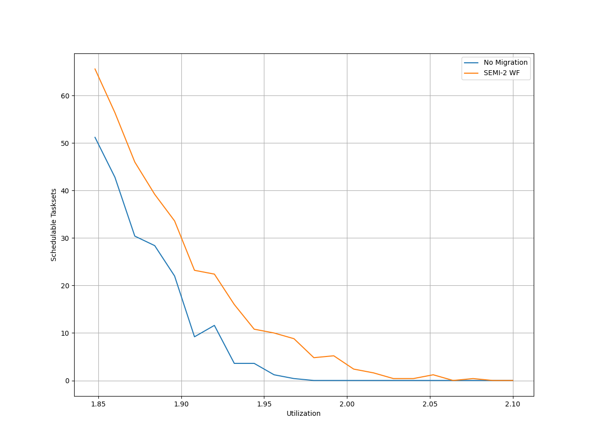
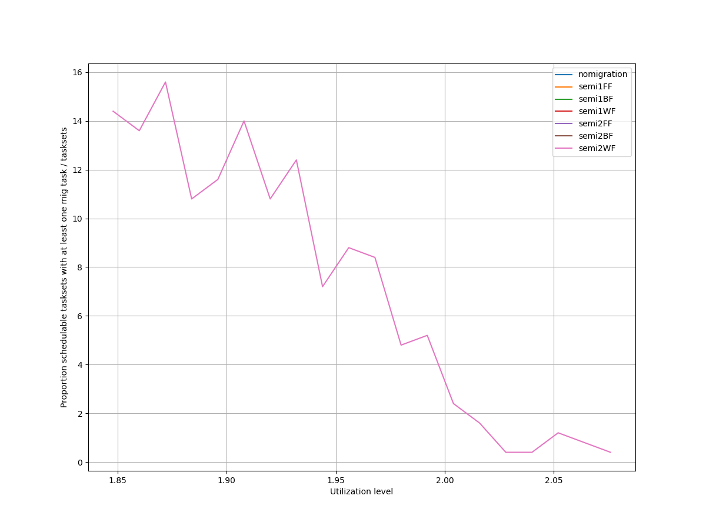
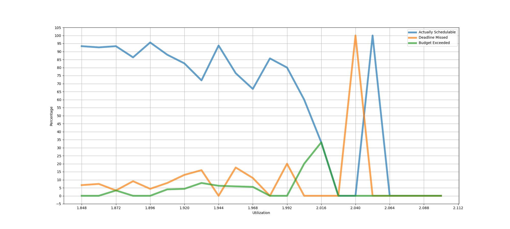
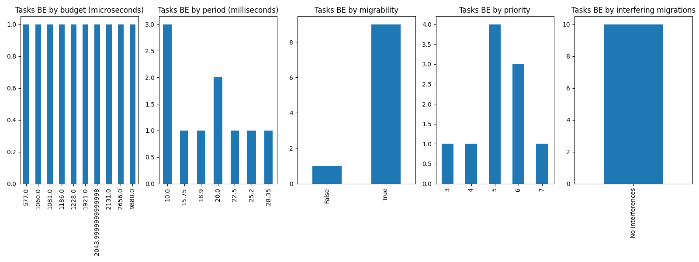
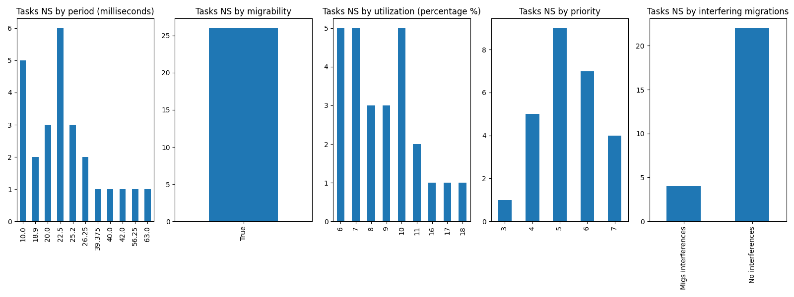
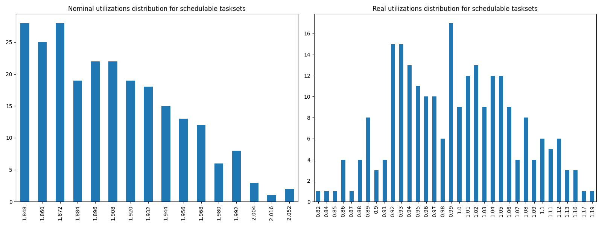

# Report on Experiment 1

## Overall data

   Utilization range = [1.848, 2.1] with step = 0.012

| Schedulable | Not schedulable | Budget Exceeded | Safe Boundary Exceeded |
| ------ | ------ | ------ | ------ |
| 84.56% | 8.77% | 3.51% | 3.16% |

Number of executions: 285

Schedulable executions: 241/285 = 84.56140350877193 %

_Not_ schedulable executions: 25/285 = 8.771929824561402 %

Budget Exceeded executions: 10/285 = 3.508771929824561 %

Safe Boundary Exceeded executions: 9/285 = 3.1578947368421053 %

NS + BE executions: 35/285 = 12.280701754385964 %

### **Simulations**

#### **Weighted schedulability experiment 1 according to simulations.**

#### **Percentage of (schedulable tasksets with at least one migrating tasks / number of schedulable tasksets) of experiment 1 according to simulations.** 

 

### **Real Executions**

#### **Schedulability for each level**

#### **Tasksets, grouped by differents parameters, with a Budget_Exceeded task.**

#### **Tasksets, grouped by differents parameters, with at least one task missing one (or more) of its deadlines.**

### **Nominal utilizations VS Real utilizations about schedulable tasksets**

## Bad tasksets

Click here to expand this section.

### **Not schedulable tasksets**

Click here to expand this section.

Ovvero quando almeno un task non completa entra almeno una sua deadline.

  1. Taskset **e1_semi2wf_t1213**

    Taskset execution params:
	 
    "id": "e1_semi2wf_t1213",
    "size": "12",
    "utilization": "1.896",
    "realutilization": 0.93,
    "criticality_factor": "2",
    "hicrit_proportion": "0.5"

   
 
Click here to see the deadlines missed tasks list.

   Time values are expressed as **micro-seconds**.

Task:  2

    
    "id": " 2",
    "basecpu": " 1",
    "priority": " 5",
    "period": 18900.0,
    "C(LO)": 2909.0,
    "C(HI)": 2909.0,
    "criticality": "LOW",
    "migrable": "True",
    "completedruns": " 5275",
    "preemptions": " 0",
    "minresponsejitter": " 0.000000000",
    "maxresponsejitter": " 0.001312556",
    "minreleasejitter": " 0.000000000",
    "maxreleasejitter": " 100.659706141",
    "avgresponsejitter": " 0.001169237",
    "deadlinesmissed": " 1",
    "deadlinemissedtargetcore": " 0",
    "deadlinemissedaftermigration": " 0",
    "budgetexceeded": " 0",
    "budgetexceededtargetcore": " 0",
    "budgetexceededaftermigration": " 0",
    "timesmigrated": " 5",
    "timesrestored": " 4",
    "timesonc1": " 5272",
    "timesonc2": " 1",
    "lockedtime": " 0.000015748"

   

   
 
Click here to see the CPUs log.

   Idle time is expressed as **seconds**.

   Util values are expressed as **percentage** %.

   CPU: 1

    
    "id": 1,
    "hyperperiod": 22680000,
    "lowtohigh": " 40",
    "hightolow": " 40",
    "idletime": 63658406,
    "util": 43.863839506172845

   CPU: 2

    
    "id": 2,
    "hyperperiod": 113400000,
    "lowtohigh": " 0",
    "hightolow": " 0",
    "idletime": 57690935,
    "util": 49.12615961199295

   Real Utilization: 0.9299999999999999
   

   
 
Click here to see the whole tasksets.

   Time values are expressed as **micro-seconds**.

   Task:  10

    
    "id": " 10",
    "basecpu": " 1",
    "priority": " 0",
    "period": 129600.0,
    "C(LO)": 15328.0,
    "C(HI)": 30656.0,
    "criticality": "HIGH",
    "migrable": "False",
    "completedruns": " 876",
    "preemptions": " 1125",
    "minresponsejitter": " 0.000000000",
    "maxresponsejitter": " 0.042375856",
    "minreleasejitter": " 0.000000000",
    "maxreleasejitter": " 114.270406213",
    "avgresponsejitter": " 0.016491060",
    "deadlinesmissed": " 0",
    "deadlinemissedtargetcore": " 0",
    "deadlinemissedaftermigration": " 0",
    "budgetexceeded": " 12",
    "budgetexceededtargetcore": " 0",
    "budgetexceededaftermigration": " 0",
    "timesmigrated": " 0",
    "timesrestored": " 0",
    "timesonc1": " 2012",
    "timesonc2": " 0",
    "lockedtime": " 0.000013192"

   Task:  4

    
    "id": " 4",
    "basecpu": " 1",
    "priority": " 2",
    "period": 54000.0,
    "C(LO)": 6262.0,
    "C(HI)": 12524.0,
    "criticality": "HIGH",
    "migrable": "False",
    "completedruns": " 2101",
    "preemptions": " 734",
    "minresponsejitter": " 0.000000000",
    "maxresponsejitter": " 0.018838375",
    "minreleasejitter": " 0.000000000",
    "maxreleasejitter": " 114.346006183",
    "avgresponsejitter": " 0.005858492",
    "deadlinesmissed": " 0",
    "deadlinemissedtargetcore": " 0",
    "deadlinemissedaftermigration": " 0",
    "budgetexceeded": " 20",
    "budgetexceededtargetcore": " 0",
    "budgetexceededaftermigration": " 0",
    "timesmigrated": " 0",
    "timesrestored": " 0",
    "timesonc1": " 2854",
    "timesonc2": " 0",
    "lockedtime": " 0.000011303"

   Task:  9

    
    "id": " 9",
    "basecpu": " 1",
    "priority": " 1",
    "period": 113400.0,
    "C(LO)": 4434.0,
    "C(HI)": 8868.0,
    "criticality": "HIGH",
    "migrable": "False",
    "completedruns": " 1001",
    "preemptions": " 191",
    "minresponsejitter": " 0.000000000",
    "maxresponsejitter": " 0.022065955",
    "minreleasejitter": " 0.000000000",
    "maxreleasejitter": " 114.286606072",
    "avgresponsejitter": " 0.004185489",
    "deadlinesmissed": " 0",
    "deadlinemissedtargetcore": " 0",
    "deadlinemissedaftermigration": " 0",
    "budgetexceeded": " 8",
    "budgetexceededtargetcore": " 0",
    "budgetexceededaftermigration": " 0",
    "timesmigrated": " 0",
    "timesrestored": " 0",
    "timesonc1": " 1199",
    "timesonc2": " 0",
    "lockedtime": " 0.000007015"

   Task:  2

    
    "id": " 2",
    "basecpu": " 1",
    "priority": " 5",
    "period": 18900.0,
    "C(LO)": 2909.0,
    "C(HI)": 2909.0,
    "criticality": "LOW",
    "migrable": "True",
    "completedruns": " 5275",
    "preemptions": " 0",
    "minresponsejitter": " 0.000000000",
    "maxresponsejitter": " 0.001312556",
    "minreleasejitter": " 0.000000000",
    "maxreleasejitter": " 100.659706141",
    "avgresponsejitter": " 0.001169237",
    "deadlinesmissed": " 1",
    "deadlinemissedtargetcore": " 0",
    "deadlinemissedaftermigration": " 0",
    "budgetexceeded": " 0",
    "budgetexceededtargetcore": " 0",
    "budgetexceededaftermigration": " 0",
    "timesmigrated": " 5",
    "timesrestored": " 4",
    "timesonc1": " 5272",
    "timesonc2": " 1",
    "lockedtime": " 0.000015748"

   Task:  6

    
    "id": " 6",
    "basecpu": " 1",
    "priority": " 4",
    "period": 70000.0,
    "C(LO)": 7908.0,
    "C(HI)": 7908.0,
    "criticality": "LOW",
    "migrable": "False",
    "completedruns": " 1621",
    "preemptions": " 627",
    "minresponsejitter": " 0.000000000",
    "maxresponsejitter": " 0.007979300",
    "minreleasejitter": " 0.000000000",
    "maxreleasejitter": " 114.330006856",
    "avgresponsejitter": " 0.006365345",
    "deadlinesmissed": " 0",
    "deadlinemissedtargetcore": " 0",
    "deadlinemissedaftermigration": " 0",
    "budgetexceeded": " 0",
    "budgetexceededtargetcore": " 0",
    "budgetexceededaftermigration": " 0",
    "timesmigrated": " 0",
    "timesrestored": " 0",
    "timesonc1": " 2247",
    "timesonc2": " 0",
    "lockedtime": " 0.000006736"

   Task:  7

    
    "id": " 7",
    "basecpu": " 1",
    "priority": " 3",
    "period": 70875.0,
    "C(LO)": 7445.0,
    "C(HI)": 7445.0,
    "criticality": "LOW",
    "migrable": "False",
    "completedruns": " 1601",
    "preemptions": " 531",
    "minresponsejitter": " 0.000000000",
    "maxresponsejitter": " 0.013682018",
    "minreleasejitter": " 0.000000000",
    "maxreleasejitter": " 114.329131168",
    "avgresponsejitter": " 0.006518105",
    "deadlinesmissed": " 0",
    "deadlinemissedtargetcore": " 0",
    "deadlinemissedaftermigration": " 0",
    "budgetexceeded": " 0",
    "budgetexceededtargetcore": " 0",
    "budgetexceededaftermigration": " 0",
    "timesmigrated": " 0",
    "timesrestored": " 0",
    "timesonc1": " 2131",
    "timesonc2": " 0",
    "lockedtime": " 0.000004544"

   Task:  1

    
    "id": " 1",
    "basecpu": " 1",
    "priority": " 6",
    "period": 15750.0,
    "C(LO)": 796.0,
    "C(HI)": 796.0,
    "criticality": "LOW",
    "migrable": "True",
    "completedruns": " 2619",
    "preemptions": " 0",
    "minresponsejitter": " 0.000000000",
    "maxresponsejitter": " 0.000357997",
    "minreleasejitter": " 0.000000000",
    "maxreleasejitter": " 42.217756820",
    "avgresponsejitter": " 0.000320631",
    "deadlinesmissed": " 0",
    "deadlinemissedtargetcore": " 0",
    "deadlinemissedaftermigration": " 0",
    "budgetexceeded": " 0",
    "budgetexceededtargetcore": " 0",
    "budgetexceededaftermigration": " 0",
    "timesmigrated": " 7",
    "timesrestored": " 6",
    "timesonc1": " 2618",
    "timesonc2": " 0",
    "lockedtime": " 0.000017967"

   Task:  5

    
    "id": " 5",
    "basecpu": " 2",
    "priority": " 2",
    "period": 56250.0,
    "C(LO)": 7939.999999999999,
    "C(HI)": 15881.0,
    "criticality": "HIGH",
    "migrable": "False",
    "completedruns": " 2017",
    "preemptions": " 269",
    "minresponsejitter": " 0.000000000",
    "maxresponsejitter": " 0.008840874",
    "minreleasejitter": " 0.000000000",
    "maxreleasejitter": " 114.343755976",
    "avgresponsejitter": " 0.006351556",
    "deadlinesmissed": " 0",
    "deadlinemissedtargetcore": " 0",
    "deadlinemissedaftermigration": " 0",
    "budgetexceeded": " 0",
    "budgetexceededtargetcore": " 0",
    "budgetexceededaftermigration": " 0",
    "timesmigrated": " 0",
    "timesrestored": " 0",
    "timesonc1": " 0",
    "timesonc2": " 2285",
    "lockedtime": " 0.000010450"

   Task:  12

    
    "id": " 12",
    "basecpu": " 2",
    "priority": " 0",
    "period": 600000.0,
    "C(LO)": 61966.0,
    "C(HI)": 123932.0,
    "criticality": "HIGH",
    "migrable": "False",
    "completedruns": " 190",
    "preemptions": " 522",
    "minresponsejitter": " 0.000000000",
    "maxresponsejitter": " 0.108482616",
    "minreleasejitter": " 0.000000000",
    "maxreleasejitter": " 113.800005826",
    "avgresponsejitter": " 0.075890450",
    "deadlinesmissed": " 0",
    "deadlinemissedtargetcore": " 0",
    "deadlinemissedaftermigration": " 0",
    "budgetexceeded": " 0",
    "budgetexceededtargetcore": " 0",
    "budgetexceededaftermigration": " 0",
    "timesmigrated": " 0",
    "timesrestored": " 0",
    "timesonc1": " 0",
    "timesonc2": " 711",
    "lockedtime": " 0.000022856"

   Task:  11

    
    "id": " 11",
    "basecpu": " 2",
    "priority": " 1",
    "period": 181440.0,
    "C(LO)": 7030.0,
    "C(HI)": 14060.0,
    "criticality": "HIGH",
    "migrable": "False",
    "completedruns": " 626",
    "preemptions": " 121",
    "minresponsejitter": " 0.000000000",
    "maxresponsejitter": " 0.029757703",
    "minreleasejitter": " 0.000000000",
    "maxreleasejitter": " 114.220865192",
    "avgresponsejitter": " 0.007653694",
    "deadlinesmissed": " 0",
    "deadlinemissedtargetcore": " 0",
    "deadlinemissedaftermigration": " 0",
    "budgetexceeded": " 0",
    "budgetexceededtargetcore": " 0",
    "budgetexceededaftermigration": " 0",
    "timesmigrated": " 0",
    "timesrestored": " 0",
    "timesonc1": " 0",
    "timesonc2": " 746",
    "lockedtime": " 0.000003297"

   Task:  8

    
    "id": " 8",
    "basecpu": " 2",
    "priority": " 3",
    "period": 78750.0,
    "C(LO)": 23088.0,
    "C(HI)": 23088.0,
    "criticality": "LOW",
    "migrable": "False",
    "completedruns": " 1441",
    "preemptions": " 546",
    "minresponsejitter": " 0.000000000",
    "maxresponsejitter": " 0.021069805",
    "minreleasejitter": " 0.000000000",
    "maxreleasejitter": " 114.321255853",
    "avgresponsejitter": " 0.018503354",
    "deadlinesmissed": " 0",
    "deadlinemissedtargetcore": " 0",
    "deadlinemissedaftermigration": " 0",
    "budgetexceeded": " 0",
    "budgetexceededtargetcore": " 0",
    "budgetexceededaftermigration": " 0",
    "timesmigrated": " 0",
    "timesrestored": " 0",
    "timesonc1": " 0",
    "timesonc2": " 1986",
    "lockedtime": " 0.000071090"

   Task:  3

    
    "id": " 3",
    "basecpu": " 2",
    "priority": " 4",
    "period": 45360.0,
    "C(LO)": 3048.0,
    "C(HI)": 3048.0,
    "criticality": "LOW",
    "migrable": "False",
    "completedruns": " 2501",
    "preemptions": " 0",
    "minresponsejitter": " 0.000000000",
    "maxresponsejitter": " 0.002462468",
    "minreleasejitter": " 0.000000000",
    "maxreleasejitter": " 114.354645976",
    "avgresponsejitter": " 0.002317363",
    "deadlinesmissed": " 0",
    "deadlinemissedtargetcore": " 0",
    "deadlinemissedaftermigration": " 0",
    "budgetexceeded": " 0",
    "budgetexceededtargetcore": " 0",
    "budgetexceededaftermigration": " 0",
    "timesmigrated": " 0",
    "timesrestored": " 0",
    "timesonc1": " 0",
    "timesonc2": " 2500",
    "lockedtime": " 0.000043066"

   

  2. Taskset **e1_semi2wf_t1460**

    Taskset execution params:
	 
    "id": "e1_semi2wf_t1460",
    "size": "12",
    "utilization": "1.908",
    "realutilization": 0.9,
    "criticality_factor": "2",
    "hicrit_proportion": "0.5"

   
 
Click here to see the deadlines missed tasks list.

   Time values are expressed as **micro-seconds**.

Task:  2

    
    "id": " 2",
    "basecpu": " 2",
    "priority": " 5",
    "period": 39375.0,
    "C(LO)": 4011.0,
    "C(HI)": 4011.0,
    "criticality": "LOW",
    "migrable": "True",
    "completedruns": " 958",
    "preemptions": " 0",
    "minresponsejitter": " 0.000000000",
    "maxresponsejitter": " 0.001798511",
    "minreleasejitter": " 0.000000000",
    "maxreleasejitter": " 38.642506613",
    "avgresponsejitter": " 0.001628958",
    "deadlinesmissed": " 1",
    "deadlinemissedtargetcore": " 0",
    "deadlinemissedaftermigration": " 0",
    "budgetexceeded": " 0",
    "budgetexceededtargetcore": " 0",
    "budgetexceededaftermigration": " 0",
    "timesmigrated": " 2",
    "timesrestored": " 1",
    "timesonc1": " 2",
    "timesonc2": " 954",
    "lockedtime": " 0.000002132"

Task:  4

    
    "id": " 4",
    "basecpu": " 2",
    "priority": " 4",
    "period": 63000.0,
    "C(LO)": 3756.0,
    "C(HI)": 3756.0,
    "criticality": "LOW",
    "migrable": "True",
    "completedruns": " 961",
    "preemptions": " 0",
    "minresponsejitter": " 0.000000000",
    "maxresponsejitter": " 0.001683832",
    "minreleasejitter": " 0.000000000",
    "maxreleasejitter": " 61.417006547",
    "avgresponsejitter": " 0.001512523",
    "deadlinesmissed": " 1",
    "deadlinemissedtargetcore": " 0",
    "deadlinemissedaftermigration": " 0",
    "budgetexceeded": " 0",
    "budgetexceededtargetcore": " 0",
    "budgetexceededaftermigration": " 0",
    "timesmigrated": " 5",
    "timesrestored": " 5",
    "timesonc1": " 10",
    "timesonc2": " 949",
    "lockedtime": " 0.000034601"

   

   
 
Click here to see the CPUs log.

   Idle time is expressed as **seconds**.

   Util values are expressed as **percentage** %.

   CPU: 1

    
    "id": 1,
    "hyperperiod": 37800000,
    "lowtohigh": " 0",
    "hightolow": " 0",
    "idletime": 62293849,
    "util": 45.067152557319226

   CPU: 2

    
    "id": 2,
    "hyperperiod": 113400000,
    "lowtohigh": " 18",
    "hightolow": " 18",
    "idletime": 62876542,
    "util": 44.5533139329806

   Real Utilization: 0.9
   

   
 
Click here to see the whole tasksets.

   Time values are expressed as **micro-seconds**.

   Task:  11

    
    "id": " 11",
    "basecpu": " 1",
    "priority": " 0",
    "period": 504000.0,
    "C(LO)": 55371.0,
    "C(HI)": 110742.0,
    "criticality": "HIGH",
    "migrable": "False",
    "completedruns": " 226",
    "preemptions": " 623",
    "minresponsejitter": " 0.000000000",
    "maxresponsejitter": " 0.090122096",
    "minreleasejitter": " 0.000000000",
    "maxreleasejitter": " 113.901520619",
    "avgresponsejitter": " 0.060945402",
    "deadlinesmissed": " 0",
    "deadlinemissedtargetcore": " 0",
    "deadlinemissedaftermigration": " 0",
    "budgetexceeded": " 0",
    "budgetexceededtargetcore": " 0",
    "budgetexceededaftermigration": " 0",
    "timesmigrated": " 0",
    "timesrestored": " 0",
    "timesonc1": " 848",
    "timesonc2": " 0",
    "lockedtime": " 0.000003336"

   Task:  10

    
    "id": " 10",
    "basecpu": " 1",
    "priority": " 1",
    "period": 175000.0,
    "C(LO)": 14382.0,
    "C(HI)": 28764.0,
    "criticality": "HIGH",
    "migrable": "False",
    "completedruns": " 649",
    "preemptions": " 342",
    "minresponsejitter": " 0.000000000",
    "maxresponsejitter": " 0.024980015",
    "minreleasejitter": " 0.000000000",
    "maxreleasejitter": " 114.225006069",
    "avgresponsejitter": " 0.013141772",
    "deadlinesmissed": " 0",
    "deadlinemissedtargetcore": " 0",
    "deadlinemissedaftermigration": " 0",
    "budgetexceeded": " 0",
    "budgetexceededtargetcore": " 0",
    "budgetexceededaftermigration": " 0",
    "timesmigrated": " 0",
    "timesrestored": " 0",
    "timesonc1": " 990",
    "timesonc2": " 0",
    "lockedtime": " 0.000002865"

   Task:  1

    
    "id": " 1",
    "basecpu": " 1",
    "priority": " 3",
    "period": 37800.0,
    "C(LO)": 2370.0,
    "C(HI)": 4741.0,
    "criticality": "HIGH",
    "migrable": "False",
    "completedruns": " 3001",
    "preemptions": " 39",
    "minresponsejitter": " 0.000000000",
    "maxresponsejitter": " 0.025841201",
    "minreleasejitter": " 0.000000000",
    "maxreleasejitter": " 114.362206150",
    "avgresponsejitter": " 0.001996327",
    "deadlinesmissed": " 0",
    "deadlinemissedtargetcore": " 0",
    "deadlinemissedaftermigration": " 0",
    "budgetexceeded": " 0",
    "budgetexceededtargetcore": " 0",
    "budgetexceededaftermigration": " 0",
    "timesmigrated": " 0",
    "timesrestored": " 0",
    "timesonc1": " 3039",
    "timesonc2": " 0",
    "lockedtime": " 0.000013132"

   Task:  7

    
    "id": " 7",
    "basecpu": " 1",
    "priority": " 2",
    "period": 126000.0,
    "C(LO)": 7240.0,
    "C(HI)": 14481.0,
    "criticality": "HIGH",
    "migrable": "False",
    "completedruns": " 901",
    "preemptions": " 116",
    "minresponsejitter": " 0.000000000",
    "maxresponsejitter": " 0.030461748",
    "minreleasejitter": " 0.000000000",
    "maxreleasejitter": " 114.274006069",
    "avgresponsejitter": " 0.006493042",
    "deadlinesmissed": " 0",
    "deadlinemissedtargetcore": " 0",
    "deadlinemissedaftermigration": " 0",
    "budgetexceeded": " 0",
    "budgetexceededtargetcore": " 0",
    "budgetexceededaftermigration": " 0",
    "timesmigrated": " 0",
    "timesrestored": " 0",
    "timesonc1": " 1016",
    "timesonc2": " 0",
    "lockedtime": " 0.000015712"

   Task:  8

    
    "id": " 8",
    "basecpu": " 1",
    "priority": " 4",
    "period": 150000.0,
    "C(LO)": 21887.0,
    "C(HI)": 21887.0,
    "criticality": "LOW",
    "migrable": "False",
    "completedruns": " 757",
    "preemptions": " 206",
    "minresponsejitter": " 0.000000000",
    "maxresponsejitter": " 0.025159637",
    "minreleasejitter": " 0.000000000",
    "maxreleasejitter": " 114.250006664",
    "avgresponsejitter": " 0.018333637",
    "deadlinesmissed": " 0",
    "deadlinemissedtargetcore": " 0",
    "deadlinemissedaftermigration": " 0",
    "budgetexceeded": " 0",
    "budgetexceededtargetcore": " 0",
    "budgetexceededaftermigration": " 0",
    "timesmigrated": " 0",
    "timesrestored": " 0",
    "timesonc1": " 962",
    "timesonc2": " 0",
    "lockedtime": " 0.000020679"

   Task:  3

    
    "id": " 3",
    "basecpu": " 1",
    "priority": " 5",
    "period": 60480.0,
    "C(LO)": 8042.000000000001,
    "C(HI)": 8042.000000000001,
    "criticality": "LOW",
    "migrable": "False",
    "completedruns": " 1876",
    "preemptions": " 1",
    "minresponsejitter": " 0.000000000",
    "maxresponsejitter": " 0.006475027",
    "minreleasejitter": " 0.000000000",
    "maxreleasejitter": " 114.339526042",
    "avgresponsejitter": " 0.006103237",
    "deadlinesmissed": " 0",
    "deadlinemissedtargetcore": " 0",
    "deadlinemissedaftermigration": " 0",
    "budgetexceeded": " 0",
    "budgetexceededtargetcore": " 0",
    "budgetexceededaftermigration": " 0",
    "timesmigrated": " 0",
    "timesrestored": " 0",
    "timesonc1": " 1876",
    "timesonc2": " 0",
    "lockedtime": " 0.000001841"

   Task:  12

    
    "id": " 12",
    "basecpu": " 2",
    "priority": " 0",
    "period": 708750.0,
    "C(LO)": 184780.0,
    "C(HI)": 369560.0,
    "criticality": "HIGH",
    "migrable": "False",
    "completedruns": " 161",
    "preemptions": " 856",
    "minresponsejitter": " 0.000000000",
    "maxresponsejitter": " 0.342507357",
    "minreleasejitter": " 0.000000000",
    "maxreleasejitter": " 113.691255991",
    "avgresponsejitter": " 0.184878453",
    "deadlinesmissed": " 0",
    "deadlinemissedtargetcore": " 0",
    "deadlinemissedaftermigration": " 0",
    "budgetexceeded": " 2",
    "budgetexceededtargetcore": " 0",
    "budgetexceededaftermigration": " 0",
    "timesmigrated": " 0",
    "timesrestored": " 0",
    "timesonc1": " 0",
    "timesonc2": " 1018",
    "lockedtime": " 0.000032856"

   Task:  5

    
    "id": " 5",
    "basecpu": " 2",
    "priority": " 1",
    "period": 84375.0,
    "C(LO)": 3126.0,
    "C(HI)": 6253.0,
    "criticality": "HIGH",
    "migrable": "False",
    "completedruns": " 1345",
    "preemptions": " 74",
    "minresponsejitter": " 0.000000000",
    "maxresponsejitter": " 0.012554303",
    "minreleasejitter": " 0.000000000",
    "maxreleasejitter": " 114.315631027",
    "avgresponsejitter": " 0.002622351",
    "deadlinesmissed": " 0",
    "deadlinemissedtargetcore": " 0",
    "deadlinemissedaftermigration": " 0",
    "budgetexceeded": " 16",
    "budgetexceededtargetcore": " 0",
    "budgetexceededaftermigration": " 0",
    "timesmigrated": " 0",
    "timesrestored": " 0",
    "timesonc1": " 0",
    "timesonc2": " 1434",
    "lockedtime": " 0.000001246"

   Task:  9

    
    "id": " 9",
    "basecpu": " 2",
    "priority": " 2",
    "period": 168750.0,
    "C(LO)": 29542.0,
    "C(HI)": 29542.0,
    "criticality": "LOW",
    "migrable": "False",
    "completedruns": " 673",
    "preemptions": " 348",
    "minresponsejitter": " 0.000000000",
    "maxresponsejitter": " 0.033588291",
    "minreleasejitter": " 0.000000000",
    "maxreleasejitter": " 114.231256973",
    "avgresponsejitter": " 0.024270021",
    "deadlinesmissed": " 0",
    "deadlinemissedtargetcore": " 0",
    "deadlinemissedaftermigration": " 0",
    "budgetexceeded": " 0",
    "budgetexceededtargetcore": " 0",
    "budgetexceededaftermigration": " 0",
    "timesmigrated": " 0",
    "timesrestored": " 0",
    "timesonc1": " 0",
    "timesonc2": " 1020",
    "lockedtime": " 0.000017664"

   Task:  2

    
    "id": " 2",
    "basecpu": " 2",
    "priority": " 5",
    "period": 39375.0,
    "C(LO)": 4011.0,
    "C(HI)": 4011.0,
    "criticality": "LOW",
    "migrable": "True",
    "completedruns": " 958",
    "preemptions": " 0",
    "minresponsejitter": " 0.000000000",
    "maxresponsejitter": " 0.001798511",
    "minreleasejitter": " 0.000000000",
    "maxreleasejitter": " 38.642506613",
    "avgresponsejitter": " 0.001628958",
    "deadlinesmissed": " 1",
    "deadlinemissedtargetcore": " 0",
    "deadlinemissedaftermigration": " 0",
    "budgetexceeded": " 0",
    "budgetexceededtargetcore": " 0",
    "budgetexceededaftermigration": " 0",
    "timesmigrated": " 2",
    "timesrestored": " 1",
    "timesonc1": " 2",
    "timesonc2": " 954",
    "lockedtime": " 0.000002132"

   Task:  6

    
    "id": " 6",
    "basecpu": " 2",
    "priority": " 3",
    "period": 120000.0,
    "C(LO)": 8704.0,
    "C(HI)": 8704.0,
    "criticality": "LOW",
    "migrable": "False",
    "completedruns": " 946",
    "preemptions": " 92",
    "minresponsejitter": " 0.000000000",
    "maxresponsejitter": " 0.008698505",
    "minreleasejitter": " 0.000000000",
    "maxreleasejitter": " 114.280006153",
    "avgresponsejitter": " 0.006772321",
    "deadlinesmissed": " 0",
    "deadlinemissedtargetcore": " 0",
    "deadlinemissedaftermigration": " 0",
    "budgetexceeded": " 0",
    "budgetexceededtargetcore": " 0",
    "budgetexceededaftermigration": " 0",
    "timesmigrated": " 0",
    "timesrestored": " 0",
    "timesonc1": " 0",
    "timesonc2": " 1037",
    "lockedtime": " 0.000019565"

   Task:  4

    
    "id": " 4",
    "basecpu": " 2",
    "priority": " 4",
    "period": 63000.0,
    "C(LO)": 3756.0,
    "C(HI)": 3756.0,
    "criticality": "LOW",
    "migrable": "True",
    "completedruns": " 961",
    "preemptions": " 0",
    "minresponsejitter": " 0.000000000",
    "maxresponsejitter": " 0.001683832",
    "minreleasejitter": " 0.000000000",
    "maxreleasejitter": " 61.417006547",
    "avgresponsejitter": " 0.001512523",
    "deadlinesmissed": " 1",
    "deadlinemissedtargetcore": " 0",
    "deadlinemissedaftermigration": " 0",
    "budgetexceeded": " 0",
    "budgetexceededtargetcore": " 0",
    "budgetexceededaftermigration": " 0",
    "timesmigrated": " 5",
    "timesrestored": " 5",
    "timesonc1": " 10",
    "timesonc2": " 949",
    "lockedtime": " 0.000034601"

   

  3. Taskset **e1_semi2wf_t1476**

    Taskset execution params:
	 
    "id": "e1_semi2wf_t1476",
    "size": "12",
    "utilization": "1.908",
    "realutilization": 0.93,
    "criticality_factor": "2",
    "hicrit_proportion": "0.5"

   
 
Click here to see the deadlines missed tasks list.

   Time values are expressed as **micro-seconds**.

Task:  1

    
    "id": " 1",
    "basecpu": " 2",
    "priority": " 5",
    "period": 25200.0,
    "C(LO)": 4426.0,
    "C(HI)": 4426.0,
    "criticality": "LOW",
    "migrable": "True",
    "completedruns": " 970",
    "preemptions": " 0",
    "minresponsejitter": " 0.000000000",
    "maxresponsejitter": " 0.001988868",
    "minreleasejitter": " 0.000000000",
    "maxreleasejitter": " 25.393606354",
    "avgresponsejitter": " 0.001793673",
    "deadlinesmissed": " 1",
    "deadlinemissedtargetcore": " 0",
    "deadlinemissedaftermigration": " 0",
    "budgetexceeded": " 0",
    "budgetexceededtargetcore": " 0",
    "budgetexceededaftermigration": " 0",
    "timesmigrated": " 2",
    "timesrestored": " 1",
    "timesonc1": " 2",
    "timesonc2": " 966",
    "lockedtime": " 0.000019517"

   

   
 
Click here to see the CPUs log.

   Idle time is expressed as **seconds**.

   Util values are expressed as **percentage** %.

   CPU: 1

    
    "id": 1,
    "hyperperiod": 113400000,
    "lowtohigh": " 0",
    "hightolow": " 0",
    "idletime": 55263217,
    "util": 51.26700440917107

   CPU: 2

    
    "id": 2,
    "hyperperiod": 113400000,
    "lowtohigh": " 26",
    "hightolow": " 26",
    "idletime": 66067454,
    "util": 41.739458553791884

   Real Utilization: 0.9299999999999999
   

   
 
Click here to see the whole tasksets.

   Time values are expressed as **micro-seconds**.

   Task:  11

    
    "id": " 11",
    "basecpu": " 1",
    "priority": " 0",
    "period": 567000.0,
    "C(LO)": 93473.0,
    "C(HI)": 186946.0,
    "criticality": "HIGH",
    "migrable": "False",
    "completedruns": " 201",
    "preemptions": " 1246",
    "minresponsejitter": " 0.000000000",
    "maxresponsejitter": " 0.125099198",
    "minreleasejitter": " 0.000000000",
    "maxreleasejitter": " 113.833006393",
    "avgresponsejitter": " 0.112997868",
    "deadlinesmissed": " 0",
    "deadlinemissedtargetcore": " 0",
    "deadlinemissedaftermigration": " 0",
    "budgetexceeded": " 0",
    "budgetexceededtargetcore": " 0",
    "budgetexceededaftermigration": " 0",
    "timesmigrated": " 0",
    "timesrestored": " 0",
    "timesonc1": " 1446",
    "timesonc2": " 0",
    "lockedtime": " 0.000031595"

   Task:  5

    
    "id": " 5",
    "basecpu": " 1",
    "priority": " 2",
    "period": 60480.0,
    "C(LO)": 3669.0,
    "C(HI)": 7338.0,
    "criticality": "HIGH",
    "migrable": "False",
    "completedruns": " 1876",
    "preemptions": " 206",
    "minresponsejitter": " 0.000000000",
    "maxresponsejitter": " 0.019519931",
    "minreleasejitter": " 0.000000000",
    "maxreleasejitter": " 114.339526186",
    "avgresponsejitter": " 0.003594213",
    "deadlinesmissed": " 0",
    "deadlinemissedtargetcore": " 0",
    "deadlinemissedaftermigration": " 0",
    "budgetexceeded": " 0",
    "budgetexceededtargetcore": " 0",
    "budgetexceededaftermigration": " 0",
    "timesmigrated": " 0",
    "timesrestored": " 0",
    "timesonc1": " 2081",
    "timesonc2": " 0",
    "lockedtime": " 0.000004865"

   Task:  9

    
    "id": " 9",
    "basecpu": " 1",
    "priority": " 1",
    "period": 112500.0,
    "C(LO)": 4020.0,
    "C(HI)": 8040.999999999999,
    "criticality": "HIGH",
    "migrable": "False",
    "completedruns": " 1009",
    "preemptions": " 139",
    "minresponsejitter": " 0.000000000",
    "maxresponsejitter": " 0.012558246",
    "minreleasejitter": " 0.000000000",
    "maxreleasejitter": " 114.287506270",
    "avgresponsejitter": " 0.003767865",
    "deadlinesmissed": " 0",
    "deadlinemissedtargetcore": " 0",
    "deadlinemissedaftermigration": " 0",
    "budgetexceeded": " 0",
    "budgetexceededtargetcore": " 0",
    "budgetexceededaftermigration": " 0",
    "timesmigrated": " 0",
    "timesrestored": " 0",
    "timesonc1": " 1147",
    "timesonc2": " 0",
    "lockedtime": " 0.000011670"

   Task:  2

    
    "id": " 2",
    "basecpu": " 1",
    "priority": " 5",
    "period": 42000.0,
    "C(LO)": 7901.999999999999,
    "C(HI)": 7901.999999999999,
    "criticality": "LOW",
    "migrable": "False",
    "completedruns": " 2701",
    "preemptions": " 1",
    "minresponsejitter": " 0.000000000",
    "maxresponsejitter": " 0.006366661",
    "minreleasejitter": " 0.000000000",
    "maxreleasejitter": " 114.358006042",
    "avgresponsejitter": " 0.006000787",
    "deadlinesmissed": " 0",
    "deadlinemissedtargetcore": " 0",
    "deadlinemissedaftermigration": " 0",
    "budgetexceeded": " 0",
    "budgetexceededtargetcore": " 0",
    "budgetexceededaftermigration": " 0",
    "timesmigrated": " 0",
    "timesrestored": " 0",
    "timesonc1": " 2701",
    "timesonc2": " 0",
    "lockedtime": " 0.000025213"

   Task:  3

    
    "id": " 3",
    "basecpu": " 1",
    "priority": " 4",
    "period": 52500.0,
    "C(LO)": 8513.0,
    "C(HI)": 8513.0,
    "criticality": "LOW",
    "migrable": "False",
    "completedruns": " 2161",
    "preemptions": " 1",
    "minresponsejitter": " 0.000000000",
    "maxresponsejitter": " 0.008131517",
    "minreleasejitter": " 0.000000000",
    "maxreleasejitter": " 114.347506279",
    "avgresponsejitter": " 0.006462847",
    "deadlinesmissed": " 0",
    "deadlinemissedtargetcore": " 0",
    "deadlinemissedaftermigration": " 0",
    "budgetexceeded": " 0",
    "budgetexceededtargetcore": " 0",
    "budgetexceededaftermigration": " 0",
    "timesmigrated": " 0",
    "timesrestored": " 0",
    "timesonc1": " 2161",
    "timesonc2": " 0",
    "lockedtime": " 0.000010511"

   Task:  6

    
    "id": " 6",
    "basecpu": " 1",
    "priority": " 3",
    "period": 78750.0,
    "C(LO)": 4831.0,
    "C(HI)": 4831.0,
    "criticality": "LOW",
    "migrable": "False",
    "completedruns": " 1441",
    "preemptions": " 17",
    "minresponsejitter": " 0.000000000",
    "maxresponsejitter": " 0.010209883",
    "minreleasejitter": " 0.000000000",
    "maxreleasejitter": " 114.322102009",
    "avgresponsejitter": " 0.003738117",
    "deadlinesmissed": " 0",
    "deadlinemissedtargetcore": " 0",
    "deadlinemissedaftermigration": " 0",
    "budgetexceeded": " 0",
    "budgetexceededtargetcore": " 0",
    "budgetexceededaftermigration": " 0",
    "timesmigrated": " 0",
    "timesrestored": " 0",
    "timesonc1": " 1457",
    "timesonc2": " 0",
    "lockedtime": " 0.000004114"

   Task:  12

    
    "id": " 12",
    "basecpu": " 2",
    "priority": " 0",
    "period": 840000.0,
    "C(LO)": 156822.0,
    "C(HI)": 313645.0,
    "criticality": "HIGH",
    "migrable": "False",
    "completedruns": " 136",
    "preemptions": " 925",
    "minresponsejitter": " 0.000000000",
    "maxresponsejitter": " 0.275515207",
    "minreleasejitter": " 0.000000000",
    "maxreleasejitter": " 113.560006769",
    "avgresponsejitter": " 0.164158270",
    "deadlinesmissed": " 0",
    "deadlinemissedtargetcore": " 0",
    "deadlinemissedaftermigration": " 0",
    "budgetexceeded": " 2",
    "budgetexceededtargetcore": " 0",
    "budgetexceededaftermigration": " 0",
    "timesmigrated": " 0",
    "timesrestored": " 0",
    "timesonc1": " 0",
    "timesonc2": " 1062",
    "lockedtime": " 0.000043321"

   Task:  10

    
    "id": " 10",
    "basecpu": " 2",
    "priority": " 1",
    "period": 196875.0,
    "C(LO)": 10743.0,
    "C(HI)": 21486.0,
    "criticality": "HIGH",
    "migrable": "False",
    "completedruns": " 577",
    "preemptions": " 194",
    "minresponsejitter": " 0.000000000",
    "maxresponsejitter": " 0.030326180",
    "minreleasejitter": " 0.000000000",
    "maxreleasejitter": " 114.203130961",
    "avgresponsejitter": " 0.010063474",
    "deadlinesmissed": " 0",
    "deadlinemissedtargetcore": " 0",
    "deadlinemissedaftermigration": " 0",
    "budgetexceeded": " 8",
    "budgetexceededtargetcore": " 0",
    "budgetexceededaftermigration": " 0",
    "timesmigrated": " 0",
    "timesrestored": " 0",
    "timesonc1": " 0",
    "timesonc2": " 778",
    "lockedtime": " 0.000013976"

   Task:  8

    
    "id": " 8",
    "basecpu": " 2",
    "priority": " 2",
    "period": 100000.0,
    "C(LO)": 3279.0,
    "C(HI)": 6559.0,
    "criticality": "HIGH",
    "migrable": "False",
    "completedruns": " 1135",
    "preemptions": " 79",
    "minresponsejitter": " 0.000000000",
    "maxresponsejitter": " 0.010438607",
    "minreleasejitter": " 0.000000000",
    "maxreleasejitter": " 114.300006138",
    "avgresponsejitter": " 0.002841895",
    "deadlinesmissed": " 0",
    "deadlinemissedtargetcore": " 0",
    "deadlinemissedaftermigration": " 0",
    "budgetexceeded": " 16",
    "budgetexceededtargetcore": " 0",
    "budgetexceededaftermigration": " 0",
    "timesmigrated": " 0",
    "timesrestored": " 0",
    "timesonc1": " 0",
    "timesonc2": " 1229",
    "lockedtime": " 0.000002784"

   Task:  1

    
    "id": " 1",
    "basecpu": " 2",
    "priority": " 5",
    "period": 25200.0,
    "C(LO)": 4426.0,
    "C(HI)": 4426.0,
    "criticality": "LOW",
    "migrable": "True",
    "completedruns": " 970",
    "preemptions": " 0",
    "minresponsejitter": " 0.000000000",
    "maxresponsejitter": " 0.001988868",
    "minreleasejitter": " 0.000000000",
    "maxreleasejitter": " 25.393606354",
    "avgresponsejitter": " 0.001793673",
    "deadlinesmissed": " 1",
    "deadlinemissedtargetcore": " 0",
    "deadlinemissedaftermigration": " 0",
    "budgetexceeded": " 0",
    "budgetexceededtargetcore": " 0",
    "budgetexceededaftermigration": " 0",
    "timesmigrated": " 2",
    "timesrestored": " 1",
    "timesonc1": " 2",
    "timesonc2": " 966",
    "lockedtime": " 0.000019517"

   Task:  4

    
    "id": " 4",
    "basecpu": " 2",
    "priority": " 4",
    "period": 56700.0,
    "C(LO)": 7946.0,
    "C(HI)": 7946.0,
    "criticality": "LOW",
    "migrable": "False",
    "completedruns": " 2001",
    "preemptions": " 14",
    "minresponsejitter": " 0.000000000",
    "maxresponsejitter": " 0.008373072",
    "minreleasejitter": " 0.000000000",
    "maxreleasejitter": " 114.343306408",
    "avgresponsejitter": " 0.006047036",
    "deadlinesmissed": " 0",
    "deadlinemissedtargetcore": " 0",
    "deadlinemissedaftermigration": " 0",
    "budgetexceeded": " 0",
    "budgetexceededtargetcore": " 0",
    "budgetexceededaftermigration": " 0",
    "timesmigrated": " 0",
    "timesrestored": " 0",
    "timesonc1": " 0",
    "timesonc2": " 2014",
    "lockedtime": " 0.000025408"

   Task:  7

    
    "id": " 7",
    "basecpu": " 2",
    "priority": " 3",
    "period": 90000.0,
    "C(LO)": 9885.0,
    "C(HI)": 9885.0,
    "criticality": "LOW",
    "migrable": "False",
    "completedruns": " 1261",
    "preemptions": " 229",
    "minresponsejitter": " 0.000000000",
    "maxresponsejitter": " 0.015983559",
    "minreleasejitter": " 0.000000000",
    "maxreleasejitter": " 114.310005964",
    "avgresponsejitter": " 0.008394369",
    "deadlinesmissed": " 0",
    "deadlinemissedtargetcore": " 0",
    "deadlinemissedaftermigration": " 0",
    "budgetexceeded": " 0",
    "budgetexceededtargetcore": " 0",
    "budgetexceededaftermigration": " 0",
    "timesmigrated": " 0",
    "timesrestored": " 0",
    "timesonc1": " 0",
    "timesonc2": " 1489",
    "lockedtime": " 0.000016658"

   

  4. Taskset **e1_semi2wf_t1504**

    Taskset execution params:
	 
    "id": "e1_semi2wf_t1504",
    "size": "12",
    "utilization": "1.920",
    "realutilization": 0.97,
    "criticality_factor": "2",
    "hicrit_proportion": "0.5"

   
 
Click here to see the deadlines missed tasks list.

   Time values are expressed as **micro-seconds**.

Task:  2

    
    "id": " 2",
    "basecpu": " 1",
    "priority": " 6",
    "period": 22500.0,
    "C(LO)": 1840.0,
    "C(HI)": 1840.0,
    "criticality": "LOW",
    "migrable": "True",
    "completedruns": " 2083",
    "preemptions": " 0",
    "minresponsejitter": " 0.000000000",
    "maxresponsejitter": " 0.000834279",
    "minreleasejitter": " 0.000000000",
    "maxreleasejitter": " 47.822506736",
    "avgresponsejitter": " 0.000744033",
    "deadlinesmissed": " 1",
    "deadlinemissedtargetcore": " 0",
    "deadlinemissedaftermigration": " 0",
    "budgetexceeded": " 0",
    "budgetexceededtargetcore": " 0",
    "budgetexceededaftermigration": " 0",
    "timesmigrated": " 5",
    "timesrestored": " 4",
    "timesonc1": " 2071",
    "timesonc2": " 10",
    "lockedtime": " 0.000035153"

   

   
 
Click here to see the CPUs log.

   Idle time is expressed as **seconds**.

   Util values are expressed as **percentage** %.

   CPU: 1

    
    "id": 1,
    "hyperperiod": 113400000,
    "lowtohigh": " 19",
    "hightolow": " 19",
    "idletime": 58283104,
    "util": 48.60396472663139

   CPU: 2

    
    "id": 2,
    "hyperperiod": 11340000,
    "lowtohigh": " 66",
    "hightolow": " 66",
    "idletime": 58764676,
    "util": 48.17929805996472

   Real Utilization: 0.97
   

   
 
Click here to see the whole tasksets.

   Time values are expressed as **micro-seconds**.

   Task:  5

    
    "id": " 5",
    "basecpu": " 1",
    "priority": " 3",
    "period": 54000.0,
    "C(LO)": 7354.0,
    "C(HI)": 14708.0,
    "criticality": "HIGH",
    "migrable": "False",
    "completedruns": " 2101",
    "preemptions": " 476",
    "minresponsejitter": " 0.000000000",
    "maxresponsejitter": " 0.016130919",
    "minreleasejitter": " 0.000000000",
    "maxreleasejitter": " 114.346006186",
    "avgresponsejitter": " 0.006326147",
    "deadlinesmissed": " 0",
    "deadlinemissedtargetcore": " 0",
    "deadlinemissedaftermigration": " 0",
    "budgetexceeded": " 16",
    "budgetexceededtargetcore": " 0",
    "budgetexceededaftermigration": " 0",
    "timesmigrated": " 0",
    "timesrestored": " 0",
    "timesonc1": " 2592",
    "timesonc2": " 0",
    "lockedtime": " 0.000033514"

   Task:  12

    
    "id": " 12",
    "basecpu": " 1",
    "priority": " 0",
    "period": 900000.0,
    "C(LO)": 98281.0,
    "C(HI)": 196562.0,
    "criticality": "HIGH",
    "migrable": "False",
    "completedruns": " 127",
    "preemptions": " 777",
    "minresponsejitter": " 0.000000000",
    "maxresponsejitter": " 0.245943405",
    "minreleasejitter": " 0.000000000",
    "maxreleasejitter": " 113.500006874",
    "avgresponsejitter": " 0.119456303",
    "deadlinesmissed": " 0",
    "deadlinemissedtargetcore": " 0",
    "deadlinemissedaftermigration": " 0",
    "budgetexceeded": " 2",
    "budgetexceededtargetcore": " 0",
    "budgetexceededaftermigration": " 0",
    "timesmigrated": " 0",
    "timesrestored": " 0",
    "timesonc1": " 905",
    "timesonc2": " 0",
    "lockedtime": " 0.000091601"

   Task:  11

    
    "id": " 11",
    "basecpu": " 1",
    "priority": " 1",
    "period": 810000.0,
    "C(LO)": 24513.0,
    "C(HI)": 49027.0,
    "criticality": "HIGH",
    "migrable": "False",
    "completedruns": " 141",
    "preemptions": " 171",
    "minresponsejitter": " 0.000000000",
    "maxresponsejitter": " 0.066484420",
    "minreleasejitter": " 0.000000000",
    "maxreleasejitter": " 113.595853285",
    "avgresponsejitter": " 0.025650057",
    "deadlinesmissed": " 0",
    "deadlinemissedtargetcore": " 0",
    "deadlinemissedaftermigration": " 0",
    "budgetexceeded": " 1",
    "budgetexceededtargetcore": " 0",
    "budgetexceededaftermigration": " 0",
    "timesmigrated": " 0",
    "timesrestored": " 0",
    "timesonc1": " 312",
    "timesonc2": " 0",
    "lockedtime": " 0.000016643"

   Task:  9

    
    "id": " 9",
    "basecpu": " 1",
    "priority": " 2",
    "period": 168000.0,
    "C(LO)": 26493.0,
    "C(HI)": 26493.0,
    "criticality": "LOW",
    "migrable": "False",
    "completedruns": " 676",
    "preemptions": " 880",
    "minresponsejitter": " 0.000000000",
    "maxresponsejitter": " 0.038315126",
    "minreleasejitter": " 0.000000000",
    "maxreleasejitter": " 114.232006201",
    "avgresponsejitter": " 0.024918625",
    "deadlinesmissed": " 0",
    "deadlinemissedtargetcore": " 0",
    "deadlinemissedaftermigration": " 0",
    "budgetexceeded": " 0",
    "budgetexceededtargetcore": " 0",
    "budgetexceededaftermigration": " 0",
    "timesmigrated": " 0",
    "timesrestored": " 0",
    "timesonc1": " 1555",
    "timesonc2": " 0",
    "lockedtime": " 0.000058517"

   Task:  4

    
    "id": " 4",
    "basecpu": " 1",
    "priority": " 5",
    "period": 37800.0,
    "C(LO)": 4982.0,
    "C(HI)": 4982.0,
    "criticality": "LOW",
    "migrable": "False",
    "completedruns": " 3001",
    "preemptions": " 195",
    "minresponsejitter": " 0.000000000",
    "maxresponsejitter": " 0.004821952",
    "minreleasejitter": " 0.000000000",
    "maxreleasejitter": " 114.362206234",
    "avgresponsejitter": " 0.003834604",
    "deadlinesmissed": " 0",
    "deadlinemissedtargetcore": " 0",
    "deadlinemissedaftermigration": " 0",
    "budgetexceeded": " 0",
    "budgetexceededtargetcore": " 0",
    "budgetexceededaftermigration": " 0",
    "timesmigrated": " 0",
    "timesrestored": " 0",
    "timesonc1": " 3195",
    "timesonc2": " 0",
    "lockedtime": " 0.000163997"

   Task:  2

    
    "id": " 2",
    "basecpu": " 1",
    "priority": " 6",
    "period": 22500.0,
    "C(LO)": 1840.0,
    "C(HI)": 1840.0,
    "criticality": "LOW",
    "migrable": "True",
    "completedruns": " 2083",
    "preemptions": " 0",
    "minresponsejitter": " 0.000000000",
    "maxresponsejitter": " 0.000834279",
    "minreleasejitter": " 0.000000000",
    "maxreleasejitter": " 47.822506736",
    "avgresponsejitter": " 0.000744033",
    "deadlinesmissed": " 1",
    "deadlinemissedtargetcore": " 0",
    "deadlinemissedaftermigration": " 0",
    "budgetexceeded": " 0",
    "budgetexceededtargetcore": " 0",
    "budgetexceededaftermigration": " 0",
    "timesmigrated": " 5",
    "timesrestored": " 4",
    "timesonc1": " 2071",
    "timesonc2": " 10",
    "lockedtime": " 0.000035153"

   Task:  7

    
    "id": " 7",
    "basecpu": " 1",
    "priority": " 4",
    "period": 140000.0,
    "C(LO)": 7442.0,
    "C(HI)": 7442.0,
    "criticality": "LOW",
    "migrable": "False",
    "completedruns": " 811",
    "preemptions": " 171",
    "minresponsejitter": " 0.000000000",
    "maxresponsejitter": " 0.010450823",
    "minreleasejitter": " 0.000000000",
    "maxreleasejitter": " 114.260006730",
    "avgresponsejitter": " 0.006241952",
    "deadlinesmissed": " 0",
    "deadlinemissedtargetcore": " 0",
    "deadlinemissedaftermigration": " 0",
    "budgetexceeded": " 0",
    "budgetexceededtargetcore": " 0",
    "budgetexceededaftermigration": " 0",
    "timesmigrated": " 0",
    "timesrestored": " 0",
    "timesonc1": " 981",
    "timesonc2": " 0",
    "lockedtime": " 0.000009646"

   Task:  8

    
    "id": " 8",
    "basecpu": " 2",
    "priority": " 1",
    "period": 162000.0,
    "C(LO)": 26624.0,
    "C(HI)": 53248.0,
    "criticality": "HIGH",
    "migrable": "False",
    "completedruns": " 701",
    "preemptions": " 1049",
    "minresponsejitter": " 0.000000000",
    "maxresponsejitter": " 0.055104393",
    "minreleasejitter": " 0.000000000",
    "maxreleasejitter": " 114.238007309",
    "avgresponsejitter": " 0.026048102",
    "deadlinesmissed": " 0",
    "deadlinemissedtargetcore": " 0",
    "deadlinemissedaftermigration": " 0",
    "budgetexceeded": " 5",
    "budgetexceededtargetcore": " 0",
    "budgetexceededaftermigration": " 0",
    "timesmigrated": " 0",
    "timesrestored": " 0",
    "timesonc1": " 0",
    "timesonc2": " 1754",
    "lockedtime": " 0.000138676"

   Task:  10

    
    "id": " 10",
    "basecpu": " 2",
    "priority": " 0",
    "period": 180000.0,
    "C(LO)": 12967.0,
    "C(HI)": 25935.0,
    "criticality": "HIGH",
    "migrable": "False",
    "completedruns": " 631",
    "preemptions": " 466",
    "minresponsejitter": " 0.000000000",
    "maxresponsejitter": " 0.032874429",
    "minreleasejitter": " 0.000000000",
    "maxreleasejitter": " 114.235834823",
    "avgresponsejitter": " 0.012581012",
    "deadlinesmissed": " 0",
    "deadlinemissedtargetcore": " 0",
    "deadlinemissedaftermigration": " 0",
    "budgetexceeded": " 8",
    "budgetexceededtargetcore": " 0",
    "budgetexceededaftermigration": " 0",
    "timesmigrated": " 0",
    "timesrestored": " 0",
    "timesonc1": " 0",
    "timesonc2": " 1104",
    "lockedtime": " 0.000035769"

   Task:  1

    
    "id": " 1",
    "basecpu": " 2",
    "priority": " 3",
    "period": 18900.0,
    "C(LO)": 642.0,
    "C(HI)": 1284.0,
    "criticality": "HIGH",
    "migrable": "False",
    "completedruns": " 6001",
    "preemptions": " 0",
    "minresponsejitter": " 0.000000000",
    "maxresponsejitter": " 0.000917174",
    "minreleasejitter": " 0.000000000",
    "maxreleasejitter": " 114.381105976",
    "avgresponsejitter": " 0.000484159",
    "deadlinesmissed": " 0",
    "deadlinemissedtargetcore": " 0",
    "deadlinemissedaftermigration": " 0",
    "budgetexceeded": " 53",
    "budgetexceededtargetcore": " 0",
    "budgetexceededaftermigration": " 0",
    "timesmigrated": " 0",
    "timesrestored": " 0",
    "timesonc1": " 0",
    "timesonc2": " 6053",
    "lockedtime": " 0.000262985"

   Task:  6

    
    "id": " 6",
    "basecpu": " 2",
    "priority": " 2",
    "period": 60000.0,
    "C(LO)": 21167.0,
    "C(HI)": 21167.0,
    "criticality": "LOW",
    "migrable": "False",
    "completedruns": " 1891",
    "preemptions": " 1790",
    "minresponsejitter": " 0.000000000",
    "maxresponsejitter": " 0.018317679",
    "minreleasejitter": " 0.000000000",
    "maxreleasejitter": " 114.340006033",
    "avgresponsejitter": " 0.016636216",
    "deadlinesmissed": " 0",
    "deadlinemissedtargetcore": " 0",
    "deadlinemissedaftermigration": " 0",
    "budgetexceeded": " 0",
    "budgetexceededtargetcore": " 0",
    "budgetexceededaftermigration": " 0",
    "timesmigrated": " 0",
    "timesrestored": " 0",
    "timesonc1": " 0",
    "timesonc2": " 3680",
    "lockedtime": " 0.000165718"

   Task:  3

    
    "id": " 3",
    "basecpu": " 2",
    "priority": " 4",
    "period": 33750.0,
    "C(LO)": 1709.0,
    "C(HI)": 1709.0,
    "criticality": "LOW",
    "migrable": "True",
    "completedruns": " 760",
    "preemptions": " 0",
    "minresponsejitter": " 0.000000000",
    "maxresponsejitter": " 0.000770459",
    "minreleasejitter": " 0.000000000",
    "maxreleasejitter": " 26.583290273",
    "avgresponsejitter": " 0.000689805",
    "deadlinesmissed": " 0",
    "deadlinemissedtargetcore": " 0",
    "deadlinemissedaftermigration": " 0",
    "budgetexceeded": " 0",
    "budgetexceededtargetcore": " 0",
    "budgetexceededaftermigration": " 0",
    "timesmigrated": " 2",
    "timesrestored": " 2",
    "timesonc1": " 2",
    "timesonc2": " 757",
    "lockedtime": " 0.000022174"

   

  5. Taskset **e1_semi2wf_t1609**

    Taskset execution params:
	 
    "id": "e1_semi2wf_t1609",
    "size": "12",
    "utilization": "1.920",
    "realutilization": 0.98,
    "criticality_factor": "2",
    "hicrit_proportion": "0.5"

   
 
Click here to see the deadlines missed tasks list.

   Time values are expressed as **micro-seconds**.

Task:  2

    
    "id": " 2",
    "basecpu": " 2",
    "priority": " 3",
    "period": 26250.0,
    "C(LO)": 2024.0000000000002,
    "C(HI)": 2024.0000000000002,
    "criticality": "LOW",
    "migrable": "True",
    "completedruns": " 4321",
    "preemptions": " 0",
    "minresponsejitter": " 0.000000000",
    "maxresponsejitter": " 0.000912553",
    "minreleasejitter": " 0.000000000",
    "maxreleasejitter": " 114.373755937",
    "avgresponsejitter": " 0.000818595",
    "deadlinesmissed": " 1",
    "deadlinemissedtargetcore": " 0",
    "deadlinemissedaftermigration": " 0",
    "budgetexceeded": " 0",
    "budgetexceededtargetcore": " 0",
    "budgetexceededaftermigration": " 0",
    "timesmigrated": " 2",
    "timesrestored": " 2",
    "timesonc1": " 5",
    "timesonc2": " 4314",
    "lockedtime": " 0.000076649"

   

   
 
Click here to see the CPUs log.

   Idle time is expressed as **seconds**.

   Util values are expressed as **percentage** %.

   CPU: 1

    
    "id": 1,
    "hyperperiod": 113400000,
    "lowtohigh": " 0",
    "hightolow": " 0",
    "idletime": 61176356,
    "util": 46.052596119929454

   CPU: 2

    
    "id": 2,
    "hyperperiod": 3780000,
    "lowtohigh": " 2",
    "hightolow": " 2",
    "idletime": 54294796,
    "util": 52.12099118165785

   Real Utilization: 0.98
   

   
 
Click here to see the whole tasksets.

   Time values are expressed as **micro-seconds**.

   Task:  4

    
    "id": " 4",
    "basecpu": " 1",
    "priority": " 4",
    "period": 40000.0,
    "C(LO)": 3886.0,
    "C(HI)": 7772.0,
    "criticality": "HIGH",
    "migrable": "False",
    "completedruns": " 2836",
    "preemptions": " 230",
    "minresponsejitter": " 0.000000000",
    "maxresponsejitter": " 0.019225865",
    "minreleasejitter": " 0.000000000",
    "maxreleasejitter": " 114.360006156",
    "avgresponsejitter": " 0.003610237",
    "deadlinesmissed": " 0",
    "deadlinemissedtargetcore": " 0",
    "deadlinemissedaftermigration": " 0",
    "budgetexceeded": " 0",
    "budgetexceededtargetcore": " 0",
    "budgetexceededaftermigration": " 0",
    "timesmigrated": " 0",
    "timesrestored": " 0",
    "timesonc1": " 3065",
    "timesonc2": " 0",
    "lockedtime": " 0.000017141"

   Task:  6

    
    "id": " 6",
    "basecpu": " 1",
    "priority": " 3",
    "period": 56250.0,
    "C(LO)": 3557.0,
    "C(HI)": 7115.0,
    "criticality": "HIGH",
    "migrable": "False",
    "completedruns": " 2017",
    "preemptions": " 238",
    "minresponsejitter": " 0.000000000",
    "maxresponsejitter": " 0.012014183",
    "minreleasejitter": " 0.000000000",
    "maxreleasejitter": " 114.343756303",
    "avgresponsejitter": " 0.003245414",
    "deadlinesmissed": " 0",
    "deadlinemissedtargetcore": " 0",
    "deadlinemissedaftermigration": " 0",
    "budgetexceeded": " 0",
    "budgetexceededtargetcore": " 0",
    "budgetexceededaftermigration": " 0",
    "timesmigrated": " 0",
    "timesrestored": " 0",
    "timesonc1": " 2254",
    "timesonc2": " 0",
    "lockedtime": " 0.000000387"

   Task:  7

    
    "id": " 7",
    "basecpu": " 1",
    "priority": " 2",
    "period": 60480.0,
    "C(LO)": 2541.0,
    "C(HI)": 5082.0,
    "criticality": "HIGH",
    "migrable": "False",
    "completedruns": " 1876",
    "preemptions": " 253",
    "minresponsejitter": " 0.000000000",
    "maxresponsejitter": " 0.024023883",
    "minreleasejitter": " 0.000000000",
    "maxreleasejitter": " 114.339526189",
    "avgresponsejitter": " 0.002847201",
    "deadlinesmissed": " 0",
    "deadlinemissedtargetcore": " 0",
    "deadlinemissedaftermigration": " 0",
    "budgetexceeded": " 0",
    "budgetexceededtargetcore": " 0",
    "budgetexceededaftermigration": " 0",
    "timesmigrated": " 0",
    "timesrestored": " 0",
    "timesonc1": " 2128",
    "timesonc2": " 0",
    "lockedtime": " 0.000007141"

   Task:  9

    
    "id": " 9",
    "basecpu": " 1",
    "priority": " 1",
    "period": 101250.0,
    "C(LO)": 4177.0,
    "C(HI)": 8354.0,
    "criticality": "HIGH",
    "migrable": "False",
    "completedruns": " 1121",
    "preemptions": " 158",
    "minresponsejitter": " 0.000000000",
    "maxresponsejitter": " 0.013613057",
    "minreleasejitter": " 0.000000000",
    "maxreleasejitter": " 114.298756294",
    "avgresponsejitter": " 0.003576207",
    "deadlinesmissed": " 0",
    "deadlinemissedtargetcore": " 0",
    "deadlinemissedaftermigration": " 0",
    "budgetexceeded": " 0",
    "budgetexceededtargetcore": " 0",
    "budgetexceededaftermigration": " 0",
    "timesmigrated": " 0",
    "timesrestored": " 0",
    "timesonc1": " 1278",
    "timesonc2": " 0",
    "lockedtime": " 0.000000000"

   Task:  11

    
    "id": " 11",
    "basecpu": " 1",
    "priority": " 0",
    "period": 168750.0,
    "C(LO)": 6449.0,
    "C(HI)": 12899.0,
    "criticality": "HIGH",
    "migrable": "False",
    "completedruns": " 673",
    "preemptions": " 240",
    "minresponsejitter": " 0.000000000",
    "maxresponsejitter": " 0.019085949",
    "minreleasejitter": " 0.000000000",
    "maxreleasejitter": " 114.233995853",
    "avgresponsejitter": " 0.006601264",
    "deadlinesmissed": " 0",
    "deadlinemissedtargetcore": " 0",
    "deadlinemissedaftermigration": " 0",
    "budgetexceeded": " 0",
    "budgetexceededtargetcore": " 0",
    "budgetexceededaftermigration": " 0",
    "timesmigrated": " 0",
    "timesrestored": " 0",
    "timesonc1": " 912",
    "timesonc2": " 0",
    "lockedtime": " 0.000001526"

   Task:  5

    
    "id": " 5",
    "basecpu": " 1",
    "priority": " 6",
    "period": 47250.0,
    "C(LO)": 7691.0,
    "C(HI)": 7691.0,
    "criticality": "LOW",
    "migrable": "False",
    "completedruns": " 2401",
    "preemptions": " 1",
    "minresponsejitter": " 0.000000000",
    "maxresponsejitter": " 0.006198961",
    "minreleasejitter": " 0.000000000",
    "maxreleasejitter": " 114.352756294",
    "avgresponsejitter": " 0.005849342",
    "deadlinesmissed": " 0",
    "deadlinemissedtargetcore": " 0",
    "deadlinemissedaftermigration": " 0",
    "budgetexceeded": " 0",
    "budgetexceededtargetcore": " 0",
    "budgetexceededaftermigration": " 0",
    "timesmigrated": " 0",
    "timesrestored": " 0",
    "timesonc1": " 2401",
    "timesonc2": " 0",
    "lockedtime": " 0.000027868"

   Task:  8

    
    "id": " 8",
    "basecpu": " 1",
    "priority": " 5",
    "period": 78750.0,
    "C(LO)": 12537.0,
    "C(HI)": 12537.0,
    "criticality": "LOW",
    "migrable": "False",
    "completedruns": " 1441",
    "preemptions": " 0",
    "minresponsejitter": " 0.000000000",
    "maxresponsejitter": " 0.010129108",
    "minreleasejitter": " 0.000000000",
    "maxreleasejitter": " 114.321256658",
    "avgresponsejitter": " 0.009562871",
    "deadlinesmissed": " 0",
    "deadlinemissedtargetcore": " 0",
    "deadlinemissedaftermigration": " 0",
    "budgetexceeded": " 0",
    "budgetexceededtargetcore": " 0",
    "budgetexceededaftermigration": " 0",
    "timesmigrated": " 0",
    "timesrestored": " 0",
    "timesonc1": " 1440",
    "timesonc2": " 0",
    "lockedtime": " 0.000106372"

   Task:  12

    
    "id": " 12",
    "basecpu": " 2",
    "priority": " 0",
    "period": 945000.0,
    "C(LO)": 257809.0,
    "C(HI)": 515618.0,
    "criticality": "HIGH",
    "migrable": "False",
    "completedruns": " 121",
    "preemptions": " 1876",
    "minresponsejitter": " 0.000000000",
    "maxresponsejitter": " 0.467246066",
    "minreleasejitter": " 0.000000000",
    "maxreleasejitter": " 113.457606601",
    "avgresponsejitter": " 0.281046541",
    "deadlinesmissed": " 0",
    "deadlinemissedtargetcore": " 0",
    "deadlinemissedaftermigration": " 0",
    "budgetexceeded": " 2",
    "budgetexceededtargetcore": " 0",
    "budgetexceededaftermigration": " 0",
    "timesmigrated": " 0",
    "timesrestored": " 0",
    "timesonc1": " 0",
    "timesonc2": " 1998",
    "lockedtime": " 0.000087189"

   Task:  10

    
    "id": " 10",
    "basecpu": " 2",
    "priority": " 1",
    "period": 140000.0,
    "C(LO)": 41295.0,
    "C(HI)": 41295.0,
    "criticality": "LOW",
    "migrable": "False",
    "completedruns": " 811",
    "preemptions": " 1634",
    "minresponsejitter": " 0.000000000",
    "maxresponsejitter": " 0.037917072",
    "minreleasejitter": " 0.000000000",
    "maxreleasejitter": " 114.260006042",
    "avgresponsejitter": " 0.034065384",
    "deadlinesmissed": " 0",
    "deadlinemissedtargetcore": " 0",
    "deadlinemissedaftermigration": " 0",
    "budgetexceeded": " 0",
    "budgetexceededtargetcore": " 0",
    "budgetexceededaftermigration": " 0",
    "timesmigrated": " 0",
    "timesrestored": " 0",
    "timesonc1": " 0",
    "timesonc2": " 2444",
    "lockedtime": " 0.000080495"

   Task:  2

    
    "id": " 2",
    "basecpu": " 2",
    "priority": " 3",
    "period": 26250.0,
    "C(LO)": 2024.0000000000002,
    "C(HI)": 2024.0000000000002,
    "criticality": "LOW",
    "migrable": "True",
    "completedruns": " 4321",
    "preemptions": " 0",
    "minresponsejitter": " 0.000000000",
    "maxresponsejitter": " 0.000912553",
    "minreleasejitter": " 0.000000000",
    "maxreleasejitter": " 114.373755937",
    "avgresponsejitter": " 0.000818595",
    "deadlinesmissed": " 1",
    "deadlinemissedtargetcore": " 0",
    "deadlinemissedaftermigration": " 0",
    "budgetexceeded": " 0",
    "budgetexceededtargetcore": " 0",
    "budgetexceededaftermigration": " 0",
    "timesmigrated": " 2",
    "timesrestored": " 2",
    "timesonc1": " 5",
    "timesonc2": " 4314",
    "lockedtime": " 0.000076649"

   Task:  3

    
    "id": " 3",
    "basecpu": " 2",
    "priority": " 2",
    "period": 39375.0,
    "C(LO)": 2404.0,
    "C(HI)": 2404.0,
    "criticality": "LOW",
    "migrable": "False",
    "completedruns": " 2881",
    "preemptions": " 67",
    "minresponsejitter": " 0.000000000",
    "maxresponsejitter": " 0.002560769",
    "minreleasejitter": " 0.000000000",
    "maxreleasejitter": " 114.360631030",
    "avgresponsejitter": " 0.001839556",
    "deadlinesmissed": " 0",
    "deadlinemissedtargetcore": " 0",
    "deadlinemissedaftermigration": " 0",
    "budgetexceeded": " 0",
    "budgetexceededtargetcore": " 0",
    "budgetexceededaftermigration": " 0",
    "timesmigrated": " 0",
    "timesrestored": " 0",
    "timesonc1": " 0",
    "timesonc2": " 2947",
    "lockedtime": " 0.000000940"

   Task:  1

    
    "id": " 1",
    "basecpu": " 2",
    "priority": " 4",
    "period": 25200.0,
    "C(LO)": 1396.0,
    "C(HI)": 1396.0,
    "criticality": "LOW",
    "migrable": "True",
    "completedruns": " 1667",
    "preemptions": " 0",
    "minresponsejitter": " 0.000000000",
    "maxresponsejitter": " 0.000628270",
    "minreleasejitter": " 0.000000000",
    "maxreleasejitter": " 42.958006664",
    "avgresponsejitter": " 0.000567486",
    "deadlinesmissed": " 0",
    "deadlinemissedtargetcore": " 0",
    "deadlinemissedaftermigration": " 0",
    "budgetexceeded": " 0",
    "budgetexceededtargetcore": " 0",
    "budgetexceededaftermigration": " 0",
    "timesmigrated": " 1",
    "timesrestored": " 0",
    "timesonc1": " 0",
    "timesonc2": " 1666",
    "lockedtime": " 0.000012949"

   

  6. Taskset **e1_semi2wf_t1646**

    Taskset execution params:
	 
    "id": "e1_semi2wf_t1646",
    "size": "12",
    "utilization": "1.920",
    "realutilization": 1.04,
    "criticality_factor": "2",
    "hicrit_proportion": "0.5"

   
 
Click here to see the deadlines missed tasks list.

   Time values are expressed as **micro-seconds**.

Task:  2

    
    "id": " 2",
    "basecpu": " 1",
    "priority": " 7",
    "period": 40000.0,
    "C(LO)": 3868.0,
    "C(HI)": 3868.0,
    "criticality": "LOW",
    "migrable": "True",
    "completedruns": " 724",
    "preemptions": " 0",
    "minresponsejitter": " 0.000000000",
    "maxresponsejitter": " 0.001730976",
    "minreleasejitter": " 0.000000000",
    "maxreleasejitter": " 29.880006670",
    "avgresponsejitter": " 0.001563072",
    "deadlinesmissed": " 1",
    "deadlinemissedtargetcore": " 1",
    "deadlinemissedaftermigration": " 0",
    "budgetexceeded": " 0",
    "budgetexceededtargetcore": " 0",
    "budgetexceededaftermigration": " 0",
    "timesmigrated": " 5",
    "timesrestored": " 4",
    "timesonc1": " 716",
    "timesonc2": " 6",
    "lockedtime": " 0.000001249"

   

   
 
Click here to see the CPUs log.

   Idle time is expressed as **seconds**.

   Util values are expressed as **percentage** %.

   CPU: 1

    
    "id": 1,
    "hyperperiod": 113400000,
    "lowtohigh": " 61",
    "hightolow": " 61",
    "idletime": 57180550,
    "util": 49.57623456790123

   CPU: 2

    
    "id": 2,
    "hyperperiod": 37800000,
    "lowtohigh": " 0",
    "hightolow": " 0",
    "idletime": 52624914,
    "util": 53.59355026455027

   Real Utilization: 1.04
   

   
 
Click here to see the whole tasksets.

   Time values are expressed as **micro-seconds**.

   Task:  6

    
    "id": " 6",
    "basecpu": " 1",
    "priority": " 2",
    "period": 101250.0,
    "C(LO)": 6576.0,
    "C(HI)": 13152.0,
    "criticality": "HIGH",
    "migrable": "False",
    "completedruns": " 1121",
    "preemptions": " 253",
    "minresponsejitter": " 0.000000000",
    "maxresponsejitter": " 0.039371775",
    "minreleasejitter": " 0.000000000",
    "maxreleasejitter": " 114.298756198",
    "avgresponsejitter": " 0.006143246",
    "deadlinesmissed": " 0",
    "deadlinemissedtargetcore": " 0",
    "deadlinemissedaftermigration": " 0",
    "budgetexceeded": " 14",
    "budgetexceededtargetcore": " 0",
    "budgetexceededaftermigration": " 0",
    "timesmigrated": " 0",
    "timesrestored": " 0",
    "timesonc1": " 1387",
    "timesonc2": " 0",
    "lockedtime": " 0.000010099"

   Task:  1

    
    "id": " 1",
    "basecpu": " 1",
    "priority": " 5",
    "period": 37800.0,
    "C(LO)": 2265.0,
    "C(HI)": 4530.0,
    "criticality": "HIGH",
    "migrable": "False",
    "completedruns": " 3001",
    "preemptions": " 38",
    "minresponsejitter": " 0.000000000",
    "maxresponsejitter": " 0.006788859",
    "minreleasejitter": " 0.000000000",
    "maxreleasejitter": " 114.362206156",
    "avgresponsejitter": " 0.001755649",
    "deadlinesmissed": " 0",
    "deadlinemissedtargetcore": " 0",
    "deadlinemissedaftermigration": " 0",
    "budgetexceeded": " 30",
    "budgetexceededtargetcore": " 0",
    "budgetexceededaftermigration": " 0",
    "timesmigrated": " 0",
    "timesrestored": " 0",
    "timesonc1": " 3068",
    "timesonc2": " 0",
    "lockedtime": " 0.000019988"

   Task:  3

    
    "id": " 3",
    "basecpu": " 1",
    "priority": " 3",
    "period": 70000.0,
    "C(LO)": 3285.0,
    "C(HI)": 6571.0,
    "criticality": "HIGH",
    "migrable": "False",
    "completedruns": " 1621",
    "preemptions": " 76",
    "minresponsejitter": " 0.000000000",
    "maxresponsejitter": " 0.005770051",
    "minreleasejitter": " 0.000000000",
    "maxreleasejitter": " 114.330006174",
    "avgresponsejitter": " 0.002593676",
    "deadlinesmissed": " 0",
    "deadlinemissedtargetcore": " 0",
    "deadlinemissedaftermigration": " 0",
    "budgetexceeded": " 16",
    "budgetexceededtargetcore": " 0",
    "budgetexceededaftermigration": " 0",
    "timesmigrated": " 0",
    "timesrestored": " 0",
    "timesonc1": " 1712",
    "timesonc2": " 0",
    "lockedtime": " 0.000002345"

   Task:  8

    
    "id": " 8",
    "basecpu": " 1",
    "priority": " 1",
    "period": 135000.0,
    "C(LO)": 5298.0,
    "C(HI)": 10597.0,
    "criticality": "HIGH",
    "migrable": "False",
    "completedruns": " 841",
    "preemptions": " 89",
    "minresponsejitter": " 0.000000000",
    "maxresponsejitter": " 0.032483021",
    "minreleasejitter": " 0.000000000",
    "maxreleasejitter": " 114.265006183",
    "avgresponsejitter": " 0.004354655",
    "deadlinesmissed": " 0",
    "deadlinemissedtargetcore": " 0",
    "deadlinemissedaftermigration": " 0",
    "budgetexceeded": " 1",
    "budgetexceededtargetcore": " 0",
    "budgetexceededaftermigration": " 0",
    "timesmigrated": " 0",
    "timesrestored": " 0",
    "timesonc1": " 930",
    "timesonc2": " 0",
    "lockedtime": " 0.000005808"

   Task:  11

    
    "id": " 11",
    "basecpu": " 1",
    "priority": " 0",
    "period": 472500.0,
    "C(LO)": 111808.0,
    "C(HI)": 111808.0,
    "criticality": "LOW",
    "migrable": "False",
    "completedruns": " 241",
    "preemptions": " 1349",
    "minresponsejitter": " 0.000000000",
    "maxresponsejitter": " 0.151597033",
    "minreleasejitter": " 0.000000000",
    "maxreleasejitter": " 113.927506228",
    "avgresponsejitter": " 0.118663300",
    "deadlinesmissed": " 0",
    "deadlinemissedtargetcore": " 0",
    "deadlinemissedaftermigration": " 0",
    "budgetexceeded": " 0",
    "budgetexceededtargetcore": " 0",
    "budgetexceededaftermigration": " 0",
    "timesmigrated": " 0",
    "timesrestored": " 0",
    "timesonc1": " 1589",
    "timesonc2": " 0",
    "lockedtime": " 0.000035138"

   Task:  10

    
    "id": " 10",
    "basecpu": " 1",
    "priority": " 4",
    "period": 175000.0,
    "C(LO)": 31323.999999999996,
    "C(HI)": 31323.999999999996,
    "criticality": "LOW",
    "migrable": "False",
    "completedruns": " 649",
    "preemptions": " 496",
    "minresponsejitter": " 0.000000000",
    "maxresponsejitter": " 0.033281078",
    "minreleasejitter": " 0.000000000",
    "maxreleasejitter": " 114.225006261",
    "avgresponsejitter": " 0.025298661",
    "deadlinesmissed": " 0",
    "deadlinemissedtargetcore": " 0",
    "deadlinemissedaftermigration": " 0",
    "budgetexceeded": " 0",
    "budgetexceededtargetcore": " 0",
    "budgetexceededaftermigration": " 0",
    "timesmigrated": " 0",
    "timesrestored": " 0",
    "timesonc1": " 1144",
    "timesonc2": " 0",
    "lockedtime": " 0.000024517"

   Task:  2

    
    "id": " 2",
    "basecpu": " 1",
    "priority": " 7",
    "period": 40000.0,
    "C(LO)": 3868.0,
    "C(HI)": 3868.0,
    "criticality": "LOW",
    "migrable": "True",
    "completedruns": " 724",
    "preemptions": " 0",
    "minresponsejitter": " 0.000000000",
    "maxresponsejitter": " 0.001730976",
    "minreleasejitter": " 0.000000000",
    "maxreleasejitter": " 29.880006670",
    "avgresponsejitter": " 0.001563072",
    "deadlinesmissed": " 1",
    "deadlinemissedtargetcore": " 1",
    "deadlinemissedaftermigration": " 0",
    "budgetexceeded": " 0",
    "budgetexceededtargetcore": " 0",
    "budgetexceededaftermigration": " 0",
    "timesmigrated": " 5",
    "timesrestored": " 4",
    "timesonc1": " 716",
    "timesonc2": " 6",
    "lockedtime": " 0.000001249"

   Task:  9

    
    "id": " 9",
    "basecpu": " 1",
    "priority": " 6",
    "period": 150000.0,
    "C(LO)": 11323.0,
    "C(HI)": 11323.0,
    "criticality": "LOW",
    "migrable": "True",
    "completedruns": " 147",
    "preemptions": " 0",
    "minresponsejitter": " 0.000000000",
    "maxresponsejitter": " 0.005074667",
    "minreleasejitter": " 0.000000000",
    "maxreleasejitter": " 22.750006363",
    "avgresponsejitter": " 0.004528366",
    "deadlinesmissed": " 0",
    "deadlinemissedtargetcore": " 0",
    "deadlinemissedaftermigration": " 0",
    "budgetexceeded": " 0",
    "budgetexceededtargetcore": " 0",
    "budgetexceededaftermigration": " 0",
    "timesmigrated": " 2",
    "timesrestored": " 2",
    "timesonc1": " 144",
    "timesonc2": " 2",
    "lockedtime": " 0.000004988"

   Task:  5

    
    "id": " 5",
    "basecpu": " 2",
    "priority": " 1",
    "period": 94500.0,
    "C(LO)": 15771.0,
    "C(HI)": 31542.0,
    "criticality": "HIGH",
    "migrable": "False",
    "completedruns": " 1201",
    "preemptions": " 233",
    "minresponsejitter": " 0.000000000",
    "maxresponsejitter": " 0.026531126",
    "minreleasejitter": " 0.000000000",
    "maxreleasejitter": " 114.305506117",
    "avgresponsejitter": " 0.013260568",
    "deadlinesmissed": " 0",
    "deadlinemissedtargetcore": " 0",
    "deadlinemissedaftermigration": " 0",
    "budgetexceeded": " 0",
    "budgetexceededtargetcore": " 0",
    "budgetexceededaftermigration": " 0",
    "timesmigrated": " 0",
    "timesrestored": " 0",
    "timesonc1": " 0",
    "timesonc2": " 1433",
    "lockedtime": " 0.000050108"

   Task:  4

    
    "id": " 4",
    "basecpu": " 2",
    "priority": " 2",
    "period": 75000.0,
    "C(LO)": 3093.0,
    "C(HI)": 6186.0,
    "criticality": "HIGH",
    "migrable": "False",
    "completedruns": " 1513",
    "preemptions": " 0",
    "minresponsejitter": " 0.000000000",
    "maxresponsejitter": " 0.002495465",
    "minreleasejitter": " 0.000000000",
    "maxreleasejitter": " 114.325006042",
    "avgresponsejitter": " 0.002352583",
    "deadlinesmissed": " 0",
    "deadlinemissedtargetcore": " 0",
    "deadlinemissedaftermigration": " 0",
    "budgetexceeded": " 0",
    "budgetexceededtargetcore": " 0",
    "budgetexceededaftermigration": " 0",
    "timesmigrated": " 0",
    "timesrestored": " 0",
    "timesonc1": " 0",
    "timesonc2": " 1512",
    "lockedtime": " 0.000015616"

   Task:  12

    
    "id": " 12",
    "basecpu": " 2",
    "priority": " 0",
    "period": 840000.0,
    "C(LO)": 308259.0,
    "C(HI)": 308259.0,
    "criticality": "LOW",
    "migrable": "False",
    "completedruns": " 136",
    "preemptions": " 1020",
    "minresponsejitter": " 0.000000000",
    "maxresponsejitter": " 0.338685718",
    "minreleasejitter": " 0.000000000",
    "maxreleasejitter": " 113.561346024",
    "avgresponsejitter": " 0.312222396",
    "deadlinesmissed": " 0",
    "deadlinemissedtargetcore": " 0",
    "deadlinemissedaftermigration": " 0",
    "budgetexceeded": " 0",
    "budgetexceededtargetcore": " 0",
    "budgetexceededaftermigration": " 0",
    "timesmigrated": " 0",
    "timesrestored": " 0",
    "timesonc1": " 0",
    "timesonc2": " 1155",
    "lockedtime": " 0.000079943"

   Task:  7

    
    "id": " 7",
    "basecpu": " 2",
    "priority": " 3",
    "period": 112500.0,
    "C(LO)": 14263.0,
    "C(HI)": 14263.0,
    "criticality": "LOW",
    "migrable": "False",
    "completedruns": " 1009",
    "preemptions": " 0",
    "minresponsejitter": " 0.000000000",
    "maxresponsejitter": " 0.011505456",
    "minreleasejitter": " 0.000000000",
    "maxreleasejitter": " 114.287506057",
    "avgresponsejitter": " 0.010874015",
    "deadlinesmissed": " 0",
    "deadlinemissedtargetcore": " 0",
    "deadlinemissedaftermigration": " 0",
    "budgetexceeded": " 0",
    "budgetexceededtargetcore": " 0",
    "budgetexceededaftermigration": " 0",
    "timesmigrated": " 0",
    "timesrestored": " 0",
    "timesonc1": " 0",
    "timesonc2": " 1008",
    "lockedtime": " 0.000022679"

   

  7. Taskset **e1_semi2wf_t179**

    Taskset execution params:
	 
    "id": "e1_semi2wf_t179",
    "size": "12",
    "utilization": "1.848",
    "realutilization": 0.85,
    "criticality_factor": "2",
    "hicrit_proportion": "0.5"

   
 
Click here to see the deadlines missed tasks list.

   Time values are expressed as **micro-seconds**.

Task:  2

    
    "id": " 2",
    "basecpu": " 2",
    "priority": " 4",
    "period": 26250.0,
    "C(LO)": 1381.0,
    "C(HI)": 1381.0,
    "criticality": "LOW",
    "migrable": "True",
    "completedruns": " 4321",
    "preemptions": " 0",
    "minresponsejitter": " 0.000000000",
    "maxresponsejitter": " 0.000621724",
    "minreleasejitter": " 0.000000000",
    "maxreleasejitter": " 114.373756018",
    "avgresponsejitter": " 0.000559883",
    "deadlinesmissed": " 2",
    "deadlinemissedtargetcore": " 0",
    "deadlinemissedaftermigration": " 0",
    "budgetexceeded": " 0",
    "budgetexceededtargetcore": " 0",
    "budgetexceededaftermigration": " 0",
    "timesmigrated": " 2",
    "timesrestored": " 2",
    "timesonc1": " 2",
    "timesonc2": " 4316",
    "lockedtime": " 0.000145423"

   

   
 
Click here to see the CPUs log.

   Idle time is expressed as **seconds**.

   Util values are expressed as **percentage** %.

   CPU: 1

    
    "id": 1,
    "hyperperiod": 113400000,
    "lowtohigh": " 0",
    "hightolow": " 0",
    "idletime": 59342864,
    "util": 47.66943209876543

   CPU: 2

    
    "id": 2,
    "hyperperiod": 56700000,
    "lowtohigh": " 18",
    "hightolow": " 18",
    "idletime": 71281235,
    "util": 37.14176807760141

   Real Utilization: 0.85
   

   
 
Click here to see the whole tasksets.

   Time values are expressed as **micro-seconds**.

   Task:  8

    
    "id": " 8",
    "basecpu": " 1",
    "priority": " 1",
    "period": 162000.0,
    "C(LO)": 24310.0,
    "C(HI)": 48620.0,
    "criticality": "HIGH",
    "migrable": "False",
    "completedruns": " 701",
    "preemptions": " 535",
    "minresponsejitter": " 0.000000000",
    "maxresponsejitter": " 0.050129559",
    "minreleasejitter": " 0.000000000",
    "maxreleasejitter": " 114.238980288",
    "avgresponsejitter": " 0.023864021",
    "deadlinesmissed": " 0",
    "deadlinemissedtargetcore": " 0",
    "deadlinemissedaftermigration": " 0",
    "budgetexceeded": " 0",
    "budgetexceededtargetcore": " 0",
    "budgetexceededaftermigration": " 0",
    "timesmigrated": " 0",
    "timesrestored": " 0",
    "timesonc1": " 1235",
    "timesonc2": " 0",
    "lockedtime": " 0.000079348"

   Task:  12

    
    "id": " 12",
    "basecpu": " 1",
    "priority": " 0",
    "period": 675000.0,
    "C(LO)": 81688.0,
    "C(HI)": 163376.0,
    "criticality": "HIGH",
    "migrable": "False",
    "completedruns": " 169",
    "preemptions": " 543",
    "minresponsejitter": " 0.000000000",
    "maxresponsejitter": " 0.125203961",
    "minreleasejitter": " 0.000000000",
    "maxreleasejitter": " 113.725006979",
    "avgresponsejitter": " 0.094155138",
    "deadlinesmissed": " 0",
    "deadlinemissedtargetcore": " 0",
    "deadlinemissedaftermigration": " 0",
    "budgetexceeded": " 0",
    "budgetexceededtargetcore": " 0",
    "budgetexceededaftermigration": " 0",
    "timesmigrated": " 0",
    "timesrestored": " 0",
    "timesonc1": " 711",
    "timesonc2": " 0",
    "lockedtime": " 0.000088408"

   Task:  7

    
    "id": " 7",
    "basecpu": " 1",
    "priority": " 2",
    "period": 157500.0,
    "C(LO)": 7697.0,
    "C(HI)": 15395.0,
    "criticality": "HIGH",
    "migrable": "False",
    "completedruns": " 721",
    "preemptions": " 92",
    "minresponsejitter": " 0.000000000",
    "maxresponsejitter": " 0.026462462",
    "minreleasejitter": " 0.000000000",
    "maxreleasejitter": " 114.246728354",
    "avgresponsejitter": " 0.006701553",
    "deadlinesmissed": " 0",
    "deadlinemissedtargetcore": " 0",
    "deadlinemissedaftermigration": " 0",
    "budgetexceeded": " 0",
    "budgetexceededtargetcore": " 0",
    "budgetexceededaftermigration": " 0",
    "timesmigrated": " 0",
    "timesrestored": " 0",
    "timesonc1": " 812",
    "timesonc2": " 0",
    "lockedtime": " 0.000004018"

   Task:  11

    
    "id": " 11",
    "basecpu": " 1",
    "priority": " 3",
    "period": 181440.0,
    "C(LO)": 22245.0,
    "C(HI)": 22245.0,
    "criticality": "LOW",
    "migrable": "False",
    "completedruns": " 626",
    "preemptions": " 197",
    "minresponsejitter": " 0.000000000",
    "maxresponsejitter": " 0.022509018",
    "minreleasejitter": " 0.000000000",
    "maxreleasejitter": " 114.221063054",
    "avgresponsejitter": " 0.018353550",
    "deadlinesmissed": " 0",
    "deadlinemissedtargetcore": " 0",
    "deadlinemissedaftermigration": " 0",
    "budgetexceeded": " 0",
    "budgetexceededtargetcore": " 0",
    "budgetexceededaftermigration": " 0",
    "timesmigrated": " 0",
    "timesrestored": " 0",
    "timesonc1": " 822",
    "timesonc2": " 0",
    "lockedtime": " 0.000050736"

   Task:  4

    
    "id": " 4",
    "basecpu": " 1",
    "priority": " 4",
    "period": 52500.0,
    "C(LO)": 5744.0,
    "C(HI)": 5744.0,
    "criticality": "LOW",
    "migrable": "False",
    "completedruns": " 2161",
    "preemptions": " 192",
    "minresponsejitter": " 0.000000000",
    "maxresponsejitter": " 0.007236502",
    "minreleasejitter": " 0.000000000",
    "maxreleasejitter": " 114.347506898",
    "avgresponsejitter": " 0.004585168",
    "deadlinesmissed": " 0",
    "deadlinemissedtargetcore": " 0",
    "deadlinemissedaftermigration": " 0",
    "budgetexceeded": " 0",
    "budgetexceededtargetcore": " 0",
    "budgetexceededaftermigration": " 0",
    "timesmigrated": " 0",
    "timesrestored": " 0",
    "timesonc1": " 2352",
    "timesonc2": " 0",
    "lockedtime": " 0.000129489"

   Task:  3

    
    "id": " 3",
    "basecpu": " 1",
    "priority": " 5",
    "period": 45360.0,
    "C(LO)": 3289.0,
    "C(HI)": 3289.0,
    "criticality": "LOW",
    "migrable": "False",
    "completedruns": " 2501",
    "preemptions": " 2",
    "minresponsejitter": " 0.000000000",
    "maxresponsejitter": " 0.002965042",
    "minreleasejitter": " 0.000000000",
    "maxreleasejitter": " 114.354646102",
    "avgresponsejitter": " 0.002506360",
    "deadlinesmissed": " 0",
    "deadlinemissedtargetcore": " 0",
    "deadlinemissedaftermigration": " 0",
    "budgetexceeded": " 0",
    "budgetexceededtargetcore": " 0",
    "budgetexceededaftermigration": " 0",
    "timesmigrated": " 0",
    "timesrestored": " 0",
    "timesonc1": " 2502",
    "timesonc2": " 0",
    "lockedtime": " 0.000052751"

   Task:  6

    
    "id": " 6",
    "basecpu": " 2",
    "priority": " 2",
    "period": 113400.0,
    "C(LO)": 24817.0,
    "C(HI)": 49634.0,
    "criticality": "HIGH",
    "migrable": "False",
    "completedruns": " 1001",
    "preemptions": " 1424",
    "minresponsejitter": " 0.000000000",
    "maxresponsejitter": " 0.035875219",
    "minreleasejitter": " 0.000000000",
    "maxreleasejitter": " 114.286605955",
    "avgresponsejitter": " 0.021203255",
    "deadlinesmissed": " 0",
    "deadlinemissedtargetcore": " 0",
    "deadlinemissedaftermigration": " 0",
    "budgetexceeded": " 7",
    "budgetexceededtargetcore": " 0",
    "budgetexceededaftermigration": " 0",
    "timesmigrated": " 0",
    "timesrestored": " 0",
    "timesonc1": " 0",
    "timesonc2": " 2431",
    "lockedtime": " 0.000051814"

   Task:  10

    
    "id": " 10",
    "basecpu": " 2",
    "priority": " 0",
    "period": 180000.0,
    "C(LO)": 11105.0,
    "C(HI)": 22211.0,
    "criticality": "HIGH",
    "migrable": "False",
    "completedruns": " 631",
    "preemptions": " 417",
    "minresponsejitter": " 0.000000000",
    "maxresponsejitter": " 0.039000790",
    "minreleasejitter": " 0.000000000",
    "maxreleasejitter": " 114.220005934",
    "avgresponsejitter": " 0.011135865",
    "deadlinesmissed": " 0",
    "deadlinemissedtargetcore": " 0",
    "deadlinemissedaftermigration": " 0",
    "budgetexceeded": " 5",
    "budgetexceededtargetcore": " 0",
    "budgetexceededaftermigration": " 0",
    "timesmigrated": " 0",
    "timesrestored": " 0",
    "timesonc1": " 0",
    "timesonc2": " 1052",
    "lockedtime": " 0.000007625"

   Task:  9

    
    "id": " 9",
    "basecpu": " 2",
    "priority": " 1",
    "period": 168750.0,
    "C(LO)": 5015.0,
    "C(HI)": 10030.0,
    "criticality": "HIGH",
    "migrable": "False",
    "completedruns": " 673",
    "preemptions": " 178",
    "minresponsejitter": " 0.000000000",
    "maxresponsejitter": " 0.031476613",
    "minreleasejitter": " 0.000000000",
    "maxreleasejitter": " 114.231255844",
    "avgresponsejitter": " 0.004836402",
    "deadlinesmissed": " 0",
    "deadlinemissedtargetcore": " 0",
    "deadlinemissedaftermigration": " 0",
    "budgetexceeded": " 6",
    "budgetexceededtargetcore": " 0",
    "budgetexceededaftermigration": " 0",
    "timesmigrated": " 0",
    "timesrestored": " 0",
    "timesonc1": " 0",
    "timesonc2": " 856",
    "lockedtime": " 0.000010994"

   Task:  1

    
    "id": " 1",
    "basecpu": " 2",
    "priority": " 5",
    "period": 25200.0,
    "C(LO)": 3536.0,
    "C(HI)": 3536.0,
    "criticality": "LOW",
    "migrable": "True",
    "completedruns": " 3404",
    "preemptions": " 0",
    "minresponsejitter": " 0.000000000",
    "maxresponsejitter": " 0.001589691",
    "minreleasejitter": " 0.000000000",
    "maxreleasejitter": " 86.730407766",
    "avgresponsejitter": " 0.001424375",
    "deadlinesmissed": " 0",
    "deadlinemissedtargetcore": " 0",
    "deadlinemissedaftermigration": " 0",
    "budgetexceeded": " 0",
    "budgetexceededtargetcore": " 0",
    "budgetexceededaftermigration": " 0",
    "timesmigrated": " 2",
    "timesrestored": " 2",
    "timesonc1": " 1",
    "timesonc2": " 3402",
    "lockedtime": " 0.000030526"

   Task:  5

    
    "id": " 5",
    "basecpu": " 2",
    "priority": " 3",
    "period": 54000.0,
    "C(LO)": 4864.0,
    "C(HI)": 4864.0,
    "criticality": "LOW",
    "migrable": "False",
    "completedruns": " 2101",
    "preemptions": " 460",
    "minresponsejitter": " 0.000000000",
    "maxresponsejitter": " 0.006043994",
    "minreleasejitter": " 0.000000000",
    "maxreleasejitter": " 114.346005829",
    "avgresponsejitter": " 0.003902811",
    "deadlinesmissed": " 0",
    "deadlinemissedtargetcore": " 0",
    "deadlinemissedaftermigration": " 0",
    "budgetexceeded": " 0",
    "budgetexceededtargetcore": " 0",
    "budgetexceededaftermigration": " 0",
    "timesmigrated": " 0",
    "timesrestored": " 0",
    "timesonc1": " 0",
    "timesonc2": " 2560",
    "lockedtime": " 0.000055042"

   Task:  2

    
    "id": " 2",
    "basecpu": " 2",
    "priority": " 4",
    "period": 26250.0,
    "C(LO)": 1381.0,
    "C(HI)": 1381.0,
    "criticality": "LOW",
    "migrable": "True",
    "completedruns": " 4321",
    "preemptions": " 0",
    "minresponsejitter": " 0.000000000",
    "maxresponsejitter": " 0.000621724",
    "minreleasejitter": " 0.000000000",
    "maxreleasejitter": " 114.373756018",
    "avgresponsejitter": " 0.000559883",
    "deadlinesmissed": " 2",
    "deadlinemissedtargetcore": " 0",
    "deadlinemissedaftermigration": " 0",
    "budgetexceeded": " 0",
    "budgetexceededtargetcore": " 0",
    "budgetexceededaftermigration": " 0",
    "timesmigrated": " 2",
    "timesrestored": " 2",
    "timesonc1": " 2",
    "timesonc2": " 4316",
    "lockedtime": " 0.000145423"

   

  8. Taskset **e1_semi2wf_t1928**

    Taskset execution params:
	 
    "id": "e1_semi2wf_t1928",
    "size": "12",
    "utilization": "1.932",
    "realutilization": 1.02,
    "criticality_factor": "2",
    "hicrit_proportion": "0.5"

   
 
Click here to see the deadlines missed tasks list.

   Time values are expressed as **micro-seconds**.

Task:  1

    
    "id": " 1",
    "basecpu": " 1",
    "priority": " 6",
    "period": 22500.0,
    "C(LO)": 1316.0,
    "C(HI)": 1316.0,
    "criticality": "LOW",
    "migrable": "True",
    "completedruns": " 290",
    "preemptions": " 0",
    "minresponsejitter": " 0.000000000",
    "maxresponsejitter": " 0.000594492",
    "minreleasejitter": " 0.000000000",
    "maxreleasejitter": " 7.480006664",
    "avgresponsejitter": " 0.000534255",
    "deadlinesmissed": " 1",
    "deadlinemissedtargetcore": " 0",
    "deadlinemissedaftermigration": " 0",
    "budgetexceeded": " 0",
    "budgetexceededtargetcore": " 0",
    "budgetexceededaftermigration": " 0",
    "timesmigrated": " 5",
    "timesrestored": " 4",
    "timesonc1": " 273",
    "timesonc2": " 15",
    "lockedtime": " 0.000001880"

   

   
 
Click here to see the CPUs log.

   Idle time is expressed as **seconds**.

   Util values are expressed as **percentage** %.

   CPU: 1

    
    "id": 1,
    "hyperperiod": 56700000,
    "lowtohigh": " 50",
    "hightolow": " 50",
    "idletime": 28236189,
    "util": 50.200724867724865

   CPU: 2

    
    "id": 2,
    "hyperperiod": 56700000,
    "lowtohigh": " 0",
    "hightolow": " 0",
    "idletime": 27188963,
    "util": 52.04768430335097

   Real Utilization: 1.02
   

   
 
Click here to see the whole tasksets.

   Time values are expressed as **micro-seconds**.

   Task:  2

    
    "id": " 2",
    "basecpu": " 1",
    "priority": " 4",
    "period": 28350.0,
    "C(LO)": 2889.0,
    "C(HI)": 5779.0,
    "criticality": "HIGH",
    "migrable": "False",
    "completedruns": " 2001",
    "preemptions": " 18",
    "minresponsejitter": " 0.000000000",
    "maxresponsejitter": " 0.010424192",
    "minreleasejitter": " 0.000000000",
    "maxreleasejitter": " 57.671656270",
    "avgresponsejitter": " 0.002228051",
    "deadlinesmissed": " 0",
    "deadlinemissedtargetcore": " 0",
    "deadlinemissedaftermigration": " 0",
    "budgetexceeded": " 25",
    "budgetexceededtargetcore": " 0",
    "budgetexceededaftermigration": " 0",
    "timesmigrated": " 0",
    "timesrestored": " 0",
    "timesonc1": " 2043",
    "timesonc2": " 0",
    "lockedtime": " 0.000011294"

   Task:  6

    
    "id": " 6",
    "basecpu": " 1",
    "priority": " 2",
    "period": 87500.0,
    "C(LO)": 8696.0,
    "C(HI)": 17392.0,
    "criticality": "HIGH",
    "migrable": "False",
    "completedruns": " 649",
    "preemptions": " 187",
    "minresponsejitter": " 0.000000000",
    "maxresponsejitter": " 0.017223186",
    "minreleasejitter": " 0.000000000",
    "maxreleasejitter": " 57.612506309",
    "avgresponsejitter": " 0.007452111",
    "deadlinesmissed": " 0",
    "deadlinemissedtargetcore": " 0",
    "deadlinemissedaftermigration": " 0",
    "budgetexceeded": " 10",
    "budgetexceededtargetcore": " 0",
    "budgetexceededaftermigration": " 0",
    "timesmigrated": " 0",
    "timesrestored": " 0",
    "timesonc1": " 845",
    "timesonc2": " 0",
    "lockedtime": " 0.000011117"

   Task:  7

    
    "id": " 7",
    "basecpu": " 1",
    "priority": " 1",
    "period": 90720.0,
    "C(LO)": 3498.0,
    "C(HI)": 6997.0,
    "criticality": "HIGH",
    "migrable": "False",
    "completedruns": " 626",
    "preemptions": " 54",
    "minresponsejitter": " 0.000000000",
    "maxresponsejitter": " 0.022271378",
    "minreleasejitter": " 0.000000000",
    "maxreleasejitter": " 57.609286309",
    "avgresponsejitter": " 0.003030258",
    "deadlinesmissed": " 0",
    "deadlinemissedtargetcore": " 0",
    "deadlinemissedaftermigration": " 0",
    "budgetexceeded": " 6",
    "budgetexceededtargetcore": " 0",
    "budgetexceededaftermigration": " 0",
    "timesmigrated": " 0",
    "timesrestored": " 0",
    "timesonc1": " 685",
    "timesonc2": " 0",
    "lockedtime": " 0.000021571"

   Task:  5

    
    "id": " 5",
    "basecpu": " 1",
    "priority": " 3",
    "period": 70000.0,
    "C(LO)": 1994.0,
    "C(HI)": 3989.0000000000005,
    "criticality": "HIGH",
    "migrable": "False",
    "completedruns": " 811",
    "preemptions": " 43",
    "minresponsejitter": " 0.000000000",
    "maxresponsejitter": " 0.004947880",
    "minreleasejitter": " 0.000000000",
    "maxreleasejitter": " 57.630006192",
    "avgresponsejitter": " 0.001649655",
    "deadlinesmissed": " 0",
    "deadlinemissedtargetcore": " 0",
    "deadlinemissedaftermigration": " 0",
    "budgetexceeded": " 9",
    "budgetexceededtargetcore": " 0",
    "budgetexceededaftermigration": " 0",
    "timesmigrated": " 0",
    "timesrestored": " 0",
    "timesonc1": " 862",
    "timesonc2": " 0",
    "lockedtime": " 0.000001517"

   Task:  11

    
    "id": " 11",
    "basecpu": " 1",
    "priority": " 0",
    "period": 453600.0,
    "C(LO)": 144079.0,
    "C(HI)": 144079.0,
    "criticality": "LOW",
    "migrable": "False",
    "completedruns": " 126",
    "preemptions": " 1138",
    "minresponsejitter": " 0.000000000",
    "maxresponsejitter": " 0.160735736",
    "minreleasejitter": " 0.000000000",
    "maxreleasejitter": " 57.251230547",
    "avgresponsejitter": " 0.144401631",
    "deadlinesmissed": " 0",
    "deadlinemissedtargetcore": " 0",
    "deadlinemissedaftermigration": " 0",
    "budgetexceeded": " 0",
    "budgetexceededtargetcore": " 0",
    "budgetexceededaftermigration": " 0",
    "timesmigrated": " 0",
    "timesrestored": " 0",
    "timesonc1": " 1263",
    "timesonc2": " 0",
    "lockedtime": " 0.000063592"

   Task:  8

    
    "id": " 8",
    "basecpu": " 1",
    "priority": " 5",
    "period": 126000.0,
    "C(LO)": 8475.0,
    "C(HI)": 8475.0,
    "criticality": "LOW",
    "migrable": "False",
    "completedruns": " 451",
    "preemptions": " 10",
    "minresponsejitter": " 0.000000000",
    "maxresponsejitter": " 0.007303435",
    "minreleasejitter": " 0.000000000",
    "maxreleasejitter": " 57.574006141",
    "avgresponsejitter": " 0.006454126",
    "deadlinesmissed": " 0",
    "deadlinemissedtargetcore": " 0",
    "deadlinemissedaftermigration": " 0",
    "budgetexceeded": " 0",
    "budgetexceededtargetcore": " 0",
    "budgetexceededaftermigration": " 0",
    "timesmigrated": " 0",
    "timesrestored": " 0",
    "timesonc1": " 460",
    "timesonc2": " 0",
    "lockedtime": " 0.000031994"

   Task:  1

    
    "id": " 1",
    "basecpu": " 1",
    "priority": " 6",
    "period": 22500.0,
    "C(LO)": 1316.0,
    "C(HI)": 1316.0,
    "criticality": "LOW",
    "migrable": "True",
    "completedruns": " 290",
    "preemptions": " 0",
    "minresponsejitter": " 0.000000000",
    "maxresponsejitter": " 0.000594492",
    "minreleasejitter": " 0.000000000",
    "maxreleasejitter": " 7.480006664",
    "avgresponsejitter": " 0.000534255",
    "deadlinesmissed": " 1",
    "deadlinemissedtargetcore": " 0",
    "deadlinemissedaftermigration": " 0",
    "budgetexceeded": " 0",
    "budgetexceededtargetcore": " 0",
    "budgetexceededaftermigration": " 0",
    "timesmigrated": " 5",
    "timesrestored": " 4",
    "timesonc1": " 273",
    "timesonc2": " 15",
    "lockedtime": " 0.000001880"

   Task:  9

    
    "id": " 9",
    "basecpu": " 2",
    "priority": " 1",
    "period": 175000.0,
    "C(LO)": 32210.999999999996,
    "C(HI)": 64421.99999999999,
    "criticality": "HIGH",
    "migrable": "False",
    "completedruns": " 325",
    "preemptions": " 390",
    "minresponsejitter": " 0.000000000",
    "maxresponsejitter": " 0.057711643",
    "minreleasejitter": " 0.000000000",
    "maxreleasejitter": " 57.530689108",
    "avgresponsejitter": " 0.032300309",
    "deadlinesmissed": " 0",
    "deadlinemissedtargetcore": " 0",
    "deadlinemissedaftermigration": " 0",
    "budgetexceeded": " 0",
    "budgetexceededtargetcore": " 0",
    "budgetexceededaftermigration": " 0",
    "timesmigrated": " 0",
    "timesrestored": " 0",
    "timesonc1": " 0",
    "timesonc2": " 714",
    "lockedtime": " 0.000054333"

   Task:  12

    
    "id": " 12",
    "basecpu": " 2",
    "priority": " 0",
    "period": 506250.0,
    "C(LO)": 44329.0,
    "C(HI)": 88658.0,
    "criticality": "HIGH",
    "migrable": "False",
    "completedruns": " 113",
    "preemptions": " 254",
    "minresponsejitter": " 0.000000000",
    "maxresponsejitter": " 0.102910216",
    "minreleasejitter": " 0.000000000",
    "maxreleasejitter": " 57.210698441",
    "avgresponsejitter": " 0.056837868",
    "deadlinesmissed": " 0",
    "deadlinemissedtargetcore": " 0",
    "deadlinemissedaftermigration": " 0",
    "budgetexceeded": " 0",
    "budgetexceededtargetcore": " 0",
    "budgetexceededaftermigration": " 0",
    "timesmigrated": " 0",
    "timesrestored": " 0",
    "timesonc1": " 0",
    "timesonc2": " 366",
    "lockedtime": " 0.000028234"

   Task:  4

    
    "id": " 4",
    "basecpu": " 2",
    "priority": " 3",
    "period": 63000.0,
    "C(LO)": 11497.0,
    "C(HI)": 11497.0,
    "criticality": "LOW",
    "migrable": "False",
    "completedruns": " 901",
    "preemptions": " 227",
    "minresponsejitter": " 0.000000000",
    "maxresponsejitter": " 0.012133709",
    "minreleasejitter": " 0.000000000",
    "maxreleasejitter": " 57.637006108",
    "avgresponsejitter": " 0.009464535",
    "deadlinesmissed": " 0",
    "deadlinemissedtargetcore": " 0",
    "deadlinemissedaftermigration": " 0",
    "budgetexceeded": " 0",
    "budgetexceededtargetcore": " 0",
    "budgetexceededaftermigration": " 0",
    "timesmigrated": " 0",
    "timesrestored": " 0",
    "timesonc1": " 0",
    "timesonc2": " 1127",
    "lockedtime": " 0.000048450"

   Task:  3

    
    "id": " 3",
    "basecpu": " 2",
    "priority": " 4",
    "period": 30240.0,
    "C(LO)": 3572.0,
    "C(HI)": 3572.0,
    "criticality": "LOW",
    "migrable": "False",
    "completedruns": " 1876",
    "preemptions": " 1",
    "minresponsejitter": " 0.000000000",
    "maxresponsejitter": " 0.003358529",
    "minreleasejitter": " 0.000000000",
    "maxreleasejitter": " 57.669765991",
    "avgresponsejitter": " 0.002715538",
    "deadlinesmissed": " 0",
    "deadlinemissedtargetcore": " 0",
    "deadlinemissedaftermigration": " 0",
    "budgetexceeded": " 0",
    "budgetexceededtargetcore": " 0",
    "budgetexceededaftermigration": " 0",
    "timesmigrated": " 0",
    "timesrestored": " 0",
    "timesonc1": " 0",
    "timesonc2": " 1876",
    "lockedtime": " 0.000053171"

   Task:  10

    
    "id": " 10",
    "basecpu": " 2",
    "priority": " 2",
    "period": 196875.0,
    "C(LO)": 21245.0,
    "C(HI)": 21245.0,
    "criticality": "LOW",
    "migrable": "False",
    "completedruns": " 289",
    "preemptions": " 212",
    "minresponsejitter": " 0.000000000",
    "maxresponsejitter": " 0.029004811",
    "minreleasejitter": " 0.000000000",
    "maxreleasejitter": " 57.503131033",
    "avgresponsejitter": " 0.019798526",
    "deadlinesmissed": " 0",
    "deadlinemissedtargetcore": " 0",
    "deadlinemissedaftermigration": " 0",
    "budgetexceeded": " 0",
    "budgetexceededtargetcore": " 0",
    "budgetexceededaftermigration": " 0",
    "timesmigrated": " 0",
    "timesrestored": " 0",
    "timesonc1": " 0",
    "timesonc2": " 500",
    "lockedtime": " 0.000026937"

   

  9. Taskset **e1_semi2wf_t1935**

    Taskset execution params:
	 
    "id": "e1_semi2wf_t1935",
    "size": "12",
    "utilization": "1.932",
    "realutilization": 1.04,
    "criticality_factor": "2",
    "hicrit_proportion": "0.5"

   
 
Click here to see the deadlines missed tasks list.

   Time values are expressed as **micro-seconds**.

Task:  2

    
    "id": " 2",
    "basecpu": " 2",
    "priority": " 5",
    "period": 20000.0,
    "C(LO)": 1991.0000000000002,
    "C(HI)": 1991.0000000000002,
    "criticality": "LOW",
    "migrable": "True",
    "completedruns": " 455",
    "preemptions": " 0",
    "minresponsejitter": " 0.000000000",
    "maxresponsejitter": " 0.000893730",
    "minreleasejitter": " 0.000000000",
    "maxreleasejitter": " 10.060688426",
    "avgresponsejitter": " 0.000805429",
    "deadlinesmissed": " 1",
    "deadlinemissedtargetcore": " 0",
    "deadlinemissedaftermigration": " 0",
    "budgetexceeded": " 0",
    "budgetexceededtargetcore": " 0",
    "budgetexceededaftermigration": " 0",
    "timesmigrated": " 4",
    "timesrestored": " 4",
    "timesonc1": " 5",
    "timesonc2": " 448",
    "lockedtime": " 0.000030462"

   

   
 
Click here to see the CPUs log.

   Idle time is expressed as **seconds**.

   Util values are expressed as **percentage** %.

   CPU: 1

    
    "id": 1,
    "hyperperiod": 22680000,
    "lowtohigh": " 0",
    "hightolow": " 0",
    "idletime": 50942963,
    "util": 55.07675220458554

   CPU: 2

    
    "id": 2,
    "hyperperiod": 113400000,
    "lowtohigh": " 62",
    "hightolow": " 62",
    "idletime": 57329954,
    "util": 49.44448500881834

   Real Utilization: 1.04
   

   
 
Click here to see the whole tasksets.

   Time values are expressed as **micro-seconds**.

   Task:  7

    
    "id": " 7",
    "basecpu": " 1",
    "priority": " 3",
    "period": 75600.0,
    "C(LO)": 8782.0,
    "C(HI)": 17564.0,
    "criticality": "HIGH",
    "migrable": "False",
    "completedruns": " 1501",
    "preemptions": " 988",
    "minresponsejitter": " 0.000000000",
    "maxresponsejitter": " 0.007799069",
    "minreleasejitter": " 0.000000000",
    "maxreleasejitter": " 114.324406186",
    "avgresponsejitter": " 0.007149468",
    "deadlinesmissed": " 0",
    "deadlinemissedtargetcore": " 0",
    "deadlinemissedaftermigration": " 0",
    "budgetexceeded": " 0",
    "budgetexceededtargetcore": " 0",
    "budgetexceededaftermigration": " 0",
    "timesmigrated": " 0",
    "timesrestored": " 0",
    "timesonc1": " 2488",
    "timesonc2": " 0",
    "lockedtime": " 0.000042511"

   Task:  9

    
    "id": " 9",
    "basecpu": " 1",
    "priority": " 2",
    "period": 113400.0,
    "C(LO)": 10642.0,
    "C(HI)": 21284.0,
    "criticality": "HIGH",
    "migrable": "False",
    "completedruns": " 1001",
    "preemptions": " 857",
    "minresponsejitter": " 0.000000000",
    "maxresponsejitter": " 0.009326898",
    "minreleasejitter": " 0.000000000",
    "maxreleasejitter": " 114.286606258",
    "avgresponsejitter": " 0.008738210",
    "deadlinesmissed": " 0",
    "deadlinemissedtargetcore": " 0",
    "deadlinemissedaftermigration": " 0",
    "budgetexceeded": " 0",
    "budgetexceededtargetcore": " 0",
    "budgetexceededaftermigration": " 0",
    "timesmigrated": " 0",
    "timesrestored": " 0",
    "timesonc1": " 1857",
    "timesonc2": " 0",
    "lockedtime": " 0.000030477"

   Task:  10

    
    "id": " 10",
    "basecpu": " 1",
    "priority": " 1",
    "period": 129600.0,
    "C(LO)": 3680.0,
    "C(HI)": 7361.0,
    "criticality": "HIGH",
    "migrable": "False",
    "completedruns": " 876",
    "preemptions": " 220",
    "minresponsejitter": " 0.000000000",
    "maxresponsejitter": " 0.003684198",
    "minreleasejitter": " 0.000000000",
    "maxreleasejitter": " 114.270729447",
    "avgresponsejitter": " 0.002975132",
    "deadlinesmissed": " 0",
    "deadlinemissedtargetcore": " 0",
    "deadlinemissedaftermigration": " 0",
    "budgetexceeded": " 0",
    "budgetexceededtargetcore": " 0",
    "budgetexceededaftermigration": " 0",
    "timesmigrated": " 0",
    "timesrestored": " 0",
    "timesonc1": " 1095",
    "timesonc2": " 0",
    "lockedtime": " 0.000003925"

   Task:  12

    
    "id": " 12",
    "basecpu": " 1",
    "priority": " 0",
    "period": 945000.0,
    "C(LO)": 252819.00000000003,
    "C(HI)": 252819.00000000003,
    "criticality": "LOW",
    "migrable": "False",
    "completedruns": " 121",
    "preemptions": " 3546",
    "minresponsejitter": " 0.000000000",
    "maxresponsejitter": " 0.315300102",
    "minreleasejitter": " 0.000000000",
    "maxreleasejitter": " 113.455007126",
    "avgresponsejitter": " 0.290012246",
    "deadlinesmissed": " 0",
    "deadlinemissedtargetcore": " 0",
    "deadlinemissedaftermigration": " 0",
    "budgetexceeded": " 0",
    "budgetexceededtargetcore": " 0",
    "budgetexceededaftermigration": " 0",
    "timesmigrated": " 0",
    "timesrestored": " 0",
    "timesonc1": " 3666",
    "timesonc2": " 0",
    "lockedtime": " 0.000225192"

   Task:  8

    
    "id": " 8",
    "basecpu": " 1",
    "priority": " 4",
    "period": 100800.0,
    "C(LO)": 12478.0,
    "C(HI)": 12478.0,
    "criticality": "LOW",
    "migrable": "False",
    "completedruns": " 1126",
    "preemptions": " 1113",
    "minresponsejitter": " 0.000000000",
    "maxresponsejitter": " 0.011528697",
    "minreleasejitter": " 0.000000000",
    "maxreleasejitter": " 114.299206156",
    "avgresponsejitter": " 0.010215147",
    "deadlinesmissed": " 0",
    "deadlinemissedtargetcore": " 0",
    "deadlinemissedaftermigration": " 0",
    "budgetexceeded": " 0",
    "budgetexceededtargetcore": " 0",
    "budgetexceededaftermigration": " 0",
    "timesmigrated": " 0",
    "timesrestored": " 0",
    "timesonc1": " 2238",
    "timesonc2": " 0",
    "lockedtime": " 0.000054874"

   Task:  1

    
    "id": " 1",
    "basecpu": " 1",
    "priority": " 5",
    "period": 10000.0,
    "C(LO)": 919.0,
    "C(HI)": 919.0,
    "criticality": "LOW",
    "migrable": "False",
    "completedruns": " 11341",
    "preemptions": " 1",
    "minresponsejitter": " 0.000000000",
    "maxresponsejitter": " 0.000746018",
    "minreleasejitter": " 0.000000000",
    "maxreleasejitter": " 114.390006042",
    "avgresponsejitter": " 0.000685039",
    "deadlinesmissed": " 0",
    "deadlinemissedtargetcore": " 0",
    "deadlinemissedaftermigration": " 0",
    "budgetexceeded": " 0",
    "budgetexceededtargetcore": " 0",
    "budgetexceededaftermigration": " 0",
    "timesmigrated": " 0",
    "timesrestored": " 0",
    "timesonc1": " 11341",
    "timesonc2": " 0",
    "lockedtime": " 0.000126018"

   Task:  4

    
    "id": " 4",
    "basecpu": " 2",
    "priority": " 2",
    "period": 45360.0,
    "C(LO)": 6609.0,
    "C(HI)": 13218.0,
    "criticality": "HIGH",
    "migrable": "False",
    "completedruns": " 2501",
    "preemptions": " 322",
    "minresponsejitter": " 0.000000000",
    "maxresponsejitter": " 0.010412309",
    "minreleasejitter": " 0.000000000",
    "maxreleasejitter": " 114.354645958",
    "avgresponsejitter": " 0.005182156",
    "deadlinesmissed": " 0",
    "deadlinemissedtargetcore": " 0",
    "deadlinemissedaftermigration": " 0",
    "budgetexceeded": " 17",
    "budgetexceededtargetcore": " 0",
    "budgetexceededaftermigration": " 0",
    "timesmigrated": " 0",
    "timesrestored": " 0",
    "timesonc1": " 0",
    "timesonc2": " 2839",
    "lockedtime": " 0.000042523"

   Task:  6

    
    "id": " 6",
    "basecpu": " 2",
    "priority": " 1",
    "period": 70000.0,
    "C(LO)": 3639.0,
    "C(HI)": 7278.0,
    "criticality": "HIGH",
    "migrable": "False",
    "completedruns": " 1621",
    "preemptions": " 160",
    "minresponsejitter": " 0.000000000",
    "maxresponsejitter": " 0.013452099",
    "minreleasejitter": " 0.000000000",
    "maxreleasejitter": " 114.330007408",
    "avgresponsejitter": " 0.003236880",
    "deadlinesmissed": " 0",
    "deadlinemissedtargetcore": " 0",
    "deadlinemissedaftermigration": " 0",
    "budgetexceeded": " 14",
    "budgetexceededtargetcore": " 0",
    "budgetexceededaftermigration": " 0",
    "timesmigrated": " 0",
    "timesrestored": " 0",
    "timesonc1": " 0",
    "timesonc2": " 1794",
    "lockedtime": " 0.000099477"

   Task:  3

    
    "id": " 3",
    "basecpu": " 2",
    "priority": " 3",
    "period": 45000.0,
    "C(LO)": 1420.0,
    "C(HI)": 2841.0,
    "criticality": "HIGH",
    "migrable": "False",
    "completedruns": " 2521",
    "preemptions": " 40",
    "minresponsejitter": " 0.000000000",
    "maxresponsejitter": " 0.006238814",
    "minreleasejitter": " 0.000000000",
    "maxreleasejitter": " 114.355006453",
    "avgresponsejitter": " 0.001154670",
    "deadlinesmissed": " 0",
    "deadlinemissedtargetcore": " 0",
    "deadlinemissedaftermigration": " 0",
    "budgetexceeded": " 31",
    "budgetexceededtargetcore": " 0",
    "budgetexceededaftermigration": " 0",
    "timesmigrated": " 0",
    "timesrestored": " 0",
    "timesonc1": " 0",
    "timesonc2": " 2591",
    "lockedtime": " 0.000085312"

   Task:  11

    
    "id": " 11",
    "basecpu": " 2",
    "priority": " 0",
    "period": 200000.0,
    "C(LO)": 64839.99999999999,
    "C(HI)": 64839.99999999999,
    "criticality": "LOW",
    "migrable": "False",
    "completedruns": " 568",
    "preemptions": " 2181",
    "minresponsejitter": " 0.000000000",
    "maxresponsejitter": " 0.079109778",
    "minreleasejitter": " 0.000000000",
    "maxreleasejitter": " 114.200007222",
    "avgresponsejitter": " 0.064766378",
    "deadlinesmissed": " 0",
    "deadlinemissedtargetcore": " 0",
    "deadlinemissedaftermigration": " 0",
    "budgetexceeded": " 0",
    "budgetexceededtargetcore": " 0",
    "budgetexceededaftermigration": " 0",
    "timesmigrated": " 0",
    "timesrestored": " 0",
    "timesonc1": " 0",
    "timesonc2": " 2748",
    "lockedtime": " 0.000192589"

   Task:  2

    
    "id": " 2",
    "basecpu": " 2",
    "priority": " 5",
    "period": 20000.0,
    "C(LO)": 1991.0000000000002,
    "C(HI)": 1991.0000000000002,
    "criticality": "LOW",
    "migrable": "True",
    "completedruns": " 455",
    "preemptions": " 0",
    "minresponsejitter": " 0.000000000",
    "maxresponsejitter": " 0.000893730",
    "minreleasejitter": " 0.000000000",
    "maxreleasejitter": " 10.060688426",
    "avgresponsejitter": " 0.000805429",
    "deadlinesmissed": " 1",
    "deadlinemissedtargetcore": " 0",
    "deadlinemissedaftermigration": " 0",
    "budgetexceeded": " 0",
    "budgetexceededtargetcore": " 0",
    "budgetexceededaftermigration": " 0",
    "timesmigrated": " 4",
    "timesrestored": " 4",
    "timesonc1": " 5",
    "timesonc2": " 448",
    "lockedtime": " 0.000030462"

   Task:  5

    
    "id": " 5",
    "basecpu": " 2",
    "priority": " 4",
    "period": 60480.0,
    "C(LO)": 5413.0,
    "C(HI)": 5413.0,
    "criticality": "LOW",
    "migrable": "False",
    "completedruns": " 1876",
    "preemptions": " 25",
    "minresponsejitter": " 0.000000000",
    "maxresponsejitter": " 0.005198429",
    "minreleasejitter": " 0.000000000",
    "maxreleasejitter": " 114.339525961",
    "avgresponsejitter": " 0.004120471",
    "deadlinesmissed": " 0",
    "deadlinemissedtargetcore": " 0",
    "deadlinemissedaftermigration": " 0",
    "budgetexceeded": " 0",
    "budgetexceededtargetcore": " 0",
    "budgetexceededaftermigration": " 0",
    "timesmigrated": " 0",
    "timesrestored": " 0",
    "timesonc1": " 0",
    "timesonc2": " 1900",
    "lockedtime": " 0.000035228"

   

  10. Taskset **e1_semi2wf_t1978**

    Taskset execution params:
	 
    "id": "e1_semi2wf_t1978",
    "size": "12",
    "utilization": "1.932",
    "realutilization": 1.1,
    "criticality_factor": "2",
    "hicrit_proportion": "0.5"

   
 
Click here to see the deadlines missed tasks list.

   Time values are expressed as **micro-seconds**.

Task:  1

    
    "id": " 1",
    "basecpu": " 1",
    "priority": " 6",
    "period": 10000.0,
    "C(LO)": 1067.0,
    "C(HI)": 1067.0,
    "criticality": "LOW",
    "migrable": "True",
    "completedruns": " 1892",
    "preemptions": " 0",
    "minresponsejitter": " 0.000000000",
    "maxresponsejitter": " 0.000488991",
    "minreleasejitter": " 0.000000000",
    "maxreleasejitter": " 19.900012982",
    "avgresponsejitter": " 0.000433508",
    "deadlinesmissed": " 4",
    "deadlinemissedtargetcore": " 2",
    "deadlinemissedaftermigration": " 1",
    "budgetexceeded": " 0",
    "budgetexceededtargetcore": " 0",
    "budgetexceededaftermigration": " 0",
    "timesmigrated": " 4",
    "timesrestored": " 4",
    "timesonc1": " 1883",
    "timesonc2": " 4",
    "lockedtime": " 0.000017724"

   

   
 
Click here to see the CPUs log.

   Idle time is expressed as **seconds**.

   Util values are expressed as **percentage** %.

   CPU: 1

    
    "id": 1,
    "hyperperiod": 18900000,
    "lowtohigh": " 14",
    "hightolow": " 14",
    "idletime": 8798253,
    "util": 53.44839682539683

   CPU: 2

    
    "id": 2,
    "hyperperiod": 5670000,
    "lowtohigh": " 0",
    "hightolow": " 0",
    "idletime": 8215067,
    "util": 56.53403703703704

   Real Utilization: 1.1
   

   
 
Click here to see the whole tasksets.

   Time values are expressed as **micro-seconds**.

   Task:  9

    
    "id": " 9",
    "basecpu": " 1",
    "priority": " 1",
    "period": 168750.0,
    "C(LO)": 18544.0,
    "C(HI)": 37089.0,
    "criticality": "HIGH",
    "migrable": "False",
    "completedruns": " 113",
    "preemptions": " 340",
    "minresponsejitter": " 0.000000000",
    "maxresponsejitter": " 0.045838613",
    "minreleasejitter": " 0.000000000",
    "maxreleasejitter": " 19.732198459",
    "avgresponsejitter": " 0.022291090",
    "deadlinesmissed": " 0",
    "deadlinemissedtargetcore": " 0",
    "deadlinemissedaftermigration": " 0",
    "budgetexceeded": " 1",
    "budgetexceededtargetcore": " 0",
    "budgetexceededaftermigration": " 0",
    "timesmigrated": " 0",
    "timesrestored": " 0",
    "timesonc1": " 453",
    "timesonc2": " 0",
    "lockedtime": " 0.000006937"

   Task:  2

    
    "id": " 2",
    "basecpu": " 1",
    "priority": " 3",
    "period": 18900.0,
    "C(LO)": 1694.0,
    "C(HI)": 3389.0,
    "criticality": "HIGH",
    "migrable": "False",
    "completedruns": " 1001",
    "preemptions": " 149",
    "minresponsejitter": " 0.000000000",
    "maxresponsejitter": " 0.005487991",
    "minreleasejitter": " 0.000000000",
    "maxreleasejitter": " 19.881106045",
    "avgresponsejitter": " 0.001392000",
    "deadlinesmissed": " 0",
    "deadlinemissedtargetcore": " 0",
    "deadlinemissedaftermigration": " 0",
    "budgetexceeded": " 13",
    "budgetexceededtargetcore": " 0",
    "budgetexceededaftermigration": " 0",
    "timesmigrated": " 0",
    "timesrestored": " 0",
    "timesonc1": " 1162",
    "timesonc2": " 0",
    "lockedtime": " 0.000009468"

   Task:  10

    
    "id": " 10",
    "basecpu": " 1",
    "priority": " 0",
    "period": 196875.0,
    "C(LO)": 7671.0,
    "C(HI)": 15342.0,
    "criticality": "HIGH",
    "migrable": "False",
    "completedruns": " 97",
    "preemptions": " 112",
    "minresponsejitter": " 0.000000000",
    "maxresponsejitter": " 0.026178850",
    "minreleasejitter": " 0.000000000",
    "maxreleasejitter": " 19.703131123",
    "avgresponsejitter": " 0.008839943",
    "deadlinesmissed": " 0",
    "deadlinemissedtargetcore": " 0",
    "deadlinemissedaftermigration": " 0",
    "budgetexceeded": " 0",
    "budgetexceededtargetcore": " 0",
    "budgetexceededaftermigration": " 0",
    "timesmigrated": " 0",
    "timesrestored": " 0",
    "timesonc1": " 208",
    "timesonc2": " 0",
    "lockedtime": " 0.000002387"

   Task:  6

    
    "id": " 6",
    "basecpu": " 1",
    "priority": " 2",
    "period": 60000.0,
    "C(LO)": 13022.0,
    "C(HI)": 13022.0,
    "criticality": "LOW",
    "migrable": "False",
    "completedruns": " 316",
    "preemptions": " 541",
    "minresponsejitter": " 0.000000000",
    "maxresponsejitter": " 0.018463357",
    "minreleasejitter": " 0.000000000",
    "maxreleasejitter": " 19.841674607",
    "avgresponsejitter": " 0.012503610",
    "deadlinesmissed": " 0",
    "deadlinemissedtargetcore": " 0",
    "deadlinemissedaftermigration": " 0",
    "budgetexceeded": " 0",
    "budgetexceededtargetcore": " 0",
    "budgetexceededaftermigration": " 0",
    "timesmigrated": " 0",
    "timesrestored": " 0",
    "timesonc1": " 856",
    "timesonc2": " 0",
    "lockedtime": " 0.000010312"

   Task:  1

    
    "id": " 1",
    "basecpu": " 1",
    "priority": " 6",
    "period": 10000.0,
    "C(LO)": 1067.0,
    "C(HI)": 1067.0,
    "criticality": "LOW",
    "migrable": "True",
    "completedruns": " 1892",
    "preemptions": " 0",
    "minresponsejitter": " 0.000000000",
    "maxresponsejitter": " 0.000488991",
    "minreleasejitter": " 0.000000000",
    "maxreleasejitter": " 19.900012982",
    "avgresponsejitter": " 0.000433508",
    "deadlinesmissed": " 4",
    "deadlinemissedtargetcore": " 2",
    "deadlinemissedaftermigration": " 1",
    "budgetexceeded": " 0",
    "budgetexceededtargetcore": " 0",
    "budgetexceededaftermigration": " 0",
    "timesmigrated": " 4",
    "timesrestored": " 4",
    "timesonc1": " 1883",
    "timesonc2": " 4",
    "lockedtime": " 0.000017724"

   Task:  5

    
    "id": " 5",
    "basecpu": " 1",
    "priority": " 4",
    "period": 52500.0,
    "C(LO)": 5482.0,
    "C(HI)": 5482.0,
    "criticality": "LOW",
    "migrable": "False",
    "completedruns": " 361",
    "preemptions": " 147",
    "minresponsejitter": " 0.000000000",
    "maxresponsejitter": " 0.006797526",
    "minreleasejitter": " 0.000000000",
    "maxreleasejitter": " 19.847506676",
    "avgresponsejitter": " 0.004537111",
    "deadlinesmissed": " 0",
    "deadlinemissedtargetcore": " 0",
    "deadlinemissedaftermigration": " 0",
    "budgetexceeded": " 0",
    "budgetexceededtargetcore": " 0",
    "budgetexceededaftermigration": " 0",
    "timesmigrated": " 0",
    "timesrestored": " 0",
    "timesonc1": " 507",
    "timesonc2": " 0",
    "lockedtime": " 0.000012105"

   Task:  3

    
    "id": " 3",
    "basecpu": " 1",
    "priority": " 5",
    "period": 30240.0,
    "C(LO)": 2413.0,
    "C(HI)": 2413.0,
    "criticality": "LOW",
    "migrable": "False",
    "completedruns": " 626",
    "preemptions": " 112",
    "minresponsejitter": " 0.000000000",
    "maxresponsejitter": " 0.002419477",
    "minreleasejitter": " 0.000000000",
    "maxreleasejitter": " 19.869766234",
    "avgresponsejitter": " 0.001919625",
    "deadlinesmissed": " 0",
    "deadlinemissedtargetcore": " 0",
    "deadlinemissedaftermigration": " 0",
    "budgetexceeded": " 0",
    "budgetexceededtargetcore": " 0",
    "budgetexceededaftermigration": " 0",
    "timesmigrated": " 0",
    "timesrestored": " 0",
    "timesonc1": " 737",
    "timesonc2": " 0",
    "lockedtime": " 0.000003583"

   Task:  11

    
    "id": " 11",
    "basecpu": " 2",
    "priority": " 1",
    "period": 405000.0,
    "C(LO)": 44786.0,
    "C(HI)": 89573.0,
    "criticality": "HIGH",
    "migrable": "False",
    "completedruns": " 48",
    "preemptions": " 87",
    "minresponsejitter": " 0.000000000",
    "maxresponsejitter": " 0.073516877",
    "minreleasejitter": " 0.000000000",
    "maxreleasejitter": " 19.630007589",
    "avgresponsejitter": " 0.051518709",
    "deadlinesmissed": " 0",
    "deadlinemissedtargetcore": " 0",
    "deadlinemissedaftermigration": " 0",
    "budgetexceeded": " 0",
    "budgetexceededtargetcore": " 0",
    "budgetexceededaftermigration": " 0",
    "timesmigrated": " 0",
    "timesrestored": " 0",
    "timesonc1": " 0",
    "timesonc2": " 134",
    "lockedtime": " 0.000013339"

   Task:  8

    
    "id": " 8",
    "basecpu": " 2",
    "priority": " 2",
    "period": 141750.0,
    "C(LO)": 8007.999999999999,
    "C(HI)": 16015.999999999998,
    "criticality": "HIGH",
    "migrable": "False",
    "completedruns": " 135",
    "preemptions": " 19",
    "minresponsejitter": " 0.000000000",
    "maxresponsejitter": " 0.008848138",
    "minreleasejitter": " 0.000000000",
    "maxreleasejitter": " 19.852755988",
    "avgresponsejitter": " 0.006410838",
    "deadlinesmissed": " 0",
    "deadlinemissedtargetcore": " 0",
    "deadlinemissedaftermigration": " 0",
    "budgetexceeded": " 0",
    "budgetexceededtargetcore": " 0",
    "budgetexceededaftermigration": " 0",
    "timesmigrated": " 0",
    "timesrestored": " 0",
    "timesonc1": " 0",
    "timesonc2": " 153",
    "lockedtime": " 0.000004802"

   Task:  12

    
    "id": " 12",
    "basecpu": " 2",
    "priority": " 0",
    "period": 810000.0,
    "C(LO)": 34742.0,
    "C(HI)": 69485.0,
    "criticality": "HIGH",
    "migrable": "False",
    "completedruns": " 25",
    "preemptions": " 45",
    "minresponsejitter": " 0.000000000",
    "maxresponsejitter": " 0.062808730",
    "minreleasejitter": " 0.000000000",
    "maxreleasejitter": " 19.665282318",
    "avgresponsejitter": " 0.049993219",
    "deadlinesmissed": " 0",
    "deadlinemissedtargetcore": " 0",
    "deadlinemissedaftermigration": " 0",
    "budgetexceeded": " 0",
    "budgetexceededtargetcore": " 0",
    "budgetexceededaftermigration": " 0",
    "timesmigrated": " 0",
    "timesrestored": " 0",
    "timesonc1": " 0",
    "timesonc2": " 69",
    "lockedtime": " 0.000005189"

   Task:  7

    
    "id": " 7",
    "basecpu": " 2",
    "priority": " 3",
    "period": 75600.0,
    "C(LO)": 32921.0,
    "C(HI)": 32921.0,
    "criticality": "LOW",
    "migrable": "False",
    "completedruns": " 251",
    "preemptions": " 175",
    "minresponsejitter": " 0.000000000",
    "maxresponsejitter": " 0.029136502",
    "minreleasejitter": " 0.000000000",
    "maxreleasejitter": " 19.824406027",
    "avgresponsejitter": " 0.026809222",
    "deadlinesmissed": " 0",
    "deadlinemissedtargetcore": " 0",
    "deadlinemissedaftermigration": " 0",
    "budgetexceeded": " 0",
    "budgetexceededtargetcore": " 0",
    "budgetexceededaftermigration": " 0",
    "timesmigrated": " 0",
    "timesrestored": " 0",
    "timesonc1": " 0",
    "timesonc2": " 425",
    "lockedtime": " 0.000048547"

   Task:  4

    
    "id": " 4",
    "basecpu": " 2",
    "priority": " 4",
    "period": 35000.0,
    "C(LO)": 3201.0,
    "C(HI)": 3201.0,
    "criticality": "LOW",
    "migrable": "False",
    "completedruns": " 541",
    "preemptions": " 0",
    "minresponsejitter": " 0.000000000",
    "maxresponsejitter": " 0.002576673",
    "minreleasejitter": " 0.000000000",
    "maxreleasejitter": " 19.865006012",
    "avgresponsejitter": " 0.002427829",
    "deadlinesmissed": " 0",
    "deadlinemissedtargetcore": " 0",
    "deadlinemissedaftermigration": " 0",
    "budgetexceeded": " 0",
    "budgetexceededtargetcore": " 0",
    "budgetexceededaftermigration": " 0",
    "timesmigrated": " 0",
    "timesrestored": " 0",
    "timesonc1": " 0",
    "timesonc2": " 540",
    "lockedtime": " 0.000019919"

   

  11. Taskset **e1_semi2wf_t1990**

    Taskset execution params:
	 
    "id": "e1_semi2wf_t1990",
    "size": "12",
    "utilization": "1.932",
    "realutilization": 1.07,
    "criticality_factor": "2",
    "hicrit_proportion": "0.5"

   
 
Click here to see the deadlines missed tasks list.

   Time values are expressed as **micro-seconds**.

Task:  2

    
    "id": " 2",
    "basecpu": " 2",
    "priority": " 6",
    "period": 22500.0,
    "C(LO)": 1138.0,
    "C(HI)": 1138.0,
    "criticality": "LOW",
    "migrable": "True",
    "completedruns": " 1106",
    "preemptions": " 0",
    "minresponsejitter": " 0.000000000",
    "maxresponsejitter": " 0.000513216",
    "minreleasejitter": " 0.000000000",
    "maxreleasejitter": " 25.840006589",
    "avgresponsejitter": " 0.000464270",
    "deadlinesmissed": " 1",
    "deadlinemissedtargetcore": " 0",
    "deadlinemissedaftermigration": " 0",
    "budgetexceeded": " 0",
    "budgetexceededtargetcore": " 0",
    "budgetexceededaftermigration": " 0",
    "timesmigrated": " 4",
    "timesrestored": " 3",
    "timesonc1": " 2",
    "timesonc2": " 1102",
    "lockedtime": " 0.000010291"

   

   
 
Click here to see the CPUs log.

   Idle time is expressed as **seconds**.

   Util values are expressed as **percentage** %.

   CPU: 1

    
    "id": 1,
    "hyperperiod": 11340000,
    "lowtohigh": " 0",
    "hightolow": " 0",
    "idletime": 24985887,
    "util": 55.933179894179894

   CPU: 2

    
    "id": 2,
    "hyperperiod": 56700000,
    "lowtohigh": " 14",
    "hightolow": " 14",
    "idletime": 28027987,
    "util": 50.56792416225749

   Real Utilization: 1.07
   

   
 
Click here to see the whole tasksets.

   Time values are expressed as **micro-seconds**.

   Task:  12

    
    "id": " 12",
    "basecpu": " 1",
    "priority": " 0",
    "period": 472500.0,
    "C(LO)": 40766.0,
    "C(HI)": 81533.0,
    "criticality": "HIGH",
    "migrable": "False",
    "completedruns": " 121",
    "preemptions": " 454",
    "minresponsejitter": " 0.000000000",
    "maxresponsejitter": " 0.077904264",
    "minreleasejitter": " 0.000000000",
    "maxreleasejitter": " 57.228181535",
    "avgresponsejitter": " 0.057233102",
    "deadlinesmissed": " 0",
    "deadlinemissedtargetcore": " 0",
    "deadlinemissedaftermigration": " 0",
    "budgetexceeded": " 0",
    "budgetexceededtargetcore": " 0",
    "budgetexceededaftermigration": " 0",
    "timesmigrated": " 0",
    "timesrestored": " 0",
    "timesonc1": " 574",
    "timesonc2": " 0",
    "lockedtime": " 0.000013144"

   Task:  10

    
    "id": " 10",
    "basecpu": " 1",
    "priority": " 1",
    "period": 90720.0,
    "C(LO)": 7176.0,
    "C(HI)": 14353.0,
    "criticality": "HIGH",
    "migrable": "False",
    "completedruns": " 626",
    "preemptions": " 240",
    "minresponsejitter": " 0.000000000",
    "maxresponsejitter": " 0.006464673",
    "minreleasejitter": " 0.000000000",
    "maxreleasejitter": " 57.616639372",
    "avgresponsejitter": " 0.005704619",
    "deadlinesmissed": " 0",
    "deadlinemissedtargetcore": " 0",
    "deadlinemissedaftermigration": " 0",
    "budgetexceeded": " 0",
    "budgetexceededtargetcore": " 0",
    "budgetexceededaftermigration": " 0",
    "timesmigrated": " 0",
    "timesrestored": " 0",
    "timesonc1": " 865",
    "timesonc2": " 0",
    "lockedtime": " 0.000000907"

   Task:  1

    
    "id": " 1",
    "basecpu": " 1",
    "priority": " 4",
    "period": 15750.0,
    "C(LO)": 869.0,
    "C(HI)": 1739.0,
    "criticality": "HIGH",
    "migrable": "False",
    "completedruns": " 3601",
    "preemptions": " 1",
    "minresponsejitter": " 0.000000000",
    "maxresponsejitter": " 0.000701252",
    "minreleasejitter": " 0.000000000",
    "maxreleasejitter": " 57.684256153",
    "avgresponsejitter": " 0.000650180",
    "deadlinesmissed": " 0",
    "deadlinemissedtargetcore": " 0",
    "deadlinemissedaftermigration": " 0",
    "budgetexceeded": " 0",
    "budgetexceededtargetcore": " 0",
    "budgetexceededaftermigration": " 0",
    "timesmigrated": " 0",
    "timesrestored": " 0",
    "timesonc1": " 3601",
    "timesonc2": " 0",
    "lockedtime": " 0.000025315"

   Task:  3

    
    "id": " 3",
    "basecpu": " 1",
    "priority": " 3",
    "period": 50400.0,
    "C(LO)": 21207.0,
    "C(HI)": 21207.0,
    "criticality": "LOW",
    "migrable": "False",
    "completedruns": " 1126",
    "preemptions": " 1125",
    "minresponsejitter": " 0.000000000",
    "maxresponsejitter": " 0.017805643",
    "minreleasejitter": " 0.000000000",
    "maxreleasejitter": " 57.649606066",
    "avgresponsejitter": " 0.016814201",
    "deadlinesmissed": " 0",
    "deadlinemissedtargetcore": " 0",
    "deadlinemissedaftermigration": " 0",
    "budgetexceeded": " 0",
    "budgetexceededtargetcore": " 0",
    "budgetexceededaftermigration": " 0",
    "timesmigrated": " 0",
    "timesrestored": " 0",
    "timesonc1": " 2250",
    "timesonc2": " 0",
    "lockedtime": " 0.000036189"

   Task:  4

    
    "id": " 4",
    "basecpu": " 1",
    "priority": " 2",
    "period": 56700.0,
    "C(LO)": 5283.0,
    "C(HI)": 5283.0,
    "criticality": "LOW",
    "migrable": "False",
    "completedruns": " 1001",
    "preemptions": " 200",
    "minresponsejitter": " 0.000000000",
    "maxresponsejitter": " 0.004955102",
    "minreleasejitter": " 0.000000000",
    "maxreleasejitter": " 57.643306126",
    "avgresponsejitter": " 0.004144291",
    "deadlinesmissed": " 0",
    "deadlinemissedtargetcore": " 0",
    "deadlinemissedaftermigration": " 0",
    "budgetexceeded": " 0",
    "budgetexceededtargetcore": " 0",
    "budgetexceededaftermigration": " 0",
    "timesmigrated": " 0",
    "timesrestored": " 0",
    "timesonc1": " 1200",
    "timesonc2": " 0",
    "lockedtime": " 0.000001321"

   Task:  11

    
    "id": " 11",
    "basecpu": " 2",
    "priority": " 0",
    "period": 168750.0,
    "C(LO)": 24056.0,
    "C(HI)": 48112.0,
    "criticality": "HIGH",
    "migrable": "False",
    "completedruns": " 337",
    "preemptions": " 478",
    "minresponsejitter": " 0.000000000",
    "maxresponsejitter": " 0.045070483",
    "minreleasejitter": " 0.000000000",
    "maxreleasejitter": " 57.557777174",
    "avgresponsejitter": " 0.021817640",
    "deadlinesmissed": " 0",
    "deadlinemissedtargetcore": " 0",
    "deadlinemissedaftermigration": " 0",
    "budgetexceeded": " 4",
    "budgetexceededtargetcore": " 0",
    "budgetexceededaftermigration": " 0",
    "timesmigrated": " 0",
    "timesrestored": " 0",
    "timesonc1": " 0",
    "timesonc2": " 818",
    "lockedtime": " 0.000014072"

   Task:  8

    
    "id": " 8",
    "basecpu": " 2",
    "priority": " 1",
    "period": 84000.0,
    "C(LO)": 4911.0,
    "C(HI)": 9822.0,
    "criticality": "HIGH",
    "migrable": "False",
    "completedruns": " 676",
    "preemptions": " 142",
    "minresponsejitter": " 0.000000000",
    "maxresponsejitter": " 0.032351030",
    "minreleasejitter": " 0.000000000",
    "maxreleasejitter": " 57.641927598",
    "avgresponsejitter": " 0.005146174",
    "deadlinesmissed": " 0",
    "deadlinemissedtargetcore": " 0",
    "deadlinemissedaftermigration": " 0",
    "budgetexceeded": " 6",
    "budgetexceededtargetcore": " 0",
    "budgetexceededaftermigration": " 0",
    "timesmigrated": " 0",
    "timesrestored": " 0",
    "timesonc1": " 0",
    "timesonc2": " 823",
    "lockedtime": " 0.000003874"

   Task:  5

    
    "id": " 5",
    "basecpu": " 2",
    "priority": " 2",
    "period": 64800.0,
    "C(LO)": 2141.0,
    "C(HI)": 4283.0,
    "criticality": "HIGH",
    "migrable": "False",
    "completedruns": " 876",
    "preemptions": " 36",
    "minresponsejitter": " 0.000000000",
    "maxresponsejitter": " 0.024939447",
    "minreleasejitter": " 0.000000000",
    "maxreleasejitter": " 57.640363583",
    "avgresponsejitter": " 0.002013562",
    "deadlinesmissed": " 0",
    "deadlinemissedtargetcore": " 0",
    "deadlinemissedaftermigration": " 0",
    "budgetexceeded": " 4",
    "budgetexceededtargetcore": " 0",
    "budgetexceededaftermigration": " 0",
    "timesmigrated": " 0",
    "timesrestored": " 0",
    "timesonc1": " 0",
    "timesonc2": " 915",
    "lockedtime": " 0.000001240"

   Task:  9

    
    "id": " 9",
    "basecpu": " 2",
    "priority": " 3",
    "period": 84375.0,
    "C(LO)": 25796.0,
    "C(HI)": 25796.0,
    "criticality": "LOW",
    "migrable": "False",
    "completedruns": " 673",
    "preemptions": " 584",
    "minresponsejitter": " 0.000000000",
    "maxresponsejitter": " 0.027352357",
    "minreleasejitter": " 0.000000000",
    "maxreleasejitter": " 57.615630928",
    "avgresponsejitter": " 0.021394285",
    "deadlinesmissed": " 0",
    "deadlinemissedtargetcore": " 0",
    "deadlinemissedaftermigration": " 0",
    "budgetexceeded": " 0",
    "budgetexceededtargetcore": " 0",
    "budgetexceededaftermigration": " 0",
    "timesmigrated": " 0",
    "timesrestored": " 0",
    "timesonc1": " 0",
    "timesonc2": " 1256",
    "lockedtime": " 0.000018024"

   Task:  6

    
    "id": " 6",
    "basecpu": " 2",
    "priority": " 5",
    "period": 70875.0,
    "C(LO)": 6685.0,
    "C(HI)": 6685.0,
    "criticality": "LOW",
    "migrable": "True",
    "completedruns": " 801",
    "preemptions": " 35",
    "minresponsejitter": " 0.000000000",
    "maxresponsejitter": " 0.003486751",
    "minreleasejitter": " 0.000000000",
    "maxreleasejitter": " 57.629131450",
    "avgresponsejitter": " 0.002711823",
    "deadlinesmissed": " 0",
    "deadlinemissedtargetcore": " 0",
    "deadlinemissedaftermigration": " 0",
    "budgetexceeded": " 0",
    "budgetexceededtargetcore": " 0",
    "budgetexceededaftermigration": " 0",
    "timesmigrated": " 2",
    "timesrestored": " 2",
    "timesonc1": " 0",
    "timesonc2": " 835",
    "lockedtime": " 0.000029132"

   Task:  7

    
    "id": " 7",
    "basecpu": " 2",
    "priority": " 4",
    "period": 75000.0,
    "C(LO)": 4349.0,
    "C(HI)": 4349.0,
    "criticality": "LOW",
    "migrable": "False",
    "completedruns": " 757",
    "preemptions": " 34",
    "minresponsejitter": " 0.000000000",
    "maxresponsejitter": " 0.006370550",
    "minreleasejitter": " 0.000000000",
    "maxreleasejitter": " 57.625006646",
    "avgresponsejitter": " 0.003426237",
    "deadlinesmissed": " 0",
    "deadlinemissedtargetcore": " 0",
    "deadlinemissedaftermigration": " 0",
    "budgetexceeded": " 0",
    "budgetexceededtargetcore": " 0",
    "budgetexceededaftermigration": " 0",
    "timesmigrated": " 0",
    "timesrestored": " 0",
    "timesonc1": " 0",
    "timesonc2": " 790",
    "lockedtime": " 0.000001646"

   Task:  2

    
    "id": " 2",
    "basecpu": " 2",
    "priority": " 6",
    "period": 22500.0,
    "C(LO)": 1138.0,
    "C(HI)": 1138.0,
    "criticality": "LOW",
    "migrable": "True",
    "completedruns": " 1106",
    "preemptions": " 0",
    "minresponsejitter": " 0.000000000",
    "maxresponsejitter": " 0.000513216",
    "minreleasejitter": " 0.000000000",
    "maxreleasejitter": " 25.840006589",
    "avgresponsejitter": " 0.000464270",
    "deadlinesmissed": " 1",
    "deadlinemissedtargetcore": " 0",
    "deadlinemissedaftermigration": " 0",
    "budgetexceeded": " 0",
    "budgetexceededtargetcore": " 0",
    "budgetexceededaftermigration": " 0",
    "timesmigrated": " 4",
    "timesrestored": " 3",
    "timesonc1": " 2",
    "timesonc2": " 1102",
    "lockedtime": " 0.000010291"

   

  12. Taskset **e1_semi2wf_t2262**

    Taskset execution params:
	 
    "id": "e1_semi2wf_t2262",
    "size": "12",
    "utilization": "1.956",
    "realutilization": 1.04,
    "criticality_factor": "2",
    "hicrit_proportion": "0.5"

   
 
Click here to see the deadlines missed tasks list.

   Time values are expressed as **micro-seconds**.

Task:  1

    
    "id": " 1",
    "basecpu": " 1",
    "priority": " 5",
    "period": 25200.0,
    "C(LO)": 1748.0,
    "C(HI)": 1748.0,
    "criticality": "LOW",
    "migrable": "True",
    "completedruns": " 1197",
    "preemptions": " 0",
    "minresponsejitter": " 0.000000000",
    "maxresponsejitter": " 0.000784562",
    "minreleasejitter": " 0.000000000",
    "maxreleasejitter": " 31.114007141",
    "avgresponsejitter": " 0.000707802",
    "deadlinesmissed": " 2",
    "deadlinemissedtargetcore": " 2",
    "deadlinemissedaftermigration": " 0",
    "budgetexceeded": " 0",
    "budgetexceededtargetcore": " 0",
    "budgetexceededaftermigration": " 0",
    "timesmigrated": " 7",
    "timesrestored": " 6",
    "timesonc1": " 1184",
    "timesonc2": " 10",
    "lockedtime": " 0.000002916"

   

   
 
Click here to see the CPUs log.

   Idle time is expressed as **seconds**.

   Util values are expressed as **percentage** %.

   CPU: 1

    
    "id": 1,
    "hyperperiod": 28350000,
    "lowtohigh": " 51",
    "hightolow": " 51",
    "idletime": 55401615,
    "util": 51.14496031746032

   CPU: 2

    
    "id": 2,
    "hyperperiod": 113400000,
    "lowtohigh": " 0",
    "hightolow": " 0",
    "idletime": 53536109,
    "util": 52.79002733686067

   Real Utilization: 1.04
   

   
 
Click here to see the whole tasksets.

   Time values are expressed as **micro-seconds**.

   Task:  12

    
    "id": " 12",
    "basecpu": " 1",
    "priority": " 0",
    "period": 506250.0,
    "C(LO)": 70063.0,
    "C(HI)": 140126.0,
    "criticality": "HIGH",
    "migrable": "False",
    "completedruns": " 225",
    "preemptions": " 875",
    "minresponsejitter": " 0.000000000",
    "maxresponsejitter": " 0.175452634",
    "minreleasejitter": " 0.000000000",
    "maxreleasejitter": " 113.929527934",
    "avgresponsejitter": " 0.080076832",
    "deadlinesmissed": " 0",
    "deadlinemissedtargetcore": " 0",
    "deadlinemissedaftermigration": " 0",
    "budgetexceeded": " 1",
    "budgetexceededtargetcore": " 0",
    "budgetexceededaftermigration": " 0",
    "timesmigrated": " 0",
    "timesrestored": " 0",
    "timesonc1": " 1100",
    "timesonc2": " 0",
    "lockedtime": " 0.000036913"

   Task:  2

    
    "id": " 2",
    "basecpu": " 1",
    "priority": " 3",
    "period": 26250.0,
    "C(LO)": 2323.0,
    "C(HI)": 4647.0,
    "criticality": "HIGH",
    "migrable": "False",
    "completedruns": " 4321",
    "preemptions": " 55",
    "minresponsejitter": " 0.000000000",
    "maxresponsejitter": " 0.003612054",
    "minreleasejitter": " 0.000000000",
    "maxreleasejitter": " 114.373756177",
    "avgresponsejitter": " 0.001784571",
    "deadlinesmissed": " 0",
    "deadlinemissedtargetcore": " 0",
    "deadlinemissedaftermigration": " 0",
    "budgetexceeded": " 40",
    "budgetexceededtargetcore": " 0",
    "budgetexceededaftermigration": " 0",
    "timesmigrated": " 0",
    "timesrestored": " 0",
    "timesonc1": " 4415",
    "timesonc2": " 0",
    "lockedtime": " 0.000054595"

   Task:  10

    
    "id": " 10",
    "basecpu": " 1",
    "priority": " 1",
    "period": 168750.0,
    "C(LO)": 6470.0,
    "C(HI)": 12940.0,
    "criticality": "HIGH",
    "migrable": "False",
    "completedruns": " 673",
    "preemptions": " 156",
    "minresponsejitter": " 0.000000000",
    "maxresponsejitter": " 0.044119150",
    "minreleasejitter": " 0.000000000",
    "maxreleasejitter": " 114.231256628",
    "avgresponsejitter": " 0.006488688",
    "deadlinesmissed": " 0",
    "deadlinemissedtargetcore": " 0",
    "deadlinemissedaftermigration": " 0",
    "budgetexceeded": " 10",
    "budgetexceededtargetcore": " 0",
    "budgetexceededaftermigration": " 0",
    "timesmigrated": " 0",
    "timesrestored": " 0",
    "timesonc1": " 838",
    "timesonc2": " 0",
    "lockedtime": " 0.000019787"

   Task:  8

    
    "id": " 8",
    "basecpu": " 1",
    "priority": " 2",
    "period": 126000.0,
    "C(LO)": 34885.0,
    "C(HI)": 34885.0,
    "criticality": "LOW",
    "migrable": "False",
    "completedruns": " 901",
    "preemptions": " 1393",
    "minresponsejitter": " 0.000000000",
    "maxresponsejitter": " 0.038134550",
    "minreleasejitter": " 0.000000000",
    "maxreleasejitter": " 114.276274865",
    "avgresponsejitter": " 0.031177402",
    "deadlinesmissed": " 0",
    "deadlinemissedtargetcore": " 0",
    "deadlinemissedaftermigration": " 0",
    "budgetexceeded": " 0",
    "budgetexceededtargetcore": " 0",
    "budgetexceededaftermigration": " 0",
    "timesmigrated": " 0",
    "timesrestored": " 0",
    "timesonc1": " 2293",
    "timesonc2": " 0",
    "lockedtime": " 0.000067544"

   Task:  3

    
    "id": " 3",
    "basecpu": " 1",
    "priority": " 4",
    "period": 65625.0,
    "C(LO)": 7756.0,
    "C(HI)": 7756.0,
    "criticality": "LOW",
    "migrable": "False",
    "completedruns": " 1729",
    "preemptions": " 100",
    "minresponsejitter": " 0.000000000",
    "maxresponsejitter": " 0.007000246",
    "minreleasejitter": " 0.000000000",
    "maxreleasejitter": " 114.334382159",
    "avgresponsejitter": " 0.005930502",
    "deadlinesmissed": " 0",
    "deadlinemissedtargetcore": " 0",
    "deadlinemissedaftermigration": " 0",
    "budgetexceeded": " 0",
    "budgetexceededtargetcore": " 0",
    "budgetexceededaftermigration": " 0",
    "timesmigrated": " 0",
    "timesrestored": " 0",
    "timesonc1": " 1828",
    "timesonc2": " 0",
    "lockedtime": " 0.000018123"

   Task:  1

    
    "id": " 1",
    "basecpu": " 1",
    "priority": " 5",
    "period": 25200.0,
    "C(LO)": 1748.0,
    "C(HI)": 1748.0,
    "criticality": "LOW",
    "migrable": "True",
    "completedruns": " 1197",
    "preemptions": " 0",
    "minresponsejitter": " 0.000000000",
    "maxresponsejitter": " 0.000784562",
    "minreleasejitter": " 0.000000000",
    "maxreleasejitter": " 31.114007141",
    "avgresponsejitter": " 0.000707802",
    "deadlinesmissed": " 2",
    "deadlinemissedtargetcore": " 2",
    "deadlinemissedaftermigration": " 0",
    "budgetexceeded": " 0",
    "budgetexceededtargetcore": " 0",
    "budgetexceededaftermigration": " 0",
    "timesmigrated": " 7",
    "timesrestored": " 6",
    "timesonc1": " 1184",
    "timesonc2": " 10",
    "lockedtime": " 0.000002916"

   Task:  11

    
    "id": " 11",
    "basecpu": " 2",
    "priority": " 0",
    "period": 420000.0,
    "C(LO)": 68150.0,
    "C(HI)": 136300.0,
    "criticality": "HIGH",
    "migrable": "False",
    "completedruns": " 271",
    "preemptions": " 589",
    "minresponsejitter": " 0.000000000",
    "maxresponsejitter": " 0.092575625",
    "minreleasejitter": " 0.000000000",
    "maxreleasejitter": " 113.990517973",
    "avgresponsejitter": " 0.073085066",
    "deadlinesmissed": " 0",
    "deadlinemissedtargetcore": " 0",
    "deadlinemissedaftermigration": " 0",
    "budgetexceeded": " 0",
    "budgetexceededtargetcore": " 0",
    "budgetexceededaftermigration": " 0",
    "timesmigrated": " 0",
    "timesrestored": " 0",
    "timesonc1": " 0",
    "timesonc2": " 859",
    "lockedtime": " 0.000029595"

   Task:  4

    
    "id": " 4",
    "basecpu": " 2",
    "priority": " 2",
    "period": 72000.0,
    "C(LO)": 3899.0,
    "C(HI)": 7798.0,
    "criticality": "HIGH",
    "migrable": "False",
    "completedruns": " 1576",
    "preemptions": " 35",
    "minresponsejitter": " 0.000000000",
    "maxresponsejitter": " 0.023773114",
    "minreleasejitter": " 0.000000000",
    "maxreleasejitter": " 114.328006129",
    "avgresponsejitter": " 0.003217826",
    "deadlinesmissed": " 0",
    "deadlinemissedtargetcore": " 0",
    "deadlinemissedaftermigration": " 0",
    "budgetexceeded": " 0",
    "budgetexceededtargetcore": " 0",
    "budgetexceededaftermigration": " 0",
    "timesmigrated": " 0",
    "timesrestored": " 0",
    "timesonc1": " 0",
    "timesonc2": " 1610",
    "lockedtime": " 0.000014559"

   Task:  5

    
    "id": " 5",
    "basecpu": " 2",
    "priority": " 1",
    "period": 101250.0,
    "C(LO)": 5465.0,
    "C(HI)": 10930.0,
    "criticality": "HIGH",
    "migrable": "False",
    "completedruns": " 1121",
    "preemptions": " 116",
    "minresponsejitter": " 0.000000000",
    "maxresponsejitter": " 0.026846102",
    "minreleasejitter": " 0.000000000",
    "maxreleasejitter": " 114.306311321",
    "avgresponsejitter": " 0.005075907",
    "deadlinesmissed": " 0",
    "deadlinemissedtargetcore": " 0",
    "deadlinemissedaftermigration": " 0",
    "budgetexceeded": " 0",
    "budgetexceededtargetcore": " 0",
    "budgetexceededaftermigration": " 0",
    "timesmigrated": " 0",
    "timesrestored": " 0",
    "timesonc1": " 0",
    "timesonc2": " 1236",
    "lockedtime": " 0.000018766"

   Task:  9

    
    "id": " 9",
    "basecpu": " 2",
    "priority": " 3",
    "period": 135000.0,
    "C(LO)": 24517.0,
    "C(HI)": 24517.0,
    "criticality": "LOW",
    "migrable": "False",
    "completedruns": " 841",
    "preemptions": " 145",
    "minresponsejitter": " 0.000000000",
    "maxresponsejitter": " 0.039551574",
    "minreleasejitter": " 0.000000000",
    "maxreleasejitter": " 114.265005886",
    "avgresponsejitter": " 0.020721342",
    "deadlinesmissed": " 0",
    "deadlinemissedtargetcore": " 0",
    "deadlinemissedaftermigration": " 0",
    "budgetexceeded": " 0",
    "budgetexceededtargetcore": " 0",
    "budgetexceededaftermigration": " 0",
    "timesmigrated": " 0",
    "timesrestored": " 0",
    "timesonc1": " 0",
    "timesonc2": " 985",
    "lockedtime": " 0.000022589"

   Task:  6

    
    "id": " 6",
    "basecpu": " 2",
    "priority": " 5",
    "period": 105000.0,
    "C(LO)": 13849.0,
    "C(HI)": 13849.0,
    "criticality": "LOW",
    "migrable": "False",
    "completedruns": " 1081",
    "preemptions": " 0",
    "minresponsejitter": " 0.000000000",
    "maxresponsejitter": " 0.011182171",
    "minreleasejitter": " 0.000000000",
    "maxreleasejitter": " 114.295006724",
    "avgresponsejitter": " 0.010565474",
    "deadlinesmissed": " 0",
    "deadlinemissedtargetcore": " 0",
    "deadlinemissedaftermigration": " 0",
    "budgetexceeded": " 0",
    "budgetexceededtargetcore": " 0",
    "budgetexceededaftermigration": " 0",
    "timesmigrated": " 0",
    "timesrestored": " 0",
    "timesonc1": " 0",
    "timesonc2": " 1080",
    "lockedtime": " 0.000081081"

   Task:  7

    
    "id": " 7",
    "basecpu": " 2",
    "priority": " 4",
    "period": 112500.0,
    "C(LO)": 12004.0,
    "C(HI)": 12004.0,
    "criticality": "LOW",
    "migrable": "False",
    "completedruns": " 1009",
    "preemptions": " 73",
    "minresponsejitter": " 0.000000000",
    "maxresponsejitter": " 0.020848033",
    "minreleasejitter": " 0.000000000",
    "maxreleasejitter": " 114.287505892",
    "avgresponsejitter": " 0.009901610",
    "deadlinesmissed": " 0",
    "deadlinemissedtargetcore": " 0",
    "deadlinemissedaftermigration": " 0",
    "budgetexceeded": " 0",
    "budgetexceededtargetcore": " 0",
    "budgetexceededaftermigration": " 0",
    "timesmigrated": " 0",
    "timesrestored": " 0",
    "timesonc1": " 0",
    "timesonc2": " 1081",
    "lockedtime": " 0.000025288"

   

  13. Taskset **e1_semi2wf_t2413**

    Taskset execution params:
	 
    "id": "e1_semi2wf_t2413",
    "size": "12",
    "utilization": "1.956",
    "realutilization": 1.06,
    "criticality_factor": "2",
    "hicrit_proportion": "0.5"

   
 
Click here to see the deadlines missed tasks list.

   Time values are expressed as **micro-seconds**.

Task:  2

    
    "id": " 2",
    "basecpu": " 1",
    "priority": " 5",
    "period": 25200.0,
    "C(LO)": 2130.0,
    "C(HI)": 2130.0,
    "criticality": "LOW",
    "migrable": "True",
    "completedruns": " 4501",
    "preemptions": " 1",
    "minresponsejitter": " 0.000000000",
    "maxresponsejitter": " 0.000960838",
    "minreleasejitter": " 0.000000000",
    "maxreleasejitter": " 114.374806321",
    "avgresponsejitter": " 0.000859408",
    "deadlinesmissed": " 1",
    "deadlinemissedtargetcore": " 0",
    "deadlinemissedaftermigration": " 0",
    "budgetexceeded": " 0",
    "budgetexceededtargetcore": " 0",
    "budgetexceededaftermigration": " 0",
    "timesmigrated": " 10",
    "timesrestored": " 10",
    "timesonc1": " 4490",
    "timesonc2": " 10",
    "lockedtime": " 0.000013685"

   

   
 
Click here to see the CPUs log.

   Idle time is expressed as **seconds**.

   Util values are expressed as **percentage** %.

   CPU: 1

    
    "id": 1,
    "hyperperiod": 113400000,
    "lowtohigh": " 28",
    "hightolow": " 28",
    "idletime": 51763424,
    "util": 54.353241622574956

   CPU: 2

    
    "id": 2,
    "hyperperiod": 56700000,
    "lowtohigh": " 0",
    "hightolow": " 0",
    "idletime": 54166609,
    "util": 52.23403086419753

   Real Utilization: 1.06
   

   
 
Click here to see the whole tasksets.

   Time values are expressed as **micro-seconds**.

   Task:  3

    
    "id": " 3",
    "basecpu": " 1",
    "priority": " 3",
    "period": 50400.0,
    "C(LO)": 4333.0,
    "C(HI)": 8666.0,
    "criticality": "HIGH",
    "migrable": "False",
    "completedruns": " 2251",
    "preemptions": " 73",
    "minresponsejitter": " 0.000000000",
    "maxresponsejitter": " 0.014080279",
    "minreleasejitter": " 0.000000000",
    "maxreleasejitter": " 114.350525117",
    "avgresponsejitter": " 0.003599195",
    "deadlinesmissed": " 0",
    "deadlinemissedtargetcore": " 0",
    "deadlinemissedaftermigration": " 0",
    "budgetexceeded": " 19",
    "budgetexceededtargetcore": " 0",
    "budgetexceededaftermigration": " 0",
    "timesmigrated": " 0",
    "timesrestored": " 0",
    "timesonc1": " 2342",
    "timesonc2": " 0",
    "lockedtime": " 0.000000000"

   Task:  10

    
    "id": " 10",
    "basecpu": " 1",
    "priority": " 1",
    "period": 151200.0,
    "C(LO)": 12289.0,
    "C(HI)": 24578.0,
    "criticality": "HIGH",
    "migrable": "False",
    "completedruns": " 751",
    "preemptions": " 89",
    "minresponsejitter": " 0.000000000",
    "maxresponsejitter": " 0.023744646",
    "minreleasejitter": " 0.000000000",
    "maxreleasejitter": " 114.253116631",
    "avgresponsejitter": " 0.010383414",
    "deadlinesmissed": " 0",
    "deadlinemissedtargetcore": " 0",
    "deadlinemissedaftermigration": " 0",
    "budgetexceeded": " 8",
    "budgetexceededtargetcore": " 0",
    "budgetexceededaftermigration": " 0",
    "timesmigrated": " 0",
    "timesrestored": " 0",
    "timesonc1": " 847",
    "timesonc2": " 0",
    "lockedtime": " 0.000000709"

   Task:  11

    
    "id": " 11",
    "basecpu": " 1",
    "priority": " 0",
    "period": 600000.0,
    "C(LO)": 48078.0,
    "C(HI)": 96157.0,
    "criticality": "HIGH",
    "migrable": "False",
    "completedruns": " 190",
    "preemptions": " 388",
    "minresponsejitter": " 0.000000000",
    "maxresponsejitter": " 0.120897330",
    "minreleasejitter": " 0.000000000",
    "maxreleasejitter": " 113.818504222",
    "avgresponsejitter": " 0.056324177",
    "deadlinesmissed": " 0",
    "deadlinemissedtargetcore": " 0",
    "deadlinemissedaftermigration": " 0",
    "budgetexceeded": " 1",
    "budgetexceededtargetcore": " 0",
    "budgetexceededaftermigration": " 0",
    "timesmigrated": " 0",
    "timesrestored": " 0",
    "timesonc1": " 578",
    "timesonc2": " 0",
    "lockedtime": " 0.000007829"

   Task:  8

    
    "id": " 8",
    "basecpu": " 1",
    "priority": " 2",
    "period": 113400.0,
    "C(LO)": 33979.0,
    "C(HI)": 33979.0,
    "criticality": "LOW",
    "migrable": "False",
    "completedruns": " 1001",
    "preemptions": " 1231",
    "minresponsejitter": " 0.000000000",
    "maxresponsejitter": " 0.042046745",
    "minreleasejitter": " 0.000000000",
    "maxreleasejitter": " 114.286606270",
    "avgresponsejitter": " 0.031011306",
    "deadlinesmissed": " 0",
    "deadlinemissedtargetcore": " 0",
    "deadlinemissedaftermigration": " 0",
    "budgetexceeded": " 0",
    "budgetexceededtargetcore": " 0",
    "budgetexceededaftermigration": " 0",
    "timesmigrated": " 0",
    "timesrestored": " 0",
    "timesonc1": " 2231",
    "timesonc2": " 0",
    "lockedtime": " 0.000011694"

   Task:  7

    
    "id": " 7",
    "basecpu": " 1",
    "priority": " 4",
    "period": 100000.0,
    "C(LO)": 11904.0,
    "C(HI)": 11904.0,
    "criticality": "LOW",
    "migrable": "False",
    "completedruns": " 1135",
    "preemptions": " 399",
    "minresponsejitter": " 0.000000000",
    "maxresponsejitter": " 0.010549057",
    "minreleasejitter": " 0.000000000",
    "maxreleasejitter": " 114.300052721",
    "avgresponsejitter": " 0.009384471",
    "deadlinesmissed": " 0",
    "deadlinemissedtargetcore": " 0",
    "deadlinemissedaftermigration": " 0",
    "budgetexceeded": " 0",
    "budgetexceededtargetcore": " 0",
    "budgetexceededaftermigration": " 0",
    "timesmigrated": " 0",
    "timesrestored": " 0",
    "timesonc1": " 1533",
    "timesonc2": " 0",
    "lockedtime": " 0.000007084"

   Task:  2

    
    "id": " 2",
    "basecpu": " 1",
    "priority": " 5",
    "period": 25200.0,
    "C(LO)": 2130.0,
    "C(HI)": 2130.0,
    "criticality": "LOW",
    "migrable": "True",
    "completedruns": " 4501",
    "preemptions": " 1",
    "minresponsejitter": " 0.000000000",
    "maxresponsejitter": " 0.000960838",
    "minreleasejitter": " 0.000000000",
    "maxreleasejitter": " 114.374806321",
    "avgresponsejitter": " 0.000859408",
    "deadlinesmissed": " 1",
    "deadlinemissedtargetcore": " 0",
    "deadlinemissedaftermigration": " 0",
    "budgetexceeded": " 0",
    "budgetexceededtargetcore": " 0",
    "budgetexceededaftermigration": " 0",
    "timesmigrated": " 10",
    "timesrestored": " 10",
    "timesonc1": " 4490",
    "timesonc2": " 10",
    "lockedtime": " 0.000013685"

   Task:  12

    
    "id": " 12",
    "basecpu": " 2",
    "priority": " 0",
    "period": 675000.0,
    "C(LO)": 116357.0,
    "C(HI)": 232714.0,
    "criticality": "HIGH",
    "migrable": "False",
    "completedruns": " 169",
    "preemptions": " 1311",
    "minresponsejitter": " 0.000000000",
    "maxresponsejitter": " 0.170648559",
    "minreleasejitter": " 0.000000000",
    "maxreleasejitter": " 113.727631462",
    "avgresponsejitter": " 0.139886060",
    "deadlinesmissed": " 0",
    "deadlinemissedtargetcore": " 0",
    "deadlinemissedaftermigration": " 0",
    "budgetexceeded": " 0",
    "budgetexceededtargetcore": " 0",
    "budgetexceededaftermigration": " 0",
    "timesmigrated": " 0",
    "timesrestored": " 0",
    "timesonc1": " 0",
    "timesonc2": " 1479",
    "lockedtime": " 0.000016598"

   Task:  6

    
    "id": " 6",
    "basecpu": " 2",
    "priority": " 1",
    "period": 90720.0,
    "C(LO)": 6301.0,
    "C(HI)": 12602.0,
    "criticality": "HIGH",
    "migrable": "False",
    "completedruns": " 1251",
    "preemptions": " 361",
    "minresponsejitter": " 0.000000000",
    "maxresponsejitter": " 0.023894520",
    "minreleasejitter": " 0.000000000",
    "maxreleasejitter": " 114.309285970",
    "avgresponsejitter": " 0.006174769",
    "deadlinesmissed": " 0",
    "deadlinemissedtargetcore": " 0",
    "deadlinemissedaftermigration": " 0",
    "budgetexceeded": " 0",
    "budgetexceededtargetcore": " 0",
    "budgetexceededaftermigration": " 0",
    "timesmigrated": " 0",
    "timesrestored": " 0",
    "timesonc1": " 0",
    "timesonc2": " 1611",
    "lockedtime": " 0.000011553"

   Task:  5

    
    "id": " 5",
    "basecpu": " 2",
    "priority": " 2",
    "period": 67500.0,
    "C(LO)": 2143.0,
    "C(HI)": 4287.0,
    "criticality": "HIGH",
    "migrable": "False",
    "completedruns": " 1681",
    "preemptions": " 0",
    "minresponsejitter": " 0.000000000",
    "maxresponsejitter": " 0.001728438",
    "minreleasejitter": " 0.000000000",
    "maxreleasejitter": " 114.333505520",
    "avgresponsejitter": " 0.001623937",
    "deadlinesmissed": " 0",
    "deadlinemissedtargetcore": " 0",
    "deadlinemissedaftermigration": " 0",
    "budgetexceeded": " 0",
    "budgetexceededtargetcore": " 0",
    "budgetexceededaftermigration": " 0",
    "timesmigrated": " 0",
    "timesrestored": " 0",
    "timesonc1": " 0",
    "timesonc2": " 1680",
    "lockedtime": " 0.000002009"

   Task:  4

    
    "id": " 4",
    "basecpu": " 2",
    "priority": " 4",
    "period": 54000.0,
    "C(LO)": 10999.0,
    "C(HI)": 10999.0,
    "criticality": "LOW",
    "migrable": "False",
    "completedruns": " 2101",
    "preemptions": " 422",
    "minresponsejitter": " 0.000000000",
    "maxresponsejitter": " 0.010622688",
    "minreleasejitter": " 0.000000000",
    "maxreleasejitter": " 114.346005853",
    "avgresponsejitter": " 0.008594255",
    "deadlinesmissed": " 0",
    "deadlinemissedtargetcore": " 0",
    "deadlinemissedaftermigration": " 0",
    "budgetexceeded": " 0",
    "budgetexceededtargetcore": " 0",
    "budgetexceededaftermigration": " 0",
    "timesmigrated": " 0",
    "timesrestored": " 0",
    "timesonc1": " 0",
    "timesonc2": " 2522",
    "lockedtime": " 0.000012435"

   Task:  9

    
    "id": " 9",
    "basecpu": " 2",
    "priority": " 3",
    "period": 141750.0,
    "C(LO)": 20754.0,
    "C(HI)": 20754.0,
    "criticality": "LOW",
    "migrable": "False",
    "completedruns": " 801",
    "preemptions": " 751",
    "minresponsejitter": " 0.000000000",
    "maxresponsejitter": " 0.027094435",
    "minreleasejitter": " 0.000000000",
    "maxreleasejitter": " 114.258256063",
    "avgresponsejitter": " 0.018732123",
    "deadlinesmissed": " 0",
    "deadlinemissedtargetcore": " 0",
    "deadlinemissedaftermigration": " 0",
    "budgetexceeded": " 0",
    "budgetexceededtargetcore": " 0",
    "budgetexceededaftermigration": " 0",
    "timesmigrated": " 0",
    "timesrestored": " 0",
    "timesonc1": " 0",
    "timesonc2": " 1551",
    "lockedtime": " 0.000008492"

   Task:  1

    
    "id": " 1",
    "basecpu": " 2",
    "priority": " 5",
    "period": 22500.0,
    "C(LO)": 1365.0,
    "C(HI)": 1365.0,
    "criticality": "LOW",
    "migrable": "False",
    "completedruns": " 5041",
    "preemptions": " 0",
    "minresponsejitter": " 0.000000000",
    "maxresponsejitter": " 0.001109913",
    "minreleasejitter": " 0.000000000",
    "maxreleasejitter": " 114.377506177",
    "avgresponsejitter": " 0.001039961",
    "deadlinesmissed": " 0",
    "deadlinemissedtargetcore": " 0",
    "deadlinemissedaftermigration": " 0",
    "budgetexceeded": " 0",
    "budgetexceededtargetcore": " 0",
    "budgetexceededaftermigration": " 0",
    "timesmigrated": " 0",
    "timesrestored": " 0",
    "timesonc1": " 0",
    "timesonc2": " 5040",
    "lockedtime": " 0.000024952"

   

  14. Taskset **e1_semi2wf_t2417**

    Taskset execution params:
	 
    "id": "e1_semi2wf_t2417",
    "size": "12",
    "utilization": "1.956",
    "realutilization": 0.97,
    "criticality_factor": "2",
    "hicrit_proportion": "0.5"

   
 
Click here to see the deadlines missed tasks list.

   Time values are expressed as **micro-seconds**.

Task:  1

    
    "id": " 1",
    "basecpu": " 1",
    "priority": " 6",
    "period": 10000.0,
    "C(LO)": 654.0,
    "C(HI)": 654.0,
    "criticality": "LOW",
    "migrable": "True",
    "completedruns": " 3000",
    "preemptions": " 0",
    "minresponsejitter": " 0.000000000",
    "maxresponsejitter": " 0.000304538",
    "minreleasejitter": " 0.000000000",
    "maxreleasejitter": " 30.980006165",
    "avgresponsejitter": " 0.000265988",
    "deadlinesmissed": " 3",
    "deadlinemissedtargetcore": " 0",
    "deadlinemissedaftermigration": " 1",
    "budgetexceeded": " 0",
    "budgetexceededtargetcore": " 0",
    "budgetexceededaftermigration": " 0",
    "timesmigrated": " 8",
    "timesrestored": " 7",
    "timesonc1": " 2988",
    "timesonc2": " 8",
    "lockedtime": " 0.000007880"

   

   
 
Click here to see the CPUs log.

   Idle time is expressed as **seconds**.

   Util values are expressed as **percentage** %.

   CPU: 1

    
    "id": 1,
    "hyperperiod": 113400000,
    "lowtohigh": " 61",
    "hightolow": " 61",
    "idletime": 57732215,
    "util": 49.089757495590824

   CPU: 2

    
    "id": 2,
    "hyperperiod": 11340000,
    "lowtohigh": " 11",
    "hightolow": " 11",
    "idletime": 59450631,
    "util": 47.57439947089948

   Real Utilization: 0.97
   

   
 
Click here to see the whole tasksets.

   Time values are expressed as **micro-seconds**.

   Task:  9

    
    "id": " 9",
    "basecpu": " 1",
    "priority": " 1",
    "period": 151200.0,
    "C(LO)": 16074.000000000002,
    "C(HI)": 32148.999999999996,
    "criticality": "HIGH",
    "migrable": "False",
    "completedruns": " 751",
    "preemptions": " 558",
    "minresponsejitter": " 0.000000000",
    "maxresponsejitter": " 0.037031291",
    "minreleasejitter": " 0.000000000",
    "maxreleasejitter": " 114.256243940",
    "avgresponsejitter": " 0.013944069",
    "deadlinesmissed": " 0",
    "deadlinemissedtargetcore": " 0",
    "deadlinemissedaftermigration": " 0",
    "budgetexceeded": " 13",
    "budgetexceededtargetcore": " 0",
    "budgetexceededaftermigration": " 0",
    "timesmigrated": " 0",
    "timesrestored": " 0",
    "timesonc1": " 1321",
    "timesonc2": " 0",
    "lockedtime": " 0.000003931"

   Task:  7

    
    "id": " 7",
    "basecpu": " 1",
    "priority": " 2",
    "period": 70875.0,
    "C(LO)": 6276.0,
    "C(HI)": 12552.0,
    "criticality": "HIGH",
    "migrable": "False",
    "completedruns": " 1601",
    "preemptions": " 638",
    "minresponsejitter": " 0.000000000",
    "maxresponsejitter": " 0.023398264",
    "minreleasejitter": " 0.000000000",
    "maxreleasejitter": " 114.329131378",
    "avgresponsejitter": " 0.006681955",
    "deadlinesmissed": " 0",
    "deadlinemissedtargetcore": " 0",
    "deadlinemissedaftermigration": " 0",
    "budgetexceeded": " 18",
    "budgetexceededtargetcore": " 0",
    "budgetexceededaftermigration": " 0",
    "timesmigrated": " 0",
    "timesrestored": " 0",
    "timesonc1": " 2256",
    "timesonc2": " 0",
    "lockedtime": " 0.000015844"

   Task:  5

    
    "id": " 5",
    "basecpu": " 1",
    "priority": " 3",
    "period": 56250.0,
    "C(LO)": 2644.0,
    "C(HI)": 5289.0,
    "criticality": "HIGH",
    "migrable": "False",
    "completedruns": " 2017",
    "preemptions": " 223",
    "minresponsejitter": " 0.000000000",
    "maxresponsejitter": " 0.018880306",
    "minreleasejitter": " 0.000000000",
    "maxreleasejitter": " 114.347259538",
    "avgresponsejitter": " 0.002600489",
    "deadlinesmissed": " 0",
    "deadlinemissedtargetcore": " 0",
    "deadlinemissedaftermigration": " 0",
    "budgetexceeded": " 29",
    "budgetexceededtargetcore": " 0",
    "budgetexceededaftermigration": " 0",
    "timesmigrated": " 0",
    "timesrestored": " 0",
    "timesonc1": " 2268",
    "timesonc2": " 0",
    "lockedtime": " 0.000006913"

   Task:  12

    
    "id": " 12",
    "basecpu": " 1",
    "priority": " 0",
    "period": 756000.0,
    "C(LO)": 23563.0,
    "C(HI)": 47126.0,
    "criticality": "HIGH",
    "migrable": "False",
    "completedruns": " 151",
    "preemptions": " 357",
    "minresponsejitter": " 0.000000000",
    "maxresponsejitter": " 0.051273198",
    "minreleasejitter": " 0.000000000",
    "maxreleasejitter": " 113.664249396",
    "avgresponsejitter": " 0.032418054",
    "deadlinesmissed": " 0",
    "deadlinemissedtargetcore": " 0",
    "deadlinemissedaftermigration": " 0",
    "budgetexceeded": " 1",
    "budgetexceededtargetcore": " 0",
    "budgetexceededaftermigration": " 0",
    "timesmigrated": " 0",
    "timesrestored": " 0",
    "timesonc1": " 508",
    "timesonc2": " 0",
    "lockedtime": " 0.000001021"

   Task:  4

    
    "id": " 4",
    "basecpu": " 1",
    "priority": " 5",
    "period": 50400.0,
    "C(LO)": 9883.0,
    "C(HI)": 9883.0,
    "criticality": "LOW",
    "migrable": "False",
    "completedruns": " 2251",
    "preemptions": " 436",
    "minresponsejitter": " 0.000000000",
    "maxresponsejitter": " 0.008261907",
    "minreleasejitter": " 0.000000000",
    "maxreleasejitter": " 114.349606069",
    "avgresponsejitter": " 0.007559441",
    "deadlinesmissed": " 0",
    "deadlinemissedtargetcore": " 0",
    "deadlinemissedaftermigration": " 0",
    "budgetexceeded": " 0",
    "budgetexceededtargetcore": " 0",
    "budgetexceededaftermigration": " 0",
    "timesmigrated": " 0",
    "timesrestored": " 0",
    "timesonc1": " 2686",
    "timesonc2": " 0",
    "lockedtime": " 0.000038613"

   Task:  6

    
    "id": " 6",
    "basecpu": " 1",
    "priority": " 4",
    "period": 60480.0,
    "C(LO)": 9845.0,
    "C(HI)": 9845.0,
    "criticality": "LOW",
    "migrable": "False",
    "completedruns": " 1876",
    "preemptions": " 372",
    "minresponsejitter": " 0.000000000",
    "maxresponsejitter": " 0.008218069",
    "minreleasejitter": " 0.000000000",
    "maxreleasejitter": " 114.339526177",
    "avgresponsejitter": " 0.007545589",
    "deadlinesmissed": " 0",
    "deadlinemissedtargetcore": " 0",
    "deadlinemissedaftermigration": " 0",
    "budgetexceeded": " 0",
    "budgetexceededtargetcore": " 0",
    "budgetexceededaftermigration": " 0",
    "timesmigrated": " 0",
    "timesrestored": " 0",
    "timesonc1": " 2247",
    "timesonc2": " 0",
    "lockedtime": " 0.000005949"

   Task:  1

    
    "id": " 1",
    "basecpu": " 1",
    "priority": " 6",
    "period": 10000.0,
    "C(LO)": 654.0,
    "C(HI)": 654.0,
    "criticality": "LOW",
    "migrable": "True",
    "completedruns": " 3000",
    "preemptions": " 0",
    "minresponsejitter": " 0.000000000",
    "maxresponsejitter": " 0.000304538",
    "minreleasejitter": " 0.000000000",
    "maxreleasejitter": " 30.980006165",
    "avgresponsejitter": " 0.000265988",
    "deadlinesmissed": " 3",
    "deadlinemissedtargetcore": " 0",
    "deadlinemissedaftermigration": " 1",
    "budgetexceeded": " 0",
    "budgetexceededtargetcore": " 0",
    "budgetexceededaftermigration": " 0",
    "timesmigrated": " 8",
    "timesrestored": " 7",
    "timesonc1": " 2988",
    "timesonc2": " 8",
    "lockedtime": " 0.000007880"

   Task:  10

    
    "id": " 10",
    "basecpu": " 2",
    "priority": " 1",
    "period": 180000.0,
    "C(LO)": 30546.0,
    "C(HI)": 61093.0,
    "criticality": "HIGH",
    "migrable": "False",
    "completedruns": " 631",
    "preemptions": " 433",
    "minresponsejitter": " 0.000000000",
    "maxresponsejitter": " 0.046720676",
    "minreleasejitter": " 0.000000000",
    "maxreleasejitter": " 114.239165592",
    "avgresponsejitter": " 0.025462369",
    "deadlinesmissed": " 0",
    "deadlinemissedtargetcore": " 0",
    "deadlinemissedaftermigration": " 0",
    "budgetexceeded": " 9",
    "budgetexceededtargetcore": " 0",
    "budgetexceededaftermigration": " 0",
    "timesmigrated": " 0",
    "timesrestored": " 0",
    "timesonc1": " 0",
    "timesonc2": " 1072",
    "lockedtime": " 0.000021180"

   Task:  11

    
    "id": " 11",
    "basecpu": " 2",
    "priority": " 0",
    "period": 567000.0,
    "C(LO)": 44628.0,
    "C(HI)": 89256.0,
    "criticality": "HIGH",
    "migrable": "False",
    "completedruns": " 201",
    "preemptions": " 211",
    "minresponsejitter": " 0.000000000",
    "maxresponsejitter": " 0.103512745",
    "minreleasejitter": " 0.000000000",
    "maxreleasejitter": " 113.835698003",
    "avgresponsejitter": " 0.048060682",
    "deadlinesmissed": " 0",
    "deadlinemissedtargetcore": " 0",
    "deadlinemissedaftermigration": " 0",
    "budgetexceeded": " 2",
    "budgetexceededtargetcore": " 0",
    "budgetexceededaftermigration": " 0",
    "timesmigrated": " 0",
    "timesrestored": " 0",
    "timesonc1": " 0",
    "timesonc2": " 413",
    "lockedtime": " 0.000014120"

   Task:  8

    
    "id": " 8",
    "basecpu": " 2",
    "priority": " 2",
    "period": 90000.0,
    "C(LO)": 24708.0,
    "C(HI)": 24708.0,
    "criticality": "LOW",
    "migrable": "False",
    "completedruns": " 1261",
    "preemptions": " 605",
    "minresponsejitter": " 0.000000000",
    "maxresponsejitter": " 0.022933306",
    "minreleasejitter": " 0.000000000",
    "maxreleasejitter": " 114.310006622",
    "avgresponsejitter": " 0.020185604",
    "deadlinesmissed": " 0",
    "deadlinemissedtargetcore": " 0",
    "deadlinemissedaftermigration": " 0",
    "budgetexceeded": " 0",
    "budgetexceededtargetcore": " 0",
    "budgetexceededaftermigration": " 0",
    "timesmigrated": " 0",
    "timesrestored": " 0",
    "timesonc1": " 0",
    "timesonc2": " 1865",
    "lockedtime": " 0.000057243"

   Task:  2

    
    "id": " 2",
    "basecpu": " 2",
    "priority": " 4",
    "period": 18900.0,
    "C(LO)": 2178.0,
    "C(HI)": 2178.0,
    "criticality": "LOW",
    "migrable": "True",
    "completedruns": " 5",
    "preemptions": " 0",
    "minresponsejitter": " 0.000000000",
    "maxresponsejitter": " 0.000943688",
    "minreleasejitter": " 0.000000000",
    "maxreleasejitter": " 1.056706477",
    "avgresponsejitter": " 0.000922069",
    "deadlinesmissed": " 0",
    "deadlinemissedtargetcore": " 0",
    "deadlinemissedaftermigration": " 0",
    "budgetexceeded": " 0",
    "budgetexceededtargetcore": " 0",
    "budgetexceededaftermigration": " 0",
    "timesmigrated": " 1",
    "timesrestored": " 0",
    "timesonc1": " 0",
    "timesonc2": " 4",
    "lockedtime": " 0.000000000"

   Task:  3

    
    "id": " 3",
    "basecpu": " 2",
    "priority": " 3",
    "period": 37800.0,
    "C(LO)": 3739.0,
    "C(HI)": 3739.0,
    "criticality": "LOW",
    "migrable": "False",
    "completedruns": " 3001",
    "preemptions": " 1",
    "minresponsejitter": " 0.000000000",
    "maxresponsejitter": " 0.003149979",
    "minreleasejitter": " 0.000000000",
    "maxreleasejitter": " 114.362206126",
    "avgresponsejitter": " 0.002841886",
    "deadlinesmissed": " 0",
    "deadlinemissedtargetcore": " 0",
    "deadlinemissedaftermigration": " 0",
    "budgetexceeded": " 0",
    "budgetexceededtargetcore": " 0",
    "budgetexceededaftermigration": " 0",
    "timesmigrated": " 0",
    "timesrestored": " 0",
    "timesonc1": " 0",
    "timesonc2": " 3001",
    "lockedtime": " 0.000042658"

   

  15. Taskset **e1_semi2wf_t248**

    Taskset execution params:
	 
    "id": "e1_semi2wf_t248",
    "size": "12",
    "utilization": "1.848",
    "realutilization": 0.98,
    "criticality_factor": "2",
    "hicrit_proportion": "0.5"

   
 
Click here to see the deadlines missed tasks list.

   Time values are expressed as **micro-seconds**.

Task:  1

    
    "id": " 1",
    "basecpu": " 2",
    "priority": " 5",
    "period": 10000.0,
    "C(LO)": 601.0,
    "C(HI)": 601.0,
    "criticality": "LOW",
    "migrable": "True",
    "completedruns": " 4454",
    "preemptions": " 0",
    "minresponsejitter": " 0.000000000",
    "maxresponsejitter": " 0.000280042",
    "minreleasejitter": " 0.000000000",
    "maxreleasejitter": " 45.520006691",
    "avgresponsejitter": " 0.000243357",
    "deadlinesmissed": " 1",
    "deadlinemissedtargetcore": " 0",
    "deadlinemissedaftermigration": " 0",
    "budgetexceeded": " 0",
    "budgetexceededtargetcore": " 0",
    "budgetexceededaftermigration": " 0",
    "timesmigrated": " 4",
    "timesrestored": " 3",
    "timesonc1": " 2",
    "timesonc2": " 4450",
    "lockedtime": " 0.000084661"

   

   
 
Click here to see the CPUs log.

   Idle time is expressed as **seconds**.

   Util values are expressed as **percentage** %.

   CPU: 1

    
    "id": 1,
    "hyperperiod": 113400000,
    "lowtohigh": " 0",
    "hightolow": " 0",
    "idletime": 54870007,
    "util": 51.61375044091711

   CPU: 2

    
    "id": 2,
    "hyperperiod": 18900000,
    "lowtohigh": " 21",
    "hightolow": " 21",
    "idletime": 61176756,
    "util": 46.05224338624338

   Real Utilization: 0.98
   

   
 
Click here to see the whole tasksets.

   Time values are expressed as **micro-seconds**.

   Task:  11

    
    "id": " 11",
    "basecpu": " 1",
    "priority": " 1",
    "period": 506250.0,
    "C(LO)": 49735.0,
    "C(HI)": 99470.0,
    "criticality": "HIGH",
    "migrable": "False",
    "completedruns": " 225",
    "preemptions": " 728",
    "minresponsejitter": " 0.000000000",
    "maxresponsejitter": " 0.082074892",
    "minreleasejitter": " 0.000000000",
    "maxreleasejitter": " 113.893756637",
    "avgresponsejitter": " 0.058864604",
    "deadlinesmissed": " 0",
    "deadlinemissedtargetcore": " 0",
    "deadlinemissedaftermigration": " 0",
    "budgetexceeded": " 0",
    "budgetexceededtargetcore": " 0",
    "budgetexceededaftermigration": " 0",
    "timesmigrated": " 0",
    "timesrestored": " 0",
    "timesonc1": " 952",
    "timesonc2": " 0",
    "lockedtime": " 0.000055219"

   Task:  12

    
    "id": " 12",
    "basecpu": " 1",
    "priority": " 0",
    "period": 540000.0,
    "C(LO)": 48728.0,
    "C(HI)": 97456.0,
    "criticality": "HIGH",
    "migrable": "False",
    "completedruns": " 211",
    "preemptions": " 612",
    "minresponsejitter": " 0.000000000",
    "maxresponsejitter": " 0.127412664",
    "minreleasejitter": " 0.000000000",
    "maxreleasejitter": " 113.860006928",
    "avgresponsejitter": " 0.060728474",
    "deadlinesmissed": " 0",
    "deadlinemissedtargetcore": " 0",
    "deadlinemissedaftermigration": " 0",
    "budgetexceeded": " 0",
    "budgetexceededtargetcore": " 0",
    "budgetexceededaftermigration": " 0",
    "timesmigrated": " 0",
    "timesrestored": " 0",
    "timesonc1": " 822",
    "timesonc2": " 0",
    "lockedtime": " 0.000052174"

   Task:  10

    
    "id": " 10",
    "basecpu": " 1",
    "priority": " 2",
    "period": 200000.0,
    "C(LO)": 13263.0,
    "C(HI)": 26527.0,
    "criticality": "HIGH",
    "migrable": "False",
    "completedruns": " 568",
    "preemptions": " 289",
    "minresponsejitter": " 0.000000000",
    "maxresponsejitter": " 0.021773462",
    "minreleasejitter": " 0.000000000",
    "maxreleasejitter": " 114.206647790",
    "avgresponsejitter": " 0.012566060",
    "deadlinesmissed": " 0",
    "deadlinemissedtargetcore": " 0",
    "deadlinemissedaftermigration": " 0",
    "budgetexceeded": " 0",
    "budgetexceededtargetcore": " 0",
    "budgetexceededaftermigration": " 0",
    "timesmigrated": " 0",
    "timesrestored": " 0",
    "timesonc1": " 856",
    "timesonc2": " 0",
    "lockedtime": " 0.000009709"

   Task:  3

    
    "id": " 3",
    "basecpu": " 1",
    "priority": " 5",
    "period": 25200.0,
    "C(LO)": 5299.0,
    "C(HI)": 5299.0,
    "criticality": "LOW",
    "migrable": "False",
    "completedruns": " 4501",
    "preemptions": " 1",
    "minresponsejitter": " 0.000000000",
    "maxresponsejitter": " 0.004274907",
    "minreleasejitter": " 0.000000000",
    "maxreleasejitter": " 114.374806381",
    "avgresponsejitter": " 0.004025538",
    "deadlinesmissed": " 0",
    "deadlinemissedtargetcore": " 0",
    "deadlinemissedaftermigration": " 0",
    "budgetexceeded": " 0",
    "budgetexceededtargetcore": " 0",
    "budgetexceededaftermigration": " 0",
    "timesmigrated": " 0",
    "timesrestored": " 0",
    "timesonc1": " 4501",
    "timesonc2": " 0",
    "lockedtime": " 0.000040078"

   Task:  4

    
    "id": " 4",
    "basecpu": " 1",
    "priority": " 4",
    "period": 40000.0,
    "C(LO)": 5805.0,
    "C(HI)": 5805.0,
    "criticality": "LOW",
    "migrable": "False",
    "completedruns": " 2836",
    "preemptions": " 471",
    "minresponsejitter": " 0.000000000",
    "maxresponsejitter": " 0.008940414",
    "minreleasejitter": " 0.000000000",
    "maxreleasejitter": " 114.360006511",
    "avgresponsejitter": " 0.005080790",
    "deadlinesmissed": " 0",
    "deadlinemissedtargetcore": " 0",
    "deadlinemissedaftermigration": " 0",
    "budgetexceeded": " 0",
    "budgetexceededtargetcore": " 0",
    "budgetexceededaftermigration": " 0",
    "timesmigrated": " 0",
    "timesrestored": " 0",
    "timesonc1": " 3306",
    "timesonc2": " 0",
    "lockedtime": " 0.000060718"

   Task:  7

    
    "id": " 7",
    "basecpu": " 1",
    "priority": " 3",
    "period": 129600.0,
    "C(LO)": 8706.0,
    "C(HI)": 8706.0,
    "criticality": "LOW",
    "migrable": "False",
    "completedruns": " 876",
    "preemptions": " 285",
    "minresponsejitter": " 0.000000000",
    "maxresponsejitter": " 0.015725634",
    "minreleasejitter": " 0.000000000",
    "maxreleasejitter": " 114.270406207",
    "avgresponsejitter": " 0.008170988",
    "deadlinesmissed": " 0",
    "deadlinemissedtargetcore": " 0",
    "deadlinemissedaftermigration": " 0",
    "budgetexceeded": " 0",
    "budgetexceededtargetcore": " 0",
    "budgetexceededaftermigration": " 0",
    "timesmigrated": " 0",
    "timesrestored": " 0",
    "timesonc1": " 1160",
    "timesonc2": " 0",
    "lockedtime": " 0.000008931"

   Task:  6

    
    "id": " 6",
    "basecpu": " 2",
    "priority": " 2",
    "period": 108000.0,
    "C(LO)": 13585.0,
    "C(HI)": 27171.0,
    "criticality": "HIGH",
    "migrable": "False",
    "completedruns": " 1051",
    "preemptions": " 1173",
    "minresponsejitter": " 0.000000000",
    "maxresponsejitter": " 0.032266829",
    "minreleasejitter": " 0.000000000",
    "maxreleasejitter": " 114.292005826",
    "avgresponsejitter": " 0.013133489",
    "deadlinesmissed": " 0",
    "deadlinemissedtargetcore": " 0",
    "deadlinemissedaftermigration": " 0",
    "budgetexceeded": " 13",
    "budgetexceededtargetcore": " 0",
    "budgetexceededaftermigration": " 0",
    "timesmigrated": " 0",
    "timesrestored": " 0",
    "timesonc1": " 0",
    "timesonc2": " 2236",
    "lockedtime": " 0.000028243"

   Task:  9

    
    "id": " 9",
    "basecpu": " 2",
    "priority": " 0",
    "period": 196875.0,
    "C(LO)": 15033.0,
    "C(HI)": 30066.0,
    "criticality": "HIGH",
    "migrable": "False",
    "completedruns": " 577",
    "preemptions": " 936",
    "minresponsejitter": " 0.000000000",
    "maxresponsejitter": " 0.039993985",
    "minreleasejitter": " 0.000000000",
    "maxreleasejitter": " 114.203130955",
    "avgresponsejitter": " 0.015683910",
    "deadlinesmissed": " 0",
    "deadlinemissedtargetcore": " 0",
    "deadlinemissedaftermigration": " 0",
    "budgetexceeded": " 2",
    "budgetexceededtargetcore": " 0",
    "budgetexceededaftermigration": " 0",
    "timesmigrated": " 0",
    "timesrestored": " 0",
    "timesonc1": " 0",
    "timesonc2": " 1514",
    "lockedtime": " 0.000023099"

   Task:  8

    
    "id": " 8",
    "basecpu": " 2",
    "priority": " 1",
    "period": 135000.0,
    "C(LO)": 8741.0,
    "C(HI)": 17482.0,
    "criticality": "HIGH",
    "migrable": "False",
    "completedruns": " 841",
    "preemptions": " 646",
    "minresponsejitter": " 0.000000000",
    "maxresponsejitter": " 0.023135700",
    "minreleasejitter": " 0.000000000",
    "maxreleasejitter": " 114.265005853",
    "avgresponsejitter": " 0.008050174",
    "deadlinesmissed": " 0",
    "deadlinemissedtargetcore": " 0",
    "deadlinemissedaftermigration": " 0",
    "budgetexceeded": " 6",
    "budgetexceededtargetcore": " 0",
    "budgetexceededaftermigration": " 0",
    "timesmigrated": " 0",
    "timesrestored": " 0",
    "timesonc1": " 0",
    "timesonc2": " 1492",
    "lockedtime": " 0.000009622"

   Task:  5

    
    "id": " 5",
    "basecpu": " 2",
    "priority": " 3",
    "period": 78750.0,
    "C(LO)": 13545.0,
    "C(HI)": 13545.0,
    "criticality": "LOW",
    "migrable": "False",
    "completedruns": " 1441",
    "preemptions": " 588",
    "minresponsejitter": " 0.000000000",
    "maxresponsejitter": " 0.011459318",
    "minreleasejitter": " 0.000000000",
    "maxreleasejitter": " 114.323046529",
    "avgresponsejitter": " 0.010422054",
    "deadlinesmissed": " 0",
    "deadlinemissedtargetcore": " 0",
    "deadlinemissedaftermigration": " 0",
    "budgetexceeded": " 0",
    "budgetexceededtargetcore": " 0",
    "budgetexceededaftermigration": " 0",
    "timesmigrated": " 0",
    "timesrestored": " 0",
    "timesonc1": " 0",
    "timesonc2": " 2028",
    "lockedtime": " 0.000025541"

   Task:  2

    
    "id": " 2",
    "basecpu": " 2",
    "priority": " 4",
    "period": 15750.0,
    "C(LO)": 2358.0,
    "C(HI)": 2358.0,
    "criticality": "LOW",
    "migrable": "False",
    "completedruns": " 7201",
    "preemptions": " 470",
    "minresponsejitter": " 0.000000000",
    "maxresponsejitter": " 0.002181964",
    "minreleasejitter": " 0.000000000",
    "maxreleasejitter": " 114.384256033",
    "avgresponsejitter": " 0.001807498",
    "deadlinesmissed": " 0",
    "deadlinemissedtargetcore": " 0",
    "deadlinemissedaftermigration": " 0",
    "budgetexceeded": " 0",
    "budgetexceededtargetcore": " 0",
    "budgetexceededaftermigration": " 0",
    "timesmigrated": " 0",
    "timesrestored": " 0",
    "timesonc1": " 0",
    "timesonc2": " 7670",
    "lockedtime": " 0.000080144"

   Task:  1

    
    "id": " 1",
    "basecpu": " 2",
    "priority": " 5",
    "period": 10000.0,
    "C(LO)": 601.0,
    "C(HI)": 601.0,
    "criticality": "LOW",
    "migrable": "True",
    "completedruns": " 4454",
    "preemptions": " 0",
    "minresponsejitter": " 0.000000000",
    "maxresponsejitter": " 0.000280042",
    "minreleasejitter": " 0.000000000",
    "maxreleasejitter": " 45.520006691",
    "avgresponsejitter": " 0.000243357",
    "deadlinesmissed": " 1",
    "deadlinemissedtargetcore": " 0",
    "deadlinemissedaftermigration": " 0",
    "budgetexceeded": " 0",
    "budgetexceededtargetcore": " 0",
    "budgetexceededaftermigration": " 0",
    "timesmigrated": " 4",
    "timesrestored": " 3",
    "timesonc1": " 2",
    "timesonc2": " 4450",
    "lockedtime": " 0.000084661"

   

  16. Taskset **e1_semi2wf_t2582**

    Taskset execution params:
	 
    "id": "e1_semi2wf_t2582",
    "size": "12",
    "utilization": "1.968",
    "realutilization": 1.0,
    "criticality_factor": "2",
    "hicrit_proportion": "0.5"

   
 
Click here to see the deadlines missed tasks list.

   Time values are expressed as **micro-seconds**.

Task:  1

    
    "id": " 1",
    "basecpu": " 1",
    "priority": " 6",
    "period": 18900.0,
    "C(LO)": 1592.0,
    "C(HI)": 1592.0,
    "criticality": "LOW",
    "migrable": "True",
    "completedruns": " 918",
    "preemptions": " 0",
    "minresponsejitter": " 0.000000000",
    "maxresponsejitter": " 0.000716718",
    "minreleasejitter": " 0.000000000",
    "maxreleasejitter": " 18.312406784",
    "avgresponsejitter": " 0.000646715",
    "deadlinesmissed": " 1",
    "deadlinemissedtargetcore": " 0",
    "deadlinemissedaftermigration": " 0",
    "budgetexceeded": " 0",
    "budgetexceededtargetcore": " 0",
    "budgetexceededaftermigration": " 0",
    "timesmigrated": " 4",
    "timesrestored": " 3",
    "timesonc1": " 911",
    "timesonc2": " 5",
    "lockedtime": " 0.000018946"

   

   
 
Click here to see the CPUs log.

   Idle time is expressed as **seconds**.

   Util values are expressed as **percentage** %.

   CPU: 1

    
    "id": 1,
    "hyperperiod": 37800000,
    "lowtohigh": " 6",
    "hightolow": " 6",
    "idletime": 19290145,
    "util": 48.96787037037037

   CPU: 2

    
    "id": 2,
    "hyperperiod": 37800000,
    "lowtohigh": " 30",
    "hightolow": " 30",
    "idletime": 18590138,
    "util": 50.81974074074074

   Real Utilization: 1.0
   

   
 
Click here to see the whole tasksets.

   Time values are expressed as **micro-seconds**.

   Task:  9

    
    "id": " 9",
    "basecpu": " 1",
    "priority": " 2",
    "period": 196875.0,
    "C(LO)": 24061.0,
    "C(HI)": 48122.0,
    "criticality": "HIGH",
    "migrable": "False",
    "completedruns": " 193",
    "preemptions": " 139",
    "minresponsejitter": " 0.000000000",
    "maxresponsejitter": " 0.044120844",
    "minreleasejitter": " 0.000000000",
    "maxreleasejitter": " 38.603131709",
    "avgresponsejitter": " 0.020960637",
    "deadlinesmissed": " 0",
    "deadlinemissedtargetcore": " 0",
    "deadlinemissedaftermigration": " 0",
    "budgetexceeded": " 3",
    "budgetexceededtargetcore": " 0",
    "budgetexceededaftermigration": " 0",
    "timesmigrated": " 0",
    "timesrestored": " 0",
    "timesonc1": " 334",
    "timesonc2": " 0",
    "lockedtime": " 0.000009574"

   Task:  10

    
    "id": " 10",
    "basecpu": " 1",
    "priority": " 1",
    "period": 200000.0,
    "C(LO)": 22374.0,
    "C(HI)": 44748.0,
    "criticality": "HIGH",
    "migrable": "False",
    "completedruns": " 190",
    "preemptions": " 199",
    "minresponsejitter": " 0.000000000",
    "maxresponsejitter": " 0.065515775",
    "minreleasejitter": " 0.000000000",
    "maxreleasejitter": " 38.600006348",
    "avgresponsejitter": " 0.024757853",
    "deadlinesmissed": " 0",
    "deadlinemissedtargetcore": " 0",
    "deadlinemissedaftermigration": " 0",
    "budgetexceeded": " 2",
    "budgetexceededtargetcore": " 0",
    "budgetexceededaftermigration": " 0",
    "timesmigrated": " 0",
    "timesrestored": " 0",
    "timesonc1": " 390",
    "timesonc2": " 0",
    "lockedtime": " 0.000009270"

   Task:  11

    
    "id": " 11",
    "basecpu": " 1",
    "priority": " 0",
    "period": 540000.0,
    "C(LO)": 26406.0,
    "C(HI)": 52813.0,
    "criticality": "HIGH",
    "migrable": "False",
    "completedruns": " 71",
    "preemptions": " 78",
    "minresponsejitter": " 0.000000000",
    "maxresponsejitter": " 0.077503868",
    "minreleasejitter": " 0.000000000",
    "maxreleasejitter": " 38.260006165",
    "avgresponsejitter": " 0.030946237",
    "deadlinesmissed": " 0",
    "deadlinemissedtargetcore": " 0",
    "deadlinemissedaftermigration": " 0",
    "budgetexceeded": " 1",
    "budgetexceededtargetcore": " 0",
    "budgetexceededaftermigration": " 0",
    "timesmigrated": " 0",
    "timesrestored": " 0",
    "timesonc1": " 149",
    "timesonc2": " 0",
    "lockedtime": " 0.000003844"

   Task:  6

    
    "id": " 6",
    "basecpu": " 1",
    "priority": " 4",
    "period": 84375.0,
    "C(LO)": 13158.0,
    "C(HI)": 13158.0,
    "criticality": "LOW",
    "migrable": "False",
    "completedruns": " 449",
    "preemptions": " 104",
    "minresponsejitter": " 0.000000000",
    "maxresponsejitter": " 0.011283165",
    "minreleasejitter": " 0.000000000",
    "maxreleasejitter": " 38.715631069",
    "avgresponsejitter": " 0.010179129",
    "deadlinesmissed": " 0",
    "deadlinemissedtargetcore": " 0",
    "deadlinemissedaftermigration": " 0",
    "budgetexceeded": " 0",
    "budgetexceededtargetcore": " 0",
    "budgetexceededaftermigration": " 0",
    "timesmigrated": " 0",
    "timesrestored": " 0",
    "timesonc1": " 552",
    "timesonc2": " 0",
    "lockedtime": " 0.000007369"

   Task:  4

    
    "id": " 4",
    "basecpu": " 1",
    "priority": " 5",
    "period": 56250.0,
    "C(LO)": 5956.0,
    "C(HI)": 5956.0,
    "criticality": "LOW",
    "migrable": "False",
    "completedruns": " 673",
    "preemptions": " 76",
    "minresponsejitter": " 0.000000000",
    "maxresponsejitter": " 0.005491495",
    "minreleasejitter": " 0.000000000",
    "maxreleasejitter": " 38.743756369",
    "avgresponsejitter": " 0.004604102",
    "deadlinesmissed": " 0",
    "deadlinemissedtargetcore": " 0",
    "deadlinemissedaftermigration": " 0",
    "budgetexceeded": " 0",
    "budgetexceededtargetcore": " 0",
    "budgetexceededaftermigration": " 0",
    "timesmigrated": " 0",
    "timesrestored": " 0",
    "timesonc1": " 748",
    "timesonc2": " 0",
    "lockedtime": " 0.000002432"

   Task:  1

    
    "id": " 1",
    "basecpu": " 1",
    "priority": " 6",
    "period": 18900.0,
    "C(LO)": 1592.0,
    "C(HI)": 1592.0,
    "criticality": "LOW",
    "migrable": "True",
    "completedruns": " 918",
    "preemptions": " 0",
    "minresponsejitter": " 0.000000000",
    "maxresponsejitter": " 0.000716718",
    "minreleasejitter": " 0.000000000",
    "maxreleasejitter": " 18.312406784",
    "avgresponsejitter": " 0.000646715",
    "deadlinesmissed": " 1",
    "deadlinemissedtargetcore": " 0",
    "deadlinemissedaftermigration": " 0",
    "budgetexceeded": " 0",
    "budgetexceededtargetcore": " 0",
    "budgetexceededaftermigration": " 0",
    "timesmigrated": " 4",
    "timesrestored": " 3",
    "timesonc1": " 911",
    "timesonc2": " 5",
    "lockedtime": " 0.000018946"

   Task:  7

    
    "id": " 7",
    "basecpu": " 1",
    "priority": " 3",
    "period": 94500.0,
    "C(LO)": 6864.0,
    "C(HI)": 6864.0,
    "criticality": "LOW",
    "migrable": "False",
    "completedruns": " 401",
    "preemptions": " 56",
    "minresponsejitter": " 0.000000000",
    "maxresponsejitter": " 0.015736018",
    "minreleasejitter": " 0.000000000",
    "maxreleasejitter": " 38.705506345",
    "avgresponsejitter": " 0.005993805",
    "deadlinesmissed": " 0",
    "deadlinemissedtargetcore": " 0",
    "deadlinemissedaftermigration": " 0",
    "budgetexceeded": " 0",
    "budgetexceededtargetcore": " 0",
    "budgetexceededaftermigration": " 0",
    "timesmigrated": " 0",
    "timesrestored": " 0",
    "timesonc1": " 456",
    "timesonc2": " 0",
    "lockedtime": " 0.000006790"

   Task:  3

    
    "id": " 3",
    "basecpu": " 2",
    "priority": " 2",
    "period": 52500.0,
    "C(LO)": 6895.0,
    "C(HI)": 13791.0,
    "criticality": "HIGH",
    "migrable": "False",
    "completedruns": " 721",
    "preemptions": " 88",
    "minresponsejitter": " 0.000000000",
    "maxresponsejitter": " 0.012133787",
    "minreleasejitter": " 0.000000000",
    "maxreleasejitter": " 38.747506048",
    "avgresponsejitter": " 0.005660141",
    "deadlinesmissed": " 0",
    "deadlinemissedtargetcore": " 0",
    "deadlinemissedaftermigration": " 0",
    "budgetexceeded": " 8",
    "budgetexceededtargetcore": " 0",
    "budgetexceededaftermigration": " 0",
    "timesmigrated": " 0",
    "timesrestored": " 0",
    "timesonc1": " 0",
    "timesonc2": " 816",
    "lockedtime": " 0.000007483"

   Task:  2

    
    "id": " 2",
    "basecpu": " 2",
    "priority": " 3",
    "period": 37800.0,
    "C(LO)": 3963.9999999999995,
    "C(HI)": 7927.999999999999,
    "criticality": "HIGH",
    "migrable": "False",
    "completedruns": " 1001",
    "preemptions": " 15",
    "minresponsejitter": " 0.000000000",
    "maxresponsejitter": " 0.006934243",
    "minreleasejitter": " 0.000000000",
    "maxreleasejitter": " 38.762206156",
    "avgresponsejitter": " 0.003090363",
    "deadlinesmissed": " 0",
    "deadlinemissedtargetcore": " 0",
    "deadlinemissedaftermigration": " 0",
    "budgetexceeded": " 12",
    "budgetexceededtargetcore": " 0",
    "budgetexceededaftermigration": " 0",
    "timesmigrated": " 0",
    "timesrestored": " 0",
    "timesonc1": " 0",
    "timesonc2": " 1027",
    "lockedtime": " 0.000043910"

   Task:  5

    
    "id": " 5",
    "basecpu": " 2",
    "priority": " 1",
    "period": 72000.0,
    "C(LO)": 3307.0,
    "C(HI)": 6615.0,
    "criticality": "HIGH",
    "migrable": "False",
    "completedruns": " 526",
    "preemptions": " 40",
    "minresponsejitter": " 0.000000000",
    "maxresponsejitter": " 0.011360420",
    "minreleasejitter": " 0.000000000",
    "maxreleasejitter": " 38.728005850",
    "avgresponsejitter": " 0.002873240",
    "deadlinesmissed": " 0",
    "deadlinemissedtargetcore": " 0",
    "deadlinemissedaftermigration": " 0",
    "budgetexceeded": " 10",
    "budgetexceededtargetcore": " 0",
    "budgetexceededaftermigration": " 0",
    "timesmigrated": " 0",
    "timesrestored": " 0",
    "timesonc1": " 0",
    "timesonc2": " 575",
    "lockedtime": " 0.000002219"

   Task:  12

    
    "id": " 12",
    "basecpu": " 2",
    "priority": " 0",
    "period": 590625.0,
    "C(LO)": 209709.0,
    "C(HI)": 209709.0,
    "criticality": "LOW",
    "migrable": "False",
    "completedruns": " 65",
    "preemptions": " 704",
    "minresponsejitter": " 0.000000000",
    "maxresponsejitter": " 0.222489949",
    "minreleasejitter": " 0.000000000",
    "maxreleasejitter": " 38.209381859",
    "avgresponsejitter": " 0.207671559",
    "deadlinesmissed": " 0",
    "deadlinemissedtargetcore": " 0",
    "deadlinemissedaftermigration": " 0",
    "budgetexceeded": " 0",
    "budgetexceededtargetcore": " 0",
    "budgetexceededaftermigration": " 0",
    "timesmigrated": " 0",
    "timesrestored": " 0",
    "timesonc1": " 0",
    "timesonc2": " 768",
    "lockedtime": " 0.000052108"

   Task:  8

    
    "id": " 8",
    "basecpu": " 2",
    "priority": " 4",
    "period": 140000.0,
    "C(LO)": 8946.0,
    "C(HI)": 8946.0,
    "criticality": "LOW",
    "migrable": "True",
    "completedruns": " 205",
    "preemptions": " 1",
    "minresponsejitter": " 0.000000000",
    "maxresponsejitter": " 0.004533790",
    "minreleasejitter": " 0.000000000",
    "maxreleasejitter": " 29.420006634",
    "avgresponsejitter": " 0.003574267",
    "deadlinesmissed": " 0",
    "deadlinemissedtargetcore": " 0",
    "deadlinemissedaftermigration": " 0",
    "budgetexceeded": " 0",
    "budgetexceededtargetcore": " 0",
    "budgetexceededaftermigration": " 0",
    "timesmigrated": " 7",
    "timesrestored": " 6",
    "timesonc1": " 6",
    "timesonc2": " 199",
    "lockedtime": " 0.000001405"

   

  17. Taskset **e1_semi2wf_t2690**

    Taskset execution params:
	 
    "id": "e1_semi2wf_t2690",
    "size": "12",
    "utilization": "1.968",
    "realutilization": 1.04,
    "criticality_factor": "2",
    "hicrit_proportion": "0.5"

   
 
Click here to see the deadlines missed tasks list.

   Time values are expressed as **micro-seconds**.

Task:  1

    
    "id": " 1",
    "basecpu": " 2",
    "priority": " 5",
    "period": 20000.0,
    "C(LO)": 1302.0,
    "C(HI)": 1302.0,
    "criticality": "LOW",
    "migrable": "True",
    "completedruns": " 2001",
    "preemptions": " 0",
    "minresponsejitter": " 0.000000000",
    "maxresponsejitter": " 0.000595688",
    "minreleasejitter": " 0.000000000",
    "maxreleasejitter": " 40.980006691",
    "avgresponsejitter": " 0.000527553",
    "deadlinesmissed": " 1",
    "deadlinemissedtargetcore": " 0",
    "deadlinemissedaftermigration": " 0",
    "budgetexceeded": " 0",
    "budgetexceededtargetcore": " 0",
    "budgetexceededaftermigration": " 0",
    "timesmigrated": " 7",
    "timesrestored": " 6",
    "timesonc1": " 3",
    "timesonc2": " 1996",
    "lockedtime": " 0.000020712"

   

   
 
Click here to see the CPUs log.

   Idle time is expressed as **seconds**.

   Util values are expressed as **percentage** %.

   CPU: 1

    
    "id": 1,
    "hyperperiod": 113400000,
    "lowtohigh": " 22",
    "hightolow": " 22",
    "idletime": 53247538,
    "util": 53.04449911816578

   CPU: 2

    
    "id": 2,
    "hyperperiod": 113400000,
    "lowtohigh": " 22",
    "hightolow": " 22",
    "idletime": 55768542,
    "util": 50.82139153439154

   Real Utilization: 1.04
   

   
 
Click here to see the whole tasksets.

   Time values are expressed as **micro-seconds**.

   Task:  11

    
    "id": " 11",
    "basecpu": " 1",
    "priority": " 0",
    "period": 590625.0,
    "C(LO)": 66868.0,
    "C(HI)": 133737.0,
    "criticality": "HIGH",
    "migrable": "False",
    "completedruns": " 193",
    "preemptions": " 584",
    "minresponsejitter": " 0.000000000",
    "maxresponsejitter": " 0.146459405",
    "minreleasejitter": " 0.000000000",
    "maxreleasejitter": " 113.809382126",
    "avgresponsejitter": " 0.082333291",
    "deadlinesmissed": " 0",
    "deadlinemissedtargetcore": " 0",
    "deadlinemissedaftermigration": " 0",
    "budgetexceeded": " 2",
    "budgetexceededtargetcore": " 0",
    "budgetexceededaftermigration": " 0",
    "timesmigrated": " 0",
    "timesrestored": " 0",
    "timesonc1": " 778",
    "timesonc2": " 0",
    "lockedtime": " 0.000019330"

   Task:  2

    
    "id": " 2",
    "basecpu": " 1",
    "priority": " 2",
    "period": 70875.0,
    "C(LO)": 5538.0,
    "C(HI)": 11077.0,
    "criticality": "HIGH",
    "migrable": "False",
    "completedruns": " 1601",
    "preemptions": " 111",
    "minresponsejitter": " 0.000000000",
    "maxresponsejitter": " 0.012101952",
    "minreleasejitter": " 0.000000000",
    "maxreleasejitter": " 114.335036213",
    "avgresponsejitter": " 0.004416844",
    "deadlinesmissed": " 0",
    "deadlinemissedtargetcore": " 0",
    "deadlinemissedaftermigration": " 0",
    "budgetexceeded": " 10",
    "budgetexceededtargetcore": " 0",
    "budgetexceededaftermigration": " 0",
    "timesmigrated": " 0",
    "timesrestored": " 0",
    "timesonc1": " 1721",
    "timesonc2": " 0",
    "lockedtime": " 0.000004583"

   Task:  9

    
    "id": " 9",
    "basecpu": " 1",
    "priority": " 1",
    "period": 120000.0,
    "C(LO)": 7500.0,
    "C(HI)": 15001.0,
    "criticality": "HIGH",
    "migrable": "False",
    "completedruns": " 946",
    "preemptions": " 228",
    "minresponsejitter": " 0.000000000",
    "maxresponsejitter": " 0.041287357",
    "minreleasejitter": " 0.000000000",
    "maxreleasejitter": " 114.280006288",
    "avgresponsejitter": " 0.007856222",
    "deadlinesmissed": " 0",
    "deadlinemissedtargetcore": " 0",
    "deadlinemissedaftermigration": " 0",
    "budgetexceeded": " 10",
    "budgetexceededtargetcore": " 0",
    "budgetexceededaftermigration": " 0",
    "timesmigrated": " 0",
    "timesrestored": " 0",
    "timesonc1": " 1183",
    "timesonc2": " 0",
    "lockedtime": " 0.000012291"

   Task:  8

    
    "id": " 8",
    "basecpu": " 1",
    "priority": " 3",
    "period": 94500.0,
    "C(LO)": 29405.0,
    "C(HI)": 29405.0,
    "criticality": "LOW",
    "migrable": "False",
    "completedruns": " 1201",
    "preemptions": " 600",
    "minresponsejitter": " 0.000000000",
    "maxresponsejitter": " 0.031316883",
    "minreleasejitter": " 0.000000000",
    "maxreleasejitter": " 114.305506105",
    "avgresponsejitter": " 0.024381369",
    "deadlinesmissed": " 0",
    "deadlinemissedtargetcore": " 0",
    "deadlinemissedaftermigration": " 0",
    "budgetexceeded": " 0",
    "budgetexceededtargetcore": " 0",
    "budgetexceededaftermigration": " 0",
    "timesmigrated": " 0",
    "timesrestored": " 0",
    "timesonc1": " 1800",
    "timesonc2": " 0",
    "lockedtime": " 0.000038327"

   Task:  4

    
    "id": " 4",
    "basecpu": " 1",
    "priority": " 4",
    "period": 75600.0,
    "C(LO)": 6948.0,
    "C(HI)": 6948.0,
    "criticality": "LOW",
    "migrable": "False",
    "completedruns": " 1501",
    "preemptions": " 75",
    "minresponsejitter": " 0.000000000",
    "maxresponsejitter": " 0.007805285",
    "minreleasejitter": " 0.000000000",
    "maxreleasejitter": " 114.324406940",
    "avgresponsejitter": " 0.005379631",
    "deadlinesmissed": " 0",
    "deadlinemissedtargetcore": " 0",
    "deadlinemissedaftermigration": " 0",
    "budgetexceeded": " 0",
    "budgetexceededtargetcore": " 0",
    "budgetexceededaftermigration": " 0",
    "timesmigrated": " 0",
    "timesrestored": " 0",
    "timesonc1": " 1575",
    "timesonc2": " 0",
    "lockedtime": " 0.000020180"

   Task:  3

    
    "id": " 3",
    "basecpu": " 1",
    "priority": " 5",
    "period": 72000.0,
    "C(LO)": 5009.0,
    "C(HI)": 5009.0,
    "criticality": "LOW",
    "migrable": "True",
    "completedruns": " 1576",
    "preemptions": " 1",
    "minresponsejitter": " 0.000000000",
    "maxresponsejitter": " 0.002253180",
    "minreleasejitter": " 0.000000000",
    "maxreleasejitter": " 114.328006859",
    "avgresponsejitter": " 0.002021168",
    "deadlinesmissed": " 0",
    "deadlinemissedtargetcore": " 0",
    "deadlinemissedaftermigration": " 0",
    "budgetexceeded": " 0",
    "budgetexceededtargetcore": " 0",
    "budgetexceededaftermigration": " 0",
    "timesmigrated": " 0",
    "timesrestored": " 0",
    "timesonc1": " 1576",
    "timesonc2": " 0",
    "lockedtime": " 0.000014348"

   Task:  10

    
    "id": " 10",
    "basecpu": " 2",
    "priority": " 1",
    "period": 175000.0,
    "C(LO)": 26806.0,
    "C(HI)": 53613.0,
    "criticality": "HIGH",
    "migrable": "False",
    "completedruns": " 649",
    "preemptions": " 668",
    "minresponsejitter": " 0.000000000",
    "maxresponsejitter": " 0.063428114",
    "minreleasejitter": " 0.000000000",
    "maxreleasejitter": " 114.247263084",
    "avgresponsejitter": " 0.028745517",
    "deadlinesmissed": " 0",
    "deadlinemissedtargetcore": " 0",
    "deadlinemissedaftermigration": " 0",
    "budgetexceeded": " 8",
    "budgetexceededtargetcore": " 0",
    "budgetexceededaftermigration": " 0",
    "timesmigrated": " 0",
    "timesrestored": " 0",
    "timesonc1": " 0",
    "timesonc2": " 1324",
    "lockedtime": " 0.000017610"

   Task:  12

    
    "id": " 12",
    "basecpu": " 2",
    "priority": " 0",
    "period": 907200.0,
    "C(LO)": 62952.99999999999,
    "C(HI)": 125905.99999999999,
    "criticality": "HIGH",
    "migrable": "False",
    "completedruns": " 126",
    "preemptions": " 350",
    "minresponsejitter": " 0.000000000",
    "maxresponsejitter": " 0.142115249",
    "minreleasejitter": " 0.000000000",
    "maxreleasejitter": " 113.519666541",
    "avgresponsejitter": " 0.074210799",
    "deadlinesmissed": " 0",
    "deadlinemissedtargetcore": " 0",
    "deadlinemissedaftermigration": " 0",
    "budgetexceeded": " 1",
    "budgetexceededtargetcore": " 0",
    "budgetexceededaftermigration": " 0",
    "timesmigrated": " 0",
    "timesrestored": " 0",
    "timesonc1": " 0",
    "timesonc2": " 476",
    "lockedtime": " 0.000006384"

   Task:  5

    
    "id": " 5",
    "basecpu": " 2",
    "priority": " 2",
    "period": 84375.0,
    "C(LO)": 4132.0,
    "C(HI)": 8264.0,
    "criticality": "HIGH",
    "migrable": "False",
    "completedruns": " 1345",
    "preemptions": " 141",
    "minresponsejitter": " 0.000000000",
    "maxresponsejitter": " 0.030340826",
    "minreleasejitter": " 0.000000000",
    "maxreleasejitter": " 114.334787327",
    "avgresponsejitter": " 0.003879093",
    "deadlinesmissed": " 0",
    "deadlinemissedtargetcore": " 0",
    "deadlinemissedaftermigration": " 0",
    "budgetexceeded": " 13",
    "budgetexceededtargetcore": " 0",
    "budgetexceededaftermigration": " 0",
    "timesmigrated": " 0",
    "timesrestored": " 0",
    "timesonc1": " 0",
    "timesonc2": " 1498",
    "lockedtime": " 0.000009078"

   Task:  7

    
    "id": " 7",
    "basecpu": " 2",
    "priority": " 3",
    "period": 90720.0,
    "C(LO)": 23060.0,
    "C(HI)": 23060.0,
    "criticality": "LOW",
    "migrable": "False",
    "completedruns": " 1251",
    "preemptions": " 626",
    "minresponsejitter": " 0.000000000",
    "maxresponsejitter": " 0.028547354",
    "minreleasejitter": " 0.000000000",
    "maxreleasejitter": " 114.309286189",
    "avgresponsejitter": " 0.019402042",
    "deadlinesmissed": " 0",
    "deadlinemissedtargetcore": " 0",
    "deadlinemissedaftermigration": " 0",
    "budgetexceeded": " 0",
    "budgetexceededtargetcore": " 0",
    "budgetexceededaftermigration": " 0",
    "timesmigrated": " 0",
    "timesrestored": " 0",
    "timesonc1": " 0",
    "timesonc2": " 1876",
    "lockedtime": " 0.000027360"

   Task:  6

    
    "id": " 6",
    "basecpu": " 2",
    "priority": " 4",
    "period": 90000.0,
    "C(LO)": 11267.0,
    "C(HI)": 11267.0,
    "criticality": "LOW",
    "migrable": "False",
    "completedruns": " 1261",
    "preemptions": " 0",
    "minresponsejitter": " 0.000000000",
    "maxresponsejitter": " 0.009101523",
    "minreleasejitter": " 0.000000000",
    "maxreleasejitter": " 114.310006655",
    "avgresponsejitter": " 0.008580715",
    "deadlinesmissed": " 0",
    "deadlinemissedtargetcore": " 0",
    "deadlinemissedaftermigration": " 0",
    "budgetexceeded": " 0",
    "budgetexceededtargetcore": " 0",
    "budgetexceededaftermigration": " 0",
    "timesmigrated": " 0",
    "timesrestored": " 0",
    "timesonc1": " 0",
    "timesonc2": " 1260",
    "lockedtime": " 0.000025763"

   Task:  1

    
    "id": " 1",
    "basecpu": " 2",
    "priority": " 5",
    "period": 20000.0,
    "C(LO)": 1302.0,
    "C(HI)": 1302.0,
    "criticality": "LOW",
    "migrable": "True",
    "completedruns": " 2001",
    "preemptions": " 0",
    "minresponsejitter": " 0.000000000",
    "maxresponsejitter": " 0.000595688",
    "minreleasejitter": " 0.000000000",
    "maxreleasejitter": " 40.980006691",
    "avgresponsejitter": " 0.000527553",
    "deadlinesmissed": " 1",
    "deadlinemissedtargetcore": " 0",
    "deadlinemissedaftermigration": " 0",
    "budgetexceeded": " 0",
    "budgetexceededtargetcore": " 0",
    "budgetexceededaftermigration": " 0",
    "timesmigrated": " 7",
    "timesrestored": " 6",
    "timesonc1": " 3",
    "timesonc2": " 1996",
    "lockedtime": " 0.000020712"

   

  18. Taskset **e1_semi2wf_t293**

    Taskset execution params:
	 
    "id": "e1_semi2wf_t293",
    "size": "12",
    "utilization": "1.860",
    "realutilization": 1.04,
    "criticality_factor": "2",
    "hicrit_proportion": "0.5"

   
 
Click here to see the deadlines missed tasks list.

   Time values are expressed as **micro-seconds**.

Task:  1

    
    "id": " 1",
    "basecpu": " 1",
    "priority": " 6",
    "period": 10000.0,
    "C(LO)": 517.0,
    "C(HI)": 517.0,
    "criticality": "LOW",
    "migrable": "True",
    "completedruns": " 8097",
    "preemptions": " 0",
    "minresponsejitter": " 0.000000000",
    "maxresponsejitter": " 0.000243649",
    "minreleasejitter": " 0.000000000",
    "maxreleasejitter": " 81.950006583",
    "avgresponsejitter": " 0.000206871",
    "deadlinesmissed": " 4",
    "deadlinemissedtargetcore": " 1",
    "deadlinemissedaftermigration": " 0",
    "budgetexceeded": " 0",
    "budgetexceededtargetcore": " 0",
    "budgetexceededaftermigration": " 0",
    "timesmigrated": " 17",
    "timesrestored": " 16",
    "timesonc1": " 8079",
    "timesonc2": " 13",
    "lockedtime": " 0.000045739"

   

   
 
Click here to see the CPUs log.

   Idle time is expressed as **seconds**.

   Util values are expressed as **percentage** %.

   CPU: 1

    
    "id": 1,
    "hyperperiod": 113400000,
    "lowtohigh": " 61",
    "hightolow": " 61",
    "idletime": 59126010,
    "util": 47.86066137566137

   CPU: 2

    
    "id": 2,
    "hyperperiod": 28350000,
    "lowtohigh": " 0",
    "hightolow": " 0",
    "idletime": 49856386,
    "util": 56.03493298059965

   Real Utilization: 1.04
   

   
 
Click here to see the whole tasksets.

   Time values are expressed as **micro-seconds**.

   Task:  11

    
    "id": " 11",
    "basecpu": " 1",
    "priority": " 0",
    "period": 181440.0,
    "C(LO)": 18148.0,
    "C(HI)": 36296.0,
    "criticality": "HIGH",
    "migrable": "False",
    "completedruns": " 626",
    "preemptions": " 1352",
    "minresponsejitter": " 0.000000000",
    "maxresponsejitter": " 0.049924916",
    "minreleasejitter": " 0.000000000",
    "maxreleasejitter": " 114.218566069",
    "avgresponsejitter": " 0.021886390",
    "deadlinesmissed": " 0",
    "deadlinemissedtargetcore": " 0",
    "deadlinemissedaftermigration": " 0",
    "budgetexceeded": " 8",
    "budgetexceededtargetcore": " 0",
    "budgetexceededaftermigration": " 0",
    "timesmigrated": " 0",
    "timesrestored": " 0",
    "timesonc1": " 1985",
    "timesonc2": " 0",
    "lockedtime": " 0.000019057"

   Task:  9

    
    "id": " 9",
    "basecpu": " 1",
    "priority": " 1",
    "period": 126000.0,
    "C(LO)": 12570.0,
    "C(HI)": 25140.0,
    "criticality": "HIGH",
    "migrable": "False",
    "completedruns": " 901",
    "preemptions": " 1209",
    "minresponsejitter": " 0.000000000",
    "maxresponsejitter": " 0.040542535",
    "minreleasejitter": " 0.000000000",
    "maxreleasejitter": " 114.274006240",
    "avgresponsejitter": " 0.013242033",
    "deadlinesmissed": " 0",
    "deadlinemissedtargetcore": " 0",
    "deadlinemissedaftermigration": " 0",
    "budgetexceeded": " 11",
    "budgetexceededtargetcore": " 0",
    "budgetexceededaftermigration": " 0",
    "timesmigrated": " 0",
    "timesrestored": " 0",
    "timesonc1": " 2120",
    "timesonc2": " 0",
    "lockedtime": " 0.000013465"

   Task:  4

    
    "id": " 4",
    "basecpu": " 1",
    "priority": " 3",
    "period": 28350.0,
    "C(LO)": 1094.0,
    "C(HI)": 2189.0,
    "criticality": "HIGH",
    "migrable": "False",
    "completedruns": " 4001",
    "preemptions": " 349",
    "minresponsejitter": " 0.000000000",
    "maxresponsejitter": " 0.013441598",
    "minreleasejitter": " 0.000000000",
    "maxreleasejitter": " 114.371656069",
    "avgresponsejitter": " 0.001056216",
    "deadlinesmissed": " 0",
    "deadlinemissedtargetcore": " 0",
    "deadlinemissedaftermigration": " 0",
    "budgetexceeded": " 42",
    "budgetexceededtargetcore": " 0",
    "budgetexceededaftermigration": " 0",
    "timesmigrated": " 0",
    "timesrestored": " 0",
    "timesonc1": " 4391",
    "timesonc2": " 0",
    "lockedtime": " 0.000092703"

   Task:  6

    
    "id": " 6",
    "basecpu": " 1",
    "priority": " 4",
    "period": 87500.0,
    "C(LO)": 12888.0,
    "C(HI)": 12888.0,
    "criticality": "LOW",
    "migrable": "False",
    "completedruns": " 1297",
    "preemptions": " 1041",
    "minresponsejitter": " 0.000000000",
    "maxresponsejitter": " 0.012889754",
    "minreleasejitter": " 0.000000000",
    "maxreleasejitter": " 114.312506526",
    "avgresponsejitter": " 0.010839733",
    "deadlinesmissed": " 0",
    "deadlinemissedtargetcore": " 0",
    "deadlinemissedaftermigration": " 0",
    "budgetexceeded": " 0",
    "budgetexceededtargetcore": " 0",
    "budgetexceededaftermigration": " 0",
    "timesmigrated": " 0",
    "timesrestored": " 0",
    "timesonc1": " 2337",
    "timesonc2": " 0",
    "lockedtime": " 0.000038387"

   Task:  2

    
    "id": " 2",
    "basecpu": " 1",
    "priority": " 5",
    "period": 20000.0,
    "C(LO)": 2540.0,
    "C(HI)": 2540.0,
    "criticality": "LOW",
    "migrable": "False",
    "completedruns": " 5671",
    "preemptions": " 1",
    "minresponsejitter": " 0.000000000",
    "maxresponsejitter": " 0.002057450",
    "minreleasejitter": " 0.000000000",
    "maxreleasejitter": " 114.380006297",
    "avgresponsejitter": " 0.001926868",
    "deadlinesmissed": " 0",
    "deadlinemissedtargetcore": " 0",
    "deadlinemissedaftermigration": " 0",
    "budgetexceeded": " 0",
    "budgetexceededtargetcore": " 0",
    "budgetexceededaftermigration": " 0",
    "timesmigrated": " 0",
    "timesrestored": " 0",
    "timesonc1": " 5671",
    "timesonc2": " 0",
    "lockedtime": " 0.000023949"

   Task:  7

    
    "id": " 7",
    "basecpu": " 1",
    "priority": " 2",
    "period": 100000.0,
    "C(LO)": 9130.0,
    "C(HI)": 9130.0,
    "criticality": "LOW",
    "migrable": "False",
    "completedruns": " 1135",
    "preemptions": " 423",
    "minresponsejitter": " 0.000000000",
    "maxresponsejitter": " 0.010306730",
    "minreleasejitter": " 0.000000000",
    "maxreleasejitter": " 114.301967474",
    "avgresponsejitter": " 0.007244273",
    "deadlinesmissed": " 0",
    "deadlinemissedtargetcore": " 0",
    "deadlinemissedaftermigration": " 0",
    "budgetexceeded": " 0",
    "budgetexceededtargetcore": " 0",
    "budgetexceededaftermigration": " 0",
    "timesmigrated": " 0",
    "timesrestored": " 0",
    "timesonc1": " 1557",
    "timesonc2": " 0",
    "lockedtime": " 0.000014456"

   Task:  1

    
    "id": " 1",
    "basecpu": " 1",
    "priority": " 6",
    "period": 10000.0,
    "C(LO)": 517.0,
    "C(HI)": 517.0,
    "criticality": "LOW",
    "migrable": "True",
    "completedruns": " 8097",
    "preemptions": " 0",
    "minresponsejitter": " 0.000000000",
    "maxresponsejitter": " 0.000243649",
    "minreleasejitter": " 0.000000000",
    "maxreleasejitter": " 81.950006583",
    "avgresponsejitter": " 0.000206871",
    "deadlinesmissed": " 4",
    "deadlinemissedtargetcore": " 1",
    "deadlinemissedaftermigration": " 0",
    "budgetexceeded": " 0",
    "budgetexceededtargetcore": " 0",
    "budgetexceededaftermigration": " 0",
    "timesmigrated": " 17",
    "timesrestored": " 16",
    "timesonc1": " 8079",
    "timesonc2": " 13",
    "lockedtime": " 0.000045739"

   Task:  8

    
    "id": " 8",
    "basecpu": " 2",
    "priority": " 1",
    "period": 101250.0,
    "C(LO)": 10150.0,
    "C(HI)": 20301.0,
    "criticality": "HIGH",
    "migrable": "False",
    "completedruns": " 1121",
    "preemptions": " 160",
    "minresponsejitter": " 0.000000000",
    "maxresponsejitter": " 0.011132201",
    "minreleasejitter": " 0.000000000",
    "maxreleasejitter": " 114.298755961",
    "avgresponsejitter": " 0.008138577",
    "deadlinesmissed": " 0",
    "deadlinemissedtargetcore": " 0",
    "deadlinemissedaftermigration": " 0",
    "budgetexceeded": " 0",
    "budgetexceededtargetcore": " 0",
    "budgetexceededaftermigration": " 0",
    "timesmigrated": " 0",
    "timesrestored": " 0",
    "timesonc1": " 0",
    "timesonc2": " 1280",
    "lockedtime": " 0.000037057"

   Task:  3

    
    "id": " 3",
    "basecpu": " 2",
    "priority": " 3",
    "period": 22500.0,
    "C(LO)": 1517.0,
    "C(HI)": 3034.0,
    "criticality": "HIGH",
    "migrable": "False",
    "completedruns": " 5041",
    "preemptions": " 0",
    "minresponsejitter": " 0.000000000",
    "maxresponsejitter": " 0.001232733",
    "minreleasejitter": " 0.000000000",
    "maxreleasejitter": " 114.377506123",
    "avgresponsejitter": " 0.001154093",
    "deadlinesmissed": " 0",
    "deadlinemissedtargetcore": " 0",
    "deadlinemissedaftermigration": " 0",
    "budgetexceeded": " 0",
    "budgetexceededtargetcore": " 0",
    "budgetexceededaftermigration": " 0",
    "timesmigrated": " 0",
    "timesrestored": " 0",
    "timesonc1": " 0",
    "timesonc2": " 5040",
    "lockedtime": " 0.000077556"

   Task:  5

    
    "id": " 5",
    "basecpu": " 2",
    "priority": " 2",
    "period": 56700.0,
    "C(LO)": 3736.0,
    "C(HI)": 7473.0,
    "criticality": "HIGH",
    "migrable": "False",
    "completedruns": " 2001",
    "preemptions": " 239",
    "minresponsejitter": " 0.000000000",
    "maxresponsejitter": " 0.004373598",
    "minreleasejitter": " 0.000000000",
    "maxreleasejitter": " 114.343306670",
    "avgresponsejitter": " 0.002981973",
    "deadlinesmissed": " 0",
    "deadlinemissedtargetcore": " 0",
    "deadlinemissedaftermigration": " 0",
    "budgetexceeded": " 0",
    "budgetexceededtargetcore": " 0",
    "budgetexceededaftermigration": " 0",
    "timesmigrated": " 0",
    "timesrestored": " 0",
    "timesonc1": " 0",
    "timesonc2": " 2239",
    "lockedtime": " 0.000123586"

   Task:  12

    
    "id": " 12",
    "basecpu": " 2",
    "priority": " 0",
    "period": 590625.0,
    "C(LO)": 260373.00000000003,
    "C(HI)": 260373.00000000003,
    "criticality": "LOW",
    "migrable": "False",
    "completedruns": " 193",
    "preemptions": " 2985",
    "minresponsejitter": " 0.000000000",
    "maxresponsejitter": " 0.275530559",
    "minreleasejitter": " 0.000000000",
    "maxreleasejitter": " 113.809380952",
    "avgresponsejitter": " 0.254050054",
    "deadlinesmissed": " 0",
    "deadlinemissedtargetcore": " 0",
    "deadlinemissedaftermigration": " 0",
    "budgetexceeded": " 0",
    "budgetexceededtargetcore": " 0",
    "budgetexceededaftermigration": " 0",
    "timesmigrated": " 0",
    "timesrestored": " 0",
    "timesonc1": " 0",
    "timesonc2": " 3177",
    "lockedtime": " 0.000247652"

   Task:  10

    
    "id": " 10",
    "basecpu": " 2",
    "priority": " 4",
    "period": 157500.0,
    "C(LO)": 9097.0,
    "C(HI)": 9097.0,
    "criticality": "LOW",
    "migrable": "False",
    "completedruns": " 721",
    "preemptions": " 0",
    "minresponsejitter": " 0.000000000",
    "maxresponsejitter": " 0.007312736",
    "minreleasejitter": " 0.000000000",
    "maxreleasejitter": " 114.242506952",
    "avgresponsejitter": " 0.006903625",
    "deadlinesmissed": " 0",
    "deadlinemissedtargetcore": " 0",
    "deadlinemissedaftermigration": " 0",
    "budgetexceeded": " 0",
    "budgetexceededtargetcore": " 0",
    "budgetexceededaftermigration": " 0",
    "timesmigrated": " 0",
    "timesrestored": " 0",
    "timesonc1": " 0",
    "timesonc2": " 720",
    "lockedtime": " 0.000026694"

   

  19. Taskset **e1_semi2wf_t3157**

    Taskset execution params:
	 
    "id": "e1_semi2wf_t3157",
    "size": "12",
    "utilization": "1.992",
    "realutilization": 0.96,
    "criticality_factor": "2",
    "hicrit_proportion": "0.5"

   
 
Click here to see the deadlines missed tasks list.

   Time values are expressed as **micro-seconds**.

Task:  3

    
    "id": " 3",
    "basecpu": " 1",
    "priority": " 7",
    "period": 20000.0,
    "C(LO)": 1978.9999999999998,
    "C(HI)": 1978.9999999999998,
    "criticality": "LOW",
    "migrable": "True",
    "completedruns": " 2214",
    "preemptions": " 24",
    "minresponsejitter": " 0.000000000",
    "maxresponsejitter": " 0.001695096",
    "minreleasejitter": " 0.000000000",
    "maxreleasejitter": " 45.240007348",
    "avgresponsejitter": " 0.000810679",
    "deadlinesmissed": " 3",
    "deadlinemissedtargetcore": " 0",
    "deadlinemissedaftermigration": " 0",
    "budgetexceeded": " 0",
    "budgetexceededtargetcore": " 0",
    "budgetexceededaftermigration": " 0",
    "timesmigrated": " 8",
    "timesrestored": " 8",
    "timesonc1": " 2214",
    "timesonc2": " 20",
    "lockedtime": " 0.000076580"

   

   
 
Click here to see the CPUs log.

   Idle time is expressed as **seconds**.

   Util values are expressed as **percentage** %.

   CPU: 1

    
    "id": 1,
    "hyperperiod": 113400000,
    "lowtohigh": " 82",
    "hightolow": " 82",
    "idletime": 64270310,
    "util": 43.32424162257495

   CPU: 2

    
    "id": 2,
    "hyperperiod": 22680000,
    "lowtohigh": " 0",
    "hightolow": " 0",
    "idletime": 52855410,
    "util": 53.390291005291004

   Real Utilization: 0.96
   

   
 
Click here to see the whole tasksets.

   Time values are expressed as **micro-seconds**.

   Task:  6

    
    "id": " 6",
    "basecpu": " 1",
    "priority": " 4",
    "period": 56700.0,
    "C(LO)": 6709.0,
    "C(HI)": 13418.0,
    "criticality": "HIGH",
    "migrable": "False",
    "completedruns": " 2001",
    "preemptions": " 472",
    "minresponsejitter": " 0.000000000",
    "maxresponsejitter": " 0.016569105",
    "minreleasejitter": " 0.000000000",
    "maxreleasejitter": " 114.343306369",
    "avgresponsejitter": " 0.005564498",
    "deadlinesmissed": " 0",
    "deadlinemissedtargetcore": " 0",
    "deadlinemissedaftermigration": " 0",
    "budgetexceeded": " 25",
    "budgetexceededtargetcore": " 0",
    "budgetexceededaftermigration": " 0",
    "timesmigrated": " 0",
    "timesrestored": " 0",
    "timesonc1": " 2497",
    "timesonc2": " 0",
    "lockedtime": " 0.000040730"

   Task:  8

    
    "id": " 8",
    "basecpu": " 1",
    "priority": " 2",
    "period": 100800.0,
    "C(LO)": 5413.0,
    "C(HI)": 10826.0,
    "criticality": "HIGH",
    "migrable": "False",
    "completedruns": " 1126",
    "preemptions": " 253",
    "minresponsejitter": " 0.000000000",
    "maxresponsejitter": " 0.015987955",
    "minreleasejitter": " 0.000000000",
    "maxreleasejitter": " 114.299206150",
    "avgresponsejitter": " 0.004661027",
    "deadlinesmissed": " 0",
    "deadlinemissedtargetcore": " 0",
    "deadlinemissedaftermigration": " 0",
    "budgetexceeded": " 7",
    "budgetexceededtargetcore": " 0",
    "budgetexceededaftermigration": " 0",
    "timesmigrated": " 0",
    "timesrestored": " 0",
    "timesonc1": " 1385",
    "timesonc2": " 0",
    "lockedtime": " 0.000009297"

   Task:  7

    
    "id": " 7",
    "basecpu": " 1",
    "priority": " 3",
    "period": 87500.0,
    "C(LO)": 3911.0000000000005,
    "C(HI)": 7823.0,
    "criticality": "HIGH",
    "migrable": "False",
    "completedruns": " 1297",
    "preemptions": " 167",
    "minresponsejitter": " 0.000000000",
    "maxresponsejitter": " 0.009775345",
    "minreleasejitter": " 0.000000000",
    "maxreleasejitter": " 114.312506195",
    "avgresponsejitter": " 0.003344210",
    "deadlinesmissed": " 0",
    "deadlinemissedtargetcore": " 0",
    "deadlinemissedaftermigration": " 0",
    "budgetexceeded": " 12",
    "budgetexceededtargetcore": " 0",
    "budgetexceededaftermigration": " 0",
    "timesmigrated": " 0",
    "timesrestored": " 0",
    "timesonc1": " 1475",
    "timesonc2": " 0",
    "lockedtime": " 0.000013511"

   Task:  9

    
    "id": " 9",
    "basecpu": " 1",
    "priority": " 1",
    "period": 113400.0,
    "C(LO)": 4135.0,
    "C(HI)": 8271.0,
    "criticality": "HIGH",
    "migrable": "False",
    "completedruns": " 1001",
    "preemptions": " 190",
    "minresponsejitter": " 0.000000000",
    "maxresponsejitter": " 0.015219607",
    "minreleasejitter": " 0.000000000",
    "maxreleasejitter": " 114.291496943",
    "avgresponsejitter": " 0.003615685",
    "deadlinesmissed": " 0",
    "deadlinemissedtargetcore": " 0",
    "deadlinemissedaftermigration": " 0",
    "budgetexceeded": " 12",
    "budgetexceededtargetcore": " 0",
    "budgetexceededaftermigration": " 0",
    "timesmigrated": " 0",
    "timesrestored": " 0",
    "timesonc1": " 1202",
    "timesonc2": " 0",
    "lockedtime": " 0.000008925"

   Task:  5

    
    "id": " 5",
    "basecpu": " 1",
    "priority": " 5",
    "period": 52500.0,
    "C(LO)": 1580.0,
    "C(HI)": 3161.0,
    "criticality": "HIGH",
    "migrable": "False",
    "completedruns": " 2161",
    "preemptions": " 0",
    "minresponsejitter": " 0.000000000",
    "maxresponsejitter": " 0.002257162",
    "minreleasejitter": " 0.000000000",
    "maxreleasejitter": " 114.347506685",
    "avgresponsejitter": " 0.001211811",
    "deadlinesmissed": " 0",
    "deadlinemissedtargetcore": " 0",
    "deadlinemissedaftermigration": " 0",
    "budgetexceeded": " 26",
    "budgetexceededtargetcore": " 0",
    "budgetexceededaftermigration": " 0",
    "timesmigrated": " 0",
    "timesrestored": " 0",
    "timesonc1": " 2186",
    "timesonc2": " 0",
    "lockedtime": " 0.000007021"

   Task:  12

    
    "id": " 12",
    "basecpu": " 1",
    "priority": " 0",
    "period": 630000.0,
    "C(LO)": 127008.00000000001,
    "C(HI)": 127008.00000000001,
    "criticality": "LOW",
    "migrable": "False",
    "completedruns": " 181",
    "preemptions": " 1546",
    "minresponsejitter": " 0.000000000",
    "maxresponsejitter": " 0.161171420",
    "minreleasejitter": " 0.000000000",
    "maxreleasejitter": " 113.771257571",
    "avgresponsejitter": " 0.131355255",
    "deadlinesmissed": " 0",
    "deadlinemissedtargetcore": " 0",
    "deadlinemissedaftermigration": " 0",
    "budgetexceeded": " 0",
    "budgetexceededtargetcore": " 0",
    "budgetexceededaftermigration": " 0",
    "timesmigrated": " 0",
    "timesrestored": " 0",
    "timesonc1": " 1726",
    "timesonc2": " 0",
    "lockedtime": " 0.000128829"

   Task:  2

    
    "id": " 2",
    "basecpu": " 1",
    "priority": " 8",
    "period": 15750.0,
    "C(LO)": 1843.0,
    "C(HI)": 1843.0,
    "criticality": "LOW",
    "migrable": "True",
    "completedruns": " 732",
    "preemptions": " 0",
    "minresponsejitter": " 0.000000000",
    "maxresponsejitter": " 0.000838955",
    "minreleasejitter": " 0.000000000",
    "maxreleasejitter": " 12.497507246",
    "avgresponsejitter": " 0.000748333",
    "deadlinesmissed": " 0",
    "deadlinemissedtargetcore": " 0",
    "deadlinemissedaftermigration": " 0",
    "budgetexceeded": " 0",
    "budgetexceededtargetcore": " 0",
    "budgetexceededaftermigration": " 0",
    "timesmigrated": " 2",
    "timesrestored": " 2",
    "timesonc1": " 728",
    "timesonc2": " 3",
    "lockedtime": " 0.000003700"

   Task:  3

    
    "id": " 3",
    "basecpu": " 1",
    "priority": " 7",
    "period": 20000.0,
    "C(LO)": 1978.9999999999998,
    "C(HI)": 1978.9999999999998,
    "criticality": "LOW",
    "migrable": "True",
    "completedruns": " 2214",
    "preemptions": " 24",
    "minresponsejitter": " 0.000000000",
    "maxresponsejitter": " 0.001695096",
    "minreleasejitter": " 0.000000000",
    "maxreleasejitter": " 45.240007348",
    "avgresponsejitter": " 0.000810679",
    "deadlinesmissed": " 3",
    "deadlinemissedtargetcore": " 0",
    "deadlinemissedaftermigration": " 0",
    "budgetexceeded": " 0",
    "budgetexceededtargetcore": " 0",
    "budgetexceededaftermigration": " 0",
    "timesmigrated": " 8",
    "timesrestored": " 8",
    "timesonc1": " 2214",
    "timesonc2": " 20",
    "lockedtime": " 0.000076580"

   Task:  10

    
    "id": " 10",
    "basecpu": " 1",
    "priority": " 6",
    "period": 150000.0,
    "C(LO)": 8189.999999999999,
    "C(HI)": 8189.999999999999,
    "criticality": "LOW",
    "migrable": "False",
    "completedruns": " 757",
    "preemptions": " 31",
    "minresponsejitter": " 0.000000000",
    "maxresponsejitter": " 0.007416865",
    "minreleasejitter": " 0.000000000",
    "maxreleasejitter": " 114.250006330",
    "avgresponsejitter": " 0.006262853",
    "deadlinesmissed": " 0",
    "deadlinemissedtargetcore": " 0",
    "deadlinemissedaftermigration": " 0",
    "budgetexceeded": " 0",
    "budgetexceededtargetcore": " 0",
    "budgetexceededaftermigration": " 0",
    "timesmigrated": " 0",
    "timesrestored": " 0",
    "timesonc1": " 787",
    "timesonc2": " 0",
    "lockedtime": " 0.000025724"

   Task:  4

    
    "id": " 4",
    "basecpu": " 2",
    "priority": " 1",
    "period": 45000.0,
    "C(LO)": 11427.0,
    "C(HI)": 22855.0,
    "criticality": "HIGH",
    "migrable": "False",
    "completedruns": " 2521",
    "preemptions": " 2520",
    "minresponsejitter": " 0.000000000",
    "maxresponsejitter": " 0.012532649",
    "minreleasejitter": " 0.000000000",
    "maxreleasejitter": " 114.355005964",
    "avgresponsejitter": " 0.011260715",
    "deadlinesmissed": " 0",
    "deadlinemissedtargetcore": " 0",
    "deadlinemissedaftermigration": " 0",
    "budgetexceeded": " 0",
    "budgetexceededtargetcore": " 0",
    "budgetexceededaftermigration": " 0",
    "timesmigrated": " 0",
    "timesrestored": " 0",
    "timesonc1": " 0",
    "timesonc2": " 5040",
    "lockedtime": " 0.000082465"

   Task:  1

    
    "id": " 1",
    "basecpu": " 2",
    "priority": " 2",
    "period": 10000.0,
    "C(LO)": 3329.0,
    "C(HI)": 3329.0,
    "criticality": "LOW",
    "migrable": "False",
    "completedruns": " 11341",
    "preemptions": " 1",
    "minresponsejitter": " 0.000000000",
    "maxresponsejitter": " 0.003162913",
    "minreleasejitter": " 0.000000000",
    "maxreleasejitter": " 114.390006033",
    "avgresponsejitter": " 0.002524444",
    "deadlinesmissed": " 0",
    "deadlinemissedtargetcore": " 0",
    "deadlinemissedaftermigration": " 0",
    "budgetexceeded": " 0",
    "budgetexceededtargetcore": " 0",
    "budgetexceededaftermigration": " 0",
    "timesmigrated": " 0",
    "timesrestored": " 0",
    "timesonc1": " 0",
    "timesonc2": " 11341",
    "lockedtime": " 0.000265949"

   Task:  11

    
    "id": " 11",
    "basecpu": " 2",
    "priority": " 0",
    "period": 181440.0,
    "C(LO)": 20378.0,
    "C(HI)": 20378.0,
    "criticality": "LOW",
    "migrable": "False",
    "completedruns": " 626",
    "preemptions": " 1451",
    "minresponsejitter": " 0.000000000",
    "maxresponsejitter": " 0.035848441",
    "minreleasejitter": " 0.000000000",
    "maxreleasejitter": " 114.218565934",
    "avgresponsejitter": " 0.025943535",
    "deadlinesmissed": " 0",
    "deadlinemissedtargetcore": " 0",
    "deadlinemissedaftermigration": " 0",
    "budgetexceeded": " 0",
    "budgetexceededtargetcore": " 0",
    "budgetexceededaftermigration": " 0",
    "timesmigrated": " 0",
    "timesrestored": " 0",
    "timesonc1": " 0",
    "timesonc2": " 2076",
    "lockedtime": " 0.000051237"

   

  20. Taskset **e1_semi2wf_t3193**

    Taskset execution params:
	 
    "id": "e1_semi2wf_t3193",
    "size": "12",
    "utilization": "1.992",
    "realutilization": 0.97,
    "criticality_factor": "2",
    "hicrit_proportion": "0.5"

   
 
Click here to see the deadlines missed tasks list.

   Time values are expressed as **micro-seconds**.

Task:  1

    
    "id": " 1",
    "basecpu": " 1",
    "priority": " 7",
    "period": 42000.0,
    "C(LO)": 2789.0,
    "C(HI)": 2789.0,
    "criticality": "LOW",
    "migrable": "True",
    "completedruns": " 1814",
    "preemptions": " 0",
    "minresponsejitter": " 0.000000000",
    "maxresponsejitter": " 0.001251523",
    "minreleasejitter": " 0.000000000",
    "maxreleasejitter": " 77.104007009",
    "avgresponsejitter": " 0.001128072",
    "deadlinesmissed": " 1",
    "deadlinemissedtargetcore": " 1",
    "deadlinemissedaftermigration": " 0",
    "budgetexceeded": " 0",
    "budgetexceededtargetcore": " 0",
    "budgetexceededaftermigration": " 0",
    "timesmigrated": " 5",
    "timesrestored": " 5",
    "timesonc1": " 1810",
    "timesonc2": " 2",
    "lockedtime": " 0.000022144"

   

   
 
Click here to see the CPUs log.

   Idle time is expressed as **seconds**.

   Util values are expressed as **percentage** %.

   CPU: 1

    
    "id": 1,
    "hyperperiod": 113400000,
    "lowtohigh": " 32",
    "hightolow": " 32",
    "idletime": 61571864,
    "util": 45.70382363315697

   CPU: 2

    
    "id": 2,
    "hyperperiod": 56700000,
    "lowtohigh": " 0",
    "hightolow": " 0",
    "idletime": 55006760,
    "util": 51.4931569664903

   Real Utilization: 0.97
   

   
 
Click here to see the whole tasksets.

   Time values are expressed as **micro-seconds**.

   Task:  11

    
    "id": " 11",
    "basecpu": " 1",
    "priority": " 0",
    "period": 450000.0,
    "C(LO)": 39020.0,
    "C(HI)": 78040.0,
    "criticality": "HIGH",
    "migrable": "False",
    "completedruns": " 253",
    "preemptions": " 431",
    "minresponsejitter": " 0.000000000",
    "maxresponsejitter": " 0.089348865",
    "minreleasejitter": " 0.000000000",
    "maxreleasejitter": " 113.954111174",
    "avgresponsejitter": " 0.043866213",
    "deadlinesmissed": " 0",
    "deadlinemissedtargetcore": " 0",
    "deadlinemissedaftermigration": " 0",
    "budgetexceeded": " 3",
    "budgetexceededtargetcore": " 0",
    "budgetexceededaftermigration": " 0",
    "timesmigrated": " 0",
    "timesrestored": " 0",
    "timesonc1": " 686",
    "timesonc2": " 0",
    "lockedtime": " 0.000012994"

   Task:  8

    
    "id": " 8",
    "basecpu": " 1",
    "priority": " 2",
    "period": 129600.0,
    "C(LO)": 10013.0,
    "C(HI)": 20026.0,
    "criticality": "HIGH",
    "migrable": "False",
    "completedruns": " 876",
    "preemptions": " 286",
    "minresponsejitter": " 0.000000000",
    "maxresponsejitter": " 0.026794213",
    "minreleasejitter": " 0.000000000",
    "maxreleasejitter": " 114.276915943",
    "avgresponsejitter": " 0.009383255",
    "deadlinesmissed": " 0",
    "deadlinemissedtargetcore": " 0",
    "deadlinemissedaftermigration": " 0",
    "budgetexceeded": " 9",
    "budgetexceededtargetcore": " 0",
    "budgetexceededaftermigration": " 0",
    "timesmigrated": " 0",
    "timesrestored": " 0",
    "timesonc1": " 1170",
    "timesonc2": " 0",
    "lockedtime": " 0.000013393"

   Task:  5

    
    "id": " 5",
    "basecpu": " 1",
    "priority": " 3",
    "period": 94500.0,
    "C(LO)": 7007.0,
    "C(HI)": 14015.0,
    "criticality": "HIGH",
    "migrable": "False",
    "completedruns": " 1201",
    "preemptions": " 97",
    "minresponsejitter": " 0.000000000",
    "maxresponsejitter": " 0.013472117",
    "minreleasejitter": " 0.000000000",
    "maxreleasejitter": " 114.305506474",
    "avgresponsejitter": " 0.005784709",
    "deadlinesmissed": " 0",
    "deadlinemissedtargetcore": " 0",
    "deadlinemissedaftermigration": " 0",
    "budgetexceeded": " 11",
    "budgetexceededtargetcore": " 0",
    "budgetexceededaftermigration": " 0",
    "timesmigrated": " 0",
    "timesrestored": " 0",
    "timesonc1": " 1308",
    "timesonc2": " 0",
    "lockedtime": " 0.000002964"

   Task:  9

    
    "id": " 9",
    "basecpu": " 1",
    "priority": " 1",
    "period": 157500.0,
    "C(LO)": 9577.0,
    "C(HI)": 19154.0,
    "criticality": "HIGH",
    "migrable": "False",
    "completedruns": " 721",
    "preemptions": " 185",
    "minresponsejitter": " 0.000000000",
    "maxresponsejitter": " 0.035469456",
    "minreleasejitter": " 0.000000000",
    "maxreleasejitter": " 114.250022258",
    "avgresponsejitter": " 0.008847069",
    "deadlinesmissed": " 0",
    "deadlinemissedtargetcore": " 0",
    "deadlinemissedaftermigration": " 0",
    "budgetexceeded": " 9",
    "budgetexceededtargetcore": " 0",
    "budgetexceededaftermigration": " 0",
    "timesmigrated": " 0",
    "timesrestored": " 0",
    "timesonc1": " 914",
    "timesonc2": " 0",
    "lockedtime": " 0.000002958"

   Task:  3

    
    "id": " 3",
    "basecpu": " 1",
    "priority": " 5",
    "period": 64800.0,
    "C(LO)": 8947.0,
    "C(HI)": 8947.0,
    "criticality": "LOW",
    "migrable": "False",
    "completedruns": " 1751",
    "preemptions": " 171",
    "minresponsejitter": " 0.000000000",
    "maxresponsejitter": " 0.008369195",
    "minreleasejitter": " 0.000000000",
    "maxreleasejitter": " 114.335206171",
    "avgresponsejitter": " 0.006912574",
    "deadlinesmissed": " 0",
    "deadlinemissedtargetcore": " 0",
    "deadlinemissedaftermigration": " 0",
    "budgetexceeded": " 0",
    "budgetexceededtargetcore": " 0",
    "budgetexceededaftermigration": " 0",
    "timesmigrated": " 0",
    "timesrestored": " 0",
    "timesonc1": " 1921",
    "timesonc2": " 0",
    "lockedtime": " 0.000011234"

   Task:  4

    
    "id": " 4",
    "basecpu": " 1",
    "priority": " 4",
    "period": 78750.0,
    "C(LO)": 10416.0,
    "C(HI)": 10416.0,
    "criticality": "LOW",
    "migrable": "False",
    "completedruns": " 1441",
    "preemptions": " 308",
    "minresponsejitter": " 0.000000000",
    "maxresponsejitter": " 0.018102973",
    "minreleasejitter": " 0.000000000",
    "maxreleasejitter": " 114.321256279",
    "avgresponsejitter": " 0.008919691",
    "deadlinesmissed": " 0",
    "deadlinemissedtargetcore": " 0",
    "deadlinemissedaftermigration": " 0",
    "budgetexceeded": " 0",
    "budgetexceededtargetcore": " 0",
    "budgetexceededaftermigration": " 0",
    "timesmigrated": " 0",
    "timesrestored": " 0",
    "timesonc1": " 1748",
    "timesonc2": " 0",
    "lockedtime": " 0.000022934"

   Task:  2

    
    "id": " 2",
    "basecpu": " 1",
    "priority": " 6",
    "period": 56700.0,
    "C(LO)": 5485.0,
    "C(HI)": 5485.0,
    "criticality": "LOW",
    "migrable": "True",
    "completedruns": " 129",
    "preemptions": " 5",
    "minresponsejitter": " 0.000000000",
    "maxresponsejitter": " 0.003598547",
    "minreleasejitter": " 0.000000000",
    "maxreleasejitter": " 8.200906973",
    "avgresponsejitter": " 0.002248556",
    "deadlinesmissed": " 0",
    "deadlinemissedtargetcore": " 0",
    "deadlinemissedaftermigration": " 0",
    "budgetexceeded": " 0",
    "budgetexceededtargetcore": " 0",
    "budgetexceededaftermigration": " 0",
    "timesmigrated": " 2",
    "timesrestored": " 1",
    "timesonc1": " 133",
    "timesonc2": " 0",
    "lockedtime": " 0.000000168"

   Task:  1

    
    "id": " 1",
    "basecpu": " 1",
    "priority": " 7",
    "period": 42000.0,
    "C(LO)": 2789.0,
    "C(HI)": 2789.0,
    "criticality": "LOW",
    "migrable": "True",
    "completedruns": " 1814",
    "preemptions": " 0",
    "minresponsejitter": " 0.000000000",
    "maxresponsejitter": " 0.001251523",
    "minreleasejitter": " 0.000000000",
    "maxreleasejitter": " 77.104007009",
    "avgresponsejitter": " 0.001128072",
    "deadlinesmissed": " 1",
    "deadlinemissedtargetcore": " 1",
    "deadlinemissedaftermigration": " 0",
    "budgetexceeded": " 0",
    "budgetexceededtargetcore": " 0",
    "budgetexceededaftermigration": " 0",
    "timesmigrated": " 5",
    "timesrestored": " 5",
    "timesonc1": " 1810",
    "timesonc2": " 2",
    "lockedtime": " 0.000022144"

   Task:  10

    
    "id": " 10",
    "basecpu": " 2",
    "priority": " 1",
    "period": 180000.0,
    "C(LO)": 46229.0,
    "C(HI)": 92459.0,
    "criticality": "HIGH",
    "migrable": "False",
    "completedruns": " 631",
    "preemptions": " 313",
    "minresponsejitter": " 0.000000000",
    "maxresponsejitter": " 0.068928234",
    "minreleasejitter": " 0.000000000",
    "maxreleasejitter": " 114.220006180",
    "avgresponsejitter": " 0.043974054",
    "deadlinesmissed": " 0",
    "deadlinemissedtargetcore": " 0",
    "deadlinemissedaftermigration": " 0",
    "budgetexceeded": " 0",
    "budgetexceededtargetcore": " 0",
    "budgetexceededaftermigration": " 0",
    "timesmigrated": " 0",
    "timesrestored": " 0",
    "timesonc1": " 0",
    "timesonc2": " 943",
    "lockedtime": " 0.000036081"

   Task:  7

    
    "id": " 7",
    "basecpu": " 2",
    "priority": " 2",
    "period": 126000.0,
    "C(LO)": 3750.0,
    "C(HI)": 7500.0,
    "criticality": "HIGH",
    "migrable": "False",
    "completedruns": " 901",
    "preemptions": " 0",
    "minresponsejitter": " 0.000000000",
    "maxresponsejitter": " 0.003023817",
    "minreleasejitter": " 0.000000000",
    "maxreleasejitter": " 114.274005964",
    "avgresponsejitter": " 0.002850520",
    "deadlinesmissed": " 0",
    "deadlinemissedtargetcore": " 0",
    "deadlinemissedaftermigration": " 0",
    "budgetexceeded": " 0",
    "budgetexceededtargetcore": " 0",
    "budgetexceededaftermigration": " 0",
    "timesmigrated": " 0",
    "timesrestored": " 0",
    "timesonc1": " 0",
    "timesonc2": " 900",
    "lockedtime": " 0.000034619"

   Task:  6

    
    "id": " 6",
    "basecpu": " 2",
    "priority": " 3",
    "period": 118125.0,
    "C(LO)": 35647.0,
    "C(HI)": 35647.0,
    "criticality": "LOW",
    "migrable": "False",
    "completedruns": " 961",
    "preemptions": " 0",
    "minresponsejitter": " 0.000000000",
    "maxresponsejitter": " 0.028780859",
    "minreleasejitter": " 0.000000000",
    "maxreleasejitter": " 114.281881186",
    "avgresponsejitter": " 0.027157360",
    "deadlinesmissed": " 0",
    "deadlinemissedtargetcore": " 0",
    "deadlinemissedaftermigration": " 0",
    "budgetexceeded": " 0",
    "budgetexceededtargetcore": " 0",
    "budgetexceededaftermigration": " 0",
    "timesmigrated": " 0",
    "timesrestored": " 0",
    "timesonc1": " 0",
    "timesonc2": " 960",
    "lockedtime": " 0.000059643"

   Task:  12

    
    "id": " 12",
    "basecpu": " 2",
    "priority": " 0",
    "period": 787500.0,
    "C(LO)": 67446.0,
    "C(HI)": 67446.0,
    "criticality": "LOW",
    "migrable": "False",
    "completedruns": " 145",
    "preemptions": " 146",
    "minresponsejitter": " 0.000000000",
    "maxresponsejitter": " 0.121437093",
    "minreleasejitter": " 0.000000000",
    "maxreleasejitter": " 113.612506177",
    "avgresponsejitter": " 0.076163934",
    "deadlinesmissed": " 0",
    "deadlinemissedtargetcore": " 0",
    "deadlinemissedaftermigration": " 0",
    "budgetexceeded": " 0",
    "budgetexceededtargetcore": " 0",
    "budgetexceededaftermigration": " 0",
    "timesmigrated": " 0",
    "timesrestored": " 0",
    "timesonc1": " 0",
    "timesonc2": " 290",
    "lockedtime": " 0.000009877"

   

  21. Taskset **e1_semi2wf_t4022**

    Taskset execution params:
	 
    "id": "e1_semi2wf_t4022",
    "size": "12",
    "utilization": "2.040",
    "realutilization": 1.03,
    "criticality_factor": "2",
    "hicrit_proportion": "0.5"

   
 
Click here to see the deadlines missed tasks list.

   Time values are expressed as **micro-seconds**.

Task:  2

    
    "id": " 2",
    "basecpu": " 1",
    "priority": " 4",
    "period": 22500.0,
    "C(LO)": 2115.0,
    "C(HI)": 2115.0,
    "criticality": "LOW",
    "migrable": "True",
    "completedruns": " 561",
    "preemptions": " 1",
    "minresponsejitter": " 0.000000000",
    "maxresponsejitter": " 0.000953234",
    "minreleasejitter": " 0.000000000",
    "maxreleasejitter": " 13.577506294",
    "avgresponsejitter": " 0.000858586",
    "deadlinesmissed": " 1",
    "deadlinemissedtargetcore": " 0",
    "deadlinemissedaftermigration": " 0",
    "budgetexceeded": " 0",
    "budgetexceededtargetcore": " 0",
    "budgetexceededaftermigration": " 0",
    "timesmigrated": " 1",
    "timesrestored": " 1",
    "timesonc1": " 558",
    "timesonc2": " 2",
    "lockedtime": " 0.000009081"

   

   
 
Click here to see the CPUs log.

   Idle time is expressed as **seconds**.

   Util values are expressed as **percentage** %.

   CPU: 1

    
    "id": 1,
    "hyperperiod": 12600000,
    "lowtohigh": " 8",
    "hightolow": " 8",
    "idletime": 6104307,
    "util": 51.55311904761904

   CPU: 2

    
    "id": 2,
    "hyperperiod": 5670000,
    "lowtohigh": " 1",
    "hightolow": " 1",
    "idletime": 6223496,
    "util": 50.607174603174606

   Real Utilization: 1.03
   

   
 
Click here to see the whole tasksets.

   Time values are expressed as **micro-seconds**.

   Task:  10

    
    "id": " 10",
    "basecpu": " 1",
    "priority": " 1",
    "period": 150000.0,
    "C(LO)": 21604.0,
    "C(HI)": 43209.0,
    "criticality": "HIGH",
    "migrable": "False",
    "completedruns": " 85",
    "preemptions": " 93",
    "minresponsejitter": " 0.000000000",
    "maxresponsejitter": " 0.033790198",
    "minreleasejitter": " 0.000000000",
    "maxreleasejitter": " 13.451640249",
    "avgresponsejitter": " 0.018602880",
    "deadlinesmissed": " 0",
    "deadlinemissedtargetcore": " 0",
    "deadlinemissedaftermigration": " 0",
    "budgetexceeded": " 3",
    "budgetexceededtargetcore": " 0",
    "budgetexceededaftermigration": " 0",
    "timesmigrated": " 0",
    "timesrestored": " 0",
    "timesonc1": " 180",
    "timesonc2": " 0",
    "lockedtime": " 0.000004315"

   Task:  7

    
    "id": " 7",
    "basecpu": " 1",
    "priority": " 2",
    "period": 100000.0,
    "C(LO)": 8866.0,
    "C(HI)": 17732.0,
    "criticality": "HIGH",
    "migrable": "False",
    "completedruns": " 127",
    "preemptions": " 42",
    "minresponsejitter": " 0.000000000",
    "maxresponsejitter": " 0.012606511",
    "minreleasejitter": " 0.000000000",
    "maxreleasejitter": " 13.502040556",
    "avgresponsejitter": " 0.007399862",
    "deadlinesmissed": " 0",
    "deadlinemissedtargetcore": " 0",
    "deadlinemissedaftermigration": " 0",
    "budgetexceeded": " 1",
    "budgetexceededtargetcore": " 0",
    "budgetexceededaftermigration": " 0",
    "timesmigrated": " 0",
    "timesrestored": " 0",
    "timesonc1": " 169",
    "timesonc2": " 0",
    "lockedtime": " 0.000000408"

   Task:  4

    
    "id": " 4",
    "basecpu": " 1",
    "priority": " 3",
    "period": 50400.0,
    "C(LO)": 3911.9999999999995,
    "C(HI)": 7825.0,
    "criticality": "HIGH",
    "migrable": "False",
    "completedruns": " 251",
    "preemptions": " 30",
    "minresponsejitter": " 0.000000000",
    "maxresponsejitter": " 0.005725742",
    "minreleasejitter": " 0.000000000",
    "maxreleasejitter": " 13.549606420",
    "avgresponsejitter": " 0.003109234",
    "deadlinesmissed": " 0",
    "deadlinemissedtargetcore": " 0",
    "deadlinemissedaftermigration": " 0",
    "budgetexceeded": " 4",
    "budgetexceededtargetcore": " 0",
    "budgetexceededaftermigration": " 0",
    "timesmigrated": " 0",
    "timesrestored": " 0",
    "timesonc1": " 284",
    "timesonc2": " 0",
    "lockedtime": " 0.000002706"

   Task:  11

    
    "id": " 11",
    "basecpu": " 1",
    "priority": " 0",
    "period": 600000.0,
    "C(LO)": 184681.0,
    "C(HI)": 184681.0,
    "criticality": "LOW",
    "migrable": "False",
    "completedruns": " 22",
    "preemptions": " 257",
    "minresponsejitter": " 0.000000000",
    "maxresponsejitter": " 0.199018787",
    "minreleasejitter": " 0.000000000",
    "maxreleasejitter": " 13.022930559",
    "avgresponsejitter": " 0.190465138",
    "deadlinesmissed": " 0",
    "deadlinemissedtargetcore": " 0",
    "deadlinemissedaftermigration": " 0",
    "budgetexceeded": " 0",
    "budgetexceededtargetcore": " 0",
    "budgetexceededaftermigration": " 0",
    "timesmigrated": " 0",
    "timesrestored": " 0",
    "timesonc1": " 278",
    "timesonc2": " 0",
    "lockedtime": " 0.000024796"

   Task:  2

    
    "id": " 2",
    "basecpu": " 1",
    "priority": " 4",
    "period": 22500.0,
    "C(LO)": 2115.0,
    "C(HI)": 2115.0,
    "criticality": "LOW",
    "migrable": "True",
    "completedruns": " 561",
    "preemptions": " 1",
    "minresponsejitter": " 0.000000000",
    "maxresponsejitter": " 0.000953234",
    "minreleasejitter": " 0.000000000",
    "maxreleasejitter": " 13.577506294",
    "avgresponsejitter": " 0.000858586",
    "deadlinesmissed": " 1",
    "deadlinemissedtargetcore": " 0",
    "deadlinemissedaftermigration": " 0",
    "budgetexceeded": " 0",
    "budgetexceededtargetcore": " 0",
    "budgetexceededaftermigration": " 0",
    "timesmigrated": " 1",
    "timesrestored": " 1",
    "timesonc1": " 558",
    "timesonc2": " 2",
    "lockedtime": " 0.000009081"

   Task:  8

    
    "id": " 8",
    "basecpu": " 2",
    "priority": " 1",
    "period": 101250.0,
    "C(LO)": 19109.0,
    "C(HI)": 38218.0,
    "criticality": "HIGH",
    "migrable": "False",
    "completedruns": " 126",
    "preemptions": " 202",
    "minresponsejitter": " 0.000000000",
    "maxresponsejitter": " 0.031746204",
    "minreleasejitter": " 0.000000000",
    "maxreleasejitter": " 13.555006009",
    "avgresponsejitter": " 0.019017237",
    "deadlinesmissed": " 0",
    "deadlinemissedtargetcore": " 0",
    "deadlinemissedaftermigration": " 0",
    "budgetexceeded": " 0",
    "budgetexceededtargetcore": " 0",
    "budgetexceededaftermigration": " 0",
    "timesmigrated": " 0",
    "timesrestored": " 0",
    "timesonc1": " 0",
    "timesonc2": " 327",
    "lockedtime": " 0.000007138"

   Task:  12

    
    "id": " 12",
    "basecpu": " 2",
    "priority": " 0",
    "period": 708750.0,
    "C(LO)": 61112.0,
    "C(HI)": 122224.0,
    "criticality": "HIGH",
    "migrable": "False",
    "completedruns": " 19",
    "preemptions": " 97",
    "minresponsejitter": " 0.000000000",
    "maxresponsejitter": " 0.078202595",
    "minreleasejitter": " 0.000000000",
    "maxreleasejitter": " 13.069239300",
    "avgresponsejitter": " 0.064529354",
    "deadlinesmissed": " 0",
    "deadlinemissedtargetcore": " 0",
    "deadlinemissedaftermigration": " 0",
    "budgetexceeded": " 0",
    "budgetexceededtargetcore": " 0",
    "budgetexceededaftermigration": " 0",
    "timesmigrated": " 0",
    "timesrestored": " 0",
    "timesonc1": " 0",
    "timesonc2": " 115",
    "lockedtime": " 0.000003180"

   Task:  6

    
    "id": " 6",
    "basecpu": " 2",
    "priority": " 2",
    "period": 90000.0,
    "C(LO)": 3393.0,
    "C(HI)": 6786.0,
    "criticality": "HIGH",
    "migrable": "False",
    "completedruns": " 141",
    "preemptions": " 34",
    "minresponsejitter": " 0.000000000",
    "maxresponsejitter": " 0.016397919",
    "minreleasejitter": " 0.000000000",
    "maxreleasejitter": " 13.510006063",
    "avgresponsejitter": " 0.003132703",
    "deadlinesmissed": " 0",
    "deadlinemissedtargetcore": " 0",
    "deadlinemissedaftermigration": " 0",
    "budgetexceeded": " 1",
    "budgetexceededtargetcore": " 0",
    "budgetexceededaftermigration": " 0",
    "timesmigrated": " 0",
    "timesrestored": " 0",
    "timesonc1": " 0",
    "timesonc2": " 175",
    "lockedtime": " 0.000006345"

   Task:  5

    
    "id": " 5",
    "basecpu": " 2",
    "priority": " 4",
    "period": 56700.0,
    "C(LO)": 6627.0,
    "C(HI)": 6627.0,
    "criticality": "LOW",
    "migrable": "False",
    "completedruns": " 224",
    "preemptions": " 89",
    "minresponsejitter": " 0.000000000",
    "maxresponsejitter": " 0.005993474",
    "minreleasejitter": " 0.000000000",
    "maxreleasejitter": " 13.589800973",
    "avgresponsejitter": " 0.005275862",
    "deadlinesmissed": " 0",
    "deadlinemissedtargetcore": " 0",
    "deadlinemissedaftermigration": " 0",
    "budgetexceeded": " 0",
    "budgetexceededtargetcore": " 0",
    "budgetexceededaftermigration": " 0",
    "timesmigrated": " 0",
    "timesrestored": " 0",
    "timesonc1": " 0",
    "timesonc2": " 312",
    "lockedtime": " 0.000001306"

   Task:  3

    
    "id": " 3",
    "basecpu": " 2",
    "priority": " 5",
    "period": 28350.0,
    "C(LO)": 3295.0,
    "C(HI)": 3295.0,
    "criticality": "LOW",
    "migrable": "False",
    "completedruns": " 446",
    "preemptions": " 0",
    "minresponsejitter": " 0.000000000",
    "maxresponsejitter": " 0.002652414",
    "minreleasejitter": " 0.000000000",
    "maxreleasejitter": " 13.587407673",
    "avgresponsejitter": " 0.002504402",
    "deadlinesmissed": " 0",
    "deadlinemissedtargetcore": " 0",
    "deadlinemissedaftermigration": " 0",
    "budgetexceeded": " 0",
    "budgetexceededtargetcore": " 0",
    "budgetexceededaftermigration": " 0",
    "timesmigrated": " 0",
    "timesrestored": " 0",
    "timesonc1": " 0",
    "timesonc2": " 445",
    "lockedtime": " 0.000002267"

   Task:  1

    
    "id": " 1",
    "basecpu": " 2",
    "priority": " 6",
    "period": 15750.0,
    "C(LO)": 1533.0,
    "C(HI)": 1533.0,
    "criticality": "LOW",
    "migrable": "True",
    "completedruns": " 801",
    "preemptions": " 0",
    "minresponsejitter": " 0.000000000",
    "maxresponsejitter": " 0.000689129",
    "minreleasejitter": " 0.000000000",
    "maxreleasejitter": " 13.584256279",
    "avgresponsejitter": " 0.000622832",
    "deadlinesmissed": " 0",
    "deadlinemissedtargetcore": " 0",
    "deadlinemissedaftermigration": " 0",
    "budgetexceeded": " 0",
    "budgetexceededtargetcore": " 0",
    "budgetexceededaftermigration": " 0",
    "timesmigrated": " 0",
    "timesrestored": " 0",
    "timesonc1": " 0",
    "timesonc2": " 800",
    "lockedtime": " 0.000009805"

   Task:  9

    
    "id": " 9",
    "basecpu": " 2",
    "priority": " 3",
    "period": 113400.0,
    "C(LO)": 6989.0,
    "C(HI)": 6989.0,
    "criticality": "LOW",
    "migrable": "False",
    "completedruns": " 112",
    "preemptions": " 41",
    "minresponsejitter": " 0.000000000",
    "maxresponsejitter": " 0.006299108",
    "minreleasejitter": " 0.000000000",
    "maxreleasejitter": " 13.482038973",
    "avgresponsejitter": " 0.005548934",
    "deadlinesmissed": " 0",
    "deadlinemissedtargetcore": " 0",
    "deadlinemissedaftermigration": " 0",
    "budgetexceeded": " 0",
    "budgetexceededtargetcore": " 0",
    "budgetexceededaftermigration": " 0",
    "timesmigrated": " 0",
    "timesrestored": " 0",
    "timesonc1": " 0",
    "timesonc2": " 152",
    "lockedtime": " 0.000000838"

   

  22. Taskset **e1_semi2wf_t453**

    Taskset execution params:
	 
    "id": "e1_semi2wf_t453",
    "size": "12",
    "utilization": "1.860",
    "realutilization": 0.91,
    "criticality_factor": "2",
    "hicrit_proportion": "0.5"

   
 
Click here to see the deadlines missed tasks list.

   Time values are expressed as **micro-seconds**.

Task:  5

    
    "id": " 5",
    "basecpu": " 1",
    "priority": " 7",
    "period": 56250.0,
    "C(LO)": 5133.0,
    "C(HI)": 5133.0,
    "criticality": "LOW",
    "migrable": "True",
    "completedruns": " 500",
    "preemptions": " 2",
    "minresponsejitter": " 0.000000000",
    "maxresponsejitter": " 0.003130423",
    "minreleasejitter": " 0.000000000",
    "maxreleasejitter": " 29.012507691",
    "avgresponsejitter": " 0.002070144",
    "deadlinesmissed": " 1",
    "deadlinemissedtargetcore": " 1",
    "deadlinemissedaftermigration": " 0",
    "budgetexceeded": " 0",
    "budgetexceededtargetcore": " 0",
    "budgetexceededaftermigration": " 0",
    "timesmigrated": " 4",
    "timesrestored": " 3",
    "timesonc1": " 495",
    "timesonc2": " 5",
    "lockedtime": " 0.000006949"

   

   
 
Click here to see the CPUs log.

   Idle time is expressed as **seconds**.

   Util values are expressed as **percentage** %.

   CPU: 1

    
    "id": 1,
    "hyperperiod": 37800000,
    "lowtohigh": " 40",
    "hightolow": " 40",
    "idletime": 20428333,
    "util": 45.95679100529101

   CPU: 2

    
    "id": 2,
    "hyperperiod": 37800000,
    "lowtohigh": " 0",
    "hightolow": " 0",
    "idletime": 20793688,
    "util": 44.99024338624339

   Real Utilization: 0.91
   

   
 
Click here to see the whole tasksets.

   Time values are expressed as **micro-seconds**.

   Task:  10

    
    "id": " 10",
    "basecpu": " 1",
    "priority": " 2",
    "period": 200000.0,
    "C(LO)": 17951.0,
    "C(HI)": 35903.0,
    "criticality": "HIGH",
    "migrable": "False",
    "completedruns": " 190",
    "preemptions": " 191",
    "minresponsejitter": " 0.000000000",
    "maxresponsejitter": " 0.025510631",
    "minreleasejitter": " 0.000000000",
    "maxreleasejitter": " 38.600985772",
    "avgresponsejitter": " 0.015662589",
    "deadlinesmissed": " 0",
    "deadlinemissedtargetcore": " 0",
    "deadlinemissedaftermigration": " 0",
    "budgetexceeded": " 2",
    "budgetexceededtargetcore": " 0",
    "budgetexceededaftermigration": " 0",
    "timesmigrated": " 0",
    "timesrestored": " 0",
    "timesonc1": " 382",
    "timesonc2": " 0",
    "lockedtime": " 0.000003432"

   Task:  1

    
    "id": " 1",
    "basecpu": " 1",
    "priority": " 6",
    "period": 20000.0,
    "C(LO)": 1274.0,
    "C(HI)": 2548.0,
    "criticality": "HIGH",
    "migrable": "False",
    "completedruns": " 1891",
    "preemptions": " 3",
    "minresponsejitter": " 0.000000000",
    "maxresponsejitter": " 0.003105390",
    "minreleasejitter": " 0.000000000",
    "maxreleasejitter": " 38.780006045",
    "avgresponsejitter": " 0.000981219",
    "deadlinesmissed": " 0",
    "deadlinemissedtargetcore": " 0",
    "deadlinemissedaftermigration": " 0",
    "budgetexceeded": " 16",
    "budgetexceededtargetcore": " 0",
    "budgetexceededaftermigration": " 0",
    "timesmigrated": " 0",
    "timesrestored": " 0",
    "timesonc1": " 1909",
    "timesonc2": " 0",
    "lockedtime": " 0.000000709"

   Task:  2

    
    "id": " 2",
    "basecpu": " 1",
    "priority": " 5",
    "period": 35000.0,
    "C(LO)": 2163.0,
    "C(HI)": 4326.0,
    "criticality": "HIGH",
    "migrable": "False",
    "completedruns": " 1081",
    "preemptions": " 22",
    "minresponsejitter": " 0.000000000",
    "maxresponsejitter": " 0.004043790",
    "minreleasejitter": " 0.000000000",
    "maxreleasejitter": " 38.765006045",
    "avgresponsejitter": " 0.001695372",
    "deadlinesmissed": " 0",
    "deadlinemissedtargetcore": " 0",
    "deadlinemissedaftermigration": " 0",
    "budgetexceeded": " 8",
    "budgetexceededtargetcore": " 0",
    "budgetexceededaftermigration": " 0",
    "timesmigrated": " 0",
    "timesrestored": " 0",
    "timesonc1": " 1110",
    "timesonc2": " 0",
    "lockedtime": " 0.000001189"

   Task:  7

    
    "id": " 7",
    "basecpu": " 1",
    "priority": " 3",
    "period": 84375.0,
    "C(LO)": 2988.0,
    "C(HI)": 5976.0,
    "criticality": "HIGH",
    "migrable": "False",
    "completedruns": " 449",
    "preemptions": " 97",
    "minresponsejitter": " 0.000000000",
    "maxresponsejitter": " 0.005364787",
    "minreleasejitter": " 0.000000000",
    "maxreleasejitter": " 38.715631072",
    "avgresponsejitter": " 0.002600465",
    "deadlinesmissed": " 0",
    "deadlinemissedtargetcore": " 0",
    "deadlinemissedaftermigration": " 0",
    "budgetexceeded": " 4",
    "budgetexceededtargetcore": " 0",
    "budgetexceededaftermigration": " 0",
    "timesmigrated": " 0",
    "timesrestored": " 0",
    "timesonc1": " 549",
    "timesonc2": " 0",
    "lockedtime": " 0.000005703"

   Task:  4

    
    "id": " 4",
    "basecpu": " 1",
    "priority": " 4",
    "period": 50400.0,
    "C(LO)": 1747.0,
    "C(HI)": 3494.0,
    "criticality": "HIGH",
    "migrable": "False",
    "completedruns": " 751",
    "preemptions": " 41",
    "minresponsejitter": " 0.000000000",
    "maxresponsejitter": " 0.003606856",
    "minreleasejitter": " 0.000000000",
    "maxreleasejitter": " 38.749606045",
    "avgresponsejitter": " 0.001413474",
    "deadlinesmissed": " 0",
    "deadlinemissedtargetcore": " 0",
    "deadlinemissedaftermigration": " 0",
    "budgetexceeded": " 10",
    "budgetexceededtargetcore": " 0",
    "budgetexceededaftermigration": " 0",
    "timesmigrated": " 0",
    "timesrestored": " 0",
    "timesonc1": " 801",
    "timesonc2": " 0",
    "lockedtime": " 0.000009670"

   Task:  11

    
    "id": " 11",
    "basecpu": " 1",
    "priority": " 1",
    "period": 756000.0,
    "C(LO)": 111732.0,
    "C(HI)": 111732.0,
    "criticality": "LOW",
    "migrable": "False",
    "completedruns": " 51",
    "preemptions": " 514",
    "minresponsejitter": " 0.000000000",
    "maxresponsejitter": " 0.126215393",
    "minreleasejitter": " 0.000000000",
    "maxreleasejitter": " 38.045406033",
    "avgresponsejitter": " 0.111110733",
    "deadlinesmissed": " 0",
    "deadlinemissedtargetcore": " 0",
    "deadlinemissedaftermigration": " 0",
    "budgetexceeded": " 0",
    "budgetexceededtargetcore": " 0",
    "budgetexceededaftermigration": " 0",
    "timesmigrated": " 0",
    "timesrestored": " 0",
    "timesonc1": " 564",
    "timesonc2": " 0",
    "lockedtime": " 0.000004123"

   Task:  12

    
    "id": " 12",
    "basecpu": " 1",
    "priority": " 0",
    "period": 900000.0,
    "C(LO)": 115863.0,
    "C(HI)": 115863.0,
    "criticality": "LOW",
    "migrable": "False",
    "completedruns": " 43",
    "preemptions": " 462",
    "minresponsejitter": " 0.000000000",
    "maxresponsejitter": " 0.233026417",
    "minreleasejitter": " 0.000000000",
    "maxreleasejitter": " 37.901034045",
    "avgresponsejitter": " 0.132000541",
    "deadlinesmissed": " 0",
    "deadlinemissedtargetcore": " 0",
    "deadlinemissedaftermigration": " 0",
    "budgetexceeded": " 0",
    "budgetexceededtargetcore": " 0",
    "budgetexceededaftermigration": " 0",
    "timesmigrated": " 0",
    "timesrestored": " 0",
    "timesonc1": " 504",
    "timesonc2": " 0",
    "lockedtime": " 0.000004021"

   Task:  5

    
    "id": " 5",
    "basecpu": " 1",
    "priority": " 7",
    "period": 56250.0,
    "C(LO)": 5133.0,
    "C(HI)": 5133.0,
    "criticality": "LOW",
    "migrable": "True",
    "completedruns": " 500",
    "preemptions": " 2",
    "minresponsejitter": " 0.000000000",
    "maxresponsejitter": " 0.003130423",
    "minreleasejitter": " 0.000000000",
    "maxreleasejitter": " 29.012507691",
    "avgresponsejitter": " 0.002070144",
    "deadlinesmissed": " 1",
    "deadlinemissedtargetcore": " 1",
    "deadlinemissedaftermigration": " 0",
    "budgetexceeded": " 0",
    "budgetexceededtargetcore": " 0",
    "budgetexceededaftermigration": " 0",
    "timesmigrated": " 4",
    "timesrestored": " 3",
    "timesonc1": " 495",
    "timesonc2": " 5",
    "lockedtime": " 0.000006949"

   Task:  3

    
    "id": " 3",
    "basecpu": " 1",
    "priority": " 8",
    "period": 40000.0,
    "C(LO)": 2370.0,
    "C(HI)": 2370.0,
    "criticality": "LOW",
    "migrable": "True",
    "completedruns": " 94",
    "preemptions": " 0",
    "minresponsejitter": " 0.000000000",
    "maxresponsejitter": " 0.001061075",
    "minreleasejitter": " 0.000000000",
    "maxreleasejitter": " 4.680007625",
    "avgresponsejitter": " 0.000956610",
    "deadlinesmissed": " 0",
    "deadlinemissedtargetcore": " 0",
    "deadlinemissedaftermigration": " 0",
    "budgetexceeded": " 0",
    "budgetexceededtargetcore": " 0",
    "budgetexceededaftermigration": " 0",
    "timesmigrated": " 1",
    "timesrestored": " 0",
    "timesonc1": " 93",
    "timesonc2": " 0",
    "lockedtime": " 0.000000000"

   Task:  9

    
    "id": " 9",
    "basecpu": " 2",
    "priority": " 0",
    "period": 168750.0,
    "C(LO)": 46679.0,
    "C(HI)": 93359.0,
    "criticality": "HIGH",
    "migrable": "False",
    "completedruns": " 225",
    "preemptions": " 104",
    "minresponsejitter": " 0.000000000",
    "maxresponsejitter": " 0.049911252",
    "minreleasejitter": " 0.000000000",
    "maxreleasejitter": " 38.631256718",
    "avgresponsejitter": " 0.041130745",
    "deadlinesmissed": " 0",
    "deadlinemissedtargetcore": " 0",
    "deadlinemissedaftermigration": " 0",
    "budgetexceeded": " 0",
    "budgetexceededtargetcore": " 0",
    "budgetexceededaftermigration": " 0",
    "timesmigrated": " 0",
    "timesrestored": " 0",
    "timesonc1": " 0",
    "timesonc2": " 328",
    "lockedtime": " 0.000022321"

   Task:  6

    
    "id": " 6",
    "basecpu": " 2",
    "priority": " 2",
    "period": 75600.0,
    "C(LO)": 15821.000000000002,
    "C(HI)": 15821.000000000002,
    "criticality": "LOW",
    "migrable": "False",
    "completedruns": " 501",
    "preemptions": " 0",
    "minresponsejitter": " 0.000000000",
    "maxresponsejitter": " 0.012775673",
    "minreleasejitter": " 0.000000000",
    "maxreleasejitter": " 38.724406093",
    "avgresponsejitter": " 0.012076964",
    "deadlinesmissed": " 0",
    "deadlinemissedtargetcore": " 0",
    "deadlinemissedaftermigration": " 0",
    "budgetexceeded": " 0",
    "budgetexceededtargetcore": " 0",
    "budgetexceededaftermigration": " 0",
    "timesmigrated": " 0",
    "timesrestored": " 0",
    "timesonc1": " 0",
    "timesonc2": " 500",
    "lockedtime": " 0.000032523"

   Task:  8

    
    "id": " 8",
    "basecpu": " 2",
    "priority": " 1",
    "period": 112500.0,
    "C(LO)": 11216.0,
    "C(HI)": 11216.0,
    "criticality": "LOW",
    "migrable": "False",
    "completedruns": " 337",
    "preemptions": " 35",
    "minresponsejitter": " 0.000000000",
    "maxresponsejitter": " 0.021582138",
    "minreleasejitter": " 0.000000000",
    "maxreleasejitter": " 38.687506000",
    "avgresponsejitter": " 0.009819495",
    "deadlinesmissed": " 0",
    "deadlinemissedtargetcore": " 0",
    "deadlinemissedaftermigration": " 0",
    "budgetexceeded": " 0",
    "budgetexceededtargetcore": " 0",
    "budgetexceededaftermigration": " 0",
    "timesmigrated": " 0",
    "timesrestored": " 0",
    "timesonc1": " 0",
    "timesonc2": " 371",
    "lockedtime": " 0.000022231"

   

  23. Taskset **e1_semi2wf_t614**

    Taskset execution params:
	 
    "id": "e1_semi2wf_t614",
    "size": "12",
    "utilization": "1.872",
    "realutilization": 0.97,
    "criticality_factor": "2",
    "hicrit_proportion": "0.5"

   
 
Click here to see the deadlines missed tasks list.

   Time values are expressed as **micro-seconds**.

Task:  2

    
    "id": " 2",
    "basecpu": " 1",
    "priority": " 4",
    "period": 22500.0,
    "C(LO)": 1604.0,
    "C(HI)": 1604.0,
    "criticality": "LOW",
    "migrable": "True",
    "completedruns": " 1009",
    "preemptions": " 1",
    "minresponsejitter": " 0.000000000",
    "maxresponsejitter": " 0.000732309",
    "minreleasejitter": " 0.000000000",
    "maxreleasejitter": " 23.657506243",
    "avgresponsejitter": " 0.000650351",
    "deadlinesmissed": " 2",
    "deadlinemissedtargetcore": " 0",
    "deadlinemissedaftermigration": " 0",
    "budgetexceeded": " 0",
    "budgetexceededtargetcore": " 0",
    "budgetexceededaftermigration": " 0",
    "timesmigrated": " 2",
    "timesrestored": " 2",
    "timesonc1": " 1005",
    "timesonc2": " 2",
    "lockedtime": " 0.000018234"

   

   
 
Click here to see the CPUs log.

   Idle time is expressed as **seconds**.

   Util values are expressed as **percentage** %.

   CPU: 1

    
    "id": 1,
    "hyperperiod": 22680000,
    "lowtohigh": " 5",
    "hightolow": " 5",
    "idletime": 12285612,
    "util": 45.830634920634914

   CPU: 2

    
    "id": 2,
    "hyperperiod": 22680000,
    "lowtohigh": " 0",
    "hightolow": " 0",
    "idletime": 11141441,
    "util": 50.87548059964727

   Real Utilization: 0.97
   

   
 
Click here to see the whole tasksets.

   Time values are expressed as **micro-seconds**.

   Task:  10

    
    "id": " 10",
    "basecpu": " 1",
    "priority": " 1",
    "period": 157500.0,
    "C(LO)": 18904.0,
    "C(HI)": 37809.0,
    "criticality": "HIGH",
    "migrable": "False",
    "completedruns": " 145",
    "preemptions": " 70",
    "minresponsejitter": " 0.000000000",
    "maxresponsejitter": " 0.028092294",
    "minreleasejitter": " 0.000000000",
    "maxreleasejitter": " 23.523161730",
    "avgresponsejitter": " 0.015957532",
    "deadlinesmissed": " 0",
    "deadlinemissedtargetcore": " 0",
    "deadlinemissedaftermigration": " 0",
    "budgetexceeded": " 3",
    "budgetexceededtargetcore": " 0",
    "budgetexceededaftermigration": " 0",
    "timesmigrated": " 0",
    "timesrestored": " 0",
    "timesonc1": " 217",
    "timesonc2": " 0",
    "lockedtime": " 0.000000387"

   Task:  4

    
    "id": " 4",
    "basecpu": " 1",
    "priority": " 2",
    "period": 45360.0,
    "C(LO)": 4780.0,
    "C(HI)": 9560.0,
    "criticality": "HIGH",
    "migrable": "False",
    "completedruns": " 501",
    "preemptions": " 86",
    "minresponsejitter": " 0.000000000",
    "maxresponsejitter": " 0.023740120",
    "minreleasejitter": " 0.000000000",
    "maxreleasejitter": " 23.634646243",
    "avgresponsejitter": " 0.003829384",
    "deadlinesmissed": " 0",
    "deadlinemissedtargetcore": " 0",
    "deadlinemissedaftermigration": " 0",
    "budgetexceeded": " 2",
    "budgetexceededtargetcore": " 0",
    "budgetexceededaftermigration": " 0",
    "timesmigrated": " 0",
    "timesrestored": " 0",
    "timesonc1": " 588",
    "timesonc2": " 0",
    "lockedtime": " 0.000002333"

   Task:  11

    
    "id": " 11",
    "basecpu": " 1",
    "priority": " 0",
    "period": 181440.0,
    "C(LO)": 10854.0,
    "C(HI)": 21709.0,
    "criticality": "HIGH",
    "migrable": "False",
    "completedruns": " 126",
    "preemptions": " 79",
    "minresponsejitter": " 0.000000000",
    "maxresponsejitter": " 0.049469838",
    "minreleasejitter": " 0.000000000",
    "maxreleasejitter": " 23.514712532",
    "avgresponsejitter": " 0.012779949",
    "deadlinesmissed": " 0",
    "deadlinemissedtargetcore": " 0",
    "deadlinemissedaftermigration": " 0",
    "budgetexceeded": " 0",
    "budgetexceededtargetcore": " 0",
    "budgetexceededaftermigration": " 0",
    "timesmigrated": " 0",
    "timesrestored": " 0",
    "timesonc1": " 204",
    "timesonc2": " 0",
    "lockedtime": " 0.000001934"

   Task:  6

    
    "id": " 6",
    "basecpu": " 1",
    "priority": " 3",
    "period": 94500.0,
    "C(LO)": 26048.0,
    "C(HI)": 26048.0,
    "criticality": "LOW",
    "migrable": "False",
    "completedruns": " 241",
    "preemptions": " 191",
    "minresponsejitter": " 0.000000000",
    "maxresponsejitter": " 0.021713685",
    "minreleasejitter": " 0.000000000",
    "maxreleasejitter": " 23.585506243",
    "avgresponsejitter": " 0.020378213",
    "deadlinesmissed": " 0",
    "deadlinemissedtargetcore": " 0",
    "deadlinemissedaftermigration": " 0",
    "budgetexceeded": " 0",
    "budgetexceededtargetcore": " 0",
    "budgetexceededaftermigration": " 0",
    "timesmigrated": " 0",
    "timesrestored": " 0",
    "timesonc1": " 431",
    "timesonc2": " 0",
    "lockedtime": " 0.000008577"

   Task:  2

    
    "id": " 2",
    "basecpu": " 1",
    "priority": " 4",
    "period": 22500.0,
    "C(LO)": 1604.0,
    "C(HI)": 1604.0,
    "criticality": "LOW",
    "migrable": "True",
    "completedruns": " 1009",
    "preemptions": " 1",
    "minresponsejitter": " 0.000000000",
    "maxresponsejitter": " 0.000732309",
    "minreleasejitter": " 0.000000000",
    "maxreleasejitter": " 23.657506243",
    "avgresponsejitter": " 0.000650351",
    "deadlinesmissed": " 2",
    "deadlinemissedtargetcore": " 0",
    "deadlinemissedaftermigration": " 0",
    "budgetexceeded": " 0",
    "budgetexceededtargetcore": " 0",
    "budgetexceededaftermigration": " 0",
    "timesmigrated": " 2",
    "timesrestored": " 2",
    "timesonc1": " 1005",
    "timesonc2": " 2",
    "lockedtime": " 0.000018234"

   Task:  9

    
    "id": " 9",
    "basecpu": " 2",
    "priority": " 1",
    "period": 151200.0,
    "C(LO)": 21495.0,
    "C(HI)": 42990.0,
    "criticality": "HIGH",
    "migrable": "False",
    "completedruns": " 151",
    "preemptions": " 293",
    "minresponsejitter": " 0.000000000",
    "maxresponsejitter": " 0.046202252",
    "minreleasejitter": " 0.000000000",
    "maxreleasejitter": " 23.528805847",
    "avgresponsejitter": " 0.024343868",
    "deadlinesmissed": " 0",
    "deadlinemissedtargetcore": " 0",
    "deadlinemissedaftermigration": " 0",
    "budgetexceeded": " 0",
    "budgetexceededtargetcore": " 0",
    "budgetexceededaftermigration": " 0",
    "timesmigrated": " 0",
    "timesrestored": " 0",
    "timesonc1": " 0",
    "timesonc2": " 443",
    "lockedtime": " 0.000012393"

   Task:  3

    
    "id": " 3",
    "basecpu": " 2",
    "priority": " 3",
    "period": 35000.0,
    "C(LO)": 3264.0,
    "C(HI)": 6529.0,
    "criticality": "HIGH",
    "migrable": "False",
    "completedruns": " 649",
    "preemptions": " 32",
    "minresponsejitter": " 0.000000000",
    "maxresponsejitter": " 0.020716937",
    "minreleasejitter": " 0.000000000",
    "maxreleasejitter": " 23.645005850",
    "avgresponsejitter": " 0.002916592",
    "deadlinesmissed": " 0",
    "deadlinemissedtargetcore": " 0",
    "deadlinemissedaftermigration": " 0",
    "budgetexceeded": " 0",
    "budgetexceededtargetcore": " 0",
    "budgetexceededaftermigration": " 0",
    "timesmigrated": " 0",
    "timesrestored": " 0",
    "timesonc1": " 0",
    "timesonc2": " 680",
    "lockedtime": " 0.000001120"

   Task:  12

    
    "id": " 12",
    "basecpu": " 2",
    "priority": " 0",
    "period": 504000.0,
    "C(LO)": 27119.0,
    "C(HI)": 54239.0,
    "criticality": "HIGH",
    "migrable": "False",
    "completedruns": " 46",
    "preemptions": " 109",
    "minresponsejitter": " 0.000000000",
    "maxresponsejitter": " 0.047064517",
    "minreleasejitter": " 0.000000000",
    "maxreleasejitter": " 23.176006129",
    "avgresponsejitter": " 0.030621342",
    "deadlinesmissed": " 0",
    "deadlinemissedtargetcore": " 0",
    "deadlinemissedaftermigration": " 0",
    "budgetexceeded": " 0",
    "budgetexceededtargetcore": " 0",
    "budgetexceededaftermigration": " 0",
    "timesmigrated": " 0",
    "timesrestored": " 0",
    "timesonc1": " 0",
    "timesonc2": " 154",
    "lockedtime": " 0.000002267"

   Task:  5

    
    "id": " 5",
    "basecpu": " 2",
    "priority": " 5",
    "period": 81000.0,
    "C(LO)": 11028.0,
    "C(HI)": 11028.0,
    "criticality": "LOW",
    "migrable": "False",
    "completedruns": " 281",
    "preemptions": " 110",
    "minresponsejitter": " 0.000000000",
    "maxresponsejitter": " 0.010527399",
    "minreleasejitter": " 0.000000000",
    "maxreleasejitter": " 23.599005952",
    "avgresponsejitter": " 0.009007228",
    "deadlinesmissed": " 0",
    "deadlinemissedtargetcore": " 0",
    "deadlinemissedaftermigration": " 0",
    "budgetexceeded": " 0",
    "budgetexceededtargetcore": " 0",
    "budgetexceededaftermigration": " 0",
    "timesmigrated": " 0",
    "timesrestored": " 0",
    "timesonc1": " 0",
    "timesonc2": " 390",
    "lockedtime": " 0.000004294"

   Task:  1

    
    "id": " 1",
    "basecpu": " 2",
    "priority": " 6",
    "period": 20000.0,
    "C(LO)": 2013.0,
    "C(HI)": 2013.0,
    "criticality": "LOW",
    "migrable": "False",
    "completedruns": " 1135",
    "preemptions": " 0",
    "minresponsejitter": " 0.000000000",
    "maxresponsejitter": " 0.001630039",
    "minreleasejitter": " 0.000000000",
    "maxreleasejitter": " 23.660005994",
    "avgresponsejitter": " 0.001532336",
    "deadlinesmissed": " 0",
    "deadlinemissedtargetcore": " 0",
    "deadlinemissedaftermigration": " 0",
    "budgetexceeded": " 0",
    "budgetexceededtargetcore": " 0",
    "budgetexceededaftermigration": " 0",
    "timesmigrated": " 0",
    "timesrestored": " 0",
    "timesonc1": " 0",
    "timesonc2": " 1134",
    "lockedtime": " 0.000008760"

   Task:  7

    
    "id": " 7",
    "basecpu": " 2",
    "priority": " 4",
    "period": 118125.0,
    "C(LO)": 10083.0,
    "C(HI)": 10083.0,
    "criticality": "LOW",
    "migrable": "False",
    "completedruns": " 193",
    "preemptions": " 88",
    "minresponsejitter": " 0.000000000",
    "maxresponsejitter": " 0.018150973",
    "minreleasejitter": " 0.000000000",
    "maxreleasejitter": " 23.561880853",
    "avgresponsejitter": " 0.009024688",
    "deadlinesmissed": " 0",
    "deadlinemissedtargetcore": " 0",
    "deadlinemissedaftermigration": " 0",
    "budgetexceeded": " 0",
    "budgetexceededtargetcore": " 0",
    "budgetexceededaftermigration": " 0",
    "timesmigrated": " 0",
    "timesrestored": " 0",
    "timesonc1": " 0",
    "timesonc2": " 280",
    "lockedtime": " 0.000001580"

   Task:  8

    
    "id": " 8",
    "basecpu": " 2",
    "priority": " 2",
    "period": 135000.0,
    "C(LO)": 7273.0,
    "C(HI)": 7273.0,
    "criticality": "LOW",
    "migrable": "False",
    "completedruns": " 169",
    "preemptions": " 69",
    "minresponsejitter": " 0.000000000",
    "maxresponsejitter": " 0.010012156",
    "minreleasejitter": " 0.000000000",
    "maxreleasejitter": " 23.545007207",
    "avgresponsejitter": " 0.006380913",
    "deadlinesmissed": " 0",
    "deadlinemissedtargetcore": " 0",
    "deadlinemissedaftermigration": " 0",
    "budgetexceeded": " 0",
    "budgetexceededtargetcore": " 0",
    "budgetexceededaftermigration": " 0",
    "timesmigrated": " 0",
    "timesrestored": " 0",
    "timesonc1": " 0",
    "timesonc2": " 237",
    "lockedtime": " 0.000008069"

   

  24. Taskset **e1_semi2wf_t882**

    Taskset execution params:
	 
    "id": "e1_semi2wf_t882",
    "size": "12",
    "utilization": "1.884",
    "realutilization": 1.02,
    "criticality_factor": "2",
    "hicrit_proportion": "0.5"

   
 
Click here to see the deadlines missed tasks list.

   Time values are expressed as **micro-seconds**.

Task:  1

    
    "id": " 1",
    "basecpu": " 2",
    "priority": " 4",
    "period": 22500.0,
    "C(LO)": 1732.0,
    "C(HI)": 1732.0,
    "criticality": "LOW",
    "migrable": "True",
    "completedruns": " 2189",
    "preemptions": " 0",
    "minresponsejitter": " 0.000000000",
    "maxresponsejitter": " 0.000777318",
    "minreleasejitter": " 0.000000000",
    "maxreleasejitter": " 50.207506039",
    "avgresponsejitter": " 0.000702039",
    "deadlinesmissed": " 1",
    "deadlinemissedtargetcore": " 0",
    "deadlinemissedaftermigration": " 1",
    "budgetexceeded": " 0",
    "budgetexceededtargetcore": " 0",
    "budgetexceededaftermigration": " 0",
    "timesmigrated": " 3",
    "timesrestored": " 2",
    "timesonc1": " 0",
    "timesonc2": " 2187",
    "lockedtime": " 0.000026904"

   

   
 
Click here to see the CPUs log.

   Idle time is expressed as **seconds**.

   Util values are expressed as **percentage** %.

   CPU: 1

    
    "id": 1,
    "hyperperiod": 113400000,
    "lowtohigh": " 0",
    "hightolow": " 0",
    "idletime": 56793993,
    "util": 49.91711375661375

   CPU: 2

    
    "id": 2,
    "hyperperiod": 11340000,
    "lowtohigh": " 18",
    "hightolow": " 18",
    "idletime": 54318004,
    "util": 52.10052557319224

   Real Utilization: 1.02
   

   
 
Click here to see the whole tasksets.

   Time values are expressed as **micro-seconds**.

   Task:  6

    
    "id": " 6",
    "basecpu": " 1",
    "priority": " 3",
    "period": 70000.0,
    "C(LO)": 3975.0000000000005,
    "C(HI)": 7950.000000000001,
    "criticality": "HIGH",
    "migrable": "False",
    "completedruns": " 1621",
    "preemptions": " 69",
    "minresponsejitter": " 0.000000000",
    "maxresponsejitter": " 0.031385342",
    "minreleasejitter": " 0.000000000",
    "maxreleasejitter": " 114.330006042",
    "avgresponsejitter": " 0.003537826",
    "deadlinesmissed": " 0",
    "deadlinemissedtargetcore": " 0",
    "deadlinemissedaftermigration": " 0",
    "budgetexceeded": " 0",
    "budgetexceededtargetcore": " 0",
    "budgetexceededaftermigration": " 0",
    "timesmigrated": " 0",
    "timesrestored": " 0",
    "timesonc1": " 1689",
    "timesonc2": " 0",
    "lockedtime": " 0.000010075"

   Task:  7

    
    "id": " 7",
    "basecpu": " 1",
    "priority": " 2",
    "period": 75600.0,
    "C(LO)": 3598.0,
    "C(HI)": 7196.0,
    "criticality": "HIGH",
    "migrable": "False",
    "completedruns": " 1501",
    "preemptions": " 163",
    "minresponsejitter": " 0.000000000",
    "maxresponsejitter": " 0.021899853",
    "minreleasejitter": " 0.000000000",
    "maxreleasejitter": " 114.324406042",
    "avgresponsejitter": " 0.003441823",
    "deadlinesmissed": " 0",
    "deadlinemissedtargetcore": " 0",
    "deadlinemissedaftermigration": " 0",
    "budgetexceeded": " 0",
    "budgetexceededtargetcore": " 0",
    "budgetexceededaftermigration": " 0",
    "timesmigrated": " 0",
    "timesrestored": " 0",
    "timesonc1": " 1663",
    "timesonc2": " 0",
    "lockedtime": " 0.000004384"

   Task:  11

    
    "id": " 11",
    "basecpu": " 1",
    "priority": " 0",
    "period": 180000.0,
    "C(LO)": 6933.0,
    "C(HI)": 13866.0,
    "criticality": "HIGH",
    "migrable": "False",
    "completedruns": " 631",
    "preemptions": " 128",
    "minresponsejitter": " 0.000000000",
    "maxresponsejitter": " 0.036931613",
    "minreleasejitter": " 0.000000000",
    "maxreleasejitter": " 114.227390712",
    "avgresponsejitter": " 0.006837321",
    "deadlinesmissed": " 0",
    "deadlinemissedtargetcore": " 0",
    "deadlinemissedaftermigration": " 0",
    "budgetexceeded": " 0",
    "budgetexceededtargetcore": " 0",
    "budgetexceededaftermigration": " 0",
    "timesmigrated": " 0",
    "timesrestored": " 0",
    "timesonc1": " 758",
    "timesonc2": " 0",
    "lockedtime": " 0.000020679"

   Task:  2

    
    "id": " 2",
    "basecpu": " 1",
    "priority": " 4",
    "period": 39375.0,
    "C(LO)": 1450.0,
    "C(HI)": 2901.0,
    "criticality": "HIGH",
    "migrable": "False",
    "completedruns": " 2881",
    "preemptions": " 17",
    "minresponsejitter": " 0.000000000",
    "maxresponsejitter": " 0.015801868",
    "minreleasejitter": " 0.000000000",
    "maxreleasejitter": " 114.360631384",
    "avgresponsejitter": " 0.001174216",
    "deadlinesmissed": " 0",
    "deadlinemissedtargetcore": " 0",
    "deadlinemissedaftermigration": " 0",
    "budgetexceeded": " 0",
    "budgetexceededtargetcore": " 0",
    "budgetexceededaftermigration": " 0",
    "timesmigrated": " 0",
    "timesrestored": " 0",
    "timesonc1": " 2897",
    "timesonc2": " 0",
    "lockedtime": " 0.000011051"

   Task:  9

    
    "id": " 9",
    "basecpu": " 1",
    "priority": " 1",
    "period": 90720.0,
    "C(LO)": 3235.0,
    "C(HI)": 6471.0,
    "criticality": "HIGH",
    "migrable": "False",
    "completedruns": " 1251",
    "preemptions": " 173",
    "minresponsejitter": " 0.000000000",
    "maxresponsejitter": " 0.032859192",
    "minreleasejitter": " 0.000000000",
    "maxreleasejitter": " 114.310721901",
    "avgresponsejitter": " 0.003493658",
    "deadlinesmissed": " 0",
    "deadlinemissedtargetcore": " 0",
    "deadlinemissedaftermigration": " 0",
    "budgetexceeded": " 0",
    "budgetexceededtargetcore": " 0",
    "budgetexceededaftermigration": " 0",
    "timesmigrated": " 0",
    "timesrestored": " 0",
    "timesonc1": " 1423",
    "timesonc2": " 0",
    "lockedtime": " 0.000005508"

   Task:  5

    
    "id": " 5",
    "basecpu": " 1",
    "priority": " 6",
    "period": 65625.0,
    "C(LO)": 18777.0,
    "C(HI)": 18777.0,
    "criticality": "LOW",
    "migrable": "False",
    "completedruns": " 1729",
    "preemptions": " 1",
    "minresponsejitter": " 0.000000000",
    "maxresponsejitter": " 0.015167934",
    "minreleasejitter": " 0.000000000",
    "maxreleasejitter": " 114.334381279",
    "avgresponsejitter": " 0.014340303",
    "deadlinesmissed": " 0",
    "deadlinemissedtargetcore": " 0",
    "deadlinemissedaftermigration": " 0",
    "budgetexceeded": " 0",
    "budgetexceededtargetcore": " 0",
    "budgetexceededaftermigration": " 0",
    "timesmigrated": " 0",
    "timesrestored": " 0",
    "timesonc1": " 1729",
    "timesonc2": " 0",
    "lockedtime": " 0.000080384"

   Task:  10

    
    "id": " 10",
    "basecpu": " 1",
    "priority": " 5",
    "period": 100800.0,
    "C(LO)": 15333.0,
    "C(HI)": 15333.0,
    "criticality": "LOW",
    "migrable": "False",
    "completedruns": " 1126",
    "preemptions": " 198",
    "minresponsejitter": " 0.000000000",
    "maxresponsejitter": " 0.027445730",
    "minreleasejitter": " 0.000000000",
    "maxreleasejitter": " 114.299206234",
    "avgresponsejitter": " 0.014215249",
    "deadlinesmissed": " 0",
    "deadlinemissedtargetcore": " 0",
    "deadlinemissedaftermigration": " 0",
    "budgetexceeded": " 0",
    "budgetexceededtargetcore": " 0",
    "budgetexceededaftermigration": " 0",
    "timesmigrated": " 0",
    "timesrestored": " 0",
    "timesonc1": " 1323",
    "timesonc2": " 0",
    "lockedtime": " 0.000025529"

   Task:  3

    
    "id": " 3",
    "basecpu": " 2",
    "priority": " 1",
    "period": 56700.0,
    "C(LO)": 14276.0,
    "C(HI)": 28552.0,
    "criticality": "HIGH",
    "migrable": "False",
    "completedruns": " 2001",
    "preemptions": " 794",
    "minresponsejitter": " 0.000000000",
    "maxresponsejitter": " 0.028811910",
    "minreleasejitter": " 0.000000000",
    "maxreleasejitter": " 114.343305940",
    "avgresponsejitter": " 0.012156871",
    "deadlinesmissed": " 0",
    "deadlinemissedtargetcore": " 0",
    "deadlinemissedaftermigration": " 0",
    "budgetexceeded": " 18",
    "budgetexceededtargetcore": " 0",
    "budgetexceededaftermigration": " 0",
    "timesmigrated": " 0",
    "timesrestored": " 0",
    "timesonc1": " 0",
    "timesonc2": " 2812",
    "lockedtime": " 0.000050144"

   Task:  12

    
    "id": " 12",
    "basecpu": " 2",
    "priority": " 0",
    "period": 453600.0,
    "C(LO)": 126757.00000000001,
    "C(HI)": 126757.00000000001,
    "criticality": "LOW",
    "migrable": "False",
    "completedruns": " 251",
    "preemptions": " 1483",
    "minresponsejitter": " 0.000000000",
    "maxresponsejitter": " 0.146231054",
    "minreleasejitter": " 0.000000000",
    "maxreleasejitter": " 113.964051462",
    "avgresponsejitter": " 0.133526811",
    "deadlinesmissed": " 0",
    "deadlinemissedtargetcore": " 0",
    "deadlinemissedaftermigration": " 0",
    "budgetexceeded": " 0",
    "budgetexceededtargetcore": " 0",
    "budgetexceededaftermigration": " 0",
    "timesmigrated": " 0",
    "timesrestored": " 0",
    "timesonc1": " 0",
    "timesonc2": " 1733",
    "lockedtime": " 0.000051168"

   Task:  8

    
    "id": " 8",
    "basecpu": " 2",
    "priority": " 2",
    "period": 90000.0,
    "C(LO)": 9287.0,
    "C(HI)": 9287.0,
    "criticality": "LOW",
    "migrable": "False",
    "completedruns": " 1261",
    "preemptions": " 0",
    "minresponsejitter": " 0.000000000",
    "maxresponsejitter": " 0.007475808",
    "minreleasejitter": " 0.000000000",
    "maxreleasejitter": " 114.310006039",
    "avgresponsejitter": " 0.007048123",
    "deadlinesmissed": " 0",
    "deadlinemissedtargetcore": " 0",
    "deadlinemissedaftermigration": " 0",
    "budgetexceeded": " 0",
    "budgetexceededtargetcore": " 0",
    "budgetexceededaftermigration": " 0",
    "timesmigrated": " 0",
    "timesrestored": " 0",
    "timesonc1": " 0",
    "timesonc2": " 1260",
    "lockedtime": " 0.000011916"

   Task:  1

    
    "id": " 1",
    "basecpu": " 2",
    "priority": " 4",
    "period": 22500.0,
    "C(LO)": 1732.0,
    "C(HI)": 1732.0,
    "criticality": "LOW",
    "migrable": "True",
    "completedruns": " 2189",
    "preemptions": " 0",
    "minresponsejitter": " 0.000000000",
    "maxresponsejitter": " 0.000777318",
    "minreleasejitter": " 0.000000000",
    "maxreleasejitter": " 50.207506039",
    "avgresponsejitter": " 0.000702039",
    "deadlinesmissed": " 1",
    "deadlinemissedtargetcore": " 0",
    "deadlinemissedaftermigration": " 1",
    "budgetexceeded": " 0",
    "budgetexceededtargetcore": " 0",
    "budgetexceededaftermigration": " 0",
    "timesmigrated": " 3",
    "timesrestored": " 2",
    "timesonc1": " 0",
    "timesonc2": " 2187",
    "lockedtime": " 0.000026904"

   Task:  4

    
    "id": " 4",
    "basecpu": " 2",
    "priority": " 3",
    "period": 60000.0,
    "C(LO)": 3102.0,
    "C(HI)": 3102.0,
    "criticality": "LOW",
    "migrable": "True",
    "completedruns": " 1891",
    "preemptions": " 0",
    "minresponsejitter": " 0.000000000",
    "maxresponsejitter": " 0.001392607",
    "minreleasejitter": " 0.000000000",
    "maxreleasejitter": " 114.340006147",
    "avgresponsejitter": " 0.001248652",
    "deadlinesmissed": " 0",
    "deadlinemissedtargetcore": " 0",
    "deadlinemissedaftermigration": " 0",
    "budgetexceeded": " 0",
    "budgetexceededtargetcore": " 0",
    "budgetexceededaftermigration": " 0",
    "timesmigrated": " 5",
    "timesrestored": " 5",
    "timesonc1": " 4",
    "timesonc2": " 1886",
    "lockedtime": " 0.000022583"

   

  25. Taskset **e1_semi2wf_t921**

    Taskset execution params:
	 
    "id": "e1_semi2wf_t921",
    "size": "12",
    "utilization": "1.884",
    "realutilization": 0.87,
    "criticality_factor": "2",
    "hicrit_proportion": "0.5"

   
 
Click here to see the deadlines missed tasks list.

   Time values are expressed as **micro-seconds**.

Task:  1

    
    "id": " 1",
    "basecpu": " 2",
    "priority": " 5",
    "period": 10000.0,
    "C(LO)": 1678.0,
    "C(HI)": 1678.0,
    "criticality": "LOW",
    "migrable": "True",
    "completedruns": " 2102",
    "preemptions": " 0",
    "minresponsejitter": " 0.000000000",
    "maxresponsejitter": " 0.000764309",
    "minreleasejitter": " 0.000000000",
    "maxreleasejitter": " 22.000008727",
    "avgresponsejitter": " 0.000681643",
    "deadlinesmissed": " 2",
    "deadlinemissedtargetcore": " 0",
    "deadlinemissedaftermigration": " 1",
    "budgetexceeded": " 0",
    "budgetexceededtargetcore": " 0",
    "budgetexceededaftermigration": " 0",
    "timesmigrated": " 4",
    "timesrestored": " 3",
    "timesonc1": " 1",
    "timesonc2": " 2098",
    "lockedtime": " 0.000042730"

   

   
 
Click here to see the CPUs log.

   Idle time is expressed as **seconds**.

   Util values are expressed as **percentage** %.

   CPU: 1

    
    "id": 1,
    "hyperperiod": 37800000,
    "lowtohigh": " 0",
    "hightolow": " 0",
    "idletime": 58191799,
    "util": 48.68448059964726

   CPU: 2

    
    "id": 2,
    "hyperperiod": 113400000,
    "lowtohigh": " 25",
    "hightolow": " 25",
    "idletime": 70727112,
    "util": 37.6304126984127

   Real Utilization: 0.87
   

   
 
Click here to see the whole tasksets.

   Time values are expressed as **micro-seconds**.

   Task:  2

    
    "id": " 2",
    "basecpu": " 1",
    "priority": " 4",
    "period": 50000.0,
    "C(LO)": 7919.000000000001,
    "C(HI)": 15838.000000000002,
    "criticality": "HIGH",
    "migrable": "False",
    "completedruns": " 2269",
    "preemptions": " 15",
    "minresponsejitter": " 0.000000000",
    "maxresponsejitter": " 0.018077565",
    "minreleasejitter": " 0.000000000",
    "maxreleasejitter": " 114.350006042",
    "avgresponsejitter": " 0.006092934",
    "deadlinesmissed": " 0",
    "deadlinemissedtargetcore": " 0",
    "deadlinemissedaftermigration": " 0",
    "budgetexceeded": " 0",
    "budgetexceededtargetcore": " 0",
    "budgetexceededaftermigration": " 0",
    "timesmigrated": " 0",
    "timesrestored": " 0",
    "timesonc1": " 2283",
    "timesonc2": " 0",
    "lockedtime": " 0.000040985"

   Task:  12

    
    "id": " 12",
    "basecpu": " 1",
    "priority": " 0",
    "period": 840000.0,
    "C(LO)": 102745.0,
    "C(HI)": 205490.0,
    "criticality": "HIGH",
    "migrable": "False",
    "completedruns": " 136",
    "preemptions": " 630",
    "minresponsejitter": " 0.000000000",
    "maxresponsejitter": " 0.141248790",
    "minreleasejitter": " 0.000000000",
    "maxreleasejitter": " 113.592179733",
    "avgresponsejitter": " 0.114086526",
    "deadlinesmissed": " 0",
    "deadlinemissedtargetcore": " 0",
    "deadlinemissedaftermigration": " 0",
    "budgetexceeded": " 0",
    "budgetexceededtargetcore": " 0",
    "budgetexceededaftermigration": " 0",
    "timesmigrated": " 0",
    "timesrestored": " 0",
    "timesonc1": " 765",
    "timesonc2": " 0",
    "lockedtime": " 0.000058649"

   Task:  3

    
    "id": " 3",
    "basecpu": " 1",
    "priority": " 3",
    "period": 54000.0,
    "C(LO)": 2129.0,
    "C(HI)": 4259.0,
    "criticality": "HIGH",
    "migrable": "False",
    "completedruns": " 2101",
    "preemptions": " 0",
    "minresponsejitter": " 0.000000000",
    "maxresponsejitter": " 0.001718075",
    "minreleasejitter": " 0.000000000",
    "maxreleasejitter": " 114.346006264",
    "avgresponsejitter": " 0.001623051",
    "deadlinesmissed": " 0",
    "deadlinemissedtargetcore": " 0",
    "deadlinemissedaftermigration": " 0",
    "budgetexceeded": " 0",
    "budgetexceededtargetcore": " 0",
    "budgetexceededaftermigration": " 0",
    "timesmigrated": " 0",
    "timesrestored": " 0",
    "timesonc1": " 2100",
    "timesonc2": " 0",
    "lockedtime": " 0.000016429"

   Task:  10

    
    "id": " 10",
    "basecpu": " 1",
    "priority": " 2",
    "period": 196875.0,
    "C(LO)": 31542.0,
    "C(HI)": 31542.0,
    "criticality": "LOW",
    "migrable": "False",
    "completedruns": " 577",
    "preemptions": " 593",
    "minresponsejitter": " 0.000000000",
    "maxresponsejitter": " 0.044728883",
    "minreleasejitter": " 0.000000000",
    "maxreleasejitter": " 114.206284541",
    "avgresponsejitter": " 0.028720577",
    "deadlinesmissed": " 0",
    "deadlinemissedtargetcore": " 0",
    "deadlinemissedaftermigration": " 0",
    "budgetexceeded": " 0",
    "budgetexceededtargetcore": " 0",
    "budgetexceededaftermigration": " 0",
    "timesmigrated": " 0",
    "timesrestored": " 0",
    "timesonc1": " 1169",
    "timesonc2": " 0",
    "lockedtime": " 0.000051874"

   Task:  9

    
    "id": " 9",
    "basecpu": " 1",
    "priority": " 5",
    "period": 168750.0,
    "C(LO)": 14636.0,
    "C(HI)": 14636.0,
    "criticality": "LOW",
    "migrable": "False",
    "completedruns": " 673",
    "preemptions": " 1",
    "minresponsejitter": " 0.000000000",
    "maxresponsejitter": " 0.011823012",
    "minreleasejitter": " 0.000000000",
    "maxreleasejitter": " 114.231256943",
    "avgresponsejitter": " 0.011160393",
    "deadlinesmissed": " 0",
    "deadlinemissedtargetcore": " 0",
    "deadlinemissedaftermigration": " 0",
    "budgetexceeded": " 0",
    "budgetexceededtargetcore": " 0",
    "budgetexceededaftermigration": " 0",
    "timesmigrated": " 0",
    "timesrestored": " 0",
    "timesonc1": " 673",
    "timesonc2": " 0",
    "lockedtime": " 0.000027676"

   Task:  11

    
    "id": " 11",
    "basecpu": " 1",
    "priority": " 1",
    "period": 420000.0,
    "C(LO)": 30075.0,
    "C(HI)": 30075.0,
    "criticality": "LOW",
    "migrable": "False",
    "completedruns": " 271",
    "preemptions": " 311",
    "minresponsejitter": " 0.000000000",
    "maxresponsejitter": " 0.074144393",
    "minreleasejitter": " 0.000000000",
    "maxreleasejitter": " 113.980006186",
    "avgresponsejitter": " 0.033279006",
    "deadlinesmissed": " 0",
    "deadlinemissedtargetcore": " 0",
    "deadlinemissedaftermigration": " 0",
    "budgetexceeded": " 0",
    "budgetexceededtargetcore": " 0",
    "budgetexceededaftermigration": " 0",
    "timesmigrated": " 0",
    "timesrestored": " 0",
    "timesonc1": " 581",
    "timesonc2": " 0",
    "lockedtime": " 0.000021847"

   Task:  8

    
    "id": " 8",
    "basecpu": " 2",
    "priority": " 0",
    "period": 168000.0,
    "C(LO)": 27760.0,
    "C(HI)": 55520.0,
    "criticality": "HIGH",
    "migrable": "False",
    "completedruns": " 676",
    "preemptions": " 994",
    "minresponsejitter": " 0.000000000",
    "maxresponsejitter": " 0.052992763",
    "minreleasejitter": " 0.000000000",
    "maxreleasejitter": " 114.240882529",
    "avgresponsejitter": " 0.027510946",
    "deadlinesmissed": " 0",
    "deadlinemissedtargetcore": " 0",
    "deadlinemissedaftermigration": " 0",
    "budgetexceeded": " 5",
    "budgetexceededtargetcore": " 0",
    "budgetexceededaftermigration": " 0",
    "timesmigrated": " 0",
    "timesrestored": " 0",
    "timesonc1": " 0",
    "timesonc2": " 1674",
    "lockedtime": " 0.000035727"

   Task:  5

    
    "id": " 5",
    "basecpu": " 2",
    "priority": " 2",
    "period": 64800.0,
    "C(LO)": 5069.0,
    "C(HI)": 10139.0,
    "criticality": "HIGH",
    "migrable": "False",
    "completedruns": " 1751",
    "preemptions": " 214",
    "minresponsejitter": " 0.000000000",
    "maxresponsejitter": " 0.016028462",
    "minreleasejitter": " 0.000000000",
    "maxreleasejitter": " 114.335205826",
    "avgresponsejitter": " 0.004322444",
    "deadlinesmissed": " 0",
    "deadlinemissedtargetcore": " 0",
    "deadlinemissedaftermigration": " 0",
    "budgetexceeded": " 12",
    "budgetexceededtargetcore": " 0",
    "budgetexceededaftermigration": " 0",
    "timesmigrated": " 0",
    "timesrestored": " 0",
    "timesonc1": " 0",
    "timesonc2": " 1976",
    "lockedtime": " 0.000028387"

   Task:  7

    
    "id": " 7",
    "basecpu": " 2",
    "priority": " 1",
    "period": 150000.0,
    "C(LO)": 5936.0,
    "C(HI)": 11873.0,
    "criticality": "HIGH",
    "migrable": "False",
    "completedruns": " 757",
    "preemptions": " 134",
    "minresponsejitter": " 0.000000000",
    "maxresponsejitter": " 0.020729514",
    "minreleasejitter": " 0.000000000",
    "maxreleasejitter": " 114.250006679",
    "avgresponsejitter": " 0.005098604",
    "deadlinesmissed": " 0",
    "deadlinemissedtargetcore": " 0",
    "deadlinemissedaftermigration": " 0",
    "budgetexceeded": " 8",
    "budgetexceededtargetcore": " 0",
    "budgetexceededaftermigration": " 0",
    "timesmigrated": " 0",
    "timesrestored": " 0",
    "timesonc1": " 0",
    "timesonc2": " 898",
    "lockedtime": " 0.000046207"

   Task:  1

    
    "id": " 1",
    "basecpu": " 2",
    "priority": " 5",
    "period": 10000.0,
    "C(LO)": 1678.0,
    "C(HI)": 1678.0,
    "criticality": "LOW",
    "migrable": "True",
    "completedruns": " 2102",
    "preemptions": " 0",
    "minresponsejitter": " 0.000000000",
    "maxresponsejitter": " 0.000764309",
    "minreleasejitter": " 0.000000000",
    "maxreleasejitter": " 22.000008727",
    "avgresponsejitter": " 0.000681643",
    "deadlinesmissed": " 2",
    "deadlinemissedtargetcore": " 0",
    "deadlinemissedaftermigration": " 1",
    "budgetexceeded": " 0",
    "budgetexceededtargetcore": " 0",
    "budgetexceededaftermigration": " 0",
    "timesmigrated": " 4",
    "timesrestored": " 3",
    "timesonc1": " 1",
    "timesonc2": " 2098",
    "lockedtime": " 0.000042730"

   Task:  6

    
    "id": " 6",
    "basecpu": " 2",
    "priority": " 3",
    "period": 84375.0,
    "C(LO)": 11170.0,
    "C(HI)": 11170.0,
    "criticality": "LOW",
    "migrable": "False",
    "completedruns": " 1345",
    "preemptions": " 393",
    "minresponsejitter": " 0.000000000",
    "maxresponsejitter": " 0.012760577",
    "minreleasejitter": " 0.000000000",
    "maxreleasejitter": " 114.315631144",
    "avgresponsejitter": " 0.008989330",
    "deadlinesmissed": " 0",
    "deadlinemissedtargetcore": " 0",
    "deadlinemissedaftermigration": " 0",
    "budgetexceeded": " 0",
    "budgetexceededtargetcore": " 0",
    "budgetexceededaftermigration": " 0",
    "timesmigrated": " 0",
    "timesrestored": " 0",
    "timesonc1": " 0",
    "timesonc2": " 1737",
    "lockedtime": " 0.000089090"

   Task:  4

    
    "id": " 4",
    "basecpu": " 2",
    "priority": " 4",
    "period": 56700.0,
    "C(LO)": 3331.0,
    "C(HI)": 3331.0,
    "criticality": "LOW",
    "migrable": "False",
    "completedruns": " 2001",
    "preemptions": " 89",
    "minresponsejitter": " 0.000000000",
    "maxresponsejitter": " 0.003413601",
    "minreleasejitter": " 0.000000000",
    "maxreleasejitter": " 114.343305853",
    "avgresponsejitter": " 0.002562823",
    "deadlinesmissed": " 0",
    "deadlinemissedtargetcore": " 0",
    "deadlinemissedaftermigration": " 0",
    "budgetexceeded": " 0",
    "budgetexceededtargetcore": " 0",
    "budgetexceededaftermigration": " 0",
    "timesmigrated": " 0",
    "timesrestored": " 0",
    "timesonc1": " 0",
    "timesonc2": " 2089",
    "lockedtime": " 0.000011447"

   

### **Criticality Level Budget Exceeded**

Click here to expand this section.

Ovvero quando un task di un taskset ha ecceduto il suo criticality-level budget, cioè un LO-crit task che eccede il suo LO-crit budget, oppure un HI-crit task che eccede il suo HI-crit budget.

  2. Taskset **e1_semi2wf_t1318**

    Taskset execution params:
	 
    "id": "e1_semi2wf_t1318",
    "size": "12",
    "utilization": "1.908",
    "realutilization": 1.49,
    "criticality_factor": "2",
    "hicrit_proportion": "0.5"

   
 
Click here to see the guilty task.

   Time values are expressed as **micro-seconds**.

Task:  1

    
    "id": " 1",
    "basecpu": " 2",
    "priority": " 5",
    "period": 10000.0,
    "C(LO)": 570.0,
    "C(HI)": 570.0,
    "criticality": "LOW",
    "migrable": "True",
    "completedruns": " 6108",
    "preemptions": " 1",
    "minresponsejitter": " 0.000000000",
    "maxresponsejitter": " 0.000264321",
    "minreleasejitter": " 0.000000000",
    "maxreleasejitter": " 62.080226003",
    "avgresponsejitter": " 0.000228928",
    "deadlinesmissed": " 2",
    "deadlinemissedtargetcore": " 0",
    "deadlinemissedaftermigration": " 0",
    "budgetexceeded": " 1",
    "budgetexceededtargetcore": " 0",
    "budgetexceededaftermigration": " 0",
    "timesmigrated": " 3",
    "timesrestored": " 3",
    "timesonc1": " 3",
    "timesonc2": " 6103",
    "lockedtime": " 0.000029850"

   

   
 
Click here to see the CPUs log.

   Idle time is expressed as **seconds**.

   Util values are expressed as **percentage** %.

   CPU: 1

    
    "id": 1,
    "hyperperiod": 113400000,
    "lowtohigh": " 0",
    "hightolow": " 0",
    "idletime": 29856422,
    "util": 73.67158553791887

   CPU: 2

    
    "id": 2,
    "hyperperiod": 113400000,
    "lowtohigh": " 3",
    "hightolow": " 3",
    "idletime": 28651288,
    "util": 74.7343139329806

   Real Utilization: 1.49
   

   
 
Click here to see the whole tasksets.

   Time values are expressed as **micro-seconds**.

   Task:  10

    
    "id": " 10",
    "basecpu": " 1",
    "priority": " 1",
    "period": 196875.0,
    "C(LO)": 22576.0,
    "C(HI)": 45152.0,
    "criticality": "HIGH",
    "migrable": "False",
    "completedruns": " 312",
    "preemptions": " 215",
    "minresponsejitter": " 0.000000000",
    "maxresponsejitter": " 0.054556348",
    "minreleasejitter": " 0.000000000",
    "maxreleasejitter": " 62.034748438",
    "avgresponsejitter": " 0.024600300",
    "deadlinesmissed": " 0",
    "deadlinemissedtargetcore": " 0",
    "deadlinemissedaftermigration": " 0",
    "budgetexceeded": " 0",
    "budgetexceededtargetcore": " 0",
    "budgetexceededaftermigration": " 0",
    "timesmigrated": " 0",
    "timesrestored": " 0",
    "timesonc1": " 526",
    "timesonc2": " 0",
    "lockedtime": " 0.000020420"

   Task:  8

    
    "id": " 8",
    "basecpu": " 1",
    "priority": " 2",
    "period": 168000.0,
    "C(LO)": 10763.0,
    "C(HI)": 21527.0,
    "criticality": "HIGH",
    "migrable": "False",
    "completedruns": " 365",
    "preemptions": " 64",
    "minresponsejitter": " 0.000000000",
    "maxresponsejitter": " 0.018928474",
    "minreleasejitter": " 0.000000000",
    "maxreleasejitter": " 61.984006363",
    "avgresponsejitter": " 0.009302453",
    "deadlinesmissed": " 0",
    "deadlinemissedtargetcore": " 0",
    "deadlinemissedaftermigration": " 0",
    "budgetexceeded": " 0",
    "budgetexceededtargetcore": " 0",
    "budgetexceededaftermigration": " 0",
    "timesmigrated": " 0",
    "timesrestored": " 0",
    "timesonc1": " 428",
    "timesonc2": " 0",
    "lockedtime": " 0.000002036"

   Task:  12

    
    "id": " 12",
    "basecpu": " 1",
    "priority": " 0",
    "period": 525000.0,
    "C(LO)": 21527.0,
    "C(HI)": 43055.0,
    "criticality": "HIGH",
    "migrable": "False",
    "completedruns": " 118",
    "preemptions": " 65",
    "minresponsejitter": " 0.000000000",
    "maxresponsejitter": " 0.034620886",
    "minreleasejitter": " 0.000000000",
    "maxreleasejitter": " 61.925480063",
    "avgresponsejitter": " 0.020635868",
    "deadlinesmissed": " 0",
    "deadlinemissedtargetcore": " 0",
    "deadlinemissedaftermigration": " 0",
    "budgetexceeded": " 0",
    "budgetexceededtargetcore": " 0",
    "budgetexceededaftermigration": " 0",
    "timesmigrated": " 0",
    "timesrestored": " 0",
    "timesonc1": " 182",
    "timesonc2": " 0",
    "lockedtime": " 0.000008207"

   Task:  7

    
    "id": " 7",
    "basecpu": " 1",
    "priority": " 3",
    "period": 113400.0,
    "C(LO)": 3391.0,
    "C(HI)": 6782.0,
    "criticality": "HIGH",
    "migrable": "False",
    "completedruns": " 540",
    "preemptions": " 6",
    "minresponsejitter": " 0.000000000",
    "maxresponsejitter": " 0.010949042",
    "minreleasejitter": " 0.000000000",
    "maxreleasejitter": " 62.032311066",
    "avgresponsejitter": " 0.002662586",
    "deadlinesmissed": " 0",
    "deadlinemissedtargetcore": " 0",
    "deadlinemissedaftermigration": " 0",
    "budgetexceeded": " 0",
    "budgetexceededtargetcore": " 0",
    "budgetexceededaftermigration": " 0",
    "timesmigrated": " 0",
    "timesrestored": " 0",
    "timesonc1": " 545",
    "timesonc2": " 0",
    "lockedtime": " 0.000003511"

   Task:  6

    
    "id": " 6",
    "basecpu": " 1",
    "priority": " 4",
    "period": 105000.0,
    "C(LO)": 23840.0,
    "C(HI)": 23840.0,
    "criticality": "LOW",
    "migrable": "False",
    "completedruns": " 583",
    "preemptions": " 182",
    "minresponsejitter": " 0.000000000",
    "maxresponsejitter": " 0.027560631",
    "minreleasejitter": " 0.000000000",
    "maxreleasejitter": " 62.005006279",
    "avgresponsejitter": " 0.020619934",
    "deadlinesmissed": " 0",
    "deadlinemissedtargetcore": " 0",
    "deadlinemissedaftermigration": " 0",
    "budgetexceeded": " 0",
    "budgetexceededtargetcore": " 0",
    "budgetexceededaftermigration": " 0",
    "timesmigrated": " 0",
    "timesrestored": " 0",
    "timesonc1": " 764",
    "timesonc2": " 0",
    "lockedtime": " 0.000030063"

   Task:  3

    
    "id": " 3",
    "basecpu": " 1",
    "priority": " 5",
    "period": 54000.0,
    "C(LO)": 10387.0,
    "C(HI)": 10387.0,
    "criticality": "LOW",
    "migrable": "False",
    "completedruns": " 1132",
    "preemptions": " 1",
    "minresponsejitter": " 0.000000000",
    "maxresponsejitter": " 0.008398363",
    "minreleasejitter": " 0.000000000",
    "maxreleasejitter": " 62.020256667",
    "avgresponsejitter": " 0.007925387",
    "deadlinesmissed": " 0",
    "deadlinemissedtargetcore": " 0",
    "deadlinemissedaftermigration": " 0",
    "budgetexceeded": " 0",
    "budgetexceededtargetcore": " 0",
    "budgetexceededaftermigration": " 0",
    "timesmigrated": " 0",
    "timesrestored": " 0",
    "timesonc1": " 1132",
    "timesonc2": " 0",
    "lockedtime": " 0.000025165"

   Task:  9

    
    "id": " 9",
    "basecpu": " 2",
    "priority": " 1",
    "period": 181440.0,
    "C(LO)": 31323.999999999996,
    "C(HI)": 62647.99999999999,
    "criticality": "HIGH",
    "migrable": "False",
    "completedruns": " 338",
    "preemptions": " 1072",
    "minresponsejitter": " 0.000000000",
    "maxresponsejitter": " 0.066801066",
    "minreleasejitter": " 0.000000000",
    "maxreleasejitter": " 61.974123048",
    "avgresponsejitter": " 0.033603964",
    "deadlinesmissed": " 0",
    "deadlinemissedtargetcore": " 0",
    "deadlinemissedaftermigration": " 0",
    "budgetexceeded": " 3",
    "budgetexceededtargetcore": " 0",
    "budgetexceededaftermigration": " 0",
    "timesmigrated": " 0",
    "timesrestored": " 0",
    "timesonc1": " 0",
    "timesonc2": " 1412",
    "lockedtime": " 0.000007871"

   Task:  11

    
    "id": " 11",
    "basecpu": " 2",
    "priority": " 0",
    "period": 506250.0,
    "C(LO)": 27798.0,
    "C(HI)": 55597.0,
    "criticality": "HIGH",
    "migrable": "False",
    "completedruns": " 122",
    "preemptions": " 394",
    "minresponsejitter": " 0.000000000",
    "maxresponsejitter": " 0.083727120",
    "minreleasejitter": " 0.000000000",
    "maxreleasejitter": " 61.750235330",
    "avgresponsejitter": " 0.036705084",
    "deadlinesmissed": " 0",
    "deadlinemissedtargetcore": " 0",
    "deadlinemissedaftermigration": " 0",
    "budgetexceeded": " 0",
    "budgetexceededtargetcore": " 0",
    "budgetexceededaftermigration": " 0",
    "timesmigrated": " 0",
    "timesrestored": " 0",
    "timesonc1": " 0",
    "timesonc2": " 515",
    "lockedtime": " 0.000003102"

   Task:  4

    
    "id": " 4",
    "basecpu": " 2",
    "priority": " 3",
    "period": 60000.0,
    "C(LO)": 16869.0,
    "C(HI)": 16869.0,
    "criticality": "LOW",
    "migrable": "False",
    "completedruns": " 1019",
    "preemptions": " 1413",
    "minresponsejitter": " 0.000000000",
    "maxresponsejitter": " 0.015030661",
    "minreleasejitter": " 0.000000000",
    "maxreleasejitter": " 62.020008024",
    "avgresponsejitter": " 0.013551670",
    "deadlinesmissed": " 0",
    "deadlinemissedtargetcore": " 0",
    "deadlinemissedaftermigration": " 0",
    "budgetexceeded": " 0",
    "budgetexceededtargetcore": " 0",
    "budgetexceededaftermigration": " 0",
    "timesmigrated": " 0",
    "timesrestored": " 0",
    "timesonc1": " 0",
    "timesonc2": " 2431",
    "lockedtime": " 0.000002901"

   Task:  5

    
    "id": " 5",
    "basecpu": " 2",
    "priority": " 2",
    "period": 100000.0,
    "C(LO)": 10782.0,
    "C(HI)": 10782.0,
    "criticality": "LOW",
    "migrable": "False",
    "completedruns": " 612",
    "preemptions": " 365",
    "minresponsejitter": " 0.000000000",
    "maxresponsejitter": " 0.010127495",
    "minreleasejitter": " 0.000000000",
    "maxreleasejitter": " 62.000268820",
    "avgresponsejitter": " 0.008611988",
    "deadlinesmissed": " 0",
    "deadlinemissedtargetcore": " 0",
    "deadlinemissedaftermigration": " 0",
    "budgetexceeded": " 0",
    "budgetexceededtargetcore": " 0",
    "budgetexceededaftermigration": " 0",
    "timesmigrated": " 0",
    "timesrestored": " 0",
    "timesonc1": " 0",
    "timesonc2": " 976",
    "lockedtime": " 0.000001748"

   Task:  2

    
    "id": " 2",
    "basecpu": " 2",
    "priority": " 4",
    "period": 30240.0,
    "C(LO)": 2664.0,
    "C(HI)": 2664.0,
    "criticality": "LOW",
    "migrable": "True",
    "completedruns": " 2019",
    "preemptions": " 206",
    "minresponsejitter": " 0.000000000",
    "maxresponsejitter": " 0.001450601",
    "minreleasejitter": " 0.000000000",
    "maxreleasejitter": " 61.994086550",
    "avgresponsejitter": " 0.001099940",
    "deadlinesmissed": " 0",
    "deadlinemissedtargetcore": " 0",
    "deadlinemissedaftermigration": " 0",
    "budgetexceeded": " 0",
    "budgetexceededtargetcore": " 0",
    "budgetexceededaftermigration": " 0",
    "timesmigrated": " 2",
    "timesrestored": " 1",
    "timesonc1": " 0",
    "timesonc2": " 2224",
    "lockedtime": " 0.000006315"

   Task:  1

    
    "id": " 1",
    "basecpu": " 2",
    "priority": " 5",
    "period": 10000.0,
    "C(LO)": 570.0,
    "C(HI)": 570.0,
    "criticality": "LOW",
    "migrable": "True",
    "completedruns": " 6108",
    "preemptions": " 1",
    "minresponsejitter": " 0.000000000",
    "maxresponsejitter": " 0.000264321",
    "minreleasejitter": " 0.000000000",
    "maxreleasejitter": " 62.080226003",
    "avgresponsejitter": " 0.000228928",
    "deadlinesmissed": " 2",
    "deadlinemissedtargetcore": " 0",
    "deadlinemissedaftermigration": " 0",
    "budgetexceeded": " 1",
    "budgetexceededtargetcore": " 0",
    "budgetexceededaftermigration": " 0",
    "timesmigrated": " 3",
    "timesrestored": " 3",
    "timesonc1": " 3",
    "timesonc2": " 6103",
    "lockedtime": " 0.000029850"

   

  3. Taskset **e1_semi2wf_t1657**

    Taskset execution params:
	 
    "id": "e1_semi2wf_t1657",
    "size": "12",
    "utilization": "1.920",
    "realutilization": 1.43,
    "criticality_factor": "2",
    "hicrit_proportion": "0.5"

   
 
Click here to see the guilty task.

   Time values are expressed as **micro-seconds**.

Task:  2

    
    "id": " 2",
    "basecpu": " 2",
    "priority": " 5",
    "period": 18900.0,
    "C(LO)": 2125.0,
    "C(HI)": 2125.0,
    "criticality": "LOW",
    "migrable": "True",
    "completedruns": " 338",
    "preemptions": " 1",
    "minresponsejitter": " 0.000000000",
    "maxresponsejitter": " 0.000961108",
    "minreleasejitter": " 0.000000000",
    "maxreleasejitter": " 7.350407982",
    "avgresponsejitter": " 0.000862658",
    "deadlinesmissed": " 0",
    "deadlinemissedtargetcore": " 0",
    "deadlinemissedaftermigration": " 0",
    "budgetexceeded": " 1",
    "budgetexceededtargetcore": " 0",
    "budgetexceededaftermigration": " 0",
    "timesmigrated": " 2",
    "timesrestored": " 2",
    "timesonc1": " 5",
    "timesonc2": " 333",
    "lockedtime": " 0.000004051"

   

   
 
Click here to see the CPUs log.

   Idle time is expressed as **seconds**.

   Util values are expressed as **percentage** %.

   CPU: 1

    
    "id": 1,
    "hyperperiod": 11340000,
    "lowtohigh": " 2",
    "hightolow": " 2",
    "idletime": 3076994,
    "util": 72.86601410934745

   CPU: 2

    
    "id": 2,
    "hyperperiod": 7560000,
    "lowtohigh": " 5",
    "hightolow": " 5",
    "idletime": 3404089,
    "util": 69.98157848324514

   Real Utilization: 1.43
   

   
 
Click here to see the whole tasksets.

   Time values are expressed as **micro-seconds**.

   Task:  7

    
    "id": " 7",
    "basecpu": " 1",
    "priority": " 1",
    "period": 108000.0,
    "C(LO)": 14146.0,
    "C(HI)": 28292.0,
    "criticality": "HIGH",
    "migrable": "False",
    "completedruns": " 60",
    "preemptions": " 75",
    "minresponsejitter": " 0.000000000",
    "maxresponsejitter": " 0.046906607",
    "minreleasejitter": " 0.000000000",
    "maxreleasejitter": " 7.264006844",
    "avgresponsejitter": " 0.014799498",
    "deadlinesmissed": " 0",
    "deadlinemissedtargetcore": " 0",
    "deadlinemissedaftermigration": " 0",
    "budgetexceeded": " 0",
    "budgetexceededtargetcore": " 0",
    "budgetexceededaftermigration": " 0",
    "timesmigrated": " 0",
    "timesrestored": " 0",
    "timesonc1": " 134",
    "timesonc2": " 0",
    "lockedtime": " 0.000003318"

   Task:  12

    
    "id": " 12",
    "basecpu": " 1",
    "priority": " 0",
    "period": 630000.0,
    "C(LO)": 61520.0,
    "C(HI)": 123041.0,
    "criticality": "HIGH",
    "migrable": "False",
    "completedruns": " 11",
    "preemptions": " 68",
    "minresponsejitter": " 0.000000000",
    "maxresponsejitter": " 0.095951192",
    "minreleasejitter": " 0.000000000",
    "maxreleasejitter": " 6.698917207",
    "avgresponsejitter": " 0.070394252",
    "deadlinesmissed": " 0",
    "deadlinemissedtargetcore": " 0",
    "deadlinemissedaftermigration": " 0",
    "budgetexceeded": " 0",
    "budgetexceededtargetcore": " 0",
    "budgetexceededaftermigration": " 0",
    "timesmigrated": " 0",
    "timesrestored": " 0",
    "timesonc1": " 78",
    "timesonc2": " 0",
    "lockedtime": " 0.000003123"

   Task:  6

    
    "id": " 6",
    "basecpu": " 1",
    "priority": " 2",
    "period": 101250.0,
    "C(LO)": 5371.0,
    "C(HI)": 10742.0,
    "criticality": "HIGH",
    "migrable": "False",
    "completedruns": " 64",
    "preemptions": " 22",
    "minresponsejitter": " 0.000000000",
    "maxresponsejitter": " 0.035514183",
    "minreleasejitter": " 0.000000000",
    "maxreleasejitter": " 7.277506171",
    "avgresponsejitter": " 0.004834375",
    "deadlinesmissed": " 0",
    "deadlinemissedtargetcore": " 0",
    "deadlinemissedaftermigration": " 0",
    "budgetexceeded": " 2",
    "budgetexceededtargetcore": " 0",
    "budgetexceededaftermigration": " 0",
    "timesmigrated": " 0",
    "timesrestored": " 0",
    "timesonc1": " 87",
    "timesonc2": " 0",
    "lockedtime": " 0.000000408"

   Task:  8

    
    "id": " 8",
    "basecpu": " 1",
    "priority": " 4",
    "period": 113400.0,
    "C(LO)": 32006.0,
    "C(HI)": 32006.0,
    "criticality": "LOW",
    "migrable": "False",
    "completedruns": " 58",
    "preemptions": " 138",
    "minresponsejitter": " 0.000000000",
    "maxresponsejitter": " 0.026573769",
    "minreleasejitter": " 0.000000000",
    "maxreleasejitter": " 7.351238991",
    "avgresponsejitter": " 0.025014321",
    "deadlinesmissed": " 0",
    "deadlinemissedtargetcore": " 0",
    "deadlinemissedaftermigration": " 0",
    "budgetexceeded": " 0",
    "budgetexceededtargetcore": " 0",
    "budgetexceededaftermigration": " 0",
    "timesmigrated": " 0",
    "timesrestored": " 0",
    "timesonc1": " 195",
    "timesonc2": " 0",
    "lockedtime": " 0.000010270"

   Task:  1

    
    "id": " 1",
    "basecpu": " 1",
    "priority": " 5",
    "period": 10000.0,
    "C(LO)": 726.0,
    "C(HI)": 726.0,
    "criticality": "LOW",
    "migrable": "True",
    "completedruns": " 640",
    "preemptions": " 0",
    "minresponsejitter": " 0.000000000",
    "maxresponsejitter": " 0.000326967",
    "minreleasejitter": " 0.000000000",
    "maxreleasejitter": " 7.380006748",
    "avgresponsejitter": " 0.000293871",
    "deadlinesmissed": " 0",
    "deadlinemissedtargetcore": " 0",
    "deadlinemissedaftermigration": " 0",
    "budgetexceeded": " 0",
    "budgetexceededtargetcore": " 0",
    "budgetexceededaftermigration": " 0",
    "timesmigrated": " 2",
    "timesrestored": " 2",
    "timesonc1": " 629",
    "timesonc2": " 10",
    "lockedtime": " 0.000004583"

   Task:  10

    
    "id": " 10",
    "basecpu": " 1",
    "priority": " 3",
    "period": 140000.0,
    "C(LO)": 8905.0,
    "C(HI)": 8905.0,
    "criticality": "LOW",
    "migrable": "False",
    "completedruns": " 47",
    "preemptions": " 12",
    "minresponsejitter": " 0.000000000",
    "maxresponsejitter": " 0.033540994",
    "minreleasejitter": " 0.000000000",
    "maxreleasejitter": " 7.300297898",
    "avgresponsejitter": " 0.007925492",
    "deadlinesmissed": " 0",
    "deadlinemissedtargetcore": " 0",
    "deadlinemissedaftermigration": " 0",
    "budgetexceeded": " 0",
    "budgetexceededtargetcore": " 0",
    "budgetexceededaftermigration": " 0",
    "timesmigrated": " 0",
    "timesrestored": " 0",
    "timesonc1": " 58",
    "timesonc2": " 0",
    "lockedtime": " 0.000000387"

   Task:  11

    
    "id": " 11",
    "basecpu": " 2",
    "priority": " 0",
    "period": 180000.0,
    "C(LO)": 27592.0,
    "C(HI)": 55184.0,
    "criticality": "HIGH",
    "migrable": "False",
    "completedruns": " 37",
    "preemptions": " 75",
    "minresponsejitter": " 0.000000000",
    "maxresponsejitter": " 0.045683003",
    "minreleasejitter": " 0.000000000",
    "maxreleasejitter": " 7.306204318",
    "avgresponsejitter": " 0.028465369",
    "deadlinesmissed": " 0",
    "deadlinemissedtargetcore": " 0",
    "deadlinemissedaftermigration": " 0",
    "budgetexceeded": " 0",
    "budgetexceededtargetcore": " 0",
    "budgetexceededaftermigration": " 0",
    "timesmigrated": " 0",
    "timesrestored": " 0",
    "timesonc1": " 0",
    "timesonc2": " 111",
    "lockedtime": " 0.000001462"

   Task:  9

    
    "id": " 9",
    "basecpu": " 2",
    "priority": " 1",
    "period": 118125.0,
    "C(LO)": 11370.0,
    "C(HI)": 22741.0,
    "criticality": "HIGH",
    "migrable": "False",
    "completedruns": " 55",
    "preemptions": " 39",
    "minresponsejitter": " 0.000000000",
    "maxresponsejitter": " 0.021618736",
    "minreleasejitter": " 0.000000000",
    "maxreleasejitter": " 7.262302171",
    "avgresponsejitter": " 0.011308943",
    "deadlinesmissed": " 0",
    "deadlinemissedtargetcore": " 0",
    "deadlinemissedaftermigration": " 0",
    "budgetexceeded": " 1",
    "budgetexceededtargetcore": " 0",
    "budgetexceededaftermigration": " 0",
    "timesmigrated": " 0",
    "timesrestored": " 0",
    "timesonc1": " 0",
    "timesonc2": " 94",
    "lockedtime": " 0.000001474"

   Task:  4

    
    "id": " 4",
    "basecpu": " 2",
    "priority": " 2",
    "period": 45000.0,
    "C(LO)": 1454.0,
    "C(HI)": 2908.0,
    "criticality": "HIGH",
    "migrable": "False",
    "completedruns": " 143",
    "preemptions": " 8",
    "minresponsejitter": " 0.000000000",
    "maxresponsejitter": " 0.002127928",
    "minreleasejitter": " 0.000000000",
    "maxreleasejitter": " 7.346783402",
    "avgresponsejitter": " 0.001173775",
    "deadlinesmissed": " 0",
    "deadlinemissedtargetcore": " 0",
    "deadlinemissedaftermigration": " 0",
    "budgetexceeded": " 4",
    "budgetexceededtargetcore": " 0",
    "budgetexceededaftermigration": " 0",
    "timesmigrated": " 0",
    "timesrestored": " 0",
    "timesonc1": " 0",
    "timesonc2": " 154",
    "lockedtime": " 0.000004529"

   Task:  3

    
    "id": " 3",
    "basecpu": " 2",
    "priority": " 4",
    "period": 42000.0,
    "C(LO)": 5758.0,
    "C(HI)": 5758.0,
    "criticality": "LOW",
    "migrable": "False",
    "completedruns": " 153",
    "preemptions": " 32",
    "minresponsejitter": " 0.000000000",
    "maxresponsejitter": " 0.005538559",
    "minreleasejitter": " 0.000000000",
    "maxreleasejitter": " 7.342006697",
    "avgresponsejitter": " 0.004559916",
    "deadlinesmissed": " 0",
    "deadlinemissedtargetcore": " 0",
    "deadlinemissedaftermigration": " 0",
    "budgetexceeded": " 0",
    "budgetexceededtargetcore": " 0",
    "budgetexceededaftermigration": " 0",
    "timesmigrated": " 0",
    "timesrestored": " 0",
    "timesonc1": " 0",
    "timesonc2": " 184",
    "lockedtime": " 0.000003279"

   Task:  5

    
    "id": " 5",
    "basecpu": " 2",
    "priority": " 3",
    "period": 72000.0,
    "C(LO)": 8985.0,
    "C(HI)": 8985.0,
    "criticality": "LOW",
    "migrable": "False",
    "completedruns": " 90",
    "preemptions": " 43",
    "minresponsejitter": " 0.000000000",
    "maxresponsejitter": " 0.012566805",
    "minreleasejitter": " 0.000000000",
    "maxreleasejitter": " 7.336006766",
    "avgresponsejitter": " 0.007782538",
    "deadlinesmissed": " 0",
    "deadlinemissedtargetcore": " 0",
    "deadlinemissedaftermigration": " 0",
    "budgetexceeded": " 0",
    "budgetexceededtargetcore": " 0",
    "budgetexceededaftermigration": " 0",
    "timesmigrated": " 0",
    "timesrestored": " 0",
    "timesonc1": " 0",
    "timesonc2": " 132",
    "lockedtime": " 0.000003562"

   Task:  2

    
    "id": " 2",
    "basecpu": " 2",
    "priority": " 5",
    "period": 18900.0,
    "C(LO)": 2125.0,
    "C(HI)": 2125.0,
    "criticality": "LOW",
    "migrable": "True",
    "completedruns": " 338",
    "preemptions": " 1",
    "minresponsejitter": " 0.000000000",
    "maxresponsejitter": " 0.000961108",
    "minreleasejitter": " 0.000000000",
    "maxreleasejitter": " 7.350407982",
    "avgresponsejitter": " 0.000862658",
    "deadlinesmissed": " 0",
    "deadlinemissedtargetcore": " 0",
    "deadlinemissedaftermigration": " 0",
    "budgetexceeded": " 1",
    "budgetexceededtargetcore": " 0",
    "budgetexceededaftermigration": " 0",
    "timesmigrated": " 2",
    "timesrestored": " 2",
    "timesonc1": " 5",
    "timesonc2": " 333",
    "lockedtime": " 0.000004051"

   

  4. Taskset **e1_semi2wf_t1888**

    Taskset execution params:
	 
    "id": "e1_semi2wf_t1888",
    "size": "12",
    "utilization": "1.932",
    "realutilization": 1.82,
    "criticality_factor": "2",
    "hicrit_proportion": "0.5"

   
 
Click here to see the guilty task.

   Time values are expressed as **micro-seconds**.

Task:  1

    
    "id": " 1",
    "basecpu": " 2",
    "priority": " 5",
    "period": 15750.0,
    "C(LO)": 1920.0,
    "C(HI)": 1920.0,
    "criticality": "LOW",
    "migrable": "True",
    "completedruns": " 715",
    "preemptions": " 1",
    "minresponsejitter": " 0.000000000",
    "maxresponsejitter": " 0.000865892",
    "minreleasejitter": " 0.000000000",
    "maxreleasejitter": " 12.250054865",
    "avgresponsejitter": " 0.000778015",
    "deadlinesmissed": " 2",
    "deadlinemissedtargetcore": " 0",
    "deadlinemissedaftermigration": " 0",
    "budgetexceeded": " 1",
    "budgetexceededtargetcore": " 0",
    "budgetexceededaftermigration": " 0",
    "timesmigrated": " 1",
    "timesrestored": " 1",
    "timesonc1": " 7",
    "timesonc2": " 706",
    "lockedtime": " 0.000013417"

   

   
 
Click here to see the CPUs log.

   Idle time is expressed as **seconds**.

   Util values are expressed as **percentage** %.

   CPU: 1

    
    "id": 1,
    "hyperperiod": 18900000,
    "lowtohigh": " 0",
    "hightolow": " 0",
    "idletime": 5327225,
    "util": 90.60454144620812

   CPU: 2

    
    "id": 2,
    "hyperperiod": 56700000,
    "lowtohigh": " 4",
    "hightolow": " 4",
    "idletime": 5281425,
    "util": 90.68531746031746

   Real Utilization: 1.82
   

   
 
Click here to see the whole tasksets.

   Time values are expressed as **micro-seconds**.

   Task:  11

    
    "id": " 11",
    "basecpu": " 1",
    "priority": " 0",
    "period": 180000.0,
    "C(LO)": 15473.0,
    "C(HI)": 30946.0,
    "criticality": "HIGH",
    "migrable": "False",
    "completedruns": " 64",
    "preemptions": " 83",
    "minresponsejitter": " 0.000000000",
    "maxresponsejitter": " 0.018923387",
    "minreleasejitter": " 0.000000000",
    "maxreleasejitter": " 12.160006063",
    "avgresponsejitter": " 0.014553691",
    "deadlinesmissed": " 0",
    "deadlinemissedtargetcore": " 0",
    "deadlinemissedaftermigration": " 0",
    "budgetexceeded": " 0",
    "budgetexceededtargetcore": " 0",
    "budgetexceededaftermigration": " 0",
    "timesmigrated": " 0",
    "timesrestored": " 0",
    "timesonc1": " 146",
    "timesonc2": " 0",
    "lockedtime": " 0.000003553"

   Task:  4

    
    "id": " 4",
    "basecpu": " 1",
    "priority": " 3",
    "period": 37800.0,
    "C(LO)": 2716.0,
    "C(HI)": 5432.0,
    "criticality": "HIGH",
    "migrable": "False",
    "completedruns": " 299",
    "preemptions": " 22",
    "minresponsejitter": " 0.000000000",
    "maxresponsejitter": " 0.004542255",
    "minreleasejitter": " 0.000000000",
    "maxreleasejitter": " 12.226606736",
    "avgresponsejitter": " 0.002229456",
    "deadlinesmissed": " 0",
    "deadlinemissedtargetcore": " 0",
    "deadlinemissedaftermigration": " 0",
    "budgetexceeded": " 0",
    "budgetexceededtargetcore": " 0",
    "budgetexceededaftermigration": " 0",
    "timesmigrated": " 0",
    "timesrestored": " 0",
    "timesonc1": " 320",
    "timesonc2": " 0",
    "lockedtime": " 0.000002243"

   Task:  3

    
    "id": " 3",
    "basecpu": " 1",
    "priority": " 4",
    "period": 30240.0,
    "C(LO)": 1290.0,
    "C(HI)": 2581.0,
    "criticality": "HIGH",
    "migrable": "False",
    "completedruns": " 374",
    "preemptions": " 12",
    "minresponsejitter": " 0.000000000",
    "maxresponsejitter": " 0.003387619",
    "minreleasejitter": " 0.000000000",
    "maxreleasejitter": " 12.249286384",
    "avgresponsejitter": " 0.001059754",
    "deadlinesmissed": " 0",
    "deadlinemissedtargetcore": " 0",
    "deadlinemissedaftermigration": " 0",
    "budgetexceeded": " 0",
    "budgetexceededtargetcore": " 0",
    "budgetexceededaftermigration": " 0",
    "timesmigrated": " 0",
    "timesrestored": " 0",
    "timesonc1": " 385",
    "timesonc2": " 0",
    "lockedtime": " 0.000005589"

   Task:  5

    
    "id": " 5",
    "basecpu": " 1",
    "priority": " 2",
    "period": 56250.0,
    "C(LO)": 2234.0,
    "C(HI)": 4468.0,
    "criticality": "HIGH",
    "migrable": "False",
    "completedruns": " 201",
    "preemptions": " 18",
    "minresponsejitter": " 0.000000000",
    "maxresponsejitter": " 0.004700601",
    "minreleasejitter": " 0.000000000",
    "maxreleasejitter": " 12.193756706",
    "avgresponsejitter": " 0.001849195",
    "deadlinesmissed": " 0",
    "deadlinemissedtargetcore": " 0",
    "deadlinemissedaftermigration": " 0",
    "budgetexceeded": " 0",
    "budgetexceededtargetcore": " 0",
    "budgetexceededaftermigration": " 0",
    "timesmigrated": " 0",
    "timesrestored": " 0",
    "timesonc1": " 218",
    "timesonc2": " 0",
    "lockedtime": " 0.000000270"

   Task:  10

    
    "id": " 10",
    "basecpu": " 1",
    "priority": " 1",
    "period": 157500.0,
    "C(LO)": 51923.0,
    "C(HI)": 51923.0,
    "criticality": "LOW",
    "migrable": "False",
    "completedruns": " 73",
    "preemptions": " 291",
    "minresponsejitter": " 0.000000000",
    "maxresponsejitter": " 0.054103177",
    "minreleasejitter": " 0.000000000",
    "maxreleasejitter": " 12.185572559",
    "avgresponsejitter": " 0.047820366",
    "deadlinesmissed": " 0",
    "deadlinemissedtargetcore": " 0",
    "deadlinemissedaftermigration": " 0",
    "budgetexceeded": " 0",
    "budgetexceededtargetcore": " 0",
    "budgetexceededaftermigration": " 0",
    "timesmigrated": " 0",
    "timesrestored": " 0",
    "timesonc1": " 363",
    "timesonc2": " 0",
    "lockedtime": " 0.000008814"

   Task:  2

    
    "id": " 2",
    "basecpu": " 1",
    "priority": " 5",
    "period": 26250.0,
    "C(LO)": 3012.0,
    "C(HI)": 3012.0,
    "criticality": "LOW",
    "migrable": "False",
    "completedruns": " 430",
    "preemptions": " 0",
    "minresponsejitter": " 0.000000000",
    "maxresponsejitter": " 0.002429315",
    "minreleasejitter": " 0.000000000",
    "maxreleasejitter": " 12.235006745",
    "avgresponsejitter": " 0.002292889",
    "deadlinesmissed": " 0",
    "deadlinemissedtargetcore": " 0",
    "deadlinemissedaftermigration": " 0",
    "budgetexceeded": " 0",
    "budgetexceededtargetcore": " 0",
    "budgetexceededaftermigration": " 0",
    "timesmigrated": " 0",
    "timesrestored": " 0",
    "timesonc1": " 429",
    "timesonc2": " 0",
    "lockedtime": " 0.000011006"

   Task:  8

    
    "id": " 8",
    "basecpu": " 2",
    "priority": " 2",
    "period": 90720.0,
    "C(LO)": 20940.0,
    "C(HI)": 41881.0,
    "criticality": "HIGH",
    "migrable": "False",
    "completedruns": " 125",
    "preemptions": " 175",
    "minresponsejitter": " 0.000000000",
    "maxresponsejitter": " 0.040468048",
    "minreleasejitter": " 0.000000000",
    "maxreleasejitter": " 12.158567300",
    "avgresponsejitter": " 0.019572541",
    "deadlinesmissed": " 0",
    "deadlinemissedtargetcore": " 0",
    "deadlinemissedaftermigration": " 0",
    "budgetexceeded": " 3",
    "budgetexceededtargetcore": " 0",
    "budgetexceededaftermigration": " 0",
    "timesmigrated": " 0",
    "timesrestored": " 0",
    "timesonc1": " 0",
    "timesonc2": " 302",
    "lockedtime": " 0.000016616"

   Task:  9

    
    "id": " 9",
    "basecpu": " 2",
    "priority": " 1",
    "period": 140000.0,
    "C(LO)": 5397.0,
    "C(HI)": 10794.0,
    "criticality": "HIGH",
    "migrable": "False",
    "completedruns": " 82",
    "preemptions": " 28",
    "minresponsejitter": " 0.000000000",
    "maxresponsejitter": " 0.021919655",
    "minreleasejitter": " 0.000000000",
    "maxreleasejitter": " 12.200006195",
    "avgresponsejitter": " 0.004885225",
    "deadlinesmissed": " 0",
    "deadlinemissedtargetcore": " 0",
    "deadlinemissedaftermigration": " 0",
    "budgetexceeded": " 1",
    "budgetexceededtargetcore": " 0",
    "budgetexceededaftermigration": " 0",
    "timesmigrated": " 0",
    "timesrestored": " 0",
    "timesonc1": " 0",
    "timesonc2": " 110",
    "lockedtime": " 0.000000387"

   Task:  12

    
    "id": " 12",
    "basecpu": " 2",
    "priority": " 0",
    "period": 787500.0,
    "C(LO)": 130045.0,
    "C(HI)": 130045.0,
    "criticality": "LOW",
    "migrable": "False",
    "completedruns": " 16",
    "preemptions": " 169",
    "minresponsejitter": " 0.000000000",
    "maxresponsejitter": " 0.174532541",
    "minreleasejitter": " 0.000000000",
    "maxreleasejitter": " 12.025722360",
    "avgresponsejitter": " 0.164636369",
    "deadlinesmissed": " 0",
    "deadlinemissedtargetcore": " 0",
    "deadlinemissedaftermigration": " 0",
    "budgetexceeded": " 0",
    "budgetexceededtargetcore": " 0",
    "budgetexceededaftermigration": " 0",
    "timesmigrated": " 0",
    "timesrestored": " 0",
    "timesonc1": " 0",
    "timesonc2": " 184",
    "lockedtime": " 0.000010438"

   Task:  1

    
    "id": " 1",
    "basecpu": " 2",
    "priority": " 5",
    "period": 15750.0,
    "C(LO)": 1920.0,
    "C(HI)": 1920.0,
    "criticality": "LOW",
    "migrable": "True",
    "completedruns": " 715",
    "preemptions": " 1",
    "minresponsejitter": " 0.000000000",
    "maxresponsejitter": " 0.000865892",
    "minreleasejitter": " 0.000000000",
    "maxreleasejitter": " 12.250054865",
    "avgresponsejitter": " 0.000778015",
    "deadlinesmissed": " 2",
    "deadlinemissedtargetcore": " 0",
    "deadlinemissedaftermigration": " 0",
    "budgetexceeded": " 1",
    "budgetexceededtargetcore": " 0",
    "budgetexceededaftermigration": " 0",
    "timesmigrated": " 1",
    "timesrestored": " 1",
    "timesonc1": " 7",
    "timesonc2": " 706",
    "lockedtime": " 0.000013417"

   Task:  6

    
    "id": " 6",
    "basecpu": " 2",
    "priority": " 4",
    "period": 81000.0,
    "C(LO)": 8109.0,
    "C(HI)": 8109.0,
    "criticality": "LOW",
    "migrable": "False",
    "completedruns": " 140",
    "preemptions": " 38",
    "minresponsejitter": " 0.000000000",
    "maxresponsejitter": " 0.007322532",
    "minreleasejitter": " 0.000000000",
    "maxreleasejitter": " 12.178006559",
    "avgresponsejitter": " 0.006388799",
    "deadlinesmissed": " 0",
    "deadlinemissedtargetcore": " 0",
    "deadlinemissedaftermigration": " 0",
    "budgetexceeded": " 0",
    "budgetexceededtargetcore": " 0",
    "budgetexceededaftermigration": " 0",
    "timesmigrated": " 0",
    "timesrestored": " 0",
    "timesonc1": " 0",
    "timesonc2": " 177",
    "lockedtime": " 0.000002511"

   Task:  7

    
    "id": " 7",
    "basecpu": " 2",
    "priority": " 3",
    "period": 84000.0,
    "C(LO)": 6816.0,
    "C(HI)": 6816.0,
    "criticality": "LOW",
    "migrable": "False",
    "completedruns": " 135",
    "preemptions": " 19",
    "minresponsejitter": " 0.000000000",
    "maxresponsejitter": " 0.012347724",
    "minreleasejitter": " 0.000000000",
    "maxreleasejitter": " 12.172006661",
    "avgresponsejitter": " 0.005474790",
    "deadlinesmissed": " 0",
    "deadlinemissedtargetcore": " 0",
    "deadlinemissedaftermigration": " 0",
    "budgetexceeded": " 0",
    "budgetexceededtargetcore": " 0",
    "budgetexceededaftermigration": " 0",
    "timesmigrated": " 0",
    "timesrestored": " 0",
    "timesonc1": " 0",
    "timesonc2": " 153",
    "lockedtime": " 0.000003408"

   

  5. Taskset **e1_semi2wf_t1980**

    Taskset execution params:
	 
    "id": "e1_semi2wf_t1980",
    "size": "12",
    "utilization": "1.932",
    "realutilization": 1.33,
    "criticality_factor": "2",
    "hicrit_proportion": "0.5"

   
 
Click here to see the guilty task.

   Time values are expressed as **micro-seconds**.

Task:  1

    
    "id": " 1",
    "basecpu": " 2",
    "priority": " 3",
    "period": 28350.0,
    "C(LO)": 4945.0,
    "C(HI)": 9890.0,
    "criticality": "HIGH",
    "migrable": "False",
    "completedruns": " 2712",
    "preemptions": " 137",
    "minresponsejitter": " 0.000000000",
    "maxresponsejitter": " 0.010798246",
    "minreleasejitter": " 0.000000000",
    "maxreleasejitter": " 77.828506090",
    "avgresponsejitter": " 0.004075162",
    "deadlinesmissed": " 0",
    "deadlinemissedtargetcore": " 0",
    "deadlinemissedaftermigration": " 0",
    "budgetexceeded": " 2",
    "budgetexceededtargetcore": " 0",
    "budgetexceededaftermigration": " 0",
    "timesmigrated": " 0",
    "timesrestored": " 0",
    "timesonc1": " 0",
    "timesonc2": " 2849",
    "lockedtime": " 0.000024586"

   

   
 
Click here to see the CPUs log.

   Idle time is expressed as **seconds**.

   Util values are expressed as **percentage** %.

   CPU: 1

    
    "id": 1,
    "hyperperiod": 113400000,
    "lowtohigh": " 39",
    "hightolow": " 39",
    "idletime": 40907008,
    "util": 63.92680070546737

   CPU: 2

    
    "id": 2,
    "hyperperiod": 22680000,
    "lowtohigh": " 1",
    "hightolow": " 0",
    "idletime": 35336517,
    "util": 68.83905026455027

   Real Utilization: 1.33
   

   
 
Click here to see the whole tasksets.

   Time values are expressed as **micro-seconds**.

   Task:  8

    
    "id": " 8",
    "basecpu": " 1",
    "priority": " 1",
    "period": 65625.0,
    "C(LO)": 9961.0,
    "C(HI)": 19922.0,
    "criticality": "HIGH",
    "migrable": "False",
    "completedruns": " 1173",
    "preemptions": " 499",
    "minresponsejitter": " 0.000000000",
    "maxresponsejitter": " 0.026248159",
    "minreleasejitter": " 0.000000000",
    "maxreleasejitter": " 77.846881078",
    "avgresponsejitter": " 0.010087718",
    "deadlinesmissed": " 0",
    "deadlinemissedtargetcore": " 0",
    "deadlinemissedaftermigration": " 0",
    "budgetexceeded": " 8",
    "budgetexceededtargetcore": " 0",
    "budgetexceededaftermigration": " 0",
    "timesmigrated": " 0",
    "timesrestored": " 0",
    "timesonc1": " 1679",
    "timesonc2": " 0",
    "lockedtime": " 0.000020733"

   Task:  3

    
    "id": " 3",
    "basecpu": " 1",
    "priority": " 2",
    "period": 35000.0,
    "C(LO)": 2363.0,
    "C(HI)": 4727.0,
    "criticality": "HIGH",
    "migrable": "False",
    "completedruns": " 2198",
    "preemptions": " 115",
    "minresponsejitter": " 0.000000000",
    "maxresponsejitter": " 0.012403553",
    "minreleasejitter": " 0.000000000",
    "maxreleasejitter": " 77.865730234",
    "avgresponsejitter": " 0.002008438",
    "deadlinesmissed": " 0",
    "deadlinemissedtargetcore": " 0",
    "deadlinemissedaftermigration": " 0",
    "budgetexceeded": " 24",
    "budgetexceededtargetcore": " 0",
    "budgetexceededaftermigration": " 0",
    "timesmigrated": " 0",
    "timesrestored": " 0",
    "timesonc1": " 2336",
    "timesonc2": " 0",
    "lockedtime": " 0.000002471"

   Task:  11

    
    "id": " 11",
    "basecpu": " 1",
    "priority": " 0",
    "period": 168000.0,
    "C(LO)": 9025.0,
    "C(HI)": 18050.0,
    "criticality": "HIGH",
    "migrable": "False",
    "completedruns": " 459",
    "preemptions": " 217",
    "minresponsejitter": " 0.000000000",
    "maxresponsejitter": " 0.033608294",
    "minreleasejitter": " 0.000000000",
    "maxreleasejitter": " 77.776006345",
    "avgresponsejitter": " 0.010306511",
    "deadlinesmissed": " 0",
    "deadlinemissedtargetcore": " 0",
    "deadlinemissedaftermigration": " 0",
    "budgetexceeded": " 7",
    "budgetexceededtargetcore": " 0",
    "budgetexceededaftermigration": " 0",
    "timesmigrated": " 0",
    "timesrestored": " 0",
    "timesonc1": " 682",
    "timesonc2": " 0",
    "lockedtime": " 0.000005375"

   Task:  4

    
    "id": " 4",
    "basecpu": " 1",
    "priority": " 5",
    "period": 45360.0,
    "C(LO)": 7267.0,
    "C(HI)": 7267.0,
    "criticality": "LOW",
    "migrable": "True",
    "completedruns": " 1696",
    "preemptions": " 0",
    "minresponsejitter": " 0.000000000",
    "maxresponsejitter": " 0.003262075",
    "minreleasejitter": " 0.000000000",
    "maxreleasejitter": " 77.839846339",
    "avgresponsejitter": " 0.002924303",
    "deadlinesmissed": " 0",
    "deadlinemissedtargetcore": " 0",
    "deadlinemissedaftermigration": " 0",
    "budgetexceeded": " 0",
    "budgetexceededtargetcore": " 0",
    "budgetexceededaftermigration": " 0",
    "timesmigrated": " 1",
    "timesrestored": " 1",
    "timesonc1": " 1694",
    "timesonc2": " 1",
    "lockedtime": " 0.000023072"

   Task:  9

    
    "id": " 9",
    "basecpu": " 1",
    "priority": " 4",
    "period": 67500.0,
    "C(LO)": 10117.0,
    "C(HI)": 10117.0,
    "criticality": "LOW",
    "migrable": "False",
    "completedruns": " 1140",
    "preemptions": " 191",
    "minresponsejitter": " 0.000000000",
    "maxresponsejitter": " 0.011393141",
    "minreleasejitter": " 0.000000000",
    "maxreleasejitter": " 77.815006982",
    "avgresponsejitter": " 0.008211616",
    "deadlinesmissed": " 0",
    "deadlinemissedtargetcore": " 0",
    "deadlinemissedaftermigration": " 0",
    "budgetexceeded": " 0",
    "budgetexceededtargetcore": " 0",
    "budgetexceededaftermigration": " 0",
    "timesmigrated": " 0",
    "timesrestored": " 0",
    "timesonc1": " 1330",
    "timesonc2": " 0",
    "lockedtime": " 0.000050574"

   Task:  10

    
    "id": " 10",
    "basecpu": " 1",
    "priority": " 3",
    "period": 70000.0,
    "C(LO)": 7281.0,
    "C(HI)": 7281.0,
    "criticality": "LOW",
    "migrable": "False",
    "completedruns": " 1100",
    "preemptions": " 200",
    "minresponsejitter": " 0.000000000",
    "maxresponsejitter": " 0.016890096",
    "minreleasejitter": " 0.000000000",
    "maxreleasejitter": " 77.860007925",
    "avgresponsejitter": " 0.006489634",
    "deadlinesmissed": " 0",
    "deadlinemissedtargetcore": " 0",
    "deadlinemissedaftermigration": " 0",
    "budgetexceeded": " 0",
    "budgetexceededtargetcore": " 0",
    "budgetexceededaftermigration": " 0",
    "timesmigrated": " 0",
    "timesrestored": " 0",
    "timesonc1": " 1299",
    "timesonc2": " 0",
    "lockedtime": " 0.000002219"

   Task:  1

    
    "id": " 1",
    "basecpu": " 2",
    "priority": " 3",
    "period": 28350.0,
    "C(LO)": 4945.0,
    "C(HI)": 9890.0,
    "criticality": "HIGH",
    "migrable": "False",
    "completedruns": " 2712",
    "preemptions": " 137",
    "minresponsejitter": " 0.000000000",
    "maxresponsejitter": " 0.010798246",
    "minreleasejitter": " 0.000000000",
    "maxreleasejitter": " 77.828506090",
    "avgresponsejitter": " 0.004075162",
    "deadlinesmissed": " 0",
    "deadlinemissedtargetcore": " 0",
    "deadlinemissedaftermigration": " 0",
    "budgetexceeded": " 2",
    "budgetexceededtargetcore": " 0",
    "budgetexceededaftermigration": " 0",
    "timesmigrated": " 0",
    "timesrestored": " 0",
    "timesonc1": " 0",
    "timesonc2": " 2849",
    "lockedtime": " 0.000024586"

   Task:  6

    
    "id": " 6",
    "basecpu": " 2",
    "priority": " 1",
    "period": 60000.0,
    "C(LO)": 3589.0,
    "C(HI)": 7179.0,
    "criticality": "HIGH",
    "migrable": "False",
    "completedruns": " 1282",
    "preemptions": " 218",
    "minresponsejitter": " 0.000000000",
    "maxresponsejitter": " 0.013521408",
    "minreleasejitter": " 0.000000000",
    "maxreleasejitter": " 77.800005844",
    "avgresponsejitter": " 0.003618312",
    "deadlinesmissed": " 0",
    "deadlinemissedtargetcore": " 0",
    "deadlinemissedaftermigration": " 0",
    "budgetexceeded": " 0",
    "budgetexceededtargetcore": " 0",
    "budgetexceededaftermigration": " 0",
    "timesmigrated": " 0",
    "timesrestored": " 0",
    "timesonc1": " 0",
    "timesonc2": " 1499",
    "lockedtime": " 0.000003147"

   Task:  2

    
    "id": " 2",
    "basecpu": " 2",
    "priority": " 2",
    "period": 33750.0,
    "C(LO)": 1005.0,
    "C(HI)": 2011.0000000000002,
    "criticality": "HIGH",
    "migrable": "False",
    "completedruns": " 2279",
    "preemptions": " 54",
    "minresponsejitter": " 0.000000000",
    "maxresponsejitter": " 0.010304781",
    "minreleasejitter": " 0.000000000",
    "maxreleasejitter": " 77.848755955",
    "avgresponsejitter": " 0.000881030",
    "deadlinesmissed": " 0",
    "deadlinemissedtargetcore": " 0",
    "deadlinemissedaftermigration": " 0",
    "budgetexceeded": " 0",
    "budgetexceededtargetcore": " 0",
    "budgetexceededaftermigration": " 0",
    "timesmigrated": " 0",
    "timesrestored": " 0",
    "timesonc1": " 0",
    "timesonc2": " 2332",
    "lockedtime": " 0.000055820"

   Task:  12

    
    "id": " 12",
    "basecpu": " 2",
    "priority": " 0",
    "period": 840000.0,
    "C(LO)": 145238.0,
    "C(HI)": 145238.0,
    "criticality": "LOW",
    "migrable": "False",
    "completedruns": " 93",
    "preemptions": " 1341",
    "minresponsejitter": " 0.000000000",
    "maxresponsejitter": " 0.208266718",
    "minreleasejitter": " 0.000000000",
    "maxreleasejitter": " 77.442712724",
    "avgresponsejitter": " 0.185519940",
    "deadlinesmissed": " 0",
    "deadlinemissedtargetcore": " 0",
    "deadlinemissedaftermigration": " 0",
    "budgetexceeded": " 0",
    "budgetexceededtargetcore": " 0",
    "budgetexceededaftermigration": " 0",
    "timesmigrated": " 0",
    "timesrestored": " 0",
    "timesonc1": " 0",
    "timesonc2": " 1433",
    "lockedtime": " 0.000063204"

   Task:  5

    
    "id": " 5",
    "basecpu": " 2",
    "priority": " 5",
    "period": 54000.0,
    "C(LO)": 8510.0,
    "C(HI)": 8510.0,
    "criticality": "LOW",
    "migrable": "False",
    "completedruns": " 1425",
    "preemptions": " 0",
    "minresponsejitter": " 0.000000000",
    "maxresponsejitter": " 0.006861724",
    "minreleasejitter": " 0.000000000",
    "maxreleasejitter": " 77.842005973",
    "avgresponsejitter": " 0.006469541",
    "deadlinesmissed": " 0",
    "deadlinemissedtargetcore": " 0",
    "deadlinemissedaftermigration": " 0",
    "budgetexceeded": " 0",
    "budgetexceededtargetcore": " 0",
    "budgetexceededaftermigration": " 0",
    "timesmigrated": " 0",
    "timesrestored": " 0",
    "timesonc1": " 0",
    "timesonc2": " 1424",
    "lockedtime": " 0.000020468"

   Task:  7

    
    "id": " 7",
    "basecpu": " 2",
    "priority": " 4",
    "period": 64800.0,
    "C(LO)": 7331.0,
    "C(HI)": 7331.0,
    "criticality": "LOW",
    "migrable": "False",
    "completedruns": " 1188",
    "preemptions": " 1",
    "minresponsejitter": " 0.000000000",
    "maxresponsejitter": " 0.007884075",
    "minreleasejitter": " 0.000000000",
    "maxreleasejitter": " 77.852805937",
    "avgresponsejitter": " 0.005563006",
    "deadlinesmissed": " 0",
    "deadlinemissedtargetcore": " 0",
    "deadlinemissedaftermigration": " 0",
    "budgetexceeded": " 0",
    "budgetexceededtargetcore": " 0",
    "budgetexceededaftermigration": " 0",
    "timesmigrated": " 0",
    "timesrestored": " 0",
    "timesonc1": " 0",
    "timesonc2": " 1188",
    "lockedtime": " 0.000021345"

   

  6. Taskset **e1_semi2wf_t2077**

    Taskset execution params:
	 
    "id": "e1_semi2wf_t2077",
    "size": "12",
    "utilization": "1.944",
    "realutilization": 1.28,
    "criticality_factor": "2",
    "hicrit_proportion": "0.5"

   
 
Click here to see the guilty task.

   Time values are expressed as **micro-seconds**.

Task:  2

    
    "id": " 2",
    "basecpu": " 2",
    "priority": " 6",
    "period": 22500.0,
    "C(LO)": 1196.0,
    "C(HI)": 1196.0,
    "criticality": "LOW",
    "migrable": "True",
    "completedruns": " 715",
    "preemptions": " 1",
    "minresponsejitter": " 0.000000000",
    "maxresponsejitter": " 0.000540363",
    "minreleasejitter": " 0.000000000",
    "maxreleasejitter": " 17.065519886",
    "avgresponsejitter": " 0.000486024",
    "deadlinesmissed": " 3",
    "deadlinemissedtargetcore": " 3",
    "deadlinemissedaftermigration": " 0",
    "budgetexceeded": " 1",
    "budgetexceededtargetcore": " 1",
    "budgetexceededaftermigration": " 0",
    "timesmigrated": " 6",
    "timesrestored": " 6",
    "timesonc1": " 24",
    "timesonc2": " 688",
    "lockedtime": " 0.000019991"

   

   
 
Click here to see the CPUs log.

   Idle time is expressed as **seconds**.

   Util values are expressed as **percentage** %.

   CPU: 1

    
    "id": 1,
    "hyperperiod": 4725000,
    "lowtohigh": " 4",
    "hightolow": " 4",
    "idletime": 8028290,
    "util": 64.60189594356261

   CPU: 2

    
    "id": 2,
    "hyperperiod": 22680000,
    "lowtohigh": " 7",
    "hightolow": " 7",
    "idletime": 8297034,
    "util": 63.416957671957675

   Real Utilization: 1.28
   

   
 
Click here to see the whole tasksets.

   Time values are expressed as **micro-seconds**.

   Task:  5

    
    "id": " 5",
    "basecpu": " 1",
    "priority": " 2",
    "period": 67500.0,
    "C(LO)": 7010.0,
    "C(HI)": 14021.0,
    "criticality": "HIGH",
    "migrable": "False",
    "completedruns": " 239",
    "preemptions": " 1",
    "minresponsejitter": " 0.000000000",
    "maxresponsejitter": " 0.009531108",
    "minreleasejitter": " 0.000000000",
    "maxreleasejitter": " 16.997507580",
    "avgresponsejitter": " 0.005373868",
    "deadlinesmissed": " 0",
    "deadlinemissedtargetcore": " 0",
    "deadlinemissedaftermigration": " 0",
    "budgetexceeded": " 3",
    "budgetexceededtargetcore": " 0",
    "budgetexceededaftermigration": " 0",
    "timesmigrated": " 0",
    "timesrestored": " 0",
    "timesonc1": " 242",
    "timesonc2": " 0",
    "lockedtime": " 0.000012550"

   Task:  6

    
    "id": " 6",
    "basecpu": " 1",
    "priority": " 1",
    "period": 87500.0,
    "C(LO)": 8449.0,
    "C(HI)": 16899.0,
    "criticality": "HIGH",
    "migrable": "False",
    "completedruns": " 185",
    "preemptions": " 34",
    "minresponsejitter": " 0.000000000",
    "maxresponsejitter": " 0.012392345",
    "minreleasejitter": " 0.000000000",
    "maxreleasejitter": " 17.012506183",
    "avgresponsejitter": " 0.006941315",
    "deadlinesmissed": " 0",
    "deadlinemissedtargetcore": " 0",
    "deadlinemissedaftermigration": " 0",
    "budgetexceeded": " 0",
    "budgetexceededtargetcore": " 0",
    "budgetexceededaftermigration": " 0",
    "timesmigrated": " 0",
    "timesrestored": " 0",
    "timesonc1": " 218",
    "timesonc2": " 0",
    "lockedtime": " 0.000000429"

   Task:  4

    
    "id": " 4",
    "basecpu": " 1",
    "priority": " 3",
    "period": 47250.0,
    "C(LO)": 1504.0,
    "C(HI)": 3008.0,
    "criticality": "HIGH",
    "migrable": "False",
    "completedruns": " 341",
    "preemptions": " 0",
    "minresponsejitter": " 0.000000000",
    "maxresponsejitter": " 0.001878517",
    "minreleasejitter": " 0.000000000",
    "maxreleasejitter": " 17.017756847",
    "avgresponsejitter": " 0.001150036",
    "deadlinesmissed": " 0",
    "deadlinemissedtargetcore": " 0",
    "deadlinemissedaftermigration": " 0",
    "budgetexceeded": " 1",
    "budgetexceededtargetcore": " 0",
    "budgetexceededaftermigration": " 0",
    "timesmigrated": " 0",
    "timesrestored": " 0",
    "timesonc1": " 341",
    "timesonc2": " 0",
    "lockedtime": " 0.000009120"

   Task:  11

    
    "id": " 11",
    "basecpu": " 1",
    "priority": " 0",
    "period": 196875.0,
    "C(LO)": 71838.0,
    "C(HI)": 71838.0,
    "criticality": "LOW",
    "migrable": "False",
    "completedruns": " 83",
    "preemptions": " 227",
    "minresponsejitter": " 0.000000000",
    "maxresponsejitter": " 0.083866616",
    "minreleasejitter": " 0.000000000",
    "maxreleasejitter": " 16.946882147",
    "avgresponsejitter": " 0.066950408",
    "deadlinesmissed": " 0",
    "deadlinemissedtargetcore": " 0",
    "deadlinemissedaftermigration": " 0",
    "budgetexceeded": " 0",
    "budgetexceededtargetcore": " 0",
    "budgetexceededaftermigration": " 0",
    "timesmigrated": " 0",
    "timesrestored": " 0",
    "timesonc1": " 309",
    "timesonc2": " 0",
    "lockedtime": " 0.000043168"

   Task:  9

    
    "id": " 9",
    "basecpu": " 1",
    "priority": " 4",
    "period": 157500.0,
    "C(LO)": 14959.0,
    "C(HI)": 14959.0,
    "criticality": "LOW",
    "migrable": "True",
    "completedruns": " 103",
    "preemptions": " 0",
    "minresponsejitter": " 0.000000000",
    "maxresponsejitter": " 0.006677814",
    "minreleasejitter": " 0.000000000",
    "maxreleasejitter": " 16.907506982",
    "avgresponsejitter": " 0.006079628",
    "deadlinesmissed": " 0",
    "deadlinemissedtargetcore": " 0",
    "deadlinemissedaftermigration": " 0",
    "budgetexceeded": " 0",
    "budgetexceededtargetcore": " 0",
    "budgetexceededaftermigration": " 0",
    "timesmigrated": " 0",
    "timesrestored": " 0",
    "timesonc1": " 102",
    "timesonc2": " 0",
    "lockedtime": " 0.000002982"

   Task:  10

    
    "id": " 10",
    "basecpu": " 2",
    "priority": " 1",
    "period": 162000.0,
    "C(LO)": 19824.0,
    "C(HI)": 39648.0,
    "criticality": "HIGH",
    "migrable": "False",
    "completedruns": " 101",
    "preemptions": " 152",
    "minresponsejitter": " 0.000000000",
    "maxresponsejitter": " 0.032861105",
    "minreleasejitter": " 0.000000000",
    "maxreleasejitter": " 17.038006456",
    "avgresponsejitter": " 0.017490550",
    "deadlinesmissed": " 0",
    "deadlinemissedtargetcore": " 0",
    "deadlinemissedaftermigration": " 0",
    "budgetexceeded": " 2",
    "budgetexceededtargetcore": " 0",
    "budgetexceededaftermigration": " 0",
    "timesmigrated": " 0",
    "timesrestored": " 0",
    "timesonc1": " 0",
    "timesonc2": " 254",
    "lockedtime": " 0.000002523"

   Task:  7

    
    "id": " 7",
    "basecpu": " 2",
    "priority": " 2",
    "period": 90000.0,
    "C(LO)": 6080.0,
    "C(HI)": 12161.0,
    "criticality": "HIGH",
    "migrable": "False",
    "completedruns": " 88",
    "preemptions": " 26",
    "minresponsejitter": " 0.000000000",
    "maxresponsejitter": " 0.011692444",
    "minreleasejitter": " 0.000000000",
    "maxreleasejitter": " 8.740006583",
    "avgresponsejitter": " 0.005197964",
    "deadlinesmissed": " 0",
    "deadlinemissedtargetcore": " 0",
    "deadlinemissedaftermigration": " 0",
    "budgetexceeded": " 1",
    "budgetexceededtargetcore": " 0",
    "budgetexceededaftermigration": " 0",
    "timesmigrated": " 0",
    "timesrestored": " 0",
    "timesonc1": " 0",
    "timesonc2": " 114",
    "lockedtime": " 0.000000276"

   Task:  1

    
    "id": " 1",
    "basecpu": " 2",
    "priority": " 3",
    "period": 18900.0,
    "C(LO)": 1102.0,
    "C(HI)": 2205.0,
    "criticality": "HIGH",
    "migrable": "False",
    "completedruns": " 857",
    "preemptions": " 0",
    "minresponsejitter": " 0.000000000",
    "maxresponsejitter": " 0.001460607",
    "minreleasejitter": " 0.000000000",
    "maxreleasejitter": " 17.159506520",
    "avgresponsejitter": " 0.000844637",
    "deadlinesmissed": " 0",
    "deadlinemissedtargetcore": " 0",
    "deadlinemissedaftermigration": " 0",
    "budgetexceeded": " 4",
    "budgetexceededtargetcore": " 0",
    "budgetexceededaftermigration": " 0",
    "timesmigrated": " 0",
    "timesrestored": " 0",
    "timesonc1": " 0",
    "timesonc2": " 860",
    "lockedtime": " 0.000011420"

   Task:  12

    
    "id": " 12",
    "basecpu": " 2",
    "priority": " 0",
    "period": 840000.0,
    "C(LO)": 236287.0,
    "C(HI)": 236287.0,
    "criticality": "LOW",
    "migrable": "False",
    "completedruns": " 21",
    "preemptions": " 418",
    "minresponsejitter": " 0.000000000",
    "maxresponsejitter": " 0.285670057",
    "minreleasejitter": " 0.000000000",
    "maxreleasejitter": " 16.960005958",
    "avgresponsejitter": " 0.243508673",
    "deadlinesmissed": " 0",
    "deadlinemissedtargetcore": " 0",
    "deadlinemissedaftermigration": " 0",
    "budgetexceeded": " 0",
    "budgetexceededtargetcore": " 0",
    "budgetexceededaftermigration": " 0",
    "timesmigrated": " 0",
    "timesrestored": " 0",
    "timesonc1": " 0",
    "timesonc2": " 438",
    "lockedtime": " 0.000013000"

   Task:  3

    
    "id": " 3",
    "basecpu": " 2",
    "priority": " 5",
    "period": 45000.0,
    "C(LO)": 5414.0,
    "C(HI)": 5414.0,
    "criticality": "LOW",
    "migrable": "True",
    "completedruns": " 175",
    "preemptions": " 0",
    "minresponsejitter": " 0.000000000",
    "maxresponsejitter": " 0.002425492",
    "minreleasejitter": " 0.000000000",
    "maxreleasejitter": " 8.785465348",
    "avgresponsejitter": " 0.002164565",
    "deadlinesmissed": " 0",
    "deadlinemissedtargetcore": " 0",
    "deadlinemissedaftermigration": " 0",
    "budgetexceeded": " 0",
    "budgetexceededtargetcore": " 0",
    "budgetexceededaftermigration": " 0",
    "timesmigrated": " 3",
    "timesrestored": " 3",
    "timesonc1": " 11",
    "timesonc2": " 163",
    "lockedtime": " 0.000000000"

   Task:  8

    
    "id": " 8",
    "basecpu": " 2",
    "priority": " 4",
    "period": 118125.0,
    "C(LO)": 8059.0,
    "C(HI)": 8059.0,
    "criticality": "LOW",
    "migrable": "False",
    "completedruns": " 138",
    "preemptions": " 34",
    "minresponsejitter": " 0.000000000",
    "maxresponsejitter": " 0.009176033",
    "minreleasejitter": " 0.000000000",
    "maxreleasejitter": " 17.065007697",
    "avgresponsejitter": " 0.006382183",
    "deadlinesmissed": " 0",
    "deadlinemissedtargetcore": " 0",
    "deadlinemissedaftermigration": " 0",
    "budgetexceeded": " 0",
    "budgetexceededtargetcore": " 0",
    "budgetexceededaftermigration": " 0",
    "timesmigrated": " 0",
    "timesrestored": " 0",
    "timesonc1": " 0",
    "timesonc2": " 171",
    "lockedtime": " 0.000003171"

   Task:  2

    
    "id": " 2",
    "basecpu": " 2",
    "priority": " 6",
    "period": 22500.0,
    "C(LO)": 1196.0,
    "C(HI)": 1196.0,
    "criticality": "LOW",
    "migrable": "True",
    "completedruns": " 715",
    "preemptions": " 1",
    "minresponsejitter": " 0.000000000",
    "maxresponsejitter": " 0.000540363",
    "minreleasejitter": " 0.000000000",
    "maxreleasejitter": " 17.065519886",
    "avgresponsejitter": " 0.000486024",
    "deadlinesmissed": " 3",
    "deadlinemissedtargetcore": " 3",
    "deadlinemissedaftermigration": " 0",
    "budgetexceeded": " 1",
    "budgetexceededtargetcore": " 1",
    "budgetexceededaftermigration": " 0",
    "timesmigrated": " 6",
    "timesrestored": " 6",
    "timesonc1": " 24",
    "timesonc2": " 688",
    "lockedtime": " 0.000019991"

   

  7. Taskset **e1_semi2wf_t2391**

    Taskset execution params:
	 
    "id": "e1_semi2wf_t2391",
    "size": "12",
    "utilization": "1.956",
    "realutilization": 1.61,
    "criticality_factor": "2",
    "hicrit_proportion": "0.5"

   
 
Click here to see the guilty task.

   Time values are expressed as **micro-seconds**.

Task:  1

    
    "id": " 1",
    "basecpu": " 1",
    "priority": " 7",
    "period": 20000.0,
    "C(LO)": 2043.9999999999998,
    "C(HI)": 2043.9999999999998,
    "criticality": "LOW",
    "migrable": "True",
    "completedruns": " 2201",
    "preemptions": " 1",
    "minresponsejitter": " 0.000000000",
    "maxresponsejitter": " 0.000927375",
    "minreleasejitter": " 0.000000000",
    "maxreleasejitter": " 45.000111580",
    "avgresponsejitter": " 0.000826838",
    "deadlinesmissed": " 3",
    "deadlinemissedtargetcore": " 1",
    "deadlinemissedaftermigration": " 0",
    "budgetexceeded": " 1",
    "budgetexceededtargetcore": " 0",
    "budgetexceededaftermigration": " 0",
    "timesmigrated": " 3",
    "timesrestored": " 3",
    "timesonc1": " 2197",
    "timesonc2": " 1",
    "lockedtime": " 0.000001805"

   

   
 
Click here to see the CPUs log.

   Idle time is expressed as **seconds**.

   Util values are expressed as **percentage** %.

   CPU: 1

    
    "id": 1,
    "hyperperiod": 113400000,
    "lowtohigh": " 16",
    "hightolow": " 16",
    "idletime": 21934365,
    "util": 80.65752645502646

   CPU: 2

    
    "id": 2,
    "hyperperiod": 22680000,
    "lowtohigh": " 0",
    "hightolow": " 0",
    "idletime": 22273468,
    "util": 80.35849382716049

   Real Utilization: 1.61
   

   
 
Click here to see the whole tasksets.

   Time values are expressed as **micro-seconds**.

   Task:  11

    
    "id": " 11",
    "basecpu": " 1",
    "priority": " 0",
    "period": 504000.0,
    "C(LO)": 48648.0,
    "C(HI)": 97297.0,
    "criticality": "HIGH",
    "migrable": "False",
    "completedruns": " 89",
    "preemptions": " 355",
    "minresponsejitter": " 0.000000000",
    "maxresponsejitter": " 0.092119694",
    "minreleasejitter": " 0.000000000",
    "maxreleasejitter": " 44.850908505",
    "avgresponsejitter": " 0.056808832",
    "deadlinesmissed": " 0",
    "deadlinemissedtargetcore": " 0",
    "deadlinemissedaftermigration": " 0",
    "budgetexceeded": " 2",
    "budgetexceededtargetcore": " 0",
    "budgetexceededaftermigration": " 0",
    "timesmigrated": " 0",
    "timesrestored": " 0",
    "timesonc1": " 445",
    "timesonc2": " 0",
    "lockedtime": " 0.000000000"

   Task:  2

    
    "id": " 2",
    "basecpu": " 1",
    "priority": " 4",
    "period": 50400.0,
    "C(LO)": 3805.0,
    "C(HI)": 7610.0,
    "criticality": "HIGH",
    "migrable": "False",
    "completedruns": " 874",
    "preemptions": " 137",
    "minresponsejitter": " 0.000000000",
    "maxresponsejitter": " 0.011334195",
    "minreleasejitter": " 0.000000000",
    "maxreleasejitter": " 44.948806940",
    "avgresponsejitter": " 0.003192844",
    "deadlinesmissed": " 0",
    "deadlinemissedtargetcore": " 0",
    "deadlinemissedaftermigration": " 0",
    "budgetexceeded": " 8",
    "budgetexceededtargetcore": " 0",
    "budgetexceededaftermigration": " 0",
    "timesmigrated": " 0",
    "timesrestored": " 0",
    "timesonc1": " 1018",
    "timesonc2": " 0",
    "lockedtime": " 0.000001447"

   Task:  5

    
    "id": " 5",
    "basecpu": " 1",
    "priority": " 2",
    "period": 90720.0,
    "C(LO)": 6777.0,
    "C(HI)": 13554.0,
    "criticality": "HIGH",
    "migrable": "False",
    "completedruns": " 486",
    "preemptions": " 209",
    "minresponsejitter": " 0.000000000",
    "maxresponsejitter": " 0.047337559",
    "minreleasejitter": " 0.000000000",
    "maxreleasejitter": " 44.909746853",
    "avgresponsejitter": " 0.006785613",
    "deadlinesmissed": " 0",
    "deadlinemissedtargetcore": " 0",
    "deadlinemissedaftermigration": " 0",
    "budgetexceeded": " 5",
    "budgetexceededtargetcore": " 0",
    "budgetexceededaftermigration": " 0",
    "timesmigrated": " 0",
    "timesrestored": " 0",
    "timesonc1": " 699",
    "timesonc2": " 0",
    "lockedtime": " 0.000000589"

   Task:  8

    
    "id": " 8",
    "basecpu": " 1",
    "priority": " 1",
    "period": 162000.0,
    "C(LO)": 7188.0,
    "C(HI)": 14376.0,
    "criticality": "HIGH",
    "migrable": "False",
    "completedruns": " 273",
    "preemptions": " 89",
    "minresponsejitter": " 0.000000000",
    "maxresponsejitter": " 0.038005766",
    "minreleasejitter": " 0.000000000",
    "maxreleasejitter": " 44.914640090",
    "avgresponsejitter": " 0.006571288",
    "deadlinesmissed": " 0",
    "deadlinemissedtargetcore": " 0",
    "deadlinemissedaftermigration": " 0",
    "budgetexceeded": " 1",
    "budgetexceededtargetcore": " 0",
    "budgetexceededaftermigration": " 0",
    "timesmigrated": " 0",
    "timesrestored": " 0",
    "timesonc1": " 362",
    "timesonc2": " 0",
    "lockedtime": " 0.000001333"

   Task:  10

    
    "id": " 10",
    "basecpu": " 1",
    "priority": " 3",
    "period": 180000.0,
    "C(LO)": 37237.0,
    "C(HI)": 37237.0,
    "criticality": "LOW",
    "migrable": "False",
    "completedruns": " 246",
    "preemptions": " 461",
    "minresponsejitter": " 0.000000000",
    "maxresponsejitter": " 0.041792075",
    "minreleasejitter": " 0.000000000",
    "maxreleasejitter": " 44.920007492",
    "avgresponsejitter": " 0.032623889",
    "deadlinesmissed": " 0",
    "deadlinemissedtargetcore": " 0",
    "deadlinemissedaftermigration": " 0",
    "budgetexceeded": " 0",
    "budgetexceededtargetcore": " 0",
    "budgetexceededaftermigration": " 0",
    "timesmigrated": " 0",
    "timesrestored": " 0",
    "timesonc1": " 706",
    "timesonc2": " 0",
    "lockedtime": " 0.000002399"

   Task:  1

    
    "id": " 1",
    "basecpu": " 1",
    "priority": " 7",
    "period": 20000.0,
    "C(LO)": 2043.9999999999998,
    "C(HI)": 2043.9999999999998,
    "criticality": "LOW",
    "migrable": "True",
    "completedruns": " 2201",
    "preemptions": " 1",
    "minresponsejitter": " 0.000000000",
    "maxresponsejitter": " 0.000927375",
    "minreleasejitter": " 0.000000000",
    "maxreleasejitter": " 45.000111580",
    "avgresponsejitter": " 0.000826838",
    "deadlinesmissed": " 3",
    "deadlinemissedtargetcore": " 1",
    "deadlinemissedaftermigration": " 0",
    "budgetexceeded": " 1",
    "budgetexceededtargetcore": " 0",
    "budgetexceededaftermigration": " 0",
    "timesmigrated": " 3",
    "timesrestored": " 3",
    "timesonc1": " 2197",
    "timesonc2": " 1",
    "lockedtime": " 0.000001805"

   Task:  3

    
    "id": " 3",
    "basecpu": " 1",
    "priority": " 6",
    "period": 67500.0,
    "C(LO)": 4582.0,
    "C(HI)": 4582.0,
    "criticality": "LOW",
    "migrable": "True",
    "completedruns": " 653",
    "preemptions": " 1",
    "minresponsejitter": " 0.000000000",
    "maxresponsejitter": " 0.002708063",
    "minreleasejitter": " 0.000000000",
    "maxreleasejitter": " 44.944081378",
    "avgresponsejitter": " 0.001843949",
    "deadlinesmissed": " 0",
    "deadlinemissedtargetcore": " 0",
    "deadlinemissedaftermigration": " 0",
    "budgetexceeded": " 0",
    "budgetexceededtargetcore": " 0",
    "budgetexceededaftermigration": " 0",
    "timesmigrated": " 2",
    "timesrestored": " 2",
    "timesonc1": " 652",
    "timesonc2": " 1",
    "lockedtime": " 0.000000928"

   Task:  6

    
    "id": " 6",
    "basecpu": " 1",
    "priority": " 5",
    "period": 100000.0,
    "C(LO)": 6469.0,
    "C(HI)": 6469.0,
    "criticality": "LOW",
    "migrable": "False",
    "completedruns": " 441",
    "preemptions": " 34",
    "minresponsejitter": " 0.000000000",
    "maxresponsejitter": " 0.007220589",
    "minreleasejitter": " 0.000000000",
    "maxreleasejitter": " 44.900905378",
    "avgresponsejitter": " 0.005056141",
    "deadlinesmissed": " 0",
    "deadlinemissedtargetcore": " 0",
    "deadlinemissedaftermigration": " 0",
    "budgetexceeded": " 0",
    "budgetexceededtargetcore": " 0",
    "budgetexceededaftermigration": " 0",
    "timesmigrated": " 0",
    "timesrestored": " 0",
    "timesonc1": " 474",
    "timesonc2": " 0",
    "lockedtime": " 0.000002450"

   Task:  12

    
    "id": " 12",
    "basecpu": " 2",
    "priority": " 0",
    "period": 756000.0,
    "C(LO)": 191533.0,
    "C(HI)": 383067.0,
    "criticality": "HIGH",
    "migrable": "False",
    "completedruns": " 59",
    "preemptions": " 193",
    "minresponsejitter": " 0.000000000",
    "maxresponsejitter": " 0.216429090",
    "minreleasejitter": " 0.000000000",
    "maxreleasejitter": " 44.109934225",
    "avgresponsejitter": " 0.202037285",
    "deadlinesmissed": " 0",
    "deadlinemissedtargetcore": " 0",
    "deadlinemissedaftermigration": " 0",
    "budgetexceeded": " 0",
    "budgetexceededtargetcore": " 0",
    "budgetexceededaftermigration": " 0",
    "timesmigrated": " 0",
    "timesrestored": " 0",
    "timesonc1": " 0",
    "timesonc2": " 251",
    "lockedtime": " 0.000004309"

   Task:  7

    
    "id": " 7",
    "basecpu": " 2",
    "priority": " 1",
    "period": 141750.0,
    "C(LO)": 4588.0,
    "C(HI)": 9177.0,
    "criticality": "HIGH",
    "migrable": "False",
    "completedruns": " 312",
    "preemptions": " 10",
    "minresponsejitter": " 0.000000000",
    "maxresponsejitter": " 0.016337150",
    "minreleasejitter": " 0.000000000",
    "maxreleasejitter": " 44.960228553",
    "avgresponsejitter": " 0.003861141",
    "deadlinesmissed": " 0",
    "deadlinemissedtargetcore": " 0",
    "deadlinemissedaftermigration": " 0",
    "budgetexceeded": " 0",
    "budgetexceededtargetcore": " 0",
    "budgetexceededaftermigration": " 0",
    "timesmigrated": " 0",
    "timesrestored": " 0",
    "timesonc1": " 0",
    "timesonc2": " 321",
    "lockedtime": " 0.000001312"

   Task:  4

    
    "id": " 4",
    "basecpu": " 2",
    "priority": " 3",
    "period": 70875.0,
    "C(LO)": 18924.0,
    "C(HI)": 18924.0,
    "criticality": "LOW",
    "migrable": "False",
    "completedruns": " 622",
    "preemptions": " 0",
    "minresponsejitter": " 0.000000000",
    "maxresponsejitter": " 0.015275634",
    "minreleasejitter": " 0.000000000",
    "maxreleasejitter": " 44.945909505",
    "avgresponsejitter": " 0.014426715",
    "deadlinesmissed": " 0",
    "deadlinemissedtargetcore": " 0",
    "deadlinemissedaftermigration": " 0",
    "budgetexceeded": " 0",
    "budgetexceededtargetcore": " 0",
    "budgetexceededaftermigration": " 0",
    "timesmigrated": " 0",
    "timesrestored": " 0",
    "timesonc1": " 0",
    "timesonc2": " 621",
    "lockedtime": " 0.000007562"

   Task:  9

    
    "id": " 9",
    "basecpu": " 2",
    "priority": " 2",
    "period": 168000.0,
    "C(LO)": 15727.999999999998,
    "C(HI)": 15727.999999999998,
    "criticality": "LOW",
    "migrable": "False",
    "completedruns": " 263",
    "preemptions": " 39",
    "minresponsejitter": " 0.000000000",
    "maxresponsejitter": " 0.027876219",
    "minreleasejitter": " 0.000000000",
    "maxreleasejitter": " 44.848008180",
    "avgresponsejitter": " 0.014113009",
    "deadlinesmissed": " 0",
    "deadlinemissedtargetcore": " 0",
    "deadlinemissedaftermigration": " 0",
    "budgetexceeded": " 0",
    "budgetexceededtargetcore": " 0",
    "budgetexceededaftermigration": " 0",
    "timesmigrated": " 0",
    "timesrestored": " 0",
    "timesonc1": " 0",
    "timesonc2": " 301",
    "lockedtime": " 0.000004285"

   

  8. Taskset **e1_semi2wf_t2527**

    Taskset execution params:
	 
    "id": "e1_semi2wf_t2527",
    "size": "12",
    "utilization": "1.968",
    "realutilization": 1.85,
    "criticality_factor": "2",
    "hicrit_proportion": "0.5"

   
 
Click here to see the guilty task.

   Time values are expressed as **micro-seconds**.

Task:  1

    
    "id": " 1",
    "basecpu": " 2",
    "priority": " 5",
    "period": 10000.0,
    "C(LO)": 1068.0,
    "C(HI)": 1068.0,
    "criticality": "LOW",
    "migrable": "True",
    "completedruns": " 827",
    "preemptions": " 1",
    "minresponsejitter": " 0.000000000",
    "maxresponsejitter": " 0.000479550",
    "minreleasejitter": " 0.000000000",
    "maxreleasejitter": " 9.261093751",
    "avgresponsejitter": " 0.000433739",
    "deadlinesmissed": " 2",
    "deadlinemissedtargetcore": " 0",
    "deadlinemissedaftermigration": " 2",
    "budgetexceeded": " 1",
    "budgetexceededtargetcore": " 0",
    "budgetexceededaftermigration": " 0",
    "timesmigrated": " 1",
    "timesrestored": " 1",
    "timesonc1": " 0",
    "timesonc2": " 825",
    "lockedtime": " 0.000008237"

   

   
 
Click here to see the CPUs log.

   Idle time is expressed as **seconds**.

   Util values are expressed as **percentage** %.

   CPU: 1

    
    "id": 1,
    "hyperperiod": 8100000,
    "lowtohigh": " 3",
    "hightolow": " 3",
    "idletime": 4387098,
    "util": 92.26261375661376

   CPU: 2

    
    "id": 2,
    "hyperperiod": 56700000,
    "lowtohigh": " 3",
    "hightolow": " 3",
    "idletime": 3846543,
    "util": 93.21597354497355

   Real Utilization: 1.85
   

   
 
Click here to see the whole tasksets.

   Time values are expressed as **micro-seconds**.

   Task:  11

    
    "id": " 11",
    "basecpu": " 1",
    "priority": " 0",
    "period": 405000.0,
    "C(LO)": 61876.0,
    "C(HI)": 123753.0,
    "criticality": "HIGH",
    "migrable": "False",
    "completedruns": " 22",
    "preemptions": " 69",
    "minresponsejitter": " 0.000000000",
    "maxresponsejitter": " 0.081897438",
    "minreleasejitter": " 0.000000000",
    "maxreleasejitter": " 9.119741814",
    "avgresponsejitter": " 0.069031021",
    "deadlinesmissed": " 0",
    "deadlinemissedtargetcore": " 0",
    "deadlinemissedaftermigration": " 0",
    "budgetexceeded": " 0",
    "budgetexceededtargetcore": " 0",
    "budgetexceededaftermigration": " 0",
    "timesmigrated": " 0",
    "timesrestored": " 0",
    "timesonc1": " 90",
    "timesonc2": " 0",
    "lockedtime": " 0.000008865"

   Task:  6

    
    "id": " 6",
    "basecpu": " 1",
    "priority": " 1",
    "period": 60000.0,
    "C(LO)": 4400.0,
    "C(HI)": 8801.0,
    "criticality": "HIGH",
    "migrable": "False",
    "completedruns": " 139",
    "preemptions": " 6",
    "minresponsejitter": " 0.000000000",
    "maxresponsejitter": " 0.022042862",
    "minreleasejitter": " 0.000000000",
    "maxreleasejitter": " 9.224888817",
    "avgresponsejitter": " 0.003583889",
    "deadlinesmissed": " 0",
    "deadlinemissedtargetcore": " 0",
    "deadlinemissedaftermigration": " 0",
    "budgetexceeded": " 0",
    "budgetexceededtargetcore": " 0",
    "budgetexceededaftermigration": " 0",
    "timesmigrated": " 0",
    "timesrestored": " 0",
    "timesonc1": " 144",
    "timesonc2": " 0",
    "lockedtime": " 0.000004288"

   Task:  3

    
    "id": " 3",
    "basecpu": " 1",
    "priority": " 2",
    "period": 33750.0,
    "C(LO)": 934.0,
    "C(HI)": 1869.0,
    "criticality": "HIGH",
    "migrable": "False",
    "completedruns": " 246",
    "preemptions": " 1",
    "minresponsejitter": " 0.000000000",
    "maxresponsejitter": " 0.003987102",
    "minreleasejitter": " 0.000000000",
    "maxreleasejitter": " 9.235006192",
    "avgresponsejitter": " 0.000721859",
    "deadlinesmissed": " 0",
    "deadlinemissedtargetcore": " 0",
    "deadlinemissedaftermigration": " 0",
    "budgetexceeded": " 3",
    "budgetexceededtargetcore": " 0",
    "budgetexceededaftermigration": " 0",
    "timesmigrated": " 0",
    "timesrestored": " 0",
    "timesonc1": " 249",
    "timesonc2": " 0",
    "lockedtime": " 0.000001811"

   Task:  5

    
    "id": " 5",
    "basecpu": " 1",
    "priority": " 4",
    "period": 56250.0,
    "C(LO)": 15384.0,
    "C(HI)": 15384.0,
    "criticality": "LOW",
    "migrable": "False",
    "completedruns": " 148",
    "preemptions": " 2",
    "minresponsejitter": " 0.000000000",
    "maxresponsejitter": " 0.014581486",
    "minreleasejitter": " 0.000000000",
    "maxreleasejitter": " 9.212506153",
    "avgresponsejitter": " 0.011746288",
    "deadlinesmissed": " 0",
    "deadlinemissedtargetcore": " 0",
    "deadlinemissedaftermigration": " 0",
    "budgetexceeded": " 0",
    "budgetexceededtargetcore": " 0",
    "budgetexceededaftermigration": " 0",
    "timesmigrated": " 0",
    "timesrestored": " 0",
    "timesonc1": " 149",
    "timesonc2": " 0",
    "lockedtime": " 0.000015243"

   Task:  4

    
    "id": " 4",
    "basecpu": " 1",
    "priority": " 5",
    "period": 50000.0,
    "C(LO)": 5916.0,
    "C(HI)": 5916.0,
    "criticality": "LOW",
    "migrable": "True",
    "completedruns": " 27",
    "preemptions": " 0",
    "minresponsejitter": " 0.000000000",
    "maxresponsejitter": " 0.002631237",
    "minreleasejitter": " 0.000000000",
    "maxreleasejitter": " 2.250444108",
    "avgresponsejitter": " 0.002336186",
    "deadlinesmissed": " 0",
    "deadlinemissedtargetcore": " 0",
    "deadlinemissedaftermigration": " 0",
    "budgetexceeded": " 0",
    "budgetexceededtargetcore": " 0",
    "budgetexceededaftermigration": " 0",
    "timesmigrated": " 1",
    "timesrestored": " 1",
    "timesonc1": " 25",
    "timesonc2": " 1",
    "lockedtime": " 0.000001093"

   Task:  7

    
    "id": " 7",
    "basecpu": " 1",
    "priority": " 3",
    "period": 64800.0,
    "C(LO)": 4541.0,
    "C(HI)": 4541.0,
    "criticality": "LOW",
    "migrable": "False",
    "completedruns": " 129",
    "preemptions": " 8",
    "minresponsejitter": " 0.000000000",
    "maxresponsejitter": " 0.017827610",
    "minreleasejitter": " 0.000000000",
    "maxreleasejitter": " 9.229606060",
    "avgresponsejitter": " 0.004123285",
    "deadlinesmissed": " 0",
    "deadlinemissedtargetcore": " 0",
    "deadlinemissedaftermigration": " 0",
    "budgetexceeded": " 0",
    "budgetexceededtargetcore": " 0",
    "budgetexceededaftermigration": " 0",
    "timesmigrated": " 0",
    "timesrestored": " 0",
    "timesonc1": " 136",
    "timesonc2": " 0",
    "lockedtime": " 0.000001249"

   Task:  12

    
    "id": " 12",
    "basecpu": " 2",
    "priority": " 0",
    "period": 453600.0,
    "C(LO)": 70493.0,
    "C(HI)": 140987.0,
    "criticality": "HIGH",
    "migrable": "False",
    "completedruns": " 20",
    "preemptions": " 188",
    "minresponsejitter": " 0.000000000",
    "maxresponsejitter": " 0.101013784",
    "minreleasejitter": " 0.000000000",
    "maxreleasejitter": " 9.179441676",
    "avgresponsejitter": " 0.086868339",
    "deadlinesmissed": " 0",
    "deadlinemissedtargetcore": " 0",
    "deadlinemissedaftermigration": " 0",
    "budgetexceeded": " 0",
    "budgetexceededtargetcore": " 0",
    "budgetexceededaftermigration": " 0",
    "timesmigrated": " 0",
    "timesrestored": " 0",
    "timesonc1": " 0",
    "timesonc2": " 207",
    "lockedtime": " 0.000004294"

   Task:  10

    
    "id": " 10",
    "basecpu": " 2",
    "priority": " 1",
    "period": 180000.0,
    "C(LO)": 12340.0,
    "C(HI)": 24681.0,
    "criticality": "HIGH",
    "migrable": "False",
    "completedruns": " 47",
    "preemptions": " 55",
    "minresponsejitter": " 0.000000000",
    "maxresponsejitter": " 0.028424973",
    "minreleasejitter": " 0.000000000",
    "maxreleasejitter": " 9.102579664",
    "avgresponsejitter": " 0.012688435",
    "deadlinesmissed": " 0",
    "deadlinemissedtargetcore": " 0",
    "deadlinemissedaftermigration": " 0",
    "budgetexceeded": " 1",
    "budgetexceededtargetcore": " 0",
    "budgetexceededaftermigration": " 0",
    "timesmigrated": " 0",
    "timesrestored": " 0",
    "timesonc1": " 0",
    "timesonc2": " 102",
    "lockedtime": " 0.000000228"

   Task:  9

    
    "id": " 9",
    "basecpu": " 2",
    "priority": " 2",
    "period": 84000.0,
    "C(LO)": 3090.0,
    "C(HI)": 6181.0,
    "criticality": "HIGH",
    "migrable": "False",
    "completedruns": " 100",
    "preemptions": " 19",
    "minresponsejitter": " 0.000000000",
    "maxresponsejitter": " 0.004368309",
    "minreleasejitter": " 0.000000000",
    "maxreleasejitter": " 9.232006435",
    "avgresponsejitter": " 0.002472009",
    "deadlinesmissed": " 0",
    "deadlinemissedtargetcore": " 0",
    "deadlinemissedaftermigration": " 0",
    "budgetexceeded": " 2",
    "budgetexceededtargetcore": " 0",
    "budgetexceededaftermigration": " 0",
    "timesmigrated": " 0",
    "timesrestored": " 0",
    "timesonc1": " 0",
    "timesonc2": " 120",
    "lockedtime": " 0.000000000"

   Task:  8

    
    "id": " 8",
    "basecpu": " 2",
    "priority": " 3",
    "period": 75600.0,
    "C(LO)": 16687.0,
    "C(HI)": 16687.0,
    "criticality": "LOW",
    "migrable": "False",
    "completedruns": " 111",
    "preemptions": " 197",
    "minresponsejitter": " 0.000000000",
    "maxresponsejitter": " 0.017424486",
    "minreleasejitter": " 0.000000000",
    "maxreleasejitter": " 9.240406477",
    "avgresponsejitter": " 0.014915688",
    "deadlinesmissed": " 0",
    "deadlinemissedtargetcore": " 0",
    "deadlinemissedaftermigration": " 0",
    "budgetexceeded": " 0",
    "budgetexceededtargetcore": " 0",
    "budgetexceededaftermigration": " 0",
    "timesmigrated": " 0",
    "timesrestored": " 0",
    "timesonc1": " 0",
    "timesonc2": " 307",
    "lockedtime": " 0.000003012"

   Task:  2

    
    "id": " 2",
    "basecpu": " 2",
    "priority": " 4",
    "period": 26250.0,
    "C(LO)": 3920.0,
    "C(HI)": 3920.0,
    "criticality": "LOW",
    "migrable": "False",
    "completedruns": " 316",
    "preemptions": " 78",
    "minresponsejitter": " 0.000000000",
    "maxresponsejitter": " 0.003636580",
    "minreleasejitter": " 0.000000000",
    "maxreleasejitter": " 9.242506664",
    "avgresponsejitter": " 0.003089856",
    "deadlinesmissed": " 0",
    "deadlinemissedtargetcore": " 0",
    "deadlinemissedaftermigration": " 0",
    "budgetexceeded": " 0",
    "budgetexceededtargetcore": " 0",
    "budgetexceededaftermigration": " 0",
    "timesmigrated": " 0",
    "timesrestored": " 0",
    "timesonc1": " 0",
    "timesonc2": " 393",
    "lockedtime": " 0.000003015"

   Task:  1

    
    "id": " 1",
    "basecpu": " 2",
    "priority": " 5",
    "period": 10000.0,
    "C(LO)": 1068.0,
    "C(HI)": 1068.0,
    "criticality": "LOW",
    "migrable": "True",
    "completedruns": " 827",
    "preemptions": " 1",
    "minresponsejitter": " 0.000000000",
    "maxresponsejitter": " 0.000479550",
    "minreleasejitter": " 0.000000000",
    "maxreleasejitter": " 9.261093751",
    "avgresponsejitter": " 0.000433739",
    "deadlinesmissed": " 2",
    "deadlinemissedtargetcore": " 0",
    "deadlinemissedaftermigration": " 2",
    "budgetexceeded": " 1",
    "budgetexceededtargetcore": " 0",
    "budgetexceededaftermigration": " 0",
    "timesmigrated": " 1",
    "timesrestored": " 1",
    "timesonc1": " 0",
    "timesonc2": " 825",
    "lockedtime": " 0.000008237"

   

  9. Taskset **e1_semi2wf_t3416**

    Taskset execution params:
	 
    "id": "e1_semi2wf_t3416",
    "size": "12",
    "utilization": "2.004",
    "realutilization": 1.47,
    "criticality_factor": "2",
    "hicrit_proportion": "0.5"

   
 
Click here to see the guilty task.

   Time values are expressed as **micro-seconds**.

Task:  2

    
    "id": " 2",
    "basecpu": " 2",
    "priority": " 6",
    "period": 25200.0,
    "C(LO)": 2662.0,
    "C(HI)": 2662.0,
    "criticality": "LOW",
    "migrable": "True",
    "completedruns": " 1249",
    "preemptions": " 1",
    "minresponsejitter": " 0.000000000",
    "maxresponsejitter": " 0.001196126",
    "minreleasejitter": " 0.000000000",
    "maxreleasejitter": " 32.450671946",
    "avgresponsejitter": " 0.001076685",
    "deadlinesmissed": " 2",
    "deadlinemissedtargetcore": " 0",
    "deadlinemissedaftermigration": " 0",
    "budgetexceeded": " 1",
    "budgetexceededtargetcore": " 0",
    "budgetexceededaftermigration": " 0",
    "timesmigrated": " 3",
    "timesrestored": " 3",
    "timesonc1": " 8",
    "timesonc2": " 1239",
    "lockedtime": " 0.000003303"

   

   
 
Click here to see the CPUs log.

   Idle time is expressed as **seconds**.

   Util values are expressed as **percentage** %.

   CPU: 1

    
    "id": 1,
    "hyperperiod": 56700000,
    "lowtohigh": " 0",
    "hightolow": " 0",
    "idletime": 15304064,
    "util": 73.00870546737212

   CPU: 2

    
    "id": 2,
    "hyperperiod": 22680000,
    "lowtohigh": " 6",
    "hightolow": " 6",
    "idletime": 14527740,
    "util": 74.3778835978836

   Real Utilization: 1.47
   

   
 
Click here to see the whole tasksets.

   Time values are expressed as **micro-seconds**.

   Task:  10

    
    "id": " 10",
    "basecpu": " 1",
    "priority": " 1",
    "period": 196875.0,
    "C(LO)": 21086.0,
    "C(HI)": 42172.0,
    "criticality": "HIGH",
    "migrable": "False",
    "completedruns": " 161",
    "preemptions": " 125",
    "minresponsejitter": " 0.000000000",
    "maxresponsejitter": " 0.063576435",
    "minreleasejitter": " 0.000000000",
    "maxreleasejitter": " 32.303131673",
    "avgresponsejitter": " 0.022677324",
    "deadlinesmissed": " 0",
    "deadlinemissedtargetcore": " 0",
    "deadlinemissedaftermigration": " 0",
    "budgetexceeded": " 0",
    "budgetexceededtargetcore": " 0",
    "budgetexceededaftermigration": " 0",
    "timesmigrated": " 0",
    "timesrestored": " 0",
    "timesonc1": " 285",
    "timesonc2": " 0",
    "lockedtime": " 0.000003060"

   Task:  1

    
    "id": " 1",
    "basecpu": " 1",
    "priority": " 4",
    "period": 22500.0,
    "C(LO)": 1919.0,
    "C(HI)": 3839.0,
    "criticality": "HIGH",
    "migrable": "False",
    "completedruns": " 1399",
    "preemptions": " 1",
    "minresponsejitter": " 0.000000000",
    "maxresponsejitter": " 0.002642489",
    "minreleasejitter": " 0.000000000",
    "maxreleasejitter": " 32.432506168",
    "avgresponsejitter": " 0.001462553",
    "deadlinesmissed": " 0",
    "deadlinemissedtargetcore": " 0",
    "deadlinemissedaftermigration": " 0",
    "budgetexceeded": " 0",
    "budgetexceededtargetcore": " 0",
    "budgetexceededaftermigration": " 0",
    "timesmigrated": " 0",
    "timesrestored": " 0",
    "timesonc1": " 1399",
    "timesonc2": " 0",
    "lockedtime": " 0.000013015"

   Task:  4

    
    "id": " 4",
    "basecpu": " 1",
    "priority": " 3",
    "period": 56250.0,
    "C(LO)": 3154.0,
    "C(HI)": 6309.0,
    "criticality": "HIGH",
    "migrable": "False",
    "completedruns": " 561",
    "preemptions": " 0",
    "minresponsejitter": " 0.000000000",
    "maxresponsejitter": " 0.002544766",
    "minreleasejitter": " 0.000000000",
    "maxreleasejitter": " 32.443756255",
    "avgresponsejitter": " 0.002401649",
    "deadlinesmissed": " 0",
    "deadlinemissedtargetcore": " 0",
    "deadlinemissedaftermigration": " 0",
    "budgetexceeded": " 0",
    "budgetexceededtargetcore": " 0",
    "budgetexceededaftermigration": " 0",
    "timesmigrated": " 0",
    "timesrestored": " 0",
    "timesonc1": " 560",
    "timesonc2": " 0",
    "lockedtime": " 0.000001111"

   Task:  7

    
    "id": " 7",
    "basecpu": " 1",
    "priority": " 2",
    "period": 140000.0,
    "C(LO)": 49801.0,
    "C(HI)": 49801.0,
    "criticality": "LOW",
    "migrable": "False",
    "completedruns": " 226",
    "preemptions": " 484",
    "minresponsejitter": " 0.000000000",
    "maxresponsejitter": " 0.049126502",
    "minreleasejitter": " 0.000000000",
    "maxreleasejitter": " 32.361141580",
    "avgresponsejitter": " 0.042299180",
    "deadlinesmissed": " 0",
    "deadlinemissedtargetcore": " 0",
    "deadlinemissedaftermigration": " 0",
    "budgetexceeded": " 0",
    "budgetexceededtargetcore": " 0",
    "budgetexceededaftermigration": " 0",
    "timesmigrated": " 0",
    "timesrestored": " 0",
    "timesonc1": " 709",
    "timesonc2": " 0",
    "lockedtime": " 0.000032489"

   Task:  11

    
    "id": " 11",
    "basecpu": " 1",
    "priority": " 0",
    "period": 453600.0,
    "C(LO)": 29823.0,
    "C(HI)": 29823.0,
    "criticality": "LOW",
    "migrable": "False",
    "completedruns": " 71",
    "preemptions": " 113",
    "minresponsejitter": " 0.000000000",
    "maxresponsejitter": " 0.088371417",
    "minreleasejitter": " 0.000000000",
    "maxreleasejitter": " 32.298927006",
    "avgresponsejitter": " 0.036395258",
    "deadlinesmissed": " 0",
    "deadlinemissedtargetcore": " 0",
    "deadlinemissedaftermigration": " 0",
    "budgetexceeded": " 0",
    "budgetexceededtargetcore": " 0",
    "budgetexceededaftermigration": " 0",
    "timesmigrated": " 0",
    "timesrestored": " 0",
    "timesonc1": " 183",
    "timesonc2": " 0",
    "lockedtime": " 0.000005565"

   Task:  12

    
    "id": " 12",
    "basecpu": " 2",
    "priority": " 0",
    "period": 945000.0,
    "C(LO)": 139607.0,
    "C(HI)": 279215.0,
    "criticality": "HIGH",
    "migrable": "False",
    "completedruns": " 35",
    "preemptions": " 376",
    "minresponsejitter": " 0.000000000",
    "maxresponsejitter": " 0.200000327",
    "minreleasejitter": " 0.000000000",
    "maxreleasejitter": " 32.220468640",
    "avgresponsejitter": " 0.181222333",
    "deadlinesmissed": " 0",
    "deadlinemissedtargetcore": " 0",
    "deadlinemissedaftermigration": " 0",
    "budgetexceeded": " 0",
    "budgetexceededtargetcore": " 0",
    "budgetexceededaftermigration": " 0",
    "timesmigrated": " 0",
    "timesrestored": " 0",
    "timesonc1": " 0",
    "timesonc2": " 410",
    "lockedtime": " 0.000007856"

   Task:  5

    
    "id": " 5",
    "basecpu": " 2",
    "priority": " 3",
    "period": 60480.0,
    "C(LO)": 4537.0,
    "C(HI)": 9075.0,
    "criticality": "HIGH",
    "migrable": "False",
    "completedruns": " 521",
    "preemptions": " 51",
    "minresponsejitter": " 0.000000000",
    "maxresponsejitter": " 0.017315288",
    "minreleasejitter": " 0.000000000",
    "maxreleasejitter": " 32.389126565",
    "avgresponsejitter": " 0.003757682",
    "deadlinesmissed": " 0",
    "deadlinemissedtargetcore": " 0",
    "deadlinemissedaftermigration": " 0",
    "budgetexceeded": " 4",
    "budgetexceededtargetcore": " 0",
    "budgetexceededaftermigration": " 0",
    "timesmigrated": " 0",
    "timesrestored": " 0",
    "timesonc1": " 0",
    "timesonc2": " 575",
    "lockedtime": " 0.000000330"

   Task:  9

    
    "id": " 9",
    "basecpu": " 2",
    "priority": " 1",
    "period": 180000.0,
    "C(LO)": 8795.0,
    "C(HI)": 17591.0,
    "criticality": "HIGH",
    "migrable": "False",
    "completedruns": " 176",
    "preemptions": " 101",
    "minresponsejitter": " 0.000000000",
    "maxresponsejitter": " 0.026589994",
    "minreleasejitter": " 0.000000000",
    "maxreleasejitter": " 32.320006664",
    "avgresponsejitter": " 0.009360556",
    "deadlinesmissed": " 0",
    "deadlinemissedtargetcore": " 0",
    "deadlinemissedaftermigration": " 0",
    "budgetexceeded": " 2",
    "budgetexceededtargetcore": " 0",
    "budgetexceededaftermigration": " 0",
    "timesmigrated": " 0",
    "timesrestored": " 0",
    "timesonc1": " 0",
    "timesonc2": " 278",
    "lockedtime": " 0.000007832"

   Task:  6

    
    "id": " 6",
    "basecpu": " 2",
    "priority": " 4",
    "period": 94500.0,
    "C(LO)": 16063.999999999998,
    "C(HI)": 16063.999999999998,
    "criticality": "LOW",
    "migrable": "False",
    "completedruns": " 334",
    "preemptions": " 206",
    "minresponsejitter": " 0.000000000",
    "maxresponsejitter": " 0.016696745",
    "minreleasejitter": " 0.000000000",
    "maxreleasejitter": " 32.374007291",
    "avgresponsejitter": " 0.013260523",
    "deadlinesmissed": " 0",
    "deadlinemissedtargetcore": " 0",
    "deadlinemissedaftermigration": " 0",
    "budgetexceeded": " 0",
    "budgetexceededtargetcore": " 0",
    "budgetexceededaftermigration": " 0",
    "timesmigrated": " 0",
    "timesrestored": " 0",
    "timesonc1": " 0",
    "timesonc2": " 539",
    "lockedtime": " 0.000004682"

   Task:  8

    
    "id": " 8",
    "basecpu": " 2",
    "priority": " 2",
    "period": 157500.0,
    "C(LO)": 21025.0,
    "C(HI)": 21025.0,
    "criticality": "LOW",
    "migrable": "False",
    "completedruns": " 201",
    "preemptions": " 211",
    "minresponsejitter": " 0.000000000",
    "maxresponsejitter": " 0.023992820",
    "minreleasejitter": " 0.000000000",
    "maxreleasejitter": " 32.342507354",
    "avgresponsejitter": " 0.018562276",
    "deadlinesmissed": " 0",
    "deadlinemissedtargetcore": " 0",
    "deadlinemissedaftermigration": " 0",
    "budgetexceeded": " 0",
    "budgetexceededtargetcore": " 0",
    "budgetexceededaftermigration": " 0",
    "timesmigrated": " 0",
    "timesrestored": " 0",
    "timesonc1": " 0",
    "timesonc2": " 411",
    "lockedtime": " 0.000010003"

   Task:  3

    
    "id": " 3",
    "basecpu": " 2",
    "priority": " 5",
    "period": 45360.0,
    "C(LO)": 6037.0,
    "C(HI)": 6037.0,
    "criticality": "LOW",
    "migrable": "True",
    "completedruns": " 692",
    "preemptions": " 0",
    "minresponsejitter": " 0.000000000",
    "maxresponsejitter": " 0.002700087",
    "minreleasejitter": " 0.000000000",
    "maxreleasejitter": " 32.299461634",
    "avgresponsejitter": " 0.002425411",
    "deadlinesmissed": " 0",
    "deadlinemissedtargetcore": " 0",
    "deadlinemissedaftermigration": " 0",
    "budgetexceeded": " 0",
    "budgetexceededtargetcore": " 0",
    "budgetexceededaftermigration": " 0",
    "timesmigrated": " 2",
    "timesrestored": " 1",
    "timesonc1": " 3",
    "timesonc2": " 688",
    "lockedtime": " 0.000000000"

   Task:  2

    
    "id": " 2",
    "basecpu": " 2",
    "priority": " 6",
    "period": 25200.0,
    "C(LO)": 2662.0,
    "C(HI)": 2662.0,
    "criticality": "LOW",
    "migrable": "True",
    "completedruns": " 1249",
    "preemptions": " 1",
    "minresponsejitter": " 0.000000000",
    "maxresponsejitter": " 0.001196126",
    "minreleasejitter": " 0.000000000",
    "maxreleasejitter": " 32.450671946",
    "avgresponsejitter": " 0.001076685",
    "deadlinesmissed": " 2",
    "deadlinemissedtargetcore": " 0",
    "deadlinemissedaftermigration": " 0",
    "budgetexceeded": " 1",
    "budgetexceededtargetcore": " 0",
    "budgetexceededaftermigration": " 0",
    "timesmigrated": " 3",
    "timesrestored": " 3",
    "timesonc1": " 8",
    "timesonc2": " 1239",
    "lockedtime": " 0.000003303"

   

  10. Taskset **e1_semi2wf_t3740**

    Taskset execution params:
	 
    "id": "e1_semi2wf_t3740",
    "size": "12",
    "utilization": "2.016",
    "realutilization": 1.26,
    "criticality_factor": "2",
    "hicrit_proportion": "0.5"

   
 
Click here to see the guilty task.

   Time values are expressed as **micro-seconds**.

Task:  1

    
    "id": " 1",
    "basecpu": " 2",
    "priority": " 4",
    "period": 20000.0,
    "C(LO)": 1235.0,
    "C(HI)": 1235.0,
    "criticality": "LOW",
    "migrable": "True",
    "completedruns": " 3671",
    "preemptions": " 1",
    "minresponsejitter": " 0.000000000",
    "maxresponsejitter": " 0.000561471",
    "minreleasejitter": " 0.000000000",
    "maxreleasejitter": " 74.406739517",
    "avgresponsejitter": " 0.000503252",
    "deadlinesmissed": " 6",
    "deadlinemissedtargetcore": " 2",
    "deadlinemissedaftermigration": " 0",
    "budgetexceeded": " 1",
    "budgetexceededtargetcore": " 0",
    "budgetexceededaftermigration": " 0",
    "timesmigrated": " 5",
    "timesrestored": " 5",
    "timesonc1": " 9",
    "timesonc2": " 3656",
    "lockedtime": " 0.000084940"

   

   
 
Click here to see the CPUs log.

   Idle time is expressed as **seconds**.

   Util values are expressed as **percentage** %.

   CPU: 1

    
    "id": 1,
    "hyperperiod": 113400000,
    "lowtohigh": " 30",
    "hightolow": " 30",
    "idletime": 41543548,
    "util": 63.36547795414462

   CPU: 2

    
    "id": 2,
    "hyperperiod": 56700000,
    "lowtohigh": " 7",
    "hightolow": " 7",
    "idletime": 41394290,
    "util": 63.4970987654321

   Real Utilization: 1.26
   

   
 
Click here to see the whole tasksets.

   Time values are expressed as **micro-seconds**.

   Task:  8

    
    "id": " 8",
    "basecpu": " 1",
    "priority": " 2",
    "period": 120000.0,
    "C(LO)": 22597.0,
    "C(HI)": 45195.0,
    "criticality": "HIGH",
    "migrable": "False",
    "completedruns": " 613",
    "preemptions": " 261",
    "minresponsejitter": " 0.000000000",
    "maxresponsejitter": " 0.040794991",
    "minreleasejitter": " 0.000000000",
    "maxreleasejitter": " 74.324357610",
    "avgresponsejitter": " 0.019576138",
    "deadlinesmissed": " 0",
    "deadlinemissedtargetcore": " 0",
    "deadlinemissedaftermigration": " 0",
    "budgetexceeded": " 6",
    "budgetexceededtargetcore": " 0",
    "budgetexceededaftermigration": " 0",
    "timesmigrated": " 0",
    "timesrestored": " 0",
    "timesonc1": " 879",
    "timesonc2": " 0",
    "lockedtime": " 0.000012715"

   Task:  3

    
    "id": " 3",
    "basecpu": " 1",
    "priority": " 3",
    "period": 40000.0,
    "C(LO)": 4932.0,
    "C(HI)": 9865.0,
    "criticality": "HIGH",
    "migrable": "False",
    "completedruns": " 1837",
    "preemptions": " 84",
    "minresponsejitter": " 0.000000000",
    "maxresponsejitter": " 0.015056637",
    "minreleasejitter": " 0.000000000",
    "maxreleasejitter": " 74.400006042",
    "avgresponsejitter": " 0.004019249",
    "deadlinesmissed": " 0",
    "deadlinemissedtargetcore": " 0",
    "deadlinemissedaftermigration": " 0",
    "budgetexceeded": " 20",
    "budgetexceededtargetcore": " 0",
    "budgetexceededaftermigration": " 0",
    "timesmigrated": " 0",
    "timesrestored": " 0",
    "timesonc1": " 1940",
    "timesonc2": " 0",
    "lockedtime": " 0.000081538"

   Task:  11

    
    "id": " 11",
    "basecpu": " 1",
    "priority": " 0",
    "period": 504000.0,
    "C(LO)": 24128.0,
    "C(HI)": 48256.0,
    "criticality": "HIGH",
    "migrable": "False",
    "completedruns": " 147",
    "preemptions": " 166",
    "minresponsejitter": " 0.000000000",
    "maxresponsejitter": " 0.066039907",
    "minreleasejitter": " 0.000000000",
    "maxreleasejitter": " 74.106925468",
    "avgresponsejitter": " 0.026339634",
    "deadlinesmissed": " 0",
    "deadlinemissedtargetcore": " 0",
    "deadlinemissedaftermigration": " 0",
    "budgetexceeded": " 2",
    "budgetexceededtargetcore": " 0",
    "budgetexceededaftermigration": " 0",
    "timesmigrated": " 0",
    "timesrestored": " 0",
    "timesonc1": " 314",
    "timesonc2": " 0",
    "lockedtime": " 0.000022474"

   Task:  9

    
    "id": " 9",
    "basecpu": " 1",
    "priority": " 1",
    "period": 141750.0,
    "C(LO)": 4044.0,
    "C(HI)": 8088.0,
    "criticality": "HIGH",
    "migrable": "False",
    "completedruns": " 519",
    "preemptions": " 60",
    "minresponsejitter": " 0.000000000",
    "maxresponsejitter": " 0.035342378",
    "minreleasejitter": " 0.000000000",
    "maxreleasejitter": " 74.285608922",
    "avgresponsejitter": " 0.004320291",
    "deadlinesmissed": " 0",
    "deadlinemissedtargetcore": " 0",
    "deadlinemissedaftermigration": " 0",
    "budgetexceeded": " 2",
    "budgetexceededtargetcore": " 0",
    "budgetexceededaftermigration": " 0",
    "timesmigrated": " 0",
    "timesrestored": " 0",
    "timesonc1": " 580",
    "timesonc2": " 0",
    "lockedtime": " 0.000008024"

   Task:  6

    
    "id": " 6",
    "basecpu": " 1",
    "priority": " 4",
    "period": 84000.0,
    "C(LO)": 8061.000000000001,
    "C(HI)": 8061.000000000001,
    "criticality": "LOW",
    "migrable": "False",
    "completedruns": " 875",
    "preemptions": " 63",
    "minresponsejitter": " 0.000000000",
    "maxresponsejitter": " 0.011533294",
    "minreleasejitter": " 0.000000000",
    "maxreleasejitter": " 74.332007399",
    "avgresponsejitter": " 0.006445312",
    "deadlinesmissed": " 0",
    "deadlinemissedtargetcore": " 0",
    "deadlinemissedaftermigration": " 0",
    "budgetexceeded": " 0",
    "budgetexceededtargetcore": " 0",
    "budgetexceededaftermigration": " 0",
    "timesmigrated": " 0",
    "timesrestored": " 0",
    "timesonc1": " 937",
    "timesonc2": " 0",
    "lockedtime": " 0.000023015"

   Task:  5

    
    "id": " 5",
    "basecpu": " 1",
    "priority": " 5",
    "period": 81000.0,
    "C(LO)": 6416.0,
    "C(HI)": 6416.0,
    "criticality": "LOW",
    "migrable": "False",
    "completedruns": " 908",
    "preemptions": " 8",
    "minresponsejitter": " 0.000000000",
    "maxresponsejitter": " 0.006351303",
    "minreleasejitter": " 0.000000000",
    "maxreleasejitter": " 74.386006156",
    "avgresponsejitter": " 0.004887556",
    "deadlinesmissed": " 0",
    "deadlinemissedtargetcore": " 0",
    "deadlinemissedaftermigration": " 0",
    "budgetexceeded": " 0",
    "budgetexceededtargetcore": " 0",
    "budgetexceededaftermigration": " 0",
    "timesmigrated": " 0",
    "timesrestored": " 0",
    "timesonc1": " 915",
    "timesonc2": " 0",
    "lockedtime": " 0.000017009"

   Task:  4

    
    "id": " 4",
    "basecpu": " 1",
    "priority": " 6",
    "period": 50000.0,
    "C(LO)": 2741.0,
    "C(HI)": 2741.0,
    "criticality": "LOW",
    "migrable": "True",
    "completedruns": " 154",
    "preemptions": " 0",
    "minresponsejitter": " 0.000000000",
    "maxresponsejitter": " 0.001230168",
    "minreleasejitter": " 0.000000000",
    "maxreleasejitter": " 8.600498838",
    "avgresponsejitter": " 0.001099628",
    "deadlinesmissed": " 0",
    "deadlinemissedtargetcore": " 0",
    "deadlinemissedaftermigration": " 0",
    "budgetexceeded": " 0",
    "budgetexceededtargetcore": " 0",
    "budgetexceededaftermigration": " 0",
    "timesmigrated": " 1",
    "timesrestored": " 1",
    "timesonc1": " 152",
    "timesonc2": " 1",
    "lockedtime": " 0.000004015"

   Task:  12

    
    "id": " 12",
    "basecpu": " 2",
    "priority": " 0",
    "period": 708750.0,
    "C(LO)": 189537.0,
    "C(HI)": 379074.0,
    "criticality": "HIGH",
    "migrable": "False",
    "completedruns": " 105",
    "preemptions": " 1650",
    "minresponsejitter": " 0.000000000",
    "maxresponsejitter": " 0.346200429",
    "minreleasejitter": " 0.000000000",
    "maxreleasejitter": " 74.002181559",
    "avgresponsejitter": " 0.188019814",
    "deadlinesmissed": " 0",
    "deadlinemissedtargetcore": " 0",
    "deadlinemissedaftermigration": " 0",
    "budgetexceeded": " 3",
    "budgetexceededtargetcore": " 0",
    "budgetexceededaftermigration": " 0",
    "timesmigrated": " 0",
    "timesrestored": " 0",
    "timesonc1": " 0",
    "timesonc2": " 1757",
    "lockedtime": " 0.000056682"

   Task:  10

    
    "id": " 10",
    "basecpu": " 2",
    "priority": " 1",
    "period": 151200.0,
    "C(LO)": 16801.0,
    "C(HI)": 33602.0,
    "criticality": "HIGH",
    "migrable": "False",
    "completedruns": " 487",
    "preemptions": " 616",
    "minresponsejitter": " 0.000000000",
    "maxresponsejitter": " 0.029771949",
    "minreleasejitter": " 0.000000000",
    "maxreleasejitter": " 74.332006709",
    "avgresponsejitter": " 0.014840613",
    "deadlinesmissed": " 0",
    "deadlinemissedtargetcore": " 0",
    "deadlinemissedaftermigration": " 0",
    "budgetexceeded": " 4",
    "budgetexceededtargetcore": " 0",
    "budgetexceededaftermigration": " 0",
    "timesmigrated": " 0",
    "timesrestored": " 0",
    "timesonc1": " 0",
    "timesonc2": " 1106",
    "lockedtime": " 0.000014204"

   Task:  7

    
    "id": " 7",
    "basecpu": " 2",
    "priority": " 2",
    "period": 84375.0,
    "C(LO)": 9174.0,
    "C(HI)": 9174.0,
    "criticality": "LOW",
    "migrable": "False",
    "completedruns": " 871",
    "preemptions": " 494",
    "minresponsejitter": " 0.000000000",
    "maxresponsejitter": " 0.008845426",
    "minreleasejitter": " 0.000000000",
    "maxreleasejitter": " 74.321881691",
    "avgresponsejitter": " 0.007345745",
    "deadlinesmissed": " 0",
    "deadlinemissedtargetcore": " 0",
    "deadlinemissedaftermigration": " 0",
    "budgetexceeded": " 0",
    "budgetexceededtargetcore": " 0",
    "budgetexceededaftermigration": " 0",
    "timesmigrated": " 0",
    "timesrestored": " 0",
    "timesonc1": " 0",
    "timesonc2": " 1364",
    "lockedtime": " 0.000007655"

   Task:  2

    
    "id": " 2",
    "basecpu": " 2",
    "priority": " 3",
    "period": 26250.0,
    "C(LO)": 2160.0,
    "C(HI)": 2160.0,
    "criticality": "LOW",
    "migrable": "True",
    "completedruns": " 2796",
    "preemptions": " 1",
    "minresponsejitter": " 0.000000000",
    "maxresponsejitter": " 0.001461652",
    "minreleasejitter": " 0.000000000",
    "maxreleasejitter": " 74.342506793",
    "avgresponsejitter": " 0.000874574",
    "deadlinesmissed": " 0",
    "deadlinemissedtargetcore": " 0",
    "deadlinemissedaftermigration": " 0",
    "budgetexceeded": " 0",
    "budgetexceededtargetcore": " 0",
    "budgetexceededaftermigration": " 0",
    "timesmigrated": " 4",
    "timesrestored": " 4",
    "timesonc1": " 9",
    "timesonc2": " 2787",
    "lockedtime": " 0.000005610"

   Task:  1

    
    "id": " 1",
    "basecpu": " 2",
    "priority": " 4",
    "period": 20000.0,
    "C(LO)": 1235.0,
    "C(HI)": 1235.0,
    "criticality": "LOW",
    "migrable": "True",
    "completedruns": " 3671",
    "preemptions": " 1",
    "minresponsejitter": " 0.000000000",
    "maxresponsejitter": " 0.000561471",
    "minreleasejitter": " 0.000000000",
    "maxreleasejitter": " 74.406739517",
    "avgresponsejitter": " 0.000503252",
    "deadlinesmissed": " 6",
    "deadlinemissedtargetcore": " 2",
    "deadlinemissedaftermigration": " 0",
    "budgetexceeded": " 1",
    "budgetexceededtargetcore": " 0",
    "budgetexceededaftermigration": " 0",
    "timesmigrated": " 5",
    "timesrestored": " 5",
    "timesonc1": " 9",
    "timesonc2": " 3656",
    "lockedtime": " 0.000084940"

   

  11. Taskset **e1_semi2wf_t603**

    Taskset execution params:
	 
    "id": "e1_semi2wf_t603",
    "size": "12",
    "utilization": "1.872",
    "realutilization": 1.41,
    "criticality_factor": "2",
    "hicrit_proportion": "0.5"

   
 
Click here to see the guilty task.

   Time values are expressed as **micro-seconds**.

Task:  1

    
    "id": " 1",
    "basecpu": " 2",
    "priority": " 6",
    "period": 10000.0,
    "C(LO)": 1084.0,
    "C(HI)": 1084.0,
    "criticality": "LOW",
    "migrable": "True",
    "completedruns": " 6300",
    "preemptions": " 1",
    "minresponsejitter": " 0.000000000",
    "maxresponsejitter": " 0.000493078",
    "minreleasejitter": " 0.000000000",
    "maxreleasejitter": " 64.000424922",
    "avgresponsejitter": " 0.000438751",
    "deadlinesmissed": " 2",
    "deadlinemissedtargetcore": " 0",
    "deadlinemissedaftermigration": " 0",
    "budgetexceeded": " 1",
    "budgetexceededtargetcore": " 0",
    "budgetexceededaftermigration": " 0",
    "timesmigrated": " 5",
    "timesrestored": " 5",
    "timesonc1": " 24",
    "timesonc2": " 6274",
    "lockedtime": " 0.000007967"

   

   
 
Click here to see the CPUs log.

   Idle time is expressed as **seconds**.

   Util values are expressed as **percentage** %.

   CPU: 1

    
    "id": 1,
    "hyperperiod": 7560000,
    "lowtohigh": " 0",
    "hightolow": " 0",
    "idletime": 33706621,
    "util": 70.276348324515

   CPU: 2

    
    "id": 2,
    "hyperperiod": 113400000,
    "lowtohigh": " 8",
    "hightolow": " 8",
    "idletime": 32693862,
    "util": 71.16943386243386

   Real Utilization: 1.41
   

   
 
Click here to see the whole tasksets.

   Time values are expressed as **micro-seconds**.

   Task:  4

    
    "id": " 4",
    "basecpu": " 1",
    "priority": " 1",
    "period": 47250.0,
    "C(LO)": 5709.0,
    "C(HI)": 11418.0,
    "criticality": "HIGH",
    "migrable": "False",
    "completedruns": " 1335",
    "preemptions": " 124",
    "minresponsejitter": " 0.000000000",
    "maxresponsejitter": " 0.007133060",
    "minreleasejitter": " 0.000000000",
    "maxreleasejitter": " 63.986728030",
    "avgresponsejitter": " 0.004572688",
    "deadlinesmissed": " 0",
    "deadlinemissedtargetcore": " 0",
    "deadlinemissedaftermigration": " 0",
    "budgetexceeded": " 0",
    "budgetexceededtargetcore": " 0",
    "budgetexceededaftermigration": " 0",
    "timesmigrated": " 0",
    "timesrestored": " 0",
    "timesonc1": " 1458",
    "timesonc2": " 0",
    "lockedtime": " 0.000008069"

   Task:  7

    
    "id": " 7",
    "basecpu": " 1",
    "priority": " 0",
    "period": 72000.0,
    "C(LO)": 6939.0,
    "C(HI)": 13879.0,
    "criticality": "HIGH",
    "migrable": "False",
    "completedruns": " 876",
    "preemptions": " 465",
    "minresponsejitter": " 0.000000000",
    "maxresponsejitter": " 0.017650814",
    "minreleasejitter": " 0.000000000",
    "maxreleasejitter": " 63.928006333",
    "avgresponsejitter": " 0.007715066",
    "deadlinesmissed": " 0",
    "deadlinemissedtargetcore": " 0",
    "deadlinemissedaftermigration": " 0",
    "budgetexceeded": " 0",
    "budgetexceededtargetcore": " 0",
    "budgetexceededaftermigration": " 0",
    "timesmigrated": " 0",
    "timesrestored": " 0",
    "timesonc1": " 1340",
    "timesonc2": " 0",
    "lockedtime": " 0.000014246"

   Task:  3

    
    "id": " 3",
    "basecpu": " 1",
    "priority": " 2",
    "period": 37800.0,
    "C(LO)": 2225.0,
    "C(HI)": 4450.0,
    "criticality": "HIGH",
    "migrable": "False",
    "completedruns": " 1668",
    "preemptions": " 48",
    "minresponsejitter": " 0.000000000",
    "maxresponsejitter": " 0.004291895",
    "minreleasejitter": " 0.000000000",
    "maxreleasejitter": " 63.982667333",
    "avgresponsejitter": " 0.001755486",
    "deadlinesmissed": " 0",
    "deadlinemissedtargetcore": " 0",
    "deadlinemissedaftermigration": " 0",
    "budgetexceeded": " 0",
    "budgetexceededtargetcore": " 0",
    "budgetexceededaftermigration": " 0",
    "timesmigrated": " 0",
    "timesrestored": " 0",
    "timesonc1": " 1715",
    "timesonc2": " 0",
    "lockedtime": " 0.000004234"

   Task:  2

    
    "id": " 2",
    "basecpu": " 1",
    "priority": " 4",
    "period": 15750.0,
    "C(LO)": 3196.0,
    "C(HI)": 3196.0,
    "criticality": "LOW",
    "migrable": "False",
    "completedruns": " 4001",
    "preemptions": " 3",
    "minresponsejitter": " 0.000000000",
    "maxresponsejitter": " 0.002974006",
    "minreleasejitter": " 0.000000000",
    "maxreleasejitter": " 63.984257754",
    "avgresponsejitter": " 0.002426132",
    "deadlinesmissed": " 0",
    "deadlinemissedtargetcore": " 0",
    "deadlinemissedaftermigration": " 0",
    "budgetexceeded": " 0",
    "budgetexceededtargetcore": " 0",
    "budgetexceededaftermigration": " 0",
    "timesmigrated": " 0",
    "timesrestored": " 0",
    "timesonc1": " 4003",
    "timesonc2": " 0",
    "lockedtime": " 0.000028988"

   Task:  8

    
    "id": " 8",
    "basecpu": " 1",
    "priority": " 3",
    "period": 75600.0,
    "C(LO)": 9858.0,
    "C(HI)": 9858.0,
    "criticality": "LOW",
    "migrable": "False",
    "completedruns": " 835",
    "preemptions": " 336",
    "minresponsejitter": " 0.000000000",
    "maxresponsejitter": " 0.010570219",
    "minreleasejitter": " 0.000000000",
    "maxreleasejitter": " 63.974807018",
    "avgresponsejitter": " 0.008474562",
    "deadlinesmissed": " 0",
    "deadlinemissedtargetcore": " 0",
    "deadlinemissedaftermigration": " 0",
    "budgetexceeded": " 0",
    "budgetexceededtargetcore": " 0",
    "budgetexceededaftermigration": " 0",
    "timesmigrated": " 0",
    "timesrestored": " 0",
    "timesonc1": " 1170",
    "timesonc2": " 0",
    "lockedtime": " 0.000005456"

   Task:  12

    
    "id": " 12",
    "basecpu": " 2",
    "priority": " 0",
    "period": 472500.0,
    "C(LO)": 113737.0,
    "C(HI)": 227475.0,
    "criticality": "HIGH",
    "migrable": "False",
    "completedruns": " 135",
    "preemptions": " 1814",
    "minresponsejitter": " 0.000000000",
    "maxresponsejitter": " 0.135773114",
    "minreleasejitter": " 0.000000000",
    "maxreleasejitter": " 63.842506060",
    "avgresponsejitter": " 0.121090823",
    "deadlinesmissed": " 0",
    "deadlinemissedtargetcore": " 0",
    "deadlinemissedaftermigration": " 0",
    "budgetexceeded": " 0",
    "budgetexceededtargetcore": " 0",
    "budgetexceededaftermigration": " 0",
    "timesmigrated": " 0",
    "timesrestored": " 0",
    "timesonc1": " 0",
    "timesonc2": " 1948",
    "lockedtime": " 0.000023435"

   Task:  11

    
    "id": " 11",
    "basecpu": " 2",
    "priority": " 1",
    "period": 162000.0,
    "C(LO)": 5633.0,
    "C(HI)": 11267.0,
    "criticality": "HIGH",
    "migrable": "False",
    "completedruns": " 390",
    "preemptions": " 206",
    "minresponsejitter": " 0.000000000",
    "maxresponsejitter": " 0.017742838",
    "minreleasejitter": " 0.000000000",
    "maxreleasejitter": " 63.856006580",
    "avgresponsejitter": " 0.005138676",
    "deadlinesmissed": " 0",
    "deadlinemissedtargetcore": " 0",
    "deadlinemissedaftermigration": " 0",
    "budgetexceeded": " 4",
    "budgetexceededtargetcore": " 0",
    "budgetexceededaftermigration": " 0",
    "timesmigrated": " 0",
    "timesrestored": " 0",
    "timesonc1": " 0",
    "timesonc2": " 599",
    "lockedtime": " 0.000003276"

   Task:  9

    
    "id": " 9",
    "basecpu": " 2",
    "priority": " 2",
    "period": 120000.0,
    "C(LO)": 3921.0,
    "C(HI)": 7842.999999999999,
    "criticality": "HIGH",
    "migrable": "False",
    "completedruns": " 526",
    "preemptions": " 37",
    "minresponsejitter": " 0.000000000",
    "maxresponsejitter": " 0.015286390",
    "minreleasejitter": " 0.000000000",
    "maxreleasejitter": " 63.880007360",
    "avgresponsejitter": " 0.003250057",
    "deadlinesmissed": " 0",
    "deadlinemissedtargetcore": " 0",
    "deadlinemissedaftermigration": " 0",
    "budgetexceeded": " 4",
    "budgetexceededtargetcore": " 0",
    "budgetexceededaftermigration": " 0",
    "timesmigrated": " 0",
    "timesrestored": " 0",
    "timesonc1": " 0",
    "timesonc2": " 566",
    "lockedtime": " 0.000000300"

   Task:  5

    
    "id": " 5",
    "basecpu": " 2",
    "priority": " 5",
    "period": 56250.0,
    "C(LO)": 7936.0,
    "C(HI)": 7936.0,
    "criticality": "LOW",
    "migrable": "False",
    "completedruns": " 1121",
    "preemptions": " 584",
    "minresponsejitter": " 0.000000000",
    "maxresponsejitter": " 0.006885249",
    "minreleasejitter": " 0.000000000",
    "maxreleasejitter": " 63.943756574",
    "avgresponsejitter": " 0.006264306",
    "deadlinesmissed": " 0",
    "deadlinemissedtargetcore": " 0",
    "deadlinemissedaftermigration": " 0",
    "budgetexceeded": " 0",
    "budgetexceededtargetcore": " 0",
    "budgetexceededaftermigration": " 0",
    "timesmigrated": " 0",
    "timesrestored": " 0",
    "timesonc1": " 0",
    "timesonc2": " 1704",
    "lockedtime": " 0.000015832"

   Task:  1

    
    "id": " 1",
    "basecpu": " 2",
    "priority": " 6",
    "period": 10000.0,
    "C(LO)": 1084.0,
    "C(HI)": 1084.0,
    "criticality": "LOW",
    "migrable": "True",
    "completedruns": " 6300",
    "preemptions": " 1",
    "minresponsejitter": " 0.000000000",
    "maxresponsejitter": " 0.000493078",
    "minreleasejitter": " 0.000000000",
    "maxreleasejitter": " 64.000424922",
    "avgresponsejitter": " 0.000438751",
    "deadlinesmissed": " 2",
    "deadlinemissedtargetcore": " 0",
    "deadlinemissedaftermigration": " 0",
    "budgetexceeded": " 1",
    "budgetexceededtargetcore": " 0",
    "budgetexceededaftermigration": " 0",
    "timesmigrated": " 5",
    "timesrestored": " 5",
    "timesonc1": " 24",
    "timesonc2": " 6274",
    "lockedtime": " 0.000007967"

   Task:  6

    
    "id": " 6",
    "basecpu": " 2",
    "priority": " 4",
    "period": 70875.0,
    "C(LO)": 4406.0,
    "C(HI)": 4406.0,
    "criticality": "LOW",
    "migrable": "False",
    "completedruns": " 890",
    "preemptions": " 342",
    "minresponsejitter": " 0.000000000",
    "maxresponsejitter": " 0.010318622",
    "minreleasejitter": " 0.000000000",
    "maxreleasejitter": " 63.937007369",
    "avgresponsejitter": " 0.003805471",
    "deadlinesmissed": " 0",
    "deadlinemissedtargetcore": " 0",
    "deadlinemissedaftermigration": " 0",
    "budgetexceeded": " 0",
    "budgetexceededtargetcore": " 0",
    "budgetexceededaftermigration": " 0",
    "timesmigrated": " 0",
    "timesrestored": " 0",
    "timesonc1": " 0",
    "timesonc2": " 1231",
    "lockedtime": " 0.000017405"

   Task:  10

    
    "id": " 10",
    "basecpu": " 2",
    "priority": " 3",
    "period": 126000.0,
    "C(LO)": 7356.0,
    "C(HI)": 7356.0,
    "criticality": "LOW",
    "migrable": "False",
    "completedruns": " 501",
    "preemptions": " 279",
    "minresponsejitter": " 0.000000000",
    "maxresponsejitter": " 0.015721117",
    "minreleasejitter": " 0.000000000",
    "maxreleasejitter": " 63.874006682",
    "avgresponsejitter": " 0.006393814",
    "deadlinesmissed": " 0",
    "deadlinemissedtargetcore": " 0",
    "deadlinemissedaftermigration": " 0",
    "budgetexceeded": " 0",
    "budgetexceededtargetcore": " 0",
    "budgetexceededaftermigration": " 0",
    "timesmigrated": " 0",
    "timesrestored": " 0",
    "timesonc1": " 0",
    "timesonc2": " 779",
    "lockedtime": " 0.000025162"

   

### **Safe Boundary Exceeded**

Click here to expand this section.

Ovvero quando un taskset ha troppi core (2 nel contesto dual-core) eseguenti in HI-crit mode.

  1. Taskset **e1_semi2wf_t1827**

    Taskset execution params:
	 
    "id": "e1_semi2wf_t1827",
    "size": "12",
    "utilization": "1.932",
    "realutilization": 1.94,
    "criticality_factor": "2",
    "hicrit_proportion": "0.5"

   
 
Click here to see the CPUs log.

   Idle time is expressed as **seconds**.

   Util values are expressed as **percentage** %.

   CPU: 1

    
    "id": 1,
    "hyperperiod": 113400000,
    "lowtohigh": " 2",
    "hightolow": " 1",
    "idletime": 3773664,
    "util": 96.67225396825397

   CPU: 2

    
    "id": 2,
    "hyperperiod": 22680000,
    "lowtohigh": " 1",
    "hightolow": " 0",
    "idletime": 3298775,
    "util": 97.09102733686068

   Real Utilization: 1.94
   

   
 
Click here to see the whole tasksets.

   Time values are expressed as **micro-seconds**.

   Task:  7

    
    "id": " 7",
    "basecpu": " 1",
    "priority": " 1",
    "period": 90720.0,
    "C(LO)": 16330.0,
    "C(HI)": 32661.000000000004,
    "criticality": "HIGH",
    "migrable": "False",
    "completedruns": " 80",
    "preemptions": " 47",
    "minresponsejitter": " 0.000000000",
    "maxresponsejitter": " 0.043389117",
    "minreleasejitter": " 0.000000000",
    "maxreleasejitter": " 8.076166387",
    "avgresponsejitter": " 0.016409739",
    "deadlinesmissed": " 0",
    "deadlinemissedtargetcore": " 0",
    "deadlinemissedaftermigration": " 0",
    "budgetexceeded": " 0",
    "budgetexceededtargetcore": " 0",
    "budgetexceededaftermigration": " 0",
    "timesmigrated": " 0",
    "timesrestored": " 0",
    "timesonc1": " 126",
    "timesonc2": " 0",
    "lockedtime": " 0.000002685"

   Task:  12

    
    "id": " 12",
    "basecpu": " 1",
    "priority": " 0",
    "period": 700000.0,
    "C(LO)": 48509.0,
    "C(HI)": 97019.0,
    "criticality": "HIGH",
    "migrable": "False",
    "completedruns": " 12",
    "preemptions": " 24",
    "minresponsejitter": " 0.000000000",
    "maxresponsejitter": " 0.082575474",
    "minreleasejitter": " 0.000000000",
    "maxreleasejitter": " 8.000006192",
    "avgresponsejitter": " 0.055407393",
    "deadlinesmissed": " 0",
    "deadlinemissedtargetcore": " 0",
    "deadlinemissedaftermigration": " 0",
    "budgetexceeded": " 0",
    "budgetexceededtargetcore": " 0",
    "budgetexceededaftermigration": " 0",
    "timesmigrated": " 0",
    "timesrestored": " 0",
    "timesonc1": " 35",
    "timesonc2": " 0",
    "lockedtime": " 0.000002372"

   Task:  3

    
    "id": " 3",
    "basecpu": " 1",
    "priority": " 2",
    "period": 47250.0,
    "C(LO)": 1224.0,
    "C(HI)": 2449.0,
    "criticality": "HIGH",
    "migrable": "False",
    "completedruns": " 152",
    "preemptions": " 2",
    "minresponsejitter": " 0.000000000",
    "maxresponsejitter": " 0.019205622",
    "minreleasejitter": " 0.000000000",
    "maxreleasejitter": " 8.101970225",
    "avgresponsejitter": " 0.001056102",
    "deadlinesmissed": " 0",
    "deadlinemissedtargetcore": " 0",
    "deadlinemissedaftermigration": " 0",
    "budgetexceeded": " 2",
    "budgetexceededtargetcore": " 0",
    "budgetexceededaftermigration": " 0",
    "timesmigrated": " 0",
    "timesrestored": " 0",
    "timesonc1": " 155",
    "timesonc2": " 0",
    "lockedtime": " 0.000000649"

   Task:  8

    
    "id": " 8",
    "basecpu": " 1",
    "priority": " 4",
    "period": 120000.0,
    "C(LO)": 22751.0,
    "C(HI)": 22751.0,
    "criticality": "LOW",
    "migrable": "False",
    "completedruns": " 61",
    "preemptions": " 14",
    "minresponsejitter": " 0.000000000",
    "maxresponsejitter": " 0.022178880",
    "minreleasejitter": " 0.000000000",
    "maxreleasejitter": " 8.080006679",
    "avgresponsejitter": " 0.018380514",
    "deadlinesmissed": " 0",
    "deadlinemissedtargetcore": " 0",
    "deadlinemissedaftermigration": " 0",
    "budgetexceeded": " 0",
    "budgetexceededtargetcore": " 0",
    "budgetexceededaftermigration": " 0",
    "timesmigrated": " 0",
    "timesrestored": " 0",
    "timesonc1": " 74",
    "timesonc2": " 0",
    "lockedtime": " 0.000004691"

   Task:  5

    
    "id": " 5",
    "basecpu": " 1",
    "priority": " 5",
    "period": 70875.0,
    "C(LO)": 10283.0,
    "C(HI)": 10283.0,
    "criticality": "LOW",
    "migrable": "True",
    "completedruns": " 102",
    "preemptions": " 0",
    "minresponsejitter": " 0.000000000",
    "maxresponsejitter": " 0.004615036",
    "minreleasejitter": " 0.000000000",
    "maxreleasejitter": " 8.087507706",
    "avgresponsejitter": " 0.004105829",
    "deadlinesmissed": " 0",
    "deadlinemissedtargetcore": " 0",
    "deadlinemissedaftermigration": " 0",
    "budgetexceeded": " 0",
    "budgetexceededtargetcore": " 0",
    "budgetexceededaftermigration": " 0",
    "timesmigrated": " 0",
    "timesrestored": " 0",
    "timesonc1": " 101",
    "timesonc2": " 0",
    "lockedtime": " 0.000002613"

   Task:  10

    
    "id": " 10",
    "basecpu": " 1",
    "priority": " 3",
    "period": 162000.0,
    "C(LO)": 10700.0,
    "C(HI)": 10700.0,
    "criticality": "LOW",
    "migrable": "False",
    "completedruns": " 45",
    "preemptions": " 4",
    "minresponsejitter": " 0.000000000",
    "maxresponsejitter": " 0.030102568",
    "minreleasejitter": " 0.000000000",
    "maxreleasejitter": " 7.977492958",
    "avgresponsejitter": " 0.009168751",
    "deadlinesmissed": " 0",
    "deadlinemissedtargetcore": " 0",
    "deadlinemissedaftermigration": " 0",
    "budgetexceeded": " 0",
    "budgetexceededtargetcore": " 0",
    "budgetexceededaftermigration": " 0",
    "timesmigrated": " 0",
    "timesrestored": " 0",
    "timesonc1": " 48",
    "timesonc2": " 0",
    "lockedtime": " 0.000000925"

   Task:  4

    
    "id": " 4",
    "basecpu": " 2",
    "priority": " 3",
    "period": 64800.0,
    "C(LO)": 12015.0,
    "C(HI)": 24030.0,
    "criticality": "HIGH",
    "migrable": "False",
    "completedruns": " 111",
    "preemptions": " 60",
    "minresponsejitter": " 0.000000000",
    "maxresponsejitter": " 0.013256216",
    "minreleasejitter": " 0.000000000",
    "maxreleasejitter": " 8.063206060",
    "avgresponsejitter": " 0.010042072",
    "deadlinesmissed": " 0",
    "deadlinemissedtargetcore": " 0",
    "deadlinemissedaftermigration": " 0",
    "budgetexceeded": " 0",
    "budgetexceededtargetcore": " 0",
    "budgetexceededaftermigration": " 0",
    "timesmigrated": " 0",
    "timesrestored": " 0",
    "timesonc1": " 0",
    "timesonc2": " 170",
    "lockedtime": " 0.000001517"

   Task:  6

    
    "id": " 6",
    "basecpu": " 2",
    "priority": " 2",
    "period": 72000.0,
    "C(LO)": 3060.0,
    "C(HI)": 6121.0,
    "criticality": "HIGH",
    "migrable": "False",
    "completedruns": " 100",
    "preemptions": " 14",
    "minresponsejitter": " 0.000000000",
    "maxresponsejitter": " 0.005416955",
    "minreleasejitter": " 0.000000000",
    "maxreleasejitter": " 8.056005850",
    "avgresponsejitter": " 0.002555970",
    "deadlinesmissed": " 0",
    "deadlinemissedtargetcore": " 0",
    "deadlinemissedaftermigration": " 0",
    "budgetexceeded": " 0",
    "budgetexceededtargetcore": " 0",
    "budgetexceededaftermigration": " 0",
    "timesmigrated": " 0",
    "timesrestored": " 0",
    "timesonc1": " 0",
    "timesonc2": " 113",
    "lockedtime": " 0.000000901"

   Task:  9

    
    "id": " 9",
    "basecpu": " 2",
    "priority": " 1",
    "period": 151200.0,
    "C(LO)": 4525.0,
    "C(HI)": 9050.0,
    "criticality": "HIGH",
    "migrable": "False",
    "completedruns": " 49",
    "preemptions": " 6",
    "minresponsejitter": " 0.000000000",
    "maxresponsejitter": " 0.006458150",
    "minreleasejitter": " 0.000000000",
    "maxreleasejitter": " 8.106406574",
    "avgresponsejitter": " 0.003862718",
    "deadlinesmissed": " 0",
    "deadlinemissedtargetcore": " 0",
    "deadlinemissedaftermigration": " 0",
    "budgetexceeded": " 1",
    "budgetexceededtargetcore": " 0",
    "budgetexceededaftermigration": " 0",
    "timesmigrated": " 0",
    "timesrestored": " 0",
    "timesonc1": " 0",
    "timesonc2": " 55",
    "lockedtime": " 0.000000273"

   Task:  11

    
    "id": " 11",
    "basecpu": " 2",
    "priority": " 0",
    "period": 472500.0,
    "C(LO)": 147685.0,
    "C(HI)": 147685.0,
    "criticality": "LOW",
    "migrable": "False",
    "completedruns": " 16",
    "preemptions": " 183",
    "minresponsejitter": " 0.000000000",
    "maxresponsejitter": " 0.170342471",
    "minreleasejitter": " 0.000000000",
    "maxreleasejitter": " 7.621275390",
    "avgresponsejitter": " 0.158180456",
    "deadlinesmissed": " 0",
    "deadlinemissedtargetcore": " 0",
    "deadlinemissedaftermigration": " 0",
    "budgetexceeded": " 0",
    "budgetexceededtargetcore": " 0",
    "budgetexceededaftermigration": " 0",
    "timesmigrated": " 0",
    "timesrestored": " 0",
    "timesonc1": " 0",
    "timesonc2": " 198",
    "lockedtime": " 0.000002189"

   Task:  2

    
    "id": " 2",
    "basecpu": " 2",
    "priority": " 4",
    "period": 39375.0,
    "C(LO)": 3796.0,
    "C(HI)": 3796.0,
    "criticality": "LOW",
    "migrable": "False",
    "completedruns": " 183",
    "preemptions": " 10",
    "minresponsejitter": " 0.000000000",
    "maxresponsejitter": " 0.003677652",
    "minreleasejitter": " 0.000000000",
    "maxreleasejitter": " 8.126881886",
    "avgresponsejitter": " 0.002920348",
    "deadlinesmissed": " 0",
    "deadlinemissedtargetcore": " 0",
    "deadlinemissedaftermigration": " 0",
    "budgetexceeded": " 0",
    "budgetexceededtargetcore": " 0",
    "budgetexceededaftermigration": " 0",
    "timesmigrated": " 0",
    "timesrestored": " 0",
    "timesonc1": " 0",
    "timesonc2": " 192",
    "lockedtime": " 0.000002393"

   Task:  1

    
    "id": " 1",
    "basecpu": " 2",
    "priority": " 5",
    "period": 28350.0,
    "C(LO)": 1590.0,
    "C(HI)": 1590.0,
    "criticality": "LOW",
    "migrable": "True",
    "completedruns": " 253",
    "preemptions": " 0",
    "minresponsejitter": " 0.000000000",
    "maxresponsejitter": " 0.000715634",
    "minreleasejitter": " 0.000000000",
    "maxreleasejitter": " 8.128007306",
    "avgresponsejitter": " 0.000645306",
    "deadlinesmissed": " 0",
    "deadlinemissedtargetcore": " 0",
    "deadlinemissedaftermigration": " 0",
    "budgetexceeded": " 0",
    "budgetexceededtargetcore": " 0",
    "budgetexceededaftermigration": " 0",
    "timesmigrated": " 1",
    "timesrestored": " 0",
    "timesonc1": " 1",
    "timesonc2": " 251",
    "lockedtime": " 0.000005147"

   

  2. Taskset **e1_semi2wf_t2613**

    Taskset execution params:
	 
    "id": "e1_semi2wf_t2613",
    "size": "12",
    "utilization": "1.968",
    "realutilization": 1.32,
    "criticality_factor": "2",
    "hicrit_proportion": "0.5"

   
 
Click here to see the CPUs log.

   Idle time is expressed as **seconds**.

   Util values are expressed as **percentage** %.

   CPU: 1

    
    "id": 1,
    "hyperperiod": 22680000,
    "lowtohigh": " 11",
    "hightolow": " 10",
    "idletime": 19941727,
    "util": 64.82940564373898

   CPU: 2

    
    "id": 2,
    "hyperperiod": 56700000,
    "lowtohigh": " 5",
    "hightolow": " 4",
    "idletime": 18668493,
    "util": 67.07496825396825

   Real Utilization: 1.32
   

   
 
Click here to see the whole tasksets.

   Time values are expressed as **micro-seconds**.

   Task:  11

    
    "id": " 11",
    "basecpu": " 1",
    "priority": " 0",
    "period": 420000.0,
    "C(LO)": 57029.0,
    "C(HI)": 114059.0,
    "criticality": "HIGH",
    "migrable": "False",
    "completedruns": " 88",
    "preemptions": " 208",
    "minresponsejitter": " 0.000000000",
    "maxresponsejitter": " 0.076373700",
    "minreleasejitter": " 0.000000000",
    "maxreleasejitter": " 37.124464060",
    "avgresponsejitter": " 0.063072940",
    "deadlinesmissed": " 0",
    "deadlinemissedtargetcore": " 0",
    "deadlinemissedaftermigration": " 0",
    "budgetexceeded": " 0",
    "budgetexceededtargetcore": " 0",
    "budgetexceededaftermigration": " 0",
    "timesmigrated": " 0",
    "timesrestored": " 0",
    "timesonc1": " 295",
    "timesonc2": " 0",
    "lockedtime": " 0.000006381"

   Task:  2

    
    "id": " 2",
    "basecpu": " 1",
    "priority": " 2",
    "period": 52500.0,
    "C(LO)": 5600.0,
    "C(HI)": 11200.0,
    "criticality": "HIGH",
    "migrable": "False",
    "completedruns": " 699",
    "preemptions": " 43",
    "minresponsejitter": " 0.000000000",
    "maxresponsejitter": " 0.022890658",
    "minreleasejitter": " 0.000000000",
    "maxreleasejitter": " 37.592506829",
    "avgresponsejitter": " 0.004917559",
    "deadlinesmissed": " 0",
    "deadlinemissedtargetcore": " 0",
    "deadlinemissedaftermigration": " 0",
    "budgetexceeded": " 6",
    "budgetexceededtargetcore": " 0",
    "budgetexceededaftermigration": " 0",
    "timesmigrated": " 0",
    "timesrestored": " 0",
    "timesonc1": " 747",
    "timesonc2": " 0",
    "lockedtime": " 0.000009718"

   Task:  7

    
    "id": " 7",
    "basecpu": " 1",
    "priority": " 1",
    "period": 113400.0,
    "C(LO)": 5512.0,
    "C(HI)": 11024.0,
    "criticality": "HIGH",
    "migrable": "False",
    "completedruns": " 324",
    "preemptions": " 56",
    "minresponsejitter": " 0.000000000",
    "maxresponsejitter": " 0.025341480",
    "minreleasejitter": " 0.000000000",
    "maxreleasejitter": " 37.515126601",
    "avgresponsejitter": " 0.005736270",
    "deadlinesmissed": " 0",
    "deadlinemissedtargetcore": " 0",
    "deadlinemissedaftermigration": " 0",
    "budgetexceeded": " 5",
    "budgetexceededtargetcore": " 0",
    "budgetexceededaftermigration": " 0",
    "timesmigrated": " 0",
    "timesrestored": " 0",
    "timesonc1": " 384",
    "timesonc2": " 0",
    "lockedtime": " 0.000003823"

   Task:  3

    
    "id": " 3",
    "basecpu": " 1",
    "priority": " 4",
    "period": 72000.0,
    "C(LO)": 15163.0,
    "C(HI)": 15163.0,
    "criticality": "LOW",
    "migrable": "False",
    "completedruns": " 510",
    "preemptions": " 10",
    "minresponsejitter": " 0.000000000",
    "maxresponsejitter": " 0.013600315",
    "minreleasejitter": " 0.000000000",
    "maxreleasejitter": " 37.576006799",
    "avgresponsejitter": " 0.011603186",
    "deadlinesmissed": " 0",
    "deadlinemissedtargetcore": " 0",
    "deadlinemissedaftermigration": " 0",
    "budgetexceeded": " 0",
    "budgetexceededtargetcore": " 0",
    "budgetexceededaftermigration": " 0",
    "timesmigrated": " 0",
    "timesrestored": " 0",
    "timesonc1": " 519",
    "timesonc2": " 0",
    "lockedtime": " 0.000010841"

   Task:  1

    
    "id": " 1",
    "basecpu": " 1",
    "priority": " 5",
    "period": 30240.0,
    "C(LO)": 3369.0,
    "C(HI)": 3369.0,
    "criticality": "LOW",
    "migrable": "True",
    "completedruns": " 74",
    "preemptions": " 0",
    "minresponsejitter": " 0.000000000",
    "maxresponsejitter": " 0.001516129",
    "minreleasejitter": " 0.000000000",
    "maxreleasejitter": " 3.177287414",
    "avgresponsejitter": " 0.001373420",
    "deadlinesmissed": " 0",
    "deadlinemissedtargetcore": " 0",
    "deadlinemissedaftermigration": " 0",
    "budgetexceeded": " 0",
    "budgetexceededtargetcore": " 0",
    "budgetexceededaftermigration": " 0",
    "timesmigrated": " 1",
    "timesrestored": " 1",
    "timesonc1": " 72",
    "timesonc2": " 1",
    "lockedtime": " 0.000001853"

   Task:  6

    
    "id": " 6",
    "basecpu": " 1",
    "priority": " 3",
    "period": 94500.0,
    "C(LO)": 8421.0,
    "C(HI)": 8421.0,
    "criticality": "LOW",
    "migrable": "False",
    "completedruns": " 389",
    "preemptions": " 28",
    "minresponsejitter": " 0.000000000",
    "maxresponsejitter": " 0.018754153",
    "minreleasejitter": " 0.000000000",
    "maxreleasejitter": " 37.571507204",
    "avgresponsejitter": " 0.007146471",
    "deadlinesmissed": " 0",
    "deadlinemissedtargetcore": " 0",
    "deadlinemissedaftermigration": " 0",
    "budgetexceeded": " 0",
    "budgetexceededtargetcore": " 0",
    "budgetexceededaftermigration": " 0",
    "timesmigrated": " 0",
    "timesrestored": " 0",
    "timesonc1": " 416",
    "timesonc2": " 0",
    "lockedtime": " 0.000003354"

   Task:  8

    
    "id": " 8",
    "basecpu": " 2",
    "priority": " 3",
    "period": 135000.0,
    "C(LO)": 27644.0,
    "C(HI)": 55289.0,
    "criticality": "HIGH",
    "migrable": "False",
    "completedruns": " 273",
    "preemptions": " 113",
    "minresponsejitter": " 0.000000000",
    "maxresponsejitter": " 0.038607700",
    "minreleasejitter": " 0.000000000",
    "maxreleasejitter": " 37.585006622",
    "avgresponsejitter": " 0.024928285",
    "deadlinesmissed": " 0",
    "deadlinemissedtargetcore": " 0",
    "deadlinemissedaftermigration": " 0",
    "budgetexceeded": " 1",
    "budgetexceededtargetcore": " 0",
    "budgetexceededaftermigration": " 0",
    "timesmigrated": " 0",
    "timesrestored": " 0",
    "timesonc1": " 0",
    "timesonc2": " 386",
    "lockedtime": " 0.000008820"

   Task:  9

    
    "id": " 9",
    "basecpu": " 2",
    "priority": " 2",
    "period": 140000.0,
    "C(LO)": 9666.0,
    "C(HI)": 19333.0,
    "criticality": "HIGH",
    "migrable": "False",
    "completedruns": " 263",
    "preemptions": " 40",
    "minresponsejitter": " 0.000000000",
    "maxresponsejitter": " 0.043053231",
    "minreleasejitter": " 0.000000000",
    "maxreleasejitter": " 37.541645246",
    "avgresponsejitter": " 0.009482492",
    "deadlinesmissed": " 0",
    "deadlinemissedtargetcore": " 0",
    "deadlinemissedaftermigration": " 0",
    "budgetexceeded": " 1",
    "budgetexceededtargetcore": " 0",
    "budgetexceededaftermigration": " 0",
    "timesmigrated": " 0",
    "timesrestored": " 0",
    "timesonc1": " 0",
    "timesonc2": " 303",
    "lockedtime": " 0.000000940"

   Task:  10

    
    "id": " 10",
    "basecpu": " 2",
    "priority": " 1",
    "period": 168750.0,
    "C(LO)": 5760.0,
    "C(HI)": 11520.0,
    "criticality": "HIGH",
    "migrable": "False",
    "completedruns": " 218",
    "preemptions": " 28",
    "minresponsejitter": " 0.000000000",
    "maxresponsejitter": " 0.020662354",
    "minreleasejitter": " 0.000000000",
    "maxreleasejitter": " 37.485427991",
    "avgresponsejitter": " 0.005479363",
    "deadlinesmissed": " 0",
    "deadlinemissedtargetcore": " 0",
    "deadlinemissedaftermigration": " 0",
    "budgetexceeded": " 3",
    "budgetexceededtargetcore": " 0",
    "budgetexceededaftermigration": " 0",
    "timesmigrated": " 0",
    "timesrestored": " 0",
    "timesonc1": " 0",
    "timesonc2": " 248",
    "lockedtime": " 0.000000847"

   Task:  5

    
    "id": " 5",
    "basecpu": " 2",
    "priority": " 4",
    "period": 90720.0,
    "C(LO)": 18290.0,
    "C(HI)": 18290.0,
    "criticality": "LOW",
    "migrable": "False",
    "completedruns": " 405",
    "preemptions": " 71",
    "minresponsejitter": " 0.000000000",
    "maxresponsejitter": " 0.016647300",
    "minreleasejitter": " 0.000000000",
    "maxreleasejitter": " 37.560166517",
    "avgresponsejitter": " 0.014318321",
    "deadlinesmissed": " 0",
    "deadlinemissedtargetcore": " 0",
    "deadlinemissedaftermigration": " 0",
    "budgetexceeded": " 0",
    "budgetexceededtargetcore": " 0",
    "budgetexceededaftermigration": " 0",
    "timesmigrated": " 0",
    "timesrestored": " 0",
    "timesonc1": " 0",
    "timesonc2": " 475",
    "lockedtime": " 0.000007823"

   Task:  12

    
    "id": " 12",
    "basecpu": " 2",
    "priority": " 0",
    "period": 630000.0,
    "C(LO)": 63983.0,
    "C(HI)": 63983.0,
    "criticality": "LOW",
    "migrable": "False",
    "completedruns": " 59",
    "preemptions": " 109",
    "minresponsejitter": " 0.000000000",
    "maxresponsejitter": " 0.113772102",
    "minreleasejitter": " 0.000000000",
    "maxreleasejitter": " 36.951714102",
    "avgresponsejitter": " 0.071730940",
    "deadlinesmissed": " 0",
    "deadlinemissedtargetcore": " 0",
    "deadlinemissedaftermigration": " 0",
    "budgetexceeded": " 0",
    "budgetexceededtargetcore": " 0",
    "budgetexceededaftermigration": " 0",
    "timesmigrated": " 0",
    "timesrestored": " 0",
    "timesonc1": " 0",
    "timesonc2": " 167",
    "lockedtime": " 0.000000907"

   Task:  4

    
    "id": " 4",
    "basecpu": " 2",
    "priority": " 5",
    "period": 78750.0,
    "C(LO)": 4380.0,
    "C(HI)": 4380.0,
    "criticality": "LOW",
    "migrable": "True",
    "completedruns": " 467",
    "preemptions": " 0",
    "minresponsejitter": " 0.000000000",
    "maxresponsejitter": " 0.001961495",
    "minreleasejitter": " 0.000000000",
    "maxreleasejitter": " 37.618757435",
    "avgresponsejitter": " 0.001770354",
    "deadlinesmissed": " 0",
    "deadlinemissedtargetcore": " 0",
    "deadlinemissedaftermigration": " 0",
    "budgetexceeded": " 0",
    "budgetexceededtargetcore": " 0",
    "budgetexceededaftermigration": " 0",
    "timesmigrated": " 0",
    "timesrestored": " 0",
    "timesonc1": " 0",
    "timesonc2": " 466",
    "lockedtime": " 0.000013135"

   

  3. Taskset **e1_semi2wf_t2699**

    Taskset execution params:
	 
    "id": "e1_semi2wf_t2699",
    "size": "12",
    "utilization": "1.968",
    "realutilization": 1.47,
    "criticality_factor": "2",
    "hicrit_proportion": "0.5"

   
 
Click here to see the CPUs log.

   Idle time is expressed as **seconds**.

   Util values are expressed as **percentage** %.

   CPU: 1

    
    "id": 1,
    "hyperperiod": 22680000,
    "lowtohigh": " 18",
    "hightolow": " 17",
    "idletime": 28879707,
    "util": 74.53288624338624

   CPU: 2

    
    "id": 2,
    "hyperperiod": 113400000,
    "lowtohigh": " 30",
    "hightolow": " 29",
    "idletime": 32317265,
    "util": 71.50152998236331

   Real Utilization: 1.47
   

   
 
Click here to see the whole tasksets.

   Time values are expressed as **micro-seconds**.

   Task:  10

    
    "id": " 10",
    "basecpu": " 1",
    "priority": " 1",
    "period": 180000.0,
    "C(LO)": 23688.0,
    "C(HI)": 47377.0,
    "criticality": "HIGH",
    "migrable": "False",
    "completedruns": " 315",
    "preemptions": " 393",
    "minresponsejitter": " 0.000000000",
    "maxresponsejitter": " 0.047660658",
    "minreleasejitter": " 0.000000000",
    "maxreleasejitter": " 57.344064658",
    "avgresponsejitter": " 0.022876760",
    "deadlinesmissed": " 0",
    "deadlinemissedtargetcore": " 0",
    "deadlinemissedaftermigration": " 0",
    "budgetexceeded": " 2",
    "budgetexceededtargetcore": " 0",
    "budgetexceededaftermigration": " 0",
    "timesmigrated": " 0",
    "timesrestored": " 0",
    "timesonc1": " 709",
    "timesonc2": " 0",
    "lockedtime": " 0.000002156"

   Task:  6

    
    "id": " 6",
    "basecpu": " 1",
    "priority": " 2",
    "period": 50400.0,
    "C(LO)": 5229.0,
    "C(HI)": 10458.0,
    "criticality": "HIGH",
    "migrable": "False",
    "completedruns": " 1120",
    "preemptions": " 259",
    "minresponsejitter": " 0.000000000",
    "maxresponsejitter": " 0.014389685",
    "minreleasejitter": " 0.000000000",
    "maxreleasejitter": " 57.347206604",
    "avgresponsejitter": " 0.004900853",
    "deadlinesmissed": " 0",
    "deadlinemissedtargetcore": " 0",
    "deadlinemissedaftermigration": " 0",
    "budgetexceeded": " 13",
    "budgetexceededtargetcore": " 0",
    "budgetexceededaftermigration": " 0",
    "timesmigrated": " 0",
    "timesrestored": " 0",
    "timesonc1": " 1391",
    "timesonc2": " 0",
    "lockedtime": " 0.000011114"

   Task:  12

    
    "id": " 12",
    "basecpu": " 1",
    "priority": " 0",
    "period": 756000.0,
    "C(LO)": 60418.0,
    "C(HI)": 120837.0,
    "criticality": "HIGH",
    "migrable": "False",
    "completedruns": " 76",
    "preemptions": " 342",
    "minresponsejitter": " 0.000000000",
    "maxresponsejitter": " 0.122810357",
    "minreleasejitter": " 0.000000000",
    "maxreleasejitter": " 56.948019051",
    "avgresponsejitter": " 0.074902357",
    "deadlinesmissed": " 0",
    "deadlinemissedtargetcore": " 0",
    "deadlinemissedaftermigration": " 0",
    "budgetexceeded": " 3",
    "budgetexceededtargetcore": " 0",
    "budgetexceededaftermigration": " 0",
    "timesmigrated": " 0",
    "timesrestored": " 0",
    "timesonc1": " 420",
    "timesonc2": " 0",
    "lockedtime": " 0.000005736"

   Task:  3

    
    "id": " 3",
    "basecpu": " 1",
    "priority": " 4",
    "period": 40000.0,
    "C(LO)": 7542.0,
    "C(HI)": 7542.0,
    "criticality": "LOW",
    "migrable": "False",
    "completedruns": " 1411",
    "preemptions": " 167",
    "minresponsejitter": " 0.000000000",
    "maxresponsejitter": " 0.006487015",
    "minreleasejitter": " 0.000000000",
    "maxreleasejitter": " 57.360006835",
    "avgresponsejitter": " 0.005780955",
    "deadlinesmissed": " 0",
    "deadlinemissedtargetcore": " 0",
    "deadlinemissedaftermigration": " 0",
    "budgetexceeded": " 0",
    "budgetexceededtargetcore": " 0",
    "budgetexceededaftermigration": " 0",
    "timesmigrated": " 0",
    "timesrestored": " 0",
    "timesonc1": " 1577",
    "timesonc2": " 0",
    "lockedtime": " 0.000024634"

   Task:  4

    
    "id": " 4",
    "basecpu": " 1",
    "priority": " 3",
    "period": 45000.0,
    "C(LO)": 5429.0,
    "C(HI)": 5429.0,
    "criticality": "LOW",
    "migrable": "False",
    "completedruns": " 1254",
    "preemptions": " 77",
    "minresponsejitter": " 0.000000000",
    "maxresponsejitter": " 0.004749414",
    "minreleasejitter": " 0.000000000",
    "maxreleasejitter": " 57.340007264",
    "avgresponsejitter": " 0.004151826",
    "deadlinesmissed": " 0",
    "deadlinemissedtargetcore": " 0",
    "deadlinemissedaftermigration": " 0",
    "budgetexceeded": " 0",
    "budgetexceededtargetcore": " 0",
    "budgetexceededaftermigration": " 0",
    "timesmigrated": " 0",
    "timesrestored": " 0",
    "timesonc1": " 1330",
    "timesonc2": " 0",
    "lockedtime": " 0.000003294"

   Task:  1

    
    "id": " 1",
    "basecpu": " 1",
    "priority": " 5",
    "period": 15750.0,
    "C(LO)": 908.0,
    "C(HI)": 908.0,
    "criticality": "LOW",
    "migrable": "True",
    "completedruns": " 1237",
    "preemptions": " 0",
    "minresponsejitter": " 0.000000000",
    "maxresponsejitter": " 0.000412916",
    "minreleasejitter": " 0.000000000",
    "maxreleasejitter": " 20.451256691",
    "avgresponsejitter": " 0.000368045",
    "deadlinesmissed": " 2",
    "deadlinemissedtargetcore": " 0",
    "deadlinemissedaftermigration": " 0",
    "budgetexceeded": " 0",
    "budgetexceededtargetcore": " 0",
    "budgetexceededaftermigration": " 0",
    "timesmigrated": " 6",
    "timesrestored": " 5",
    "timesonc1": " 1225",
    "timesonc2": " 9",
    "lockedtime": " 0.000004979"

   Task:  2

    
    "id": " 2",
    "basecpu": " 2",
    "priority": " 2",
    "period": 35000.0,
    "C(LO)": 7268.0,
    "C(HI)": 14537.0,
    "criticality": "HIGH",
    "migrable": "False",
    "completedruns": " 1612",
    "preemptions": " 322",
    "minresponsejitter": " 0.000000000",
    "maxresponsejitter": " 0.016414267",
    "minreleasejitter": " 0.000000000",
    "maxreleasejitter": " 57.350006042",
    "avgresponsejitter": " 0.006213577",
    "deadlinesmissed": " 0",
    "deadlinemissedtargetcore": " 0",
    "deadlinemissedaftermigration": " 0",
    "budgetexceeded": " 18",
    "budgetexceededtargetcore": " 0",
    "budgetexceededaftermigration": " 0",
    "timesmigrated": " 0",
    "timesrestored": " 0",
    "timesonc1": " 0",
    "timesonc2": " 1951",
    "lockedtime": " 0.000029357"

   Task:  11

    
    "id": " 11",
    "basecpu": " 2",
    "priority": " 0",
    "period": 181440.0,
    "C(LO)": 18779.0,
    "C(HI)": 37559.0,
    "criticality": "HIGH",
    "migrable": "False",
    "completedruns": " 312",
    "preemptions": " 300",
    "minresponsejitter": " 0.000000000",
    "maxresponsejitter": " 0.036094219",
    "minreleasejitter": " 0.000000000",
    "maxreleasejitter": " 57.253027904",
    "avgresponsejitter": " 0.019533018",
    "deadlinesmissed": " 0",
    "deadlinemissedtargetcore": " 0",
    "deadlinemissedaftermigration": " 0",
    "budgetexceeded": " 2",
    "budgetexceededtargetcore": " 0",
    "budgetexceededaftermigration": " 0",
    "timesmigrated": " 0",
    "timesrestored": " 0",
    "timesonc1": " 0",
    "timesonc2": " 613",
    "lockedtime": " 0.000010480"

   Task:  9

    
    "id": " 9",
    "basecpu": " 2",
    "priority": " 1",
    "period": 84375.0,
    "C(LO)": 3632.0,
    "C(HI)": 7265.0,
    "criticality": "HIGH",
    "migrable": "False",
    "completedruns": " 669",
    "preemptions": " 136",
    "minresponsejitter": " 0.000000000",
    "maxresponsejitter": " 0.016064538",
    "minreleasejitter": " 0.000000000",
    "maxreleasejitter": " 57.278130964",
    "avgresponsejitter": " 0.003815667",
    "deadlinesmissed": " 0",
    "deadlinemissedtargetcore": " 0",
    "deadlinemissedaftermigration": " 0",
    "budgetexceeded": " 10",
    "budgetexceededtargetcore": " 0",
    "budgetexceededaftermigration": " 0",
    "timesmigrated": " 0",
    "timesrestored": " 0",
    "timesonc1": " 0",
    "timesonc2": " 814",
    "lockedtime": " 0.000007270"

   Task:  5

    
    "id": " 5",
    "basecpu": " 2",
    "priority": " 5",
    "period": 45360.0,
    "C(LO)": 5801.0,
    "C(HI)": 5801.0,
    "criticality": "LOW",
    "migrable": "True",
    "completedruns": " 1244",
    "preemptions": " 0",
    "minresponsejitter": " 0.000000000",
    "maxresponsejitter": " 0.002598036",
    "minreleasejitter": " 0.000000000",
    "maxreleasejitter": " 57.337126096",
    "avgresponsejitter": " 0.002338492",
    "deadlinesmissed": " 0",
    "deadlinemissedtargetcore": " 0",
    "deadlinemissedaftermigration": " 0",
    "budgetexceeded": " 0",
    "budgetexceededtargetcore": " 0",
    "budgetexceededaftermigration": " 0",
    "timesmigrated": " 1",
    "timesrestored": " 1",
    "timesonc1": " 0",
    "timesonc2": " 1243",
    "lockedtime": " 0.000009562"

   Task:  7

    
    "id": " 7",
    "basecpu": " 2",
    "priority": " 4",
    "period": 72000.0,
    "C(LO)": 5340.0,
    "C(HI)": 5340.0,
    "criticality": "LOW",
    "migrable": "False",
    "completedruns": " 784",
    "preemptions": " 64",
    "minresponsejitter": " 0.000000000",
    "maxresponsejitter": " 0.006844619",
    "minreleasejitter": " 0.000000000",
    "maxreleasejitter": " 57.304006012",
    "avgresponsejitter": " 0.004241306",
    "deadlinesmissed": " 0",
    "deadlinemissedtargetcore": " 0",
    "deadlinemissedaftermigration": " 0",
    "budgetexceeded": " 0",
    "budgetexceededtargetcore": " 0",
    "budgetexceededaftermigration": " 0",
    "timesmigrated": " 0",
    "timesrestored": " 0",
    "timesonc1": " 0",
    "timesonc2": " 847",
    "lockedtime": " 0.000007159"

   Task:  8

    
    "id": " 8",
    "basecpu": " 2",
    "priority": " 3",
    "period": 84000.0,
    "C(LO)": 5040.0,
    "C(HI)": 5040.0,
    "criticality": "LOW",
    "migrable": "False",
    "completedruns": " 673",
    "preemptions": " 62",
    "minresponsejitter": " 0.000000000",
    "maxresponsejitter": " 0.006566366",
    "minreleasejitter": " 0.000000000",
    "maxreleasejitter": " 57.364006324",
    "avgresponsejitter": " 0.004051237",
    "deadlinesmissed": " 0",
    "deadlinemissedtargetcore": " 0",
    "deadlinemissedaftermigration": " 0",
    "budgetexceeded": " 0",
    "budgetexceededtargetcore": " 0",
    "budgetexceededaftermigration": " 0",
    "timesmigrated": " 0",
    "timesrestored": " 0",
    "timesonc1": " 0",
    "timesonc2": " 734",
    "lockedtime": " 0.000006775"

   

  4. Taskset **e1_semi2wf_t2705**

    Taskset execution params:
	 
    "id": "e1_semi2wf_t2705",
    "size": "12",
    "utilization": "1.968",
    "realutilization": 1.98,
    "criticality_factor": "2",
    "hicrit_proportion": "0.5"

   
 
Click here to see the CPUs log.

   Idle time is expressed as **seconds**.

   Util values are expressed as **percentage** %.

   CPU: 1

    
    "id": 1,
    "hyperperiod": 37800000,
    "lowtohigh": " 1",
    "hightolow": " 0",
    "idletime": 793095,
    "util": 98.60124338624338

   CPU: 2

    
    "id": 2,
    "hyperperiod": 56700000,
    "lowtohigh": " 1",
    "hightolow": " 0",
    "idletime": 819460,
    "util": 98.5547442680776

   Real Utilization: 1.98
   

   
 
Click here to see the whole tasksets.

   Time values are expressed as **micro-seconds**.

   Task:  8

    
    "id": " 8",
    "basecpu": " 1",
    "priority": " 2",
    "period": 135000.0,
    "C(LO)": 16652.0,
    "C(HI)": 33304.0,
    "criticality": "HIGH",
    "migrable": "False",
    "completedruns": " 13",
    "preemptions": " 5",
    "minresponsejitter": " 0.000000000",
    "maxresponsejitter": " 0.017136015",
    "minreleasejitter": " 0.000000000",
    "maxreleasejitter": " 2.485006508",
    "avgresponsejitter": " 0.013557598",
    "deadlinesmissed": " 0",
    "deadlinemissedtargetcore": " 0",
    "deadlinemissedaftermigration": " 0",
    "budgetexceeded": " 0",
    "budgetexceededtargetcore": " 0",
    "budgetexceededaftermigration": " 0",
    "timesmigrated": " 0",
    "timesrestored": " 0",
    "timesonc1": " 17",
    "timesonc2": " 0",
    "lockedtime": " 0.000000414"

   Task:  3

    
    "id": " 3",
    "basecpu": " 1",
    "priority": " 3",
    "period": 63000.0,
    "C(LO)": 5910.0,
    "C(HI)": 11820.0,
    "criticality": "HIGH",
    "migrable": "False",
    "completedruns": " 27",
    "preemptions": " 0",
    "minresponsejitter": " 0.000000000",
    "maxresponsejitter": " 0.004755592",
    "minreleasejitter": " 0.000000000",
    "maxreleasejitter": " 2.582931270",
    "avgresponsejitter": " 0.004562417",
    "deadlinesmissed": " 0",
    "deadlinemissedtargetcore": " 0",
    "deadlinemissedaftermigration": " 0",
    "budgetexceeded": " 0",
    "budgetexceededtargetcore": " 0",
    "budgetexceededaftermigration": " 0",
    "timesmigrated": " 0",
    "timesrestored": " 0",
    "timesonc1": " 26",
    "timesonc2": " 0",
    "lockedtime": " 0.000001811"

   Task:  10

    
    "id": " 10",
    "basecpu": " 1",
    "priority": " 1",
    "period": 200000.0,
    "C(LO)": 14320.0,
    "C(HI)": 28640.0,
    "criticality": "HIGH",
    "migrable": "False",
    "completedruns": " 9",
    "preemptions": " 11",
    "minresponsejitter": " 0.000000000",
    "maxresponsejitter": " 0.029590081",
    "minreleasejitter": " 0.000000000",
    "maxreleasejitter": " 2.401684937",
    "avgresponsejitter": " 0.015768550",
    "deadlinesmissed": " 0",
    "deadlinemissedtargetcore": " 0",
    "deadlinemissedaftermigration": " 0",
    "budgetexceeded": " 1",
    "budgetexceededtargetcore": " 0",
    "budgetexceededaftermigration": " 0",
    "timesmigrated": " 0",
    "timesrestored": " 0",
    "timesonc1": " 20",
    "timesonc2": " 0",
    "lockedtime": " 0.000000643"

   Task:  11

    
    "id": " 11",
    "basecpu": " 1",
    "priority": " 0",
    "period": 450000.0,
    "C(LO)": 96477.0,
    "C(HI)": 96477.0,
    "criticality": "LOW",
    "migrable": "False",
    "completedruns": " 5",
    "preemptions": " 17",
    "minresponsejitter": " 0.000000000",
    "maxresponsejitter": " 0.118326640",
    "minreleasejitter": " 0.000000000",
    "maxreleasejitter": " 2.363287108",
    "avgresponsejitter": " 0.094252877",
    "deadlinesmissed": " 0",
    "deadlinemissedtargetcore": " 0",
    "deadlinemissedaftermigration": " 0",
    "budgetexceeded": " 0",
    "budgetexceededtargetcore": " 0",
    "budgetexceededaftermigration": " 0",
    "timesmigrated": " 0",
    "timesrestored": " 0",
    "timesonc1": " 21",
    "timesonc2": " 0",
    "lockedtime": " 0.000001523"

   Task:  2

    
    "id": " 2",
    "basecpu": " 1",
    "priority": " 5",
    "period": 35000.0,
    "C(LO)": 3894.0,
    "C(HI)": 3894.0,
    "criticality": "LOW",
    "migrable": "True",
    "completedruns": " 48",
    "preemptions": " 0",
    "minresponsejitter": " 0.000000000",
    "maxresponsejitter": " 0.001731135",
    "minreleasejitter": " 0.000000000",
    "maxreleasejitter": " 2.610006694",
    "avgresponsejitter": " 0.001553763",
    "deadlinesmissed": " 0",
    "deadlinemissedtargetcore": " 0",
    "deadlinemissedaftermigration": " 0",
    "budgetexceeded": " 0",
    "budgetexceededtargetcore": " 0",
    "budgetexceededaftermigration": " 0",
    "timesmigrated": " 0",
    "timesrestored": " 0",
    "timesonc1": " 47",
    "timesonc2": " 0",
    "lockedtime": " 0.000000138"

   Task:  7

    
    "id": " 7",
    "basecpu": " 1",
    "priority": " 4",
    "period": 131250.0,
    "C(LO)": 8727.0,
    "C(HI)": 8727.0,
    "criticality": "LOW",
    "migrable": "False",
    "completedruns": " 14",
    "preemptions": " 0",
    "minresponsejitter": " 0.000000000",
    "maxresponsejitter": " 0.007002748",
    "minreleasejitter": " 0.000000000",
    "maxreleasejitter": " 2.576603742",
    "avgresponsejitter": " 0.006523997",
    "deadlinesmissed": " 0",
    "deadlinemissedtargetcore": " 0",
    "deadlinemissedaftermigration": " 0",
    "budgetexceeded": " 0",
    "budgetexceededtargetcore": " 0",
    "budgetexceededaftermigration": " 0",
    "timesmigrated": " 0",
    "timesrestored": " 0",
    "timesonc1": " 13",
    "timesonc2": " 0",
    "lockedtime": " 0.000000255"

   Task:  6

    
    "id": " 6",
    "basecpu": " 2",
    "priority": " 2",
    "period": 94500.0,
    "C(LO)": 15045.0,
    "C(HI)": 30091.0,
    "criticality": "HIGH",
    "migrable": "False",
    "completedruns": " 19",
    "preemptions": " 3",
    "minresponsejitter": " 0.000000000",
    "maxresponsejitter": " 0.013148724",
    "minreleasejitter": " 0.000000000",
    "maxreleasejitter": " 2.606506829",
    "avgresponsejitter": " 0.011712778",
    "deadlinesmissed": " 0",
    "deadlinemissedtargetcore": " 0",
    "deadlinemissedaftermigration": " 0",
    "budgetexceeded": " 0",
    "budgetexceededtargetcore": " 0",
    "budgetexceededaftermigration": " 0",
    "timesmigrated": " 0",
    "timesrestored": " 0",
    "timesonc1": " 0",
    "timesonc2": " 21",
    "lockedtime": " 0.000000000"

   Task:  5

    
    "id": " 5",
    "basecpu": " 2",
    "priority": " 3",
    "period": 90720.0,
    "C(LO)": 8459.0,
    "C(HI)": 16919.0,
    "criticality": "HIGH",
    "migrable": "False",
    "completedruns": " 19",
    "preemptions": " 7",
    "minresponsejitter": " 0.000000000",
    "maxresponsejitter": " 0.011361769",
    "minreleasejitter": " 0.000000000",
    "maxreleasejitter": " 2.542246195",
    "avgresponsejitter": " 0.007174054",
    "deadlinesmissed": " 0",
    "deadlinemissedtargetcore": " 0",
    "deadlinemissedaftermigration": " 0",
    "budgetexceeded": " 0",
    "budgetexceededtargetcore": " 0",
    "budgetexceededaftermigration": " 0",
    "timesmigrated": " 0",
    "timesrestored": " 0",
    "timesonc1": " 0",
    "timesonc2": " 25",
    "lockedtime": " 0.000000000"

   Task:  9

    
    "id": " 9",
    "basecpu": " 2",
    "priority": " 1",
    "period": 175000.0,
    "C(LO)": 6505.0,
    "C(HI)": 13011.0,
    "criticality": "HIGH",
    "migrable": "False",
    "completedruns": " 11",
    "preemptions": " 4",
    "minresponsejitter": " 0.000000000",
    "maxresponsejitter": " 0.017627772",
    "minreleasejitter": " 0.000000000",
    "maxreleasejitter": " 2.576279892",
    "avgresponsejitter": " 0.006963237",
    "deadlinesmissed": " 0",
    "deadlinemissedtargetcore": " 0",
    "deadlinemissedaftermigration": " 0",
    "budgetexceeded": " 1",
    "budgetexceededtargetcore": " 0",
    "budgetexceededaftermigration": " 0",
    "timesmigrated": " 0",
    "timesrestored": " 0",
    "timesonc1": " 0",
    "timesonc2": " 15",
    "lockedtime": " 0.000000465"

   Task:  1

    
    "id": " 1",
    "basecpu": " 2",
    "priority": " 5",
    "period": 15750.0,
    "C(LO)": 3010.0,
    "C(HI)": 3010.0,
    "criticality": "LOW",
    "migrable": "True",
    "completedruns": " 104",
    "preemptions": " 0",
    "minresponsejitter": " 0.000000000",
    "maxresponsejitter": " 0.001353288",
    "minreleasejitter": " 0.000000000",
    "maxreleasejitter": " 2.606507625",
    "avgresponsejitter": " 0.001220922",
    "deadlinesmissed": " 0",
    "deadlinemissedtargetcore": " 0",
    "deadlinemissedaftermigration": " 0",
    "budgetexceeded": " 0",
    "budgetexceededtargetcore": " 0",
    "budgetexceededaftermigration": " 0",
    "timesmigrated": " 1",
    "timesrestored": " 0",
    "timesonc1": " 2",
    "timesonc2": " 101",
    "lockedtime": " 0.000001258"

   Task:  12

    
    "id": " 12",
    "basecpu": " 2",
    "priority": " 0",
    "period": 787500.0,
    "C(LO)": 130282.00000000001,
    "C(HI)": 130282.00000000001,
    "criticality": "LOW",
    "migrable": "False",
    "completedruns": " 3",
    "preemptions": " 22",
    "minresponsejitter": " 0.000000000",
    "maxresponsejitter": " 0.140444414",
    "minreleasejitter": " 0.000000000",
    "maxreleasejitter": " 1.788751387",
    "avgresponsejitter": " 0.140097580",
    "deadlinesmissed": " 0",
    "deadlinemissedtargetcore": " 0",
    "deadlinemissedaftermigration": " 0",
    "budgetexceeded": " 0",
    "budgetexceededtargetcore": " 0",
    "budgetexceededaftermigration": " 0",
    "timesmigrated": " 0",
    "timesrestored": " 0",
    "timesonc1": " 0",
    "timesonc2": " 24",
    "lockedtime": " 0.000001000"

   Task:  4

    
    "id": " 4",
    "basecpu": " 2",
    "priority": " 4",
    "period": 70875.0,
    "C(LO)": 4426.0,
    "C(HI)": 4426.0,
    "criticality": "LOW",
    "migrable": "False",
    "completedruns": " 24",
    "preemptions": " 0",
    "minresponsejitter": " 0.000000000",
    "maxresponsejitter": " 0.003544622",
    "minreleasejitter": " 0.000000000",
    "maxreleasejitter": " 2.560438997",
    "avgresponsejitter": " 0.003366973",
    "deadlinesmissed": " 0",
    "deadlinemissedtargetcore": " 0",
    "deadlinemissedaftermigration": " 0",
    "budgetexceeded": " 0",
    "budgetexceededtargetcore": " 0",
    "budgetexceededaftermigration": " 0",
    "timesmigrated": " 0",
    "timesrestored": " 0",
    "timesonc1": " 0",
    "timesonc2": " 23",
    "lockedtime": " 0.000000000"

   

  5. Taskset **e1_semi2wf_t2901**

    Taskset execution params:
	 
    "id": "e1_semi2wf_t2901",
    "size": "12",
    "utilization": "1.980",
    "realutilization": 1.1,
    "criticality_factor": "2",
    "hicrit_proportion": "0.5"

   
 
Click here to see the CPUs log.

   Idle time is expressed as **seconds**.

   Util values are expressed as **percentage** %.

   CPU: 1

    
    "id": 1,
    "hyperperiod": 113400000,
    "lowtohigh": " 53",
    "hightolow": " 52",
    "idletime": 52197113,
    "util": 53.97079982363316

   CPU: 2

    
    "id": 2,
    "hyperperiod": 113400000,
    "lowtohigh": " 54",
    "hightolow": " 53",
    "idletime": 49799588,
    "util": 56.085019400352735

   Real Utilization: 1.1
   

   
 
Click here to see the whole tasksets.

   Time values are expressed as **micro-seconds**.

   Task:  10

    
    "id": " 10",
    "basecpu": " 1",
    "priority": " 1",
    "period": 181440.0,
    "C(LO)": 32823.0,
    "C(HI)": 65646.0,
    "criticality": "HIGH",
    "migrable": "False",
    "completedruns": " 516",
    "preemptions": " 946",
    "minresponsejitter": " 0.000000000",
    "maxresponsejitter": " 0.068294676",
    "minreleasejitter": " 0.000000000",
    "maxreleasejitter": " 94.261310562",
    "avgresponsejitter": " 0.030663514",
    "deadlinesmissed": " 0",
    "deadlinemissedtargetcore": " 0",
    "deadlinemissedaftermigration": " 0",
    "budgetexceeded": " 7",
    "budgetexceededtargetcore": " 0",
    "budgetexceededaftermigration": " 0",
    "timesmigrated": " 0",
    "timesrestored": " 0",
    "timesonc1": " 1468",
    "timesonc2": " 0",
    "lockedtime": " 0.000063859"

   Task:  12

    
    "id": " 12",
    "basecpu": " 1",
    "priority": " 0",
    "period": 810000.0,
    "C(LO)": 90267.0,
    "C(HI)": 180534.0,
    "criticality": "HIGH",
    "migrable": "False",
    "completedruns": " 117",
    "preemptions": " 673",
    "minresponsejitter": " 0.000000000",
    "maxresponsejitter": " 0.189467514",
    "minreleasejitter": " 0.000000000",
    "maxreleasejitter": " 94.168637667",
    "avgresponsejitter": " 0.091304637",
    "deadlinesmissed": " 0",
    "deadlinemissedtargetcore": " 0",
    "deadlinemissedaftermigration": " 0",
    "budgetexceeded": " 3",
    "budgetexceededtargetcore": " 0",
    "budgetexceededaftermigration": " 0",
    "timesmigrated": " 0",
    "timesrestored": " 0",
    "timesonc1": " 792",
    "timesonc2": " 0",
    "lockedtime": " 0.000048102"

   Task:  1

    
    "id": " 1",
    "basecpu": " 1",
    "priority": " 3",
    "period": 20000.0,
    "C(LO)": 1073.0,
    "C(HI)": 2146.0,
    "criticality": "HIGH",
    "migrable": "False",
    "completedruns": " 4666",
    "preemptions": " 59",
    "minresponsejitter": " 0.000000000",
    "maxresponsejitter": " 0.004116480",
    "minreleasejitter": " 0.000000000",
    "maxreleasejitter": " 94.280007562",
    "avgresponsejitter": " 0.000860036",
    "deadlinesmissed": " 0",
    "deadlinemissedtargetcore": " 0",
    "deadlinemissedaftermigration": " 0",
    "budgetexceeded": " 43",
    "budgetexceededtargetcore": " 0",
    "budgetexceededaftermigration": " 0",
    "timesmigrated": " 0",
    "timesrestored": " 0",
    "timesonc1": " 4767",
    "timesonc2": " 0",
    "lockedtime": " 0.000103787"

   Task:  9

    
    "id": " 9",
    "basecpu": " 1",
    "priority": " 2",
    "period": 162000.0,
    "C(LO)": 22754.0,
    "C(HI)": 22754.0,
    "criticality": "LOW",
    "migrable": "False",
    "completedruns": " 577",
    "preemptions": " 675",
    "minresponsejitter": " 0.000000000",
    "maxresponsejitter": " 0.023375342",
    "minreleasejitter": " 0.000000000",
    "maxreleasejitter": " 94.150007441",
    "avgresponsejitter": " 0.019108084",
    "deadlinesmissed": " 0",
    "deadlinemissedtargetcore": " 0",
    "deadlinemissedaftermigration": " 0",
    "budgetexceeded": " 0",
    "budgetexceededtargetcore": " 0",
    "budgetexceededaftermigration": " 0",
    "timesmigrated": " 0",
    "timesrestored": " 0",
    "timesonc1": " 1251",
    "timesonc2": " 0",
    "lockedtime": " 0.000051817"

   Task:  6

    
    "id": " 6",
    "basecpu": " 1",
    "priority": " 4",
    "period": 50400.0,
    "C(LO)": 4031.0,
    "C(HI)": 4031.0,
    "criticality": "LOW",
    "migrable": "False",
    "completedruns": " 1852",
    "preemptions": " 7",
    "minresponsejitter": " 0.000000000",
    "maxresponsejitter": " 0.004557303",
    "minreleasejitter": " 0.000000000",
    "maxreleasejitter": " 94.240007913",
    "avgresponsejitter": " 0.003074267",
    "deadlinesmissed": " 0",
    "deadlinemissedtargetcore": " 0",
    "deadlinemissedaftermigration": " 0",
    "budgetexceeded": " 0",
    "budgetexceededtargetcore": " 0",
    "budgetexceededaftermigration": " 0",
    "timesmigrated": " 0",
    "timesrestored": " 0",
    "timesonc1": " 1858",
    "timesonc2": " 0",
    "lockedtime": " 0.000026703"

   Task:  5

    
    "id": " 5",
    "basecpu": " 1",
    "priority": " 5",
    "period": 50000.0,
    "C(LO)": 3225.0,
    "C(HI)": 3225.0,
    "criticality": "LOW",
    "migrable": "True",
    "completedruns": " 246",
    "preemptions": " 0",
    "minresponsejitter": " 0.000000000",
    "maxresponsejitter": " 0.001446670",
    "minreleasejitter": " 0.000000000",
    "maxreleasejitter": " 13.200008186",
    "avgresponsejitter": " 0.001314706",
    "deadlinesmissed": " 0",
    "deadlinemissedtargetcore": " 0",
    "deadlinemissedaftermigration": " 0",
    "budgetexceeded": " 0",
    "budgetexceededtargetcore": " 0",
    "budgetexceededaftermigration": " 0",
    "timesmigrated": " 3",
    "timesrestored": " 2",
    "timesonc1": " 242",
    "timesonc2": " 3",
    "lockedtime": " 0.000002868"

   Task:  7

    
    "id": " 7",
    "basecpu": " 2",
    "priority": " 2",
    "period": 56700.0,
    "C(LO)": 12551.0,
    "C(HI)": 25103.0,
    "criticality": "HIGH",
    "migrable": "False",
    "completedruns": " 1646",
    "preemptions": " 1099",
    "minresponsejitter": " 0.000000000",
    "maxresponsejitter": " 0.019386601",
    "minreleasejitter": " 0.000000000",
    "maxreleasejitter": " 94.214805841",
    "avgresponsejitter": " 0.010955805",
    "deadlinesmissed": " 0",
    "deadlinemissedtargetcore": " 0",
    "deadlinemissedaftermigration": " 0",
    "budgetexceeded": " 14",
    "budgetexceededtargetcore": " 0",
    "budgetexceededaftermigration": " 0",
    "timesmigrated": " 0",
    "timesrestored": " 0",
    "timesonc1": " 0",
    "timesonc2": " 2758",
    "lockedtime": " 0.000063285"

   Task:  8

    
    "id": " 8",
    "basecpu": " 2",
    "priority": " 1",
    "period": 108000.0,
    "C(LO)": 11165.0,
    "C(HI)": 22330.0,
    "criticality": "HIGH",
    "migrable": "False",
    "completedruns": " 865",
    "preemptions": " 607",
    "minresponsejitter": " 0.000000000",
    "maxresponsejitter": " 0.026298724",
    "minreleasejitter": " 0.000000000",
    "maxreleasejitter": " 94.204005826",
    "avgresponsejitter": " 0.011295658",
    "deadlinesmissed": " 0",
    "deadlinemissedtargetcore": " 0",
    "deadlinemissedaftermigration": " 0",
    "budgetexceeded": " 10",
    "budgetexceededtargetcore": " 0",
    "budgetexceededaftermigration": " 0",
    "timesmigrated": " 0",
    "timesrestored": " 0",
    "timesonc1": " 0",
    "timesonc2": " 1481",
    "lockedtime": " 0.000047297"

   Task:  3

    
    "id": " 3",
    "basecpu": " 2",
    "priority": " 3",
    "period": 40000.0,
    "C(LO)": 1362.0,
    "C(HI)": 2725.0,
    "criticality": "HIGH",
    "migrable": "False",
    "completedruns": " 2333",
    "preemptions": " 38",
    "minresponsejitter": " 0.000000000",
    "maxresponsejitter": " 0.002757970",
    "minreleasejitter": " 0.000000000",
    "maxreleasejitter": " 94.244723057",
    "avgresponsejitter": " 0.001064231",
    "deadlinesmissed": " 0",
    "deadlinemissedtargetcore": " 0",
    "deadlinemissedaftermigration": " 0",
    "budgetexceeded": " 30",
    "budgetexceededtargetcore": " 0",
    "budgetexceededaftermigration": " 0",
    "timesmigrated": " 0",
    "timesrestored": " 0",
    "timesonc1": " 0",
    "timesonc2": " 2400",
    "lockedtime": " 0.000166970"

   Task:  11

    
    "id": " 11",
    "basecpu": " 2",
    "priority": " 0",
    "period": 453600.0,
    "C(LO)": 47696.0,
    "C(HI)": 47696.0,
    "criticality": "LOW",
    "migrable": "False",
    "completedruns": " 207",
    "preemptions": " 748",
    "minresponsejitter": " 0.000000000",
    "maxresponsejitter": " 0.067749216",
    "minreleasejitter": " 0.000000000",
    "maxreleasejitter": " 94.009088520",
    "avgresponsejitter": " 0.052859060",
    "deadlinesmissed": " 0",
    "deadlinemissedtargetcore": " 0",
    "deadlinemissedaftermigration": " 0",
    "budgetexceeded": " 0",
    "budgetexceededtargetcore": " 0",
    "budgetexceededaftermigration": " 0",
    "timesmigrated": " 0",
    "timesrestored": " 0",
    "timesonc1": " 0",
    "timesonc2": " 954",
    "lockedtime": " 0.000027138"

   Task:  4

    
    "id": " 4",
    "basecpu": " 2",
    "priority": " 4",
    "period": 45000.0,
    "C(LO)": 4555.0,
    "C(HI)": 4555.0,
    "criticality": "LOW",
    "migrable": "False",
    "completedruns": " 2074",
    "preemptions": " 0",
    "minresponsejitter": " 0.000000000",
    "maxresponsejitter": " 0.003674733",
    "minreleasejitter": " 0.000000000",
    "maxreleasejitter": " 94.241196769",
    "avgresponsejitter": " 0.003462012",
    "deadlinesmissed": " 0",
    "deadlinemissedtargetcore": " 0",
    "deadlinemissedaftermigration": " 0",
    "budgetexceeded": " 0",
    "budgetexceededtargetcore": " 0",
    "budgetexceededaftermigration": " 0",
    "timesmigrated": " 0",
    "timesrestored": " 0",
    "timesonc1": " 0",
    "timesonc2": " 2073",
    "lockedtime": " 0.000039862"

   Task:  2

    
    "id": " 2",
    "basecpu": " 2",
    "priority": " 5",
    "period": 39375.0,
    "C(LO)": 3110.0,
    "C(HI)": 3110.0,
    "criticality": "LOW",
    "migrable": "True",
    "completedruns": " 2371",
    "preemptions": " 0",
    "minresponsejitter": " 0.000000000",
    "maxresponsejitter": " 0.001399976",
    "minreleasejitter": " 0.000000000",
    "maxreleasejitter": " 94.279381468",
    "avgresponsejitter": " 0.001254592",
    "deadlinesmissed": " 0",
    "deadlinemissedtargetcore": " 0",
    "deadlinemissedaftermigration": " 0",
    "budgetexceeded": " 0",
    "budgetexceededtargetcore": " 0",
    "budgetexceededaftermigration": " 0",
    "timesmigrated": " 8",
    "timesrestored": " 8",
    "timesonc1": " 6",
    "timesonc2": " 2364",
    "lockedtime": " 0.000007111"

   

  6. Taskset **e1_semi2wf_t3339**

    Taskset execution params:
	 
    "id": "e1_semi2wf_t3339",
    "size": "12",
    "utilization": "2.004",
    "realutilization": 1.98,
    "criticality_factor": "2",
    "hicrit_proportion": "0.5"

   
 
Click here to see the CPUs log.

   Idle time is expressed as **seconds**.

   Util values are expressed as **percentage** %.

   CPU: 1

    
    "id": 1,
    "hyperperiod": 37800000,
    "lowtohigh": " 2",
    "hightolow": " 1",
    "idletime": 538123,
    "util": 99.05092945326278

   CPU: 2

    
    "id": 2,
    "hyperperiod": 56700000,
    "lowtohigh": " 1",
    "hightolow": " 0",
    "idletime": 574604,
    "util": 98.98658906525573

   Real Utilization: 1.98
   

   
 
Click here to see the whole tasksets.

   Time values are expressed as **micro-seconds**.

   Task:  8

    
    "id": " 8",
    "basecpu": " 1",
    "priority": " 1",
    "period": 112500.0,
    "C(LO)": 14370.0,
    "C(HI)": 28741.0,
    "criticality": "HIGH",
    "migrable": "False",
    "completedruns": " 11",
    "preemptions": " 4",
    "minresponsejitter": " 0.000000000",
    "maxresponsejitter": " 0.026164907",
    "minreleasejitter": " 0.000000000",
    "maxreleasejitter": " 2.012507640",
    "avgresponsejitter": " 0.013090474",
    "deadlinesmissed": " 0",
    "deadlinemissedtargetcore": " 0",
    "deadlinemissedaftermigration": " 0",
    "budgetexceeded": " 1",
    "budgetexceededtargetcore": " 0",
    "budgetexceededaftermigration": " 0",
    "timesmigrated": " 0",
    "timesrestored": " 0",
    "timesonc1": " 15",
    "timesonc2": " 0",
    "lockedtime": " 0.000000568"

   Task:  7

    
    "id": " 7",
    "basecpu": " 1",
    "priority": " 2",
    "period": 60000.0,
    "C(LO)": 7413.0,
    "C(HI)": 14826.0,
    "criticality": "HIGH",
    "migrable": "False",
    "completedruns": " 19",
    "preemptions": " 6",
    "minresponsejitter": " 0.000000000",
    "maxresponsejitter": " 0.010086781",
    "minreleasejitter": " 0.000000000",
    "maxreleasejitter": " 2.020006862",
    "avgresponsejitter": " 0.006138649",
    "deadlinesmissed": " 0",
    "deadlinemissedtargetcore": " 0",
    "deadlinemissedaftermigration": " 0",
    "budgetexceeded": " 0",
    "budgetexceededtargetcore": " 0",
    "budgetexceededaftermigration": " 0",
    "timesmigrated": " 0",
    "timesrestored": " 0",
    "timesonc1": " 24",
    "timesonc2": " 0",
    "lockedtime": " 0.000000595"

   Task:  3

    
    "id": " 3",
    "basecpu": " 1",
    "priority": " 3",
    "period": 26250.0,
    "C(LO)": 827.0,
    "C(HI)": 1655.0,
    "criticality": "HIGH",
    "migrable": "False",
    "completedruns": " 42",
    "preemptions": " 0",
    "minresponsejitter": " 0.000000000",
    "maxresponsejitter": " 0.000929024",
    "minreleasejitter": " 0.000000000",
    "maxreleasejitter": " 2.050006790",
    "avgresponsejitter": " 0.000627781",
    "deadlinesmissed": " 0",
    "deadlinemissedtargetcore": " 0",
    "deadlinemissedaftermigration": " 0",
    "budgetexceeded": " 1",
    "budgetexceededtargetcore": " 0",
    "budgetexceededaftermigration": " 0",
    "timesmigrated": " 0",
    "timesrestored": " 0",
    "timesonc1": " 42",
    "timesonc2": " 0",
    "lockedtime": " 0.000000141"

   Task:  11

    
    "id": " 11",
    "basecpu": " 1",
    "priority": " 0",
    "period": 504000.0,
    "C(LO)": 91428.0,
    "C(HI)": 91428.0,
    "criticality": "LOW",
    "migrable": "False",
    "completedruns": " 3",
    "preemptions": " 22",
    "minresponsejitter": " 0.000000000",
    "maxresponsejitter": " 0.110336366",
    "minreleasejitter": " 0.000000000",
    "maxreleasejitter": " 1.504006898",
    "avgresponsejitter": " 0.109934147",
    "deadlinesmissed": " 0",
    "deadlinemissedtargetcore": " 0",
    "deadlinemissedaftermigration": " 0",
    "budgetexceeded": " 0",
    "budgetexceededtargetcore": " 0",
    "budgetexceededaftermigration": " 0",
    "timesmigrated": " 0",
    "timesrestored": " 0",
    "timesonc1": " 24",
    "timesonc2": " 0",
    "lockedtime": " 0.000002544"

   Task:  4

    
    "id": " 4",
    "basecpu": " 1",
    "priority": " 5",
    "period": 33750.0,
    "C(LO)": 4672.0,
    "C(HI)": 4672.0,
    "criticality": "LOW",
    "migrable": "True",
    "completedruns": " 18",
    "preemptions": " 0",
    "minresponsejitter": " 0.000000000",
    "maxresponsejitter": " 0.002068619",
    "minreleasejitter": " 0.000000000",
    "maxreleasejitter": " 1.540009685",
    "avgresponsejitter": " 0.001893489",
    "deadlinesmissed": " 0",
    "deadlinemissedtargetcore": " 0",
    "deadlinemissedaftermigration": " 0",
    "budgetexceeded": " 0",
    "budgetexceededtargetcore": " 0",
    "budgetexceededaftermigration": " 0",
    "timesmigrated": " 1",
    "timesrestored": " 0",
    "timesonc1": " 17",
    "timesonc2": " 0",
    "lockedtime": " 0.000000634"

   Task:  5

    
    "id": " 5",
    "basecpu": " 1",
    "priority": " 4",
    "period": 54000.0,
    "C(LO)": 4893.0,
    "C(HI)": 4893.0,
    "criticality": "LOW",
    "migrable": "False",
    "completedruns": " 21",
    "preemptions": " 0",
    "minresponsejitter": " 0.000000000",
    "maxresponsejitter": " 0.003930267",
    "minreleasejitter": " 0.000000000",
    "maxreleasejitter": " 2.026006760",
    "avgresponsejitter": " 0.003704078",
    "deadlinesmissed": " 0",
    "deadlinemissedtargetcore": " 0",
    "deadlinemissedaftermigration": " 0",
    "budgetexceeded": " 0",
    "budgetexceededtargetcore": " 0",
    "budgetexceededaftermigration": " 0",
    "timesmigrated": " 0",
    "timesrestored": " 0",
    "timesonc1": " 20",
    "timesonc2": " 0",
    "lockedtime": " 0.000000000"

   Task:  9

    
    "id": " 9",
    "basecpu": " 2",
    "priority": " 1",
    "period": 113400.0,
    "C(LO)": 14808.0,
    "C(HI)": 29616.0,
    "criticality": "HIGH",
    "migrable": "False",
    "completedruns": " 11",
    "preemptions": " 12",
    "minresponsejitter": " 0.000000000",
    "maxresponsejitter": " 0.012719381",
    "minreleasejitter": " 0.000000000",
    "maxreleasejitter": " 2.020605826",
    "avgresponsejitter": " 0.012185619",
    "deadlinesmissed": " 0",
    "deadlinemissedtargetcore": " 0",
    "deadlinemissedaftermigration": " 0",
    "budgetexceeded": " 0",
    "budgetexceededtargetcore": " 0",
    "budgetexceededaftermigration": " 0",
    "timesmigrated": " 0",
    "timesrestored": " 0",
    "timesonc1": " 0",
    "timesonc2": " 22",
    "lockedtime": " 0.000000270"

   Task:  12

    
    "id": " 12",
    "basecpu": " 2",
    "priority": " 0",
    "period": 540000.0,
    "C(LO)": 61065.0,
    "C(HI)": 122130.0,
    "criticality": "HIGH",
    "migrable": "False",
    "completedruns": " 3",
    "preemptions": " 14",
    "minresponsejitter": " 0.000000000",
    "maxresponsejitter": " 0.064652784",
    "minreleasejitter": " 0.000000000",
    "maxreleasejitter": " 1.540586841",
    "avgresponsejitter": " 0.058269423",
    "deadlinesmissed": " 0",
    "deadlinemissedtargetcore": " 0",
    "deadlinemissedaftermigration": " 0",
    "budgetexceeded": " 0",
    "budgetexceededtargetcore": " 0",
    "budgetexceededaftermigration": " 0",
    "timesmigrated": " 0",
    "timesrestored": " 0",
    "timesonc1": " 0",
    "timesonc2": " 16",
    "lockedtime": " 0.000000408"

   Task:  6

    
    "id": " 6",
    "basecpu": " 2",
    "priority": " 2",
    "period": 56250.0,
    "C(LO)": 5432.0,
    "C(HI)": 10864.0,
    "criticality": "HIGH",
    "migrable": "False",
    "completedruns": " 20",
    "preemptions": " 9",
    "minresponsejitter": " 0.000000000",
    "maxresponsejitter": " 0.005179363",
    "minreleasejitter": " 0.000000000",
    "maxreleasejitter": " 2.012506141",
    "avgresponsejitter": " 0.004370081",
    "deadlinesmissed": " 0",
    "deadlinemissedtargetcore": " 0",
    "deadlinemissedaftermigration": " 0",
    "budgetexceeded": " 1",
    "budgetexceededtargetcore": " 0",
    "budgetexceededaftermigration": " 0",
    "timesmigrated": " 0",
    "timesrestored": " 0",
    "timesonc1": " 0",
    "timesonc2": " 29",
    "lockedtime": " 0.000001243"

   Task:  10

    
    "id": " 10",
    "basecpu": " 2",
    "priority": " 3",
    "period": 157500.0,
    "C(LO)": 23141.0,
    "C(HI)": 23141.0,
    "criticality": "LOW",
    "migrable": "False",
    "completedruns": " 8",
    "preemptions": " 13",
    "minresponsejitter": " 0.000000000",
    "maxresponsejitter": " 0.019848006",
    "minreleasejitter": " 0.000000000",
    "maxreleasejitter": " 1.945886045",
    "avgresponsejitter": " 0.018798556",
    "deadlinesmissed": " 0",
    "deadlinemissedtargetcore": " 0",
    "deadlinemissedaftermigration": " 0",
    "budgetexceeded": " 0",
    "budgetexceededtargetcore": " 0",
    "budgetexceededaftermigration": " 0",
    "timesmigrated": " 0",
    "timesrestored": " 0",
    "timesonc1": " 0",
    "timesonc2": " 20",
    "lockedtime": " 0.000001204"

   Task:  1

    
    "id": " 1",
    "basecpu": " 2",
    "priority": " 5",
    "period": 15750.0,
    "C(LO)": 2158.0,
    "C(HI)": 2158.0,
    "criticality": "LOW",
    "migrable": "True",
    "completedruns": " 70",
    "preemptions": " 0",
    "minresponsejitter": " 0.000000000",
    "maxresponsejitter": " 0.000977153",
    "minreleasejitter": " 0.000000000",
    "maxreleasejitter": " 2.071006363",
    "avgresponsejitter": " 0.000886435",
    "deadlinesmissed": " 0",
    "deadlinemissedtargetcore": " 0",
    "deadlinemissedaftermigration": " 0",
    "budgetexceeded": " 0",
    "budgetexceededtargetcore": " 0",
    "budgetexceededaftermigration": " 0",
    "timesmigrated": " 0",
    "timesrestored": " 0",
    "timesonc1": " 0",
    "timesonc2": " 69",
    "lockedtime": " 0.000001459"

   Task:  2

    
    "id": " 2",
    "basecpu": " 2",
    "priority": " 4",
    "period": 20000.0,
    "C(LO)": 1268.0,
    "C(HI)": 1268.0,
    "criticality": "LOW",
    "migrable": "True",
    "completedruns": " 55",
    "preemptions": " 1",
    "minresponsejitter": " 0.000000000",
    "maxresponsejitter": " 0.001457919",
    "minreleasejitter": " 0.000000000",
    "maxreleasejitter": " 2.060005952",
    "avgresponsejitter": " 0.000527565",
    "deadlinesmissed": " 0",
    "deadlinemissedtargetcore": " 0",
    "deadlinemissedaftermigration": " 0",
    "budgetexceeded": " 0",
    "budgetexceededtargetcore": " 0",
    "budgetexceededaftermigration": " 0",
    "timesmigrated": " 0",
    "timesrestored": " 0",
    "timesonc1": " 0",
    "timesonc2": " 55",
    "lockedtime": " 0.000000880"

   

  7. Taskset **e1_semi2wf_t3566**

    Taskset execution params:
	 
    "id": "e1_semi2wf_t3566",
    "size": "12",
    "utilization": "2.016",
    "realutilization": 1.52,
    "criticality_factor": "2",
    "hicrit_proportion": "0.5"

   
 
Click here to see the CPUs log.

   Idle time is expressed as **seconds**.

   Util values are expressed as **percentage** %.

   CPU: 1

    
    "id": 1,
    "hyperperiod": 113400000,
    "lowtohigh": " 7",
    "hightolow": " 6",
    "idletime": 25733712,
    "util": 77.30713227513228

   CPU: 2

    
    "id": 2,
    "hyperperiod": 22680000,
    "lowtohigh": " 48",
    "hightolow": " 47",
    "idletime": 28783635,
    "util": 74.61760582010582

   Real Utilization: 1.52
   

   
 
Click here to see the whole tasksets.

   Time values are expressed as **micro-seconds**.

   Task:  9

    
    "id": " 9",
    "basecpu": " 1",
    "priority": " 1",
    "period": 175000.0,
    "C(LO)": 27740.0,
    "C(HI)": 55481.0,
    "criticality": "HIGH",
    "migrable": "False",
    "completedruns": " 287",
    "preemptions": " 302",
    "minresponsejitter": " 0.000000000",
    "maxresponsejitter": " 0.064175676",
    "minreleasejitter": " 0.000000000",
    "maxreleasejitter": " 50.875006390",
    "avgresponsejitter": " 0.029120877",
    "deadlinesmissed": " 0",
    "deadlinemissedtargetcore": " 0",
    "deadlinemissedaftermigration": " 0",
    "budgetexceeded": " 3",
    "budgetexceededtargetcore": " 0",
    "budgetexceededaftermigration": " 0",
    "timesmigrated": " 0",
    "timesrestored": " 0",
    "timesonc1": " 591",
    "timesonc2": " 0",
    "lockedtime": " 0.000024742"

   Task:  12

    
    "id": " 12",
    "basecpu": " 1",
    "priority": " 0",
    "period": 756000.0,
    "C(LO)": 60915.0,
    "C(HI)": 121831.0,
    "criticality": "HIGH",
    "migrable": "False",
    "completedruns": " 67",
    "preemptions": " 167",
    "minresponsejitter": " 0.000000000",
    "maxresponsejitter": " 0.102868898",
    "minreleasejitter": " 0.000000000",
    "maxreleasejitter": " 50.148992787",
    "avgresponsejitter": " 0.069995778",
    "deadlinesmissed": " 0",
    "deadlinemissedtargetcore": " 0",
    "deadlinemissedaftermigration": " 0",
    "budgetexceeded": " 0",
    "budgetexceededtargetcore": " 0",
    "budgetexceededaftermigration": " 0",
    "timesmigrated": " 0",
    "timesrestored": " 0",
    "timesonc1": " 233",
    "timesonc2": " 0",
    "lockedtime": " 0.000005793"

   Task:  7

    
    "id": " 7",
    "basecpu": " 1",
    "priority": " 2",
    "period": 120000.0,
    "C(LO)": 9504.0,
    "C(HI)": 19009.0,
    "criticality": "HIGH",
    "migrable": "False",
    "completedruns": " 418",
    "preemptions": " 121",
    "minresponsejitter": " 0.000000000",
    "maxresponsejitter": " 0.028138450",
    "minreleasejitter": " 0.000000000",
    "maxreleasejitter": " 50.920007168",
    "avgresponsejitter": " 0.009184066",
    "deadlinesmissed": " 0",
    "deadlinemissedtargetcore": " 0",
    "deadlinemissedaftermigration": " 0",
    "budgetexceeded": " 4",
    "budgetexceededtargetcore": " 0",
    "budgetexceededaftermigration": " 0",
    "timesmigrated": " 0",
    "timesrestored": " 0",
    "timesonc1": " 542",
    "timesonc2": " 0",
    "lockedtime": " 0.000017003"

   Task:  5

    
    "id": " 5",
    "basecpu": " 1",
    "priority": " 3",
    "period": 75600.0,
    "C(LO)": 11979.0,
    "C(HI)": 11979.0,
    "criticality": "LOW",
    "migrable": "False",
    "completedruns": " 662",
    "preemptions": " 52",
    "minresponsejitter": " 0.000000000",
    "maxresponsejitter": " 0.016225042",
    "minreleasejitter": " 0.000000000",
    "maxreleasejitter": " 50.904041790",
    "avgresponsejitter": " 0.009630991",
    "deadlinesmissed": " 0",
    "deadlinemissedtargetcore": " 0",
    "deadlinemissedaftermigration": " 0",
    "budgetexceeded": " 0",
    "budgetexceededtargetcore": " 0",
    "budgetexceededaftermigration": " 0",
    "timesmigrated": " 0",
    "timesrestored": " 0",
    "timesonc1": " 713",
    "timesonc2": " 0",
    "lockedtime": " 0.000026342"

   Task:  4

    
    "id": " 4",
    "basecpu": " 1",
    "priority": " 4",
    "period": 70875.0,
    "C(LO)": 8266.0,
    "C(HI)": 8266.0,
    "criticality": "LOW",
    "migrable": "False",
    "completedruns": " 706",
    "preemptions": " 0",
    "minresponsejitter": " 0.000000000",
    "maxresponsejitter": " 0.006649526",
    "minreleasejitter": " 0.000000000",
    "maxreleasejitter": " 50.897538787",
    "avgresponsejitter": " 0.006271613",
    "deadlinesmissed": " 0",
    "deadlinemissedtargetcore": " 0",
    "deadlinemissedaftermigration": " 0",
    "budgetexceeded": " 0",
    "budgetexceededtargetcore": " 0",
    "budgetexceededaftermigration": " 0",
    "timesmigrated": " 0",
    "timesrestored": " 0",
    "timesonc1": " 705",
    "timesonc2": " 0",
    "lockedtime": " 0.000009183"

   Task:  3

    
    "id": " 3",
    "basecpu": " 1",
    "priority": " 5",
    "period": 56700.0,
    "C(LO)": 4227.0,
    "C(HI)": 4227.0,
    "criticality": "LOW",
    "migrable": "True",
    "completedruns": " 883",
    "preemptions": " 0",
    "minresponsejitter": " 0.000000000",
    "maxresponsejitter": " 0.001895255",
    "minreleasejitter": " 0.000000000",
    "maxreleasejitter": " 50.960006838",
    "avgresponsejitter": " 0.001706435",
    "deadlinesmissed": " 0",
    "deadlinemissedtargetcore": " 0",
    "deadlinemissedaftermigration": " 0",
    "budgetexceeded": " 0",
    "budgetexceededtargetcore": " 0",
    "budgetexceededaftermigration": " 0",
    "timesmigrated": " 3",
    "timesrestored": " 2",
    "timesonc1": " 880",
    "timesonc2": " 2",
    "lockedtime": " 0.000004255"

   Task:  10

    
    "id": " 10",
    "basecpu": " 2",
    "priority": " 1",
    "period": 189000.0,
    "C(LO)": 50711.0,
    "C(HI)": 101423.0,
    "criticality": "HIGH",
    "migrable": "False",
    "completedruns": " 265",
    "preemptions": " 828",
    "minresponsejitter": " 0.000000000",
    "maxresponsejitter": " 0.086951072",
    "minreleasejitter": " 0.000000000",
    "maxreleasejitter": " 50.707006408",
    "avgresponsejitter": " 0.044278291",
    "deadlinesmissed": " 0",
    "deadlinemissedtargetcore": " 0",
    "deadlinemissedaftermigration": " 0",
    "budgetexceeded": " 6",
    "budgetexceededtargetcore": " 0",
    "budgetexceededaftermigration": " 0",
    "timesmigrated": " 0",
    "timesrestored": " 0",
    "timesonc1": " 0",
    "timesonc2": " 1098",
    "lockedtime": " 0.000028246"

   Task:  2

    
    "id": " 2",
    "basecpu": " 2",
    "priority": " 2",
    "period": 42000.0,
    "C(LO)": 1845.0,
    "C(HI)": 3690.0,
    "criticality": "HIGH",
    "migrable": "False",
    "completedruns": " 1191",
    "preemptions": " 12",
    "minresponsejitter": " 0.000000000",
    "maxresponsejitter": " 0.002581066",
    "minreleasejitter": " 0.000000000",
    "maxreleasejitter": " 50.938006658",
    "avgresponsejitter": " 0.001418511",
    "deadlinesmissed": " 0",
    "deadlinemissedtargetcore": " 0",
    "deadlinemissedaftermigration": " 0",
    "budgetexceeded": " 10",
    "budgetexceededtargetcore": " 0",
    "budgetexceededaftermigration": " 0",
    "timesmigrated": " 0",
    "timesrestored": " 0",
    "timesonc1": " 0",
    "timesonc2": " 1212",
    "lockedtime": " 0.000004432"

   Task:  1

    
    "id": " 1",
    "basecpu": " 2",
    "priority": " 4",
    "period": 20000.0,
    "C(LO)": 647.0,
    "C(HI)": 1295.0,
    "criticality": "HIGH",
    "migrable": "False",
    "completedruns": " 2500",
    "preemptions": " 0",
    "minresponsejitter": " 0.000000000",
    "maxresponsejitter": " 0.000923859",
    "minreleasejitter": " 0.000000000",
    "maxreleasejitter": " 50.961886667",
    "avgresponsejitter": " 0.000493613",
    "deadlinesmissed": " 0",
    "deadlinemissedtargetcore": " 0",
    "deadlinemissedaftermigration": " 0",
    "budgetexceeded": " 32",
    "budgetexceededtargetcore": " 0",
    "budgetexceededaftermigration": " 0",
    "timesmigrated": " 0",
    "timesrestored": " 0",
    "timesonc1": " 0",
    "timesonc2": " 2531",
    "lockedtime": " 0.000033952"

   Task:  6

    
    "id": " 6",
    "basecpu": " 2",
    "priority": " 5",
    "period": 81000.0,
    "C(LO)": 11408.0,
    "C(HI)": 11408.0,
    "criticality": "LOW",
    "migrable": "True",
    "completedruns": " 59",
    "preemptions": " 0",
    "minresponsejitter": " 0.000000000",
    "maxresponsejitter": " 0.005101069",
    "minreleasejitter": " 0.000000000",
    "maxreleasejitter": " 5.622758420",
    "avgresponsejitter": " 0.004608177",
    "deadlinesmissed": " 0",
    "deadlinemissedtargetcore": " 0",
    "deadlinemissedaftermigration": " 0",
    "budgetexceeded": " 0",
    "budgetexceededtargetcore": " 0",
    "budgetexceededaftermigration": " 0",
    "timesmigrated": " 3",
    "timesrestored": " 3",
    "timesonc1": " 1",
    "timesonc2": " 57",
    "lockedtime": " 0.000001033"

   Task:  11

    
    "id": " 11",
    "basecpu": " 2",
    "priority": " 0",
    "period": 648000.0,
    "C(LO)": 66574.0,
    "C(HI)": 66574.0,
    "criticality": "LOW",
    "migrable": "False",
    "completedruns": " 78",
    "preemptions": " 321",
    "minresponsejitter": " 0.000000000",
    "maxresponsejitter": " 0.109491171",
    "minreleasejitter": " 0.000000000",
    "maxreleasejitter": " 50.248006204",
    "avgresponsejitter": " 0.066849147",
    "deadlinesmissed": " 0",
    "deadlinemissedtargetcore": " 0",
    "deadlinemissedaftermigration": " 0",
    "budgetexceeded": " 0",
    "budgetexceededtargetcore": " 0",
    "budgetexceededaftermigration": " 0",
    "timesmigrated": " 0",
    "timesrestored": " 0",
    "timesonc1": " 0",
    "timesonc2": " 398",
    "lockedtime": " 0.000011237"

   Task:  8

    
    "id": " 8",
    "basecpu": " 2",
    "priority": " 3",
    "period": 151200.0,
    "C(LO)": 14644.0,
    "C(HI)": 14644.0,
    "criticality": "LOW",
    "migrable": "False",
    "completedruns": " 332",
    "preemptions": " 183",
    "minresponsejitter": " 0.000000000",
    "maxresponsejitter": " 0.016464489",
    "minreleasejitter": " 0.000000000",
    "maxreleasejitter": " 50.896009195",
    "avgresponsejitter": " 0.011489393",
    "deadlinesmissed": " 0",
    "deadlinemissedtargetcore": " 0",
    "deadlinemissedaftermigration": " 0",
    "budgetexceeded": " 0",
    "budgetexceededtargetcore": " 0",
    "budgetexceededaftermigration": " 0",
    "timesmigrated": " 0",
    "timesrestored": " 0",
    "timesonc1": " 0",
    "timesonc2": " 514",
    "lockedtime": " 0.000021931"

   

  8. Taskset **e1_semi2wf_t3833**

    Taskset execution params:
	 
    "id": "e1_semi2wf_t3833",
    "size": "12",
    "utilization": "2.028",
    "realutilization": 2.0,
    "criticality_factor": "2",
    "hicrit_proportion": "0.5"

   
 
Click here to see the CPUs log.

   Idle time is expressed as **seconds**.

   Util values are expressed as **percentage** %.

   CPU: 1

    
    "id": 1,
    "hyperperiod": 37800000,
    "lowtohigh": " 1",
    "hightolow": " 0",
    "idletime": 15,
    "util": 99.99996031746032

   CPU: 2

    
    "id": 2,
    "hyperperiod": 18900000,
    "lowtohigh": " 1",
    "hightolow": " 0",
    "idletime": 13,
    "util": 99.99996560846562

   Real Utilization: 2.0
   

   
 
Click here to see the whole tasksets.

   Time values are expressed as **micro-seconds**.

   Task:  10

    
    "id": " 10",
    "basecpu": " 1",
    "priority": " 1",
    "period": 200000.0,
    "C(LO)": 23984.0,
    "C(HI)": 47968.0,
    "criticality": "HIGH",
    "migrable": "False",
    "completedruns": " 2",
    "preemptions": " 1",
    "minresponsejitter": " 0.000000000",
    "maxresponsejitter": " 0.019459249",
    "minreleasejitter": " 0.000000000",
    "maxreleasejitter": " 1.011327336",
    "avgresponsejitter": " 0.019459249",
    "deadlinesmissed": " 0",
    "deadlinemissedtargetcore": " 0",
    "deadlinemissedaftermigration": " 0",
    "budgetexceeded": " 0",
    "budgetexceededtargetcore": " 0",
    "budgetexceededaftermigration": " 0",
    "timesmigrated": " 0",
    "timesrestored": " 0",
    "timesonc1": " 2",
    "timesonc2": " 0",
    "lockedtime": " 0.000000000"

   Task:  3

    
    "id": " 3",
    "basecpu": " 1",
    "priority": " 2",
    "period": 50000.0,
    "C(LO)": 5499.0,
    "C(HI)": 10998.0,
    "criticality": "HIGH",
    "migrable": "False",
    "completedruns": " 5",
    "preemptions": " 3",
    "minresponsejitter": " 0.000000000",
    "maxresponsejitter": " 0.006401772",
    "minreleasejitter": " 0.000000000",
    "maxreleasejitter": " 1.150006784",
    "avgresponsejitter": " 0.005307210",
    "deadlinesmissed": " 0",
    "deadlinemissedtargetcore": " 0",
    "deadlinemissedaftermigration": " 0",
    "budgetexceeded": " 0",
    "budgetexceededtargetcore": " 0",
    "budgetexceededaftermigration": " 0",
    "timesmigrated": " 0",
    "timesrestored": " 0",
    "timesonc1": " 7",
    "timesonc2": " 0",
    "lockedtime": " 0.000000000"

   Task:  1

    
    "id": " 1",
    "basecpu": " 1",
    "priority": " 3",
    "period": 18900.0,
    "C(LO)": 856.0,
    "C(HI)": 1712.0,
    "criticality": "HIGH",
    "migrable": "False",
    "completedruns": " 12",
    "preemptions": " 0",
    "minresponsejitter": " 0.000000000",
    "maxresponsejitter": " 0.001049129",
    "minreleasejitter": " 0.000000000",
    "maxreleasejitter": " 1.189007390",
    "avgresponsejitter": " 0.000689075",
    "deadlinesmissed": " 0",
    "deadlinemissedtargetcore": " 0",
    "deadlinemissedaftermigration": " 0",
    "budgetexceeded": " 1",
    "budgetexceededtargetcore": " 0",
    "budgetexceededaftermigration": " 0",
    "timesmigrated": " 0",
    "timesrestored": " 0",
    "timesonc1": " 12",
    "timesonc2": " 0",
    "lockedtime": " 0.000000000"

   Task:  11

    
    "id": " 11",
    "basecpu": " 1",
    "priority": " 0",
    "period": 756000.0,
    "C(LO)": 217090.0,
    "C(HI)": 217090.0,
    "criticality": "LOW",
    "migrable": "False",
    "completedruns": " 1",
    "preemptions": " 12",
    "minresponsejitter": " 0.000000000",
    "maxresponsejitter": " 0.000000000",
    "minreleasejitter": " 0.000000000",
    "maxreleasejitter": " 0.000000000",
    "avgresponsejitter": " 0.000000000",
    "deadlinesmissed": " 0",
    "deadlinemissedtargetcore": " 0",
    "deadlinemissedaftermigration": " 0",
    "budgetexceeded": " 0",
    "budgetexceededtargetcore": " 0",
    "budgetexceededaftermigration": " 0",
    "timesmigrated": " 0",
    "timesrestored": " 0",
    "timesonc1": " 12",
    "timesonc2": " 0",
    "lockedtime": " 0.000000387"

   Task:  5

    
    "id": " 5",
    "basecpu": " 1",
    "priority": " 4",
    "period": 100000.0,
    "C(LO)": 11021.0,
    "C(HI)": 11021.0,
    "criticality": "LOW",
    "migrable": "True",
    "completedruns": " 3",
    "preemptions": " 0",
    "minresponsejitter": " 0.000000000",
    "maxresponsejitter": " 0.004728111",
    "minreleasejitter": " 0.000000000",
    "maxreleasejitter": " 1.100007646",
    "avgresponsejitter": " 0.004474700",
    "deadlinesmissed": " 0",
    "deadlinemissedtargetcore": " 0",
    "deadlinemissedaftermigration": " 0",
    "budgetexceeded": " 0",
    "budgetexceededtargetcore": " 0",
    "budgetexceededaftermigration": " 0",
    "timesmigrated": " 1",
    "timesrestored": " 0",
    "timesonc1": " 2",
    "timesonc2": " 0",
    "lockedtime": " 0.000000000"

   Task:  4

    
    "id": " 4",
    "basecpu": " 1",
    "priority": " 5",
    "period": 54000.0,
    "C(LO)": 5235.0,
    "C(HI)": 5235.0,
    "criticality": "LOW",
    "migrable": "True",
    "completedruns": " 5",
    "preemptions": " 0",
    "minresponsejitter": " 0.000000000",
    "maxresponsejitter": " 0.002194213",
    "minreleasejitter": " 0.000000000",
    "maxreleasejitter": " 1.180993676",
    "avgresponsejitter": " 0.002095778",
    "deadlinesmissed": " 0",
    "deadlinemissedtargetcore": " 0",
    "deadlinemissedaftermigration": " 0",
    "budgetexceeded": " 0",
    "budgetexceededtargetcore": " 0",
    "budgetexceededaftermigration": " 0",
    "timesmigrated": " 1",
    "timesrestored": " 0",
    "timesonc1": " 3",
    "timesonc2": " 1",
    "lockedtime": " 0.000000000"

   Task:  9

    
    "id": " 9",
    "basecpu": " 2",
    "priority": " 1",
    "period": 189000.0,
    "C(LO)": 24381.0,
    "C(HI)": 48762.0,
    "criticality": "HIGH",
    "migrable": "False",
    "completedruns": " 2",
    "preemptions": " 1",
    "minresponsejitter": " 0.000000000",
    "maxresponsejitter": " 0.020259021",
    "minreleasejitter": " 0.000000000",
    "maxreleasejitter": " 1.018805589",
    "avgresponsejitter": " 0.020259021",
    "deadlinesmissed": " 0",
    "deadlinemissedtargetcore": " 0",
    "deadlinemissedaftermigration": " 0",
    "budgetexceeded": " 0",
    "budgetexceededtargetcore": " 0",
    "budgetexceededaftermigration": " 0",
    "timesmigrated": " 0",
    "timesrestored": " 0",
    "timesonc1": " 0",
    "timesonc2": " 2",
    "lockedtime": " 0.000000000"

   Task:  8

    
    "id": " 8",
    "basecpu": " 2",
    "priority": " 2",
    "period": 180000.0,
    "C(LO)": 12191.0,
    "C(HI)": 24383.0,
    "criticality": "HIGH",
    "migrable": "False",
    "completedruns": " 2",
    "preemptions": " 1",
    "minresponsejitter": " 0.000000000",
    "maxresponsejitter": " 0.009116276",
    "minreleasejitter": " 0.000000000",
    "maxreleasejitter": " 1.009685075",
    "avgresponsejitter": " 0.009116276",
    "deadlinesmissed": " 0",
    "deadlinemissedtargetcore": " 0",
    "deadlinemissedaftermigration": " 0",
    "budgetexceeded": " 1",
    "budgetexceededtargetcore": " 0",
    "budgetexceededaftermigration": " 0",
    "timesmigrated": " 0",
    "timesrestored": " 0",
    "timesonc1": " 0",
    "timesonc2": " 3",
    "lockedtime": " 0.000000000"

   Task:  7

    
    "id": " 7",
    "basecpu": " 2",
    "priority": " 3",
    "period": 112500.0,
    "C(LO)": 5497.0,
    "C(HI)": 10994.0,
    "criticality": "HIGH",
    "migrable": "False",
    "completedruns": " 3",
    "preemptions": " 0",
    "minresponsejitter": " 0.000000000",
    "maxresponsejitter": " 0.004379405",
    "minreleasejitter": " 0.000000000",
    "maxreleasejitter": " 1.113647742",
    "avgresponsejitter": " 0.004221814",
    "deadlinesmissed": " 0",
    "deadlinemissedtargetcore": " 0",
    "deadlinemissedaftermigration": " 0",
    "budgetexceeded": " 0",
    "budgetexceededtargetcore": " 0",
    "budgetexceededaftermigration": " 0",
    "timesmigrated": " 0",
    "timesrestored": " 0",
    "timesonc1": " 0",
    "timesonc2": " 2",
    "lockedtime": " 0.000000000"

   Task:  12

    
    "id": " 12",
    "basecpu": " 2",
    "priority": " 0",
    "period": 787500.0,
    "C(LO)": 253172.99999999997,
    "C(HI)": 253172.99999999997,
    "criticality": "LOW",
    "migrable": "False",
    "completedruns": " 1",
    "preemptions": " 7",
    "minresponsejitter": " 0.000000000",
    "maxresponsejitter": " 0.000000000",
    "minreleasejitter": " 0.000000000",
    "maxreleasejitter": " 0.000000000",
    "avgresponsejitter": " 0.000000000",
    "deadlinesmissed": " 0",
    "deadlinemissedtargetcore": " 0",
    "deadlinemissedaftermigration": " 0",
    "budgetexceeded": " 0",
    "budgetexceededtargetcore": " 0",
    "budgetexceededaftermigration": " 0",
    "timesmigrated": " 0",
    "timesrestored": " 0",
    "timesonc1": " 0",
    "timesonc2": " 7",
    "lockedtime": " 0.000000315"

   Task:  2

    
    "id": " 2",
    "basecpu": " 2",
    "priority": " 5",
    "period": 22500.0,
    "C(LO)": 2583.0,
    "C(HI)": 2583.0,
    "criticality": "LOW",
    "migrable": "True",
    "completedruns": " 10",
    "preemptions": " 0",
    "minresponsejitter": " 0.000000000",
    "maxresponsejitter": " 0.001145943",
    "minreleasejitter": " 0.000000000",
    "maxreleasejitter": " 1.180007601",
    "avgresponsejitter": " 0.001066384",
    "deadlinesmissed": " 0",
    "deadlinemissedtargetcore": " 0",
    "deadlinemissedaftermigration": " 0",
    "budgetexceeded": " 0",
    "budgetexceededtargetcore": " 0",
    "budgetexceededaftermigration": " 0",
    "timesmigrated": " 0",
    "timesrestored": " 0",
    "timesonc1": " 0",
    "timesonc2": " 9",
    "lockedtime": " 0.000000000"

   Task:  6

    
    "id": " 6",
    "basecpu": " 2",
    "priority": " 4",
    "period": 108000.0,
    "C(LO)": 6017.0,
    "C(HI)": 6017.0,
    "criticality": "LOW",
    "migrable": "False",
    "completedruns": " 3",
    "preemptions": " 1",
    "minresponsejitter": " 0.000000000",
    "maxresponsejitter": " 0.005633898",
    "minreleasejitter": " 0.000000000",
    "maxreleasejitter": " 1.108007240",
    "avgresponsejitter": " 0.004789039",
    "deadlinesmissed": " 0",
    "deadlinemissedtargetcore": " 0",
    "deadlinemissedaftermigration": " 0",
    "budgetexceeded": " 0",
    "budgetexceededtargetcore": " 0",
    "budgetexceededaftermigration": " 0",
    "timesmigrated": " 0",
    "timesrestored": " 0",
    "timesonc1": " 0",
    "timesonc2": " 3",
    "lockedtime": " 0.000000162"

   

  9. Taskset **e1_semi2wf_t850**

    Taskset execution params:
	 
    "id": "e1_semi2wf_t850",
    "size": "12",
    "utilization": "1.884",
    "realutilization": 1.79,
    "criticality_factor": "2",
    "hicrit_proportion": "0.5"

   
 
Click here to see the CPUs log.

   Idle time is expressed as **seconds**.

   Util values are expressed as **percentage** %.

   CPU: 1

    
    "id": 1,
    "hyperperiod": 113400000,
    "lowtohigh": " 6",
    "hightolow": " 5",
    "idletime": 12587132,
    "util": 88.90023633156966

   CPU: 2

    
    "id": 2,
    "hyperperiod": 22680000,
    "lowtohigh": " 29",
    "hightolow": " 28",
    "idletime": 11175146,
    "util": 90.14537389770723

   Real Utilization: 1.79
   

   
 
Click here to see the whole tasksets.

   Time values are expressed as **micro-seconds**.

   Task:  8

    
    "id": " 8",
    "basecpu": " 1",
    "priority": " 3",
    "period": 94500.0,
    "C(LO)": 7123.0,
    "C(HI)": 14246.0,
    "criticality": "HIGH",
    "migrable": "False",
    "completedruns": " 252",
    "preemptions": " 2",
    "minresponsejitter": " 0.000000000",
    "maxresponsejitter": " 0.009047784",
    "minreleasejitter": " 0.000000000",
    "maxreleasejitter": " 24.625007874",
    "avgresponsejitter": " 0.005430129",
    "deadlinesmissed": " 0",
    "deadlinemissedtargetcore": " 0",
    "deadlinemissedaftermigration": " 0",
    "budgetexceeded": " 1",
    "budgetexceededtargetcore": " 0",
    "budgetexceededaftermigration": " 0",
    "timesmigrated": " 0",
    "timesrestored": " 0",
    "timesonc1": " 254",
    "timesonc2": " 0",
    "lockedtime": " 0.000001718"

   Task:  6

    
    "id": " 6",
    "basecpu": " 1",
    "priority": " 4",
    "period": 56700.0,
    "C(LO)": 3647.0,
    "C(HI)": 7295.0,
    "criticality": "HIGH",
    "migrable": "False",
    "completedruns": " 419",
    "preemptions": " 21",
    "minresponsejitter": " 0.000000000",
    "maxresponsejitter": " 0.009369345",
    "minreleasejitter": " 0.000000000",
    "maxreleasejitter": " 24.643906748",
    "avgresponsejitter": " 0.002990093",
    "deadlinesmissed": " 0",
    "deadlinemissedtargetcore": " 0",
    "deadlinemissedaftermigration": " 0",
    "budgetexceeded": " 3",
    "budgetexceededtargetcore": " 0",
    "budgetexceededaftermigration": " 0",
    "timesmigrated": " 0",
    "timesrestored": " 0",
    "timesonc1": " 442",
    "timesonc2": " 0",
    "lockedtime": " 0.000004523"

   Task:  10

    
    "id": " 10",
    "basecpu": " 1",
    "priority": " 2",
    "period": 162000.0,
    "C(LO)": 8530.0,
    "C(HI)": 17061.0,
    "criticality": "HIGH",
    "migrable": "False",
    "completedruns": " 148",
    "preemptions": " 21",
    "minresponsejitter": " 0.000000000",
    "maxresponsejitter": " 0.013839330",
    "minreleasejitter": " 0.000000000",
    "maxreleasejitter": " 24.653282676",
    "avgresponsejitter": " 0.007508381",
    "deadlinesmissed": " 0",
    "deadlinemissedtargetcore": " 0",
    "deadlinemissedaftermigration": " 0",
    "budgetexceeded": " 2",
    "budgetexceededtargetcore": " 0",
    "budgetexceededaftermigration": " 0",
    "timesmigrated": " 0",
    "timesrestored": " 0",
    "timesonc1": " 170",
    "timesonc2": " 0",
    "lockedtime": " 0.000005495"

   Task:  11

    
    "id": " 11",
    "basecpu": " 1",
    "priority": " 1",
    "period": 525000.0,
    "C(LO)": 110181.0,
    "C(HI)": 110181.0,
    "criticality": "LOW",
    "migrable": "False",
    "completedruns": " 46",
    "preemptions": " 238",
    "minresponsejitter": " 0.000000000",
    "maxresponsejitter": " 0.122139345",
    "minreleasejitter": " 0.000000000",
    "maxreleasejitter": " 24.104013108",
    "avgresponsejitter": " 0.109303195",
    "deadlinesmissed": " 0",
    "deadlinemissedtargetcore": " 0",
    "deadlinemissedaftermigration": " 0",
    "budgetexceeded": " 0",
    "budgetexceededtargetcore": " 0",
    "budgetexceededaftermigration": " 0",
    "timesmigrated": " 0",
    "timesrestored": " 0",
    "timesonc1": " 283",
    "timesonc2": " 0",
    "lockedtime": " 0.000031946"

   Task:  4

    
    "id": " 4",
    "basecpu": " 1",
    "priority": " 6",
    "period": 40000.0,
    "C(LO)": 6445.0,
    "C(HI)": 6445.0,
    "criticality": "LOW",
    "migrable": "True",
    "completedruns": " 45",
    "preemptions": " 0",
    "minresponsejitter": " 0.000000000",
    "maxresponsejitter": " 0.002874099",
    "minreleasejitter": " 0.000000000",
    "maxreleasejitter": " 2.720007363",
    "avgresponsejitter": " 0.002566162",
    "deadlinesmissed": " 0",
    "deadlinemissedtargetcore": " 0",
    "deadlinemissedaftermigration": " 0",
    "budgetexceeded": " 0",
    "budgetexceededtargetcore": " 0",
    "budgetexceededaftermigration": " 0",
    "timesmigrated": " 1",
    "timesrestored": " 1",
    "timesonc1": " 41",
    "timesonc2": " 3",
    "lockedtime": " 0.000003357"

   Task:  5

    
    "id": " 5",
    "basecpu": " 1",
    "priority": " 5",
    "period": 42000.0,
    "C(LO)": 5365.0,
    "C(HI)": 5365.0,
    "criticality": "LOW",
    "migrable": "False",
    "completedruns": " 565",
    "preemptions": " 3",
    "minresponsejitter": " 0.000000000",
    "maxresponsejitter": " 0.007034880",
    "minreleasejitter": " 0.000000000",
    "maxreleasejitter": " 24.646006547",
    "avgresponsejitter": " 0.004095012",
    "deadlinesmissed": " 0",
    "deadlinemissedtargetcore": " 0",
    "deadlinemissedaftermigration": " 0",
    "budgetexceeded": " 0",
    "budgetexceededtargetcore": " 0",
    "budgetexceededaftermigration": " 0",
    "timesmigrated": " 0",
    "timesrestored": " 0",
    "timesonc1": " 567",
    "timesonc2": " 0",
    "lockedtime": " 0.000009736"

   Task:  12

    
    "id": " 12",
    "basecpu": " 1",
    "priority": " 0",
    "period": 540000.0,
    "C(LO)": 40814.0,
    "C(HI)": 40814.0,
    "criticality": "LOW",
    "migrable": "False",
    "completedruns": " 45",
    "preemptions": " 87",
    "minresponsejitter": " 0.000000000",
    "maxresponsejitter": " 0.145766024",
    "minreleasejitter": " 0.000000000",
    "maxreleasejitter": " 24.220006177",
    "avgresponsejitter": " 0.045017387",
    "deadlinesmissed": " 0",
    "deadlinemissedtargetcore": " 0",
    "deadlinemissedaftermigration": " 0",
    "budgetexceeded": " 0",
    "budgetexceededtargetcore": " 0",
    "budgetexceededaftermigration": " 0",
    "timesmigrated": " 0",
    "timesrestored": " 0",
    "timesonc1": " 131",
    "timesonc2": " 0",
    "lockedtime": " 0.000007697"

   Task:  1

    
    "id": " 1",
    "basecpu": " 2",
    "priority": " 3",
    "period": 20000.0,
    "C(LO)": 1723.0,
    "C(HI)": 3446.0,
    "criticality": "HIGH",
    "migrable": "False",
    "completedruns": " 1184",
    "preemptions": " 59",
    "minresponsejitter": " 0.000000000",
    "maxresponsejitter": " 0.003018300",
    "minreleasejitter": " 0.000000000",
    "maxreleasejitter": " 24.640005934",
    "avgresponsejitter": " 0.001381000",
    "deadlinesmissed": " 0",
    "deadlinemissedtargetcore": " 0",
    "deadlinemissedaftermigration": " 0",
    "budgetexceeded": " 20",
    "budgetexceededtargetcore": " 0",
    "budgetexceededaftermigration": " 0",
    "timesmigrated": " 0",
    "timesrestored": " 0",
    "timesonc1": " 0",
    "timesonc2": " 1262",
    "lockedtime": " 0.000007955"

   Task:  9

    
    "id": " 9",
    "basecpu": " 2",
    "priority": " 0",
    "period": 101250.0,
    "C(LO)": 5818.0,
    "C(HI)": 11636.0,
    "criticality": "HIGH",
    "migrable": "False",
    "completedruns": " 235",
    "preemptions": " 108",
    "minresponsejitter": " 0.000000000",
    "maxresponsejitter": " 0.008169598",
    "minreleasejitter": " 0.000000000",
    "maxreleasejitter": " 24.604549111",
    "avgresponsejitter": " 0.005023892",
    "deadlinesmissed": " 0",
    "deadlinemissedtargetcore": " 0",
    "deadlinemissedaftermigration": " 0",
    "budgetexceeded": " 2",
    "budgetexceededtargetcore": " 0",
    "budgetexceededaftermigration": " 0",
    "timesmigrated": " 0",
    "timesrestored": " 0",
    "timesonc1": " 0",
    "timesonc2": " 344",
    "lockedtime": " 0.000000000"

   Task:  3

    
    "id": " 3",
    "basecpu": " 2",
    "priority": " 2",
    "period": 39375.0,
    "C(LO)": 1772.0,
    "C(HI)": 3544.0,
    "criticality": "HIGH",
    "migrable": "False",
    "completedruns": " 602",
    "preemptions": " 39",
    "minresponsejitter": " 0.000000000",
    "maxresponsejitter": " 0.003338381",
    "minreleasejitter": " 0.000000000",
    "maxreleasejitter": " 24.625006075",
    "avgresponsejitter": " 0.001446832",
    "deadlinesmissed": " 0",
    "deadlinemissedtargetcore": " 0",
    "deadlinemissedaftermigration": " 0",
    "budgetexceeded": " 7",
    "budgetexceededtargetcore": " 0",
    "budgetexceededaftermigration": " 0",
    "timesmigrated": " 0",
    "timesrestored": " 0",
    "timesonc1": " 0",
    "timesonc2": " 647",
    "lockedtime": " 0.000004429"

   Task:  7

    
    "id": " 7",
    "basecpu": " 2",
    "priority": " 1",
    "period": 81000.0,
    "C(LO)": 36046.0,
    "C(HI)": 36046.0,
    "criticality": "LOW",
    "migrable": "False",
    "completedruns": " 293",
    "preemptions": " 946",
    "minresponsejitter": " 0.000000000",
    "maxresponsejitter": " 0.035207225",
    "minreleasejitter": " 0.000000000",
    "maxreleasejitter": " 24.571005979",
    "avgresponsejitter": " 0.031920336",
    "deadlinesmissed": " 0",
    "deadlinemissedtargetcore": " 0",
    "deadlinemissedaftermigration": " 0",
    "budgetexceeded": " 0",
    "budgetexceededtargetcore": " 0",
    "budgetexceededaftermigration": " 0",
    "timesmigrated": " 0",
    "timesrestored": " 0",
    "timesonc1": " 0",
    "timesonc2": " 1238",
    "lockedtime": " 0.000018772"

   Task:  2

    
    "id": " 2",
    "basecpu": " 2",
    "priority": " 4",
    "period": 25200.0,
    "C(LO)": 2586.0,
    "C(HI)": 2586.0,
    "criticality": "LOW",
    "migrable": "True",
    "completedruns": " 940",
    "preemptions": " 0",
    "minresponsejitter": " 0.000000000",
    "maxresponsejitter": " 0.001163856",
    "minreleasejitter": " 0.000000000",
    "maxreleasejitter": " 24.637606033",
    "avgresponsejitter": " 0.001046517",
    "deadlinesmissed": " 0",
    "deadlinemissedtargetcore": " 0",
    "deadlinemissedaftermigration": " 0",
    "budgetexceeded": " 0",
    "budgetexceededtargetcore": " 0",
    "budgetexceededaftermigration": " 0",
    "timesmigrated": " 7",
    "timesrestored": " 7",
    "timesonc1": " 4",
    "timesonc2": " 935",
    "lockedtime": " 0.000019444"

   

## Focus for each Utilization level.

Click here to expand this section.

### Level 1.848

   Tasksets executed: 30

   - Tasksets actually schedulable: 28/30 = 93.33333333333333 %

   - Tasksets **not** schedulable: 2/30 = 6.666666666666667 %

   - Tasksets exceeding level-criticality budget: 0/30 = 0.0 %

   - Tasksets exceeding safe boundary: 0/30 = 0.0 %

### Level 1.86

   Tasksets executed: 27

   - Tasksets actually schedulable: 25/27 = 92.5925925925926 %

   - Tasksets **not** schedulable: 2/27 = 7.4074074074074066 %

   - Tasksets exceeding level-criticality budget: 0/27 = 0.0 %

   - Tasksets exceeding safe boundary: 0/27 = 0.0 %

### Level 1.872

   Tasksets executed: 30

   - Tasksets actually schedulable: 28/30 = 93.33333333333333 %

   - Tasksets **not** schedulable: 1/30 = 3.3333333333333335 %

   - Tasksets exceeding level-criticality budget: 1/30 = 3.3333333333333335 %

   - Tasksets exceeding safe boundary: 0/30 = 0.0 %

### Level 1.8840000000000001

   Tasksets executed: 22

   - Tasksets actually schedulable: 19/22 = 86.36363636363636 %

   - Tasksets **not** schedulable: 2/22 = 9.090909090909092 %

   - Tasksets exceeding level-criticality budget: 0/22 = 0.0 %

   - Tasksets exceeding safe boundary: 1/22 = 4.545454545454546 %

### Level 1.8960000000000001

   Tasksets executed: 23

   - Tasksets actually schedulable: 22/23 = 95.65217391304348 %

   - Tasksets **not** schedulable: 1/23 = 4.3478260869565215 %

   - Tasksets exceeding level-criticality budget: 0/23 = 0.0 %

   - Tasksets exceeding safe boundary: 0/23 = 0.0 %

### Level 1.9080000000000001

   Tasksets executed: 25

   - Tasksets actually schedulable: 22/25 = 88.0 %

   - Tasksets **not** schedulable: 2/25 = 8.0 %

   - Tasksets exceeding level-criticality budget: 1/25 = 4.0 %

   - Tasksets exceeding safe boundary: 0/25 = 0.0 %

### Level 1.9200000000000002

   Tasksets executed: 23

   - Tasksets actually schedulable: 19/23 = 82.6086956521739 %

   - Tasksets **not** schedulable: 3/23 = 13.043478260869565 %

   - Tasksets exceeding level-criticality budget: 1/23 = 4.3478260869565215 %

   - Tasksets exceeding safe boundary: 0/23 = 0.0 %

### Level 1.9320000000000002

   Tasksets executed: 25

   - Tasksets actually schedulable: 18/25 = 72.0 %

   - Tasksets **not** schedulable: 4/25 = 16.0 %

   - Tasksets exceeding level-criticality budget: 2/25 = 8.0 %

   - Tasksets exceeding safe boundary: 1/25 = 4.0 %

### Level 1.9440000000000002

   Tasksets executed: 16

   - Tasksets actually schedulable: 15/16 = 93.75 %

   - Tasksets **not** schedulable: 0/16 = 0.0 %

   - Tasksets exceeding level-criticality budget: 1/16 = 6.25 %

   - Tasksets exceeding safe boundary: 0/16 = 0.0 %

### Level 1.9560000000000002

   Tasksets executed: 17

   - Tasksets actually schedulable: 13/17 = 76.47058823529412 %

   - Tasksets **not** schedulable: 3/17 = 17.647058823529413 %

   - Tasksets exceeding level-criticality budget: 1/17 = 5.88235294117647 %

   - Tasksets exceeding safe boundary: 0/17 = 0.0 %

### Level 1.9680000000000002

   Tasksets executed: 18

   - Tasksets actually schedulable: 12/18 = 66.66666666666666 %

   - Tasksets **not** schedulable: 2/18 = 11.11111111111111 %

   - Tasksets exceeding level-criticality budget: 1/18 = 5.555555555555555 %

   - Tasksets exceeding safe boundary: 3/18 = 16.666666666666664 %

### Level 1.9800000000000002

   Tasksets executed: 7

   - Tasksets actually schedulable: 6/7 = 85.71428571428571 %

   - Tasksets **not** schedulable: 0/7 = 0.0 %

   - Tasksets exceeding level-criticality budget: 0/7 = 0.0 %

   - Tasksets exceeding safe boundary: 1/7 = 14.285714285714285 %

### Level 1.9920000000000002

   Tasksets executed: 10

   - Tasksets actually schedulable: 8/10 = 80.0 %

   - Tasksets **not** schedulable: 2/10 = 20.0 %

   - Tasksets exceeding level-criticality budget: 0/10 = 0.0 %

   - Tasksets exceeding safe boundary: 0/10 = 0.0 %

### Level 2.004

   Tasksets executed: 5

   - Tasksets actually schedulable: 3/5 = 60.0 %

   - Tasksets **not** schedulable: 0/5 = 0.0 %

   - Tasksets exceeding level-criticality budget: 1/5 = 20.0 %

   - Tasksets exceeding safe boundary: 1/5 = 20.0 %

### Level 2.016

   Tasksets executed: 3

   - Tasksets actually schedulable: 1/3 = 33.33333333333333 %

   - Tasksets **not** schedulable: 0/3 = 0.0 %

   - Tasksets exceeding level-criticality budget: 1/3 = 33.33333333333333 %

   - Tasksets exceeding safe boundary: 1/3 = 33.33333333333333 %

### Level 2.028

   Tasksets executed: 1

   - Tasksets actually schedulable: 0/1 = 0.0 %

   - Tasksets **not** schedulable: 0/1 = 0.0 %

   - Tasksets exceeding level-criticality budget: 0/1 = 0.0 %

   - Tasksets exceeding safe boundary: 1/1 = 100.0 %

### Level 2.04

   Tasksets executed: 1

   - Tasksets actually schedulable: 0/1 = 0.0 %

   - Tasksets **not** schedulable: 1/1 = 100.0 %

   - Tasksets exceeding level-criticality budget: 0/1 = 0.0 %

   - Tasksets exceeding safe boundary: 0/1 = 0.0 %

### Level 2.052

   Tasksets executed: 2

   - Tasksets actually schedulable: 2/2 = 100.0 %

   - Tasksets **not** schedulable: 0/2 = 0.0 %

   - Tasksets exceeding level-criticality budget: 0/2 = 0.0 %

   - Tasksets exceeding safe boundary: 0/2 = 0.0 %

### Level 2.064

   Tasksets executed: 0

   - Tasksets actually schedulable: 0/0 = 0 %

   - Tasksets **not** schedulable: 0/0 = 0 %

   - Tasksets exceeding level-criticality budget: 0/0 = 0 %

   - Tasksets exceeding safe boundary: 0/0 = 0 %

### Level 2.076

   Tasksets executed: 0

   - Tasksets actually schedulable: 0/0 = 0 %

   - Tasksets **not** schedulable: 0/0 = 0 %

   - Tasksets exceeding level-criticality budget: 0/0 = 0 %

   - Tasksets exceeding safe boundary: 0/0 = 0 %

### Level 2.088

   Tasksets executed: 0

   - Tasksets actually schedulable: 0/0 = 0 %

   - Tasksets **not** schedulable: 0/0 = 0 %

   - Tasksets exceeding level-criticality budget: 0/0 = 0 %

   - Tasksets exceeding safe boundary: 0/0 = 0 %

### Level 2.1

   Tasksets executed: 0

   - Tasksets actually schedulable: 0/0 = 0 %

   - Tasksets **not** schedulable: 0/0 = 0 %

   - Tasksets exceeding level-criticality budget: 0/0 = 0 %

   - Tasksets exceeding safe boundary: 0/0 = 0 %

